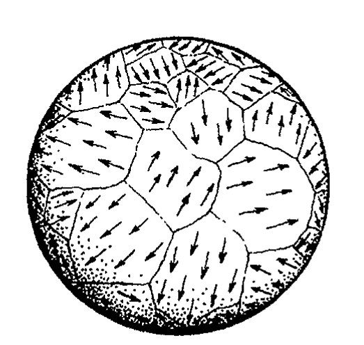
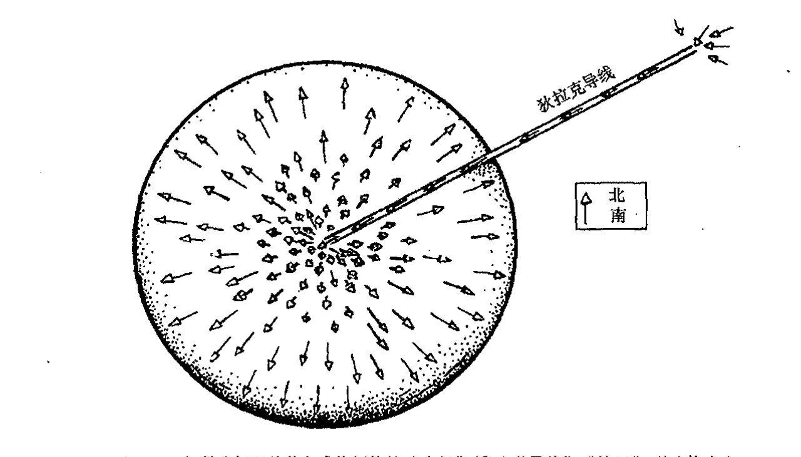
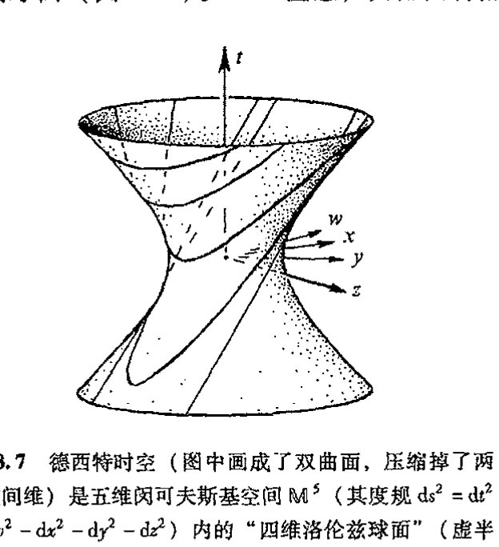
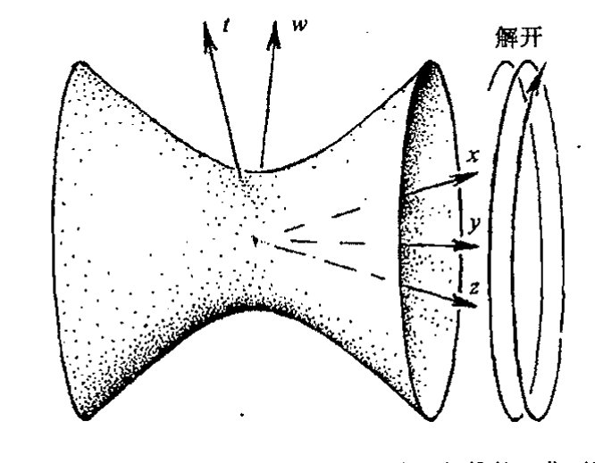
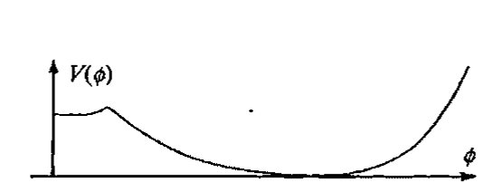
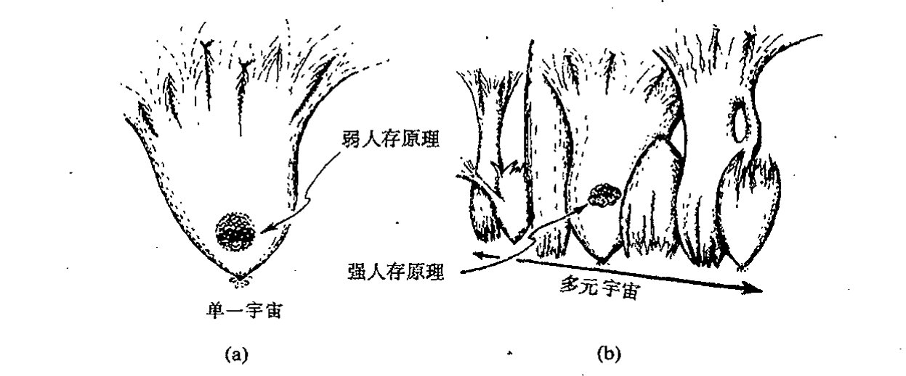
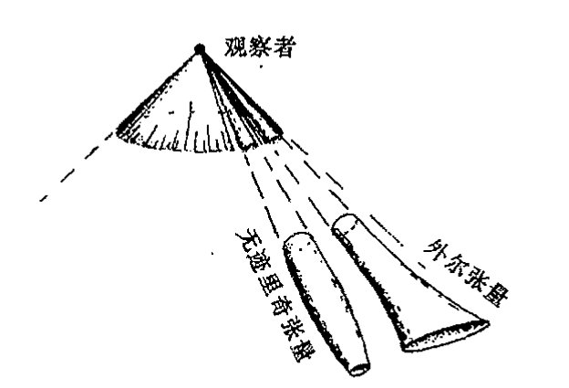

<!-- page 546 -->

第二十八章 早期宇宙的推测性理论

第二十八章

早期宇宙的推测性理论

## 28.1 早期宇宙的自发对称破缺

本书此前所述的都是已充分确立了的物理理论，大量的观测数据为那些经常看起来古怪的理论概念提供了强有力的支持。我的一些讨论所采取的方式往往不同于文献中常见的那样，但所述内容上并不存在争议。在本章，我将开始讲述些带有更多推测性的概念，它们与大爆炸的特殊性质所引发的问题有关。

具体地说，我将考虑的是暴胀宇宙学以及与宇宙早期的自发对称性破缺（[§25.5](chapter_25.md#255-电弱对称群)）有关的一些概念。熟悉宇宙学基本概念的读者可能会有所迷惑，我怎么会这么肯定地把暴胀宇宙学归于“推测性”学科。的确，流行的观点大都认为，宇宙的甚早期阶段曾经历了一段指数膨胀的时期，其膨胀指数约为 $10^{30}$，也可能是 $10^{60}$ 甚至更高，这已是公认的事实。另一些有识之士甚至可能对我将宇宙早期的自发对称性破缺这种一般现象看作是推测性的概念感到莫名其妙。但不管怎么说，我在这一章里要阐述的概念应当说都还没有得到观察上重要而明确的支持，我们有理由质疑这些概念是不是与大自然之间存在真正的联系。

让我们从自发对称性破缺这个一般性概念开始。我们知道，这个概念是构建重正化 QFT 的强有力手段，在（“隐性”）对称性研究方面，可重正化性质要比直接观察到的行为更具有优势。观察上没能得到完全对称性是因为系统的“真空态”选择所致，这种选择没有动力学理论的那种完全对称性。这一点特别构成了粒子物理标准模型里电弱部分的一个关键要素。此外，这种牵涉到各种可能的“真空”的概念也是宇宙暴胀的基本要素。这些自发对称性破缺概念和“伪真空”的概念经常被理论家们用来研究更大的统一理论。然而，我得说清楚，自发对称性破缺这个概念本身并不是一个思辩性的概念，它与各种真正的物理现象之间存在着确凿无疑的联系（超导就是一个绝好的例子）。这个概念经常以优美而令人信服的方式应用于各种已知现象。我对这个概念本身没有疑问。我担心的是，正是它的这种可人之处招致物理学家经常滥用，有时甚

·527·

<!-- page 547 -->

通向实在之路

至是被用在非常不合适的场合。

文献里经常用来形象地介绍自发对称性破缺概念的一个事例是铁磁现象。想象有这么一个球状的固态铁球。我们将它的原子看成是一个个的小磁体，由于力的关系，它们有一种彼此平行排列的趋势，有着共同的南/北取向。当温度升到足够高，即超过临界值 770℃（1043 K）时，原子剧烈的热运动就会打破这种顺磁取向的趋势，从大尺度上看，材料变得不显示任何磁性，各小原子磁体的取向呈完全随机排列。但只要温度低于 770℃（所谓“居里点”），则各原子又恢复平行排列的趋势，在理想情形下，铁块将被磁化。¹

现在，我们假定铁球最初被加热到超过 770℃（但还没高到融化的程度），即起初它是一个非磁化的球体。然后环境逐步冷却到临界温度 770℃以下。此时会发生什么呢？自然是球体处于一种极小能量态，原子的内部振动能被外界更冷的环境消耗掉。由于相邻原子间的相互作用，当所有原子按同方向排列时，就会出现极小能量状态，这时球变得磁化了，有确定的南/北极化取向。但这两个方向之间不存在谁比谁更占优势。极小能量态存在所谓简并性（比较 [§22.6](chapter_22.md#226-yesno-测量投影算符)）。起初加热了的未磁化态没有优势方向，最终的磁化方向也完全是随机确定的。这是一个自发对称破缺的例子：最初的球对称态降格为一种较小的对称态，即关于南北轴的旋转对称态。SO（3）对称态（即原初的热的未磁化球）演化为 SO(2) 对称态（冷下来的磁化球，这些符号的意义见 [§13.1](chapter_13.md#131-变换群)，2，3，8，10）。

737

用来描述这种情形的图像叫做“墨西哥帽”势，如[图 28.1](assets/page547_fig01.jpg)。这个“帽”代表了系统所有容许的态（环境温度降到零），帽的“高度”表示系统能量。我们发现，存在着由帽顶所代表的平衡态（即有水平切平面），它具有原始群的完全对称性——在图中，这个群表现为关于垂直轴的旋转。（这个 SO(2) 旋转对称性实际上就是铁球的 SO(3) 完全对称态，只是为了使图形具有可视性，我们少画了一个空间维。帽顶表示整个球的完全非磁化状态。）但这种平衡——非磁化态表现——是不稳定的，它不是可得的极小能量态。极小能量态是由帽的水平部分——整个圆周——帽檐内的那部分所代表的态（帽檐不同位置的点代表磁化铁球的不同极化方向）。

图 28.1 自发对称性破缺，它可用“墨西哥帽”势来表示，势的分布代表系统所有容许的态，帽的高度表示系统的能量大小。系统的态可用一个在帽的表面运动的玻璃小球来代表。当环境温度足够高（达到居里点）的时候，系统的平衡态由小球处于帽顶来表示，它具有完全的转动对称性（在这个简化了的图像里是 SO(2)）。当温度冷却时，小球滚落，最终到达帽檐上的任一平衡位置，这一过程破坏了完全的转动对称性。

我们可以这么来设想，最初态处于顶部，相当于“玻璃小球”最初置于顶端，表示先前的高温态。不稳定性意味着小球必将从顶点滚落下来（假定存在某种随机干扰影响）最终处于帽檐的某个静态位置。帽檐上的每个点表示铁球最终可能获得的不同的磁化方向。小球的位置表示最终的物理态。但由于转动的简并，因此对小球来说，不存在某个优势的降落位置，帽檐上所

·528·

<!-- page 548 -->

第二十八章 早期宇宙的推测性理论

有的平衡位置都是等权的。小球选择落在那个位置是随机的，这种选择一经做出，某个随机确定的方向上的对称性就破坏了。

这种环境温度下降导致材料的稳定平衡性质突然发生剧变的现象，叫做相变。对于我们所举的铁球的例子，相变发生在球从非磁化态（温度高于 770 ℃）到均匀磁化态（温度低于 770 ℃）的转变时刻。更熟悉的例子有结冰现象（温度降低时物质由液态转变为固态）以及相反的过程沸腾（温度升高时物质由液态转变为气态）。当温度下降时，相变经常伴随着对称性减少，但这不是本质的。

在 QFT 处理中，相变经常用真空态的新选择（像 [§26.11](chapter_26.md#2611-费恩曼图和真空选择) 里的 |θ⟩）来描述，它可以想象成态经"隧道"² 从一种真空转变为另一种真空。这种描述只能视为一种近似，但严格来说，由于不存在任何（幺正的）量子力学过程使态从一个区演变到另一个区（这里的"区"指可通过某种具体真空态 |0⟩ 的选择来确立的态，不同区里的态分属不同的希尔伯特空间；见 §§ 26.5, 11）。将一个实际情形下有限的系统近似为无限系统显然是个不错的主意。例如，人所共知的超导现象（温度足够低时电阻降到零）就可以这么来处理，超导性就是一种伴随着对称性减少（电磁的正常 U(1) 对称性遭破坏）的相变现象。

对于[图 28.1](assets/page547_fig01.jpg) 所示的具体例子，对称性从轴向转动群 SO(2) 破缺降为平凡群（"SO(1)"），后者只包含一个元素（故所有对称性都不复存在，在这个例子中，小球的静态位置完全不具有对称性）。³ 但这种"帽"的高维情形则显示出从 SO(p) 到 SO(p−1) 的对称性破缺，这里 p > 2。⁽²⁸˙¹⁾（铁球情形相当于 p = 3。）我们还可以用"墨西哥帽"图像来显示粒子物理标准模型中出现的 U(2) 到 U(1) 的破缺现象，⁽²⁸˙²⁾ 这里电弱对称性 U(2)（[§25.5](chapter_25.md#255-电弱对称群)）在温度 10¹⁶ K 时破缺为电磁的 U(1) 对称性，这种情形会出现在大爆炸后的 10⁻¹² 秒的瞬间。在更一般的 GUT 理论里（[§25.8](chapter_25.md#258-超越标准模型)），还包括诸如 SU(5) 这样的其他群，我们可以想象，在不同的温度下会出现不同水平的对称性破缺。因此，在温度高于 10¹⁶ K 时（即比大爆炸后 10⁻¹² 秒更早的时刻），可能首先是 SU(5) 破缺成某种适当的⁴ 既包含描述强相互作用的 SU(3) 又包含电弱理论所需的 SU(2) × U(1)/Z₂（即 U(2)）的状态。

## 28.2 宇宙的拓扑缺陷

但是，我们得记住，这种对称性破缺不像是"突然"发生的，而是出现像磁畴这样的对称

---

⁽²⁸˙¹⁾ 证明：形为 E = (x₁² + ⋯ + xₚ² − 1)² 的"帽子"展示了这种对称性破缺。

⁽²⁸˙²⁾ 在复坐标系 (w, z) 下，用作用到 ℂ² 的 U(2) 证明这一点，这里"帽子"取 E = (|w|² + |z|² − 1)² 形式。你能在 [§15.4](chapter_15.md#154-克利福德丛)、图 15.8 和 33.15 描述的 S³ 的克利福德平行线构形下看出这种对称性破缺的几何吗？

· 529 ·

<!-- page 549 -->

通向实在之路

性破缺成各个不同“方向”的情形。我们再来考察理想化铁球情形。可以预见，在球的不同地方，最初磁化方向的选取是随机的。如果冷却过程足够慢，那么这些非均匀性就可能“彼此抵消”，形成的是一种均匀的磁体。⁵但如果冷却过程足够快，这时我们将看到，形成的是一种如[图 28.2](assets/page549_fig01.jpg) 所示的方向“补丁”。各个单元的大小及其表现方式均依各处的冷却速率不同而千差万别。这里有一个各部分之间如何迅速“交换信息”的问题，也就是铁球某处的磁化方向如何在邻近区域的影响下迅速“转向”的问题。

更严重也更有趣的是那种所谓的拓扑缺陷，这是一种存在于球体内部的、无法通过磁化方向的连续调整而完全去除的缺陷。这种缺陷就是“狄拉克磁单极”（孤立的磁北极或磁南极）。但是这种磁单极不可能通过磁体的集合或电流产生于普通空间内。**[28.3] 如果我们容许磁荷沿着如[图 28.3](assets/page549_fig02.jpg) 所示的“狄拉克导线”进行“输运”，就有可能实现这种磁单极。如果磁荷容许出现在麦克斯韦理论（[§19.2](chapter_19.md#192-麦克斯韦电磁场理论)）中，则“导线”就只能以势 A（[§19.4](chapter_19.md#194-作为规范曲率的麦克斯韦场)）的形式存在，

图 28.2 按理想化过程，当铁磁体由居里点逐渐冷却下来时，其原子的磁化方向将取同一个（随机）方向。但在实际过程（或过快地冷却）中，我们得到的则是这样的磁化方向“补丁”。

图 28.3 如果我们以某种方式将额外的“南极”沿“磁导线”“输运”到球体中心，就有可能实现磁单极。如果麦克斯韦理论里容许出现磁荷，这种单极就可以植入球心，（狄拉克）“导线”只是作为势 A 的杂散信号出现。这种杂散信号可通过适当的“丛”的观点来消除（类似的单极也会出现在适当的非阿贝尔规范理论中）。

---
**[28.3] 利用第 19 章的积分表达式证明这一点。

??? question "答案 [28.3]"
    第 19 章的积分形式说明，引力源由能量动量张量的整体贡献决定。若把宇宙学常数项移到方程右边，它等效为 $T_{ab}^{(\Lambda)}=-(\Lambda/8\pi G)g_{ab}$。

    这个张量在每一点都只由度规给出，因此在所有方向和所有位置上形式相同；它对应均匀的真空能量密度与负压强，并在任意区域积分时都按体积成比例贡献。这就是它表现为处处相同“真空源”的原因。

·530·

<!-- page 550 -->

并采用适当的“丛”的观点（[§15.4](chapter_15.md#154-克利福德丛)）将它完全排除掉。适当的非阿贝尔规范理论中也会出现类似的单极。

自发对称性破缺图像中表现出的这些复杂性还与基本物理理论（如电弱理论或大统一理论）中更为深奥的那些机制有关，这些机制的存在根本依赖于自发破缺对称的概念。假如早期宇宙发生过自发对称性破缺，那么就有可能出现大尺度（宇宙学意义上）的拓扑缺陷。一般而言（就三维空间来说），存在 3 种基本的拓扑缺陷，其差别在于所属区域的维数不同，分别称作（宇宙）单极子（空间上 0 维的）、宇宙弦（空间上 1 维的）和畴壁（空间上 2 维的）。维数取决于相关群的拓扑性质。拓扑缺陷之所以严重就在于它们不可能通过对称破缺“方向”的连续调整来去除（这里我们认为，对缺陷本身，不存在明确定义的对称破缺方向，尽管这种方向的连续变化随处发生）。我们必须清楚，这里的“方向”概念不是指普通空间的方向，而是出现在所考虑的物理模型里的那种更为抽象的“方向”概念（例如，对于电弱理论，它是指电子/中微子混合的程度）。几何上看，我们可根据时空上的矢量丛（第 15 章）来思考。拓扑方法仍是可行的。如果说对称性破缺是基本物理理论的一部分的话，那么拓扑缺陷展示的则是一种我们无法“一笑了之”的严重问题。

的确，在宇观（比银河系更大的）尺度上，宇宙弦一直被认真当作那种导致星系形成的背景气体不均匀性的来源。⁶ 我们可将这种宇宙弦的引力场看成是由闵可夫斯基时空中的“剪刀加糨糊”过程形成的。就空间结构而言（见[图 28.4](assets/page550_fig01.jpg)），我们画出从三维空间切去的那个“部分”，它由夹角为 α 的一对半平面限定，角的顶端是弦本身。为了构造宇宙弦几何，这两个平面的表面重又“粘合”到一块儿。（在眼下这个模型里，α 约为 10⁻⁶。）

公允地说，读者也许会感到这些做法都是对诸如普通星系这样的“普通”对象的产物所施的极端做法。但只要星系形成问题仍存在理论上的困难，这些古怪的思想就不能轻易除去，尽管它们表面上让人觉得不能容忍。大概最合理的星系形成理论——它已获得某种重要的观测上的支持——是那种由超大质量黑洞“栽培”的理论，黑洞概念似乎已成为核心概念。⁷ 但在今天看来，黑洞已是一种常规概念而非古怪新颖的物理概念！

这些暗示性的拓扑缺陷大多来源于那些尚未获得重要而明确的观测支持的理论（像各种版本的大统一理论），因此我们必须留意这些理论对早期宇宙的过程究竟意味着什么。源于电弱理论中对称性破缺的宇宙单极子就是这样一些可能的拓扑缺陷，但它们不是必需的。它们可能源于 U(2) 到 U(1) 的自发对称性破缺，其前提是在理论的未破缺的 U(2) 对称相中已经存在所谓

图 28.4 宇宙弦的引力场可看成是四维闵可夫斯基空间中的“剪刀加糨糊”过程形成的。在三维空间内，由夹角为 α 的一对半平面限定的“部分”被切去，然后将这两个半平面“粘合”起来。

<!-- page 551 -->

通向实在之路

的“规范单极子”，而后者又只存在于 $10^{-12}$ 秒之前。这类单极子源于更大的大统一理论对称性的早期破缺，它们显然不是电弱理论中不可或缺的部分。⁸

这类规范单极子其实是电磁理论（阿贝尔规范理论）中狄拉克提出的“磁单极子”概念在杨–米尔斯（非阿贝尔规范）理论中的类比产物。经过独具创意的论证，狄拉克证明了，如果自然界存在单个的磁单极子（一种分离的磁北极或磁南极），那么所有电荷的取值就必须是某个特定值的整数倍，这个特定值的大小与磁单极子的磁场强度有关。事实上，目前的观察强烈表明，电荷的确是以某个特定值（譬如说反 d 夸克荷，其大小为质子的 $\frac{1}{3}$，见 [§3.5](chapter_03.md#35-物理世界里的离散数) 和 [§25.6](chapter_25.md#256-强相互作用粒子)）的整数倍形式存在的。一些人就拿这一点当作磁单极子真实存在的旁证。但不管怎样，只要这种单极子不与观察构成严重冲突，它们就可以是某种特别罕见的存在。⁹（此外，它们还有“短路”宇宙磁场的作用，而这种磁场大尺度宇宙范围已被观测到。）类似地，如果目前这个宇宙中明显存在杨–米尔斯单极子的话，它们必定与观察结果发生严重冲突。不久我们就将看到，这个问题已经从根本上牵连到宇宙学的发展！

## 28.3 早期宇宙的对称性破缺问题

在阐述这一问题之前，我们不妨再考察一下电弱理论中的对称性破缺问题，前面说过，它发生在大爆炸后约 $10^{-12}$ 秒时刻。我们必须将它当作真实的现象来接受吗？抑或它仅仅是理论的特定产物？就我所知，大多数电弱理论学家都肯定地认为这一过程是一种真实的存在。因此从这里读者可以看出，我在此质疑这一现象的真实性是站在了异端的立场上。不管怎样，还是让我们奋力前行，去思考根植于对称性破缺概念的那些困难吧。

743

我们假定（这与我自己对这一问题的观点不同），宇宙早期历史上的确存在过这么一段时间——在大爆炸后约 $10^{-12}$ 秒之前——此时 U(2) 对称性严格成立，轻子和夸克均无质量，“zig”电子和中微子彼此地位相同，W 和 Z 玻色子与光子能够根据 U(2) 对称性适当地“转动”构成彼此的复合态（[§25.5](chapter_25.md#255-电弱对称群)）。于是，在 $10^{-12}$ 秒时刻，整个宇宙的温度恰好降到了临界值。此刻，大自然从规范玻色子的各种可能组合构成的整个 U(2) 对称流形 $\mathcal{G}$ 中随机地选择了 $(W^-, W^+, Z^0, \gamma)$。我们不期望这种选择会在整个空间上完全均匀地同步发生。我们期望的是，这种选择，正如[图 28.2](assets/page549_fig01.jpg) 所展示的铁球内的磁畴那样，在某处是一种选择，在另一处则是另一种选择。

现在，我们要问，文中“相同”和“不同”的含义是什么？在对称性减少发生前的每个时空点上，可能的规范玻色子的空间 $\mathcal{G}$ 是完全 U(2) 对称的。正如丛概念所内禀的那样，在一点上的 $\mathcal{G}$ 与另一点上的 $\mathcal{G}$ 之间的叠合方式上，不存在任何占优势的特定方式。因此不可能存在某种优先的规则来告诉我们，某点的 $\mathcal{G}$ 的哪个元素可称得上与另一点的 $\mathcal{G}$ 的某个元素是“相同的”。这倒给了我们选择某种立场的自由，我们可以简单地将“相同”的概念定义为由自发对称

· 532 ·

<!-- page 552 -->

性破缺造成的特定选择所带来的那种情形。按照这样一种观点，在某一点“冻结”出的特定的 $(W^-, W^+, Z^0, \gamma)$ 与另一点上相应的 $(W^-, W^+, Z^0, \gamma)$ 是等同的，因此，我们没有证据说，像[图 28.2](assets/page549_fig01.jpg) 所示的铁球磁畴的不同位置上出现的对称性破缺缺乏“不协调性”。

然而，这种观点在规范理论的概念面前消失得无影无踪，按照规范理论，不仅 $\mathcal{G}$ 空间是纤维丛 $\mathcal{B}_\mathcal{G}$（其底空间为时空 $\mathcal{M}$）的纤维，而且这种特殊的规范理论——在此就是完整的电弱理论——也是按丛的联络来定义的（§§ 15.7, 8）。这个联络将各 $\mathcal{G}$ 空间之间局部有效叠合（平行化）规定为我们沿 $\mathcal{M}$ 的任一给定曲线的运动。^10^ 一般来说，这种叠合总体上与我们沿闭曲线的运动并不一致（这是由于联络存在曲率，它表示存在非平凡的规范场，见 [§15.8](chapter_15.md#158-丛曲率)）。但不管怎样，不同位置上对称性破缺的随机性隐含着这样的意义：$\mathcal{G}$ 空间之间的局部平行化一般不会与自发对称性破缺的选择相一致，因此，[图 28.2](assets/page549_fig01.jpg) 的图像并不是一种合适的类比。我们可以想象一下，正像铁球冷却得足够慢，从而在足够长的时间里这种不一致将被“熨平”一样，这里可以假定不存在拓扑缺陷（就像[图 28.3](assets/page549_fig02.jpg) 和[图 28.4](assets/page550_fig01.jpg) 所显示的那样）。我要提出的问题是，对于电弱理论的自发对称破缺情形，是否也存在这样的“足够长”时间？

这个困难与 [§27.12](chapter_27.md#2712-共形图) 里[图 27.18](assets/page539_fig02.jpg)（b）的粒子视界有关。我们来看一下[图 28.5](assets/page552_fig01.jpg) 示意性的共形图。处于 $p$ 点的观察者在两个相反的方向上看到类星体（参见 [§27.9](chapter_27.md#279-事件视界与时空奇点)）分别处于 $q$ 点和 $r$ 点。按照标准的 FLRW 模型，如果类星体的红移^11^（[§27.7](chapter_27.md#277-大爆炸的角色)）足够大，那么 $p$ 和 $q$ 的过去光锥将不会彼此相交，它们之间也不会发生任何信息交流。既然彼此间没有交流，当然也就没有时间来“熨平”与此相一致的二者间的对称性破缺。一会儿我们还将考察这个“暴胀模型”，它在共形图上后推到大爆炸线，由此使 $q$ 和 $r$ 之间存在“交流”。但这无助于问题的解决，因为发生电弱对称

图 28.5 示意性的共形图展示了早期宇宙的因果相关性（独立性）。（a）$p$ 点的观察者在反方向上看见类星体分别处于 $q$ 点和 $r$ 点。如果虚线代表的是时间 $10^{-11}$ 秒时的三维曲面 $\Sigma$，且在此之前 U(2) 电弱对称性（光子 $\gamma$ 与 W 和 Z 玻色子有关联）被认为是破缺的，则 $\gamma$ 在 $q$ 点的“冻结”选择几乎肯定不同于在 $r$ 点的选择，$q$ 的过去与 $\Sigma$ 的截面和 $r$ 点的过去与 $\Sigma$ 的截面不相交；这样，在 $p$ 点之前，$\gamma$ 在两处分别做出的选择是无法交流的。同样，如果现在 $\Sigma$ 代表的是 $10^{-13}$ 秒时的退耦，$u$ 点和 $v$ 点的温度也不可能通过热能化使之相等，因为它们的过去完全不相交。（b）后者的“视界问题”的暴胀“解决方案”是将大爆炸时间向前推，使得 $q$ 点和 $r$ 点的过去在后退至大爆炸三维曲面之前相交。但前一个问题仍不能解决，因为二者过去的相交在时间上要早于 $10^{-11}$ 秒的“冻结”时间。

· 533 ·

<!-- page 553 -->

通向实在之路

745 性破缺的三维曲面 Σ 在当前的因果考虑中有效地扮演了大爆炸的角色，而自发的对称性破缺被认为是随机地发生在三维曲面 Σ 上，没有通常意义上的那种因果影响。

现在，线 *qp* 和 *rp* 都是零线，故只有光子而非 W 或 Z 玻色子能够从 *q* 跑到 *p* 或从 *r* 到 *p*——光子是规范玻色子家族中唯一的无质量成员。因此，沿这两条零线，我们一定能够得到有关光子是什么的统一概念。*q* 点的“光子”概念（在上述意义上）很可能与 *r* 点的“光子”概念不统一，因为两点中的每一点都是随机选取的，二者间不存在通常意义上的因果关系，也没有时间用于信息交流。¹² “不同”种类的光子能够及时“熨平”以使 *p* 点的观察者在接收到 W−Z−γ 时不致糊涂吗？在 *q* 到 *p* 之间和 *r* 到 *p* 之间缺少有意义的直接零（即“类光的”）联络的情形下，我看不出如何能做到这一点。这会导致与下述经验事实的严重冲突：我们能够通过光学望远镜清楚地看到遥远的星体。在我看来，这里存在着与观察极其不协调的危险，虽然我还没有从文献中看到对此的讨论。

但毫无疑问，一些读者会抱怨（也许是低声嘀咕）说我显然忽略了所有支持电弱理论的那些令人印象深刻的观察事实。请放心，我不会仅仅因为对宇宙学距离上出现的现象感到迷惑就对所有这些事实弃之不顾！绝对不会。我决不会提议我们应当丢弃电弱理论的那种本质优美的洞察力，我只是爱用一种稍与众不同的观点来看待 U(2) 对称性的破缺。正如我看到的，大自然真实的粒子物理图景还没有充分暴露。这样一种图景应当是数学上协调的，没有当今 QFT 所具有的那种坏习惯，对诸多合理的物理问题动不动就抛出“∞”作为答案。为什么这个（仍未可知的）“正确”理论给出的是有限的答案，这一点至今仍不清楚。因此我们不得不求助于各种“技巧”来得到与观察事实相吻合的有限的答案，这些“技巧”经常会以历史机遇和人类超凡智慧相结合的方式光顾我们。按我们目前的理解，我们当然希望有一种能够重正化的电弱相互作用理论，它不仅具有破缺的非阿贝尔规范对称性提供的通往重正化理论的道路的见解，而且具有这么做的强制力，这种力量一直在引导我们去接近那些深刻的真理，就是说，这些相互作用将

746 整合成更为广阔图景的一部分。但我看不出为什么在粒子物理里，自发破缺对称性有必要成为大自然的真实过程。的确还存在其他方式来看待为可重正化要求提供所需的电弱理论参数的关系。¹³

这就提出了一个重要问题（在 [§34.8](chapter_34.md#348-通向实在的漫长的数学之路) 我还将回到这上来）：在探索大自然秘密的各种见解中盛行的对称性概念，真的像它自诩的那样起着基础性作用吗？我看不出为什么这种需要总是那么强烈。不必对我强调说，就基本物理理论而言，将粒子物理建立在某个大对称群（这是大统一理论哲学的一部分）上是一种真正“简单的”图景。在我看来，大的几何对称群是复杂而不是简单的事情。自然定律里固有的基本对称性同样如此，我们看到的对称性经常只是由于我们没能坚持在最基本层面上进行研究而导致的近似特征。以后（[§34.8](chapter_34.md#348-通向实在的漫长的数学之路)）我还将回到这个问题上来。

· 534 ·

<!-- page 554 -->

第二十八章 早期宇宙的推测性理论

## 28.4 暴胀宇宙学

让我们回到宇宙单极子问题上来，其多产性是某些大统一理论的一个特征。这些单极子的麻烦在于其实际存在缺少显示度。更糟糕的是，对这种宇宙间丰富的单极子，观察上存在非常苛刻的限定条件，它比大统一理论预言的水平要低得多。但1981年，阿兰·古斯（Alan Guth，1947~）提出了一项"非凡的"理论（实质上看，此前斯塔罗宾斯基（Alexei Starobinski）和佐藤克彦（Katsuoko Sato）分别独立提出过）：如果宇宙在单极子产生后的某个时期经历了指数为$10^{30}$甚至$10^{60}$或更高的膨胀期（虽然此前电弱对称性已在$10^{-12}$秒时刻破缺），那么就观察要求来说，这些不招人待见的单极子现在就稀疏得很难捕捉到了。

此后不久，人们认识到，这种极端指数化膨胀的"暴胀期"还可以用作其他方面的考虑，并且与宇宙的均匀性有关。正如第27章强调的，宇宙的确是极其均匀的，在很大的空间尺度上呈平直形态，这曾使宇宙学家们大惑不解。例如，观察到的早期宇宙的温度在各不同方向上几乎完全相同（至少在$10^{-5}$的精度上如此）。这可以看成是甚早期宇宙"热能化"的结果，但这只有在宇宙各处间存在彼此"交流"才有可能。（回想一下，作为趋向热力学平衡过程的要素，热力学第二定律是怎么使不同地方的气体温度均等的，见[§27.2](chapter_27.md#272-亚微观成分)。）但检验图28.5(a)即可知道，从我们在时空中的位置$p$观察到的相距遥远的两点$u$和$v$上的温度相等，不可能是传统宇宙学模型下热能化的结果，因为点$u$和$v$之间的距离太过遥远以致在标准模型下不存在因果联系（这里我们将观察事件取在"退相关"时间，此时宇宙黑洞辐射已经形成）。

在标准模型下不存在热能化所要求的因果联系，这一点涉及到视界问题。从视界的角度看，暴胀期的效应可由图28.5(b)的共形图来描述。表示大爆炸的类空三维曲面现在被移到"早"得多的位置上，这样，$u$和$v$的过去在后退至表示大爆炸的三维曲面之前是相交的，因此热能化就有机会实现，由此我们可以认为，$u$和$v$的温度相等就是通过这种方式实现的。

暴胀期学说带来的另一个眼见的好处，是它能够为物质分布和时空几何的明显的均匀性提供解释，这一点涉及平滑问题。联系到暴胀，这个概念是说，宇宙的初态局部上可能是非常不规则的，但暴胀期宇宙的急速膨胀能够"熨平"这些褶皱，因此我们可望得到的是一个接近FLRW的宇宙。暴胀的观点认为，甚至"一般的"初态在小尺度上看起来也像是光滑的流形。我们看到，在暴胀期，这个纤细平滑的部分膨胀成宇宙学尺度——空间的平直性似乎就是这么来的，见图28.6（并与图12.6比较）。稍后我再介绍我对这个超凡见解的看法。眼下值得指出的是，在这个图像中，宇宙不仅是均匀的，而且具有零空间曲率（$K=0$）。正如我们将看到的，这一点对宇宙学的历史发展起着重要作用。但可观察的宇宙平均来看是否真的是空间平直的？它确实非常近似于所描述的那个样子？这些一直都是许多宇宙学家心中的谜团——所涉的问题叫做平直性问题。

·535·

<!-- page 555 -->

通向实在之路

像[图 28.5](assets/page552_fig01.jpg) 描述的膨胀的暴胀期必须通过共形图上大爆炸的类空三维曲面向更早推移来表现这样的事情不是一眼就能看穿的。它对于检验基于“暴胀期”的宇宙学模型富于启发性。这个模型就是“稳态”型的德西特（de Sitter）空间。数学上描述德西特空间最简便的方法就是称它为五维闵可夫斯基空间（符号差 + − − − −）内的四维洛伦兹球面（符号差 + − − −）。这种描述是按照 [§18.4](chapter_18.md#184-闵可夫斯基空间的双曲几何) 的几何“符号差跳变”概念进行的，但如果我们用[图 28.7](assets/page555_fig02.jpg) 的双曲面来描述德西特空间，几何上可能更清楚。这里有必要提及另一个模型，叫反德西特空间，它是符号差为 + + − − − 的五维伪闵可夫斯基空间内的四维洛伦兹球面（[图 28.8](assets/page556_fig01.jpg)）。**[28.4]** 注意，反德西特空间不是一个物理上可感知的时空，因为它有（违反因果律的）闭类时曲线（例如 $t$ 轴和 $w$ 轴张成的平面上的圆），见 [§17.9](chapter_17.md#179-爱因斯坦广义相对论的时空) 和[图 17.18](assets/page313_fig02.jpg)。有时，“反德西特空间”指的是“伸展开的”空间，其中常数 $(x, y, z)$ 平面上的每个圆都被展成线，整个空间变成是单连通的（[§12.1](chapter_12.md#121-为什么要研究高维流形)）。[图 28.9](assets/page556_fig02.jpg)（a）是我画的一个严格共形的德西特空间图，其中表示稳态模型的部分见[图 28.9](assets/page556_fig02.jpg)（b）（虚线段表示被切去）。违反因果律的反德西特空间见[图 28.9](assets/page556_fig02.jpg)（c）（其中图的上、下部分必须叠合）和 28.9（d），伸展开的（因果性的）反德西特空间见[图 28.9](assets/page556_fig02.jpg)（b）。

为了得到明确的稳态宇宙，我们沿 $t = w$ 四维平面将德西特空间“切成”两半，只保留“上”半部分。^{14} 奇妙的是，虽然因为切口（[图 28.10](assets/page557_fig01.jpg)（b）中的点画线）模型中存在“不完备性”，但这种不完备性通常不作缺陷考虑，因为实际粒子不会从“切去”的下半部分进入时空。上半部分的度规可重写如下：

---

**[28.4]** 用[图 28.8](assets/page556_fig01.jpg) 和[图 28.9](assets/page556_fig02.jpg) 显示的坐标 $t, w, x, y, z$，明确写出五维背景空间内的四维德西特空间和反德西特空间的方程。找出德西特空间“一半”的坐标，以便其内部度规取下节给出的“稳态”形式。

??? question "答案 [28.4]"
    对德西特空间，可在五维平直空间中写为 $t^2-w^2-x^2-y^2-z^2=-\alpha^2$，等价地在符号约定改变时写成 $-t^2+w^2+x^2+y^2+z^2=\alpha^2$。反德西特空间需要两个时间方向，可写为 $t^2+w^2-x^2-y^2-z^2=\alpha^2$，具体整体正负号取决于背景度规约定。

    德西特“一半”的稳态坐标可取平坦切片形式 $ds^2=d\tau^2-e^{2H\tau}(dx^2+dy^2+dz^2)$，其中 $H=1/\alpha$。这些坐标只覆盖完整德西特双曲面的一半，即膨胀平坦补丁。

---

· 536 ·

<!-- page 556 -->

第二十八章 早期宇宙的推测性理论

**图 28.8** 反德西特时空（图中画出的是压缩掉了两个空间维的双曲面）是五维伪闵可夫斯基空间（度规 $ds^2 = dt^2 + dw^2 - dx^2 - dy^2 - dz^2$）内的"四维洛伦兹球面"（正半径，内度规符号差 $+---$）。由定义知，我们有闭类时曲线，但这些曲线可通过 $(t, w)$ 平面内无限"解缠绕"来去除。

**图 28.9** 下述空间的严格共形图（按图 27.16(a)的约定）：(a) 德西特空间，内虚线上部区域给出稳态模型；(b) 反德西特空间（完全解缠型，不破坏因果律）；(c) 初态因果破坏了的"双曲"型反德西特空间，顶和底边未粘合。(d) 同 (c) 但顶和底边被粘合，因此图形看起来像个圆柱。

$$ds^2 = d\tau^2 - e^{A\tau}(dx^2 + dy^2 + dz^2),$$

（其中 $A$ 是常数），它是 [§27.11](chapter_27.md#2711-宇宙学) 给出的 FLRW 度规的一个特例，具有 $K=0$ 的平直空间区域和指数型膨胀（因子 $e^{A\tau}$）。***[28.5]（这个度规在 20 世纪 50~60 年代特别受宠，当时赫尔曼·邦迪、托马斯·戈尔德和弗雷德·霍伊尔强烈支持它作为真实宇宙的模型——那种具有相当美学意味的"稳态"模型。60 年代后，它开始失宠，因为事实已很清楚，这个模型与观察结果相矛盾，特别是与微波背景的测量结果和对遥远星系的计算结果相抵触。）

---

*** [28.5] 找出 FLRW 型 $ds^2 = dt^2 - (R(t))^2 d\Sigma^2$ 的德西特和反德西特空间的度规形式，这里 $d\Sigma^2$ 是按练习 [27.18] 的第二个表达式给出的三维抛物线双曲度规。它包含了全部（反）德西特空间的哪一部分？

??? question "答案 [28.5]"
    对德西特空间，开切片可写为 $ds^2=dt^2-\alpha^2\sinh^2(t/\alpha)d\Sigma_{H^3}^2$，其中 $d\Sigma_{H^3}^2$ 是单位三维双曲空间度规。它覆盖的是德西特空间中由一个类时方向未来可达的开 FLRW 补丁，而不是整个全局双曲面。

    反德西特空间也可作类似 FLRW 型切片，但尺度因子用三角函数形式，例如 $R(t)=\alpha\sin(t/\alpha)$，覆盖区域受限。由于反德西特空间有类时边界和周期性时间问题，这类坐标通常只覆盖一个楔形或补丁区域。

· 537 ·

<!-- page 557 -->

通向实在之路

（反）德西特空间的里奇张量 $R_{ab}$ 正比于度规 $g_{ab}$。**[28.6]**（这个张量的定义，以及爱因斯坦场方程等等见 [§19.6](chapter_19.md#196-爱因斯坦场方程)。）爱因斯坦场方程的初始形式为 $R_{ab}-\frac{1}{2}Rg_{ab}=-8\pi GT_{ab}$，它断言，物质的能量动量张量为 $-(8\pi G)^{-1}$ 乘以反迹的里奇张量。因此，对德西特和反德西特模型，"物质张量" $T_{ab}$ 本身必正比于度规张量。事实上，没有任何通常物质能够具有这种属性（例如，因为其能量动量在静系下无定义）。一般是将（反）德西特空间当作表示无物质的真空，其中爱因斯坦方程必须取包含宇宙学常数 $\Lambda$ 的形式，这样，场方程现在写成

$$R_{ab}=\Lambda g_{ab},$$

这里 $\Lambda=A^2$，$A$ 是度量上述稳态度规中指数增长因子的常数。在暴胀宇宙学情形，暴胀的"材料"取为"伪真空"，这一点一会儿我还会仔细论述。

为了构造暴胀宇宙模型，我们在常数 $\tau$ 的两个三维曲面之间取稳态宇宙部分，并把它贴到标准的 $K=0$ 的 FLRW 模型的两个部分上。这个过程见[图 28.10](assets/page557_fig01.jpg)。在[图 28.10](assets/page557_fig01.jpg)（a），整个德西特空间被剪开以得到稳态模型；在[图 28.10](assets/page557_fig01.jpg)（b），稳态模型中很大的暴胀部分被选出；在[图 28.10](assets/page557_fig01.jpg)（c），从 $K=0$ 的 FLRW 模型上剪下一块，这样，空出的地方可贴上暴胀部分以完成整个模型，见[图 28.10](assets/page557_fig01.jpg)（d）。贴上去的暴胀部分有效地（从原共形位置）"后移"了大爆炸，因此粒子视界大大地扩展了，见[图 28.5](assets/page552_fig01.jpg)（b）。

**图 28.10** 构建暴胀宇宙模型的流程。（a）从德西特空间剪出稳态模型；（b）从剪出的稳态模型部分中再剪出两个常数时间线之间大块的暴胀部分；（c）从 $K=0$ 的 FLRW 模型中剪去小的常数时间部分；（d）将（b）中剪出的暴胀部分贴到（c）中留出的空白处，这样就得到了暴胀宇宙模型。如同图 28.5（b）所示，它将大爆炸的时间推向更早。

为了实现这个暴胀期，有必要引入一个新的标量场 $\varphi$ 到已知的（且是推测性的）物理粒子/场的大家族里来。就我所知，这个场 $\varphi$ 并不与其他任何已知的物理场有直接联系，其引入仅仅是为了得到早期宇宙的暴胀阶段。它有时称为"希格斯"场，但似乎不是那种与电弱理论（[§25.5](chapter_25.md#255-电弱对称群)）有关的"普通"场。一些模型要求不止一个分立的暴胀期，在此情形下，必须为每个暴胀期配一个不同的标量场。暴胀过程可根据类似[图 28.1](assets/page547_fig01.jpg) 的"墨西哥帽"的图像来描述，但它

---

**[28.6]** 不作确认和计算，你能看出为什么一定是这样吗？

??? question "答案 [28.6]"
    德西特和反德西特空间是最大对称空间，任一点和任一方向在其对称群作用下都没有可区分的几何特征。这样的空间中，任何由曲率构造出的二阶对称张量都不能选出特殊方向，只能与度规张量成正比。

    因而里奇张量必有形式 $R_{ab}=\lambda g_{ab}$。把这个形式代入爱因斯坦方程，得到的能量动量张量也只能与 $g_{ab}$ 成正比，这正是宇宙学常数项的张量结构。

· 538 ·

<!-- page 558 -->

第二十八章　早期宇宙的推测性理论

没有初始对称性。经常用的示意图如[图 28.11](assets/page558_fig01.jpg)。其中垂直轴表示“等效能量”。由图可见，在暴胀期之前，态——即[图 28.1](assets/page547_fig01.jpg) 中的“玻璃小球”——由处于驼峰顶部的小球来表示，然后它逐渐滚下。暴胀就发生在“小球”滚下来的过程中，当“小球”到达底部，暴胀停止。在暴胀期间，我们有一个“伪真空”区域，它表示一种到不同于我们今天所熟悉的那种真空的量子力学相变。

图 28.11　按照暴胀模型，甚早期宇宙的等效能量密度可能由标量“暴胀”量子场 φ 的等效势 V(φ) 决定。图中显示了 V(φ) 的一种通常所假定的形式，其中暴胀被认为以（图 28.1 里的玻璃小球）“滚”下左面山坡的形态出现。小球到达底部暴胀停止。

正如 [§27.11](chapter_27.md#2711-宇宙学) 所说，现在有很好的证据表明我们目前所处的阶段有正的 Λ，但按通常理解，这个量极其小，差不多只相当于水的密度的 10⁻³⁰。相比之下，暴胀阶段伪真空的有效 Λ 则相当于超过水密度的 10⁸⁰ 倍。这个量完全主宰了普通物质的能量动量张量，也正是因为这个原因，德西特模型才能够被用于这个阶段。

在[图 28.12](assets/page558_fig02.jpg)，我展示了人们经常谈论的甚早期宇宙史的图景，它现在差不多已成了“标准图景”。注意，这里时间和距离单位取的都是以 10 为底的“对数”单位（就像[图 5.6](assets/page080_fig01.jpg) 的计算尺），时间（垂直轴）的量纲为秒，距离（水平轴）的量纲为厘米。“半径”代表 [§27.11](chapter_27.md#2711-宇宙学) 的“R(t)”的历史（千万别和 [§19.6](chapter_19.md#196-爱因斯坦场方程) 的标量曲率“R”混淆了）。按我的观点，这个图景中直到十分之一秒的情形都必须看成是带有非常强的推测成分，虽然它经常被当作几乎已确立的事实对待！

图 28.12　目前公认的“宇宙史”的双对数图 logR(t) 对 logt)，其中包括了暴胀阶段。

---

## 28.5　暴胀的动机有效吗？

让我们相信这样一种宇宙的暴胀图像很可能接近事实真相的理由是什么呢？尽管它非常流行，但我仍愿意谈谈我对这一整套概念感到非常怀疑的理由！我还得再次向读者提出忠告。暴胀宇宙学已经变成现代宇宙学思想的主要部分。你会发现，甚至在那些并不看好暴胀的必要性的学者那里，也很少有人像我这样持否定态度。如果你感到需要用某种更偏爱暴胀概念的材料来“平衡”我的观点，请见阿兰·古斯的《暴胀的宇宙》一书。¹⁵从我这方面说，我必须按我看到的来陈述，既然我相信自己有充分的理由怀疑爆胀宇宙学的基础，我就不能克制自己不将这些道理传递给读者。

但在进行批评性评估之前，我要申明，我的评论不是要告诉你暴胀宇宙学错了。我只是给出

· 539 ·

<!-- page 559 -->

通向实在之路

强有力的理由来说明对暴胀概念背后的那些初始动机的怀疑。我们可以回忆一下，过去许多重要的科学思想都是基于（或部分基于）一些实质上站不住脚的动机之上的。其中最重要的当属爱因斯坦对马赫原理的明显的依赖关系，这条原理指导他最终发现了广义相对论。马赫原理认为，物理学应当完全定义在一物对它物的关系上，背景空间的概念应当抛弃。^16^ 后来，爱因斯坦的理论分析证明，马赫原理并不适用于广义相对论，^17^ 但这与马赫思想的动机的重要性无关。^18^ 另一个例子是狄拉克对电子波函数的发现，这一发现基本上是基于他认为一阶方程是必要的这一事实（见 §§ 24.5, 6）。后来按量子场论的理解，这一要求不是必要的（[§26.6](chapter_26.md#266-相互作用拉格朗日量和路径积分)）。

类似地，如果暴胀宇宙学的观察预言被有力地证实，那么初始动机的不足之处似乎就不重要了，理论不需要原初古斯和其他人赖以提出这一理论的"梯子"就可以靠自身站立起来。事实上，暴胀宇宙学家做出过一些明确的预言，最近几年，这些预言已被验证与许多新的观察事实明显相左。

我相信，对比其他科学，在宇宙学问题上我们需要格外小心，尤其是关系到宇宙起源的方面。人们常常对宇宙起源问题抱有强烈的感情色彩——这些问题有时还间接或直接与宗教信仰纠缠在一起。这是很自然的事情，因为这些问题也是我们赖以生存的整个世界的起源问题。正如 [§27.13](chapter_27.md#2713-异乎寻常的特殊大爆炸) 强调的，根据第二定律，宇宙是以超常的精确度按大爆炸的方式开始的，而这一点毫无疑问将是一个影响深远的谜团。我们要问：我们可以从未来的科学理论中找到解开这个大爆炸精确性谜团的答案吗，即使这种理论可能是我们今天无法理解的？（这基本上就是我的乐观态度，见 §§ 30.10~13。）抑或我们必须放弃努力，将它归属于某种"上帝之举"？暴胀宇宙学家的观点不同，他们认为这个问题实质上可由暴胀理论来"解决"，这种信念成为暴胀学说背后强有力的推动力。但是我从未看到暴胀宇宙学家认真提出过什么有影响的基于第二定律的问题！

暴胀物理学家倒是提出了宇宙学标准模型里的 3 个特殊问题，这些问题都与早期宇宙的初始时刻的精度有关。它们已在 [§28.4](chapter_28.md#284-暴胀宇宙学) 专门论述过，即视界问题、平滑问题和平直性问题。在标准模型里，这些问题需随初始大爆炸状态的"微调"而定，这在暴胀物理学家看来是个"耻辱"。他们声称，在暴胀图像中，这种初态的微调是不必要的，它应该是一种美学上赏心悦目的物理图像。从美学观点看，暴胀带来的整个空间的平直性结论同样是一个积极的方面。^19

我认为，这样一种基于美学的讨论需要十分小心。实际上，一些对暴胀图像来说是至关重要的因素在美学上是很成问题的，像标量场（可能还是几种独立的标量场，如果暴胀过程不止一次的话）的引入就属这种情况，这种标量场与其他已知的物理场没有任何联系，其引入的唯一目的就是为了使暴胀成为可能。另外，美学上对 $K=0$ 的偏爱也显得十分做作。我知道许多数学家（也包括我自己）就更偏好双曲情形（$K<0$）！而另一些人则更喜欢空间有限（$K>0$）的宇宙。我们将在本书的后面部分（[§34.9](chapter_34.md#349-美和奇迹)）对美在基本理论物理方面的引导作用进行一般性讨论，具体来说，有关暴胀的进一步讨论见 [§34.4](chapter_34.md#344-错误理论能被实验驳倒吗)，有关科学风尚的议题见 [§34.3](chapter_34.md#343-物理理论中时尚的作用)。在当代宇宙学家看来，暴胀无疑是风头最劲的了，审视这种强势地位在多大程度上需要调整是重要的。

· 540 ·

<!-- page 560 -->

第二十八章 早期宇宙的推测性理论

如上所述，我对宇宙暴胀论的异议主要是在其背后的基本动机方面。我们先来考虑视界问题，看看这个问题是如何关联到暴胀宇宙学的。例如，各方向上几乎完全相等的背景温度让人感到它是热能化的结果。暴胀的出现就是要去除粒子视界，否则粒子视界将排斥这种热能化。

然而，在试图解释起因于热能化过程的早期宇宙均匀性方面（[§28.4](#284-暴胀宇宙学)），就是说，在背景温度、物质密度或时空几何是否真的是均匀的这一点上，还存在某些根本性的误解，试图解释清楚为什么宇宙在涉及热能化过程的任何方面总显得特殊，这的确是一种根本性的误解。因为如果热能化真的能解决任何问题（像使各处温度变得比之前更均匀），那么它说明熵毫无疑问将增大（[§27.2](chapter_27.md#272-亚微观成分)）。因此，宇宙在热能化之前应比之后更特殊。这只会使我们在理解宇宙初期的那种超凡的特异性质方面（[§27.13](chapter_27.md#2713-异乎寻常的特殊大爆炸)）变得更加困难。早期宇宙的这种怪异的约束态一定与某些未知之谜有着深刻联系。但正如我们在第27章强调的，这些约束是热力学第二定律存在的基础。我们不能指望仅通过张扬第二定律（热能化就是一例）就能够解释这些约束！

为了更详细地说明这一点，现在我们来考虑我们在宇宙中这个特定位置上观察到的各方向上的温度相等问题。假定在早期宇宙的某个时刻 $t_1$，相距遥远的两个地方的温度的确是相等的，并且我们发现了这个"特殊"的谜团。让我们考虑两种可能性。我们可以设想，（a）在更早的某个时刻 $t_0$，温度实际上并不相等，只是在 $t_0$ 和 $t_1$ 之间的热能化过程发生之后才变得相等；（b）在更早的某个时刻 $t_0$，温度实际上彼此相等，不存在热能化过程。在情形（a），$t_0$ 和 $t_1$ 之间的时间段内必存在熵增，因此我们将发现，$t_0$ 时刻的热力学状态比 $t_1$ 时刻的状态更加特殊，这样，宇宙在 $t_0$ 时刻的特定性质将比 $t_1$ 时刻的性质更令我们困惑。问题不是趋于解决，而是变得恶化了。而在情形（b），宇宙在 $t_0$ 时刻的特定性质至少不比 $t_1$ 时刻的性质更令我们困惑。无论哪一种情形，我们都不能解释为什么宇宙在某方面会显得如此特殊，而且我们看到，对解决这一特殊问题来说，求助于热能化的论证只会更糟！

那么宇宙的均匀性（和平直性）又如何呢？在这个问题上，主流的暴胀观点是不同的。这种观点认为，暴胀阶段的指数化扩张给宇宙带来了这种均匀性（和空间平直性）。这也是一种根本性的无解。这种观点似乎觉得，如果我们从一种"一般性的"初态开始，那么暴胀阶段的指数化扩张的"伸张效应"将使得初态的不均匀性被"熨平"。当然，为了获知是否存在这种情形，我们还必须对"一般性的"初态的概念有所了解。一个重要的预设是，这种初态从某种小尺度上看应当是平滑的。但我们从分形的性质知道，不论你把一个分形抻得多大多长，这种分形性质是无法抻平的。回想一下图1.2所示的部分曼德布罗特集的情形，尽管其中的某一部分可以放得很大，但无助于提高其平滑性。

但是，我听到有读者在嘀咕：这是在鸡蛋里挑骨头——找碴呢，或许是存在某种无法抻平的病态情形，但在一般的实际考虑中我们不应当期望就存在这种情形。可不幸的是，事情绝非如此明了，像分形——甚至比分形更糟糕——这样的事情是我们在一般的初始状态考虑中迟早要遇到的。从允许出现暴胀过程的物理上说，不论这种一般性的奇异结构是什么，它肯定都不是简单

·541·

<!-- page 561 -->

通向实在之路

熨平所能解决的。为什么这么说呢？理由很简单，无关乎任何具体技术，就在于“我们实际的宇宙可能起始于某种一般状态”这一假定本身内在的谬误^{20}——从第二定律来说，这是不可能的，见 [§27.7](chapter_27.md#277-大爆炸的角色)。如果我们要得到这种所谓的“一般”状态的某些概念，我们不妨来考虑如[图 27.20](assets/page542_fig01.jpg)(a),(b)所示的一个正在坍缩着的闭宇宙的终态，然后将时间倒向，如[图 27.20](assets/page542_fig01.jpg)(c)（或[图 27.20](assets/page542_fig01.jpg)(d)）。从时间反向的意义上看，凝聚着的黑洞奇点正是我们所预期的一般性大爆炸。

当然，我并不要求读者对这种一般性大爆炸的复杂的分形状的几何有很快的理解！我自己对这些概念知之甚少，我想其他人了解的也不会很多。^{21}但我们不必知道其中细节。出于理解基本问题的考虑，我们考虑一种坍缩着的宇宙模型，我们可以从某种高度混乱的初始膨胀状态开始来构造（比较[图 27.20](assets/page542_fig01.jpg)(b)）。正如我们可以从精确的数学定理导出的那样，这种坍缩将造成某种形式的一般时空奇点。^{22}如果我们将模型的时间反向——假定时间对称的动力学规律成立——我们就得到了一种由一般奇点开始的演化，并逐步变成我们精心选择的那种宇宙的不均匀状态。在这个演化过程中暴胀似乎不存在，尽管时间反向的物理定律允许出现这种暴胀。这里的关键是实际上是否存在暴胀，不论试图对一般奇点的演化会产生均匀（或空间平直的）宇宙这一点做出什么样的保证，物理上看，暴胀期都是无用的。

让我们看看真正的问题是什么。其实这个问题就是我们在第 27 章里讨论的内容。宇宙在大爆炸时是非常特殊的。从热力学第二定律来看，它也就该那样，这种认识可一直追溯到宇宙开端。所有热能化过程都取决于第二定律，因此这些过程既不能解释为什么我们有第二定律，也不能说明为什么我们有一个非常特殊的宇宙开端。此外，所有自发对称破缺过程和所有相变过程（这些都是暴胀所需的）都蒙承第二定律才得以发生。这些过程不能解释第二定律，因为它们在用着这个定律。更进一步说，暴胀宇宙学的全部认真的计算都是建立在 FLRW 模型（见 [§27.11](chapter_27.md#2711-宇宙学)）的时空几何假定基础上的，或接近于这个假定，而这个假定并不能给出在一般情形下会发生什么的预言。如果我们要了解宇宙初态在超常的均匀性方面为什么会表现得如此特殊，我们就必须求助于一种完全不同于爆胀宇宙学所倚赖的观点。

## 28.6 人存原理

在我们开始这些讨论之前，我还要介绍一下暴胀宇宙学经常用到的另一个概念，这就是人存原理的概念。这一原理也经常被其他论证用来解释为什么宇宙会是我们看见的这个样子。大致上说，人存原理的出发点是，我们所感知的宇宙必须具有这样的性质，那就是它能够产生能够感知它的生物并适于其生存。我们可以用这一原理来解释为什么我们居住的这个行星会有如此宜人的温度、大气、充足的水等等。如果这颗行星的条件不是如此，我们也就不会在这儿，而是在别处！^{23}

人存原理的最著名的应用之一分别是罗伯特·迪克（Dicke, 1957）和布兰顿·卡特（Cart- ·542·

<!-- page 562 -->

第二十八章 早期宇宙的推测性理论

er，1973）做出的^{24}，目的是用来解决狄拉克（Dirac，1937）提出的谜团——以普朗克单位（[§27.10](chapter_27.md#2710-黑洞熵)）测得的宇宙年龄与电磁力和引力的比值之间存在明显的一致关系。^{25}如果这种一致性是自然界各种常数间基本关系的反映，那么整个宇宙的历史必将是一常数。但由于宇宙的年龄随时间增长，因此相应地引力较之于电磁力就应下降。狄拉克实际上也是这么建议的，但现有证据表明，这种引力常数的变化与事实不相符。^{26}迪克和卡特所证明的只是说明狄拉克的这种巧合存在另一种解释。通过检验自然界各种常数在确定普通恒星（我们易知其寿命的恒星）的寿命时所起的真正作用，我们就能够证明这些常数的时间尺度是否在狄拉克巧合的量级上，对生活在绕这颗恒星转动的行星上的生物来说，满足狄拉克巧合是必需的。因此，狄拉克巧合有一种人类学的解释：它之所以发生，是因为引起智慧生命产生的这些参数（在这个意义上，这些参数决定了一颗恒星的年龄）与这种智慧生命在外部世界实际看到的那些参数存在关联！

读者应当明白，从人存原理出发的论证充满着不确定性，虽然这些论证不无道理。例如，我们对哪些条件是产生智慧生命所必需的所知甚少。但不论怎样，情况毕竟不算太坏，在此我们将物理定律和宇宙的整个时空结构看成是给定的，我们只问这样的问题：宇宙的什么地方或什么时候才是适宜智慧生命存在的条件。卡特将这种形式的人存原理称为弱人存原理（图28.13（a））。

图28.13 人存原理。（a）弱形式：智慧生命必须在宇宙中找到自己的时空位置，这种宇宙具有适合智慧生命生存的条件。（b）强形式：考虑的不只是一种可能的宇宙——其中自然界基本常数可以变化。智慧生命必须为自己找到自然界常数（和时空位置）相宜的宇宙。

问题更多的是所谓强人存原理。按照这一原理，我们将从人出发的论证扩展到决定实际的自然界常数（例如电子和质子的质量比，或精细结构常数的值等等，见[§26.9](chapter_26.md#269-重正化)，[§31.1](chapter_31.md#311-令人费解的参数)）。一些人或许会将强人存原理看成是将我们引向"神学目的论"，万物的造物主借此来确保基本物理常数的先验注定性质，这些常数只有取这些值才能保证出现智慧生命的可能性。另一方面，我们可将强人存原理看成是弱人存原理的扩展，由此我们将"何处"和"何时"的问题由单个时空上

·543·

<!-- page 563 -->

通向实在之路

的应用推广到所有可能的时空集合上（[图 28.13](assets/page562_fig01.jpg)(b)）。^27^集合中不同的成员可能拥有不同的基本物理常数值。何处/何时的问题还包括对集合中宇宙的选择，同样，我们必须从中找到一种适合我们生存的宇宙。

^759^ 就我所知，这种论证的第一个例子是由弗雷德·霍伊尔提出的，当时他推断，一定存在一种迄今无法观察到的碳的核能能级，以使恒星能够在恒星的核合成过程中产生比碳更重的元素。重元素正是由此过程产生出来（在恒星中产生——并最终促成超新星爆发从而为行星的形成提供了物质准备，见 [§27.8](chapter_27.md#278-黑-洞)），我们这个星球也是这么来的。没有这个过程，我们作为（一种已知的）生命形式就不可能存在！在霍伊尔的推动下，1953 年，威廉·福勒和他的同事^28^随后发现了霍伊尔的能级——演绎了一段霍伊尔成功预言的佳话。说来难以置信，自然界的常数竟能调整得如此恰到好处，使得能级正好处于生命能够出现的位置上。宇宙如此好运的另一个例子，是中子质量刚好略微比质子质量大一点点（二者分别是电子质量的 1838 倍和 1836 倍）。整个化学赖以存在的基础——存在稳定核的适当的族——正是基于这一看起来偶然的事实。

我的看法是，这种人存原理用起来得十分小心，特别是强人存原理。在我印象中，强人存原理经常在理论研究看似走到尽头时被当作一种“借口”。我经常听到理论家们这样说：“在本理论中，未知常数参量的值最终取决于人存原理。”当然，最终有可能是这种“真正的理论”根本就找不到确定这些参数值的数学方法，这些参数的选取根本就是假借宇宙非如此就无法孕育智慧生命为托词。我得承认我很不喜欢这类概念！

^760^ 在我看来，就空间无限和基本均匀的宇宙（例如标准模型里 $K \leq 0$ 的情形）而言，强人存原理对协调物理参数来说几乎是无用的，更不消说用于物理定律的解释了（物理规律所以如此就是因为惟有如此智慧生命才是可能的。这本身可以说毫无用处，^*因为我们得不到智慧生命存在的先决条件）。如果智慧生命是完全可能的，那么我们可以预期，在空间无限的宇宙中，它就必定会出现。即使生命出现的各种条件很难正好同时发生在宇宙的一个有限区域内，但这是迟早的事，而且的确是偶然的，尽管可能性非常之小。

现在，如果我们发现，基本物理常数恰巧也是这么一种情形——或许由某些数学判据确定——那么我们可以问一个更好的问题：对于给定的这些物理常数，智慧生命出现的最可能的环境是什么？在我们所知的宇宙中，而且基本常数的参数值也恰好如此，则答案至少似乎是：“这种可能的生命形式将出现在非常类似于地球的某个行星上，这个行星距恒星的距离恰如地球之与太阳，而且大约也存在了 $10^9 \sim 10^{10}$年——时间长到足以发生适当的达尔文进化。”但对于具有不同常数参数值的宇宙，答案可能会大相径庭。

在结束本节之前，我还应提及另一种有关基本物理常数的观点，它是由惠勒于 1973 年最先提出的，而且也与人存原理有关。按照这种观点，宇宙是循环的，新的“大爆炸”将不断出现，每一次都诞生于前一次的坍缩态。

我们回顾一下 $K > 0$，$\Lambda = 0$ 的弗里德曼模型。宇宙从初始的大爆炸奇点开始膨胀，然后收缩

· 544 ·

<!-- page 564 -->

第二十八章　早期宇宙的推测性理论

到另一个奇点——最终的大坍缩。然而，在早年的宇宙学里，这是指一种“振荡”模型，因为 $R(t)$ 关于 $t$ 的曲线是一条旋轮线，它在膨胀和收缩之间转过无数圈（[图 27.15](assets/page537_fig01.jpg)（a），练习［27.19］）。但是，今天做得比早年更妥帖的地方在于不必对每次“大坍缩”之后及下一次“大爆炸”之前的奇点进行传统的经典广义相对论意义下的“平滑处理”了。^29^ 如果忽略这一点，或者预先假定某种形式的“量子引力”容许这种“弹跳”发生，那么我们就可以认为，这种弗里德曼旋轮线是对实际所发生的一种合理近似。惠勒的思想是，用于描述奇点转向的极端量子物理也许应当包括自然界基本常数变化的内容。因此在惠勒的建议里，被认为由强人存原理联结起来的宇宙“总体”获得了物理上的实现。

李·斯莫林在他 1997 年出版的《宇宙的生命》^30^ 一书中建议对这一思想进行调整。他并不追求那种整体坍缩后翻转为下一个宇宙相的大爆炸的闭宇宙，而是将黑洞内的奇点看成是新宇宙相的源，每个黑洞奇点独立生成一个不同的宇宙相，^31^ 每一种情形下都存在对基本物理常数进行微调的可能。斯莫林提出了一种独创的思想：宇宙存在某种形式的“自然选择”，在此过程中，基本常数逐渐演化以获得“更强壮的”宇宙相。他将黑洞的增生看成是宇宙“强壮”的一种比任何人存考虑都更好的标志（因为它可以产出许多“孩子”）。他认为，某种迹象表明，我们在宇宙中实际发现的基本物理常数确实有利于黑洞的增生。但是在我看来，人存论证在这个问题上也具有重要意义，因为我们不可能在一个“不具智慧”的宇宙相里找到我们自己，不论这种宇宙有多少！

读者还可能担心单个黑洞的质量能量如何能够转变为整个宇宙的质量能量，后者可是一个超过 $10^{22}$ 倍的庞大数字。但既然我们需要某种未知的物理学用以绕开奇点，变更基本常数，那么传统物理学的标准守恒律也就“都成了未知数”。不管怎么说，在不具渐近平直假定的广义相对论下，谈论质量能量守恒是有问题的，见 [§19.8](chapter_19.md#198-引力场能量)。

我对惠勒和斯莫林的建议都有许多困惑。问题主要是核心概念的那种极端的纯理论性质，即认为某种当前未知的物理学不仅能够将坍缩的时空奇点转化为“弹跳”，而且在这过程中还能对基本物理常数进行微调。我知道我们没有理由从已知物理学来提出这样一种外推。但我认为，要将坍缩引起的高度不规则的奇点神奇地转变（或粘合）成每个新宇宙所需的极其平滑和均匀的大爆炸（如果要获得我们所熟悉的那种第二定律的话，见 [§27.13](chapter_27.md#2713-异乎寻常的特殊大爆炸)），这即使是在几何上也是很难想象的。

## 28.7　大爆炸的特殊性质：人存是关键？

人存原理能够被用来解释大爆炸的特殊性质吗？这一原理是否能够结合成为暴胀图像的一部分，从而使宇宙最初的混沌（最大熵）状态能够逐渐趋向适于我们生存的、在其中热力学第二定律处于支配地位的状态？一般性论证大都认为，第二定律如我们所知是生命的基础，并且总

· 545 ·

<!-- page 565 -->

通向实在之路

体密度、温度、物质分布及其组成等等都必须有助于生命的存在；此外，宇宙还必须存在足够长的时间以使生命演化成为可能，等等。有时这种论证还与暴胀的论证相结合。因此，尽管那种极为一般的初态提供不了如我们观察所见的平滑的宇宙，那么我们不妨这么来考虑：大爆炸形成的初始时空"流形"的某个小区域是否在暴胀前就已足够平滑，而我们今天的整个宇宙则都是这块纤小的平滑区域暴胀的结果（[图 28.14](assets/page565_fig01.jpg)(a)）。这个论证大致可能会是这样："就智慧生命的存在而言，我们需要一个时间尺度长到足以在适宜条件下发生生命演化的大宇宙，这就要求存在某种暴胀机制。这种机制的作用一经开始，那么原初非常细小的平滑区域就会暴胀成我们现在看到的硕大无比的可观察宇宙。"

**图 28.14** （a）宇宙的完全一般的初态不发生暴胀，而是只要求存在一个小的初始区域，它足够平滑使得暴胀能够给出我们观察到的宇宙（代价：$10^{10^{123}}$）。（b）但为使智慧生命能够存在，我们这个广袤的宇宙实际需要付出的是多少呢？就智慧生命的产生而言，造物主以极其"便宜"的方式构建了一个十分之一线性维的宇宙（代价：仅 $10^{10^{117}}$）。（c）为了产生和（a）中情形一样多的智慧生命，造物主可以用远更"便宜"简单的方式来构建多达 $10^3$ 个像（b）中"小"宇宙的独立宇宙（代价：$(10^{10^{117}})^{1000} = 10^{10^{120}}$）。因此人存原理并不能解释暴胀明显的夸张。

虽然这一图像具有免遭科学攻击的绝好的浪漫性质，但我是不相信这一套。让我们回到大爆炸理论所需的超常精度（或"微调"）的问题上来。正如 [§27.13](chapter_27.md#2713-异乎寻常的特殊大爆炸) 所讨论的，用相空间体积的概念来考虑，这个精度至少相当于 $10^{10^{123}}$ 分之一。"$10^{10^{123}}$"是指质量等于可观察宇宙质量的黑洞的熵。

763

但为了能够出现智慧生命，我们真的需要整个可观察的宇宙吗？我看未必。很难想象在我们银河系之外还有这种需要。当然，智慧生命是非常稀罕的，空间大点儿当然更好。让我们慷慨一点，要求距离可观察宇宙边缘十分之一范围的区域必须类似于我们所知的宇宙，但我们并不关心在这个范围外会发生什么。相空间体积计算如前，该区域的质量是以前的 $10^{-3}$ 倍，由此给出的黑洞熵则是以前的 $10^{-6}$ 倍。*[28.7] 因此，从"造物主"的立场上看（[图 27.21](assets/page543_fig01.jpg)），构造这么一个较小区域所需的精度大约只有

$$10^{10^{117}} \text{分之一。}$$

---

\* [28.7] 为什么？

??? question "答案 [28.7]"
    黑洞熵按质量平方增长：$S_{\rm BH}\propto M^2$。若线尺度缩小到可观察宇宙的十分之一，而密度数量级相同，则体积和总质量缩小到 $10^{-3}$。

    因此相应最大黑洞熵缩小为 $(10^{-3})^2=10^{-6}$ 倍。原来的指数 $10^{123}$ 便降为 $10^{117}$，所以所需相空间精度约为 $10^{10^{117}}$ 分之一。

· 546 ·

<!-- page 566 -->

第二十八章 早期宇宙的推测性理论

请看[图 28.14](assets/page565_fig01.jpg)(b)。造物主现在只需要比原先小得多的初始“流形”的“纤小的平滑区域”就足以引出生命现象，而且遇到这种小的平滑区域的机会要比遇到以前那种较大区域的可能性大得多。假定暴胀是以同样方式作用在这种小区域上，而且生成的也是一个同比例的较小的暴胀宇宙，我们可由此估计一下造物主邂逅小区域的概率比遇到大的要大多少。这个数字约为

$$10^{-10^{117}} \div 10^{-10^{123}} = 10^{10^{123}}$$

（在最高指数表示的精度之内）。*\[28.8]* 你可以看到，造物主为了制造出宇宙额外的这部分（对我们的生存而言实际上是不必要的，因此也不必用到人存原理），（概率上）显得多么铺张！

一些读者可能会担心，正由于造物主的这种“经济性”，才使得产生出的智慧生命形态的数量显得如此之少。不论这是否是一个问题，都不构成对为什么会发生“铺张浪费”的答案。从概率（即相空间体积的倒数，约为 $10^{10^{123}}$ 分之一，见[图 27.2](assets/page515_fig01.jpg)）上看，$10^3$ 个较小的暴胀宇宙区域（它提供的智慧生命数量和一个大的能够提供的一样多）才相当于 1 个较大的宇宙区域（[图 28.14](assets/page565_fig01.jpg)(c)），这是非常非常“便宜”的了。*\[28.9]*

为了看清人存原理在这里是多么无足轻重，我们来考虑如下事实。地球上的生命并不直接需要微波背景辐射。实际上，我们甚至不需要达尔文进化论！从“概率”上说，由气体和辐射通过随机组合来产生智慧生命将要“便宜”得多。我们可以估算一下，整个太阳系，包括其有生命的居民，能够从粒子和辐射的随机碰撞中产生出来的概率是 $10^{10^{60}}$ 分之一（可能还远远小于这个数）。$10^{10^{60}}$ 比起可观察宇宙的大爆炸所需的 $10^{10^{123}}$ 来可谓是“可忽略不计”。^32^ 我们不需要一个大爆炸来作为观察到的均匀构造。在生命出现之前我们不需要第二定律。对造物主来说，无此烦恼要“省”得多。暴胀在此毫无用处。造物主为了制造生命所采用的“吝啬鬼”经济曲线很像[图 27.8](assets/page523_fig01.jpg)(b)所示的曲线，而不是观察到的（c），有无暴胀都一样！

所有这些只是要强调这样一种观点：寻求上述本性的理由是一种误导，适宜的宇宙条件应当是由随机的初始选择而定的。宇宙如何开始的确是一件非常特殊的事情。我认为要回答这个问题可有两种方式。二者间的区别全在于科学态度。我们可以取初始选择是“上帝所为”的立场（很像[图 27.21](assets/page543_fig01.jpg) 所示的那样），也可以寻求某种科学/数学理论来解释大爆炸的这种异乎寻常的性质。我自己的取向当然是要看看我们能在第二条道路上走多远。我们已经习惯于用数学规律——一些无比精确的规律——来说明世界的物理行为。现在我们似乎又需要某种非同一般的精确性，一条用来说明大爆炸本性的定律。但大爆炸是一种时空奇点，我们目前的理论还不能准确描述它。我们期望的是存在某种适当形式的量子引力，^33^ 使得现有的广义相对论的和量子力学的定律，可能还要加上某些其他的未知物理学的定律，能够被适当地综合起来。

---

*\[28.8]* 解释这些数字。

??? question "答案 [28.8]"
    这些数字来自熵与相空间体积的指数关系：在自然单位下 $V\sim e^S$。若可观察宇宙量级的最大熵估计为 $S\sim10^{123}$，相空间体积比例就会出现 $e^{10^{123}}\sim10^{10^{123}}$ 这样的双重指数。

    当只要求半径十分之一的区域类似我们宇宙时，质量约少 $10^3$ 倍，黑洞熵约少 $10^6$ 倍，于是 $10^{123}$ 变为 $10^{117}$。这就是正文中 $10^{10^{117}}$ 的来源。

*\[28.9]* 仔细解释这些数字。

??? question "答案 [28.9]"
    若一个“小区域宇宙”的特殊性代价约为 $10^{10^{117}}$ 分之一，那么制造 $10^3$ 个这样的区域只把概率再乘上一个普通因子 $10^3$，在双重指数尺度上几乎没有变化。它仍远远“便宜”于制造一个完整可观察宇宙所需的 $10^{10^{123}}$ 分之一。

    这说明人存原理不能解释为什么整个可观察宇宙都如此均匀。为了产生生命，只需远小得多的低熵区域；额外的大尺度均匀性在相空间体积意义上是极端昂贵的附加要求。

· 547 ·

<!-- page 567 -->

通向实在之路

## 28.8 外尔曲率假说

我将把我对当今量子引力领域的进展的考虑放到第30～33章。眼下我们只把注意力集中在如何理解大爆炸所呈现的几何约束上。在这之后，我们检验由詹姆斯·哈特尔（James Hartle）和斯蒂芬·霍金（Stephen Hawking）提出的一个建议，这个建议试图根据严密的量子引力理论来解释这种几何。

由[§19.7](chapter_19.md#197-进一步的问题宇宙学常数外尔张量)可知，引力的自由度可用外尔共形张量 $C_{abcd}$ 来描述。因此我们发现，在虚空空间（在此，无论局域物理考虑的范围有多小，可能的宇宙学常数 $\Lambda$ 均被忽略不计），时空曲率完全是外尔曲率（里奇曲率为零）。外尔曲率是这样一种曲率，它对物质的作用呈弯折变形或潮汐性质，而不是物质源的体积收缩。外尔曲率效应见图17.8(a)所示（实际上这个图最初是指一种牛顿时空的图像，但这无损于其有效性）。这一图像与图17.8(b)所示的（里奇张量的）物质的体积收缩效应不同。但如果我们考虑的是外尔曲率张量和里奇曲率张量作用在类时测地线（大质量粒子的自由运动轨迹）的效应时，问题要复杂一些，因为这时里奇张量除了体积收缩效应外，有时也可以有弯折变形效应。

如果我们考虑的是这两种曲率张量对零测地线（光线）的作用，这些复杂问题都不存在。不仅如此，我们还可以恢复宇宙学常数 $\Lambda$，因为形式 $\Lambda g_{ab}$ 项不聚焦光线。**[28.10]** 我们可将图17.9的测地线看成是属于某个光锥的光线（见图17.16）。实际上，如果我们将其视为某个观察者的过去光锥的光线，则弯曲效应可形象地理解成是由光源和观察者之间的透镜造成的。源自物质分布的里奇张量效应^34^是一种正聚焦透镜，而源自自由引力场的外尔张量效应则是一种纯粹的像散透镜——它在平面上有和正聚焦一样的焦距，只是在竖直平面上呈负聚焦（图28.15）。如果我们想象自己是在看一个大的具有真空折射系数的透明固态有质量的球体，我们就会对这两种不同曲率的（最低阶）效应有正确的认识。（也许我们应当将这里的“看”理解为用中微子——一种无质量粒子——来“看”太阳，它直接穿过太阳，只注意其引力场！）作为合理近似，我们可将穿过太阳的射线看成是主要受里奇曲率的

**图28.15** （无迹）里奇张量的（由物质分布决定的）聚焦效应相当于一个正透镜，而外尔张量的（由自由引力场）效应则相当于纯粹的像散透镜——它在平面上有和正聚焦一样的焦距，只是在竖直平面上呈负聚焦。

---

**[28.10]** 为什么不？

??? question "答案 [28.10]"
    光线的切向量 $k^a$ 是零向量，所以 $g_{ab}k^ak^b=0$。宇宙学常数项具有形式 $\Lambda g_{ab}$，与两条零切向量缩并时给出 $\Lambda g_{ab}k^ak^b=0$。

    因此它不直接进入零测地线束的聚焦项。物质的里奇曲率可使光束面积正聚焦，自由引力场的外尔曲率可造成剪切和像散，但纯粹的 $\Lambda g_{ab}$ 项不产生这种局部光线聚焦。

· 548 ·

<!-- page 568 -->

第二十八章　早期宇宙的推测性理论

影响，这样，我们得到的是太阳背后星场的一个明显被放大了的像（正透镜）。另一方面，在太阳边缘之外，我们得到的是外尔曲率的纯粹像散变形效应的结果，因此，背景空间中一个小的圆形物在观察者看来将是椭圆的，见[图 28.16](assets/page568_fig01.jpg)。^[[28.11]] 这基本上就是太阳引力场造成的背景星场形状变形的大致情形，这种情形由爱丁顿于 1919 年首次观察到（[§19.8](chapter_19.md#198-引力场能量)）。

**图 28.16**　通过"观察"穿过透明无折射太阳的星场，我们可以对这两种不同时空曲率的（最低阶）效应建立起正确的印象。作为一种合理近似，穿过太阳的射线恰好被里奇曲率聚焦，产生（正透镜那样的）放大作用，而在太阳的外沿，我们得到的基本上是像散的外尔变形，星场中的小圆看上去就像是椭圆。

现在我们来考虑宇宙由最初物质的均匀分布（允许有某种密度涨落）逐渐在引力作用下凝聚并最终坍缩为黑洞的演化。最初的均匀性主要对里奇曲率（物质）分布做出响应，但随着物质在引力作用下凝聚程度越来越高，外尔曲率的影响逐渐突出，而且主要表现在凝聚物质周围时空区域的变形上。当最终出现黑洞奇点时，外尔曲率也最终发散到无穷远。如果我们将物质看成是最初以几乎完全均匀的方式从大爆炸产生出来的，那么实际上开始时外尔曲率为零。FLRW 模型的一个特征就是外尔曲率完全为零（相应地，这些模型都是共形平直的，见 [§19.7](chapter_19.md#197-进一步的问题宇宙学常数外尔张量)）。对由近 FLRW 模型开始的宇宙，我们预期开始时外尔曲率与里奇曲率相比非常小，后者在大爆炸时实际上是发散的。

这一图像强烈暗示着具有极低熵的初始大爆炸奇点与熵值非常大的一般黑洞奇点之间的几何差别。在初始奇点，外尔曲率为零（或至少是非常非常小——例如仅为有限值——当然这是与其通常具有的值相比而言），而在终态奇点处则毫无限制地发散到无穷远。正是这个几何特征使得[图 27.20](assets/page542_fig01.jpg)(a)与图27.20(d)区别开来，即使在共形图里我们很难认出这一区别。

这一性质应连同时空奇点的其他假设特征如宇宙监督一起进行观察。可以断言（目前尚未证明），大致上说，在永不停息的引力坍缩过程中，黑洞是其结果，而不是某种更恶劣的所谓裸奇点。裸奇点是一种引力坍缩造成的外界观察者看得见的时空奇点，因此它没穿事件视界的

---

^[[28.11]] 证明：对向外的与距离成反比的无限小位移，圆的面积恒不变。

??? question "答案 [28.11]"
    取圆心附近的两个正交方向：径向和切向。若径向位移产生的线性放大为 $1+\epsilon$，而切向由于位移与距离成反比产生的线性缩小为 $1-\epsilon$，则面积因子为 $(1+\epsilon)(1-\epsilon)=1-\epsilon^2$。

    到一阶无限小精度，$\epsilon^2$ 可忽略，所以面积不变。圆因两个方向伸缩相反而变成椭圆，这就是纯像散剪切；它改变形状而不改变一阶面积。

· 549 ·

<!-- page 569 -->

通向实在之路

768 “外衣”。按照稍许不同的技术方法，我们可有各种“裸奇点”，这里我不打算对此作详尽分类。^35^就本书目的而言，我们只消知道裸奇点是“类时的”就足够了，当然这是在信号可以进出奇点这个意义上说的，如[图 28.17](assets/page569_fig01.jpg)(a)所示。宇宙监督是不容许发生这种事的（除非是在人为构建的或非常“特殊”的情形，这些情形不可能出现在实际引力坍缩的背景下）。

**图28.17**　(a) 因果信号既可进入也可离开“裸奇点”。如果这些裸奇点被宇宙监督排除，剩下的基本上就只有 (b)“未来奇点”（源自引力坍缩，它只许因果信号进不许出）和 (c)“过去奇点”（在大爆炸内，或更多的局部产生事件，它只许因果信号出不许进）。外尔曲率假说认为，在实际物理宇宙的初始奇点 (c) 处，外尔曲率在被（适当）限定为零（或很小）。

宇宙监督基本上是一个数学猜想——既没有证明也没有被证伪——它与爱因斯坦方程的一般结果有关。如果我们假定这个猜想成立，那么物理时空奇点就必然是“类空的”（也许是“类光”的），但绝不可能是“类时的”。根据类时曲线能否从奇点逃到未来或从过去进入奇点的不同，存在两种类空（或类光）奇点，即“初始的”和“终态的”，见[图 27.17](assets/page539_fig01.jpg)(b),(c)。有一种我称之为外尔曲率假说的猜想认为，在实际宇宙中，（在某种意义上）外尔曲率在初始奇点被限定为零（或很小）。满足外尔曲率假说的宇宙创生论对造物主的选择绝对是一个巨大的限制，如[图 27.21](assets/page543_fig01.jpg) 所示。其结果是热力学第二定律有了用武之地；它实际采取的就是我们观察到的形式。现在已有很好的数学证据表明，某种形式的“外尔曲率假说”的确将大爆炸充分限定为一种非常类似于 FLRW 早期阶段模型的宇宙模型。^36^

769

## 28.9　哈特尔–霍金的“无界”假说

外尔曲率假说与其说是一种物理理论，不如说它更像是一种“上帝创生说”。这里我们需要对这种假说的性质做出某种理论判断。我们应采纳的是什么样的理论来做出这种判断呢？就时空奇点来说，一般认为它应是一种关于量子引力的学说。

这里困难在于，尽管人们在努力将广义相对论和量子力学结合起来的道路上已经奋斗了 50 年，但至今甚至连什么是解决这一问题的正确方法都未能达成认识上的一致。我将在第 31 和 32 章介绍这方面当前流行的观点，但即使在这些地方也还需要对大爆炸的特殊本性给予认真对待。

·550·

<!-- page 570 -->

第二十八章 早期宇宙的推测性理论

只是有一个例外，这就是詹姆斯·哈特尔和斯蒂芬·霍金于1983年提出的学说，这里我介绍一下这个学说的主要观点。

哈特尔－霍金学说的要点之一是所谓的“欧几里得化”。其基本概念与用于闵可夫斯基空间的威克转动有密切关系。这里时间坐标 $t$ 变为 $\tau = it$。（空间的）时空度规 $\mathrm{d}l^2$ 变为 $\mathrm{d}l^2 = \mathrm{d}\tau^2 + \mathrm{d}x^2 + \mathrm{d}y^2 + \mathrm{d}z^2$（见[§18.1](chapter_18.md#181-欧几里得型与闵可夫斯基型四维空间)）。威克（Gian Carlo Wick，1909～1992）原初的概念$^{37}$是，用欧几里得四维空间 $\mathbb{E}^4$ 来取代闵可夫斯基时空，这样我们能够构建一个（空间）相对论性的量子场论，这一理论应具有 $\mathbb{E}^4$ 欧几里得对称群下的不变性。假定在这种欧几里得版本的理论下得到的量具有解析坐标，那么我们就可以应用威克转动，使 $\tau$ 连续转动变回 $t$，这样我们就能得到具有闵可夫斯基四维空间庞加莱群下不变性的相应理论。这种处理有两个明显好处。首先，闵可夫斯基空间下极易发散的量在这种欧几里得版本的理论下将是收敛的。（其理由可归结为欧几里得转动群 O(4)是紧群，故体积有限，而相对论性的洛伦兹群 O(3)是非紧群且具有无限大体积。特别是，在欧几里得版本下，路径积分（见[§26.6](chapter_26.md#266-相互作用拉格朗日量和路径积分)）较闵可夫斯基版本下有意义更丰富的数学定义。）另一个好处是通过正确仔细地运用威克转动，正频率要求（见[§9.3](chapter_09.md#93-黎曼球面上的频率剖分), 5，[§24.3](chapter_24.md#243-量子力学里能量的正定性)）能够得到保证。

**图28.18** 哈特尔和霍金的“无界”理论认为，(a)大爆炸可以按量子引力过程来处理，其中黎曼几何（而非洛伦兹几何）主导着经典奇点附近的路径积分，并将提供时空以非奇异方式“封闭”起来的方法。(b)对坍缩奇点，似乎只在时空的“远端”才要求这种“封闭”，那种地方容许存在高熵的一般奇点，这种奇点往往出现在引力坍缩到黑洞（即大收缩）的过程中。

在哈特尔－霍金理论里，需要用到霍金对威克概念的精巧的修正，其中“转动”不是用于路径积分中作为路径背景的空间，而是用在个体时空上，这种时空本身即构成路径积分的每一条路径。$^{38}$与此相应，这些“时空”容许有正定的黎曼度规，而不是应用于普通时空的洛伦兹度规。（这些黎曼度规经常被莫名其妙地称为“欧几里得型的”，虽然这个称呼的标准使用是针对平直欧几里得空间 $\mathbb{E}^n$ 的！）但我们应该清楚，“欧几里得化”了的霍金版要远比威克最初的概念来得广泛，二者之间存在“想象上的跳跃”。但这一修正是否能提供一条将广义相对论和量子力学结合起来的富于成果的道路还须拭目以待。$^{39}$

哈特尔和霍金提出的惊人理论是，霍金的这种路径积分处理可以描述与大爆炸本身相关的

·551·

<!-- page 571 -->

通向实在之路

量子理论，存在一种“时空”的量子叠加（即路径积分）用于取代实际的奇异时空，这种“时空”的量子叠加具有黎曼度规而不是洛伦兹度规。他们把这一理论称为“无界”理论，因为它不像表示大爆炸的经典时空那样有奇异边界，而是一族叠加了的非奇异空间，它受黎曼度规支配，这种度规以[图 28.18](assets/page570_fig01.jpg) 所示的方式将底端“封闭”起来，因此奇异边界完全消失了。大爆炸“后”的瞬间，必然存在由黎曼几何取代洛伦兹几何的转换。（我们可以把这想象成用适当的复度规来实现。）即使在洛伦兹区域，仍然存在“时空”的叠加（其中某些属黎曼型），但在远离大爆炸的地方，经典洛伦兹时空仍是主要的，而在大爆炸本身的区域，“无界的”黎曼度规将是主要的。这个理论不只在本质上是优美的，能将看似难解的问题化作可处理的问题，而且能够直接支持与外尔曲率假说相容的“平滑的早期宇宙”学说。

至此，一切似乎都十分完美。但我认为这个理论还有一些相当严重的困难。首先，“欧几里得化”这个概念，就其在此所用的意义上，在很多方面是成问题的。甚至对平直空间通常也不可能对路径积分做精确计算，而是需要借助于一系列近似。常用的做法是挑出那些影响积分的主要的项，舍去其余的项。由此期望给出“欧几里得”路径积分的合理近似，但我们知道，要得到合理的物理结果，就需要用到解析延拓过程。而这个过程非常不可靠，因为在一个区域里对全纯函数所做的近似未必在另一个区域内依然有效。为了看清这一困难的实质，我们假定有这么一个实解析函数$f(x)$，它在$x$取实值时为已知函数，但只是近似，我们希望导出$x$取纯虚数时函数的值。如果我们让$f(x)$加上一个形式为$\varepsilon \cos(Ax)$的函数，这里$\varepsilon$和$A$都是实数，$\varepsilon$很小，$A$很大，于是$f(x)$沿$x$的实轴不会有太大的变化，但沿虚轴则完全变了，由此我们可看出这种解析延拓过程是极端不稳定的。*[28.12]就我所知，“欧几里得化技术”在生成严格的 QFT 模型方面还是非常有用的，但当与逼近方法联用时我认为会有很严重的问题。（但我并不清楚哈特尔–霍金假说对这种解析延拓步骤的倚赖程度有多强。）

对欧几里得化的推广问题我认为也存在技术上的困难。我能看得清的，就是它在产生协调的 QFT 模型（和保证正频率条件）方面很棒，但要说任何感兴趣的具体 QFT 模型都能由此生成那也过于乐观了。实际上，对由欧几里得化得到的理论，我们始终难看清其结构，而且这些理论基本上源于其相伴的带有“错误符号差”的对称群，见 [§9.3](chapter_09.md#93-黎曼球面上的频率剖分)，5，[§13.8](chapter_13.md#138-正交群) 和 [§18.2](chapter_18.md#182-闵可夫斯基空间的对称群)。我看不出为什么一个“正确的”理论需要有这种特殊性。

## 28.10　宇宙学参数：观察的地位？

哈特尔–霍金假说，至少就其原始形式而言，还存在如何与观察相一致的问题。这一理论似乎指出了一个封闭（$K>0$）的宇宙。多年来，霍金始终看好这样的宇宙模型。但面对日益增多

---

*[28.12] 用 [§5.3](chapter_05.md#53-多值性自然对数) 的结果解释这一点。（提示：$e^{Aix}+e^{-Aix}=?$）

??? question "答案 [28.12]"
    由欧拉公式，$e^{Aix}+e^{-Aix}=2\cos(Ax)$。当 $x$ 为实数时，若系数 $\varepsilon$ 很小，则 $\varepsilon\cos(Ax)$ 始终只是很小的振荡修正。

    但把 $x$ 延拓到纯虚数 $x=iy$ 后，$\cos(Aiy)=\cosh(Ay)=(e^{Ay}+e^{-Ay})/2$，会随 $Ay$ 指数增长。于是实轴上极小的近似误差，经解析延拓到虚轴后可变成巨大差异。

· 552 ·

<!-- page 572 -->

第二十八章 早期宇宙的推测性理论

的宇宙学证据，而且这些证据又都有利于双曲（$K<0$）模型，于是霍金与合作者图罗克（Turok N.）一起彻底调整了他的学说，以使“无界”理论能够适用于双曲模型。^40^有趣的是，人们对暴胀宇宙学的预期也开始做出调整，多年来这一理论的一项明确的推论——观察到的宇宙必定是空间平直（$K=0$）的——一直有争议。许多暴胀学家面对不断增多的明显的宇宙学数据，也开始彻底更新他们的学说以适于 $K<0$ 的可能性。^41^

那么目前的观察结果处于一个什么样的情形呢？应当说，事情已经又有了重大转变，有惊人的证据（不止来源于一种观察事实）表明，似乎存在显著的正的宇宙学常数 $\Lambda$。这意味着我们可以有 $K=0$。而如果观察证据支持 $K=0$，那么就不可能完全排除小的正空间曲率（霍金偏爱的 $K>0$）或小的负空间曲率（我所偏爱的 $K<0$）——于是一切又都成了未知数！

$\Lambda>0$ 这一发现对 $K$ 值意味着什么呢？首先应当指出的，就是早先人们之所以笃信有利于负 $K$ 值的宇宙学证据的理由。核心问题是宇宙的质量能量的总含量。如果这个值太小，则无法形成正曲率宇宙，或（在黎曼模型下）经过最初的膨胀后无法再次收缩并产生坍缩相（[图 27.15](assets/page537_fig01.jpg) (a),(b),(c)）。人们早就知道，星系中普通可见的“重子型”（见 [§25.6](chapter_25.md#256-强相互作用粒子)）物质不足以做到这一点，这种物质的密度仅为代表正负 $K$ 值间区分的临界值的 1/30，临界密度给出 $K=0$。通常我们引入量 $\Omega_b$ 来表征一般重子型物质的密度对临界质量能量密度的比值。因此，如果 $\Omega_b=1$，则重子型物质能够提供这种临界密度，并且（正的）质量能量密度的任何进一步提高都将导致 $K>0$ 宇宙。然而如前所述，现有的观察证据似乎表明 $\Omega_b=0.03$，这强烈表明 $K<0$。

但这里没有考虑如下强有力的证据，那就是宇宙中还存在大量的比重子构成的材料多得多的物质，这些物质存在的证据可以从对各种恒星的观察直接得到。多年来，人们早就意识到，按照标准理论^42^，除非星系周围存在远比直接观察到的多得多的物质，否则星系内的恒星动力学毫无意义。这一观点同样可用来看待星团内的单个星系的动力学。总的来看，不可见物质数量约为可感知的重子型物质的 10 倍以上。这些神秘的暗物质的真实本性至今仍不为天文学所掌握，它们甚至是那种完全不同于现今粒子物理学能够确切知道的物质——虽然现在我们对它已经有了好些推测。^43^由于暗物质对整个质量能量的贡献大约是普通重子型物质的 10 倍以上，因此暗物质的密度与临界密度的比值 $\Omega_d$ 约为 $\Omega_d=0.3$（这种不确定性里包含了重子型密度因素，如果我们愿意，可将 $\Omega_b=0.03$ 加到这个数字上）。但这个值仍远小于临界值。此外，各种观察（包括引力透镜效应——从 [§19.8](chapter_19.md#198-引力场能量) 我们知道，这种效应提供了对物质存在的直接测量）以非常令人信服的方式表明，宇宙中不存在其他显著的物质聚集方式。因此现在看来 $K<0$ 的结论是比较确实的，也正因此，暴胀学家们和哈特尔-霍金理论的支持者们才开始寻找新的途径以便能够将 $K<0$ 的情形囊括到他们各自的理论中去。

现在我们该进入宇宙学常数这个敏感话题了。从 [§19.7](chapter_19.md#197-进一步的问题宇宙学常数外尔张量) 我们知道，爱因斯坦曾将引入 $\Lambda$ 看成是他一生中所犯的“最大错误”（大概主要是因为这使得他没能预见到宇宙的膨胀）。虽然自此之后总有宇宙学家在探讨存在 $\Lambda$ 的可能性，但很少有人期望能在实际宇宙中找到 $\Lambda$ 不为零的

·553·

<!-- page 573 -->

通向实在之路

证据。另外一个问题是量子场论学家对“真空能”的计算（基本上属 [§26.9](chapter_26.md#269-重正化) 中那样的重正化效应），得出的结果显得十分荒谬，它给出的等效宇宙学常数要比观察得到的大上 $10^{120}$ 倍（如果采用不同的假定，至少也有 $10^{60}$ 倍）！这个问题已成为著名的“宇宙学常数问题”。据信某种未知的抵消或一般原理可以给出零值的真空能，但在当前我们还无法预期能找到这种与宇宙学相关的抵消后残留的极小的余量。（应当指出，利用局部洛伦兹不变量，这个“真空能”应当正比于度规 $g_{ab}$，因此我们能够预期的是形式 $\Lambda g_{ab}$，这里常数 $\Lambda$ 就是 1917 年爱因斯坦在爱因斯坦方程中给出的那个量。唯一麻烦的是 $\Lambda$ 的值完全是错的！）

尽管如此，1998 年，两个观察遥远超新星（[§27.8](chapter_27.md#278-黑-洞)）的小组——一个在加利福尼亚，由佩尔穆特（Saul Perlmutter）率领；另一个分两拨，施密特（Brian Schmidt）领导的在澳大利亚，基施纳（Robert Kirschner）领导的在美国东部——得出结论，宇宙的膨胀已开始加速，这与[图 27.15](assets/page537_fig01.jpg)(d) 的曲线上拐图像一致，这是存在正宇宙学常数的标志！但观察到的这个 $\Lambda$ 到底有多大呢？这仍是个未知数（一些理论学家还在争论正 $\Lambda$ 的情形尚未最后定案$^{44}$），但明显的结论是，作为与临界密度的比，$\Lambda$ 给出的等效质量能量密度 $\Omega_\Lambda$ 大约只有 0.7，因此对总的等效密度，这个比值为

$$\Omega \approx \Omega_d + \Omega_\Lambda \approx 0.3 + 0.7 = 1。$$

换句话说，观察似乎与 $K=0$ 相一致。

暴胀学家（至少那些信心坚定的暴胀学家）自然是欢欣鼓舞，这应当算作这一理论的一项成功的预言，它反驳了对竞争者看似有力的证据，$K=0$ 的预言似乎已经赢得胜利。然而这个结论中的不确定性实在大得让人难以置信。同时我们还应注意到，最近关于这个问题的其他观察结果也具有强有力的影响，这包括 [§28.5](#285-暴胀的动机有效吗) 提到的自 1989 年 COBE 卫星发射升空开始的多个对微波背景辐射的细致温度变化的测量，以及最近（笔者写作的当下）WMAP 空间探测器取得的结果。

人们按 [§22.11](chapter_22.md#2211-球谐函数) 介绍的程序将太空中的模式分解成球谐函数来分析这些温度变化。我们知道，不同的球谐函数可用正整数 $l$ 和整数 $m$（$m$ 的范围从 $-l$ 到 $l$）来标示。（在量子力学里，$l$ 通常换作字母 $j$，$j$ 和 $m$ 可以是半奇数。）$m$ 的重要性较弱，因为它取决于天空方向的任意选择，因此一般将每个 $l$ 的取值看成是最感兴趣的量。在图 28.19，我给出了这一分析的结果。我们注意到，曲线在差不多 $l=200$ 处达到最大值之后开始振荡。这些局部极大值称为“声频峰值”，因为它们反映的是这样一个清晰的理论预言：在宇宙的早期阶段，物质的局部聚集始于向内下落，然后是反弹、再下落（暗物质可能也如此），由此导致一种声振荡。这种振荡的典型标长由退耦时的视界大小确定（见[图 28.5](assets/page552_fig01.jpg)(a)，想象一下点 $u$ 和 $v$ 在退耦面上运动直到它们的过去正好相切，这就是视界的大小$^{45}$）。主要峰值正是出现在这种标长上。

但在复合时刻还存在什么样的空间角间距对应于什么样的宇宙局部距离间距的问题；此时宇宙的空间曲率起着重要作用。根据 $K$ 值的不同（较小的正 $K$ 或较大的负 $K$），声振荡峰值 $l$ 将出现或此或彼的移动。但这个问题不是直接就能明了的，这时宇宙的膨胀速率也起着作用，因此

· 554 ·

<!-- page 574 -->

第二十八章 早期宇宙的推测性理论

![宇宙微波背景功率谱图，横轴为ℓ（多极矩）从2到约1000，顶部标注对应的θ_FWHM角度尺度（10°、1°、0.1°），纵轴为ℓ(ℓ+1)C_ℓ/2π [μK²]。实线为理论曲线，带误差棒的交叉线为观测数据点，显示多个声学峰结构，第一个峰位于ℓ≈220附近，峰值约5700 μK²](assets/page574_fig01.jpg)

**图 28.19** 宇宙微波背景的谐频分析（实线）和观察数据点（带误差棒的交叉线）给出的预计的"声频峰值"。注意，在四极矩（$l=2$）情形，二者之间有（几乎要被垂直轴掩盖）非常明显的偏差。

需要从细节上进行计算。总而言之，宇宙微波背景的这种分析基本上与 $K=0$ 是一致的，但观察上仍存在正或负的 $K$ 值的余地。

大的 $l$ 值的结果似乎与暴胀的预期相一致（在观察到的温度涨落中还存在一种标度不变性，它也是某种暴胀模型的一个预言）。但在小 $l$ 值的情形如何呢？$l=0$ 情形的价值不大，它只是描述了总强度。$l=1$（"偶极矩"）呢？它提供不出遥远宇宙的信息，因为地球在微波背景下的运动带来不对称的多普勒频移（见练习 [27.10]），这使得 $l=1$ 的温度分布在地球运动方向上显得较高，而在反方向显得较低。第一个有宇宙学意义的 $l$ 值是 $l=2$（"四极矩"）。实际上，从这里我们看出暴胀理论的标度不变性预言是有误差的，这在后面几阶球谐函数上看得更清楚。误差尽管很小，但道理很明白。隐含的标度不变性破缺可以解释成在最大标长上宇宙的几何性质不同于平直的 $K=0$ 几何，因此 $K>0$ 或 $K<0$ 都有可能，因为"曲率半径"提供了这种标长。

这些考虑对我们是个鼓舞，但也有点让人捉摸不定。有一点应当指出，图 28.19 的曲线实际上仅用了 WMAP 温度表的很少一点信息。对每个 $l$ 值，有 $2l+1$ 个不同的 $m$ 值，它们中每一个都有一个实参数。其中的绝大部分信息在这里的分析中都被略去了，我们相信一定还存在巨量的隐藏着的数据，它们能给出关于早期宇宙的重要信息。

这里，我仅提及一下主要由格扎丹（Vahe Gurzadyan，1992，1994，1997，2002，2003，2004）提出的分析这些数据的另一种方法，它可能具有惊人的内涵。这种处理不用谐波分析，而是研究遥远的特定温度区域由于空间曲率所带来的形状畸变。假如这样一个区域不变形时是圆形，那么曲率效应将使它成为椭圆（回顾[图 28.15](assets/page567_fig01.jpg)）。当然我们实际上知道我们正观察的区域

· 555 ·

<!-- page 575 -->

通向实在之路

形状，但存在着的统计效应会使特定的温区变得比原先的更细长。这是一种非常精巧的统计分析，格扎丹及其同事得出的结论是，微波图谱（最初是 COBE，后来是 BOOMERANG 和 WMAP）上确实存在明显的椭圆性。这意味着什么呢？理论分析告诉我们，只有 $K<0$ 情形才会出现这种程度的椭圆性——这是"测地混合"的结果。这些结果是最新的，我们有必要等待看看是否存在重要的反驳性意见。

这一分析还提供了超新星数据给出的有关正宇宙学常数大小的独立证据。因此负曲率肯定很小，因为 $\Omega_d+\Omega_A$ 不可能偏离 1 很远，差不多 0.9 吧。它突出了长期困扰许多宇宙学家的一个谜团：量 $\Omega_b$、$\Omega_d$ 和 $\Omega_A$ 在时间上不是常数。在宇宙的早期阶段，$\Omega_b$ 和 $\Omega_d$ 要大得多而 $\Omega_A$ 要小得多。在宇宙的极晚期，$\Omega_b$ 和 $\Omega_d$ 将变得可忽略不计，只有 $\Omega_A$ 支配着等效质量能量密度。$\Omega_A$ 和 $\Omega_d$ 在大小上属同一量级的这种表观上的符合似乎就像一个迷人的巧合。

奇怪的是，几乎在观察上发现了 $\Lambda$ 的同时，"宇宙学常数"这个术语似乎就过时了，尽管它是爱因斯坦 1917 年就引入了的标准术语。$\Lambda$ 现在指"暗能量"或"真空能"，有时还指"第五要素（quintessence）"，这可能是因为被冷落的术语"宇宙学常数"无法承载足够的神秘感，或更理性点说，因为"常数"一词总意味着 $\Lambda$ 不能随时间而变！许多宇宙学家似乎更喜欢一个变动的 $\Lambda$，他们也许将目前的"$\Lambda$"看成是"新暴胀阶段"的开始，他们指出，推定的宇宙甚早期的暴胀阶段与此非常相似。从 [§28.4](#284-暴胀宇宙学) 我们知道，这个阶段被认为是以"伪真空"为特征的，这时等效的宇宙学常数非常大，完全主导着所有的（已是极高密度）普通物质。如果宇宙在那时容许有一个等效的"$\Lambda$"，那么它将非常不同于我们今天看到的值——故这个论据说得通——因此我们应当接受一个"变动的 $\Lambda$"，同时承认"宇宙学常数"一词确实是不恰当的。

但这种想法尽管对一些人很有吸引力，却像当年出于好意引入"宇宙学常数"一样，有着数学上的困难。$\Lambda$ 的恒常性是 [§19.5](chapter_19.md#195-能量动量张量)~7 的能量守恒方程 $\nabla^a T_{ab}=0$ 的直接结果，当时对 $T_{ab}$ 增设 $g_{ab}$ 的乘积项后仍能保持守恒方程不变，正是因为这个乘积项是一个常数。*[28.13] 因此，任何非常值的"$\Lambda$"都必将付出物质的质量能量不守恒的代价。理论上说，我们更愿意看到一个常值的"$\Lambda$"——与观察事实相一致。

出路在何处？这显然是个令人感兴趣的话题。我没看出暴胀宇宙学已受到这些观察结果的"确认"，即使是那样，在我看来，它也不能解决其他一些宇宙学问题，例如超常"特殊"的大爆炸——至少在 $10^{10^{123}}$ 分之一的程度上——这一第二定律背后的根源。一些宇宙学家则将与此有关的"微调"（见[图 27.20](assets/page542_fig01.jpg)）看成是不可接受的，他们力图用暴胀或人存原理（[§28.5](#285-暴胀的动机有效吗), 7）来"解释"，虽然如已看到的，这种做法有点风马牛不相及。

我认为那些试图在明显是时间对称的物理框架下处理时空奇点问题的理论（例如暴胀学说或哈特尔-霍金学说）都存在根本的问题。按我的理解，暴胀物理学中不存在时间不对称性，

*[28.13] 为什么？

??? question "答案 [28.13]"
    度规满足度规相容性 $\nabla^a g_{ab}=0$。因此若宇宙学项为常数 $\Lambda g_{ab}$，其散度为零，可与爱因斯坦张量的比安基恒等式相容，并保持 $\nabla^aT_{ab}=0$。

    若把 $\Lambda$ 改成时空函数，则 $\nabla^a(\Lambda g_{ab})=\nabla_b\Lambda$，一般不为零。除非引入额外场或能量交换来补偿，否则普通物质的能量动量张量就不再单独守恒。

·556·

<!-- page 576 -->

第二十八章　早期宇宙的推测性理论

哈特尔－霍金理论也一样，因此这个理论能够像应用于大爆炸那样应用于终态的坍缩奇点（黑洞情形或大收缩情形）。霍金（1982）曾论述到，尽管显得古怪，作为终态奇点邻域出现的空间可以以一种整个宇宙退回大爆炸的方式“无界地封闭起来”，“欧几里得化”也只能用于此（[图 28.18](assets/page570_fig01.jpg)）！他的这段论述是说，无界理论只是断言，存在某种使奇点无界地封闭起来的方式，并且我们将“开端”（决定宇宙的时间）定义为出现这种封闭的那一刻。我要说我很难理解这种论述——以及任何相关的物理规律中不具有明确时间不对称性的论述。（例如，在霍金的“古怪”论述中，似乎只在时空的“另一边”才有平滑的无界封闭。在我看来，这只考虑了边界去除问题的一半。）

那么接下来我们是不是该谈谈我对我所宣称的这种时间不对称基本物理问题的看法？在第 30 章，我将直接面对这个问题！我们将发现，它与我们关于量子力学章节里提出的某些基本难题相关。因此在下一章，我们需要回到这个重要的量子力学难题上来。然后在第 30 章我再陈述我认为是正确解决这个问题的途径的观点，这也是最终解决这种奇点时间不对称问题的一条途径。但我得再一次提醒读者注意：许多物理学家肯定会对我所采取的这种观点感到不快。

**注　释**

**§28.1**

28.1　例如，见 Weinberg（1992），195 页，他也用了铁磁体的例子——似乎专家对这个问题的通俗讲解带有共同性。但我们必须记住，这是相当理想化的情形，对实际的铁块，力的一些具体效应可以非常复杂。而对其中的足够小的区域，铁的这种磁化趋势可以有相当好的近似，实际过程中，这种磁化区域有可能变得随机取向使得整个铁块不具有任何磁性。另一方面，对明显磁化了的铁，越过居里点的冷却将变得极为缓慢，理想情形很难达到。对目前的理论讨论来说，我们可以适当地忽略掉这些复杂性，就按理想化来叙述。

28.2　量子力学的隧穿效应出现在量子系统自发地经历从一种低温态到另一种低温态的相变过程中（伴随有多于能量的辐射），在此过程中，存在经典意义下阻碍此过程发生的能量势垒。

28.3　在这个例子中，由于 SO(2) 里的 “S”，反射对称性被排除。

28.4　这个“适当的群”似乎是 SU(3) × SU(2) × U(1)/Z₆。

**[§28.2](#282-宇宙的拓扑缺陷)**

28.5　见注释 28.1。

28.6　见 Vilenkin（2000）；Gangui（2003）；Sakellariadou（2002）。

28.7　这一理论与英国天文学家马丁·里斯（Martin Rees）爵士渊源最深。见 Haehnelt（2003）的综述及其相关文献。

28.8　见 Chan and Tsou（1993）。

28.9　MACRO 合作组织对这些粒子的频率设定了严格的限制。见 MACRO（2002）。

**[§28.3](#283-早期宇宙的对称性破缺问题)**

28.10　这个联络最初是当作 𝓜 上较小的丛 ℬ𝓛 的规范联络 ∇ 的，其纤维是每一点上轻子的 U(2) 对称空间 𝓛。但如同 [§14.3](chapter_14.md#143-协变导数) 中情形，在普通张量计算中，∇ 如何作用于矢量的知识完全决定了它如何作用于一般张量，这里 ∇ 作用于 ℬ𝓛 的知识完全决定了它对出自 𝓛 定义的“张量”。我们可将 𝒢 看成是 𝓛* ⊗ 𝓛（一个“指标”降，另一个升）。

28.11　定义“红移”z 使得 1+z 测量波长增长因子。Liddle（1999）是这方面最易得到的教材，Dodelson（2003）则提供了更高级的处理技术。

<!-- page 577 -->

通向实在之路

28.12 你可以为 $q$ 和 $r$ 之间的量子纠缠（[§23.10](chapter_23.md#2310-量子纠缠)）设想一种可能。这很值得考虑，但它超出了当前的“自发对称破缺”的概念。我对这些问题的看法一直受到与 George Sparling 和 Bikash Sinha 交谈的影响。

28.13 见 Llewellyn Smith (1973)。

**§ 28.4**

28.14 见 Schrödinger (1956)。

**§ 28.5**

28.15 见 Guth (1997)。Dodelson (2003) 或 Liddle and Lyth (2000) 提供了专业性的资料。至于仔细的关键性的综述值得推荐的有 Börner (2003)。

28.16 见 Barbour (2001a, 2001b)；Sciama (1959)；Smolin (2002)。完全采用“马赫”物理学方式处理的一个例子是自旋网络结构，其描述见 [§32.6](chapter_32.md#326-自旋网络)。

28.17 见 Ozsvath and Schücking (1962, 1969)。

780 28.18 对这些问题目前已有更新的观点，它们可看成是支持将爱因斯坦理论视为“马赫型”的。见 Barbour (2004)，Barbour *et al.* (2002)，Raine (1975)。

28.19 Mario Livio 的普及性报道中特别强调了这些美学上的需求。见 Livio (2000)。

28.20 这种观点的先驱可追溯到 1960 年代分别由 Charles W. Misner 和 Yakov B. Zeldovich 独立提出的“混沌宇宙学”，其中设想了一个随机的初态——尽管这种学说与第二定律热过程的表面的基本冲突需要借助抹平宇宙来解决。见 Misner (1969) 的原始文献。

28.21 关于这种一般奇点的可能的混沌结构的最好建议出自 1970 年 Belinkii *et al.* (1970) 等人的工作。

28.22 见注释 27.21，其中提供了相关文献。

**§ 28.6**

28.23 我确信我是在 20 世纪 50 年代从弗雷德·霍伊尔的一次 BBC 广播节目访谈中第一次听到这种“弱”人存概念的。而首次接触到人存原理的强形式（关于“人存原理”在基本物理常数中的作用问题）则是在霍伊尔在剑桥的讲座“Religion as a Science”中，这个讲座谈的是恒星内重元素的合成需要碳核处于特定的能级，其中简单描述了人存原理的强形式。

28.24 见 Dicke (1961) 和 Carter (1974)。

28.25 粗略地说，普朗克单位下的宇宙的年龄的立方根接近于一个质子和一个电子之间的电力和引力之比的平方根。

28.26 见 Dirac (1938)，Buckley and Peat (1996)；Guenther *et al.* (1998)。关于“变动常数”概念的最近的认识见 Magueijo (2003) 非常风趣的评述。

28.27 这里我从 Carter (1974) 来用“强人存原理”这一术语。Barrow 和 Tipler (1988) 将这一原理剖分成几个不同的词汇。

28.28 见 Hoyle *et al.* (1956)；Burbidge *et al.* (1957)。

28.29 见 Hawking and Penrose (1970)。

28.30 见 Smolin (1997)。

28.31 在我的 1966 年 Adams 奖的致词（见 Penrose 1966, 1968）里，我用不是很严谨的方式提出过这样的概念（但不涉及物理常数的调整）！可能还有人做得比这更早。

**§ 28.7**

28.32 见 Penrose (1989)。

28.33 我认为 Abhay Ashtekar 强调的另一个观点是，可能还存在某种异于“量子引力”的东西用来确定大爆炸非比寻常的特殊性质。这也许是对的，但我总忍不住琢磨这样一个事实：大爆炸中真正特殊的是引力，显然也只有引力。

**§ 28.8**

28.34 事实上，这里只与里奇张量的无迹部分 $R_{ab} - \frac{1}{4}Rg_{ab}$ 有关，与宇宙学常数无关。

28.35 宇宙监督概念的一般性综述见 Penrose (1998)。

28.36 见 Newman (1993)；Claudel and Newman (1998)；Tod and Anguige (1999a, 1999b)；Anguige (1999)。外尔曲率假说的一个特别吸引人的版本是 K. P. Tod 给出的，它直接断言：在任何初始奇点上，存

· 558 ·

<!-- page 578 -->

第二十八章　早期宇宙的推测性理论

在通常的有界共形几何。

**[§28.9](#289-哈特尔霍金的无界假说)**

28.37　这种技术的第一次使用见 Wick（1956），ZinnJustin（1996）则将此技术运用得淋漓尽致。

28.38　见 Hartle and Hawking（1983）。

28.39　Renate Loll 最近的工作表明，霍金理论中路径积分里的黎曼度规与更直接恰当的洛伦兹度规之间可能存在着深刻差别。见 Ambjorn *et al.*（1999）。

**[§28.10](#2810-宇宙学参数观察的地位)**

28.40　见 Hawking and Turok（1998）。

28.41　见 Bucher *et al.*（1995）和 Linde（1995）。

28.42　Mordehai Milgrom（1994）提出过一项诱人的建议：不存在什么暗物质，而是牛顿引力动力学需要按不同于爱因斯坦的方式进行改造，对于很低的加速度，引力作用将以某种特定方式增加。虽然这个想法很切合事实，但还不构成一种整体上饱含理论意义的相容的理论。在我看来，这种非传统的见解不该简单地弃之不理，它可能值得我们去看看能否将这种认识吸收到更为广泛协调的观点中去。（我自己还不知道对此该怎么做！）

28.43　暗物质的可近性讨论（以及“暗能量”——即可能的变动的 Λ）见 Krauss（2001）。

28.44　见 Blanchard *et al.*（2003）。更多的“主流”解释见 Perlmutter *et al.*（1998）；Bahcall *et al.*（1999）。

28.45　Dodelson（2003）解释了怎么做这些以及相关的 CMB 数据分析。

·559·
