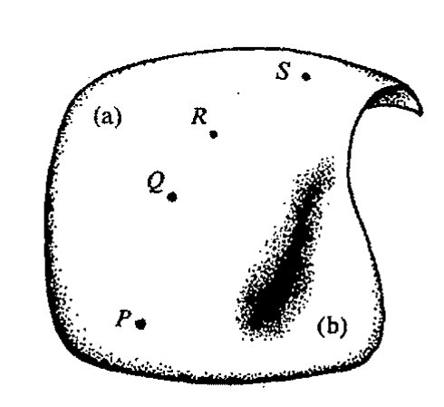

<!-- page 579 -->

通向实在之路

第二十九章

测量疑难

29.1 量子理论的传统本体论

782

毫无疑问，量子力学是 20 世纪最卓绝的成就之一。它解释了许许多多 19 世纪深感疑惑的现象，像存在着的谱线、原子的稳定性、化学键的性质、材料的强度和色泽、铁磁性、固/液/气态间的相变以及与周围环境处于热平衡下的热物体的颜色（黑体辐射）等等。甚至生物学里的一些令人困惑的问题，像遗传的超常可靠性，现在看来也可以从量子力学原理中找到答案。这些现象——以及 20 世纪里才出名的其他现象，诸如液晶、超导性和超流性、激光行为、玻色-爱因斯坦凝聚、EPR 效应的奇妙的非定域性以及量子传态等等——现在都能够在量子力学的数学形式体系下得到很好的理解。这一形式体系的确为我们提供了一场对物理现实世界认识上的革命，其影响远大于爱因斯坦广义相对论的弯曲时空带来的影响。

果真如此么？当今许多物理学家有一种共识，认为量子力学并未提供我们“实在”的图像！在这种观点看来，量子力学的形式体系只能当作一种数学形式体系。正如许多量子物理学家争辩的那样，这种形式体系根本没告诉我们世界的真实的量子实在是什么，而仅仅只是允许我们计算出可供选择的实在有可能出现的概率。这种量子物理学家的本体论——某种程度上说，他们关心的完全是“本体论”问题——大致是这样一种观点(a)：根本就不存在能够用量子形式体系来表达的实在。在另一极端，许多量子物理学家则持完全相反的观点(b)：幺正演化的量子态完全描述了真实的实在，其发人深省的蕴意是，所有可能的量子态必然总是连续共存（叠加）的。正如 [§21.8](chapter_21.md#218-奇怪的量子跳变) 所述，量子物理学家面临的基本困难，同时也是促使他们持有这种观点的动机，是两种量子过程 U 和 R 之间的矛盾，这里（[§22.1](chapter_22.md#221-量子步骤-u-和-r)）U 是幺正演化的确定性过程（可由薛定谔方程描述），R 是进行“测量”时发生的量子态收缩。U 过程，只要被发现，就总是以物理学家们熟悉的方式存在的：一个确定性数学量的明确的时间演化，即态矢 $|\psi\rangle$，它完全由（偏）微分方程控制——薛定谔方程的时间演化与经典麦克斯韦方程的时间演化（见 [§21.3](chapter_21.md#213-薛定谔方程) 和练习[19.2]）没

·560·

<!-- page 580 -->

第二十九章 测量疑难

什么不同。另一方面，**R** 过程对物理学家来说则是全新的：这是一种 $|\psi\rangle$ 的不连续的随机跳变，这里能确定的只是不同结果出现的概率。如果我们所观察的世界的物理仅由量 $|\psi\rangle$ 描述，发生的仅是 **U** 过程本身，那么物理学家可以毫不困难地将 **U** 看成是"物理上真实的" $|\psi\rangle$ 的"物理上真实的"的演化。但我们观察到的世界的表现却不是这样，而是 **U** 与每次发生都绝然不同的 **R** 过程的奇妙组合！（回顾图 22.1。）这就使得物理学家很难相信 $|\psi\rangle$ 能够真正用来描述物理实在。在态被认为是按照 **U** 演化过程进行演化时，**R** 如何能够发生这一令人迷惑的问题是量子力学的测量问题（[§23.6](chapter_23.md#236-量子纠缠的两个谜团) 有简短的讨论，[§21.8](chapter_21.md#218-奇怪的量子跳变) 和 [§22.1](chapter_22.md#221-量子步骤-u-和-r) 亦有所提及）——我更愿意称它为测量疑难。

观点 (a) 基本上属于尼尔斯·玻尔所表述的哥本哈根解释的本体论，他不是将 $|\psi\rangle$ 看作是量子层面上实在的表示，而只是对实验者所获得的量子系统"知识"的描述。就 **R** 过程而言，"跳变"可理解为实验者进一步获得系统知识的过程，因此跳变是对该系统变化的一次了解，而非该系统的物理本身。按照观点 (a)，我们不应要求将"实在"与量子层面上的现象联系起来，唯一公认的实在就是那种实验室装置探测到的经典世界里的对象。作为观点 (a) 的变种，我们还可取这样的观点：这种"经典世界"并非建立在那些构成观察者测量装置的"宏观工具"的层面上，而是建立在观察者自身意识的层面上。一会儿我们来详细讨论这些观点。

另一派观点 (b) 的支持者则将 $|\psi\rangle$ 直接看作是实在，同时他们完全否认发生过 **R**。他们争辩说，在测量进行的时候，所有可能的结果实际上是作为实在同时存在的，其方式是所有可能结果的巨大的量子线性叠加。这种叠加可用整个宇宙的波函数来描述。有时我们称它为"多宇宙论 (multiverse)"，[^1] 但我认为更恰当的词是 *omnium*（"一体性"）。[^2] 因为虽然这种观点通常被理解为各种不同世界平行共存的一种信念，但其实这是一种误解。因为按照这种观点，不同的世界之间并非真正是独立"共存"的关系，而是一种由 $|\psi\rangle$ 表示的巨大的特殊叠加。

为什么说按照观点 (b) 的理解，这个一体性不是实验者感知到的真实的"实在"呢？这是因为实验者的心理状态也参与了这种量子叠加，这些不同个体的心态与所做测量的不同的可能结果纠缠在一起。因此这种观点认为，对每个不同可能的测量结果都存在一个"不同的世界"，对这些不同世界里的每一个又都存在一个单独的实验者"拷贝"，所有这些世界都以量子叠加的方式共存。每个实验者拷贝得到的都是各不相同的实验结果，但因为这些拷贝居于不同的世界，它们之间不存在信息交流，每一个都认为出现的只是一种结果。观点 (b) 的支持者经常强调的一个必要条件是，实验者应"有意识"地强化这样一个印象，就是只存在 **R** 引起的"一个世界"。这种观点是由胡夫·埃弗雷特（Hugh Everett III，1930~1980）于 1957 年首次明确提出的。[^3]（尽管不是很确信，但我估计其他一些人私下里也早有这种想法——我自己在 20 世纪 50 年代中期就是其中之一——只是未敢公开罢了！）

不论观点 (a) 和 (b) 在怎样看待 $|\psi\rangle$ 与我们观察的"实在"的关系上显得如何对立，二者仍有明显的共同点，这里的"实在"是指我们都经历的宏观尺度上的现实世界。在观察到的世界里，实验只会出现一种结果，我们可以恰当地将它看成是物理学解释或模拟"现实"的工作。我们既不能按

[^1]: multiverse
[^2]: omnium
[^3]: Hugh Everett III, 1930~1980

<!-- page 581 -->

通向实在之路

观点(a)也不能按观点(b)来看待态矢|ψ⟩对实在的描述。按这两种观点，我们都不可避免地会将实验者个人经验带入如何处理形式体系与被观察的现实世界之间关系的认识中去。在情形(a)，态矢|ψ⟩本身就是实验者个体感觉的替代品，而在情形(b)，“通常的现实”则在某种程度上被描绘成实验者的感觉，态矢|ψ⟩则成了某种不能直接感知的更深层次上超越一切的实在（一体性）。在两种情形下，**R**的“跳变”都被看成是非物理实在，而是某种意义上的“心理作用”！

我将在适当时候解释我自己在认识观点(a)和(b)方面的困难，在此之前，我想进一步谈一下传统量子力学的可能解释。就我理解，最流行的量子力学观点是环境退相关的观点(c)，虽然比起本体论它可能更倾向于实用主义。观点(c)的思想是，在任何测量过程中，所考虑的量子系统都不可能看成是与环境隔绝的，因此，进行一次测量，所得到的每一个不同的输出结果并不构成原来的那种量子态，而必须看成是一种纠缠态（[§23.3](chapter_23.md#233-量子纠缠贝尔不等式)），其中每一种可能的输出都与不同的环境态纠缠在一起。而环境是由大量的做随机运动的粒子组成的，它们的位置和运动的全部细节必须看成是总体上不可实际观察的。⁴数学上存在一套明确定义的程序可用来处理这种信息非常缺乏的情形，这是一种对未知环境状态“求和”以得到所谓密度矩阵的数学对象的方法，我们就用这个密度矩阵来描述待求的物理系统。密度矩阵对于量子力学中测量问题的一般性讨论非常重要（其重要性也表现在其他许多方面），但其本体论意义一直没弄得很清楚。不久（[§29.3](#293-密度矩阵)）我就会简单介绍什么是密度矩阵。但随后我们将看到，对观点(c)来说，为什么密度矩阵的本体论不能完全说清楚这一点很重要！持观点(c)的人倾向于认为自己是不与任何形式本体论这种“无聊”问题打交道的“实证主义者”，他们声称不关心什么是“实在的”，什么不是“实在的”。正如斯蒂芬·霍金所说：⁵

> 我不要求理论与实在保持一致，因为我不知道什么是实在。它不是那种你能够用石蕊试纸检测出的性质。我所关心的是理论应当能够预言观察的结果。

而我的立场是，本体论问题对量子力学至为关键，虽然它引起的一些问题远不是我们今天能够解决的。

## 29.2　量子理论的非传统本体论

在进入所有这些细节问题之前，我们先来考虑有关量子力学的3种更为一般的立场。这不是说我所列的已很全面，也不是说这些新的观点就完全独立于我前面给出的那些观点。我这里给出的这个列表(a)，(b)，(c)，(d)，(e)，(f)代表了人们在当今文献里经常能够遇到的一系列观点，但我既不认为这个列表是完整的和独立的，也不认为它有什么特殊性。新增的3种本体论观点代表了通常量子形式体系的实际变化；但对其中的两种，(d)和(e)，我们不能指望存在什么实验能够对这种建议性的体系和标准量子力学做出区分。观点(d)是格里菲斯（P. Griffiths）、翁内

·562·

<!-- page 582 -->

第二十九章 测量疑难

斯（Omnès）和盖尔曼/哈特尔（M. Gell-Mann/J. B. Hartle）提出的"相容历史"*（consistent histories）"的处理方法，观点（e）则是德布罗意和玻姆/希利（D. Bohm/B. Hiley）提出的"领波（pilot-wave）"本体论。^6^ 最后这个（f）则认为，当今量子力学只是对某种更高级理论的近似，在这种高级理论中，**U** 和 **R** 像真实过程那样客观地发生；而且（f）还有一个观点，就是认为未来实验应能够将这一理论与传统量子力学区分开来。

一旦我们有了必要的工具，我将逐一给出我对这一系列观点（a），…，（f）的评价。但为了使读者能够对这些评价保持恰当客观的态度，我最好在此"收拾干净"我自己的立场。实际上，为使量子力学能够充分协调一致，我坚信发展像（f）这样的观点是十分必要的。在下一章，我将提出一种在我看来是十分自然的（f）的特殊版本。说完了这个预先告示，下面让我们循序渐进，帮助读者看清楚我所罗列的这些观点。

（a）"哥本哈根"观点；

（b）多世界观点；

（c）环境退相关观点；

（d）相容历史的观点；

（e）领波观点；

（f）带有客观性 **R** 的新理论观点。

对（d）和（e）我还要再说几句，因为我一直没有真正解释过它们。"相容历史"观点（d）是标准量子理论框架的一般化。它所吸收的一些要素有点儿像多世界理论（b）所持的观点，虽然从某种角度上看这甚至有点过分——在我看来，这样一种过分的本体论完全没必要。对于（b）和（d），我们可以采取这样一种立场，我们有基本要素希尔伯特空间 **H**（始态 | ψ₀⟩ 属于 **H**）和哈密顿算子 **H**。^7^ 在多世界理论（b）里，其本体论观点是将（一体的）实在当作可用连续单参数态族（**H** 的元素加上时间参数 t）来描述的对象，它由 t = 0 时的 |ψ₀⟩ 出发，在 t > 0 时由 **H** 确定的薛定谔演化方程完全支配。这里没有 **R** 只有 **U**。而相容历史的观点（d）扩充了这一点，使得"**R** 型过程"也被结合到"演化"中来——即使人们并不认为有必要将这些过程与实际测量联系起来。

为了理解这些过程的数学本性，我们必须先回顾一下 [§22.5](chapter_22.md#225-量子可观察量),6 里量子力学的测量在数学上是如何利用哈密顿（或归一化）算子 **Q** 来描述的（即使如此，在观点（d）看来，我们也不认为这些过程就是测量）。如果在测量前，系统的态是 |ψ⟩，那么测量将使它立即"跳变"到 **Q** 的与测量产生的 **Q** 的本征值所对应的本征态。但仅就测量对 |ψ⟩ 的作用而言，我们也可以用"正交投影算子" **E**₁, **E**₂, **E**₃, …, **E**ᵣ 来替代 **Q**（假定 **Q** 正好有 r 个各不相同的本征值，为方便起见，我们将希尔伯特空间 **H** 取为有限维）。于是，如果测量产生本征值 qⱼ，我们发现 |ψ⟩ 跳变到正比于 **E**ⱼ|ψ⟩ 的态（投影公设）。

让我们将这一点看得更仔细点。从 [§22.6](chapter_22.md#226-yesno-测量投影算符) 我们知道，投影算子是那种其平方等于自身的哈

---

\* 这里 consistent 一词借用数学用语，译作"相容的"，是指这些历史之间彼此一致，无矛盾。——译者

· 563 ·

<!-- page 583 -->

通向实在之路

密顿算子 **E**，即

$$E^2 = E = E^*。$$

所谓算子 $E_1, E_2, E_3, \cdots, E_r$ 间彼此正交是指

$$E_i E_j = 0 \quad (i \neq j)$$

其完全性是指它们的和为 **H** 上的单位 **I**：

$$E_1 + E_2 + E_3 + \cdots + E_r = I。$$

我们称满足所有这些条件的 **E** 的集合为投影算子集。**Q** 与其相应的投影算子集之间的联系是，对 **Q** 的每个本征值 $q_j$，相应的本征矢空间组成形式为 $E_j|\psi\rangle$ 的矢量。投影算子 $E_j$ 的作用就是将本征值 $q_j$ 投影到这个本征矢空间上。**[29.1]**

在 **Q** 表示的测量中，运算 **R** 的投影公设（见 [§22.6](chapter_22.md#226-yesno-测量投影算符)）告诉我们，如果测量结果是 $q_j$，那么 $|\psi\rangle$ 跳变到 $E_j|\psi\rangle$（或正比于它的某个量）。如果我们假定 $|\psi\rangle$ 是规范的，即 $\langle\psi|\psi\rangle = 1$，则它发生的概率为

$$\langle\psi|E_j|\psi\rangle。$$

因此，为了描述与 **Q** 相应的测量对量子态的作用，我们仅需考虑由 **Q** 定义的投影算子集就够了。

现在让我们回到相容历史观点（d）的本体论上来。这个理论是用所谓粗粒化历史^8 的概念借助哈密顿量 $\mathcal{H}$ 来展开的，其中每一个都非常近似于多世界方法（b）的"一体性（omnium）"的薛定谔演化。但对于（d），我们也允许在演化过程中将投影算子集插入到不同的 $t$ 值中。

我并不完全清楚这种投影算子集插入的本体论意义，但不妨采取这样一种态度：这种投影算子集的作用是提供某种"细化"的历史，而不是要表示世界所发生的根本变化。投影算子的确不具有那种客观测量给出的本体论意义。更恰当的类比或许是，投影算子集提供的是粗粒"盒子"的"细化"，就像在经典相空间（见 [§27.3](chapter_27.md#273-熵)）那样——它可以说明这里的"粗粒化历史"概念。在这样的粗粒化历史中，在投影算子集遇到的点上（类似于量子测量里采用的标准过程），当前态 $|\psi\rangle$ 被 $E_j|\psi\rangle$（或正比于它的某个量）取代，这里 $E_j$ 是投影算子集的某个元素。这或许被看成是信息的损失，但如果我们跟踪整个 $E_j|\psi\rangle$ 族就不存在损失，因为对集里的所有 $E_j$，$|\psi\rangle$ 其实就是所有这些的和。

为了找出与我们通常感知的经典世界类似的那种东西，我们挑出某些特殊的粗粒化历史族，并称它们为相容的（有时也称"退相关的"），如果某种条件得以满足的话——这个条件可表达为：按标准量子模型计算的概率满足通常概率的经典规则。^9 如果一组相容的粗粒化历史不去掉

---

**[29.1]** 解释：为什么 $E_j|\psi\rangle$ 由 $Q = q_1 E_1 + q_2 E_2 + q_3 E_3 + \cdots + q_r E_r$ 作用到 $|\psi\rangle$ 上的测量给出的结果（忽略归一化）？这里本征值是 $q_j$，量 $q_1, q_2, q_3, \cdots, q_r$ 是各不相同的实数。你能证明一般的有限维哈密顿算子也具有这种形式吗？（你可以假定，任何有限维哈密顿矩阵 **Q** 都可以通过幺正变换变换为对角阵。）这里的 **E** 称为 **Q** 的主幂等元。对规范算子 **Q** 还需要做些什么调整？

· 564 ·

<!-- page 584 -->

第二十九章 测量疑难

相容性就无法插入另一个投影算子集（即不等价于任何已被合并了的集），则这样的粗粒化历史被称作是最大精细化了的。我认为，按照观点(d)，最大精细化集里的历史是所谓本体论“实在”的最强有力的一种形式。

然而，我没有看到有谁明确提出过这种观点，最大精细化集里类似于历史总体的那种东西似乎更接近于相容历史观的本体论。^10^这一点可能更接近我们在多世界观点(b)所看到的情形，但存在投影算子集的多种可能的协调一致的集合这一点似乎为我们提供了更大的备选“世界”的总体。然而我们知道，多世界图像(b)会产生某种本体论的混乱。本体论意义上“真实的”一体性（由|ψ⟩描述）是众多不同世界的叠加，我们并不认为所有这些个体世界（而不只是它们的某个特定的叠加|ψ⟩）的总和就是“真实的”。对付这种混乱采用相容历史观点(d)的集合思想是有益的，这一理论提供了正确的量子概率，情形(b)似乎做不到这一点。

“玻姆”的（领波）观点(e)的本体论立场令人耳目一新，也更加实际，尽管在此还让人很难捉摸——因为一定意义上说，它有两种层面上的实在，其中的一个比另一个要坚实得多。首先我们来看看最简单的由单个无自旋粒子构成的系统。此时这个更为坚实层面上的实在是粒子的实际位置。在双缝实验（[§21.4](chapter_21.md#214-量子理论的实验背景)，图21.4）中，由于粒子的位置在本体论上是真实的，它实际穿过某个狭缝，但它的运动其实是受ψ“引导”的，因此这就提供了第二个层面上的实在，不管怎样，从本体论上说，ψ都具有“真实的”地位。在这个理论中有一点是共同的，就是对ψ的模和辐角（[§5.1](chapter_05.md#51-复代数几何)）给予不同的对待，前者构成所谓“量子势”的量，后者用来定义所谓的“领波”。但这种剖分无甚必要，其意义在更复杂的系统里反而更不清楚。

一般来说，我们可以将ψ看成是定义在构形空间**C**上的复函数，它起着“引领”**C**上点*P*的行为的功能。系统实在中较坚实的部分被认为是由*P*定义的经典构形，但（较弱的）那部分实在凭借它在引导*P*点行为的作用也被赋予复函数ψ。所有测量最终都能够归结为“位置”测量，即对系统构形的测量。在**C**的某点*Q*上，模平方|ψ|²定义了找到*Q*所定义构形下的系统的概率密度，而**C**上点*P*的位置则决定了什么是系统的真实构形。

现在，所有这些看起来似乎都“挺容易”，但有难缠的。最突出的当属非局域性，ψ是那种高度“整体性”的概念（因为它必须如此才能切合[§21.7](chapter_21.md#217-波函数的整体性质)所强调的波函数的整体性质）。这一点在量子力学里似乎是不可避免的。更严重的是，我们必须为初态|ψ₀⟩的概率分布设定重要的条件，这样|ψ|²的量子概率分布律才是对的，并且在一连串测量后结果仍保持正确。进一步人们要问，所有测量总能够最终归结为位置测量这一假定的正确性何在（尤其是严格的位置测量在量子力学里根本就不合法，见[§21.10](chapter_21.md#2110-位置态)）？在考虑到像自旋这样的非经典参数的情形下，构形空间图像是否足够明白无误？毕竟(e)的清楚的本体论地位对它的采信十分重要（尽管我们在[§29.9](#299-哪一种非传统本体论有助于解决问题)将看到，它还面临着更多的问题）。^11^

最后，还有关于(f)的许多不同建议。我认为它们不适合在此作细节展开，但可以做些一般性的评述。这里的好些建议都将演化着的态矢|ψ⟩当作本体论上真实的东西来接受（至少暂时是如

· 565 ·

<!-- page 585 -->

通向实在之路

此）。在这样的理论中，|ψ⟩的时间演化非常接近于 **U** 随 **R** 的变化，就是标准量子力学教导我们实际采用的那种方式，见图 22.1。不论持观点(f)的理论看上去与"主流的"量子力学思想多么"格格不入"，我们仍有充分的理由认为，实际上(f)是这样一种立场：正如当今实际应用中所显示的那样，量子力学形式体系的实在性得到了绝大多数人的认可，因为不论是量子力学演化过程 **U** 还是 **R** 都被认真地看作是从本体论上对实在演化的描述！但问题在于 **U** 和 **R** 在数学上彼此冲突，这就是为什么(f)要求必然存在一种与通常幺正演化相异的变化——正是这一点使得(f)与主流思想分道扬镳！

为什么 **R** 在数学上与 **U** 不协调？最明显的理由或许是 **R** 表示的是态矢的不连续变化（除非是在测量前态就是测量算子的本征态这种例外的场合），而 **U** 则总是连续的。但即使我们不把 **R** 诱导的"跳变"看成是绝对瞬时的，也还有由于 **R** 缺乏确定性所带来的幺正方面的问题。同样的输入产生不同的输出，这在 **U** 过程里是不可能发生的事情。进一步说，针对（非平凡的）量子跳变——相应于 **R**——的实际发生，将 **R** 看成是真实过程的理论从来就不可能是幺正的。尽管如此，在 **U** 和 **R** 两种过程之间还是存在某种明显的一致性，因为打断 **U** 给出概率性的 **R** 的"平方模法则"正是通过 **U** 的"幺正性"给出了 **R** 的概率守恒律（基本事实是，用来计算量子概率的标量积⟨φ|ψ⟩在幺正时间演化下守恒，见 §§ 22.4, 5）。它体现了量子力学奇迹般的整体性，这也是为什么人们不愿轻易放弃现有理论原理的重要原因——它也部分地说明了为什么观点(f)在当今粒子物理学家中不特别流行的原因。

不管怎样，我相信我们有理由期待变革。这种变革寓示着一场大革命，它不可能仅仅通过对现有量子力学的"修修补补"就能够实现。当然，这种必要变革本身必须是针对当今物理学的核心原理而深入展开的。量子体系中最难攻克的堡垒，正如上一段指出的，是对这两个要求的合理解释。作为比较，我们回顾一下牛顿理论的结点所在。相对论和量子力学都不是通过修修补补就获得了的，而是通过观念上革命性的变革取得的，我们不得不怀着崇敬的心情向牛顿理论中高度有序的拉格朗日量/哈密顿量/辛几何结构挥手告别。各色人等迄今所提出的量子理论的种种变化^12^是否也正充当着这种令人尊敬的革命性角色呢——抑或这些变化只是修修补补？应当说，现有的这些思想在很大程度上只能看作是修修补补，但其中的一些思想很可能为改进量子理论提供了正确线索。

## 29.3 密度矩阵

那么为什么需要"改进"量子理论呢？大多数粒子物理学家似乎觉得并不需要一种能始终与各种表观矛盾和形形色色晦涩的所谓标准（或非标准）本体论图像和平共处的理论。在我们力图说明任何一种"标准"图像(a), (b)和(c)中的困难之前，我们有必要先了解一下密度矩阵的概念，它不仅是观点(c)的核心概念，也在其他各种量子力学理论中起着非常重要的作用。更

· 566 ·

<!-- page 586 -->

第二十九章 测量疑难

重要的是，它提出了关于在量子力学里如何表示实在这样一个令人感兴趣且意义深远的问题。

假定我们有某个量子系统，它的态并不完全为我们所知。如果这里的态可用 $|\psi\rangle$ 或 $|\phi\rangle$ 或其他…譬如说 $|\chi\rangle$ 来表示，这个表列可能是无限的，但从我们的目的来说，仅考虑有限种可能性已足够。这里我们对每一种可能性都赋予一定的概率，譬如说分别为 $p, q, \cdots, s$。这些可能性是可穷尽的，即它们的概率——0 和 1（包括 1）之间的实数——之和为 1：

$$p + q + \cdots + s = 1.$$

假定 $|\psi\rangle, |\phi\rangle, \cdots, |\chi\rangle$ 中的每一个都是归一化了的：

$$\|\psi\| = 1, \|\phi\| = 1, \cdots, \|\chi\| = 1.$$

（由 [§22.3](chapter_22.md#223-幺正结构希尔伯特空间和狄拉克算符) 知，$\|\psi\| = \langle\psi|\psi\rangle$，等等。）于是，我们定义密度矩阵为下述量

$$\boldsymbol{D} = p|\psi\rangle\langle\psi| + q|\phi\rangle\langle\phi| + \cdots + s|\chi\rangle\langle\chi|.$$

由 [§22.3](chapter_22.md#223-幺正结构希尔伯特空间和狄拉克算符) 知，左矢 $\langle\psi|$ 是右矢 $|\psi\rangle$ 的哈密顿共轭。量 $|\psi\rangle\langle\psi|$ 是 $|\psi\rangle$ 和 $\langle\psi|$ 之间的张量积（外积），如此等等。在 [§23.8](chapter_23.md#238-玻色子和费米子的量子态) 的指标记法下，我们可将 $\langle\psi|$ 记为 $\bar{\psi}_\alpha$，这里 $\psi^\alpha$ 表示 $|\psi\rangle$。于是 $|\psi\rangle\langle\psi|$ 可以写成 $\psi^\alpha\bar{\psi}_\beta$，等等。相应地，$\boldsymbol{D}$ 本身可表示为指标结构 $D^\alpha{}_\beta$。密度矩阵具有哈密顿量的非负定（[§13.8](chapter_13.md#138-正交群), 9）的代数性质，其迹为 1：

$$\boldsymbol{D}^* = \boldsymbol{D}, \text{对所有} |\xi\rangle, \text{有} \langle\xi|\boldsymbol{D}|\xi\rangle \geqslant 0, \quad \langle\boldsymbol{D}\rangle = 1,$$

这里 $\langle\boldsymbol{D}\rangle = \text{迹}\boldsymbol{D} = D^\alpha{}_\alpha$（见 [§13.4](chapter_13.md#134-行列式和迹)）。*^(29.2)

这里密度矩阵的角色有点像经典统计力学里经常用到的类似概念，在那里我们并不特别关心系统的精确的（经典）态，而主要是考虑各种经典态的概率分布。系统不是由 $\mathcal{P}$ 中的一点 $P$ 来表示，而是根据 $\mathcal{P}$ 中的分布来表示。如果我们的系统正好有有限个备选的态，^13 其概率分别为 $p, q, \cdots, s$，我们就用 $\mathcal{P}$ 的一个有限个点 $P, Q, \cdots, S$ 的点集来表示这些概率对应的分布，见图 29.1。在量子物理里，我们在量子系统的希尔伯特空间 $\mathbf{H}$ 上可做同样的事情，这时 $\mathbf{H}$ 就扮演着相空间 $\mathcal{P}$ 的角色。联系到前面所说的密度矩阵 $\boldsymbol{D}$，这时概率分布将由 $\mathbf{H}$ 的有限个点 $P, Q, \cdots, S$ 组成，每一个被赋予相应的概率值 $p, q, \cdots, s$。

但这种做法并非通常的量子力学做法，量子力学通常用的是密度矩阵。^14 为什么呢？这是因为在量子力学里，测量（作为量子力学中提出问题的一种方式，这里我们把注意力集中在 YES/NO 问题上）总是表示为某个投影算子 $\boldsymbol{E}$ 对（归一化）态矢 $|\xi\rangle$ 的作用。于是回答 YES 的概率为 **^(29.3)

---

\* [29.2] 导出这些性质。

\*\* [29.3] 解释为什么，并导出后文的式子 $\langle\boldsymbol{E}\boldsymbol{D}\rangle$。

· 567 ·

<!-- page 587 -->

通向实在之路

YES 的概率 = $\langle\xi|E|\xi\rangle$，

由此，对上面用密度矩阵 $\boldsymbol{D}$ 描述的各种可能的态 $|\psi\rangle, |\phi\rangle, \cdots, |\chi\rangle$ 的混合概率，我们写成

$$\text{YES 的概率} = \langle\boldsymbol{E}\boldsymbol{D}\rangle.$$

它的意义是，为了计算量子力学里标准的 YES/NO 问题的概率（或者说，对于任何其他量子力学可观察量的期望值），我们不必知道这些备选态 $|\psi\rangle, |\phi\rangle, \cdots, |\chi\rangle$ 的分布的全部信息。***〔29.4〕所有所需的信息都保存在密度矩阵里——正如我们将看到的，一个给定的密度矩阵可由许多不同的态的概率分布组成。这个数学概念体现了相当好的经济性和完美性（它是由杰出的匈牙利/美国数学家约翰·冯·诺伊曼（John von Neumann, 1903～1957）于 1932 年提出的）。它将原本似乎是两个不相关的概率概念结合到一个表达式里。一方面，对于态 $|\psi\rangle, |\phi\rangle, \cdots, |\chi\rangle$，我们有通常经典概率值 $p, q, \cdots, s$，另一方面，我们从 [§21.9](chapter_21.md#219-波函数的概率分布) 的平方模法则得到量子概率。密度矩阵则将二者合而为一，并不直接区分彼此。

## 29.4 自旋 $\frac{1}{2}$ 的密度矩阵：布洛赫球

让我们用一个简单的例子来说明这一点。假定我们有自旋 $\frac{1}{2}$ 的粒子，其自旋态我们知道不是 $|\uparrow\rangle$ 就是 $|\downarrow\rangle$，每个的概率各占 $\frac{1}{2}$。如果我们选择在上/下方向上测量这种自旋，则如果态是 $|\uparrow\rangle$，我们就得到"上"；如果态是 $|\downarrow\rangle$，我们就得到"下"。每种情形的概率都是 $\frac{1}{2}$。这些正好都是经典概率值，无甚量子神秘性可言。但假定我们是在左/右方向上测量自旋，那么如果态是 $|\uparrow\rangle$，则量子 **R** 法则告诉我们，有 $\frac{1}{2}$ 概率自旋是"左"的，$\frac{1}{2}$ 概率自旋是"右"的。同样的结果对态是 $|\downarrow\rangle$ 也成立。因此对 $|\uparrow\rangle$ 和 $|\downarrow\rangle$ 的等概率混合，我们得到的仍是对每个"左"和"右"的 $\frac{1}{2}$ 概率。只是现在这些概率完全是从量子力学的"平方模"法则得到的。我们可以取其他任意方向对自旋进行测量，结果在相对的两个方向上仍得到各 $\frac{1}{2}$ 的概率，但一般来说这个概率是经典概率与量子概率的混合。**〔29.5〕

我们还可以想象转动混合态而不是转动测量仪器。这样，$|\leftarrow\rangle$ 和 $|\rightarrow\rangle$ 的等概率混合将给出与上面 $|\uparrow\rangle$ 和 $|\downarrow\rangle$ 的等概率混合相同的结果，这对 $|\nwarrow\rangle$ 和 $|\searrow\rangle$ 的等概率混合也是一样的（这里对

---

***〔29.4〕你能说出为什么如此吗？

**〔29.5〕对取一般倾角 $\theta$ 的测量方向，得用 [§22.9](chapter_22.md#229-二态系统的黎曼球面) 的概率表达式 $\frac{1}{2}(1+\cos\theta)$ 证明这一点。

· 568 ·

<!-- page 588 -->

第二十九章 测量疑难

每一种情形我们都取态是正交且归一化的：$\langle\uparrow|\downarrow\rangle=\langle\leftarrow|\rightarrow\rangle=\langle\nwarrow|\searrow\rangle=0$ 且 $\langle\uparrow|\uparrow\rangle=\langle\downarrow|\downarrow\rangle=\cdots=\langle\searrow|\searrow\rangle=1$）。对每一种情形下的密度矩阵 $\boldsymbol{D}$ 有：

$$\boldsymbol{D}=\frac{1}{2}|\uparrow\rangle\langle\uparrow|+\frac{1}{2}|\downarrow\rangle\langle\downarrow|,$$

$$\boldsymbol{D}=\frac{1}{2}|\leftarrow\rangle\langle\leftarrow|+\frac{1}{2}|\rightarrow\rangle\langle\rightarrow|,$$

$$\boldsymbol{D}=\frac{1}{2}|\nwarrow\rangle\langle\nwarrow|+\frac{1}{2}|\searrow\rangle\langle\searrow|,$$

密度矩阵的一个显著特点是所有这些 $\boldsymbol{D}$ 均相等。**[29.6]** 自旋测量的所有概率指的都是从上述 $\langle\boldsymbol{E}\boldsymbol{D}\rangle$ 公式得到的值，因此，既然 $\boldsymbol{D}$ 都相等，那么相应的概率必然也都相等。

但是我们怎么来考虑这些态的概率混合的本体论意义呢？如果我们认为量子态具有某种物理实在，那么这 3 种情形在本体论上必然各不相同。我们说态处于（物理实在上）可能的 $|\uparrow\rangle$ 和 $|\downarrow\rangle$ 之一上是等概率的与说态处于 $|\nwarrow\rangle$ 或 $|\searrow\rangle$ 上是等概率的是完全不同的两回事。然而，这一本体论问题在许多量子力学文献中却是相当混乱的。量子物理学家似乎经常对前述的问题采取非常不同的本体论立场，他们将密度矩阵本身看成是提供了一种比单个的态更好的对实在的描述。他们或许持这样的观点，上述 3 种明显各异的本体论性的 $\boldsymbol{D}$（即备选量子态的 3 种不同概率权重的组合）在物理上是不可分辨的。由此，这些物理学家——常持环境退相关观点 (c) 的那些人——会采取实证主义或实用主义立场，认为对这些差异做出区分毫无意义。这些人的观点是：正是密度矩阵提供了对量子实在的最好的描述。

的确，在许多场合，“态”这个词经常是指密度矩阵而非更原始的被我一直称之为“量子态”——即用 $|\psi\rangle$ 来描述的量。当“态”被用来指密度矩阵时，则 $|\psi\rangle\langle\psi|$ 这种特定形式的密度矩阵称为“纯态”，而不能表达为这种形式的更一般的密度矩阵则称为“混合态”。在这个意义上，“纯态”指的就是我通常所称的“态”。我个人认为，称一个密度矩阵（纯的或混合的）为“态”很容易让人糊涂，因此我在这儿将不用这种术语。在我看来，“量子态”就是指量子态矢 $|\psi\rangle$，而不是密度矩阵。但有些人喜欢对“量子态”和“量子态矢”这两个名词做出区分，后者指右矢 $|\psi\rangle$，而前者表示 $|\psi\rangle$ 的而非零复倍乘的等价类，即与 $\mathsf{H}$ 的元素 $|\psi\rangle$ 相应的希尔伯特投影空间 $\mathbb{P}\mathsf{H}$ 的元素（见 [§15.6](chapter_15.md#156-射影空间)）。如果我们对 $|\psi\rangle$ 归一化 $\langle\psi|\psi\rangle=1$，那么 $|\psi\rangle$ 的唯一自由度（对 $\mathbb{P}\mathsf{H}$ 的给定点来说）就是相角自由度 $|\psi\rangle\mapsto e^{i\theta}|\psi\rangle$（此处 $\theta$ 是实数），见图 29.2。“纯态”密度矩阵的概念实际上就等价于这种量子态的“投影”概念，因为 $|\psi\rangle\langle\psi|$ 对这种相角自由度是不变量。因此我们可以合理地认为纯态密度矩阵恰当描述了物理的量子态。

不论怎样，这种将“纯态密度矩阵”当作“物理态”的恰当的数学描述很难令人满意。如果态表示的是一个完整的目标的话，那么相因子 $e^{i\theta}$ 只能是“不可观察的”。而当我们考虑到某个

**[29.6]** 用 §§ 22.8, 9 和练习 [22.25] 通过明确计算来证明这一点。

· 569 ·

<!-- page 589 -->

通向实在之路

---

**图29.2** 我们如何来表示纯态呢？(a) 由⟨ψ|ψ⟩=1归一化了的右矢|ψ⟩的空间。(b) 密度矩阵|ψ⟩⟨ψ|"等价"于|ψ⟩到相角自由度|ψ⟩↦e^{iθ}|ψ⟩，且等价于正比于|ψ⟩的非零右矢族（仅差复比例因子）。但是在密度矩阵描述中，基本的量子线性性并不清楚。

态只是更大系统的一部分时，跟踪这些相位则是很重要的。此外，如果我们总是作量|ψ⟩⟨ψ|的运算而不是数学上更简单的|ψ⟩（或⟨ψ|）的运算，那么右矢的希尔伯特空间基本结构的复线性性将使得数学运算变得毫无必要地复杂。***[29.7]部分是出于这些考虑，我的看法是不把密度矩阵看成是"实在"，而只是一种有用的工具。由此在下面以及[§29.5](#295-epr-状态的密度矩阵)我们将会看到，这将给密度矩阵的令人困惑的本体论问题带来一些使人感兴趣的方面。

在进入讨论之前，我们先熟悉一下布洛赫球不无裨益，它表示的是二态系统的密度矩阵空间。这是一个位于欧几里得三维空间内的闭合的实心球体（或用数学术语来说，叫三维球体或三维圆盘）B³。它表示自旋½（或其他任意二态系统）的密度矩阵，见[§22.9](chapter_22.md#229-二态系统的黎曼球面)。我们可将迹为1的一般的2×2哈密顿矩阵记为

$$\frac{1}{2}\begin{pmatrix} 1+a & b+ic \\ b-ic & 1-a \end{pmatrix},$$

这里a, b, c均为实数。作为密度矩阵，这种矩阵必然是非负定的，即满足条件***[29.8]

$$a^2+b^2+c^2 \leqslant 1.$$

它显示了布洛赫球B³的一般特点，其边界S²是二维球面a²+b²+c²=1。这里S²表示二态（例如自旋½）系统的纯态，这个空间可等同于[§22.9](chapter_22.md#229-二态系统的黎曼球面)描述的黎曼球面S²。¹⁵

我们刚刚考虑的特定密度矩阵 **D** = (½**I**)可用布洛赫球体的原点来表示，它的一种模棱两可本体论解释显然是得自图（图29.3）的对称性。但B³内部的任意一点（非纯态密度矩阵）**L**表

---

***[29.7] 对任意一对固定的态|ψ⟩和|φ⟩，你能刻画与线形组合w|ψ⟩+z|φ⟩相应的"纯态"密度矩阵族吗？

***[29.8] 证明这一点。提示：对a, b, c，本征值的积是什么？这个积非负意味着什么？

·570·

<!-- page 590 -->

第二十九章 测量疑难

示的是具有同样模棱两可的本体论解释的密度矩阵。为了看清这一点，我们过 $L$ 画一条任意直线（弦）与边界 $S^2$ 相交于 $P_1$ 和 $P_2$ 两点。这两点表示两个纯态，于是密度矩阵 $L$ 可解释为这两个纯态的概率混合。***[29.9] 布洛赫球体原点 $D$ 的唯一特殊的地方在于，所有这些可用来表示 $D$ 的纯态对都是正交对。但这样一种要求相互正交态之间概率混合的密度矩阵却没有定义。在 [§29.5](#295-epr-状态的密度矩阵) 我们将看到非正交混合是如何出现的。

![Figure: 布洛赫球示意图，显示球体 $B^3$、球面上的点 $P_1$、$P_2$、球内点 $L$ 以及中心点 $\frac{1}{2}I$]

**图 29.3** 二态系统密度矩阵的布洛赫球 $B^3$，中心位于 $\frac{1}{2}I$。任何（非纯态）密度矩阵 $L$ 都有一个模棱两可的本体论解释。过 $L$ 的任意弦交边界 $S^2$ 于 $P_1$ 和 $P_2$；于是 $L$ 可解释为纯态 $P_1$ 和 $P_2$ 的概率混合。

## 29.5 EPR 状态的密度矩阵

我们来检验一种特别明确的情形，其中可能态矢的加权概率的总和是以十分自然的方式出现的。这就是 EPR-Bohm 效应（[§23.4](chapter_23.md#234-玻姆型-epr-实验)）中出现的情形。假定在地球和土星的卫星土卫六之间的某个地方——譬如靠近土卫六的三分点的位置上——以总自旋为 0 的组合态发射出一对自旋 $\frac{1}{2}$ 的 EPR 粒子。假定我在土卫六的同事（[§23.4](chapter_23.md#234-玻姆型-epr-实验), 5 中的老相识）在上/下方向上测量接收到的粒子自旋，并在我在地球这端接收到粒子的大约半小时前得到某个结果，而且在我接收到粒子时我没时间收到来自我这位同事的上一次测量的任何信号。（土卫六距地球约 3 小时光程。）我所关心的是我接收到的粒子的自旋是 $|\uparrow\rangle$ 还是 $|\downarrow\rangle$。如果我的同事得到态 $|\downarrow\rangle$，那我的就只能是 $|\uparrow\rangle$；如果我同事的是 $|\uparrow\rangle$，那我的就是 $|\downarrow\rangle$。因为我知道我同事得到 $|\uparrow\rangle$ 或 $|\downarrow\rangle$ 的机会是相等的，故我认为我（在我同事测量的半小时后）得到的粒子必然也是 $\frac{1}{2}$ 概率是 $|\uparrow\rangle$，$\frac{1}{2}$ 概率是 $|\downarrow\rangle$。这样，密度矩阵为

$$\boldsymbol{D} = \frac{1}{2}|\uparrow\rangle\langle\uparrow| + \frac{1}{2}|\downarrow\rangle\langle\downarrow|$$

（$|\uparrow\rangle$ 和 $|\downarrow\rangle$ 取正交归一：$\langle\uparrow|\downarrow\rangle = 0$ 且 $\langle\uparrow|\uparrow\rangle = 1 = \langle\downarrow|\downarrow\rangle$）。

但是，可能会有这样的情形，我的这位同事在最后时刻突然决定改在左/右方向上进行测量。如果他得到的结果是 $|\leftarrow\rangle$，那么我在地球这端得到的粒子必然是 $|\rightarrow\rangle$；如果他得到的是 $|\rightarrow\rangle$，那么我得到的必然是 $|\leftarrow\rangle$。同事在每一种情形下的概率仍是 $\frac{1}{2}$，虽然我不知道他会得到什么结果，但我能断定我得到 $|\rightarrow\rangle$ 和 $|\leftarrow\rangle$ 的概率各为 $\frac{1}{2}$。因此粒子的密度矩阵是

---

***〔29.9〕解释为什么如此，证明：所混合的两个概率有与 $L$ 截弦长所得两段长度之比相同的比值。

<!-- page 591 -->

通向实在之路

$$D = \frac{1}{2}|\rightarrow\rangle\langle\rightarrow| + \frac{1}{2}|\leftarrow\rangle\langle\leftarrow|$$

（这里 $\langle\leftarrow|\rightarrow\rangle = 0$ 且 $\langle\rightarrow|\rightarrow\rangle = 1 = \langle\leftarrow|\leftarrow\rangle$）。显然，这个 $D$ 同前一样。它也应该这样，因为同事在土卫六上决定在什么方向上进行测量不影响地球上粒子的概率（否则的话，在土卫六和地球之间必存在超光速的信号传递***[29.10]）。因此情形似乎是，对于我们考虑的这种情形，密度矩阵提供了一种优异的对物理状态的数学描述。尽管我不知道土卫六上发生的过程是什么——既不知道我同事自旋测量的方向，也不知道他的结果——但我在地球上接收到的粒子的自旋态仍能用上述密度矩阵 $D$ 很好地描述出来。

当然，这一结果只有当我没接到任何来自土卫六的信息时才是对的。如果我知道了同事的测量方式，就会影响到我对我所接收到的粒子自旋态的本体的认识，但不会影响到我在地球这端测得粒子自旋的概率期望值。^16^我可以取这样的观点，如果我知道同事的测量是左/右的，那么我的粒子自旋态一定非左即右，但我不知道具体是左还是右——这种观点在我不知道同事的测量方向时是不可能持有的。但这样一种本体论认识不影响我对我在地球上进行粒子自旋测量得到的结果的概率估计。因此我可以取另一种认为"本体论"并不重要或至少是无多大科学意义的立场，在此密度矩阵就是具有科学意义上的一切。另一方面，如果我实际接收到来自土卫六的信息，告诉我同事的测量结果，那么我的概率估计将大受影响。还不止这些，实际上存在着与此相应的限定联合测量结果的其他要求（例如，如果同事得到的是 $\langle\leftarrow|$，则我就不可能得到 $\langle\leftarrow|$）。现在很清楚，密度矩阵描述是相当不充分的，我们必须将它恢复成根据实际量子态（矢）进行的描述，这些态矢描述整个纠缠对：$|\Omega\rangle = |\uparrow\rangle|\downarrow\rangle - |\downarrow\rangle|\uparrow\rangle$（$= |\leftarrow\rangle|\rightarrow\rangle - |\rightarrow\rangle|\leftarrow\rangle$，等等）。

上面例子中提出的这个密度矩阵（已在 [§29.4](#294-自旋-frac12-的密度矩阵布洛赫球) 考虑过）非常特殊。在正交基下，它有形式

$$D = \begin{pmatrix} \frac{1}{2} & 0 \\ 0 & \frac{1}{2} \end{pmatrix}。$$

其特殊之处在于它的所有本征值都相等（主对角线上的两个 $\frac{1}{2}$）。这意味着不论取何种正交基，它都有相同的形式——因为它恰好是单位矩阵的倍乘。因此不存在可用来将上/下基与左/右基等等区分开来的东西。

指出下面这一点是重要的：这只是我们通过例子所考虑的极其简单情形下的结果。在 [§29.4](#294-自旋-frac12-的密度矩阵布洛赫球) 我们已看到，（等本征值）密度矩阵 $D$ 不存在什么特殊之处。对上述例子稍加修改，我们便得到想要的任何 $2 \times 2$ 密度矩阵。对总自旋不为 0 的自旋 $\frac{1}{2}$ EPR 粒子对，譬如我们取其初态总自旋为 1。为了看清它在特定情形下是如何工作的，我们来考虑 [§23.5](chapter_23.md#235-哈迪的-epr-事例几乎与概率无关) 中研究过的卢希恩·哈迪给出的

---

*** [29.10] 解释为什么

· 572 ·

<!-- page 592 -->

第二十九章 测量疑难

例子。这里，初态是 $|\leftarrow\nearrow\rangle = |\leftarrow\rangle|\nearrow\rangle + |\nearrow\rangle|\leftarrow\rangle$（在 [§22.10](chapter_22.md#2210-高自旋马约拉纳绘景) 的马约拉纳描述下，$\rightarrow$ 和 $\nearrow$ 之间夹角的正切为 $\frac{4}{3}$），假定我的同事对到达土卫六的粒子取左/右测量。由 [§23.5](chapter_23.md#235-哈迪的-epr-事例几乎与概率无关) 的结果我们知道，如果同事得到 $|\rightarrow\rangle$，那么我在地球这端得到的态为 $|\leftarrow\rangle$；如果同事得到 $|\leftarrow\rangle$，那么我得到的态为 $|\uparrow\rangle$。***[29.11] 因此，如果我知道同事进行的是左右测量（而且我也知道初态是 $|\leftarrow\nearrow\rangle$），那么我可以得出结论：我在地球上得到的粒子自旋态为 $|\leftarrow\rangle$ 和 $|\uparrow\rangle$ 的概率混合。注意 $|\leftarrow\rangle$ 和 $|\uparrow\rangle$ 不相互垂直。正交性不是组成密度矩阵的概率混合的必要条件，在这个例子中我们清楚地看到了这一点。

那么用于我这边的粒子的密度矩阵是什么样的呢？如果我们知道我的同事能够获得的两种可能结果 $|\rightarrow\rangle$ 和 $|\leftarrow\rangle$ 的概率值，那么问题很容易得到清楚的解决。事实上这些代表性的概率值为 $\frac{1}{3}$ 和 $\frac{2}{3}$，因此我有 $\frac{1}{3}$ 的概率接收到 $|\leftarrow\rangle$，$\frac{2}{3}$ 的概率接收到 $|\uparrow\rangle$。这样我的密度矩阵为

$$L = \frac{1}{3}|\leftarrow\rangle\langle\leftarrow| + \frac{2}{3}|\uparrow\rangle\langle\uparrow|。$$

在上/下基的框架下，这个矩阵类似于

$$L = \begin{pmatrix} \frac{5}{6} & -\frac{1}{6} \\ -\frac{1}{6} & \frac{1}{6} \end{pmatrix}$$

（取 $|\leftarrow\rangle = (|\uparrow\rangle - |\downarrow\rangle)/\sqrt{2}$）。它显然不是等本征值的，两个本征值为 $\frac{1}{2} + \frac{1}{6}\sqrt{5}$ 和 $\frac{1}{2} - \frac{1}{6}\sqrt{5}$。***[29.12] 不论怎样，这个密度矩阵的"$\frac{1}{3}$ 的概率接收到 $|\leftarrow\rangle$，$\frac{2}{3}$ 的概率接收到 $|\uparrow\rangle$"这样的特定本体论远远谈不上是唯一的。例如，从初态 $|\leftarrow\nearrow\rangle$ 的 $\leftarrow$ 和 $\nearrow$ 之间的对称性可以明显看出，如果我的同事选择在 $\nearrow$ 方向而不是左/右（$\leftarrow$ 的方向）测量，那么我自己对密度矩阵 $\boldsymbol{D}$ 的本体的认识就得发生很大变化，它涉及 $|\nearrow\rangle$ 和另一个与之正交的态。对我在土卫六上的同事的每一种可能的测量选择，确实存在着不同的本体论描述。***[29.13]

对于给定的密度矩阵，如果我们将概率混合所涉及的态扩大到 3 个甚至更多，那么就会出现更复杂的本体论情形。这样一种情形也会出现在初态自旋为 $\frac{1}{2}n$（$n>2$）的情形下，这种初态衰

---

*** [29.11] 为什么？

**** [29.12] 推导 $\boldsymbol{L}$ 的这个矩阵形式，验证这些是它的本征值，并找出其本征矢量。如果在图 29.3 的布洛赫球上将点 $\boldsymbol{L}$ 选得与此一致，那么它位于中心外的多远处？

**** [29.13] 证明：对初态为自旋 1 的 EPR 粒子对，任何预先给定的 $2\times 2$ 密度矩阵均可通过上述过程来获得。相对于初态的马约拉纳描述的方向，这个密度矩阵的本征矢自旋取什么方向？

· 573 ·

<!-- page 593 -->

通向实在之路

**图 29.4** 密度矩阵可以表示为比空间维数更多的态的概率混合。图示的例子：在地球和土卫六之间但靠近土卫六的某一点，一个自旋 $\frac{n}{2}(n>2)$ 的已知初态劈裂为一个飞向地球的自旋 $\frac{1}{2}$ 的粒子和一个飞向土卫六的自旋为 $\frac{1}{2}(n-1)$ 的粒子。我在土卫六的同事测得后者的自旋值为 $m$，$n$ 种可能测量结果中每一种的概率都是（地球上）可计算的一个具体值，因此如果知道了初态，那么我们在地球上就能获得一个具体的由 $n$ 个态的概率混合组成的 $2 \times 2$ 密度矩阵。（它也可以推广到高于 2 维的希尔伯特空间）

变为一个飞向地球的自旋 $\frac{1}{2}$ 的粒子和一个飞向土卫六的自旋为 $\frac{1}{2}n-\frac{1}{2}$ 的粒子，因为我同事的自旋测量容许 $n$ 取不同的值，且每个 $n$ 都有各自的概率（[§22.10](chapter_22.md#2210-高自旋马约拉纳绘景)），见图 29.4。这显然还导致了我用于描述飞向地球的粒子态的希尔伯特空间远大于 2 维。所有这些强调了这样一个事实：无论用什么样的密度矩阵，都不存在唯一的"概率加权多选态"的本体论。¹⁷我们不久将看到，这一事实使得环境退相关哲学的观点(c)变得难堪。

关于密度矩阵的实际计算——这里纠缠态（例如"土卫六上"）的信息部分是不知道的——有一点需要在此说明。我们可以有多种不同的方法来表示"未知态的和"。指标方法是其中最简易的一种。我们将初态（归一化右矢 $|\psi\rangle$）写成 $\psi^{\alpha\rho}$，它被视为纠缠态，其中 $\alpha$ 指"这里（譬如说，地球上）"，$\rho$ 指"那里（譬如说，土卫六上）"，见 [§23.4](chapter_23.md#234-玻姆型-epr-实验), 5。这个态的复共轭（左矢 $\langle\psi|$）记为 $\bar{\psi}_{\alpha\rho}$。态的归一化条件为

$$\bar{\psi}_{\alpha\rho}\psi^{\alpha\rho}=1$$

于是我在地球上用的密度矩阵在没有土卫六的信息情形下是

$$D_{\alpha}^{\beta}=\bar{\psi}_{\alpha\rho}\psi^{\beta\rho}$$

（指标 $\rho$ 被缩并）。相应地，我同事的密度矩阵是 $\bar{\psi}_{\alpha\rho}\psi^{\alpha\sigma}$。***[29.14] 其图示记法见图 29.5。

**图 29.5** "未知态之和"构成的密度矩阵的图示记号。归一化右矢 $|\psi\rangle$ 表示为 $\psi^{\alpha\rho}$，其中"$\alpha$"指"这里（地球上）"，"$\rho$"指"那里（土卫六上）"。埃尔米特共轭（左矢 $\langle\psi|$）为 $\bar{\psi}_{\alpha\rho}$，态的归一化条件为 $\bar{\psi}_{\alpha\rho}\psi^{\alpha\rho}=1$。用于"这里"的密度矩阵为 $D_{\alpha}^{\beta}=\bar{\psi}_{\alpha\rho}\psi^{\beta\rho}$，而"那里"的密度矩阵是 $\bar{D}_{\rho}^{\sigma}=\bar{\psi}_{\alpha\rho}\psi^{\alpha\sigma}$。

---

*** [29.14] 证明为什么如此。（提示：对这里和那里分别取正交归一化基，并对两地各种不同的测量结果计算其联合概率。）对情形 $|\psi\rangle=|\leftarrow\mathscr{T}\rangle$，验证其上述概率分别为 $\frac{1}{3}$ 和 $\frac{2}{3}$。

· 574 ·

<!-- page 594 -->

第二十九章 测量疑难

## 29.6 环境退相关的 FAPP 哲学

上述考虑可看成是我们研究环境退相关观点(c)的"序言"，这种观点仍认为，出现态收缩 **R** 是可以理解的，因为所考虑的量子系统不可避免地与环境纠缠在一起。为了运用这些观点，我们将系统本身看成是"这里"部分，环境视为"那里"部分，并将环境看成是极为复杂且本质上是"随机的"，这样，实际上不存在可行的抽取总量子态中环境"那"部分信息的方法。我们能做的是对环境中"未知态求和"来得到对态的"这"部分的密度矩阵描述。这方面的大部分工作都是有关如何通过"合理的"方法来模拟环境的，于是在很短的时间周期里（甚至对中度"噪声"的环境而言），密度矩阵在很高的近似程度上变成对角的：

$$
\boldsymbol{D} = \begin{pmatrix} p_1 & 0 & \cdots & 0 \\ 0 & p_2 & \cdots & 0 \\ \vdots & \vdots & \ddots & \vdots \\ 0 & 0 & \cdots & p_n \end{pmatrix}
$$

这里是根据某种特别有意思的基 $|1\rangle, |2\rangle, \cdots, |n\rangle$ 给出的表达式。**[29.15]** 它可以理解成相应于对角元的那些特定基态的概率混合

$$
\boldsymbol{D} = p_1|1\rangle\langle 1| + p_2|2\rangle\langle 2| + \cdots + p_n|n\rangle\langle n|.
$$

这个概率混合可看成是态收缩过程 **R** 中出现的各种可能的反映，每个结果出现的概率相应于数 $p_1, p_2, \cdots, p_n$。

但正如我们前面看到的，密度矩阵可以有各种各样的本体论解释。仅从这种论证，我们不可能搞懂这些解释所提供的事情"真正的"状态，我们甚至无法依据各自的概率 $p_1, p_2, \cdots, p_n$ 导出态是 $|1\rangle, |2\rangle, \cdots, |n\rangle$ 之一的结果。

在通常情形下，我们必须将密度矩阵看成是全部量子真理的某种近似。因为在从环境提取具体信息方面不存在任何一般性原则设定的绝对障碍。或许未来的技术能够提供从细节上监测量子相位间关系的方法，但在当今的技术条件下我们只能"放弃"这一关系。也许密度矩阵描述只是一剂技术依赖型的药方！在更好的技术条件下，态矢描述可以更长久地维持下去，对密度矩阵的依赖得以延缓直到事情又变得一团糟！将密度矩阵的描述当成是"真正的"物理实在是一种奇怪的观点。这种描述常常被称为 FAPP，这个首字母复合词是约翰·贝尔（因贝尔不等式闻名，见 [§23.3](chapter_23.md#233-量子纠缠贝尔不等式)）引入用来指称 "for all practical purposes（就所有实际问题来说）" 的。密度矩阵描述就充当了这样一种实用主义工具：某些东西提出仅仅是出于 FAPP，并非要提供一种"真

---

**[29.15]** 实际上，在一定的基下，密度矩阵总可以表示为对角的！你能看出为什么吗？试就所有本征值均不相等这种情形予以说明。

<!-- page 595 -->

实的”物理实在的基本图像。

但在某种程度上，由于某种深刻的极为基础的原理，对具体的相位关系确实无从谈起。这方面的很多想法都将引力作为可能引导我们接近这一原理的目标。有时“引力场量子涨落”的思想让人似乎看到希望，按照这一思想，时空的结构会变成“泡沫状”，而不是类似于 $10^{-35}$ 米的“普朗克尺度”上的光滑流形（图 29.6）。$^{18}$（我会在 [§31.1](chapter_31.md#311-令人费解的参数) 和 [§33.1](chapter_33.md#331-几何上具有离散元素的理论) 里阐述这些思想。）我们可以想象，在这么小的尺度上，相位关系的确会不可避免地“消失在泡沫里”。由斯蒂芬·霍金提出的另一种建议则认为，在面临黑洞的情形下，量子态的信息会被黑洞“吞噬”，并且原则上说将无可挽回地损失掉。在这种情形下，我们可以想见，一个量子系统——指那种与落入洞内的部分纠缠在一块儿的外部物理——实际上就应当由密度矩阵而不是“纯态”来描述。$^{19}$ 我们将在 [§30.8](chapter_30.md#308-霍金爆炸) 再回到这些思想上来。

[图 29.6：在 $10^{-33}$ 厘米或 $10^{-43}$ 秒的普朗克尺度下，时空的本性是什么？目前争论的焦点是引力场的量子涨落可能导致具有多种拓扑变化的“泡沫状”沸腾状态，在这个层面上，可能的量子相位间的细节关系实际上不复存在。]

## 29.7 “哥本哈根”本体论的薛定谔猫

让我们回到下述量子力学测量问题上来：假定量子态“真的”按照确定性的 **U** 过程演化，那么 **R** 究竟是如何发生的（[§21.8](chapter_21.md#218-奇怪的量子跳变)，[§22.1](chapter_22.md#221-量子步骤-u-和-r), 2，[§23.10](chapter_23.md#2310-量子纠缠)）？这个问题经常非常形象地以薛定谔猫的佯谬形式出现。我这里给出的只是其非基本形式，而不是薛定谔的原始版本。假定有一个向分束器（“半镀银”镜面）方向发射单光子的光子源 S，在镜面上，光子态分成两部分。其中一条光束路径通向一个与杀死小猫的装置关联的探测器，而光子若沿另一条路径逃逸掉，小猫就能活下来，见图 29.7。（显然这只是个“思想实验”。在实际实验中——像我们在 [§30.13](chapter_30.md#3013-felix-及其相关理论) 将要讨论的情形——不必用到活的生物。猫在这里只是起着戏剧性效果！）由于光子的这两个态必然以量子线性叠加的方式共存，并且由于薛定谔方程（即 **U**）的线性性要求两个前后相续的时间演化必须保持复常数加权的叠加（[§22.2](chapter_22.md#222-u-的线性性以及它给-r-带来的问题)），因此量子态最终必然包括死猫和活猫的复数叠加：就是说同一时间里猫既是死的又是活的！

[图 29.7：薛定谔猫佯谬（非原始版本）。光子源 S 向分束器发射单光子，在分束器镜面上，光子态分成两部分的叠加。沿其中一条光束路径，光子飞向通向一个与杀死小猫的装置关联的探测器；而沿另一条路径，光子逃逸掉，小猫就能活下来。U 演化导致一种死猫和活猫的叠加。]

在我们经历的实际物理世界里，像猫一般大小的对象的行为出现这样一种情形那是笑话。

<!-- page 596 -->

第二十九章 测量疑难

不同的量子力学“标准”解释是如何看待这一佯谬的呢？先考虑哥本哈根的观点（a）。按我理解，哥本哈根学派对此的解释是将光子探测器视同“经典测量仪器”，这里不用量子叠加法则。在仪器发射和接收（或非接收）之间，光子态由波函数（态矢）来描述，但不赋以“物理实在”。波函数只是作为计算概率的数学表达式来应用的。如果分束器使光子的振幅分成相等的两部分，则计算告诉我们探测器记录接收到光子和未接收到光子的概率各占 50%，也就是说猫被杀和存活下来的机会各占 50%。

这是物理上正确的答案，这里“物理”是指我们实际感受到的世界的行为。但这一描述提供的是一幅令人非常不满意的图像，如果我们要从细节上追求物理事实的话。在探测器里到底发生了什么？它与其他物理材料一样，都是由同样的量子成分（光子、电子、中微子、虚光子等等）组成的，为什么我们容许将它处理成“经典仪器”？我非常理解在量子力学早年尼尔斯·玻尔在这个问题上采取这一立场的必要性，只有这样理论才能得到实际应用，量子物理才能取得如今这样的成果。然而，在我看来，这样一种观点只能是暂时的，它无法解决为什么以及在何种程度上像“探测器”这样的大而复杂的结构将出现“经典行为”的问题。由于观点（a）在解释量子力学时要求用这种“经典结构”，因此它只能是一种“权宜之计”，关于究竟是什么构成了测量这样的更深入的问题完全没涉及。

实际上，观点（a）的一个变种要求的“经典测量仪器”最终是观察者的意识。因此（如果我们不考虑猫的意识的话），只有当有意识的实验者检验了猫，这个经典过程才算完成。我认为，一旦我们走到了这一步，我们就不得不采取与（b）或（f）一致的立场。如果我们采用量子线性叠加的 **U** 法则的有效性可持续到有意识的人的水平 的观点，那么我们即置身于多世界观点（b）；但如果我们采用 **U** 对有意识的人无效的观点，则我们采取的是一种（f）观点，按照这种观点，某些新的出乎传统量子力学的预言能力之外的行为将与有意识的人发生作用。这一思路的建议实际上是由杰出的量子物理学家欧根·威格纳（Eugene Wigner，1902~1995）于 1961 年提出的。^20

但在我看来，任何要实现 **R** 就需要有意识的观察者介入的理论必然导致一种片面的宇宙图像。想象某个遥远的无智慧生命的类似地球的行星，从任何方面说它都毫无意识地存在了许许多多光年。那么这个星球上的天气状况会是像什么样子呢？如果从任何特定模式的发展都严格依赖于此前所发生的一丁点变化这一点上看（见 [§27.2](chapter_27.md#272-亚微观成分)），我们说其气象模式仍具有“混沌系统”的属性。的确存在这样的可能，在一个月内，轻微的量子效应将被放大到该星球上整个天气模式都与此有关的程度。如果按照（f）（或（a））的观点，不存在意识就意味着 **R** 永远不可能在这个星球上出现，那么天气实际上只能是某种量子叠加起来的一种与我们所知道的实际天气毫无二致的混乱状态。而如果一艘载人飞船或某个装备有向智慧生命传输信号的设备的探测器能够在这个星球上着陆，那么它的天气立刻——也仅在此刻——瞬间转变成通常的天气，就好像它一直都是正常天气一般！这与经验并无实际矛盾，但这种“威格纳实在”作为一种实际的物理宇宙图像可信吗？我认为不可信，但我能够理解那些笃信这种观点的人。

· 577 ·

<!-- page 597 -->

通向实在之路

## 29.8 其他传统本体论能够解决“猫”佯谬吗？

那么多世界观点(b)怎样？这一观点将死猫和活猫的量子叠加“实在”视为当然（对上一节的量子叠加的天气模式也作同样看待），但它无法告诉我们观察者实际“感知”到的是什么。观察者的感知状态被认为与猫的状态是纠缠在一块的。“我看到的是只活猫”这一感知状态伴随着“活猫”的状态，而“我看到的是只死猫”这一状态则伴随着“死猫”的状态，见图 29.8。假定智慧生命发现他的感知状态总是这二者之一，那么在意识世界里，猫不是活的就是死的。这两种可能性共存于纠缠叠加的“实在”中：

$$|\psi\rangle = w\,|\text{看到的是活猫}\rangle\,|\text{活猫}\rangle + z\,|\text{看到的是死猫}\rangle\,|\text{死猫}\rangle。$$

**图 29.8** 图 29.7 的结论不受是否存在与猫态纠缠的不同环境的影响，也不受观察者不同反应的影响。因此态取如下形式：

$$|\psi = w \times |\text{活猫}\rangle|\text{活猫环境}\rangle|\text{看到的是活猫}\rangle + z \times |\text{死猫}\rangle|\text{死猫环境}\rangle|\text{看到的是死猫}\rangle。$$

如果 U 演化表示的是实在（多世界观点(b)），那么我们就必须采取观察者意识只能经历二者之一的情形，并在这个层面上“分离”为不相关的世界体验。

说得更清楚点儿，这远非猫佯谬的解决方案。因为在量子力学形式体系内，如果不要求意识活动同时参与对死猫和活猫的认知，就不会有任何结果。在图 29.9 中，我用图示说明了这个问题，其中对经过分束器的反射束和透射束分别取相等的两个振幅 $z$ 和 $w$ 这样一种简单情形。对于由初态总自旋 0 的两个自旋 $\frac{1}{2}$ 粒子组成的简单 EPR-Bohm 实验，我们可以有多种重写结果纠缠态的方法。在图 29.9 里，态 $|\text{活猫}\rangle + |\text{死猫}\rangle$ 伴随着 $|\text{看到的是活猫}\rangle + |\text{看到的是死猫}\rangle$；而态

$$\sqrt{8}\,|\Psi\rangle = \Bigl(|\text{🐱}\rangle + |\text{💀}\rangle\Bigr)\Bigl(|\text{🧠✓}\rangle + |\text{🧠✗}\rangle\Bigr) \\
\qquad\qquad + \Bigl(|\text{🐱}\rangle - |\text{💀}\rangle\Bigr)\Bigl(|\text{🧠✓}\rangle - |\text{🧠✗}\rangle\Bigr)$$

**图 29.9** 图 29.8 重新表述如下（情形 $z = w = \dfrac{1}{\sqrt{2}}$ 并将环境态与猫态合并）：

$$\sqrt{8}\,|\psi\rangle = \{|\text{看到的是活猫}\rangle + |\text{看到的是死猫}\rangle\}\{|\text{活猫}\rangle + |\text{死猫}\rangle\} \\
\qquad + \{|\text{看到的是活猫}\rangle - |\text{看到的是死猫}\rangle\}\{|\text{活猫}\rangle - |\text{死猫}\rangle\}$$

$|\text{活猫}\rangle - |\text{死猫}\rangle$ 则伴随着 $|\text{看到的是活猫}\rangle - |\text{看到的是死猫}\rangle$。这实际上是对 [§23.4](chapter_23.md#234-玻姆型-epr-实验) 里将态 $|\Omega\rangle = |\uparrow\rangle|\downarrow\rangle - |\downarrow\rangle|\uparrow\rangle$ 重写为 $|\rightarrow\rangle|\leftarrow\rangle - |\leftarrow\rangle|\rightarrow\rangle$ 的严格类比。为什么我们不允许这些叠加了的感知状态？这是因为只有到我们确切知道了一个量子态被允许看成是一种“感觉”从

· 578 ·

<!-- page 598 -->

第二十九章 测量疑难

而看出这样的叠加是“不允许的”这一切意味着什么的时候，我们才意识到，在解释为什么我们所感知的真实世界不可能含有活猫和死猫的叠加这个问题上，实际上什么都没得到。

有时人们反对这个例子是基于下面的考虑：两个备选态的振幅相等是一种非常特殊的情形，而且一般来说不存在按此方式重新表述纠缠态的自由。但当我们更深入地看待这个问题时，就会发现这个特例中的“振幅相等”方面其实并不重要。记住 § 29.5 里自旋 $\frac{1}{2}$ EPR 粒子对的例子是很有用的。“等振幅”（实际上是振幅的模相等 $|z| = |w|$）不过是给出等本征值的密度矩阵。从 §§ 29.4, 5 我们清楚地看出，具有不相等本征值的 $2 \times 2$ 密度矩阵可以有多种态对概率混合的表示方法，但这些态对一般都是非正交的。实际上，正交性仅出现在两个态是密度矩阵的本征矢的情形中。***[29.16] 在“等振幅”（严格来说应是 $|z| = |w|$）情形下，我们可将 |活猫⟩ 和 |死猫⟩ 这两个态取为正交的，这样伴随的 |看到的是活猫⟩ 和 |看到的是死猫⟩ 这两个态也是正交的（“本征矢”）。但在 $|z| \neq |w|$ 情形下，与叠加了的正交猫态对相伴的这对感知态通常不是正交的，反过来，与正交的感知态对相伴的猫态对通常也不是正交的。不管是用这两种总态 $|\psi\rangle$ 表示的哪一种都不错，虽然人们可能觉得如果正是这些态使得实在以多世界面貌出现，那么感知态就应当是正交的。但因为按照观点 (b)，**R** 实际上根本就没有发生，因此也就不存在正交选择的特殊情形（因为没有东西“收缩”到这些正交态对）。

事实上我们可以证明，在一般情形下，伴随一对正交猫态存在唯一的一对正交感知态。这就是所谓纠缠态的施密特分解。^21 但是它对解决测量疑难没什么用（尽管施密特分解在量子信息理论方面非常吃香^22），因为一般来说这种“数学偏爱”的猫态对（猫的密度矩阵的本征矢）并非所需的 |活猫⟩ 和 |死猫⟩，而是不需要的这些态的线性叠加！回头再看看 § 29.5 里哈迪的例子我们就知道，出现在施密特分解里的这些密度矩阵本征态与“本体论实在”的期望无关。我们发现（见练习 [29.12]），（我在地球这端接收到的粒子的）密度矩阵的本征矢非常不同于我的同事在土卫六上测得的“微观可分辨的态”的 |←⟩ 和 |↑⟩！

由于数学本身并不能以任何“偏爱”的方式区别 |活猫⟩ 和 |死猫⟩，因此在我们能够弄懂 (b) 之前，我们还需要一种感知理论，而这种理论目前还不存在。^23 进一步说，这种理论的责任不仅在于解释为什么死猫和活猫（或任何其他微观对象）的叠加不可能出现在意识世界里，而且还应解释为什么极为精确的平方模法则能够给出正确的量子力学的概率！能够做到这一点的感知理论本身就必须是一种精确的量子理论。(b) 的支持者现在还没地方能找到这样一种理论框架。^24

现在我们回到猫佯谬解决方案的环境退相关 (c) 解释上来。我们将光子的初始发射看成是本体论上的实在。（源可以安排得能够记录这一微观事件。）于是，在经过分束器之后，我们得到

***[29.16] 证明这一点。

<!-- page 599 -->

通向实在之路

的是两束光子的本体论实在的叠加。光子态的传递部分加上环境因素演化到死猫，反射部分加上不同的环境因素演化到活猫。在此，本体论上看仍然是两个态的叠加。环境变量留给我们的是一个 $2\times2$ 的密度矩阵，其“不可观察性”下一节再说。现在，本体论的位置已经不知不觉地发生了变换，“实在”变成了由密度矩阵本身来描述。环境退相关观点的结论是，这个矩阵极其接近于对角阵（|活猫⟩, |死猫⟩），因此本体论上还存在另一种不为人知的变换，态变成了 |活猫⟩ 和 |死猫⟩ 的概率混合。这就是我们一直以来如何“容许”从叠加态

$$w|\text{活猫}\rangle|\text{活猫的环境}\rangle + z|\text{死猫}\rangle|\text{死猫的环境}\rangle$$

中去除这种本体论变换的做法！我们知道，对于态的概率混合的密度矩阵，存在不止一种的本体论解释（不论本征值是否相等）。传递到 |活猫⟩ 和 |死猫⟩ 的混合态代表着一种从原初叠加态到（二元）本体论的变换。（c）的立场的确是 FAPP，它给出的是与物理实在不一致的本体论。

## 29.9 哪一种非传统本体论有助于解决问题？

我简单评论一下（d）和（e）。如果采用相容历史观点（d）里那种“过分的”本体论，将实在表示为最大程度上精细化了的相容历史集合（consistent-history sets），那么人们就会提出类似于对多世界观点（b）那样的批评。正像（b）那样，我们似乎需要一种具体而精确的感知理论使（d）能够魔术般变出与已知物理世界相一致的图像。这方面已经有许多尝试（由 IGUS——“information gathering and using system 信息收集利用系统”——概念提供），但这些似乎还远远不够充分。^25^ 另一方面，人们更喜欢像 [§29.2](#292-量子理论的非传统本体论) 里暗示的那种更经济的本体论，在这种本体论中，单独一个最大程度上精细化了的连贯历史集就足以作为“真实世界”本体论的理想备选方案来考虑。而这（“过分”本体论也如此）得依赖于“相容历史”的判据能够真正得以实现，即能够挑出与我们实际生活着的世界极为相似的历史。但正如多克（Dowker）和肯特（Kent）1996 年指出的，这个“相容性”条件本身还远远不够充分，显然还需要附加其他判据。

在我看来，（d）的主要缺陷在于，尽管（通过设置投影算子集）引入了类 **R** 的过程，但并不能让我们在理解上比更为传统的（a）和（b）更接近物理测量的实际本质。在（d）中，类 **R** 过程被明确指出不与实际物理测量直接相关。我认为这方面困难在于，如果去除类 **R** 过程与物理测量之间的关联，我们将得不到物理测量实际构成的任何信息。为什么按照（d）我们不能实际见证类似薛定谔猫那样的处于生死之间捉摸不定的事情呢？在解释何以（像物理仪器或猫那样的）系统行为呈经典模式而中子或光子则否等方面，这个理论似乎并不比标准的哥本哈根立场（a）前进多少。从提供观察物理实在模型^26^ 的需要上看，（最大程度上精细化了的）粗粒化历史的“相容性”要求显然还有很长的路要走。

虽然（d）值得肯定的一面是它在基础水平上认真尝试了合并类 **R** 过程，但到目前为止提出的判据仍不足以使模型的性态具体化为明白无误的类似于我们知道会出现的世界的图像。这种情

· 580 ·

<!-- page 600 -->

第二十九章 测量疑难

形不论对微观“类经典”情形（如早先在讨论多克-肯特对“相容性历史”判据的关系时评述的）还是对“量子水平”上的情形（这时我们希望看到无扰动的幺正演化）都是一样的。由于测量疑难涉及到这两个不同层面上物理行为之间的表观矛盾，因此我们很难看出相容历史的观点（d）为解决这一疑难提供了什么样的出路。

那么观点（e）又如何呢？正如[§29.2](#292-量子理论的非传统本体论)里指出的，德布罗意-玻姆的“领波”观点（e）似乎是所有这些实际上不改变量子理论的预言的观点中对本体论表述得最清楚的。但在我看来，它在真正触及测量疑难方面并不比其他理论表现得更令人满意。（e）在概念上从其两个层面的实在中确有收获——一个是实在的系统构形方面坚实的“粒子”层面，另一个是由波函数ψ定义的实在的次“波”层面，其作用是引导坚实粒子的行为。但我并不清楚在实际实验中我们如何确信过程是在哪一种层面上进行的。这里困难在于没有任何参数能够定义什么样的系统算是“大的”，使得这种系统更符合经典“类粒子”或“类构形”图像，什么样的系统算是“小的”，使得“类波”行为变得十分重要（这种批评也适用于（d））。从[§23.4](chapter_23.md#234-玻姆型-epr-实验)等节我们知道，量子行为至少能延伸至几十千米远的距离，因此仅通过物理距离来区别系统何时已不再被看成是量子力学系统，而应看成是经典行为是不可行的。但毕竟我们有了这样一种意识，就是说，大的物体（像猫）不遵从小尺度幺正量子法则。（在[§30.11](chapter_30.md#3011-与爱因斯坦原理的基本冲突)我将解释我自己的观点，这时我们还需要回到“尺度测量”上来。）但人们是否会相信这种具体测量是适当的呢？从规定何时经典行为开始取代小尺度量子行为这一点上看，尺度上的某些测量无疑是必需的。和那些与标准量子力学别无二致的其他量子本体论一样，观点（e）并不具有这样一种尺度测量，因此我看不出它能恰当地解决薛定谔猫的佯谬。

我们不妨一般性地评述一下与此相关的试图从**U**动力学“导出”**R**出现的问题。我们看到，通常的（确定性）动力学并不能独立做到这一点——因为很清楚，这只有在像薛定谔方程这样的动力学方程不存在概率的条件下才是可能的（我建议读者去看看[§27.1](chapter_27.md#271-动力学演化的时间对称性)的讨论）。某些概率原则同样是需要的。毕竟**R**服从概率法则。因此，正像[§29.2](#292-量子理论的非传统本体论)指出的，（e）的基本核心是适当的测量的逐次概率能够被正确地编入初态的选择过程中。

剩下的就是（f）了。大多数不同建议的主要困难在于它们的表现方式很不自然，或者基本上是非相对论的，而且需要引入并非出于已知物理学的任意参数，同时违反能量守恒律，有时还直接与观察结果相冲突。在这里讨论所有这些建议显然不合适，挑出一些来剖析也有失公允。实际上，我将在第30章介绍一种我自认为非常有希望是正确的建议！要说不公平那也是针对所有建议的，好在其他人对这些建议已有介绍（这里我只有对我的好些朋友说声抱歉了），其中亦不乏真知灼见，我将在相关的地方提及这些内容。

<!-- page 601 -->

通向实在之路

---

## 注释

### § 29.1

29.1 见 Deutsch (2000)。

29.2 这个用词应归功于我的崇尚经典的同事 Peter Derow。见 Penrose (1987a)。

29.3 见 Everett (1957)；De Witt and Graham (1973)。

29.4 一些物理学家争辩说，不同微观态的量子叠加——例如像我们将在 §§ 29.7~9 中所述的薛定谔的死猫和活猫的叠加——“没问题”，只是因为这“太昂贵”（不具有实际可能性）使得我们设计不出一个实验来检测这两个态之间的相干性。这还是一种“实用主义”态度，它不真正触及我们这里关心的本体论问题。一般我将这类物理学家归入观点(c)。

29.5 见 Hawking and Penrose (1996)，121 页。

### § 29.2

29.6 这个列表只是一些代表性观点，围绕这些观点还有许多不同的延伸。例如（Sorkin 1994）有这样一种观点，“量子实在”最好理解为我们在 §§ 26.6~11 中谈到的路径积分和/或费曼图。按我的理解，这种特定的本体论可归结到一般分类中的（b）类（虽然它与（d）类也有某些重要的共同点），按照这一观点，定义为“量子态”（或“量子化历史”）的特定的叠加态可以具有“实在”的地位。我还应当提及 Aharonov and Vaidman (2001)；Cramer (1988)；Costa de Beauregard (1995)；以及 Werbos and Dolmatova (2000) 的“相互作用”本体论，按照这一理论，由上一次测量引起的薛定谔传播到未来的波函数，和由下一次测量引起的薛定谔传播到过去的波函数，都属于是对实在的描述（见 § 30.3）。但我没看到，在没有进一步信息的情形下，这些观点如何能够比(a)，(b)，(c)，(d)或(e)更好地解决测量疑难问题。

29.7 形式(d)也允许“起始态”是密度矩阵（见 § 29.3）。

29.8 有时就简称为“历史”，但这样容易与 § 26.6 里费曼的“历史求和”概念发生混淆。

29.9 这个条件有下列形式：假定我们有一连串给定的投影集（假定在 $\mathcal{H}=0$ 时刻），于是我们构造一个表达式 $X = \langle\psi_0 | E'F'\cdots K'L'D_\infty LK\cdots FE|\psi_0\rangle$，这里 $|\psi_0\rangle$ 是初态，“终态”可以看成是密度矩阵 $D_\infty$（见注释 29.7）。前后相续的投影算子对 $(E, E')$，$(F, F')$，$\cdots$，$(K, K')$，$(L, L')$ 分别属于这一连串给定的投影算子集。一致性条件要求不论这些 $(E, E')$，$(F, F')$，$\cdots$，$(K, K')$，$(L, L')$ 是否相等，$X$ 的实部均为零。严格说来，这种情形只有在演化的薛定谔部分被忽略（即取 $\mathcal{H}=0$），且非平凡的薛定谔演化能够通过在投影算子的应用之间适当引入这种演化而恢复的条件下才是可能的。关于粗粒化历史的这种“一致性条件”可以理解为相互比较的历史之间的“无干扰”条件。

29.10 实际上，我在与历史一致的观点的文献中没找到过任何有关“（d）类本体论”清楚表述。我在这里给出的表述，仅仅是我个人在与杰姆·哈特尔（Jim Hartle）的充分讨论以及与范·多克（E. T. Newman）的通信中形成的对这个问题的一种认识。尽管我尽了力，但很可能仍未充分揭示出“（d）”学派的本体论的精髓。

29.11 见 Bohm and Hiley (1995)；Valentini (2002)。Antony Valentini 也写了一部关于德布罗意-玻姆理论的书，我们希望能早日看到它面市。

29.12 见 Károlyházy (1974)；Frenkel (2000)；Ghirardi *et al.* (1986)；Ghirardi *et al.* (1990)；Komar (1964)；Pearle (1985)；Pearle and Squires (1995)；Kibble (1981)；Weinberg (1989)；Diósi (1984, 1989)；Percival (1994, 1995)；Gisin (1989, 1990)；Penrose (1986a, 1989, 1996a, 2000a)；Leggett (2002)——排序无定规。

### § 29.3

29.13 对于连续性概率分布，我们需要 $\mathcal{P}$ 上“积分到1”的非负实值函数 $f$。空间 $\mathcal{P}$ 有自然体积形式——§ 20.4 里的 $2N$ 形式 $\Sigma$，它服从刘维尔定理——因此 $f\Sigma$ 可在 $\mathcal{P}$ 上合法地积分，我们要求的条件实际上是 $\int\! f\Sigma = 1$。

29.14 见 Brody and Hughston (1998b)。Nielsen and Chuang (2000) 提供了应用中的密度矩阵的一个好的概念性阐述。

· 582 ·

<!-- page 602 -->

第二十九章 测量疑难

---

§ 29.4

29.15 对于 $n>2$ 的 $n$ 态系统图像更为复杂。只有密度矩阵的 $(n^2-1)$ 维空间的边缘部分属纯态空间，这一部分是复投影 $(n-1)$ 维空间 $\mathbb{CP}^{n-1}$（见 [§21.9](chapter_21.md#219-波函数的概率分布) 和 [§22.9](chapter_22.md#229-二态系统的黎曼球面)）。

§ 29.5

29.16 读者可能奇怪 [§23.10](chapter_23.md#2310-量子纠缠) 引入的量子纠缠概念如何影响到这些本体论问题。这是一个引人入胜的问题，可以这么说，从量子的角度看，整个"本体论"问题最终都必须以新的眼光来看待。但目前我们还只能采用更"常识性的"态度来对待实在问题。这里由相对论引出的问题暂不考虑。

29.17 Nielsen and Chuang (2000) 讨论了这一点，亦见 Hughston et al. (1993)。

§ 29.6

29.18 这个概念（像许多其他概念一样）最早是 Wheeler 提出的，现代观点见 Ng (2004)。

29.19 见 Hawking (1976b)；Preskill (1992)；亦见 [§30.14](chapter_30.md#3014-早期宇宙涨落的起源)。

§ 29.7

29.20 我不知道这种观点是否就是威格纳在量子测量方面的实际立场，毕竟他的观点在他一生的前后也不尽相同。还应指出，我的立场基本上不同于这些观点，正像这里指出的，我认为正是意识使态发生了收缩。（在这一点上，我的观点经常被其他评论者误解。）见 [§30.9](chapter_30.md#309-更激进的观点)~12。

§ 29.8

29.21 一般纠缠态 $|\psi\rangle$ 的施密特（或极向）分解属 $\mathbf{H}^2 \times \mathbf{H}^2$，它表示为（基本上不唯一）$|\psi\rangle = \lambda|\alpha\rangle|\beta\rangle + \mu|\rho\rangle|\sigma\rangle$，这里 $|\alpha\rangle$ 和 $|\rho\rangle$ 属于前一个 $\mathbf{H}^2$ 且正交（其密度矩阵的归一化本征态），$|\beta\rangle$ 和 $|\sigma\rangle$ 属于后一个 $\mathbf{H}^2$，$\overline{\lambda}\lambda$ 和 $\overline{\mu}\mu$ 是密度矩阵的本征值。类似的表达式 $\mathbf{H}^n \times \mathbf{H}^n$ 也成立，这里 $|\psi\rangle$ 和有 $n$ 项。见 Nielsen and Chuang (2000)。

29.22 见 Nielsen and Chuang (2000)，它毕竟是量子信息理论！

29.23 这些问题的讨论见 Page (1995)。

29.24 见 Gell-Mann (1994)；Hartle (2004) 提供了这种思想的一个 10 年的掠影。

§ 29.9

29.25 见 Dowker and Kent (1996)。

29.26 Adrian Kent 提供的例子清楚地显示出这种"一致性"条件离给出物理上可信的"实在"图像还差多远。在这个例子中，粒子 $p$ 处在 $A, B, C$ 3 个盒子中的一个内，它们分别表示归一化的正交态 $|A\rangle$，$|B\rangle$ 和 $|C\rangle$。取哈密顿量为零，给出常数型幺正演化。初态为 $|A\rangle + |B\rangle + |C\rangle$ 并假定测量到的末态为 $|A\rangle + |B\rangle - |C\rangle$。（这是可能的，因为 $|A\rangle + |B\rangle + |C\rangle$ 和 $|A\rangle + |B\rangle - |C\rangle$ 不正交。）可以证明，在两次转换之间插入投影算子集 $\{|A\rangle\langle A|, I-|A\rangle\langle A|\}$ 是"协调的"，由此得到结论：$p$ 在中间过程必处于盒子 $A$ 中（主要是因为 $|B\rangle + |C\rangle$ 与 $|B\rangle - |C\rangle$ 正交）。用 $B$ 取代 $A$ 作同样论证，可知 $p$ 在中间过程必处于盒子 $B$ 中！这个例子似乎是从 Yakir Aharonov 的"国王问题"演化而来的，见 Albert et al. (1985)，5 页。

---

· 583 ·
