<!-- page 603 -->

通向实在之路

第三十章

量子态收缩中的引力角色

30.1　当今的量子理论在此适用吗？

816　在这一章，我将向读者展示，除了上章提出的负面理由，我们还有一系列强有力的正面理由来使读者确信，目前量子力学的各种定律确需一个根本的（虽然这可能很难预料）改变。这些理由都来自于公认的物理原理和对宇宙的观察事实。但我发现，奇怪的是当今的量子物理学家中很少有人准备认真对待其研究领域内基本原理方面实际变化着的思想。尽管量子力学出乎意料地得到了所有实验的支持，并具有非常确实的预言能力，它毕竟还是一门相当年轻的学科，来到世上才仅仅四分之三个世纪（这是按1925年狄拉克和其他人建立起基于海森伯和薛定谔表象的数学理论起计算的）。这里说的“相当年轻”是和牛顿理论比较而言，后者在被认为需要按狭义和广义相对论以及量子力学进行认真调整之前已经历了3倍于前者的时间考验。即使按这之前由于引入麦克斯韦场导致的第一次调整来考虑，牛顿理论也享有一又四分之三个世纪的无一例外所向披靡的全盛期！

　　不仅如此，牛顿理论中还不存在测量疑难。而量子理论U过程的线性性尽管十分优美，但正是这种线性性（或幺正性）直接导致了测量疑难（[§22.2](chapter_22.md#222-u-的线性性以及它给-r-带来的问题)）。难道坚信这种线性性只是某种更精确（但尚难捉摸）的非线性理论的一种近似就是这么不可理喻吗？

　　我们有一位明确的先驱，这就是牛顿的引力理论。这一理论有着数学特有的美，即引力总是按完全线性的方式叠加的。不幸的是，在爱因斯坦更为精确的理论中，这一点被替代为一种明显难解的非线性性质，就是说，引力效应实则为不同物体综合的结果。爱因斯坦理论并不缺乏完美性——只是不同于牛顿理论的罢了。我们从爱因斯坦理论还可以看出，牛顿理论所需的调整绝不是我在[§29.2](chapter_29.md#292-量子理论的非传统本体论)提到的那种“修修补补”。牛顿理论确实经历过多次这样的修补，像牛顿平方反比律 $GmM/r^2$（[§17.3](chapter_17.md#173-时空的牛顿动力学)）里的指数“2”就曾按霍尔（Aspeth Hall，1829～1907）1894年提出的建议替代为2.00000016，用以修正1843年发现的牛顿理论关于水星近日点进动的预言与实际观

·584·

<!-- page 604 -->

第三十章 量子态收缩中的引力角色

测之间存在的微小偏差（西蒙·纽康伯（Simon Newcombe，1835～1909）曾证明，霍尔的建议对其他行星也符合得很好）。¹随后，爱因斯坦理论以无可争辩的方式解释了这些偏差，但这个新理论并不是仅仅通过对旧有理论修修补补而获得的，它经历了观念上彻底的革命性变革。我认为我们在量子力学问题上期待的正是这种结构上的根本性变革，如果我们打算得到一种所需的非线性理论来取代现有的传统量子理论的话。

我个人认为，爱因斯坦的广义相对论的确为改造现有理论提供了某些必要的线索。20世纪为我们提供了两场物理学思想的根本性变革——在我看来，广义相对论具有的革命性意义和量子力学（或量子场论）同样深刻。但这两大理论所基于的原理却彼此难以协调。一般认为，二者要结合，广义相对论的基础原理就必须放下架子从属于量子力学原理。流行的观点认为，量子场论的规则是非对易的，因此爱因斯坦理论必须适当调整以符合标准的量子模型。很少有人认为，为了二者的完美结合，量子法则本身有调整的必要。从"量子引力"这个既成的拉郎配般的名字上我们已经可以听出所寻求的标准量子（场）理论的内在含义。但是我要说，有观察证据表明，大自然对这一结合的看法与此大相径庭！我认为她设计的这一结合在我们眼里一定是那种明显的非标准形式，就是说，客观的态收缩一定是一个重要方面。

## 30.2 来自宇宙学时间不对称的线索

这一证据是什么呢？让我们先转到大自然对量子引力统一体所选择的那些最能表现其特点的方面上来。我指的是大爆炸和黑洞（也包括大收缩，如果发生过的话）的时空奇点。在第27章，我们通过与坍缩奇点的"一般"性质的强烈对比讲述了大爆炸的那种异乎寻常的特殊性。尽管提出了一些符合哈特尔-霍金学说（见[§28.9](chapter_28.md#289-哈特尔霍金的无界假说)）的建议，但我认为还是没能解决好大自然的量子引力统一体的总体时间不对称这一基本特性问题。

这种时间不对称性似乎完全不同于标准量子场论给出的结论。例如，我们来考虑[§25.4](chapter_25.md#254-正反共轭宇称和时间反演)指出的CPT定理。（这里"T"指时间反演，"P"和"C"分别指空间反演和粒子替换为反粒子。）如果我们确信CPT定理能够用于我们寻求的量子引力统一体，这不啻于自找麻烦。如果我们将CPT用到引力坍缩所允许的"一般性"终态奇点，我们将得到一个初态型奇点作为可能的大爆炸（或大爆炸的一个部分）。回忆一下[§27.13](chapter_27.md#2713-异乎寻常的特殊大爆炸)（以及图27.21的图示）所描述的巨大的可能的相空间就能明白这一点。一旦允许出现这种"一般的"初态奇点，就不会有任何东西来指导造物主的探针指向小得出奇（从"人存原理"的观点看，见图28.13，实无必要）的区域B，它可是我们宇宙的实际起点。很清楚，大爆炸的那种极其特殊本性的神秘性不可能在量子场论的标准框架下得到解决。

这至少说明，任何称得上"标准的"即具有CPT定理（[§25.4](chapter_25.md#254-正反共轭宇称和时间反演)）有效性的理论都属这一情形。严格来讲，这一定理不会立刻适用于那种以完全符合爱因斯坦广义相对论的弯曲时空为基

·585·

<!-- page 605 -->

通向实在之路

础的理论。CPT 定理成立的前提之一，是它的基本时空采用的是平直的闵可夫斯基空间。尽管如此，我猜测大多数物理学家都把这一点看成是不很重要的“技术细节”，就是说，如果需要，我们随时可按照引入闵可夫斯基空间得到的“庞加莱不变量场论”来重新表述爱因斯坦理论。就我个人而言，我对这种看法持强烈的保留意见，^2^ 但我倾向于同意，时间完全对称的经典的爱因斯坦广义相对论，一旦服从量子场论的标准的时间不对称的程序，就应当是时间不对称的。

另一方面，从 [§25.5](chapter_25.md#255-电弱对称群)、[§26.5](chapter_26.md#265-备择真空), 11 我们知道，存在这样的情形，经典理论一旦到了量子理论这里，其对称性便发生破缺。莫非这种事情也发生在被带到标准量子场论规则范围内的爱因斯坦理论上？假定这是可能的，我们还是很难想象这种对称性破缺会如同发生在譬如电弱理论上的破缺情形那样，在后者的情形下，“真空态” |Θ⟩ 被认为不享有量子动力学的对称性。如果这种想法行得通，那么 |Θ⟩ 就必须是“时间不对称的”。我不知道人们怎么来理解这一思想。在 [§26.11](chapter_26.md#2611-费恩曼图和真空选择) 描述的方式下，右矢 |Θ⟩ 的确是被置于所有场算子的右边，并被理解为表示宇宙的初态，按现在的理解就是非常特殊的大爆炸态。但在标准的量子场论下，|Θ⟩ 的复共轭，即左矢 ⟨Θ|，也是形式化体系的一个方面，它通过像 ⟨Θ|A|Θ⟩ 这样的表达式来满足概率形式体系的需要，并且扮演着与 |Θ⟩ 完全对称的角色，只是时间上是反向的。因此，⟨Θ| 代表的是宇宙的终态，就是说，我们有结构上类似于初态的终态，这与第 27 章给出的全部信息形成巨大矛盾。

“量子化”过程还造成其他一些特点。由此可见，量子理论不具有经典理论所具有的那些对称性，即是所谓反常的。这些情形出现在反映经典对称性（泊松括号给出的那种——见 [§14.8](chapter_14.md#148-辛流形)）的经典对易法则不能在量子对易式下充分实现的场合，在量子理论里往往只留下全部经典对称群的某个子群。一般认为这些反常是可以避免的（当我们在下一章考虑弦理论时我们将看到，理论家们经常为了去除这些反常而表现得扭曲）。但是我们不妨设想采取不同的观点，在那些不需要较大的对称性的场合，将反常看成是“好”事情。但我们目前遇到的是离散对称的情形，即 CPT，除了 T，CT 和 PT——任何含“T”的对象——需要破坏之外，我们很难再看到与通常反常有关的事情，这些一般（但未必总是）仅指能够用泊松括号实现的连续对称性。

然而人们看到这些，很难不得出这样的结论：在这些量子效应和引力效应必须同时出现的极端场合——大爆炸和引力坍缩的时空奇点——只有引力表现得与其他场不同。关于这一点，第 27 章倒数第二自然段中曾有过总结。总之不论什么理由，在这些极端情形下，大自然已经把明显的时间不对称性强加在了引力行为上。

## 30.3　量子态收缩的时间不对称性

涉及引力与量子力学之间相互关系的其他方面是否也与此有关呢？我相信是这样。我们从未感觉到量子理论（[§27.1](chapter_27.md#271-动力学演化的时间对称性)）的 **U** 过程存在时间不对称性，与此相反，**R** 过程则基本上是时间不对称的。通过假想的量子实验我们很容易看清这一点。假定一个光子源一次次地发射单个光

·586·

<!-- page 606 -->

第三十章 量子态收缩中的引力角色

子，而且一旦发生就被记录在案。³ 假定光子能量很高，甚至可能是 X 射线光子。光子束与分束片 B（"半镀银镜面"）的法线呈 45°，这样，如果光子穿过分束片，它就激活另一侧的探测器 D，如果它被反射，则被天花板 C 吸收（[图 30.1](assets/page606_fig01.jpg)）。如果光沿这两条途径有相等的幅度，那么探测器记录到的光子数将是源发射的光子数的一半。

这是直接运用 **R** 过程。沿路径 SBD 和 SBC 的幅度均为 $\frac{1}{\sqrt{2}}$（忽略可能的相因子）。运用 **R** 的平方模法则，我们得到的（正确）答案是，无论何时，只要 S 发射一次，就有 50% 的可能被 D 探测到，50% 的可能光子飞向 C。这显然是正确答案。

**图 30.1** 源 S 对准与束方向呈 45°的分束片 B 随机发射高能单光子，如果光子透过 B，它就触发探测器 D（路径 SBD）；如果光子被反射，则被天花板 C 吸收（路径 SBC）。量子平方模法则正确预言二者的概率是 $\frac{1}{2}$，$\frac{1}{2}$。另一方面，对于给定的 D 的记录，光子可以来自 S（路径 SBD），也可以来自地板 F（路径 FBD）。在逆时方向上运用平方模法则将错误地倒推出概率 $\frac{1}{2}$，$\frac{1}{2}$，但实际应是 1，0。

但现在我们设想逆着时间来解读这个实验。我并未假定要建立一个"逆时的"源或探测器。物理过程显然是不能改变的。我们只是以逆时方式追问整个过程。现在我们不是要问终态的概率，而是要问如果 D 记录到一次事件，那么初态的概率是多少？有关幅度现在用两条不同路径 SBD 和 FBD 来代表，这里 F 代表地板上的一个点，它具有这样的性质：如果从该点辐射出一个光子，则该光子将在 B 点被反射并于 D 点被接收。两条路径的每一条的幅度（忽略相位）仍是 $\frac{1}{\sqrt{2}}$。这是必然的，因为两条路径的幅度的（模的）比值取决于分束片的性质。这里不存在时间不对称性。现在，如果我们应用"平方模法则"来得到两条路径的概率，我们会发现，S 辐射的概率是 50%，来自地板 F 的光子（参考束）的概率也是 50%，不论何时 D 处总能探测到粒子。

这显然是荒谬的。X 射线光子能够从地板上反射并射向分束片的可能性几乎为零。无论何时，D 的接收事件更可能是 100% 的概率来自 S 的辐射，0% 的概率来自地板 F。就是说，在过去方向上应用平方模法则将得到完全错误的答案！⁴

当然，这个法则不是针对过去方向上的，但看看这么用结果会有多荒谬还是有启发的。很多人反对这种推导，认为我不可能将所有与逆时描述有关的特定环境因素都考虑进去，譬如像热力学第二定律只在一个时间方向上有效，再譬如地板温度远低于光源温度，等等。但量子力学平方模法则的优越性正在于我们不必考虑具体的环境因素！由测量过程产生的对未来进行预言的量子概率之所以神奇，也正在于它几乎完全不依赖于特定温度或几何等因素。⁵ 如果我们知道了幅度，我们就能给出未来的概率，而且我们仅需知道幅度即可。如果逆时方向上的概率完全不

· 587 ·

<!-- page 607 -->

通向实在之路

同，那么我们就需要知道环境因素的所有细节。这样，要计算过去的概率，仅有幅度是远远不够的。

但是也存在这样的场合，其中的量子概率可以按时间上完全对称的方式来计算，观察这样的情形一定极富启发性。这些场合往往出现在这样的情形下：测得的量子态是那种中间量子测量之前和之后的某种已知态。为了说得更清楚些，想象一组连续的3次测量，其中第1次测量将态投影到|ψ⟩，第3次测量将态投影到|φ⟩，在这二者之间的是由投影算符**E**（[§22.6](chapter_22.md#226-yesno-测量投影算符)）描述的YES/NO测量。中间测量得到YES的概率由下式给出**[30.1]**

822

$$|\langle\phi|E|\psi\rangle|^2,$$

（这里我们假定归一化⟨ψ|ψ⟩ = 1 = ⟨φ|φ⟩），它显然是时间对称的。（为建立这样一种场合，我们必须将这个3次一组的测量重复很多次，然后从中挑出第1次测量得到|ψ⟩、第3次测量得到|φ⟩的那些组用来检验。因此上述概率是指这些挑出的情形的百分比，即中间测量得到YES的次数占总测量次数的比值。）^6^ 这使得一些人断定，根本上说，量子测量不存在时间不对称性。^7^

但大多数量子测量并非这种情形。对正常的平方模法则的顺时使用，我们不具体指定|φ⟩；对于上述的逆时使用，我们不具体指定|ψ⟩。我们看到，在不具体指定|φ⟩的情形下可以很好地计算出量子概率，但不具体指定|ψ⟩则无法做到这一点。人们可以认为，量子法则对未来概率十分有效的原因在于|φ⟩在某种"随机"的意义上服从热力学第二定律。这里或许有玄机，但我认为对|φ⟩来说这种必备条件并不十分清楚。这里"随机"的意义是什么呢？不管怎么说，测量问题当然与第二定律存在一定联系。我们还应注意到这么个事实，即实际的测量仪器总能够在运行中利用这一定律带来的好处。第二定律与**R**过程之间存在某种联系这一点正是我自己的物质观的一部分。既然我们已经看到第二定律与未知的量子/引力统一体之间存在紧密联系，我们也必然会预期在**R**与这种未知的统一体之间存在紧密联系。

在进一步澄清这个问题之前，有必要指出**R**的另一方面，即量子态的"跳变"——它不遵从平方模法则的概率计算——从逆时观点看如同顺时情形一样（明显）能够说得通。图30.2(a),(b)以示意图的方式说明了这一点，图30.2(a)描述的是…, **U**, **R**, **U**, **R**, **U**, …轮替（见图22.1）的"正常"观点，这里的态是指测量后得到的本征态；而图30.2(b)描述的是"逆时"观点，这时态是指测量前的本征态。幅度计算表明，不论采用哪一种观点，结果都是一样的，**[30.2]** 但逆时测量带有令人困惑的"目的论"特征。还有一种观点，俗称"交易性"解释，按照这种观点（当然不同的量子理论家对此看法不一^8^），两个图像同时受到重视，任意一次都同时存在两个描述量子体系的幺正演化态矢，一个看上去像图30.2(a)，另一个看上去像图30.2(b)。这一观点对解释第23章的EPR现象是有利的。但在我看来，这种描述有点过了，我们

823

---

**[30.1]** 为什么？你能导出这个公式吗？

??? question "答案 [30.1]"
    设第一次测量后态为 $|\psi\rangle$，最后只保留第三次测量得到 $|\phi\rangle$ 的那些实验。若中间 YES 投影为 $E$，则对应振幅为 $\langle\phi|E|\psi\rangle$；NO 投影为 $I-E$，对应振幅为 $\langle\phi|(I-E)|\psi\rangle$。

    在已知初态和末态的条件下，中间 YES 的条件概率就是 YES 分支概率除以两个互斥分支概率之和：$|\langle\phi|E|\psi\rangle|^2/(|\langle\phi|E|\psi\rangle|^2+|\langle\phi|(I-E)|\psi\rangle|^2)$。这就是 Aharonov–Bergmann–Lebowitz 型公式。

**[30.2]** 解释为什么这基本上是**U**的"幺正"性质的表达式，见[§22.4](chapter_22.md#224-幺正演化薛定谔绘景和海森伯绘景)。

??? question "答案 [30.2]"
    **U** 的幺正性指 $\langle U\phi|U\psi\rangle=\langle\phi|\psi\rangle$。因此把态从测量前演化到测量后，或把末态反向演化到测量前，得到的概率振幅内积相同。

    换言之，正向图像中的“先演化再投影”和逆向图像中的“先反演化再投影”只是同一内积的两种写法。概率由振幅模平方给出，所以两种观点给出同样结果。

· 588 ·

<!-- page 608 -->

最好还是采用量子纠缠的观点，即态“传播”的时间方向并不重要，量子纠缠提供了不同时间态之间的联系（[§23.10](chapter_23.md#2310-量子纠缠)）。

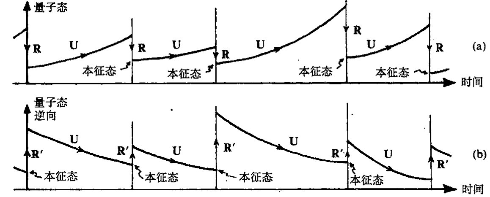

图30.2 实际应用于量子力学的两种过程U和R的交替…，U，R，U，R，U，…的演示（比较图22.1）。按照（a）演化的标准时序方向，算符本征态出现在每一次U演化延伸线的过去端；（b）演化的逆时观点，算符本征态出现在每一次U演化延伸线的未来端。按量子力学的“交易性”解释，存在两个态矢，一个按（a）演化，另一个按（b）演化。

## 30.4 霍金的黑洞温度

有什么方法能够将**R**与所寻求的（时间不对称的）量子引力统一体联系起来呢（这比仅仅寻求**R**的时间不对称性更直接）？我认为有，而且我会举出两个这样的联系。第一个得从前节的讨论开始，并且要用到著名的“黑洞蒸发”现象。这里的论证只是部分建议性的，远远谈不上完成；何况在核心问题上还有争论。这个讨论的要点是本节和以下直到[§30.9](#309-更激进的观点)的主题。（不包括[§30.5](#305-源自复周期性的黑洞温度), 6，它们应算作偏离主题了。）第二个联系要清楚得多，它源自广义相对论基本原理和量子力学基本原理之间的基础性张力，并且导致某种清楚的定量预言。它的一系列讨论将在[§30.10](#3010-薛定谔团块)~13给出。但是，第一个讨论——涉及到黑洞熵的某种应用——提出了其他一些重要的理论问题，在当今的理论探讨中经常会引用到这些内容，因此对它们有一定了解是有益的。

从[§27.10](chapter_27.md#2710-黑洞熵)我们知道，贝肯斯坦-霍金公式为 $S_{BH} = \frac{1}{4}A$（这里采用自然单位制，对黑洞熵 $S_{BH}$ 取 $k = c = G = \hbar = 1$，$A$ 为黑洞的事件视界的表面积）。霍金（1973）在自己的讨论中证明了黑洞必然有温度，这个温度正比于所谓黑洞的“表面引力”。对于定态旋转黑洞（克尔几何，见[§27.10](chapter_27.md#2710-黑洞熵)），我们发现

$$T_{BH} = \frac{1}{4\pi m\left[1 + \left(1 - a^2/m^2\right)^{-\frac{1}{2}}\right]},$$

这里，如同[§27.10](chapter_27.md#2710-黑洞熵)，$m$ 是黑洞质量，$am$ 是其角动量。这个温度可从如下的热力学标准公式

<!-- page 609 -->

通向实在之路

得到：

$$TdS = dE,$$

其中对于不同的能量 $E$，我们认为保守的角动量是常量。***[30.3] 相应地，这个黑洞会像热力学平衡态下的物理客体那样发射光子，其辐射能量谱遵从温度 $T_{BH}$ 下的（普朗克）“黑体”辐射特征谱。有必要指出，虽然黑洞的贝肯斯坦–霍金熵非常大（由 [§27.13](chapter_27.md#2713-异乎寻常的特殊大爆炸) 里讨论的非同寻常的数字给出），但合理大小的黑洞的霍金温度却极低。例如，一个太阳质量的黑洞其霍金温度仅为 $10^{-7}\,\text{K}$，它比地球上人类可达到的最低温度（约 $10^{-9}\,\text{K}$）高不了多少。

雅各布·贝肯斯坦（1972）曾在此之前利用物理论证（基于将热力学第二定律应用到量子粒子逐渐慢化进入黑洞的场合）导出过黑洞熵的表达式，但他既没得到这个公式现在形式中 "$\frac{1}{4}$" 这个明确值，也没有给出黑洞温度。斯蒂芬·霍金则在弯曲时空背景下应用量子场论技术首次得到了这一温度和公式中的 "$\frac{1}{4}$"。这里，弯曲时空背景描述遥远的过去所发生的物质（譬如说一颗恒星）坍缩而形成的黑洞。这种情形可由[图 27.16](assets/page538_fig01.jpg)(c) 的共形图来描述（如果坍缩是球对称的，则结果是严格正确的）。

照我看，霍金对黑洞熵和温度的计算（其中考虑了相关的“翁鲁效应（Unruh effect）”⁹）是迄今为止获自量子引力理论的唯一合理可信的结论。即使霍金的结论并非严格得自量子引力理论，确切地说，那也是得自弯曲时空背景下的量子场论考虑。一般而言，当我们试图在弯曲背景下阐述量子理论时，总会遇到一些严重的问题，令人惊奇的是霍金竟给出了一些确实的结论。

问题的关键之一是在弯曲背景下找到一种恰当的“正频率”概念。正如我们在 [§24.3](chapter_24.md#243-量子力学里能量的正定性) 和 [§26.2](chapter_26.md#262-产生算符和湮没算符) 看到的，这一概念是量子粒子和量子场论标准观点的核心要素。要在一般的弯曲时空下阐述这个问题的困难在于缺少能够阐明“正频率”概念的自然定义的“时间参数”。

警觉的读者会指出，在闵可夫斯基空间下也不存在自然定义的时间参数！但这时我们可求助于这样一个明显的事实：对于相对论波动方程（像第 19、24～26 章里的那些方程）的解，闵可夫斯基时间 $t$ 的一个选择下的正频率等价于这一参数的任何其他形式下的正频率——只要时间方向不反向。对无质量场，我们甚至可以走得更远，即利用由时间取向不变的共形变换从标准的闵可夫斯基时间参数得出的“时间参数”来得到相同的正频率条件。¹⁰

在一般时空中，不存在这种参数的自然类比，正频率概念通常依时间参数的不同选择而不同。除了霍金温度情形之外，绝大部分的合理结果都出自定态时空的考虑，这种时空具有保持时空几何不变的连续的时间位移族（见图 30.3）。这种时空运动产生于类时基灵矢量 $\mathbf{\kappa}$（见 [§14.7](chapter_14.md#147-度规能为你做什么) 和 [§30.6](#306-基灵矢量能量流时间旅行)）。沿矢量 $\mathbf{\kappa}$ 指向的曲线（$\mathbf{\kappa}$ 的积分曲线）也就是沿此可以规定合理的自然“时间参

---

*** [30.3] 对 $T_{BH}$ 导出该公式，这里假定克尔黑洞的视界面积表达式由 [§27.10](chapter_27.md#2710-黑洞熵) 给出。

??? question "答案 [30.3]"
    在普朗克单位下，黑洞熵为 $S=A/4$。对克尔黑洞，面积 $A=8\pi m(m+\sqrt{m^2-a^2})$，于是 $S=2\pi m(m+\sqrt{m^2-a^2})$。

    黑洞热力学中温度满足 $1/T=(\partial S/\partial m)_J$，这里保持角动量 $J=am$ 不变。把 $a=J/m$ 代入再对 $m$ 求偏导，可得 $T_{BH}=\sqrt{m^2-a^2}/(4\pi m(m+\sqrt{m^2-a^2}))$，恢复普通单位时再乘上相应的 $\hbar c^3/(Gk)$ 因子。史瓦西情形 $a=0$ 给出 $T_{BH}=1/(8\pi m)$。

· 590 ·

<!-- page 610 -->

数" $t$ 的那些曲线，因此

$$\kappa = \frac{\partial}{\partial t}$$

这里其余的 3 个坐标 $x$, $y$, $z$ 沿曲线皆取常数。于是"正频率"概念即可根据这个参数来定义。

在不止一个类时基灵矢量的条件下会出现一种奇妙的情形，这时会有不止一个的"正频率"概念。类时基灵矢量的这种多重性随闵可夫斯基空间 $\mathbb{M}$ 而出现，正如上面所说，当我们从一个闵可夫斯基惯性系过渡到另一个惯性系时，正频率概念是一致的。但当我们从惯性系过渡到加速参照系时，情形就完全不同了。由此我们得到一个清楚的"正频率"概念，其结果是量子场论处于所谓热真空中，这时一个加速的观察者会感受到一个非零的温度——尽管对于合理的加速度情形这个温度值极其微小。

应当认识到，虽然这是一个令人惊奇的效应，但这种"加速度温度"只不过是那种用普通（虽然是理想化的情形）温度计可测量的温度。在此情形下，温度计或许经受着匀加速度，而这个过程可以看成是相对于环境真空中而言的，后者被认为是一种由非加速温度计测得的零温度真空。（"热真空"这一概念与 §§ 26.5, 11 里的量子场论"备择真空"概念和 §[§28.1](chapter_28.md#281-早期宇宙的自发对称破缺), 4 里的"伪真空"概念均有关联。）这个效应也称为"翁鲁效应"，它与霍金的黑洞热状态是一致的。按照等效原理（[§17.4](chapter_17.md#174-等效原理)），一个处于很大的黑洞附近保持定态的观察者将经历一个有效的加速作用，这一加速度造成的翁鲁温度就等于他在自身过程中得到的霍金温度。

一般来说，我们可以通过某些途径来避开缺乏"正频率"自然定义这一困难，例如采取放弃"粒子"概念只考虑量子力学算符代数的办法。${}^{11}$ 乍一看，这似乎代价太高，而且我们需要有一定的创新性才能用这种处理方式来阐述许多有趣的问题。直到本书成文之时，我自己还无法评估这一诱人且看起来很有希望的理论的全部优势所在。我甚至怀疑它是否真的比具体的类时矢量场的处理方法更优越。不管怎么说，我没看出为什么我们非要从固定背景下的量子场论中找出全部的物理意义。它只是对更严格理论的一种近似，在这种严格理论中，引力场的自由度——即时空几何本身——也必须参与到量子物理中来。

在霍金的黑洞温度和熵的计算中，他设法通过仅要求在无穷远处正负频率分开，这一处理避开了大部分这类问题。在 $\mathscr{I}^{-}$（过去零无穷远）有一个这种概念，而在 $\mathscr{I}^{+}$ 的概念则不相同（见 [§27.12](chapter_27.md#2712-共形图)）。这种差异导致产生霍金的黑洞"热状态"，并由此产生所谓霍金辐射。值得指出的是，之所以存在这种效应是因为有这样一个事实：定义在 $\mathscr{I}^{-}$ 上的一些信息在奇点处丢失了，从而无法在 $\mathscr{I}^{+}$ 处读出所有这些信息（见[图 30.4](assets/page610_fig01.jpg)）。我们将在 [§30.8](chapter_30.md#308-霍金爆炸) 看出这一事实的意义。

）。](assets/page610_fig01.jpg)

<!-- page 611 -->

通向实在之路

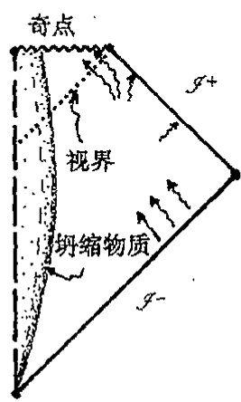

**图30.4** 霍金对黑洞温度的计算（其中包含了在遥远的过去某些物质向黑洞的坍缩）只需要用到在 $\mathscr{I}^+$ 和 $\mathscr{I}^-$ 上的（标准）正/负频率概念。黑洞的真空变成一种热态（密度矩阵），因为 $\mathscr{I}^-$ 上的初始信息被分成了 $\mathscr{I}^+$ 处的信息和终态奇点处的信息，后者被丢失。

## 30.5 源自复周期性的黑洞温度

此刻，我们不妨先来考虑一种后来才出现的对霍金温度的绝妙推导，它是由吉本斯（G. W. Gibbons）和佩里（M. J. Perry）于1976年提出的，虽然这么做有点偏离了本章的主线。（我们到[§30.8](#308-霍金爆炸)再返回主线。）吉本斯–佩里论证提出了一些关乎优美的数学概念在真正的物理现象中的作用的有趣问题。他们注意到，如果表示黑洞终态的爱因斯坦方程的解（即施瓦西解或克尔解——见[§27.10](chapter_27.md#2710-黑洞熵)）是"复化的"（即坐标值从实值扩展到复值——见[§18.1](chapter_18.md#181-欧几里得型与闵可夫斯基型四维空间)），那么关于定义在这个复化空间上量的基本正则化条件意味着这些量必须具有复化时间上的周期性（见[§9.1](chapter_09.md#91-傅里叶级数-153)的图9.1(a)），其纯虚数周期为 $2\pi i T_{\text{BH}}$。统计热力学告诉我们，这种复周期确实对应于[§30.4](#304-霍金的黑洞温度)给出的确定温度 $T_{\text{BH}}$。这是一条直接通往霍金黑洞温度的道路。

但我们如何把这一数学过程变成物理推导呢？它确实是一个非常优美的论证，可以直接用来得到许多不同场合下的霍金黑洞温度，这是霍金原初的讨论中无法做到的。但另一方面，将这一论证视同真正给出霍金温度在物理上正确的实际证明还是有困难的。这是数学美的一个好例证，它碰巧给出了正确答案（这里"正确性"判断是就它符合物理上更易接受的判别标准的答案而言的，在这里，后者即指上述霍金的原始论证），尽管新论证的数学里包含某些"物理"假设这一点的有效性值得怀疑。

让我们更详细地看看这一"复化"的数学要点。为此我们先来考虑普通的2维欧几里得平面 $\mathbb{E}^2$，它的复化是 $\mathbb{CE}^2$（$=\mathbb{C}^2$）。实空间 $\mathbb{E}^2$ 有时也称为 $\mathbb{CE}^2$ 的实截面（图30.5(a),(b)；亦见图18.2b）。这是欧几里得型的实截面，因为它具有普通的欧几里得度规。但 $\mathbb{CE}^2$ 还有洛伦兹型的实截面（见[§18.2](chapter_18.md#182-闵可夫斯基空间的对称群)的图18.2），我们可以通过取 $\mathbb{E}^2$ 的标准笛卡儿坐标对 $(x,y)$（二者都是实参数）中的 $y$ 为纯虚数，然后取 $t=iy$ 作为时间坐标来构造这样一个洛伦兹型实截面 $\mathbb{M}^2$。（这是我

·592·

<!-- page 612 -->

第三十章 量子态收缩中的引力角色

们在[§18.1](chapter_18.md#181-欧几里得型与闵可夫斯基型四维空间)里已见过的2维情形。）现在我们来考虑 $\mathbb{E}^2$ 的极坐标 $(r,\theta)$ 而不是笛卡儿坐标 $(x,y)$，见[§5.1](chapter_05.md#51-复代数几何)和图30.5(a)。非负实数 $r$ 量度距原点的距离，实数角 $\theta$ 给出径向矢量与 $x$ 轴的夹角，以逆时针为正方向。如何将这个坐标系扩展到洛伦兹型实截面 $\mathbb{M}^2$ 上去呢？假如我们将注意力集中在右半象限 $\mathbb{M}^R$，如图30.5(b)所示，则 $r$ 仍是非负实数，但 $\theta$ 现在是纯虚数，因此

$$\tau = i\theta$$

是实的。现在坐标 $r$ 量度的是距原点的洛伦兹型空间距离，$\tau$ 量度“自水平面转过的双曲角”。**[30.4]**

我们将坐标 $\tau$（乘以常数 $r_0$）作如下理解：对一个（处于这种2维平直时空几何内的）“匀加速”背离中心的观察者（其世界线由 $r=r_0$ 给出）来说，$\tau r_0$ 就是普通时空意义上的“时间”量度（“林德勒（Rindler）坐标”^{12}）。时空本身被看成是整个 $\mathbb{M}^2$，尽管事实上观察者的“时间”只用于象限 $\mathbb{M}^R$。我们假定观察者感兴趣的是 $\mathbb{M}^2$ 上的解析量。这种量具有到时空复化的全纯扩展（见[§7.4](chapter_07.md#74-解析延拓)和[§12.9](chapter_12.md#129-复流形)），但这只对某种“实截面”的紧邻域才是有保证的，在目前情形下，指的就是洛伦兹截面。然而如果这个量在该截面的原点 $O$ 实际上是解析的，那么它必定在欧几里得截面的原点上也是解析的（因为二者是同一原点 $O$）。但在欧几里得原点为正则的量，其 $\theta$ 一定具有周期为 $2\pi$ 的周期性，因为如果我们使 $\theta$ 增加 $2\pi$（按某个小径向值 $r=\varepsilon$），结果只是围绕原点转一圈最后仍回到出发点。因此，原初的洛伦兹时空坐标 $\tau$ 具有 $2\pi i$ 的（复化了的）虚周期。

这是吉本斯-佩里论证的基础，现在我们将它用到完全4维黑洞几何上去而不是简化了的2维时空 $\mathbb{M}^2$ 上。相关的几何现在是史瓦西几何（对无自旋球对称情形，我们也可以用克尔几何来

---

**[30.4]** 根据洛伦兹型笛卡儿坐标 $(x,t)$ 写出这些坐标 $(r,\tau)$；说明为什么 $\theta$ 的实部在 $\mathbb{M}^2$ 上为零。

??? question "答案 [30.4]"
    二维闵可夫斯基空间中 Rindler 型坐标可取 $x=r\cosh\tau$、$t=r\sinh\tau$，或按楔区符号互换。于是 $ds^2=r^2d\tau^2-dr^2$。

    若把极角写成复角，欧几里得旋转角与洛伦兹双曲角相差一个因子 $i$。在真实闵可夫斯基截面上，物理坐标 $x,t$ 为实，故相应角变量的实部按所选约定为零或固定，非零部分体现的是虚时间角。

·593·

<!-- page 613 -->

通向实在之路

830 描述旋转黑洞）。为使论证有效，我们需要一个类似于 $\mathbb{M}^2$ 的原点 $O$ 的参考点。[图 30.6](assets/page613_fig01.jpg)(a) 中显示的就是这样的一点，这里我们给出了所谓“最大扩展了的”史瓦西时空 $\mathcal{K}$ 的严格共形图。^13^ 时空 $\mathcal{K}$ 有时又称作“永恒黑洞”，因为它不是由引力坍缩形成的，而是“永远就在那儿”。按照严格共形图的约定，图的中心点 $O$ 代表一个 2 维球面。$\mathcal{K}$ 类比于 $\mathbb{M}^2$，但我们还需要一个欧几里得空间 $\mathbb{E}^2$ 的类比物。存在这样一种空间，有时我们称它为“欧几里得化的”史瓦西空间 $\mathcal{G}$（甚至经常就叫“欧几里得空间”，真让我感到莫名其妙！）这里，$\mathcal{K}$ 的史瓦西“时间”^14^ $\tau$ 在 $\mathcal{G}$ 中取纯虚数 $\tau = \mathrm{i}\beta\theta$，量 $\theta$ 是 $\mathcal{G}$ 中的角坐标，它沿正方向绕 $O$ 转一圈角度增加 $2\pi$（[图 30.6](assets/page613_fig01.jpg)b），$\beta$ 是称为“表面引力”的常实数（在常数 $r$ 处）。任何一个在 $\mathcal{K}$ 的 $O$ 处正则的量（即解析的，见 [§7.4](chapter_07.md#74-解析延拓)）也必定在 $\mathcal{G}$ 的 $O$ 处正则（因为在复化史瓦西空间内，两个实截面 $\mathcal{K}$ 和 $\mathcal{G}$ 的“$O$”实则是同一个点）。在 $\mathcal{G}$ 的 $O$ 处正则的量必然是周期性的，即 $\tau$ 有周期 $2\pi\mathrm{i}\beta$，因为 $\theta$ 是普通角坐标，增加 $2\pi$（$=360^\circ$）后空间上又回到出发位置。按照统计热力学原理，这个虚周期是“温度 $\beta$ 的热状态”的特征。

这里我的目的不是要讨论这些热力学原理。那样我们就偏离得太远了。我们关心的只是能

831 否确信对这种复周期的论证。我们能证明它是正确的吗？这一点完全不清楚。对一个实际的物理黑洞而言，这种完全“永恒”的图像肯定是不恰当的。物理黑洞必定是由引力坍缩产生的（譬如说，星系中心的那些超大的恒星或物质团），除非它是大爆炸本身“原生的”。甚至原生的洞——黑洞而不是其时间反向的对立面，即白洞——一定意义上也还是代表着“坍缩”，况且不论是黑洞还是白洞，都不能用[图 30.6](assets/page613_fig01.jpg)(a) 的完整模型来充分描述。但是这个模型的某些外在部分，即[图 30.6](assets/page613_fig01.jpg)a 中处于上部和示意参与坍缩的实际物质边界线的右边部分，可恰当地描述向黑洞的坍

缩。而对于下部以及这个边界的左边部分，时空度规将是物质型的，它不同于永恒黑洞的度规。完全的坍缩如图 30.7 所示，它相当于稍许重画的[图 27.16](assets/page538_fig01.jpg)(c)。现在我们要指出，$O$ 总是处于（扩展了的）史瓦西度规有效区域之外。因此，对于定义在该时空上的物理量在 $O$ 点具有正则性

· 594 ·

<!-- page 614 -->

这一假定，我们很难从物理上认定它是正确的，这也就是为什么我们难以认定这种论证能为霍金温度的正当性提供证据的理由，尽管它在数学上非常优美。（任何一种物理上现实的黑洞模型都会或多或少地偏离严格的史瓦西——或克尔——度规，我们可合理地预期，当我们的扩展越接近“$O$”点，这类偏离就会越大，直至最后发散到无穷大。）***[30.5]

但是也应看到，严格的定态黑洞模型表示的是实际坍缩的最终极限，这时所有的非正则性都可以认为是随着时间流逝而被熨平。正是这种极限时空才具有正则性，因而具有所需的复周期性，并导致所需的温度。虽然我看不出我们怎么才能将这一论证视同对霍金温度的实际物理推导（尽管通常都是这么看待的），但它确实给出了“黑洞温度”这一概念背后具有内在协调性的“强烈迹象”。

在这里，我不禁想起这种情形可与另一个例子相比较。卡特（Brandon Carter）曾就其他问题做过与此非常相似的论述，虽然那种情形也绝对谈不上是什么“推导”。我们知道，定态不带电黑洞可以用两个克尔参数 $m$ 和 $a$ 来描述，这里 $m$ 是黑洞质量，$am$ 是其角动量（为方便起见，这里取 $c=G=1$ 的单位，譬如 [§27.10](chapter_27.md#2710-黑洞熵) 的普朗克单位）。纽曼（Ezra T. Newman）发现，^15^推广了的克尔度规（通常称为克尔–纽曼度规）可用于表示带电的旋转定态黑洞。这时我们有 3 个参数：$m$、$a$ 和 $e$。质量和角动量同前，但多了总电荷 $e$，由此又有了磁矩 $M=ae$，其方向同角动量方向。卡特注意到，黑洞的旋磁比（两倍质量乘以磁矩与电荷乘以角动量的比值 $2m \times ae/(e \times am) = 2$）完全是固定的，实际取值正好是狄拉克当初预言的电子的旋磁比 2（狄拉克电子的角动量是 $\frac{1}{2}\hbar$，磁矩为 $\frac{1}{2}\hbar e/mc$，因此旋磁比正好也是 2，这里取 $c=1$），见 [§24.7](chapter_24.md#247-狄拉克方程)。纽曼（2001）依据空间复方向的位移对这种“巧合”给予了解释。

我们能将这种讨论算作是给出了一种独立于狄拉克当初论证的对电子旋磁比的推导吗？显然不能，在“推导”一词的任何通常意义上这都说不过去。除非将电子看成是某种意义上的“黑洞”或许可行。事实上，在电子情形下，参数 $a$、$m$ 和 $e$ 的实际值严重违反不等式

$$m^2 \geq a^2 + e^2,$$

而这个条件却是克尔–纽曼度规能够表示一个黑洞所必需的。因此，这种讨论距狄拉克对电子旋磁比的推导相差何止十万八千里！而这个例子正好与吉本斯–佩里对黑洞温度的论证存在几

***[30.5] 看看你能否给出一个论证来证明这个判断的正确性。提示：考虑小的线性微扰。你能预期它在时间上的一种或不止一种的指数行为吗？

??? question "答案 [30.5]"
    对不稳定平衡作小线性微扰，方程通常化为 $\ddot\epsilon=\lambda\epsilon$。若 $\lambda>0$，解含 $e^{\sqrt\lambda t}$ 与 $e^{-\sqrt\lambda t}$ 两支。

    时间反演对称的方程允许增长和衰减两种模式；但一般微扰会激发增长支，因此精细平衡在一个时间方向上不稳定。靠近扩展中的特殊点时，任意现实偏离都会被指数放大，所以严格解析延拓的物理可靠性很可疑。

· 595 ·

<!-- page 615 -->

833 分相似，后者是想通过扩展到复域来证明这个温度值的“自然性”。¹⁶吉本斯–佩里的论证的确为这一问题提供了另一种视角，使我们意识到这个问题并非仅限于史瓦西/克尔类时空度规的考虑，但不管怎么说，我认为它都难以作为一种实际的物理推导被普遍接受。

## 30.6 基灵矢量，能量流——时间旅行！

“永恒黑洞”经常因为其他原因受到人们的关注，尽管事实上它的一些难于理解的总体特性使它很难被认真当作物理上可接受的宇宙模型。虽然其中的一些理由与其说是出自现实考虑，不如说与科幻小说联系得更紧密些，但永恒黑洞的一些几何特性仍是值得研究的，它们展示了我们将在 §§ 30.7，10 遇到的重要而有趣的数学特性。我们看到，永恒黑洞有两个不同的过去零无穷大（$\mathscr{I}^+$ 和 $\mathscr{I}^{-'}$）和两个不同的未来零无穷大（$\mathscr{I}^-$ 和 $\mathscr{I}^{-'}$）。这种时空经常被认为表示的是由“虫洞”连接着的两个不同宇宙的时间演化，最后虫洞“收缩”成奇点，见[图 30.8](assets/page615_fig01.jpg)。

**图 30.8** 从总体上看，时空 $\mathcal{K}$ 像一个“时间演化着”的 3 维空间，它代表连接两个渐近平直区域的“虫洞”。虫洞在未来和过去两个方向均以奇点方式结束。任何试图从一个区域穿越虫洞到另一个区域的太空旅行者都不可能在虫洞（如共形图显示的那样）“夹断”之前就穿过它，因为那样的话意味着要求旅行者的世界线具有类空（超光速）部分——即图中点状线表示的部分。

对于这两个“外部”区域，似乎每个宇宙都包含一个黑洞，但这种黑洞很奇怪，它同时又是“白洞”。信号可以从过去的内部区域 $\mathcal{B}^-$ 逃逸到每个外宇宙 $\mathcal{E}$ 和 $\mathcal{E}^{'}$（“白洞”行为），也可以从每个外宇宙 $\mathcal{E}$ 和 $\mathcal{E}^{'}$传播到未来内部区域 $\mathcal{B}^+$（“黑洞”行为）。定态时空这个事实表明存在

834 基灵矢量 $\kappa$（见 [§14.7](chapter_14.md#147-度规能为你做什么)，[§19.5](chapter_19.md#195-能量动量张量) 和 [§30.4](chapter_30.md#304-霍金的黑洞温度)）。我在[图 30.9](assets/page616_fig01.jpg) 里画出了这个基灵矢量。我们注意到，基灵矢量在两个外部区域 $\mathcal{E}$ 和 $\mathcal{E}^{'}$ 是类时的，但它在内部区域 $\mathcal{B}^-$ 和 $\mathcal{B}^+$ 却是类空的。$\kappa$ 在外部区域的类时性质意味着 $\kappa$ 将表现出黑洞/白洞的定态性质。在 $\mathcal{E}$ 中其世界线与基灵矢量场 $\kappa$ 相切的那些观察者感知的是一个不变的宇宙。这对 $\mathcal{E}^{'}$ 也一样，只是 $\mathcal{E}^{'}$ 中具有这种性质的观察者必须将这种考虑看成是针对 $-\kappa$ 而不是 $\kappa$，因为对经历整个时空的局部观察者来说，未来/过去的界线应当是前后一致的。某种意义上说，当我们从 $\mathcal{E}$ 进入 $\mathcal{E}^{'}$ 时“时间方向”已经发生逆转。通过将能量动量张量与基灵矢量 $\kappa$ 缩并成 $T_{ab}\kappa^b$ 而得到的守恒的能量密度（[§19.5](chapter_19.md#195-能量动量张量)）提供了 $\mathcal{E}$ 中

· 596 ·

<!-- page 616 -->

第三十章 量子态收缩中的引力角色

（正常物质的）正的能量密度，但在 $\mathcal{E}'$ 中正常物质的能量密度是负的（因为 $\kappa$ 在 $\mathcal{E}'$ 中指向过去，表示定态的普通基灵矢量现在是 $-\kappa$）。这里没有矛盾，只是所考虑的时空性质看上去古怪。

实际上，现实中的观察者不可能从 $\mathcal{E}$ “进入” $\mathcal{E}'$，因为相关的 “世界线” 并非处处类时（[图 30.8](assets/page615_fig01.jpg)）。但尽管如此，理论家们仍经常想方设法对时空进行 “微调” 以图做到这一点。他们的理由是出于这样一种考虑（我看这是误导），那就是要证明那种科幻小说里的宇宙间的 “白洞” 旅行——或（如图 30.10 中微调过的图像）从一个时空区域到遥远的另一个区域——能够在未来实现。如果这种设想真能成功，那么它将使超越正常相对论限制的空间旅行成为潜在的可能。《星际旅行》设计了一种 “时空弯曲引擎（warp-drive）”[1]，它允许飞船穿越虫洞到另一个可能比穿越前 “更早” 的遥远区域去旅行。

图 30.9 基灵矢量 $\kappa$ 在两个外部区域 $\mathcal{E}$ 和 $\mathcal{E}'$ 是类时的，但在内部区域 $\mathcal{B}^-$ 和 $\mathcal{B}^+$ 却是类空的。比较 $\mathcal{E}$ 和 $\mathcal{E}'$ 上的 $\kappa$ 我们发现，它颠倒了时间取向，因此守恒的能量密度 $T_{ab}\kappa^a$ 变号。

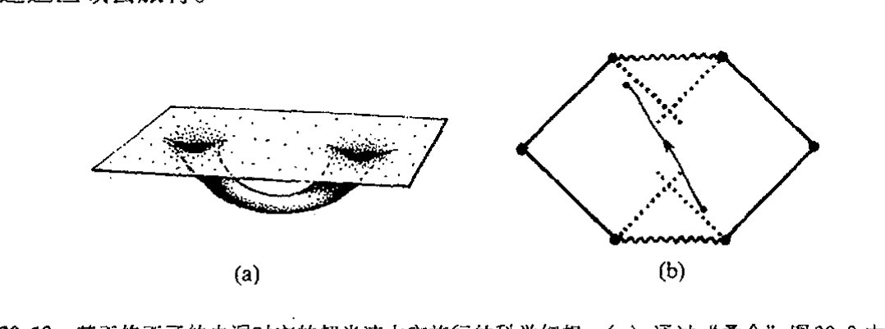

图 30.10 基于修正了的虫洞时空的超光速太空旅行的科学幻想。(a) 通过 “叠合” 图 30.8 中两个相距遥远的外空间区域，我们得到一个连接同一空间中遥远区域的虫洞，但从一个区域穿越虫洞到另一个区域仍不能由类时曲线实现。(b) 要使之成为可能，就需要调整这里描述的 $\mathcal{K}$ 的 “延伸” 版本的性质（但这种模型要求负能量密度）。

尽管奇特，但甚至一流的广义相对论专家都在考虑这种 “时间旅行” 的可能性。17 所以，与其说（至少有时是这么看）是因为在当前的物理学背景下有可能实现时间旅行，不如说我们可以在物理上从其不现实的事实**[30.6] 中受到教益。在[图 30.8](assets/page615_fig01.jpg) 给出的 “空间描述” 中，虫洞在空

---

[1] 美国科幻电视连续剧《星际旅行》中企业号的驱动方式。影片中的 warp-drive 标准有多级，warp1 相当于光速，以后每提高一级，速度以指数形式提高。美国太空总署（NASA）正在从理论上探讨这种可能性，例如 Alcubierre 设计的 warp-drive 能够对飞船前方的时空进行压缩，并对飞船后方的时空进行扩张，从而产生这之间区域的空间弯曲，使得飞船被加速。详见 NASA 网站 http://www.nasa.gov/centers/glenn/research/warp/ideachev.html 。——译者

** [30.6] 依据狭义相对论原理解释为什么这不现实，如果可以在两类空分离事件 $p$ 和 $q$ 之间旅行，就意味着可以沿过 $p$ 的类时世界线从 $p$ 回到 $p$ 之前的事件。

??? question "答案 [30.6]"
    若能在任意类空分离事件 $p,q$ 之间传送信号，则在某些惯性系中 $q$ 发生在 $p$ 之前。再利用洛伦兹变换和第二个相对运动的发送者，可把信号从 $q$ 送回 $p$ 的过去光锥内。

    这样沿一条类时世界线可回到 $p$ 之前的事件，形成因果悖论。因此狭义相对论禁止类空超光速旅行作为可控信号。

· 597 ·

<!-- page 617 -->

通向实在之路

间旅行者能够通过之前就“收缩到零”。这个想法要表达的是这样一种可能性：在理论限定的条件下，如果容许存在负能量密度，就有可能“维持虫洞张开”足够长时间使得旅行者能够从一端跑到另一端。在经典理论中，通常认为这种负能量密度是不存在的，而在适当的量子场论这种特殊情形下则是容许的。

是不是真有一些相对论物理学家相信，这种疯狂的念头会给我们带来“时空弯曲引擎”概念，使我们能够借助这种基于量子场论的虫洞来实现宇宙间的远距离旅行？我认为就是有也是极个别的。^18^更值得认真考虑的是这类问题或许能够提供一种对量子引力概念的“检验”。如果这些量子场论概念的确容许虫洞“保持张开”，那么这可以看成是这些关乎量子引力的特殊概念的坏的迹象——于是我们必须反复斟酌。这个思路可以为眼下所考虑的具体量子引力理论的合理性提供一些有用的导向。（至少我是这么来看待这个问题的。也许我在这方面所持的观点太过“宽泛”，实际上认为应当认真对待这种“时空弯曲引擎”的理论家比我想象的要多得多！）

## 30.7　来自负能量途径的能量流

我已经偏离本章主题太远了，这个主题是考虑黑洞霍金温度的意义。我们能在量子力学框架下看出为什么黑洞应当具有非零温度辐射的更多的理由吗？实际上，霍金为这种霍金辐射还提供了一种“直观的”推导，如图30.11。在黑洞视界附近，虚粒子－反粒子对持续从真空中产生出来，本当在极短的时间里彼此湮没。（我们在[§26.9](chapter_26.md#269-重正化)考虑过这种过程，见图26.9和26.10。）但是，由于存在黑洞，这个过程被调整，因为经常会发生粒子对的一个粒子被拖入黑洞、另一个逃逸的现象。但这种情形只有在逃逸粒子变为实粒子（即“壳上的”，与之相对的是“离壳的”虚粒子，见[§26.8](chapter_26.md#268-构建费恩曼图s-矩阵)和图26.6）时才会发生，因此逃逸粒子必然具有正能量，而落入黑洞的粒子（由于能量守恒）必然成为具有负能量的实粒子（这些能量可认为来自无穷远）。事实上，负能量只会存在于黑洞中的实粒子上，所以如此是因为基灵矢量κ^a^在

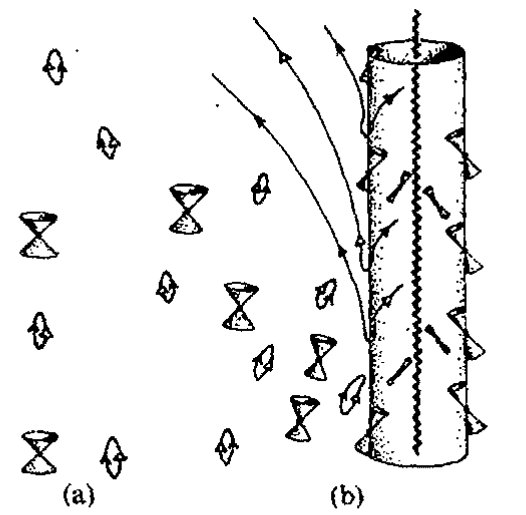

<!-- page 618 -->

第三十章 量子态收缩中的引力角色

内部区域 $\mathcal{B}^+$ 中变成类空的，指向未来的类时 4 维动量 $p_a$ 会有一个负的标积 $p_a\kappa^a$，它就是粒子的（守恒的）能量，见[图 30.11](assets/page617_fig01.jpg)(b)。*^{[30.7]}霍金过程之所以可能就是因为一个实粒子（相对于虚粒子而言）在黑洞视界内具有负能量。而它的实伙伴必然具有正能量，因此正能量能够被带离洞外。

有必要指出，如果黑洞是旋转的，那么经典黑洞理论中也会出现非常类似的情形。对于正常大小的黑洞，其霍金辐射极其微小——往往只具有纯理论上的意义——与此不同的是，经典旋转黑洞的类似辐射则可能大到足以具有天文观察上的意义。事实上宇宙间已知的大多数强能量源（类星体和射电星系）似乎由巨大黑洞的转动能量作为能源的。

这个过程与产生霍金辐射的过程非常相似，能量产生都是因为负能粒子或场被黑洞吞没，导致正能量逃离黑洞到无穷远。但二者间有一个重要的差别：对旋转黑洞，基灵矢量 $\mathbf{\kappa}$ 在其中变成类空的那部分时空会一直延伸到黑洞视界外的区域。这个区域即所谓的能层（[图 30.12](assets/page618_fig01.jpg)(a)）。因此，在能层内，粒子能够具有负能量（这是在无穷远处测得的）同时仍可以与遥远的宇宙另一端进行联系。例如，粒子可以从外面进入能层，然后分裂成两部分，其中一部分具有负能量，使得另一部分携带着比初始粒子进来时更多的能量再次逃逸出去！^{19}由此净能量被带离黑洞，使得转动运动中存储的能量有所减少（[图 30.12](assets/page618_fig01.jpg)(b)）。如果将粒子换成（电磁）场，所得结论类似。^{20}

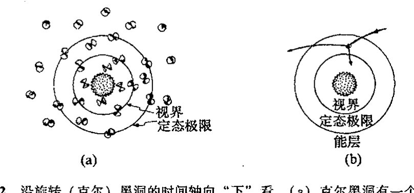

图 30.12 沿旋转（克尔）黑洞的时间轴向“下”看。(a) 克尔黑洞有一个区域——称为“能层”——其中定态的基灵矢量 $\mathbf{\kappa}$ 在黑洞视界外变成类空的。在能层内，粒子可以有负的保守能量（如同在无穷远测得的一样），另一些粒子则可携带多余的能量逃到无穷远。(b) 按照所谓“彭罗斯过程”，这一事实可用来产生能量，即抽取黑洞的转动能。最简单的过程，莫过于将粒子射入能层，使之分裂成两个粒子，一个携负能落入黑洞，另一个携较粒子初始时更多的能量逃到无穷远。

要强调的一点是，从局部看，落入黑洞的“负能粒子”其实就是普通粒子（即 [§18.7](chapter_18.md#187-相对论性能量和角动量) 描述的那种具有普通 4 维类时动量的粒子）。当粒子正好处于能层时，我们从无穷远处测得的该粒子能量 $p_a\kappa^a$ 恰好变成负的。这是黑洞的一个显著且非常有力的事实，而且不存在任何数学上的不相容性和物理上的不合理性。正是因为有这一机制，黑洞才能够经常发生向外部世界抛射大量

---

* [30.7] 解释：如何从类空的 $\kappa^a$ 得到负的“能量”值 $p_a\kappa^a$。

??? question "答案 [30.7]"
    能量相对于观察者或基灵矢量 $\kappa^a$ 定义为 $E=p_a\kappa^a$。若 $\kappa^a$ 是未来类时且 $p^a$ 满足正能条件，则该量符号固定。

    但若 $\kappa^a$ 变为类空，洛伦兹内积不再有正定性；可选择未来类时 $p^a$ 使其在 $\kappa^a$ 方向的投影为负。因此在黑洞内部或能层内可出现相对于无穷远时间平移的负“能量”态。

· 599 ·

<!-- page 619 -->

通向实在之路

转动能的现象。

事实上，对类星体发出巨大能量（见 [§27.9](chapter_27.md#279-事件视界与时空奇点)）的最合理的解释，就是把这种能量看成是源自巨大黑洞的转动能。黑洞巨大的转动能正是通过上述过程逐渐衰减（释放到空间），见[图 30.12](assets/page618_fig01.jpg)(c)。一般认为，黑洞吞噬的负能量主要是电磁场（例如，见文献 Blandford and Znajek, 1977; Begelman et al., 1984）而不是实际粒子（例如 Williams, 1995, 2002, 2004）。但基本原理是一样的。

## 30.8 霍金爆炸

现在让我们回到量子力学的霍金过程上来。如上所述，质量为一个太阳质量（$1M_\odot$）的黑洞的温度是极其低的，见 [§30.4](#304-霍金的黑洞温度)（约为 $10^{-7}$K）。对更大的黑洞，其温度会更低（对于给定的 $a:m$ 比值，温度反比于黑洞质量，见 [§27.10](chapter_27.md#2710-黑洞熵)）。天文学上还没有证据表明存在质量小于 $1M_\odot$ 的黑洞，因此黑洞温度目前还不是天文学关心的兴趣所在。

但不管怎样，正如霍金 1974 年就指出的，理论研究会对这个温度相当感兴趣。^21^例如，如果宇宙是持续膨胀型的（见 [§27.11](chapter_27.md#2711-宇宙学) 和 [§28.10](chapter_28.md#2810-宇宙学参数观察的地位)），那么总会达到这么一点，此时环境温度将低于给定黑洞的值。（对于 $K=0=\Lambda$ 的 $1M_\odot$ 黑洞，这个时间点要等上 $10^{16}$年，这大约是宇宙目前年龄的 $10^6$ 倍。）这之后，黑洞将开始通过辐射释放出比其从周边环境吸收的多得多的能量。随着能量损失，其质量也相应减少，半径变小，同时变得更热。我们不妨从 $1M_\odot$ 黑洞开始来想象一下这个过程。这个黑洞会以很低的速率持续这个辐射过程，在大约 $10^{64}$年当中一直损失着质量，开始时温度缓慢升高，然后持续以加速度上升，直到达到 $10^9$ K 或 $10^{10}$ K（这种不确定性源自我们还缺乏极高能量态下的粒子物理知识）。此时会出现逃逸不稳定性，黑洞中剩余的质量能量会在瞬间转化为辐射爆发出来！见[图 30.14](assets/page620_fig01.jpg)。

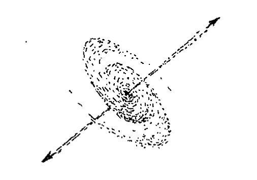

正像霍金当初提出的那样，这至少是一种看上去最简单最自然的假设。（霍金最初的建议是，如果大爆炸恰好给了我们数量足够多的“微型黑洞”（譬如说一座山的质量但大小仅有质子那么大）的话，那么这种性质的辐射爆我们现在就该探测到。但是按目前的观点看，这种可能性不大，没有证据表明会出现这种情形。）另一些物理学家^22^则认为，尽管这种最终的辐射爆有可能出现，但黑洞不会就此完全消失，而是会留下某些“残迹”或“碎片”。他们不认为被黑洞吞噬的“信息”会全部灭迹于系统中，而是“保存”在了这种残留的碎片中。^23^问题是我们很难

· 600 ·

<!-- page 620 -->

第三十章 量子态收缩中的引力角色

**图 30.14** 霍金黑洞蒸发。(a) 由经典坍缩形成的黑洞。在其后相当长的一段时间内，黑洞以很低的速率通过霍金辐射来释放质量能量，并在质量损失的同时加热自身。最终在爆炸中消失（这种爆炸按天文学标准看是非常小的，且与黑洞的初始质量无关）。(b) 这种过程（球对称情形）的严格共形图。它清楚地表明，这一图像与损失派的观点是一致的：坍缩物质带着其所有"信息"直接落入视界，并在奇点处彻底消亡。

看出所有这些涉及物质坍缩到黑洞细节的信息如何才能够存贮于这种碎片中，要知道在热（因此几乎是"无信息的"）辐射夺走几乎所有黑洞物质之前，这些原初的黑洞曾一直是恒星般大小甚至是星系量级的黑洞。有鉴于此，一些研究者认为在最后的辐射爆中，所有信息在"最后时刻"又被返回到视界外。

这 3 种观点罗列如下：

- **损失派**：当黑洞蒸发完毕，信息也就全都损失掉了；
- **存贮派**：信息保留在最后的碎片中；
- **返回派**：信息在最终的辐射爆中全部返回到视界外。

读者或许奇怪，最明了的选择显然是损失派的观点，为什么我们非得需要存贮派或返回派的观点呢？原因在于损失派的观点似乎意味着幺正性的破坏，即不遵从 **U** 运算。如果你的量子力学哲学要求幺正性是不变的，那么你持损失派的观点就会有困难。这就是为什么在（绝大多数）粒子物理学家那里盛行存贮派或返回派观点的原因，尽管这两种观点表面看来显得做作。

我自己的观点是，信息损失无疑是正确的。[图 30.14](assets/page620_fig01.jpg) 的解释清楚地传递了这一图像，坍缩的物质带着其所有"信息"直接落入视界，最终在奇点处彻底消亡。就局部物理意义而言，在视界处并未发生什么特殊的事情。物质甚至不"知道"已越过了视界。我们应当记住，我们能够考虑的是原初非常大的黑洞，例如像居于星系中心的黑洞，它可以有百万倍甚至更多的太阳质量。当你穿越视界时，不会发生任何特别的事情。时空曲率和物质密度并不大：也就是我们在太

· 601 ·

<!-- page 621 -->

通向实在之路

阳系看到的那种大小。甚至连视界的位置都不是由局部考虑确定的，因为这个位置依赖于后来落入黑洞的物质有多少。如果越往后物质落入得越多，则视界实际上早已越过了！见[图 30.15](assets/page621_fig01.jpg)。我发现这一点真是不可思议：“在正要穿越视界之前的瞬间”，会有某种信号被发送到外部世界，向外传递出正待坍缩物质所包含的所有信息的全部细节。事实上，信号本身不足以构成任何意义，因为物质本身就在一定意义上构成了我们所关心的“信息”。一旦它落入视界，物质被俘获，它就不可避免地消失在奇点那儿了。

这至少是一个清楚的结论，如果我们接受宇宙监督（[§28.8](chapter_28.md#288-外尔曲率假说)）的话。我看不出这里还有什么讨论余地。基本图像见[图 30.14](assets/page620_fig01.jpg)。按照这一图像，处于坍缩中的物质只在进入奇点后才被消灭掉（其“信息”也一并被消灭），而不是在越过视界的瞬间。如果我们持返回派观点²⁴——坍缩中的物质的信息在临终爆炸（[图 30.14](assets/page620_fig01.jpg) 中的“POP”）那一刻以某种方式全部传递出来——那么我们就必须解释这些信息是如何横越奇点“溜号”的（按照合理的宇宙监督形式，信息的取道应当是类空的，见 [§28.8](chapter_28.md#288-外尔曲率假说)）。我没看出从哪方面来说这能说得通。

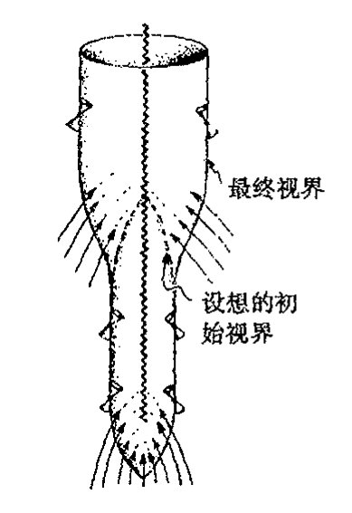

图 30.15 黑洞视界的精确位置取决于“目的论”，因为它依赖于最终有多少物质落入洞中。

贮存派观点境遇并不好多少，如果不说是极其糟糕的话。即使有碎片留存，它也没任何实际用处，因为信息被永久地“锁在其中”了，在我看来这和损失掉别无二致。如果碎片的唯一作用就在于“保留了幺正性”，那么我们就得有相容的关于碎片的量子场论，这个困难可是极为艰巨。²⁵照我看，还是霍金的论证更有说服力：按照损失派观点，当广义相对论结合进量子力学过程的图像时，在某种场合下幺正性必然要被破坏。

斯蒂芬·霍金自己是如何看待这些问题的呢？从一开始，他就坚定地站在损失派一边，而且我至今未见他的这种观点比起当初有丝毫改变。当然，黑洞蒸发完全是一个理论概念，也许大自然本身对黑洞遥远的未来有着自己一套别样的概念。但如果量子场论或微观的广义相对论结构不作根本性的变革（也许二者都必须变革），我们很难看出会有什么更好的选择。霍金的立场——至少到 2003 年是如此——是幺正性应当被破坏，但这只能从相当温和的意义上来理解。霍金的建议是，在黑洞面前，系统的量子态实际上演化到一种（非纯态）密度矩阵。事实上，我们在 [§29.6](chapter_29.md#296-环境退相关的-fapp-哲学) 就简要地间接提到过这个概念，当时我谈到这样一个事实，如果纠缠量子态的某个部分真的可以失去——在此即指落入黑洞——这与仅仅出于 FAPP（“就所有实际问题来说”）而失去的考虑截然相反，那么我们就可以合理地采取这样一种本体论立场：量子实在的确可以用密度矩阵而非（纯）态来描述。霍金曾构想过某种“纯幺正的”演化来直接用于密度矩阵，并容许“纯态”演化到“混合态”。²⁶,***[30.8]

---

*** [30.8] 用指标记法（例如 |ψ⟩ 记做 ψᵃ）表示能够实现这一点的变换。（提示：参考[图 29.5](assets/page593_fig02.jpg)。）

??? question "答案 [30.8]"
    用抽象指标，纯态 $|\psi\rangle$ 写作 $\psi^a$，其密度矩阵为 $\rho^a{}_b=\psi^a\bar\psi_b$。若要把一个纯态映到混合态，需要的不是希尔伯特空间上线性幺正变换，而是密度矩阵上的线性正映射。

    典型形式为 $\rho^a{}_b\mapsto \sum_r A_r{}^a{}_c\,\rho^c{}_d\,\bar A_r{}^d{}_b$，并满足 $\sum_r A_r^\dagger A_r=I$ 以保持迹。这正是忽略环境或让部分自由度真正丢失后得到的有效演化形式。

· 602 ·

<!-- page 622 -->

第三十章　量子态收缩中的引力角色

## 30.9　更激进的观点

我自己的立场是：尽管我赞同霍金的看法，即某种形式的损失派观点很可能是对的，但我相信我们还需要某种更激进的观点。例如，上段所概括的霍金建议就没有结合进任何时间不对称的特征。^27^但既然存在时间对称性，那么[图 30.16](assets/page622_fig01.jpg)（a）的"白洞"图像，它作为[图 30.4](assets/page610_fig01.jpg) 的时间反演，就是容许的——正如[图 30.16](assets/page622_fig01.jpg)（b），它是[图 30.14](assets/page620_fig01.jpg) 给出的蒸发黑洞的时间反演。"一般的时间对称情形"，其中既充斥着大量的信息破坏也伴随着大量"新信息"的产生，见[图 30.17](assets/page622_fig02.jpg)。所有^843^这些都不遵从外尔曲率假设（[§28.8](chapter_28.md#288-外尔曲率假说)）。[图 30.16](assets/page622_fig01.jpg)（c）的"对称"情形包含了在原始黑洞最终蒸发的瞬间会有白洞产生，这个白洞将持续增大直到它达到原来黑洞所具有的大小为止，见[图 30.17](assets/page622_fig02.jpg)。我还不曾见过有谁认真提出过这么一种看上去荒谬的模型！如果我们容许出现像[图 30.17](assets/page622_fig02.jpg) 中的那些情形，那么我们就不能解释为什么它们就不能大量出现在大爆炸的情形下，这导致与 27 章所提供的材料形成极大的矛盾。

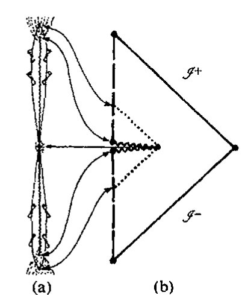

这里我不想重复所有我的论点，^28^但大致上说，这些论点都基于这样一个事实，即大自然似乎在告诉我们，就那些宇宙中容许存在的时空奇点的物理结构而言，与外尔假设极为类似的某种假说是对的。^29^如果我们接受这一点，那么就得承认，在黑洞奇点处确实存在着不可恢复的净的"信息损失"。这是因为，按照这一假说，最终的坍缩奇点包含了——因此也吸收了——巨大数量的自由度（它们都居于外尔曲率里），而这些自由度是任何初态奇点所禁止的。

让我们试着用系统相空间概念来进行包括黑洞形成和蒸发的论证。严格来讲，相空间论证^844^需要在具有确定的有限能量的闭系统下进行。为了丰富想象力，我们不妨设想有这么个巨大盒子，其大小比星系尺度还要大，四壁由理想化的镜面组成，使得没有任何信息和实物粒子可以出

·603·

<!-- page 623 -->

通向实在之路

入其间，见[图 30.18](assets/page623_fig01.jpg)。这当然显得很荒谬——我只是急于让读者确信，我们的体系仅仅是由“思想实验”构成的，并非真实场景！它只是设想³⁰出来以便使相空间论证能够用于包括霍金辐射过程中自由度（表观）损失的系统。这里相空间 𝒫 描述假想盒子中给定总能量下所有可能的物理态。动力学演化（图 30.19）由 𝒫 上的一族箭头描述，方式同[图 20.5](assets/page365_fig01.jpg)。

**图 30.18** 霍金的“盒子”思想实验。（a）想象有一个巨大的（星系大小的）物质“盒子”，四壁由理想化的镜面组成，使得没有任何信息和实物粒子可以出入其间。（b）一种局部最大熵情形即提供大多数物质的黑洞，但它在热平衡态下背景辐射量很小。（c）另一种局部最大熵情形是没有黑洞情形下的纯粹热辐射（可能带有少量粒子）。

**图 30.19** 霍金“盒子”的相空间描述，其中箭头表示（与图 30.18 所示有关的过程的）（哈密顿）演化。区域 𝒜，ℬ，𝒞 分别对应于图 30.18 的（a），（b），（c）。相应地，黑洞出现在区域 ℬ，而非区域 𝒞。按照损失派观点，由于信息在黑洞的（未来）奇点处被破坏，因此黑洞的出现将导致与 **R** 过程（假定它是客观真实的）的时间不对称性流线的会聚（相空间体积缩小），见图 30.1。这个理论认为，在这两个违反刘维尔定理的过程之间存在总体平衡，因此流的最终的相空间体积仍是守恒的。

在此（“思想实验”）情形下，随着时间流逝，自由度由于被黑洞奇点吞噬而消失，而且按照外尔曲率假说，这些自由度不容许再现于初始（白洞型）奇点，但我的观点是，它们将通过 **R** 过程再现。这里的想法是：在时间不对称的落入黑洞的“信息损失”行为和 [§30.3](#303-量子态收缩的时间不对称性) 展示的量子力学 **R** 过程中概率的时间不对称行为之间，存在着总体平衡。**R** 过程的非确定性性质告诉我们，同样的输入可以有多种可能的输出，这一点平衡了黑洞可以有多种不同的输入给出同一种输出这一事实，其中区别不同输入的“信息”被奇点吞噬掉了。由 [§30.3](#303-量子态收缩的时间不对称性)（[图 30.1](assets/page606_fig01.jpg)）的假想实

· 604 ·

<!-- page 624 -->

验可知，对给定的单个输入（由 S 发射的光子），我们有两个不同的输出（到达 D 的和到达 C 的光子），而对给定的输出（到达 D 的光子）则基本上只有一种输入（由 S 发射的光子）。因此，按照 **R** 过程我们有相当大的相空间体积，而时空奇点结构的不对称性使得相空间体积明显变窄，仍见图 30.19。这里争论的焦点是：平均来看，这两种效应应当彼此抵消。

应当明确，这种平衡仅是就物理过程的总体特征而言的。它显然不是要声称黑洞一定要同时伴有每一种量子态收缩。我们的想法不过是，在整个相空间内，这两种效应之间存在着平衡。因此，正是存在着形成具有吞噬信息的黑洞的潜在可能，才使得 **R** 过程的未来随机性得到平衡。

我们还应指出，这两种效应都不遵从动力学演化中相空间体积守恒的定理（刘维尔定理，见 [§20.4](chapter_20.md#204-辛几何的哈密顿动力学)，[图 20.7](assets/page370_fig01.jpg)）。但在每种情形里我们都有超乎通常经典动力学的某些性质。确实，当我们将量子效应和经典效应合起来考虑时，经典相空间概念就完全不合适了。对纯粹的量子系统，我们应当完全在希尔伯特空间下进行思考。在认为 **U** 量子过程演化就是全部真相的人看来，希尔伯特空间描述是正确的描述。但黑洞蒸发带来的信息（和幺正性）的破坏对这种描述提出了严重的质疑。我的观点是，这两种图像都不完全恰当，二者都只是对某种我们尚不知道如何描述的理论的近似。³¹

多年来，我一直想通过对上段概述（以及图 30.19）的这两种过程间平衡的细致研究来直接得到量子态收缩速率的定量估计，但至今也没能完成。因此，一种完全不同的思路能够用来得到这种恰当估计真是善莫大焉。这些正是本章余下章节的主题。

## 30.10 薛定谔团块

让我们回到 [§29.7](chapter_29.md#297-哥本哈根本体论的薛定谔猫) 所考虑的所谓“薛定谔猫”那种情形下。在图 29.7 里，我展示了怎样利用分束片将光子态变成叠加态来建立活猫和死猫的量子叠加态，这里光子态的透射部分触发一个杀死猫的装置，而反射部分则使猫能够活着。我们当然不会拿真猫做这种实验，这样既不仁慈也不妥当，只会招来不必要的复杂的物理体系。因此，我们不妨换一种对象，考虑投射束光子态触发的是这样一个仪器，它将某个团块沿水平面推移一段距离，而反射束则对团块无影响，见[图 30.20](assets/page624_fig01.jpg)。叠加的团块状态扮演的即是薛定谔猫的角色——尽管没有那种戏剧性！

我要提出的问题是：两个团块位置的量子叠加态是定态吗？按传统量子力学，这是确凿无疑

<!-- page 625 -->

通向实在之路

的，如果我们认为每个团块位置分别代表一个定态并且两种情形下能量都相同（这样位移后团块的静态能既不比初态的高也不比后者的低）的话。这是我们从第 21 章（和 [§24.3](chapter_24.md#243-量子力学里能量的正定性)）学到的规则的基本运用。团块的初始位置由态 $|\chi\rangle$ 表示，位移后的位置由 $|\varphi\rangle$ 表示，对这两个位置我们有两个薛定谔方程来描述其定态，

$$\mathrm{i}\hbar\frac{\partial|\chi\rangle}{\partial t}=E|\chi\rangle,\quad \mathrm{i}\hbar\frac{\partial|\varphi\rangle}{\partial t}=E|\varphi\rangle,$$

每个方程给出一个能量本征态，其本征值为 $E$。如果叠加态可以表示为

$$|\psi\rangle=w|\chi\rangle+z|\varphi\rangle,$$

那么不论（常）振幅 $w$ 和 $z$ 取什么样的值，我们都直接有 $^{*[30.9]}$

$$\mathrm{i}\hbar\frac{\partial|\psi\rangle}{\partial t}=E|\psi\rangle,$$

因此，每个量子叠加态 $|\psi\rangle$ 也是定态的。如果态 $|\chi\rangle$ 和 $|\varphi\rangle$ 均自始至终独自地保持不变，那么它们的每个量子叠加态 $|\psi\rangle$ 亦如此。这恰是标准量子力学所期望的。

现在我们需要温习一下爱因斯坦的广义相对论知识。首先，我们认为引入用背景时空几何来表达引力场十分重要。我们可以想象地在地球上用水平面上放置的两个团块进行这种实验。地球的时空曲率并不完全是平直的，我们必须考虑这种时空曲率会带来什么样的效应。我们确实得关注出现在薛定谔方程里的算符"$\partial/\partial t$"的真正意义。在广义相对论里，通常没有什么自然的坐标系可以用来定义"$\partial/\partial t$"概念。从 [§10.3](chapter_10.md#103-矢量场和-1-形式) 和 [§12.3](chapter_12.md#123-标量矢量和余矢量)（见[图 10.5](assets/page152_fig01.jpg)）可知，考虑偏微分算符（如 $\partial/\partial t$）"不变量"的方式是将它看成是（时空）流形上的矢量场——如[图 30.21](assets/page625_fig01.jpg)。因此，我们需要一个时空上的矢量场来表示所需的"$\partial/\partial t$"概念。

在目前情形下，问题还不是很严重，因为我们考虑的是"定态"问题，故至少有一个本身是定态的背景时空。正如我们在前面（§§ 30.4, 6，图 30.3）看到的，定态时空的特征是存在类时基灵矢量 $\mathbf{\kappa}$。这个特殊的矢量场在此起着什么作用呢？这里时空的定态是在"$t$ 是独立的"这个意义上说的，这意味着我们能够对以前的公式直接作变换（[图 30.21](assets/page625_fig01.jpg)）

$$\frac{\partial}{\partial t}\longmapsto\mathbf{\kappa}.$$

）。图中显示了一个弯曲流形上的矢量场，带有标注"薛定谔方程：$\mathrm{i}\hbar\mathbf{\kappa}|\psi\rangle=\mathcal{H}|\psi\rangle$"](assets/page625_fig01.jpg)

这里可能还有总体上差一个常数尺度因子的问题，但这个问题在此并不重要。通常我们采取要求 $\mathbf{\kappa}$ 在大的空间距离（这时引力场看成是衰减到零）上取"常规"时间位移来解决这个总

---

$^{*[30.9]}$ 为什么？解释：当我们在后面的稳态背景时空情形下重复这一结论时，用到了矢量场 $\mathbf{\kappa}$ 的什么性质？

??? question "答案 [30.9]"
    稳态背景中存在时间平移基灵矢量 $\kappa^a$，于是 $T_{ab}\kappa^b$ 给出守恒能流，满足相应散度为零。若没有这样的基灵矢量，就没有全局守恒的“能量”可用于同一论证。

    因此重复结论时用到的正是 $\kappa^a$ 的基灵性质，以及它在无穷远可归一化为时间平移的性质。常振幅 $w,z$ 不影响能量本征值的相等性，只影响叠加中各分支的权重。

· 606 ·

<!-- page 626 -->

第三十章　量子态收缩中的引力角色

体因子问题。但在局部，$\mathbf{\kappa}$ 的幅度可以逐点而异，就像要考虑地球引力场带来的“钟慢”效应（[§19.8](chapter_19.md#198-引力场能量)）。***[30.10] 由于 $\mathbf{\kappa}$ 取代了 $\partial/\partial t$ 的地位，因此确定每个离散态 $|\chi\rangle$ 和 $|\varphi\rangle$ 的定态特性的单个薛定谔方程为

$$\mathrm{i}\hbar\mathbf{\kappa}|\chi\rangle = E|\chi\rangle \qquad \text{和} \qquad \mathrm{i}\hbar\mathbf{\kappa}|\varphi\rangle = E|\varphi\rangle,$$

并且像以前一样，对叠加态 $|\psi\rangle$ 我们仍有

$$\mathrm{i}\hbar\mathbf{\kappa}|\psi\rangle = E|\psi\rangle。$$

因此，定态引力场作为背景，其存在并不改变两定态 $|\chi\rangle$ 和 $|\varphi\rangle$ 的量子叠加仍是定态这一事实。

现在让我们来看看当考虑了团块自身的引力场时将发生什么变化。如果单独考虑每个态 $|\chi\rangle$ 和 $|\varphi\rangle$，似乎不构成真正的问题。但在缺少公认的量子引力理论，而 $|\chi\rangle$ 和 $|\varphi\rangle$ 中每一个又都是一个量子态的情形下，可以说我们还不知道该如何来处理它们的引力场。但这个问题并不大。传统观点断定，正确的量子引力理论能够处理好如经典物质团块这样的事情，其引力场将依据爱因斯坦经典广义相对论原理来精确描述，即使这种做法未必十分到位。（我认为，这种“传统观点”的有效性大可置疑，但如果我们相信这一对标准假说——对宏观物体，不仅量子形式体系无需改变，经典的广义相对论也保持不变——那么我们就必须接受这一观点。毕竟目前争论的性质是探索这两个假说的可行性极限问题。）相应地，对分别处于地球水平面上两个分离位置上的物质团块，应当存在精确描述这二者的量子态 $|\chi\rangle$ 和量子态 $|\varphi\rangle$，这里出现的每个团块总是伴有其近似经典的爱因斯坦引力场。^32^ 由于这两个团块的位置态在各自的伴随时空里都是定态，每一个都有相应的相伴基灵矢量^33 $\mathbf{\kappa}_\chi$ 和 $\mathbf{\kappa}_\varphi$，且满足适当的本征值为 $E$ 的薛定谔方程：

$$\mathrm{i}\hbar\mathbf{\kappa}_\chi|\chi\rangle = E|\chi\rangle \qquad \text{和} \qquad \mathrm{i}\hbar\mathbf{\kappa}_\varphi|\varphi\rangle = E|\varphi\rangle。$$

在此前的情形里，即当我们忽略了团块的引力场时，我们能够写下叠加态 $w|\chi\rangle + z|\varphi\rangle$ 的薛定谔方程，并断定所有这些态都是定态。但现在这一点做不到了，因为这两个基灵矢量 $\mathbf{\kappa}_\chi$ 和 $\mathbf{\kappa}_\varphi$ 不同。我们该怎么做呢？我们需要一种可以用于叠加时空的不变的“$\partial/\partial t$”概念，但不论是 $\mathbf{\kappa}_\chi$ 还是 $\mathbf{\kappa}_\varphi$ 似乎都满足不了这一要求。在下一节我们将看到，这个问题不是个小问题，它引起一种基本困难，并直接导致量子力学和广义相对论两大理论的基本原理之间的冲突。

## 30.11　与爱因斯坦原理的基本冲突

对这两个基灵矢量的差异作深入细致的说明很重要。我所说的基灵矢量 $\mathbf{\kappa}_\chi$ 和 $\mathbf{\kappa}_\varphi$ 不同，是在很深刻的意义上说的。它们实际上是不同时空上的矢量场！人们或许认为，这两个时空之间的差

---

***[30.10] 对这个问题，看看你能否利用 [§30.6](#306-基灵矢量能量流时间旅行) 里基灵矢量 $\mathbf{\kappa}$ 提供的守恒律，以及模 $\mathbf{\kappa}_a\mathbf{\kappa}^a$ 在引力体附近不等于 1（即使它在远离引力体时可归一化到 1）这一事实，来给出一种解释。这种效应是如何影响到时间测量的？

??? question "答案 [30.10]"
    基灵能量沿测地线守恒，但静止观察者测得的局部能量还要除以基灵矢量的模。远处把 $\kappa^a\kappa_a$ 归一为 $1$，在引力体附近其模改变，故同一守恒能量对应不同的局部频率。

    这就是引力红移：靠近引力体的钟相对远处钟走得慢，发出的光爬出势阱后频率降低。因而局部时间测量与全局基灵时间之间存在位置依赖的比例因子。

·607·

<!-- page 627 -->

通向实在之路

异只是因为它们的度规结构略有差别，因此我们可以试着认为它们实际上是同一个空间，只是带有略微不同的度规张量场，譬如说 $g_\chi$ 和 $g_\varphi$。但采取这种立场就意味着要放弃爱因斯坦理论的基本原理之一即广义协变原理（见 [§19.6](chapter_19.md#196-爱因斯坦场方程)）。从某种意义上说，将两个点集视为"同一个"点集，实际上就是在这两个空间之间建立点对点的对应关系，就像将一个空间的点叠合到另一个空间里具有相同坐标的点那样。可以断定，在两个不同时空之间不存在什么占优势的点对点对应关系。

为什么两个团块位置之间缺乏这种同一关系就会招致困难呢？因为我们需要能够写下薛定谔方程，但如果没有同一的"$\kappa$"，我们又该怎么做呢？最直接的办法是将 $\kappa_\chi$ 和 $\kappa_\varphi$ 等同起来，但这势必违反爱因斯坦理论的基本原理，因为这意味着我们认为这两个基灵矢量处于同一个空间内，这不是开玩笑吗！依我看，对于这种情形，我们确实需要找出量子力学和广义相对论基本原理之间冲突的证据。

尽管如此，我们也不应就此干脆"放弃"。虽然严格说来我们确实需要适当的新理论来指导下一步该做什么，但我认为我们能够取得某些实质性进展，如果我们准备接受眼下的这种冲突，并且只寻求某种与此相关的误差检测的话。下面我们采取这样一种立场：一定意义上，大自然可以接受的是容许两个时空在局部上同一，只要"自由降落"的概念在两个时空中是同一的。这是 [§17.4](chapter_17.md#174-等效原理) 的等效原理的某种反映。我们尝试建立的同一是令一个空间内的测地线恰好与另一空间内的测地线重合。通常这是不可能的，除非是在某个点的紧邻域内；因此我们代之以计算将这两个时空叠合起来所引起的误差。这事完全在广义相对论下很难做到，但我们可以在将光速 $c$ 看成是无穷大的极限情形下运用其中的大部分概念，同时保留爱因斯坦理论的基本思想。由此我们得到 [§17.5](chapter_17.md#175-嘉当的牛顿时空) 的嘉当关于牛顿引力的公式。^34

851

由第17章的牛顿/嘉当引力理论可知，时空其实是具有不同的可容许"时间"$t$的1维欧几里得空间 $\mathbb{E}^1$ 上的纤维丛。纤维是不同的3维欧几里得空间 $\mathbb{E}^3$，其中的每一个指某给定时刻的"空间"。因此，我们实际上有一个由时间坐标 $t$ 描述的"绝对时间"。读者或许会认为，既然我们现在对两个团块位置的时空有了同一的时间概念，那么问题不是就解决了吗？但糟糕的是知道了 $t$ 并不能保证就知道 $\partial/\partial t$。因为算符 $\partial/\partial t$ 还要求知道其余的坐标变量（譬如说 $x, y, z$）是否也保持不变。这就是我们在 [§10.3](chapter_10.md#103-矢量场和-1-形式)（见图10.7）里说的"微积分第二基本困惑"问题。利用所涉的几何我们可以看清楚这里的问题。知道了 $t$ 我们也就知道了 $\mathbb{E}^3$ 截面的位置，但只有知道 $\partial/\partial t$ 我们才能够得到一个定义穿过这组3维曲面的曲线族的基灵矢量场，见图30.22。事实上，这个无法具体化薛定谔方程的 $\partial/\partial t$ 的问题，即使是在更为"传统的"量子引力处理中也被认为是一

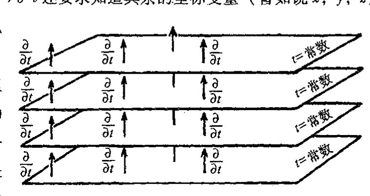

·608·

<!-- page 628 -->

第三十章 量子态收缩中的引力角色

个非常深奥的问题。它与量子宇宙学里所谓的"时间问题"有关。^35

在这里，我无意于雄心勃勃地来解决所有这些问题。我们所需的只是对有关误差进行估计，如果我们试图对不同的矢量 $\kappa_\chi$ 和 $\kappa\varphi$ 做"非法"叠合的话。我们这么来做：先叠合 $\mathbb{E}^3$，然后取两空间引力加速度之差（自由落体之间即测地线之间的差）的总误差。假定引力加速度分别由 3 维矢量 $\mathbf{\Gamma}_\chi$ 和 $\mathbf{\Gamma}_\varphi$ 给定，则我们可通过在整个 $\mathbb{E}^3$ 上对二者差的平方 $(\mathbf{\Gamma}_\chi-\mathbf{\Gamma}_\varphi)^2$ 进行积分来估计这个误差。这个积分误差可理解为，在规定 $\mathbb{E}^3$ 的具体选择的 $t$ 时刻，对薛定谔方程所需的"$\partial/\partial t$"算符定义的绝对不确定性的测度。这种不确定性通过薛定谔方程直接导致了叠加态能量的绝对不确定性 $E_G$。下一步是将这个 $E_G$ 表达式转换成另一种（等效）数学形式，后者我们可以理解成^***[30.11]：

$$E_G = \text{态} |\chi\rangle \text{和} |\varphi\rangle \text{的质量分布之差的引力自能。}$$

质量分布的引力自能是获自完全弥散到无穷远的点状物质质量分布的集合能。上述的差可以看成是取正的 $|\chi\rangle$ 的质量分布与取负的 $|\varphi\rangle$ 的质量分布之和（见[图 30.23](assets/page628_fig01.jpg)）。（这里不为零的理由是能量与每个质量分布的引力场对另一个质量分布引力场的作用有关。）

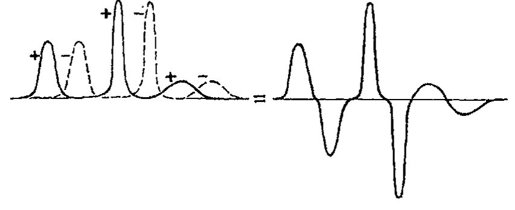

**图 30.23** 叠加的两个定态 $|\chi\rangle$ 和 $|\varphi\rangle$ 的每一个定义了其质量密度分布的"期望值"。二者间的差（即一个为正另一个为负）构成引力自能为 $E_G$ 的正、负质量密度分布。

如按通常的理解，这里有些困难需要重视，尤其是涉及负的质量分布方面。幸运的是，对于通常所考虑的大部分情形，即在态 $|\varphi\rangle$ 仅仅是态 $|\chi\rangle$ 的刚性位移的情形下，量 $E_G$ 可直接按另一种方式来理解：我们将这一能量看成是团块从原初位置 $|\chi\rangle$ 移动一段距离到位置 $|\varphi\rangle$ 时付出的代价，这里位置 $|\varphi\rangle$ 远离固定位置 $|\chi\rangle$ 的引力场。可以证明这个能量与前述刚性位移情形下的 $E_G$ 是同一个能量，^***[30.12] 但在其他场合下并非总是如此。

实际上，我们可以考虑用这第二种能量测度（即引力相互作用能）来作为 $E_G$ 的另一种定义。尽管第一种定义，即引力自能的定义，在我看来似乎更便于建立起来，但我们也不应排除目前理解上存在的其他可能性。迪奥斯（Diósi，1989）曾考虑过上述两种建议，给出了一项类似

---

^*** [30.11] 看看你能否确认这一点。证明与 [§24.3](chapter_24.md#243-量子力学里能量的正定性) 的练习 [24.3] 有雷同之处。我们利用泊松方程 $\nabla^2\Phi=-4\pi\rho$，这里 $\Phi$ 是牛顿（标量）引力势。我们的"误差"就是 $|\nabla\phi_-\nabla\phi_2|^2$ 的空间积分。

??? question "答案 [30.11]"
    牛顿引力自能可写为场能形式。利用泊松方程 $\nabla^2\Phi=-4\pi\rho$ 和分部积分，可把质量分布差异的自能写成与势梯度差平方积分成正比的量。

    若两种质量构形的势为 $\Phi_1,\Phi_2$，则差异能量 $E_G$ 与 $\int|\nabla\Phi_1-\nabla\Phi_2|^2d^3x$ 等价，差一个由 $G$ 和 $4\pi$ 决定的约定因子。这正是提示中的“误差”积分。

^*** [30.12] 你能看出为什么在此情形下给出的 $E_G$ 与前述答案完全相同吗？如果位移团块的最终位置较之初态位置有所抬高，将会发生什么变化？如果团块被压缩了又将如何呢？

??? question "答案 [30.12]"
    若只是把同一团块平移，质量分布差的引力自能只取决于两构形之间的相对位移，因此与前述答案相同。它可理解为把一份质量分布放到另一份质量分布产生的引力场中所需的能量差。

    若最终位置被抬高，外部引力势能差还会加入普通重力势能项；若团块被压缩，则内部自引力能改变，$E_G$ 还包含形状变化带来的额外自能差，不再只是平移差异。

· 609 ·

<!-- page 629 -->

通向实在之路

于我下面要给出的提议，但他还提出过一项（随机）动力学，这我就不在此赘述了。这些不同的建议应当在实验上是可区分的，下面我就会谈到。然而需要强调的是，甚至这些建议中最好的也难说是目的完全明确的，不是完全没有冲突。³⁶

那么，我们怎么来处理这种基本的“能量不确定性”*E*G呢？这得借助海森伯的不确定原理（时间/能量不确定关系，见 [§21.11](chapter_21.md#2111-动量空间描述)）。我们都熟悉这样一个事实：不稳定粒子或不稳定核（如铀²³⁸U）的平均寿命*T*有一个固有的时间不确定值，它与能量的不确定值呈倒数关系，其大小由ℏ/2*T*给定。例如，我们在 [§21.11](chapter_21.md#2111-动量空间描述) 提到过，²³⁸U 核的寿命约为 10⁹ 年，故每个核的基本能量不确定值约为 10⁻⁵¹焦耳，由爱因斯坦质能关系式*E* = *mc*²知，其质量不确定性约为总质量的 10⁻⁴⁴。现在我们将叠加态|*ψ*⟩ = *w*|*χ*⟩ + *z*|*ψ*⟩与此作类比。叠加态本身是不稳定的，其寿命*T*G通过海森伯公式与上述的基本能量不确定性*E*G相联系。按照这一图像，³⁷像|*ψ*⟩这样的叠加态将在

*T*G ≈ ℏ/*E*G

的平均时间范围内衰变到其组分的态|*χ*⟩或|*φ*⟩。

## 30.12　优先的薛定谔－牛顿态？

上述讨论的要点是，两个态的量子叠加态将在 ℏ/*E*G的时间量级范围内衰变到这两个态之一。但敏锐的读者想必会抱怨：可以说任何量子态|*ψ*⟩都可以表示成一对不同态的线性叠加（例如|*ψ*⟩ = |*α*⟩ + (|*ψ*⟩ − |*α*⟩)，这里|*α*⟩是任意态）。因此将所有这些态看成衰变到其“组分”并没有任何意义，特别是如果对给定的|*ψ*⟩，我们取|*α*⟩使得这两种组分态的质量分布相差足够大，我们甚至可以使衰变在瞬间完成！

854

即使是对仅涉及单个电子的叠加态|*ψ*⟩ = *w*|*χ*⟩ + *z*|*φ*⟩情形，我们也不难判断上述讨论的结论中这种性质的荒谬性。因为我们可以取|*χ*⟩ = |*α*⟩来表示处于（几乎）精确位置上的电子，其质量分布几乎就是*δ*函数（[§21.10](chapter_21.md#2110-位置态)），这样*E*G的值实际上就是无穷大，它意味着态|*ψ*⟩几乎瞬间就收缩到|*χ*⟩或|*φ*⟩之一。由点状粒子（例如夸克）组成的系统都可以依此类推。如果实际行为果真如此，那显然没有任何意义，量子力学也就不存在了。

我们应当对|*χ*⟩和|*φ*⟩容许取什么样的态给予密切注意。从前面的讨论可知，我们是将|*χ*⟩和|*φ*⟩取为定态的。而电子在其位置（几乎）精确确定的情形下肯定不处于定态。由海森伯的位置/动量不确定原理（[§21.11](chapter_21.md#2111-动量空间描述)）可知，这时电子具有极大的动量，将瞬间弥散开去。另一方面，如果我们要求|*χ*⟩和|*φ*⟩都严格处于定态，那么要将上述论证完全运用到单个粒子上也有一定困难。因为对单个的作用势延伸到无穷远的（正质量）自由粒子，不存在普通薛定谔方程的定态解。***[30.13] 这

---

*** [30.13] 为什么？（提示：再看一下练习 [24.3]。）

??? question "答案 [30.13]"
    自由单粒子的严格定态通常是动量本征态，空间上延展到无穷远，不能表示局域团块。若把粒子局域在很小区域内，根据不确定性原理它必含有很宽的动量分布，随后会弥散，因此不是定态。

    对正质量孤立粒子，引力势的长程性也使普通可归一化静止束缚态不存在，除非加入外部势或其他约束。练习 [24.3] 中的正能量讨论说明，局域化和定态要求在这里彼此冲突。

· 610 ·

<!-- page 630 -->

第三十章 量子态收缩中的引力角色

个难题的答案取决于这样一个事实：在这个薛定谔方程里我们需要考虑粒子的引力场。在这种描述中我不要求引力场本身是量子化的，而只是要求其作用包含在牛顿引力势函数 $\Phi$ 中，这个势函数的源就是以波函数形式出现的质量分布的所谓"期望值"。本书显然不适于给出这个问题的全部细节描述。$^{38}$但这种描述似乎能给出合理的答案。这方面的详细研究正方兴未艾。有结论表明，对作用势延伸到无穷远的单个粒子，这种修正的薛定谔方程——我宁愿称其为薛定谔－牛顿方程（因为它结合了牛顿引力场）——确实有表现完好的定态解。（但对单电子，波函数的延伸将不限于可观察宇宙的范围，延伸距离反比于粒子质量的3次方。）

现在，我们有了至少可用于两个（前述薛定谔－牛顿意义上的）定态叠加的量子态情形下的客观态收缩的合理建议。按照这个方案，叠加态将在 $\hbar/E_G$ 的平均时间范围内自发收缩到两个组分定态之一，这里 $E_G$ 是两质量分布之差的引力自能。我把这个方案称作为引力 **OR**（**OR** 表示量子态的"客观收缩（objective reduction）"）。对任意一对这样的定态，引力自能 $E_G$ 有明确定义，那就是这两个质量分布之差，两个分布具有相同的定义在薛定谔－牛顿方程上的"期望值"表达式。

所有其他关于 **OR** 的理论都遇到了能量守恒方面的困难。譬如像吉拉迪（Giancarlo Ghirardi）、里米尼（Alberto Rimini）和韦伯（Tullio Weber）在1986年提出他们的新颖且极富开创性的理论时就遇到过这种麻烦。$^{39}$一般的做法是"保留"这一问题，只要这种能量不守恒性能够减低到可接受的极低水平。我的观点是我们必须更认真地对待这一问题。上面提出的引力 **OR** 理论的优势，正在于 $E_G$ 的这种能量不确定性有可能冲抵了这种潜在的不守恒性。使得能量守恒并未真正被破坏。但这个问题还需要进一步研究。可能在 **OR** 过程表观的能量困难和 [§19.8](chapter_19.md#198-引力场能量) 所说的引力能的非局域性质之间存在某种"抵消"。

我对粒子态收缩的看法是，它确实是一种客观过程，而且始终是一种引力现象。这种现象甚至会出现在导致所谓 FAPP 态收缩的实质性的环境退耦情形中，譬如说在引力 **OR** 效应小得无法直接应用的系统（如 DNA 分子）中。在这种情形下，导致引力 **OR** 效应的可能是环境中全部质量的总位移。在我们目前考虑的由两定态叠加构成的态的情形下，我相信这种收缩过程确实可用引力 **OR** 效应来近似。

完整的理论仍付阙如，我现在也给不出任何实际的依照 **OR** 过程的态收缩动力学，即使是在上述考虑特定叠加态的情形下。这方面我的做法是采取"简约主义"态度，不要像卡洛伊哈兹（Károlyházy）；卡洛伊哈兹和弗伦克尔（Frenkel）；帕尔（Pearle）；基布尔（Kibble）；吉亚尔迪（Ghirardi）、里米尼和韦伯；吉亚尔迪、格拉西（Grassi）和里米尼；迪奥西（Diósi）；温伯格（Weinberg）；帕西瓦尔（Percival）；吉森（Gisin）以及其他一些人$^{40}$那样雄心勃勃地追求完整的动力学。不管怎样，我的这种简约主义考虑似乎有清楚的实验结果，下面我就来给出有关实际实验的基本思想以结束本章，这些思想对确立这种引力 **OR** 框架是否真能受到大自然的眷顾具有决定性的潜在价值。

<!-- page 631 -->

通向实在之路

## 30.13 FELIX 及其相关理论

这里的基本要点是构造一个由微型镜面 M 组成的“薛定谔猫”，它充当两个稍许不同位置（二者分离约一个原子核直径的距离）的量子叠加态。⁴¹这个微型镜面的大小差不多可比作尘粒，大约只有人类毛发的十分之一大，所含的原子核数在 10¹⁴ 到 10¹⁶ 量级之间（故其质量约为 5 × 10⁻¹²千克，半径在 10⁻³厘米量级上）。我们设想这面镜子 M 受到单 X 射线光子的冲击而处于一种叠加态，这个单光子被视为是两束射线的叠加，其中一束射线对准 M。

一种可能的实验安排如[图 30.24](assets/page631_fig01.jpg) 所示。由 X 射线激光器 L 产生的光子射向分束片 B。光子的透射部分形成指向 M 的态，其作用是在它被镜面反射时将动量传递给镜面。镜面具有很高的性

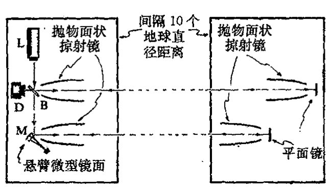

图 30.24 FELIX（自由路径 X 射线激光干涉实验）的基本布置。X 射线激光器 L 产生的光子射向分束片 B。其透射部分射向约 10 立方微米大小的微型镜面 M。当光子被镜面反射时，这个冲击传递给镜面一定的动量，使镜面处于一种量子叠加态（薛定谔猫态），其维持时间譬如说约 1 秒。在此期间，光子波函数的两部分必保持相干状态（在图中是以两太空站之间的反射来实现的）直到该过程结束，然后整个过程反演。（等路径的）理想装置和传统量子力学都要求在此期间探测器响应为 0%。引力 OR 则导致 50% 的期望值。

857能，像一个“刚体”对光子的冲击做出整体响应，其内部振动和原子态均不发生变化。镜面 M 设置得使它可以在十分之一秒的时间内回复到原初位置。同时，光子波函数的两部分在这期间必须保持相干直到这个过程周期结束，这之后整个过程按反方向进行，这样我们就能够断定相位相干是否已丧失，如果量子叠加的微型镜面确实自发回复到两个位置之一的话，就应当是这种情形。

当然，使 X 射线光子的相干维持十分之一秒不是一件容易的事。（为了使微型镜面保持充分运动，镜子应得到足够的动量，因此需要 X 射线段的能量。）一种实现在此期间保持相干的建议是将整个实验放在太空进行，这样光子相干可通过两面大反射镜的反射来维持，这两面镜子分别安置在相距约为地球直径距离的两太空空间站上。光子跨越这个距离行走一个来回约需时间十分之一秒。于是，被 M 反射的光子波函数部分回到 M，而被分束片 B 反射的部分则回到 B。我们可将时间调整得使得整个物理过程恰好能沿反方向进行。这样，引起 M 运动的光子波函数部分正好在 M 回复到原初位置时再次回到 M 上，光子从 M 处得到它原先传递给 M 的动量，M 则回复到静止状态；不仅如此，光子波函数的两部分还适时地在分束片 B 处重新结合。只要在整个过程中不丧失相位相干性且路径选择得当，光子波函数就一定会重组为一束返回激光器 L 的光。这样，当光子到达分束片 B 时，设置在 D 处的探测器将接收不到任何信号。这就是所谓的 FELIX 提案（自由路径 X 射线激光干涉实验）。

· 612 ·

<!-- page 632 -->

第三十章 量子态收缩中的引力角色

应当指出，在十分之一秒内，M 的状态处于位移和非位移的叠加态，这种情形实质上与[图 30.20](assets/page624_fig01.jpg) 描述的物质团块的情形是一样的。按照引力的 OR 图像，M 的态将在十分之一秒量级的时间范围内自发回复到位移了的或非位移了的位置上。光子态与 M 的态是纠缠在一起的，因此只要 M 发生态收缩，光子也将同时发生态收缩。于是光子路径必取道这一束或那一束，这样当它最终回到分束片 B 时，它是取触发探测器 D 还是回到激光器 L，二者是等概率的。随后这个过程将重复很多次。OR 的效应表现为探测器响应应占 50%，而按照标准量子力学（就理想化实验来说），如果相位相干未丧失，探测器的响应将为零。

当然，在实际情形下，会有许多其他因素致使相位间丧失相干性。因此要使得这项实验成功，就必须使这些影响因素保持在足够低的水平上，这样引力 OR 的特有印记才能够凸现出来。实验应在采用不同大小和材料的微型镜面以及不同时间尺度（例如采用太空站间的多次反射）的条件下重复多次。在具体考虑 OR 框架时，微型镜面的核的质量分布的"散布"范围也是应考虑的重要因素。对于给定的总质量，质量越致密，镜面的回复时间就越短，见[图 30.25](assets/page632_fig01.jpg)。

**图 30.25** 镜面材料中核的质量分布的"展宽"程度将是一个重要因素。对给定总质量，局部质量分布得越窄，则镜面的回复时间就越短。

上述 FELIX 提案从技术上看是极其困难的，原因有多种。主要问题是相距 10 000 千米的两太空站之间 X 射线束的准直精度。不管怎么说，太空实验固有的困难都是显而易见的，而且花费巨大，如果能有地面基站式的可行方式将带来诸多便利。有幸的是，还真有这种替代的可能性。这就是由马歇尔（William Marshall）提出的天才设想，随后鲍米斯特（Dik Bouwmeester）和西蒙（Christoph Simon）又对其实施提出了许多聪明的主意。一种切实可行的地基方案似乎已有可能实现，一系列积极的调研正在进行中。这个设想^42^不是采用单个 X 光子冲击来产生所需的微型镜面运动，而是使用能量很低的光子（如可见光或红外光），使之多次（譬如说 10^6^ 次）来回反射从而形成同一光子对镜面产生 10^6^ 次冲击来替代 X 光子的单次冲击，见[图 30.26](assets/page633_fig01.jpg)。截至本书写作之时，这种在近年内就将实现的预备性实验似乎还未遇到过什么实质性障碍。如果能成功实施，这个预备性实验的光强仍要比引力 OR 的判决性实验所需的要低 5 ~ 6 个量级。但尽管如此，如果作为微型镜面两个位置叠加的量子相干性能够维持，它将标志着当前"薛定谔猫记录"（C~70~ 福勒烯分子^43^）的最新进展（将之前的记录提高到 10^12^ 量级）。如果这个阶段能够成功跨越，即是说如 §§ 30.9 ~ 12 的"简约的"引力 OR 方案所预言的那样与标准量子力学取得一致，那么在不久的将来对引力 OR 的新颖预言的检验也将取得令人瞩目的进展。

· 613 ·

<!-- page 633 -->

通向实在之路

很明显，出现在这类实验中的极其微弱的引力能不确定性 $E_G$——约 $10^{-33}$ 焦耳——足以给出这样一种“合理的”十分之一秒甚至更短的坍缩寿命。通常，引力效应的这种微弱性使得许多物理学家对此根本不屑一顾。但我们看到，这种将引力因素带入量子图像的效应将引出极为重要的观察结果。应当指出，时间尺度 $\hbar/E_G$ 包含了两个小量 $\hbar$ 和 $G$ 的商，因此从普通人的角度看这未必是个小量。这一点与量子引力的一些特征量有重大差别，这些量包括普朗克长度（$10^{-33}$ 厘米）和普朗克时间（$10^{-43}$ 秒），它们小得出奇，且都以 $\hbar$ 和 $G$ 的乘积形式出现。

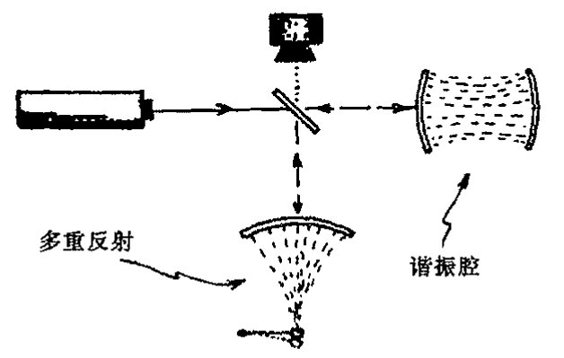

**图 30.26** 在更实际的“FELIX”设计中，不是用 X 射线作光源，而是用可见光光子对镜面的 $10^6$ 次冲击来替代 X 光子的单次冲击。

让我们想象一下成功实施检验引力 **OR** 实验的情形。如果在上述引力 **OR** 预言的时间尺度上相位相干能够保持，那么那种专门理论将不得不放弃——或至少要做重大调整。但如果实验结果证明是支持引力 **OR** 预言的又当如何呢？我们能得出结论说量子态收缩确实是一种客观的引力效应吗？我想恐怕很多人对这个问题仍会宁愿持一种更为“传统的”观点。例如，他们或许仍会争辩说严格的幺正性（**U**）是不变的，而态变得不可接近——或者说以“度规场的量子涨落”方式丢失了（见 [§29.6](chapter_29.md#296-环境退相关的-fapp-哲学) 和 [§30.14](#3014-早期宇宙涨落的起源)）。

就我个人来说，我无意于抵制对目前公认的物理学理论进行根本性变革，因为我坚信，量子理论的基本变革是在所难免的——正像我早先曾详述过的那样。这里我们将许多深受尊敬的物理学家的观点挑出来进行比较大概不能算是故弄玄虚吧，像洛伦兹就更愿意将狭义相对论效应视为仅仅是对 19 世纪的绝对静止的世界观的一种“修正”。毫无疑问，如果真的能证明引力 **OR** 的预言确实得到了 FELIX 型实验的成功支持的话，同样会有许多令人尊敬的物理学家会在放弃他们坚信的 20 世纪的量子力学世界观的问题上表现得难以割舍犹豫不定。照我看来，这种立场无异于倒退，而且会使我们放弃去争取在新的量子图像基础上做出强有力的新进展的努力！

当然，我们中的那些期望用引力 **OR** 来支持其非传统观点的人，必须对实验中可能出现的与我们期望相对立的另一种结果有所准备。我个人对此的态度可说是相当困惑，尽管事实上许多与我探讨这个问题的量子物理学家都明确表示期望传统量子力学能够毫发无损地再次度过这一危机。我自己的困惑主要基于这样一种信念，即目前的量子力学不具有坚实可信的本体论基础，因此为了这个大千世界的物理可以被理解就必须做出重大调整。这种调整本身并不意味着只有引力 **OR** 才能够使我们得到挽救，也不意味着这里勾勒出的具体的引力方案就一定是正确的。⁴⁴但不论怎样，我认为现代量子理论的稳固地位及其适应能力使它很难被动摇。在我看来，任何这样的动摇都需要付出同样艰难可怕的努力，在现有物理里，除了爱因斯坦的广义相对论及其富

· 614 ·

<!-- page 634 -->

第三十章 量子态收缩中的引力角色

于激励的原理之外，恐怕还找不出任何其他学说堪当此任。正是这些想法促使我提出了上述引力 OR 理论。不管这一思考的最终结果如何，可以预见，在 21 世纪的进程中，一定会出现许许多多重要而发人深省的量子力学新问题及其答案！

## 30.14 早期宇宙涨落的起源

在结束本章之前，我只想在诸多深受量子力学规则变化影响的重要问题中挑出一个来谈一下。在 [§27.13](chapter_27.md#2713-异乎寻常的特殊大爆炸)，我们把注意力集中在宇宙开始时的那种超常的特殊状态上。其所以特殊，不仅在于它具有极低的熵，主要还在于它的严格的空间各向同性和均匀性，正因此宇宙的时空几何与标准宇宙学 FLRW 模型（[§27.11](chapter_27.md#2711-宇宙学)）中的一种保持着相当好的一致性。当然，正如人们经常争论的，宇宙不可能总是这样一种绝对精确的对称模型。如果这种高度对称性一旦出现，它就必须永远保持下去；因为爱因斯坦广义相对论的动力学——以及除此之外的经典物理动力学——要求严格保持这种对称性。

那么量子物理又如何呢？难道根植于量子演化过程中的"随机性"可以不顾及对这种严格对称性的偏离吗？这里人们经常用"量子涨落"的概念来解释对严格对称性的偏离。整个解释大致是：起先这种"涨落"非常微弱，但它们是质量分布中不规则的种子，会随着引力聚集而逐渐增大，最终造成恒星、星系以及星系团的演化发展——正如我们观察所见的那样。

但什么是量子涨落呢？它是海森伯不确定关系（[§21.11](chapter_21.md#2111-动量空间描述)）应用到场量（见 [§26.9](chapter_26.md#269-重正化)）上的一种表现，就是说，如果我们打算以很高的定位精度来测量某个微小区域上量子场的值，那么就会导致与该场量有关的其他（典范）量的一个很大的不确定性，使得这个量在被测量时其期望值会有非常迅速的变化。因此，读出某场量精确值的行为将导致其他量的大幅度涨落。这个量可能是时空度规的某个分量，于是我们看到，精确测量度规的任何企图都会产生该度规的巨大变化。正是考虑到这些因素才使得约翰·惠勒在 20 世纪 50 年代提出 $10^{-13}$ 厘米的普朗克尺度上的时空可能是一种巨幅涨落的"泡沫"的论断（见 [§29.6](chapter_29.md#296-环境退相关的-fapp-哲学) 的节末及图 29.6）。

为了澄清这一点，我们必须仔细回顾海森伯的不确定关系究竟是如何表述的。这些关系并不是说自然界在微尺度上表现为某种内在的"模糊"或"非相干性"。而是说，海森伯的不确定关系限定了两种非对易测量能够取得的精度。我们看到，对单粒子，其位置和某方向上的动量是非对易的，因而不能同时准确确定，二者测量误差的积不小于 $\frac{1}{2}\hbar$（[§21.11](chapter_21.md#2111-动量空间描述)）。但存在一种十分明确的量子态，如果进行实际测量，粒子态将精确按照薛定谔方程演化（假定标准的 U 量子力学成立）。

类似地，在标准量子力学里，定义时空状态的所有参变量不可能都完全确定。但不管怎么说，时空的量子描述应当是完全清楚的。海森伯原理只是告诉我们，这种描述不可能类似于经典

<!-- page 635 -->

通向实在之路

（伪）黎曼流形，因为不同的时空几何量不能彼此对易。而按照惠勒的图像，态是由众多不同的几何叠加而成的，其中大部分都严重偏离平直空间特性，因此他认为这种态具有“泡沫状”特性。

我们来看看如何将这一图像用于早期宇宙态。如果甚早期初态具有严格 FLRW 宇宙对称性，那么这种对严格对称的偏离就一定起因于“量子涨落”吗？态的 **U** 演化必须始终保持严格的 FLRW 对称，不论是出现“量子涨落”还是其他形式的海森伯不确定性。***[30.14] 但这该如何与惠勒设想的高度不规则的“泡沫状”几何相协调呢？其实这里没有任何矛盾，因为整个态是这种不规则几何的叠加，而不是单独一个几何。叠加本身可以拥有单个几何不具有的对称性。如果一个不规则的几何起作用，那么所有通过每个 FLRW 对称应用而得到的其他几何也会起作用。⁴⁵

那么这种 FLRW 对称的、不规则几何的量子叠加又是如何给出类似于特定的“几乎 FLRW 对称”宇宙的概念的呢（这种宇宙只存在很低的与观察基本一致的扰动）？读者应当清楚，在完全处于标准量子力学 **U** 演化的条件下，这种情形是不可能发生的，因为它必须严格保持对称性，因此必定发生过某种具有 **R** 过程性质的事情，它将这种众多几何的叠加改造为单一的几何，或类似于单一几何的少量几何的叠加。这里的关键是，如果没有某种类似 **R** 的作用，“量子涨落”引起的不规则性就不可能发生，正是借助于这种类似 **R** 的作用，单个的初始量子态才以某种方式转换成不同态的概率混合。这就使我们又回到了第 29 章所述的问题上来，在那里我们讨论了 **R** 的“实在性”的各种观点。

863 我们应当记住，我们现在关注的是甚早期宇宙，那时的温度差不多有 10²³ K。没有任何实验可以在那种时间尺度下进行“测量”，因此我们很难看出标准的“哥本哈根”观点（§29.1 的 (a)）如何能够应用。多世界观点（§29.1 的 (b)）又如何呢？在这种图像下，不存在实际的 **R**，宇宙的 FLRW 对称态将一直保持到现在，这种态可以表示为一种多成分时空几何的大叠加。按照这种观点，只有到有意识的观察者试图搞懂这个世界的时候，深入到另一种时空几何的解决方案才可能是适当的——这时会有各种自觉的观察者，每一个感知一种单独的“世界”。⁴⁶ 按“FAPP”观点（§29.1 的 (c)），存在（充分的）环境退耦可视为一种信号，它让我们意识到不同几何的量子叠加可以看成是一种不同几何的概率混合。

我们不妨与普通量子力学的例子作一比较。⁴⁷ 设想在某点 O 处，气泡室⁴⁸ 内封着一个静止的处于球对称态（即自旋为零的态，见 [§22.11](chapter_22.md#2211-球谐函数)）的放射性核（[图 30.27](assets/page636_fig01.jpg)）。假定通过核裂变，它劈裂成 A 和 B 两部分，并自 O 点沿相反方向射出。我们可以假设 A 和 B 都是带电的，因此会在泡室中留下径迹。在这个例子中，我们从以 O 为心的球对称态开始，但经过衰变后，球对称沿 A

864 和 B 构成的轴线被破坏。我们如何根据初态的 **U** 演化来理解这一点呢？显然，如上所述，球对

---

***[30.14] 保持这种对称性只需要遵循 **U** 演化的决定性的唯一性，以及很弱的关于 **U** 演化的广义假定，你能看出为什么吗？

??? question "答案 [30.14]"
    若初态严格具有 FLRW 对称性，而 **U** 演化由同样对称的动力学唯一决定，则对任一 FLRW 对称变换 $g$，先变换再演化与先演化再变换给出同一结果。由于初态满足 $g|\Psi\rangle=|\Psi\rangle$，演化后态也必须满足同样关系。

    因此 **U** 演化本身不会从严格对称态中选出某个非对称几何。所谓“涨落”只能是对称总态中各个非对称分支的叠加；若要得到单一实际非对称结果，还需要某种 **R** 型选择或其他超出纯 **U** 的机制。

· 616 ·

<!-- page 636 -->

第三十章 量子态收缩中的引力角色

称性必须保持，但这种状态是通过所有可能的不同轴向情形的线性叠加来实现的。波函数具有以 O 为心的球面波的形式——虽然我们得记住这个态是一种由 A 和 B 构成的纠缠态，就是说 A 的每个位置都与相对方向上 B 的位置相关联。随着 A 和 B 上的电荷开始使泡室中的介质发生电离，气泡形成了，态在介质中变得纠缠起来，于是我们发现，整个态是由泡室中各对径迹的叠加组成的，每一对径迹的方向相反，一条对应于 A 的路径，另一条对应于 B 的路径。

图 30.27 OR 造成的对称性破缺。一个（球对称）自旋为 0 的核劈裂成两部分，这一现象可通过具体的相反路径径迹观察到。初态的 U 演化保持球对称性，但这种球对称是由一系列成对的相反路径的（纠缠的）量子叠加组成的（Mott）。R 只是导致这些过程之一被看到。这个例子被用来说明在早期宇宙的初始高度对称的量子态中产生出密度涨落的机理。

这种情形与早期宇宙的情形并没有本质的不同。我们需要某种形式的 **R** 以使不对称量子态的概率叠加来取代对称的量子叠加。实际上，理论家们似乎更愿意采用某种 FAPP 形式的解释（§29.1 的(c)），这时宇宙视界的大小可以任意（不合逻辑地）选取来支持某种到量子纠缠的“截断”。量子叠加则被看成是一种概率混合——虽然它的实际地位几乎根本就没弄清楚。例如，在杰出的暴胀宇宙学家科尔布和特纳（Kolb and Turner, 1994）的研究生教材《早期宇宙》中他们写到（286 页）：

> 当每一种模穿出视界时，它便不再与微观物理相关联了，而是作为经典涨落“冻结”在那儿。

这里“模”指的是量子叠加的组分，由此我们看到，作者正试图用视界来作为某种容许的从量子幅过渡到实际的经典概率幅的途径。这里贯彻的显然是 FAPP（[§29.6](chapter_29.md#296-环境退相关的-fapp-哲学)）的路线，正如我们在 [§29.6](chapter_29.md#296-环境退相关的-fapp-哲学), 8 中所指出的，严格说来，它是不合逻辑的。⁴⁹

在我看来，很明显，通过量子涨落来解释对严格 FLRW 对称性的偏离必须要有某种客观态收缩的理论。但 [§30.9](#309-更激进的观点)~12 提出的引力 **OR** 的“简约主义”理论还不足以做到这一点。我们需要某种更为周全的 **OR** 理论，它应能对数目众多的时空几何的叠加进行很好的处理，在其中单个几何不必像 [§30.10](#3010-薛定谔团块) 中那样是定态的。如果有了这样一种理论，我们可立即拿来与日益增多的观察数据进行比对，在数据面前它要么成立要么被淘汰。BOOMERanG，WMAP，和其他观察手段已经积累了大量有关早期宇宙密度/温度涨落的数据，而且还有大量的其他实验安排正在建设中。

这里对这一情形做一总结性评述是合适的。我们以核裂变为例说明了对称态是如何成为高度纠缠态的。很大程度上说，用这种思路来处理早期宇宙态收缩的情形也是合适的，态收缩使我们避开了难以用“量子涨落”来解释宇宙初态呈 FLRW 对称态的难题。因此，按照我们在 [§23.3](chapter_23.md#233-量子纠缠贝尔不等式)~6 给出的对 EPR 态的讨论，我们有“贝尔不等式破缺”，它提供了相距遥远的事物间的关联，而这在经典理论看来似乎是违反因果律的。这种表观的因果律破坏原本不必作为暴胀

·617·

<!-- page 637 -->

通向实在之路

机制的表征（暴胀兴许可以解释这种远离事件之间的因果联系），而是可以视为适当的客观态收缩机制（OR）的结果。但是我们从刚才的讨论^50^看到，甚至在标准 FLRW 宇宙中，只要初始涨落能够取道某种客观态收缩机制而得以实现，这种表观的“因果性破坏”就可以在没有任何暴胀的情形下出现。

很明显，我们距离那种能够可靠地处理所有这些问题的理论还相当遥远。但我至少是希望我能够说服读者相信，一种具有切实可行的实在论的量子力学对我们来说无疑是极为重要的。本书第 29 和 30 两章所阐述的问题不只是哲学上感兴趣的问题。在我看来，提出一种实在论上相容的（改进了的）量子力学的重要性怎么强调都不过分。我在本节提出了一个可能对认识这一理论有深远影响的基本问题。实际上在早期宇宙研究领域，甚至在生物学领域（见 [§34.7](chapter_34.md#347-心智在物理理论中的作用)，10），还有更多的无法运用“哥本哈根”观点解释的事例——其中根本就不存在量子系统与经典测量仪器之间的明确界线。

## 注 释

### §30.1

30.1 见 Roseveare（1982）。

### §30.2

30.2 见 Penrose（1980）。

### §30.3

30.3 这里不存在什么理论上或技术上的障碍，至少在我们不要求 100% 的精确情形下是如此。例如，我们可以安排使得最终的光子总是一对光子中的一个（譬如说由参数下转换来产生——见 [§23.10](chapter_23.md#2310-量子纠缠)），而另一个用于触发记录仪。

30.4 我发觉，在这种争论中，人们经常明显表现得非常困难。如果我们设想这种实验大量出现在整个时空的不同位置上，那么问题或许较容易得到澄清。我们考虑有 4 条不同的光子路径 SBD，SBC，FBD 和 FBC。为了看出各种概率是什么样，我们在给定 S（沿时间方向）的情形下来求 SBD 所占的比例，或在给定 D（逆时）情形下求 SBD 所占的比例。平方模法则能够正确给出前一种情形的实际答案（50%），但不能给出第二种情形的实际答案（几乎 100%）。

30.5 但它们依赖于由假定设置的初态，这种初态不是那种与探测器有关联的某种纠缠态（[§23.3](chapter_23.md#233-量子纠缠贝尔不等式)）的一部分。我们可以提出这样的问题：这种纠缠的时间反向能够解释时间反向的平方模法则给出的错误答案吗？但我看不出按这种思路怎么能给出合理的解释。也许哪位富于进取心的读者能够做到这一点。

30.6 见 Aharonov and Vaidman（1990）。

30.7 这个问题的讨论见 Aharonov *et al.*（1964）。

30.8 见 Aharonov and Vaidman（2001）；Cramer（1988）；Costa de Beauregard（1995）；以及 Werbos and Dolmatova（2000）。

### §30.4

30.9 见 Unruh（1976）；亦见 Wald（1994）。

30.10 见 Penrose（1968b，1987b）以及 Bailey *et al.*（1982）。

30.11 见 Kay（2000）；Kay and Wald（1991）；Haag（1992）。

### §30.5

30.12 见 Wald（1984）。

30.13 见 Wald（1984）；Synge（1950）；Kruskal（1960）；Szekeres（1960）。

30.14 关于“τ”的解释可能存在一些让人迷惑的不一致的地方。这里我们将 τ 理解为施瓦西情形下的实

·618·

<!-- page 638 -->

际时间，而在[图 30.5](assets/page612_fig01.jpg)(a),(b)的平直（伦德勒）情形下，$r_0\tau$ 测量的是做加速运动的观察者的时间。

30.15 见 Newman *et al.* (1965)。

30.16 这个旋磁比是对“纯狄拉克粒子”而言的，这时电子是一个绝好的近似，而实际的电子则需遵从量子场论的辐射修正，见 [§24.7](chapter_24.md#247-狄拉克方程) 节末。质子和中子则离狄拉克粒子更远，这个概念用在其组分夸克上或许更合适。

## §30.6

30.17 见 Novikov (2001); Thorne (1995a); Davies (2003)。

30.18 Davies (2003) 对这种可能性给出了一个有趣而又好懂的讨论。

## §30.7

30.19 见 Penrose (1969a); Floyd and Penrose (1971)。

30.20 见 Blanford and Znajek (1977); Begelman *et al.* (1984)。亦见 Williams (1995, 2002, 2004)。

## §30.8

30.21 见 Hawking (1974, 1975, 1976a, 1976b); Kapusta (2001)。

30.22 见 Preskill (1992)。

30.23 见 Preskill (1992)，或见 Kay (1998a, 1998b, 2000)。

30.24 见 Preskill (1992); Susskind *et al.* (1993)。

30.25 Horowitz 的评论见 Gottesman and Preskill (2003); Maldacena (2003)。亦见 Susskind (2003)。

30.26 霍金引入一种广义的幺正演化运算，其中正常 QFT（[§26.8](chapter_26.md#268-构建费恩曼图s-矩阵)）的 S 矩阵描述被推广为他称之为“超散射”算符的运算（与超对称无关，见 31.2），这种算符用“$”符号来标记。这种运算是密度矩阵间的运算，而不是由 S 矩阵处理的纯态间的运算。见 Hawking (1976b)。

## §30.9

30.27 20 年来，霍金和我之间的主要分歧主要集中在这个时间不对称问题上。在围绕这个问题的所有争论中，他始终坚持时间对称性物理和要么 U 量子力学不对易要么是前述（注释 30.26）幺正运算可适当推广的立场。正像我将要解释的，我自己在这个问题上的立场是相当不同的。

30.28 见 Penrose (1979)。

30.29 外尔曲率假设是针对经典几何而言的，它恰好在“量子几何”具体化为经典时空这一点上说明了所发生的变化。

30.30 见 Hawking (1976a, 1976b) 以及 Gibbons and Perry (1978)。

30.31 这里需要用到某种推广了的希尔伯特空间概念，它也具有（弯曲）相空间的某些特征，例如，见 Mielnik (1974); Kibble (1979); Chernoff and Marsden (1974); Page (1987); 以及 Brody and Hughston (2001)。

## §30.10

30.32 这些可以是 [§26.6](chapter_26.md#266-相互作用拉格朗日量和路径积分) 提到的相干态。

30.33 记住：$\kappa_\chi$ 和 $\kappa_\varphi$ 的指标只是区别代号，不是 [§12.8](chapter_12.md#128-张量抽象指标记法和图示记法) 的意义下的“张量指标”。

## §30.11

30.34 见 Christian (1995)。

30.35 见 Isham (1992); Kuchar (1992); Rovelli (1991); Smolin (1991); Barbour (1992)。

30.36 有关 objective state 收缩的众多理论，见注释 29.12。Diósi, Percival, Kibble, Pearle, Squires 和我自己的工作都与引力密切相关。

30.37 最近又提出了一个更严格确认引力 OR 建议的方案。从练习 [21.6] 可知，要使得量子理论能够调和等效原理，就需要在相因子上包含时间 $t$ 的 3 次方，这样才能从惯性参照系过渡到引力场中的固定参照系。与此相应，这两个参照系严格描述不同的真空（见 [§26.5](chapter_26.md#265-备择真空)），这是 [§30.4](#304-霍金的黑洞温度) 中所说的翁鲁效应的遗迹，即伽利略极限下的残存部分。因此，如果等效原理能够完全遵守，那么两引力场的叠加将包括不同真空的叠加，而这将是不稳定的，即使是在伽利略极限下。这方面细节将在以后发表。

## §30.12

30.38 见 [§22.5](chapter_22.md#225-量子可观察量) 和 Moroz *et al.* (1998)。

·619·

<!-- page 639 -->

通向实在之路

30.39 这方面的有关许多研讨会的参考文献见注释 29.12。

868 30.40 我从研究这些建议中收获良多。其中的一些或许能成为通往更完备的引力 OR 理论的路标。确切的 NO-GO 定理见注释 29.12，亦见 Gisin（1989，1990）。

[§30.13](#3013-felix-及其相关理论)

30.41 这项建议的细节源自一些同事富于创意的思想。最初设想的一个重要组成部分（涉及分光光子对“穆斯堡尔型”晶体的冲击）来源于 Johannes Dapprich——一些更具体的想法，包括微型镜面的大小、光子能量以及其他一些参数的设定则产生于与 Anton Zeilinger 以及他（那时）在 Innsbruck 的实验组里其他人的讨论。太空基实验（FELIX）的思想源自与 Anders Hansson 的讨论。更实际的地基实验的精巧设想来源于 William Marshall，Dik Bouwmeester 和 Christoph Simon。见 Penrose（2000a），Marshall *et al.*（2003）。

30.42 见 Marshall *et al.*（2003）。

30.43 见 Arndt *et al.*（1999）。

30.44 例如，不论是 Károlyházy（1974）提出的原始引力 OR，还是最近 Percival（1994）的有关建议，都提出过与这里所述的很不相同的预言。

[§30.14](#3014-早期宇宙涨落的起源)

30.45 但这里有细微的区别，因为人们会以为抽象对称性对时空几何的作用将直接再生出同样的几何（由于广义协变原理，见 [§19.6](chapter_19.md#196-爱因斯坦场方程)）。在这个问题上存在着不同的观点，但不管怎样，这些都不影响文中提出的一般性论点。

30.46 有关惠勒自己对此的另一种说法，所谓“参与的宇宙”，见 Wheeler（1983），这也许是自觉观察者的最终显现，他（按目的论）决定早期宇宙中出现的时空几何的具体选取。

30.47 这个例子与 Neville Mott（1929）对 α 粒子辐射在云室中径迹的讨论有几分相似。

30.48 一种标准的测量仪器，带电粒子的路径显现为一连串细微的气泡，见注释 30.47，亦见 Fernow（1989）。

30.49 在当时，在哈勃半径（此处天体退行速度达到光速）处“截断”的真正理由并不直接缘于实际的“视界大小”（在暴胀模型里，这个视界大小远大于哈勃半径，见[图 28.5](assets/page552_fig01.jpg)），也与量子物理过渡到经典物理的途径无关。它纯粹是一种宇宙膨胀作用于服从相对论约束的场上的经典效应。

30.50 各色人等出于各种原因似乎都提出过在早期宇宙涨落中可以找到“非因果性”EPR 型关联的证据的建议。例如，Bikash Sinha 若干年前就向我提出过这样的建议。

·620·
