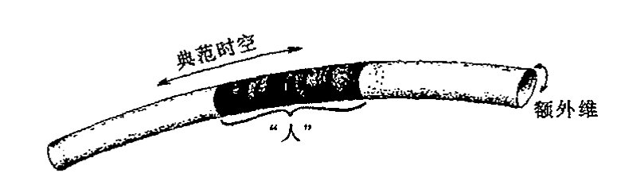
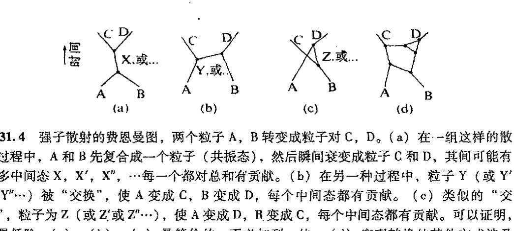
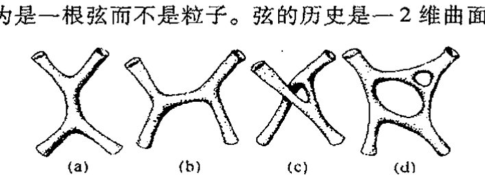
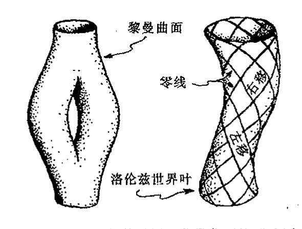
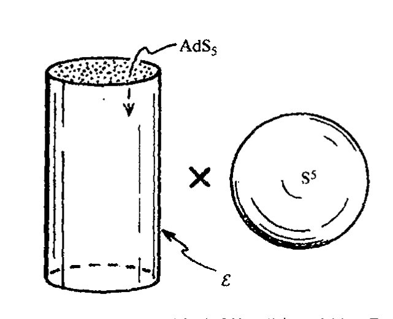
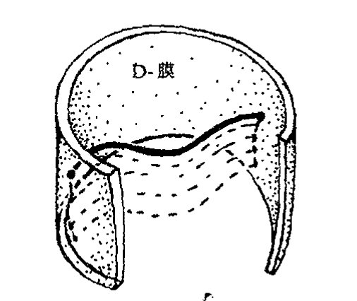

<!-- page 640 -->

第三十一章 超对称、超维和弦

---

第三十一章

超对称、超维和弦

## 31.1 令人费解的参数

谈到21世纪物理学，大多数物理学家可能会有非常不同于上一章所介绍的想法。很少有人会预言量子力学框架将发生根本性变化。他们争论的往往是诸如需要额外的时空维、点粒子被所谓“弦”这种延伸了的概念或被称之为“膜”或“$p$膜”或简称为“branes”——其中奇妙的外加对象即所谓“D膜”似乎还起着重要作用——的高维结构所取代等等这些听起来古怪的概念。一些概念有了令人瞠目的扩展，如对称性扩展到所谓“超对称性”，群扩展到“量子群”等等。像“非对易的”这样的用于几何描述的概念得到了推广，离散而非连续的宇宙图景已深入到最微小的层次，在这个层面上，空间本身的纤维是由纽结和链组成的。还有建议认为时空这一概念应当抛弃，或代之以其他概念。

这些不同的思想说的都是些什么呢？我们用它们做什么呢？更重要的是，是什么因素促使这么多物理学家来描述这种与我们日常人类直接感受到的尺度几乎完全不同的“实在”呢？毫无疑问，进行这种思考的部分原因在于量子力学比广义相对论在更大范围内获得的成功。这些20世纪的理论说明，我们的直觉很可能会出错，“实在”可能根本不同于以往几个世纪的物理学提供的那些图像。但是，仅仅给出一幅古怪或稀罕的世界图景并不能使我们坚信它是正确的。正像当代理论学家们力图探知宇宙运行的更深层次的机制一样，我们也需要了解他们这种研究的基本动机。

我们还得按我们在第24章首次遇到并在随后的第25、26章继续深入的线索进行。在这些章节里，狭义相对论和量子理论的共同要求将我们带入了场量子理论的沼泽，我们面前是一片无穷大的雷区，我们需要有足够的智慧才能绕出这片危险丛生之地，并最终走向粒子物理学的标准模型，业已证明，这个模型与大自然已知的构造符合得很好。但标准模型本身并未能免去无穷大之扰，而只是“可重正化”到一个有限的理论。可重正化性只允许进行特定的计算，它可以

<!-- page 641 -->

通向实在之路

给出理论感兴趣的大部分问题的有限的答案，但并不提供获取某些最重要参数的途径，例如我们从中得不到理论所描述的粒子的质量和电荷的具体值。如果不经重正化过程，这些参数值很可能是“无穷大”（或为“零”）。重正化通过重新定义这些参数避开了相应的无穷定标关系，使得要得到的其他量可以是有限值。基本上说，人们“放弃”了质量和电荷，它们的值只是被当作不加解释的参数放入理论中。而这样的参数在理论中多达17个，甚至更多，除了质量之外，还包括各种不同的基本的夸克和轻子、希格斯子等等之间的耦合常数，他们都需要具体规定。

大自然的这些实际粒子的质量和电荷的取值具有相当神秘的色彩。例如，有一个未经解释的决定着电磁相互作用强度的“精细结构常数”$\alpha$，它由下式定义：

$$\alpha = \frac{e^2}{\hbar c},$$

这里 $-e$ 是电子电荷。精细结构常数的倒数非常接近于值 $\alpha^{-1} = 137$，更精确的为

$$\alpha^{-1} = 137.0359\cdots。$$

多年来，一些物理学家认为 $\alpha^{-1}$ 的取值实际可能就是精确值137。特别是亚瑟·爱丁顿爵士（1946）更是将其后半生用在了构建“基本理论”方面，这个理论的推论之一就是“$\alpha^{-1} = 137$”。今天的许多物理学家在寻找 $\alpha$ 的直接数学“公式”或其他“自然界常数”方面远不像前辈们那么乐观。现在，物理学家们倾向于将这些量看成是相互作用中粒子能量的函数，而不仅仅是一个数，他们称这些数为“跑动的耦合常数”（见注释26.21）。我们称之为“自然界常数”的那些已观察到的标量值可能是这些“跑动”值的“低能极限”。虽然人们仍希望为这些具体的极限值找出纯粹的数学上的理由，但这些值似乎并不比那些不依赖于能量的量更“基本”。

我们经常会看到，电荷和质量按 [§27.10](chapter_27.md#2710-黑洞熵) 引入的绝对（普朗克）单位制来表示，在这种单位制下，牛顿引力常数 $G$，光速 $c$，狄拉克形式的普朗克常数 $\hbar$ 和玻尔兹曼常数 $k$ 均取单位1：

$$G = c = \hbar = k = 1。$$

在这种单位制下，质子的电荷（或电子电荷的负值）大致为 $e = 1/\sqrt{137}$，或更精确地表示为¹

$$e = 0.0854246,$$

基本夸克电荷（负的下夸克电荷——见 [§25.6](chapter_25.md#256-强相互作用粒子)）为此值的1/3。绝对单位通常也称为普朗克单位（有时又叫普朗克－惠勒单位），因为马克斯·普朗克（闻名于量子力学——见 [§21.4](chapter_21.md#214-量子理论的实验背景)）最先在1906年发表的论文里提出了这种性质的思想。有趣的是，在这篇论文里，他仍用电子电荷作为基本单位，而不是用他的“普朗克常数”来整理有关的量，在这种单位下，我们有 $e = -1$。（电荷的神秘性并未消失，因为在他的这种框架下，$\hbar = 137.036$。）后来是惠勒（例如，1975）在他的许多文章里强调了这些思想的重要性（用 $\hbar$ 而不是用普朗克选择的电子电荷）。

如果这就是一切，那么普朗克单位更恰当的称呼应是斯托尼单位，因为爱尔兰物理学家斯托尼（George Johnstone Stoney, 1826–1911，他第一次测量了电子的电荷）早在1881年就先于普朗克提出了同样的思想。然而，在普朗克1899年发表的另一篇论文里（该文显然早于他1900年

·622·

<!-- page 642 -->

第三十一章 超对称、超维和弦

发表的那篇启迪量子理论的著名论文），“普朗克常数”已经用来定义绝对单位制。因此，我将坚持用传统术语，称绝对单位为“普朗克单位”！

粒子的质量又如何呢？质量问题比电子电荷问题更棘手。自然界里几乎所有粒子的电荷值都是某种基本电荷的整数倍。如果我们仅考虑那些能够自由存在的粒子，我们可取质子作为基本电荷；如果我们打算将强子也包括进来，则可以取负的下夸克电荷为基本电荷。虽然对这个事实我们还未充分理解，对 137.036 的认识也不尽妥当，但这个问题远较质量值的问题易于把握。质量问题的神秘处之一在于当我们用绝对单位来测量通常粒子的质量值时，得到的结果出奇的小。例如，电子的质量 $m_e$ 在绝对单位下约为

$$m_e = 0.000\,000\,000\,000\,000\,000\,000\,043$$

质子的质量仅为这个值的约 1836 倍，而电子中微子的质量则要小于该值的 $10^{-5}$ 倍。我们对这些微小的质量值的困惑还表现在为什么自然的“普朗克质量”（$10^{-5}\,\text{g}$，一只小蚊虫的质量）会比我们在自然界遇到的所有基本粒子的质量都大得多。换一种说法，这一困惑可表达为：为什么 $1.16163 \times 10^{-35}$ 米的普朗克距离要比粒子物理里通常所见的最小尺度还要小近 20 个量级？这个距离被认为与量子引力理论有深刻关联，是连续性时空这样一种通常概念失去意义的特征距离尺度。²

对这些神秘性，一种观点是将电子电荷或质量的微小量值看成是某种重正化过程的结果，这里裸值（[§26.9](chapter_26.md#269-重正化)）可以是某个数学上体面的数，像 1 或 $4\pi$。因此小的观测值可能源自某个仅仅是很大但非无穷大的重正化因子。这种情形发生在发散求和以及量子场论积分可被某种收敛形式所取代的场合。发散性（或者说“紫外”发散，见[§26.9](chapter_26.md#269-重正化)）通常总会出现，因为它们涉及越来越大的无止境的动量求和，这些过程又可看作是距离无止境地变得越来越小。如果这种发散积分（或求和）在譬如说（引力的）普朗克尺度（$10^{-35}$ 米）³ 上截断，那么无穷大就可以除去。这一思想最初是由奥斯卡·克莱因于 1935 年提出的。所有这些意味着，当引力被适当引入量子场论计算时，我们可以得到一个有限的而非仅仅是重正化的理论。在这种有限理论中，我们可以找到对这些未解释数字的某种理解。

与这种半个世纪前就存在的希望相比，今天在将引力直接置于世界图景的问题上情况不是变好而是更糟了。当标准的量子化技术被用到爱因斯坦理论上时，导致的是一种非可重正化的理论而不是有限的理论。这使得许多研究者力图通过非标准方法来为引力的量子理论寻找出路。本书前面章节（特别是 27~30 章）已指出，我们确实应当为量子（场）论和广义相对论的结合寻求一种非标准的理论。但我认为我关于这种结合的量子一方应当有所改变的观点并未得到认真对待。如果爱因斯坦理论直接按量子场论的标准程序进行改造，我们得到的就只能是不能令人满意的非可重正化的⁴ 量子引力，许多人一直忙于如何改造爱因斯坦理论，他们从未尝试过要改造量子场论。

<!-- page 643 -->

通向实在之路

## 31.2　超对称

已提议的是哪些改造呢？这其中之一是采用超对称概念，并与爱因斯坦理论整合为一体（也包括扭量，见 [§14.4](chapter_14.md#144-曲率和挠率) 和注释 19.10），以便构成所谓超引力架构。什么是超对称呢？为什么这一概念被许多物理学家看成是“好事”呢——某种意义上说，超对称概念为当代基本理论的一系列发展奠定了基础？的确，超对称原则已具有突出的地位，^5^ 尽管这一理论似乎少有预言，与我们业已在自然界观察到的那些事实并无联系。

在这里我必须再次重申我的观点，并向读者提出必要的警告。我发现我对超对称理论在物理上的重要联系根本没有信心，至少对当今用于粒子物理和基本理论的那种形式是如此。迄今，观察并未对宣称的超对称提供多少支持——甚至可能一点都没有。这些概念的吸引力主要来自非常令人赞许的数学美和超对称在避开其保护伞下量子场论模型里大量无穷大方面所显示的不容置疑的价值。假定你是一位对构造中不出现不可控无穷大的量子场论感兴趣的物理学家，如果你将理论取为超对称形式，那么你要解决的问题无疑会容易得多！

超对称背后的基本思想，在于它提供了一种可使费米子和玻色子按一种对称性关系“配对”的方法。如同我们在 [§25.5](chapter_25.md#255-电弱对称群)~8 看到的，粒子物理学的正常对称群只在玻色子集和费米子集各自的范围内“转动”。这些群不会将玻色子“转动”为费米子，反之亦然。而超对称性就能做到这一点。从 [§26.2](chapter_26.md#262-产生算符和湮没算符) 我们知道，玻色子满足对易关系，而费米子满足反对易关系。能够使前者变为后者的算符本身必须具有反对易特性。但来自普通连续群的算符都是群的无穷小的生成元，它们构成李代数，见 [§13.6](chapter_13.md#136-表示理论与李代数)。通常李代数元满足对易关系而非反对易关系。这意味着所需的算符不会是通常连续群的无穷小生成元，而是更广泛的所谓超群概念下的无穷小生成元，这一概念扩充了李代数的运算关系使之产生的某些生成元能够像满足对易关系那样满足反对易关系。

在 [§26.2](chapter_26.md#262-产生算符和湮没算符), 3 我们已经遇到过这样的事情，这就是下述方程

$$ab \pm ba = c,$$

它满足量子场论的生成、湮灭和场算符的运算（如 [§26.2](chapter_26.md#262-产生算符和湮没算符) 里 $\psi^* \Phi \pm \Phi \psi^* = i^k \langle \psi | \phi \rangle I$ 这样的方程）。与此相应，我们同样可以从通常的李代数构造出超李代数，只是在定义关系中可能需要重新定义加法“+”。[§13.6](chapter_13.md#136-表示理论与李代数) 已指出，李代数的定义关系有形式 $[E_\alpha, E_\beta] = \gamma_{\alpha\beta}^\chi E_\chi$，这里 $\gamma_{\alpha\beta}^\chi$ 是结构常数，$[E_\alpha, E_\beta] = E_\alpha E_\beta - E_\beta E_\alpha$。这些关系具有上面方程的形式；如果在 $ab$ 和 $ba$ 之间取负号的话。但对于超李代数，当 $a$ 和 $b$ 均为费米型量（两个量既不是都是玻色型的，也不是费米、玻色各具其一型的）时我们也容许取正号。记号 $[a, b]_+$ 用于表示这种反对称算符，即 $[a, b]_+ = ab + ba$，作为补充，通常的李括号记号 $[a, b] = ab - ba$。这样，我们就超越了通常的李括号记号。

一般来讲，超群的生成元由特殊方式构成。我们将这些生成元取为 [§11.6](chapter_11.md#116-格拉斯曼代数) 里的格拉斯曼代数元，而不是普通的实数，这样的元既包括了反对易性质也包括了对易性质。在 [§31.3](#313-超对称代数和几何) 我们将

·624·

<!-- page 644 -->

第三十一章 超对称、超维和弦

详细讨论其作用原理。

这样，超群构成了一片可观的纯数学领域。不仅如此，超对称的概念还可以直接用于数学证明以获得其他方法不易获得的结果。⁶但这并未告诉我们，按这种方式超对称是否就与物理存在直接关联。另一方面，许多不同的事例表明，超对称在激发或建立与物理直接相关联的数学结果方面是非常有用的。⁷但在我看来，这一点并不能说明超群与粒子物理学或量子场论存在直接的基本联系。

哪些证据表明超对称在粒子物理里扮演着真正角色呢？回顾第25章的标准模型，我们看到，可重正化性质很大程度上应归功于它对参数的精确"微调"。这些关系基本上可理解为 SU(3) × SU(2) × U(1)Z₆ 对称性的要求（[§25.7](chapter_25.md#257-色夸克)）。但在某些人看来，⁸标准模型还需要除上述这些关系以外的另一些极为精确的微调。额外的对称性可以用来满足这一点，超对称性一直被认为是一种能够实现这种微调的手段。因此这些概念经常被用于构造大统一理论（[§25.8](chapter_25.md#258-超越标准模型)）。然而我们有什么理由相信这种大统一理论呢？毕竟对此尚无任何观察上的证据。

超对称诱人的一面似乎在于它提供了一种将玻色子和费米子关联起来的方法，这使得超对称的量子场论在给出有限答案方面比不具超对称的量子场论容易得多。借助超对称的玻色子和费米子配对法则，我们可以通过一个集的无穷大来抵消另一个集的无穷大。这样建立量子场论的工作就要比建立不具超对称的量子场论容易得多。但它并未告诉我们自然本身是否就是按此方式运作的，她可是藏有许多令人意想不到的机关！

就当今所用的超对称性而言，主要困难在于它要求自然界的每一种基本粒子都拥有与原粒子自旋相差 $\frac{1}{2}\hbar$ 的所谓"超级伴侣"。对于电子，所需的伴侣是0自旋的"标量电子"，每种不同的夸克则伴有0自旋的"标量夸克"，光子伴有 $\frac{1}{2}$ 自旋的"光微子"，W和Z玻色子则分别伴有 $\frac{1}{2}$ 自旋的"W微子（wino）"和 $\frac{1}{2}$ 自旋的"Z微子（zino）"，等等。麻烦在于所有这些"超对称伴侣"没一个被发现。正式的解释是，由于某种"超对称破缺"机制，这些粒子的性质还不能得到充分描述，这些推定的超对称伴侣中的每一个都具有远大于其原粒子的质量，按现在估算，其质量约为甚至超过质子质量的1000倍。我不得不承认我很难相信这种看上去就不自然的理论。

似乎存在这样的假定，两个"伴侣"中，较小自旋（差 $\frac{1}{2}\hbar$）的一方一定具有超过对方的质量（除非二者均属无质量粒子）。而且还假定，只有被认为是"基本的"粒子（如光子、引力子、W和Z玻色子、胶子、轻子和夸克）才具有这种超对称伴侣。否则的话，我们就会遇到像π子这样的0自旋粒子的麻烦。如果存在0自旋的基本粒子，像仍未发现的希格斯玻色子，那么它们将具有比其超对称伴侣更大的质量（因为已排除了负自旋）。如果这是对的，那为什么希格

·625·

<!-- page 645 -->

通向实在之路

斯玻色子的超对称伴侣至今未能找到？同样，超对称和暴胀宇宙学的信仰者必须解释后者现象中的标量 $\varphi$ 粒子（[§28.4](chapter_28.md#284-暴胀宇宙学)）如何才能结合进这种"超级伴侣"图像中。

876

现在经常提到的支持超对称的一个"正面"证据是，在宇宙处于大爆炸后最初的 $10^{-39}$ 秒（仅 10 000 倍普朗克特征时间）时刻，宇宙的温度高达 $10^{28}\,\text{K}$，这时我们必须有某些概念用来将粒子物理中的 3 种基本力（强力、弱力和电磁力）统一到一个高度对称的统一理论中去。⁹ 这种思想认为，在如此高的温度下，这样一种统一要求所有的相互作用力均相等。应当指出，在通常条件下强弱相互作用力之间相差约 $10^{13}$ 个数量级（尽管二者不能真正地直接相比）。这个论证是要指出，如果考虑到重正化效应（从 [§26.9](chapter_26.md#269-重正化) 我们知道，粒子的视在电荷与其裸电荷之间可以有相当大的差异），那么这些力就有可能统合起来，"裸"值在这么高的温度下将显示其本性。（请回顾 [§31.1](#311-令人费解的参数) 末尾指出的"跑动的耦合常数"概念。）这种论证声称，如果没有超对称性，这些值就无法统合到一块儿，只会"失去"（见图 31.1）；反之，一旦超对称性被带入图像，曲线就会变得机缘凑巧地相交于一处，粒子物理的大统一就会实现！

图 31.1 按照某种"大统一"理论的观点，强、弱和电磁相互作用的耦合常数（通常看成是"跑动的耦合常数"，见注释 26.21 和 [§31.1](#311-令人费解的参数)）在足够高的温度（约 $10^{28}\,\text{K}$，大致出现在大爆炸后约 10 000 个普朗克特征时间（$\sim$$10^{-39}$秒）的情形）下应严格相等。为了使所有 3 个值精确重合，就必需引入超对称性。

读者可能觉察到我缺乏信心。（在 [§28.3](chapter_28.md#283-早期宇宙的对称性破缺问题)，我已经表示过我对那种只要宇宙温度足够高，就必然出现"对称性恢复"的理论感到的困难。）这种特定的号称超对称性得到了观察支持的概念堆积有着太多的外推成分。其中之一就是这样一种预设：在 $10^{28}\,\text{K}$ 和目前加速器能够达到的 $10^{14}\,\text{K}$ 之间的能量（温度）鸿沟问题上不存在真正新的证据。这个问题本身似乎就是一个不合理的外推，除了那些已经做过的，我没看出这些论证是如何能够被当作为超对称性提供了明显的观察支持的。

877

## 31.3 超对称代数和几何

让我们转向超引力理论，并用它作为本节的开始。与上节类似，这里应当存在一种引力子的 $\frac{3}{2}$ 自旋的超级伴侣，这就是引力微子。这种推定的粒子像引力子本身一样不具质量，除非发生

· 626 ·

<!-- page 646 -->

第三十一章 超对称、超维和弦

严重的超对称破缺。这种引力微子与几何的关系如何呢？爱因斯坦曾教导我们，引力可通过时空曲率来描述（[§17.9](chapter_17.md#179-爱因斯坦广义相对论的时空) 和 [§19.6](chapter_19.md#196-爱因斯坦场方程)）。这是否意味着引力微子也应当扮演某种相应的（超）几何角色？与这种要求相一致，许多超引力理论家认为，普通的流形概念（见第10和12章的描述）需要推广，并由此提出了超流形概念。我们可以把它看成是一种非常形式化的定义，其坐标概念被推广为包含了反对易基元。对于通常的流形，其坐标一般为实数（或复数，如果我们考虑的是复流形的话，见[§12.9](chapter_12.md#129-复流形)）；对于超流形，我们将其坐标取为格拉斯曼代数元（[§11.6](chapter_11.md#116-格拉斯曼代数)）。

大多数超对称理论家对其超对称场量子所居的"流形"的性质并不采取这么一种严格要求（即使对超引力情形标准的广义相对论的"几何"性质要求这一点）。下述内容不必遵循严格的"超流形"观点，一般认为"超代数"概念足以用来表示这些定义在普通时空流形上的量。

如果我们将单个的反对易元 $\varepsilon$ 加到实数系 $\mathbb{R}$ 上，我们即得到最简单的这样一种代数。量 $\varepsilon$ 必须是自身反对易的：$\varepsilon\varepsilon = -\varepsilon\varepsilon$，即 $\varepsilon^2 = 0$。因此，这种代数的每一个元素有形式

$$a + \varepsilon b,$$

这里 $a$ 和 $b$ 均为实数，均与 $\varepsilon$ 对易。我们注意到，这样的两个数的和与积为

$$(a + \varepsilon b) + (c + \varepsilon d) = (a + c) + \varepsilon(b + d),$$

$$(a + \varepsilon b)(c + \varepsilon d) = ac + \varepsilon(ad + bc).$$

我们还注意到，如果忽略掉 $\varepsilon$ 的乘积项，我们即回到通常的代数运算。

如果我有若干个不同的超对称生成元，譬如说，$\varepsilon_1, \varepsilon_2, \cdots, \varepsilon_N$，上述运算依然成立，此时反对易性：

$$\varepsilon_i\varepsilon_j = -\varepsilon_j\varepsilon_i, \text{ 这里 } \varepsilon_i^2 = 0,$$

超代数的一般元有形式**[31.1]

$$a + b_1\varepsilon_1 + b_2\varepsilon_2 + \cdots + b_N\varepsilon_N + c_{12}\varepsilon_1\varepsilon_2 + c_{13}\varepsilon_1\varepsilon_3 + \cdots + f_{12\cdots N}\varepsilon_1\varepsilon_2\cdots\varepsilon_N。$$

这种代数的性态大致是这样：如果我们只取元素的"通常"部分 $a$（即不包括 $\varepsilon$ 的乘积项），则我们回到熟悉的正常（实或复）代数。这种代数的"超级"部分是剩余的那部分。当这种代数的元以足够高的幂次出现时，它实际上完全为零，*[31.2]从这个意义上说，它是"幂零的"。我们经常形象地将"通常"和"超级"部分分别称作"体"和"心"。

作为一个喜欢对事物建立起"图像"的人，我总是要找出这种超代数和超流形所满足纯粹的形式描述。有幸的是还真就存在一种较为传统的看待这些对象的几何方法。眼下我们先来考虑一种最简单的只有一个超对称生成元 $\varepsilon$ 的情形。因为它是反对易项，我们不妨将它看成是1-形式 $\varepsilon$。但它不能仅是普通空间——$n$ 流形 $\mathcal{M}$——里的普通1形式。$\mathcal{M}$ 内所有常微分形式在此都成立（见[§12.4](chapter_12.md#124-格拉斯曼积)）。我们要做的就是将 $\mathcal{M}$ 看成是嵌于 $(n+1)$ 流形 $\mathcal{M}'$ 内的超曲面（"超曲

---

**[31.1] 对 $N=3$ 写下这两个量的和与积。如果 $a \neq 0$，这种元的乘积性逆是什么？

*[31.2] 证明这一点，幂是多少？

<!-- page 647 -->

通向实在之路

面”是一个维数上小于外围空间维数的子流形——见注释 27.11），这里 $\varepsilon$ 是较大流形 $\mathcal{M}'$ 的但限定在 $\mathcal{M}$ 点上的 1 形式。一般来说我们对 $\mathcal{M}'$ 并不感兴趣，除非是那些 $\mathcal{M}$ 的点，在这些点上，$\mathcal{M}'$ 提供一个不在 $\mathcal{M}$ 上的额外维。见图 31.2a。（我们只关心所谓 $\mathcal{M}'$ 内 $\mathcal{M}$ 的一阶邻域。这意味着“一阶导数”不在 $\mathcal{M}$ 上，故我们关心的是“指向”非 $\mathcal{M}$ 的 $\mathcal{M}'$ 的那些切矢和余切矢（或切空间和余切空间）的概念，而不是像非 $\mathcal{M}$ 方向上曲率那样的高阶导数。）我们现在做的仍是 $n$ 维的，就是说，所有的量都能表示为流形 $\mathcal{M}$ 上 $n$ 个独立坐标的函数。“心”量指的是指向不包含 $\mathcal{M}$ 的 $\mathcal{M}'$ 的方向，而“体”量则仅指 $\mathcal{M}$ 内的那些方向。

如果我们要求有 $N$ 个超对称生成元 $\varepsilon_1, \varepsilon_2, \cdots, \varepsilon_N$，情况不会有根本性不同。现在，我们将 $n$ 流形 $\mathcal{M}$ 看成是嵌于 $(n+N)$ 流形 $\mathcal{M}'$ 内的，这里我们仍只对 $\mathcal{M}'$ 中 $\mathcal{M}$ 的一阶邻域感兴趣。这里我们要求有 $N$ 个不同的 1 形式 $\varepsilon_1, \varepsilon_2, \cdots, \varepsilon_N$ 来测定 $N$ 个额外的指向 $\mathcal{M}$ 之外但 $\mathcal{M}'$ 之内的方向。^{10}在我看来，这一图像（不少人的贡献，包括阿什台卡（Abhay Ashtekar），其事迹见第 32 章）^{11}将超对称和超流形的基本思想表述得远较以前通常采用的那种（看起来神秘兮兮的）处理清楚得多。我们注意到，“体”仅指完全属于 $\mathcal{M}$ 内部的那些量，而“心”才是指具有“指向”不包含 $\mathcal{M}$ 的 $\mathcal{M}'$ 的方向的量，见图 31.2b。

![图 31.2 超对称生成元的几何描述。(a) 对单个的生成元 $\varepsilon$，我们将 $n$ 流形 $\mathcal{M}$ 看成是 $(n+1)$ 流形 $\mathcal{M}'$ 内的超曲面，这里 $\varepsilon$ 是 $\mathcal{M}'$ 的定义在 $\mathcal{M}$ 上的 1 形式（$\varepsilon$ 定义了一个与 $\mathcal{M}$ 相切的 $n$ 平面，参见 §12.3 的图 12.7）。我们感兴趣的只是 $\mathcal{M}'$ 的 $\mathcal{M}$ 上“一阶”的那些点，但 $\mathcal{M}'$ 提供一个指向 $\mathcal{M}$ 外的额外维。(b) 对于 $N$ 个超对称生成元 $\varepsilon_1, \varepsilon_2, \cdots, \varepsilon_N$ 情形，现在可将 $n$ 流形 $\mathcal{M}$ 看成是 $(n+N)$ 流形 $\mathcal{M}'$ 的子流形，这时我们对 $\mathcal{M}'$ 的兴趣仍只在 $\mathcal{M}$ 向外的“一阶”点上。$N$ 个独立 1 形式 $\varepsilon_1, \varepsilon_2, \cdots, \varepsilon_N$ “探知” $N$ 个指向 $\mathcal{M}$ 外但 $\mathcal{M}'$ 内的额外方向。](assets/page647_fig01.jpg)

即使有了这种清楚的几何解释，“超代数”的使用仍存在诸多荆棘，如果要维持与几何图像协调一致的话。对于奇数 $p$，通常 $\mathcal{M}$ 内的 $p$ 形式 $\alpha$ 与超对称生成元 $\varepsilon$ 是反对易的，如果我们将 $\varepsilon$ 和 $\alpha$ 的积取作楔积（wedge product）的话。但是，这并非超代数标准处理中的通常惯例，通常 $\varepsilon$ 是取为与 $\alpha$ 对易的。这基本上是一个记法问题，如果我们要考虑超对称生成元与形式的积，正式的做法是将其视为对称积而不是楔积。这样做虽然数学上有意义，但几何图像上反倒变得不够“清楚”。

<!-- page 648 -->

第三十一章 超对称、超维和弦

事实上，在将超对称性应用到“普通的”粒子物理理论上时，通常采用的是 $N=1$ 这种最简单的情形。理由似乎是，大 $N$ 下产生的超级伴侣太多，每个基本粒子会有 $2^N$ 个“伴侣”。没有这一点观察问题会更严重！在每一种情形，相关的超群可看成是“内部对称性”（指时空上丛 $\mathcal{B}$ 的纤维的对称性，[§15.1](chapter_15.md#151-纤维丛的物理背景)）的变换和“转动”（指在更大的 $N$ 维空间 $\mathcal{B}'$ 内 $\mathcal{B}$ 到 $\mathcal{B}$ 的一阶邻域的扩展）。

## 31.4 高维时空

现在我们对什么是超对称和“超几何”有了一些较明确的概念，让我们回到超引力问题上来。在1970年代后期，关于这一概念的最初激励来自这样一种希望：与标准的爱因斯坦广义相对论不同，超引力可被重正化。在爱因斯坦真空理论里，不可重正化的发散性表现为“2-圈级”——这里“圈”是指费恩曼图的扩展，“圈的数目”指为了将费恩曼图简化为树状图所需的切口数（见[§26.8](chapter_26.md#268-构建费恩曼图s-矩阵)，特别是最后的自然段和图26.8，亦见[§26.9](chapter_26.md#269-重正化), 10）。但就这里提出的问题来看，这种发散似乎只是处于1-圈级水平，这可是真正的祸患。在超引力情形，由于理论所容许的问题性质，这些1-圈级发散被神奇地抵消掉了，从而许多人满怀希望地认为这种抵消可推行到所有阶圈上。不幸的是，情形并非如此，在超引力的2-圈级水平上，人们发现存在不可重正化的发散性。^12^因此值得注意的是，如果时空的维数由标准的四维增加到7维，那么问题解决看起来很有希望。但尽管如此，一个充分可重正化的超引力仍付阙如，而且目前的研究表明，^13^也不可能就这么得到。

物理学家会怎样来认真对待时空的维数可能不是我们直接感知的四维（1个时间维加上3个空间维）这种可能性呢？作为数学练习，这种高维的事情很好处理，但现在是物理理论，“时空”真正意味着实际空间和时间的联合。正如我们将在[§31.7](#317-额外时空维的弦动机)看到的，弦论（按其当前的理解）要求时空必须有大于4的维数。在早期理论里，维数取的是26，但后来的改进（包括吸收了超对称概念——[§31.2](#312-超对称)）使得时空维数削减到10。

在我们抛开这种纯属幻想的思想之前，我们有必要回顾一下[§15.1](chapter_15.md#151-纤维丛的物理背景)里由（当时）不知名的波兰数学家卡鲁扎于1919年提出的一种富于创意的理论，这一理论随后又得到我们在本章前面已遇到过的瑞典数学物理学家克莱因的继承。如果额外维（超过4的那些维）从适当的意义上说是小维，那么我们不必专门理会。这里“小”是指什么意思呢？回想一下图15.1的“水龙带”比喻。从远处看，水龙带是1维的，但从近处考察，我们发现它是2维曲面。就是说，只要生活在水龙带宇宙里的生物的物理维尺度远大于水龙带端口的周长，那么它就不会“知道”水龙带实际上还“存在”蜷缩着的额外维。类似的观点可以应用到 $4+d$ 维的“水龙带宇宙”上，这里额外的 $d$ 维是“小的”，而且不可能被生活在这个宇宙里的远大于这些尺度的生物直接测知，它们只能测知4个“大”尺度维，见图31.3。

· 629 ·

<!-- page 649 -->

通向实在之路

**图31.3** 卡鲁扎-克莱因型高维时空（见图15.1）的水龙带模型，这里沿水龙带长方向的维表示通常的四维时空，绕着水龙带的维表示"小的"（普朗克尺度）额外维。我们设想一个居住在这种世界里的"人"，由于他跨坐于这些"小的"额外维之上，因此实际上不会注意到它们的存在。

在卡鲁扎-克莱因模型里，或在这种思想的现代多维版本里，这种小尺度到底"小"到什么程度呢？克莱因本人的结论是，这种微小的额外维的"尺度"（"水龙带端口周长"）应当在10⁻³⁵米的普朗克长度量级上。这个特征尺度（或稍大一点）也是许多现代理论如高维超引力理论和弦论采用的最流行的尺度。很显然，对我们人这种尺度的生物来说，这种尺度的确够"小"，可以预料我们不可能直接感知这么微小的额外的时空维。

事实上，（弦论）最近的发展表明，额外维不必取的这么小，而是可以"大"到直径毫米的量级（甚至可能不是完全闭合的）。一种观点认为，这种理论的观察结果可能表明，在这个距离尺度上引力的平方反比律需要作出调整。实际上，为了确认这样一种异于牛顿理论的偏差是否能够从实验上测得，最近已进行了一些非常精巧的实验。¹⁴但截至目前，小到半个毫米的尺度上仍未发现任何偏差。

不论这些新概念的地位如何，时空具有高维的建议在我们目前这个探索阶段远比"漂亮的思想"更令人感兴趣——原创的卡鲁扎-克莱因模型就是这样一项建议。不论这一概念在数学上多么吸引人，我们都必须设问：相信这一理论是否有足够好的物理理由？在原创的卡鲁扎-克莱因模型情形，采用高维观点的理由是为了"几何化"电磁理论。从[§25.1](chapter_25.md#251-现代粒子物理学的起源)我们知道，在20世纪早期，人类已知的（已理解的）自然界的力只有引力和电磁力，爱因斯坦也才刚证明了如何将引力场与四维时空曲率结合起来。因此为电磁力也构建这么一个几何框架不仅极具吸引力，也是十分自然的。不仅如此，更不可思议的是，同样的"真空的爱因斯坦方程"——即里奇张量为零（Rₐᵦ=0，见[§19.6](chapter_19.md#196-爱因斯坦场方程)）——可以像在标准的四维广义相对论里一样用于卡鲁扎-克莱因的五维模型里。在四维理论中，这个方程处理的是真空态——即除了引力不存在所有其他物理场的状态；而在五维理论中，它基本上是指仅有引力和电磁力的状态，而这两种力囊括了当时所有已知的物理领域。

修饰语"基本上"在这里强调的是这种模型有点过头。对经典卡鲁扎-克莱因模型来说，最重要也是最基本的是"小"维存在对称性，这样就不会出现太多的自由度。让我们来看看为什么这些额外的自由度会以其他方式出现。从[§16.7](chapter_16.md#167-物理学中无限的大小)的讨论可知，我们关心的是给定空间上场 的无穷维空间的"大小"。对于由q-维初始数据曲面上k个任意选定的独立分量规定的场，自由度数为∞ᵏ∞ᑫ。对爱因斯坦广义相对论，我们有（理由较复杂）¹⁵k=4和q=3，因此自由度数

·630·

<!-- page 650 -->

第三十一章 超对称、超维和弦

为 $\infty^{4\infty^3}$，对麦克斯韦理论，自由度数与此相同。对综合的爱因斯坦–麦克斯韦理论，初始数据曲面上每个点的有效分量数是每个场单独情形下值的和，因此对初始 3 维曲面上的每个点，我们有 $4+4=8$ 个有效的独立分量，全部自由度数为

$$\infty^{8\infty^3}。$$

现在，在仅服从里奇平直性条件（即 $R_{ab}=0$，见 [§19.6](chapter_19.md#196-爱因斯坦场方程)）的五维理论中，初始曲面是四维的（故 $q=4$），还可以证明 $k=10$。这给了我们远大于所需的（见上述）场的自由度 $\infty^{10\infty^4}$，不是因为 10 大于 8（$k$ 值），而是因为 4 大于 3（$q$ 值）。4 变量函数数目要比 3 变量函数的多得多了！

在卡鲁扎–克莱因模型里，我们通过在小维上设定连续（实际上是 U(1)，参见 [§13.10](chapter_13.md#1310-辛群)）对称性把 4 降到 3。表示这种对称性的是基灵矢量（[§14.7](chapter_14.md#147-度规能为你做什么)），事实上，卡鲁扎–克莱因五维空间是普通四维时空 $\mathcal{M}$ 上的一个 $\mathrm{S}^1$ 丛 $\mathcal{B}$。它看上去似乎与 [§19.4](chapter_19.md#194-作为规范曲率的麦克斯韦场)（和 [§15.8](chapter_15.md#158-丛曲率)）给出的电磁理论的常规丛描述相去不远。基本差异是这里的 $\mathcal{B}$ 本身具有里奇平直洛伦兹型（伪）度规，而不是只有时空 $\mathcal{M}$ 才具有的那种度规。¹⁶卡鲁扎–克莱因模型的突出特点在于，$\mathcal{B}$ 上里奇平直性的要求（加上 U(1) 对称性）相当于提供了 $\mathcal{M}$ 上爱因斯坦–麦克斯韦理论的所有方程。¹⁷另外还需要的是基灵矢量具有非零常数（负）范数。这一点排除了一个不需要的标量场，从而得到四维的爱因斯坦–麦克斯韦理论！

尽管如此优美，但卡鲁扎–克莱因对于爱因斯坦–麦克斯韦理论的看法却没有为我们提供一种关于实在的令人信服的图景。从物理学方面看，肯定没有强烈的愿望要采用它。例如，超对称性显然有着更强的物理学背景，因为它在缓解量子场论的无穷大问题上具有毋庸置疑的价值。那么为什么高维的卡鲁扎–克莱因类的理论在当代追求关于大自然的更深层次理论方面会变得如此走俏呢？主要是因为出现了弦论，基本上看，当今各种版本的弦论积极寻求的就是利用超对称性和高维。¹⁸

## 31.5 原初的强子弦论

那么什么是弦论呢？为什么它在当今众多的理论中会如此强势呢？原因还是在于它能提供解决量子场论中无穷大问题好的方法。从这个意义上说，它代表着第 24～26 章所追求思想的延续。但还有其他重要的历史方面的动因，特别是出于强子物理方面的某些观察上的需要。让我们先来看看这方面的情形。

最初，这个问题与粒子物理里强子散射所发现的一些关系有关。在第 25 章我们曾提到，强子当中存在许多短命（寿命仅为 $10^{-23}$ 秒）的“粒子”，它们其实很难称得上是粒子，人们经常称其为共振态。我们知道，按量子场论规则（[§25.2](chapter_25.md#252-电子的-zigzag-图像)，[§26.6](chapter_26.md#266-相互作用拉格朗日量和路径积分), 8）的要求，在任何物理过程中，所有可能发生的不同过程都必须加到总的过程中去以便得到完全的量子幅。因此所有可能

<!-- page 651 -->

通向实在之路

的粒子和共振态也必须如此处理。例如，两个粒子 A 和 B 的强子散射过程：A 和 B 碰撞，一瞬间之后变为粒子对 C 和 D。我们可将这个过程可理解为 A 和 B 先复合成一个单一的粒子（共振态）X，然后几乎瞬间它就衰变成粒子 C 和 D。这样的中间态粒子 X，X'，X"，…可以有很多，每一个的效果都必须加到总和中去。每一个这种过程的费恩曼图如图 31.4a 所示。现在，我们用另一种观点来看待所发生的变换：粒子 Y 分别与 A 和 B 发生"交换"，使 A 变成 C，B 变成 D。这种可能的交换粒子 Y，Y'，Y"，…也可以有很多，它们的费恩曼图如图 31.4b 所示。还存在第三种可能的变换过程，所不同的是产生粒子 C 和 D 取不同的方式，其费恩曼图如图 31.4c 所示。此外我们还可以想象存在更复杂的包括闭圈的变换过程（图 31.4d），但从目前来讲，这些"高阶"过程不是很重要。

图 31.4 强子散射的费恩曼图，两个粒子 A，B 转变成粒子对 C，D。（a）在一组这样的散射过程中，A 和 B 先复合成一个粒子（共振态），然后瞬间衰变成粒子 C 和 D，其间可能有很多中间态 X，X'，X"，…每一个都对总和有贡献。（b）在另一种过程中，粒子 Y（或 Y'或 Y"…）被"交换"，使 A 变成 C，B 变成 D，每个中间态都有贡献。（c）类似的"交换"，粒子为 Z（或 Z'或 Z"…），使 A 变成 D，B 变成 C，每个中间态都有贡献。可以证明，在最低阶，（a），（b），（c）是等价的，不必加到一块。（d）实现转换的其他方式涉及闭圈。

为了得到粒子对（A，B）到粒子对（C，D）变换过程的总幅度，我们必须将所有这些不同的贡献加起来；但其结果却令人吃惊：三种可能的方式中每一种给出的都是相同的答案，而且这个答案似乎基本上可以肯定为就是正确答案。如果我们将所有 3 个答案加起来，结果显然就太大了。另外，当我们逐个总结图 31.4（a），（b），（c）所示的每一种费恩曼图时，发现它们在物理上表示的是同一个结果！从标准的费恩曼图观点看，这种"对偶性"^19 似乎不好理解，但 1970 年，日裔美籍物理学家南部阳一郎（Yoichiro Nambu，1921～）^20 基于他对年轻的意大利人韦内齐亚诺（Gabriele Veneziano，1942～）于 1968 年发现的著名公式^21 的研究得出结论认为，所有这些可以用另一种观点来理解，这里单个的强子被认为是一根弦而不是粒子。弦的历史是一 2 维曲面，这样图 31.4（a），（b），（c），（d）的每一种费恩曼图所示的过程可分别用图 31.5（a），（b），（c），（d）所示的不同"管件"构造来表示。"弦观点"的突出之处在于，在标准费恩曼图观点看来（a），（b），（c）3 种不同过程实际上是拓扑等价的，可以认为是同一过程的 3 种不同的视角。因此"弦"的图像为理

图 31.5 图 31.4 的各个过程的弦历史图像为（a），（b），（c）的等价性提供了解释，由于它们具有相同的拓扑结构，因此能够彼此互相转换。（d）的高阶过程对应于更复杂的拓扑，其拓扑的亏格对应于圈数（比较图 8.9）。

·632·

<!-- page 652 -->

解强子物理中令人迷惑的事实提供了一种新的方法。

这里的评述只是定性的，实际上弦的图像同样能够给出导致韦内齐亚诺公式的物理模型。不仅如此，弦模型——其中弦的表现就像微型松紧带，弦的张力随弦的拉伸程度成正比地增加——还为强子物理里另一种观察到的现象即雷杰轨迹的直线性提供了解释。雷杰轨迹是一些这样的线，对特定的强子族，当我们绘出其自旋值对质量平方的图时，它们表现为直线。图 31.6 描述了一个例子。就我所知，对这一显著的观察事实目前还没有完全不同的其他解释。^22

不仅如此，弦模型还使得得到一种有限的强子物理理论的希望大增。大致说来，弦可以用来“平滑”掉传统费恩曼处理（[§26.8](chapter_26.md#268-构建费恩曼图s-矩阵)）中的（紫外）发散。我们可以将这些发散看成是粒子间彼此越来越接近（直至无限）时的小尺度效应引起的。弦不是点粒子，故它能缓解这一问题。事实上，造成发散困难的正是标准费恩曼图图像里的闭圈问题。在弦图像中，闭圈可直接看成是具有高维拓扑的曲面，如图 31.5(d)所示，它是图 31.4(d)的弦版本。这种理解带来的是对费恩曼图的有限而非发散的积分。进一步说，一个单独的弦历史图像能够涵盖许多不同的费恩曼图，从而使我们有更好的机会从物理上给出问题的总答案——它应是有限的——而不是仅仅针对个别发散的非物理部分，这些发散可看作是相互抵消的。此外，不同种类的粒子可以看成是弦的不同振动模从而可以合并。最后，二维时空弦历史还具有另一个突出特性，那就是它们能够被当作黎曼曲面，从第8章我们知道，这种曲面具有非常丰富的几何和解析性质（这些构成了韦内齐亚诺公式的基础）。这里是复精灵出没的领域，它可是量子水平的实在的大自然杰作。

毫无疑问，这是目前能够做到的比通常的粒子物理描述更深层次的一种相当完美的数学图像。当我第一次听说这一图像时（大约是 1970 年，从萨斯坎德（Leonard Susskind）那里听到的，他是该领域最早的研究者之一），我被这一整套思想的美和潜在力量震惊了。在我看来，这就是那种数学上令人振奋且与粒子物理的重要领域直接相关的新领域。我那时的主要兴趣在扭量理论方面（我们将在第 33 章谈到），但我意识到我肯定会在我正从事的领域和这些非常有前途的新概念之间建立起某种联系。扭量理论的关键在于使用了复（全纯）结构，而透过弦的基本理论我们似乎看到了这种结构借助于黎曼曲面对物理行为的控制，黎曼曲面显然是复曲线。^23

显然，威腾（2003）最近的工作可以说从某种程度上实现了这些早期的雄心壮志。在 [§31.18](#3118-弦论的物理学地位) 我还将回到这些不用高维时空的非常令人鼓舞的新进展上来。但这些不代表一种综合性的新的弦论，我穿插在各章节里的这些评论指的是所谓“主流”弦论。

· 633 ·

<!-- page 653 -->

通向实在之路

---

## 31.6　极品弦论

自那之后，30多年过去了，这些吸引人的原初思想是如何经受时间考验的呢？这么多年里这个领域的发展还依然围绕着抑或已超越了当初的主题？这是些仁者见仁智者见智的问题。弦论有时甚至成为带有高度感情色彩的议题。对坚定的支持者来说，弦论（以及它在当今的演变）就是21世纪的物理，它代表着至少可以与广义相对论和量子力学相提并论的物理学思想的革命，如果不说是超越的话。但在最极端的否定论者的眼里，它在物理上至今没取得任何实质性成果，在未来的物理学发展中扮演重要角色的可能性微乎其微。

我不可能在对这些进展的介绍中不带有任何感情色彩，但我至少知道我该怎样合理准确地给出我对此形成的印象。一如既往，我得向读者提出我的忠告，许多积极的能力超强的理论物理学家并不同意我的观点。但我只能描述我所看到的事。

由于我对当前弦论进展的好些方面的看法不是很积极，因此我至少应该为读者留出校正这种可能的不平衡的余地。首先我给出两位在弦论发展过程中最重要人物的观点。剑桥大学的米切尔·格林认为：[^24]

> 一旦你遇到弦论并且意识到近百年来物理学差不多全部的主要进展——它们是如此完美——均源于一个这么简单的起点，你就会懂得这个具有难以置信的吸引力的理论是独一无二的。

另一位是普林斯顿高等研究所的爱德华·威腾，他的著名论断是：[^25]

> “据（Danielle Amati）说弦论是机缘凑巧发轫于20世纪的21世纪物理学。”

至于流行的、雄辩而又热情洋溢的、不带任何批评性的论断——但数学思想上未必深入——见Greene（1999）。[^26]

为了从我自己特有的优势角度来陈述关于弦论的一种协调一致的（如果不说一定公平的话）观点，我这里专门给出一段有关我是如何介入这一领域的简短的心路历程。我想以这种方式说明理论中某些事实的成功的发展，也想顺便表明我对已取得的这些进展的态度。使对弦论进行平心静气的评价变得如此困难的原因，在于它得到的支持和选择的发展方向几乎完全来自数学上的唯美判断。我相信记录下这一理论经历的每一处转折，指出几乎每一次这样的转折都使我们更加远离观察所建立的事实，无疑是重要的。虽然弦论起源于强子物理的实验观察事实，但它之后的发展大大背离了那些源头，结果现在已经很难再有来自物理世界观察数据的指导。

想象一个旅行者在巨大且完全陌生的城市里试图找到一所具体建筑物的情形。没有街道名称（或者即使有对他也无甚意义），没有地图，天空阴霾浓重不辨东西南北，路上还不时出现路

· 634 ·

<!-- page 654 -->

第三十一章 超对称、超维和弦

岔。这位旅行者是该朝右拐还是朝左拐呢？或许该试试某一边背后的小道？拐角常常不是直角，道路也难见是直的，偶尔还是条死胡同，于是还得退回来拐向另一边。经常是一条以前不曾注意的道路出现在眼前。一路上无人可问，即使有也听不懂当地方言。但至少这位旅行者知道他要找的这幢建筑特别雄伟壮观，带有一个超豪华的花园。这也是他为什么要找到它的主要原因之一。旅行者择取的几条街道显然比其他街道更具美学品位，马路两边是更为典雅的建筑群落，漂亮的花园里缀满了奇花异草——但有时走近观察才发现那是塑料的。在随后安排的途径上包括了多种选择，对这每一种选择，旅行者唯一的择取标准就是看该区域的美学吸引力，外加整体协调性的感觉——包括风格、与城市整体的和谐性。

作为形象的比喻，假定你就是这位旅行者，但你是旅行团的一员，这个团有一位聪明过人、极富才学而又敏感的导游——唯一的麻烦是这位导游对这个城市一点不了解，也不懂当地方言。你尽管放心，导游的美学鉴赏力比你强得多，遇事判断也比你来得快。偶尔，导游的注意力会落在---所特别富丽堂皇的建筑上。但导游的审美情趣显然与你的有根本的不同。如果你跟着团队走，你起码会有其他一些伙伴，你可以跟他们聊聊周围的建筑，分享搜寻到心中目标所带来的快乐。即使你不指望找到什么目标，你也能享受寻找的乐趣。但另一方面，当你怀疑导游在搜寻你的目标方面是否能做的比你自己做更好的时候，你也许更喜欢按自己的意愿行事。每一次转折的成功选择都是一次赌博，你也许不时会发现你判断的行走路线比导游选择的线路更值得一看……

实际上，我们在前面几章已经见证了一些事例，大物理学家显示出他们那种特有的深邃的洞察力，这些洞察力常常反映为明确的数学形式。其中令人印象最为深刻的当属 [§24.7](chapter_24.md#247-狄拉克方程) 所述的狄拉克对电子方程的发现。诚然，从建立在试验发现基础上的量子力学完备的数学形式角度看，美学上的这一飞跃仅仅是迈向未知领域的雄健的一步。狄拉克对电子的反粒子的预言则涉及另一个飞跃。但它是在极其谨慎的情况下做出的，而且随后得到了观察的确认。爱因斯坦的广义相对论也属于部分出于数学审美要求考虑的情形，广义相对论的力量很大程度上来自其完美的数学结构。当爱因斯坦第一次构建这个理论时，来自观察方面的要求并不清楚。但这并不等于说爱因斯坦提出这一理论仅仅是出于数学审美方面的考虑。他的根本导向仍是来自物理学，在他的信念里，等效原理（[§17.4](chapter_17.md#174-等效原理)）必定是理解引力的核心。

相比之下，弦论的发展则几乎完全由数学上的考虑来推动的。首先我得说清楚，这本身并不是一件坏事。所有成功的物理理论都具有坚实的数学基础。数学上的相容性也确实是物理理论的一个重要方面，如果理论要具有普适性的话。一旦一个特定的数学框架被建立起来，那么在该框架内数学所具有的那种严格的发展就会对物理世界产生强有力的促进作用。（第 20 章里描述的经典物理学中拉格朗日函数和哈密顿函数的发展为此提供了鲜明的例证。）然而，困难往往出现在这样一种情形下：为了克服不相容性，以前信赖的理论必须调整，特别是有些理论在改造过程中需要依靠特定的数学知识和理论家本人的审美趣味。这种改造经常只是针对某种思想——甚至是那种“辉煌的思想”——但结果很可能仍不具有数学上的相容性，虽然这一弱点可能不

<!-- page 655 -->

通向实在之路

同于理论原先的那些弱点。于是理论还需要进一步改造，如此等等。如果这样的调整非常频繁，那么每次都猜对的可能性显然就极其微小了。

## 31.7 额外时空维的弦动机

弦论早期图像的不相容性表现为严重的反常。由 [§30.2](chapter_30.md#302-来自宇宙学时间不对称的线索) 我们知道，当表示经典对称性或不变性性质的经典对易规则不能完全由量子对易式实现时，即出现反常，因此量子理论不具有经典理论视为基本的那种特征。在弦论情形，反常是指弦的描述中的一种基本参量化不变性（essential parametrization invariance）。这种反常的存在导致所谓灾难性结果。但人们发现，^27^如果把时空维数从 4 维增加到 26 维，这种反常即消失。^28^相应地，弦论似乎也只有在 26 维时空中才是量子力学相容的。

我自己对这事的反应大致为："应该还有别的出路"——因此我从没有把这个问题看成是足以评价"26 维"结论背后的论证的力量。我相信其他人也会有类似的看法，因为在这一点上理论丧失了许多以前的通用性。但我之所以不看好 26 维宇宙模型还有另外的来自扭量理论的原因。正如我们将在 [§33.2](chapter_33.md#332-作为光线的扭量), 4, 10 看到的，我的独特的"扭量"观点的一个基本含义就是，时空确实具有一维时间和三维空间（即"1+3 维"）的那种直接观察到的价值。

除了对付额外维的问题——这个问题我们预设可用卡鲁扎-克莱因方案来处理——这个看似相当简单的强子弦模型还遇到另外一些困难，譬如像存在超光速传播行为。如第 25 章描述的，标准模型的日益成功使得物理学家不再像以前那样对弦模型这样的"出格"的建议感兴趣。人们发现，前述的那种由维内齐亚诺、南部和其他弦论倡导者提供解决方案的强子物理中令人迷惑的问题，可以根据胶子-夸克图像获得另一种所谓量子色动力学的解释。

强子组成的最奇特的"点状"性质正通过实验变得明白起来，它与标准模型的夸克图像相一致，但却与弦的图像不一致。弦构成的圈的典型大小与弦的耦合强度有关，对于初始的强子弦（弦的张力与强相互作用耦合常数一致）情形，它给出的圈的平均尺度为 10^-15^ 米。这几乎就是"点状"质子的尺度，即与质子本身的"大小"可比拟。

在弦论沉寂了差不多 10 年之后，弦论有了新的发展，这就是人们经常称之为的"第一次超弦革命"。1984 年，米切尔·格林和约翰·施瓦兹提出了一个方案（包含了更早的施瓦兹和舍克（Joel Scherk）提出的设想），在这个方案中，超对称被结合到弦论里（于是我们有了"超弦"而不只是弦），而且时空维数^29^因此从 26 维缩减到 10 维。这个理论去掉了上面提到的"超光速"问题。不仅如此，弦的张力性质和尺度亦为之一变，使得弦论成为一种主要的量子引力理论，而不再是强相互作用理论。人们已认识到，弦振动模产生的应是一种自旋为 2 的无质量粒子/场。这曾使原初的"强子"版本的弦论感到难堪，因为根本就不存在这种性质的强子。但新的弦以及它们所具有的远大于以往的弦的张力确实适合用来确认具有引力的无质量场。现在，典型的

· 636 ·

<!-- page 656 -->

弦圈大小差不多在微小的（引力的）普朗克长度量级上——幅度比以前大约要小 20 个数量级，在强子尺度上确实是点状的。

应当指出，新“引力尺度”的弦所引入的弦张力的性质有着不同的特点（在科普性文章中通常不强调这一点）。原初的强子弦很像橡皮筋，其张力随弦被抻长而增长，且正比于抻长的量。^30^但新的引力尺度的超弦则具有不变的张力 $\hbar c/\alpha'$，它与弦的形变量无关，这里 $\alpha'$ 是个非常小的数（面积测度），称为弦常数。就这一点而言，原始的强子弦更像普通物理中熟悉的概念，具有经典的物理意义。（具有恒定张力的新超弦的经典版将瞬时收缩成大小为零的奇点！）

## 31.8　作为量子引力理论的弦论？

这些发展完全改变了人们对弦论的一般看法，超弦理论迅速走俏。经常可以听到这样的声音：弦论提供了一种“完全协调的量子引力理论”，在这种理论中，标准广义相对论的非可重正化性（见 [§31.1](#311-令人费解的参数)）被完全不引起无穷大的量子引力的弦论所替代。^31^虽然一些弦论支持者承认，要认真追究的话，并非所有声称的有限性都能得到证明，但这属于枝节问题。正如杰出的理论物理学家和弦理论学家指出的：^32^

> 弦论的有限性是如此明显，以至于如果有人发表了对它的证明，我怀疑你是否有兴趣去读它。

此外，量子引力的弦论在弦理论学家看来好比“城中唯一的游戏”，正如约瑟夫·泡尔钦斯基（Joseph Polchinski）在评论非弦论的量子引力处理方法时所说的（1999）：

> ……不会再有别的选择……所有好的思想都是弦论中的一部分。

我怀疑可能正是早期有限性断言的这种信誓旦旦提供了理论所需的那种推动力。如果这种所谓的寻找“量子引力”的发现——20 世纪物理学两大革命之间遗失的那种结合——真的被证明成功的话，那么它所建立起来的弦论将不仅是 20 世纪人类重要的思想成就之一，而且也是基础物理学未来进展的一个革命性的基本框架。

我相信今天很多弦理论家都会认为所谓量子引力问题早在 1980 年代就被弦论完全“解决”了这种论断言过其实了。他们可能庆幸自己现在采取了这种比过去更为明智的立场，因为弦论至今仍在发展，它已经明显不同于 1984 年时的那种样子。但他们可能会说，1984 年的弦论至少是向着今天的量子引力目标迈出了最重要的一步。

我自己对这些断言又是怎么看的呢？我要说，就像我身边大多数亲密同事的反应一样，非常消极。这种消极反应的大部分原因毫无疑问可归咎为彼此之间的文化背景上的差异，例如我和我的同事大体上属对爱因斯坦广义相对论怀有浓厚兴趣的那种，而弦论倡导者显然对量子场论

<!-- page 657 -->

通向实在之路

兴趣更大。这种观点上差异的主要结果就是彼此间在如何解决量子引力结合体这个核心问题上观点迥异。站在量子场论一边的人倾向于采取重正化——或更确切地说，是有限性——作为解决这个问题的主要目标。而持相对论立场的我们则认为，量子力学原理与广义相对论原理之间深刻的概念冲突才是亟待解决的首要问题，它的解决有可能把我们引向未来的新物理学。我们对现时弦论家做出的言之凿凿的论断之所以持否定态度，不仅是因为具体或一般的不信任问题（尽管这些也很重要），而且在于这样一种挫折，那就是我们认为属整个量子/引力问题核心的那些问题在弦论家们看来似乎根本就不存在！

894　　我们将在 [§31.11](#3111-我们应当接受量子稳定性论证吗) 接触到其中的一些问题（其余的放在 [§33.2](chapter_33.md#332-作为光线的扭量)）。但需要指出的是，这些章节里涉及的问题很少能提到广义协变原理与量子场论深刻矛盾关系的层面（[§19.6](chapter_19.md#196-爱因斯坦场方程)）。³³所谓“量子时空几何”的基本问题实际上与此类似。弦论是在光滑的“经典”背景时空下运作的，这种背景时空甚至不直接受到弦的存在的影响——因为基本的非激发态的弦本身不携任何能量，因此亦不直接造成背景时空的“弯曲”。相对论共同体里的大多数人认为，真正的“量子几何”应当具有某种离散的性质，或至少应该深刻不同于那种经典的光滑流形图像。

　　我们将在随后的两章中更全面地讨论这些深刻的问题及其解决方案。特别是，在下章（[§32.4](chapter_32.md#324-圈变量)）将遇到的“圈”，虽然表面上与弦极为相似，但实际上二者在许多方面存在严重差异。还有，时空几何深受这些圈存在的影响——尤其是在产生时，空间度规完全集中在圈上，他处为零。而在弦论中，光滑时空被认为作为弦的背景已经在那儿，其度规几何的限定对弦仅起着间接的影响，我们一会儿就要谈到这种影响（[§31.9](#319-弦动力学)）。但现在，我们把所谓弦论要解决的是否真正是重要的量子引力这个问题放到一边，先来考虑弦理论家的断言，即他们的这个理论是一种不导致无穷大的引力的量子理论。果真如此吗？本节余下部分以及随后的 5 节我将都用来讨论这个问题。

　　重要性之一大概可以用如下的说法来概括。弦理论家标榜道：他们拥有的是“引力的量子理论”，而不是广义相对论或爱因斯坦理论的量子理论。如果不依赖于爱因斯坦的卓绝的广义相对论，试问他们的“引力”意义何在？首先，我们知道，弦理论家的时空是 10 维的（或大致是 10 维的，一会儿（[§31.14](#3114-神奇的卡拉比丘空间m-理论)）我们就会谈到这个问题——但不是现在，读者不必性急）。什么是 10 维下的“引力”呢？好在 10 维下的张量计算与 4 维下的一样有效（[§14.4](chapter_14.md#144-曲率和挠率), 8），因此我们仍能像以前那样构造里奇张量 $R_{ab}$。我们在 [§19.6](chapter_19.md#196-爱因斯坦场方程) 看到，普通的爱因斯坦引力下的真空条件是里奇平直性，因此我们可以设想弦理论家的引力的“真空方程”形式上也一样，即

$$R_{ab} = 0,$$

差别仅在于现在是 10 维的。通过类比五维卡鲁扎–克莱因理论，即那种包括引力和电磁力的“五维真空”，我们还可以预期，这个十维真空方程也将所有非引力场算作引力。

　　好了，这就是弦理论家的基本处理——至少大致如此。更精确点儿的，他们将里奇平直性看成是弦常数 $\alpha'$ 的无穷幂级数展开一阶项的结果，高阶项给出奇平直性的“量子修正”。$(\alpha')^r$ 的系数可以包括曲率张量的高阶导数以及该张量的多项式表达式。）此外，除了 10 维时空度规，讨
·638·

<!-- page 658 -->

第三十一章 超对称、超维和弦

论中还包括其他场。其中之一是反对称的张量场，还有所谓伸缩子³⁴的标量场（具有全尺度作用范围），它非常类似于原初卡鲁扎－克莱因理论里的那种（不需要的）标量场。（我们知道，这种标量可通过归一化基灵矢量来除，见 [§31.4](#314-高维时空) 倒数第2段。）伸缩子与后面的讨论有一定联系，见 [§31.15](#3115-弦与黑洞熵)。我们知道，弦常数很小。现在我们将其取为普朗克长度的平方（α′是一个小面元）：

$$\alpha' \approx 10^{-68} \text{m}^2。$$

因此，在10维时空度规下，里奇平直性被认为是一种极好的近似。

## 31.9 弦动力学

你或许奇怪关于时空曲率的这些论述实际来自何处，因为弦论实际上只是一种关于这些小弦在背景时空下运动的理论（尽管有9个都是空间维）。事实上，我还没有具体讨论控制弦动力学的方程。下面我们就来讨论这一点。

像普通场论里一样，首先给出拉格朗日量（[§20.5](chapter_20.md#205-场的拉格朗日处理), 6 和 [§26.6](chapter_26.md#266-相互作用拉格朗日量和路径积分)）。弦的拉格朗日量定义为弦在时空中的行迹所张的2维曲面历史——世界叶——的曲面面积乘以 1/2α′。世界叶上的度规与时空度规相一致；按经典考虑，这种动力学可以简单地将世界叶概括为一种"肥皂泡"，或给定背景时空（适当度规符号差）下的"最小曲面"，这里背景是指那种不加限定的经典时空。弦就按照这种动力学不停地摆动。但在量子力学里，反常问题凸现出来，我们发现，甚至背景时空具有10维超对称性的条件（对于10维空间曲率这个条件也是必需的）现在仍不足以给出量子弦背景度规的相容性条件。

除了这个类爱因斯坦方程相容性要求之外，由 [§31.7](#317-额外时空维的弦动机) 我们知道，闭弦的"最低激发态模"可以用自旋为2的无质量粒子来描述。出现"自旋2"性质是因为这个模有四极（或 l=2）振荡结构（见 [§22.11](chapter_22.md#2211-球谐函数) 和 [§32.2](chapter_32.md#322-阿什台卡变量的手征输入)），而无质量主要是因为它是非常"硬"的弦的最低阶模。虽然这种模用于原始的强子弦会产生严重问题，但用于新的引力场合则很合适，因为从通常（4维）物理学角度看，引力子（引力场量子）很可能是一种自旋2的无质量粒子。按传统分析，它可以从度规场的微扰检测出来（用对称张量"$h_{ab}$"来描述；使度规 $g_{ab}$ 产生无穷小位移 $g_{ab} + \varepsilon h_{ab}$，这里 $\varepsilon$ 是无穷小量，亦见 [§32.2](chapter_32.md#322-阿什台卡变量的手征输入)）。在新的弦论里，这种观点——即上述类爱因斯坦方程相容性要求的观点（尽管是10维而非4维）——似乎行得通，这种"类引力子"的弦激发态模——即所谓"弦论包括引力"的含义。用爱德华·威腾的话来说（1996）：

> 弦论具有预言引力的惊人性质，

他还进一步评述道：³⁵

> 引力是弦论的结果这一事实是迄今最重要的理论洞察力的表现之一。

·639·

<!-- page 659 -->

通向实在之路

但应当强调的是，除了维数问题之外，弦论处理（迄今，从各方面看）还仅限于微扰理论，表现方式不外乎幂级数（虽说有上述的“$\varepsilon$”，但大多数弦论计算都是围绕弦常数$\alpha'$的幂级数进行的）。这种局限性在大多数相对论同行看来是一个严重的缺陷，他们认为这样一种理论不足以成为一种可以和爱因斯坦广义相对论相媲美的具有同样深刻基本原理的理论。

我曾听到过这样一种“弦哲学”，说是我们应当试着把物理学看成“实际上”就是二维量子场论，其10维的时空几何概念相当于更基本的二维弦世界叶这个“实在”本身的第二级。每一件事情都可以用“弦激发态”来描述，这些不同的弦激发态可看成世界叶上二坐标函数的量。不仅10个时空维可化解为这些激发态，而且每一件事情都只是“二维世界叶”上的某种“场”。

我对于这种描述引力的理论观点感到理解起来非常困难，其中还有时空几何上的动力学自由度问题。从[§16.7](chapter_16.md#167-物理学中无限的大小)（以及[§31.4](#314-高维时空)的讨论，另见下述[§31.10](#3110-为什么我们看不见额外的空间维)–12, 15–17）我们知道，高维空间显然比低维空间有多得多的函数或场，不论在每个点上函数（场）的独立分量数有多少，只要其数量是有限的。而对通常的“弦激发态”概念，每个点上的分量数也确实是有限的（因为世界叶上的每个点只能用背景空间的有限个独立方向来表示）。这种特殊的“弦哲学”看起来是一种极易误导的看待事物的观点。虽然我怀疑这是否真的就是许多弦理论家顽固坚持的立场，但是他们中的一些人一直很欣赏这种观点这一事实或许折射出许多弦理论家在对待时空维问题上的那种傲慢的态度。在他们看来是一种“低能效应”的我们这个可观察的4维时空，经常被认为是相对来说不是很重要的事情！

不论怎么说——即使在10维情形下——弦论的“爱因斯坦真空方程”是被当作仅仅是弦论二维世界叶的相容性的一个结论来看待的。而且认为里奇平直性必须持续成立，即使在弦世界叶位置本身尚不确定的时空位置上也如此！如果这种量子理论真能描述由

> 九维背景空间包含运动弦

的耦合经典系统的量子化动力学，那么背景曲率的相容性就只需在弦所在的位置成立。因此我们不得不持这样一种观点，就是说被量子化的并不是经典系统。事实上，尽管弦论自诩为引力理论，其实它不能适当地处理如何描述时空度规下动力学自由度的问题。时空只是提供一个固定的背景，并以受到某种限定，以便弦本身能有充分的自由。

## 31.10　为什么我们看不见额外的空间维？

如果我们现在认真采纳这种10维时空的全部动力学，我们就必须面对相反的问题：如何把10维空间里大量额外的函数自由度削减到适合普通的四维时空的物理理论的程度？10维情形下的里奇平直性容许的函数自由度为$\infty^{70\infty^9}$（[§16.7](chapter_16.md#167-物理学中无限的大小)），它远远大于通常四维空间场论里的$\infty^{N\infty^3}$，这里$N$是每个点的独立分量数（[§16.7](chapter_16.md#167-物理学中无限的大小)和[§31.4](#314-高维时空)）。（10维“里奇平直性”理论可以有70个独立函数作为9维初始曲面上的自由数据。）所以如此巨大是因为9大于3。相比之下，指数70

·640·

<!-- page 660 -->

第三十一章 超对称、超维和弦

和 $N$ 的相对大小对这种函数自由度数激增的贡献可以忽略不计。^{37}由于多出这么多函数自由度，10维时空下普通的经典场论（没有如原初卡鲁扎－克莱因理论里基灵矢量所要求的那种对称性限制——见 [§31.4](#314-高维时空)）肯定与我们观察到的宇宙存在巨大冲突。我们将在 [§31.12](#3112-额外维的经典不稳定性), 16 再回到这个问题上来。

为什么弦理论家对这种过多的函数自由度不感到特别担心呢？原因之一似乎是他们寄希望于量子化弦论里另外一些时空限制条件，这些条件源自量子化弦论的相容性要求，它们能够有效削减弦的函数自由度。我们将在 [§31.16](#3116-全息原理) 一瞥这种希望。通常听到的主要争论则来自这样一种预期：如果有6个“额外”维极其微小（譬如说在普朗克 $10^{-35}$ 米尺度上），那么——按今天物理世界可获得的能量来考虑——量子力学的考虑将得以挽救，并且可以有效“除去”额外空间维带来的自由度。

如何来做到这一点呢？如上所述，几乎所有弦理论方面的考虑都是在微扰框架下进行的，而且只有来自特定基模的小扰动才会被检测。这里我们来考虑一种由通常4维闵可夫斯基空间 $\mathbb{M}$ 与某个给定的六维紧致类空黎曼空间 $\mathcal{Y}$ 的乘积 $\mathbb{M} \times \mathcal{Y}$ 给出的基本“时空”，其中整个 $\mathcal{Y}$ 的“大小”都极其小，譬如说在普朗克 $10^{-35}$ 米尺度上。我们来看一下源自 $\mathbb{M} \times \mathcal{Y}$ 的小扰动。

首先，我们对何谓“积流形” $\mathcal{A} \times \mathcal{B}$ 需要有一个较清晰的图像，这里 $m$ 维空间 $\mathcal{A}$ 和 $n$ 维空间 $\mathcal{B}$ 均取自（伪）黎曼流形。从 [§15.2](chapter_15.md#152-丛的数学思想)（和图 15.3a）可知，$\mathcal{A} \times \mathcal{B}$ 的点由点对 $(a, b)$ 描述，这里 $a$ 属于 $\mathcal{A}$，$b$ 属于 $\mathcal{B}$，因此 $\mathcal{A} \times \mathcal{B}$ 的维为 $m+n$（见练习 [15.1]）。我们怎么来定义 $\mathcal{A} \times \mathcal{B}$ 上的（伪）黎曼度规呢？这可以用 $\mathcal{A}$ 上和 $\mathcal{B}$ 上度规“直和”的办法来实现。设 $\mathcal{A} \times \mathcal{B}$ 的局部坐标为 $(x^1, \cdots, x^m, y^1, \cdots, y^n)$，其中 $(x^1, \cdots, x^m)$ 和 $(y^1, \cdots, y^n)$ 分别为 $\mathcal{A}$ 和 $\mathcal{B}$ 的局部坐标。于是 $\mathcal{A} \times \mathcal{B}$ 的度规分量 $g_{ij}$ 有“分块对角形式”（类似于 [§13.7](chapter_13.md#137-张量表示空间可约性) 所示的完全可约表示矩阵），它用来描述 $\mathcal{A}$ 和 $\mathcal{B}$ 的度规分量的直和：$\mathcal{A} \times \mathcal{B}$ 的度规距离平方是 $\mathcal{A}$ 和 $\mathcal{B}$ 单独度规距离平方的和（图 31.7）。

这一关系（见 [§31.14](#3114-神奇的卡拉比丘空间m-理论)）成立的关键是，如果 $\mathcal{A}$ 的度规和 $\mathcal{B}$ 的度规都是里奇平直的（里奇张量为零——见 [§19.6](chapter_19.md#196-爱因斯坦场方程)），那么 $\mathcal{A} \times \mathcal{B}$ 的直和度规也是里奇平直的。^{***[31.3]} 在积 $\mathbb{M} \times \mathcal{Y}$ 中，空间 $\mathcal{Y}$ 是取为里奇平直的，$\mathbb{M}$ 本身就是平直的，自然也就是里奇平直的。因此积 $\mathbb{M} \times \mathcal{Y}$ 也是里奇平直的。

我们再来把紧致空间 $\mathcal{Y}$ 的整个空间大小取为普朗克尺度的大小——也许稍大一点。（紧致的

---

^{***} [31.3] 为什么？提示：参看练习 [14.26]、[14.27] 和 [§14.7](chapter_14.md#147-度规能为你做什么)。

· 641 ·

<!-- page 661 -->

通向实在之路

意义见 [§12.6](chapter_12.md#126-外导数) 和图 12.14 的描述。）怎么来描述离开 $\mathbb{M} \times \mathcal{Y}$ 的扰动呢？这可以由 $\mathbb{M} \times \mathcal{Y}$ 上的（张量）场给出，像 [§31.9](#319-弦动力学) 的 $h_{ab}$，它给出 $\mathbb{M} \times \mathcal{Y}$ 度规的无穷小变动。

为了研究 $\mathbb{M} \times \mathcal{Y}$ 上的场，我们有必要考虑初值问题；为此将 $\mathbb{M}$ 表示为 $\mathbb{M} = \mathbb{E}^1 \times \mathbb{E}^3$，这里 1 维欧几里得空间 $\mathbb{E}^1$ 代表时间坐标 $t$，3 维欧几里得空间 $\mathbb{E}^3$ 代表空间。下面我们根据 $\mathbb{E}^3 \times \mathcal{Y}$ 的简正模来分析这些场。见图 31.8。（"简正模"概念，经典的见 [§20.3](chapter_20.md#203-小振动)，量子的见 [§22.11](chapter_22.md#2211-球谐函数), 13。）这些简正模像什么样子呢？由于 $\mathbb{E}^3 \times \mathcal{Y}$ 的"积"结构，我们可将每个这种简正模表示为 $\mathbb{E}^3$ 模与 $\mathcal{Y}$ 模的普通积。$\mathbb{E}^3$ 模就是动量态（[§21.11](chapter_21.md#2111-动量空间描述)），它们构成连续族。至于 $\mathcal{Y}$ 的简正模，紧致性保证了它们都是离散族，每一个都由一组特征值来刻画。（回顾 [§22.13](chapter_22.md#2213-一般的孤立量子客体) 节末的讨论。）我们怎么"激发"这些模，使得简单的 $\mathbb{E}^3 \times \mathcal{Y}$ 几何变换成他种形式呢？

通常弦理论家会争辩说，我们可以不理会 $\mathcal{Y}$ 的扰动，至少在目前的宇宙学阶段是如此。其论据依赖于这样一种预期：$\mathcal{Y}$ 模激发所需的能量非常之大——除非是一组特定的零能量模（它在 [§31.14](#3114-神奇的卡拉比丘空间m-理论) 中很重要），但眼下我们可以忽略掉。为什么这个预期的能量会如此巨大呢？原因在于 $\mathcal{Y}$ 本身非常之小。$\mathcal{Y}$ 的"驻波"可能只有很短的波长，可以和 $10^{-35}$ 米的普朗克距离相比拟，因此其频率也近似为 $10^{-43}$ 秒的普朗克频率。激发这种模的能量通常为普朗克能量量级，即约为 $10^{12}$ 焦耳，它要比普通粒子相互作用所具有的最大能量大 20 个量级！由此可知，影响到 $\mathcal{Y}$ 几何的模在所有今天可实现的有关的粒子物理过程中将一直保持非激发态势。这个图像还表明，在宇宙的甚早期阶段，构形中有 6 个维是由这种普朗克尺度 $\mathcal{Y}$ 来描述的，而其余的 3 个空间维则急剧扩张，给出与当今宇宙学一致的几近空间平直的三维宇宙图像。自宇宙存在的第一个普朗克尺度时间之后不久，$\mathcal{Y}$ 空间就一直保持着基本非扰动状态。

我们来更全面地审视一下这个论证。为简单计，考虑这样一种情形，类似 [§31.4](#314-高维时空) 中原初卡鲁扎－克莱因理论情形以及图 15.1 的水龙带比喻，$\mathcal{Y}$ 取为圆 $\mathbf{S}^1$，它有非常小的半径 $\rho$。在 $\mathbf{S}^1$ 上取实坐标 $\theta$（$\theta$ 等同于 $\theta + 2\pi$），$\rho\theta$ 量度圆上的实际弧长。$\mathcal{Y}$ 的模现在就是量 $e^{in\theta}$，这里 $n$ 是一整数，即我们在 [§9.2](chapter_09.md#92-圆上的函数) 中遇到的傅里叶模数。在 $\mathbb{E}^3$ 上，我们取普通的笛卡儿坐标 $(x, y, z)$。由 [§22.11](chapter_22.md#2211-球谐函数) 知，求"模"方法之一是寻找拉普拉斯算符的本征态。在目前这种情形，他可看成是一种近似（"模型"）。更准确地说，我们关心的是几何演化中哈密顿量 $\mathcal{H}$ 的本征态。对于里奇平直的五维空间（我们要求的 $\mathbb{M} \times \mathbf{S}^1$ 微扰），我们需要五维广义相对论下的适当哈密顿形式，这相当复杂。但其主项基本上是拉普拉斯量，它已足以用于我们当前的讨论。

我们在 [§10.5](chapter_10.md#105-柯西黎曼方程) 第一次遇到过二维拉普拉斯量 $\nabla^2 = \partial^2/\partial x^2 + \partial^2/\partial y^2$。这里我们需要将它

·642·

<!-- page 662 -->

第三十一章 超对称、超维和弦

推广到4维情形，但空间 $\mathbb{E}^3 \times S^1$ 的度规仍是平直的，因此我们不要求取像 [§22.11](chapter_22.md#2211-球谐函数) 那样的精确表达式。这里所需的只是将变量数增加到4个，于是拉氏量写为 *〔31.4〕

$$\nabla^2 = \frac{\partial^2}{\partial x^2} + \frac{\partial^2}{\partial y^2} + \frac{\partial^2}{\partial z^2} + \frac{1}{\rho^2}\frac{\partial^2}{\partial \theta^2},$$

这里第4个坐标是 $S^1$ 所需的 $\rho\theta$。为了找出"模"，我们来求这个 $\nabla^2$ 的本征态。更具体地说，该过程的关键就在于 $\mathbb{E}^3 \times S^1$ 中 $S^1$ 部分的模分析并将 $\mathbb{E}^3$ 部分看成是普通的场。由此，我们将场分成不同的贡献部分，每一部分有一个不同的整数" $n$ "，它与具体形式 $e^{in\theta}$ 的 $\theta$ 有关。因此，对第 $n$ 阶 $S^1$ 模，我们可以在初始四维曲面 $\mathbb{E}^3 \times S^1$ 上写出

$$\Psi = e^{in\theta}\psi,$$

这里 $\psi$ 是普通空间坐标 $x, y, z$ 的函数。对于这样一种第 $n$ 阶的模 $\psi$，上述拉氏量里的 $\rho^{-2}\partial^2/\partial\theta^2$ 可直接用 $-n^2/\rho^2$ 来取代：*〔31.5〕

$$\frac{1}{\rho^2}\frac{\partial^2}{\partial\theta^2} \mapsto -\frac{n^2}{\rho^2}。$$

对于其余变量 $x, y, z$，拉氏量变为普通三维空间里的量，但其中增加了常数项 $-n^2/\rho^2$。

我们知道，质量为 $\mu$ 的普通（无自旋）粒子在通常的闵可夫斯基时空 $\mathbb{M}$ 下的场方程为"克莱因－戈登"波动方程（见 [§24.5](chapter_24.md#245-partialpartial-t-的非不变性)）：

$$\left(\Box + \frac{\mu^2}{\hbar^2}\right)\psi = 0,$$

其中 $\Box = \partial^2/\partial t^2 - \partial^2/\partial x^2 - \partial^2/\partial y^2 - \partial^2/\partial z^2$。我们可以将它视为"自由入射粒子"（在 QFT 的 S－矩阵处理中这是恰当的——见 [§26.8](chapter_26.md#268-构建费恩曼图s-矩阵)）。但在五维空间 $\mathbb{M} \times S^1$ 情形，在波算符 $\Box$ 中我们有附加项 $-\rho^{-2}\partial^2/\partial\theta^2$。如果我们将这个五维空间粒子取为 $S^1$ 的 $n$ 模本征态，则这一项取代为 $n^2/\rho^2$。相应地，从普通四维闵可夫斯基空间的观点看，这个五维空间 $n$ 模克莱因－戈登粒子满足四维方程：

$$\left(\Box + \frac{\mu^2}{\hbar^2} + \frac{n^2}{\rho^2}\right)\psi = 0$$

它仍然是克莱因－戈登方程，只是 $\mu^2/\hbar^2 + n^2/\rho^2$ 取代了 $\mu^2/\hbar^2$。因此，对新粒子，我们有四维克莱因－戈登方程，但其质量从 $\mu$ 增加到 $\sqrt{(\mu^2 + \hbar^2 n^2/\rho^2)}$。

现在，任何自然界中可观察到的粒子都具有质量 $\mu$，它要远远小于（见 [§31.1](#311-令人费解的参数)）普朗克值 $\hbar/\rho$（对选定的 $\rho$ 值）。假定 $n \neq 0$，那么这个新粒子至少有普朗克量级的质量（$\hbar n/\rho$ 远大于 $\mu$），这样它将远远超出目前粒子加速器能达到的范围。这也就是弦理论家认为在目前宇宙学阶段 $n \neq 0$ 的模不可能出现在任何粒子物理过程中的原因！

同样的论证大致可用到完全普朗克大小的六维紧致空间 $\mathcal{Y}$ 上。在相对较低能量情形下，我

---

*〔31.4〕为什么？

*〔31.5〕为什么我们能这么做？

·643·

<!-- page 663 -->

通向实在之路

们发现 $\mathcal{Y}$ 的 $n \neq 0$ 的激发模是目前无法通过实验实现的——弦理论家还是对的。因此额外空间维假设与当今观察到的物理之间不存在冲突。

## 31.11 我们应当接受量子稳定性论证吗？

但这个理由确实恰当吗？我相信我们有理由提出质疑。^38^ 即使抛开那种无法回答的例如像为什么空间维数中有 3 维会表现得与其余 6 维如此不同之类的问题，我们在对待这类"粒子物理"原因时还是得十分小心，这些原因是建立在宇宙后期演化中 $\mathcal{Y}$ 几何不变化的基础上的。

但在讨论 $\mathcal{Y}$ 的普朗克能量（或较大的）扰动问题之前，我还得回到我在 [§31.10](#3110-为什么我们看不见额外的空间维) 遗留的零能量 $\mathcal{Y}$ 参模的问题上来。在 [§31.14](#3114-神奇的卡拉比丘空间m-理论) 我们将看到，这些参模是弦理论乐于见到的，因为它们带来了与标准的粒子物理对称群（[§25.5](chapter_25.md#255-电弱对称群), 7）达成一致的希望。但是从数学上讲，这些参模造成了所谓参模问题的严重困难。参模是指黎曼曲面（[§8.4](chapter_08.md#84-紧黎曼曲面的亏格)）上的一些参数，它们用来表示那些规定 $\mathcal{Y}$ 空间具体形状的模数。（在 [§31.14](#3114-神奇的卡拉比丘空间m-理论) 我们将看到，那些优先的 $\mathcal{Y}$ 一定是称之为"卡拉比－丘（成桐）"空间的三维复流形，其参模通常构成一族复数。）零能量模是指这些参模的变化。我们可通过选择使这种变化依赖于空间 $\mathbb{E}^3$，但这只能给出可接受的 $\infty^{N\infty^3}$，这里 $N$ 指独立（实）参模的实际数字。然而业已证明，存在这样一些模，其中的参模迅速收缩到零导致奇异的 $\mathcal{Y}$ 空间。这种表观的灾难性不稳定性就是弦理论家的"参模问题"（亦见 [§31.14](#3114-神奇的卡拉比丘空间m-理论)）。^39^ 这个问题似乎无法回答，而且通常是忽略掉的。

假定我们也选择忽略掉它（！）。那么，6 个额外维的正能量（普朗克量级）模就不会被激发吗？虽然与通常的粒子物理能量比起来普朗克能量要大得多，但比起成吨的 TNT 爆炸所释放的能量还是要小，何况宇宙间还有比这大得多的能量，例如地球接受自太阳的能量一秒钟就要比它大 $10^8$ 倍！单就能量而言，整个宇宙的能量远远超出激发 $\mathcal{Y}$ 空间所需的不知多少倍！

按弦理论家的解释，这个能量是局部粒子相互作用所释放的，那么我们再来想象一下普通空间某个微小区域里发生的事情。实际上，被认为无法得到的 $\mathcal{Y}$ 的激发模是以 $\mathbb{E}^3 \times \mathcal{Y}$ 的扰动方式均匀漫布在整个 $\mathbb{M}^3$ 上的。我们知道，$\mathbb{E}^3 \times \mathcal{Y}$ 的激发模是 $\mathbb{E}^3$ 上的模和 $\mathcal{Y}$ 上的模的乘积。而这里所考虑的那些 $\mathbb{E}^3$ 上的模只是常数。不消说这些模需要（也应当）置于普通物理空间的一个局部区域。

但这一点本身不构成反驳局部粒子相互作用成为激发模的适当方式的证据。它们在整个 $\mathbb{E}^3$ 上的漫布也不构成反驳粒子物理观点的证据。从 [§26.2](chapter_26.md#262-产生算符和湮没算符) 我们对产生和湮灭算符的讨论以及 [§26.7](chapter_26.md#267-发散的路径积分费恩曼响应), 8 的费恩曼图讨论可知，在量子场论里，粒子及其相互作用通常是根据动量态来描述的。这种态确实像 [§21.11](chapter_21.md#2111-动量空间描述) 强调的那样是"漫布"于整个 $\mathbb{E}^3$ 上的。"量子粒子"根本不必是空间定域的。考虑这一问题的一个较好的方式是从"量子"而不是粒子着手。于是问题变成：期望不论采取何种方式使单个普朗克能量量子能够被注入 $\mathcal{Y}$ 模这一设想是否合理？但这不是说在我

· 644 ·

<!-- page 664 -->

第三十一章 超对称、超维和弦

看来我们需要把这种“办法”看成是必需的局部粒子相互作用方式，也不意味着其他诸如整个时空几何的非线性扰动之类的事情。

有什么理由要相信应当还有其他办法呢？在我看来，的确还有理由为此担心。让我们回到水龙带的比喻上来（图 31.3）。现在我们将水龙带看成是在“大”维（类比 $\mathbb{E}^3$）上基本是直的，且具有 $S^1$ 截口（类比 $\mathcal{Y}$），它是半径为 $\rho$ 的圆。水龙带的激发模可由沿长方向（“$\mathbb{E}^3$ 模”）传播的各种波和圆形截口形状的（“$\mathcal{Y}$ 模”）各种扰动组成。正如我们已经看到的，每一个 $\mathcal{Y}$ 模是在整个水龙带上同时发生的。按量子力学观点，这种振荡频率为 $\nu$ 的单个量子激发模——激子——的能量为 $2\pi\hbar\nu$（[§21.4](chapter_21.md#214-量子理论的实验背景)），它与水龙带长度无关！

对于无限长水龙带，这种理解给出零能量密度。对每个单独的激子，这一点还好理解，如果我们想象这条水龙带是弯成一个半径为 $R$ 的大圆（$R\gg\rho$）的话。现在我们来考虑一种具体的 $\mathcal{Y}$ 振荡模，其频率为 $v$，激子的总能量 $2\pi\hbar v$ 的确与 $R$ 无关。但令人迷惑的是，这意味着 $R$ 取得越大，局部振荡的能量就越小（正比于 $1/R$）。这一点谈不上不相容，但它告诉我们，对固定的 $\mathcal{Y}$ 振荡模，水龙带长度越长，激子的振荡幅度就越小。如果取 $R\to\infty$，则局部位置上具有的能量趋于零。由此可知，就水龙带的任何一种局部振荡方式而言，在水龙带变得无限长的极限情形下，这种振荡都必将包含越来越多的量子数量，每个单个量子的作用变得越来越小，这使得我们不得不认为此时以经典方式而不是量子方式来看待水龙带的行为或许更合适。⁴⁰

这就提出了一个大量子数量子系统的经典极限的问题，与之相关的是如何在这种经典构形下看待态收缩 $\mathbf{R}$。通过第 29 章的讨论我们已经看到，$\mathbf{R}$ 问题不可能在目前的量子理论框架下得到完全解决。⁴¹毕竟，好的物理学应当知道何种情形下量子描述是恰当的，何时采用经典描述更具物理意义。从 [§22.10](chapter_22.md#2210-高自旋马约拉纳绘景) 的普通角动量讨论可知，具有非常大角动量的物体最好是当作经典系统来看待，这样我们有非常明确的转动轴。而按带有大 $j$ 值的量子系统来处理，我们得到的是具有众多自旋方向的马约拉纳描述，这些自旋方向通常指向所有位置！实用上，大角动量系统的经典描述能够提供对物理实在好的图像。更一般地，当系统的量子数变得极其巨大时，经典描述在物理上就显得更适当。在角动量情形，相关的量子数，即 $j$，是以 $\hbar$ 为单位来测量的，因此我们可以想象有这么一个合理的判据，它告诉我们何时算是远离量子领域：以 $\hbar$ 为单位的 $j$ 值非常之大。对水龙带情形，我们看到，尺寸 $\rho$ 很小这个事实不会告诉我们“量子”描述是否比经典描述更恰当。对固定 $\rho$，随着 $R$ 的取值越来越大，水龙带局部振荡变得越来越“经典”，因为激子的数量越来越大，而且激子的振荡量子数取值也越来越高（$\mathcal{Y}$ 模）。⁴²

在缺乏这样一种理论——它告诉我们多“大”的系统适合用经典描述，多“小”的系统行为属于量子描述范围（在我看来，我们需要对量子力学结构动大手术，见 [§30.9](chapter_30.md#309-更激进的观点)~12）——的情形下，关于所声称的不可能激发 $\mathcal{Y}$ 模这一断言我们似乎无法得出确定性结论。（第 30 章的考虑似乎也不能给出明确答案，因此肯定也不是一种无可争议的结论。）但不论怎样，就 $\mathcal{Y}$ 模的实际扰动属众多量子的量子图像、且单个量子的行为几乎不影响 $\mathcal{Y}$ 几何这些事实而言，如果我们

· 645 ·

<!-- page 665 -->

通向实在之路

从经典而非量子力学角度来研究，似乎更容易看清楚 $\mathbb{M} \times \mathcal{Y}$ 世界的扰动是如何随“小”$\mathcal{Y}$ 发生的。下面就让我们来考虑这一点。

## 31.12 额外维的经典不稳定性

如果我们将 10 维模型看成是完全经典的模型，我们该作何处理呢？至少有一点是肯定的，那就是它提供了全量子模型实际如何运作的导向。在 [§30.10](chapter_30.md#3010-薛定谔团块) 的开头我们看到，经典 $(1+9)$ 空间（即 1 个时间维加 9 个空间维）具有多得无法想象的自由度（$\infty^{M\infty^9} \gg \infty^{N\infty^3}$）。问题够严重，但依我看实际上还有更严重的。我们发现，一个经典的 $\mathbb{M} \times \mathcal{Y}$ 世界——服从里奇平直性——对小扰动是高度不稳定的。如果 $\mathcal{Y}$ 是紧的且只有普朗克尺度大小，那么在远不到一秒的瞬间就会出现时空奇点（[§27.9](chapter_27.md#279-事件视界与时空奇点)）！

我们先来考虑只干扰 $\mathcal{Y}$ 几何尚未“泄漏”到空间 $\mathbb{E}^3$ 的 $\mathbb{M} \times \mathcal{Y}$ 的扰动。就是说，我们来检查“一般的”里奇平直的 $(1+6)$ 时空 $\mathcal{Z}$（$\mathcal{Y}$ 的扰动演化），整个 $(1+9)$ 时空是 $\mathcal{Z} \times \mathbb{E}^3$。我们认为 $\mathcal{Z}$ 是某个（在某一特定时刻）“接近”$\mathcal{Y}$ 的 6 维空间的时间演化，因此 $\mathcal{Z}$ 由接近（未变化的）$\mathcal{Y}$ 的 $\mathbb{E}^1 \times \mathcal{Y}$ 的“时间演化”开始，虽然后来 $\mathcal{Z}$ 严重偏离了 $\mathbb{E}^1 \times \mathcal{Y}$（图 31.9）。这里我像 [§31.10](#3110-为什么我们看不见额外的空间维) 做的那样将 $\mathbb{M}$ 表示成 $\mathbb{M} = \mathbb{E}^1 \times \mathbb{E}^3$（$\mathbb{E}^1$ 描述时间维，$\mathbb{E}^3$ 描述空间维），这样我们认为 $\mathbb{M} \times \mathcal{Y}$ 就是 $(\mathbb{E}^1 \times \mathcal{Y}) \times \mathbb{E}^3$（将 $\mathcal{Y}$ 的时间演化作为积的前项），见图 31.9(a)。

1960 年代后期，斯蒂芬·霍金和我曾证明了一个奇点定理，它是说我们必须将 $\mathcal{Z}$ 看成是奇异的。^{43} 说得明白点，就是这个定理恰好可以像我们最初用于 $(1+3)$ 时空那样用于 $(1+6)$ 时空（以及 $(1+9)$ 时空）。该定理的结论之一，是任何具有紧致类空超曲面的里奇平直时空（如 $\mathbb{E}^1 \times \mathcal{Y}$ 或 $\mathcal{Z}$），以及特定意义上“一般的”^{44}（且没有闭合类时曲线——见 [§17.9](chapter_17.md#179-爱因斯坦广义相对论的时空) 和图 17.18）时空，必然是奇异的！原始的 $\mathbb{E}^1 \times \mathcal{Y}$ 之所以非奇异，是因为这种情形下一般条件不满足。但通常扰动的 $\mathcal{Z}$ 是奇异的。

应当指出，我们不能直接从这个“奇点定理”得出结论说曲率发散到无穷大，而只能说在无穷长时空（或零测地线情形下的无穷仿射长度——见 [§14.5](chapter_14.md#145-测地线平行四边形和曲率)）中类时或零测地线的可扩展性具有某种障碍。通常认为，这个障碍是因为存在发散曲率，但该定理没有直接证明这一点。但该定理告诉我们，在某种条件下 $\mathcal{Z}$ 将变成奇异的。如果离开 $\mathcal{Y}$ 的扰动与 $\mathcal{Y}$ 本身同尺度（即均为普朗克尺度），那么我们必可预期 $\mathcal{Z}$ 的奇点出现在相当小的时间尺度上（$\sim 10^{-43}$ 秒），但如果

- 646 -

<!-- page 666 -->

第三十一章 超对称、超维和弦

扰动尺度比 $\mathcal{Y}$ 本身要小，则这个时间尺度会稍长点儿。

我们的结论是：如果我们打算以得到整个 $(1+9)$ 时空 $\mathbb{M} \times \mathcal{Y}$ 上非奇异扰动的方式来扰动 $\mathcal{Y}$，那么我们就必须认为这些扰动也一定会明显泄漏到时空的 $\mathbb{M}$ 部分。而且从某种角度看，这些扰动甚至比那些只影响 $\mathcal{Y}$ 的"普通"时空图像更危险，因为出现在 $\mathcal{Y}$ 的大普朗克尺度曲率⁴⁵会泄漏到普通空间，这与观察事实存在严重冲突，并会在极短时间内导致时空奇点。⁴⁶

当然，我们不必认为经典理论中的这些无法接受的奇点一定会出现在适当的量子理论中。正如我们在 [§22.13](chapter_22.md#2213-一般的孤立量子客体) 已经看到的，量子力学救治了普通经典原子中电子会旋转掉入原子核并伴有电磁辐射的那样一种灾难性的不稳定性。但仅仅引入"量子化处理"并不足以保证能够去除经典奇点。许多例子（像大多数量子引力玩具模型之类⁴⁷）说明量子化后奇点依然存在。

我们还应注意到这样一个事实——见 [§31.8](#318-作为量子引力理论的弦论)——就是 $(1+9)$ 维里奇平直性并非弦论需要的要求。我们知道，里奇平直性只能看成是这一要求在弦常数 $\alpha'$ 展开的最低阶以上各项被忽略时的极好的近似。也许包含弦常数 $\alpha'$ 展开中所有项的"精确的"要求可以逃过上述奇点定理。但如果这一要求能给出这样一种里奇张量条件，即里奇张量满足通常的局部正能量要求（见注释 27.9 和 [§28.5](chapter_28.md#285-暴胀的动机有效吗)），那么奇点定理就仍可用。另一方面，在量子场论里则肯定会出现违反这种局部能量条件的情形（[§24.3](chapter_24.md#243-量子力学里能量的正定性)），因此这些问题远没有结论。

我认为更严重的问题是，包括弦常数 $\alpha'$ 的所有项的全部要求实际上是一个有无穷可微阶的无穷微分方程系统。这样，所需的初始 9 维曲面上的数据将包括场量的所有阶导数（而不仅仅是普通场论所需的一阶或二阶导数）。9 维曲面上每个点所需的参数数目无穷多，故对任意正整数 $\mathbb{M}$，我们得到的函数自由度数大于 $\infty^{\mathbb{M}\infty^9}$。这使得过多函数自由度问题比以前更严重！我无意对这里的全部要求作严谨的数学讨论，也不关心哪一种初始数据较为合适。

## 31.13 弦量子场论是有限的吗？

我上面给出的论据说明了为什么我认为弦论模型企图以任何说得通的"经典极限"方式重塑爱因斯坦 $(1+3)$ 维广义相对论存在严重困难。弦论所声称的其他方面即作为一个相容的有限量子场论（不论它在物理上实际意味着什么）又如何呢？我认为，就固定的弦世界叶拓扑来说，具有有限幅度这一点可能是支持弦论一方的论据里最有力的部分，这个结论似乎真正体现了弦概念原初的优势。但是，即使在这一点上仍然有基本问题有待解决。

从一开始我对弦论就一直存在这样一种担心。它给出的是这样一种类弦结构的物理理论：这种结构的世界叶是类时的，其诱导"度规"是 $(1+1)$ 维的洛伦兹度规。但用于（正定）度规的弦世界叶的数学则是黎曼曲面理论的优美概念（第8章），见图 31.10。作为物理理论，我们知道扰动模不论向左还是向右都是以光速沿类时世界叶传播的。（它们沿洛伦兹世界叶上的零曲线传播。）而按这一理论的黎曼版本，这些"左"或"右"模变成黎曼曲面上"全纯"和"反

<!-- page 667 -->

通向实在之路

全纯”函数。一般来说，计算是按正定黎曼曲面图像来进行的，然后采用“威克转动”（[§28.9](chapter_28.md#289-哈特尔霍金的无界假说)）来得到最终所需的洛伦兹弦论。这个过程可能是令人满意的，但不能简单地认为可以不经具体证明就确认其正确性。例如它关键依赖于计算幅度时未作近似。否则程序里将会出现严重问题，我们在前面讨论霍金处理量子引力的关系和其他涉及解析延拓的量子场论处理（[§28.9](chapter_28.md#289-哈特尔霍金的无界假说)）时就遇到过这类问题。我的理解是，黎曼曲面计算确实是精确的，因此我们有理由相信威克转动是可信的。不管怎样，威克转动的明确论证依赖于背景时空的平直性，如果我们严格按（非扰动的）广义相对论处理，情况肯定就不是这样了，因此我们沿这条实际引力的量子理论道路能走多远现在还不清楚。

即使我们确信这种平直空间的考虑是有效的，我们是否就必须沿这条弦理论家极力声称的道路走下去呢？正如前述，弦理论家认为，对每个固定的黎曼曲面拓扑（即固定亏格 $g$，见[§8.4](chapter_08.md#84-紧黎曼曲面的亏格)，这里 $g$ 相当于普通费恩曼图中的“圈”数——见§16.8 和图 31.5d，[§31.5](#315-原初的强子弦论)），总幅度是有限的。实际上这一点一直没得到确认。尽管有过多次重复的保证，但数学上却始终未见证明。有限性断言只是针对量子场论学家深受困扰的紫外（大动量，小距离）发散，但即使是这些目前也只是建立在 2-圈水平之上。此外，似乎还没有证据说明红外（小动量，大距离）发散（[§26.9](chapter_26.md#269-重正化)）被除去。虽然通常认为这种发散不像紫外发散那么严重，但它们肯定不能忽略不计，而是需要用某种方式加以处理，如果“有限”断言被证明是对的话。鉴于这种有限性是整个弦概念的关键，从整个程序上看，这地方留有不确定性。

或许这些令人头疼的技术问题只有等到将来数学有了发展之后才能得以解决。但即使我们承认每个固定拓扑都有有限的幅度，问题也还远未解决。各个表达式要加起来，但它的和通常显然是发散的。预期的有限理论实际上仍不是有限的！弦理论家似乎对这种特定的发散性并不在意，因为他们认为这个级数不是一种恰当的总幅度表示。这个幅度应是一个解析的量，其幂级数只是按“不适当点展开”得到的一种表达式，这里不适当点是指该点上幅度是奇异的（有点像 $\log z$ 展开成关于在 $z=0$ 而不是 $z-1$ 的幂级数，见[§7.4](chapter_07.md#74-解析延拓)——虽然在特定情形下这种级数有无穷多的系数）。这种解释兴许有道理，尽管这里遇到的发散已被证明是相当难驾驭的那种（“非博雷尔可和级数”）。为使所需的“欧几里得”型理由讲得通（就像[§4.3](chapter_04.md#43-幂级数的收敛) 和[§26.9](chapter_26.md#269-重正化) 里那样的 $1+2^2+2^4+2^6+2^8+\cdots=-\frac{1}{3}$），这里要用到更复杂的程序。不仅如此，如果弦论的（微扰）计算实际上就是一种“关于不适当点”的展开的话，那么我们就不清楚该在何种角度上相信所有这

<!-- page 668 -->

第三十一章 超对称、超维和弦

些微扰计算了！因此，我们仍然不知道量子场论是否真的是有限的，所谓弦论给我们提供了引力的量子理论就更无从谈起。

## 31.14 神奇的卡拉比–丘空间；M 理论

但是，我在 [§31.8](#318-作为量子引力理论的弦论)~13 所做的关于弦论的陈述并不只是弦理论家感到担心的唯一问题，他们还为另一些我尚未触及的问题——理论的唯一性问题——所困扰。最初，人们认为弦论的巨大希望/成就之一就是它能够给出关于宇宙的独一无二的框架，这种唯一性曾给人们带来无限遐想。很明显，我们必须处理好普朗克尺度的 6 维紧流形 $\mathcal{Y}$，10 维宇宙很大程度上被认为是蜷缩着的。这些 6 维流形是什么呢？为什么宇宙要蜷缩成这样而不是那样呢？刚开始时，超对称的严格要求、适当的维数、里奇平直性以及某些基本物理条件似乎都能给出唯一的答案，但后来这些众多的选择好像可行性都差不多。

一些早期建议认为，$\mathcal{Y}$ 空间是零曲率的超环面 $\mathbf{S}^1 \times \mathbf{S}^1 \times \mathbf{S}^1 \times \mathbf{S}^1 \times \mathbf{S}^1 \times \mathbf{S}^1$（见注释 31.45；$\mathbf{S}^1 \times \mathbf{S}^1$ 的"环面"概念见图 8.9，8.11 和 15.3）。但后来知道，基于超环面的弦论难与标准模型的手征要求取得一致（回顾 [§25.3](chapter_25.md#253-电弱相互作用反射不对称性)），^{51}并且需要更复杂的考虑。"严格要求"导致这些 6 维流形是所谓卡拉比–丘空间。^{52}这些是相当深的纯数学才感兴趣的空间，卡拉比和丘成桐以前曾对此有过专门研究。这些空间是所谓凯勒流形（Kähler manifolds）的例子，它们既有实黎曼度规，又有复结构（因此可理解为三维复流形），且两个复结构是相容的（这是在度规联络保复结构意义上说的，由这个复结构知，它们也是辛流形，^{**[31.6]}相关概念见 [§12.9](chapter_12.md#129-复流形) 和 [§14.7](chapter_14.md#147-度规能为你做什么)，8）。卡拉比–丘空间还有另外一些对弦论有重要意义的性质：它们具有里奇平直的度规，且具有对度规联络为常量的旋量场。如果没有这些性质，超对称将不可能。对给定的卡拉比–丘空间，不同的这种旋量场（形式上）可通过对称群作用"彼此转变成对方"。因此这个群扮演着粒子物理学中对称群的角色。

应当清楚，这种对称并非直接用于卡拉比–丘空间本身，这与第 15 章讨论中所描述的应用于纤维丛的纤维 $\mathcal{F}$ 的那种对称性有所不同。实际上，卡拉比–丘空间不具（连续）对称性，我们不能将 10 维空间看成是普通 4 维时空上的（非平凡的）6 维卡拉比–丘空间的纤维丛。而（内部）粒子对称性则是指常数旋量场在自身范围内的"转动"。实际的卡拉比–丘空间并不受这种对称性作用的影响。^{53}

因此，弦论给出了一种非常奇特的大统一理论（见 [§25.8](chapter_25.md#258-超越标准模型) 和 §§28.1~3）。粒子物理的所有内容都可以置于适当弦论的框架下。由此出现的对称群要比标准模型下的群（[§25.5](chapter_25.md#255-电弱对称群)~7）大

---

**[31.6]** 你能看出为什么它们必然是辛流形吗？提示：由度规 $g_{ab}$ 和复结构 $J^a_b$ 构造 $S_{ab}$，然后证明 $\mathrm{d}S = 0$（假定 $S_{ab}$ 非奇异）。

· 649 ·

<!-- page 669 -->

通向实在之路

很多，但类似于其他大统一理论（[§25.8](chapter_25.md#258-超越标准模型)），人们认为某种形式的对称性破缺将使得群减少到与标准模型直接相关的那些形式——虽然这一步骤尚未成功实现。

那么唯一性表现得如何呢？很不幸，卡拉比－丘空间有成千上万种合格的不同选择，因此这个框架远不是唯一的。实际上，一个特定的卡拉比－丘空间类中有数不尽的各种不同的卡拉比－丘空间，它们靠称之为参模（[§31.11](#3111-我们应当接受量子稳定性论证吗)）的参数值彼此区别，参模描述空间的形状（图 31.11），这一点如同黎曼曲面情形（[§8.4](chapter_08.md#84-紧黎曼曲面的亏格)，图8.11）。参模的存在是件好事，因为不同的参模给出 $\mathcal{Y}$ 空间的零能量振荡模（参见 [§31.11](#3111-我们应当接受量子稳定性论证吗)），这些振荡模被认为在物理上是可实现的，从而能够为粒子物理学和弦论的观察结果提供所需的途径。但正如 [§31.11](#3111-我们应当接受量子稳定性论证吗) 所指出，它们会导致不稳定性。

图 31.11 用一系列参模来描述卡拉比－丘空间 $\mathcal{Y}$ 的“形状”（参见图 8.10 和 8.11）。这些参模的变化给出了 $\mathcal{Y}$ 振荡的零能量模。

但是，还存在其他类型的不唯一性，它们给人的初步印象显然比卡拉比－丘不唯一性问题更严重。业已证明，有 5 种明显各异的总体框架，彼此间区别反映在弦振动的“玻色”模和“费米”模之间的不同的超对称关系上。因此存在 5 种不同的弦论，分别称为 I 型、II A 型、II B 型、杂化 O（32）型和杂化 $\mathrm{E}_8 \times \mathrm{E}_8$ 型。群 O（32）和 $\mathrm{E}_8 \times \mathrm{E}_8$ 正是本节前面自然段勾勒出的那些。（读者可以从 [§13.2](chapter_13.md#132-子群和单群) 认出这些群的记号，$\mathrm{E}_8$ 是最大的例外李群。）I 型理论处理开弦也处理闭弦，所有其他类型的则仅处理闭弦。在所有这些模型里，扰动可以按右手也可以按左手规则传播。⁵⁴ II A型和 II B型在扰动传播上左、右互反。杂化弦特别奇怪，其左、右传播的扰动分属两个不同维（分别是 26 和 10）的时空。这很难获得好的几何解释——在我看来则是肯定不行（！）——但形式上还是有一定意义的。似乎有这么一种观点：10 维图像是几何上合适的图像，但左旋扰动行为则与 [§31.5](#315-原初的强子弦论) 里较陈旧的 26 维背景时空下（非超对称）的“玻色弦”行为一样。我们前已看到，弦理论家似乎并不为时空维的明显不协调性所困挠，他们通常将这种维数归结为“能量独立”的效应（[§13.10](chapter_13.md#1310-辛群)），因此不具有根本性意义。我们在 [§31.15](#3115-弦与黑洞熵), 16 中会看到更多的这种情况。

曾几何时，多产的各种弦模型使得众多理论家对这条路能否走下去感到绝望。但某些突出的进展开始出现，并显示出这些明显各异的模型之间可能存在着深刻的相互联系。1995 年，爱德华·威腾发表了著名论文，⁵⁵由此触发了人尽皆知的“第二次超弦革命”。在这篇论文里，威腾总结了弦论的发展进程，认为某种神秘的“对称运算”（指“强－弱对偶”或“镜像对称”，⁵⁶有时也称为 S 对偶，或 S-, T-, 和 U-对偶）为弦论带来了根本性的新面貌，这些不同的弦理论被揭示出彼此间存在深刻的关系，它们实际上可看成是等价的弦理论。一些理论中的小尺度极限似乎与另一些理论中的大尺度极限（在某种恰当意义下）等价，这种源自杨－米尔斯理论（[§25.7](chapter_25.md#257-色夸克)）对偶性（类似于普通电磁场理论中的电与磁的对偶关系）的一般等价性还存在其他一

·650·

<!-- page 670 -->

第三十一章 超对称、超维和弦

些对称关系。（也可以与 [§25.8](chapter_25.md#258-超越标准模型) 简述的陈－周理论中的对偶相比较。）不仅如此，不同的卡拉比－丘空间之间也存在各种方式的对偶关系。就我所知，不是所有这些关系都是证明了的数学结果。^57^但也应看到，这些来自握有若干间接证据的弦理论的原创性猜想激发了某些非常专门的纯数学研究，使得我们对各种卡拉比－丘流形及其相互关系有了更深刻的理解。^58^

这种"间接证据"的一个特别突出的例子很值得玩味。它与某些纯数学家（代数几何学家）多年来一直很感兴趣的纯数学问题有关。这个问题显然无关乎物理，说的是某种 3 维复流形上的有理曲线的计数问题。^59^有理曲线是一种亏格零的复曲线（即黎曼曲面——见第 8 章），就是说，它有拓扑球面 S²。可以证明，这些三维复流形就是弦论所要求的卡拉比－丘空间。按照"第二次超弦革命"的方案，弦论应当通过镜像对称与其他卡拉比－丘空间相关联。某种意义上说，镜像对称将复结构交换为辛结构；相应地，有理（全纯）曲线的计数问题（这在技术上是一个相当难的问题）被变换成非常简单但看上去很不相同的"镜像"卡拉比－丘空间的计数问题。两位挪威数学家，埃林斯特拉德（Geir Ellingstrud）和施特罗姆（Stein Arilde Strømme），曾发展了直接计算其空间内（逐阶的^60^1，2，3，…）有理曲线数目的方法，对前 3 种情形数目依次为

2875，609 250，2 682 549 425，

但利用镜像对称关系假设，计算程序则要简单得多。坎德拉斯（Philip Candelas）及其合作者给出的数字为

2875，609 250，317 206 375。

由于镜像对称在当时只是种未经证明的"物理学家的猜想"，人们认为前两个数相同只是一种巧合，没理由接受坎德拉斯及其合作者给出的数字 317 206 375。可是后来发现，由于计算机程序错误，挪威数学家的数字是错的，正确值的确是镜像对称方法给出的结果！随后更多的数用镜像对称法计算了出来，更高阶（4，5，6，…，10）的有理曲线数目依次为：

242 467 530 000
229 305 888 887 625
248 249 742 118 022 000
295 091 050 570 845 659 250
375 632 160 937 476 603 550 000
503 840 510 416 985 243 645 106 250
704 288 164 978 454 686 113 488 249 750

这是个非常典型的例子，它雄辩地说明了"现象背后确实存在一些东西"。正如事情表明的那样，这一点确实令人费解。数学上总存在一些是否可解很不明确的问题，最近的数学发展似乎在解决这个问题上取得了一些成就。^61^但更重要的问题是要弄清楚这些结果的物理意义。我们能够从这个无可置疑的事实中推断说弦论为数学提供了的某种深刻而出乎意料的见解因而它也必然具有深刻的物理正确性吗？这个谜团的答案还远不明确。威腾辩解说，按那时的理解，弦论恰似冰山之巅——或更确切地说，它代表了某种神秘的、尚不为人所知理论的 5 个顶点，这一理论

· 651 ·

<!-- page 671 -->

通向实在之路

就是他珍爱的“M 理论”，见图 31.12。这个新理论，在它诞生之初，就取代了所有在此之前提出的各种弦理论。

图 31.12 神秘莫测的“M 理论”包括 5 种不同类型的弦理论，它们通过 S-、T-，和 U-对偶以及 11 维超引力发生关联，所有这些构成一个整体的 6 个不同分支，并都有着相同的尚未发现的结构。

图 31.13 膜（也称为 p 膜，或简称为膜），具有 p 个空间维和 1 个时间维，世界叶就是一种 (1+p) 维膜。这些结构加上普通弦（1-膜）构成未限定的 M 理论的一部分。

这一神秘的 M 理论不仅要囊括所有这些弦理论，而且要收编其他各种与弦或超弦有关的思想。弦现在已被当作更为一般的概念下的一种特例，这个一般性概念包括了各种高维（甚至低维）结构。这些结构是指具有 p 个空间维和 1 个时间维的各种膜（也称 p 膜，或就简称为膜），世界叶就是一种 (1+p) 维膜，见图 31.13。一些相关的称为 D 膜的类时结构也包括其中，关于这些我在 [§31.17](#3117-d-膜观点) 再说。

在另一项发展中，M 理论被认为还包含了我们在本章早先时候（[§31.4](#314-高维时空)）所说的 11 维超引力理论。实际上，M 理论本身似乎就可以看成是一种 11 维理论，因此维数的神秘性与其说表现为与 11 维超引力的关系中，毋宁说表现在与各种十维弦理论的关系中。11 维理论现在被“认可”为一种相容的弦理论这一事实似乎是威腾的一个结论，某种意义上说，当初争论的用来去除 [§31.7](#317-额外时空维的弦动机) 中弦的反常所需的“1+9”维理论的确是一种近似（部分原因在于它包含了这些高维“膜”），更正确的应当是 11 维（=1+10，即 1 个时间维加 10 个空间维）。^62 但现在甚至 11 维也不能满足弦理论家了。有些建议认为，我们因当研究更高维，例如更神秘的（也是更难发掘的）“F 理论”就有 12 维（=2+10，有 2 个时间维）！^63

一个有 11 维（或 12 维）“时空”的理论如何能够在一定的低能或高能极限下成为具有 10 维时空的某种理论呢？再说，这种时空维上的差异似乎只能看作一种“能量效应”（[§31.10](#3110-为什么我们看不见额外的空间维)），不具有特别的基础意义。我们可以想象，如果测得的能量越来越高，是不是就意味着存在越来越多的时空维呢？弦理论家似乎就是以这种傲慢态度来看待时空维的！我已经在 [§31.11](#3111-我们应当接受量子稳定性论证吗), 12 里表示了我对这种论证所感到的不快。在我看来，不同维数带来的函数自由度上巨大差异^64 这种困难还远远谈不上可以让人信服地得到解决。这一点在许多弦理论家当前感兴趣的其他问题上也表现得很突出，下面我就来简单概述一下这些问题。

· 652 ·

<!-- page 672 -->

第三十一章　超对称、超维和弦

## 31.15　弦与黑洞熵

从 § 27.10 和 § 30.4 我们知道，贝肯斯坦 - 霍金公式赋予黑洞一定的熵，其大小正比于黑洞的表面积。虽然已有好些不同的论证支持这个结论，但没一种能够明确地^65^说，黑洞熵像玻尔兹曼公式要求的那样就等于相空间体积的对数（§ 27.3）。这相当于要求直接统计“遗失在洞里”的自由度数，而且得是根据适当的量子引力理论来进行。1996 年，施特劳明格（Andrew Strominger）和瓦法（Cumrun Vafa）用弦和膜给出了一项计算，^66^其结果支持将贝肯斯坦 - 霍金熵公式解释为这种理解下的“自由度计算”。弦理论家称此为“解决了困惑了四分之一世纪的难题”。^67^

按照弦理论家的宣告，这个结论具有压倒的重要性。例如，最初的施特劳明格 - 瓦法计算只是针对五维时空的黑洞。后来又得到了普通四维时空下的结果，但引出这一宣告的最初的那种兴奋似乎只是源于原初的五维计算。不仅如此，所有这些弦论结果都只是针对霍金温度（§ 30.4）为零这一极其特殊的“极端黑洞”情形（或针对无扰动情形），这种黑洞涉及另外的超对称型杨 - 米尔斯场，这种场的性质物理上至今尚不清楚。此外，这种计算是在不存在实际的事件视界的平直空间下进行的，因此，要说它们能够用于明显弯曲的黑洞度规情形，那只是一种外推。

让我们试着澄清一些事实。我们已经看到（§ 27.10），在通常的广义相对论的真空条件下（这里时空是 4 维的），稳态孤立黑洞由克尔度规来描述，并只需用两个（非负）实参数 $m$ 和 $a$ 来刻画，这里 $m$ 是质量，$a \times m$ 是角动量（自然单位制下）。由于克尔几何描述的是黑洞而非裸奇点（§ 28.8），故我们要求 $m \geqslant a$。（注意，这个不等式对譬如说 § 27.10 里的公式 $A = 8\pi m[m + (m^2 - a^2)^{\frac{1}{2}}]G^2/c^4$ 是必需的，这里 $A$ 是克尔黑洞视界的面积。）普通黑洞的极端情形出现在 $m = a$ 情形下，它是刚刚够格的“黑洞”。这种（天体物理里不可能出现的）普通黑洞的极限情形具有零霍金温度。

我们可以将这种黑洞与弦理论家考虑的那种明显的“黑洞”作一比较，后者在零霍金温度的意义上也是一种“极端”情形。但几乎所有弦计算都指向完全不同的方面！它们不是考虑转动——如克尔参数 $a$ 所代表的——而是引入了附加场。弦理论家的“洞”有点像爱因斯坦方程的莱斯纳（Reissner） - 诺德施特洛姆（Nordstrøm）解而不是克尔解，前者是球对称的。它不用克尔的 $a$，而是用参数 $e$ 来测量洞的总电荷，莱斯纳 - 诺德施特洛姆度规是爱因斯坦 - 麦克斯韦方程（即能量动量张量属无源麦克斯韦场性质的爱因斯坦方程^68^）的一个解（§ 31.4）。视界面积由下述非常类似的公式给定：

$$A = 8\pi\left[m + (m^2 - a^2)^{\frac{1}{2}}\right]G^2/c^4。$$

表示黑洞而非裸奇点的度规条件为 $m \geqslant |e|$，极端（零霍金温度）黑洞条件是 $m = |e|$。（绝对值符号——见 § 6.1——只是因为 $e$ 为负值。）

· 653 ·

<!-- page 673 -->

通向实在之路

弦理论家主要关心的这种“黑洞”本质上等同于莱斯纳－诺德施特洛姆情形，但这里超对称族的杨－米尔斯场（[§25.7](chapter_25.md#257-色夸克)）取代了麦克斯韦场。整个解实际上是所谓 BPS 态的一个特例（“BPS”是“Bogomoln'yi-Prasad-Sommerfeld”的首字母缩写），这个解由超对称、稳态和极小能量等条件确定。这里我就不作细节展开了。虽然这些工作反映了弦理论家和其他关心超对称的研究者的兴趣所在，但尚没有证据表明它们与实际物理世界有何关联（见[§31.2](#312-超对称)）。

平直空间里的弦自由度计算情形又如何呢？这里存在事件视界吗？作为具有爱因斯坦广义相对论背景的人，我发现这里是弦理论家号称的最令人迷惑不解的所在之一。我们很难看出在不全面考虑黑洞非常弯曲的时空几何、而且黑洞起源的“信息”又是藏在事件视界背后的情形下，这些关于黑洞的言之凿凿的结论是如何得出的。

918

让我们一瞥弦理论是怎样论证这一过程的。^69 首先，我们通过计算某个固定半径的球体积内普朗克尺度格点上长度 l 的各种可能的弦圈数目来估计一下物理自由度数，这些弦都对确定的总质量能量 M 有贡献。假定牛顿引力常数 G 的实际值可依情形而定。对足够小的 G，不存在黑洞；在 G 趋于零的极限情形下，时空实际上变成平直的。但如果我们逐渐增大 G（“发动牛顿常数这部引擎”），那么按照广义相对论，我们最终会达到形成黑洞的境地（回忆一下米切尔的“牛顿黑洞”半径表达式 2MG/c²——见[§27.8](chapter_27.md#278-黑-洞)）。在弦论中，G 取决于称之为弦耦合常数的参数 g_s，可以证明 G 随 g_s 增大而增大（G ~ g_s²）。在小 G（小 g_s）极限情形下，弦自由度数的对数（[§27.3](chapter_27.md#273-熵)）给出与贝肯斯坦－霍金黑洞熵数值相等的熵，即使不存在黑洞。为了证明这一关系在 G 增长的情形下依然成立，我们还需要进行标度论证，这样当黑洞阶段出现时我们就能得到实际的贝肯斯坦－霍金公式。

这只是给出了弦自由度数和贝肯斯坦－霍金公式 S_BH = (1/4)A × kc³/Gℏ 之间的一种定性联系，确认了弦熵和黑洞表面积 A 之间的大致正比例关系。为了得到公式中 (1/4)A 的精确值，施特劳明格和瓦法寄希望于考虑 BPS 态。在此情形下，超对称要求使得质量按不同“电荷”值来确定（就超对称杨－米尔斯场而言），并且不再清点弦的构形，而是“统计”所有对总量有贡献的各种 BPS 态^70（给定电荷组下的所有 BPS 态）。这样可以做得足够明白，该数的对数精确地给出（极端情形下的）(1/4)A 的值。不仅如此，而且（最近工作表明）对于非极限情形（即霍金温度略高于零）下的扰动，只要对霍金辐射的纯“黑体”性质作适当修正，我们仍然可以得到正确的熵值。此外，存在转动和四维时空下也有同样的结果。

细心的读者可能会感到迷惑：当一切都应当由弦常数 α'（[§31.8](#318-作为量子引力理论的弦论), 9）这个出现在拉格朗日量里的唯一参数确定时，为什么还会存在“另一个常数”g_s？答案是实际上事情并没有真正固定不变，因为伸缩子场（[§31.8](#318-作为量子引力理论的弦论)）尚需确定一个值。g_s 的值就是由这个伸缩子场的预期值^71给定的，通常假定它是常数，但出于方便起见也经常对它作（上述讨论中）那样的处理。它的值取

919

·654·

<!-- page 674 -->

第三十一章 超对称、超维和弦

决于许多条件，像普朗克尺度空间 $\mathcal{Y}$ 的具体选择和弦理论类型（即 I 型、II A 型、II B 型、杂化 O（32）型或杂化 $\mathrm{E}_8 \times \mathrm{E}_8$ 型；见 [§31.4](#314-高维时空)）的选择。实际上，这种依赖性强调了 [§31.4](#314-高维时空) 的强/弱对偶，一个理论的 $g_s$ 与其“对偶”理论的 $g_s$ 互反。

读者或许感到是不是我认为上面的讨论与弦理论对 $\mathrm{S}_{\mathrm{BH}}$ 的推导相去甚远，尽管不乏一致。我知道另一边的广义相对论者也会感到相当不快——特别是因为在确定黑洞巨大的熵的方面基本的视界性质似乎根本不起任何作用。（这与我们将在 [§32.6](chapter_32.md#326-自旋网络) 进行的黑洞熵的圈变量观点的讨论形成鲜明对比。）在弦论图像里，熵在黑洞形成之时几乎不发生增长，这与通常的观点（见 [§27.10](chapter_27.md#2710-黑洞熵) 的描述）完全不一致。

另外，我还应指出弦论据中一个具体的技术困难。$^{72}$ 它与普通小角动量黑洞的热力学性质有关：这种黑洞有负的比热（见注释 27.2）。物体的比热由单位温度变化所需热能的多少来量度。对普通物体，这个值是正的，我们通常的经验是当对一个物体施热时它的温度会上升。而对黑洞则相反，对黑洞施热只会使它的温度降低。热能为黑洞提供的是质量（$E=mc^2$），因此它得到的质量越多，对施瓦西黑洞（[§30.4](chapter_30.md#304-霍金的黑洞温度)），由霍金公式 $T_{\mathrm{BH}}=8\pi/m$ 知，它的温度就会越低，故比热是负的。黑洞奇妙的负比热性质似乎是上述弦论的黑洞熵论证中的一个困难，如果将它用于非极限情形下的话，因为论证中需要的似乎是正的比热，而只有当接近极限情形时黑洞比热才可能是正的。我们确实发现，在克尔情形，仅当 $(2\sqrt{3}-3)^{1/2}m<a<m$ 时这个比热才是正的，而在莱斯纳－诺德施特洛姆情形，则仅当 $m\sqrt{3}/2<e<m$ 时这个比热才是正的，所有其他的带电的杨－米尔斯场同样如此。

由弦论计算我们可以得到某些令人惊奇的关系。但在我看来，它们还远不能提供一种独立的对贝肯斯坦－霍金熵公式的解释。在这个问题上，圈变量观点（[§32.6](chapter_32.md#326-自旋网络)）似乎提供了一种更引人注目的基于量子引力的解决方案。

## 31.16 “全息原理”

上面谈到的弦论证方法，例如几乎所有的弦计算，都是基于微扰性质的方法。但最近提出了一些概念以图能给出精确结果。这些方法不同程度地依赖于所谓“全息猜想”，它是对全息原理的某种提升。这一原理的思想似乎是，在适当环境下，定义在某个时空 $\mathcal{M}$ 上的（量子）场论的态可以直接 1-1 对应到另一个量子场论的态，这里第二个量子场论定义在另一个低维时空 $\mathcal{E}$ 上！$\mathcal{E}$ 经常被认做像是 $\mathcal{M}$ 的（类时）边界，或至少是 $\mathcal{M}$ 的某个共形光滑类时子流形（图 31.14）。但是，这不

[图 31.14 “全息原理”？时空 $\mathcal{E}$ 是另一时空 $\mathcal{M}$ 的一条（类时）边界。有猜想认为，$\mathcal{E}$ 上适当的 QFT 可以等价于 $\mathcal{M}$ 上的弦 QFT。]

<!-- page 675 -->

通向实在之路

是我们一会儿要说的那种通常情形。某种意义上，人们将全息原理类比为一张全息图，使我们能从二维曲面角度感知到三维图像。^73

这种“全息原理”的最熟悉的形式源于马尔达希纳（Juan Maldacena）1998 年的工作，有时人们称它为马尔达希纳猜想，或 ADS/CFT 猜想。这里 $\mathcal{M}$ 是 $(1+9)$ 维积空间 $\text{AdS}_5 \times \text{S}^5$，其中 $\text{AdS}_5$ 是（“非缠绕的”）$(1+4)$ 维反德西特空间（见 [§28.4](chapter_28.md#284-暴胀宇宙学) 的图 28.9 和图 28.10c, d——但这里有 4 个空间维），$\text{S}^5$ 是 5 维类空球面，其半径称宇宙学维，大小等于 $(-\Lambda')^{1/2}$，这里 $\Lambda'$ 是 $\text{AdS}_5$ 的（负）宇宙学常数（[§19.7](chapter_19.md#197-进一步的问题宇宙学常数外尔张量)）。较小的空间 $\mathcal{E}$ 是 $\text{AdS}_5$ 的 4 维“scri”（即共形无穷大——见 [§27.12](chapter_27.md#2712-共形图)），见图 31.15。我们注意到，在此情形下，4 维的 $\mathcal{E}$ 肯定不是 $\mathcal{M}$ 的边界，因为 $\mathcal{M}$

图 31.15 ADS/CFT（马尔达希纳）猜想。这里 $\mathcal{E}$ 是 5 维反德西特空间 $\text{AdS}_5$（见图 28.9b）（而非 10 维 $\mathcal{M} = \text{AdS}_5 \times \text{S}^5$）的 4 维“scri”（共形无穷大，见 [§27.12](chapter_27.md#2712-共形图)），但有猜想认为，$\mathcal{M}$ 上的弦论等价于 $\mathcal{E}$ 上超对称的杨-米尔斯理论

$= \text{AdS}_5 \times \text{S}^5$ 是 10 维的。但 $\mathcal{M}$ 的“边界”——即“scri”——可以认为是（但非共形）$\mathcal{E} \times \text{S}^5$。马尔达希纳猜想认为，建立在 $\text{AdS}_5 \times \text{S}^5$ 上的弦论等价于建立在 $\mathcal{E}$ 上的超对称的杨-米尔斯理论。

这里没机会利用 [§31.10](#3110-为什么我们看不见额外的空间维) 提出的“量子能量”类型的证据来解释清楚 $\mathcal{M}$ 上普通场的函数自由度（即 $\infty^{M\infty^9}$）和 $\mathcal{E}$ 的普通场的函数自由度 $\infty^{E\infty^3}$ 之间存在的巨大差异。因为 $\mathcal{M}$ 的额外维不可能是“小的”——从宇宙学尺度上讲——源自 $\mathcal{M}$ 中依赖于 $\text{S}^5$ 的那些场的众多的额外自由度有可能破坏了两种场论之间的一致性。这种解释同样可用于普通的 $\mathcal{M}$ 和 $\mathcal{E}$ 上的量子场论之间的关系，因为单粒子态本身就是由“普通场”来描述的（[§26.2](chapter_26.md#262-产生算符和湮没算符)）。全息原理能够正确解释这两种空间之间关系的唯一可能就是所考虑的这两种量子场论根本就不是“普通的”。

对于 $\mathcal{M}$ 上的弦理论情形，可以认为存在很强的相容性条件使得函数自由度数 $\infty^{M\infty^9}$ 急剧下降。但表面看上去却很不相同。从第 21 章、[§22.8](chapter_22.md#228-自旋和旋量) 和 [§16.7](chapter_16.md#167-物理学中无限的大小) 我们知道，$(1+n)$ 维时空里单粒子的量子态的函数自由度数为 $\infty^{P\infty^n}$，这里 $P$ 是描述粒子内部或转动自由度数（即自旋）的某个正整数。单个弦的量子态的自由度数似乎要多得多，因为经典弦有无穷多个自由度。如果数 $\infty^{P\infty^n}$ 有某种程度减少，那么一定是存在某种巨大的限制条件，它可能是 [§31.7](#317-额外时空维的弦动机) 所说的那种导致时空维数和曲率限制的那种类型，但我对提出的这些限制并不关心——尽管它们会强烈地影响到如 [§31.15](#3115-弦与黑洞熵) 中的弦态的计算。

另一种可能性是找出一种大幅度提高 $\mathcal{E}$ 上超对称的杨-米尔斯场函数自由度的方法。我认为能够实现这个目的的唯一途径是必须有无穷多个这样的场，这可以通过取 $N \to \infty$（$N$ 为超对称生成元的数量）来实现。但在这个猜想的通常形式里，人们取 $N = 4$ 以便得到作用在超对称伙伴

· 656 ·

<!-- page 676 -->

第三十一章 超对称、超维和弦

上的 SO(6) "内部群" 同时又能保留杨–米尔斯势不变。⁷⁴这个内部对称性取得与 AdS₅ × S⁵ 中 S⁵ 的 SO(6) 相匹配。依我看，试图将 "超对称性" 匹配到这种内部群的想法根本就是一种误解——除非像原始的卡鲁扎–克莱因理论（[§33.4](chapter_33.md#334-作为高维旋量的扭量)）那样，时空对称性通过存在的基灵场得到精确规定，并与时空上所有物理场有关。∞^M∞^⁹中多余的自由度主要由下述原因产生：ℳ 的 S⁵ 部分上不存在这种特定对称性，这与 ℳ 上的场有关。

我认为，函数自由度上这种差异的重要性一直未受到足够重视。不论经典场的函数自由度存在怎样的不同，福克空间（[§26.6](chapter_26.md#266-相互作用拉格朗日量和路径积分)）的 "大小" 都是完全不同的。应当指出，由量子场论中单粒子态的要求可知，正频率条件并不改变经典场的 "∞^M∞^ⁿ" 自由度。与此相应，当我们过渡到量子场论描述时，这些经典场需要被复化，见[§26.3](chapter_26.md#263-无穷维代数)。

为什么 ADS/CFT 猜想会受到如此认真的对待呢？对它的支持主要是因为马尔达希纳注意到两边（ℳ 和 ℰ 的两种量子场论下——译注）的 BPS 态之间存在一致性以及一系列其他的一致性。这其中有许多一致性都可以纯粹理解为两边场论的对称群（即 SO(2,4) × SO(6)）之间的一致性，但也存在某些需要解释的额外的 "巧合"。希望 ADS/CFT 猜想为真的一个理由似乎是它提供了一种无需借重通常的微扰方法就能够以同样严苛的限定条件搞定弦论的方法。

由于空间 ℰ 的共形平直性（有时简称为 "平直的"，尽管这种平直性并不具有实际度规，只有符号差 + − − − 的共形度规），ℰ 这边的计算相对来说较容易。我们将在[§33.3](chapter_33.md#333-共形群紧化闵可夫斯基空间)谈到 "紧化的闵可夫斯基" 的这种通用覆盖空间（注释15.9）⁷⁵有拓扑 S³ × E¹。度规空间 S³ × E¹ 有时也称为 "爱因斯坦圆柱" 或 "爱因斯坦宇宙"，它是爱因斯坦在 1917–1929 年间所钟爱的宇宙学模型，当时他将宇宙学常数引入了他的场方程（[§19.7](chapter_19.md#197-进一步的问题宇宙学常数外尔张量)）。⁷⁶

ADS/CFT 猜想提出了另一种看待弦论 "推导" 贝肯斯坦–霍金黑洞熵公式（[§31.15](#3115-弦与黑洞熵)）的方法。这里 "黑洞" 由 ℰ 的 "热状态" 表示。它只是与宇宙学大小的黑洞有关联，最多也只是提供了一种基于不同方法的 "熵计算" 之间存在某种明显一致性的 "猜想"，而不是对贝肯斯坦–霍金公式的真正推导。

## 31.17 D 膜观点

在上面各处特别是 [§31.11](#3111-我们应当接受量子稳定性论证吗), 12, 15, 16 的讨论中，我表达了我对弦论中高维时空使用的失望。我认为它的一个最大的困难是高维理论下函数自由度的巨大增加（对于 (1+M) 维时空其数目为∞^P∞^M），这里我们得想象这种额外的自由度被以某种方式冻结起来。回忆图15.1和图31.3a所示的 "水龙带" 比喻。我们感知到的 "时空点" 是一种完全的动力学项——即水龙带上的圆，只是应将它理解为高维的，就是说它包含着无数众多的额外自由度。我们知道，卡鲁扎和克莱因是通过硬性规定，即通过宣称存在基灵矢量从而将时空减到 4 维来去掉这些自由度的。这在数学上是一种绝对说得过去的办法，但在弦论中似乎从没有认真提出过。相反，如[§31.10](#3110-为什么我们看不见额外的空间维)

<!-- page 677 -->

通向实在之路

所述，弦理论家通常总认为，要激发这些额外维上的振荡，我们必须得有巨大的能量。正如我们在 [§31.11](#3111-我们应当接受量子稳定性论证吗), 12 中看到的，这类论证大有疑问。

但是，弦论的性质使得它很难被 [§31.11](#3111-我们应当接受量子稳定性论证吗), 12, 16 所述的那些具体论据驳倒。因为这个对象很容易变形为另一种形式，使得批驳无疾而终。⁷⁷按照最近关于高维的观点，整个认识在我看来可以说是翻了个个儿，但这种明显变化却从未公开宣称过。本章下面谈到的 "D 膜" 的引入就具有这种性质，虽然它未必是 "主流" 弦论的观点。

首先我们要问，什么是 D 膜？为什么弦论需要它？后一个问题的基本答案是，它们有助于理解 [§31.14](#3114-神奇的卡拉比丘空间m-理论) 描述的 I 型理论里的开弦：开弦两端的每一端必须处于某个 D 膜上（图 31.16）。对于前一个问题，我们说 D 膜（或 D-q-膜）是一种 1+q 个时空维（即 1 个时间维加 q 个空间维）的类时结构，它是 11 维超引力的稳态解。（作为 M 理论对偶之一，我们也可以将 D 膜看成是另一版本弦/M 理论的方程的解。）基本上说，这种具有若干维（0, 1, 2, …, 9）的 "膜"（如 [§31.14](#3114-神奇的卡拉比丘空间m-理论) 所述）是一种 BPS 态（见 [§31.15](#3115-弦与黑洞熵), 16），因此它具有某种超引力的杨-米尔斯 "电荷" 组，并具有相应的最低能量。我们在许多当代与弦有关的讨论（例如黑洞熵——见 [§31.15](#3115-弦与黑洞熵)）中都可以见到 D 膜，它们经常被看成像是 1+9（或 1+10）维完全时空中的经典项。D 是 "Dirichlet（狄利克雷）" 的首字母，表示某种边界值问题，这类问题也称为狄利克雷问题，即那种具有确定值的类时边界问题（以纪念杰出的法国数学家 Peter G. Lejeune Dirichlet, 1805~1859，见 [§7.4](chapter_07.md#74-解析延拓) "狄利克雷级数"）。

图 31.16 开弦的两端被认为处于所谓 D 膜或 D-q-膜时空的 (q+1) 维类时子空间上。D 膜是一个基础性的经典概念（尽管具有超对称性质），表示 11 维超引力理论的一个解（一种 "BPS 态"）。

这里我不打算详细讨论 D 膜，只想提出这样一个事实，那就是许多弦理论家通过引入这种 "D 膜" 来给出一种大大不同于以往的 "弦哲学"。因为这种理论不是极端地声称我们要靠这种或那种 D 膜 "过活"，而是说我们感知到的时空实际上处于 D 膜之内。它甚至与 D 膜共存，因此某些 "额外维" 不被感知的理由可以通过 "我们的" D 膜本身并不扩展到这些额外维这样一个理由来解释。

后一种可能性也许是最经济的，"我们的" D 膜（D-3-膜）或许是 1+3 维的。它不去除额外维的自由度，但大大减少了这些自由度。为什么呢？这里的解释是我们 "觉察" 不到这些深藏于 D 膜之间的高维空间内的事情，而大量的函数自由度正处其间。只有到我们直接抵近 D 膜时我们才能感知到这些额外维。让我们继续用水龙带作比喻。现在我们观察到的时空不是当初卡鲁扎-克莱因招来的那种 "商空间"⁷⁸（图 31.3），而是高维空间的一种四维子空间。为了看清这一点，想象沿水龙带长方向画出一条带来代表 D 膜子空间，现在它就是 "我们观察到的 4 维宇宙"（图 31.17）。

·658·

<!-- page 678 -->

第三十一章 超对称、超维和弦

我们现在可预料的函数自由度有多少呢？这种局面有点像[§31.3](#313-超对称代数和几何)所采用的几何图像，当时我们是为了要得到关于“超引力”的更传统的观点，见图31.2。由于现在只考虑D膜（几何上假定它是(1+3)维时空）上的行为，因此我们可设想函数自由度变成可接受的$\infty^{M\infty^3}$，虽然这里$M$很大。然而，甚至完全10维（或11维）空间的动力学约束这种假设都能提供上述传统形式的四维D膜内的动力学方程，因此3维空间上的初始数据足以确定整个4维空间的行为。一般来说这不大可能，因此可预料自由度$\infty^{M\infty^4}$仍过于庞大。这个问题仍未解决！

**图31.17** 有别于图31.3的、经常按照D膜概念来表示的另一种观点认为，高维空间里的“人”不必骑跨在所有额外维上，而是可以看成是“生活在”处于D膜边缘的子空间内。

对D膜的这种态度导致试图解决[§31.1](#311-令人费解的参数)指出的“级列问题”。具体而言，这就是为什么引力相互作用与自然界其他重要的力比起来是如此微弱的问题，或者等价地说，是引力性质的基本普朗克质量为什么远远大于（相差约$10^{20}$倍）自然界基本粒子质量的问题。D膜对这个问题的处理似乎要求存在不止一个D膜，其中有“大”的也有“小”的。至于几何上如何从一个D膜延伸到另一个D膜，则有一个指数因子管着，并且引力与其他力之间的差别大致可认为是$10^{40}$倍。$^{79}$还应指出，这种从一个D膜边界延伸到另一个D膜的高维时空图像正是如M理论这样的11维理论所建议的几何形态之一，这里的第11维具有开线段形式，每个边界几何都具有我们早先考虑的10维空间的拓扑形式（例如$\mathcal{M}\times\mathcal{Y}$）。在其他模型里，第11维是拓扑$S^1$。

## 31.18 弦论的物理学地位？

我们如何通过所有这些事实来理解弦论作为未来物理理论的地位呢？目前的这种局面使我感到弦论非常神秘而又那么令人不可思议，听起来简直就有悖于情理。在这方面采取教条式的做法显然不合适。但是许多弦理论家的断言却显得信心满满非常肯定。毫无疑问，在严肃的思考出现之前，这些断言显然只是一种添油加醋自卖自夸的行径。我认为这么说是公允的：那些最肯定的断言（像什么弦论提供了完全自洽的量子引力理论之类）无疑要大打折扣。但我们也应当承认，弦论或M理论的某些方面确实反映了“现象背后”事情的真实面貌。正如伦敦帝国学院的数学家理查德·托马斯在给我的一封电子邮件里所说的那样：

> 我怎么强调这些对偶的重要性都不为过；它们给出的新的预言让我们不断地感到惊奇。它们显示出从未料到的结构。数学家曾不止一次地满怀信心地预言说这些事情是不可能的，但人们（像坎德拉斯、德拉奥撒等人）经常发现数学家们错了。它所做的每一次预言，数学上给予了适当解释，已证明是正确的。现在不是出于数学概念上的理由——我们不知道

·659·

<!-- page 679 -->

通向实在之路

它们为什么是正确的，我们只是从两方面独立地计算，发现两边的确是同样的结构、对称性和答案。对数学家来说，这些事情不可能是巧合，它们一定有更深的原因。这个原因就是假定这种大数学理论描述自然……

然而，这种"事情"仍只有纯数学家感兴趣，我们没有任何实际理由相信它能使我们更接近自然的秘密。我认为，这是一种完全站得住脚的立场，虽然从我的实际信念上说我乐于看到大自然的确对此有兴趣。弦论的力量似乎在于用一系列明确的数学关系式表现了表面上不同的"物理情形"之间的关系（这里"物理"是指从实际自然界的物理中去掉的那些东西）。这些关系是"同时发生"的吗，抑或其背后还有更深层次的原因？我认为其中的许多关系确实有这样一个原因，只是尚未被认识到，但这些并不能令我们相信弦论是在做物理。如果它是在做物理，那么请问它在探索物理的哪方面？

我不认为在没有解决好爱德华·威腾的特殊地位的情形下我们能够恰当评估这些材料。通常人们认为他是上世纪80年代以来引领弦论（和M理论）的最权威的人物。我已经说过他在1995年发动"第二次超弦革命"（[§31.14](#3114-神奇的卡拉比丘空间m-理论)）中的作用，而且自那之后，他通过开启弦论以及与弦论有关（不总是十分明显）的其他领域的几次重大进展从而确立了领袖地位。弦论在其30年的历史中曾出现过好几位"导游"，而不论从哪方面看，威腾始终是最杰出的一位。他走到哪里，哪里就会起一片欢腾。作为例子，我们不妨谈一下马尔达希纳的原始论文。我们知道，这篇论文开辟了[§31.16](#3116-全息原理)中讨论的许多领域，但实际上，在1998年威腾注意到它之前，它一直躺在文件柜里根本就不为弦论界所重视，而这之后它一跃成为弦论中引用率最高的文献。^80

有趣的是，在新近的某些看上去非常重要的工作中，^81 威腾已回到标准的四维时空来考虑问题（尽管仍包含超对称性）。通过将扭量理论和弦论的概念结合起来，威腾导出了一些关于若干胶子（[§25.7](chapter_25.md#257-色夸克)）的杨-米尔斯场相互作用的非常有趣的结果。从我自己的扭量观点（见第33章）看，这个工作特别有意义，它很可能导致某些重要的新发展。

威腾的知识成就具有非凡的品质，这一点毋庸置疑。对此我可以说有过很深的切身感受。曾有很多次，在我参加的牛津数学研究所的研讨会（几何和分析方面）中，就某个问题会有人提出新的原创性处理意见，而这些意见的背景实际上完全或至少是部分来自于威腾。这些新思想经常开创出一个新领域，为解决困难的数学问题带来了前所未有的光明前景——要知道以前人们对这些问题几乎不知道如何下手。在我看来，威腾毫无疑问具有杰出的数学思想，对数学有着很高的理解力。（他于1990年荣获菲尔兹奖，在数学家眼里，这个奖等同于科学界的诺贝尔奖。后者是对物理学家的超凡成就的肯定。）但是我相信，威腾自己或许不认为他在数学领域具有如此突出的能力。就我所了解，他认为他的成功主要源于对自然的深刻审视，源于对具有路径积分和无限维函数空间的量子场论结构的理解，源于超对称思想以及对弦论及其一般化的把握。如果他是对的，那么我们有充分理由接受他的观点：超对称和弦论确实与大自然存在深刻联系。反

·660·

<!-- page 680 -->

第三十一章 超对称、超维和弦

之，他实际上比他认可的更称得上是一位杰出的数学家！

威腾及其同事所揭示的极为显著的数学关系与大自然到底有多紧密呢？对此我很难置评，也肯定不足以让人信服。我们不妨回顾一下数学家安德鲁·怀尔斯在证明“费马大定理”（[§1.3](chapter_01.md#13-柏拉图的数学世界真实吗)）这一个半世纪以来一直未能解决的数学问题上的巨大成就。实际上怀尔斯确立的是这样一种重要范例，即两个看似非常不同的计算其实总能得出相同的答案。这一明确判断的一般形式就是所谓的谷山丰（Taniyama）-志村（Shimura）猜想。（事实上，怀尔斯的证明只确立了整个T-S猜想的一部分——即足以确立费马断言的那部分——但他的方法为证明整个猜想奠定了实质性基础，随后整个证明由Breuil、Conrad、Diamond和Richard Taylor完成。）

这个猜想和前述的卡拉比-丘空间的“镜像对称”关系（[§31.14](#3114-神奇的卡拉比丘空间m-理论)）之间似乎存在某种模糊的相似性。在每一种情形下，我们都有两列一样神秘的无穷数字表列。这种事在数学里远不是仅此一桩，而且在这种表列相等性的基本原因明了之前，它已经以某种特定方式存在了很多年。按我理解，许多可用“镜像对称”获得的关系现在都可以用纯粹的数学证明来确立。82人们提出这些神秘的关系通常并非出于支持科学（相对于数学而言）理论的目的。在[§34.9](chapter_34.md#349-美和奇迹)我们还会提到这个问题。

在[§31.15](#3115-弦与黑洞熵)提出的黑洞熵的弦论论证（以及更早的[§30.5](chapter_30.md#305-源自复周期性的黑洞温度)里的“非弦”论证）问题上，我们看到了同样的“巧合”。难道这些仅仅是数学上的巧合？还是我们应当将这些论证看成是实际的推导？让我举出20世纪初物理学里另一个数学上巧合的例子来结束本章。1912年，沃伊特（Woldemar Voigt）基于不正确的振子模型构建了一套光谱线理论。15年之后，海森伯和约旦发现了我们今天认为是正确地对该问题的解决方案。这里值得引述海森伯在他对沃伊特工作的回忆录里的一段话：83

> 他能够在外场条件下安排相邻振子间的耦合，使得在弱磁场情形下，帕邢-巴克效应也能得到正确反映。对于中等程度场强的中间区域，他得到了关于频率和强度的长而复杂的平方根；这些公式大体上说都难于理解，但它们明显促成了进一步的高精度实验。15年后，约旦和我利用量子力学的微扰方法解决了这个问题。令我们十分惊讶的是，在中等场强的复杂区域，就频率和强度而言，我们得到的竟是与过去的沃伊特公式一样的结果。后来我们逐渐认识到个中原因：这纯粹是一种形式上和数学上的巧合。

我将在第34章再回到这个复杂的数学关系问题上来，正是这些关系构成了弦论和其他基础物理理论发展建议背后的驱动力。

**注 释**

[§31.1](#311-令人费解的参数)

·661·

<!-- page 681 -->

通向实在之路

---

31.1 小心不要把这个 $e$ 与自然对数的底 $\mathrm{e}=2.718281828459\ldots$（见 [§5.3](chapter_05.md#53-多值性自然对数)）混淆了。

31.2 各种相互作用——强、电磁、弱以及引力，它们的耦合常数分别为 $1, 1/137, 10^{-6}, 10^{-39}$——之间的巨大差异有时被称为"级列问题"。乔治亚州立大学做了一页文件详细说明了这些耦合之间的关系，见 http://hyperphysics.phy-astr.gsu.edu/hbase/forces/couple.html

31.3 由于电动力发散的对数性质，有可能出现电荷相对"平和"的重正化因子。细心的读者会注意到，微小的粒子质量值的疑难没有去掉，只是用极其微小的距离尺度重新做了表述。

31.4 回顾特霍夫特的评论，参见 [§26.9](chapter_26.md#269-重正化)。

**[§31.2](#312-超对称)**

31.5 有一本非常有用的文集，收集了超对称的历史、个性以及引入超对称所需的基本概念，一般水平的见 Kane（2001），较为专门的见 Kane（1999）。

31.6 见 Witten（1982）；关于超对称杨-米尔斯理论导致 4 维流形的 Donaldson 理论（见 Donaldson and Kronheimer（1990））大为简化的内容见 Seiberg and Witten（1994）。John Baez 认为，Seiberg-Witten 理论将 Donaldson 理论的证明缩减到仅为原长度的 1/1000。

31.7 见 Witten（1982）；用超对称进行正能量证明的见 Deser and Teitelboim（1977）；有趣的黑洞不等式见 Gibbons（1997）。

31.8 见 Greene（1999），399 页的注释 5。

31.9 见 Lawrie（1998），更为详尽的见 Mohapatra（2002）。

**[§31.3](#313-超对称代数和几何)**

31.10 现在倾向于取 $N$ 为 2 的幂，它是某个旋量的分量数（见 [§11.5](chapter_11.md#115-克利福德代数)，[§33.4](chapter_33.md#334-作为高维旋量的扭量)）。千万不要与超对称代数里的元素数 $2^N$ 相混淆。有关造物主生成超对称的讨论见 Wess and Bagger（1992）！

31.11 超流形的更多内容见 DeWitt（1984）；Rogers（1980）。

**[§31.4](#314-高维时空)**

31.12 有关这一点的详尽讨论见 Bern（2002）的综述性文章，亦见 Deser（1999, 2000）。

31.13 关于超引力可重正化的"最后希望"见 Deser（1999, 2000）；亦见 Deser and Zumino（1976）。

31.14 例如，见 Hoyle *et al.*（2001），1418 页。

31.15 见 Penrose and Rindler（1984）。

31.16 按传统的丛描述，如果需要的话，底空间 $\mathcal{M}$ 的度规可以"提升"回到其上的丛 $\mathcal{B}$。通常这只是提供一种 $\mathcal{B}$ 上典范"退化"度规，但也可以是非退化的度规，如果所用的是纤维上的度规结构的话。但这不是丛结构的基本面。

31.17 这些是带麦克斯韦能量动量张量源的爱因斯坦方程，包括弯曲背景时空上的自由麦克斯韦方程。

31.18 但是最近已出现将弦论与通常 4 维时空上的扭量理论结合起来的思想的某些应用，见 [§31.6](#316-极品弦论), 18，[§33.14](chapter_33.md#3314-扭量理论的未来) 和注释 31.76。

**[§31.5](#315-原初的强子弦论)**

31.19 与注释 14.3 比较。

31.20 弦论的一般性历史介绍见 Schwartz（2001），专门的见 Veneziano（1968）；Nambu（1970）；Nielsen（1970）；以及 Goddard *et al.*（1973）。

31.21 这是按 $\beta$ 函数来描述事情，它是由伟大的欧拉于 1777 年发现的。对偶的第一个重要说明见 Goddard *et al.*（1973）。

31.22 Veneziano（1968）率先构造出模型来解释雷杰极点。雷杰理论的一般性论述见 Collins（1977），亦见 Penrose *et al.*（1978）。

31.23 最近在将扭量概念与弦论结合方面取得了某些有限的成功，但这些结果主要是基于数学性质，并不能给出一种统一的物理学观点，见 Shaw and Hughston（1990）以及注释 31.76。

**[§31.6](#316-极品弦论)**

31.24 引自 Greene（1999），139 页，内容为 1997 年 12 月 10 日 Brian Greene 对 Michael Green 的访谈。

31.25 见 Witten（1996）。

31.26 见 Greene（1999）。更详细也更专门的权威性著作有 Green *et al.*（1987）；Polchinski（1998）和 Green（2000）。

· 662 ·

<!-- page 682 -->

第三十一章 超对称、超维和弦

---

§ 31.7

31.27 导致26维的论证见 Green et al. (1987)；Polchinski (1998) 或 Green (2000)。

31.28 在量子对易子（且必须设为零）中出现反常的相关数是 $24-\sigma$，这里 $\sigma$ 是减去了时间维的空间维数。

31.29 有了超对称，这种反常随着将 $8-\sigma$ 设定为零而被去掉了，这里 $\sigma$ 的意义同前注。

31.30 强子弦与普通的胶皮带略有不同，后者在张力为零时有有限的自然长度，而强子弦的这种“自然长度”本身就是零。

§ 31.8

31.31 我们可以在 Greene (1999) 里找到很多这样的断言。

31.32 摘自 Abhay Ashtekar 在圣巴巴拉加州大学的 NSF-ITP 量子引力研讨会上的报告。

31.33 虽然不是整个相对论派群体都持与我一样的观点，即所寻求的量子/引力统一必须包括 QFT 法则的变更，但我一直从这个群体中寻求对这一观点的支持。QFT 派的反应明显缺乏同情心！

31.34 “dilaton 伸缩子”不要误拼成“dilation 膨胀”，它是指后者的量子版本，是由度规的尺度变化带来的自由度引出的。由第26章知，按照量子场论法则，量子化自由度可以粒子形式出现。

§ 31.9

31.35 引自 Greene (1999)，210页，内容为19978年5月11日 Brian Greene 对 Edward Witten 的访谈。

§ 31.10

31.36 数字70出自公式 $n(n-3)$，指 $n$ 维里奇平直空间的初始 $(n-1)$ 维曲面上的每个点具有的独立分量数，见 Wald (1984)；Lichnerowicz (1994)；Choquet-Bruhat and DeWitt-Morette (2000)。

31.37 见 Penrose (2003)；Bryant et al. (1991)；Gibbons and Hartnoll (2002)。

§ 31.11

31.38 见 Penrose (2003)。

31.39 参模上的反射见 Dine (2000)。

31.40 人们喜欢待在量子场论框架内，用相干态（[§26.6](chapter_26.md#266-相互作用拉格朗日量和路径积分)）而不是经典描述。但这避不开这里提出的问题。

31.41 虽然我怀疑许多弦理论家是否热衷于将 $\mathbf{R}$ 结合进动力学过程，但确有一些明显的例外，见 Ellis et al. (1997a, 1997b)。

31.42 在水龙带抖动的量子场论描述中，激子表现得像个玻色子（[§22.13](chapter_22.md#2213-一般的孤立量子客体)，[§23.8](chapter_23.md#238-玻色子和费米子的量子态)，[§26.2](chapter_26.md#262-产生算符和湮没算符)），因此在任意一个特定的 $\mathcal{Y}$ 模上都有许多量子。一个能够用量子来恰当描述的实际物理系统大概要数长而窄的光波导（例如光纤）。

§ 31.12

31.43 见 Hawking and Penrose (1970)。

31.44 条件是每根类时或零测地线以如下方式交于“一般”曲率：沿每根这样的测地线有 $k_{[a}R_{b]cdf}k_{f]}k^ck^d \neq 0$，这里零矢量 $k^c$ 与测地线相切。对自由度直接评估显示，这个条件在“一般”时空下一定是满足的。应当指出的是，这一定理可用于比里奇平直性更一般的环境。我们只需要求里奇张量满足适当的“非负能量条件”（见[§27.9](chapter_27.md#279-事件视界与时空奇点)，特别是注释27.20和[§28.5](chapter_28.md#285-暴胀的动机有效吗)）。

31.45 具有“超环面”拓扑 $\mathrm{S}^1 \times \mathrm{S}^1 \times \mathrm{S}^1 \times \mathrm{S}^1 \times \mathrm{S}^1 \times \mathrm{S}^1$ 的零曲率 $\mathcal{Y}$ 有一些例外情形。但它们不是当今弦理论家喜欢的 $\mathcal{Y}$ 模型（[§31.14](#3114-神奇的卡拉比丘空间m-理论)）。此外，超环面的大多数扰动都不是平坦的。

31.46 这个条件是前述奇点定理的另一种应用，即直接用于整个时空 $\mathcal{M}$ 的结果。在这一应用中，存在紧致类空超曲面这一条件取代为存在某个点 $p$，其未来光锥 $\mathcal{C}$ 在所有方向上都“蜷向自身”。轨迹 $\mathcal{C}$ 被具有过去端点 $p$ 并无限延伸到未来的光线（即零测地线——见[§28.8](chapter_28.md#288-外尔曲率假说)）族 $l$ 扫除掉。技术上讲，如果每个这样的 $l$ 都包含这样的一点 $q$，使得在 $p$ 到 $q$ 之间总存在一条伸向未来的严格类时曲线，那么所需条件是满足的。在所述的 $\mathcal{M} \times \mathcal{Y}$ 模型里，这个条件不成立（这是肯定的，因为 $\mathcal{M} \times \mathcal{Y}$ 可以是非奇异的），但也只是刚好不成立。本质上说，情形是这样，在八维光线族 $l$ 中，不能转悠进时空的“$\mathcal{Y}$ 部分”并转出来的只有微小的2维子族，因此它蜷缩在 $\mathcal{C}$ 的内部。用一般的对 $\mathcal{C}$ 的微扰可以证明，这种保留的性质将被破坏，因此上述奇点定理得以应用。这一论证的细节可在其他地方

· 663 ·

<!-- page 683 -->

通向实在之路

找到。

31.47 例如，见 Minassian（2002），它有这方面的进一步研究。

[§31.13](#3113-弦量子场论是有限的吗)

31.48 见 Smolin（2003）和 Nicolai（2003）。

31.49 见 Smolin（2003）；Gross and Periwal（1988）；Nicolai（2003）。

31.50 级数 $1+2^2+2^4+2^6+2^8+\cdots$ 也不是博雷尔可和级数，即使它的和毫无疑问是“欧拉”值 $-\frac{1}{3}$，这一点可由解析延拓（[§7.4](chapter_07.md#74-解析延拓)）看出。我并不关心这个程序是否用于总的弦幅度。

[§31.14](#3114-神奇的卡拉比丘空间m-理论)

31.51 这个评述对异性弦不适用，不久我们会看到，基本的弦的框架具有手征性。

31.52 最近的文献似乎可参看 Gross *et al.*（2003）。Smolin（2003）提供了关于弦论中这些流形的进一步的文献，Polchinski（1998）也讨论过这些内容。

31.53 我认为这里确实有困难，因为实际上我们可以从几何上来理解旋量场。如果这种对称性不用到外围空间本身，这些旋量场不可能被“转动”（因此严格说来是规范的——见 [§15.2](chapter_15.md#152-丛的数学思想), 7），见 Penrose and Rindler（1984）。

31.54 将“威克转动”用于得到黎曼曲面，区别仅在于是全纯的还是反全纯的，参见 [§31.13](#3113-弦量子场论是有限的吗)。

31.55 Greene（1999）；Smolin（2003）罗列了几乎所有已知的对偶关系，给出了它们的状态和编号。

31.56 这个“镜像对称”概念完全不同于空间反射对称（宇称），后者记为 P，参见 [§25.4](chapter_25.md#254-正反共轭宇称和时间反演)。

31.57 见 Cox and Katz（1999），该文献提供了有关这些概念的涵盖广泛的内容。

31.58 例如，见 Kontsevich（1994）；Strominger *et al.*（1996）；一些最新进展见 Yui and Lewis（2003）。

31.59 这些特殊流形是称为“五次曲线”的三维复曲面，这意味着它们是“5 阶”的。$\mathbf{CP}^m$ 上 $n$ 维复曲面的阶数是与 $\mathbf{CP}^m$ 上一般的 $(m-n)$ 维复曲面相交的点数。

31.60 复曲线的“阶数”见前注（31.59）。这里 $n=1$。

31.61 见 Cox and Katz（1999）；Candelas *et al.*（1991）；Kontsevich（1995）。

933 31.62 见 Smolin（2003），特别是其中的参考文献 171；Witten（1995）；科普性的见 Greene（1999），203 页。

31.63 见 Vafa（1996）；或 Bars（2000）。

31.64 见 Bryant *et al.*（1991）；注释 31.37。

[§31.15](#3115-弦与黑洞熵)

31.65 但一种富于联想的论证见 Thorne（1986）。

31.66 见 Strominger and Vafa（1996）。

31.67 见 Greene（1999），340 页。

31.68 读者或许会担心无源麦克斯韦场怎么会导致非零电荷。其实这里没有什么不协调的，因为黑洞可以从带电体的坍缩中产生，这时所有电荷源都消失在洞中。

31.69 这些问题的一个可读性较好的综述见 Horowitz（1998）。

31.70 这里包括我们在 [§31.17](#3117-d-膜观点) 里考虑的所谓“D 膜”结构。

31.71 见注释 22.11。

31.72 这是 Abhay Ashtekar 向我指出的。

[§31.16](#3116-全息原理)

31.73 关于“实”全息图的文献见 Kasper and Feller（2001）。

31.74 这是一组相当难理解的概念。真正的挑战见 Maldacena（1997）和 Witten（1998）。

31.75 Gary Gibbons 曾提出某种与这一图像相关的非常有趣的几何，它甚至表现出与扭量理论有关联。与此相关的各种材料可在 Penrose（1968）里找到。

31.76 见 Nair（1988）；Witten（2003）；Cachazo *et al.*（2004）。

[§31.17](#3117-d-膜观点)

31.77 这种现象的一个例子见 Ashtekar and Das（2000）。

31.78 “商空间”就像丛的底空间，见 [§15.1](chapter_15.md#151-纤维丛的物理背景), 2。

· 664 ·

<!-- page 684 -->

第三十一章 超对称、超维和弦

31.79 见 Randall and Sundrum (1999a)；关于这些问题的更一般的思想亦见 Randall and Sundrum (1999b)。Johnson (2003) 是关于 D 膜技术的标准参考书。这一技术的更了不起的应用之一是 Steinhart 和 Turok (2002) 提出的关于宇宙起源的 "ekpyrotic" 模型。这个模型认为，大爆炸起源于前一个宇宙的两个 D 膜之间的碰撞。尽管该模型的作者使用了如此古怪的概念，但他们并不试图解释大爆炸的主要谜团，即 [§27.13](chapter_27.md#2713-异乎寻常的特殊大爆炸) 里描述的超常特性。

§ 31.18

31.80 见注释 31.74。

31.81 见注释 31.18，31.76。

31.82 见注释 31.57，31.58。

31.83 这段引文出自海森伯 1975 年写给德国物理学会的致词《什么是基本粒子？》（感谢 Abhay Ashtekar 给出这一例证）。见 Heisenberg (1989)。

· 665 ·
