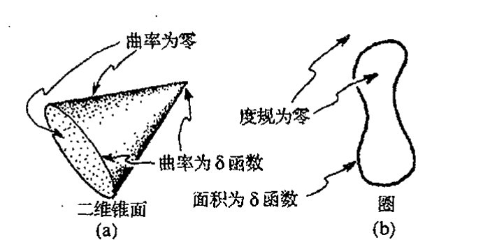
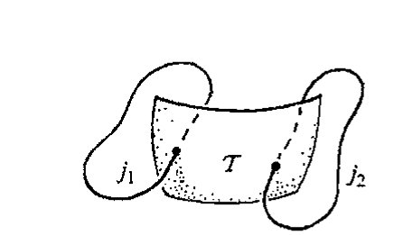
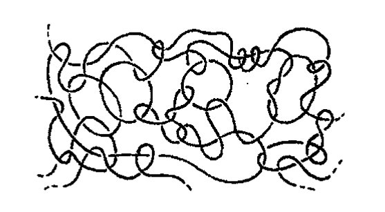
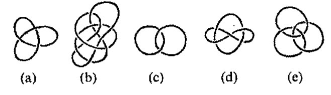
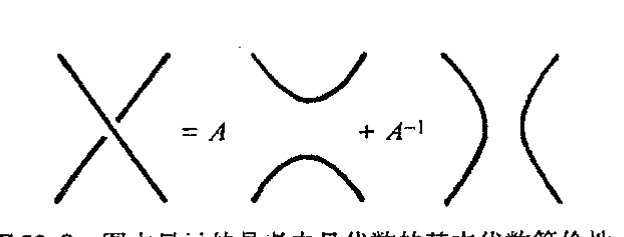
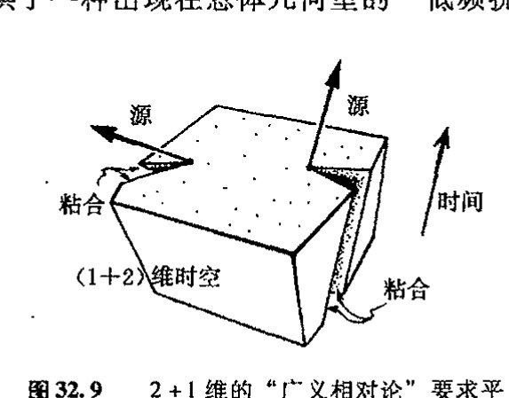

<!-- page 685 -->

通向实在之路

---

第三十二章

更为狭窄的爱因斯坦途径；圈变量

### 32.1 正则量子引力

934

尽管弦论很流行，但像某些人认为的那样^1^将它看成是"唯一的出路"（见[§31.8](chapter_31.md#318-作为量子引力理论的弦论)）显然很荒谬。还有好些其他令人感兴趣的设想值得去追索，它们各有长处，也各具困难。要让我在此对所有这些关于将量子理论和时空结构统一起来的概念进行讨论显然是不切实际的。因此我打算在本章和下一章集中讨论那些与我的信念更为接近也更活跃领域里的问题，它们在探索广义相对论和量子力学的真正统一方面可能更富于成效。正如我在前几章所述，我的观点是，我们必须采取更为严密可控的立场，而不应增加时空维度或贸然构筑超级体系（虽然我对后者的异议比对前者要温和得多，我们在[§31.11](chapter_31.md#3111-我们应当接受量子稳定性论证吗), 12中已看到，前者遇到了严重的稳定性方面的困难）。因此，在这两章里，我们将专注于与4维洛伦兹时空有着特定联系的某些概念，力图真正在量子背景下讨论爱因斯坦的实际场方程^2^而不是超对称性。我们将看到，即便是在这些地方，我们遇到的"物理实在的图景"也还是与过去所熟悉的内容相去甚远，在某些方面它们与前一章内容毫不相关，但在另一些方面则紧密相连。在本章，我们先领略一下阿什台卡变量、圈变量和自旋网络等背后的某些思想。下一章着重熟悉扭量理论。在这两章里我们还将遇到当前流行的其他一些概念，例如像离散时空、q形变结构（量子群）以及非对易几何等。

对爱因斯坦理论进行量子化处理的最直接方式之一，是给出它的哈密顿形式，然后对其进行[§21.2](chapter_21.md#212-量子哈密顿量), 3中描述的正则量子化处理。这方面会有许多困难，我不打算深入细节，其中许多困难都是因为爱因斯坦理论的"广义协变性"（[§19.6](chapter_19.md#196-爱因斯坦场方程)）而产生的，它使得用任何具体坐标都无甚意义。从[§21.2](chapter_21.md#212-量子哈密顿量)的讨论中可知，用算符 $i\hbar\partial/\partial x^a$（$x^a$是（经典）共轭位置变量）取代 $p_a$ 这种标准的"量子化处方"并不总是有效的，如果我们采用曲线坐标，则甚至都不能用于平直时空。因此，在进行这种量子化处理时要特别注意到这一点。

另一个困难是广义相对论的标准哈密顿量中具有复杂的非多项式结构。我们还应注意到这

· 666 ·

<!-- page 686 -->

样一个事实，除了受哈密顿量支配的演化方程（将我们带离初始的三维类空曲面 $\mathcal{S}$）之外，还有另一些在 $\mathcal{S}$ 内起作用的称之为约束的方程。^3^ 这些方程给出 $\mathcal{S}$ 上数据的相容性方程，满足约束方程是（至少是局部地）离开 $\mathcal{S}$ 的数据能够恰当演化的（充分）必要条件，这种演化保持满足约束。

对广义相对论进行量子化的正则处理有着悠久而辉煌的历史，其源头可以追溯到 1932 年狄拉克为处理爱因斯坦理论中出现的复杂约束而发展出的全新量子化理论。^4^ 多年来，这种处理方法为各路不同的研究者所发展，而且日益精致复杂，^5^ 但哈密顿量错综复杂的非多项式性质使得进展困难重重。到了在 1986 年，美籍印裔物理学家阿什台卡（Abhay Ashtekar）做出了一项重要推进。他通过精心选择理论（这一理论与森（Amitabha Sen）更早些时候提出的一些概念有关）中使用的变量，^6^ 将约束条件约化为多项式形式，由此可以大大简化方程的结构，哈密顿量里的那些讨厌的分母被去掉了，整个方程成为相当简单的多项式结构。

## 32.2　阿什台卡变量的手征输入

原初的阿什台卡“新变量”的突出特征之一，正如人们（现在仍）称呼的那样，是这些变量在处理引力子（引力的量子）的右手部分和左手部分时是不对称的。^7^ 从 §§ 22.7, 9 我们知道，一个（非标量）无质量粒子有两个自旋态，按运动方向分成右旋和左旋。它们分别对应于粒子的正的和负的螺旋态。引力子是自旋 2 的粒子，因此它的两个螺旋态分别为 $s=2$ 和 $s=-2$（取 $\hbar=1$），这里 $s$ 表示螺旋性（亦见 [§22.12](chapter_22.md#2212-相对论性量子角动量)）。原初的阿什台卡理论是将这两种态作不同的处理。因此这种理论是左右不对称的！

这里有必要交代一下为什么要将引力子看成是自旋 2 的粒子，而光子的自旋则为 1（见 [§22.7](chapter_22.md#227-类光测量螺旋性)，[§32.3](chapter_32.md#323-阿什台卡变量的形式)）。这意味着什么呢？量子粒子的自旋值与描述它的场量的对称性（和场方程）有关（亦可见 [§34.8](chapter_34.md#348-通向实在的漫长的数学之路)，用二维旋量形式写出的方程看得最清楚）。但我们不妨从几何上直接观察一下引力的自旋 2 性质与电磁场的自旋 1 性质之间的异同。让我们从每个场取来适当的波，即一面是构成光的电磁波，另一面是引力波。

对电磁波情形，我们已从 [§22.9](chapter_22.md#229-二态系统的黎曼球面) 的[图 22.12](assets/page420_fig01.jpg) 认识了这种波的几何属性。其中关键在于电矢量和磁矢量都是矢量，因此波相对于运动方向转过 $\pi$（即 180°）后场量即变为负的，我们需要转过 $2\pi$ 才能回复到原状态。而在引力情形下，引力波如同[图 17.8](assets/page305_fig01.jpg)（a）和图 17.9（a）所显示的那样是一种时空弯曲。如果我们将波转过 $\pi$，这种弯曲即回复原样；要使它转到反方向，仅需转动 $\frac{1}{2}\pi$。我们注意到，这个结果缘于外尔曲率是一种四极项，就像[图 17.8](assets/page305_fig01.jpg)（a）和图 17.9（a）中的弯成的椭圆那样，我们在 [§31.9](chapter_31.md#319-弦动力学) 中曾指出，它对应于自旋 2 的项。对于自旋值 $\sigma$，波以传播方向为轴转过 $\pi/\sigma$ 就将使场量变到负方向，而转过 $2\pi/\sigma$ 则使场量回复到原样。（注意，这对于 $\sigma$ 是半奇数

· 667 ·

<!-- page 687 -->

通向实在之路

情形也成立，在此情形下，场量必须具有旋量性质，见[§11.3](chapter_11.md#113-四元数几何)。）

对于这里要讨论的无质量场，我们可以走得更远，并且将平面波看成是由左、右圆偏波组成的，电磁波的圆偏振如图22.12b所示。对于量子场，相关粒子相应地具有正或负的螺旋性（图22.13）。对自旋$\sigma$，这些螺旋量取值$\pm\sigma$（相应的描述见图22.13，但$q^{2\sigma}=z/w$取代了$q^{1/2}=z/w$）。因此，对引力情形我们确实得到两个可能的螺旋量值$+2$和$-2$。

为了展示螺旋态是如何来描述的，我们需要更清楚地运用数学知识。实际上，我在上面提到的这种左右不对称性是我们在下一章要考察的扭量理论的一个重要特征，阿什台卡的处理方法似乎正是从这种扭量概念里得到最初的启发。眼下，我们需要从扭量理论概念中汲取的，是如何用普通的时空概念从数学上将这种左右不对称性表达出来。我们来回顾一下表示自然界两个已知的无质量场——电磁场和引力场——的张量表示式。这两个张量一个是麦克斯韦场张量$\mathbf{F}=F_{ab}$（[§19.2](chapter_19.md#192-麦克斯韦电磁场理论)），另一个是外尔共形张量$\mathbf{C}=C_{abcd}$（[§19.7](chapter_19.md#197-进一步的问题宇宙学常数外尔张量)）。二者都有所谓的对偶张量，其指标记法定义如下：

$${}^*F_{ab}=\frac{1}{2}\varepsilon_{abpq}F^{pq}\qquad\text{和}\qquad{}^*C_{abcd}=\frac{1}{2}\varepsilon_{abpq}C^{pq}_{\quad ad},$$

（其中$\varepsilon_{abcd}$是反对称的列维–齐维塔张量，这里按标准的右手正交基取$\varepsilon_{0123}=1$，见[§12.7](chapter_12.md#127-体积元求和规则)和[§19.2](chapter_19.md#192-麦克斯韦电磁场理论)）。在[§19.2](chapter_19.md#192-麦克斯韦电磁场理论)我们已经认识了对偶的麦克斯韦张量${}^*\mathbf{F}$。对偶的外尔张量${}^*\mathbf{C}$由类比而来。我们还可以设想将外尔张量指标中的后一对指标$cd$"对偶化"，可以证明这与将$ab$对偶化效果是一样的。***[32.1]

我们知道，四维时空里的点上的二维平面元素可用简单的2形式$\mathbf{f}$（或双矢量）来描述（[§12.7](chapter_12.md#127-体积元求和规则)）。对麦克斯韦张量（2形式）$\mathbf{F}$，我们可构造其对偶${}^*\mathbf{f}$，它的意义是：对复的$\mathbf{f}$，它是自对偶的，即${}^*\mathbf{f}=\mathrm{i}\mathbf{f}$，或反自对偶的，即${}^*\mathbf{f}=-\mathrm{i}\mathbf{f}$。对应于$\mathbf{f}$的（复）二维平面元素相应地称为"自对偶"或"反自对偶"的。这个概念在扭量理论里非常重要（[§33.6](chapter_33.md#336-作为无质量自旋粒子的扭量的几何)）。***[32.2]

在量子理论中，场量都容许取复数值，至少在将其理解为波函数的情形下是如此。尽管它们实际上各不相同，但在数学上是彼此等价的（见第26章）。当我们将复麦克斯韦张量或复外尔张量分别看成是光子或引力子的波函数的某种表示时，这种等价性特别有用。作为以经典场量特征的实际条件的一种替代，复波函数必须是正频率的（以符合[§24.3](chapter_24.md#243-量子力学里能量的正定性)和[§26.2](chapter_26.md#262-产生算符和湮没算符)中说明的要求）。我们不必过于担心这对于外尔曲率实际上意味着什么。（我们可以暂时认为我们正在观察的是一种与平直空间仅有无穷小差别的弯曲空间，在此情形下，$\mathbf{C}$可视为闵可夫斯基空间下的场，这样正频率条件就不成问题了。但实际上我们可以比这做得更好，见[§33.10](chapter_33.md#3310-扭量与正负频率剖分)–12。⁸）现

---

***[32.1] 解释为什么。（你会发觉[§12.8](chapter_12.md#128-张量抽象指标记法和图示记法)里的图形记法及其等价记号是很有用的。）

??? question "答案 [32.1]"
    四维中二形式的霍奇对偶仍是二形式，而且对洛伦兹号差有 $*^2=-1$。因此在复化后的二形式空间中，$*$ 的本征值为 $+i$ 和 $-i$，分别给出自对偶与反自对偶部分。

    外尔张量可看成是作用在二形式上的迹自由对称算符。把它的指标按二形式对分组后，霍奇对偶可作用在任一指标对上；由外尔张量的对称性和第一比安基恒等式可知两种作用等价。因此外尔张量也分裂为自对偶和反自对偶两块。

***[32.2] 证明：如果$f_{ab}$的两个指标（描述自对偶$\mathbf{f}$）可与反自对偶的外尔（或麦克斯韦）张量的一对指标缩并，则结果为零。

??? question "答案 [32.2]"
    设 $f_{ab}$ 自对偶，即 $*f=if$；设 $G_{ab}$ 是反自对偶二形式，即 $*G=-iG$。在洛伦兹号差下，二形式内积与霍奇星满足 $f^{ab}G_{ab}=-(*f)^{ab}(*G)_{ab}$。

    代入本征值，得到 $f^{ab}G_{ab}=-(if)^{ab}(-iG)_{ab}=-f^{ab}G_{ab}$，因此 $f^{ab}G_{ab}=0$。反自对偶外尔或麦克斯韦张量的任一二形式指标对都处在反自对偶子空间，所以与自对偶 $f_{ab}$ 缩并为零。
·668·

<!-- page 688 -->

第三十二章 更为狭窄的爱因斯坦途径；圈变量

在，右手的光子和引力子都用（正频率的）自对偶量 ${}^+\mathbf{F}$ 和 ${}^+\mathbf{C}$ 来描述，这里 ${}^+\mathbf{F}=\dfrac{1}{2}(\mathbf{F}-\mathrm{i}\,{}^*\mathbf{F})$，${}^+\mathbf{C}=\dfrac{1}{2}(\mathbf{C}-\mathrm{i}\,{}^*\mathbf{C})$，于是我们有

$${}^*({}^+\mathbf{F})=\mathrm{i}\,{}^+\mathbf{F}\qquad\text{和}\qquad{}^*({}^+\mathbf{C})=\mathrm{i}\,{}^+\mathbf{C}\;;$$

左手的光子和引力子则都用（正频率的）反自对偶量 ${}^-\mathbf{F}=\dfrac{1}{2}(\mathbf{F}+\mathrm{i}\,{}^*\mathbf{F})$ 和 ${}^-\mathbf{C}=\dfrac{1}{2}(\mathbf{C}+\mathrm{i}\,{}^*\mathbf{C})$ 来描述，并有

$${}^*({}^-\mathbf{F})=-\mathrm{i}\,{}^-\mathbf{F}\qquad\text{和}\qquad{}^*({}^-\mathbf{C})=-\mathrm{i}\,{}^-\mathbf{C}。$$

在原初的阿什台卡理论中，外尔曲率的自对偶和反自对偶部分起着不同的作用。

从物理的角度看，这显得很奇怪，因为没有证据表明引力场存在左右不对称性，标准的爱因斯坦广义相对论中也肯定没有这种不对称性。我能想象的是，我们可以采取两种不同的态度来看待这个问题。一方面，我们可以将这种非对称性看成是恰好可用来简化哈密顿量的那种特定数学的不重要的特征；另一方面，我们可以采取这样一种立场：自然界存在某种深层次的左右不对称性，这种不对称的理论正是以某种方式试图测知这一点。事实上，我们知道，自然界就是左右不对称的，这在弱相互作用中表现得很明显（见 [§25.3](chapter_25.md#253-电弱相互作用反射不对称性)）。某种意义上说，电磁作用包含有这种不对称性的残余，但它只能通过电弱理论以与弱作用统一的方式被间接地感知到。在缺乏与引力相关的类似的统一理论情形下，我们没有理由认为引力本身就应当直接或间接地具有这种不对称性。但按照弦理论家的观点，我们可以认为量子引力理论针对的对象要比单纯的引力概念广得多；它是整个物理学的基础框架，当前的经典时空理论只是这种基本框架的一种方便的近似。如果这种"基本理论"具有内在的手征性（正如弦论的杂化面目表现的那样——见 [§31.14](chapter_31.md#3114-神奇的卡拉比丘空间m-理论)——阿什台卡理论以及扭量理论也都如此），那么弱作用中存在明显的手征不对称性这一事实理解起来就快得多。

## 32.3　阿什台卡变量的形式

那么这些阿什台卡手征变量都是些什么呢？这种手征性源自用于四维洛伦兹空间的一种或两种二维旋量的不对称选择。我们可以回顾一下 [§25.2](chapter_25.md#252-电子的-zigzag-图像) 中介绍的这些对象，我们看到，电子波函数 $\psi$ 可以看成是由一对二维复分量 $\alpha_A$ 和 $\beta_{A'}$ 组成的，其中的一个其下脚标带撇号，另一个不带。我们注意到，不带撇指标指的是 *zig* 或电子的左手手性（负螺旋性）部分，而带撇的指标指向 *zag* 或电子的右手手性（正螺旋性）部分。我们还看到（[§25.3](chapter_25.md#253-电弱相互作用反射不对称性)），弱作用关心的是 *zig* 部分 $\alpha_A$，而非 *zag* 部分 $\beta_{A'}$。因此，选择不带撇或带撇旋量的时空理论，作为比其他理论"更基本"的一种理论体系，结合了基本手征性，它确立了一种可以在基本层面上区别这两种螺旋性的理论框架。

·669·

<!-- page 689 -->

通向实在之路

实际上，这正是原初阿什台卡理论（或扭量理论）的作用。在阿什台卡理论中，根据三维类空曲面 $\mathcal{S}$ 所选取的正则变量是 $\mathcal{S}$ 内蕴三维（反）度规 $\mathbf{\gamma}$ 的基本成分，（不带撇）自旋联络 $\mathbf{\Gamma}$ 的分量取自 $\mathcal{S}$ 上。说得更准确点，这些变量是局部旋量基下的反度规分量，可用 2 形式来表示。除此之外，自旋联络 $\mathbf{\Gamma}$ 指的是定义在四维全空间上的旋量 $\alpha^A$ 的平行移动，而不只是"$\mathcal{S}$ 的内蕴旋量"。⁹ 因此，$\mathbf{\Gamma}$ 告诉我们如何依据四维空间的度规联络（[§14.2](chapter_14.md#142-平行移动), 8）将一个不带撇的四维空间旋量 $\alpha^A$（二维旋量）沿着某条恰好处于三维空间 $\mathcal{S}$ 内的曲线平行于自身地移动。¹⁰ 三维度规（密度）$\mathbf{\gamma}$ 的场起着确定动量变量和联络 $\mathbf{\Gamma}$ 的场的作用，其相应的共轭量则起着确定位置变量的作用，见[图 32.1](assets/page689_fig01.jpg)。在量子理论中，动量 $p_a$ 的作用由 $x^a$ 表示下的 $\mathrm{i}\hbar\partial/\partial x^a$ 替代（[§21.2](chapter_21.md#212-量子哈密顿量)），在 $\mathbf{\Gamma}$ 表示中，我们可以用 $\mathrm{i}\hbar\delta/\delta\mathbf{\Gamma}$ 来取代 $\mathbf{\gamma}$ 的场（这里"$\delta/\delta\mathbf{\Gamma}$"是指 [§20.5](chapter_20.md#205-场的拉格朗日处理) 所定义的函数导数概念）。相应地，在 $\mathbf{\gamma}$ 表示中，$\mathbf{\Gamma}$ 由 $-\mathrm{i}\hbar\delta/\delta\mathbf{\gamma}$ 取代。

**图 32.1** 定义在时空 $\mathcal{M}$ 内类空三维曲面 $\mathcal{S}$ 上的原初的阿什台卡正则变量。将"位置"参量 $\mathbf{\Gamma}$ 取作限定在 $\mathcal{S}$ 上的四维空间联络分量（旋量 $\alpha^A$ 由图中半箭头表示）。"动量"参数基本上是 $\mathcal{S}$ 的（反）内度规 $\mathbf{\gamma}$ 的分量（用 2-形式表示，用作 $\mathcal{S}$ 的每一点上的正交基）。

**图 32.2** 整个 $\mathbf{\Gamma}$ 可以表示成 $\mathbf{\Gamma}=\mathbf{\Gamma}_1+\mathrm{i}\mathbf{\Gamma}_2$，其中 $\mathbf{\Gamma}_1$ 表示 $\mathcal{S}$ 的内曲率，$\mathbf{\Gamma}_2$ 表示 $\mathcal{S}$ 的外曲率（$\mathbf{\Gamma}_2$ 度量 $\mathcal{S}$ 在 $\mathcal{M}$ 内是如何"弯折"的。）

940

联络 $\mathbf{\Gamma}$ 有一个仅表示 $\mathcal{S}$ 的内曲率的部分 $\mathbf{\Gamma}_1$ 和一个表示外曲率（即表示 $\mathcal{S}$ 在时空 $\mathcal{M}$ 内是如何"弯折"的曲率）的部分 $\mathbf{\Gamma}_2$，见图 32.2。整个 $\mathbf{\Gamma}$ 可以表示成

$$\mathbf{\Gamma}=\mathbf{\Gamma}_1+\mathrm{i}\mathbf{\Gamma}_2$$

（这里如果理论体系取相反的手征，则我们有 $\mathbf{\Gamma}_1-\mathrm{i}\mathbf{\Gamma}_2$）。量 $\mathbf{\Gamma}$ 定义了一个（[§15.8](chapter_15.md#158-丛曲率) 意义上的）丛联络，其底空间为 $\mathcal{S}$，纤维由（不带撇的）自旋空间 $\mathbb{S}$（二维复矢空间）构成。纤维的相关群为 $\mathrm{SL}(2,\mathbb{C})$（见 [§13.3](chapter_13.md#133-线性变换和矩阵)）。¹¹

这里，我要说一下原初阿什台卡理论的技术困难。这一困难是，纤维群 $\mathrm{SL}(2,\mathbb{C})$ 是非紧的，并具有讨厌的无穷维不可约表示，其中多数是非幺正的（见 [§13.7](chapter_13.md#137-张量表示空间可约性)）。所有这些给构造严密的量子引力理论造成了严重困难。对此，为了推进这一理论，我们对联络作如下调整

$$\mathbf{\Gamma}_\eta=\mathbf{\Gamma}_1+\eta\mathbf{\Gamma}_2,$$

这里 $\eta$ 是非零实数，也称为巴伯罗–伊莫兹参数（Barbero-Immirzi parameter）。这一调整带来了纯粹技术上的好处：群现在是 $\mathrm{SU}(2)$，它是紧的，其（不可约）表示全都是有限维且幺正的。

· 670 ·

<!-- page 690 -->

第三十二章 更为狭窄的爱因斯坦途径；圈变量

由每个 $\mathbf{\Gamma}_\eta$ 定义的经典理论与 $\mathbf{\Gamma}$ 定义的理论的不同之处仅在于所谓"正则变换"，这说明经典理论是等价的（具有同样的辛结构，见 [§14.8](chapter_14.md#148-辛流形) 和 [§20.4](chapter_20.md#204-辛几何的哈密顿动力学)），尽管用的是相空间上不同的"广义坐标"描述（[§20.2](chapter_20.md#202-更为对称的哈密顿图像)）。但作为结果的量子理论不必是等价的。[§21.2](chapter_21.md#212-量子哈密顿量) 里提出过这样的问题：在广义坐标下量子化过程通常不是不变的。用 $\mathbf{\Gamma}_\eta$ 来取代 $\mathbf{\Gamma}$ 会带来多大"危险"这似乎仍是个未解决的问题。但不管怎样，先研究"较容易的" $\mathbf{\Gamma}_\eta$ 情形一定会使我们大有收获。虽然有人会担心得到的这种量子引力理论只是一种"玩具模型"，而不是实际需要的对量子引力的处理（这里 $\eta$ 不取 $\pm i$ 或 $0$ 似乎没有什么几何上的道理），但这种对预想的爱因斯坦理论的量子版本的偏离人们认为不会很大。

在 $\mathbf{\Gamma}_\eta$ 情形下，事情处理起来相对简单，因为所需的 **SU(2)** 的各种不可约表示在数学上等同于普通（非相对论性）量子力学里不同的（无质量粒子）自旋态。由 [§22.8](chapter_22.md#228-自旋和旋量) 可知，这些不同的自旋可用自然数 $n = 0, 1, 2, 3, 4, 5, \cdots$ 来标示，这里自旋值为 $\frac{1}{2}n\hbar$。（在 [§22.8](chapter_22.md#228-自旋和旋量)，我们还看到，对每个 $n$，表示空间由带 $n$ 个指标的对称自旋张量 $\psi_{AB\cdots D}$ 组成。）一会儿我们就会看到怎么使用这些不同的"自旋值"。

## 32.4 圈变量

我们怎么才能用能够使广义协变性（[§19.6](chapter_19.md#196-爱因斯坦场方程)）变得更清楚的方式来表述事情呢（至少在初始三维曲面 $\mathcal{S}$ 上应如此）？这是通过如下的精巧方法来实现的：用一组特别简单的量子引力基态来描述一般量子态，而基态本身可通过本质上离散的方式来描述，在这样一组基态下，$\mathcal{S}$ 内的广义协变性将变得非常简单。（一会儿我们再来谈这些基态。）这样，一般态可以表示成这些基态的线性叠加。为了弄懂所需的这些概念，我们来考虑 $\mathcal{S}$ 内的闭圈，并设想借助联络 $\mathbf{\Gamma}$ 的作用使不带撇的 $\alpha^A$ 能够始终"平行于自身"地沿这个圈移动。当我们回到出发点时，会发现自旋空间 $\mathbb{S}$ 的线性变换已经起作用了。它由一个复 $2 \times 2$ 矩阵 $T^A_{\quad B}$（见 [§13.3](chapter_13.md#133-线性变换和矩阵)）的分量形式来定义，矩阵元素取决于 $\mathcal{S}$ 内基底的选择。但是，这个矩阵的迹 $T^A_{\quad A}$ 是一个与基底无关的复数，*\(^{[32.3]}\) 而这正是自旋联络 $\mathbf{\Gamma}$ 的一种与圈的选择有关的性质。这个例子只是更一般的所谓威尔逊圈概念下的一个例子。（肯尼斯·威尔逊（Kenneth Wilson）最先将这种圈概念应用于规范理论，\(^{12}\) 故这一概念以他的名字命名。）1988 年，罗威利（Carlo Rovelli）、斯莫林（Lee Smolin）和雅各布森（Ted Jacobson）在广义相对论基础上发展了这一概念，他们将这些与圈有关的迹称作广义相对论的圈变量。取这些圈变量作为量子算符，则本段开头所说的"基态"本质上正是这些算符的本征态。

这些量子引力基态的几何特征是什么呢？业已表明，从我们熟悉的通常的度规几何的观点

---

*\(^{[32.3]}\) 你能解释为什么吗？*

??? question "答案 [32.3]"
    旋量形式中，自对偶和反自对偶部分分别由未加撇和加撇的对称旋量承载。若一个方程只含一种手征部分，复共轭会把它换到另一种手征部分。

    在实洛伦兹时空中这两部分互为复共轭，因此不能任意独立指定；但在复化时空或欧几里得化情形中，它们可以作为独立的复对象来处理。这就是为什么相同的代数分裂在不同实结构下有不同物理解释。

<!-- page 691 -->

通向实在之路

看，这些几何特征是非常古怪的，远不是经典广义相对论的那种“光滑几何”。的确，我们会发觉，从几何上看，这些基态是非常“独特的”，有点像 [§9.7](chapter_09.md#97-超函数) 和 [§21.10](chapter_21.md#2110-位置态) 里的（狄拉克）$\delta$ 函数。首先，我们将 $\mathcal{S}$ 看成是无特征流形。^13^然后考虑 $\mathcal{S}$ 内一组闭圈，并认为每个圈的状态是指其几何性质以某种方式集中在圈上。这种沿圈集中的几何性质实际上不是指曲率——而是某种类似于平底圆锥的东西，如[图 32.3](assets/page691_fig01.jpg) 所示，沿锥底边缘的曲率以及锥顶均取 $\delta$ 函数（[§9.7](chapter_09.md#97-超函数)），^***(32.4)^ 这是一种出现在量子引力的不同处理下的情形，称为雷杰微积分，见 [§33.1](chapter_33.md#331-几何上具有离散元素的理论)——但在这里，整个度规则以 $\delta$ 函数形式集中在圈上，在圈外完全为零。这种集中“程度”是用赋给圈的“自旋”值来衡量的，不同的自旋值 $j=\frac{1}{2}n$ 对应于 SU(2) 的不同的不可约表示（这里联络用 $\mathbf{\Gamma}_\eta$ 表示，而不是用表观上更“正确的” $\mathbf{\Gamma}$）。

**图 32.3** （a）二维锥面的非光滑例子，除了顶点和底边，处处都是零曲率；而在顶点和底边处则为 $\delta$ 函数曲率。（四维空间类比下的量子引力的雷杰微积分处理，二维曲面上有 $\delta$ 函数，见图 33.3。）（b）但对圈量子引力情形则不会发生这种情况。此处沿圈有面积 $\delta$ 函数，度规本身也处处为零。

这些陈述需要作进一步解释。这里出现的“度规”概念实则为给遇到圈的二维检测面元赋一面积。实质上，完全集中于沿每个圈进行的这种面积量度是一个 $\delta$ 函数。这是什么意思呢？想象在三维曲面 $\mathcal{S}$ 内的一个（不必是闭合的）二维检测面元 $\mathcal{T}$。它可能在不同地方与各个不同的圈相交。$\mathcal{T}$ 每遇到一个圈，就记录下一个面积量度；除此之外面积量度皆为零。因此，这里度规的“$\delta$ 函数”特征表明这样一个事实：仅在 $\mathcal{T}$ 与圈相交之处每个圈才得到一个面积量度。每个交点有值

$$8\pi G\eta\hbar\sqrt{j(j+1)},$$

这里 $j=\frac{1}{2}n$ 是具体每个圈的“自旋”值，见[图 32.4](assets/page692_fig01.jpg)。我们把这组圈里所有圈的面积贡献加起来。

将弦论与圈变量理论加以对比会很有趣。与弦论总是对量子引力进行微扰处理不同，圈变量理论基本上是一种非微扰处理。在弦论中，计算总是一成不变地在平直时空背景下进行，即得到闵可夫斯基空间 $\mathbb{M}$ 与譬如说某个六维卡拉比-丘空间（见 [§31.14](chapter_31.md#3114-神奇的卡拉比丘空间m-理论)）的积，人们只关心背景下的弱场，也就是说，考虑的是在弱场极限下“扰动消失”的情形（即考虑某个小参数下的幂级数），见 [§26.10](chapter_26.md#2610-拉格朗日量的费恩曼图) 和 [§31.9](chapter_31.md#319-弦动力学)。而在圈变量情形下，基本圈态（或自旋网络状态，见 [§32.6](#326-自旋网络)）远不是平直的（或经典的），沿圈（或沿网络线）进行的面积测量得到的是 $\delta$ 函数。要得到近似经典时空下的圈变量描述，我们必须如[图 32.5](assets/page692_fig02.jpg) 所示的类似于几乎均匀伸展的“波”。

---

^***^〔32.4〕你能对此给予解释吗？提示：用 [§14.5](chapter_14.md#145-测地线平行四边形和曲率) 的概念。

??? question "答案 [32.4]"
    测地线平行四边形在有曲率时不能精确闭合；闭合失败由曲率张量在无穷小面积上的作用给出。阿什泰卡变量把这种曲率信息改写为自对偶联络的曲率。

    因此，当用第 14.5 节的测地线平行四边形来理解时，相关表达式并不是任意代数技巧，而是在记录平行移动绕小回路后的旋转。手征形式只是在自对偶部分中编码同一几何效应。

· 672 ·

<!-- page 692 -->

第三十二章 更为狭窄的爱因斯坦途径；圈变量

---

**图 32.4** 三维曲面 $S$ 内的二维检测曲面 $\mathcal{T}$。$\mathcal{T}$ 与圈的每一次相交给出一个面积值 $8\pi G\eta\hbar\sqrt{j(j+1)}$，$j$ 是圈的"自旋"值。

**图 32.5** 原型圈变量理论对准经典时空的描述可以用几乎均匀弥散的"波"的叠加来表示。

注意，这是真正的拓扑描述。说一个圈离另一个圈有多"近"毫无意义（因为离开了圈本身"度规"概念毫无意义）。唯一有意义的是拓扑上这些圈之间的"链接（linking）"和"打结（knotting）"关系，以及它们被赋予的离散的"自旋"值。因此，（在 $S$ 内）广义协变性完全能得到满足，只要我们只保留这种离散的拓扑图景。

## 32.5 结与链的数学

量子引力的圈变量图景引领我们进入到关于结和链的拓扑的数学领域。较之弦成分的平凡性质——基本上都是非纠缠的片断，圈拓扑可是一种相当复杂的研究！我们需要用数学判据来判断一个闭合的"由弦构成的圈"是否是个结（这里"结"意味着不可能通过普通三维欧几里得空间的光滑运动将圈变成普通的圆，这里不容许将圈任意抻长并相互穿越，见[图 32.6](assets/page692_fig03.jpg)）。同样，我们可以要求根据判据来确定两个或多个不同的圈是否完全处于彼此分离状态——即它们是非链接的。

自 20 世纪初以来，对这个问题已有各种精妙的数学表达式给出了较为完整的答案（如"亚历山大多项式"等），但在近年，主要是受物理学的启发，又有大量神奇而精巧的处理手段被发现，例如像"琼斯多项式"、"HOMFLY 多项式"、"考夫曼多项式"，等等。^14

**图 32.6** 结和链。(a) 三叶结——打了结的圈的例子。(b)（眼睛不易观察清楚的）不含结的圈的例子。(c) 两圈之间的简单链。(d) 怀特黑德链，其中的两个圈不能因为它们有零"链接数"（每个圈穿过曲面跨入另一个圈的净次数）而拆开。(e) 博罗门（Borromean）环，它不能被拆开，尽管其中没有一对环是链接的。

考虑这些新数学结构的一种思路是将它们看成是来自一种"图形代数"，它是 [§12.8](chapter_12.md#128-张量抽象指标记法和图示记法) 引入的张量的图形描述（见图 12.17 和 12.18）的推广，这种描述曾大量用于第 13 章（见[图 13.6](assets/page204_fig01.jpg)–13.9 等）。在这一推广中，是否有"指标线"从上或从下穿过另一条指标线有重要区别，它们在图中表现为相互交叉，见[图 32.7](assets/page693_fig01.jpg)。存在各种公有一个代数式的"代数同一体"，如[图 32.8](assets/page693_fig02.jpg) 所示的即为考夫曼代数的具体化。这些概念将组合理论作了精美的推广，它奠定了我们即将谈到的

· 673 ·

<!-- page 693 -->

通向实在之路

**图 32.7** 图 12.17、12.18 和图 13.6—13.9 等的图示张量代数可以通过推广生成结和链的代数。新添加的特征是，当一对“指标线”交叉时，这种代数可以对一根线是从上还是从下穿过另一根线作出区分。

**图 32.8** 图中显示的是考夫曼代数的基本代数等价性，这里 $q = A^2 = e^{i\pi/r}$，它给出“binor”代数的 $q$-形变版本，“binor”代数是自旋网络理论的基本运算（对应于 $A = -1$，其中不存在图 32.7 中的交叉问题）。

自旋网络理论的基础。

图 32.8 中的量 $A$ 是一个复数，有时又将它写作量 $q = A^2 = e^{i\pi/r}$。（$A = -1$ 的情形给出自旋网络理论的基本操作“binor 计算”，Penrose 1969, 1971。）此外还有相当于图 12.17 的对称和反对称的概念。关于这些概念已经发展出一套相当重要的理论，有时我们称它为 $q$ 形变结构。但更经常的是人们用“量子”来取代“$q$ 形变”，这很容易误导，这样的情形还有所谓“量子群”概念。但“量子群”和量子理论之间并没有十分清楚的联系，尽管量子群概念完全有可能在物理学的基础层面上获得重要应用，但它目前还只是个假说。

虽无关宏旨，但值得一提的是，在这些新发现的数学结构（琼斯多项式等等）与物理学之间，还存在另一种由爱德华·威腾发展出的可能联系，^15^ 这就是拓扑量子场论的概念。在这一理论中，场方程完全消失了，但仍存在总体结构信息和被视为发自（局部为零的）场“源”的“低频扰动(glitches)”信息。一个很好的例子就是 $1+2$ 维的广义相对论。在 $1+2$（$=3$）维下，外尔张量等同为零，因此所有曲率都处于里奇张量中。这样，在（里奇平直的）“虚空空间”，整个曲率为零。但“点源”的引力场是非奇异的，因为这种源提供了一种出现在总体几何里的“低频扰动”，见[图 32.9](assets/page693_fig03.jpg) 所示。这种几何非常类似于[图 28.4](assets/page550_fig01.jpg) 所示的宇宙弦几何，只是这里的图像表示的是 $(1+2)$ 维时空，而不是 3 维空间。图中一部分沿源的（类时）世界线轴被切去，剩下的平面边界被粘合起来。在经典图景里，这种源的世界线是直的，但在基于这种经典模型的量子场论——拓扑量子场论下，由于场（这里是曲率场）为零，这种源的世界线可以是弯曲的，并且可以打结或与源线链接。正是这一点是我们认识到^16^ 可以将结与链的数学用到拓扑量子场论概念上。应指出，由于除了圈本身的“低频扰动”的地方外，面积量度的贡献为零，因此圈变量方案也提供了一种类似于一般“拓扑量子场论”框架的系统。但毕竟二者是有差别的，因为在圈变量理论中场方程没有消失。

**图 32.9** $2+1$ 维的“广义相对论”要求平直时空且处处无源（因为这时里奇张量为零，外尔张量在三维内总是为零）。但源的世界线提供了一种对平直时空的“低频扰动”（锥形奇点），它让人想起“世界弦”，其三维空间几何如 [§28.2](chapter_28.md#282-宇宙的拓扑缺陷) 中的图 28.4 所示。经典情形下，源世界线总是直的，但在这一理论的量子版本中这一点有所放松——这是拓扑量子场论的一个例子。

· 674 ·

<!-- page 694 -->

第三十二章 更为狭窄的爱因斯坦途径；圈变量

各种拓扑量子场论理论因其数学结构而令人感兴趣，但由于场方程完全消失，因此在严肃的物理理论模型中很难看出它们所起的直接作用。大多数已知的物理学依赖于这种方程的非平凡性质，以便场能以可控的方式传播到未来。但还存在另一种明显的可能性，即拓扑量子场论可以与扭量理论合起来用。我们将在第33章（[§33.11](chapter_33.md#3311-非线性引力子)的节尾）看到，在扭量空间描述中，场方程只是局部消失。尽管拓扑量子场论概念应用于扭量理论的程度目前还不十分深入，¹⁷但看看它在这个领域能取得什么样的成就还是很有趣的。

## 32.6 自旋网络

尽管圈的各种态十分显著，但作为有限的3维几何（“δ函数”）构形，它们还不能用作这种几何的适当的（正交）基，因此有必要将其一般化，使在其中圈可以相交。这使我们想到一种“相交圈线”的网络，但我们要问：对这些交点怎么办？业已证明，答案就在某种结构中，其形式非常接近于我50年前研究的自旋网络，当时是出于与此不同但有关联的目的。

什么是自旋网络呢？为什么过去50年来我一直对它们感兴趣呢？我自己的具体目标一直是试图用离散量的组合来描述物理，因为那时我就坚信物理学和时空结构从根本上说应当是离散而非连续的（见[§3.3](chapter_03.md#33-物理世界里的实数)）。附带的动机还有马赫原理（[§28.5](chapter_28.md#285-暴胀的动机有效吗)）的形式，¹⁸由这一原理可知，空间本身的概念是一个导出的概念，而不是原本就存在于理论中。每一件事情都是通过客体之间的相互关系而非客体与某种背景空间之间的关系来表示的。

我的结论是：满足这些要求的最光明的前景是考虑系统总自旋这一量子力学量。这个“总自旋”由标量$j\left(=\frac{1}{2}n\right)$定义，它量度的是整体上自旋的大小，而非某个方向上自旋的具体分量，后者由量$m$量度。（字母“$j$”和“$m$”通常用于量子力学的角动量的讨论中，其单位是$\hbar$，其中$m$取从$-j$到$j$的半整数值，见[§22.8](chapter_22.md#228-自旋和旋量), 10, 11。）总自旋的实际大小（3个正交方向上$m$值平方和的平方根）为$\hbar\sqrt{j(j+1)}$，它与上述面积表达式中出现的量相同。$n=2j$的容许值都是简单的自然数（对玻色子取偶数，费米子取奇数，见[§23.7](chapter_23.md#237-玻色子和费米子)）。除此之外，尽管$n$与空间取向无关，但它毕竟与空间取向有着内在联系。我一直认为，由自然数$n$度量的总自旋是一个引人注目的理想的量，如果我们从一开始就对构建导出实际物理空间概念的离散组合结构感兴趣的话。进一步说，如果我们做得合适，我们就可以将量子力学概率显示为纯概率，它在细节上与物理仪器的空间取向无关。

这一设想的成效如何呢？下面我们称总自旋量$\frac{1}{2}n\hbar$为$n$单元。为清楚起见，我们可以将这个“单元”看成是一个粒子，但它不必是基本粒子，例如看成是一个完整的氢原子就蛮好。对这种总自旋我们只需要知道它的明确的值（在氢原子情形，这个值是$n=0$或2，分别对应于正

·675·

<!-- page 695 -->

通向实在之路

交或平行氢原子^19^）。我们怎么来得到纯概率呢？我们可以譬如取一对 EPR -玻姆 1 单元对（A，B）和（C，D），每一对均从 0 -单元状态开始。（这只是一种安排，其中每一个都像 [§23.4](chapter_23.md#234-玻姆型-epr-实验) 中的[图 23.3](assets/page440_fig01.jpg)；见[图 32.10](assets/page695_fig01.jpg)。）现在我们把 B 和 C 放一块儿让它们组成单独一个单元，它们会导致两种可能的结果：0 -单元或 2 -单元，相应的概率^****[32.5]^分别为 $\frac{1}{4}$ 和 $\frac{3}{4}$。另一方面，如果我们将 A 和 D 撮合一块儿，那么可能的结果和概率是一样的。但是这两种可能性远不是彼此独立的，因为如果我们在一种组合下得到 0 -单元，就不可能在另一种组合下得到 2 -单元，反之一样。

图 32.10 自旋网络。由自然数 n 命名的每一根线段代表一个粒子或一个称作 n 单元的总自旋为 $\frac{n}{2}$ × $\hbar$ 的子系统。在这个非常简单的例子中，我们有两个 EPR -玻姆 1 -单元对，（A，B）和（CD），每一对均从 0 -单元状态（如图 23.2）开始。如果把 B 和 C 组成单独一个单元，则会有两种可能性：0 -单元或 2 -单元，相应的概率为 $\frac{1}{4}$ 和 $\frac{3}{4}$。如果我们将 A 和 D 组合起来，结果概率是一样的。但是这两种可能性不是彼此独立的，因为我们不可能在一种组合下得到 0 -单元同时在另一种组合下得到 2 -单元。

这就是我说的得到纯概率的那种概念，我早就形成这样一种认识：这种概率必定以有理数形式出现（因为它是大自然在有限个离散的可能性之间作出的随机选择）。上述这个例子只是一种非常简单的情形，但它开始显示出一种普适的思想。我们可以将特定网络中的所有单元设想成按上述办法由初始 0 -单元得到的初始结果（虽然这一点通常没在图中表示出来），因此这里不存在对某个特定空间方向的偏爱。由此可知，不同对单元可以撮合一块儿组成一个单元，后者的自旋值亦可确定。

图 32.11 最初设想的自旋网络的例子。这里没有预设任何实际的背景时空流形。所有空间概念都出自自旋网络和概率值（当两个单元合并生成第三个单元时）。每个顶点上是严格的三线聚合，它唯一地规定了这种联络。

单个的单元也可以剖分成若干对单元，如[图 32.11](assets/page695_fig02.jpg) 所示。我们可以有选择地将其视为发生在某个时空中的情形。但最初的自旋网络理论并未预设任何实际的背景时空。当时的想法是从自旋网络和概率建立起所有所需的空间概念，这些概率由两个单元合并给出第三个的操作产生（其大小可用量子力学法则来计算）。自旋网络有这样一个特征：每个顶点上都正好有 3 条线相遇。这

^****^ [32.5] 你能看出为什么吗？

??? question "答案 [32.5]"
    两个 1-单元耦合时，总自旋只能分解为标量的 0-单元和对称的 2-单元两种不可约成分。它们的维数分别是 $1$ 和 $3$，总维数为 $4$。

    若没有偏向地看待这四个量子态，则落在标量通道的权重为 $1/4$，落在三重态通道的权重为 $3/4$。这正是图中给出的两个概率。

· 676 ·

<!-- page 696 -->

第三十二章 更为狭窄的爱因斯坦途径；圈变量

一点使得概率计算具有唯一性。自旋网络的拓扑结构（图）以及线上所有自旋值的确定均依此而定。

我发展了一套计算所需概率（实际上它们全都是有理数）的完整的组合（"计数"）程序。这套规则最初取自标准量子力学的自旋计算法则，但我们可以"忘掉"它们来自何处，直接将自旋网络看成是提供了一种"组合世界"。然后在适当意义下认为自旋网络是"大"的，我们就可以从中抽取出几何概念（在此情形下通常是三维欧几里得几何）。我们认为一个大的自旋单元可以看成是定义了"空间的方向"（例如像台球的自旋轴）。我们还可以想象通过譬如说从一个大单元中拆分出一个1-单元并将它合并到另一个大单元的办法来计算两个这种大单元的"转轴间的夹角"。经过这种操作，一个自旋上行另一个下行的联合概率就给出了自旋轴之间夹角的量度。**[32.6]**

照此看来它应该基本可行，但事实不尽如此，还需要进一步完善。必须要增设的是如何从两个大单元之间联系不充分而出现的"无知概率"中鉴别出"量子概率"——源自两个大单元之间自旋轴的夹角——的方法。（在 [§29.3](chapter_29.md#293-密度矩阵), 4 的讨论中，我们已知以密度矩阵形式出现的两个这样的概率概念之间是如何精巧地相互影响的。）事实表明，这种"无知因素"可以通过重复进行将一个大单元中的1-单元转移到另一个大单元、然后挑出唯一的两次概率相同的情形的操作来去除。对于这种情形下的各组大单元，我们可以证明这么一条几何定理，其大意是说：由量子概率按此方式定义的"角几何"正是普通欧几里得三维空间下方向间夹角的几何。^20^ 这样，从自旋网络的量子组合就可以引出普通欧几里得几何的概念。

可以看出，我最初从事自旋网络研究背后的基本动机与圈变量理论对时空量子化所基于的动机是相当不同的。在最初提出自旋网络的概念时，实际上没有给引力留出空间。因此，在我发现自旋网络在研究量子引力理论中起着相当重要的作用时，着实让我吃惊不小。当然，有些概念是这两种理论所共有的，因为在这两种情形下，人们都试图破除空间的连续性观念，使之成为离散而量子化的某种概念。但这一点在二者间还是有重要差别的，在圈变量理论里，量 n 其实是面积量度，而非原初自旋网络里的自旋量度。这些是维度上的差异，正如在圈变量表达式中引力常数 G 的面貌所反映出的那样。稍后我再来谈这个问题及其意义。

现在我们关心的是，自旋网络的特点在圈变量量子引力中如何体现？正如我早先暗示的，实际上，自旋网络的结点产生于一对圈的交叉。在这个地方圈上的 j 值也容许变化。与此同时，现在结点处可以是4根（或更多根）线相聚，而不是我当初的3根线。这导致歧义，因为解释的唯一性仅是针对原初"三连线"结点的。此外对每个结点现在都需要作附加规定（"缠结性算符"）。这种规定的一种表现形式如图32.12所示，这里我们可以将4线相聚的"X"型顶点表示成若干对"H"型3边顶点的线性叠加，并通过规定系数来消除歧义。

---

**[32.6]** 从概率上说，这个角测的是什么？

??? question "答案 [32.6]"
    在自旋网络的组合解释中，角度不是预先给定的连续几何量，而是由两个大自旋单元之间耦合结果的相对概率读出。

    具体说，把一个小的 1-单元从一个大单元转接到另一个大单元时，不同总自旋通道的计数概率依赖于两大单元“方向”的相对关系。在大自旋极限下，这些概率逼近通常量子力学中自旋方向夹角的 $\cos^2(\theta/2)$、$\sin^2(\theta/2)$ 型依赖。因此这个角测量的是两个大自旋单元所定义方向之间的相对取向。

·677·

<!-- page 697 -->

通向实在之路

在这些圈变量自旋网络与我原初的自旋网络之间还有另一个更重要的差别：原初的自旋网络完全是组合结构，而圈变量自旋网络还有来自流形 $S$ 中内嵌的附加拓扑结构。例如这种网线可以多种方式打结或相互链接（见图 32.13）。这种信息不仅仍具有离散组合性质，而且具有完全的拓扑特征，但它更难以用单个节点上的某种简单规定来表示。

**图 32.12** 在圈变量理论中，自旋网络的所有结点都是 4 价（或更高价）的，因此需要额外的"缠结"信息。这种图像可以编码成 "X" 型顶点用 "H" 型三边顶点对的线性叠加来表示。具体系数消除了其中的歧义性。

**图 32.13** 标准圈变量理论的自旋网络不再完全脱离组合量，而必定嵌入一种无结构的（但也许是解析的）三维曲面（如 $S$）中，其拓扑链和结的特性非常重要。

至此，圈描述给出的只是不涉及动力学的静态描述。实际上，我们现在所考虑的圈和自旋网络着重于如何解决广义相对论的约束方程问题——即如何满足曲面 $S$ 内所需的条件——同时照顾到对爱因斯坦广义协变原理的影响。这是一项不平凡的成就，但这个理论体系似乎还没能解决离开 $S$ 的动力学演化（有时也称为"哈密顿约束"）这样的更困难的问题，而这是对爱因斯坦方程作全面调整所必需的（见 [§32.1](#321-正则量子引力)）。托马斯·蒂曼（Thomas Thiemann）的一些重要工作已经为解决这种哈密顿演化问题提供了一种可能的答案，但还有些许疑问，我们不知道它是否真的就是发展爱因斯坦理论的一种恰当途径。²¹

在这些困难的动力学问题得到完全公认的答案之前，我们仍然有可能利用圈变量理论在其他方面取得某些重要成果。特别是这些自旋网络概念已被证明在处理 [§31.15](chapter_31.md#3115-弦与黑洞熵) 的黑洞熵问题上可以比弦论做得更直接，并且看起来也更实际。这里的黑洞几何直接来源于爱因斯坦四维理论的施瓦氏或克尔真空解。在适当近似下，我们用自旋网络可以明确计算出各种引力量子态。当黑洞

952 开始合理地增大时，计算所得的熵与贝肯斯坦-霍金公式 $S_{BH} = \frac{1}{4}A$ 的答案基本吻合（这里 $k=c=G=\hbar=1$），但要得到霍金的准确因子 $\frac{1}{4}$，则巴伯罗-伊莫兹参数需要取值

$$\eta = \frac{\log 2}{\pi\sqrt{3}}$$

虽然这个值确实显得古怪，但这一选择却能正确地给出所有情形下的贝肯斯坦-霍金熵，包括带电的、旋转的和宇宙学常数等情形，人们已用其他方法给出了这些情形下的明确答案。²²

关于这一点，我们可以找出多种理论赖以成立的明显的数值"巧合"。用两种差异极大的方法计算出的两个互不相关的无穷序列可以逐项相符，这一点似乎反映了量子几何的某些概念存在着深刻的内在一致性。

·678·

<!-- page 698 -->

第三十二章 更为狭窄的爱因斯坦途径；圈变量

毕竟，黑洞的结果似乎已经使看待巴伯罗–伊莫兹参数的观点发生了某些变化。以前，$\eta$ 的引入似乎只是取得进步的一种手段，这里“几何上正确”的理论似乎要求 $\eta=\pm i$。$\eta$ 取实值只是出于数学上的方便，为的是生成紧群 SU（2）而不是非紧群 SL（2，C）。但现在，在非常广泛的范围上得到正确熵值这一突出成就——它有赖于巴伯罗–伊莫兹参数 $\eta=\log 2/\pi\sqrt{3}$ 的单一选择——已经使圈变量理论的一大批支持者认定这个值实际上就是量子引力理论的“准确”值。

当然，这是一种可能性，虽然我个人认为它有些难以置信，因为对这种选择我们从几何上看不出任何明显的道理。我要说，随着 $\eta$ 取实值，像这里做的那样，我在 [§32.3](#323-阿什台卡变量的形式) 引入手征时强调的理论的手征性消失了。由于 $\eta$ 取实值的关系，与 $\mathbf{\Gamma}_\eta$ 有关的旋量输运成了一种特殊而又不偏不倚的左右手性的混合，其意义我觉得特别模糊。也许未来的工作会使这一问题变得光明。

## 32.7 圈量子引力的地位

这里我想对阿什台卡–罗威利–斯莫林的圈变量理论在处理量子引力方面取得的成就及其对未来成熟理论的发展所具有的潜在价值作一评述。我还是要再三告诫读者，这种评价不是没有侧重的。这里我得声明在先，不仅是对我那些对这一理论做出贡献的要好朋友，也包括我定期走访的两所美国大学（锡拉丘兹大学和宾夕法尼亚州立大学，这个领域的主要发展都是在这里取得的），在评述中我必须加入我自己在自旋网络理论的工作；看见这些旧有的概念在这种理论中找到了新的重要价值这自然是一件令人愉快的事情。尽管如此，毕竟我在阿什台卡变量/圈变量量子引力方面的工作与该领域的主要工作一直不太相干，因此我希望我能够置身事外，尽量客观公正。

首先我得说，不管是阿什台卡变量还是后来圈变量对它的描述都让我感到它们是探索量子引力理论方面强有力的、高度创造性的发展。它们直接在量子场论的背景下论述爱因斯坦广义相对论，为当前有关问题的解决提供了深刻的富于创见的思想。实际上，我可以毫不犹豫地说，这些发展是量子引力的正则处理这一问题自狄拉克和其他人提出后差不多半个世纪来最重要的成就。圈态概念至少是对广义协变性所产生的深刻问题做了一定处理。除此之外，这些发展似乎已经推动起对一个迷人的、未可限量的发展方向进行探索，在这方面时空结构的离散性要素开始出现。不仅如此，在最近的工作中，原创的纯引力理论已经在结合其他物理相互作用方面有所推进，因此这一理论现在已称得上是一种一般意义上的基本物理理论。^{23}

与此形成对照的是还存在一些令人烦恼的事实：这个理论似乎必须转而采用 $\mathbf{\Gamma}_\eta$ 联络（且带有不确定的 $\eta$ 值）而不是看起来“几何上正确”的 $\mathbf{\Gamma}$。依我看，在这方面，一种完全可信的量子引力理论尚未出现，这要到有办法克服采用原始的 $\mathbf{\Gamma}$ 所带来的困难时才有可能。另外，还有个基本困难是，圈变量理论还不能完全将爱因斯坦理论中的哈密顿量毫无歧义地包括进来，即

·679·

<!-- page 699 -->

通向实在之路

使约束方程已可以用自旋网络来加以处理。

同样令我惊奇的是，这些困难是与阿什台卡/圈变量理论的另一个（我认为如此）不太让人满意的方面联系在一起的。与所有其他的传统的量子引力的正则处理方法一样，这套体系直接依赖于三维空间（即根据 $\mathcal{S}$）描述，而不是建立在总体时空描述的基础之上。正如我们看到的，三维空间下的“广义协变性”问题可以用圈态/自旋网络状态给予简洁处理，但扩展到四维全空间后，广义协变性带来的是一个“潘多拉盒子”问题。我只能说，在这个问题上，圈变量理论的处理并不比其他正则方法好多少。^{24}

这个困难必须通过处理好在广义协变的四维空间体系下（根据爱因斯坦方程）如何适当地表示时间演化这个问题来解决。它与量子引力中的所谓“时间问题”（有时也称为“时间冻结”问题）有关。在广义相对论里，我们无法仅通过坐标变换（即仅作时间坐标代换）来鉴别时间演化。具有广义协变性的体系应当不受坐标变换的影响，因此时间演化的概念将成为深刻的问题。我在这个问题上的观点，正如 [§30.11](chapter_30.md#3011-与爱因斯坦原理的基本冲突) 所述，可以概括为：在态矢收缩 **R** 的问题没有得到满意的解决之前，这个问题不太可能得到解决，因此这反过来要求我们对广义原理有一个根本的变革。

与这些问题有关的，还有另一个我不太满意的问题，虽然它与其说是具体的圈变量处理问题，不如说是广义协变性方案本身的问题。一定意义上说，这种处理正是它自身成功的牺牲品！因为虽然自旋网络基态本身具有可人的与坐标无关的几何描述，但它在如何解释这种基态的量子叠加方面基本上不清楚。由于广义协变性，在一个自旋网络的“位置”和与之叠加的另一个自旋网络的“位置”之间不存在对应关系。（在 [§30.11](chapter_30.md#3011-与爱因斯坦原理的基本冲突) 里我指出过这个更为严重的问题，当时我是用来说明引力 **OR**。）我们怎么才能指望弄清楚由这一切产生出一个几乎经典的世界呢？

想必读者现在尤其是从第 30 章的讨论中已经了解，我认为正确的量子引力统一体的一个必备的特征是，它必须在一些基本方面与标准量子力学分道扬镳，使得 **R** 成为一种实际的物理过程（**OR**）。圈变量理论中容许这么做吗？也许是。在圈变量理论里，自旋网络边缘部分的数 $n = 2j$ 是指以普朗克长度平方为单位的面积；而在我原初的自旋网络应用中则并不牵涉这种度规问题，实际上根本与引力方面无关，自旋数 $n$ 指的是角动量。但是，我当初的概念要求每个这种数必须是总自旋值单独测得的结果（**R** 在每边上的作用），这里有两个单元组合成第三个单元的概率问题。如果 **R** 是一种客观的引力现象，那么与引力过程有关的问题就必须考虑进来，我们在第 30 章已经说过这一点。在此情形下，将引力问题与自旋网络理论的概率问题分开来是不可能的。圈变量理论与自旋网络的完美结合会要求把态收缩结合进体系中来。如果这被证明是正确的，那么它将提供一条通往适当引力 **OR** 理论的道路，就像第 30 章指出的那样。但在不具备这种理论体系的情形下，这些概念就只能是推测。

最后，我要对与圈变量理论有关的其他工作做一评述。圈变量理论现在已不是纯粹的引力理论，电磁场已经被引入到^{25}这一体系中来。^{26}此外还有各种较上段所述的更为平缓的方式将圈

· 680 ·

<!-- page 700 -->

第三十二章 更为狭窄的爱因斯坦途径；圈变量

量子引力的自旋网络构造成“四维”形式，其中之一是称之为自旋泡沫的精巧的高维自旋网络。在这些自旋泡沫中，有携带“自旋值”$n=2j$的二维曲面，我们可将这种自旋泡沫想象成自旋网络的时间演化。由克兰（Louis Crane）、巴雷特（John Barrett）和其他人$^{27}$提出的这些概念已经为其他一些人$^{28}$所进一步发展，但与量子引力概念的正确联系还没有全部完成。还存在与扭量理论的可能联系，观察这些理论是否能得到充分发展是很有意思的事情。在下一章，我们将考察扭量理论所涉及的某些基本概念。

在本书其他地方特别是第30章我已强调过，量子态收缩问题与时空奇点的结构及其在时间反演中的不对称性存在内在关联。有趣的是，检验圈变量理论所说的时空奇点的量子理论效应的工作已经开始。$^{29}$我不能对这一工作细节加以置评了，只能说我还没看出它有出现必需的时间不对称性的迹象。

## 注 释

### § 32.1

32.1 见 Greene (1999)。

32.2 具有讽刺意味的是，爱因斯坦本人，由于晚年投身于统一场论的缘故，并未始终坚持他原先开拓的这条逼仄的道路。

32.3 约束和哈密顿形式体系的概念见 Dirac (1964)；Ashtekar (1991)；Wald (1984)。

32.4 例如，见 Dirac (1950, 1964)；Pirani and Schild (1950)；Bergmann (1956)；Arnowitt *et al.* (1962)。关于惠勒–德维特（Wheeler-deWitt）方程（它是三维紧致几何空间上基本的量子引力薛定谔方程）见 deWitt (1967)。

32.5 见 Isham (1975)；Kuchar (1981)。

32.6 见 Sen (1982) 和 Ashtekar (1986, 1987)。

### § 32.2

32.7 正如我们不久将看到的，技术上的困难已经使原初的阿什台卡方法偏离了这种明确的手征描述。但我对阿什台卡程序背后动机的理解是，这种“偏离”可看成是那些接近但不等同于预期的量子引力理论的模型所做的暂时性探察。

32.8 关于线性化引力的最初讨论见 Fierz and Pauli (1939)；线性化引力的进一步信息见 Sachs and Bergmann (1958)。关于非线性引力见 Penrose (1976a 和 1976b)。

### § 32.3

32.9 见 Ashtekar (1986, 1987)。综述亦见 Ashtekar and Lewandowski (2004)，教材有 Rovelli (2003)。

32.10 那些试图弄明白“指标”如何运用的读者应当首先注意到三维反度规是一个带三维提升指标的量$\gamma^{rs}$。经过在$\mathcal{S}$内组成$s$的对偶（[§12.7](chapter_12.md#127-体积元求和规则)），我们得到（密度）$\gamma_{tu}^{r}$，它是关于$t,u$反对称的。在四维空间里，我们可将这些下指标认作2形式指标，取其反自对偶部分（它提供了一对对称旋量的下指标），由此给出量$\gamma_{PQ}^{r}$，它对$P,Q$是无迹的。至于$\Gamma$，其指标表示是量$\Gamma_{rQ}^{P}$，由于它是自旋空间里的1形式矩阵，因此必须是无迹的（因为它是一个$\text{SL}(2,\mathbb{C})$联络）。我们还注意到，对正则变量来说，$\Gamma$的指标结构是与$\gamma$的相反。进一步细节见 Ashtekar (1986, 1987)；Ashtekar and Lewandowski (2004)；Rovelli (2003)。

32.11 森于1981年引入的正是这个联络，它将广义相对论的约束削减为多项式形式。有趣的是威腾（也是在1981年）在进行广义相对论下总能量的正定性证明过程中也独立地使用了同样的联络，见[§19.8](chapter_19.md#198-引力场能量)和 Witten (1981)。就我所知，这种联络的第一次使用是在$\mathcal{S}$的超曲面扭量空间的构造中（Penrose and MacCallum 1972；Penrose 1975），它是与阿什台卡变量关系最为密切的扭量理论的一部分。

· 681 ·

<!-- page 701 -->

通向实在之路

[§32.4](chapter_32.md#324-圈变量)

32.12 见 Wilson (1976)；量子场论里的这种技术，见 Zee (2003)。亦见 Rovelli and Smolin (1990)。

32.13 即使可以具体化，其流形结构在一些人看来也比我们能够指称的复杂得多，因为这种结构不仅有拓扑属性，而且有可微的或“光滑的”结构——见 [§10.2](chapter_10.md#102-光滑偏导数) 和 [§12.3](chapter_12.md#123-标量矢量和余矢量)。也可参看 [§33.1](chapter_33.md#331-几何上具有离散元素的理论)。实际上，出于技术方便的考虑，在 Ashtekar-Lewandowski 方法中，$\mathcal{S}$ 被赋予一种解析结构（Ashtekar and Lewandowski 1994），这意味着它是 C$^\omega$ 的（[§6.4](chapter_06.md#64-欧拉的-函数概念)）。

957 [§32.5](chapter_32.md#325-结与链的数学)

32.14 纽结理论的一种非常优雅的引入方式见 Adams (2000)。更为技术性的工作，见 Rolfsen (2004) 和 Kauffman (2001)。

32.15 综述性文章见 Labastida and Lozano (1997)；原创的“TQFT”见 Witten (1988)。

32.16 然而，由于强烈的发散性，拓扑 QFT 并不直接给出严格的数学定理。

32.17 见 Penrose (1988)。

[§32.6](chapter_32.md#326-自旋网络)

32.18 我对马赫原理的兴趣主要源于与我的同事也是我的朋友兼导师 Dannis Sciama 的讨论。

32.19 见 Levitt (2001)。

32.20 见 Penrose (1971a, 1971b)。

32.21 见 Thiemann (1996, 1998a, 1998b, 1998c, 2001)。

32.22 见 Ashtekar *et al.* (1998)；Ashtekar *et al.* (2000)。

[§32.7](chapter_32.md#327-圈量子引力的地位)

32.23 见 Thiemann (1998c)。

32.24 见 Hawking and Hartle (1983)，以及注释 32.3～5。还可参考 Smolin (2003) 和 Ashtekar and Lewandowski (2004) 的卓越的综述性文章，其中列出了这方面的大量的参考文献。我要对 Abhay Ashtekar 在本章参考文献方面提供的帮助深表谢意。

32.25 Varadarajan (2000)。

32.26 见 Varadarajan (2001)。

32.27 见 Baez (1998, 2000)；Reisenberger (1997, 1999)；Reisenberger and Rovelli (2001, 2002)；Barrett and Crane (1998)；Reisenberger (1999)；Perez (2003)。

32.28 见注释 32.27 的参考文献和 Perez (2003)。

32.29 Bojowald (2001)；Ashtekar *et al.* (2003)。

· 682 ·
