<!-- page 702 -->

第三十三章 更彻底的观点；扭量理论

---

第三十三章

# 更彻底的观点；扭量理论

## 33.1 几何上具有离散元素的理论

在试图揭开大自然真实奥秘方面，你是否认为前几章描述的理论已经足够基本的了呢？这些理论试图将描述小尺度的量子物理整合成描述大尺度弯曲空间几何的理论。也许我们应当寻求这样一种理论，其特性根本不同于爱因斯坦理论和标准量子力学二者所赖以建立的连续时空的实流形背景。这个问题在 [§3.3](chapter_03.md#33-物理世界里的实数) 就提出了，我们必须弄清楚，物理理论中几乎普遍预设的实数时空的连续性是否真的是一种描述大自然最终结构的合适的数学。

我们已经看到，量子引力的圈变量理论是如何开始将我们带离标准的连续和光滑变化时空的图景，走向具有更为离散拓扑特征的彼岸的。然而，一些物理学家强烈认为，如果我们要获得对“量子时空”性质的更深入的认识，我们就需要对空间和时间概念作更为彻底的根本变革。[§32.6](chapter_32.md#326-自旋网络) 所述的原初的（尽管有局限性）自旋网络理论的确具有完全离散的特征，但标准的圈变量图景仍依赖于三维曲面的连续性质，而“自旋网络”正是内嵌于这种曲面中的。在圈变量理论里，我们不可能真正得到那种完全离散的、明显是“组合的”理论框架。在一些人看来，我们要深入到大自然的最细致尺度上来理解其运作机制，这一框架是必不可少的。

目前已提出各种明显不同于原初自旋网络或自旋泡沫理论的思想，其目的是要给出一种完全离散/组合的世界图景。这些思想中较突出的一种是由阿玛瓦拉（Ahmavaara 1965）提出的思想（我们在 [§16.1](chapter_16.md#161-有限域) 已提到过）。^1 他认为，作为传统物理学的数学基础的实数系应当用某种有限场 $\mathbb{F}_p$ 来取代，这里 $p$ 是某个极其大的素数。（从 [§16.1](chapter_16.md#161-有限域)）我们知道，$\mathbb{F}_p$ 可由取模 $p$ 的整数系给出。另一种建议则将时空看成是有离散周期的格点结构，就像按一定规律^2 堆积起来的一组立方体的顶点（[图 33.1](assets/page703_fig01.jpg)）。物理上看上去更为合理的是像拉斐尔·索金（Raphael Sorkin）提出的因果集几何^3（或与此密切相关的早期概念）^4 这样的假说，按照这一假说，时空被看成是由一组离散的并可能是有限的点集组成，其中各点之间的因果联系是基本概念。在通常的经典意义下，这种

---

· 683 ·

<!-- page 703 -->

通向实在之路

“因果联系”是指从一个点向另一个点发送信号的可能性，因此这些点中一定有某个点处于其他点的光锥\*之上或之内，见图33.2。索金理论中因果联系的大随机特性使得像狭义相对论里的洛伦兹不变性这样的性质能够存在，而在格点结构中洛伦兹不变性会遇到严重困难（虽然如图33.1所示的格点比人们起先认为的具有更大的对称性）。其他一些带来奇形怪状时空结构的思想还有芬克勒施坦因（David Finklestein，1929～）的量子集合论或四元数几何，⁵马诺格（Corinne Manogue）和德雷（Tevian Dray）的八元数（[§11.2](chapter_11.md#112-四元数的物理角色)，[§16.1](chapter_16.md#161-有限域)）⁶，等等。

960

雷杰（Tullio Regge，1931－）在1959年还提出过一种有趣的量子引力理论。按照这一理论，时空被视为不规则“四面体”构成的四维多面体（或“多胞体”），其沿二维“边”的曲率聚集为δ函数（[§9.7](chapter_09.md#97-超函数)）——雷杰称之为“骨”，⁷见图33.3（亦见[§32.4](chapter_32.md#324-圈变量)里的图32.3(a)）。量子态被当作是这种空间的复数加权的和，以便与[§26.6](chapter_26.md#266-相互作用拉格朗日量和路径积分)描述的“费恩曼历史和”相一致。空间本身的描述完全是组合的，但“角”必须指定到每一根“骨”上，用以表示曲率的强度。事实上，[§28.2](chapter_28.md#282-宇宙的拓扑缺陷)（图28.4）描述的“宇宙弦”正是这种几何的一个例子。

还有其他一些引人入胜的新颖建议，譬如像乔萨（Richard Jozsa）的建议⁸和艾沙姆（Christopher Isham）的建议⁹都采用了拓扑斯理论。这是一种产自“直觉主义逻辑”体系（见注释2.6）的集合论¹⁰，按照这种理论，“反证法”（[§2.6](chapter_02.md#26-双曲几何的历史渊源)，[§3.1](chapter_03.md#31-毕达哥拉斯灾难)）是无效的！我这里不想对这些理论加以评述，有兴趣的读者可参看相关文献。

还有一种理论或许有一天我们会发现它在物理上非常重要，这就是范畴论及其推广n范畴

---

\* null cone。在本章中，“null”均作“光、类光”译，不再译作“零”，以便与“zero”区别开。——译者

·684·

<!-- page 704 -->

第三十三章 更彻底的观点；扭量理论

论。由艾伦博格（Samuel Eilenberg，1913 ~ 1998）和麦克莱恩（Saunders Mac Lane，1909 ~ 2005）于1945年引入的^11^范畴论是一种建立在非常原始（而又令人迷惑）的抽象概念上的极为一般的代数体系（或框架），最初它是受到代数拓扑概念的启发而产生的。（其推理过程经常被斥之以“抽象的胡言乱语”。）它的巨大作用具有欺骗性，说到其基本要素的基本性质，那不过是关联到“对象”的“箭头”。范畴论具有“组合”面貌，就像本节里其他一些概念一样。范畴论到$n$范畴论的扩展反映出“同伦”细化到“同调”概念的方法，我们在[§7.2](chapter_07.md#72-周线积分)讨论过这点。范畴论已经提供了一种进入扭量理论的入口（这与[§33.9](#339-扭量层上同调)有关），而$n$范畴论则与圈、链、自旋泡沫（[§32.7](chapter_32.md#327-圈量子引力的地位)）和$q$形变结构（[§32.5](chapter_32.md#325-结与链的数学)）有关。^12^我对这些概念将在21世纪的物理学传统时空概念更替中扮演重要角色这一点有充分估计。

与当代主流思想更为一致的是非对易几何概念，它主要由菲尔兹奖获得者数学家阿兰·孔涅（Alain Connes，1947 ~ ）所发展。什么是“非对易几何”呢？为了说清楚这个概念，我们不妨先来考虑普通的光滑实流形$\mathcal{M}$。然后考虑$\mathcal{M}$上的光滑实值（标量）函数族（这里我们取$\mathrm{C}^\infty$光滑，见[§6.3](chapter_06.md#63-高阶导数cinfty-光滑函数)）。这些函数可以相加或相乘，也可以乘以普通（常）实数。实际上，它们构成一个代数系$\mathcal{A}$，称为实域$\mathbb{R}$上的交换代数。（与[§12.2](chapter_12.md#122-流形与坐标拼块)和注释12.5相比较。）现在，我们可以证明，^13^如果仅知道$\mathcal{A}$是一个代数，而不知道该代数从何而来，那么我们仍可以直接从代数$\mathcal{A}$重构流形$\mathcal{M}$。因此我们说$\mathcal{M}$和$\mathcal{A}$的每一个均可以由对方来构成，一定意义上说，这两个数学结构是彼此等价的。

但在另一方面，在量子力学里，我们经常会遇到非对易（交换）代数。明显的例子如[§21.2](chapter_21.md#212-量子哈密顿量)中满足标准正则对易法则$p_b x^a - x^a p_b = \mathrm{i}\hbar\delta^a_b$的$x^a$和$p_a$构成的代数。如果我们试图依据上述由$\mathcal{A}$得到$\mathcal{M}$的同样方法从这种代数出发来重构“流形”，则我们得到的是所谓非对易几何。再举个例子，我们从[§22.8](chapter_22.md#228-自旋和旋量)的量子力学角动量分量$\boldsymbol{L}_1$，$\boldsymbol{L}_2$，$\boldsymbol{L}_3$开始（回忆一下，它们产生的代数是按非对易法则$\boldsymbol{L}_1\boldsymbol{L}_2-\boldsymbol{L}_2\boldsymbol{L}_1=\mathrm{i}\hbar\boldsymbol{L}_3$，$\boldsymbol{L}_2\boldsymbol{L}_3-\boldsymbol{L}_3\boldsymbol{L}_2=\mathrm{i}\hbar\boldsymbol{L}_1$，$\boldsymbol{L}_3\boldsymbol{L}_1-\boldsymbol{L}_1\boldsymbol{L}_3=\mathrm{i}\hbar\boldsymbol{L}_2$定义的）。我们可将这些算符看成是生成普通球面$\mathrm{S}^2$的旋转。可以证明，我们可以从$\boldsymbol{L}_1$，$\boldsymbol{L}_2$，$\boldsymbol{L}_3$生成的代数得到非对易几何，我们把这种几何看成是“非对易球面”。由这个概念形成许多数学分支、漂亮结构和意想不到的应用，这里我不能一一列举了。我们将转向与扭量量子化有关的非对易几何上来（[§33.7](#337-扭量量子论)）。

孔涅及其同事已经从生成包括粒子物理标准模型的物理理论的角度发展了非对易几何。^14^他们的模型用代数$\mathcal{A}$，它是积$\mathcal{A}_1\times\mathcal{A}_2$，这里$\mathcal{A}_1$是（取正定度规）时空上函数的（交换）代数，$\mathcal{A}_2$是量子物理标准模型的内禀对称群产生的非交换代数，它提供时空的“两个拷贝”。就目前来看，这个模型与狭义相对论的洛伦兹概念合不到一起，与广义相对论更是如此。此外，在我看来，非对易几何潜在的丰富性目前还远未得到充分发掘。这个模型只是个开始，它有着在预言希格斯玻色子质量方面表现出的令人着迷的特色。^15^

在构建具有离散性或某种“量子”特征的“时空”概念方面集中了所有这些思想。我将在

· 685 ·

<!-- page 705 -->

通向实在之路

本章余下部分描述一些相当不同的思想，即扭量理论的思想。（我自己迄今已为此付出了40年！）在这一理论里，不存在专门设置在时空上的离散性，时空点在物理理论中的基础地位被废除了。时空被认为是源于更基本的扭量概念的（次级）结构。扭量理论与自旋网络和阿什台卡变量有着一定联系，与非对易几何也可能存在联系，但它不直接导致“离散时空”概念。而且，它是在相反方向上背离了实数连续性，因为它要求将复数的奇幻性作为物理的基本的指导原理。按照扭量理论，复数在定义时空结构上具有基本的基础性作用，它们在量子力学里同样起着明确的基础作用。这样，我们就找到了贯穿于大尺度物理和小尺度物理之间的重要主线。

## 33.2　作为光线的扭量

我们从第21和22章看到，复数结构对量子力学的确至关重要。以量子力学基本叠加原理中系数出现的“幅度”是复数，它将我们领入理论的复希尔伯特空间。鉴于这些幅度通常被视为抽象的量，以及它们在测量中作为概率所起的基础作用，我们看到（[§22.9](chapter_22.md#229-二态系统的黎曼球面)），这些复数与空间几何之间存在着强烈的相互联系。这在自旋$\frac{1}{2}$粒子的量子力学上表现得最明显，这里可能的自旋态借助黎曼球面概念对应于不同空间方向。不仅如此，我们从[§22.10](chapter_22.md#2210-高自旋马约拉纳绘景)还看到，较高自旋的自旋态也可利用马约拉纳表示从而用黎曼球面的空间几何来描述。但不只是在量子力学里我们才看出黎曼球面的基础性几何作用。我们知道（从[§18.5](chapter_18.md#185-作为黎曼球面的天球)），这个球面在相对论里也扮演着重要的时空角色，因为观察者的视场也可以有效地看成是一个黎曼球面。一会儿我们就会看到，这个事实在扭量理论中具有潜在的意义。

扭量理论背后的另一个指导性原理是量子非局域性。从[§23.3](chapter_23.md#233-量子纠缠贝尔不等式)~6对奇怪的EPR效应，特别是从“量子纠缠”的作用以及[§23.10](chapter_23.md#2310-量子纠缠)的量子隐形传态现象的讨论中我们知道，物理行为不可能依据通常“因果”关系的完全局域的影响而得到充分理解。这说明我们需要某种在基本层面上具有非局域性质的理论。

从自旋网络理论中我们可以得到实现这一目的的某种导引。由[§32.6](chapter_32.md#326-自旋网络)可知，我们把所有自旋网络都看成最初是建立在EPR对上的。随之出现的自旋网络的线可合理地看成是量子纠缠链。表示量子纠缠的“量子信息”可以沿着量子纠缠链或自旋网络线取道这种或那种路径“传播”。在自旋网络中并不明确规定时间（原初的自旋网络同样使用的是各种不同的时间意义——前向、后向、侧向，等等，见图33.4）。因此，所谓量子纠缠奇妙的“后向时间”只不过是这种时间流向无差别性的一种反映，这种时间流向的无差别性是自旋网络的一个特征。

有可能将扭量理论看成是自旋网络方案的延拓来得到一种相对论性的理论，在这一理论中，理想化光线（或其带自旋的推广）一定意义上可视为量子纠缠的携带者。通常的时空概念并不是扭量理论的基本成分，而是由其基本成分构造出来的。这些特点与原始型自旋网络背后的基

·686·

<!-- page 706 -->

第三十三章 更彻底的观点；扭量理论

本哲学是高度一致的，在原始型自旋网络中，空间概念就是由自旋网络构造的，而非自旋网络是存在于预先设定的空间几何之中的。

时空的扭量描述确实是非局域的，不仅如此，物理场的扭量描述还有一种"整体性"特征，它是复数奇幻性（即全纯层上同调）的表现。在本书中我们还没有真正碰到过这种全纯层上同调概念——虽然在 [§33.9](#339-扭量层上同调) 会遇到（但在 [§9.7](chapter_09.md#97-超函数) 的超函数理论中已经有所暗示）——它与复数奇幻性的另一方面，即量子场论中基本正频率条件的全纯特性（[§24.3](chapter_24.md#243-量子力学里能量的正定性)，[§33.10](#3310-扭量与正负频率剖分)）是紧密关联的。由此我们看到，扭量理论的非局域特征是与其最重要的基本出发点内在关联的，这个基本出发点就是要充分发掘复数的奇幻性价值，我们坚信大自然本身在深层次上就是按这套模式运行的。在本节和后几节我们将看到，复数奇幻性的所有这些特点是如何出现在扭量理论框架下的。我们还将开始看出扭量理论是如何找到与广义相对论之间的那种显著而又出乎意料的深刻联系的，这种联系提供了一种引人入胜的看待量子场论、粒子物理和量子力学可能的非线性推广的观点。

这些思想是如何被综合到扭量理论中的呢？作为理解扭量概念的第一步，我们不妨把扭量看成是普通（闵可夫斯基）时空 $\mathbb{M}$ 中光线的表示。可以认为这种光线为两个事件（即时空点）之间提供了最初的"因果链"。但事件本身是二级构造物，是由光线相交而得到其角色的。实际上，我们可以由经过时空点 $R$ 的光线族来刻画事件 $R$，见[图 33.5](assets/page706_fig02.jpg)。这样，与普通时空图景中光线 $Z$ 是一条轨迹而事件 $R$ 是一个点不同的是，在扭量空间中正相反，光线由点 $\mathbf{Z}$ 来描述，而事件则由轨迹 $\mathbf{R}$ 来描述。

这里所指的扭量空间用 $\mathbb{PN}$ 来表示^{16}，其中的单个点表示 $\mathbb{M}$ 中的光线。（这种记法是为了与

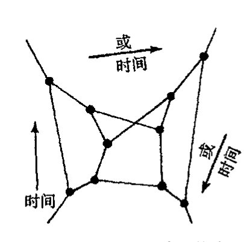

<!-- page 707 -->

通向实在之路

[§33.5](#335-基本扭量几何及其坐标) 中的术语取得一致。）因此，$\mathbb{PN}$ 中的点 $\mathbf{Z}$ 对应于 $\mathbb{M}$ 中的轨迹 $Z$（光线），$\mathbb{M}$ 中的点 $R$ 对应于 $\mathbb{PN}$ 中的轨迹 $\mathbf{R}$（黎曼球面，见 [§18.5](chapter_18.md#185-作为黎曼球面的天球)）。现在，扭量理论的基本哲学要求将用普通时空概念来描述的那些普通的物理概念转换成扭量理论下相应的等价（但非局域关联的）描述。我们看到，$\mathbb{M}$ 和 $\mathbb{PN}$ 之间的关系的确是非局域对应的，而不是点对点的变换。但是，空间 $\mathbb{PN}$ 仅仅提供了这种转换的开始。整个扭量理论的丰富性——这一点非常突出——只能随着时空概念与扭量空间几何之间对应关系的深入发展而逐步揭示出来。

$\mathbb{PN}$ 中轨迹 $\mathbf{R}$ 描述的是 $R$ 处观察者的"天球"（总视场），$R$ 的这个天球被看成是过 $R$ 的光线族。如上所述，这个球面自然是黎曼球面，它是复一维空间（一条复曲线，见第 8 章）。因此，我们把时空点看成是扭量空间 $\mathbb{PN}$ 中的全纯对象，这与扭量理论复数哲学的基本观点是一致的。在 [§33.5](#335-基本扭量几何及其坐标), 6 我们会清楚地看到，这种"全纯哲学"是如何扩展到更完全的扭量空间 $\mathbb{T}$ 几何上的，而 [§33.8](#338-无质量场的扭量描述)–12 则使我们能够以一种特有的方式对线性或非线性无质量场的信息进行编码。

然而，光线的空间 $\mathbb{PN}$ 本身并非即刻适应这种"全纯哲学"，因为它不是复空间。由于 $\mathbb{PN}$ 有 5 个实数维\*$^{[33.1]}$ 而 5 又是奇数，因此 $\mathbb{PN}$ 不可能是复流形，复 $n$ 维流形必须有偶数 $2n$ 实数维（见 [§12.9](chapter_12.md#129-复流形)）。我们将看到（[§33.6](#336-作为无质量自旋粒子的扭量的几何)），如果我们把"光线"看得更像是一种物理上的无质量场，它有自旋（即螺旋性——见 [§22.7](chapter_22.md#227-类光测量螺旋性)）和能量，那么我们就能得到一种六维空间 $\mathbb{PT}$，而这个六维空间则可理解为具有 3 个复数维的复空间。空间 $\mathbb{PN}$ 居于 $\mathbb{PT}$ 内，将后者分成两个复流形部分 $\mathbb{PT}^+$ 和 $\mathbb{PT}^-$，$\mathbb{PT}^+$ 可视为表示具有正螺旋性的无质量粒子，$\mathbb{PT}^-$ 则表示具有负螺旋性的无质量粒子，见图 33.6。但将扭量看成是无质量粒子则是不正确的。扭量只是提供无质量粒子据以表示的变量。（这好比是用普通的三维位置矢量 $\mathbf{x}$ 来标示一个空间点。虽然粒子可以占据这个贴有 $\mathbf{x}$ 标签的点，但矢量 $\mathbf{x}$ 并不等同于该粒子。）

[图 33.6：实五维流形 $\mathbb{PN}$ 将射影扭量空间 $\mathbb{PT}$ 划分为两个复三维流形部分 $\mathbb{PT}^+$ 和 $\mathbb{PT}^-$，它们分别表示正螺旋性和负螺旋性的无质量粒子。图中左侧显示光线与螺旋性的关系，右侧显示 $\mathbb{PT}^+$、$\mathbb{PN}$、$\mathbb{PT}^-$ 的层次结构。]

图 33.6 实五维流形 $\mathbb{PN}$ 将射影扭量空间 $\mathbb{PT}$ 划分为两个复三维流形部分 $\mathbb{PT}^+$ 和 $\mathbb{PT}^-$，它们分别表示正螺旋性和负螺旋性的无质量粒子。

扭量观点提供了一种非常不同的"量子化时空"图景。按通常的"传统"观点，量子（场）论程序被用到度规张量 $g_{ab}$ 上，这个场被看成是时空（流形）上的张量场。这个观点还可

---

\* [33.1] 为什么光线有 5 个自由度？

??? question "答案 [33.1]"
    闵可夫斯基时空中的一条有向光线可先由一个事件和一个类光方向指定。事件有 4 个自由度；在该点的类光方向构成观察者天球，即一个二维球面，所以方向再给 2 个自由度。

    但沿同一光线平移事件并不改变这条光线，这去掉 1 个自由度。因此光线空间共有 $4+2-1=5$ 个自由度。

- 688 -

<!-- page 708 -->

第三十三章　更彻底的观点；扭量理论

以表达为：量子化度规将显示出海森伯不确定原理带来的“模糊性”特点。我们得到的是这样一幅四维空间图像，它具有“模糊度规”，从而使光锥——以及由此产生的因果概念——变得服从“量子不确定性”（见[图 33.7](assets/page708_fig01.jpg)a）。与此相应，不存在经典的那种定义明确的所谓时空矢量是否是类空的、类时的或类光的等概念。这个问题一直是过于传统的“量子引力理论”的基本困难，因为 QFT 的基本特性就是：因果关系要求由两空间分离事件定义的场算符必须是对易的（§ 26.11）。如果“类空”概念真的服从量子不确定性（或其本身已变成量子概念），那么 QFT 的标准程序——它包括场算符对易关系的具体规定（§§ 26.2, 3）——就无法直接应用。扭量理论则提出了一种非常不同的图像。其中要求适当的“量子化”程序，不论它取何种形式，必须是应用于扭量空间内，而不是时空内（这里时空可以采用“传统”观点来理解）。两相对比我们发现，在传统处理中，“事件”丝毫未变，但“光锥”变得模糊；而在扭量处理中，则是“光线”未变但“事件”变得模糊（见[图 33.7](assets/page708_fig01.jpg)(b)）。

**图 33.7**　(a) 对于“量子化时空”的可能性质，普通观点认为，它应当是某种带“模糊”度规的时空，从而导致形成某种“模糊”光锥，其中任意一点上的方向概念（可以是类光的、类时的或类空的）服从量子不确定性。(b) “扭量”观点则将扭量空间（在此情形下即 PN）看成是某种存在（因此仍可以有光线概念），但光线间相交的条件变得服从量子不确定性。相应地，“时空点”的概念反而变“模糊”了。

如我们所见，扭量理论最初采用的是复数奇幻的表现形式，它不同于量子理论中的那些形式，前者具有时空几何的经典特征：天球可视为黎曼球面，即一维复流形。这种表现形式暗示我们，大自然中事情的真实面目就是这个样子的，它将最终使时空结构与量子力学程序得到统一。值得指出的是，时空几何的这种特点仅限于我们感知到的物理时空所具有的特定维和符号差。的确，在相对论下，黎曼球面作为天球具有重要作用（§ 18.5）这一事实要求时空是四维并且是洛伦兹型的，这与弦论和其他卡鲁扎－克莱因型理论的基本概念形成了鲜明的对照。扭量理论本身完全的复数奇幻性质恰恰是针对普通（狭义）相对论的四维时空几何，而与高维的“时空几何”就没有这种紧密联系（见 § 33.4）。

为了进一步深入，让我们回到原初纯自旋网络图像上来。注意，这一图像所缺少的主要之点就是与空间位移无关。在这个理论里，欧几里得角是作为一种纯自旋网络理论的“几何极限”出现的，而理论中不会出现距离。在圈变量理论中，事物的“距离”特征是由线上数字（$n = 2j$）给出的，它指的是面积而不是自旋。但这与原版自旋网络理论的解释是不同的，原版自旋网

· 689 ·

<!-- page 709 -->

通向实在之路

络没有距离量度，因为自旋是角动量，只涉及旋转和角度。为了能够结合进平移和实际距离，我们需要在理论中加入相应的线性动量角色。相应地，我们还需要从转动群扩展到欧几里得运动的完全群，对于适当的相对论场合，甚至要扩展到庞加莱群（[§18.2](chapter_18.md#182-闵可夫斯基空间的对称群)）。^17

968

在20世纪50年代后期和60年代早期，当我积极思考这些问题时，圈变量理论还未得到发展，我也确实考虑过将自旋网络推广到直接起主要作用的庞加莱群。但我担心的是庞加莱群的棘手的方面——它不是半单群（[§13.7](chapter_13.md#137-张量表示空间可约性)）——这意味着它在表示上很难处理。那时我曾想，庞加莱群到所谓共形群（它是半单群）的扩展有可能作为自旋网络理论上升到数学上更令人满意的结构的一种类比。共形群通过仅要求保留光锥不变而不是闵可夫斯基空间度规不变扩展了庞加莱群。事实说明，共形群确实在扭量理论中占有重要位置，因为它还是（理想化）光线空间PN的对称群。（共形群的非反射部分也是每个PT^+^和PT^-^空间的对称群，正如上述指出，这二者描述具有螺旋性和能量的无质量粒子。）在下两节我们将更清楚地看到这个群所起的作用。

## 33.3　共形群、紧化闵可夫斯基空间

上面我们谈到时空的共形群。现在让我们更充分地探求这个群的作用。它在无质量场（如麦克斯韦场）物理方面有着特殊的重要性，这是因为在这个大群而不只是庞加莱群下，无质量场的场方程具有不变性。^18^我们不妨持这样一种立场：在基本层面上，无质量粒子/场是基本要素，质量是后来阶段出现的东西。正如第25章所描述的，标准模型似乎就隐含着这一立场。按照标准模型，质量是由希格斯玻色子引入的，而且只有经过对称破缺机制（[§25.5](chapter_25.md#255-电弱对称群)）才能够出现。如果这是真的，那么扭量理论的基本动机之一就是坚信无质量场和共形群具有基本重要性。我们将发现（[§33.8](#338-无质量场的扭量描述)），在扭量理论里，无质量粒子和场具有十分简洁的描述，这个事实是这一理论的基石之一。

那么准确说什么是共形群呢？严格说来，这个群不是作用在闵可夫斯基空间M上的，而是作用在M的扩展所谓紧化闵可夫斯基空间M^#^上的。空间M^#^是一种优美的对称闭流形，它在许多方面比闵可夫斯基空间几何本身更完美。我们不应把它设想成“实际时空”，而应看作是一种数学上的方便。它在理解扭量几何以及这种几何与物理时空几何的关系方面是一种有用的媒介。

969

我们清楚地记得有一种好的图像，这就是黎曼球面及其与复平面的关系。从[§8.3](chapter_08.md#83-黎曼球面)可知，黎曼球面是从复平面通过邻接该复平面与“无穷远元素”即标有∞的点而得到的，完成了这一操作，我们即得到一种较初始平面有更大对称性的几何结构。“紧化闵可夫斯基空间”M^#^正是通过类似的操作由普通闵可夫斯基空间M得来的，只是现在邻接的“无穷远元素”被证明是一个处于无穷远的完整的光锥。这个结果空间有着较闵可夫斯基空间本身更大的对称性（即共形群）。

我们来看看它是怎么产生的。空间M^#^是一个带有洛伦兹共形度规的四维实紧流形。从[§27.12](chapter_27.md#2712-共形图)可知，洛伦兹共形度规实则是空间上规定的光锥族。我们更经常将这种结构称之为度规

·690·

<!-- page 710 -->

第三十三章 更彻底的观点；扭量理论

的等价类，这里度规 **g** 被认为等价于度规 **g'**，如果对处处为正的某个光滑标量场 Ω 有 **g'** = Ω²**g** 的话。这种重定标确实是保光锥的（[图 33.8](assets/page710_fig01.jpg)）。现在，为使从 **M**（看作是共形流形）过渡到紧共形流形 **M#**，我们邻接三维曲面 **I**，它就是上面所说的“处于无穷远的光锥”。由 [§27.12](chapter_27.md#2712-共形图) 可知，三维曲面 **I⁻** 和 **I⁺** 分别表示闵可夫斯基空间的过去和未来类光无穷远（见[图 27.16](assets/page538_fig01.jpg)b）。我们可以像[图 33.9](assets/page710_fig02.jpg) 所示那样通过粘合 **I⁻** 和 **I⁺** 来构造 **M#**。**I⁻** 的点被认为与相应的 **I⁺** 的空间对径点（二维球面上大圆直径的两个端点）是同一个点。**I⁻** 上点 *a⁻* 的光锥与 **I⁺** 上点 *a⁺* 的光锥共顶点，即 *a⁻* 与 *a⁺* 粘合。此外，表示时间和空间无穷远的 3 点 *i⁻*、*i⁰* 和 *i⁺* 也都粘合成一点 *i*。***[33.2] 共形流形 **M#** 确实有比闵可夫斯基空间更大的对称性，它有一个 15 维的对称群——共形群——而不是仅仅只有 10 维的庞加莱群。

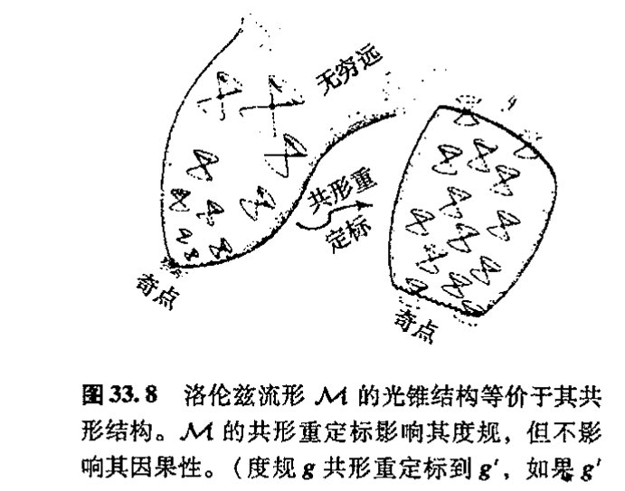

有一种优美的方法用来描述空间 **M#** 及其变换群。考虑六维伪欧几里得空间 **E**^{2,4} 的原点 *O* 上的“光锥” **K**，该空间的符号差为 + + − − − −。对 **E**^{2,4} 取标准坐标 *w, t, x, y, z, v*，因此 **K** 由下述方程给出

$$w^2 + t^2 - x^2 - y^2 - z^2 - v^2 = 0,$$

**E**^{2,4} 的度规 ds² 为

$$\mathrm{d}s^2 = \mathrm{d}w^2 + \mathrm{d}t^2 - \mathrm{d}x^2 - \mathrm{d}y^2 - \mathrm{d}z^2 - \mathrm{d}v^2。$$

这是一个 5 维的“锥”，锥顶在 *O*。我已在[图 33.10](assets/page711_fig01.jpg) 中尽可能全面地描述了它，但图中容易引起误解之处是看上去明显两“片”的 **K** 区域（“过去”和“未来”）的地方实际上是连成“一片”

---

***[33.2] 看看你能否更仔细地描述 **M#** 的几何。**I⁻** 上点的光锥在普通时空下是如何描述的？你能看出 **M#** 的拓扑是 S¹ × S³ 吗？你能看出如果时空维取奇数会出现什么重大的不同吗？

??? question "答案 [33.2]"
    在共形紧化图像中，$\mathscr I^-$ 上的一个点代表一族从过去无穷远进入的平行光线方向；它在普通时空中对应一张类光超平面，或者说一束具有同一入射方向、同一延迟参数的无穷远光线。

    拓扑上，紧化闵可夫斯基空间可由光锥生成元空间表示。取双覆盖时它是 $S^1	imes S^3$，再作对径点识别得到通常的紧化空间。若时空维数为奇数，相关对径识别会反转取向；这使得整体取向和自旋结构性质与偶数维情形显著不同。

· 691 ·

<!-- page 711 -->

通向实在之路

的。**[33.3]现在，考虑 $\mathcal{K}$ 的由 5 维类光平面 $w-v=1$ 所截的截面。其交是一个 4 维流形（抛物面），该流形的内度规由 $\mathbb{E}^{2,4}$ 度规导出：*[33.4]

$$ds^2 = dt^2 - dx^2 - dy^2 - dz^2。$$

971

我们把这个度规认作是普通平直闵可夫斯基四维空间的度规形式（[§18.1](chapter_18.md#181-欧几里得型与闵可夫斯基型四维空间)），这样，我们可以将这个流形等同于 $\mathbb{M}$，即使它是以"弯曲的"方式内嵌于 $\mathbb{E}^{2,4}$ 的（其形状即[图 33.10](assets/page711_fig01.jpg) 中的抛物线）。我们怎么在这个图中找出 $\mathbb{M}^\#$ 呢？它是 $\mathcal{K}$ 的完全生成元的抽象空间（$\mathcal{K}$ 上过 $O$ 的直线，这里两方向上过 $O$ 的完全线即为一个单生成元）。因此，我们可以将 $\mathbb{M}^\#$ 的每个点直接看成是 $\mathcal{K}$ 的生成元（[图 33.10](assets/page711_fig01.jpg)）——这样，对处于 $\mathbb{E}^{2,4}$ 原点的"观察者"来说，$\mathbb{M}^\#$ 即是"天球"！

为什么这么做可行呢？这是因为不处于五维平面 $w-v=0$ 的每个生成元都与 $\mathbb{M}$ 交于唯一一点，因此这族生成元是与 $\mathbb{M}$ 的关系是一一连续对应的关系。但是，另外还有处于这个五维平面内的生成元。它们提供 $\mathbb{M}$ 的另一些构成 $\mathscr{I}$ 的点。由此定义的空间 $\mathbb{M}^\#$ 具有由 $\mathcal{K}$ 的局部截面度规提供的共形洛伦兹度规。***[33.5]

作用在 $\mathbb{E}^{2,4}$ 上的伪正交群 $O(2,4)$（见 [§13.8](chapter_13.md#138-正交群)，[§18.1](chapter_18.md#181-欧几里得型与闵可夫斯基型四维空间), 2）由保度规 $ds^2$ 的"转动"组成。它将 $\mathcal{K}$ 的生成元映射到 $\mathcal{K}$ 的另一些生成元，因此它将 $\mathbb{M}^\#$ 映射到自身。此外，它保 $\mathbb{M}^\#$ 的共形结构。*[33.6] $O(2,4)$ 中必存在两个在 $\mathbb{M}^\#$ 上起着单位元作用的元素，即 $O(2,4)$ 的单位元素本身和 $O(2,4)$ 的负单位元素，后者简单地说就是使每个生成元反向。除了源于这种生成元方向反转的二对一的对应性质，$O(2,4)$ 还是共形群。它包括保 5 维平面 $w-v=0$ 的 10 维子群，该子群给出 $\mathbb{M}$ 的庞加莱群。**[33.7]实际上，这个说明只是我们在 [§18.5](chapter_18.md#185-作为黎曼球面的天球) 里所做说明的高维版本，那里我们证明了普通球面（它是紧欧几里得平面）的共形变换给出洛伦兹群 $O(1,3)$ 的实现，见[图 18.8](assets/page325_fig01.jpg)。

972

---

***〔33.3〕你能看出为什么吗？

??? question "答案 [33.3]"
    在 $\mathbb E^{2,4}$ 中取零锥 $\mathcal K$，再把同一条过原点的生成元上的非零点视为同一个共形点。用平面 $w-v=1$ 选取每条不在 $w-v=0$ 内的生成元的唯一代表，就得到一个四维截面。

    把零锥方程限制到 $w-v=1$，可用其余坐标解出被消去的尺度变量，剩下的诱导二次型正是 $dt^2-dx^2-dy^2-dz^2$ 的共形代表。因此这个截面给出普通闵可夫斯基空间。
*〔33.4〕为什么？

??? question "答案 [33.4]"
    截面 $w-v=1$ 与零锥相交后，法向中有一个方向来自零锥的径向生成元，另一个方向来自固定截面的约束。对切向量而言，沿被消去的 $w,v$ 方向的贡献由零锥方程相互抵消。

    所以诱导度规只留下四个自由坐标的二次型，即 $ds^2=dt^2-dx^2-dy^2-dz^2$。这就是正文所说抛物面虽嵌在六维空间中，其内度规却是平直闵可夫斯基型。
****〔33.5〕由某个局部截面提供的共形度规为什么与任何其他局部截面提供的是一样的？如此定义的 $\mathscr{I}$ 的点为什么与上面的定义是一致的？提示：见 [§18.4](chapter_18.md#184-闵可夫斯基空间的双曲几何) 和[图 18.8](assets/page325_fig01.jpg)。

??? question "答案 [33.5]"
    换一个局部截面等于在每条零锥生成元上选取另一个非零代表。两个代表相差一个非零尺度因子，因此诱导度规只相差这个尺度因子的平方。

    共形结构只关心度规到这种局部重标定为止的等价类，所以由不同截面得到的是同一个共形度规。处在 $w-v=0$ 的生成元不能与 $w-v=1$ 截面相交，正是普通闵可夫斯基图像中被推到无穷远的类光方向，因而与 $\mathscr I$ 的定义一致。
*〔33.6〕为什么？

??? question "答案 [33.6]"
    $O(2,4)$ 保持六维二次型，所以把零锥 $\mathcal K$ 映到自身，并把过原点的直线生成元映到过原点的直线生成元。

    紧化时空点就是这些生成元，因此 $O(2,4)$ 自然作用在 $\mathbb M^\#$ 上。由于不同局部截面只改变代表点的尺度，诱导度规至多作局部共形重标定，所以该作用保持共形结构。
**〔33.7〕为 $6\times6$ 矩阵（它表示 $O(2,4)$ 的无穷小元素）设定的条件是什么？这些矩阵里哪一个给出无穷小庞加莱变换？

??? question "答案 [33.7]"
    $O(2,4)$ 的无穷小矩阵 $A$ 满足 $A^T\eta+\eta A=0$，其中 $\eta$ 是号差为 $(2,4)$ 的六维度规矩阵。这给出 $6	imes5/2=15$ 个独立参数。

    保持无穷远超平面 $w-v=0$ 的子代数给出庞加莱子代数：其中 6 个是洛伦兹变换，4 个是平移。余下的生成元对应伸缩和特殊共形变换；若要求无穷远结构作为普通闵可夫斯基空间的无穷远保持不变，就只留下这 10 个庞加莱生成元。

· 692 ·

<!-- page 712 -->

第三十三章 更彻底的观点；扭量理论

## 33.4 作为高维旋量的扭量

扭量是如何与这一切协调的呢？描述（闵可夫斯基空间下）扭量的最简洁的——但很难说是最清楚的——方法，就是称它为 $O(2,4)$ 的约化旋量（或半旋量）。（不必为这种描述的数学简洁性感到担心，一会儿我会给出更具物理意义的图像！）约化旋量概念的说明见 [§11.5](chapter_11.md#115-克利福德代数)。对伪正交群 $O(n-r,n+r)$ 作用其上的 $2n$ 维空间，约化旋量空间是 $2^{n-1}$ 维的。在目前情形下，$n=3$（且 $r=1$），因此我们有四维约化旋量空间，我们称它为扭量空间。^19

但是，用这样的定义并不能使我们得到扭量像什么样的清晰的几何或物理图像。不仅如此，我们看到，不论 [§33.2](#332-作为光线的扭量) 的末尾是怎么说的，扭量理论都应当存在于任意 $2(n-1)$ 偶数维时空中。我们采取与上述类似的方法来推广到 $\mathcal{K}$ 的结构（现在将它取为 $2n-1$ 维的）和 $2(n-1)$ 维闵可夫斯基时空的紧化情形。这里我们只需像以前那样引入两个新的坐标 $v$ 和 $w$，一个的度规带负号，另一个带正号。这样"扭量空间"变成 $2^{n-1}$ 维。对奇数 $2n-1$ 时空维情形，这也可行，只是此时我们得不到约化旋量的概念。它是一个完全 $2^n$ 维的自旋空间，我也可以将它算作"扭量"。但在奇数维情形下，扭量失去了一个重要特征，即它的手征性（我们在 [§33.7](#337-扭量量子论), 12, 14 再来详谈这个问题）。只有经过约化自旋空间我们才能实现基本的手征形式（如此左手和右手项方可成为不同的扭量描述，见 [§33.7](#337-扭量量子论)），也才有希望使弱相互作用的手征特征（[§25.3](chapter_25.md#253-电弱相互作用反射不对称性)）最终被结合进来。以后我们还将看到为什么在使扭量理论变得如此有效的许多重要的物理（和全纯）性质会和扭量的这种一般性 $n$ 维定义不搭界。

由于扭量属于一种活动的时空变换群（共形群），这种群将一些时空点映射成另一些时空点，因此我们看到，扭量是与时空总体关联的量，而不是与时空中单个点关联的量。像矢量、张量或通常的旋量这些局域量都是与作用在点上的对称群相联系，见 [§14.1](chapter_14.md#141-流形上的微分)——例如洛伦兹群的转动（[§14.8](chapter_14.md#148-辛流形)）。虽然这使得扭量较普通矢量、张量或旋量更难掌握，但这种总体性有一个好处，那就是我们可以找到一种体系来替代整个时空而不是仅仅作为给定时空流形的一种参照。正如 [§33.2](#332-作为光线的扭量) 所说，扭量理论的主要目标之一就是要找到这么一种体系。这种理论的主要不足就在于很难看出它是如何应用于一般弯曲时空 $\mathcal{M}$ 上的，此时共形群不是作为 $\mathcal{M}$ 的对称群出现的。在 [§33.11](#3311-非线性引力子), 12 我们会看到扭量理论是如何以鲜明的方式克服这一困难的。

在涉及扭量理论的概念及其动机方面，扭量的这种作为 $O(2,4)$ 的约化旋量的定义只能为我们提供非常有限的视角。正如刚才所说，它不能明确揭示为什么人们会有兴趣期待扭量理论成为一种推动探索大自然的更深层次理论的指南。为了更充分地评估扭量理论在这方面的作用，让我们回顾一下第 29 和 30 两章。公认的观点认为，恰当的量子引力统一体必将成为追求物理新的基本观点的主要目标。与此不同，这两章强调的是，我们应当谋求这样一种发展，那就是，量子（场）论的法则并非千古不易的，而是应当进行调整，就像我们传统的时空几何图像受到更

·693·

<!-- page 713 -->

通向实在之路

新一样。当然，量子力学原理中包含着完美而又极为明确的真理，这些真理不该轻易抛弃。在扭量理论中，我们不是硬性加入 QFT 法则，而是研究这些法则并从中抽取出那些能够与爱因斯坦理论紧密配合的方面，我们要找出隐藏在相对论和量子力学背后的那种二者的协调性。正如先前所述，这个指南的关键之一就在于复数的奇幻性，我们在本书的好几个地方都指出了这一点。另一点是它与洛伦兹四维空间下的爱因斯坦理论特别协调一致，而不是与这种理论在高维下的推广或是其他符号差类型的理论保持一致。

在这方面为什么洛伦兹四维空间会如此特殊呢？这是因为，正像我们在 [§18.5](chapter_18.md#185-作为黎曼球面的天球) 和 [§33.2](#332-作为光线的扭量) 所强调的，观察者的天球具有自然的共形结构并能够用黎曼球面来解释。应当记住，具有这种普遍性的事情实际上会出现在任何（非零）空间和时间维下，其中的天球总是具有共形流形的结构。[33.8] 但洛伦兹四维空间的特殊性在于，这个共形流形可以很自然地解释为复流形（黎曼球面），这是一种在其它任何空间和时间维数下都不会出现的性质。这一事实的重要性何在？我们说，在扭量理论里，复数的奇幻性得到了充分利用。不仅扭量空间被证明是一种复流形，而且这种复流形具有直接的物理意义。实际上，一般结果告诉我们，在空间维数与时间维数之差除以 4 余 2 的各种情形下，只有"扭量空间"是复空间。[20] 值得指出的是，原初的卡鲁扎-克莱因理论、10 或 11 维超引力理论、原始的 26 维弦论、10 维超弦理论、11 维超引力或 M 理论、甚至 12 维 F 理论（其中有两个时间维）都不是这种情形！

## 33.5 基本扭量几何及其坐标

在普通的闵可夫斯基四维空间下，一般扭量的物理意义和几何解释是什么呢？如果我们用标准的闵可夫斯基坐标 $t, x, y, z$ 来描述 $\mathbb{M}$ 的点 $R$，这就很容易做到，这里我们取光速为单位：$c=1$。$\mathbb{M}$ 的整个扭量空间 $\mathbb{T}$ 是一个四维复矢量空间，我们用标准复数坐标 $Z^0, Z^1, Z^2, Z^3$ 来描述它。在这种坐标下，扭量 $\mathbf{Z}$ 关联到时空点 $R$——或者说 $R$ 关联到 $\mathbf{Z}$——如果密钥矩阵关系（矩阵记号见 [§13.3](chapter_13.md#133-线性变换和矩阵)）

$$
\begin{pmatrix} Z^0 \\ Z^1 \end{pmatrix} = \frac{\mathrm{i}}{\sqrt{2}} \begin{pmatrix} t+z & x+\mathrm{i}y \\ x-\mathrm{i}y & t-z \end{pmatrix} \begin{pmatrix} Z^2 \\ Z^3 \end{pmatrix}
$$

成立的话——由此可得平直空间扭量几何的基！[33.9]

与 [§12.8](chapter_12.md#128-张量抽象指标记法和图示记法) 的记法一样，我们时常也用（抽象）指标记法 $Z^\alpha$ 来表示扭量 $\mathbf{Z}$（在标准坐标系下 $\mathbf{Z}$ 的各分量是 $Z^0, Z^1, Z^2, Z^3$）。每个扭量 $\mathbf{Z}$ 或 $Z^\alpha$（$\mathbb{T}$ 的元素）有复共轭 $\bar{\mathbf{Z}}$，它是对偶扭量（对偶扭量空间 $\mathbb{T}^*$ 的元素）。在指标记法下，$\bar{\mathbf{Z}}$ 写成 $\bar{Z}_\alpha$，带下脚标，其分量（在标准坐标系

---

[33.8] 解释为什么。

??? question "答案 [33.8]"
    任意洛伦兹型时空中，一个观察者的类光方向由天球给出；在 $n$ 维时空中它是 $S^{n-2}$，并天然带有共形结构，因为光锥只确定角度而不确定尺度。

    当 $n=4$ 时，天球是二维的 $S^2$。二维可定向共形结构等价于黎曼曲面结构，而 $S^2$ 的黎曼曲面就是黎曼球面。因此四维洛伦兹时空的天球不仅是共形流形，还是自然的一维复流形。

[33.9] 用普通代数记法写下这个方程。

??? question "答案 [33.9]"
    若图形方程表示扭量关联关系，它的普通代数形式是 $\omega^A=ix^{AA'}\pi_{A'}$，其中 $Z^\alpha=(\omega^A,\pi_{A'})$。

    这说明给定时空点 $x^{AA'}$ 时，所有与该点关联的扭量由自旋量 $\pi_{A'}$ 参数化；射影化后这些扭量形成一条黎曼球面。

- 694 -

<!-- page 714 -->

第三十三章 更彻底的观点；扭量理论

下）为

$$(\bar{Z}_0, \bar{Z}_1, \bar{Z}_2, \bar{Z}_3) = (\overline{Z^2}, \overline{Z^3}, \overline{Z^0}, \overline{Z^1}).$$

这种记法有点让人糊涂。左边的4个量（复数）是对偶扭量 $\bar{\mathbf{Z}}$ 的4个分量，而右边的4个量分别是复数 $Z^0$，$Z^1$，$Z^2$，$Z^3$ 的复共轭。因此，$\bar{\mathbf{Z}}$ 的分量 $\bar{Z}_0$ 是 $\mathbf{Z}$ 的分量 $Z^2$ 的复共轭，等等。注意，在组成复共轭时，前两个与后两个交换。由于 $\bar{\mathbf{Z}}$ 是对偶扭量，因此我们可以用它和原扭量 $\mathbf{Z}$ 一起组成（埃尔米特）标量积（见 [§13.9](chapter_13.md#139-酉群) 和 [§22.3](chapter_22.md#223-幺正结构希尔伯特空间和狄拉克算符)），由此得到（平方）扭量模

$$\begin{aligned}
\bar{\mathbf{Z}} \cdot \mathbf{Z} &= \bar{Z}_\alpha Z^\alpha = \bar{Z}_0 Z^0 + \bar{Z}_1 Z^1 + \bar{Z}_2 Z^2 + \bar{Z}_3 Z^3 \\
&= \overline{Z^2} Z^0 + \overline{Z^3} Z^1 + \overline{Z^0} Z^2 + \overline{Z^1} Z^3 \\
&= \frac{1}{2}(|Z^0 + Z^2|^2 + |Z^1 + Z^3|^2 - |Z^0 - Z^2|^2 - |Z^1 - Z^3|^2),
\end{aligned}$$

其中最后一步显示了埃尔米特表达式 $\bar{Z}_\alpha Z^\alpha$ 有符号差 $(++--)$，这与 [§13.9](chapter_13.md#139-酉群) 是一致的。**[33.10]**（扭量空间的对称性显示了 [§13.10](chapter_13.md#1310-辛群) 提到的群 SU(2,2) 到 [§33.3](#333-共形群紧化闵可夫斯基空间) 的 O(2,4) 的局部等价性。）从上述给出的关键的关联关系中我们发现，当且仅当模为零 $\bar{Z}_\alpha Z^\alpha = 0$ 时，扭量 $Z^\alpha$ 能够与实闵可夫斯基空间 $\mathbb{M}$ 中的事件相关联。**[33.11]** 当 $\bar{Z}_\alpha Z^\alpha = 0$ 时，我们说扭量 $\mathbf{Z}$ 是类光的。

为了联系到 [§33.2](#332-作为光线的扭量) 的讨论，我们先熟悉一下射影扭量空间 $\mathbb{PT}$，它是由复矢空间 $\mathbb{T}$ 构造出来的复三维射影空间（$\mathbb{CP}^3$）。（射影空间的一般性讨论见 [§15.6](chapter_15.md#156-射影空间)。）扭量几何的许多内容都可以很容易地用 $\mathbb{PT}$ 而不是 $\mathbb{T}$ 来表达。在此数 $Z^0$，$Z^1$，$Z^2$，$Z^3$ 给出 $\mathbb{PT}$ 的齐次坐标，因此3个独立比值

$$Z^0 : Z^1 : Z^2 : Z^3$$

用来标称 $\mathbb{PT}$ 的点。类光射影扭量构成空间 $\mathbb{PN}$，它是扭量模为零

$$\bar{Z}_\alpha Z^\alpha = 0$$

的实六维空间 $\mathbb{PT}$ 的实五维子空间。

上述方程也定义了矢量空间 $\mathbb{T}$ 中类光非射影扭量的实七维子空间 $\mathbb{N}$。当 $\bar{Z}_\alpha Z^\alpha > 0$，我们得到正扭量空间 $\mathbb{T}^+$；当 $\bar{Z}_\alpha Z^\alpha < 0$，我们得到负扭量空间 $\mathbb{T}^-$。由此可以分别定义相应的射影空间 $\mathbb{PT}^+$ 和 $\mathbb{PT}^-$，见[图 33.11](assets/page715_fig01.jpg)（与图 33.6 比较）。

我们来研究一下[图 33.5](assets/page706_fig02.jpg) 所描述的 $\mathbb{PN}$ 和 $\mathbb{M}$ 之间的几何关系，它是本节开头给出的关键的关联关系的结果。从这种关系直接可见，$\mathbb{M}$ 中与同一个非零扭量 $\mathbf{Z}$（必须是一个类光扭量）关联的两点（事件）$P$ 和 $R$ 必须是彼此类光分离的（即 $P$ 和 $R$ 彼此处于不同的光锥上）。因此 $\mathbf{Z}$ 定义了光线——$\mathbb{M}$ 中的类光直线——因为 $\mathbb{M}$ 的所有与因此 $\mathbf{Z}$ 关联的点必须是相互间类光分离的，见

---

**[33.10]** 验证最后一步，解释为什么它给出的是符号差。

??? question "答案 [33.10]"
    取复共轭会把未加撇和加撇的自旋指标互换，同时把关联式中的 $i$ 变为 $-i$。把共轭后的式子重新写成原来的指标顺序时，需要交换自旋量因子的次序。

    自旋指标升降使用反对称的 $
arepsilon$，交换收缩顺序会带来一个负号。因此最后一步出现的是符号差，而不是新的几何条件。

**[33.11]** 证明这一点，用反证法证明：如果 $\bar{Z}_\alpha Z^\alpha = 0$，但 $Z^2$ 和 $Z^3$ 不同时为零，那么这样的事件总是存在的。

??? question "答案 [33.11]"
    设 $Z^\alpha=(\omega^A,\pi_{A'})$ 且 $\pi_{A'}$ 不为零。要找事件 $x^{AA'}$ 使 $\omega^A=ix^{AA'}\pi_{A'}$，这是对实的 $x^{AA'}$ 的线性条件。

    条件 $\bar Z_\alpha Z^\alpha=0$ 正是这组线性方程有实解的相容条件。反证地说，若没有这样的事件，则由 $\omega^A$ 与 $\pi_{A'}$ 构成的实无量纲不变量不能为零；但这正是扭量模。故当模为零且 $\pi_{A'}$ 非零时，总存在对应的实事件，且事件集合是一条光线。

· 695 ·

<!-- page 715 -->

通向实在之路

---

**图 33.11** 扭量空间 $\mathbb{T}$ 是一个带伪埃尔米特度规的复矢量空间。射影扭量空间 $\mathbb{PT}$ ($\mathbb{CP}^3$) 则是 $\mathbb{T}$ 中的射线空间（一维子空间）。因此，如果扭量 $\mathbf{Z}$ 有坐标 $(Z^0, Z^1, Z^2, Z^3)$，则比值 $Z^0:Z^1:Z^2:Z^3$ 决定了 $\mathbb{PT}$ 中相应的点。（类光扭量 $\bar{Z}_\alpha Z^\alpha = 0$ 的）实七维子空间 $\mathbb{N}$ 将扭量空间 $\mathbb{T}$ 划分成两个复三维空间：（正扭量 $\bar{Z}_\alpha Z^\alpha > 0$ 的）$\mathbb{T}^+$ 和（负扭量 $\bar{Z}_\alpha Z^\alpha < 0$ 的）空间 $\mathbb{T}^-$。相应于这些空间的射影空间分别是实五维的 $\mathbb{PN}$（表示 $\mathbb{M}^\#$ 中的光线）和两个复三维流形 $\mathbb{PT}^+$（表示正螺旋性无质量场）和 $\mathbb{PT}^-$（表示负螺旋性无质量场）。

---

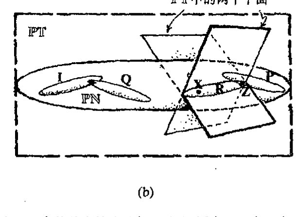

**图 33.12** 由扭量对应的关联关系给出的 $\mathbb{M}^\#$ 和 $\mathbb{PN}$ 中的基本轨迹几何。（a）固定 $\mathbb{PN}$ 中一点 $\mathbf{Z}$（射影性类光扭量）。$\mathbb{M}^\#$ 中那些关联到 $\mathbf{Z}$ 的点（例如 $P, R$）组成一根光线，因为所有这样的点彼此间都是类光分离的。（b）固定 $\mathbb{M}^\#$ 内一点 $R$。$\mathbb{PN}$ 中那些关联到 $R$（处于 $\mathbb{PT}$ 的两复平面的交线上）的点（例如 $\mathbf{Z}, \mathbf{X}$）组成一根复射影线，它是一个黎曼球面。$\mathbb{M}^\#$ 内沿光线 $Z$ 类光分离的点 $P$ 和 $R$ 有相应的黎曼球面 $\mathbf{P}$ 和 $\mathbf{R}$，它们交于单点 $\mathbf{Z}$。（我把这些黎曼球面画成拉长了的样子，以折中它们在 $\mathbb{PT}$ 的射影几何下也是射影直线这一事实！）这些黎曼球面中的一个特殊情形是 $\mathbf{I}$，它表示 $\mathbb{M}^\#$ 内点 $i$。点 $i$ 代表类空/类时无穷远；它是无穷远处光锥 $\mathscr{S}$ 的顶点。$\mathscr{S}$ 的其他点 $Q$ 表示为 $\mathbb{PN}$ 中与 $\mathbf{I}$ 相交的射影线 $\mathbf{Q}$。

图 33.12。不仅如此，如果我们用 $\lambda Z^\alpha$ 取代 $Z^\alpha$（这里 $\lambda$ 是一个非零复数），则扭量 $\mathbf{Z}$ 表示的是同一根光线。与（非零）类光射影扭量关联的事件的轨迹是一条光线，但在 $Z^2 = Z^3 = 0$ 的特殊情形下，我们必须予以适当解释，此时在 $\mathbb{M}$ 中我们得不到实际与 $Z^\alpha$ 关联的点，但仍可以将这种类光扭量看成是描述了无穷远处的光线（处于 $\mathbb{M}^\#$ 而非 $\mathbb{M}$ 内的 $\mathscr{S}$ 的生成元）。**[33.12]

---

**[33.12]** 明确论证这段文字的断言。

??? question "答案 [33.12]"
    关联方程 $\omega^A=ix^{AA'}\pi_{A'}$ 对固定的非零类光扭量给出所有满足它的实事件。若有一个解 $x^{AA'}$，则沿向量 $\bar\pi^A\pi^{A'}$ 平移仍保持方程成立，因为 $\pi^{A'}\pi_{A'}=0$。

    因而解集是一条类光直线。把 $Z^\alpha$ 乘以非零复数只同时重标定 $\omega^A$ 与 $\pi_{A'}$，不改变关联方程的解集，所以同一射影扭量代表同一光线。若 $\pi_{A'}=0$，则没有有限实事件解，应解释为无穷远处的光线。

· 696 ·

<!-- page 716 -->

第三十三章 更彻底的观点；扭量理论

现在让我们来考察相反的情形。固定由实坐标 $t, x, y, z$ 表示的事件 $R$，我们发现，与 $R$ 关联的扭量 $\mathbf{Z}$ 的空间由分量 $Z^0, Z^1, Z^2, Z^3$ 的两个线性齐次关系定义。每一个这种线性关系定义了 $\mathbb{PT}$ 中的一个平面，它们的交（$\mathbb{PT}$ 中满足这两个线性关系的点集）给出 $\mathbb{PT}$（$\mathbb{CP}^1$）中的射影线 $\mathbf{R}$——实际上处于 $\mathbb{PN}$ 中——因此它是所要求的黎曼球面（[§15.4](chapter_15.md#154-克利福德丛), 6）。这样，在扭量空间中，$\mathbb{M}$ 的点（事件）由 $\mathbb{PN}$ 中的射影线表示。当 $Z^2 = Z^3 = 0$ 时，我们得到 $\mathbb{PN}$ 中的特殊射影线，我们用 $\mathbf{I}$ 来表示它。这个特殊射影线表示无穷远处光锥 $\mathscr{I}$ 的顶点 $i$。$\mathscr{I}$ 在 $\mathbb{PN}$ 中的任何其他点 $Q$ 由与 $\mathscr{I}$ 相交的射影线 $\mathbf{Q}$ 表示。*[33.13] 这种情形见[图 33.12](assets/page715_fig02.jpg) 所示。

用这些复结构来表示（标准空间维数和时间维数下的）闵可夫斯基空间的方式是非常令人惊奇的。我们可以将闵可夫斯基空间重新解释为 $\mathbb{PN}$（或 $\mathbb{PN} - \mathscr{I}$，如果我们只考虑有限个时空点的话）中的复直线，这里 $\mathbb{PN}$ 是主结构，$\mathbb{M}$ 是次级结构。这相当于认为光线比时空点本身更基本。光线 $Z$ 和 $X$ 的交由 $\mathbb{PN}$ 内的射影线表示，它包含了相应的 $\mathbb{PN}$ 点 $\mathbf{Z}$ 和 $\mathbf{X}$，如我们所见，两时空点 $P$ 和 $R$ 类光分离的条件是由 $\mathbb{PN}$ 内相应的射影线 $\mathbf{P}$ 和 $\mathbf{R}$ 的交的条件来表示的（[图 33.12](assets/page715_fig02.jpg)）。因此我们看到，扭量空间提供了一种物理几何上完全不同于通常时空图景的观点。普通的时空点由 $\mathbb{PN}$ 内的黎曼球面来表示。$\mathbb{PN}$ 的点则由时空中的光线来表示。对应的两种方法都是非局域的。但我们能够通过精确的几何法则从一种图景变换到另一种图景。

## 33.6 作为无质量自旋粒子的扭量的几何

我们知道，扭量理论背后的根本动机是：复数的奇幻性可以得到充分利用。尽管 $\mathbb{PN}$ 是包含了复射影线的大（4 维实参数）系统，但它本身并不是复流形（如 [§33.2](#332-作为光线的扭量) 所述，这是不太可能的，因为它是奇实数维的）。但当增加了一个实数维后，它就成为复流形了，即 $\mathbb{PT}$（它是 $\mathbb{CP}^3$ 的）。我们能以物理上自然且意义明确的方式来解释的 $\mathbb{PT}$ 的这些额外的点吗？很显然（正如 [§33.2](#332-作为光线的扭量) 所暗示的），我们能做到这一点。我们知道，实际的自由光子要比 $\mathbb{M}$ 中的光线有更复杂的结构。光线描述了沿固定方向以光速运动的点粒子，但实际光子具有能量和自旋。眼下我们可以从经典角度考虑它。光子自旋的两种基本方式是按运动方向判断的左旋和右旋（右旋和左旋圆偏振分别对应于正螺旋性和负螺旋性，见 [§22.7](chapter_22.md#227-类光测量螺旋性)）。在每种情形下，螺旋量的幅度均为 $\hbar$。可以证明，正螺旋经典光子可以用 $\mathbb{PT}^+$ 的点来表示，负螺旋经典光子则可用 $\mathbb{PT}^-$ 的点来表示，这里额外维源自光子能量。这种描述对其他具有非零自旋 $\frac{1}{2}n\hbar$ 的无质量粒子也是成立的。

它是怎么起效的呢？这里不是详谈的地方，但基本要点可以勾勒如下。首先我们认识到，扭量 $\mathbf{Z}$ 的前两个分量 $Z^0$ 和 $Z^1$ 实际上是二维旋量 $\boldsymbol{\omega}$ 的两个分量，其指数形式为 $\omega^A$，即 $\omega^0 = Z^0$ 和

---

\* [33.13] 为什么？

??? question "答案 [33.13]"
    射影扭量空间把相差非零复倍数的扭量视为同一点，因此普通扭量空间中的复数尺度方向不应算作物理不同状态。

    这个尺度包含一个正实伸缩和一个相位。正实伸缩改变代表向量的长度，相位改变代表向量在复线上的位置；二者都不改变射影点。因而实际几何对象位于射影空间中，而不是位于未商掉尺度的线性扭量空间中。

· 697 ·

<!-- page 717 -->

通向实在之路

$\omega^1 = Z^1$（见[§22.8](chapter_22.md#228-自旋和旋量)和[§25.2](chapter_25.md#252-电子的-zigzag-图像)）。$\mathbf{Z}$ 的其余两个分量 $Z^2$ 和 $Z^3$ 则是素（对偶）旋量 $\boldsymbol{\pi}$ 的分量，其指数形式为 $\pi_{A'}$，即 $\pi_{0'} = Z^2$ 和 $\pi_{1'} = Z^3$。我们有时写

$$\mathbf{Z} = (\boldsymbol{\omega}, \boldsymbol{\pi})$$

同时将 $\boldsymbol{\omega}$ 和 $\boldsymbol{\pi}$ 看成是扭量 $\mathbf{Z}$ 的旋量部分。复共轭扭量 $\overline{\mathbf{Z}}$ 的旋量部分取反序，即

$$\overline{\mathbf{Z}} = (\overline{\boldsymbol{\pi}}, \overline{\boldsymbol{\omega}}),$$

故扭量的模可以表示为

$$\overline{Z}_\alpha Z^\alpha = \overline{\mathbf{Z}} \cdot \mathbf{Z} = \overline{\boldsymbol{\pi}} \cdot \boldsymbol{\omega} + \overline{\boldsymbol{\omega}} \cdot \boldsymbol{\pi} = \overline{\pi}_A \omega^A + \overline{\omega}^{A'} \pi_{A'}。$$

在闵可夫斯基坐标 $t, x, y, z$ 下，扭量 $\mathbf{Z}$ 与时空点 $R$ 的关联关系可以写成

$$\boldsymbol{\omega} = \mathrm{i}\mathbf{r}\boldsymbol{\pi},$$

它表示 $\omega^A = \mathrm{i}r^{AA'}\pi_{A'}$，这里 $\mathbf{r}$（或 $r^{AA'}$）有分量矩阵

$$\begin{pmatrix} r^{00'} & r^{01'} \\ r^{10'} & r^{11'} \end{pmatrix} = \frac{1}{\sqrt{2}}\begin{pmatrix} t+z & x+\mathrm{i}y \\ x-\mathrm{i}y & t-z \end{pmatrix}。$$

旋量 $\boldsymbol{\pi}$ 与无质量粒子的动量相联系，它的意思是外积 $\overline{\boldsymbol{\pi}}\boldsymbol{\pi}$（不缩并——见[§14.3](chapter_14.md#143-协变导数)）描述其四维动量。旋量 $\boldsymbol{\omega}$ 与粒子的角动量相联系，它的意思是 $\boldsymbol{\omega}$ 与 $\overline{\boldsymbol{\pi}}$ 的对称积描述粒子六维角动量的反自对偶部分（[§18.7](chapter_18.md#187-相对论性能量和角动量)，[§19.2](chapter_19.md#192-麦克斯韦电磁场理论)，[§22.12](chapter_22.md#2212-相对论性量子角动量)，[§32.2](chapter_32.md#322-阿什台卡变量的手征输入)），而 $\overline{\boldsymbol{\omega}}$ 与 $\boldsymbol{\pi}$ 的对称积描述粒子的自对偶部分。^{[33.14]} 与动量情形不同，角动量取决于时空原点 $O$ 的选择，因此我们有时也称其为关于 $O$ 的角动量。这种对原点的独立/依赖性分别通过扭量 $\mathbf{Z}$ 的两种旋量 $\boldsymbol{\pi}$ 和 $\boldsymbol{\omega}$ 的变换行为反映出来。如果将原点 $O$ 平移到新的时空点 $Q$，$Q$ 相对于 $O$ 为正矢量 $\boldsymbol{q}$（$\boldsymbol{q}$ 取矩阵形式），则旋量部分有如下变换^{[33.14]}

$$\boldsymbol{\pi} \mapsto \boldsymbol{\pi} \quad \text{和} \quad \boldsymbol{\omega} \mapsto \boldsymbol{\omega} - \mathrm{i}\boldsymbol{q}\boldsymbol{\pi}。$$

还有一个与原点无关的标量，它可以用动量和角动量构造出来，这就是螺旋量 $s$。可以证明，该螺旋量是扭量模的一半：

$$s = \frac{1}{2}\overline{Z}_\alpha Z^\alpha = \frac{1}{2}\overline{\mathbf{Z}} \cdot \mathbf{Z}$$

（由前面可知，它只是 $\overline{\boldsymbol{\omega}} \cdot \boldsymbol{\pi}$ 的实部）。实际上，就处理无质量粒子而言，扭量方法比[§22.12](chapter_22.md#2212-相对论性量子角动量)所述的传统四维矢量/张量方法要精确得多。现在，对于非类光扭量（确定到相位重定标 $\mathbf{Z} \mapsto \mathrm{e}^{\mathrm{i}\theta}\mathbf{Z}$，这里 $\theta$ 是实数），我们有了一个清晰的物理图像，即它相当于经典自旋的无质量粒子，^{[33.15]} 比较图33.6。

我们还没有给出非类光扭量的非常清晰的几何图像。这要在考虑复化闵可夫斯基空间 $\mathbb{CM}$（或其紧化的 $\mathbb{CM}^\#$）的情形下才能得到，这里时空坐标 $t, x, y, z$ 现在都取复数。$\mathbb{CM}^\#$ 的与（非

---

^{[33.14]} 证明：扭量与时空点之间的关联关系在这种变换下是不变的；并证明扭量模不变。

??? question "答案 [33.14]"
    平移原点时，时空坐标变为 $x^{AA'}\mapsto x^{AA'}+a^{AA'}$，扭量分量相应变为 $\omega^A\mapsto \omega^A+i a^{AA'}\pi_{A'}$，而 $\pi_{A'}$ 不变。

    若原来满足 $\omega^A=ix^{AA'}\pi_{A'}$，变换后有 $\omega^A+i a^{AA'}\pi_{A'}=i(x^{AA'}+a^{AA'})\pi_{A'}$，所以关联关系不变。扭量模中的交叉项因 $a^{AA'}$ 为实厄米量而相互抵消，因此 $\bar Z_\alpha Z^\alpha$ 也不变。

^{[33.15]} 解释为什么存在这种相位自由度。对给定螺旋量 $s > 0$ 的粒子，为什么粒子能量被认为局限于 $\mathbb{PT}^+$ 内点的位置上？

??? question "答案 [33.15]"
    量子态的整体复相位不可观测，扭量的射影描述也正是把非零复倍数视为同一射影点；因此存在相位自由度。

    对质量为零、螺旋量 $s>0$ 的粒子，能量符号由扭量模的正负区域区分。正能量态对应于正频率部分，而在扭量空间中这由 $\mathbb{PT}^+$ 选出。于是粒子的能量-动量自由度被编码为 $\mathbb{PT}^+$ 中的射影位置。

· 698 ·

<!-- page 718 -->

第三十三章 更彻底的观点；扭量理论

零）扭量 $Z^\alpha$ 关联的点总存在非平凡的复二维轨迹，即所谓 $\alpha$ 平面，它是自对偶的，就是说，与它相切的 2 形式是自对偶的（[§32.2](chapter_32.md#322-阿什台卡变量的手征输入)）。这个 $\alpha$ 平面表示 $Z^\alpha$（以及所有与之成正比的量），见[图 33.13](assets/page718_fig01.jpg)。类似地，对偶扭量 $W_\alpha$ 定义了一个 $\beta$ 平面，它是 $\mathbb{CM}^\#$ 中的反自对偶二维复平面。**[33.16]

**图 33.13** （一般非类光）扭量及其对偶扭量的复时空描述。对于非零扭量 $Z^\alpha$，$\mathbb{CM}^\#$ 中总存在一个关联到 $Z^\alpha$ 的点组成的复二维轨迹，它称为 $\alpha$ 平面，且是处处自对偶的。对于非零对偶扭量 $W_\alpha$，$\mathbb{CM}^\#$ 中关联到 $W_\alpha$ 的点总是组成反自对偶的复二维平面，它称为 $\beta$ 平面。只有对类光扭量或类光对偶扭量这些轨迹上才存在实点，这些实点组成相应于图 33.12 的一根光线。

至此，我们仅得到扭量在复时空几何下的图像。我们能否得到实际可想象的"实"图像呢？$\mathbb{CM}^\#$ 的实在结构包含在其复共轭的概念中（[§18.1](chapter_18.md#181-欧几里得型与闵可夫斯基型四维空间)）；复共轭将 $\alpha$ 平面交换为 $\beta$ 平面，与此相一致，它使扭量的上指标与下指标交换（即扭量与其对偶扭量交换），"自对偶"与"反自对偶"相交换。根据 $\mathbb{PT}$ 的射影几何，复共轭将点交换为面，因为在 $\mathbb{PT}$ 中一个对偶扭量决定了一个平面。*[33.17] 这一事实保证了我们能够得到一种依据实空间几何的非类光射影扭量 $Z^\alpha$。我们首先要做的是用 $Z^\alpha$ 的复共轭 $\bar{Z}_\alpha$ 来表示 $Z^\alpha$，$\bar{Z}_\alpha$ 作为对偶扭量是与 $\mathbb{PT}$ 的复平面相关联的。这个平面可由 $\mathbb{PT}$ 与 $\mathbb{PN}$ 的交来确立，它是一条实三维轨迹。我们可以将这条轨迹解释为 $\mathbb{M}^\#$ 中的三参数光线族。因此，这族光线在几何上表示扭量 $Z^\alpha$（以及所有与之成正比的量），见[图 33.14](assets/page718_fig02.jpg)。

**图 33.14** 我们可以通过先将 $Z^\alpha$ 传递到其复共轭 $\bar{Z}_\alpha$ 来得到非类光扭量 $Z^\alpha$ 的一幅"实"图像，由此定义了 $\mathbb{PT}$ 中的复射影平面。该平面由它与 $\mathbb{PN}$ 的交而定，它是一条实三维轨迹。这条轨迹定义了 $\mathbb{M}^\#$ 中称为鲁滨逊线汇的三参数光线族。

光线以一种十分复杂的方式相互缠绕，但要得到明确的构形图像还是有可能的。考虑时间上的一个瞬间 $\mathbb{E}^3$（即一个普通欧几里得三维截面——"现在"——它取自闵可夫斯基时空 $\mathbb{M}$）。$\mathbb{M}$ 中的光线——以光速沿特定方向运动的点粒子——可用 $\mathbb{E}^3$ 的带"箭头"的点来表示，这里箭头指向代表运动方向。我们认为这样的一族三参数光线族——称为鲁滨逊线汇——代表了单个

** [33.16] 证明这一点。

??? question "答案 [33.16]"
    复时空中的一个点由关联方程选出射影扭量空间中的一条线：固定 $x^{AA'}$，让 $\pi_{A'}$ 变化，$Z^\alpha=(ix^{AA'}\pi_{A'},\pi_{A'})$ 构成一个二维复向量子空间，射影化后就是 $\mathbb{CP}^1$。

    反过来，满足适当线性条件的一条射影线确定这种二维子空间，从而恢复唯一的复时空点。因而“点”和“射影线”在这种对应下互相表示。

* [33.17] 为什么？

??? question "答案 [33.17]"
    复共轭把 $\alpha$ 平面和 $\beta$ 平面互换，因此在射影扭量空间中它不是把一个扭量点送到同一空间的普通点，而是送到对偶扭量空间中的超平面。

    类光条件正是扭量点落在其共轭对偶超平面上的条件，即 $\bar Z_\alpha Z^\alpha=0$。所以实的光线不是一般射影扭量点，而是满足这一实结构条件的特殊点。

·699·

<!-- page 719 -->

通向实在之路

扭量 **Z**。在[图 33.15](assets/page719_fig01.jpg) 中我们看到，定向圆（和一条直线）系统充满了整个三维普通空间 **E**³。在 **E**³ 的每一个点上都有一个粒子，它（以光速）沿过该点与圆相切的定向切线方向运动。随着时间增长，整个构形以光速沿图中直线的（负）方向整体地传播，这种传播代表着一种由扭量描述的无质量自旋粒子的运动。实际上，这个由各种圆形成的构形是 *S*³ 上克利福德平行线构形（[§15.4](chapter_15.md#154-克利福德丛)）到普通欧几里得三维空间的球极投影（[§8.3](chapter_08.md#83-黎曼球面) 中[图 8.7](assets/page119_fig02.jpg)）。

982

我们不把这些“光线”看成是物理实体；它们只是提供了（投影性）扭量的一种几何实现方式。这个构形实际上反映的是（经典）无质量自旋粒子的角动量的结构。²²它是一种非局域的图像。[图 33.15](assets/page719_fig01.jpg) 中存在最小圆，其半径为粒子自旋除以粒子能量。圆的中心粗略地说代表了自旋粒子的“位置”（但不能将这个圆心的历史精确地看成是表示无质量粒子历史的光线，因为它不能恰当地满足洛伦兹变换）。²³[33.18]正是这种构形使得它在当初被命名为“扭量”。²³

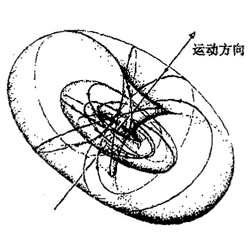

**图 33.15** “抓拍的”鲁滨逊线汇的空间图像。（*S*³ 上球极平面投影的克利福德平行线，见图 8.7a，图 15.8，它是充满整个 **E**³ 的一族三参数圆与一根直线。）我们想象在 **E**³ 的每个点上有一个粒子，它们以光速沿各自的（定向）圆的方向作直线运动（光线）。整个构形以光速沿图中直线的（负）方向传播。它表示的是由 **Z**^α 描述的无质量自旋粒子的运动和角动量。

## 33.7 扭量量子论

这里概要介绍平直空间下扭量理论的基本几何。但是一些读者可能会对这种图像如何能帮助我们推进物理这一点失去耐心，尽管它在几何上很优美。在时空结构与量子力学原理的统一方面，扭量理论到底有何作为呢？目前我们只是看到它在描述无质量粒子方面的一些“漂亮”的几何和代数方法，而不论是在量子力学还是在广义相对论，我们都没见着它起着什么作用。所以我最好还是先照顾一下这方面！

让我们回到扭量理论的最基本概念上来。这个概念要求我们将所有时空概念看成是扭量空间 **T** 的附属品。作为完全的复空间，**T** 具有充分利用复数奇幻性的潜力，这一点在标准时空框架下并非一眼就能看出来。同样，我们不是在实时空坐标下进行描述，而是用复扭量变量 **Z**^α 来进行。现在，扭量变量是位置变量和动量变量的复合体，我们要问的是：用什么来取代标准量子法则（[§21.2](chapter_21.md#212-量子哈密顿量)）

983

---

\*\*\*\* [33.18]（在 [§33.5](#335-基本扭量几何及其坐标) 的坐标系下）找出圆心，并说明在洛伦兹速度变换式下它如何变换。

??? question "答案 [33.18]"
    在 $\pi$ 自旋球面坐标中，一条光线的方向由黎曼球面上一点给出；洛伦兹速度变换作用为该球面上的默比乌斯变换。因此圆仍映为圆，圆心按相应的分式线性变换移动。

    若用复坐标 $\zeta$ 表示方向，速度变换给出 $\zeta\mapsto (a\zeta+b)/(c\zeta+d)$。圆心不是按欧氏线性规则变换，而是由这个默比乌斯变换把原圆整体送到新圆后再读出；这正是相对论像差公式在天球上的表达。

· 700 ·

<!-- page 720 -->

第三十三章 更彻底的观点；扭量理论

$$p_a \mapsto \mathrm{i}\hbar \frac{\partial}{\partial x^a}$$

（或 $x^a \mapsto -\mathrm{i}\hbar \partial/\partial p_a$）？答案是，通过与 [§21.2](chapter_21.md#212-量子哈密顿量) 中算符对易法则 $p_b x^a - x^a p_b = \mathrm{i}\hbar \delta^a_b$ 中的正则共轭变量 $x^a$ 和 $p_a$ 进行类比，我们可以将扭量变量 $Z^\alpha$ 和 $\bar{Z}_\alpha$ 看成一对正则共轭算符：

$$Z^\alpha \bar{Z}_\beta - \bar{Z}_\beta Z^\alpha = \hbar \delta^\alpha_\beta,$$

这里，像位置变量和动量变量分别满足对易关系一样，$Z^\alpha$ 和 $\bar{Z}_\alpha$ 各自满足对易关系：$Z^\alpha Z^\beta - Z^\beta Z^\alpha = 0$ 和 $\bar{Z}_\alpha \bar{Z}_\beta - \bar{Z}_\alpha \bar{Z}_\beta = 0$。***[33.19]

顺便提一下，有必要指出，$\bar{Z}_\alpha$ 和 $Z^\alpha$ 的这种量子非对易关系会在"几何"上引起某些饶有兴趣的问题，如果我们认真对待如下事实的话：量子扭量空间的基本"坐标"可能就是这种非对易的量。按经典的理解，在我们考虑扭量空间 $\mathbb{T}$ 的八维实流形结构时，我们是能够将 $Z^\alpha$ 和 $\bar{Z}_\alpha$ 看成独立对易变量来用的（见 [§10.1](chapter_10.md#101-复维和实维-179)）。但在量子图景下，$Z^\alpha$ 和 $\bar{Z}_\alpha$ 不对易。设法将这个"量子"对 $Z^\alpha$ 和 $\bar{Z}_\alpha$ 当作独立坐标使用的尝试将引导我们进入非对易几何领域，我们在 [§33.1](#331-几何上具有离散元素的理论) 就简单讨论过这个问题。顺着这条路追索下去是很有意思的，但我不认为读者必须这么做。

我们知道，在粒子通常的位置空间波函数 $\psi(\mathbf{x})$ 中是不会出现动量变量 $\mathbf{p}$ 的，动量是通过算符 $\partial/\partial x^a$ 来表达的。那么类比到扭量又该是什么量呢？我们大概得要求我们的"扭量波函数"$f(Z^\alpha)$ 应当"独立于 $\bar{Z}_\alpha$"，且 $\bar{Z}_\alpha$ 应当由算符 $\partial/\partial Z^\alpha$ 来表示。这的确是正确的，但 $f$"独立于 $\bar{Z}_\alpha$"实际是指什么意思呢？形式上说，这里"独立"是指 $\partial f/\partial Z^\alpha = 0$，即是指（我们从 [§10.5](chapter_10.md#105-柯西黎曼方程) 可知）柯西—黎曼方程所判定的 $f(Z^\alpha)$ 是 $Z^\alpha$ 的全纯函数。

这是一个非常惊人而显著的事实。扭量波函数确实是全纯函数，因此它们可以与奇幻的复数世界建立适当联系。复共轭变量 $\bar{Z}_\alpha$ 的量子角色是指它们可以微分形式出现：

$$\bar{Z}_\alpha \mapsto -\hbar \frac{\partial}{\partial Z^\alpha},$$

它是个全纯算符，因此，在量子描述水平上，全纯性是不变的。这就再次确保了用无质量粒子的动量和角动量来解释扭量是与扭量的对易性法则一致的，角动量和动量对易子（[§22.12](chapter_22.md#2212-相对论性量子角动量)）将正确出现并包容于上述给定的扭量对易子中。^{24}

让人特别感兴趣的一个量是螺旋量 $s$，现在它作为算符，其本征值将取无质量粒子所容许的各种可能的半整数值 $\left(\cdots, -2\hbar, -\dfrac{3}{2}\hbar, -\hbar, -\dfrac{1}{2}\hbar, 0, \dfrac{1}{2}\hbar, \hbar, \dfrac{3}{2}\hbar, 2\hbar, \cdots\right)$。特别值得指出的是，考虑到螺旋量的非对易性质，该算符变成^{25}，***[33.20]

$$s = \frac{1}{4}\left(Z^\alpha \bar{Z}_\alpha + \bar{Z}_\alpha Z^\alpha\right) \mapsto -\frac{1}{2}\hbar\left(2 + Z^\alpha \frac{\partial}{\partial Z^\alpha}\right).$$

---

*** [33.19] 你能从希尔伯特空间算符的一般性质出发看出为什么扭量对易子中一定没有"i"吗？

??? question "答案 [33.19]"
    在量子力学中，对易子本身是反厄米的；为了由两个厄米算符得到厄米生成元，通常写成 $i$ 乘以对易子或在正则关系中放入 $i$。

    扭量量子化中，一个扭量分量与其共轭对偶分量互为厄米共轭变量，指标配对已经带有厄米形式的符号结构。若再放入额外的 $i$，会破坏这些共轭关系和扭量模作为厄米算符的实性。因此扭量对易关系按其自然厄米配对写出时不含额外的 $i$。

*** [33.20] 验证 $s$ 的这两个表达式的等价性。

??? question "答案 [33.20]"
    螺旋量可写为扭量模的一半，也可写成相应量子算符的对称排序表达式。两者的差别只来自把非对易的扭量变量重新排序时产生的对易子常数。

    使用扭量对易关系把一个表达式中的上、下指标变量交换到另一个表达式的顺序，所有非中心项相同，剩余常数正是排序修正。按正文采用的归一化，这个修正给出两个公式中相同的 $s$，所以二者等价。

·701·

<!-- page 721 -->

通向实在之路

算符

$$\Psi = Z^{\alpha} \frac{\partial}{\partial Z^{\alpha}}$$

称为欧拉齐次算符。（我们已经在5、6、7和9章中多次邂逅欧拉这位老朋友了。）按欧拉的证明，$\Psi$具有的一个突出特性就是它的本征函数是齐次的，齐次性的阶数即为本征值。也就是说，方程（其中$u$是某个常数）

$$\Psi f = uf$$

是齐次性

$$f(\lambda Z^{\alpha}) = \lambda^{u} f(Z^{\alpha})$$

成立的条件。***[33.21]由此我们有，具有确定螺旋量值$S$（故$sf = \hbar Sf$，这里$s$是算符，$S$是本征值）的无质量粒子的扭量波函数一定是$-2S-2$阶齐次的，同时它也是全纯的。*[33.22]

985

因此，具体到光子情形，光子的扭量波函数（$S = \pm 1$）是两项之和，一项是零阶均匀的，描述左旋分量（$S = -1$）；另一项是$-4$阶齐次的，描述右旋分量（$S = 1$）。另一种无质量粒子中微子的波函数的齐性阶为$-1$（因为其螺旋量为$-\dfrac{1}{2}$），而（无质量的）反中微子波函数的齐性阶为$-3$。无质量标量粒子波函数的齐性阶为$-2$。而对于我们认为是最重要的引力子情形，我们（暂时）将它视为在闵可夫斯基背景（$S = \pm 2$）下的自旋为2的无质量粒子。它的左旋部分（$S = -2$）有齐性阶次为2的扭量波函数，其右旋部分（$S = 2$）有齐性阶次为$-6$的扭量波函数。

这种不均衡性非常显著，它展示了扭量理论的基本手征性质。不久我们就会看到，当我们在扭量理论的环境下考虑广义相对论本身时，这种不均衡性显得尤为突出。眼下，让我们试着弄明白如何解释扭量（线性）波函数。对这些波函数，不均衡性不会引出任何问题，一切都顺顺当当。但关于波函数$f(Z^{\alpha})$——通常称其为扭量函数——的解释问题，却有着重要的微妙差别。下面就让我们进入这一领域。

## 33.8　无质量场的扭量描述

对于一般自旋的自由无质量粒子的波函数的时空表示，薛定谔方程换成所谓无质量自由场方程。26我们已从自旋$\dfrac{1}{2}$情形下的无质量（狄拉克－外尔）中微子方程（[§25.3](chapter_25.md#253-电弱相互作用反射不对称性)）看到了这种方程的一个例子。这里不适于追求细节，但一旦有了如[§22.8](chapter_22.md#228-自旋和旋量)和[§25.2](chapter_25.md#252-电子的-zigzag-图像)里用的二维旋量公式，我们就很容易写下这个方程。对于负的螺旋量$S = -\dfrac{1}{2}n$，我们有量$\psi_{AB\cdots D}$；对于正的螺旋量$S = \dfrac{1}{2}$

---
***[33.21] 看看你能否证明这一点。

??? question "答案 [33.21]"
    质量为零的自由场方程在自旋量记法中只含一个手征的对称自旋量及一个导数 $
abla^{AA'}$。若场有 $n$ 个同类自旋指标，则方程把导数的一个指标与场的一个指标缩并，并要求所得对称对象为零。

    由于这些指标完全对称，只需验证一个缩并形式；其余形式由对称性等价。这就得到正文所列的无质量螺旋量场方程。
*[33.22] 为什么取这个值？

??? question "答案 [33.22]"
    螺旋量是自旋沿动量方向的投影。一个完全对称的 $n$ 指标二自旋量表示自旋 $n/2$ 的不可约表示。

    对应的无质量场只有一个手征，因此其螺旋量固定为 $+n/2$ 或 $-n/2$，符号由使用未加撇还是加撇的自旋指标决定。正文取的值正是这种表示论归一化下的自旋权重。
·702·

<!-- page 722 -->

第三十三章 更彻底的观点；扭量理论

$n$，我们有带撇指标的量 $\psi_{A'B'\cdots D'}$。它们每一个都是关于 $n$ 指标完全对称的，且都有正频率，并满足相应的方程

$$\nabla^{AA'}\psi_{AB\cdots D}=0,\quad \nabla^{AA'}\psi_{A'B'\cdots D'}=0,$$

这里 $\nabla^{AA'}$ 正好是普通梯度算符 $\nabla^a$ 的二维旋量对应量（写成升指标形式，见 [§14.3](chapter_14.md#143-协变导数)）。***[33.23] 对于自旋 0，我们直接有波方程 $\Box\psi=0$，这里 $\Box$ 是 [§24.5](chapter_24.md#245-partialpartial-t-的非不变性) 中引入的普通达朗贝尔算符。实际上，对于这些方程来说，方便的二维旋量记号可以忽略某些细节。当 $n=2$（自旋 1）时，这两个方程分别直接变成反自对偶和自对偶情形下的麦克斯韦自由场方程。***[33.24] 当 $n=4$，它们变成弱场爱因斯坦方程，分成反自对偶和自对偶两部分，这里曲率是指平直空间 $\mathbb{M}$ 的无穷小微扰。^27^

这些方程怎么处置扭量函数呢？我们可以明确地证明，^28^存在显式周线积分表达式（[§7.2](chapter_07.md#72-周线积分)），它直接从扭量函数 $f(Z^\alpha)$ 自动给出上述无质量场方程的一般正频率解。实际上，这个表达式对于没有正频率要求的情形也是完全成立的，虽然这个要求在扭量形式下很容易得到保证，我们在 [§33.10](#3310-扭量与正负频率剖分) 就会看清这一点。这里不给出全部细节了，只想强调一个基本概念，那就是，在正螺旋量情形下，$f(Z^\alpha)$ 是先乘以 $\boldsymbol{\pi}$（[§33.6](#336-作为无质量自旋粒子的扭量的几何)）再取 $n$ 倍（给出 $n$ 个带撇指标）；或在负螺旋量情形下，先对 $f(Z^\alpha)$ 取 $n$ 次 $\partial/\partial\omega$ 运算（给出 $n$ 个不带撇的旋量指标），然后再乘以 2 形式 $\tau=\mathrm{d}\pi_0\wedge\mathrm{d}\pi_{1'}$。并作适当的二维周线积分。这里先将关联关系 $\omega=\mathrm{i}r\boldsymbol{\pi}$ 结合进来，以便在保留 $\boldsymbol{\pi}$ 和 $r$ 的同时消去 $\omega$。这里积分消去 $\boldsymbol{\pi}$，这样，我们最后得到的是在选定时空点 $\boldsymbol{R}$ 上的带指标的量 $\psi_{\cdots}$（因此 $\psi_{\cdots}$ 仅是 $r$ 的函数）。周线处于轨迹 $\omega=\mathrm{i}r\boldsymbol{\pi}$（对每个固定的 $r$）之内，即处于 $\mathbb{N}$ 的线 $\mathbf{R}$（非射影版本^29^）之内，后者表示的是事件 $R$，见[图 33.16](assets/page723_fig01.jpg)。

正频率条件是通过下述要求来保证的：当线 $\mathbf{R}$ 被容许完全进入扭量区域 $\mathbb{PT}^+$ 时，周线积分仍成立。$\mathbb{PT}$ 内的线对应于"复时空点"，我们在 [§33.6](#336-作为无质量自旋粒子的扭量的几何) 已看清这一点。那些完全处于子区域 $\mathbb{PT}^+$ 内的线则对应于 $\mathbb{CM}$ 的称为向前管道的子区域 $\mathbb{M}^+$ 的点。^30^我们到 [§33.10](#3310-扭量与正负频率剖分) 再回到这个问题上来。混合螺旋量的无质量场——例如像由左旋和右旋两部分组成的平面偏振光子场——也可以用这一套概念来描述，其中两种不同螺旋量的扭量函数直接相加。

这种表达式的真实存在让我觉得简直太神奇了。在扭量体系中，无质量场方程似乎无影无踪了，实际上是被转换成了"纯粹的全纯关系"。当我们更深入地考察这种表达式时，我们会发现，如何来说明一个扭量函数是有非常重要的讲究的，它以一种出奇的方式与无质量场的正/负频率剖分相联系（[§33.10](#3310-扭量与正负频率剖分)）。搞清楚扭量函数的这种奇妙性质也是理解扭量函数如何以主动方式展现自身，并给出弯曲扭量空间的关键。这种奇妙性质是什么呢？那就是，扭量函数其实不能

---

***[33.23] 对于螺旋量 $-\frac{1}{2}n$ 情形，用记号 $\psi_r=\psi_{00\cdots 011\cdots 1}$（这里有 $n-r$ 个 0 和 $r$ 个 1）写下这些方程的显形式，并按上述从普通闵可夫斯基坐标 $t, x, y, z$ 移植得到量 $r^{AA'}$ 那样，从 $\nabla^a$ 得到 $\nabla^{AA'}$。

??? question "答案 [33.23]"
    令 $\psi_r=\psi_{00\cdots011\cdots1}$，其中有 $n-r$ 个 $0$ 和 $r$ 个 $1$。把 $
abla^{AA'}$ 写成矩阵形式：$
abla^{00'}=\partial_t+\partial_z$，$
abla^{11'}=\partial_t-\partial_z$，$
abla^{01'}=\partial_x-i\partial_y$，$
abla^{10'}=\partial_x+i\partial_y$，差一个整体归一化依赖于约定。

    无质量方程于是给出相邻分量之间的一阶方程，例如 $(\partial_t+\partial_z)\psi_{r+1}+(\partial_x+i\partial_y)\psi_r=0$ 以及 $(\partial_x-i\partial_y)\psi_{r+1}+(\partial_t-\partial_z)\psi_r=0$，其中 $r$ 在允许范围内取值；具体端点按缺失的分量省去。

***[33.24] 看看你能否证明这一点，这里 $\psi_{00}=C_1-\mathrm{i}C_2$，$\psi_{01}=-\mathrm{i}C_3$，$\psi_{11}=-C_1-\mathrm{i}C_2$，且 $\mathbf{C}=2\mathbf{E}-2\mathrm{i}\mathbf{B}$（见 [§19.2](chapter_19.md#192-麦克斯韦电磁场理论)），对 $\psi_{A'B'}$ 也有相应的表达式。

??? question "答案 [33.24]"
    对螺旋量 $-1$，场由对称二自旋量 $\psi_{A'B'}$ 表示，它等价于麦克斯韦场的一个自对偶或反自对偶部分。把 $\psi_{00},\psi_{01},\psi_{11}$ 按题中给出的 $C_i$ 代入无质量自旋量方程，会得到三维矢量形式的一组一阶方程。

    这些方程正是 $
abla\cdot\mathbf C=0$ 和 $\partial_t\mathbf C=i
abla	imes\mathbf C$ 的复形式。再用 $\mathbf C=2\mathbf E-2i\mathbf B$ 分开实部和虚部，就恢复无源麦克斯韦方程。

·703·

<!-- page 723 -->

通向实在之路

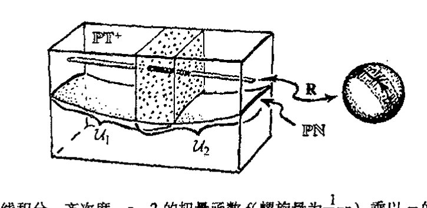

**图 33.16** 基本扭量周线积分。齐次度 $-n-2$ 的扭量函数 $f$（螺旋量为 $\frac{1}{2}n$）乘以 $\pi$ 的 $n$ 倍（$n$ 为正数）或取 $-n$ 次 $\partial/\partial\omega$ 运算（$n$ 为负数），这些运算给出旋量指标，然后再乘以2形式 $\tau = d\pi_0 \wedge d\pi_1$。对带位置矢量 $\boldsymbol{r}$ 的时空点 $R$ 的具体选择，我们在关联关系 $\omega = ir\pi$ 定义的扭量空间区域 $\mathbf{R}$ 上作周线积分。这个积分消去对 $\pi$ 的依赖关系，于是我们得到无质量场方程的解。在如图所示情形下，$\mathbf{R}$ 取自扭量空间 $\mathbb{PT}^+$（或 $\mathbb{T}^+$）的上半叶，$f$ 在 $u_1$ 与 $u_2$ 的交上是全纯的，这里开集 $u_1$ 与 $u_2$ 共同覆盖整个 $\mathbb{PT}^+$（或 $\mathbb{T}^+$）

看成是普通意义上的"函数"，而是所谓全纯层上同调的元素。³¹

## 33.9 扭量层上同调

什么是层上同调呢？这些概念数学上相当复杂，但实际上很自然。我们这里只谈所谓一阶层上同调。形象地给出这一概念的最简单的办法是考虑由一系列坐标拼块构成的流形，这个概念我们在 [§10.2](chapter_10.md#102-光滑偏导数) 和 [§12.2](chapter_12.md#122-流形与坐标拼块) 讨论过，并有图示如图 12.5(a)。定义在两个拼块重叠处的是转移函数（起着拼块间的粘合作用）。由 [§12.2](chapter_12.md#122-流形与坐标拼块) 的图 12.5(a)可知，这些转移函数在拼块的三重重叠处必须满足一定的相容性条件。

现在我们来考虑按此方式构成的流形，其中的转移函数与等同关系仅差一无穷小量，见[图 33.17](assets/page723_fig02.jpg)。这个从一个拼块 $\mathcal{U}_i$ 到另一个拼块 $\mathcal{U}_j$ 的无穷小位移可用 $\mathcal{U}_i$ 与 $\mathcal{U}_j$ 的重叠区域上的矢量场 $\boldsymbol{F}_{ij}$ 来描述，这个矢量场描述拼块 $\mathcal{U}_i$ 是如何相对于 $\mathcal{U}_j$ 作无穷小"位移"的。与此相当，我们来考虑拼块 $\mathcal{U}_j$ 如何沿相反方向相对于 $\mathcal{U}_i$ 作无穷小位移，描述它的矢量场 $\boldsymbol{F}_{ji}$ 处于与 $\mathcal{U}_i$ 重叠的 $\mathcal{U}_j$ 的区域。正是在这个重叠区域我们有

$$\boldsymbol{F}_{ji} = -\boldsymbol{F}_{ij}$$

（见[图 33.18](assets/page724_fig01.jpg)(a)）。在 $\mathcal{U}_i$、$\mathcal{U}_j$ 和 $\mathcal{U}_k$ 的三重重叠区域，我们要求（[图 33.18](assets/page724_fig01.jpg)(b)）相容性条件

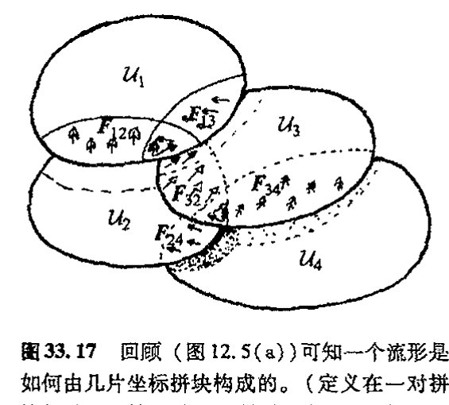

**图 33.17** 回顾（图 12.5(a)）可知一个流形是如何由几片坐标拼块构成的。（定义在一对拼块的重叠区域上的是"转移函数"，起着拼块间"粘合"的作用。）这里，我们认为这些转移函数与等同之间仅差一无穷小量，因此它们由每一对拼块 $\mathcal{U}_i$、$\mathcal{U}_j$ 的重叠区域上的矢量场 $\boldsymbol{F}_{ij}$ 给定，并告诉我们每个拼块是如何相对于重叠区上另一个拼块作"位移"的。（这里"拼块"都是平直坐标空间上的开集 $\mathcal{U}_1$，$\mathcal{U}_2$，$\mathcal{U}_3$，）

· 704 ·

<!-- page 724 -->

第三十三章 更彻底的观点；扭量理论

$$\boldsymbol{F}_{ij} + \boldsymbol{F}_{jk} = \boldsymbol{F}_{ik}$$

必须成立。***[33.25]

每个拼块坐标系的（无穷小）改变还会引起一些“平凡的”无穷小变形。我们可以把这些变形看成是由每个特定拼块 $\mathcal{U}_i$ 上的矢量场 $\boldsymbol{H}_i$ 给定的，它描述整个拼块相对于自身是如何“位移”的。由此我们在拼块间的重叠区域得到一族“平凡的” $\boldsymbol{F}_{ij}$

$$\boldsymbol{F}_{ij} = \boldsymbol{H}_i - \boldsymbol{H}_j$$

它不改变流形（[图 33.18](assets/page724_fig01.jpg)(c)）。

![图 33.18 矢量场 $\boldsymbol{F}_{ij}$ 必须满足一定要求。(a) 在 $\mathcal{U}_1$ 与 $\mathcal{U}_2$ 的重叠区域，我们有 $\boldsymbol{F}_{ji} = -\boldsymbol{F}_{ij}$。它可用 $\mathcal{U}_1$ 在 $\mathcal{U}_2$ 上移动来图解，描述它的矢量场 $\boldsymbol{F}_{12}$ 处于 $\mathcal{U}_1$ 上。而这种相对移动同样可以通过 $\mathcal{U}_2$ 上负的这种矢量场来实现。(b) 三重重叠条件 $\boldsymbol{F}_{ij} + \boldsymbol{F}_{jk} = \boldsymbol{F}_{ik}$。在 $\mathcal{U}_1$，$\mathcal{U}_2$ 和 $\mathcal{U}_3$ 的三重重叠区，$\mathcal{U}_1$ 相对于 $\mathcal{U}_2$ 的移动 $\boldsymbol{F}_{12}$ 等同于 $\mathcal{U}_1$ 相对于 $\mathcal{U}_3$ 的移动 $\boldsymbol{F}_{13}$ 与 $\mathcal{U}_3$ 相对于 $\mathcal{U}_2$ 上的移动 $\boldsymbol{F}_{32}$ 之和。(c) 如果所有拼块都独自地作整体位移，这不会带来任何效果（改变的仅仅是每个拼块的坐标）。这种情形可以用总位移 $\boldsymbol{F}_{ij} = \boldsymbol{H}_i - \boldsymbol{H}_j$ 加和为零来体现。](assets/page724_fig01.jpg)

这些概念基本上告诉了我们一阶层上同调的法则。32 但我们不必关注矢量场。普通函数 $f_{ij}$ 起着与这里考虑的 $\boldsymbol{F}_{ij}$ 同样的作用。我们只是要求每个 $f_{ij}$ 定义在 $\mathcal{U}_j$ 和 $\mathcal{U}_i$ 的交上，并有 $f_{ij} = -f_{ji}$。对三重叠区域有 $f_{ij} + f_{jk} + f_{ki} = 0$，并且认为整个集合 $\{f_{ij}\}$ 等价于另一集合 $\{g_{ij}\}$，如果对应差 $\{f_{ij} - g_{ij}\}$ 集合内的每个元素都有“平凡”形式 $\{h_i - h_j\}$ 的话。我们说 $\{f_{ij}\}$ 是约化模形式 $\{h_i - h_j\}$ 这个量的，这里模的意义与 [§16.1](chapter_16.md#161-有限域) 中用的“模”一词的意义基本相同（亦见前言里的等价类概念）。实际上，在上同调理论里，人们关心的函数类（$f_{ij}$ 或 $h_i$）可以极其一般化。在扭量理论里，我们通常只涉及全纯函数。因此结合二者我们有“全纯层上同调”概念。

特别是，这种上同调概念可以用到扭量理论上。一般来说，我们不是把“扭量函数”简单地看成是单个的全纯函数 $f$，而是认为它是一个全纯函数 $\{f_{ij}\}$ 的集合，其中每个单个的 $f_{ij}$ 都定

*** [33.25] 证明：$\boldsymbol{F}_{ij}$ 的反对称性满足三重重叠的相容性要求。

??? question "答案 [33.25]"
    在重叠区域上，线丛的转移函数满足三重重叠相容性 $g_{ij}g_{jk}g_{ki}=1$。取对数后相容性变成 $f_{ij}+f_{jk}+f_{ki}$ 为常数的 $2\pi i$ 倍。

    曲率由这些局部数据的差异给出，因此 $F_{ij}=-F_{ji}$ 的反对称性保证从 $i$ 到 $j$ 再到 $k$ 的变化在循环求和中抵消。于是三重重叠上没有额外不一致，曲率数据能拼成整体定义的二形式。

· 705 ·

<!-- page 725 -->

通向实在之路

义在一对开集 $u_i$ 和 $u_j$ 的交上，并有 $f_{ji} = -f_{ij}$；对三重叠区域有 $f_{ij} + f_{jk} + f_{ki} = 0$，并且这些开集 $\{ \mathcal{U}_i \}$ 的总集合覆盖扭量空间的全部区域 $\mathcal{Q}$。$\mathcal{Q}$ 上（关于覆盖 $\{ \mathcal{U}_i \}$ 的）一阶上同调元素由这个集合 $\{ f_{ij} \}$ 表示，该集合的约化模为形式 $\{ h_i - h_j \}$ 这个量，这里 $h_i$ 定义在 $\mathcal{U}_i$ 上。不要把函数 $f_{ij}$ 的集合看成是上同调元素，它只是提供了一种表示这种神秘"元素"的方式。我们称它为一阶上同调元素的 $f_{ij}$ 表示。

然而，对于上同调的严格定义，我们也可以考虑用对区域 $\mathcal{Q}$ 的覆盖取越来越细致极限的办法。幸好有这样一条定理告诉我们，对于全纯层上同调，当 $\mathcal{U}_i$ 是足够简单类型的集即施坦集（Stein sets）时，我们可以停止细化。³³（在施坦集里一阶全纯层上同调总是为零。）因此，如果我们把注意力集中在那些每个 $\mathcal{U}_i$ 都是施坦集的覆盖上，那么当我们谈及定义在 $\mathcal{Q}$ 上的上同调元素时，我们就不必加上"关于覆盖 $\{ \mathcal{U}_i \}$ 的"这样的定语。上同调概念不取决于施坦覆盖的具体选择。一个上同调元素就是定义在 $\mathcal{Q}$ 上的一件"事"，不论采用什么样的覆盖，其结果是一样的。³⁴这个突出的事实正是（全纯）层上同调神奇性的一个方面！

所有这些怎么应用到 [§33.8](#338-无质量场的扭量描述) 所考虑的扭量函数和周线积分上呢？如果是只有两个拼块 $\mathcal{U}_1$ 和 $\mathcal{U}_2$ 共同覆盖扭量空间区域的情形，那么问题最简单了。这时只要一个函数，就是 [§33.8](#338-无质量场的扭量描述) 里的"扭量函数"$f(Z^\alpha) = f_{12} - f_{21}$。按照上述的层上同调法则，我们说 $f(Z^\alpha)$ 等价于 $g(Z^\alpha)$，如果它们的差在前述意义上是"平凡"的，即如果有

$$f - g = h_1 - h_2$$

的话。这里全纯函数 $h_1$ 整个地定义在 $\mathcal{U}_1$ 上，$h_2$ 整个地定义在 $\mathcal{U}_2$ 上。很容易证明，只要这两个函数在上述意义上是等价的，那么对 $f$ 进行适当的周线积分与对 $g$ 进行同样周线积分的效果是相同的。但有时我们需要考虑更复杂的拼块。本质上看，上述关于扭量函数间等价性的"上同调法则"可通过调整来保留周线积分表达式给出的答案，但现在周线积分的概念必须推广到"分支周线积分"，每个重叠区域一个分支，如[图 33.19](assets/page725_fig01.jpg) 所示。³⁵

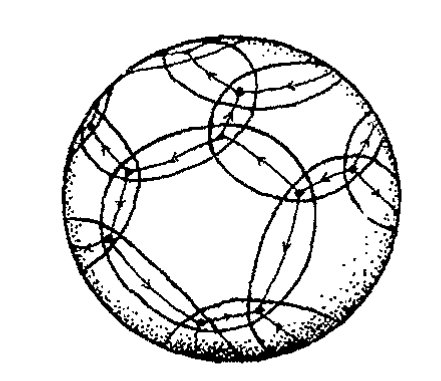

图 33.19 （黎曼球面上的）"分支周线"，它可用于扭量函数的时空求值，其中覆盖由两个以上集合组成。

上同调的一个重要特点是它本质上是非局域的。我们可以有一个定义在某个区域 $\mathcal{Q}$ 上的上同调元素。然后通过将该元素限定在 $\mathcal{Q}$ 中更小的某个区域 $\mathcal{Q}'$ 来发掘其意义。上同调的非局域特征在如下事实中揭示得很明白：对 $\mathcal{Q}$ 中足够小的（开）子区域 $\mathcal{Q}'$，当对元素的限定缩小到 $\mathcal{Q}'$ 时该元素必需为零，也就是说，给定 $\mathcal{Q}'$ 上的 $f_{ij}$，那么在 $\mathcal{Q}'$ 内总能找到一系列 $h$，使 $f_{ij} = h_i - h_j$。

对于扭量函数，这种非局域性告诉我们，在具体某一点上给 $f_{ij}$ 赋值毫无意义。我们能够在围绕这一点的一个足够小的开区域上发现上同调元素完全消失了，见[图 33.20](assets/page726_fig01.jpg)。扭量函数（作为一阶上同调元素）所展示的这种非局域性使我们很快想到 EPR 效应和量子纠缠（[§23.10](chapter_23.md#2310-量子纠缠)）的非局

·706·

<!-- page 726 -->

域特征。在我看来，这种图景的背后一定隐藏着某种重要的东西，未来总有一天我们会看清 EPR 现象中的这种神秘的非局域性质，但现在还不是时候。

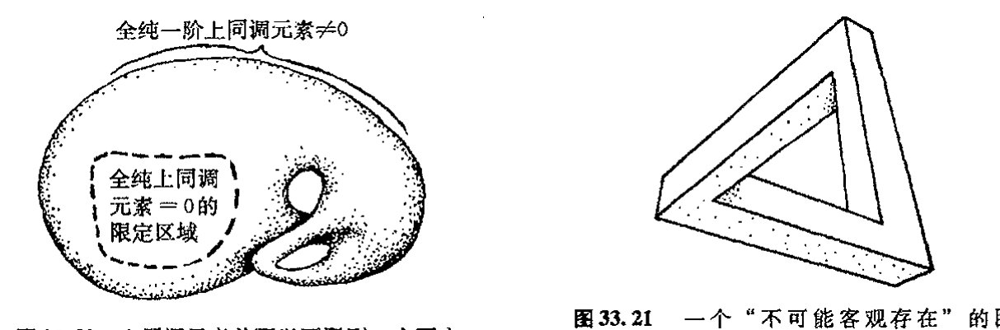

**图 33.20** 上同调元素总可以下限到一个更小的区域。但如果这个区域足够小，则上同调总为零。这个图展示了上同调的非局域性质。

**图 33.21** 一个“不可能客观存在”的图形（“三柱体”）。从局部来看，这个图形所表示的各个部分都是可能的。其“不可能性”需通过上同调元素来量度，而这种量度对图中任一足够小区域都为零。

我们将这种“上同调元素”看成是定义在空间 $\mathcal{Q}$ 上的“东西”，它有点像定义在 $\mathcal{Q}$ 上的函数，但本质是是非局域的。这种“东西”的一个实例是 [§15.2](chapter_15.md#152-丛的数学思想), 5 的 $\mathcal{Q}$ 上的完全（复）矢流形。由流形的定义可知，从仅作为拓扑积（参看 [§15.2](chapter_15.md#152-丛的数学思想)，[图 15.3](assets/page660_fig01.jpg)）的意义上说，流形处于足够小底空间区域（即这里的 $\mathcal{Q}$）上方的那部分是“平凡的”。这个例子说明，如果我们将一阶上同调元素限定到一个足够小区域，它也将是“平凡的”，即它为零。因此，上同调元素传递出的“信息”具有根本的非局域性质。

我们不妨从一个入门性质的例子来看看什么是上同调概念，尽管例子中的这个图形很简单，见图 33.21。这是一个“不可能客观存在的”图形，有时被称为“三柱体”。³⁶很显然，这个“三维客体”不可能在普通的欧几里得空间中存在。但从局部看这个图形不是不可能的。其不可能性在于一种非局域性，如果我们从足够小区域上来考虑，这种不可能性就消失了。实际上，图中展示的这种“不可能性”概念可以用一个具体的上同调元素来表示。³⁷,⁽³³·²⁶⁾这是一个相当简单的上同调类型，其中函数 $\{f_{ij}\}$ 皆取常数。

这里我只能介绍些层上同调的基本概念。这些概念在数学里有着许多应用，而且不限于全纯性一种。扭量理论所关心的“层（sheaf）”是那些由全纯函数表示的层，在这个特定范围内，上同调理论有一种特别的神奇性质。（简单说，所谓“层”是指我们所关心的函数类型，但层的概念实际上要比普通函数有着更广的应用。³⁸）上同调还有许多其他种应用，例如包括弦论的卡拉比－丘空间研究中的某些重要应用（[§31.14](chapter_31.md#3114-神奇的卡拉比丘空间m-理论)）。同样，定义层上同调元素也有好几种非常不同的方法，数学上我们可以证明所有这些定义都是等价的，尽管它们的表现形式各不相同。³⁹我

---

⁽³³·²⁶⁾ 看看你能否做到这一点：把图破成一系列重叠的小图 $(\mathcal{U}_i)$，每个小图独自表示一个相容的三维空间结构，然后用观察者视角得到的该三维结构的距离对数来计算 $\{f_{ij}\}$。

· 707 ·

<!-- page 727 -->

通向实在之路

认为（层）上同调是柏拉图理念（[§1.3](chapter_01.md#13-柏拉图的数学世界真实吗)）的一个绝好的例子，像复数系 $\mathbb{C}$ 本身一样，它似乎有“自己的寿命周期”，其长度远远超出我们用来预期的任何具体方式所给出的结果。

993

## 33.10 扭量与正/负频率剖分

我们如何将正频率条件这一量子物论的基础结合进扭量理论里呢？从 [§9.5](chapter_09.md#95-傅里叶变换的频率剖分) 我们知道，将黎曼球面 $S^2$ 分成南、北两半球面 $S^-$ 和 $S^+$ 的方法可以用来将定义在赤道面 $S^1$ 上的函数分成正、负两个频率部分。正频率部分扩展到 $S^-$，负频率部分扩展到 $S^+$（[图 33.22](assets/page727_fig01.jpg)(a)）。射影扭量空间也可以这么做，只是以总体的方式直接应用到整个无质量场上。这是通过直接将黎曼球面和射影扭量空间 $\mathbb{PT}$ 进行类比来实现的，其中 $\mathbb{PT}$ 上的一阶上同调元素相当于黎曼曲面上的函数，空间 $\mathbb{PN}$ 则相当于赤道面 $S^1$。我们说 $\mathbb{PN}$ 将 $\mathbb{PT}$（它是 $\mathbb{CP}^3$ 的）分成两个半空间 $\mathbb{PT}^-$ 和 $\mathbb{PT}^+$，就像 $S^1$ 将 $S^2$（它是 $\mathbb{CP}^1$ 的）分成两个半球面 $S^-$ 和 $S^+$ 一样（[图 33.22](assets/page727_fig01.jpg)(b)）。^40^

**图 33.22** 黎曼球面 $S^2$（$=\mathbb{CP}^1$）与射影扭量空间 $\mathbb{PT}$（$=\mathbb{CP}^3$）之间的类比。(a) 定义在 $S^2$ 的实轴 $\mathbb{R}$ 上的复函数（即“0”阶上同调元素”）分成正、负频率两部分，正频率部分全纯扩展到图中北半球 $S^-$，负频率部分扩展到南半球 $S^+$。（这里画出黎曼球面是为了看清 $\mathbb{R}$ 即其赤道，但 $-i$ 点在北极而 $i$ 在南极，试与图 8.7 和 [§9.5](chapter_09.md#95-傅里叶变换的频率剖分) 的图 9.10 进行比较）。(b) 定义在 $\mathbb{PN}$ 上的一阶上同调元素（表示无质量场）分成正、负频率两部分，正频率部分全纯扩展到射影扭量空间的上半部分 $\mathbb{PT}^+$，负频率部分扩展到下半部分 $\mathbb{PT}^-$。

说得更明确点，与分别定义在 $S^1$、$S^-$ 和 $S^+$ 上的普通（复）函数对应的分别是 $\mathbb{PN}$、$\mathbb{PT}^+$ 和 $\mathbb{PT}^-$ 上的一阶上同调元素。$\mathbb{M}$（严格来说应是 $\mathbb{M}^\#$）上的无质量场由 $\mathbb{PN}$ 上的一阶上同调元素表示。每个场可以（基本上唯一地）表示成扩展到 $\mathbb{PT}^+$ 的元素与扩展到 $\mathbb{PT}^-$ 的元素之和。前者描

994

述正频率无质量场，后者描述负频率无质量场。^41^ 用时空语言来说，场的这种正频率部分延伸到定义在向前管道上，从 [§33.8](#338-无质量场的扭量描述) 可知，这个向前管道是 $\mathbb{CM}^\#$ 的 $\mathbb{M}^+$，它由扭量空间里 $\mathbb{PT}^+$ 的射影线所表示的点组成。在 $\mathbb{CM}^+$ 内，这些（复数）点的位置矢量有类时且指向过去的虚部。^**[33.27]^

$\mathbb{PT}$ 与黎曼球面之间的这种类比导致这样一种可能，即扭量理论里可以找到与弦论中对等的

---

^**[33.27]^ 由关联方程出发证明：$\mathbb{CM}$ 的点 $R$ 上的复位置矢量 $r^a$ 可由 $\mathbb{PT}^+$ 内投影线表示，当且仅当 $r^a$ 的虚部是过去指向且类时的。

??? question "答案 [33.27]"
    设复点 $r^a=x^a+iy^a$。关联线由 $Z^\alpha=(ir^{AA'}\pi_{A'},\pi_{A'})$ 给出。该线落在 $\mathbb{PT}^+$ 的条件是相应扭量模对所有非零 $\pi$ 为正。

    计算模时，实部 $x^a$ 的贡献相互抵消，剩下的是由 $y^a\pi_A\bar\pi_{A'}$ 给出的二次型。它对所有未来指向类光动量为正，等价于 $y^a$ 为过去指向类时向量。因此复位置矢量的虚部过去指向且类时，当且仅当对应射影线完全位于 $\mathbb{PT}^+$ 中。

· 708 ·

<!-- page 728 -->

一些概念。由 [§31.5](chapter_31.md#315-原初的强子弦论), 13 可知，在弦论中，黎曼曲面被用来表示"弦的历史"。黎曼球面（$\mathbb{CP}^1$）就是最简单的这样一种曲面，而具有不同"环柄"数的曲面（高亏格黎曼曲面——见 [§8.4](chapter_08.md#84-紧黎曼曲面的亏格)）则被用来表示更一般的弦的历史。这些黎曼曲面除了环柄之外还可以有"洞"（具有 $\mathrm{S}^1$ 边界，见[图 31.5](assets/page651_fig02.jpg)）。通过类比，$^{42}$我们可以来考虑将空间 $\mathbb{PT}$ 推广到同样有"环柄"和"洞"的形式（其边界仍是 $\mathbb{PN}$）。这些推广了的空间即所谓"麻花状扭量空间"，我们可以基于这些空间概念发展出一套量子场论理论（[图 33.23](assets/page728_fig01.jpg)）。但目前这些概念的地位还没有得到广泛认可。

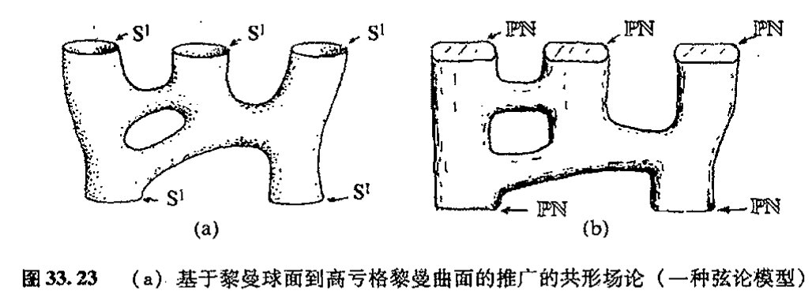

历史地看，1963 年，即发现无质量场具有如全纯一阶层上同调的扭量描述之前 12 年，正频率要求——及其用 $\mathbb{PN}$ 将 $\mathbb{PT}$ 分成两个半空间的性质——是扭量理论最初的形式体系的关键动机。$^{43}$值得注意的是，这里我们同样有源于带洛伦兹符号差的四维时空的性质。同样独特的是，正是一阶层上同调元素，而非普通函数——即"零阶"上同调元素——或二阶乃至高阶上同调元素，在扭量理论中扮演着重要角色。高阶的上同调概念也是存在的（而且也在扭量理论中起着一定作用），但惟有一阶上同调在扭量理论中起着基础性作用。由于只有这些量在扭量空间的变形方面起着直接作用，故下面让我们把注意力集中到这个问题上来。

## 33.11 非线性引力子

我们目前一直在讨论的这种上同调元素（扭量函数）应当被认为是完全"被动的"，就是说它们是被直接"油漆"到（扭量）空间上的。这相当于它们描述的只是处于时空上的时空场，不会影响到其他场。为了看清它们是如何施加这种积极影响的，让我们来考虑涂在扭量空间上的"油漆"已经"固化"，从而空间已变形的情形（[图 33.24](assets/page729_fig01.jpg)）。要明白这事怎么才可能发生，我们将此前"被动的"扭量函数 $f_{ij}$ 看成是以适当方式附属于矢量场 $\mathbf{F}_{ij}$ 的。通过拼块之间沿矢量场方向"彼此平移"一个无穷小量，我们来"使油漆固化"并形成一个无穷小"弯曲的"扭量

· 709 ·

<!-- page 729 -->

通向实在之路

空间。可以想象，这种变形是“指数化的”（[§14.6](chapter_14.md#146-李导数)），直到得到一个扭量空间的确定形变（油漆完全干透）为止。

首先被成功实施这一处理的情形是反自对偶引力子。⁴⁴在无穷小（弱场）情形下，我们有螺旋量 S = −2 的无质量场，因此用前述的齐次阶公式 −2S − 2，我们有齐次阶 2 的扭量函数 f(fᵢⱼ)。出于简单计，这里我们假定只考虑两个拼块 𝓤₁ 和 𝓤₂ 的情形，每个都看作是 [§33.5](#335-基本扭量几何及其坐标) 的标准坐标下平直扭量空间 𝕋 的一部分。由 f 组成的所需的矢量场 **F** 为

$$\mathbf{F} = \frac{\partial f}{\partial \omega^0} \frac{\partial}{\partial \omega^1} - \frac{\partial f}{\partial \omega^1} \frac{\partial}{\partial \omega^0}。$$

注意，f 的齐次度 2 由两个微分算符来严格补偿，由此给出一个齐次度为 0 的算符，它作用在射影扭量空间上。⁽⁎⁾[33.28]

现在，想象将这一个拼块相对于另一个拼块的无穷小位移指数化（见[图 33.25](assets/page729_fig02.jpg)）。由此我们得到弯曲的扭量空间（部分）𝒯。无穷小拼块间关系缺少 π 导数意味着一个拼块上的扭量必须与与之配合的另一个拼块上的扭量具有相同的 π 部分。于是有，从整个拼合空间“向外投影”到 π 旋量的运算必须在整个 𝒯 上是相容的。也就是说，存在一种 𝒯 到 π 旋量空间的总体投影。我们不妨在此忽略（更可取的是移去）𝒯 和 π 空间中的“零元素”，由此我们发现，𝒯 是 π 空间上的纤维丛（见 [§15.2](chapter_15.md#152-丛的数学思想)）。⁴⁵可以证明，每根纤维（特定 π 的倒像，即处于 π“之上”的 𝒯 的部分）都是一个具有辛结构的复二维流形，π 空间本身也是如此（见 [§14.8](chapter_14.md#148-辛流形)——这里它只是意味着在二维流形上定义了一种面积量度），这个事实由上述拼合过程的具体形式来保证。

我们怎么才能从这个弯曲的扭量空间回到某种“时空”概念上来呢？答案是每个“时空点”唯一地对应于丛 𝒯 的一个全纯截面。（全纯截面的概念见 [§15.5](chapter_15.md#155-复矢量丛余切丛)，这里它指一种从 π 空间返回到 𝒯 的映射。）为什么这是一种合理的认定呢？这是因为，在平直情形 𝕋 中，它可以解释为通过 π

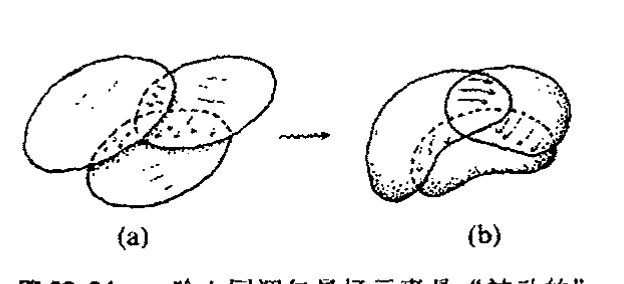

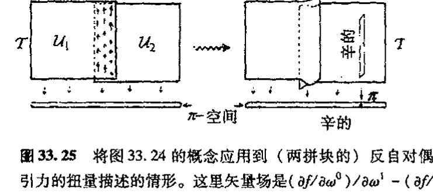

⁽⁎⁾[33.28] 为什么齐次度为 0 意味着它给出 ℙ𝕋 内某个区域上的矢量场？提示：**F** 与 **Ψ** 的对易子是什么？

??? question "答案 [33.28]"
    射影扭量空间把沿欧拉矢量场 $\Psi=Z^\alpha\partial/\partial Z^\alpha$ 的尺度方向商掉。一个对象要下降到射影空间，必须不依赖代表扭量的整体尺度。

    若矢量场 $F$ 齐次度为 0，则 $[\Psi,F]=0$，即它与尺度流相容。因此 $F$ 把同一复线上的等价代表送到同一等价类的切方向，正好定义了 $\mathbb{PT}$ 上的矢量场。

·710·

<!-- page 730 -->

到 $Z=(i\pi\pi,\pi)$ 的映射而表示的（可能是复的）时空点 $R$。从射影扭量空间 $\mathbb{P}\mathcal{T}$ 方面来说，这个截面其实就是我们在 [§33.5](#335-基本扭量几何及其坐标) 中用来表示 $R$ 的 $PT$ 中的直线（黎曼球面，$\mathbb{CP}^1$）。**[33.29]** 更惊人的是“时空点”的这种认定在弯曲扭量空间 $\mathcal{T}$ 中依然有效。我们发现**⁴⁶**，就像在平直情形中一样，存在四维复参数的全纯截面族。（在射影空间 $\mathbb{P}\mathcal{T}$ 中，这是一族四维复参数的线 $\mathbb{CP}^1$。）因此我们有四维复流形 $\mathbb{M}$ 来表示这族截面。四维性质是一个突出的事实——高复数维的复数奇幻性的一个例子——这一点可以从日本数学家小平邦彦（Kunihiko Kodaira）的定理中得到理解。**⁴⁷**（只有实流形经验的人可能会期望存在这样的无穷大参数族。但我们在 [§15.5](chapter_15.md#155-复矢量丛余切丛) 已经指出，全纯截面可以是非常有限的。）

图 33.26 用图像示意了（射影描述下的）这一过程。它由复闵可夫斯基空间 $\mathbb{CM}$ 的某个适当区域 $\mathcal{R}$ 开始，为简单计，我们取 $\mathcal{R}$ 为 $\mathbb{CM}$ 内一点 $R$ 的某个适当的（开）邻域。射影空间 $\mathbb{PT}$ 的相应区域 $\mathcal{Q}$ 为线族扫过的区域，每根线代表 $\mathcal{R}$ 的一个点。这个区域将是 $\mathbb{PT}$ 内表示 $\mathcal{R}$ 的线 $\mathbf{R}$ 的一个邻域（叫做管状邻域，见图 33.26a）。我们可认为 $\mathcal{Q}$ 的拓扑是 $S^2 \times \mathbb{R}^2$ 的，这里 $S^2$ 取自线 $\mathbf{R}$ 的——或等价地，射影 $\pi$ 空间的——拓扑，$\mathbb{R}^4$ 描述 $\mathbf{R}$ 的每个点的紧邻域的横截部分。现在我们将 $S^2$（射影 $\pi$ 空间）看成是分成了两个半球面，且稍许有点儿扩张从而存在重叠的“区域”，然后我们将 $\mathcal{Q}$ 看成是由两个分别位于扩张了的半球面上的重合部分（开集）$\mathcal{U}_1$ 和 $\mathcal{U}_2$ 组成的（图 33.26b）。现在我们让 $\mathcal{U}_1$ 按上述矢量场相对于 $\mathcal{U}_2$ “分流”，以得到变形了的射影扭量空间 $\mathbb{P}\mathcal{T}$（图 33.26c）。

还有一种到 $\pi$ 空间的总体投影（[图 33.26](assets/page731_fig01.jpg)(d)），它给出丛结构。不过由于 $\mathcal{U}_1$ 和 $\mathcal{U}_2$ 内原初的“直线”被断开，因此无法给出截面。但小平邦彦定理告诉我们，$\mathbb{P}\mathcal{T}$ 内存在新的四参数全纯曲线族，它们是丛结构的实际全纯截面族。由此可得所需的空间 $\mathcal{M}$，并且它的每个点对应于每 998 个这种截面（[图 33.26](assets/page731_fig01.jpg)(e)）。可以证明，我们可以按自然的方式为 $\mathcal{M}$ 赋一个度规 $\boldsymbol{g}$，并且其外尔曲率是反自对偶的，这种度规是里奇平直的。我们很容易通过下述事实找出 $\boldsymbol{g}$（共形结构）的光锥：$\mathcal{M}$ 的两点 $P$ 和 $R$ 是类光分离的，当且仅当 $\mathbb{P}\mathcal{T}$ 中相应直线 $\mathbf{P}$ 和 $\mathbf{Q}$ 相交（[图 33.26](assets/page731_fig01.jpg)）。

读者可能会对这种“时空”$\mathcal{M}$ 的实际物理意义感到担心，因为它被证明是复的（因此当 999 我们将其看成是实流形时它是 8 维而不是 4 维的）。在平直情形下，我们可以通过取 $\mathbb{N}$ 中 $\mathbb{T}$ 的截面来挑选出一个实的时空点（$\mathbb{M}$ 中的事件），然后将 $\mathcal{M}$ 的直接看成是闵可夫斯基空间 $\mathbb{M}$ 的复化 $\mathbb{CM}$。但在弯曲情形下，我们没这么幸运。这时我们按此构造得到的“时空”其本身必然就是复流形，而不是由洛伦兹实时空复化产生的。

为什么这么说呢？这是因为，具有反自对偶外尔曲率的洛伦兹四维流形必然是外尔平直的（因为零自对偶的复共轭是反自对偶部分，因此这部分还是零）。如果它是里奇平直的，那么它原本就是平直的。但另一方面，在复数情形下，**⁴⁸**存在非常多的非平凡反自对偶里奇平直四维流

---
**[33.29]** 解释：什么叫这条线是 $\mathbb{PT}-\mathbb{I}$ 的一个“截面”？

??? question "答案 [33.29]"
    这里有一个从相关扭量区域到射影 $\pi$ 空间的投影。所谓“截面”，就是给 $\pi$ 空间中的每个点选取总空间中位于其纤维上的一个点，并且这种选择随 $\pi$ 全纯变化。

    在平直情形中，固定时空点 $R$ 后，公式 $Z=(iR\pi,\pi)$ 对每个射影自旋量 $\pi$ 选出一个射影扭量点；这些点组成一条 $\mathbb{CP}^1$。因此这条线与每条投影纤维相交一次，正是 $\mathbb{PT}-\mathbb I$ 到 $\pi$ 空间投影的一个截面。

<!-- page 731 -->

通向实在之路

---

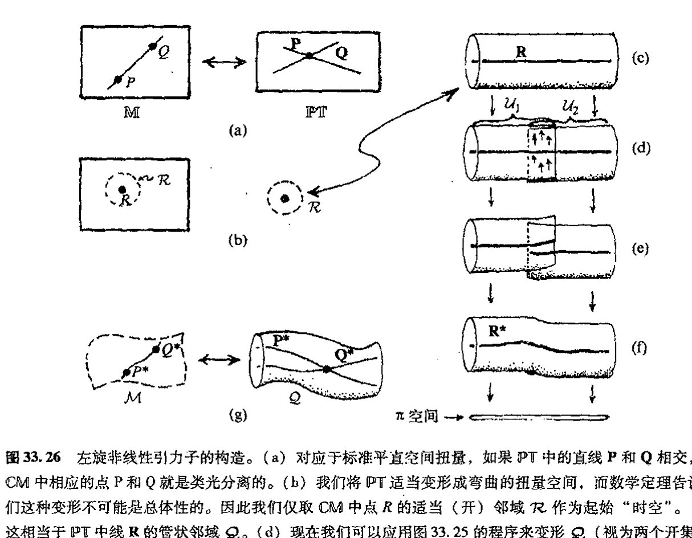

**图 33.26** 左旋非线性引力子的构造。(a) 对应于标准平直空间扭量，如果 $\mathbb{PT}$ 中的直线 $\mathbf{P}$ 和 $\mathbf{Q}$ 相交，则 $\mathbb{CM}$ 中相应的点 $\mathrm{P}$ 和 $\mathrm{Q}$ 就是类光分离的。(b) 我们将 $\mathbb{PT}$ 适当变形成弯曲的扭量空间，而数学定理告诉我们这种变形不可能是总体性的。因此我们仅取 $\mathbb{CM}$ 中点 $R$ 的适当（开）邻域 $\mathcal{R}$ 作为起始"时空"。(c) 这相当于 $\mathbb{PT}$ 中线 $\mathbf{R}$ 的管状邻域 $\mathcal{Q}$。(d) 现在我们可以应用图 33.25 的程序来变形 $\mathcal{Q}$（视为两个开集 $\mathcal{U}_1$ 和 $\mathcal{U}_2$ 的联合体）。(e) 但是我们发现，原始线 $\mathbf{R}$ 现在被断开了，不能用作"时空点"的合理定义。(f) 小平邦彦定理使我们摆脱了困境：存在一个四参数的"线" $\mathbf{R}^*$ 族（紧致全纯曲线，与原始的直线属同一拓扑类），可以用来达到这一目的。(g) 我们寻求的"非线性引力子"空间 $\mathcal{M}$（复四维空间）的点由小平邦彦曲线 $\mathbf{R}^*$ 给出。$\mathcal{M}$ 的（复共形）度规（如情形 (a) 一样）由如下条件定义：$\mathrm{P}^*$ 和 $\mathrm{Q}^*$ 是类分离的，只要相应的直线 $\mathbf{P}^*$ 和 $\mathbf{Q}^*$ 相交。可以证明，$\mathcal{M}$ 的外尔曲率自动就是反自对偶的，而且由于构造细节它还是里奇平直的。

形。它们全都能通过扭量处理来（至少是局域地）得到！

我们如何处理这种复空间 $\mathcal{M}$ 呢？物理上说，对于复反自对偶里奇平直的四维复空间（如果在某种适当意义上它可以认作是"正频率"的话），我们可以将其解释为一个左旋的引力子。事实上，就其作为"波函数"而言，这是个非线性引力子，但现在它是实际的爱因斯坦非线性真空方程（里奇平直性）的解，而不是其线性近似解。后者的可能情形是我们恰好将扭量函数 $f$ 取为上同调元素，而不是容许"固化"变形的扭量空间本身。我们看到，在协调量子理论概念与时空结构方面，扭量理论为我们指出了一个奇妙的、以前未曾预料到的方向。我们的扭量波函数现在是非线性的项，由此将开始出现偏离标准的线性量子力学法则（§§ 22.2–4）的趋向。

这种结构有一种特别值得称道的特性。如果我们取弯曲扭量空间 $\mathcal{T}$ 的任意一点 $\mathbf{Z}$，我们发现，$\mathbf{Z}$ 的足够小邻域有一种结构，它等同于平直扭量空间 $\mathbb{T}$ 的任意取定点 $\mathbf{Z}'$ 的某个邻域的结构（这里 $\mathcal{T}$ 不处于"无穷远"区域 $\mathbf{I}$——见 [§33.5](#335-基本扭量几何及其坐标)）。相应地，扭量空间拥有的局域结构是"松弛的"，这个词的意义见 [§14.8](chapter_14.md#148-辛流形)。因此，关于空间 $\mathcal{M}$ 的曲率等等的所有信息都整个地而非局部地

· 712 ·

<!-- page 732 -->

存贮在 $\mathcal{T}$ 中。这是对上述事实——当限定在足够小区域上时，由扭量函数定义的上同调元素完全消失——的一种反映。扭量空间中不存在“场方程”。通常存储于时空场方程（在此情形下为反自对偶的爱因斯坦方程）解中的信息似乎只能是非局域地存储于扭量空间结构中。⁴⁹

## 33.12　扭量与广义相对论

自20世纪70年代中期以来，这个“非线性引力子构造”一直是扭量理论发展的中心目标。起初，这方面研究是沿两个不同的方向推进的。其中最明显的进展当属右旋非线性引力子的构造，以及它与左旋引力子复合形成的混合偏振态（如平面偏振的非线性引力子）。这似乎可看作是扭量理论的一个关键。如上所述，对于像第30章里强烈提倡的理论来说，“非线性引力子”的概念的研究非常重要，在那里，普通 $\mathbf{U}$ 量子理论的标准线性法则需要修改以便能与爱因斯坦广义相对论正确结合。然而，上述构造产生的“引力子”只是“半个引力子”，因此只有两种可能的螺旋态之一能够被结合。

一些机敏的读者或许会建议，如果我们用对偶扭量 $W_\alpha$ 而不是扭量 $Z^\alpha$ 来描述，那么利用对偶扭量重复前述的构造，就有可能得到右旋引力子的非线性波函数。⁽³³·³⁰⁾ 由此我们有右旋引力子对应于齐次阶2（对 $W_\alpha$），左旋引力子对应于齐次阶 $-6$。但这并不能使我们解困，因为这样我们将失去左旋螺旋态——这使得用 $W_\alpha$ 变量描述右旋螺旋态、用 $Z^\alpha$ 描述左旋螺旋态的方法变得毫无意义，更直接的原因是我们还需要描述混合螺旋态。⁵⁰

如何“指数化” $-6$ 齐次阶扭量函数 $f(Z^\alpha)$ 来得到右旋非线性引力子的问题一直属于（引力方面的）变线球问题。（单词“googly变线球”是板球中的一个术语，指沿前进方向右旋的球，虽然它在投出去时看起来像是左旋的。）为了找出合理的答案差不多已经搭上了25年的时间，好在最近的进展似乎让人看到了适当的解决方案。⁵¹ 但在本书成书之时，这种处理在某些重要方面仍是假设性的。这里我不对此作过多描述了，只是指出一点，其真正的新意在于弯曲扭量空间 $\mathcal{T}$ 到射影空间 $\mathbb{P}\mathcal{T}$ 的投影的纤维通过由齐次阶 $-6$ 的扭量函数所定义的方式被“扭曲”。（这种“扭曲”是通过在一对重叠拼块上对不牢靠的单形式 $Cf_{-6}Z^\alpha \partial/\partial Z^\alpha$ 的矢量场进行指数化来实现的，这里 $C$ 是适当常数，$f_{-6}$ 是齐次阶 $-6$ 的扭量函数。）它使得引力子的左旋和右旋部分可以结合到一块儿。

至少在适当渐近平直时空 $\mathcal{M}$ 的情形下，我们可以通过 $\mathcal{M}$ 得到非常明确的 $\mathcal{T}$ 结构。不仅如此，还有一种尝试性建议认为从给定 $\mathcal{T}$ 可以得到 $\mathcal{M}$，即对于从 $\mathcal{T}$ 的纯扭量结构得到的那些时空点，该假设能确保所需的里奇平直性（爱因斯坦真空方程）被正确地结合进来。这项建议

⁽³³·³⁰⁾ 为什么？提示：为什么空间反射将扭量变换成对偶扭量？

· 713 ·

<!-- page 733 -->

通向实在之路

密切关系到纽曼（Ezra T. Newman）及其同事长期从事的一项研究项目，其目标是根据所谓"光锥切口"概念来解释时空点，这些切口是 $\mathcal{M}$ 内光锥与未来类光无穷远 $\mathscr{I}^+$ 的截面。${}^{52}$然而，尽管看起来很有前途，但这种扭量结构的一些重要方面的问题目前仍未得到解决。${}^{53}$

声称在原初（1975/6 年间的）左旋非线性引力子构造方面取得进展的另一个方面是引力理论向其他规范场的推广。早在 1976 到 1977 年间，沃德（Richard Ward）就证明了如何用类似于引力结构的扭量结构来得到一般的反自对偶规范场。事实上，沃德的这一构造已经引起了数学界相当大的兴趣，并为沃德和其他人所发展，特别是在可积系统（一定意义上在一般情形下可解的非线性方程）领域。这里扭量理论从总体上为此提供了一种有力的观点。${}^{54}$上述这些在完全解决引力混合螺旋量问题方面的进展似乎表明，一般性的（混合螺旋量）规范场问题也可以在扭量理论的框架下来处理。

## 33.13 面向粒子物理的扭量理论

这里向我们提出了一个问题：如何将扭量理论发展成一种成熟的物理理论——尽管当前还不行。要做到这一点，扭量理论中另外两方面就必须得到进一步发展。首先是要给出对量子场论的综合处理。实际上，这方面的研究相当多，主要为牛津大学的霍奇（Andrew Hodges）及其学生所推动（最初由我和其他人于 1970 年代早期所发起），它采用微扰方法来处理量子场论，其中的费恩曼图被扭量图所替代。这些处理中包含了高维周线积分，并且在避免传统的费恩曼处理中经常遇到的各种无穷大方面取得了明显进展。${}^{55}$但这种处理的复杂程度仍超乎我们所愿，并且缺乏独立的如 [§26.6](chapter_26.md#266-相互作用拉格朗日量和路径积分)~8 那样的基本指导原则，这种原则可以指导我们如何准确掌握周线积分，并且不必求助于传统的费恩曼表达式作为过渡。

另一方面是扭量粒子理论，它主要由佩尔热（Zoltan Perjés）、斯帕林（George Sparling）、休斯顿（Lane Hughston）、托德（Paul Tod）和周尚真（Tsou Sheung Tsun）等人于 20 世纪 70 年代中期到 80 年代早期对我所引入的概念进行发展而来，但自那段时期之后这方面基本上处于停滞状态。这方面的基本概念是，与无质量粒子仅需用单扭量变量的扭量波函数（譬如说 $f(Z^\alpha)$）来描述不同，有质量粒子要求有更多的变量，例如 $X^\alpha$，…，$Z^\alpha$。有质量粒子不仅存在包括所有这些扭量的单独贡献的求和的动量和角动量表达式，而且存在由这些扭量变量与其复共轭之间变换产生的内部对称群，它对总动量和总角动量无影响。值得指出的还有，我们得到一些有所推广的群，它们包括了电弱相互作用的 U(2) 和强相互作用的 SU(3)。与标准模型的粒子标准分类有关的一系列关系也值得一提，但由于某些技术原因，其架构迟迟未能建立。有望做到这一点的是最近在"变线球"问题上的进展——特别是如果它能应用到规范场的话——它有可能再次打开该领域紧闭之门。

我认为，还存在一种重要的可能性，这就是 [§25.8](chapter_25.md#258-超越标准模型) 里描述的粒子物理模型的陈（匡武）－

·714·

<!-- page 734 -->

---

周（尚真）建议可能与这些进展存在重要联系。这个建议要求除了原始的规范群之外，每个（非阿贝尔）粒子的对称群都存在对偶群。扭量理论的建议是，按照上述沃德的结构——加上猜测性的“变线球”版本——每个群应有反自对偶和自对偶两种，这似乎表明，除了要求原始规范群的作用之外，还要求规范群的对偶形式也应起着重要作用。因此，通过陈–周理论概念的作用，扭量粒子方案也许能够在未来粒子物理中占有一席之地。不仅如此，我们还可以预期，这个领域的成功进展同样会对扭量理论的量子场论方案起着重要影响。

## 33.14　扭量理论的未来

在对上述扭量理论的描述中，我没有告诉读者，我自己的这些观点并不反映大多数物理学家的看法。事实上，由于我（断断续续地）花了大半生在扭量理论上，因此我的观点不可能与大多数未涉此领域的物理学家的观点紧密一致。我还要申明一点，深入了解这个领域的物理学家群体非常之小，如果与了解弦论或超弦理论的群体比起来，那更是微不足道。在今天，扭量理论不可能成为理论物理学的“主流”。

然而像弦论一样，扭量理论也曾对纯数学产生过重要影响，而且这一点一直被认为是它最有力的地方。扭量理论曾对（前述的）可积系统理论、表示理论^56^和微分几何等领域产生过重要影响。（在最后这方面，我只消举出默科洛夫（Sergei A. Merkulov）和施瓦霍夫（L. J. Schwachhöfer）的工作，他们能够用从事原始非线性引力结构研究的科学家所发展的方法来找出所谓“完整问题（holonomy problem）”的解。^57^在相关工作中，扭量理论在所谓“超凯勒流形”、“佐尔空间（Zoll space）”等结构方面发挥着重要作用。^58^）扭量理论一直受到数学完美性和数学兴趣方面的导引，它从数学结构的严格性和富于成果的性质上获益良多。

那些在第31章臧否分明的读者可能会倾向于认为，弦论的薄弱之处正在于它主要是受到数学上的推动，而很少是出于探索物理世界性质的动机。从某些方面看，这种批评对扭量理论也是合适的。的确不存在来自现代观察数据方面的过硬的理由将我们凝聚在这样一种信仰之下：扭量理论提供了一条现代物理学必须遵从的道路。许多人甚至感到，这种理论强烈的手征性质使得它在空间不对称性方面走得太远了。毕竟没有物理上的证据说明左右不对称性在引力物理里起着重要作用。在第27、28和30章，我已经强调了在适当的量子–引力统一体中时间不对称性的必要性，但空间不对称性仍缺乏物理上的明显需要（那种间接的通过量子场论的CPT定理给出的除外，见[§25.4](chapter_25.md#254-正反共轭宇称和时间反演)和[§30.2](chapter_30.md#302-来自宇宙学时间不对称的线索)）。

当然，也存在这样的情形：理论上的空间不对称性不一定就简单反映为物理效应上的不对称性。这种解释的一个例子就是存在这样的事实：对$(Z^\alpha, -\hbar\partial/\partial Z^\alpha)$和对$(\hbar\partial/\partial\bar{Z}_\alpha, \bar{Z}_\alpha)$产生的代数形式上是等价的。这意味着，不论用扭量描述（$Z^\alpha$是变量）得到什么样的结果，它们都与对

---

<!-- page 735 -->

通向实在之路

偶扭量描述（变量是 $W_\alpha = \bar{Z}^\alpha$）得到的结果相等。这种相似性是如此完备以至在结果性理论中不会出现引力的左右不对称性。另一方面，如果理论具有镜像性质，那么当理论用来描述弱作用（[§25.3](chapter_25.md#253-电弱相互作用反射不对称性)）时，我们就要求它具有左右不对称性。照扭量理论看，在目前这种相对初始的阶段，这种差别的原因还不清楚。

目前够得上扭量理论的主要批评是认为它实际上不是一种物理理论。它给不出任何物理上清楚的预言。我自己的（过于）乐观的看法是将扭量理论看成是一种类似于经典物理中哈密顿体系的理论。哈密顿理论不引入物理变化，只提供关于经典物理的不同视角，按照21–23章里的薛定谔描述，新量子力学是需要这样一种理论的。同样，扭量理论只是一种无需引入物理变化的理论重构。乐观的期望是这种框架也能够提供未来物理学发展的某种重要的桥梁作用。

当然，对怀疑论者来说，他没有义务要相信这种发展会发生，况且最初扭量理论也确实如同弦论（或M理论）那样是受到美学或数学的激励。但正像它们所表明的那样，这两种理论在数学上是不相容的，因为它们运行于不同的时空维数下。人们或许会说（或许过于严厉了）只有扭量理论认为弦论的未来是没出路的——或者反过来，也只有弦论认为扭量理论的那些东西是错的！这种不相容性没有延伸到弦论（或M理论）的变量或再解释上，就是说，额外维并没有被当作时空维，而只是某种“内部”维。虽然这种新的解释似乎能给出相容的观点，但正如通常所共识的那样，它与弦论背后的驱动力是相抵触的。

与此相关的，我要提醒读者某些最近的工作，即[§31.18](chapter_31.md#3118-弦论的物理学地位)中提及的主要是威腾的工作。⁵⁹这项工作对用新观点来看待杨–米尔斯散射幅度提出了一种极具魅力的可能性。它将弦论思想与出自弦论的其他思想组合起来——而且现在是在四维环境下！

不管怎么说，扭量理论确实需要有新的思想结合进来。在其他成功的物理理论中，最重要的内容一直是拉格朗日量和费恩曼路径积分，它们提供了处理场方程的适当的量子场论方法（见[§26.6](chapter_26.md#266-相互作用拉格朗日量和路径积分)）。但扭量理论则使场方程烟消云散（[§33.8](#338-无质量场的扭量描述), 11），因此我们需要一些新的概念来推动完全扭量量子场论的发展。⁶⁰

扭量理论能够做出明确的“预言”吗？我认为最接近预言的是：这个理论的基本动机似乎意味着宇宙应当具有负空间曲率，即 $K<0$。为了看清个中原因，我们先回顾一下第27和28章（特别是[§27.13](chapter_27.md#2713-异乎寻常的特殊大爆炸)），其中大爆炸似乎具有超常的均匀性质，并且非常接近于某种FLRW模型。这些模型都是共形平直的（外尔曲率为零），并且能够直接用平直扭量时空（$\mathbb{CP}^3$）来描述。⁶¹在 $K>0$，$K=1$，$K<0$ 的每一种情形下，都存在严格对称群，但只有在 $K<0$ 情形下这种群是全纯的。实际上，在此情形下，这个群使我们开始有了扭量理论的“复数奇幻性”，也就是洛伦兹群 $O(1,3)$，它（忽略反射）是黎曼曲面上的全纯变换。这个黎曼曲面在哪儿呢？它在双曲型三维空间的“无穷远处”——就像图2.11重画的埃舍尔画中的边界圆——类似于[§18.5](chapter_18.md#185-作为黎曼球面的天球)的天球，其边界就是[§18.4](chapter_18.md#184-闵可夫斯基空间的双曲几何)的双曲型三维空间，见图18.10。

我们看到，$K<0$ 情形谈不上是扭量理论的预言，而是其基本的全纯哲学观。我们能走得更

·716·

<!-- page 736 -->

第三十三章　更彻底的观点；扭量理论

远来预言宇宙学常数 Λ 吗？目前的扭量构造（[§33.12](#3312-扭量与广义相对论)）似乎只能够自然地处理 Λ = 0 情形下的爱因斯坦真空方程，而且很难看出这种处理如何能调整用于 Λ ≠ 0 的情形。难道这就是要告诉我们 Λ = 0 就是扭量理论的预言吗？大概不会（尽管我个人以前偏爱 Λ = 0 情形）！最近的观察数据（[§28.10](chapter_28.md#2810-宇宙学参数观察的地位)）强烈表明 Λ > 0。这为扭量理论带来了新的挑战。显然，如果扭量理论要想成为值得重视的物理理论，它就必须做得比现在更好！

对量子理论法则又如何呢？扭量理论能够按照第30章的远景为量子理论指出一种具体的变化方向吗？[§33.11](#3311-非线性引力子) 的"非线性引力"确实开始显示出扭量处理最终能够将量子力学法则的（非线性）调整包括进来。但在扭量框架下，这方面的工作还远远不足以说明这些调整能够给出基本的时间不对称性，我们在 [§30.2](chapter_30.md#302-来自宇宙学时间不对称的线索), 3, 9 就讨论过这种必要性。然而，[§33.12](#3312-扭量与广义相对论) 讨论的"变线球"概念的发展似乎表明，它们是依赖于时间非对称描述的。这种可能性要变得重要还有待于这些概念的进一步发展，同时我们还不应忘记上一自然段的评述。同样，扭量理论目前对粒子态收缩还无所作为，尽管这种现象一直是扭量理论发展的重要驱动力之一。

最后，我们来谈一下作为扭量理论背后重要驱动力之一的基本全纯哲学观的地位问题。我认为，可以公正地说，这种哲学观确实在扭量理论中一直存在，并提供着强有力的驱动力——在某些方面甚至超出预期（如线性（[§33.8](#338-无质量场的扭量描述)–10）和非线性（[§33.11](#3311-非线性引力子), 12）无质量场的扭量表示）。但某些问题上，这一理论必须诉诸物理和非全纯行为的实数方面，譬如像出现概率值（对应于非全纯平方模法则 z ↦ |z|²）的场合和实时空点处，在这些点上，我们希望能够顾及非解析性行为（更甭说非全纯行为了）。关于最后这一点，我们需要从第9章末尾（[§9.7](chapter_09.md#97-超函数)）引入的超函数理论方面汲取营养，按照这一理论，非解析行为可以在全纯运算中完美地表示出来。这方面内容是未来的扭量理论需要认真解决的一个问题。

---

**注　释**

**[§33.1](#331-几何上具有离散元素的理论)**

33.1　见 Ahmavaara (1965)。

33.2　见 Schild (1949)；'t Hooft (1984)；以及 Snyder (1987)。

33.3　见 Sorkin (1991)；Rideout and Sorkin (1999)；Markopoulou and Smolin (1997)；该领域最重要的发展之一当属 Markopoulou (1998)。

33.4　见 Kronheimer and Penrose (1967)；Geroch *et al.* (1972)；Hawking *et al.* (1976)；Myrheim (1978)；'t Hooft (1978)。

33.5　见 Finkelstein (1969)。

33.6　见 Smolin (2001)；Gürsey and Tze (1996)；Dixon (1994)；Manogue and Schray (1993)；Manogue and Dray (1999)。

33.7　原始文献见 Regge (1962)。Immirzi (1997) 写过一个非正式（但内容丰富）的述评。

33.8　Jozsa 在他的博士论文里发展了这些思想。见 Jozsa (1981)。

33.9　见 Isham and Butterfield (2000)。

33.10　见 Goldblatt (1979)。

33.11　见 Eilenberg and Mac Lane (1945)；Mac Lane (1988)；Lawvere and Schanuel (1997)。

· 717 ·

<!-- page 737 -->

通向实在之路

33.12 见 Baez and Dolan (1998); Baez (2000); Baez (2001); Chari and Pressley (1994)。

33.13 见 Connes and Berberian (1995)。

33.14 不论是在纯数学上还是在物理上，非对易几何都还有许多其他方面的应用，见 Connes (1990, 1998)。物理上的一个例子是重正化理论，见 [§26.9](chapter_26.md#269-重正化) 和 Kerimer (2000)。

33.15 见 Connes and Berberian (1995)。

[§33.2](#332-作为光线的扭量)

33.16 严格说来，我们需要将黎曼球面在无穷远处的光线包括进来才能完整定义 PN，见 [§33.3](#333-共形群紧化闵可夫斯基空间)。

33.17 这里庞加莱群也许需要适当的非方向性的（标）量（即卡希米尔算符，见 [§22.12](chapter_22.md#2212-相对论性量子角动量)）。这些量是总自旋和静质量（平方）。但我们并不知道应取多少整数倍的静质量，因此这种理论的组合性质并不十分清楚。尽管如此，1983 年，John Moussouris 在他的牛津大学博士论文里还是发展了这种处理（见 Moussouris 1983）。它要求在网络的线上标出质量、自旋和其他附加量。

[§33.3](#333-共形群紧化闵可夫斯基空间)

33.18 见 Mclannan (1965); Penrose (1963, 1964, 1965a, 1986b)。

[§33.4](#334-作为高维旋量的扭量)

33.19 见 Penrose and Rindler (1984)。

33.20 见 Harvey (1990); Penrose and Rindler (1986); Budinich and Trautman (1988)。

[§33.6](#336-作为无质量自旋粒子的扭量的几何)

33.21 见 Huggett and Tod (2001)。

33.22 在时空的事件 $x$ 位置，规定有两个类光方向：过 $x$ 的这族"光线"的方向和扭量表示下自旋粒子的四维动量方向。这两个类光方向都是"主类光方向"，即 $x$ 位置上粒子角动量（自对偶或反自对偶部分）的马约拉纳表示（[§22.10](chapter_22.md#2210-高自旋马约拉纳绘景)）所规定的方向。见 Wald (1984); Huggett and Tod (1985)。

33.23 见 Penrose (1975); Penrose (1987b)。

[§33.7](#337-扭量量子论)

33.24 见 Penrose (1968b); Huggett and Tod (2001)。

33.25 见 Huggett and Tod (2001); Penrose and Rindler (1986); Hughston (1979)。

[§33.8](#338-无质量场的扭量描述)

33.26 见 Dirac (1936); Fierz (1938, 1940); Penrose (1976b)。

33.27 见 Fierz and Pauli (1939); Penrose and Rindler (1986); Penrose (1965); Penrose and MacCallum (1972)。

33.28 见 Penrose (1968b, 1969b, 1987); Huggett and Tod (2001); Hughston (1979); Whittaker (1903); Bateman (1904, 1944)。

33.29 这是 $\mathbb{C}^2$，它表示 PN 中的线 $\mathcal{R}$（[图 33.11](assets/page715_fig01.jpg)）。大多数扭量理论家更熟悉的是完全射影性的周线积分，其中 1 形式 $\iota = \pi_{0'} d\pi_{1'} - \pi_{1'} d\pi_{0'}$ 取代了 2 形式 $\tau = d\pi_{0'} \wedge d\pi_{1'}$。这时周线积分是一维的，它与文中的二维表示之间的关系是，这些（由圆 $S^1$ 给定的）周线维的某一维降为文中给出的非射影版本。这种表示的好处在于它可以用来描述混合螺旋态。

33.30 见 Huggett and Tod (2001); Hughston (1979); Penrose and Rindler (1986)。

33.31 扭量理论对 Michael Atiyah 爵士在早期引入的这一重要概念表示诚挚的敬意。

[§33.9](#339-扭量层上同调)

33.32 这是所谓的切赫（Čech）上同调。还有许多其他方法可用来得到上同调概念，见 Penrose and Rindler (1986); Huggett and Tod (2001)。

33.33 见 Penrose and Rindler (1986)。Gunning and Rossi (1965) 给出了更细致的讨论。

33.34 见 Gunning and Rossi (1965); Penrose and Rindler (1986)。

33.35 见 Penrose and Rindler (1986)。

33.36 见 Penrose (1991)。

33.37 见 Penrose (1991)。

33.38 见 Penrose and Rindler (1986); Gunning and Rossi (1965); Griffiths and Harris (1978); Chern (1979); Wells (1991)。

· 718 ·

<!-- page 738 -->

第三十三章　更彻底的观点；扭量理论

33.39　见注释33.38的参考文献，亦见 Eastwood *et al.*（1981）。

[§33.10](#3310-扭量与正负频率剖分)

33.40　这里+和−的调换没什么意义，只是偶尔出现的别扭的记号，见[§9.2](chapter_09.md#92-圆上的函数)。

33.41　这里涉及一些技术细节。如果原初的场不是解析的（非C^ω），那么（M上的）这些场就是[§9.7](chapter_09.md#97-超函数)所述意义上的超泛函，见 Bailey *et al.*（1982）。

33.42　见 Hodges *et al.*（1989）。

33.43　见 Penrose（1987b）。

[§33.11](#3311-非线性引力子)

33.44　见 Penrose（1976a, 1976b）；Ward（1977）；Penrose and Ward（1980）；Penrose and Rindler（1986）。

33.45　这里存在技术上的差别：它不是全纯纤维丛（[§15.5](chapter_15.md#155-复矢量丛余切丛)），尽管这种结构下的所有运算都是全纯的，因为局部来看，在π空间内，它不是严格的全纯积空间。T通常被看成是全纯纤维，见 Penrose（1976a, 1976b）。

33.46　通常情形下，见 Penrose（1976b）；Penrose and Ward（1980）；Penrose and Rindler（1986）。

33.47　见 Koaira（1962）。

33.48　或在实正定情形（++++）下，或在劈裂符号差（++−−）情形下。见 Penrose（1976b）；Hansen *et al.*（1978）；Atiyah *et al.*（1978）；Dunajski（2002）。

33.49　因此它似乎与[§32.5](chapter_32.md#325-结与链的数学)中的拓扑量子场论的概念存在重要关联。

[§33.12](#3312-扭量与广义相对论)

33.50　如果采用所谓双扭量概念，我们可以通过反射对称性方法来处理这些问题，在这方面已经明显取得了部分成功，见 Penrose（1975）；LeBrun（1985, 1990）；Isenberg *et al.*（1978）；Witten *et al.*（1978）。亦见 Penrose and Rindler（1986）。平直空间双扭量基本上是一对（W_α, Z^α），这里W_αZ^α=0。它描述复光线。但这个概念与我们上面采用的"扭量函数是波函数"哲学不相容，因为双扭量描述更像是一种经典描述，其中的变量及其共轭变量——即此处的W_α和Z^α——都出现，而不是只有其中之一作为适当的波函数。在非线性场的描述中，双扭量方法还遇到某些数学上的障碍。

33.51　见 Penrose（2001）。

33.52　例如，见 Frittelli *et al.*（1997）；Bramson *et al.*（1975）。

33.53　见 Penrose（1992）。

33.54　见 Mason and Woodhouse（1996）。

[§33.13](#3313-面向粒子物理的扭量理论)

33.55　见 Penrose and MacCallum（1972）；一些更早的文献见 Penrose and Rindler（1986），149页；近期工作见 Hodges（1982, 1985, 1990, 1998）。

[§33.14](#3314-扭量理论的未来)

33.56　见 Bailey and Baston（1990）；Baston and Eastwood（1989）；扭量在数学上的运用见 Mason and Woodhouse（1996）。

33.57　见 Merkulov and Schwachhöfer（1998）。

33.58　见 Gindikin（1986, 1990）；Lebrun and Mason（2002）。

33.59　见注释31.76。

33.60　虽然拉格朗日量在扭量理论的物理相互作用理解方面不具中心地位，但我们在扭量理论里一直没有为其找到一种合适的一般形式体系。具有讽刺意义的是，正是扭量理论在以隐含解决场方程（在自由无质量场情形，是用齐次扭量函数来实现的）的方式给出物理场方面的巨大成功，导致拉格朗日形式体系方面的困难。在传统量子体系中，场方程通常出自"历史求和"（[§26.6](chapter_26.md#266-相互作用拉格朗日量和路径积分)），但这样做显然有可能破坏体系中的场方程，为了使这种做法能够行得通，于是从检验路径积分方面引出了向经典理论靠拢的量子修正。如果体系不允许场方程被破坏，那全都白搭！我认为，我们需要重新评估扭量理论里的拉格朗日量的真正"基础地位"，在一般物理理论里也应这么做。这一点也许与我在[§26.6](chapter_26.md#266-相互作用拉格朗日量和路径积分)末尾表示的担心有关，而且关系到路径积分产生的几乎普遍存在的发散性问题（[§26.6](chapter_26.md#266-相互作用拉格朗日量和路径积分)）。

33.61　Penrose and Rindler（1986），[§9.5](chapter_09.md#95-傅里叶变换的频率剖分)。

·719·
