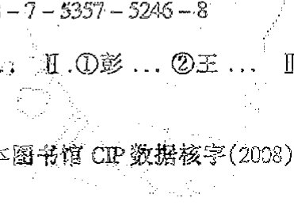

<!-- page 3 -->

*The Road to Reality: A Complete Guide to the Laws of the Universe*

版权所有 © 2004 Roger Penrose

本版由 MBA Literary Agency Limited 通过 Big Apple-Tuttle-Mori Agency, Labuan, Malaysia 安排。

湖南科学技术出版社通过大苹果有限公司独家获得本书中文简体版中国大陆地区出版发行权。

著作权合同登记号：18-2006-034

图书在版编目（CIP）数据

通向实在之路：宇宙法则的完全指南 / (英) 彭罗斯著；王文浩译. —长沙：湖南科学技术出版社，2008.6

书名原文：The Road to Reality: A Complete Guide to the Laws of the Universe

ISBN 978-7-5357-5246-8

I. 通... II. ①彭... ②王... III. 宇宙学-研究 IV. P159

中国版本图书馆 CIP 数据核字(2008)第 050162 号

The Road to Reality

通向实在之路

——宇宙法则的完全指南

著者：[英] 罗杰·彭罗斯

译者：王文浩

责任编辑：吴炜

出版发行：湖南科学技术出版社

社址：长沙市湘雅路276号

http://www.hnstp.com

邮购联系：本社直销科 0731-4375808

印刷：长沙瑞和印务有限公司

（印装质量问题请直接与本厂联系）

厂址：长沙市井湾路4号

邮编：410004

出版日期：2008年6月第1版第1次

开本：787mm × 1092mm 1/16

印张：51.5

字数：1080000

书号：ISBN 978-7-5357-5246-8

定价：80.00元

（版权所有·翻印必究）
