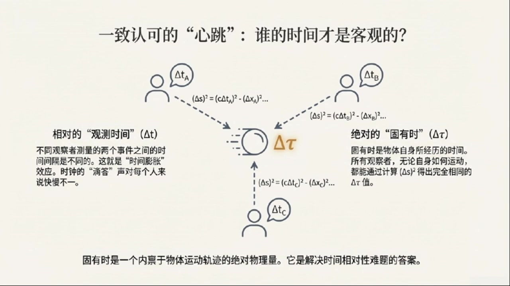
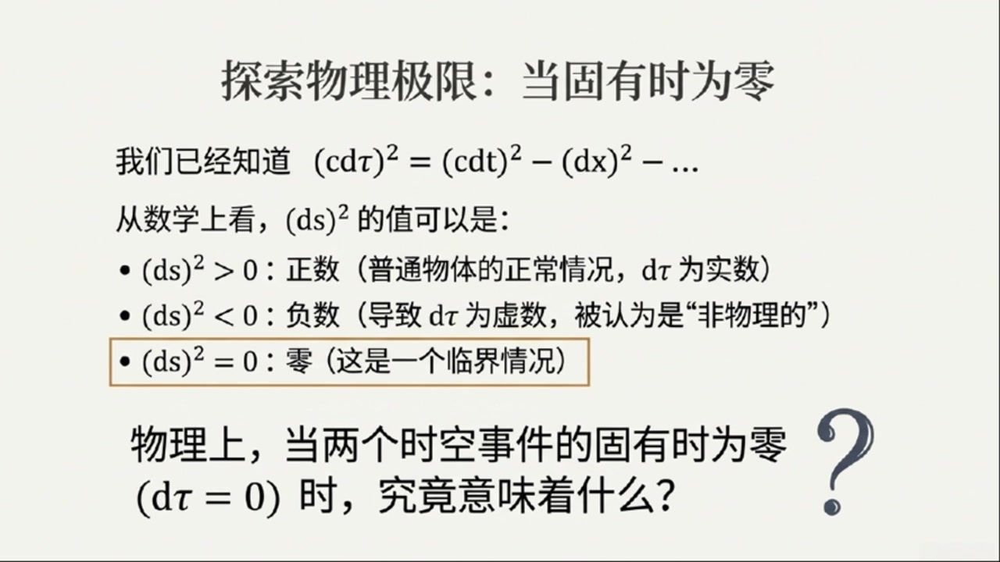

# 《基于对称性的物理学》第2课 狭义相对论核心思想

> 自动生成的课程注解文档（共 3 个段落）

## 目录

- [00:00:00 狭义相对论的背景与两大公设](#段落-1)
- [00:05:00 光钟思想实验与时空间隔不变量的推导](#段落-2)
- [00:11:00 世界线、固有时与光速上限](#段落-3)

---

## 段落 1：狭义相对论的背景与两大公设 { #段落-1 }

**时间：** 00:00:00 ~ 00:05:00

<details><summary>📝 原始字幕</summary>

<pre>

欢迎回到对称物理学博客今天呢我们要继续我们的物理之旅了大家好诸位很高兴能和大家一起深入探索物理世界的奥秘是啊上次我们聊了那么多感觉脑洞大开今天呢我们要聊一个更酷的话题那就是狭义相对论一听到相对论这几个字我就感觉特别厉害但又有点赛能给我们讲讲狭义相对论到底是怎么回事吗没问题狭义相对论其实是物理学里一个非常非常重要的理论我们平时生活中对速度的感受大家都挺熟悉的对吧当然了比如我在高铁上看到窗外的风景飞驰而过但如果我看着车厢里的人他们就好像是禁制的没错这其实就是参考系的概念你坐在高铁里高铁就是你的参考系
站外的人比如站在站台上看高铁的人他们看到的火车速度跟你看到的可就不一样了对对对就像资料里说的站台上的人看火车是每小时五十公里如果我以每小时十五公里的速度跟着火车跑那我看火车就只剩下每小时三十五公里了就是这个道理我们平时遇到的所有物体的速度都是和参考戏有关的但是这里面有一个例外或者说一个非常奇怪的自然现象啥呀就是光速光速不是很快吗是很快每小时大概十亿八千万公里但更奇特的是不管你相对光源怎么运动你测量到的光速永远都是这个值它不会因为你的运动而改变哇就像我跑得再快看到的光速度还是那么快对就是这两个
发现了这么厉害的狭义相对论最核心的两个想法是什么呢好的我们来说说狭义相对论的两个基本假设或者叫公设请讲第一个叫做相对性原理他的意思就是说物理定律在所有惯性参考系里面都是一样的惯性参考系这个怎么理解惯性参考系你可以理解城市那些相对彼此做云速直线运动或者说保持静止的参考系比如你坐在一个云速行驶的车里如果你闭上眼睛你根本感觉不出来
物理定律不会因为你坐车云速运动而改变明白了就是说物理规律不会因为你的运动状态而改变只要你是云速运动的对这是我们日常生活经验里就能感受到的第二个公设就是我们刚才提到的也是最反直觉的叫做光速不变原理就是说光速在所有惯性参考系里都是一样的对吧没错光在真空中的速度用字母C来表示这个C对所有惯性参考系里的观察者来说都是一个常数只要你是静止的还是以多快的速度运动这个真的太神奇了跟我们平时对速度的理解完全不一样是的
这个就是狭义相对论最不一样的地方虽然它反直觉但目前所有的实验都表明它是正确的除了这两个公设我们还会假设我们物理定律所作用的这个舞台也就是时空它是均匀的各项同性的均匀和各项同性的这是什么意思均匀就是说你在宇宙的任何地方做实验物理定律都是一样的不会因为你在纽约还是东京而改变各项同性呢就是说你把实验装置怎么摆放物理定律也不会变不会因为你把装置朝东还是朝西而不同这听起来很合理啊如果物理定律只在一个地方或者一个方向有效那物理学家可就太难了确实是这样如果不是均匀和各项同性的我们推导出来的自然规律就没啥用了这两个假设加上前面的两个公设

</pre>

</details>

**课程截图：**


### 注解

# 狭义相对论基础：公设与时空假设

## 一、核心公式与符号

本段内容**未出现数学公式**，主要介绍概念性公设。但需注意后续将频繁使用的关键符号：

| 符号 | 含义 | 说明 |
|:---|:---|:---|
| **c** | 真空中的光速 | 约 $3 \times 10^8$ m/s（精确值为 299,792,458 m/s），狭义相对论中的核心常数 |

> 截图中可见两个发光的"C"字母，代表光速不变原理——无论观察者如何运动，测得的光速恒为 **c**。

---

## 二、四大基本假设详解

### 1. 相对性原理（Principle of Relativity）
> **物理定律在所有惯性参考系中具有相同形式**

**关键概念：惯性参考系**
- 定义：相对彼此做**匀速直线运动**或**保持静止**的参考系
- 判别方法：封闭在其中时，无法通过内部实验感知自身运动状态（如闭眼坐在匀速高铁中）
- 反例：加速中的汽车、旋转的圆盘 → **非惯性参考系**

---

### 2. 光速不变原理（Principle of Constancy of Light Speed）
> **真空中的光速 c 对所有惯性参考系中的观察者都是相同的常数**

| 日常直觉 | 相对论现实 |
|:---|:---|
| 追向光源 → 光速应减小 | 测得光速仍为 **c** |
| 远离光源 → 光速应增大 | 测得光速仍为 **c** |
| 静止观察 → 光速为 **c** | 测得光速仍为 **c** |

**这是狭义相对论最反直觉的基石**，已被迈克尔逊-莫雷实验等反复验证。

---

### 3. 时空均匀性（Homogeneity）
> **物理定律与实验地点无关**

- 宇宙不存在"特殊位置"
- 纽约与东京的相同实验结果一致
- 数学体现：物理定律在**空间平移**下不变

---

### 4. 时空各向同性（Isotropy）
> **物理定律与实验方向无关**

- 宇宙不存在"特殊方向"
- 实验装置朝东或朝西，结果相同
- 数学体现：物理定律在**空间旋转**下不变

---

## 三、截图板书内容描述

### 图1：狭义相对论核心思想（信息图）

```
┌─────────────────────────────────────────┐
│         狭义相对论核心思想               │
│            两大基本公设                  │
├─────────────────┬───────────────────────┤
│   相对性原理     │     光速不变原理       │
│  [惯性参考系图示]│   [双向箭头标注 C=C]   │
│  物理定律在所有  │  所有惯性参考系中      │
│  惯性参考系中    │  光速恒定为 C          │
│  形式相同        │                        │
└─────────────────┴───────────────────────┘
                    ↓
        ┌─────────────────────┐
        │      颠覆性的推论    │
        ├─────────────────────┤
        • 时间膨胀：时钟走速因人而异
        • 时间间隔和空间距离相对于观察者
        • 固有时间：与物体一起运动的观察者测量的时间间隔
        • 宇宙速度极限：光速是上限（任何物体速度 < c）
        └─────────────────────┘
```

### 图2-3：宇宙舞台的公平性

**左侧文字区：**
- 标题：宇宙舞台的公平性：均匀与各向同性
- 均匀（Homogeneous）：物理定律与实验地点无关
- 各向同性（Isotropic）：物理定律与实验方向无关
- 底部强调：这些假设确保物理学结论的**普适性**

**右侧图示区：**
- 网格背景（代表时空坐标系）
- 多个原子/粒子图标均匀分布
- 暗示：时空各处、各方向的物理规律相同

---

## 四、理论背景补充

### 为什么需要这些假设？

| 假设 | 物理意义 | 若被违反的后果 |
|:---|:---|:---|
| 相对性原理 | 不存在绝对静止的"以太"参考系 | 麦克斯韦方程组需在不同参考系有不同形式 |
| 光速不变 | 电磁学与力学统一 | 经典速度叠加法则失效 |
| 均匀性+各向同性 | 时空具有平移/旋转对称性 | 能量-动量守恒定律可能不成立（诺特定理） |

### 与经典力学的根本冲突

**伽利略变换**（经典）→ **洛伦兹变换**（相对论）

经典认为：时间绝对、空间绝对、速度可叠加
相对论认为：时空相对、光速绝对、同时性相对

> 这些假设共同构成了狭义相对论的公理化基础，由此可严格推导出时间膨胀、长度收缩、质能关系等所有惊人结论。

---

## 段落 2：光钟思想实验与时空间隔不变量的推导 { #段落-2 }

**时间：** 00:05:00 ~ 00:11:00

<details><summary>📝 原始字幕</summary>

<pre>

就是狭义相对论的基石好的那我们知道这些基石之后就能推导出那些奇特的后果了吗没错接下来我们就通过一个思想实验来推导出狭义相对论里一个最最基础的结论这个结论我们称之为相对论补量思想实验听起来很有趣想象一下我们有一个观察者他站在自己坐标系的原点他向上发射了一束光呢碰到上面的镜子之后又反射回了他发射的原点这很简单就像一个光中对我们可以把这个过程分成三个时间事件A使光从起点发出事件B使光碰到镜子反射事件C使光回到起点距离是L那对于这个静止的观察者来说光从A到C用了多长时间呢
因为光速是C光走了两倍的L所以时间间隔deltaT就等于2L出于C这个我们用公式表示就是deltaT等于2L出于C同时呢因为光是垂直上下运动的对于这个观察者来说光在水平方向上是没有位移的所以deltaX等于0明白了那现在我们在想象一个第二位观察者呢没错这位第二位观察者呢相对于第一位观察者以一个恒定的速度U向左运动为了简化我们假设在时间A发生的时候也就是光刚发射的时候两位观察者的左向系原点是重合的那这位运动的观察者他看到的景象会一样吗当然不一样对于第二位运动的观察者来说所以他看到的光并不是垂直向下运动的了
斜着向上走到镜子然后又斜着向下回到另一个点因为在他自己的参考系里光发出和返回的那个点在水平方向上是移动了一段距离的我好像明白了因为光在走垂直入境的时候观察者自己也在水平方向上移动了对所以对于运动的观察者来说光走的路径就像是一个等腰三角形的两条边光走的距离变长了那他测量到的时间间隔还会是二L出一C吗这就是问题的关键因为光速不变这个公设对于运动的观察者来说光速依然是C但是光走的路径变长了所以他测量到的时间间隔达尔塔T配肯定会有点绕但又很有趣那这个达尔塔配对怎么算呢对于运动
假设光从起点到镜子再回到终点水平位移就是DeltaX配所以光从起点到镜子距离根据勾定力就是根号下DeltaX配出二的平方加上L的平方而光来回走了两次这个距离所以总距离L就等于二乘以根号下DeltaX配出二的平方加上L的平方好的那根据光速不变这个总距离L就等于C乘以DeltaT配对吧完全正确所以我们就有CdeltaT等于二乘以根号下DeltaXPrime出二的平方然后我们做一些代数运算
我跟着您C的平方就等于四曾以DeltaXPrime出于二的平方加上L的平方然后呢我们把DeltaXPrime的平方移到等式的左边就得到了C的平方减去DeltaXPrime的平方等于4L的平方我看到4L平方了这个4L平方不就是禁指观察者那边的C的平方嘛因为DeltaT等于2L处理C所以C的平方等于2L平方太棒了你发现了重点所以我们最终得到一个非常重要的结论C的平方减去DeltaXPrime的平方等于C的平方减去DeltaX的平方哇这真是个神奇的等式而且我们前面说过对于
所以如果我们把这个结论推广到三维空间也就是加上Y方向和Z方向的位移我们就会发现对于任何一个惯性参考系里的观察者C的平方减去Y的平方减去Z的平方它都是一样的也就是说它是一个不变量吗没错我们把这个不变量叫做DeltaS平方所以DeltaS平方减去X的平方减去Y的平方减去Z的平方这个量对于所有

</pre>

</details>

**课程截图：**


### 注解

# 光钟思想实验与时空不变量

## 一、核心公式与符号详解

本段通过**光钟思想实验**推导出狭义相对论最核心的数学结构——**时空间隔不变量**。以下是逐步出现的公式：

### 公式1：静止观察者的时间测量

$$\Delta T = \frac{2L}{c}$$

| 符号 | 含义 | 说明 |
|:---|:---|:---|
| $\Delta T$ | 静止参考系中的时间间隔 | 光往返一次的时间，称为"固有时"（proper time） |
| $L$ | 光钟的垂直臂长 | 镜子到光源的固定距离 |
| $c$ | 光速 | 约 $3 \times 10^8$ m/s |

> **关键特征**：光垂直上下运动，水平位移 $\Delta X = 0$

---

### 公式2：运动观察者的时间-距离关系

$$c\Delta T' = 2\sqrt{(\Delta X')^2 + L^2}$$

| 新符号 | 含义 | 说明 |
|:---|:---|:---|
| $\Delta T'$ | 运动参考系中的时间间隔 | 带撇号(')表示运动观察者的测量值 |
| $\Delta X'$ | 运动观察者的水平位移 | $\Delta X' = u\Delta T'$，其中 $u$ 为相对速度 |

> 几何意义：光走的路径构成**等腰三角形的两条斜边**，单条斜边长为 $\sqrt{(\frac{\Delta X'}{2})^2 + L^2}$

---

### 公式3：时空间隔不变量（核心结论）

$$\boxed{c^2(\Delta T')^2 - (\Delta X')^2 = c^2(\Delta T)^2 - (\Delta X)^2}$$

或等价写成：
$$c^2(\Delta T)^2 - (\Delta X)^2 = \text{不变量}$$

| 物理意义 | 解释 |
|:---|:---|
| **左边** | 运动参考系中的"时空间隔" |
| **右边** | 静止参考系中的"时空间隔" |
| **等式** | 两者相等，与参考系无关！|

---

### 公式4：三维推广——时空间隔的完整形式

$$\Delta S^2 = c^2(\Delta T)^2 - (\Delta X)^2 - (\Delta Y)^2 - (\Delta Z)^2$$

| 符号 | 名称 | 物理意义 |
|:---|:---|:---|
| $\Delta S^2$ | **时空间隔**（spacetime interval） | 四维时空中两点间的"距离" |
| $c\Delta T$ | 时间分量 | 光在时间内走的距离 |
| $\Delta X, \Delta Y, \Delta Z$ | 空间分量 | 三维空间位移 |

> **核心洞见**：$\Delta S^2$ 是所有惯性参考系的**共同语言**——尽管时间和空间的测量值各自变化，但这个组合量保持不变。

---

## 二、板书/PPT截图内容描述

### 截图1：移动光钟观察者的视角
- **标题**："视角二：观察移动光钟的观察者"
- **图示**：三个光钟装置呈水平排列，光脉冲沿**倾斜路径**从A→B→C
- **关键标注**：$\Delta x' = u\Delta t'$（水平位移公式）
- **文字要点**：强调"光速不变"与"路径变长"的矛盾，引出时间必须延长的结论

### 截图2：光速不变的应用（代数推导）
- **标题**："连接时空：光速不变的应用"
- **核心方程**：
  - $\Delta t' = \frac{l}{c}$（单程时间）
  - $c\Delta t' = 2\sqrt{L^2 + (\frac{1}{2}u\Delta t')^2}$（代入后的关键方程）
- **几何图**：直角三角形，标注斜边 $l$、垂直边 $L$、水平边 $\frac{1}{2}u\Delta t'$
- **结论框**：明确指出静止与运动观察者时间测量的复杂关系

---

## 三、理论背景补充

### 3.1 为什么这个推导如此重要？

| 经典物理 | 狭义相对论 |
|:---|:---|
| 时间是绝对的：$t' = t$ | 时间是相对的：$\Delta T' \neq \Delta T$ |
| 空间是绝对的 | 空间也是相对的 |
| **但**：时空间隔 $\Delta S^2$ 是绝对的！ | |

这类似于**三维空间中的旋转**：一个矢量的 $x, y, z$ 分量会随坐标系旋转而改变，但 $x^2 + y^2 + z^2$（距离平方）保持不变。狭义相对论将这一概念推广到**四维时空**。

### 3.2 时空间隔的三种类型

$$\Delta S^2 = c^2(\Delta T)^2 - (\text{空间距离})^2$$

| 类型 | 条件 | 物理意义 |
|:---|:---|:---|
| **类时间隔** $\Delta S^2 > 0$ | 时间主导 | 两事件可有因果联系（信号来得及传递）|
| **类光间隔** $\Delta S^2 = 0$ | 恰好等于 | 光信号刚好能连接两事件 |
| **类空间隔** $\Delta S^2 < 0$ | 空间主导 | 两事件无因果联系（信号来不及）|

> 光钟实验中，$\Delta S^2 > 0$（因为 $c\Delta T > 2L$），属于类时间隔。

---

## 四、通俗理解：时空的"勾股定理"

想象你在玩一个视频游戏：

- **静止玩家**：光子弹直上直下，简单直接
- **运动玩家**：光子弹走斜线，路径更长

**奇怪的规定**：光速必须恒定为 $c$（游戏引擎的硬编码）

**必然结果**：运动玩家必须"承认"光走了更久——这就是**时间膨胀**的萌芽。

而 $c^2(\Delta T)^2 - (\Delta X)^2$ 这个组合，就像是时空版本的"距离不变性"：无论你从哪个角度"旋转"你的观察方式（即换参考系），这个"四维距离"始终不变。

> 下一课将由此直接导出著名的时间膨胀公式：$\Delta T' = \gamma \Delta T$，其中 $\gamma = \frac{1}{\sqrt{1-u^2/c^2}}$ 为洛伦兹因子。

---

## 段落 3：世界线、固有时与光速上限 { #段落-3 }

**时间：** 00:11:00 ~ 00:20:18

<details><summary>📝 原始字幕</summary>

<pre>

所有的观察者来说值都是相同的这太酷了所有观察者都同意这个量即使他们对时间和空间间隔的测量值都不一样那这个雕台S平方到底代表着什么物理意义呢这个问题问得好就是我们接下来要讲的固有十的概念我们发现这个雕台S平方是个不变量那它到底有什么物理意义呢很期待我们先来想象一下一个物体在时空中的运动轨迹我们用世界线来描述它比如一个静止的物体它的世界线就是一条垂直于空间轴的指线因为它的位置没变只有时间在流逝明白了就像时空图上的一条数线那如果物体在运动呢如果物体在运动它的世界线就是一条斜线不同的观察者因为他们的参考系不一样
画出来的形状也会不一样好的那我们再回到刚才的DeltaS平方这个不变量好的我们之前推到除了DeltaS平方等于C的平方减去DeltaX的平方减去DeltaY的平方减去DeltaC的平方现在我们来考虑一个非常特殊的观察者什么样的观察者呢这个观察者呢他正好是和我们研究的那个物体一起运动的而且速度完全一样也就是说在这个观察者看来那个物体是静止的就像我坐在高铁上看到旁边的乘客是静止的一样完全正确那么对于这位特殊的观察者来说他测量到的物体在空间上的位移DeltaXPrimeDeltaYPrimeDeltaZPrime是不是都等于零啊是的
X prime,Y prime 和 delta prime 都等于零带入到不变量的公式里我们就会得到 delta s平方等于 c delta t prime 的平方这样 delta x平方就只剩下时间的部分了没错这个特殊的 delta t 也就是物体相对它静止的观察者所测量到的时间间隔我们给它一个特别的名字叫做固有十用希腊字母套来表示固有十套对所以我们就可以定义 delta s方方就是指一个观察者他在自己的参考系里看到某个物体是静止的那么他测量到的这段时间间隔就是固有十最特别的起初呢最特别的地方就在于固有十达达它是一个不变量所有不同的观察者虽然他们自己测量到的
并且这个固有时DEOTA套总是小于或者等于其他观察者测量到的DEOTA套这就是著名的时间膨胀效应也就是说运动的钟会走得更慢运动的钟走得更慢这真的是反直觉的极致啊是的不过现实世界里的物体运动可不总是云速的但是没关系如果时间间隔足够短到是无穷小的时间间隔那么任何复杂的运动在那个瞬间都可以看作是云速的所以我们也可以定义一个无穷小的不有时DEOTA套
变DELTA成D对吧这样我们就有了DS方方等于CDT方方减去DX方减去DY方减去DZ方所以即使物体在做非常复杂的运动我们仍然可以想象有一个钟它始终跟着这个物体运动这个钟测量到的时间就是固有时而且所有观察者都同意这个固有时的大小好的我感觉对固有时有一个比较清晰的认识了它是一个所有观察者都统一的内在时间那这个不变量DELTAS方方还能告诉我们什么呢好的现在我们有了对DELTAS方方的最令人震惊的推论之一速度上线难道有什么东西不能超过某个速度吗
定义是C调TX方方 见取DY方 见取DY方 注意中间是减号这意味着DY方方的值可以为正可以为零甚至可以为负负数那固有时不就变成虚数了吗你说的很对如果DY方方是负数那么固有时DYTA套就变成虚数这在物理上通常被认为是不物理的也就是没有实际意义的所以我们通常认为固有时套必须是实数那这样的话DYTAS方方就不能是负数了没错所以DY方方最小能取到的值就是零当DYS方方等于零那有什么特别的意义吗当DYS方方等于零时我们就有
等于等于等于等于等于等于等于等于等于等于等于等于等于等于等于等于等于等于等于等于等于等于等于等于等于等于等于等于等于等于等于等于等于等于等于等于等于等于等于等于等于等于等于等于等于等于等于等于等于等于等于等于等于等于等于等于等于等于等于等于等于等于等于等于等于等于等于等于等于等于等于等于等于等于等于等于等于等于等于等于等于等于等于等于等于
这个推导也告诉我们任何东西能够以超过光速的速度运动光速C就是宇宙中所有物体的速度上线所以光速就是宇宙的极限速度任何物质任何信息都不能比光速更快完全正确这个速度上线的发现对物理学有着极其深远的影响它引出了矩形性原理也就是说物理世界中的任何事件都只能受到它周围直接环境的影响矩形性对因为任何相互作用任何信息传递都需要时间而且不能超过光速所以不可能存在所谓的超距作用也就是一个物体瞬间影响到远处的另一个物体所有的作用都必须是局部的需要时间来传播这简直是颠覆了我们对世界的认知啊从光速不变这个简单的假设出发
时间和空间不再是独立的绝对的量而是相互关联的并且都依赖于观察者的运动状态但同时他也给了我们一个所有观察者都同意的时空距离那个DELTAS平方不变量以及一个所有观察者都同意的内在时间固有时最重要的是他为我们设定了宇宙中最根本的速度限制今天的内容信息量真的很大但听起来又特别过硬从爱因斯坦的两个公社到那个神奇的DELTAS平方不变量再到固有时再到最后的速度上线每一步都那么引人入胜没错这些都是狭义相对论里最核心也是最基础的概念理解了这些我们才能继续深入探索
带来的更多奇妙现象好的那今天的对称物理学博客就到这里了感谢赛的精彩讲解也感谢大家的收听下一次我们还会继续沿着狭义相对论的脉络去探索更深层次的物理奥秘谢谢大家我们下期再见拜拜

</pre>

</details>

**课程截图：**






### 注解

# 固有时、速度上限与局域性原理

## 一、核心公式与符号详解

本段在先前时空间隔公式基础上，引入**无穷小形式**与**固有时定义**，并导出**光速作为速度上限**的惊人结论。

### 公式1：无穷小时空间隔（微分形式）

$$(ds)^2 = (cdt)^2 - (dx)^2 - (dy)^2 - (dz)^2$$

| 符号 | 含义 | 说明 |
|:---|:---|:---|
| $ds$ | 无穷小时空间隔 | 用微分 $d$ 替代有限差分 $\Delta$，适用于任意复杂运动 |
| $dt, dx, dy, dz$ | 无穷小时间/空间间隔 | 某一惯性系中测量的坐标差 |
| $c$ | 光速 | 将时间转换为"等效空间距离"的换算因子 |

> **关键转换**：从有限间隔 $\Delta$ 到无穷小 $d$，使得变速运动可在每个瞬间视为匀速，从而定义瞬时固有时。

---

### 公式2：固有时定义式

$$(ds)^2 \equiv (cd\tau)^2$$

或等价地：
$$d\tau = \frac{ds}{c} = \sqrt{dt^2 - \frac{dx^2+dy^2+dz^2}{c^2}}$$

| 符号 | 含义 | 说明 |
|:---|:---|:---|
| $\tau$ (希腊字母"tau") | **固有时** (Proper Time) | 与物体相对静止的观察者测量的时间，**所有惯性系公认的不变量** |
| $d\tau$ | 无穷小固有时间隔 | 物体"自身感受到的"时间流逝 |

> **物理意义**：固有时是与物体世界线"绑定"的时钟所记录的时间，是时空几何的内禀属性。

---

### 公式3：时空间隔分类与速度上限条件

| 条件 | 数学表达 | 物理意义 |
|:---|:---|:---|
| **类时间隔** | $(ds)^2 > 0$ | $d\tau$ 为实数，物体可作亚光速运动 |
| **类光间隔** | $(ds)^2 = 0$ | $d\tau = 0$，对应**光速运动** |
| **类空间隔** | $(ds)^2 < 0$ | $d\tau$ 为虚数，**非物理**（禁止超光速）|

由 $(ds)^2 = 0$ 导出：
$$(cdt)^2 = (dx)^2 + (dy)^2 + (dz)^2 \implies v = \frac{\sqrt{dx^2+dy^2+dz^2}}{dt} = c$$

---

## 二、板书/PPT截图内容描述

### 截图1：固有时作为"一致认可的心跳"
（对应"一致认可的'心跳'：谁的时间才是客观的？"）

- **中心图示**：一个时钟图标，标注 $\Delta\tau$（固有时）
- **周围三个观察者**（A、B、C），各自测量不同的时间 $\Delta t_A, \Delta t_B, \Delta t_C$
- **关键文字**：
  - 左侧："相对的'观测时间'($\Delta t$)"——不同观察者测量值不同，即"时间膨胀"
  - 右侧："绝对的'固有时'($\Delta\tau$)"——所有观察者通过计算 $(\Delta s)^2$ 得到相同的 $\Delta\tau$
- **核心结论**："固有时是一个内禀于物体运动轨迹的绝对物理量"

### 截图2：探索物理极限——当固有时为零
（对应"探索物理极限：当固有时为零"）

- **公式回顾**：$(cd\tau)^2 = (cdt)^2 - (dx)^2 - \dots$
- **三种情况分类**：
  - $(ds)^2 > 0$：正数（正常情况，$d\tau$ 为实数）✓
  - $(ds)^2 < 0$：负数（$d\tau$ 为虚数，"非物理的"）✗
  - **$(ds)^2 = 0$：零（临界情况）** ← 高亮框出
- **设问**："当两个时空事件的固有时为零 ($d\tau=0$) 时，究竟意味着什么？"

---

## 三、核心概念深度解析

### 1. 固有时（Proper Time）：时间的"客观锚点"

**通俗理解**：
> 想象你戴着手表乘坐火箭飞行。火箭上的时钟显示的时间，就是**固有时**——这是你"亲身经历"的时间。地面上的朋友通过望远镜看你的时钟，会觉得它走慢了（时间膨胀），但你们可以**都同意**一个事实：火箭上的时钟记录了某个确定的固有时数值。

**数学本质**：
- 固有时是世界线的**弧长参数**（类比三维空间中曲线的长度）
- 所有惯性系对 $(ds)^2$ 计算结果相同，因此对 $d\tau$ 也相同

**关键不等式**（时间膨胀）：
$$\Delta\tau \leq \Delta t \quad \text{（对任意惯性系）}$$

等号仅当物体相对该惯性系静止时成立。运动的钟"走得更慢"。

---

### 2. 从时空间隔到速度上限：为何光速不可超越？

**推导逻辑链**：

```
要求：固有时必须是实数（物理可测量）
    ↓
因此：(ds)² = (cdτ)² ≥ 0
    ↓
展开：c²dt² ≥ dx² + dy² + dz²
    ↓
整理：c² ≥ (dx²+dy²+dz²)/dt² = v²
    ↓
结论：v ≤ c
```

**物理图像**：
- 当 $v \to c$：空间位移"追赶"上了时间流逝，固有时趋于零
- 若假设 $v > c$：则 $(ds)^2 < 0$，$d\tau$ 变为虚数——没有物理意义

> **类比**：时空就像一个"预算"——你在空间移动得越多，能"花费"的时间就越少。光速是"收支平衡"的极限点。

---

### 3. 局域性原理（Principle of Locality）：无超距作用

**核心陈述**：
> 任何事件只能受到其**过去光锥**内事件的影响。

**物理推论**：
| 被禁止的现象 | 原因 |
|:---|:---|
| 超距作用（action at a distance） | 信息传递需时间，且速度 ≤ c |
| 瞬时影响 | 违反因果律，不同参考系对事件先后顺序判断矛盾 |
| 纠缠态的"超光速通信" | 量子纠缠不传递可用信息，不违反局域性 |

**时空图语言**：
- 每个事件携带一个"光锥"结构
- 类光间隔 $(ds)^2 = 0$ 定义光锥表面
- 因果影响被限制在光锥内部（类时区域）

---

## 四、理论背景补充

### 闵可夫斯基时空的符号约定

本课程采用**号差 $(+,-,-,-)$**（物理学常用）：
$$(ds)^2 = (cdt)^2 - (dx)^2 - (dy)^2 - (dz)^2$$

> 粒子物理学中有时使用 $(-,+,+,+)$，需注意文献差异。

### 固有时与坐标时的关系

对匀速运动物体（速度 $v$ 恒定）：
$$\Delta\tau = \Delta t \sqrt{1 - \frac{v^2}{c^2}} = \frac{\Delta t}{\gamma}$$

其中 $\gamma = 1/\sqrt{1-v^2/c^2}$ 为洛伦兹因子，$\gamma \geq 1$。

### 双生子佯谬的预告

固有时的不变性是解决"双生子佯谬"的关键：
- 留在地球的哥哥：惯性运动，固有时 = 坐标时
- 旅行的弟弟：加速-匀速-减速-返回，需积分计算世界线总固有时
- 结果：弟弟固有时更短（更年轻），因世界线不是直线（类比：平面上两点间直线最短 → 时空中直线对应最长固有时）

---

## 五、本节知识脉络总结

```
时空间隔不变量 (Δs)²
        ↓
    无穷小形式 (ds)²
        ↓
    ┌─────────┬─────────┐
    ↓         ↓         ↓
  固有时定义  间隔分类   速度上限
  dτ = ds/c   类时/类光/类空  v ≤ c
    │           │         │
    └───────────┴─────────┘
              ↓
         局域性原理
    （因果结构的物理基础）
```

---
