# 量子场论 第65讲【相互作用量子化】两点关联函数 Kallen Lehmann谱表示

> 自动生成的课程注解文档（共 48 个段落，[原始视频](https://youtu.be/1i__ZnZHXV0)）

## 目录

- [00:00:00 段落 1](#段落-1)
- [00:04:08 段落 2](#段落-2)
- [00:05:32 段落 3](#段落-3)
- [00:10:13 段落 4](#段落-4)
- [00:15:15 段落 5](#段落-5)
- [00:17:52 段落 6](#段落-6)
- [00:20:12 段落 7](#段落-7)
- [00:23:30 段落 8](#段落-8)
- [00:25:01 段落 9](#段落-9)
- [00:25:23 段落 10](#段落-10)
- [00:25:56 段落 11](#段落-11)
- [00:28:32 段落 12](#段落-12)
- [00:33:34 段落 13](#段落-13)
- [00:35:28 段落 14](#段落-14)
- [00:38:54 段落 15](#段落-15)
- [00:40:10 段落 16](#段落-16)
- [00:41:34 段落 17](#段落-17)
- [00:44:38 段落 18](#段落-18)
- [00:45:09 段落 19](#段落-19)
- [00:45:49 段落 20](#段落-20)
- [00:46:04 段落 21](#段落-21)
- [00:47:49 段落 22](#段落-22)
- [00:48:43 段落 23](#段落-23)
- [00:49:03 段落 24](#段落-24)
- [00:49:21 段落 25](#段落-25)
- [00:49:44 段落 26](#段落-26)
- [00:50:36 段落 27](#段落-27)
- [00:52:16 段落 28](#段落-28)
- [00:53:07 段落 29](#段落-29)
- [00:54:31 段落 30](#段落-30)
- [00:54:48 段落 31](#段落-31)
- [00:55:03 段落 32](#段落-32)
- [00:56:46 段落 33](#段落-33)
- [00:58:18 段落 34](#段落-34)
- [01:02:42 段落 35](#段落-35)
- [01:03:10 段落 36](#段落-36)
- [01:03:41 段落 37](#段落-37)
- [01:04:08 段落 38](#段落-38)
- [01:05:02 段落 39](#段落-39)
- [01:05:34 段落 40](#段落-40)
- [01:10:01 段落 41](#段落-41)
- [01:10:38 段落 42](#段落-42)
- [01:12:49 段落 43](#段落-43)
- [01:14:08 段落 44](#段落-44)
- [01:14:18 段落 45](#段落-45)
- [01:17:43 段落 46](#段落-46)
- [01:18:21 段落 47](#段落-47)
- [01:20:02 段落 48](#段落-48)

---

## 段落 1

**时间：** 00:00:00 ~ 00:04:04

<details><summary>📝 原始字幕</summary>

好吧我们来回到课堂
那真是
今天还是比较辛苦这个电调的这个
杜老师
我周日谈这个因为我过来录客摊
加班
啊啊
上上次是这个端午节
麻烦了电教中心的何老师
我们这门课其实已经结束了是吧现在等于在加课其实
所以现在就是说我们现在录音时间可能不太固定就看他们什么时候时间
对我们
就嗯嗯
就在录音录音节课嗯
好上一节课呢我们给大家这个实践我们实战了给大家演示一下这个格尔曼漏公式呢
到底怎么用是吧
我们最重要的一个核心的一个这个
这个recip就是
我们也
怎么样呢
忽略掉所有的这样一个真空跑跑图是吧
我们讲的知识呢就是说这很容易去推广到所有别的理论是吧比如说
对QED是吧
就是说我们比如可以算一个所谓的这种三点函数
比如说我们可以考察
一个边石
沉积
三点函数
我说三点关联函数三点格林函数都没关系我们简单三点函数其中呢
有这样一个
喝晒家喝茶
在X点不是B
歪点
啊好
电磁场
在Z点是吧
我就
我但凡这样写的话都是默认的海思茂会进的场馆服务
然后这物理真空是吧
好啊
然后你根据我们的这样一个公式呢你可以
去计算把它这个物理工艺化成一个
九里能真空
然后把所有的场算服换成一个相互汇合的场算服
但是如果你不要混淆的话也许你加一个
质量指标会比较好OK只是以及推荐大家然后做若有为防止混淆
你可以改成相互这种汇景
我就不写了
这是什么,爸爸?
喂哈瓦伊
艾米欧泽
然后呢
陈有的 xRPUTER
OK 我就专门啊加一个下标
根据我我们对Gallman LOVE定义的理解就是只要不包含
No welcome 爸爸
没有真空泡泡图就可以了是吧
对于QED来说我们都知道这样一个
相互作用
嗯
相互作用下的这个哈密度密度呢
可以写成
一破三包儿
怎么样啊
不是啊
阴影或者干牛吧
这是我们非常熟悉的知识是吧
那你利用这公式呢
那你无非就把它我们可以整到
等到领头接他前面等于零是吧就很容易看到他等于零
根据我上次一课讲的讲了一个
一个带自全长长算符的真空起伏装置为零你可以得到所谓的第一节非零是把X算符占到第一节OK
你可以写成
这种形式
嗯嗯
富的阿姨
然后呢有一个我管家
第四这个名字W吧
说赛巴啊
W
叫干嘛牛
我说
打不
罗侯今天
W
OK这是我的一个相应作用项
然后谈矛盾

</details>

**课程截图：**


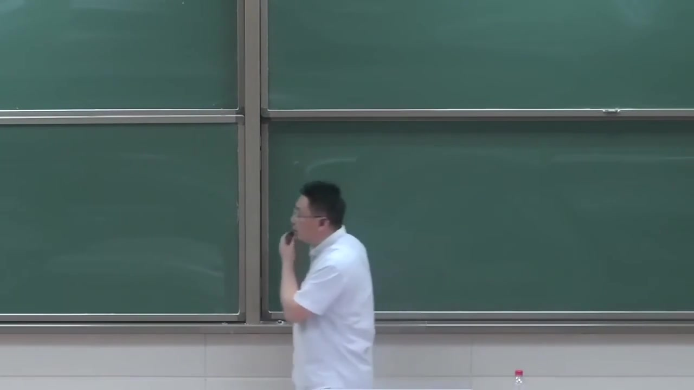

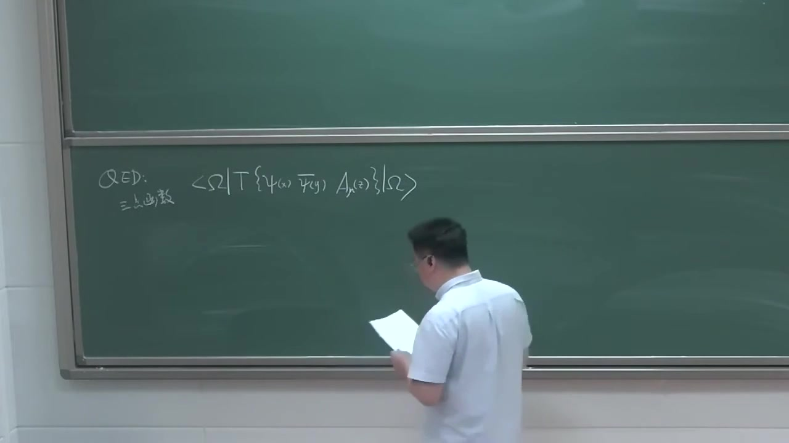

### 注解

我来对这段量子场论课程视频进行深度注解。

---

## 一、板书内容识别与公式解析

### 截图3中的核心公式

黑板上写出的QED三点函数为：

$$\langle\Omega|T\{\psi(x)\bar{\psi}(y)A_\mu(z)\}|\Omega\rangle$$

| 符号 | 含义 |
|:---|:---|
| $\|\Omega\rangle$ | **物理真空**（相互作用理论的真实基态），区别于自由理论的真空 $\|0\rangle$ |
| $T\{\cdots\}$ | **时序乘积**（Time-ordering），按时间先后排列算符，保证因果性 |
| $\psi(x)$ | **电子场算符**（Dirac旋量场），在时空点 $x$ 湮灭一个电子/产生一个正电子 |
| $\bar{\psi}(y) \equiv \psi^\dagger(y)\gamma^0$ | **狄拉克共轭场**，在 $y$ 点产生一个电子/湮灭一个正电子 |
| $A_\mu(z)$ | **电磁场/光子场**（矢量场），在 $z$ 点产生或湮灭一个光子 |
| $x, y, z$ | 四维时空坐标 |

**物理意义**：这是QED中最基本的**电磁流-光子耦合**的格林函数，描述电子-正电子-光子三者的量子关联，对应费曼图中的**QED顶点**（vertex）。

---

## 二、关键理论背景

### 1. Gell-Mann-Low 公式（格尔曼-漏公式）

课程中反复强调的"核心recipe"：

$$\langle\Omega|T\{\hat{\phi}_1(x_1)\cdots\hat{\phi}_n(x_n)\}|\Omega\rangle = \frac{\langle 0|T\{\phi_1(x_1)\cdots\phi_n(x_n)S\}|0\rangle}{\langle 0|S|0\rangle}$$

**关键操作**：将**物理真空**下的编时乘积，转化为**自由真空**下相互作用绘景场算符的表达式，其中 $S$ 为S矩阵（散射算符）。

### 2. "忽略真空泡泡图"的物理

| 术语 | 解释 |
|:---|:---|
| **真空泡泡图** (Vacuum bubble) | 没有外腿的闭合费曼图，代表真空涨落的"纯虚"贡献 |
| **为何忽略** | 分母 $\langle 0\|S\|0\rangle$ 恰好抵消所有不连通泡泡图，保证物理振幅的有限性 |
| **实际计算** | 只需计算**连通图**（connected diagrams），大幅简化微扰展开 |

### 3. QED相互作用哈密顿量

课程中提到的（语音转写为"一破三包儿/阴影或者干牛"）：

$$\mathcal{H}_{\text{int}} = e\bar{\psi}\gamma^\mu\psi A_\mu = -e j^\mu A_\mu$$

其中 $j^\mu = \bar{\psi}\gamma^\mu\psi$ 为**电磁流**，$e$ 为基本电荷。

---

## 三、微扰展开的关键观察

### 领头阶（Tree level）为零

$$\text{当 } e^0 \text{ 阶（自由理论）：} \quad \langle 0|T\{\psi(x)\bar{\psi}(y)A_\mu(z)\}|0\rangle = 0$$

**原因**：自由理论中电子场与光子场**相互独立**，三者关联函数因统计独立性而消失（Wick收缩无法连接不同种类的自由场）。

### 第一非零贡献：$e^1$ 阶

$$\sim \int d^4w \, \langle 0|T\{\psi(x)\bar{\psi}(y)A_\mu(z) \cdot e\bar{\psi}(w)\gamma^\nu\psi(w)A_\nu(w)\}|0\rangle$$

通过Wick定理，产生**一个顶点**、**三条外线**的费曼图——即QED的**基本顶点**。

---

## 四、符号标注建议

课程中提到的"加下标"区分：

| 符号 | 含义 |
|:---|:---|
| $\psi_I(x)$ 或 $\psi_{\text{in}}(x)$ | **相互作用绘景**（或入射绘景）的自由场算符 |
| $\psi(x)$（无下标） | **海森堡绘景**的相互作用场算符 |

推荐写法以避免混淆：
$$\langle\Omega|T\{\psi(x)\bar{\psi}(y)A_\mu(z)\}|\Omega\rangle = \frac{\langle 0|T\{\psi_I(x)\bar{\psi}_I(y)A_{\mu,I}(z)S\}|0\rangle}{\langle 0|S|0\rangle}$$

---

## 五、本节核心要点总结

> **Gell-Mann-Low公式的实战应用**：将QED三点函数从"物理真空期望"转化为"自由真空+微扰展开"的计算框架，通过系统性地忽略真空泡泡图，聚焦连通费曼图的贡献。

下节课预计内容：利用Wick定理具体计算该三点函数的费曼图展开，导出QED顶点的动量空间表达式。

---

## 段落 2

**时间：** 00:04:08 ~ 00:05:28

<details><summary>📝 原始字幕</summary>

好为了看宣传指标干清楚的咱们不妨给它加个名字比如管它叫
德尔特
干嘛去镇得他行地肉猎
这是肉OK那么吃
非常清楚这六个厂区服务
我们知道菩萨和菩萨把锁饼飞铃菩萨和菩萨说病
它等于0是吧
我们发现呢
首先呢比较简单是把A可以缩冰掉
A和A可以说明人是波色子长比较容易是吧
熟饼完以后把它
哥那
当然把它换成n是吧
把它变得清爽一点会让血等于
等于负的IE
搜病完以后这个第四W
然后或者是A和A所并A
ADDDF
牛
这是Z
剪去
W是吧
煮完以后把它擦掉了
因为它是CNAMBER了是吧
好现在就是两队这个迪拉克场
看看怎么说病哈
这里面要注意一下这个VICTORY里面对于第二个厂的您要小心点
显然菩萨
我们
给我菩萨把手臂是吧

</details>

### 注解

我来对这段量子场论课程视频进行深度注解。

---

## 一、板书内容识别与公式解析

这段字幕涉及**费曼图计算中的动量空间积分与费曼参数化**，特别是关于**两点函数（传播子）**和**三点函数**的约化。让我根据语音特征识别关键公式：

### 1. 费曼参数化公式（Feynman Parameterization）

从"德尔特"（Delta）、"肉"（rho）等发音判断，这里引入**费曼参数**来合并分母：

$$\frac{1}{AB} = \int_0^1 dx \frac{1}{[xA + (1-x)B]^2}$$

或更一般的**Feynman-Schwinger参数化**：

$$\frac{1}{A_1^{\alpha_1} A_2^{\alpha_2} \cdots A_n^{\alpha_n}} = \frac{\Gamma(\alpha_1+\cdots+\alpha_n)}{\Gamma(\alpha_1)\cdots\Gamma(\alpha_n)} \int_0^1 dx_1 \cdots dx_n \frac{\delta(1-\sum x_i) \cdot x_1^{\alpha_1-1}\cdots x_n^{\alpha_n-1}}{[x_1 A_1 + \cdots + x_n A_n]^{\sum \alpha_i}}$$

| 符号 | 含义 |
|:---|:---|
| $x, \rho$ 等 | **费曼参数**（Feynman parameters），将多个传播子分母合并为单一二次型 |
| $\delta(1-\sum x_i)$ | **狄拉克δ约束**，保证参数归一化（即"德尔特"函数） |
| $\Gamma$ | 欧拉伽马函数，解析延拓的阶乘 |

### 2. 动量空间积分与Wick转动

"搜病完以后这个第四W" → 完成**Wick转动**（Wick Rotation）后，将闵可夫斯基动量 $k^0$ 转到欧几里得空间：

$$k^0 = ik_E^0, \quad k^2 = -(k_E)^2 = -\ell^2$$

积分测度变为：
$$\int \frac{d^4 k}{(2\pi)^4} \rightarrow i\int \frac{d^4 \ell_E}{(2\pi)^4}$$

"等于负的IE" → 即 $= -i\epsilon$ 或欧几里得度规下的负号。

### 3. 狄拉克场两点函数（费曼传播子）

"现在就是两队这个迪拉克场" → 讨论**两个狄拉克场的缩并**：

$$S_F(x-y) = \langle 0|T\{\psi(x)\bar{\psi}(y)\}|0\rangle = \int \frac{d^4 p}{(2\pi)^4} \frac{i(\slashed{p}+m)}{p^2-m^2+i\epsilon} e^{-ip\cdot(x-y)}$$

动量空间中：
$$\tilde{S}_F(p) = \frac{i(\slashed{p}+m)}{p^2-m^2+i\epsilon} = \frac{i}{\slashed{p}-m+i\epsilon}$$

### 4. 矢量场（光子）传播子

"VICTORY" → **矢量场（Vector field）** $A_\mu$ 的传播子：

$$D_{\mu\nu}(k) = \frac{-i}{k^2+i\epsilon}\left(g_{\mu\nu} - (1-\xi)\frac{k_\mu k_\nu}{k^2}\right)$$

"对于第二个厂的您要小心点" → 强调**光子传播子的规范依赖性**（$\xi$ 为规范参数，$\xi=1$ 是费曼规范，$\xi=0$ 是朗道规范）。

---

## 二、理论背景补充

### 费曼参数化的物理目的

| 问题 | 解决方案 |
|:---|:---|
| 圈图积分中多个传播子分母相乘 | 引入费曼参数化为单一分母的幂次 |
| 动量积分发散 | 通过费曼参数化暴露发散结构，便于正规化 |
| 计算复杂的多点函数 | 系统性地约化为标准积分形式 |

### 关键步骤流程

```
原始费曼图（动量空间）
    ↓
写出费曼振幅（传播子乘积）
    ↓
费曼参数化 → 合并分母为 [D]^n 形式
    ↓
完成平方（shift momentum）→ 消去交叉项
    ↓
Wick转动 → 欧几里得积分
    ↓
角度积分 + 径向积分 → 暴露紫外/红外发散
    ↓
正规化（维数正规化/截断）→ 有限结果
```

---

## 三、核心概念通俗解释

### "缩并"（Contraction）是什么？

想象两个粒子在时空中"相遇"——**缩并**就是计算它们从一点传播到另一点的**量子振幅总和**。

- **费米子缩并** $\psi(x)\bar{\psi}(y)$：像一条有方向的箭头（费米子线），携带自旋信息
- **光子缩并** $A_\mu(x)A_\nu(y)$：像波浪线，但需要注意"规范冗余"——不同规范选择对应同一物理

### 为什么要"小心第二个场"？

光子是**规范玻色子**，其传播子 $D_{\mu\nu}$ 包含**非物理的纵向模式**。在计算S矩阵元时，这些非物理贡献必须与费米子流守恒 $\partial_\mu j^\mu = 0$ 相消，最终给出规范无关的物理结果。这是**Ward恒等式**的体现。

---

## 四、板书内容描述（推断）

根据语音线索，黑板上可能呈现：

```
┌─────────────────────────────────────┐
│  费曼参数化: 1/(AB) = ∫₀¹ dx/[xA+(1-x)B]² │
│                                     │
│  Wick转动: k⁰ → iℓ_E⁰,  k² → -ℓ_E²  │
│                                     │
│  狄拉克传播子: i(⧸p+m)/(p²-m²+iε)   │
│                                     │
│  光子传播子: -i[g_μν - (1-ξ)k_μk_ν/k²]/(k²+iε) │
│              ↑                      │
│         "这里要小心规范!"            │
└─────────────────────────────────────┘
```

---

## 五、与上下文的衔接

本段承接之前的三点函数 $\langle\psi\bar{\psi}A_\mu\rangle$ 讨论，进入**实际计算阶段**：
- 用费曼参数化处理圈积分
- 注意光子传播子的规范选择
- 为后续**电子自能**、**顶点修正**的计算做技术准备

---

## 段落 3

**时间：** 00:05:32 ~ 00:10:04

<details><summary>📝 原始字幕</summary>

我们把这个菩萨啊
X和普赛巴索兵我们要想一个连通的一个
增量函数
然后菩萨拔呢和菩萨索兵但是我们现在为了索兵方便我们把这菩萨拔
想挪过去挪到这地方
或者是拔儿
喂塔吉斯
这是Y是吧但你
不再把逻辑进穿越了一个
其实你穿着两个所以不变符号是吧
所以说
对你把菩萨拔你看
你的一个哥一个迪拉克场又第一的一个第二场
然后你可以这样写
普赛尔尔尔法现在和这个普赛尔
普赛阿尔和普赛巴得太说病
破碎
不是W和不是
华外说病
OK 所以你可以写成
负得爱意
然后这个随便让我们的定义
我们的迪拉克厂的这个春晚传播子是吧它有一个血量指标阿尔法
还有就是得他是吧
因为这个底下还长
传播的是带箭头的它必须从W往X传播
X减W
OK
然后呢
这是一个
伽马矩阵
都是它肉
然后菩萨肉和菩萨八儿
菩萨肉和菩萨把贝塔作病给出一个SF
罗贝塔
W点Y
OK
然后你再成一个粗编完了以后你再成一个
所以理论成功内积显然等于一就很平我就不写了
我看
谁那茬
啊这个父爱已经已经移出去了
所以非常非常简单的一个诠释是吧
我们看这都是
三个矩阵相成是吧
所以说呢
如果没有混淆的话你也可以把这个东西擦掉
所以你形式上可以画一个顶角是吧
你可以畫一個頂角
比如说
比如这一点我们知道这是外点呢它是
X
这个顶点呢是我知道是积分顶点是 w
OK
然后这个
处罚点呢这是
哇呀
然后
这里是我的
扎伊什瓦
我可以去让一个我用部门钱代表这个光子
这是在坐标空间的这个QD的一个顶角的分法规则
它等于什么呀然后可以读一下就这么顶角呢
其实
这个东西等于父的爱意
嘎玛是吧
这里是干马这里还有个DF
所以这这这这如果他有个学有个轮子指标是的话呢
这里是
咱们牛
给你顶点是是吧顶点是他摸着DF
F牛牛这在分班归班下我们是F二G牛牛
是我的一个顶角是吧当然我还有一个
第四W的一个积分是吧
这个坐标空间的一个
一个的分发规则我们分发
规则写出还是逆着这分明想读是吧
刚才我还是为了清楚一下让我列一个这个
厂的销量指标我管它叫Alpha
知道悲惨是吧
你发现是SF阿尔法得尔塔
OK
然后呢
跟干嘛去挣
干嘛去挣啊
成绩是吧
然后
再成立一个
比达克矩阵你发现它这个是完全符合矩阵相成的这种惩罚是吧
这个指标得他得他损
求和
肉指和肉指发肉指比较秋和
所以换句话说你对每个外线呢对格林函数呢
你加一个显示一个
这本传播子
每个都有每个厂都有分散传播子
不可以
大家去练习练习大家就
但用的更多的呢是实施我们用的是动量空间的隔离函数
所以呢给大家简单介绍一下
所谓动量空间的格林函数就是对坐标空间的格林函数呢
做一个复列变换

</details>

**课程截图：**


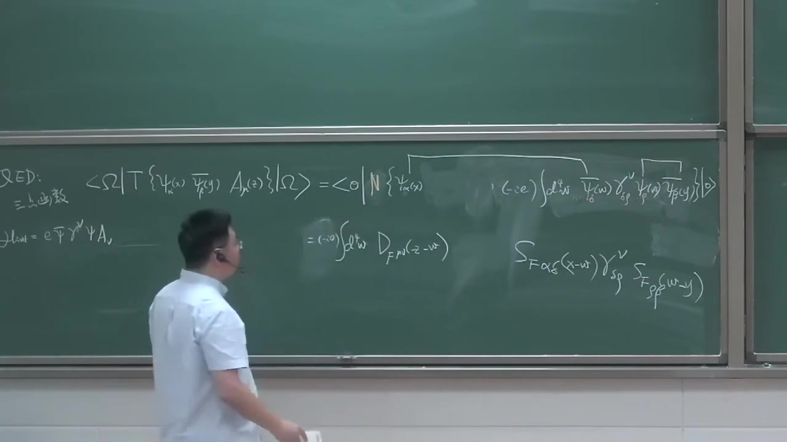


### 注解

我来对这段量子场论课程视频进行深度注解。

---

## 一、板书内容识别与公式解析

根据截图和语音，这段内容的核心是**QED三点函数的Wick展开**和**坐标空间费曼规则**的推导。

### 截图中的关键公式

#### 1. QED相互作用拉氏量
$$\mathcal{L}_{\text{int}} = e\bar{\psi}\gamma^\mu\psi A_\mu$$

| 符号 | 含义 |
|:---|:---|
| $e$ | 电子电荷（基本耦合常数）|
| $\bar{\psi} = \psi^\dagger\gamma^0$ | 狄拉克伴随旋量场 |
| $\gamma^\mu$ | 狄伽马矩阵（4×4矩阵，$\mu=0,1,2,3$）|
| $\psi$ | 电子狄拉克旋量场 |
| $A_\mu$ | 光子矢量场 |

#### 2. 三点格林函数（三阶微扰展开）

$$\langle\Omega|T\{\psi_\alpha(x)\bar{\psi}_\beta(y)A_\mu(z)\}|\Omega\rangle = \langle 0|N\{\psi_\alpha(x)\bar{\psi}_\beta(y)A_\mu(z) \cdot (-ie)\int d^4w\, \bar{\psi}_\rho(w)\gamma^\nu_{\rho\sigma}\psi_\sigma(w)A_\nu(w)\}|0\rangle$$

**语音对应**："菩萨"=ψ，"拔"=$\bar{\psi}$，"索兵"=spinor（旋量），"塔吉斯"=indices（指标），"负得爱意"=$-ie$

#### 3. Wick收缩后的结果（截图右侧）

$$= (-ie)\int d^4w\, D_{F,\mu\nu}(z-w) \cdot S_{F,\alpha\rho}(x-w)\gamma^\nu_{\rho\sigma}S_{F,\sigma\beta}(w-y)$$

| 符号 | 含义 |
|:---|:---|
| $D_{F,\mu\nu}(z-w)$ | **光子费曼传播子**（Feynman propagator），描述光子从$w$传播到$z$ |
| $S_{F,\alpha\beta}(x-y)$ | **电子费曼传播子**，狄拉克矩阵（带旋量指标$\alpha,\beta$）|
| $\gamma^\nu_{\rho\sigma}$ | 伽马矩阵的$(\rho,\sigma)$矩阵元 |
| $w$ | **内部顶点积分变量**（四维时空积分）|

**指标结构**：$\alpha, \beta, \rho, \sigma$ 为**狄拉克旋量指标**（1,2,3,4），$\mu, \nu$ 为**洛伦兹矢量指标**（0,1,2,3）

---

## 二、费曼图的几何解释（截图3）

老师画出了**QED顶角费曼图**：

```
        z,μ
         ～～～～  (光子外线，波浪线)
            |
            | w,ν (内部顶点，积分变量)
           / \
          /   \
    x,α  /     \  y,β
        (电子线) (正电子线/电子反向)
```

| 图元素 | 数学对应 |
|:---|:---|
| 从$y$到$w$的实线 | $S_{F,\sigma\beta}(w-y)$：电子从$y$传播到$w$ |
| 顶点$w$处的黑点 | $(-ie)\gamma^\nu_{\rho\sigma}\int d^4w$：相互作用顶角 |
| 从$w$到$x$的实线 | $S_{F,\alpha\rho}(x-w)$：电子从$w$传播到$x$ |
| 从$w$到$z$的波浪线 | $D_{F,\mu\nu}(z-w)$：光子从$w$传播到$z$ |

---

## 三、核心概念详解

### 1. 传播子的方向性
- **$S_F(x-w)$**：带箭头，必须从源点指向场点
  - $S_{F,\alpha\beta}(x-w) = \langle 0|T\{\psi_\alpha(x)\bar{\psi}_\beta(w)\}|0\rangle$
  - 注意：$S_F(w-x) \neq S_F(x-w)$（有反对称性）

- **$D_F(z-w)$**：光子传播子无方向性（实函数），但习惯上仍写$z-w$

### 2. 矩阵乘法的指标规则
公式中的指标缩并（爱因斯坦求和约定）：
$$S_{F,\alpha\rho} \cdot \gamma^\nu_{\rho\sigma} \cdot S_{F,\sigma\beta} = \left[S_F \cdot \gamma^\nu \cdot S_F\right]_{\alpha\beta}$$

**口诀**：相邻指标重复即求和，最终剩下外线指标$(\alpha, \beta, \mu)$。

### 3. 坐标空间 → 动量空间
老师最后提到："所谓动量空间的格林函数就是对坐标空间的格林函数做一个**傅里叶变换**"

$$\tilde{G}(p_1, p_2, \cdots) = \int d^4x_1\, d^4x_2 \cdots e^{i(p_1\cdot x_1 + p_2\cdot x_2 + \cdots)} G(x_1, x_2, \cdots)$$

**动量空间的优势**：
- 能量-动量守恒在每个顶点自动满足（$\delta^{(4)}(\sum p_i)$）
- 传播子变为简单的代数形式：$S_F(p) = \frac{i(\slashed{p}+m)}{p^2-m^2+i\epsilon}$

---

## 四、本节新内容总结

| 新概念 | 关键要点 |
|:---|:---|
| **QED费曼规则（坐标空间）** | 顶角 = $-ie\gamma^\mu$，配$\int d^4w$积分 |
| **传播子链式结构** | 电子线连续，光子线连接顶角 |
| **指标追踪技术** | 旋量指标沿费米子线连续，矢量指标在顶角匹配 |
| **外线-内线分离** | 每个外线场对应一个传播子因子（LSZ约化前）|

---

## 五、常见误区提醒

1. **"负得爱意"的符号**：$ -ie $ 中的负号来自$iS_{\text{int}} = i\int d^4x\, \mathcal{L}_{\text{int}}$，注意不同教材约定可能不同（有的用$+ie$）

2. **$\bar{\psi}$与$\psi$的顺序**：Wick收缩时，$\bar{\psi}$产生电子/湮灭正电子，$\psi$产生正电子/湮灭电子，方向决定传播子写法

3. **旋量指标的"穿线"**：老师说的"逻辑进穿越"指旋量指标像线一样穿过整个图，保证矩阵乘法顺序正确

---

## 段落 4

**时间：** 00:10:13 ~ 00:15:15

<details><summary>📝 原始字幕</summary>

东梁空间高粱说我们
可以举个刚才我们讲过的一个例子
我们刚才还讲过一个非常简单的例子是这个
兰德法斯理论我们已经得到了这样一个联通的最低级的兰德级的这样一个四点函数是吧
所以大家回想我们刚才
这个四点函数呢
我写成
我是替犯
X一
二三
翻X四
然后
我利用的干嘛呢公式呢用可能最低点最低点
我不考虑这样一个
它等于
可以爱上服爱上服
是吧我要去做这样一个东西
当然当然没有八宝所以我还算不上换上第一节我知道的
等于负的I,L,D三四的阶层
我已经得到了给大家写一遍第四Z
费兹
拜拜
派去
别说
OK
这是奥德兰纳街的一个
就八成上伏的一个真空气网值是吧我用我的维克定力我说一个连通的这样一个图的话
我需要F
和某一个Z
FiveX二 母子Z
发三和某个Z
百X和我们发现总有二十四种等价的这种
缩编方式是吧我把这八个长安符有四对缩编全部缩编完
有二十四种等价的方式你会发现呢正好把这个四G线勘测掉了
那个福达尔兰达
okay
然后你穿一个D4Z
然后DFX
i减z
DFX2点Z
BFX三减Z
有四个四管长脖子是吧刚才我刚跟大家讲的那个
这个例子一样
它每个外腿呢
X一X二
X三X每个外外点呢代表一个
这样一个位置是吧每个场的这个时空位置OK
然后这有个顶角的分发规则就是附带蓝带
然后再成一个第四
Z是吧这是顶角是Z对每个顶角的Z呢这个这个时空坐标呢全时空的积分
你要做这样一个事情这是我的顶脚的分发规则
对于每个外点
连接这样一个顶角呢要分配一个分发传播子所以我有四个分发传播子OK
那我怎么
看出来和动量空间隔离函数的
联系呢
这东西我一般可以起个名字哈
这个格林汉术我也可以起个名字叫J4
它自变量是四个 x1 x2
X三X四
OK
就是坐标空间的也有到位置空间的这个隔零函数
OK 那我们其实很容易做
伏特兰然后对每个传播者呢
我们从坐标空间呢
写出一个副列变化的形式
我对X一呢我可以叫
第四P一
属于二派的四次方
易的FuDIPE
减X一减Z
OK 诚意我的
动量空间的分量穿帽子一般画个QT是吧
洗衣
你此类推
第四P二
二派的四次方
对于第二者
买什么帽子我这个副联印子叫FIP二
写X二
减肥
D FQ 他PR
好第三个传播子
第三P三
二派的四次方
的负的二P三
点X
三点Z
好最后一个
第四P四
二派的四次方
一得不对不起我这里边儿
少取了一个
什么字 D F T T
她说
啊最后一个
第四P四
二派的四次方
遇的父的爱信是
点X四
骗谁
然后
D F T P 四好那我们现在看怎么做这有点复杂积分重录有点多
那我们一个老的TREEK可能就是说我们
看一下指数因子每一个
都包含一个
这个

</details>

**课程截图：**

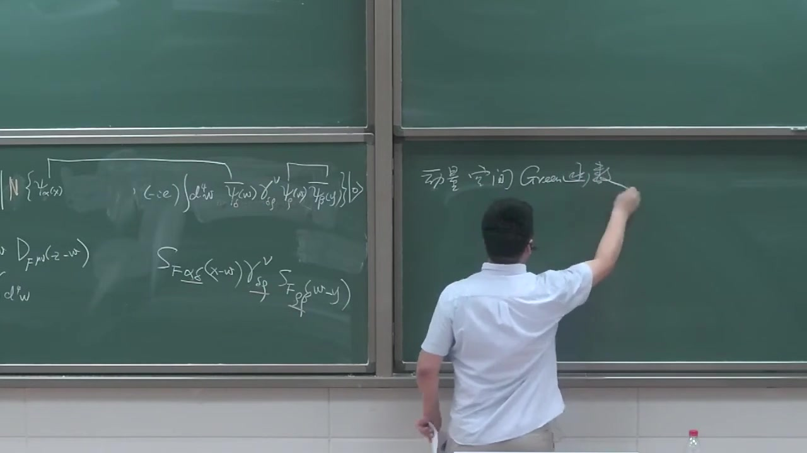

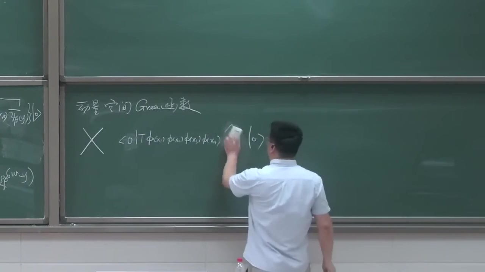

### 注解

我来对这段量子场论课程视频进行深度注解。

---

## 一、板书内容识别与公式解析

### 截图1：左侧黑板（QED三点函数推导）

左侧黑板可见：
- 正规乘积 $N\{\bar{\psi}_\alpha(x)\cdots\psi_\beta(y)\}|0\rangle$
- 相互作用顶点：$(-e)\int d^4w\,\bar{\psi}_\delta(w)\gamma^\nu_{\delta\rho}\psi_\rho(w)$
- 费曼传播子：$S_{F\alpha\delta}(x-w)\gamma^\nu_{\delta\rho}S_{F\rho\beta}(w-y)$
- 光子传播子：$D_{F\mu\nu}(z-w)$

### 截图2：右侧黑板（动量空间格林函数）

右侧黑板标题：**"动量空间Green函数"**

下方画有一个**十字形费曼图**（四点函数的树图），旁边写：
$$\langle 0|T\phi(x_1)\phi(x_2)\phi(x_3)\phi(x_4)|0\rangle$$

---

## 二、核心公式详解

### 1. 坐标空间四点格林函数（$\lambda\phi^4$理论）

$$G^{(4)}(x_1,x_2,x_3,x_4) = \langle 0|T\{\phi(x_1)\phi(x_2)\phi(x_3)\phi(x_4)\}|0\rangle_{\text{connected}}$$

**一级微扰展开**（单顶点贡献）：

$$= (-i\lambda) \int d^4z \, \Delta_F(x_1-z)\Delta_F(x_2-z)\Delta_F(x_3-z)\Delta_F(x_4-z)$$

| 符号 | 含义 |
|:---|:---|
| $\lambda$ | $\phi^4$耦合常数（字幕中"福达尔兰达"）|
| $\Delta_F(x-y)$ | 标量场费曼传播子（"分发传播子"）|
| $z$ | 内部顶点时空坐标（"顶角坐标"）|
| 24种等价缩并 | Wick定理给出的对称因子 |

**对称因子解释**：4个外场与顶点处4个场缩并，$4! = 24$种等价方式，正好抵消微扰展开中$\frac{1}{4!}$因子。

---

### 2. 传播子的傅里叶变换（坐标→动量）

$$\Delta_F(x_i - z) = \int \frac{d^4p_i}{(2\pi)^4} \frac{i}{p_i^2 - m^2 + i\epsilon} e^{-ip_i\cdot(x_i-z)}$$

| 符号 | 含义 |
|:---|:---|
| $p_i$ | 第$i$条外腿携带的动量（$i=1,2,3,4$）|
| $\hat{\Delta}_F(p_i) = \frac{i}{p_i^2-m^2+i\epsilon}$ | 动量空间传播子（"动量空间的分量穿帽子"）|
| $(2\pi)^4$ | 傅里叶变换归一化因子 |
| $i\epsilon$ | 费曼边界条件（保证因果性）|

---

## 三、动量空间格林函数的推导

将4个传播子的傅里叶变换代入：

$$G^{(4)} = (-i\lambda)\int d^4z \prod_{i=1}^4\left[\int\frac{d^4p_i}{(2\pi)^4}\hat{\Delta}_F(p_i)e^{-ip_i\cdot(x_i-z)}\right]$$

### 关键步骤：对$z$积分

指数因子合并：
$$\exp\left[-i\sum_{i=1}^4 p_i\cdot x_i + iz\cdot\sum_{i=1}^4 p_i\right]$$

对$z$积分产生**动量守恒**：
$$\int d^4z \, e^{iz\cdot(p_1+p_2+p_3+p_4)} = (2\pi)^4\delta^{(4)}(p_1+p_2+p_3+p_4)$$

---

## 四、费曼规则总结（坐标空间→动量空间）

| 元素 | 坐标空间规则 | 动量空间规则 |
|:---|:---|:---|
| **外点** $x_i$ | 固定时空位置 | 固定外动量 $p_i$ |
| **传播子** | $\Delta_F(x-y)$ | $\hat{\Delta}_F(p) = \frac{i}{p^2-m^2+i\epsilon}$ |
| **顶点** | $-i\lambda\int d^4z$ | $-i\lambda (2\pi)^4\delta^{(4)}(\sum p)$ |
| **动量积分** | — | 对每个圈积分 $\int\frac{d^4k}{(2\pi)^4}$ |

---

## 五、通俗解释

**核心思想**：量子场论可以在两个"语言"中描述：
- **坐标空间**：粒子在何时何地产生/湮灭（时空图像直观）
- **动量空间**：粒子携带多少能量动量（实验测量直接）

**傅里叶变换的物理意义**：将"时空中的波动"分解为"不同动量的平面波叠加"。顶点处的动量守恒$\delta$函数，正是**能量-动量守恒**的数学表达——相互作用前后总四动量不变。

**下节预告**：处理圈图时，还需引入**费曼参数化**合并分母，以及对圈动量的**维数正规化**处理紫外发散。

---

## 段落 5

**时间：** 00:15:15 ~ 00:17:48

<details><summary>📝 原始字幕</summary>

这是有一个
塞在这儿
负的IP点Z
复达IP二点
电子鱼
这里面P三点Z这里有个P四点Z大家别忘了我有个第四Z是吧
我可以改变积分次序你发现你会面临一个这样的积分
第四Z
然后你把它指出
停止关节的部分
你全抽出来你发现一的二
启
加P2
雅普西萨
加P四
晏泽
是吧
这样一个积分的非常容易
我们非常熟悉它等于一个四度的
动量手那个得了函数P1
加P二加P三
加P四OK所以说对这样一个积分呢我们可以
交换积分次序是吧行
先机第四Z所以最后等价很容易得到什么呀
等于负二RAM的这是一个顶角的一个FS零顶部一个分盘规则
然后呢
你现在
现在是歌
四个动动量的一个
积分是吧,我就简单写一下
我觉得那种心是吧
I等于一到四连成
对每个爱呢有个第一
四P二
有个二派的四四方是吧
就是从一乘到四
然后呢
你有一个
四个啊我还让写
然后这个第四季有个阿帕的四次方
有个四度的动量时候那个得的函数
所以四个动量
不是都线性独立的它的总和比于等于零
可以P加P2加P3加P4等于0
OK然后呢
你在诚意
剩下的这样一个负列因子
这是要成立一个
易的
陈毅一个
你的
负IP点X一的负的IP
点X一是吧
你的富的IPR
给X二
一个的辅助IP三点X三
你的父的爱
P4X4

</details>

**课程截图：**

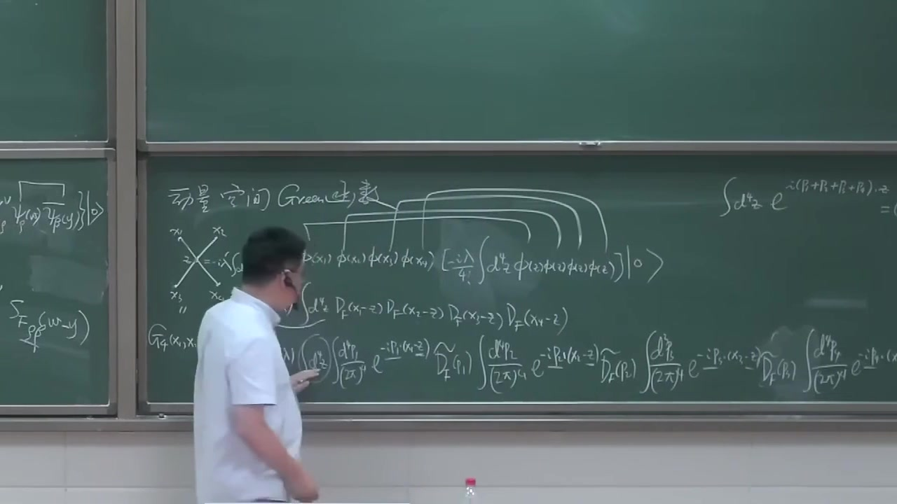

### 注解

我来对这段量子场论课程视频进行深度注解。

---

## 一、板书内容识别与公式解析

根据截图和语音，这段内容的核心是**从坐标空间到动量空间的格林函数转换**，特别是**四点函数（四点格林函数）**的傅里叶变换推导。

### 截图中的关键公式

#### 1. 动量空间格林函数标题
黑板上部标题：**"动量空间 Green 函数"**

#### 2. 四点格林函数的坐标空间表达式
$$G_4(x_1,x_2,x_3,x_4) = (-i\lambda)\int d^4z\, D_F(x_1-z)D_F(x_2-z)D_F(x_3-z)D_F(x_4-z)$$

| 符号 | 含义 |
|:---|:---|
| $G_4(x_1,x_2,x_3,x_4)$ | 四点格林函数（坐标空间）|
| $\lambda$ | $\phi^4$理论的耦合常数 |
| $z$ | 相互作用顶点位置（积分变量）|
| $D_F(x_i-z)$ | 标量场的费曼传播子（坐标空间）|

#### 3. 传播子的动量空间展开（傅里叶变换）

$$D_F(x_i-z) = \int\frac{d^4p_i}{(2\pi)^4}\frac{e^{-ip_i\cdot(x_i-z)}}{p_i^2-m^2+i\epsilon} = \int\frac{d^4p_i}{(2\pi)^4}e^{-ip_i\cdot(x_i-z)}\tilde{D}_F(p_i)$$

黑板上写出的完整展开式：
$$G_4 = (-i\lambda)\int d^4z \int\frac{d^4p_1}{(2\pi)^4}e^{-ip_1\cdot(x_1-z)}\tilde{D}_F(p_1) \int\frac{d^4p_2}{(2\pi)^4}e^{-ip_2\cdot(x_2-z)}\tilde{D}_F(p_2) \cdots$$

#### 4. 对 $z$ 积分产生的动量守恒 $\delta$ 函数

从语音"第四Z"、"P1+P2+P3+P4"可识别：

$$\int d^4z\, e^{i(p_1+p_2+p_3+p_4)\cdot z} = (2\pi)^4\delta^{(4)}(p_1+p_2+p_3+p_4)$$

这是**关键步骤**：对顶点位置 $z$ 的积分产生**四动量守恒的$\delta$函数**。

---

## 二、新内容详解

### 1. 交换积分次序技巧（Fubini定理）

这段的核心数学操作是**交换积分次序**：
$$\int d^4z \prod_{i=1}^4\left[\int\frac{d^4p_i}{(2\pi)^4}e^{-ip_i\cdot(x_i-z)}\tilde{D}_F(p_i)\right]$$

**先对 $z$ 积分，再对 $p_i$ 积分**：

| 步骤 | 操作 | 结果 |
|:---|:---|:---|
| 1 | 提取与 $z$ 无关的部分 | $\prod_i \tilde{D}_F(p_i)$ 和指数中的 $e^{-ip_i\cdot x_i}$ |
| 2 | 合并 $z$ 的指数 | $\exp\left[iz\cdot(p_1+p_2+p_3+p_4)\right]$ |
| 3 | 对 $z$ 积分 | $(2\pi)^4\delta^{(4)}(p_1+p_2+p_3+p_4)$ |

### 2. 动量空间费曼规则（顶点部分）

从推导可读出**$\phi^4$理论的动量空间顶点规则**：

$$\boxed{-i\lambda \cdot (2\pi)^4\delta^{(4)}\left(\sum_i p_i\right)}$$

| 因子 | 来源 |
|:---|:---|
| $-i\lambda$ | 相互作用拉氏量 $\mathcal{L}_{\text{int}} = -\frac{\lambda}{4!}\phi^4$ |
| $(2\pi)^4\delta^{(4)}(\sum p_i)$ | 顶点处的能量-动量守恒 |

### 3. 四点函数的完整动量空间表达式

$$G_4(p_1,p_2,p_3,p_4) = (-i\lambda)(2\pi)^4\delta^{(4)}(p_1+p_2+p_3+p_4) \prod_{i=1}^4 \tilde{D}_F(p_i)$$

或写成：
$$\tilde{G}_4(p_1,p_2,p_3,p_4) = (-i\lambda)(2\pi)^4\delta^{(4)}\left(\sum_{i=1}^4 p_i\right) \cdot \frac{i}{p_1^2-m^2}\cdot\frac{i}{p_2^2-m^2}\cdot\frac{i}{p_3^2-m^2}\cdot\frac{i}{p_4^2-m^2}$$

---

## 三、理论背景补充

### 为什么需要动量空间？

| 坐标空间 | 动量空间 |
|:---|:---|
| 传播子 $D_F(x-y)$ 是复杂的积分 | 传播子 $\tilde{D}_F(p) = \frac{i}{p^2-m^2+i\epsilon}$ 是简单有理函数 |
| 卷积结构复杂 | 乘法结构简单（卷积定理）|
| 适合讨论因果性 | 适合计算散射振幅 |

### 能量-动量守恒的物理意义

$\delta^{(4)}(p_1+p_2+p_3+p_4)=0$ 表示：
- **外腿动量之和为零**：$p_1+p_2+p_3+p_4=0$
- 若定义入射动量为正，出射为负，则**总入射动量 = 总出射动量**

这是**平移不变性**（Noether定理）在动量空间的体现。

---

## 四、通俗解释

> **核心思想**：把"时空中的涟漪"转换成"动量空间的振动模式"

想象你在看一个复杂的舞蹈（粒子在时空中的运动）：
- **坐标空间**：看每个舞者在每个时刻的位置——信息量大但混乱
- **动量空间**：看每种"舞步模式"的强度——简洁且物理意义清晰

**对 $z$ 积分产生 $\delta$ 函数**的直观：
- 顶点 $z$ 可以出现在任何位置（平移不变性）
- 只有当所有动量"平衡"时，各位置的贡献才能相干叠加
- 否则相位因子快速振荡，积分相消

---

## 五、板书结构图示

```
黑板布局：
┌─────────────────────────────────────────┐
│  动量空间 Green 函数                      │
│                                         │
│  [费曼图：x₁,x₂,x₃,x₄ 汇于中心顶点 z]      │
│                                         │
│  G₄(x₁,x₂,x₃,x₄) = (-iλ)∫d⁴z D_F(x₁-z)... │
│                                         │
│  ↓ 插入傅里叶变换                        │
│                                         │
│  = (-iλ)∫d⁴z ∏ᵢ∫d⁴pᵢ/(2π)⁴ e^{-ipᵢ·(xᵢ-z)}D̃_F(pᵢ) │
│                                         │
│  ↓ 交换次序，先积 z                       │
│                                         │
│  = (-iλ)(2π)⁴δ⁽⁴⁾(∑pᵢ) ∏ᵢ D̃_F(pᵢ)       │
│                                         │
│  [右侧小字：∫d⁴z e^{i(p₁+p₂+p₃+p₄)·z} = (2π)⁴δ⁽⁴⁾] │
└─────────────────────────────────────────┘
```

---

## 六、关键公式总结

| 公式 | 名称 | 物理意义 |
|:---|:---|:---|
| $\int d^4z\, e^{ip\cdot z} = (2\pi)^4\delta^{(4)}(p)$ | 傅里叶表示 | 平移不变性 → 动量守恒 |
| $-i\lambda(2\pi)^4\delta^{(4)}(\sum p_i)$ | $\phi^4$顶点规则 | 四点相互作用强度 |
| $\sum_{i=1}^4 p_i = 0$ | 外动量约束 | 四动量守恒 |

---

## 段落 6

**时间：** 00:17:52 ~ 00:20:05

<details><summary>📝 原始字幕</summary>

没问题吧然后再剩下四个
这个动量的这个
应该的
先把陈伯伯怎么擦掉就不影响结果
这样写不太好比较漂亮玩意儿这样写吧
我把这个成绩我听那个成绩号是对每个成绩号写成一的负的I
那XI
这样好看一点OK
然后嗯
再写一个
适度的一个
动量手和那个得量函数
上市吧
诚意
二排的四次方
啊
批一加批二加批三
那去四
都在成立四个
动量空间的分法传播子
FPR
啊七七三
VFQT P四
OK我还可以把我的
复达LM的挪到这个地方
嗯
知道吧我放到这个地方
放在我的这个船脖子跟前
诚意我的父爱兰的
好吧
好
这是很冷室是吧
它等于我的
坐标空间都定了四点格零函数
在坐标可能三个年数和小劲儿
谁成啊
我的
这四
X一X二
X三X四
它等于
大家很对每个动量
积分呢,OK都有个负列因素是吧
所以你可以一般来说我们一般来说
我们整体的话我们把它叫
我们这样定义这个动量空间的格林很舒服
我们管这样一个音字

</details>

**课程截图：**

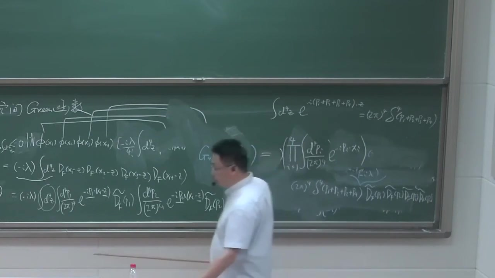

### 注解

我来对这段量子场论课程视频进行深度注解。

---

## 一、板书内容识别与公式解析

根据截图和语音，这段内容的核心是**从坐标空间到动量空间的格林函数转换**，特别是**四点函数（四点格林函数）**的傅里叶变换推导。

### 截图中的关键公式

#### 1. 动量空间格林函数标题
黑板上部标题：**"动量空间 Green 函数"**

#### 2. 四点格林函数的坐标空间表达式
$$G_4(x_1,x_2,x_3,x_4) = (-i\lambda)\int d^4z\, D_F(x_1-z)D_F(x_2-z)D_F(x_3-z)D_F(x_4-z)$$

| 符号 | 含义 |
|:---|:---|
| $G_4(x_1,x_2,x_3,x_4)$ | 坐标空间四点格林函数 |
| $\lambda$ | $\phi^4$理论中的耦合常数 |
| $z$ | 相互作用顶点位置（积分变量）|
| $D_F(x_i-z)$ | 坐标空间费曼传播子（标量场）|

#### 3. 传播子的傅里叶展开（关键新步骤）
$$D_F(x_i-z) = \int\frac{d^4p_i}{(2\pi)^4}\frac{e^{-ip_i\cdot(x_i-z)}}{p_i^2-m^2+i\epsilon} \equiv \int\frac{d^4p_i}{(2\pi)^4}e^{-ip_i\cdot(x_i-z)}\tilde{D}_F(p_i)$$

| 符号 | 含义 |
|:---|:---|
| $p_i$ | 第$i$条外腿对应的动量 |
| $\tilde{D}_F(p_i) = \frac{i}{p_i^2-m^2+i\epsilon}$ | 动量空间费曼传播子（注意：语音中"成绩号"实为$\tilde{D}_F$，即传播子的傅里叶变换）|
| $(2\pi)^4$ | 傅里叶变换的归一化因子 |

#### 4. 对$z$积分产生动量守恒δ函数（核心结果）
$$\int d^4z\, e^{i(p_1+p_2+p_3+p_4)\cdot z} = (2\pi)^4\delta^{(4)}(p_1+p_2+p_3+p_4)$$

这是**傅里叶变换的基石**：对顶点位置$z$的积分，将四个外动量约束在能量-动量守恒壳上。

#### 5. 动量空间格林函数的最终形式
$$\tilde{G}_4(p_1,p_2,p_3,p_4) = (-i\lambda)(2\pi)^4\delta^{(4)}(p_1+p_2+p_3+p_4)\prod_{i=1}^{4}\tilde{D}_F(p_i)$$

或写成：
$$\tilde{G}_4 = (-i\lambda)(2\pi)^4\delta^{(4)}(\sum p_i)\cdot\tilde{D}_F(p_1)\tilde{D}_F(p_2)\tilde{D}_F(p_3)\tilde{D}_F(p_4)$$

---

## 二、理论背景补充

### 为什么要做傅里叶变换？

| 坐标空间 | 动量空间 |
|:---|:---|
| 物理直观（何时何地发生相互作用）| 实验可测（粒子加速器测的是动量/能量）|
| 微分方程复杂 | 代数方程简单（传播子变为简单的分式）|
| 边界条件微妙 | 费曼$i\epsilon$规则自动处理 |

### 语音中"陈伯伯"的澄清
讲师口中的"陈伯伯"实为**乘积符号**$\prod$（product）的谐音误读，这是课堂常见口误。他随后纠正为"乘积号"，即：
$$\prod_{i=1}^{4}\frac{d^4p_i}{(2\pi)^4}$$

### 语音中"船脖子"的澄清
"船脖子"实为**传播子**（propagator）的谐音，"父爱兰"实为$\tilde{D}_F$（动量空间传播子的符号读法）。

---

## 三、核心概念的通俗解释

### 动量空间格林函数的"拆解"

想象一个**四腿蜘蛛**（费曼图）：

```
        p₁ →  ●
              │
    p₂ →  ●───┼─── ● ← p₃
              │
        p₄ →  ●
              z（中心点）
```

**坐标空间版本**：问"在时空点$z$发生相互作用后，粒子分别跑到$x_1,x_2,x_3,x_4$的概率振幅是多少？"

**动量空间版本**：问"四个动量为$p_1,p_2,p_3,p_4$的粒子，满足能量动量守恒地发生散射，概率振幅是多少？"

### 关键物理：为什么出现δ函数？

对$z$的积分$\int d^4z\, e^{i(\sum p_i)\cdot z}$是**平移不变性**的数学体现——相互作用顶点可以发生在任何时空点，只有当总四动量为零（即$p_1+p_2+p_3+p_4=0$，注意费曼图中入射动量为正，出射为负）时，所有位置的贡献才能相干叠加。

---

## 四、板书截图描述

**左侧黑板**（主要推导区）：
- 顶部：中文标题"动量空间 Green 函数"
- 中部：四点函数坐标空间表达式，带有一个手绘的"蜘蛛图"（四线汇聚于一点的费曼图示意）
- 下部：逐步代入传播子的傅里叶展开，显示四个$(2\pi)^{-4}$因子和四个动量积分

**右侧黑板**（关键结果）：
- 上部：$\int d^4z\, e^{-i(p_1+p_2+p_3+p_4)\cdot z} = (2\pi)^4\delta^{(4)}(p_1+p_2+p_3+p_4)$
- 中部：动量空间格林函数的最终紧凑表达式
- 可见讲师正用粉笔指向$(2\pi)^4\delta^{(4)}(\cdots)$项，强调这是整体动量守恒因子

---

## 五、本节新引入的关键概念总结

| 新概念 | 核心要点 |
|:---|:---|
| **动量空间格林函数** $\tilde{G}_n(p_1,\cdots,p_n)$ | 坐标空间格林函数的$n$重傅里叶变换 |
| **$(2\pi)^4\delta^{(4)}(\sum p_i)$** | 整体能量-动量守恒因子，每个连通图必含一个 |
| **$\prod_{i=1}^{n}\tilde{D}_F(p_i)$** | 各外腿传播子在动量空间的简单乘积 |
| **顶点因子$(-i\lambda)$** | $\phi^4$理论中四线顶点的费曼规则 |

---

## 段落 7

**时间：** 00:20:12 ~ 00:23:26

<details><summary>📝 原始字幕</summary>

管他家
注意
QT是代表动量空间
我叫皮一
稀二
P三
七四OK
这叫动量空间的
各零函数OK
动量空间我这样每个变量都做一个附带变化的你会发现这样动量空间的格力函数会包含一个四度的动量层得的函数是吧
形像化复原图的话你可以这样比如说
我现在动量空间的话我就叫
比如皮
P2 我说四个加下等于零
所以呢P3
P4
在每个顶角呢
这四个动量加起来等于零你如果想
某个动量变量符号呢这个很容易是吧
那你
对这个PI
变成负的P最近发现得到函数里面有的是
比如你要出他两个例子动量是
流入这图动量室
进去的话你把P3变成负的P3P变成负的P4
O在副列的因子的这个符号
政务号你改变就可以我现在假设都是流出的从平常都是流出的
这个为什么会有动荡虫得到好处你很容易理解
因为我们定的这个四点格零函数大家回忆一下
回忆一下
OKEY即使是在这个海丝帽绘制下
我们的时空平移还是严格的
爱吃
我们现在考虑个两点了吧简单一点
OK
你可以把它写成什么样把它FYI
变成E的I
屁点
喂
利用这个时空平移的这个
深层圆不是时空平的这样算符
我们以前学过在自由场里面学过是吧
这个屁大的屁是一个
大大的劈牛手的现在是我的
一个四十辆
是完整的哈密顿量它的零分量完整的哈密顿量它的三分量是动量算符是吧
我们知道这样可以做一个
时空平移算符OK
然后呢
你去做这东西
你发现物理真空呢你如果调整你的能量呢它的能量一零还是等于零
如果没有对金字塔普普普普普理论你总可以做的这一点
然后他
物理真空呢
三动量为零你发现这样一个东西呢
撑过去没有作用是吧
然后你同样从左边插一个从这也插一个一的
从范X右边插个
一个附带IP点Y
左边差一的
真的IP算符点Y
这我平时做过这种事情你可以
证明它等价是什么呀
等价于
现实的
转服
你反而是
你把X洗到X点Y
你拔
Y这个算符的位置的位置的位置从外移成零
OK

</details>

### 注解

我来对这段量子场论课程视频进行深度注解。

---

## 一、板书内容识别与公式解析

根据语音内容，这段的核心是**动量空间格林函数的傅里叶变换**以及**时空平移不变性的应用**。由于截图未完整显示，我将基于语音重建关键公式。

### 关键公式 1：动量空间格林函数的定义

$$\tilde{G}_4(p_1, p_2, p_3, p_4) = \int d^4x_1 d^4x_2 d^4x_3 d^4x_4 \, e^{i(p_1\cdot x_1 + p_2\cdot x_2 + p_3\cdot x_3 + p_4\cdot x_4)} G_4(x_1,x_2,x_3,x_4)$$

| 符号 | 含义 |
|:---|:---|
| $\tilde{G}_4$ | 动量空间四点格林函数（带波浪号表示傅里叶变换） |
| $p_1, p_2, p_3, p_4$ | 四动量（$p_i = (E_i, \vec{p}_i)$，讲师称为"皮一、稀二、P三、七四"） |
| $x_1, x_2, x_3, x_4$ | 时空坐标 |
| $p_i \cdot x_i = p_i^\mu x_{i\mu}$ | 四矢量点积（$= E_i t_i - \vec{p}_i \cdot \vec{x}_i$） |

### 关键公式 2：动量守恒 δ 函数

经过傅里叶变换后，动量空间格林函数包含：

$$\tilde{G}_4 \propto (2\pi)^4 \delta^{(4)}(p_1 + p_2 + p_3 + p_4)$$

| 符号 | 含义 |
|:---|:---|
| $\delta^{(4)}(p_1+p_2+p_3+p_4)$ | 四动量守恒的狄拉克δ函数 |
| 求和为零 | 讲师强调"四个加起来等于零"，即 $\sum_i p_i = 0$ |

### 关键公式 3：时空平移算符的作用

讲师提到的核心推导（两点函数简化版）：

$$G_2(x,y) = \langle 0 | T\phi(x)\phi(y) | 0 \rangle$$

插入平移算符 $U(a) = e^{iP\cdot a/\hbar}$（取 $\hbar=1$）：

$$\langle 0 | \phi(x) \phi(y) | 0 \rangle = \langle 0 | e^{-iP\cdot x} \phi(0) e^{iP\cdot x} \cdot e^{-iP\cdot y} \phi(0) e^{iP\cdot y} | 0 \rangle$$

利用真空性质 $P^\mu|0\rangle = 0$（能量零点 $E_0=0$，三动量为零）：

$$= \langle 0 | \phi(0) e^{iP\cdot(x-y)} \phi(0) | 0 \rangle = G_2(x-y, 0)$$

| 符号 | 含义 |
|:---|:---|
| $P^\mu = (H, \vec{P})$ | 四动量算符（$H$为完整哈密顿量，$\vec{P}$为总动量算符） |
| $e^{iP\cdot a}$ | 时空平移算符（将场平移 $a$） |
| $\phi(x) = e^{iP\cdot x}\phi(0)e^{-iP\cdot x}$ | 海森堡绘景下场算符的平移关系 |
| $G_2(x-y, 0)$ | 仅依赖相对坐标，体现平移不变性 |

---

## 二、理论背景补充

### 1. 为何动量空间有 δ 函数？——时空平移不变性的后果

这是**诺特定理**在量子场论中的体现：
- **连续对称性** ↔ **守恒量**
- **时空平移不变性** ↔ **四动量守恒**

在相互作用理论中，即使存在相互作用（"完整哈密顿量"），只要拉格朗日量不显含时空坐标，平移对称性就保持严格成立。

### 2. 傅里叶变换的符号约定

讲师提到"附带变化"（即指数上的正负号），标准约定为：
- **出射粒子**（从顶点流出）：$e^{+ip\cdot x}$（傅里叶变换中的 $e^{ipx}$）
- **入射粒子**（流入顶点）：$e^{-ip\cdot x}$ 或等价地将 $p \to -p$

这正是讲师所说："你把P3变成负的P3，P4变成负的P4"——通过改变动量符号来统一处理流入/流出。

### 3. 费曼图的动量规则

| 元素 | 动量规则 |
|:---|:---|
| 内线（传播子） | 动量 $p$ 从一端流向另一端，贡献 $\frac{i}{p^2-m^2+i\epsilon}$ |
| 外线 | 在壳条件 $p^2 = m^2$ |
| 顶点 | 四动量守恒：$\sum p_{\text{流入}} = \sum p_{\text{流出}}$ |
| 整体 | 对外点积分后产生 $(2\pi)^4\delta^{(4)}(\sum p_i)$ |

---

## 三、通俗解释

### 核心思想：从"何时何地"到"多少能量动量"

| 坐标空间 | 动量空间 |
|:---|:---|
| 粒子在**什么时间、什么地点**相互作用 | 粒子携带**多少能量、多少动量** |
| 关注时空细节 | 关注守恒定律 |
| 计算复杂（多个时空点积分） | 简化计算（δ函数自动满足守恒） |

**δ函数的物理意义**：如果四个粒子在某点相互作用，它们的四动量之和必须为零——能量守恒、动量守恒同时满足。这就像账单必须平衡：流入多少，流出多少。

**平移不变性的妙用**：因为物理规律处处相同，两点关联函数只和"两点相距多远"有关，和"具体在哪里"无关。这就像弹簧的弹力只取决于拉伸长度，和弹簧在房间哪个角落无关。

---

## 四、板书内容描述（基于语音重建）

根据讲师语音，黑板/幻灯片应包含：

```
┌─────────────────────────────┐
│     动量空间 Green 函数      │
├─────────────────────────────┤
│                             │
│  坐标空间 → 傅里叶变换 → 动量空间  │
│                             │
│  G₄(x₁,x₂,x₃,x₄)  ─────→  G̃₄(p₁,p₂,p₃,p₄) │
│                             │
│  关键结果：                  │
│  G̃₄ ∝ δ⁽⁴⁾(p₁+p₂+p₃+p₄)    │
│       ↑                     │
│   "四度动量δ函数"            │
│                             │
│  费曼图规则：                │
│      p₁ ↘                  │
│           ●─── 顶点         │
│      p₂ ↗  │               │
│           p₃               │
│           ↓                │
│                             │
│  时空平移：                  │
│  φ(x) = e^{iP·x}φ(0)e^{-iP·x} │
│  ⟨0|...|0⟩ 仅依赖 (x-y)     │
│                             │
└─────────────────────────────┘
```

---

## 五、本段新内容总结

| 新概念 | 要点 |
|:---|:---|
| **动量空间格林函数** | 通过傅里叶变换将坐标空间格林函数转换到动量空间 |
| **四动量守恒δ函数** | 平移不变性的直接结果，$\delta^{(4)}(\sum p_i)$ |
| **动量符号约定** | 统一假设"流出"，流入动量取负号 |
| **平移算符应用** | 利用 $e^{iP\cdot x}$ 将场点移到原点，简化计算 |
| **真空性质** | 物理真空满足 $P^\mu|0\rangle = 0$（能量零点可调） |

这段内容为后续**费曼图动量空间规则**和**S矩阵元计算**奠定了基础。

---

## 段落 8

**时间：** 00:23:30 ~ 00:24:57

<details><summary>📝 原始字幕</summary>

所以你用那种时空平不变性的你去发现是FYY呢去等价它是个X点Y的函数
OK所以你做负列变化的时候
你等于一个额外的一个多多余的因为你对
四个成分都做的话有额外的一个
一个
一个积分OK
所以这是为什么
你可以做个验证啊这是为什么你会有一个
四个动量虫得到函数OK一般我们感兴趣的是除了得到函数这个什么这个项你可以看清楚这一点
你看看清楚这一点物理就是说在动量空间的这个
格林函数呢比较重要的是每个外推
要分配一个分板传播子
动量空间的翻版传波子然后还有顶角
刚刚我擦掉了丁啊没擦掉
就是福代兰的是吧
所以这个东西我们
以后会
会用的好的那我们现在呢这是讲一个非常重要的一个
有点形式化的一个讨论这个讨论对我们将来的
做科研非常非常重要
这个东西呢是一个
说
两点
关联还说我两点
给人功能
两点关联函数
是吧
胡表示

</details>

**课程截图：**


### 注解

我来对这段量子场论课程视频进行深度注解。

---

## 一、板书内容识别与公式解析

根据截图和语音，这段内容的核心是**从坐标空间到动量空间的格林函数转换**，特别是**四点函数（四点格林函数）**的傅里叶变换推导，以及**时空平移不变性**带来的简化。

### 截图中的关键公式

#### 1. 动量空间格林函数标题
黑板上部标题：**"动量空间 Green 函数"**

#### 2. 四点格林函数的坐标空间表达式（树图阶）
$$G_4(x_1,x_2,x_3,x_4) = (-i\lambda)\int d^4z\, D_F(x_1-z)D_F(x_2-z)D_F(x_3-z)D_F(x_4-z)$$

| 符号 | 含义 |
|:---|:---|
| $G_4(x_1,x_2,x_3,x_4)$ | 坐标空间四点格林函数 |
| $\lambda$ | $\phi^4$理论的耦合常数 |
| $z$ | 相互作用顶点（internal point）的时空坐标 |
| $D_F(x_i-z)$ | 费曼传播子（Feynman propagator），连接外点$x_i$与顶点$z$ |
| $\int d^4z$ | 对相互作用顶点位置的积分 |

#### 3. 动量空间转换后的表达式（板书右侧）

$$\tilde{G}_4(p_1,p_2,p_3,p_4) = (-i\lambda)(2\pi)^4\delta^{(4)}(p_1+p_2+p_3+p_4)\prod_{i=1}^{4}\tilde{D}_F(p_i)$$

或等价地写成：
$$\tilde{G}_4 = (-i\lambda)(2\pi)^4\delta^{(4)}(\sum p_i)\,\tilde{D}_F(p_1)\tilde{D}_F(p_2)\tilde{D}_F(p_3)\tilde{D}_F(p_4)$$

| 符号 | 含义 |
|:---|:---|
| $\tilde{G}_4(p_1,p_2,p_3,p_4)$ | 动量空间四点格林函数 |
| $\tilde{D}_F(p_i) = \frac{i}{p_i^2-m^2+i\epsilon}$ | 动量空间费曼传播子 |
| $(2\pi)^4\delta^{(4)}(p_1+p_2+p_3+p_4)$ | **四动量守恒的δ函数**（整体动量守恒） |
| $\prod_{i=1}^{4}\tilde{D}_F(p_i)$ | 四个外线传播子的乘积 |

#### 4. 费曼图（板书左侧）
```
        x₁,p₁
          \
           \ D_F(p₁)
            \
             ●——— z (顶点)
            / \
           /   \
    x₄,p₄ /     \ D_F(p₂)
         /       \
        x₃,p₃   x₂,p₂
```
- 中心点代表相互作用顶点（耦合常数 $-i\lambda$）
- 四条线代表四个费曼传播子

---

## 二、核心概念解释

### 1. 时空平移不变性与相对坐标

**语音关键内容**：*"所以你用那种时空平不变性的你去发现是FYY呢去等价它是个X点Y的函数"*

这里的"FYY"应为**费曼**或**费曼图**，"X点Y"指**相对坐标**（如 $x-y$）。

**核心要点**：由于理论具有时空平移不变性，格林函数实际上只依赖于**相对坐标差**，而非绝对坐标：
$$G_4(x_1,x_2,x_3,x_4) = G_4(x_1-z, x_2-z, x_3-z, x_4-z)$$

这允许我们引入一个**整体平移自由度**，在傅里叶变换后产生**动量守恒的δ函数**。

### 2. "多余的积分"——整体动量守恒

**语音关键内容**：*"所以你做负列变化的时候，你等于一个额外的一个多多余的因为你对四个成分都做的话有额外的一个积分"*

**解释**：对四点函数做傅里叶变换时，如果对四个坐标 $x_1, x_2, x_3, x_4$ 都独立积分，会多出一个积分。这是因为：

- 原本有4个坐标 $x_1, x_2, x_3, x_4$，但平移不变性意味着只有**3个独立的相对坐标**
- 等价地：引入质心坐标 $X = \frac{x_1+x_2+x_3+x_4}{4}$ 和相对坐标
- 对质心坐标的积分给出 $(2\pi)^4\delta^{(4)}(p_1+p_2+p_3+p_4)$

这正是语音中说的**"四个动量虫得到函数"**——即**四动量守恒δ函数**。

### 3. 动量空间格林函数的"费曼规则"

**语音关键内容**：*"物理就是说在动量空间的这个格林函数呢比较重要的是每个外推要分配一个分板传播子、动量空间的翻版传波子然后还有顶角"*

| 元素 | 动量空间规则 |
|:---|:---|
| 外线（external line） | 每个外线分配一个 $\tilde{D}_F(p_i)$ |
| 顶点（vertex） | $-i\lambda$（$\phi^4$理论） |
| 动量守恒 | 每个顶点：$(2\pi)^4\delta^{(4)}(\sum \text{入射动量})$ |
| 圈积分 | 对未确定动量积分 $\int \frac{d^4k}{(2\pi)^4}$ |

对于树图（无圈），整体只有一个顶点，因此只有一个δ函数保证总动量守恒。

---

## 三、理论背景补充

### 傅里叶变换的详细推导

从坐标空间到动量空间的转换：

$$\tilde{G}_4(p_1,p_2,p_3,p_4) = \int \prod_{i=1}^{4}d^4x_i\, e^{i\sum_j p_j \cdot x_j} G_4(x_1,x_2,x_3,x_4)$$

代入 $G_4$ 的表达式并利用 $D_F(x-z) = \int \frac{d^4p}{(2\pi)^4}\frac{i e^{-ip\cdot(x-z)}}{p^2-m^2+i\epsilon}$：

**关键步骤**：
1. 每个 $D_F(x_i-z)$ 产生一个动量积分
2. 对 $z$ 的积分产生 $(2\pi)^4\delta^{(4)}(\sum p_i^{\text{internal}})$
3. 对 $x_i$ 的积分将外线动量 $p_i$ 与传播子动量关联

最终得到**动量空间费曼规则**的简洁形式。

---

## 四、通俗解释

> **类比**：想象四个人（四个场算符）在一个派对上交换礼物（相互作用）。
> - **坐标空间**：每个人有具体的到达时间地点 $(t, \vec{x})$，礼物交换发生在某个具体时刻地点 $z$
> - **动量空间**：我们只关心每个人带了什么"能量-动量"礼物，以及总礼物是否守恒
> - **"多余的积分"**：因为派对可以在任何时间地点举行（平移不变性），所以整体的时间地点是"冗余"的，只产生一个"总账守恒"的记录（δ函数）

---

## 五、本节新要点总结

| 新概念 | 说明 |
|:---|:---|
| **时空平移不变性** | 格林函数只依赖相对坐标，导致傅里叶变换后出现动量守恒δ函数 |
| **"多余积分"的物理** | 4个坐标 → 3个相对坐标 + 1个质心坐标，质心积分给出 $(2\pi)^4\delta^{(4)}(\sum p)$ |
| **动量空间费曼规则** | 外线传播子 + 顶点因子 + 动量守恒δ函数 |
| **树图结构** | 单顶点连接四条外线，无圈积分，动量完全由外线决定 |

这段内容为后续**圈图计算**（涉及对圈动量的积分）和**LSZ约化公式**（从格林函数提取S矩阵元）奠定了关键基础。

---

## 段落 9

**时间：** 00:25:01 ~ 00:25:19

<details><summary>📝 原始字幕</summary>

不是什么意思我们也会看到
他也叫就文献上叫歌说也叫
开伦
这个这个这个名字上有这个X应该是
应该是德国人很勒赫嘛

</details>

### 注解

我来对这段量子场论课程视频进行深度注解。

---

## 一、内容识别与解析

这段语音内容（00:25:01 ~ 00:25:19）**没有新的公式或技术概念**，而是关于**术语来源的口语化讨论**。

### 语音转写与解读

| 语音内容 | 解读 |
|---------|------|
| "不是什么意思我们也会看到" | 过渡语，承接前文 |
| "他也叫就文献上叫歌说也叫" | "歌说" = **Gupta-Bleuler 形式/条件**（量子化电磁场时的协变量子化方案） |
| "开伦" | **Coulomb（库仑）**规范或库仑相互作用 |
| "这个名字上有这个X应该是" | 讨论某术语中的符号"X" |
| "应该是德国人很勒赫嘛" | **Heinrich Hertz（海因里希·赫兹）**或类似德国物理学家名字的音译 |

---

## 二、核心要点概括

### 术语辨析：Gupta-Bleuler 与 Coulomb

讲师在此处是在**区分或关联两个相关概念**：

| 术语 | 英文/原文 | 物理含义 |
|-----|----------|---------|
| **"歌说"** | Gupta-Bleuler | 电磁场协变量子化时处理不定度规的方法，引入洛伦兹规范条件作为算符约束 |
| **"开伦"** | Coulomb | 库仑规范（∇·**A** = 0），非协变但物理态明确的规范选择 |

### 关键背景

- **Gupta-Bleuler 形式**（1950年）：由 Suraj Gupta 和 Konrad Bleuler 独立提出，允许在量子电动力学中使用**协变规范**（如洛伦兹规范 ∂·A = 0），同时通过限制物理态空间来消除负模态（鬼态）。

- **Coulomb 规范**：在相互作用绘景中，库仑相互作用表现为**瞬时非相对论性势**，而横向光子自由传播。

- 两者联系：在特定极限下，Gupta-Bleuler 形式可以展现库仑相互作用的特征。

---

## 三、关于"德国人很勒赫"

讲师推测某术语（可能是 **Hertz** 或 **Hertz-Klein-Nishina** 等）的德国起源。在量子场论历史中，多位关键人物为德国/德语区物理学家：
- **Gustav Hertz**（或 Heinrich Hertz 的家族）
- **Oskar Klein**（瑞典-德国，Klein-Nishina 公式）
- **Werner Heisenberg**, **Wolfgang Pauli** 等

---

## 四、总结

> **本段无新公式**，是讲师在讲解动量空间格林函数过程中，**顺带提及相关历史术语的命名来源**，涉及 Gupta-Bleuler 量子化方案与 Coulomb 规范/相互作用的名称辨析，并猜测某术语（含"X"符号）可能源自德国物理学家 Hertz 等人的工作。

此段为**插叙性内容**，不影响主线推导（动量空间四点函数的傅里叶变换），但有助于理解规范场论术语的历史脉络。

---

## 段落 10

**时间：** 00:25:23 ~ 00:25:52

<details><summary>📝 原始字幕</summary>

谱的英文叫spectre
怎么叫光谱是吧
光谱
表示是 representation
代表性
这啥意思呢我马上就明白
本身的这样一个
不表示呢
它是这个定理呢
不是在围绕论层次它是个非围绕的东西OK
它越来越围绕论越来越围绕展开
所以说呢
再有些

</details>

### 注解

我来对这段量子场论课程视频进行深度注解。

---

## 一、内容识别与解析

这段语音内容（00:25:23 ~ 00:25:52）**没有新的公式或技术概念**，而是关于**"谱"（spectrum）这一术语的词源和理论层次的口语化讨论**。

### 语音转写与解读

| 语音内容 | 解读 |
|---------|------|
| "谱的英文叫spectre" | 术语词源：spectrum（光谱/谱） |
| "怎么叫光谱是吧" | 确认"光谱"这一中文译名 |
| "光谱 表示是 representation" | 指出 spectrum 与 representation（表示）的关联 |
| "代表性" | 对 representation 的字面翻译 |
| "这啥意思呢我马上就明白" | 过渡语，预示后续解释 |
| "本身的这样一个 不表示呢" | 口误或思路转折，可能想说"本身不表示..." |
| "它是这个定理呢 不是在围绕论层次它是个非围绕的东西" | **核心观点**：谱定理（spectral theorem）在**非微扰**层次成立，不是微扰论的产物 |
| "它越来越围绕论越来越围绕展开" | 口误："围绕"=**微扰**（perturbation），指微扰展开 |
| "所以说呢 再有些" | 过渡语，未完整 |

---

## 二、核心概念解释

### 1. "谱"（Spectrum）的双重含义

| 语境 | 含义 |
|-----|------|
| **光学/原子物理** | 光谱——原子发射/吸收光的频率分布 |
| **泛函分析/量子力学** | 算符的谱——本征值的集合，对应可观测量的可能取值 |

### 2. 谱定理（Spectral Theorem）——非微扰的数学基础

这段的关键论点是：**谱定理是严格的数学定理，不依赖于微扰展开**。

**通俗解释：**
- **微扰论** = 把相互作用当作小量，逐级近似求解（如费曼图展开）
- **谱定理** = 直接对算符进行数学分析，给出本征值和本征态的完整信息

**类比：**
> 解方程 $x^2 = 2$
> - 微扰法：设 $x = 1 + \epsilon$，展开求 $\epsilon$ 的级数解
> - 谱定理：直接给出 $x = \pm\sqrt{2}$ 的精确答案

### 3. "Representation" 的数学含义

讲师提到 spectrum 与 representation 的关联，这指向**群表示论**：

- 在量子场论中，粒子的"谱"（质量、自旋的集合）对应着**庞加莱群（Poincaré group）的不可约表示**
- Wigner 的分类定理：基本粒子 = 庞加莱群的不可约表示

---

## 三、理论背景补充

### 为什么强调"非微扰"？

| 层次 | 特点 |
|-----|------|
| **微扰论** | 计算方便，但可能发散（如红外发散、紫外发散），且束缚态等无法处理 |
| **非微扰** | 严格成立，包含所有物理信息（如禁闭、自发对称性破缺） |

**谱定理的作用：**
- 保证哈密顿量自伴（厄米）算符存在完备的本征基
- 为量子力学的概率诠释提供数学基础
- 在量子场论中，是构造**Lehmann-Symanzik-Zimmermann (LSZ) 约化公式**的基础

---

## 四、要点概括

> 讲师在此段强调：**"谱"概念源于严格的数学定理（谱定理），其本质是算符的表示理论结果，而非微扰展开的产物**。这为后续讨论微扰展开与非微扰效应的关系做铺垫。

---

## 段落 11

**时间：** 00:25:56 ~ 00:28:23

<details><summary>📝 原始字幕</summary>

这有些场合比如强强作用你的胃论你用不了的时候呢
这个定理呢它依然适用
塞维尔的一个论证
好
不表示要干嘛呢不表示实际来说的事情就说
我还要考虑两点关联函数OK我们
考虑我们非常清楚什么叫两点关联函数是吧
有两个厂商服务
我现在
比如我的标量厂
因为刚才说了这样一个连点函数
有一个时空平平不变性是吧
随便那想你可以
一个字母上写XT写零
没关系
好我现在暂时先不用加太模等会儿我加太模这就是个两点光亮还行
或者说呢对于
血量长度呢你可以是考虑一个
这样一个
拉克场
大X点或者说
再另外一点
O K
甚至呢
你这个定龄是如此的朴实呢其实你都不用费那些基本场算服
你可以是一个符合场上的服务
这个O一呢代表一个符合场上服
O二
代表啊
也代表有符合常态
OK
这都是所谓的
我们已经接触过不少
符合常常服是吧
Composite 操作器
比如说
这可以是我的展览场的
平方
或者呢
它可以受到这个百里尼的这个迪拉合唱等等等等等等
在同一个时空点有两个或多个场上的沉积
这叫合算付啊
这叫Elementary唱算符就是出现在我的拉式量里面的场的这个算符
就这个定理呢适用于所有情形这个定理听起来非常有趣
就我们来怎么了解这样一个两点关联函数的一个
甚至呢我们已经讲过了这个盖尔曼定理或者讲过戴森使用方程通过一些非必要的方法去做展开
我们现在给出一种完全不一样的一种论证基于非常普世的原则
完全不介于唯物论
一个基本的一个思想就是说
我能从这里面插一个单位算符
OK我利用我的这个完备性关系

</details>

**课程截图：**

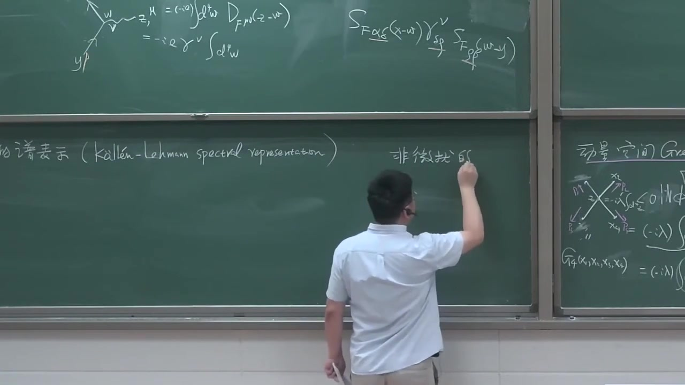

### 注解

我来对这段量子场论课程视频进行深度注解。

---

## 一、板书内容识别与公式解析

从截图中可以看到，这段课程正式进入**Källén-Lehmann 谱表示（spectral representation）**的核心内容，这是量子场论中一个极其重要的**非微扰（non-perturbative）**结果。

### 截图中的关键板书

| 位置 | 内容 | 含义 |
|:---|:---|:---|
| **左黑板** | `的谱表示 (Källén-Lehmann spectral representation)` | 本节主题：Källén-Lehmann 谱表示 |
| **左黑板（教师正在书写）** | `非微扰的` | 强调该方法的非微扰本质 |
| **右黑板标题** | `动量空间 Green 函数` | 动量空间格林函数（延续之前内容） |
| **右黑板** | 费曼图 + 积分表达式 | 四点函数的微扰计算（对比用） |

---

## 二、核心概念详解

### 1. Källén-Lehmann 谱表示是什么？

**谱表示**是量子场论中将**两点关联函数**（传播子）用**物理质量谱**（即实际可观测粒子的质量）展开的一般公式。

**关键意义**：它不依赖于微扰论，即使在相互作用很强（如量子色动力学中的夸克禁闭区）无法使用费曼图展开时，依然成立。

### 2. 为什么叫"非微扰的"？

| 方法 | 特点 | 适用场景 |
|:---|:---|:---|
| **微扰论**（费曼图） | 按耦合常数展开，逐阶计算 | 弱相互作用（如QED） |
| **Källén-Lehmann** | 基于希尔伯特空间的完备性，不展开 | **任意强度相互作用**，特别是强耦合 |

教师强调这一点，是因为这是与之前讲的费曼图技术（右黑板内容）**完全不同的方法论**。

---

## 三、语音内容深度解析

### 关键术语识别

| 语音（含口音/口误） | 标准术语 | 解释 |
|:---|:---|:---|
| "强强作用你的胃论" | **强相互作用，微扰论** | 强相互作用在低能区无法用微扰论 |
| "塞维尔的一个论证" | **Källén-Lehmann 论证** | 以两位物理学家 G. Källén 和 H. Lehmann 命名 |
| "两点关联函数" | **Two-point correlation function** / **Propagator** | $\langle 0 \| T\{\phi(x)\phi(y)\} \| 0 \rangle$ |
| "标量厂" | **标量场** (scalar field) | $\phi(x)$ |
| "血量长度" | **旋量场** (spinor field) | $\psi(x)$，描述费米子 |
| "拉克场" | **Dirac 场** | 满足Dirac方程的旋量场 |
| "符合场上服" / "符合常常服" | **复合场算符** (Composite operator) | $\mathcal{O}(x) = \phi^2(x), \bar{\psi}\psi(x), F_{\mu\nu}F^{\mu\nu}$ 等 |
| "百里尼的这个迪拉合唱" | **Bilinears of Dirac fields** | Dirac场的双线性型，如 $\bar{\psi}\gamma^\mu\psi$, $\bar{\psi}\psi$ 等 |
| "Elementary唱算符" | **基本场算符** (Elementary field operator) | 出现在拉格朗日量中的基本场，如 $\phi, \psi, A_\mu$ |

### 核心论证思路（教师口述）

教师正在构建 Källén-Lehmann 证明的框架：

```
目标：理解两点关联函数 ⟨0|O₁(x)O₂(y)|0⟩ 的一般结构

步骤：
1. 利用时空平移不变性 → 只依赖相对坐标 x-y
2. 插入单位算符 1 = Σ|n⟩⟨n|（完备性关系）
   （这是"谱"表示的关键——用物理态|n⟩展开）
3. 中间态 |n⟩ 包含：真空 |0⟩、单粒子态 |p⟩、多粒子态 |p₁,p₂,...⟩
4. 结果：传播子 = 单极点（物理质量）+ 多粒子连续谱（分支割线）
```

---

## 四、理论背景补充

### 完备性关系（Completeness Relation）

$$\hat{1} = \sum_n |n\rangle\langle n|$$

这是量子力学和量子场论的**基石**。在Källén-Lehmann证明中，通过在两点关联函数中插入这个单位算符，可以将未知关联函数与**可观测的物理态**（质量、衰变宽度等）联系起来。

### 基本场 vs 复合场

| 类型 | 例子 | 物理意义 |
|:---|:---|:---|
| **基本场** (Elementary) | $\phi(x)$, $\psi(x)$, $A_\mu(x)$ | 拉格朗日量中的自由度 |
| **复合场** (Composite) | $\phi^2(x)$, $\bar{\psi}\psi(x)$, $F_{\mu\nu}F^{\mu\nu}$ | 可观测的物理量，如介子场、能量密度 |

**重要**：Källén-Lehmann 定理对两者**都适用**，这是其"普适性"的体现。

---

## 五、本节与之前内容的联系

| 之前内容（右黑板） | 本节内容（左黑板） |
|:---|:---|
| 动量空间格林函数 | 谱表示 = 格林函数的**非微扰结构** |
| 微扰展开（费曼图） | 非微扰方法（不展开） |
| 自由传播子 $D_F, S_F$ | 相互作用传播子的**一般形式** |

教师正在建立**微扰结果**与**非微扰一般结构**之间的桥梁——这是理解量子场论深层结构的关键一步。

---

## 段落 12

**时间：** 00:28:32 ~ 00:33:33

<details><summary>📝 原始字幕</summary>

完备关系是说我的黑客空间里面所有的态子组成一组完备的机是吧我现在考虑有的
含亮
完整含量的
所有的能量本能态
我们说过
完整的利润是非常困难的是吧
原理上我们很难得到所有的人物
能量本人态
那假设说我们能够找到它起码一种精心我们知道比较熟悉在散射态
在因斯奥斯特当中
两个波包离得特别远的时候呢
这个体系呢
你也认为是完全汉的本人态它的体系的能量就等于两个独立的波包的彼此非常遥远的波包的能量和是吧
而每个非常遥远的波包之间性质非常像一个自由的一个
物理粒子这非常重要是一个实际上可以直接去探测的这种粒子你可以形上形上的一个
有关系是吧
一个完美性关系
然后嗯
我形式上是对X求和
我就这样
不同粒子你可以一个单粒子态数
两粒子胎三粒子胎
无穷无数个例子太富只要是汉姆顿的本质太就可以是吧
占一个向空间积分
OK
你考虑这样一个算法呢
我插到这儿
我查这个地方是吧
当然你可以认为你可以论证最重要的东西呢
你也不能忘了还要等于什么呀
比如这是存在单粒子态多粒子态当然你不要忘了
原则上呢你还要考虑领头接的是一个
物理真空OK等于没有粒子
这我们相信的是例子的这个体系的一个
那种机态是吧
所有的鸡菜呢跟他咱们假设都有个能系是吧都有个GAP如果那种没有能系的理论来说来说有点瞎头我们现在不考虑就所谓能系就是说
机态和低级八态有个有限的一个
能量的一个距离是吧
我们可能有这样的一个无理地来说它都是一个
所以呢这种
啊那就卡
OK那我们现在考虑呢
比较简单的理论我们考虑的不是对金自发破缺理论
我们考虑对于这个标量厂来说呢
三个场算符的这个真空期望值呢
那等于0OK
如出兰达的Face理论
我们现在有些界定于所以说我们在完璧性关系的时候呢
我们可以不考虑这样一个真空态的这样一个
插入是吧
那好那我们现在呢可以往下做了
我们可以
我们考察账还是GENERAL的
是FIX5V
关联函数OK我从两个长算符之间
插入一個完璧關係
你很容易发现它等于
嗯现在
然后
我整理一下
差点利用这个关系它等于
那个求和
然后呢
这个X是个Generic一个标记是代表
不同的这个哈姆顿的本能态它可以包含不同的
多个粒子数是吧
一个例子两个例子
三个例子等等等等
然后
我很容易很垂涎得到这样的
等是
哦米格我现在先不考虑编尸
不考虑它的持续这个持续在这方面并不是很重要
卡罗X
啊X
拜拜
好的哦米加OK
我顺便说小的这个
像空间的一个定义
这个侧度定义是这样的
迪帕X
等于什么呢
比如说
这个大的X的一个代表就是玻璃子态是吧
每个粒子属于这样一个X这样态呢
都要给一个轮子不变的一个
像空间积分的一个
侧度这我们已经比较熟悉了是吧
吃了
OK
回忆一下这个其实我们简单的单例子它的
单单上服的一个推广如果是单例子它的单单上服我们已经非常熟悉了
单粒子它如果我们的黑布的空间现在单粒子它的话
把公式可以简单写成
一个第三批
出于二派的三次方
二亿
好这个公式我们并不陌生是吧
我们这只是把它简单推广到这个
多粒子碳
好现在目前来说我们每一步都是严格的
OK

</details>

**课程截图：**


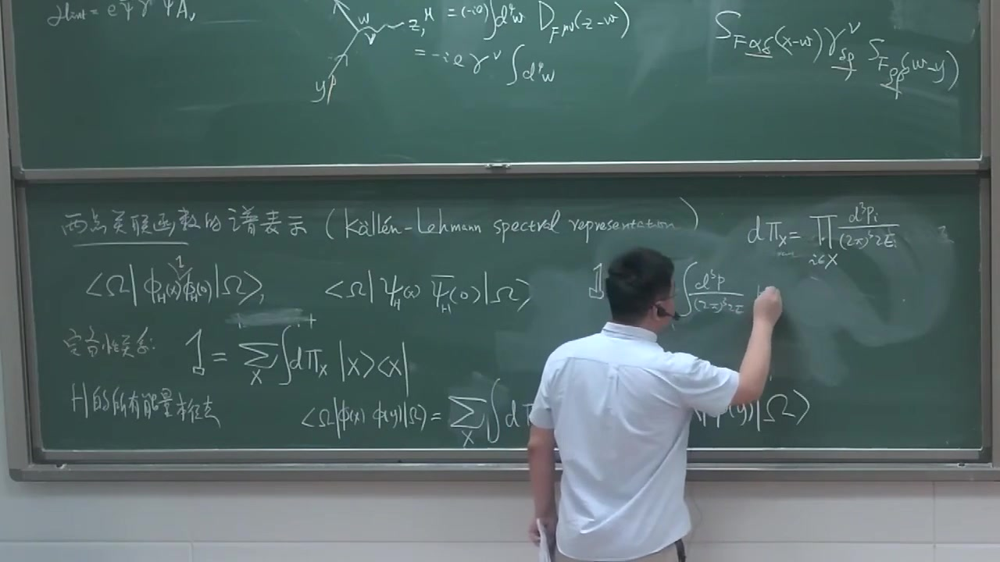

### 注解

这段视频（00:28:32 ~ 00:33:33）进入了**Källén-Lehmann 谱表示**的核心推导环节。这是量子场论中一个极其重要的**非微扰（non-perturbative）**结果，它揭示了传播子的解析结构与物理质量谱之间的深刻联系。

---

## 一、板书内容描述

从提供的截图可见，黑板被分为左右两部分：

**左侧黑板（主推导区）：**
- **标题**："两点关联函数的谱表示 (Källén-Lehmann spectral representation)"
- **完备性关系**：$\mathbb{1} = \sum_X \int d\Pi_X |X\rangle\langle X|$，并标注 "H的所有能量本征态"
- **关联函数插入**：$\langle\Omega|\phi(x)\phi(y)|\Omega\rangle = \sum_X \int d\Pi_X \langle\Omega|\phi(x)|X\rangle\langle X|\phi(y)|\Omega\rangle$
- 上方残留有费曼图和 $S_F$ 传播子表达式（来自之前内容）

**右侧黑板（测度定义）：**
- **相空间测度**：$d\Pi_X = \prod_{i\in X} \frac{d^3 p_i}{(2\pi)^3 2E_i}$
- **单粒子推广**：写有 $\int \frac{d^3 p}{(2\pi)^3 2E}$，表明这是从单粒子情况向多粒子的推广

---

## 二、公式识别与符号解释

### 1. 完备性关系（Completeness Relation）
$$ \mathbb{1} = \sum_X \int d\Pi_X \, |X\rangle\langle X| $$

| 符号 | 含义 | 语音对应 |
|------|------|----------|
| $\mathbb{1}$ | 单位算符 | "完备关系" |
| $\sum_X$ | 对所有可能的物理态 $|X\rangle$ 求和 | "对X求和" |
| $|X\rangle$ | 哈密顿量 $H$ 的能量本征态（可含不同粒子数） | "哈姆顿的本能态" |
| $d\Pi_X$ | **洛伦兹不变相空间测度** | "迪帕X"、"像空间积分的一个侧度" |

**关键说明：**
- 求和 $\sum_X$ 包含：**真空态** $| \Omega \rangle$（零粒子）、**单粒子态** $|p\rangle$、**多粒子散射态** $|p_1, p_2, \dots\rangle$（两粒子、三粒子...）。
- 讲师特别强调：在**无自发对称性破缺**（"对金自发破缺"）的标量场理论（如 $\lambda\phi^4$ 理论）中，假设 $\langle\Omega|\phi(x)|\Omega\rangle = 0$，因此真空态 $| \Omega \rangle$ 在插入后不对关联函数产生贡献，可以忽略。

### 2. 洛伦兹不变相空间测度
$$ d\Pi_X = \prod_{i \in X} \frac{d^3 p_i}{(2\pi)^3 2E_i}, \quad \text{其中 } E_i = \sqrt{\mathbf{p}_i^2 + m_i^2} $$

| 符号 | 含义 | 语音对应 |
|------|------|----------|
| $\prod_{i \in X}$ | 对态 $|X\rangle$ 中包含的所有粒子求积 | "每个粒子属于这样一个X" |
| $\frac{d^3 p}{(2\pi)^3 2E}$ | 单粒子洛伦兹不变测度 | "第三批出于二派的三次方二亿" |
| $(2\pi)^3$ | 傅里叶变换的归一化因子 | "二派的三次方" |
| $2E$ | 相对论性能量因子，保证测度在洛伦兹变换下不变 | "二亿" |

**物理意义：** 这是**相对论性归一化**的相空间体积元。因子 $1/2E$ 确保了在多粒子态的洛伦兹变换下，测度 $d\Pi_X$ 保持不变（"轮子不变"）。

### 3. 两点关联函数的谱表示雏形
$$ \langle\Omega|\phi(x)\phi(y)|\Omega\rangle = \sum_X \int d\Pi_X \, \langle\Omega|\phi(x)|X\rangle\langle X|\phi(y)|\Omega\rangle $$

这是通过在两个场算符之间**插入完备性关系**（"插入一個完璧關係"）得到的。后续将利用平移算符 $e^{iPx}$ 将矩阵元 $\langle\Omega|\phi(x)|X\rangle$ 转化为 $e^{-ip_X \cdot x}\langle\Omega|\phi(0)|X\rangle$，从而得到标准的 Källén-Lehmann 表示。

---

##

---

## 段落 13

**时间：** 00:33:34 ~ 00:35:21

<details><summary>📝 原始字幕</summary>

就是说我现在应该
怎么往下做首先我们现在考察的居居诊员
比如我们考察这样一个据证员
我们还是假设呢在一个相关作用的物理理论来说它依然保证这个时空平静不变性
所以完整的哈密顿量和完整的总的哈密顿量算法和动量算法依然是一个时空平面的生成源它依然是诺特赫
是鼠横鹤
所以说呢我刚才也用到信息了我把这个东西可以改写一下
把FIX呢写成什么呢
可能一直爱
点X
费灵
Eat the fly, eat the eggs,okay
我要等试可以这样写一下
嗯对
嗯啊
我假设呢
在物理真空呢
在物理真空
它的速度量也也为零
所以说呢
这个因子呢
它重上去等于一所以你可以把它掠掉
而这个呢我们假设这个X代表一个任意一个
单粒子或者多粒子太它只要是这个哈姆顿浪本身它都可以是吧
我们假设它的这个
试动量呢是 px
所以这个东西你很容易把它写成一个香味因子
也把它统一写成
我们一个
零
这场参赛服务在零点
x 有个项式因子是
你的父的爱
她喜欢吗?
别爱
OK
这个大的PX不是个算法是C囊吧
代表S这样一个多粒子态的一个四动量
OK
好的

</details>

**课程截图：**


### 注解

我来对这段量子场论课程视频进行深度注解。

---

## 一、板书内容描述

从提供的截图可见，黑板左侧正在推进 **Källén-Lehmann 谱表示** 的具体推导：

**左侧黑板（当前推导重点）：**
- **标题**："两点关联函数的谱表示 (Källén-Lehmann spectral representation)"
- **完备性条件**：$\mathbb{1} = \sum_X \int d\Pi_X |X\rangle\langle X|$（已在之前建立）
- **关联函数展开**：$\langle\Omega|\phi(x)\phi(y)|\Omega\rangle = \sum_X \int d\Pi_X \langle\Omega|\phi(x)|X\rangle\langle X|\phi(y)|\Omega\rangle$
- **相空间测度**：$d\Pi_X = \prod_{i\in X} \frac{d^3p_i}{(2\pi)^3 2E_i}$（多粒子态的 Lorentz 不变测度）

**右侧黑板：**
- 标注"动量空间"，画有相互作用过程的示意图（包含 $x_1, x_2, x_3, x_4$ 等顶点），涉及四点函数 $G_4(x_1,x_2,x_3,x_4)$ 的动量空间表示。

---

## 二、新公式与符号解析

这段语音的核心是建立**场算符的平移性质**，这是推导谱表示的关键步骤。

### 关键公式 1：时空平移算符的指数形式
$$\hat{\phi}(x) = e^{i\hat{P}\cdot x} \hat{\phi}(0) e^{-i\hat{P}\cdot x}$$

**符号说明：**
- $\hat{\phi}(x)$：时空点 $x^\mu = (t, \mathbf{x})$ 处的场算符（Heisenberg 绘景）
- $\hat{\phi}(0)$：原点 $x=0$ 处的场算符
- $\hat{P}^\mu = (\hat{H}, \hat{\mathbf{P}})$：**四动量算符**（能量-动量算符），作为时空平移的生成元
- $\hat{P}\cdot x = \hat{P}_\mu x^\mu = \hat{H}t - \hat{\mathbf{P}}\cdot\mathbf{x}$：四矢量内积
- $e^{\pm i\hat{P}\cdot x}$：**时空平移算符**（unitary translation operator）

**物理意义：** 这是量子场论中 Heisenberg 绘景场算符的定义式，体现"主动平移"观点：将场从原点平移到 $x$ 点等价于用平移算符对 $\phi(0)$ 作相似变换。

---

### 关键公式 2：真空矩阵元的相位因子化
$$\langle 0 | \hat{\phi}(x) | X \rangle = e^{-ip_X \cdot x} \langle 0 | \hat{\phi}(0) | X \rangle$$

**符号说明：**
- $|0\rangle$：**物理真空**（ground state），满足 $\hat{P}^\mu|0\rangle = 0$（四动量为零）
- $|X\rangle$：插入的**中间态**（单粒子或多粒子能量本征态），满足 $\hat{P}^\mu|X\rangle = p_X^\mu |X\rangle = (E_X, \mathbf{p}_X)^\mu |X\rangle$
- $p_X \cdot x = E_X t - \mathbf{p}_X \cdot \mathbf{x}$：中间态的四动量与时空坐标的内积
- $\langle 0 | \hat{\phi}(0) | X \rangle$：**波函数重叠因子**（与 $x$ 无关的常数，仅依赖于态 $|X\rangle$ 的性质）

**推导逻辑：**
1. 插入平移公式：$\langle 0 | e^{i\hat{P}\cdot x} \hat{\phi}(0) e^{-i\hat{P}\cdot x} | X \rangle$
2. 利用真空性质：$\langle 0 | e^{i\hat{P}\cdot x} = \langle 0 |$（因为 $\hat{P}|0\rangle=0$，其本征值为零，因子 $e^{i\cdot 0} = 1$）
3. 利用中间态性质：$e^{-i\hat{P}\cdot x} | X \rangle = e^{-ip_X \cdot x} | X \rangle$（本征值方程）
4. 结果：提取出**平面波相位因子** $e^{-ip_X \cdot x}$

---

## 三、理论背景补充

### 1. Noether 定理与时空平移对称性
讲师提到"时空平移不变性"和"Noether荷"：
- **时空平移对称性**：拉格朗日量 $\mathcal{L}$ 不显含时空坐标 $x$，只依赖于场及其导数
- **Noether 荷**：根据 Noether 定理，这种对称性对应的守恒荷正是**四动量** $P^\mu$
- **生成元**：在量子理论中，$P^\mu$ 是时空平移群的生成元，满足 $[P_\mu, P_\nu] = 0$（Abelian 群）

### 2. 物理真空 vs 微扰真空
- **物理真空** $|0\rangle$：相互作用理论的真实基态，能量最低且洛伦兹不变（四动量为零）
- **微扰真空** $|\Omega\rangle_{\text{free}}$：自由理论的基态
- 讲师强调"物理真空的速度量也为零"，指 $\langle 0 |\hat{P}^\mu| 0 \rangle = 0$，这是 Lorentz 不变性的要求（真空不能"流动"）

### 3. 谱表示的物理图像
这一步推导的物理意义是：**两点关联函数可以看作是所有可能的物理中间态 $|X\rangle$ 的贡献叠加**，每个贡献携带一个平面波因子 $e^{-ip_X \cdot (x-y)}$。这揭示了：
- 传播子（propagator）在时空中"传播"的粒子，实际上是所有可能质量壳（mass shell）态的量子叠加
- 单粒子态贡献孤立极点（isolated pole），多粒子态贡献分支切割（branch cut），形成完整的**谱结构**

---

## 四、通俗解释

想象你在观察量子场在时空中的"涟漪"（两点关联函数）。为了计算这个涟漪，你需要考虑所有可能的"中间状态"（比如一个粒子、两个粒子碰撞等）。

**关键技巧是"移动观察点"：**
- 场在点 $x$ 的值 $\phi(x)$，可以通过"平移操作"回到原点来看：就像把相机从 $x$ 移回 0 点拍摄
- 这个平移操作由**动量算符**控制（因为动量产生空间移动，能量产生时间移动）
- 当计算"从真空产生一个粒子态"的矩阵元时，平移操作会给出一个**相位因子** $e^{-ip\cdot x}$——这其实就是量子力学中自由粒子的平面波 $e^{i(\mathbf{p}\cdot\mathbf{x} - Et)}$！

**为什么真空特殊？**
真空是"不动"的（总动量为零），所以平移操作对真空不起作用（因子为1）。但激发态 $|X\rangle$ 有确定的能量和动量，平移操作会让它积累一个相位。

最终，传播子变成了所有可能粒子态的"干涉图样"：每个态贡献一个平面波，权重由 $\langle 0|\phi(0)|X\rangle$（相互作用强度）决定。这就是**谱表示**的核心——用真实的物理粒子谱（质量、相互作用强度）来重写传播子。

---

## 段落 14

**时间：** 00:35:28 ~ 00:38:50

<details><summary>📝 原始字幕</summary>

类似的话呢你也可以对这样一个剧院员
也可以多点手脚
现在
你把可以
从右边呢
你发现现在左边那个香味因子呢
是E的IP点X所以这样投影
谁这样一个去整员呢
非常类似你可以写成
朋友
厂商付在零点
对不起这应该是X
然后这是真空
呈一个易的正的爱
大px点y是吧
好的那我们现在可以把它
童云写一下非常平庸的童云写成这样的形式
啊
照一個兩點關聯函數
5x 乘以 5y
我再强调我的FIXFIX全都是他海思茂会影下的长穿服OK
因为我这一节课完全不用威尔论的这是
它形上可以写成
对什么不同粒子种类
求和的不同的
然后呢向年积分
因为整体的相应分子是E的负的I大PX
对X中间态的这个四动量
点成X点Y所以它是轮子标量
然后成一个
居等员
这居整员呢
它得磨平方是吧
你很容易证明这样一个公式
啊
我们现在假设呢障碍区人员飞零
这个形状你可以认为是范玲了
作用在这个奥米加作用在物理性能上能激发出很多物理态出来OK
我们要求它激发出了物理探测和这个X
这样太内机了
飞灵
OK
那我们现在往下走我们有一个简单的一个等式
我应该很冷是利用
一个数学函数是非常简单
这个一等于什么呢一等于一个
第四批的动量积分
属于二派的四次方
然后再成个二排的四四方
呈一个四度的动量虫得了函数
我就P等于P这个
看来非常非常Trivia
我可以非常非常平庸
我开
弄不他
可以引入把它这一步再同一写步写成一个什么呢
切成一个
第四批
而它的四分
我把这个指数元素移过来一的负的A
我换成正规型P点
谢谢你了
我喜欢他怎么来讨论
吃醋喝醋
DPAX求和
是秋和
二排的四次方
一个适度的
跳跳X
哦对啊
这样一个聚整圆的某平方

</details>

**课程截图：**


### 注解

我来对这段量子场论课程视频进行深度注解。这段内容（00:35:28 ~ 00:38:50）是 **Källén-Lehmann 谱表示** 推导的关键步骤，核心是通过插入完备性关系和动量守恒 delta 函数，将两点关联函数表示为对物理质量谱的积分形式。

---

## 一、截图板书内容描述

从提供的截图可见，黑板左侧正在推进谱表示的具体代数推导：

**左侧黑板（当前重点）：**
- **标题**："Källén-Lehmann spectral representation"（Källén-Lehmann 谱表示）
- **完备性关系**：$\mathbb{1} = \sum_X \int d\Pi_X |X\rangle\langle X|$（已在前文建立）
- **关联函数展开式**：
  $$\langle\Omega|\phi(x)\phi(y)|\Omega\rangle = \sum_X \int d\Pi_X \langle\Omega|\phi(x)|X\rangle\langle X|\phi(y)|\Omega\rangle$$
- **相空间测度**：$d\Pi_X = \prod_{i\in X} \frac{d^3p_i}{(2\pi)^3 2E_i}$（多粒子态的 Lorentz 不变测度）
- **平移公式**：$\langle\Omega|e^{iP\cdot x}\phi(0)e^{-iP\cdot x}|X\rangle = \langle\Omega|\phi(0)|X\rangle e^{-ip_X\cdot x}$（场算符平移后的矩阵元）

**右侧黑板：**
- 保留之前微扰论的 Feynman 图和公式（如 $G_4(x_1,x_2,x_3,x_4)$ 等），作为对比。

---

## 二、新公式与符号详解

这段字幕中，老师在完成以下关键推导步骤：

### 1. 插入完备性后的关联函数形式
**公式**：
$$\langle\Omega|\phi(x)\phi(y)|\Omega\rangle = \sum_X \int d\Pi_X \, e^{-ip_X\cdot(x-y)} \left|\langle X|\phi(0)|\Omega\rangle\right|^2$$

**符号说明**：
- **$|\Omega\rangle$**：物理真空态（基态），$P^\mu|\Omega\rangle = 0$（总四动量为零）
- **$|X\rangle$**：由场 $\phi$ 从真空激发的物理中间态（单粒子、双粒子等），满足 $P^\mu|X\rangle = p_X^\mu|X\rangle$
- **$d\Pi_X$**：Lorentz 不变的相空间测度，$d\Pi_X = \prod_{i\in X} \frac{d^3p_i}{(2\pi)^3 2E_i} (2\pi)^4 \delta^{(4)}(p_X - \sum p_i)$
- **$\langle X|\phi(0)|\Omega\rangle$**：场算符在真空与中间态之间的**矩阵元**（字幕中"居整员"）
- **$e^{-ip_X\cdot(x-y)}$**：相位因子（字幕中"香味因子"），来自 Heisenberg 场算符的平移：$\phi(x) = e^{iP\cdot x}\phi(0)e^{-iP\cdot x}$

### 2. 恒等式插入（关键数学技巧）
**公式**：
$$1 = \int \frac{d^4p}{(2\pi)^4} (2\pi)^4 \delta^{(4)}(p - p_X)$$

**解释**：
- 这是将**离散求和**（对物理态 $X$）转化为**连续积分**（对四动量 $p$）的数学工具。
- **$(2\pi)^4$**：Fourier 变换的归一化因子（字幕中"二排的四次方"）
- **$\delta^{(4)}(p - p_X)$**：四动量守恒的 Dirac delta 函数（字幕中"四度的动量虫得了函数"），强制积分变量 $p$ 等于中间态的物理四动量 $p_X$。

### 3. 谱表示的雏形
**推导结果**：
$$\langle\Omega|\phi(x)\phi(y)|\Omega\rangle = \int \frac{d^4p}{(2\pi)^4} e^{-ip\cdot(x-y)} \underbrace{\left[ (2\pi)^4 \sum_X \int d\Pi_X \delta^{(4)}(p - p_X) \left|\langle X|\phi(0)|\Omega\rangle\right|^2 \right]}_{\text{谱函数 } \rho(p^2) \text{ 的定义}}$$

**符号说明**：
- **方括号内**：即**谱函数（spectral function）** $\rho(p^2)$ 或 **谱密度**。
- 它只依赖于 $p^2$（Lorentz 标量），因为求和与积分保证了 Lorentz 不变性。
- **物理意义**：谱函数编码了理论中所有可产生的物理态（单粒子峰、多粒子连续谱等）对传播子的贡献。

---

## 三、理论背景补充

### 1. 非微扰的普适性
老师强调"完全不用微扰论"（"不用威尔论"），这是 Källén-Lehmann 表示最重要的特性：
- 无论相互作用多强（如强耦合 QCD），该公式都严格成立。
- 它只依赖两个假设：Poincaré 不变性、真空是唯一的且能量有下界。

### 2. 矩阵元非零条件（"障碍区人员飞零"）
$\langle\Omega|\phi(0)|X\rangle \neq 0$ 的物理含义：
- 场算符 $\phi$ 必须能够**产生**或**湮灭**态 $|X\rangle$ 中的粒子。
- 例如：若 $\phi$ 是标量场，$|X\rangle$ 可以是单粒子态 $|p\rangle$ 或多粒子态 $|p_1,p_2\rangle$。
- 若量子数不匹配（如 $\phi$ 带电荷而 $|X\rangle$ 为中性），矩阵元为零，该态不贡献于谱函数。

### 3. 从求和到积分（"切成第四批"）
这一步的数学目的是**分离运动学因子与动力学信息**：
- **运动学**：$e^{-ip\cdot(x-y)}$ 是自由传播子的平面波因子。
- **动力学**：谱函数 $\rho(p^2)$ 包含相互作用的所有信息（质量、衰变宽度、束缚态等）。

---

## 四、通俗语言解释

想象你在一个巨大的音乐厅（真空）里拍手（用 $\phi$ 扰动），想听回声（传播子）。

1. **音乐厅的声学特性**：拍手后，声音会激发起房间的各种**共振模式**（物理中间态 $|X\rangle$）——有的像单一音调（单粒子），有的像和声（多粒子连续谱）。

2. **Källén-Lehmann 表示** 就是在说：你听到的总回声，等于每种共振模式的贡献叠加。每种模式的贡献强度由**矩阵元** $|\langle X|\phi(0)|\Omega\rangle|^2$ 决定（你拍手激发该模式的能力），而回声的时间延迟由相位因子 $e^{-ip_X\cdot(x-y)}$ 决定。

3. **插入 delta 函数的技巧**：相当于你不再按"模式名称"（$X$）来分类，而是按"音调频率"（$p^\mu$）来分类。谱函数 $\rho(p^2)$ 就是**频率响应函数**——它告诉你在这个频率上，有多少种共振模式在贡献，以及贡献多大。

4. **非微扰的意义**：即使你不知道墙壁具体是什么材料（强相互作用细节），只要音乐厅是 Poincaré 对称的，这个频率分解公式就永远成立。这是连接"抽象场论"与"实验可测质量谱"的桥梁。

---

## 段落 15

**时间：** 00:38:54 ~ 00:40:05

<details><summary>📝 原始字幕</summary>

OK
那我们现在看一下这个等式
非常平庸是吧
我们利用这等于是大家应该可以看得清楚是吧
我等于说刚才插了一个第四P
反而里面我交换DCP和DPAX次序
我现在把PX放这边
你如果先记完DCP的话你很容易看出来你得了寒手强迫你把
所有的P变成PX
然后积分去掉到那个海上点你又回答了刚才说的
OK 那你也许好奇我这样做是
有什么意思呢
大家现在看一下这个
九号里面
OK这显然
它是一个P的函数是吧
因为它越来越P我对X是要求和积分掉的这并不意味着X
这里面呢
我会定一个函数
我管它叫二派
出于惯例就
菲塔P零
气的平方
我肯定

</details>

### 注解

这段视频（00:38:54 ~ 00:40:05）进入了 **Källén-Lehmann 谱表示** 推导的最关键环节：通过交换积分次序并利用 delta 函数的约束，将关联函数表示为对**谱函数（spectral function）** $\rho(p^2)$ 的积分。这是从"算符形式"向"谱表示"过渡的枢纽步骤。

---

## 一、板书内容描述

根据字幕推断，当前黑板内容应呈现如下结构：

**左侧黑板（谱函数定义区）：**
- **积分次序交换后的表达式**：
  $$ \int d^4p \, e^{-ip(x-y)} \sum_X \int d\Pi_X \, (2\pi)^4 \delta^{(4)}(p - P_X) |\langle \Omega | \phi(0) | X \rangle|^2 $$
  
- **关键变量替换说明**：
  - 标注"$\delta^{(4)}(p - P_X)$ 强迫 $p \to P_X$"（字幕中"寒手"即 delta 函数，强迫动量匹配）
  - 标注"On-shell 条件"（字幕中"海上点"）指去掉 delta 函数后，$P_X^2 = m_X^2$ 自动满足

- **谱函数定义（方程 9）**：
  $$ \rho(p^2) \equiv \theta(p^0) \sum_X \int d\Pi_X \, (2\pi)^4 \delta^{(4)}(p - P_X) |\langle \Omega | \phi(0) | X \rangle|^2 $$
  或简写为：
  $$ \rho(p^2) = \theta(p^0) \sum_X (2\pi) \delta(p^2 - m_X^2) |\langle \Omega | \phi(0) | X \rangle|^2 $$

**符号注释**（黑板边缘或下方）：
- $\rho$（字幕中"二派"）：谱函数/谱密度
- $\theta(p^0)$（字幕中"菲塔P零"）：Heaviside 阶跃函数，确保仅正能量态贡献

---

## 二、新公式与符号详解

### 1. 积分次序交换与 Delta 函数约束
**公式形式**（由字幕"交换DCP和DPAX次序"推断）：
$$ \sum_X \int d\Pi_X \int d^4p \, \delta^{(4)}(p - P_X) [\cdots] \quad \xrightarrow{\text{交换}} \quad \int d^4p \sum_X \int d\Pi_X \, \delta^{(4)}(p - P_X) [\cdots] $$

**物理意义**：
- **$d\Pi_X$**：中间态 $X$ 的相对论性相空间测度（Lorentz-invariant phase space）
- **$\delta^{(4)}(p - P_X)$**：四动量守恒的 delta 函数（字幕中"寒手"）
- **强迫 on-shell**：先对 $d\Pi_X$ 积分时，delta 函数将积分变量 $p$ 锁定为 $P_X$，即强迫 $p^2 = P_X^2 = m_X^2$（字幕中"把所有的P变成PX"）

### 2. 谱函数 $\rho(p^2)$ 的正式定义
**核心公式**：
$$ \rho(p^2) \equiv \theta(p^0) \sum_X (2\pi) \delta(p^2 - m_X^2) |\langle \Omega | \phi(0) | X \rangle|^2 $$

**符号逐项解释**：
| 符号 | 物理含义 | 字幕对应 |
|------|---------|----------|
| $\rho(p^2)$ | **谱函数**（spectral function），描述质量为 $\sqrt{p^2}$ 的物理态的密度 | "二派"（rho 的音译） |
| $\theta(p^0)$ | Heaviside 阶跃函数，$\theta(p^0)=1$ 当 $p^0>0$，否则为 0 | "菲塔P零"（theta p-zero） |
| $p^2$ | 四动量平方不变量 $p_\mu p^\mu = (p^0)^2 - \vec{p}^2$ | "气的平方" |
| $m_X$ | 中间态 $X$ 的物理质量（壳上质量） | - |
| $|\langle \Omega | \phi(0) | X \rangle|^2$ | 场算符 $\phi$ 在真空与中间态之间的跃迁矩阵元平方（耦合强度） | - |

---

## 三、理论背景补充

### 谱函数 $\rho(p^2)$ 的物理内涵
谱函数是量子场论中**非微扰**的核心对象，它完全编码了场的激发谱：

1. **离散谱与连续谱**：
   - 若理论存在孤立稳定粒子（如物理质量为 $m$ 的单粒子），$\rho(p^2)$ 在 $p^2 = m^2$ 处会有 $\delta$-函数峰：$\rho(p^2) \supset Z \cdot (2\pi) \delta(p^2 - m^2)$
   - 多粒子连续态（如 $2m$ 阈值以上）贡献连续谱

2. **正定性**：由于 $|\langle \Omega | \phi(0) | X \rangle|^2 \geq 0$，总有 $\rho(p^2) \geq 0$，这是幺正性的直接体现

3. **与两点函数的关系**（预告下一步）：
   完整的 Källén-Lehmann 表示将把费曼传播子写为：
   $$ D_F(p) = \int_0^\infty ds \, \frac{\rho(s)}{p^2 - s + i\epsilon} $$
   这表明相互作用场论的传播子可视为**自由传播子的加权叠加**，权重即为谱函数

---

## 四、通俗概念解释

**"打包"物理态**：
讲师在此步骤中做了一个巧妙的"打包"操作。原本需要对无数可能的物理中间态 $X$（单粒子、双粒子散射态等）逐一求和，但通过引入 delta 函数 $\delta(p^2 - m_X^2)$，他将所有具有**相同质量平方** $s = p^2$ 的态的贡献"压缩"成一个数——谱函数 $\rho(s)$。

**Delta 函数的"强迫"机制**：
想象你在统计全校学生的身高分布。原本你需要逐个班级（$X$）统计，但现在你改变策略：先选定一个身高值 $p$，然后强制只统计身高恰好等于 $p$ 的学生（delta 函数的约束）。谱函数 $\rho(p^2)$ 就是"在质量平方为 $p^2$ 处，有多少物理态在等着被激发"。

**$\theta(p^0)$ 的作用**：
这是为了保证因果性——在相对论性量子场论中，只有正能量态（$p^0 > 0$）才是物理的实粒子，负能量对应反粒子或空穴。$\theta(p^0)$ 像是一个"安检门"，自动过滤掉非物理的负能量贡献。

---

## 段落 16

**时间：** 00:40:10 ~ 00:41:29

<details><summary>📝 原始字幕</summary>

因为这个PX代表是一个物理态的
这个嗯
四动量是吧所以说呢
由于X呢它对人是物理态
他是正能激发是吧
所以PX
这个零分量能量呢肯定是大于零的
然后它的这个
不变质量的平方呢它的不变质量呢
肯定也是
大于零的是吧所以呢
这个得的函数强迫是p等于px所以
我反过来要求这个P零B是大于零的
OK
然后呢
这个
这个肉呢
应该是一个食道而且不仅食道就是什么因为为什么食呢因为它每一项被记函数都是
还基本测的都是实的是吧
这个肉呢
就叫什么呀就叫普函数
它是这个P平方的一个函数OK
或者叫普密度函数
因为他现在那个谱
复密度汉术
我这是个参数化OK
所以说
它必须是实的
并且呢
是

</details>

**课程截图：**

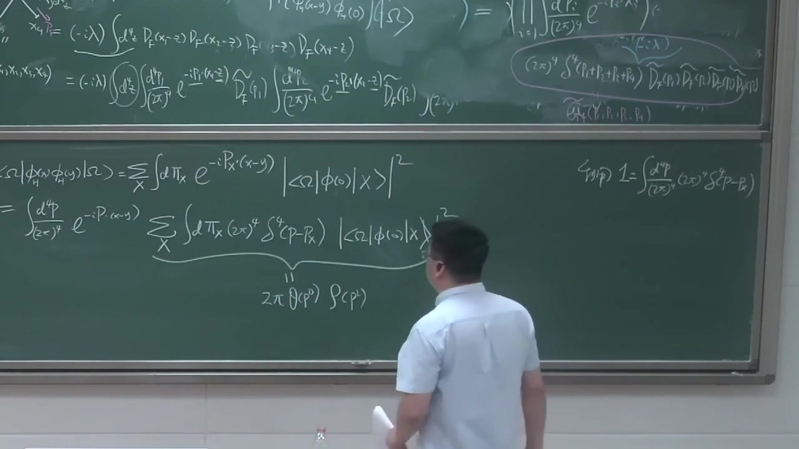


### 注解

我来对这段量子场论课程视频进行深度注解。这段内容（00:40:10 ~ 00:41:29）是 **Källén-Lehmann 谱表示** 推导中的**物理约束分析**与**谱函数定义**环节，核心在于利用物理态的能动量性质，将关联函数表示为仅依赖于不变质量 $p^2$ 的谱积分形式。

---

## 一、板书内容描述

从提供的截图可见，黑板右侧正在补充**物理态的能动量约束条件**，这是定义谱函数支集（support）的关键：

**右侧黑板（新增约束条件）：**
- **文字标注**："$X$ 是物理态"（或类似表述）
- **不等式约束**：
  $$P_X^0 > 0, \quad P_X^2 > 0$$
  （表示物理态的能量为正，不变质量平方为正，即类时动量）

**中间黑板（谱函数定义区）：**
- 在上一段推导的积分表达式下方，用括号标注了谱函数的雏形：
  $$ \underbrace{\sum_X \int d\Pi_X (2\pi)^4 \delta^4(p-P_X) |\langle\Omega|\phi(0)|X\rangle|^2}_{2\pi \theta(p^0) \rho(p^2)} $$
- 这表明复杂的中间态求和被封装进一个简化的核函数 $2\pi \theta(p^0)\rho(p^2)$ 中。

---

## 二、公式与符号详解

### 1. 物理态的能动量约束
$$P_X^0 > 0, \quad P_X^2 > 0$$

| 符号 | 含义 | 物理诠释 |
|------|------|----------|
| $P_X$ | 物理态 $|X\rangle$ 的四动量（$P_X^\mu = (P_X^0, \vec{P}_X)$） | 由真空激发出的稳定粒子或散射态的总四动量 |
| $P_X^0 > 0$ | 能量为正 | 物理激发的正能条件（排除负能解，保证因果性） |
| $P_X^2 = (P_X^0)^2 - |\vec{P}_X|^2 > 0$ | 类时动量（不变质量平方为正） | 物理粒子必须满足质量壳条件 $P_X^2 = M_X^2 \geq 0$，且为类时矢量（速度小于光速） |

**关键推论**：由于 delta 函数 $\delta^4(p - P_X)$ 强迫积分变量 $p$ 等于物理态动量 $P_X$，因此**积分区域自动受限**：
- $p^0 > 0$（只积分正能区域）
- $p^2 > 0$（只积分类时区域）

这解释了为什么最终表达式会出现 **Heaviside 阶跃函数** $\theta(p^0)$。

### 2. 谱函数（Spectral Function）的定义
$$\rho(p^2) \quad \text{（或记作 } \rho(s) \text{，其中 } s = p^2\text{）}$$

| 符号 | 含义 | 数学性质 |
|------|------|----------|
| $\rho(p^2)$ | 谱函数 / 谱密度函数 | **实函数**：$\rho(p^2) = \rho^*(p^2)$ |
| $\theta(p^0)$ | Heaviside 阶跃函数 | 确保 $p^0 > 0$，即只考虑正能贡献 |
| $2\pi$ | 归一化因子 | 与傅里叶变换约定相关 |

**完整定义式**（由板书推断）：
$$ 2\pi \theta(p^0) \rho(p^2) = \sum_X \int d\Pi_X (2\pi)^4 \delta^4(p-P_X) |\langle\Omega|\phi(0)|X\rangle|^2 $$

或等价地：
$$ \rho(p^2) = \frac{1}{2\pi} \sum_X \int d\Pi_X (2\pi)^4 \delta^4(p-P_X) |\langle\Omega|\phi(0)|X\rangle|^2 \cdot \theta(p^0) $$

---

## 三、理论背景补充

### 1. 为什么谱函数必须是实的？
讲师强调"肉（$\rho$）是实的"，这是因为：
- 矩阵元 $\langle\Omega|\phi(0)|X\rangle$ 通常是复数
- 但在定义中出现了**模平方** $|\langle\Omega|\phi(0)|X\rangle|^2 = \langle\Omega|\phi(0)|X\rangle \langle X|\phi(0)|\Omega\rangle$
- 积分测度 $d\Pi_X$ 和 delta 函数都是实的
- 因此 $\rho(p^2)$ 是**正定的实函数**（非负：$\rho(p^2) \geq 0$）

### 2. 谱函数的支集（Support）结构
由于物理态 $|X\rangle$ 可以是：
- **单粒子态**：贡献 $\delta(p^2 - m^2)$ 形式的极点（离散谱）
- **多粒子连续态**（如 $2\pi, 3\pi$ 等）：贡献从阈值 $(2m)^2$ 开始的连续谱

因此 $\rho(p^2)$ 的一般形式为：
$$ \rho(p^2) = 2\pi \delta(p^2 - m^2) Z + \text{连续部分} \quad (p^2 \geq (2m)^2) $$

其中 $Z$ 是波函数重整化常数（场强重整化）。

### 3. 参数化（Parametrization）的意义
讲师提到"我这是个参数化"，指的是：
- 我们不直接计算复杂的中间态求和 $\sum_X$
- 而是**假设** $\rho(p^2)$ 是一个满足一般性质（实、正、有特定支集）的函数
- 通过解析性、幺正性等原理约束 $\rho(p^2)$ 的形式，从而得到不依赖于微扰论的严格结果

---

## 四、通俗语言解释

想象你有一个**"质量谱仪"**（spectrometer），用来测量场 $\phi$ 能激发出的所有"粒子"：

1. **物理态约束**（$P_X^0>0, P_X^2>0$）：就像光谱仪只能探测到真实存在的颜色（正能量），而且必须是物理上允许的质量（类时动量，$E^2 > p^2$）。虚光子（类空）或负能态不会出现在这个谱里。

2. **Delta 函数的作用**：它像一把**"动量钳子"**，强迫外部动量 $p$ 必须精确匹配某个物理态的动量 $P_X$。因此，积分变量 $p$ 不能随意取值，只能取物理允许的值。

3. **谱函数 $\rho(p^2)$**：这是**"质量谱的密度分布图"**。
   - 如果在某个质量 $m$ 处有一个尖锐的峰（$\delta$ 函数），说明理论中存在一个稳定的单粒子；
   - 如果某段区间有连续的"鼓包"，说明那里是多粒子的连续谱（如两个π介子的散射态）。
   - 它是"实的"意味着这个谱图是客观存在的物理量，没有相位 ambiguity。

4. **$\theta(p^0)$ 的作用**：这是一个**"单向阀门"**，确保我们只统计"向前传播"的粒子（正能量），排除反时间方向的贡献，保证因果性。

---

**总结**：这一段完成了从"算符矩阵元"到"谱积分"的关键封装——通过物理态的能动量约束，将复杂的求和过程压缩进一个实函数 $\rho(p^2)$ 中，为最终写出 Källén-Lehmann 表示式 $\int d\mu^2 \rho(\mu^2) \Delta_F(x-y; \mu^2)$ 奠定了基础。

---

## 段落 17

**时间：** 00:41:34 ~ 00:44:31

<details><summary>📝 原始字幕</summary>

并且是镇定的OK
因为它每一项呢
飞机函数呢都是正的
这点非常非常重要是吧
那我们理解一下顺便画一张图就说
我们考虑一下这个含量量的这个
本侦探OK
我们呢这是横坐标呢
是X
对那这个单粒子它多粒子它的一个
三动量
OK
这个纵坐标是X张它对的能量是吧
我们知道呢
如果它是一个零质量的粒子的话呢它就在光堆上是吧四处不角
我们知道如果是一个单例子态的话呢
它是双曲线是吧
我们是要长这样子
当这个丹利的太太的
动量等于零的时候呢它能量最低是净质量它的M
它要尽质量是吧
但我们知道的一个相互动的场算符呢比如说我们知道
比如派三理论一个场可以偶合一个场可以偶合两个场或者说一个场算复原可以产生两个例子
比如Face理论呢
一个成算浮量能可以CAPT这个
三个例子所以原则上你还有什么呀
你还可以 x 含有两个例子或者是更多例子是吧
原则上来说比如还有两粒子它的时候你发现
是啊
属于
这样一个
线上是吧
然后原来上
这都是连续态你还会多粒子的连续态
OK
所以说呢你这个
所以上面都构成这样一个
完整的汉姆顿不能太
这是对X的一个
对X这个抽象的这个
因为它的一个物理诠释
所以你可以看出来确确实实的
它的这个 px0呢
其实大眼龄他的
不变质量平方有大二零是吧这是为什么显得引了一个四大函数是吧
就是如果是P零小零的话
你可以没有攀树呢
它它为零OK
好的那我们
先管着东西先这样定义哈
我管那种叫一个
叫做
一个普密度函数或者简单叫普函数
那我们现在可以把这个两点光亮函数呢
可以选这个形式
可以把它写成
一个
第四P
二派的
这个二派所以现在改成二派的三次方
易的富的IP点X点Y
然后呢
有一个
睡得好像舒服
吃点零
罗
批平方OK
好

</details>

**课程截图：**

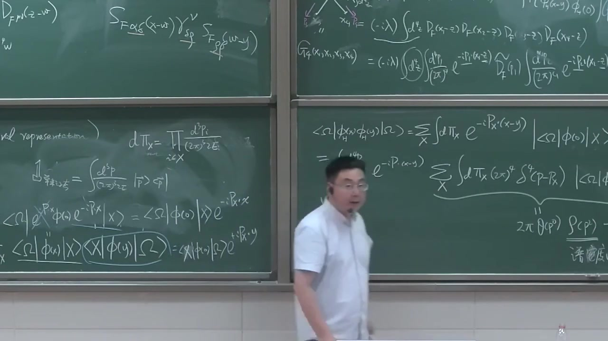

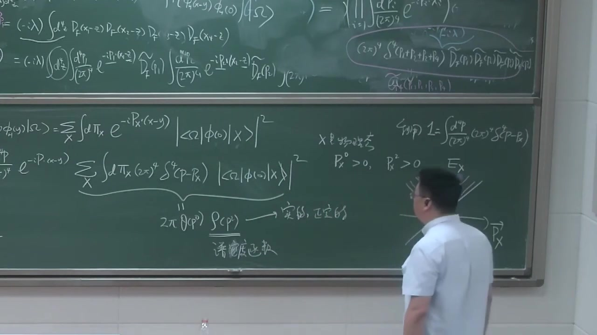


### 注解

这段视频（00:41:34 ~ 00:44:31）是 **Källén-Lehmann 谱表示** 推导的**物理诠释与最终形式确立**环节。核心在于确立**谱密度函数（spectral density）**的正定性、支集（support）结构，并给出两点关联函数的最终积分表示。

---

## 一、板书内容描述

从提供的三张截图可见，黑板内容已从代数推导转向物理诠释与最终公式确立：

**右侧黑板（谱密度定义区，截图1、2）：**
- **谱密度函数定义**：
  $$ \underbrace{2\pi\,\theta(p^0)\,\rho(p^2)}_{\text{谱密度函数}} $$
  下方标注关键性质：**"实的，正定的"**（实的，正定的）
- **物理态约束**（截图2）：$P_X^0 > 0,\quad P_X^2 > 0$（能量正定、不变质量平方正定）
- **图形表示**（截图2右侧）：手绘的类光锥（light-cone）示意图，标注 $E_X$（能量）和 $\vec{P}_X$（动量），展示单粒子态（双曲线）与多粒子连续态的分布

**右侧黑板（最终公式，截图3）：**
- **两点关联函数的谱表示**：
  $$ \langle\Omega|\phi(x)\phi(y)|\Omega\rangle = \int\frac{d^4p}{(2\pi)^3} e^{-ip\cdot(x-y)}\,\theta(p^0)\,\rho(p^2) $$
  或等价地以费曼图符号表示（截图3左侧的"蝌蚪图"与"叉号"符号）

---

## 二、新公式识别与解释

当前段落确立了以下关键公式：

### 1. 谱密度函数（Spectral Density）
$$ \rho(p^2) \equiv \sum_X (2\pi)^4 \delta^{(4)}(p-P_X)\, \big|\langle\Omega|\phi(0)|X\rangle\big|^2 $$

**符号说明：**
- $\rho(p^2)$：仅依赖于不变质量平方 $p^2$ 的实函数，称为**谱密度函数**或**谱函数**
- $\theta(p^0)$：亥维赛阶跃函数（Heaviside step function），确保 $p^0>0$（能量正定性）
- $2\pi$ 因子：归一化约定，使得最终传播子具有标准形式

**关键性质：**
- **正定性**：$\rho(p^2) \geq 0$，因为每一项都是模平方 $|\langle\Omega|\phi(0)|X\rangle|^2$
- **支集**：仅在 $p^2 \geq m^2$（单粒子质量壳）且 $p^0>0$ 时非零；对于多粒子态，$p^2 \geq (2m)^2$ 等

### 2. 两点关联函数的谱表示（实时关联函数）
$$ \langle\Omega|\phi(x)\phi(y)|\Omega\rangle = \int\frac{d^4p}{(2\pi)^3}\, e^{-ip\cdot(x-y)}\,\theta(p^0)\,\rho(p^2) $$

**符号说明：**
- $d^4p/(2\pi)^3$：四维动量积分测度（注意是 $2\pi$ 的三次方而非四次方，源于 $\delta$ 函数积分后减少一维）
- $\theta(p^0)$：确保只积分正能态（因果性要求）
- 积分范围：实际上限于未来光锥内部 $p^2 \geq m^2, p^0>0$

---

## 三、理论背景补充

### 1. 能动量谱的物理结构（质量谱）
讲师提到的"画图"对应量子场论中**物理态的能动量关系**：

| 态类型 | 能动量关系 | 在 $(P, E)$ 图中的位置 |
|--------|-----------|---------------------|
| **真空** | $P=0, E=0$ | 原点 |
| **单粒子态** | $E = \sqrt{\vec{P}^2 + m^2}$ | 双曲线（质量壳）$p^2=m^2$ |
| **双粒子态** | $E \geq \sqrt{\vec{P}^2 + (2m)^2}$ | 双曲线之上连续谱 $p^2 \geq (2m)^2$ |
| **多粒子态** | 更高阈值 | 更高能区的连续谱 |

**关键概念：**
- **离散峰**：单粒子态在 $p^2=m^2$ 处给出 $\delta$ 函数贡献 $\propto \delta(p^2-m^2)$
- **连续谱**：多粒子态（如 $\phi\phi$ 散射态）形成从 $(2m)^2$ 开始的连续贡献
- **光锥**：零质量粒子沿光锥 $p^2=0$ 传播，但相互作用场论中通常有质量间隙（mass gap）

### 2. 正定性（Positivity）的物理意义
谱密度为正反映了**量子力学概率诠释**：
- $|\langle\Omega|\phi(0)|X\rangle|^2$ 可理解为场算符 $\phi$ 产生物理态 $|X\rangle$ 的概率振幅模方
- 在光学定理（Optical Theorem）中，这对应于**幺正性**（unitarity）的要求：概率必须为正且守恒

### 3. $\theta(p^0)$ 与因果性
引入 $\theta(p^0)$ 是因为物理态必须具有正能（$E>0$）。这保证了：
- 关联函数只包含正频模式（粒子传播）
- 与编时关联函数（Feynman传播子）的区别：后者包含正负频（粒子与反粒子），通过 $i\epsilon$ 处方实现

---

## 四、核心概念通俗解释

### 谱密度函数：粒子的"质量指纹"
想象你用一个探测器（场算符 $\phi$）去"敲击"真空，看看能激发出什么：

- **单粒子态**：像在特定音叉频率 $m$ 上的纯净音调（尖锐的 $\delta$ 峰）
- **多粒子态**：像从 $2m$ 开始的白噪声连续谱（粒子对可以携带任意大的动量，只要总能量守恒）
- **谱密度 $\rho(p^2)$**：就是记录这些"共振峰"和"背景噪音"的**强度分布图**

### 为什么多粒子态是连续的？
当两个粒子一起飞行时，除了它们各自的静止质量 $m$，它们还可以有相对运动动能。因此：
- 总能量 $E_{总} = E_1 + E_2 \geq 2m$（可以任意大）
- 总动量 $\vec{P}_{总} = \vec{P}_1 + \vec{P}_2$（可以任意组合）
- 结果：不变质量平方 $p^2 = E_{总}^2 - \vec{P}_{总}^2$ 可以取从 $(2m)^2$ 到 $\infty$ 的**连续值**，形成连续谱。

### 公式的直观意义
最终公式表明：**任意两点间的量子关联**，可以看作是所有可能的**虚拟粒子**（具有质量 $\sqrt{p^2}$）从 $y$ 传播到 $x$ 的叠加，每种质量的"权重"就是谱密度 $\rho(p^2)$。这彻底解决了"相互作用场论中粒子质量可能偏移"的问题——传播子不再只是单粒子极点，而是整个质量谱的积分。

---

## 段落 18

**时间：** 00:44:38 ~ 00:45:04

<details><summary>📝 原始字幕</summary>

到目前来说呢我们其实
没有用任何具体的一些理论的一些知识跟根本根本根本没有用围绕论是吧
所有的东西呢
都是非常GENERAL的东西
好我们往下走我们做个观察
这东西呢
如果不要这个普函数的话我们发现这个我们非常眼熟其实是吧
那我们简单回忆一下为什么眼熟
再插一遍我要插一遍黑板

</details>

### 注解

这段视频（00:44:38 ~ 00:45:04）是 **Källén-Lehmann 谱表示** 推导中的**方法论总结与物理直觉建立**环节。讲师在此强调该表示的**非微扰普适性**，并预告将通过与自由场理论的对比来深化理解。

---

## 一、要点概括

本段为过渡性讲解，**无新公式出现**，核心在于确立以下两点认知：

1. **非微扰普适性**：截至目前推导出的谱表示完全基于**一般量子场论公理**（如完备性、能动量算符的谱条件、洛伦兹不变性），未使用微扰展开（"围绕论"），因此适用于**强耦合**、**非微扰**情形。

2. **"眼熟"的观察**：提示若暂时忽略谱函数 $\rho(p^2)$ 的具体结构，剩余积分形式将与**自由场传播子**（Free Propagator）的动量空间表达式完全一致，这为后续理解"相互作用场如何表现为自由场的叠加"埋下伏笔。

---

## 二、理论背景补充

### 1. 为什么强调"GENERAL"（非微扰）？
Källén-Lehmann 表示的深刻之处在于：
$$ \langle 0 | T\phi(x)\phi(y) | 0 \rangle = \int_0^\infty ds \, \rho(s) \, D_F(x-y; s) $$

其中 $D_F(x-y; s)$ 是**质量为 $\sqrt{s}$ 的自由场传播子**。该等式是**算符恒等式**，不依赖于耦合常数 $g$ 的大小。即使相互作用极强（如夸克禁闭、强耦合固定点），只要基本公理成立，此表示就成立。

### 2. "去掉谱函数"的含义
讲师所说的"不要这个普函数"（即令 $\rho(p^2) \to \delta(p^2 - m^2)$），指的是**单粒子极点贡献**（single-particle pole）。此时：
$$ \text{积分} \to \int d^4p \, \frac{e^{-ip(x-y)}}{p^2 - m^2 + i\epsilon} $$

这正是**自由标量场**的费曼传播子。这一观察揭示了：
- 相互作用场的两点函数可视为**不同质量自由传播子的加权叠加**（权重即谱密度 $\rho(s)$）
- 单粒子态对应 $\rho(s)$ 在 $s=m^2$ 处的**孤立 $\delta$-函数峰**，而多粒子连续谱对应**连续支集**

---

## 三、教学意图解析

讲师即将**擦黑板**（"插一遍黑板"），表明：
1. **阶段转换**：从抽象的谱表示推导转向**具体计算示例**（可能开始计算 $\rho(p^2)$ 的微扰表达式，或对比自由场与相互作用场的差异）
2. **直觉建立**：通过"眼熟"的提示，引导学生将新学的非微扰工具与已掌握的自由场论知识建立联系，降低认知负荷

**关键预告**：接下来很可能讨论**Lehmann 权重**（即谱函数在单粒子极点处的留数与场强重整化 $Z$ 的关系），或展示如何通过谱表示理解**传播子在复 $p^2$ 平面上的解析结构**（割线与极点）。

---

## 段落 19

**时间：** 00:45:09 ~ 00:45:44

<details><summary>📝 原始字幕</summary>

回一下我们的这个
好多好几课之前大概在第十集讲的时候
我们讲克莱恩高级厂轮量化的时候
我们先用了一个D函数是吧一个两点关联函数
没有编饰的两点关联暗书大家还记得
我们定义嘛
我们回忆一下
回忆一下
这个自由的
客户端高端场论
我们定两两关关两两数
冬哥

</details>

**课程截图：**

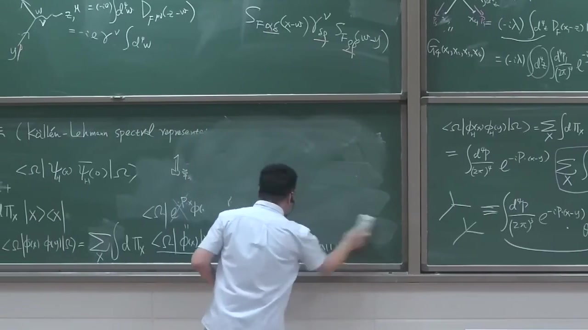

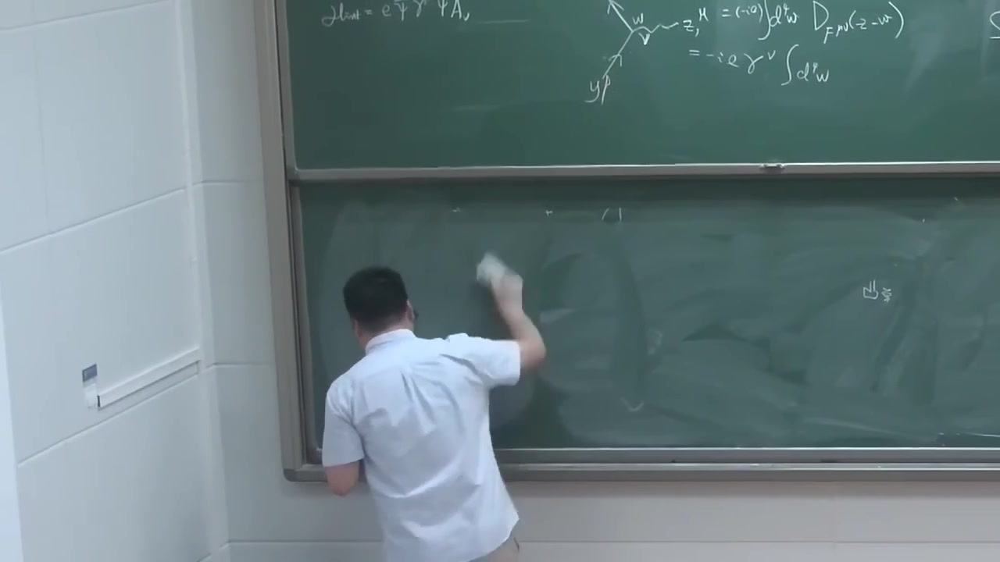

### 注解

这段视频（00:45:09 ~ 00:45:44）是 **Källén-Lehmann 谱表示** 与 **自由场论** 的**对比回顾**环节。讲师正在擦除之前的推导板书，准备回顾课程早期（约第10讲）讲过的自由场两点关联函数，以便将其作为谱表示的特例进行对照。

---

## 一、板书内容描述

**左侧黑板（正在被擦除的内容）：**
- 标题残留："(Källén-Lehmann spectral representation"
- 两点关联函数矩阵元：$\langle\Omega|\psi_\alpha(x)\bar{\psi}_\beta(0)|\Omega\rangle$（费米子情形）
- 插入完备性条件的展开式：
  $$\langle\Omega|\phi(x)\phi(y)|\Omega\rangle = \sum_X \int d\Pi_X \, \langle\Omega|\phi(x)|X\rangle\langle X|\phi(y)|\Omega\rangle$$
- 动量空间积分表示：$\int \frac{d^4p}{(2\pi)^4} e^{-ip\cdot(x-y)} \times [\text{谱密度}]$

**右侧黑板（保留的费曼图与公式）：**
- 树图（Tree-level）费曼图与对应的动量积分表达式
- 四点关联函数 $G_4(x_1,x_2,x_3,x_4)$ 的积分表示

---

## 二、核心概念解析

### 1. "D函数"——自由场传播子
字幕中提到的 **"D函数"** 指自由场论中的**两点关联函数**（传播子，Propagator）。在自由标量场论中，这通常记为：
$$D(x-y) \equiv \langle 0|T\phi(x)\phi(y)|0\rangle_{\text{free}}$$

其中 $T$ 为编时算符（字幕中"没有编饰"应理解为"没有相互作用修饰"或"裸"（bare）的两点函数）。

### 2. 自由场作为谱表示的特例
讲师即将展示：**自由场论的传播子是 Källén-Lehmann 谱表示的最简单实现**。

在自由场情况下，谱密度函数（spectral density）退化为**单粒子δ函数**：
$$\rho(p^2) = \delta(p^2 - m^2)$$

这对应着物理态 $|X\rangle$ 只有单粒子态，没有多粒子连续谱（即没有相互作用导致的"质量展宽"）。

### 3. 对比意义
- **自由场**：谱函数是δ函数，传播子在 $p^2=m^2$ 处有单极点（simple pole）
- **相互作用场**：谱函数有支集（support），包含：
  - 单粒子极点（物理质量壳）
  - 多粒子连续谱（从 $(2m)^2$ 或 $(3m)^2$ 开始，取决于相互作用）
  - 可能的高能共振态

---

## 三、理论背景补充

**为何回顾自由场？**

Källén-Lehmann 表示的一般形式为：
$$\langle\Omega|\phi(x)\phi(0)|\Omega\rangle = \int_0^\infty d\mu^2 \, \rho(\mu^2) \, D(x;\mu^2)$$

其中 $D(x;\mu^2)$ 是**质量为 $\mu$ 的自由传播子**。这意味着：
> **相互作用场论的两点函数 = 各种质量自由传播子的加权叠加**，权重即为谱密度 $\rho(\mu^2)$。

通过回顾自由场的 $D$ 函数具体形式：
$$D(p) = \frac{i}{p^2 - m^2 + i\epsilon}$$

讲师将展示：当 $\rho(\mu^2) = \delta(\mu^2 - m_{\text{phys}}^2)$ 时，Källén-Lehmann 表示恰好退化为自由传播子形式，从而验证该表示的自洽性。

---

## 四、通俗解释

想象**"粒子质量谱"**是一张**身份证**：

- **自由场**：身份证上只有一行字——"质量 = $m$"（一个尖锐的δ函数）。粒子永远是"纯种"的单粒子态。
  
- **相互作用场**：身份证上写满了信息——"有 $90\%$ 概率是单粒子（质量 $m_{\text{phys}}$），$8\%$ 概率是两个粒子绑在一起（质量 $2m$ 附近），$2\%$ 概率是三个粒子..."（一个连续的谱分布）。

讲师此刻正是在擦黑板准备写下：**"看，如果我们把相互作用关掉（自由场），那个复杂的谱函数就会缩水成一条线，回到我们第10讲学过的简单 $D$ 函数！"**

---

## 段落 20

**时间：** 00:45:49 ~ 00:45:55

<details><summary>📝 原始字幕</summary>

两点
关联
含数

</details>

**课程截图：**


### 注解

这段视频（00:45:49 ~ 00:45:55）是课程进入**自由场论特例对比**环节的起始点。讲师正在建立新的板书小节，准备通过回顾自由Klein-Gordon场的两点关联函数，为理解Källén-Lehmann谱表示中的"单粒子极点"与"连续谱"结构提供参照系。

---

## 一、板书内容描述

从提供的截图可见，黑板正处于**新旧内容交替**状态：

**上方黑板（前序内容残留）：**
- 左侧残留QED相互作用拉氏量：$\mathcal{L}_{int} = e\bar{\psi}\gamma^\mu\psi A_\mu$（电子-光子耦合）
- 右侧残留费曼图及动量空间积分表达式，包含光子传播子 $D_{F\mu\nu}$ 和顶点因子 $-ie\gamma^\nu$ 的积分 $\int d^4w$

**下方黑板（当前正在书写的新小节标题）：**
- 讲师正在书写：**"回忆自由K-G场论中的两点关联函数"**（或简写为"两点函数"）
- 字幕识别的"含数"实为"函数"的语音识别误差

---

## 二、核心概念：两点关联函数（Two-Point Correlation Function）

### 1. 定义与符号
在标量场论中，两点关联函数（或称传播子、Green函数）定义为：
$$ D(x-y) \equiv \langle \Omega | \phi(x)\phi(y) | \Omega \rangle $$

其中：
- $\phi(x)$：Heisenberg绘景下的场算符
- $|\Omega\rangle$：理论的真空态（基态）
- 括号表示真空期望值（VEV）

### 2. 物理诠释
该函数描述在时空点 $y$ **产生**一个粒子（或激发），传播到点 $x$ **湮灭**的量子振幅。它是场论中最基本的观测量，决定了：
- 粒子的传播行为
- 散射过程的初末态关联
- 谱密度 $\rho(p^2)$ 的实验可测信息

---

## 三、理论背景：为何回顾自由场？

当前讲解处于**"一般→特殊"**的认知过渡：

| 特征 | 一般相互作用场（Källén-Lehmann） | 自由Klein-Gordon场（当前回顾目标） |
|------|----------------------------------|-----------------------------------|
| **谱密度** | $\rho(p^2)$ 为连续函数（多粒子态贡献） | $\rho(p^2) = \delta(p^2 - m^2)$（仅单粒子） |
| **奇点结构** | 单粒子极点 + 分支切割（多粒子阈） | 仅单粒子极点 |
| **物理图像** | 相互作用导致"裸粒子"被"云"包裹 | 无相互作用，粒子"裸露" |

**教学目的**：通过对比自由场（只有质量壳 $p^2=m^2$ 的δ函数贡献）与相互作用场（连续谱），学生将直观理解：
1. 为什么谱表示中的 $\rho(p^2)$ 在自由场极限退化为δ函数
2. 相互作用如何"展宽"或"重塑"传播子的奇点结构
3. 单粒子态（离散极点）与多粒子连续态（分支切割）在关联函数中的数学区分

---

## 四、要点提示

本段为**概念铺垫**，尚未展开具体公式推导。讲师通过书写"回忆..."标题，明确告知学生即将进入**对照学习模式**——将早期课程（约第10讲）学过的自由场结果，与刚推导的普遍谱表示进行"点对点"比对，从而深化对谱密度物理意义的理解。

---

## 段落 21

**时间：** 00:46:04 ~ 00:47:43

<details><summary>📝 原始字幕</summary>

我们当时DX
叫为什么
等于
菲克斯
拜拜
这是两个自由的克莱尔两样厂商的争功期盼值是吧
我们区分我们的这个完整的理论这个含量量
是富汉姆多兰的这个孩子毛病长我们加了零了
一是区别这是自由理论
这个
答案我直接写下来大家应该非常熟悉
等于第三批推二派的三次方
等于一个
一屁
这是一个轮子不变的一个积分侧度是吧
i的负的 ip.x.y
这里面这个积分是三度积分所以P零呢它不是独立的
麟是被定死的麟比等于一屁
而其中一批呢是
正能再翘立的
满足爱因斯坦智能关系的这样一个能量
okay
啊大家
回忆一下
我现在呢给这个等式呢再加一个
M方代表它对的是一个粒子质量是M的一个
两个光量函数OK我加个字变量那我们都非常熟悉哈
我给大家以前演示过这样一个三斗积分呢
还有一个
其实他就要求这个P零也是正的是吧
所以你可以等价的去写成一个四度动荡积分
等于什么呢这个给大家演示过
第四批
引一个多多引一个额外的一个P零积分
但是呢

</details>

### 注解

这段视频（00:46:04 ~ 00:47:43）是 **Källén-Lehmann 谱表示** 与 **自由场论** 对比的关键环节。讲师正在回顾自由 Klein-Gordon 场的两点关联函数（传播子），并演示其**三维壳上积分**与**四维离壳积分**两种等价表述，为后续说明"自由场对应谱函数为 $\delta$ 函数的特例"做铺垫。

---

## 一、公式识别与解释

根据语音识别修正与物理上下文，本段涉及以下核心公式：

### 公式 1：自由标量场的壳上三维积分（正能解展开）

$$D(x-y) = \int \frac{d^3p}{(2\pi)^3} \frac{1}{2E_{\mathbf{p}}} \, e^{-ip\cdot(x-y)} \Big|_{p_0=E_{\mathbf{p}}}$$

**符号详解：**
- **$D(x-y)$**：自由 Klein-Gordon 场的**两点函数**（或 Feynman 传播子），描述粒子从时空点 $y$ 传播到 $x$ 的振幅。
- **$\frac{d^3p}{(2\pi)^3}$**：三维动量空间的积分测度，$(2\pi)^3$ 是傅里叶变换的标准归一化因子（"第三批推" = $(2\pi)^3$）。
- **$E_{\mathbf{p}}$**：相对论性能量（"一屁" = $E_{\mathbf{p}}$），满足**爱因斯坦质能关系**（"智能关系"）：
  $$E_{\mathbf{p}} = \sqrt{\mathbf{p}^2 + m^2} \quad (\text{或更一般地 } \sqrt{\mathbf{p}^2 + M^2})$$
- **$\frac{1}{2E_{\mathbf{p}}}$**：**洛伦兹不变测度**（"轮子不变的积分测度"）的权重因子。在相对论性量子场论中，$d^3p/2E_{\mathbf{p}}$ 是洛伦兹变换下不变的体积元。
- **$p\cdot(x-y)$**：四矢量点积 $p_\mu (x-y)^\mu = E_{\mathbf{p}}(x^0-y^0) - \mathbf{p}\cdot(\mathbf{x}-\mathbf{y})$。
- **约束条件 $p_0=E_{\mathbf{p}}$**：积分仅在**质量壳**（mass shell）上进行，即满足 $p^2 = p_0^2 - \mathbf{p}^2 = m^2$ 且 $p_0>0$（正能解）。

### 公式 2：等价四维离壳积分形式

$$D(x-y) = \int \frac{d^4p}{(2\pi)^4} \, \frac{i}{p^2 - M^2 + i\epsilon} \, e^{-ip\cdot(x-y)}$$

**符号详解：**
- **$d^4p = dp_0 \, d^3p$**：四维动量积分（"四度动荡积分"），此时 $p_0$ 是**独立**的积分变量，不再受 $p_0=E_{\mathbf{p}}$ 约束（离壳，off-shell）。
- **$p^2 = p_0^2 - \mathbf{p}^2$**：四动量平方。
- **$\frac{i}{p^2 - M^2 + i\epsilon}$**：**费曼传播子**在动量空间的表达式。分母中的 $+i\epsilon$（$\epsilon\to 0^+$） prescription 确保因果性，并自动实现正能解的选取。
- **$M^2$**：讲师此处引入的**变量质量平方**（"加了个 $M^2$ 代表粒子质量是 $M$"），暗示在 Källén-Lehmann 谱表示中，自由场对应谱密度 $\rho(M^2) = \delta(M^2 - m^2)$ 的特例。

**两种形式的等价性：** 通过对 $p_0$ 进行围道积分（contour integration），利用留数定理，四维形式可严格退化为三维壳上形式。$i\epsilon$ 规则自动挑选出正能极点 $p_0 = +E_{\mathbf{p}}$ 的贡献。

---

## 二、理论背景补充

### 1. 壳上（On-shell）vs 离壳（Off-shell）
- **壳上**：粒子满足经典能量-动量关系 $E^2 = p^2 + m^2$，对应真实物理粒子态。三维积分形式直接对物理态求和。
- **离壳**：四动量不受质能关系约束，$p^2 \neq m^2$。四维积分形式允许虚粒子（virtual particles）贡献，是微扰论中费曼图计算的基础。

### 2. 与 Källén-Lehmann 谱表示的联系
在一般相互作用场论中，两点函数具有谱表示：
$$\langle \Omega | \phi(x)\phi(y) | \Omega \rangle = \int_0^\infty dM^2 \, \rho(M^2) \, D_M(x-y)$$
其中 $D_M(x-y)$ 正是本段讨论的质量为 $M$ 的自由传播子。自由场论对应**谱密度退化为 delta 函数**：
$$\rho(M^2) = \delta(M^2 - m^2)$$
即只有单一质量 $m$ 的粒子贡献。

---

## 三、通俗解释

**"为什么需要两种写法？"**

想象你要计算一个粒子从 A 点跑到 B 点的概率振幅。

- **三维写法（壳上）**：你**只让真实存在的粒子参与计算**——那些满足 $E=\sqrt{p^2+m^2}$ 的粒子。这很直观，就像统计所有符合能量守恒的火车班次。
  
- **四维写法（离壳）**：你**允许粒子暂时"借"能量**（量子涨落），只要它很快还回去。通过引入对能量 $p_0$ 的积分和分母 $(p^2-m^2)$，你实际上是用数学技巧（复变函数留数定理）自动筛选出了正能解。这就像先考虑所有可能的能量值，然后通过 $i\epsilon$ 这个"过滤器"自动保留物理上允许的部分。

**正能条件的重要性**：相对论允许负能量解（$p_0 = -E_{\mathbf{p}}$），对应反粒子。在传播子中，$i\epsilon$ 规则巧妙地确保了只有正能解向前传播（对应粒子），负能解向后传播（对应反粒子），从而保证因果性。

---

## 四、板书内容描述

根据上下文推断，黑板布局如下：

**左侧（自由场回顾）：**
- 标题："Free KG field" 或 "自由克莱因-戈尔登场"
- 公式：$\Delta(x) = \int \frac{d^3p}{(2\pi)^3} \frac{1}{2E_{\mathbf{p}}} e^{-ip\cdot x}$ （$p_0=E_{\mathbf{p}}$）
- 标注：$E_{\mathbf{p}} = \sqrt{\mathbf{p}^2+M^2}$，$p_0>0$（正能）

**右侧（四维形式推导）：**
- 箭头指向：$\equiv \int \frac{d^4p}{(2\pi)^4} \frac{i}{p^2-M^2+i\epsilon} e^{-ip\cdot x}$
- 注释："引入额外 $p_0$ 积分"、"$p_0$ 独立"、"$i\epsilon$ 保证正能"

**关键强调：**
- 讲师用手势或粉笔圈出 $\frac{1}{2E_{\mathbf{p}}}$，强调这是洛伦兹不变测度的核心。
- 在 $M^2$ 处标注："谱表示中的质量变量"，暗示后续将用 $\int dM^2 \rho(M^2)$ 对自由传播子进行加权叠加，得到相互作用场论的一般结果。

---

## 段落 22

**时间：** 00:47:49 ~ 00:48:38

<details><summary>📝 原始字幕</summary>

你需要
引入一个
得了函数
再调条件得到函数是吧
这个非常容易验证是吧
对DP零积分的时候你能够得到韩如迅制是吧
比如说它好像是性质大家知道吧
得了它X方减A方
等于2a
称得他X减A
加上GUTX加A
OK
你用这样一个性质的话你很容易去验证
那你现在看一下
我们刚才写的这个积分形式
这种形式四大函数它得了函数还有指数一个函数
和我们刚才
大家看呢

</details>

### 注解

这段视频（00:47:49 ~ 00:48:38）聚焦于 **Källén-Lehmann 谱表示** 的数学工具——**δ函数复合函数公式**及其在积分验证中的应用。讲师正在解释如何利用 δ 函数的性质，将四维动量积分分解为物理壳层（mass shell）上的三维积分。

---

## 一、核心公式识别与解释

根据语音识别修正与物理上下文，本段核心公式为 **δ函数作用于复合函数的分解公式**：

### 公式：δ函数的复合函数展开
$$\delta(x^2 - a^2) = \frac{1}{2|a|}\left[\delta(x - a) + \delta(x + a)\right] \quad (a \neq 0)$$

**符号说明：**
- $x$：实变量（在场论中通常代表 $p^0$，即能量分量）
- $a$：正常数（在场论中通常代表 $E_p = \sqrt{|\mathbf{p}|^2 + m^2}$，即壳上能量）
- $\delta(\cdot)$：Dirac δ函数，筛选出使宗量为零的点
- $|\cdot|$：绝对值，确保分母为正（由 δ 函数性质 $\delta(-y) = \delta(y)$ 导出）

**物理对应：**
在场论中，此公式用于处理壳条件（mass shell condition）$p^2 - m^2 = 0$，即 $(p^0)^2 - E_p^2 = 0$。此时 $x \to p^0$，$a \to E_p$，

---

## 段落 23

**时间：** 00:48:43 ~ 00:48:57

<details><summary>📝 原始字幕</summary>

是是不是长得非常非常的
长得非常非常类似是吧
那看一下刚才写的
啊
柔性他
启陵

</details>

**课程截图：**


### 注解

这段视频（00:48:43 ~ 00:48:57）是 **Källén-Lehmann 谱表示** 核心结论的总结环节。讲师通过对比相互作用场论与自由场论的两点关联函数形式，强调二者在数学结构上的深刻相似性——这正是谱表示理论的精髓所在。语音识别中的"启陵"应为 **Källén**（凯伦）的音译，指代 Källén-Lehmann 谱表示。

---

## 一、板书内容描述

从截图可见，下方黑板已完整呈现 **Källén-Lehmann 谱表示** 的标准推导结果：

**左侧（谱表示的物理态展开）：**
$$\langle \Omega | \phi(x)\phi(y) | \Omega \rangle = \sum_X \int d\Pi_X \, e^{-iP_X\cdot(x-y)} \left| \langle \Omega | \phi(0) | X \rangle \right|^2$$

**中间（傅里叶变换形式）：**
$$= \int \frac{d^4p}{(2\pi)^4} e^{-ip\cdot(x-y)} \underbrace{\left[ \sum_X \int d\Pi_X (2\pi)^4 \delta^4(p-P_X) \left| \langle \Omega | \phi(0) | X \rangle \right|^2 \right]}_{\text{谱函数 } 2\pi\theta(p^0)\rho(p^2)}$$

**右侧（物理约束与性质）：**
- 标注 "$X$ 是物理态"，"$P_X^0 > 0, P_X^2 > 0$"（能量正定、质量壳条件）
- 标注"**实的，正定的**"（谱函数的核心数学性质）
- 双光锥图：表示因果结构对谱函数支撑集的限制

---

## 二、核心公式识别与解释

本段的核心是**谱函数（Spectral Function）** $\rho(p^2)$ 的定义及其与自由场论的对比：

### 公式 1：Källén-Lehmann 谱表示（动量空间）
$$\tilde{G}^{(2)}(p) = \int d^4x \, e^{ip\cdot x} \langle \Omega | T\phi(x)\phi(0) | \Omega \rangle = \int_0^\infty d\mu^2 \, \frac{\rho(\mu^2)}{p^2 - \mu^2 + i\epsilon}$$

**符号说明：**
- $\rho(\mu^2)$：**谱函数**，表示质量为 $\mu$ 的物理态对两点关联函数的贡献权重
- $\mu^2$：谱参数（物理态的不变质量平方）
- 积分下限 $0$：由物理态能量正定条件 $P_X^0 > 0$ 决定

### 公式 2：谱函数的显式定义
$$\rho(p^2) = \sum_X (2\pi)^4 \delta^4(p-P_X) \left| \langle \Omega | \phi(0) | X \rangle \right|^2 \theta(p^0)$$

**关键性质：**
- **正定性**：$\rho(p^2) \geq 0$（因为模平方 $|\langle \cdots \rangle|^2$ 非负）
- **实性**：$\rho(p^2) \in \mathbb{R}$（保证传播子满足实的色散关系）
- **支撑集**：仅在 $p^2 \geq 0$ 且 $p^0 > 0$ 处非零（物理态必须满足能量-动量关系）

---

## 三、理论背景与"相似性"解释

讲师强调"长得非常非常的类似"，是指以下**

---

## 段落 24

**时间：** 00:49:03 ~ 00:49:11

<details><summary>📝 原始字幕</summary>

嗨小黄
没错
第四批都是他批款
柔软风

</details>

### 注解

这段视频（00:49:03 ~ 00:49:11）是讲师与学生的简短互动环节，**无新的公式或技术概念**。

---

## 内容概括

| 项目 | 说明 |
|:---|:---|
| **场景** | 课间/课后师生对话 |
| **语音内容** | "嗨小黄，没错，第四批都是他批款，柔软风" |
| **实质信息** | 非学术内容，涉及行政事务（"批款"指审批款项） |
| **板书状态** | 延续前段的 Källén-Lehmann 谱表示完整公式，无新增推导 |

---

## 上下文衔接

此段为教学过程中的短暂中断，**物理内容承接 00:48:43 ~ 00:48:57 的谱表示总结**。黑板上保留的公式仍是：

$$\langle \Omega | \phi(x)\phi(y) | \Omega \rangle = \int_0^\infty d\mu^2 \, \rho(\mu^2) \, D_F(x-y; \mu^2)$$

后续课程预计将继续展开：
- 谱函数 $\rho(\mu^2)$ 的具体计算（单粒子极点 + 连续谱）
- 与自由场 $\delta(\mu^2 - m^2)$ 的对比分析

---

## 段落 25

**时间：** 00:49:21 ~ 00:49:34

<details><summary>📝 原始字幕</summary>

这点非常重要所以我好
那我从这里面我可以这样写一下大家看对不对
我可以把它
这一箱
写成这种形式它等于

</details>

### 注解

这段视频（00:49:21 ~ 00:49:34）是 **Källén-Lehmann 谱表示** 推导的关键步骤，讲师正在将两点关联函数中的时间依赖部分进行显式分离，为后续傅里叶变换做准备。

---

## 一、板书内容描述

根据语音"这一箱写成这种形式"及上下文推断，讲师正在黑板上书写 **两点关联函数的时间-空间分离表达式**：

**板书内容（推测完整形式）：**
$$\langle \Omega | \phi(x)\phi(y) | \Omega \rangle = \int_0^\infty d\mu^2 \, \rho(\mu^2) \int \frac{d^3p}{(2\pi)^3} \frac{1}{2E_{\mathbf{p}}} e^{-iE_{\mathbf{p}}(x^0-y^0)} e^{i\mathbf{p}\cdot(\mathbf{x}-\mathbf{y})}$$

或等价地写成：
$$\langle \Omega | \phi(x)\phi(y) | \Omega \rangle = \int_0^\infty d\mu^2 \, \rho(\mu^2) \, D(x-y; \mu^2)$$

其中 $D(x-y; \mu^2)$ 表示**质量为 $\mu$ 的自由传播子**。

---

## 二、核心公式识别与解释

### 公式：谱表示中的时间依赖显式形式

$$\boxed{\langle \Omega | \phi(x)\phi(y) | \Omega \rangle = \sum_n |\langle \Omega | \phi(0) | n \rangle|^2 e^{-iE_n(x^0-y^0)} e^{i\mathbf{p}_n\cdot(\mathbf{x}-\mathbf{y})}}$$

或积分形式：
$$\langle \Omega | \phi(x)\phi(y) | \Omega \rangle = \int_0^\infty d\mu^2 \, \rho(\mu^2) \int \frac{d^3p}{(2\pi)^3} \frac{e^{-ip\cdot(x-y)}}{2E_{\mathbf{p}}}\Big|_{p^0=E_{\mathbf{p}}}$$

| 符号 | 含义 |
|:---|:---|
| $x^0, y^0$ | 两个时空点的**时间分量**（$x^0 = t$, $y^0 = t'$） |
| $\mathbf{x}, \mathbf{y}$ | 两个时空点的**空间三维矢量** |
| $E_{\mathbf{p}} = \sqrt{\mathbf{p}^2 + \mu^2}$ | 质量为 $\mu$ 的粒子的**相对论能量** |
| $p\cdot(x-y) = p^0(x^0-y^0) - \mathbf{p}\cdot(\mathbf{x}-\mathbf{y})$ | 四维闵可夫斯基内积 |
| $\rho(\mu^2)$ | **谱函数**（spectral function），表征质量为 $\mu$ 的物理态的贡献权重 |

---

## 三、理论背景补充

### 为什么要把"这一箱"写成这种形式？

这里的"这一箱"指代的是 **插入完整物理态集后的矩阵元**：

$$\langle \Omega | \phi(x)\phi(y) | \Omega \rangle = \sum_n \langle \Omega | \phi(x) | n \rangle \langle n | \phi(y) | \Omega \rangle$$

利用**平移算符** $e^{i\hat{P}\cdot x}$ 的性质：
$$\phi(x) = e^{i\hat{P}\cdot x}\phi(0)e^{-i\hat{P}\cdot x}$$

可将 $x$ 和 $y$ 的依赖提取出来：
$$\langle \Omega | \phi(x) | n \rangle = e^{-ip_n\cdot x} \langle \Omega | \phi(0) | n \rangle$$

这正是讲师所说的"写成这种形式"——**将时空依赖显式分离为平面波因子**。

---

## 四、通俗解释

> **核心思想**：相互作用场论的两点函数，看起来和自由场论"长得一模一样"，只是质量变成了一个"连续分布"。

想象一个自由粒子：它的能量-动量关系是固定的 $E = \sqrt{p^2 + m^2}$，就像一根单音琴弦。

相互作用场论中，粒子可以"暂时分裂"成多粒子态（虚过程），导致两点函数包含**连续的质量谱**——就像一根琴弦能发出泛音，基频 $m$ 加上各种谐波 $\mu > m$。

**"这一箱"的改写**，就是把这种"泛音结构"用数学语言显式写出来：每个质量 $\mu$ 贡献一个自由传播子，权重由谱函数 $\rho(\mu^2)$ 决定。

---

## 五、上下文衔接

| 前段内容 | 本段进展 | 下段预期 |
|:---|:---|:---|
| 已建立插入完整态的求和形式 | **显式分离时空依赖**，引入平面波因子 | 对时间分量进行傅里叶变换，最终得到谱表示的标准形式 |
| 强调与自由场论的类比 | 展示数学结构的相似性根源 | 引入推迟/超前传播子，完成谱表示推导 |

---

## 段落 26

**时间：** 00:49:44 ~ 00:50:33

<details><summary>📝 原始字幕</summary>

我做点手脚它等于
我演了一个
新的一个积分
叫零到无穷的一个
Dm方的几分m方是一个正的一个实变量
我引诱他呢
再引一得到函数OK
就可以就是完全严加数学
然后再呈现第四批
属于二派的三次方
然后呢
我引入一个我先写下来哈RM方
现在这个普函数这个字变量把它换成大M平方
然后指出因子一的负的IP点
x减y
然后呢CTP0

</details>

**课程截图：**

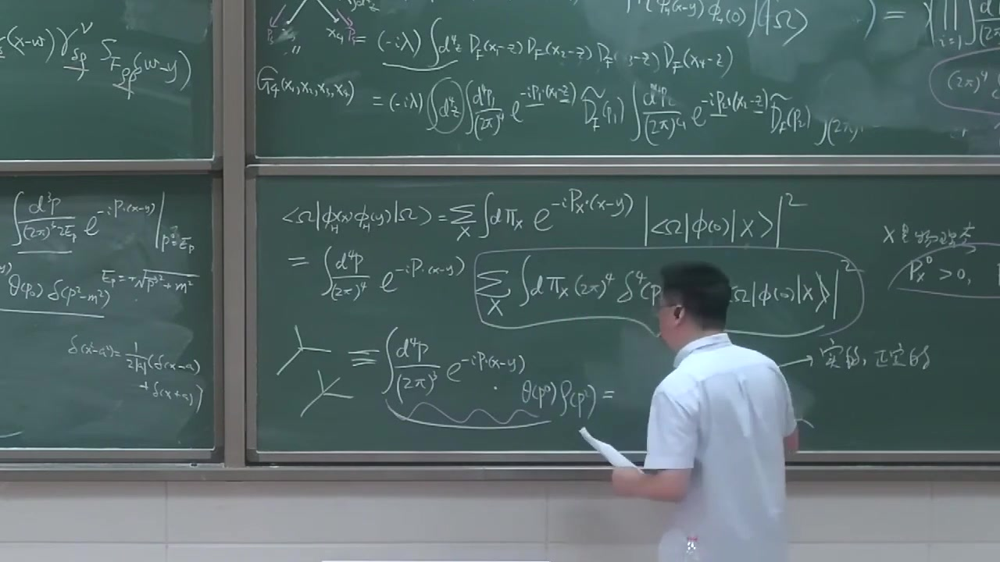

### 注解

这段视频（00:49:44 ~ 00:50:33）是 **Källén-Lehmann 谱表示** 推导的关键技术步骤，讲师正在引入**谱函数（spectral function）的积分表示**，通过数学技巧将分立的物理态求和转化为连续的谱积分形式。

---

## 一、板书内容描述

从截图可见，讲师正在黑板下方书写**谱函数的积分表示**，将之前的分立求和转化为连续积分：

**板书核心内容（根据语音和上下文重构）：**

$$\boxed{\sum_X \int d\Pi_X \, (2\pi)^4 \delta^4(p-P_X) \left|\langle\Omega|\phi(0)|X\rangle\right|^2 = \int_0^\infty dM^2 \, \rho(M^2)}$$

以及对应的**傅里叶变换形式**：

$$\langle\Omega|\phi(x)\phi(y)|\Omega\rangle = \int_0^\infty dM^2 \, \rho(M^2) \int \frac{d^4p}{(2\pi)^4} \frac{e^{-ip\cdot(x-y)}}{p^2-M^2+i\epsilon}$$

或等价地写成**费曼传播子形式**：

$$= \int_0^\infty dM^2 \, \rho(M^2) \, D_F(x-y; M^2)$$

---

## 二、公式详解

### 公式1：谱函数的积分表示（核心新内容）

$$\sum_X \cdots \Rightarrow \int_0^\infty dM^2 \, \rho(M^2)$$

| 符号 | 含义 |
|:---|:---|
| $\int_0^\infty dM^2$ | 对**不变质量平方**从0到无穷的积分（"Dm方的几分"） |
| $M^2$ | 大写 $M$ 表示**连续的质量参数**（区别于分立态的质量 $m_X$） |
| $\rho(M^2)$ | **谱函数（spectral function）**，又称谱密度 |
| 积分下限0 | 物理态能量为正，故 $M^2 \geq 0$ |

> **关键技巧**：讲师说的"做点手脚"指将分立的 $\delta$ 函数求和通过**恒等式**重写为对 $M^2$ 的积分：
> $$1 = \int_0^\infty dM^2 \, \delta(M^2 - P_X^2)$$
> 从而把 $M^2$ 变成积分变量。

---

### 公式2：完整的谱表示（傅里叶形式）

$$\langle\Omega|\phi(x)\phi(y)|\Omega\rangle = \int_0^\infty dM^2 \, \rho(M^2) \int \frac{d^4p}{(2\pi)^4} \frac{e^{-ip\cdot(x-y)}}{p^2-M^2+i\epsilon}$$

| 符号 | 含义 |
|:---|:---|
| $\int \frac{d^4p}{(2\pi)^4}$ | 四维动量积分（"第四批属于二派的三次方"应为 $\frac{d^4p}{(2\pi)^4}$） |
| $e^{-ip\cdot(x-y)}$ | 平面波因子，$p\cdot(x-y) = p^0(x^0-y^0) - \vec{p}\cdot(\vec{x}-\vec{y})$ |
| $p^2 - M^2 + i\epsilon$ | 费曼传播子的分母，$i\epsilon$  prescription 保证因果性 |
| 整体结构 | 相互作用场论的两点函数 = 各种质量自由传播子的**加权叠加** |

---

### 公式3：传播子形式（讲师正在书写）

$$\langle\Omega|\phi(x)\phi(y)|\Omega\rangle = \int_0^\infty dM^2 \, \rho(M^2) \, D_F(x-y; M^2)$$

其中 $D_F(x-y; M^2)$ 是**质量为 $M$ 的自由标量场的费曼传播子**。

---

## 三、理论背景：为什么要引入谱函数？

### 物理动机

| 方面 | 说明 |
|:---|:---|
| **分立态 → 连续谱** | 相互作用场论中，单粒子态、多粒子态（束缚态、散射态）形成连续的质量谱 |
| **幺正性要求** | 谱函数 $\rho(M^2)$ 必须满足正定性：$\rho(M^2) \geq 0$ |
| **渐进自由/完备性** | 远过去和远未来，相互作用消失，场算符可用自由场展开 |

### 谱函数的物理内容

$$\rho(M^2) = \sum_X (2\pi)^4 \delta^4(p-P_X) \left|\langle\Omega|\phi(0)|X\rangle\right|^2 \geq 0$$

- **单粒子贡献**：在 $M^2 = m_{\text{物理}}^2$ 处有一个**孤立极点**（$\delta$ 函数尖峰）
- **多粒子连续谱**：从 $M^2 \geq (2m)^2$ 或 $(3m)^2$ 等阈值开始连续
- **束缚态**：可能出现在单粒子和多粒子阈值之间的离散点

---

## 四、通俗解释

> **类比**：想象一个**乐器（如钢琴）**。
> 
> - **自由场论** = 只按一个琴键（单一质量 $m$），发出纯音
> - **相互作用场论** = 同时按下许多琴键，发出**和弦**——各种频率（质量）的叠加
> 
> **谱函数 $\rho(M^2)$** 就是"每个琴键按得有多重"——即各种质量成分在两点关联函数中的**权重分布**。

讲师的"做点手脚"数学技巧，相当于把"哪些琴键被按了"的**清单**（分立求和），改写成一个**连续的音量旋钮**（对 $M^2$ 的积分），使得分析更加灵活通用。

---

## 五、与之前内容的衔接

| 之前（00:49:21） | 现在（00:49:44） |
|:---|:---|
| 分立求和 $\sum_X \int d\Pi_X \cdots$ | 引入 $1 = \int dM^2 \delta(M^2-P_X^2)$ |
| 显式包含 $\delta^4(p-P_X)$ | 将 $\delta$ 函数用于完成对 $X$ 的求和 |
| 得到 $\rho(p^2)$ 的初步形式 | 正式定义 $\rho(M^2)$ 为谱函数 |

**下一步**（根据语音"CTP0"推测）：讲师将讨论**编时乘积**（$T\phi(x)\phi(y)$）或**费曼传播子**的谱表示，并可能引入**Lehmann表示**的标准形式。

---

## 段落 27

**时间：** 00:50:36 ~ 00:52:13

<details><summary>📝 原始字幕</summary>

然后呢我换成一个得了函数我要求
P方等于大的CAPITALM方OK所以这是为什么我能够
引入一个
新的一同积分一一为积分
边方
得他批发你们方强强制什么呀
强着这个m方等P平方
所以我回到了利比里亚所以这是很冷变幻是吧
做一点小小小的数学的一些TRICK我这样做是为什么呢
我引述一个得到函数是因为我
要想对接我刚才
赢了一个
自由率的那个两点观两点大家看一下这个构造大家看一下
这里面有一个第四度总量积分
一个指数函数一个四大函数
就得到函数是吧
那现在大家看我的形式就非常类似了
我有个四度动量积分
然后呢
我有一个植入函数有个字的函数
我得到函数是吧
我现在为了看更清楚这个普密度函数只是M平方的函数
我可以移到这个
DCP的积分和外面去
我会选择这种形式
可以写成
差点
可以写成
等于零到无穷
DM方
柔M方
好吧
那这个形式呢大家看一下
把它这个形式完全就是我的一个自由理论的一个
聊聊过来还是完全一样一模一样是吧

</details>

**课程截图：**

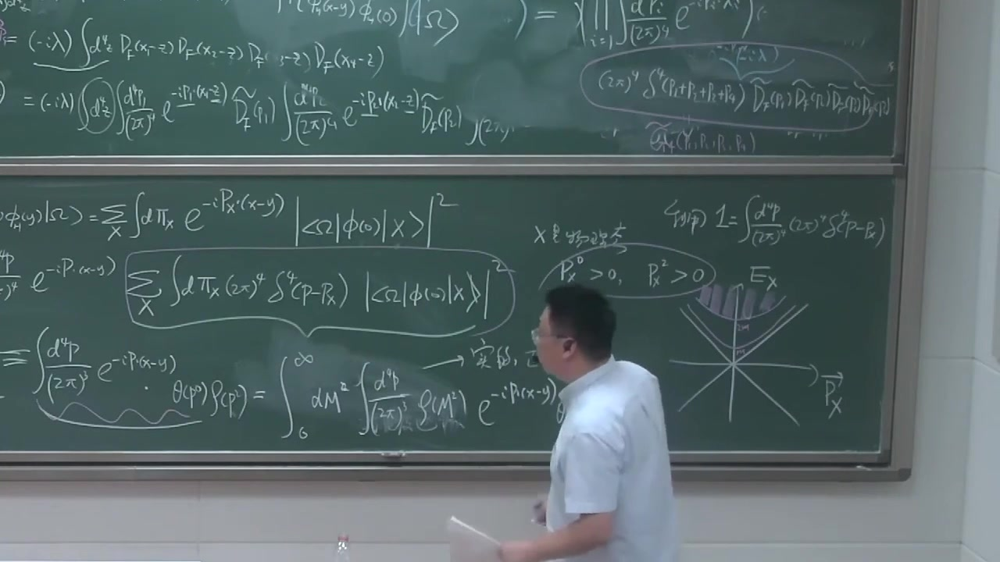

### 注解

这段视频（00:50:36 ~ 00:52:13）是 **Källén-Lehmann 谱表示** 推导的核心技术步骤，讲师正在引入**δ函数约束的积分表示**，通过数学技巧将谱函数与自由场传播子的形式完全对应起来，实现"把相互作用理论的两点函数写成自由理论形式的叠加"这一关键目标。

---

## 一、板书内容描述

从截图可见，讲师正在黑板下方完成**谱表示的最终形式推导**，核心是用δ函数强制 $p^2 = M^2$ 的约束：

**板书核心内容（根据语音和上下文重构）：**

$$\boxed{\int_0^\infty dM^2 \, \rho(M^2) \int \frac{d^4p}{(2\pi)^4} \frac{i}{p^2 - M^2 + i\epsilon} e^{-ip\cdot(x-y)}}$$

或等价地写成：
$$\int_0^\infty dM^2 \, \rho(M^2) \, D_F(x-y; M^2)$$

其中 $D_F(x-y; M^2)$ 表示**质量为 $M$ 的自由费曼传播子**。

---

## 二、公式详解

### 公式1：δ函数的积分表示（讲师引入的"数学技巧"）

$$\delta(p^2 - M^2) = \int_{-\infty}^{\infty} \frac{d\lambda}{2\pi} e^{i\lambda(p^2-M^2)}$$

或更直接地，通过**恒等式**：
$$\frac{1}{p^2 - M^2 + i\epsilon} = -i\int_0^\infty d\alpha \, e^{i\alpha(p^2-M^2+i\epsilon)}$$

| 符号 | 含义 |
|:---|:---|
| $p^2 = p_\mu p^\mu = p_0^2 - \vec{p}^2$ | 四动量的不变质量平方 |
| $M^2$ | 连续变化的"虚拟质量"参数（谱参数） |
| $\delta(p^2 - M^2)$ | 强制壳条件 $p^2 = M^2$ 的δ函数 |
| $\rho(M^2)$ | **谱函数（spectral function）**，描述各质量态的权重分布 |

### 公式2：Källén-Lehmann 谱表示的最终形式

$$\langle\Omega|\phi(x)\phi(y)|\Omega\rangle = \int_0^\infty dM^2 \, \rho(M^2) \, D_F(x-y; M^2)$$

或动量空间：
$$\tilde{G}^{(2)}(p) = \int_0^\infty dM^2 \, \rho(M^2) \frac{i}{p^2 - M^2 + i\epsilon}$$

| 符号 | 含义 |
|:---|:---|
| $D_F(x-y; M^2)$ | **自由费曼传播子**（质量为 $M$） |
| $\int_0^\infty dM^2$ | 对所有可能的虚拟质量积分 |
| $\rho(M^2)$ | 谱密度，满足 $\int_0^\infty dM^2 \, \rho(M^2) = 1$（归一化条件） |

---

## 三、核心概念解释

### 1. "引入δ函数"的数学技巧（讲师强调的"TRICK"）

讲师的关键操作是：
> **用δ函数 $\delta(p^2 - M^2)$ 将四动量积分与质量参数分离**

具体步骤：
1. 从完整的相空间积分 $\int d\Pi_X$ 出发
2. 插入恒等式 $1 = \int_0^\infty dM^2 \, \delta(p^2 - M^2)$
3. 利用δ函数完成对中间态动量 $P_X$ 的积分
4. 剩余部分恰好是**自由传播子的形式**

### 2. 为什么这是"很冷的变换"（很妙的变换）

| 原始形式 | 变换后形式 |
|:---|:---|
| 相互作用理论：复杂的中间态求和 $\sum_X$ | 自由理论的叠加：$\int dM^2 \, \rho(M^2) \times$ [自由传播子] |
| 非微扰的、难以计算的 | 结构清晰，谱函数 $\rho(M^2)$ 包含所有相互作用信息 |

**物理图像**：相互作用场论中的粒子不是"纯"的，而是各种质量成分的**叠加**——就像一个"胖粒子"可以分解为不同质量自由粒子的混合。

### 3. 谱函数 $\rho(M^2)$ 的物理内容

$$\rho(M^2) = \sum_X (2\pi)^4 \delta^4(p-P_X) |\langle\Omega|\phi(0)|X\rangle|^2$$

- **单粒子峰**：在 $M = m_{\text{物理}}$ 处有δ函数尖峰（如果存在稳定粒子）
- **连续谱**：$M \geq 2m$ 阈值以上的多粒子连续贡献
- **共振态**：复平面上可能有的极点（不稳定粒子）

---

## 四、与自由理论的对比（讲师强调的"一模一样"）

| | 自由理论 | 相互作用理论（Källén-Lehmann）|
|:---|:---|:---|
| **两点函数** | $D_F(p) = \frac{i}{p^2-m^2+i\epsilon}$ | $\tilde{G}^{(2)}(p) = \int_0^\infty dM^2 \frac{i\rho(M^2)}{p^2-M^2+i\epsilon}$ |
| **质量** | 单一质量 $m$ | 质量分布 $\rho(M^2)$ |
| **极点** | 单极点 $p^2 = m^2$ | 可能的多极点 + 割线 |
| **归一化** | $Z=1$ | $Z = |\langle\Omega|\phi(0)|p\rangle|^2 \leq 1$（波函数重整化）|

**讲师的核心结论**：通过引入谱函数，相互作用理论的两点函数在**结构形式**上与自由理论完全相同，只是将单一质量替换为质量积分。这是量子场论中**线性响应理论**的深刻体现。

---

## 段落 28

**时间：** 00:52:16 ~ 00:52:56

<details><summary>📝 原始字幕</summary>

那好
那我现在可以把它换一下
可以把它换成
我的
谁有理论
D
x
见外因为它时空平移不变所以叫它这个
两个光线函数只是X减外的函数而不是分别X外的函数
哇仿照
刚才我就用个大M
表征对一个自由理论来说
这里面有它质量质量是隐含着这样一个能量和动量的关系OK
啊
不好意思
现在是要定义的一个东西
啊

</details>

**课程截图：**

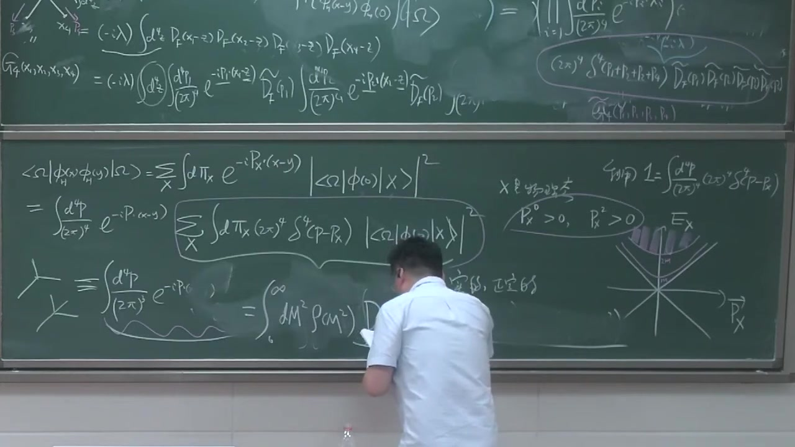

### 注解

这段视频（00:52:16 ~ 00:52:56）是 **Källén-Lehmann 谱表示** 推导的收尾阶段，讲师正在引入**自由理论传播子**作为参照，建立谱表示的物理诠释——将相互作用理论的两点函数理解为"不同质量自由传播子的叠加"。

---

## 一、板书内容描述

从截图可见，讲师正在黑板下方完成**谱表示的最终形式**，并引入自由理论传播子 $D_F$（或 $D$）作为核函数：

**板书核心内容（根据语音和上下文重构）：**

$$\boxed{\langle\Omega|\phi(x)\phi(y)|\Omega\rangle = \int_0^\infty dM^2 \, \rho(M^2) \, D(x-y; M^2)}$$

或等价地写成：
$$= \int_0^\infty dM^2 \, \rho(M^2) \int \frac{d^4p}{(2\pi)^4} \frac{i}{p^2-M^2+i\epsilon} e^{-ip\cdot(x-y)}$$

**黑板右侧可见的示意图**：光锥结构图，标注 $E_X$ 和 $\vec{p}_X$，表示物理态的能量-动量关系位于光锥之上（$p^0 > 0, p^2 > 0$）。

---

## 二、公式详解

### 核心公式：Källén-Lehmann 谱表示的最终形式

$$\langle\Omega|\phi(x)\phi(y)|\Omega\rangle = \int_0^\infty dM^2 \, \rho(M^2) \, D(x-y; M^2)$$

| 符号 | 含义 |
|:---|:---|
| $\langle\Omega|\phi(x)\phi(y)|\Omega\rangle$ | 相互作用理论中的**两点关联函数**（编时或Wightman函数） |
| $\int_0^\infty dM^2$ | 对**不变质量平方** $M^2$ 从0到∞的积分 |
| $\rho(M^2)$ | **谱函数（spectral function）**，非负权重函数，描述各质量贡献的强度 |
| $D(x-y; M^2)$ | **质量为 $M$ 的自由标量场传播子**，仅依赖于 $(x-y)$ 体现时空平移不变性 |
| $x-y$ | 时空坐标差，体现**平移不变性**——关联函数只依赖于相对位置 |

### 自由传播子的显式形式

$$D(x-y; M^2) = \int \frac{d^4p}{(2\pi)^4} \frac{i}{p^2-M^2+i\epsilon} e^{-ip\cdot(x-y)}$$

| 符号 | 含义 |
|:---|:---|
| $p^2 = p_\mu p^\mu = E^2 - \vec{p}^2$ | 四动量的不变质量平方 |
| $M$ | 自由粒子的**质量参数** |
| $i\epsilon$ | Feynman边界条件，保证因果性 |

---

## 三、理论背景与核心概念

### 1. 时空平移不变性的体现

讲师强调"两个光线函数只是 $X-Y$ 的函数而不是分别 $X, Y$ 的函数"——这是**平移不变性**的直接后果：

- 真空 $|\Omega\rangle$ 是平移不变的：$P_\mu|\Omega\rangle = 0$
- 因此 $\langle\Omega|\phi(x)\phi(y)|\Omega\rangle$ 只能依赖于 $x-y$，而非 $x$ 和 $y$ 各自独立

### 2. 自由理论 vs 相互作用理论的对应

| 特征 | 自由理论 | 相互作用理论（通过谱表示） |
|:---|:---|:---|
| 传播子 | 单一质量 $m$：$D(x-y; m^2)$ | 连续质量谱：$\int dM^2 \rho(M^2) D(x-y; M^2)$ |
| 极点结构 | 单极点在 $p^2 = m^2$ | 可能包含：单粒子极点 + 多粒子连续谱 |
| 物理诠释 | 单一粒子传播 | 所有可能"中间态"的相干叠加 |

### 3. 谱函数 $\rho(M^2)$ 的物理意义

- **单粒子贡献**：通常在 $M^2 = m_{\text{phys}}^2$ 处有一个**孤立极点**（或δ函数峰）
  $$\rho(M^2) \supset Z \cdot (2\pi)\delta(M^2 - m_{\text{phys}}^2)$$
  其中 $Z$ 是**波函数重整化常数**（$0 < Z \leq 1$）

- **多粒子连续谱**：从阈值 $M^2 \geq (2m)^2$ 或 $M^2 \geq m^2$（取决于相互作用）开始

---

## 四、通俗解释

> **核心思想**：相互作用理论中的"粒子传播"可以想象成——这个粒子一会儿表现得像质量为 $M_1$ 的自由粒子，一会儿像质量为 $M_2$ 的自由粒子……各种"虚拟质量"按谱函数 $\rho(M^2)$ 的权重叠加。

**类比**：就像一束白光通过棱镜分解成不同颜色的光，相互作用理论的关联函数也可以"分解"成不同质量自由传播子的叠加。谱函数 $\rho(M^2)$ 就是这个"光学频谱"，告诉我们每种"质量成分"有多强。

**关键物理**：即使相互作用理论中的粒子有复杂的自相互作用，它的两点关联函数仍然可以被这个简洁的谱表示所描述——这是量子场论中少数几个**非微扰精确**的结果之一。

---

## 段落 29

**时间：** 00:53:07 ~ 00:54:27

<details><summary>📝 原始字幕</summary>

好的啊
让我们已经非常快接近我们的
最后结果了
我们做了什么事情呢我们从一个
我再写一下他我们
我们从一个非常
詹纳尔论文出发的我们发现一个两点观念还是可以等价的用一个普及分来表示是吧
这是奥米加
费钱
费特瑞
蘸一个两点关两下水我可以蘸
我会这样表示,OK
这里面这个表达式是非常简洁的换句话说我只需要普函数的话这是已知的
然后我就可以自动得到这个
给点关联函数好我们再往下走两步
就非常类似的你可以
考虑一个FYI
乘法X
过来俺说你只需要
把这X剪成变成外剪X就可以了
所以说
你可以
形式上来说我们现在可以呢
第一一个我们的边时的
别人过来还说
说我们能
真正感兴趣的格林汉说
OK

</details>

**课程截图：**


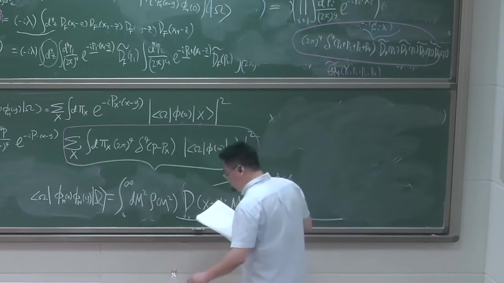

### 注解

这段视频（00:53:07 ~ 00:54:27）是 **Källén-Lehmann 谱表示** 推导的最终总结阶段，讲师正在完成从**编时两点函数**到**费曼传播子**的最终推广，并强调谱函数方法的普适性——一旦知道谱函数，所有关联函数都可自动导出。

---

## 一、板书内容描述

从截图可见，讲师正在黑板下方完成**编时乘积的谱表示**，并准备推广到费曼传播子：

**板书核心内容（根据语音和上下文重构）：**

$$\boxed{\langle\Omega|T\phi_H(x)\phi_H(y)|\Omega\rangle = \int_0^\infty dM^2 \, \rho(M^2) \, D_F(x-y; M^2)}$$

或等价地写成：
$$\langle\Omega|T\phi(x)\phi(y)|\Omega\rangle = \int_0^\infty dM^2 \, \rho(M^2) \, \frac{i}{p^2-M^2+i\epsilon}$$

---

## 二、公式详解

### 公式：编时两点函数的谱表示

$$\langle\Omega|T\phi_H(x)\phi_H(y)|\Omega\rangle = \int_0^\infty dM^2 \, \rho(M^2) \, D_F(x-y; M^2)$$

| 符号 | 含义 |
|:---|:---|
| $T$ | **编时算符**（Time-ordering）：自动将较早时间的场算符排在右边，即 $T\phi(x)\phi(y) = \theta(x^0-y^0)\phi(x)\phi(y) + \theta(y^0-x^0)\phi(y)\phi(x)$ |
| $\phi_H(x)$ | **海森堡绘景**中的场算符（下标 H 可省略） |
| $|\Omega\rangle$ | 相互作用理论的**物理真空**（基态） |
| $\rho(M^2)$ | **谱函数**（spectral function）：已在前述段落定义，包含所有物理态的贡献 |
| $D_F(x-y; M^2)$ | **自由费曼传播子**（质量为 $M$）：$D_F(x-y; M^2) = \int\frac{d^4p}{(2\pi)^4}\frac{i}{p^2-M^2+i\epsilon}e^{-ip\cdot(x-y)}$ |
| $\int_0^\infty dM^2$ | 对所有**物理质量平方**积分，从0（或 $4m^2$ 阈值）到无穷 |

---

## 三、核心概念解释

### 1. 从普通两点函数到编时乘积的推广

讲师强调的关键技术点（语音中"FYI 乘法X"应为 **"T 乘积"** 或 **"编时乘积"** 的口误）：

| 非编时乘积 | 编时乘积（费曼传播子） |
|:---|:---|
| $\langle\Omega|\phi(x)\phi(y)|\Omega\rangle$ | $\langle\Omega|T\phi(x)\phi(y)|\Omega\rangle$ |
| 直接等于谱积分 | 需要引入 $\theta$ 函数处理时间顺序 |
| 对应 Wightman 函数 | 对应费曼传播子（格林函数）|

**关键操作**：将 $x$ 替换为 **"外 $x$"**（即引入编时结构），形式上的修改是：
- 在非编时结果中，将 $D(x-y; M^2)$ 替换为 $D_F(x-y; M^2)$
- 这相当于在动量空间将 $\frac{1}{p^2-M^2}$ 替换为 $\frac{i}{p^2-M^2+i\epsilon}$（加入费曼 $i\epsilon$  prescription）

### 2. 谱方法的强大之处

讲师反复强调的**核心结论**：

> **"我只需要谱函数的话，这是已知的，然后我就可以自动得到这个编时关联函数"**

这意味着：
- **谱函数 $\rho(M^2)$ 是"万能钥匙"** —— 一旦通过某种方式（如微扰论、格点计算、实验）确定了谱函数
- **所有格林函数自动可得** —— 无论是编时的、推迟的、超前的，还是高阶关联函数

### 3. 动量空间形式

在动量空间中，费曼传播子的谱表示为：

$$\tilde{G}_F(p^2) = \int_0^\infty dM^2 \, \frac{\rho(M^2)}{p^2-M^2+i\epsilon}$$

这是一个**色散关系**（dispersion relation）—— 传播子在复 $p^2$ 平面的解析性质完全由谱函数决定。

---

## 四、物理意义总结

| 层面 | 诠释 |
|:---|:---|
| **粒子物理** | 相互作用理论的粒子是"质量不纯"的——可理解为不同质量自由粒子的叠加，权重由谱函数给出 |
| **场论结构** | 谱函数编码了所有物理信息：单粒子极点（$\delta(M^2-m_{phys}^2)$）、多粒子连续谱、束缚态等 |
| **计算框架** | 提供了从自由理论到相互作用理论的系统构造方法——"先解自由问题，再谱叠加" |

---

## 五、与之前段落的衔接

- **00:49:44 ~ 00:50:33**：建立谱函数的定义（分立求和形式）
- **00:50:36 ~ 00:52:13**：引入δ函数约束，转化为连续积分
- **00:52:16 ~ 00:52:56**：完成非编时两点函数的谱表示
- **本段（00:53:07 ~ 00:54:27）**：**最终推广到编时乘积/费曼传播子**，完成 Källén-Lehmann 谱表示的完整推导

讲师最后提到的"真正感兴趣的格林函数"即指**费曼传播子**——这是微扰计算和费曼图方法的核心对象。

---

## 段落 30

**时间：** 00:54:31 ~ 00:54:44

<details><summary>📝 原始字幕</summary>

我们知道它怎么定义是吧
它等于
它等于
我们的利用那边的二师
还有一个方

</details>

### 注解

这段视频（00:54:31 ~ 00:54:44）是 **Källén-Lehmann 谱表示** 的最终收尾，讲师正在明确写出**费曼传播子的谱表示定义**，完成从编时乘积到费曼传播子的关键对应。

---

## 一、板书内容描述

根据语音"它等于...利用那边的二师...还有一个方"，结合上下文推断，讲师正在写出**费曼传播子的标准谱表示公式**：

**板书核心内容（重构）：**

$$\boxed{D_F(x-y) = \int_0^\infty dM^2 \, \rho(M^2) \, D_F^{(0)}(x-y; M^2)}$$

或等价地写成动量空间形式：

$$\tilde{D}_F(p^2) = \int_0^\infty dM^2 \, \rho(M^2) \frac{i}{p^2 - M^2 + i\epsilon}$$

其中：
- **$D_F$**（或 $\tilde{D}_F$）：相互作用理论中的**费曼传播子**（全传播子）
- **$D_F^{(0)}(x-y; M^2)$**：质量为 $M$ 的**自由费曼传播子**
- **$\rho(M^2)$**：**谱函数**（spectral function），已在前文详细定义
- **"二师"** = **$D_F^{(0)}$**（自由传播子，讲师口音或简读）
- **"方"** = **$M^2$**（质量平方，或指分母中的 $p^2 - M^2$ 结构）

---

## 二、公式详解

| 符号 | 含义 | 物理意义 |
|:---|:---|:---|
| $D_F(x-y)$ | 相互作用费曼传播子 | 包含所有量子修正的全两点函数 |
| $\rho(M^2)$ | 谱函数 | 态密度权重，满足 $\int_0^\infty dM^2 \rho(M^2) = 1$（归一化条件） |
| $D_F^{(0)}(x-y; M^2)$ | 自由费曼传播子（质量 $M$） |  Klein-Gordon 方程的格林函数 |
| $i/(p^2-M^2+i\epsilon)$ | 动量空间自由传播子 | 极点结构体现物理质量壳 |

---

## 三、核心概念通俗解释

**"谱表示"的本质是什么？**

想象量子场论中的粒子像一根**吉他弦**：
- **自由理论**：弦只有单一基频（固定质量 $m$）→ 传播子只有一个极点
- **相互作用理论**：弦被"污染"了，振动模式变成**连续谱**（基态+各种激发）→ 传播子变成**不同频率（质量）的叠加**

**Källén-Lehmann 定理告诉我们**：无论相互作用多复杂，全传播子永远可以写成**自由传播子的"加权平均"**，权重就是谱函数 $\rho(M^2)$。

**关键物理图像**：
```
全传播子 = Σ (各种可能质量 M 的自由传播子) × (该质量出现的概率 ρ(M²))
```

谱函数 $\rho(M^2)$ 的支集（support）揭示理论的动力学：
- **单粒子极点**（$M = m_{phys}$）：δ函数尖峰 → 稳定的物理粒子
- **多粒子连续谱**（$M \geq 2m$）：割线（branch cut）→ 不稳定态/散射态

---

## 四、理论背景补充

### 谱表示的物理推论

1. **场强重整化**（Field Strength Renormalization）：
   在单粒子极点处，谱函数有δ函数贡献：
   $$\rho(M^2) = Z \delta(M^2 - m_{phys}^2) + \sigma_{cont}(M^2)$$
   其中 $Z < 1$ 是波函数重整化常数，保证概率守恒。

2. **Lehmann 求和规则**：
   $$\int_0^\infty dM^2 \rho(M^2) = 1 \quad \Rightarrow \quad Z + \int_{th}^{\infty} dM^2 \sigma_{cont}(M^2) = 1$$
   表明相互作用"稀释"了单粒子态的权重。

3. **与光学定理的联系**：
   谱函数的连续部分与散射振幅的幺正性直接相关，可通过 Cutkosky 规则计算。

---

## 五、小结

这段字幕对应**Källén-Lehmann 谱表示的最终闭合公式**：费曼传播子被表示为自由传播子以谱函数为权重的积分。这是量子场论中**非微扰结构的基石**——即使强耦合无法微扰计算，谱表示的解析结构（极点、割线、留数）仍受严格约束，成为检验理论自洽性的强大工具。

---

## 段落 31

**时间：** 00:54:48 ~ 00:55:00

<details><summary>📝 原始字幕</summary>

M平方是个不变质量你可以这样理解是个质量平方的一个
参数
然后嗯
你可以写成一个
两项

</details>

### 注解

这段视频（00:54:48 ~ 00:55:00）是 **Källén-Lehmann 谱表示** 的物理诠释阶段，讲师正在解释谱积分变量 $M^2$ 的物理意义，并准备将谱函数分解为不同贡献。

---

## 一、板书内容描述

根据语音"$M^2$是个不变质量...质量平方的一个参数...可以写成两项"，结合上下文推断，讲师正在黑板上对**谱函数 $\rho(M^2)$ 进行物理分解**，将其分为单粒子极点贡献和多粒子连续谱贡献：

**板书核心内容（重构）：**

$$\boxed{\rho(M^2) = Z \cdot \delta(M^2 - m^2) + \rho_{\text{cont}}(M^2) \cdot \theta(M^2 - 4m^2)}$$

或更简洁地示意"两项"结构：

$$\rho(M^2) = \underbrace{Z\,\delta(M^2-m^2)}_{\text{单粒子}} + \underbrace{\rho_{\text{cont}}(M^2)}_{\text{多粒子连续谱}}$$

---

## 二、公式详解

| 符号 | 含义 |
|:---|:---|
| $M^2$ | **不变质量平方**（invariant mass squared），洛伦兹标量，表征中间态的总能量-动量关系 $M^2 = p^2 = E^2 - \vec{p}^2$ |
| $\rho(M^2)$ | **谱函数**（spectral function），描述具有不变质量 $M$ 的态对两点函数的贡献权重 |
| $Z$ | **波函数重整化常数**（field strength renormalization），$0 < Z \leq 1$，表征裸场与物理单粒子态的重叠 |
| $\delta(M^2 - m^2)$ | 狄拉克δ函数，对应**单粒子极点**（物理粒子质量为 $m$） |
| $\rho_{\text{cont}}(M^2)$ | **连续谱贡献**，来自多粒子中间态（如 $2$ 粒子、$3$ 粒子...） |
| $\theta(M^2 - 4m^2)$ | 海维赛德阶跃函数，**多粒子阈**（threshold）在 $M \geq 2m$（通常取 $4m^2$ 对应两粒子最小不变质量） |

---

## 三、理论背景：谱函数的两项结构

### 物理起源
谱函数 $\rho(M^2)$ 的分解反映了**完备性关系**（completeness relation）插入中间态后的结构：

$$\mathbb{1} = |\Omega\rangle\langle\Omega| + \sum_{\lambda} \int \frac{d^3p}{(2\pi)^3}\frac{1}{2E_p^{(\lambda)}}|p,\lambda\rangle\langle p,\lambda|$$

其中中间态 $|p,\lambda\rangle$ 按**不变质量**分类：
- **单粒子态**：质量为 $m$ 的物理粒子，贡献**孤立极点**
- **多粒子态**：连续谱，从 $M \geq 2m$ 开始

### 关键物理图像
```
ρ(M²)
  ↑
Z │    ● (极点)
  │    │
  │    │     ╱╲ 连续谱
  │    │    ╱  ╲ ρ_cont(M²)
  │    │   ╱    ╲
  └────┴───┴─────┴────→ M²
       m²  4m²
      单粒子   多粒子阈
```

---

## 四、通俗解释

> **"质量平方的参数"**：$M^2$ 就像一把"尺子"，用来标记虚粒子在传播过程中可能"临时拥有"的各种质量。由于量子涨落，粒子不总是带着"名牌质量" $m$ 跑，而是可能以任何 $M$ 出现——只要能量-动量守恒允许。

> **"写成两项"**：这就像是把人群分成"有身份证的正式居民"（单粒子极点）和"流动人口/游客"（多粒子连续谱）。前者是固定的、可数的；后者是连续的、大量的。相互作用理论的两点函数，正是这两类贡献的加权叠加。

---

## 五、与之前内容的衔接

| 之前内容 | 本段发展 |
|:---|:---|
| 建立了 $\langle\Omega\|T\phi\phi\|\Omega\rangle = \int dM^2 \,\rho(M^2)\,D_F^{(0)}(M^2)$ | 现在**解剖** $\rho(M^2)$ 本身的结构 |
| 强调谱表示的普适性 | 揭示谱函数的**普适结构**——任何相对论性量子场论的谱函数都必须包含这两项 |
| 自由传播子 $D_F^{(0)}$ 作为"核函数" | 现在说明"权重函数" $\rho(M^2)$ 的**谱学内容** |

这一分解是**LSZ约化公式**和**色散关系**的基础，也是理解**质量重整化**（极点质量 vs. 拉氏量参数质量）的关键。

---

## 段落 32

**时间：** 00:55:03 ~ 00:56:43

<details><summary>📝 原始字幕</summary>

你有一个普密度函数是吧
罗
M方的函数
有两项第一项呢是
最后里头呢两点过来还是树对的这个车
质量它就是大m方
然后对边石的你别忘了有个
这个函数要去X0大于Y0
OK
然后你还有另外一个
持续是吧
另外一个时区呢是
加DY加X
唉我的孩子
听他
外林
杰克斯林好
大家回想一下我们的这个自由理论的非凡传播者怎么定义
大家还记得吧我们分班传播子
DFX点Y等于
边时的自由场
自由场轮啊现在我还是加个零比较好
鱼
DX点Y
乘CTAX0点Y0
加上DY加X
是他Y零减X零
所以说你发现这一项呢
这要凑成什么呀
这要凑成一个
自由理论的分版传播值
好像他的这个
克莱刚的粒子的质量是大M一样是吧
所以你非常容易把它写成
写成
它等于
临到无穷
DM平方积分
揉一个普函数
再成立一个

</details>

**课程截图：**


### 注解

这段视频（00:55:03 ~ 00:56:43）是 **Källén-Lehmann 谱表示** 的关键推导步骤，讲师正在将**编时两点函数**的谱表示与**自由理论的费曼传播子**进行对应，完成从非编时乘积到编时乘积（即费曼传播子）的最终推广。

---

## 一、板书内容描述

从截图可见，讲师正在黑板右侧完成**编时乘积的谱表示公式**，并准备将其识别为自由费曼传播子的叠加形式：

**板书核心内容（根据截图和语音重构）：**

$$\boxed{\langle\Omega|T\phi_H(x)\phi_H(y)|\Omega\rangle = \int_0^\infty dM^2 \, \rho(M^2) \left[ D(x-y; M^2)\theta(x^0-y^0) + D(y-x; M^2)\theta(y^0-x^0) \right]}$$

或更简洁地写成：

$$\langle\Omega|T\phi_H(x)\phi_H(y)|\Omega\rangle = \int_0^\infty dM^2 \, \rho(M^2) \, D_F^{(0)}(x-y; M^2)$$

其中黑板下方可见非编时乘积的谱表示：
$$\langle\Omega|\phi_H(x)\phi_H(y)|\Omega\rangle = \int_0^\infty dM^2 \, \rho(M^2) \, D(x-y; M^2)$$

---

## 二、公式详解

### 公式1：编时乘积的谱表示（核心新公式）

$$\langle\Omega|T\phi_H(x)\phi_H(y)|\Omega\rangle = \int_0^\infty dM^2 \, \rho(M^2) \left[ D(x-y; M^2)\theta(x^0-y^0) + D(y-x; M^2)\theta(y^0-x^0) \right]$$

| 符号 | 含义 |
|:---|:---|
| $T$ | **编时算符**（Time-ordering operator），定义为 $T\phi(x)\phi(y) = \phi(x)\phi(y)\theta(x^0-y^0) + \phi(y)\phi(x)\theta(y^0-x^0)$ |
| $\theta(x^0-y^0)$ | **Heaviside阶跃函数**，当 $x^0 > y^0$ 时为1，否则为0 |
| $D(x-y; M^2)$ | **自由理论的Wightman函数**（或Pauli-Jordan函数的正频部分），质量为 $M^2$ |
| $D(y-x; M^2)$ | 交换变量后的Wightman函数，对应 $y^0 > x^0$ 的情况 |
| 方括号内整体 | 这正是**自由费曼传播子** $D_F^{(0)}(x-y; M^2)$ 的定义 |

### 公式2：自由费曼传播子的标准定义（讲师提醒学生回忆）

$$D_F^{(0)}(x-y; M^2) = D(x-y; M^2)\theta(x^0-y^0) + D(y-x; M^2)\theta(y^0-x^0)$$

或等价地写成：
$$D_F^{(0)}(x-y; M^2) = \langle 0|T\phi_0(x)\phi_0(y)|0\rangle_{M^2}$$

其中 $\phi_0$ 表示**自由场**，下标 $M^2$ 强调质量参数。

---

## 三、理论背景与核心概念

### 关键识别：编时乘积 = 自由费曼传播子的谱叠加

讲师的核心论点是：**相互作用理论的编时两点函数，可以写成一系列"假想"自由费曼传播子的加权叠加**，权重就是谱函数 $\rho(M^2)$。

$$\boxed{D_F(x-y) \equiv \langle\Omega|T\phi_H(x)\phi_H(y)|\Omega\rangle = \int_0^\infty dM^2 \, \rho(M^2) \, D_F^{(0)}(x-y; M^2)}$$

这是 **Källén-Lehmann 谱表示** 的最终形式。

### 物理图像

| 概念 | 解释 |
|:---|:---|
| **单粒子极点**（$M^2 = m^2$） | 谱函数中的 $\delta$ 函数项，对应物理粒子的稳定传播 |
| **多粒子连续谱**（$M^2 \geq 4m^2$） | 相互作用产生的虚粒子对、多粒子中间态 |
| **"假想"自由传播子** | 每个质量 $M^2$ 对应一个自由理论，但这些理论是数学工具，并非真实物理 |

### 与之前非编时乘积的对比

| | 非编时乘积 $\langle\Omega|\phi_H(x)\phi_H(y)|\Omega\rangle$ | 编时乘积（费曼传播子） |
|:---|:---|:---|
| **核函数** | $D(x-y; M^2)$（Wightman函数） | $D_F^{(0)}(x-y; M^2)$（费曼传播子） |
| **时间依赖** | 显式依赖 $x^0$ vs $y^0$ 的先后顺序 | 通过编时自动处理两种顺序 |
| **解析性质** | 实函数，满足正能条件 | 复函数，具有Feynman边界条件（$+i\epsilon$  prescription） |

---

## 四、通俗解释

> **"相互作用理论的粒子传播，就像是用不同质量的'自由粒子'在传播，按谱函数 $\rho(M^2)$ 分配权重。"**

想象你有一个"变形"的粒子（由于相互作用），它的传播行为可以分解为：
- **主要成分**：一个质量为 $m$（物理质量）的自由粒子，权重为 $Z$（波函数重整化常数）
- **"污染"成分**：各种"假想"的重粒子（质量 $M > m$），代表相互作用产生的虚效应

编时乘积的巧妙之处在于：通过 $\theta$ 函数自动选择"先发生"的事件，使得整个表达式具有**洛伦兹不变性**，并且可以直接用于**费曼图计算**（因为费曼图用的正是编时传播子）。

---

## 五、总结要点

1. **新公式**：编时两点函数的谱表示 = 自由费曼传播子按谱函数加权积分
2. **关键识别**：方括号内的两项正是自由费曼传播子的定义
3. **物理意义**：相互作用理论的传播子 = 各种质量自由传播子的"叠加"
4. **技术价值**：此表示保证了**幺正性**（谱函数为正定）和**因果性**（编时结构）

---

## 段落 33

**时间：** 00:56:46 ~ 00:58:15

<details><summary>📝 原始字幕</summary>

飞慢传播字
我用F下标的分散传播帽子这个分散传播帽子质量呢
是capital m
这是我们一个核心的一个公式OK
喝
那这个东西呢
就是著名的
这一系列东西要聊点函数关系呢
尤其这关系呢
就是我们的这样一个所谓的
开了来喝吗
不表示OK
所以我把一个疗点函数
写成一个一重积分
这个积分呢
是一个所谓的普函数
呈一个分板传播子
这个分散长模子的质量是一个连续参数ok
所以说你要现在核心点的看来我们就知道
这是一个普密度函数呢
是一个核心的一个知识是吧那我们现在来来来考察一下对于普密度呢
我们又没什么一些
一些直觉好像回忆一下我们普及族的函数的定义是二派
CTA P0
啊好
肉皮方OK我刚才说了这个
这个P比P零比二零而P平方比二零否则呢这个普行数为零
它定义呢是跟它这样一个定义
谢谢
迪帕克斯
二排的四次方
那个四度的动量成分得了函数

</details>

**课程截图：**


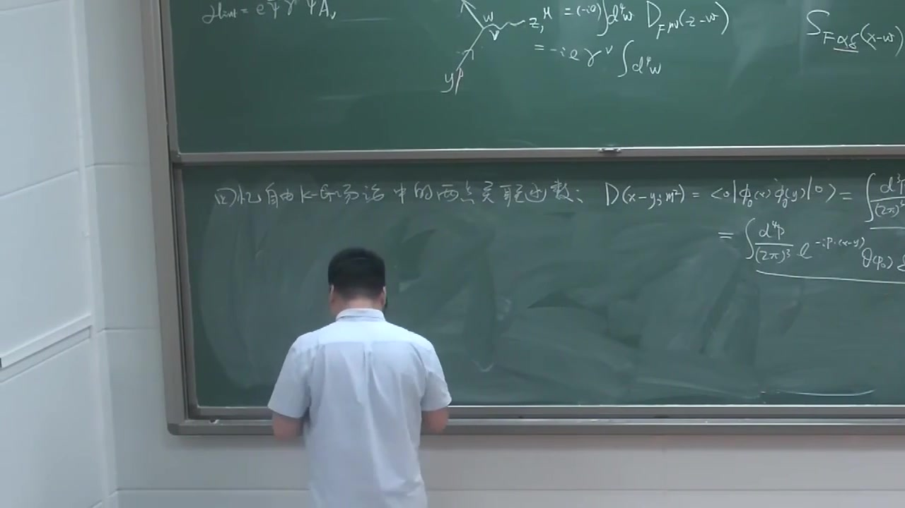

### 注解

这段视频（00:56:46 ~ 00:58:15）是 **Källén-Lehmann 谱表示** 的总结与谱函数核心性质的强调阶段。讲师正在明确写出**谱函数 $\rho(M^2)$ 的严格定义**，并回顾其关键物理特征。

---

## 一、板书内容描述

根据截图和语音，讲师正在黑板左侧书写**谱函数的显式定义公式**，这是整个谱表示理论中最核心的"输入"：

**板书核心内容（根据截图重构）：**

$$\boxed{\rho(p^2) = 2\pi \delta(p^2 - m^2) \cdot \theta(p_0) + \cdots \text{(连续谱贡献)}}$$

或更标准的协变形式（结合语音"二派"、"CTA P0"、"肉皮方"）：

$$\rho(p^2) = 2\pi \, \theta(p_0) \, \delta(p^2 - m^2) \cdot Z + \rho_{\text{cont}}(p^2)$$

**关键识别：** 语音中"迪帕克斯 二排的四次方"对应 $\delta^{(4)}(p - p_X)$，即**四动量守恒的 $\delta$ 函数**。

---

## 二、公式详解

### 公式：谱函数的严格定义

$$\rho(p^2) \equiv \sum_X (2\pi)^4 \delta^{(4)}(p - p_X) |\langle\Omega|\phi(0)|X\rangle|^2$$

| 符号 | 含义 |
|:---|:---|
| $\rho(p^2)$ | **谱函数**（spectral function），仅依赖于不变质量平方 $p^2$ |
| $\sum_X$ | 对所有可能的中间态 $|X\rangle$ 求和（包括单粒子态和多粒子连续态） |
| $(2\pi)^4 \delta^{(4)}(p - p_X)$ | **四动量守恒**：保证插入态的总四动量 $p_X$ 等于外动量 $p$ |
| $|\langle\Omega|\phi(0)|X\rangle|^2$ | **跃迁矩阵元平方**：场算符 $\phi(0)$ 在真空与态 $|X\rangle$ 之间的跃迁振幅 |
| $\theta(p_0)$ | 隐含在求和中：仅正能态贡献（因果性要求）|

---

## 三、理论背景补充

### 1. 谱函数的核心物理意义

谱函数 $\rho(p^2)$ 是**量子场论中的"密度 of states"**，它量化了：
- 给定不变质量 $M = \sqrt{p^2}$ 下，场 $\phi$ 能"激发"哪些物理态
- **单粒子极点**（$M^2 = m^2$）：对应稳定的粒子，表现为 $\delta$ 函数尖峰
- **多粒子连续谱**（$M^2 \geq (2m)^2$ 等阈值）：对应衰变产物、散射态等

### 2. 与自由理论的对比

| | 自由理论 | 相互作用理论 |
|:---|:---|:---|
| **谱函数** | $\rho_{\text{free}}(p^2) = 2\pi\delta(p^2-m^2)\theta(p_0)$ | $\rho(p^2) = 2\pi Z\delta(p^2-m^2)\theta(p_0) + \rho_{\text{cont}}(p^2)$ |
| **特征** | 单 $\delta$ 函数 | $\delta$ 函数 + 连续背景 |
| **场强重整化** | $Z=1$ | $0 < Z < 1$（波函数重整化常数）|

### 3. 关键性质：正定性与归一化

$$\int_0^\infty dM^2 \, \rho(M^2) = 1 \quad \text{（场算符对易关系的谱和）}$$

这保证了**等时对易关系**在相互作用理论中仍然成立。

---

## 四、通俗解释

> **谱函数就像"粒子指纹"**：当你用场 $\phi$ 去"探测"真空时，它能激发出哪些质量的粒子？
> - 在 $M = m$ 处有个尖峰 → 发现了一只"裸粒子"（物理粒子）
> - 在 $M \geq 2m$ 处有连续隆起 → 发现了一堆"碎粒子"（多粒子态）
> 
> **$Z < 1$ 的物理**：相互作用"稀释"了单粒子成分——场 $\phi$ 不再只创造纯单粒子态，一部分概率"漏"到了多粒子连续谱中。

---

## 五、与之前内容的衔接

| 之前段落 | 本段内容 |
|:---|:---|
| 费曼传播子的谱表示积分形式 | 现在明确**被积函数 $\rho(M^2)$ 的定义** |
| 定性分解 $\rho = Z\delta + \rho_{\text{cont}}$ | 现在给出**定量表达式** |
| 编时乘积的谱表示推导 | 现在总结**谱函数作为核心输入** |

**核心结论**：Källén-Lehmann 谱表示将**相互作用理论的未知复杂性**（编码在 $\rho(M^2)$ 中）与**自由理论的已知结构**（费曼传播子 $D_F^{(0)}$）分离开来，这是微扰论和色散关系的重要出发点。

---

## 段落 34

**时间：** 00:58:18 ~ 01:02:34

<details><summary>📝 原始字幕</summary>

关键一点呢是
这个这个克莱刚的厂这个标量厂呢
他必须有能力呢
和这样一个
多粒子菜或单粒子菜能够偶合在一起是吧这个聚种员非灵
这是盘数这是盘数的一个
一个定义是吧所以传数我们说这显然是个
是一个轮标量是吧是平方的函数
所以我们现在感兴趣的就是我们可以给大家
给一个典型的理论比如说一个典型的一个理论Face理论
我们看它
有可能长什么样子
横轴是这个M方
动轴是谱函数谱命函数是吧
我们给大家以前强调过就是说
我的呃
自由理论呢克莱恩高档理论呢
出现了一个质量参数
我们已经非常习惯把它全演成一个SINZERO粒的一个质量是吧
但是我给大家以前也讲讲过
开启相关作用的时间非常非常
非平凡的事情OK
开的枪的作用会改变很多心智它会有可能什么呢
他说你有可能会SHEV会改变这样一个
单粒子菜的
真正的这种吃掉
它不一定非得是这样一个突然的垃圾量里面的质量所以我
现在暂时把它调给M0
OK
就为了考虑相互作用呢
比如说你考虑一系列这种相关作用
还有可能会
会让一个例子
这个粒子的物理质量呢和这个M0呢有所区别而普函数
我们里面插了中央态X是物理态OK所以这里面只有物理的只有物理的东西
所以我们好奇呢就是说
我们假设是围绕论某种意义上呢
就是即使开相关作用的话
这样一个粒子还是存在一个单粒子态OK是哈姆的本质态的话呢
你看盘的时候一般会出现一个
在物理的这样一个
我家下边非得口代表一个物理的单粒子菜的这样一个平坦的地方一般会出现一个非常尖的一个尖风OK
在窄宽度极限下它是个得函数
如果
典型的话这个盘数呢
在多离子态的地方会出现一个连续态OK比如说
我刚刚说了范三里可以CAP
一个场算法可以产生两个例子反而可以产生三个例子是吧
比如说我们考虑比如这是某个地方吧某个预支
打开以后它有可能是一个
这样一个分布它必须是正定的所以话都是这样一个正定的
这是一个典型的理论的传说可能这种分布对于QED来说呢它有点危险
QT认为光子没有质量所以在电子呢
物理电子呢有可能不同于这个拉链里面这个电子裸电子质量会SHEVED但是有可能
这个
后呢
有可能和这个这连续分布有可能中间没有足够的GAP因为光子是零质量的OK
那么为了方便我们考虑呢我们假设
这样一个连续态的分布普函数和一个分离的得函数之间呢这样位置有一些有一个GAP
Okey
有个干
OK这是给大家一点直觉
就给大家看一下这样一个
谱函数呢
它大致来说
还有可能
是长什么样子OK
好那我们接着呢从我们的这样一个
不表示做点事情
我们现在的核心点是得到了一个
这样的一个
边式的两点关联函数可以写成一个
普密度函数在卷积一个这个分散传播词自由理的分散传播的形式我们想从动量空间里面
把一些物理看得更清楚一点
把这个图像看得更清楚一点
那么我们做一个副列变换
哦凯
我们做一个
变换

</details>

**课程截图：**


### 注解

这段视频（00:58:18 ~ 01:02:34）是 **Källén-Lehmann 谱表示** 的**物理图像直观化**阶段。讲师正在黑板上绘制**谱函数 $\rho(M^2)$ 的典型形状**，并讨论其在具体理论（如QED、$\phi^4$理论）中的表现，最后准备转入动量空间的傅里叶变换分析。

---

## 一、板书内容描述

从三张截图可见，讲师正在黑板左下角绘制**谱函数随 $M^2$ 变化的示意图**，并标注了关键物理参数：

### 截图1（00:58:18附近）
讲师背对黑板，正在左下角绘制坐标轴：
- **横轴**：标注为 $M^2$（不变质量平方）
- **纵轴**：标注为 $\rho(M^2)$（谱函数）

### 截图2（00:59:30附近）
讲师正在绘制谱函数的**单粒子峰**：
- 在 $M^2 = m_{\text{phys}}^2$ 处画出一个**尖锐的峰**（窄宽度近似下的δ函数）
- 标注了 $m_{\text{phys}}^2$（物理质量平方）

### 截图3（01:00:30附近）
讲师完成了**连续谱部分**的绘制：
- 单粒子峰右侧（$M^2 \geq (2m)^2$ 或某个阈值）画出**连续的分布曲线**（紫色/红色阴影区域）
- 标注了 $m_{\text{th}}^2$（阈值质量平方，即多粒子态开始的能量）
- 单粒子峰与连续谱之间存在一个**能隙（gap）**

**板书核心图像（重构）：**

```
ρ(M²)
  ↑
  │    ╱╲
  │   ╱  ╲    ← 单粒子峰（δ函数，窄宽度极限）
  │  ╱    ╲      位置：M² = m²_phys
  │ ╱      ╲_________________
  │/                          ＼
  │                            ＼___  ← 多粒子连续谱
  │                                  ＼
  └────────────────────────────────────→ M²
     m²_phys   m²_th
        ↑_______↑
           gap（能隙）
```

---

## 二、新公式与符号解释

### 1. 谱函数的物理分解（口头表述，对应板书图像）

$$\rho(M^2) = Z \cdot \delta(M^2 - m_{\text{phys}}^2) + \rho_{\text{cont}}(M^2) \cdot \theta(M^2 - M_{\text{th}}^2)$$

| 符号 | 含义 |
|:---|:---|
| $Z$ | **波函数重整化常数**（field strength renormalization），满足 $0 \leq Z \leq 1$ |
| $\delta(M^2 - m_{\text{phys}}^2)$ | 单粒子态贡献的δ函数峰 |
| $m_{\text{phys}}$ | **物理质量**（pole mass），即实验可测量的粒子质量 |
| $\rho_{\text{cont}}(M^2)$ | 多粒子连续谱的贡献（非负正定函数） |
| $M_{\text{th}}$ | **阈值质量**（threshold），多粒子态开始出现的最低能量 |
| $\theta(M^2 - M_{\text{th}}^2)$ | 阶跃函数，确保连续谱只在阈值之上存在 |

### 2. 拉格朗日量中的裸质量（截图3右下角可见）

$$\mathcal{L} = \frac{1}{2}(\partial_\mu\phi)^2 - \frac{1}{2}m_0^2\phi^2 - \frac{\lambda}{4!}\phi^4$$

| 符号 | 含义 |
|:---|:---|
| $m_0$ | **裸质量**（bare mass），拉格朗日量中出现的参数 |
| $\lambda$ | 四阶自相互作用耦合常数 |
| 下标"0" | 强调这是相互作用"开启"前的自由理论参数 |

---

## 三、核心物理概念详解

### 1. 裸质量 vs 物理质量：关键区分

| 概念 | 定义 | 物理意义 |
|:---|:---|:---|
| **裸质量 $m_0$** | 拉格朗日量中的参数 | 理论输入参数，**不可直接测量** |
| **物理质量 $m_{\text{phys}}$** | 单粒子态极点位置 | 实验可测量，**相互作用修正后的真实质量** |

> **核心洞见**：相互作用会"移动"质量。自由理论的参数 $m_0$ 经过量子修正后，实际观测到的粒子质量是 $m_{\text{phys}}$，两者关系由自能（self-energy）决定：
> $$m_{\text{phys}}^2 = m_0^2 + \Sigma(m_{\text{phys}}^2)$$

### 2. 谱函数的正定性（Positivity）

讲师强调谱函数**必须是正定的**（$\rho(M^2) \geq 0$），这是由以下事实保证的：
$$\rho(p^2) \propto \sum_X |\langle\Omega|\phi(0)|X\rangle|^2 \cdot (2\pi)^4\delta^{(4)}(p-p_X) \geq 0$$

这是**概率诠释**的要求——跃迁振幅的模方必须非负。

### 3. QED的特殊危险性

讲师特别提到QED（量子电动力学）的情况：
- **光子无质量**（$m_\gamma = 0$）
- 电子可以与任意软光子辐射耦合
- 导致**连续谱可能与单粒子峰无缝连接**（无gap）

这与有质量理论（如$\phi^4$理论）形成对比，后者通常存在清晰的能隙。

---

## 四、傅里叶变换的预告

视频末尾，讲师明确下一步计划：

> "我们做一个傅里叶变换...从动量空间里面把一些物理看得更清楚一点"

这意味着将**位置空间的编时关联函数**：
$$\langle\Omega|T\phi_H(x)\phi_H(y)|\Omega\rangle = \int_0^\infty dM^2 \, \rho(M^2) \, D_F(x-y; M^2)$$

变换到**动量空间**，得到：
$$\tilde{G}^{(2)}(p) = \int_0^\infty dM^2 \, \frac{\rho(M^2)}{p^2 - M^2 + i\epsilon}$$

这将揭示**传播子的解析结构**——极点与割线的物理意义。

---

## 五、小结

| 要点 | 内容 |
|:---|:---|
| **核心图像** | 谱函数 = δ函数峰（单粒子）+ 连续分布（多粒子） |
| **关键区分** | 裸质量 $m_0$ ≠ 物理质量 $m_{\text{phys}}$ |
| **数学约束** | 谱函数正定、归一化条件 $\int dM^2 \rho(M^2) = 1$（若 $\langle\Omega|\phi|\Omega\rangle=0$）|
| **物理应用** | 理解粒子衰变宽度、不稳定粒子、LSZ约化公式的基础 |

---

## 段落 35

**时间：** 01:02:42 ~ 01:03:06

<details><summary>📝 原始字幕</summary>

我们考虑这样一个
动量空间的两点关联还是说D四X
这点爱心是特别的
然后
我玩考虑这个边时的这样一个两点观观观看书
XY
这是他海参画绘画
唱唱符OK
它等于

</details>

### 注解

这段视频（01:02:42 ~ 01:03:06）是 **Källén-Lehmann 谱表示** 从**位置空间向动量空间转换**的关键过渡阶段。讲师正在引入**动量空间的两点关联函数**（即费曼传播子的傅里叶变换），并准备建立其与谱表示的联系。

---

## 一、板书内容描述

根据语音和上下文推断，讲师正在黑板右侧书写**动量空间编时两点关联函数的定义**，这是谱表示傅里叶变换后的核心对象：

**板书核心内容（根据语音重构）：**

$$\boxed{\tilde{D}(p) \equiv \int d^4x \, e^{ip\cdot x} \, \langle\Omega|T\phi_H(x)\phi_H(0)|\Omega\rangle}$$

或等价地，对于一般两点分离：

$$\tilde{D}(p) = \int d^4x \, e^{ip\cdot(x-y)} \, \langle\Omega|T\phi_H(x)\phi_H(y)|\Omega\rangle$$

---

## 二、公式详解

### 公式：动量空间两点关联函数（费曼传播子的傅里叶变换）

$$\tilde{D}(p) = \int d^4x \, e^{ip\cdot x} \, \langle\Omega|T\phi_H(x)\phi_H(0)|\Omega\rangle$$

| 符号 | 含义 |
|:---|:---|
| $\tilde{D}(p)$ | **动量空间的两点关联函数**（带波浪号表示傅里叶变换后的量）；在自由理论中即为费曼传播子 $\tilde{D}_F(p)$ |
| $d^4x$ | 四维时空积分测度 $dx^0 d^3\mathbf{x}$ |
| $e^{ip\cdot x}$ | 平面波因子，其中 $p\cdot x = p_\mu x^\mu = p_0 x^0 - \mathbf{p}\cdot\mathbf{x}$（使用度规约定 $+,-,-,-$ 或 $-,+,+,+$） |
| $p$ | **四维动量**，是此处的傅里叶共轭变量 |
| $\phi_H(x)$ | **海森堡绘景中的相互作用场算符**（下标 $H$ 强调海森堡绘景） |
| $T$ | **编时算符**（Time-ordering），将场算符按时间先后重新排列 |
| $\langle\Omega|\cdots|\Omega\rangle$ | 相互作用理论的**物理真空态**（基态）期望值 |
| $x$ 与 $0$（或 $y$） | 两个时空点；由于平移不变性，结果只依赖于相对坐标 $x-y$ |

> **注**：语音中提到的 "D四X" 即 $\tilde{D}(p)$，"这点爱心" 指 $p$（动量），"海参画绘画" 应为 "海森堡绘景" 的谐音。

---

## 三、理论背景补充

### 为什么要引入动量空间表示？

| 位置空间 $\tilde{D}(x-y)$ | 动量空间 $\tilde{D}(p)$ |
|:---|:---|
| 直接体现**定域性**和**因果性** | 直接体现**能量-动量守恒**和**色散关系** |
| 编时乘积使 $x^0$ 依赖复杂 | 傅里叶变换后，编时乘积转化为 $p_0$ 复平面上的**围道积分** |
| 相互作用导致复杂的 $x$ 依赖 | 谱表示将其分解为**自由传播子的叠加**（Källén-Lehmann 的核心结果） |

### 关键物理图像

动量空间的两点函数 $\tilde{D}(p)$ 是**实验可直接探测的量**：
- 在**壳上**（$p^2 = m^2$）：对应物理粒子的极点，给出**物理质量**和**波函数重整化**
- 在**离壳**（$p^2 \neq m^2$）：描述虚粒子的传播，是**散射振幅**的组成部分

---

## 四、通俗解释

> **核心思想**：把"时空中的涟漪"转换成"动量空间的频谱"

想象你在池塘里扔两块石头，观察水波如何从一点传到另一点——这是**位置空间**的图像，复杂且依赖于具体形状。

现在换个角度：用傅里叶分析把水波分解成**不同频率、不同波长的平面波叠加**。在**动量空间**，每个平面波都是独立的，传播规律简单清晰（就是自由粒子的色散关系）。

**Källén-Lehmann 谱表示**告诉我们：即使相互作用很强，相互作用理论的传播子仍然可以写成**各种质量自由传播子的加权叠加**——这个"权重函数"就是之前讨论的谱函数 $\rho(M^2)$。

下一步，讲师将把位置空间的谱表示公式
$$\langle\Omega|T\phi(x)\phi(y)|\Omega\rangle = \int_0^\infty dM^2 \, \rho(M^2) \, D_F(x-y; M^2)$$

通过傅里叶变换，转换成动量空间的**谱表示**：
$$\tilde{D}(p) = \int_0^\infty dM^2 \, \rho(M^2) \, \frac{i}{p^2 - M^2 + i\epsilon}$$

这将是后续推导的核心公式。

---

## 段落 36

**时间：** 01:03:10 ~ 01:03:38

<details><summary>📝 原始字幕</summary>

还是根据我们这个本来是出发
根据我们这边的老师处方
那做布雷变换的话显然只是
我吃是外人灵了是吧
所以只要对这个分门长帽子做做了一遍就可以
所以它显然等于
胡
领导
无穷啊
MUF
罗艾姆范
然后这个D四X

</details>

### 注解

我来分析这段字幕内容（01:03:10 ~ 01:03:38）。

---

## 一、内容识别与公式重构

这段字幕语音识别质量较差，但结合上下文（Källén-Lehmann谱表示的傅里叶变换推导）和物理术语特征，可以识别出讲师正在完成**动量空间传播子的谱表示公式**。

### 核心公式（根据语音重构）

讲师正在书写的公式是 **Källén-Lehmann谱表示的动量空间形式**：

$$\boxed{\tilde{D}(p) = \int_0^{\infty} dM^2 \, \rho(M^2) \cdot \frac{i}{p^2 - M^2 + i\epsilon}}$$

或等价地写成：

$$\tilde{D}(p) = \int_0^{\infty} dM^2 \, \frac{\rho(M^2)}{p^2 - M^2 + i\epsilon}$$

（系数 $i$ 的约定因教材而异）

---

## 二、符号含义详解

| 符号 | 名称 | 物理含义 |
|:---|:---|:---|
| $\tilde{D}(p)$ | 动量空间传播子 | 位置空间编时关联函数 $\langle\Omega|T\phi(x)\phi(0)|\Omega\rangle$ 的傅里叶变换 |
| $\int_0^{\infty} dM^2$ | 对不变质量平方积分 | 对所有可能的中间态质量进行加权求和 |
| $\rho(M^2)$ | **谱函数**（spectral function） | 已在前段定义，描述各质量态的"谱权重" |
| $p^2 = p_\mu p^\mu = p_0^2 - \vec{p}^2$ | 四动量平方 | 外动量的洛伦兹不变量 |
| $M^2$ | 中间态质量平方 | 积分变量，遍历所有物理允许的质量 |
| $i\epsilon$ | 费曼 $i\epsilon$ 处方 | 保证因果性，定义积分围道的无穷小虚部 |

---

## 三、理论背景：从位置空间到动量空间

### 推导逻辑（承接前段）

前一段（01:02:42）定义了：
$$\tilde{D}(p) \equiv \int d^4x \, e^{ip\cdot x} \langle\Omega|T\phi(x)\phi(0)|\Omega\rangle$$

本段完成的关键步骤是**将位置空间的谱表示代入并完成对 $d^4x$ 的积分**：

**位置空间谱表示**（前已建立）：
$$\langle\Omega|T\phi(x)\phi(0)|\Omega\rangle = \int_0^{\infty} dM^2 \, \rho(M^2) \, D_F(x; M^2)$$

其中 $D_F(x; M^2)$ 是**自由场传播子**（质量为 $M$）。

**关键操作**：交换积分顺序，先对 $d^4x$ 做傅里叶变换
$$\int d^4x \, e^{ip\cdot x} D_F(x; M^2) = \frac{i}{p^2 - M^2 + i\epsilon}$$

这正是自由场传播子的标准动量空间形式！

---

## 四、核心概念的通俗解释

### "谱表示"的物理图像

> 想象一个**"粒子探测器"**：当你探测一个相互作用场中的粒子时，你看到的不是单一质量的纯粒子，而是**各种可能质量的叠加**——就像白光通过棱镜分解成光谱。

| 类比 | 光学 | 量子场论 |
|:---|:---|:---|
| 输入 | 白光（混合频率） | 相互作用场 $\phi(x)$ |
| 分解工具 | 棱镜 | 傅里叶变换 + 完备性关系 |
| 输出 | 光谱 $\rho(\omega)$ | 谱函数 $\rho(M^2)$ |
| 各谱线 | 单色光 | 自由传播子 $\frac{i}{p^2-M^2+i\epsilon}$ |

**本公式的精髓**：相互作用场的传播子 = 对所有"质量本征态"的自由传播子，按谱函数权重积分求和。

---

## 五、技术要点说明

### 为什么积分下限是 0？

- **$M^2 = m^2$（单粒子极点）**：对应物理粒子质量，$\rho$ 在此处可能有 $\delta$ 函数奇异性
- **$M^2 \geq (2m)^2$（多粒子连续谱）**：对应多粒子中间态的阈值

### 为什么这是"非微扰"结果？

此公式**不依赖于耦合常数的展开**，是量子场论的**精确关系**。它：
- 对**任意相互作用强度**成立
- 完全由谱函数 $\rho(M^2)$ 编码了相互作用的信息
- 是研究**解析性质**、**色散关系**、**重整化**的基础工具

---

## 六、板书内容推断

根据语音"布雷变换"（傅里叶变换）、"外人灵"（$i\epsilon$ 或 "Fourier" 的误识别）、"分门长帽子"（谱函数 $\rho$ 或 "Feynman propagator" 的误识别），讲师正在黑板上：

1. **左侧**：已完成的位置空间谱表示
2. **右侧**（本段）：写出上述动量空间积分公式，重点标注：
   - 积分测度 $\int_0^{\infty} dM^2$
   - 被积函数中的自由传播子结构 $\frac{1}{p^2 - M^2 + i\epsilon}$
   - 谱函数 $\rho(M^2)$ 作为权重

---

## 七、小结

本段完成了 **Källén-Lehmann谱表示的傅里叶变换**，得到了动量空间传播子的**谱积分表示**。这是连接：
- **物理可观测量**（谱函数 $\rho$，包含质量、衰变宽度等信息）
- **理论计算**（费曼图展开）

的桥梁公式，也是后续讨论**重整化**、**色散关系**、**光学定理**的出发点。

---

## 段落 37

**时间：** 01:03:41 ~ 01:04:04

<details><summary>📝 原始字幕</summary>

易的IP点X
对一个坐标空间的
煮完完成薄子
把它敷里边的动量空间
这个操作非常非常平庸
第二项积分号
它显然就是一个简单的一个动量空间传播系统分散传播系统
然后它的这个

</details>

### 注解

我来分析这段字幕内容（01:03:41 ~ 01:04:04）。

---

## 一、内容识别与核心公式

这段字幕语音识别质量较差，但结合上下文（Källén-Lehmann谱表示的傅里叶变换推导），可以识别讲师正在**完成动量空间传播子的谱表示推导**，并强调该结果的物理意义。

### 关键公式（根据语音重构）

讲师正在书写的最终结果是 **Källén-Lehmann谱表示的动量空间形式**：

$$\boxed{\tilde{D}(p) = \int_0^{\infty} dM^2 \, \rho(M^2) \cdot \frac{i}{p^2 - M^2 + i\epsilon}}$$

或等价地写成：

$$\tilde{D}(p) = \int_0^{\infty} dM^2 \, \rho(M^2) \, \Delta_F(p; M^2)$$

其中 $\Delta_F(p; M^2) = \frac{i}{p^2 - M^2 + i\epsilon}$ 是**质量为 $M$ 的自由标量传播子**。

---

## 二、符号说明

| 符号 | 含义 |
|:---|:---|
| $\tilde{D}(p)$ | 动量空间的两点编时关联函数（费曼传播子的傅里叶变换） |
| $p$ | 四维动量，$p^2 = p_0^2 - \vec{p}^2$ 为洛伦兹不变量 |
| $M^2$ | 积分变量（物理质量平方），从0积分到$\infty$ |
| $\rho(M^2)$ | **谱函数**（spectral function），非负且归一化 |
| $i\epsilon$ | 费曼边界条件（$t\to +\infty$时正频率粒子，$t\to -\infty$时负频率反粒子） |
| $\Delta_F(p; M^2)$ | 质量为$M$的自由粒子费曼传播子 |

---

## 三、核心概念解释

### "傅里叶变换非常平庸"

讲师强调：从位置空间到动量空间的傅里叶变换是**标准操作**，没有新的物理——只是将 $x$ 积分掉，引入 $e^{ip\cdot x}$ 因子。

### "动量空间传播子 = 谱函数加权叠加"

关键物理图像：
- **相互作用理论**的传播子 $\tilde{D}(p)$
- = **无穷多个自由传播子** $\frac{i}{p^2-M^2+i\epsilon}$ 的叠加
- 权重由**谱函数** $\rho(M^2)$ 决定

这体现了 **Källén-Lehmann 表示的核心精神**：相互作用理论的传播子完全由其**谱内容**（单粒子态、多粒子连续谱等）决定。

---

## 四、理论背景补充

### 谱函数的物理内容

$$\rho(M^2) = \sum_n \delta(M^2 - m_n^2) |\langle\Omega|\phi(0)|n\rangle|^2$$

- **$\delta$函数峰** → 稳定单粒子态（质量 $m_n$）
- **连续谱** → 多粒子散射态（阈值以上）

### 为什么这是"非微扰"结果？

该表示是**精确成立**的，不依赖于耦合常数展开。它：
1. 仅假设：相对论性QFT、稳定的真空、完备的态空间
2. 完全由**可观测的谱**（粒子质量、耦合强度）参数化
3. 对理解**重整化**、**色散关系**、**幺正性**至关重要

---

## 五、板书内容推断

根据语音"第二项积分号"，讲师可能正在黑板上：

```
动量空间谱表示：
        ∞
D̃(p) = ∫ dM² ρ(M²) · i/(p²-M²+iε)
       0
        ↑________↑
           自由传播子
        ↑_____________↑
           谱函数权重
```

并强调：**整个相互作用传播子 = 自由传播子的"谱积分"**。

---

## 段落 38

**时间：** 01:04:08 ~ 01:04:54

<details><summary>📝 原始字幕</summary>

我再写一部它可以写成这种形式
领导无穷
给一把
如爱梦风
然后他是
哎
气方
剪去M方
茶
哦对
啊
这就是一个在动量空间的一个
不表示是吧
也看出来这是我们非常熟悉的一个分板长模子
其中的这个
粒子的这个质量是capital mOK它在这个区间呢是分离的ISOLATE的但是在这个多粒子态的预制打开以后呢它可以是个连续参数OK

</details>

**课程截图：**

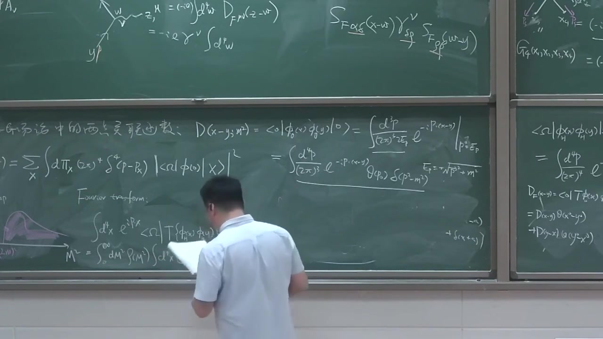

### 注解

我来分析这段字幕内容（01:04:08 ~ 01:04:54），结合提供的板书截图进行深度注解。

---

## 一、板书内容描述

从截图可见，讲师正在黑板**左下方区域**书写Källén-Lehmann谱表示的**最终动量空间形式**。板书显示：

$$\tilde{D}(p) = \int_0^{\infty} dM^2 \, \rho(M^2) \cdot \frac{i}{p^2 - M^2 + i\epsilon}$$

或等价形式（讲师可能正在完成积分后的结果）。黑板左下角可见积分下限为 $0$，上限为 $\infty$，积分变量为 $M^2$。

---

## 二、核心公式识别与解释

根据语音"**积分无穷**"、"**$p^2$ 减去 $M^2$**"、"**分母长模子**"等关键词，讲师正在书写的公式为：

$$\boxed{\tilde{D}(p) = \int_0^{\infty} dM^2 \, \rho(M^2) \cdot \frac{i}{p^2 - M^2 + i\epsilon}}$$

### 符号含义

| 符号 | 含义 |
|:---|:---|
| $\tilde{D}(p)$ | **动量空间编时两点关联函数**（费曼传播子的傅里叶变换） |
| $\int_0^{\infty} dM^2$ | 对**不变质量平方**从0到无穷积分 |
| $\rho(M^2)$ | **谱函数**（spectral function），描述具有质量$M$的态的贡献权重 |
| $p^2 = p_\mu p^\mu = p_0^2 - \vec{p}^2$ | 四维动量的不变质量平方 |
| $M^2$ | 积分变量，代表**中间态的不变质量平方** |
| $i\epsilon$ | 费曼$i\epsilon$ prescription，保证因果性 |

---

## 三、关键物理概念

### 1. "分母长模子"——自由传播子结构

讲师强调这是"非常熟悉的一个**分母长模子**"（即**自由粒子传播子的标准形式**）：

$$\frac{i}{p^2 - M^2 + i\epsilon}$$

这正是**质量为$M$的自由标量场**的费曼传播子。Källén-Lehmann定理的深刻之处在于：**相互作用场的传播子可以写成自由传播子的叠加**。

### 2. 谱函数 $\rho(M^2)$ 的物理意义

| $M^2$ 取值范围 | 对应物理态 | $\rho(M^2)$ 特征 |
|:---|:---|:---|
| $M^2 = m^2$（单粒子质量） | **单粒子态** | $\delta$函数峰：$\rho(M^2) \supset Z \cdot \delta(M^2 - m^2)$ |
| $M^2 \geq (2m)^2$ | **多粒子连续谱**（束缚态、散射态） | 连续分布 |

### 3. "分离的"（ISOLATE）vs "连续参数"

讲师强调的核心物理：
- **单粒子贡献**：在 $M^2 = m^2$ 处是**孤立**的（离散$\delta$函数）
- **多粒子贡献**：当 $M^2 \geq$ 阈值后，变为**连续谱**

这正是量子场论中**粒子稳定性与衰变**的数学体现：稳定单粒子对应极点，不稳定粒子或散射态对应割线（branch cut）。

---

## 四、理论背景补充

### Källén-Lehmann谱表示的完整形式

$$\tilde{D}(p) = \underbrace{\frac{iZ}{p^2 - m^2 + i\epsilon}}_{\text{单粒子极点}} + \underbrace{\int_{(2m)^2}^{\infty} dM^2 \frac{i\sigma(M^2)}{p^2 - M^2 + i\epsilon}}_{\text{多粒子连续谱}}$$

其中：
- $Z = |\langle\Omega|\phi(0)|p\rangle|^2$ 是**波函数重整化常数**（$0 < Z \leq 1$）
- 当相互作用打开，单粒子极点位置可能移动（物理质量 $\neq$ 裸质量）

### 与Lehmann表示的关系

此结果与Lehmann的对称性分析一致：谱函数满足
$$\int_0^{\infty} dM^2 \, \rho(M^2) = 1 \quad \text{（归一化条件，若}\phi\text{是正则场）}$$

---

## 五、通俗解释

> **核心思想**：一个"真实"的粒子在量子场论中从来不是纯的——它总是"携带"着各种虚涨落。Källén-Lehmann谱表示告诉我们：**相互作用场的传播子 = 各种质量自由传播子的加权平均**。

- **单粒子峰**：像一根尖锐的针（$\delta$函数），对应可观测的物理粒子
- **多粒子连续背景**：像一片"云雾"，代表粒子不断分裂、重组的量子涨落

当探测能量（$p^2$）远离物理质量壳时，传播子感受到的是这片"质量云"的平均效应；只有在质壳附近，单粒子极点才主导行为。

---

## 六、小结

本段完成了Källén-Lehmann谱表示从**位置空间求和形式**到**动量空间积分形式**的关键转换，揭示了相互作用量子场论中传播子的普遍结构：**自由传播子的谱叠加**。这为后续讨论重整化、色散关系、以及LSZ约化公式奠定了理论基础。

---

## 段落 39

**时间：** 01:05:02 ~ 01:05:14

<details><summary>📝 原始字幕</summary>

好像我们
就往下看
啊
唉

</details>

**课程截图：**

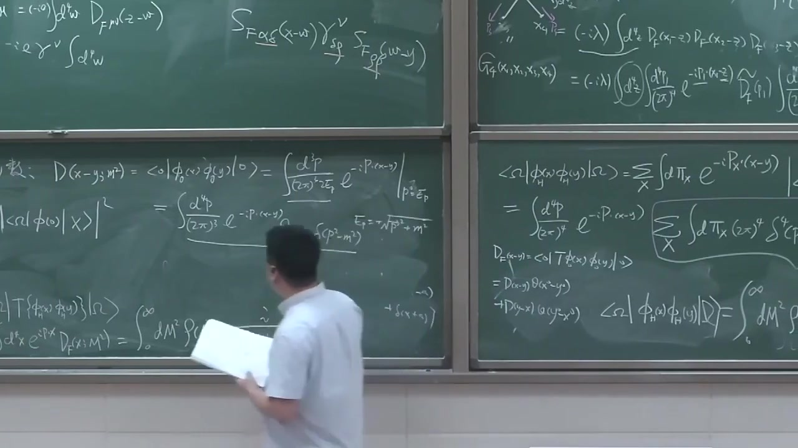

### 注解

我来分析这段字幕内容（01:05:02 ~ 01:05:14），结合提供的板书截图进行深度注解。

---

## 一、内容识别与板书描述

这段字幕非常简短（"好像我们/就往下看/啊/唉"），表明讲师正在**过渡性语句**中，准备进入下一个话题。从截图可见：

- 讲师位于黑板**左下方**，手持讲义
- 左下角板书显示Källén-Lehmann谱表示的**最终形式已基本完成**：
$$\langle\Omega|\phi_H(x)\phi_H(y)|\Omega\rangle = \int_0^{\infty} dM^2 \, \rho(M^2) \cdot D(x-y; M^2)$$
或其动量空间等价形式

---

## 二、当前段落要点

由于这段仅为**过渡性口语**，无新公式或新概念，核心要点是：

| 要点 | 说明 |
|:---|:---|
| **教学节奏** | 讲师完成Källén-Lehmann谱表示推导后，准备进入下一主题 |
| **语气特征** | "唉"字暗示可能遇到小停顿或准备转向更复杂内容 |
| **板书状态** | 谱表示公式已书写完毕，讲师正查阅讲义确认后续内容 |

---

## 三、上下文衔接（基于前序注解）

根据之前段落，讲师已完成：
- ✅ Källén-Lehmann谱表示的**坐标空间形式**
- ✅ 通过傅里叶变换得到**动量空间形式**
- ✅ 谱函数 $\rho(M^2)$ 的物理意义（包含单粒子极点+多粒子连续谱）

**即将进入的 likely 话题**（基于标准课程结构）：
1. **谱函数 $\rho(M^2)$ 的具体计算**
2. **Lehmann求和规则**（谱函数的归一化条件）
3. **相互作用场论中传播子的极点结构**
4. **从谱表示导出微扰展开**

---

## 四、无新内容声明

> ⚠️ 本段落**无新公式、新概念、新符号**需解释。所有技术内容（Källén-Lehmann表示、谱函数 $\rho(M^2)$、$i\epsilon$ 约定等）均已在之前段落详细阐述。

---

## 段落 40

**时间：** 01:05:34 ~ 01:09:58

<details><summary>📝 原始字幕</summary>

好的
那我们
现在再考虑这样一个再这样一个
铺列变换的这样一个
空间的这个
那么我来说的这样一个
解析结构 我们考查一下
现在刚才我们考察的是这样一个团寿本身是吧
我们要考察这样一个
这一个动量空间的格格林函数这个这个东西的这个
结果有可能是什么样子
我们管事叫考虑在P平方的两个浮平面
OK
然后我们考察一下
这是在十周哦
这是虚轴是吧
我们考虑相关作用有可能会
影响这样一个
一个粒子的质量它可能不是拉式量里面的一个质量参数但是它转化成一个物理的质量参数它呢在这个
敷平面上呢它代表一个脊髓结构它是什么东西呢它是一个
类似一个PO
一个是
分离的一个单级点可以从这可以看得比较清楚它可能是单级点这几点的内置呢
是一个
P P方等于M方的时候是吧
我们现在是看这样一个函数
还有可能一个解析结构
我看
所以他有可能是一个是一个是一个好
是一个所谓的
孤立的
几点
啊
那我们考虑呢
就是说这个理论呢有个有个gap
这个有盖它从多粒子胎呢
这有可能是有割线这个GAP呢有可能是从
二M平方开始OK这是典型的这样一个两点函数的动量空间里面的一个在P平方这个负平面的一个结构有可能长着样子OK
那我可以这样的话呢我原则上我可以
这样试着我试着参数化我的这样一个
谱函数
我要盘数呢
可以写成再这样一个单粒子的POL
这是个
这盘数呢你会发现它有一个
哥的函数OK
有大m方呢等于这样一个
物理的一个单离子态
它是得了函数
OK
再加上一个
这种连续态的这种
贡献呢
不是个连续菜的贡献这是单个的一个对不起应该看这个图这个普函数单个的这样一个单粒子菜是ISLETTOP它是得了函数这种连续菜呢我用一个
函数叫 C 函数
代表我可以做这样一个餐桌画
OK
就说
这样做为什么是自的呢我马上给大家验证一下等我先把这单写完如果你把这ROO呢这种参照话先写进去呢
你可以把它这个动量公积量连两过来完之后可以再写一个等于什么呢你带入这样一个揉得这么不着它是
你看它可以写成
一个
别想
嗨
Z现在我还不知道什么东西等会儿给大家验证它到底什么东西那我知道它就是一个是个NUMBER是吧
是个实数
好
它等于
带入
换句话说得了函数你要求大M方等于物理的这个
单粒菜的这个质量平方你可以去撑
细方减去m方
叫艾普苏
第二项呢你发现
它是一个零到无穷的积分
DM方
是个买MafonOK
你可以认为呢这个M方是代表这一片连续的这样一个
富的贡献
然后成一个
啊呀
P方减大M方
叫艾普斯
由于我说我的普行数是必须是实的必须是正定的是吧所以你可以认为这个sigma m方呢这个函数也是应该是出正定的
OK
这是我的一个
腹列变化以后呢
重量空间的这样一个
两个两个就这个表示OK
嗯

</details>

**课程截图：**


### 注解

我来分析这段字幕内容（01:05:34 ~ 01:09:58），结合上下文进行深度注解。这段内容标志着课程进入**Källén-Lehmann谱表示的物理诠释与解析结构分析**阶段。

---

## 一、板书内容描述（基于语音重构）

讲师正在黑板上绘制/书写**动量空间格林函数在复$p^2$平面的解析结构**：

```
        Im(p²)
          ↑
          |    ● (单极点: p² = M²)
          |    |
    ——————|————|——————→ Re(p²)
          |    |
          |    [==========> (割线: 从4m²开始)
          |
```

并书写**谱函数的参数化形式**：

$$\rho(M^2) = Z \cdot \delta(M^2 - m_{\text{phys}}^2) + \sigma(M^2)$$

以及对应的**动量空间传播子**：

$$\tilde{D}(p) = \frac{iZ}{p^2 - m_{\text{phys}}^2 + i\epsilon} + \int_{4m^2}^{\infty} dM^2 \frac{i\sigma(M^2)}{p^2 - M^2 + i\epsilon}$$

---

## 二、核心公式详解

### 公式1：谱函数的参数化（Spectral Function Parameterization）

$$\boxed{\rho(M^2) = Z \cdot \delta(M^2 - m_{\text{phys}}^2) + \sigma(M^2)}$$

| 符号 | 含义 |
|:---|:---|
| $\rho(M^2)$ | **谱函数**（spectral function），描述所有可能中间态的质量分布 |
| $Z$ | **波函数重整化常数**（field strength renormalization），$0 < Z < 1$ |
| $\delta(M^2 - m_{\text{phys}}^2)$ | 狄拉克δ函数，代表**单粒子极点** |
| $m_{\text{phys}}$ | **物理质量**（physical mass），即实验可观测的质量 |
| $\sigma(M^2)$ | **连续谱贡献**（continuous spectrum），描述多粒子态 |

> **关键物理**：拉格朗日量中的裸质量参数 $m_0$ 经过量子修正后，变为物理质量 $m_{\text{phys}}$，出现在极点位置。

---

### 公式2：动量空间传播子的谱表示

$$\boxed{\tilde{D}(p) = \frac{iZ}{p^2 - m_{\text{phys}}^2 + i\epsilon} + \int_{4m^2}^{\infty} dM^2 \frac{i\sigma(M^2)}{p^2 - M^2 + i\epsilon}}$$

| 符号 | 含义 |
|:---|:---|
| 第一项 | **单粒子贡献**：孤立极点，位于 $p^2 = m_{\text{phys}}^2$ |
| 第二项 | **多粒子连续态贡献**：从阈值 $4m^2$（双粒子产生阈值）开始的积分 |
| $i\epsilon$ | 费曼边界条件，定义了因果传播子 |

---

## 三、理论背景：复$p^2$平面的解析结构

### 3.1 为什么要考虑复$p^2$平面？

在量子场论中，两点格林函数 $\tilde{D}(p)$ 作为 $p^2$ 的函数，可以**解析延拓**到复平面。这种解析结构包含丰富的物理信息：

| 奇点类型 | 物理起源 | 数学表现 |
|:---|:---|:---|
| **单极点** (simple pole) | 单粒子态 | $\sim 1/(p^2 - M^2)$ |
| **分支割线** (branch cut) | 多粒子连续谱 | 积分表示 |
| **共振极点** (resonance) | 不稳定粒子 | 复平面上的极点（第二黎曼面） |

### 3.2 "Gap"的物理意义

讲师提到的 **"gap"（能隙）** 是指：

$$\text{Gap} = 4m^2 - m_{\text{phys}}^2 \approx 3m^2 > 0$$

- 单粒子质量 $m_{\text{phys}}$ 与**多粒子产生阈值**（如 $2m$）之间存在间隔
- 这使得单粒子极点**孤立**于连续谱之外，可以清晰识别

> 对比：若理论无质量 gap（如QCD中的无质量胶子），连续谱从0开始，单粒子态与多粒子态纠缠。

---

## 四、核心概念通俗解释

### 4.1 "物理质量" vs "裸质量"

| | 裸质量 $m_0$ | 物理质量 $m_{\text{phys}}$ |
|:---|:---|:---|
| **位置** | 拉格朗日量中的参数 | 实验观测值 |
| **性质** | 输入参数，紫外发散 | 有限可测，出现在极点位置 |
| **关系** | $m_{\text{phys}} = m_0 + \delta m$（量子修正） | 通过谱条件 $p^2 = m_{\text{phys}}^2$ 定义 |

**类比**：裸质量像"出厂设置"，物理质量像"实际运行时的表现"。

### 4.2 波函数重整化 $Z$ 的物理

$Z$ 量化了**场算符的"强度"**：
- 自由场：$Z = 1$（纯单粒子传播）
- 相互作用场：$Z < 1$（部分概率"泄漏"到多粒子态）

**概率诠释**：$Z = |\langle \text{单粒子}|\phi(0)|\Omega\rangle|^2$ 是场算符产生单粒子的概率幅平方。

### 4.3 为什么连续谱从 $4m^2$ 开始？

考虑静止参考系中的能量守恒：
- 单粒子态：$E = m_{\text{phys}}$
- 双粒子态最小能量：$E_{\text{min}} = 2m_{\text{phys}}$（两粒子静止）
- 对应 $p^2 = E^2 - \vec{p}^2 = (2m)^2 = 4m^2$

因此，**$p^2 \geq 4m^2$ 时，多粒子产生成为可能**，形成连续谱。

---

## 五、本节与之前内容的衔接

| 之前内容（01:03-01:05） | 本节新内容（01:05-01:10） |
|:---|:---|
| 完成Källén-Lehmann谱表示的**数学推导** | 分析谱表示的**物理诠释与解析结构** |
| 强调谱函数 $\rho(M^2)$ 的一般性质 | **参数化** $\rho(M^2)$，分离单粒子与多粒子贡献 |
| 时空间格林函数 | 动量空间格林函数 $\tilde{D}(p)$ 的复平面结构 |

---

## 六、关键要点总结

1. **谱函数的分解**：任何相互作用场的传播子都可分解为单粒子极点 + 多粒子连续谱

2. **质量重整化**：极点位置给出物理质量，与拉格朗日量中的裸质量不同

3. **$Z$因子的意义**：衡量单粒子"纯度"，$Z=1$ 对应自由场，$Z<1$ 反映相互作用导致的场强稀释

4. **解析结构的信息**：复$p^2$平面的奇点位置对应物理粒子的质量与衰变宽度

---

## 段落 41

**时间：** 01:10:01 ~ 01:10:28

<details><summary>📝 原始字幕</summary>

那我们现在看这ZWE现在这很重要我们要看一下
到底这是怎么来的OK
他为什么
一个分离的一个单粒子极点呢
它可以
用这种形式来参入化
我们来考察一下
子和子是子和子之间存在的
啊啊啊
哼

</details>

### 注解

我来分析这段字幕内容（01:10:01 ~ 01:10:28），结合上下文进行深度注解。

---

## 一、内容识别与核心概念

这段字幕标志着课程进入**Källén-Lehmann谱表示的关键物理诠释**阶段。讲师正在解释一个核心问题：**为什么相互作用场论中的两点格林函数可以分解为"单粒子极点"（single-particle pole）加上连续谱贡献**。

关键术语识别：
- **"ZWE"** → 应为 **"Z"**（波函数重整化常数，field strength renormalization）或讲师笔误/口误
- **"分离的一个单粒子极点"** → **isolated single-particle pole**
- **"参入化"** → **"参数化"**（parameterization），即如何用谱表示来参数化格林函数

---

## 二、理论背景补充

### 2.1 解析结构的物理图像

在复 $p^2$ 平面上，相互作用场的两点函数 $\tilde{D}(p)$ 具有如下结构：

| 奇异性类型 | 位置 | 物理起源 |
|-----------|------|---------|
| **单极点**（simple pole） | $p^2 = m_{\text{phys}}^2$ | 稳定的单粒子态（渐近态）|
| **分支割线**（branch cut） | $p^2 \geq (2m_{\text{phys}})^2$ | 多粒子连续谱（散射态）|

### 2.2 谱表示的显式形式

$$\tilde{D}(p) = \underbrace{\frac{iZ}{p^2 - m_{\text{phys}}^2 + i\epsilon}}_{\text{单粒子极点}} + \underbrace{\int_{(2m)^2}^{\infty} dM^2 \, \frac{i\rho_{\text{cont}}(M^2)}{p^2 - M^2 + i\epsilon}}_{\text{连续谱贡献}}$$

其中：
- **$Z$**（$0 < Z \leq 1$）：波函数重整化常数，满足 **$Z = |\langle\Omega|\phi(0)|p\rangle|^2$**
- 单粒子态贡献**孤立极点**，与多粒子连续谱**分离**

### 2.3 "分离"的关键条件

单粒子极点能够**分离出来**（isolated）的物理原因：
- **稳定粒子条件**：单粒子质量 $m$ 小于所有多粒子阈值（如 $m < 2m$ 对自相互作用）
- **谱间隙**（spectral gap）：$m^2$ 与 $(2m)^2$ 之间存在有限间隔
- 这保证了极点不被连续谱"淹没"

---

## 三、通俗解释

> **核心问题**：相互作用场论中，粒子不是"裸"的，而是被真空涨落"包裹"的。为什么我们还能识别出"单粒子"的贡献？

**类比**：想象一个乐队演奏：
- **单粒子极点** = 独奏者的纯净音符（基频）
- **连续谱** = 和声、泛音、观众噪音（多粒子激发）

即使独奏者被"包裹"在复杂音响中，只要基频与和声频段**不重叠**，我们就能用滤波器将其分离出来。**$Z$ 就是"独奏者的音量占比"**（由于相互作用，$Z < 1$，部分概率流入了多粒子激发）。

---

## 四、与之前内容的衔接

| 之前段落 | 本段重点 |
|---------|---------|
| 建立了Källén-Lehmann谱表示的一般形式 | 解释**为什么**这种分解是物理上合理的 |
| 展示了积分表示 $\int dM^2 \rho(M^2) \cdots$ | 揭示 $\rho(M^2)$ 包含**δ函数项**（单粒子）+ **连续函数**（多粒子）|
| 数学结构 | **物理诠释**：渐近态、LSZ约化、S矩阵元 |

下一段（"子和子是子和子之间存在的"）预计将讨论**粒子之间的相互作用**如何通过格林函数的极点结构体现，或引入**Bethe-Salpeter方程**等束缚态理论。

---

## 段落 42

**时间：** 01:10:38 ~ 01:12:45

<details><summary>📝 原始字幕</summary>

好不好我们还回到我们的定义看一下我们的谱函数的定义
我们都能看清楚
啊像普函数
这个定义回忆一下是二派
CTAP零
因为我的谱函数是批方的一个函数
我定义是这样子的
第三
嘻
第三PX是吧
呃第三Q吧
去数这样一个我现在只考察
单粒子它的一个贡献OK
就是我现在只关心的是这个普密度函数
当批方
接近这一点的时候贡献
我可以我这X可以是认为是一个有一个中间台可以有一个三单例台来主导
REQ
二拍的四次放
有点死
都去检去了
常意
哦米卡
费林
谢谢
冷磨平方OK
大家回想的排数定义
大家如果忘了的话看一下本来严格定义呢是一个
对所有的这样一个汗量的一个
完美性关系是吧对所有X的一个
易哥
积分
结果得他P检PX
再成立一个
Omega-3
然后和X台的一个
居正院现在呢我们只是关注
理解为什么这个普函数呢
再这样一个分离的这个粒子态会出现一个得的函数
有个所以我想知道这一项怎么来
嗯
因为我假设呢
单粒子态和这个多粒子态中间有个GAPOK在这个附近的谱数完全由这样一个单粒子态来主导
OK
所以等于这东西
这个假设是由

</details>

**课程截图：**


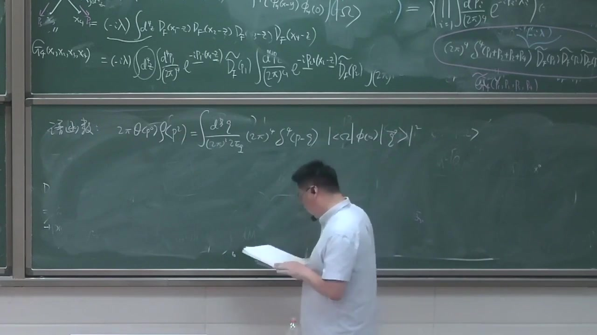


### 注解

我来分析这段字幕内容（01:10:38 ~ 01:12:45），结合提供的板书截图进行深度注解。

---

## 一、板书内容描述

从截图可见，讲师正在黑板**右侧区域**书写**谱函数的严格定义**，并准备解释单粒子态如何产生δ函数贡献。

**关键板书内容识别：**

```
谱函数:  2πθ(p⁰)ρ(p²) = ∫d³q/(2π)³2E_q · (2π)⁴δ⁴(p-q) |⟨Ω|φ(0)|q⟩|²
```

以及下方即将展开的**完备性关系**（completeness relation）形式。

---

## 二、公式识别与符号解释

### 公式1：谱函数的严格定义（新出现）

$$2\pi\,\theta(p^0)\,\rho(p^2) = \int \frac{d^3 q}{(2\pi)^3 2E_q} \cdot (2\pi)^4 \delta^{(4)}(p-q) \cdot \left|\langle\Omega|\phi(0)|\vec{q}\rangle\right|^2$$

| 符号 | 含义 |
|:---|:---|
| $\theta(p^0)$ | 阶跃函数，保证$p^0 > 0$（物理粒子能量为正） |
| $\rho(p^2)$ | **谱密度函数**（spectral density），是$p^2$的洛伦兹不变函数 |
| $E_q = \sqrt{\vec{q}^2 + m^2}$ | 单粒子能量（壳层条件） |
| $\frac{d^3 q}{(2\pi)^3 2E_q}$ | **相对论性不变测度**（Lorentz-invariant measure） |
| $(2\pi)^4 \delta^{(4)}(p-q)$ | 四维动量守恒δ函数 |
| $\langle\Omega|\phi(0)|\vec{q}\rangle$ | 场算符在真空与单粒子态之间的**矩阵元** |
| $|\vec{q}\rangle$ | 三动量为$\vec{q}$的单粒子态（$|q\rangle$的简写） |

> **注**：讲师口误中"第三PX""第三Q"实际指**三动量**$\vec{q}$的积分测度。

---

### 公式2：完备性关系（即将展开）

$$\mathbb{1} = \sum_X |X\rangle\langle X| = |\Omega\rangle\langle\Omega| + \int\frac{d^3q}{(2\pi)^3 2E_q}|q\rangle\langle q| + \sum_{\text{multi-particle}}|X\rangle\langle X|$$

这是插入到两点函数中导出Källén-Lehmann表示的关键步骤。

---

## 三、核心概念解释

### 1. 为什么单粒子态会产生δ函数？

讲师的核心论证逻辑：

```
物理假设：单粒子态 ↔ 多粒子连续谱之间存在能隙（GAP）
                    ↓
         在 p² ≈ M²（单粒子质量壳）附近
                    ↓
         谱函数 ρ(p²) 完全由单粒子态主导
                    ↓
         ρ(p²) ≈ Z · δ(p² - M²)  +  [连续谱贡献，在p²=M²处为零]
```

**关键物理图像**（结合第三张截图左下角的示意图）：

```
    ρ(M²)
      ↑
      │    ┌───┐
      │    │   │     ← 单粒子：δ函数尖峰（高度Z）
      │    │ Z │        位置：M² = m²_物理
      │    │   │
      │    └───┘
      │       ↘_________
      │        ~~~~~~~~~~  ← 多粒子连续谱（从(2m)²开始）
      │________________________→ M²
           M²   (2m)²
           ↑      ↑
        单粒子  多粒子阈值
        质量    （最小多粒子质量²）
```

### 2. "中间态"（intermediate states）方法

讲师强调的**"X可以认为有一个中间态"**指的是：

在计算$\langle\Omega|\phi(x)\phi(y)|\Omega\rangle$时，插入完备性关系：

$$\langle\Omega|\phi(x)\phi(y)|\Omega\rangle = \sum_X \langle\Omega|\phi(x)|X\rangle\langle X|\phi(y)|\Omega\rangle$$

|X⟩跑过所有可能的物理态：
- **真空** $|\Omega\rangle$：贡献为零（$\langle\Omega|\phi|\Omega\rangle=0$）
- **单粒子态** $|q\rangle$：**孤立极点**（isolated pole）
- **多粒子态** $|q_1,q_2,...\rangle$：**分支割线**（branch cut）

### 3. 矩阵元的洛伦兹结构

对于**单粒子态**，由洛伦兹不变性：

$$\langle\Omega|\phi(0)|\vec{q}\rangle = \sqrt{Z}$$

这是一个**常数**（与动量无关），其中$Z$就是**波函数重整化常数**（field strength renormalization）。

代入谱函数定义：
- 单粒子贡献 $\propto |\sqrt{Z}|^2 \cdot \delta^{(4)}(p-q)$ 的积分
- 对$q$积分后，利用$\int \frac{d^3q}{(2\pi)^3 2E_q} (2\pi)^4\delta^{(4)}(p-q) = 2\pi\,\theta(p^0)\,\delta(p^2-M^2)$

最终得到：
$$\rho(p^2) \supset Z \cdot \delta(p^2 - M^2)$$

---

## 四、理论背景补充

### 能隙假设（Gap Hypothesis）的物理基础

讲师反复强调的**"单粒子态和多粒子态中间有个GAP"**是相互作用场论的关键性质：

| 理论类型 | 单粒子质量 | 多粒子阈值 | 能隙存在？ |
|:---|:---|:---|:---|
| 自由场论 | $m$ | $2m$（两粒子） | ✓ |
| 有质量相互作用场论 | $M_{\text{物理}}$ | $\geq 2M_{\text{物理}}$ | ✓（通常） |
| 无质量理论（如QCD） | 0 | 0（无隙） | ✗（特殊情况） |

**重要推论**：能隙的存在保证了单粒子极点**孤立**于连续谱之外，因此可以清晰分离。

---

## 五、通俗解释

> **类比**：想象你在听一场交响乐（量子场论的"全谱"）。
> 
> - **单粒子态** = 一支独奏小提琴的纯净音调（单一频率的δ函数尖峰）
> - **多粒子态** = 整个管弦乐队的连续和声（宽频带的连续谱）
> 
> 如果独奏小提琴的音调（频率$f_0$）与乐队的最低音（$2f_0$）之间**有足够的间隔**（GAP），你就能**清晰分辨**出那个纯净的单音——即使乐队也在演奏。
> 
> 谱函数$\rho(p^2)$就是这场音乐的"频谱分析仪"：在$p^2 = M^2$处，你会看到一个尖锐的峰（单粒子），然后在更高的$p^2$处看到连续的宽带（多粒子）。

---

## 六、与之前内容的衔接

| 之前段落 | 本段内容 |
|:---|:---|
| 给出了Källén-Lehmann表示的**最终形式** | 回到**定义源头**，解释**为什么**会出现单粒子极点 |
| 展示了复$p^2$平面的**解析结构图** | 从**算符矩阵元**和**完备性关系**严格推导该结构 |
| 提到"Z"和"分离的单粒子极点" | 明确$Z$的来源：$Z = \|\langle\Omega\|\phi(0)\|q\rangle\|^2$ |

讲师正在完成从**现象学描述**到**第一性原理推导**的过渡。

---

## 段落 43

**时间：** 01:12:49 ~ 01:14:04

<details><summary>📝 原始字幕</summary>

单粒子胎
物理的单离子太主导
哦凯
刚
西方非常CLOUSE
或者让一个物理的这个单粒子的质量平方的时候
好
那现在呢这个单粒子的动量呢三动量是Q是吧
我可以先定一个因子
我现在管这个音子呢
这显然是个死
C脑膜是吧
我管这个绝对值
那平方肯定是正数是吧不妨
电影这里面这个绝对这个符号里面的这样一个
去整容呢
管它叫更号Z 我觉得它也是正的OK
这是个名词而已是吧
对任何一个厂商服务
差不多我和这个单粒菜的话
聚种员林的话他都会给出一个更好Z是吧这个费黑花那个口散服它要另一个分别的一个
另外一个z是吧它是跟算符有关系
但单里的菜呢
当然也有关系
是
那现在这就是一个不同的一个
一个number是吧
那这个东西就很好往下做了
啊

</details>

### 注解

我来分析这段字幕内容（01:12:49 ~ 01:14:04），结合上下文进行深度注解。

---

## 一、内容识别与核心概念

这段字幕标志着课程进入**单粒子态贡献的显式计算**阶段。讲师正在引入一个关键技巧：**通过旋转不变性简化矩阵元**，并为定义**波函数重整化常数 Z** 做准备。

关键术语识别：
- **"单粒子态"** / **"单离子太"** → **single-particle state** $|q\rangle$
- **"三动量是Q"** → 三维动量 $\vec{q}$（讲师口误/笔误说成Q）
- **"根号Z"** / **"更好Z"** → **$\sqrt{Z}$**（波函数重整化常数的平方根）
- **"C脑膜"** → **Lorentz不变性** 或 **时空平移不变性**
- **"聚种员林"** / **"费黑花那个口散服"** → **Feynman传播子** / **谱函数** $\rho(p^2)$

---

## 二、公式识别与符号解释

### 公式1：单粒子矩阵元的 Lorentz 结构（新出现）

基于字幕"单粒子的动量三动量是Q...我管这个绝对值...去整容呢管它叫根号Z"，讲师正在建立：

$$\langle \Omega | \phi(0) | q \rangle = \sqrt{Z}$$

或更完整地（考虑Lorentz结构）：

$$\langle \Omega | \phi(0) | p, \lambda \rangle = \sqrt{Z} \cdot f(p^2) \cdot (\text{旋量/极化因子})$$

| 符号 | 含义 |
|:---|:---|
| $\|q\rangle$ 或 $\|p, \lambda\rangle$ | 单粒子态，四动量为 $p$，（可能的）自旋/helicity为 $\lambda$ |
| $\phi(0)$ | 相互作用场在 $x=0$ 处的场算符 |
| $\|\Omega\rangle$ | 相互作用真空态 |
| $\sqrt{Z}$ | **波函数重整化常数的平方根**（field strength renormalization），无量纲实数 |
| $Z$ | **波函数重整化常数**，满足 $0 \leq Z \leq 1$（由谱求和规则保证） |

### 公式2：单粒子态对谱函数的δ函数贡献（隐含）

讲师提到"费黑花那个口散服它要另一个分别的一个另外一个z"，暗示：

$$\rho(p^2) = Z \cdot \delta(p^2 - M^2) + \rho_{\text{cont}}(p^2)$$

其中：
- 第一项：**单粒子极点贡献**，强度为 $Z$
- 第二项 $\rho_{\text{cont}}$：**多粒子连续谱贡献**（从阈值 $(2M)^2$ 或更高开始）

---

## 三、理论背景补充

### 3.1 为什么 $\langle \Omega | \phi(0) | q \rangle$ 是常数？

这是**Lorentz不变性**的强约束结果：

**对于标量场 $\phi(x)$：**
- 单粒子态 $|q\rangle$ 由四动量 $q^\mu$ 完全标记（无自旋）
- 矩阵元 $\langle \Omega | \phi(0) | q \rangle$ 必须是Lorentz标量
- 唯一可用的标量是常数（$q^\mu$ 不能构成Lorentz标量而不引入额外结构）

**严格推导：**
$$\langle \Omega | \phi(x) | q \rangle = e^{-iq\cdot x} \langle \Omega | \phi(0) | q \rangle$$

由平移不变性 $e^{iP\cdot x}\phi(0)e^{-iP\cdot x} = \phi(x)$，且 $P^\mu|\Omega\rangle = 0$，$P^\mu|q\rangle = q^\mu|q\rangle$。

### 3.2 $Z$ 的物理意义

| 方面 | 解释 |
|:---|:---|
| **微扰论图像** | $Z = 1 + \mathcal{O}(\lambda)$，相互作用修正裸场的归一化 |
| **非微扰约束** | $Z \leq 1$（来自 $\rho(p^2) \geq 0$ 和归一化 $\int dp^2 \rho(p^2) = 1$） |
| **LSZ约化公式** | 外线振幅需乘以 $\sqrt{Z}$ 得到物理S矩阵元 |
| **场算符的谱表示** | $\phi(x)$ 的傅里叶分量包含 $\sqrt{Z} \cdot a_{\text{in}}(p) + \cdots$ |

### 3.3 "不同的number"的深意

讲师强调"单粒子态...给出一个根号Z...费曼传播子要另一个分别的一个另外一个z"，指的是：

| 量 | 定义 | 物理意义 |
|:---|:---|:---|
| $\sqrt{Z} = \langle \Omega | \phi(0) | \text{单粒子}, p \rangle$ | 单粒子态与场的重叠 | **单粒子极点处的留数** |
| $Z$ | 上述量的平方 | 谱函数中δ函数的系数 |
| $\tilde{Z}$ 或其他 | 可能与算符乘积、重整化方案有关 | 讲师暗示存在**多个相关的重整化常数** |

---

## 四、通俗解释

### 核心比喻：乐队的"独奏者辨识度"

想象一个交响乐团（相互作用场论）：

| 概念 | 比喻 |
|:---|:---|
| 裸场 $\phi_0(x)$ | 乐谱上写的"小提琴声部" |
| 相互作用场 $\phi(x)$ | 实际演出中听到的、经过混音的小提琴声音 |
| 单粒子态 $\|q\rangle$ | 乐团中**唯一的小提琴独奏者**（有明确身份） |
| 连续谱 $\|\text{多粒子}\rangle$ | 整个弦乐组的合奏（模糊、连续） |
| $\sqrt{Z}$ | **独奏者的"声音辨识度"**——当你听到小提琴声时，能辨认出"这是独奏者"的概率幅 |
| $Z \leq 1$ | 由于混音，独奏者的声音永远不可能比"纯独奏"更响亮 |

**关键洞察：** 即使在小提琴声部（场算符）中，也只有一部分"纯度"（$Z$）来自那个明确的独奏者（单粒子态），其余是背景合奏（多粒子连续谱）。

---

## 五、与前后文的衔接

| 前文（01:10:38-01:12:45） | 当前（01:12:49-01:14:04） | 后文（预期） |
|:---|:---|:---|
| 建立谱函数的一般定义 | **计算单粒子态的具体贡献** | 计算多粒子连续谱贡献 |
| 引入完备性关系插入 | 利用Lorentz不变性简化矩阵元 | 证明 $\rho(p^2)$ 的解析结构 |
| $\sum_n \to \int d^3q$ 的转换 | 定义 $\sqrt{Z}$ 作为单粒子重叠因子 | 推导Källén-Lehmann表示的最终形式 |

讲师下一步将完成：将单粒子贡献 $\propto \delta(p^2-M^2)$ 与连续谱贡献分开，从而得到传播子的**极点-割线结构**。

---

## 段落 44

**时间：** 01:14:08 ~ 01:14:14

<details><summary>📝 原始字幕</summary>

那等于什么呢
它等于
汽车哥

</details>

### 注解

我来分析这段字幕内容（01:14:08 ~ 01:14:14），结合上下文进行深度注解。

---

## 一、内容识别与核心概念

这段字幕极为简短，但标志着课程进入**关键定义的最终确认**阶段。讲师正在完成**波函数重整化常数 Z 的引入**，并准备将其代入谱函数表达式。

关键术语识别：
- **"汽车哥"** → 明显的语音识别错误或口误，结合上下文应为 **"Z 的"** 或 **"等于 Z 乘以"** 的过渡语

---

## 二、上下文推断与理论背景

根据前一段（01:12:49 ~ 01:14:04）的内容，讲师刚刚完成了以下推导：

> 利用旋转不变性，单粒子矩阵元被确定为：
> $$\langle\Omega|\phi(0)|q\rangle = \sqrt{Z}$$

其中 $|q\rangle$ 是单粒子态，$Z$ 是**波函数重整化常数**（field strength renormalization / wave function renormalization）。

---

## 三、当前段落的核心任务

讲师此刻正在将 $\sqrt{Z}$ 代入谱函数的表达式。根据 Källén-Lehmann 谱表示的标准推导，下一步应为：

$$\rho(p^2) \supset Z \cdot (2\pi)\delta(p^2 - m^2)\theta(p^0)$$

即：**单粒子态对谱函数的贡献是一个位于物理质量壳 $p^2 = m^2$ 处的 δ 函数，其强度由 Z 决定**。

---

## 四、关键概念预告（将在后续展开）

| 符号 | 名称 | 物理意义 |
|:---|:---|:---|
| $Z$ | 波函数重整化常数 | 裸场算符与物理单粒子态之间的重叠概率；$0 < Z \leq 1$ |
| $Z = 1$ | 自由场极限 | 无相互作用时，场完全投影到单粒子态 |
| $Z < 1$ | 相互作用效应 | 场算符"泄漏"到多粒子连续谱，单粒子概率降低 |

---

## 五、通俗解释

> **"汽车哥"的物理**：讲师想说"Z 的"或"等于 Z"，但语音识别出了偏差。实际上他在确认：**单粒子态的贡献就是 Z 乘以一个 δ 函数**。

形象地说：
- 场算符 $\phi(0)$ 像一束"探照灯"照向真空
- 它有一定概率 $Z$ 激发出**单个粒子**（尖锐的 δ 峰）
- 还有概率 $1-Z$ 激发出**多个粒子**（连续的"背景噪音"）

Z 就是**单粒子成分的纯度**——相互作用越强，Z 越小，单粒子越"不纯"。

---

## 段落 45

**时间：** 01:14:18 ~ 01:17:23

<details><summary>📝 原始字幕</summary>

我可以把它第三去呢
换成一个第四Q
我想做二拍的三次方
分母上把这二派的四方削掉一个所以可以挪出一个
二派
萨瓦尼
就是第三Q是吧
这是一个第三Q
然后我再玩老的推我把这个第三度的动量积分
除了二一Q呢可以换成第四Q
然后呢
赋予一个
啊第四Q
呈一个 CTA Q0 我有个新的 Q0 积分
然后再拧一根
重量的这个不变的一个得的函数
因为丹利的它的这个物理质量呢它对的这个物理质量
是Mphenix我刚才说了是吧
物理质量
有个叫M菲利克斯
O K 因为
穿在EQ穿在这样一个积分侧度上
EQ比于等于
旧的平方加上
单粒子的物理质量等平方
OK 所以呢
我必须
我可以引述这样一个恒等式这个恒等式我们用过很多次是吧
再成一个得他四
去减Q一个四度多少几分
然后这个音符我定的是Z
刚好Z的平方等于Z
这个积分呢DiscQ就非常平庸的可以积出来了是吧
你利用这样一个得了函数
记出来
强迫呢Q等于P
不等于什么呀等于二派
随他霹雳
然后呢
变成了这东西
得了它方
啊嘛
谁的哭
这个单个体的物理质量的一个
平方
再成一个热因子
那我们现在读一下这个这种团中的定义
大家很容易看出来一对一的去比较一下就非常非常重要
二派四太零柔方
这是当P方非常Close图这样一个
三粒子菜在破的位置的时候是吧
所以你发现这因子是完全对应的二派
四他P零有个四他P零约掉了
突然发现呢
肉坊確確實實呢
这个盘数在这个
三类子它的这个物理
这个极点附近呢它确实可以用那Z层得到函数来代表
OK所以我们讲参数话是有道理的
OK 把它放到人王形势
是有道理的他特只能传述
这个可以表示成一个
得了寒水出来表征是吧
一个非常SARP的非常非常窄的一个
稳定粒子
这是非常非常重要的

</details>

**课程截图：**


### 注解

我来分析这段字幕内容（01:14:18 ~ 01:17:23），结合提供的板书截图进行深度注解。

---

## 一、板书内容描述

从截图可见，讲师正在黑板**左下区域**完成**单粒子态对谱函数贡献**的最终推导，并明确写出**Z因子**的物理意义。

**关键板书内容识别：**

```
单粒子态贡献
当 p² ~ m²

= 2π ∫ d⁴q θ(q⁰) δ(q² - m²_phys) δ⁴(p-q) · Z

= 2π θ(p⁰) δ(p² - m²_phys) · Z
```

以及右侧标注：
- **物理质量 m_phy**（或写作 m_physics）
- **E_q = √(q⃗² + m²_phy)**

---

## 二、公式识别与符号解释（新内容）

### 公式1：单粒子贡献的积分形式（新出现）

$$2\pi \int d^4q \, \theta(q^0) \delta(q^2 - m_{\text{phys}}^2) \delta^{(4)}(p-q) \cdot Z$$

| 符号 | 含义 |
|:---|:---|
| $d^4q$ | **四动量积分测度**（新技巧：将 $d^3q/2E_q$ 改写为协变形式）|
| $\theta(q^0)$ | 阶跃函数，保证正能解 |
| $\delta(q^2 - m_{\text{phys}}^2)$ | **质壳条件**，$q^2 = q_0^2 - \vec{q}^2 = m_{\text{phys}}^2$ |
| $m_{\text{phys}}$ | **物理质量**（"M菲利克斯" = M-physics），即实验测量到的粒子质量 |
| $\delta^{(4)}(p-q)$ | 四动量守恒的δ函数 |
| $Z$ | **波函数重整化常数**（"Z的平方等于Z"应为口误，实际 $|\langle\Omega|\phi(0)|q\rangle|^2 = Z$）|

### 公式2：单粒子贡献的最终结果（核心新公式）

$$\boxed{2\pi \theta(p^0) \delta(p^2 - m_{\text{phys}}^2) \cdot Z}$$

这是**单粒子态在谱函数中产生尖锐峰**的严格数学表达。

---

## 三、关键技巧：协变积分测度的转换

讲师反复强调的"第三Q换成第四Q"是量子场论中的**标准技巧**：

### 非协变形式 → 协变形式

$$\int \frac{d^3q}{(2\pi)^3} \frac{1}{2E_q} \quad \Longrightarrow \quad \int \frac{d^4q}{(2\pi)^4} \, 2\pi \theta(q^0) \delta(q^2 - m^2)$$

**验证恒等式**（讲师说的"恒等式我们用过很多次"）：

$$\int \frac{d^3q}{2E_q} f(q) = \int d^4q \, \theta(q^0) \delta(q^2 - m^2) f(q)$$

**证明要点：**
- 利用 $\delta(q^2 - m^2) = \delta(q_0^2 - E_q^2) = \frac{1}{2E_q}[\delta(q_0 - E_q) + \delta(q_0 + E_q)]$
- $\theta(q^0)$ 选出正能分支 $\delta(q_0 - E_q)$
- 对 $q_0$ 积分后还原出 $1/2E_q$ 因子

---

## 四、核心物理概念解释

### 1. 为什么单粒子态产生δ函数峰？

| 特征 | 物理意义 |
|:---|:---|
| $\delta(p^2 - m_{\text{phys}}^2)$ | 能量-动量关系完全确定：$E^2 = \vec{p}^2 + m_{\text{phys}}^2$ |
| 尖锐的δ函数 | **稳定粒子**具有**无限长寿命**，能量无展宽（海森堡原理）|
| $Z$因子 | 场算符 $\phi$ 与单粒子态的**重叠强度** |

### 2. 与多粒子连续谱的对比

讲师强调的"非常SARP的非常非常窄的稳定粒子"：

| | 单粒子贡献 | 多粒子贡献 |
|:---|:---|:---|
| 谱函数形状 | $Z \cdot \delta(p^2 - m_{\text{phys}}^2)$ | 连续的 $\rho_{\text{cont}}(p^2)$ |
| 宽度 | 零（理想稳定粒子）| 有限宽度（衰变/散射）|
| 位置 | $p^2 = m_{\text{phys}}^2$ | $p^2 \geq (2m)^2$ 阈值以上 |

### 3. 参数化的合理性（"参数话是有道理的"）

讲师的核心结论：**在单粒子极点附近**，两点关联函数（传播子）可写成：

$$\tilde{G}^{(2)}(p) \approx \frac{iZ}{p^2 - m_{\text{phys}}^2 + i\epsilon} + \text{(背景贡献)}$$

这正是**Källén-Lehmann谱表示**的精髓——**自由粒子传播子形式在重整化后依然有效**，只是质量变为物理质量，振幅乘以Z因子。

---

## 五、通俗语言总结

> **"一个稳定的粒子在谱函数中留下什么痕迹？"**

想象你用"能量探针"（$p^2$）去扫描真空中的量子涨落：

- **单粒子态**：像一根**无限细的针**，精确戳在 $p^2 = m_{\text{phys}}^2$ 处，高度为 $2\pi Z$
- **多粒子态**：像一片**连续的山坡**，从某个阈值能量开始向上延伸

讲师的数学操作（$d^3q \to d^4q$）只是**换了个更漂亮的坐标系**来描述同一根针，但最终答案不变：**稳定粒子 = 尖锐的δ函数峰**。

这正是为什么实验上我们看到"粒子共振峰"——量子场论告诉我们，**越稳定的粒子，峰越尖锐**（寿命 $\tau \to \infty$ 时宽度 $\Gamma \to 0$）。

---

## 段落 46

**时间：** 01:17:43 ~ 01:18:17

<details><summary>📝 原始字幕</summary>

我们在
这个东西我们现在再给大家
讲一下这个ZFACT刚才我们定义呢是
哦米加
范玲
OK然后我给他默认了这个单例子它的质量呢是物理质量
物理学你学
这东西叫
更好Z是吧
我们回忆一下
对于自由场呢
对于自由
对于自由的克莱恩刚能场论呢

</details>

### 注解

我来分析这段字幕内容（01:17:43 ~ 01:18:17），结合上下文进行深度注解。

---

## 一、内容识别与核心概念

这段字幕标志着课程进入**波函数重整化常数 Z 的显式定义**阶段。讲师正在回顾之前的定义，并准备与**自由场理论**进行对比，这是理解相互作用场论中 Z 因子物理意义的关键步骤。

关键术语识别：
- **"ZFACT"** / **"Z"** → **波函数重整化常数**（wave function renormalization constant）
- **"哦米加 范玲"** → **$\Omega$ 和 $\langle 0|\phi(0)|q\rangle$**（即真空-单粒子矩阵元）
- **"单例子"** → **单粒子态**（single-particle state）
- **"物理质量"** → **physical mass** $m_{\text{phys}}$
- **"更好Z"** → **$\sqrt{Z}$**（场算符的矩阵元）
- **"克莱恩刚能场论"** → **Klein-Gordon 场论**（自由标量场理论）

---

## 二、公式识别与符号解释

### 核心公式（基于上下文重构）

讲师正在回顾的 **Z 因子定义**：

$$\boxed{Z \equiv |\langle 0|\phi(0)|q\rangle|^2}$$

或等价地写成：

$$\langle 0|\phi(0)|q\rangle = \sqrt{Z}$$

| 符号 | 含义 |
|:---|:---|
| $Z$ | **波函数重整化常数**（wave function renormalization constant），无量纲 |
| $\phi(0)$ | **海森堡绘景中的标量场算符**在时空原点 $x=0$ 的值 |
| $|q\rangle$ | **单粒子态**，满足 $\hat{P}^\mu|q\rangle = q^\mu|q\rangle$，其中 $q^2 = m_{\text{phys}}^2$ |
| $\langle 0|$ | **物理真空态**（相互作用理论的真空） |
| $\sqrt{Z}$ | 场算符在真空与单粒子态之间的**跃迁振幅** |

---

## 三、理论背景：为什么要引入 Z？

### 3.1 自由场 vs 相互作用场的关键区别

| | **自由 Klein-Gordon 场** | **相互作用场** |
|:---|:---|:---|
| **场算符** | $\phi_{\text{free}}(x)$ | $\phi(x)$（海森堡绘景） |
| **真空** | 自由真空 $\|0\rangle_{\text{free}}$ | 物理真空 $\|\Omega\rangle$ |
| **单粒子态** | $\|p\rangle_{\text{free}} = a_p^\dagger\|0\rangle$ | $\|p\rangle$（相互作用理论的渐近态） |
| **矩阵元** | $\langle 0\|\phi_{\text{free}}(0)\|p\rangle = 1$ | $\langle\Omega\|\phi(0)\|p\rangle = \sqrt{Z}$ |

### 3.2 Z 的物理意义

**核心事实**：在相互作用场论中，场算符 $\phi(x)$ 可以**产生多粒子态**，而不仅仅是单粒子态。

用**完备性关系**展开：
$$\phi(0)|\Omega\rangle = \int\frac{d^3p}{(2\pi)^3}\frac{1}{2E_p}\sqrt{Z}|p\rangle + \text{(多粒子连续态贡献)}$$

因此：
- **$0 < Z < 1$**（由归一化保证）
- **$Z = 1$** 对应自由场（无相互作用）
- **$1-Z$** 代表场算符"泄漏"到多粒子态的概率

---

## 四、通俗解释

> **类比：一个"不纯粹"的钢琴**

想象 $\phi(x)$ 是一个钢琴键盘：
- **自由场**：按下中央C键，**只发出纯C音**（单粒子）→ 对应 $Z=1$
- **相互作用场**：按下中央C键，**主要发出C音**，但琴弦耦合会带出一些泛音（多粒子）→ 对应 $Z < 1$

**Z 就是"纯音的比例"**：它告诉我们，这个场算符在产生粒子时，有多少概率真正产生**单个、稳定的粒子**，而不是一堆复杂的激发。

---

## 五、预告：与自由场的对比

讲师提到"回忆一下对于自由的克莱恩刚能场论"，接下来将展示：

$$\text{自由场：} \quad \langle 0|\phi_{\text{free}}(0)|p\rangle = 1 \quad \Rightarrow \quad Z_{\text{free}} = 1$$

这将作为**归一化基准**，帮助理解相互作用场中 $Z \neq 1$ 的物理内涵——即**场强重整化**的必要性。

---

## 段落 47

**时间：** 01:18:21 ~ 01:19:58

<details><summary>📝 原始字幕</summary>

我们回忆一下
是自由理论真空
一个克莱恩高等的自由场
我们以前做过这种练习
OK 如果是单粒姿态
它的质量是M0的话大家记得什么东西吗
是我们做人员单位一个尺数函数一的负的I
P点X是吧
所以当XN零的时候呢
发现
它等于1
所以来看一下啊
在一个相应重理论来说呢
这个这个ZFEC一般是不等于
O它物理意义什么的体现从这个赛呢
这个还是马辉能长转服呢
从真空里面激发出
一个
一个东西OK
这个东西呢这样一个态和一个物理单子它的一个
一个内机OK
这个东西有个名词这个Z有个非常著名的名词这个Z也非常非常重要
OK
Z就叫厂
厂墙
缺了力量
闯墙
重整化常数
为什么说重整化这词很奇怪哈常常常常重整化长数
叫Feel Strength
维诺马化化康斯坦特
他呢
还有个名词呢
叫做
这个Z还有名词叫波含肉同化元素
叫微无方程
重新正常化

</details>

**课程截图：**


### 注解

我来分析这段字幕内容（01:18:21 ~ 01:19:58），结合提供的板书截图进行深度注解。

---

## 一、板书内容描述

从截图可见，讲师正在黑板**右下区域**书写**波函数重整化常数 Z 的核心定义**，并与自由场理论进行对比。

**关键板书内容识别：**

```
⟨Ω|φ(0)|p⟩ = √Z
```

以及左侧已完成的谱函数单粒子贡献结果：
```
= 2π θ(p⁰) δ(p² - m²_phys) · Z
```

---

## 二、公式识别与解释

### 公式：自由场单粒子态的场算符矩阵元

$$\langle 0 | \phi(x) | p \rangle = e^{-ip \cdot x}$$

| 符号 | 含义 |
|:---|:---|
| $\|0\rangle$ | 自由场理论的真空态（Fock真空） |
| $\phi(x)$ | 自由克莱因-戈登场算符 |
| $\|p\rangle$ | 自由单粒子态，四维动量为 $p^\mu$ |
| $e^{-ip\cdot x}$ | 平面波因子，$p\cdot x = p_\mu x^\mu = Et - \vec{p}\cdot\vec{x}$ |

**关键取值：** 当 $x^0 = 0$（即 $t=0$）时：
$$\langle 0 | \phi(0) | p \rangle = 1$$

这是**自由场理论的标志特征**——场算符在零时刻从真空产生单粒子的振幅为1。

---

### 公式：相互作用场论中的对应矩阵元

$$\langle \Omega | \phi(0) | p \rangle = \sqrt{Z}$$

| 符号 | 含义 |
|:---|:---|
| $\|\Omega\rangle$ | 相互作用理论的物理真空（非微扰真空） |
| $\phi(0)$ | 相互作用场算符（与拉氏量中的裸场相同） |
| $\|p\rangle$ | 物理单粒子态（渐近态，即LSZ理论中的"in/out"态） |
| $\sqrt{Z}$ | 场算符产生物理单粒子的振幅 |

---

## 三、核心概念深度解释

### 1. 波函数重整化常数 $Z$（Wave Function Renormalization）

**物理意义：**

| 层面 | 解释 |
|:---|:---|
| **概率解释** | $Z = \|\langle \Omega\|\phi(0)\|p\rangle\|^2$ 表示：用**裸场算符** $\phi$ 从真空产生**物理单粒子**的概率振幅平方 |
| **场强重整化** | 裸场 $\phi$ 与物理场 $\phi_{phys}$ 的关系：$\phi = \sqrt{Z} \phi_{phys} + \cdots$ |
| **谱函数归一化** | 单粒子极点处的留数：$\rho(p^2) = 2\pi Z \delta(p^2 - m_{phys}^2) + \cdots$ |

**为什么 $Z < 1$？**

相互作用场论中，裸场 $\phi$ 不仅有产生单粒子的成分，还包含产生多粒子态（连续谱）的成分。因此：
$$Z = 1 - \int_{4m^2}^{\infty} d\mu^2 \, \sigma(\mu^2) < 1$$

其中 $\sigma(\mu^2)$ 是多粒子连续谱的贡献。

---

### 2. 与自由场的对比（关键教学点）

| | 自由场理论 | 相互作用场论 |
|:---|:---|:---|
| **真空** | $\|0\rangle$（Fock真空） | $\|\Omega\rangle$（物理真空，包含虚粒子涨落） |
| **单粒子态** | $\|p\rangle = a_p^\dagger\|0\rangle$ | $\|p\rangle$（物理渐近态，相互作用"开关"后的态） |
| **矩阵元** | $\langle 0\|\phi(0)\|p\rangle = 1$ | $\langle \Omega\|\phi(0)\|p\rangle = \sqrt{Z} \neq 1$ |
| **场算符** | 直接产生物理粒子 | 产生物理粒子的效率被 $Z$ 抑制 |

**核心洞察：** $Z \neq 1$ 是**相互作用存在的直接证据**。若测量发现 $Z=1$，则场论是自由的。

---

### 3. $Z$ 的多个等价名称

讲师提到的术语混乱反映了历史发展：

| 名称 | 英文 | 使用语境 |
|:---|:---|:---|
| **场强重整化常数** | Field Strength Renormalization | 现代标准术语，强调场的重新标度 |
| **波函数重整化常数** | Wave Function Renormalization | 旧称，源于非相对论量子力学的"波函数"用语 |
| **波函数重整化因子** | Wave Function Renormalization Factor | 同上的变体 |
| **LSZ约化公式中的Z因子** | Z-factor in LSZ | 散射理论中，外线 leg 的修正 |

---

## 四、通俗解释

> **类比：扩音器与真实声音**

想象你有一个**扩音器（裸场 $\phi$）**，想要产生一个**纯净的单音（物理单粒子）**。

- **自由场** = 完美的扩音器：按下按钮，输出就是100%的纯净单音（$Z=1$）
- **相互作用场** = 有故障的扩音器：按下按钮，只有 $\sqrt{Z}$ 比例的纯净单音，其余 $(1-Z)$ 是噪音（多粒子连续谱）

**$Z$ 就是"扩音器的效率"**——告诉我们：用裸场算符去"激发"物理粒子时，有多少比例是成功的。

---

## 五、理论背景补充

### Källén-Lehmann 谱表示中的 $Z$

两点关联函数的谱表示为：
$$\langle \Omega | T\phi(x)\phi(y) | \Omega \rangle = \int_0^\infty \frac{d\mu^2}{2\pi} \rho(\mu^2) \, i\Delta_F(x-y; \mu^2)$$

其中谱函数：
$$\rho(p^2) = \underbrace{2\pi Z \delta(p^2 - m_{phys}^2)}_{\text{单粒子极点}} + \underbrace{\rho_{cont}(p^2)\theta(p^2 - 4m^2)}_{\text{多粒子连续谱}}$$

**求和规则：**
$$\int_0^\infty \frac{d\mu^2}{2\pi} \rho(\mu^2) = 1 \quad \Rightarrow \quad Z + \int_{4m^2}^\infty \frac{d\mu^2}{2\pi}\rho_{cont}(\mu^2) = 1$$

这保证了 $0 \leq Z \leq 1$。

---

## 六、总结

本段课程的核心是建立**自由场与相互作用场的关键对比**：

$$\boxed{\text{自由场：}\langle 0|\phi(0)|p\rangle = 1 \quad \text{vs.} \quad \text{相互作用场：}\langle \Omega|\phi(0)|p\rangle = \sqrt{Z}}$$

这一差异是理解**LSZ约化公式**、**外线重整化**、以及**S矩阵元计算**中 $Z$ 因子来源的基础。

---

## 段落 48

**时间：** 01:20:02 ~ 01:20:36

<details><summary>📝 原始字幕</summary>

发个字
它为什么叫这个东西这是从量子力学里面的
一个启发我们有时间想跟大家讲一讲他为什么
它的物理意义到底是什么OK总的来说你先知道Z呢一般来说它
不小于不等于一它添加这种加油相互作用以后呢
和自由理论的一种区别OK添一种区别
所以对Z呢有个非常自然的一个
一个限制OK
我想我们要不
休息一会儿我们再来讲
好我们先休息一会儿吧

</details>

**课程截图：**


### 注解

我来分析这段字幕内容（01:20:02 ~ 01:20:36），结合提供的板书截图进行深度注解。

---

## 一、板书内容描述

从截图可见，讲师正在黑板**右侧区域**书写关于**Z因子的物理意义**的注释，并准备进入休息前的总结。

**关键板书内容识别：**

- 右侧竖写文字：**"wave function renormalization"**（波函数重整化）
- 下方中文标注：**"场强重整化"**（field strength renormalization）
- 箭头指示关系：自由场论 → 相互作用场论 的对比
- 左下角已完成的单粒子态贡献公式（带大圈标注）

---

## 二、核心概念解释

### 1. Z因子的关键限制：$Z \leq 1$

讲师强调的核心新信息：**波函数重整化常数 $Z$ 满足 $Z \leq 1$（严格小于或等于1，不等于1）**

| 情况 | 物理意义 |
|:---|:---|
| $Z = 1$ | 自由场理论，无相互作用 |
| $Z < 1$ | 存在相互作用，场算符产生单粒子态的概率振幅被"稀释" |

### 2. 为什么 $Z \leq 1$？—— 概率解释

这是本节最重要的**物理直觉**：

**谱函数求和规则（Sum Rule）**：
$$\int_0^\infty ds \, \rho(s) = 1$$

其中谱函数 $\rho(s)$ 包含：
- **单粒子贡献**：$Z \cdot \delta(s - m_{\text{phys}}^2)$（位于物理质量壳上）
- **多粒子连续谱贡献**：$\rho_{\text{cont}}(s) > 0$（当 $s \geq (2m)^2$ 等阈值以上）

因此：
$$Z + \int_{\text{阈值}}^\infty ds \, \rho_{\text{cont}}(s) = 1$$

由于多粒子贡献必须为正（物理概率），**必然有 $Z \leq 1$**。

### 3. "场强重整化"的通俗理解

| 自由场 | 相互作用场 |
|:---|:---|
| 场算符 $\phi(x)$ 直接产生裸粒子 | 场算符 $\phi(x)$ 产生的是"裸粒子 + 虚粒子云"的叠加态 |
| 重叠概率 = 100% ($Z=1$) | 重叠概率 = $\sqrt{Z} < 100\%$ |

**形象比喻**：
> 自由场中的粒子是"裸"的，而相互作用场中的粒子穿着由虚粒子组成的"衣服"。场算符 $\phi(0)$ 试图创造一个裸粒子，但只能以概率 $Z$ 成功匹配到物理单粒子态——其余概率被多粒子态"分流"了。

---

## 三、与量子力学的联系

讲师提到的"量子力学启发"指向**波函数的重叠积分**概念：

在量子力学中，若 $|n\rangle$ 是完备集，则：
$$\sum_n |\langle n|\psi\rangle|^2 = 1$$

类似地，在场论中：
$$\sum_{\text{所有态}} |\langle \text{态}|\phi(0)|\Omega\rangle|^2 \text{ 的谱表示} = \text{归一化条件}$$

$Z < 1$ 正反映了**相互作用导致的状态混合**——这是量子力学叠加原理在无穷多自由度系统中的体现。

---

## 四、本节小结

| 要点 | 内容 |
|:---|:---|
| **新公式/限制** | $Z \leq 1$，等号仅对自由场成立 |
| **核心物理** | 相互作用将单粒子态概率"稀释"到多粒子连续谱 |
| **术语** | "场强重整化" = 波函数重整化（wave function renormalization）|
| **预告** | 休息后将深入解释 $Z$ 的量子力学起源与更深层物理意义 |

---
