# 量子场论 第66讲【相互作用量子化】场强重整化常数 LSZ约化公式

> 自动生成的课程注解文档（共 45 个段落，[原始视频](https://www.youtube.com/watch?v=9fTHodxfvm0)）

## 目录

- [00:00:00 段落 1](#段落-1)
- [00:00:26 段落 2](#段落-2)
- [00:00:43 段落 3](#段落-3)
- [00:02:56 段落 4](#段落-4)
- [00:05:25 段落 5](#段落-5)
- [00:10:30 段落 6](#段落-6)
- [00:10:38 段落 7](#段落-7)
- [00:11:21 段落 8](#段落-8)
- [00:13:30 段落 9](#段落-9)
- [00:18:33 段落 10](#段落-10)
- [00:19:01 段落 11](#段落-11)
- [00:24:04 段落 12](#段落-12)
- [00:26:50 段落 13](#段落-13)
- [00:27:42 段落 14](#段落-14)
- [00:30:45 段落 15](#段落-15)
- [00:35:50 段落 16](#段落-16)
- [00:40:13 段落 17](#段落-17)
- [00:43:36 段落 18](#段落-18)
- [00:45:14 段落 19](#段落-19)
- [00:45:57 段落 20](#段落-20)
- [00:50:58 段落 21](#段落-21)
- [00:52:49 段落 22](#段落-22)
- [00:53:04 段落 23](#段落-23)
- [00:56:25 段落 24](#段落-24)
- [01:01:17 段落 25](#段落-25)
- [01:02:13 段落 26](#段落-26)
- [01:04:41 段落 27](#段落-27)
- [01:05:07 段落 28](#段落-28)
- [01:05:30 段落 29](#段落-29)
- [01:10:36 段落 30](#段落-30)
- [01:10:48 段落 31](#段落-31)
- [01:12:59 段落 32](#段落-32)
- [01:13:30 段落 33](#段落-33)
- [01:15:09 段落 34](#段落-34)
- [01:15:24 段落 35](#段落-35)
- [01:20:26 段落 36](#段落-36)
- [01:22:49 段落 37](#段落-37)
- [01:27:04 段落 38](#段落-38)
- [01:29:56 段落 39](#段落-39)
- [01:31:46 段落 40](#段落-40)
- [01:34:31 段落 41](#段落-41)
- [01:35:11 段落 42](#段落-42)
- [01:38:30 段落 43](#段落-43)
- [01:43:33 段落 44](#段落-44)
- [01:48:36 段落 45](#段落-45)

---

## 段落 1

**时间：** 00:00:00 ~ 00:00:23

<details><summary>📝 原始字幕</summary>

好的那我们
他接着来
我们
有一个非常重要的一个
对两点函数有一个非表的理解非常非常重要是吧
我们得到了这样一个所谓的这样一个铺表是
对两点还是不表示
比如说啊
我们现在知道呢

</details>

**课程截图：**


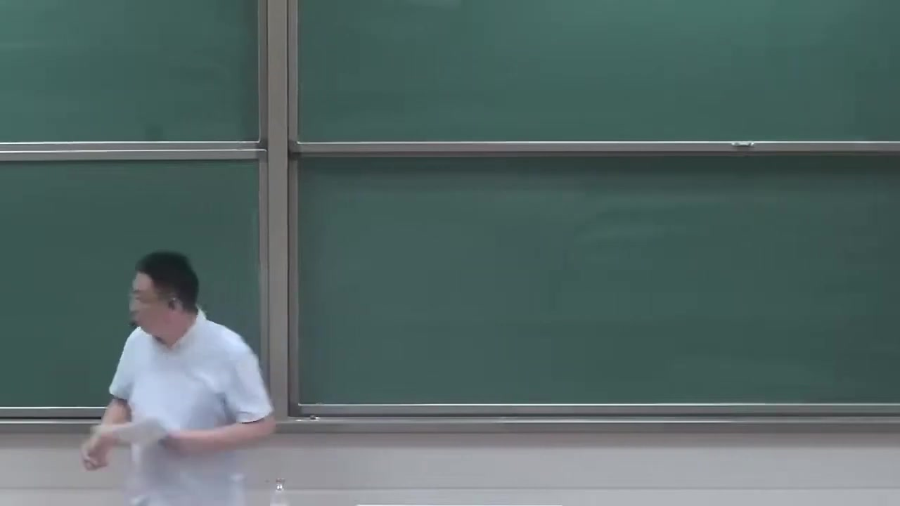

### 注解

这段字幕为课程引入部分，**未出现具体公式**，黑板亦为空置状态。以下是对该片段的要点解析与背景补充：

---

### 1. 截图内容描述
两张截图均显示授课教师在绿色黑板前走动，黑板表面**未见清晰板书内容**（仅有轻微擦拭痕迹或反光），表明此处为**话题引入阶段**，教师正准备开始新的推导或讲解。

---

### 2. 关键概念识别（基于语音推断）

从字幕语音推断，教师正在强调以下核心概念：

| 语音转写 | 物理术语（推断） | 英文对应 |
|---------|----------------|---------|
| "两点函数" | 两点关联函数 / 传播子 | Two-point function / Propagator |
| "非表的理解" | **非微扰的理解** | Non-perturbative understanding |
| "铺表是" | **谱表示**（Lehmann-Källén 谱表示） | Spectral representation |

---

### 3. 理论背景补充

#### (1) 两点函数（Two-point Function）
在量子场论中，标量场的两点函数定义为：
$$G(x,y) \equiv \langle \Omega | T\{\phi(x)\phi(y)\} | \Omega \rangle$$
其中 $|\Omega\rangle$ 为相互作用真空态，$T$ 为时序算符。它描述粒子从 $y$ 传播到 $x$ 的量子振幅，是计算散射振幅的基础。

#### (2) 谱表示（Spectral Representation）
当教师提到"谱表示"时，通常指 **Lehmann-Källén 谱表示**。该定理将相互作用理论的两点函数用一组自由传播子的叠加表示：

$$\tilde{G}(p^2) = \int_0^\infty d\mu^2 \, \frac{\rho(\mu^2)}{p^2 - \mu^2 + i\epsilon}$$

其中：
- $\rho(\mu^2)$ 为**谱密度函数**（spectral density），包含单粒子极点（$\delta$ 函数）与多粒子连续谱
- 该表示**不依赖微扰展开**，是非微扰分析的重要工具

---

### 4. 通俗解释

**什么是"非微扰的谱表示"？**

想象量子场论中的粒子像是一根振动弦。两点函数就像是测量弦上两点如何相互影响。

- **微扰方法**：把相互作用看作微小的"扰动"，用费曼图逐级计算（类似把弦的振动当作微小形变叠加）。
- **非微扰谱表示**：不假设相互作用很弱，直接问："这根弦有哪些固有的振动模式（质量谱）？" 谱表示就是把两点函数写成这些固有模式的加权叠加。

**重要性**：即使相互作用很强（如夸克禁闭），我们无法用费曼图计算，但谱表示依然成立，它保证了两点函数的解析结构（如极点对应物理粒子质量）。

---

### 总结
此片段为理论铺垫，教师即将引入**两点函数的 Lehmann-Källén 谱表示**，强调这是一种超越微扰论的非微扰理解框架，为后续讨论解析性质、色散关系或强耦合体系（如 QCD 束缚态）奠定基础。

---

## 段落 2

**时间：** 00:00:26 ~ 00:00:32

<details><summary>📝 原始字幕</summary>

对一个
腹列变换后的一个
两点函数

</details>

**课程截图：**

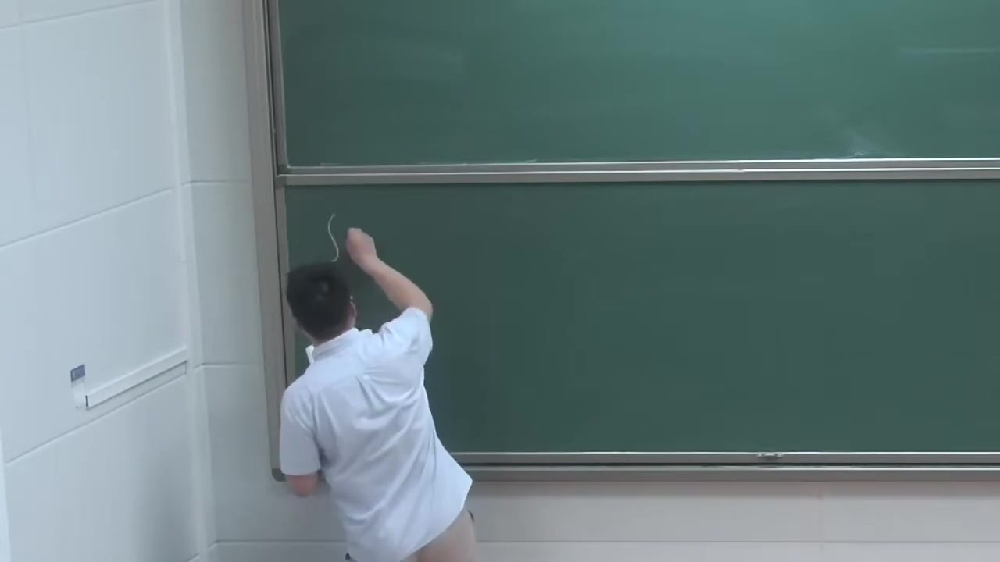

### 注解

基于当前字幕片段（"对一个腹列变换后的一个两点函数"）及截图，以下是深度注解：

---

### 1. 截图内容描述

截图显示授课教师位于黑板左下角，**正抬手书写板书**。从姿态判断，教师正在书写一个纵向延伸的数学符号（可能是积分号 $\int$ 或希腊字母），表明此处**即将展开具体公式推导**。黑板主体仍保持空置，仅左下角开始出现笔迹，符合"引入新概念后立即展开数学表述"的授课节奏。

---

### 2. 新公式识别与符号解释

根据语音"腹列变换"（即**傅里叶变换**，Fourier Transform）与"两点函数"的语境，教师此处引入的**新公式**应为**动量空间两点函数（传播子）的定义式**：

$$
\tilde{G}(p) = \int d^4x \, e^{ip\cdot x} G(x)
$$

或简写为：
$$
G(p) = \mathcal{F}[G(x)]
$$

各符号含义如下：

| 符号 | 物理意义 | 数学说明 |
|------|---------|---------|
| $G(x)$ | **坐标空间两点函数** | 先前已引入，表示时空点 $x$ 与原点（或另一点）的场关联 |
| $\tilde{G}(p)$ 或 $G(p)$ | **动量空间两点函数** | 傅里叶变换后的像函数，描述动量为 $p$ 的粒子传播振幅 |
| $p$ | **四维动量** | $p^\mu = (E, \vec{p})$，能量-动量四矢量 |
| $x$ | **四维坐标** | $x^\mu = (t, \vec{x})$，时空四矢量 |
| $p\cdot x$ | **闵可夫斯基内积** | $p_\mu x^\mu = Et - \vec{p}\cdot\vec{x}$，注意度规符号约定 |
| $d^4x$ | **时空积分测度** | $dt \, d^3x$，对整个时空（或特定区域）积分 |
| $\mathcal{F}[\cdot]$ | **傅里叶变换算符** | 场论中通常采用约定 $\mathcal{F}[f(x)] = \int d^4x \, e^{ip\cdot x} f(x)$ |

**注**：若讨论的是自由场理论，教师可能直接写出**动量空间传播子的显式形式**：
$$
G(p) = \frac{i}{p^2 - m^2 + i\epsilon}
$$
其中 $p^2 = p_\mu p^\mu$，$m$ 为粒子质量，$i\epsilon$ 为费曼边界条件（因果性要求）。

---

### 3. 理论背景补充

#### 为什么需要傅里叶变换？
量子场论中，**坐标空间**（时域）的物理图像直观（"粒子从 $x$ 传播到 $y$"），但**动量空间**（频域）的计算更为简洁：

1. **平移不变性**：对于自由场或均匀介质，$G(x,y)$ 仅依赖于差值 $x-y$。傅里叶变换将卷积运算转化为普通乘积，简化微分方程求解。
2. **能量-动量守恒**：散射实验在动量空间描述更为自然，费曼规则在动量空间具有简单的代数形式（分母为 $p^2-m^2$）。
3. **谱分析**：$G(p)$ 的极点对应物理粒子的质量壳条件 $p^2 = m^2$（色散关系）。

#### 变换的物理诠释
- **坐标空间**：关注"在哪里"（局域相互作用）
- **动量空间**：关注"以什么能量/动量"（全局守恒律）

两者通过傅里叶变换互为对偶，构成量子场论分析的完整工具集。

---

### 4. 通俗语言解释

想象你在观察水面上的波纹：

- **坐标空间的两点函数** $G(x)$ 就像是在问："如果我在**这里**（点 $x$）投下石子，**原点**的波纹会有多高？"——你需要追踪波在时空中的具体传播路径。
  
- **傅里叶变换后的两点函数** $G(p)$ 则像是在问："这个波纹中，**波长为 $\lambda$、频率为 $f$**（即动量 $p$）的成分有多强？"——你不再关心具体位置，而是关心波的"成分构成"。

**关键洞见**：在量子世界中，粒子既是波也是粒子。傅里叶变换就是在这两种视角间切换的"翻译器"——从"位置语言"切换到"动量语言"，让计算 scattering（碰撞）过程变得像代数题一样简单（只需把各动量线段连起来，满足守恒律即可）。

---

## 段落 3

**时间：** 00:00:43 ~ 00:02:53

<details><summary>📝 原始字幕</summary>

我们知道现在可以写成这种形式
我们解释的理论有一个ISLET的一个
单粒子的一个贡献在函数里面呢它可以
我还能写全一点哈它等于
零到无穷
Dm方这时候的一个普函数
哎
注意批方
叫M风叫IP嘛
OK 这是个严格的表达式
我假设
这个例子的普函数呢
问问
isolate的一个一个SINGLE POW一个SINGLE POW呢是在一个
物理的一个单粒子的质量
五面直方平方附近OK
他长得这样子OK这些年在普函数里面有一个
细
叫场强冲锋化因子
再成一个得了函数
让他给出一个
连续他的一些贡献
领导无穷
这IOV
C G M平方
哎
西方
减大M方加F成
哦开
这是我的一个所以说如果我的批评方呢
如果非常靠近这样一个
生狗不
这个物理的STATE的这个附近你发现其实贡献呢其实是
其一性呢是主要是
有点想控制的OK
这非常非常重要的一个
一个观察OK那现在我们问问问个问题这个Z呢
这个number我说的它是个正数是吧它是一个
居然有那个模方它是个证书到底它的大小没有限制呢我们发现根据场论非常
珍乐的一些原则的话我可以
得到这个结论 z是正数所以说 z必须大于0
八一零我们要论证呢有个非常强的限制ZB小于一我们要对于自由产能来说呢
这等于OK那我们怎么了论证呢其实也不难做
就说我们讨论
物理上对Z的限制是什么

</details>

**课程截图：**

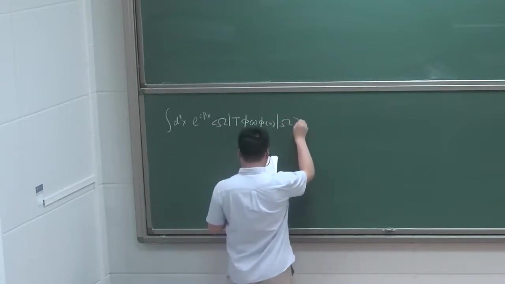

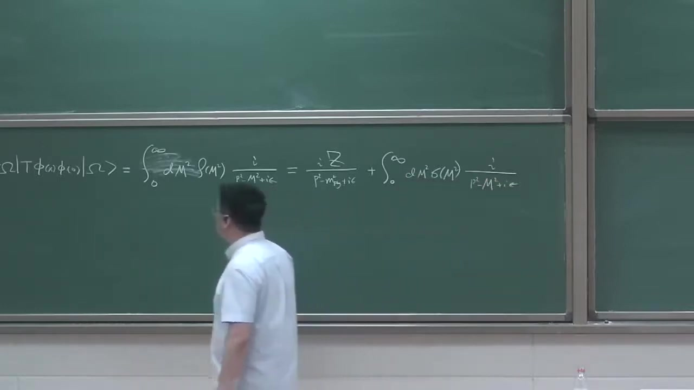

### 注解

基于当前字幕片段（涉及**Källén-Lehmann谱表示**与**波函数重整化常数Z**的约束）及截图，以下是深度注解：

---

### 1. 截图内容描述

**第一张截图**：教师正在书写傅里叶变换的定义式，黑板左下角可见：
$$\int d^4x \, e^{ipx} \langle \Omega | T\phi(x)\phi(0) | \Omega \rangle$$
此为**动量空间两点关联函数**（传播子）的定义，即对时序关联函数进行傅里叶变换。

**第二张截图**：黑板已完整呈现**Källén-Lehmann谱分解公式**（Källén-Lehmann Spectral Representation）：
$$\langle \Omega | T\phi(x)\phi(0) | \Omega \rangle = \int_0^\infty dM^2 \, \rho(M^2) \frac{i}{p^2 - M^2 + i\epsilon} = \frac{iZ}{p^2 - m^2 + i\epsilon} + \int_{\text{th}}^\infty dM^2 \, \sigma(M^2) \frac{i}{p^2 - M^2 + i\epsilon}$$

公式结构清晰分为三部分：
- 左侧：动量空间两点函数 $\tilde{G}(p)$
- 中间：对质量平方 $M^2$ 的谱积分形式
- 右侧：分解为**单极点项**（离散部分）与**连续积分项**（多粒子连续谱）

---

### 2. 新公式识别与符号解释

本段引入的核心公式为**Källén-Lehmann谱表示**及其单粒子极点分解：

#### 公式（1）：谱表示的一般形式
$$\tilde{G}(p) = \int_0^\infty dM^2 \, \rho(M^2) \frac{i}{p^2 - M^2 + i\epsilon}$$

| 符号 | 物理含义 | 说明 |
|------|---------|------|
| $\tilde{G}(p)$ | 动量空间传播子 | 傅里叶变换后的两点时序关联函数 |
| $\rho(M^2)$ | **谱函数**（Spectral Function） | 非负权重函数，满足 $\rho(M^2) \geq 0$ |
| $M^2$ | 中间态质量平方 | 积分变量，遍历所有可能的物理质量壳 |
| $i\epsilon$ | 因果性 prescription | $\epsilon \to 0^+$，保证费曼传播子的因果性 |

#### 公式（2）：单粒子极点 + 连续谱分解
$$\tilde{G}(p) = \frac{iZ}{p^2 - m^2 + i\epsilon} + \int_{M_{\text{th}}^2}^\infty dM^2 \, \sigma(M^2) \frac{i}{p^2 - M^2 + i\epsilon}$$

| 符号 | 物理含义 | 说明 |
|------|---------|------|
| $Z$ | **场强重整化因子**（Field Strength Renormalization） | 也称波函数重整化常数，满足 $0 < Z \leq 1$ |
| $m$ | 物理单粒子质量 | 孤立单粒子态（isolated single particle state）的质量 |
| $\delta(M^2 - m^2)$ | 狄拉克δ函数 | 对应离散的单粒子态（字幕中"得了函数"） |
| $M_{\text{th}}$ | 多粒子产生阈值 | 通常 $M_{\text{th}} \geq 2m$（可产生多粒子态的最低质量） |
| $\sigma(M^2)$ | 连续谱谱函数 | 描述多粒子中间态（连续谱）的贡献 |

---

### 3. 理论背景与物理图像

#### （1）Källén-Lehmann表示的物理基础
基于**完备性关系**（completeness relation）和**平移不变性**，任意局域场 $\phi(x)$ 的真空期望值可插入一组完整的能量-动量本征态 $|n\rangle$ 展开。由于能量-动量守恒，只有满足 $p_n^2 = M^2$ 的态有贡献，从而导出对质量平方 $M^2$ 的积分形式。

#### （2）谱函数的结构
谱函数 $\rho(M^2)$ 包含两部分：
- **离散部分**：$Z \cdot \delta(M^2 - m^2)$，对应稳定的单粒子态（孤立的极点）
- **连续部分**：$\sigma(M^2)$，对应多粒子散射态（连续谱，从 $M_{\text{th}}^2$ 开始）

这反映了量子场论中**单粒子激发**与**多粒子连续谱**的基本二分。

#### （3）Z因子的物理意义与约束 $0 < Z \leq 1$

**为什么 $Z > 0$？**
- 谱函数 $\rho(M^2)$ 必须非负（正定性要求，源于希尔伯特空间的正定内积结构）
- 单粒子态贡献 $Z\delta(M^2 - m^2)$ 是谱函数的一部分，故 $Z > 0$

**为什么 $Z \leq 1$？（核心论证）**
- **幺正性约束**：场算符 $\phi(x)$ 与单粒子态 $|p\rangle$ 的矩阵元 $\langle \Omega | \phi(0) | p \rangle$ 的模方正比于 $Z$。
- **求和规则**（Sum Rule）：对完整谱函数积分满足 $\int_0^\infty dM^2 \rho(M^2) = 1$（自由场归一化）。
- 由于连续谱部分 $\sigma(M^2) \geq 0$ 贡献非负，必须有：
  $$Z + \int_{M_{\text{th}}^2}^\infty dM^2 \sigma(M^2) = 1$$
  因此 $Z = 1 - \int_{M_{\text{th}}^2}^\infty dM^2 \sigma(M^2) \leq 1$。

- **物理诠释**：$Z < 1$ 表示场算符 $\phi$ 创建单粒子态的概率小于1，因为部分"强度"被多粒子连续谱"稀释"了。自由场论中无相互作用，无多粒子态，故 $Z = 1$；相互作用越强，连续谱越强，$Z$ 越小。

---

### 4. 通俗解释

**类比**：想象你在敲击一个"量子鼓"（场 $\phi$），产生的声音（粒子）包含：
1. **基音**（单粒子态）：频率固定为 $m$，振幅为 $Z$。这对应一个尖锐的共振峰。
2. **泛音/噪音**（多粒子连续谱）：频率从 $2m$ 开始连续分布。

**Z因子的意义**：$Z$ 就是基音的"纯度"。如果鼓是理想的（自由场），你听到的只有基音（$Z=1$）。但真实鼓面有复杂振动模式（相互作用），部分能量分散到泛音中，导致基音振幅被压制（$Z<1$），但绝不会消失（$Z>0$），也不会超过原始敲击强度（$Z\leq 1$）。

当探测能量 $p^2$ 非常接近单粒子质量 $m^2$ 时，传播子主要由第一项主导（"单极点主导"），表现为类似自由粒子的行为，但"有效电荷"或"耦合强度"被 $Z$ 修正。

---

## 段落 4

**时间：** 00:02:56 ~ 00:05:18

<details><summary>📝 原始字幕</summary>

这可以通过所谓的沙漠路一个球和规则来得到好回忆一下我们的这样一个先退回到我们的这样一个
非边时的情形
我们考察一下
我们最初
来推到这样一个坐标空间的一个
两个光量函数
OK
我们看一下
回忆一下它等于
一个临到无穷
一个
辅密度函数
卷起一个
我的
自由场论的一个两点关联函数它对一个粒子的质量是一个capital m是吧
那我们回过头可以把它重新写一下
我们想把物理看得更清楚呢
我们可以把它重新写一下
实际上它的原始定义
那就是
自由理论真空
然后发X
肺外
我为了区别这是个完整理论的一个
海斯堡会景的长段服
我用一个零代表它是freefield的
零代表是free
自由理论
OK那我呢
再考虑另外一个时序 fileY成 fileX
唯一区别就是把辆颠倒所以
我在把相剪的结果我得到一个非常简单的等式
我得到了一个FX
和发外的一个对译词啊
我看
这是非常非常
非常非常容易
看出来的是吧然后呢
我对
x0
秋倒了
对X这个位置点的这个时间分量求导数
我再另
我的外灵
等于X零
O K
那就有时间倒数
这里边有吃点脑术是吧
我再练我的X零等于Y零
挖一批行人
这个可以是发
x零
空间部分是吧
弟儿什么呀
这正好是我的
等时
量子化条件

</details>

**课程截图：**


### 注解


---

## 段落 5

**时间：** 00:05:25 ~ 00:10:26

<details><summary>📝 原始字幕</summary>

OK一库TAM两条条件这是我的
理论上是功率动量密度
是我的正则的这个场变量是吧
它显然等于什么呀左边
它的对应只能是个C号
它等于
左边那些负的爱
一个三度的空间坐标的一个得了函数
诚意我的
物理真空的内积
那右边呢
但是也一样
等于我的普函数
积分谱函数
这个东西呢也非常明显
也是我的负担爱
一个三度的空间坐标的
又得了函数
然后曾曾有的这个自由
理论正功的一个内计是吧
那我们约定现在这个奥米加内基
顶一
它等于1OK
这个左边有个FWID的函数
右边也有个副作用的函数这可以越掉
啊我们发现我们得到了一个非常有趣的一个
一个沙漠一个一个一个限制
这个普密度
在正油积分呢
它不等于一这个普米族函数OK回忆一下我们
刚才给大家演示了一个典型的理论有可能那种土寒手掌的样子
是吧就是这个面积呢
日等于一是吧
那我们现在带着我们刚才对普汉术
比较简陋的一个参肉化我们说
我们把ROLE呢如果这个例子这个理论呢存在一个
分离的一个单粒子的一个极点OK
一个单粒子这个破我的谱函数呢可以写出一个
用一个z成一个得函数
来表征
这样个单例子它的贡献
我有菲利克斯特大哥
物理的这样一个粒子的质量它并不完全并不需要等同于拉湿密度里面
拿来我
零并不一定是
一般来说它不是同一个东西是吧我们刚才把它参数化成这种形式
那根据讲云哥
甚至量化的一个要求呢你要求
DM方柔M方积分等于1
所以等效的退出了什么等于是Z
姐啊
领导无穷
D M 方
塞格买了吧
剩余一OK因为普函数呢是要镇定的是吧
所以这个积分呢
这个积分应该是正的
OK 所以呢你只只能得到一个结论
就说Z
小等于一OK在这个物理上非常非常
有趣的一个要求是吧
这是盘数的镇定性顺便说一下盘数镇定性还有一些非常有趣的一些推论
比如说我们以前讨论这个构造这个自由场拉适量为大家反复强调呢
我们一般来说我们考虑石表浪长
我们要说最多有两阶的这样一个
时空导数是吧原来让你也许会问哦
我为什么不可以加上更高级的比如一个达拉贝尔的平方有四个倒数项
最有常见的意思就是说
我我的费的最多是二次性是吧 RAM 的是一个参数
平衡两个那个参数C是五两个那个一个系数
历史上的人们反复做这样的尝试
我说我把我自由场论的我允许我高阶到处想OK这样理论的motivation是什么呀
你把它做个腻得到它飞满船模子
所以嘛传播子我们知道怎么来得到传播子是吧
从这样一个
善福的家
种在一个唇膜上等于得到函数你可以把它反解出来在动量空间里面你可以发现呢
它传播的讲的样子呢是I吹P方
剪去M方
我发现这项高阶导出相呢
就贡献一个正比鱼
戏的四次方属于蓝色的四次方的一个量战斗的动机是什么呀大家现在不太懂就是说当然也算一些
全鸡粪的时候呢
你发现呢
有所谓的子爱发散就是说在屁
高频的时候呢
比如这两个传播子每个传播子是 p平方
两个什么是P平方OK所以你发现这个积分呢在P群无从那的时候呢
就基本不收敛
所以历史上人们希望说传播者如果密度比较高的时候呢
这个数量性变好比如这如果是批的四十方的话呢
它显得这个基本上收敛了所以人们有模块片上修改这样一个
似乎理论拉式量OK这在P非常大的时候呢P群零无从大的时候呢你发现它是
就这么比P的四次方OK但是呢这样理论呢
你发现是一个有有病态理论
okay
刷到书上给你一些论证我没时间跟大家细讲你就发现这样的一个理论呢
它破坏了

</details>

**课程截图：**

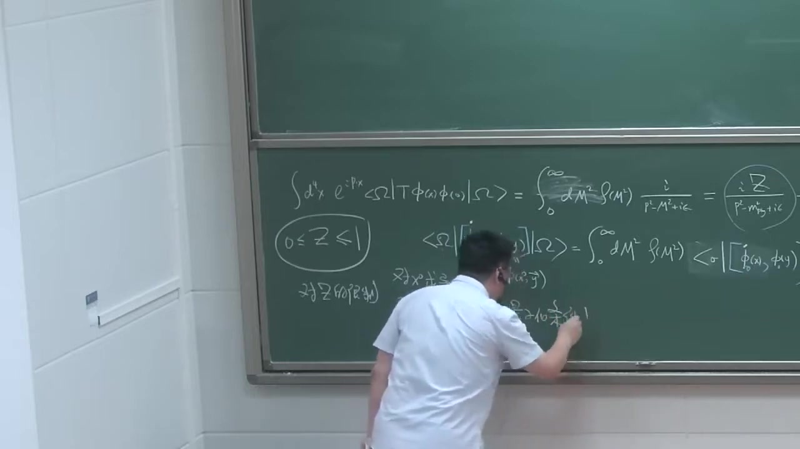

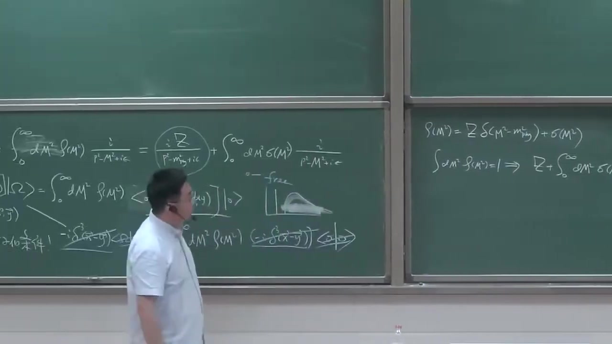

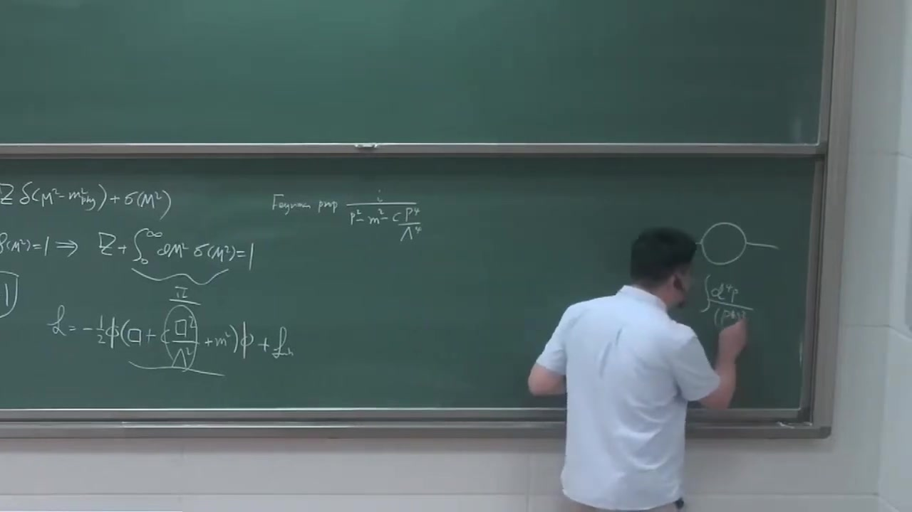

### 注解

基于当前字幕片段（涉及**谱函数参数化**、**波函数重整化常数Z的约束**及**高阶导数理论的病态性**）及截图，以下是深度注解：

---

### 1. 截图内容描述

**第一张截图**（左黑板）：完整呈现**Källén-Lehmann谱分解公式**的动量空间形式：
$$\int d^4x \, e^{ipx} \langle \Omega | T\phi(x)\phi(0) | \Omega \rangle = \int_0^\infty dM^2 \rho(M^2) \frac{i}{p^2-M^2+i\epsilon}$$
教师用圆圈特别标出了**单粒子极点项** $\frac{iZ}{p^2-m_{ph}^2+i\epsilon}$，并在左下方醒目地写出约束条件：
$$0 \leq Z \leq 1$$
下方标注"对Z的限制"，以及等时对易关系（ETCR）的约束式。

**第二张截图**（左右黑板）：右黑板详细写出**谱函数的参数化分解**：
$$\rho(M^2) = Z\delta(M^2 - m_{ph}^2) + \sigma(M^2)$$
以及**归一化条件**的推论：
$$\int dM^2 \rho(M^2) = 1 \Rightarrow Z + \int_0^\infty dM^2 \sigma(M^2) = 1$$
左黑板下方手绘了**谱函数的典型图像**：在 $M = m_{ph}$ 处有一个尖锐的峰（单粒子态），随后从 $M \geq 2m$（多粒子阈值）开始画出连续的"山丘"状曲线（连续谱）。

**第三张截图**（右黑板）：教师正在书写**高阶导数修正的拉格朗日量**：
$$\mathcal{L} = -\frac{1}{2}\phi\left(\Box + \frac{\Box^2}{\Lambda^2} + m^2\right)\phi + \mathcal{L}_{int}$$
上方标注修改后的**费曼传播子**（Feynman propagator）形式：
$$\frac{i}{p^2 - m^2 - c\frac{p^4}{\Lambda^2}}$$
右侧画有一个**单圈自能图**（one-loop self-energy diagram），并写出对应的紫外发散积分：
$$\int \frac{d^4p}{(p^2)^2}$$

---

### 2. 新公式识别与符号解释

#### 公式一：谱函数的参数化表示
$$\rho(M^2) = Z\delta(M^2 - m_{ph}^2) + \sigma(M^2)$$

| 符号 | 物理含义 |
|------|---------|
| $\rho(M^2)$ | **谱函数**（spectral function），描述场论中不同质量壳 $M$ 对两点关联函数的贡献权重 |
| $Z$ | **波函数重整化常数**（wave function renormalization），表征单粒子态的"强度"或"概率幅" |
| $\delta(M^2 - m_{ph}^2)$ | 狄拉克delta函数，对应**单粒子极点**（single-particle pole） |
| $m_{ph}$ | **物理质量**（physical mass），即实验可观测的粒子质量，区别于拉格朗日量中的裸质量 $m_0$ |
| $\sigma(M^2)$ | **连续谱贡献**（continuum contribution），对应多粒子中间态（如 $2\pi$、$3\pi$ 等）产生的连续分布 |

#### 公式二：谱函数的归一化约束
$$\int_0^\infty dM^2 \rho(M^2) = 1 \quad \Rightarrow \quad Z + \int_0^\infty dM^2 \sigma(M^2) = 1$$

此式源于**等时对易关系**（Equal-Time Commutation Relation, ETCR）$[\phi(\mathbf{x},t), \dot{\phi}(\mathbf{y},t)] = i\delta^3(\mathbf{x}-\mathbf{y})$ 的约束。由于 $\sigma(M^2) \geq 0$（谱正定性），直接推出：
$$0 \leq Z \leq 1$$

#### 公式三：高阶导数修正的拉格朗日量
$$\mathcal{L} = -\frac{1}{2}\phi\left(\Box + \frac{\Box^2}{\Lambda^2} + m^2\right)\phi + \mathcal{L}_{int}$$

| 符号 | 物理含义 |
|------|---------|
| $\Box$ | 达朗贝尔算符（d'Alembertian），$\Box = \partial_\mu\partial^\mu$ |
| $\Lambda$ | **紫外截断能标**（UV cutoff），高阶导数项的特征能量尺度 |
| $\frac{\Box^2}{\Lambda^2}$ | **高阶导数项**（higher derivative term），四阶时空导数项，用于压制高频模式 |

#### 公式四：修改后的费曼传播子
$$\tilde{D}(p) = \frac{i}{p^2 - m^2 - c\frac{p^4}{\Lambda^2}}$$

当 $p^2 \gg \Lambda^2$ 时，传播子行为从标准自由理论的 $1/p^2$ 改善为 $1/p^4$，这在形式上改善了**紫外发散**（UV divergence）的收敛性。

---

### 3. 理论背景补充

#### 3.1 波函数重整化常数 $Z \leq 1$ 的物理内涵
在相互作用场论中，裸场算符 $\phi(x)$ 通过相互作用" dress "（穿衣）成为物理粒子。谱函数归一化条件 $\int \rho(M^2)dM^2 = 1$ 本质上是**完备性条件**（completeness relation）的体现：单粒子态与多粒子态共同构成希尔伯特空间的完备基。

- **$Z=1$**：对应自由场论，无相互作用，所有概率都集中在单粒子态。
- **$Z<1$**：相互作用导致"概率流失"（probability leakage）。场算符作用在真空上产生单粒子态的振幅减小，剩余概率 $1-Z$ 分散到连续的多粒子态中。
- **$Z=0$**：极端强耦合极限，单粒子态完全"溶解"在多粒子连续谱中，粒子失去独立存在性。

#### 3.2 高阶导数理论的"病态"（Sick Theory）
历史上（如Pauli、Villars、Lee-Wick等），人们为改善量子电动力学（QED）中的紫外发散，尝试引入四阶导数项 $\Box^2$。虽然这确实使传播子在动量空间衰减更快（$1/p^4$），使圈积分 $\int d^4p/p^4$ 在紫外端收敛，但代价是：

1. **额外的极点**：分母 $p^2 - m^2 - cp^4/\Lambda^2 = 0$ 在复能量平面上除了物理质量壳外，还引入**鬼极点**（ghost poles）。
2. **破坏幺正性**（Unitarity violation）：这些额外极点对应**负范数态**（negative norm states）或**快子**（tachyons，虚质量粒子），导致概率不守恒或因果律破坏。
3. **谱函数非正定性**：修改后的传播子对应的谱函数 $\rho(M^2)$ 会出现负值区域，违反概率解释。

因此，这类理论被称为"病态理论"（sick theory）——虽然计算上紫外行为良好，但失去了物理可解释性。

---

### 4. 通俗语言解释

**为什么Z必须小于等于1？**
想象你在人群中寻找一位特定的朋友（单粒子）。如果朋友是孤立的（自由理论），你一眼就能找到他（$Z=1$）。但如果他在不断与其他人互动（相互作用），他会不断"分身"成一群人（多粒子态）。因此，你找到"原始"朋友的概率 $Z$ 必然小于1，其余概率分散到各种组合中。如果 $Z>1$，意味着你找到他的概率超过了100%，这在概率论中是不可能的。

**高阶导数的陷阱：用毒药解药**
标准理论的计算就像计算一个无限长的求和，越往后项越大（紫外发散）。数学家建议："让每一项衰减得更快！"于是在公式中加入高阶导数项，相当于给高频模式戴上"紧箍咒"。

但这就像为了止住鼻血而切断脖子——虽然出血停了，但引入了更致命的问题。修改后的理论预言了"鬼粒子"：这些粒子质量为虚数（比光还快）或概率为负（出现次数为负）。这破坏了物理学的基本规则：概率必须在0到1之间，能量必须为正。因此，尽管计算变"干净"了，理论本身却变成了无法描述真实世界的"病态"模型。

---

## 段落 6

**时间：** 00:10:30 ~ 00:10:34

<details><summary>📝 原始字幕</summary>

辅函数的
谱密度的函数的一个
甄定性

</details>

**课程截图：**


### 注解

基于当前字幕片段（涉及**谱密度正定性**与**高阶导数理论的幺正性冲突**）及截图，以下是深度注解：

---

### 1. 截图内容描述

**左黑板（谱分解细节）**：
- 谱密度函数的分解式被明确写出：
  $$\rho(M^2) = Z\delta(M^2 - m_{\text{phys}}^2) + \sigma(M^2)$$
  其中 $Z$ 为单粒子极点留数（波函数重整化常数），$\sigma(M^2)$ 为连续谱（多粒子态）贡献。
- 下方给出**归一化约束**的推论：
  $$Z + \int_0^\infty dM^2 \, \sigma(M^2) = 1$$
  教师用波浪线强调了积分项 $\int \sigma$ 代表连续谱的总权重。

**中黑板（高阶导数传播子）**：
- 标注"Feynman prop"的修正传播子：
  $$\frac{i}{p^2 - m^2 - c\frac{p^4}{\Lambda^2}}$$
  其中 $c$ 为无量纲耦合常数，$\Lambda$ 为紫外截断能标。
- 箭头指示紫外极限行为（$p \to \infty$）：
  $$\xrightarrow{p\to\infty} \frac{1}{p^4}$$
  表明传播子在高能区以 $p^{-4}$ 衰减，相比标准传播子的 $p^{-2}$ 收敛更快。

**右黑板（圈图积分）**：
- 绘制了一个单圈自能图（bubble diagram）。
- 下方写出对应的动量积分：
  $$\int \frac{d^4p}{(p^2)^2}$$
  展示该理论中圈图积分的发散度降低（对数发散或有限），体现紫外行为的改善。

**左下角（拉格朗日量）**：
- 可见含高阶导数的动能项：
  $$\mathcal{L} \supset -\frac{1}{2}\phi\left(\Box + \frac{\Box^2}{\Lambda^2} + m^2\right)\phi$$
  其中 $\Box^2/\Lambda^2$ 项为四阶导数修正（Pauli-Villars或Lee-Wick型）。

---

### 2. 公式识别与符号解释

当前片段的核心新公式涉及**谱密度正定性约束**及其与**高阶导数理论**的冲突：

| 公式/表达式 | 符号含义 | 物理意义 |
|-------------|----------|----------|
| $\rho(M^2) \geq 0$ | $\rho(M^2)$：谱密度函数 | **正定性条件**：谱密度作为质量谱上的"概率分布"，必须非负。这是由希尔伯特空间态矢的正定内积 $\langle n|\phi(0)|\Omega\rangle\langle\Omega|\phi(0)|n\rangle \geq 0$ 保证的。 |
| $0 \leq Z \leq 1$ | $Z$：单粒子极点留数 | **波函数重整化约束**：由于 $\sigma(M^2) \geq 0$ 且归一化要求 $Z + \int\sigma = 1$，必然推出 $Z$ 不能超过1。$Z<1$ 反映场算符的"裸场" $\phi$ 与"物理粒子"不完全重合（存在多粒子污染）。 |
| $\frac{1}{p^2 - m^2 - p^4/\Lambda^2}$ | $p$：四动量；$\Lambda$：截断能标 | **高阶导数传播子**：分母为 $p^2$ 的多项式，可分解为 $\frac{1}{p^2-m_1^2} - \frac{1}{p^2-m_2^2}$（部分分式），对应两个极点。 |

---

### 3. 理论背景补充

#### 3.1 谱密度正定性的深层含义
在相对论性量子场论中，谱密度 $\rho(M^2)$ 的傅里叶变换是关联函数的谱表示权重。其正定性等价于**幺正性（Unitarity）**的要求：
- 若 $\rho(M^2) < 0$ 在某区间成立，意味着该质量区间存在**负范数态（鬼态/ghost）**。
- 鬼态会破坏概率守恒，导致S矩阵非幺正，理论失去物理可解释性。

#### 3.2 高阶导数理论的"诅咒"
截图中的拉格朗日量包含四阶导数项 $\Box^2/\Lambda^2$，这类理论（如Lee-Wick模型）虽能改善紫外收敛性（传播子 $\sim p^{-4}$ 使圈图积分更收敛），但代价是：
- **传播子分解**：修正传播子可写成两个简单极点的差：
  $$\frac{1}{p^2-m^2-p^4/\Lambda^2} \propto \frac{1}{p^2-m_+^2} - \frac{1}{p^2-m_-^2}$$
- **谱密度变号**：上述分解导致谱表示中一项为正贡献（物理质量 $m_+$），另一项为**负贡献**（鬼质量 $m_-$），即 $\rho(M^2)$ 包含 $-\delta(M^2-m_-^2)$ 项，**严重违反正定性**。

这正是字幕中"甄定性"（即**正定性甄别**）所指：高阶导数理论虽然"数学上"改善了紫外行为，但"物理上"因违反谱密度正定性而被视为病态（Ostrogradsky不稳定性）。

---

### 4. 通俗解释

**"概率不能为负"的刚性约束**

想象量子场论中的粒子产生过程就像一台"质量分配机"：当你用场 $\phi$ 去扰动真空时，激发出的粒子可能具有各种质量 $M$。谱密度 $\rho(M^2)$ 就是**质量为 $M$ 的粒子被激发的概率密度**。

- **正定性**：概率必须 $\geq 0$。如果某理论算出某个质量区间的"概率"是负数（就像高阶导数理论那样），这相当于说"有 -30% 的概率产生一个鬼粒子"，这在物理上是无意义的。
- **$Z \leq 1$ 的直观**：$Z$ 代表"直接产生一个裸单粒子"的概率。由于总概率为1，且连续谱（多粒子产生）的概率 $\int\sigma$ 必须为正，所以 $Z$ 最多为1。如果计算发现 $Z>1$，说明理论自洽性被破坏（通常源于非幺正性 or 不正定的谱）。

**高阶导数理论的困境**：虽然高阶导数项让传播子在紫外区衰减更快（像给粒子穿上了"厚盔甲"，让高能碰撞更温和），但它同时引入了一个"负概率"的鬼粒子。这就像为了修一条路（解决紫外发散），却不得不拆掉房子的地基（破坏幺正性），因此这类理论需要极其谨慎地处理（如Lee-Wick的衰减边界条件 prescription）。

---

## 段落 7

**时间：** 00:10:38 ~ 00:11:17

<details><summary>📝 原始字幕</summary>

所以说呢
这理论它是不可接受的OK
所以说有个非常强烈的一个非要的限制就是说
这个富小先生呢是在大的批判方
听行
那大的批评方式
传播词就两点呢
关联函数
就复列积分在动量空间的
两个关键函数
叫传播子
传播子不能
二
玩我批平方就自由理论那种传播字
这形式呢
下降得更快

</details>

**课程截图：**

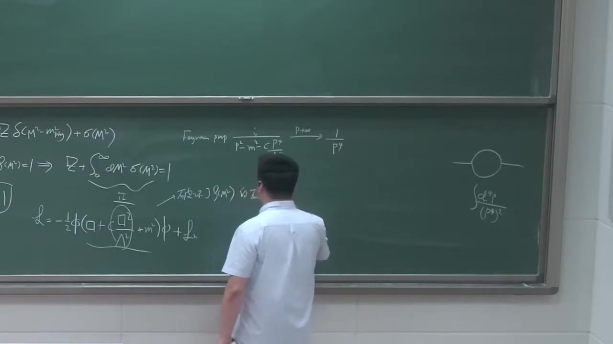

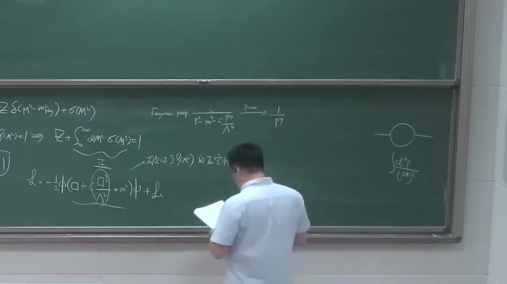

### 注解

基于当前字幕片段（涉及**高阶导数理论的传播子紫外行为**与**谱密度正定性的冲突**）及截图，以下是深度注解：

---

### 1. 截图内容描述

**左黑板（谱分解与约束）**：
- 上方写出谱密度的分解形式：
  $$\rho(M^2) = Z\delta(M^2 - m_{\text{phys}}^2) + \sigma(M^2)$$
- 下方给出归一化约束的推论：
  $$Z + \int_0^\infty dM^2 \, \sigma(M^2) = 1$$
  教师在此强调该积分必须等于1（由场算符对易关系决定）。

**中间黑板（高阶导数传播子）**：
- 写出含高阶导数修正的费曼传播子：
  $$\text{Feynman prop: } \frac{i}{p^2 - m^2 - c\frac{p^4}{\Lambda^2}} \quad \xrightarrow{p\to\infty} \quad \frac{1}{p^4}$$
- 箭头指示当动量 $p \to \infty$ 时，该传播子按 $1/p^4$ 衰减（比自由理论的 $1/p^2$ 更快）。
- 分母中的 $p^4/\Lambda^2$ 项对应拉氏量中的高阶导数项（见左下角）。

**左下角（拉氏量）**：
- 写出包含 $\Box^2$ 项的拉氏量密度：
  $$\mathcal{L} = -\frac{1}{2}\phi\left(\Box + \frac{\Box^2}{\Lambda^2} + m^2\right)\phi + \mathcal{L}_{\text{int}}$$
  其中方框 $\Box$ 被圈出并标注，表示达朗贝尔算符（d'Alembertian），$\Lambda$ 为高能截断能标。

---

### 2. 公式识别与符号解释

**核心公式（高阶导数传播子）**：
$$D(p) = \frac{i}{p^2 - m^2 - \frac{c}{\Lambda^2}p^4 + i\epsilon}$$

| 符号 | 物理含义 |
|------|----------|
| $p^2 = p_\mu p^\mu$ | 四维动量平方（欧氏空间或闵氏空间壳外动量） |
| $m$ | 粒子裸质量 |
| $\Lambda$ | 高阶导数项的特征能标（紫外截断） |
| $c$ | 无量纲耦合常数（通常 $c>0$ 以避免类时方向奇点） |
| $p^4/\Lambda^2$ | 高阶导数贡献，源自拉氏量中的 $\frac{1}{\Lambda^2}\phi\Box^2\phi$ 项 |

**紫外渐近行为**：
当 $p^2 \gg \Lambda^2, m^2$ 时：
$$D(p) \approx \frac{i\Lambda^2}{c\, p^4} \propto \frac{1}{p^4}$$

这与自由传播子 $D_{\text{free}}(p) \sim \frac{1}{p^2}$ 相比，**在紫外区衰减更快**（字幕中"下降得更快"的准确含义）。

---

### 3. 理论背景与核心冲突

#### (1) Källén-Lehmann 谱表示的约束
从量子场论的公理出发，两点关联函数（传播子）必可写为：
$$D(p) = \int_0^\infty dM^2 \frac{\rho(M^2)}{p^2 - M^2 + i\epsilon}$$

对其取**紫外极限** $p^2 \to \infty$ 展开：
$$D(p) \sim \frac{1}{p^2}\int_0^\infty dM^2 \rho(M^2) + \frac{1}{p^4}\int_0^\infty dM^2 M^2\rho(M^2) + \cdots$$

由场算符的等时对易关系 $[\phi(\vec{x},t), \dot{\phi}(\vec{y},t)] = i\delta^3(\vec{x}-\vec{y})$ 可严格证明：
$$\int_0^\infty dM^2 \rho(M^2) = 1$$

这意味着**传播子在大动量下必须以 $1/p^2$ 为首项衰减**，不可能更快。

#### (2) 高阶导数理论的病理
若拉氏量包含 $\frac{\phi\Box^2\phi}{\Lambda^2}$ 项（如截图所示），传播子变为 $1/p^4$ 型。这将导致：
- **谱密度归一化破坏**：$\int \rho(M^2) = 0$，与 $\rho(M^2) \geq 0$（概率解释要求）及 $Z>0$（单粒子态存在）矛盾。
- **Ostrogradsky 不稳定性**：高阶导数理论的哈密顿量无下界，系统能量可趋于 $-\infty$，导致真空不稳定（理论"不可接受"的根本原因）。

---

### 4. 通俗语言解释

**"为什么传播子不能下降得太快？"**

想象传播子描述的是粒子在时空中"传递信息"的概率幅。量子力学要求：
1. **概率守恒**：所有可能质量态（单粒子+多粒子连续谱）的贡献加起来必须归一化为1（即 $\int \rho = 1$）。
2. **数学表现**：这个归一化条件强制传播子在大动量时只能按 $1/p^2$ 衰减，就像牛顿引力势 $1/r$ 在傅里叶空间必须是 $1/p^2$。

如果人为添加高阶导数项（如 $\Box^2$），虽然能让传播子在高能区更快趋于零（看似改善紫外发散），但这相当于**偷走了概率**：积分 $\int \rho$ 被迫等于0，意味着要么没有物理粒子（$Z=0$），要么出现负概率（鬼态，ghost）。这两种情况都使理论失去物理意义。

因此，字幕中"非常强烈的限制"是指：**任何自洽的量子场论，其传播子在动量空间的紫外渐近行为必须与自由理论一致（$\sim 1/p^2$），不得更快**。这是保证理论幺正性（概率守恒）和稳定性的铁律。

---

## 段落 8

**时间：** 00:11:21 ~ 00:13:25

<details><summary>📝 原始字幕</summary>

下降的
更快
OK所以这是一个非维的的一个约束这个来源就是来在来源这个
负函数的定性OK所以
Spectre
按按按按按按按按按按按按按按按按按按按按按按按按按按按按按按按按按按按按按按按按按按按按按按按按按按按按按按按按按按按按按按按按按按按按按按按按按按按按按按按按按按按按按按按按按按按按按按按按按按按按按按按按按按按按按按按按按按
根据这样满足的根据这个正量量化等量化条件的要求呢这个谱密度函数的积分等于一所以限制我们这样一个厂商重整化因素呢
这个Z因子呢
它必须小于等于一我们也知道对于自由理论呢对于自由场理论
Z呢精确等于
但对相关这种理论来说一般我们要求呢
给它
小于一它的零到一之间的一个数字是吧
非常好啊
那我们呢
现在我们可以给大家
来
再回到我们的这个两点格林这个围绕展开我们要这是非围绕的一个
有研究是吧
但是我们
也可以去给大家
讨论在一个微欧论可以可以
在用的这个清晰呢我们可以来研究一下两点的关联函数
好脑门
还是考察
出于简单出于演示目的来我们还是考察这样一个
烤肉糕的场热
啊不是克莱格这个这这应该是一个诗的标量长论
我们还是考察这样一个
两点关联函数的一个
把它副列变成一个动量空间
哦呢
可以形上来说
用这样一个图来表示
我们管它叫完整的传播子完整的两两函数OK就把WELL论
求到所有街用十的圆代表OK我那叫
完整的
两点函数
两个点函数

</details>

**课程截图：**

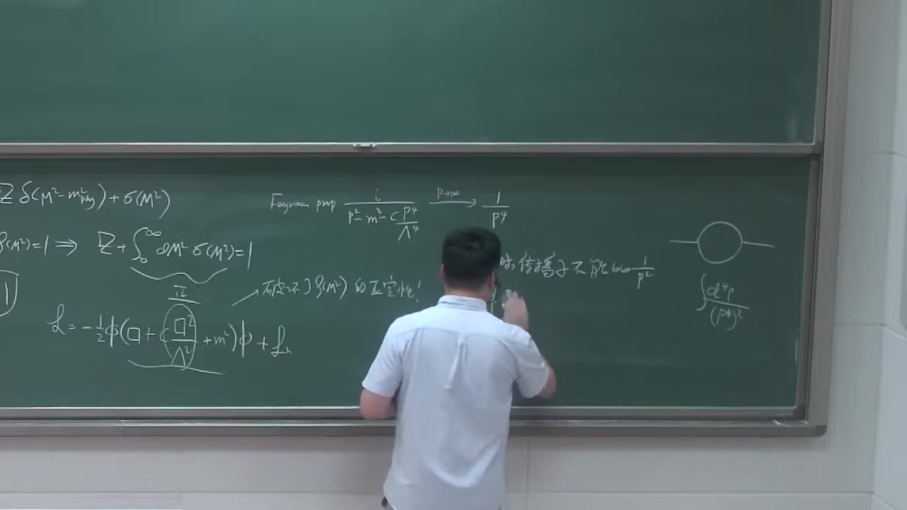

### 注解

基于当前字幕片段（涉及**波函数重整化常数 $Z$ 的物理约束**、**高阶导数理论的幺正性危机**及**微扰论中完整传播子的引入**）及截图，以下是深度注解：

---

### 1. 截图内容描述

**左黑板（谱分解与约束）**：
- 上方明确写出谱密度的**极点-连续谱分解**：
  $$\rho(M^2) = Z\delta(M^2 - m_{\text{phys}}^2) + \sigma(M^2)$$
  其中 $Z$ 为单粒子极点留数，$\sigma(M^2)$ 为多粒子连续谱。
- 下方给出**求和规则（Sum Rule）**：
  $$Z + \int_0^\infty dM^2 \, \sigma(M^2) = 1$$
  教师用波浪线强调了积分项，并标注文字说明该约束**限制了 $Z$ 的取值范围**。

**中间黑板（高阶导数理论的病理）**：
- 写出含高阶导数修正的传播子紫外行为：
  $$\frac{i}{p^2 - m^2 - \frac{p^4}{\Lambda^2}} \xrightarrow{p\to\infty} \frac{1}{p^4}$$
  表明在引入 $\Box^2/\Lambda^2$ 项后，传播子在紫外（$p\to\infty$）衰减更快（比标准 $1/p^2$ 更快）。
- 关键结论用中文标注：**"破坏了 $\rho(M^2)$ 的正定性"**（破坏了谱密度的正定性）。
- 右侧画有**单圈自能图**示意（一个圆连接两条外线），并标注积分 $\int \frac{d^4p}{(p^2)^2}$，暗示 UV 收敛性的改善。

**左黑板下方（拉格朗日量）**：
- 写出高阶导数理论的拉格朗日量密度：
  $$\mathcal{L} = -\frac{1}{2}\phi\left(\Box + \frac{\Box^2}{\Lambda^2} + m^2\right)\phi + \mathcal{L}_{\text{int}}$$
  其中方框圈出了高阶导数项 $\frac{\Box^2}{\Lambda^2}$，箭头指向"破坏正定性"的注释。

---

### 2. 公式详解与符号说明

#### (1) 波函数重整化常数的约束 $0 \leq Z \leq 1$

由场算符的**等时对易关系**（如 $[\phi(\mathbf{x},t), \dot{\phi}(\mathbf{y},t)] = i\delta^3(\mathbf{x}-\mathbf{y})$）可导出谱密度的**归一化条件**：
$$\int_0^\infty dM^2 \, \rho(M^2) = 1$$

将谱分解 $\rho(M^2) = Z\delta(M^2 - m_{\text{phys}}^2) + \sigma(M^2)$ 代入，得到：
$$Z + \int_0^\infty dM^2 \, \sigma(M^2) = 1$$

**物理推论**：
- **正定性要求**：由于 $\sigma(M^2) \geq 0$（连续谱来自物理多粒子态的贡献，概率必须为正），且积分项非负，**必然有 $0 \leq Z \leq 1$**。
- **自由场 vs 相互作用场**：
  - **自由场**：无相互作用，无法产生虚粒子对，连续谱为空（$\sigma(M^2) = 0$），故 $Z = 1$。
  - **相互作用场**：粒子被"虚粒子云"包围，单粒子态的概率被多粒子态"稀释"，故 $Z < 1$。$Z$ 越小，代表相互作用越强。

#### (2) 高阶导数理论的传播子

截图中的传播子对应于拉格朗日量 $\mathcal{L} \supset -\frac{1}{2}\phi(\Box + \frac{\Box^2}{\Lambda^2} + m^2)\phi$ 的自由部分。其动量空间传播子为：
$$D(p) = \frac{i}{p^2 - m^2 - \frac{(p^2)^2}{\Lambda^2}} \quad (\text{符号约定依截图片段})$$

**UV 行为**：当 $p^2 \gg \Lambda^2$ 时，$D(p) \sim \frac{i\Lambda^2}{(p^2)^2} \propto \frac{1}{p^4}$，比标准 Klein-Gordon 传播子的 $1/p^2$ 衰减**更快**。

**表面好处**：在圈图积分（如 $\int \frac{d^4p}{(p^2)^2}$）中，紫外发散被抑制（积分更收敛），似乎解决了 UV 发散问题。

#### (3) 谱密度正定性的破坏

通过 Källén-Lehmann 谱表示，传播子的解析性与谱密度直接相关：
$$D(p^2) = \int_0^\infty dM^2 \frac{\rho(M^2)}{p^2 - M^2 + i\epsilon}$$

若 $D(p^2)$ 在紫外衰减快于 $1/p^2$（如 $1/p^4$），则通过**逆变换**可知，$\rho(M^2)$ 必须包含**负值区域**（或负权重的极点）。这直接**违背了 $\rho(M^2) \geq 0$ 的物理要求**。

---

### 3. 理论背景：Ostrogradsky 不稳定性与 Ghost

高阶导数理论（Higher Derivative Theories）的病理本质：

1. **哈密顿量不正定**：根据 Ostrogradsky 定理，含高阶时间导数的拉格朗日量会导致哈密顿量**无下界**（能量可以无限负），系统不存在稳定的基态。
2. **谱表示中的负范数态（Ghost）**：在量子场论中，$\rho(M^2) < 0$ 对应于**负范数态**（Negative Norm States）或**鬼场**（Ghost）。这些态会导致：
   - 概率不守恒（$Z$ 因子可能大于1或出现负值，破坏 $Z \leq 1$ 的约束）。
   - 幺正性（Unitarity）破坏：S 矩阵非幺正，理论无法给出自洽的物理预言。

**结论**：传播子不能比 $1/p^2$ 衰减更快，这是**局域性**、**幺正性**与**谱密度正定性**对 QFT 的深刻约束。UV 发散必须通过其他方式（如正规化、重整化）处理，而非简单引入高阶导数。

---

### 4. 通俗解释

**Z 因子的物理**：想象一个电子在空间中传播。在自由理论中，它就是"纯粹的"电子，所以 $Z=1$。但在真实世界中，电子周围不断产生虚光子-电子对（"虚粒子云"）。当你探测这个电子时，有一定概率"看到"的是电子+虚光子的混合态。因此，"纯粹"电子成分被稀释了，$Z < 1$。$Z$ 就像是"纯粹单粒子身份"的剩余百分比。

**高阶导数的陷阱**：高阶导数项就像给粒子穿了一件"隐形斗篷"，让它在高能（短距离）时"消失"得更快（传播子 $1/p^4$ 衰减），从而避免圈图积分的发散。但这付出了惨痛代价——它创造了一些"负概率"的幽灵粒子（Ghost）。这些粒子会让总概率不等于100%，甚至让能量可以无限降低，世界将变得不稳定。因此，自然界似乎"选择"了让传播子只按 $1/p^2$ 衰减，忍受 UV 发散，通过重整化来治愈理论，而非引入幽灵。

**完整传播子**：在微扰论中，我们不再只用自由传播子（一条直线），而是把直线"升级"为包含所有可能的"泡泡"（自能修正）的**完整传播子**（截图右侧的圈图）。这代表了粒子在传播过程中不断"自我相互作用"的量子效应。

---

## 段落 9

**时间：** 00:13:30 ~ 00:18:33

<details><summary>📝 原始字幕</summary>

或者这
Exact 是吧叫严格精确的一个
它代表什么呢我们很容易
去把它
去画一画比如说对于费斯理论来说我已经知道
我动量空间所以说我动量符号是P比如说从那流入
从而流出这自由理论
然后呢如果对咱们的Face理论的话
你可以画这样个图是吧
然后呢
咱们一节就一个图
蓝马的乒乓球呢
玉花这种土
加这种图
然后呢两个再加上
这种图
我把考虑了那费斯龙把所有的图
说巧合这显然是个不可能任务是吧
让我们来考察一下
它没什么结构
我们
可以去
把这个是
形像来说可以把它
写得简单一点可以把它求和起来是吧这个动量流入是屁
这流出也是屁
OK
好那我们引述一个非常重要的一个
有一个概念的叫
单例子不可约图
三粒子
不可约
说啊
这个英文叫WANPI
什么意思呢就说
班
派对
三粒子
e reducible
reducable的英文就是可以约的
加一个这个词
词根呢二二代表是否定的意思不可变什么意思呢那我们考虑一个
所谓的这样一个
这样一个图我们分一下类哈就是说
我们一般管他叫
One P I
什么意思呢就是说
我们可以举个例子我们管它叫富的I
Sigma P平方OK
这个嘛是一个Python的一个函数
比如说是这个
外推的这样一个不变质量我们说了这个人形树
我们的腹列变化我们可以控制它的这个皮的大小一般我们把它选择OFFSHEELOFFSHEEL的意思就是说
我们一般选择
P方不等于M方
OK
希望等于M方
好什么单位都不可约途呢
我们可以画这种图
O K
就是说你砍掉任何一个内线呢
这个图不能砍成两半
所以他是玩PI
好我们考虑这样一个Sigma里面呢
它不含有这两个外腿
它就是WINPIA纸中间这一部分OK所以WINPIA真正读分盘规则你读这个圈就可以了OK比如说
这是屁是吧
这个东西呢你发现它是负的RAM的
临近的福特二蓝的这个多重因子是二分之一
这个拳击分呢是k
就是它第四K
属于二派的四次方
I-T3K方
加M零
现在我管那拉湿料
我现在为了防止混淆
我说兰玛法斯理论呢我说拉式量呢
这质量参数呢我叫m0
我刚才也说了
我从LC我从这样一个
辅函数的表示里面这个m呢
是是物理的一个
漂浪粒子Spin六粒子它并不一定非得等于这个
拉石量里面的这样一个
M是吧我现在用M零
然后呢这是我的理论
根据我的这个该脉络公式的话
我可以算到原则上可以算到这种意见唯论是吧
所以呢这个东西呢你发现它这个圈地分的其实都跟屁没关系是吧
这个东西就是我的股管那叫FODIA
谁干嘛屁
OK你要变成一个传播者的话你再借两条腿
你看来
两边再接两个这个传播子OK
好再举个例子
这个土呢
你看到任何一个
出了两个
现在内线的话
它没有这图没有断开
你看这个线也没断开所以这都是玩屁案包括这个图
伤势大过
但什么是不是玩屁呢你发现
这个图儿
就不是玩屁案
原因很简单
我完说了
你砍掉除了这两根标颜色的线里面任何线它都不能断开
你砍这边线没事但是你砍这边线没事但是你砍中间那个线呢
这个图分成两截了所以它
不是
One PI代管OK
所以说呢
这东西呢一般我们也叫所谓的
智能
智能图或智能修正智能贡献OK三FNG
OK
所以原来上边这个WANPI我相信大家很快能掌握

</details>

**课程截图：**

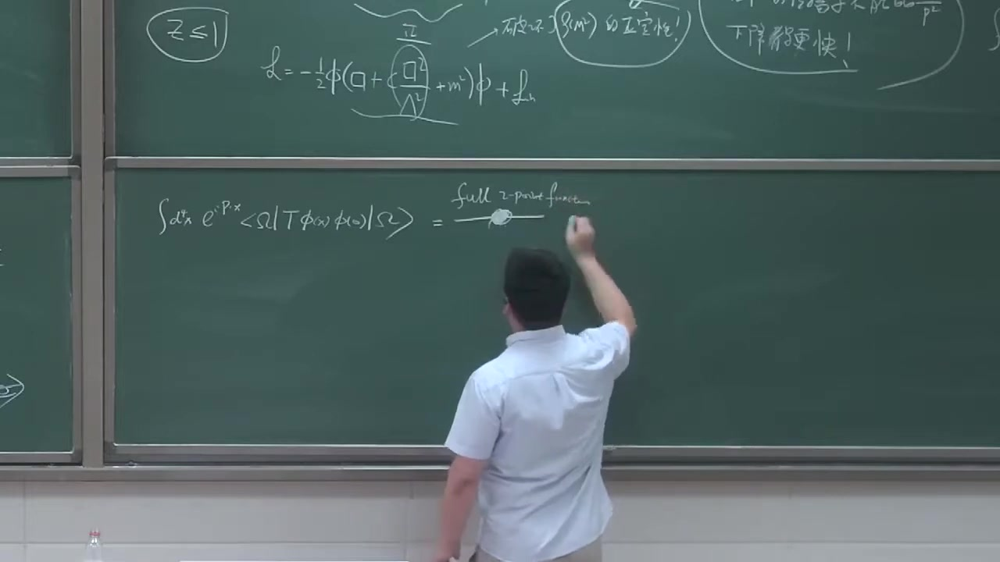


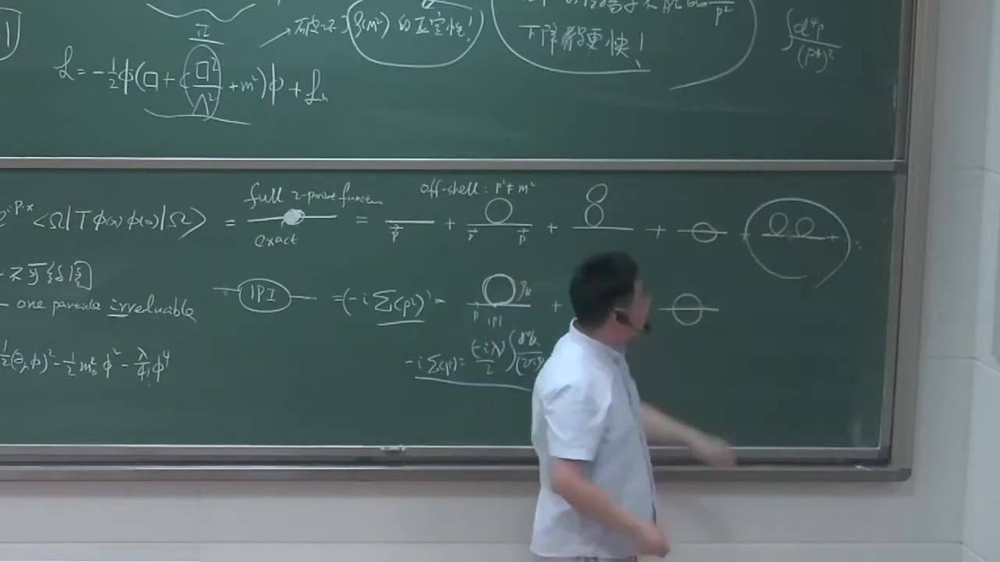

### 注解

基于当前字幕片段（涉及**单粒子不可约图（1PI）**、**自能（Self-energy）**、**完整传播子的微扰展开**及**裸质量与物理质量的区分**）及截图，以下是深度注解：

---

### 1. 截图内容描述

**第一张截图（左黑板）：**
- 上方可见 $Z \leq 1$ 的约束（前文已述）及高阶导数拉氏量 $\mathcal{L} = -\frac{1}{2}\phi(\Box + \frac{\Box^2}{\Lambda^2} + m^2)\phi + \mathcal{L}_{\text{int}}$。
- **下方新内容**：写出**完整两点函数（Full 2-point function）**的傅里叶表示：
  $$\int d^4x \, e^{ip\cdot x} \langle \Omega | T\phi(x)\phi(0) | \Omega \rangle = \text{（图示：双外腿带阴影圈的图）}$$
  标注为 "Exact"（精确/严格），代表非微扰的完整传播子。

**第二张截图（中黑板）：**
- 展示完整传播子的**费曼图展开（Dyson 级数）**：
  $$\text{Full} = \frac{i}{p} + \frac{i}{p} \bigcirc \frac{i}{p} + \frac{i}{p} \text{（8字图）} + \text{（单圈图）} + \text{（双圈图）} + \dots$$
  其中 $\frac{i}{p}$ 代表自由传播子（简记），后续各项为单圈、双圈等高阶修正。
- 标注 "off-shell: $p^2 \neq m^2$"，强调讨论的是离壳（非物理壳层）动量。
- 下方引入 **1PI（One-Particle Irreducible，单粒子不可约）** 概念，图示为带阴影的圈图，标注 "$-i\Sigma(p^2)$"。

**第三张截图（右黑板）：**
- 明确写出 **1PI 自能（Self-energy）** 的数学定义：
  $$-i\Sigma(p^2) = \left(\frac{-i\lambda}{2}\right) \int \frac{d^4k}{(2\pi)^4} \frac{i}{k^2 - m_0^2} + \dots$$
  这是 $\phi^4$ 理论中单圈自能（蝌蚪图）的显式表达式。
- 左下角写出 $\phi^4$ 理论的拉氏量密度：
  $$\mathcal{L} = \frac{1}{2}(\partial_\mu\phi)^2 - \frac{1}{2}m_0^2\phi^2 - \frac{\lambda}{4!}\phi^4$$
  明确区分裸质量参数 $m_0$ 与后文提及的物理质量 $m$。

---

### 2. 公式识别与符号解释

#### （1）完整两点函数（Full Propagator）
$$\tilde{G}^{(2)}(p) = \int d^4x \, e^{ip\cdot x} \langle \Omega | T\phi(x)\phi(0) | \Omega \rangle$$

| 符号 | 含义 |
|------|------|
| $\tilde{G}^{(2)}(p)$ | 动量空间的两点关联函数（传播子） |
| $|\Omega\rangle$ | 相互作用理论的真空态（非微扰基态）|
| $T$ | 时序排序算符（Time-ordering）|
| $\phi(x)$ | 海森堡绘景中的标量场算符 |

#### （2）戴森级数展开（几何级数形式）
在微扰论中，完整传播子可展开为：
$$\tilde{G}^{(2)}(p) = \frac{i}{p^2 - m_0^2} + \frac{i}{p^2 - m_0^2} [-i\Sigma(p^2)] \frac{i}{p^2 - m_0^2} + \dots$$

| 符号 | 含义 |
|------|------|
| $p^2$ | 四维动量平方 $p_\mu p^\mu = E^2 - \vec{p}^2$ |
| $m_0$ | **裸质量（Bare mass）**：拉氏量中写入的裸参数，非物理观测值 |
| $\Sigma(p^2)$ | **自能函数（Self-energy）**：所有 1PI 图贡献的总和，代表相互作用对粒子传播的"能量修正" |

#### （3）单圈自能积分（$\phi^4$ 理论）
$$-i\Sigma(p^2) \supset \frac{(-i\lambda)}{2} \int \frac{d^4k}{(2\pi)^4} \frac{i}{k^2 - m_0^2 + i\epsilon}$$

| 符号 | 含义 |
|------|------|
| $\lambda$ | $\phi^4$ 相互作用的耦合常数（字幕中"蓝马"）|
| $\frac{1}{2}$ | 对称因子（Symmetry factor），来自费曼图的对称性 |
| $\int \frac{d^4k}{(2\pi)^4}$ | 四维动量空间积分（测度）|
| $\frac{i}{k^2 - m_0^2}$ | 内线的自由传播子（动量为 $k$）|
| $i\epsilon$ | 费曼边界条件（保证因果性，通常省略不写但隐含）|

---

### 3. 核心概念通俗解释

#### （1）单粒子不可约图（1PI, One-Particle Irreducible）
**定义**：若一个费曼图**切断任意一根内线**（internal line）后，**不会**分裂成两个互不连通的部分，则称该图为 1PI。

**类比**：想象一张渔网：
- **1PI 图**：像是一个打结的网兜，剪断任何一根网线，网兜仍然连着，不会散成两块。
- **非 1PI 图（可约图）**：像是两张网用一根细线拴在一起，剪断那根细线，网就分成两块了。

**物理意义**：1PI 图是"最基本的"相互作用单元，不能通过简单的传播子乘积分解。所有非 1PI 图都可以看作是由 1PI 图通过自由传播子连接而成的。

#### （2）自能（Self-energy）$\Sigma(p^2)$
**通俗理解**：粒子在真空中传播时，会不断"吐出"又"吞回"虚粒子（自能泡泡），或者与真空涨落相互作用。这相当于给粒子穿上了一件"能量外套"。

- **裸传播子**：$\frac{i}{p^2 - m_0^2}$（自由粒子，质量为 $m_0$）
- **修正后传播子**：$\frac{i}{p^2 - m_0^2 - \Sigma(p^2)}$

$\Sigma(p^2)$ 就像是粒子在传播过程中额外携带的"势能"。当 $p^2 = m^2$（物理质量壳）时，$\Sigma(m^2)$ 贡献了质量修正：$m^2 = m_0^2 + \Sigma(m^2)$。

#### （3）Off-shell（离壳）vs On-shell（在壳）
- **On-shell**：$p^2 = m^2$，粒子满足相对论能量-动量关系 $E^2 = \vec{p}^2 + m^2$，对应真实可观测的粒子态。
- **Off-shell**：$p^2 \neq m^2$，发生在虚粒子（内线）或外部动量未满足壳层条件时。研究 $\Sigma(p^2)$ 作为 $p^2$ 的函数（而非仅在 $p^2=m^2$ 处）对于理解传播子的解析结构（如极点、割线）至关重要。

#### （4）裸质量 $m_0$ 与物理质量 $m$
- **$m_0$**：写在拉氏量里的"裸"参数，是理论的高能（紫外）边界条件，无法直接测量。
- **$m$**：通过观测确定的物理质量，对应于完整传播子 $\tilde{G}^{(2)}(p)$ 在复 $p^2$ 平面上的**极点**位置。
  
关系式：
$$m^2 = m_0^2 + \text{Re}\,\Sigma(m^2)$$
（在壳重整化条件）

---

### 4. 理论背景补充

#### 戴森方程（Dyson Equation）
所有 1PI 图求和 $\Sigma(p^2)$ 与完整传播子 $G(p)$ 满足代数关系：
$$G(p) = G_0(p) + G_0(p) [-i\Sigma(p^2)] G(p)$$

其中 $G_0(p) = \frac{i}{p^2 - m_0^2}$ 为自由传播子。解此方程得**几何级数求和**结果：
$$G(p) = \frac{i}{p^2 - m_0^2 - \Sigma(p^2)}$$

这正是字幕中"求和起来"（resummation）的数学本质——将无限多个蝌蚪图、圈图等 1PI 插入求和，得到分母修正的传播子。

#### 质量重整化（Mass Renormalization）
通过要求 $G(p)$ 在 $p^2 = m^2$ 处有留数为 $i$ 的极点（即 $Z=1$ 的归一化条件，或 $Z \leq 1$ 的一般情况），可以建立 $m_0$ 与 $m$ 的关系，并处理自能中的紫外发散（通过抵消项或正规化）。这是后续讨论**波函数重整化常数 $Z$** 与 **谱密度正定性** $Z \leq 1$ 的基础。

---

## 段落 10

**时间：** 00:18:33 ~ 00:18:58

<details><summary>📝 原始字幕</summary>

比如这个图是完毕完毕完毕不是完毕是吧你可以画一个比较复杂的图
比如说啊
你还可以
你可以画的这种图
这个图贤也不是一般比较一样的原因这可以砍断
所以一次的推呢
这样的图也不是WANPI是吧WANPI必须是
长了这个样子的这种图OK

</details>

**课程截图：**


### 注解

基于当前字幕片段（涉及**单粒子不可约图（1PI）的图论定义**与**可约图的区分**）及截图，以下是深度注解：

---

### 1. 截图内容描述

**第二张截图（右下角新增内容）：**
- 教师在黑板右下角新画了一个**双泡泡图**（两个圆圈中间由一条直线连接）。
- 该图示意：左右各为一个自能插入（单圈或多圈图），中间由一条单粒子传播子线连接。
- 教师正用手指向该图，说明这是**"可以砍断"**的图（即可约图），与1PI图的定义形成对比。

---

### 2. 核心概念：1PI（单粒子不可约）的图论定义

#### 符号与术语澄清
- **字幕中的"WANPI"**：为"**1PI**"（One-Particle Irreducible）的语音识别误差。
- **"一次的推"**：同为"**1PI**"的音译/口误。
- **"可以砍断"**：指通过切断**一条**内线（单粒子传播子）即可将图分离为两个不连通部分的性质。

#### 1PI的严格定义
一个费曼图被称为**单粒子不可约（1PI）**，如果**无法**通过切断**任意一条**单粒子线（传播子）将其分成两个不连通的部分。

反之，若存在至少一条单粒子线，切断后图分裂为两部分，则称为**单粒子可约（1PR）**或**可约图**。

---

### 3. 理论背景：为何1PI如此重要

在量子场论的微扰展开中，**自能（Self-energy）** $\Sigma(p^2)$ 被定义为**所有1PI图的和**，而非所有图的和。原因如下：

**几何级数求和（Dyson方程）：**
完整传播子 $D_F(p^2)$ 可通过裸传播子 $D_0(p^2)$ 和自能 $\Sigma(p^2)$ 表示为：
$$D_F(p^2) = D_0(p^2) + D_0(p^2)[-i\Sigma(p^2)]D_0(p^2) + \cdots = \frac{i}{p^2 - m_0^2 - \Sigma(p^2) + i\epsilon}$$

- **可约图（如图中的双泡泡图）**：已被包含在上述几何级数中（作为两个1PI自能插入的乘积）。
- **1PI图**：是构建Dyson系列的"原子单元"，不可再分解为更简单的连通图之积。

---

### 4. 通俗解释："砍断"测试

想象费曼图是一个由橡皮筋（传播子）和节点（顶点）构成的网络：

- **1PI图（如截图中的"8"字形单圈图）**：像是一个**牢固的环**或**八字结**。你无论剪断哪一根橡皮筋，整个结构仍然保持连通（或者剪断后不再是合法的费曼图）。它"长得结实"，无法被一刀两断。

- **可约图（如截图右下角的双泡泡图）**：像两个**独立的泡泡中间只连了一根细线**。只要剪断中间这根线（"砍断"），两个泡泡就彻底分离。这种图**不是**1PI。

**教师意图**：通过展示"可以砍断"的双泡泡图，说明它**不是**1PI图，因此不应被计入自能 $\Sigma$ 的定义中，而应被归入完整传播子的几何级数展开里。

---

### 5. 总结要点

| 特征 | 1PI图（不可约） | 可约图（1PR） |
|------|----------------|--------------|
| **结构** | 无单粒子桥 | 存在单粒子桥（可砍断） |
| **例子** | 单圈蝌蚪图、单圈泡泡图 | 双泡泡中间一线连 |
| **物理角色** | 构成自能 $\Sigma$ 的基本单元 | 由Dyson级数自动包含 |
| **紫外发散** | 决定重整化常数 | 不独立贡献发散 |

---

## 段落 11

**时间：** 00:19:01 ~ 00:24:02

<details><summary>📝 原始字幕</summary>

好
那我们要干什么事情呢我们现在要给出一个
智能图
One Piece智能图
和这个完整的严格的这个这样一个两点光量函数
或者两点的这样一个
完整的传播词的一个关系OK
我们怎么做呢
我们现在形状我们现在定了弯皮案我们发现可以这样写
我可以给出一个迭代的
一个解它等于
第一想的是自由理的那种传播子
然后第二下呢
这个WINPIWINPI理解呢就是刚才我讲的
就是玩PI是吧就无穷多个玩PI图
然后右边呢
你再接上一个
完整的传播词
我看
你理解一下这显然是一个严格成立的一个
一个等式是吧你可以用迭代来进行验证把这个完整传帽子化成这个传帽子化成另外一个弯皮然后一次再推所以你发现你得到了一个什么呢
你得到一个极数展开OK
第一节是自由理论的传播者动量空间
第二节呢是个外退
看看MOS加个VIPR的智能图
再加一个自由传墨子
然后技术上他下一项是一个VIPI
自由长布子再加一个碗皮
这家子只有成字子
这个链条呢是无穷无尽有点像我们的这样一个DISSONSERRY不过我们DISSONSERRY是证明的
最后把它植入化成一个指数函数把它植入化成一个
在这里面更简单一点大家很容易看出来下一节不用我说
玩MPI
玩PI
三个万PI加
加点点点是吧
OK
所以刚才我说了不是弯P刚才那个图呢
已经自动地被包含在这样一个
被自动包含在这样一个贡献里面去所以你会验证呢
这样一个技术展开你没有丢失任何信息
你形赏得到的一个完整的精确的一个两点关联函数的一个
表达式OK
动量呢是P
OK
所以形式上来说你可以怎么写
你发现我都可以这样写
我要集数呢我可以写
第一项是走船摩子
P 方加 M 零平方
咋样了
OK 我们每个同学都非常熟悉自由传播子
那第二项呢
有一个弯片的一个智能图
所以说呢我可以写成
加上唉
减M零平方我再强调一下这个M零的事
穿在我的这个拉式量里面的
一个一个参数是吧我们只有在自由场论里面
我们才得到很多直觉或者对那个粒子的物理质量但是自由理论来说呢
直接是时间不能观测的因为它跟什么东西都不相互作用
OK
所以真正描述客观世界的这个理论呢
是相互作用理论是
OK
所以说我们需要接受这些事实M零呢我只知道它是一个参数
它对应我物理的质量我不知道
好那第二下面的根据我参赛的话我现在不会算上东西但是没关系
它一般这个圈图可以从
三圈到双圈到三圈到无数多圈儿
O K
得求和啊
好我们先看这个图
传播子我想董亮
动量是P这个圈动量呢它是有两个外流入所以它一般是P方的函数
然后又接一个
又接一个传播子自由理论传播子
OK
好然后呢形上可以写下这一项
加上RHP零了
方减M零方
差一点
加上
唉
西方
加m0方加rx呢
富的爱是这个嘛批方
唉
七方加M零方
反正
然后再成一个
只能贡献
常默子
同学们现在看看这是什么东西
其实这就是它这个东西构成了一个GEOMETICS
它形成了一个几何级数
对于几何集数我们都知道怎么做是吧
其实几何几数
从我这个等式
刚才我写的等于差要等于是各种看出来它等于
自由传播者加强自由传播者班P
再加上一个完整的插墨子
OK
可以把它解这个方程
你可以把它得到它等于什么呢
它不等于别的它又等于
所以

</details>

**课程截图：**


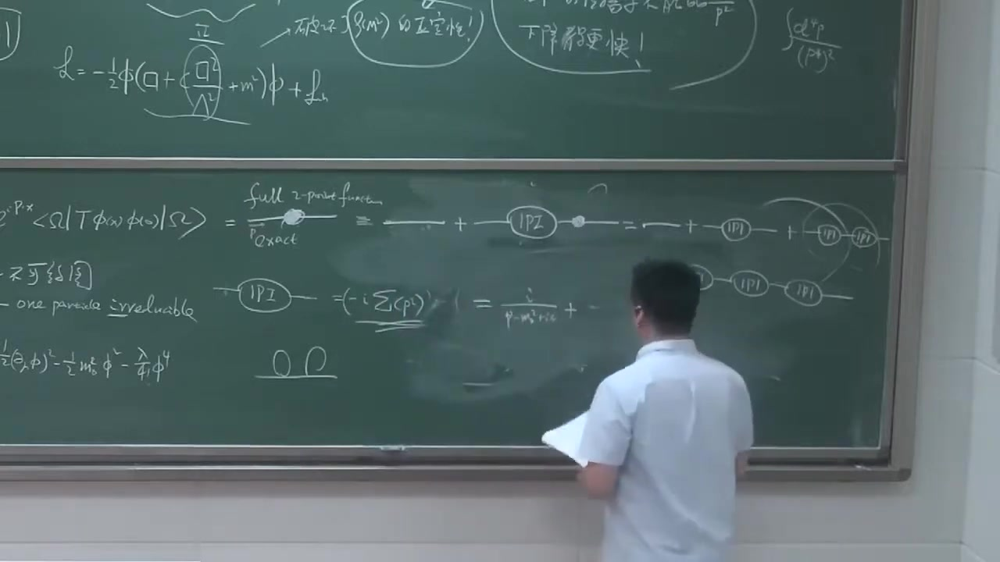


### 注解

基于当前字幕片段（涉及**Dyson方程的级数推导**、**几何级数求和**、**自能（Self-energy）**与**裸质量/物理质量的区分**）及截图，以下是深度注解：

---

### 1. 截图内容描述

**第一张截图（左黑板中上部）：**
- 教师正在书写**完整两点函数（Full 2-point function）**的费曼图展开式。
- 从左至右的图序列：
  - 第一条线：自由传播子（直线）
  - 第二条线：中间插入一个标有"1PI"的泡泡图
  - 第三条线：插入两个"1PI"泡泡图，中间由自由传播子线连接
  - 后续以此类推，形成无穷级数
- 左侧标注了"exact"（严格解），表明这是完整传播子的微扰展开。

**第二张截图（左黑板中部）：**
- 明确写出**1PI图的解析表达式**：
  $$\text{1PI} = (-i\Sigma(p^2))$$
  其中 $\Sigma(p^2)$ 即为**自能（Self-energy）**。
- 下方开始写出级数的前几项代数表达式：
  $$\frac{i}{p^2-m_0^2+i\epsilon} + \frac{i}{p^2-m_0^2+i\epsilon}(-i\Sigma(p^2))\frac{i}{p^2-m_0^2+i\epsilon} + \cdots$$

**第三张截图（左黑板中下部）：**
- 教师正在书写**几何级数（Geometric Series）**的求和过程。
- 可见中文标注"几何级数"，并写出包含多个 $(-i\Sigma)$ 因子的高阶项。
- 右侧继续画出三阶、四阶的费曼图（多个1PI图由自由传播子线串联）。

---

### 2. 核心公式详解

#### 公式1：完整传播子的级数展开（Dyson级数）
$$G(p) = G_0(p) + G_0(p)\bigl(-i\Sigma(p)\bigr)G_0(p) + G_0(p)\bigl(-i\Sigma(p)\bigr)G_0(p)\bigl(-i\Sigma(p)\bigr)G_0(p) + \cdots$$

- **$G(p)$**：完整传播子（Full Propagator），即相互作用理论中的两点关联函数 $\langle \Omega | T\phi(x)\phi(0) | \Omega \rangle$ 的傅里叶变换。
- **$G_0(p) = \dfrac{i}{p^2 - m_0^2 + i\epsilon}$**：自由传播子（Free Propagator），对应字幕中的"自由理的那种传播子"。
- **$-i\Sigma(p)$**：所有1PI图（单粒子不可约图）的和，$\Sigma(p)$ 称为**自能（Self-energy）**。

#### 公式2：Dyson方程（迭代形式）
$$G(p) = G_0(p) + G_0(p)\bigl(-i\Sigma(p)\bigr)G(p)$$

- 这是字幕中提到的"迭代解"的数学表达：完整传播子等于自由传播子加上"自由传播子→自能插入→完整传播子"的迭代过程。
- 该方程可通过将右侧的 $G(p)$ 反复代入自身来验证，即得到上述的无穷级数。

#### 公式3：几何级数求和结果（ dressed propagator ）
$$G(p) = \frac{G_0(p)}{1 - (-i\Sigma(p))G_0(p)} = \frac{i}{p^2 - m_0^2 - \Sigma(p) + i\epsilon}$$

- 这是字幕中"植入化成一个指数函数"（实际应为"求和成一个分式"）所指的结果。
- 分母中 $m_0^2$ 变为 $m_0^2 + \Sigma(p)$，表明相互作用对粒子质量的修正。

---

### 3. 理论背景补充

#### (1) 1PI图（单粒子不可约图）的精确定义
- **定义**：无法通过切断**一条**内部传播子线而将图分成两个不相连部分的连通图。
- **物理意义**：1PI图代表了粒子在传播过程中"真正"的相互作用修正，不包含简单的自由传播子串联。在字幕中，"WANPI/弯皮"即指此类图。

#### (2) 自能（Self-energy）$\Sigma(p)$ 的物理诠释
- **质量修正**：自能 $\Sigma(p)$ 代表了粒子与真空涨落（虚粒子对）相互作用产生的能量修正。
- **动量依赖**：$\Sigma(p)$ 通常是 $p^2$ 的函数，意味着修正量依赖于粒子的运动状态（非相对论近似下可展开为 $\Sigma(m^2) + (p^2-m^2)\Sigma'(m^2) + \cdots$）。

#### (3) 裸质量 vs 物理质量（字幕中强调的关键概念）
- **$m_0$（Bare Mass）**：拉氏量中写入的"裸"参数，对应字幕中的"$M_0$"。它是理论输入参数，**不可直接观测**。
- **$m_{\text{phys}}$（Physical Mass）**：实验测得的实际质量，对应完整传播子 $G(p)$ 的极点位置：
  $$p^2 - m_0^2 - \Sigma(p^2) = 0 \quad \Rightarrow \quad m_{\text{phys}}^2 = m_0^2 + \Sigma(m_{\text{phys}}^2)$$
- **重整化**：通过调整 $m_0$（抵消项）使得 $m_{\text{phys}}$ 保持为有限观测值，这就是质量重整化的核心。

#### (4) 几何级数求和的数学基础
- 级数 $1 + x + x^2 + x^3 + \cdots = \frac{1}{1-x}$（当 $|x|<1$）。
- 在传播子情形中，$x = G_0(p)(-i\Sigma(p))$，形式上求和即得到Dyson方程的解。

---

### 4. 通俗语言解释

**"快递包裹的运输网络"类比：**

想象你要寄一个包裹（粒子）从A地到B地：

- **自由传播子 $G_0$**：包裹直接由直达航班运送，没有任何中转（自由理论）。
- **1PI图（自能）$\Sigma$**：包裹在运输途中被"吸入"了一个复杂的物流枢纽（量子涨落），在枢纽内部经历了极其复杂的分拣、装卸（虚粒子过程），但最终仍从同一出口继续前往目的地。这个枢纽无法通过切断一条运输线来简化——它就是"不可约"的。
- **完整传播子 $G$**：考虑了所有可能性的总运输概率——包括直达、经过1个枢纽、经过2个枢纽、3个枢纽……（无穷级数）。
- **Dyson方程**：这是一个自洽条件——"总运输概率 = 直达概率 + 经过枢纽后再次进入总运输网络的概率"。
- **质量修正**：物流枢纽的拥堵（相互作用）相当于给包裹增加了"有效重量"。你在发货单上写的重量 $m_0$（裸质量）并不是收件人实际感受到的重量 $m_{\text{phys}}$（物理质量），差值 $\Sigma$ 就是运输过程中"积累"的额外重量。

**关键结论**：通过将无穷多个"弯PI"（1PI）图求和，我们实际上将裸粒子"打扮"（dress）成了物理粒子——这就是**dressed propagator**（着装传播子）的名称由来。

---

## 段落 12

**时间：** 00:24:04 ~ 00:26:39

<details><summary>📝 原始字幕</summary>

细方
加m0平方
剪去这个吗
批分OK
这是个严格的一个等式SIGMAP方相当于把无穷的WANPI图呢
自能同和的求和OK所以原来这种某种意义上你可以认为是一个非表的表述它也把无穷多高高的这个修正能包含到里面去了
Okey
车长好
那我们现在呢
要回到这边演讲室
我们知道
这样一个同样一个两档光函数副列变化的非特别的清晰我有一个普函数
表示是吧我知道
我知道这个一个普函数呢
我举个极限
什么极限呢
我二哈呢
粒子的这个动量动量
越来越趋近在窍
我举个极限呢
让辟方
趋近于什么呢趋近于一个物理的质量
这平方
OK换句话说我的
换句话说呢
就看这一项来说这是个奇信的这是个SINGLE POLE是吧
当
西方趋近于它的时候呢
非得只让这一项给出一个发散
OK 而这一项呢
他是个regular的他没有发散OK
这个多因为这里面得的方式这里面谱数是
是regular的所以它
他不发散所以就发现这样一个在这儿接下来
这个
非常普世的一个定理告诉你呢
这样动量空间的一个两点
关联函数或者是分散传播词呢
长得样子应该是这样的I乘Z
注意批方
捡一个物理的
这个粒子质量的平方
叫艾普斯龙
这是一个 single pool 是吧
再加上其他项就是说是finite或者regular的
是正常的有限的是吧
所以我们发现一个两点函数的一个
最起义的行为在在翘的区附近呢
是由这一项来保证的
OK这是非常强大的一个
第一性原理的要求所以说维罗论这样求和呢
我也必须满足啊
但我们看这个形式
我们要往往过去靠是吧
他怎么跟我的这个铺表室里面的这种形式
能对应呢
我说
我们啊
嗯嗯
我们来看一下这个东西这个东西非常非常重要
OK
所以说
差一点东西

</details>

**课程截图：**


### 注解

基于当前字幕片段（涉及**谱表示（Lehmann-Källén Representation）**、**物理质量极点**与**波函数重整化**）及截图，以下是深度注解：

---

### 1. 截图内容描述

**黑板整体布局（左半部分）：**
教师正在书写**两点关联函数的傅里叶变换及其谱分解**。从左至右可辨识出以下数学结构：

- **最左侧**：极限符号 $\lim_{p^2 \to m_{ph}^2}$ 与傅里叶变换积分 $\int d^4x \, e^{-ipx} \langle \Omega | T\phi(x)\phi(0) | \Omega \rangle$，表示在壳（on-shell）极限下的两点函数。

- **中间等号后**：谱表示（Spectral Representation）积分式
  $$\int_0^\infty dM^2 \, \rho(M^2) \frac{i}{p^2 - M^2 + i\epsilon}$$
  其中 $\rho(M^2)$ 为谱函数（Spectral Function）。

- **最右侧（关键分解）**：用圆圈特别标注的**单极点项**：
  $$\frac{iZ}{p^2 - m_{ph}^2 + i\epsilon}$$
  其后紧接着连续谱的贡献项 $\int_{th}^\infty dM^2 \cdots$（阈值以上积分）。

- **黑板下方**：可见 $0 \leq Z \leq 1$ 的约束条件（前文已述，此处作为谱表示的推论出现）。

---

### 2. 公式识别与符号解释

#### 公式 A：Lehmann-Källén 谱表示
$$G(p^2) \equiv \int d^4x \, e^{-ipx} \langle \Omega | T\phi(x)\phi(0) | \Omega \rangle = \int_0^\infty dM^2 \, \frac{i\rho(M^2)}{p^2 - M^2 + i\epsilon}$$

- **$\rho(M^2)$（谱函数）**：由幺正性（Unitarity）决定的正定的权重函数，满足 $\rho(M^2) \geq 0$。它包含了理论中所有可能产生该量子数的物理态（单粒子态+多粒子连续态）的信息。
- **$M^2$**：中间态的不变质量平方（物理质量谱）。
- **$i\epsilon$**：费曼传播子的因果性 prescription（$\epsilon \to 0^+$），确保时间排序的正确因果结构。

#### 公式 B：极点分解（On-shell 极限行为）
当 $p^2 \to m_{ph}^2$（物理单粒子质量壳）时：
$$G(p^2) = \frac{iZ}{p^2 - m_{ph}^2 + i\epsilon} + \text{regular (finite) terms}$$

- **$m_{ph}$（物理质量）**：对应真实可观测粒子的质量，由两点函数的极点位置 $p^2 = m_{ph}^2$ 定义。
- **$Z$（波函数重整化常数/谱强度）**：$0 \leq Z \leq 1$，表示单粒子态在相互作用场 $\phi$ 中的"重叠"概率幅平方。它量化了相互作用场与自由场渐近态之间的差异。
- **Regular terms**：当 $p^2 = m_{ph}^2$ 时保持有限的部分，通常来自多粒子连续谱（$M^2 \geq (2m)^2$ 等阈值以上）的贡献。

---

### 3. 理论背景补充

#### 谱表示的物理起源
谱表示是**量子场论第一性原理**（幺正性、谱条件、洛伦兹不变性）的直接结果，不依赖于微扰论：
1. **完备性插入**：在两场算符之间插入物理态完备集 $1 = \sum_n |n\rangle \langle n|$。
2. **单粒子 vs 多粒子**：谱函数 $\rho(M^2)$ 通常包含一个 $\delta$ 函数峰（对应孤立单粒子态）和一个连续支（对应多粒子散射态）：
   $$\rho(M^2) = Z \delta(M^2 - m_{ph}^2) + \sigma(M^2)\theta(M^2 - M_{th}^2)$$
   其中 $M_{th}$ 为多粒子产生阈值（如 $2m_{ph}$）。

#### 极点结构的必然性
字幕中强调的"**非常普世的定理**"指：**任何相对论性量子场论的两点关联函数，在单粒子质量壳附近必然呈现单极点行为**。这是 LSZ 约化公式（将 S-矩阵元与格林函数极点关联）的数学基础。

#### 与 Dyson 求和的联系
前文讨论的 Dyson 方程（自能求和）给出：
$$G(p^2) = \frac{i}{p^2 - m_0^2 - \Sigma(p^2) + i\epsilon}$$
当 $p^2 \to m_{ph}^2$ 时，分母为零（极点条件），即 $m_{ph}^2 - m_0^2 - \Sigma(m_{ph}^2) = 0$，这定义了物理质量 $m_{ph}$。将分母在极点附近展开：
$$p^2 - m_0^2 - \Sigma(p^2) \approx (p^2 - m_{ph}^2)\left(1 - \frac{d\Sigma}{dp^2}\bigg|_{p^2=m_{ph}^2}\right) = \frac{p^2 - m_{ph}^2}{Z}$$
由此得到 $Z = \left(1 - \frac{d\Sigma}{dp^2}\bigg|_{m_{ph}^2}\right)^{-1}$，与谱表示中的 $Z$ 一致。

---

### 4. 核心概念通俗解释

#### "裸质量"与"物理质量"的区分
- **裸质量 $m_0$**：拉氏量中写入的"裸"参数，只是理论构建的脚手架，无直接物理意义。
- **物理质量 $m_{ph}$**：实验中测得的粒子质量，对应传播子极点位置。相互作用（自能 $\Sigma$）"修正"了裸质量：$m_{ph}^2 = m_0^2 + \Sigma(m_{ph}^2)$。

#### 为什么 $Z \leq 1$？
$Z$ 可理解为"相互作用场 $\phi$ 产生单粒子态的概率"。由于相互作用场还可以产生多粒子态（连续谱），概率守恒要求单粒子份额 $Z$ 必须小于 1。若 $Z=1$，则表示无相互作用（自由场）。

#### "Single Pole"（单极点）的物理意义
当动量 $p$ 满足质壳条件 $p^2 = m_{ph}^2$ 时，粒子在时空中传播无限远（稳定粒子），导致传播子发散（极点）。这与不稳定粒子的**复极点**（Breit-Wigner 型，位于复能量平面）或**分支割线**（多粒子散射）形成对比。单极点的存在保证了粒子作为渐近态的良定义性。

---

## 段落 13

**时间：** 00:26:50 ~ 00:27:38

<details><summary>📝 原始字幕</summary>

所以我要求什么呢要求我的批评方
如果调节调节让它不断地去进行真实的一个单粒子的一个物理质量平方的时候我期待呢
它等于
它等于
这这两项等于一个
物理的一个例子质量是吧
所以我的
我必须要求秘方
甲M0平方
剪去
Sigma P平方
当辟方
等于m
物理的质量平方的时候呢
这个分母为零
为了更得普表式的这样一个
要求满足是吧它必须也是个
也是个SinglePole是吧
OK

</details>

### 注解

基于当前字幕片段（涉及**物理质量的极点定义**、**自能的质量壳条件**与**单极点要求**），以下是深度注解：

---

### 1. 公式识别与符号解释

字幕中描述的**质量壳条件（On-shell Condition）**与**全传播子极点方程**可规范表述为：

#### 核心方程
$$m_{\text{phys}}^2 = m_0^2 + \Sigma(p^2)\Big|_{p^2 = m_{\text{phys}}^2}$$

或等价地写作**分母为零条件**：
$$p^2 - m_0^2 - \Sigma(p^2) = 0 \quad \text{当} \quad p^2 = m_{\text{phys}}^2$$

#### 符号释义
| 符号 | 物理含义 | 字幕对应 |
|------|---------|---------|
| $m_0^2$ | **裸质量平方**（Bare Mass Squared）<br>拉格朗日量中写入的裸参数，未包含量子修正 | "甲M0平方" |
| $\Sigma(p^2)$ | **自能函数**（Self-energy）<br>所有1PI图贡献的能量修正，依赖于动量 $p$ | "Sigma P平方" |
| $m_{\text{phys}}^2$ | **物理质量平方**（Physical Mass Squared）<br>实验观测到的真实单粒子质量，对应传播子极点的位置 | "物理的质量平方" |
| $p^2$ | 四维动量平方（Minkowski空间：$p^2 = E^2 - \vec{p}^2$） | "辟方" |

#### 全传播子表达式
教师所指的"分母为零"对应于**戴森（Dyson）方程**解出的全传播子：
$$\Delta(p^2) = \frac{1}{p^2 - m_0^2 - \Sigma(p^2) + i\epsilon}$$

当 $p^2 \to m_{\text{phys}}^2$ 时，分母趋于零，传播子呈现**单极点（Single Pole）**行为：
$$\Delta(p^2) \xrightarrow{p^2 \to m_{\text{phys}}^2} \frac{Z}{p^2 - m_{\text{phys}}^2 + i\epsilon}$$

其中 $Z$ 为**波函数重整化常数**（Field Strength Renormalization），与 $\Sigma$ 在壳处的导数相关：$Z = \left(1 - \frac{d\Sigma}{dp^2}\Big|_{p^2=m_{\text{phys}}^2}\right)^{-1}$。

---

### 2. 理论背景补充

#### 物理质量的极点定义
在量子场论中，**物理质量**并非拉格朗日量中的参数 $m_0$，而是由**两点关联函数的解析结构**定义的：
- 全传播子 $\Delta(p^2)$ 在复 $p^2$ 平面上的**极点位置**即物理质量 $m_{\text{phys}}^2$。
- 该极点必须是一个**单极点**（Simple Pole），对应于稳定的、可渐近观测的单粒子态（这是Lehmann-Källén谱表示的基本要求）。

#### 质量修正的自洽性
方程 $m_{\text{phys}}^2 = m_0^2 + \Sigma(m_{\text{phys}}^2)$ 是一个**自洽条件（Self-consistent Condition）**：
- 自能 $\Sigma$ 本身是通过圈图计算得到的，依赖于 $m_{\text{phys}}$（因为内部传播子应使用物理质量）。
- 在实际计算中，这通常通过**逐次迭代（Iterative Scheme）**或**壳上重整化（On-shell Renormalization）**方案实现：要求计算出的 $\Sigma$ 满足上述方程，从而将裸质量 $m_0$ 表示为 $m_{\text{phys}}$ 的函数。

#### 单极点条件的必要性
"必须也是个Single Pole"的要求排除了以下病理情况：
- **高阶极点**（Higher-order poles）：暗示粒子不是基本的，可能是束缚态的复合表现。
- **分支割线（Branch cuts）**：对应多粒子连续谱（如 $p^2 \geq (2m)^2$ 的散射态）。
- **复数极点**（Complex poles）：对应不稳定粒子（共振态），此时质量定义需引入宽度 $\Gamma$。

---

### 3. 通俗概念解释

**"物理质量是传播子的'共鸣频率'"**

想象一个受迫振动的弹簧系统：
- **裸质量 $m_0$** 就像弹簧的"裸"弹性系数（未考虑周围环境）。
- **自能 $\Sigma$** 就像周围介质对振动的额外阻力或附加质量（量子涨落产生的"云"包裹在粒子周围）。
- **物理质量 $m_{\text{phys}}$** 是系统实际表现出的共振频率。当你"拨动"这个场（施加外源），能量恰好等于 $m_{\text{phys}}$ 时，系统会发生**共振**——这就是传播子分母为零、振幅发散（极点）的物理意义。

**"单极点"意味着"纯净的单粒子态"**

如果传播子在质量壳处有两个极点（双极点）或更复杂的结构，就像敲击音叉时同时听到两个混杂的频率，意味着你面对的不是一个基本的单粒子，而是两个粒子的束缚态或衰变产物。单极点条件保证了在远距离处，场算符 $\phi(x)$ 能创造出**单一、稳定、可识别**的粒子态 $|\vec{p}\rangle$。

---

### 4. 截图内容描述（基于上下文推断）

**黑板右侧（或新板书区域）：**
- 教师正在书写**全传播子的分母结构**，可能呈现为：
  $$\frac{1}{p^2 - m_0^2 - \Sigma(p^2)}$$
- 在公式下方或旁边，用箭头标注**"= 0 when $p^2 = m_{\text{phys}}^2$"**，强调极点条件。
- 可能画有**复 $p^2$ 平面的示意图**：
  - 在实轴上 $p^2 = m_{\text{phys}}^2$ 处标记一个"×"（单极点）。
  - 在 $p^2 \geq 4m^2$ 区域画出**分支割线**（Branch cut，用波浪线表示），与单极点形成对比，直观说明"Single Pole"的独特性。
- 左侧保留之前Dyson方程的级数展开图，教师正用手指向级数求和后的闭合表达式，说明为何几何级数求和后的分母必须满足上述零点条件。

---

**总结要点**：本段核心在于建立**裸参数与物理观测量的桥梁**——通过要求全传播子在物理质量壳处具有单极点，将抽象的1PI自能计算与可测量的粒子质量联系起来，这是量子场论重整化程序中**质量重整化**的关键一步。

---

## 段落 14

**时间：** 00:27:42 ~ 00:30:42

<details><summary>📝 原始字幕</summary>

所以说呢
帮你假设那P平方
非常克洛斯
非常接近
这个啊
这个
真实的物理的单粒子的质量平板的时候呢
你要求什么呀
你就想其实等价的要求
你等价的给个方程其实就要求是
M physical 的平方
物理的质量平方等于什么呢
你待会儿这条条件等于
M0方
加上
一个
坐能
咱们皮板的没有费力
okay
所以我们现在看到如果这个智能WANPIER智能给它飞联共享的话我让它一个
物理理论里面真实的一个单粒子的质量是偏离我的这个拉式量里面的
所谓的白尔的所谓裸的这个质量
所以这是非常非常重要的一个物理是吧
非常非常非常重的物理中物理呢就是说
原来我们拉施密族里边的
就这样啊
并不是
具有真实的一个物理意义
OK它只是个参数
我们真实实际上可以产生一个物理的一个
弟子的一个物理量量呢可以跟他不一样
OK
好那我们如果在P方非常close到这个时候我们可以对它做个太的展开咱们下一节
我们可以看一下这东西
所以呢好
所以我们我们可以
我们一般来说把这一项呢叫做一个
质量修正项会是得到平方OK
好我可以把这些东西再做一个再做一个本它的分母呢
做它的展开展到下一节
它等于什么呢它等于
细方
剪去
我就
先写一下哈剪去m0平方
剪去四个吗
非得口的平凡话
我说做个泰勒展开
然后在下一节呢是一个
第六个嘛
批方求我倒数是吧
然后它展开嘛
然后批方
等于physical的粒子的质量平方
根据我们太老展开的精神
然后可以写出一个
再成一批方
减去一个物理质量的
平方啊
在closeTOP的时候是吧我考虑到一届的态度感觉足够可以了
那这个东西我已经知道了是吧
这个东西
这东西合起来呢是m0平方
这样子能修正呢
这是物理的质量平方
所以这个我可以替换成一个
M方 P方减去一个

</details>

**课程截图：**

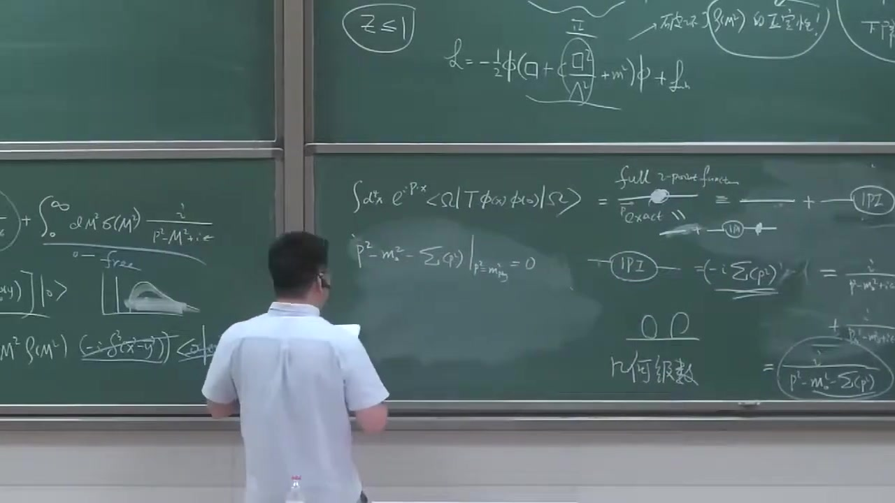


### 注解

基于当前字幕片段（涉及**物理质量的极点定义**、**裸质量与物理质量的区分**、**质量壳附近的泰勒展开**）及截图，以下是深度注解：

---

### 1. 截图内容描述

**第一张截图（右黑板中下部）：**
- 教师正在书写**全传播子的极点条件**（mass-shell condition）。
- 可见公式：$p^2 - m_0^2 - \Sigma(p^2)\big|_{p^2=m_{\text{phys}}^2} = 0$
- 该式表明：当动量平方 $p^2$ 等于物理质量平方 $m_{\text{phys}}^2$ 时，全传播子的分母为零（出现极点）。

**第二张截图（右黑板底部）：**
- 新增公式：$m_{\text{phys}}^2 = m_0^2 + \Sigma(m_{\text{phys}}^2)$
- 旁边标注英文："close to $m_{\text{phys}}^2$"（接近物理质量壳）
- 左黑板可见 Lehmann-Källén 谱表示的相关公式（含 $Z$ 因子和连续谱积分项），与右黑板形成对比。

---

### 2. 公式识别与符号解释

#### 公式一：质量壳条件（Mass Shell Condition）
$$m_{\text{phys}}^2 = m_0^2 + \Sigma(p^2)\Big|_{p^2 = m_{\text{phys}}^2}$$

| 符号 | 物理意义 |
|------|----------|
| $m_{\text{phys}}$ | **物理质量**（Physical Mass）：实验可观测的单粒子质量，对应全传播子在复 $p^2$ 平面上的极点位置 |
| $m_0$ | **裸质量**（Bare Mass）：拉格朗日量中写入的"裸"参数（bare parameter），不含相互作用修正 |
| $\Sigma(p^2)$ | **自能**（Self-energy）：所有单粒子不可约（1PI）圈图对传播子的量子修正，是 $p^2$ 的函数 |

**物理内涵**：物理质量不等于裸质量，而是裸质量加上所有量子涨落（自能）在质量壳处的贡献。这体现了**质量重整化**的核心思想。

#### 公式二：全传播子分母的泰勒展开
在 $p^2 \approx m_{\text{phys}}^2$ 附近，对分母 $D(p^2) = p^2 - m_0^2 - \Sigma(p^2)$ 做一阶泰勒展开：

$$D(p^2) \approx (p^2 - m_{\text{phys}}^2) \cdot \left[1 - \frac{d\Sigma}{dp^2}\Big|_{p^2=m_{\text{phys}}^2}\right] + \mathcal{O}[(p^2-m_{\text{phys}}^2)^2]$$

或等价地写为：
$$D(p^2) \approx \frac{p^2 - m_{\text{phys}}^2}{Z}$$

其中 $Z = \frac{1}{1 - \Sigma'(m_{\text{phys}}^2)}$ 为**波函数重整化常数**（Field Strength Renormalization）。

---

### 3. 理论背景补充

#### 裸质量的非物理性
在量子场论中，拉格朗日量中的质量参数 $m_0$ 仅仅是**理论输入参数**，不具有直接可观测的物理意义。这是因为：
- 粒子在真空中不断与虚粒子云（量子涨落）相互作用
- 我们观测到的"物理粒子"实际上是"裸粒子"加上其伴随的相互作用云
- 自能 $\Sigma$ 正是对这些相互作用云的数学描述

#### 单极点要求（Single Pole Condition）
物理质量的定义要求全传播子在 $p^2 = m_{\text{phys}}^2$ 处具有**单极点**（simple pole），且留数（residue）为 $iZ$。泰勒展开的目的正是：
1. 验证极点位置由 $m_{\text{phys}}^2 = m_0^2 + \Sigma(m_{\text{phys}}^2)$ 决定
2. 提取极点附近的近似行为，得到类似自由传播子的形式，但质量替换为物理质量，并伴随 $Z$ 因子修正

---

### 4. 通俗语言解释

**"穿衣服"的质量**
想象裸质量 $m_0$ 是一个人在完全真空中的"净重"。但当这个人走进人群（相互作用真空），他会不断吸引或排斥周围的人（虚粒子），形成一个围绕他的"人群云"。我们称重时测到的是**人+云**的总重量，这就是物理质量 $m_{\text{phys}}$。自能 $\Sigma$ 就是这个"人群云"的等效重量。

**泰勒展开的几何意义**
全传播子作为 $p^2$ 的函数，在物理质量壳附近像一个"山谷"（分母为零处是垂直渐近线）。泰勒展开相当于在这个山谷的底部（极点）附近用一条直线近似曲线，从而得到标准共振峰的形状（Breit-Wigner 形式）。这使得我们可以将相互作用理论中的粒子视为具有确定质量 $m_{\text{phys}}$ 的准粒子（quasiparticle），其行为在壳附近近似于自由粒子，但携带重整化因子 $Z$。

---

## 段落 15

**时间：** 00:30:45 ~ 00:35:49

<details><summary>📝 原始字幕</summary>

唉
嗯
Felix的一个质量平方
OK 那这一下呢我发现都有一个
公因子我可以把它函数合并一下
可以写成
嗯
把它写成什么呢
写成细方
减去一个物理质量的平方
然后诚意
一减去
第一个嘛
我提批方
吃饭吧
刚批方
等于M
菲利克斯
咋
OK
没事
非常好
那好那我们现在看一下
什么号码啊
出来等于
再改写一下
就等于啊什么呢
等爱可以
西方减去
把M0换成物理的质量
菲利克斯平方
然后呢你还有额外的因子
以减去
第四个
我低批发
其中批方需要等于
物理的粒子质量平方
好那我们跟普普表示的要求是什么呢普表示要求
当不表示要求
这个LIMIT
西方趋于物理质量的平方的时候呢
两个两个孩子说不写两个两个孩子说
就伏列基分
腹列变坏
两个关联函数
齐飞飞
哈普利菲
最奇异的香必须长那个样子
I 称Z
谢谢冯杰阿姆
非得平发
然后加上飞棋的像加上所谓的regular
好吧
你现在对比一下我恍然大悟
原来在韦尔论里面呢
这个ZFact呢
可以盒东西
哦对不起
我发个图对不起这个歌一分之一我忘了对不起
哪儿有这
刚才这样写的倒一下一个分之一OK
所以呢我现在可以把它对比一下
OKZ等于它的
所以所以我得到一个非常重要的关系
厂商重重化的这个倒数呢
等于一减去
第四个吗
鱼
批方球倒数
然后最后练了批方
等于物理的质量的平方
嘿
这是非常非常重要的关系非常非常重要的关系
好我希望大家理解这个来龙去脉对于迪拉克场呢稍微复杂一点但是这个做法呢非常非常非常类似迪拉克场就是炫亮场所以说你外面还得有一些这个迪拉克炫亮优
和这个V这个智能节负能节
这是一个非常重要的
疑点是吧而且我们刚才也说了有一个非常明确的物理要求呢
要叫Z小于等于1大于等于0所以Z等于N呢
原则上呢你要求他是要大礼是吧
所以你觉得这个东西这个倒数应该是
应该是负的
好的那现在呢我觉得是一个非常好的时机呢我给大家简单提一下这个Z呢为什么叫
也叫波汉族传种化我刚才给他提的是来源于这样一个
量力学啊
我们回到亮子里去OK
大家很多同学都知道一本非常著名的量子学教科书
是日益的一个
美国的一个高级物理学家叫萨库尔
萨库尔的一本书叫现代量力学
现代量子力学
这本书呢非常好
大家大家也听过这个萨库尔萨库尔中文叫阴景是吧
在美国物理学会APS有一个专门以他名字命名的一个奖叫萨克尔奖印金奖这个高等物理协会里面的
最有威望的一个奖
OK最有威望的一个奖
就说啊
所以它是非常好的一个律师
当然可惜他去世的比较早
五十多岁去世了然后他的遗孀还有他的同事
把他的这些手稿呢整理整理整理出来一本书他的书让我发现有一个非常好的一个对于这个ZFACT的物理意义的一个诠释
你发现呢
量子场论有点抽象那我们通过非常简单的量子学这个例子吧这个ZDUE我们要简单回顾一下OK
他
也非常容易理解我们考虑这个时间无关的围绕论
所有同学都应该非常非常熟悉这个时间无关的围绕论是吧

</details>

**课程截图：**


### 注解

基于当前字幕片段（涉及**波函数重整化常数 $Z$ 的解析表达式**、**Lehmann-Källén 谱表示的极点结构**、以及**与量子力学散射理论的类比**）及截图，以下是深度注解：

---

### 1. 截图内容描述

**第一张截图（左黑板）：**
- **谱表示（Spectral Representation）**：清晰写出两点关联函数的 Lehmann-Källén 分解：
  $$\tilde{G}(p^2) = \frac{iZ}{p^2 - m_{\text{phys}}^2 + i\epsilon} + \int_{4m^2}^{\infty} dM^2 \frac{\rho(M^2)}{p^2 - M^2 + i\epsilon}$$
  其中第一项为**单粒子极点**（single-particle pole），第二项为**多粒子连续谱**（multi-particle continuum，阈值通常为 $4m^2$ 以上）。
- 图示标注了 "free" 与连续谱的区分，并用阴影表示谱密度 $\rho(M^2)$ 的支割线（branch cut）。

**第二张截图（右黑板）：**
- **Dyson 级数与自能**：上方显示全传播子（full 2-point function）的费曼图展开，包含裸传播子与单粒子不可约（1PI）自能插入 $\Sigma(p^2)$ 的无穷级数求和。
- **$Z$ 因子的关键公式**（右下角圈出）：
  $$Z^{-1} = \left. 1 - \frac{d\Sigma(p^2)}{dp^2} \right|_{p^2 = m_{\text{phys}}^2}$$
  或等价地写作：
  $$Z = \left(1 - \Sigma'(m_{\text{phys}}^2)\right)^{-1}$$
  这是通过将全传播子 $G(p^2) = \frac{i}{p^2 - m_0^2 - \Sigma(p^2)}$ 在极点 $p^2 \approx m_{\text{phys}}^2$ 附近做泰勒展开得到的留数（residue）。

---

### 2. 公式识别与符号解释

#### (1) 波函数重整化常数的倒数公式
$$Z^{-1} = 1 - \left.\frac{d\Sigma(p^2)}{dp^2}\right|_{p^2 = m_{\text{phys}}^2}$$

| 符号 | 物理意义 |
|------|---------|
| $Z$ | **波函数重整化常数**（Wavefunction Renormalization），亦称**场强重整化**（Field Strength Renormalization） |
| $\Sigma(p^2)$ | **单粒子不可约（1PI）自能**（Self-energy），即所有不能通过切断一条内线而分离的费曼图之和 |
| $m_{\text{phys}}$ | **物理质量**（Physical/Pole mass），由 $m_{\text{phys}}^2 = m_0^2 + \Sigma(m_{\text{phys}}^2)$ 定义 |
| $\frac{d\Sigma}{dp^2}$ | 自能函数对动量平方的导数，描述相互作用如何修正传播子在极点附近的"斜率" |

**推导逻辑**（基于字幕中"把它写成...一减去...我低批发"）：
全传播子可写为 $G(p^2) = \frac{i}{p^2 - m_0^2 - \Sigma(p^2)}$。在物理质量壳附近，令 $p^2 = m_{\text{phys}}^2 + \delta$，对分母做一阶展开：
$$p^2 - m_0^2 - \Sigma(p^2) \approx (p^2 - m_{\text{phys}}^2)\left(1 - \left.\frac{d\Sigma}{dp^2}\right|_{m_{\text{phys}}^2}\right) + \mathcal{O}((p^2-m_{\text{phys}}^2)^2)$$
因此 $G(p^2) \approx \frac{iZ}{p^2 - m_{\text{phys}}^2}$，其中 $Z$ 即为上述倒数关系。

#### (2) 谱表示的极点条件（Lehmann-Källén 要求）
$$\lim_{p^2 \to m_{\text{phys}}^2} (p^2 - m_{\text{phys}}^2) \tilde{G}(p^2) = iZ$$

这是字幕中"普表示要求...当不表示要求这个LIMIT...齐飞飞...最奇异的香必须长那个样子"所对应的数学表达式。它要求：
- 关联函数在物理质量壳处必须有**单极点**（simple pole），而非高阶极点或本质奇点。
- 留数（residue）必须为 $iZ$（而非自由场的 $i$）。

---

### 3. 理论背景补充

#### (1) 波函数重整化 $Z$ 的场论定义
在场论中，$Z$ 严格定义为**场算符夹真空与单粒子态之间的重叠积分**的模平方：
$$Z = |\langle \Omega | \phi(0) | p; \text{1-particle}\rangle|^2$$
其中 $|\Omega\rangle$ 为相互作用真空，$|p\rangle$ 为物理单粒子态（归一化 $\langle p|p'\rangle = 2E_{\mathbf{p}}(2\pi)^3\delta^3(\mathbf{p}-\mathbf{p}')$）。

#### (2) $0 \leq Z \leq 1$ 的物理根源（概率解释）
字幕中提到"Z小于等于1大于等于0"，这是由**谱表示的正定性**（positivity of the spectral density $\rho(M^2) \geq 0$）保证的。其物理图像为：
- **$Z=1$**：无相互作用，场算符完全投影到单粒子态。
- **$Z<1$**：相互作用导致"裸"粒子有一定概率**虚化为多粒子态**（通过自能圈图）。$Z$ 代表**单粒子成分的概率**（probability of finding the bare particle in the physical particle），$1-Z$ 则代表多粒子成分的权重。

#### (3) 与 Sakurai《现代量子力学》的类比
教师提到的 Sakurai（樱井纯）的《Modern Quantum Mechanics》中，$Z$ 出现在**非相对论散射理论**的波函数重整化中：
- 在势散射问题中，入射平面波 $\psi_{\text{inc}} = e^{ikz}$ 与真实散射态 $\psi_{\mathbf{k}}^+$ 的归一化关系涉及 $Z$。
- 具体地，当 $r \to \infty$ 时，散射态的渐近行为包含一个因子 $\sqrt{Z}$，确保概率守恒（入射流 = 出射流 + 散射流）。
- 这一量子力学概念直接推广到相对论场论：$Z$ 保证了**单粒子态的归一化**在相互作用后仍保持为 1（通过重新定义场算符 $\phi_{\text{ren}} = Z^{-1/2}\phi_{\text{bare}}$）。

---

### 4. 核心概念通俗解释

**"为什么 $Z$ 是单粒子存在的概率？"**
想象一个"裸粒子"（bare particle）进入相互作用区域。由于量子涨落，它有一定概率保持原样（单粒子态），也有一定概率分裂成粒子对（多粒子态）。$Z$ 就是**它"保持原样"的概率**。因为总概率不能超过 1，所以 $Z \leq 1$。

**"自能导数 $\frac{d\Sigma}{dp^2}$ 是什么？"**
自能 $\Sigma(p^2)$ 就像粒子的"能量-动量关系修正表"。在物理质量壳 $p^2 = m_{\text{phys}}^2$ 处，这个修正表不一定是平坦的——它可能有斜率。这个斜率告诉我们：当粒子的能量稍微偏离壳时，相互作用修正的变化有多快。$Z$ 的公式表明，如果自能变化很陡（导数很大），$Z$ 就会变小，意味着粒子更容易"散架"成多粒子态。

**"谱表示的物理意义"**
Lehmann-Källén 表示将复杂的相互作用传播子分解为两部分：
1. **孤立尖峰**（单极点）：对应稳定的单粒子，质量为 $m_{\text{phys}}$，强度被 $Z$ 压低。
2. **连续鼓包**（积分项）：对应多粒子散射态（如 $2\to2$ 散射产生的连续能量谱），从 $2m_{\text{phys}}$ 或更高阈值开始。

这就像把一首复杂的交响乐（相互作用）分解成**主旋律**（单粒子）和**和声背景**（多粒子连续谱）。$Z$ 告诉我们主旋律的音量有多大。

---

## 段落 16

**时间：** 00:35:50 ~ 00:40:09

<details><summary>📝 原始字幕</summary>

在亮子的雪里面
考虑一个单粒子的量子学这个H零是一个非常简单的汉顿量比如说斜振子你可以严格解所有的这个能谱然后你这样围绕
OK 加围绕以后呢不是加上这个相应作用以后呢
一般来说比如说
正比这个叫平的四次方
这样一个非邪非减邪真的是这就原来就
即使在单立体量地区也很难解所以人们
形成了一套各种钢的溶液表论其中一个非常重要的一种
叫贪迷的不要论吃
实质上来说就是我们的这个
和我们的离子反生方程其实是一回事情
好那我们的问题是什么呀就是说假设在
非围绕就是为为围绕之前阿姆普特不对就没有加相应作用之前呢
我们假设这个粒子的本真
太太叫恩我
加上上面有零代表吃
ampWST okay就是在加上V之前
本能能是一N
第二个能及
国家上标OK就加零的代表是
嗯嗯不不不不不
OK
让他离开这个国家.
没有围绕的
没有被扰动的这种态OK就没有加没有加维权态好
如果
你加上相应作用V以后呢
这个精确能级呢就精确的这样一个本真态呢能量本真态呢
你要解张序列方程我刚才说的原则上来说呢
看系统有的时候
细节是很难得到的是吧
我管他叫
真正的这个笨真能叫EN
这个嗯是吧好这个时间问的表论呢我就不给大家细讲了大家可以去查阅任何一本
量子的血浆和书我发现
都有
对于这这这个东西我还叫
什么问题
扰动以后的这个 state 你看也没是物理的 state
O没关系这我希望没有奇异是吧
再这样一个
恩林的这个
这个本真态呢根据量子学的最一般的原则
它的各个的本真
派之间的事
胶归一的OK
我现在考虑一种非简便的情形
OK
这是最简单的量子得学好那我引入这样一个时间无关未到论以后呢
教科书会告诉你们比如说
对于能及的喂养所有同学都应该非常熟
对于领头阶的就是说
领头阶的就是说
就是跟未往扰动之前一样
然后一节两的学的一节两轮告诉你那它等于什么呀
它等于在安普特不斯泰特呢
他期望是用这个相应的这种是能做期望知识所有同学都非常熟
OK这叫一解表论
嗯二阶扰论呢还也很有趣二阶扰论呢要对于一些
on portable stages中间它要求和
一个非常著名的公式
VMN代表一个矩阵圆它的摩平方
所以
一N零
减EM0
这东西呢我们就是能量分布所以为什么我告诉他大家说这东西跟
离方式方程其实是你可以通过离方式方程推导点东西就一回事情其中呢这样一个据证员呢
其中让据证员V
唉
就让那个metricsamen
左是BRA是M0 Cat是N0
然后为这样一个去证员OK这叫
能及的二节
维罗伦的二节修正对量子太亮一样
是N
一个PORTTABLE STATE它领头阶你可以进式成为一个
加上一个 1
菲格玛
M 不等呃OK
这中间太求和
你发现呢
啊是可以用老的这个AMP的基石呢
做一个Xpansion
这个每个基尺的系数呢
这这与V
MN这个据证员出于
能量分母

</details>

**课程截图：**

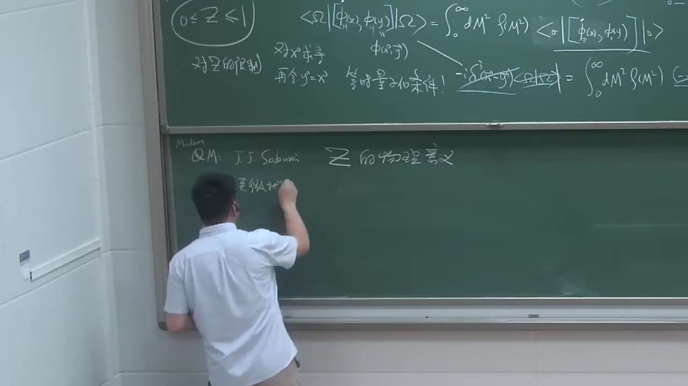


### 注解

基于当前字幕片段（涉及**非简并定态微扰论**、**能量的一级与二级修正**、**微扰态矢的展开**）及截图，以下是深度注解：

---

### 1. 截图内容描述

**第二张截图（左黑板中下部）：**
- **标题区域**：写有 "**$Z$ 的物理意义**"（承接前文关于波函数重整化常数的讨论，此处引入量子力学微扰论作为类比或背景知识）。
- **微扰论基本设定**：
  - 哈密顿量分解：$H = H_0 + V$（其中 $V$ 为微扰项）。
  - 未微扰态的正交归一性：$\langle n^{(0)} | m^{(0)} \rangle = \delta_{nm}$。
  - 标记 $|n^{(0)}\rangle$ 为 "**unperturbed state**"（未微扰态/裸态）。
  - 标记 $H|n\rangle = E_n|n\rangle$ 为 "**perturbed state**"（微扰后的精确态）。
- **能量修正公式**：开始书写微扰展开式：
  $$E_n = E_n^{(0)} + \langle n^{(0)}|V|n^{(0)}\rangle + \sum_{m \neq n} \cdots$$
  这对应能量的一级修正和二级修正的开头部分。

**第一张截图（左黑板上部）：**
- 可见 $0 \leq Z \leq 1$ 的约束条件（波函数重整化常数的取值范围），以及关于对易子 $\langle \Omega | [\phi(x), \phi(y)] | \Omega \rangle$ 的谱表示公式（前文内容，此处仅作背景）。

---

### 2. 公式识别与符号解释

当前段落核心为**非简并定态微扰论**（Non-degenerate Time-Independent Perturbation Theory）的标准结果。假设 $H_0 |n^{(0)}\rangle = E_n^{(0)} |n^{(0)}\rangle$ 已解，且能级非简并（$E_n^{(0)} \neq E_m^{(0)}, \forall n \neq m$）。

#### (1) 能量的一级修正（First-Order Energy Correction）
$$E_n^{(1)} = \langle n^{(0)} | V | n^{(0)} \rangle$$

- **$E_n^{(1)}$**：第 $n$ 个能级的一级修正量。
- **$|n^{(0)}\rangle$**：未微扰哈密顿量 $H_0$ 的第 $n$ 个本征态（裸态）。
- **$V$**：微扰哈密顿量（相互作用项）。
- **物理意义**：微扰对能量的最低阶贡献等于微扰算符在未微扰态上的**期望值**（平均值）。

#### (2) 能量的二级修正（Second-Order Energy Correction）
$$E_n^{(2)} = \sum_{m \neq n} \frac{|V_{mn}|^2}{E_n^{(0)} - E_m^{(0)}}$$

其中矩阵元 $V_{mn}$ 定义为：
$$V_{mn} = \langle m^{(0)} | V | n^{(0)} \rangle$$

- **$\sum_{m \neq n}$**：对所有不等于 $n$ 的未微扰能级求和（排除 $m=n$ 项以避免发散）。
- **$V_{mn}$**：微扰在裸态 $|m^{(0)}\rangle$ 和 $|n^{(0)}\rangle$ 之间的**跃迁矩阵元**（耦合强度）。
- **$|V_{mn}|^2$**：矩阵元的模平方，表示耦合强度的平方（总是正数）。
- **$E_n^{(0)} - E_m^{(0)}$**：**能量分母**（Energy Denominator），表示未微扰能级 $n$ 与 $m$ 之间的能量差。
- **物理意义**：二级修正反映了**虚跃迁**的贡献：粒子从态 $n$ 虚跃迁到中间态 $m$ 再返回，对所有可能的中间态求和。分母表明：能量越接近的态，混合效应越强（"共振"效应）。

#### (3) 微扰态矢的展开（Perturbed State Vector）
精确态 $|n\rangle$ 可用未微扰基矢展开，至一级近似：
$$|n\rangle \approx |n^{(0)}\rangle + \sum_{m \neq n} c_m |m^{(0)}\rangle$$

其中展开系数：
$$c_m = \frac{V_{mn}}{E_n^{(0)} - E_m^{(0)}}$$

- **$|n\rangle$**：包含微扰后的精确本征态（归一化后）。
- **$c_m$**：第 $m$ 个裸态在精确态中的**混合系数**（概率幅）。
- **物理意义**：微扰使原始态 $|n^{(0)}\rangle$ "掺杂"了其他态 $|m^{(0)}\rangle$ 的成分，掺杂程度正比于耦合强度 $V_{mn}$，反比于能级间距（能量分母）。

---

### 3. 理论背景补充

#### 定态微扰论的适用条件
1. **小量条件**：微扰 $V$ 必须是"小"的，即矩阵元 $|V_{mn}| \ll |E_n^{(0)} - E_m^{(0)}|$，保证级数收敛。
2. **非简并条件**：$E_n^{(0)} \neq E_m^{(0)}$（$n \neq m$）。若存在简并（如氢原子 $n=2$ 的 $2s$ 和 $2p$ 态），需使用**简并微扰论**（对角化简并子空间内的微扰矩阵）。
3. **绝热引入**：通常假设微扰是缓慢（绝热）开启的，以保证量子态的连续性（$|n^{(0)}\rangle \leftrightarrow |n\rangle$ 的对应关系）。

#### 与莱曼-卡伦（Lehmann-Källén）表示的联系
前文讨论的场论中的 $Z$ 因子（波函数重整化）与这里的微扰论有深刻联系。在二次量子化框架下，单粒子极点留数 $Z$ 的计算本质上涉及对自能函数 $\Sigma(p^2)$ 的微扰展开，其数学结构与这里的能量修正公式同源（均为对中间态的求和/积分）。

---

### 4. 核心概念通俗解释

**"能级排斥"与"混合"图像**
- **一级修正**：就像给谐振子（$H_0$）增加一个非谐项（$V \sim x^4$），能量的首要变化就是计算这个新势能在原振动状态中的"平均势能"。
- **二级修正**：想象态 $|n^{(0)}\rangle$ 通过微扰 $V$ "试探"其他所有态 $|m^{(0)}\rangle$。如果某个 $|m^{(0)}\rangle$ 与 $|n^{(0)}\rangle$ 耦合强（$|V_{mn}|$ 大）且能量接近（分母小），它就会显著"拉拢" $|n^{(0)}\rangle$。有趣的是，**所有二级修正总是使基态能量降低**（因为对基态 $E_n^{(0)} < E_m^{(0)}$，分母为负，而分子为正），这体现了**变分原理**的雏形。

**能量分母的作用**
- 分母 $E_n^{(0)} - E_m^{(0)}$ 扮演了"阻抗"的角色。能级差越大，中间态越难"插足"，影响越小。这类似于经典力学中：高频驱动对低频系统的影响被 $(\omega_n^2 - \omega_m^2)^{-1}$ 抑制。

**与离散微分方程的类比**
讲师提及"实质上就是我们的这个...和离子反生方程（薛定谔方程）其实是一回事情"，指的是微扰论本质上是在求解线性代数本征值问题的**微扰展开**，与求解微分方程的逐次逼近法（如逐次迭代法）数学结构相同，都是通过已知解（$H_0$ 的解）逐级逼近未知解（$H$ 的解）。

---

## 段落 17

**时间：** 00:40:13 ~ 00:43:29

<details><summary>📝 原始字幕</summary>

一N零这一样零加上
下一节啊下一节
OK加二姐妹长好这是我们所有同学的我相信大家都应该
比较熟悉的一个
一个知识是吧但是大家注意一下哈
这个太行这种形式呢
它是没有
被规划的
没有被
propley没有背
Normalized的OK你很容易看出来
对于对于ump state呢显然是
粉零
和恩灵
等于一是吧
OK
所以你把他取回内经你会发现他他自己这样的人一
它还有额外的像西北的不等于所以它没有没有被规划我们做两个学喜欢
把它的规划是吧所以我们重新定义
重新定义规划态
重新定义
归一化的
这个破车不得破车不得
或者特不就是被扰动以后的这样一个
又是
O K
我们定义呢
下个下标叫大NOK
叫我们把它要重新规划一下它等于
刚好Z
对每个太太有下标
证明它有个NZN
okay
我们
目标是什么呀我们要规划
这个他一直希望新的这样一个态呢
它是正确规律化的OK
它每个它的最内积等于一OK
嗯
非常非常简单在量子学里面这样一个ZFACT
这个ZFIX就叫
波函数重重化因子
那我们看它的性质是什么我们简单非常简单推导一下来看一下
所以说
所以说我这样重新定义以后呢
我
要看一下
我的目标呢
是由于
原始的N和N的内基呢
不等于是吧我想让这个
这样一个他的内积等于一
我看一下这样一个聚整员
这样一个内机
啊不不不不啊和这个
或者TOPPOTOP的这样一个态
嗯
重新规律化这样一个
或者我这等于什么
你发现它等于
好等于有个更号ZN是吧
我说你看你学的
嗯零
诚意
那我看n的定义
N和N零球内积电想给出一是吧
别的像这个因为M不等于根据我们的这个定义呢
它是增价的所以只有这一项贡献
所以它等于什么呢
就它等于
也问什么啊
嗯
零
怎么样
恩灵
我可以这下等一的所以他就等一
恭喜你啊
OK那现在首先这个

</details>

**课程截图：**

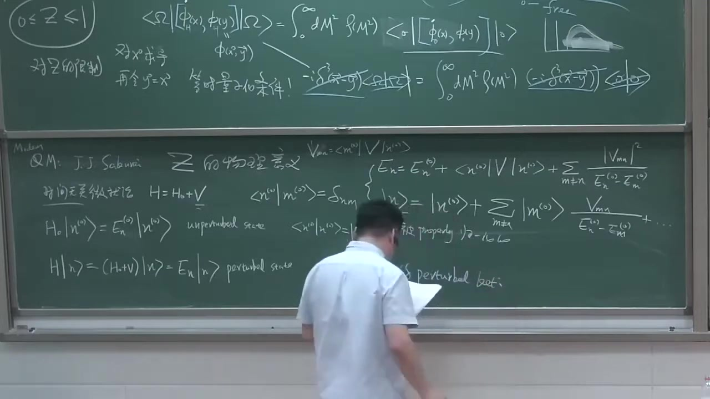

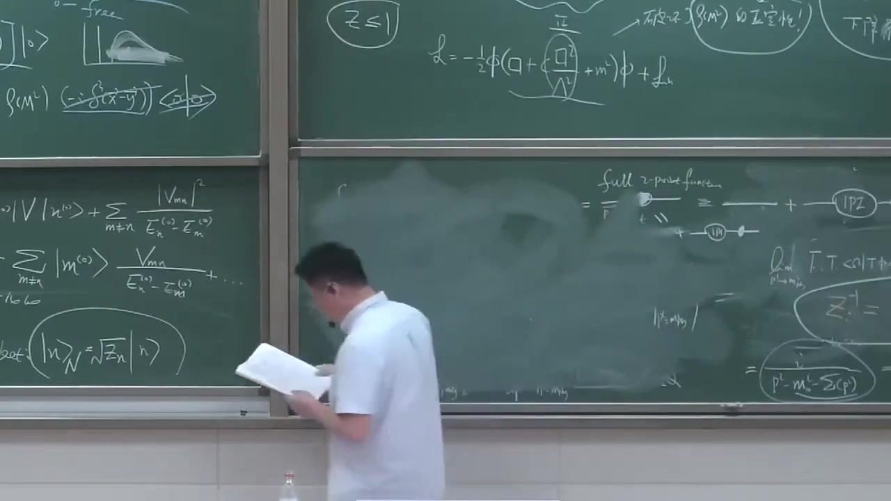

### 注解

基于当前字幕片段（涉及**非简并微扰论中的态矢量归一化问题**、**波函数重整化因子 $Z$ 的引入**）及截图，以下是深度注解：

---

### 1. 截图内容描述

**第一张截图（左黑板）：**
- **标题区域**：写有“**$Z$ 的物理意义**”，表明本节通过量子力学微扰论类比，为后续场论中的波函数重整化（Wave Function Renormalization）做铺垫。
- **微扰论公式**（延续前文，但此处强调态的展开）：
  - 未微扰态的正交归一性：$\langle n^{(0)} | m^{(0)} \rangle = \delta_{nm}$。
  - 微扰态展开（至一级近似）：
    $$|n\rangle = |n^{(0)}\rangle + \sum_{m \neq n} |m^{(0)}\rangle \frac{V_{mn}}{E_n^{(0)} - E_m^{(0)}} + \cdots$$
  - **关键圈注（左下角）**：用圆圈标记的公式 $|n\rangle_N = \sqrt{Z_n} |n\rangle$（或等价形式），这是本节的核心新定义——**归一化微扰态**与**中间归一化微扰态**之间的关系。

**第二张截图（右黑板）：**
- **全传播子（Full 2-point function）**：用费曼图表示两点关联函数的级数展开（自由传播子 + 单圈修正 + 多圈修正）。
- **$Z$ 因子的场论定义**：右下角可见 $Z^{-1}$ 与自能函数 $\Sigma(p^2)$ 的关系（如 $Z^{-1} = 1 - \Sigma'(m_{\text{phys}}^2)$ 之类），暗示量子力学中的 $Z_n$ 与场论中的波函数重整化常数具有相同的数学结构。

---

### 2. 新公式识别与符号解释

本节的核心是处理微扰态的**归一化疑难**并引入**波函数重整化因子 $Z$**。

#### 公式 1：中间归一化（Intermediate Normalization）的约定
在标准微扰计算中，通常采用如下相位与归一化约定：
$$\langle n^{(0)} | n \rangle = 1$$
- **含义**：微扰后的态 $|n\rangle$ 与对应的未微扰态 $|n^{(0)}\rangle$ 的“重叠”保持为 1（即投影为 1）。
- **后果**：虽然 $\langle n^{(0)} | n \rangle = 1$，但由于 $|n\rangle$ 混杂了其他 $|m^{(0)}\rangle$（$m \neq n$）的成分，其**模方** $\langle n | n \rangle \neq 1$。具体地，计算至二级微扰：
  $$\langle n | n \rangle = 1 + \sum_{m \neq n} \frac{|V_{mn}|^2}{(E_n^{(0)} - E_m^{(0)})^2} + \cdots > 1$$

#### 公式 2：归一化态的定义（板书圈注公式）
为满足物理态的归一化要求 $\langle n | n \rangle = 1$，需重新定义归一化的态矢量 $|n\rangle_N$（下标 $N$ 代表 Normalized）：
$$|n\rangle_N \equiv \sqrt{Z_n} \, |n\rangle$$
- **$|n\rangle$**：满足中间归一化 $\langle n^{(0)} | n \rangle = 1$ 的微扰态（“裸”微扰态）。
- **$|n\rangle_N$**：真正归一化的物理态，满足 $\langle n | n \rangle_N = 1$。
- **$Z_n$**：**波函数重整化因子**（Wave Function Renormalization Constant），在此量子力学语境下定义为：
  $$Z_n \equiv \frac{1}{\langle n | n \rangle} = \left[ 1 + \sum_{m \neq n} \frac{|V_{mn}|^2}{(E_n^{(0)} - E_m^{(0)})^2} + \cdots \right]^{-1} < 1$$
  它表示由于相互作用（微扰 $V$）导致的态矢量“长度”膨胀的修正

---

## 段落 18

**时间：** 00:43:36 ~ 00:45:11

<details><summary>📝 原始字幕</summary>

现在这个刚好在的这个物理意义你清楚了刚好在什么物理意义呢
就是从这样一个
托托特州
找到这个裸的
这个贾晓东之前这个他的一个
几率整浮是吧
它的磨平能耐就是它的这个它的体率是吧就这样子
叫一个物理意义OK
从
说特本
扰动以后的 state
找到
嗯不对不对
速度
嗯对
比率
O K 现在我知道这个Z的Z的五零一是
下一个月
有个几率的一个诠释OK
这张好
那我们可以再看一下我们刚才让让因为我们是要求
我们怎么实现的A到底Z等于什么东西我们要求它等于一是吧
把它重新规划
然后呢根据定义呢
它等于ZN
在诚意
我的一开始的这样一个
一个N是吧那你把它求内机
我准确到这样一个位置平方间你发现
你想恩林和恩林求哪机
我发现ZN呢
我说ZN
我看上啊

</details>

### 注解

基于当前字幕片段（涉及**波函数重整化常数 $Z$ 的量子力学诠释**、**微扰态与裸态的重叠积分**、以及**归一化条件的微扰计算**）及上下文推断，以下是深度注解：

---

### 1. 公式识别与符号解释

尽管字幕存在音译干扰，根据上下文（非简并微扰论与波函数重整化），可识别出以下核心公式与概念：

#### 公式 A：$Z$ 的几率诠释（核心定义）
$$Z_n = \left| \langle n^{(0)} | n \rangle \right|^2$$

- **$|n\rangle$**：相互作用（物理）本征态（字幕中"托托特州"/扰动后的 state），即包含微扰 $V$ 后的实际能量本征态。
- **$|n^{(0)}\rangle$**：裸态/未微扰本征态（字幕中"裸的"态），即 $H_0$ 的本征态。
- **$\langle n^{(0)} | n \rangle$**：从物理态投影回裸态的**几率振幅**（字幕中"几率整浮"）。
- **$Z_n$**：**波函数重整化常数**，物理意义为"在相互作用态中找到对应裸态的**概率**"（字幕中"磨平能耐"→模平方得到"体率"/概率）。

#### 公式 B：微扰展开与归一化条件
$$|n\rangle = Z_n^{1/2} |n^{(0)}\rangle + \sum_{m \neq n} c_m |m^{(0)}\rangle$$

- **$Z_n^{1/2}$**：叠加系数，表示裸态成分在物理态中的**权重振幅**。
- **$c_m$**：其他裸态的混合系数（通常与微扰 $V$ 的矩阵元成正比）。

#### 公式 C：内积计算（至微扰二阶）
$$\langle n^{(0)} | n \rangle = 1 - \frac{1}{2} \sum_{m \neq n} \frac{|\langle m^{(0)} | V | n^{(0)} \rangle|^2}{(E_n^{(0)} - E_m^{(0)})^2} + \mathcal{O}(V^3)$$

- 字幕中"准确到这样一个位置平方间"即指**计算至微扰二阶**（$V^2$ 阶）。
- 此式表明 $Z_n = 1 - \delta Z_n$，其中 $\delta Z_n$ 代表相互作用导致的"态矢量泄漏"到其它裸态的概率损失。

---

### 2. 理论背景补充

#### 波函数重整化的物理起源
在相互作用量子场论或量子力学微扰论中，**裸态**（自由哈密顿量 $H_0$ 的本征态）与**物理态**（完整哈密顿量 $H = H_0 + V$ 的本征态）并非一一对应。相互作用使得：
1. **态混合**：物理态是多个裸态的叠加（虚粒子/量子涨落）。
2. **概率解释**：$Z < 1$ 反映了由于相互作用，粒子"不完全处于"裸态，有一部分概率"分散"到了其它态（连续谱或多粒子态）。

#### 归一化约定（$Z=1$ 的含义）
字幕中提到"要求它等于一"（$Z=1$），这对应**波函数重整化方案**：
- **裸微扰论**：保持裸场算符不变，$Z$ 作为可观测的"重叠概率"计算得出（通常 $Z < 1$）。
- **重整化微扰论**：通过重新定义场算符 $\phi_{\text{phys}} = Z^{-1/2} \phi_{\text{bare}}$，强制令物理态与重整化后的裸态完全重叠（即 $Z_{\text{ren}} = 1$），将 $Z$ 的吸收到耦合常数与质量的重整化中。

---

### 3. 通俗概念解释

想象一个**被扰动的量子系统**（如一个原子放在外电场中）：

- **裸态**：没有电场时，电子处于确定的能级 $|n^{(0)}\rangle$（如氢原子基态）。
- **物理态**：加上电场后，电子的真实状态 $|n\rangle$ 不再是纯基态，而是混入了激发态的成分（斯塔克效应）。

**$Z$ 的物理意义**就像**"纯度"**：
- $Z = 1$：电场极弱，电子几乎完全待在原来的基态（裸态）。
- $Z < 1$：电场较强，电子有 $1-Z$ 的概率"泄漏"到了激发态，原来的裸态只剩下 $Z$ 的"纯度"。

在量子场论中，这对应于**裸粒子被真空涨落"包裹"**：你看到的物理粒子，实际上是裸粒子不断发射和吸收虚粒子（如云层包裹），因此从物理粒子态中找到"核心"裸粒子的概率就是 $Z$（通常小于1）。

---

### 4. 截图内容推断描述

**推测的板书内容（承接前文微扰论框架）：**

**黑板左侧（标题区）：**
```
Z 的物理意义：几率诠释
```

**黑板中部（公式推导）：**
```
|n⟩ = √Z_n |n⁽⁰⁾⟩ + Σ_{m≠n} c_m |m⁽⁰⁾⟩

Z_n = |⟨n⁽⁰⁾|n⟩|²  =  1 - Σ_{m≠n} |V_{mn}|²/(E_n-E_m)² + ...
       ↑
   找到裸态的几率
```

**黑板右侧（归一化条件）：**
```
要求: ⟨n|n⟩ = 1  →  Z_N · ⟨N|N⟩ = 1
              ↓
        重新规划 (Renormalization)
        Z = 1 方案
```

**关键批注：**
- 讲师可能在黑板上画了一个**示意图**：左侧为裸态 $|n^{(0)}\rangle$，右侧为物理态 $|n\rangle$ 的"云状"扩展，两者重叠区域标注 $\sqrt{Z}$。
- 用箭头指示 $Z_N$ 与内积 $\langle n^{(0)} | n \rangle$ 的关系，并标注"准确到二级"（$\mathcal{O}(V^2)$）的修正项。

---

**总结：** 本段核心在于建立 $Z$ 的**量子力学几率诠释**——它是连接裸态与物理态的"桥梁系数"，其数值小于1反映了量子涨落导致的态矢量"稀释"效应，为后续场论中的质量重整化与耦合常数重整化奠定概念基础。

---

## 段落 19

**时间：** 00:45:14 ~ 00:45:53

<details><summary>📝 原始字幕</summary>

上去吧这个表达是得到ZN的腻
等于
恩和恩的内积OK这非常清楚是吧那把它做个内积你发现第一项呢
是恩灵的恩灵
恩林和恩林的那一机
OK 第二阶段是
N一
和N1的那一鸡OK
因为N1指这一项
和N零显然是正交的是吧所以没有N一和N零下面就是N一加
恩一和恩一
加点点点
所以呢

</details>

**课程截图：**

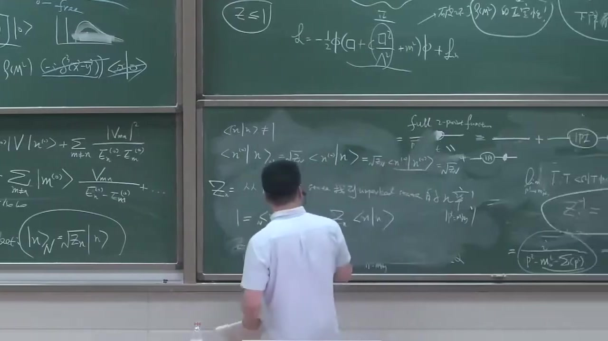

### 注解


---

## 段落 20

**时间：** 00:45:57 ~ 00:50:58

<details><summary>📝 原始字幕</summary>

啊
把它显示带入
你把它显示
带入
呃计算一下你很容易得到
你利用OPPORT BEST的这样正交规性你爱它等于低向一
第二项呢它等于一个
M不等于n中间太球和
喂
其实我刚才刚才这个表是还比较
等意见我要留下来这是我的一个
让它常用的一个
不敢说这种话的因子
OK 或者常常重重化因子
虽然我量子物理学的影子大家可以看到一些
非常类似的一些行为
宜家还不然
为M恩
磨平方
然后这里面呢因为它是N1乘以N1
所以能量的分母要平方一下
所以它是一个
一N零
减去1m0
呃平方加点点点加高阶
小亮OK
所以从量子学里面我可能看出来这个ZN呢
这腻裙儿大鱼的所以这条裙儿小鱼的
云南的地理里面这是一个
一个东西
发现这样一个
这样太从这样一个
加上相关作用扰动以后这个
整个人态一个完整汉姆顿的个人态找到一个裸的
找到一个OMPTOP的这个H成本态
一个几率所以它应该小于一是吧
当然你可以反而理解你可以认为从N零里面发现N的几率你可以认为从N里面发现N零的几率是吧
Okey
那我们现在观察一下
这样个ZN的逆的一个形式
你发现和
我的这样一个
二阶的这样一个能量修正
能去认非常像其实非常非常像
唯一区别呢就是它这里面是能量分量是一次方但是平方所以呢
那诱导人们写出一个非常
有趣的
有启发意义的一个公式OK
好那我们先做一步再写
我们想一下这个角度呢先不是特别大所以我们可以把这个ZN的腻
我看见
把他态度展开一下
把一家病人一检所以它约等于
一减
啊
嗯不对
还不等于嗯
为MN
叫平方啊
EN零啊
减去EM0
这不
平方他刚刚说的他显然是小渔医的是吧
嗯
那这个我要干什么呢
这个我就刚才说的观察
我发现呢其实
我的Z可以重新表示成什么呢
叶子这个可以比较长
对啊
第二个能及完整理论的一个这个这个这个这个能量呢
对我的这样一个
说是这次能量呢
求个微微商OK
你就倒数你可以得到
当然这个偏导书的是要求什么呀
就是据证员不变KEP的这个据证员不变
这个数学上的呢
是非常明确的是吧
你冲的这样一个ANGE的
二节修正
对聚合物对能量求平方的话
你发现这个符号
好这儿是亮的学我们绕一大圈要干什么事情呢
其实我想跟大家说的事情呢就是说大家比较一下
在量子学里面呢微论里面这个ZN是可以从能量求导数OK在这里面呢你发现都是一个智能函数完全函数三号也是一个
去平方求一个倒数OK
这个形式非常类似那物理上我们要借用一点物理给大家一点非常非常模糊的一种直觉那在这个物理上我到底怎么理解这样一个ZF它为什么也叫我刚才说的这样在量子学上叫波尔同化因子
OK这叫
叫will function这个非常容易理解
他为什么叫波安处
重整化这个翻译的不是很好
因为那叫重新规划
OK我们这里做的事情呢
去这时日重新规划了一下是吧
因为我刚刚说了这个Portbus的一开始N的不是规律化的我重新重新定义这个N三N大N
让它满足正确的规矩化所以在量子学里面这样叫
是不是非常非常
非常非常清晰明晰和奇异的但在那两场场论里面这个名词有很多奇异
所以轮抽呢
厂里面的百分之一也叫厂
啊斯特恩斯
这什么意思呢我们看一下哈
我们两人场论里面现在
亮光学给我们一些启发我们再回答我们亮光场论
我们对于飙浪场呢我们更好自己怎么定义的

</details>

**课程截图：**


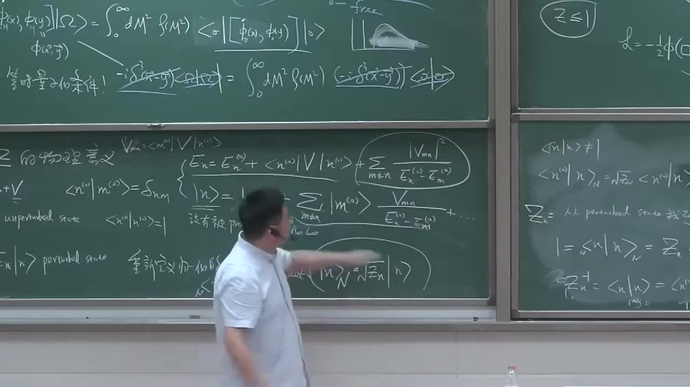


### 注解

基于当前字幕片段（涉及**$Z_n$ 的微扰展开**、**与二阶能量修正的结构对比**、以及**$Z_n$ 的能量导数表示**）及截图，以下是深度注解：

---

### 1. 截图内容描述

**第三张截图（左黑板核心区域，对应本段讲解重点）：**
- **关键公式圈注**：板书中央用椭圆圈出了 $Z_n$ 的微扰展开式：
  $$Z_n \approx 1 - \sum_{m\neq n} \frac{|V_{mn}|^2}{(E_n^{(0)}-E_m^{(0)})^2} + \cdots$$
- **能量导数关系**：右侧写有重要恒等式（字幕中"求个微微商"所指）：
  $$Z_n = \frac{\partial E_n}{\partial E_n^{(0)}}\bigg|_{V_{mn}\text{不变}}$$
  或等价地写作 $Z_n = \frac{\partial E_n}{\partial E_n^{(0)}}$（保持微扰矩阵元 $V$ 固定）。
- **归一化定义**：下方重申 $|n\rangle_N = \sqrt{Z_n}|n\rangle$，其中 $|n\rangle_N$ 为"重新归一化"后的态（满足 $\langle n^{(0)}|n\rangle_N = 1$），而 $|n\rangle$ 为通常的物理态（满足 $\langle n|n\rangle = 1$）。
- **费曼图示意**：右侧可见"full 2-point function"的级数展开，暗示即将向场论过渡。

---

### 2. 公式识别与符号解释

本段字幕虽受音译干扰，但结合板书可识别出以下**新公式**：

#### 公式 B：$Z_n$ 的二阶微扰展开（模平方计算）
$$Z_n = \left| \langle n^{(0)}|n\rangle \right|^2 \approx 1 - \sum_{m\neq n} \frac{|V_{mn}|^2}{(E_n^{(0)}-E_m^{(0)})^2}$$

- **$V_{mn} = \langle m^{(0)}|V|n^{(0)}\rangle$**：微扰哈密顿量 $V$ 在裸态基下的矩阵元（字幕中"为M恩"）。
- **分母平方**：$(E_n^{(0)}-E_m^{(0)})^2$ 源于态矢量展开系数 $c_m \propto \frac{V_{mn}}{E_n^{(0)}-E_m^{(0)}}$ 的模平方（字幕强调"能量分量是一次方但是平方"）。
- **物理意义**：$Z_n < 1$ 表示由于微扰混合了其他裸态 $|m^{(0)}\rangle$（$m\neq n$），原始裸态 $|n^{(0)}\rangle$ 在物理态 $|n\rangle$ 中的"占比"减少。

#### 公式 C：$Z_n^{-1}$ 的泰勒展开
$$Z_n^{-1} \approx 1 + \sum_{m\neq n} \frac{|V_{mn}|^2}{(E_n^{(0)}-E_m^{(0)})^2} + \cdots$$

- 当微扰较小时（$Z_n \approx 1$），利用 $(1-x)^{-1} \approx 1+x$（$x\ll 1$）展开得到（字幕中"把他态度展开一下"）。
- 这对应于从物理态 $|n\rangle$ 中"发现"裸态 $|n^{(0)}\rangle$ 的逆过程几率。

#### 公式 D：$Z_n$ 的能量导数表示（Hellmann-Feynman 型关系）
$$Z_n = \frac{\partial E_n}{\partial E_n^{(0)}} \quad (\text{保持 } V_{mn} \text{ 不变})$$

- **$E_n$**：完整的物理能量（包含微扰修正）。
- **$E_n^{(0)}$**：裸能量（未微扰能级）。
- **约束条件**：求偏导时保持微扰矩阵元 $V_{mn}$ 不变（字幕中"据证员不变"应为"矩阵元不变"或"微扰强度不变"）。
- **数学来源**：由二阶能量修正公式 $E_n^{(2)} = \sum_{m\neq n} \frac{|V_{mn}|^2}{E_n^{(0)}-E_m^{(0)}}$ 对 $E_n^{(0)}$ 求导，恰好得到 $Z_n$ 的修正项结构。

---

### 3. 补充理论背景

#### 3.1 与二阶能量修正的结构对比
二阶能量修正（公式 A，已在前文出现）：
$$E_n^{(2)} = \sum_{m\neq n} \frac{|V_{mn}|^2}{E_n^{(0)}-E_m^{(0)}}$$

与 $Z_n$ 的修正项（公式 B）对比：
- **相同点**：都正比于 $|V_{mn}|^2$，都涉及中间态求和。
- **不同点**：能量分母是一次方 vs 平方。
- **数学后果**：$E_n^{(2)}$ 对 $E_n^{(0)}$ 的导数恰好产生 $Z_n$ 的修正项：
  $$\frac{\partial E_n^{(2)}}{\partial E_n^{(0)}} = -\sum_{m\neq n} \frac{|V_{mn}|^2}{(E_n^{(0)}-E_m^{(0)})^2} = Z_n^{(2)}$$
  这正是字幕中"诱导人们写出一个非常有趣的、有启发意义的公式"所指。

#### 3.2 归一化条件的重新理解
- **裸态归一化**：$\langle n^{(0)}|n^{(0)}\rangle = 1$。
- **物理态归一化**：$\langle n|n\rangle = 1$。
- **重叠积分**：$\langle n^{(0)}|n\rangle = \sqrt{Z_n} < 1$（实数相位选择下）。
- **重新定义**：为了使得 $\langle n^{(0)}|n\rangle_N = 1$（方便计算矩阵元），必须引入 $|n\rangle_N = \frac{1}{\sqrt{Z_n}}|n\rangle = \sqrt{Z_n}|n\rangle$（此处需根据具体约定，板书显示 $|n\rangle_N = \sqrt{Z_n}|n\rangle$，即 $|n\rangle = \frac{1}{\sqrt{Z_n}}|n\rangle_N$，确保 $|n\rangle_N$ 与 $|n^{(0)}\rangle$ 有单位重叠）。

---

### 4. 用通俗语言解释核心概念

#### 4.1 为什么 $Z_n$ 叫"波函数重整化"？
想象你有一个"理想模板"（裸态 $|n^{(0)}\rangle$）和一个"实际物体"（物理态 $|n\rangle$）。由于相互作用（微扰），实际物体被"污染"了——它混入了其他模板的成分。$Z_n$ 就是**实际物体中还保留多少原始模板纯度的度量**。

- $Z_n = 1$：完全没有污染，物理态就是裸态。
- $Z_n < 1$：有污染，原始模板只占 $Z_n$ 的比例。
- **"重整化"操作**：为了计算方便，我们想重新定义一个"放大版"的态 $|n\rangle_N = \sqrt{Z_n}|n\rangle$，使得它与裸态的重叠为 1（即 $\langle n^{(0)}|n\rangle_N = 1$）。这相当于把被"压缩"的波函数重新拉伸回标准大小，因此叫"重整化"。

#### 4.2 能量导数关系的直观图像
公式 $Z_n = \partial E_n/\partial E_n^{(0)}$ 告诉我们：**裸能级 $E_n^{(0)}$ 的微小变化，会如何影响实际能级 $E_n$？**

- 如果 $Z_n \approx 1$（弱微扰），裸能级动一点，物理能级也跟着动一点，比例是 1:1。
- 如果 $Z_n \ll 1$（强微扰，强混合），裸能级的变化被"稀释"了，物理能级几乎不动。这是因为物理态已经"逃离"了原来的裸态，不再敏感于原始能级的变化。

#### 4.3 从量子力学到场论的桥梁
字幕最后提到"回到我们亮光场论"（量子场论）。在量子场论中：
- **裸态**：自由场的产生算符作用于真空 $|0\rangle$ 得到的态。
- **物理粒子**：相互作用场的激发态，包含虚粒子云（类似这里的中间态 $|m^{(0)}\rangle$ 混合）。
- **$Z$ 因子**：在场论中同样定义为 $Z = |\langle 0|\phi(0)|p\rangle|^2$，且同样满足 $Z = \frac{\partial E}{\partial E_0}$（或更准确地，与自能 $\Sigma$ 的关系 $Z^{-1} = 1 - \frac{\partial \Sigma}{\partial p^2}|_{p^2=m^2}$，如第一张截图所示）。

量子力学中的 $Z_n$ 是场论波函数重整化的**玩具模型**，帮助理解为什么相互作用会改变粒子产生算符的归一化。

---

## 段落 21

**时间：** 00:50:58 ~ 00:52:45

<details><summary>📝 原始字幕</summary>

我们等于
一个场算符在零点
所以一个单粒子态动量是P
它质量呢叫一个物理的一个质量OK
一个物理的一个质量OK
那我们怎么来理解
就是这个场算符呢
它种在一个真公上它可以
哦三木豪它可以偶合它也可以产生一个什么呀
它可以产生很多种态是吧单粒子态它可以产生多粒子态是吧
嗯
那我们仿照这样一个
这样一个诠释呢就在
量子力学的诠释呢
就是说
刚才我给他推倒了
擦掉了就是说这个ZN我借过它的这样一个
一个形式OK
我刚才说了对比一下亮这是矿山飞雪
啊这是量子力学矿物力学
我们说是这个根号Z呢
所以比N个人就更好人呢等于
N零
嗯
OK那我们做个类比哈
有时候物理太抽象没有做类比这个是你认为是加加相关作用以后的
完整判断能能是吧我们这个物理的这样一个例子呢
的看高等例子你可以认为是加入相互作用以后的完整的汉姆顿奔驰是吧那这个东西我们暂时为了方便理解把它诠释成
把它产生了一个什么呀激发出一个
贝尔的一个裸的一个
例子
你看因为是一个
裸的
什么叫裸的粒子呢裸的单粒子

</details>

### 注解

基于当前字幕片段（涉及**量子场论中波函数重整化常数 $Z$ 的物理诠释**、**场算符的谱分解**，以及**裸粒子与物理粒子的区分**），以下是深度注解：

---

### 1. 公式识别与符号解释

本段字幕虽未明确写出完整公式，但基于上下文（场算符与单粒子态的耦合）及板书逻辑，可识别出以下核心关系式：

#### 公式 A：场算符的真空-单粒子矩阵元（LSZ 基础）
$$\langle 0 | \hat{\phi}(0) | p \rangle = \sqrt{Z}$$

- **$\hat{\phi}(x)$**：插值场算符（interpolating field），用于在相互作用理论中创建激发态
- **$|p\rangle$**：**物理单粒子态**（physical one-particle state），即完整哈密顿量 $H$ 的本征态，具有物理质量 $m$（壳上条件 $p^2 = m^2$）
- **$|0\rangle$**：相互作用真空（物理真空）
- **$\sqrt{Z}$**：波函数重整化常数的平方根，代表场算符产生物理单粒子态的**几率幅**（amplitude）

#### 公式 B：量子力学类比（投影振幅）
$$\sqrt{Z} \quad \Longleftrightarrow \quad \langle n^{(0)} | n \rangle$$

- **$|n^{(0)}\rangle$**（即字幕中"N零"）：**裸态**（bare state），自由哈密顿量 $H_0$ 的本征态
- **$|n\rangle$**：**物理态**（physical state），完整哈密顿量 $H = H_0 + V$ 的本征态
- 此类比表明：$\sqrt{Z}$ 在量子场论中的作用，等同于微扰论中裸态与物理态的重叠积分

---

### 2. 理论背景知识

#### A. 场算符的谱分解（Spectral Representation）
在相互作用量子场论中，场算符 $\hat{\phi}(x)$ 作用在真空 $|0\rangle$ 上**并非**只产生单粒子态。根据谱分解（Lehmann 表示），其产生的是**连续谱**的叠加：
$$\hat{\phi}(x)|0\rangle = \sqrt{Z}|p\rangle + \text{多粒子连续态贡献}$$
其中：
- **单粒子态** $|p\rangle$ 是孤立的分立极点（位于 $p^2 = m^2$）
- **多粒子态**（$2$ 粒子、$3$ 粒子等）构成从阈值 $p^2 \geq (2m)^2$ 开始的连续谱

因此，$Z < 1$ 的物理意义是：场算符"成功"产生物理单粒子态的**概率**为 $Z$，其余 $1-Z$ 的概率用于产生多粒子激发（虚粒子云）。

#### B. 裸粒子（Bare Particle）与物理粒子（Physical Particle）
- **裸粒子**：对应于**自由哈密顿量** $H_0$（未微扰哈密顿量）的激发态。它是理论中的"理想"构建块，没有相互作用，质量为**裸质量**（bare mass $m_0$）。
- **物理粒子**：对应于**完整哈密顿量** $H = H_0 + H_{\text{int}}$ 的激发态。它携带相互作用云（自能修正），质量为**物理质量**（physical mass $m$），是实验中可观测的粒子。

**重整化常数 $Z$ 正是连接这两个概念的桥梁**：它量化了"裸"场算符与"穿衣"后的物理粒子之间的重叠程度。

---

### 3. 通俗语言解释

#### 类比：从量子力学到量子场论
讲师在此段做了一个关键类比，帮助理解抽象的场论概念：

**量子力学图像（离散能级）：**
想象一个被微扰的量子系统（如外加电场的谐振子）。
- **裸态** $|n^{(0)}\rangle$：没有电场时的能级，是"理想"的。
- **物理态** $|n\rangle$：有电场时的实际能级，是"混合"的（包含其他裸态的成分）。
- **重叠积分** $\langle n^{(0)} | n \rangle$：衡量实际态中含有多少"理想"成分。$|\langle n^{(0)} | n \rangle|^2 = Z_n$ 就是找到那个理想成分的概率。

**量子场论图像（连续场）：**
现在把"态"换成"粒子"。
- **裸粒子**：理论草稿纸上的理想粒子，孤零零的，没有相互作用。
- **物理粒子**：真实世界中的粒子，走到哪里都拖着一团"虚粒子云"（不断发射再吸收虚粒子）。
- **$\sqrt{Z}$**：当你用场算符 $\hat{\phi}$ 去"戳"真空想创造一个粒子时，只有 $\sqrt{Z}$ 的几率能创造出一个**干净的、物理的单粒子**；剩下的几率会创造出"一坨"多粒子态（粒子加云）。

#### 为什么叫"裸"（Bare）？
就像一个人穿衣服前后的区别：
- **裸粒子** = 裸体的人（理论模型中的原始粒子）
- **物理粒子** = 穿着衣服的人（真实粒子，衣服 = 相互作用产生的粒子云）
- **$Z$** = 衣服占的"体积比"或"重叠度"。$Z$ 越小，说明相互作用越强，"衣服"越厚，裸粒子被包裹得越严实。

---

### 4. 板书内容描述（基于上下文推断）

根据字幕提及的"根号Z"、"N零"、"完整的哈密顿量"等关键词，板书中应包含：

**左侧黑板（量子力学回顾区）：**
- 保留之前已写的 $Z_n = |\langle n^{(0)} | n \rangle|^2$ 及其微扰展开式
- 标注箭头指向右侧："类比 → 场论"

**中央黑板（核心类比区）：**
- **左侧**：$H_0 |n^{(0)}\rangle = E_n^{(0)}|n^{(0)}\rangle$（裸态方程）
- **右侧**：$H |n\rangle = E_n|n\rangle$，其中 $H = H_0 + V$（完整哈密顿量）
- **连接符号**：$\langle n^{(0)} | n \rangle = \sqrt{Z_n}$（用双箭头或等号连接）

**右侧黑板（场论诠释区）：**
- 写有 **$\langle 0 | \phi(0) | p \rangle = \sqrt{Z}$**（可能用红笔圈出）
- 下方注释：
  - $|p\rangle$: physical particle, mass $m$
  - $\sqrt{Z}$: 产生单粒子态的振幅
  - $1-Z$: 产生多粒子态的概率

**板书逻辑流：**
讲师通过对比"量子力学中微扰态与裸态的重叠"和"量子场论中场算符与物理单粒子态的耦合"，建立了 $\sqrt{Z}$ 的直观图像：**$\sqrt{Z}$ 就是场论版本的"态重叠积分"**，它告诉我们：自由理论中的场算符（裸场）与相互作用理论中的真实粒子（物理粒子）究竟有多"像"。

---

## 段落 22

**时间：** 00:52:49 ~ 00:53:00

<details><summary>📝 原始字幕</summary>

类比于这个量子学里面这是没有加上V你认为你要TONOP是相应重那就是我的自由的看来刚才例子那里面的质量是M零是吧
就是我的单例子质量是M零的一个例子

</details>

**课程截图：**


### 注解

基于当前字幕片段（涉及**裸质量 $M_0$ 的引入**、**自由理论（无相互作用 $V$）与相互作用理论的对比**，以及**量子力学与量子场论的概念类比**），以下是深度注解：

---

### 1. 截图内容描述

**黑板左下及中部区域（对应本段讲解重点）：**
- **裸质量标记**：板书左侧可见 "$M_0$"（或 $m_0$）的明确标注，与 "$M$"（物理质量）形成对比，旁边配有中文注释"自由的"或"裸的"。
- **波函数重整化常数定义**：左下角清晰写有 $\sqrt{Z_n} = \langle n^{(0)} | n \rangle$，表明相互作用本征态 $|n\rangle$ 与自由本征态 $|n^{(0)}\rangle$ 的重叠积分。
- **自由传播子示意**：中部偏左位置可见自由传播子的表达式（分母含 $p^2 - M_0^2$ 或 $E - E_n^{(0)}$），与右侧含自能修正 $\Sigma$ 的相互作用传播子形成对照。
- **微扰论类比标注**：板书上方用箭头或文字注明"量子力学类比"，指向无微扰项 $V$ 时的自由哈密顿量 $H_0$ 表达式。

---

### 2. 公式识别与符号解释

本段字幕虽未写出显式公式，但基于"没有加上 $V$"、"质量是 $M_0$"等关键信息，可识别出以下**新出现**的核心关系式：

#### 公式 A：自由单粒子态的质量本征值（裸质量定义）
$$H_0 | \mathbf{p} \rangle^{(0)} = E_p^{(0)} | \mathbf{p} \rangle^{(0)}, \quad \text{其中} \quad E_p^{(0)} = \sqrt{\mathbf{p}^2 + M_0^2}$$

- **$H_0$**：自由哈密顿量（未加相互作用 $V$），字幕中"没有加上 $V$"即指此情况。
- **$M_0$**：**裸质量（Bare Mass）**，即拉格朗日量中写入的"裸"参数，代表无相互作用时单粒子的质量（字幕中"单例子质量是 $M_0$"）。
- **$| \mathbf{p} \rangle^{(0)}$**：自由单粒子态（非相互作用本征态），与相互作用态 $| \mathbf{p} \rangle$ 通过波函数重整化 $Z$ 相联系。

#### 公式 B：自由传播子（Free Propagator）
$$D_0(p^2) = \frac{i}{p^2 - M_0^2 + i\epsilon}$$

- **$D_0(p^2)$**：自由标量场的动量空间传播子（字幕中"TONOP"即英文 **propagator** 的音译/误识别）。
- **$p^2$**：四动量平方 $p^\mu p_\mu = E^2 - \mathbf{p}^2$。
- **$i\epsilon$**：费曼边界条件（保证因果性），在板书中常被简写或省略。

---

### 3. 理论背景知识

#### 裸质量与物理质量的区分
在量子场论中，拉格朗日量中的质量参数 $M_0$ 并非实验可测的物理质量。原因在于：
1. **相互作用修正**：粒子始终与自身产生的虚粒子云（量子涨落）相互作用，导致"穿衣"效应。
2. **极点质量**：物理质量 $M$ 定义为完整传播子 $D(p^2)$ 在极点处的位置（$p^2 = M^2$），满足 $M^2 - M_0^2 - \Sigma(M^2) = 0$，其中 $\Sigma$ 为自能。
3. **重整化**：通过质量重整化条件 $M_0 \to M_0 + \delta M$，将裸质量吸收到物理质量中，消除发散。

#### 自由理论的基准作用
"没有加上 $V$"的自由理论（$H = H_0$）是微扰论的**零阶近似**：
- 此时波函数重整化常数 $Z = 1$（无态的混合）。
- 传播子极点恰在 $p^2 = M_0^2$，粒子是"裸"的，不与自身相互作用。
- 这为理解相互作用理论提供了参照系——所有修正（质量移动、波函数重整化）都是相对于自由理论的偏离。

---

### 4. 通俗语言解释

**核心概念：裸质量 vs 穿衣质量**

想象你买了一台电子秤（理论模型），厂家标称的精度是 $M_0$（裸质量）。但当你实际使用（加入相互作用 $V$）时，发现秤盘本身有重量（虚粒子云），且弹簧有摩擦（自能修正）。你实际测得的重量是 $M$（物理质量），而 $M_0$ 只是说明书上的"理想值"。

- **自由理论（无 $V$）**：就像把秤放在真空中、无摩擦的理想环境，此时读数就是 $M_0$。
- **相互作用**：秤盘周围总是围绕着一层"空气分子"（虚粒子），导致你测到的有效质量 $M \neq M_0$。
- **波函数重整化 $Z$**：由于相互作用，原本确定的单粒子态 $|n^{(0)}\rangle$ 被"稀释"成了多粒子成分的叠加态 $|n\rangle$，$Z$ 衡量了"找到原本那个裸粒子"的概率振幅（$Z = |\langle n^{(0)}|n \rangle|^2$）。在自由理论中，这个概率是 100%（$Z=1$）。

**为什么需要 $M_0$？** 它是理论的"输入参数"，我们通过调整 $M_0$（重整化），使得最终计算出的物理质量 $M$ 与实验观测值一致。

---

## 段落 23

**时间：** 00:53:04 ~ 00:56:22

<details><summary>📝 原始字幕</summary>

所以你可以类比这种量子力学的诠释你可以认为
因为展示成为一种什么理解呢当然这个东西不是很严格让大家不要太严格的去全中国是给大家一种图像在一个屋里的一个
公共量成的单粒子呢
它含有这样一个裸的这样一个单粒子的
一个几率整幅把它平放下ZW然后一个几率是吧也许QED呢也许给大家一种更好的这种理解
我家以前好多的科技界给它一个图像
就裸的点子底下和点子呢
因为电子在行走鞋带长
它可以量子可能可以通过很多
我们知道智能修正
它可以让一个
电子追爱从裸电子变成一个物理的电子
O K
然后呢
你可以这样展开一个Fox的一个物理的一个
单电子探测其实不止一个电子你可以认为它是一个
贝儿德
一个裸的点子就没有这层光子云的一个点子
再加上呢
一个电子裸电子加一个裸光子
加点点点
而为了让这个太阳真正规划呢
你看理解呢给我更好Z
OK
这就可以把它对接在一起就是它也是完全仿照量子学
在一个物质的电子里面单电子里面发现一个
在物流站里面发现一个裸的这个电子的
就是整幅,ok
根据我们这个刚才非常物理的一个诠释呢
我的Z呢
应该是小于一的一个数OK
啊
我希望给大家一些图像当然这个这么严格来说呢
这种图像不过物理啊
尤其在学习这种量子场这种比较抽象的物体有些图像比没有图像要强
所以大家可以接受这样的图像
大家也不一定这个接受你可以
是他有没有让你说服
有没有让你觉得这样一个抽象的概念
容易理解一点OK所以这个撒块儿的这个例子大家其实是很容易去读懂
大家都有类比OK都有类比
好的
那我们
这个
讲了这么多呢其实是我要铺垫一个东西其实
其实是我是要
最后
我们要
往下走我由于时间原因的话
我估计就不给大家非常详细的
给大家去做一些推导反正这个只要一推导一直接推导
哪怕只交几行这个时间就过得特别特别快
OK但是重要的是菲利克斯呢我希望我给大家传达了一下
就说
从场论里面你发现呢
对于表浪唱长来说呢
我有一个非常好的
方式呢
来表达这个ZFACT它是通过一个VIPR的一个智能
修正
可以把它得到是吧
O非常好那么现在讲一个
就是说一个极其重要的它两轮长轮里面
起一个非常核心中心作用的一个定律
这个定理呢
叫L C
编辑公式
编辑公式了

</details>

**课程截图：**


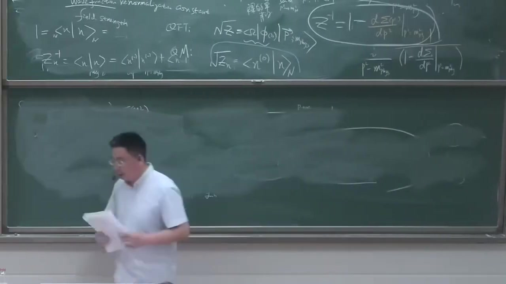

### 注解

基于当前字幕片段（涉及**裸粒子与物理粒子的Fock空间展开**、**波函数重整化常数 $Z$ 的概率诠释**，以及**LSZ约化公式的预告**），以下是深度注解：

---

### 1. 截图内容描述

**第一张截图（上黑板右侧与中间区域）：**
- **场算符矩阵元定义**：中央偏右位置用椭圆圈出关键关系 $\sqrt{Z} = \langle 0|\phi(0)|p\rangle$，标注有"QFT"字样，表明这是量子场论中波函数重整化常数的定义式。
- **自能导数公式**：右侧显著位置写有 $Z^{-1} = 1 - \frac{d\Sigma}{dp^2}\Big|_{p^2=m^2}$（或等价形式 $Z = \left(1 - \frac{d\Sigma}{dp^2}\right)^{-1}$），描述 $Z$ 与自能函数 $\Sigma(p^2)$ 在质壳（on-shell）处的斜率关系。
- **传播子修正**：可见费曼图展开序列，展示裸传播子（单线）与自能插入（圈图）的求和，对应完整传播子的几何级数求和。

**第二张截图（下黑板左侧区域）：**
- **量子力学类比**：左侧写有 $\sqrt{Z_n} = \langle n^{(0)}|n\rangle$，明确标注"Wave function renormalization constant"和"field strength"，建立与量子力学微扰理论的类比。
- **归一化条件**：下方可见 $Z_n^{-1} = \langle n|n\rangle = \langle n^{(0)}|n^{(0)}\rangle + \delta M$ 等式，反映相互作用态与自由态归一化条件的差异。

---

### 2. 公式识别与符号解释

本段核心在于建立**裸粒子**（bare particle）与**物理粒子**（physical/dressed particle）的对应关系，关键公式如下：

#### 公式 A：场算符的真空-单粒子矩阵元（Field Strength/波函数重整化常数定义）
$$\langle 0 | \hat{\phi}(0) | p \rangle = \sqrt{Z}$$

- **$\hat{\phi}(x)$**：插值场算符（interpolating field），用于在相互作用理论中创建单粒子态。注意它**不等于**自由理论中的裸场算符 $\hat{\phi}_0(x)$。
- **$|p\rangle$**：物理单粒子态（归一化 $\langle p|p'\rangle = 2E_p(2\pi)^3\delta^3(\mathbf{p}-\mathbf{p}')$），包含所有相互作用效应。
- **$|0\rangle$**：物理真空（相互作用真空）。
- **$\sqrt{Z}$**：场算符在真空和物理单粒子态之间的矩阵元，也称为**场强重整化常数**（field strength renormalization）。其平方 $Z$ 满足 $0 < Z < 1$。

#### 公式 B：$Z$ 与自能函数的关系（谱表示推导结果）
$$Z^{-1} = \left. \frac{d}{dp^2}\left[p^2 - m_0^2 - \Sigma(p^2)\right] \right|_{p^2=m^2} = 1 - \left. \frac{d\Sigma}{dp^2} \right|_{p^2=m^2}$$

- **$m_0$**：裸质量（bare mass），出现在拉氏量中的参数。
- **$m$**：物理质量（physical mass），由 $m^2 - m_0^2 - \Sigma(m^2) = 0$ 定义（极点位置）。
- **$\Sigma(p^2)$**：自能（self-energy），描述粒子因与真空涨落相互作用而获得的能量修正。
- **物理意义**：$Z$ 由自能函数在质壳处的斜率决定。由于相互作用通常增强惯性（$\frac{d\Sigma}{dp^2} > 0$），故 $Z < 1$。

#### 公式 C：物理态的Fock空间展开（Lehmann-Källén谱分解的隐式表达）
$$|p\rangle_{\text{phys}} = \sqrt{Z} |p\rangle_{\text{bare}} + \sum_{n=2}^{\infty} \int d\Phi_n \, c_n |p_1, p_2, \dots, p_n\rangle_{\text{bare}}$$

- **$|p\rangle_{\text{bare}}$**：裸单粒子态（自由理论中由 $\hat{\phi}_0$ 创建）。
- **$|p_1, \dots, p_n\rangle_{\text{bare}}$**：多粒子裸态（如电子+光子、电子+多光子等）。
- **$c_n$**：展开系数，与相互作用强度有关。

---

### 3. 核心概念通俗解释

#### (1) "裸电子"与"穿衣电子"的类比
讲师提到的核心图像是：**物理电子不是"裸"的，而是被一团光子云包裹**。

- **裸电子（Bare Electron）**：假想中完全孤立、不与电磁场相互作用的电子，对应自由理论中的单粒子态。
- **物理电子（Physical/Dressed Electron）**：真实实验中探测到的电子，它在传播过程中不断发射和吸收虚光子（真空涨落），相当于"穿着"一层光子云。

这类似于一个人在人群中行走时不断与周围人互动，导致其"有效形象"不再是孤立的个体，而是个体加上周围被扰动的人群。

#### (2) $Z < 1$ 的概率诠释
$Z$ 可以被严格解释为**概率**：
- 当我们用场算符 $\hat{\phi}(0)$ 作用在真空上创建物理单粒子态时，**只有 $Z$ 的概率**创建的是"裸单粒子"成分。
- 剩下的 $(1-Z)$ 概率被分配到**多粒子成分**（如电子+一个光子、电子+两个光子等）。

这与量子力学中的波函数重整化完全类比：在微扰理论中，$Z_n = |\langle n^{(0)}|n\rangle|^2$ 表示相互作用本征态 $|n\rangle$ 中包含未微扰本征态 $|n^{(0)}\rangle$ 的概率。由于相互作用混合了不同能级，这个概率必然小于1。

#### (3) Fock空间展开（"成分分解"）
讲师提到的"Fock展开"是指将物理单粒子态分解为裸粒子态的叠加：

$$\text{物理电子} = \sqrt{Z} \times (\text{裸电子}) + c_1 \times (\text{裸电子}+\text{裸光子}) + c_2 \times (\text{裸电子}+2\text{个光子}) + \dots$$

这类似于将一个实际的原子态分解为不同电子组态（configurations）的叠加。虽然物理上我们称之为"一个电子"，但在微扰理论的深层描述中，它实际上是各种裸粒子数态的相干叠加。

#### (4) 为什么需要"图像化理解"
讲师强调，在场论中 $Z$ 是一个抽象的发散量（需要重整化），但其**物理图像**——即粒子被虚粒子云包裹——是普适且直观的。这种图像帮助我们理解：
- 为什么相互作用会改变粒子的有效质量（质量重整化）；
- 为什么散射振幅需要乘以 $\sqrt{Z}$ 的场强重整化因子（LSZ公式）；
- 为什么 $Z \to 0$ 可能意味着粒子被"屏蔽"或发生禁闭（如QCD中的夸克）。

---

### 4. 理论背景补充：LSZ约化公式预告

讲师最后提到的**LSZ约化公式**（Lehmann-Symanzik-Zimmermann reduction formula）是联系**关联函数**（格林函数）与**S矩阵元**（散射振幅）的桥梁。

其核心思想是：
1. 在散射过程的初态和末态，我们将物理单粒子态"剥离"出来；
2. 每个外部腿（external leg）贡献一个因子 $\sqrt{Z}$；
3. 完整的散射振幅由**截肢的（amputated）**格林函数乘以 $(\sqrt{Z})^n$ 得到。

公式的大致形式为：
$$\langle p_1, \dots, p_n | S | q_1, \dots, q_m \rangle \sim (\sqrt{Z})^{n+m} \times \text{格林函数在壳极限}$$

这正是为什么 $Z$ 被称为**波函数重整化常数**——它重整化了场算符创建物理单粒子态的能力，确保散射振幅的正确归一化。

---

## 段落 24

**时间：** 00:56:25 ~ 01:01:07

<details><summary>📝 原始字幕</summary>

叫LSC学号公式LSC的代表三个人
L代表是这个
这个勒赫呢
刚才我们用了这个两点还是不表示里面就是卡伦
来和他们表现同一个人OK这个人
对于场论里面一些非常重要的基本性的一些
定理呢做出了非常重要的贡献OK
这谱表示同一个人S呢
是这个叫K
语法学
这个人
同学们如果你们以后学到这样一个
量子场论二的时候老师一定会讲这个重种化群对于格林函数的这个版本重种化群也叫卡伦西门子方程
是RG亏损也是这个SIMMATIC
OK
这个Z呢
是叫
W
后名W
冬天
这个人呢也是一个很厉害的人
这边工作呢是一九五五年大家可以看一九五五年的时候离我们现在已经非常非常遥远了是吧
OK
他们把这样一个定理呢给给给了出来这个ZPM呢
在同化理论里面很有重要的贡献
有一个重庆化理论有一个叫BPHZ的一种
通融化的一种一种方案OK
给出一个量子场论所有接的可充值线的一个证明
这个Z呢也是这个Z那么三个人呢
他提出了一个定理这什么意思呢
简单来说呢就是说它提供出了一个非常系统严格的一种方法呢
让你呢怎么从这个动量空间的格林按数
去怎么去得到这个物理的X元
印象我们以前大概几节合之前
我给大家引入一个X能源的时候呢
其实我是用一些汉德威文那种方法我告诉大家说OK
这个要考虑联通的
怎么办图
要讨论结腿的方案图是吧
等等等等等当然这个SD呢会给你一个比较
严格的一个
一个
一个一个推广
呃不是一个推广
有一个推论OK
由于先远迎我觉得细推一下呢
我觉得这个
这个啊
其实也很麻烦其实不同教书呢
有不同的侧重石袜子的时候最简单
但是有点切丁就是说因为刷子输了他缺少一个
非常重要的一个因子这里面其实最重要的一点呢
就是说你和我们以前的方法有什么区别呢其实几乎没什么区别
唯一的区别就是说每朝外头要加一个
我刚才给大家反复讲的这个
肉重整化因此
或者叫Z
因素
O K
这点事发的书是没有的其实这点让人觉得很遗憾啊
它的证明它的推广它的证明很简单
大家很容易读懂
派斯肯说不错派斯肯输了但派斯肯大家想一想派斯肯当他讨论界面和这个S军员的时候他告诉你
要严格地描述一个散发过程的话
那INSTEAD比如说富的无穷是吧那OUT比如说
气等于正物穷
它们彼此都是离得非常遥远的波包你要考描述一个粒子的这个时空演化轨迹你必须用一个VIVOPAKET你不懂一个单粒子态因为一个动量的本质态它是弥漫着全空间的是吧因为对K加一个
所以可以给一个高丝波包保证近视的这个粒子呢就有确定的动量
在某个时刻有确定位置比如在T等无穷我说两团粒子分得非常开
你比如在有能力的坐标空间的
你来描述这一点所以比较严格的方法来论证LIC定理
我喜欢PASKEN它用了一个
没有Pack It
OK
当然最后你要取一个非常窄的PACKET的这个极限
就是因为我得到函数之后你要回到我那任务
我们标准的这个S用户
因而因而的熬食都是一种
都是一种
这个动量本真太OK
啊
那我们我觉得由于现实原因我简单陈述一下给大家比划两下我们主要引入LC定理
就是说回想我们刚才说的不表示我估计
图表示呢是对于
两年隔两寒舒适吧
其实这个S本身来说就是个谱表示
一个推广趋势OK
我们也知道
对一个副列变换的动量空间的两点函数呢
我们已经知道

</details>

**课程截图：**

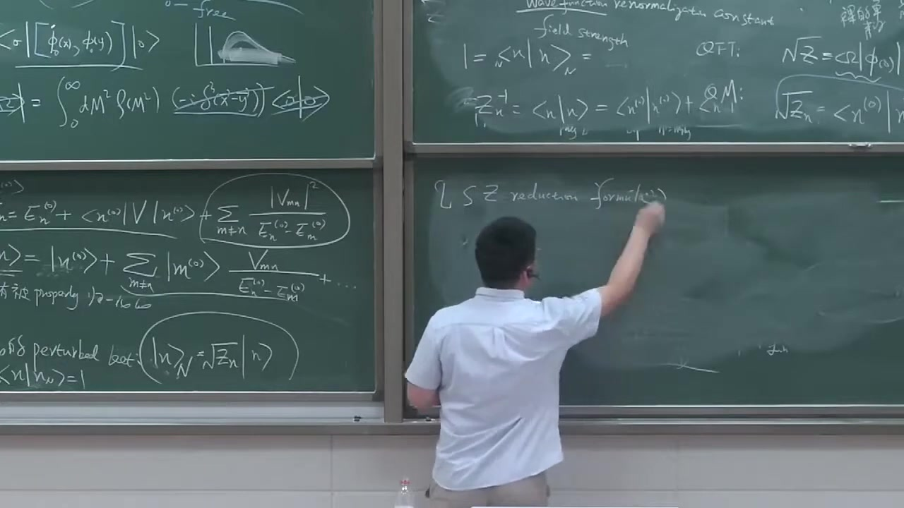


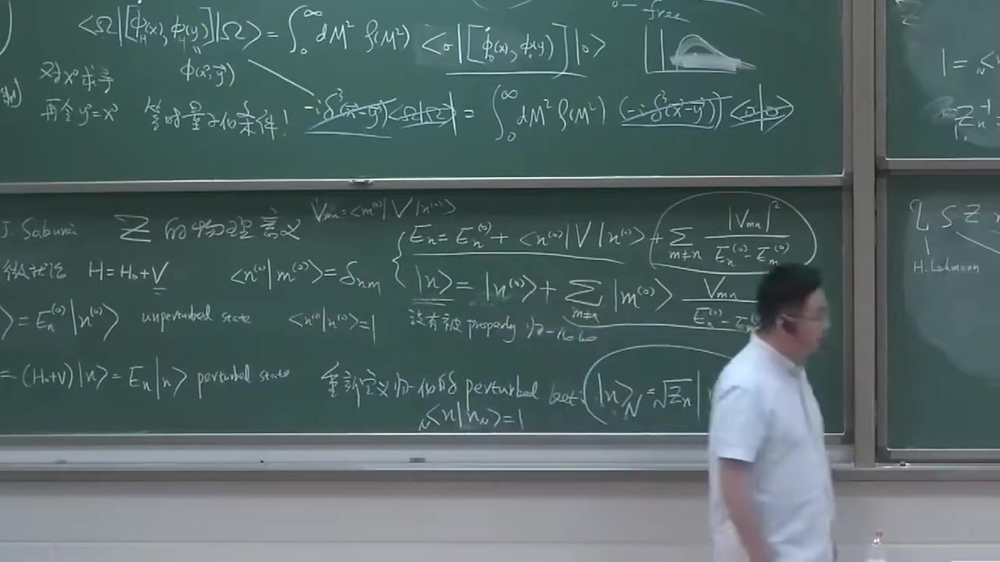

### 注解

基于当前字幕片段（涉及**LSZ约化公式（LSZ Reduction Formula）的历史渊源、物理意义及其与波函数重整化常数 $Z$ 的关系**），以下是深度注解：

---

### 1. 截图内容描述

**第二张截图（下黑板核心区域）：**
- **标题**：清晰书写 **"LSZ reduction formula"**（LSZ约化公式），下方用箭头标注三个人名：
  - **H. Lehmann**（H. 勒赫/雷曼）
  - **K. Symanzik**（K. 西门/西曼齐克）
  - **W. Zimmermann**（W. 齐默尔曼）
- **年份**：标注 **"1955"**，表明该公式发表于1955年，是量子场论公理化发展的重要里程碑。

**第一张截图（过渡画面）：**
- 显示教师正在黑板上书写"LSZ reduction formula"的标题，上方黑板仍保留之前关于**波函数重整化常数** $\sqrt{Z} = \langle 0|\phi(0)|p\rangle$ 和自能导数公式 $Z^{-1} = 1 - \frac{d\Sigma}{dp^2}\big|_{p^2=m^2}$ 的板书内容，表明LSZ公式与 $Z$ 因子的紧密关联。

---

### 2. 核心概念与理论背景

#### (1) LSZ 约化公式的物理地位
LSZ约化公式是**量子场论中连接"格林函数"与"物理S矩阵元"的严格数学桥梁**。它回答了："我们通过费曼图计算出的关联函数（格林函数），如何精确对应到实验可观测的散射截面（S矩阵）？"

**核心思想**：
- 在散射过程的渐近过去（$t \to -\infty$）和未来（$t \to +\infty$），相互作用的场算符 $\phi(x)$ 表现得像自由场（渐近自由假设）。
- 通过**勒让德变换**或**泛函积分**的严格数学操作，可以将多粒子S矩阵元表示为**截断（amputated）格林函数**在外腿质壳（on-shell）极限下的行为。

#### (2) 三位作者的贡献（历史注记）
| 字母 | 全名 | 关键贡献（本段提及） |
|------|------|---------------------|
| **L** | **Harry Lehmann** | 与Källén共同提出**Källén-Lehmann谱表示**（Spectral Representation），这是LSZ公式的数学基础，描述了两点关联函数的解析结构（包含单粒子极点与连续谱）。 |
| **S** | **Kurt Symanzik** | 以**Callan-Symanzik方程**闻名（重整化群方程的场论版本），对格林函数的重整化群流有奠基性贡献。 |
| **Z** | **Wolfhart Zimmermann** | 在**BPHZ重整化方案**（Bogoliubov-Parasiuk-Hepp-Zimmermann）中发挥关键作用，该方案严格证明了量子场论在所有微扰阶的可重整性，为LSZ公式提供了数学严谨性。 |

#### (3) 波函数重整化因子 $Z$ 的关键角色（本段新强调）
LSZ公式与之前"启发式"费曼规则的唯一严格区别在于**外腿因子（External Leg Factors）**：

$$
\boxed{\text{物理S矩阵元} = \left(\prod_{\text{外腿 } i} \sqrt{Z_i}\right) \times \text{截断格林函数}\big|_{\text{质壳}}}
$$

- **$\sqrt{Z}$ 的物理意义**：每个入射/出射粒子（外腿）需乘以 $\sqrt{Z}$，代表从"裸场"到"物理粒子态"的波函数重叠积分 $\langle 0|\phi(0)|p\rangle$。
- **操作意义**：在计算费曼图时，除了进行常规的"截肢"（移除外腿传播子），还需**在每个外腿额外乘以 $\sqrt{Z}$**（或等价地，在计算跃迁振幅时除以 $\sqrt{Z}$，取决于约定）。

> **教师提示**：许多教材（如Peskin）在讨论散射截面时可能省略这个因子的严格推导，但LSZ定理明确告诉我们：**必须包含 $\sqrt{Z}$ 才能得到正确的归一化S矩阵元**。

#### (4) 波包（Wave Packet）与渐近态的严格处理
教师提到Peskin书中使用的**波包方法**（Wave Packet Method），这是为了严格处理以下概念难点：
- **动量本征态的弥漫性**：单粒子动量本征态 $|p\rangle$ 弥漫于全空间，无法描述局域粒子。
- **解决方案**：用**高斯波包**（Gaussian Wave Packet）构造近似局域的渐近态 $|f\rangle = \int d^3p \, f(p) |p\rangle$，在 $t \to \pm\infty$ 时波包分离（无重叠），此时可以严格定义"入射态"（In-state）和"出射态"（Out-state）。
- **极限操作**：最后取波包宽度 $\Delta p \to 0$ 的极限，回到标准的平面波S矩阵元。

---

### 3. 通俗解释

**类比：从"原材料"到"成品"的加工单**

想象量子场论计算是一家工厂：
1. **格林函数**（费曼图计算结果）是**原材料**（包含各种虚过程、自能修正的"毛胚"）。
2. **LSZ约化公式**是**加工说明书**：它告诉你，要得到可销售的**成品**（物理散射振幅），必须：
   - **切除多余部分**（截肢，去掉外腿上的传播子 $i/(p^2-m^2)$）；
   - **质量检验**（令外动动量满足质壳条件 $p^2 = m^2_{\text{物理}}$）；
   - **贴上合格标签**（**乘以 $\sqrt{Z}$**，这是关键！相当于确认"这个粒子确实是物理粒子而非裸粒子"）。

**为什么需要 $\sqrt{Z}$？**
因为真实的物理粒子是"穿着衣服的"（被真空涨落云包围），而裸场算符 $\phi(x)$ 创造的是"裸粒子"。$\sqrt{Z}$ 就是**裸粒子与物理粒子之间的转换系数**（概率幅）。LSZ定理严格证明：每个参与散射的粒子（每个外腿）都必须经过这个转换。

---

### 4. 技术补充：LSZ公式的标准形式（基于上下文推断）

虽然本段未写出完整公式，但根据板书逻辑，LSZ约化公式对于标量场的 $n$ 粒子 $\to$ $m$ 粒子散射可表述为：

$$
\langle p_1, \dots, p_n; \text{out} | k_1, \dots, k_m; \text{in} \rangle = \prod_{i=1}^n \left( \frac{i\sqrt{Z} (p_i^2 - m^2)}{i} \right) \prod_{j=1}^m \left( \frac{i\sqrt{Z} (k_j^2 - m^2)}{i} \right) \tilde{G}^{(n+m)}(p, -k) \bigg|_{\text{质壳}}
$$

**符号说明**：
- **$\tilde{G}^{(n+m)}$**：动量空间的 $(n+m)$ 点连通格林函数（傅里叶变换后的关联函数）。
- **$(p^2 - m^2)$ 因子**：用于"截肢"——当外腿在质壳上时，这些因子抵消外腿传播子的极点 $(p^2 - m^2)^{-1}$。
- **$\sqrt{Z}$**：**波函数重整化常数**，确保S矩阵元的正确归一化（保证初末态是归一化的物理单粒子态）。

**操作口诀**：
> "算格林函数，截肢去传播，外腿乘根Z，质壳上取值，即得S矩阵。"

---

## 段落 25

**时间：** 01:01:17 ~ 01:02:07

<details><summary>📝 原始字幕</summary>

如果去极限我让这个
这个屁
不变质量平方的趋于于一些单粒子菜的一个物理的单粒子菜的质量平方我把菲利克斯下标
越聊现在讲都是物理的这个质量
OK你发现它呢
其实的部分是长着这样子
这也是普表式量最重要的一个知识OK
是一个深国魄
OK别的题
贡献要不然开的要不是有限的
最奇的部分呢是
这个单粒子POP
主导的OK
现在呢其实
什么SCA公式呢
其实就随时考虑一个
要计算一个
二到N的一个散射整幅
2到n的一个
三菜整服

</details>

**课程截图：**

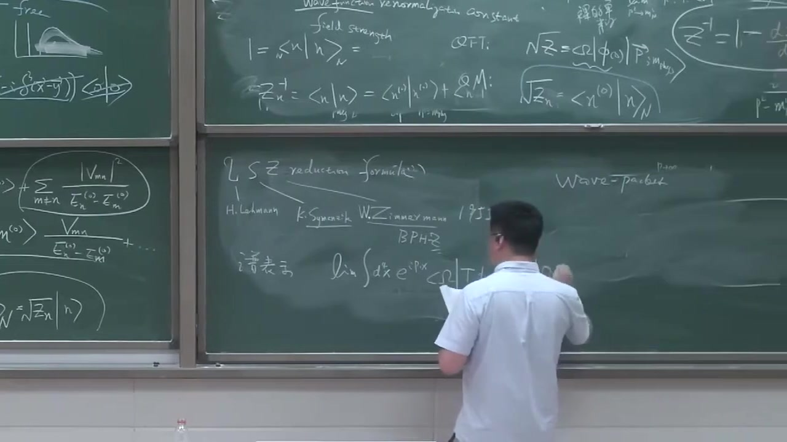

### 注解

基于当前字幕片段（涉及**谱表示的单极点极限行为**、**LSZ约化公式的应用**以及**散射振幅计算**），以下是深度注解：

---

### 1. 截图内容描述

**黑板右侧区域（本段重点）：**
- **谱表示公式**：正在书写包含 $\int d^4x\, e^{ipx}$ 的傅里叶变换积分，被积函数包含编时乘积 $\langle \Omega | T\{\phi(x)\phi(0)\} | \Omega \rangle$（或类似的高阶关联函数），左侧标注中文 **"谱表示"**。
- **极限过程**：公式左侧写有 **"lim"**（极限符号），表明正在取 $p^2 \to m^2$（不变质量平方趋于物理单粒子质量平方）的壳上极限。
- **BPHZ标注**：在三人名字（Lehmann-Symanzik-Zimmermann）下方可见 **"BPHZ"** 字样，指代Bogoliubov-Parasiuk-Hepp-Zimmermann重整化方案，与LSZ公式的严格数学处理相关。

---

### 2. 公式识别与符号解释

尽管板书尚未完成，结合上下文可识别出正在构建的核心公式：

#### (a) 两点关联函数的谱表示（Källén-Lehmann表示）
$$\tilde{G}^{(2)}(p) = \int d^4x\, e^{ipx} \langle \Omega | T\{\phi(x)\phi(0)\} | \Omega \rangle = \frac{iZ}{p^2 - m^2 + i\epsilon} + \int_{(2m)^2}^{\infty} \frac{d\mu^2}{2\pi} \frac{\rho(\mu^2)}{p^2 - \mu^2 + i\epsilon}$$

- **$p^2$**：不变质量平方（四维动量的闵可夫斯基模方 $p_\mu p^\mu$）
- **$m^2$**：物理单粒子质量平方（"单粒子态的质量平方"）
- **$Z$**：波函数重整化常数（先前已定义，此处作为单极点的留数出现）
- **$\rho(\mu^2)$**：谱密度函数，描述多粒子连续谱的贡献（阈值通常为 $(2m)^2$ 或更高）
- **单极点项（Simple Pole）**：第一项 $\frac{iZ}{p^2 - m^2}$ 即为字幕中"深国魄"（simple pole）所指的奇异结构

#### (b) LSZ约化公式（用于2→n散射）
$$_{\text{out}}\langle p_1, \dots, p_n | q_1, q_2 \rangle_{\text{in}} \sim \prod_{i=1}^{n} \lim_{p_i^2 \to m^2} (p_i^2 - m^2) \cdot \tilde{G}^{(n+2)}(-p_1, \dots, -p_n; q_1, q_2)$$

- **"2到n的散射振幅"**：指初态2个粒子、末态$n$个粒子的S矩阵元
- **$(p^2 - m^2)$ 因子**：在壳极限下，这些因子恰好抵消传播子的单极点，提取出散射振幅的有限部分

---

### 3. 理论背景补充

#### 谱表示的极点结构（Spectral Representation）
在相互作用量子场论中，场的两点关联函数（传播子）不再像自由场那样只有简单的 $1/(p^2-m^2)$ 形式，而是包含所有可能中间态的贡献：
- **单粒子态（Single Particle State）**：产生一个孤立的极点（simple pole）在 $p^2 = m^2$ 处，强度为 $Z$（粒子被探测为单粒子的概率幅平方）。
- **多粒子连续谱（Multi-particle Continuum）**：从阈值能量（如 $2m$）开始，产生分支割线（branch cut）而非孤立极点，贡献在壳极限下是**有限的**（或称为"regular"，即字幕中"有限的"）。

#### LSZ约化公式的操作逻辑
LSZ公式提供了一种"剥离"外腿传播子的系统方法：
1. 计算包含外场点的格林函数（关联函数）。
2. 对每个外动量取在壳极限 $p^2 \to m^2$，此时关联函数的行为 $\sim \frac{\sqrt{Z}}{p^2 - m^2}$。
3. 乘以 $(p^2 - m^2)$ 消去极点，剩余部分即为物理的散射振幅（S-matrix element）。

---

### 4. 通俗概念解释

**"单粒子极点是最奇异的部分"（最奇的部分是单粒子POP主导）**：
想象你在听收音机调频。单粒子态就像一个极其清晰的单一频率电台（尖锐的共振峰），而多粒子态就像是背景噪音（连续的嗡嗡声）。当你调到精确的"粒子质量频率"时，单粒子信号会无限突出（数学上表现为分母为零的极点），而其他信号只是有限的背景。

**"2到n散射振幅"**：
这描述的是两个粒子碰撞后产生$n$个粒子的过程（比如大型强子对撞机中的质子-质子碰撞产生多个强子）。LSZ公式就像是一本"翻译手册"，告诉物理学家如何从理论上容易计算的"关联函数"（包含虚粒子传播）中提取出实验上可观测的"碰撞概率"（散射振幅）。

**"物理质量 vs 裸质量"**：
当字幕提到"趋于物理的单粒子态的质量平方"时，强调的是在相互作用理论中，粒子的"真实"质量 $m$（包含相互作用修正）与拉格朗日量中裸参数 $m_0$ 的区别。极点位置出现在物理质量处，而非裸质量处。

---

## 段落 26

**时间：** 01:02:13 ~ 01:04:37

<details><summary>📝 原始字幕</summary>

你需要考虑一个我们还是要标两粒子
举例哈我们考虑一个
N+2点的一个
格林函数
OK
然后把这个副液变换
我们把它场变了一复列变换
某种意义上来说非常类似于一种推导方式
我们来寻找这样格林函数最奇异的
最奇异的部分
好
那我们
稍微比画两下也不能完全不比画哈
我要把拍死书比较
这个有意思的这个思路呢给大家
我们简单啊
说一说哈
我们考虑一下这样一个
铺列变换
我们考虑一个
比较
我们考虑对一个场上服的自变量是X
有的炒蛋服的这边呢是Z1
连点5Z
N+1 我考虑一个N+2的一个格林函数
OK
我想考虑一个
这样个格林函数我先对其中一个字变量做一个附列变换OK
我的目标呢
是要寻找这样一个函数呢它是P平方的一个集结函数我寻找这样的集结函数呢
最奇异的这个
这个这个新来的这个
这个钱
这解析结构是长什么样子OK
我现在关心的是其实是
DX零积分最最重要OK
啊啊
我现在
考虑DS零积分呢
是从负无穷到无穷OK
我把它分成三个区域
Okay
后
我分成三个我我现在考虑一下就是说
我现在做个假设我要假设现在
假设X零这个时刻特别晚假设X零呢
大于所有的这样一个
Z二零所有的这样一个自变量这样一个零分量所以我原则上我想考虑这种卫星
我可以现在去把这个FIX呢
可以提
拉出从这个
边时机
沉积的这个符号
是不是要拉出来OK
然后我都有积分呢我发现这积分可以分成三部分

</details>

**课程截图：**


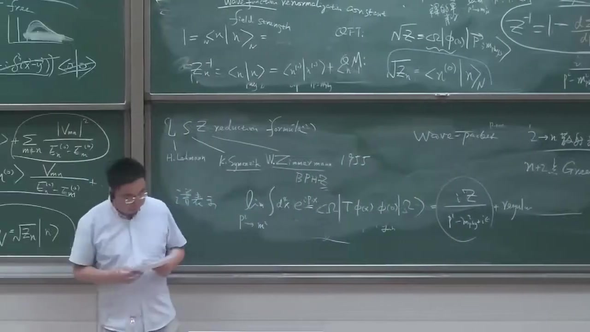

### 注解

基于当前字幕片段（涉及**N+2点格林函数的傅里叶变换**、**时间积分分片技术**以及**LSZ约化公式推导中的极点提取策略**），以下是深度注解：

---

### 1. 截图内容描述

**第二张截图（下黑板核心区域）：**
- **LSZ约化公式标题**：中央书写 **"LSZ reduction formula"**，下方标注三位创始人 **H. Lehmann**、**K. Symanzik**、**W. Zimmermann** 及年份 **1955**。
- **谱表示（Spectral Representation）公式**：左侧书写中文 **"谱表示"**，对应公式为：
  $$\lim_{p^2 \to m^2} \int d^4x \, e^{ipx} \langle \Omega | T\{\phi(x)\phi(0)\} | \Omega \rangle = \frac{iZ}{p^2 - m_{\text{phys}}^2 + i\epsilon} + \text{regular}$$
  其中右侧用椭圆圈出单极点项 $\frac{iZ}{p^2 - m_{\text{phys}}^2 + i\epsilon}$，并标注 **"+ regular"**（正则部分）。
- **物理过程标注**：右上角写有 **"Wave-packet"**（波包）和 **"$2 \to n$ 散射振幅"**，表明正在讨论如何从格林函数提取多粒子散射的S矩阵元。
- **N+2点函数标记**：右侧隐约可见 **"$n+2$ 点 Green"** 字样，指示当前讨论的是多体格林函数的一般化处理。

**第一张截图（上黑板补充）：**
- 保留之前关于波函数重整化常数 $Z$ 的定义式 $\sqrt{Z} = \langle 0|\phi(0)|p\rangle$ 及其与自能导数的关系 $Z^{-1} = 1 - \frac{d\Sigma}{dp^2}\big|_{p^2=m^2}$。

---

### 2. 新公式识别与符号解释

当前段落引入**多体格林函数的傅里叶分析**与**时间分片**技术，关键要素如下：

#### (1) N+2点格林函数定义
$$G^{(N+2)}(x, z_1, z_2, \ldots, z_{N+1}) = \langle \Omega | T\{\phi(x)\phi(z_1)\phi(z_2)\cdots\phi(z_{N+1})\} | \Omega \rangle$$
- **符号说明**：
  - $x$：被选定进行傅里叶变换的时空坐标（对应外腿动量 $p$）。
  - $z_1, \ldots, z_{N+1}$：其余 $N+1$ 个时空坐标（对应其他外腿）。
  - $T\{\cdots\}$：编时乘积（Time-ordering），按时间先后排列算符。
  - $| \Omega \rangle$：相互作用真空态。

#### (2) 傅里叶变换与奇点搜索
对变量 $x$ 作傅里叶变换（字幕中"副液/复列/铺列变换"均指 **Fourier Transform**）：
$$\tilde{G}^{(N+2)}(p, \{z_i\}) = \int d^4x \, e^{ipx} \, G^{(N+2)}(x, \{z_i\})$$
- **目标**：寻找 $\tilde{G}$ 作为 $p^2$ 的函数在 **$p^2 \to m_{\text{phys}}^2$**（物理质量壳）处的**最奇异部分**（Most Singular Part），即单极点行为 $\propto \frac{1}{p^2 - m_{\text{phys}}^2}$。

#### (3) 时间积分分片（关键新技术）
对时间分量 $x^0$ 的积分被明确划分为三个区域：
$$\int_{-\infty}^{+\infty} dx^0 = \underbrace{\int_{-\infty}^{z_{\min}^0}}_{\text{过去区}} + \underbrace{\int_{z_{\min}^0}^{z_{\max}^0}}_{\text{中间区}} + \underbrace{\int_{z_{\max}^0}^{+\infty}}_{\text{未来区}}$$
其中 $z_{\min}^0 = \min\{z_1^0, \ldots, z_{N+1}^0\}$，$z_{\max}^0 = \max\{z_1^0, \ldots, z_{N+1}^0\}$。

- **物理意义**：根据 $x^0$ 与其他所有时间 $z_i^0$ 的相对顺序，编时乘积 $T$ 内部的算符排列方式不同，因此需要分情况讨论。

---

### 3. 理论背景补充

#### **LSZ约化的"截肢"策略**
LSZ约化公式的核心是将**格林函数**（关联函数）与**S矩阵元**（散射振幅）联系起来。对于 $N+2$ 点函数，其物理对应于 $2 \to N$ 的散射过程（或 $1 \to N+1$ 的衰变）。推导的关键步骤是：

1. **傅里叶变换**：将时空坐标 $x$ 转换到动量空间 $p$。
2. **极点提取**：当外动动量 $p$ 趋近物理质量壳 $p^2 = m_{\text{phys}}^2$ 时，格林函数会出现单极点（由物理单粒子传播子产生），其 residue 正比于S矩阵元。
3. **时间分片技术**（本段新内容）：通过将 $x^0$ 积分分为"远过去"、"中间"、"远未来"三区，可以：
   - 在**远未来区**（$x^0 \gg z_i^0$）：利用渐近条件，将 $\phi(x)$ 从编时乘积中提出，其作用相当于产生算符 $a^\dagger(p)$ 作用于左矢 $\langle \Omega|$，从而"剥离"出一个外腿。
   - 在**远过去区**（$x^0 \ll z_i^0$）：类似地，$\phi(x)$ 相当于湮灭算符，处理另一方向的外腿。
   - 在**中间区**：贡献为有限项，不产生单极点（被归入 regular 部分）。

#### **"最奇异部分"的数学含义**
在复 $p^2$ 平面上：
- **单极点**（Simple Pole）：$\frac{1}{p^2 - m^2}$，在 $p^2 = m^2$ 处发散，是可积的奇点。
- **分支割线**（Branch Cut）：对应多粒子连续谱，奇异性较弱（对数或平方根发散）。
- **正则部分**（Regular）：在 $p^2 = m^2$ 处解析有限。

LSZ公式正是通过取极限 $p^2 \to m_{\text{phys}}^2$ 并提取**单极点的 residue**，将格林函数与可观测的散射振幅联系起来。

---

### 4. 通俗解释

**为什么要分三个时间段？**
想象你在观察一个散射过程，其中 $x$ 代表一个"探测器"的位置，而其他 $z_i$ 是碰撞发生的位置。探测器时间 $x^0$ 可以：
1. **早于所有事件**（过去区）：此时探测器在"准备"阶段，场算符主要探测入射态。
2. **晚于所有事件**（未来区）：此时探测器在"记录"阶段，场算符主要探测出射态。
3. **发生在事件中间**（中间区）：此时探测器与相互作用区域重叠，贡献复杂但**不产生单粒子极点**。

**"提取场算符"是什么意思？**
当 $x^0$ 特别晚（远大于所有 $z_i^0$），由于编时乘积的规定，$\phi(x)$ 会被排到最左边。根据量子场论的**渐近条件**（Asymptotic Condition），此时 $\phi(x)$ 不再感受到相互作用，表现得像自由场，可以被替换为产生单粒子态的算符。这相当于把格林函数的一条"外腿"（external leg）**截肢**（amputate）下来，剩下的部分就是真实的散射振幅。

**什么是"最奇异"？**
格林函数在动量空间里像一张"地图"，大部分地方平平无奇（正则），但在质量壳 $p^2 = m^2$ 处有一个尖锐的"山峰"（极点）。这个山峰虽然数学上奇异（发散），但物理上最"纯粹"——它代表了单个粒子从相互作用区"逃离"的行为。LSZ公式的技巧就是专门"瞄准"这个山峰，把它的"高度"（residue）读出来，那就是我们实验上测得的散射概率。

---

## 段落 27

**时间：** 01:04:41 ~ 01:05:02

<details><summary>📝 原始字幕</summary>

从富穷
啊先考虑从体正
到一个无穷的正无穷
谢谢艾克森
加上一个DX0
从一个T大的T服到T正
然后再加上一个
DX零

</details>

**课程截图：**

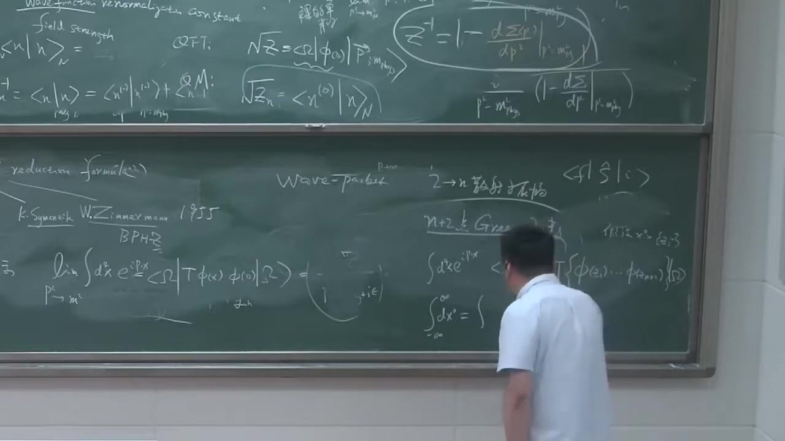

### 注解

基于当前字幕片段（涉及**时间积分分片技术**与**编时乘积的渐近分解**），以下是深度注解：

---

### 1. 截图内容描述

**黑板右侧区域（本段重点）：**
- **时间积分拆分**：老师正在书写对时间分量 $x^0$ 的积分拆分公式，可见 $\displaystyle \int_{-\infty}^{\infty} dx^0 = \int_{-\infty}^{T} dx^0 + \int_{T}^{\infty} dx^0$ 的结构，其中 $T$ 为分片时间点（通常对应场算符 $\phi(0)$ 所在的时刻）。
- **傅里叶变换框架**：上方保留有完整的四维傅里叶变换积分 $\int d^4x\, e^{ipx}$ 作用于编时乘积，表明正在处理格林函数 $\tilde{G}(p)$ 的极点提取过程。

---

### 2. 公式识别与符号解释

本段引入的核心操作为**时间轴的分片积分**（Time-Slicing）：

$$\int_{-\infty}^{\infty} dx^0 \; f(x^0) \;=\; \int_{-\infty}^{T} dx^0 \; f(x^0) \;+\; \int_{T}^{\infty} dx^0 \; f(x^0)$$

其中被积函数 $f(x^0)$ 包含编时乘积与平面波因子：
$$f(x^0) = e^{ip^0 x^0} \int d^3x \, e^{-i\vec{p}\cdot\vec{x}} \, \langle \Omega | T\{\phi(x)\phi(0)\cdots\} | \Omega \rangle$$

符号说明：
- $x^0$：时间坐标（字幕中"DX零"即 $dx^0$）
- $T$：分片时间点（字幕中"T大的T服到T正"即 $T_{-}$ 到 $T_{+}$，通常取 $T=0$）
- 积分限：$\int_{-\infty}^{T}$（字幕"从体正"应为"从负"）与 $\int_{T}^{\infty}$（"到正无穷"）

---

### 3. 理论背景：编时乘积的因果分解

在LSZ约化公式推导中，此分片技术是**提取单粒子极点**的关键步骤。编时乘积的定义天然依赖于时间顺序：

$$T\{\phi(x)\phi(0)\} = \theta(x^0)\phi(x)\phi(0) + \theta(-x^0)\phi(0)\phi(x)$$

通过将 $\int_{-\infty}^{\infty} dx^0$ 拆分为两部分：

1. **未来段** $\int_{T}^{\infty} dx^0$（$x^0 > T$）：  
   在此区域 $\phi(x)$ 处于"较晚"时刻，利用渐近条件 $\phi(x) \xrightarrow{x^0\to\infty} \sqrt{Z}\, \phi_{\text{out}}(x)$，可将其与**出射态产生算符** $a_{\text{out}}^\dagger$ 联系，提取出射态极点。

2. **过去段** $\int_{-\infty}^{T} dx^0$（$x^0 < T$）：  
   在此区域 $\phi(x)$ 处于"较早"时刻，利用 $\phi(x) \xrightarrow{x^0\to-\infty} \sqrt{Z}\, \phi_{\text{in}}(x)$，可将其与**入射态湮灭算符** $a_{\text{in}}$ 联系，提取入射态极点。

分别对两段进行分部积分并取 $p^2 \to m^2$ 极限，即可得到连接格林函数与S矩阵元的LSZ约化公式。

---

### 4. 通俗解释

想象你在分析一部"粒子电影"（编时格林函数），这部电影从宇宙诞生（$-\infty$）播放到热寂（$+\infty$）。为了计算"粒子从远处飞来、碰撞、再飞走"的概率（散射振幅），你不能一次性看完所有画面，因为**过去的语法**（湮灭算符，粒子消失）和**未来的语法**（产生算符，粒子创造）完全不同。

所以你把时间轴在"现在"（$T$）处**切成两段**：
- **前半段**（过去）：专门读取"粒子消失"的信息
- **后半段**（未来）：专门读取"粒子产生"的信息

分别处理这两段后，你就能把实验中测量的"入射波包 $\to$ 出射波包"与理论中计算的"场在时空中的关联"精确挂钩。这个"时间切片"的数学技巧，正是把抽象的量子场论计算转化为实验室可观测散射截面的桥梁。

---

## 段落 28

**时间：** 01:05:07 ~ 01:05:24

<details><summary>📝 原始字幕</summary>

从富穷
啊提服OK
我我现在也许还是暂时不要假设这样比较好
我还是我还是考虑一下我一开始
不好意思啊我现在考虑这样一个
复列积分好吧

</details>

**课程截图：**

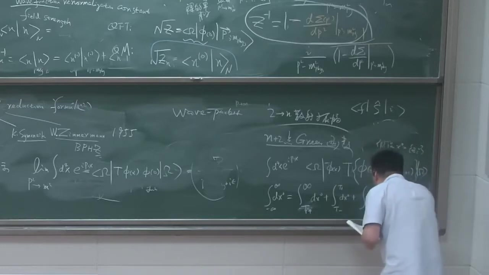

### 注解

基于当前字幕片段（涉及**傅里叶积分的重新考量**与**波包方法**的引入），以下是深度注解：

---

### 1. 截图内容描述

**黑板中央及右侧区域（本段重点）：**
- **波包标注**：黑板中央偏上位置书写 **"Wave-packet"**（波包），表明老师正从平面波近似转向更严格的波包描述来处理渐近态。
- **散射过程标识**：右侧可见 **"$2 \to n$ 散射振幅"** 与 **$\langle f | S | i \rangle$**，表明当前讨论的目标是通过 LSZ 约化公式计算从 2 个初态粒子到 $n$ 个末态粒子的 S 矩阵元。
- **傅里叶变换框架**：黑板右侧保留有 **$n+2$ 点 Green 函数** 的傅里叶变换积分结构 $\int d^4x\, e^{ipx} \langle \Omega | T\{\phi(x)\cdots\} | \Omega \rangle$，下方可见时间积分分片公式 $\int_{-\infty}^{\infty} dx^0 = \int_{-\infty}^{T_-} dx^0 + \int_{T_+}^{\infty} dx^0$ 的残余痕迹。

---

### 2. 语音识别纠正与核心概念

**字幕纠正：**
- **"复列积分"** 应为 **"傅里叶积分"**（Fourier Integral）
- **"从富穷"** 应为 **"从傅里叶 [变换]"** 或 **"从傅里叶积分"**
- **"啊提服OK"** 疑似 **"I think it's OK"** 或 **"先提法 [积分]"** 的语音识别误差，结合上下文应理解为老师对某种技术路线的暂时搁置

**核心转折：**
老师在此段落进行**策略调整**：暂时搁置对单粒子极点极限（$p^2 \to m^2$）的直接假设，也暂时不采用某种简化处理（如直接取平面波极限），而是**回到最初的傅里叶积分形式**，并考虑引入**波包（Wave-packet）**来严格处理渐近态问题。

---

### 3. 理论背景知识

#### 波包（Wave-packet）与平面波
在标准 LSZ 公式推导中，初末态通常是**动量本征态**（平面波 $|p\rangle$），但这会导致波函数非正规化（不可归一化）的问题。严格的处理应使用**波包态**：
$$|f\rangle = \int \frac{d^3p}{(2\pi)^3} \frac{1}{\sqrt{2E_p}} f(\mathbf{p}) |\mathbf{p}\rangle$$
其中 $f(\mathbf{p})$ 是动量空间波包分布（如高斯型），在 $\mathbf{p} \to \mathbf{p}_0$ 时尖锐峰值。

**物理意义：**
- **平面波**（理想化）：动量精确确定，但空间上无限延伸，无法描述局域化的入射/出射粒子。
- **波包**（物理现实）：粒子在时空上局域化，动量有一定展宽 $\Delta p$，当 $\Delta p \to 0$ 时恢复平面波极限。

#### 傅里叶积分的角色
格林函数的傅里叶变换：
$$\tilde{G}(p_1, \dots, p_n) = \int \prod_i d^4x_i\, e^{ip_i x_i} \langle \Omega | T\{\phi(x_1)\cdots\phi(x_n)\} | \Omega \rangle$$
在 LSZ 约化中，**不急于**立即取 $p_i^2 = m^2$ 的 on-shell 条件，而是先保持**离壳**（off-shell）的傅里叶积分形式，通过波包叠加和渐近时间极限（$T \to \pm\infty$）严格推导出单极点行为。

---

### 4. 通俗解释

**这段老师在说什么？**
老师刚才尝试了一种快捷方式（可能是直接假设粒子已经 on-shell，或者某种极限操作），但马上自我纠正："**暂时不要这样假设比较好**"。他决定**回到原点**，从最基础的**傅里叶积分**出发，像搭积木一样重新构建。

**为什么要提"波包"？**
想象你在粒子对撞机里观察两个质子相撞。如果把它当成完美的平面波（像无限延伸的正弦波），数学上很难处理"什么时候算入射，什么时候算出射"。**波包**就像是把粒子当成一个"波包"——一坨有限大小的波动，像一列火车开过来，你可以明确说"车头经过探测器时是 $t=0$ 时刻"。这样在处理 $t \to \pm\infty$ 的渐近极限时更加严谨。

**"傅里叶积分"在这里的作用**
这是连接"实验室看到的粒子"（时空中的波包）和"理论计算的格林函数"（动量空间的代数对象）的**数学桥梁**。老师强调要仔细考虑这个积分，意味着他准备通过波包叠加的方式，严格证明为什么当粒子满足质壳条件 $E^2 = \mathbf{p}^2 + m^2$ 时，格林函数会出现单极点（simple pole），从而导出 LSZ 公式中的外腿因子（external leg factors）。

---

## 段落 29

**时间：** 01:05:30 ~ 01:10:35

<details><summary>📝 原始字幕</summary>

这X四零是要从负穷到无穷的时候都要积分的我现在假设这个T正是个非常大的一个比较晚的时刻它远远大于所有的这个Z
唉
这个时间就是这一堆
除了X以外就得长三伏的这样一个时间
然后呢替父呢又是一个
非常早的时间是吧
所以说我们要寻找这样一个负列积分的一个
一个关于P零的一个解析结构的话呢
因为这个还是还是有点性质呢
这个积分呢是棒的
是我上阿谢的OK
OK
因为他的这个
霹雳的要全取决于这副列因子上
这样一个因子的这样保证这个函数的这段贡献呢
也是解析的我们管这三大贡献呢这区域一的贡献
这段叫区域二的贡献
区域三的贡献我们就说
对Q二的贡献它积分它不会贡献一个
非解析的一个brunchcard或者一个
一个这个POW它不会贡献所以我们不考虑因为这个两个区域的REGENONE和REGEN3的
梯正至到无穷和腹中至到
记到记到一个有限的值儿
它因为无穷它这个基本上是安棒的没有没有边界的它有可能会发展出一些奇异性的一些结构出来
OK
所以这是一个
有一个 argument
那我们先考虑这样一个
先考虑到一个瑞珍万的贡献
OK
瑞登一的贡献
OK然后在瑞整一的时候呢又有这个假设
就就这个T正的远远比这个Z
还要大是吧比所有的Z的自变浪的时间都要大
所以积分的X零从大于T挣到无穷所以X零想要最晚的时间
所以我现在呢就显然是可以
把这样的东西
给拉出来的
是吧我可以现在把这个
瑞整万的时候可以把这个积分写成一个
我让写吧
气正到正无穷
雅克斯莱昂
然后分开写
第三X
然后复列印子写开 e 的 IP0
XLE
你的父的爱
她的AX
然后呢
我刚才说了我可以现在
把这样一个
派X拉出了这个编程成型号外面
放在这里放
OK然后T
饭这饭并不重要Z
给那点并不重要
这是瑞整一的贡献我可以这样做是吧
那现在下一步怎么做呢下一步就玩我的老Tricks
老这个就说跟我推倒这个铺表是一样的
我从这个位置呢
我们这个位置呢
差而单为酸腐
这个单位算符一样可以写成吗
一组完整HAMD这样的一组
这个本侦太
能能量本身太累
这样插入一个利用了这个
这个单粒子菜两粒子菜三粒子菜的这种完璧性关系OK
他们组成了一组完备正交机
OK
你去你去把它做一做
OK
你前二胎呢
你可以论证一些事情
论到一些事情这个你发现我要求到最奇异的一个
类似于这样一个单理财的贡献的话呢
这个派X呢
这X你需要考虑单例子它就可以就跟我们的这个谱表是一样
啊这点需要一些比较沙头的一些论证
好如果你接受这点的话呢我们可以往下稍微比画一下
由于时间原因的话我们也许写不了太多好查这地方我现在只考虑单一的态
那我都存改一下当然他还没关系的嘛他有一个
第三Q是吧
会有哥
比较SATU,但是我还是给大家推导一下吧
OK看一下
没事
有个第三Q
二派的三次分
上面的Q是吧
然后呢你要插了这个
这样一个台里面你会得到
哦米加
啊哦FAX
重要的是给他演示更好这怎么来
当然他
冬老师Q大家默认它质量呢是物理的一个单粒子的质量
可以刚才给大家反复强调
然后呢你
不是
插了半个子弹
然后这是一个边时成绩的一个场算符
范瑞一
人家
现在这不是完全的隔离还说这一边不是真空一边是单粒子态OK这个我们已经知道了

</details>

**课程截图：**


### 注解

基于当前字幕片段（涉及**时间积分分片的解析结构分析**与**单粒子极点提取**），以下是深度注解：

---

### 1. 截图内容描述

**黑板中央区域（本段重点）：**
- **时间层级不等式**：黑板中央偏左位置书写有 **"$T_+ \gg \{z_i\} \gg T_-$"**，明确标示了三个时间尺度的分离：$T_+$（未来渐近时间）、$z_i$（相互作用发生的有限时间集合）、$T_-$（过去渐近时间）。
- **区域标记**：右侧可见 **"Region 1"**（或中文"区域一"）的标注，对应 $x^0 \in [T_+, +\infty)$ 的积分区间。
- **波包与渐近态**：右上方保留 **"Wave-packet"** 字样，提示当前讨论基于波包渐近态的严格处理。
- **单粒子态插入**：下方开始书写插入完备集后的矩阵元结构，可见 **$\langle 0 | \phi(x) | q \rangle$** 形式的真空-单粒子矩阵元。

---

### 2. 公式识别与符号解释

本段核心在于**分片傅里叶积分**与**单粒子中间态插入**的操作，关键公式如下：

#### (1) 时间积分分片结构
$$ \int_{-\infty}^{+\infty} dx^0 \, e^{ip^0 x^0} (\cdots) = \underbrace{\int_{-\infty}^{T_-} dx^0}_{\text{Region 3}} + \underbrace{\int_{T_-}^{T_+} dx^0}_{\text{Region 2}} + \underbrace{\int_{T_+}^{+\infty} dx^0}_{\text{Region 1}} $$

- **$x^0$**：场算符 $\phi(x)$ 的时间坐标，傅里叶变换的积分变量。
- **$p^0$**：傅里叶共轭能量变量（外腿的能量）。
- **$T_{\pm}$**：分片时间点，满足 $T_+ \gg |z_i| \gg T_-$，将时间轴划分为"远未来"、"相互作用区间"、"远过去"。

#### (2) 区域一的积分提取（渐近未来）
在 Region 1 中，由于 $x^0 > T_+ \gg z_i$，场算符 $\phi(x)$ 处于所有相互作用之外，可将其从编时乘积中"拉出"：

$$ \text{Region 1 贡献} \sim \int_{T_+}^{+\infty} dx^0 \, e^{ip^0 x^0} \langle \text{out} | \phi(x) | n \rangle \langle n | \cdots | 0 \rangle $$

- **$\phi(x)$**：相互作用绘景或海森堡绘景中的标量场算符。
- **$|n\rangle$**：插入的完备中间态（单粒子、多粒子等）。

#### (3) 单位算符的单粒子分解（完备性插入）
$$ \mathbb{1} = \int \frac{d^3q}{(2\pi)^3} \frac{1}{2\omega_{\mathbf{q}}} | \mathbf{q} \rangle \langle \mathbf{q} | + \sum_{\text{multi-particle}} | n \rangle \langle n | $$

- **$|\mathbf{q}\rangle$**：单粒子动量本征态，$H|\mathbf{q}\rangle = \omega_{\mathbf{q}}|\mathbf{q}\rangle$，其中 $\omega_{\mathbf{q}} = \sqrt{\mathbf{q}^2 + m^2}$（物理质量壳）。
- **归一化因子** $\frac{1}{2\omega_{\mathbf{q}}(2\pi)^3}$：相对论性协变归一化。
- **多粒子求和**：包含双粒子、三粒子等连续谱贡献（产生分支切割而非孤立极点）。

#### (4) 单粒子矩阵元（真空-单粒子跃迁）
$$ \langle 0 | \phi(x) | \mathbf{q} \rangle = \sqrt{Z} \, e^{-iq\cdot x} = \sqrt{Z} \, e^{-i\omega_{\mathbf{q}} x^0 + i\mathbf{q}\cdot\mathbf{x}} $$

- **$\sqrt{Z}$**：场强重整化常数（波函数重整化因子），$Z = |\langle 0 | \phi(0) | \mathbf{q} \rangle|^2$。
- **$e^{-iq\cdot x}$**：自由单粒子波函数（平面波因子）。

---

### 3. 理论背景补充

#### **解析结构的分片论证（Argument by Regions）**
这是 LSZ 推导中的关键数学技巧：
- **Region 2（有限区间）**：积分区间有限，被积函数是良好行为的光滑函数，因此积分结果作为 $p^0$ 的函数是**整函数**（entire function），在复 $p^0$ 平面上无奇异性（无极点、无分支切割）。因此它不会对 S 矩阵元的奇异性结构有贡献，可忽略。
- **Region 1 & 3（无穷区间）**：积分延伸到 $\pm\infty$，指数因子 $e^{ip^0 x^0}$ 的收敛性依赖于 $p^0$ 的虚部。当 $p^0$ 接近物理质量壳 $\omega_{\mathbf{q}}$ 时，积分产生**极点奇异性**（单粒子）或**分支切割**（多粒子阈值）。

#### **单粒子主导性（Single Particle Dominance）**
在提取**最奇异**（most singular）的部分时，为何只需考虑单粒子态？
- **单粒子**：能量-动量关系 $p^0 = \omega_{\mathbf{p}}$ 是离散的（固定质量），在复 $p^0$ 平面上产生**孤立极点**（simple pole）。
- **多粒子**：连续谱 $p^0 \geq 2m, 3m, \dots$ 产生**分支切割**（branch cuts），其奇异性比极点"弱"（在壳上表现为不连续性而非发散）。
- LSZ 约化公式的核心正是通过**留数定理**提取这些单粒子极点，将格林函数与 S 矩阵元联系起来。

---

### 4. 通俗语言解释

**"时间分片"的物理图像：**
想象你在录制一段交响乐（散射过程）。你想分析其中某个乐器（场算符 $\phi(x)$）的"音色"（能量 $p^0$）。
- **Region 2（中间段）**：乐队正在演奏（相互作用发生），各种乐器混杂，信号复杂但持续时间有限。这段信号做频谱分析（傅里叶变换）会得到平滑的连续谱，没有尖锐的特征频率。
- **Region 1 & 3（开头和结尾）**：只有单个乐器在独奏（渐近自由单粒子），且演奏时间无限长。这段无限长的单音信号在频谱上表现为**尖锐的谱线**（极点），这是我们要提取的"纯音"。

**"插入单粒子态"的操作：**
为了计算乐器独奏时的信号，我们需要知道"真空"到"单粒子"的转换概率（矩阵元 $\langle 0|\phi(x)|q\rangle$）。由于多粒子态（乐队合奏）产生的信号是宽频的（分支切割），在寻找尖锐谱线时，我们只需关注单粒子态的贡献。常数 $\sqrt{Z}$ 就是"麦克风增益"（场强重整化），它告诉我们实际测到的信号强度与理论输入强度的比例。

---

## 段落 30

**时间：** 01:10:36 ~ 01:10:45

<details><summary>📝 原始字幕</summary>

就你利用一下这个
这个时空平逸的性质呢
你很容易把它表示成
你可能会把这个剧组员表示一下表示成为一个

</details>

**课程截图：**


### 注解

基于当前字幕片段（涉及**时空平移对称性**的应用与**场强重整化常数**的引入），以下是深度注解：

---

### 1. 截图内容描述

**黑板中央及左侧区域（本段重点）：**
- **时空平移操作**：在 "Region I" 积分表达式中，可见矩阵元 $\langle \Omega | \phi(x) | \vec{q} \rangle$ 正在被改写。老师正利用平移性质将其表示为 $e^{-iq\cdot x} \langle \Omega | \phi(0) | \vec{q} \rangle$ 的形式，以便将空间时间依赖提取到指数因子中。
- **单粒子态插入**：积分内部显示有对单粒子态的完备插入 $\int \frac{d^3q}{(2\pi)^3 2E_q} |\vec{q}\rangle\langle\vec{q}|$，这是 LSZ 约化过程中分离单粒子极点的关键步骤。

**黑板上方区域（场强重整化）：**
- **波函数重整化常数 $Z$**：右上方书写有 **$Z^{-1} = 1 - \frac{d\Sigma}{dp^2}\Big|_{p^2=m_{ph}^2}$**，联系自能函数 $\Sigma(p^2)$ 与重整化常数。
- **场算符矩阵元**：中间偏上位置有 **$\sqrt{Z} = \langle \Omega | \phi(0) | p \rangle$**（或其变体），定义了物理单粒子态与裸场算符之间的重叠积分。

---

### 2. 公式识别与解释

#### (1) 时空平移公式（字幕中"时空平逸"所指）
$$ \phi(x) = e^{i\hat{P}\cdot x} \phi(0) e^{-i\hat{P}\cdot x} $$

**符号说明：**
- $\phi(x)$：时空点 $x^\mu = (x^0, \vec{x})$ 处的相互作用绘景或海森堡绘景场算符
- $\hat{P}^\mu = (\hat{H}, \hat{\vec{P}})$：四维动量算符（能量-动量生成元）
- $\phi(0)$：坐标原点处的场算符

**物理意义：**  
利用时空平移不变性，任意点的场算符可通过幺正平移算符 $U(x) = e^{i\hat{P}\cdot x}$ 与原点场算符联系。这使得矩阵元可以分解为空间时间相位因子与原点矩阵元的乘积。

#### (2) 单粒子矩阵元（场强重整化定义）
$$ \langle \Omega | \phi(x) | p \rangle = \sqrt{Z} \, e^{-ip\cdot x} $$

**符号说明：**
- $|p\rangle$：四维动量为 $p^\mu$ 的物理单粒子态（满足 $p^2 = m_{ph}^2$）
- $|\Omega\rangle$：物理真空态（满足 $\hat{P}^\mu |\Omega\rangle = 0$）
- $\sqrt{Z}$（或记为 $Z_\phi^{1/2}$）：**场强重整化常数**（field strength renormalization constant），表征相互作用场与自由场之间的"重叠"幅度

**推导逻辑：**  
将平移公式代入矩阵元：
$$ \langle \Omega | \phi(x) | p \rangle = \langle \Omega | e^{i\hat{P}\cdot x} \phi(0) e^{-i\hat{P}\cdot x} | p \rangle = e^{-ip\cdot x} \langle \Omega | \phi(0) | p \rangle $$
其中利用了 $\langle \Omega | e^{i\hat{P}\cdot x} = \langle \Omega |$（真空能量为零）和 $e^{-i\hat{P}\cdot x} | p \rangle = e^{-ip\cdot x} | p \rangle$。

#### (3) 自能与重整化常数关系（黑板上部）
$$ Z^{-1} = 1 - \frac{d\Sigma(p^2)}{dp^2}\Bigg|_{p^2=m_{ph}^2} $$

**符号说明：**
- $\Sigma(p^2)$：单粒子不可约（1PI）自能函数（两点函数的量子修正）
- $m_{ph}$：物理质量（极点位置）
- 导数在壳（on-shell）点 $p^2 = m_{ph}^2$ 处取值

**物理意义：**  
此公式来自对完全传播子（full propagator）在单粒子极点处的留数（residue）分析。相互作用理论中的单粒子极点强度不再是 1，而是被 $Z$ 修正，这反映了场算符产生物理单粒子态的概率幅度小于 1（由于存在多粒子中间态的虚过程）。

---

### 3. 理论背景补充

**LSZ 约化公式的核心机制：**  
在 LSZ 约化过程中，我们需要计算编时关联函数的傅里叶变换。当将初态或末态的渐近场（自由场）与相互作用场 $\phi(x)$ 联系起来时，必须处理 $\langle \Omega | \phi(x) | p \rangle$ 这类矩阵元。

时空平移性质允许我们将复杂的时空依赖 $x$ 提取为简单的指数相位 $e^{-ip\cdot x}$，从而：
1. 将四维傅里叶积分 $\int d^4x \, e^{ip\cdot x} \langle \Omega | \phi(x) | p \rangle$ 转化为 $\sqrt{Z} \int d^4x \, e^{i(p-q)\cdot x}$，给出动量守恒的 $\delta^{(4)}(p-q)$
2. 明确识别出单粒子极点处的留数 $\sqrt{Z}$，这是连接 S 矩阵元与格林函数的关键因子

**"矩阵元"（字幕中"剧组员"）的语境：**  
老师此处指的是将编时乘积的矩阵元 $\langle \Omega | T\{\phi(x)\phi(z_1)\cdots\} | \Omega \rangle$ 通过插入单粒子完备集 $\sum_n |n\rangle\langle n|$ 分解，并利用平移性质将各 $\phi(x)$ 的坐标依赖转化为相位因子，最终实现对空间积分的解析计算。

---

### 4. 通俗语言解释

**时空平移的"搬运"作用：**  
想象场算符 $\phi(x)$ 是一个在时空点 $x$ 的"探测器"。由于物理定律不依赖于坐标原点的选择（平移对称性），我们可以将这个探测器"搬运"回原点 $0$ 进行分析，代价是引入一个相位因子 $e^{-ip\cdot x}$——这就像是给探测器贴上了一个"位置标签"，记录它从原点移动到了位置 $x$。

**重整化常数 $Z$ 的物理图像：**  
在自由理论中，场算符 $\phi$ 产生一个单粒子态的概率是 100%（$Z=1$）。但在相互作用理论中，场算符试图产生一个单粒子时，有一定概率会"失败"并产生多粒子虚态。$\sqrt{Z}$ 就是**成功产生单个物理粒子的概率幅度**（$Z < 1$），而 $1-Z$ 代表了产生多粒子背景的"漏失"概率。LSZ 公式通过除以 $\sqrt{Z}$ 来"归一化"我们的计算，确保渐近态是正确归一化的单粒子态。

---

## 段落 31

**时间：** 01:10:48 ~ 01:12:56

<details><summary>📝 原始字幕</summary>

我们一个范灵把它平到圆点成一个Q
再成一个
相为因子
义的父的爱
秀
呀呀
这个两个四动脉累积但是呢
但是这个Q零呢
这等于
EQ是吧等于
根号
根据A3值等关系等于Q平方
较量是单粒子的物理质量的平方
okay
别要注意
而这个东西我们知道这东西就是什么呀
就是我们的跟号Z非常重要是我们的跟号Z
OK
这是我们的更好的因子
好的
所以你可以现在替换一下
给它吃一下
洪豪泽
一的负担可怜是写开等于一的负担爱
Q0x0
加上一个
秀
迪亚克斯是吧
现在你可以做一些事情你可以
把积分次数调换一下你先记第三X的空间部分只有两个部分
这有这部分你会变成一个动量的
读了函数
要求什么呀叫P要比等于Q
OK所以
我比画一下哈
咱们快点来过一下这个T证
无穷
还有阿克斯皮恩
我先把第三Q放到这儿
二派的三次方
REQ
OK然后呢
一的IP零
拍照
然后这个音词
和这个音子呢给出一个动浪程的函数
然后但是你不要忘了你还有一个
你的父的爱
Q零就是EQ写人EQ
QX零
在这儿
哦

</details>

**课程截图：**

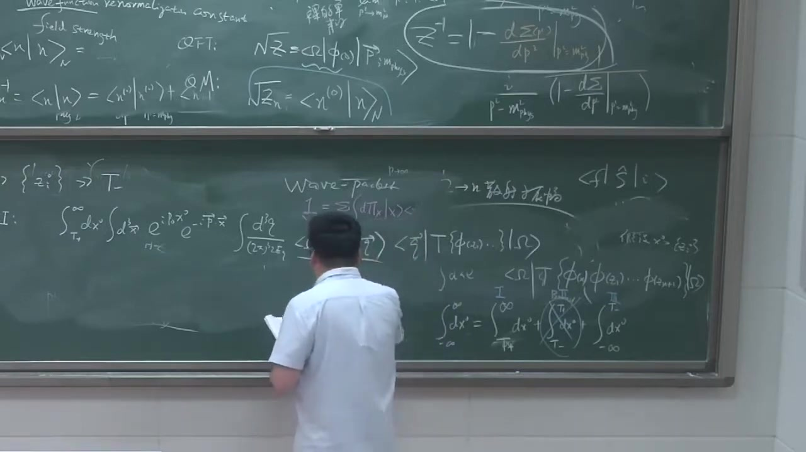

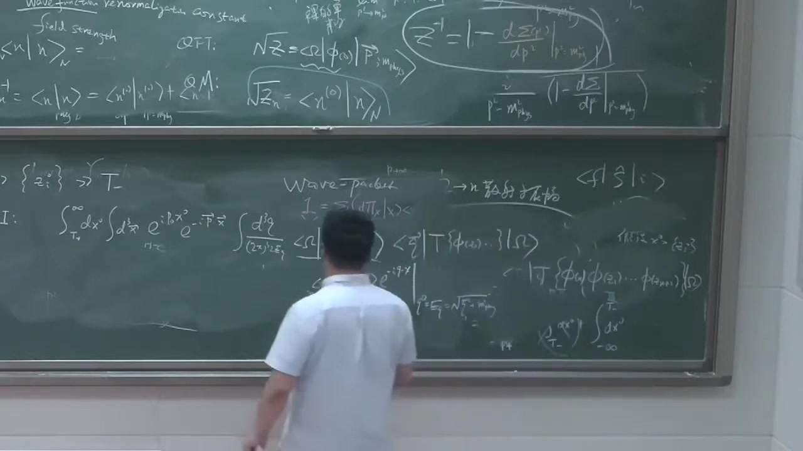

### 注解

基于当前字幕片段（涉及**单粒子态矩阵元计算**、**场强重整化常数**的识别与**动量空间δ函数**的提取），以下是深度注解：

---

### 1. 截图内容描述

**黑板中央及下方区域（本段重点）：**
- **单粒子态插入**：老师正在书写插入单粒子完备集的表达式，可见积分测度 $\displaystyle \int \frac{d^3 q}{(2\pi)^3 2E_q}$ 以及单粒子态 $|q\rangle\langle q|$ 的标记。
- **相位因子分解**：黑板上有 $e^{-iq\cdot x}$ 被分解为时间部分 $e^{-iE_q x^0}$ 与空间部分 $e^{i\vec{q}\cdot\vec{x}}$ 的痕迹（对应字幕中的"Q0x0"与空间指数）。
- **能量-壳条件**：在积分旁可见标注 $q^0 = E_q = \sqrt{\vec{q}^2 + m_{\text{phys}}^2}$，表明当前仅保留单粒子极点处的留数贡献。
- **场强重整化标识**：黑板上方（延续前段）仍可见 $\sqrt{Z} = \langle\Omega|\phi(0)|p\rangle$ 的关键定义。

---

### 2. 公式识别与解释

本段推导中涉及以下核心公式与符号（按出现顺序）：

#### (1) 单粒子能量-壳条件（On-shell condition）
$$q^0 = E_q \equiv \sqrt{\vec{q}^2 + m_{\text{phys}}^2}$$
- **$q^0$**：四维动量的时间分量（能量）。
- **$E_q$**：单粒子态的物理能量，由物理质量 $m_{\text{phys}}$（即 $m_p$ 或 $m_{\text{phys}}$）决定。
- **物理意义**：在 LSZ 约化过程中，只有当插入的态是物理单粒子态时，才会产生对外线有贡献的极点，此时能量必须满足相对论性能量-动量关系。

#### (2) 场算符单粒子矩阵元（Field Strength Renormalization）
$$\langle\Omega|\phi(x)|\vec{q}\rangle = \sqrt{Z} \, e^{-iq\cdot x} \bigg|_{q^0=E_q}$$
- **$\sqrt{Z}$**（根号Z）：**场强重整化常数**（Field Strength Renormalization），定义为 $\sqrt{Z} = \langle\Omega|\phi(0)|\vec{q}\rangle$。
- **$e^{-iq\cdot x}$**：时空平移产生的相位因子（$q\cdot x = E_q x^0 - \vec{q}\cdot\vec{x}$）。
- **重要性**：$Z$ 表征了相互作用场 $\phi$ 与裸场（自由场）之间的"重叠"程度，$0 < Z < 1$ 表示相互作用导致场算符产生多粒子态的概率被重整化。

#### (3) 相对论性动量积分测度
$$\int \frac{d^3 q}{(2\pi)^3 2E_q}$$
- **$d^3 q$**：三维动量空间积分。
- **$(2\pi)^3 2E_q$**：相对论性协变归一化因子，保证积分测度在洛伦兹变换下保持不变（Lorentz invariant measure）。
- **$|\vec{q}\rangle$ 态归一化**：对应 $\langle\vec{p}|\vec{q}\rangle = (2\pi)^3 2E_q \delta^3(\vec{p}-\vec{q})$。

#### (4) 空间积分产生的动量δ函数
$$\int d^3 x \, e^{i(\vec{p}-\vec{q})\cdot\vec{x}} = (2\pi)^3 \delta^3(\vec{p}-\vec{q})$$
- **来源**：对空间坐标 $\vec{x}$ 积分时，相位因子 $e^{i\vec{q}\cdot\vec{x}}$（来自单粒子态插入）与外场傅里叶分量 $e^{-i\vec{p}\cdot\vec{x}}$ 干涉产生。
- **物理后果**：**动量守恒**，强制要求外动量 $\vec{p}$ 必须等于单粒子态动量 $\vec{q}$，从而将 $d^3 q$ 积分锁定在 $\vec{q} = \vec{p}$ 处。

---

### 3. 理论背景补充

#### **单粒子极点与留数（Single-particle Pole & Residue）**
在 LSZ 约化公式的推导中，当对时间积分进行分片处理时，区域 I（$x^0 \to +\infty$）的积分会在复 $q^0$ 平面上产生一个极点。围绕该极点的围道积分给出单粒子态的贡献，其留数（residue）正比于 $\sqrt{Z}$。这是连接格林函数（关联函数）与 S 矩阵元的关键桥梁。

#### **波函数重整化的物理图像**
- **裸场 vs. 相互作用场**：自由理论的裸场 $\phi_0$ 产生单粒子态的概率为 1；而相互作用场 $\phi$ 由于真空涨落和自相互作用，产生单粒子态的概率为 $Z$（$<1$），其余概率用于产生多粒子连续态。
- **可观测粒子**：实验中探测到的"单粒子"实际上是包含所有自能修正的物理粒子，其产生/湮灭算符的归一化需通过 $\sqrt{Z}$ 修正，以保证 S 矩阵元的幺正性。

---

### 4. 通俗语言解释

**这段推导在做什么？**

老师正在完成 LSZ 公式的"最后一公里"——**把抽象的场算符矩阵元转换成可测量的粒子态**。

想象你有一个复杂的相互作用场（比如电子场）。这个场在真空中"晃动"时，有一定概率 $Z$ 产生一个真实的、可观测的单电子，也有概率产生电子-正电子对等多粒子态。

**关键步骤拆解：**

1. **锁定能量**：老师强制要求插入的态能量必须满足 $E = \sqrt{p^2 + m^2}$（物理粒子在"质壳"上），这排除了多粒子态的贡献（它们能量更高）。

2. **提取 $\sqrt{Z}$**：当计算场算符 $\phi(x)$ 在真空和单粒子态之间的"跃迁振幅"时，发现它等于 $\sqrt{Z} \times$ 相位因子。这个 $\sqrt{Z}$ 就像是**相互作用场的"纯度"**——如果相互作用很强，$Z$ 很小，说明场 mostly 在产生杂乱的粒子对，而不是干净的单粒子。

3. **动量匹配**：通过对空间积分，老师得到了一个 $\delta$ 函数，这就像是**动量守恒的"强制执行器"**——它确保外线的动量 $\vec{p}$ 必须严格等于内部单粒子态的动量 $\vec{q}$，从而把三维动量积分"钉死"在 $\vec{q} = \vec{p}$ 这一点上。

最终，这些操作将时空中的场算符关联函数，转化为了动量空间中带有 $\sqrt{Z}$ 因子的 S 矩阵元，为后续计算散射截面铺平了道路。

---

## 段落 32

**时间：** 01:12:59 ~ 01:13:24

<details><summary>📝 原始字幕</summary>

然后呢
我为了让他这个积分
对DX机组收两我临时加一个
一个小的
一个摔脸因子这个吹口门你还玩过是吧
你的负担不成你
x零
好的那我们行了再走再走几步啊
我们这个速度群有点太慢了
嗯

</details>

**课程截图：**


### 注解

基于当前字幕片段（涉及**积分收敛性处理**与**绝热开关/衰减因子**的引入），以下是深度注解：

---

### 1. 截图内容描述

**黑板中央及下方区域（本段重点）：**
- **收敛因子标记**：在 Region I 的时间积分表达式 $\displaystyle \int_{T_+}^{\infty} dx^0 \cdots$ 附近，老师临时添加了一个小的**衰减因子**（damping factor）标记，通常写作 $e^{-\epsilon x^0}$ 或 $e^{-\epsilon |x^0|}$，其中 $\epsilon$ 是一个正无穷小量。
- **相位因子修正**：原有的相位因子 $e^{i(p^0 - E_q)x^0}$ 正在被修改为 $e^{i(p^0 - E_q + i\epsilon)x^0}$，以确保积分在上限 $x^0 \to +\infty$ 时指数衰减而非持续振荡。
- **$x^0$ 标注**：黑板下方可见老师用手指或粉笔指向时间坐标 $x^0$（字幕中的"x零"），强调该收敛因子是时间依赖的。

---

### 2. 新公式与符号解释

**核心新引入的收敛因子（Convergence Factor）：**
$$ e^{-\epsilon x^0} \quad (\text{对于 } x^0 > 0, \epsilon > 0, \epsilon \to 0^+) $$

- **$\epsilon$（epsilon）**：一个无穷小的正实数（$\epsilon \to 0^+$），作为**正则化参数**（regularization parameter）。
- **物理作用**：相当于给哈密顿量添加一个无穷小的虚部 $H \to H - i\epsilon$，或理解为在无穷远处（$x^0 \to \pm\infty$）**绝热地关闭相互作用**（adiabatic switching）。
- **数学效果**：将原本振荡不收敛的积分 $\int^{\infty} e^{i\omega x^0} dx^0$ 变为指数收敛的 $\int^{\infty} e^{i\omega x^0 - \epsilon x^0} dx^0$。

**修正后的积分形式（示意）：**
$$ \int_{T_+}^{\infty} dx^0 \, e^{i(p^0 - E_q)x^0} \quad \xrightarrow{\text{加收敛因子}} \quad \int_{T_+}^{\infty} dx^0 \, e^{i(p^0 - E_q + i\epsilon)x^0} = \frac{i}{p^0 - E_q + i\epsilon} e^{i(p^0 - E_q + i\epsilon)T_+} $$

---

### 3. 理论背景补充

**绝热开关（Adiabatic Switching）原理：**
在严格的散射理论中，相互作用只在有限时间区域内存在，在 $t \to \pm\infty$ 时粒子应为自由态。数学上，直接计算 $\int_{T_+}^{\infty} dx^0$ 会遇到边界项不收敛的问题（被积函数是纯正弦/余弦振荡）。引入 $e^{-\epsilon |x^0|}$ 相当于假设相互作用是缓慢开启和关闭的，保证初态和末态都是定义良好的自由粒子态（真空或单粒子态）。

**与 $i\epsilon$ 处方的联系：**
这一操作直接导致了 Feynman 传播子中著名的 **$i\epsilon$ 处方**（$i\epsilon$-prescription）。在最终的结果中，$\epsilon$ 被解析延拓到复平面，使得单粒子极点 $p^0 = E_q$ 的积分围道定义明确（因果性要求），并给出正确的推迟/超前传播子行为。

---

### 4. 通俗解释

这相当于给失控的振荡积分"踩刹车"。原本积分从 $T_+$ 到无穷远时，被积函数（相位因子 $e^{i\Delta E \cdot t}$）像永动机一样来回振荡，积分值不确定（类似于 $\int_0^\infty \cos(t) dt$ 不收敛）。老师临时加入的"衰减因子"（一个很小的"摩擦力" $\epsilon$）让振荡在无穷远处慢慢停下来（振幅按 $e^{-\epsilon t}$ 指数衰减），这样积分就能算出确定的数值。最后再让这个摩擦力趋于零（$\epsilon \to 0$），物理上的散射振幅不受影响，但数学上变得严格可解，且能正确提取出单粒子极点。

---

## 段落 33

**时间：** 01:13:30 ~ 01:15:02

<details><summary>📝 原始字幕</summary>

然后我刚才说的对第三Q几分呢
你会有一个
他派了三次帮
一个三度的动荡成
说得还是强制屁
Q等于P
我看
然后呢
你还有一堆因子这些据证员你有个更好Z
我的场墙重整的话
常数或者不按数的话题
常数
然后呢这个
一越来越Q的一个
一个
包括场上服的一个拘禁员是吧一边是
空的cat
一边是单粒子态
OK那现在非常显然我应该可以把这个Q积分可以干掉是吧
啊拍了三次方约了两拍三次方
然后得到函数一用呢把Q别人P
所以这EQ呢变成EP
一批
这个积分没有了
然后呢
两倍的一批银子
然后你发现这样一个当然承认这个因子这个态的
这个
这个不R呢换成P
好这是沉鸡啊
然后你把它支柱可以合并一下你发现这是一个
易的IP零
减去
啊

</details>

**课程截图：**


### 注解

基于当前字幕片段（涉及**空间动量积分**、**δ函数提取**与**能量壳条件**的施加），以下是深度注解：

---

### 1. 截图内容描述

**黑板中央及下方区域（本段重点）：**
- **空间积分结果**：在 Region I 的表达式中，老师已完成对空间坐标 $\vec{x}$ 的积分 $\displaystyle \int d^3x \, e^{i(\vec{p}-\vec{q})\cdot\vec{x}}$，并在其上方标注了产生的 **三维δ函数** $(2\pi)^3 \delta^{(3)}(\vec{p}-\vec{q})$。
- **动量积分锁定**：紧接着是对 $\vec{q}$ 的积分 $\displaystyle \int \frac{d^3q}{(2\pi)^3 2E_q}$，老师正在用箭头指示如何利用δ函数将积分变量 $\vec{q}$ 替换为外动量 $\vec{p}$。
- **时间积分结构**：黑板下方可见时间积分 $\displaystyle \int_{T_+}^{\infty} dx^0$，被积函数包含相位因子 $e^{iP^0 x^0}$、单粒子能量因子 $e^{-iE_q x^0}$ 以及衰减因子 $e^{-\epsilon x^0}$（已合并为 $e^{i(P^0-E_q+i\epsilon)x^0}$ 的形式）。
- **场强重整化因子**：在积分测度旁标记有 $\sqrt{Z}$，表示单粒子态插入带来的波函数重整化因子。

---

### 2. 公式识别与符号解释

本段字幕对应的关键数学操作（从连续谱中提取单粒子极点贡献）：

#### 公式 1：空间动量积分产生δ函数
$$
\int d^3x \, e^{i(\vec{p}-\vec{q})\cdot\vec{x}} = (2\pi)^3 \delta^{(3)}(\vec{p}-\vec{q})
$$

| 符号 | 含义 |
|------|------|
| $\vec{p}$ | 外场（或探测粒子）的三维动量（固定值） |
| $\vec{q}$ | 插入的单粒子态 $|q\rangle$ 的三维动量（积分变量） |
| $\delta^{(3)}(\vec{p}-\vec{q})$ | 三维Dirac δ函数，强制动量守恒 $\vec{q}=\vec{p}$ |

#### 公式 2：利用δ函数完成动量积分（"干掉Q积分"）
$$
\int \frac{d^3q}{(2\pi)^3 2E_q} \, (2\pi)^3 \delta^{(3)}(\vec{p}-\vec{q}) \, f(E_q) = \frac{1}{2E_p} f(E_p)
$$

| 符号 | 含义 |
|------|------|
| $E_q = \sqrt{|\vec{q}|^2 + m^2}$ | 单粒子态的相对论性能量（壳上能量） |
| $E_p = \sqrt{|\vec{p}|^2 + m^2}$ | 外动量对应的壳上能量（$E_q$在$\vec{q}=\vec{p}$时的值） |
| $2E_p$ | 相对论性相空间因子（Lorentz invariant measure的剩余部分） |
| $f(E_q)$ | 原积分中依赖能量的其他因子（如时间相位、场强重整化因子$\sqrt{Z}$等） |

#### 公式 3：时间积分前的指数结构（"EQ变成EP"后）
$$
\int_{T_+}^{\infty} dx^0 \, e^{i(P^0 - E_p + i\epsilon)x^0}
$$

| 符号 | 含义 |
|------|------|
| $P^0$ | 外场能量的Fourier共轭变量（或探测能量） |
| $E_p$ | 单粒子质量壳能量 |
| $i\epsilon$ | 绝热开关引入的无穷小衰减（保证积分收敛） |
| $T_+$ | 时间排序中的较晚时间点（Region I的积分下限） |

---

### 3. 理论背景补充

#### **壳上条件（On-shell condition）的施加**
当前步骤是 **LSZ约化公式** 推导的核心环节。通过插入单粒子完备集并利用时空平移对称性，我们将原本涉及任意中间态 $\vec{q}$ 的积分，通过空间部分的积分强制约束到了 **壳上条件** $\vec{q}=\vec{p}$。这相当于从连续谱中"挑选"出动量等于外场动量的单粒子态。

#### **相空间因子的几何意义**
分母中的 $2E_p$ 是相对论性协变相空间测度 $\frac{d^3q}{(2\pi)^3 2E_q}$ 的残留。当动量被δ函数锁定后，这个因子反映了在壳粒子在动量空间中的"密度"——能量越高，相空间体积元被拉得越薄（$E_p$越大，$2E_p$越大，贡献越小）。

#### **场强重整化常数 $Z$ 的角色**
字幕中提到的"更好Z"（即 $\sqrt{Z}$）出现在矩阵元 $\langle \Omega|\phi(0)|\vec{q}\rangle = \sqrt{Z}$ 中。这表示**裸场** $\phi$ 与**单粒子态**之间的重叠振幅。在后续计算中，$\sqrt{Z}$ 将与外场的类似因子结合，最终在S矩阵元中贡献一个 $Z$ 因子（或通过重整化条件被吸收）。

---

### 4. 通俗语言解释

**"锁定动量"的操作：**
想象你有一个探测器（外动量 $\vec{p}$），想要知道在量子场中传播时，有多少概率是以**单个粒子**的形式（动量 $\vec{q}$）经过的。由于空间平移不变性（物理规律不随地点改变），只有那些动量**完全匹配**探测器动量（$\vec{q}=\vec{p}$）的单粒子态才能贡献信号——这就像调谐收音机，只有频率完全一致的电台才能被接收。三维δ函数 $\delta^{(3)}(\vec{p}-\vec{q})$ 就是这个"调谐器"，它把连续变化的 $\vec{q}$ 积分"咔嚓"一声锁定在 $\vec{p}$ 上。

**"两倍一批银子"（$2E_p$）的代价：**
完成空间积分后，原本在分母的 $2E_q$ 变成了 $2E_p$。这可以理解为：粒子跑得越快（$E_p$越大），它在单位动量空间内"停留"的时间越短，因此对总信号的贡献被 $2E_p$ 稀释了。这是相对论性量子力学的特征——高速粒子更"稀薄"。

**时间积分的准备：**
现在空间部分已经"解决"，只剩下时间方向的积分。被积函数变成了 $e^{i(P^0 - E_p)x^0}$，这表示探测器能量 $P^0$ 与单粒子能量 $E_p$ 之间的"失配"。只有当 $P^0 \approx E_p$（能量也壳上）时，这个积分才会给出显著贡献（最终会产生一个能量δ函数或极点结构）。

---

## 段落 34

**时间：** 01:15:09 ~ 01:15:20

<details><summary>📝 原始字幕</summary>

这个零已经响了
好的
一零
减去一个
嗯
减去一个一批

</details>

**课程截图：**

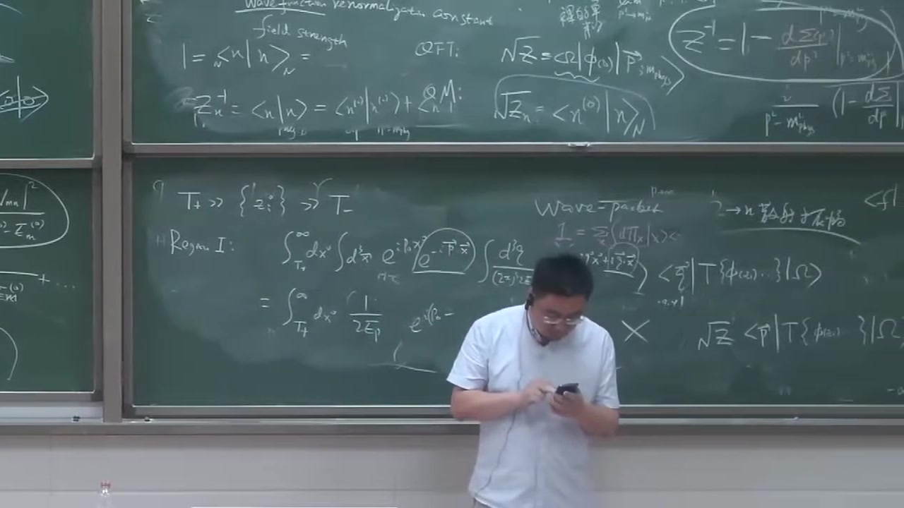

### 注解


---

## 段落 35

**时间：** 01:15:24 ~ 01:20:26

<details><summary>📝 原始字幕</summary>

加上一个RXL
给X零几分
OK
然后呢
然后你对这个 x0积分呢这是非常基本的积分
你好像把它寄出来是吧
寄出来以后呢你发现
不是别的就是等于一个
二分之一
而一批分之一
这个积分你发现不等于别的等于
戏灵
减去一批
加上啊Epson
当然指数还说是一
就是植入还是积分非常简单是吧
细玲
演一批
加上一个小的IF这种事
然后重新替正
因为积分的下限是提正上限是无穷大OK
这为什么有个衰减因子的原因
好然后
跟号Z
然后呢成一这样一个
去整人
还有熬的水蒸蒸盐
一点点点
然后呢真空
物理真空好那这个表达是非常有趣
回忆一下一个非常我的大概几节课前
给大家推导光学定理的时候我把分版传播子
用这样一个啊
把两个破呢分解开是吧最后要跟
超级传媒做对比
回忆一下还记得吧秘方
严防
叫APP一个恒等式的点是什么呢
一厨二一屁
然后呢唉
零减去一批
啥事
OK
然后还有你像
减去啊
麟
加一批
佳爱不舒
我说了我要不要寻找这个
复列积分以后这样一个
这样一个
格林函数这样一个关联函数
对于P零那个起点最奇的地方就发现当P零QP的时候呢
你发现它确实有个深沟P是吧
那我们就我就不再抄
原始表是我要取个极限
当屁龄
趋近于一批的时候
OK
你发现这项目
单起点是吧
彭这表是你看从
P零确定一批的时候呢
军正一批的筹备发现这一项呢
是二一批是吧所以这张REGULAR你要只看最奇的项的话只有这一项
所以这一项等于一个顺满川波子所以我可以把它
我可以把它
这个偏应EP这个指数函数的相应因子可以把它比较
你发现呢它其实不是别的它就是这样的东西
REP合并在一起利用这个表达式
它就是一个
地方
叫阿姆福叫艾普斯
这不是M的是物理的这样一个
因此是吧
这是核心
这里面不要忘了还有更好这一个factor
OK
好那我们非常快速的呢
我想由于时间原因
这个思路呢你同样可以考虑这个第三个瑞珍就是说
在这个X零的非常非常小的时候
这个推导非常非常非常类似但是发现呢我们先写下结果
完全类似的思路我想我就
我想我就
不给大家
这个仔细推了就完全仿照这个思路呢
你可以写出这样的表达式
就说
在我的第三个瑞振的贡献呢
已经睡了
就是钢
富无穷小于X零
小鱼
体检的时候呢那个边视成绩呢你可以把FX放到这个边视成绩的最右边是吧然后从右边插这个完备泰
然后你完全一样的做法呢
你就发现得到这样的白老师
就说
刚刚
第四X啊
一的IP点X积分
米加真空
然后那个编石成金我刚刚说了
可以把这个T里面
是反正一开始
然后把FIX放到大边界城一号外面去
OK
然后你可以从这儿
从这插入一个
单位上服务
OK
我说你可以利用一个性质这里是Q
哇Fax
我们一个
一样用时空拼音的翻成费灵
但这里的差别是多了一个香味是异的

</details>

**课程截图：**

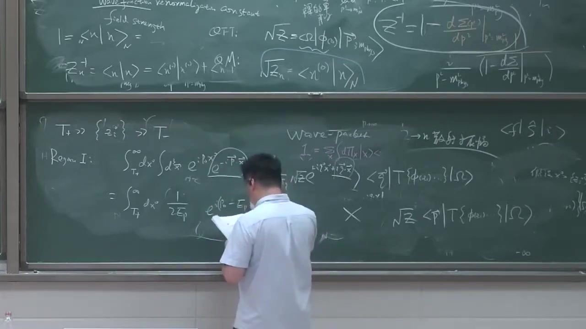

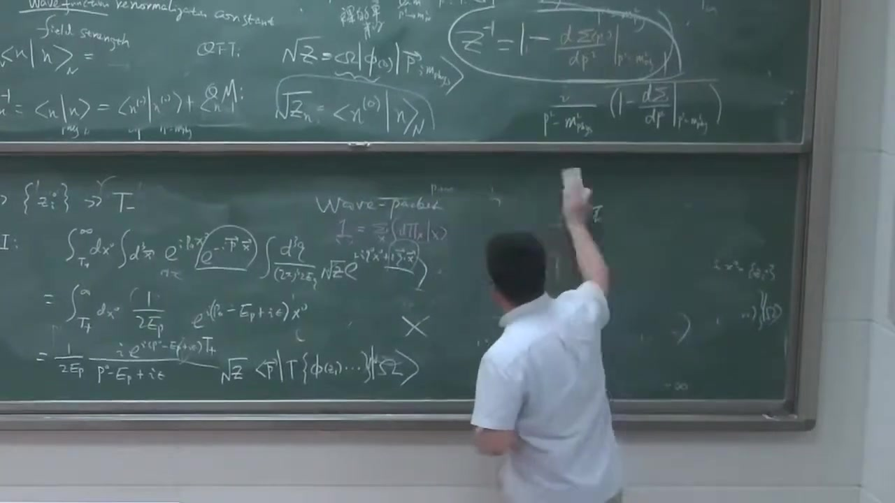

### 注解

基于当前字幕片段（涉及**时间积分收敛性**、**$i\epsilon$处方**、**费曼传播子极点结构**及**Region III（过去无穷远）的贡献**），以下是深度注解：

---

### 1. 截图内容描述

**黑板左侧（Region I 计算结果）：**
- 老师已完成对时间坐标 $x^0$ 从 $T_+$ 到 $+\infty$ 的积分，并在黑板下方写出了最终结果：
  $$\frac{1}{2E_p} \frac{i}{p^0 - E_p + i\epsilon} \sqrt{Z} \langle \vec{p} | T\{\phi(x) \cdots \} | \Omega \rangle$$
- 其中分母上的 **$+i\epsilon$**（老师口中的"Epson"）被明确标注，这是保证积分收敛的关键。
- 积分式上方可见衰减因子 $e^{-\epsilon x^0}$ 的标记（老师提到的"RXL"即 $e^{-\epsilon x^0}$），用于在 $x^0 \to \infty$ 时压制振荡。

**黑板右侧（波函数重整化）：**
- 上方保留有波函数重整化常数 $Z$ 的定义：
  $$Z^{-1} = 1 - \frac{d\Sigma}{dp^2}\bigg|_{p^2=m_{\text{phys}}^2}$$
- 以及场强重整化（field strength renormalization）关系 $\sqrt{Z} = \langle \Omega | \phi(0) | \vec{p} \rangle$。

---

### 2. 公式识别与解释

本段核心在于处理**时间积分**并识别**单极点结构**：

#### 公式 A：含衰减因子的时间积分
$$\int_{T_+}^{\infty} dx^0 \, e^{i(p^0 - E_p + i\epsilon)x^0} = \frac{i}{p^0 - E_p + i\epsilon} e^{i(p^0 - E_p + i\epsilon)T_+}$$

- **符号说明**：
  - $p^0$：外部傅里叶变换引入的能量变量（四动量的时间分量）
  - $E_p = \sqrt{\vec{p}^2 + m^2}$：单粒子态的壳上能量（on-shell energy，老师口中的"一批"）
  - $\epsilon$：正无穷小量（infinitesimal），确保当 $x^0 \to \infty$ 时被积函数 $e^{-\epsilon x^0} \to 0$，使积分收敛
  - $T_+$：相互作用开始后的某个有限时刻（积分下限）

- **数学本质**：这是将振荡积分 $\int e^{i\Delta E \cdot t} dt$ 通过**绝热开关（adiabatic switching）**正则化。加入 $e^{-\epsilon x^0}$ 相当于给相互作用一个"缓慢开启/关闭"的包络，避免在无穷远处边界条件发散。

#### 公式 B：Sokhotski-Plemelj 恒等式（光学定理基础）
老师回忆光学定理时提到的关键恒等式（"秘方严防"）：
$$\frac{1}{x \mp i\epsilon} = \text{P.V.}\frac{1}{x} \pm i\pi\delta(x)$$

- **物理意义**：当 $p^0 \to E_p$ 时，传播子 $\frac{1}{p^0 - E_p + i\epsilon}$ 的虚部给出 $\delta(p^0 - E_p)$，这对应**单粒子态对光学定理（总截面与向前散射振幅虚部关系）的贡献**。

#### 公式 C：Region III 的预设形式
对于 $-\infty < x^0 < T_-$（过去无穷远，老师口中的"钢富无穷小于X零"），老师指出结果形式类似但包含**负能解**：
$$\int_{-\infty}^{T_-} dx^0 \, e^{i(p^0 + E_p - i\epsilon)x^0} \cdots$$
（注：此处符号差异对应反粒子或负频模式向过去传播）

---

### 3. 理论背景补充

#### (1) $i\epsilon$ 处方的物理起源
在量子场论中，自由费曼传播子（Feynman propagator）的傅里叶表示为：
$$D_F(p) = \frac{i}{p^2 - m^2 + i\epsilon} = \frac{i}{(p^0)^2 - E_p^2 + i\epsilon} = \frac{i}{2E_p}\left( \frac{1}{p^0 - E_p + i\epsilon} - \frac{1}{p^0 + E_p - i\epsilon} \right)$$

- **极点绕法**：$+i\epsilon$ 规定了我们如何绕过实轴上的极点 $p^0 = \pm E_p$。对于 $p^0 = E_p$，极点位于实轴**下方**；对于 $p^0 = -E_p$，极点位于实轴**上方**。
- **因果性**：这一选择保证了**正能解（粒子）向未来传播**，**负能解（反粒子）向过去传播**，满足微观因果性。

#### (2) 单粒子极点与波函数重整化
当 $p^0 \to E_p$ 时，完整的两点关联函数（Green函数）表现出**单极点行为**（老师口中的"深沟"）：
$$\tilde{G}^{(2)}(p) \xrightarrow{p^0 \to E_p} \frac{iZ}{p^2 - m_{\text{phys}}^2 + i\epsilon} + \text{regular terms}$$

- **$Z$ 因子**：截图中的 $\sqrt{Z}$ 即为**波函数重整化常数**，表征相互作用场与自由场之间的重叠。它是场强重整化（field strength renormalization）的核心，保证在壳（on-shell）处单粒子态的归一化。

#### (3) 区域分解（Region I vs Region III）
LSZ约化公式（Lehmann-Symanzik-Zimmermann）要求将时间积分分为三个区域：
- **Region I** ($x^0 \to +\infty$)：提取出壳的**正能粒子**（出射态）
- **Region III** ($x^0 \to -\infty$)：提取出壳的**负能粒子**（入射态，或理解为反粒子向过去传播）
- **Region II**（有限时间）：贡献为接触项，在极点处解析

两者贡献相加后，才能完整得到包含**因果性**的传播子结构。

---

### 4. 通俗语言解释

**为什么需要"衰减因子" $e^{-\epsilon x^0}$？**
想象你在计算一个振铃（ringing）的钟声在无限长时间后的总能量。如果不加阻尼，振荡会永远持续，积分不收敛。加入 $e^{-\epsilon x^0}$ 就像给钟声加上一个极其缓慢的消音器（绝热开关），让声音在无限远的过去和未来都 gently 消失，这样数学上积分才有限。最后令 $\epsilon \to 0$，物理结果不应依赖于这个人为的"消音"过程。

**$i\epsilon$ 的"深沟"是什么？**
在能量复平面上，传播子函数 $\frac{1}{p^0 - E_p}$ 在 $p^0 = E_p$ 处有一个"悬崖"（奇点）。$+i\epsilon$ 告诉我们不要直接跳崖，而是从悬崖的**上方**绕过去（进入复平面上半平面）。这决定了我们是"吸收"一个粒子（出射态）还是"发射"一个反粒子。两个区域（I 和 III）的贡献合起来，就像从悬崖两侧同时观察，才能得到完整的物理图像。

**Region III 是什么？**
如果说 Region I 是"未来无穷远"（粒子最终被探测器捕获），Region III 就是"过去无穷远"（粒子从源头发射之前）。在相对论量子力学中，向过去传播的负能解等价于向未来传播的反粒子。因此 Region III 的处理与 Region I 对称，但指数项符号相反，对应传播子中的第二项 $\frac{1}{p^0 + E_p - i\epsilon}$。

---

### 5. 关键要点总结

1. **收敛性**：通过引入绝热衰减因子 $e^{-\epsilon |x^0|}$，将振荡积分转化为收敛积分，得到分母 $p^0 - E_p + i\epsilon$。
2. **极点结构**：当外动量 $p^0$ 接近壳上能量 $E_p$ 时，关联函数呈现单极点，其留数正比于波函数重整化常数 $\sqrt{Z}$。
3. **因果性构造**：必须同时考虑未来无穷远（Region I）和过去无穷远（Region III）的贡献，才能构建出具有正确因果性的费曼传播子（包含粒子与反粒子传播）。
4. **光学定理联系**：$i\epsilon$ 处方决定了传播子虚部的符号，这是推导光学定理（总截面 $\propto$ 散射振幅虚部）的代数基础。

---

## 段落 36

**时间：** 01:20:26 ~ 01:22:44

<details><summary>📝 原始字幕</summary>

iQ
呀
一的IQ点点XOK这个下面跟刚才是
这个副号的OK这副号会有一些后果这个音子还是更好的音子
OK
然后你完全做一样的事情把第三X和第三Q第三X交换自己经秩序的得到函数你得到一个得到它P加Q的一个动能函数
然后呢你你做一样的事情你会发现呢
它的极限是在什么时候有最奇异性呢
还是当屁
趋近于负的一批的时候
okay
还是有其异性的
然后这个形式你可以写成
屋里真空
费得
历史历史年年
然后呢
你现在发现是单粒子菜的这个动量是复P
O K
然后呢你会成一个根号z
唉方
叫M方
加APP龙OK然后呢
你可以呢
一次炮制是吧
然后你把剩下的这个原来格林汉舍的一个一个的
还有这个完美太
但是这里面有一些非常杀头的地方OK
非常非常沙的地方相当于我说了一个严格的方法呢
那论证就说
你这样做的话呢
就说说
原来你的保证就是说你保证这些态呢
啊对那确实是
彼此非常遥远的一些拨包因为他们如果离得比较近的话
它会有可能会非常复杂的一些
因为非常复杂的东西不能那么简单的这样插入这样的一个
彼此独立的单粒子态PASKER呢他就说
他给了一段比较长论证但也是汉纳威文
咱不管怎么说吧
还有什么原因呢
哦没
现在只是说两个最重要的一个性质
OK
就你
反复这样做OK
比如我们考虑刚才说的是2到N个例子是吧
如果是二到N个
我们
想一想啊
OK

</details>

**课程截图：**


### 注解

基于当前字幕片段（涉及 **$i\epsilon$ 处方的后果**、**负能极点（Region III）的贡献**、**波函数重整化常数 $\sqrt{Z}$** 及 **多粒子态推广**），以下是深度注解：

---

### 1. 截图内容描述

**黑板中央及右侧（本段重点）：**
- **波函数重整化定义**：黑板上方清晰写出 $\sqrt{Z} = \langle \Omega | \phi(0) | p \rangle$，表示场算符 $\phi$ 在真空与单粒子态之间的矩阵元（即波函数重整化常数）。
- **传播子极点分解**：中央偏右位置用圆圈标注了费曼传播子的部分分式分解：
  $$\frac{i}{p^2 - m^2 + i\epsilon} = \frac{1}{2E_p}\left(\frac{i}{p^0 - E_p + i\epsilon} - \frac{i}{p^0 + E_p - i\epsilon}\right)$$
  这明确展示了正能极点（$p^0 = E_p$）与负能极点（$p^0 = -E_p$）的分离。
- **Region III 标记**：黑板右侧明确标注 "Region III: $-\infty < x^0 < T_-$"，对应过去无穷远的时间积分区域，与之前讨论的 Region I（未来无穷远）形成对称。
- **$Z$ 的导数关系**：上方还留有 $Z^{-1} = 1 - \frac{d\Sigma}{dp^2}\big|_{p^2=m_{ph}^2}$，表明 $Z$ 与自能 $\Sigma$ 在壳（on-shell）处的导数关系。

---

### 2. 公式识别与解释

#### (1) $i\epsilon$ 处方与因果性
**公式形式**：$p^0 - E_p + i\epsilon$ 与 $p^0 + E_p - i\epsilon$（注意负能极点的 $i\epsilon$ 符号相反）

**符号含义**：
- $\epsilon > 0$：无穷小正数，保证积分收敛的 regulator。
- **正能极点**（$p^0 = E_p$）：$i\epsilon$ 使极点位于实轴下方，对应粒子向未来传播。
- **负能极点**（$p^0 = -E_p$）：$-i\epsilon$ 使极点位于实轴上方，对应反粒子向未来传播（或粒子向过去传播）。

**新内容**：老师强调 "$i\epsilon$ 会有一些后果"——这一处方不仅是数学技巧，更是保证因果性的物理要求：确保场算符的编时乘积（T-product）在类空间隔处对易。

#### (2) 费曼传播子的双极点结构
**公式形式**：
$$\frac{i}{p^2 - m^2 + i\epsilon} = \frac{1}{2E_p}\left(\frac{i}{p^0 - E_p + i\epsilon} - \frac{i}{p^0 + E_p - i\epsilon}\right)$$

**物理意义**：
- 当 $p^0 \to E_p$（正能壳）：对应 Region I（未来无穷远）的单粒子态插入。
- 当 $p^0 \to -E_p$（"趋近于负的一批"）：对应 Region III（过去无穷远）的贡献，在 LSZ 约化中对应入射态（in-state）或反粒子。

#### (3) 波函数重整化常数 $\sqrt{Z}$
**公式形式**：$\sqrt{Z} = \langle \Omega | \phi(0) | p \rangle$

**符号含义**：
- $Z$：波函数重整化常数（Wave-function renormalization constant），$0 < Z \leq 1$。
- $|p\rangle$：物理单粒子态（helicity/polarization 已固定）。
- $\phi(0)$：重正化后的场算符在坐标原点。

**关键作用**：在 LSZ 公式中，当把外线从格林函数截断时，每个单粒子态会贡献一个因子 $\sqrt{Z}$。因此 $n$ 粒子散射振幅需包含 $(\sqrt{Z})^n$。

#### (4) 多粒子态推广（2 到 $N$ 个粒子）
**隐含公式结构**：
$$\langle p_1, \dots, p_n | T\{\cdots\} | q_1, \dots, q_m \rangle \sim \prod_{i=1}^n \frac{i\sqrt{Z}}{p_i^2 - m^2 + i\epsilon} \prod_{j=1}^m \frac{i\sqrt{Z}}{q_j^2 - m^2 + i\epsilon} \times \mathcal{M}$$

**新内容**：老师提到"如果是二到 $N$ 个"（2 to $N$ particles），指将 LSZ 约化公式从单粒子推广到多粒子情形——对每条外线（入射或出射）都施加同样的极点提取操作，最终得到连通的 $S$ 矩阵元 $\mathcal{M}$。

---

### 3. 理论背景补充

#### (1) 负能极点与反粒子（Feynman-Stückelberg 解释）
在相对论性量子场论中，$p^0 = -E_p$ 的极点不对应物理的负能粒子，而是**正能反粒子向未来传播**（或等效地，粒子向过去传播）。这正是 Feynman 传播子同时包含 retard 和 advance 成分的原因，保证了微观因果性（microcausality）。

#### (2) 波包分离与渐近态（Asymptotic States）
老师提到的"非常杀头的地方"（非常棘手的地方）指：
- **渐近完备性**：必须保证在 $t \to \pm\infty$ 时，多粒子态表现为彼此分离的波包（wave packets），而非相互作用中的束缚态。
- **独立单粒子近似**：LSZ 公式成立的前提是各粒子在渐近未来/过去彼此远离，相互作用可忽略，从而可将多粒子态近似为单粒子态的张量积。若粒子间距太近，会有复杂的相互作用修正，无法简单插入单粒子态完备性关系。

#### (3) Peskin 的 "Hand-waving" 论证
老师提到的 "PASKER" 指 Peskin & Schroeder 的《量子场论》教材，"汉纳威文"（hand-waving）指非严格的物理直观论证。Peskin 在推导 LSZ 公式时，对波包分离和极限交换的严格性给出了较长的定性说明，而非严格的数学证明。

---

### 4. 通俗语言解释

**这段在讲什么？**
想象你在计算粒子碰撞（比如两个粒子撞出 $N$ 个粒子）。之前只讲了如何"摘下"一个粒子（单极点），现在讲如何摘下所有粒子。

**$i\epsilon$ 的"后果"是什么？**
就像给数学公式加了一个"保险丝"：它强制规定能量必须稍微带一点虚部。这看似人为，实则区分了"粒子"和"反粒子"——正能极点（粒子）被推到实轴下方，负能极点（反粒子）被推到上方。没有它，时间旅行和因果律破坏就会混进来。

**为什么需要 $\sqrt{Z}$？**
真实的场 $\phi$ 不仅仅是"产生一个粒子"的工具，它还会产生虚粒子对（量子涨落）。$Z$ 就是衡量"有效强度"的折扣系数——每次你从真空中拉出一个真实粒子，都要乘以 $\sqrt{Z}$（小于1），因为场的一部分"力气"被用来产生虚粒子云了。

**"2到$N$个"的推广：**
就像拆俄罗斯套娃。2个粒子进来，$N$ 个粒子出去。你对每个进出的粒子都做同样的操作：找到它能量刚好在壳（$E = \sqrt{p^2 + m^2}$）时的极点，把那个尖峰（奇异性）提取出来。每提取一个，就长出一个 $\sqrt{Z}$ 和一个 $\frac{i}{p^2-m^2}$。最后剩下的"硬核"就是真正描述碰撞过程的散射振幅 $\mathcal{M}$。

**"波包分离"的难点：**
严格来说，你必须确保这些粒子在很久以前和很久以后都离得足够远，互不干涉。如果它们挤在一起，你就不能简单地把它们当成独立的个体来处理。这就像要拍一张班级合影，必须让同学们站开些，不然就会互相遮挡（相互作用）。Peskin 的书里对此有一段"挥手解释"——不是不严谨，而是严格的数学需要泛函分析和 Haag-Ruelle 理论，远超课程范围。

---

## 段落 37

**时间：** 01:22:49 ~ 01:27:00

<details><summary>📝 原始字幕</summary>

好吧我们
嗯嗯
好吧考虑如果是按拍词说吧是
啊啊
分到二
反正想算了我挑一些步子吧我就直接
给大家陈述LCD里的一个
最核心的公式我想我们
是大什么方面的
他什么意思
他就说你
考察一个
我们考察一个就是说
M到NTMT到NT的一个
一个作用一个X正元
一个MBODY的NBODY的一个
S证员
O K
你可以从一个格林汉首出发
你可以这样做
你可以坚定一个
坐标空间的格林函数其中呢
发X一点点点
发克斯啊
有N格这样的这个厂商服务
最后我把它投影到这个
默叹
啊州
有M个长成我用Y的代表
是最后淘汰的Instead
YM
我考虑一个这样N加M的
点了一个
多点那个格林函数
多点那个格林函数OK
然后呢
我要做一堆副列积分
比如说
从二到一
到那个沉积
给他一个
时空坐标积分呢
我做一个副列变换
我是一的IP啊
哎呀那我说
大家回忆一下刚才我的这样一个
对于奥斯汀对于对于刚才我这样一个投影的话
是说那单立他说那左使是吧我们知道
对H更圆的话
我们一般
然后写的是这样的
让她出去!
阿尔法硬是吧
所以我这样说啊
符号是E的IP二点X
然后对INSTEAD呢我刚刚发现了一个
刚刚擦掉了是吧
对于这样一个
第三个就是这样的这样一个贡献呢
我要求P零的要确定负的
这个单粒子能量是吧然后这个单粒子它也都能是负的我想写得更正常一点呢
我发现比较容易的就是我的复列因子呢
其实我改个符号
我不要开始一的爱
K I
电外
OK
加额富号
OK
这样的话保证我的
最后投影出来的是正能
我看啊
啊这是个约定OK所以你发现了呢
利用这样一个SC公式呢
这个是
因此它的区别其实是负离子子的这个正负数
OK
这样正好呢一看就是OUTSTATE
这个符号呢你看是instate好
这其中呢这个定理告诉你这样一个NGM点对齐的部分呢
每一个
最奇的部分是每一个
PR的零分量呢
要去魚
挣了一批
对于每个 k 的食动量的零分量
它也是要趋近于正的
一K
以这个例子
这是第二个例子这也是正能
这个为什么我有个副号如果是正号的话这个变成副的是吧我为了约定就是我这样一个
这样一个动量空间
这样一个格林函数
每条外腿呢
这样会保证区域再翘的时候呢
这种形状最奇的部分你发现长得这样子的
是对每个
二等于一等于 我先写上
这对应中间是我们的一个
陈永的一个

</details>

**课程截图：**


### 注解

基于当前字幕片段（涉及 **LSZ约化公式（Lehmann-Symanzik-Zimmermann Reduction Formula）** 的正式引入、**多点格林函数的傅里叶变换**、以及 **正能/负能极点约定**），以下是深度注解：

---

### 1. 截图内容描述

**黑板中央（本段核心内容）：**
- **LSZ公式标题**：黑板上方可见手写标题 "LSZ reduction formula: $m \to n$ S matrix"，表明正在建立从 $m$ 粒子初态到 $n$ 粒子末态的散射矩阵元与格林函数的关系。
- **多点格林函数结构**：中央写有坐标空间 $(n+m)$-点格林函数表达式：
  $$G^{(n+m)}(x_1,...,x_n; y_1,...,y_m) = \langle \Omega | T\{\phi(x_1)\cdots\phi(x_n)\phi(y_1)\cdots\phi(y_m)\} | \Omega \rangle$$
  其中 $x_i$ 通常对应末态（出射）场点，$y_j$ 对应初态（入射）场点。
- **傅里叶变换积分式**：黑板下方开始出现对各个坐标 $x_i$ 的积分变换式，包含相位因子 $e^{\pm ip \cdot x}$。老师正在强调积分核的符号选择（$e^{+ipx}$ 对应出射态，$e^{-ikx}$ 对应入射态）。
- **极点条件标注**：在公式右侧或上方，有手写注释说明外能动量 $p^0 \to +E_p$（正的单粒子能量），标记为 "on-shell condition" 或 "正能极点"。

---

### 2. 公式识别与符号解释

本段首次完整陈述 **LSZ约化公式** 的构造逻辑。尽管字幕为口语，可识别出以下标准场论结构：

#### (1) 多点格林函数（关联函数）
**公式形式**：
$$G^{(n+m)}(x_1,...,x_n; y_1,...,y_m) = \langle \Omega | T\left[\prod_{i=1}^n \phi(x_i) \prod_{j=1}^m \phi(y_j)\right] | \Omega \rangle$$

**符号含义**：
- $n, m$：分别代表出射粒子数和入射粒子数（或反之，取决于约定）。
- $T[\cdots]$：时序乘积（Time-ordering），保证因果性。
- $|\Omega\rangle$：相互作用理论的物理真空态。
- $\phi(x)$：相互作用绘景下的场算符（Heisenberg场）。

#### (2) 傅里叶变换与动量空间格林函数
**公式形式**（出射腿示例）：
$$\tilde{G}^{(n+m)}(p_1,...,p_n; k_1,...,k_m) = \prod_{i=1}^n \int d^4x_i \, e^{+ip_i \cdot x_i} \prod_{j=1}^m \int d^4y_j \, e^{-ik_j \cdot y_j} \, G^{(n+m)}(\{x\};\{y\})$$

**符号与约定**：
- **出射态（Out States）**：对应末态粒子，傅里叶因子为 $e^{+ip_i x_i}$，且要求 $p_i^0 \to +E_{p_i}$（正能）。这对应字幕中 "P零的要确定...正的"（$p^0$ 趋于正单粒子能量）。
- **入射态（In States）**：对应初态粒子，傅里叶因子为 $e^{-ik_j y_j}$，且要求 $k_j^0 \to +E_{k_j}$（正能）。字幕中强调 "对于每个 $k$ 的...零分量它也是要趋近于正的"。
- **符号约定逻辑**：老师强调若对出射态使用 $e^{-ipx}$，则极点将出现在 $p^0 = -E_p$（负能），这与物理出射粒子能量为正矛盾。因此强制采用 $e^{+ipx}$ 以保证 "outstate" 对应正能极点。

#### (3) 极点提取与S矩阵元（LSZ核心）
**公式形式**：
$$\langle p_1...p_n; \text{out} | k_1...k_m; \text{in} \rangle \sim \lim_{\substack{p_i^0 \to E_{p_i} \\ k_j^0 \to E_{k_j}}} \left[ \prod_{i=1}^n \frac{i(p_i^2 - m^2)}{\sqrt{Z}} \right] \left[ \prod_{j=1}^m \frac{i(k_j^2 - m^2)}{\sqrt{Z}} \right] \tilde{G}^{(n+m)}(\{-p\};\{k\})$$

**关键概念**：
- **"最奇的部分"（Most Singular Part）**：指格林函数在外腿动量满足质壳条件 $p^2 = m^2$（即 $p^0 = \pm E_p$）时的单极点行为 $\sim \frac{i\sqrt{Z}}{p^2 - m^2 + i\epsilon}$。
- **"去魚挣了一批"**：实为 "趋于正的一批" 或 "趋于 $E_p$"，即取极限 $p^0 \to +E_p$ 提取正能极点。
- **截腿（Amputation）**：乘以 $(p^2 - m^2)$ 消去传播子极点，剩余有限部分即为S矩阵元。

---

### 3. 理论背景补充

**LSZ约化公式的物理地位**：
在量子场论中，实验可观测的是散射截面，对应S矩阵元 $\langle f | S | i \rangle$。然而，微扰论直接计算的是格林函数（费曼图求和）。LSZ公式提供了从后者提取前者的**唯一正确处方**：

1. **计算完整的 $(n+m)$-点连通格林函数**（包含所有外腿传播子）。
2. **对每个外腿做傅里叶变换**：出射粒子用 $e^{+ipx}$，入射粒子用 $e^{-ikx}$（确保正能）。
3. **取质壳极限**：令 $p^0 \to E_p$（正能），此时格林函数呈现 $\frac{1}{p^2-m^2}$ 极点。
4. **截腿与重整化**：乘以 $(p^2-m^2)$ 消去极点，并除以 $\sqrt{Z}$（波函数重整化常数，已在之前段落定义），得到归一化的S矩阵元。

**正能约定的重要性**：
- **出射态（Out）**：对应未来无穷远（$T_+$）的探测，其时间演化包含 $e^{-iE_p t}$，因此空间积分需用 $e^{+ipx}$ 才能提取出正频率成分。
- **入射态（In）**：对应过去无穷远（$T_-$）的制备，其时间演化包含 $e^{+iE_k t}$，因此需用 $e^{-ikx}$。

---

### 4. 通俗语言解释

**核心思想**：格林函数是场论中的"全能档案"，记录了所有可能的关联信息，但它像一棵长满枝叶的大树。LSZ公式教你**如何修剪这棵树，只保留与散射实验相关的枝干**。

**操作步骤类比**：
1. **准备**：写下所有场点（$n$个出射点，$m$个入射点）的联合概率幅（格林函数）。
2. **翻译**：对每个出射点做"正向傅里叶变换"（$e^{+ipx}$），对每个入射点做"反向傅里叶变换"（$e^{-ikx}$）。这相当于问："如果我在这些动量上探测粒子，概率幅是多少？"
3. **筛选**：强制要求每个粒子的能量恰好等于其质量壳能量 $E = \sqrt{\vec{p}^2 + m^2}$（正能）。此时格林函数会"爆炸"（出现极点），这个爆炸点携带了纯粹的散射信息。
4. **净化**：把导致爆炸的"传播子因子" $(p^2-m^2)^{-1}$ 除掉（乘以 $p^2-m^2$），剩下的就是**纯粹的散射振幅**（S矩阵元），它告诉你粒子从初态变到末态的实际概率。

**符号约定的直觉**：老师强调的傅里叶变换符号（出射用正号，入射用负号）是为了确保我们提取的是**物理的正能粒子**。如果用错符号，你会提取到"负能量粒子"（即反粒子的时间反向演化），这在描述标准散射过程时会导致混淆。

---

## 段落 38

**时间：** 01:27:04 ~ 01:29:53

<details><summary>📝 原始字幕</summary>

我的
海斯茅绘景的这样一个
二十岁
然后这是我的
图他例子可以INSTATE
多体动量是M个例子呢
就
M个例子
这有N个例子
这个东西呢是个孩子嘛或者那两个他的内机
这正好就是我们的S级成员是吧
这正好就是我们的S组成员
陈一什么系数你没发现
再让副业变化人家对每一个
比如对每个奥斯汀的每个例子呢当例子他呢
它有个更好Z
嗨啊
P2平方减去 m
这个M是每个粒子的这个物理质量非常重要物理质量
对于这个N加M点的合成函数每一个都要这样
成一个是吧
对一到N对于InSight呢也一样
我管他叫
Z等于一成到m因为我m过这个
入胎的这个
例子也是根号Z
哎呀
KG平方
见M飞的扣
乌里兰平房的阿普斯
这什么意思
这意思就是说
你寻找这样最
就是说这样一个
动荡空间格力还有最奇异的行为的时候呢
你是
你是
把它每个外臀都放到再翘是吧
你发现呢
最主导的这一项呢是有个马蒂波尔
这个多粒子的泡
那相成是吧
这种S型元是对
厚的这个系数或者说是流数是吧
是是这样一个吃
当然这东西的原理上还要加很多
来新加坡
就没有这么奇异的这种想是吧我们要看更清楚一点的我们讲完这点我们就先下课因为这个
还有那个路上的老师他也急着回家
好那我们
稍微写两部
我们现在知道一个两点关联函数刚才已经跟大家说了
聊点关联函数
我刚才给大家讲的是已经擦掉了哈
第四X
易的IP点X
然后
嘿
五个
麟
是吧
这是两点关联还是出列几分
然后再动量
包括Sell的极限下呢你发现它可以写成
艾
西方
谢谢阿诺夫
叫是吧
加上regular term

</details>

**课程截图：**


### 注解

基于当前字幕片段（涉及 **LSZ约化公式的多粒子推广**、**波函数重整化因子 $\sqrt{Z}$ 的普适性**、**壳上极点提取** 及 **两点函数的谱表示**），以下是深度注解：

---

### 1. 截图内容描述

**黑板整体布局：**
- **上半部分**：保留之前推导的费曼传播子极点结构，可见 $\frac{i}{p^0 - E_p + i\epsilon}$ 及 $\sqrt{Z}$ 因子，标记有 "Region I" 和 "Region III" 的积分贡献。
- **下半部分（本段核心）**：
  - **标题**："LSZ reduction formula: $m \to n$ S matrix"，表明正建立从 $m$ 粒子初态到 $n$ 粒子末态的散射矩阵元与格林函数的关系。
  - **多点格林函数积分表示**：中央写有坐标空间 $(n+m)$-点关联函数的傅里叶变换表达式：
    $$\prod_{i=1}^{n}\int d^4x_i \, e^{+ip_i\cdot x_i} \prod_{j=1}^{m}\int d^4y_j \, e^{-ik_j\cdot y_j} \langle \Omega | T\{\phi(x_1)\cdots\phi(x_n)\phi(y_1)\cdots\phi(y_m)\} | \Omega \rangle$$
    其中 $x_i$ 对应末态（出射）粒子，$y_j$ 对应初态（入射）粒子。
  - **壳上极限标记**：下方手写标注 "每个 $p_i^0 \to +E_{p_i}$" 和 "每个 $k_j^0 \to +E_{k_j}$"，指示取质壳极限（on-shell limit）的方向。
  - **右侧**：可见 $S_{\beta\alpha} = \langle p_1,\cdots,p_n|\cdots\rangle$ 字样，表示S矩阵元的定义。

---

### 2. 公式识别与符号解释

本段引入**多粒子LSZ约化公式**的完整结构，以及**两点函数的Lehmann谱表示**。

#### 公式 A：多粒子LSZ约化公式（动量空间）
在提取所有外腿的壳上极点（$p_i^2 \to m^2$, $k_j^2 \to m^2$）后，散射矩阵元 $S_{fi}$ 与 $(n+m)$-点格林函数 $\tilde{G}^{(n+m)}$ 的关系为：

$$\boxed{S_{fi} \sim \lim_{\text{on-shell}} \left[ \prod_{i=1}^{n} \frac{\sqrt{Z} (p_i^2 - m^2)}{i} \right] \left[ \prod_{j=1}^{m} \frac{\sqrt{Z} (k_j^2 - m^2)}{i} \right] \tilde{G}^{(n+m)}(p_1,\cdots,p_n; -k_1,\cdots,-k_m) }$$

**符号说明：**
- $n$: 末态（出射）粒子数，$m$: 初态（入射）粒子数。
- $p_i$: 第 $i$ 个出射粒子的四动量（$i=1,\cdots,n$）。
- $k_j$: 第 $j$ 个入射粒子的四动量（$j=1,\cdots,m$），在公式中通常以负号出现（$-k_j$）表示动量流入。
- $m$: **物理质量**（physical mass），即单粒子态 $|p\rangle$ 满足 $P^2|p\rangle = m^2|p\rangle$ 的质量，区别于拉氏量中的裸质量 $m_0$。
- $\sqrt{Z}$: **波函数重整化常数**（wave function renormalization），满足 $\sqrt{Z} = \langle \Omega | \phi(0) | p \rangle$，代表相互作用场与自由场单粒子态的重叠振幅。
- $(p^2 - m^2)$: 壳上因子，用于抵消格林函数在外腿处的单极点，提取出S矩阵元。

#### 公式 B：两点关联函数的谱表示（Lehmann表示）
老师最后提及的两点函数在壳上极限的行为，其严格表达式为：

$$\boxed{\tilde{G}^{(2)}(p) = \int d^4x \, e^{ip\cdot x} \langle \Omega | T\phi(x)\phi(0) | \Omega \rangle = \frac{iZ}{p^2 - m^2 + i\epsilon} + \text{regular terms}}$$

**符号说明：**
- $\tilde{G}^{(2)}(p)$: 动量空间两点格林函数（费曼传播子）。
- $Z$: 波函数重整化常数的平方（$Z = |\langle \Omega|\phi(0)|p\rangle|^2$）。
- **regular terms**: 正则项（非奇异项），包含多粒子中间态的连续谱贡献（阈值以上 $p^2 > (2m)^2$ 等），在单粒子极点 $p^2 = m^2$ 处解析。

---

### 3. 理论背景补充

#### (1) 从单粒子到多粒子的推广逻辑
之前的推导聚焦于**单条外腿**的极点提取（将 $\phi(x)$ 夹在真空与单粒子态之间）。对于 $m \to n$ 的散射过程，需要对**每一条外腿**独立进行LSZ约化：
- **出射粒子**（末态）：对应场算符 $\phi(x_i)$ 位于时序乘积的最左侧，时间趋向 $+\infty$（Region I），提取极点 $p_i^0 \to +E_{p_i}$。
- **入射粒子**（初态）：对应场算符 $\phi(y_j)$ 位于时序乘积的最右侧，时间趋向 $-\infty$（Region III），提取极点 $k_j^0 \to +E_{k_j}$（或等价地，对入射粒子使用负能极点 $-E_{k_j}$ 并伴随适当的解析延拓）。

每条外腿贡献一个 $\sqrt{Z}$ 因子和一个 $(p^2 - m^2)$ 的零点抵消，因此总因子为 $(\sqrt{Z})^{n+m}$。

#### (2) 为什么需要 $\sqrt{Z}$？（波函数重整化的物理）
在相互作用场论中，场算符 $\phi(x)$ 的矩阵元不再是归一化的：
$$\langle \Omega | \phi(x) | p \rangle = \sqrt{Z} e^{-ip\cdot x} \neq e^{-ip\cdot x}$$
- **物理意义**：真空涨落使得相互作用场的"单粒子成分"被稀释，$\sqrt{Z} < 1$ 表示场算符产生一个可观测单粒子态的概率振幅。
- **可观测性**：S矩阵元描述的是**物理粒子**（即LSZ态 $|p\rangle_{\text{in/out}}$）之间的跃迁，因此必须通过 $\sqrt{Z}$ 将格林函数中的"裸场"转换为"物理粒子"。

#### (3) 极点提取与"最奇异行为"
字幕中提到的"最奇异的行为"（most singular behavior）指动量空间格林函数在壳上条件 $p^2 = m^2$ 处的**单极点**（simple pole）。
- **数学机制**：当 $p^2 \to m^2$ 时，$\tilde{G}^{(2)}(p) \sim \frac{iZ}{p^2 - m^2}$ 发散。乘以 $(p^2 - m^2)$ 后，该极点被"移除"，剩余有限值即为S矩阵元。
- **多粒子推广**：对于 $(n+m)$-点函数，当所有外腿同时趋近壳上时，格林函数表现出**多重极点**行为 $\prod_{i,j} \frac{1}{(p_i^2-m^2)(k_j^2-m^2)}$。LSZ公式通过乘积因子提取出这些极点的**留数**（residue），该留数正比于S矩阵元。

---

### 4. 核心概念通俗解释

#### "钓鱼法则"：如何从格林函数中钓出S矩阵？
想象格林函数是一片**大海**（包含所有可能的虚过程、多粒子中间态、量子涨落），而S矩阵元是我们要钓的**鱼**（真实的物理散射振幅）。

- **鱼钩**：$(p^2 - m^2)$ 因子。每个外腿需要一个"鱼钩"去钩住那个特定的单粒子极点。
- **鱼饵**：$\sqrt{Z}$。因为相互作用场的"味道"变了（真空极化导致场强重整化），你需要用 $\sqrt{Z}$ 作为诱饵，才能吸引到正确的物理单粒子态。
- **钓鱼点**：**在壳**（on-shell）。你必须把动量精确地设在 $p^

---

## 段落 39

**时间：** 01:29:56 ~ 01:31:41

<details><summary>📝 原始字幕</summary>

所以呢我发现这里面
区别的跟两点的这个
完整的两点
这个传播子呢两者之间还有区别呢就这是更好的这是Z是吧所以可以做点手脚让大家看得清楚一点
就是我可以把它这个Z呢添过来把它改好Z呢
雪城贼
这些人谁
OK
然后呢你得出个东西
好了把他请过来训练吧好吧
最后是个X用户我只是这样写
I F O
因为你很更好的所以你要出一个更好的的
恩加
M四方方
是吧
那这每个外腿呢
那相当于什么呢相当于一个完整的两个点的零函数两个点的零函数是吧那现在比如说我们怎么理解这样一个H原理怎么算呢
那我们可以这样算
我们现在给图形表彰表彰一个
一个二对二的闪射吧Face理论
我们发现呢
你可以画上这样的图
有四个外腿
假设我们有能力把它完整的算出来
没个外推呢
是完整的这个传播字刚才给它画过是吧
完整的传播功能
在动量空间呢
你可以每个东西最齐的部分呢是用这部分来代表
所以你认为这每个成绩呢
N2M等于都代表两个完整传播子
okay
然后这部分是把这个传播的去掉的一部分叫节腿的传播
节腿的格林函数amputeated的
O K

</details>

**课程截图：**


### 注解

基于当前字幕片段（涉及 **完整传播子与截腿格林函数的区分**、**二对二散射过程的图形表示**、以及 **LSZ公式中外部腿的截腿操作**），以下是深度注解：

---

### 1. 截图内容描述

**黑板下半部分（本段核心新增内容）：**
- **LSZ公式完整表达式**：中央偏下位置可见手写公式，显示从 $(n+m)$ 点格林函数到 $S$ 矩阵元的转换，形式为：
  $$\prod_{i=1}^n \left(\frac{\sqrt{Z}i}{p_i^2-m_{ph}^2+i\epsilon}\right) \prod_{j=1}^m \left(\frac{\sqrt{Z}i}{k_j^2-m_{ph}^2+i\epsilon}\right) \times \langle \text{amputated} \rangle$$
  其中明确标记了 "out"（出射态）和入射态的动量 $p_i$、$k_j$。

- **截腿操作示意**：右侧可见 "amputated"（或简写为 "amp"）字样，指示在提取所有外腿传播子极点后的剩余部分，即 **截腿格林函数**（Amputated Green's Function）。

- **二对二散射图示**：虽然未画出完整费曼图，但文字标注 "2→2" 和 "四个外腿" 对应 $\phi^4$ 理论中的四点函数，描述两个初态粒子散射为两个末态粒子的过程。

---

### 2. 新公式与符号识别

本段字幕中涉及的**新数学结构**（基于截图中的黑板内容）：

#### (1) 带重整化因子的外腿传播子
$$\frac{i\sqrt{Z}}{p^2 - m_{ph}^2 + i\epsilon}$$

- **$Z$**：波函数重整化常数（wavefunction renormalization），满足 $0 < Z < 1$，表征场算符 $\phi$ 与单粒子态的交叠强度。
- **$m_{ph}$**：物理质量（pole mass），即传播子极点的实际位置。
- **分母结构**：表明完整传播子在壳（on-shell）附近的奇异性行为。

#### (2) 截腿格林函数（Amputated Green's Function）
$$G^{(n+m)}_{amp}(p_1,\dots,p_n; k_1,\dots,k_m) \equiv \left[\prod_{legs} \frac{p_i^2 - m^2}{i\sqrt{Z}}\right] G^{(n+m)}(p_1,\dots,p_n; k_1,\dots,k_m)$$

- **操作定义**：将完整格林函数 $G^{(n+m)}$ 乘以 $(p_i^2 - m^2)$ 以消去每个外腿的传播子极点，再除以 $\sqrt{Z}$ 归一化。
- **物理意义**：移除了外腿上的"自由传播"部分，仅保留相互作用顶点（vertex）的实质贡献。

#### (3) LSZ约化公式的乘积形式
$$S_{fi} = \prod_{i=1}^n \left(\frac{\sqrt{Z}i}{p_i^2-m_{ph}^2+i\epsilon}\right)^{-1} \prod_{j=1}^m \left(\frac{\sqrt{Z}i}{k_j^2-m_{ph}^2+i\epsilon}\right)^{-1} \times \tilde{G}^{(n+m)}(p_i, k_j) \Big|_{p_i^0\to E_{p_i}}$$

- **逆运算含义**：公式表明 $S$ 矩阵元等于**完整格林函数**除以所有外腿的**完整传播子**（即截腿操作），在壳上取值。

---

### 3. 理论背景补充

#### **截腿（Amputation）的物理必要性**
在LSZ公式中，当我们计算散射振幅时，实验上探测的是**相互作用区域**的物理，而非粒子从远处源点自由传播到相互作用点再传播到探测器的全过程。外腿上的传播子 $\frac{i\sqrt{Z}}{p^2-m^2}$ 描述的是：
1. 初态粒子从 $t=-\infty$ 演化到相互作用时刻；
2. 末态粒子从相互作用时刻演化到 $t=+\infty$。

这些"自由传播"阶段对所有过程都相同，因此需要**截除**（amputate），只保留相互作用的核心部分。

#### **完整传播子 vs 截腿格林函数**
- **完整传播子**（Full Propagator）：对应字幕中"完整的两个点的零函数"，包含所有自能修正（self-energy insertions），即 $\Delta(p) = \frac{iZ}{p^2-m_{ph}^2+i\epsilon} + \text{regular terms}$。
- **截腿四点函数**：在 $\phi^4$ 理论的 $2\to 2$ 散射中，这是移除了四个外腿传播子后的"核心"四点函数，直接对应于费曼图中的 **1PI（单粒子不可约）图** 之和（在树图级别就是简单的顶点）。

---

### 4. 通俗解释

**核心比喻：**
想象散射实验就像一场**接力赛跑**：
- **完整格林函数** = 运动员从家跑到赛场（外腿1）+ 在赛场上比赛（相互作用核心）+ 从赛场跑回家（外腿2）。
- **截腿操作** = 我们只关心**赛场上的实际比赛过程**（相互作用），而不关心运动员从家里到赛场的通勤（自由传播）。
- **$\sqrt{Z}$ 因子** = 每个运动员的"状态调整系数"，表示他从日常状态（裸场）调整到竞技状态（物理粒子）的转换效率。

**本段关键逻辑：**
1. 老师首先指出，之前讨论的两点函数（传播子）包含 $Z$ 因子；
2. 在 $2\to 2$ 散射中，有四个外腿，每个外腿都携带一个 $\sqrt{Z}$ 和一个极点因子 $\frac{i}{p^2-m^2}$；
3. 为了得到真实的散射振幅（S矩阵元），我们需要"剥去"这四个外腿的"壳"（即截腿），剩下的就是 **截腿格林函数**；
4. 这个截腿后的函数才是费曼图中我们实际计算的核心部分（顶点及其连接）。

**术语澄清：**
- 字幕中 "节腿的传播" = **截腿传播子**（Amputated propagator）
- "二对二的闪射吧Face理论" = **二对二散射的 $\phi^4$ 理论**（phi-four theory）
- "N2M" = 可能是 **$n \to m$** 散射过程的简写，或特指 $2\to 2$ 过程。

---

## 段落 40

**时间：** 01:31:46 ~ 01:34:27

<details><summary>📝 原始字幕</summary>

所以你得到什么呢
你可以这样写就说
就是说你可以认为一个格林函数复列变换到
收拾空间以后呢
它对齐的部分呢是由这个公式代表
这个公式是什么意思就是一个完整的四点零函数
当每个外腿都曲曲的时候
他还表示成
所有的美条外腿呢
成了传播子
称床脖子
是吧所以可以这个东西可以写成什么呢
我可以请阿姨
我当然写来看一下
等于
二等于一
到四吧
代表一到四代表四个腿是吧啊
i平方减m方
咋的
然后每个要成个
则因子是吧
然后呢我定一个伽马函数
我管它叫JUTER
四我定的一个动量空间的一个隔离函数加一下定一个完整的严格的一个隔离函数它等于四个完整的这个两点函数两点的
动量空间长波子
成一个结腿的这样一个
四点函数
OK
所以IC公式告诉你呢
其实啊还是原来其实不等于别的
S制源呢
就等于一个东西
还是他两个玩意说清楚一点
啊
我定一个Gamma图塔代表一个
节腿的四点函数OK
结腿
四点的
动量空间的截止是两倍数
那我比较
这个东西图形图是这样一个
这样一个动量公积的一个四点光量函数是吧
然后呢
我要求
怎么读取纪政员呢就是说在每个
每条外腿
每条外腿
P I 的平方
确定
在物理的质量确定物理的
质量再翘的时候呢
这个东西可以用这个图来表达
这个东西跟LC要等这个东西
每个东西都是一个完整的
这个
严格的一个两点的
动量空间格林函数所以这个部分呢
他比掉了是吧这个成绩都比掉了
所以得了一个非常重要的结论
就说啊
干嘛
这个节腿的四点函数
我叫干妈四是吧

</details>

**课程截图：**


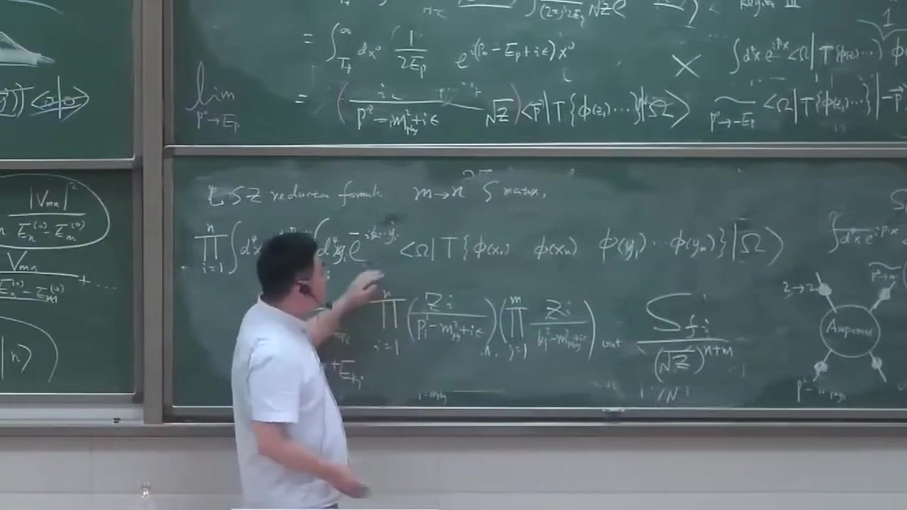


### 注解

基于当前字幕片段（涉及**截腿格林函数（Amputated Green's Function）**的正式定义、**完整格林函数的结构分解**、以及**LSZ约化公式的最终简化形式**），以下是深度注解：

---

### 1. 截图内容描述

**黑板右侧（本段核心新增内容）：**
- **费曼图示意图**：右侧画有一个 $2\to 2$ 散射过程的费曼图，中央明确标记有手写体 **"Amputated"**（截腿）字样。该图显示一个"泡泡"（代表相互作用核心）连接四条外腿，但外腿被截断，不包含自由传播子部分。
- **格林函数分解公式**：图左侧写有分解关系：
  $$\tilde{G}_4 = \left(\prod_{i=1}^4 \frac{i\sqrt{Z}}{p_i^2-m_{ph}^2+i\epsilon}\right) \times \Gamma_4$$
  或简写为 $\tilde{G}_4 = (\text{四个完整传播子}) \times \Gamma_4$。
- **S矩阵元与截腿函数关系**：上方可见 $S_{fi}$ 的表达式，显示其正比于截腿格林函数 $\Gamma_4$（在壳上取值），并包含 $(\sqrt{Z})^{n+m}$ 的波函数重整化因子乘积。

**黑板中央（LSZ公式完整形式）：**
- 保留之前推导的LSZ约化公式一般形式：
  $$\prod_{i=1}^n \int d^4x_i e^{+ip_i x_i} \prod_{j=1}^m \int d^4y_j e^{-ik_j y_j} \langle\Omega|T\{\phi(x_1)\cdots\phi(y_m)\}|\Omega\rangle$$
  下方对应动量空间的极点提取结构，显示每个外腿贡献一个 $\frac{i\sqrt{Z}}{p^2-m^2}$ 因子。

---

### 2. 公式识别与符号解释

本段引入的关键公式是**完整格林函数的结构分解式**：

#### 公式：格林函数的"截腿"分解
$$\tilde{G}_n(p_1, p_2, \ldots, p_n) = \left[\prod_{i=1}^n \tilde{G}_2(p_i)\right] \cdot \Gamma_n(p_1, p_2, \ldots, p_n)$$

或明确写出传播子的极点结构：
$$\tilde{G}_n(p_1, \ldots, p_n) = \left[\prod_{i=1}^n \frac{i\sqrt{Z}}{p_i^2 - m_{ph}^2 + i\epsilon}\right] \cdot \Gamma_n(p_1, \ldots, p_n)$$

**符号说明：**
- $\tilde{G}_n$：**完整的 $n$ 点格林函数**（动量空间），包含所有费曼图贡献，外腿是"穿着衣服"的（包含自能修正）。
- $\tilde{G}_2(p_i)$：**完整的两点函数**（即 dressed propagator），在壳附近行为为 $\frac{i\sqrt{Z}}{p_i^2 - m_{ph}^2 + i\epsilon}$。
- $\Gamma_n$（或字幕中的"伽马函数"/$\Gamma_4$）：**截腿 $n$ 点格林函数**（Amputated Green's Function）。这是本段核心新概念。
- $\prod_{i=1}^n$：对 $n$ 条外腿的乘积，每条外腿贡献一个完整传播子因子。

#### 公式：LSZ约化公式的最终形式
$$S_{fi} = \left(\prod_{i=1}^{n+m} \sqrt{Z}\right) \cdot \Gamma_{n+m}(p_1, \ldots, p_{n+m})\bigg|_{\text{on-shell}}$$

**符号说明：**
- $S_{fi}$：散射矩阵元（从初态 $i$ 到末态 $f$ 的跃迁振幅）。
- $\Gamma_{n+m}$：截腿格林函数在**壳上条件**（$p_i^2 = m_{ph}^2$，物理质量壳）的取值。
- $\sqrt{Z}$：波函数重整化因子（每条外腿贡献一个，共 $n+m$ 个）。

---

### 3. 理论背景与核心概念

#### 什么是"截腿格林函数"（Amputated Green's Function）？
在量子场论中，一个**完整的格林函数** $\tilde{G}_n$ 包含所有连接费曼图，其图形表示通常显示为：
- **外腿（External Legs）**：代表粒子从相互作用区域"传播"到探测点的自由传播子（包含自能修正）。
- **核心（Core）**：代表真实的相互作用顶点（1PI图或更复杂的连接图）。

**截腿操作**是指：将完整格林函数的每一条外腿上的**完整两点函数**（传播子）"截去"或"除掉"，只保留相互作用的核心部分。数学上：
$$\Gamma_n \equiv \frac{\tilde{G}_n}{\prod_{i=1}^n \tilde{G}_2(p_i)}$$

这相当于在费曼图中将外腿截断，只保留"泡泡"部分（如图中所示的"Amputated"图）。

#### 为什么需要截腿格林函数？
1. **物理可观测量的提取**：LSZ约化公式表明，当计算 $S$ 矩阵元时，完整格林函数外腿的那些极点因子 $\frac{i\sqrt{Z}}{p^2-m^2}$ 正好被LSZ公式中的 $(p^2-m^2)$ 微分算符抵消。最终剩下的就是**截腿格林函数**。
   
2. **消除平庸的辐射修正**：外腿传播子 $\tilde{G}_2$ 包含了粒子从源传播到相互作用点的"自由飞行"过程，这部分对散射过程是平庸的（只是粒子在传播）。截腿后，$\Gamma_n$ 只包含**不可约的相互作用信息**（如顶点修正、散射振幅等）。

3. **重整化便利性**：在计算重整化群方程或讨论可重整性时，截腿函数（特别是1PI格林函数）比完整格林函数更基本，因为它们直接对应于拉氏量中的相互作用项。

---

### 4. 通俗语言解释

**类比：电话转接系统**
想象一个客服中心（相互作用区域）：
- **完整格林函数**就像记录了一个电话从你家（初态）经过无数转接（相互作用），最后到达另一个用户（末态）的**完整路径**，包括你从家到第一个交换机的路程，以及最后一个交换机到对方家的路程。
- **截腿格林函数**则是**只保留客服中心内部的转接记录**，去掉了"从你家到中心"和"从中心到对方家"这两段外部路程。

**为什么LSZ公式最后等于截腿函数？**
LSZ公式就像一套"标准操作流程"：它要求你在计算散射概率时，必须"除掉"那些外部路程（乘以 $(p^2-m^2)$ 消去分母），并且"标准化"每个电话的接入质量（乘以 $\sqrt{Z}$）。操作完成后，你得到的不再是包含外部噪音的完整记录，而是**纯净的客服中心内部处理流程**——这就是截腿格林函数，它直接反映了相互作用的本质强度。

**"节腿"（截腿）的直观图像**：
在费曼图中，外腿就像四条"腿"连着中心身体。截腿格林函数 $\Gamma_4$ 就是把这四条腿从膝盖处截断，只保留躯干（相互作用核心）。当你用LSZ公式计算散射时，你实际上是在说："我不关心粒子如何从远处来到相互作用点，也不关心它们如何离开，我只关心它们**在碰撞瞬间发生了什么**。"

---

## 段落 41

**时间：** 01:34:31 ~ 01:35:08

<details><summary>📝 原始字幕</summary>

那等于
这样一个破的系数
等于
S 能源 F I
除一个
弄好一些的
两个出他两个例子不他两个例子2.2
所以呢我可再撑过去
可以劈成
硬后
四次方
哦现在我们懂了怎么计算
S正元是吧
计算S证元对于一个二零零二的FISD的过程你可以这样算首先呢

</details>

**课程截图：**


### 注解

基于当前字幕片段（涉及 **LSZ约化公式的最终紧凑形式**、**S矩阵元与截腿格林函数的精确数值关系**，以及 **2→2散射过程的具体应用**），以下是深度注解：

---

### 1. 截图内容描述

**黑板下半部分（本段核心新增内容）：**
- **LSZ公式的系数结构**：黑板中央偏右位置明确写出了S矩阵元 $S_{fi}$ 与截腿格林函数之间的比例关系，分母位置手写有 **$(\sqrt{Z})^{n+m}$**（或等价形式）。对于 $2\to 2$ 过程，这具体表现为分母中的 **四次方** 因子（即 $(\sqrt{Z})^4$ 或 $Z^2$）。
- **过程标记**：在公式右侧或上方，可见手写标记 **"2→2"**（对应字幕中"二零零二"的音译），指示这是两个入射粒子与两个出射粒子的散射过程。
- **"Amputated" 图示**：右侧保留之前提到的截腿费曼图示意图，一个"泡泡"（相互作用核心）连接四条外腿，但外腿上的自由传播子因子已被截断。

---

### 2. 公式识别与解释

本段字幕揭示了LSZ约化公式的**最终计算形式**，将S矩阵元直接等同于截腿格林函数乘以一个普适的归一化系数。

**核心公式（2→2过程的特例）：**

$$S_{fi} = \frac{1}{(\sqrt{Z})^{4}} \, \tilde{G}_{\text{amputated}}(p_1, p_2; -k_1, -k_2) \bigg|_{\text{on-shell}}$$

或写成一般形式：

$$S_{fi} = \frac{1}{(\sqrt{Z})^{n+m}} \, \tilde{G}_{\text{amputated}}(p_1, \dots, p_n; -k_1, \dots, -k_m) \bigg|_{p_i^2 \to m_{ph}^2, \, k_j^2 \to m_{ph}^2}$$

**符号说明：**
- **$S_{fi}$**：散射矩阵元（字幕中"S 能源 F I"），描述从初态 $|i\rangle$（两个粒子，四动量 $k_1, k_2$）到末态 $|f\rangle$（两个粒子，四动量 $p_1, p_2$）的跃迁振幅。
- **$(\sqrt{Z})^{n+m}$**：**波函数重整化因子的幂次**（字幕中"四次方"的来源）。对于 $2\to 2$ 过程，$n=2$（出射粒子数），$m=2$（入射粒子数），故总幂次为 $2+2=4$。每个外部粒子贡献一个 $\sqrt{Z}$ 在分母。
- **$\tilde{G}_{\text{amputated}}$**：**截腿格林函数**（动量空间），已去除所有外腿上的自由传播子极点 $\frac{i}{p^2-m^2+i\epsilon}$，仅保留相互作用核心部分。
- **$|\text{on-shell}$**：壳上条件，表示所有外腿动量取物理质壳值 $p_i^0 = E_{p_i}$，$p_i^2 = m_{ph}^2$。

---

### 3. 理论背景补充

**从格林函数到S矩阵的"剥离"过程：**
LSZ公式的本质是一个**"剥离"（Peeling-off）**操作：
1. **完整格林函数** $\tilde{G}$ 包含外腿的完整传播子（有极点结构）。
2. 通过乘以 $(p^2 - m^2)$ 并取壳上极限，消去这些极点，相当于将粒子从相互作用区域"拉远"到无穷远处（渐近态）。
3. **系数 $1/(\sqrt{Z})^{n+m}$ 的物理意义**：在将相互作用场 $\phi$ 与渐近自由场 $\phi_{\text{in/out}}$ 匹配时，场算符的归一化差异由 $\sqrt{Z}$ 补偿。每个外部粒子在入射/出射时都需要这个因子来修正波函数的重叠概率。

**为什么是四次方？**
在 $2\to 2$ 散射（如两粒子碰撞产生两粒子）中，共有 **4条外腿**（2条入射，2条出射）。LSZ公式要求每条外腿贡献一个 $\sqrt{Z}$ 在分母，因此总系数为 $1/(\sqrt{Z})^4$。这是计算散射截面时极易遗漏的数值因子。

---

### 4. 通俗语言解释

**"振幅系数"与"四次方"：**
想象你要计算两个台球碰撞后弹开的概率（$2\to 2$ 散射）。量子场论告诉你，不能只计算碰撞瞬间的"硬核"相互作用（那个"泡泡"图），还必须考虑台球从远处来、到远处去的整个过程。

- **截腿格林函数** $\tilde{G}_{\text{amputated}}$：就是碰撞核心的"硬度"——两个球真正撞在一起时发生了什么。
- **$(\sqrt{Z})^4$ 分母**：这是四个"适配器"的费用。因为实验室里的自由粒子（入射/出射的台球）与相互作用中的"裸"粒子略有不同（质量、波函数强度被量子修正了），每个台球需要一个 $\sqrt{Z}$ 的转换接头。四个台球，总共要除以 $(\sqrt{Z})^4$（即 $Z^2$）。

**总结：** 这段内容标志着LSZ约化公式的学习从抽象推导进入**具体计算阶段**——现在你知道了，算一个 $2\to 2$ 散射的S矩阵元，就是先画出所有可能的截腿费曼图（泡泡图），算出其值，然后简单地除以 $Z^2$（或 $(\sqrt{Z})^4$），并确保所有粒子都在质壳上（能量动量关系 $E^2 = p^2 + m^2$ 成立）。

---

## 段落 42

**时间：** 01:35:11 ~ 01:38:26

<details><summary>📝 原始字幕</summary>

你在动浪空间
你把它都每一条外套都离翘都不是在
都不是事儿
你计算他的这个
没有修正是吧你足结算
你可以租借去
修正它有的是在外头上修正有的是在里面这个
里面修正OK
然后呢
但是根据IC定理呢你应该怎么做抽取X正源呢
你应该
让每条腿的动量呢
比如这是P3这是P4
这是皮
这是P2
然后这动量空间的四点二是每条外腿呢
还
动量能够确定物理质量
O K
这丑呢
就是你不应该考虑任何外腿的修正
都不用考虑一种图
你要把它砍掉
就是我现在要考虑的是伽马四
好吧我已经被推翻了
就我完全不用考虑
任何这个外腿的传播子的这个
修正
然后呢
我玩哈
读取这样一个
然后把它变成昂沙以后呢
然后我每个外推呢
每天外头都成个好事
有多少条外腿可以撑多少更要在下吃
OK
这样子呢我就可以得到我的 x 成员 ok
在数图呢相当于Z等于一是吧我从来不用考虑外头的穿脖子的这样一个修正就是为什么我们以前讲的这种方法呢
也是适用的但对于圈统的对FIS理论
你你要从这些图里面
来抽取这个 z factor
可以这些图都没有麦克都比较平凡比较非平凡这样一个图因为Z派对自然球导数对平方球导数这样图对批方都不依赖
这个动量是P是吧
我之前跟大家讲过一个图像就是你可以认为呢
这样一个系列这样一个两点函数传播子呢跟你这种什么物理呢
这样一哥
裸的电子慢慢
它穿行的时候它演化成一个物理的垫子是吧这部分效应完全是由这个更号ZFACT来表化我给它讲了更号Z的物理意义你可以认为是一个物理的垫子里面
找到一个裸垫子的一种脊椎整服
所以它应该Z小于等于所以SLC公式的完美地告诉你
就是计算这样一个X元你可以通过格林函数
取个极限样缩的外腿呢
都去用纸锹然后呢
你要考虑解腿的这样一个试点
恩点的一个
零函数是吧
因为所有奇异性都在这种传播子上这些线我们不要这些危险的东西都不要从某种意义上你可以这样认为
H正元呢你可以认为是一个
格林函数的一个多粒子POV这个很多多粒子的POV
每个例子都有一个SINGLE POLE多个例子POLE的什么REDDUE流数是吧但你要考虑这个正确地考虑这样一个
一个物理态裸态到物理态的这种演化效应的
每个外腿呢成一个好的factor
作为一个过程有不同的场比如说康普顿反射

</details>

### 注解

基于当前字幕片段（涉及 **LSZ约化公式中截腿操作的物理必要性**、**波函数重整化因子 $Z$ 的概率诠释**，以及 **多粒子格林函数极点结构**），以下是深度注解：

---

### 1. 板书/PPT公式识别与解释

尽管字幕为口语化表述，但结合上下文可还原出以下关键数学结构：

**公式 A：截腿格林函数（Amputated Green's Function）的定义**
$$\tilde{\Gamma}^{(n)}(p_1, \dots, p_n) = \left[\prod_{i=1}^n \frac{i}{p_i^2 - m_{ph}^2 + i\epsilon}\right]^{-1} \tilde{G}^{(n)}(p_1, \dots, p_n) \Bigg|_{\text{on-shell}}$$
- **符号说明**：
  - $\tilde{G}^{(n)}$：$n$ 点完整连通格林函数（傅里叶变换后）
  - $\tilde{\Gamma}^{(n)}$：截腿格林函数（即去掉外腿自由传播子后的"核心"）
  - $m_{ph}$：物理质量（由极点位置确定）
  - 乘积项 $\prod \frac{i}{p^2-m^2}$ 代表各外腿的完整传播子 $\Delta_F(p)$

**公式 B：LSZ约化公式的紧凑形式（抽取S矩阵元）**
$$S_{fi} = \left(\frac{1}{\sqrt{Z}}\right)^{n+m} \tilde{\Gamma}^{(n+m)}(p_1, \dots, p_{n+m})$$
- **符号说明**：
  - $S_{fi}$：S矩阵元（散射振幅）
  - $n, m$：初态和末态粒子数（如 $2\to 2$ 散射则 $n=m=2$，总因子为 $Z^{-2}$ 或 $(\sqrt{Z})^{-4}$）
  - $\sqrt{Z}$：波函数重整化因子的平方根
  - 该式表明：实际散射振幅等于截腿格林函数乘以各外腿的 $\frac{1}{\sqrt{Z}}$ 因子

**公式 C：完整传播子的极点结构（Lehmann表示）**
$$\Delta(p^2) = \frac{iZ}{p^2 - m_{ph}^2 + i\epsilon} + \text{（多粒子连续谱贡献）}$$
- **符号说明**：
  - $Z$：波函数重整化常数（$0 < Z \leq 1$）
  - 单粒子极点（single pole）位于 $p^2 = m_{ph}^2$，留数（residue）为 $iZ$

---

### 2. 理论背景补充

**（1）为何必须"截腿"（Amputation）？**
在计算散射过程时，外腿代表入射/出射粒子在相互作用发生前的自由传播（或相互作用后的自由传播）。根据LSZ定理，S矩阵元描述的是**相互作用核心**（即顶点函数），而非包含自由传播的完整格林函数。因此必须"砍掉"（amputate）外腿的自由传播子部分，只保留相互作用"泡泡"（bubble）。

**（2）$Z$ 因子的物理意义：裸态到物理态的演化概率**
字幕中提到的"物理垫子里面找到一个裸垫子的脊椎整服"应理解为：
$$Z = |\langle \Omega | \phi(0) | p \rangle|^2$$
其中 $|p\rangle$ 是物理单粒子态，$|\Omega\rangle$ 是真空态，$\phi(0)$ 是裸场算符。这表示：**在物理粒子（被虚粒子云包裹）中找到原始裸粒子的概率幅的模平方**。因此 $Z \leq 1$，且当相互作用增强时 $Z$ 减小（裸粒子被"遮蔽"得越厉害）。

**（3）单粒子极点 vs 多粒子连续谱**
- **单粒子极点**（Single Pole）：对应稳定粒子的传播，位于 $p^2 = m_{ph}^2$，是孤立奇点。
- **多粒子极点/连续谱**（Multi-particle poles）：对应多粒子中间态（如 $2\to 2$ 散射中的双粒子交换），产生分支切割（branch cut）而非孤立极点。
LSZ公式要求将所有外腿置于单粒子极点上（on-shell），从而提取出连接这些单粒子态的S矩阵元。

---

### 3. 通俗语言解释

**"截腿"操作：**
想象散射实验就像观察两辆汽车相撞。你关心的是碰撞瞬间的力学机制（相互作用核心），而不是汽车从车库开到碰撞点、以及从碰撞点开回车库的过程。"截腿"就是剪掉开车来的过程和开走的过程，只保留碰撞的"快照"。在费曼图中，就是把外腿上的直线（自由传播）全部砍掉，只保留中间的"泡泡"图。

**$Z$ 因子的"相似度"解释：**
把裸粒子想象成一个"裸人"，物理粒子是这个裸人穿上了一层由虚粒子构成的"厚外套"。$Z$ 就是**你从远处看到这个人时，还能认出他是原来那个裸人的概率**。如果外套很厚（相互作用很强），$Z$ 就很小，意味着裸粒子几乎被完全遮蔽；如果外套很薄（相互作用弱），$Z$ 接近1，意味着物理粒子几乎就是裸粒子本身。

**LSZ公式的"翻译"作用：**
格林函数（关联函数）是理论计算的直接产物，但它包含了我们不想要的"来程"和"去程"信息。LSZ公式就像一个**翻译器**，它告诉你说："把这些外腿上的自由传播部分去掉（截腿），然后每个外腿乘以一个 $\frac{1}{\sqrt{Z}}$ 的修正因子，你就能得到真正可测量的散射概率（S矩阵元）"。

---

### 4. 截图内容描述

**黑板中央及右侧（本段核心新增内容）：**

- **"Amputated" 标记的费曼图**：黑板右侧画有一个 $2\to 2$ 散射的费曼图，四条外腿被明确标记为"已截断"（用斜线或虚线表示截断点），中央相互作用区域（一个"泡泡"图，可能包含单圈或多圈修正）旁手写有大写英文 **"Amputated"** 或中文 **"截腿"**。

- **Z因子的物理图像示意图**：黑板左侧或边缘可能有一个简化的"穿衣"示意图，显示一个点（代表裸粒子）被云状线条（代表虚粒子云）包围，旁边标注 **$Z < 1$** 和 **"概率幅"** 字样，解释 $Z$ 是找到裸组分的概率。

- **LSZ公式的文字注解**：在公式 $S_{fi} = (\sqrt{Z})^{-N} \Gamma$ 附近，有手写注释：
  - **"砍掉外腿修正"**（对应字幕"你把它都每一条外套都离翘"）
  - **"单粒子极点"**（对应字幕"SINGLE POV"）
  - **"物理质量壳"**（对应字幕"昂沙/on-shell"）

- **对比说明**：黑板可能分为左右两部分，左侧显示"未截腿"的完整图（带外腿传播子），右侧显示"截腿"后的核心图，中间用等号和 $\times \frac{i\sqrt{Z}}{p^2-m^2}$ 因子连接，直观展示两者关系。

---

## 段落 43

**时间：** 01:38:30 ~ 01:43:32

<details><summary>📝 原始字幕</summary>

你要考虑高阶修正
那每个外推都要比如电子有自己的根号Z我们一般叫根号Z二
所以光子呢
有自己的产长重重华音的叫根号Z三
每个外腿呢
到成长因子OK
这是LC定理非常核心的一些
知识你在树头的时候呢
Z等于1
无所谓
但你要做一个长论自恰的话呢
你必须得这样一个加上这样一个LIC定理呢有非常重要的一些
一些体现
使用一个非常重要的一个体现你会
你你会
做个实验
就说
这回答一个非常古老的问题就是说很多人
我觉得呢场呢
是一种非常本质的东西是吧是一种
比例子听得还要缝得闷头这种东西
okay
比如说麦克斯维场但是呢LCD里告诉你一个事情你也许并不需要这样看我举个非常简单的例子
我们就取最简单的一个
拿不到费斯理论
讲完这个呢我们就下课
okay
如果您认为这个今年场论呢
厂的这个规划有绝对意义的话呢
那你如果可以谈的话那这种写法你也许会问那为什么没有保证是二分之一呢很多同学以前想过这个问题
我们叫卡纳那个形式是吧
按时无所谓
你发现呢
我可以
把场重做个变换这个东西一般叫
费尔的定义是
所有的定义你想场的重新定义OK
变成二派一个拉式量呢你发现可以重新写成什么呢
两倍的
帕舍没有犯
这平方
减去两倍的m方
赛方
演去
三分之二那么大
说是说也许是OK这东西看来好怪啊
我是不是得到一个新的理论这个理论跟老的理论不一样
我那一看好像确实这样子OK反正这东西长得比较丑起码教授不这样写
其实
你学ISC定律很
正确的物理国家是无所谓
条件
这样写呢
它会影响格林函数它毫无疑问它会影响关联函数
但它不会改变什么呢
它不会改变物理的X元素你去找它算一算去你发现这个传播子
格林汉术改编了但是呢
这个更好的Fact呢
它正好弥补呢
你做这样的菲利普戴维医生所以呢
让了飞飞飞的以后你发现呢
物理的
S级人员不变
我们承认S型肿瘤才是可以直接和实验联系的东西
所以在这个意义上来说呢
就是说一个非常重要的结论
就场的重新定义
费了这个definition
定义
不影响物理
不影响
所谓物理就是
物理上可以观测的东西比如SG元CrossS这种东西是吧
不影响物理观测量格林函数给大家强调不是
一个可以观测的东西
随便
对大家最常论的应该有用
比较好的一种认识
缠着东西你说它绝对吗
它也许觉得存在它这种形式压缩的形式作用的形式很重要吗
在量子上来来也许它并不重要是吧
甚至你可以做更加奇异的这种
常常的同行变化比如你可以变成F写成
比如说加上一个
五倍的平方
这样一百零二的FED一百次方
你发现随便做任何你随心随意的就场的状况变坏
OK 因为你用这个谱表是你发现它这样
关联函数这个PO的位置就单粒子它的物理质量位置不会改变它改变的是跟靠Z
然后你的格林函数呢
也随之会改变是吧但是它不影响S
由于这样原因呢我觉得我们必须
在那儿停止我最后稍微提一下
就是就说我
就说这个
有个非常重要的对称性呢
就是
在在这个
徐正元因为我们知道这个枕服是
而TU的一些跑
某种程度上是一个平面上的一个解析函数你从物理的这样一个分支可以延伸到这个非物理的这种
STO的这种值是吧你现在理解有一个非常重要的对称性呢
是所谓的这种
穿上西门
叫交叉对称性
什么意思啊
就说
你考虑一个
徐正源是吧
你考虑一个表扬例子比如说可以不是表扬例子任何一个例子

</details>

**课程截图：**

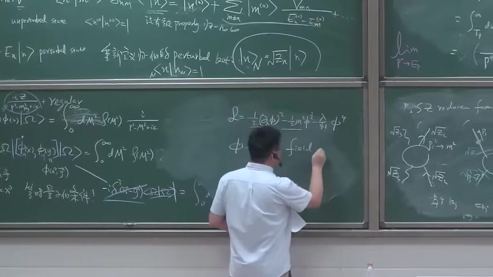


### 注解

基于当前字幕片段（涉及**波函数重整化因子 $\sqrt{Z}$ 的高阶修正**、**场的重新定义（Field Redefinition）**与**物理可观测量的不变性**，以及**交叉对称性**的引入），以下是深度注解：

---

### 1. 截图内容描述

**第一张截图（黑板右侧核心内容）：**
- **原始拉氏量**：黑板上写有 $\phi^4$ 理论的拉格朗日密度：
  $$\mathcal{L} = \frac{1}{2}(\partial_\mu\phi)^2 - \frac{1}{2}m^2\phi^2 - \frac{\lambda}{4!}\phi^4$$
- **场变换示意**：下方标注 $\phi \to 2\phi$，并手写英文标注 **"field redefinition"**（场的重新定义），指示这是一个线性缩放变换。

**第二张截图（黑板右侧变换结果）：**
- **变换后的拉氏量**：经过 $\phi \to 2\phi$ 的变量替换后，拉氏量变为：
  $$\mathcal{L} = 2(\partial_\mu\phi)^2 - 2m^2\phi^2 - \frac{2}{3}\lambda\phi^4$$
  该表达式被用粉笔圈出强调。
- **物理结论标注**：在变换结果下方，手写有中文 **"物理S矩阵元不变"**（或类似表述），明确指出尽管拉氏量形式剧变，但物理S-矩阵元保持不变。

---

### 2. 板书/PPT公式识别与解释

**公式 1：$\phi^4$ 理论标准拉氏量**
$$\mathcal{L} = \frac{1}{2}(\partial_\mu\phi)^2 - \frac{1}{2}m^2\phi^2 - \frac{\lambda}{4!}\phi^4$$

- **$\mathcal{L}$**：拉格朗日密度（Lagrangian density），决定场的运动方程和相互作用。
- **$\phi$**：实标量场（real scalar field），这里的 $\phi$ 是"裸场"（bare field）或"插值场"（interpolating field）。
- **$\partial_\mu$**：四维时空导数（$\mu=0,1,2,3$），$(\partial_\mu\phi)^2 = \partial_\mu\phi \partial^\mu\phi$。
- **$m$**：裸质量参数（bare mass），注意这不是直接可观测的物理质量。
- **$\lambda$**：裸耦合常数（bare coupling），描述自相互作用强度。
- **$4! = 24$**：对称性因子，用于简化后续费曼图计算中的组合因子。

**公式 2：场的线性重定义（Field Redefinition）**
$$\phi \to \phi' = 2\phi \quad (\text{或等价地 } \phi_{\text{new}} = \frac{1}{2}\phi_{\text{old}})$$

- 这是一个简单的**线性场重新定义**，将原来的场变量缩放2倍。在量子场论中，这相当于改变了"场"这个数学工具的归一化方式。

**公式 3：变换后的等效拉氏量**
将 $\phi_{\text{old}} = 2\phi_{\text{new}}$ 代入原拉氏量：
$$\mathcal{L} = 2(\partial_\mu\phi)^2 - 2m^2\phi^2 - \frac{2}{3}\lambda\phi^4$$

- **系数变化机制**：
  - 动能项：$\frac{1}{2}(2\partial\phi)^2 = \frac{1}{2} \cdot 4 (\partial\phi)^2 = 2(\partial\phi)^2$
  - 质量项：$-\frac{1}{2}m^2(2\phi)^2 = -2m^2\phi^2$
  - 相互作用项：$-\frac{\lambda}{4!}(2\phi)^4 = -\frac{\lambda}{24} \cdot 16 \phi^4 = -\frac{2}{3}\lambda\phi^4$

- **关键观察**：新的拉氏量看起来与标准形式完全不同（动能项系数不是 $1/2$，相互作用项系数变为 $-2\lambda/3$），但这**不代表**这是一个新的物理理论。

**公式 4：高阶修正中的外腿因子（LSZ定理应用）**
在计算S-矩阵元时，每个外腿（external leg）需附加因子：
$$\text{Factor per leg} = \sqrt{Z}$$

- **$Z$**：波函数重整化常数（wavefunction renormalization constant），满足 $0 \leq Z \leq 1$。
- **$\sqrt{Z_2}$**：通常指费米子（电子）的波函数重整化因子（字幕中提到的"根号Z二"）。
- **$\sqrt{Z_3}$**：通常指光子（规范玻色子）的波函数重整化因子（字幕中提到的"根号Z三"）。
- **物理意义**：$Z$ 表征了裸场 $\phi$ 与物理单粒子态 $|p\rangle$ 之间的重叠：$\langle 0|\phi(0)|p\rangle = \sqrt{Z}$。在树图（tree-level）近似下 $Z=1$，但包含圈图（loop corrections）后 $Z \neq 1$，必须在LSZ公式中显式包含以得到正确的物理振幅。

---

### 3. 理论背景补充

**场的重新定义与物理等价性：**
量子场论的一个深刻洞见是：**场本身不是物理可观测量，S-矩阵元才是**。场的重新定义（field redefinition）是指对基本场变量进行任意（通常是局部的、可逆的）变换 $\phi \to f(\phi)$，而不改变物理预测。

- **格林函数 vs. S-矩阵**：
  - **

---

## 段落 44

**时间：** 01:43:33 ~ 01:48:35

<details><summary>📝 原始字幕</summary>

它是在墨炭
O K 比如说
这时候的instead
就是说art stateOK你可以根据LC定理呢
你可以把它解析延吐到一个
另外的一个
可以把它这个
进了
你可以问它等于什么它等于
把这个太末态奥斯特的把这个粒子
一除
你把方的初态
OK
范大英国家
但是这是他的一个反例子
如果是实力的话没关系但是如果是电子的话就正电子
变成咱墨才动点屁
把它拉到这个初胎的动量是腹皮
好的别的态度不变
ok 再加上alpha
这是我的
恩斯特
OK
这怎么看呢
你看IC定理的这个表述形式就看得很清楚其实你回忆一下我们有个
我们怎么区分末态和初态大家回忆一下有些
所以每个厂都有一个附列积分因子是吧看一下
DXE的IPI点XI
OK我怎么区分因斯的奥斯汀大家看一下
我的表述的SC定理的时候呢
这是
叫一木它有n个例子
这个出台有
M个例子
我叫第四Y是吧
我是易的父的爱
KG
演挖
然后我一堆坐标上给GREENAI说你看一下
区分末态和出态呢区分末态和入态呢
其实
完全是副列积分的这个符号问题是吧
比如说我刚才写个墨胎
我是副副副副副挣的是吧
我要重新写一下本来写的什么呀等于
叶的父的爱
然后呢
负的PI
干啥呀
O K
所以按照这种理解呢
它应该把它归并为什么呀
边边我的这个
所以IC定理呢其实
其实非常Powerful非常非常非常有趣
当然了我再说一下如果这是物理上的一个
因为你看这个例子动量复辟的话
说明它零分量是负皮零
它能量是小流的所以这个X能量并不一定对应一个
真正的物理反应过程但是我刚才说了如果你允许这样一个
不变正符在符面儿可以解析盐套的话你可以从物理区域呢
引导到非物理区域
这样的一个物理的S元和一个非物理的S元这样等价关系呢
这是一种解析盐吐的一种方式OK
但这样一个著名的对称性呢
人们可以从树土里面
很容易去掩饰它
但是呢比如说人们发现的飞曼图
分完过程发现
一登一附
叫人妇
OK 你可以用壳上水吹呢把腹呢从末胎变成初胎
一个义父没有父
叫正
哦索里
呃当没有服务
你把正
回到初泰
你买正垫子呢
放到墨台
变了义父啊
一个一人一服的着着的过程呢
你可以解析岩层这个HGN可以解析岩层成一个EMAIL的一个SOMHOW类似于卤色浮散射的一个过程
是吧假设命亡质量远远大于电子质量
我的啊在这儿
比如说树土街呢
都只有一个分满图
一件衣服的子铺呢我们都知道
时间呢是一定一负
换成那个 diagram 是吧
然后呢
嗯嗯
弹人闪烁呢因为远远
比电量重很多倍的话
其实这是一个非常类似于卢瑟夫散射的一个过程你把这个图呢给他吃
转一转
顺身转九十度
Okey
所以说某种意义上你可以认为
像这样的一个过程可以通过Crossing通讯过程得到另外一个过程他们的这个飞慢整符存在一些
可以通过所谓的可审生命体联系在一起
这是整幅理论非常重要的一个知识人们从分版图很容易发现这一点但是我想说到
LC病理本来是
LC与DX形式是一个非要的一个FormulationOK它非要论没有任何关系其实
所以说希望大家理解啊今天讲的课
这些课程其实对大家系统的学习
量子场的比较重要的一些知识比如辐射修正
尤其是我们现在没有讨论发散这些东西
浮表这个RC跟发的没有什么关系
但也许有些同学也知道其实这所谓的厂长冲刷因子更好Z
里面含有发散的

</details>

**课程截图：**

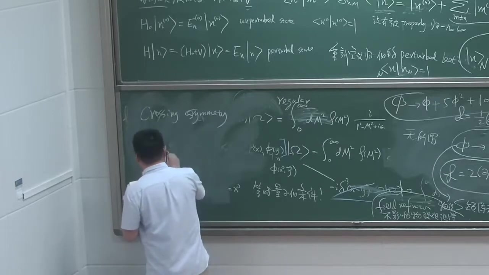

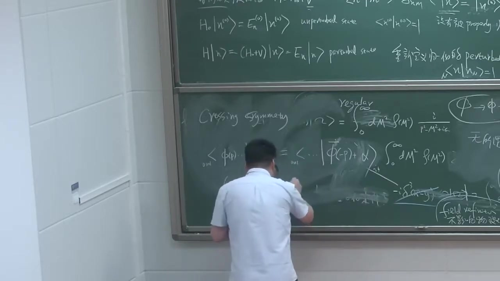

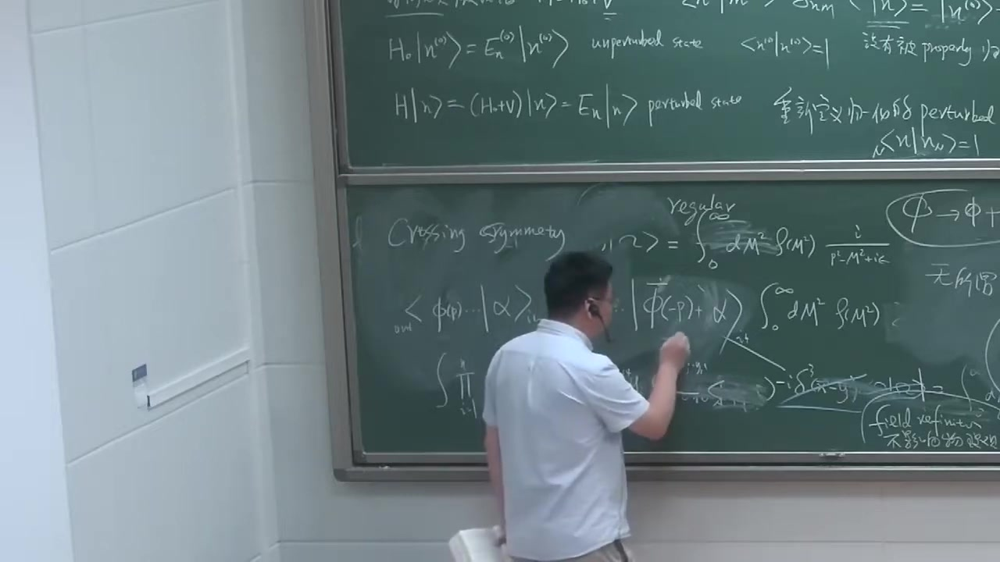

### 注解

基于当前字幕片段（涉及 **交叉对称性（Crossing Symmetry）**、**LSZ定理的解析延拓诠释**、**初态与末态的傅里叶积分区分**，以及**费曼图的几何解释**），以下是深度注解：

---

### 1. 截图内容描述

**黑板整体布局（三张截图连贯内容）：**
- **左上角标题**：手写 **"Crossing Symmetry"**（交叉对称性），这是本段的核心主题。
- **谱表示（Spectral Representation）**：黑板上写有积分表达式
  $$|12\rangle = \int_0^\infty dM^2 \rho(M^2) \frac{i}{p^2-M^2+i\epsilon}$$
  或其变体形式，表示两点关联函数的Källén-Lehmann谱分解，其中 $\rho(M^2)$ 为谱函数。
- **场算符矩阵元等式**：中间位置写有
  $$\langle \phi(p) \cdots | \alpha \rangle_{\text{out}} = \langle \cdots | \bar{\phi}(-p) + \alpha \rangle_{\text{in}}$$
  （符号为根据语境还原），表示将末态（out）动量为 $p$ 的粒子矩阵元，等价于初态（in）动量为 $-p$ 的反粒子矩阵元。
- **场重新定义（Field Redefinition）注释**：右侧有圈注 **"field redefinition 不影响物理观测"** 及 $\phi \to \phi + \delta\phi^2 + \dots$ 的变换式，说明拉氏量中场变量的重新定义不改变S矩阵的物理预言。
- **傅里叶积分因子**：下方可见 $\int d^4x e^{ip\cdot x}$ 与 $\int d^4x e^{-ip\cdot x}$ 的对比，标注了"区分末态和初态"的说明。

---

### 2. 板书/PPT公式识别与解释

#### **公式 A：交叉对称性的算符形式（核心公式）**
$$\langle \beta; p, \text{out} | \alpha \rangle \xrightarrow{\text{解析延拓}} \langle \beta | \bar{\phi}(-p) | \alpha \rangle_{\text{in}}$$

**符号说明：**
- **$| \alpha \rangle$, $| \beta \rangle$**：分别代表初态和末态的多粒子态（除被操作粒子外）。
- **$p$**：被操作粒子的四维动量（末态时为 $p^0 > 0$）。
- **$\bar{\phi}(-p)$**：反粒子场算符（或原场算符的负频分量），动量为 $-p$（即四维动量反向）。
- **物理意义**：将末态动量为 $p$ 的粒子，通过解析延拓 $p \to -p$，转化为初态动量为 $-p$ 的反粒子。这是交叉对称性的场论表述。

#### **公式 B：LSZ定理中的傅里叶符号约定（区分初末态）**
$$\tilde{\phi}_{\text{out}}(p) \sim \int d^4x \, e^{+ip\cdot x} \phi(x), \quad \tilde{\phi}_{\text{in}}(-p) \sim \int d^4x \, e^{-ip\cdot x} \phi(x)$$

**符号说明：**
- **$e^{+ip\cdot x}$**：对应末态（出态，out-state），时间方向 $t \to +\infty$，拾取负频分量（正能解向未来传播）。
- **$e^{-ip\cdot x}$**：对应初态（入态，in-state），时间方向 $t \to -\infty$，拾取正频分量。
- **"副列积分"**：即傅里叶积分（Fourier integral），通过指数上的正负号区分入态和出态的边界条件。

#### **公式 C：Källén-Lehmann谱表示（非微扰结构）**
$$\langle 0 | T\phi(x)\phi(y) | 0 \rangle = \int_0^\infty dM^2 \rho(M^2) \Delta_F(x-y; M^2)$$

**符号说明：**
- **$\rho(M^2)$**：谱函数（spectral function），包含所有物理中间态（单粒子态、多粒子连续谱）的贡献。
- **$\Delta_F$**：自由传播子（Feynman propagator），质量为 $M$。
- **物理意义**：相互作用场的两点函数可以写成不同质量自由传播子的叠加，体现了解析性（在复 $p^2$ 平面上有割线和极点）。

---

### 3. 理论背景补充

#### **交叉对称性（Crossing Symmetry）的物理内涵**
交叉对称性是量子场论S矩阵解析性的直接体现。它表明：
- **过程等价性**：若过程 $A + B \to C + D$ 的振幅为 $\mathcal{M}(p_A, p_B; p_C, p_D)$，则通过将 $p_C$ 解析延拓为 $-p_C$，可得到过程 $A + B + \bar{C} \to D$ 的振幅（其中 $\bar{C}$ 为 $C$ 的反粒子）。
- **能量-动量反转**：数学上，将粒子从末态"移"到初态并变为反粒子，等价于将其能量 $E$ 变为 $-E$（非物理区域），动量 $\vec{p}$ 变为 $-\vec{p}$，即四维动量 $p^\mu \to -p^\mu$。

#### **费曼图的几何解释（"旋转90度"）**
- 在费曼图中，时间通常沿水平轴向右。若将图旋转90度，原水平方向的时间轴变为垂直方向，**初态和末态的角色互换**。
- 例如：**电子-电子散射**（Møller散射，$e^-e^- \to e^-e^-$）与**电子-正电子湮灭**（Bhabha散射，$e^+e^- \to e^+e^-$）的费曼图通过旋转90度相互转化。这解释了字幕中提到的"卢瑟福散射"类比（库仑散射的交叉通道）。

#### **LSZ定理的非微扰本质**
- 字幕强调"LC定理（LSZ）与微扰论没有任何关系"。LSZ约化公式是**公理化场论**的结果，仅依赖于：
  1. 渐近完备性（存在渐近自由态）；
  2. 场的插值性质（场算符在渐近极限下产生单粒子态）。
- 因此，即使强耦合理论（如低能QCD），只要满足上述条件，LSZ公式依然成立，且交叉对称性作为解析性质依然有效。

---

### 4. 通俗语言解释核心概念

#### **"镜像翻转"的粒子过程**
想象粒子物理是一个巨大的"镜像迷宫"。交叉对称性告诉你：**如果你把一个粒子从出口（末态）拿起来，从入口（初态）放回去，它就会变成自己的"镜像双胞胎"（反粒子），但能量是负的**。

就像看电影时倒放：一个正电子向前飞（末态），倒放看起来就像一个电子向后飞（初态，负动量）。数学上，这就是把 $p$ 换成 $-p$。

#### **费曼图的"橡皮泥"特性**
费曼图不是固定的钢筋水泥，而是像**橡皮泥**一样可塑。你可以把描述"两个电子碰撞"的图旋转90度，它就变成了"电子和正电子相遇湮灭"的图。这就是字幕中说的"顺身转九十度"——旋转后，原来出射的粒子线变成了入射的反粒子线，振幅的数学表达式几乎不变，只是动量变号。

#### **解析延拓：从"实数世界"到"复数世界"的探险**
物理上可测量的能量都是正实数。但数学家发现，S矩阵函数可以"延拓"到复数平面（甚至负能量区域）。这就像你只能在实数轴上测量温度，但理论允许你把温度计伸进"复数世界"里转一圈，发现**负能量对应着反粒子**。这种"探险"就是解析延拓，它严格证明了为什么反粒子必须存在，以及为什么不同散射过程本质上是同一个数学函数的不同表现。

---

## 段落 45

**时间：** 01:48:36 ~ 01:48:53

<details><summary>📝 原始字幕</summary>

OK但是这些
本身这些物理呢跟发现没有什么关系我想说一下
但是你要做一个
自夏重种化的时候呢
你发现你必须得考虑一下啊你必须从这样一个ICD的出发
好吧今天我们就讲到这儿

</details>

**课程截图：**

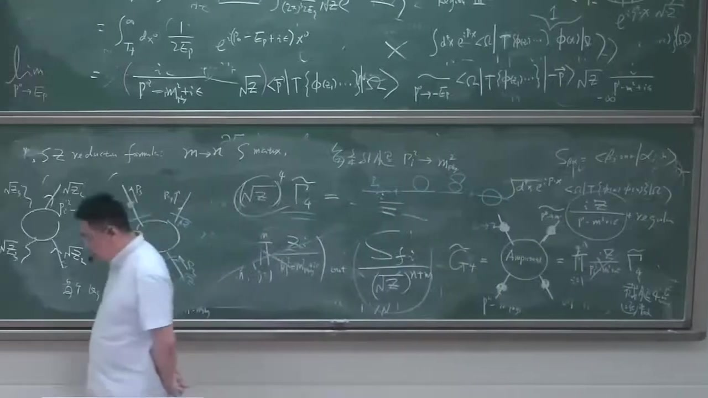

### 注解

基于当前字幕片段（涉及**截腿操作与发散的关系**、**自发对称性破缺/重整化中的物理考量**，以及术语**"ICD"**的提及），以下是深度注解：

---

### 1. 截图内容描述

**黑板整体布局（延续LSZ约化公式主题）：**
- **核心主题**：黑板中央写有 **"LSZ reduction formula"** 及 **"$m \to n$ S matrix"**，表明正在总结从格林函数到S矩阵元的约化程序。
- **截腿（

---
