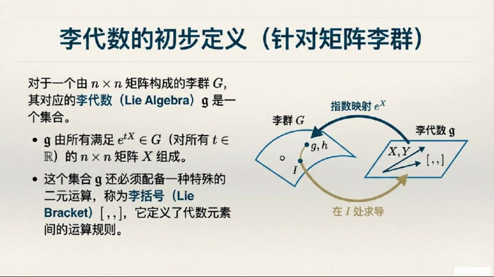
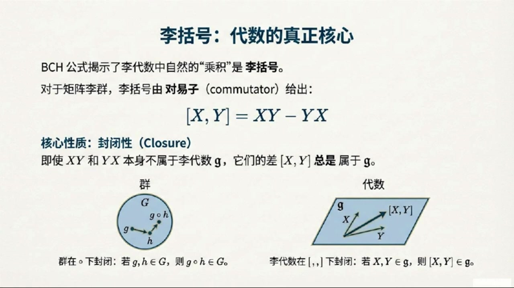
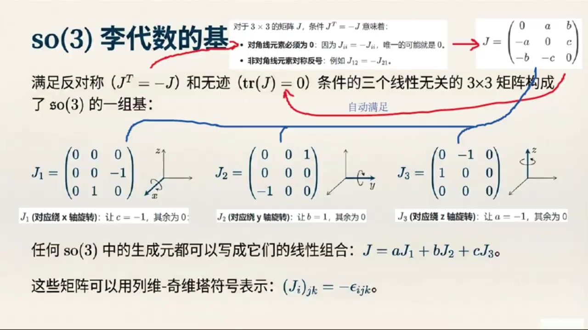
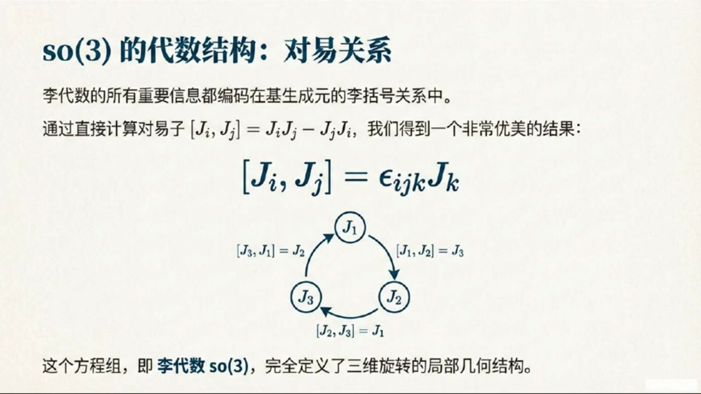

# 《基于对称性的物理学》第7课 从李群到李代数：连续对称性的生成元

> 自动生成的课程注解文档（共 3 个段落）

## 目录

- [00:00:00 连续对称性、无穷小变换与生成元引入](#段落-1)
- [00:06:00 李代数定义、李括号与SO(3)生成元基](#段落-2)
- [00:12:00 SO(3)指数映射、对易关系及物理意义总结](#段落-3)

---

## 段落 1：连续对称性、无穷小变换与生成元引入 { #段落-1 }

**时间：** 00:00:00 ~ 00:06:00

<details><summary>📝 原始字幕</summary>

<pre>

大家好欢迎来到基于对称性的物理学课程的第七讲我是周伊今天非常激动能和大家一起探索李代数这个听起来就很高深的话题不过别担心我们有赛老师在他会把一切都讲得明明白白大家好我是赛很高兴能和大家一起聊聊李代数赵说的对这个概念确实有点高深但其实他非常直观而且在物理学里尤其是量子力学和粒子物理里他可是无处不在的嗯赛老师那我们今天这节课主要会聊些什么呢能先给我们一个大概的框架吗好的今天我们主要会从连续对称型入手引出生成元这个核心概念然后我们会深入了解李代数的定义特别是它那个特别的理括号运算最后我们会用一个非常具体的例子也就是
搜三群来手把手地推到它的生成元和离带数听起来很有趣那我们现在开始吧教歌书里提到理理论的核心是连续对称性这个连续到底是什么意思啊跟我们之前学过的那些对称性有什么不同这个一个很好的问题我们以前学过很多对称性比如正方形的对称性旋转九十度一百八十度或者镜向对称性这些都是离散对称性就是说只有有限几个特定的操作能保持对象的形状不变我明白了就像是有一个固定的菜单给你选对吧没错你不能随便选但连续对称性就不一样了想象一个圆它绕着圆形旋转你可以是零一一度甚至是零一一九一度旋转角度
任何实数值有无限多种可能这就是连续的含义它的变换参数是连续变化的这听起来就比离散对称性要自由多了那立理论为什么特别关注这种连续对称性呢因为连续对称性有一个非常重要的特点就是群中总存在着跟单位变换也就是什么都没做的变换任意截止的元素比如旋转零点零零零零零一度它就非常接近不旋转而且它仍然是圆的一个对称变化明白了就像是我们可以无限地逼近那个什么都不做的状态那这个跟我们今天要讲的理代数有什么关系呢关系可大了正是因为可以无限接近单位变换我们才能引入一个非常关键的变换无穷小变换
群元素G写成i加上EpsilonX的形式这里面的i是单位圆X是一个非常小的数那X是什么呢X就是我们今天要重点聊的生成圆你可以把它想象成是微小变换的核心或者方向当这个无穷小变换作用在某个对象上时几乎什么都不会改变但如果把这种无穷小变换重复很多次就能产生一个有限的变换就像是蚂蚁搬家一只蚂蚁搬一点点很多蚂蚁一起就能搬走一整个家是这个意思吗这个比喻很形象正是这样数学上我们可以把这种重复多次微小变换的过程写成括号i加n分级CTAX括号的N次方这里的N分级CTA对应前面的
经过N次小变换后得到一个参数为C塔的有限变换如果取N是无限大就得到一个极限形式HCE塔等于对爱加N分C塔X的N次方中的N取无限大的极限等等这个形式我好像在哪里见过这不就是指数函数的定义吗没错你观察得很敏锐这个极限的结果就是一上CTAX所以说这个对象X就像是生成了整个有限变换HCE塔这就是它为什么被称为生成元HCE塔所以说我们只要找到了这个生成元X就等于找到了这个群里所有变换的密码或者配方了对不对可以这么说生成元X变骂了群在单位圆附近的所有信息而且我们还可以反过来通过对HC塔求导在C塔等于零处计算
就能得到生成元X也就是说X就是HC塔在C塔等于零处的导数当然我们还可以将这个球导继续下去最后可以得到N接导数在C塔等于零处的值为X的N次方这个球道的方法听起来很直接那如果用泰勒展开来看生成元X又扮演了什么角色呢泰勒展开就更清晰地展示了X如何生成HC塔如果我们把HC塔在C塔等于零出展开就会得到HC塔等于I加X塔加二次方C塔二次方加点点点你看生成元X的不同密词加上系数就构成了整个变化HC塔的基数明白了所以生成元X确实是可以正式定义理代数了是的对于N成N矩阵李群来说

</pre>

</details>

**课程截图：**


### 注解

我来对这段课程视频进行深度注解，重点分析其中的核心公式与概念。

---

## 一、核心公式解析

### 公式 1：无穷小变换的表示
$$G = I + \varepsilon X$$

| 符号 | 含义 |
|:---|:---|
| $G$ | 李群中的群元素（一个变换） |
| $I$ | 单位元（Identity），对应"什么都不做"的变换 |
| $\varepsilon$ | 无穷小参数，$|\varepsilon| \ll 1$ |
| $X$ | **生成元**（Generator），本课核心概念 |

> **物理直觉**：生成元 $X$ 是"微小变换的方向"，就像速度是位置变化的"方向"一样。

---

### 公式 2：从无穷小到有限的"累积"过程
$$\left(I + \frac{\theta}{N}X\right)^N$$

| 符号 | 含义 |
|:---|:---|
| $\theta$ | 有限变换的参数（总"角度"或"强度"） |
| $N$ | 分割次数，将有限变换拆成 $N$ 个无穷小变换 |
| $\frac{\theta}{N}$ | 每次小变换的参数，当 $N\to\infty$ 时趋于无穷小 |

**关键理解**：这类似于复利计算——每次只变一点点，但重复很多次产生质变。

---

### 公式 3：指数映射（Exponential Map）⭐
$$\boxed{h(\theta) = \lim_{N\to\infty}\left(I + \frac{\theta}{N}X\right)^N = e^{\theta X}}$$

这是**李群与李代数的桥梁**，是整个课程最重要的公式。

| 符号 | 含义 |
|:---|:---|
| $h(\theta)$ | 参数为 $\theta$ 的有限群元素 |
| $e^{\theta X}$ | 矩阵指数（需用级数定义：$e^A = \sum_{n=0}^\infty \frac{A^n}{n!}$）|

> **为什么叫"指数映射"**：形式上就是指数函数，但底数是 $e$，"指数"是矩阵 $\theta X$。

---

### 公式 4：生成元的微分定义
$$X = \left.\frac{dh(\theta)}{d\theta}\right|_{\theta=0}$$

这是生成元的**等价定义**：生成元是群元素在单位元处的"变化率"或"切向量"。

---

### 公式 5：泰勒展开视角
$$h(\theta) = I + X\theta + \frac{1}{2}X^2\theta^2 + \cdots = \sum_{n=0}^{\infty}\frac{1}{n!}X^n\theta^n$$

| 项 | 意义 |
|:---|:---|
| $I$ | 零阶：起点（单位元）|
| $X\theta$ | 一阶：线性近似，由生成元主导 |
| $\frac{1}{2}X^2\theta^2$ | 二阶修正 |
| $\cdots$ | 高阶项 |

> **核心洞见**：生成元 $X$ 的各次幂 $X^n$ 构成了整个变换的"基座"。

---

### 公式 6：高阶导数关系
$$X^n = \left.\frac{d^n h(\theta)}{d\theta^n}\right|_{\theta=0}$$

生成元的 $n$ 次幂对应着 $n$ 阶导数在零点处的值。

---

## 二、理论背景补充

### 2.1 离散对称性 vs 连续对称性

| 特征 | 离散对称性（如正方形） | 连续对称性（如圆）|
|:---|:---|:---|
| 变换参数 | 有限个离散值（$90^\circ, 180^\circ, \ldots$）| 连续变化（任意实数角度）|
| 群元素个数 | 有限（4个旋转+4个反射）| 无限不可数 |
| 能否无穷小逼近单位元 | ❌ 不能 | ✅ 可以 |
| 典型例子 | 晶体对称性、置换群 | 旋转、平移、洛伦兹变换 |

**关键区别**：连续对称性允许"无穷小变换"的存在，这是李代数诞生的土壤。

---

### 2.2 李群与李代数的关系（预告）

```
李群 G（整体、弯曲、乘法结构）
    ↑↓ 指数映射 / 对数映射（局部）
李代数 g（线性、平坦、李括号结构）
```

- **李群**：变换的"执行者"（如实际的旋转矩阵）
- **李代数**：变换的"设计者"（生成元构成的线性空间）

> 本课只讲到"从代数到群"的指数映射；逆过程（从群到代数）需要取对数。

---

## 三、核心概念的通俗解释

### 3.1 生成元 $X$ 的三重身份

| 视角 | 比喻 | 核心公式 |
|:---|:---|:---|
| **种子** | 一棵大树由一颗种子长成 | $h(\theta) = e^{\theta X}$ |
| **速度** | 运动轨迹由初始速度决定 | $X = \frac{dh}{d\theta}\big\|_0$ |
| **积木** | 复杂建筑由基础积木搭建 | $h(\theta) = \sum \frac{X^n\theta^n}{n!}$ |

### 3.2 "蚂蚁搬家"的数学实现

> 一只蚂蚁搬 $\frac{\theta}{N}$，$N$ 只蚂蚁一起搬 $\theta$。

数学上：$(I + \frac{\theta}{N}X)^N \xrightarrow{N\to\infty} e^{\theta X}$

这正是**欧拉数 $e$ 的定义**在矩阵情形的推广：
$$\lim_{n\to\infty}\left(1+\frac{x}{n}\right)^n = e^x$$

---

## 四、板书/PPT 截图描述

### 截图 1：课程总览图
- **左侧**：群 → 代数（微分运算，提取生成元）
- **中央**：无穷小变换揭示生成元，李代数是生成元的"封闭"空间（李括号 $[X,Y]=XY-YX$）
- **右侧**：代数 → 群（指数映射），案例预告 SO(3) 的三维旋转

### 截图 2：指数映射的桥梁作用
- 图示：从单位元 $I$ 出发，沿切方向 $X$ 走无穷小步，累积成有限弧长
- 关键公式：$h(\theta) = \lim_{N\to\infty}(I+\frac{\theta}{N}X)^N = e^{\theta X}$

### 截图 3：生成元的三种等价视角
- **指数生成**：$h(\theta) = e^{\theta X}$（整体生成）
- **微分速率**：$X = \frac{dh}{d\theta}\big\|_0$（瞬时变化率）
- **泰勒基石**：$h(\theta) = \sum \frac{X^n\theta^n}{n!}$（级数展开）

---

## 五、下节预告

根据字幕末尾，后续将讨论：
- **李代数的正式定义**（特别是**李括号**运算 $[X,Y] = XY-YX$）
- **SO(3) 群的具体例子**：三维旋转的生成元 $J_1, J_2, J_3$ 及其李代数结构

---

## 段落 2：李代数定义、李括号与SO(3)生成元基 { #段落-2 }

**时间：** 00:06:00 ~ 00:12:00

<details><summary>📝 原始字幕</summary>

<pre>

李代数花体矩就是那些在指数化后能给出群元素的N成N矩阵X的几何也就是说如果溢上TX属于群句那么X就属于李代数花体矩听起来李代数就是生成元们的集合嘛那是不是就是普通的矩阵成法这是正是李代数最反直觉但又最关键的地方你问到点子上了虽然李代数的运算规则是矩阵但他们之间的运算规则不是普通的矩阵成法两个李代数元素的成基XY不一定还是李代数里的元素那这是为什么呢这跟我们平时学的矩阵运算不太一样啊这是因为李代数有它自己独特的运算规则我们称之为李扩号它跟对应的李群的运算规则是直接相关的
这个联系是由著名的贝克坎贝尔霍斯托夫公式给出的贝克坎贝尔霍斯托夫公式这个名字听起来这很厉害它能告诉我们什么这个公式告诉我们两个群元素一上X和一上Y的群成基可以表示成一上X加Y加二分之一成中括号XY加十二分之一成中括号XY加等等的形式你看等是右边把群元素的成法转化成了一系列的理带素元素的合这里面出现了一个新符号中括号XY中括号这就是您说的理括号吗没错对于矩阵里群这个左里括号XY减YX也就是X的对义子这个公式的关键在于
XY和YX本身可能不属于李代数但他们的差也就是对义子左里括号XY右里括号总是属于李代数的这太神奇了所以说李代数在李代数运算下是封闭的就像群在复合运算下是封闭的一样完善正确封闭性意味着你对集合里的任意两个元素进行这种特定的运算结果仍然在这个集合里面所以李代数元素的自然成级好的那我们现在对李代数和生成元都有了初步的了解了但是光说不练假把式我们能不能看一个具体的例子啊比如说SO三群的生成元和李代数是什么样的当然可以这正是我们接下来要做的SO三群也就是三维空间中的旋转群大家都很熟悉了它的定义条件有两个
转换为O所以我们可以得到生成元J必须满足J转制加J等于零
我们就可以推导出J等于零所以SO3的生成元J必须满足反对称和G为零这两个条件对如果要满足反称性那么对三乘三矩阵而言其对角线元素必须为零并且非对角线元素对称反数这样的话只用三个参数比如A B C就可以描述这个三乘三矩阵我发现了这个三参数矩阵的G恰好满足G为零的第二个条件完全正确三个自由参数或者说自由度说明可以找出三个满足这两个条件的线性无关矩阵比如取C等于负一其他为零对应J一取B等于其他为零对应J二
J3他们就是我们SO三生成源的基J一J二J三进而SO三的所有生成源J都可以写成J一J二J三的星星组合能不能把它们具体写出来啊我有点好奇它们长什么样子好的它们分别是J一等于零零零换行零零负一换行零一零J二等于零零一零换行零零零零这些矩阵可以用列微其尾符号更紧凑地表示出来也就是DIGJ的JK分量等于负EPSLON的IJK分量看起来它们确实都是反对称矩阵而且对角线元素都是零所以G也都是零

</pre>

</details>

**课程截图：**






### 注解

我来对这段课程视频进行深度注解，重点分析其中的核心公式与概念。

---

## 一、核心公式解析

### 公式 1：BCH（Baker-Campbell-Hausdorff）公式

$$e^X e^Y = e^{X + Y + \frac{1}{2}[X,Y] + \frac{1}{12}[X,[X,Y]] - \frac{1}{12}[Y,[X,Y]] + \cdots}$$

| 符号 | 含义 |
|:---|:---|
| $e^X, e^Y$ | 李群中的群元素（通过指数映射从李代数得到） |
| $X, Y$ | 李代数 $\mathfrak{g}$ 中的元素（生成元） |
| $[X,Y]$ | **李括号**（Lie Bracket），李代数的核心运算 |
| $\cdots$ | 更高阶的嵌套李括号项 |

> **核心洞见**：群的"乘法"被转化为李代数的"加法+李括号"——这是连接群和代数的关键桥梁。

---

### 公式 2：矩阵李群的李括号定义

$$[X,Y] = XY - YX$$

| 符号 | 含义 |
|:---|:---|
| $XY$ | 普通矩阵乘法（但结果**不一定**在李代数中） |
| $YX$ | 普通矩阵乘法（结果也**不一定**在李代数中） |
| $XY - YX$ | 对易子（commutator），结果**一定**在李代数中 |

> **反直觉之处**：虽然 $X,Y$ 都是李代数元素，$XY$ 和 $YX$ 单独可能"跑出"李代数，但它们的差却"神奇地"回来了。

---

### 公式 3：SO(3) 生成元的约束条件（来自正交性）

$$J^T + J = 0 \quad \text{或} \quad J^T = -J$$

| 符号 | 含义 |
|:---|:---|
| $J$ | SO(3) 的生成元（李代数 $\mathfrak{so}(3)$ 的元素） |
| $J^T$ | 矩阵转置 |
| 条件 | **反对称矩阵**（anti-symmetric）|

**推导来源**：将 $O = e^{\theta J}$ 代入 $O^T O = I$，对无穷小 $\theta$ 展开得到。

---

### 公式 4：SO(3) 生成元的迹条件（来自行列式）

$$\text{tr}(J) = 0$$

| 符号 | 含义 |
|:---|:---|
| $\text{tr}(J)$ | 矩阵的迹（对角线元素之和）|
| 条件 | **无迹矩阵**（traceless）|

**推导来源**：利用恒等式 $\det(e^A) = e^{\text{tr}(A)}$，由 $\det(O) = 1$ 推出。

---

### 公式 5：SO(3) 的三个基生成元（具体形式）

$$J_1 = \begin{pmatrix} 0 & 0 & 0 \\ 0 & 0 & -1 \\ 0 & 1 & 0 \end{pmatrix}, \quad J_2 = \begin{pmatrix} 0 & 0 & 1 \\ 0 & 0 & 0 \\ -1 & 0 & 0 \end{pmatrix}, \quad J_3 = \begin{pmatrix} 0 & -1 & 0 \\ 1 & 0 & 0 \\ 0 & 0 & 0 \end{pmatrix}$$

> 注意：字幕中 $J_2$ 的描述不完整，根据标准形式补全。

---

### 公式 6：用列维-奇维塔符号的紧凑表示

$$(J_i)_{jk} = -\varepsilon_{ijk}$$

| 符号 | 含义 |
|:---|:---|
| $(J_i)_{jk}$ | 第 $i$ 个生成元的第 $(j,k)$ 矩阵元 |
| $\varepsilon_{ijk}$ | 列维-奇维塔符号（Levi-Civita symbol）：<br>• $\varepsilon_{123} = +1$<br>• 任意两个指标交换变号<br>• 任意两个指标相同为0 |
| 负号 | 保证正确的方向约定 |

**验证示例**：$(J_1)_{23} = -\varepsilon_{123} = -1$ ✓（与 $J_1$ 的 $(2,3)$ 元一致）

---

## 二、理论背景补充

### 2.1 为什么需要"李括号"而不是普通乘法？

| 对比 | 群 $G$ | 李代数 $\mathfrak{g}$ |
|:---|:---|:---|
| **元素** | 群元素 $g, h$ | 生成元 $X, Y$ |
| **自然运算** | 群乘法 $g \circ h$ | **李括号** $[X,Y]$ |
| **封闭性** | $g \circ h \in G$ | $[X,Y] \in \mathfrak{g}$ |
| **关键区别** | 一般**不可交换** | 总是**反对称**：$[X,Y] = -[Y,X]$ |

> 李括号是"无穷小群乘法的对易部分"，捕捉了群的非交换性在无穷小层面的表现。

### 2.2 BCH 公式的物理意义

想象在三维空间中先后进行两个旋转：
- **先转 $X$ 再转 $Y$** ≠ **先转 $Y$ 再转 $X$**（非交换！）
- BCH 公式定量计算了这个差异：差异的"主导项"就是李括号 $[X,Y]$

### 2.3 SO(3) 的 3 个自由度

| 约束条件 | 消除的自由度 |
|:---|:---|
| $J^T = -J$（反对称）| 对角线3个 + 上三角3个 = 6个约束 |
| $\text{tr}(J) = 0$（无迹）| 已由反对称自动满足 |
| **剩余自由度** | $9 - 6 = 3$ 个 ✓ |

这对应三维空间的**三个独立旋转轴**（绕x轴、y轴、z轴）。

---

## 三、板书/PPT 截图描述

### 截图 1：李代数的初步定义
- **左侧文字**：定义矩阵李群 $G$ 对应的李代数 $\mathfrak{g}$
  - 由满足 $e^{tX} \in G$（对所有 $t \in \mathbb{R}$）的 $n \times n$ 矩阵 $X$ 组成
  - 配备二元运算"李括号" $[\cdot, \cdot]$
- **右侧示意图**：弯曲的"李群 $G$"流形与平坦的"李代数 $\mathfrak{g}$"切空间
  - 指数映射 $e^X$：从代数指向群
  - 在 $I$ 处求导：从群指向代数

### 截图 2：李括号——代数的真正核心
- **公式**：$[X,Y] = XY - YX$（对易子）
- **核心性质**：封闭性——即使 $XY, YX \notin \mathfrak{g}$，它们的差 $[X,Y] \in \mathfrak{g}$
- **对比图示**：
  - 左：群在 $\circ$ 下封闭（$g \circ h \in G$）
  - 右：李代数在 $[\cdot,\cdot]$ 下封闭（$[X,Y] \in \mathfrak{g}$）

### 截图 3：推导 so(3) 生成元的性质
- **第一步（正交性）**：$J^T + J = 0$ → 反对称矩阵
- **第二步（行列式）**：$\text{tr}(J) = 0$ → 无迹矩阵
- 两个结论用金色框突出显示

---

## 四、通俗语言总结

> **李代数 = 李群的"基因密码"**

想象李群是一个复杂的**曲面**（比如球面），李代数就是在这个曲面**原点处的切平面**。

- **指数映射** = 从切平面"走"到曲面上（沿直线走，但在弯曲空间里）
- **李括号** = 曲面上两条微小路径的"非闭合差距"——平坦空间里先东后北 = 先北后东，但弯曲空间里不一样！
- **SO(3) 的生成元** = 三维旋转的"三个基本方向"，每个都是"绕某轴无穷小旋转"的数学描述

最神奇的是**李括号的封闭性**：两个生成元各自"乱乘"可能跑出切平面，但它们的"差距"却恰好落在切平面上——这是微分几何中"曲率"的代数体现。

---

## 段落 3：SO(3)指数映射、对易关系及物理意义总结 { #段落-3 }

**时间：** 00:12:00 ~ 00:18:34

<details><summary>📝 原始字幕</summary>

<pre>

那我们怎么知道这些生成源就能生成我们熟悉的旋转矩阵呢我们可以用一上C塔J这个公式来验证比如我们拿J一来说通过泰勒极速展开并利用J一能密次的周期性我们可以推导出一上C塔J一最终会得到一个绕X轴旋转的矩阵而一等于一零零换行零C塔复C塔换行零C塔C塔可以仔细讲讲这个推导过程了可以你先看矩阵J一右下角的二乘二次矩阵小J一你可以验证小J一的平方等于负一在这个基础上小J一的三次方等于小J一的平方等于负小J再进一步有小J一的四次方等于正A还有
小J一的五次方等于正小J一我发现规律了一般而言可以写成小J一的二N次方也就是偶次方等于负一的N次方乘单位矩阵爱而小J一的二N加一次方也就是G次方等于负一的N次方乘小J一对你真厉害完全正确我们可以将一上C小J用极数展开然后将次级数分成偶次米和G次米两个部分于是就可以将你总结的规律分别带入然后你可以发现偶次密集数部分恰好是Q三C塔而G次密集数部分恰好是C三C塔乘单位矩阵加上S三C塔乘小J一最后就得到矩阵C三C塔
这是三位矩阵的右下角左上角分量的一的零四方等于一补齐就得到了前面那个绕X轴的三位旋转矩阵这简直是太棒了我们从抽效的条件出发通过生成元这真是得到了我们熟悉的旋转矩阵这是真是把理论和实际联系起来了是的这个过程非常漂亮它展示了生成元如何作为核心通过指数印射产生了整个有限变换那现在我们有了这些具体的生成元矩阵是不是可以计算它们之间的理括号了没错我们可以硬算一下JI和JJ的理括号等于JI成JJJJJJJJJJJJJJJJJJJJJJJJJJJJJJJJJJJJJJJJJJJJJJJJJJJJJJJJJJJJJJJJJJJJJJJJJJJJJJJJJJJJJJJJJJJJJJJJJJJJJJJJJJJJJJJJJJJJJ
JKJK要注意KK曲合O EPSL下IJK是列为奇维塔符号对吧这个结果看起来太漂亮了所以这个关系是就是SO3的理代数了是的这个关系是就破码了SO3理代数的所有关键信息所有的生成元无论多么复杂它们之间的理括号关系都可以归结为这几个机生成元之间的关系我注意到教科书里后面还提到了在物理学里我们有时候会在生成元前面多加一个I让它们变成恶米矩阵这是为什么呢这个问题问得很好周亦在物理学里特别是在量子力学里我们希望可观察量的本证值是实数而恶米矩阵的本证值正好如果我们把生成元定义成JPrime含有I的形式比如J
换行零零负爱零零那么他们就变成了阿米矩阵哦原来是为了让测量解脱有物理意义那这样的话理库号关系也会跟着变吗会的相应的理代数关系就会变成JI和JJ的理代数等于IJKJK这个因子就是为了保证物理上的合理性明白了所以理代数不仅是一个数学的概念它还和物理世界的观测紧密相连那除了从群的定义条件来推倒生成元还有没有其他方法呢有的如果你已经知道了有限变换的显示矩阵形式比如我们熟悉的旋转矩阵你也可以直接用生成元的定义是X等于DHC等于C等于C等于C
你就能直接得到J一这样两种方法疏途同归但第一种方法也就是从群的定义出发推导生成源好像更通用一些对吧你说得很对第一种方法根据普世性因为我们不总是能一开始就得到显示的有限变幻矩阵比如在处理洛伦兹群时我们就会从群的定义出发来推导生成源好的赛老师今天这期博客我们从连续对称性讲起引出了生成源了解了李代数的独特运算李括号最后还用ISO三群做了个非常棒的例子感觉一下子对李代数有了更清晰的认识很高兴能帮到大家李代数是理解自然界对称性的强大工具他通过研究群在单位远附近的无重小行为揭示了群的深层结构希望这期博客能给大家一个
这几课对我们高年级学生来说简直是题乎冠顶感谢赛老师的精彩讲解同学们希望你们也都有所收获谢谢乔伊我们今天主要讲了矩阵理群的理袋鼠后面我们还会引入更通用的理袋鼠定义那将是理界对称型更抽象也更本质的方式听起来就很期待那今天的基于对称性的物理学课程第七讲播课就到这里了感谢大家的收听我们下期再见再见

</pre>

</details>

**课程截图：**






### 注解

我来对这段课程视频进行深度注解，重点分析其中的核心公式与概念。

---

## 一、核心公式解析

### 公式 1：指数映射生成有限旋转

$$R = e^{\theta J}$$

| 符号 | 含义 |
|:---|:---|
| $R$ | 有限旋转矩阵（SO(3)群元素） |
| $\theta$ | 旋转角度（有限参数） |
| $J$ | 生成元（李代数 $\mathfrak{so}(3)$ 元素） |
| $e^{\theta J}$ | 指数映射，将李代数元素映射到李群 |

> **关键洞见**：这是"从无穷小走向有限"的核心桥梁。生成元 $J$ 描述的是无穷小旋转，通过指数映射"积累"成有限旋转。

---

### 公式 2：$J_1$ 的具体矩阵形式

$$J_1 = \begin{pmatrix} 0 & 0 & 0 \\ 0 & 0 & -1 \\ 0 & 1 & 0 \end{pmatrix}$$

> 对应绕 **x轴** 的旋转生成元。注意其结构：左上角为0（x分量不变），右下角为 $2\times2$ 的反对称矩阵。

---

### 公式 3：$j_1$ 的幂次规律（关键推导）

设 $j_1 = \begin{pmatrix} 0 & -1 \\ 1 & 0 \end{pmatrix}$（$J_1$ 的右下角 $2\times2$ 子矩阵）

| 幂次 | 结果 | 规律 |
|:---|:---|:---|
| $j_1^2$ | $-\mathbb{I} = \begin{pmatrix} -1 & 0 \\ 0 & -1 \end{pmatrix}$ | 负单位矩阵 |
| $j_1^3$ | $-j_1$ | 回到 $j_1$ 乘 $-1$ |
| $j_1^4$ | $+\mathbb{I}$ | 正单位矩阵 |
| $j_1^5$ | $+j_1$ | 周期为4 |

**通式**：
- **偶次幂**：$j_1^{2n} = (-1)^n \mathbb{I}$
- **奇次幂**：$j_1^{2n+1} = (-1)^n j_1$

> **数学本质**：$j_1$ 是虚数单位 $i$ 的矩阵实现！因为 $i^2 = -1$，$i^3 = -i$，$i^4 = 1$...

---

### 公式 4：泰勒展开分离奇偶项

$$e^{\theta j_1} = \sum_{n=0}^{\infty} \frac{(\theta j_1)^n}{n!} = \underbrace{\sum_{k=0}^{\infty} \frac{(\theta j_1)^{2k}}{(2k)!}}_{\text{偶次项}} + \underbrace{\sum_{k=0}^{\infty} \frac{(\theta j_1)^{2k+1}}{(2k+1)!}}_{\text{奇次项}}$$

代入规律后：

$$= \underbrace{\sum_{k=0}^{\infty} \frac{(-1)^k \theta^{2k}}{(2k)!}}_{\cos\theta} \mathbb{I} + \underbrace{\sum_{k=0}^{\infty} \frac{(-1)^k \theta^{2k+1}}{(2k+1)!}}_{\sin\theta} j_1$$

**最终结果**：
$$e^{\theta j_1} = \cos\theta \cdot \mathbb{I} + \sin\theta \cdot j_1 = \begin{pmatrix} \cos\theta & -\sin\theta \\ \sin\theta & \cos\theta \end{pmatrix}$$

补齐左上角分量 $1$，得到完整的 **绕x轴旋转矩阵**：
$$R_x(\theta) = \begin{pmatrix} 1 & 0 & 0 \\ 0 & \cos\theta & -\sin\theta \\ 0 & \sin\theta & \cos\theta \end{pmatrix}$$

> **震撼之处**：我们从纯代数的生成元出发，通过指数映射，**自动生成了**三角函数！这是群论与经典分析的深刻联系。

---

### 公式 5：SO(3) 李代数的基本对易关系

$$[J_i, J_j] = \epsilon_{ijk} J_k$$

或展开写为：
- $[J_1, J_2] = J_3$
- $[J_2, J_3] = J_1$  
- $[J_3, J_1] = J_2$

| 符号 | 含义 |
|:---|:---|
| $[A,B] = AB - BA$ | 李括号（对易子） |
| $\epsilon_{ijk}$ | 列维-奇维塔符号（Levi-Civita symbol）：<br>• $\epsilon_{123} = \epsilon_{231} = \epsilon_{312} = +1$（偶排列）<br>• $\epsilon_{132} = \epsilon_{213} = \epsilon_{321} = -1$（奇排列）<br>• 任意两指标相同则为0 |
| 下标 $k$ | 爱因斯坦求和约定（隐含对 $k=1,2,3$ 求和）|

> **结构意义**：这三个关系**完全确定**了 SO(3) 李代数的结构。任何 SO(3) 的表示，其生成元都必须满足此关系。

---

### 公式 6：物理学约定（厄米化生成元）

$$\tilde{J}_i = i J_i \quad \text{（或 } J_i^{\text{(phys)}} = iJ_i\text{）}$$

具体形式：
$$\tilde{J}_1 = \begin{pmatrix} 0 & 0 & 0 \\ 0 & 0 & i \\ 0 & -i & 0 \end{pmatrix}, \quad \tilde{J}_2 = \begin{pmatrix} 0 & 0 & -i \\ 0 & 0 & 0 \\ i & 0 & 0 \end{pmatrix}, \quad \tilde{J}_3 = \begin{pmatrix} 0 & i & 0 \\ -i & 0 & 0 \\ 0 & 0 & 0 \end{pmatrix}$$

**性质变化**：
| | 数学约定 $J_i$ | 物理约定 $\tilde{J}_i = iJ_i$ |
|:---|:---|:---|
| 矩阵性质 | 实反对称：$J_i^T = -J_i$ | 厄米：$\tilde{J}_i^\dagger = \tilde{J}_i$ |
| 本征值 | 纯虚数 $\{0, \pm i\}$ | 实数 $\{0, \pm 1\}$ |
| 物理意义 | 不能直接测量 | 可观测量的本征值为实数 ✓ |

**对易关系相应改变**：
$$[\tilde{J}_i, \tilde{J}_j] = i\epsilon_{ijk} \tilde{J}_k$$

> **量子力学联系**：角动量算符 $\hat{L}_i$、自旋算符 $\hat{S}_i$ 都采用此厄米形式，保证测量结果为实数。

---

### 公式 7：备用推导方法（从已知有限变换求生成元）

$$J_1 = \left.\frac{dR_1(\theta)}{d\theta}\right|_{\theta=0}$$

具体计算：
$$R_1(\theta) = \begin{pmatrix} 1 & 0 & 0 \\ 0 & \cos\theta & -\sin\theta \\ 0 & \sin\theta & \cos\theta \end{pmatrix}$$

$$\frac{dR_1}{d\theta} = \begin{pmatrix} 0 & 0 & 0 \\ 0 & -\sin\theta & -\cos\theta \\ 0 & \cos\theta & -\sin\theta \end{pmatrix}$$

在 $\theta=0$ 处求值：
$$\left.\frac{dR_1}{d\theta}\right|_{\theta=0} = \begin{pmatrix} 0 & 0 & 0 \\ 0 & 0 & -1 \\ 0 & 1 & 0 \end{pmatrix} = J_1 \quad \checkmark$$

---

## 二、板书/PPT 截图内容描述

### 截图1：SO(3) 李代数的基
- **标题**："SO(3) 李代数的基"
- **核心内容**：展示三个 $3\times3$ 矩阵 $J_1, J_2, J_3$
- **关键标注**：
  - 每个矩阵旁配有三维坐标系示意图，显示旋转轴方向
  - $J_1$ 对应x轴旋转，$J_2$ 对应y轴，$J_3$ 对应z轴
  - 标注"满足反对称 $(J^T=-J)$ 和无迹 $(\text{tr}J=0)$"
  - 列维-奇维塔符号表示：$(J_i)_{jk} = -\epsilon_{ijk}$

### 截图2：SO(3) 的代数结构——对易关系
- **标题**："SO(3) 的代数结构：对易关系"
- **核心公式**：$[J_i, J_j] = \epsilon_{ijk} J_k$（大号居中显示）
- **循环图**：三个节点 $J_1 \to J_2 \to J_3 \to J_1$ 的循环箭头，标注：
  - $[J_1, J_2] = J_3$
  - $[J_2, J_3] = J_1$
  - $[J_3, J_1] = J_2$
- **关键结论**："这个方程组，即李代数 $\mathfrak{so}(3)$，完全定义了三维旋转的局部几何结构"

### 截图3：物理学约定与备用推导
- **左栏：物理学中的约定**
  - 定义：常使用 $e^{i\theta J}$ 定义变换
  - 结果：生成元 $J$ 变为厄米矩阵（$J^\dagger = J$）
  - 代数变化：$[J_i, J_j] = i\epsilon_{ijk} J_k$
  - 展示三个带 $i$ 的厄米矩阵
  
- **右栏：备用推导方法**
  - 公式：$J_1 = \left.\frac{dR_1(\theta)}{d\theta}\right|_{\theta=0}$
  - 展示对旋转矩阵求导的具体步骤
  - 箭头指向最终结果 $J_1$

---

## 三、核心概念通俗解释

### 1. "生成元"的深层含义
想象旋转群 SO(3) 是一个**巨大的机器**。生成元 $J_1, J_2, J_3$ 就是这个机器的**三个基本旋钮**：
- 每个旋钮控制"绕一个轴的无穷小转动"
- 通过指数映射 $e^{\theta J}$，"拧旋钮"的动作被"积分"成有限旋转
- 旋钮之间的"相互干扰"（不对易）由李括号 $[J_i,J_j]$ 描述

### 2. 为什么 $j_1^2 = -\mathbb{I}$ 如此重要？
这是**旋转的深层代数结构**。在二维平面上，连续转90度四次回到原位——但这里的 $j_1$ 更微妙：
- 它平方得负，意味着"转两次"相当于"反向"（像 $i^2=-1$）
- 这导致指数展开中自然出现 $\cos$ 和 $\sin$ 的交替
- **群论自动产生三角函数**：这不是巧合，是结构必然

### 3. 李括号的几何意义
$[J_i, J_j] \neq 0$ 意味着：**旋转的顺序很重要**。
- 先绕x轴转、再绕y轴转 ≠ 先绕y轴转、再绕x轴转
- 差异的大小由 $J_3$ 描述（垂直于两个旋转轴的第三个轴）
- 这就是 $\epsilon_{ijk}$ 出现的原因——它编码了三维空间的**右手定则**

### 4. 数学 vs 物理：两种约定的选择
| 场景 | 选择 | 原因 |
|:---|:---|:---|
| 纯数学、经典力学 | 实反对称 $J_i$ | 简洁，直接对应旋转 |
| 量子力学 | 厄米 $iJ_i$ | 测量值必须为实数 |
| 相对论场论 | 有时用 $i$ 有时不用 | 度规符号 $(+,-,-,-)$ 或 $(-,+,+,+)$ |

---

## 四、理论背景补充

### 指数映射的严格性
对于紧李群（如 SO(3)），指数映射 $\exp: \mathfrak{g} \to G$ 是**满射**（surjective）——任何有限旋转都能写成某个生成元的指数。但对于非紧群（如洛伦兹群的boost部分），指数映射**不是满射**。

### SO(3) 与 SU(2) 的关系
SO(3) 李代数与 SU(2) 李代数**同构**（作为实李代数），但群本身不同：
- SO(3)：$R(2\pi) = \mathbb{I}$（转360度回到原位）
- SU(2)：$U(2\pi) = -\mathbb{I}$（转360度得负号，转720度才回位）

这是量子力学中**自旋1/2粒子**的数学根源。

### 结构常数
$\epsilon_{ijk}$ 是 $\mathfrak{so}(3)$ 的**结构常数**。一般李代数可写为：
$$[T_a, T_b] = f_{ab}^{\quad c} T_c$$

对于 $\mathfrak{so}(3)$，$f_{ij}^{\quad k} = \epsilon_{ijk}$。结构常数完全分类了李代数的局部结构（Cartan分类的基础）。

---

## 五、本节要点总结

1. **指数映射是桥梁**：$e^{\theta J}$ 将李代数的"无穷小生成元"转化为李群的"有限变换"

2. **泰勒展开的妙处**：利用 $j_1^2 = -\mathbb{I}$ 的周期性，自动分离出奇偶项，分别对应 $\sin$ 和 $\cos$

3. **李括号是核心**：$[J_i,J_j]=\epsilon_{ijk}J_k$ 编码了 SO(3) 的全部代数结构

4. **物理约定有原因**：厄米化保证量子测量本征值为实数，代价是多一个因子 $i$

5. **两种方法殊途同归**：从群定义出发（通用）vs 从已知矩阵求导（直接）

---
