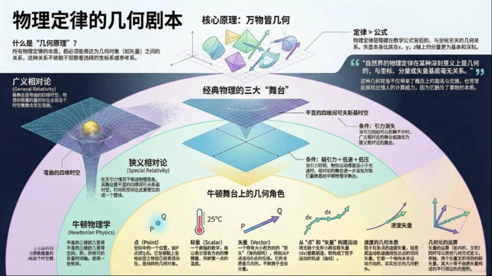
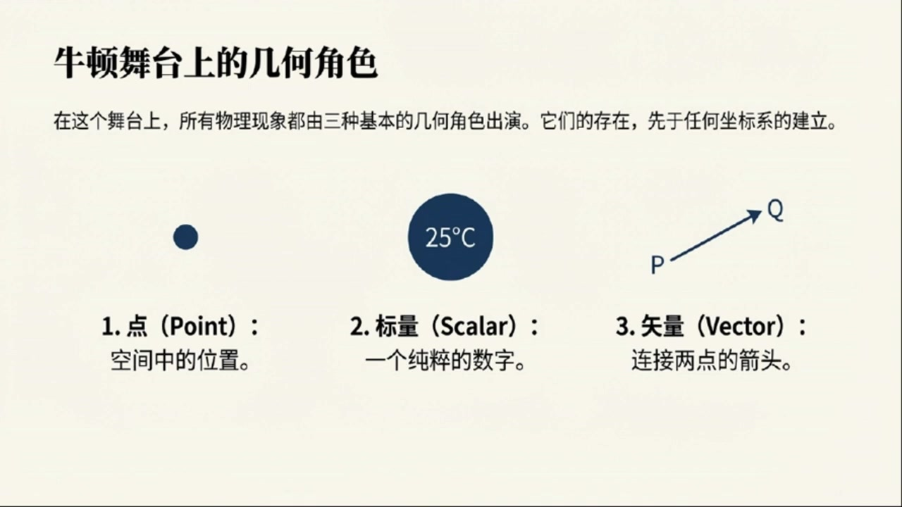
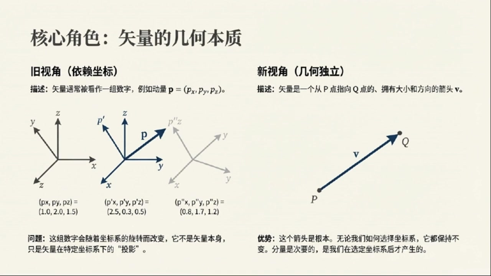
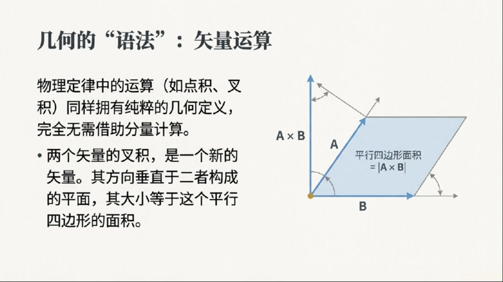

# 《现代经典物理学》第1课 物理定律的几何剧本

> 自动生成的课程注解文档（共 2 个段落，[原始视频](https://www.youtube.com/watch?v=BYKhAbcMMg8)）

## 目录

- [00:00:04 几何原理的提出与经典物理舞台对比](#段落-1)
- [00:03:33 牛顿物理的几何对象、曲线与运算框架](#段落-2)

---

## 段落 1：几何原理的提出与经典物理舞台对比 { #段落-1 }

**时间：** 00:00:04 ~ 00:03:33

📝 原始字幕

<pre>

我们今天来聊一个特别有意思的话题它有点像物理学界的一个
秘密武器,你想想看物理学里有这么多定律
从牛顿运动定律到麦克斯为方程组再到爱因斯坦的相对论
他们看起来千差万别公式复杂多变但你有没有想过一个问题有没有可能这些看似完全不同的定律背后其实共享着同一种语言或者说同一个剧本这个剧本
就是今天我们要聊的这个核心概念叫做几何原理这个词听起来有点悬而未决但其实它的核心思想非常简单和深刻物理定律的本质应该是描述一些几何对象之间的关系而且这种关系不依赖于我们怎么去测量它也就是跟坐标系和参考系的选择没关系这个想法听起来是不是很酷它就像一个翻译器告诉我们不管你用什么语言来描述世界背后那个世界的运行规则本身是超越语言的
为了更清楚地理解这个剧本是什么样的我们可以先看看物理学家们已经写好的几部经典大戏
也就是那些被反复验证过的物理理论它们就像是不同的舞台剧而这个几何原理呢就是
告诉导演每部剧应该用什么样的布景和场景来搭建那么
物理学史上最重要的三大经典框架他们的舞台布景到底是什么呢我们一个个来看排在第一位的当然是最精确的那个也就是
广义相对论
他的舞台是一块弯曲的四维时空注意不是我们熟悉的那种平坦的空间而是被物质和能量压弯了的时空第二部剧是广义相对论的一个特例
也就是当引力非常非常小的时候舞台就变成了平直的四维明科夫斯基时空
这个舞台就是我们常说的狭义相对论的舞台它是时间和空间紧密交织在一起的一个统一整体最后也是我们最熟悉的就是牛顿物理学它的舞台是一个平直的三维欧基里德空间再加上一条单独的时间轴我们从小到大受的教育基本上都是在这个
舞台上进行的你看这么一百是不是就清晰多了从牛顿到爱因斯坦其实就是一个场地升级的过程牛顿的舞台简单明了是个静态的盒子
爱因斯坦的舞台则是一个会变形的动态的四维的舞台
这个启和原理的基础
就是为后面我们深入理解牛顿力学
甚至是为了解读更深层的宇宙规律打下一个坚实的概念地基好了理论背景铺垫完了咱们现在就真正走进牛顿物理学的内部看看当用这个全新的几何视角去看待它时会碰撞出怎样的火花我们第一张目标有两个第一
就是要彻底的教会你这种几何视角让你彻底忘掉过去那种依赖分量的枯燥的数学表达方式第二也是更重要的是要建立起一套专属于牛顿物理的微分几何语言工具
这个工具箱会让我们以后拆解和理解物理世界变得异常强大和优雅那我们就直接开始动手

</pre>

**课程截图：**

### 注解

这段字幕为课程奠定了**"几何化物理学"**的范式基础，核心在于揭示：物理定律的本质不是坐标系中的分量方程，而是几何对象之间的内在关系。以下结合板书截图进行深度解析：

---

## 一、板书/PPT 截图内容描述

截图呈现了一个完整的"物理几何化"认知框架，可分为四个区域：

**左上区域**：标题"物理定律的几何剧本"，定义"几何原理"——所有物理定律必须能表达为几何对象（如矢量、张量）之间的关系，且这种关系不依赖于观察者选择的坐标系或参考系。

**左中区域（三大舞台对比）**：
- **广义相对论**：图示为"弯曲的四维时空"（黄色球体压弯蓝色网格），对应伪黎曼流形（Pseudo-Riemannian manifold）
- **狭义相对论**：图示为"平直的四维闵可夫斯基时空"（平直网格），对应闵可夫斯基空间 $\mathbb{M}^4$
- **牛顿物理学**：图示为三维欧几里得空间坐标系，标注为"平直的三维欧几里得空间 + 一维时间"

**下方区域（牛顿舞台的几何角色）**：
展示了微分几何的基础元素：
- **点 (Point)**：标记为 $P, Q$，代表空间中的位置（无长度、无方向）
- **标量 (Scalar)**：以 $25^\circ\text{C}$ 为例，表示只有大小、无方向的量（温度场）
- **矢量 (Vector)**：从 $P$ 指向 $Q$ 的箭头，以及速度矢量图示，表示既有大小又有方向的量
- **无穷小位移**：标记为 $dx$，表示从一点到邻近点的无穷小切向量
- **轨迹与切向量**：曲线上的微小线段 $dx$ 构成运动轨迹，其极限为切向量（速度的几何本质）

**右侧区域**：
- 核心不等式：**定律 > 公式**（Law is greater than Formula）
- 引用强调：物理定律在深刻意义上是几何的，与坐标、分量或矢量基底的选择无关。

---

## 二、核心概念与符号详解

### 1. 几何对象与坐标无关性
板书强调的 $dx$（无穷小位移）和矢量箭头，在微分几何中严格定义为**切向量**（Tangent Vector）。关键区别在于：
- **旧视角（分量依赖）**：速度 $\vec{v} = (v_x, v_y, v_z)$，随坐标系旋转而变换分量
- **新视角（几何本质）**：速度是轨迹曲线的切向量 $\vec{v} \in T_pM$，是流形 $M$ 在点 $p$ 处切空间 $T_pM$ 的元素，其存在不依赖于任何坐标系的选择

### 2. 三大舞台的数学结构差异
字幕中"舞台升级"的比喻对应着数学结构的精确演化：

| 物理理论 | 几何舞台（数学对象） | 度规结构 | 曲率 | 时间处理 |
|---------|---------------------|---------|------|---------|
| **牛顿物理学** | $\mathbb{E}^3 \times \mathbb{R}$ （欧几里得空间×时间） | 正定度规 $\delta_{ij}$（空间） 绝对时间 $\delta_{tt}=1$ | 平坦 $R=0$ | 绝对时间，与空间分离 |
| **狭义相对论** | $\mathbb{M}^4$ （闵可夫斯基空间） | 闵可夫斯基度规 $\eta_{\mu\nu} = \text{diag}(-1,1,1,1)$ | 平坦 $R=0$ | 时间与空间统一为四维流形 |
| **广义相对论** | $(\mathcal{M}, g_{\mu\nu})$ （四维伪黎曼流形） | 动态度规场 $g_{\mu\nu}(x)$ 由物质-能量分布决定 | 非零曲率 $R_{\mu\nu\rho\sigma} \neq 0$ | 时空弯曲，引力即几何 |

**关键符号说明**：
- $\mathbb{E}^3$：三维欧几里得空间，满足勾股定理 $ds^2 = dx^2 + dy^2 + dz^2$
- $\mathbb{M}^4$：四维闵可夫斯基空间，时空间隔 $ds^2 = -c^2dt^2 + dx^2 + dy^2 + dz^2$
- $g_{\mu\nu}$：度规张量（Metric Tensor），定义了流形上的距离测量和角度关系
- $dx$：微分形式（Differential 1-form）或切向量，取决于上下文（在截图轨迹语境下指切向量）

---

## 三、必要的理论背景补充

### 1. 协变性原理（Principle of Covariance）
字幕中"不依赖于坐标系选择"的深层含义是**广义协变性**：真正的物理定律应当表述为张量方程（Tensor Equations）。张量（如 $g_{\mu\nu}$、速度矢量 $v^\mu$、电磁场张量 $F_{\mu\nu}$）在坐标变换下按特定规则变换，使得方程形式保持不变。这确保了"剧本"（物理定律）与"语言"（坐标系）无关。

### 2. 从矢量到流形（Manifold）
截图中的"点 $P, Q$"暗示了**流形**概念。现代物理将时空视为一个微分流形（Differentiable Manifold）：
- **局部**：看起来像 $\mathbb{R}^4$（平直），可以用坐标卡（Charts）描述
- **整体**：可能弯曲（如广义相对论），需要多个坐标卡拼接（图册 Atlas）
- **切空间 $T_pM$**：流形上每一点 $p$ 都有一个独立的矢量空间，包含所有可能的切向量（如速度）

### 3. 牛顿力学的几何重构
字幕预告要建立的"牛顿物理微分几何语言"，实际上是指**牛顿-嘉当理论**（Newton-Cartan Theory）或更基础的**伽利略几何**：
- 牛顿时空并非简单的 $\mathbb{R}^4$，而是配备了**绝对时间函数** $t: M \to \mathbb{R}$ 和**空间度量** $h^{ab}$ 的纤维丛结构
- 这种几何语言能严格区分"绝对加速度"（可观测）和"绝对速度"（不可观测，依赖于参考系），为理解惯性力和广义相对论的局部惯性系奠定基础

---

## 四、通俗语言总结

**核心思想**：物理学家发现，描述世界的最佳方式不是"在纸上画坐标轴写方程"，而是"研究物体在时空舞台上的几何关系"。

**舞台比喻的实质**：
- **牛顿的舞台**像一个老式的剧院：观众席（空间）是固定的，演出时间（时间）是统一的，演员（粒子）在固定的地板上移动。
- **爱因斯坦的狭义相对论舞台**把时间和空间缝合成了一块弹性布料（四维时空），但布料本身是绷紧平整的。
- **广义相对论的舞台**则是一张巨大的蹦床：重物（质量/能量）压弯了布料，其他物体只是沿着弯曲布料的最短路径（测地线）滚动——这就是引力。

**为什么要用几何语言？**
想象描述一个球体：
- **分量语言**："在XYZ坐标系中，球面方程是 $x^2+y^2+z^2=R^2$"——如果换成球坐标，方程变了，但球没变。
- **几何语言**："所有到中心距离为 $R$ 的点的集合"——与坐标系无关。

物理定律也是如此。几何原理告诉我们：**真正物理的不是坐标数字，而是几何关系本身**。这种视角不仅能统一牛顿到爱因斯坦的理论，更是理解规范场论、弦理论等现代物理的必经之路。

---

## 段落 2：牛顿物理的几何对象、曲线与运算框架 { #段落-2 }

**时间：** 00:03:33 ~ 00:11:27

📝 原始字幕

<pre>

看看这个全新的世界观是怎么建立起来的吧首先什么是几何对象
材料里给了几个非常清晰的例子,第一个也是最基础的,叫做点
这个点你可以理解成空间中的一个位置比如我们说一个粒子在P点或者在Q点这个P和Q就是纯粹的几何对象在我们给它贴上坐标标签之前它就已经存在了
第二个叫做标量,这个你肯定是哦,就是一个单纯的数字
比如我们说某一点的温度是多少度这个多少度就是一个标量它可以是一个固定的值也可以是一个随着空间变化的场比如我们常说的温度场T在P点的值第三个是尺量
这个就是整个几何视角里最核心的概念之一
以前我们学尺量的时候可能更多的关注它的分量比如X方向多少Y方向多少
但在这里,它的定义完全不同
始料
本质上是一个有方向和大小线段
比如说有一个例子从点P移动到了点Q那么连接P和Q的这个有向线段就是一个位移尺量我们既做DeltaX这个定义的好处是它非常直观而且不依赖于我们选择哪个点作为原点当然我们也可以选择某个固定的点O作为我们的总部
从这个O点到其他任意一点P的尺量,我们就叫它OP或者写作XP
这是两种看待尺量的方式一种是相对的一种是绝对的它们之间可以相互转化但不影响尺量这个概念本身的独立性和几何本质好了
有了点和尺寸这两个基本构件我们就可以开始搭建更复杂的建筑了接下来要讲的一个概念叫做距离
或者更精确地说长度间隔我们用小写的希腊字母希格玛来表示在三维欧吉里德空间里
两点P和Q之间的距离是一个最根本的不能再用其他东西定义的几何量我们之所以能写出适量的长度平方等于长度间隔的平方即DeltaX二等于DeltaXigma
二是因为后者是我们解和大厦的第一块基石说到这儿我觉得有必要停一下因为这里面其实藏着一个特别关键的动键在传统上我们可能会觉得一个始量的分量比如X方向的分量和Y方向的分量才是最基本的但解和原理告诉我们恰恰相反那个不可再分的最基本的东西反而是我们刚才说的那个始量本身你可以想象一下我们画一个二维平面上的始量这个箭头不管你怎么选坐标系这个箭头总是存在的而它的分量是我们在选定了一个特定的坐标系之后才有的东西
所以从这个角度看始量是比它的分量更基本的存在这个观念的转变我觉得是理解后续一切的关键既然我们有了点和始量下一步自然就是研究这些始量怎么运动怎么变化这就引出了下一个非常重要的概念
曲线你可以想象一条弯曲的道路,那条路本身是由无数个极小的手尾相连的线段组成的
在数学上我们就是通过无穷多个无穷小的位移大小DX一个接一个的拼接起来就构成了曲线为了量化这条曲线我们还需要一个参数通常用希腊字母兰木达来表示这样一来曲线上的每一个点都可以表示成一个关于兰木达的函数也就是P
不答
那么
曲线在某一点的切向量是什么呢?很简单
就是当栏目大发生一个无限小的变化时产生的那个无穷小的位移始量DX再除以这个无限小的变化量D栏目大
这个笔值就是曲线在该点的切向量这个概念非常重要因为它直接引出了我们最熟悉的一个物理量速度一个质点的运动轨迹是一条曲线
而它在某一时刻的速度史料
本质上就是这条曲线在该点的切向量这太美妙了速度不再是一个抽象的数字而是一个实实在在的指向未来运动方向的几何箭头有了这些基本的几何对象和概念我们才能开始真正构建牛顿物理的语法也就是那些几何对象之间的运算规则
这里面主要有两种运算一种是内积和差积运算另一种是球导等这些运算都可以用一种纯几何的方法来定义而不需要任何具体的坐标系统比如说差积它的结果是一个新的时量这个时量大小正好等于两个原始时量所围成的平行四边形的面积你看这也是一个纯粹的几何解释当我们掌握了这些基于几何的运算规则之后很多物理定律就会自然而然地浮现出来比如说守恒定律
因为它触及了事物更本质的特征好了我们来回顾一下刚刚聊过的内容
我们从最宏观的物理学框架说起看到了广义相对论狭义相对论和牛顿物理它们就像是建在不同舞台上的剧目而现在我们深入到了牛顿物理的内部
用全新的几何原理来解剖它这个原理告诉我们物理定律不是那些写在纸上的公式而是隐藏在这些数字背后的与坐标无关的几何关系具体来说牛顿物理的舞台是一个平坦的三维欧几里的空间加上一条普世的时间轴在这个舞台上我们认识了三种基本的几何对象
点是空间的位置
标量是单个的数量,比如温度
而尺量则是我们理解运动和力核心
它是一个有头有尾,有方向有大小箭头
我们看到了位移始量切向量是如何产生的也明白了为什么说无从小的位移DX比有限的位移DeltaX更基本最后我们还知道了所有基于始量的运算比如插机
都可以有纯粹的几何解释所以你看当我们把牛顿力学放在这样一个几何的舞台上时那些我们背得滚瓜烂熟的公式突然就有了全新的生命力
它不再是枯燥的代数符号
而是一个有血有肉,充满张力的几何关系
这种视角不仅仅是为了好玩或者显得高大上,它实际上为我们开启了一扇门
一扇通往更高阶物理也就是量子引力理论大门的窗户因为就像材料里那张图二暗示的那样所有的经典物理框架最终都只是某种更终极理论的近似而几何原理正是我们通往那个终极理论的共同语言

</pre>

**课程截图：**

### 注解

这段字幕在已建立的**几何化物理学**框架基础上，进一步引入了**度量结构**与**微分几何**的核心要素，将静态的几何对象（点、矢量）拓展为动态的**场与流**。以下是针对本段新内容的深度注解：

---

## 一、板书/PPT 内容推演（基于字幕描述）

结合字幕提及的板书逻辑，本段对应的板书应在之前"几何角色"与"矢量本质"基础上，新增以下板块：

**中上区域（度量结构）**：
- 标题："距离作为几何基石"
- 公式：$(\Delta \mathbf{X})^2 = (\Delta \sigma)^2$ 或 $|\Delta \mathbf{X}| = \Delta \sigma$
- 标注：$\sigma$（sigma）为**长度间隔**（line element），是欧氏空间中最基本的原始几何量，独立于坐标系存在

**中下区域（曲线与流）**：
- 图示：一条弯曲曲线，标注参数 $\lambda$（lambda）从 $0$ 到 $1$ 变化
- 局部放大图：显示曲线上某点 $P$ 处的无穷小位移 $d\mathbf{X}$ 与参数微分 $d\lambda$
- 公式：切向量 $\mathbf{T} = \frac{d\mathbf{X}}{d\lambda}$
- 物理对应：速度矢量 $\mathbf{v} = \frac{d\mathbf{X}}{dt}$（当 $\lambda$ 为时间 $t$ 时）

---

## 二、新公式与符号详解

### 1. 长度间隔（Line Element）与度量关系
**字幕原文**："适量的长度平方等于长度间隔的平方即DeltaX二等于DeltaXigma二"

**标准表述**：
$$ |\Delta \mathbf{X}|^2 = (\Delta \sigma)^2 \quad \text{或简记为} \quad \Delta \mathbf{X} \cdot \Delta \mathbf{X} = (\Delta \sigma)^2 $$

**符号释义**：
- $\Delta \mathbf{X}$：从点 $P$ 到点 $Q$ 的**位移矢量**（displacement vector），有向线段
- $\Delta \sigma$（小写希腊字母 sigma）：**长度间隔**（line element），标量，表示两点间的几何距离
- $|\cdot|$ 或 $\cdot$：矢量的模长（由内积诱导）

**关键洞察**：在欧几里得几何中，$\Delta \sigma$ 是**原始概念**（primitive notion），而坐标分量 $(\Delta x, \Delta y, \Delta z)$ 是导出量。这体现了**度规几何**（metric geometry）的核心——空间本身具有测量长度的内在结构，无需借助外部坐标。

### 2. 曲线的参数化表示
**字幕原文**："曲线上的每一个点都可以表示成一个关于兰木达的函数也就是P不答"

**标准表述**：
$$ \mathbf{X}(\lambda) \quad \text{或} \quad P(\lambda) $$
其中 $\lambda \in [\lambda_0, \lambda_1]$ 为**曲线参数**（curve parameter）。

**符号释义**：
- $\lambda$（希腊字母 lambda）：沿曲线的**仿射参数**（affine parameter），单调递增的实数，用于"标记"曲线上的位置
- $\mathbf{X}(\lambda)$：位置矢量函数，将参数 $\lambda$ 映射到空间中的具体点
- **物理意义**：当 $\lambda$ 取为时间 $t$ 时，这就是**质点运动轨迹**的数学描述

### 3. 切向量的几何定义
**字幕原文**："DX再除以这个无限小的变化量D栏目大...这个笔值就是曲线在该点的切向量"

**标准表述**：
$$ \mathbf{T}(\lambda) = \frac{d\mathbf{X}}{d\lambda} = \lim_{\Delta \lambda \to 0} \frac{\mathbf{X}(\lambda + \Delta \lambda) - \mathbf{X}(\lambda)}{\Delta \lambda} $$

**符号释义**：
- $d\mathbf{X}$：沿曲线的**无穷小位移矢量**（infinitesimal displacement），属于切空间（tangent space）元素
- $d\lambda$：参数的无穷小增量
- $\mathbf{T}$：**切向量**（tangent vector），方向指向曲线前进方向，大小取决于参数选择

**归一化与速度**：
当选择 $\lambda$ 为**固有时**（proper time）$\tau$ 或时间 $t$ 时，切向量即为**四维速度**或**三维速度**：
$$ \mathbf{v} = \frac{d\mathbf{X}}{dt} $$
此时切向量的模长 $|\mathbf{v}|$ 即为速率。

---

## 三、理论背景补充

### 1. 度规张量（Metric Tensor）的萌芽
字幕中强调"距离是不能再用其他东西定义的几何量"，这暗示了**度规**（metric）的存在。在三维欧氏空间 $\mathbb{E}^3$ 中，度规 $g$ 是一个 $(0,2)$ 型张量，使得：
$$ (\Delta \sigma)^2 = g(\Delta \mathbf{X}, \Delta \mathbf{X}) $$
在直角坐标系下，$g$ 表现为单位矩阵 $\delta_{ij}$，故 $(\Delta \sigma)^2 = \Delta x^2 + \Delta y^2 + \Delta z^2$。但**几何原理**强调，$g$ 本身独立于坐标选择，是空间的内禀属性。

### 2. 切空间（Tangent Space）的引入
当讨论"曲线在某一点的切向量"时，实际上已隐含了**切空间** $T_P\mathcal{M}$ 的概念：
- 在点 $P$ 处，所有可能切向量的集合构成一个矢量空间（平面）
- 无穷小位移 $d\mathbf{X}$ 严格来说不是空间中的矢量（连接两点），而是切空间中的元素
- 这种区分在弯曲时空（广义相对论）中至关重要，但在平坦欧氏空间中可直观理解为"无穷小箭头"

### 3. 仿射参数（Affine Parameter）
参数 $\lambda$ 的选择具有任意性（可重参数化 $\lambda' = f(\lambda)$），但**仿射参数**的特殊性在于它保持切向量的"均匀变化"：
$$ \frac{d}{d\lambda}\left( \frac{d\mathbf{X}}{d\lambda} \right) = 0 \quad \text{（测地线方程的雏形）} $$
当 $\lambda$ 为时间时，这对应于匀速直线运动。

---

## 四、核心概念通俗解释

### 1. 为什么"距离"比"坐标差"更基本？
想象你在一张橡皮膜上画两点。你可以拉伸橡皮膜（改变坐标），两点间的**坐标差** $(\Delta x, \Delta y)$ 会变化，但两点间的**实际距离** $\Delta \sigma$（橡皮膜上的直线长度）不变。因此，距离是空间的"DNA"，而坐标只是临时的标签。

### 2. 曲线作为"无穷小位移的积分"
一条弯曲的道路，如果你用显微镜看极小的一段，它几乎是直的。曲线就是由无数个这样的"直箭头" $d\mathbf{X}$ 头尾相接拼成的。参数 $\lambda$ 就像是你走路时的"步数计数器"，而切向量 $d\mathbf{X}/d\lambda$ 就是"每一步迈出的方向和大小"。

### 3. 速度的几何本质：指向未来的箭头
传统物理中，速度是"位置对时间的导数"，听起来像代数运算。但在几何视角下：
- 质点的历史是一条**世界线**（曲线）
- 速度是这条世界线在当前时刻的**切线方向**
- 这个箭头不仅告诉你跑得多快（长度），更关键的是**指向你即将去往的下一个瞬间**（方向）

这解释了为什么速度是矢量而速率是标量：方向包含了运动的几何信息。

---

## 五、总结

本段内容完成了从**静态几何**（点、固定矢量）到**运动几何**（曲线、切向量、速度）的跃迁。关键突破在于：

1. **度量观的建立**：引入长度间隔 $\sigma$ 作为原始几何量，为后续定义"刚体"、"角度"和"内积"奠定基础
2. **微分几何语言的引入**：通过参数 $\lambda$ 和切向量 $d\mathbf{X}/d\lambda$，将"变化率"从代数运算转化为几何对象（切空间中的矢量）
3. **物理量的几何化**：速度不再是 $\dot{x}, \dot{y}, \dot{z}$ 三个数字的组合，而是世界线上一个独立的、与坐标无关的几何实体

这一框架为后续引入**协变导数**（connection）和**曲率**（curvature）铺平了道路——当我们需要描述矢量如何在弯曲空间中"平行移动"时，切向量的概念将成为不可或缺的基石。

---
