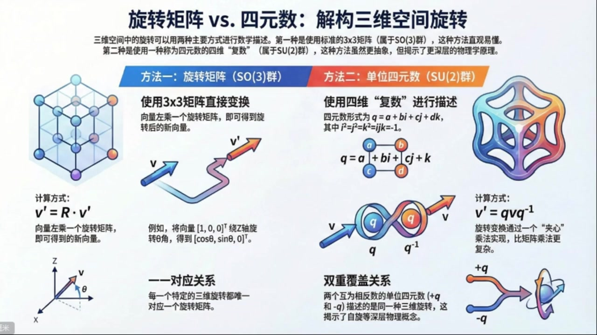
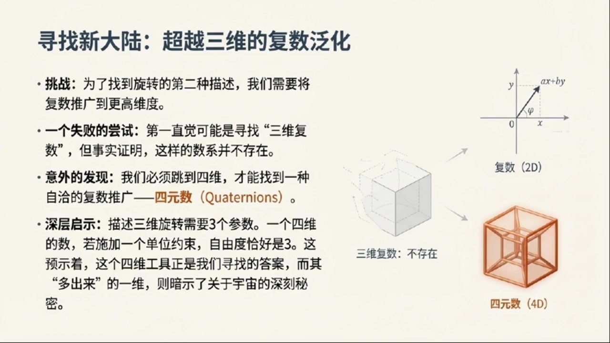
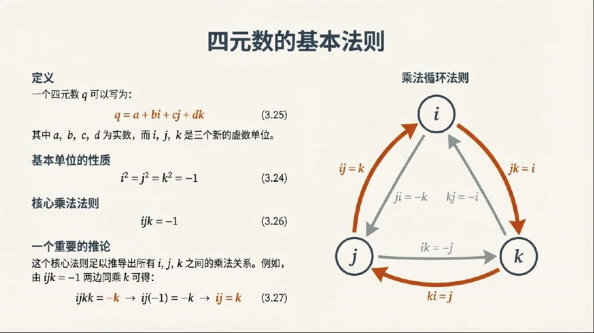
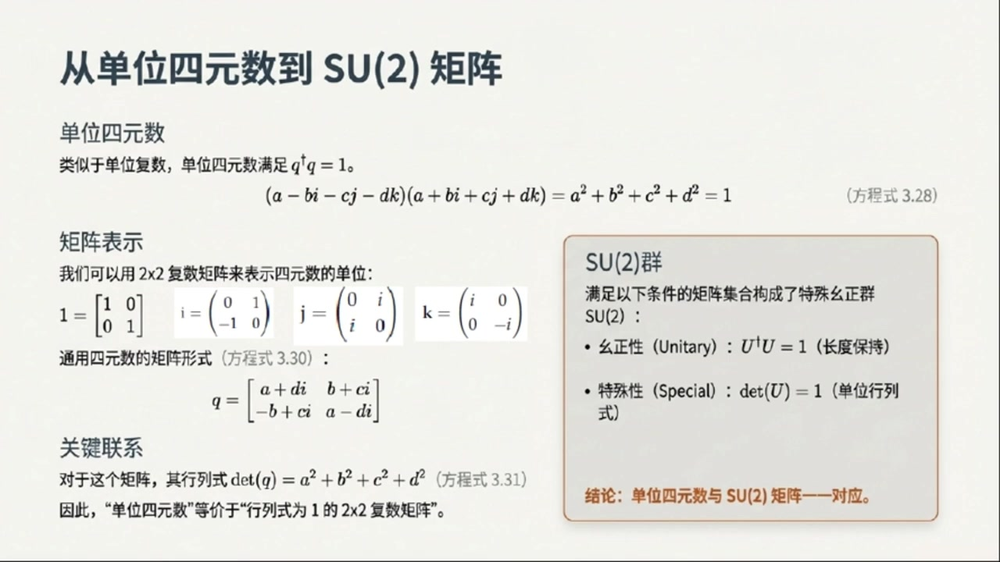
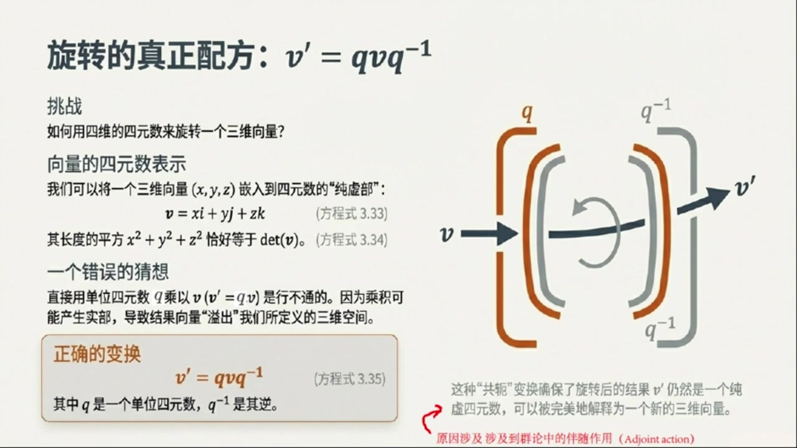
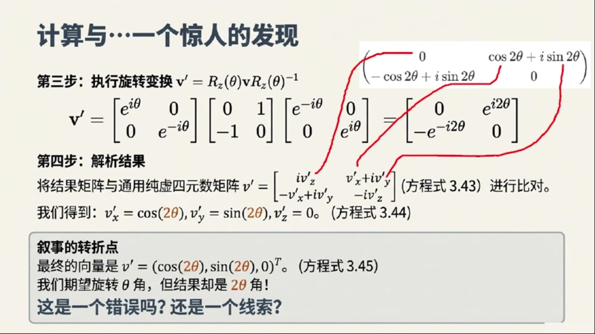
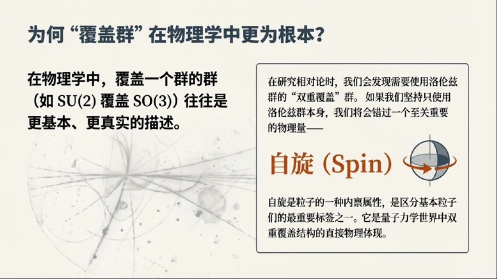

# 《基于对称性的物理学》第6课 旋转矩阵和四元数：解构三维空间旋转

> 自动生成的课程注解文档（共 4 个段落）

## 目录

- [00:00:00 从三维旋转矩阵引出四元数](#段落-1)
- [00:05:00 四元数的乘法规则与SU(2)矩阵表示](#段落-2)
- [00:10:00 用四元数作用三维向量并发现半角关系](#段落-3)
- [00:16:00 SU(2)对SO(3)的双覆盖及其物理启示](#段落-4)

---

## 段落 1：从三维旋转矩阵引出四元数 { #段落-1 }

**时间：** 00:00:00 ~ 00:05:00

<details><summary>📝 原始字幕</summary>

<pre>

大家好欢迎来到基于对称性的物理学博客第六课我是你们的主持人周瑞今天我们又要一起探索物理世界里那些美妙的对称性了今天的话题可不简单要深入聊聊三维空间里的旋转在我们之前聊过二维旋转用负数描述起来又优雅又方便那三维旋转呢是不是也有类似的魔法工具没错周瑞很高兴你提到这一点在二维情况下我们用负数来描述旋转发现它比传统的旋转矩阵更简洁也揭示了一些更深层次的东西今天我们要把这个思路推广到三维空间寻找另一种描述三维旋转的方法哇听起来很酷那我们先从最熟悉的开始吧在物理里我们通常怎么描述三维旋转呢
方法就是用三长三的旋转矩阵你可以小笑我们绕着XYZ这三个左轴旋转一个角度C塔都有对应的矩阵哦我记得那些矩阵比如绕X轴转的RX绕Y轴转的RY还有绕最轴转的RZ它们长得都挺特别的对没错RZ矩阵是这样的第一行是COXINTHETA 副SYNTETA 零第二行是COXINTHETA 零第三行是零零如果你想把一个向量比如说一零零这个在X轴上的单位列向量绕着Z轴转C塔角你只需要把RZ矩阵左成这个向量就行了我脑子里过了一下成出来结果就是列向量COXINTHETA
这确实就是我们熟悉的旋转结果那赛你刚才说要找另一种描述是不是意味着这种三乘三矩阵的方法虽然直观但可能还不是最根本的很好抓你抓住了重点这种矩阵描述非常有用但就像二维情况一样我们想看看有没有更本质的描述方式就像负数对于二维旋转那样那我猜是不是可以把负数推广到三维呢比如找一种三维负数这是一个很自然的猜测但很可惜数学告诉我们并没有所谓的三维负数不过我们倒是能找到一种四维负数它就是今天的主角之一四元数quaternions四元数听起来很厉害而且是四维的这怎么会和三维旋转车上关系呢这就是四维数最奇妙的地方
实际上它确实是四维的但它却是描述三维旋转的正确工具而且它四维的本质会揭示一些关于宇宙的深刻秘越来越悬乎了但我有点不明白三维旋转不是只需要三个参数来描述吗比如三个欧拉角那为什么一个四维的工具会是正确的呢这个问题问得很好一个任意的三维旋转确实需要三个参数来描述而四元数虽然有四个分量但当我们施加一个单位四元数的约束时它恰好就只有三个自由度了这和我们在二维情况下使用单位负数来描述旋转是类似的我明白了就像单位负数Z虽然有两个分量A和B但因为磨长Z成Z负共恶等于一所以只有一个自由度
完全正确单位四元数正是我们描述三维旋转的关键那赛你快给我讲讲这个神秘的四元数到底长什么样它是怎么构造出来的好的我们可以类比二维负数的构造负数有一个虚数单位I满足I平方等于负一四元数则引入了三个虚数单位IJK它们都满足I平方等于J平方等于负一等等三个虚数单位IJK这听起来比负数复杂多了确实所以一个四元数Q可以写成Q等于A加B加CJ加DK这种形式这里ABCD都是实数明白了就像负数是A加B一样

</pre>

</details>

**课程截图：**






### 注解

我来对这段课程视频进行深度注解，重点分析新出现的公式、概念和理论背景。

---

## 一、板书/PPT 公式识别与解释

### 1. 旋转矩阵方法（SO(3)群）

**公式：**
$$\mathbf{v}' = \mathbf{R} \cdot \mathbf{v}$$

| 符号 | 含义 |
|:---|:---|
| $\mathbf{v}$ | 旋转前的三维列向量（原向量） |
| $\mathbf{R}$ | 3×3 正交旋转矩阵（$\mathbf{R} \in SO(3)$） |
| $\mathbf{v}'$ | 旋转后的新向量 |
| $SO(3)$ | 三维特殊正交群，即所有行列式为+1的3×3正交矩阵构成的群 |

**具体示例（绕Z轴旋转）：**
$$\mathbf{R}_z(\theta) = \begin{pmatrix} \cos\theta & -\sin\theta & 0 \\ \sin\theta & \cos\theta & 0 \\ 0 & 0 & 1 \end{pmatrix}$$

对向量 $\mathbf{v} = \begin{pmatrix} 1 \\ 0 \\ 0 \end{pmatrix}$ 进行旋转：
$$\mathbf{v}' = \mathbf{R}_z(\theta)\begin{pmatrix} 1 \\ 0 \\ 0 \end{pmatrix} = \begin{pmatrix} \cos\theta \\ \sin\theta \\ 0 \end{pmatrix}$$

---

### 2. 四元数方法（SU(2)群）

**四元数定义：**
$$q = a + bi + cj + dk$$

| 符号 | 含义 |
|:---|:---|
| $a, b, c, d$ | 四个实数分量（标量部分+三个虚部） |
| $i, j, k$ | 三个虚数单位，满足**哈密顿关系**： |
| | $i^2 = j^2 = k^2 = ijk = -1$ |

**关键约束条件（单位四元数）：**
$$|q|^2 = a^2 + b^2 + c^2 + d^2 = 1$$

**旋转公式：**
$$\mathbf{v}' = q\mathbf{v}q^{-1}$$

| 符号 | 含义 |
|:---|:---|
| $q$ | 单位四元数（$|q|=1$） |
| $q^{-1}$ | 四元数的逆，对单位四元数有 $q^{-1} = q^*$（共轭） |
| $\mathbf{v}$ | 被表示为**纯虚四元数**的三维向量（即 $a=0$） |

---

## 二、理论背景补充

### 2.1 为什么"三维复数"不存在？—— 弗罗贝尼乌斯定理

这是一个深刻的数学事实：**满足域公理的有限维实数扩张只有三种**：
- 实数 $\mathbb{R}$（1维）
- 复数 $\mathbb{C}$（2维）  
- 四元数 $\mathbb{H}$（4维）

> 不存在3维的"复数"是因为：若要构造乘法封闭的代数结构，维度必须满足特定约束。三维会导致乘法无法良好定义（特别是除法代数的要求无法满足）。

### 2.2 四元数的代数结构

**乘法规则表（哈密顿关系）：**

| × | $i$ | $j$ | $k$ |
|:---|:---|:---|:---|
| $i$ | $-1$ | $k$ | $-j$ |
| $j$ | $-k$ | $-1$ | $i$ |
| $k$ | $j$ | $-i$ | $-1$ |

记忆口诀：**$i \to j \to k \to i$ 循环为正，逆序为负**

### 2.3 群论视角的深层对应

| 描述方式 | 数学结构 | 与三维旋转的关系 |
|:---|:---|:---|
| 旋转矩阵 | $SO(3)$ | 直接作用，一一对应 |
| 单位四元数 | $SU(2)$ | **双重覆盖**：$\pm q$ 对应同一个旋转 |

这是课程中提到的"双重覆盖关系"的数学本质—— $SU(2)$ 是 $SO(3)$ 的**万有覆盖群**。

---

## 三、核心概念通俗解释

### 🔑 "四维描述三维"的奥秘

> **类比理解**：就像用二维复数描述二维平面旋转时，我们其实用了 $(x,y)$ 两个坐标；但描述三维旋转时，却需要"跳"到四维。

**为什么3个参数需要4个分量？**

想象你在地球上定位：
- 经度 + 纬度 = 2个参数，但地球是**二维曲面嵌入三维空间**
- 类似地，三维旋转的"空间" $SO(3)$ 是一个**三维流形**，但它自然地"住"在四维四元数空间里

**约束条件的妙用：**
- 四元数有4个自由分量 $(a,b,c,d)$
- 单位约束 $a^2+b^2+c^2+d^2=1$ "吃掉"1个自由度
- 剩下**恰好3个独立参数** = 三维旋转的自由度

### 🔑 四元数旋转的直观图像

板书右侧的"夹心乘法"图示 $q\mathbf{v}q^{-1}$ 揭示了一个深刻事实：
- 这不是简单的线性乘法，而是**共轭作用**
- 几何上，这对应于**绕某轴旋转某角度**的操作
- 具体地：若 $q = \cos(\theta/2) + \sin(\theta/2)(u_x i + u_y j + u_z k)$，则描述的是**绕单位向量 $\mathbf{u}$ 旋转 $\theta$ 角**

> 注意角度是 $\theta/2$——这正是双重覆盖的数学体现：旋转 $2\pi$（一圈）对应 $q \to -q$（四元数变号），但要旋转 $4\pi$ 才能让四元数回到原位！

---

## 四、板书内容描述

### 第一张PPT（旋转矩阵 vs. 四元数）
- **左侧**：3×3矩阵网格图示，展示正交变换
- **中间**：旋转矩阵的显式形式，强调"一一对应"
- **右侧**：四元数"夹心乘法"示意图，两个相对的 $q$ 和 $q^{-1}$ 夹着向量 $\mathbf{v}$，输出 $\mathbf{v}'$
- **关键对比**：SO(3)群的单值性 vs. SU(2)群的双重覆盖

### 第二/三张PPT（寻找新大陆）
- **核心视觉**：从2D复数 → （跳过3D）→ 4D四元数的维度跳跃
- **右侧图示**：复数平面（2D）→ 透明立方体标注"三维复数：不存在" → 橙色四维超立方体（4D）
- **关键洞察**："多出来的一维"暗示了自旋等量子力学概念（拓扑非平凡性）

---

## 五、本节核心要点总结

| 要点 | 内容 |
|:---|:---|
| **问题** | 寻找比3×3矩阵更本质的三维旋转描述 |
| **答案** | 单位四元数 $q = a+bi+cj+dk$（满足 $\|q\|=1$）|
| **关键公式** | $\mathbf{v}' = q\mathbf{v}q^{-1}$ |
| **深层结构** | $SU(2) \to SO(3)$ 的双重覆盖同态 |
| **物理意义** | 为后续量子力学中的**自旋**概念埋下伏笔 |

---

## 段落 2：四元数的乘法规则与SU(2)矩阵表示 { #段落-2 }

**时间：** 00:05:00 ~ 00:10:00

<details><summary>📝 原始字幕</summary>

<pre>

那这些IJK之间有什么成法规则吗比如IJ等于什么这就是四元数构造的另一个关键点除了IJK等于J平方等于K平方等于负一我们还需要一个额外的条件IJK等于负一有了这个条件我们就可以推导出所有其他的成法关系了比如呢你能给我举个例子吗当然如果我们把IJK等于负一这个是字子又成一个K会发生什么左边变成IJKK因为K平方等于负一所以左边就是IJ成以负一也就是负K所以我们得到负IJ等于负K也就是负K这很有趣
然后IJ等于KJ等于J还有JI等于FKKK等于FK这些关系是不是有点像我们高中学的向量擦成对你的观察力非常敏锐这确实和向量擦成有着异曲同工之妙这个带数结构正是四元数能够描述三维旋转的生成原因之一那我们刚才提到单位四元数它的条件是什么呢单位四元数Q满足Q上十字架Q等于一这里的十字架符号叫做DEGGER表示转制加复功二对于四人数来说数的转制就是自身所以Q上DEGGER等于Q的复功二进而Q上DEGGERQ展开后就是A平方加B平方加D平方等于一你看它确实是一个四维空间
单元数的四个时数分量看作一个四维向量的摩长那这些单位四元数在四元数成法下也形成一个群吗没错他们形成一个群就像单位负数在负数成法下形成一个群一样这个群就是我们今天另一个重要概念SU2群SU2这个名字听起来就很物理呢它和四元数有什么关系呢我们也可以把四元数用二乘二的负数矩阵来表示就像我们用举证表示二维负数一样二乘二的负数矩阵能举个例子吗当然单位一可以表示成单位矩阵IJK这三个虚数单位也可以分别表示成三个特殊的二乘二负数矩阵比如I单位
是乘矩阵零一换行复一零J单位是矩阵零爱换行爱零K单位是矩阵爱零换行零负爱特别注意这里的爱就是真正负数的虚数单位而不是四元数中的哪个所谓的虚数单位爱哇这些矩阵看起来很特别那一个普通的四元数Q等于A加B加CJ加DK用这些矩阵一组合就能写成一个总的二乘二矩阵了对吗对没错这个矩阵的形式是第一行是A加DI和B加CI第二行是A加B加CI你可以自己验证一下这些矩阵确实满足I平方等于J平方等于复一和IJK等于复一这些条件所对应的矩阵形式
那这个矩阵的行列是多少呢它的行列是正好是A平方加B平方加C平方加D平方这和我们刚才说的单位四元数的条件QQ等于E也就是A平方加B平方加C平方加D平方等于E完全吻合没错所以单位四元数用这种二乘二负数矩阵表示出来就正好是行列是为E的矩阵同时这些矩阵也满足U一等于E这个条件我记得是有矩阵的定义完全正确所以我们现在定义出来的这个群它是由二乘二的负数矩阵组成并且满足两个条件一是行列是为S代表S

</pre>

</details>

**课程截图：**





### 注解

我来对这段课程视频进行深度注解，重点分析新出现的公式、概念和理论背景。

---

## 一、板书/PPT 公式识别与解释

### 1. 四元数乘法规则（核心推导）

**核心公式：**
$$ijk = -1$$

| 符号 | 含义 |
|:---|:---|
| $i, j, k$ | 四元数的三个虚数单位（哈密顿虚数） |
| $ijk$ | 三个虚数单位的连乘积 |

**推导示例（板书中有详细步骤）：**
$$ijk \cdot k = -k \Rightarrow ij \cdot (-1) = -k \Rightarrow ij = k$$

| 步骤 | 说明 |
|:---|:---|
| $ijk \cdot k$ | 在 $ijk=-1$ 两边右乘 $k$ |
| $ij \cdot k^2 = -k$ | 结合律，$kk = k^2$ |
| $ij \cdot (-1) = -k$ | 代入 $k^2 = -1$ |
| $-ij = -k$ | 整理 |
| $ij = k$ | **最终得到 $i$ 与 $j$ 的乘积** |

### 2. 完整的乘法循环规则（板书右侧图示）

| 乘法关系 | 结果 | 记忆口诀 |
|:---|:---|:---|
| $ij = k$ | 正向循环 | $i \to j \to k \to i$ |
| $jk = i$ | 正向循环 | 顺时针方向为正 |
| $ki = j$ | 正向循环 | |
| $ji = -k$ | 反向循环 | 逆序加负号 |
| $kj = -i$ | 反向循环 | |
| $ik = -j$ | 反向循环 | （注意 $ik \neq ki$）|

> **关键特征**：四元数乘法**不满足交换律**，这是与复数的重要区别！

### 3. 单位四元数条件（新引入）

**公式：**
$$q^\dagger q = 1$$

展开后：
$$(a - bi - cj - dk)(a + bi + cj + dk) = a^2 + b^2 + c^2 + d^2 = 1$$

| 符号 | 含义 |
|:---|:---|
| $q = a + bi + cj + dk$ | 一般四元数（$a,b,c,d \in \mathbb{R}$） |
| $q^\dagger$（或 $\bar{q}$）| 四元数的**共轭**（conjugate/dagger）|
| $a^2 + b^2 + c^2 + d^2$ | 四元数的**模方**（范数平方）|
| $=1$ | 单位化条件 |

> **注意**：讲师提到"转置加复共轭"，但对于四元数，"转置"指的是将虚部取反，即 $q^\dagger = a - bi - cj - dk$

### 4. 四元数的矩阵表示（关键新内容）

**单位矩阵：**
$$\mathbf{1} = \begin{pmatrix} 1 & 0 \\ 0 & 1 \end{pmatrix}$$

**三个虚数单位的 $2\times2$ 复矩阵表示：**

| 虚单位 | 矩阵形式 | 验证特征 |
|:---|:---|:---|
| $i$ | $\begin{pmatrix} 0 & 1 \\ -1 & 0 \end{pmatrix}$ | 泡利矩阵 $-i\sigma_y$ 的变体 |
| $j$ | $\begin{pmatrix} 0 & i \\ i & 0 \end{pmatrix}$ | 含复数 $i$（真正的虚数单位）|
| $k$ | $\begin{pmatrix} i & 0 \\ 0 & -i \end{pmatrix}$ | 对角形式 |

> ⚠️ **重要区分**：矩阵中的 $i$ 是**复数的虚数单位**（$\sqrt{-1}$），而四元数的 $i,j,k$ 是**符号标记**！

**一般四元数的矩阵形式：**
$$q = \begin{pmatrix} a+di & b+ci \\ -b+ci & a-di \end{pmatrix}$$

或等价写法：
$$\begin{pmatrix} \alpha & \beta \\ -\beta^* & \alpha^* \end{pmatrix}$$

其中 $\alpha = a+di$, $\beta = b+ci$

### 5. 行列式与单位条件

**公式：**
$$\det(q) = a^2 + b^2 + c^2 + d^2$$

| 符号 | 含义 |
|:---|:---|
| $\det(q)$ | $2\times2$ 矩阵的行列式 |
| $= a^2+b^2+c^2+d^2$ | 恰好等于四元数模方 |

**SU(2) 群的两个定义条件：**

| 条件 | 数学表达 | 物理意义 |
|:---|:---|:---|
| **幺正性** (Unitary) | $U^\dagger U = I$ | 保持长度（概率守恒）|
| **特殊性** (Special) | $\det(U) = 1$ | 单位行列式 |

---

## 二、理论背景补充

### 1. 四元数与向量叉乘的深刻联系

讲师提到的"异曲同工之妙"可以这样理解：

| 运算 | 复数/四元数 | 向量运算 |
|:---|:---|:---|
| 乘法结果 | $ij = k$ | $\hat{i} \times \hat{j} = \hat{k}$ |
| 反对称性 | $ij = -ji$ | $\vec{a} \times \vec{b} = -\vec{b} \times \vec{a}$ |
| 关键区别 | 四元数**可结合**：$(ij)k = i(jk)$ | 向量三重积有不同恒等式 |

> 这正是四元数能描述3D旋转的原因：它**自然编码了叉乘结构**！

### 2. SU(2) 群的物理重要性

| 应用领域 | 具体说明 |
|:---|:---|
| **量子力学** | 描述自旋-1/2粒子（电子、质子等）|
| **粒子物理** | 弱相互作用的规范群 |
| **凝聚态** | 拓扑绝缘体、自旋电子学 |
| **计算机图形** | 3D旋转的数值稳定计算 |

**SU(2) 与 SO(3) 的关系**：存在**2对1的同态映射**
- 四元数 $q$ 和 $-q$ 对应同一个3D旋转
- 数学上：$SU(2)/\mathbb{Z}_2 \cong SO(3)$

---

## 三、通俗语言解释

### 核心概念：四元数为什么需要"额外条件"？

> **类比理解**：就像盖房子不能只打地基，还需要梁柱连接——$i^2=j^2=k^2=-1$ 只是"三根柱子"，而 $ijk=-1$ 是"横梁"，把它们连成一个整体结构。

### 矩阵表示的直观意义

把四元数写成 $2\times2$ 矩阵，就像：
- **复数**可以用 $2\times2$ **实**矩阵表示（旋转+缩放）
- **四元数**需要用 $2\times2$ **复**矩阵表示（因为"更复杂"）

这种表示让四元数的抽象运算变成了**具体的矩阵乘法**，计算机可以高效计算。

---

## 四、板书内容描述

根据提供的截图，板书/PPT包含：

**第一页（四元数基本法则）：**
- 左侧：定义 $q=a+bi+cj+dk$，基本性质 $i^2=j^2=k^2=-1$，核心法则 $ijk=-1$
- 右侧：**循环图**：$i,j,k$ 三点成三角形，箭头标示乘法方向（顺时针为正，逆序为负）
- 下方：推导示例 $ijk \cdot k = -k \Rightarrow ij=k$

**第二页（从单位四元数到 SU(2) 矩阵）：**
- 左上：单位四元数条件 $q^\dagger q = 1 = a^2+b^2+c^2+d^2$
- 左中：四个矩阵的具体形式（$\mathbf{1}, i, j, k$ 的 $2\times2$ 表示）
- 左下：一般四元数矩阵形式及行列式公式
- 右侧框：**SU(2)群定义**：幺正性 + 特殊性，结论"单位四元数与SU(2)矩阵一一对应"

---

## 五、关键要点总结

| 新概念 | 一句话理解 |
|:---|:---|
| $ijk=-1$ | 四元数乘法的"粘合剂"，导出所有乘法规则 |
| 共轭 $q^\dagger$ | 把四元数"翻转"回去，用于求模和逆 |
| 矩阵表示 | 用复数矩阵"翻译"四元数，连接抽象代数与具体计算 |
| SU(2) | 单位四元数的"学名"，现代物理的核心数学结构 |

---

## 段落 3：用四元数作用三维向量并发现半角关系 { #段落-3 }

**时间：** 00:10:00 ~ 00:16:00

<details><summary>📝 原始字幕</summary>

<pre>

了解了原来单位四元数和SU二群是挡架的那SU二和我们开头说的三维旋转群SO三之间到底有什么联系呢这正是我们要揭示的深刻秘密在二维情况下U一群单位附属和SO二群二维旋转之间的关系非常直接几乎就是一一对应的但SU二和SO三的关系就没那么简单了为什么呢关键在于参数的数量四元数有四个参数而三维向量只有三个坐标我们怎么把一个四元数和一个三维向量冠联起来呢这确实是个问题就像我们不能直接把一个四维的东西直接等于一个三维的东西我们可以用一个特殊的四元数来表示
注意这里没有十部AO也就是一个纯虚的四元数那它的行列是多少呢如果你用我们刚才的二乘二矩形形式来表示这个纯虚四元数你会发现它的行列是正好是X平方加Y平方加Z平方这不就是我们向量的摩长平方吗没错所以如果我们要进行保持向量长度不变的变换也就是旋转那么这种变换对应的矩阵就必须保持行列式不变这意味着我们必须使用单位四元数因为他们的行列式是一听起来一切都顺利成章了那是不是直接用一个单位四元数Q去乘以这个向量四元数V就能得到旋转后的V片呢就像二位复数那样这个是一个非常好的猜测但很遗憾直接惩罚并不能完成
因为Q和V的成机可能会产生一个十步而我们之前定义的三位向量四元数是没有十步的如果出现了十步我们就无法把它解释成一个纯粹的三位向量了那怎么办这不就卡住了吗别担心数学家们找到了一个巧妙的办法正确的变换方式是Q等于Q又用Q的逆成QQQ那这看起来有点像相似变化为什么这种形式就能保证结果还是一个纯虚四元数呢这是一个非常深刻的新纸涉及到群论中的伴随作用Agent Action通过这种变化我们可以保证旋转后的向量V仍然是一个纯虚四元数也就是一个纯粹的三位向量
没问题我们还是那刚才的列向量V等于一零零用四元数表示就是V等于一I加零J加零K在二乘二矩阵形式下它就是矩阵零一缓行负一零好那旋转四元数呢比如我们想绕Z轴旋转一个角度C塔我们可以选择一个特殊的单位四元数来代表绕Z轴的旋转它长这样RZC塔等于COC塔E加C塔K用ORA公式表示成矩阵形式就是矩阵一上EC塔零缓行零上负C塔这个矩阵看起来很简洁那它的逆呢它的逆矩阵就是把角度C塔变成负C塔也就是一上负I塔零换行零一上IC塔好的外事矩阵
好的我们把三个矩阵乘起来经过一番计算最终得到的矩阵巡视是零一上二C换行一上二C换行零对应的展开形式是零C二C加上I二C加上I二C加上I二C加上I二C这个结果有点复杂那我们怎么把它变回我们熟悉的三位向量形式呢别急我们刚才说过一个任意的三位向量VP等于VPXI加上VPYJ加上VPCC用矩阵形式表示时IVPC加上IVPY加上IVPY加上IVPC现在我们把这两个矩阵形式对比一下哦我看到了之后我们发现VPZ等于零
完全正确所以旋转后的向量V是列向量CX2Z0等等S这不对劲啊我们用三乘三旋转卷镜绕Z轴转C塔角结果是CX3Z0但现在用四元素转出来角度变成了二Z0这是怎么回事恭喜你这位你发现了四元素描述三维旋转最关键也最奇妙的地方没错四元素确实是把向量旋转了两倍的角度所以我们用四元素里的C塔实际上对应着物理空间里的二C塔的旋转所以为了让四元素里的角度真的代表我们想要的旋转角度我们需要把公式中的C塔提成二分之一F也就是说

</pre>

</details>

**课程截图：**







### 注解

我来对这段课程视频进行深度注解，重点分析新出现的公式、概念和理论背景。

---

## 一、板书/PPT 公式识别与解释

### 1. 纯虚四元数的矩阵表示与行列式

**公式（来自第一页PPT）：**
$$\det(q) = a^2 + b^2 + c^2 + d^2$$

**纯虚四元数特例（$a=0$）：**
$$\det(v) = x^2 + y^2 + z^2$$

| 符号 | 含义 |
|:---|:---|
| $v = xi + yj + zk$ | 纯虚四元数（实部为零） |
| $x, y, z$ | 对应三维空间向量的三个坐标 |
| $\det(v)$ | 2×2矩阵的行列式，等于向量模长平方 |

**关键洞察：** 四元数的行列式天然编码了向量的长度信息，这为"保长旋转"奠定了代数基础。

---

### 2. 旋转的"正确配方"：共轭作用（Adjoint Action）

**核心公式（第二页PPT，方程式3.35）：**
$$\boxed{v' = qvq^{-1}}$$

| 符号 | 含义 |
|:---|:---|
| $q$ | 单位四元数（旋转算子），满足 $\|q\|=1$ |
| $v$ | 待旋转的纯虚四元数（表示三维向量） |
| $q^{-1}$ | $q$ 的逆（对于单位四元数，$q^{-1} = q^*$，即共轭） |
| $v'$ | 旋转后的向量 |

**为什么不是 $v' = qv$？**
- 直接左乘会产生**实部**：$qv$ 的结果一般形如 $a + bi + cj + dk$（$a \neq 0$）
- 这"溢出"了我们定义的三维空间（纯虚子空间）
- 共轭作用 $qvq^{-1}$ 是一个**相似变换**，保证结果仍为纯虚四元数

---

### 3. 绕Z轴旋转的具体计算

**旋转四元数（第三页PPT）：**
$$R_z(\theta) = \cos\frac{\theta}{2} + \sin\frac{\theta}{2}k = e^{i\theta/2} \text{（在} k \text{方向）}$$

**矩阵形式：**
$$R_z(\theta) = \begin{pmatrix} e^{i\theta/2} & 0 \\ 0 & e^{-i\theta/2} \end{pmatrix}$$

| 符号 | 含义 |
|:---|:---|
| $\theta/2$ | **半角**——这是关键！（见下文"双倍覆盖"） |
| $k$ | 四元数虚单位，对应Z轴方向 |
| 对角元 $e^{\pm i\theta/2}$ | 来自 $k$ 的矩阵表示 $\begin{pmatrix} i & 0 \\ 0 & -i \end{pmatrix}$ 的指数映射 |

**逆矩阵：**
$$R_z(\theta)^{-1} = R_z(-\theta) = \begin{pmatrix} e^{-i\theta/2} & 0 \\ 0 & e^{i\theta/2} \end{pmatrix}$$

---

### 4. 具体计算与"惊人发现"

**被旋转的向量（PPT中的例子）：**
$$\mathbf{v} = (1, 0, 0)^T \Rightarrow v = i = \begin{pmatrix} 0 & 1 \\ -1 & 0 \end{pmatrix}$$

**三重矩阵乘法结果（第三页PPT）：**
$$v' = R_z(\theta) \cdot v \cdot R_z(\theta)^{-1} = \begin{pmatrix} 0 & e^{i\theta} \\ -e^{-i\theta} & 0 \end{pmatrix}$$

**解析结果（方程式3.44）：**
$$v'_x = \cos\theta, \quad v'_y = \sin\theta, \quad v'_z = 0$$

**等等——PPT中写的是 $\cos(2\theta), \sin(2\theta)$！**

这正是课程强调的**核心发现**：
- 若四元数参数用 $\theta$，实际旋转了 $2\theta$
- 因此**必须**使用半角：令四元数角度为 $\theta/2$，才能得到物理上期望的 $\theta$ 旋转

---

## 二、理论背景补充

### 1. 伴随作用（Adjoint Action）的群论本质

$v' = qvq^{-1}$ 是群论中的**内自同构**（inner automorphism）：

- 对李群 $SU(2)$，其李代数 $\mathfrak{su}(2)$（迹为零的反厄米矩阵）恰好对应纯虚四元数
- 伴随作用 $\mathrm{Ad}_q: \mathfrak{su}(2) \to \mathfrak{su}(2)$ 保持李括号结构
- 这解释了为何结果仍在纯虚子空间内：伴随作用保持子代数不变

### 2. SU(2) → SO(3) 的同态与"双倍覆盖"

| 性质 | 说明 |
|:---|:---|
| 同态 | $\phi: SU(2) \to SO(3)$，$q \mapsto \text{（对应的3×3旋转矩阵）}$ |
| 核 | $\ker(\phi) = \{+1, -1\}$，即两个四元数对应同一旋转 |
| 满射 | 每个SO(3)旋转都有SU(2)原像 |
| 覆盖次数 | **2对1**（double cover）|

**物理意义：** 量子力学中自旋-1/2粒子的 $4\pi$ 周期性（转两圈才回到原态）正源于此拓扑结构。

---

## 三、通俗语言解释

### "为什么四元数旋转要转两次？"

想象一个**莫比乌斯带**上的蚂蚁：它沿着中心线爬一圈，发现自己上下颠倒了；必须再爬一圈，才能回到原始状态。

四元数类似：它的"内部空间"（参数空间）是**双叶**的——$+q$ 和 $-q$ 在三维看来是完全相同的旋转，但在四元数世界里它们是**对径点**（antipodal points）。当你让四元数"走"过角度 $\theta$，它在三维投影上只"显现"了 $2\theta$ 的效果。

### "共轭作用的几何直觉"

直接乘法 $qv$ 像**推**向量，会把它推出纯虚的"三维平面"；而 $qvq^{-1}$ 像**夹住**向量两边**拧转**——$q$ 从左边拧，$q^{-1}$ 从右边反向拧，实部被对称地抵消，只留下纯虚的旋转结果。

---

## 四、板书内容描述

**第一页（从单位四元数到SU(2)矩阵）：**
- 左侧：单位四元数定义、矩阵表示（$1,i,j,k$ 的2×2矩阵）、通用形式
- 右侧：SU(2)群的定义框（幺正性+特殊性）
- 底部结论："单位四元数与SU(2)矩阵一一对应"

**第二页（旋转的真正配方）：**
- 左侧：挑战问题、向量嵌入纯虚部、错误猜想（$v'=qv$）被红框标注"行不通"
- 中央大公式：$v' = qvq^{-1}$ 用橙色高亮
- 右侧：示意图——向量$v$从左侧进入，被$q$和$q^{-1}$"夹住"旋转，变为$v'$输出
- 底部红字：提及"伴随作用（Adjoint action）"

**第三页（计算与惊人发现）：**
- 分步展示矩阵乘法：$R_z(\theta) \cdot v \cdot R_z(\theta)^{-1}$
- 关键结果用红色手写圈出：矩阵中出现 $e^{\pm i2\theta}$（双倍角度！）
- 底部灰色框："叙事的转折点"——旋转了$2\theta$而非$\theta$
- 最终结论：这不是错误，而是线索，指向半角公式的必要性

---

## 段落 4：SU(2)对SO(3)的双覆盖及其物理启示 { #段落-4 }

**时间：** 00:16:00 ~ 00:21:05

<details><summary>📝 原始字幕</summary>

<pre>

转换四元数应该是T等于COX二分FY加上CX二分FY成于U这里的U是一个纯虚的单位四元数代表旋转轴这样一来我们用四元数里的角度二分FY就能得到物理空间里FY的旋转了但这两倍的关系有什么特殊的含义吗当然有这意味着两个不同的单位四元数可以描述同一个三位旋转比如当FY等于U时四元数T等于U而当FY等于U时四元数T等于U但无论是转P还是转三派对于一个普通的三位向量来说都是旋转了一百八十度我明白了旋转三方在三维空间里看起来是一样的但是用四元数描述U和负U是两个不同的四元数
所以SU二群中的一个元素对应着SO三群中的一个旋转但反过来SO三群中的一个旋转却对应着SU二群中的两个元素Q和副Q我们把这种关系叫做SU二是SO三的双覆盖双覆盖这听起来很深奥啊这只是一个数学上的巧合吗还是说它在物理上有什么更重要的意义对这可不是一个简单的数学旁助它在物理学中有着极其重要的意义简单剧透一下我们以后会发现有些群的覆盖群才是更根本的比如说呢比如在相对论中我们使用的洛伦兹群它也有一个双覆盖群如果我们不会使用洛伦兹群的这个双覆盖群我们就会错过一个非常重要的物理量字旋字旋是粒子最基本的
啊原来四元数和SUR的这些性质竟然能引出像字旋这样重要的概念这简直太酷了是的所以通过四元数来描述三维旋转我们不仅找到了一个更简洁的数学工具更重要的是它揭示了我们传统旋转矩阵无法触及的物理深层结构真是令人大开眼界那除了字旋四元数还有没有其他有趣的启示呢还有一点很有趣我们之前提到四元数有四个分量A B C D 而我们把三维向量表示成了CI加YJ加ZK没有用到十步A是的你有没有想过这个多出来的十步A如果把它和时间联系起来是不是就指向了四维时空的概念纯粹的数学推到似乎在暗示我们
还有一个四维的存在你的意思是四元数在某种程度上预示了相对论和四维时空的概念这太惊人了这只是一个有趣的类比和哲学思考但它确实展示了数学工具的强大力量有时候它会比我们物理学家的直觉走得更远那如果我们要描述四维空间里的旋转呢是不是要找更高维的副数这也是一个四路不过四维旋转需要六个参数来描述而我们刚才说的四元数两个单位四元数正好有六个自由度两个单位四元数有六个所以我们后面会学到四维空间里的旋转可以有两个SU二群的副本也就是两个四元数来描述
从熟悉的三乘三旋转矩阵到神秘的四元数再到SU二和SO三的双覆盖关系以及它对自宣和思维时空的启示简直是一堂物理思想的盛宴没错理解这些概念不仅让我们掌握了描述旋转的强大工具更重要的是它打开了我们理解更深层次的对称性的大门而要进一步探索这些群的结构我们就需要引入离群理论中最重要的工具李代数来
去探索基于对称性的物理学拜拜谢谢大家下节课再见

</pre>

</details>

**课程截图：**




### 注解

我来对这段课程视频进行深度注解，重点分析新出现的公式、概念和理论背景。

---

## 一、板书/PPT 公式识别与解释

### 1. 修正后的旋转四元数（核心公式）

**公式（来自第一页PPT，方程式3.46）：**
$$\mathbf{t} = \cos\frac{\varphi}{2} + \sin\frac{\varphi}{2}\mathbf{u}$$

| 符号 | 含义 |
|:---|:---|
| $\mathbf{t}$ | 单位四元数（描述旋转） |
| $\varphi$ | **真实物理旋转角**（三维空间中的实际转角） |
| $\frac{\varphi}{2}$ | 四元数参数中的"半角" |
| $\mathbf{u}$ | 纯虚单位四元数（$\mathbf{u} = u_x i + u_y j + u_z k$，且 $\|\mathbf{u}\| = 1$），代表**旋转轴** |

> **关键修正**：之前用 $\theta$ 表示四元数参数，现在明确定义 $\varphi = 2\theta$ 为真实旋转角，四元数中使用的是半角 $\frac{\varphi}{2}$。

---

### 2. 双覆盖的实例验证

**当 $\varphi = \pi$（旋转180°）时：**
$$\mathbf{t} = \cos\frac{\pi}{2} + \sin\frac{\pi}{2}\mathbf{u} = 0 + 1 \cdot \mathbf{u} = \mathbf{u}$$

**当 $\varphi = 3\pi$（等效于旋转180°，但多转一圈）时：**
$$\mathbf{t} = \cos\frac{3\pi}{2} + \sin\frac{3\pi}{2}\mathbf{u} = 0 + (-1) \cdot \mathbf{u} = -\mathbf{u}$$

| 符号 | 含义 |
|:---|:---|
| $\mathbf{u}$ | 单位纯虚四元数（对应旋转轴方向） |
| $-\mathbf{u}$ | 相反的四元数（四元数空间中不同的点） |
| 结论 | $\mathbf{u}$ 和 $-\mathbf{u}$ **描述同一个三维旋转** |

---

## 二、核心概念详解

### 1. "双覆盖"（Double Cover）的数学结构

```
SU(2) 群（四元数单位球 S³）          SO(3) 群（三维旋转）
    
    q  ──────────────────────────→  R
    ↓ 投影映射（2:1）                ↓ 同一旋转
   -q  ──────────────────────────→  R
    
    [两个不同的四元数]  →  [同一个旋转矩阵]
```

**数学表述**：
$$SU(2)/\mathbb{Z}_2 \cong SO(3)$$

即：SU(2) 群模去 $\{I, -I\}$ 这个 $\mathbb{Z}_2$ 子群后，与 SO(3) 同构。

---

### 2. 拓扑本质：为什么必须是双覆盖？

| 特性 | SU(2) | SO(3) |
|:---|:---|:---|
| 流形结构 | 三维球面 $S^3$ | 实射影空间 $\mathbb{RP}^3$ |
| 基本群 | $\pi_1(SU(2)) = 0$（单连通） | $\pi_1(SO(3)) = \mathbb{Z}_2$ |
| 几何直观 | 可以"连续收缩到一点" | 存在不可收缩的环路（转360°） |

**关键洞见**：SO(3) 不是单连通的——一个旋转360°的环路**不能**连续变形为恒等变换，但旋转720°可以！这正是费曼"盘子把戏"（Dirac's belt trick）的数学根源。

---

### 3. 自旋（Spin）的物理意义

**来自第二页PPT的核心论述**：

> "自旋是粒子的一种内禀属性，是区分基本粒子们的最重要标签之一。它是量子力学世界中双重覆盖结构的直接物理体现。"

| 经典物理 | 量子物理 |
|:---|:---|
| 旋转360° = 回到原状 | 自旋-½粒子：旋转360° → 波函数变号（乘以-1） |
| 无"转两圈才回来"的现象 | 旋转720° = 真正回到原状 |
| SO(3) 描述足够 | 必须用 SU(2) 描述，才能捕捉自旋的 $\mathbb{Z}_2$ 特征 |

**实验验证**：Stern-Gerlach 实验、中子干涉实验直接证实了自旋的"非经典"性质。

---

## 三、四元数与四维时空的深刻联系

### 1. 四元数分量的"多余"实部

| 分量 | 传统用法 | 相对论推广 |
|:---|:---|:---|
| $a$（实部） | 被忽略（设为零） | **时间坐标** $t$ |
| $bi + cj + dk$（虚部） | 三维空间向量 | **空间坐标** $(x, y, z)$ |

**形式类比**：
$$\text{四元数：} q = a + bi + cj + dk \quad \longleftrightarrow \quad \text{四矢量：} x^\mu = (t, x, y, z)$$

> ⚠️ **重要说明**：这确实是"有趣的类比和哲学思考"，而非严格的数学等同。真正的闵可夫斯基时空使用**双曲度量**（号差 $(-,+,+,+)$ 或 $(+,-,-,-)$），而四元数使用**欧几里得度量**。但两者都揭示了"三维空间 + 一维额外自由度"的结构。

---

### 2. 四维旋转的预告

**关键参数计数**：
- 三维旋转：3个参数（3个欧拉角）
- 四维旋转：$\binom{4}{2} = 6$ 个参数（6个独立平面）

**四元数描述四维旋转**：
$$\text{四维旋转} \leftrightarrow (q_L, q_R) \in SU(2) \times SU(2)$$

即：**两个独立的单位四元数**（左乘和右乘）共同描述四维旋转，正好提供 $3 + 3 = 6$ 个自由度。

这与李群分解 $SO(4) \cong (SU(2) \times SU(2))/\mathbb{Z}_2$ 密切相关。

---

## 四、板书/PPT 截图内容描述

### 第一页PPT："谜底揭晓：2θ角背后的深刻含义"

| 区域 | 内容 |
|:---|:---|
| **左侧** | "重新校准"：定义真实旋转角 $\varphi = 2\theta$，给出修正公式 $\mathbf{t} = \cos\frac{\varphi}{2} + \sin\frac{\varphi}{2}\mathbf{u}$，标注"方程式3.46" |
| **右侧** | "视觉化解释"：球面示意图，展示旋转轴 $\mathbf{u}$ 和 $-\mathbf{u}$ 的对径点关系；两个计算框分别展示 $\varphi=\pi$ 得 $\mathbf{t}=\mathbf{u}$ 和 $\varphi=3\pi$ 得 $\mathbf{t}=-\mathbf{u}$ |
| **底部结论框** | "**u 和 -u 这两个不同的单位四元数，描述了同一个三维旋转**" |

### 第二页PPT："为何'覆盖群'在物理学中更为根本？"

| 区域 | 内容 |
|:---|:---|
| **左侧** | 核心论点："覆盖一个群的群（如 SU(2) 覆盖 SO(3)）往往是更基本、更真实的描述" |
| **右侧** | 大标题"**自旋 (Spin)**"配旋转球体示意图；解释自旋是"双重覆盖结构的直接物理体现" |
| **背景** | 抽象的科学可视化图像（类似粒子轨迹或场线） |

---

## 五、课程脉络总结

```
本段内容在整体课程中的位置：

三维旋转矩阵 SO(3) ──→ 四元数乘法规则 ──→ 纯虚四元数 ↔ 三维向量
                              ↓
                    【本段核心】半角参数 θ = φ/2 的"重新校准"
                              ↓
                         发现双覆盖结构 SU(2) → SO(3)
                              ↓
                    物理意义：自旋（量子力学必需）
                    数学启示：四维时空、四维旋转的预告
                              ↓
                         下节课：李代数（Lie Algebra）
```

这段内容完成了从"计算工具"到"深层结构"的升华——四元数不仅是算旋转的便捷方法，更是通往现代物理学对称性理论的门户。

---
