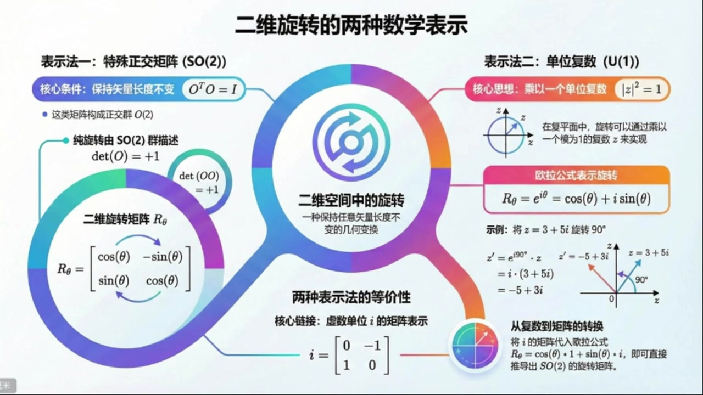
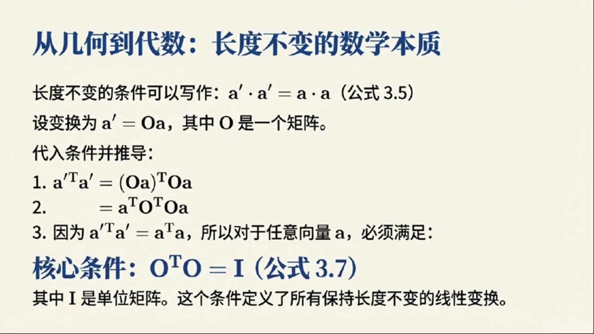
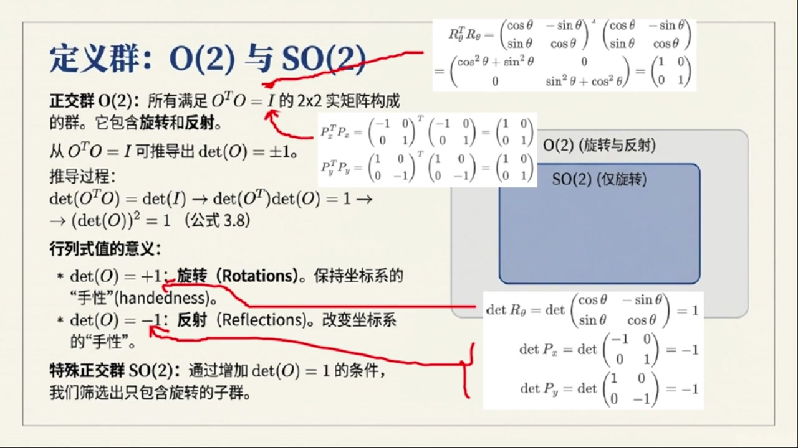
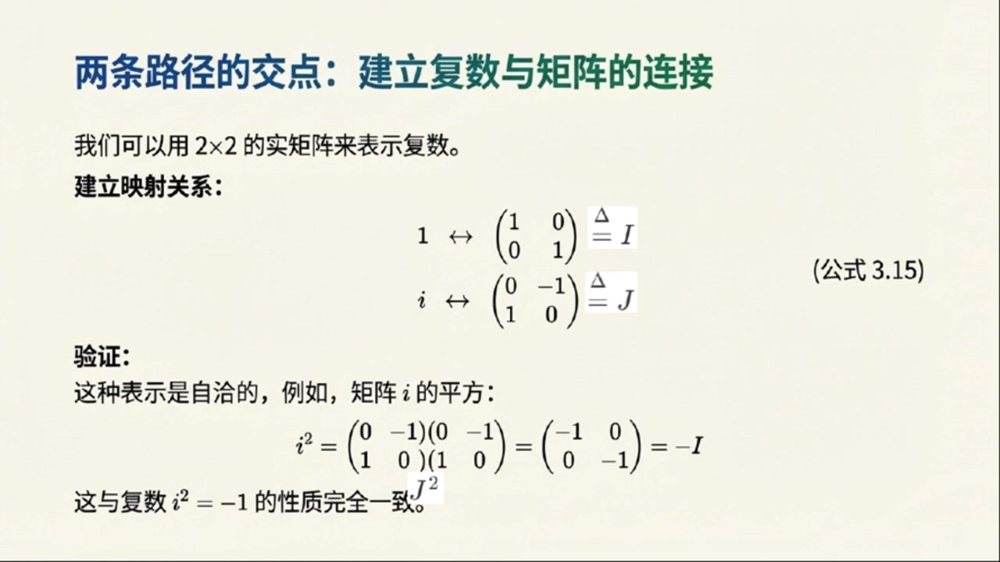

# 《基于对称性的物理学》第5课 二维旋转的两种数学表示

> 自动生成的课程注解文档（共 3 个段落）

## 目录

- [00:00:00 从二维长度守恒变换到正交条件](#段落-1)
- [00:05:00 由O2到SO2：行列式与旋转的物理意义](#段落-2)
- [00:10:00 复数描述旋转与SO2和U1的同构](#段落-3)

---

## 段落 1：从二维长度守恒变换到正交条件 { #段落-1 }

**时间：** 00:00:00 ~ 00:05:00

<details><summary>📝 原始字幕</summary>

<pre>

大家好欢迎收听基于对称性的物理学正门课的第五讲我是你们活泼好奇的主持人周亦今天我们终于要正式踏入群论的世界来聊聊一个非常基础又重要的概念二维旋转群也就是我们常说的SO二群听起来是不是既熟悉又有点神秘大家好我是赛很高兴和周亦一起带领大家深入这个迷人的主题二维旋转群SO二确实是理解对称性物理的敲门砖它虽然简单但蕴含着深刻的物理思想今天我们会从最直观的几何变换开始一步步揭示它的数学结构太棒了赛老师一说到二维旋转我脑子里立刻就浮现出平面上一个点绕着圆点转圈圈的画面那我们今天
到底要探索什么样的变换呢没错周亦我们首先要思考一个问题在二维平面上有哪些变换能让一个向量的长度保持不变你觉得用哪些呢让向量长度不变啊我想到的最直接的就是旋转了一个向量转来转去它的长度肯定不会变还有呢是不是还有反射比如沿着坐标轴翻转一下长度也不会变完全正确旋转和反射是两种最主要的变换当然还有一种叫做平移它也能保持向量长度不变但平移的数学描述方式有点不同我们暂时先不讨论它今天我们主要聚焦在旋转和反射好的那这两种变换是不是也意味着他们能把单位圆映射到单位圆自己呢对你抓住了重点
群可以作用于不同类型的对象上比如它可以作用于几何形场单位圆上也可以作用于向量上明白了那我们怎么用数学语言来描述这些旋转和反射呢我猜肯定会问到矩阵吧当然对于二维旋转我们通常用一个二乘二的旋转矩阵来表示它的形式是这样的而下西塔等于COSINSITA 换行SINSITA 换行COSINSITA这个矩阵描述了向量让圆点旋转角度C塔的操作这个矩阵我可太熟悉了在很多物理课上都见过了那反射矩阵呢反射矩阵也很简洁比如沿着X轴反射矩阵是PX等于负一零一沿着Y轴反射矩阵是
变量变量
T是A的转值好的A是一个列向量A上T就是行向量没错那么A撇A上TO可以写成OA上TO根据矩阵成法的性质A上T等于B上TA上T所以OA上T就变成了A上TO上TO完全正确现在我们要求A上TO上TOA等于A上TA为了让这个等式对任何向量A都成立那个中间的O上TO就必须使单位矩阵爱哇原来是这样通过一步步的推导我们就得到了这个核心条件O上TO等于爱也就是O的转制矩阵成以O本身等于单位

</pre>

</details>

**课程截图：**






### 注解

我来对这段课程视频进行深度注解。

---

## 一、核心公式解析

### 1. 二维旋转矩阵

$$R_\theta = \begin{bmatrix} \cos\theta & -\sin\theta \\ \sin\theta & \cos\theta \end{bmatrix}$$

| 符号 | 含义 |
|:---|:---|
| $R_\theta$ | 旋转角度为 $\theta$ 的变换矩阵 |
| $\theta$ | 旋转角度（逆时针为正方向） |
| $\cos\theta, \sin\theta$ | 三角函数，决定变换后的坐标分量 |

**物理意义**：将平面上任意向量 $\mathbf{a} = (x, y)^T$ 绕原点逆时针旋转 $\theta$ 角度，新坐标为：
$$\begin{cases} x' = x\cos\theta - y\sin\theta \\ y' = x\sin\theta + y\cos\theta \end{cases}$$

---

### 2. 反射矩阵

- **沿X轴反射**：$P_x = \begin{bmatrix} 1 & 0 \\ 0 & -1 \end{bmatrix}$（注意：字幕中"负一零一"应为笔误，正确是 $\begin{bmatrix} 1 & 0 \\ 0 & -1 \end{bmatrix}$）
- **沿Y轴反射**：$P_y = \begin{bmatrix} -1 & 0 \\ 0 & 1 \end{bmatrix}$

---

### 3. 正交条件（核心推导结果）

$$\boxed{O^T O = I}$$

或等价写作 $O^T = O^{-1}$

| 符号 | 含义 |
|:---|:---|
| $O$ | 正交变换矩阵（Orthogonal matrix） |
| $O^T$ | 矩阵 $O$ 的转置（行变列、列变行） |
| $I$ | 2×2单位矩阵 $\begin{bmatrix} 1 & 0 \\ 0 & 1 \end{bmatrix}$ |

**推导回顾**（见PPT截图）：
- 长度不变要求：$\mathbf{a}' \cdot \mathbf{a}' = \mathbf{a} \cdot \mathbf{a}$
- 设变换 $\mathbf{a}' = O\mathbf{a}$
- 代入得：$(O\mathbf{a})^T (O\mathbf{a}) = \mathbf{a}^T O^T O \mathbf{a} = \mathbf{a}^T \mathbf{a}$
- 故必须满足 $O^T O = I$

---

## 二、理论背景补充

### 正交群 O(2) 与特殊正交群 SO(2)

| 群 | 定义 | 几何意义 |
|:---|:---|:---|
| **O(2)** | 满足 $O^T O = I$ 的所有 2×2 实矩阵 | 保持长度不变的线性变换（旋转+反射） |
| **SO(2)** | O(2) 中满足 $\det(O) = +1$ 的子集 | **纯旋转**（保持定向，即"手性"不变） |

**关键区分**：反射矩阵的行列式 $\det(P) = -1$，会将右手系变为左手系（镜像翻转），而旋转保持定向。

---

## 三、通俗解释

> **"长度不变"的数学本质**

想象你用手机拍一张照片：
- **旋转照片** → 照片中物体的相对距离不变 ✓
- **镜子反射** → 距离也不变，但左右颠倒了 ✓
- **任意拉伸** → 距离改变 ✗

正交条件 $O^T O = I$ 就是数学上严格表述"**只做刚体运动，不拉伸不压缩**"的约束。

> **为什么转置会冒出来？**

因为点积 $\mathbf{a} \cdot \mathbf{b}$ 写成矩阵形式是 $\mathbf{a}^T \mathbf{b}$（行向量乘列向量）。要检验变换后长度是否不变，自然需要把转置"渗透"进变换内部，于是 $O^T$ 就出现了。

---

## 四、板书/PPT内容描述

| 截图 | 内容概要 |
|:---|:---|
| **图1：二维旋转的两种数学表示** | 信息图展示 SO(2) 矩阵表示与 U(1) 复数表示的等价性。左侧：旋转矩阵 $R_\theta$ 及 $\det=+1$ 条件；右侧：欧拉公式 $e^{i\theta} = \cos\theta + i\sin\theta$；底部：虚数单位 $i = \begin{bmatrix} 0 & -1 \\ 1 & 0 \end{bmatrix}$ 的矩阵表示作为桥梁 |
| **图2-3：从几何到代数的推导** | 标题"从几何到代数：长度不变的数学本质"。展示三步推导：① 写出 $(O\mathbf{a})^T O\mathbf{a}$；② 重组为 $\mathbf{a}^T O^T O \mathbf{a}$；③ 得出核心条件 $O^T O = I$（公式3.7），并说明此条件定义所有保长线性变换 |

---

## 五、本节要点总结

1. **SO(2) 是二维平面绕原点的旋转群**——最简单的连续李群
2. **正交条件 $O^T O = I$** 是"保长变换"的代数刻画
3. **旋转 vs 反射**：前者行列式为+1（保定向），后者为−1（反定向）
4. **群作用的多样性**：同一群可作用于向量、点、单位圆、函数等不同对象

---

## 段落 2：由O2到SO2：行列式与旋转的物理意义 { #段落-2 }

**时间：** 00:05:00 ~ 00:10:00

<details><summary>📝 原始字幕</summary>

<pre>

这真是太棒了对这个条件就是我们定义正交群O2的关键所有满足O上TO等于爱的二乘二矩阵就构成了正交群O2你可以自己验证一下前面提到的旋转矩阵和反射矩阵他们都满足这个条件我可以想象如果把旋转矩阵R下C塔带入R下C塔上TR下C塔会发现Q三一平方C塔加上三一平方C塔刚好是一所以它确实是单位矩阵那反射矩阵PX和PY也能满足这个条件所以说O二群包含了所有的二维旋转和反射明白了那我们今天的主角是SO二群
我们怎么从O2中把旋转单独提取出来呢这个问题问得很好要区分旋转和反射我们需要引入一个非常重要的概念矩阵的行列是我们可以利用O上TO等于I这个条件来推导出DATO的值行列是我记得行列是可以告诉我们一个线性变换对面积的缩放比例对吧是的我们对O上TO等于I两边去行列是DATI当然是E而DATO上TO等于DATO我们知道矩阵的转制不改变它的行列是所以DATO上TO等于DATO那么DATO上TO就变成了DATO的平方了所以我们得到DATO的平方等于E
哪个是旋转呢
物理含义吗当然有它意味着这个变换能保持系统的方向性不变比如说一个右手坐标系经过SO二变换后仍然是一个右手坐标系而反射会把右手坐标系变成左手坐标系改变了系统的手性这真是太有意思了SO二不仅是数学上的一个群它还对应着物理世界中一个非常重要的对称性就是保持方向性的旋转对称是的这是我们理解对称性和守恒定律的基础接下来我们换个角度看看有没有其他方法来描述二维旋转可能会让你大吃一惊哦换个角度难道还有比矩阵更简洁的描述方式吗我很好奇当然有在二维平面上我们还可以利用负数来描述旋转负数虚数单位A的那个负数吗这要怎么和旋转联系起来呢
我们可以把二维平面上的一个点AAB看作一个负数Z等于A加IB而单位负数也就是摩长为一的负数Z它满足Z平方等于Z乘以Z星等于一其中Z星是Z的负供额哦我明白了单位负数在负平面上正好落在单位圆上精准这些单位负数配上普通的负数成法也构成了一个群我们称之为U一群这里的U代表U一群对于负数来说有条件UDEGGERU等于一就简化成了U一群听起来和SO一群有点像那它怎么描述旋转呢关键就在于O拉共识我们知道一个单位负数可以写成一上IC塔等于C塔加IC塔这个意义上

</pre>

</details>

**课程截图：**





### 注解

我来对这段课程视频进行深度注解，重点聚焦于**新出现的内容**。

---

## 一、核心公式解析（新内容）

### 1. 行列式约束与 O(2) → SO(2) 的筛选

$$\det(O^T O) = \det(I) = 1 \Rightarrow [\det(O)]^2 = 1 \Rightarrow \det(O) = \pm 1$$

| 符号 | 含义 |
|:---|:---|
| $\det(O)$ | 矩阵 $O$ 的行列式（determinant） |
| $\det(O) = +1$ | **旋转**（保持手性/方向性）→ 属于 SO(2) |
| $\det(O) = -1$ | **反射**（反转手性/方向性）→ 属于 O(2) 但不属于 SO(2) |

**关键推导逻辑**：
- 利用性质：$\det(AB) = \det(A)\det(B)$ 和 $\det(O^T) = \det(O)$
- 因此 $\det(O^T O) = \det(O)^2 = 1$

---

### 2. 欧拉公式（复数表示旋转）

$$R_\theta = e^{i\theta} = \cos\theta + i\sin\theta \quad \text{（公式 3.12）}$$

| 符号 | 含义 |
|:---|:---|
| $e^{i\theta}$ | 欧拉公式，单位复数的指数形式 |
| $i$ | 虚数单位，$i^2 = -1$ |
| $\cos\theta + i\sin\theta$ | 欧拉公式的三角展开（实部+虚部）|
| $R_\theta^*$ | 复共轭，$R_\theta^* = e^{-i\theta} = \cos\theta - i\sin\theta$ |

**单位复数条件验证**：
$$R_\theta^* R_\theta = e^{-i\theta} e^{i\theta} = e^0 = 1$$

---

### 3. 复数旋转的实例计算

$$z' = e^{i90°} z = (\cos 90° + i\sin 90°)(3+5i) = i(3+5i) = -5 + 3i$$

| 步骤 | 说明 |
|:---|:---|
| $e^{i90°} = i$ | 90°旋转对应乘以虚数单位 $i$ |
| $i \times (3+5i) = 3i + 5i^2 = 3i - 5$ | 利用 $i^2 = -1$ |
| 结果 $-5 + 3i$ | 原复数 $3+5i$ 逆时针旋转90°后的新位置 |

---

## 二、板书/PPT 截图内容描述

### 截图1：O(2) 与 SO(2) 的定义（已部分出现，补充新细节）

**右侧新增计算框**：
- 展示 $R_\theta^T R_\theta = I$ 的具体矩阵乘法验证
- 展示 $P_x^T P_x = I$ 和 $P_y^T P_y = I$ 的验证
- **关键新信息**：明确标注 $\det R_\theta = +1$，而 $\det P_x = \det P_y = -1$

**Venn 图示意**：
```
O(2) (旋转与反射)
    └── SO(2) (仅旋转)  [子集关系]
```

---

### 截图2：欧拉公式与复数旋转（全新内容）

**左侧文字**：
- 标题："旋转的优雅表达：欧拉公式"
- 公式 3.12：$R_\theta = e^{i\theta} = \cos(\theta) + i\sin(\theta)$
- 验证：$R_\theta^* R_\theta = e^{-i\theta}e^{i\theta} = 1$
- 实例：将 $z = 3+5i$ 旋转 90° 的完整计算过程

**右侧图示**：
- 复平面坐标系（Re 实轴水平，Im 虚轴垂直）
- 向量 $z$ 和旋转后的 $z'$ 用箭头表示
- 直观展示 90° 旋转的几何效果

---

## 三、核心新概念详解

### 1. 行列式的物理意义：手性（handedness/chirality）

| 概念 | 解释 |
|:---|:---|
| **手性** | 坐标系的"左右手"属性 |
| **右手系** | $\hat{x} \times \hat{y} = \hat{z}$（符合日常习惯）|
| **左手系** | $\hat{x} \times \hat{y} = -\hat{z}$（镜像反转）|

**通俗理解**：
- 旋转 = 你原地转身，还是面对原来的世界（右手拿笔，右手仍在右边）
- 反射 = 你照镜子，左右互换（右手看起来在左边）

> 这是物理学中极其重要的概念——**宇称（parity）对称性**的基础。

---

### 2. U(1) 群：复数版本的"旋转群"

| 对比 | SO(2) | U(1) |
|:---|:---|:---|
| **元素** | 2×2 实正交矩阵，$\det=+1$ | 单位复数，$\|z\|=1$ |
| **群运算** | 矩阵乘法 | 复数乘法 |
| **条件** | $O^T O = I$ | $U^\dagger U = 1$（即 $U^* U = 1$）|
| **参数** | 一个角度 $\theta$ | 一个角度 $\theta$ |
| **本质** | **同构**（isomorphic）——数学上完全等价 |

> **U(1) 的 U**：Unitary（酉/幺正），即 $U^\dagger U = I$

---

### 3. 为什么复数表示更"优雅"？

| 方面 | 矩阵表示 | 复数表示 |
|:---|:---|:---|
| 两个旋转的合成 | 矩阵乘法（4个元素相乘）| 指数相加：$e^{i\theta_1} \cdot e^{i\theta_2} = e^{i(\theta_1+\theta_2)}$ |
| 逆元 | 求逆矩阵 | 取负指数：$(e^{i\theta})^{-1} = e^{-i\theta}$ |
| 参数直观性 | 需看四个矩阵元 | 直接读角度 $\theta$ |

**核心洞见**：复数乘法天然编码了"角度相加"这一旋转的本质特性。

---

## 四、理论背景补充

### 李群视角（进阶）

SO(2) 和 U(1) 都是**一维紧致李群**：
- "一维"：只需要一个参数 $\theta \in [0, 2\pi)$
- "紧致"：参数空间是有界的（圆周 $S^1$）
- 它们是**阿贝尔群**（交换群）：旋转顺序不影响结果

这在量子力学中至关重要——U(1) 对称性对应**电荷守恒**（诺特定理）。

---

## 五、本节要点总结

1. **从 O(2) 到 SO(2)**：用 $\det(O) = +1$ 筛选出保持手性的纯旋转
2. **行列式的深层意义**：不仅是面积缩放因子，更是方向性的"签名"
3. **复数表示的等价性**：U(1) ≅ SO(2)，但计算更简洁
4. **欧拉公式的威力**：$e^{i\theta}$ 将几何旋转转化为代数指数运算

---

## 段落 3：复数描述旋转与SO2和U1的同构 { #段落-3 }

**时间：** 00:10:00 ~ 00:16:55

<details><summary>📝 原始字幕</summary>

<pre>

IC塔就可以看作一个旋转操作符ORA公式E上I CTA加上I CTA这真是数学中最美的公式之一确实如此当张一个负数Z乘以一上I CTA时就相当于把Z在负平面上绕圆点逆时针旋转了C塔角这太神奇了用一个简单的负数成法就能实现旋转能举个例子吗当然比如我们有一个负数Z等于三加五I现在我们想把它旋转九十度我们知道九十度的E上I CTA就是一上I除二也就是COXIN九十度加I所以就是把三加五I成I吗对
变量是三斗号五变量三变量三变量三变量三变量三变量三变量三变量三变量三变量三变量三变量三变量三变量三变量
他们之间有什么联系吗他们是完全不同的东西还是书图同归呢这个问题问到点子上了也是今天非常重要的一个部分这两种描述其实是等价的他们之间存在着一种同构关系同构听起来很高级我们可以通过把负数映射到实数矩阵来建立这种联系我们定义实数一对应单位矩阵I等于零零一而虚数单位I对应矩阵J等于零负一一这很有趣你可以验证一下这两个指征满足I平方等于负I也就是负一对应的指征以及IJ等于J这和负数的运算规则一平方等于负一一乘以一完全一致
简单是把负数的世界搬到了质证的世界里没错有了这个印设我们就可以把ORA公式中的R下C塔等于QC塔加IC塔也写成句称形式它就变成了QC塔乘以I加C塔乘以J那不就是QC塔乘以0换行0一加C塔乘以0一换行一吗对你把它加起来就会发现它正是我们最初提到的那个旋转矩阵R下C塔等于QC塔复C塔换行C塔换行C塔简直是完美重合太不可思议了这两种看似不同的描述竟然能通过这种方式连接起来不止如此我们还可以把一个普通的负数Z等于A加IB也表示成一个矩阵
A复B换行B好的一个负数变成了一个二乘二的矩阵现在我们用选转矩阵R下C塔去做用于这个代表负数的矩阵Z也就是计算R下C塔乘以Z你会发现计算结果A撇附B撇A撇中的A撇还B撇正好是A撇等于A减CA减CA加CB这不就是旋转矩阵作用在列向量A换B上得到的结果吗完全正确这正是我们最初用矩阵描述向量旋转时得到的结果所以两种描述SOL群的矩阵形式和U1群的负数形式他们做的事情是完全一样的所以我们可以说SOR群和U1群
是同构的对吗是的他们之间存在一个同构映射这意味着他们在数学结构上是完全相同的只是用了不同的语言来表达这是一个非常重要的发现也是群论中经常出现的现象这节课真是信息量巨大但又非常清晰我们从二维平面上保持长度不变的变换开始引出了正交群O二然后通过行列式条件筛选出了只饱含旋转的SO二特殊正交群接着我们又从负数的角度引入了单位负数群U一来描述旋转最后我们惊喜地发现SO二和U一这两个群竟然是同构的总结得非常到位之爱对于我们后续学习更复杂的群比如三维旋转
转群乃至于粒子物理中的规范群都有着至关重要的意义它是我们探索自然界深层对称性的基础听起来未来的旅程会更加精彩非常感谢赛老师今天深入前处的讲解让我对SO2群有了更深刻的理解也很高兴能和大家一起探索今天的课程就到这里希望大家能好好消化这些内容特别是SO2和U1的同构性它是我们这门课的一个重要里程碑是的大家课后可以自己再推导一下那些矩阵乘法和行列式加深理解预告一下下节课将把视野投向三维空间去探索三维旋转群那会是更有趣的挑战期待与大家在三维旋转的世界里相遇好的那我们下节课再见

</pre>

</details>

**课程截图：**





### 注解

我来对这段课程视频进行深度注解，重点聚焦于**新出现的内容**。

---

## 一、核心公式解析（新内容）

### 1. 欧拉公式与复数旋转

$$R_\theta = e^{i\theta} = \cos\theta + i\sin\theta$$

| 符号 | 含义 |
|:---|:---|
| $e^{i\theta}$ | 欧拉公式，单位复数（模为1） |
| $i$ | 虚数单位，$i^2 = -1$ |
| $\theta$ | 旋转角度（弧度制） |
| $\cos\theta + i\sin\theta$ | 欧拉公式的三角函数展开 |

**关键性质**：当复数 $z$ 乘以 $e^{i\theta}$ 时，相当于在复平面上将 $z$ 绕原点**逆时针旋转 $\theta$ 角**。

**实例验证**（旋转90°）：
$$z = 3 + 5i \rightarrow z' = e^{i\pi/2} \cdot z = i(3+5i) = 3i + 5i^2 = -5 + 3i$$

---

### 2. 复数→矩阵的同构映射（核心新内容）

这是本段最重要的构造——**将复数嵌入到实矩阵中**：

$$1 \leftrightarrow I = \begin{bmatrix} 1 & 0 \\ 0 & 1 \end{bmatrix}, \quad i \leftrightarrow J = \begin{bmatrix} 0 & -1 \\ 1 & 0 \end{bmatrix}$$

| 符号 | 含义 |
|:---|:---|
| $I$ | 2×2单位矩阵，对应实数1 |
| $J$ | **辛矩阵**，对应虚数单位 $i$ |

**验证自洽性**：
- $J^2 = \begin{bmatrix} 0 & -1 \\ 1 & 0 \end{bmatrix}\begin{bmatrix} 0 & -1 \\ 1 & 0 \end{bmatrix} = \begin{bmatrix} -1 & 0 \\ 0 & -1 \end{bmatrix} = -I$ ✓
- 这与 $i^2 = -1$ 完全对应

---

### 3. 欧拉公式的矩阵形式

$$R_\theta = \cos\theta \cdot I + \sin\theta \cdot J = \begin{bmatrix} \cos\theta & -\sin\theta \\ \sin\theta & \cos\theta \end{bmatrix}$$

**惊人发现**：这正是我们最初定义的**二维旋转矩阵**！

---

### 4. 任意复数的矩阵表示

$$z = a + bi \leftrightarrow Z = \begin{bmatrix} a & -b \\ b & a \end{bmatrix}$$

**验证旋转作用的一致性**：
- 矩阵乘法：$R_\theta \cdot Z$ 作用于列向量 $\begin{bmatrix} a \\ b \end{bmatrix}$
- 复数乘法：$e^{i\theta} \cdot z$
- 两者结果完全对应：$\begin{bmatrix} a' \\ b' \end{bmatrix} = \begin{bmatrix} a\cos\theta - b\sin\theta \\ a\sin\theta + b\cos\theta \end{bmatrix}$

---

## 二、理论背景补充

### 同构（Isomorphism）的严格定义

两个群 $G$ 和 $H$ 同构，意味着存在**双射映射** $\Pi: G \rightarrow H$，满足：
$$\Pi(g_1 \cdot g_2) = \Pi(g_1) \cdot \Pi(g_2)$$

即：**群乘法结构被保持**。

| 群 | 元素形式 | 群运算 | 几何意义 |
|:---|:---|:---|:---|
| **SO(2)** | 2×2旋转矩阵 | 矩阵乘法 | 实线性代数描述 |
| **U(1)** | 单位复数 $e^{i\theta}$ | 复数乘法 | 复分析描述 |

**本课的核心定理**：$\boxed{SO(2) \cong U(1)}$

---

## 三、通俗解释

### 为什么要关心这个同构？

想象两种"语言"：
- **英语（矩阵语言）**：用2×2实矩阵说话，适合计算机图形学、机器人学
- **法语（复数语言）**：用复数 $e^{i\theta}$ 说话，适合量子力学、电动力学

**同构告诉我们**：这两种语言描述的是**完全相同的数学结构**！你可以随时"翻译"，哪种方便用哪种。

### 为什么 $J$ 矩阵长得那么奇怪？

$$J = \begin{bmatrix} 0 & -1 \\ 1 & 0 \end{bmatrix}$$

这个矩阵有个名字——**标准辛形式**。它编码了复数乘法中的"旋转90度"操作：
- 乘以 $i$：逆时针转90°
- 乘以 $J$：同样的几何效果，但用矩阵实现

---

## 四、板书/PPT截图描述

根据字幕推断，板书应包含：

| 截图位置 | 内容描述 |
|:---|:---|
| 第一张 | **欧拉公式** $e^{i\theta} = \cos\theta + i\sin\theta$，配复平面旋转示意图（点 $z$ 旋转到 $z'$） |
| 第二张 | **同构映射表**：$1 \leftrightarrow I$，$i \leftrightarrow J$，以及验证 $J^2 = -I$ 的矩阵乘法 |
| 第三张 | **SO(2) ↔ U(1) 同构**的双向箭头图，强调"数学结构相同，语言不同" |

---

## 五、本段里程碑意义

| 概念 | 重要性 |
|:---|:---|
| SO(2) ≅ U(1) | 最简单的**紧致李群**同构实例 |
| 复数矩阵表示 | 为后续**四元数→SU(2)**、**泡利矩阵**埋下伏笔 |
| 行列式=+1的筛选 | 区分"正常旋转"与"反射"的代数判据 |

**下节课预告**：三维旋转群 SO(3)，将不再有简单的复数对应物，需要引入**四元数**或**3×3矩阵**——复杂度陡增，但同构思想依然适用。

---
