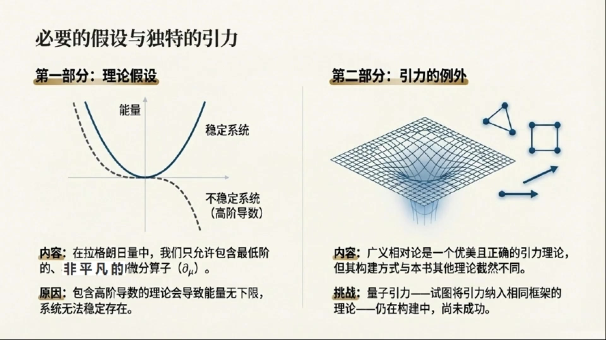
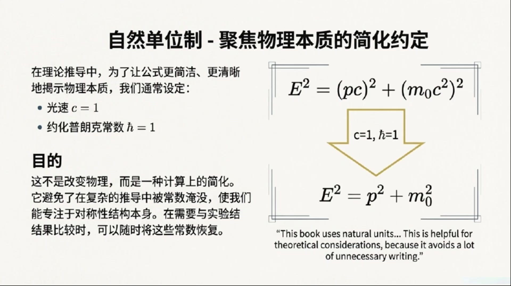
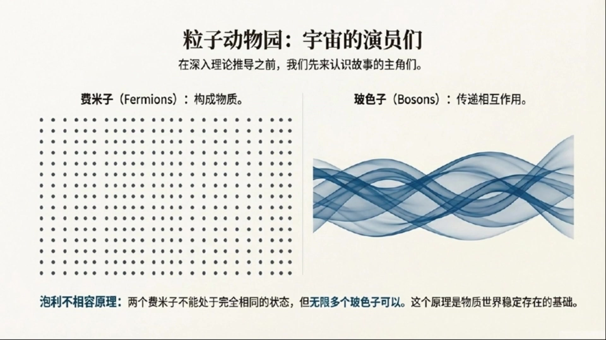
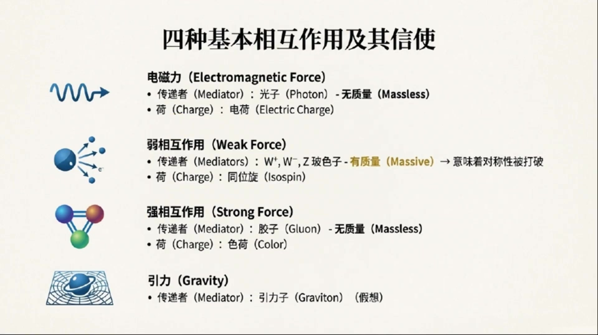

# 《基于对称性的物理学》第1课 对称性：物理学的终极秘密

> 自动生成的课程注解文档（共 3 个段落）

## 目录

- [00:00:00 课程引言：哪些内容不能由对称性推导](#段落-1)
- [00:07:24 课程路线图：从相对论、群论到标准模型](#段落-2)
- [00:15:02 标准模型入门：基本粒子、相互作用与课程收束](#段落-3)

---

## 段落 1：课程引言：哪些内容不能由对称性推导 { #段落-1 }

**时间：** 00:00:00 ~ 00:07:24

<details><summary>📝 原始字幕</summary>

<pre>

嗨,大家好,欢迎来到我们的博客节目,对称性物理学的第一课,我是你们活泼好奇的周一。
大家好,我是塞,很高兴能和大家一起深入探索物理学中对称性的奥米。
周一,我们今天这第一课要聊点什么呢?
塞,你看,我们这门课叫做基于对称性的物理学,听起来就特别高级。
不过,开篇的引言,作者却先跟我们说,哪些东西我们不能从对称性推到出来。
这还挺有意思的,是不是有点像要先画个圈,告诉我们边界在哪里?
没错,周一,这其实是一个非常好的切入点。
离茶的飞慢有句名言,它说,真相总是比你想象的更简单。
但在追求这种简单的路上,我们首先得清楚,哪些东西是基始,是我们需要手动放进去的,而不是能凭空推到出来的。
啊,手动放进去,听起来有点像玩猎高,有些基础专块是现成的,我们不能自己造,那具体有哪些呢?
嗯,首先最基础的就是那些自然常术。比如说,各种基本相互作用的偶和,还要各种基本例子的质量。
这些数值,我们现在还没有一个理论能从头推到出来,他们都对靠实验区测量去提取出来。
哇,原来这些我们天天用的常术,像是万有引力常术技,普朗克常术H,或者电子的质量这些都得靠实验,不能从理论里算出来啊。这还挺让人惊压的。
对,至少目前是这样,他们就像是宇宙设定好的参数,我们只能去测量他们。
除了这些常术,还有别的不能推到出来的吗?
我看到资料里提到了一个很奇怪的数字,三,这不会是什么数字神秘主义吧?
哈哈,周一,你这个问题问得好,肯定不是什么神秘主义。这里说的三是只有很多物理现象和限制,都直接跟数字三有关系。
但我们不知道为什么非得是三。
比如说,比如说,我们现在知道有三种规范理论,他们分别对应着标准模型描述的三种基本例。
电子力,弱力和强力。这些例,他们背后的对称权分别是優衣,ICU2和ICU3。
但为什么没有从ICU4群推到出来的纪便例呢?没人知道。
诶,这确是有点意思。为什么非得是優衣,ICU2,ICU3这三个呢?
是啊,不光是这个,还有,我们知道有三代亲子和三代跨客。为什么不是四代或者五代呢?
我们只知道,通过高轻度的实验,目前没有发现第四代。
比如,与周中元素的风度就跟亲子代的数量有关系。
所以,这也是个为什么是三的迷团。还有别的三吗?
还有,比如,我们在构建理论的时候,写拉格朗日量,通常只会包含最低的三个节词,
也就是坏的临次,一次和二次向。
发挨在这里可以看作是描述我们物理系统的一个范纸的量。
这样做是为了得到一个能描述自由场,或者自由例子的合理理论。
拉格朗日量,听起来有点复杂,不过没关系,后面会细讲对吧?
没错,这些概念我们后面都会详细展开,现在你只需要知道,这里也有一个三的显示。
再举一个例子,在描述基本例子的时候,我们只用到庞加乐群双重覆盖的最低三个尾度表示,
他们分别对应着自选,自选一分之二和自选一的例子。
等等,自选什么?还有庞加雷群,双重覆盖,这些词有点墨声,别急,转,这些专业名词,比如规范理论,双重覆盖,我们在这门课的后面都会非常详细的解释。
现在你只要知道,在描述基本例子时,我们发现,目前没有发现自选是三分之二的基本例子。
这些三的现象,在现有理论里,都是我们必须手动放进去的假设。
我们知道他们在实验上是正确的,但为什么非得在三这里停下,目前还没有更深层的原理能解释。
明白了,就是说我们知道他是这样,但不知道为什么是这样,这感觉就像是宇宙给我们的一些硬性规定。
可以这么理解,除了这些三的限制,还有一点,也不能从对称性直接退到。
但为了得到一个合理的理论,我们必须考理到,那就是,在拉格朗日两中,我们只允许包含威芬蒜府的最低非平凡截词。
威芬蒜府那是什么?
简单来说,就是对物理量求倒的操作。有些理论,他允许一街倒数作为最低截词,但有些理论,比如为了满足落轮资部变形,他就不能有一街倒数,所以最低的非平凡截词就得是二街倒数。
为什么不能有更高街的倒数呢?
因为如果理论中包含了更高街的倒数,那么这个理论的能量就会出现问题。
他可能没有下线,也就是说能量可以无线地附下去。这样一来,系统中的例子就永远不稳定,他们会不断的摔变到更低的能量状态。这显然不符合我们观察到的物理世界。
明白了,为了保证理论的稳定性,就必须限制倒数的阶词。这又是我们首动加进去的条件。
没错,最后,还有一件事,是我们在这本书里不能用推到其他理论的方式来推到的。
那就是引力。引力,广义相对论不是一个非常漂亮,而且正确的引力理论吗?
是的,广义相对论确实是一个非常漂亮和正确的引力理论。
但是它的工作方式,跟我们这本书里要讲的其他理论有很大不同。要完整的推到广义相对论,超出了本书的范围。
而量子引力,也就是试图把引力也纳入到其他理论的同一个框架中。
目前还是一个正在建设中的理论,还没有人成功地推到出来。
哦,所以引力是个特例,它太特别了,不能用我们这门课的方法来处理。
看来,物理学历还有很多卫界知名和挑战。
确实如此,了解这些不能推到的部分,其实是为了更好的理解能推到的部分。
也就是我们这门课的核心。好的,那下一,既然我们知道了哪些是不能推到的。
那接下来这门课会带我们推到些什么呢?总不能光讲,不能推到的吧。
当然不是,接下来我们就来给大家输了一下这本书的整体脉落,
也就是我们这门课会带领大家探索的精彩内容。
太好了,我真期待着呢。

</pre>

</details>

**课程截图：**




### 注解

我来对这段课程视频进行深度注解。这段内容是《对称性物理学》第一课的引言部分，主要讨论**哪些东西不能从对称性推导出来**——这实际上是划定了理论的边界条件。

---

## 一、板书/PPT内容解析

### 第一张图：课程整体脉络（"对称性：物理学的终极密码"）

这是一张课程 roadmap 的思维导图，展示了基于对称性的物理学的两大路径：

| 路径 | 核心内容 | 数学工具 |
|:---|:---|:---|
| **路径A：时空对称性** | 基本粒子分类 | 庞加莱群（Poincaré group） |
| **路径B：内部对称性** | 基本相互作用 | 规范对称性（Gauge symmetry）|

**核心思想**：**对称性 = 不变性** —— 物理系统经过某种变换后，物理规律保持不变。

**诺特定理（Noether's Theorem）**：连接对称性与守恒定律的桥梁
- 时间平移对称性 → 能量守恒
- 空间平移对称性 → 动量守恒
- 旋转对称性 → 角动量守恒

---

### 第二张图："挥之不去的'三'之谜"

这是本段的核心板书，列举了物理学中反复出现数字"3"的四个神秘现象：

| 现象 | 具体含义 | 未解之谜 |
|:---|:---|:---|
| **三种规范理论** | U(1), SU(2), SU(3) 对应电磁、弱、强三种力 | 为何没有SU(4)规范理论？ |
| **三代轻子与夸克** | 电子/μ子/τ子三代，上夸克/粲夸克/顶夸克三代等 | 为何不是四代或五代？ |
| **拉格朗日量中的最低三阶** | 场φ的0次、1次、2次项 | 为何只取到二阶？ |
| **庞加莱群双覆盖的最低三个维度表示** | 自旋0、1/2、1 | 为何没有自旋3/2的基本粒子？|

> **关键注释**："双覆盖"（double cover）指 SL(2,ℂ) 是洛伦兹群的二重覆盖群，这是描述相对论性量子粒子的数学基础。

---

### 第三张图：必要的假设与引力的例外

| 部分 | 内容 | 图示说明 |
|:---|:---|:---|
| **理论假设** | 拉格朗日量只允许包含最低阶**非平凡**的微分算子 ∂ᵤ | 左图：实线为稳定系统（能量有下界），虚线为不稳定系统（高阶导数导致能量无下界） |
| **引力的例外** | 广义相对论不能用本书的对称性方法推导；量子引力仍在建设中 | 右图：弯曲时空的网格示意图，暗示引力的几何本质 |

---

## 二、核心概念详解

### 1. 自然常数（Coupling Constants & Masses）

这些是必须"手动输入"的参数：

| 常数类型 | 例子 | 现状 |
|:---|:---|:---|
| 耦合常数 | 电磁耦合常数 α ≈ 1/137，强耦合常数 αₛ | 标准模型中作为自由参数 |
| 质量参数 | 电子质量 mₑ，希格斯质量 m_H | 希格斯机制给出质量关系，但质量本身仍需输入 |

> **理论物理的终极梦想**：找到一个"终极理论"，从这些常数中计算出具体数值——目前尚未实现。

---

### 2. 规范群 U(1) × SU(2) × SU(3) 的"三"

**标准模型的规范结构**：
- **U(1)**：电磁相互作用（量子电动力学 QED）
- **SU(2)**：弱相互作用（与电磁统一为电弱理论）
- **SU(3)**：强相互作用（量子色动力学 QCD）

**为什么止步于SU(3)？**
- 数学上：SU(N) 对任意N都存在
- 物理上：实验未发现对应SU(4)的规范玻色子
- 大统一理论（GUT）尝试将三者统一为更大的群（如SU(5), SO(10)），但"三"的层级结构仍需解释

---

### 3. 三代费米子（Three Generations）

| 代 | 带电轻子 | 中微子 | 夸克（电荷+2/3） | 夸克（电荷-1/3） |
|:---|:---|:---|:---|:---|
| 第1代 | 电子 e⁻ | νₑ | 上夸克 u | 下夸克 d |
| 第2代 | μ子 μ⁻ | νᵤ | 粲夸克 c | 奇异夸克 s |
| 第3代 | τ子 τ⁻ | νᵩ | 顶夸克 t | 底夸克 b |

**实验证据**：Z玻色子衰变宽度精确测量表明只有三代轻中微子（Nᵥ = 2.984 ± 0.008）。

---

### 4. 拉格朗日量的"最低三阶"

对于标量场 φ，一般形式：
$$\mathcal{L} = \underbrace{\frac{1}{2}(\partial_\mu\phi)^2}_{\text{动能项（2阶导数）}} - \underbrace{V(\phi)}_{\text{势能项}}$$

势能展开：
$$V(\phi) = \underbrace{V_0}_{\text{0次（常数）}} + \underbrace{\mu^2\phi^2}_{\text{2次（质量项）}} + \underbrace{\lambda\phi^4}_{\text{4次（相互作用）}}$$

> 注意：通常**没有1次项**（可通过场平移消除），**没有3次项**（会破坏稳定性）。这里的"三"指的是**0、1、2阶导数**（见下文）。

---

### 5. 微分算子的阶数限制

| 阶数 | 形式 | 物理意义 | 稳定性 |
|:---|:---|:---|:---|
| 0阶 | φ（场本身） | 势能中的常数或线性项 | ✓ 允许 |
| 1阶 | ∂ᵤφ | 某些理论中的拓扑项 | 部分允许 |
| **2阶** | **(∂ᵤφ)²** | **标准动能项** | **✓ 必须** |
| ≥4阶 | (∂ᵤ∂ᵥφ)² 等 | 高阶导数项 | ✗ 导致能量无下界 |

**Ostrogradsky不稳定性定理**：包含高阶时间导数的拉格朗日量会导致哈密顿量无下界，系统不稳定。

---

### 6. 庞加莱群的表示与自旋

**庞加莱群** = 洛伦兹群（时空旋转+boost）+ 时空平移

其**双覆盖群**的不可约表示由两个量子数标记：
- **质量** m（或 m=0 无质量情形）
- **自旋** s = 0, 1/2, 1, 3/2, 2, ...

**为什么基本粒子只有 s = 0, 1/2, 1？**
- s=0：希格斯玻色子（标量粒子）
- s=1/2：夸克、轻子（旋量粒子）
- s=1：光子、W/Z玻色子、胶子（矢量粒子）

**s=3/2的引力子？** 超引力理论中存在，但尚未实验发现；且作为**基本粒子**的s=3/2粒子不存在。

---

### 7. 引力的特殊性

| 理论 | 构建方式 | 与对称性方法的关系 |
|:---|:---|:---|
| 广义相对论 | 爱因斯坦场方程：$G_{\mu\nu} = 8\pi G T_{\mu\nu}$ | 基于广义协变性（微分同胚不变性），非典型的规范理论 |
| 其他相互作用 | 规范原理 → 拉格朗日量 → 运动方程 | 本书的核心方法 |
| 量子引力 | 弦理论、圈量子引力等尝试中 | 尚未成功统一 |

---

## 三、本段的核心方法论意义

这段引言实际上建立了**本书的演绎框架**：

```
可推导的部分（本书内容）
    ↓ 基于对称性原理
├── 时空对称性 → 粒子分类（路径A）
├── 内部对称性 → 相互作用形式（路径B）
└── 诺特定理 → 守恒定律

不可推导的部分（边界条件/输入参数）
    ↓ 必须手动假设
├── 自然常数的具体数值
├── "三"的层级结构（三代、三力、三自旋）
├── 微分算子的最高阶数限制
└── 引力的完整量子理论
```

---

## 四、关键术语对照表

| 字幕中的音译 | 标准术语 | 英文 |
|:---|:---|:---|
| 离茶的飞慢 | 理查德·费曼 | Richard Feynman |
| 偶和 | 耦合 | coupling |
| 例/例子 | 粒子 | particle |
| 優衣 | U(1) | U-one |
| ICU2/ICU3 | SU(2)/SU(3) | SU-two / SU-three |
| 亲子 | 轻子 | lepton |
| 跨客 | 夸克 | quark |
| 拉格朗日量 | 拉格朗日量 | Lagrangian |
| 节词/向 | 阶/项 | order / term |
| 发挨 | 场 | field |
| 范纸 | 变量 | variable |
| 庞加乐群 | 庞加莱群 | Poincaré group |
| 尾度表示 | 维度表示 | dimensional representation |
| 自选 | 自旋 | spin |
| 威芬蒜府 | 微分算子 | differential operator |
| 落轮资部变形 | 洛伦兹不变性 | Lorentz invariance |

---

## 五、小结

这段引言通过揭示"不能从对称性推导什么"，反而**凸显了对称性方法的强大边界**——它告诉我们，一旦接受这些"手动输入"的条件，其余的大量物理结构（粒子分类、相互作用形式、守恒定律）都可以**纯粹从对称性原理演绎出来**。这正是本书标题"基于对称性的物理学"的深层含义。

---

## 段落 2：课程路线图：从相对论、群论到标准模型 { #段落-2 }

**时间：** 00:07:24 ~ 00:15:02

<details><summary>📝 原始字幕</summary>

<pre>

首先,我们要先设定一些工作环境。
我们会采用自然卫单位置,也就是把普拉克场数、哈巴和光苏C都是唯一。
这样在理论推到的时候,可以省去很多不必要的书写,让公式看起来更简洁。
当然,在实际应用的时候,我们再把这些场数加回去,就能回到我们书系的国际单位置了。
嗯,就像是把一些常见的量都标准化了,方便计算。
对,我们这门课的起点会从侠义相对论的基本假设开始。
大家应该都知道侠义相对论有两个基本假设。
一是,光速在所有关系参考系中都是相同的常数系。
二是,物理论律在所有关系参考系中都具有相同的形式。
没错,这是侠义相对论的精髓。
那么,所有符合这些对称性限制的变换就够成了一个群。
我们称之为,庞家来群。为了能有效地利用这些对称性,我们需要引入一个数学工具,那就是群论。
群论,听起来又是数学。
也担心,我们会从物理的角度去理解它。
群论是研究对称性的数学分支,我们会推到庞家来群的不可约表示。
你可以把这些不可约表示,想象程式所有其他表示的基本机幕。
基本机幕,听起来有点像乐高理的基础专快。
没错,我们后面就会用这些表示来描述不同自选的例子和场。
自选,方面可以看作是不同类型例子或场的一个抽象表现。
另一方面,它也可以被理解成例子的一种内秉角动量。
我们会在后面详细讨论这是怎么回事。
哦,自选,这个概念我听过,但具体是什么,还有点模糊,期待后面的讲解。
讲完这些基础,我们就会引入拉格朗日形式体系。
这个体系在物理学中处理对称性非常方便。
它的核心是一个叫做拉格朗日量的物理量。
不同的拉格朗日量描述不同的物理系统。
我们会利用对称性考量推到出好几种拉格朗日量。
听起来,拉格朗日量是个很重要的东西。
确实如此,我们还会推到欧拉拉格朗日方程。
有了这个方程,我们就能从给定的拉格朗日量中推到出系统的运动方程。
结合前面提到的庞加来群的不可越表示,
我们就能推到出具有不同自选的场合例子的基本运动方程。
运动方程,这不就是物理学里最核心的东西之一吗?
是的,这里的核心思想就是,拉格朗日量在庞加来群的任何变怀下都必须保持不变,也就是不变性。
这就能确保运动方程在所有关系参考系中都具有相同的形式,
也就是我们前面说的物理定律在所有关系参考系中都相同。
通过这种方式,我们可以推到出,比如描述自选临例子的克莱茵歌登方程,
自选二分之一例子的迪拉克方程,以及自选一例子的普罗卡方程。
哇,原来这些著名的方程都是通过对称性推到出来的。
不止这些,接下来我们还会发现自由自选二分之一场的拉格朗日量还去有一种额外的对称性,
叫做优移变换下的不变性。
类似的自选一场也能找到一种内秉对称性。
如果我们要求这种优移对称性是举步的,也就是说它在空间中的每一点都能独立的进行变换。
那么我们就会自然而然的得到自选二分之一场和自选一场之间的偶合相。
偶合相,那是什么?
偶合相,秒数的就是例子之间的相互作用。
口含这种口合相的拉格朗日量,就是正确的量子电动力选拉格朗日量。
类似的,如果对举步的SU2和SU3变换做同样的操作,
我们就能得到秒数若相互作用和强相互作用的拉格朗日量。
简直是太神奇了,从对称性竟然能推到除秒数基本相互作用的理论。
是的,我们还会讨论对称性破解,以及一种特殊的对称性破解方式,叫做西格斯基质。
西格斯基质能帮助我们秒数那些具有质量的例子。
西格斯波斯子,我听过他跟例子质量有关系。
没错,没有西格斯基质的话,拉格朗日量中秒数质量的相会破坏对称性,所以是不被允许的。
接着,我们会推到出诺特定理,他解释了对称性和守衡量之间深刻的联系。
我们会利用这个联系,把每一个物理量都和对应的对称性生成员联系起来。
对称性和守衡量,比如能量守衡对应时间评议对称性。
就是这个意思,只会引到我们得到量子力学中最重要的一些方程,
比如位置散佛和动量散佛的对应关系,以及量子长论中,
长散佛和共用动量散佛的对应关系。
这就直接连到量子力学和量子长论了。
是的,我们还会把前面提到的克莱茵哥登方程,
在非相对轮集线下进行推导,也就是当立子运动速度远小于光速时,
它就会变成我们熟知的虚定恶方程。
这,再加上我们前面建立的物理量和对称性生成员之间的联系,
就构成了量子力学的基础。
原来虚定恶方程也是从更普世的方程推导出来的。
接下来,我们会看看自由量子长论,
从各种运动方程的解,结合量子长论的基本对应关系开始。
然后,我们会考虑相互作用,
更仔细的研究那些,包含不同选场之间狗和夏的拉格日量。
这能帮助我们推导散射过程的概率服务。
散射过程就是立子碰撞之类的。
对,通过推导艾伦菲斯特定绿,
我们还能接视量子力学和经典力学之间的联系。
此外,经典电动学的基本方程,
包括MAX尾方程组和罗伦斯力定绿也都能被推导出来。
哇,经典物理的方程也能从这里推导出来。
最后,我们会简要介绍一下现代引力理论,
广义相对论的基本结构。
并再次讨论一下,推导量子引力理论所面临的困难。
听起来内容非常丰富,
从最基础的对程性一直讲到量子力学、量子长论,
甚至还包含了经典物理和引力。
没错,这本书或者说我们这门课的大部分内容,
就是关于我们处理对程性所需要的数学工具,
以及如何推导出我们现在所数值的标准模型。
标准模型就是描述所有一支基本例子和他们相互作用的那个理论吗?
对,标准模型利用量子长论来描述所有一支基本例子的行为。
直到今天,标准模型的所有实验预测都得到了正式。
我们前面提到的其他理论,
其实都可以看成是标准模型在特定条件下的特例。
比如在红关物体级线下,我们得到经典力学,
在低能基本例子级线下,我们得到量子力学。
这就厉害了,所有东西都统一在标准模型这个大框架下了。

</pre>

</details>

**课程截图：**




### 注解

我来对这段课程视频进行深度注解。这段内容是课程的**整体框架介绍**，展示了从对称性出发如何构建现代物理学的完整理论体系。内容非常密集，涵盖了从狭义相对论到标准模型的全部核心内容。

---

## 一、板书/PPT内容解析

### 第一张图：自然单位制（Natural Units）

**板书内容描述：**
- 左侧文字说明：设定光速 $c=1$、约化普朗克常数 $\hbar=1$
- 右侧公式对比：
  - 上方：**有量纲形式** $E^2 = (pc)^2 + (m_0c^2)^2$
  - 下方箭头标注 "$c=1, \hbar=1$"
  - 下方：**自然单位制形式** $E^2 = p^2 + m_0^2$

**公式详解：**

| 符号 | 含义 | 在自然单位制中的简化 |
|:---|:---|:---|
| $E$ | 粒子总能量 | 保持不变 |
| $p$ | 粒子动量 | 保持不变 |
| $m_0$ | 粒子静质量 | 保持不变（但量纲变为能量） |
| $c$ | 光速 | 设为 1（无量纲） |
| $\hbar$ | 约化普朗克常数 | 设为 1（无量纲） |

**关键理解：** 这不是改变物理，而是**量纲的重新标度**。在自然单位制中：
- 长度、时间、能量的量纲相同（都用能量或长度的倒数表示）
- 速度成为无量纲量，以 $c$ 为单位
- 角动量成为无量纲量，以 $\hbar$ 为单位

---

### 第二张图：诺特定理（Noether's Theorem）

**板书内容描述：**
- 中央公式展示两个对易关系：
  - $[\hat{x}_i, \hat{p}_j] = i\delta_{ij}$
  - $[\hat{\Phi}(x), \hat{\pi}(y)] = i\delta(x-y)$
- 左侧：对称性（Symmetries）——雪花图案
- 右侧：守恒量（Conserved Quantities）——光流图案

**公式详解：**

**第一式：量子力学基本对易关系**
$$[\hat{x}_i, \hat{p}_j] = i\delta_{ij}$$

| 符号 | 含义 |
|:---|:---|
| $\hat{x}_i$ | 位置算符的第 $i$ 个分量（$i=1,2,3$ 对应 $x,y,z$）|
| $\hat{p}_j$ | 动量算符的第 $j$ 个分量 |
| $[\cdot,\cdot]$ | 对易子：$[A,B] = AB - BA$ |
| $\delta_{ij}$ | 克罗内克δ：$i=j$ 时为1，否则为0 |
| $i$ | 虚数单位（自然单位制中 $\hbar=1$，否则右侧为 $i\hbar\delta_{ij}$）|

**物理意义：** 位置与动量不对易，导致海森堡不确定性原理。这是量子力学与经典力学的根本区别。

**第二式：量子场论基本对易关系**
$$[\hat{\Phi}(x), \hat{\pi}(y)] = i\delta(x-y)$$

| 符号 | 含义 |
|:---|:---|
| $\hat{\Phi}(x)$ | 场算符，在时空点 $x$ 处的场值 |
| $\hat{\pi}(y)$ | 场的共轭动量算符，在时空点 $y$ 处 |
| $\delta(x-y)$ | 狄拉克δ函数，表示定域对易（只在同一点不对易）|
| $x, y$ | 四维时空坐标 |

**关键区别：** 第一式是**单粒子量子力学**的代数结构；第二式是**量子场论**的代数结构——场是自由度，每一点都有独立的共轭动量。

---

### 第三张图：统一的理论图景（The Standard Model as Unification）

**板书内容描述：**
- 中央金色球体："标准模型（The Standard Model）"
- 四个辐射分支：
  - 上方：量子力学（Quantum Mechanics）
  - 右方：经典电动力学（Classical Electrodynamics）
  - 下方：经典力学（Classical Mechanics）
  - 左方：（标准模型文字说明）

**核心信息：** 标准模型是"母理论"，其他理论都是其在特定极限下的**有效理论**。

---

## 二、核心概念深度解释

### 1. 庞加莱群（Poincaré Group）与不可约表示

**概念：** 满足狭义相对论两个基本假设的所有时空变换构成的数学群。

| 变换类型 | 生成元 | 对应守恒量 |
|:---|:---|:---|
| 时间平移 | $H$（哈密顿量）| 能量 |
| 空间平移 | $\vec{P}$（动量）| 动量 |
| 空间旋转 | $\vec{J}$（角动量）| 角动量 |
| 洛伦兹 boost | $\vec{K}$ | 无（非紧生成元）|

**不可约表示（Irreducible Representations, "irreps"）：** 数学上不可再分解的基本构建块。在物理上，**每个不可约表示对应一种基本粒子类型**，由两个量子数标记：
- **质量** $m$（或 $m=0$）
- **自旋** $s$（$s=0, \frac{1}{2}, 1, \frac{3}{2}, ...$）

### 2. 自旋（Spin）的双重理解

| 理解角度 | 解释 | 对应数学对象 |
|:---|:---|:---|
| **抽象标签** | 粒子在庞加莱群下的变换性质 | 表示空间的维度 |
| **内禀角动量** | 粒子固有的量子力学角动量 | 自旋算符 $\vec{S}$ 的本征值 |

**关键事实：** 自旋是相对论性量子理论的必然产物。非相对论量子力学中"自旋是人为引入的"，但在相对论框架下，**自旋从时空对称性中自然涌现**。

### 3. 拉格朗日形式体系（Lagrangian Formalism）

**核心公式：** 欧拉-拉格朗日方程
$$\frac{\partial \mathcal{L}}{\partial \phi} - \partial_\mu\left(\frac{\partial \mathcal{L}}{\partial(\partial_\mu\phi)}\right) = 0$$

| 符号 | 含义 |
|:---|:---|
| $\mathcal{L}$ | 拉格朗日量密度（通常简称拉格朗日量）|
| $\phi$ | 场（标量场、旋量场、矢量场等）|
| $\partial_\mu$ | 四维偏导 $\frac{\partial}{\partial x^\mu}$ |
| $\partial_\mu\phi$ | 场的梯度（包含时空变化信息）|

**对称性原理：** 若 $\mathcal{L}$ 在某对称变换下不变，则该对称性通过诺特定理对应一个守恒量。

### 4. 规范对称性（Gauge Symmetry）与相互作用

**U(1) 规范对称性（量子电动力学）：**

| 场类型 | 自由场拉格朗日量 | 规范变换 | 耦合后结果 |
|:---|:---|:---|:---|
| 自旋-1/2（电子）| $\bar{\psi}(i\gamma^\mu\partial_\mu - m)\psi$ | $\psi \to e^{i\alpha}\psi$ | 引入光子场 $A_\mu$ |
| 自旋-1（光子）| $-\frac{1}{4}F_{\mu\nu}F^{\mu\nu}$ | $A_\mu \to A_\mu + \partial_\mu\alpha$ | 最小耦合：$\partial_\mu \to D_\mu = \partial_\mu + ieA_\mu$ |

**"局域"（Local）vs "整体"（Global）：**
- **整体规范变换：** $\alpha$ = 常数，所有时空点相同变换
- **局域规范变换：** $\alpha(x)$，每一点独立变换

**核心洞见：** 要求局域规范不变性**强制引入规范场**，即相互作用！

### 5. 希格斯机制（Higgs Mechanism）

**问题背景：** 规范对称性要求规范玻色子无质量（如光子），但弱相互作用的 $W^\pm, Z^0$ 玻色子有质量。

**解决方案：** 
- 引入希格斯场 $\Phi$（自旋-0，复标量场二重态）
- 其势能具有非零的基态（真空期望值）：$|\langle\Phi\rangle| = v/\sqrt{2} \neq 0$

**结果：** 
- 3个规范玻色子获得质量：$M_W = \frac{gv}{2}$, $M_Z = \frac{M_W}{\cos\theta_W}$
- 1个规范玻色子保持无质量：光子
- 产生物理希格斯玻色子：$h$（2012年LHC发现）

### 6. 标准模型的层次结构

```
标准模型（Standard Model）
├── 规范群：SU(3)_C × SU(2)_L × U(1)_Y
│   ├── SU(3)_C：量子色动力学（强相互作用，胶子）
│   ├── SU(2)_L × U(1)_Y：电弱理论
│       └── 希格斯机制自发破缺 → U(1)_EM（电磁学）
├── 物质场（费米子，自旋-1/2）
│   ├── 夸克（参与强、弱、电磁相互作用）
│   └── 轻子（只参与弱、电磁相互作用）
└── 希格斯场（自旋-0）：赋予粒子质量
```

---

## 三、理论推导脉络总结

这段内容展示了一个**从第一原理构建物理理论**的宏伟蓝图：

```
狭义相对论基本假设
    ↓
庞加莱群（时空对称性）
    ↓
不可约表示 → 粒子分类（按自旋）
    ↓
拉格朗日量 + 对称性约束 → 自由场方程
    │   ├── 自旋-0：克莱因-戈登方程
    │   ├── 自旋-1/2：狄拉克方程  
    │   └── 自旋-1：普罗卡方程（有质量）/麦克斯韦方程（无质量）
    ↓
局域规范对称性 → 相互作用
    │   ├── U(1)：量子电动力学（QED）
    │   ├── SU(2)：弱相互作用
    │   └── SU(3)：量子色动力学（QCD）
    ↓
希格斯机制 → 粒子质量
    ↓
诺特定理 → 守恒量与量子化条件
    ↓
非相对论极限 → 量子力学（薛定谔方程）
经典极限 → 经典力学、经典电动力学
```

---

## 四、关键术语对照（字幕识别修正）

| 字幕识别 | 正确术语 | 英文 |
|:---|:---|:---|
| 自然卫单位置 | 自然单位制 | Natural units |
| 普拉克场数 | 普朗克常数 | Planck constant |
| 哈巴 | 约化普朗克常数 $\hbar$ | Reduced Planck constant |
| 光苏C | 光速 $c$ | Speed of light |
| 侠义相对论 | 狭义相对论 | Special relativity |
| 关系参考系 | 惯性参考系 | Inertial frame |
| 庞家来群 | 庞加莱群 | Poincaré group |
| 基本机幕 | 基本积木 | Building blocks |
| 自选 | 自旋 | Spin |
| 内秉 | 内禀 | Intrinsic |
| 欧拉拉格朗日方程 | 欧拉-拉格朗日方程 | Euler-Lagrange equation |
| 不可越表示 | 不可约表示 | Irreducible representation |
| 变怀 | 变换 | Transformation |
| 优移变换 | 规范变换 | Gauge transformation |
| 举步 | 局域/定域 | Local |
| 偶合相 | 耦合项 | Coupling term |
| 口含 | 包含 | Include |
| 量子电动力选 | 量子电动力学 | Quantum Electrodynamics (QED) |
| 西格斯基质 | 希格斯机制 | Higgs mechanism |
| 西格斯波斯子 | 希格斯玻色子 | Higgs boson |
| 诺特定绿 | 诺特定理 | Noether's theorem |
| 守衡量 | 守恒量 | Conserved quantity |
| 生成员 | 生成元 | Generator |
| 位置散佛 | 位置算符 | Position operator |
| 动量散佛 | 动量算符 | Momentum operator |
| 长散佛 | 场算符 | Field operator |
| 共用动量散佛 | 共轭动量算符 | Conjugate momentum operator |
| 虚定恶方程 | 薛定谔方程 | Schrödinger equation |
| 量子长论 | 量子场论 | Quantum Field Theory (QFT) |
| 狗和夏 | 耦合项 | Coupling |
| 艾伦菲斯特定绿 | 埃伦费斯特定理 | Ehrenfest theorem |
| MAX尾方程组 | 麦克斯韦方程组 | Maxwell's equations |
| 罗伦斯力定绿 | 洛伦兹力定律 | Lorentz force law |
| 一支基本例子 | 已知基本粒子 | Known elementary particles |

---

## 段落 3：标准模型入门：基本粒子、相互作用与课程收束 { #段落-3 }

**时间：** 00:15:02 ~ 00:21:39

<details><summary>📝 原始字幕</summary>

<pre>

可以这么说,为了让大家对基本例子和基本例有一个指关的了解,
我们最后再快速回顾一下。
好的,把这些演员先介绍一下。
基本例子主要分为两大类,薄瑟子和菲米子。
菲米子遵循泡力不相容原理,
也就是说,两个菲米子不能同时处于完全相同的量子态。
但薄瑟子则可以有无限多个处于相同状态。
这个我知道,原子里的电子就是菲米子,所以他们会分层。
没错,正是这种奇特的性质,导致了他们截然不同的行为。
菲米子负责构成物质,而薄瑟子则负责传递自然接种的力。
所以,原子是由电子、制子、中子这些菲米子组成的。
对,虽然制子和中子不是基本例子,他们是由夸克组成的,而夸克也是菲米子。
但电子力这种力就是由薄瑟子、光子来传递的。
泡力不相容原理,最重要的一个结果就是,我们的世界能有稳定的物质存在。
如果无限多的菲米子都能挤在同一个状态,那物质就无法稳定了。
原来如此,泡力不相容原理这么重要,那目前以知的基本例有哪些呢?
目前以知有四种基本例,电子力有无量值的光子传递。
弱力有有量值的W加W简和Z波斯子传递,强力有无量值的胶子传递。
引力,可能有引力子传递,不过引力子还没有被直接撤撤到。
为什么有些波斯子有量值,有些没有呢?
这个问题问得很好周围,这背后隐藏着非常深刻的物理原理。
我们会在后面建立起合适的理论框架后才能完全理解。
现在你只要记住,每种力都和一种对称性紧密相关。
弱力传递波斯子之所以有质量,就意味着它相关的对称性是迫缺的。
这种自发对称性迫缺的过程是所有基本例子质量的来源。
优是对称性迫缺,又是西格斯机制。
没错,我们后面会看到,这是通过与另一种基本波斯子,
西格斯波斯子偶合来实现的。
那例子之间,怎么知道要通过哪种力相互作用呢?
例子之间要想通过某种力相互作用,它就必须携带那种力对应的鹤。
鹤是电鹤吗?
电鹤只是其中一种。
对于电磁力,这个鹤就是电鹤,所以只有带电鹤的例子才会参与电磁相互作用。
对于弱力,这个鹤交所同位选,所有一致的废弥子都带有同位选,
所以他们都会参与弱相互作用。
对于强力,这个鹤交所涉合。
这个名字是因为它有一些跟我们日常看到的颜色相似的彻型,
但你别被名字迷惑了,它跟我们眼睛看到的颜色完全没关系。
哦,原来还有这么多不同的鹤。
最后,我们再来看看基本废弥子。
他们分为两大子类,夸克和清子,夸克是勾成质子和中子的基本单元。
而清子,大家熟悉的就有电子和中威子。
他们有什么区别呢?
区别就在于夸克带有色质,所以他们会参与强相互作用,
而清子不带色质,所以他们不参与强相互作用。
明白了,那之前说的三代例子具体是哪些呢?
夸克和清子都有三代,每一代都包含两个例子。
第一代是上夸克和下夸克,以及电子中威子和电子。
第二代是参夸克和其夸克,以及妙子中威子和妙子。
第三代是顶夸克和底夸克,以及套子中威子和套子。
哇,这么多例子,他们怎么区分呢?
区分不同的例子,主要就是通过他们的标签。
除了前面说的各种贺和质量,还一个非常重要的标签就是自宣。
自宣,优惠到自宣了。
是的,波瑟子携带证书自宣,比如0,1,2等等。
而废弥子则携带半证书自宣,比如2分之1、3分之1等等。
我们前面列出的基本废弥子,他们的自宣都是1分之1。
而绝大多数基本波瑟子,他们的自宣都是1。
目前以至的唯一一个自宣为0的基本例子,就是西哥斯波瑟子。
所以自宣也是区分例子身份的一个重要标签。
没错,最后每一种例子都有一个反例子。
反例子除了质量可能有些特殊,其他所有标签都跟正例子一样,只是符号相反。
比如电子的反例子叫做正电子,
但通常我们不会给反例子起一个全新的名字,
而在前面加上一个反字,比如反商块课。
那有没有例子是他自己的反例子呢?
有的,比如光子,中微子可能也是他自己的反例子,
不过这还在实验研究中。
好的,塞语,今天这一刻的信息量真的好大,
我们先了解了哪些东西是不能从对称性推到出来的,
然后又盖览了这门课将要学习的精彩内容,
最后还认识了标准模型里的各种基本例子和它们传递的基本例子。
感觉就像是先看到了地图上的边界和地标,
然后又认识了地图上的各种角色。
没错,这就像是为我们接下来的旅程打下了基础。
所有这些概念,我们都会在这门课的后续章节中一步步的详细展开。
真是太棒了,我已经迫不及待想开始学习了。
那我们下一刻,是不是就要正式开始这个例子动物园的推导之旅了?
是的,我们这趟旅程的第一个基础,
就是爱因斯坦著名的瑕疑相对论。
这也就是我们下一张要讨论的主题。
好的,那今天的对称性物理学第一刻就到这里了。
感谢塞的精彩讲解,也谢谢大家的收听,我们下期节目再见。
再见。

</pre>

</details>

**课程截图：**






### 注解

我来对这段课程视频进行深度注解。这段内容是**标准模型基本粒子的全景介绍**，作为后续理论推导的"演员表"。

---

## 一、板书/PPT内容解析

### 第一张图：粒子动物园——费米子与玻色子

**视觉设计：**
- **左侧（费米子）**：规则排列的点阵网格，象征泡利不相容原理——粒子必须占据不同状态
- **右侧（玻色子）**：流畅的波动曲线，多个波峰重叠，象征玻色-爱因斯坦凝聚——无限多粒子可处于同一状态

**核心公式/原理：**

$$\text{泡利不相容原理: } \quad |\psi(\mathbf{r}_1, \mathbf{r}_2)|^2 = 0 \quad \text{当} \quad \mathbf{r}_1 = \mathbf{r}_2 \text{且自旋相同}$$

| 属性 | 费米子 (Fermions) | 玻色子 (Bosons) |
|:---|:---|:---|
| **自旋** | 半整数：$\frac{1}{2}, \frac{3}{2}, ...$ | 整数：$0, 1, 2, ...$ |
| **统计** | 费米-狄拉克统计 | 玻色-爱因斯坦统计 |
| **波函数** | 反对称：$\psi(1,2) = -\psi(2,1)$ | 对称：$\psi(1,2) = +\psi(2,1)$ |
| **占据数** | 每个量子态最多1个 | 无限制 |
| **角色** | **构成物质** | **传递相互作用** |

> **关键洞察**：泡利不相容原理是物质稳定性的根源。若电子为玻色子，原子中所有电子将坍缩到基态，化学元素周期表将不复存在。

---

### 第二张图：四种基本相互作用及其信使

| 相互作用 | 信使粒子 | 质量 | 荷 | 力程 | 特征 |
|:---|:---|:---|:---|:---|:---|
| **电磁力** | 光子 $\gamma$ | $m=0$ | 电荷 $Q$ | 无限长 $\sim 1/r^2$ | 长程，束缚原子 |
| **弱力** | $W^\pm, Z^0$ | $m_W \approx 80.4$ GeV, $m_Z \approx 91.2$ GeV | 弱同位旋 $I$ | 极短 $\sim 10^{-18}$ m | 负责放射性衰变 |
| **强力** | 胶子 $g$（8种） | $m=0$ | 色荷 (R,G,B) | $\sim 10^{-15}$ m（夸克禁闭） | 核子束缚 |
| **引力** | 引力子 $G$（假想） | $m=0$（假设） | 能量-动量张量 | 无限长 | 最弱，不可屏蔽 |

**关键公式——有质量与无质量玻色子的传播子对比：**

$$\text{光子（无质量）: } \quad \Pi_{\mu\nu}(q) = \frac{-ig_{\mu\nu}}{q^2 + i\epsilon}$$

$$\text{W/Z玻色子（有质量）: } \quad \Pi_{\mu\nu}(q) = \frac{-i(g_{\mu\nu} - q_\mu q_\nu/m^2)}{q^2 - m^2 + i\epsilon}$$

**物理后果**：质量项 $m^2$ 在分母中导致 Yukawa 型势 $\sim e^{-mr}/r$，力程被限制在 $\sim \hbar/(mc)$。这正是弱力短程性的来源，也是**对称性自发破缺**的实验证据。

---

### 第三张图：三代夸克与轻子（标准模型物质内容）

| 代 | 夸克 (Quarks) | 轻子 (Leptons) | 质量特征 |
|:---|:---|:---|:---|
| **第1代** | 上夸克 $u$ ($+2/3e$) / 下夸克 $d$ ($-1/3e$) | 电子中微子 $\nu_e$ / 电子 $e^-$ ($-e$) | 最轻，稳定物质构成 |
| **第2代** | 粲夸克 $c$ / 奇异夸克 $s$ | $\mu$中微子 $\nu_\mu$ / $\mu$子 $\mu^-$ | 不稳定，宇宙射线/加速器产生 |
| **第3代** | 顶夸克 $t$ / 底夸克 $b$ | $\tau$中微子 $\nu_\tau$ / $\tau$子 $\tau^-$ | 最重，顶夸克寿命极短 $\sim 10^{-25}$ s |

**关键标签系统（粒子的"身份证"）：**

| 标签 | 物理意义 | 备注 |
|:---|:---|:---|
| **电荷** $Q$ | 电磁相互作用耦合强度 | 夸克：$+2/3$ 或 $-1/3$；轻子：$0$ 或 $-1$ |
| **弱同位旋** $I_3$ | 弱相互作用本征态 | 左手二重态：$I_3 = \pm 1/2$ |
| **色荷** | 强相互作用荷 | 夸克：三重态 (R,G,B)；轻子：无色单态 |
| **自旋** $S$ | 内禀角动量 | 所有基本费米子：$S = 1/2$ |
| **代（Family）** | 味的复制结构 | 三代质量 hierarchy 是未解之谜 |

**重要区分：**
- **夸克**：带色荷 $\Rightarrow$ 参与强相互作用（被禁闭在强子内部）
- **轻子**：无色荷 $\Rightarrow$ 不参与强相互作用（可自由传播）

---

## 二、核心概念深度解释

### 1. 自发对称性破缺与质量起源

> "弱力传递玻色子有质量，意味着相关对称性是破缺的"

这是本段最深刻的物理陈述。规范对称性**要求**信使粒子无质量（以保持规范不变性），但实验发现 $W,Z$ 有质量。解决这一矛盾的是**希格斯机制**：

$$\mathcal{L}_{\text{Higgs}} = |D_\mu \phi|^2 - V(\phi), \quad V(\phi) = -\mu^2|\phi|^2 + \lambda|\phi|^4$$

当 $\mu^2 > 0$，势能最小值在 $|\phi| = v/\sqrt{2} = \sqrt{\mu^2/(2\lambda)} \neq 0$ 处，标量场获得真空期望值（VEV）。规范玻色子通过与希格斯场的**协变导数耦合**：

$$D_\mu \phi = (\partial_\mu - igW_\mu^a T^a - ig'Y B_\mu)\phi$$

获得有效质量项：

$$\mathcal{L}_{\text{mass}} = \frac{g^2v^2}{4}W_\mu^+ W^{-\mu} + \frac{(g^2+g'^2)v^2}{8}Z_\mu Z^\mu$$

这正是**2012年LHC发现希格斯玻色子**所验证的机制。

### 2. 反粒子与CPT定理

反粒子定义：质量相同，所有**相加性量子数**相反（电荷、重子数、轻子数等）。

| 粒子 | 反粒子 | 特殊情形 |
|:---|:---|:---|
| 电子 $e^-$ | 正电子 $e^+$ | — |
| 夸克 $q$ | 反夸克 $\bar{q}$ | — |
| 光子 $\gamma$ | **自身** | $C|\gamma\rangle = -|\gamma\rangle$（电荷共轭本征态）|
| 中性π介子 $\pi^0$ | **自身** | — |
| 中微子 $\nu$ | $\bar{\nu}$ 或 **自身**（Majorana）| 若中微子有质量，可能是Majorana粒子 |

**Majorana条件**：$\nu = \nu^c = C\bar{\nu}^T$，即粒子是自己的反粒子。这是当前无中微子双β衰变实验（如CUORE、LEGEND）的核心探测目标。

---

## 三、课程脉络预告

本段结尾明确下章主题：**狭义相对论**

这是构建量子场论的时空基础。课程将采用**"从对称性出发"**的公理化路径：

```
下章：庞加莱群 → 粒子的分类（质量/自旋标签）
     ↓
规范对称性 → 相互作用的动力学
     ↓
自发对称性破缺 → 质量生成机制
     ↓
完整标准模型拉氏量
```

这种"自上而下"的讲授方式，与传统"从经典力学→量子力学→相对论→场论"的历史路径不同，更强调**理论结构的内在逻辑一致性**。

---
