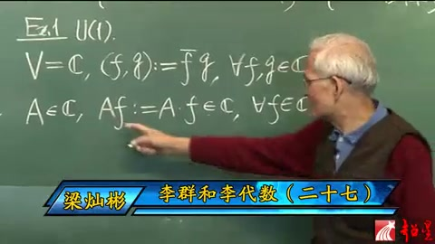
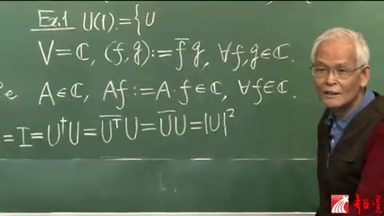
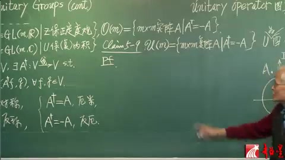
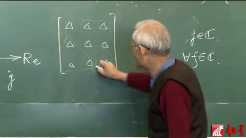
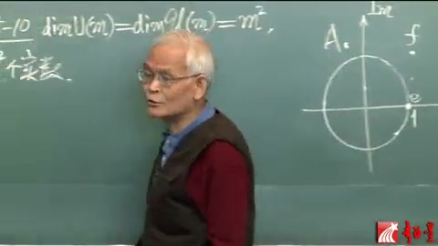
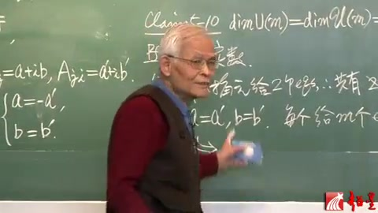
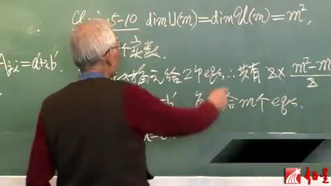

# 李群李代数 第27讲 酉群（续）

> 自动生成的课程注解文档（共 6 个段落，[原始视频](https://youtu.be/GyD0_xA0fyU)）

## 目录

- [00:00:00 段落 1](#段落-1)
- [00:03:59 段落 2](#段落-2)
- [00:06:52 段落 3](#段落-3)
- [00:11:52 段落 4](#段落-4)
- [00:16:53 段落 5](#段落-5)
- [00:21:53 段落 6](#段落-6)

---

## 段落 1

**时间：** 00:00:00 ~ 00:03:53

📝 原始字幕

<pre>

U of M,這個勇群的定義最後呢,就可以給一個example
example 1,就是關於勇群,最簡單的一個勇群就是U of M等於1
你要定義有群,你得有這麼一個累積空間,對吧?
那現在我們取這個V為大C,就是這幅平面
這幅平面可以看成是一尾的幅空間
但是它的累積還沒有定義
所以V如果光這樣的定義,V就是那個叫做空心思義的話
那麼它還不是累積空間
現在我們就對於那個空心思義的累積給個定義
那麼這個空心思義就是黑碗面這個東西了
石柔虛柔,隨便一點叫做F,隨便一點叫做G
那麼這個FG的累積呢,我們就定義為F它不也是幅數
G不也是幅數嗎,取F的那個B,取成G
當然這也是FNFGN空心思義
那麼你很容易驗證,這樣一個所謂累積定義
它的確是符合昨天說的累積的ABCD這4條
所以它就是可以充當累積
這個來個B字是很必要的
第二,我們定義
這個累積空間空心思義上頭的線性算符
就是所謂大A
這個大A呢,我讓它也是個實數
也是個伏數,算符也是伏數
那怎麼能充當算符呢?
那你決定義這個A作用於F
這個A可能是這麼一個點
但是這個點我就可以
簡單說任何一個伏數我都可以給它看成一個算符
由這個A就可以看成算符為什麼呢
因為我可以定義它作用於F
為什麼?就為F伏數A成這個伏數F
成完當然還是在空心思義裡頭
for any F in空心思義
所以我這個算符它也是個伏數
是對的線性算符沒問題
那麽好了
這樣的話我們不敢談
要問這個有群嗎?
那麽它的那個元素是什麼呢?
它的元素比我們計算
協體的U
那麽就應該是有算符對不對?
有算符就應該是
作為劇戰都差掉了
但是你可以寫
有算符
那麽就是U第二個
成U
有算符就等於Delta
有劇戰
那現在我就把這個也理解為劇戰
那麽就等於I
我就I寫這邊吧

</pre>

**课程截图：**

### 注解

这段课程视频（梁灿彬教授《李群和李代数》第27讲）通过最简单的例子 **U(1)**（1维酉群）来具体化抽象的酉群定义。以下是对新内容、公式及板书的深度注解。

---

### 1. 板书公式识别与解释

根据第三张截图，黑板上的核心公式为：

#### (1) 向量空间与内积定义
$$V = \mathbb{C}, \quad (f, g) := \bar{f}g, \quad \forall f, g \in \mathbb{C}$$

- **$V = \mathbb{C}$**：将向量空间 $V$ 取为**复数域** $\mathbb{C}$（即复平面）。在1维复向量空间中，每个向量就是一个复数。
- **$(f, g)$**：表示向量 $f$ 和 $g$ 的**内积**（字幕中的"累积"）。
- **$\bar{f}$**：$f$ 的**复共轭**（complex conjugate）。这是复内积区别于实内积的关键——必须对第一个因子取共轭，以保证 $(f, f) = |f|^2$ 为非负实数。
- **$\forall f, g \in \mathbb{C}$**：对于任意属于复数域的 $f$ 和 $g$ 都成立。

> **验证内积公理**：此定义满足内积的4条公理（线性性、共轭对称性、正定性等）。例如，$(f, f) = \bar{f}f = |f|^2 \geq 0$，且仅当 $f=0$ 时为0。

#### (2) 线性算符的定义
$$A \in \mathbb{C}, \quad Af := A \cdot f \in \mathbb{C}, \quad \forall f \in \mathbb{C}$$

- **$A \in \mathbb{C}$**：在1维情况下，**线性算符** $A$ 本身就是一个复数（字幕中"算符也是复数"）。
- **$Af := A \cdot f$**：算符 $A$ 作用于向量 $f$ 的方式被定义为**复数乘法**。由于复数乘法满足线性性质 $A(\alpha f + \beta g) = \alpha Af + \beta Ag$，这确实是一个合法的线性算符。

#### (3) 酉算符的条件（字幕末尾提及）
$$U^\dagger U = I$$

- **$U^\dagger$**：$U$ 的**厄米共轭**（Hermitian conjugate），在1维情况下就是复共轭 $\bar{U}$。
- **$I$**（或 $\delta$）：**单位算符**（恒等算符），在1维情况下就是数字 $1$。
- **物理意义**：这是**酉群**（Unitary Group）的定义式，要求算符保持内积不变。

---

### 2. 理论背景补充

#### 酉群 $U(n)$ 的定义
**酉群 $U(n)$** 是 $n$ 维复内积空间上所有**酉算符**（保持内积不变的线性算符）在乘法下构成的群。

- **矩阵表示**：在选定基底下，酉算符对应**酉矩阵**（Unitary Matrix），满足 $U^\dagger U = I_n$（$I_n$ 为 $n$ 阶单位矩阵）。
- **$U(1)$ 的特殊性**：当 $n=1$ 时，"矩阵"退化为单个复数 $z$。条件 $U^\dagger U = I$ 变为 $\bar{z}z = 1$，即 $|z| = 1$。

因此，**$U(1)$ 群就是复平面上的单位圆**（模为1的复数集合），群乘法就是复数乘法。

#### 从"空心思義"到"复数域"
字幕中的"空心思義"是 **$\mathbb{C}$（复数域）** 的谐音或口误。讲师强调：复平面 $\mathbb{C}$ 本身只是集合，必须配备内积结构 $(f,g) = \bar{f}g$ 后，才成为**内积空间**（累积空间），进而可以定义酉群。

---

### 3. 通俗语言解释

**核心概念：用复数乘法理解最简单的"旋转对称"**

想象复平面是一个1维的"复向量空间"：
- **向量**：就是复数 $f$ 和 $g$。
- **内积**：衡量两个复数"相似度"的方式，计算为 $(f,g) = \bar{f} \times g$。如果 $f$ 和 $g$ 方向相同（辐角相等），内积的辐角为0（实数）。
- **线性变换**：在这个1维世界里，线性变换 $A$ 就是"乘以一个固定复数 $A$"。
- **酉变换（U(1)元素）**：那些**不改变向量长度**的变换。因为 $|Af| = |A||f|$，要保持长度不变，必须 $|A|=1$。所以 $U(1)$ 群就是**单位圆上的所有复数**。

**物理联系**：在量子力学中，$U(1)$ 是**相位对称性**的数学基础。波函数的整体相位 $e^{i\theta}$（模为1）不影响可观测概率，这个 $e^{i\theta}$ 正是 $U(1)$ 群的元素。

---

### 4. 截图板书内容描述

**第一张截图（全景）：**
- 左侧画有**复平面示意图**：横轴标记 $\text{Re}$（实部），纵轴标记 $\text{Im}$（虚部），画出单位圆，并在与实轴交点处标记 $1$。
- 上方写有"**酉算符 unitary matrix 酉矩阵**"的标题。
- 核心定义式：$U^\dagger U = \delta$（或 $I$），以及 $U(m) := \{m\text{维内积空间 }V\text{ 上的酉算符}\} = \{m \times m\text{ 酉矩阵}\}$。
- 下方开始举例：**Ex.1 $U(1)$**，并写出 $V = \mathbb{C}$。

**第三张截图（特写）：**
- 清晰展示 $U(1)$ 例子的具体构造：
  - 第一行：$V = \mathbb{C},\ (f,g) := \bar{f}g,\ \forall f,g \in \mathbb{C}$
  - 第二行：$A \in \mathbb{C},\ Af := A \cdot f \in \mathbb{C},\ \forall f \in \mathbb{C}$
- 讲师正用手指向算符作用的定义式 $Af := A \cdot f$，强调"用复数乘法来充当算符作用"这一关键构造。

---

### 总结
这段内容通过将抽象的酉群定义**落地到1维复空间**，展示了：
1. 内积空间的具体构造（复共轭乘积）；
2. 线性算符的最简单实现（复数乘法）；
3. 为后续引出 $U(1)$ 群元素满足 $|z|=1$（单位圆）做了铺垫。

---

## 段落 2

**时间：** 00:03:59 ~ 00:06:47

📝 原始字幕

<pre>

有算符就等於I
I是什麽呢?
I不就是單位劇戰
現在這個是幾成幾劇戰
小M等於1A
1成1劇戰
幾乎我劇戰原是伏數
一個頂兩十歲就行了
明白嗎?那麽是1成1劇戰
所以那個I它不就是等於1就這一點
這一點就很等原
就是說那麽U第二個成U
這個是兩個劇戰相成
但是這個根據那個不就是U
Transpose
8U嗎?
而那個Transpose
一成E劇戰轉完
還要它自己就沒有了
那不就這個了嗎?
這個不也就是U的模
在平方等於E了嗎?
所以鬧了半天
U完全是什麽呢?
它的情緣
情緣應該是算符
或者劇戰
那麽算符也是伏數啊
剛剛說了
劇戰也是伏數
都幾位議題了
那麽是
但是隨便一個伏數都能充當有算符的
隨便一個伏數都可以充當算符
什麽伏數能充當有算符呢?
就是磨唯一那些伏數
那那些伏數在哪不就這圈嗎?
又來了還這圈
剛才那圈是代表那個任意一個
M飛1都可以的那種有勤的行列式
能跑不變的點
現在呢是說對於磨唯一這種最簡單有勤的
那就是圈原能跑不變就這個圈
所以
這個U完全
你就可以寫成啊
這個
1
2的
i
fit
fit
跑不變
全是數
因為這樣就是磨唯一的伏數
不過呢
有些文現
這樣一個負號就沒有關係的
那麽我也加班
那麽這樣呢就是
U溫泉就找出來了
如果你問
what is the manifold of the group U1
那就是
那麽一個圓中
就U溫泉
橫桶圓呢是在這

</pre>

**课程截图：**

### 注解

这段课程视频（梁灿彬教授《李群和李代数》）深入推导了 **U(1)** 群元素的具体形式及其几何本质。以下是对新内容、公式及板书的深度注解。

---

### 1. 板书公式识别与解释

根据提供的截图，黑板上的核心推导链为：

#### (1) 酉条件的1维简化
$$I = U^\dagger U = \overline{U}^T U = \overline{U} U = |U|^2 = 1 \quad (\text{或记为 } E)$$

**符号说明：**
- **$U^\dagger$（或 $U^\dagger$）**：表示矩阵 $U$ 的**厄米共轭**（Hermitian conjugate），即先转置再取复共轭。
- **$\overline{U}^T$**：明确写出转置（Transpose）和复共轭（Conjugate）的运算顺序。对于 $1\times 1$ 矩阵，转置操作不改变矩阵（$U^T = U$），因此 $U^\dagger = \overline{U}$。
- **$\overline{U}U$**：复数与其共轭的乘积，等于该复数**模的平方**（$|U|^2$）。
- **$=1$（或 $E$）**：酉群定义要求 $U^\dagger U = I$（单位矩阵）。在1维情况下，单位矩阵 $I$ 就是数字 $1$（字幕中的"單位劇戰"指单位矩阵，"E"可能指恒等元或1）。

**关键结论：** 在1维复空间（$V=\mathbb{C}$）中，酉矩阵 $U$ 退化为**模为1的复数**（$|U|=1$）。

#### (2) 群元素的指数参数化
$$U = e^{i\phi} \quad (\text{字幕中"1 2的 i fit"即 } e^{i\phi}\text{，其中 }\phi\text{ 为实数})$$

**符号说明：**
- **$e^{i\phi}$**：欧拉公式表示的复数，其中 $\phi \in \mathbb{R}$（实数）。
- **几何意义**：根据欧拉公式 $e^{i\phi} = \cos\phi + i\sin\phi$，这恰好是复平面上**单位圆**（unit circle）的参数方程。

---

### 2. 理论背景知识补充

#### 从代数约束到几何流形
- **U(1) 作为李群**：U(1) 既是群（满足封闭性、结合律、含逆元），又是光滑流形（微分流形）。
- **流形（Manifold）的维度**：约束条件 $|U|^2 = 1$ 将原本2维的复平面 $\mathbb{C} \cong \mathbb{R}^2$（由实部和虚部构成）降维为1维的流形——**圆 $S^1$**。
- **李群的连通性**：$U(1)$ 是紧致（compact）且连通（connected）的阿贝尔李群，其群流形就是圆周。

#### 1维酉矩阵的特殊性
在更高维度（如 U(2), U(3)）中，酉矩阵有 $n^2$ 个实参数且满足约束。但在 U(1) 这一最简单情形：
- 矩阵元只有一个复数 $u \in \mathbb{C}$。
- 酉条件 $u^\dagger u = 1$ 严格等价于 $|u| = 1$。
- 因此 **U(1) 群同构于圆群（Circle Group）**。

---

### 3. 通俗语言解释核心概念

**"为什么 U(1) 是一个圆？"**

想象复平面是一个二维平面，横轴是实部，纵轴是虚部。酉条件要求群元素 $U$ 到原点的距离（模）必须恰好为1。满足"到原点距离为1"的所有点连成的轨迹，正是一个**单位圆**。

**"指数形式 $e^{i\phi}$ 是什么意思？"**

这相当于用**角度** $\phi$ 来标记圆上的位置：
- 当 $\phi = 0$ 时，$U = 1$（对应复平面上的点 $(1,0)$）。
- 当 $\phi = \pi/2$ 时，$U = i$（对应点 $(0,1)$）。
- 当 $\phi = \pi$ 时，$U = -1$（对应点 $(-1,0)$）。
- 当 $\phi$ 从 $0$ 增加到 $2\pi$，点就绕圆周一圈回到起点。

因此，U(1) 群的乘法（复数相乘）对应于圆上角度的相加——这正是圆群的本质。

---

### 4. 截图板书内容描述

**第三张截图（关键推导）：**
黑板上清晰展示了从酉定义到模条件的推导链：
$$I = U^\dagger U = \overline{U}^T U = \overline{U} U = |U|^2$$
教授正用手势强调最后一步 $|U|^2 = 1$（或等于 $E$），说明在1维情况下，"酉"就等价于"模为1"。

**几何图示（第一张截图左侧）：**
黑板左侧画有复平面的示意图，标有实轴（Re）、虚轴（Im）以及单位圆。圆上标有复数 $f$ 和 $if$（表示将 $f$ 旋转90度），直观展示了 U(1) 元素在复平面上的位置——**恰在单位圆周上**。

**总结：**
通过这段推导，抽象的酉群定义被具体化为直观的几何对象：**U(1) 的群流形就是复平面上的单位圆 $S^1$，其群元素可表示为 $e^{i\phi}$（模为1的复数）**。

---

## 段落 3

**时间：** 00:06:52 ~ 00:11:52

📝 原始字幕

<pre>

報徹我們暫時把這個有勤
那個作為理勤那部分呢
暫感一段落
只是個站後面還要回來
那麽下面進入這個理單數
有勤的理單數
那就是
要談一個K
那麽就是
第五節的第9
這個KM了
這個理單數
是
當然也是居戰了
這個居戰滿足什麽條件呢
那麽
我們說還是那個姐妹關系嗎
先看看
這個花歐
其實我真可以寫這了
花歐ofm
U溫泉的那個理單數
記得嗎
是m×m的時間
什麽條件
反称也就是A
Transpose
等於那麽的A
是吧
那麽現在呢
我這裡勤麥無非趕連
花歐ofm
是等於什麽呢
那首先的應該是m×m的
弗戰
這時間就是弗戰
有Ga
後面那條件呢
大了在寫
那麽我們把這個對線反称
這個詞我們再小節一下
ATranspose
等如果等於A的話
那是什麽
當然就對稱了
如果A的Transpose
等於m×A呢
那就是反称了
對於實質戰
我們就有這麽兩條
現在對於服質戰呢
我們也有類似的兩條
它擴展到服修領域
就應該踢就改成
這個Dagger
那麽如果A的Dagger
等於A這樣一個服修領域
我們叫什麽呢
叫俄米俱領
俄米俱領
俱領
那個A的Dagger
如果等於腹微呢
那就叫反俄米俱領
所以呢
俄米回到實速性的對稱了
反俄米呢
回到實速就反称了
那麽你現在就可以踩了吧
這個花玉米
它應該是反俄米
這是反称了
反俄米俱領
這個是踩
下面我們就來賬
但是這個賬還是不用賬
就是說當初我們賬這個
怎麽個賬法
你現在還怎麽賬
就把那個T基本改成那個Dagger
就差不多了
所以這個證明也就免了
那麽這個就有了
又來了
一旦找找那個禮貸數
在條件
就可以討論它的尾數了吧
比如說
李群與我分是多了為的
我們一直沒講啊
沒到時候呢
現在可以了
因為花玉我分
這個條件有了
那麽我們就可以講它的尾數
好那麽現在這個
坑淺
就有剛剛的尾數
這麽是
UM
友群的
尾數
當然等於
有禮貸數
有的那個
有貸數
等於說
等於什麽呢
我們先弄清楚
儘管我們有群呢
當彈道特別是彈道濟戰的時候呢
是符的濟戰
就是濟戰員都是符守
但是我們所講的
李群從開頭來講
就一個時的流行
時的流行
我們從來沒講過

</pre>

**课程截图：**

### 注解

这段课程视频（梁灿彬教授《李群和李代数》）从 **U(1)** 的具体例子过渡到一般 **酉群 U(m)** 及其李代数 $\mathfrak{u}(m)$ 的抽象定义。以下是对新内容、公式及板书的深度注解。

---

### 1. 板书公式识别与解释

根据第三张截图及字幕内容，黑板上的核心定义与对比关系如下：

#### (1) 酉群 U(m) 的李代数定义（Claim 5-9）
$$\mathfrak{u}(m) = \{ m \times m \text{ 复矩阵 } A \mid A^\dagger = -A \}$$

**符号说明：**
- **$\mathfrak{u}(m)$**：酉群 $U(m)$ 的**李代数**（Lie algebra），花体字母 $\mathfrak{u}$ 读作"u"。
- **$A^\dagger$（Dagger）**：矩阵 $A$ 的**厄米共轭**（Hermitian conjugate），即先转置再取复共轭：$A^\dagger = \overline{A^T}$。
- **条件 $A^\dagger = -A$**：称为**反厄米条件**（anti-Hermitian）。满足此条件的矩阵构成酉群在单位元处的切空间。

#### (2) 实数域与复数域的对称性对比
板书通过对比实矩阵的对称性，引出复矩阵的对应概念：

| 域 | 对称条件 | 名称 | 复数域推广 | 名称 |
|:---:|:---:|:---:|:---:|:---:|
| $\mathbb{R}$ | $A^T = A$ | 对称（Symmetric） | $A^\dagger = A$ | **厄米**（Hermitian，俄米） |
| $\mathbb{R}$ | $A^T = -A$ | 反对称（Skew-symmetric，反称） | $A^\dagger = -A$ | **反厄米**（Anti-Hermitian，反俄米） |

**关键理解：**
- 当复矩阵退化为实矩阵时（所有元素为实数），厄米共轭 $A^\dagger$ 退化为普通转置 $A^T$。
- 因此，**反厄米矩阵在实数情况下就是反对称矩阵**，这体现了从实正交群 $O(m)$ 到酉群 $U(m)$ 的自然推广。

---

### 2. 理论背景知识补充

#### (1) 李群作为实流形
字幕中特别强调："我們所講的李群從開頭來講，就一個**實的流行**（实流形）"。

**深层含义：**
- 尽管 $U(m)$ 的元素是 $m \times m$ **复**矩阵（涉及复数），但作为一个微分流形（李群），它的维数是**实维数**。
- $U(m)$ 不是复流形（除了 $U(1)$ 这种特殊情况），因为群乘法在复解析意义下并不全纯。
- 这一点在计算维数时至关重要：$\dim_{\mathbb{R}} U(m) = m^2$（实维数），而非 $m^2/2$ 或其他。

#### (2) 从群到李代数的"线性化"
教授提到"一旦找到那个李代数，在条件就可以讨论它的**尾數**（维数）了"。这指的是李群理论中的核心原理：

- **指数映射**：对于李群 $U(m)$，其元素可（局部）表示为 $U = e^{tA}$，其中 $t \in \mathbb{R}$，$A \in \mathfrak{u}(m)$。
- **酉条件的线性化**：将 $U^\dagger U = I$ 对 $t$ 在 $t=0$ 处求导，得到：
  $$\frac{d}{dt}(e^{tA^\dagger} e^{tA})\big|_{t=0} = A^\dagger + A = 0$$
  即 $A^\dagger = -A$。这就是反厄米条件的来源。

---

### 3. 核心概念的通俗解释

#### 什么是"反厄米"？
想象复数 $z = a + bi$ 的共轭 $\bar{z} = a - bi$。对于矩阵，"厄米共轭"就是"转置+共轭"的双重操作。

- **厄米矩阵**（$A^\dagger = A$）：类似于实数中的**实数**（等于自己的共轭），但多了转置结构。量子力学中的可观测量（如能量、位置）就用厄米矩阵表示。
- **反厄米矩阵**（$A^\dagger = -A$）：类似于纯虚数 $bi$（等于自己共轭的负数）。**酉群的生成元**就是反厄米矩阵。

**直观记忆：**
- 酉群 $U(m)$ 保持复内积 $(v, w) = v^\dagger w$ 不变。
- 反厄米条件 $A^\dagger = -A$ 保证了无穷小变换 $I + \epsilon A$ 保持内积到一阶近似：
  $$(I + \epsilon A)^\dagger (I + \epsilon A) \approx I + \epsilon(A^\dagger + A) = I$$

#### 维数计算的思路
虽然字幕未给出具体数字，但教授提示"可以讨论它的维数"：

- 一个 $m \times m$ 复矩阵有 $2m^2$ 个实参数（每个元素有实部、虚部）。
- 反厄米条件 $A^\dagger = -A$ 给出约束：
  - 对角元：$A_{ii} = -\overline{A_{ii}}$，即纯虚数，有 $m$ 个实自由度。
  - 非对角元：$A_{ij} = -\overline{A_{ji}}$，即上下三角互为共轭负数，有 $m(m-1)$ 个复自由度，即 $2m(m-1)$ 个实自由度。
- 总计：$m + 2 \cdot \frac{m(m-1)}{2} = m^2$ 个实维数。

因此，**$U(m)$ 是一个 $m^2$ 维的实紧李群**。

---

### 4. 截图板书内容描述

**第三张截图（核心）：**
- 黑板右侧上方写有 **"Claim 5-9"**（第五節的第9个命题）。
- 下方给出 $\mathfrak{u}(m)$ 的集合定义：$\{m \times m \text{ 矩阵 } A \mid A^\dagger = -A\}$，并标注"Pf."（Proof，证明）。
- 黑板中部有对比表格，左侧写"对称"（$A^T=A$）、"反对称"（$A^T=-A$），右侧对应"厄米"（$A^\dagger=A$）、"反厄米"（$A^\dagger=-A$）。
- 左侧可见 $U(m)$ 的定义痕迹：$U^\dagger U = I$。

**第一张截图（回顾）：**
- 左侧画有复平面示意图，标有实轴（Re）、虚轴（Im），以及单位圆上的点 $e^{i\theta}$。
- 写有 $U(1) = \{e^{i\theta} \mid \theta \in \mathbb{R}\}$。
- 中间有内积定义 $(f,g) := \bar{f}g$。
- 下方推导 $I = U^\dagger U = \bar{U}U = |U|^2 = 1$，显示 $U(1)$ 元素模为1的几何本质。

---

### 总结
这段内容完成了从具体例子（$U(1)$，即复平面上的单位圆）到抽象定义（$U(m)$ 及其李代数 $\mathfrak{u}(m)$）的跃迁。**反厄米条件** $A^\dagger = -A$ 是理解酉群李代数的关键，它通过对称性的"复化"推广，将实正交群的反对称矩阵概念自然延伸到复数域。

---

## 段落 4

**时间：** 00:11:52 ~ 00:16:53

📝 原始字幕

<pre>

符流行是什麽東西
那麽李群是個流行
就是Galaxy那句話
Algo is a good
which is also a manifold
那個 manifold
就是一個時的
那個 manifold
那麽
所以呢
現在我們說比如它的尾數吧
就它作為一個時的流行
的尾數
那也就是說每一個點呢
你得用多少個數
或者說多少個作標
那都時數去決定
那麽那個個數就叫尾數
那麽現在我們說
這個尾數呢
是等於這個m
等平方
這個小m單說一次是什麽
它就是這個
這個內積空間大V
它是一個符的空間
符就是符手欲上的現行空間
那麽它的尾數是舉達那個
作為符空間的尾數
或者叫做符m尾
就是這個m
這個m在取平方
就是這個李群的尾數了
那麽我們來證明這個
思想呢
同樣是很簡單的
就是你一個居正
比如我們說三球三板
我就隨便瞎舉
有這麽九個元素
我們先看看
當初利用這個
我們怎麽決定那個尾數
我們就說
因為反正對小圓都是零
先熟一下
總的這個十多少
各
然後這個多零不要了
這個非對小圓
這一半跟這一半
就差個覆號不獨立的
所以
其實就是這麽一半
當時這麽看的
現在要複雜一點
因為是A
Dagger等於Fa
但是基本思想一樣
第一
你看看
總要需要決定多少個幅數
那就是M的平方
對不對
M成M的居正
一共有M平方各幅數
你要給出M平方各幅數
來你就把那個居正
就可以定下來了
那麽
現在我們要談實數
要告訴我們
那麽就是
2M個實數
這是需要這麽多個
那麽但是
這2M平方各實數
他們之間是有關係的
所以並不都獨立
你要反秤的話
那關小園簡單
這個反光迷
關系不那麽簡單
也是有關係的
那麽我們現在
就先看看
反秤的話
這個對小圓都為零
跑去了
反光迷
並不為零
但是
就有條件
那麽大問題來說
我們先看這個
非對小圓
我們看看
這兩組非對小圓
這個一共
給出多少個方程來
由於這個條件
它賦予那個非對小圓
會給出多少方程來
再看
所有對小圓
又給出多少方程來
那麽就知道
把放成數跑去
上下那個
就獨立的實數了
那麽先說那個
非對小圓
比如說我們現在
一取就取一段
取這一段
這個的話就是
A R 1 2
這是A 2 1
我們一般的來寫
就是
我寫
都差不多點
我先寫這個
非對小圓
那麽
A
A
加個
等於 minus A
也就是 minus A
等於A
transpose
然後再加8
那麽
A的
第I、第J
圓
具體來說
比如挨維1
這維2
我這一般的
就是負的A
挨J圓
就應該等於

</pre>

**课程截图：**

### 注解

这段课程视频（梁灿彬教授《李群和李代数》第27讲）的核心任务是**计算酉群 $U(m)$ 作为实流形的维数**，并建立"李群维数等于其李代数维数"这一重要定理的直观理解。

---

### 1. 板书公式识别与解释

根据提供的截图，黑板上的核心内容可分为三个层次：

#### (1) 维数定理（Claim 5-10）
$$\dim U(m) = \dim \mathfrak{u}(m) = m^2$$

**符号说明：**
- **$\dim$**：表示**实维数**（real dimension），即作为实流形所需的独立实坐标个数。教授在字幕中称之为"尾数"。
- **$U(m)$**：$m$ 维酉群（Unitary group），群元为 $m \times m$ 酉矩阵。
- **$\mathfrak{u}(m)$**：酉群的李代数，由满足 $A^\dagger = -A$ 的 $m \times m$ 反厄米矩阵构成。
- **$m$**：底复向量空间 $V$ 的**复维数**（complex dimension）。教授强调这是"符 $m$ 尾"（复 $m$ 维），以区别于实维数 $2m$。

**关键结论**：虽然酉矩阵有 $m^2$ 个复矩阵元（看似 $2m^2$ 个实参数），但受酉条件约束后，独立的实参数恰好为 $m^2$ 个。

#### (2) 矩阵元的实参数计数（字幕中的推导）
$$m \times m \text{ 复矩阵} \longrightarrow 2m^2 \text{ 个实参数} \xrightarrow{\text{约束}} m^2 \text{ 个独立实参数}$$

**符号说明：**
- **$2m^2$**：一个 $m \times m$ 复矩阵每个元素含实、虚部，共 $m^2$ 个复参数，等价于 $2m^2$ 个实参数。
- **约束条件**：$A^\dagger = -A$（反厄米条件），这会将独立参数减半。

#### (3) 约束条件的分解（板书示意图）
黑板上的 $3 \times 3$ 矩阵示意图（用 $\triangle$ 标记矩阵元）配合字幕，展示了如何将约束分解为：
- **对角元（對小圓）**：$A_{ii} = -\overline{A_{ii}}$，即纯虚数约束。
- **非对角元（非對小圓）**：$A_{ij} = -\overline{A_{ji}}$（$i \neq j$），即反对称共轭约束。

---

### 2. 理论背景知识

#### (1) 李群作为光滑流形
李群（Lie Group）的本质是**群结构与光滑流形结构的兼容**（字幕中引用"Algo is a good which is also a manifold"）。作为流形，其**维数**（dimension）是局部同胚于欧氏空间 $\mathbb{R}^n$ 的维数 $n$。对于 $U(m)$，这个 $n$ 就是 $m^2$。

#### (2) 李群与李代数的维数相等
这是李理论的基本定理：
$$\dim G = \dim \mathfrak{g}$$
因此计算李代数 $\mathfrak{u}(m)$ 的维数即可得到 $U(m)$ 的维数。李代数是群在单位元处的切空间，线性化后的约束更易计算。

#### (3) 复向量空间的实化（Realification）
教授强调 $m$ 是**复维数**。当把 $m$ 维复空间 $V$ 看作实空间时，其维数为 $2m$。但 $U(m)$ 的维数不是 $2m^2$，而是 $m^2$，这体现了酉条件的强约束。

---

### 3. 通俗语言解释核心概念

#### 为什么维数是 $m^2$ 而不是 $2m^2$？
想象你要确定一个 $m \times m$ 复矩阵：
- ** naive 想法**：每个位置填一个复数 $a+bi$，共 $m^2$ 个位置，需要 $2m^2$ 个实数（$a$ 和 $b$）。
- **现实约束**：但这个矩阵必须满足 $A^\dagger = -A$（反厄米），这带来了"捆绑销售"：
  - **对角线**：$A_{ii}$ 必须等于其自身复共轭的负数，即 $A_{ii} = -\overline{A_{ii}}$。这意味着实部必须为 0，只剩下虚部。所以对角元只有 $m$ 个独立实参数（纯虚数）。
  - **非对角线**：$A_{ij}$ 和 $A_{ji}$ 不是独立的。如果 $A_{ij} = x + iy$，那么 $A_{ji} = -x + iy$（由 $A_{ji} = -\overline{A_{ij}}$）。因此每对 $(i,j)$ 和 $(j,i)$ 实际上只贡献 2 个实参数（$x$ 和 $y$），而不是 4 个。非对角位置共有 $\frac{m(m-1)}{2}$ 对，每对 2 个参数，共 $m(m-1)$ 个实参数。

**总计**：$m$（对角）$+ m(m-1)$（非对角）$= m^2$ 个独立实参数。

#### 与 $O(n)$ 群的类比
教授提到"三球三板"（$3 \times 3$ 矩阵）有 9 个元素，这与实正交群 $O(3)$ 的维数计算 3 形成对比。对于实反对称矩阵（$A^T = -A$），对角元为 0（3 个约束），非对角元反对称（3 个独立参数），维数为 3。而复情形 $U(m)$ 的"反对称"是共轭反对称（$A^\dagger = -A$），约束更"软"（对角元不必为 0，只需纯虚），因此维数从 $\frac{m(m-1)}{2}$（实反对称）提升到 $m^2$（反厄米）。

---

### 4. 截图板书内容描述

**第一张截图（左上角）**：
- 板书顶部写有 $\dim U(m) = \dim \mathfrak{u}(m) = \dots$（等号右侧待填）。
- 右侧复平面上画有单位圆，标注 $e$（单位元）、$A_0$（某点）、坐标轴 $\text{Re}$（实轴）和 $\text{Im}$（虚轴），这是 $U(1)$ 的几何图示。

**第二张截图（中）**：
- 教授手指一个手绘的 $3 \times 3$ 矩阵框，内用 $\triangle$ 符号填充 9 个位置，示意 $m=3$ 时矩阵元的分布。
- 右侧写有 $j \in \mathbb{C}$ 等字样，强调复数域。

**第三张截图（右）**：
- 板书完整写出定理：
  $$\dim U(m) = \dim \mathfrak{u}(m) = m^2$$
- 下方标注"个实数"，强调这是实维数。
- 右侧仍保留 $U(1)$ 的单位圆图示，暗示 $m=1$ 时 $\dim U(1) = 1^2 = 1$（圆周是一维流形），与公式自洽。

---

## 段落 5

**时间：** 00:16:53 ~ 00:21:53

📝 原始字幕

<pre>

A的 transpose
就是A的
Ji圓
再加一個8對不對
那麽
這個條件
給出
多了個十方程
那你可以令
A iJ
比如說A 1 2
它是不是
伏數
你寄它為小A加i
成小B
那麽A
Ji呢
那就是A 1
它是另外一個圓
它也是個伏數
那你就寄做A
加i B
所以為了決定
這麽兩個非對腳圓
你需要4個
實說A B A
Pi B
但是這個方程
告訴你
它們並不都獨立
你看看實際上
這4個
實說
要受幾個方程的限制
那麽很簡單了
那麽帶進去
minus A iJ
就是伏A
伏I B
就應該等於
A ji還得加個8
一加8的話
這就是A prime
那個
就得簡單
I B prime
所以
我們就有
A
是等於A prime的
是不是
等等
得等伏A prime
A是等於
伏A prime的
B是等於B prime的
所以這個
A B A prime B prime
這4個實說
你得受兩個方程的約束
那麽就是說
每對
非對腳圓
每一對
這算一對
每對非對腳圓
給出
多少個方程呢
兩個
Equations
那麽
這共有
多少對
非對腳圓呢
那麽就是
這個
所有非對腳圓
所以就共有
由非對腳圓
給出的方程
有多少個呢
每個對腳圓
是兩個
一個有
多少個
每個非對腳圓
每對非對腳圓
是共現兩個方程
有多少對
M平方
M
剪M就剪掉對腳圓了數目
這就是非對腳圓的個數
個數出一半
出一二才是一對
每一對
給兩個
所以就共有
多少個
M平方
剪M
各
Equations
那麽再看對腳圓
對腳圓呢
那就是比如說
你A11
你8完以後還是A11
不不8
就是
轉聚以後還是A11
所以那個對腳圓
來說A就是A拍
B呢
就是B拍
那麽
A等於A
再配上A等於Fa
那麽所以最後就出來
A就等於0了
A等於A拍
A等於Fa拍
那麽A就等於0了
那麽這個B呢
和B拍呢
反正就是一個數
那麽所以說
每一個對腳圓呢
就給出
就鬧了
對腳圓是什麽呢
不是0
但是10不為0
就是虛數
所有這個對腳圓呢
雖然不為0
但是它的虛數
那不就是等於
給出了
所以就是
每個對腳圓
是給出呢
一個對腳圓
那麽一共
有多少個對腳圓呢
那就起了
那麽就共有呢
M平方
剪M
這非對腳圓給的
還得加上
對腳圓
還給了M個
那麽一銷
就M平方個
的虛數
大定十數是兩個M平方
個
那麽

</pre>

**课程截图：**

### 注解

这段课程视频（梁灿彬教授《李群和李代数》）的核心内容是**通过分量分析计算酉李代数 $\mathfrak{u}(m)$ 的实维数**，验证 $\dim \mathfrak{u}(m) = m^2$。以下是对新内容、公式及板书的深度注解。

---

### 1. 板书公式识别与解释

根据提供的截图及字幕，黑板上的推导聚焦于**反对易条件 $A^\dagger = -A$ 对矩阵元独立实参数个数的约束**。

#### (1) 非对角元的参数化与约束（Off-diagonal elements）
对于 $i \neq j$，将一对非对角元 $A_{ij}$ 和 $A_{ji}$ 分解为实部与虚部：
$$A_{ij} = a + ib, \quad A_{ji} = a' + ib' \quad (a,b,a',b' \in \mathbb{R})$$

由反对易条件 $A^\dagger = -A$ 的分量形式 $\overline{A_{ji}} = -A_{ij}$（即 $A_{ij} = -\overline{A_{ji}}$），代入得：
$$a + ib = -(a' - ib') = -a' + ib'$$

**符号说明：**
- **$A_{ij}$**：矩阵 $A$ 第 $i$ 行第 $j$ 列的复矩阵元（字幕称"伏數"）。
- **$a, b$**：$A_{ij}$ 的实部与虚部（字幕称"實說"）。
- **$a', b'$**：$A_{ji}$ 的实部与虚部。
- **上划线 $\overline{\phantom{x}}$**：复共轭（字幕中"8"或"拍"可能指共轭）。

**约束方程：**
比较实部与虚部得到：
$$\begin{cases} a = -a' \\ b = b' \end{cases}$$

这意味着原本4个实参数 $(a,b,a',b')$ 受2个方程约束，**每对非对角元仅贡献2个独立实参数**。

#### (2) 对角元的约束（Diagonal elements）
对于对角元 $A_{ii}$，条件 $A^\dagger = -A$ 给出 $\overline{A_{ii}} = -A_{ii}$。

设 $A_{ii} = a + ib$，则：
$$a - ib = -(a + ib) \Rightarrow a = 0, \quad b \in \mathbb{R}$$

**结论：**
- 每个对角元必须是**纯虚数**（$A_{ii} = ib$）。
- 因此每个对角元**仅贡献1个独立实参数**（虚部 $b$）。

#### (3) 维数计算汇总
- **非对角元对数**：总共有 $m^2 - m$ 个非对角元位置，两两成对 $(i,j)$ 与 $(j,i)$，故共有 $\frac{m^2 - m}{2}$ 对。
- **非对角元贡献**：每对2个实参数，共 $(m^2 - m)$ 个实参数。
- **对角元贡献**：$m$ 个对角元，每个1个实参数，共 $m$ 个实参数。
- **总维数**：
  $$\dim \mathfrak{u}(m) = (m^2 - m) + m = m^2$$

---

### 2. 理论背景补充

#### 实维数 vs 复维数
- **实维数**：将 $\mathfrak{u}(m)$ 视为**实向量空间**时的维数。由于条件 $A^\dagger = -A$ 不是复线性条件（涉及复共轭），$\mathfrak{u}(m)$ 不是复向量空间，只能谈论实维数。
- **与 $U(m)$ 的关系**：李群 $U(m)$ 作为实流形，其维数等于李代数 $\mathfrak{u}(m)$ 的实维数。因此 $\dim U(m) = m^2$。

#### 与 $\mathfrak{so}(m)$ 的对比
- 实正交群李代数 $\mathfrak{so}(m)$ 要求 $A^T = -A$（实反对称），非对角元每对仅1个独立参数，对角元为0，维数为 $\frac{m(m-1)}{2}$。
- 酉群李代数 $\mathfrak{u}(m)$ 因涉及复数，非对角元每对有2个独立参数（实部和虚部各一），对角元可有纯虚数，故维数更高。

---

### 3. 通俗解释：自由度的"精打细算"

可以把确定一个 $\mathfrak{u}(m)$ 矩阵想象成填写一个 $m \times m$ 的表格：

1. **非对角元（上三角 vs 下三角）**：
   - 如果你确定了上三角位置的 $A_{ij} = a+ib$（2个自由度），那么下三角的 $A_{ji}$ 就被"锁死"了，必须是 $-a+ib$（实部相反，虚部相同）。
   - 这就像知道了一个复数的"一半信息"，另一半就被强制确定了。

2. **对角元（纯虚数限制）**：
   - 对角元必须是纯虚数（如 $ib$），实部必须为0。
   - 所以每个对角元只有1个自由度（虚部），不像普通复数有2个。

3. **总计**：
   - 上三角有 $\frac{m(m-1)}{2}$ 个位置，每个给2个自由度，共 $m^2-m$ 个。
   - 对角线有 $m$ 个位置，每个给1个自由度。
   - 加起来正好是 $m^2$。

---

### 4. 截图板书内容描述

**第一张截图（左上）**：
- 右上角写有 **"Claim 5-10 $\dim U(m) = \dim \mathfrak{u}(m) = m^2$"**。
- 下方有 **"Pf. $2m^2$ 个实数"**（指 $m \times m$ 复矩阵原本有 $2m^2$ 个实参数）。
- 左侧写有 $A_{ij} = \overline{A_{ji}}$ 相关的推导式。

**第二张截图（右上）**：
- 清晰展示 **"$\dim U(m) = \dim \mathfrak{u}(m) = m^2$"**。
- 下方有中文标注 **"每对给2个eqs"**（指每对非对角元给2个方程/约束）。

**第三张截图（左下）**：
- 详细展示非对角元计算：
  - "$A_{ij} = a+ib, A_{ji} = a'+ib'$"
  - 下方列出约束方程组：$\begin{cases} a = -a' \\ b = b' \end{cases}$
- 右侧有中文标注 **"每对非对角元，给2个eqs，共..."** 和 **"对角元..."** 的字样，显示教授正在分别计算非对角元和对角元对维数的贡献。

---

## 段落 6

**时间：** 00:21:53 ~ 00:22:07

📝 原始字幕

<pre>

這2M方個十數
有M方個方程
所決定
那麽
扣取M方就上M方
所以維術
就是M方
就是這麽來的

</pre>

**课程截图：**

### 注解

这段课程视频（梁灿彬教授《李群和李代数》）的核心内容是**利用“总实参数减去独立约束方程数”的整体方法，快速计算酉李代数 $\mathfrak{u}(m)$ 的实维数**，验证 $\dim_{\mathbb{R}} \mathfrak{u}(m) = m^2$。这是对之前“分项计数法”（分别计算对角元与非对角元）的另一种视角补充。

---

### 1. 板书公式识别与解释

根据字幕与截图，教授在此段采用了**整体约束计数法**（Global Constraint Counting）：

#### (1) 约束计数法核心公式
$$\dim_{\mathbb{R}} \mathfrak{u}(m) = \underbrace{2m^2}_{\text{总实参数}} - \underbrace{m^2}_{\text{独立实约束}} = m^2$$

**符号与概念说明：**
- **$2m^2$（字幕“2M方個十數”）**：一个 $m\times m$ 复矩阵 $A$ 包含 $m^2$ 个复元素。将每个复元素 $A_{ij} = x_{ij} + i y_{ij}$ 拆分为实部与虚部，整个矩阵作为**实向量空间**中的点，具有 $2m^2$ 个实坐标（实自由度）。
- **$m^2$（字幕“M方個方程”）**：反厄米特条件 $A^\dagger = -A$（即 $A^\dagger + A = 0$）对矩阵元施加了约束。由于 $(A^\dagger + A)$ 是一个厄米特矩阵（Hermitian），而一个 $m\times m$ 厄米特矩阵恰有 $m^2$ 个独立实参数（对角 $m$ 个实数，上三角 $\frac{m(m-1)}{2}$ 个复数即 $m^2-m$ 个实数），因此方程 $A^\dagger + A = 0$ 等价于 $m^2$ 个独立的**实方程**（实约束）。
- **$m^2$（字幕“維術就是M方”）**：独立实参数的个数等于总实坐标数减去独立约束方程数，即 $2m^2 - m^2 = m^2$。

#### (2) 与分项计数法的对照（截图内容）
截图中同时呈现了另一种验证方式（分项计数）：
- **非对角元**（$i \neq j$）：黑板可见公式 $2 \times \frac{m^2-m}{2}$。含义为：在上三角位置（共 $\frac{m^2-m}{2}$ 个），每个 $A_{ij}$ 可独立取复数值（2个实参数），而下三角 $A_{ji}$ 由 $A_{ji} = -A_{ij}^*$ 确定，故非对角元共贡献 $m^2 - m$ 个实参数。
- **对角元**（$i = j$）：由 $A_{ii} = -A_{ii}^*$ 知对角元必须为纯虚数（实部为零），每个对角元仅含 1 个实参数（虚部），共 $m$ 个。
- **求和**：$(m^2 - m) + m = m^2$，与整体法结果一致。

---

### 2. 理论背景知识

**实维数与约束流形（Real Dimension and Constraint Manifolds）**  
在微分几何中，若一个流形 $M$ 由 $\mathbb{R}^N$ 中的 $k$ 个独立光滑方程 $f_1(x)=0, \dots, f_k(x)=0$ 定义（即 $M$ 是 $\mathbb{R}^N$ 的正则子流形），则 $M$ 的维数为 $N - k$。  
此处：
-  ambient space（环境空间）为所有 $m\times m$ 复矩阵构成的实向量空间 $\mathbb{C}^{m\times m} \cong \mathbb{R}^{2m^2}$，故 $N = 2m^2$。
-  约束条件 $A^\dagger = -A$ 是 $k = m^2$ 个独立的实方程（因为该条件将 $2m^2$ 维实空间线性地映射到 $m^2$ 维实空间，且是满射）。
-  因此李代数 $\mathfrak{u}(m)$ 作为实向量空间的维数为 $2m^2 - m^2 = m^2$。

**与李群维数的关系**  
根据李群理论，连通李群的维数（作为实流形）等于其李代数的实维数。因此 $\dim_{\mathbb{R}} U(m) = \dim_{\mathbb{R}} \mathfrak{u}(m) = m^2$。

---

### 3. 通俗语言解释

想象你有一个 $m\times m$ 的表格，每个格子里填一个复数。如果没有任何限制，每个复数需要两个实数（实部和虚部）来确定，所以总共有 $2m^2$ 个“自由度”。

但现在我们要求这个表格必须是**反厄米特**的（转置后取共轭等于自身的负号）。这个要求非常严格，它给表格的填写施加了 $m^2$ 个独立的限制条件（比如某些格子的实部必须为零，某些格子必须与另一个格子互为负共轭等）。

每施加一个独立的限制条件，就会减少一个自由度。从 $2m^2$ 个自由度中减去 $m^2$ 个限制，最后只剩下 $m^2$ 个真正独立的实参数。因此，酉群 $U(m)$ 作为一个“曲面”（流形），它的维度就是 $m^2$。

---

### 4. 截图板书内容描述

**第一张截图（左图）：**
- 黑板顶部写有 **"Claim 5-10 $\dim U(m) = \dim \mathfrak{U}(m) = m^2$"**（维数定理）。
- 下方左侧写有矩阵元分解：**$A_{ij} = a+ib,\ A_{ji} = a'+ib'$**。
- 其下给出约束条件：**$\begin{cases} a = -a' \\ b = b' \end{cases}$**，表明非对角元 $(i,j)$ 与 $(j,i)$ 的实部相反、虚部相等，两者并非独立，共同贡献 2 个实参数（而非 4 个）。

**第二张截图（右图）：**
- 教授正面向黑板书写，可见对非对角元总数的计数公式：**$2 \times \frac{m^2-m}{2}$**（即 $m^2-m$），表示上三角（或下三角）非对角位置的数量乘以每对位置贡献的 2 个实参数。
- 下方隐约可见关于对角元的约束（如 $b=0$ 或纯虚数条件），表明对角元仅贡献 $m$ 个实参数，最终求和得到 $m^2$。

---
