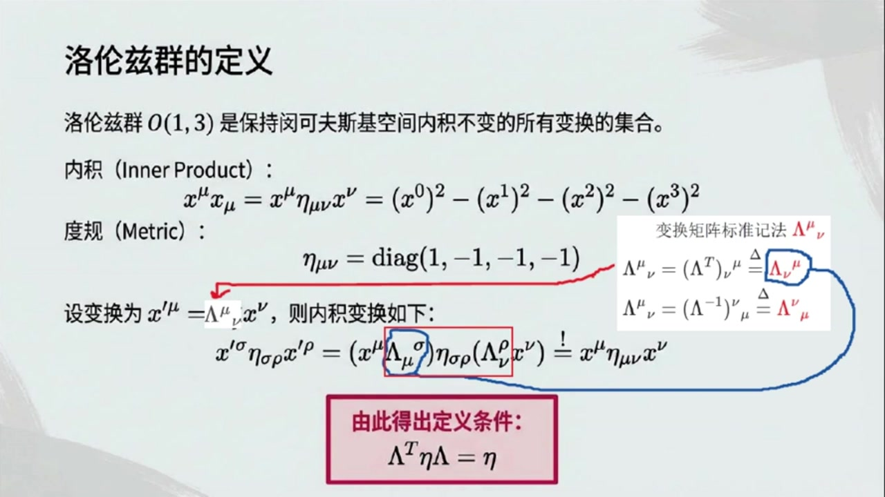
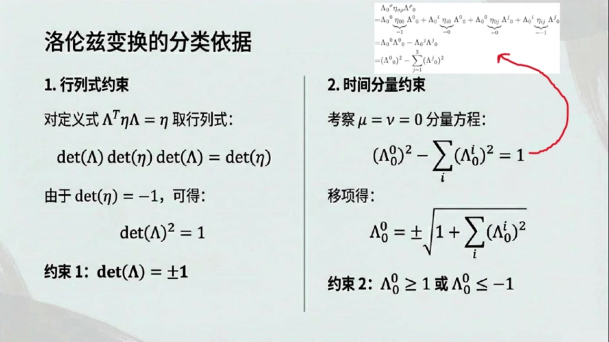
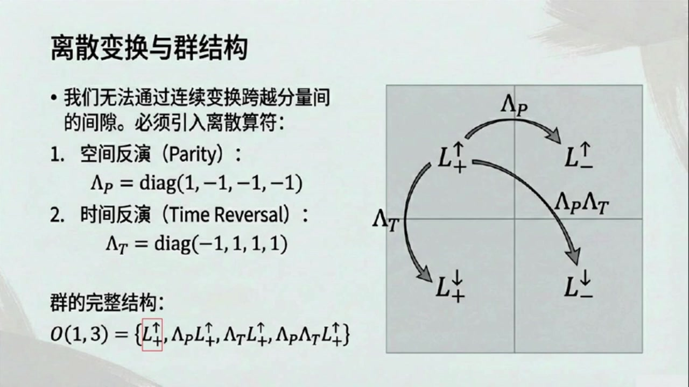
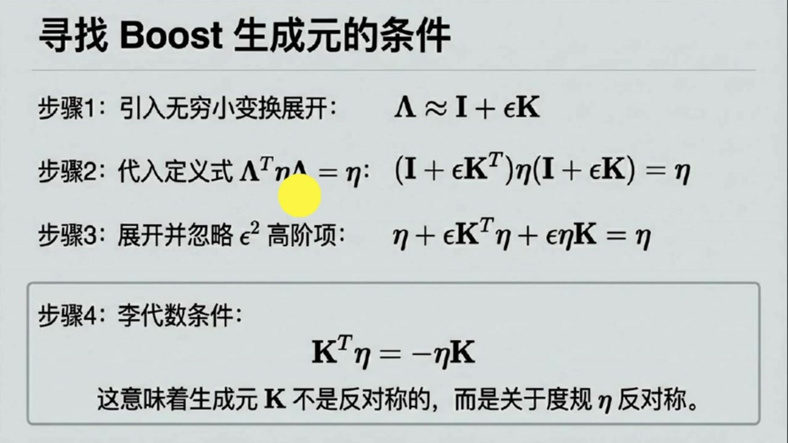
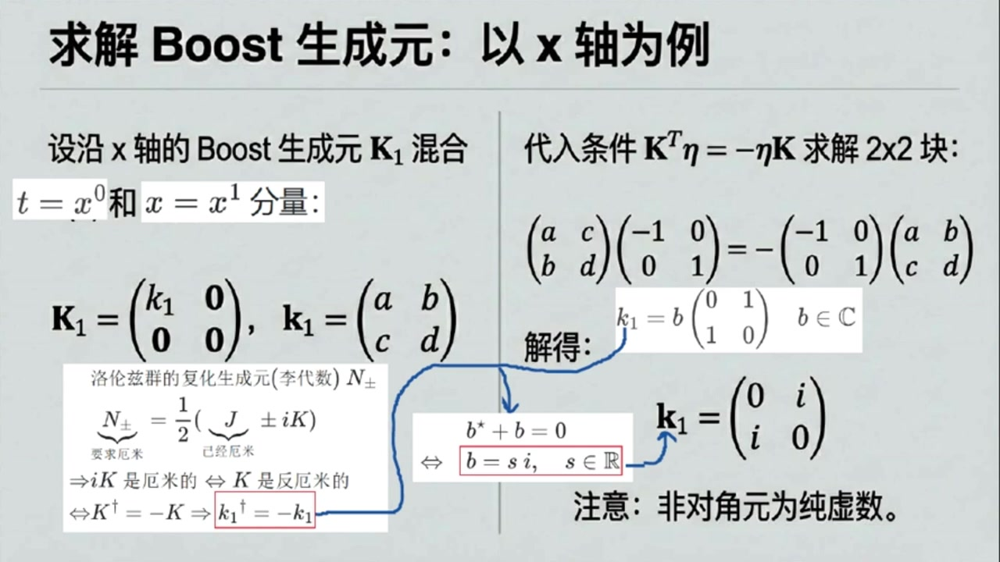
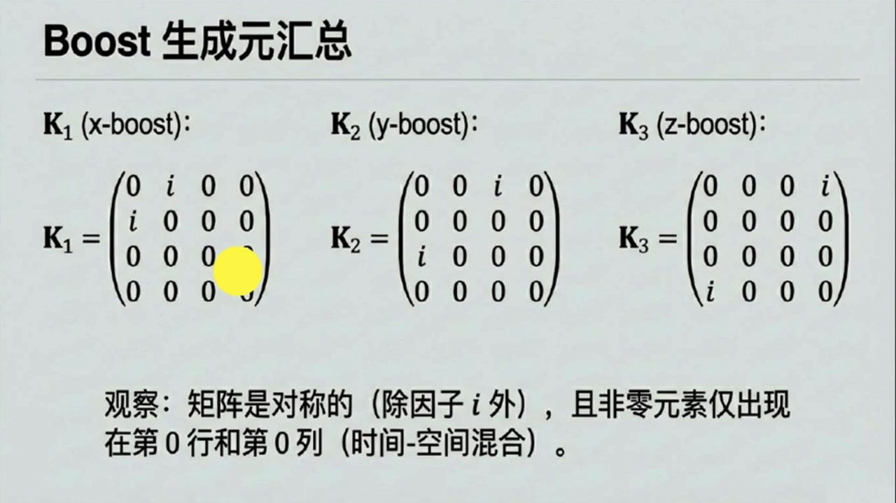
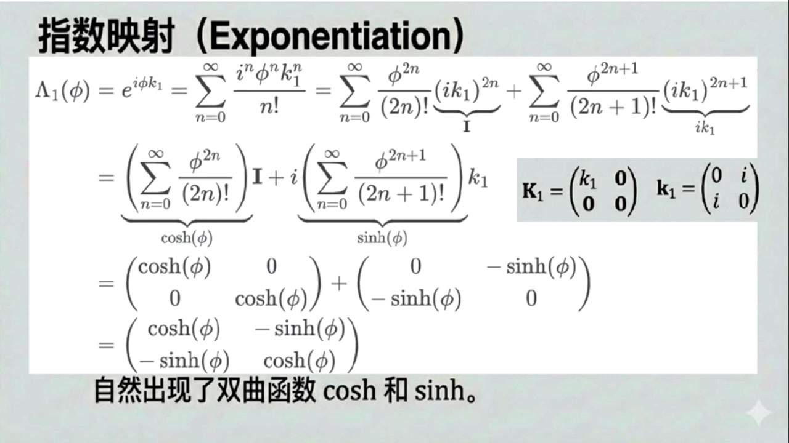

# 《基于对称性的物理学》第10课 洛伦兹群O1,3：揭示时空对称性的数学结构

> 自动生成的课程注解文档（共 4 个段落）

## 目录

- [00:00:00 课程引入与洛伦兹群的定义条件](#段落-1)
- [00:06:00 洛伦兹变换的四类划分与固有正时群](#段落-2)
- [00:12:00 四维矩阵表示与旋转、Boost生成元构造](#段落-3)
- [00:19:00 由生成元得到有限Boost变换及全课总结](#段落-4)

---

## 段落 1：课程引入与洛伦兹群的定义条件 { #段落-1 }

**时间：** 00:00:00 ~ 00:06:00

📝 原始字幕

<pre>

大家好欢迎收听基于对唱性的物理学我是你们的活泼主持人周亦大家好我是你们的知识向导赛很高兴再次和大家见面赛今天我们迎来第十课了时间过得真快你知道吗我看到我们这课的开拼引用了一句毕加索的话他说为了达到抽象始终有必要从具体的现实开始你必须始终从某些东西开始之后你可以移除现实的所有痕迹这句话可真有意思这句引用选得非常好它其实完美的概括了我们今天这节课以及整个理理论学习的精髓我们今天要探讨的洛伦兹群O一三听起来可能有点抽象但它正是从我们熟悉的现实也就是狭义相对论中的时空变换开始的没错
我们前面课程里也提过不少次了狭义相对论是我们描述宇宙最基础的理论之一那么今天赛我们是不是就要深入挖一挖这些时空变换背后的抽象结构到底是什么了完全正确今天这节课我们会从罗伦子群最核心的定义开始然后一步步推到出它的一些具体表现形式也就是所谓的表示最终我们会看到这些看起来很复杂的变换其实可以被一些更基本的生成元所描述听起来有点像在解破一个复杂的机械先看它整体怎么动再拆开看每个零件是什么对吧差不多就是这个意思而且这个过程会展现出理理论的强大之处通过理解这些抽象结构我们就能获得描述物理系统的新工具甚至能描述那些传统
简单来说罗伦兹群是所有能保持明科夫斯基空间内积不变的几何这个概念我们之前好像提到过就是那个X上零平方减X上一平方减X上二平方减X上三平方嘛对就是它这个内积或者说时空隔在狭义相对论里是一个非常重要的概念它在任何观念参考系下都保持不变我们用A塔下这个度归矩阵来表示它那个矩阵我记得对角线上是一一一一一所以罗伦兹群就是指那些变化它们作用在一个
变量上长度不变是吗金P就是这个意思我们就是因为这个度规矩阵A塔下有一个正好和三个副号所以才把这个群叫作O1O3就这样了这个名字的含义是这样来的那我们怎么用数学语言来描述这个保持不变的条件呢好的假设我们有一个罗伦子变换我们通常用大写希腊字母RAMDA来表示它它把一个四维向量X上MUE变成一个新的向量X上MUE等于RAMDA上MUE上MUE上MUE如果这个变换要保持内积不变那么X上SIGMASIGMAROSET
缩写X上MYU上SIGMA缩写X新X新最后必须等于X上MYU上MYU上MYU上MYU最后必须等于X上MYU上MYU最后必须等于X上MYU上MYU最后必须等于X上MYU最后必须等于X上MYU最后必须等于X上MYU最后必须等于X最后必须等于X最后等于X最后等于X最后等于X最后等于X最后等于X最后等于X最后等于X最后等于X最后等于X最后等于X最后等于X最后等于X最后等于X最后等于X最后等于X最后等于X最后等于X最后等于X最后等于X最后等于X最后等于X最后等于X最后等于X最后等于X最后等于X最后等于X最后等于X最后等于X最后等于X最后等于X最后等于X最后等于X最后等于X最后等于X
左上右下可以改成括号的转制括号下上注意这里左上交换了为了符号上的简洁我们特别针对变换句状往往省略转制符号看到变换句状左指标交换了就意味着转制了原来如此那么变换句状的逆句状也有这样的约定对吧是的只要你看见了变换句状的指标相比标准技法而言出现左下交换并且上下交换那么即使没有求逆符号的逆句状也必须注意这种技法只能是针对变换句状的可以省略转制符或求逆符的情况你必须老实地添加转制符或求逆符这样可以完全明白我们继续吧

</pre>

**课程截图：**

### 注解

我来对这段课程视频进行深度注解。

---

## 一、板书/PPT 公式详解

### 1. 闵可夫斯基内积（Minkowski Inner Product）

$$x^\mu x_\mu = x^\mu \eta_{\mu\nu} x^\nu = (x^0)^2 - (x^1)^2 - (x^2)^2 - (x^3)^2$$

| 符号 | 含义 |
|:---|:---|
| $x^\mu$ | 四维时空坐标（逆变矢量），$\mu = 0,1,2,3$，其中 $x^0 = ct$ 为时间分量 |
| $x_\mu$ | 协变矢量，通过度规降指标得到：$x_\mu = \eta_{\mu\nu}x^\nu$ |
| $\eta_{\mu\nu}$ | 闵可夫斯基度规（Minkowski metric） |
| 重复指标求和 | 爱因斯坦求和约定：重复的上下指标表示对该指标求和 |

**关键特征**：时间分量带正号，三个空间分量带负号——这与欧几里得内积 $(x^1)^2+(x^2)^2+(x^3)^2$ 形成鲜明对比，是狭义相对论"时空"与"空间"本质区别的数学体现。

---

### 2. 度规矩阵（Metric Tensor）

$$\eta_{\mu\nu} = \text{diag}(1, -1, -1, -1)$$

即：
$$\eta_{\mu\nu} = \begin{pmatrix} 1 & 0 & 0 & 0 \\ 0 & -1 & 0 & 0 \\ 0 & 0 & -1 & 0 \\ 0 & 0 & 0 & -1 \end{pmatrix}$$

**符号约定**：本课程采用**东海岸约定**（mostly minus），即 $(+,-,-,-)$。另有西海岸约定 $(-,+,+,+)$，需注意文献区分。

---

### 3. 洛伦兹变换的定义条件（核心公式）

$$\Lambda^T \eta \Lambda = \eta$$

**推导过程**（板书红框标注）：

设变换 $x'^\mu = \Lambda^\mu_{\;\;\nu} x^\nu$，要求内积不变：

$$\underbrace{x'^\sigma \eta_{\sigma\rho} x'^\rho}_{\text{变换后的内积}} = \underbrace{x^\mu \eta_{\mu\nu} x^\nu}_{\text{原内积}}$$

代入变换：
$$(\Lambda^\sigma_{\;\;\mu}x^\mu)\eta_{\sigma\rho}(\Lambda^\rho_{\;\;\nu}x^\nu) = x^\mu \underbrace{(\Lambda^\sigma_{\;\;\mu}\eta_{\sigma\rho}\Lambda^\rho_{\;\;\nu})}_{\stackrel{!}{=} \eta_{\mu\nu}} x^\nu$$

因此得到**矩阵形式**：
$$\Lambda^T \eta \Lambda = \eta$$

---

### 4. 变换矩阵的指标记法约定（板书蓝框标注）

PPT中展示了两种等价的指标写法：

| 写法 | 含义 | 记忆诀窍 |
|:---|:---|:---|
| $\Lambda^\mu_{\;\;\nu}$ | 标准记法，上指标为行，下指标为列 | 正常顺序 |
| $\Lambda_\nu^{\;\;\mu}$ | **转置**的简写约定 | 左右指标交换 = 转置 |
| $\Lambda^{\;\;\mu}_\nu$ | **逆矩阵**的简写约定 | 上下+左右都交换 = 求逆 |

> ⚠️ **重要警告**：这种简写**仅适用于变换矩阵**！普通张量必须显式写出转置符号 $T$ 或逆符号 $^{-1}$。

---

## 二、理论背景补充

### 为什么叫 $O(1,3)$？

| 符号部分 | 含义 |
|:---|:---|
| $O$ | Orthogonal（正交），即保持内积不变的变换 |
| $(1,3)$ | 度规的符号差（signature）：1个正特征值，3个负特征值 |

这与欧几里得空间的 $O(4)$（4个正特征值）形成对比。数学上，$O(p,q)$ 称为**伪正交群**（pseudo-orthogonal group）。

### 洛伦兹变换的物理意义

保持 $s^2 = (ct)^2 - x^2 - y^2 - z^2$ 不变，正是狭义相对论的**光速不变原理**的数学表达：
- 光子世界线：$s^2 = 0$（类光）
- 有质量粒子：$s^2 > 0$（类时）
- 超光速情形：$s^2 < 0$（类空）

---

## 三、通俗解释：从"具体"到"抽象"

| 毕加索的比喻 | 物理对应 |
|:---|:---|
| **具体的现实** | 狭义相对论中的时空变换（洛伦兹boost、旋转） |
| **移除痕迹** | 发现这些变换共享的抽象结构——群 $O(1,3)$ |
| **抽象的成果** | 用6个生成元（3个旋转 $J_i$ + 3个boost $K_i$）描述所有可能变换 |

**核心洞见**：就像拆解机械钟表——
- 先看整体：时针、分针、秒针各自转动（**有限变换**）
- 再拆零件：每个指针背后都是同样的发条结构（**生成元**）
- 最终发现：所有转动都由"旋转"这一基本操作生成

---

## 四、截图内容描述

| 截图 | 内容 |
|:---|:---|
| **图1（课程总览）** | 标题"洛伦兹群 $O(1,3)$"，展示四连通分量（$L_+^\uparrow$, $L_-^\uparrow$, $L_+^\downarrow$, $L_-^\downarrow$）的2×2分类，以及6个生成元的可视化（旋转用球体，boost用火箭/双曲面） |
| **图2（引言）** | 毕加索的公牛素描+名言，列出本节课三目标：推导向量表示→构建李代数→发现隐藏结构 |
| **图3（定义推导）** | 核心公式推导流程，红框标注 $\Lambda^T\eta\Lambda=\eta$，蓝框展示指标简写约定 |

---

## 五、本节关键收获

> **洛伦兹群 = 所有保持"时空距离" $s^2$ 不变的线性变换**

这个定义条件 $\Lambda^T\eta\Lambda=\eta$ 看似简单的矩阵方程，实则：
1. **约束了变换的形式**（不是任意 $4\times4$ 矩阵）
2. **决定了群的维数**（6个独立参数）
3. **蕴含了物理定律的对称性**（相对论性协变性）

下节课将由此出发，用**李理论**"解剖"这个群，找出那6个生成元。

---

## 段落 2：洛伦兹变换的四类划分与固有正时群 { #段落-2 }

**时间：** 00:06:00 ~ 00:12:00

📝 原始字幕

<pre>

根据刚才的变换句证的转致省略约定前面这个恒等式可以改写成句证形式那就是拉姆达转致成A成LAMDA等于A这个公式看起来简洁又强大所以只要一个四乘四句证满足这个条件它就是一个洛伦字变换完全正确这就是洛伦字变换的定义方式它有点像一个身份验证只要通过了这个验证的句证才能被称为洛伦字变换明白了那接下来我们是不是要根据这个定义来进行分类了对很有趣的是我们对这个定义条件取行列是可以得到DTRAMDA等于DTTA等于DTTA所以有DTTA等于DTA这个意味着DTTA变换至少必须是PLUS
变量线元素也只能是大于等于一或者小于等于负一等等为什么不能在负一和等于呢我们还是先算一下拉姆达下零上西格玛缩并A塔下西格玛罗缩并拉姆达上罗下零先对拉姆达罗这两个指标进行双重一加三分解一共得到四项中间两项的度归分量为零第一项的度归时间分量为零第四项的度归空间分量为零所以等于拉姆达上零上零下零减去拉姆达上零上J然后根据
按照变换矩阵的转制约继续等于RAMDA上零下零的平方减去RAMDA上I下零的平方对空间指标I球合最后还必须等于A塔下零零等于一所以RAMDA上零下零等于正复开根好一加对RAMDA上I下零的空间指标I球合我明白了所以只能落在大于一或小于负一的区间它不能是零也不能是小数正是如此所以结合DATARAMDA和RAMDA上零下零的符号我们可以把所有的洛伦子变换分成四类四类听起来有点复杂其实不难理解第一类是DATARAMDA等于正一且RAMDA上零大于一我们叫它L正上减头第二类是DATARAMDA上零大于L负一
第三类是戴塔拉姆达等于正一且拉姆达上零下零小于负一叫L正下箭头最后一类是戴塔拉姆达等于负一且拉姆达上零下零小于负一叫L负下箭头这符号有点多那这四类有什么特别的物理意义吗我们为什么要这样分类这个是一个非常好的问题其实是不能平滑连结的也就是说你不能通过连续的微小变化从一类跳到另一类它们之间存在间隙就像我们不能从一个正数通过连续变化直接变成负数中间总要经过零点但这里零点被排除了差不多就是这个意思而在这四类中只有L正上箭头这一类包含了单位变换它当然是什么都不变连续的所以所有能通过无穷小变换
变换一步步累积而成的变换都属于L正上箭头这一类所以L正上箭头是最特殊最好用的一类因为它可以跟单位变换连续连接起来完全正确这一类在专业上被称为固有等实物轮子群固有指的是它不改变空间的定向比如右手坐标系等于大于一这表示它不改变时间的方向明白了就是不翻转空间也不翻转时间那其他三类呢它们怎么来的这些是其他三类的变换在结合一些特殊的离散变换得到的这些离散变换包括空间反射LMP和时间反射LMPT
时间反射就是把时间对应变为负的对吗对你记得很清楚LMP就是一个对角线上是一负一负一的矩阵而LMP是对角线上是负一一一的矩阵通过这两个离散变化我们就能从L正上箭头跳到其他三个类别所以整个洛伦子群O1三其实可以看作是L正上箭头加上它和LPRAMDAT的各种组合正是如此L正上箭头以及对L正上箭头进行L负上箭头对L正上箭头进行L下箭头对L正上箭头同时反应对L副下箭头刚好构成L副下箭头

</pre>

**课程截图：**

### 注解

根据您提供的字幕文本与截图，这段内容的核心是**从洛伦兹变换的定义出发，通过数学约束导出其四大分类（连通分量）**。以下是深度注解：

---

## 一、截图板书内容描述

### 第一张截图（洛伦兹群的定义）
- **标题**：洛伦兹群的定义
- **核心内容**：说明 $O(1,3)$ 是保持闵可夫斯基空间内积不变的所有变换的集合
- **关键公式**：展示内积定义 $x^\mu x_\mu = (x^0)^2 - (x^1)^2 - (x^2)^2 - (x^3)^2$，度规矩阵 $\eta_{\mu\nu} = \text{diag}(1,-1,-1,-1)$
- **推导过程**：通过坐标变换 $x'^\mu = \Lambda^\mu_{\ \nu} x^\nu$ 保持内积不变，推导出**定义条件**（红框标出）：
  $$\Lambda^T \eta \Lambda = \eta$$
- **注释**：右侧有蓝色手写圈注，说明变换矩阵的转置约定 $\Lambda^\mu_{\ \nu} = (\Lambda^T)_\nu^{\ \mu} \equiv \Lambda_\nu^{\ \mu}$

### 第二张截图（分类依据）
- **标题**：洛伦兹变换的分类依据
- **左右分栏**：
  - **左侧（行列式约束）**：对 $\Lambda^T \eta \Lambda = \eta$ 取行列式，利用 $\det(\eta) = -1$ 推导出 $\det(\Lambda)^2 = 1$，得到**约束1**：$\det(\Lambda) = \pm 1$
  - **右侧（时间分量约束）**：考察 $\mu=\nu=0$ 分量方程，展开双重缩并后得到 $(\Lambda^0_0)^2 - \sum_i (\Lambda^i_0)^2 = 1$，移项得 $\Lambda^0_0 = \pm\sqrt{1 + \sum_i (\Lambda^i_0)^2}$，从而得到**约束2**：$\Lambda^0_0 \geq 1$ 或 $\Lambda^0_0 \leq -1$（红箭头指向此结果）

### 第三张截图（四个连通分量）
- **标题**：四个连通分量
- **表格形式**：以 $\det(\Lambda)$（列：$+1, -1$）和 $\Lambda^0_0$（行：$\geq 1, \leq -1$）为轴，将洛伦兹群分为四块：
  - **左上（红框）**：$L_+^\uparrow$（固有保时，Proper Orthochronous），$\det=+1, \Lambda^0_0 \geq 1$，包含单位元 $Id$
  - **右上**：$L_-^\uparrow$，$\det=-1, \Lambda^0_0 \geq 1$
  - **左下**：$L_+^\downarrow$，$\det=+1, \Lambda^0_0 \leq -1$
  - **右下**：$L_-^\downarrow$，$\det=-1, \Lambda^0_0 \leq -1$
- **注释**：右侧文字说明只有 $L_+^\uparrow$ 包含单位元，因此只有这个类别可以通过无穷小变换生成。

---

## 二、新公式与符号详解

### 1. 洛伦兹变换的矩阵定义式
$$\Lambda^T \eta \Lambda = \eta$$

| 符号 | 含义与说明 |
|:---|:---|
| $\Lambda$ | **洛伦兹变换矩阵**（$4\times 4$ 实矩阵），$\Lambda^\mu_{\ \nu}$ 表示新坐标 $x'^\mu$ 对旧坐标 $x^\nu$ 的偏导数 |
| $\Lambda^T$ | $\Lambda$ 的转置矩阵，指标记法中为 $(\Lambda^T)_\mu^{\ \nu} = \Lambda^\nu_{\ \mu}$ |
| $\eta$ | 闵可夫斯基度规矩阵，$\eta = \text{diag}(1, -1, -1, -1)$ |
| **物理意义** | 此式是洛伦兹变换的**身份验证**条件：只有保持闵可夫斯基度规不变的矩阵才是洛伦兹变换。类似于正交矩阵满足 $R^T I R = I$，这里将单位矩阵 $I$ 替换为度规 $\eta$。 |

### 2. 行列式约束推导
$$\det(\Lambda^T \eta \Lambda) = \det(\eta) \implies \det(\Lambda)^2 \cdot \det(\eta) = \det(\eta) \implies \det(\Lambda)^2 = 1$$

**结果**：
$$\det(\Lambda) = \pm 1$$

- **$\det(\Lambda) = +1$**：称为**固有**（Proper）变换，保持空间定向（右手坐标系不会变成左手坐标系）
- **$\det(\Lambda) = -1$**：包含空间反射（镜像），改变空间定向

### 3. 时间分量约束（00分量方程）
$$\Lambda^\mu_{\ 0} \eta_{\mu\sigma} \Lambda^\sigma_{\ 0} = \eta_{00} = 1$$

展开后（利用 $\eta_{00}=1, \eta_{ij}=-\delta_{ij}$）：
$$(\Lambda^0_{\ 0})^2 - \sum_{i=1}^3 (\Lambda^i_{\ 0})^2 = 1$$

**移项结果**：
$$\Lambda^0_{\ 0} = \pm \sqrt{1 + \sum_{i=1}^3 (\Lambda^i_{\ 0})^2}$$

| 符号 | 含义 |
|:---|:---|
| $\Lambda^0_{\ 0}$ | 变换矩阵的**时间-时间分量**，表示新时间坐标与原时间坐标的"混合"程度，也决定了时间流向是否改变 |
| $\Lambda^i_{\ 0}$ ($i=1,2,3$) | 变换矩阵的**时间-空间分量**，与参考系之间的相对速度有关（在纯洛伦兹 boost 中，$\Lambda^i_{\ 0} \propto v^i$） |
| **约束** | 由于根号内 $\geq 1$，故 $\Lambda^0_{\ 0} \geq 1$（保时）或 $\Lambda^0_{\ 0} \leq -1$（反时），**绝对不能落在 $(-1, 1)$ 区间** |

---

## 三、理论背景与核心概念

### 1. 连通分量（Connected Components）
洛伦兹群 $O(1,3)$ 作为一个**李群**，其流形结构是不连通的，由**四个互不连通的片（连通分支）**组成。这类似于二维平面去掉原点后分成四个象限，你无法在不经过原点（被排除的点）的情况下从第一象限连续走到第三象限。

**分类逻辑**：
- 第一标签（上下箭头 $\uparrow/\downarrow$）：由 $\Lambda^0_{\ 0}$ 的符号决定
  - $\uparrow$（上箭头）：$\Lambda^0_{\ 0} \geq 1$，**保时**（Orthochronous），保持时间流向（未来还是未来，过去还是过去）
  - $\downarrow$（下箭头）：$\Lambda^0_{\ 0} \leq -1$，**反时**，时间流向反转（未来变过去）
  
- 第二标签（正负号 $\pm$）：由 $\det(\Lambda)$ 决定
  - $+$：固有（Proper），空间定向不变
  - $-$：非固有（Improper），包含空间反射

### 2. 固有保时洛伦兹群 $L_+^\uparrow$（Restricted Lorentz Group）
这是最重要的一类：
- **连通性**：它是包含单位元 $I$（恒等变换，什么都不做）的那个连通分支
- **生成方式**：所有 $L_+^\uparrow$ 中的变换都可以通过**无穷小变换**（如缓慢的加速、微小的旋转）一步步累积而成。换句话说，它是"连续变化"能到达的所有变换的集合。
- **物理对应**：实际的物理过程（如粒子加速、刚体转动）只能产生这类变换。

### 3. 离散对称变换：空间反射与时间反射
其他三类无法通过连续变化从 $L_+^\uparrow$ 得到，必须通过**离散跳跃**（像翻硬币一样突然翻转）：

| 离散变换 | 矩阵形式 | 作用效果 | 与 $L_+^\uparrow$ 组合生成 |
|:---|:---|:---|:---|
| **空间反射** $P$ (Parity) | $\text{diag}(1, -1, -1, -1)$ | 镜像翻转：$\vec{x} \to -\vec{x}$，时间不变 | $L_-^\uparrow$（保时但空间反向） |
| **时间反射** $T$ (Time reversal) | $\text{diag}(-1, 1, 1, 1)$ | 时间倒流：$t \to -t$，空间不变 | $L_+^\downarrow$（反时但空间正向） |
| **时空反演** $PT$ | $\text{diag}(-1, -1, -1, -1) = -I$ | 同时翻转 | $L_-^\downarrow$（反时且空间反向） |

**群结构**：
$$O(1,3) = L_+^\uparrow \cup P \cdot L_+^\uparrow \cup T \cdot L_+^\uparrow \cup (PT) \cdot L_+^\uparrow$$

---

## 四、通俗解释

想象洛伦兹群是一个"时空变形器"的集合，这些变形器可以改变你的坐标系（旋转或加速），但有严格规则：

1. **行列式规则**：变形器要么保持你的"手性"（右手坐标系仍是右手，$\det=+1$），要么把你变成镜像世界（左手坐标系，$\det=-1$）。前者像正常旋转，后者像照镜子。

2. **时间分量规则**：变形器对时间轴的"拉伸"必须足够强（$\Lambda^0_{\ 0}$ 的绝对值必须 $\geq 1$），不能太小。这就像你不能"轻微地"改变时间流向——要么保持时间向前（$\geq 1$），要么完全倒转（$\leq -1$），没有中间状态。

3. **四大门派**：
   - **$L_+^\uparrow$（正规军）**：正常物理过程，慢慢加速、旋转，时间正常流逝，空间不翻转。这是唯一可以通过"渐进调整"实现的类别。
   - **$L_-^\uparrow$（镜像世界）**：在正规军基础上加一面镜子（空间反射），时间正常但左右颠倒。
   - **$L_+^\downarrow$（时间倒流）**：在正规军基础上让时间倒流（如电影倒放），但空间不翻转。
   - **$L_-^\downarrow$（完全反转）**：时空全部反转，相当于既照镜子又倒放电影。

**关键洞察**：你无法通过慢慢调整速度或旋转，从"正常世界"（$L_+^\uparrow$）连续地变成"镜像世界"或"时间倒流世界"——必须经过一次"离散跳跃"（如突然翻转镜子或倒放按钮）。这就是为什么这四类是**不连通**的。

---

## 段落 3：四维矩阵表示与旋转、Boost生成元构造 { #段落-3 }

**时间：** 00:12:00 ~ 00:19:00

📝 原始字幕

<pre>

哦我明白了接下来我们要讲什么我们今天和接下来的课程会主要关注L正上减头这一类变化因为他们可以通过理理论也就是通过他们对应的梨袋鼠来研究我们可以通过生成源来理解他们好的那我们现在已经理解了L正上减头的定义和分类特别是知道了L正上减头的重要性接下来是不是要看看这些变换具体长什么样子了是的接下来我们要构造L正上减头的一种具体表示我们知道罗伦子群作用在四维向量上所以它会有四成四的实据证来表示一个普通的四成四据证有十六个参数但我们罗伦子群的定义条件L AAAAAAAAAAAAAAAAAAAAAAAAAAAAAAAAAAAAAAAAAAAAAAAA
算法是从这个变量组中得到的
所以SO三群是洛伦兹群的一个子群可以这么说所以旋转变换的矩阵形式就是左上角十一然后右下角是一个三乘三的旋转矩阵二下三乘三明白了我记得在第七课中我们推导过的旋转生成元J一J二这三呢他们在这种四乘四的表示下会变成什么样不熟悉的同学建议先看看第七课从李群到李代数连续对称性的生成元但内容第七课中的三乘三旋转生成元在我们这里的对应形式也很简单就是左上角有一个零然后右下角是三乘三的旋转生成元比如这一它就会变成一个四乘四的矩阵除了右下角行二列三和行三列二位置的父爱和爱之外其他地方都是零好的
变量源的变量源从无穷小变量开始从无穷小变量开始
听起来像是要做的乐展开正是这个思路带入后只保留E字想得到A塔加上A塔加上A塔等于A塔最后就得到一个非常重要的条件K转至A塔等于A塔等于A塔这个条件就是描述Boost的生成源的吗对所有满足这个条件的聚诊K都是洛伦兹群的生成源我们现在就要利用它来找出Boost的具体形式因为沿X轴Boost时Y和Z左轴的Boost是不变的所以生成源K一的聚诊形式会比较特殊它应该只有X上零和X上一相关的部分是零对不对我们只需要解一个二乘二聚诊小K一的方程
带入K转至K等于负一塔K不难解会发现大K一左上角的二乘二子矩阵小K一是B乘矩阵零一换行一这个还有一个参数B没有确定咋办这个参数根据我们一右的知识的确无法确定我将提前引入一些知识来也好后面我们会学到洛伦兹群的复化力代数可以分解为两个相互对应的小SU二复本其生成元定义为N正复等于二分之一成扩号加减虚数I成不死的生成元K扩号根据物理上可观测的要求小SU二对应的必须是恶米的进而N正复也必须是恶米的
验证旋转生成源J已经是恶米的那么必须要求K也是恶米的也就是要求K必须是反恶米的也就是KDEGGER等于负K后面我就理解了那么必须要求小K1等于负K1然后将你前面已经求解得到的小K1矩阵带入自然就可以推导出B是一个纯细数非常正确现在是剩下一个实数系数S这个系数不重要被某些规律化步骤中吸收掉基于某种考虑S取一即可我明白了所以小K1等于巨证0爱换行爱0我们继续好的所以沿X轴K1的完整生成源大K1就是一个四乘四矩阵只有行一列一和行一列零位置是爱其他都是零

</pre>

**课程截图：**

### 注解

---

## 段落 4：由生成元得到有限Boost变换及全课总结 { #段落-4 }

**时间：** 00:19:00 ~ 00:23:11

📝 原始字幕

<pre>

明白了那以此类推沿Y轴和Z轴的BUS生成源K2和K3也就很容易写出来了没错这样我们就找到了另外三个生成源它们分别对应着沿XYZ轴的Boost 现在我们有了三个旋转生成源大JI和三个Boost生成源大KI总共六个生成源这正好对应了洛伦兹群的六个参数太棒了我们终于把这六个基本零件都找齐了那我们怎么从这些生成源得到有限的Boost变换矩阵呢很好我们知道从生成源得到有限的变换是通过指数函数E上IFI大K来实现的我们还是以X轴的Boost为例就是计算E上IFI大K一这个我们之前在SU二的时候也算过用极数展开的方法对完全一样的方法
带入然后利用i小K一平方等于二乘二单位矩阵这个性质可真方便能让极数展开变得很简单没错G数展开后分成两组偶次密一组G次密一组我们会发现这里的两极数展开不再是口三五复五了而是变成了双曲与弦F和双曲正弦F这真是个惊喜所以Boost变换矩阵里出现的是双曲与弦F和双曲正弦F这不是三角函数对这就是Boost变换的特点所以沿X轴的Boost完全四乘四变换矩阵LAMDA1就会是这样左上角是二乘二小矩阵双曲与弦F和副双曲正弦F和副曲正弦F
二乘二单位矩阵这矩阵看起来就很有相对论的味道了我知道在这里通常被称为速度和我们平时说的速度V有关你说的非常对和速度V之间有一个关系就是VC等于双曲线且F所以我们通过生成源成功地推导出了我们熟悉的罗伦子变换矩阵今天这课真是信息量巨大我们从罗伦之群的抽象定义开始理解了它为什么叫O1然后分类了它的四种连通分量特别强调了L正上箭头的重要性是的然后我们深入到它的一个具体表示也就是四乘四的实矩阵表示我们发现可以被六个生成元所描述三个对应空间旋转另外三个对应时空混合的Boost
我们还亲手推导了这些生成元的具体形式以及他们如何通过直数印设生成了我们熟知的旋转矩阵和BUS的矩阵特别是BUS的矩阵中双取函数的出现真是太酷了没错这些生成元和他们的利括号关系正是我们接下来理解陆轮子群历代数的关键通过历代数我们能发现陆轮子群更深层次的结构比如它包含两个小SU二历代数的副本这会为我们打开通向更多更奇妙的表示的大门这听起来就像我们今天只是看到了冰山一角后面还有更精彩的等着我们完全可以这么说你就掌握了描述时空对称性的核心工具好的那今天的第十分钟就到这里了谢谢谢谢谢谢大家为我们带来的精彩讲解
能帮助大家更好地理解洛伦兹群别忘了如果你有任何疑问或者想讨论的内容欢迎在评论期给我们留言我们下期节目再见下期再见

</pre>

**课程截图：**

### 注解

根据您提供的字幕文本（00:19:00 ~ 00:23:11）及截图，这段内容的核心是**从李代数生成元出发，通过指数映射推导有限的洛伦兹Boost变换矩阵**，并揭示双曲函数出现的数学根源。

---

## 一、截图板书内容描述

### 第一张截图：Boost生成元汇总
展示了三个沿坐标轴的**Boost生成元**（Boost Generators）$K_1, K_2, K_3$ 的 $4\times 4$ 矩阵形式：
- **$K_1$（x-boost）**：非零元位于 $(0,1)$ 和 $(1,0)$ 位置，值为 $i$
- **$K_2$（y-boost）**：非零元位于 $(0,2)$ 和 $(2,0)$ 位置，值为 $i$  
- **$K_3$（z-boost）**：非零元位于 $(0,3)$ 和 $(3,0)$ 位置，值为 $i$

**关键观察**：这些矩阵是**对称**的（除因子 $i$ 外），且非零元素仅出现在第0行和第0列（时间-空间混合分量），这与旋转生成元的反对称性形成鲜明对比。

### 第二张截图：指数映射（Exponentiation）
详细推导了从生成元 $K_1$ 到有限变换的指数映射过程：
- 左侧展示级数展开：$\Lambda_1(\phi) = e^{i\phi k_1} = \sum_{n=0}^{\infty} \frac{(i\phi k_1)^n}{n!}$
- 中间展示分离奇偶项的技巧，利用 $(ik_1)^2 = I$（单位矩阵）将级数重组为双曲函数
- 右侧框出 $2\times 2$ 子矩阵 $k_1 = \begin{pmatrix} 0 & i \\ i & 0 \end{pmatrix}$ 及其与 $4\times 4$ 矩阵 $K_1$ 的关系（直和结构）
- 最终结果呈现为 $2\times 2$ 矩阵：$\begin{pmatrix} \cosh\phi & -\sinh\phi \\ -\sinh\phi & \cosh\phi \end{pmatrix}$

### 第三张截图：最终结果——洛伦兹推进矩阵
展示了完整的 $4\times 4$ Boost变换矩阵 $\Lambda_1(\phi)$：
- **左上角 $2\times 2$ 块**：时空混合部分，包含 $\cosh\phi$ 和 $-\sinh\phi$，描述时间坐标 $t$ 与空间坐标 $x$ 的相互转化
- **右下角 $2\times 2$ 块**：单位矩阵 $\begin{pmatrix} 1 & 0 \\ 0 & 1 \end{pmatrix}$，表示 $y, z$ 坐标在沿 $x$ 方向的Boost下保持不变
- 标注强调这是**狭义相对论的核心变换矩阵**

---

## 二、核心公式与符号详解

### 1. 六个生成元的完备集
洛伦兹群 $O(1,3)$ 是一个**6维李群**，其李代数 $so(1,3)$ 由六个生成元张成：
- **三个旋转生成元** $J_i$（$i=1,2,3$）：对应空间旋转，生成元为**反对称**实矩阵（如 $J_1$ 在 $yz$ 平面旋转）
- **三个Boost生成元** $K_i$（$i=1,2,3$）：对应时空混合的惯性系变换，生成元为**对称**纯虚矩阵（如截图所示）

**符号说明**：
- $K_1

---
