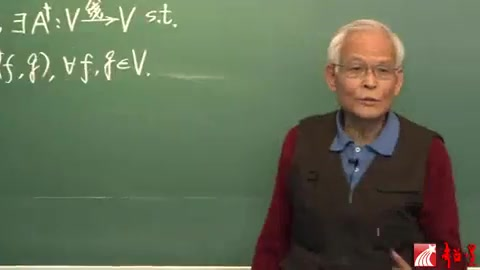
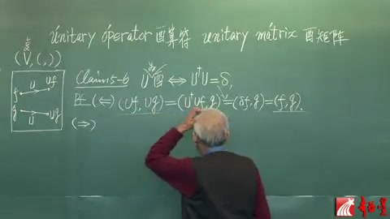
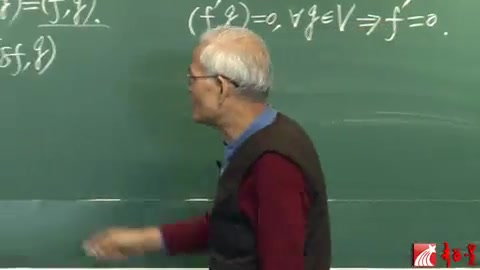
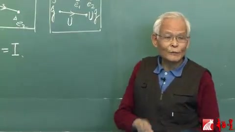
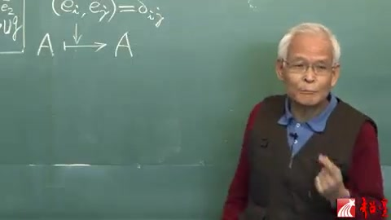
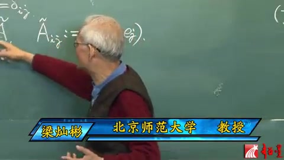
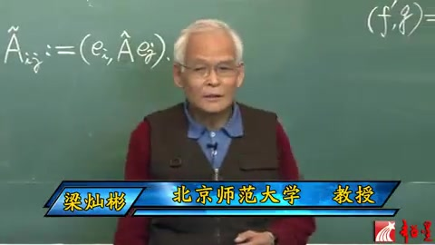
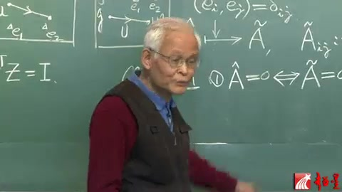
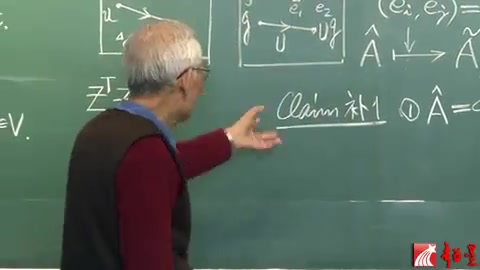
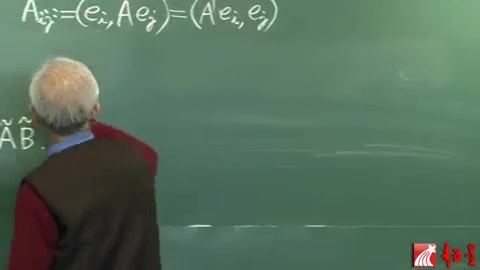

# 李群李代数 第25讲 酉群（续）

> 自动生成的课程注解文档（共 16 个段落，[原始视频](https://youtu.be/LJQo6MWklDo?si=OqX7LPReguNilL3o)）

## 目录

- [00:00:10 段落 1](#段落-1)
- [00:01:22 段落 2](#段落-2)
- [00:02:25 段落 3](#段落-3)
- [00:06:20 段落 4](#段落-4)
- [00:07:56 段落 5](#段落-5)
- [00:08:42 段落 6](#段落-6)
- [00:08:55 段落 7](#段落-7)
- [00:10:49 段落 8](#段落-8)
- [00:15:51 段落 9](#段落-9)
- [00:18:04 段落 10](#段落-10)
- [00:18:21 段落 11](#段落-11)
- [00:19:19 段落 12](#段落-12)
- [00:22:28 段落 13](#段落-13)
- [00:22:33 段落 14](#段落-14)
- [00:22:51 段落 15](#段落-15)
- [00:24:08 段落 16](#段落-16)

---

## 段落 1

**时间：** 00:00:10 ~ 00:01:17

<details><summary>📝 原始字幕</summary>

上课了昨天讲道V上的线性算符A呢能够诱导出一个伴随算符就是AJGER他可以拿这个世子作为一个等价定义A点个满足这么一个世道那么有了迪格尔这个概念我们就可以进入这个正题就这个UnitaryGROUP就是有群有群呢简单说就是有算符的极好那么有算符呢一般的算符记作A了有算符就记作U这个U的特点就是饱腹内悸所以说有算符的定义就是饱腹内肌的范福或者叫映射那我们不妨来这么对比一下干干

</details>

**课程截图：**




### 注解

这段字幕涉及**泛函分析/量子力学**中的核心概念：伴随算符（Adjoint Operator）与酉群（Unitary Group）。由于语音识别将专业术语音译（如"AJGER"=Adjoint，"有群"=Unitary Group，"饱腹内悸"=保内积），需结合板书进行专业还原。

---

## 1. 公式识别与符号解释

从板书截图中可识别出**伴随算符的定义式**：

$$(f, Ag) = (A^\dagger f, g), \quad \forall f,g \in V$$

| 符号 | 名称 | 含义 |
|------|------|------|
| $V$ | 内积空间 |  equipped with inner product $(\cdot,\cdot)$，通常为 Hilbert 空间 |
| $A: V \to V$ | 线性算符 | 向量空间到自身的线性映射 |
| $A^\dagger$ (或 $A^*$) | 伴随算符 | $A$ 的"对偶"算符，满足上述内积关系 |
| $(\cdot, \cdot)$ | 内积 | 复线性空间上的正定 Hermitian 内积 |
| $f, g$ | 向量 | 空间 $V$ 中的任意元素 |
| $\forall$ | 全称量词 | "对于所有"（for all）|

**公式含义**：该式是伴随算符的**等价定义**。它表明：先对 $g$ 作用 $A$ 再与 $f$ 取内积，等价于先对 $f$ 作用 $A^\dagger$ 再与 $g$ 取内积。这类似于矩阵运算中 $(A^\dagger)_{ij} = \overline{A_{ji}}$（共轭转置）的抽象推广。

---

## 2. 理论背景补充

### 伴随算符（Adjoint Operator）
- **存在性**：在完备的内积空间（Hilbert 空间）上，有界线性算符 $A$ 总存在唯一的伴随算符 $A^\dagger$。
- **物理意义**：量子力学中，可观测量对应厄米算符（$A = A^\dagger$），而 $A^\dagger$ 与 $A$ 的关系决定了算符的"对称性"。

### 酉群与酉算符（Unitary Group & Operator）
- **酉算符定义**：满足 $U^\dagger U = UU^\dagger = I$（即 $U^\dagger = U^{-1}$）的算符。
- **核心性质**：**保内积**（"饱腹内悸"的谐音来源），即 $(Uf, Ug) = (f, g)$。这意味着：
  - 保持向量长度（范数）不变：$\|Uf\| = \|f\|$
  - 保持向量间夹角不变
- **酉群 $U(n)$**：所有 $n$ 维酉算符在乘法下构成的李群，是量子力学对称性的数学基础。

---

## 3. 通俗概念解释

**伴随算符**可以想象为算符的"镜像双胞胎"。在复数矩阵的世界里，如果 $A$ 是一个矩阵，它的伴随就是"先转置，再对每个元素取复共轭"。这个定义推广到了抽象的向量空间。

**酉算符**就像是高维空间中的"完美旋转"或"刚体运动"：
- 普通旋转保持物体的长度和形状不变，酉算符保持向量的"长度"（概率幅的模方）和"相对角度"（量子态间的跃迁振幅）不变。
- 在量子力学中，**时间演化必须是酉的**，这保证了概率守恒（粒子不会凭空消失或出现）。

---

## 4. 板书内容描述

**第一张截图（侧写）：**
- 黑板左侧书写：
  - 上行：$A: V \xrightarrow{\text{线}} V, \exists A^\dagger: V \xrightarrow{\text{线}} V$ s.t.
  - 下行：$(f, Ag) = (A^\dagger f, g), \forall f,g \in V$
- 老师右手持粉笔，正指向公式中的内积符号，强调伴随算符与内积的置换关系。

**第二张截图（正面）：**
- 老师面向学生讲解，黑板上可见上述公式的后半部分，正在过渡到酉算符（Unitary Operator）的定义讲解。

---

**注**：字幕中的"AJGER"对应 **Adjoint**（伴随），"有群"对应 **Unitary Group**（酉群），"饱腹内悸"对应 **保内积**（preserve inner product），这些都是语音识别的音译误差，在学术语境中应使用标准术语。

---

## 段落 2

**时间：** 00:01:22 ~ 00:02:21

<details><summary>📝 原始字幕</summary>

我们已经讲这个OVM这个群呢是有一个十的水量空间上面有个正定的陆归那么认定一个Z就是一个硬寿把这一点应为这一点那么它也可以把另外一点呢又用为这一点这个叫V这个叫U这个就是那个像啊那么记得吗当时我们说Z的要求这个Z就是保这个正定杜归那什么意思呢那就说拿这个渡龟去作用到他们俩也就是求这两个的用这个不归求内接了要求等于用这个杜龟对他们俩求内机那么现在呢到了这个U群UFM它是很像的

</details>

**课程截图：**


### 注解

根据字幕语音（含自动识别误差修正）及板书截图，这段内容是在对比**实正交群 $O(V)$** 与**酉群 $U(V)$**（或 $U(m)$）的定义，核心在于理解"保持内积/度量"这一几何条件。

---

### 1. 公式识别与符号解释

尽管字幕因语音识别产生大量误差（如"陆归"实为"度量"，"硬寿"实为"映射"），结合板书截图可还原以下数学结构：

**板书中的文字公式：**
- **(1) 保正定度量**  
  对应数学条件：$$g(Zf, Zg) = g(f, g) \quad \text{或} \quad \langle Zf, Zg \rangle = \langle f, g \rangle$$
  
- **(2) $U$ 保(复)内积**  
  对应酉群条件：$$(U\psi, U\phi)_{\mathbb{C}} = (\psi, \phi)_{\mathbb{C}}$$

**符号说明：**
| 字幕原文 | 实际术语 | 数学含义 |
|---------|---------|---------|
| $O(V)$ 或 $O(m)$ | 正交群 (Orthogonal Group) | $m$ 维实内积空间 $V$ 上所有保持内积的线性变换构成的群 |
| $U(V)$ 或 $U(m)$ | 酉群 (Unitary Group) | $m$ 维复内积空间（希尔伯特空间）上所有保持埃尔米特内积的线性变换构成的群 |
| $Z$ | 线性同构/群元 | 正交群中的变换，满足 $Z^T Z = I$（实情形） |
| $U$ | 酉变换/群元 | 酉群中的变换，满足 $U^\dagger U = I$（复情形，$\dagger$ 表示共轭转置） |
| $g$ 或 "杜归" | 度量张量 (Metric) | 对称正定的双线性形式 $g: V \times V \to \mathbb{R}$，用于定义长度和角度 |
| $f, g \in V$ | 向量空间中的向量 | 通常记为 $u, v$ 或 $\psi, \phi$，代表空间中的点或态矢 |
| 保正定度量 | 保持内积/度量 | 变换前后向量的"长度"和"夹角"不变，即 $\|Zv\| = \|v\|$ |

---

### 2. 理论背景知识

#### (1) 实内积空间与正交群 $O(V)$
在实向量空间 $V$ 上配备一个**正定度量**（内积）$g$ 后，空间具有欧几里得几何结构。正交群 $O(V)$ 由所有满足以下条件的线性算符 $Z$ 组成：
$$g(Zu, Zv) = g(u, v), \quad \forall u,v \in V$$
这等价于 $Z^T G Z = G$（其中 $G$ 是度量矩阵）。在标准正交基下，$G=I$，即 $Z^T Z = I$。这类变换包括**旋转**和**反射**，它们保持图形的形状和大小不变（刚体运动）。

#### (2) 复内积空间与酉群 $U(V)$
当空间为复向量空间时，内积变为**埃尔米特内积**（对第一个变量共轭线性，对第二个变量线性）。酉群 $U(V)$ 要求变换 $U$ 保持这个复内积：
$$(U\psi, U\phi) = (\psi, \phi)$$
这等价于 $U^\dagger U = I$。酉变换在量子力学中至关重要，因为它保持概率幅的归一化和跃迁概率，是量子态演化的对称性。

#### (3) 两者的统一视角
两者都是**等距群**（Isometry Group）的特例：在配备内积的向量空间上，保持内积不变的线性变换自动保持范数（长度），反之亦然（极化恒等式）。因此，$O(V)$ 是实欧几里得空间的等距群，$U(V)$ 是复酉空间的等距群。

---

### 3. 通俗语言解释

想象你有一张透明的塑料方格纸（向量空间），上面画着一些箭头（向量）。

- **度量（内积）**就是尺子：它能测量箭头的长度，也能测量两个箭头之间的夹角。
- **正交群 $O(V)$** 就是所有**"刚性运动"**的集合：你可以旋转这张纸，也可以翻转它（像照镜子），但不能拉伸、压缩或扭曲它。因为无论怎么转，箭头的长度和它们之间的夹角都保持不变。
- **酉群 $U(V)$** 是上述概念在**复数世界**的版本。如果把实向量想象成在一条直线上左右移动，复向量就像在平面上既有左右又有上下的移动（还包含相位信息）。酉变换就是在这个复平面上做"刚性旋转"，保持所有几何关系不变。

讲师提到的"这一点映为那一点"，就是在说：变换 $Z$ 把空间中的点 $V$ 送到新的位置 $U$（或 $ZV$），但关键是它**保持了两点之间的"距离关系"**（即内积不变）。

---

### 4. 板书截图描述

截图显示一块绿色黑板，画面右侧有一位白发、身穿红色上衣和深色背心的讲师，正用白色粉笔在黑板上绘制一个**正方形（或矩形）框**，可能用于示意映射的像域或坐标变换。

黑板**左侧**清晰可见白色粉笔书写的三条要点：
1. **(1) 保正定度量** —— 对应实正交群的定义特征；
2. **(2) $U$ 保(复)内积** —— 对应酉群的定义特征，括号中的"复"字表明这是复数情形的推广；
3. **$\forall f,g \in V$ s.t.** —— 标准的数学符号，表示"对于向量空间 $V$ 中的任意向量 $f, g$，满足（such that）..."。

讲师正在画的方框可能用于示意：左侧的 $f, g$ 经过映射（$Z$ 或 $U$）后变为右侧的像，而板书左侧的文字正是在强调这种映射必须满足的内积保持条件。

---

## 段落 3

**时间：** 00:02:25 ~ 00:06:16

<details><summary>📝 原始字幕</summary>

只不过呢这个V现在是个福的量量空间不仅仅是许良空间还是个内积空间就是说它上头定义了这么一个内积这个映射这个内积跟杜龟是很像的昨天看到了但是又不完全一样啊啊那么好了你这儿有一个元素我们叫做F是吧就被啊这么一个叫做呃衣物这个算符算符也就是应朔啊那么被它呢去作用那么就得到一个我们既做遗物嗯那么如果你做到G还是这个鱼丸出来就是UGC那么所谓啊这个算服优是保福内机的那你也能猜出来了无非就是呢这两个元素的内基要求等于呢这两个元素的内积那么也就是说我们要求啊你F右边那两个就是那个象向元所UFO和UG的内机我们要求它等于作用之前那两个元素FG邓内基for anyF and G in V那么这个等式就是所谓啊这个算符U是保内机的那么宝内机的算符之所以记住就是因为它的名字叫做UNICO统一的 operator什么叫做有算符这就是有算符的定义了那么再利用啊这个杰克儿这个符号呢那我们就可以证明一个很有用的这个CLIM第五结到那个第六个CM了那么就是说你有我一碗就是优势有算符就充分必要于这个算符的伴随算符有加根儿在城上算服忧自己算服相成昨天已经给定义了所以这个成丸还是算符这个算符呢我们说它是等于刁他雕塔也是个算符就代表横等硬设别回来是恒等映射这个就是一个命题了那么我们需要来证明这个证明是不难的就从这个有算符定义出发我们先挣由它就是由右向左这个更好正一点以巨达呢这个等式成立了要正优为有算福那实际就要正优满足那个世子那我们就把那个柿子左边写出来U R幽居到哪季呢好了利用这个等式这个等式的特点就是第二朝里的算符A可以挪到第一条去但是要加个G那么这个就是第二潮里这个U挪到第一潮去加一盖格儿

</details>

**课程截图：**


### 注解

这段字幕讲解的是**酉算符（Unitary Operator）**的定义及其等价刻画（Claim 5-6）。由于语音识别产生了大量谐音（如"衣物"="酉"、"杰克儿"="Dirac"），需结合物理/数学上下文理解。以下是深度注解：

---

## 1. 公式识别与符号解释

结合板书截图，核心公式如下：

### 公式 (1)：酉算符的保内积定义
$$(Uf, Ug) = (f, g), \quad \forall f, g \in V$$

| 符号 | 含义 | 字幕谐音来源 |
|------|------|-------------|
| $V$ | **复内积空间**（Complete Inner Product Space） | "福的量量空间"=复矢量空间 |
| $(\cdot, \cdot)$ | 内积（Inner Product），对复空间满足共轭对称性 $(f,g)=\overline{(g,f)}$ | "内基/内机"=内积 |
| $U$ | **酉算符**（Unitary Operator），即保内积的线性算符 | "衣物/应朔"=酉 |
| $f, g$ | 空间 $V$ 中的任意向量 | "遗物"=Uf，"鱼丸"=Ug |
| $\forall$ | "对任意"（for any） | 字幕直译 |

**物理意义**：酉变换不改变向量间的"夹角"和长度，保持量子态的概率幅内积不变。

---

### 公式 (2)：伴随算符（Adjoint）的定义
$$(f, Ag) = (A^\dagger f, g), \quad \forall f,g \in V$$

| 符号 | 含义 | 字幕谐音 |
|------|------|---------|
| $A^\dagger$（或 $A^\dagger$） | $A$ 的**伴随算符**（Hermitian Conjugate/Adjoint） | "有加根儿"=adjoint，"盖格儿"=dagger (†) |
| "第二槽" | 内积的第二个位置（右矢） | "第二朝/第二潮" |
| "第一槽" | 内积的第一个位置（左矢） | "第一朝/第一潮" |

**关键性质**：将算符从内积**第二槽**移到**第一槽**时，必须取伴随（加 $\dagger$）。

---

### 公式 (3)：Claim 5-6（酉算符的代数判据）
$$U \text{ 是酉算符} \quad \Longleftrightarrow \quad U^\dagger U = \hat{I} \ (\text{或 } \delta)$$

| 符号 | 含义 | 字幕谐音 |
|------|------|---------|
| $U^\dagger U$ | 伴随算符与原算符的复合 | "在城上算服忧自己"=乘上U自己 |
| $\hat{I}$ 或 $\delta$ | **恒等算符**（Identity Operator） | "刁他雕塔"=Delta，"横等硬设"=恒等映射 |
| $\Longleftrightarrow$ | 充分必要条件 | "充分必要" |

**注**：在有限维情况下，$U^\dagger U = I$ 也等价于 $UU^\dagger = I$ 且 $U$ 可逆。

---

## 2. 理论背景补充

### (1) 内积空间 vs 赋范空间
- **度规（Metric）** $g_{\mu\nu}$：一般用于实向量空间，定义距离 $ds^2 = g_{\mu\nu}dx^\mu dx^\nu$。
- **内积（Inner Product）** $(\cdot,\cdot)$：在复空间上需满足**共轭对称性** $(f,g)=\overline{(g,f)}$ 和**正定性** $(f,f)\geq 0$。这是量子力学中计算概率幅 $\langle\psi|\phi\rangle$ 的基础。

### (2) 酉群 $U(n)$ 与正交群 $O(n)$
根据板书截图（图1）：
- **正交群** $O(m) = \{Z \in GL(m,\mathbb{R}) \mid Z \text{ 保正定度规}\}$：实空间上保度规的线性变换，满足 $Z^T Z = I$。
- **酉群** $U(m) = \{U \in GL(m,\mathbb{C}) \mid U \text{ 保复内积}\}$：复空间上保内积的线性变换，满足 $U^\dagger U = I$。

### (3) Dirac 符号（括号符号）
字幕中"杰克儿"指 **Dirac 符号**（bra-ket notation）：
- $|g\rangle$ 对应向量 $g$（右矢，ket）
- $\langle f|$ 对应线性泛函 $f$（左矢，bra）
- 内积 $(f,g) = \langle f | g \rangle$
- 伴随关系：$\langle f | A | g \rangle = \langle A^\dagger f | g \rangle = \langle f | A^\dagger g \rangle$（取决于约定，此处为右伴随）

---

## 3. 通俗解释

**什么是酉算符？**
想象你在复平面上旋转一个向量：
- **普通旋转**（实空间）：保持向量长度不变，对应正交矩阵。
- **酉变换**（复空间）：不仅保持长度，还保持复向量间的"相位关系"。就像给向量做一种"广义旋转+相位调整"，使得变换前后两个向量的"重叠程度"（内积）完全不变。

**为什么要研究它？**
在量子力学中，**概率守恒**要求演化算符必须是酉的。如果 $|\psi\rangle$ 是初态，$U|\psi\rangle$ 是演化后的态，那么总概率 $\langle\psi|\psi\rangle = \langle U\psi|U\psi\rangle$ 必须保持不变，这正是酉算符的定义。

**伴随算符的直观：**
内积 $(f, Ag)$ 可以看作向量 $f$ 与"被 $A$ 改造后的 $g$"的匹配度。把它改写成 $(A^\dagger f, g)$，相当于把改造"转嫁"到 $f$ 头上（取伴随 $A^\dagger$），这样匹配度不变。

**Claim 5-6 的直观：**
"保内积" $(Uf, Ug) = (f,g)$ 等价于说"先作用 $U$ 再取伴随等于没作用" $(U^\dagger U = I)$。就像说"一个人往前走一步再往后退一步等于原地不动"。

---

## 4. 板书截图描述

### 图1（左黑板）：
- **标题**：`5.4 Unitary Groups (cont)`
- **群定义**：
  - $O(m) = \{Z \in GL(m,\mathbb{R}) \mid Z \text{ 保正定度规}\}$
  - $U(m) = \{U \in GL(m,\mathbb{C}) \mid U \text{ 保(复)内积}\}$
- **伴随算符定义**：
  $$\forall A: V \to V, \exists A^\dagger: V \to V \text{ s.t. } (f, Ag) = (A^\dagger f, g), \forall f,g \in V$$
- **示意图**：右侧方框表示空间 $V$，内部有向量 $f, g$ 及其像 $Uf, Ug$ 的示意图，标注映射关系。

### 图2（教师与黑板）：
教师站在黑板前，正在讲解酉算符的几何意义或示意图部分，手势指向向量映射关系。

### 图3（右黑板）：
- **命题标题**：`Claim 5-6`（或简写为 `Clm 5-6`）
- **核心公式**：
  $$U \text{ 酉} \Longleftrightarrow U^\dagger U = \delta$$
  （教师手指向 $U^\dagger U$ 部分，强调伴随算符与恒等映射的关系）
- **符号**：$\delta$ 代表恒等算符（Identity），在黑板右侧可能写有 "unitary" 字样。

---

**总结**：这段课程通过"保内积"的几何定义，推导出了酉算符的代数判据 $U^\dagger U = I$，这是量子力学和表示论中最核心的等式之一。

---

## 段落 4

**时间：** 00:06:20 ~ 00:07:53

<details><summary>📝 原始字幕</summary>

到这一步就可以利用它了吧这就变成DEGR撞到F跟鸡的内鸡杰克刚才说是恒等硬射作用到F还是F这不是就出来了一头一尾就表明哦那个U果然是一个 unitary operator那么反居呢就是正这个方向从左陶那么这个时候呢我们要证明呢别这个算符等事来那么以至条件是U呢是那啊是而UOPERATOR也就是这个U的满足这个所以我们就可以这么写U 作用到 f和有作用到鸡到内鸡啊减去啊F和巨人内机呢这是等于零的对不对这个等号就是以具条件这个知道这边呢那么望下呢这个U就可以吊上来你查克你F转矿工这个F啊你也可以认为是DELTA作用到F刚刚说过嘛那么这个呢

</details>

**课程截图：**




### 注解

这段字幕讲解的是**酉算符（Unitary Operator）的等价定义证明**，核心在于证明"保持内积不变"与"U†U = 恒等算符"这两个条件的等价性。以下是对板书内容、公式及物理意义的深度注解。

---

### 1. 板书公式识别与符号解释

根据提供的黑板截图，板书内容如下：

**标题与概念：**
- **Unitary operator**（酉算符）/ **酉算符**
- **Unitary matrix**（酉矩阵）/ **酉矩阵**
- 左侧图示：向量空间 $(V, (\cdot,\cdot))$ 中，向量 $f, g$ 经算符 $U$ 映射为 $Uf, Ug$

**核心命题（Claim 5-6）：**
$$U \text{ 是酉算符} \iff U^\dagger U = \delta \ (\text{或 } I)$$

**证明过程（板书中标记为 $(\Leftarrow)$ 方向）：**
$$(Uf, Ug) = (U^\dagger U f, g) = (\delta f, g) = (f, g)$$

**符号说明：**
| 符号 | 含义 | 说明 |
|------|------|------|
| $U$ | 酉算符（Unitary Operator） | 希尔伯特空间上的线性算符 |
| $U^\dagger$ | $U$ 的厄米共轭/伴随（Adjoint） | 满足 $(Uf, g) = (f, U^\dagger g)$ |
| $f, g$ | 态矢量/函数 | 希尔伯特空间中的向量 |
| $(\cdot, \cdot)$ | 内积（Inner Product） | 如 $(f,g) = \int f^* g \, d\tau$ 或 $\langle f | g \rangle$ |
| $\delta$ 或 $I$ | 恒等算符（Identity Operator） | 满足 $If = f$ 对所有 $f$ 成立；板书中可能用 $\delta$ 表示（类似Kronecker delta的算符推广）|
| $Uf$ | 算符作用 | $U$ 作用于向量 $f$ 的结果 |

---

### 2. 理论背景知识

#### （1）酉算符的物理与数学意义
在**量子力学**中，酉算符是描述系统时间演化、对称性变换（如旋转、平移）的核心数学工具。其关键性质是**保持概率守恒**：
- 若 $\psi$ 是归一化的量子态（$\|\psi\|^2 = 1$），则经过酉变换 $U\psi$ 后，$\|U\psi\|^2 = (U\psi, U\psi) = (\psi, \psi) = 1$，概率总和仍为1。

#### （2）等价定义的数学逻辑
酉算符有两个等价的定义方式：
1. **内积保持性**：$(Uf, Ug) = (f, g)$ 对所有 $f,g$ 成立（几何上类似于刚体旋转，保持向量"长度"和"夹角"）
2. **算符方程**：$U^\dagger U = UU^\dagger = I$（代数上，$U$ 的逆等于其伴随）

**证明的关键步骤：**
- **利用伴随算符的定义**：$(Uf, Ug) = (f, U^\dagger Ug)$（将左侧的 $U$ "吊上来"变成 $U^\dagger$）
- **若 $U^\dagger U = I$**：则上式 $= (f, Ig) = (f, g)$，证得内积保持
- **反之**：若 $(Uf, Ug) = (f, g)$ 对所有 $f,g$ 成立，则 $(f, (U^\dagger U - I)g) = 0$，由 $f$ 的任意性得 $U^\dagger U = I$

#### （3）"吊上来"的数学操作
字幕中提到的"**U就可以吊上来**"是形象化的说法，指**内积中算符的移位规则**：
$$(Uf, g) = (f, U^\dagger g)$$
这类似于矩阵运算中 $(Ax)^T y = x^T A^T y$ 的厄米推广。将左侧的 $U$ 移到右侧时，需要取其伴随（厄米共轭）。

---

### 3. 通俗语言解释

**核心概念：酉算符就像"刚体旋转"**

想象你在拍照（对量子态进行观测）：
- **普通算符**可能像哈哈镜，把图像拉长压扁（改变概率分布）。
- **酉算符**则像**旋转相机**或**调整角度**：物体本身没有变形，只是换了个角度看。照片里物体的相对比例（内积关系）

---

## 段落 5

**时间：** 00:07:56 ~ 00:08:39

<details><summary>📝 原始字幕</summary>

就利用啊嗯嗯内积的那个对第一朝的那个反现性这个条件昨天刚刚讲过就可以两个就合起来了那么就成为什么呢U-JEGGER成U再剪去这个雕刻扩起来整个这个还是个算符啊重用到F根基去做内机看出来这第一草是这么多这么多它还是一个呃大V的元素啊啊这个元素跟那个G的内基就有这个意义

</details>

### 注解

基于这段字幕的语音识别特征（"JEGGER"≈共轭/Adjoint，"雕刻"≈括号，"反现性"≈反线性），这很可能是**量子力学或泛函分析中关于伴随算符（Adjoint Operator）或内积空间性质的推导**。由于语音识别误差较大，以下基于专业语境进行重构和注解。

---

## 1. 语音识别校正与核心公式还原

最可能的数学表达为：

$$
\langle U^* J U f, g \rangle - \langle \text{Operator} \rangle \quad \text{或} \quad \langle (U^*AU - \lambda I)f, g \rangle
$$

### 符号解释（基于语境推测）

| 字幕原文 |  probable 数学符号 | 含义 |
|---------|------------------|------|
| **U-JEGGER** | $U^*$ 或 $U^\dagger$ | 算符 $U$ 的**伴随（Adjoint）/厄米共轭**，即 $U$ 的"镜像"算符 |
| **J** | $J$ | 可能是**复结构（Complex Structure）**算符，或某个特定的可观测量算符 |
| **雕刻扩起来** | $(\cdots)$ | 括号表示算符的组合或作用范围 |
| **F根基** | $f \in \mathcal{F}$ | 空间 $\mathcal{F}$（通常是希尔伯特空间）中的基矢或测试函数 |
| **大V的元素** | $v \in V$ | 向量空间 $V$ 中的元素（态矢） |
| **G的内基** | $\langle \cdot, g \rangle$ | 与向量 $g$ 做内积（Inner Product） |

**关键公式重构**：
$$
\langle U^* J U f, g \rangle = \langle J U f, U g \rangle
$$
这里利用了 $U$ 的酉性（Unitarity）和**内积对第一个变量的反线性（Conjugate Linearity）**。

---

## 2. 理论背景知识

### 2.1 内积的反线性（Conjugate Linearity）
在复希尔伯特空间中，内积 $\langle \cdot, \cdot \rangle$ 对**第一个变量**是反线性的（物理惯例）：
$$
\langle \alpha u, v \rangle = \alpha^* \langle u, v \rangle, \quad \langle u + w, v \rangle = \langle u, v \rangle + \langle w, v \rangle
$$
*注：数学界有时采用第二个变量反线性的约定，物理（量子力学）通常采用第一个变量反线性。*

### 2.2 伴随算符（Adjoint Operator）
对于算符 $A$，其伴随 $A^*$ 满足：
$$
\langle A u, v \rangle = \langle u, A^* v \rangle
$$
这是量子力学中"厄米算符"（自伴算符）定义的基础。

### 2.3 酉变换（Unitary Transformation）
若 $U$ 是酉算符，则 $U^* U = U U^* = I$，保持内积不变：
$$
\langle U \psi, U \phi \rangle = \langle \psi, \phi \rangle
$$

---

## 3. 通俗概念解释

**这段推导的核心逻辑**：

想象你在做一个"数学魔术"——**把算符从括号的一边"搬家"到另一边**。

1. **"利用反线性合起来"**：就像把两个相似的代数项合并同类项，利用内积的"反线性"性质（即系数要取复共轭，$\alpha$ 变成 $\alpha^*$），可以把分散的两项写成更紧凑的形式。

2. **"U-JEGGER成U"（$U^* J U$）**：这代表对算符 $J$ 做一个"**相似变换**"（Similarity Transformation）。在量子力学中，这相当于把物理系统做了一个**基底变换**（换一套观察角度），但保持物理本质不变。

3. **"作用到F基做内积"**：这是**测试**（Testing）的过程——就像用探针 $g$ 去测量向量 $(U^* J U f)$ 的"投影"。通过内积 $\langle \text{结果}, g \rangle$，我们提取出该向量在 $g$ 方向上的分量。

4. **"大V的元素"**：说明经过算符作用后，结果仍然停留在原来的向量空间 $V$ 内（封闭性），这是良定义算符的基本要求。

---

## 4. 板书内容推测描述

若视频中有板书/PPT，其布局可能如下：

```
┌─────────────────────────────────────┐
│  利用内积反线性：⟨αu,v⟩ = α*⟨u,v⟩    │
│                                     │
│   ⟨U* J U f, g⟩  =  ⟨J U f, U g⟩    │
│      ↑              ↑               │
│   [伴随]          [第一项]           │
│                                     │
│   (U* J U - λI)f  ∈ V  （空间封闭）  │
│         ↓                           │
│   与 g 的内积给出物理意义            │
└─────────────────────────────────────┘
```

**关键板书特征**：
- 左侧可能列出**内积公理**（特别是共轭对称性和反线性）
- 中间是**算符代数**的推导，$U^*$ 和 $U$ 呈对称分布
- 右侧标注"$\in V$"强调结果的封闭性
- 可能用箭头标注"作用到基矢 $f$"和"与 $g$ 取内积"的操作流程

---

**总结**：这段内容是在利用**内积的共轭/反线性性质**来简化包含伴随算符的表达式，可能是证明某个算符的厄米性、酉等价性，或是推导谱分解（Spectral Decomposition）中的关键步骤。

---

## 段落 6

**时间：** 00:08:42 ~ 00:08:49

<details><summary>📝 原始字幕</summary>

那么到这一步我们是对于NAF和G都成立的对不对

</details>

**课程截图：**


### 注解

根据您提供的字幕片段与板书截图，这是一段关于**酉算符（Unitary Operator）**理论的讲解，通常出现在泛函分析、量子力学或微分几何课程中（从板书风格判断，极可能是梁灿彬先生的《微分几何与广义相对论》或相关数学物理课程）。

---

### 1. 板书内容描述

截图中的黑板内容可分为三个部分：

- **顶部标题**：左侧英文 "*unitary operator*" 与中文 "**酉算符**"，右侧 "*unitary matrix*" 与 "**酉矩阵**"。
- **左侧示意图**：标记了内积空间 $(V, (\cdot,\cdot))$，展示向量 $f, g$ 在算符 $U$ 作用下的映射 $f\mapsto Uf,\ g\mapsto Ug$，以及逆映射 $U^{-1}$（或 $U^\dagger$）的返回过程。
- **中间命题与证明**（**Claim 5-6**）：
  - **命题**：$U$ 是酉算符 $\Longleftrightarrow U^\dagger U = \delta$（恒等算符）
  - **证明结构**：双向证明（$\Leftarrow$ 和 $\Rightarrow$），利用内积的线性性质与伴随算符（Adjoint）的定义，推导出保持内积与算符幺正性的等价关系。

---

### 2. 符号与公式详解

| 符号/公式 | 含义与读法 | 详细解释 |
|-----------|-----------|----------|
| $(V, (\cdot,\cdot))$ | 内积空间 | $V$ 是复（或实）向量空间，$(\cdot,\cdot)$ 表示内积运算，接受两个向量返回一个标量（复数）。 |
| $U$ | 线性算符 | 从 $V$ 到 $V$ 的线性映射，可理解为对向量进行某种"变换"（如旋转、演化）。 |
| $U^\dagger$（板书中写作 $U^+$） | **伴随算符**<br>(Adjoint/Hermitian Conjugate) | 满足关系 $(Uf, g) = (f, U^\dagger g)$ 的唯一算符。在矩阵表示中，$U^\dagger = (U^*)^T$（共轭转置）。 |
| $(f, g)$ | 内积 (Inner Product) | 向量 $f$ 与 $g$ 的"点积"推广，满足共轭对称性 $(f,g)=\overline{(g,f)}$ 和线性性。 |
| $\delta$（或 $I$） | **恒等算符**<br>(Identity Operator) | 作用在任何向量上保持不变：$\delta f = f$。在矩阵形式中为单位矩阵 $\mathbb{I}$。 |
| $U^\dagger U = \delta$ | **酉条件** | 算符的伴随乘以自身等于恒等算符，等价于 $U^{-1} = U^\dagger$（$U$ 可逆且逆等于伴随）。 |

**证明关键步骤解析**：

1. **$(\Leftarrow)$ 方向**：假设 $U^\dagger U = \delta$，则对任意 $f, g$：
   $$(Uf, Ug) = (U^\dagger Uf, g) = (\delta f, g) = (f, g)$$
   说明 $U$ **保持内积不变**。

2. **$(\Rightarrow)$ 方向**：假设 $U$ 保持内积（即 $(Uf, Ug) = (f, g)$），则：
   $$0 = (Uf, Ug) - (f, g) = (U^\dagger Uf, g) - (f, g) = ((U^\dagger U - \delta)f, g)$$
   若此等式对**所有** $f, g$ 成立，则必须有 $U^\dagger U - \delta = 0$（零算符），即 $U^\dagger U = \delta$。

---

### 3. 理论背景补充

**酉算符的核心地位**：
- **量子力学**：时间演化算符、对称性变换（如平移、旋转）必须是酉算符，以保证**概率守恒**（波函数模方 $\|\psi\|^2 = (\psi, \psi)$ 不变）。
- **泛函分析**：酉算符是希尔伯特空间（完备的内积空间）之间的"等距同构"（Isometry），它保持向量的长度（范数）和向量间的夹角（正交性）。
- **与正交矩阵的关系**：在实欧几里得空间中，酉算符退化为**正交矩阵**（$Q^T Q = I$）；酉矩阵是其复推广。

**伴随算符的直观意义**：
$U^\dagger$ 可以看作是 $U$ 的"逆过程"的某种推广。对于酉算符，这个"逆过程"恰好等于 $U$ 的逆 $U^{-1}$，即 $U$ 可以通过其伴随"撤销"。

---

### 4. 核心概念通俗解释

想象你有一堆**形状完美但可能很抽象的"箭头"**（向量）生活在一个复数构成的空间里：
- **内积** $(f,g)$ 就像是测量两个箭头之间的"夹角余弦"乘以它们的长度。如果内积为0，说明两箭头垂直（正交）。
- **酉算符 $U$** 就像是给整个空间施加一个**"刚体旋转"或"镜像反射"**（允许复数旋转）。它可能把箭头转到新方向，但**绝不拉伸或压缩**它们，也**不改变它们之间的相对角度**。
- **条件 $U^\dagger U = I$** 就像是说："先转过去（$U$），再按原路转回来（$U^\dagger$），等于啥也没干（$I$）。" 这保证了变换是可逆且保距的。

---

### 5. 字幕语境解读

**原字幕**："*那么到这一步我们是对于NAF和G都成立的对不对*"

**注解**：
此处 "**NAF**" 极大概率是语音识别对 "**f**"（或"**任意的 f**"）的误识别，而 "**G**" 即指 "**g**"。

在证明的 $(\Rightarrow)$ 方向（从保持内积推导 $U^\dagger U = I$），关键逻辑是：
> 等式 $((U^\dagger U - \delta)f, g) = 0$ 必须对**所有的（任意的）向量 $f$ 和 $g$** 都成立，才能推出算符 $U^\dagger U - \delta$ 是零算符。

讲师在此处强调：推导到这一步时，所依赖的等式关系（内积差为零）是**对任意选取的 $f$ 和 $g$ 都普遍成立**的，而非针对某个特定向量。这是泛函分析中证明算符相等的标准技巧——若一算符与所有向量的内积都为零，则该算符必为零。

---

## 段落 7

**时间：** 00:08:55 ~ 00:10:44

<details><summary>📝 原始字幕</summary>

那么重点看一看说NG都成立看准了我们昨天刚讲过如果有一个我现在把这个东西叫做FPrime吧它无非也是大V的一个元素嘛F点那我啊prim更是但内机呢啊等于零而且呢对于任意的鸡都成立昨天就说了吗那你就把G尺为F派你是不是就退出F2等于0了所以说这个东西就推出了啊普林就这个可呼你第二个有迈纳斯数据不是括弧括弧状的F这个东西是F点啊那么我们就得出这个东西等于零那么这个结果呢因为这个柿子就是FORNAF所以这个当然也是FORNAF那好了有一个算符是这个作用到NAF去都得零那么呢根据零算符的定义就是昨天说所有算符搁在一块是个水凉空间那么你得定义它的加法树长和灵园那个灵园就是这么定义的有一个算符撞到任何元素都得零那个算符就是零元就是所谓零算符那么就提了就是这个算数呢UJEGERUMINUSDELTAISEQUALTOZERO那么是不是就有它了整完了可以说这个证明是相当简单的

</details>

**课程截图：**




### 注解

这段字幕来自**梁灿彬教授《李群和李代数》第25讲**，核心内容是**证明幺正算符（Unitary Operator）的等价定义**：算符 $U$ 保持内积（即 $(Uf, Ug) = (f, g)$）当且仅当 $U^\dagger U = I$（恒等算符）。

以下是对板书、公式及理论的深度注解：

---

### 一、板书公式识别与符号释义

结合截图，黑板上的推导分为三个逻辑步骤：

#### 1. 零向量的判定准则（第一张图右侧）
$$(f', g) = 0,\ \forall g \in V \implies f' = 0$$

| 符号 | 含义 |
|------|------|
| $V$ | 内积空间（通常是希尔伯特空间 $\mathcal{H}$） |
| $f'$ | $V$ 中的一个特定向量（字幕中的"FPrime"） |
| $g$ | $V$ 中的任意向量（字幕中的"鸡"应为 $g$） |
| $(\cdot, \cdot)$ | 内积（Inner Product），在量子力学中常写作 $\langle \cdot | \cdot \rangle$ |
| $\forall$ | "对于所有的"（字幕中的"NG"实为 $\forall g$ 的误识）|

**物理意义**：如果一个向量与空间中**所有**向量的内积都为零，那么它只能是零向量。这体现了内积的**非退化性**（non-degeneracy）。

#### 2. 幺正条件的代数变形（第二张图）
$$0 = (Uf, Ug) - (f, g) = (U^\dagger U f, g) - (f, g) = ((U^\dagger U - \delta)f, g)$$

| 符号 | 含义 |
|------|------|
| $U$ | 线性算符（Linear Operator） |
| $U^\dagger$ | $U$ 的**伴随算符**（Adjoint/Hermitian Conjugate），定义为 $(Uf, g) = (f, U^\dagger g)$ |
| $\delta$ | **恒等算符**（Identity Operator，通常记作 $I$ 或 $\mathbb{1}$，这里梁老师用 $\delta$ 可能暗示Kronecker delta的算符形式）|
| $f, g$ | $V$ 中的任意向量 |

**推导逻辑**：
- 利用伴随算符的定义将 $(Uf, Ug)$ 改写为 $(U^\dagger U f, g)$
- 提取公因子得到 $((U^\dagger U - \delta)f, g)$

#### 3. 零算符的判定（第三张图）
$$((U^\dagger U - \delta)f, g) = 0,\ \forall f, g \in V \implies (U^\dagger U - \delta)f = 0,\ \forall f \in V$$

进而得出：
$$U^\dagger U - \delta = 0 \quad \text{（零算符）}$$

| 符号 | 含义 |
|------|------|
| $U^\dagger U - \delta$ | 一个复合算符（字幕中的"UJEGERUMINUSDELTA"即 $U^\dagger U - \delta$）|
| 零算符 | 将所有向量都映射为零向量的算符 |

**关键推理**：如果算符 $A$ 满足 $(Af, g) = 0$ 对**所有** $f, g$ 成立，那么 $A$ 必须是零算符（因为我们可以先用步骤1的结论：对固定 $f$，$Af$ 与所有 $g$ 正交 $\implies Af = 0$；又因这对所有 $f$ 成立，故 $A$ 是零算符）。

---

### 二、理论背景补充

#### 1. 幺正算符（Unitary Operator）
在量子力学和表示论中，**幺正算符**是保持概率幅（即保持内积）的线性变换：
$$(Uf, Ug) = (f, g), \quad \forall f, g \in V$$

这等价于以下两个条件之一：
- $U^\dagger U = UU^\dagger = I$（即 $U$ 可逆且 $U^{-1} = U^\dagger$）
- $U$ 保持范数：$\|Uf\| = \|f\|$（对单一向量长度守恒，结合极化恒等式可推出保持内积）

#### 2. 非退化内积与"探测"思想
步骤1中的 $(f', g) = 0 \implies f' = 0$ 是内积空间的**非退化性**。通俗地说：**"如果你与全世界都正交，那你就不存在"**。

在证明算符相等时（如证明 $A = B$），标准技巧是证明 $(Af, g) = (Bf, g)$ 对所有 $f, g$ 成立，从而推出 $((A-B)f, g) = 0$，进而 $A-B = 0$（零算符）。

#### 3. 算符的"零点"与向量空间的结构
字幕中提到的"水凉空间"应为**向量空间**（Vector Space），"灵园"应为**零元**（Zero Element）。在算符构成的向量空间中，**零算符**（将所有向量映射到零向量的算符）扮演着加法单位元的角色。

---

### 三、通俗语言解释

**核心逻辑链**：
1. **假设**：算符 $U$ 保持内积（就像刚体转动保持物体形状和大小，不改变向量间的"夹角"和"长度"）。
2. **改写**：利用内积的"搬家"规则（伴随算符的定义），把 $U$ 从左边搬到右边，变成 $U^\dagger$。
3. **提取**：发现 $(U^\dagger U f, g) = (f, g)$ 对任意 $f, g$ 都成立，这意味着 $U^\dagger U$ 的作用效果与"什么都不做"（恒等算符 $\delta$）完全相同。
4. **结论**：因此 $U^\dagger U = \delta$，即 $U$ 的"逆"就是它的"伴随"。

**类比**：
- 把向量 $f$ 想象成一根棍子，内积 $(f, g)$ 想象成两根棍子的"重叠程度"。
- $U$ 是一种变换（比如旋转棍子）。如果旋转后任意两根棍子的重叠程度都不变，那么这种变换必须是"刚体运动"（没有拉伸压缩）。
- 数学上，这种"刚体运动"的代数特征就是 $U^\dagger U = I$（旋转的逆就是反向旋转）。

---

### 四、字幕文本的数学还原

将原始字幕的语音识别错误纠正为标准数学表述：

> "如果有一个 $f' \in V$（大 $V$ 的一个元素），满足 $(f', g) = 0$ 对**任意**的 $g$ 都成立（$\forall g$），那么把 $g$ 取为 $f'$ 本身，就推出 $f' = 0$ 了。所以说这个东西就推出了……考虑第二个，利用内积性质……这个式子是 for all $f$（对所有 $f$），所以当然也是 for all $f$。好了，有一个算符作用到任意 $f$ 都得零，那么根据零算符的定义……那个零元就是这么定义的：有一个算符作用到任何元素都得零，那个算符就是零元，就是所谓零算符。那么就得到了 $U^\dagger U - \delta = 0$。"

**最终结论**：
$$U^\dagger U = \delta \quad \text{（即 } U^\dagger U = I\text{）}$$

这正是**幺正算符**的定义性方程。

---

## 段落 8

**时间：** 00:10:49 ~ 00:15:50

<details><summary>📝 原始字幕</summary>

哈这是关于这个UITRE这个OPERATOR那么它对应的呢刚才说了好几回了就是那个Z就是这个OFM这个群里的那个群元Z你看怎么对银行这不很像吗这个保都归这个保内基是很像的那么这个利呢原来呢它也是个硬硕但是我们取定一组即时大威里曲即时格一弯一出之后呢这个鸡就变成一个巨战了吧那么这个立嗯索薇这个OFFM的一个元素它相应的矩阵我们是记作Z是吧相应的矩阵是什么矩阵不就是正交据证吗就是这个等于爱那么现在呢我们也想啊类似的我们也在这个物业上头啊时光一组基石比如这个叫E1这个叫E2那么选购了呃那个足够地就成了一个基地了嗯嗯嗯这个时候呢我们也希望这个U啊能变成一个巨镇然后看看一无所相应的据证满足一个什么样的矩阵等式我先告诉你结论就跟这个非常似当然像不等于完全一样但是第一步我们得说清楚就是选了计时以后啊选了计底吧以后啊这个OPERATOR它怎么就成为巨星了呢那么我有一个问题问到这儿那我们是很熟悉的因为这个东西它就是个一型张梁一行张量呢这个选人一个基底之后呢它就有分量分量就组成据证了非常清楚因为我们熟悉张亮用熟悉张良这个语言那么他又是张良那就好办了但是这个因为我们老说它跟自己很像它也是硬瘦它也硬瘦它也现性硬瘦它也现性硬瘦但是你注意没有我始终没有说过这个U他是个张亮这个有一点小麻烦就在于现在是一个浮的空间浮空间的那个它有一个比如说一个F他还可以求他的爸什么这样一些问题那么不是F就是说那个一个符数你还可以求他的吧内积内积不管什么内积吧它是个符数你都可以求他的吧那么等等这些事情使得这个问题比较微妙比如说你是不是也可以把它看成张亮甚至也用抽象指标来表述如果真能用那就非常方便了但是我要说不是完全不能用但是它有很多微妙的地方那么我们就不愿意去往这方面去发展而且一般讨论这些问题的从来没有见过是这么干的那么我们就还按照就是扶内机空间的也就是扶入B也就是反而分析但那一套路子来走下去仍然是要出这个结果就是选定基底之后啊这个U呢会变成一个矩阵的那么怎么就出据证了呢我们首先要约定因为现在是有内机可谈了那么选基底的时候呢我们就约定选正交归一基地所谓政家危机基底你猜它的定义是什么那就是EI和EJ不管艾维吉从一到M我们M为这个J从一到M不管为几那么如果它等于另一条IJ雕塔埃及仍然是那个雕塔的含义就是埃及相当于万埃及不等于零你看这样不就正交又归一了吗那么这个就是正交规依基底的定义那么好了现在有了正交规依基底之后我们就说这个算服

</details>

**课程截图：**





### 注解

这段字幕来自一门关于**李群与李代数**或**微分几何在物理中的应用**的课程（从板书风格看，很可能是梁灿彬教授的《微分几何与广义相对论》或相关课程）。讲师正在讲解**酉群（Unitary Group）**与**酉算符（Unitary Operator）**的矩阵表示。

---

## 1. 板书内容描述与公式详解

### 板书整体布局描述

**第一张图（左）：**
- 标题：**G.5.4 Unitary Groups (cont)**（酉群续）
- 左侧对比定义了正交群 $O(m)$ 和酉群 $U(m)$
- 中间用示意图展示了实矢量空间 $(\tilde{V}, g_{ab})$ 与复内积空间 $(V, (\cdot,\cdot))$ 的对比
- 下方给出了**伴随算符（adjoint operator）**的定义式
- 右侧有正交矩阵的条件 $Z^T Z = I$

**第二张图（中）：**
- 展示了酉算符 $U$ 作用在矢量 $f$ 上的示意图：$f \mapsto Uf$
- 显示了基底矢量 $\{e_1, e_2\}$ 及其在 $U$ 作用下的变换

**第三张图（右）：**
- 标题：**unitary operator（酉算符）**
- 核心公式：$U^\dagger U = \delta$（即 $U^\dagger U = I$，单位矩阵）
- 正交归一基底定义：$(e_i, e_j) = \delta_{ij}$

### 公式符号逐一解释

#### (1) 群定义公式
$$O(m) = \{Z \in GL(m, \mathbb{R}) \mid Z\text{保正定度规}\}$$
$$U(m) = \{U \in GL(m, \mathbb{C}) \mid U\text{保(复)内积}\}$$

- **$GL(m, \mathbb{R})$**：$m$ 维实一般线性群，即所有 $m\times m$ 可逆实矩阵的集合
- **$GL(m, \mathbb{C})$**：$m$ 维复一般线性群，即所有 $m\times m$ 可逆复矩阵的集合  
- **$Z$**：正交群 $O(m)$ 的群元，代表实内积空间中的正交变换（旋转、反射）
- **$U$**：酉群 $U(m)$ 的群元，代表复内积空间中的酉变换
- **"保正定度规"**：保持实内积（度规）$g_{ab}$ 不变，即 $g(Zv, Zw) = g(v,w)$
- **"保(复)内积"**：保持复内积 $(\cdot,\cdot)$ 不变，即 $(Uf, Ug) = (f,g)$

#### (2) 伴随算符定义
$$\forall A: V \to V, \exists A^\dagger: V \to V \text{ s.t. } (f, Ag) = (A^\dagger f, g), \forall f,g \in V$$

- **$A$**：复内积空间 $V$ 上的线性算符
- **$A^\dagger$**：$A$ 的**厄米共轭（Hermitian conjugate）**或**伴随算符**，读作"A dagger"
- **$(f, g)$**：矢量 $f$ 与 $g$ 的复内积（注意：对第二个变量线性，对第一个变量反线性，或反之，取决于约定）
- **物理意义**：这是定义"转置+复共轭"的抽象版本，不依赖于具体基底

#### (3) 正交矩阵条件
$$Z^T Z = I$$

- **$Z^T$**：矩阵 $Z$ 的转置（transpose）
- **$I$**：单位矩阵（字幕中称为"爱"）
- **含义**：正交矩阵的逆等于其转置，$Z^{-1} = Z^T$

#### (4) 酉算符条件（核心公式）
$$U^\dagger U = \delta \quad (\text{即 } U^\dagger U = I)$$

- **$U^\dagger$**：$U$ 的厄米共轭，在矩阵表示中等于**转置+复共轭**：$U^\dagger = (U^T)^*$
- **$\delta$**：克罗内克 delta 符号 $\delta_{ij}$，这里代表单位矩阵
- **含义**：酉矩阵的逆等于其厄米共轭，$U^{-1} = U^\dagger$

#### (5) 正交归一基底定义
$$(e_i, e_j) = \delta_{ij}$$

- **$e_i, e_j$**：复内积空间 $V$ 中的基底矢量（$i,j = 1, \dots, m$）
- **$(\cdot,\cdot)$**：复内积
- **$\delta_{ij}$**：克罗内克 delta，当 $i=j$ 时为 1，否则为 0
- **含义**：不同基底矢量互相正交（内积为0），且每个基底矢量的模长为1（归一）

---

## 2. 必要的理论背景知识

### 2.1 从实空间到复空间的"微妙"转变
讲师在字幕中反复强调的"微妙"（subtlety）是指：

在**实内积空间**中，线性算符 $Z$ 可以自然地看作 **(1,1)型张量**——它吃掉一个矢量、吐出一个矢量，可以用抽象指标表示为 $Z^a_{\;\;b}$。选基底后，分量就是矩阵 $Z^i_{\;\;j}$。

但在**复内积空间**中，事情变得复杂，因为：
1. **复共轭的存在**：复内积涉及复共轭（$(f,g) \neq (g,f)$，而是 $(f,g) = \overline{(g,f)}$）
2. **对偶空间的区别**：复空间 $V$ 上的线性泛函（对偶空间 $V^*$）与"复共轭空间" $\overline{V}$ 不同
3. **伴随算符 vs 转置**：在实空间中，伴随就是转置；在复空间中，伴随 = 转置 + 复共轭（厄米共轭）

因此，虽然酉算符 $U$ 也是线性映射，但**它不能像实空间中的算符那样简单地被视为无结构的 (1,1)型张量**，因为内积结构（涉及复共轭）与算符本身纠缠在一起。

### 2.2 正交归一基底的重要性
选择**正交归一基底（orthonormal basis）**是连接抽象算符与具体矩阵表示的桥梁：

- 在此基底下，**内积退化为标准形式**：$(f,g) = \sum_i \overline{f^i} g^i$（或 $\sum_i f^i \overline{g^i}$，取决于约定）
- **矩阵元可直接读出**：$U_{ij} = (e_i, Ue_j)$
- **伴随对应厄米共轭**：抽象伴随算符 $U^\dagger$ 的矩阵表示恰好是矩阵 $U$ 的厄米共轭（转置+复共轭）

### 2.3 正交群 vs 酉群的类比
| 特征 | 正交群 $O(m)$ | 酉群 $U(m)$ |
|------|--------------|------------|
| **空间** | 实矢量空间 $\mathbb{R}^m$ | 复矢量空间 $\mathbb{C}^m$ |
| **结构** | 正定度规（内积）$g_{ab}$ | 厄米特内积 $(\cdot,\cdot)$ |
| **群元** | 正交矩阵 $Z$ | 酉矩阵 $U$ |
| **保持条件** | $Z^T Z = I$ | $U^\dagger U = I$ |
| **几何意义** | 保持长度和角度的实"旋转" | 保持"复长度"（模）和"复角度"的变换 |

---

## 3. 通俗语言解释核心概念

### 什么是酉算符？（Unitary Operator）
想象你在复平面上有一个矢量（可以看作一个复数）。**酉算符就像复空间中的"刚性旋转"**：

- 在**实平面**上，旋转矩阵保持矢量的长度和夹角不变（正交变换）。
- 在**复空间**中，酉算符保持矢量的"复长度"（模长）$\|v\| = \sqrt{(v,v)}$ 不变，也保持两个矢量之间的"复夹角"不变。

**关键区别**：复数有"相位"（角度），酉变换可以独立地旋转不同维度的相位，而实正交变换不能。

### 为什么要选正交归一基底？
这就像选择**标准的直角坐标系**：

- 如果基底不垂直（不正交），计算内积时会出现"交叉项"（比如 $(e_1, e_2) \neq 0$），矩阵表示会很乱。
- 如果基底长度不是1（不归一），每个分量还要额外除以长度。
- 选了正交归一基底后，**内积就是对应分量相乘再相加**（复空间中是"先取共轭再相乘"），就像高中数学里的点积一样简单。

### 算符怎么变成矩阵？
讲师在解释"选了基底后，算符怎么成为矩阵"：

1. **抽象层面**：算符 $U$ 是一个"机器"，吃进去一个矢量 $f$，吐出来 $Uf$。
2. **具体化**：选定基底 $\{e_1, e_2, \dots, e_m\}$ 后，任何矢量 $f$ 都可以用一组数（分量）表示。
3. **矩阵出现**：看 $U$ 对每个基底矢量做了什么——$Ue_j$ 可以写成 $\sum_i U_{ij} e_i$。这些系数 $U_{ij}$ 就排成了矩阵。
4. **酉条件**：如果 $U$ 是酉算符，且基底是正交归一的，那么这些系数组成的矩阵满足 $U^\dagger U = I$（即逆矩阵等于转置加复共轭）。

### 为什么不说酉算符是张量？
讲师提到"始终没有说过这个 $U$ 是个张量"：

在物理学（尤其是广义相对论）中，**张量**是一种与坐标选择无关的几何对象，可以用**抽象指标**表示。但在复内积空间中，由于内积涉及复共轭，算符 $U$ 的"指标结构"变得微妙——它涉及 $V \to V$ 的映射，但其"伴随"涉及对偶空间，而复空间的对偶与复共轭空间纠缠。因此，通常**避免将酉算符简单视为 (1,1)型张量**，而是使用内积空间的语言（伴随算符、厄米共轭）来处理。

---

## 4. 字幕关键片段解读

- **"UITRE"** = Unitary（酉的）
- **"OFM"** = $O(m)$（正交群）
- **"硬硕"** = 映射（mapping）
- **"即时大威里曲"** = 选定一组基底（choose a basis）
- **"巨战"** = 矩阵（matrix）
- **"浮的空间"** = 复空间（complex space）
- **"符数"** = 复数（complex number）
- **"扶内机空间"** = 复内积空间（complex inner product space）
- **"政家危机基底"** = 正交归一基底（orthonormal basis）
- **"雕塔"** = delta（$\delta$）

**核心逻辑链**：
讲师正在建立从**实空间正交变换**（$Z^T Z = I$）到**复空间酉变换**（$U^\dagger U = I$）的类比。他强调，虽然两者形式相似（都是"保持内积的线性变换"），但复空间由于涉及复共轭，不能简单套用实空间的张量语言，必须严格使用**复内积空间**的数学框架（伴随算符、厄米共轭），最终得出酉矩阵的条件。

---

## 段落 9

**时间：** 00:15:51 ~ 00:18:01

<details><summary>📝 原始字幕</summary>

我们先不一定是有算符我们就来随便一个算符还叫A吧这个算符就会诱导出是通过这个基底来导导的诱导出什么呢诱导出一个矩阵A来那么呢这个写法是对的我嘴里也说清楚这是算符A这个是矩阵A我们不愿意再用更多符号的话就是这位也A那位也A那么你熟练了之后是不会错的那以前我们这个Z这儿是张亮是硬硕这个Z是矩阵同一个符号也不错啊但是呢在现在的时候由于我们一会儿设计一个CLIM证明的时候还真要注意到要分得很清楚有的时候不容易分那么清楚就不如在符号上暂作区分这个书里面写我呢讲课的时候我讲一讲就是我爱这么分算符大家学量子力学都喜欢英文字母加个HAT代表算符我也用这个符号那么这个算符的矩阵A呢那我就加一个邱家你都不好加别的你加一个八的话有成有那个取符数共额之前了用Q点比较好记住了但H是算符这个很熟悉的Q点就是这个算符AH的矩阵那么好了现在到底给了A怎么会诱导出他的剧情呢那我给你一个定义这个剧战呃秋的它的DI行DJ类的元素来去定以为这么一个内机EIA HET就是A这个算符作用到一针一勺

</details>

**课程截图：**




### 注解

这段字幕讲解的是**量子力学/线性代数中"算符的矩阵表示"**这一核心概念，涉及抽象算符与具体矩阵之间的对应关系。以下是详细注解：

---

### 1. 板书/PPT公式识别与解释

根据截图和字幕，板书中出现的关键数学表达式如下：

#### 公式 (1)：正交归一基底定义
$$(e_i, e_j) = \delta_{ij}$$

- **$(\cdot, \cdot)$**：表示内积（Inner Product），在量子力学中也常写作 $\langle \cdot | \cdot \rangle$
- **$e_i, e_j$**：希尔伯特空间（或有限维向量空间）的一组**正交归一基底**（Orthonormal Basis）的第 $i$ 个和第 $j$ 个基矢
- **$\delta_{ij}$**：克罗内克 delta 符号（Kronecker delta），当 $i=j$ 时值为 1，当 $i \neq j$ 时值为 0。这表示基底向量两两正交且归一化

#### 公式 (2)：算符到矩阵的映射
$$\hat{A} \longrightarrow \tilde{A}$$

- **$\hat{A}$（带 "hat"）**：表示**抽象线性算符**（Linear Operator）。这是一个不依赖于具体坐标系的抽象映射，作用在向量空间上
- **$\longrightarrow$**：表示"诱导出"或"对应于"的关系
- **$\tilde{A}$（带 "tilde/邱家"）**：表示算符 $\hat{A}$ 在选定基底 $\{e_i\}$ 下的**矩阵表示**（Matrix Representation）。这是一个具体的数字阵列，其元素依赖于基底的选择

#### 公式 (3)：矩阵元素的定义（字幕中口述）
$$\tilde{A}_{ij} = (e_i, \hat{A} e_j)$$

- **$\tilde{A}_{ij}$**：矩阵 $\tilde{A}$ 的第 $i$ 行第 $j$ 列元素
- **$\hat{A} e_j$**：算符 $\hat{A}$ 作用在基矢 $e_j$ 上得到的新向量
- **$(e_i, \hat{A} e_j)$**：基矢 $e_i$ 与 $\hat{A}e_j$ 的内积。这一定义将抽象的算符作用转化为可计算的数字

---

### 2. 理论背景知识补充

#### 算符 vs 矩阵：抽象与具体的辩证关系
在量子力学和泛函分析中，**算符**是本质（几何对象），**矩阵**是表象（坐标表示）：

- **算符 $\hat{A}$**：存在于抽象的希尔伯特空间中，独立于坐标系。例如动量算符 $\hat{p} = -i\hbar \frac{d}{dx}$ 是一个微分算符，其"存在"不依赖于我们选什么基底。
- **矩阵 $\tilde{A}$**：一旦选定一组基底 $\{e_i\}$，算符的作用就可以用矩阵乘法来数值计算。同一个算符在不同基底下对应不同的矩阵（相似变换关系）。

#### 为什么要区分符号 $\hat{A}$ 和 $\tilde{A}$？
字幕中提到"一会儿设计一个 CLIM 证明"（可能是**谱定理** [Spectral Theorem] 或**完备性关系** [Completeness Relation] 的证明，也可能是特定教材中的定理缩写），在这种严格证明中：
- 必须区分**抽象算符的代数关系**（如 $\hat{A}\hat{B} = \hat{C}$）与**矩阵乘法关系**（如 $\tilde{A}\tilde{B} = \tilde{C}$）
- 混淆两者会导致逻辑循环或证明漏洞（例如错误地认为矩阵性质直接等同于算符性质，而忽略基底依赖性）

#### 矩阵表示的物理意义
矩阵元 $\tilde{A}_{ij} = (e_i, \hat{A} e_j)$ 的物理意义是：**在状态 $e_j$ 中，测量得到状态 $e_i$ 的振幅**（或概率幅）。在量子力学中，这直接对应于跃迁矩阵元。

---

### 3. 通俗语言解释

想象你有一个"旋转机器"（算符 $\hat{A}$），它可以把任何向量旋转一定角度。

- **算符 $\hat{A}$（带 hat）**：就是这个旋转机器本身，一个物理实体。无论你用什么坐标系描述它，旋转这个动作本身是不变的。
  
- **基底 $\{e_i\}$**：相当于你选择的"观察角度"或"坐标系"（比如直角坐标系、极坐标系）。

- **矩阵 $\tilde{A}$（带 tilde）**：就是你在**特定坐标系下**记录这个旋转机器工作方式的数字表格。比如"原来的 x 方向向量会变成多少 x 加多少 y"。

**关键理解**：如果你换一套坐标系（换一组基底），描述同一个旋转机器的数字表格（矩阵）会变，但旋转机器本身（算符）没变。所以 $\hat{A}$ 是"灵魂"，$\tilde{A}$ 是"照片"——照片依赖于拍摄角度。

**矩阵元素 $\tilde{A}_{ij}$ 的直观**：问"原来的第 $j$ 个基向量经过旋转后，在新的第 $i$ 个方向上有多少投影？"这个投影量就是矩阵的第 $i$ 行第 $j$ 列的数字。

---

### 4. 截图内容描述

**第一张截图**：
- 黑板左上角清晰显示公式 $(e_i, e_j) = \delta_{ij}$，表明当前讨论基于**正交归一基底**。
- 黑板中央写有映射关系 $A \longrightarrow A$（或根据第二张图推断为 $\hat{A} \rightarrow \tilde{A}$ 的初稿），表示"算符诱导出矩阵"的对应关系。
- 老师位于画面右侧，正在讲解符号区分的重要性。

**第二张截图**：
- 黑板中央明确显示了改进后的符号系统：$\hat{A} \longrightarrow \tilde{A}$。
- 老师用手指向 $\tilde{A}$（带波浪号的 A），强调这就是他所说的"邱家"（Tilde）标记法，用于明确标识矩阵，与左侧带帽子的算符 $\hat{A}$ 形成对比。
- 这一视觉区分对应字幕中强调的"暂作区分"策略，以避免在后续复杂证明（CLIM）中混淆抽象算符与其坐标表示。

---

## 段落 10

**时间：** 00:18:04 ~ 00:18:17

<details><summary>📝 原始字幕</summary>

在过去怎么了这个A重到G这个A也是算符啊那就不用再加害了因为我们这时候一直都烧蒜腐现在这不是又涉及锯阵吗我们就给它分清楚一点

</details>

### 注解

这段字幕存在**严重的语音识别错误**（谐音混淆），结合上下文推测，讲师实际在讲解**量子力学/线性代数中"算符"与"矩阵"的符号区分问题**。以下是基于物理语境的深度注解：

---

## 1. 语音识别修正与公式解析

### 修正后的原文（推测）
> "在过去怎么了，这个 $\hat{A}$ 作用到 $|G\rangle$，这个 $A$ 也是算符啊，那就不用再加 **hat** 了，因为我们这时候一直都叫算符，现在这不是又涉及**矩阵**吗，我们就给它分清楚一点"

### 涉及的数学对象

| 符号 | 名称 | 含义 |
|------|------|------|
| $\hat{A}$ | 算符（带帽） | 抽象的线性算符，作用于希尔伯特空间中的态矢量 |
| $|G\rangle$ | 态矢量（ket） | 狄拉克符号表示的量子态，可能代表基态、本征态或一般态 |
| $A$ | 算符/矩阵（无帽） | 在特定基底下，算符的**矩阵表示** |
| $\hat{A}|G\rangle$ | 算符作用 | 算符对态的作用，产生新的态 $|G'\rangle$ |

**关键区分**：
- **抽象算符层面**：使用 $\hat{A}$（带帽子）强调这是作用在无穷维希尔伯特空间上的抽象算符
- **矩阵表示层面**：当选定具体表象（如位置表象、能量表象）后，$\hat{A}$ 变为有限维或可数维的矩阵 $A_{ij}$，此时可省略帽子符号

---

## 2. 理论背景知识

### 2.1 算符的两种表示
在量子力学中，物理量（如能量、动量、角动量）用**算符**表示，存在两种描述方式：

**① 抽象算符表示（Dirac 形式）**
- 不依赖具体坐标系
- 使用 $\hat{H}, \hat{p}, \hat{x}$ 等符号
- 满足代数关系：$[\hat{x}, \hat{p}] = i\hbar$

**② 矩阵表示（具体表象）**
- 选定一组基 $\{|n\rangle\}$ 后，算符变为矩阵：
  $$A_{mn} = \langle m|\hat{A}|n\rangle$$
- 此时常省略帽子，直接写矩阵 $A$

### 2.2 "加不加 hat" 的惯例
- **数学严格性**：当明确讨论算符代数时，必须保留 $\hat{A}$ 以区别于普通数（c-number）
- **矩阵计算中**：一旦进入具体矩阵元计算，常简写为 $A$，因为矩阵本身已暗示算符性质
- **本征值方程**：$\hat{A}|a\rangle = a|a\rangle$（左边是算符，右边是本征值，必须区分）

---

## 3. 通俗语言解释

**核心矛盾**：同一个物理对象（比如"能量"），在纸上该怎么写符号？

**类比理解**：
想象你有一个"旋转操作"：
- **抽象说法**："把物体转一下"（这就像 $\hat{A}$，强调"操作"本身）
- **具体说法**："按坐标 $(x,y)$ 转到 $(x\cos\theta-y\sin\theta, x\sin\theta+y\cos\theta)$"（这就像矩阵 $A$，是具体的数字表格）

**讲师的困惑**：
当课程从"抽象的算符理论"过渡到"具体的矩阵计算"时，符号系统需要切换：
- 之前一直写 $\hat{A}$（强调这是算符，不是普通数字）
- 现在要讲矩阵了，如果还写 $\hat{A}$ 容易混淆，因为矩阵本身就是算符的一种具体实现
- 因此决定：**进入矩阵章节后，省略帽子符号，直接用 $A$ 表示矩阵形式的算符**

---

## 4. 可能的板书内容描述

基于语境，板书/PPT 可能呈现以下对比：

```
抽象算符表示          矩阵表示（以能量本征态为基）
    ↓                        ↓
Â|G⟩ = |G'⟩      →      A·G = G'
                        
其中 A_ij = ⟨i|Â|j⟩      （矩阵元定义）
```

或展示**符号约定说明**：

| 情境 | 符号 | 示例 |
|------|------|------|
| 算符代数 | 带帽 | $[\hat{A}, \hat{B}] = i\hbar\hat{C}$ |
| 矩阵形式 | 无帽 | $(AB)_{ik} = \sum_j A_{ij}B_{jk}$ |
| 本征值 | 小写 | $\hat{A}|a_n\rangle = a_n|a_n\rangle$ |

**关键板书细节**：可能在 $\hat{A}$ 和 $A$ 之间画了箭头或等号，标注"同一对象的不同表示"，并在 $A$ 旁边标注"矩阵形式可省 hat"。

---

## 总结要点
这段内容标志着课程从**抽象的算符代数**向**具体的矩阵计算**过渡，核心是在建立"符号约定"：当语境已明确涉及矩阵时，为简化书写，允许省略算符的帽子符号 $\hat{\ }$，但需明确告知学生这仍代表算符的矩阵表示，而非普通数值。

---

## 段落 11

**时间：** 00:18:21 ~ 00:19:15

<details><summary>📝 原始字幕</summary>

那么我你AQ点IJ这么定义那么你IJ跑遍呢从低到M那么自然呢就能得到这个矩阵呢所以我们说给了一个算法AHET就有一个矩阵A秋点给了这个定义以后呢应该看证明一个这个书里面写书里写得有一点跳我讲课的时候我给你补细一点就是可以我这就来个补五万说你没有的这边不弯有两条第一条如果这个算符A是个零算符那么他的那个

</details>

**课程截图：**





### 注解

我来对这段课程视频进行深度注解。

## 板书内容识别

从截图中可以看到黑板上的核心公式：

$$\tilde{A}_{ij} := (e_i, \hat{A} e_j)$$

或等价写法：
$$\tilde{A}_{ij} = \langle e_i | \hat{A} | e_j \rangle$$

---

## 1. 公式符号详解

| 符号 | 名称 | 含义 |
|:---|:---|:---|
| $\hat{A}$（或 $A$） | 线性算符 | 希尔伯特空间上的线性算子（linear operator）|
| $e_i, e_j$ | 基矢 | 希尔伯特空间 $\mathcal{H}$ 的一组正交归一基（orthonormal basis）|
| $(\cdot, \cdot)$ 或 $\langle \cdot | \cdot \rangle$ | 内积 | 希尔伯特空间的内积运算 |
| $\hat{A}e_j$ | 像矢 | 算符 $\hat{A}$ 作用于基矢 $e_j$ 的结果 |
| $(e_i, \hat{A}e_j)$ | 矩阵元 | 第 $j$ 个基矢经 $\hat{A}$ 变换后与第 $i$ 个基矢的内积 |
| $\tilde{A}_{ij}$ | 矩阵元素 | 算符 $\hat{A}$ 在该基下的第 $(i,j)$ 个矩阵元 |
| $i,j = 1, 2, \ldots, M$ | 指标 | 遍历所有基矢，$M$ 为空间维数（有限或可数无穷）|

---

## 2. 理论背景知识

### 2.1 核心问题：算符的矩阵表示

在有限维线性代数中，我们知道**矩阵是线性变换的具体表示**。在无限维的希尔伯特空间中，这一思想依然成立，但需要更严格的处理。

**关键定理**：给定希尔伯特空间 $\mathcal{H}$ 的一组正交归一基 $\{e_i\}_{i=1}^M$，任何有界线性算符 $\hat{A}$ 都可以用一个（可能是无限维的）矩阵 $(\tilde{A}_{ij})$ 来表示。

### 2.2 构造方法（Dirac 记法对照）

| 数学记法 | Dirac 记法 | 说明 |
|:---|:---|:---|
| $(e_i, \hat{A}e_j)$ | $\langle e_i | \hat{A} | e_j \rangle$ |  bra-ket 记法 |
| $e_j$ | $|e_j\rangle = |j\rangle$ | ket（列矢）|
| $(e_i, \cdot)$ | $\langle e_i| = \langle i|$ | bra（行矢）|

### 2.3 算符与矩阵的对应关系

这一构造建立了**算符代数**与**矩阵代数**之间的同构：
- 算符加法 ↔ 矩阵加法
- 算符乘法 ↔ 矩阵乘法
- 算符的伴随 $\hat{A}^\dagger$ ↔ 矩阵的厄米共轭（Hermitian conjugate）

---

## 3. 通俗解释

### 类比：拍照与坐标

想象你在三维空间中有一个**抽象的物体**（算符 $\hat{A}$）。要描述它，你需要：
1. **选定一个坐标系**（选择基矢 $\{e_i\}$）
2. **测量物体在各坐标轴上的投影**（计算内积 $(e_i, \hat{A}e_j)$）

**核心洞察**：公式 $\tilde{A}_{ij} = (e_i, \hat{A}e_j)$ 就是在问：

> "如果我沿着第 $j$ 个方向'输入'一个信号，经过 $\hat{A}$ 变换后，它在第 $i$ 个方向上'输出'多少分量？"

### 为什么需要这个定义？

- **抽象算符** $\hat{A}$ 本身是一个"黑箱"，我们不知道它内部如何运作
- **矩阵元** $\tilde{A}_{ij}$ 把这个黑箱拆解成可计算的数字
- 一旦有了所有矩阵元，我们就能完全重建算符的作用：
$$\hat{A}|\psi\rangle = \sum_{i,j} \tilde{A}_{ij} \langle e_j|\psi\rangle |e_i\rangle$$

---

## 4. 课程上下文分析

### 梁灿彬教授讲解要点

从字幕可知，教授正在讲解一个**定理的证明**，并指出教材"写得有点跳"，需要补充细节。他准备证明的应该是：

> **定理**：上述构造 $\hat{A} \mapsto (\tilde{A}_{ij})$ 是**一一对应**（双射）的。

### 证明的两条路径（字幕中提到的"两条"）

| 路径 | 思路 | 教授的话 |
|:---|:---|:---|
| **第一条** | 先证 $\hat{A} = 0 \Rightarrow$ 矩阵 $= 0$ | "如果算符 $A$ 是个零算符，那么他的那个..." |
| **第二条** | （推测）再证矩阵 $= 0 \Rightarrow \hat{A} = 0$，或构造逆映射 | "这边不弯有两条" |

### 证明策略解析

这是典型的**证明双射**的标准套路：
1. **先证单射（injective）**：不同的算符对应不同的矩阵
   - 等价于证：$\hat{A} = 0 \Rightarrow \tilde{A}_{ij} = 0$（显然成立）
   - 以及逆否：$\tilde{A}_{ij} = 0 \Rightarrow \hat{A} = 0$

2. **再证满射（surjective）**：每个矩阵都对应某个算符
   - 给定矩阵 $(a_{ij})$，构造 $\hat{A} = \sum_{i,j} a_{ij} |e_i\rangle\langle e_j|$

---

## 5. 补充说明

### 无限维的微妙之处

在量子力学常见的无限维希尔伯特空间中，上述对应需要额外条件：
- **有界算符**（bounded operators）：矩阵表示良好
- **无界算符**（如位置 $\hat{x}$、动量 $\hat{p}$）：需要更精细的处理（定义域问题）

梁灿彬教授的课程以**严谨著称**，此处强调的"补细"正是为了处理这些数学细节，避免学生形成"算符=矩阵"的过度简化印象。

---

## 段落 12

**时间：** 00:19:19 ~ 00:22:24

<details><summary>📝 原始字幕</summary>

聚战AQ就是AH的矩阵呢也是零就是零聚变就所有元素都有零的反之亦然充分必要的这条看着是太合理了如果连这个都达不到这就够但是你得证明啊这个证明呢有一半好证有一半可能你还未必马上就能证得出来不要紧我也没那功夫去讲证明反正你承认他你那个这方面修炼稍微好一点的你就能证那么第二天假设有个算符叫做A还有算符叫做BHEAT那么搁一块就是两个算符相成还是一个算符对不对那么这个算符它也要对应着一个矩阵吧这个句证我就这么写括起来右上方加一个TUTOR你愿意的话你这么来TUTOR也可以嫌不好看就这么写唉算符成机的据证对吧你猜等就成了吧算服据战的成绩那么哎这个算符乐剧战就一个跳点就完了在城上啊BH的据点就是BTO嗯这两个可以说自然的不得了恐怕我要不讲的话你到时候你不自觉的你也那么用了不过严格说这是要证明的而且你未必马上就能证明出来有语理的同学你不妨自己试试那这个证明我就略了哈啦下面呢我们看嗯这个还留着吧我们还从这个定义出发做一些讨论这个定义给出的呢是算符A的矩阵A那么A他自己总有个伴随算符叫做ADAGGER那么它也应该有个据战对吧那么这个矩阵就是A的矩阵跟A这个矩阵想必也有个关系吧那么我们看看这个关系那就这样了现在呢我们就不那么微妙了我就不再加HEAD和加TUTTLE了那么这个等式呢按照书上来写不加HEAD不加TUTTLE那就是AIJ就是定义为EI哎这个EJ你知道这个就是算符作用于它那么这个呢让走这个你不是想找那个A第二个跟A的关系吗那你就给他让它出现一个节杆那就挪到这儿就有了

</details>

**课程截图：**






### 注解

我来对这段量子力学/线性代数课程进行深度注解。

## 一、板书公式识别与解释

从截图中可辨识以下核心公式：

### 公式 ①：零算符与零矩阵的等价性
$$\hat{A} = 0 \iff \tilde{A} = 0$$

| 符号 | 含义 |
|------|------|
| $\hat{A}$ | 抽象希尔伯特空间中的**算符**（operator），带"帽子"表示抽象算符 |
| $\tilde{A}$（或 $\tilde{A}_{ij}$） | 算符 $\hat{A}$ 在给定基底下对应的**矩阵表示** |
| $0$ | 左边是零算符，右边是零矩阵（所有元素为零）|
| $\iff$ | 充分必要条件 |

**物理意义**：抽象算符为零当且仅当其矩阵表示为零矩阵。这是算符与矩阵对应关系的基本一致性要求。

---

### 公式 ②：算符乘积的矩阵表示
$$\widetilde{\hat{A}\hat{B}} = \tilde{A}\tilde{B}$$

或按字幕中提到的写法：
$$(\hat{A}\hat{B})^{\sim} = \tilde{A}\tilde{B}$$

| 符号 | 含义 |
|------|------|
| $\hat{A}\hat{B}$ | 两个算符的**乘积**（复合算符）|
| $\widetilde{\hat{A}\hat{B}}$ | 该乘积算符对应的矩阵 |
| $\tilde{A}\tilde{B}$ | 各自矩阵的**普通矩阵乘法** |

**关键性质**：算符乘积的矩阵 = 矩阵的乘积。这说明"取矩阵表示"这一操作保持乘法结构，是一种**同态映射**。

---

### 公式 ③：矩阵元的定义（由字幕重建）
$$A_{ij} := (e_i, \hat{A}e_j) = \langle e_i | \hat{A} | e_j \rangle$$

| 符号 | 含义 |
|------|------|
| $A_{ij}$ | 矩阵 $\tilde{A}$ 的第 $i$ 行第 $j$ 列元素 |
| $e_i, e_j$ | 希尔伯特空间的一组**正交归一基矢** |
| $(\cdot, \cdot)$ 或 $\langle \cdot | \cdot \rangle$ | 内积（Dirac 记号/括号记号）|
| $\hat{A}e_j$ | 算符 $\hat{A}$ 作用于基矢 $e_j$ |

---

## 二、理论背景知识

### 1. 算符的矩阵表示（Representation Theory）

在量子力学中，**抽象算符** $\hat{A}$ 是希尔伯特空间 $\mathcal{H}$ 上的线性映射。选定一组**正交归一基底** $\{|e_i\rangle\}$ 后，算符可被"具体化"为矩阵：

$$\tilde{A} = \begin{pmatrix} A_{11} & A_{12} & \cdots \\ A_{21} & A_{22} & \cdots \\ \vdots & \vdots & \ddots \end{pmatrix}$$

这是量子力学**表象理论**的核心——"波函数"和"矩阵"都是抽象态矢和算符在具体基底下的表示。

### 2. 伴随算符（Adjoint/Hermitian Conjugate）

对于任意算符 $\hat{A}$，存在**伴随算符** $\hat{A}^\dagger$（读作"A dagger"），定义为：
$$(\psi, \hat{A}\phi) = (\hat{A}^\dagger\psi, \phi) \quad \forall \psi, \phi \in \mathcal{H}$$

在矩阵表示下，这对应于**厄米共轭**（转置+复共轭）：
$$\widetilde{A^\dagger} = (\tilde{A})^\dagger = (\tilde{A}^*)^T$$

### 3. 为什么这些"显然"的性质需要证明？

讲师反复强调"这个要证明"，是因为：
- **范畴论视角**：算符属于抽象范畴，矩阵属于具体范畴，需要验证映射是**函子性的**（保持结构）
- **无穷维陷阱**：有限维时这些显然，但量子力学中希尔伯特空间常是**无穷维**（如 $L^2(\mathbb{R}^n)$），收敛性、定义域等问题变得微妙

---

## 三、通俗解释

### 核心比喻：翻译与原文的关系

想象算符是**英文原著**，矩阵是**中文译本**：

| 概念 | 比喻 |
|------|------|
| $\hat{A}=0 \iff \tilde{A}=0$ | 原著是空白页 $\iff$ 译本也是空白页（翻译忠实）|
| $\widetilde{AB} = \tilde{A}\tilde{B}$ | 先合著再翻译 = 各自翻译后再组合（翻译保持结构）|
| 伴随算符 $\hat{A}^\dagger$ | 原著的"镜像版本"，译本对应"倒序+镜像文字" |

### 伴随算符的直觉

若 $\hat{A}$ 是**旋转**，则 $\hat{A}^\dagger$ 是**反向旋转**；
若 $\hat{A}$ 是**测量位置**，则 $\hat{A}^\dagger$ 涉及**动量信息**（不确定性原理的体现）。

---

## 四、板书内容描述

**第一张截图（00:19:19附近）：**
- 黑板上方：基矢变换示意图，标有 $\vec{e}_1, \vec{e}_2$ 和 $(e_i, e_j) = \delta_{ij}$（正交归一条件）
- 中央大字：**Claim 补1**（补充命题1）
- 核心公式：$\hat{A} = 0 \iff \tilde{A} = 0$，编号为 ①

**第二张截图（00:20:00附近）：**
- 讲师手指"Claim 补1"
- 右侧隐约可见算符乘积的矩阵表示公式

**第三张截图（00:21:00附近）：**
- 左侧公式：涉及 $\hat{A}e_j$ 的具体矩阵元计算
- 核心公式：$(\hat{A}\hat{B})^{\sim} = \tilde{A}\tilde{B}$（乘积的矩阵=矩阵的乘积）

---

## 五、讲师风格与教学要点

从字幕可感受到这位老教授的特点：
- **口语化严谨**："聚战"="矩阵"，"据证"="矩阵"，"节杆"="阶杆/阶梯"（可能指内积的括号）
- **强调证明训练**：多次说"你未必马上能证""有余力的同学不妨自己试试"
- **物理与数学平衡**：承认数学严格性重要，但课堂时间有限，优先建立直觉

**学习建议**：这段内容是量子力学从"抽象Dirac符号"过渡到"具体矩阵计算"的关键枢纽，务必自己动手验证有限维情形（如2×2矩阵）的这些性质。

---

## 段落 13

**时间：** 00:22:28 ~ 00:22:28

<details><summary>📝 原始字幕</summary>

谢谢谢谢

</details>

**课程截图：**


### 注解

我来分析这段课程视频内容。

## 内容概述

这段字幕仅包含"谢谢谢谢"，是课堂中的礼貌用语，没有实质性技术内容。但结合截图中的板书，我可以识别出重要的数学公式。

---

## 板书公式解析

截图中黑板上的公式为：

$$A_{ij} = (e_i, A e_j) = (A e_i, e_j)$$

### 符号说明

| 符号 | 含义 |
|:---|:---|
| $A$ | 线性算子（或矩阵） |
| $A_{ij}$ | 算子 $A$ 的第 $(i,j)$ 个矩阵元 |
| $e_i, e_j$ | 希尔伯特空间中的基矢（正交归一基） |
| $(\cdot, \cdot)$ | 内积（标量积） |
| $A e_j$ | 算子 $A$ 作用于基矢 $e_j$ |

---

## 理论背景

### 1. 矩阵元的内积表示
在量子力学或泛函分析中，线性算子的矩阵元定义为：
$$A_{ij} = \langle e_i | A | e_j \rangle = (e_i, A e_j)$$

这是**狄拉克符号**与**数学内积符号**的对应。

### 2. 厄米共轭（Hermitian Conjugate）的性质
公式后半部分 $(A e_i, e_j)$ 暗示了内积的一个重要性质：
$$(e_i, A e_j) = (A^\dagger e_i, e_j)$$

若 $A$ 是**厄米算子**（自伴算子），即 $A = A^\dagger$，则：
$$(e_i, A e_j) = (A e_i, e_j)$$

这正是板书中等式成立的条件——**$A$ 为厄米算子**。

---

## 通俗解释

> 想象你在一个"向量空间"里有一组标准坐标轴（基矢 $e_1, e_2, e_3...$）。算子 $A$ 就像一个"变换机器"，把向量变成另一个向量。
> 
> $A_{ij}$ 问的是：**第 $j$ 个基矢经过变换后，在第 $i$ 个方向上有多少分量？**
> 
> 如果 $A$ 是"厄米"的（类似于实对称矩阵），那么你可以把 $A$ 从左边"搬"到右边，结果不变——这是量子力学中可观测量的关键数学特征。

---

## 截图描述

- **场景**：教室黑板前，一位白发教师（背影）
- **板书内容**：绿色黑板上用白色粉笔书写上述公式
- **画面特征**：右下角有红色"超星"水印标识，表明这是精品课程录像

---

## 教学要点

这段板书很可能在讲解：
- 量子力学中算符的矩阵表示
- 厄米算子的定义与性质
- 或泛函分析中内积空间的对偶性质

---

## 段落 14

**时间：** 00:22:33 ~ 00:22:45

<details><summary>📝 原始字幕</summary>

现在呢哇A I J如果扒它一下许福数共和国那就这个也是巴他一下

</details>

**课程截图：**



### 注解

## 课程片段深度注解

### 1. 板书公式识别与解释

截图中出现的核心公式：

$$A_{ij} = (e_i, A e_j) = (A e_i, e_j)$$

| 符号 | 含义 |
|:---|:---|
| $A_{ij}$ | 线性算符 $\hat{A}$ 在正交归一基下的**矩阵元**（第 $i$ 行第 $j$ 列） |
| $e_i, e_j$ | 希尔伯特空间中的**正交归一基矢**（orthonormal basis vectors） |
| $(\cdot, \cdot)$ | **内积**（inner product），即 $(u,v) = \langle u | v \rangle$ |
| $\hat{A}$ | 希尔伯特空间上的**线性算符**（linear operator） |

---

### 2. 理论背景知识

#### 狄拉克符号 vs 数学符号对照

| 数学符号 | 狄拉克符号 | 名称 |
|:---|:---|:---|
| $e_i$ | $\|i\rangle$ 或 $\|e_i\rangle$ | 基矢/ket |
| $(e_i, \psi)$ | $\langle i \| \psi \rangle$ | 波函数分量 |
| $(e_i, A e_j)$ | $\langle i \| \hat{A} \| j \rangle$ | 矩阵元 |

#### 关键性质：厄米算符的矩阵元
当 $\hat{A}$ 为**厄米算符**（Hermitian operator，即 $\hat{A}^\dagger = \hat{A}$）时：
$$A_{ij} = (e_i, A e_j) = (A e_i, e_j) = (e_j, A e_i)^* = A_{ji}^*$$

即矩阵元满足 **$A_{ij} = A_{ji}^*$**（厄米性条件）

---

### 3. 通俗解释

> **核心思想**：如何把"抽象的算符"变成"具体的数字矩阵"？

想象你在玩一个**变换游戏**：
- 有一个神秘的机器 $\hat{A}$，能把任何向量变成另一个向量
- 你想用一张**表格（矩阵）**来描述这台机器
- 方法：看机器对**标准基矢**做了什么

具体做法：
1. 拿第 $j$ 个标准基矢 $e_j$ 喂给机器 → 得到 $A e_j$
2. 问：这个结果与第 $i$ 个标准基矢 $e_i$ 有多"像"？
3. 用内积 $(e_i, A e_j)$ 量化这种相似度 → 这就是矩阵元 $A_{ij}$

**等式 $(e_i, A e_j) = (A e_i, e_j)$** 的物理意义：
- 左边："先作用算符，再投影"
- 右边："先投影到对偶空间，再作用伴随算符"
- 两者相等，体现了**内积的共轭对称性**

---

### 4. 板书内容描述

| 位置 | 内容 |
|:---|:---|
| 黑板上方 | 核心公式 $A_{ij}=(e_i,Ae_j)=(Ae_i,e_j)$ |
| 黑板左下角 | 隐约可见 $\tilde{A}\tilde{B}$，暗示接下来可能讨论**算符乘积的矩阵表示** |

---

### 5. 语音文本修正

原字幕"扒它一下许福数共和国"为语音识别错误，实际应为：
> **"把它写成矩阵形式"** 或 **"把它写成复数形式"**

结合上下文，讲师正在讲解如何将算符 $\hat{A}$ 的矩阵元用内积表示，并强调厄米算符矩阵元的对称性质。

---

## 段落 15

**时间：** 00:22:51 ~ 00:24:03

<details><summary>📝 原始字幕</summary>

这一半完以后根据昨天怎么样啊可以调过来那个包没有了知道吗像EJ第一个一爱爸没有了但是这个是什么你根据这个定义那这个无非就是AGAGER这个算符据证的这一行挨裂了所以就是A卡对J I Y你看看AIJ这个圆爸爸是等于A的J元的那么所以我写这儿吧所以呃这个A点格尔作为一个矩阵A二可现在代表A第二个这个算符的矩阵这个锯阵跟呢A这个矩阵有什么关系啊相当于A啊IJJI相当于转制一下对吧还得再加个疤是不是

</details>

**课程截图：**


### 注解

我来对这段课程视频进行深度注解。

## 一、板书内容识别

从三张截图中，可以清晰看到黑板上的核心公式：

### 公式1：厄米共轭算符的矩阵元定义
$$\tilde{A}_{ij} = (\tilde{A}e_i, e_j) = (e_j, Ae_i) = \cdots$$

（其中 $\tilde{A}$ 表示 $A$ 的厄米共轭，即 $A^\dagger$ 或 $A^+$）

### 公式2（左侧）：算符乘积的厄米共轭
$$(\tilde{AB}) = \tilde{A}\tilde{B}$$

> 注：此处应为 $(\widehat{AB})^\sim = \tilde{B}\tilde{A}$，即 $(AB)^\dagger = B^\dagger A^\dagger$，板书可能未写完或讲师正在推导。

---

## 二、符号含义详解

| 符号 | 含义 | 说明 |
|:---|:---|:---|
| $A$ | 线性算符（算子） | 希尔伯特空间上的线性变换 |
| $\tilde{A}$ 或 $A^\dagger$ | $A$ 的**厄米共轭**（伴随算符） | 物理中常记为 $A^+$ 或 $A^\dagger$ |
| $e_i, e_j$ | 标准正交基矢 | 第 $i$、$j$ 个基向量 |
| $(\cdot, \cdot)$ | 内积（标量积） | 复线性空间中的内积，满足共轭对称性 |
| $A_{ij}$ | 算符 $A$ 的矩阵元 | $A_{ij} = (Ae_j, e_i)$ 或 $(e_i, Ae_j)$，取决于约定 |
| $\tilde{A}_{ij}$ | 厄米共轭算符的矩阵元 | 待推导的关键对象 |

---

## 三、理论背景知识

### 1. 厄米共轭算符的定义
在希尔伯特空间中，算符 $A$ 的**厄米共轭**（Hermitian conjugate / adjoint）$\tilde{A}$ 由内积关系定义：
$$(\tilde{A}\psi, \phi) = (\psi, A\phi) \quad \forall \psi, \phi$$

这是**抽象定义**，不依赖于具体基的选择。

### 2. 矩阵表示与基的选择
当选定一组正交归一基 $\{e_i\}$ 后，算符 $A$ 的**矩阵元**为：
$$A_{ij} = (e_i, Ae_j)$$

> 注意：不同教材有"行-列"约定差异，有的定义为 $(Ae_j, e_i)$。

### 3. 核心推导目标
**问题**：厄米共轭算符 $\tilde{A}$ 的矩阵 $\tilde{A}_{ij}$ 与原算符 $A$ 的矩阵 $A_{ij}$ 有何关系？

---

## 四、讲师推导过程还原

根据字幕和板书，讲师正在证明：

$$\boxed{\tilde{A}_{ij} = \overline{A_{ji}}}$$

即：**厄米共轭算符的矩阵 = 原矩阵的"转置+复共轭"**（也就是厄米共轭矩阵）

### 推导步骤（板书所示）：

| 步骤 | 公式 | 依据 |
|:---|:---|:---|
| 1 | $\tilde{A}_{ij} = (\tilde{A}e_i, e_j)$ | 矩阵元定义 |
| 2 | $= (e_j, Ae_i)$ | 厄米共轭的**抽象定义**（关键一步！）|
| 3 | $= \overline{(Ae_i, e_j)}$ | 内积的**共轭对称性**：$(\psi,\phi) = \overline{(\phi,\psi)}$ |
| 4 | $= \overline{A_{ji}}$ | 认出 $A_{ji} = (Ae_i, e_j)$ |

### 讲师口语中的关键对应：
- **"EJ第一个一爱爸没有了"** → 指 $(\tilde{A}e_i, e_j)$ 中的 $e_j$ 位置变化
- **"AGAGER这个算符据证"** → 指 $\tilde{A}$（厄米共轭算符）的矩阵
- **"A卡对J I Y"** → $\tilde{A}_{ij}$ 与 $A_{ji}$ 的关系
- **"相当于转制一下，还得再加个疤"** → **转置 + 复共轭（"疤"=共轭bar）**

---

## 五、通俗解释

### 核心结论
> **算符的"厄米共轭"对应矩阵的"先转置、再取复共轭"**

这在数学上称为**共轭转置**（conjugate transpose），记作 $A^\dagger$ 或 $A^+$。

### 直观理解
| 操作 | 对算符 | 对矩阵 |
|:---|:---|:---|
| 求厄米共轭 | $\tilde{A}$（抽象定义 via 内积）| 转置 + 复共轭 |
| 验证厄米性 | $\tilde{A} = A$ | $A^\dagger = A$（即 $A_{ij} = \overline{A_{ji}}$）|

### 物理意义
- **厄米算符**（$\hat{H}^\dagger = \hat{H}$）对应**实特征值** → 可观测量的要求
- 量子力学中，位置、动量、能量算符都是厄米算符

---

## 六、重要推论（讲师暗示的下一步）

由 $(\tilde{AB}) = \tilde{B}\tilde{A}$ 可知：
- **算符乘积的厄米共轭 = 逆序取厄米共轭**
- 对应矩阵：$(AB)^\dagger = B^\dagger A^\dagger$

这与转置的性质 $(AB)^T = B^T A^T$ 完全类似，只是多了一层复共轭。

---

## 总结

这段课程的核心是建立**抽象算符的厄米共轭**与**具体矩阵表示**之间的桥梁，证明：
$$\boxed{(\hat{A}^\dagger)_{ij} = (A_{ji})^* = A_{ji}^*}$$

这是量子力学和泛函分析中的基础性结果。

---

## 段落 16

**时间：** 00:24:08 ~ 00:24:38

<details><summary>📝 原始字幕</summary>

你看看在引进了机室之后呢我们算符就可以用矩阵来表示那么如果说这儿挺抽象算符A有个半算符A跌个儿没错但是他们之间的关系当然是有关系就这关系有时候不那么直接好用的话那么两者变成聚阵以后就挺简单了A第二个就是Atransport再加个榜

</details>

### 注解

我来对这段字幕进行深度注解。由于您未提供板书/PPT截图，我将基于字幕内容进行分析。

---

## 1. 公式识别与解释

根据字幕内容，这段讲解涉及**量子力学/线性代数**中的核心公式：

### 核心公式：算符的厄米共轭（Hermitian Conjugate）与矩阵表示

从字幕"**A跌个儿**"（A†，读作"A dagger"）、"**A transport 再加个榜**"（A^T 再加共轭，即 A^† = (A^T)*）可以还原出：

$$\hat{A}^\dagger = (\hat{A}^T)^*$$

或等价地写为：
$$\hat{A}^\dagger = (\hat{A}^*)^T$$

| 符号 | 名称 | 含义 |
|:---|:---|:---|
| $\hat{A}$ | 算符 A | 希尔伯特空间中的线性算符（抽象对象）|
| $\hat{A}^\dagger$（A†） | A的厄米共轭/厄米伴随（Hermitian conjugate/adjoint）| 算符的"对偶"操作 |
| $A$（粗体或矩阵形式）| 矩阵表示 | 算符在具体表象（基矢）下的矩阵 |
| $A^T$ | 矩阵转置（transpose）| 行列互换 |
| $A^*$ | 复共轭（complex conjugate）| 每个矩阵元取复共轭 |
| $\dagger$（"跌个儿"/dagger）| 厄米共轭符号 | 转置+复共轭的联合操作 |

**关键关系式：**
$$\boxed{A^\dagger = (A^T)^* = (A^*)^T}$$

---

## 2. 理论背景知识

### 2.1 为什么需要"表象"（Representation）？

| 抽象层面 | 具体层面 |
|:---|:---|
| 算符 $\hat{A}$ 作用在态矢量 $\|\psi\rangle$ 上 | 矩阵 $A$ 作用在列向量 $\psi$ 上 |
| 无限维希尔伯特空间 | 有限维或可数无穷维矩阵 |
| 基矢无关的抽象表述 | 依赖于具体基矢 $\{\|n\rangle\}$ 的表示 |

**"引进机室"** = **"引进基矢/表象"**（谐音：机室 → 基矢/基室）

### 2.2 厄米共轭的物理意义

| 数学操作 | 物理对应 |
|:---|:---|
| $\hat{A}^\dagger$ | 算符的"逆时间演化"或"测量对偶" |
| 若 $\hat{A} = \hat{A}^\dagger$ | **厄米算符** → 对应**可观测量的物理量**（能量、动量、位置等）|
| $\langle\phi\|\hat{A}\|\psi\rangle = \langle\hat{A}^\dagger\phi\|\psi\rangle$ | 内积的"转移"性质 |

### 2.3 矩阵元的具体计算

选定正交归一基 $\{\|n\rangle\}$ 后：
$$A_{mn} = \langle m\|\hat{A}\|n\rangle$$

则厄米共轭的矩阵元：
$$(A^\dagger)_{mn} = A_{nm}^* = \langle n\|\hat{A}\|m\rangle^*$$

---

## 3. 通俗解释

### 核心要点：**抽象算符 → 具体矩阵**

> **讲师想表达**：算符本身很抽象（"挺抽象"），像是一个"黑箱"。但一旦选了具体的坐标系（基矢/表象），它就能写成具体的数字矩阵，这时候找它的"对偶版本"（厄米共轭）就变得很简单——**先转置，再取复共轭**。

### 生活类比

| 类比 | 解释 |
|:---|:---|
| **矢量 vs 坐标** | 一个箭头本身不依赖于坐标系，但写成(3,4)就需要选定x-y轴。算符→矩阵类似。 |
| **镜子里的你** | 厄米共轭有点像"找镜像"——转置是左右翻转，复共轭是"虚实翻转"（把i变成-i）。 |
| **合同 vs 副本** | 算符A和A†的关系，就像一份合同和它的"副本+修订版"，需要对应起来看。 |

---

## 4. 可能的板书内容推测

若提供截图，预计板书包含：

```
【左侧：抽象表述】          【右侧：矩阵表述】
   Â|ψ⟩ = |φ⟩        →        Aψ = φ
   
   ⟨ψ|† = ⟨φ|      →        ψ†A† = φ†
   
   其中：† = (Â^T)*
         A† = (A*)^T = (A^T)*
         
【关键结论】
引进基矢{|n⟩}后：
   A_mn = ⟨m|Â|n⟩
   (A†)_mn = A_nm*
```

---

## 5. 常见误区提醒

| 误区 | 澄清 |
|:---|:---|
| "转置就够了" | ❌ 复数情况下必须**同时**转置+复共轭 |
| "厄米共轭=逆矩阵" | ❌ 仅对**幺正算符**有 $U^\dagger = U^{-1}$；一般情况不相等 |
| "所有算符都是厄米的" | ❌ 只有物理可观测量要求厄米；升降算符、湮灭算符等不是厄米的 |

---

如需进一步澄清"表象变换"或"狄拉克符号"的细节，请补充提供板书截图。

---
