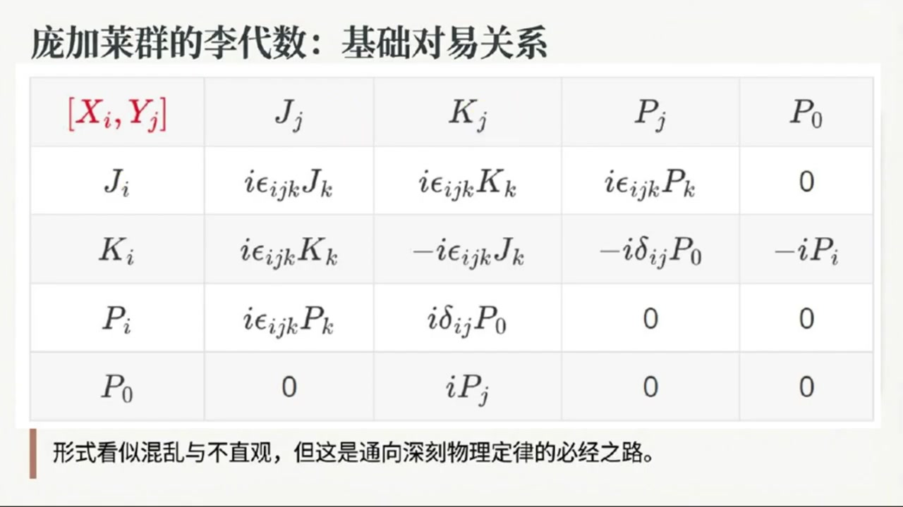
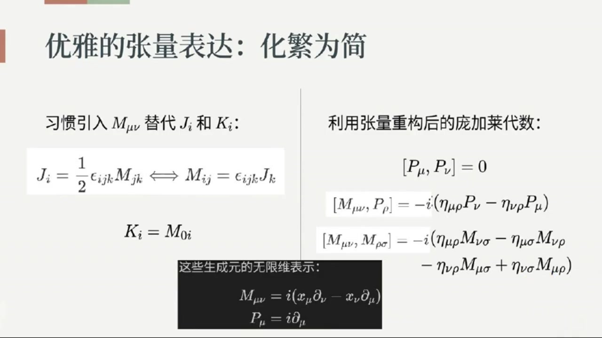
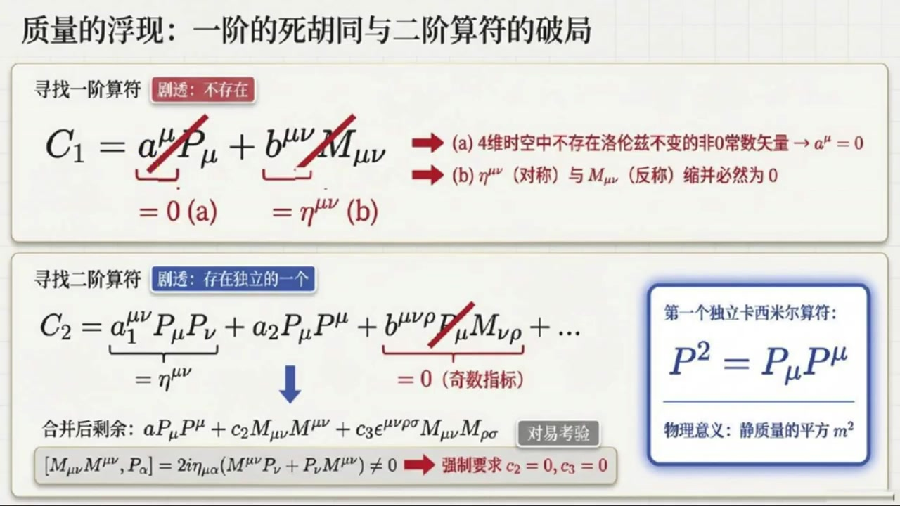
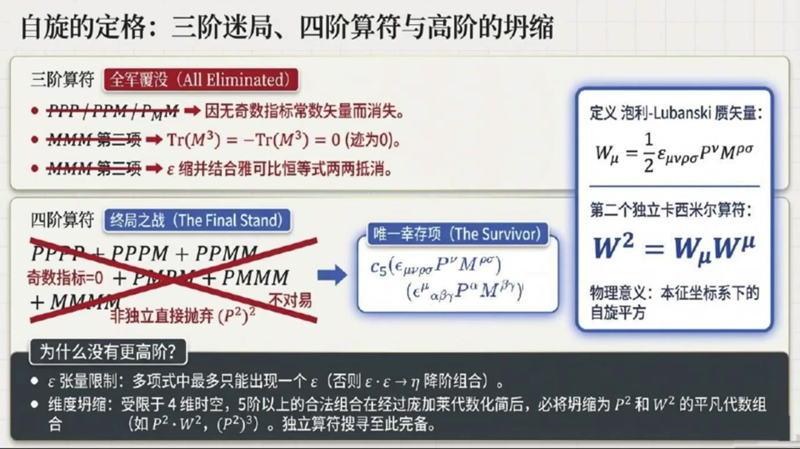
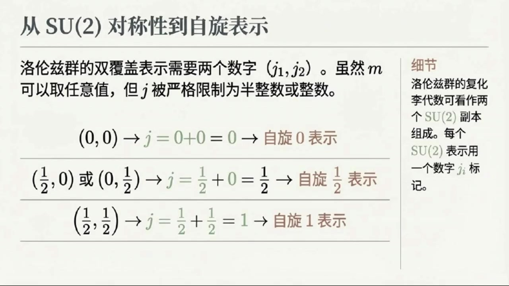
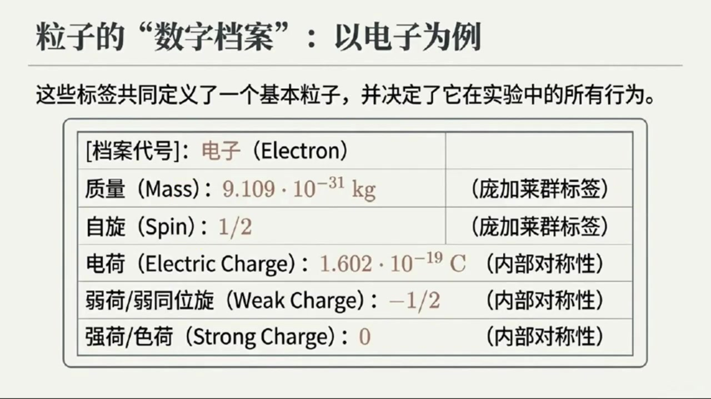

# 《基于对称性的物理学》第14课 庞加莱群：基本粒子的数学指纹

> 自动生成的课程注解文档（共 4 个段落，[原始视频](https://www.youtube.com/watch?v=MCmp3QUStKE)）

## 目录

- [00:00:00 庞加莱群的定义、生成元与代数结构](#段落-1)
- [00:04:47 卡西米尔算符的思路与第一个不变量：质量平方](#段落-2)
- [00:09:56 第二个卡西米尔算符、泡利-卢班斯矢量与自旋](#段落-3)
- [00:18:10 不可约表示与基本粒子：质量、自旋及场的对应](#段落-4)

---

## 段落 1：庞加莱群的定义、生成元与代数结构 { #段落-1 }

**时间：** 00:00:00 ~ 00:04:47

📝 原始字幕

<pre>

大家好欢迎来到基于对称性的物理学第十四课我是周伊今天很高兴和大家一起探索物理世界里那些美妙的对称性
没错,乔伊,我是赛,很高兴在此和大家见面
今天我们要深入探讨的正是如何通过对称性来理解我们宇宙中最基本的一些构成要素基本粒子这真的是一个非常深刻而美丽的洞察
听起来就很激动人心
赛老师,我们之前讲了洛伦兹群,它包含了旋转和BUS的变换
那今天我们要讲的庞加莱群,它又是什么呢?是不是在洛伦兹群的基础上又增加了是什么?
问得好周怡
你可以这么理解
庞加莱群确实是在洛伦兹群的基础上做了一个升级我们知道洛伦兹群只涉及旋转和BOOST
此外我们还期望在时空不同点测量光速也不会改变其数值
嗯对
但是光速不变这个原理
不光是你在一个地方测量时那样你在时空中的任何一个点测量它的值都不会改变这其实就意味着我们的物理定律或者说光速本身对空间和时间的平移也是不变的
哦我明白了
所以庞加莱群就是把这种空间和时间的平移对称性也加进去了完全正确所以我们可以简单的把庞加莱群理解为罗伦兹群加上平移
也就是旋转,boost再加上空间和时间的平移
这样一来它就涵盖了我们四维时空中的所有的基本对称性哇!听起来庞加莱群就跟包罗万象了那它有什么特别处吗?
比如我们之前讲洛伦兹群的时候它有生成源,庞加莱群也有吗?当然有
庞加莱群的生成元除了罗伦兹群原有的那些也就是表示旋转的JI和表示Boost的KI
还新增加了表示平易的生成元P下标Mew
这里的MUE指的是时空的四个维度包括时间平移和空间平移好的那这些生成元之间有什么关系呢是不是也像洛伦兹群那样通过理代数来描述他们之间的对异关系没错就是理代数
这些生成元之间的对异关系也就是它们构成的礼带数确实看起来会比较复杂
书上列出了很多个诗字,比如JI和JJ的李夸浩
JI和KJ的李夸号等等
还有JI和PJ的李夸浩这样的新关系我看到树上这些公式了密密麻麻的确实有点让人眼花了乱是的这些公式初看起来确实不太直观
但核心思想是这些对异关系定义了这个群的结构告诉我们这些对称性操作是如何相互作用的
我特意将这十个生成元之间的离括号列了一个表那还有更简单的形式吗有的
为了让它看起来更简洁一些大家习惯用M下滑线MUENEW这样的反称张量来表示JI和KI
这种表示法其中我们以前也提到过希望再简单介绍一下这个定义帮我回顾一下也就是JI等于二分之一乘EPSLONIJK双重缩并MJK或者MIJ等于EPSLONIJK缩并JK
还有KI等于M零I哦这样就能把旋转和Boost的生成源统一起来了是吗对就是这个意思用M下M新新之后庞加来代数的核心关系就可以简化为三个主要类型平移生成源P下M新之间对应也就是P下M新和P下M新的理括号等于零还有M下M新新和P下R的理括号等于复虚数单位I成括号A大下M新肉成P下M新肉成P下M新括号
还有M下M新新和M下ROSIGMA的理括号等于负虚数单位I成括号A踏下M牛肉成M下New Sigma减A踏下M牛肉成M下New肉减A踏下New肉成M下New Sigma加A踏下New Sigma成M下New肉括号

</pre>

**课程截图：**

### 注解

这段内容标志着课程从**洛伦兹群**向**庞加莱群**（Poincaré Group）的关键跃升，引入了时空平移对称性，这是相对论性量子场论和粒子物理的数学基石。

---

## 一、板书/PPT 截图内容描述

### 第一张截图（概念引入）
- **标题**：《宇宙对称性的扩充：引入时空平移》
- **核心图示**：
  - **左侧**：光锥图（$c=\text{constant}$），表示光速不变原理在时空不同点的普适性。
  - **中下图**：标注“洛伦兹群变换”，展示旋转和Boost（参考系变换）如何改变空间取向和速度。
  - **右下图**：标注“时空平移变换”，展示坐标系在时间和空间方向上的整体平移（网格整体移动）。
- **关键公式框**：
  > 庞加莱群 = 洛伦兹群 + 平移 = 旋转 + Boost + 平移
- **注释框**：强调庞加莱群并非简单的直和（direct sum），而是**半直积**（semi-direct sum），这是维持群结构的关键数学细节。

### 第二、三张截图（李代数对易关系表）
- **标题**：《庞加莱群的李代数：基础对易关系》
- **表格结构**：一个 $5\times 5$ 的对易关系表，行列分别标记为生成元 $J_i$（旋转）、$K_i$（Boost）、$P_i$（空间平移）、$P_0$（时间平移/能量）。
- **表格内容**：展示了10个生成元彼此之间的李括号 $[X, Y]$ 结果，包含克罗内克 delta $\delta_{ij}$ 和列维-奇维塔符号 $\epsilon_{ijk}$。
- **底部注释**：“形式看似混乱与不直观，但这是通向深刻物理定律的必经之路。”

---

## 二、核心概念与公式详解

### 1. 生成元的统一表示：$M_{\mu\nu}$ 的引入

为了将旋转和Boost统一处理，引入**反对称张量**（antisymmetric tensor）$M_{\mu\nu}$（其中 $\mu, \nu = 0,1,2,3$ 为时空指标）。

**关键公式**：
$$
J_i = \frac{1}{2}\epsilon_{ijk}M_{jk}, \quad M_{ij} = \epsilon_{ijk}J_k, \quad K_i = M_{0i}
$$

**符号说明**：
- $M_{\mu\nu}$：**洛伦兹群的生成元**的协变形式，$M_{\mu\nu} = -M_{\nu\mu}$（反对称，共6个独立分量）。
- $J_i$（$i=1,2,3$）：**空间旋转生成元**（角动量算符），对应 $M_{23}, M_{31}, M_{12}$。
- $K_i$（$i=1,2,3$）：**Boost生成元**（推动变换），对应 $M_{01}, M_{02}, M_{03}$（时间-空间分量）。
- $\epsilon_{ijk}$：**列维-奇维塔符号**（Levi-Civita symbol），完全反对称，$\epsilon_{123}=1$，用于三维空间指标间的转换。
- **物理意义**：$M_{\mu\nu}$ 将“转动”和“换参考系”统一为“时空平面内的转动”——$M_{ij}$ 是空间平面 $ij$ 内的转动，$M_{0i}$ 是时间-空间平面 $0i$ 内的“转动”（即Boost）。

### 2. 平移生成元：$P_\mu$ 的引入

庞加莱群在洛伦兹群基础上新增的生成元是**四动量**（four-momentum）算符 $P_\mu$：

**符号说明**：
- $P_\mu = (P_0, P_1, P_2, P_3) = (H/c, \mathbf{P})$：**平移生成元**。
  - $P_0$（或 $H$）：**时间平移生成元**，对应系统的**能量**（哈密顿量）。
  - $P_i$（$i=1,2,3$）：**空间平移生成元**，对应系统的**动量**分量。
- $\mu, \nu$：时空指标，$\mu=0$ 为时间，$\mu=1,2,3$ 为空间。

### 3. 庞加莱代数的三大核心对易关系

庞加莱群的李代数（Lie Algebra）由以下三类对易关系（commutation relations）完全定义，它们决定了对称性操作如何相互作用：

#### 类型 I：平移子群的阿贝尔性
$$
[P_\mu, P_\nu] = 0
$$
- **含义**：任意两个平移操作（无论是时间平移、空间平移还是混合）彼此对易，先后顺序不影响结果。这对应时空的**均匀性**（homogeneity）——物理定律不依赖于你选择在何时何地做实验。

#### 类型 II：洛伦兹变换与平移的耦合（半直积结构）
$$
[M_{\mu\nu}, P_\rho] = i(\eta_{\mu\rho}P_\nu - \eta_{\nu\rho}P_\mu)
$$
- **符号**：$\eta_{\mu\nu} = \text{diag}(+1, -1, -1, -1)$ 为闵可夫斯基度规（Minkowski metric）。
- **含义**：这是庞加莱群最核心的数学特征。它表明**平移生成元 $P_\mu$ 本身构成洛伦兹群的矢量表示**。
  - 当 $\rho=0$（时间分量）：$[M_{i0}, P_0] = -iP_i$，即Boost变换会混合能量和动量。
  - 当 $\rho=i$（空间分量）：$[M_{ij}, P_k] = i(\delta_{ik}P_j - \delta_{jk}P_i)$，即旋转变换会旋转动量矢量。

#### 类型 III：洛伦兹子代数（不变的部分）
$$
[M_{\mu\nu}, M_{\rho\sigma}] = i(\eta_{\mu\rho}M_{\nu\sigma} - \eta_{\nu\rho}M_{\mu\sigma} - \eta_{\mu\sigma}M_{\nu\rho} + \eta_{\nu\sigma}M_{\mu\rho})
$$
- **含义**：这即是洛伦兹群本身的李代数，描述旋转与Boost之间的闭合关系（例如两次Boost的复合等于一次旋转加一次Boost）。

---

## 三、理论背景补充

### 1. 半直积（Semi-direct Product）的数学本质
字幕中提到庞加莱群是“洛伦兹群 + 平移”，但注释强调这不是简单的**直和**（direct sum），而是**半直积** $ISO(3,1) = \mathbb{R}^4 \rtimes SO(3,1)$。
- **原因**：平移群 $\mathbb{R}^4$ 是**正规子群**（normal subgroup），而洛伦兹群 $SO(3,1)$ 通过共轭作用在平移群上（即先做一个洛伦兹变换，再平移，再逆洛伦兹变换，等价于另一个平移）。这种“相互作用”体现在对易关系 $[M, P] \neq 0$ 中。

### 2. 与诺特定理（Noether's Theorem）的联系
- **时空平移对称性 $\leftrightarrow$ 能量-动量守恒**：$P_\mu$ 作为生成元，对应的对称性是时空坐标 $x^\mu \to x^\mu + a^\mu$ 的不变性。根据诺特定理，这直接导致孤立系统的**四动量守恒**。
- **洛伦兹对称性 $\leftrightarrow$ 角动量守恒**：$M_{\mu\nu}$ 生成时空转动，对应**相对论性角动量张量**守恒。

### 3. 粒子物理中的中心地位
在量子场论中，**基本粒子被定义为庞加莱群的不可约表示**（irreducible representations）。一个粒子的质量（$m$）和自旋（$s$）正是标记这些表示的**卡西米尔算符**（Casimir operators）的本征值：
- $P_\mu P^\mu = m^2c^2$（质量壳条件）
- $W_\mu W^\mu = -m^2s(s+1)\hbar^2$（其中 $W_\mu$ 为Pauli-Lubanski赝矢量，与自旋相关）

---

## 四、通俗语言解释

想象你是一位**时空摄影师**：

- **洛伦兹群**（之前的课程）：只允许你**转动相机**（旋转 $J_i$）或**追赶被摄物体**（Boost $K_i$）。无论你如何转动或奔跑，你看到的物理规律（光速）不变，但你始终站在原点拍摄。

- **庞加莱群**（本课新增）：你现在获得了**瞬移能力**（平移 $P_\mu$）。你可以把相机搬到宇宙的任何角落（空间平移 $P_i$），也可以把拍摄时间调到过去或未来（时间平移 $P_0$），然后再进行转动或追赶。

**关键洞察**：**“瞬移”和“转动/追赶”并不独立**。如果你在瞬移后转动相机，这等价于先转动相机，然后朝一个**被旋转过的方向**瞬移。这就是对易关系 $[M, P] \neq 0$ 的直观体现——平移和洛伦兹变换“纠缠”在一起，构成了庞加莱群这个更宏大的对称性结构。

正是这种“包罗万象”的对称性，迫使基本粒子必须携带**确定的质量和自旋**，并遵守相对论性波动方程（如克莱因-戈登方程、狄拉克方程）。

---

## 段落 2：卡西米尔算符的思路与第一个不变量：质量平方 { #段落-2 }

**时间：** 00:04:47 ~ 00:09:55

📝 原始字幕

<pre>

一共三组关系,其中最后一组就是洛伦自带数扁身
这些关系是如何得到的
你可以通过上一课提及的这些生成源的无限维表示来验证其实也可以用有限维表示进行验证只不过针对有限维表示而言只能验证最后一个洛伦兹袋鼠本身
无论是有线维表示还是无线维表示,最后一个洛伦子袋鼠都是成立的
还有其实这些验证你可以手工进行也可以借助数学软件验证好的虽然公式本身很复杂但核心是这些生成源之间的相互作用对吧
那我们研究这些复杂的群和袋鼠最终是为了什么呢?
他能告诉我们关于物理世界什么信息这个问题问到点子啦
我们研究这些群和它们的李袋鼠一个非常重要的目的就是寻找它们的不可约表示
而要标记这些表示卡西米尔算符就显得非常有用卡西米尔算符这个名字听起来有点酷
它具体是做什么的呢卡西米尔算符简单来说就是由群的生成元构造出来的并且与这个群的所有生成元都对应的算符
特点是在群的每一个不可约表示力卡西米尔算符的值都是一个固定的标量
所以这些固定的标量纸就成了标记这些表示的指纹我记得以前我们也提到过卡西米尔算符
烤先是指和所有生成源都对应的蒜腹
这些算符是如何找出来的呢首先根据定义寻找它有三条硬性要求第一卡西米尔算符C必须和所有的平移生成元P以及洛伦兹生成元M对应也就是他们互不干扰李阔浩为零
第二,既然要和洛伦兹生成源对应,那它本身必须一个洛伦兹标量
第三我们在构造塔的时候手头只有生成源P和M以及两个极其特殊的场数不变张量也就是杜归A塔和全反对称的列维奇维塔张量EPSILON可用明白了就是用A塔EPSILONPM缩并成一个洛伦兹不变的标量并且和所有的生成源对应然后我从一接卡西米尔算符找题
仔细列出所有可能项
第一项的常识量无法用A塔或EPSLON构成,所以只能取0
第二项长章量只能取A塔但是一个对称一个反衡索并为零所以我们说不存在一阶卡西米尔算符我明白了那么对二阶卡西米尔算符我们也是先列出所有可能二阶标量项
然后尽可能用A塔,EPSLON或其组合替代长数张量,如果没有合适的组合就取零,如果有合适的组合再看看是否能通过缩并为零或者可吸收到其他项中是的
但是经过你说的这些处理后,最后还能剩下三项
然后我逐项检查是否能和所有生成元对移最后我们发现后两项不满足对移关系于是剩下最后一项P下索并上哇塞我们找到了第一个卡西米尔算符这个是个二节卡西米尔算符P平方等于P下索并上没错
这不仅仅是个数学结果它有着极其直接的物理意义你想想在之前我们提过P下是时空平逸生物源它在物理上直接对应着粒子的四维动量四维动量我记得它包含了能量和三维动量对吧完全正确我们如果直接计算这个四维动量的平方由于明科夫斯基时空度归的存在空间部分会变好
所以P缩并P其实就是能量E的平方减去三维动量P的大小平方
更关键的是作为卡西米尔算符群论中的舒尔盈利保证了他在任何一个不可约表示中必定等于一个固定的长数标量
也就是不同的不可约表示对应着不同的场数值就像是给每个不可约表示一个独一无二的身份证号码对吗非常形象的类比
对于庞加莱群,我们已经以这样的卡西米尔算法P下缩并P上我们把它记作M平方
M平方这个M听起来很像质量啊没错准你直觉很准
我们后面会再次讨论这个问题
那将会发现这个m正是粒子的质量
所以庞加莱群的第一个卡西米尔算符就给出了我们描述粒子的第一个重要标签质量那么既然有二节的卡西米尔算符是不是也会有更高阶的呢没错这正是当时探索的必然路径

</pre>

**课程截图：**

### 注解

这段内容的核心在于**从庞加莱代数出发，系统性地构造卡西米尔算符（Casimir Operators）**，并揭示第一个卡西米尔算符 $P^2$ 与粒子质量之间的深刻联系。这是理解粒子物理中"质量"与"自旋"标签的群论起源的关键步骤。

---

## 一、板书/PPT 截图内容描述

### 第一张截图（张量表达与代数关系）
- **标题**：《优雅的张量表达：化繁为简》
- **左侧（生成元重构）**：
  - 展示角动量 $J_i$ 与洛伦兹生成元 $M_{\mu\nu}$ 的相互转换关系：$J_i = \frac{1}{2}\epsilon_{ijk}M_{jk} \Longleftrightarrow M_{ij} = \epsilon_{ijk}J_k$
  - 标注 Boost 生成元 $K_i = M_{0i}$
- **右侧（庞加莱代数）**：
  - 列出三组对易关系：
    1. $[P_\mu, P_\nu] = 0$（平移生成元彼此对易）
    2. $[M_{\mu\nu}, P_\rho] = -i(\eta_{\mu\rho}P_\nu - \eta_{\nu\rho}P_\mu)$（洛伦兹变换与平移的混合关系）
    3. $[M_{\mu\nu}, M_{\rho\sigma}] = -i(\eta_{\mu\rho}M_{\nu\sigma} - \eta_{\mu\sigma}M_{\nu\rho} - \eta_{\nu\rho}M_{\mu\sigma} + \eta_{\nu\sigma}M_{\mu\rho})$（洛伦兹代数本身）
- **底部黑框（无限维表示）**：
  - 给出微分算符形式的实现：$M_{\mu\nu} = i(x_\mu\partial_\nu - x_\nu\partial_\mu)$，$P_\mu = i\partial_\mu$

### 第二张截图（卡西米尔算符的构造法则）
- **标题**：《寻找不变性：庞加莱群与卡西米尔算符的构造法则》
- **左侧（生成元概览）**：
  - 平移生成元 $P_\mu$（共4个）
  - 洛伦兹生成元 $M_{\mu\nu}$（共6个，反对称张量）
  - 下方列出完整的庞加莱代数对易关系
  - **"粘合剂"（The Glue）**：标注可用的常数张量——闵可夫斯基度规 $\eta_{\mu\nu} = \text{diag}(1,-1,-1,-1)$ 与完全反对称列维-奇维塔张量 $\epsilon_{\mu\nu\rho\sigma}$
- **右侧（核心要求/The Core Rules）**：
  1. **全局对易（Global Commutativity）**：$[C, P_\lambda] = 0$ 且 $[C, M_{\alpha\beta}] = 0$
  2. **洛伦兹标量（Lorentz Scalar）**：$C$ 必须是不带外部自由指标的标量
  3. **封闭构造（Closed Construction）**：只能由 $P_\mu$、$M_{\mu\nu}$、$\eta_{\mu\nu}$、$\epsilon_{\mu\nu\rho\sigma}$ 组合或缩并而成

### 第三张截图（质量的浮现）
- **标题**：《质量的浮现：一阶的死胡同与二阶算符的破局》
- **上半部分（一阶算符）**：
  - 假设形式：$C_1 = a^\mu P_\mu + b^{\mu\nu}M_{\mu\nu}$
  - 红色叉号标记两项均为零：
    - (a) $a^\mu = 0$：4维时空中不存在洛伦兹不变的非零常数矢量
    - (b) $\eta^{\mu\nu}$（对称）与 $M_{\mu\nu}$（反称）缩并必然为零
  - **结论**：一阶卡西米尔算符不存在（$C_1 = 0$）
- **下半部分（二阶算符）**：
  - 假设形式：$C_2 = a_1^{\mu\nu}P_\mu P_\nu + a_2 P_\mu P^\mu + b^{\mu\nu\rho}P_\mu M_{\nu\rho} + \dots$
  - 逐步排除：
    - 含奇数个 $M$ 指标的项因 $\epsilon$ 缩并或对称性为零
    - 含 $M$ 的项（如 $M_{\mu\nu}M^{\mu\nu}$）经对易检验 $[M_{\mu\nu}M^{\mu\nu}, P_\sigma] \neq 0$ 被排除（强制要求 $c_2=0, c_3=0$）
  - **最终结果（蓝框）**：第一个独立卡西米尔算符 $P^2 = P_\mu P^\mu$
  - **物理意义**：静质量的平方 $m^2$

---

## 二、公式详解与符号说明

### 1. 庞加莱代数（Poincaré Algebra）
$$[M_{\mu\nu}, P_\rho] = -i(\eta_{\mu\rho}P_\nu - \eta_{\nu\rho}P_\mu)$$
- **符号含义**：
  - $M_{\mu\nu}$：洛伦兹群的6个生成元（$\mu,\nu = 0,1,2,3$），反对称（$M_{\mu\nu} = -M_{\nu\mu}$）。其中 $M_{0i}$ 对应 Boost（加速），$M_{ij}$ 对应空间转动。
  - $P_\rho$：时空平移的4个生成元，物理上对应四维动量算符。
  - $\eta_{\mu\rho}$：闵可夫斯基度规，符号约定为 $(+,-,-,-)$。
  - 右侧表达式：体现洛伦兹变换如何"转动"动量矢量，是四矢量变换规律的代数体现。

### 2. 卡西米尔算符的构造约束
$$[C, P_\lambda] = 0, \quad [C, M_{\alpha\beta}] = 0$$
- **含义**：卡西米尔算符 $C$ 必须与庞加莱群的**所有**生成元对易（李括号为零）。这使其成为群代数的**中心元素**（Central Element）。

### 3. 一阶卡西米尔算符的消失
$$C_1 = a^\mu P_\mu + b^{\mu\nu}M_{\mu\nu} \equiv 0$$
- **$a^\mu P_\mu$ 项**：在4维闵可夫斯基时空中，不存在能与所有洛伦兹变换对易的非零常数矢量 $a^\mu$（即不存在洛伦兹不变的矢量）。若强行要求 $a^\mu$ 在洛伦兹变换下不变，则必有 $a^\mu = 0$。
- **$b^{\mu\nu}M_{\mu\nu}$ 项**：常数张量 $b^{\mu\nu}$ 必须由 $\eta^{\mu\nu}$ 构成（唯一可用的二阶对称张量），但 $\eta^{\mu\nu}M_{\mu\nu} = 0$ 因为 $\eta$ 对称而 $M$ 反对称（$M_{\mu\nu} = -M_{\nu\mu}$），缩并后正负抵消。

### 4. 第一个卡西米尔算符（质量平方）
$$P^2 \equiv P_\mu P^\mu = \eta^{\mu\nu}P_\mu P_\nu = E^2 - \vec{p}^2$$
- **$P_\mu$**：四维动量算符，$P_0 = E$（能量），$P_i = p_i$（三维动量）。
- **$P^\mu = \eta^{\mu\nu}P_\nu$**：利用度规升降指标。
- **物理诠释**：该算符的本征值即为粒子静质量平方 $m^2$（在 $c=1$ 单位制下）。这是相对论中 $E^2 = p^2c^2 + m^2c^4$ 的群论根源。

---

## 三、关键理论背景补充

### 1. 舒尔引理（Schur's Lemma）与"指纹"
舒尔引理指出：在群的**不可约表示**（Irreducible Representation）中，任何与所有群元对易的算符（即卡西米尔算符）必定是单位矩阵的常数倍（标量）。
- **后果**：卡西米尔算符的本征值成为标记不可约表示的**量子数**。对于庞加莱群，$P^2$ 的本征值 $m^2$ 就是粒子的质量，这解释了为什么同一类粒子（如所有电子）具有相同的质量——它们属于同一个不可约表示。

### 2. 构造卡西米尔算符的"材料学"
构造卡西米尔算符如同用乐高积木搭建模型，可用的基本块（积木）受到严格限制：
- **生成元**：$P_\mu$（平移）、$M_{\mu\nu}$（洛伦兹）
- **不变张量**（"粘合剂"）：
  - $\eta_{\mu\nu}$：度规张量，用于缩并指标构造标量
  - $\epsilon_{\mu\nu\rho\sigma}$：四阶完全反对称张量（Levi-Civita符号），仅在4维时空中可用，用于构造赝标量（Pseudoscalar）

**为什么一阶不存在？** 这本质上是时空对称性的结果：4维闵可夫斯基空间不存在洛伦兹不变的矢量方向（没有"绝对静止"或"绝对方向"），因此无法构造线性标量。

### 3. 庞加莱群的第二个卡西米尔算符（预告）
虽然本段只讨论了 $P^2$，但完整的庞加莱群实际上有**两个**独立的卡西米尔算符。第二个是**泡利-卢班斯基矢量（Pauli-Lubanski Vector）**的平方：
$$W_\mu = \frac{1}{2}\epsilon_{\mu\nu\rho\sigma}M^{\nu\rho}P^\sigma, \quad C_2 = W_\mu W^\mu$$
- $W_\mu$ 与 $P_\mu$ 正交（$W_\mu P^\mu = 0$），其平方的本征值与粒子的**自旋**（Spin）或**螺旋度**（Helicity）相关。这解释了为什么基本粒子除了质量外，还需要用自旋来分类。

---

## 四、通俗概念解释

### 卡西米尔算符：群的"身份证号码"
想象庞加莱群的所有不可约表示是一个巨大的图书馆，每本书代表一种粒子（或场）。如何快速找到某类粒子（比如"所有质量为 $m$、自旋为 $s$ 的粒子"）？

- **卡西米尔算符**就像是图书的**ISBN编号系统**。它由书的内容（生成元）构成，但无论你从哪个角度读这本书（进行洛伦兹变换或平移），这个编号都不会变（与所有生成元对易）。
- **$P^2 = m^2$** 就是"质量"这个标签的群论定义。它告诉我们：质量不是随意填写的参数，而是庞加莱对称性在粒子身上留下的"烙印"——任何具有该对称性的物理系统，其粒子必然携带这个不变的标量特征。

### "一阶死胡同"的直观理解
试图构造一阶卡西米尔算符（线性组合）就像试图找到一个**在所有参考系中都指向同一方向的箭头**。但根据相对论，

---

## 段落 3：第二个卡西米尔算符、泡利-卢班斯矢量与自旋 { #段落-3 }

**时间：** 00:09:56 ~ 00:18:09

📝 原始字幕

<pre>

我们故意从师继续往上找
先看三阶的组合,比如三个p,三个m,或者p和m混打
但结果比较平淡
经过构成罗论子标量和与所有生成元对异这两个严苛求一卡所有的三界组合要么因为无法凑出非零的长数张量直接为零要么因为矩阵剂的反对称性互相抵消化为乌有了也就是说根本不存在三界的卡西米尔算法了完完全全存在
于是我们只能迎难而上杀入四节的袋树丛林
四阶意味着四个生成源的排列组合有PPPP像PPPM像PPMM像还有MMMM像等等
写出来真的是密密麻麻的一大片感觉光是列出这些多项事就要耗费大量脑细胞了要在这样的丛林里找岂不是大海捞针确实是个苦力活但幸好我们有冷酷的排雷机制
首先带有七数个外部自由指标的项会被立刻判定为零清空出局
其次单纯四个批相成的项其实只是之前找到的那个二界算符质量平方的自己成自己并不是新的独立算符最绝的是最后一步要求他必须和时空平移生成元对一就这一条把一大批由常规度规矩量A塔拼凑出的组合通通淘汰了简直是极其残酷的淘汰赛啊
那大浪淘沙过后最后留下了什么真金白银经过这层层的严密筛选结果非常震撼
依靠常规方法构造的像全军覆没却奇迹般地留下了唯一的一根毒苗
它是依赖时空中仅存的另一个不变张量也就是全反对称的列为奇维塔符号EPSLEN通过将动量P和洛伦兹生成源M交错缩并而硬生生存下来的这就宣告了我们锁定了第二个也是唯一的一个独立的高阶算符我们先看看这个大浪淘沙最后得到这个卡西米尔算符吧为了更美观不妨引入一个波利鲁班斯验史量W下mU等于二分之一乘以EPSLEN下mUROSIGMA缩并P上mROSIGMA
一是整个新的四阶卡西米尔算符可表示成W平方等于W下MU缩并W上MU
哇虽然听起来全都是复杂的数学符号,那它在物理上到底刻画了什么含义呢?这里藏着一个非常精巧的数学效应
你还记得我们在前面讲长表示的时候提到过吗
总的洛伦兹生成员艾玛其实包含了两种贡献
这种是由微商算子构建的无穷为的轨道搅动量
另一种是单纯混合产量有纤维的内饼自选部分嗯我记得就有点类似地球绕着太阳一个弓转同时它自身还在原地自转对吧极其完美的比喻
这就涉及到列为奇维塔符号EPSILON最奇妙的地方了
它是一个绝对不讲情面的全犯堆成长料
因为动量P本质上是对时空坐标球偏到数的微分算子
再叠加上宫传像里包含的坐标和偏导数
当全反对称的 Epsilon 遇上同位偏道数所带的对称性
这两股特性一碰
轨道角动量那一部分在求和后完全变成了零这简直像是个天生的滤波器把由于空间运动导致的弓转部分给彻底屏蔽掉了完全正确这意味着庞家来群通过这个复杂的算符硬生生的将因为粒子跑来跑去产生的轨道角动量影响全剔除了最后算符里面干干净净的仅仅存活了属于有限维的纯粹的内柄自旋的那一部分太奇妙了那既然它过滤掉了弓转只剩下自转如果计算它的平方也就是W索柄W得出的物理量是什么呢为了看得更直白咱们可以切换到一个很淘巧的视角选定一个具有质量的粒子的净直坐标系
这个参考系下粒子老老实实带着不动它的四维动量P就只剩下时间分量了且数值上正好就是它自己的静止质量M三个空间动量全等于零把这个处于静止只有标量M的状态带入进算符里去会发生什么变化负大的方程
三个空间动量全等于零把这个处于静止只有标量M的状态带进进算符里去会发生什么变化负大的方程可以说是瞬间探索了W的时间分量直接变成了零空间分量则变成了静止质量M加上自旋矩阵的组合这时我们再去算这个第二个卡西米尔算符W平方的话结果可以说是清爽到了极点它直接等于负的M的平方去乘以一个J的平方这里头又出现了M的平方这不是我们找出的第一个卡西米尔算符吗
对所以好戏上演了这个J实际上就是核心它是三维空间的旋转生成元
这个平方刚好也是我们非常熟悉的SU2制好代数的卡西米尔算符
这意味着倘若我们在四节卡西米尔算符W平方中利用我们找到的前一个卡西米尔算符也就是质量的平方去除了M的影像剩余的本征值状态就必然是一个属于不可约本征态的常数我懂了等于说是庞加莱群通过极其严格的数学给不可约表示定下了第二个死死的规矩一点都没错
可以说,这是时空对称性赋予我们的第二道身份鉴定
除了静止质量M之外物理学家们往往用一个非常经典的核心标签来称呼并标记这个被提成出来的属性那就是常数JJ这个J是什么呢这个J就是我们物理学里常说的自旋Spin
所以你看庞加莱群的两个卡西米尔算符自然而然的就给出了描述粒子的两个最核心的属性质量M和字旋J这简直是太棒了对称性竟然能直接告诉我们粒子的质量和字旋
那这个自选J有什么特点吗?有的
和质量M可以取任意值不同,自选J只能取半整数或整数
书上还提到洛伦兹群的孵化李袋鼠看作两个SU2的复本
所以长的表示可以用J1J2表记
这里面蕴含的物理自选J其实是一个范围也就是从他们的差值一直到他俩相加之合即从J一J二的绝对值到J一J二明白了所以零零对应的J就是零管它叫自选零
那二分之一零对应的J就是二分之一
而二分之一二分之一的相加最大就是一,所以它就是自选一的主场,是这样理解吗?对了一大半
对于二分之一二分之一,它其实混入了j=0和j=1.
但在真实的物理操作中我们往往会用洛伦兹规范条件像拔掉杂草一样把J等于零这个非物理的荣誉部分淘汰掉
剩下的实质主角就变成了纯正的自选一的例子所以记住庞家莱群的每一个不可越表示都由这两个标量值质量M和自选J来为一标记这真的是一个非常重要的结论

</pre>

**课程截图：**

### 注解

这段内容聚焦于**庞加莱群（Poincaré Group）的第二个卡西米尔算符（Casimir Operator）**的构造与物理诠释，揭示了粒子"自旋"（Spin）这一内禀属性的群论起源。这是连接时空对称性与粒子内禀量子数的关键环节。

---

## 一、板书/PPT 截图内容描述

### 第一张截图（三阶迷局与四阶筛选）
- **标题**：《自旋的定格：三阶迷局、四阶算符与高阶的坍缩》
- **左侧（三阶算符的覆灭）**：
  - 红色标签"全军覆没 (All Eliminated)"，列举三阶组合：$PPP$、$PPM$、$PMM$、$MMM$。
  - 标注消失原因：奇数指标无法构成非零张量；$\text{Tr}(M^3)=0$（迹为零）；$\epsilon$ 缩并与雅可比恒等式导致两两抵消。
- **中间（四阶算符的终局之战）**：
  - 列出所有四阶排列：$PPPP$、$PPPM$、$PPMM$、$PMMM$、$MMMM$。
  - 红色删除线划去：奇数指标项、非独立项（如 $(P^2)^2$）、不与平移生成元对易的项。
  - 蓝色箭头指向"唯一幸存项 (The Survivor)"：$c_5(\epsilon_{\mu\nu\rho\sigma}P^\nu M^{\rho\sigma})$。
- **右侧（核心定义）**：
  - **Pauli-Lubański 赝矢量**：$W_\mu = \frac{1}{2}\epsilon_{\mu\nu\rho\sigma}P^\nu M^{\rho\sigma}$
  - **第二个独立卡西米尔算符**：$W^2 = W_\mu W^\mu$
  - 物理意义标注："本征坐标系下的自旋平方"。

### 第二张截图（静止质量与内禀自旋）
- **标题**：《有质量粒子的本征：质量与自旋》
- **左侧（质量卡西米尔）**：
  - $P^2 = (-i\partial_\mu)(-i\partial^\mu) = -\Box$
  - 在动量空间中：$P^2 = E^2 - \mathbf{p}^2 = m^2$
  - 结论：算符本征值 = 粒子的静止质量平方 ($m^2$)。
- **右侧（自旋卡西米尔）**：
  - 静止参考系设定：$P^\mu = (m, 0, 0, 0)$。
  - 完整生成元分解：$M^{\text{fin}\rho\sigma} = x^\rho P^\sigma - x^\sigma P^\rho + S^{\rho\sigma}$（轨道部分 + 自旋部分）。
  - 关键推导：由于 $\epsilon_{\mu\nu\rho\sigma}\partial^\nu\partial^\rho = 0$（偏导数对称性与 $\epsilon$ 全反对称性正交），轨道角动量被完全屏蔽。
  - 静止系计算结果：$W^2 = -m^2 \mathbf{J}^2 = -m^2 j(j+1)$。
  - 结论：剔除质量后，$W^2$ 完全由粒子的内禀量子数 $j$ 决定。
- **底部（物理自旋取值）**：
  - $j=0$：标量场（如希格斯玻色子）
  - $j=1/2$：外尔旋量场（如电子）
  - $j=1$：矢量场（通过规范消除非物理自由度）

### 第三张截图（洛伦兹群表示与自旋）
- **标题**：《从 SU(2) 对称性到自旋表示》
- **核心内容**：
  - 洛伦兹群的复化李代数可看作两个 $\mathfrak{su}(2)$ 副本的直和。
  - 表示用两个数字 $(j_1, j_2)$ 标记，物理自旋 $j$ 取值范围为 $|j_1-j_2| \leq j \leq j_1+j_2$。
  - 对应关系：
    - $(0,0) \to j=0$（自旋0表示）
    - $(\frac{1}{2},0)$ 或 $(0,\frac{1}{2}) \to j=\frac{1}{2}$（自旋1/2表示）
    - $(\frac{1}{2},\frac{1}{2}) \to j=0 \text{ 和 } j=1$，经洛伦兹规范条件剔除 $j=0$ 后，剩下自旋1表示。

---

## 二、核心公式详解

### 1. Pauli-Lubański 赝矢量（Pauli-Lubański Pseudovector）
$$W_\mu = \frac{1}{2}\epsilon_{\mu\nu\rho\sigma}P^\nu M^{\rho\sigma}$$

**符号含义**：
- $W_\mu$：Pauli-Lubański 四矢量，是一个**赝矢量**（在空间反演下符号改变）。
- $\epsilon_{\mu\nu\rho\sigma}$：四阶全反对称 Levi-Civita 符号（在字幕中称为"列为奇维塔符号"），$\epsilon_{0123}=+1$，任意两个指标交换改变符号。
- $P^\nu$：四动量算符（平移生成元），$P^\nu = i\partial^\nu$。
- $M^{\rho\sigma}$：洛伦兹群的生成元（转动和 boost 的生成元），满足特定的对易关系。
- 因子 $\frac{1}{2}$：来自对反对称张量 $M^{\rho\sigma}$ 的双重计数归一化。

**物理角色**：这是构造第二个卡西米尔算符的"原材料"，它巧妙地混合了平移生成元 $P$ 和洛伦兹生成元 $M$。

### 2. 第二个卡西米尔算符
$$W^2 = W_\mu W^\mu = \eta^{\mu\nu}W_\mu W_\nu$$

**符号含义**：
- $W^2$：第二个卡西米尔算符（第一个是 $P^2 = P_\mu P^\mu$）。
- $\eta^{\mu\nu}$：闵可夫斯基度规（ mostly minus 约定或 mostly plus，取决于上下文，通常粒子物理用 $\eta = \text{diag}(1,-1,-1,-1)$）。
- 这个算符与庞加莱群的所有生成元对易，因此其本征值是标记不可约表示的好量子数。

### 3. 静止参考系下的显式表达式
在粒子静止系中，$P^\mu = (m, \mathbf{0})$，此时：
$$W^2 = -m^2 \mathbf{J}^2 = -m^2 j(j+1)$$

**符号含义**：
- $m$：粒子静止质量（来自第一个卡西米尔算符的本征值）。
- $\mathbf{J}^2$：三维空间转动生成元的平方（即 $\mathfrak{su}(2)$ 卡西米尔算符）。
- $j$：自旋量子数，取值为 $0, \frac{1}{2}, 1, \frac{3}{2}, \dots$。

---

## 三、理论背景与构造逻辑

### 1. 为什么三阶卡西米尔算符不存在？
庞加莱群的生成元包括平移 $P_\mu$（4个）和洛伦兹转动 $M_{\mu\nu}$（6个）。构造高阶不变量（多项式组合）时：
- **奇数指标困境**：任何带有奇数个外部自由指标的项，在洛伦兹变换下无法构成标量（张量缩并后指标必须成对出现）。
- **矩阵迹的反对称性**：如 $\text{Tr}(M^3)=0$，因为 $M$ 在矢量表示下是反对称的，奇数次幂的迹为零。
- **雅可比恒等式**：生成元满足的李代数关系导致某些组合相互抵消。

因此，**三阶组合全军覆没**，这是由时空的洛伦兹结构决定的。

### 2. 四阶组合的"残酷淘汰赛"
四阶意味着四个生成元的排列组合（$PPPP, PPPM, PPMM, \dots$）。筛选机制包括：
- **奇数指标排除**：任何带有奇数个 $P$ 或 $M$ 外部指标的项立即为零。
- **非独立性排除**：如 $PPPP = (P^2)^2$，这只是第一个卡西米尔算符的平方，不是新的独立算符。
- **对易性考验**：必须与时空平移生成元 $P_\mu$ 对易。这一条件极其严苛，淘汰了所有仅由度规 $\eta_{\mu\nu}$ 拼凑的组合。

**唯一幸存者**：只有通过全反对称的 Levi-Civita 符号 $\epsilon_{\mu\nu\rho\sigma}$ 构造的组合，即 Pauli-Lubański 矢量，才能满足所有条件。

### 3. 轨道角动量的"滤波器"效应
总角动量 $M^{\rho\sigma}$ 可分解为：
$$M^{\rho\sigma} = L^{\rho\sigma} + S^{\rho\sigma} = (x^\rho P^\sigma - x^\sigma P^\rho) + S^{\rho\sigma}$$

当 $\epsilon_{\mu\nu\rho\sigma}$ 与 $P^\nu$ 缩并后，再与 $L^{\rho\sigma}$ 部分作用时：
- 由于 $L^{\rho\sigma}$ 包含坐标 $x$ 和动量 $P$ 的乘积，而 $\epsilon$ 与两个 $P$ 缩并（通过 $W_\mu$ 的定义）时，对称的偏导数（或动量）与全反对称的 $\epsilon$ 相遇，结果为零。
- **数学本质**：$\epsilon_{\mu\nu\rho\sigma}P^\nu P^\rho = 0$（因为 $P^\nu P^\rho$ 对称而 $\epsilon$ 反对称）。

这就像一个**完美的滤波器**，彻底屏蔽了与空间运动相关的"公转"（轨道角动量），只保留与内部自由度相关的"自转"（内禀自旋）。

---

## 四、通俗概念解释

### "自旋"作为时空对称性的烙印
这段内容揭示了一个深刻的物理事实：**粒子的自旋不是人为强加的属性，而是时空对称性（庞加莱群）的必然结果**。

- **第一道身份标签**：质量 $m$（来自 $P^2$），告诉我们在静止系中粒子有多少能量。
- **第二道身份标签**：自旋 $j$（来自 $W^2$），告诉我们粒子在静止时仍然拥有的"内部转动"自由度。

### 为什么自旋是离散的？
在静止系中，$W^2$ 正比于 $\mathbf{J}^2$，而 $\mathbf{J}$ 是三维转动群 $SU(2)$ 的生成元。量子力学告诉我们，$SU(2)$ 的不可约表示由 $j$ 标记，且 $j$ 只能取半整数或整数。因此，**自旋的量子化不是假设，而是三维空间旋转对称性的数学必然**。

### $(j_1, j_2)$ 与物理自旋 $j$
洛伦兹群 locally 等价于 $SU(2) \times SU(2)$，因此其表示用两个 $SU(2)$ 的量子数 $(j_1, j_2)$ 标记。但物理粒子是庞加莱群的表示，其自旋 $j$ 是总角动量，取值范围为 $|j_1-j_2|$ 到 $j_1+j_2$ 的整数步长。

- **标量场** $(0,0)$：$j=0$，如希格斯玻色子。
- **旋量场** $(\frac{1}{2},0)$ 或 $(0,\frac{1}{2})$：$j=\frac{1}{2}$，如电子、中微子。
- **矢量场** $(\frac{1}{2},\frac{1}{2})$：包含 $j=0$ 和 $j=1$，但 $j=0$ 的部分是非物理的纵向模式，通过规范条件（如洛伦兹规范 $\partial_\mu A^\mu = 0$）剔除后，剩下 $j=1$ 的物理光子/有质量矢量玻色子。

**结论**：庞加莱群的两个卡西米尔算符 $P^2$ 和 $W^2$，分别对应粒子的**质量**和**自旋**，这是时空对称性赋予基本粒子的最本质的"身份证"。

---

## 段落 4：不可约表示与基本粒子：质量、自旋及场的对应 { #段落-4 }

**时间：** 00:18:10 ~ 00:24:29

📝 原始字幕

<pre>

那接下来我们是不是就要把这个结论应用到基本粒子上了没错这正是我们下面要讲的这真的是物理学中最深刻最美丽的洞察之一
庞加莱群双覆盖的不可越表示的标签
也就是质量M和自选J
正是物理学中用来标记基本粒子的方式所以基本粒子本身其实就是这些庞加莱群的不可约表示吗某种程度上是的
有些物理学家甚至认为基本粒子就是庞加莱群的不可约表示
一个具有特定质量和自选的基本粒子比如一个自选二分之一的粒子就对应着庞家莱群的某个具有相应M和自选二分之一的表示除了质量和自选基本粒子还有其他的属性吗比如电鹤什么的当然有
除了质量和自选基本粒子还有一些被称为赫 Charges 的标签比如电鹤弱鹤强鹤等等这些鹤通常是从其他内部对称性中产生的我们会在后面的章节中详细讨论但最基本的由时空对称性决定的就是质量和自选
能举个例子吗?比如我们熟悉的电子
好的,就拿垫子来说吧
它的定义标签包括质量大约是9.109×10的负三席一次房KG
自旋是二分之一,电荷是1.602乘10的负19次方C,还有弱和强和等等
你看质量和自选就是它最核心的两个属性
所以说这些标签决定了基本粒子在实验中的行为而我们今天推导出的庞加莱群的表示则定义了我们如何在数学上描述它们真是太漂亮了
是的
而且不同自选的例子我们用不同的数学对象来描述它们哦具体是怎么对应的呢
比如次悬为零的例子它有一个叫做标量的数学对象范秒数
这个标量场其实就是根据洛伦兹群注意不是庞加莱群的零零表示来变换的
最著名的例子就是自旋为零的希格斯粒子明白了希格斯粒子就是自旋零的那自旋二分之一的例子呢比如电子自旋二分之一的例子比如电子夸克是由一种叫做悬量斯宾纳的数学对象描述的
它会根据洛伦字群的二分之一零和零二分之一的直合来变换选量这个词听起来就很有趣那字选一的例子呢由史量Vector描述
根据洛伦兹群的二分之一二分之一表示变换
最典型的例子就是传递弱相互作用的有质量的W和Z波色子
当然,我们熟悉的光子同样是由石量场描述的
虽然光子因为没有质量,没法像我们前面那样,借助静止坐标席来推倒
需要引入螺旋度这个概念
但它们都统一在这套洛伦兹和庞加莱群的美妙框架之下这么说来我们通过庞加莱群的不可约表示就得到了描述所有基本粒子所需的数学工具了这真的是一个极其重要深刻且美丽的洞察没错转你总结得非常好
这正是我们这节课最核心的观点
通过研究时空对称性我们不仅能推导出质量和自选这两个基本属性
还能知道用什么样的数学预言去描述这些例子听起来字旋这个名字非常形象感觉它们真的在转动一样
是的
但目前阶段,自选仅仅是一个标签
至于为什么它叫自选,以及我们在实验中如何测量它,这些我们会在后面的章节中详细解释
现在我们只需要知道它是一个由庞家来群给出的用来标记粒子的基本属性那有没有自选更高的例子呢比如自选二分之三或者自选二的
这是一个很好的问题
目前我们还没有发现自选二分之三的基本粒子
但这个理论框架是允许更高自选表示存在的
这些更高纬的表示可以用来描述复合对象或者像引粒子这样理论上存在的传递引力的基本粒子
他就被认为是具有自选二真是太精彩了通过对称性来理解基本例子
这让我对物理世界有了全新的认识,是的
对称性是物理学中一个非常强大的工具
它不仅仅是一种数学上的美更是我们理解自然规律的钥匙好的三一老师今天的内容真的是干货满满也让我对基本粒子和对称性之间的联系有了更深的理解很高兴你能有所收获J
总结一下,我们今天最重要的收获就是
通过将洛伦子群与时空平移结合,我们得到了庞加莱群
这个群的不可约表示有两个卡西米尔算符所标记
它们恰好对应了基本粒子的两个最核心属性
质量M和自选J而且不同自选的粒子我们用不同的数学对象来描述比如标量描述自选二的粒子悬量描述自选二分之一的粒子而实量则描述自选一的粒子这真的是太精妙了没错这种从对称性出发推导出粒子属性和描述方式是现代物理学特别是粒子物理学的基石感谢赛老师今天精彩的讲解也感谢各位同学的收听希望大家今天都能有所收获感谢周阿也感谢大家请大家课后可以回顾一下这些概念特别是庞家来群与基本粒子之间的深刻联系下次课我们再见好的

</pre>

**课程截图：**

### 注解

这段内容标志着课程从**庞加莱群的抽象代数结构**迈向**粒子物理学的物理诠释**，完成了从"数学标签"（质量 $M$ 与自旋 $J$）到"物理实体"（基本粒子）的对应，并系统建立了**自旋-统计-数学对象**的三重对应关系。

---

## 一、板书/PPT 截图内容描述

### 第一张截图（自旋的群论起源）
- **标题**：《从 SU(2) 对称性到自旋表示》
- **核心内容**：
  - 说明洛伦兹群的双覆盖表示需要两个数字 $(j_1, j_2)$ 标记。
  - 右侧"细节"栏解释：洛伦兹群的复化李代数可看作两个 $SU(2)$ 副本的直和，每个 $SU(2)$ 表示用一个数字 $j_i$ 标记。
  - **对应关系表**（三行）：
    1. $(0,0) \rightarrow j=0+0=0 \rightarrow$ 自旋 0 表示
    2. $(\frac{1}{2},0)$ 或 $(0,\frac{1}{2}) \rightarrow j=\frac{1}{2}+0=\frac{1}{2} \rightarrow$ 自旋 $\frac{1}{2}$ 表示
    3. $(\frac{1}{2},\frac{1}{2}) \rightarrow j=\frac{1}{2}+\frac{1}{2}=1 \rightarrow$ 自旋 1 表示

### 第二张截图（粒子的完整标签）
- **标题**：《粒子的"数字档案"：以电子为例》
- **核心内容**：
  - 展示一个表格，说明这些标签共同定义基本粒子并决定其物理行为。
  - **表格内容**：
    - 档案代号：电子 (Electron)
    - 质量 (Mass)：$9.109 \cdot 10^{-31}$ kg —— 标注"(庞加莱群标签)"
    - 自旋 (Spin)：$1/2$ —— 标注"(庞加莱群标签)"
    - 电荷 (Electric Charge)：$1.602 \cdot 10^{-19}$ C —— 标注"(内部对称性)"
    - 弱荷/弱同位旋 (Weak Charge)：$-1/2$ —— 标注"(内部对称性)"
    - 强荷/色荷 (Strong Charge)：$0$ —— 标注"(内部对称性)"

### 第三张截图（理论框架的总结）
- **标题**：《推导的终极意义》
- **核心内容**：
  - 中央绿色框："通过推导庞加莱群的不可约表示，我们获得了描述所有基本粒子所需的数学工具。"
  - 左侧红色框（关于"自旋"）："目前它仅仅是一个数学标签。在证明这个名称的合理性之前，我们必须先知道如何在实验中测量旋转。"
  - 右侧红色框（更高的维度）："数学上不必在自旋 1 停止。目前尚未发现自旋 $3/2$ 的基本粒子。但许多物理学家相信传递重力的引力子具有自旋 2，将需要更高维的表示。"

---

## 二、公式识别与符号解释

当前段落涉及的**核心公式**主要围绕**洛伦兹群双覆盖的表示标记** $(j_1, j_2)$ 与**物理自旋** $j$ 的对应关系：

### 1. 表示标记与自旋求和公式
$$(j_1, j_2) \quad \rightarrow \quad j = j_1 + j_2$$

| 符号 | 含义 |
|------|------|
| $j_1$ | 第一个 $SU(2)$ 副本的角动量量子数（可取 $0, \frac{1}{2}, 1, \frac{3}{2}, \dots$） |
| $j_2$ | 第二个 $SU(2)$ 副本的角动量量子数（同上） |
| $j$ | 物理上的**总自旋量子数**（Spin），决定粒子在三维空间旋转下的变换性质 |
| $(j_1, j_2)$ | 洛伦兹群双覆盖 $SL(2,\mathbb{C})$ 的有限维不可约表示的标准标记 |

### 2. 具体表示的物理对应

**（1）标量表示（自旋 0）**
$$(0,0) \rightarrow j=0+0=0$$
- **数学对象**：标量场（Scalar Field）$\phi(x)$
- **物理实例**：希格斯玻色子（Higgs Boson）
- **变换性质**：在洛伦兹变换下保持不变，如同一个普通的数字

**（2）旋量表示（自旋 1/2）**
$$\left(\frac{1}{2},0\right) \oplus \left(0,\frac{1}{2}\right) \rightarrow j=\frac{1}{2}$$
- **符号说明**：$\oplus$ 表示直和（Direct Sum），构成**狄拉克旋量**（Dirac Spinor）
- **数学对象**：旋量场（Spinor Field）$\psi(x)$（四分量狄拉克旋量，或二分量外尔旋量）
- **物理实例**：电子、夸克、中微子等所有费米子
- **变换性质**：旋转 $360^\circ$ 会引入负号，需旋转 $720^\circ$ 才回到原状

**（3）矢量表示（自旋 1）**
$$\left(\frac{1}{2},\frac{1}{2}\right) \rightarrow j=\frac{1}{2}+\frac{1}{2}=1$$
- **数学对象**：矢量场（Vector Field）$A_\mu(x)$（四矢量）
- **物理实例**：光子（Photon，无质量）、$W/Z$ 玻色子（有质量）
- **变换性质**：如同时空坐标 $x^\mu$ 一样变换，具有方向性

---

## 三、理论背景补充

### 1. 洛伦兹群的双覆盖 $SL(2,\mathbb{C})$
洛伦兹群 $SO(3,1)$ 本身不是单连通的，其**双覆盖群**（Double Cover）是 $SL(2,\mathbb{C})$（二维复特殊线性群）。这类似于 $SU(2)$ 是 $SO(3)$ 的双覆盖。在量子力学中，由于投影表示的相位自由度，物理上真正相关的实际上是这个双覆盖群，而非洛伦兹群本身。

其李代数关系为：
$$\mathfrak{so}(3,1) \cong \mathfrak{su}(2) \oplus \mathfrak{su}(2)$$
这正是为什么表示可以用两个独立的 $SU(2)$ 量子数 $(j_1, j_2)$ 来标记。

### 2. 时空对称性 vs 内部对称性（关键区分）
课程字幕中反复提及的"电荷"（Electric Charge）、"弱荷"（Weak Charge）、"强荷/色荷"（Strong Charge/Color Charge）与质量、自旋有本质区别：

- **时空对称性**（庞加莱群）：决定粒子在**时空中的运动与几何属性**
  - 质量 $M$：决定能量-动量关系 $E^2 = p^2c^2 + M^2c^4$
  - 自旋 $J$：决定粒子在旋转下的变换方式
  
- **内部对称性**（规范群 $U(1) \times SU(2) \times SU(3)$）：决定粒子参与**基本相互作用的类型**
  - 电荷 $Q$：参与电磁相互作用（$U(1)$ 规范对称性）
  - 弱同位旋 $T_3$：参与弱相互作用（$SU(2)_L$ 规范对称性）
  - 色荷：参与强相互作用（$SU(3)_C$ 规范对称性）

**深刻洞察**：基本粒子是**庞加莱群不可约表示**（时空部分）与**内部对称群表示**（荷部分）的**直积**（Tensor Product）。

### 3. 无质量粒子的特殊性（光子与引力子）
字幕提到光子"因为没有质量，没法像前面那样借助静止坐标系来推导，需要引入螺旋度（Helicity）概念"。

- **有质量粒子**：在静止参考系中，自旋投影 $J_z$ 可以取 $-j, -j+1, \dots, j$ 共 $2j+1$ 个态。
- **无质量粒子**：不存在静止参考系，其内禀角动量只能沿着运动方向投影，称为**螺旋度** $\lambda = \vec{J} \cdot \hat{p}$，且只能取 $\pm j$ 两个值（手性）。
  - 光子（自旋 1）：螺旋度 $\pm 1$（对应左旋和右旋圆偏振），不存在纵向分量（$\lambda=0$）。
  - 引力子（自旋 2，理论预言）：螺旋度 $\pm 2$。

### 4. 更高自旋的理论允许性
虽然标准模型中未发现自旋 $3/2$ 或更高的基本粒子，但理论框架允许：
- **自旋 $3/2$**：对应 $(1, \frac{1}{2}) \oplus (\frac{1}{2}, 1)$ 表示，数学上由**拉瑞塔-施温格场**（Rarita-Schwinger Field）描述，是超对称理论中超引力子的候选者。
- **自旋 $2$**：对应 $(1,1)$ 表示，数学上由**对称无迹二阶张量场** $h_{\mu\nu}$（度规扰动）描述，是广义相对论中**引力子**（Graviton）的量子场论描述。

---

## 四、核心概念通俗解释

### "基本粒子就是群的不可约表示"是什么意思？
这是一种**数学本体论**的观点。可以这样理解：

想象你有一盒乐高积木（数学对象），要拼出不同的动物（基本粒子）。你会发现：
- 有些积木块是球形的（标量场），拼出来的是"希格斯粒子"
- 有些是带方向的小箭头（矢量场），拼出来的是"光子"
- 有些是特殊的"半扭转"积木（旋量场），拼出来的是"电子"

**不可约表示**就像是这些**最基本的、不可再分割的积木块**。你不能把"电子"这个表示再拆成更小的部分而不破坏它的本质属性。因此，说"电子是庞加莱群的不可约表示"，实际上是说：**电子是时空对称性允许存在的、最基本的、不可分割的量子激发模式**。

### 为什么自旋 $1/2$ 的粒子要叫"旋量"（Spinor）？
虽然课程强调此时"自旋仅仅是一个标签"，但这个名字暗示了它的几何特性：

- **矢量**（自旋 1）：旋转 $360^\circ$ 回到原位，如同箭头指向。
- **旋量**（自旋 1/2）：旋转 $360^\circ$ 会变成一个"负的自己"，必须旋转 $720^\circ$（两圈）才回到原位。这听起来反直觉，但在量子力学中，全局相位不可观测，因此 $\psi$ 和 $-\psi$ 描述的是同一个物理态。这种"双重覆盖"的特性正是 $SU(2) \rightarrow SO(3)$ 映射的数学体现。

### 质量与自旋：粒子的"身份证"
课程中的"数字档案"概念非常贴切：
- **质量**和**自旋**是**普适的、时空几何赋予的身份证**：无论你在地球、黑洞附近还是遥远星系，电子的质量和自旋都是 $9.11\times 10^{-31}$ kg 和 $1/2$。这是由时空本身的庞加莱对称性决定的。
- **电荷等"荷"**则是**社会关系的标签**：它们告诉你这个粒子如何与其他粒子互动（电磁力、弱力、强力），类似于"职业"或"国籍"。

这种区分是现代粒子物理标准模型的基石：**时空属性**（庞加莱群）与**相互作用属性**（规范群）的分离与统一。

---
