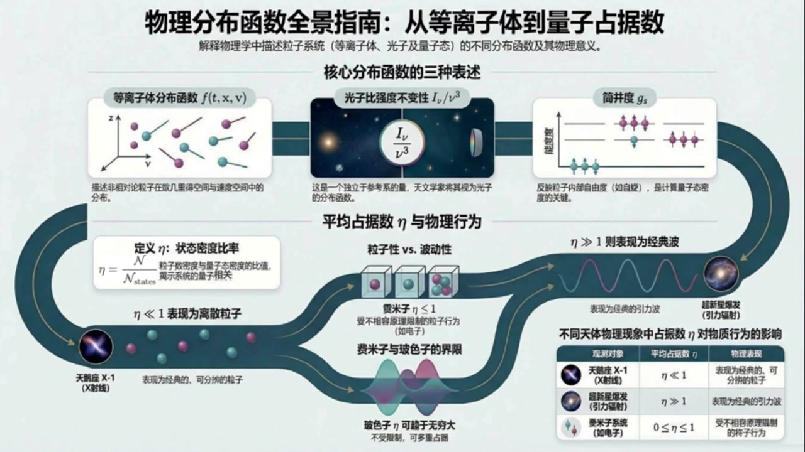
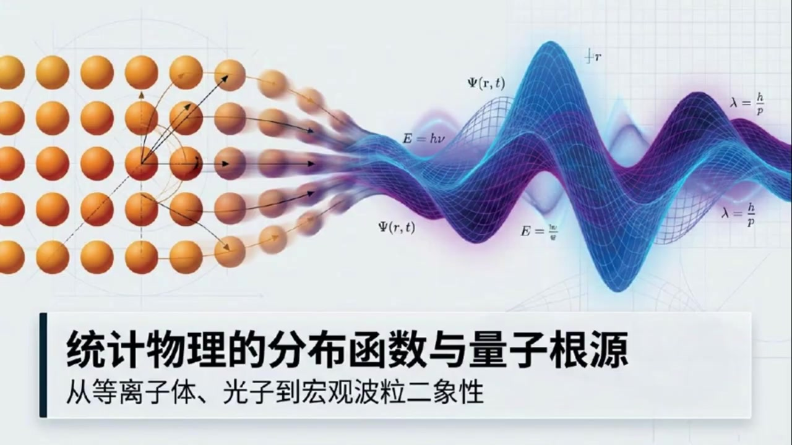
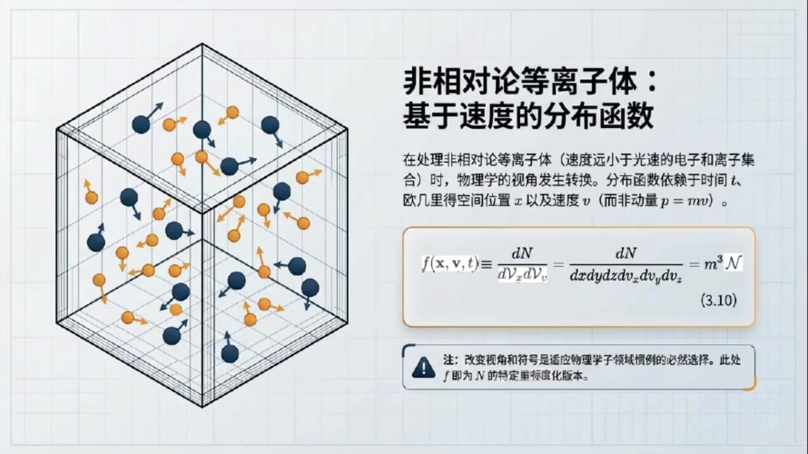
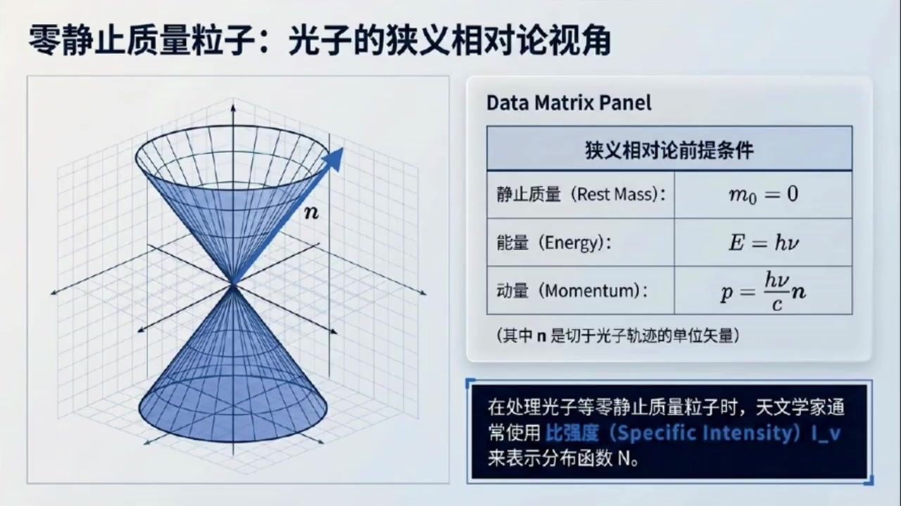
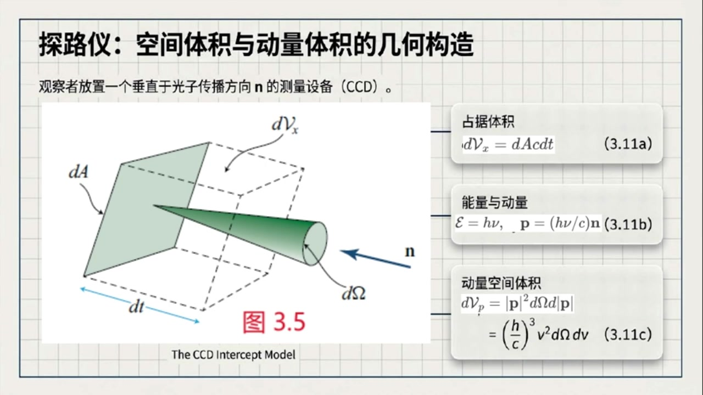
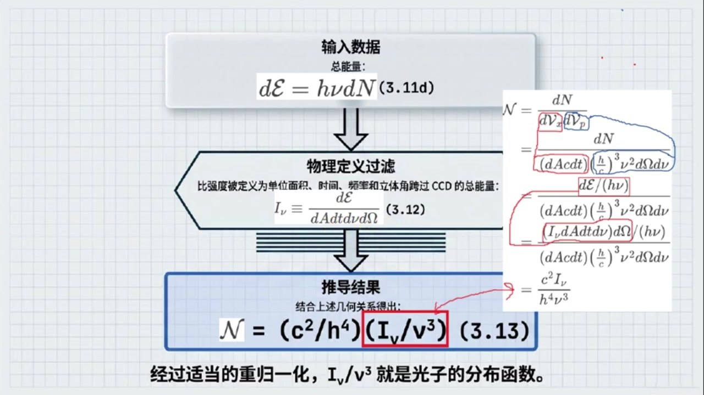
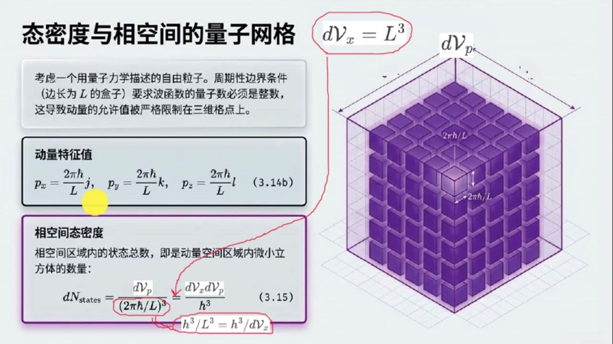

# 《现代经典物理学》第15课 等离子体、光子和量子态三种不同粒子系统的分布函数

> 自动生成的课程注解文档（共 4 个段落，[原始视频](https://www.youtube.com/watch?v=NLFv1ZeAvkg)）

## 目录

- [00:00:00 引入分布函数与等离子体相空间描述](#段落-1)
- [00:03:38 光子的比强度、相空间体积与参考系不变量](#段落-2)
- [00:11:21 态密度与平均占据数：连接经典和量子](#段落-3)
- [00:18:46 习题应用：估算光子与引力子的平均占据数](#段落-4)

---

## 段落 1：引入分布函数与等离子体相空间描述 { #段落-1 }

**时间：** 00:00:00 ~ 00:03:38

<details><summary>📝 原始字幕</summary>

<pre>

大家好欢迎收听现代经典物理学的第十五课我是你们活泼好奇的主持人周颖
大家好,我是你们的知识向导赛
今天我们继续深入物理学的奇妙世界来聊聊分布函数
嗯赛一听到分布函数这几个字我就觉得有点紧张,感觉会涉及到很多数学公式我们今天要讲的这些跟我们之前学的有什么不一样吗
哈哈所以别紧张
虽然会有些公式,但我们更侧重理解它们背后的物理意义
今天我们要讲的是关于粒子在像空间中如何分布以及这些分布函数在不同物理领域比如等离子体和光子物理中具体是怎么定义的
更重要的是我们还会探讨一个连接经典和量子的概念平均占据数
哇!听起来好有意思!那咱们就从等离子体开始聊起吧!
教科书里提到了等离子体粒子的分布函数 f of x v t
这个f具体代表什么呢
好的
简单来说这个F ofXVT啊它描述的是在某个特定时间梯特定位置X以及特定速度V附近找到等离子体中粒子的概率
你看等离子体是高速运动的电子和离子集合我们不可能去追踪每一个粒子
对那肯定太难了没错所以我们就用这种统计平均的方式来描述他们的集体行为
这个 f 它其实就是像空间中的粒子数密度
它的定义是DN除括号D花体大V下X成D花体大V下V括号
也就是单位位置空间体积和单位速度空间体积里有多少个粒子哦我明白了就是在一个很小的空间区域和很小的速度范围内我们能找到多少粒子对吧那为什么这里用速度V而不是动量P呢
这个问题问得好这是等离子体物理里的一个惯理因为我们讨论的是非相对论等离子体也就是粒子的速度远小于光速在这种情况下动量P和速度V之间只是差了一个长数质量M也就是P等于M成V所以用哪个都行但等离子体物理学家习惯用速度这两原来是不同领域的习惯不同那书里还提到了一个标度方式是任意的这是什么意思这个改变标度呢你可以理解为我们定义这个分布函数时可以乘以任何一个长数
这个常数不影响分布函数包含的物理信息比如粒子的相对分布
教科书里用了一个花体大安来表示一个更普世的分布函数
然后F呢就是花体大N改变了标度后的一个具体版门
比如F ofXVT等于M的立方成花体大N好的那等离子体这部分我们主要记住它的物理意义就是描述粒子在相空间中的分布就可以了对吗没错就是这个意思
理解它的物理意义比记住具体公式更重要,它是个统计量帮我们从宏观上把握等离子体的行为好的,那接下来我们聊聊光子吧

</pre>

</details>

**课程截图：**







### 注解

我来对这段课程视频进行深度注解，重点分析等离子体分布函数的新内容。

---

## 一、核心公式解析

### 公式 1：等离子体分布函数的定义

$$f(\mathbf{x}, \mathbf{v}, t) \equiv \frac{dN}{dV_x dV_v} = \frac{dN}{dx\,dy\,dz\,dv_x\,dv_y\,dv_z} = m^3 \mathcal{N}$$

| 符号 | 含义 | 说明 |
|:---|:---|:---|
| $f(\mathbf{x}, \mathbf{v}, t)$ | 等离子体分布函数 | **新引入的核心概念**，六维相空间中的粒子数密度 |
| $\mathbf{x}$ | 位置矢量 $(x,y,z)$ | 三维欧几里得空间坐标 |
| $\mathbf{v}$ | 速度矢量 $(v_x, v_y, v_z)$ | **关键选择**：用速度而非动量 |
| $t$ | 时间 | 显含时间，描述演化过程 |
| $dN$ | 粒子数微元 | 无穷小相空间体积内的粒子数 |
| $dV_x = dx\,dy\,dz$ | 位置空间体积元 | 三维空间微体积 |
| $dV_v = dv_x\,dv_y\,dv_z$ | 速度空间体积元 | **三维速度空间**（新概念） |
| $\mathcal{N}$ | 通用分布函数（花体大N） | 更普适的"母函数" |
| $m$ | 粒子质量 | 质量立方源于速度-动量转换的雅可比行列式 |

> **标度任意性**：$f$ 与 $\mathcal{N}$ 之间可差任意常数因子，物理信息（相对分布、比值）不变。这里选择 $f = m^3 \mathcal{N}$ 是等离子体物理的惯例。

---

## 二、理论背景补充

### 2.1 为什么是"相空间"（Phase Space）？

这是本段最核心的物理图像：

```
┌─────────────────────────────────────────┐
│           六维相空间 = 3维位置 ⊕ 3维速度      │
│                                         │
│    位置空间 (x,y,z)    速度空间 (vx,vy,vz)   │
│         ↓                    ↓          │
│    粒子在哪里？         粒子运动多快？      │
│    ─────────────      ─────────────      │
│    宏观可观测区域      微观状态标签        │
└─────────────────────────────────────────┘
```

**关键洞察**：单粒子需要6个坐标 $(x,y,z,v_x,v_y,v_z)$ 才能完全确定其**力学状态**。$N$ 个粒子若逐一追踪，需要 $6N$ 个变量——这是**微观描述**。

分布函数 $f$ 实现了**从微观到宏观的跃迁**：用单个六维场函数描述整个粒子集体的统计行为。

### 2.2 速度 vs 动量：领域惯例的差异

| 领域 | 首选变量 | 原因 | 适用条件 |
|:---|:---|:---|:---|
| **等离子体物理** | $\mathbf{v}$ | 实验可直接测量速度；非相对论下 $p=mv$ 过于简单 | $v \ll c$ |
| 统计力学/高能物理 | $\mathbf{p}$ | 相对论下动量比速度更基本；哈密顿形式更简洁 | 任意速度 |
| 量子力学 | $\mathbf{p}$（或 $\hbar\mathbf{k}$） | 德布罗意关系 $p=\hbar k$ 直接联系波矢 | 全范围 |

**本段的新要点**：明确声明讨论的是**非相对论等离子体**，因此速度空间与动量空间只差一个常数质量因子，选择速度完全是**惯例问题（convention）**，不影响物理。

---

## 三、板书/PPT 截图内容描述

### 截图 1：课程标题页
- **标题**："统计物理的分布函数与量子根源：从等离子体、光子到宏观波粒二象性"
- **视觉元素**：左侧为经典粒子图像（橙色球体阵列，带速度箭头），右侧过渡为量子波函数 $\Psi(\mathbf{r},t)$ 的蓝色波动图案
- **关键标注**：$E=h\nu$, $\lambda = h/p$ —— 暗示课程将连接经典统计与量子理论

### 截图 2：等离子体分布函数详解页（核心板书）
- **左侧图示**：三维立方体容器内，蓝色和橙色粒子带速度矢量箭头，直观展示"位置+速度"的六维描述
- **右侧公式框**：上述公式 (3.10) 的完整展示
- **注释框**（⚠️警告图标）：强调"改变视角和符号是适应物理学子领域惯例的必然选择。此处 $f$ 即为 $\mathcal{N}$ 的特定标度归一化版本"

### 截图 3：物理分布函数全景指南（信息图）
- **三列布局**：
  - 左：等离子体 $f(t,\mathbf{x},\mathbf{v})$ — "描述非相对论粒子在欧几里得空间与速度空间中的分布"
  - 中：光子比强度不变性 $I_\nu/\nu^3$ — "独立于参考系的量，天文学家称其为光子的分布函数"
  - 右：简并度 $g_s$ — "反映粒子内部自由度（如自旋），是计算量子态密度的关键"
- **底部核心概念**：平均占据数 $\eta$（eta）—— 连接经典与量子的桥梁，定义为状态密度比率 $\eta = N_i/N_{\text{state}}$

---

## 四、通俗解释：分布函数到底是什么？

想象一个**超级电影院**：

| 类比元素 | 物理对应 |
|:---|:---|
| 影厅座位（第5排第3座） | 位置 $\mathbf{x}$ |
| 观众面向的方向和起身速度 | 速度 $\mathbf{v}$ |
| 某一时刻的"人群快照" | 分布函数 $f(\mathbf{x},\mathbf{v},t)$ |
| 统计"某个区域站了多少人、朝哪走" | 宏观物理量（密度、温度、压强）|

**等离子体的特殊之处**：电子和离子以**千米/秒**量级疯狂运动，还互相电磁作用。我们不可能给每个粒子装GPS——分布函数就是"人群热力图"，让我们用统计方法预测整体行为。

**"标度任意性"的类比**：你可以数"人数"，也可以数"人·千克"（假设平均体重70kg，就乘70）。只要前后一致，算出来的"拥挤程度排名"不变。

---

## 五、本段新内容总结

| 新概念 | 关键要点 |
|:---|:---|
| **六维相空间** | 3维位置 ⊕ 3维速度，单粒子力学状态的完整描述 |
| **分布函数 $f(\mathbf{x},\mathbf{v},t)$** | 相空间中的粒子数密度，统计平均的核心工具 |
| **速度空间体积元 $dV_v$** | 三维速度微元 $dv_x dv_y dv_z$，与位置空间独立 |
| **标度任意性** | $f$ 与 $\mathcal{N}$ 可差常数因子，物理信息在相对分布中 |
| **非相对论惯例** | 等离子体物理偏好速度 $\mathbf{v}$ 而非动量 $\mathbf{p}$ |
| **通用分布函数 $\mathcal{N}$** | 更抽象的"母函数"，$f$ 是其特定物理领域的具体实现 |

---

**预告**：下一段将转向光子分布函数，引入比强度 $I_\nu/\nu^3$ 这一与参考系无关的相对论性不变量，为后续连接量子占据数做铺垫。

---

## 段落 2：光子的比强度、相空间体积与参考系不变量 { #段落-2 }

**时间：** 00:03:38 ~ 00:11:21

<details><summary>📝 原始字幕</summary>

<pre>

光子是零镜制质量粒子它们又有什么特别的分布函数呢好的从等离子体里的有质量粒子我们转向光子这种无质量粒子
描述他们的方式确实会有些不同
对于光子我们通常会用一个叫做比强度的量也就是I下标New来表示它们的分布比强度I下标New听起来有点专业这个量是怎么定义的呢好的我们想象一下你拿着一个探测器比如CCD垂直于光子的传播方向
光子会击中这个CCD,穿过一个面积DA
因为光子以光速C运动在时间DT内它们穿过的体积就是D花体大V狭标X等于DA乘C乘DT这个能理解对静止质量为零的光子而言其能量是化体大异等于H成绿
动量P等于括号H乘以C括号成传播方向向量N那我们应该如何计算动量空间的体积远呢我们可以在球面坐标系下计算这个量空间的体积远我们在动量空间中首先沿传播反方向负N构造一个圆锥
我可以将这个圆锥理解成,从圆心出发,以立体角DOMEGA投影到球面,等一下
三体角我知道普通的平面角,立体角是如何定义的其实立体角就是平面角的类似概念一个整圆的平面角就是圆周长除半径等于二派
对应圆的一段糊的平面角就是糊长除半径
类似地整个球的立体角就是球表面积除半径平方等于四派
对应的小块面积的立体角就是这小块面积除半径平方哦我明白了根据立体角的定义得知在动量空间中在半径为P的绝对值的球面上上的投影面积就是P的绝对值的平方成立体角圆D欧米加
所以动量空间体积原等于这个投影面积D P 的绝对值P 的绝对值P 的绝对值P 现在就清晰了我们将前面的光子动量表达式带入可得D 花体大V 下标P 缩号H 缩号C 缩号的三次方 频率D 缩号D 缩号D 缩号D 缩号D 缩号D 缩号D 缩号D 缩号D 缩号D 缩号D 缩号D
透过一番推导我们可以把这个比强度I下标New和我们前两堂课提到的普世分布函数话题大N联系起来哦怎么联系的他们之间的关系是话题大N等于DN除括号D话题大V下标X成D话题大V下标P括号
然后依次将前面计算过的低话题大V下表X
还有低话体大V下标P
还有DNA和D-化体E的关系
还有低化体翼和比强度矮下标腻的关系带入
最后等于括号C平方除H四次方括号乘括号I下标女除女三次方括号
所以说经过适当的改变标度,这个阿夏标女处女三次防其实就是光子的分布函数
竟然艾夏彪女处女三字方和话题大N是等价的那大家平时交流的时候都怎么表示他呢这就看具体是哪个领域的专家了
天文学家和光学专家呢,他们通常会把这个比强度,或者同样的把I下标女,除女三字方,看作是光子传播方向N
频率空间位置X和时间T的函数
嗯,这听起来很符合直接观测的习惯
我们要知道光从哪个方向来是什么频率的在什么时候到达哪里那物理学家呢C相对论物理学家更喜欢把分布函数滑体大N视为光子动量P空间位置X和时间T的函数
而相对论物理学家呢他们处理的问题更强调整体时空所以会将其视为光子四维动量几代箭头的P以及时空位置滑体大P的函数哇用了这么多不同的变量啊那他们表达的意思一样吗显然是一样的
虽然这三组变量天文学家的一组和物理学家两组看起来不同但它们所包含的信息是完全相同的只是看待同一群光子的视角不同罢了哇原来如此那这个I下标New除New三字方还有什么特别之处吗有一个非常关键的特性就是它独立于参考系
这意味着什么呢
假设有两个物理学家在不同的参考系里观察同一束光子
他们测到的光子频率NUE会因为多普勒效应而不同
听起来很复杂是的但是神奇的是如果他们各自计算自己测得的I下标的力方也就是I下标的力方出于自己测得的频率出于自己测得的频率出于自己测得的频率出于自己测得的频率出于自己测得的频率出于自己测得的频率出于自己测得的频率出于自己测得的频率出于自己测得的频率出于自己测得的频率出于自己测得的频率出于自己测得的频率出于自己测得的频率出于自己测得的频率

</pre>

</details>

**课程截图：**







### 注解

我来对这段关于**光子分布函数**的课程视频进行深度注解。

---

## 一、板书/PPT截图内容描述

### 截图1：狭义相对论视角下的光子
- **左侧**：光锥图，展示光子沿传播方向 $\mathbf{n}$ 的运动轨迹（双锥结构）
- **右侧Data Matrix Panel**：
  - 静止质量 $m_0 = 0$
  - 能量 $E = h\nu$  
  - 动量 $\mathbf{p} = \frac{h\nu}{c}\mathbf{n}$（$\mathbf{n}$ 为切于光子轨迹的单位矢量）
- **关键说明**：天文学家常用**比强度（Specific Intensity）** $I_\nu$ 表示分布函数

### 截图2：CCD拦截模型（图3.5）
- **左侧几何示意图**：展示垂直于光子传播方向的CCD探测器，面积元 $dA$，时间 $dt$ 内光子扫过的体积
- **右侧公式列表**：
  - 占据体积：$d\mathcal{V}_x = dA\,c\,dt$ （3.11a）
  - 能量与动量：$\mathcal{E}=h\nu,\quad \mathbf{p}=\frac{h\nu}{c}\mathbf{n}$ （3.11b）
  - 动量空间体积：$d\mathcal{V}_p = |\mathbf{p}|^2 d|\mathbf{p}|\,d\Omega = \left(\frac{h}{c}\right)^3 \nu^2 d\Omega\,d\nu$ （3.11c）

### 截图3：推导流程图
- **输入数据**：$d\mathcal{E} = h\nu\,dN$ （3.11d）
- **物理定义过滤**：比强度定义 $I_\nu \equiv \frac{d\mathcal{E}}{dA\,dt\,d\nu\,d\Omega}$ （3.12）
- **推导结果**：$\mathcal{N} = \left(\frac{c^2}{h^4}\right)\left(\frac{I_\nu}{\nu^3}\right)$ （3.13）
- **核心结论**：经适当重归一化，$I_\nu/\nu^3$ 就是光子的分布函数

---

## 二、核心公式逐一解析

### 公式 3.11a：空间体积元
$$d\mathcal{V}_x = dA \cdot c \cdot dt$$

| 符号 | 含义 |
|:---|:---|
| $dA$ | CCD探测器的面积元 |
| $c$ | 光速 |
| $dt$ | 时间间隔 |
| $d\mathcal{V}_x$ | 光子在 $dt$ 时间内扫过的**空间体积元** |

**物理意义**：光子以光速运动，在垂直于传播方向的探测器上，$dt$ 时间内"占据"的柱体体积。

---

### 公式 3.11b：光子的相对论能量-动量关系
$$\mathcal{E} = h\nu, \quad \mathbf{p} = \frac{h\nu}{c}\mathbf{n}$$

| 符号 | 含义 |
|:---|:---|
| $h$ | 普朗克常数 |
| $\nu$ | 光子频率 |
| $\mathbf{n}$ | 传播方向单位矢量 |
| $|\mathbf{p}| = h\nu/c = \mathcal{E}/c$ | 光子动量大小 |

**关键特性**：对零质量粒子，$E=pc$（而非有质量粒子的 $E^2 = (pc)^2 + (m_0c^2)^2$）

---

### 公式 3.11c：动量空间体积元（核心推导）

$$d\mathcal{V}_p = |\mathbf{p}|^2 d|\mathbf{p}|\,d\Omega = \left(\frac{h}{c}\right)^3 \nu^2\,d\Omega\,d\nu$$

**推导步骤**：
1. **球坐标系中的动量空间体积元**：$d\mathcal{V}_p = |\mathbf{p}|^2 \sin\theta\,d|\mathbf{p}|\,d\theta\,d\phi = |\mathbf{p}|^2 d|\mathbf{p}|\,d\Omega$

2. **变量替换**：由 $|\mathbf{p}| = \frac{h\nu}{c}$，得 $d|\mathbf{p}| = \frac{h}{c}d\nu$

3. **代入整理**：
   $$d\mathcal{V}_p = \left(\frac{h\nu}{c}\right)^2 \cdot \frac{h}{c}d\nu \cdot d\Omega = \left(\frac{h}{c}\right)^3 \nu^2\,d\Omega\,d\nu$$

| 符号 | 含义 |
|:---|:---|
| $d\Omega$ | **立体角元**（见下文详解） |
| $\nu^2 d\nu$ | 频率空间的"径向"部分 |
| $(h/c)^3$ | 量纲转换因子 |

---

### 公式 3.11d：能量-粒子数关系
$$d\mathcal{E} = h\nu\,dN$$

**物理意义**：频率为 $\nu$ 的 $dN$ 个光子携带的总能量。

---

### 公式 3.12：比强度（Specific Intensity）的定义 ⭐

$$\boxed{I_\nu \equiv \frac{d\mathcal{E}}{dA\,dt\,d\nu\,d\Omega}}$$

| 符号 | 含义 |
|:---|:---|
| $I_\nu$ | **比强度**（单位：erg s⁻¹ cm⁻² sr⁻¹ Hz⁻¹ 或 W m⁻² sr⁻¹ Hz⁻¹）|
| $dA$ | 探测器面积 |
| $dt$ | 时间间隔 |
| $d\nu$ | 频率带宽 |
| $d\Omega$ | 立体角 |

**通俗理解**：$I_\nu$ 描述"从特定方向、特定频率来的光有多强"——这正是天文学家实际测量的量。

---

### 公式 3.13：比强度与分布函数的等价关系 ⭐⭐

$$\boxed{\mathcal{N} = \frac{c^2}{h^4} \cdot \frac{I_\nu}{\nu^3}}$$

或等价地写成：
$$\frac{I_\nu}{\nu^3} = \frac{h^4}{c^2}\mathcal{N}$$

**推导链条**（结合截图3的手写推导）：
$$\mathcal{N} = \frac{dN}{d\mathcal{V}_x d\mathcal{V}_p} = \frac{d\mathcal{E}/(h\nu)}{(dA\,c\,dt)\cdot\left(\frac{h}{c}\right)^3\nu^2 d\Omega\,d\nu} = \frac{I_\nu\,dA\,dt\,d\nu\,d\Omega/(h\nu)}{\frac{h^3}{c^2}\nu^2 dA\,dt\,d\Omega\,d\nu} = \frac{c^2}{h^4}\frac{I_\nu}{\nu^3}$$

---

## 三、关键理论背景补充

### 1. 立体角（Solid Angle）详解

| 对比 | 平面角 | 立体角 |
|:---|:---|:---|
| **定义** | 弧长/半径 | 球面面积/半径² |
| **完整周期** | $2\pi$（整圆） | $4\pi$（整球） |
| **微分元** | $d\theta$ | $d\Omega = \sin\theta\,d\theta\,d\phi$ |
| **量纲** | 无量纲（rad） | 无量纲（sr，球面度）|

**关键公式**：球面上小块面积 $dA_{sphere} = r^2 d\Omega$

---

### 2. 为什么 $I_\nu/\nu^3$ 是洛伦兹不变量？

这是本段最深刻的物理结论：

| 情景 | 观测者A | 观测者B（相对A运动）|
|:---|:---|:---|
| 测得的频率 | $\nu$ | $\nu' = \nu \cdot D$（多普勒因子 $D$）|
| 测得的比强度 | $I_\nu$ | $I'_{\nu'}$ |
| **关键发现** | $\frac{I_\nu}{\nu^3} = \frac{I'_{\nu'}}{\nu'^3}$ | **数值相同！**|

**物理本质**：$\mathcal{N}$（相空间粒子数密度）是洛伦兹标量，而 $I_\nu/\nu^3$ 与 $\mathcal{N}$ 成正比，因此也是**参考系无关**的。

---

## 四、学科视角对比

| 领域 | 偏好变量 | 物理直觉 | 适用场景 |
|:---|:---|:---|:---|
| **天文学/光学** | $I_\nu(\mathbf{n}, \nu, \mathbf{x}, t)$ | "光从哪来、什么颜色、多强" | 望远镜观测、光谱分析 |
| **相对论物理** | $\mathcal{N}(\mathbf{p}, \mathbf{x}, t)$ | 三维动量空间分布 | 狭义相对论问题 |
| **广义相对论/宇宙学** | $\mathcal{N}(p^\mu, x^\mu)$ | 四维时空协变描述 | 弯曲时空、宇宙学 |

**核心洞见**：三组变量包含**完全相同的信息**，只是"坐标系"选择不同——类似于同一矢量可用不同基矢展开。

---

## 五、与等离子体分布函数的对比

| 特征 | 有质量粒子（等离子体） | 无质量粒子（光子） |
|:---|:---|:---|
| **质量** | $m_0 \neq 0$ | $m_0 = 0$ |
| **能量-动量关系** | $E^2 = (pc)^2 + (m_0c^2)^2$ | $E = pc$ |
| **速度** | 可变（0到<c） | 恒为 $c$ |
| **分布函数** | $f(\mathbf{x}, \mathbf{v}, t)$ | $\mathcal{N} \propto I_\nu/\nu^3$ |
| **相空间体积元** | $d\mathcal{V}_x d\mathcal{V}_v$（6维） | $d\mathcal{V}_x d\mathcal{V}_p$ 但受 $|\mathbf{p}|=E/c$ 约束（5维有效）|
| **可观测的"原始量"** | 通常需间接测量 | $I_\nu$ 可直接测量 |

---

## 六、核心结论

> **$I_\nu/\nu^3$ 是光子的"有效分布函数"**——它既是天文学家直接观测的量，又是与相对论协变分布函数 $\mathcal{N}$ 直接成正比的洛伦兹不变量。这一桥梁关系使得不同领域的物理学家能够用各自的语言描述同一物理实在。

---

## 段落 3：态密度与平均占据数：连接经典和量子 { #段落-3 }

**时间：** 00:11:21 ~ 00:18:45

<details><summary>📝 原始字幕</summary>

<pre>

平均占据数A塔就是这样一个连接经典与量子的重要概念那这个A塔到底是什么呢它又是怎么连接经典和量子的好的
为了定义ITA,我们首先要引入一个概念,叫做太密度
想象一下一个粒子被限制在一个很小的空间体积D花体大V下标X内它的动量也在一个很小的范围D花体大V下标P内那么这个区域里这个粒子有多少个可用的单粒子量子态呢量子态听起来有点抽象是的
我们可以想象把粒子放在一个边长为L的盒子里然后利用量子力学的周期性边界条件推导出允许的动量值是离散的这些离散的动量值在动量空间中形成了一个个小隔点每个隔点都代表一个量子态哦我好像有点明白了
就像是把连续的动量空间切分成了很多个小格子,每个格子就是一个太,总结得非常准确
为了算出有多少个太,我们需要知道这个小格子具体有多大
根据量子力学要求微观粒子的波函数在盒子的边界上必须满足周期性边界条件这就限制了动量的取直
它在各个方向上的允许值只能是二派乘H八出一盒子边长L的整数倍
这里面的H八是约化普朗克常数所以这就导致动量变成了一份一份的被限制在一个隔电网上
相邻隔垫之间的距离,就是二派乘H8处理L,对吧没错
所以在三维的动量空间里每个量子态占据的一个小立方体的体积就是这三个方向间距的乘积也就是括号二派乘H八出EL括号的三次方我可以稍微划减一下
因为二派乘以约化的普朗克常数H刚好等于普朗克常数H
所以这个小格子的体积其实也就是H的三次方,出于L的三次方
完全正确
在这个共识里
L的三次方就是我们假设的那个盒子的空间体积,也就是D花体大V下标X
所以每个量子态在动量空间中占据的体积就可以直接写成H的三次方除以D花体大V下标X这样一来最开始任意设定的那个盒子边长L就自然而然被抵消掉了
那就太好了
基于这一点
如果我想知道在给定的动量区域,D花体大V下标P里面,总共有多少个太
只要拿总动量区域体积去除以每个太占据的小体积就行了,是不是这样算
差不多就是这个意思
通过上面计算我们发现在向空间区域D花题大VXD花题大VP内可用的独立量子态的总数是DN下标STAYS等于D花题V下标X成D花题大V下标P除H的三次方其中H就是普朗克常数哇这里又出现普朗克常数H了是的只要涉及到量子它就无处不在
除了空间自由度,例子还有自选这个内部自由度,这会引入一个简并度G下标S
比如电子的字选是二分之一,那么居下标S等于2乘S+1等于2
光子的字旋是一,也是G下标S等于二
所以这个记忆下标S就是指每个空间量子态还可以有记忆下标S种不同的自旋方向对吧
没错综合考虑这些我们得出向空间区域D花体大V下标X成D花体大V状态总数DN下标S等于括号G下标S出H三次方括号成D平方花体大V进而向空间的总态密度就是花体大N下标S出H三次方这个量告诉我们单位向空间体积里有多少个可用的量子态
好的,那有了这个太密度,平均占据数A,T又是什么呢?
平均占据数A塔呢它就是我们之前讲的粒子数密度花体大N除以这个量子态密度花体大N下标STAYS进而等于括号H三次方除记下标S括号成花体N也就是花体N等于花体大N下标STAYS成A塔等于括号G下标S除H三次方括号成A塔哦我明白了
粒子数密度除以太密度,就不是平均每个量子态里有多少个粒子吗
完全正确转
就是伊塔瓦物理意义它告诉我们每个量子态被粒子占取的平均程度这个量在量子统计力学中非常重要那这个伊塔的数值范围有什么讲究吗当然有
这取决于粒子是非米子还是波色子
对于废米子,比如电子
他们遵循泡利不相融原理
一个量子态最多只能被一个粒子占据
所以非米子的伊塔只能在零到一之间,也就是说一个太要么没粒子,要么就一个
而对于波色子,比如光子,引粒子,它们不遵循泡立不相容原理
任意数量的粒子都可以占据同一个量子态
所以波色子的伊塔可以从零到无穷大这就有趣了那这个伊塔的大小对我们理解粒子的行为有什么帮助呢这就是伊塔最最关键的地方
当伊塔元孝于一的时候
也就是平均每个量子态被占据的粒子数远小于一
这时,无论粒子是费米子还是波色子
它们都会表现得像经典的离散的可分辨的例子
哦就像我们平时在宏观世界里看到的那些独立的物体一样没错
但如果一踏远大于一呢
这种情况只可能发生在波斯子身上,因为费米子的衣榻最大是一
当衣踏远大于一时波色紫就会表现出经典的波的形状
比如光子,当一踏远大雨一时,它们就像经典的电磁波
引力子,当一踏远大于一时,它们就像经典的引力波哇,这太神奇了
一个简单的平均占据数竟然能告诉我们粒子是表现出粒子性还是类波性这真是把量子和经典物理连接起来了是的这个伊塔就是一个非常强大的工具它揭示了粒子行为的本质
所以我们经常会用ITA来代替花体N作为分布函数来分析问题好的那理论部分我们都梳理了一遍

</pre>

</details>

**课程截图：**





### 注解

我来对这段关于**平均占据数（Mean Occupation Number）η** 的课程视频进行深度注解，重点分析连接经典与量子物理的核心概念。

---

## 一、板书/PPT截图内容描述

### 截图1：课程主题引入
- **标题**："突破经典：古典物理的量子根源"
- **核心引语**："经典物理是量子物理的近似，反之则不然。经典物理可以从量子物理中推导出来，反之亦不然。"
- **关键说明**：在统计物理中，经典理论无法摆脱其量子根源。必须引入基于量子力学的分布函数归一化——**平均占据数（Mean Occupation Number）η**，来揭示隐藏在经典表象下的宇宙真实法则。
- **视觉设计**：左侧为经典网格（金色直线），右侧为量子波函数（紫色波动），中间以渐变过渡，象征经典到量子的联系。

---

### 截图2：态密度与相空间的量子网格（核心推导板）
- **三维示意图**：边长为 $L$ 的立方盒子，内部填充紫色小立方体网格，展示动量空间的量子化
- **标注**：
  - $d\mathcal{V}_x = L^3$（空间体积）
  - $d\mathcal{V}_p$（动量空间体积元）
  - 相邻格点间距：$2\pi\hbar/L$（三个方向相同）
- **公式框1：动量特征值**
  $$p_x = \frac{2\pi\hbar}{L}j,\quad p_y = \frac{2\pi\hbar}{L}k,\quad p_z = \frac{2\pi\hbar}{L}l \quad (3.14b)$$
  （$j,k,l$ 为整数，对应周期性边界条件的量子数）

- **公式框2：相空间态密度（核心公式）**
  $$dN_{\text{states}} = \frac{d\mathcal{V}_p}{(2\pi\hbar/L)^3} = \frac{d\mathcal{V}_x d\mathcal{V}_p}{h^3} \quad (3.15)$$
  其中关键化简：$(2\pi\hbar)^3/L^3 = h^3/d\mathcal{V}_x$

---

### 截图3：内部自由度——自旋与简并度 $g_s$
- **表格**：三类粒子的分类与简并度

| 分类依据 | 示例 | 简并度 $g_s$ |
|:---|:---|:---|
| $m \neq 0$（有质量） | 电子、质子 | $g_s = 2s+1$ |
| $m=0, s>0$（无质量，有自旋） | 光子 $s=1$，引力子 $s=2$ | $g_s = 2$ |
| $m=0, s=0$（无质量，无自旋） | 假设的无质量标量粒子 | $g_s = 1$ |

- **黄色注释框**：中微子例外法则——中微子/反中微子具有非零静止质量且自旋为1/2，但由于其固定的**手性（Chirality）**，$g_s=1$ 而不是2。

---

## 二、核心公式解析（本段新内容）

### 公式 1：完整相空间态密度（含自旋简并度）

$$\boxed{dN_s = \frac{g_s}{h^3}\, d\mathcal{V}_x\, d\mathcal{V}_p = \frac{g_s}{h^3}\, d^3x\, d^3p}$$

或写成**总态密度**（单位相空间体积的量子态数）：

$$\frac{dN_s}{d\mathcal{V}_x d\mathcal{V}_p} = \frac{g_s}{h^3}$$

| 符号 | 含义 | 说明 |
|:---|:---|:---|
| $dN_s$ | 相空间体积元内的总量子态数 | **新引入**，下标 $s$ 表示包含自旋（states with spin）|
| $g_s$ | 自旋简并度（spin degeneracy）| **新引入**，每个空间量子态对应的自旋态数目 |
| $h$ | 普朗克常数 | $h = 2\pi\hbar \approx 6.626\times 10^{-34}$ J·s |
| $d\mathcal{V}_x = L^3$ | 空间体积元 | 实际计算中 $L$ 会被消去 |
| $d\mathcal{V}_p$ | 动量空间体积元 | $dp_x dp_y dp_z$ |

> **关键洞察**：$h^3$ 是相空间中最小"量子单元"的体积，源自海森堡不确定性原理 $\Delta x \Delta p \sim h$ 的三维推广。

---

### 公式 2：平均占据数 η 的定义（本段最核心的新概念）

$$\boxed{\eta \equiv \frac{n}{n_s} = \frac{h^3}{g_s}\, n = \frac{n}{g_s/h^3}}$$

或等价地写成粒子数密度的表达式：
$$n = n_s \cdot \eta = \frac{g_s}{h^3}\, \eta$$

| 符号 | 含义 | 说明 |
|:---|:---|:---|
| $\eta$（eta）| **平均占据数（Mean Occupation Number）**| **本段核心新概念**，无量纲 |
| $n = dN/d\mathcal{V}_x$ | 粒子数密度 | 单位空间体积内的粒子数 |
| $n_s = dN_s/d\mathcal{V}_x$ | 量子态密度 | 单位空间体积内的量子态数（含动量自由度）|
| $h^3/g_s$ | 每个量子态占据的相空间体积 | 由量子力学基本限制决定 |

> **物理意义**：$\eta$ 表示**每个量子态被粒子占据的平均数目**，是连接经典统计与量子统计的桥梁。

---

## 三、理论背景补充

### 3.1 为什么需要 η？——经典统计的困境

经典统计力学中，相空间分布函数 $f(\mathbf{x},\mathbf{p})$ 定义为：
$$f = \frac{dN}{d\mathcal{V}_x d\mathcal{V}_p}$$

但这存在**量纲问题**：$[f] = \text{(能量·时间)}^{-3}$，且经典理论无法解释：
- 黑体辐射的紫外灾难
- 固体热容的低温反常
- 粒子全同性的统计关联

**解决方案**：引入量子归一化因子 $\eta = f \cdot (h^3/g_s)$，使分布函数无量纲化，并自然包含量子统计特性。

---

### 3.2 η 的取值范围与量子统计分类

| 粒子类型 | η 的范围 | 物理原因 | 经典极限 |
|:---|:---|:---|:---|
| **费米子**（如电子）| $0 \leq \eta \leq 1$ | 泡利不相容原理：每个量子态最多一个粒子 | $\eta \ll 1$ 时趋近经典麦克斯韦-玻尔兹曼统计 |
| **玻色子**（如光子）| $0 \leq \eta < \infty$ | 无限制，任意多粒子可占据同一量子态 | $\eta \ll 1$ 时同样趋近经典统计；$\eta \gg 1$ 时显现玻色-爱因斯坦凝聚 |

---

### 3.3 经典-量子对应原理

| 极限条件 | 物理行为 | 实例 |
|:---|:---|:---|
| $\eta \ll 1$（**稀薄极限**）| 粒子表现为**可分辨的经典粒子** | 理想气体、非相对论性等离子体 |
| $\eta \gg 1$（**稠密极限**，仅玻色子）| 粒子表现为**经典波** | 光子→电磁波（$\eta \gg 1$ 对应强光）；引力子→引力波 |

> 这正是课程中强调的：**"一个简单的平均占据数竟然能告诉我们粒子是表现出粒子性还是类波性"**

---

## 四、核心概念通俗解释

### 类比：图书馆座位系统

想象一个图书馆（相空间）：
- **空间体积** $d\mathcal{V}_x$ = 图书馆的楼层面积
- **动量空间** $d\mathcal{V}_p$ = 不同阅读主题的分类
- **量子态** = 具体的一个座位（由楼层位置+主题分类唯一确定）
- **$h^3$ 规则**：由于量子力学，座位不能无限细分，每个座位有最小"面积" $h^3$
- **$g_s$（简并度）**：每个座位可能有多个"朝向"（如面向东/西），即自旋自由度

**平均占据数 η** = 每个座位的平均上座率
- $\eta = 0.3$：座位很空，大家随意坐（经典行为）
- $\eta = 1$：费米子坐满，必须一人一座（泡利原理）
- $\eta \gg 1$：玻色子"叠罗汉"，很多人挤在同一个座位上，形成"人浪"（波的集体行为）

---

## 五、与之前段落的衔接

| 之前内容 | 本段发展 |
|:---|:---|
| 经典分布函数 $f = dN/(d\mathcal{V}_x d\mathcal{V}_p)$ | 引入量子归一化 $\eta = f \cdot h^3/g_s$ |
| 光子作为无质量粒子 | 明确光子 $g_s=2$（两个偏振态），为后续光子分布函数做铺垫 |
| 相空间六维描述 | 量化相空间最小单元 $h^3$，建立经典-量子的数学桥梁 |

---

## 六、关键要点总结

1. **$h^3$ 是相空间的"量子粒度"**，源于周期性边界条件的动量量子化
2. **$\eta$ 是无量纲的分布函数**，消除了经典统计的量纲任意性
3. **$\eta$ 的数值决定统计 regime**：
   - $\eta \ll 1$：经典极限（麦克斯韦-玻尔兹曼）
   - $\eta \sim 1$：量子简并（费米-狄拉克或玻色-爱因斯坦）
   - $\eta \gg 1$：玻色子的波极限（经典场描述）
4. **自旋简并度 $g_s$ 是粒子内禀属性**，无质量玻色子（光子、引力子）的特殊性 $g_s=2$ 源于规范对称性

---

## 段落 4：习题应用：估算光子与引力子的平均占据数 { #段落-4 }

**时间：** 00:18:46 ~ 00:23:19

<details><summary>📝 原始字幕</summary>

<pre>

接下来是不是要用习题来巩固一下了?没错
课后有一道很好的练习题也就是练习三点三正好能帮大家把刚才讲的平均占据数依它的肝炎串起来好的这道题涉及到天鹅座X一和超星星的观测数据让我们估算光子和引粒子的平均占据数
既然是留给大家的课后练习赛有没有什么解题思路和提示给到大家呢没问题解这道题的关键是首先根据平均占据数和通用的分布函数的关系以及通用分布函数和比强度的关系可以得到平均占据数和比强度的关系
对于天鹅座X1的X射线光子,大家可以先通过能量估算出频率,New
然后将接收到的能量通量F看作是比强度I下标NUE在频率范围和立体角上的积分进行粗略估算
最后判断算出的一塔是远大于一还是远小于一那关于光子从圆传到地球的过程中占据数会不会改变呢这个只要大家回想一下我们之前讨论分布函数I下标扭除扭三次方的一个重要性质就能迎刃而解了明白了这就是解题的关键大家课后不妨去算算一下体会粒子性和类波性的行为没错接下来还有B小题这个主角换成了引力子好的小题讲的是女星星团的超星星爆发产生了一种盈利辐射题目给出了很多参数总发射时间平均占据数是不是远大于一从而表现出经典引力波的行为
这题的参数比刚才多不少呀,赛也能给大家一点解题思路提示吗?
当然没问题
大家要注意,引粒子也是薄色子,所以减冰度既下标S,同样是2
计算的思路和A小题非常类似
核心依然是估计比强度爱下标钮,嗯那面对这些不同类型的给定参数该怎么转换呢
大家可以沿用这几个步骤来思考
首先,通过题目的总能量和发射时间,可以算出总功率
再处于扩散球面的表面机利用给定的传播距离就能算出到达地球的平均能量通量F
其次,频率NUE以及频率弹宽DELTANEW可以直接从题目给的平带范围里去进死或平均值
最后要特别注意
引力波辐射不像点光源发出的独立光数,它通常是准各相同性的
因此它辐射的理梯角能够粗略按四派来算哦通过这一步步拆解用计算得出的通量F除以半宽和立体角确实就能估算出I下标了没错有了I下标之后直接带入平均占据数A的公式即可
大家自己推倒完之后别忘了看看结果是不是一个极其巨大的天文数字亲自验证一下A踏原大于一时的宏观波性行为这两个例子真的太棒了通过计算我们直观的理解了为什么X射线光子表现为粒子而超星星引力波表现为波原来都是这个平均占据数A踏在搞鬼是的
这就是我们这几课的精髓
理解这几个分布函数以及平均占据数A的物理意义和它在不同极限下的表现对我们后续学习统计物理和更深层次的现代物理非常重要今天这节课我收获太大了从等冷子体的分布函数到光子的比强度再到连接经典与量子的平均占据数每个概念都非常有趣很高兴你能有所收获
这些概念看似抽象但它们是理解宇宙中各种现象从恒星内部到黑洞边缘再到引力波的传播都不可或缺的工具好的那今天的现代经典物理学博客就到这里了
感谢赛老师的精彩讲解也谢谢JR的提问和各位同学的收听我们下期再见再见

</pre>

</details>

**课程截图：**


### 注解

我来对这段关于**习题应用与实例计算**的课程视频进行深度注解，重点分析如何将平均占据数概念应用于实际天体物理观测。

---

## 一、板书/PPT截图内容描述

### 截图1：室女座超新星引力波诊断测试（完整版）
- **左侧**：引力波波前传播示意图，展示非球形超新星核心（10 km尺度）在4000万光年距离上产生的四极辐射图案
- **右侧数据面板**：
  | 参数 | 数值 |
  |:---|:---|
  | 目标 | 高度非球形的超新星核心（距离4000万光年，核心尺寸10 km）|
  | 引力波频带 | 0.5–2.0 kHz |
  | 脉冲能量 | 携带 $10^{-3} M_\odot c^2$ 能量 |
  | 脉冲时间 | 持续约 10 ms |
- **核心公式**（粉色框标注）：
$$\eta = \frac{h^3}{g_s} \mathcal{N} = \frac{h^3}{g_s}\left(\frac{c^2}{h^4}\frac{I_\nu}{\nu^3}\right) = \frac{c^2}{g_s h}\frac{I_\nu}{\nu^3}$$

- **物理诊断结论**：计算得出引力子平均占据数 $\eta \gg 1$，表现为**纯粹的经典引力波**

---

## 二、核心公式解析（新内容）

### 公式：平均占据数与比强度的直接关系

$$\boxed{\eta = \frac{c^2}{g_s h} \frac{I_\nu}{\nu^3}}$$

| 符号 | 含义 | 说明 |
|:---|:---|:---|
| $\eta$ | 平均占据数（Mean Occupation Number）| **核心诊断参数**，无量纲 |
| $c$ | 真空光速 | $2.998 \times 10^8$ m/s |
| $g_s$ | 自旋简并度（Spin Degeneracy）| 光子/引力子：$g_s = 2$（两种偏振态）|
| $h$ | 普朗克常数 | $6.626 \times 10^{-34}$ J·s |
| $I_\nu$ | 比强度（Specific Intensity）| 单位：W·m$^{-2}$·Hz$^{-1}$·sr$^{-1}$ |
| $\nu$ | 频率 | 单位：Hz |

**推导链条**（字幕中强调的三步关系）：
$$\eta \xleftarrow{\text{①}} \mathcal{N} \xrightarrow{\text{②}} I_\nu/\nu^3 \xrightarrow{\text{③}} \text{观测通量 } F$$

---

## 三、习题解题框架详解

### 习题3.3 A小题：天鹅座X-1的X射线光子

| 步骤 | 操作 | 关键公式/近似 |
|:---|:---|:---|
| **Step 1** | 能量→频率 | $E = h\nu \Rightarrow \nu = E/h$（X射线：keV量级→$\sim 10^{18}$ Hz）|
| **Step 2** | 能量通量→比强度 | $F = \int I_\nu \, d\nu \, d\Omega \approx I_\nu \cdot \Delta\nu \cdot \Delta\Omega$ |
| **Step 3** | 估算立体角 | 点光源：$\Delta\Omega \sim (\text{源尺寸}/\text{距离})^2$（极小！）|
| **Step 4** | 计算 $\eta$ | 代入 $\eta = \frac{c^2}{2h}\frac{I_\nu}{\nu^3}$ |
| **Step 5** | 判断极限 | **预期结果**：$\eta \ll 1$ → **粒子性**（光子表现为离散量子）|

**关键物理**：光子从源传到地球，$\eta$ **守恒不变**——这是分布函数 $I_\nu/\nu^3$ 沿光线传播的重要性质（刘维尔定理/无碰撞输运）。

---

### 习题3.3 B小题：室女座超新星引力波

| 新参数处理 | 方法 |
|:---|:---|
| **总功率** | $P = E_{\text{总}} / \Delta t_{\text{发射}} = 10^{-3}M_\odot c^2 / 10\,\text{ms}$ |
| **距离衰减** | 球面扩散：能流密度 $\propto 1/(4\pi d^2)$ |
| **准各向同性辐射** | 关键区别！引力波非点光源，立体角 $\Delta\Omega \approx 4\pi$（全空间）|
| **频率处理** | 取频带中心值或平均值 $\bar{\nu} \sim 1$ kHz |

**计算结果预期**：$\eta \gg 1$（"极其巨大的天文数字"）→ **经典波行为**

---

## 四、核心概念通俗解释

### 为什么立体角处理截然不同？

| 辐射类型 | 几何特征 | 立体角 | 物理后果 |
|:---|:---|:---|:---|
| **X射线光子** | 点光源（天鹅座X-1：黑洞吸积盘~km尺度，距离~kpc）| $\Delta\Omega \ll 1$ sr | $I_\nu$ 很大，但立体角极小 → $\eta$ 小 |
| **引力波** | 扩展源（超新星核心~10 km，但波长~300 km）| $\Delta\Omega \sim 4\pi$ | 能量分散在全空间，但相干叠加 → 等效 $I_\nu$ 巨大 |

**关键洞察**：引力波的"波性"不仅来自 $\eta \gg 1$，还源于其**相干辐射机制**——非对称质量四极矩产生的集体振荡，而非独立粒子的随机发射。

---

## 五、理论背景补充

### 分布函数守恒性质的完整表述

沿光子/引力子轨迹（零测地线），**比强度与频率立方的比值守恒**：
$$\frac{I_\nu}{\nu^3} = \text{const}$$

这意味着：
- 宇宙学红移中：$I_\nu \propto \nu^3 \propto (1+z)^{-3}$（同时频率降低，强度衰减）
- $\eta$ 作为组合量 $\frac{h^3}{g_s}\mathcal{N} = \frac{c^2}{g_s h}\frac{I_\nu}{\nu^3}$ **沿光线不变**

### 引力波的"经典性"深层含义

| 特征 | 表现 |
|:---|:---|
| **宏观可观测** | LIGO直接探测到应变 $h \sim 10^{-21}$，对应 $\eta \sim 10^{40}$ 量级 |
| **不可分辨离散性** | 试图"数引力子"需要探测器能量分辨 $\Delta E \ll h\nu \sim 10^{-30}$ J，技术上不可能 |
| **波前相干** | 超新星核心尺寸（10 km）<< 引力波波长（~300 km），满足点源近似，辐射高度相干 |

---

## 六、本节精髓总结

> **"通过计算我们直观地理解了为什么X射线光子表现为粒子，而超新星引力波表现为波——原来都是这个平均占据数 $\eta$ 在搞鬼。"**

| 天体物理对象 | $\eta$ 量级 | 行为 | 观测手段 |
|:---|:---|:---|:---|
| 天鹅座X-1 X射线 | $\ll 1$ | 粒子（光子计数）| X射线探测器（如Chandra）|
| 室女座超新星引力波 | $\gg 1$ | 经典波（相干振幅）| 干涉仪（LIGO/Virgo）|

这一对比完美诠释了**量子-经典对应原理**在天体物理中的实际运作：同样的统计框架，不同的参数极限，呈现出截然不同的物理表象。

---
