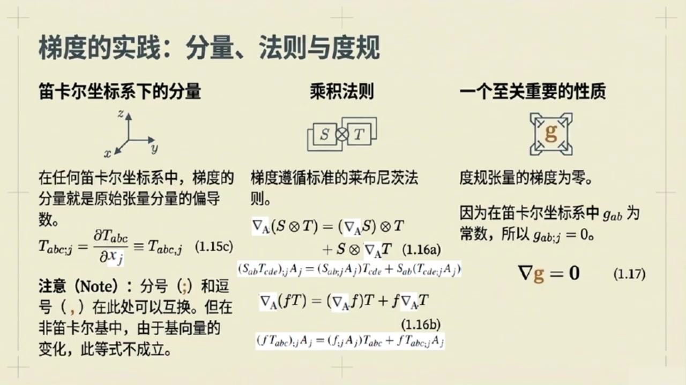
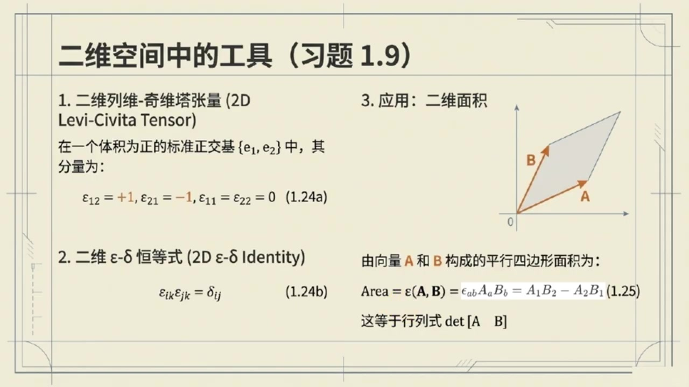

# 《现代经典物理学》第4课 张量微积分的几何视角

> 自动生成的课程注解文档（共 2 个段落，[原始视频](https://www.youtube.com/watch?v=RYaLL-k_T64)）

## 目录

- [00:00:07 微分、梯度散度与列维奇维塔张量基础](#段落-1)
- [00:09:40 体积与面积积分、高斯斯托克斯定理及守恒定律](#段落-2)

---

## 段落 1：微分、梯度散度与列维奇维塔张量基础 { #段落-1 }

**时间：** 00:00:07 ~ 00:09:40

<details><summary>📝 原始字幕</summary>

<pre>

大家好
欢迎来到咱们现代经典物理学的博客
我是你们的老朋友Jay
大家好,我是赛
很高兴再次和大家一起探索物理世界的奥秘
今天咱们要聊的内容,听起来就特别硬核
微分差积悬度还有积分守恒定律这些都是物理学里非常基础又重要的工具没错这些工具不仅能帮助我们描述物理现象更是理解物理定律几何本质的关键
咱们今天就从最基础的微分聊起
好啊
书上1.7节一开始就提到了标量,尺量和张量的微分
赛,你能不能先用大白话给我们讲讲,什么是方向导数?
没问题
想象你在一个温度场里,每个点都有个温度值
方向导数简单说就是你沿着某个特定方向走一小步温度会怎么变化变化的快慢是多少哦有点像我们平时说的梯度吗嗯非常接近
它的正式定义是对一个张量场T沿着向量A的方向导数就是当不长趋近于零时T在P点和P点加上一小段A向量后的差值再除以这个不长听起来有点像把普通函数导数的概念推广到了多维空间和更复杂的量上完全正确而且这个方向导数在数学上有一个很棒的形状它对向量A是线性的线性是不是意味着如果我沿着两倍的A方向走变化量就是沿着A方向走的两倍没错就是这个意思
这个方向导数它会生成一个新的丈量场我们把它叫做梯度用nabrah梯来表示梯度这个词我们很熟悉通常指标量场的梯度
标量场的梯度是一个尺量,指向变化最快的方向
那张亮场的梯度有什么特别之处呢
具体而言方向导数NABLAA和梯度NABLA的关系是NABLAAT等于NABLAT
后续括号中除了T原版的空草后,最后还多一个已被A填入的草,也就是微分草
这样的纳布拉T被称为T的梯度
如果张亮梯有n个草,那么梯的梯度纳布拉梯,作为一个新的张亮就有n加1个草
所以张亮场的梯度它的接数会比原来的张亮增加一
梯度在指标下打下又是如何表示的呢
张亮梯的梯度在指标技法下通常表示为比如TABC分号D
分号前的锁影是原始张亮,分号后的锁影是非微分的
那么前面的方向导数呢
张亮梯在尺量A的方向导数在指标技法下通常表示为比如TABC分号JAJ
哦我明白了
刚才您提到张亮的梯度的接数,相对原张亮的接数增加1
那它不就更复杂了吗?是的
如果用分量级好来看在迪卡尔坐标写下一个张亮梯的梯度分量就是这个张亮分量对坐标的偏导数哦原来就是偏导数啊
那听起来又没那么吓人了对在迪卡尔坐标系下他就是这么简洁
但如果换成非迪卡尔坐标系比如球坐标或柱坐标情况就会复杂一些
因为击石量本身也会随着位置变化明白了所以咱们现在主要关注迪卡尔坐标系
那低度有没有什么成绩法则呢就像我们学普通导数时那样当然有低度也满足莱布尼茨成绩法则
比如两个张亮S和T的张亮级的低度就等于S的低度和T的张亮级加上S的张亮级和T的低度这和我们熟悉的惩罚球道法则很像只是现在处理的是张亮对
还有一个标量函数f乘以一个张量梯的低度,也遵循类似的法则
F 的低度乘一梯再加上F乘一梯的低度这样一来很多推倒就方便多了
那杜归成两级的低度呢,他有什么特殊之处呢?问得好
在任何DKL左标系下杜龟丈量计的分量都是长数所以根据我们刚才说的低度就是偏导数杜龟丈量计的低度是零这可是一个很重要的性质拿布拉吉等于零记住了
接下来咱们可以从低度出发构造出几个更重要的导数概念
第一个就是散度散度NABLA.A我们经常看到它它在物理上有什么直观的意义吗散度就是对一个尺量场A的低度进行收缩烤作把它的两个槽位缩并起来得到一个标量场收缩
听起来有点深简单来说散度衡量的是一个尺量场在某一点的发散程度
比如水流散度为正说明水在这一点向外流散为负就是厢内汇聚就像一个水龙口或者一个排水口没错
除了散度,还有一个很重要的算符叫拉普拉斯算符,拉普拉平方,拉普拉斯算符
这个更常见了
在波动方程,扩散方程里都有它,是的
拉普拉斯算法就是对一个张亮场替取两次低度,然后把两个低度槽位收缩起来
它的分量形式就是对每个分量求两次偏倒数也就是TABC点JJ对吧完全正确
拉斯算符在物理中用途非常广,比如描述扩散热传导或者波的传导等好了
关于微分和这些算符,我感觉清晰多了
接下来我们是不是要聊聊列为其尾张亮了
这个名字听起来就很酷是的列为奇比塔张亮用Y表示
它和杜龟张亮记一样都是描述欧记里的空间几何性质的基本张亮
既描述距离而Y则描述体积体积一个张量怎么描述体积呢想象一个平行六面体它的边是三个尺量ABC
这个平行六面体的体积就可以用列为奇比塔张量作用在这三个食量上得到所以它是一个用来计算体积的工具没错
而且这个体积可以是正的,也可以是负的
如果交换其中任意两条边的顺序,体积的符号就会改变
这体现了他的完全反对称性反对称性这个很重要那在三维OG里的空间里它的分量具体是怎样在右手系正交归一基底下Y一二三是正一
如果锁引是一二三的偶置换比如Y二三一也是正一
如果是极致换,比如 y1 32就是负一
如果索引有重复比如Y112就是零明了这和我们学行列式的时候很像确实很像
正是利用列为启比塔张亮我们才能方便地定义插基和悬度插基A乘B这可是史量分析里的老朋友了是的在分量显示下
A乘一B的二个分量就是IJKAJBK这样一看插机的几何意义比如方向垂直于A和B所在的平面大小等于平行四边形的面积就和列维奇维塔张亮描述体积的性质联系起来了没错同样悬度纳布拉差成A也可以用列维奇维塔张亮来定义
它的第一个分量是XONEIJKAK分号J旋度物理上它代表什么呢旋度衡量的是一个尺量场在某一点的旋转程度
比如流体
悬度不为零就意味着流体在这一点有涡旋这两个概念都非常重要书上还提到了一个很强大的恒等式EPSILONIJMEPSILONKLM等于DELTAIKDELTAJL减DELTAILDELTAJK
这个恒等式有什么用呢?这个恒等式非常非常有用
它是推到各种食粮横等时的利器
比如书上用它推倒了十量三重击A插成括号B插成C等于括号A.C.B减去括号A.B.C哦原来那个复杂的公式是这样推倒出来的用指标几号和这个EPSILONDELTA横等式确实能化繁为简
是的,熟练掌握这个技巧能大大简化向量运算
课后的习题一点八就是让大家练习这个好的那我们继续往下进入一点八节聊聊体积积分和积分守恒定律好的

</pre>

</details>

**课程截图：**





### 注解

我来对这段课程视频进行深度注解，重点分析新出现的概念、公式及其物理内涵。

---

## 一、方向导数：微分的基石

### 核心公式

$$\nabla_{\mathbf{A}} T = \lim_{\epsilon \to 0} \frac{1}{\epsilon}\left[T(x_p + \epsilon\mathbf{A}) - T(x_p)\right] \tag{1.15a}$$

| 符号 | 含义 |
|:---|:---|
| $\nabla_{\mathbf{A}} T$ | 张量场 $T$ 沿向量 $\mathbf{A}$ 的**方向导数**（结果是与 $T$ 同阶的张量） |
| $x_p$ | 空间中的参考点 $P$ 的位置 |
| $\epsilon$ | 无穷小参数，控制步长 |
| $\epsilon\mathbf{A}$ | 从 $P$ 点出发沿 $\mathbf{A}$ 方向的微小位移 |
| $T(x_p + \epsilon\mathbf{A})$ | 场在新位置的值 |
| $T(x_p)$ | 场在原始位置的值 |

### 通俗理解
方向导数回答：**"如果我朝某个特定方向迈一小步，物理量怎么变？"**

关键性质：**对 $\mathbf{A}$ 线性**——方向翻倍，变化率也翻倍。这保证了我们可以用"梯度"这个统一工具来描述所有方向的变化。

---

## 二、梯度：从方向导数到张量算符

### 核心关系
$$\nabla_{\mathbf{A}} T = \nabla T(\underbrace{\cdots}_{T\text{的槽}}, \mathbf{A})$$

| 概念 | 说明 |
|:---|:---|
| $\nabla T$ | $T$ 的**梯度**（新张量，阶数 = 原阶数 + 1） |
| 分号记法 | $T_{abc;d}$ 表示 $T_{abc}$ 对第 $d$ 个坐标的偏导 |
| 指标升降 | 分号前是原张量指标，分号后是微分带来的新指标 |

### 笛卡尔坐标下的简洁形式
$$T_{abc,j} = \frac{\partial T_{abc}}{\partial x^j}$$

> ⚠️ **重要提醒**：分号 `;` 和逗号 `,` 在笛卡尔坐标中可以互换，但在**曲线坐标**（球坐标、柱坐标等）中，基向量本身随位置变化，必须用更复杂的协变导数。

---

## 三、乘积法则与度规的重要性质

### 莱布尼茨法则（张量版）

| 公式 | 内容 |
|:---|:---|
| 张量积的梯度 | $\nabla_{\mathbf{A}}(S \otimes T) = (\nabla_{\mathbf{A}}S) \otimes T + S \otimes (\nabla_{\mathbf{A}}T)$ |
| 标量-张量积 | $\nabla_{\mathbf{A}}(fT) = (\nabla_{\mathbf{A}}f)T + f\nabla_{\mathbf{A}}T$ |

指标形式示例：
$$(S_{ab}T_{cd})_{;j}A_j = (S_{ab;j}A_j)T_{cd} + S_{ab}(T_{cd;j}A_j)$$

### 度规张量的关键性质
$$\boxed{\nabla \mathbf{g} = 0} \tag{1.17}$$

**物理内涵**：在欧几里得空间中，度规 $g_{ab}$（即 $\delta_{ij}$ 在笛卡尔坐标中）是**常数**，其梯度为零。这意味着：
- 距离的定义在空间各处"均匀"不变
- 这是平直空间的标志性特征（广义相对论中弯曲空间 $\nabla g \neq 0$）

---

## 四、散度与拉普拉斯算符

### 从梯度构造的新算符

| 算符 | 定义 | 物理意义 |
|:---|:---|:---|
| **散度** $\nabla \cdot \mathbf{A}$ | 对梯度进行**缩并**（迹运算） | 场的"源"强度——向外发散($>0$)或向内汇聚($<0$) |
| **拉普拉斯** $\nabla^2 T$ | 两次梯度后再缩并 | 场的"曲率"或扩散趋势 |

拉普拉斯的分量形式：
$$(\nabla^2 T)_{abc} = T_{abc,jj} = \frac{\partial^2 T_{abc}}{\partial x^j \partial x^j}$$

（对 $j$ 求和，即 $\frac{\partial^2}{\partial x^2} + \frac{\partial^2}{\partial y^2} + \frac{\partial^2}{\partial z^2}$）

---

## 五、列维-奇维塔张量：体积与定向的代数

### 定义与性质

$\varepsilon_{ijk}$（三维）是**完全反对称**的3阶伪张量：

| 情况 | 值 |
|:---|:---|
| $(i,j,k)$ 为 $(1,2,3)$ 的**偶置换** | $+1$ |
| $(i,j,k)$ 为 $(1,2,3)$ 的**奇置换** | $-1$ |
| 任意两指标重复 | $0$ |

示例：$\varepsilon_{123} = +1$, $\varepsilon_{231} = +1$, $\varepsilon_{132} = -1$, $\varepsilon_{112} = 0$

### 几何解释
$\varepsilon(\mathbf{A}, \mathbf{B}, \mathbf{C})$ 计算三个向量张成的**有向体积**（平行六面体体积，带正负号表示定向）。

---

## 六、叉积与旋度的统一构造

### 叉积的 $\varepsilon$-表示

$$\mathbf{A} \times \mathbf{B} \equiv \varepsilon(\cdot, \mathbf{A}, \mathbf{B})$$

分量形式：
$$(\mathbf{A} \times \mathbf{B})_i = \varepsilon_{ijk} A_j B_k \tag{1.22a}$$

**深刻洞察**：叉积不是"凭空出现"的运算，而是**体积计算机器**——$\varepsilon$ 等待第三个向量输入，输出体积；固定两个向量，就得到一个与二者都垂直的新向量。

### 旋度的 $\varepsilon$-表示

$$(\nabla \times \mathbf{A})_i = \varepsilon_{ijk} A_{k,j} \tag{1.22b}$$

**物理意义**：衡量向量场在某点的**局部旋转**（涡旋强度）。想象流体：旋度非零点存在小漩涡。

**数学本质**：将 $\varepsilon$（3阶）与 $\nabla\mathbf{A}$（2阶，梯度）结合，通过两次缩并得到1阶向量。

---

## 七、$\varepsilon$-$\delta$ 恒等式：向量代数的"核武器"

$$\varepsilon_{ijm}\varepsilon_{klm} = \delta_{ik}\delta_{jl} - \delta_{il}\delta_{jk}$$

（对 $m$ 求和，即 $m=1,2,3$）

### 威力展示：向量三重积

用此恒等式可**机械地推导**：
$$\mathbf{A} \times (\mathbf{B} \times \mathbf{C}) = (\mathbf{A} \cdot \mathbf{C})\mathbf{B} - (\mathbf{A} \cdot \mathbf{B})\mathbf{C}$$

**方法**：将两个叉积都用 $\varepsilon$ 展开，应用恒等式，$\varepsilon$ 消失，只剩 $\delta$（即点积）。

---

## 本节知识图谱

```
方向导数 ∇_A T ──→ 梯度 ∇T（阶数+1）
       │
       ├──→ 散度 ∇·A（缩并，标量）
       │
       ├──→ 拉普拉斯 ∇²（两次梯度+缩并）
       │
       └──→ 旋度 ∇×A（配合 ε 张量）

ε_ijk（列维-奇维塔张量）：体积 + 定向 + 反对称性
        ↓
    统一描述叉积、旋度、行列式
```

---

## 预告：下一节（1.8节）

将进入**积分守恒定律**，连接微分形式与整体性质——从局域的梯度、散度、旋度，走向全域的通量、环流与守恒量。

---

## 段落 2：体积与面积积分、高斯斯托克斯定理及守恒定律 { #段落-2 }

**时间：** 00:09:40 ~ 00:15:02

<details><summary>📝 原始字幕</summary>

<pre>

我们刚才提到列为其尾它张量可以用来定义体积
在二维空间它定义的是面积比如一个边长为A和B的平行四边形它的面积就是ABABB也就是A一B二减A二B一
这不就是行列式吗?没错,正是我们熟悉的二级行列式
三维空间也是类似一个平行六面体的体积就是IJKAIBJCK
这又等于A.B.C.C也就是一个三节行列式这就把我们之前学的几何概念和张亮语言完美统一起来了是的
有了这些基础我们就可以定义向量面积圆了向量面积圆它和普通的面积有什么区别时量面积圆用Sigma表示是一个时量
它的方向垂直于面积圆所在的平面
大小就是这个面积圆的大小
它等于两边时量差积比如Sigma等于A差B它不仅有大小还有方向这在积分的时候肯定很重要没错有了时量面积源我们就可以引入两个非常重要的积分定理了高斯定理和斯托克斯定理高斯定理和斯托克斯定理这可是电磁学流体力学里的基石啊完全正确
高斯定理把一个量量场的散度在三维区域V上的体积分和这个量量场在V的边界偏微上的面积分联系起来也就是积分VNADADV等于积分偏为A.D.SIGMA对吧
他告诉我们一个区域内的圆的总量等于通过边界流出的通量总量精品
而斯托克斯定理则把一个食量场的悬度在二维区域微上的面积分
和这个始量场在V的边界偏微上的线积分联系起来也就是积分VNAVLA插成A.D.SIGMA等于积分偏VA.DL
这通常被理解为一个面的涡旋种量等于沿其边界的环量
照是如此
这两个定理都是物理学中非常重要的桥梁连接了微分形式和积分形式的物理定律它们在物理学中具体是怎么应用的呢最经典的例子就是守恒定律比如电荷守恒和粒子守恒我知道电荷守恒定律说一个封闭区域内的电核总量变化率等于通过边界流出的电核流没错
用数学表示就是D比Dt积分VROEDV加积分偏VJ.D.Sigma等于零
这就是积分形式的电荷守恒定律那微分形式的电荷守恒定律呢我们可以把时间倒数移到积分号里面变成偏倒数
然后对面积分应用高丝定理这样一来整个柿子就变成了一个对体积V的积分积分像是偏REBT加NABLA.J
因为这个等式对任何体积V都成立所以积分项必须为零这样我们就得到了微分形式的电荷守恒定律偏柔一比T加NABLA.J等于零偏柔一比T加NABLA.J等于零
这个形式太俗气了
它说明电荷密度的变化率加上电流密度的散度等于零是的
这是一种非常普遍且重要的形式一个量的密度对时间的变化率加上它的流量的散度等于零
粒子数守恒定律也长这样这就很有趣了从积分形式到微分形式我们用的就是高丝定理而且这些定律的表达都没有依赖任何坐标系这正是关键
牛顿物理定律以及很多物理定律
都可以表达为几何对象之间的几何关系
这体现了物理定律的普世性和内在美
真是太棒了.今天我们从方向导数梯度散度拉普拉斯算符到列为奇维塔张量差级悬度再到体积高斯定理斯托克斯定理最后还讲了守恒定律内容非常丰富是的
这些概念和工具是理解更高级物理理源的基础
希望大家通过今天的讲解能对这些内容有更清晰更直观的人士我觉得今天的讲解非常棒把书上的公式和定义都用口语话的方式解释清楚了而且还强调了物理意义很高兴能帮到大家
课后的习题1.10,1.11和1.12 大家可以尝试去练习
特别是十一一二用斯托克斯定理推导法拉第电磁感应定律是一个很好的应用好的同学们今天的现代经典物理学博客就到这里感谢大家收听也特别感谢赛的精彩讲解谢谢乔伊也谢谢大家咱们下期再见下期再见

</pre>

</details>

**课程截图：**




### 注解

我来对这段课程视频进行深度注解，重点分析新出现的Levi-Civita张量、向量面积元、高斯定理、斯托克斯定理以及守恒定律的推导。

---

## 一、Levi-Civita张量与体积/面积的定义

### 核心概念：从行列式到张量语言

**二维面积（平行四边形）**

$$\text{Area} = \varepsilon(\mathbf{A}, \mathbf{B}) = \varepsilon_{ab}A_a B_b = A_1 B_2 - A_2 B_1$$

| 符号 | 含义 |
|:---|:---|
| $\varepsilon_{ab}$ | 二维Levi-Civita张量，$\varepsilon_{12}=+1, \varepsilon_{21}=-1, \varepsilon_{11}=\varepsilon_{22}=0$ |
| $A_a, B_b$ | 向量 $\mathbf{A}, \mathbf{B}$ 的分量（下标 $a,b \in \{1,2\}$） |
| $A_1 B_2 - A_2 B_1$ | 熟悉的二阶行列式 $\det[\mathbf{A}\ \mathbf{B}]$ |

**关键洞见**：行列式的几何意义正是"有向面积"——当 $\mathbf{A}, \mathbf{B}$ 顺序交换时，面积变号，体现**定向**（orientation）的概念。

**三维体积（平行六面体）**

$$\text{Volume} = \varepsilon_{ijk} A_i B_j C_k = \mathbf{A} \cdot (\mathbf{B} \times \mathbf{C}) = \det[\mathbf{A}\ \mathbf{B}\ \mathbf{C}]$$

| 符号 | 含义 |
|:---|:---|
| $\varepsilon_{ijk}$ | 三维Levi-Civita张量，完全反对称，$\varepsilon_{123}=+1$ |
| 三重标积 | 一个向量与另两个向量叉积的点积 |

> **板书内容**（第一张PPT）：展示二维Levi-Civita张量的定义、$\varepsilon$-$\delta$恒等式，以及平行四边形面积公式，明确指出"这等于行列式 $\det[\mathbf{A}\ \mathbf{B}]$"。

---

## 二、向量面积元（Vector Area Element）

### 新定义：从标量面积到矢量面积

$$\boldsymbol{\Sigma} = \mathbf{A} \times \mathbf{B}$$

| 属性 | 说明 |
|:---|:---|
| **大小** $|\boldsymbol{\Sigma}|$ | 平行四边形的标量面积 |
| **方向** | 垂直于 $\mathbf{A}, \mathbf{B}$ 所在平面，按右手定则确定 |

**为什么需要向量面积？**
- 在曲面积分中，面积元的**方向**至关重要
- 通量计算 $\mathbf{A} \cdot d\boldsymbol{\Sigma}$ 依赖于面元与流场的相对取向
- 将"面"提升为矢量，使积分具有坐标无关的几何意义

---

## 三、两大积分定理：局部与全局的桥梁

### 3.1 高斯定理（Gauss's Theorem / Divergence Theorem）

$$\int_{V_3} (\nabla \cdot \mathbf{A})\, dV = \oint_{\partial V_3} \mathbf{A} \cdot d\boldsymbol{\Sigma} \tag{1.28a}$$

| 符号 | 含义 |
|:---|:---|
| $V_3$ | 三维体积区域 |
| $\partial V_3$ | 区域 $V_3$ 的边界（闭合曲面） |
| $\nabla \cdot \mathbf{A}$ | 向量场 $\mathbf{A}$ 的**散度**（divergence）：单位体积的"源"强度 |
| $\mathbf{A} \cdot d\boldsymbol{\Sigma}$ | 向量场穿过面元的**通量**（flux） |

**物理诠释**（PPT图示）：
- 左图：立方体内各点的散度（正负源）之和
- 右图：向量场穿过六个面的通量
- **核心**：内部源的累加 = 边界流出的净通量

> **板书内容**（第二张PPT左侧）：立方体示意图，内部标有 $\nabla \cdot \mathbf{A}$ 的正负源，边界面上标有 $\mathbf{A} \cdot d\boldsymbol{\Sigma}$ 的通量箭头。

---

### 3.2 斯托克斯定理（Stokes's Theorem）

$$\int_{V_2} (\nabla \times \mathbf{A}) \cdot d\boldsymbol{\Sigma} = \oint_{\partial V_2} \mathbf{A} \cdot d\mathbf{l} \tag{1.28b}$$

| 符号 | 含义 |
|:---|:---|
| $V_2$ | 二维曲面区域（可弯曲！） |
| $\partial V_2$ | 曲面 $V_2$ 的边界闭合曲线 |
| $\nabla \times \mathbf{A}$ | 向量场 $\mathbf{A}$ 的**旋度**（curl）：单位面积的"涡旋"强度 |
| $(\nabla \times \mathbf{A}) \cdot d\boldsymbol{\Sigma}$ | 旋度垂直于面元的分量 |
| $\mathbf{A} \cdot d\mathbf{l}$ | 向量场沿路径的**环量**（circulation） |

**物理诠释**（PPT图示）：
- 曲面布满小涡旋（旋度）
- 边界曲线上的箭头表示环量方向
- **核心**：面上涡旋的累加 = 边界环路的总环量

> **板书内容**（第二张PPT右侧）：弯曲曲面示意图，面上布满旋度符号，边界标有环量积分 $\oint \mathbf{A} \cdot d\mathbf{l}$。

---

## 四、守恒定律：从积分到微分

### 4.1 电荷守恒的积分形式

$$\frac{d}{dt}\int_{V_3} \rho_e \, dV + \oint_{\partial V_3} \mathbf{j} \cdot d\boldsymbol{\Sigma} = 0$$

| 符号 | 含义 |
|:---|:---|
| $\rho_e$ | **电荷密度**（单位体积电荷） |
| $\mathbf{j}$ | **电流密度**（单位面积单位时间流过的电荷） |
| 第一项 | 体积内电荷总量的变化率 |
| 第二项 | 通过边界流出的电流（电荷流） |

**物理意义**：电荷既不会凭空产生，也不会消失——区域内的电荷减少，必然等于从边界流出的电荷。

### 4.2 推导微分形式的关键步骤

**第一步**：将时间导数移入积分（固定区域，使用偏导数）

$$\int_{V_3} \frac{\partial \rho_e}{\partial t}\, dV + \oint_{\partial V_3} \mathbf{j} \cdot d\boldsymbol{\Sigma} = 0$$

**第二步**：对面积分应用**高斯定理**

$$\oint_{\partial V_3} \mathbf{j} \cdot d\boldsymbol{\Sigma} = \int_{V_3} (\nabla \cdot \mathbf{j})\, dV$$

**第三步**：合并为单一体积分

$$\int_{V_3} \left( \frac{\partial \rho_e}{\partial t} + \nabla \cdot \mathbf{j} \right) dV = 0$$

**第四步**：核心论证——由于 $V_3$ **任意**，被积函数必须处处为零

$$\boxed{\frac{\partial \rho_e}{\partial t} + \nabla \cdot \mathbf{j} = 0} \tag{1.30}$$

> **板书内容**（第三张PPT）：完整的推导流程图，用箭头标注"求导移入积分"→"高斯定理"→"积分合并"，最终突出显示微分守恒律，并给出通用形式：
> $$\frac{\partial n}{\partial t} + \nabla \cdot \mathbf{S} = 0$$

---

## 五、通用守恒律的深刻结构

### 数学形式的普适性

| 物理量 | 密度 $\rho$ | 流 $\mathbf{J}$ | 守恒方程 |
|:---|:---|:---|:---|
| 电荷 | $\rho_e$ | 电流密度 $\mathbf{j}$ | $\partial_t \rho_e + \nabla \cdot \mathbf{j} = 0$ |
| 粒子数 | $n$ | 粒子流 $\mathbf{S}$ | $\partial_t n + \nabla \cdot \mathbf{S} = 0$ |
| 质量 | $\rho_m$ | 质量流 $\rho_m \mathbf{v}$ | $\partial_t \rho_m + \nabla \cdot (\rho_m \mathbf{v}) = 0$ |
| 能量 | $u$ | 能流 $\mathbf{S}_E$ | $\partial_t u + \nabla \cdot \mathbf{S}_E = 0$ |

### 几何化的物理定律

> **关键结论**（课程强调）：
> 
> "**物理定律是几何对象之间的几何关系。整个推导过程没有依赖任何坐标系。**"

这意味着：
- $\nabla \cdot \mathbf{j}$ 是散度的**几何定义**，而非特定坐标下的公式
- 守恒律的成立不依赖于选用直角坐标、球坐标或任意曲线坐标
- 这是现代物理学追求"协变性"（covariance）的体现——定律形式与观察者无关

---

## 六、课后习题的物理意义

| 习题 | 内容 | 重要性 |
|:---|:---|:---|
| 1.10 | Levi-Civita张量练习 | 熟练掌握指标运算 |
| 1.11 | **用斯托克斯定理推导法拉第电磁感应定律** | 经典应用：$\mathcal{E} = -\frac{d\Phi_B}{dt}$ |
| 1.12 | 相关练习 | 巩固积分定理 |

**习题1.11的物理内涵**：法拉第定律的积分形式
$$\oint_{\partial S} \mathbf{E} \cdot d\mathbf{l} = -\frac{d}{dt}\int_S \mathbf{B} \cdot d\boldsymbol{\Sigma}$$
正是斯托克斯定理的直接应用——左边是电场环量，右边是磁通量变化，建立了"涡旋电场"与"变化磁场"的联系，是麦克斯韦方程组的关键一环。

---

## 总结：本段的知识脉络

```
Levi-Civita张量 ──→ 定向体积/面积 ──→ 向量面积元
                                            ↓
                    高斯定理（散度-通量）←─┼─→ 斯托克斯定理（旋度-环量）
                            ↓                      ↓
                    守恒律积分形式 ─────────→ 守恒律微分形式
                            └──────────────────────┘
                                    坐标无关的几何物理定律
```

---
