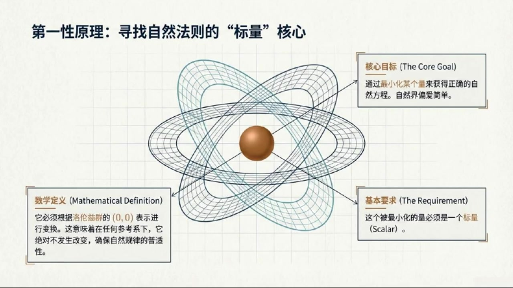
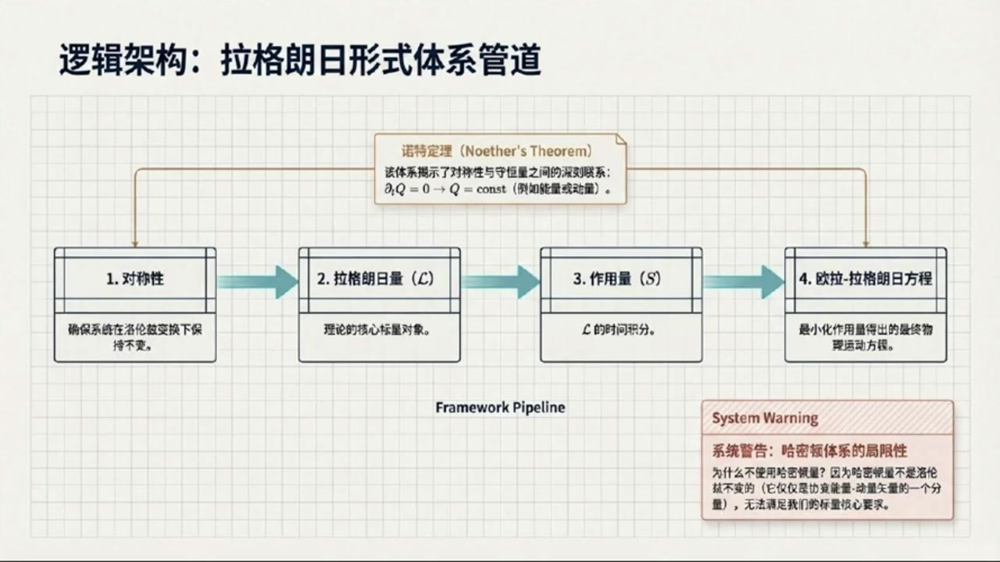
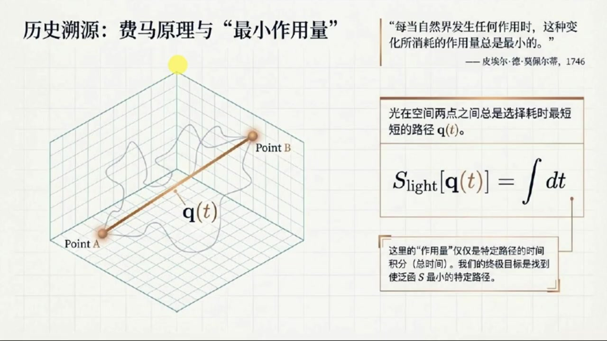
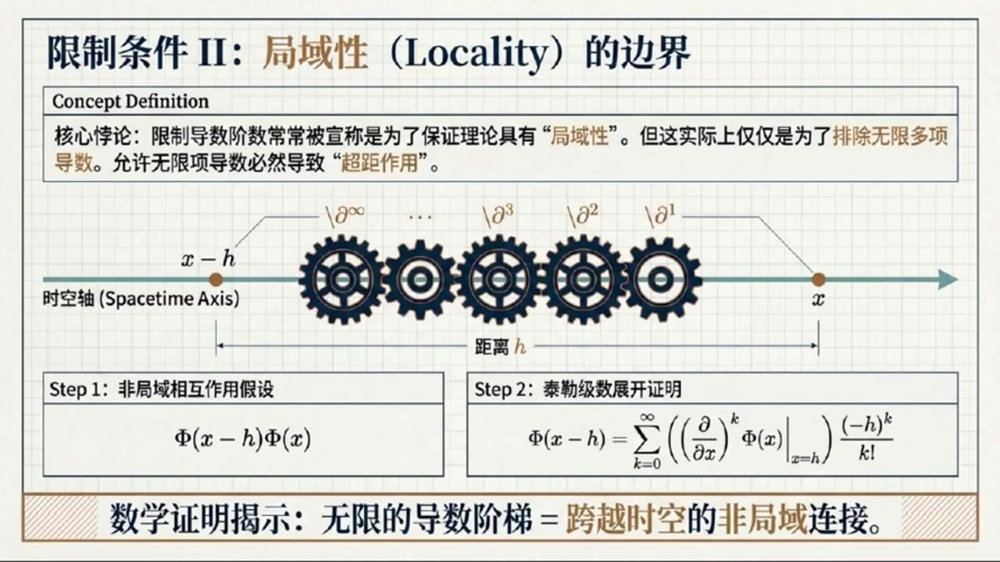
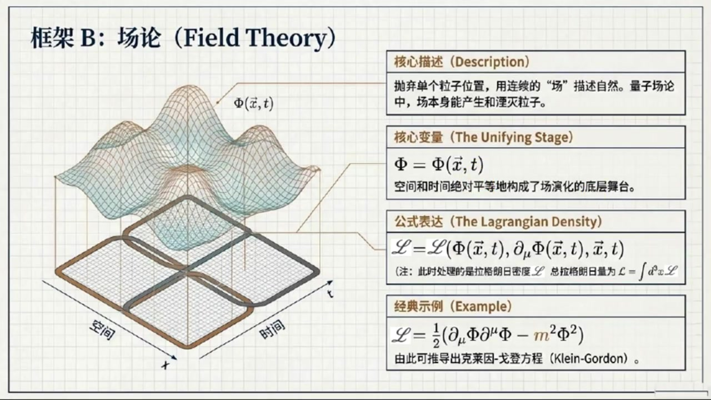

# 《基于对称性的物理学》第15课 物理学的万能框架：拉格朗日形式体系

> 自动生成的课程注解文档（共 3 个段落，[原始视频](https://www.youtube.com/watch?v=T8Zxp9Nr34Y)）

## 目录

- [00:00:00 课程引入：拉格朗日体系、作用量与相对论动机](#段落-1)
- [00:04:56 费马原理到变分法：最小作用量与构造限制](#段落-2)
- [00:11:58 自由理论约束、粒子与场论对比及课程总结](#段落-3)

---

## 段落 1：课程引入：拉格朗日体系、作用量与相对论动机 { #段落-1 }

**时间：** 00:00:00 ~ 00:04:56

📝 原始字幕

<pre>

大家好欢迎来到基于对称性的物理学第十五课我是你们的活泼主播赵伊今天我们要继续探索物理世界中最核心的秘密
大家好,我是赛
上一课中我们从庞扎莱群里找到了基本粒子的身份指纹
现在开始进入第四章
在这张中我们将要干一票大的在对称性的指引下去寻找一种能够直接推倒自然法则的强大框架
可以说是将要搭建物理学大厦的基石了
哇推倒自然法则的框架听起来极其硬核
催导自然法则的框架,听起来极其硬核赛老师,我们要怎么去寻找这个框架呢?
这里的核心思想其实非常漂亮甚至可以说是物理学里最深刻的直觉之一
我们认为大自然总是在抄进道
自然界的规律其实是通过最小化某一个特定的量来得到的
最小化某种特定的量这听起来很像我们数学里找函数的最小值一样,对吧虽然借偏爱最简单的选择,但是这个特定的量到底是什么呢?
这是一个极好的问题
虽然我们现在暂时不知道这个具体的量长什么样,但从对称性的角度出发有一点是绝对肯定的
这个对象在洛伦子变换下绝不能发生哪怕一丝好的改变哦我明白了因为如果他在不同的参考系下算出来的结果变了那推导出的自然规律不就跟着变了这就违背了相对论中经常强调的物理规律对所有观察者必须是一致的完成正确用数学术语来说我们要找的这个对象必须是一个绝对稳如派山的标量
回顾洛伦兹群表示论标量就是根据零零表示进行变换的对象
只要找到了这样的标量再加上最简单选择的限制就足以逼出正确的自然方程了大到致简呢那物理学家们给这个神奇的框架起了什么名字呢听起来好像能大杀四方的感觉
这个框架确实大名鼎鼎它叫拉格朗日形式体系拉格朗第安形式主义
不仅如此他还能推导出一个极其厉害的宝藏诺特定理诺瑟斯比勒姆
诺特定力深刻地揭示了对称性与核心守恒量之间的联系比如系统的能量守恒动量守恒都能从这里直接推出来
我们将在下一课以及下一章会好好讲它
太期待了那相比我们一开始学过的牛顿力学这个拉格朗日体系的优势到底在哪呢它的核心优势就在于它的核心对象也就是我们所说的拉格朗日量LEGRADION天生就是一个标量
所以如果我们要把洛伦兹对称形作为指导原则使用拉格朗日体系简直是不费吹灰之力它完美契合相对论的要求明白了那么我们刚刚一直说的最小化其实就是要最小化这个拉格朗日量吗稍微纠正一点
我们不直接最小化拉格朗日量本身而是要引入一个叫做作用量Action的新概念
作用量实际上是拉格朗日量在时间上的一段积分
我们要求这个作用量在某种相关的对称变化下保持不变或者达到最小所以自然界最偏爱的简单选择就要使得作用量最小
那这个绝妙的思想是怎么来的呢?在追究这个思想的源头之前,我得先补充一点
其实除了拉格老日体系
物理学中还有其他的理论框架
比如非常有名的哈密顿体系
同音音式形式主义
它的核心对象是哈密顿量既然也很有名那为什么我们在相对论中不首选哈密顿体系呢因为它有一个在此处极其致命的弱点
哈密顿量通常代表系统的能量
但在相对论中能量仅仅是斜便的能量动量强量的一个分量而已
这就意味着哈密尔顿量不是洛伦子不变的
一换参考席,它就变了
相比之下天生就是标量的拉格朗日体系自然成为了完美契合相对论的赢家原来拉格朗日体系在湘泽论里这么吃香啊那回到刚才的话题这个让作用量最小的绝妙思想究竟是怎么来的呢它的源头可以追溯到光学里的费马原理

</pre>

**课程截图：**

### 注解

基于您提供的字幕文本与三张板书截图，以下是对本段课程内容的深度注解：

---

## 一、板书/PPT 内容全景解析

### 截图 1：物理学的万能框架：拉格朗日形式体系
这张板书以"最小作用量原理"为中心，构建了完整的理论图景：

**左侧：核心逻辑链**
- **核心对象**：拉格朗日量 $\mathcal{L}$（Lagrangian），被定义为一个描述系统状态的**标量**，在洛伦兹变换下保持不变。
- **最小化作用量 ($S$)**：通过对拉格朗日量的时间积分获得作用量，并要求其**变分为零**（$\delta S = 0$）。
- **欧拉-拉格朗日方程**：
  $$\frac{d}{dt}\left(\frac{\partial \mathcal{L}}{\partial \dot{x}}\right) - \frac{\partial \mathcal{L}}{\partial x} = 0$$
  这是最小化过程的数学结果，构成了描述物理系统演化的**运动方程**。

**右侧：构建准则（底层限制）**
- **洛伦兹不变性**：物理规律不应随参考系改变，因此拉格朗日量必须是标量。
- **低阶导数限制**：仅允许最低阶非平凡导数（通常到一阶或二阶），以确保系统的稳定性和局域性。
- **粒子理论 vs. 场论**：
  - 粒子理论：拉格朗日量 $L$ 依赖于位置 $q(t)$、速度 $\dot{q}(t)$ 和时间 $t$。
  - 场论：拉格朗日密度 $\mathcal{L}$ 依赖于场 $\phi(x)$、场导数 $\partial_\mu\phi$ 和时空坐标 $x$。

### 截图 2：第一性原理：寻找自然法则的"标量"核心
这张板书以原子轨道图像为背景，阐述了从对称性出发的"第一性原理"思维：

- **核心目标**：通过**最小化某个量**来获得正确的自然方程。自然界偏爱简单（奥卡姆剃刀）。
- **基本要求**：这个被最小化的量必须是一个**标量 (Scalar)**。
- **数学定义**：它必须根据洛伦兹群的 **$(0,0)$ 表示**进行变换。这意味着在任何参考系下，它绝对不发生改变，确保自然规律的**普适性**。

### 截图 3：逻辑架构：拉格朗日形式体系管道
这张板书展示了从对称性到运动方程的"生产线"：

**流程管道**：
1. **对称性** → 确保系统在洛伦兹变换下保持不变。
2. **拉格朗日量 ($\mathcal{L}$)** → 理论的核心标量对象。
3. **作用量 ($S$)** → $\mathcal{L}$ 的时间积分（实际上是时空积分 $S = \int \mathcal{L} \, d^4x$）。
4. **欧拉-拉格朗日方程** → 最小化作用量得出的最终物理运动方程。

**上方关联**：
- **诺特定理 (Noether's Theorem)**：该体系揭示了对称性与守恒量之间的深刻联系。数学表达为：
  $$\partial_t Q = 0 \quad \Rightarrow \quad Q = \text{const}$$
  （例如能量或动量守恒）。

**系统警告（右下角）**：
- **哈密顿体系的局限性**：为什么不使用哈密顿量？因为哈密顿量**不是洛伦兹不变的**（它仅仅是协变能量-动量张量的一个分量），无法满足标量核心要求。

---

## 二、核心概念深度注解

### 1. 为什么必须是标量？—— 洛伦兹群的 $(0,0)$ 表示
字幕中提到"绝对稳如泰山的标量"和"零零表示"，这是理解现代理论物理的关键：

- **表示论视角**：洛伦兹群 $SO(3,1)$ 的表示可以用两个"自旋"指标 $(j_1, j_2)$ 标记。其中 $(0,0)$ 表示对应**标量表示**——在任何洛伦兹变换（旋转、boost）下都保持不变。
- **物理一致性**：如果拉格朗日量 $\mathcal{L}$ 不是标量（比如是矢量或张量的某个分量），那么不同惯性参考系的观察者会计算出不同的 $\mathcal{L}$ 值，进而通过最小作用量原理得到不同的运动方程。这直接违背了相对论的基本原理：**物理规律对所有观察者必须一致**。

### 2. 拉格朗日量 ($\mathcal{L}$) vs. 作用量 ($S$) —— 关键区分
字幕中纠正了一个常见误解：我们不是直接最小化拉格朗日量，而是最小化**作用量**。

- **拉格朗日量 $\mathcal{L}$**：是系统的"瞬时状态函数"，类似于某种"成本率"或"能量密度"（虽然严格说不是能量）。在粒子力学中 $\mathcal{L} = T - V$（动能减势能）；在场论中升级为**拉格朗日密度**（单位体积的拉格朗日量）。
- **作用量 $S$**：是拉格朗日量在时间（或时空）上的**累积**：
  $$S = \int_{t_1}^{t_2} L \, dt \quad \text{或} \quad S = \int_{\Omega} \mathcal{L} \, d^4x$$
  它是一个**泛函**（函数的函数），依赖于系统从初态到末态的完整路径或场构型。
- **最小作用量原理**：自然界选择使 $S$ 取极值（通常是最小值）的路径。数学上表示为**变分** $\delta S = 0$。

### 3. 拉格朗日体系 vs. 哈密顿体系 —— 相对论中的抉择
字幕明确解释了为何在相对论物理中"拉格朗日体系是不费吹灰之力"的选择：

- **哈密顿量 $H$ 的致命伤**：在牛顿力学中，$H$ 代表总能量，是演化生成元。但在狭义相对论中，能量 $E$ 只是**四维动量** $p^\mu = (E, \vec{p})$ 的一个分量。当参考系变换时（洛伦兹 boost），能量会与其他动量分量混合变换，因此 $H$ **不是洛伦兹标量**。
- **拉格朗日量的优势**：$\mathcal{L}$ 天生是标量（或可以构造为标量），与时空坐标的选择无关。这使得构建相对论性场论（如量子场论）时，拉格朗日形式成为唯一自然的选择。

### 4. 诺特定理 (Noether's Theorem) —— 对称性的宝藏
字幕预告了下一章的核心内容：诺特定理建立了**连续对称性**与**守恒定律**之间的一一对应：

- **时间平移对称性**（$\mathcal{L}$ 不显含时间）$\Rightarrow$ **能量守恒**
- **空间平移对称性**（$\mathcal{L}$ 不显含空间坐标）$\Rightarrow$ **动量守恒**
- **空间旋转对称性** $\Rightarrow$ **角动量守恒**
- **内部对称性**（如规范对称性）$\Rightarrow$ **电荷守恒**等

数学上，若 $\mathcal{L}$ 在某连续变换 $\phi \to \phi + \epsilon \Delta\phi$ 下保持不变，则存在守恒流 $\partial_\mu j^\mu = 0$，对应守恒荷 $Q = \int j^0 d^3x$。

---

## 三、通俗语言解释

**"大自然抄近道"**：想象大自然是个"懒汉"（其实是最优规划者）。当光从空气射入水中时，它不会走直线（那样耗时更长），而是走折射路径——这就是费马原理（光程最短）。推广到整个物理世界：粒子从A点到B点，不会随便乱走，而是选择"作用量"最小的那条"捷径"。

**"身份指纹"**：上一课提到基本粒子有"指纹"（质量、自旋等量子数），这些对应庞加莱群的不同表示。现在我们要给这些粒子写"运动法则"，必须确保法则本身不依赖于观察者（标量要求），就像指纹本身不会因为你看它的角度不同而改变。

**"推倒自然法则的框架"**：牛顿力学给出的是"力的语言"（$F=ma$），但力在相对论中变换复杂。拉格朗日体系提供的是"能量的语言"（标量语言），通过"最小作用量"这一单一原则，就能自动推导出所有运动方程，甚至揭示守恒定律，堪称"物理学的万能钥匙"。

---

## 四、理论背景补充

**费马原理与最小作用量的历史渊源**：
- 费马原理（1657年）：光在两点间传播的实际路径是使光程 $\int n \, ds$ 取极值的路径（$n$ 为折射率）。
- 莫佩尔蒂（Maupertuis，1744年）将其推广为"最小作用量原理"，认为自然界所有过程都使"作用量"最小。
- 拉格朗日（Lagrange，18世纪）和哈密顿（Hamilton，19世纪）将其数学化，形成分析力学。
- 现代物理学中，最小作用量原理成为构建量子场论、广义相对论乃至弦论的**唯一通用语言**。

**四维协变形式**：
在完全相对论性的场论中，拉格朗日密度 $\mathcal{L}$ 是时空点 $x^\mu = (t, \vec{x})$ 的函数，作用量积分变为：
$$S = \int \mathcal{L}(\phi, \partial_\mu\phi) \, d^4x$$
其中 $d^4x = dt \, d^3x$ 是洛伦兹不变的体积元（因为洛伦兹变换的行列式为1）。这保证了 $S$ 的洛伦兹不变性，进而保证由 $\delta S = 0$ 导出的场方程在所有惯性系中形式相同。

---

## 段落 2：费马原理到变分法：最小作用量与构造限制 { #段落-2 }

**时间：** 00:04:56 ~ 00:11:57

📝 原始字幕

<pre>

费马原理指出光在空间两点之间传播时总是选择耗时最短的那条路径光走最短路径这个我在高中物理里听说过对这其实就是一个作用量最小的绝佳例子
在数学上,光的作用量可以说是极其简单
S放函等于对时间梯的积分
对光来说,他就是要寻找一个特定路径,让这个时间的积分变得最小
寻找一条让积分最小的路径这跟我们平时求补充函数FofX的最小值比如球倒等于零是不是一个意思呢思路很像但对象升级了
平时找函数f of x的最小值,我们是在找一个具体的点
但现在我们处理的是泛函,也就是以函数为次变量的函数
我们要找的不再是一个点,而是一条路径
为了啃下这块硬骨头,我们需要辨分法
变分法感觉是个很高深的数学武器它最核心的思想可以用通俗的话给大家解释一下吗当然变分法的核心思想就是看你寻找的那个最小值周围的景邻区域
如果某个地方真的是最小值,那么它周围的一街遍分就必须神秘消失
举个普通函数的例子,我们要找f of x等于三乘x的平方加x的最小指点 a
好的,那我们不直接求导,要怎么做位小变动呢?
我们在这个A的旁边加上一个无穷小量,叫做Epsilon
其实这个 epsilon 就是所谓的一点点变分
你把A+E带入函数里展开我来算算啊
F of A加 Epsilon展开的话
应该是三乘括号A的平方加上二A乘E加上E的平方括号丸
然后后面还要加上A再加X了非常好关键的观察来了
如果A确实是我们要找的最小指点
那么刚才那个柿子里所有带EPSLON一次方的线形象加起来的总和必须等于零为什么一阶变分必须消失呢你想想看
如果带 Epsilon 一次方的像不等于 0因为 Epsilon 是可以取正也可以取负的
那我总能挑一个合适的正副号,让变动后的整个函数值比原来变得更小
那A就不可能是老大了呀太巧妙了
如果一阶便分为零消失了只剩下EPSLON平方那种极其微小的二阶正数那就没法动摇它是最小值的地位了完全正确所以我们把字母里所有关于EPSLON的一次项捞出来六A乘EPSLON加上EPSLON等于零也就是六A加一等于零瞬间就解除A等于负的六分之一
这和直接求到FPOX等于6x加1等于0结果简直一模一样
原来变分法的思想在基础函数里是这么体现的那把它平移到拉格朗日体系的作用量范函里是怎么操作的我们假设存在一个异版的作用量范函S范函等于拉格朗日量手写TL对时间T的积分
而此时的拉格朗日量手写TL通常会依赖于物体的位置路径QOT以及它的速度也就是QOT的T偏导
也就是说手写 TL 等于手写 TL of 括号 QFT 道号 QFT 的 T 偏导括号
只要对这个有复杂变量的范涵积分使用变分思想求积值就能精准定位真实的物理轨道了
但是,赛老师,大字阳并没有给我们一本说明书,直接写着这个拉格朗日量到底是什么呀
这正是理论构建中最严苛的地方
我们要自己去寻找拉格朗日量
依靠的第一站直路明灯使洛伦兹不变形
除此以外还有几个连目前的物理学家都无法用第一性原理完全解释
但为了不引发系统性灾难必须死死遵守的硬性限制条件
限制条件
甚至说不遵守就会引发灾难
是的
第一个极其严苛的限制是在构建拉格朗日量时只允许使用最低阶的非平凡导数
如果用一阶道数能凑出洛伦兹不变的像,那么我就用一阶道数构建拉格朗日量
如果用一阶导数无法凑出,那么最多也就只能宽限到用二阶导数来凑
也就是说像三阶四阶这种高阶导数是绝对不可以放进拉格朗日量里的吗为什么呢理论上不仅极难处理
而且它在系统层面上含有剧毒
物理上称之为奥斯特格拉斯基不稳定性
只要你敢加高阶导数,你的理论里能量可以变成任意大的负值
任意大的复制这听起来就像是一个永远填不满的无底洞啊没错任何一个状态都会不停的疯狂衰变一路跌落到能量更低更负的状态
在这种理论体系里宇宙根本不存在任何稳定的状态早就土崩瓦解了我的天难怪大自然严禁高阶导数的出现这跟相对论里提到的局域性有关系吗就是说相互作用只能影响相邻的时空点有很大关系
要求局域性其实就是在排除无限多项的导数
想象一下如果有两个场他们相隔一段距离H但却直接发生了非区域的超距作用写成FIFF括号X减H括号称以FIFF这个FIFF括号X减H括号我记得可以把它用泰勒级数展开对展开之后就是从K等于零到五穷大的球和里面包含对FIFF求K接导数然后呈以FIFF的K次方除以K的阶数哦展开是里面塞满了一阶二阶一直到无限接的导数也就是说如果允许拉格朗日量里有无限接导数本质上就是在纵容远距离的超距作用彻底破坏了局域性
你领悟得非常精准

</pre>

**课程截图：**

### 注解

基于您提供的字幕文本与三张板书截图，以下是对本段课程内容的深度注解：

---

## 一、板书/PPT 内容全景解析

### 截图 1：历史溯源——费马原理与"最小作用量"
这张板书以几何图示建立了光学与力学之间的深刻类比：

**左侧视觉元素**：
- 三维网格空间中展示光从 Point A 到 Point B 的传播路径 $\mathbf{q}(t)$
- 多条虚线表示"假想路径"，唯一实线表示"真实路径"（耗时最短）
- 直观呈现"路径积分"的几何意象：光在"探索"所有可能轨迹后，自动选择了时间泛函的极值路径

**右侧公式与注释**：
- **费马作用量**：$S_{\text{light}}[\mathbf{q}(t)] = \int dt$
  - 方括号 $[\cdot]$ 表示这是一个**泛函**（Functional），即函数的函数
  - 被积函数为常数 1，积分变量为时间，因此该泛函数值上等于光沿路径 $\mathbf{q}(t)$ 传播所需的**总时间**
- **莫佩尔蒂名言**：强调"作用量最小"是自然界普适的优化原则

### 截图 2：机制解析——变分法（Variational Calculus）的核心逻辑
这张板书将抽象的泛函极值问题降维到一元函数，展示"变分"的代数本质：

**左侧图像**：
- 抛物线 $f(x) = 3x^2 + x$ 的函数图像
- 放大圆圈显示极值点 $a$ 与其邻域点 $a+\epsilon$ 的微观关系
- $\epsilon$ 被标注为"无穷小变分"，形象展示"在最小值处左右试探"的思想

**右侧四步法则**：
1. **邻域特征**：极值由紧邻区域决定
2. **展开公式**：$f(a+\epsilon) = 3(a^2 + 2a\epsilon + \epsilon^2) + a + \epsilon$
3. **关键法则（变分为零）**：$\epsilon$ 的一次项必须消失，否则可通过选择 $\epsilon$ 的符号使函数值更小
4. **提取极值**：收集线性项 $6a\epsilon + \epsilon = 0 \Rightarrow 6a+1=0 \Rightarrow x_{\min} = -1/6$

**核心推论**：寻找泛函极值的密码在于**令一阶变分为零**（$\delta S = 0$）。

### 截图 3：限制条件 II——局域性（Locality）的边界
这张板书揭示了导数阶数与物理因果性的深刻联系：

**核心视觉隐喻**：
- 时空轴（Spacetime Axis）上，点 $x-h$ 与点 $x$ 之间通过一系列齿轮（标记为 $\partial^1, \partial^2, \partial^3, \dots$）连接
- 齿轮象征导数阶数：一阶导数对应相邻齿轮咬合，高阶导数对应远距离齿轮联动

**关键公式**：
- **非局域相互作用假设**：$\Phi(x-h)\Phi(x)$（两点直接耦合）
- **泰勒级数展开**：
  $$\Phi(x-h) = \sum_{k=0}^{\infty} \left[\left(\frac{\partial}{\partial x}\right)^k \Phi(x)\right]_{x=h} \frac{(-h)^k}{k!}$$
  - 左侧：在位置 $x-h$ 处的场值
  - 右侧：在位置 $x$ 处的场值及其各阶导数的无限叠加
  - $(-h)^k/k!$：展开系数，随阶数 $k$ 阶乘增长而衰减

**数学证明揭示**：无限的导数阶梯 = 跨越时空的非局域连接。

---

## 二、新公式与符号详解

### 1. 光的作用量泛函
$$S_{\text{light}}[\mathbf{q}(t)] = \int dt$$

| 符号 | 含义 | 物理意义 |
|------|------|----------|
| $S_{\text{light}}$ | 光的作用量 | 一个依赖于整条路径的数值 |
| $[\mathbf{q}(t)]$ | 方括号表示泛函依赖 | $\mathbf{q}(t)$ 是从 A 到 B 的**整条轨迹**（函数），而非单个坐标值 |
| $\int dt$ | 对时间积分 | 在相对论性光学中，这实际上是 $\int \sqrt{g_{\mu\nu}dx^\mu dx^\nu}$ 的简化形式，此处仅考虑时间分量 |

**关键理解**：与拉格朗日力学中 $S = \int L dt$ 不同，光的作用量被"退化"为纯几何的**固有时**（Proper Time）积分，因为光走零测地线（Null Geodesic），其"拉格朗日量"为常数。

### 2. 变分法的线性展开
$$f(a+\epsilon) = 3(a^2 + 2a\epsilon + \epsilon^2) + a + \epsilon$$

| 符号 | 含义 | 数学角色 |
|------|------|----------|
| $a$ | 候选极值点 | 待验证的"最佳位置" |
| $\epsilon$（Epsilon） | 无穷小变分 | 标准记号为 $\delta x$，此处是离散化的"试探函数" |
| $6a\epsilon + \epsilon$ | 一阶变分项 | 线性于 $\epsilon$ 的所有项，记为 $\delta f$ |
| $\epsilon^2$ | 二阶变分项 | 高阶小量，决定极值性质（极小/极大） |

**变分操作的本质**：将泛函极值问题转化为"对微小扰动的响应分析"。当 $\delta f = 0$ 时，意味着系统在极值点处对任意微小扰动"无感知"（一阶响应为零）。

### 3. 拉格朗日量的变量依赖
$$L = L(q(t), \dot{q}(t))$$

| 符号 | 含义 | 与变分法的联系 |
|------|------|----------------|
| $q(t)$ | 广义坐标 | 描述系统位形的函数（如位置、角度等） |
| $\dot{q}(t)$ | 广义速度 | $q$ 对时间的一阶导数，$\frac{\partial q}{\partial t}$ |
| $L$ | 拉格朗日量 | 通常是 $T-V$（动能减势能），但此处强调其**局域性**：仅依赖当前时刻的 $q$ 和 $\dot{q}$，不依赖历史或未来 |

### 4. 局域性条件的泰勒展开
$$\Phi(x-h) = \sum_{k=0}^{\infty} \frac{(-h)^k}{k!} \frac{\partial^k \Phi}{\partial x^k}$$

| 符号 | 含义 | 物理约束 |
|------|------|----------|
| $\Phi(x)$ | 场在位置 $x$ 的值 | 如电磁场、物质场等 |
| $h$ | 空间间隔 | 两点之间的距离 |
| $k$ | 导数阶数 | 求导次数，$k=0$ 为场本身，$k=1$ 为梯度，以此类推 |
| $k!$ | 阶乘 | 保证级数收敛的数学因子 |

**关键洞察**：若拉格朗日量包含无限阶导数（$k \to \infty$），则点 $x$ 处的物理行为将依赖于远距离点 $x-h$ 的场值（通过泰勒级数重建），这等价于**超距作用**（Action at a Distance），破坏相对论因果性。

---

## 三、核心概念深度解读

### 1. 从费马原理到变分法：路径的"试探"哲学
**通俗解释**：想象光在出发去 Point B 之前，会"灵魂出窍"地尝试所有可能的弯曲路径（像蚯蚓在土壤中钻探）。对每条路径，它计算"走这条路要花多久"。费马原理说：光实际走的，是那条"时间花费对微小偏离不敏感"的路径。

**数学对应**：
- 普通函数求极值：站在山顶（或谷底），无论往哪个方向迈一小步，高度几乎不变（导数为零）。
- 泛函求极值：将整条路径稍微扭曲（加入 $\delta q(t)$），如果作用量 $S$ 的变化 $\delta S$ 为零，则这是真实物理路径。

### 2. 奥斯特格拉斯基不稳定性（Ostrogradsky Instability）
**概念定位**：这是理论物理中的"红线禁令"——**禁止在拉格朗日量中引入三阶及以上时间导数**（$\dddot{q}, \ddddot{q}$ 等）。

**物理机制**：
- **相空间灾难**：当 $L$ 包含 $\ddot{q}$（二阶导数）时，通过勒让德变换定义正则动量 $p = \frac{\partial L}{\partial \dot{q}} - \frac{d}{dt}\frac{\partial L}{\partial \ddot{q}}$，系统会出现**额外的自由度**。
- **能量无下界**：这些额外自由度对应的能量可以取任意大的负值（$E \to -\infty$）。
- **真空衰变**：如果存在这样的自由度，任何稳定状态（包括真空）都会通过释放能量（向负无穷跌落）而瞬间衰变，宇宙无法维持任何结构。

**通俗类比**：想象一个滑梯，正常滑梯有最低点（稳定平衡）。但奥斯特格拉斯基不稳定性相当于在滑梯底部挖了一个**无限深的陷阱**（负能量井），任何物体一旦存在就会永远坠落，无法停止。

### 3. 局域性（Locality）与导数阶数的博弈
**深层逻辑**：
- **局域相互作用**：物理影响只能以有限速度（光速）传播，因此点 $x$ 的物理定律只能直接"感知"其无穷小邻域（通过一阶导数 $\partial_\mu$ 描述梯度）。
- **非局域的数学伪装**：如果允许无限阶导数，点 $x$ 可以通过泰勒级数"计算"出远处点 $x-h$ 的场值，仿佛两点有直接联系。
- **截断必要性**：为了保证因果性，必须在某阶导数（通常是一阶或二阶）**截断**泰勒级数，强制理论保持局域性。

**形象比喻**：
- **局域理论**：像接力赛跑，信息只能通过相邻选手（时空点）依次传递。
- **非局域理论**：像心灵感应，选手可以直接与终点线对话（无限阶导数允许"看到"远处）。
- **高阶导数限制**：规定"每人只能接触前后相邻的两人"（一阶导数），或"前后各两人"（二阶导数），但绝不允许"跳过中间人直接联系"。

---

## 四、理论背景补充

### 费马原理的历史地位
皮埃尔·德·费马（Pierre de Fermat）在 1662 年提出该原理时，并未意识到这是"最小作用量原理"的特例。直到 18 世纪，莫佩尔蒂（Maupertuis）和欧拉将其推广到力学领域，发现**光选择时间最短路径**与**物体选择作用量最小路径**遵循相同的数学变分结构。这成为后来分析力学（拉格朗日、哈密顿形式体系）的灵感源泉。

### Ostrogradsky 定理（1850）
由俄国数学家米哈伊尔·奥斯特格拉斯基证明。该定理指出：对于非退化的高阶导数拉格朗日量（即 $L$ 显含 $q^{(n)}$ 且 $\frac{\partial^2 L}{\partial (q^{(n)})^2} \neq 0$），其哈密顿量必然在相空间中无下界。这解释了为何标准模型、广义相对论等成功理论均严格限制导数阶数——**大自然的稳定性要求数学上的简洁性**。

### 现代延伸：非局域场论与弦论
尽管标准理论禁止无限阶导数，但在某些量子引力候选理论（如弦场论）中，存在**有限高阶导数**（如修改引力理论 $f(R)$ 中的四阶导数）或**非局域算符**（如 $\exp(-\Box/M^2)$）。这些理论通过精细调节（Fine-tuning）或引入额外约束来规避 Ostrogradsky 不稳定性，但代价是理论复杂度的急剧上升。当前段落的"硬性限制"正是针对标准局域量子场论而言。

---

## 段落 3：自由理论约束、粒子与场论对比及课程总结 { #段落-3 }

**时间：** 00:11:58 ~ 00:16:48

📝 原始字幕

<pre>

此外,如果我们要去描述一个完全没有相互作用的自由例子或自由场,还有一个限制
在拉格朗力量里,我们最多只能写到场败的二节像
只能出现F的零次方一次方或者二次方绝对不能出现F的三次方或者更高阶不能因为当你用将要学到的欧拉拉格朗日方程去操作更高阶的项式最后在运动方程里就会冒出复杂的非线性交叉项
就意味着场和场之间已经发生了相互作用那它就不再是自由的了
所以在构建最纯粹的自由基础时必须在二界处及时焊停明白了简直是严丝合缝啊
有了这些极其苛刻的限制条件,最后我们要聊聊目前描述自然的两大框架
一个是粒子理论,另一个是场论
这俩有什么本质区别这个是一个非常核心的哲学视角切换
第一种粒子理论
在这里,焦点永远是那个四处跑动的小点
我们用尺量QFT来描述它的轨迹
拉格朗日量是一个关于位置时量Q,速度时量Q点
以及时间T本身的函数
中学学过的牛顿运动方程就能从拉格朗日量L等于二分之一m乘时量Q点的平方的经典拉格朗日量里推导出来那场论呢
他有什么更宏大的视角吗?场论完全抛弃了盯着孤立粒子的视角
在场论里空间和时间共同构成了一个平等的浩瀚的舞台
在这个舞台上浸透着一种物理实体也就是场犯
场F是空间十量X和时间T的联合函数
我们写成FIFF括号适量X都好T括号所以场论里的概念变成了在这个空间和时间每一个点上的状态这就不得不引入拉格兰日密度了对吧一点都没错
在场论里,我们研究的核心函数叫拉格朗日密度
符号用花体来表示
它的变量变成了长本体F
场对四维时空谬的偏导数以及单独的空间和时间坐标时空偏导数这说明场论是在时间与空间上同时发力的比起粒子理论里位置作为音变量时间孤零零的当字变量场论是不是更加相对论友好
完全正确,这是场论的革命性优势
它极其平等极其对称地对待空间和时间
完美打破了立子立学时空地位不对等的僵局
有个非常霸气的克莱恩戈登场拉格朗日密度花帖L等于二分之一成括号偏下谬派缩柄偏上谬派减去M的平方成派的平方括号这串公式听起来挺长但物理直觉其实很好懂
前半部分的时空偏导数相当于场在时空变动中产生的动能而后半部分带着质量的像相当于它自身的适能只要对它用变粉法就能直接召唤出克莱因戈登方程
哇这不就是咱们熟悉的动能减去势能的高维进阶版吗不管是粒子理论追寻精准轨迹还是场论在全宇宙铺开场构型归根结底都是依靠最小化作用量泛含S这个满极嘎杀器来逼出自然规律
感觉一切复杂现象背后居然藏着这么一套精般简单统一的哲学总结得很棒
这就是我们构建基础物理的终极框架
而具体到每一个系统里这套拉格朗日量是如何化作实体方程以及引出诺特定理的
我们将在后续课程中狠狠揭开他们的真面目
已经迫不及待了今天非常感谢赛老师带我们领略了变风法的神庙和拉格朗日体系的暴力美学这节课真的很硬和又很爽
很高兴能和大家一起感受物理学这种深藏的极简之美
好的,那我们今天的博客就先到这里,各位听众可以在脑海里好好体味一下这填不满的负能量无底洞,以及自然界喜欢超近道的酷悬设定
我们下期再见,拜拜
大家下期见,拜拜

</pre>

**课程截图：**

### 注解

基于您提供的字幕文本与三张板书截图，以下是对本段课程内容的深度注解：

---

## 一、板书/PPT 内容全景解析

### 截图 1：限制条件 III —— 自由理论的截断点（Free Theory Filter）
这张板书以**漏斗过滤器**的视觉隐喻，阐释了构建自由场（无相互作用）理论的严格数学限制：

**核心视觉元素**：
- **漏斗上方**：漂浮着场的各阶幂次项 $\Phi^0, \Phi^1, \Phi^2, \Phi^3, \Phi^4...$，象征着拉格朗日量中可能出现的所有场函数组合
- **过滤机制**：标注为"自由理论过滤器"的漏斗中部设有一道**二阶截断线**（虚线），仅允许 $\Phi^0$（常数项）、$\Phi^1$（线性项）、$\Phi^2$（二次项）通过
- **被排除项**：$\Phi^3$（三次项）、$\Phi^4$（四次项）等高阶项被漏斗阻挡，碎裂后落入下方的"排除区"
- **输出托盘**（Output Tray）：最终保留下来的只有低阶项，暗示自由理论的拉格朗日量必须是场的**二次型**

**左侧法则说明**：
> "为了得到描述'自由'（即非相互作用）场或粒子的理论，我们必须在场 $\Phi(x)$ 的二阶处强制停止。"

**右侧分类框**：
- **允许通过的项**：仅包含 $\Phi^0, \Phi^1, \Phi^2$
- **被排除的项**：如 $\Phi^2\partial_\mu\Phi$（三阶项）等复杂相互作用项必须被剔除

**底部补充说明**：
由于 $\Phi^0$ 和 $\Phi^1$ 不会在拉格朗日量中产生正比于 $\Phi$ 的运动方程项（常数项导数为零，线性项通过变分后通常被边界条件吸收或重新定义场），因此**保留到二阶意味着我们恰好覆盖了最低可能的非平凡动力学**。

---

### 截图 2 & 3：框架 B —— 场论（Field Theory）
这两张板书展示了从粒子力学向场论跃迁的**范式革命**：

**左侧三维可视化**：
- 一个连续的**场构型** $\Phi(\vec{x},t)$ 被可视化为在时空基底上起伏的曲面，取代了粒子力学中孤立的"点"
- 基底坐标轴明确标注"空间"（$x$）和"时间"（$t$），构成平等的舞台

**右侧结构化信息**：

| 模块 | 内容 |
|------|------|
| **核心描述** | 抛弃单个粒子位置，用连续的"场"描述自然。量子场论中，场本身能产生和湮灭粒子。 |
| **核心变量** | $\Phi = \Phi(\vec{x},t)$ —— 空间和时间绝对平等地构成了场演化的底层舞台。 |
| **公式表达** | 拉格朗日密度 $\mathcal{L} = \mathcal{L}(\Phi(\vec{x},t), \partial_\mu\Phi(\vec{x},t), \vec{x}, t)$ （注：此时处理的是拉格朗日密度，总拉格朗日量为 $L = \int d^3x \, \mathcal{L}$） |
| **经典示例** | **克莱因-戈登场拉格朗日密度**： $$\mathcal{L} = \frac{1}{2}(\partial_\mu\Phi \partial^\mu\Phi - m^2\Phi^2)$$ 由此可推导出克莱因-戈登方程（Klein-Gordon）。 |

---

## 二、新公式详解：克莱因-戈登场拉格朗日密度

本段出现的核心新公式为**自由标量场（克莱因-戈登场）的拉格朗日密度**：

$$
\mathcal{L} = \frac{1}{2}\left( \partial_\mu\Phi \partial^\mu\Phi - m^2\Phi^2 \right)
$$

### 符号逐一说明：

| 符号 | 名称 | 物理含义 |
|------|------|----------|
| $\mathcal{L}$ | 拉格朗日密度（Lagrangian Density） | 单位体积内的拉格朗日量，是场论的核心泛函。注意与粒子力学中总拉格朗日量 $L$ 区分（$L = \int \mathcal{L} \, d^3x$）。 |
| $\Phi$ | 标量场（Scalar Field） | 时空上的物理实体，$\Phi = \Phi(\vec{x}, t)$，是洛伦兹标量（在不同参考系下数值不变）。 |
| $\partial_\mu$ | 四维协变导数（Covariant Derivative） | $\partial_\mu \equiv \frac{\partial}{\partial x^\mu} = \left( \frac{1}{c}\frac{\partial}{\partial t}, \frac{\partial}{\partial x}, \frac{\partial}{\partial y}, \frac{\partial}{\partial z} \right)$，下标 $\mu = 0,1,2,3$。 |
| $\partial^\mu$ | 逆变导数（Contravariant Derivative） | 通过度规张量升降指标：$\partial^\mu = \eta^{\mu\nu}\partial_\nu$，在闵可夫斯基时空中 $\partial^\mu = \left( \frac{1}{c}\frac{\partial}{\partial t}, -\frac{\partial}{\partial x}, -\frac{\partial}{\partial y}, -\frac{\partial}{\partial z} \right)$。 |
| $\partial_\mu\Phi \partial^\mu\Phi$ | 动能项（Kinetic Term） | 展开为 $\dot{\Phi}^2 - (\nabla\Phi)^2$（自然单位制 $c=1$），描述场在时空中的变化率，类比于粒子力学中的 $\frac{1}{2}m\dot{q}^2$。 |
| $m$ | 质量参数（Mass） | 场的静质量，决定场的激发量子（粒子）的惯性。 |
| $m^2\Phi^2$ | 质量项（Mass Term） | 势能项，类比于谐振子的 $\frac{1}{2}kx^2$，提供恢复力使场倾向于回到 $\Phi=0$ 的基态。 |

### 公式结构解析：
- **动能部分** $\frac{1}{2}\partial_\mu\Phi \partial^\mu\Phi$：包含时间导数（动能密度）和空间导数（梯度能/张力能）
- **势能部分** $\frac{1}{2}m^2\Phi^2$：与场振幅的平方成正比，确保能量有下界

对该拉格朗日密度应用欧拉-拉格朗日方程：
$$
\frac{\partial\mathcal{L}}{\partial\Phi} - \partial_\mu\left(\frac{\partial\mathcal{L}}{\partial(\partial_\mu\Phi)}\right) = 0
$$
可直接导出**克莱因-戈登方程**：
$$
(\partial_\mu\partial^\mu + m^2)\Phi = 0 \quad \text{或} \quad \left(\Box + m^2\right)\Phi = 0
$$
其中 $\Box = \partial_\mu\partial^\mu = \frac{1}{c^2}\frac{\partial^2}{\partial t^2} - \nabla^2$ 为达朗贝尔算符。

---

## 三、核心概念深度解读

### 1. 自由理论的"二阶截断"机制
字幕中提到的"必须在二阶处及时焊停"是构建自由场的关键数学约束：

**为什么只能到二次项？**
- **线性运动方程**：若拉格朗日量仅含 $\Phi$ 的二次项（及更低阶），通过变分得到的欧拉-拉格朗日方程是**线性微分方程**（如克莱因-戈登方程）。
- **叠加原理成立**：线性方程满足叠加原理，不同模式的场振动相互独立，**无能量交换**（即无相互作用）。
- **高阶项的灾难**：一旦出现 $\Phi^3$（自相互作用）或 $\Phi^4$ 项，运动方程将包含非线性项（如 $\Phi^2$），导致：
  - 场方程出现交叉耦合项
  - 不同频率/位置的场模式相互散射
  - 粒子之间产生相互作用（如 $\phi^3$ 理论中的三粒子顶点）

**通俗类比**：想象一个谐振子系统。自由理论就像**独立摆动的理想弹簧**（简谐振动），而三次项就像给弹簧增加了非线性硬化项，导致大振幅时频率改变，不同弹簧之间开始"对话"（能量交换）。

### 2. 粒子理论 vs 场论：哲学视角的切换
这段内容完成了从经典力学到场论的**范式转换**：

| 维度 | 粒子理论（Particle Theory） | 场论（Field Theory） |
|------|---------------------------|---------------------|
| **本体论** | 关注**孤立的点粒子**（小点） | 关注**弥漫的场构型**（连续介质） |
| **基本变量** | 位置坐标 $q(t)$（仅时间函数） | 场振幅 $\Phi(\vec{x},t)$（时空函数） |
| **拉格朗日量** | $L(q, \dot{q}, t)$ —— 有限自由度 | $\mathcal{L}(\Phi, \partial_\mu\Phi, x)$ —— 无限自由度（每一点都是独立自由度） |
| **时空观** | 时间 $t$ 是独立参数，空间 $\vec{x}$ 是配置空间坐标 | 时空 $(\vec{x},t)$ 构成平等的**舞台**，场是舞台上的演员 |
| **相对论兼容性** | 非协变（时间特殊处理） | **完全协变**（洛伦兹对称性显式体现） |

**关键洞察**：场论不是简单地把粒子"抹平"成场，而是将**自由度从有限维（$q_1, q_2...$）推广到无限维**（每个空间点 $\vec{x}$ 对应一个场值 $\Phi(\vec{x})$）。粒子在场论中只是场的**激发量子**（量子化后的准粒子），而非基本实体。

### 3. 相对论友好性的数学体现
字幕强调场论"极其平等极其对称地对待空间和时间"，这体现在：

**显式洛伦兹协变性**：
- 拉格朗日密度 $\mathcal{L}$ 是**洛伦兹标量**（在参考系变换下不变）
- 时空导数以**缩并形式** $\partial_\mu\Phi \partial^\mu\Phi$ 出现，确保时间和空间导数以对称方式进入动能项
- 对比粒子力学：$L = \frac{1}{2}m\dot{q}^2$ 中时间导数特殊（动能项），而场论中 $\frac{1}{2}(\dot{\Phi}^2 - (\nabla\Phi)^2)$ 明确显示时间与空间以"符号相反但地位平等"的方式出现

**最小作用量原理的统一性**：
尽管本体论不同，两者都遵循 $\delta S = 0$：
- 粒子：$S = \int L(q, \dot{q}) \, dt$
- 场论：$S = \int \mathcal{L}(\Phi, \partial_\mu\Phi) \, d^4x$（对四维时空积分）

这种统一性体现了自然界的"极简之美"：无论描述点粒子还是弥漫场，**极值原理**始终是背后的支配法则。

---

## 四、理论背景补充

### 自由场与相互作用场的分界
在量子场论中，拉格朗日量通常写为：
$$
\mathcal{L} = \mathcal{L}_{\text{free}} + \mathcal{L}_{\text{int}}
$$
其中 $\mathcal{L}_{\text{free}}$ 仅含二次项（如本段的克莱因-戈登项），而 $\mathcal{L}_{\text{int}}$ 包含三次及以上项（如 $\lambda\Phi^4$ 或 $g\bar{\psi}\psi\Phi$）。自由场理论是可精确求解的（对应自由粒子福克空间），而相互作用项需要通过微扰论（费曼图）处理，对应真实的散射过程。

### 质量项的物理意义
克莱因-戈登方程中的质量项 $m^2\Phi^2$ 在量子化后对应**静止能量** $E_0 = mc^2$。值得注意的是，该项在场论中表现为"势能"，但在相对论性能量-动量关系 $E^2 = p^2c^2 + m^2c^4$ 中，它正是**质量壳条件**的体现。场论通过这一简单项，将惯性质量自然地编织进时空动力学的结构中。

---
