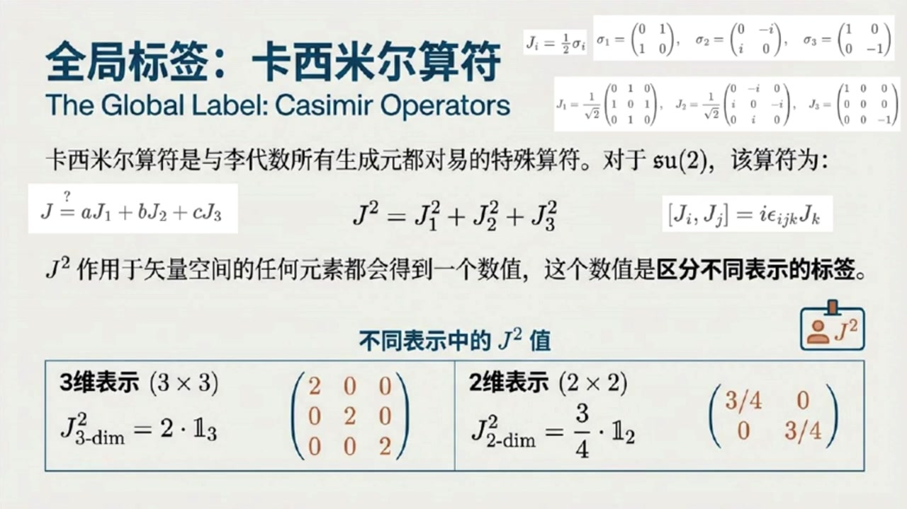
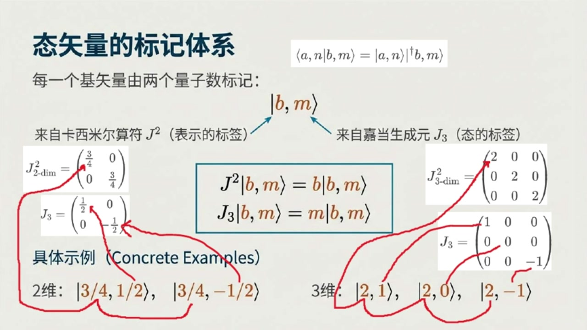
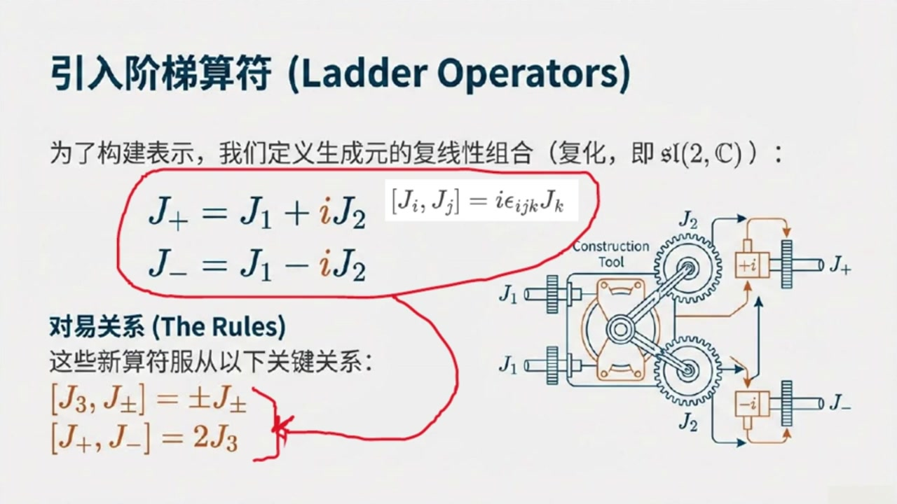
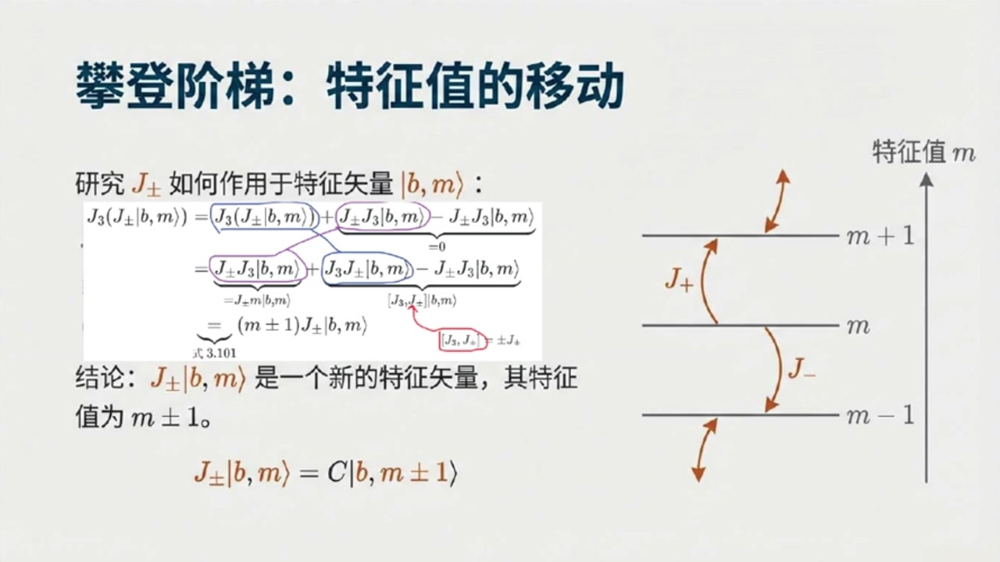
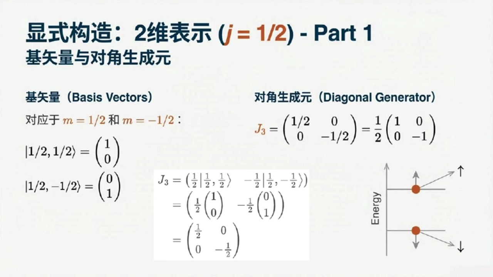
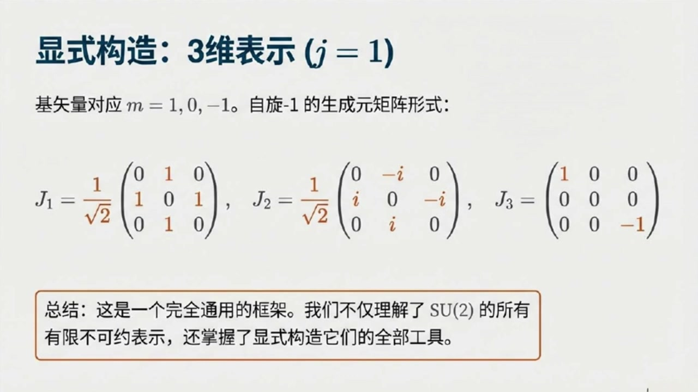

# 《基于对称性的物理学》第9课 SU2李代数有限维不可约表示：通向量子力学的隐秘通道

> 自动生成的课程注解文档（共 6 个段落）

## 目录

- [00:00:00 课程引入与卡西米尔算符的作用](#段落-1)
- [00:05:00 加当生成元J3与基态标签的建立](#段落-2)
- [00:11:00 升降算符、最高最低权与J的量子化](#段落-3)
- [00:20:00 归一化系数的求解与标准记号|j,m⟩](#段落-4)
- [00:27:00 从平凡表示到二维表示的显式矩阵构造](#段落-5)
- [00:32:00 三维表示、一般结论与课程总结](#段落-6)

---

## 段落 1：课程引入与卡西米尔算符的作用 { #段落-1 }

**时间：** 00:00:00 ~ 00:05:00

📝 原始字幕

<pre>

基于对称性的物理学的听众朋友们大家好欢迎收听我们的第九课我是你们活泼好奇的Zoe大家好我是你们诚稳的SY很高兴在此和大家一起探索物理学的奥秘上次我们聊到SU二里群的生成元感觉有点像在猜谜用一些特定的矩阵来识别他们在理括号下的行为今天是不是要更系统地讲讲这些生成元到底能长成什么样或者说它们有哪些表现形式呢没错Zoe你这个问题问得特别好今天我们就要深入探讨SU二里群的表示论简单来说就是把抽象的群元素或者理带数元素映射成我们熟悉的矩阵这些矩阵作用在某个实量空间上这就像给一个抽象的概念找到它在现实世界中的各种具体性
哦听起来有点像我们给一个角色设计各种不同的皮肤或者造型但核心的角色还是那个角色非常形象的比喻就是这个意思我们今天要讲的就是怎么系统地找出SU二里群所有的皮肤也就是它的各种表示人最开始我们用的二乘二有句证其实只是其中一种特殊的表示那这可真是让人期待那我们从哪里开始呢好的要理解SU二里群的表示我们首先需要一些特殊的工具来给这些表示贴标签第一个非常重要的概念叫做卡西米尔算符卡西米尔算符听起来有点神秘它有什么特别之处吗它的特别之处在于它能与给定李代数的所有生成元都对应也就是说不管你拿它和哪个生成元
进行理括号运算结果都是零这性质可太厉害了他就像一个老好人跟谁都和睦相处那对于我们正在研究的小写SU二里代数他的卡西米尔算符张什么样呢对于小写SU二里代数最常见的卡西米尔算符是二次的我们把它记作J平方它的形式是J平方等于J一平方加J二平方加J三平方这里的J一J二J三就是我们之前讨论过的三个生成源赛老师听一下我这里有一个疑问为何我们这里要用二次的卡西米尔算符存在一次的卡西米尔算符吗这是个好问题Joy以小写SU二里代数如果存在一次卡西米尔算符这意味着这种卡西米尔算符只能是J一J二J三的线性组合
三种生成源相互之间满足JI和JJ的理括号等于I称EPSLONIJK缩并JK这意味着这三个生成元之间不对应这意味着一定存在某个生成元和这种作为生成元线性组合的一次卡西米尔算符不对应进而和卡西米尔算符定义矛盾因为它要和所有生成元对应哦我明白了所以至少对小写SU2里带数而言卡西米尔算符最低应该是二次的那么J1平方加J2平方加J3平方那这个算符有什么用呢它能帮我们做什么它的核心作用就是标记不同的表示如果你把这个卡西米尔算符作用在某个表示的食量空间上的任何一个元素上你会得到一个数值这个数值就是我们用来区分
标签哦我明白了就像不同家族有不同的姓氏一样这个J平方的值就是表示的姓氏可以这么理解我们来取个例子我们之前提到过一个三维表示他的卡西米尔算符J平方算出来就是一个三乘三的对角矩阵对角线上都是二也就是说他的姓氏是二而我们最开始用的那个二维表示也就是由波利矩阵SigmaI定义的JI等于二分之一SigmaI他的卡西米尔算符J平方算出来是四分之三所以他的姓氏就是四分之三你看不同的表示卡西米尔算符的值就不同明白了所以J平方这个算符是用来给家族贴标签的那个家族里面的成员比如某个具体的适量我们怎么给他贴标签呢

</pre>

**课程截图：**

### 注解

以下是针对该课程片段的深度注解：

---

## 一、公式与符号解析

本段核心围绕 **卡西米尔算符（Casimir Operator）** 展开，涉及的公式及其物理含义如下：

### 1. 二次卡西米尔算符的定义式
$$J^2 = J_1^2 + J_2^2 + J_3^2$$

| 符号 | 含义 |
|------|------|
| $J^2$ | **二次卡西米尔算符**（总角动量平方算符），是 $\mathfrak{su}(2)$ 李代数中最重要的不变量 |
| $J_1, J_2, J_3$ | $\mathfrak{su}(2)$ 的三个生成元（基），对应三维空间中的三个独立转动生成元 |
| 下标平方 | 表示算符的复合（矩阵乘法或算符乘积），即 $J_i^2 = J_i \cdot J_i$ |

**物理意义**：这类似于经典力学中角动量矢量的模长平方 $|\mathbf{J}|^2 = J_x^2 + J_y^2 + J_z^2$，但在量子/代数层面，它是与所有生成元对易的"守恒量"。

### 2. $\mathfrak{su}(2)$ 代数的基本对易关系
$$[J_i, J_j] = i\epsilon_{ijk}J_k$$

| 符号 | 含义 |
|------|------|
| $[\cdot, \cdot]$ | **李括号**（对易子），$[A,B] = AB - BA$ |
| $i$ | 虚数单位 |
| $\epsilon_{ijk}$ | **列维-奇维塔符号**（Levi-Civita symbol），完全反对称张量。当 $(i,j,k)$ 为 $(1,2,3)$ 的偶排列时为 $+1$，奇排列时为 $-1$，有重复指标时为 $0$ |
| 爱因斯坦求和约定 | 右侧对重复指标 $k$ 求和（$k=1,2,3$）|

**关键性质**：这个非零的对易关系表明三个生成元彼此"不对易"，这是 $\mathfrak{su}(2)$ 代数非阿贝尔性的核心，也是**不存在一次卡西米尔算符**的数学根源。

### 3. 二维表示（自旋-1/2表示）的具体实现
$$J_i = \frac{1}{2}\sigma_i$$

其中 $\sigma_i$ 为 **泡利矩阵（Pauli Matrices）**：
$$\sigma_1 = \begin{pmatrix} 0 & 1 \\ 1 & 0 \end{pmatrix}, \quad \sigma_2 = \begin{pmatrix} 0 & -i \\ i & 0 \end{pmatrix}, \quad \sigma_3 = \begin{pmatrix} 1 & 0 \\ 0 & -1 \end{pmatrix}$$

**计算验证**：在此表示下，
$$J^2 = \left(\frac{1}{2}\right)^2 (\sigma_1^2 + \sigma_2^2 + \sigma_3^2) = \frac{1}{4}(I + I + I) = \frac{3}{4}I_2$$
其中 $I_2$ 为 $2\times 2$ 单位矩阵。

### 4. 卡西米尔算符在表示空间中的矩阵形式

**三维表示（自旋-1）**：
$$J^2_{3\text{-dim}} = 2 \cdot \mathbb{I}_3 = \begin{pmatrix} 2 & 0 & 0 \\ 0 & 2 & 0 \\ 0 & 0 & 2 \end{pmatrix}$$

**二维表示（自旋-1/2）**：
$$J^2_{2\text{-dim}} = \frac{3}{4} \cdot \mathbb{I}_2 = \begin{pmatrix} 3/4 & 0 \\ 0 & 3/4 \end{pmatrix}$$

**关键观察**：卡西米尔算符在不可约表示中必为**单位矩阵的常数倍**（舒尔引理），这个常数 $j(j+1)$ 就是该表示的"标签"。

---

## 二、板书/PPT截图内容描述

### 截图1：SU(2)李代数的有限维不可约表示全景
这是一张信息图，展示了 $\mathfrak{su}(2)$ 表示论的完整结构：

- **中心视觉**：一个螺旋上升的"阶梯"结构，象征表示空间的构造。
- **左侧**：标注"阶梯构造与表示分类"，说明通过升降算符 $J_{\pm}$ 以步长1改变磁量子数 $m$，构建完整的矢量空间。
- **右上角**：展示基矢量 $|j,m\rangle$ 的球面表示，其中 $j$ 为表示标签（总角动量量子数），$m$ 为 $J_3$ 的特征值（磁量子数）。
- **底部表格**：列出关键数据对应关系：
  - 当 $j=0$：维度为1，$J^2=0$
  - 当 $j=1/2$：维度为2，$J^2=2$（注：此处应为 $j(j+1)=3/4$，截图标注可能有笔误或采用不同归一化）
  - 当 $j=1$：维度为3，$J^2=2$

### 截图2与3：全局标签——卡西米尔算符
这两张为同一页PPT，详细解释卡西米尔算符的数学构造：

- **顶部**：给出泡利矩阵的具体形式及 $J_i = \frac{1}{2}\sigma_i$ 的关系。
- **中部**：强调卡西米尔算符的核心性质——与所有生成元对易（$[J^2, J_i] = 0$）。
- **底部表格**：对比两个具体表示中 $J^2$ 的矩阵形式，直观展示"单位矩阵的常数倍"这一关键特征。

---

## 三、理论背景补充

### 1. 舒尔引理（Schur's Lemma）与卡西米尔算符
卡西米尔算符之所以能成为表示的"标签"，其数学基础是**舒尔引理**：
> 在一个不可约表示空间中，任何与所有生成元对易的算符必为单位算符的常数倍。

这意味着 $J^2$ 在整个表示空间中是"各向同性"的——它不会混合表示空间内的不同基矢，只是将每个基矢缩放相同的倍数。

### 2. 为什么SU(2)只有一个独立的卡西米尔算符？
李代数独立的卡西米尔算符个数等于其**秩（rank）**（即最大对易子代数的维数）。$\mathfrak{su}(2)$ 的秩为1，因此只有一个独立的卡西米尔算符（即 $J^2$）。

**一次卡西米尔不存在性的证明**：
假设存在一次卡西米尔 $C = aJ_1 + bJ_2 + cJ_3$。根据定义，它必须与所有生成元对易，特别地 $[C, J_1] = 0$。
计算得：
$$[aJ_1 + bJ_2 + cJ_3, J_1] = b[J_2,J_1] + c[J_3,J_1] = -ibJ_3 + icJ_2 = 0$$
这要求 $b=c=0$。同理，与 $J_2, J_3$ 对易要求 $a=0$。因此唯一与所有生成元对易的线性组合是零算符，无物理意义。

### 3. 特征值 $j(j+1)$ 的物理起源
在完整的理论中，卡西米尔算符的特征值并非任意，而是量子化的：
$$J^2 |j,m\rangle = j(j+1) |j,m\rangle$$
其中 $j$ 取非负半整数 $0, \frac{1}{2}, 1, \frac{3}{2}, \dots$。这解释了为什么三维表示（$j=1$）的特征值是 $1\times(1+1)=2$，而二维表示（$j=1/2$）的特征值是 $\frac{1}{2}\times\frac{3}{2}=\frac{3}{4}$。

---

## 四、核心概念通俗解释

### "姓氏"与"家族成员"的比喻
- **表示（Representation）**：如同一个"家族"（如"史密斯家族"）。不同的表示就是不同的家族（二维家族、三维家族等）。
- **卡西米尔算符 $J^2$**：如同家族的**姓氏**。所有属于同一家族的成员（基矢量）共享同一个姓氏（相同的 $J^2$ 特征值）。
- **生成元 $J_3$**：如同家族成员的**名字**（如"约翰"、"玛丽"）。在同一个家族（表示）内，不同的成员通过 $J_3$ 的特征值 $m$ 来区分（如 $m = -j, -j+1, \dots, j$）。
- **升降算符 $J_{\pm}$**：如同家族内部的"辈分"关系，可以将一个成员变成另一个成员（改变 $m$ 值），但不会改变家族姓氏（不改变 $J^2$ 值）。

### "皮肤"比喻的深化
课程中提到的"给角色设计不同皮肤"非常贴切：
- **抽象群元素**是角色的"灵魂"（代数关系）。
- **矩阵表示**是角色的"皮肤"（具体外观）。
- **卡西米尔算符的值**是皮肤的"色号"或"系列编号"——它告诉你这是"史诗皮肤"（$j=1$）还是"传说皮肤"（$j=1/2$），而具体的矩阵元（如 $J_3$ 的对角元）则是皮肤上的具体纹理细节。

这种"标签化"是物理学中**分类学**的强大工具：只要测量出 $J^2$ 的值，就能立即确定系统处于哪个"表示家族"中，从而预测其所有可能的内部状态数（维度 $2j+1$）。

---

## 段落 2：加当生成元J3与基态标签的建立 { #段落-2 }

**时间：** 00:05:00 ~ 00:11:00

📝 原始字幕

<pre>

这是我们要引入的第二个重要概念加当生成源卡顿生成器但是在进入下一个主题前我要提醒一下同学们在课后一定要动手计算一下前面提及的三维表示和二维表示的卡西米尔算符看看是否的确能写成单位矩阵的倍数体会一下这种表示的标签数好的课后我一定会认真计算的我们继续讨论加当生成源吧它又有什么特点之处呢加当生成源是所有可以同时对角化的生成源对于小写SUR里代数只有一个这样的生成源按照惯例我们选择J3作为我们的加当生成元只有一个那听起来简单多了它的作用又是什么呢
J3是用来区分不同表示这个大分类的家当生成元J3就是用来区分这个表示内部的基时量也就是说J3是姓氏而J3是名字差不多是这个意思我们来看看J3在不同表示里的样子在三维表示中它的矩阵形式是这样的对角线上是一零负一而在二维表示中也就是炮力矩阵那个都是对角矩阵这些是方便标记对所以对于每个表示我们都会用J3的特征时量作为这个表示所作用的时量空间的基时量这意味着每个基时量都可以有两个数字来标记我现在有一个疑问我知道J3我们这里是直接选择的
但为何要这样选择你可以给出一个合理的计算过程吗好吧我打算尽可能直从家当生成源的定义出发给出一个合理的计算过程先考虑SU二群它的生成源也就是离代数上的元素必须满足J等于J并且J的G必须是零而家当生成源按定义必须是已经对角化的以三维表示为例不妨设为J等于矩阵A零零换行零B零换行零零C家当生成源作为一个特殊的生成源也必须满足前面这个而米无忌的条件所以可以直接带入得到A加B加C等于零其中ABC都是必须是实数到这一步还是无法确定ABC吧对的后面我们将会发现家当生成源
必须是等间隔的所以可以把B等于A加Delta和C等于B加Delta依次带入可得Delta等于A进而可算出B等于A其中A是实数我发现了J3可以写成A成句证一零零换行零零换行零零复一那这个A应该如何处理其实这个A的纸不重要因为后面我将发现需要对表示空间上的基实量进行归一化这个A纸将会被吸收掉基于某种方便性这里的A举一这样就得到前面的三维表示中的加当生成的表示矩阵J3我明白了对二维表示的我们也可以得到对应的加当生成的表示矩阵J3我们通常继续吧
我们用一个抽象的符号来表示这些基数量写成右是B逗号M或者读成B逗号M太其中B就是我们前面说的卡西米尔算符J平方的特征值它标记了整个表示而M呢就是加当生成元J3的特征值它标记了表示内部的具体基数量此外我们还需要注意目前我们设计的时量仅仅是刚才所谓的右是至于左是我们目前尚未定义所以量子力学中常出现的左是A逗号N成右是B逗号N太M在后面的推导中仅仅学成A逗号N太M目前我们仅仅把B逗号M太理解成一个时量即可所以B逗号M太就是一个抽象的人名了带着姓氏和名字
用这个符号怎么表示呢好的比如二维表示它的J平方特征值是四分之一和二分之一所以它的基石量就是四分之一逗号二分之一太和四分之一逗号负二分之一太类似的三维表示的J平方特征值是二零负一那么它的基石量就是二逗号一太二逗号零太和二逗号负一太这样一看确实清晰多了我们有了标记表示的姓氏B也有了标记表示内元素的名字M那我们怎么从一个名字变到另一个名字呢有没有什么算符能让M的值变化恭喜你已经换到了表示论里一个非常核心且强大的工具升降算符或者也叫阶梯算符

</pre>

**课程截图：**

### 注解

以下是针对该课程片段（00:05:00 ~ 00:11:00）的深度注解：

---

## 一、公式与符号解析（本段新内容）

本段核心引入**嘉当生成元（Cartan Generator）** $J_3$ 及**态矢量的双标签标记体系** $|b, m\rangle$。

### 1. 嘉当生成元的矩阵表示
**三维表示（自旋-1表示）：**
$$J_3 = \begin{pmatrix} 1 & 0 & 0 \\ 0 & 0 & 0 \\ 0 & 0 & -1 \end{pmatrix}$$

**二维表示（自旋-1/2表示/泡利矩阵 $\sigma_z$ 的归一化形式）：**
$$J_3 = \begin{pmatrix} \frac{1}{2} & 0 \\ 0 & -\frac{1}{2} \end{pmatrix}$$

| 符号 | 含义 |
|------|------|
| $J_3$ | 嘉当生成元，$\mathfrak{su}(2)$ 李代数中唯一（因秩为1）的可同时对角化生成元 |
| 对角元 $\{1, 0, -1\}$ 或 $\{\frac{1}{2}, -\frac{1}{2}\}$ | $J_3$ 的本征值，称为**磁量子数**或**权重**，标记表示内部不同基态 |

### 2. 嘉当生成元的约束条件（推导过程）
视频中提及的推导涉及以下关键方程：

**厄米性（Hermiticity）与无迹（Traceless）条件：**
$$J = J^\dagger, \quad \text{Tr}(J) = 0$$

**对角化假设：**
$$J_3 = \begin{pmatrix} a & 0 & 0 \\ 0 & b & 0 \\ 0 & 0 & c \end{pmatrix}$$

**等间隔条件（来自表示论权重格点）：**
$$b = a + \delta, \quad c = b + \delta \implies a + b + c = 0 \Rightarrow \delta = -a$$

最终归一化取 $a=1$，得到 $J_3 = \text{diag}(1, 0, -1)$。

### 3. 态矢量的双标签标记体系
$$|b, m\rangle \quad \text{（视频中读作"右矢 $b$ 逗号 $m$ 态"）}$$

**本征值方程组：**
$$\begin{cases} J^2 |b, m\rangle = b |b, m\rangle \\ J_3 |b, m\rangle = m |b, m\rangle \end{cases}$$

| 符号 | 含义 | 类比（视频中的"姓氏-名字"比喻） |
|------|------|----------------------------------|
| $b$（或常记为 $j(j+1)$） | 卡西米尔算符 $J^2$ 的本征值，标记**整个表示**（representation） | **姓氏**：决定"家族"（如三维表示 $j=1$，二维表示 $j=1/2$） |
| $m$ | 嘉当生成元 $J_3$ 的本征值，标记表示内的**具体基矢量** | **名字**：决定家族中的具体成员（如 $m=1, 0, -1$） |

**具体示例：**
- **二维表示**（自旋-1/2）：$|3/4, 1/2\rangle$, $|3/4, -1/2\rangle$（注：此处 $b=j(j+1)=3/4$）
- **三维表示**（自旋-1）：$|2, 1\rangle$, $|2, 0\rangle$, $|2, -1\rangle$（注：此处 $b=j(j+1)=2$）

---

## 二、理论背景深化

### 1. 嘉当子代数（Cartan Subalgebra）
对于李代数 $\mathfrak{g}$，**嘉当子代数** $\mathfrak{h}$ 是其极大交换子代数（即其中元素两两对易）。$\mathfrak{su}(2)$ 的秩（rank）为1，意味着其嘉当子代数是1维的，仅由一个生成元（通常选 $J_3$）张成。

**关键性质**：由于 $[J_3, J^2] = 0$，$J^2$ 与 $J_3$ 可同时对角化，因此可以用两者的本征值 $(b, m)$ 共同标记态矢量。

### 2. 为何选择 $J_3$ 为对角形式？
在有限维酉表示中，厄米算符（自伴算符）必可对角化。嘉当生成元的定义就是"可以同时对角化的生成元"。选择 $J_3$ 为对角矩阵意味着：
- 我们选择了**物理上的 $z$ 轴方向**作为量子化轴；
- 基矢量变成了 $J_3$ 的本征矢量，物理上对应具有确定角动量投影的态。

### 3. 权重（Weight）与等间隔性
$J_3$ 的本征值 $m$ 称为该表示的**权重**。对于 $\mathfrak{su}(2)$ 的不可约表示，权重总是**等间隔分布**的，间隔为1（在 $J_3$ 的归一化约定下）。这是由升降算符（$J_\pm$）的代数结构决定的，也是视频中推导 $a, b, c$ 必须等间隔的深层原因。

---

## 三、图像内容描述

### 截图1 & 2：局部标签——嘉当生成元
- **标题**："局部标签：嘉当生成元 / The Local Label: Cartan Generators"
- **核心图示**：一个标有 "Family (Representation)" 的椭圆，内部排列着标有数字的圆点（$1, 0, -1, \frac{1}{2}, -\frac{1}{2}$），形象化表示同一表示（家族）内不同基态由 $J_3$ 的本征值标记。
- **公式区**：
  - 右侧列出 $J_3$ 在三维和二维表示中的具体对角矩阵形式；
  - 标注"对角线元素标记基矢量"，强调矩阵元与态标签的对应关系。
- **关键文字**："嘉当生成元 $J_3$ 在给定的表示**内部**为不同的基矢量提供标签"，区分于卡西米尔算符标记整个表示。

### 截图3：态矢量的标记体系
- **标题**："态矢量的标记体系"
- **核心公式**：
  - 顶部显示内积符号 $\langle a,n|b,m\rangle = \langle a,n|^\dagger |b,m\rangle$（注：视频提及"左矢"尚未定义，此处为量子力学标准记号预告）；
  - 中央方框突出本征值方程 $J^2|b,m\rangle = b|b,m\rangle$ 和 $J_3|b,m\rangle = m|b,m\rangle$。
- **结构说明**：
  - 用箭头清晰标注 $|b,m\rangle$ 中 $b$ 来自卡西米尔算符（表示的标签），$m$ 来自嘉当生成元 $J_3$（态的标签）；
  - 左右两侧分别列出二维和三维表示的 $J^2$ 和 $J_3$ 矩阵，并用红色箭头连接到对应的具体态矢量示例（如 $|3/4, 1/2\rangle$ 等）。

---

## 四、核心概念通俗解读

### "姓氏"与"名字"的类比
视频中将 $(b, m)$ 比作**姓氏**和**名字**是非常精妙的比喻：
- **姓氏 $b$（卡西米尔本征值）**：决定了你属于哪个"家族"（表示）。比如"张"氏家族有三口人（三维表示），"李"氏家族有两口人（二维表示）。同一个家族内，姓氏相同。
- **名字 $m$（嘉当本征值）**：决定了你在家族中的具体身份。张氏家族内部有老大（$m=1$）、老二（$m=0$）、老三（$m=-1$）。

### 升降算符的预告
视频结尾提及的"升降算符"（Ladder Operators）$J_\pm$，其物理意义是**在家族内部改变名字，但不改变姓氏**：
- $J_+$ 像"大哥"：把老二变成老大（$m=0 \to m=1$）；
- $J_-$ 像"小弟"：把老二变成老三（$m=0 \to m=-1$）。
它们无法把你从一个家族（表示）变到另一个家族（表示），这正是卡西米尔算符 $J^2$ 作为"不变量"的核心体现。

### 关于"左矢"的说明
视频中提到"左矢 $\langle a,n|$ 尚未定义"，这是狄拉克符号（Dirac Notation）的严谨性体现：
- **右矢 $|b,m\rangle$**：列矢量，代表量子态；
- **左矢 $\langle b,m|$**：行矢量，是右矢的厄米共轭（$\dagger$），用于计算内积（概率幅）。
目前阶段可暂时将 $|b,m\rangle$ 理解为抽象的"人名标签"，后续课程将完善对偶空间（左矢空间）的严格定义。

---

## 段落 3：升降算符、最高最低权与J的量子化 { #段落-3 }

**时间：** 00:11:00 ~ 00:20:00

📝 原始字幕

<pre>

升降算符听起来就像电梯一样能把M值升高或降低完全正确我们定义两个新的算符J正和J副J正等于J一加IJ二而J副等于J一减IJ二这里的I是虚数单位把J一和J二组合起来了而且还带了虚数这有什么玄机吗玄机就在于他们的对一关系我们可以通过之前学过的SUR里群生成员的对一关系JI和JJ的理括号等于IJK也就是J一和J二的理括号等于IJ三等等推导出这两个新算符的对一关系最关键的两个是J三和J正副的理括号等于正副J正副的理括号等于二J三好的
给我们一个答案吧
配合成B逗号M太是J三的一个新的特征写量并且特征值是M加减一对吧对的既然J正复乘B逗号M太作为J三的一个特征始量特征值恰好是M加减一这意味着J正复乘B逗号M太的派标签是M加减一表示标签依然是B所以这个太对应B逗号M加减一太当然这个太不一定满足规一化条件所以需要添加一个有待决定的参数C我明白了这说明J正复乘B逗号M一定等于某个长数C加B逗号M加一太对你太厉害了的确如此这说明如果J正用在M的特征始量B逗号M太上那么得到的始量仍然是J三的特征始量但是它的特征值
M加一这就像是J正把M值往上提了一格那J副呢没错J副作用在B都好M太上得到的始量J三的特征值就变成了M减一所以J正副才被称为升降算符可以让我们在J三的特征值之间爬楼梯这真是太巧妙了那我们是不是可以无限地爬下去或者一直爬上去呢这个问题问得非常好答案是不能因为我们讨论的是有限为表示这个意味着我们的食量空间是有限的不可能有无限多个线性无关的特征食量所以这个爬楼的过程必须停止向上总是有一个最高的特征值我们把它叫做J当J正作用在这个最高的特征食量B都好J太上时
必须得到零否则如果它能产生一个M值为J加一的新食量那J就不是最高的了这很合理那向下爬呢同样道理向下爬也必须有一个最低的特征值我们把它叫做K当J副作用在这个最低的特征食量B都好K开上时它也必须得到零好的最高点是J最低点是K那这两个值和我们之前的标签B有什么关系吗有非常重要的关系利用J正B都好J台等于0这个条件以及J平方等于J一平方加J二平方加J三平方和阶梯算法的一个关键的公式可以推导出一个公式可以给我讲讲吗可以的我们可以先计算J复称J结果根据这两个
它等于括号J一减J二括号称括号J一加IJ二括号等于J一平方加J二平方加I成括号J一J二减J二J一括号我注意到第一第二项根据二次卡西米尔算符应该等于J平方减J三平方而第三项的括号部分恰好等于一个理括号对应的这个J一和J二的理括号等于J三把这三项全部加起来最后J二乘J正等于J二乘J三乘J三现在可以用J二乘J正对吧根据最大特征值J二乘J正就用在B二乘正对
然后将J负成J正的表达式带入于是继续等于括号J平方减J三平方减J三括号作用在B都好J太根据这三个算子的特征值可以继续等于括号B减J平方减J括号B都好J太我看到结果了那么一定有B等于J成括号J加一括号一个如此简洁的公式那最低的特征值K呢它和J有什么关系吗完全类似地利用J负B都好K太等于零我们也能推导出B等于K成括号K减一括号当然这个推导过程虽然和前面类似但我还是希望同学们在课后再动手过一遍好的
这个表达式和前面的表达式都是B的表达式那么其中的J和K一定存在确定的关系对吧是的我们可以把这两个关于B的表示式一比较也就是这两个表达式相减得到括号J加K括号成括号J减K加一括号等于0由于J大于K所以第二因此不为零于是我们就能得出另一个非常重要的结论K等于负J也就是最低的特征值就是最高特征值的负数这太对称了没错这非常漂亮地体现了SU二里群的对称性现在我们来总结一下对于一个给定的SU二里群表示它的卡西米尔算符特征值B可以用最高J3特征值J来表示即B等于J1特征值M呢
它从最高的J一直向下以整数不长变化直到最低的负J这就带来了一个极其重要的洞察从最高值J到最低值负J中间的不长都是一所以J减卦号负J瓜号必须是一个正数也就是二J所以二J必须是一个正数完全正确这意味着J的取值可以是零二分之一二分之三等等它只能是整数或者半整数哇这简直是把J的取值给量子化了这和我们量子力学里讲的角动量量子化是不是有关系没错对你抓住了核心这正是量子力学中角动量量子化的直接来源SU二里群和它的小写SU二里代数在数学上与量子力学中的角动量代数是同构的

</pre>

**课程截图：**

### 注解

以下是针对该课程片段（00:11:00 ~ 00:20:00）的深度注解：

---

## 一、公式与符号解析（本段新内容）

本段核心引入**升降算符（Ladder Operators）**的构造及其代数性质，并通过"阶梯算法"（Step-wise Algorithm）建立卡西米尔算符特征值 $b$ 与最高权 $j$ 的定量关系。

### 1. 升降算符的定义（复化生成元）
$$J_+ = J_1 + iJ_2, \quad J_- = J_1 - iJ_2$$

| 符号 | 含义 |
|------|------|
| $J_+$ | **升算符**（Raising Operator），作用后将 $J_3$ 的特征值 $m$ 提升 1 |
| $J_-$ | **降算符**（Lowering Operator），作用后将 $J_3$ 的特征值 $m$ 降低 1 |
| $i$ | 虚数单位，此处通过复线性组合实现李代数 $\mathfrak{su}(2)$ 的**复化**（complexification），得到 $\mathfrak{sl}(2,\mathbb{C})$ |

### 2. 关键对易关系（The Rules）
$$[J_3, J_{\pm}] = \pm J_{\pm}, \quad [J_+, J_-] = 2J_3$$

| 关系 | 物理/数学意义 |
|------|---------------|
| $[J_3, J_+] = +J_+$ | $J_+$ 是 $J_3$ 的"本征算符"，本征值为 $+1$，对应 $m$ 增加 |
| $[J_3, J_-] = -J_-$ | $J_-$ 是 $J_3$ 的"本征算符"，本征值为 $-1$，对应 $m$ 减少 |
| $[J_+, J_-] = 2J_3$ | 升降算符之间的封闭关系，是构造卡西米尔算符的关键 |

### 3. 阶梯作用方程（Action on States）
$$J_{\pm}|b,m\rangle = C_{\pm}^{(b,m)}|b,m\pm 1\rangle$$

| 符号 | 含义 |
|------|------|
| $C_{\pm}^{(b,m)}$ | **归一化常数**（通常为复数），由表示的具体归一化约定决定，满足 $|C_+|^2 = b - m(m+1)$ 等关系 |
| $|b,m\pm 1\rangle$ | 新的归一化本征态，保持卡西米尔算符特征值 $b$ 不变，仅改变磁量子数 $m$ |

### 4. 最高/最低权条件（Termination Conditions）
$$J_+|b,j\rangle = 0, \quad J_-|b,k\rangle = 0$$

| 符号 | 含义 |
|------|------|
| $j$ | **最高权**（Highest Weight），$m$ 能取到的最大值，对应"楼梯的顶端" |
| $k$ | **最低权**（Lowest Weight），$m$ 能取到的最小值，对应"楼梯的底端" |

### 5. 卡西米尔算符的分解式
$$J_-J_+ = J^2 - J_3^2 - J_3$$

**推导说明**：利用 $J_{\pm}$ 定义展开：
$$J_-J_+ = (J_1-iJ_2)(J_1+iJ_2) = J_1^2+J_2^2 + i[J_1,J_2] = (J^2-J_3^2) + i(iJ_3) = J^2 - J_3^2 - J_3$$

### 6. 特征值 $b$ 的两种表达式
$$b = j(j+1) \quad \text{和} \quad b = k(k-1)$$

**推导逻辑**：
- **上限**：对最高态 $|b,j\rangle$ 作用 $J_-J_+$，因 $J_+|b,j\rangle=0$，得 $0 = (b - j^2 - j)|b,j\rangle$，故 $b=j(j+1)$
- **下限**：对最低态 $|b,k\rangle$ 作用 $J_+J_- = J^2 - J_3^2 + J_3$，因 $J_-|b,k\rangle=0$，得 $0 = (b - k^2 + k)|b,k\rangle$，故 $b=k(k-1)$

### 7. 最高权与最低权的对称关系
$$k = -j$$

**推导**：
联立 $j(j+1) = k(k-1)$，因式分解得 $(j+k)(j-k+1)=0$。由于 $j \geq k$ 且 $j-k+1 \neq 0$（否则 $j=k-1$ 与 $j\geq k$ 矛盾），必有 $j+k=0$。

### 8. 角动量量子化条件
$$2j \in \mathbb{Z}_{\geq 0} \Rightarrow j = 0, \frac{1}{2}, 1, \frac{3}{2}, 2, \ldots$$

**物理意义**：从 $j$ 到 $-j$ 以整数步长递减，总步数 $j - (-j) = 2j$ 必须为非负整数，因此 $j$ 只能取整数或半整数。

---

## 二、理论背景补充

### 1. 李代数的复化与表示论
实李代数 $\mathfrak{su}(2)$ 的生成元 $J_1, J_2, J_3$ 是反厄米的（在量子力学中通常乘以 $i$ 变为厄米）。通过引入复组合 $J_{\pm}$，我们实际上将实李代数复化为 $\mathfrak{sl}(2,\mathbb{C})$。这是研究有限维不可约表示的标准技巧，因为复单李代数的表示论更为简洁。

### 2. 最高权表示（Highest Weight Representation）
SU(2) 的每一个有限维不可约表示都由唯一的最高权 $j$ 标记。给定 $j$ 后，整个表示空间由 $\{|j,m\rangle\}$ 张成，其中 $m = j, j-1, \ldots, -j$，共 $2j+1$ 个态。这对应于物理中自旋为 $j$ 的粒子具有 $2j+1$ 个磁量子态。

### 3. 与量子力学角动量代数的同构
本段推导的代数结构 $\{J^2, J_3, J_{\pm}\}$ 与量子力学中的角动量算符 $\{\hat{J}^2, \hat{J}_z, \hat{J}_{\pm}\}$ 完全同构：
- $J^2 \leftrightarrow \hat{J}^2/\hbar^2$，本征值 $j(j+1)$
- $J_3 \leftrightarrow \hat{J}_z/\hbar$，本征值 $m$
- $J_{\pm} \leftrightarrow \hat{J}_{\pm}/\hbar = (\hat{J}_x \pm i\hat{J}_y)/\hbar$

因此，这里的 $j$ 就是**总角动量量子数**，$m$ 是**磁量子数**，而 $j$ 的整数/半整数量子化正是泡利不相容原理和费米子/玻色子统计的根源。

---

## 三、通俗语言解释：爬楼梯的

---

## 段落 4：归一化系数的求解与标准记号|j,m⟩ { #段落-4 }

**时间：** 00:20:00 ~ 00:27:00

📝 原始字幕

<pre>

所以我们在这里推导出的这些结论直接对应了量子角动量的性质有一些具体例子吗有的我们可以看看一些例子当J等于零时M只能是零这是一个一维的表示对应的J平方值B等于J括号J加一括号等于零当J等于二分之一时M可以是二分之一负二分之一这是二乘二分之一加二维的表示对应的J平方值B等于二分之一乘二分之一加一括号等于四分之一当J等于一时M可以是一零加一等于三维的表示对应的J平方值B等于一乘二分之一加一括号等于二我发现J等于二分之一的二维表示
正好是我们博客开头提过过的J等于一的三维表示J平方值是二也对上了这真的是从理论上推导出了我们之前看到的那些具体例子对这就是表示论的强大之处它能从根本上解释这些表示为什么是这样以及还有哪些其他可能的表示赛我们现在知道J和M的曲值范围了也知道阶梯算符能改变M那我们具体怎么用它们来构造出J一J二J三这些生成远的剧情形式呢比如J正成B都号M太到底等于什么它只是简单的等于B都号M加一太吗当然我已经知道其中的B目前就是等于J括号J加一括号我们不能简单的写J正成B都号M太等于
B都好M加一态因为在物理中我们通常希望基石二是归一化的当这正作用在一个归一化的基石二上时结果通常不是归一化的所以我们需要引入一个长数C写成J正成B多M态等于C成B多M加一态这个C就是我们现在要计算的只有计算出它我们才能真正利用阶梯算符来显示的构造矩件考虑到归一化确实很重要那这个C怎么算呢首先我们希望确保B到M态和B到M加一态都是归一化的任何合一化的偏离都吸收到长数C种所以我们可以假设B到M态和B到M加一态都已经是归一化的然后求满足条件的长数C所以我们可以通过计算
算太适量的模平方来计算C对吧对的所以我们有跨号J正作用于B到M太跨号DEGGER成J正作用于B到M太等于C平方乘B到M加一太根据刚才的B到M加一太已归一化的假设继续等于C平方哦现在可以剩下C平方的表达是继续下去了是的现在C平方继续等于B多号M太大格尔成J正大格尔成J正正正其中J正大格尔等于JJJJJJJJJJJJJJJJJJJJJJJJJJJJJJJJJJJJJJJJJJJJJJJJJJJJJJJJJJJJJJJJJJJJJJJJJJJJJJJJJJJJJJJJJJJJJJJJJJJJJJJJJJJJJJJJJJJJJJJJJJJJJJJJJJJJJJ
可继续等于B逗号M太大格成括号B减M平方减M括号M太对的我注意到第一项成最后一项根据假设应该也是规划的中间的括号项中的B等于J成括号J加一括号所以最终得到C平方等于J成括号J加一括号减M成括号M加一括号为了方便起见我们通常选择C是实数且为正数所以C等于J括号J加一括号M加一括号开平方这个C的表达式也太漂亮了它只依赖于J和M这两个标签没错有了它我们就可以完整的写出J正成B逗号M太等于J成括号J加一括号J加一括号
乘括号m加一括号开平方乘B逗号M加一太你还可以验证一下当M等于J时这个市字中的根号部分正好是零也就是J正B逗号J太等于零和我们之前的结论完全一致同样的对于下降算符J副我们也能计算出一个类似的长数结果是J副成B逗号M太等于J括号J加一括号减M括号M减一括号开平方对了我注意到前面的B等于J括号J加一括号M太所以B逗号M太实际应该读成J括号J加一括号豆号M太对吧但是这样读的确很麻烦
由于B和J括号J加一括号中的J是一一对应的关系所以我们以后直接用J代替B你的意思是以后我们直接用J逗号M太代替B也就是J括号J加一括号M太对的我们从现在开始就正式启用这个约定太棒了有了这个约定以及这些公式我们就可以从一个基时量出发通过反复作用升降算数得到所有的基时量并且知道它们之间具体的数值关系了对现在我们拥有了构造SU二里群所有有限为不可约表示的全部工具那我们是不是可以马上看看一些具体的例子了我迫不及待地想知道它们长什么样当然我们从最简单的表示开始首先是J等于零的情况所以这是一个

</pre>

**课程截图：**

### 注解

以下是针对该课程片段（00:20:00 ~ 00:27:00）的深度注解：

---

## 一、公式与符号解析（本段新内容）

本段核心任务是**计算升降算符的归一化常数**，建立 $J_\pm$ 作用在归一化基矢上的精确矩阵元，并正式引入标准的 $|j,m\rangle$ 标记法。

### 1. 升降算符的归一化条件
由于物理态要求归一化 $\langle j,m|j,m\rangle = 1$，升降算符作用后通常不再归一化，因此引入复常数 $C$：

$$J_+ |j,m\rangle = C_{j,m}^+ |j,m+1\rangle$$

**符号说明：**
- $C_{j,m}^+$：升算符的归一化常数（一般为实数，取正根）
- $|j,m\rangle$：已归一化的共同本征态（$J^2$ 和 $J_3$ 的本征态）
- 假设 $|j,m+1\rangle$ 也已归一化，所有非归一化因子都吸收进 $C$

### 2. 归一化常数的推导公式
通过计算模方 $|C|^2 = \langle j,m|J_- J_+|j,m\rangle$（利用 $J_+^\dagger = J_-$），并利用代数关系：

$$J_- J_+ = J^2 - J_3^2 - \hbar J_3$$

（在自然单位制 $\hbar=1$ 下）得到：

$$|C_{j,m}^+|^2 = j(j+1) - m(m+1)$$

**关键步骤解释：**
- $J_- J_+$ 是"先升后降"的复合操作，其本征值可通过卡西米尔算符 $J^2$ 和 $J_3$ 表示
- 代入本征值方程：$J^2|j,m\rangle = j(j+1)|j,m\rangle$，$J_3|j,m\rangle = m|j,m\rangle$
- 展开得：$j(j+1) - m^2 - m = j(j+1) - m(m+1)$

### 3. 升降算符的显式作用公式（本段最重要的结果）
选择 $C$ 为实数且为正（相位约定），得到标准结果：

$$
\boxed{
\begin{aligned}
J_+ |j,m\rangle &= \sqrt{j(j+1) - m(m+1)} \, |j,m+1\rangle \\
J_- |j,m\rangle &= \sqrt{j(j+1) - m(m-1)} \, |j,m-1\rangle
\end{aligned}
}
$$

**等价形式（利用阶乘表示）：**
$$J_+ |j,m\rangle = \sqrt{(j-m)(j+m+1)} |j,m+1\rangle$$
$$J_- |j,m\rangle = \sqrt{(j+m)(j-m+1)} |j,m-1\rangle$$

**物理验证：**
- 当 $m=j$（最高权态）时，$J_+|j,j\rangle = \sqrt{j(j+1)-j(j+1)}|j,j+1\rangle = 0$，符合"顶端无法上升"的边界条件
- 当 $m=-j$（最低权态）时，$J_-|j,-j\rangle = 0$，同理

### 4. 标记法的简化约定
由于卡西米尔算符的本征值 $b = j(j+1)$ 与量子数 $j$ 一一对应，**从此放弃 $b$ 标记，改用标准记法**：

$$|b,m\rangle \equiv |j(j+1),m\rangle \triangleq |j,m\rangle$$

**意义：** 用更简洁的 $|j,m\rangle$ 双标签完全确定一个基矢，其中 $j$ 标记不可约表示（表示的"大小"），$m$ 标记表示内的具体状态（磁量子数）。

---

## 二、理论背景补充

### 1. 归一化的物理必要性
在量子力学中，概率诠释要求 $|\langle \psi|\psi\rangle|^2 = 1$。如果升降算符不保持归一化，计算跃迁概率时需要额外处理模长，而上述公式确保了：
$$\langle j,m+1|J_+|j,m\rangle = \sqrt{j(j+1)-m(m+1)}$$
这正是 $SU(2)$ 群表示矩阵元的标准形式（Wigner-Eckart 定理的基础）。

### 2. 与谐振子的类比（概念辅助）
- **谐振子**：$a^\dagger|n\rangle = \sqrt{n+1}|n+1\rangle$，系数 $\sqrt{n+1}$ 随能级线性增长
- **角动量**：系数 $\sqrt{(j-m)(j+m+1)}$ 随 $m$ 变化是非线性的，反映 $SU(2)$ 紧李代数的有限维表示特性（梯子有顶端和底端，而谐振子能级无限）

### 3. 表示构造的完备性
有了这些公式，**可以从单个最高权态 $|j,j\rangle$ 出发**，通过反复作用 $J_-$ 生成整个表示空间的基矢：
$$|j,j\rangle \xrightarrow{J_-} |j,j-1\rangle \xrightarrow{J_-} \cdots \xrightarrow{J_-} |j,-j\rangle$$
这构成了 $2j+1$ 维不可约表示的完整基。

---

## 三、通俗语言解释

想象一个**有固定横档数的梯子**（比如 $2j+1$ 级）：

1. **梯子高度标签 $j$**：决定梯子有多少级（表示的维数）。$j=1/2$ 是2级梯子（上、下），$j=1$ 是3级梯子（上、中、下）。

2. **当前位置标签 $m$**：你在第几级横档上，从 $-j$（地面）到 $+j$（顶端）。

3. **升降算符 $J_\pm$**：向上或向下爬一级的"动作"。
   - **关键区别**：爬梯子的"力度"（系数 $\sqrt{j(j+1)-m(m\pm1)}$）**不是恒定的**！
   - 在梯子中间（$m\approx 0$）时，系数约为 $\sqrt{j(j+1)}$，较大；
   - 接近顶端（$m\approx j$）时，系数变小，直到 $m=j$ 时变为 $\sqrt{0}=0$，你自然停在那里无法继续上升。

4. **归一化**：确保每级横档的"宽度"相同（概率守恒），虽然爬梯子的"力度"不同，但每级横档本身都是标准宽度（归一化）。

---

## 四、板书/PPT 截图描述

**第一张截图（量子化条件）：**
- 标题为"量子化条件 (The Quantization Condition)"
- 核心公式框：$b = j(j+1)$，标注"对应卡西米尔算符 $J^2$ 的值"
- 三点结论：
  1. 最大值是 $j$，最小值是 $-j$
  2. 每次应用阶梯算符，特征值改变 1
  3. 因此最大值与最小值的差必须是整数 $\Rightarrow 2j = \text{整数}$
- 右侧表格"允许的表示"：列出 $j=0, 1/2, 1, 3/2$ 对应的维数（$2j+1$）和 $m$ 取值
- 底部数轴图：标注允许的 $j$ 值（$0, 0.5, 1, 1.5, \dots$）

**第二张与第三张截图（归一化常数的计算）：**
- 标题"归一化常数的计算"
- 目标明确：求解 $J_+|b,m\rangle = C|b,m+1\rangle$ 中的常数 $C$
- 推导流程用红蓝箭头标注：
  - 从 $\langle b,m+1|b,m+1\rangle = 1$（归一化假设）
  - 到 $|C|^2 = \langle b,m|J_- J_+|b,m\rangle$
  - 利用 $J_- J_+ = J^2 - J_3^2 - J_3$（式3.106）
  - 代入本征值得到 $|C|^2 = j(j+1) - m^2 - m$
- **最终公式框（蓝色粗框）**：
  $$J_\pm |j(j+1),m\rangle = \sqrt{j(j+1)-m(m\pm1)} |j(j+1),m\pm1\rangle$$
- 右下角标注约定：$|b,m\rangle = |j(j+1),m\rangle \triangleq |j,m\rangle$（Computer Modern 字体标注）

这些板书清晰地展示了从抽象代数关系到具体可计算矩阵元的推导链条，是 $SU(2)$ 表示论从理论到应用的关键转折点。

---

## 段落 5：从平凡表示到二维表示的显式矩阵构造 { #段落-5 }

**时间：** 00:27:00 ~ 00:32:00

📝 原始字幕

<pre>

J1J2J3都必须是一乘一的矩阵也就是一个数字唯一能满足我们之前说的对一关系JL和JM的理括号等于IXLN所并JN的就只有数字零也就是说J1等于零J2等于零J3等于零那这个表示就什么都没做啊没错所以它被称为频繁表示群元素U等于一上零等于一它什么都不会改变好的那下一个J值呢J等于二分之一怎么样J一二分之一是下一个可能的值根据二加一加一的公式这是一个二乘二分之一等于二维的表示在这个表示中J三的特征值是二分之一和负二分之一所以我们可以直接写出J三的剧情形式它就是二分之一乘以一个对角线上是一负一的矩阵也就是二分之一乘以零行零负一
这不就是炮力矩阵SIGMAZ吗哦原来J三就是二分之一SIGMAZ正是那么对应的基始就是二分之一倒号二分之一太等于劣时量一零和二分之一倒号负二分之一太等于劣时量零一接下来我们就可以用阶梯丧幅来构造J一和J二了我们知道J一等于二分之一括号J副加J证括号而J二等于二分之一I括号J副减J证括号好的那我们来算算看J一怎么作用在积时量上好的我们以J一乘二分之一倒好二分之一太为例根据公式它等于二分之一乘括号J副加J证括号乘二分之一二分之一太加J证乘二分之一太
因为二分之一已经是J三的最大特征值了所以J正成二分之一二分之一态必须是零对吧对的那么就只剩下二分之一乘J负乘二分之一二分之一态了我们用刚才推导出的J负的作用公式带入J等于二分之一M等于二分之一得到二分之一乘括号二分之一加一括号减二分之一减一括号开平方等于一也就是大CTU打等于一对吧对的所以J负成二分之一逗号二分之一态直接等于二分之一逗号二分之一态等于二分之一乘二分之一逗号二分之一态等于二分之一列向两零一明白了那另一个
J1乘二分之一逗号负二分之一泰呢和前面类似的过程我们也可以算出J1乘二分之一逗号负二分之一泰等于二分之一乘二分之一逗号二分之一逗号等于二分之一逗号二分之一逗号二分之一逗号二分之一逗号二分之一逗号二分之一逗号二分之一逗号二分之一逗号二分之一逗号二分之一逗号二分之一逗号二分之一逗号二分之一逗号二分之一逗号二分之一逗号二分之一逗号二分之一逗号二分之一逗号二分之一逗号二分之一逗号二分之一逗号二分之一逗号二分之一逗号二分之一逗号二分之一逗号二分之一逗号二分之一逗号二分之一逗号二分之一逗号二分之一逗号二分之一逗号二分之一逗号二分之一逗号二分之一逗号二分之一逗号二分之一逗号二分之一逗号二分之一逗号二分之一逗号二分之一逗号二分之一逗号二分之一逗号二分之一逗号二分之一逗号二分之一逗号二零
它竟然就是我们熟悉的抛力矩阵之前我们只是直接拿来用现在我们知道它是怎么来的了是的这就是表示论的魅力它把我们之前已知的东西通过严谨的数学推到变得可知其足已然那除了二维表示还有没有其他的表示呢比如三维的当然有下一个就是J等于一的三维表示它的J三特征值是一零负一我们可以直接写出J三的矩阵形式矩阵一零零零换行零零零换行零负一是不是也和前面一样用阶梯算符的作用得到J一和J二非常正确通过运用阶梯算符的作用共识作用在一斗号一太一斗号一太这三个基数量上

</pre>

**课程截图：**

### 注解

以下是针对该课程片段（00:27:00 ~ 00:32:00）的深度注解：

---

## 一、公式与符号解析（本段新内容）

本段核心任务是**显式构造SU(2)群的前三个不可约表示**（$j=0, 1/2, 1$），将抽象的代数关系转化为具体的矩阵形式，并揭示其与泡利矩阵的深刻联系。

### 1. 平凡表示（Trivial Representation，$j=0$）

**对易关系的约束解：**
$$J_1 = J_2 = J_3 = 0 \quad (\text{零矩阵})$$

| 符号 | 含义 |
|------|------|
| $J_i$ | 李代数 $\mathfrak{su}(2)$ 的生成元，此处为 $1\times 1$ 矩阵（即数字） |
| $0$ | 数字零，唯一满足 $[J_l, J_m] = i\varepsilon_{lmn}J_n$ 的 $1\times 1$ 解（因数字对易子恒为零） |

**群元表示：**
$$U = e^{i\theta \cdot J} = e^0 = \mathbb{1} = 1$$

**物理意义**：这是"什么都不做"的表示，任何群元都映射为数字1，对应单态（singlet）在旋转下不变。

---

### 2. 自旋-1/2表示（Spin-1/2 Representation，$j=1/2$）

**维数公式验证：**
$$\text{dim} = 2j + 1 = 2\times\frac{1}{2} + 1 = 2$$
表示空间为二维复向量空间 $\mathbb{C}^2$。

**嘉当生成元 $J_3$ 的矩阵形式：**
$$J_3 = \frac{1}{2}\begin{pmatrix} 1 & 0 \\ 0 & -1 \end{pmatrix} = \frac{1}{2}\sigma_z$$

| 符号 | 含义 |
|------|------|
| $\sigma_z$ | 泡利Z矩阵（Pauli matrix），$\sigma_z = \begin{pmatrix} 1 & 0 \\ 0 & -1 \end{pmatrix}$ |
| $1/2, -1/2$ | $J_3$ 的本征值（磁量子数 $m$），对应自旋向上/向下 |

**基矢量的列向量表示：**
$$\left|\frac{1}{2}, \frac{1}{2}\right\rangle = \begin{pmatrix} 1 \\ 0 \end{pmatrix}, \quad \left|\frac{1}{2}, -\frac{1}{2}\right\rangle = \begin{pmatrix} 0 \\ 1 \end{pmatrix}$$

**横向生成元 $J_1, J_2$ 的构造（泡利矩阵的推导）：**

利用升降算符的线性组合（**注意**：此处 $i$ 为虚数单位，字幕中"二分之一I"应理解为 $\frac{1}{2i}$）：
$$J_1 = \frac{1}{2}(J_+ + J_-), \quad J_2 = \frac{1}{2i}(J_- - J_+) = \frac{i}{2}(J_+ - J_-)$$

**关键计算步骤**（以 $J_1$ 作用在最高权态为例）：
$$J_1\left|\frac{1}{2}, \frac{1}{2}\right\rangle = \frac{1}{2}\left(J_+ + J_-\right)\left|\frac{1}{2}, \frac{1}{2}\right\rangle$$

根据最高权性质 $J_+\left|\frac{1}{2}, \frac{1}{2}\right\rangle = 0$ 及之前推导的归一化系数公式 $J_-\left|j,m\right\rangle = \sqrt{(j+m)(j-m+1)}\left|j,m-1\right\rangle$：
$$J_-\left|\frac{1}{2}, \frac{1}{2}\right\rangle = \sqrt{\left(\frac{1}{2}+\frac{1}{2}\right)\left(\frac{1}{2}-\frac{1}{2}+1\right)}\left|\frac{1}{2}, -\frac{1}{2}\right\rangle = 1\cdot\left|\frac{1}{2}, -\frac{1}{2}\right\rangle$$

因此：
$$J_1\left|\frac{1}{2}, \frac{1}{2}\right\rangle = \frac{1}{2}\left|\frac{1}{2}, -\frac{1}{2}\right\rangle = \frac{1}{2}\begin{pmatrix} 0 \\ 1 \end{pmatrix}$$

同理计算 $J_1$ 作用在 $\left|\frac{1}{2}, -\frac{1}{2}\right\rangle$ 上，可得：
$$J_1 = \frac{1}{2}\begin{pmatrix} 0 & 1 \\ 1 & 0 \end{pmatrix} = \frac{1}{2}\sigma_x$$

类似地：
$$J_2 = \frac{1}{2}\begin{pmatrix} 0 & -i \\ i & 0 \end{pmatrix} = \frac{1}{2}\sigma_y$$

**结论**：$J_i = \frac{1}{2}\sigma_i$，即自旋-1/2表示的生成元是**泡利矩阵的一半**。

---

### 3. 自旋-1表示（Spin-1 Representation，$j=1$）的预告

**维数**：$\text{dim} = 2\times 1 + 1 = 3$（三维表示）

**$J_3$ 的矩阵形式**（本征值为 $m = 1, 0, -1$）：
$$J_3 = \begin{pmatrix} 1 & 0 & 0 \\ 0 & 0 & 0 \\ 0 & 0 & -1 \end{pmatrix}$$

**基矢**：$\left|1,1\right\rangle, \left|1,0\right\rangle, \left|1,-1\right\rangle$（通常对应矢量场的三个分量或角动量三重态）。

---

## 二、板书/PPT截图描述

**截图1（j=0表示）：**
- 标题："显式构造：1维表示（$j=0$）"
- 核心内容：$j=0 \Rightarrow m=0$，矢量空间一维
- 关键公式：满足李代数对易关系的唯一 $1\times 1$ 矩阵是 $(0)$
- 群元变换：$U = e^0 = 1$，标注为"恒等变换（Trivial Representation）"
- 右侧示意图：复平面上单位圆上的点"1"，表示该表示将所有群元映射到1

**截图2（j=1/2表示Part 1）：**
- 标题："显式构造：2维表示（$j=1/2$）- Part 1"
- 左侧"基矢量"：列出 $|1/2,1/2\rangle = \binom{1}{0}$ 和 $|1/2,-1/2\rangle = \binom{0}{1}$
- 右侧"对角生成元"：展示 $J_3$ 矩阵推导过程
  - 先写 $J_3 = \text{diag}(1/2, -1/2)$
  - 分解为 $\frac{1}{2}\begin{pmatrix} 1 & 0 \\ 0 & -1 \end{pmatrix}$
- 中间推导：展示 $J_3$ 作用在基矢上得到本征值的过程
- 右侧能量示意图：两个能级，分别标记 $m=1/2$（上）和 $m=-1/2$（下），暗示塞曼分裂

**截图3（j=1/2表示Part 2）：**
- 标题："显式构造：2维表示（$j=1/2$）- Part 2：推导泡利矩阵"
- 策略（Strategy）：给出 $J_1 = \frac{1}{2}(J_+ + J_-)$ 和 $J_2 = \frac{i}{2}(J_- - J_+)$ 的公式
- 左侧计算框：展示 $J_1|1/2,1/2\rangle = \frac{1}{2}|1/2,-1/2\rangle$ 的具体推导
- 右侧结果（Result）：红色箭头指向最终矩阵
  - $J_1 = \frac{1}{2}\begin{pmatrix} 0 & 1 \\ 1 & 0 \end{pmatrix}$
  - $J_2 = \frac{1}{2}\begin{pmatrix} 0 & -i \\ i & 0 \end{pmatrix}$
- 底部结论："我们重现了泡利矩阵 $\sigma_i$"

---

## 三、理论背景与深层联系

### 1. 表示的"唯一性"与"完备性"
- **$j=0$ 的唯一性**：对于 $1\times 1$ 矩阵，对易子 $[A,B]=AB-BA=0$ 恒成立，因此李代数关系 $[J_l,J_m]=i\varepsilon_{lmn}J_n$ 迫使所有 $J_n=0$。这是数学上最"平庸"但物理上重要的表示（如单态标量场在旋转下不变）。
- **$j=1/2$ 的基本性**：这是SU(2)群的**最小非平凡表示**。电子、夸克等费米子的自旋都对应此表示。泡利矩阵 $\sigma_i$ 是物理中的"标准"写法，而数学上更强调 $J_i = \sigma_i/2$ 满足 $[J_i,J_j]=i\varepsilon_{ijk}J_k$ 的归一化关系。

### 2. 从抽象代数到具体矩阵的"表示"
"表示"（Representation）一词的精髓在于：将抽象的群元 $g$ 映射为具体的线性变换（矩阵）$D(g)$，使得群乘法对应矩阵乘法。本段展示的正是：
- **$j=0$**：所有旋转都映射为数字1（恒等变换）
- **$j=1/2$**：旋转映射为 $2\times 2$ 幺正矩阵（SU(2)群本身）
- **$j=1$**：旋转映射为 $3\times 3$ 实正交矩阵（SO(3)的矢量表示）

### 3. 阶梯算法的威力
通过先确定对角元（$J_3$的本征值），再利用升降算符"填充"非对角元（$J_1,J_2$），这种**从 Cartan 子代数出发构造整个表示**的方法，是研究半单李代数表示论的标准范式（最高权理论）。

---

## 四、通俗语言总结

想象"旋转"是一种抽象的游戏规则。我们要用具体的数字或矩阵来"表示"这种规则：

1. **$j=0$（平凡表示）**：就像一面完全圆的球，无论你从哪个角度看，它看起来都一样（数字1）。它"感知"不到旋转。

2. **$j=1/2$（自旋-1/2）**：这是最简单的"有感知的"表示。想象一个电子，它只有两种状态：自旋向上 $\binom{1}{0}$ 和自旋向下 $\binom{0}{1}$。旋转操作会在这两种状态之间"搅拌"。
   - $J_3$ 告诉你在z轴方向测量时，得到 $+1/

---

## 段落 6：三维表示、一般结论与课程总结 { #段落-6 }

**时间：** 00:32:00 ~ 00:34:32

📝 原始字幕

<pre>

我们也能推导出J一和J二的矩阵形式最终的结果呢比如J一的就证形式是根号二分之一乘矩阵零一零换行一零一零而J二的矩阵形式是根号二分之一乘矩阵零父爱零换行爱零父爱换行零零零这些矩阵也太漂亮了而且它们的结构看起来也很相似所以SU二里群的表示不只有二乘二矩阵还可以是三乘三甚至更高维的矩阵没错转SU二里群作为一个抽象的表示可以有各种维度的表示我们今天推导出的J等于零二分之一一三分之二等等这些指对应着一二三四等等
每一个都确定了一个不可约表示这些表示在物理学中无处不在尤其是在量子力学中描述粒子的自宣角动量等方面是理解微观世界对称性的基石听起来真是太有用了今天我们从卡西米尔算符和加当生成元开始了表示和表示内部元素的标签然后通过升降算符我们知道了这必须是整数或半整数并且推导出了这些表示的精确作用形式最后我们甚至能够显示出这些表示的矩阵
今天真是收获满满从抽象的群论到具体的矩阵再到量子力学的核心概念这条线索被彻底打冲了很高兴你有所收获理解表示论就像是掌握了一把钥匙能打开对称性在物理世界中各种应用的大门好的那今天的基于对称性的物理学第九课就到这里了非常感谢赛义的精彩讲解也谢谢周伟的提问和总结各位听众我们下期节目再见再见

</pre>

**课程截图：**

### 注解

以下是针对该课程片段（00:32:00 ~ 00:34:32）的深度注解：

---

## 一、公式与符号解析（本段新内容）

本段核心内容是**显式写出 $j=1$（3维）表示中生成元 $J_1$ 和 $J_2$ 的矩阵形式**，并建立表示维度与量子数 $j$ 的普遍对应关系。

### 1. 自旋-1（$j=1$）表示的生成元矩阵

对于3维表示（对应自旋为1的粒子），生成元的矩阵形式为：

$$J_1 = \frac{1}{\sqrt{2}}\begin{pmatrix} 0 & 1 & 0 \\ 1 & 0 & 1 \\ 0 & 1 & 0 \end{pmatrix}, \quad J_2 = \frac{1}{\sqrt{2}}\begin{pmatrix} 0 & -i & 0 \\ i & 0 & -i \\ 0 & i & 0 \end{pmatrix}$$

**符号说明：**
- $J_1, J_2$：SU(2)李代数的生成元（角动量算符的 $x, y$ 分量），满足对易关系 $[J_i, J_j] = i\varepsilon_{ijk}J_k$
- $\frac{1}{\sqrt{2}}$：归一化因子，确保矩阵元与升降算符的归一化条件一致（$J_\pm = J_1 \pm iJ_2$）
- 矩阵元中的 $i$：虚数单位（字幕中"父爱"为"-i"的语音识别误差，"爱"为"i"的误差）
- 矩阵结构：三对角矩阵，仅当磁量子数 $m$ 相差 $\pm 1$ 时矩阵元非零，反映升降算符的跃迁选择定则

### 2. 表示的维度与 $j$ 的对应关系

$$ \text{维度} = 2j + 1 \quad (j = 0, \tfrac{1}{2}, 1, \tfrac{3}{2}, \dots) $$

**对应表：**

| 量子数 $j$ | 表示维度 | 物理对应 | 基矢 $|j,m\rangle$ 的 $m$ 取值 |
|-----------|---------|---------|---------------------------|
| $0$ | 1 | 标量粒子（如希格斯玻色子） | $\{0\}$ |
| $\tfrac{1}{2}$ | 2 | 费米子（电子、夸克） | $\{\tfrac{1}{2}, -\tfrac{1}{2}\}$ |
| $1$ | 3 | 矢量玻色子（光子、W/Z玻色子） | $\{1, 0, -1\}$ |
| $\tfrac{3}{2}$ | 4 | 高自旋费米子（如 $\Delta$ 重子） | $\{\tfrac{3}{2}, \tfrac{1}{2}, -\tfrac{1}{2}, -\tfrac{3}{2}\}$ |

---

## 二、截图内容描述

### 截图1：显式构造3维表示（$j=1$）
- **标题**："显式构造：3维表示 ($j=1$)"
- **内容**：展示三个 $3\times 3$ 矩阵，分别对应生成元 $J_1, J_2, J_3$
  - $J_1$ 和 $J_2$ 为实对称/厄米矩阵，非对角元仅在次对角线及其平行线上
  - $J_3$ 为对角矩阵：$\text{diag}(1, 0, -1)$，直接对应磁量子数 $m$ 的本征值
- **总结框**：强调这是一个通用框架，掌握后可构造SU(2)的所有有限维不可约表示

### 截图2：SU(2)李代数的有限维不可约表示全景
- **核心结构图**：展示"阶梯"状的多层结构，每层对应一个 $j$ 值
  - 左侧：卡西米尔算符 $J^2$ 的特征值 $j(j+1)$ 随 $j$ 增长
  - 中间：升降算符 $J_\pm$ 在不同 $m$ 态之间的跃迁（以球体和流线表示）
  - 右侧：基矢量 $|j,m\rangle$ 的球面表示（布洛赫球的高维推广）
- **表格**：列出 $j=0, \tfrac{1}{2}, 1$ 的量子数、维度、$J_3$ 本征值范围及卡西米尔值

---

## 三、理论背景补充

### 1. 矩阵的"漂亮"结构从何而来？
$J_1$ 和 $J_2$ 的矩阵呈现**对称三对角形式**（Symmetric Tridiagonal），这并非偶然：
- **物理原因**：在 $|j,m\rangle$ 基底下，$J_3$ 是对角的（好量子数），而 $J_1, J_2$ 只能通过升降算符 $J_\pm$ 改变 $m$ 值，因此只有 $m$ 相差 $\pm 1$ 的矩阵元非零
- **数学原因**：这是李代数 $\mathfrak{su}(2)$ 在**盖尔范德-蔡特林基**（Gelfand-Tsetlin basis）下的标准实现，与经典正交多项式（如切比雪夫多项式）有深刻联系

### 2. 从抽象群到具体矩阵的对应
SU(2)作为**抽象李群**，其元素是 $2\times 2$ 幺正矩阵，但其**表示**可以是任意维度的：
- **基本表示**（Fundamental）：$j=\tfrac{1}{2}$，即原始的 $2\times 2$ 泡利矩阵
- **伴随表示**（Adjoint）：$j=1$，即本段讨论的 $3\times 3$ 矩阵，对应SU(2)群在自身李代数上的作用
- **高阶表示**：通过张量积构造（如两个自旋-1/2粒子耦合可得自旋-1和自旋-0）

---

## 四、核心概念通俗解释

### 1. 为什么这些矩阵"长得相似"？
观察 $J_1$ 和 $J_2$ 的矩阵，你会发现它们像是"错位的梯子"：
- $J_1$ 全是实数，像实轴上的跳跃
- $J_2$ 全是虚数，像相位旋转

这反映了 $J_1$ 和 $J_2$ 通过酉变换（相位旋转）相互联系。在量子力学中，选择 $J_3$ 对角化（$z$ 轴量子化）后，$J_1$ 和 $J_2$ 必然呈现这种**实部-虚部对称**的结构，就像把角动量分解为 $x$ 和 $y$ 平面上的投影。

### 2. 表示论：物理学的"翻译字典"
本段总结的"从抽象群论到具体矩阵"的线索，本质上是**表示论**的核心思想：
- **抽象层面**：SU(2)是一个满足特定乘法规则的群，我们不知道它具体"长什么样"
- **表示层面**：通过把群元素写成矩阵（线性变换），我们给抽象群找到了**具体的化身**
- **物理层面**：不同的 $j$ 值对应不同种类的粒子。自旋-1/2的电子用 $2\times 2$ 矩阵描述，自旋-1的光子用 $3\times 3$ 矩阵描述——**表示的维度就是粒子内部自由度的数量**

### 3. 不可约表示的完备性
课程强调SU(2)的表示"不只有 $2\times 2$ 矩阵，还可以是 $3\times 3$ 甚至更高维"，这暗示了一个深刻定理：**SU(2)的所有有限维不可约表示完全由半整数 $j$ 分类**，且任何表示都可以分解为这些不可约表示的直和。这正是量子力学中**角动量耦合理论**的数学基础（如两个电子的自旋可以组合成单态和三重态）。

---
