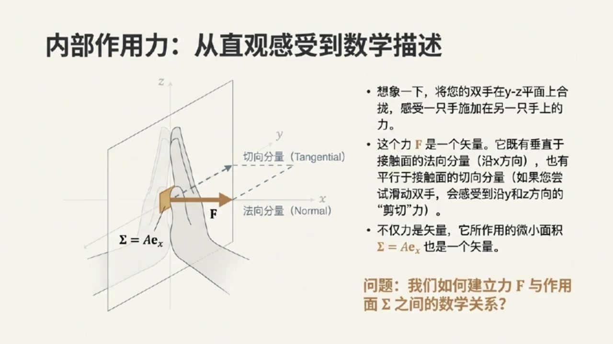
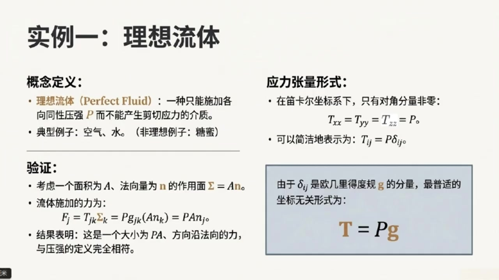
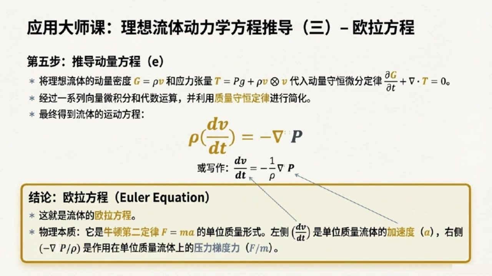
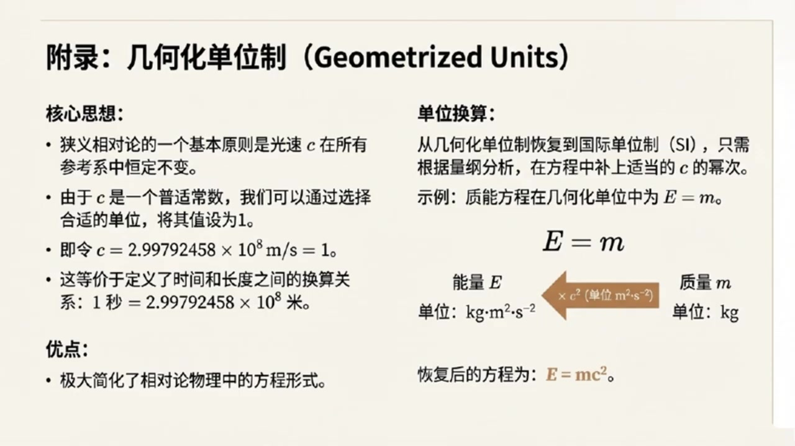
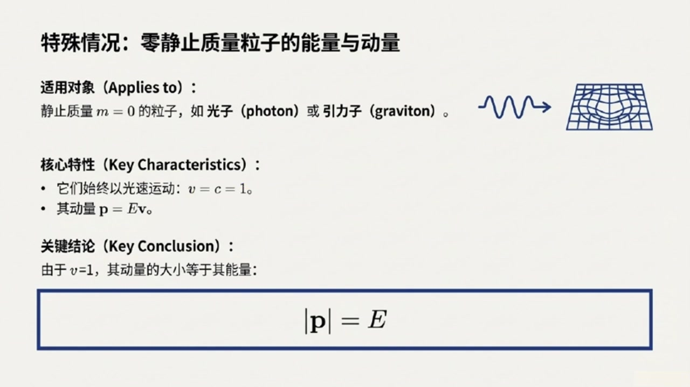

# 《现代经典物理学》第5课 解读应力张量

> 自动生成的课程注解文档（共 4 个段落，[原始视频](https://www.youtube.com/watch?v=VQLgViI2p20)）

## 目录

- [00:00:01 课程导入与应力张量的定义、物理意义及对称性](#段落-1)
- [00:06:26 应力张量的应用：完美流体、动量守恒与电磁应力](#段落-2)
- [00:16:01 话题切换：几何化单位与相对论单位制简化](#段落-3)
- [00:18:44 相对论粒子的能量动量关系与课程总结](#段落-4)

---

## 段落 1：课程导入与应力张量的定义、物理意义及对称性 { #段落-1 }

**时间：** 00:00:01 ~ 00:06:26

📝 原始字幕

<pre>

大家好欢迎收听我们现代经典物理学课程的第五讲我是你们的主持人乔伊
今天非常开心能和大家一起探索物理世界的奥秘
坐在我身边的当然还是我们知识渊博的赛老师
塞老师跟同学们打个招呼吧
大家好,我是赛,很高兴能和周一起继续我们的物理学之旅
今天我们要聊的话题会把我们之前学过的概念,比如守恒定律,带到一个更深层次的理解
没测
赛老师,我们今天的课程内容主要会围绕应力张量,动量守恒以及几何化单位和相对论性粒子这两个大方向展开
听起来就特别硬核,同学们可要准备好
是的朱我们首先要深入了解一个非常重要的改面,叫做应力张亮
它听起来可能有点抽象但实际上它描述的是我们日常生活中随处可见的利是怎样传递的
哇,听起来很实用
那塞老师,您能给我们一个直观的例子,让我们对应力张亮有过初步的感受吗?
当然可以,诸位,你把手掌心相对,轻轻的按压在一起,感受一下
是不是能感觉到你的左手对右手有一个力的作用
嗯,感受到了,有一个向外的压力
对
现在你试着让双手互相滑动一下,就像搓手一样
除了压力你是不是还能感觉到一种沿着手掌表面切向的力是的这个力让我感觉手掌要错开一样很好
我们所说的应力张量其实就是用来描述这种力在物体内部如何分布和传递的
我们知道粒是一个尺量,它有大小和方向
但这里更特别的是,这个力是作用在一个微小面积上的面积面积不就是个标量吗?它怎么也能是食量呢?这个问题问得好
这里我们说的面积其实是一个有方向的面积
我们可以用一个单位法向量来表示这个面积的方向
比如如果你的手掌在YC平面上
那么垂直于它的X方向就是它的法向量方向哦我明白了所以这个有方向的面积就是指它不仅有大小还指明了这个面积的朝向完全正确
那么现在我们把这个LIF和一个有方向的面积 sigma联系起来
你会发现LIF是这个面积Sigma的线性函数
既然是线性函数那么中间就必须有一个桥梁来连接它们这个桥梁就是我们的应力张量T所以用数学表达式来说就是LF等于应力张量T作用在这个有方向的面积SIGMA上对吧准确地说我们可以写成FI等于TIGMASIGMA
这里的TIJ就是应力张量的分量
他告诉我们在某个方向上比如EJ方向的单位面积上会产生一个在另一个方向上比如EI方向的力这样一来应力张量的分量TJK就有了具体的物理意义了他表示的是在垂直于EK方向的单位面积上所产生的力在EJ方向上的分量非常棒诸位而且应力张量TJK还有一个更深刻的物理含义
它既是代表了单位时间内从负XK侧穿越到正XK侧垂直于EK的单位面积上的动量的D这个分量
换句话说应力张亮就是动量流密度或者动量通量动量通量这个概念很重要啊他把我们之前学的动量和力的概念通过张亮联系起来了那赛老师应力张亮有什么特别的性质吗比如他是不是对称的这是一个非常好的问题
从定义上来看应力张量是不是对称的其实并不明显但是我们可以通过一个思想实验来证明它必须是对称的思想实验听起来很有意思想象一下我们有一个边长为L的微小立方体
周围的戒指会对这个立方体的每个面施加力和力举
我们主要关注剪切力
也就是那些平行于表面的力剪切力就是像我们刚才搓手时感受到的那种力对吧
比如作用在立方体前后面的剪切力它们的大小是TXY乘以L平方它们方向相反这对力贡献的绕Z轴的力矩TXYL三次方
同样左右面上的剪切力TYX乘以L平方也会产生一个绕Z轴的力矩负TYXL三次方听起来像是在掰一个魔方一样是的
如果我们把所有这些减切力产生的力矩加起来得到TXY减TYXL三次方总力矩会导致较动量变化IDOMAGZ百DT等于六分之一ROL五次方DOMEGAZ百DT如果这个时候TXY和TYX不相等也就是TXY减TYX不为零那么DOMEGAZ百DT正比于一出以L平方然后让立方体的边长L趋近于零这个微小立方体就会以一个无限大的角加速度旋转起来这听起来就非常不物理了没错这在物理上是不可能发生的
所以为了避免这种不物理的情况我们必须得出结论TXY必须等于TYX
同理对于应力张亮的其他分量也必须满足类似的对称性
所以应力张亮总是对称的原来如此这个对称性证明非常巧妙

</pre>

**课程截图：**

### 注解

以下是针对该课程片段（00:00:01 ~ 00:06:26）的深度注解。本段核心在于**从直观力学经验出发，严格构建应力张量（Stress Tensor）的数学定义及其对称性**。

---

## 一、板书/PPT截图内容描述

**截图 1（内部作用力：从直观感受到数学描述）**
- **图像**：三维直角坐标系中，展示两只手在 $y$-$z$ 平面（即垂直于 $x$ 轴的平面）上接触。标注了作用力 $\mathbf{F}$ 被分解为：
  - **法向分量**（Normal）：沿 $x$ 方向（垂直于接触面）
  - **切向分量**（Tangential）：沿 $y$ 或 $z$ 方向（平行于接触面，即"剪切"方向）
- **关键标注**：明确指出面积元 $\Sigma = A\mathbf{e}_x$ 是一个**矢量**，其方向由单位法向量 $\mathbf{e}_x$ 定义。
- **核心问题**：如何建立力 $\mathbf{F}$ 与作用面 $\Sigma$ 之间的数学关系？

**截图 2（应力张量的定义：连接作用力与作用面的线性算子）**
- **无分量形式**：$\mathbf{F}(\cdot) = \mathbf{T}(\cdot, \Sigma)$ 或简写为 $\mathbf{F} = \mathbf{T} \cdot \Sigma$
- **分量形式**（爱因斯坦求和约定）：$F_i = T_{ij}\Sigma_j$
- **物理注解**：强调根据牛顿第三定律，改变面积方向（$\Sigma \to -\Sigma$）时，力 $\mathbf{F}$ 也反向，这要求 $\mathbf{T}$ 必须是面积矢量的线性函数。

**截图 3（对称性证明：避免非物理的无限旋转）**
- **总力矩**（绕 $z$ 轴）：$N_z = (T_{xy} - T_{yx})L^3$
- **角动量变化**：$N_z = I \frac{d\Omega_z}{dt} = \frac{1}{6}\rho L^5 \frac{d\Omega_z}{dt}$
  - 其中 $I = \frac{1}{6}\rho L^5$ 为边长 $L$、密度 $\rho$ 的立方体转动惯量。
- **联立方程**：$(T_{xy} - T_{yx})L^3 = \frac{1}{6}\rho L^5 \frac{d\Omega_z}{dt}$
- **极限分析**：当 $L \to 0$ 时，若 $T_{xy} \neq T_{yx}$，则角加速度 $\frac{d\Omega_z}{dt} \propto \frac{1}{L^2} \to \infty$（非物理发散）。
- **结论**：必须有 $T_{yx} = T_{xy}$，推广得应力张量对称 $T_{ij} = T_{ji}$。

---

## 二、核心概念与公式详解

### 1. 有向面积矢量（Directed Area Vector）
**新概念**：在三维连续介质中，面积元不再是标量，而是**伪矢量**（Pseudovector）。

$$ \Sigma = A \, \mathbf{n} $$

- **$\Sigma$（或 $d\mathbf{A}$）**：有向面积矢量，方向由曲面外法线单位矢量 $\mathbf{n}$ 决定，大小为面积 $A$。
- **物理意义**：决定"力穿过哪个方向的面"。例如，$y$-$z$ 平面的面元方向为 $\mathbf{e}_x$（$x$ 方向）。

### 2. 应力张量的数学定义：线性映射
**核心公式**（分量形式）：

$$ F_i = T_{ij} \Sigma_j \quad \text{（爱因斯坦求和约定：对重复指标 $j$ 求和）} $$

**符号释义**：
- **$F_i$**：作用在面元上的力在 $i$ 方向的分量（$i = x, y, z$）。
- **$\Sigma_j$**：面元矢量在 $j$ 方向的分量（即面元法向为 $j$ 方向）。
- **$T_{ij}$**：应力张量的 $(i,j)$ 分量，表示**在法向沿 $j$ 方向的单位面积上，产生的力在 $i$ 方向的分量**。

**无分量形式**：
$$ \mathbf{F} = \mathbf{T} \cdot \Sigma $$
这表示应力张量 $\mathbf{T}$ 是一个**二阶张量（线性算子）**，它将一个矢量（有向面积）线性映射为另一个矢量（力）。

### 3. 应力张量的物理本质：动量流密度
**深层解读**：
$T_{ij}$ 不仅是"单位面积上的力"，更是**动量通量**（Momentum Flux）。

- **解释**：$T_{ij}$ 表示单位时间内，沿 $j$ 方向穿过单位面积的动量的 $i$ 分量。
- **联系**：力等于动量变化率（$\mathbf{F} = d\mathbf{p}/dt$），因此应力张量描述了动量如何在介质内部"流动"或"传递"。
- **对角元**（$T_{xx}, T_{yy}, T_{zz}$）：正应力（压力/张力）。
- **非对角元**（$T_{xy}, T_{yx}$ 等）：剪切应力（Shear Stress），对应字幕中"搓手"时感受到的切向力。

### 4. 对称性证明：角动量守恒的约束
**关键公式推导**：

考虑边长为 $L$ 的微小立方体，仅考虑 $x$-$y$ 平面内的剪切应力 $T_{xy}$ 和 $T_{yx}$：

1. **力矩计算**（绕 $z$ 轴）：
   - 作用在垂直于 $x$ 的面（前后）上的剪切力：$\pm T_{xy} L^2$，力臂 $L/2$，产生力矩 $T_{xy} L^3$。
   - 作用在垂直于 $y$ 的面（左右）上的剪切力：$\pm T_{yx} L^2$，产生力矩 $-T_{yx} L^3$。
   - **净力矩**：$N_z = (T_{xy} - T_{yx})L^3$

2. **转动动力学**：
   $$ N_z = I \frac{d\Omega_z}{dt} = \frac{1}{6}\rho L^5 \frac{d\Omega_z}{dt} $$
   （立方体绕中心轴的转动惯量 $I = \frac{1}{6} M L^2 = \frac{1}{6} \rho L^5$）

3. **极限分析**（$L \to 0$）：
   $$ \frac{d\Omega_z}{dt} = \frac{6(T_{xy} - T_{yx})}{\rho L^2} $$
   若 $T_{xy} \neq T_{yx}$，当 $L \to 0$ 时，角加速度 $\to \infty$，这意味着微小的不对称会导致无限大的旋转——这在物理上是不可能的（违背角动量守恒的局域形式）。

**结论**：
$$ T_{ij} = T_{ji} $$
应力张量必须是对称张量。这一结论依赖于介质没有**内禀角动量**（即非极性流体/固体），是经典连续介质力学的基本假设。

---

## 三、通俗语言总结

**什么是应力张量？**
想象你是一只蚂蚁，站在一块果冻内部。你想知道"穿过你脚下这片小区域的力有多大"。但"这片区域"是有朝向的（你可以面朝北站着，也可以面朝东站）。应力张量就是一本"说明书"：你告诉它"我面朝哪个方向（输入面积矢量）"，它就告诉你"在这个面上会有多大的力，指向哪个方向（输出力矢量）"。

**为什么它必须对称？**
想象你掰一个魔方。如果你前后推的力和左右推的力不对称（比如前面向上推，左面向下推，但不匹配），这个魔方就会自己疯狂旋转。当你把魔方缩得无限小时，如果这种不对称存在，它会转得无限快——这显然不可能。所以，为了让物体保持"正常"，不同方向上的剪切力必须平衡，这就是应力张量对称性的直观来源。

**动量通量是什么意思？**
你可以把应力想象成"动量的快递流"。$T_{xy}$ 就是在问："有多少 $x$ 方向的动量正在沿着 $y$ 方向运送？" 力就是动量的流动，所以应力张量本质上描述了动量在材料内部是如何"运输"的。

---

## 段落 2：应力张量的应用：完美流体、动量守恒与电磁应力 { #段落-2 }

**时间：** 00:06:26 ~ 00:16:00

📝 原始字幕

<pre>

那应力张量在实际中有哪些应用呢?应用非常广泛
比如在电磁场中电场和磁场也会产生应力
我们还可以用它来描述流体中的应力
就是我们所说的完美流体
听起来像理想气体一样,差不多是这个意思
完美流体是一种非常理想化的介质它只能承受各项同性压力
但不能承受任何减切应力
也就是说它的应力张量只有对角线上的分量是非零的并且都等于压力P也就是说TXX等于TYY等于TCZ等于P而其他分量都是零完全正确
我们可以用一个简洁的表达式来表示它
txi等于p乘以 gxi
这里的GXI是欧吉里德度归张量的分量那么完美流体作用在任何表面上的力是什么情况我们不妨考虑一个面积为A法向为N的作用面SIGMA等于AN
完美流体施加在此面上的力就是FJ等于TJK,SIGMAK等于PGJK,括号ANK等于PANJ
这表明完美流体作用在任何表面上的力都只会是垂直于这个表面压力而没有切向的剪切力
明白了,所以音力张量不仅描述了力,还描述了动量通量
那它和我们之前学过的动量守恒定律有什么关系呢关系非常密切
盈利张亮在牛顿动量守恒定律中扮演着核心角色
因为根据前面张亮的动量视角的定义代表了单位时间内单位面积上从一个方向流向另一个方向的动量分量所以音力张量就是动量流密度或动量通量这个我记住了
那么我们可以把动量守恒定律写成一个积分形式
在一个三维空间区域V内总动量随时间的变化率加上动量流出这个区域的净速率必须等于零也就是低白滴点积分VGDL加上积分偏VTDSigma等于零其中G是动量密度非常好这就是动量守恒的积分形式
如果我们把时间导数移到积分号里面并对表面积分应用高丝散度定理我们就可以得到动量守恒的微分形式微分形式是不是就更方便我们分析局部区域的物理现象了是的
微分形式就是偏G百偏T加Nabla.T等于零或偏GJ百偏T加TJK分好K等于零
这个方程非常重要它告诉我们某个物理量这里是动量的密度随时间的变化率加上这个物理量的通量的散度必须等于零
这是一个非常标准的矩形守恒定律形式这就解释了为什么应力张量在流体力学弹性力学和等离子体物理中都这么重要它确实是连接力和动量守恒的关键没错
在课后的习题一百一十三中我们甚至会看到如何用应力张亮推导出完美流体的欧腊方程
这其实就是牛顿第二定律在流体中的体现
它把流体的加速和压力的梯度联系起来非常强大好那我们先来看第一道题习题十一三是关于理想流体的好的乔伊第一个问题考虑一个密度为R压力为P速度为V随时间和空间变化的理想流体
解释为什么流体的动量密度是 g 等于 r  v
并解释为什么它的动量通量应力张量是T等于PG加肉V加肉V或TJ等于PJ加肉VJ好像第二个问题是关于流体质量守恒的对这第二个问题要求您解释为什么该流体的质量守恒定律是偏肉百T等于NABRA.V等于零有点挑战性第三个问题呢这第三个问题要求您解释为什么微分算子DYDT也就是偏BYT加V.
描述了由一个局部随流体移动其速度为V的人所测量到的变化率
这个算子有时被称为流体的平流时间倒数对流时间倒数或物质倒数还有吗第四个问题
要求您证明前面提到的质量守恒微分定律,也就是偏ROL百偏T加NEBLAR.ROV等于零
还可以写成ROLE分之一DV百DT等于NEBRA.V
这表明流体速度长的散度等于其密度在流体局部静止坐标器中测量分数变化率的负值第五个就一定要证明流体的动量守恒为分定律的另一种形式对吧对
这第五个问题就是要求证明流体的动量守恒为分定律也就是偏居百偏梯加上NABRA.T等于零
可以改写成DV百DT等于minusRU分之一NabraP
这被称为流体的欧拉方程
此外还要解释为什么这个欧拉方程是以单位质量为基础写的牛顿第二运动定律F等于MA这个流体的牛顿第二定律听起来好酷确实很酷它告诉我们流体的加速度也就是DV百D梯是由压强梯度引起的
压强高的地方会把流体推向压强低的地方从而产生加速度接下来的习题一点一四一下子跳到了电磁应力张亮了
题目一说电场和磁场都能产生压强和张力比如电场一会产生一个垂直于自身的压强还会沿着自身方向产生一个张力
然后它让我们验证一个复杂的电磁应力张量表达式
电厂磁场也能产生压强和张力吗?这太神奇了
诗的乐趣这听起来可能有点反直觉,但电磁场确实可以对物质施加力和扭曲,就像机械应力一样
电场和磁场免身就携带能量和动量
当它们作用在物体上时就会表现出压强和张力
题目给出的那个电磁应力张量表达式就是用来精确描述这些力和动量传递的
它包含了电厂和磁厂各自的贡献以及它们如何组合在一起
此题就要促验证这个印利张亮的具体表达是
T等于二分之E零大括号一平方加C平方B平方的核乘上度归张量计减二倍的E张量级E加C平方B张量级B大括号也就是说这个音力张量T
它综合描述了电场和磁场对物体推拉的作用力,对吧
那题目二接着问
考虑电磁场与带电荷和电流的物质相互作用计算这个电磁音力张量的散度并用MAX为方程组来求导
他还说结果应该是电磁场对物质施加的力密度的复制为什么会这样呢这个是一个非常深刻的问题
他把电磁场力以及动量守恒联系在了一起
简单来说音力张亮的散度,它衡量的是音力在空间中的不均匀性,也就是音力梯度
当这个梯度存在时它就会对物质产生一个静力
题目要求我们证明的就是电磁音力张亮的散度正好对应着电磁场对物质作用的力密度哦原来音力张亮的散度就是电磁场作用于物质上的力
那他还提到要用动量守恒来解释为什么会这样是的
这就是关键所在
根据动量守恒定律物质动量的变化率应该等于作用在物质上的静力
而电磁场通过音力张量将自身的动量传递给物质
所以电磁音力张亮的散度自然就体现了这种动量传递也就是电磁场对物质湿扎的力
这是一个非常优雅的物理图像展现了动量如何在场和物质之间传递哇赛今天真是大开眼界
从流体的质量守恒动量守恒到电磁场的应力张量
这些习题虽然没有直接解答,但通过你的讲解,我感觉把它们背后的大概念都拎出来了是的
应力张亮的内容我们就先聊到这里

</pre>

**课程截图：**

### 注解

以下是针对该课程片段（00:06:26 ~ 00:16:00）的深度注解。本段核心在于**应力张量在连续介质（理想流体）与电磁场中的具体应用**，以及**动量守恒定律的微分形式与欧拉方程的推导**。

---

## 一、板书/PPT截图内容描述

**截图 1（实例一：理想流体）**
- **左侧**定义了**理想流体（Perfect Fluid）**：一种只能施加各向同性压强 $P$ 而不能产生剪切应力的介质。典型例子为空气、水（非理想例子为蜂蜜）。
- **右侧**给出应力张量形式：
  - 笛卡尔坐标系下：$T_{xx} = T_{yy} = T_{zz} = P$，非对角分量为零
  - 简洁表达式：$T_{ij} = P\delta_{ij}$ 或坐标无关形式 $\mathbf{T} = P\mathbf{g}$
- **下方验证**：对于面积矢量 $\mathbf{\Sigma} = A\mathbf{n}$，流体施加的力 $F_j = T_{jk}\Sigma_k = PA n_j$，表明力始终垂直于作用面。

**截图 2（动量守恒定律的两种形式）**
- **左侧（积分形式）**：区域 $V_3$ 内总动量 $\int_{V_3} \mathbf{G} dV$ 的变化率加上净流出速率 $\int_{\partial V_3} \mathbf{T} \cdot d\mathbf{\Sigma}$ 等于零：
  $$\frac{d}{dt}\int_{V_3} \mathbf{G} dV + \int_{\partial V_3} \mathbf{T} \cdot d\mathbf{\Sigma} = 0$$
- **右侧（微分形式）**：应用高斯散度定理得到：
  $$\frac{\partial \mathbf{G}}{\partial t} + \nabla \cdot \mathbf{T} = 0 \quad \text{或分量形式} \quad \frac{\partial G_j}{\partial t} + T_{jk,k} = 0$$
- **底部评注**：强调这是守恒律的标准形式——某量密度的时间变化率加上其通量的散度为零。

**截图 3（应用大师课：欧拉方程推导）**
- **标题**：理想流体动力学方程推导（三）- 欧拉方程
- **推导步骤**：将 $\mathbf{G} = \rho \mathbf{v}$ 和 $\mathbf{T} = P\mathbf{g} + \rho \mathbf{v} \otimes \mathbf{v}$ 代入微分守恒律，结合质量守恒简化。
- **最终结果**：
  $$\rho \frac{d\mathbf{v}}{dt} = -\nabla P \quad \text{或} \quad \frac{d\mathbf{v}}{dt} = -\frac{1}{\rho}\nabla P$$
- **物理本质框**：指出这是**牛顿第二定律 $F=ma$ 的单位质量形式**，左侧为单位质量加速度，右侧为单位质量所受压力梯度力。

---

## 二、理想流体的应力张量与动量守恒

### 1. 完美流体的应力张量
**新概念**：完美流体（Perfect Fluid）是一种**无粘性**的理想化模型，其内部只能承受**各向同性压力**（isotropic pressure），无法承受剪切应力（shear stress）。

**新公式**：
$$T_{ij} = P\delta_{ij} \quad \text{或张量形式} \quad \mathbf{T} = P\mathbf{g}$$

- **$P$**：流体静压强（标量，各方向相等）
- **$\delta_{ij}$**（或 $\mathbf{g}$）：欧几里得度规张量分量（笛卡尔坐标系下即为单位矩阵 $\mathbf{I}$，对角线为1，其余为0）
- **物理意义**：应力张量退化为单位矩阵的标量倍数，表示无论取何种朝向的表面，流体施加的力总是垂直于该表面，大小为 $P \times \text{面积}$，无切向分量。

**力的计算验证**：
对于法向为 $\mathbf{n}$、面积为 $A$ 的作用面（面积矢量 $\Sigma_k = A n_k$），流体施加的力为：
$$F_j = T_{jk}\Sigma_k = P\delta_{jk}(A n_k) = P A n_j$$
这表明力 $\mathbf{F} = PA\mathbf{n}$ 确实垂直于表面，与压强定义完全一致。

### 2. 动量守恒定律的形式
**新概念**：应力张量作为**动量流密度（momentum flux density）**，其通量进出直接对应动量变化。

**积分形式**（全局守恒）：
$$\frac{d}{dt}\int_V \mathbf{G} \, dV + \oint_{\partial V} \mathbf{T} \cdot d\mathbf{\Sigma} = 0$$
- **$\mathbf{G}$**：动量密度（单位体积内的动量）
- **第一项**：体积 $V$ 内总动量随时间的变化率
- **第二项**：通过边界 $\partial V$ 流出的净动量流（应力张量对面积积分）

**微分形式**（局域守恒，通过高斯散度定理得到）：
$$\frac{\partial \mathbf{G}}{\partial t} + \nabla \cdot \mathbf{T} = 0 \quad \text{或分量式} \quad \frac{\partial G_j}{\partial t} + \frac{\partial T_{jk}}{\partial x_k} = 0$$

- **$\nabla \cdot \mathbf{T}$**（或 $T_{jk,k}$）：应力张量的散度，表示单位体积内动量的净流出率
- **物理图像**：某点动量密度的减少（$\partial \mathbf{G}/\partial t < 0$）必然伴随着动量向外的流动（$\nabla \cdot \mathbf{T} > 0$），这是**连续性方程**在动量守恒中的体现。

---

## 三、理想流体动力学（习题 1.13 详解）

本段引入**非静态**流体（速度场 $\mathbf{v}(\mathbf{x},t)$ 随时间空间变化），此时应力张量需包含**对流动量输运**。

### 1. 动量密度与对流应力张量
**新公式**：
- **动量密度**：$\mathbf{g} = \rho \mathbf{v}$（质量密度 $\times$ 速度，即单位体积流体的动量）
- **完整应力张量**（含静压与对流）：
  $$T_{ij} = P\delta_{ij} + \rho v_i v_j \quad \text{或} \quad \mathbf{T} = P\mathbf{I} + \rho \mathbf{v} \otimes \mathbf{v}$$

- **$\rho$**：流体质量密度
- **$v_i v_j$**：速度并矢（dyadic product），表示流体宏观运动携带的动量通量
- **分解**：第一项 $P\delta_{ij}$ 是热力学压力产生的弹性应力；第二项 $\rho v_i v_j$ 是"动量对流动量流"（单位时间内，流体携带动量穿过单位面积的量）

### 2. 质量守恒（连续性方程）
**新公式**：
$$\frac{\partial \rho}{\partial t} + \nabla \cdot (\rho \mathbf{v}) = 0$$

- **$\nabla \cdot (\rho \mathbf{v})$**：质量流密度的散度
- **物理意义**：密度随时间的增加必须由质量的流入来补偿。利用随体导数（见下文）可改写为：
  $$\frac{1}{\rho}\frac{D\rho}{Dt} = -\nabla \cdot \mathbf{v}$$
  这表明：**速度场的散度 $\nabla \cdot \mathbf{v}$ 等于流体密度在随体坐标系中相对变化率的负值**。若 $\nabla \cdot \mathbf{v} > 0$（流体膨胀），则密度必然减小。

### 3. 随体导数（物质导数）
**新概念**：$\frac{D}{Dt}$ 描述**跟随流体微团一起运动的观察者**所看到的物理量变化率（而非固定于实验室坐标系的观察者）。

**新公式**：
$$\frac{D}{Dt} = \frac{\partial}{\partial t} + \mathbf{v} \cdot \nabla$$

- **$\frac{\partial}{\partial t}$**：局部导数（当地变化，固定点处的时间变化）
- **$\mathbf{v} \cdot \nabla$**：对流导数（位变导数，因流体微团移动到不同位置而产生的变化）
- **别名**：平流时间导数、物质导数（Substantial Derivative）

### 4. 欧拉方程（流体的牛顿第二定律）
**推导逻辑**：将 $\mathbf{G} = \rho\mathbf{v}$ 和 $T_{ij} = P\delta_{ij} + \rho v_i v_j$ 代入微分动量守恒律 $\partial_t G_j + T_{jk,k} = 0$，结合质量守恒方程，最终化简得到：

**新公式**（欧拉方程）：
$$\frac{D\mathbf{v}}{Dt} = -\frac{1}{\rho}\nabla P \quad \text{或等价地} \quad \rho \frac{D\mathbf{v}}{Dt} = -\nabla P$$

- **左侧 $\frac{D\mathbf{v}}{Dt}$**：流体微团的**加速度**（随体导数作用于速度）
- **右侧 $-\frac{1}{\rho}\nabla P$**：单位质量流体所受的**压力梯度力**（负号表示流体被从高压区推向低压区）
- **本质**：这是**$F=ma$ 的单位质量形式**。左侧是 $a$，右侧是 $F/m$。它表明流体加速的唯一原因是压力的空间不均匀性（忽略重力、粘性等）。

---

## 四、电磁应力张量（习题 1.14 预告）

### 1. 麦克斯韦应力张量
**新概念**：电磁场本身携带能量和动量，可对物质施加机械力（辐射压力、电场张力）。描述这种作用的工具是**麦克斯韦应力张量**。

**新公式**（电磁应力张量）：
$$T_{ij} = \epsilon_0 \left[ \frac{1}{2}(E^2 + c^2 B^2)\delta_{ij} - E_i E_j - c^2 B_i B_j \right]$$
（注：不同教材符号约定可能相反，此处假设 $T_{ij}$ 为作用于介质的力）

- **$\epsilon_0$**：真空介电常数
- **$E, B$**：电场强度和磁感应强度
- **$E^2 = \mathbf{E} \cdot \mathbf{E}$**：电场模平方
- **结构分析**：
  - 对角项 $\frac{1}{2}\epsilon_0(E^2 + c^2 B^2)$：各向同性"压强"背景
  - $-\epsilon_0 E_i E_j$ 和 $-\frac{1}{\mu_0} B_i B_j$（其中 $c^2 = 1/\mu_0\epsilon_0$）：沿场方向的负贡献，表示**张力**（场线像橡皮筋一样被拉伸）

### 2. 场动量与力密度
**核心关系**：电磁场通过应力张量将动量传递给物质。

**新物理图像**：
$$\nabla \cdot \mathbf{T}_{\text{EM}} = -\mathbf{f}_{\text{ Lorentz}}$$

- **左侧**：电磁应力张量的散度，表示电磁动量流的空间不均匀性
- **右侧**：电磁场对物质施加的**力密度**（单位体积的洛伦兹力 $\mathbf{f} = \rho_e \mathbf{E} + \mathbf{J} \times \mathbf{B}$）的负

---

## 段落 3：话题切换：几何化单位与相对论单位制简化 { #段落-3 }

**时间：** 00:16:01 ~ 00:18:43

📝 原始字幕

<pre>

接下来我们要稍微转换一下话题
聊聊在相对论物理中如何让我们的计算变得更简洁以及粒子在相对论速度下的能量和动量听起来是要进入相对论的世界了
撒老师您提到集合化单位这是什么意思呢集合化单位固名CE就是把一些物理常数设为一从而简化方程
在相对论中最重要的常数就是光速C光速C不是一个固定的值吗怎么能把它设为一呢这是一个非常深刻的物理思想
光速C的场定性是狭义相对论的一个基本原理
在一九八三年国际单位制甚至重新定义了米十七余秒通过光速C精确关联起来
这意味着光速C已经不再是一个需要测量量,而是一个定义量原来是这样
那我们把C设为一有什么好处呢?最大的好处就是很多相对乱方程会变得非常简洁
比如我们都知道智能方程是e等于 mc平方
如果把C设为一,它就变成了E等于M哇,一下子就简单多了
那如果我需要把它转换回SI单位怎么办呢这就用到我们物理学中一个很重要的工具量钢分析
比如E等于M在几何化单位下是成立的
但我们知道,能量一的量钢是焦二千克米平方秒伏二次方
质量M的亮钢是千克两边亮钢不符
为了让两边亮钢匹配,我们必须在右边乘以一个具有米平方秒乘二次方亮钢的阴子
而西平方正好具有这个亮纲
所以我们就能很自然地恢复出一等于MC平方太巧妙了所以几何化单位只是为了计算方便并不是真的把光速变成一了就是这个意思
这种单位制在处理相对论问题时非常普遍
它能帮助我们更清晰地看到物理定律的本质
在课后的习题一点一五中就有很多练习比如把普朗克时间洛伦自立定律等从几何化单位转换回SI单位
甚至还有一些有趣的思考题比如你有多高用秒来表示你有多高用秒来表示这个太有意思了
我的身高除以光速,就是我身高对应的光传播时间,对吧,完全正确,这正是几何化单位思维的体现

</pre>

**课程截图：**

### 注解

以下是针对该课程片段（00:16:01 ~ 00:18:43）的深度注解。本段核心在于**引入相对论计算中的"几何化单位制"（Geometrized Units），通过将光速 $c$ 设为无量纲的 1 来简化方程，并用量纲分析实现与 SI 单位的转换**。

---

## 一、板书/PPT截图内容描述

**截图（附录：几何化单位制）**
- **标题**：附录：几何化单位制（Geometrized Units）
- **核心思想栏**：
  - 强调狭义相对论基本原理：光速 $c$ 在所有参考系中恒定不变
  - 关键设定：将 $c = 2.99792458 \times 10^8 \, \text{m/s}$ 设为 1（无量纲）
  - 等价描述：这定义了时间与长度的换算关系——$1\,\text{秒} = 2.99792458 \times 10^8\,\text{米}$（即光在真空中1秒内行进的距离）
- **优点栏**：极大简化了相对论物理中的方程形式
- **单位换算栏**：
  - 说明恢复 SI 单位的方法：根据量纲分析补回适当的 $c$ 的幂次
  - **示例图示**：展示质能方程的转换流程
    - 左侧：能量 $E$（单位 $\mathrm{kg \cdot m^2 \cdot s^{-2}}$）
    - 中间：双向箭头标注"$\times c^2$（单位 $\mathrm{m^2 \cdot s^{-2}}$）"
    - 右侧：质量 $m$（单位 $\mathrm{kg}$）
  - **结论**：恢复后的方程为 $E = mc^2$

---

## 二、核心概念与公式解析

### 1. 几何化单位制的核心设定
**公式**：
$$c = 1$$

**符号说明**：
- $c$：真空中的光速（speed of light in vacuum），在 SI 单位制中精确值为 $299,792,458\,\mathrm{m/s}$。在几何化单位制中，它是一个无量纲的纯数 1。

**物理含义**：
这不是说光速真的变成了 $1\,\mathrm{m/s}$，而是**选择了这样一种单位制**：长度的单位（米）和时间的单位（秒）不再独立，而是通过光速建立固定关系。在这种单位制下，$c$ 作为转换因子被吸收进单位定义中，方程中不再显式出现。

### 2. 质能方程的简化与量纲恢复
**公式对比**：
- **SI 单位制**：$E = mc^2$
- **几何化单位制**：$E = m$

**符号说明**：
- $E$：能量（Energy）
- $m$：静止质量（rest mass）
- $c^2$：光速的平方，在几何化单位制中其数值为 1，因此方程简化为 $E=m$

**量纲分析（Dimensional Analysis）原理**：
当需要从几何化单位制转换回 SI 单位制时，需保证方程两边的量纲（物理量的单位构成）一致。

- 能量 $E$ 的量纲：$[E] = \mathrm{M \cdot L^2 \cdot T^{-2}}$（质量×长度²/时间²，即焦耳 $\mathrm{J}$）
- 质量 $m$ 的量纲：$[m] = \mathrm{M}$（质量）

为了使 $E = m$ 在量纲上平衡，必须在质量项旁乘以一个具有 $\mathrm{L^2 \cdot T^{-2}}$ 量纲的因子。由于 $[c] = \mathrm{L \cdot T^{-1}}$，则 $[c^2] = \mathrm{L^2 \cdot T^{-2}}$，恰好匹配。因此恢复为：
$$E = mc^2$$

---

## 三、理论背景补充

### 1. 1983年国际单位制（SI）的变革
视频中提到"1983年国际单位制重新定义了米"，这是单位制史上的重要事件：
- **旧定义**（1960-1983）：1米等于氪-86原子特定能级跃迁辐射波长的 $1,650,763.73$ 倍（基于原子物理）。
- **新定义**（1983至今）：**1米是光在真空中于 $1/299,792,458$ 秒时间间隔内所经路径的长度**。

这一变革的深刻意义在于：它将**光速 $c$ 从一个需要精密测量的物理常数，转变为一个固定的定义值**（精确等于 $299,792,458\,\mathrm{m/s}$）。这与几何化单位制的思想一脉相承——既然 $c$ 是时空的几何属性（ Lorentz 不变性），它就不应被视为可变参数，而应成为单位制的基础。

### 2. "几何化"的深层含义
"几何化单位制"（Geometrized Units）一词源于广义相对论，通常指**同时设 $G = c = 1$**（有时还包括 $\hbar = 1$）。其名称反映了这样的物理观：
- 在相对论中，时间和空间不再是绝对背景，而是构成了四维时空（Spacetime）。
- 当 $c=1$ 时，时间的量纲与长度的量纲相同（秒与米通过 $c$ 等价），时空真正成为一个统一的几何流形，物理定律表现为该流形上的几何关系（如 Einstein 场方程 $G_{\mu\nu} = 8\pi T_{\mu\nu}$ 在几何化单位制下形式极为简洁）。

### 3. 用"秒"

---

## 段落 4：相对论粒子的能量动量关系与课程总结 { #段落-4 }

**时间：** 00:18:44 ~ 00:22:10

📝 原始字幕

<pre>

接下来我们聊聊在相对论中运动粒子的能量和动量好的这部分内容也常常让人觉得有点反直觉是的一个静止质量为M的粒子当它以速度微运动时它的相对论能量E和动量P
就和我们牛顿力学中的表达式不一样了怎么不一样呢它的总能量E包括了它的净值质量能量表达式是E等于M处以开根号E减V平方除C平方
如果我们把C设为一就成了E等于M处于开根号E减V平方这里的V是粒子的速度对吧
而且这个能量E还包含了粒子的净值质量没错而它的相对论动量P表达式是P等于E乘于V或者写成P等于M乘于V处于开根号E减V平方处C平方看起来比牛顿力学复杂多了
牛顿力学里,动量p就是m乘以v
但是当粒子的速度V远小于光速C时也就是所谓的低速极限
这些相对论表达式就会退化回我们熟悉的牛顿形式
比如E会近似等于二分之一MV平方这里是动能而P就是MV也就是说牛顿力学是相对论力学在低速情况下的一个特例完全正确
另外还有一类特殊的粒子它们的静止质量是零比如光子和引粒子静止质量为零那它们怎么会有能量和动量呢它们总是一光速运动
对于这些粒子,它们的动量大小P就等于它们的能量翼
所以光子不仅有能量还有动量这个在光电效应里好像有提到过是的
而且在粒子相互作用的过程中比如核反应或者粒子碰撞
总能量一和总动量P都是守恒的
这和牛顿力学中的守恒定律是类似的
但这里的E和P都是相对论性的好的赛老师今天我们从音力张量和动量守恒一路聊到了集化化单位和相对论性例子内容非常丰富而且缓缓扣扣是的就
今天的课程我们深入理解了应力张量如何描述物质内部力的传递以及它作为动量通量在动量守恒中的核心作用
我们还探讨了如何通过几何化单位简化相对论方程并回顾了相对论粒子能量和动量的基本概念
这些概念对于我们理解更复杂的物理现象比如弹性力学流体力学甚至是广义相对论都打下了非常坚实的基础
没错
希望同学们能通过今天的学习对这些概念有更深刻的认识
课后可以尝试完成课本中的习题特别是习题一百一十三和一百一十五它们能帮助大家更好地掌握这些知识点
好的同学们今天的现代经典物理学第五奖就到这里了感谢赛老师的精彩讲解也感谢大家的收听我们下周同一时间再见
再见
再见

</pre>

**课程截图：**

### 注解

以下是针对该课程片段（00:18:44 ~ 00:22:10）的深度注解。本段核心在于**建立相对论性粒子的能量-动量关系，引入静止质量为零的极端情况（光子），并强调守恒定律在相对论框架下的延续性**。

---

## 一、板书/PPT截图内容描述

**截图 1（巩固与思考：单位制换算练习）**
- **标题**：巩固与思考：单位制换算练习
- **问题设置**：源自习题 1.15，要求将几何化单位制（$c=1$）下的方程转换为国际单位制（SI）形式
- **具体条目**：
  - (a) 普朗克时间 $t_p = \sqrt{G\hbar}$（$G$ 为牛顿引力常数，$\hbar$ 为约化普朗克常数），要求计算其数值（秒与米）
  - (b) 电子-正电子湮灭能量 $E = 2m$（静止质量均为 $m$）
  - (c) 洛伦兹力定律 $m\frac{d\mathbf{v}}{dt} = e(\mathbf{E} + \mathbf{v} \times \mathbf{B})$
  - (d) 光子动量 $\mathbf{p} = \hbar\omega\mathbf{n}$（$\omega$ 为角频率，$\mathbf{n}$ 为传播方向）
- **开放性问题**："你的身高是多少'秒'？"、"你的年龄是多少'米'？"（旨在强化时空统一观念）

**截图 2（特殊情况：零静止质量粒子的能量与动量）**
- **标题**：特殊情况：零静止质量粒子的能量与动量
- **适用对象**：静止质量 $m = 0$ 的粒子，如光子（photon）或引力子（graviton）
- **图示**：左侧为波动图案（象征波粒二象性），右侧为弯曲时空网格（暗示引力子与时空几何的关联）
- **核心特性**：
  - 始终光速运动：$v = c = 1$（几何化单位）
  - 动量-能量关系：$\mathbf{p} = E\mathbf{v}$（速度方向）
- **关键结论**（蓝色框突出）：$|\mathbf{p}| = E$（几何化单位下动量大小等于能量）

---

## 二、公式详解（相对论性能量与动量）

本段引入了描述高速运动粒子的核心动力学量，需区分**总能量**、**静止能量**与**动能**。

### 1. 相对论总能量（Total Energy）
$$E = \frac{M c^2}{\sqrt{1 - \frac{v^2}{c^2}}} = \gamma M c^2$$

**符号说明**：
- $E$：粒子的**相对论总能量**（Relativistic Total Energy），包含静止能量和动能
- $M$：**静止质量**（Rest Mass，字幕中"净值质量"应为笔误），粒子在自身静止参考系中测得的质量（不变量）
- $v$：粒子相对于观测者参考系的速度
- $c$：真空中的光速
- $\gamma = \frac{1}{\sqrt{1 - v^2/c^2}}$：**洛伦兹因子**（Lorentz Factor），描述时间膨胀和长度收缩的相对论效应强度

**几何化单位形式**（设 $c=1$）：
$$E = \frac{M}{\sqrt{1 - v^2}} = \gamma M$$

**物理内涵**：即使粒子静止（$v=0$），其能量 $E = Mc^2$ 也不为零，这就是著名的**质能等价**（Mass-Energy Equivalence）。牛顿力学中认为"静止物体无能量"的观念被彻底修正。

### 2. 相对论动量（Relativistic Momentum）
$$\mathbf{p} = \frac{M \mathbf{v}}{\sqrt{1 - \frac{v^2}{c^2}}} = \gamma M \mathbf{v}$$

或等价表示为（利用 $E$ 的定义）：
$$\mathbf{p} = \frac{E}{c^2} \mathbf{v}$$

**符号说明**：
- $\mathbf{p}$：**相对论动量**（Relativistic Momentum），三维矢量，方向与速度 $\mathbf{v}$ 相同
- 其余符号同上

**关键区别**：与牛顿力学 $\mathbf{p} = M\mathbf{v}$ 不同，相对论动量随速度增加而**超线性增长**（因 $\gamma$ 因子），当 $v \to c$ 时，动量趋向无穷大，这解释了为何有质量物体无法达到光速。

### 3. 无质量粒子的能量-动量关系
对于 $M = 0$ 的粒子（光子、引力子）：

$$|\mathbf{p}| = \frac{E}{c} \quad \text{或几何化单位下} \quad |\mathbf{p}| = E$$

**推导逻辑**：当 $M=0$ 时，上述能量和动量公式看似出现 $0/0$ 不定形式，但实际上这类粒子**必须以光速 $c$ 运动**。通过极限过程或量子理论（$E = \hbar\omega$, $p = \hbar k$）可

---
