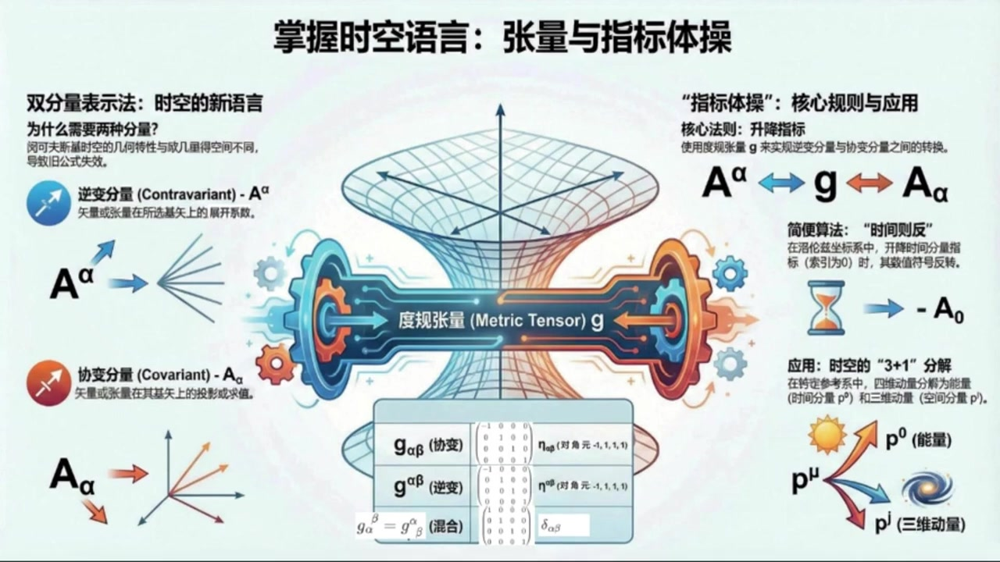
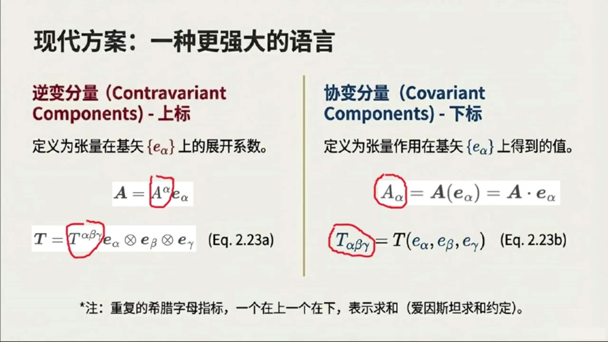
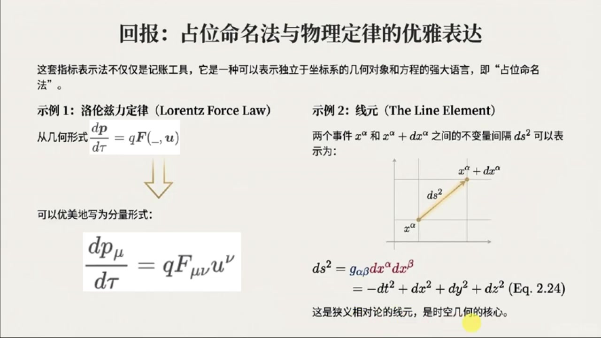
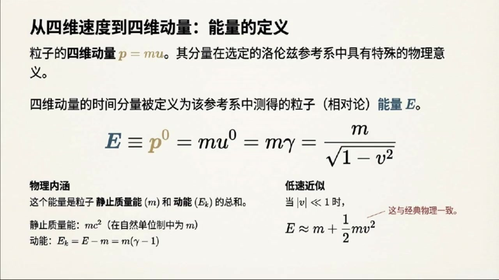
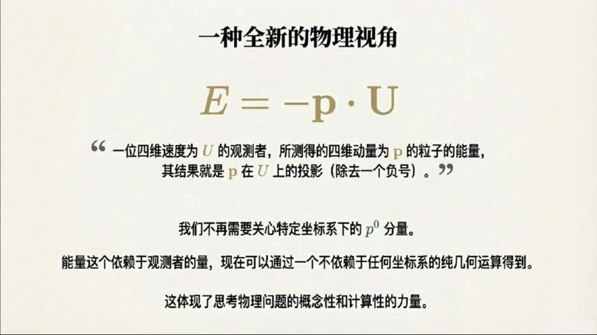

# 《现代经典物理学》第8课 掌握时空语言：张量和指标体操

> 自动生成的课程注解文档（共 4 个段落，[原始视频](https://www.youtube.com/watch?v=WrFbRjuOdNw)）

## 目录

- [00:00:01 课程引入与洛伦兹坐标、基矢和度规](#段落-1)
- [00:05:07 逆变与协变分量、升降指标和指标体操](#段落-2)
- [00:13:00 抽象命名记号与相对论物理公式表达](#段落-3)
- [00:15:19 洛伦兹参考系下的粒子动力学与三加一分解](#段落-4)

---

## 段落 1：课程引入与洛伦兹坐标、基矢和度规 { #段落-1 }

**时间：** 00:00:01 ~ 00:05:07

<details><summary>📝 原始字幕</summary>

<pre>

大家好欢迎收听现代经典物理学的第八课我是你们活泼哈奇的主持人JOE
大家好
我是你们知识渊博的引路人赛
很高兴再次和大家一起
将深入探讨张亮代数的分量表示和洛伦兹框架下的粒子动力学在时间过得真快上节课我们聊了狭义相对论的几何视角像是四维时量和明可夫斯基时空
那今天我们要把这些抽象的概念落地到具体的计算和应用中对不对
没错,非常对
今天我们要深入到教科书的二点五节,聊聊张亮概数的分量表示
然后还会结合2.6节
看看在洛伦兹参考系下粒子动力学是怎样的
这些内容是理解广义相对论和量子场论的关键也是我们这门课的重中之重听起来有点抽象但我觉得就像学习一门新语言一样掌握了这些语法和词汇我们才能真正读懂物理细节的诗篇说得好
所以高年底的同学们准备好迎接挑战了吗好的那我们先从二点五节的张亮带数的分量表示开始吧
首先是二点五点一小节落轮子坐标和基石量
这个概念我们之前也提到过,它具体指什么呢?
嗯
简单来说在明科夫斯基时空里任何一个惯型参考系都会对应一套洛伦自坐标系
你可以想象成我们用尺子和时钟来定义的时间T和空间XYZ
我们通常会把它们记作X上零,X上一,X上二,X上三
我注意到这里时间用的是上标零,空间用的是上标一二三,那对应的基石量呢
没错,即使量我们会用下标一下零,一下一,一下二,一下三
这样上标和下标的区别,其实在张亮袋鼠里有很重要的意义,我们后面会慢慢解释
夏老师,我打个叉,你这里的E都是四十辆,为何都没有上标记四十辆的上箭头了?
你说的没错
由于本杰设计的上下标比较多,如果我再加上箭头,我感觉有点麻烦
所以从这堂课开始,我们不再特意在符号上区分三维尺量粗体A和四维尺量A上箭头
这两种符号可能会混用,但是你心里必须区分明白
所以这里无论三维时量还是四维时量可能都会写成比如粗体A,但如出现了A上箭头,则表明特意声明是四维时量
也就是可以区分也可以不区分,但我在朗读时一般就都不区分了,这样啊,我来你也会偷懒
好吧,我们继续
这些基石量有什么特别之处吗?
我记得在OG里的空间里我们有正交归一级就是点击等于克罗尼克德尔塔很好的问题
在明克福寺基石空里,这些基石量也是正交的
但他们的点击不再是简单的Kronik Delta下Alpha Beta了
他们满足一下alpha.dot一下beta等于一下alpha beta
一踏下阿尔法贝塔
这个符号好像之前也出现过
它代表什么?伊塔下阿尔法贝塔就是明科夫斯基杜归张亮
它的分量是一下零等于负一
一踏下1等于一踏下22等于一踏下33等于1
其他所有分量都是零
所以时间方向的基始量是类似的,平方长度是负一
空间方向的基石量是内空的平方长度是正义
明白了所以它有点像欧吉里的空间里的正交归一级但又不一样因为时间分量的符号是负的对这正是明科夫斯基时空的独测之处也正因为如此很多欧吉里的空间里的分量操作公式就不能直接照办了那我们怎么处理呢我看资料里提到了两种方法
一种是把时间分量射成X上零等于IT这个听起来有点意思这是很多老教材比如早期版本的戈德斯坦和杰克逊的经典教材里用的方法
这样处理之后一下二法到他一下贝塔就能变回二塔下二法贝塔看起来更像欧吉利的空间了听起来很方便啊那为什么现代教材都不用这种方法了呢这个方法有严重的缺点首先它掩盖了明科夫斯基时空真正的几何节奏其次它无法很好地推广到非正教计更别说广义相对论中必须使用的曲线坐标系了哦原来如此所以我们现在采用的是另一种更现代的方法是吗没错

</pre>

</details>

**课程截图：**




### 注解

我来对这段课程视频进行深度注解。这段内容涵盖了**洛伦兹坐标系、洛伦兹基矢、闵可夫斯基度规**等核心概念，是理解张量语言的关键起点。

---

## 一、板书/PPT 中的公式详解

### 公式 1：基矢的正交归一条件
$$\mathbf{e}_\alpha \cdot \mathbf{e}_\beta = \eta_{\alpha\beta} \quad \text{(Eq. 2.21)}$$

| 符号 | 含义 |
|:---|:---|
| $\mathbf{e}_\alpha, \mathbf{e}_\beta$ | 洛伦兹基矢（下标 $\alpha, \beta = 0, 1, 2, 3$），其中 $\mathbf{e}_0$ 指向时间方向，$\mathbf{e}_1, \mathbf{e}_2, \mathbf{e}_3$ 指向三个空间方向 |
| $\cdot$ | 闵可夫斯基时空中的内积（点积），**不是**欧几里得内积 |
| $\eta_{\alpha\beta}$ | **闵可夫斯基度规**（Minkowski metric），$(-+++)$ 号差 |

> **关键区别**：欧几里得空间中 $\mathbf{e}_i \cdot \mathbf{e}_j = \delta_{ij}$（克罗内克δ），所有基矢"长度"为正；而闵可夫斯基时空中时间基矢的"长度"为**负**。

---

### 公式 2：闵可夫斯基度规的分量定义
$$\eta_{00} = -1, \quad \eta_{11} = \eta_{22} = \eta_{33} = +1, \quad \eta_{\alpha\beta} = 0 \ (\text{若 } \alpha \neq \beta)$$

矩阵形式：
$$\eta_{\alpha\beta} = \begin{pmatrix} -1 & 0 & 0 & 0 \\ 0 & 1 & 0 & 0 \\ 0 & 0 & 1 & 0 \\ 0 & 0 & 0 & 1 \end{pmatrix}$$

这就是著名的 **$(-+++)$ 号差约定**（也有教材用 $(+---)$，符号相反但物理等价）。

---

## 二、核心概念图解

从 PPT 截图可见：

```
        x⁰ (时间轴，红色)
         ↑
         |    e₀ (类时基矢，红色，长度² = -1)
         |
    ←────┼────→ x¹, x² 平面
         |
        e₁, e₂, e₃ (类空基矢，蓝色，长度² = +1)
```

**视觉要点**：时间轴 $x^0$ 用红色突出，强调其特殊性；基矢 $\mathbf{e}_0$ 的"虚短"暗示其负模长。

---

## 三、理论背景补充

### 3.1 为什么需要"度规"这个概念？

| 空间类型 | 内积规则 | 几何直觉 |
|:---|:---|:---|
| 欧几里得空间 $\mathbb{E}^3$ | $\mathbf{a}\cdot\mathbf{b} = a_1b_1 + a_2b_2 + a_3b_3$ | 勾股定理直接适用 |
| 闵可夫斯基时空 $\mathbb{M}^4$ | $\mathbf{a}\cdot\mathbf{b} = -a_0b_0 + a_1b_1 + a_2b_2 + a_3b_3$ | 时间"贡献"负号，导致**类时、类光、类空**三种分离 |

**度规 $\eta_{\alpha\beta}$ 的作用**：它是一台"测量机器"，告诉你如何计算内积、长度、角度。

---

### 3.2 上标与下标的区分（逆变 vs 协变）

这是张量语言的**语法核心**：

| 类型 | 记法 | 物理意义 | 变换规则 |
|:---|:---|:---|:---|
| **逆变分量** (Contravariant) | $x^\mu$ | 坐标本身，"箭头指向" | 与基矢变换**相反** |
| **协变分量** (Covariant) | $x_\mu = \eta_{\mu\nu}x^\nu$ | 投影分量，"被测量值" | 与基矢变换**相同** |

> 口诀：**"上标逆，下标协；度规升降，指标跳舞"**

---

### 3.3 历史方法 vs 现代方法

| 方法 | 操作 | 优点 | 缺点 |
|:---|:---|:---|:---|
| **虚时间法** (Wick rotation) | $x^0 = it, \ x^0 x^0 = -t^2$ | 形式上回到欧几里得 $\delta_{ij}$ | 掩盖几何本质，难推广到弯曲时空 |
| **实时间法** (现代) | 保留 $\eta_{\mu\nu}$，区分上下标 | 几何透明，自然推广到 GR | 需要学习指标升降规则 |

课程明确采用**现代方法**，这是通往广义相对论的必经之路。

---

## 四、通俗解释

> **类比**：想象你在一张**有弹性的橡皮膜**上画坐标网格。
> - 欧几里得空间 = 橡皮膜完全平整，用普通尺子量距离
> - 闵可夫斯基时空 = 时间方向像被**翻转了符号的镜子**，你的"尺子"在这个方向上读出负数
> 
> 度规 $\eta_{\alpha\beta}$ 就是这张膜的"使用说明书"——它告诉你：时间方向和空间方向的"刻度"不一样，时间刻度是**虚的**（符号意义上）。

---

## 五、下节预告

从 PPT 标题"张量与指标体操"可知，后续将深入：
- **指标升降规则**：$A^\mu \leftrightarrow A_\mu$ 的具体操作
- **张量变换律**：坐标变换下的行为
- **洛伦兹变换的矩阵表示**

这些内容是计算粒子动力学（第 2.6 节）的数学基础。

---

## 段落 2：逆变与协变分量、升降指标和指标体操 { #段落-2 }

**时间：** 00:05:07 ~ 00:12:59

<details><summary>📝 原始字幕</summary>

<pre>

这种方法要求我们引入两种不同类型的食量分量,一种是逆变分量,用上表表示,比如梯上 alpha beta gamma
另一种是斜便分量,用下表表示,比如T下Alphabetagamma
这也是广义相对论理义直用的方法,好的逆变分量和斜变分量
那他们具体是怎么定义的呢
这是2.52.小节指标体操的核心内容吧
逆变分量,你可以理解为始量或张量在选定基下的展开系数
就像在三维欧基里空间里,我们把尺量A写成A等于A上A一下A
对于张亮比如三阶张亮梯就是T等于T上阿法贝塔加玛一下阿法圈成一下贝塔圈成一下加玛这里有一个希腊字母的下标或者上标一个上一个下就表示求和对吧完全正确这就是爱因斯坦求和约定非常高效也简化了书写那斜变分量呢斜变分量则是通过将尺量或张量作用到基数上得到的数值比如A下而法就等于A作用于一个基数量一下而法等于A
对于张亮T下阿尔法贝塔加玛就是T作用在三个基尺量一下阿尔法一下贝塔一下加玛
嗯,听起来像是两种不同的视角来看待同一个物理量,是的
这两种分量定义有很多重要的推论比如说度规张量的斜便分量记下而法贝塔它就等于G作用于两个基石量一下而法一下贝塔
等于一下阿尔法倒体一下贝塔也就是A踏下阿尔法贝塔明白了杜龟张亮在洛伦兹坐标系下他的斜变分量就是明克福斯基杜龟A踏下阿尔法贝塔
那我们怎么从逆变分量计算斜变分量呢?我们可以通过度规张量来实现
比如一个张亮T的斜便分量,T下 Lambda Move New
可以通过它的逆变分量提上阿尔法贝塔伽玛乘以三个读规章量记下阿尔法兰达记下贝塔
记下GAMMAMYU得到
这个法则是如何得到的?我们可以根据斜便分量的定义
下RAMDA等于作用到下RAMDA下下
然后将逆变分量的定义是也就是T等于T上阿法贝塔伽玛依下阿法圈程依下贝塔圈程依下伽玛带入得到逆变分量的展开并且根据张亮基的定义可得
提上阿尔法贝塔伽玛乘以阿法道特拉姆达乘以贝塔道特米乘以伽玛道特米
最后根据杜龟的内机定义有梯上阿尔法贝塔伽玛乘机下阿尔法拉姆达乘机下贝塔乘机下伽玛
这就是你所关注的规则这个规则就涉及到所谓的升降指标了对吧没错而且这里有一个非常重要的规则我们叫它时间指标变号法则时间指标变号法则听起来很有趣是这样的
当你用度规张量把一个时间指标从上标降到下标时,分量的数值会改变负号
比如T下0JK等于副T上0JK
但如果降的是空间指标比如梯下IJK等于梯上IJK数值就不变所以关键是看你操作的那个指标是不是时间分量
那如果一个张亮有多个时间指标呢,比如梯上零零零变成梯下零零零,很好的问题
每次降低一个时间指标,都会引入一个负号
因为基下零零等于负一所以踢下零零零就等于踢上零零零乘以基下零零零三次也就是负一乘以负一乘以负一等于负一
所以梯下零零零等于副梯上零零零明白了就是看有多少个时间指标被升降了那反过来升降指标也是一样的规则吗是的升降指标也遵循同样的时间指标变号法则
我们可以用机上阿尔法贝塔来表示升降指标的操作那混合分量又是什么呢就是有些指标在上有些在下对就是这个意思
比如T上Alpha下
它的数值也是通过升降指标得到的
而且杜龟章亮的混合分量居上阿尔法下贝塔实际上就是克罗内克戴尔塔下阿尔法贝塔
哇,这套指标体操真是太精妙了,那有没有什么简单的总结可以帮助我们记住这些规则呢?当然有
教材里总结了几条非常关键的公式二点二三C和二点二三D
核心思想是杜龟张亮的不同分量表示比如居下阿尔法贝塔等于A塔下阿尔法贝塔
居上阿尔法下贝塔等于戴尔塔下阿尔法贝塔
居上阿尔法贝塔等于A塔下阿尔法贝塔等等
然后所有的食量和张量的指标都可以通过这些度规张量来升降比如A下阿尔法等于居下阿尔法贝塔A项贝塔
或A上Alpha等于居上AlphaBetaA下Beta
这也就是我们前面说的时间指标变号法则的一般性法则这样一来我们就能写出张量积内积张量作用到始量上以及张量收缩的公式了
而且它们看起来都和欧吉利的空间里的很相似
比如三阶张亮和二阶张亮的张亮机
括号T圈成S括号上Alpha, Beta, Gamma, Delta, Epsilon
等于梯上阿尔法贝塔伽马
S 上Delta Epsilon
再比如两个适量的内肌
A到B等于A下AlphaB上Alpha
等于A上Alpha笔下Alpha
再比如三阶张量作用到三个食量
T括号ABC
等于T下Alpha Beta Gamma
A上Alpha
B上贝塔 C上伽马
再比如对黎曼章量进行一三指标的缩并
得到斜便礼器张亮
而上下贝塔
或逆变李其张亮
R上Alpha下上beta
是的
而且还有一个非常简单但普遍的模式可以帮助你重构这些规则而不需死机硬背
就是等式两边的自由指标
也就是没有被求和的指标,他们的位置上标还是下标必须一致这个规则太棒了
就像是手影的对齐没错
被求和的指标队,可以看作是通过收缩互相淹灭了
这些规则在计算中能提供非常有用的检查好的

</pre>

</details>

**课程截图：**




### 注解

我来对这段课程视频进行深度注解。这段内容是**张量分析的核心——"指标体操"（Index Gymnastics）**，重点讲解逆变分量与协变分量的定义、升降指标规则，以及闵可夫斯基时空中的"时间则反"法则。

---

## 一、板书/PPT 中的公式详解

### 公式组 2.23：两种分量的定义

| 公式 | 内容 | 含义 |
|:---|:---|:---|
| **Eq. 2.23a** | $\mathbf{A} = A^\alpha \mathbf{e}_\alpha$ | 向量用**逆变分量**展开 |
| | $\mathbf{T} = T^{\alpha\beta\gamma} \mathbf{e}_\alpha \otimes \mathbf{e}_\beta \otimes \mathbf{e}_\gamma$ | 三阶张量用**逆变分量**展开 |
| **Eq. 2.23b** | $A_\alpha = \mathbf{A}(\mathbf{e}_\alpha) = \mathbf{A} \cdot \mathbf{e}_\alpha$ | 向量的**协变分量** = 向量作用于基矢 |
| | $T_{\alpha\beta\gamma} = \mathbf{T}(\mathbf{e}_\alpha, \mathbf{e}_\beta, \mathbf{e}_\gamma)$ | 张量的**协变分量** = 张量作用于三个基矢 |

> **关键区分**：上标 = 逆变（Contravariant），下标 = 协变（Covariant）

---

### 公式：升降指标的核心法则

$$T_{\lambda\mu\nu} = T^{\alpha\beta\gamma} g_{\alpha\lambda} g_{\beta\mu} g_{\gamma\nu}$$

| 符号 | 含义 |
|:---|:---|
| $T^{\alpha\beta\gamma}$ | 张量的**逆变分量**（全上标） |
| $T_{\lambda\mu\nu}$ | 张量的**协变分量**（全下标） |
| $g_{\alpha\lambda}$ | 度规张量的**协变分量** |
| 重复指标（如 $\alpha$ 一上一下） | 爱因斯坦求和约定（隐含求和）|

**推导逻辑**（板书右侧图示）：
1. 从定义出发：$T_{\lambda\mu\nu} = \mathbf{T}(\mathbf{e}_\lambda, \mathbf{e}_\mu, \mathbf{e}_\nu)$
2. 代入逆变展开式
3. 利用张量积定义：$(\mathbf{e}_\alpha \otimes \mathbf{e}_\beta \otimes \mathbf{e}_\gamma)(\mathbf{e}_\lambda, \mathbf{e}_\mu, \mathbf{e}_\nu) = (\mathbf{e}_\alpha \cdot \mathbf{e}_\lambda)(\mathbf{e}_\beta \cdot \mathbf{e}_\mu)(\mathbf{e}_\gamma \cdot \mathbf{e}_\nu)$
4. 引入度规定义：$g_{\alpha\lambda} = \mathbf{e}_\alpha \cdot \mathbf{e}_\lambda$

> **板书结论**：协变分量通过逆变分量与相应数量的度规张量进行**缩并**（contraction）得到。

---

### 公式组 2.23C & 2.23D：度规张量的分量

| 分量类型 | 公式 | 数值 |
|:---|:---|:---|
| 协变-协变 | $g_{\alpha\beta} = \eta_{\alpha\beta}$ | 闵可夫斯基度规（对角为 $(-1, +1, +1, +1)$）|
| 逆变-协变（混合）| $g^\alpha_{\ \beta} = \delta^\alpha_{\ \beta}$ | 克罗内克δ（恒等矩阵）|
| 逆变-逆变 | $g^{\alpha\beta} = \eta^{\alpha\beta}$ | 与 $\eta_{\alpha\beta}$ 相同（因 $\eta$ 是自逆的）|

---

### 公式：向量/张量的指标升降

| 操作 | 公式 | 说明 |
|:---|:---|:---|
| **降指标** | $A_\alpha = g_{\alpha\beta} A^\beta$ | 上标 → 下标，乘以度规 |
| **升指标** | $A^\alpha = g^{\alpha\beta} A_\beta$ | 下标 → 上标，乘以逆度规 |

> 对于一般张量，每个指标独立升降：$T^\alpha_{\ \beta\gamma} = g_{\beta\mu} g_{\gamma\nu} T^{\alpha\mu\nu}$

---

### "时间则反"法则（板书核心口诀）

| 情况 | 规则 | 公式示例 |
|:---|:---|:---|
| 降**空间**指标 ($i,j,k = 1,2,3$) | 分量值**不变** | $T_{ijk} = T^{ijk}$ ✓ |
| 降**时间**指标 ($0$) | 分量值**变号** | $T_{0jk} = -T^{0jk}$ |
| 多个时间指标 | 每个时间指标贡献一个负号 | $T_{00}^{\ \ \ j} = (-1)(-1)T^{00j} = +T^{00j}$ |
| | | $T_{000} = (-1)^3 T^{000} = -T^{000}$ |

> **物理根源**：$g_{00} = -1$，而 $g_{ii} = +1$。每次升降指标乘以相应的度规分量，时间分量引入负号。

---

### 张量运算公式（板书总结）

| 运算 | 公式 | 说明 |
|:---|:---|:---|
| **张量积** | $(\mathbf{T} \otimes \mathbf{S})^{\alpha\beta\gamma\delta\epsilon} = T^{\alpha\beta\gamma} S^{\delta\epsilon}$ | 指标简单拼接 |
| **内积** | $\mathbf{A} \cdot \mathbf{B} = A_\alpha B^\alpha = A^\alpha B_\alpha$ | 一上一下缩并 |
| **张量作用** | $\mathbf{T}(A,B,C) = T_{\alpha\beta\gamma} A^\alpha B^\beta C^\gamma$ | 协变分量配逆变向量 |
| **缩并（以黎曼张量为例）** | $R_{\beta\gamma} = R^\alpha_{\ \beta\alpha\gamma}$（里奇张量）| 一上一下相同指标求和 |

---

## 二、核心概念通俗解释

### 1. 两种分量：两种"视角"

| | 逆变分量（上标）| 协变分量（下标）|
|:---|:---|:---|
| **类比** | 坐标分量（"主动"展开）| 投影分量（"被动"测量）|
| **定义方式** | $\mathbf{A} = A^\alpha \mathbf{e}_\alpha$（展开系数）| $A_\alpha = \mathbf{A} \cdot \mathbf{e}_\alpha$（点乘结果）|
| **直观理解** | "沿着基矢走多少步" | "在基矢方向上有多长" |

> 在**欧几里得空间**中，这两种分量数值相同（因 $g_{ij} = \delta_{ij}$）；在**闵可夫斯基时空**中，它们通过度规联系，时间分量差一个负号。

### 2. "指标体操"的本质

升降指标不是"数学游戏"，而是**坐标变换下的协变性要求**：
- 当坐标系变换时，上标和下标按**相反**的方式变换
- 度规张量 $g_{\alpha\beta}$ 作为"桥梁"，保证物理量在不同表示下描述同一对象

### 3. "时间则反"的物理意义

这是**闵可夫斯基度规的标志性特征**：
- 空间部分：正定（$+1$）→ 升降不变号
- 时间部分：负定（$-1$）→ 升降变号

这直接导致：
- 固有时 $\tau$ 与坐标时 $t$ 的关系
- 能量-动量关系 $E^2 = p^2c^2 + m^2c^4$ 中的符号结构
- 因果律的保持

---

## 三、板书截图内容描述

**第一张截图（现代方案）**：
- 左右分栏对比"逆变分量"（红字，上标）与"协变分量"（蓝字，下标）
- 左侧：展开式，强调 $A^\alpha$ 和 $T^{\alpha\beta\gamma}$ 是**系数**
- 右侧：作用式，强调 $A_\alpha$ 和 $T_{\alpha\beta\gamma}$ 是**测量值**
- 底部注释：爱因斯坦求和约定

**第二张截图（指标体操 I）**：
- 标题："如何用度规张量变换分量"
- 四步推导流程，红箭头指示代入过程
- 右侧立方体图示：$g_{\alpha\beta}$ 作为"升降机"，将 $T^\alpha$ 变为 $T^\beta$
- 底部金框突出核心法则

**第三张截图（指标体操 II）**：
- 标题："时间则反"心法口诀
- 表格清晰对比空间指标（不变号✓）与时间指标（变号）
- 四个彩色示例，红框标出被操作的指标
- 底部强调：这是洛伦兹基下的直接体现

---

## 四、关键检查法则（板书强调）

> **"自由指标守恒"**：等式两边未被求和的指标，其上下位置必须一致。

这是检验张量方程正确性的**快速诊断工具**：
- ✅ $A_\alpha = g_{\alpha\beta} A^\beta$（左边下标α，右边也是下标α）
- ❌ $A_\alpha = g^{\alpha\beta} A_\beta$（左边下标α，右边变成上标α）← 错误！

被求和的指标对（一上一下）称为**哑指标**（dummy indices），可以任意重命名；自由指标则必须严格对齐。

---

## 段落 3：抽象命名记号与相对论物理公式表达 { #段落-3 }

**时间：** 00:13:00 ~ 00:15:19

<details><summary>📝 原始字幕</summary>

<pre>

那二点五节的最后一个小节是二点五点三曹魏命名几好
这个又是什么呢
在明科夫斯基时空里就像在欧吉里的空境一样
我们经常用曹威命名记号来表示那些与参考系无关的几何对象和物理定律能举个例子吗比如罗伦兹利定律
DP百滴等于QF控槽common you
我们可以改写成优美的分量形式或心智翻转理解成曹魏命名法下的始量形式
DP下百滴等于QF下U上
这里F下是电磁场张量
U上New是思维速度明白了就是用这种带指标的形式来表示物理定律
那不变线圆DS平方呢DS平方等于居下Alpha Beta DX上Alpha DX上Beta
这在我们洛伦兹坐标系下就变成了DS平方等于负Dt平方加DX平方加DY平方加DZ平方
这就是狭义相对论的线源
它表示了时空中两个相邻事件之间的距离的平方而且这个值是洛伦兹不变的所以这些复杂的指标记号最终都是为了更精确更简洁地描述物理世界对吧完全正确
它们是物理学家在处理高危时空和相对论问题时的语言二十五节后面还有几个练习题像是分量操作规则的推导分量操作的数值练习曹魏命名记号的含义和指标跳槽的练习
赛怡你觉得这些练习对学生有什么帮助呢这些练习非常重要
他们帮助学生巩固对张量分量表示指标升降规则的理解并且通过实际计算来熟悉这些概念
尤其是指标跳槽,熟练了会大大提到我们处理相对论问题的效率
你们一定认真完成这些练习好的二点五节我们讲得非常详细了
接下来我们进入二点六节看看在洛伦兹参考系下粒子的动力学是怎么用指标记号来表示的好的

</pre>

</details>

**课程截图：**




### 注解

我来对这段课程视频进行深度注解。这段内容是**抽象指标记法（Abstract Index Notation）**的核心介绍，展示了如何用指标语言优雅地表达物理定律，并强调了配套练习的重要性。

---

## 一、板书/PPT 中的公式详解

### 公式 1：洛伦兹力定律的分量形式

| 形式 | 表达式 | 说明 |
|:---|:---|:---|
| **抽象形式** | $\displaystyle\frac{d\mathbf{p}}{d\tau} = q\mathbf{F}(\_, \mathbf{u})$ | 几何对象的无坐标表达 |
| **分量形式（指标形式）** | $\displaystyle\frac{dp_\mu}{d\tau} = qF_{\mu\nu}u^\nu$ | 抽象指标记法下的具体表达 |

**符号详解：**

| 符号 | 含义 |
|:---|:---|
| $p_\mu$ | 四维动量的**协变分量**（下标 = 协变） |
| $\tau$ | 固有时（proper time），洛伦兹不变的"原子钟时间" |
| $q$ | 粒子电荷 |
| $F_{\mu\nu}$ | **电磁场张量**（Faraday张量），二阶反对称张量，统一描述电场 $\mathbf{E}$ 和磁场 $\mathbf{B}$ |
| $u^\nu$ | 四维速度的**逆变分量**（上标 = 逆变）|
| 重复指标 $\nu$ | **爱因斯坦求和约定**：$F_{\mu\nu}u^\nu \equiv \sum_{\nu=0}^3 F_{\mu\nu}u^\nu$ |

> **关键洞察**：下标 $\mu$ 是"自由指标"（等式两边各出现一次），表示这是一个四维矢量的四个分量方程；$\nu$ 是"哑指标"（求和指标，成对出现），在求和后"消失"。

---

### 公式 2：不变线元（Invariant Line Element）

$$ds^2 = g_{\alpha\beta}dx^\alpha dx^\beta = -dt^2 + dx^2 + dy^2 + dz^2 \quad \text{(Eq. 2.24)}$$

**符号详解：**

| 符号 | 含义 |
|:---|:---|
| $ds^2$ | 时空中两相邻事件的**间隔平方**（可正、可负、可零）|
| $g_{\alpha\beta}$ | **闵可夫斯基度规**，在洛伦兹坐标系中为 $\text{diag}(-1, +1, +1, +1)$ |
| $dx^\alpha$ | 坐标微分的逆变分量，$(dx^0, dx^1, dx^2, dx^3) = (dt, dx, dy, dz)$ |
| 重复指标 $\alpha, \beta$ | 双重求和，但因度规对角，仅四项存活 |

**度规的"符号差"（Signature）**：$(-,+,+,+)$ 是相对论的标准约定，负号在**时间分量**——这是"时间则反"法则的数学根源。

---

## 二、核心概念：抽象指标记法（Abstract Index Notation）

### 为什么叫"占位命名法"？

> "占位" = Placeholder，指标 $\mu, \nu, \alpha, \beta...$ 本身**不代表具体数字**，而是标记张量的"槽位"（slot）性质：

| 指标位置 | 几何意义 | 变换规则 |
|:---|:---|:---|
| **上标**（逆变）| 向量 = 切矢量 = 沿曲线的方向导数 | 与坐标基矢**反向**变换 |
| **下标**（协变）| 余向量 = 1-形式 = 线性泛函 | 与坐标基矢**同向**变换 |

### 指标记法的三大优势

1. **协变显式性**：上下标位置直接揭示几何对象的变换性质
2. **求和自动化**：爱因斯坦约定消除冗余的求和符号 $\sum$
3. **方程简洁性**：复杂的张量收缩（contraction）变为"指标接龙"

> 例：$F_{\mu\nu}u^\nu$ 是 $(0,2)$-张量与 $(1,0)$-向量的"收缩"，结果是一个 $(0,1)$-余向量（与 $dp_\mu/d\tau$ 匹配）。

---

## 三、截图中的练习解读

| 练习编号 | 类型 | 核心目标 |
|:---|:---|:---|
| **2.5 推导** | 理论 | 亲手推导升降指标规则（Eq. 2.23e-g），理解"时间则反" $A_0 = -A^0$ 的来源 |
| **2.6 计算** | 数值 | 具体计算 $T(A,A)$ 等标量，熟练"指标跳槽"的算术操作 |
| **2.7 转换** | 概念 | 在"有指标"（分量）与"无指标"（几何）描述间建立直觉联系 |
| **2.8 化简与纠错** | 技能 | 识别非法表达式（如 $A_\alpha{}^\beta S_{\alpha\gamma}$ —— 指标重复冲突），训练成为"计算专家" |

> **"指标跳槽"（Index Gymnastics）**：这是相对论计算的日常——用度规升降指标、用逆度规 $g^{\alpha\beta}$ 反向操作、识别有效/无效的指标组合。

---

## 四、本节在课程结构中的位置

```
2.5.1 洛伦兹坐标系与基矢  →  2.5.2 逆变/协变分量与升降规则  →  【2.5.3 抽象指标记法】
                                                    ↓
                                           2.6 粒子动力学的指标形式
```

本节是**从"学会语言"到"使用语言"的转折点**——前面学习了字母表和语法，现在开始用这门语言"写诗"（表达物理定律）。

---

## 五、关键术语对照

| 字幕音译 | 标准术语 | 说明 |
|:---|:---|:---|
| 曹魏命名/占位命名 | **Abstract Index Notation** | 彭罗斯（Penrose）发展的形式主义 |
| 指标跳槽 | **Index Gymnastics / Index Manipulation** | 指标升降、收缩、对称化等操作 |
| 居下Alpha Beta | $g_{\alpha\beta}$（度规）| 字幕识别误差 |
| 思维速度 | **四维速度** $u^\mu$ | 字幕识别误差 |

---

## 段落 4：洛伦兹参考系下的粒子动力学与三加一分解 { #段落-4 }

**时间：** 00:15:19 ~ 00:24:40

<details><summary>📝 原始字幕</summary>

<pre>

我们之前在24节讲过粒子的四维速度U和四维动量P的独立于参考系的方程现在我们把一个具体的惯形参考系和洛伦兹坐标系引入进来所以现在我们有了具体的坐标X上ALFATAL其中TAL是粒子的固有时间那粒子的四维速度分量U上ALFA怎么表示呢没错四维速度的逆变分量U上ALFA就是DX上ALFA百底套也就是粒子时空坐标对固有时间的导数我记得之前我们学过普通的速度V上J它和四维速度有什么关系有关系
分子分母同式楚地最后得到U上J白U上零通过这个关系以及四维速度平方U平方等于负一的性质我们可以推导出四维速度分量的具体形式哦就是U上零等于G
U上J等于GammaV上J 其中Gamma是洛伦子因子 一除开根号一减V平方对吧 完全正确
这里的V上J就是我们熟悉的普通速度的三位分量,也可以写成三位始量等式,U等于GammaV
我们可以把它看作是在我们选定的洛伦兹参考系中T等于CONST这个三维O机里的空间里的一个三维史量这个三维空间就是所谓的同时性切片或者同时性三维空间对吗是的它反映了在特定参考系下所有事件同时发生的改面
但要注意这个三位空间只有在选定路轮子参考系后才有明确定义所以普通速度V也是依赖于参考系的选择的明白了
那粒子的四维动量P呢它的分量有什么特殊意义四维动量P上二法等于MU上二法
它的时间分量P上零在选定的落伦子参考系中就是粒子的相对论能量E所以E等于P上零等于MU上零等于MGAMMA这和我们之前学过的E等于MC平方除开根号E减V平方是一个意思对吧是的完全一致它包括了粒子的净值质量能要M和它的动能EK等于E减M等于M括号GAMMA减一括号
特别地在低速静系的情况下一就变成了M加上二分之一MV平方扣除净质量M后剩下的就是牛顿物理下的动能二分之一MV平方哇和牛顿物理对上了
那空间分量P上J呢空间分量P上J从三维物理学的角度来看就是粒子的三维动量
也就是P上J等于MU上J等于MGMAV上J
或者改写成空间三维食量的等式
P等于 MU等于 M  Gamma V等于 EV
所以四维动量把能量和三维动量统一起来了
对于静止值量为零的例子比如光子我们同样把P上零识别为能量E空间部分识别为动量P
量子理论告诉我们光子的能量E等于H八O 动量P等于EN等于H八O N其中N是运动方向的单位时量这都是我们之前在几何视角下讨论过的P等于H八K的分量形式对吧正是如此赛你提到了三加一分解这个概念听起来很重要是的
引入一个特定的洛伦兹参考系实际上就是把四维时空中的任何四维时量分解成一个三维时量和一个标量
比如粒子的四维动量P就会分解成它的三维动量P和能量一等于P上零哦所以四维动量守恒定律就可以分解成动量守恒定律和能量守恒定律对吗没错
但是动量守恒和能量守恒定律本身是依赖于参考系的他们远不如四维动量守恒定律那么基本哇这是一个非常重要的洞察
那我们怎么能用几何的独立于参考系的方式来思考这种三加一分解呢我们可以通过内极来实现
比如说一个观察者用四维速度大U来测量一个四维动量为P的粒子的能量
在观察者自己的参考系里它的四维速度分量分别为搭U上零等于一搭U上J等于零
这意味着它的四维速度写量与它的参考系的时间机写量相同,也就是说大U等于一下零
前面的知识已经告诉我,它测量能量1就等于P上零
对
而P上零又可以写成副P下零
等于腹肌下零贝塔披上贝塔
等于副批点一下零
对观察者而言,也就是负皮点大
所以这个表达是一等于负P点大U虽然是在观察者自己的参考系里垂导出来的
但它本身是一个几何的独立于参考系的内基
太酷了
这意味着我们可以用一个独立于参考系的公式来积攒能量,而不需要先选择一个特定的参考系
这正是这种几何思维的强大之处
它能让我们在概念和计算上获得巨大的能力后面也有一些练习题比如能量动量和速度的独立于参考系的表达式三维都归作为投影张亮以及不使用罗伦兹变换推倒多普勒平仪
这些听起来都非常高级和有趣,是否能给我们一些提示?
可以
先看席题2.9
它要求我们用无坐标的几何方式表达能量,动量和速度
核心点在于,如果一个观测者的四维速度是大U,他测量一个四动量为P的粒子
那么他得到的能量E实际上就是这两个始量的内积的负值,即E等于P.
同学们在做这道题时要习惯这种把测量看作尺量投影的思维
既然提到了投影,习题二点一零引入了一个非常有用的工具,投影张亮,P等于G加大U圈成大U
对
这个张亮P的妙处在于他可以把任何四维时量投影到观测者的三维空间里
比如你想求粒子的普通三维速度就可以现用P作用在四动量P上
通过这种方式剥离掉时间分量只剩下观测者眼中的空间部分
最后的一个习题2.11可能是最让同学们惊讶的
不需要罗伦兹变换就能推倒多普勒平一这正是集合观点的强大之处你只需要在接收者参考系中分别写出发射者和接收者的四速度然后利用E等于FUP大U这个公式分别计算他们在各自参考系中测得的光子能量
因为内积是标量在任何参考系下计算结果都一样这样一笔多普勒平易公式就直接蹦出来了
明白了
这三道题其实是一套组合拳
将我们如何摆脱繁琐的坐标变换直接用几何对象说话我只是给了一点提示具体同学们课后一定要完成好的谢谢赛姨的讲解
哇,今天的内容信息量真的很大
从张量带数的分量表示,到指标体操
再到洛伦兹框架下的粒子动力学还提到了三加一分解和独立于参考系的能量表达史是的今天我们学习了如何用这套强大的数学语言来描述时空和粒子动力学
这些都是我们后续深入学习广义相对论和量子场论不可或缺的基础我觉得最精彩的部分是我们不再仅仅停留在公式层面而是努力去理解这些公式背后的几何意义和物理知觉完全赞同物理学不仅仅是计算更是理解世界的方式希望今天的讨论能帮助同学们更好地掌握这些核心面念好的今天的现代经典物理学博客课堂就到这里了谢谢赛的精彩讲解谢谢各位同学的收听我们下节课再见

</pre>

</details>

**课程截图：**






### 注解

我来对这段课程视频进行深度注解。这段内容是**狭义相对论粒子动力学的核心——四维速度与四维动量的分量形式、3+1分解，以及坐标无关的几何表述**，展示了从分量语言到几何语言的升华。

---

## 一、板书/PPT 中的公式详解

### 公式 1：四维速度的定义与分量形式

| 公式 | 内容 | 说明 |
|:---|:---|:---|
| **定义式** | $U^\alpha = \dfrac{dx^\alpha}{d\tau}$ | 时空坐标对固有时的导数 |
| **时间分量** | $U^0 = \gamma$ | 洛伦兹因子（$\gamma \geq 1$）|
| **空间分量** | $U^j = \gamma v^j$ | 或矢量式 $\mathbf{U} = \gamma \mathbf{v}$ |
| **归一化条件** | $\mathbf{U}^2 = -1$ | 四维速度类时，模方恒为 -1（自然单位制 $c=1$）|

**符号说明：**
| 符号 | 含义 |
|:---|:---|
| $\tau$ | 粒子固有时（proper time），随粒子携带的时钟读数 |
| $\gamma = \dfrac{1}{\sqrt{1-v^2}}$ | 洛伦兹因子（$v$ 为三维速度与光速之比）|
| $v^j$（$j=1,2,3$）| 普通三维速度的坐标分量 |
| $U^\alpha$（$\alpha=0,1,2,3$）| 四维速度的逆变分量 |

> **关键洞察**：普通三维速度 $\mathbf{v}$ 只是四维速度 $\mathbf{U}$ 在特定参考系"同时性切片"上的投影，本身不是洛伦兹协变的。

---

### 公式 2：四维动量的分量形式

| 公式 | 内容 | 物理意义 |
|:---|:---|:---|
| **定义** | $P^\alpha = m U^\alpha$ | 质量 × 四维速度 |
| **时间分量** | $E \equiv P^0 = m U^0 = m\gamma = \dfrac{m}{\sqrt{1-v^2}}$ | **相对论总能量** |
| **空间分量** | $P^j = m U^j = m\gamma v^j$ | 或 $P^j = E v^j$ |
| **矢量式** | $\mathbf{P} = m\mathbf{U} = m\gamma\mathbf{v} = E\mathbf{v}$ | 三维动量 |

**能量分解**（板书截图显示）：
$$E = \underbrace{m}_{\text{静质量能}} + \underbrace{E_k}_{\text{动能}}, \quad E_k = m(\gamma-1)$$

**低速近似**（$|v| \ll 1$）：
$$E \approx m + \frac{1}{2}mv^2$$

> 扣除静质量能 $m$ 后，恢复牛顿动能 $\frac{1}{2}mv^2$，与经典物理完美衔接。

---

### 公式 3：零质量粒子（光子）的动量

| 公式 | 内容 | 来源 |
|:---|:---|:---|
| 能量 | $E = \hbar\omega$ | 量子理论 |
| 动量 | $\mathbf{p} = \hbar\omega\,\mathbf{n} = \hbar\mathbf{k}$ | $\mathbf{n}$ 为传播方向单位矢量 |

> 这正是几何视角下 $P^\alpha = \hbar k^\alpha$ 的分量形式，其中 $k^\alpha$ 为波四维矢量。

---

### 公式 4：3+1 分解的核心——投影张量

| 公式 | 内容 | 作用 |
|:---|:---|:---|
| **投影张量** | $\mathbf{P} = \mathbf{g} + \mathbf{U}\otimes\mathbf{U}$ | 将四维矢量投影到观测者的三维空间 |
| 或分量形式 | $P^\alpha{}_\beta = \delta^\alpha{}_\beta + U^\alpha U_\beta$ | |

> 性质：$\mathbf{P}(\mathbf{U}) = 0$（消去时间分量），$\mathbf{P}^2 = \mathbf{P}$（幂等性）

---

### 公式 5：坐标无关的能量测量（几何表述）

$$\boxed{E = -\mathbf{p}\cdot\mathbf{U}}$$

| 符号 | 含义 |
|:---|:---|
| $\mathbf{p}$ | 粒子的四维动量 |
| $\mathbf{U}$ | **观测者**的四维速度 |
| 负号 | 因度规符号约定 $(-,+,+,+)$ 导致 $\mathbf{U}^2=-1$ |

**验证**：在观测者自身参考系中，$\mathbf{U} = (1, \mathbf{0})$，则
$$-\mathbf{p}\cdot\mathbf{U} = -p_\alpha U^\alpha = -p_0 \cdot 1 = p^0 = E \checkmark$$

> **革命性意义**：能量本是依赖于参考系的量，现在通过内积表示为**几何标量**——在任何坐标系中计算结果相同。

---

## 二、核心概念通俗解释

### 1. "同时性切片"（Simultaneity Slice）

想象时空是一张四维的"面包"，你（作为观测者）的四维速度 $\mathbf{U}$ 像一根插进面包的牙签。垂直于这根牙签切下去，得到的三维薄片就是**你的"现在"**——所有与你同时发生的事件构成的空间。

- 不同观测者（不同 $\mathbf{U}$）切出的薄片方向不同
- 这就是**同时的相对性**的几何图像

### 2. 3+1 分解的物理内涵

| 四维协变量 | 分解 | 三维量 + 标量 |
|:---|:---|:---|
| 四维动量 $\mathbf{P}$ | $\rightarrow$ | 能量 $E$（标量）+ 三维动量 $\mathbf{p}$（矢量）|
| 四维电流 $\mathbf{J}$ | $\rightarrow$ | 电荷密度 $\rho$ + 电流密度 $\mathbf{j}$ |
| 电磁场张量 $\mathbf{F}$ | $\rightarrow$ | 电场 $\mathbf{E}$ + 磁场 $\mathbf{B}$ |

> 选择特定参考系 = 选择特定的"切割方式"，将四维对象"切片"观察。

### 3. 测量即投影

课程强调的深刻观点：**物理测量本质上是几何投影**

- 测能量 = 将 $\mathbf{p}$ 投影到观测者时间方向（$\mathbf{U}$）
- 测动量 = 将 $\mathbf{p}$ 投影到观测者三维空间（用 $\mathbf{P}$）

这种视角下，"观测者"不再是模糊的物理主体，而是**明确的数学对象**（其四维速度 $\mathbf{U}$）。

---

## 三、习题提示的深层结构

| 习题 | 核心技能 | 几何本质 |
|:---|:---|:---|
| **2.9** | 用内积表示 $E, \mathbf{p}, \mathbf{v}$ | 摆脱分量，直接操作几何对象 |
| **2.10** | 应用投影张量 $\mathbf{P}$ | 学习"剥离"时间分量的技术 |
| **2.11** | 无洛伦兹变换推导多普勒效应 | 利用内积的参考系不变性：$E_{\text{发射}} = -\mathbf{p}\cdot\mathbf{U}_{\text{发射}}$，$E_{\text{接收}} = -\mathbf{p}\cdot\mathbf{U}_{\text{接收}}$，两式相除即得多普勒因子 |

> **2.11 的精妙之处**：光子四维动量 $\mathbf{p}$ 是固定的几何对象，两个观测者各自"点乘"自己的 $\mathbf{U}$，无需知道他们之间的相对速度具体数值。

---

## 四、板书截图内容描述

| 截图 | 内容 |
|:---|:---|
| **图1** | 标题页："从分量到几何：狭义相对论的优雅视角"，副标题强调四维矢量、3+1分解与坐标无关的物理定律 |
| **图2** | 能量定义详解：$E \equiv p^0 = mu^0 = m\gamma = m/\sqrt{1-v^2}$，左侧标注"物理内涵"（静质量能+动能），右侧"低速近似"展示经典极限 |
| **图3** | 核心公式 $E = -\mathbf{p}\cdot\mathbf{U}$ 金色突出显示，配文解释："一位四维速度为 $\mathbf{U}$ 的观测者，所测得的四维动量为 $\mathbf{p}$ 的粒子的能量，其结果就是 $\mathbf{p}$ 在 $\mathbf{U}$ 上的投影（除去一个负号）" |

---

## 五、理论背景补充

### 为何 $\mathbf{U}^2 = -1$？

这是**固有时定义**的直接结果：
$$\mathbf{U}^2 = \eta_{\alpha\beta}\frac{dx^\alpha}{d\tau}\frac{dx^\beta}{d\tau} = \frac{ds^2}{d\tau^2} = \frac{-d\tau^2}{d\tau^2} = -1$$

（类时世界线的间隔 $ds^2 = -d\tau^2$）

### 度规符号约定的影响

本课程采用 **$(-,+,+,+)$**（粒子物理常用），故：
- 类时矢量：$\mathbf{V}^2 < 0$
- 类光矢量：$\mathbf{V}^2 = 0$  
- 类空矢量：$\mathbf{V}^2 > 0$

若用 $(+,-,-,-)$（相对论常用），则 $\mathbf{U}^2 = +1$，能量公式变为 $E = +\mathbf{p}\cdot\mathbf{U}$。符号差异需注意。

---

## 六、总结

这段内容完成了从**分量计算**到**几何思维**的关键跃迁：

| 阶段 | 特征 |
|:---|:---|
| 初级 | 在特定参考系中写分量，用洛伦兹变换换系 |
| 高级 | 直接操作几何对象（$\mathbf{U}, \mathbf{p}, \mathbf{g}$），内积自动保证协变性 |

**核心口诀**：
> "观测者的四维速度是其时间方向的箭头，测量就是将被测对象投影到这个方向上。"

这正是现代广义相对论和量子场论的标准语言——**抽象指标记法**的物理根基。

---
