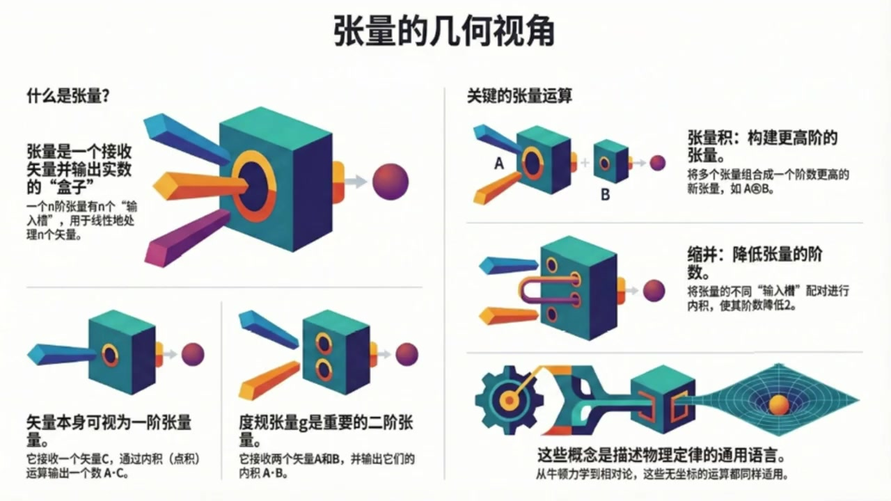

# 《现代经典物理学》第2课 张量的几何视角

> 自动生成的课程注解文档（共 2 个段落，[原始视频](https://www.youtube.com/watch?v=XT8CoS4083U)）

## 目录

- [00:00:06 坐标无关的张量观：向量、内积、张量积与收缩](#段落-1)
- [00:05:49 几何视角下的粒子动力学、对称性与课程总结](#段落-2)

---

## 段落 1：坐标无关的张量观：向量、内积、张量积与收缩 { #段落-1 }

**时间：** 00:00:06 ~ 00:05:49

<details><summary>📝 原始字幕</summary>

<pre>

嘿大家好欢迎收听现代经典物理学的第二课
我是你们活泼好奇的周伊大家好我是你们的赛今天会和周伊一起继续用几何的视角来探索物理世界的奥秘没错
赛
上次我们不是聊到怎么用几何的眼光来看待物理世界,以及向亮这些基础概念吗?那今天咱们是不是要更进一步,聊点更深奥的,比如张亮
一听到这个词,我感觉脑子里的弦就有点绷紧了哈哈,周亦你别紧张
张亮这个词听起来确实有点忘事来理解他
我们这次的目标就是要在没有坐标系的情况下去理解一些微分级合理的基本概念包括张亮内极度归张亮张亮级还有张亮的收缩没有坐标系
这听起来有点挑战性啊
平时做物理题,不是都离不开坐标系吗?
X周Y周Z周什么的对就是我们这门课的特别之处
想象一下你不用任何尺子,两角器,甚至不用任何参考点,也能描述一个物体的运动或者一个力
这听起来是不是很酷?哇,那确实很酷
有点像古希腊哲学家在思考纯粹的几何概念
那赛,咱们就从最基础的开始吧
上次你提到向量,说它就是一个从P点到Q点的直箭头,它的长度和方向决定了一切
这个概念在今天我们讨论张亮的时候是不是也很重要没错非常重要
我们把向量定义成一个直箭头它在咱们的欧吉里德库键里可以自由地从一个地方平移到另一个地方长度和方向都不变
所以我们看向量的时候
这其实就是在强调它坐标五官的特性
我理解了
那张亮呢
他和向亮有什么关系,或者说他到底是个啥
好的
咱们今天对张亮的定义会跟你在很多传统物理教材里看到的不太一样
在那些数里张亮通常被说成是一对数字组成的数组在坐标细旋转的时候这些数字会以特定的方式变化对对对我就是对那种变换规则偷大别急我们今天不这么看
咱们把一个N接张亮T定义成一个吃掉N个向量然后吐出这是什么比喻哈哈你可以把它想象成一个盒子就像我们资料里图一点二画的那样
这个盒子上面有N个小槽,你可以把N个项梁插进去
然后呢,盒子的一端会出来一个数字,一个实数
这个时数就是这个张亮T在这些项梁上的值哦,我好像有点明白了
它像一个机器,输入是向量,输出是数字
那线性函数又是什么意思呢线性函数就是说如果你把一个向量槽里放进去的向量换成两个向量的线性组合比如说EE加上FF那么它输出的值也会是E乘以T其中E和F是实数
对其他的草味也一样,这就叫做鲜鲜又是什么意思?接简单来说,就是这个张亮吃掉多少个香梁
比如一个三阶长梁它就有三个草需要你塞进去三个向梁然后它给你突出一个实数听起来却是比一堆数字的数组要直观多了
那我们平时熟悉的内机我们之前已经定义过它跟向量的平方长度A平方有关具体来说是A.B等于四分之一括号A加B的平方减括号A减B的平方
你可以证明内极其实就是一个实数值的线性函数而且它需要两个向量作为输入两个向量那它就是二阶张量它叫做度归张量通常用句来表示
所以,你看,原本是三介张量,收缩后就变成了一介张量,也就是向量了
这里A乘以C和E乘以G都是实数这个操作听起来好强大不过资料里也说了这种没有指标的收缩表示方法好像没有一个特别通用的符号对这确实是它在表示上不那么方便的地方但核心思想就是通过内积的方式把张亮的两个草位合并起来从而降低接数好的那到目前为止我们讲了向量张亮度归张亮内积张亮机和收缩这些概念都是在没有坐标系的情况下定义的对吧完全正确这些概念都可以在任何带有平方长度概念的向量空间里通用不需要做任何修改
比如我们下一章要讲的狭义相对论里的四维时空这些概念也一样适用这就是它们强大的地方它们描述的是物理世界最本质的几何结构听起来真是太棒了感觉像是透过现象看到了本质那接下来咱们是不是要用这些几何语言来重新看看我们熟悉的粒子动力学了是的接下来咱们就用这种几何的视角来重新审视牛顿的粒子运动定律在牛顿物理里一个经典粒子在O级里的三维空间里运动时间T就像一个朴实的计时器

</pre>

</details>

**课程截图：**




### 注解

我来对这段课程视频进行深度注解，重点分析新出现的概念、公式和图示。

---

## 一、核心公式解析

### 1. 内积的度规定义（新公式）

$$\mathbf{A} \cdot \mathbf{B} = \frac{1}{4}\left[(\mathbf{A}+\mathbf{B})^2 - (\mathbf{A}-\mathbf{B})^2\right]$$

| 符号 | 含义 |
|:---|:---|
| $\mathbf{A}, \mathbf{B}$ | 欧几里得空间中的向量 |
| $(\mathbf{A}+\mathbf{B})^2$ | 向量和的**平方长度**（即 $\|\mathbf{A}+\mathbf{B}\|^2$） |
| $(\mathbf{A}-\mathbf{B})^2$ | 向量差的**平方长度** |
| 系数 $\frac{1}{4}$ | 归一化因子，确保与标准点积一致 |

**关键洞察**：这个公式用**纯几何量**（平方长度）定义了内积，完全不依赖坐标分量。这是"坐标无关"哲学的典型体现——内积本质上是可测量的长度关系，而非 $A_xB_x + A_yB_y + A_zB_z$ 这样的计算规则。

---

## 二、图示内容详解

### 图1：张量的几何视角（主概念图）

| 板块 | 内容描述 |
|:---|:---|
| **"什么是张量"** | 绿色立方体"盒子"有 $n$ 个彩色插槽（输入槽），插入 $n$ 个向量箭头后，右侧输出一个紫色球体（实数） |
| **"矢量本身可视为一阶张量"** | 单槽盒子：接收一个向量 $\mathbf{C}$，通过内积（点积）运算输出实数 $\mathbf{A}\cdot\mathbf{C}$ |
| **"度规张量 $\mathbf{g}$ 是重要的二阶张量"** | 双槽盒子：接收两个向量 $\mathbf{A}$ 和 $\mathbf{B}$，输出它们的内积 $\mathbf{A}\cdot\mathbf{B}$ |
| **"张量积"** | 两个盒子 $\mathbf{A}$ 和 $\mathbf{B}$ 组合成更高阶的新张量（图示为 $\mathbf{A}\otimes\mathbf{B}$） |
| **"缩并"** | 用管道将张量的两个插槽连接起来（内积操作），阶数降低2 |

### 图2：为何需要"坐标无关"

- **右侧**：极坐标网格上的金色箭头，暗示同一向量在不同坐标系中的描述不同
- **核心信息**：物理定律独立于人为选择的坐标系，数学语言应反映这种实在性

### 图3：三阶张量的线性性质（关键细节图）

**公式**：
$$T(e\mathbf{E} + f\mathbf{F}, \mathbf{B}, \mathbf{C}) = e\,T(\mathbf{E}, \mathbf{B}, \mathbf{C}) + f\,T(\mathbf{F}, \mathbf{B}, \mathbf{C})$$

| 视觉元素 | 含义 |
|:---|:---|
| 左侧分支 | 向量 $\mathbf{E}$ 缩放 $e$ 倍、$\mathbf{F}$ 缩放 $f$ 倍，相加后输入单槽 |
| 中央立方体 | 三阶张量 $T$，三个插槽分别接收 $\mathbf{A}$（此处为 $e\mathbf{E}+f\mathbf{F}$）、$\mathbf{B}$、$\mathbf{C}$ |
| 右侧等式 | 线性性允许"先分别计算，再线性组合"——这是张量计算的核心简化工具 |

---

## 三、新概念体系梳理

```
几何视角的张量层级：
├── 0阶张量（标量）：纯数字，无插槽
├── 1阶张量（向量）：1个插槽，输入向量→输出数字（通过内积）
├── 2阶张量（如度规g）：2个插槽，输入两个向量→输出数字
├── 3阶张量：3个插槽（如图3所示）
└── N阶张量：N个插槽，多重线性映射
```

### 关键运算的"盒子语言"

| 运算 | 几何操作 | 效果 |
|:---|:---|:---|
| **张量积** $\otimes$ | 盒子并排组合 | 阶数相加：$p$ 阶 + $q$ 阶 → $(p+q)$ 阶 |
| **缩并（收缩）** | 用管道连接两个插槽 | 阶数减2：$n$ 阶 → $(n-2)$ 阶 |
| **度规作用** | 用 $\mathbf{g}$ 连接向量 | 降指标操作（向量↔对偶向量）|

---

## 四、理论背景补充

### 与传统教材的对比

| 传统定义 | 本课程的几何定义 |
|:---|:---|
| "在坐标变换下按特定规则变换的一组数" | "多重线性映射：输入 $n$ 个向量，输出1个实数" |
| 依赖坐标系选择 | 完全坐标无关 |
| 指标运算（$T^{ij}_{\ \ k}$） | 抽象指标/无指标表示（$T(\mathbf{A},\mathbf{B},\mathbf{C})$） |
| 计算导向 | 概念/几何直观导向 |

### 为何这种定义更"物理"

> *"物理定律是普适的，它们的存在独立于我们为描述它们而发明、选择的任何坐标系。"*

- **牛顿力学**：伽利略变换下，$F=ma$ 形式不变
- **狭义相对论**：洛伦兹变换下，需要4维时空的度规结构
- **广义相对论**：弯曲流形上，只有坐标无关的语言才能描述引力

本课程采用的**无坐标张量分析**（coordinate-free tensor analysis）正是为后续相对论物理打下的数学基础。

---

## 五、通俗总结

**张量就是一台"多槽榨汁机"**：
- 普通机器（函数）：放入苹果→出果汁
- 向量（1阶张量）：放入一个水果→出甜度数值（通过与标准样本比较）
- 度规（2阶张量）：放入两种水果→出它们的"风味相似度"
- 三阶张量：放入三种水果→出某种"三元搭配指数"

**线性性** = 机器遵守分配律：混合水果的评分 = 各组分评分的加权平均

**缩并** = 把两个进料口用管道连起来，让原料内部"相互作用"，最终只需更少的外部输入就能出结果。

这种"机器隐喻"避开了令人头疼的指标运算，直指张量的**本质：多重线性映射**。

---

## 段落 2：几何视角下的粒子动力学、对称性与课程总结 { #段落-2 }

**时间：** 00:05:49 ~ 00:12:33

<details><summary>📝 原始字幕</summary>

<pre>

在某个时刻T粒子在某个点XT这就是它的位置位置机迹这些都是我们熟悉的没错
这个XT描绘出的就是粒子在三维空间里的轨迹
然后粒子的速度Vt是位置对时间的导数它的动量PT是质量M乘以速度它的加速度AT是速度对时间的导数而动能ET则是二分之一质量乘以速度的平方这些公式我们太熟悉了V等于DXBDTP等于MVA等于DVBDT等于D平方XBDT平方E等于二分之一MV平方对这些都是我们高中物理就学过的
但关键在于这些位置,轨迹,速度,动量,加速度和能量,它们都是几何对象
也就是说他们的定义不依赖于任何坐标系当然了速度会有个小小的起义它取决于你选择的禁止参照系哦原来如此它们本身就是几何的所以用几何语言来描述它们就更加自然了
那牛顿第二定律呢DP百DT等于MA等于F牛顿第二定律告诉我们粒子的动量只有在受到力F作用时才会改变
如果这个力是由电场E和磁场B产生的那么在国际单位之下这个定律就变成了我们熟悉的洛伦兹力形式DP百DT等于QE加V差BQ是电荷V差B是速度和磁场的差成这些都是我们学过的没错所以你看这些运动定律它们本身就是几何对象之间的几何关系
咱们可以用一个非常熟悉的例子来体验一下这种几何的强大行星运动行星运动开普了定律吗对想象一下一颗轻行星绕着一颗重恒星转
如果没有引力,它就会沿着直线云速运动
而牛顿当年在没有引入任何坐标系的情况下仅仅通过几何推理就推导出了开普勒第二定律也就是行星在相等时间内扫过的面具相等不用坐标系就能推导出开普勒第二定律这太厉害了
我记得我们学开普勒第二定律的时候,通常都是用极坐标,然后入录拉格朗日量
发现FY是一个循环坐标,然后脚动量守恒就出来了
你说得没错,这正是我们要对比的两种方法
牛顿应集合的方法是为了快速理解物理学的基本定律
而拉格朗日他发展出基于坐标的分析力学是为了解决那些纯集合方法解决不了的天体力学问题
所以,两种方法都很有用,对吧
绝对是两者皆宜
在导出和理解基本物理定律时集合方法往往能带来更深刻的洞察
但在我们实际解决问题比如即可获缺了
今天的物理学无论是经典还是现代都普遍用集合的方式来表达物理定律比如拉格朗日量哈密顿量和作用量原理
也就是说能够不引入坐标线,完全正确
这引出了一个著名的联系对称性与守恒定律
比如行星运动中脚动量守恒就来自于轴对称性
这在拉格朗日量里体现为对角度FID无关性
但我们也可以像牛顿那样从集合上直接推导出来
那是不是说我们理解对称性和守恒定律一般都不需要引入特定的坐标系通常是这样
但在某些情况下对称性可能隐藏得很甚
比如一个正在进洞的萝
这时候坐标变换就成了结实这些对称性的最佳途径
而且在现实世界中很多因素会使拉格朗日和汉密尔顿的分析动力学变得复杂甚至失效
这时候我们又会转向集合的思考,比如呢
比如一个球星弹足在一个平坦的水平桌面上滚动
分析动力学可以建立驱疏条件然后推导出线动量和脚动量守恒
但如果桌面是弯曲的不平坦的
弹柱是椭圆形的有划痕的空气有足力甚至弹柱和桌子之间有微观的吸引力一下子就变得好复杂
当把这些现实因素都考虑进全猪的动力学
即使我们忽略这些复杂性只问弹珠滚道这个时候用拉格朗日和哈密顿的方法来计算它落在哪里来的直接和有效听起来几何方法在处理这些MAC没错
在接下来的章帖里,我们会遇到很多这样的例子
所以本质非常重要太棒了赛今天我们学到了好多从抽象的张量到具体的粒子动力学都用几何的眼光制得出来
我们今天的主要目的就是让大家建立起这种坐标无关的几何思维
张量作为描述物理量的工具不再是枯燥的数字矩阵而是一个一个有特定功能的盒子
而物理律律也不仅仅是公式更是几何对象之间优美的关系那为了巩固一下今天学到的知识有没有什么小练习可以给大家思考一下的当然有
咱们资料里就提供了动能变化率的要求大家不引入任何坐标系或机向量证明D一比DT等于QV点E完全不用坐标系听起来就很有挑战性第二个练习是关于粒子云速圆周运动的
同样不引入坐标系用画图和几何的方式来理解速度方向的单位向量对胡长的导数以及指向圆形的向量表达式
这些练习都能很好地帮助大家体会几何思维的魅力,好的
听众朋友们
去思考物理问题的乐趣
赛,今天真的非常感谢你,把这么复杂的概念讲得这么生动有趣
也谢谢周亦的精彩提问和引导希望大家今天都能有所收获没错
那我们今天的现代经典物理学第二课就到这里了
感谢大家的收听,我们下期再见,再见

</pre>

</details>

**课程截图：**


### 注解

我来对这段课程视频进行深度注解，重点分析新出现的概念、公式和图示。

---

## 一、核心公式解析（粒子动力学）

### 1. 基本运动学公式

| 公式 | 符号说明 |
|:---|:---|
| $\mathbf{v}(t) = \frac{d\mathbf{x}}{dt}$ | $\mathbf{x}(t)$：位置矢量（轨迹）；$\mathbf{v}(t)$：速度；$t$：时间 |
| $\mathbf{p}(t) = m\mathbf{v}(t)$ | $\mathbf{p}(t)$：动量；$m$：质量（标量） |
| $\mathbf{a}(t) = \frac{d\mathbf{v}}{dt} = \frac{d^2\mathbf{x}}{dt^2}$ | $\mathbf{a}(t)$：加速度 |
| $E(t) = \frac{1}{2}mv^2$ | $E(t)$：动能；$v^2 = \mathbf{v}\cdot\mathbf{v}$（速度平方，即自内积）|

> **关键洞察**：这些公式中的"导数"是**几何导数**（沿曲线的变化率），不依赖于任何坐标系的选择。$v^2$ 直接用内积定义，无需展开成分量。

### 2. 牛顿第二定律（几何形式）

$$\frac{d\mathbf{p}}{dt} = m\mathbf{a} = \mathbf{F}$$

| 符号 | 含义 |
|:---|:---|
| $\frac{d\mathbf{p}}{dt}$ | 动量的时间变化率（几何导数）|
| $\mathbf{F}$ | 力（作为几何对象，而非分量集合）|

### 3. 洛伦兹力公式（电磁场中的运动）

$$\frac{d\mathbf{p}}{dt} = q\mathbf{E} + \mathbf{v} \times \mathbf{B}$$

| 符号 | 含义 |
|:---|:---|
| $q$ | 粒子电荷（标量）|
| $\mathbf{E}$ | 电场（矢量场）|
| $\mathbf{B}$ | 磁场（矢量/赝矢量）|
| $\mathbf{v} \times \mathbf{B}$ | 速度与磁场的**叉积**（在三维欧氏空间中有定义）|

> **几何要点**：叉积 $\times$ 是三维欧氏空间特有的结构，依赖于度规和定向。在一般流形上，磁场更适合用**2-形式**描述，洛伦兹力则体现为**缩并**操作。

---

## 二、板书/PPT截图内容描述

### 截图1：几何工具箱回顾（已在前文解释）
- 张量、度规张量、张量积、缩并的图示化表示

### 截图2：粒子动力学的几何描述（新内容）

```
应用篇：用几何语言描述粒子动力学

关键几何对象：
• 轨迹 x(t)：粒子在三维欧几里得空间中划出的曲线
• 速度 v(t)：位置的时间导数
• 动量 p(t)：质量与速度的乘积
• 加速度 a(t)：速度的时间导数
• 动能 E(t)：质量与速度平方乘积的一半

[右侧图示：三维空间中弯曲的轨迹，标注了]
  - x(t)：位置点
  - v(t)：沿轨迹切向的速度矢量（红色）
  - a(t)：指向曲率中心的加速度矢量（蓝色）
```

**图示要点**：速度始终与轨迹相切；加速度可分解为切向（改变速率）和法向（改变方向）分量。

### 截图3：对称性、守恒定律与几何思考（新内容）

```
物理学中的对称性、守恒定律与几何思考

对称性(Symmetry) ←——著名的联系——→ 守恒定律(Conservation Laws)
         ↑                                    ↑
         └──────── 不引入坐标系的推导 ────────┘
              ↓                    ↓
         通常情况              特殊情况：隐藏的对称性
       （不需要坐标系）      （如：进动的陀螺）
              ↓                    ↓
              └──────→ 坐标变换 ←──┘
                         ↓
              现实世界复杂性（如：分析动力学失效）
                         ↓
                   转向 → 几何的思考
```

**核心信息**：建立了一个决策流程——优先尝试无坐标的几何推导；当对称性隐藏或分析动力学失效时，再引入坐标变换或转向纯几何方法。

---

## 三、核心概念深度解释

### 1. "几何对象" vs "坐标依赖量"

| 几何对象 | 坐标依赖量 |
|:---|:---|
| 位置 $\mathbf{x}(t)$ 作为流形上的点 | 坐标 $(x,y,z)$ 的具体数值 |
| 速度 $\mathbf{v}$ 作为切向量 | 分量 $(v_x, v_y, v_z)$ |
| 动能 $E = \frac{1}{2}m(\mathbf{v}\cdot\mathbf{v})$ | $E = \frac{1}{2}m(v_x^2+v_y^2+v_z^2)$ |
| 牛顿定律作为向量间的关系 | 分量方程 $F_x = ma_x$ 等 |

**关键区分**：几何对象的定义**不依赖于观察者选择的坐标系**，尽管某些量（如速度）依赖于**惯性参考系**的选择——这是物理上的相对性，而非数学上的坐标任意性。

### 2. 牛顿的几何方法 vs 拉格朗日的分析方法

| | 牛顿几何法 | 拉格朗日分析法 |
|:---|:---|:---|
| **核心工具** | 几何直观、向量运算 | 广义坐标、变分原理 |
| **优势场景** | 基本定律的推导、深刻洞察 | 复杂约束系统、实际计算 |
| **开普勒第二定律** | 直接由面积速度的几何性质得出 | 极坐标 + 循环坐标 + 角动量守恒 |
| **典型应用** | 理解物理本质 | 天体力学、多体问题 |

> **历史背景**：牛顿在《自然哲学的数学原理》中大量使用几何证明；拉格朗日《分析力学》则完全不用图示，纯用代数分析。

### 3. 对称性与守恒定律的诺特定理（Noether's Theorem）

| 对称性 | 守恒量 | 几何体现 |
|:---|:---|:---|
| 时间平移对称性 | 能量守恒 | 拉格朗量不显含 $t$ |
| 空间平移对称性 | 线动量守恒 | 拉格朗日量对位置平移不变 |
| **旋转对称性（轴对称）** | **角动量守恒** | 对角度 $\varphi$ 无关性 |

**两种推导路径**：
- **拉格朗日路径**：识别循环坐标 $\varphi$ → 共轭动量 $p_\varphi = \frac{\partial L}{\partial \dot{\varphi}}$ 守恒
- **牛顿几何路径**：直接证明"面积速度" $\frac{1}{2}|\mathbf{r} \times \mathbf{v}|$ 为常数

### 4. "隐藏的对称性"与坐标变换

**进动的陀螺**示例：
- 直接观察：运动复杂，对称性不明显
- 引入**随动坐标系**（body-fixed frame）：对称性显现，欧拉方程简化问题

这说明了坐标变换的**工具性价值**——不是因为它更"基本"，而是因为它能**揭示**原本隐藏的结构。

### 5. 分析动力学失效的场景

| 复杂因素 | 为何分析动力学困难 | 几何方法的优势 |
|:---|:---|:---|
| 弯曲桌面（非平坦约束） | 需要处理曲面上的测地线 | 直接利用流形的内禀几何 |
| 非球形弹珠 | 转动惯量张量随时间变化 | 李群描述刚体转动 |
| 摩擦力、空气阻力 | 非保守力，拉格朗日框架需扩展 | 直接向量分析 |
| 微观吸引力 | 多尺度问题，有效理论失效 | 不预设近似，从基本几何出发 |

**核心洞见**：当系统的**相空间结构**变得复杂（奇异性、非完整约束、耗散），基于变分原理的分析方法需要大量修正；而几何方法（切丛、余切丛、辛几何）保持其普适性。

---

## 四、课后练习解析

### 练习1：证明 $\frac{dE}{dt} = q\mathbf{v}\cdot\mathbf{E}$（无坐标证明）

**思路提示**：
1. $E = \frac{1}{2}m(\mathbf{v}\cdot\mathbf{v}) = \frac{1}{2m}(\mathbf{p}\cdot\mathbf{p})$（用动量表示更直接）
2. $\frac{dE}{dt} = \frac{1}{m}\mathbf{p}\cdot\frac{d\mathbf{p}}{dt} = \mathbf{v}\cdot\mathbf{F}$（链式法则 + 牛顿第二定律）
3. 代入洛伦兹力：$\mathbf{v}\cdot(q\mathbf{E} + \mathbf{v}\times\mathbf{B}) = q(\mathbf{v}\cdot\mathbf{E}) + \mathbf{v}\cdot(\mathbf{v}\times\mathbf{B})$
4. 关键几何恒等式：$\mathbf{v}\cdot(\mathbf{v}\times\mathbf{B}) = 0$（向量与自身的叉积垂直于自身）

**物理意义**：磁场对粒子**不做功**（只改变速度方向，不改变速率），能量变化完全来自电场。

### 练习2：匀速圆周运动的几何分析

**目标**：不引入坐标，求
- 速度方向的单位向量 $\hat{\mathbf{v}}$ 对弧长的导数
- 指向圆心的向量表达式

**几何构造**：
1. 设轨迹为圆，弧长参数为 $s$，半径为 $R$
2. 速度方向 $\hat{\mathbf{v}}$ 沿切向，随位置转动
3. 考虑相邻两点的 $\hat{\mathbf{v}}(s)$ 和 $\hat{\mathbf{v}}(s+ds)$，作差向量
4. 利用圆的几何：$|d\hat{\mathbf{v}}| = d\theta = \frac{ds}{R}$，方向指向圆心
5. 结果：$\frac{d\hat{\mathbf{v}}}{ds} = \frac{1}{R}\hat{\mathbf{n}}$（$\hat{\mathbf{n}}$ 为法向单位向量）

**与加速度的联系**：$\mathbf{a} = \frac{d\mathbf{v}}{dt} = v\frac{d\hat{\mathbf{v}}}{dt} = v^2\frac{d\hat{\mathbf{v}}}{ds} = \frac{v^2}{R}\hat{\mathbf{n}}$

---

## 五、本节核心收获

| 主题 | 关键信息 |
|:---|:---|
| **物理量的几何本质** | 位置、速度、动量、力都是几何对象，其定义先于坐标 |
| **定律的几何表达** | 牛顿方程是向量间的关系，非分量方程 |
| **方法的选择** | 几何法用于洞察，分析法用于计算；两者互补 |
| **对称性与守恒** | 可无坐标直接理解，坐标变换是揭示隐藏对称的工具 |
| **复杂系统的处理** | 当标准分析框架失效时，回归几何思考 |

---
