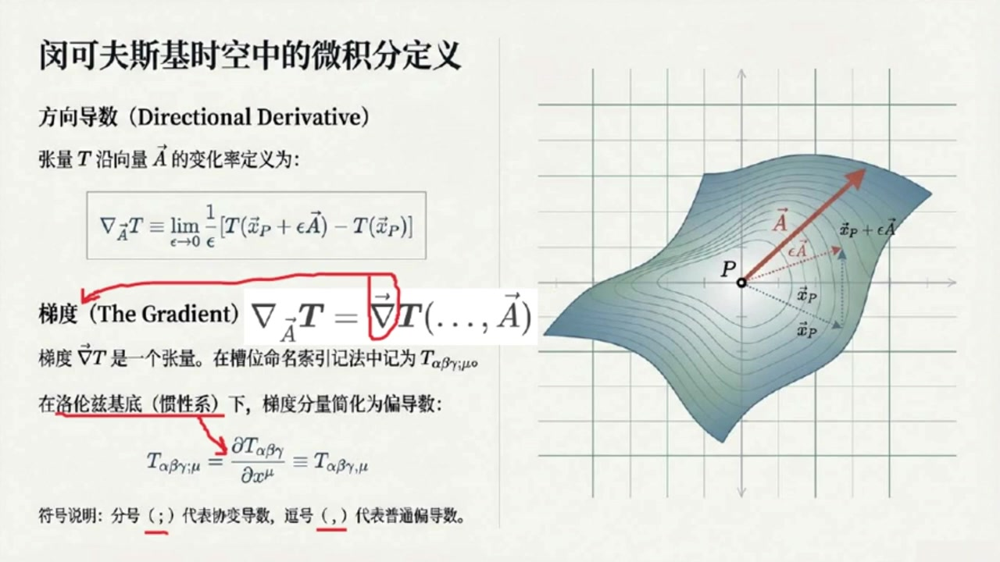
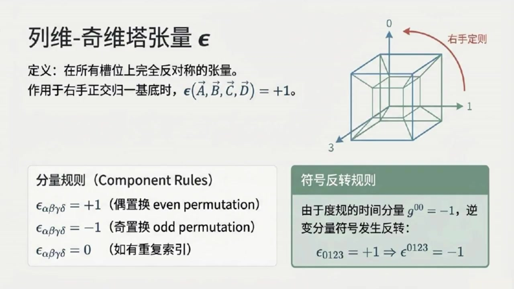
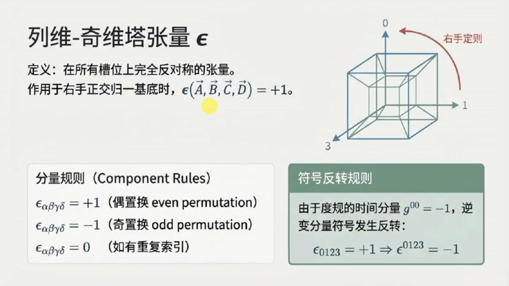
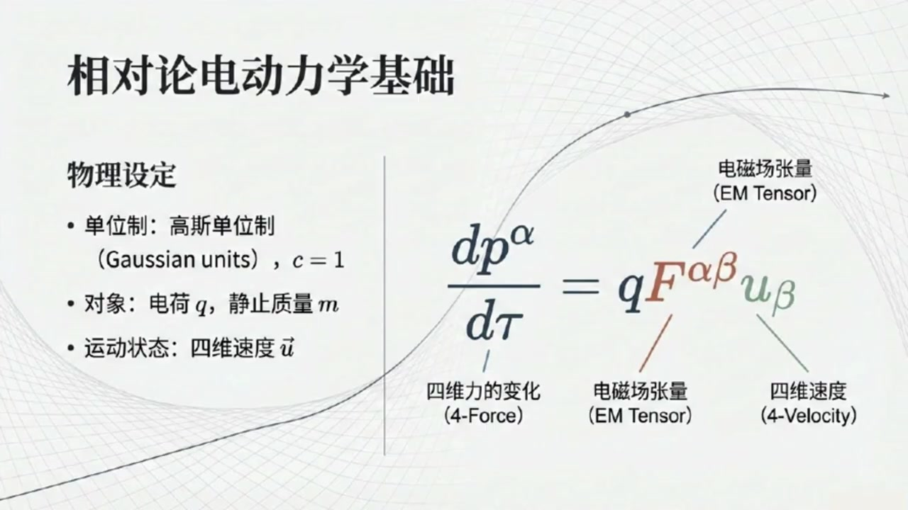
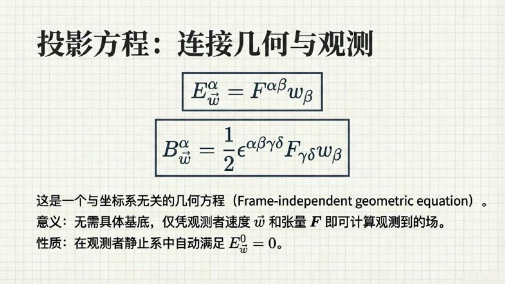
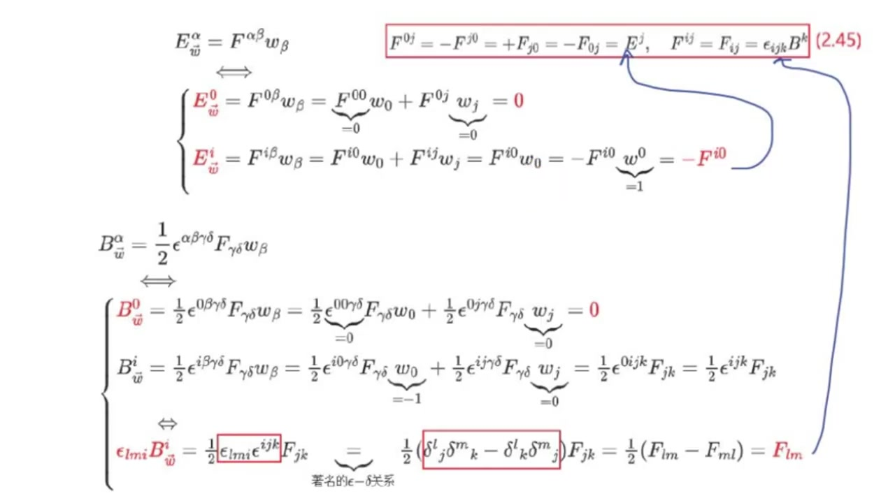
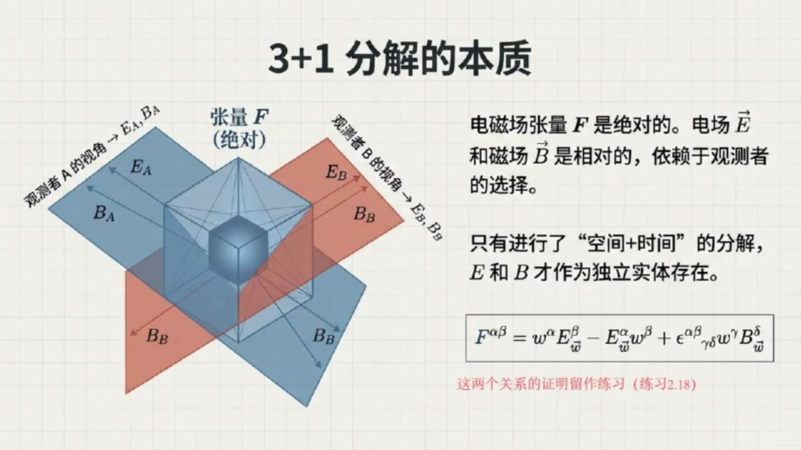
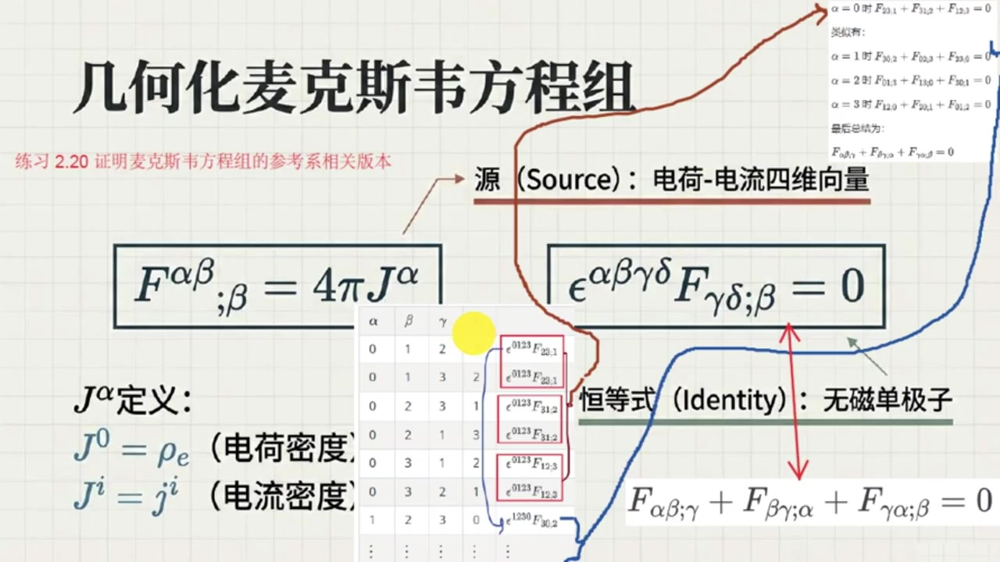

# 《现代经典物理学》第10课 闵氏时空上微分和电动力学几何本质

> 自动生成的课程注解文档（共 5 个段落，[原始视频](https://www.youtube.com/watch?v=YWU5tM5-4RI)）

## 目录

- [00:00:00 导数、梯度、散度与波动算子导入](#段落-1)
- [00:05:40 列维奇维塔张量与电磁学主题引入](#段落-2)
- [00:08:56 电磁场张量与洛伦兹力的相对论表达](#段落-3)
- [00:15:12 观测者分解下的电场磁场定义与重构](#段落-4)
- [00:20:41 麦克斯维方程、四维势与规范变换总结](#段落-5)

---

## 段落 1：导数、梯度、散度与波动算子导入 { #段落-1 }

**时间：** 00:00:00 ~ 00:05:39

<details><summary>📝 原始字幕</summary>

<pre>

大家好,我是你们活泼好奇的Zoe
大家好,我是陈稳,但乐于分享的赛
欢迎大家收听现代经典物理学博客的第十期
哇,赛第十七了,感觉我们这门课越学越深入,也越来越烧脑了
今天我们要聊的主题听起来就很有分量方向导兽梯度还有那个听起来有点神秘的列威其尾他张亮对吧没错
这部分内容是咱们理解电动学的基础
我们先从始量和张量的导数开始聊起
大家还记得在欧基里的空间里我们是怎么定义方向导数和梯度的吗记得一点点方向导数嘛就是沿着某个方向球导数看函数在这个方向上怎么变化
梯度呢,它是一个始量,指向函数增长最快的方向,大嫂就是增长率,说得很好
在明科夫斯基时空中这些定义方式其实跟欧吉里的空间是完全一样的
如果之前没仔细看咱们教材的一点七节也就是现代经典物理学专栏第四课的内容,我建议你现在可以回去补一补哦原来是一样的,那我就放心多了
不过赛咱们书里提到了一个符号是纳布拉夏四十辆A作用在张量T上
这后面还跟着一个极限的定义是
对,就是那个和OG里的空间类似的极限定义仪式
张亮T在时空位置XP加上X龙四十亮A和时空位置XP的差值也是一个同界张亮然后除以X龙
最后取Epsilon去向零的极限
简单来说就是看张亮T在40辆A方向上的变化率,只不过这个变化率是一个同阶张亮而已
明白了
那梯度呢
书里说梯度纳布拉T是一个张量
当把四十辆A插入其最后一个槽位时就产生了方向导数这个插入槽位是什么意思啊好的问题
简单说,梯度NABLAT本身是一个更高阶的涨量
你可以把它想象成一个有空位的容器
当你把一个40辆A放到它的最后一个空位,也就是草位里,它就能给你吐出那个芳香导数
此外还要注意的是在这里纳布拉本身也是一个类似四十量形式的算符哦听起来有点像函数里的自变量位置
那在咱们那种带锁影的技法里,梯度是不是就是T下Alpha Beta Gamma分号Mute这样
那个分号后面跟的MUE就是表示沿着X上MUE的梯度分量没错你抓住了重点
在洛伦兹基底也就是我们冠性参考系相关的基地史量中这个分号就简化成了一个逗号表示沿着X上M的偏导数
所以踢下阿尔法贝塔格玛分号MUE就变成了踢下阿尔法贝塔格玛逗号MUE它就等于偏踢下阿尔法贝塔格玛百天X上MUE好的这个符号上的变化挺关键的
那这些方向导数和梯度有没有什么成绩法则之类的,就像我们危机分离学的那样,当然有,他们服从所有我们熟悉的成绩微分法则
比如说两个张量S和T的张量计S全程T沿着A方向的导数就等于括号那不拉下A作用于S括号全程T
加上S全程纳布拉夏A作用于T这个很直观跟我们学过的炼式法则很像
那有没有什么特殊的张亮它的梯度是零的有一个非常重要的例子度归张亮G
它的提度是0也就是G下AlphaBeta分号Mue等于0
这表明时空的几何结构在维分操作下是平坦的至少在局部是这样这个有点意思那时量的散度呢它跟梯度有什么关系时量的散度比如纳布拉DOTA其实就是它的梯度进行缩并的结果
用索应技法就是S下Alpha分号Beta,乘G上AlphaBeta
或者更简洁地写成S上Alpha下分号Alpha
这表示你把梯度的两个锁印缩并起来好的我理解了现在我们再来聊聊那个拉普拉斯算子和波动算子在欧吉里德空间里张亮梯度的散度就是拉普拉斯算子对吧对
比如TABC分号JK缩并记JK它就等于TABC逗号JK缩并丢塔JK等于偏平方TABC百片XJ片XJ
但在明科夫斯基时空中由于度归张亮记上的特殊性特别是记上零零等于负一并且记上JK等于Delta上JK梯度的散度就变成了另一个非常重要的算字啊我知道了就是那个波动算子或者叫达伦伯丁符号是一个方框BOX没错正是它

</pre>

</details>

**课程截图：**





### 注解

我来对这段课程视频进行深度注解。

---

## 截图板书内容描述

**PPT 1：课程标题页**
- 标题："闵可夫斯基时空中的几何与场"
- 副标题："方向导数、列维-奇维塔张量与相对论电动力学"
- 配图：三维网格曲面上的 $\nabla F$ 符号（红色），形象化展示梯度/导数概念

**PPT 2-3：核心定义页（关键板书）**
- 左侧：方向导数与梯度的数学定义
- 右侧：几何示意图——曲面 $P$ 点处的切向量 $\vec{A}$，以及沿该方向的无穷小位移 $\vec{x}_P + \epsilon\vec{A}$

---

## 一、核心公式详解

### 公式 1：方向导数的极限定义

$$\nabla_{\vec{A}} T \equiv \lim_{\epsilon \to 0} \frac{1}{\epsilon}\left[T(\vec{x}_P + \epsilon\vec{A}) - T(\vec{x}_P)\right]$$

| 符号 | 含义 |
|:---|:---|
| $\nabla_{\vec{A}} T$ | 张量 $T$ 沿向量 $\vec{A}$ 方向的**方向导数** |
| $\vec{x}_P$ | 时空点 $P$ 的位置矢量（四维）|
| $\epsilon$ | 无穷小参数，趋于0 |
| $\vec{A}$ | 四维方向矢量（切向量）|
| $T(\cdot)$ | 张量场在对应位置的取值 |

**物理意义**：这是方向导数的"本质定义"——沿 $\vec{A}$ 方向走一小步，看张量变化多少，归一化到单位"步长"。

---

### 公式 2：梯度与方向导数的关系

$$\nabla_{\vec{A}} T = \vec{\nabla}T(\ldots, \vec{A})$$

或写为槽位形式：$\nabla_{\vec{A}} T = (\nabla T)(\_, \_, \ldots, \vec{A})$

| 符号 | 含义 |
|:---|:---|
| $\vec{\nabla}T$ | 张量 $T$ 的**梯度**，是一个**更高一阶的张量** |
| $(\ldots, \vec{A})$ | 将 $\vec{A}$ "插入"梯度的**最后一个槽位**（slot）|
| 槽位（slot）| 抽象指标记法中张量的"空位"，等待被矢量填充 |

**关键理解**：梯度 $\nabla T$ 本身不依赖于具体方向，它是一个"通用"的导数容器；填入具体方向 $\vec{A}$ 后，才给出该方向的具体变化率。

---

### 公式 3：抽象指标记法（分号与逗号）

$$T_{\alpha\beta\gamma;\mu} \equiv \frac{\partial T_{\alpha\beta\gamma}}{\partial x^\mu} \equiv T_{\alpha\beta\gamma,\mu}$$

| 符号 | 含义 |
|:---|:---|
| $T_{\alpha\beta\gamma}$ | 三阶协变张量（3个下标 = 3个槽位）|
| **分号 $;\mu$** | **协变导数**（covariant derivative），含克里斯托费尔联络项 |
| **逗号 $,\mu$** | **普通偏导数** $\partial_\mu$，仅适用于**洛伦兹基底（惯性系）**|
| $\equiv$ | 在平直时空惯性系中二者等价 |

> ⚠️ **重要区分**：分号是"广义"的导数（弯曲时空也适用），逗号是"狭义"的简化（仅闵可夫斯基时空惯性系）。

---

### 公式 4：度规张量的协变导数为零

$$g_{\alpha\beta;\mu} = 0$$

这是**列维-奇维塔联络**（Levi-Civita connection）的核心性质，称为**度规相容条件**（metric compatibility）。

---

### 公式 5：矢量散度的缩并形式

$$\nabla \cdot \vec{S} = S^\alpha_{\ ;\alpha} = g^{\alpha\beta} S_{\alpha;\beta}$$

| 符号 | 含义 |
|:---|:---|
| $S^\alpha_{\ ;\alpha}$ | 梯度 $S_{\alpha;\beta}$ 对两个指标缩并（trace）|
| $g^{\alpha\beta}$ | 逆度规张量，用于升降指标 |

---

### 公式 6：欧氏空间 vs 闵可夫斯基时空的"梯度的散度"

| 空间 | 结果 | 公式 |
|:---|:---|:---|
| **欧几里得空间** | **拉普拉斯算子** $\nabla^2$ | $T_{ABC;JK}\delta^{JK} = \partial_J\partial_J T_{ABC}$ |
| **闵可夫斯基时空** | **达朗贝尔算子** $\Box$ | 因 $g^{00}=-1, g^{jk}=\delta^{jk}$ |

$$\Box T \equiv \nabla_\mu \nabla^\mu T = -\frac{\partial^2 T}{\partial t^2} + \nabla^2_{\text{空间}} T$$

这就是**波动方程**的算子形式！相对论中电磁波、引力波都服从 $\Box \phi = 0$。

---

## 二、理论背景补充

### 2.1 为什么闵可夫斯基时空"看起来"和欧氏空间一样？

| 方面 | 欧氏空间 $\mathbb{E}^3$ | 闵可夫斯基时空 $\mathbb{M}^4$ |
|:---|:---|:---|
| 度规符号 | $(+,+,+)$ | $(-,+,+,+)$ 或 $(+,-,-,-)$ |
| 距离公式 | $ds^2 = dx^2+dy^2+dz^2$ | $ds^2 = -c^2dt^2+dx^2+dy^2+dz^2$ |
| 微积分定义 | 完全相同！ | 完全相同！（因都是**平直空间**）|

**关键洞察**：方向导数、梯度的*定义*只依赖于空间的**仿射结构**（平移不变性），与度规的具体符号无关。差异只在**缩并、求长度**时显现。

### 2.2 "槽位"（slot）概念的深层含义

这是**抽象指标记法**（Penrose抽象指标）的核心：
- 张量不是"带数字的数组"，而是**多线性映射**
- 每个下标 $\alpha, \beta, \gamma\ldots$ 代表一个"输入口"
- $\nabla T$ 比 $T$ 多一个槽位（导数带来的新自由度）

比喻：$T$ 是一台三输入机器，$\nabla T$ 是四输入机器——多出的那个槽位用来"询问"：你想沿哪个方向求导？

---

## 三、通俗语言总结

| 概念 | 一句话解释 |
|:---|:---|
| **方向导数** | "沿这条路走，场变化有多快？" |
| **梯度** | "所有方向变化率的完整信息包"——比方向导数更"高级"，不预设方向 |
| **分号 vs 逗号** | 分号是"专业版"导数（哪都能用），逗号是"简化版"（仅限惯性系）|
| **度规导数为零** | "时空的几何背景是刚性的，不随微分操作而变形" |
| **达朗贝尔算子** | 相对论版的"拉普拉斯"，把时间导数也纳入，且带负号——自然导出波动方程 |

---

## 四、本节核心要点

1. **闵可夫斯基时空的微积分**在定义层面与欧氏空间**形式相同**，这是平直时空的特权
2. **梯度是比方向导数更基本的对象**——梯度是张量，方向导数是梯度的"投影"
3. **符号记法的层次**：抽象槽位 $\to$ 分号协变导数 $\to$ 逗号偏导数（越来越具体，适用范围越来越窄）
4. **度规相容条件** $g_{\alpha\beta;\mu}=0$ 保证了"长度测量"在微分下保持一致
5. **闵可夫斯基度规的符号** $(-+++)$ 导致"梯度的散度"变成波动算子——这是相对论场论的数学根源

---

## 段落 2：列维奇维塔张量与电磁学主题引入 { #段落-2 }

**时间：** 00:05:40 ~ 00:08:55

<details><summary>📝 原始字幕</summary>

<pre>

踢下 alphabetical grammar 都好,去上
展开来就是负偏平方题下阿尔法贝塔伽玛百偏T平方加偏平方题下阿尔法贝塔伽玛百偏X上J偏X上KDelta上JK
当这个波动算子作用于一个账量上等于零时我们就得到了波动方程这个太重要了这个意味着在相对论里很多物理量的行为都可能由波动方程来描述
那接下来,我们是不是要聊聊那个列维奇维塔张亮了
这个名字听起来就很特别,是的
就像Ouchirid空间有度规张量G来描述几何,Minkofski时空也有他自己的度规张量
同样也有一个非常重要的张量就是列为奇维塔张量EPSL看来也应该和欧吉里德空间中的情况一样
它在所有槽位上都是完全反对称的,对吧,对的
完全反对称的意思是如果你交换任意两个锁印,这个张亮的分量就会变号
如果任何两个锁影相同那么它的分量就直接是零哦明白了那么在明科夫斯基时空中它的值是怎么定义的呢
它是在作用于任何一组右手手性的正交规一四维史料史其职为正一
这里的正教规一有点讲究
要求其中一个时量是内时且指向未来的而另外三个是内空时量并且它们满足右手定则明白了就是说它能帮我们定义时空中的体积或者方向的概念有点像三维空间里的插成
那它的分量在洛伦兹基底里怎么表示呢在任何右手洛伦兹基底中EPSLON只有当所有索影都不同时才飞灵
具体来说如果阿尔法贝塔加玛德尔塔是零一二三的偶置换对应的EPSLON下阿尔法贝塔加玛德尔塔会是正义
如果是旗帜换,就是负一
如果有人和缩影重复就是零我看到书里有个特别的例子Epsilon下0123等于正一那它的逆变分量Epsilon上0123呢
根据我们之前学过的若含时间为则负号反转的规则
Epsilon上0123就变成了负1
这个细节在计算中非常重要
好的理解了列为奇维塔张亮他在后面的电磁学里是不是会扮演重要角色啊绝对的他在电磁场张亮的定义和麦克斯维方程组的推导中都至关重要
那我们接下来就进入今天最重要的部分之一了就是电场与磁场的性质麦克斯维方程组
在,我们现在要用相对论的视角来看电磁学了,对吧
没错我们会采用高斯丹位置因为这是相对论学者包括像杰克逊这样的经典教材作者常用的做法光速C我们就设为一好的

</pre>

</details>

**课程截图：**






### 注解

我来对这段课程视频进行深度注解，重点聚焦**波动算子**和**列维-奇维塔张量**这两个核心新概念。

---

## 截图板书内容描述

**PPT 4：列维-奇维塔张量 ε（核心板书）**

| 区域 | 内容 |
|:---|:---|
| **标题** | 列维-奇维塔张量 $\epsilon$ |
| **定义框** | "在所有槽位上完全反对称的张量。作用于右手正交归一基底时，$\epsilon(\vec{A},\vec{B},\vec{C},\vec{D}) = +1$" |
| **三维示意图** | 闵可夫斯基时空的1-2-3空间轴与0-时间轴构成的四维超立方体，标注"右手定则"红色旋转箭头（0→1→2→3方向） |
| **左下：分量规则** | 三行公式：偶置换=+1，奇置换=-1，重复索引=0 |
| **右下：符号反转规则** | 绿色高亮框：说明由于 $g^{00}=-1$，逆变量分量符号反转：$\epsilon_{0123}=+1 \Rightarrow \epsilon^{0123}=-1$ |

---

## 一、核心公式详解

### 公式 1：达朗贝尔算子（波动算子）□

字幕中提到的"波动算子"即**达朗贝尔算子**（d'Alembertian），是闵可夫斯基时空中的核心微分算子：

$$\Box = \partial^\alpha \partial_\alpha = -\frac{\partial^2}{\partial t^2} + \frac{\partial^2}{\partial x^2} + \frac{\partial^2}{\partial y^2} + \frac{\partial^2}{\partial z^2}$$

或采用字幕中的**高斯单位制（$c=1$）**写法：
$$\Box = -\partial_t^2 + \nabla^2 = \eta^{\alpha\beta}\partial_\alpha\partial_\beta$$

| 符号 | 含义 |
|:---|:---|
| $\Box$ | 达朗贝尔算子（读作"d'Alembertian"或"box"） |
| $\partial_\alpha = \frac{\partial}{\partial x^\alpha}$ | 对坐标 $x^\alpha$ 的偏导数 |
| $\eta^{\alpha\beta}$ | 闵可夫斯基度规（对角元为 $(-1,+1,+1,+1)$） |
| $\alpha,\beta = 0,1,2,3$ | 时空指标（0=时间，1,2,3=空间） |

**关键性质**：这是洛伦兹标量算子——在所有惯性参考系中形式相同，是相对论波动方程的自然载体。

---

### 公式 2：波动方程

$$\Box \phi = 0 \quad \text{或} \quad \eta^{\alpha\beta}\partial_\alpha\partial_\beta \phi = 0$$

展开形式（字幕中的"负偏平方"即指此）：
$$-\frac{\partial^2\phi}{\partial t^2} + \frac{\partial^2\phi}{\partial x^j \partial x^k}\delta^{jk} = 0$$

**物理意义**：描述无源场（如自由电磁波、引力波、 Klein-Gordon 场等）的传播，是相对论场论的"通用语言"。

---

### 公式 3：列维-奇维塔张量的分量定义

$$\epsilon_{\alpha\beta\gamma\delta} = \begin{cases} +1 & \text{若 } (\alpha,\beta,\gamma,\delta) \text{ 是 } (0,1,2,3) \text{ 的偶置换} \\ -1 & \text{若 } (\alpha,\beta,\gamma,\delta) \text{ 是 } (0,1,2,3) \text{ 的奇置换} \\ 0 & \text{若有任意两个指标相同} \end{cases}$$

| 符号 | 含义 |
|:---|:---|
| $\epsilon_{\alpha\beta\gamma\delta}$ | 四阶完全反对称张量（4D Levi-Civita symbol） |
| 下标 $\alpha\beta\gamma\delta$ | 协变分量（与基底"共变"） |
| 偶置换 | 通过偶数次两两交换得到，如 $(0,1,2,3)\to(1,0,3,2)$ |
| 奇置换 | 通过奇数次两两交换得到，如 $(0,1,2,3)\to(1,0,2,3)$ |

---

### 公式 4：逆变分量的符号反转（关键细节！）

$$\epsilon_{0123} = +1 \quad \xrightarrow{\text{指标上升}} \quad \epsilon^{0123} = -1$$

**推导依据**：
$$\epsilon^{\alpha\beta\gamma\delta} = \eta^{\alpha\mu}\eta^{\beta\nu}\eta^{\gamma\rho}\eta^{\delta\sigma}\epsilon_{\mu\nu\rho\sigma}$$

由于 $\eta^{00} = -1$，而 $\eta^{ii} = +1$，提升四个指标引入因子 $(-1)^1 = -1$（仅时间指标贡献负号）。

> ⚠️ **计算警示**：这个负号在电磁场张量 $F^{\mu\nu}$ 与 $F_{\mu\nu}$ 的转换、以及麦克斯韦方程的协变形式中至关重要，极易遗漏！

---

## 二、理论背景补充

### 2.1 为什么闵可夫斯基时空需要4D Levi-Civita张量？

| 空间类型 | 维度 | Levi-Civita 用途 |
|:---|:---|:---|
| 欧几里得空间 $\mathbb{E}^3$ | 3D | 叉积 $\vec{a}\times\vec{b}$，体积元 $dV = \epsilon_{ijk}dx^i dy^j dz^k$ |
| 闵可夫斯基时空 $\mathbb{M}^4$ | 4D | **4-体积元**、**对偶化**（Hodge对偶）、电磁场张量的构造 |

**核心功能**：$\epsilon_{\alpha\beta\gamma\delta}$ 是定义"时空定向"和"4维体积测量"的几何工具。在相对论电动力学中，它将用于：
- 构造电磁场张量的**对偶张量** $\tilde{F}^{\mu\nu} = \frac{1}{2}\epsilon^{\mu\nu\rho\sigma}F_{\rho\sigma}$
- 写出协变形式的**齐次麦克斯韦方程**

---

### 2.2 "右手正交归一基底"的精确定义

字幕中强调的"正交归一"在闵可夫斯基时空中有特殊内涵：

| 要求 | 数学表达 | 物理解释 |
|:---|:---|:---|
| 时轴类时 | $\vec{e}_0 \cdot \vec{e}_0 = \eta_{00} = -1$ | 时间方向，指向未来 |
| 空轴类空 | $\vec{e}_i \cdot \vec{e}_i = \eta_{ii} = +1$ | 三个正交空间方向 |
| 右手定则 | $\epsilon(\vec{e}_0,\vec{e}_1,\vec{e}_2,\vec{e}_3) = +1$ | 时空定向（可类比为4D的"右手系"） |

> 注意：这与欧几里得空间的"右手系"不同——时间维度的参与使得"定向"概念更微妙。

---

## 三、通俗概念解释

### 3.1 达朗贝尔算子：相对论的"波动探测器"

想象你在池塘边扔石子——水波向四周扩散。经典物理用 $\nabla^2$（拉普拉斯算子）描述空间中的波动，但这只适用于**静止观察者**。

相对论要求所有惯性观察者看到**同样的物理定律**。达朗贝尔算子 $\Box$ 就是"升级后的波动探测器"：
- 它自动混合了**时间变化**和**空间变化**
- 对光波而言，$\Box\phi=0$ 保证所有惯性系中光速相同
- 它是连接"局部事件"与"因果传播"的数学桥梁

### 3.2 Levi-Civita张量：时空的"定向罗盘"

三维空间中，$\epsilon_{ijk}$ 告诉你三个向量是否构成右手系（如 $\hat{x}\times\hat{y}=\hat{z}$）。

四维时空中，$\epsilon_{\alpha\beta\gamma\delta}$ 做类似的事，但多了时间维度：
- 它回答："这四个向量（一个时间+三个空间）是否正确地指向未来且构成右手系？"
- 值为+1：是标准定向；为-1：镜像/反向；为0：有退化（某两个方向重合）

**符号反转的直觉**：当指标"上楼"（逆变），时间分量的负号"传染"给整个张量——这是闵可夫斯基度规 $(-+++)$ 签名留下的"指纹"。

---

## 四、段落要点总结

| 新概念 | 核心要点 |
|:---|:---|
| **达朗贝尔算子 $\Box$** | 相对论标量波动算子，$\Box\phi=0$ 是场论的基本方程 |
| **4D Levi-Civita 张量** | 完全反对称4阶张量，定义时空定向与4-体积 |
| **符号反转规则** | $\epsilon^{0123} = -\epsilon_{0123}$，源于 $g^{00}=-1$ |
| **右手正交归一基底** | 时轴类时指向未来 + 三空轴类空 + 右手定向 |
| **高斯单位制** | 设 $c=1$，简化相对论电动力学公式 |

---

**预告衔接**：下一段将进入**电磁场张量 $F_{\mu\nu}$** 与**麦克斯韦方程组的协变形式**，Levi-Civita 张量将在其中扮演关键角色（特别是齐次方程 $\partial_{[\mu}F_{\nu\rho]}=0$ 或其对偶形式）。

---

## 段落 3：电磁场张量与洛伦兹力的相对论表达 { #段落-3 }

**时间：** 00:08:56 ~ 00:15:12

<details><summary>📝 原始字幕</summary>

<pre>

那我们先从一个带电粒子在电磁场中运动开始舒利给出了作用在粒子上的四维电磁力是DP上阿尔法百迪套等于QF上阿尔法贝塔缩并U下贝塔
这个 f 上 alpha beta 是什么
这个 f 上 alfa beta 就是电磁场张量
它是一个反对称的二解张亮包含了电厂和磁场的所有信息
它是一个几何量与参考系无关原来电场和磁场是藏在这个张量里的
那我们怎么从这个四维力回到我们熟悉的洛伦兹力呢就是Q括号三十两E加三数度V插成三十两B括号那个这需要我们把F上字母表展开
我们引入一个技法定义F上零J等于负F上J零等于正F下J零等于负F下零J等于EJ
这对应了电厂的分量
而F上IJ等于F下IJ等于EPSLONIJK缩并BK这部分就对应了磁场的分量明白了所以电场和磁场其实是电磁场张量在特定参考系下的不同分量
完全正确
当我们把这些分量以及四维速度U等于Gamma,GammaF带入四维力方程
再做一些代数转换,你就会发现它能分解成两个我们非常熟悉的三维方程
一个是DP100dt等于Q括号E加上V插成B括号
就是洛伦自立
另一个是低滑体EBBT等于QVDOTE
表示电场对粒子做工哦我有点糊涂您可以详细讲讲这个推导过程吗我们首先根据前面给出的几何化的坐标无关的洛伦兹表达是降指标得到DP下ALFA百D套等于G下ALFAGMA缩并DP上GMA百D套等于Q成G下ALFAGMA缩并F上GMABETA缩并U下BETA结果是QF下ALFABETAU上BETA
注意阿尔法指标降下来了同时贝塔指标成对升降相当于没有变哦现在可以进行一加三分解展开对吧
对的
展开后得到时间向QF下Alpha0乘U上0加空间向QF下AlphaJ空间缩并U上J
然后将四速度 u进行1+3分解,就是 gamma 和 gamma 乘空间尺量 v
将其带入,并且把前面的电磁张量F的分量也带入
得到 gamma 乘 q 乘上,注意这里有两种情况
如果alpha等于0那么就是负的1下j,v上j
此外第一项F下零零为零而消失
如果alpha是空间指标,那么对应一下alpha加Y下alphaJK空间双重缩柄V上JV上K
下一步就是把Dt百Dt等于洛伦兹因子Gamma带入对吧
对的带入之后可以消除掉落人自因子伽马然后在生指标后可得DP上ALFA百DT等于Q乘上同样是两种情况如果ALFA等于零那么就是正的一下JV上J
这里注意由于P的时间指标零提升后要变号所以这里就是正好了此外第二种情况是一上Alpha加Y上Alpha下JK空间双重缩并V上JB上K
下面的两种情况,试得不是恰好对应两组方程
是的第一组方程左边的P是上零恰好是能量话题大意所以D话题大意摆DT等于DP上零摆DT等于Q成E下J缩并V上J这个结果恰好是Q成空间速度向量V点成空间电场向量B
第二组方程呢第二组方程就是DP上I百DT等于Q乘括号E上I加F总上IJK空间双重缩并V上JB上K括号
可以等加底改写成空间史量等是第三维史量P百DT等于Q成括号电场史量E加空间速度V加磁场史量B括号这个推导真的把相对论和经典电学连接起来了所以E和B就是我们在所选的电场和磁场了对但是这里有一个非常重要的几何解释电场和磁场B它们是空间史量但是我们也可以把它们看作是位于该参考系同时性三维面的四维史量W这个三维面是与观测者的四维速度正交的我看到书里有张图W和BW
所以这个下标W就表示这些场是由特定观测者W测量的是吗 完全正确在观测者W的静止系中EW的时间分量是零空间分量就是我们说的电场分量E下J等于F下J零磁场同理然后书里给出了两个非常漂亮的公式二点四七A用观测者的四维速度W和电磁场张量F来表示电场EW和磁场BW是的E上Alpha等于F上AlphaBetaW下二分之一E上AlphaBetaGammaDeltaSobbinF下GammaBeta

</pre>

</details>

**课程截图：**




### 注解

我来对这段课程视频进行深度注解，重点聚焦**电磁场张量的分量展开**和**经典洛伦兹力的推导**这两个核心内容。

---

## 截图板书内容描述

### **PPT 1：相对论电动力学基础（标题页）**

| 元素 | 内容 |
|:---|:---|
| **标题** | 相对论电动力学基础 |
| **左侧：物理设定** | • 单位制：高斯单位制（Gaussian units），$c=1$<br>• 对象：电荷 $q$，静止质量 $m$<br>• 运动状态：四维速度 $\vec{u}$ |
| **右侧：核心公式** | $\displaystyle\frac{dp^\alpha}{d\tau} = qF^{\alpha\beta}u_\beta$ |
| **公式标注** | 四维力的变化（4-Force）→ 电磁场张量（EM Tensor）→ 四维速度（4-Velocity） |

---

### **PPT 2：电磁场张量 $F$ 的构造（关键板书）**

| 区域 | 内容 |
|:---|:---|
| **矩阵形式** | 4×4 反对称矩阵，分块展示： |
| | $\displaystyle F^{\alpha\beta} = \begin{pmatrix} 0 & E^1 & E^2 & E^3 \\ -E^1 & 0 & -B^3 & B^2 \\ -E^2 & B^3 & 0 & -B^1 \\ -E^3 & -B^2 & B^1 & 0 \end{pmatrix}$ |
| **红色框标注** | 上排：$E^1, E^2, E^3$（电场分量）<br>左列：$-E^1, -E^2, -E^3$（电场反对称） |
| **绿色框标注** | 右下角 3×3 块：磁场分量构成的反对称矩阵 |
| **右侧公式** | 电场分量：$F^{0j} = -F^{j0} = +F_{j0} = -F_{0j} = E^j$<br>磁场分量：$F^{ij} = F_{ij} = \epsilon_{ijk}B^k$ |

---

### **PPT 3：推导经典洛伦兹力（完整推导链）**

| 步骤 | 公式内容 | 关键标注 |
|:---|:---|:---|
| **第一步：降指标** | $\displaystyle\frac{dp_\alpha}{d\tau} = g_{\alpha\gamma}\frac{dp^\gamma}{d\tau} = qg_{\alpha\gamma}F^{\gamma\beta}u_\beta = qF_{\alpha\beta}u^\beta$ | 用度规降指标 |
| **第二步：1+3分解展开** | $= qF_{\alpha 0}u^0 + qF_{\alpha j}u^j$ | 对右边进行1+3分解展开 |
| **第三步：代入分量** | $= \gamma q\begin{cases} -E_j v^j & \text{if } \alpha=0 \\ E_\alpha + \epsilon_{\alpha jk}v^j B^k & \text{if } \alpha\neq 0 \end{cases}$ | 根据 $\vec{u}=(\gamma, \gamma\vec{v})$ |
| **第四步：换时元** | $\displaystyle\frac{dp^\alpha}{dt} = q\begin{cases} E_j v^j & \text{if } \alpha=0 \\ E^\alpha + \epsilon^\alpha_{\ jk}v^j B^k & \text{if } \alpha\neq 0 \end{cases}$ | 根据 $dt/d\tau=\gamma$，提升指标注意 $\alpha=0$ 时要变号 |
| **第五步：最终形式** | $\displaystyle\begin{cases} \frac{d\mathcal{E}}{dt} = \frac{dp^0}{dt} = qE_j v^j = q\vec{v}\cdot\vec{E} \\ \frac{dp^i}{dt} = q(E^i + \epsilon^i_{\ jk}v^j B^k) \Leftrightarrow \frac{d\vec{p}}{dt} = q(\vec{E}+\vec{v}\times\vec{B}) \end{cases}$ | 对左边进行1+3分解展开 |
| **底部结论** | **证明了相对论方程与经典洛伦兹力定律的一致性。** | |

---

## 一、核心公式详解

### 公式 1：相对论性洛伦兹力（协变形式）

$$\frac{dp^\alpha}{d\tau} = qF^{\alpha\beta}u_\beta$$

| 符号 | 含义 | 说明 |
|:---|:---|:---|
| $p^\alpha$ | 四维动量 | $(\mathcal{E}, p^1, p^2, p^3)$，能量+三维动量 |
| $\tau$ | 固有时（proper time） | 粒子自身携带的时钟时间，洛伦兹不变量 |
| $q$ | 粒子电荷 | |
| $F^{\alpha\beta}$ | **电磁场张量**（Faraday张量） | 二阶反对称张量，包含全部电磁场信息 |
| $u_\beta$ | 四维速度的协变分量 | $u_\beta = g_{\beta\gamma}u^\gamma = (-\gamma, \gamma\vec{v})$ |

**核心意义**：这是**几何化、坐标无关**的洛伦兹力表达式。等式左边是四维力（固有时变化率），右边是电磁场与粒子运动状态的耦合。

---

### 公式 2：电磁场张量的分量定义

**电场分量**（混合时空分量）：
$$F^{0j} = -F^{j0} = +F_{j0} = -F_{0j} = E^j$$

**磁场分量**（纯空间分量）：
$$F^{ij} = F_{ij} = \epsilon_{ijk}B^k$$

| 符号 | 含义 |
|:---|:---|
| $\epsilon_{ijk}$ | 三维列维-奇维塔符号（完全反对称）|
| 上标/下标位置 | 上标：逆变分量；下标：协变分量；度规符号 $(-,+,+,+)$ 下 $F^{0j}=-F_{0j}$ |

**关键洞察**：电场和磁场**不是独立的物理实体**，而是同一个几何对象 $F^{\alpha\beta}$ 在不同参考系下的不同"投影"。这解释了为什么：
- 静止电荷只感受到电场
- 运动电荷同时感受到电场和磁场
- 电场和磁场可以相互转化（洛伦兹变换）

---

### 公式 3：降指标后的四维力

$$\frac{dp_\alpha}{d\tau} = qF_{\alpha\beta}u^\beta$$

**推导逻辑**：
- 用度规 $g_{\alpha\gamma}$ 降第一个指标：$p_\alpha = g_{\alpha\gamma}p^\gamma$
- 同时升第二个指标：$u^\beta = g^{\beta\delta}u_\delta$
- 结果：$F_{\alpha\beta} = g_{\alpha\gamma}g_{\beta\delta}F^{\gamma\delta}$

**为什么这样做？** 降指标后便于进行 **1+3分解**（时间/空间分离），直接对应物理观测。

---

### 公式 4：1+3分解展开

$$qF_{\alpha\beta}u^\beta = qF_{\alpha 0}u^0 + qF_{\alpha j}u^j$$

这是将四维缩并分解为：
- **时间项**：$F_{\alpha 0}u^0$（含固有时/能量变化）
- **空间项**：$F_{\alpha j}u^j$（含空间动量变化）

代入 $u^0 = \gamma$，$u^j = \gamma v^j$ 和电磁场张量分量，得到：

$$\gamma q \begin{cases} -E_j v^j & \alpha = 0 \\ E_\alpha + \epsilon_{\alpha jk}v^j B^k & \alpha \neq 0 \end{cases}$$

---

### 公式 5：从固有时到坐标时

利用 $\displaystyle\frac{dt}{d\tau} = \gamma$（洛伦兹因子），将方程两边除以 $\gamma$：

$$\frac{dp^\alpha}{dt} = q\begin{cases} E_j v^j & \alpha = 0 \\ E^\alpha + \epsilon^\alpha_{\ jk}v^j B^k & \alpha \neq 0 \end{cases}$$

**注意变号**：当 $\alpha=0$ 时，$p^0 = g^{00}p_0 = -p_0$（度规符号导致），所以 $-E_j v^j$ 变为 $+E_j v^j$。

---

### 公式 6：经典洛伦兹力与功率方程

$$\boxed{\frac{d\mathcal{E}}{dt} = q\vec{v}\cdot\vec{E}}$$

$$\boxed{\frac{d\vec{p}}{dt} = q(\vec{E} + \vec{v}\times\vec{B})}$$

| 方程 | 物理意义 |
|:---|:---|
| 功率方程 | 电场对粒子做功的功率（磁场不做功，因 $\vec{v}\perp\vec{v}\times\vec{B}$）|
| 洛伦兹力 | 总电磁力 = 电场力 + 磁场力 |

---

## 二、关键理论背景

### 1. 电磁场张量的几何本质

$F^{\alpha\beta}$ 是一个**二形式（2-form）**，即反对称的 $(2,0)$ 型张量。它可以看作：
- 闵可夫斯基时空中的**面积元**
- 电磁场的"强度"度量
- 满足**比安基恒等式**：$\partial_{[\alpha}F_{\beta\gamma]} = 0$（齐次麦克斯韦方程）

### 2. 参考系依赖性与观测者分解

字幕中提到的关键概念：**$E_W$ 和 $B_W$ 是观测者 $W$ 测量的场**

给定观测者的四维速度 $W^\alpha$（满足 $W^\alpha W_\alpha = -1$），可以构造：
- **电场四维矢量**：$E^\alpha = F^{\alpha\beta}W_\beta$
- **磁场四维矢量**：$B^\alpha = \frac{1}{2}\epsilon^{\alpha\beta\gamma\delta}W_\beta F_{\gamma\delta}$

在观测者 $W$ 的静止系中：
- $E^\alpha$ 的时间分量为零，空间分量为 $\vec{E}$
- $B^\alpha$ 同理

这正是字幕中提到的"位于同时性三维面的四维矢量"——这些矢量与 $W^\alpha$ 正交（$E^\alpha W_\alpha = 0$），所以是"纯空间"的。

### 3. 1+3分解的物理意义

这是**相对论性物理**与**牛顿物理**的桥梁：
- **协变方程**（如 $dp^\alpha/d\tau = qF^{\alpha\beta}u_\beta$）：所有参考系形式相同
- **1+3分解**：选定特定参考系后，分离时间和空间分量，得到可测量的物理量

---

## 三、通俗解释

### 核心洞见：电场和磁场是"同一块硬币的两面"

想象你坐在一列匀速运动的火车上观察一个带电粒子：
- **地面观测者**：看到粒子运动，感受到电场和磁场的共同作用
- **火车观测者**（与粒子同速）：看到粒子静止，只感受到电场

电磁场张量 $F^{\alpha\beta}$ 就是描述这个**完整几何对象**的数学工具。不同的观测者（不同的四维速度）从中"读取"出不同的电场和磁场分量，就像从不同角度观察一个三维物体看到不同的二维投影。

### 推导流程的可视化

```
协变方程（几何真理）
    ↓
降指标 + 1+3分解（选择参考系）
    ↓
代入电磁场张量分量（揭示E和B的角色）
    ↓
换时元 dt/dτ = γ（连接固有时与实验室时间）
    ↓
经典方程（可实验验证的形式）
```

这个推导证明了：**经典电动力学是相对论电动力学在低速（v<<c，即γ≈1）下的近似**，但相对论形式揭示了更深层的几何结构。

---

## 四、补充说明

字幕中提到的"二点四七A"公式（教材公式编号）：

$$E^\alpha = F^{\alpha\beta}W_\beta$$

这是用**观测者依赖的方式**定义电场，强调了电磁场的测量本质——场不是绝对的，而是与"谁测量、如何测量"密切相关。这是相对论与经典物理的深刻区别之一。

---

## 段落 4：观测者分解下的电场磁场定义与重构 { #段落-4 }

**时间：** 00:15:12 ~ 00:20:41

<details><summary>📝 原始字幕</summary>

<pre>

这两个公式非常重要它们是几何的与坐标系无关的这意味着无论你选择哪个落伦字系这些分量都是相等的我现在想看看这个两个关系是如何证明出来的可以给我讲教吗可以的我们先证明第一个等式它可以对左边进行一加三分解得到两个等价的等式其中时间分量对应一W上零等于F上零贝塔缩平W下贝塔继续进行一加三分解得到F上零乘W下零加F上零J缩平W下J其中反乘张量F零零分量等于零所以W的空间分量J为零
自动成立对应的空间分量呢空间分量W上
i等于 f 上 i beta 缩并下 beta
再次进行一加三分解得到F上I零W下零加F上IJ缩并W下J
同样,W的空间分量J为零,所以只剩下第一项
F上零W下等于副F上零W上零
由于W上零等于1所以最后等于F上I零
这也对上了太棒了第一个等式证明了那么第二个等式呢第二个等式也先对等式左边进行一加三分解
其中时间分量等加于
BW上零等于二分之一X上零BETAGAMADELTA 缩并F下GAMMADELTA W下BETA
然后继续进行一加三分解油
二分之一 Epsilon 上零,零,Gamma Delta,Sobin F 下Gamma Delta,W 下零
加二分之一X 龙上零J 伽马德尔塔 缩并F 下伽马德尔塔 W 下J
这里Epsilon上零,零,Gamma Delta有重复指标,自然为零
同时W空间分量J为0
所以最后就是零
磁场只有空间分量所以这个时间分量等于零自动满足下面最后就是证明磁场空间分量的情况对吧对的磁场空间分量BW上I等于二分之一EPSL上I贝塔GAMMADELTA缩并F下GAMMADELTA成W下BETA
继续一加分解得到二分之一上E零加加加加加加加加加加加加加加加加加加加加加加加加加加加加加加加加加加加加加加加加加加加加加加加加加加加加加加加加加加加加加加加加加加加加加加
根据著名的Epsilon Delta关系可得
二分之一
括号:雕塔上L下J成雕塔上M下K
剪雕塔上L下K 乘雕塔上M下J 括号 缩并F下JK
等于二分之一括号F下LM减F下ML括号
根据全返程性,最后有F下LM
这也对上全部正币
证明完后,我心里就有底了,这个结果,这个太棒了
它直接告诉我们电场和磁场本身并不是独立于观测者的它们是电磁场张量F在以四维速度W运动的特定观测者进行时空三加一分解后的产物
不同的观测者会看到不同的电场和磁场没错乔伊你总结得非常好这是一个非常深刻的物理洞察
电磁厂商量F是一个客观存在的几何量
但我们日常说的电场和磁场却是依赖于观测者如何切分时空的那反过来呢我们能用电场和磁场来表示电磁场张亮吗当然可以
方程2.47b就给出了逆关系
F上阿尔法贝塔等于W上阿尔法乘E,W上贝塔,简E,W上阿尔法,W上贝塔
加 EPSLON上Alpha Beta下Gamma Delta,索并W上Gamma,索并BW上Delta
这同样是一个几何的与参考系无关的方程
练习2.18就是让大家推倒并验证这两个互腻的柿子
证明的过程也是和前面的证明类似反复利用一加三分解好的这些公式真是把电磁场的相对论本质展现得淋漓尽致

</pre>

</details>

**课程截图：**






### 注解

我来对这段课程视频进行深度注解，重点聚焦**电磁场的3+1分解证明**以及**电场/磁场的观测者依赖性**这一核心物理洞察。

---

## 截图板书内容描述

### **PPT 1：投影方程——连接几何与观测（核心公式页）**

| 元素 | 内容 |
|:---|:---|
| **标题** | 投影方程：连接几何与观测 |
| **上方公式（电场投影）** | $\boxed{E_{\vec{w}}^\alpha = F^{\alpha\beta} w_\beta}$ |
| **下方公式（磁场投影）** | $\boxed{B_{\vec{w}}^\alpha = \frac{1}{2}\epsilon^{\alpha\beta\gamma\delta} F_{\gamma\delta} w_\beta}$ |
| **关键说明文字** | "这是一个与坐标系无关的几何方程（Frame-independent geometric equation）" |
| **性质说明** | • 意义：无需具体基底，仅凭观测者速度 $\vec{w}$ 和张量 $F$ 即可计算观测到的场<br>• 性质：在观测者静止系中自动满足 $E_{\vec{w}}^0 = 0$ |

---

### **PPT 2：详细推导过程（板书手稿风格）**

此页展示了完整的**3+1分解证明**，分为上下两部分：

| 区域 | 内容 |
|:---|:---|
| **顶部参考公式** | $F^{0j} = -F^{j0} = +F_{j0} = -F_{0j} = E^j$，$F^{ij} = F_{ij} = \epsilon_{ijk}B^k$（标注为2.45） |
| **上半部分：电场证明** | 对 $E_{\vec{w}}^\alpha = F^{\alpha\beta}w_\beta$ 进行3+1分解：<br>• 时间分量：$E_{\vec{w}}^0 = F^{00}w_0 + F^{0j}w_j = 0$（因 $F^{00}=0$ 且 $w_j=0$）<br>• 空间分量：$E_{\vec{w}}^i = F^{i0}w_0 + F^{ij}w_j = F^{i0}w_0 = -F^{0i} = E^i$ |
| **下半部分：磁场证明** | 对 $B_{\vec{w}}^\alpha = \frac{1}{2}\epsilon^{\alpha\beta\gamma\delta}F_{\gamma\delta}w_\beta$ 进行3+1分解：<br>• 时间分量：双重缩并后为零（$\epsilon^{00\gamma\delta}=0$ 且 $w_j=0$）<br>• 空间分量：利用 $\epsilon^{i0jk} = \epsilon^{ijk}$ 化简，最终通过**著名的$\epsilon$-$\delta$关系**得到 $F_{lm}$ |
| **关键步骤标注** | "著名的$\epsilon$-$\delta$关系"：$\epsilon_{lmi}\epsilon^{ijk} = \frac{1}{2}(\delta^j_l\delta^m_k - \delta^l_k\delta^m_j)$ |

---

## 一、核心公式详解

### **公式1：电场投影方程（几何定义）**

$$E_{\vec{w}}^\alpha = F^{\alpha\beta} w_\beta$$

| 符号 | 含义 |
|:---|:---|
| $E_{\vec{w}}^\alpha$ | **观测者 $\vec{w}$ 测得的电场**的四维矢量（上标 $\alpha = 0,1,2,3$） |
| $F^{\alpha\beta}$ | 电磁场张量（反对称，$F^{\alpha\beta} = -F^{\beta\alpha}$） |
| $w_\beta$ | 观测者的**四维速度**的协变分量（$w^\alpha w_\alpha = -1$，类时单位矢量） |
| 缩并 $w_\beta$ | 将张量 $F$ 投影到观测者的世界线上 |

**关键性质**：这是**纯几何方程**，不依赖于任何坐标系选择。

---

### **公式2：磁场投影方程（几何定义）**

$$B_{\vec{w}}^\alpha = \frac{1}{2}\epsilon^{\alpha\beta\gamma\delta} F_{\gamma\delta} w_\beta$$

| 符号 | 含义 |
|:---|:---|
| $B_{\vec{w}}^\alpha$ | **观测者 $\vec{w}$ 测得的磁场**的四维矢量 |
| $\epsilon^{\alpha\beta\gamma\delta}$ | **四维列维-奇维塔张量**（完全反对称，$\epsilon^{0123} = +1$） |
| $F_{\gamma\delta}$ | 电磁场张量的协变分量 |
| 因子 $\frac{1}{2}$ | 补偿双重计数（$F_{\gamma\delta}$ 反对称） |
| 结构 | 这是 $F$ 的**霍奇对偶**与 $w$ 的缩并，提取"垂直于 $\vec{w}$ 的磁部分" |

---

### **公式3：逆关系（重构电磁场张量）**

$$F^{\alpha\beta} = w^\alpha E_{\vec{w}}^\beta - w^\beta E_{\vec{w}}^\alpha + \epsilon^{\alpha\beta}{}_{\gamma\delta} w^\gamma B_{\vec{w}}^\delta$$

| 项 | 物理意义 |
|:---|:---|
| $w^\alpha E_{\vec{w}}^\beta - w^\beta E_{\vec{w}}^\alpha$ | 电场的"提升"——构造包含 $E$ 的反对称张量 |
| $\epsilon^{\alpha\beta}{}_{\gamma\delta} w^\gamma B_{\vec{w}}^\delta$ | 磁场的"提升"——利用列维-奇维塔张量构造磁部分 |

**核心洞察**：给定**任意观测者** $\vec{w}$，其测得的 $(\vec{E}_{\vec{w}}, \vec{B}_{\vec{w}})$ 可**完全重构** $F^{\alpha\beta}$。

---

## 二、3+1分解证明的技术细节

### **证明策略概述**

所谓"**3+1分解**"（或"1+3分解"），是指将四维时空分解为：
- **1维时间方向**：沿观测者四维速度 $\vec{w}$ 的方向
- **3维空间**：垂直于 $\vec{w}$ 的超平面（观测者的"同时面"）

在观测者**自身的静止系**中：
$$w^\alpha = (1, 0, 0, 0), \quad w_\alpha = (-1, 0, 0, 0)$$

即 $w^0 = 1$，$w^i = 0$（空间分量为零）。

---

### **电场证明详解**

**时间分量**：
$$E_{\vec{w}}^0 = F^{0\beta}w_\beta = F^{00}w_0 + F^{0j}w_j = 0 + 0 = 0$$

- $F^{00} = 0$（反对称张量的对角元）
- $w_j = 0$（在静止系中）

**→ 自动满足**：电场无时间分量（纯空间矢量）。

**空间分量**：
$$E_{\vec{w}}^i = F^{i\beta}w_\beta = F^{i0}w_0 + F^{ij}w_j = F^{i0} \cdot (-1) + 0 = -F^{i0} = F^{0i} = E^i$$

- 利用 $F^{i0} = -F^{0i}$ 和 $w_0 = -1$（因 $w_0 = \eta_{00}w^0 = -1$）
- 与经典定义 $E^i = F^{0i}$ 一致 ✓

---

### **磁场证明详解**

**时间分量**：
$$B_{\vec{w}}^0 = \frac{1}{2}\epsilon^{0\beta\gamma\delta}F_{\gamma\delta}w_\beta$$

分解为 $\beta=0$ 和 $\beta=j$ 两项：
- $\beta=0$：$\epsilon^{00\gamma\delta} = 0$（重复指标）
- $\beta=j$：$w_j = 0$

**→ 自动为零**：磁场无时间分量。

**空间分量**（核心计算）：
$$B_{\vec{w}}^i = \frac{1}{2}\epsilon^{i\beta\gamma\delta}F_{\gamma\delta}w_\beta = \frac{1}{2}\epsilon^{i0jk}F_{jk} \cdot w_0 = \frac{1}{2}\epsilon^{ijk}F_{jk}$$

其中用到了：
- $\epsilon^{i0jk} = -\epsilon^{0ijk} = \epsilon^{ijk}$（三维列维-奇维塔符号）
- $w_0 = -1$

再利用**$\epsilon$-$\delta$恒等式**：
$$\epsilon_{lmi}\epsilon^{ijk} = \delta_l^j\delta_m^k - \delta_l^k\delta_m^j$$

可以验证这与经典关系 $F_{jk} = \epsilon_{jkm}B^m$ 自洽，最终得到：
$$B_{\vec{w}}^i = B^i$$

---

## 三、核心物理洞察

### **🔑 关键结论：电场和磁场是"观测者依赖的"**

| 概念 | 性质 |
|:---|:---|
| **电磁场张量 $F^{\alpha\beta}$** | **绝对的、几何的、与观测者无关**——是时空中的客观存在 |
| **电场 $\vec{E}$ 和磁场 $\vec{B}$** | **相对的、依赖于观测者的3+1分解**——是 $F$ 在特定参考系下的"投影" |

### **通俗解释**

想象 $F^{\alpha\beta}$ 如同一个**四维的"电磁实体"**，它本身不区分电和磁。不同的观测者（以不同四维速度 $\vec{w}$ 运动）会"切片"这个实体 differently：

- **静止观测者**：看到特定的 $\vec{E}$ 和 $\vec{B}$ 组合
- **运动观测者**：由于洛伦兹变换（即投影到不同的 $w^\alpha$），会看到**不同的** $\vec{E}'$ 和 $\vec{B}'$

这正是**电磁场的相对论统一**：纯电场在某参考系中，在另一参考系可能呈现为电场+磁场的混合。

### **与经典电磁学的联系**

| 经典概念 | 相对论对应 |
|:---|:---|
| $\vec{E} = -\nabla\phi - \partial_t\vec{A}$ | $F_{\alpha\beta} = \partial_\alpha A_\beta - \partial_\beta A_\alpha$ 的投影 |
| $\vec{B} = \nabla \times \vec{A}$ | 同上 |
| 洛伦兹力 $\vec{F} = q(\vec{E} + \vec{v}\times\vec{B})$ | 四维力 $f^\alpha = qF^{\alpha\beta}u_\beta$ 的空间投影 |

---

## 四、练习2.18的提示

课程提到的**互逆关系证明**需要验证：

$$\text{若 } E_{\vec{w}}^\alpha = F^{\alpha\beta}w_\beta \text{ 和 } B_{\vec{w}}^\alpha = \frac{1}{2}\epsilon^{\alpha\beta\gamma\delta}F_{\gamma\delta}w_\beta$$

$$\text{则 } F^{\alpha\beta} = w^\alpha E_{\vec{w}}^\beta - w^\beta E_{\vec{w}}^\alpha + \epsilon^{\alpha\beta}{}_{\gamma\delta}w^\gamma B_{\vec{w}}^\delta$$

**证明要点**：
1. 将逆关系右边代入，利用 $w_\alpha w^\alpha = -1$ 和 $w_\alpha E_{\vec{w}}^\alpha = 0$（正交性）
2. 利用 $\epsilon$-张量的恒等式：$\epsilon^{\alpha\beta\gamma\delta}\epsilon_{\gamma\delta\mu\nu} = -2(\delta^\alpha_\mu\delta^\beta_\nu - \delta^\alpha_\nu\delta^\beta_\mu)$
3. 验证两边相等

---

## 五、总结

这段内容揭示了相对论电动力学的**最深层次结构**：

> **电磁场张量 $F$ 是几何实体；电场和磁场是其"影子"——影子的形状取决于观测者如何"照亮"它。**

这种表述不仅数学上优雅（坐标系无关），物理上也更本质：它解释了为什么不同惯性系中的观测者会"看到"不同的电磁现象，而所有这些观察都源于同一个客观的几何对象。

---

## 段落 5：麦克斯维方程、四维势与规范变换总结 { #段落-5 }

**时间：** 00:20:41 ~ 00:27:28

<details><summary>📝 原始字幕</summary>

<pre>

那接下来我们是不是要聊聊麦克斯维方程组了
他在相对论里长什么样?是的
现在我们终于可以给出麦克斯维方程组的几何化与参考系无关的形式了
在高斯单位之下它只有两个简洁的方程哦我看到了第一个是F上AlphaBeta下分号Beta自缩病等于四派J上Alpha
第二个是EPSL上Alpha Beta Gamma Delta缩柄F Gamma Delta分号BETA等于零没错第一个方程是关于电磁场的圆也就是电荷电流四维向量J
第二个方程则描述了电磁场的无缘部分
这个J是什么?这个J是电荷电流四维向量
在任何关信息中,它的时间分量J上零就是电荷密度R,E空间分量J上I就是电流密度J,I
我注意还有一个恒等是F下Alpha Beta分号加F下Beta Gamma分号Alpha
加f下gamma alpha分号beta等于0
这是什么意思
其实这个恒等始是和前面哪个无圆等始是等价的
都是意味着不存在此单即子的物理事实您可以证明一下这个等价性吗
可以的,我们先看含Epsilon的这个等式中的自由指标Alpha
对α等于零的情况,贝塔伽马塔这三个指标只可能有六个可能组合,因为其他的组合都是零
这六个组合可以分成三组,因为张亮EPSLON和F都是全反称张亮,所以每组的两项都相等
将这三组都加起来得到F下2F下3F下2F下1F下3F下3F下3F下3F下3F下3F下3F下3F下3F下3F下3F下3F下3F下3F下3F下3F下3F下3F下3F下3F下3F下3F下3F下3F下3F下3F下3F下3F下3F下3F下3F下3F下3F下3F下3F下3F下3F下3F下3F下3F下3F下3F下3F下3F下3F下3F下3F下3F下3F下3F下3F下3F下3FF下3FF下3FFFF
而且它以一种非常优雅和对称的方式呈现了电磁学的基本定律
练习二点二零就要求大家把这两个几何方程通过三加一分解推导出我们平时在电动力学教材里看到的哪四条熟悉的麦克斯维方程组这个练习肯定很有趣能让我们把抽象的理论和具体的应用练习起来
那电磁场的事呢,书里提到了一个练习二点二十一,嗯这是一个非常重要的概念
电磁场张量F下阿尔法数据可以表示为四维十量式A的反对称化七度
F下AlphaBeta等于A下Alpha分号Alpha也就是说只要我们找到一个四维是A就能得到电磁场张量F是的而且这个表达方式有一个非常厉害的性质麦克斯维方程组的第二组也就是APSON上AlphaBetaGammaDelta缩并F下GammaDelta等于0对于任何这样的四维是A都会自动满足这简直是魔法那书里还提到了规范变换说A新等于AO的加NEBRAPSI这种形式的变换不影响电磁场量这个PSI是一个标量场我们叫它规范变换的生成源这个性质叫做规范不变形它是物理可观察量而四维是A并不是唯一的它有这种自由度
那罗伦字规范又是什么罗伦字规范就是我们选择一个特定的PSY来让NABLAR.A等于零在这个规范下第一组MAXWAY方程组会变得非常简洁直接变成BOXA等于负四拍J也就是A上ARF分号下ARF字错并等于负四拍J上ARF这又是一个波动方程所以在罗伦字规范下四维是A本身就满足一个波动方程
而它的圆就是电鹤电流四维时2G,这简直太漂亮了
确实如此
这极大地简化了电磁场问题的求解
练习二点二亿的B部分就是让大家把这些关于事的方程通过三加一分解回到我们熟悉的标量式F等于四维式A的低零个分量A上零
还有三维尺寸是A等于四维是A的三维空间部分好的赛今天的内容真的非常丰富从方向导数梯度到列为奇宇塔张量再到电磁场的相对论本质和麦克斯维方程组的几何形式最后还提到了电磁式和规范变换
感觉我们把整个电磁学舆论都提升到了一个新的高度是的JOE核心思想就是在相对论框架下电场和磁场不再是独立的实体
它们是电磁场张量在特定观测者切分时空后显现出的不同侧面
而MAX四维方程组也变得更加简洁和优雅
嗯这些概念真的需要好好消化尤其是那些练习我觉得是巩固理解的最好方式比如练习二点一九让我们把电荷逆度和电流密度也看作是依赖于观测者的集合对象这个也很重要
没错
这些练习不仅仅是计算更是对基本概念的深入理解和几何直观的培养我强烈建议大家在课后一定要认真完成它们
好的那今天的现代经典物理学第时刻就到这里了感谢赛事老师的精彩讲解谢谢周亦的提问和总结也感谢各位同学的收听大家再见下期再见

</pre>

</details>

**课程截图：**






### 注解

我来对这段课程视频进行深度注解，重点聚焦**麦克斯韦方程组的几何化形式**、**电磁四维势与规范变换**这两个核心内容。

---

## 截图板书内容描述

### **PPT 1：几何化麦克斯韦方程组（核心公式页）**

| 元素 | 内容 |
|:---|:---|
| **标题** | 几何化麦克斯韦方程组 |
| **左侧方程（源方程）** | $\boxed{F^{\alpha\beta}{}_{;\beta} = 4\pi J^\alpha}$ |
| **右侧方程（无源方程）** | $\boxed{\epsilon^{\alpha\beta\gamma\delta}F_{\gamma\delta;\beta} = 0}$ |
| **下方恒等式** | $F_{\alpha\beta;\gamma} + F_{\beta\gamma;\alpha} + F_{\gamma\alpha;\beta} = 0$ |
| **$J^\alpha$ 定义** | $J^0 = \rho_e$（电荷密度），$J^i = j^i$（电流密度） |
| **标注说明** | 红色箭头指向"源（Source）：电荷-电流四维向量"；蓝色箭头指向"恒等式（Identity）：无磁单极子" |
| **练习标注** | 练习 2.20：证明麦克斯韦方程组的参考系相关版本 |

---

### **PPT 2：电磁势与规范变换**

| 元素 | 内容 |
|:---|:---|
| **标题** | 电磁势与规范变换 |
| **顶部回顾** | 两个麦克斯韦方程（同上） |
| **核心定义** | $\boxed{F_{\alpha\beta} = A_{\beta;\alpha} - A_{\alpha;\beta}}$（或写为 $F = \mathrm{d}A$） |
| **规范不变性** | 变换 $\vec{A}_{\text{new}} = \vec{A}_{\text{old}} + \vec{\nabla}\psi$ 不改变物理场 |
| **洛伦兹规范条件** | $\nabla \cdot \vec{A} = 0$（即 $A^\mu{}_{;\mu} = 0$） |
| **波动方程** | $\boxed{\Box \vec{A} = -4\pi \vec{J}}$，即 $A^{\alpha;\mu}{}_\mu = -4\pi J^\alpha$ |
| **3+1分解** | $\phi \equiv A^0$（标量势），$\mathbf{A} \equiv \vec{A}$ 的空间部分 |
| **配图** | 同心圆波纹图（示意电磁波传播） |

---

## 一、公式详解

### 1. 麦克斯韦方程组的几何形式（高斯单位制）

#### **方程一：源方程（非齐次）**
$$F^{\alpha\beta}{}_{;\beta} = 4\pi J^\alpha$$

| 符号 | 含义 |
|:---|:---|
| $F^{\alpha\beta}$ | **电磁场张量**（Faraday张量），二阶反对称张量，描述统一的电磁场 |
| ${}_{;\beta}$ | **协变导数**，即 $\nabla_\beta$，保证方程在任意坐标系下形式不变 |
| ${}_{;\beta}$ 缩并 | 对 $\beta$ 求和（爱因斯坦求和约定），即四维散度 |
| $J^\alpha$ | **电荷-电流四维矢量**，$J^\alpha = (\rho_e, \vec{j})$，其中 $\rho_e$ 为电荷密度，$\vec{j}$ 为三维电流密度 |
| $4\pi$ | 高斯单位制中的常数（若用SI单位制则形式不同） |

**物理意义**：电荷和电流是电磁场的源。这个方程统一了高斯定律和安培-麦克斯韦定律。

---

#### **方程二：无源方程（齐次）**
$$\epsilon^{\alpha\beta\gamma\delta}F_{\gamma\delta;\beta} = 0$$

| 符号 | 含义 |
|:---|:---|
| $\epsilon^{\alpha\beta\gamma\delta}$ | **列维-奇维塔张量**（Levi-Civita symbol），四维完全反对称张量，$\epsilon^{0123} = +1$ |
| $F_{\gamma\delta}$ | 电磁场张量的协变分量（下指标） |
| ${}_{;\beta}$ | 协变导数后再与 $\epsilon$ 和 $F$ 缩并 |

**关键性质**：由于 $\epsilon$ 的完全反对称性，这个方程自动保证 $F$ 可以表示为某个四维势的外微分。

**物理意义**：不存在磁单极子（magnetic monopole）。这个方程统一了法拉第电磁感应定律和磁场无源（高斯磁定律）。

---

### 2. 比安基恒等式（Bianchi Identity）

$$F_{\alpha\beta;\gamma} + F_{\beta\gamma;\alpha} + F_{\gamma\alpha;\beta} = 0$$

| 符号 | 含义 |
|:---|:---|
| 循环求和 | 对 $(\alpha,\beta,\gamma)$ 进行循环排列 |
| 分号 ${}_{;\gamma}$ | 协变导数 |

**与无源方程的等价性**：在无挠时空（如闵可夫斯基时空）中，此恒等式与含 $\epsilon$ 的无源方程完全等价。两者都表达"无磁单极子"这一物理事实。

**证明思路**（板书提及）：
- 取 $\alpha = 0$，则 $\beta,\gamma,\delta$ 只能从 $\{1,2,3\}$ 中选取
- 由于完全反对称性，非零组合只有 $(1,2,3)$ 的轮换
- 展开后恰好得到三个空间分量之间的循环关系

---

### 3. 电磁四维势与场强关系

$$F_{\alpha\beta} = A_{\beta;\alpha} - A_{\alpha;\beta} \equiv 2A_{[\beta;\alpha]}$$

| 符号 | 含义 |
|:---|:---|
| $A_\alpha$ | **电磁四维势**（4-vector potential），$A_\alpha = (\phi, \vec{A})$，其中 $\phi$ 为标量势，$\vec{A}$ 为三维矢量势 |
| ${}_{;\alpha}$ | 协变导数（在平直时空中即为普通偏导 $\partial_\alpha$） |
| 反对称化 $[\cdots]$ | $A_{[\beta;\alpha]} = \frac{1}{2}(A_{\beta;\alpha} - A_{\alpha;\beta})$ |

**关键性质**：无论 $A_\alpha$ 取何值，由此构造的 $F_{\alpha\beta}$ **自动满足**无源方程！这是微分形式语言中 $\mathrm{d}^2 = 0$（外微分的幂零性）的体现。

---

### 4. 规范变换

$$\vec{A}_{\text{new}} = \vec{A}_{\text{old}} + \vec{\nabla}\psi$$

更准确的四维形式：
$$A_\alpha^{\text{(new)}} = A_\alpha^{\text{(old)}} + \psi_{;\alpha}$$

| 符号 | 含义 |
|:---|:---|
| $\psi$ | **规范函数/标量场**（gauge function），任意光滑标量函数 |
| $\vec{\nabla}\psi$ 或 $\psi_{;\alpha}$ | $\psi$ 的梯度/四维梯度 |

**规范不变性**：$F_{\alpha\beta}$ 在规范变换下不变，因为：
$$F'_{\alpha\beta} = (A_\beta + \psi_{;\beta})_{;\alpha} - (A_\alpha + \psi_{;\alpha})_{;\beta} = A_{\beta;\alpha} - A_{\alpha;\beta} + \psi_{;\beta\alpha} - \psi_{;\alpha\beta} = F_{\alpha\beta}$$

（协变导数的对称性：$\psi_{;\beta\alpha} = \psi_{;\alpha\beta}$）

**物理意义**：四维势 $A_\alpha$ 不是直接可观测的物理量，存在"规范自由度"；只有 $F_{\alpha\beta}$（即 $\vec{E}$ 和 $\vec{B}$）是物理可观测的。

---

### 5. 洛伦兹规范与波动方程

**洛伦兹规范条件**：
$$\nabla \cdot \vec{A} = 0 \quad \text{或} \quad A^\mu{}_{;\mu} = 0$$

在此规范下，源方程简化为：

$$\Box A^\alpha = -4\pi J^\alpha$$

或写为：
$$A^{\alpha;\mu}{}_\mu = -4\pi J^\alpha$$

| 符号 | 含义 |
|:---|:---|
| $\Box$ | **达朗贝尔算子**（d'Alembertian / wave operator），$\Box = \partial^\mu \partial_\mu = -\partial_t^2 + \nabla^2$（度规号差相关） |
| $A^{\alpha;\mu}{}_\mu$ | 对 $A^\alpha$ 先取逆变分量，再求两次协变导数并缩并 |

**物理意义**：四维势的每个分量都满足有源的波动方程！这是电磁场理论的精髓——电磁扰动以波的形式传播，传播速度为光速（隐含于 $\Box$ 中）。

---

## 二、理论背景补充

### 微分形式视角（进阶）

在微分几何语言中，上述内容可更优雅地表述：

| 概念 | 张量语言 | 微分形式语言 |
|:---|:---|:---|
| 电磁势 | $A_\alpha$ | 1-形式 $A = A_\alpha dx^\alpha$ |
| 场强 | $F_{\alpha\beta}$ | 2-形式 $F = \mathrm{d}A = \frac{1}{2}F_{\alpha\beta}dx^\alpha \wedge dx^\beta$ |
| 无源方程 | $\epsilon^{\alpha\beta\gamma\delta}F_{\gamma\delta;\beta}=0$ | $\mathrm{d}F = 0$（$F$ 是闭形式） |
| 源方程 | $F^{\alpha\beta}{}_{;\beta}=4\pi J^\alpha$ | $\star\mathrm{d}\star F = 4\pi J$ 或 $\mathrm{d}\star F = 4\pi \star J$ |
| 规范变换 | $A_\alpha \to A_\alpha + \psi_{;\alpha}$ | $A \to A + \mathrm{d}\psi$ |
| 洛伦兹规范 | $A^\mu{}_{;\mu}=0$ | $\mathrm{d}\star A = 0$ 或 $\delta A = 0$ |

**关键洞见**：$\mathrm{d}^2 = 0$（外微分的幂零性）自动保证 $\mathrm{d}F = \mathrm{d}(\mathrm{d}A) = 0$，即无源方程恒成立。

---

### 3+1分解与经典极限

练习 2.20 和 2.21 要求将几何方程还原为熟悉的矢量形式：

| 几何方程 | 3+1分解结果 |
|:---|:---|
| $F^{\alpha\beta}{}_{;\beta} = 4\pi J^\alpha$ | $\nabla \cdot \vec{E} = 4\pi\rho$（高斯定律）<br>$\nabla \times \vec{B} = \partial_t \vec{E} + 4\pi\vec{j}$（安培-麦克斯韦定律） |
| $\epsilon^{\alpha\beta\gamma\delta}F_{\gamma\delta;\beta} = 0$ | $\nabla \cdot \vec{B} = 0$（磁场无源）<br>$\nabla \times \vec{E} = -\partial_t \vec{B}$（法拉第定律） |

练习 2.21 的 B 部分：将 $A^\alpha = (\phi, \vec{A})$ 代入，验证：
- $\vec{E} = -\nabla\phi - \partial_t \vec{A}$
- $\vec{B} = \nabla \times \vec{A}$

---

## 三、核心概念通俗解释

### "几何化"意味着什么？

传统电动力学中，麦克斯韦方程组是**四个方程**，依赖于特定的参考系（实验室系），电场 $\vec{E}$ 和磁场 $\vec{B}$ 看起来是独立的。

**几何化后**：
- 只有一个**绝对对象**：电磁场张量 $F$（一个几何实体）
- 只有两个**协变方程**：源方程 + 无源方程
- **参考系无关**：在任何坐标系下形式相同
- $\vec{E}$ 和 $\vec{B}$ 只是 $F$ 被特定观测者"切片"后看到的不同侧面

> 类比：一个三维物体，从不同角度投影看到不同的二维形状。$F$ 是物体，$\vec{E}$ 和 $\vec{B}$ 是不同观测者的投影。

---

### 为什么"自动满足"是魔法？

讲师提到：只要 $F = \mathrm{d}A$（场强是势的外微分），无源方程就**自动满足**。

这类似于：
- 如果你定义速度为位置的导数 $v = dx/dt$，那么"速度是位置的函数"就自动成立
- 更深层的：这是拓扑约束——电磁场是"恰当形式"，其"闭性"（$\mathrm{d}F=0$）由构造保证

这不是巧合，而是反映了**电磁场的无源性是结构性的**，而非动力学约束。

---

### 规范自由度的物理

四维势 $A_\alpha$ 的规范自由度类似于：
- **经典力学中**：势能的零点可以任意选择（只影响势能绝对值，不影响力 $\vec{F}=-\nabla U$）
- **电磁学中**：$A_\alpha$ 的"零点"有无穷多种选择，形成等价类

**洛伦兹规范**是从无穷多等价选择中，挑选出一个满足 $A^\mu{}_{;\mu}=0$ 的"方便"代表。这类似于选择坐标系的原点——不改变物理，但简化计算。

---

## 四、课程脉络总结

| 时间 | 内容 | 核心进展 |
|:---|:---|:---|
| 前期 | 3+1分解、投影方程 | 建立观测者视角 |
| 本段 | 麦克斯韦方程组几何化 | **理论巅峰**：从4个方程到2个，从参考系依赖到协变 |
| 本段 | 四维势与规范变换 | **求解工具**：引入 $A_\alpha$，揭示规范结构 |
| 本段 | 洛伦兹规范与波动方程 | **实用化**：将场方程转化为可求解的波动方程 |
| 后续（练习） | 3+1分解还原经典形式 | **验证与巩固**：连接抽象理论与实验观测 |

---

**关键引用**（来自字幕）：
> "电场和磁场不再是独立的实体，它们是电磁场张量在特定观测者切分时空后显现出的不同侧面"

这正是现代经典物理学的核心范式——**几何优先，观测者依赖的分解次之**。

---
