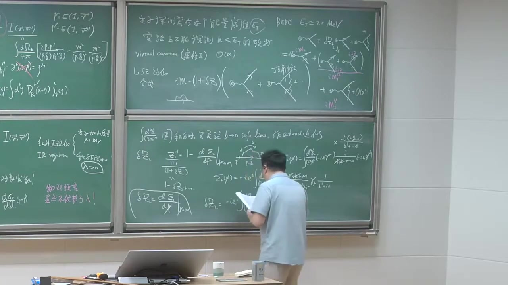
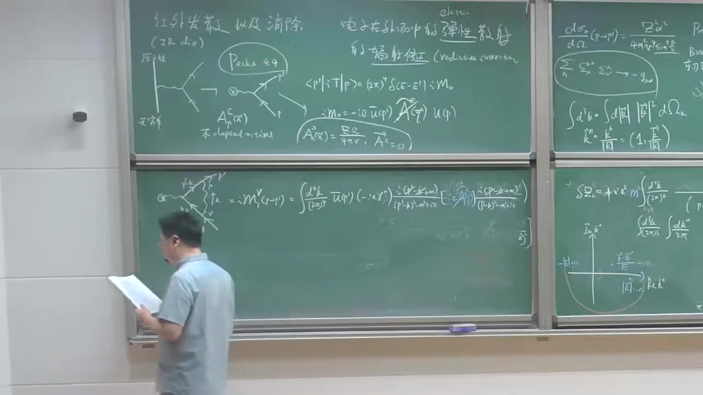
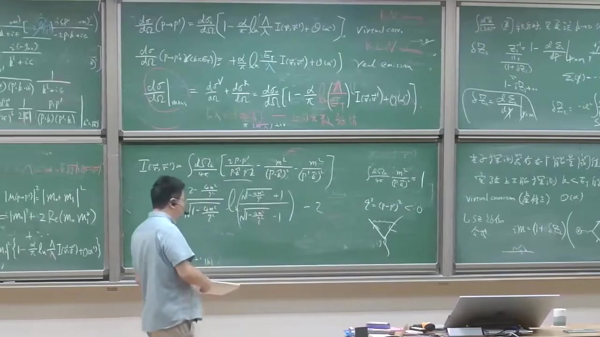
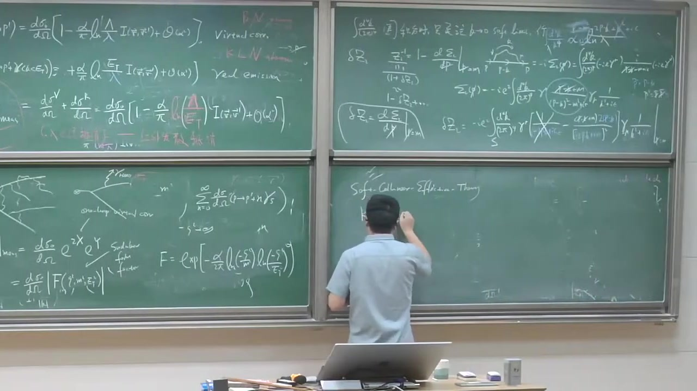
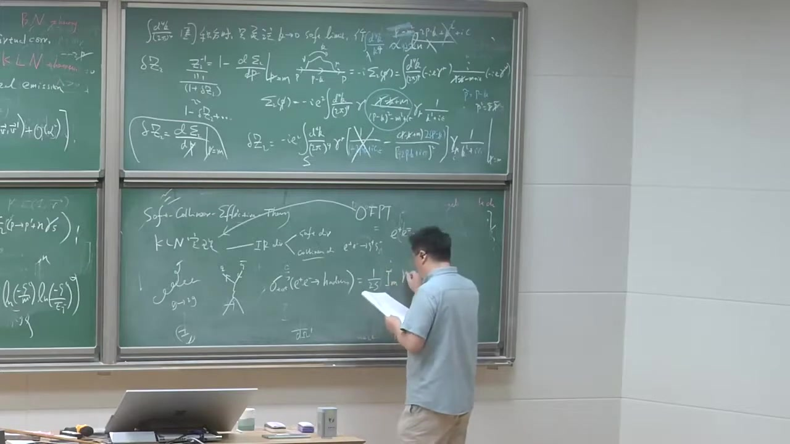

# 量子场论 第68讲【相互作用量子化】红外发散及抵消 电子外场中弹性散射过程的辐射修正 Sudakov双对数项

> 自动生成的课程注解文档（共 31 个段落，[原始视频](https://www.youtube.com/watch?v=Yln20-XZcbU)）

## 目录

- [00:00:00 段落 1](#段落-1)
- [00:00:28 段落 2](#段落-2)
- [00:05:29 段落 3](#段落-3)
- [00:08:47 段落 4](#段落-4)
- [00:13:48 段落 5](#段落-5)
- [00:18:48 段落 6](#段落-6)
- [00:23:48 段落 7](#段落-7)
- [00:25:41 段落 8](#段落-8)
- [00:26:46 段落 9](#段落-9)
- [00:28:21 段落 10](#段落-10)
- [00:30:25 段落 11](#段落-11)
- [00:35:25 段落 12](#段落-12)
- [00:40:28 段落 13](#段落-13)
- [00:43:58 段落 14](#段落-14)
- [00:46:23 段落 15](#段落-15)
- [00:49:30 段落 16](#段落-16)
- [00:53:22 段落 17](#段落-17)
- [00:56:59 段落 18](#段落-18)
- [01:01:59 段落 19](#段落-19)
- [01:03:30 段落 20](#段落-20)
- [01:08:32 段落 21](#段落-21)
- [01:09:23 段落 22](#段落-22)
- [01:12:46 段落 23](#段落-23)
- [01:13:28 段落 24](#段落-24)
- [01:18:29 段落 25](#段落-25)
- [01:23:30 段落 26](#段落-26)
- [01:28:30 段落 27](#段落-27)
- [01:31:50 段落 28](#段落-28)
- [01:34:33 段落 29](#段落-29)
- [01:37:37 段落 30](#段落-30)
- [01:39:37 段落 31](#段落-31)

---

## 段落 1

**时间：** 00:00:00 ~ 00:00:22

📝 原始字幕

<pre>

好的 让我们接着来考虑这样一个软光子的这样一个辐射
我们这点课呢 我们来演示一下这个
你考虑一个 大家例子的这个辐射软光子的一般你会不可避免的会出现所有的这个红外发散
在Infernal dimensions

</pre>

**课程截图：**

### 注解

⚠️ 注解失败: Connection error.

---

## 段落 2

**时间：** 00:00:28 ~ 00:05:29

📝 原始字幕

<pre>

OK 用物理上我们测量这个 cross section的话 显然不可能是无同大事吧
所以发散必须要去解决
所以这点课呢 我要展示一下这个红外发散怎么出现以及
如何底销或如何销处是吧
我们这点课
我们要聚起来说我们通过一个聚起来一个最简单的一个
一个过程我们考虑以来传电子呢
在外场中的
elastic scanner 弹性散射
就实际上只被一个电子的出台在外场
在一个外试一下它比如今天大角度的牵折是吧
但实际上摸它一样只光弹的一个电子
没有光弹的别的这个例子比如光子
这叫弹性散射
elastic scanner
我们一对过程作为一个例子来展示呢
我们考虑它的辅车修正是吧
辅车修正一般来说它可以发射一个
光子是吧
是吧 实修正
原来大概通过这个量子的修正通过圈土
ok 圈里面可以交换这个虚广子
这统一的都要辅车修正
是吧
radity correction
好 我们通过这样一个过程来展示
我用的技巧呢主要是这个上面课我们给大家演示的这个
iKNO.4 是吧
iKNO.4音字我们现在有点了解
iKNO.4音字是 a universal factor
它只有一代于例子的电汗和它的这个
这个是音是它的这个运动方向或者它的速度是吧
它不一代于这个例子是基本的例子和例子
物理上下的例子你考虑一个脖肠非常长的一个光子
因为软光子不长非常长
它的脖肠像当于它这个弹性的分辨率
它甚至都不能分辨这个例子的内部细节
根据我们这个弹动力区里面是多级展开的精神
它只能
只要是它的零结局就是它总的电汗
原来 iKNO.4音字上这个代表例子的似动量
屁同时出现的分子和分母
是吧
所以它的这个例子能量呢它也不敏感
它只敏感原这个例子的电汗以及它的方向
这非常非常邮美的物理
好 我们要用这个Fedix
比如说我们以前学习过这样一个炉色不暂设
是吧
我们考虑一个极端的情形
这有非常非常重的
你可以说是无窮重的原则核
一个电子呢
今天弹性的散射
有原则核无窮重
你可以说它无窮重
它的作用就提供一个电汗
它提供一个酷轮式其实是吧
所以说它没有反冲
所以你发现这样一个电子散射
它能量的手衡
但是它的三动量呢它不需要手衡
OK
这个物理上很容易理解是吧
有个点电和无窮重的点电
和做的这地方
它破坏了空间瓶一步变形
所以动量
你只考虑电子
入射出射
电子的三动量不需要手衡
当然这是个statical potential
它提供了一个近态的尺
所以是时间瓶一步变
所以我还要就能量的手衡
所以给以前大家布置过的作业
有一个非常漂亮的作业
是Pascon的书
一道细题
给大家布置过的是4.4题
它是考虑呢
你把这样一个炉色布散射
可以通过一个
这个原子和的效应
可以通过一个经典的一个电磁厂
来代替
是吧来描述
你可以等效地把它形成这样的一个分曼图
插插代表一个经典的一个电磁厂
我们给它加个C上面的这个Classic
经典的
我们考虑的它是不一来一时间的
不抵捆
不是time的一分
不抵捆当time
可以出于简单的这样一个
好
入射的例子
除了是P一批
你可以把这个炉色布散射
通过这样一个
这样一个背景厂和Classic
这种厂来代替
你就像这样一个过程
你发现是P一批
在布散射
你可以发现
这个TG证员
可以写成一个刚才我说了
是一个能量之后
那一个
多少还是数
意识出它的电子的能量
意识墨踩电子的能量

</pre>

**课程截图：**

### 注解

⚠️ 注解失败: Connection error.

---

## 段落 3

**时间：** 00:05:29 ~ 00:08:43

📝 原始字幕

<pre>

OK
成一个不变成佛
其中一个不变成佛
我叫M0
M0等于
佛的I1
U把P一批
A slash
A丘它代表这个
复裂变后
它动量红尖
C的把Classic
所以它动量红尖
OK
它还在这个
分半规则
是吧
佛的Fimon rule
如果你考虑一个
炉色布散
那当时可以任意的一个
时间贝拉的一个电磁
是
如果你要强调
你要强调
炉色布散射
我们知道
炉色布散射
这个40量之后
A0
Classic
这个厂的A0
分量不为0
它等于原子和的库轮式
Z是原子续数
Z1出去死牌
它的实量不
实施不分能量
OK
它是Static
不随先依赖的
我相信它
没有做过同学
大家去做做
很有意思的题
OK
这什么的败款
这什么的波文竞士
领头界的这样一个
领头界的一个分半规
是吧
你很容易得到它的这个
cross-section
微分解灭呢
你判断它的
DC
我叫DCM0
一个P
到P
电子发生弹性散射的这个微分解灭呢
就是我们的住民的
录策服的一个
就是一个相路论系的
录策服的一个
散射过程
录策服的一九一三年
一九一三年做
一九一一年左右
我忘记是
到了一一一年一三年
反正一九一十年
它是一个非常论的一个
R法例子
是吧去装这个金博
我们把它
现在变成一个相路性的电子
去打一个
屋充公园子和
这个住民的这个
叫依赖是吧
这是一样的
这是PESC的息题
4.4
好
那我们
一直作为出发点
我们考虑这样一个过程的
一个辅车修正
OK
那我们现在考虑呢
一个经典的一个
经典的一个电磁式
OK
我们考虑
这个出发的电子呢
能辅车一个软光子
我们关心红尔发散
如果它很硬的话
这个传播子
能发of shell
它是远远离敲
所以不会导致任何红尔发散
我们在iq上
因此的分谋有个
P.K分之一
是吧
这是为什么会
它有一个similarity
这会导致发散
如果这个光子很硬的时候
你论正它
这个传播子是远远离敲的
所以没有任何问题
好的
那我们考虑
墨台的电子呢
也可以释放这样一个软光子
OK
在下一阶呢
我考虑伏车之后
正呢
我只有两个分半图
那我们利用我们您学过的这个
iq当竞死
我们您知道怎么做了是吧

</pre>

**课程截图：**

### 注解

⚠️ 注解失败: Connection error.

---

## 段落 4

**时间：** 00:08:47 ~ 00:13:48

📝 原始字幕

<pre>

iq当proclamation
我可以写成
这个不变政府
我一般讲i
这是来自有的这个S算幅
是吧
这时候的坑门声
然后你发现
这是一个电子
出的电子的
动乱着屁
屁屁加上一个光子
这个光子的动乱是K
OK
我可以
写成这种形式
iM-0那是刚才我写下了
这个录售伏散车的
这个Leading-out
的这个
这个Immers MQ
是吧
描着描在这样一个
iq当竞死的跟这个
spin stretch的没有关系
它总是可以factorize
总可以因此化成这种形式
iq当竞死也可以写这种形式
对于一个
出台墨台辅设论是
匹匹点Apple Insta
Apple Insta
代表光子的计划十辆
匹匹点K
加上Apple
减去
这个腹号呢
是为个Sign
为个腹号的一个系数
是吧
对于录设的是一个腹号
p点Apple Insta
p点K
加Apple
sorry,这是解Apple
好,这是我们上两个学的知识
大家很容易去
去验证这一点
这是我的
iq当factor
我现在只考虑自己简单的形形
只考虑辅设一个软件
软光子是吧
原来让你可以将来把
我整成辅设这两个
辅设任意多个
任意多个数目的是软光子
那好的
那我们可以把它这个
剧中原模平方
向前积分是吧
原来这光子动量
我们考虑非常非常软是吧
你发现呢
你利用这个即便公式的时候呢
你考虑这样一个
1-2的一个过程的时候呢
你发现
你可以非常容易得到是
一个领头接的一个
class action
然后呢
成一个单个的光子的
一个相公尖
几分
这个单光子的相公尖
几分测读
它是轮子不变的
可以的摸
是吧
我们都非常熟悉
然后呢
对于光子的两个
极化物理计划求和
你发现
只需要对这个
iq当形子的摩批方式
可以是吧
然后呢
你是一方
pp点i-p-dm-k
ok
这i-p-dm-k真的
因为这不是个圈头
这是个
树图的摸批方式
这i-p-dm-k
你们都不重要
我还要不要
咱们俩代表它的
holicity
咱们的
p-dm-k的平方
ok
这个单个光子的一个
相公电机分测读
ok
相公电机分测读
来
好
那非常有意思一点
是
你这部分因子
你可以
物理上全是什么呀
全是成这个
辐射
出一个软光子的
级绿
因为我们知道
结面
有一个级绿权式
是吧
辐射一个软光子的级绿
ok
我们管它东西呢
我们这部分因子呢
管它叫
叫
propability吧
所以叫
p-r-o-b
propability级绿
好
那我们来看一下
这个propability等于什么
我们分析一下
由于它这个
埃克党因子
我们上年科给大家
印象的软定了
你知道
它是因子呢
在整部层次满足这个
挖的等于试试吧
把app from start
或者这个光子动量的话
它显然等于零
这几年的电贺手衡
这很吹呗
出太一个
电子墨太一个
电贺显然手衡
所以
我们以前给大家
学过对于一个
辐射一个
光子的过程呢
我们有个计划球的公式
是吧
我向大家不要忘
以牛
这是lamb的
lamb的
对这个lamb的球盒
我可以做一个
有效的替换
不如说
这是等
不如说这样做替换
能得到正确答案
这个球盒
某种意义上
它包含了两个废物里的这个帮子
但是它们互相抵销了
是吧
这是一个非常重要的知识点
比如我们要介绍
compromising的吧
我们需要利用这样一个知识
OK
所以呢
这个东西你把它
就模拼方
利用这个标准的方法
去做一做的一
就是这样一个因子
第三K

</pre>

**课程截图：**

### 注解

⚠️ 注解失败: Connection error.

---

## 段落 5

**时间：** 00:13:48 ~ 00:18:48

📝 原始字幕

<pre>

二拍的三次方
二贝的K的
董亮的模
就是光子的能量
然后呢
它还成一方
付的这名牛
这是我的
计划球盒这个公式
是吧
然后它
给它服务了
把它从提出来
你很容易得到
要等于
pp mu
除以pp点K
简去p mu
除以p点K
再成一pp nu
除以pp点K
简去p nu
除以p点
OK
这是一个非常
标准的一个俱动员
一个不变成
模拼方的一个操作
用不用考虑
这个默态光子的这个计划
是右选还是左选
好
这名字呢
你把它称开以后呢
你可以发现它等于
一方
第三K
二拍的立方
二K
然后呢
你会发现
我把这个一方这个电贺
电贺我和常常出的
放在基本话外面去
然后这个成绩呢
你发现
最后有三项
二P点P
除以p点K
再成一pp点K
简去p方
除以p点K的
平方
再简去pp的平方
除以pp点K的平方
OK
这是我的经过了一些
简单的一些操作
好
那我们这个机分呢
是个
迪卡尔这个平面左标是吧
我们想把那块球左标的话
我们都知道怎么做
我们把第三K可以写成
一个标准的
一个DK
的模
这个JackO比是吧
这个K的模的平方
再成一个立体角
原来K的方那个立体角
这是非常非常非常地弱弄的
好
我把那块球左标
然后我发现了
这样一个
我们再重新
订一个单位式使量
KHM
它订阅的是KM
由除以K的动量的模
它显然等于什么呀
你可能会认为它等于1
零分分而1
30量呢
是K
除以K
OK
你很容易验证
所以我想显示
把它抽出了它这样一个
抽出了它这样一个
看到这个DK的这个
模的这个机分的话
我可以把它
这样好
除了这个方法里面
完全都没有亮钢的
屁和屁点屁
屁点屁屁比掉了
然后你必须得
弥补一下
这样一个K的平方
它也非常三次方
是吧
好
那你稍微做点手脚的话
你放在这个音质
往上洗到这吧
你可以稍微改写一下
你可以把它写成
R法
除以Pie
DK
这是一个
正数像
光子的一个动量
DK除以K
因为分为一个K的三次方
然后呢
我订一个
一个无亮钢的一个寒暑
它的是这个
出它力值的速度
和墨它电子的速度的一个寒暑
具体的定义呢
你可以反映它
具体的定义呢
是写了这
它等于一个
脚平均
对K的所有方向呢
左立体脚击分
除以四派
所以是个脚平均
然后
RP点
Pie
DK
所有等于说
这个击分
我把这个静向和脚向的
给它分开了是吧
Pie
DK
这每一项都是无亮钢
脚击分也无亮钢
所以整个这个
挨寒暑呢
也没有两钢
Pie方等于M方
因为它在敲
Pie
DK
Head
Ping
DK
Head
Ping
OK
这是我们这个R还是个定义
OK
我们总之来说
这个V呢
是这样
我们定义这个4动量

</pre>

**课程截图：**

### 注解

⚠️ 注解失败: Connection error.

---

## 段落 6

**时间：** 00:18:48 ~ 00:23:48

📝 原始字幕

<pre>

Pie
Pie
可以写成它的能量
1
V
Pie
Pie
Pie
Pie
Pie
Pie
Pie
Pie
Pie
Pie
Pie
Pie
Pie
Pie
Pie
Pie
所以关键的是
大家看这个进向机分
对于K的这个摩肌分呢
你发现
它其实是
无窮大
OK
这其实就是一个红外发散
这时候我们看到了红外发散
因为原子上没有理由不允许光子
扶着光子的波长
非常非常无重长
但是人家允许
KQ里那时候
这个基本显示对着发散
是吧
这是一个闹个的一个红外发散
闹个发散是个非常温柔的发散
它不是很恶劣
当然它也是无重的
是吧
那我们怎么来做呢
我们讲到这边
说不定回忆一下
这个拍子的时候
第六章我特别喜欢一个非常好的例子
它可以从半斤点的一个竞士
也能够重现这样的一个红外发散
它做了事情呢
大概是咱们给大家
简单描述一下
它考虑一个经典的弄力
学了一个电池服设的一个问题
它考虑一个大电力子
它来运速超红的方向运动
然后它突然平成方向
是吧
是它要运动
你发现呢
这是一个大电流
是吧
然后你发现它会
因为我们知道
修电动学我们知道加速的力子
大电力子它会辐射
会点着辐射
你发现
如果速度很高的时候
它会沿着这个方向
它会辐射
这个辐射呢
就叫
运制服设
我们都知道的东西
是吧
这在经典的弄力学里面的这种概念
这是德文词
德文词比较长
比如说是德文词
是不软兴
大概意思就是说
breaking
就叫
脑车的服设
突然改成瞎了一下
急下来车だ
突然在瞎了车
然后在管方向
这个PASS的数面都没有得太给你
据起来说呢
如果在
龙子挥范下的话
我知道这样一个Mex方程呢
我们的Mex方程可以写的这种形式
这也没有试吧
我们如果去龙子挥范的话呢
这方程非常简单
把这项人调
然后呢
进点点东西学里面老师告诉你的
你可以通过所有的推迟式
这个我以前订阅过
DRRWTARDIT
你可以
给订阅一个Count
给订阅一个
代表例子的一个Count
你可以解除了
在
给订外时刻
然后它需要花时间到
XX0大一把0
在X0时刻在任何一个位置
它的这个电子厂
ok
所以有一些原因
我觉得
我们就
不给它过一遍
然后就说了思路啊
就是它PASS的那个例子
DRRWTARDIT
它有这个JAX
那边非常著名的一个
进点点东西学里面
教材大家都知道
好
然后它
利用标准的一个
进点点东西的公式
就辅射能量
辅射的电子厂能量
辅射能量
通过电子厂的形式
厂伯的
我们知道它订阅什么
我们都学过
21%
电厂厂的平方
家资料这么平方
ok
因为我通过解卖X方程
你的用推迟式
隔灵韩售的方法
你知道
AMU
ok
其中有进展的库轮部分
我们不关系
关系的辅射部分
ok
REDITION PART
你解一下的话
我要列过很多步驟
你发现呢
非常有意思的是
这个能铺的
你发现它长得这样子
R法出一派
去用R法再给大家
回立一下
一方出于四派
ok
R法出一派
经济结构成熟
然后呢
你发现机分的是DK
i
微微
这个i韩售呢
这个叫
韩售的exactly
就是刚才
我刚刚引到这样一个
一个
一个韩售
在哪儿呢
我看一下

</pre>

**课程截图：**

### 注解

⚠️ 注解失败: Connection error.

---

## 段落 7

**时间：** 00:23:48 ~ 00:25:36

📝 原始字幕

<pre>

在这儿
它完全一样的
大家看这公式
我刚刚说
辅射一个非常软的
光子当个光子这个
极率的是R法出一派
DK出一派
这个通过纪念能量的计算呢
跟着非常像
我辅射能量呢
这没有分吗
还没有K
ok
所以我现在
用点A因子
的光量的假设
我们A因子才假设呢
光量子呢
是能量是一份一份的
是吧
没有光子能量呢
没有光子能量呢
等于H8
Oh my god
我们在单位之后
等于H8K吧
一样的
我
我
我另有的C等1
光数等1是吧
所有的考虑呢
就说
如果辅射的光子数呢
我通过这样
所谓的一个
今年
更多率
加一点量的力学
加一点光量的假设
辅射的光子的个数
的数目吧
选择的呢
它能土
这个还要
这个背机还要是
能土是吧
Andy Spectrum
在
在这段区间里面的能量
处于
这个每个光子能量
就是它的
能不
它的数量是吧
处于H8
ok
这个
这个
H8K对到
这样的话就
跟我刚才得到这个
辅射单光子
这样一个
几率呢
在量的电动力学里面的计算呢
是吧
完全行上
完全一样的
这是今年的能力学
ok
这个选呢
是对发散的
是吧

</pre>

**课程截图：**

### 注解

⚠️ 注解失败: Connection error.

---

## 段落 8

**时间：** 00:25:41 ~ 00:26:42

📝 原始字幕

<pre>

对手发散
这是红二发散
所以今年的能力学
结合
光量能量想象告诉你
ok
辅射出
非常低的
低能量的光子
的数目
是无重大
ok
这个问题
可以叫一个红外
灾难
ok
这是早期
早期人们
恨到又制出来
这是从那问题的
ok
好
所以这是非常漂亮的
这个经典和量子的
经典的能力学会
量子长了一个对应
你看看
长得非常非常像
这个例子
我们现在起发性
好
那我们现在
回过头来
我们现在在讨论这个机分
这个机分
数上有定义的话
我们必须让它变成有限
因为我们不能讨论无限的值
所以我们考虑这个
一个Lambda
是个正的一个数
让机分个下线
Lambda大约0
这种手区
叫做水的这个
红外正规化方案
来个轮

</pre>

**课程截图：**

### 注解

⚠️ 注解失败: Connection error.

---

## 段落 9

**时间：** 00:26:46 ~ 00:28:17

📝 原始字幕

<pre>

这个轮子
会正规化
正规化
所以意思是
把一个数学上
发散无穷的东西
不能有限
ok
或者R
来个Liter
我们可以采用很多方式
其中
Pascad的数
它要选择
是给光子
加了一个小指量
这样的话
在光子
可以禁止的时候
它能量机分
就是从这个小指量
纽开始
或者叫
i'm gamma开始
这个机分呢
它的低能端
那些被咖套复了
它就没有
它就没有发现了
我们以前学Pronger理论的时候
我们知道这个Pronger理论
我们没学到StupidTricks
是吧
一个�C5的一个Pronger理论的话
只让群零的级厌来说
它如果我和一个手红流的话
这个群零的级厌
没有任何问题
它有个重长级化的量
一个粒子
只有肚底咖啡了
是吧
QD呢
它觉得我和一个手红流
所以加了小指量呢
你没有打来很多问题
总人来说呢
它可以
咖套复长一个
红还发散
我们呢
选择是用更加简单的方法
我们光子还凝几量
我们只是粗暴
简单粗暴
就说
再这样一个
相亏连机分呢
这个下线呢
用蓝门来代替
OK
OK
我们尝个方案这个
当然这不

</pre>

**课程截图：**

### 注解

⚠️ 注解失败: Connection error.

---

## 段落 10

**时间：** 00:28:21 ~ 00:30:21

📝 原始字幕

<pre>

去蓝门的
OK
干这只是非常认为的
隐级那个东西
我们都知道
物理可观量的不可能
依赖于任何
认为隐级的一个
正维化的一个
正维化似
不管是光子指量
还是蓝门的
用不着光子没有指量
而机分呢
也没有理由
蓝的开始
这是数据上
为了往下接着做
是吧
好
那我们现在看下
机分下线
等我选蓝的
那机分上线呢
我原来上来说呢
我只是用软进式
Icon进式
我要使我进式
有效的话
我不能上线太高是吧
现在的这个
必须要涉及到真正的实验
你想真正的实验怎么做呢
真正的实验去
探测光子的需要所谓的那种
这个光子疼在气
或是电磁量能气
这为任何一个实验呢
仪器都不是完美的
所以它的零敏度呢
是有限的
所以任何一个真实的
一个世界的一个
光子量能气
物理上呢
光子的
探在气呢
零敏度是有限的
或者是它存在一个
探测的一个能量预知
这什么意思啊
或者它能量分辨率
我管它叫1T
ok
就说
就如果这个光子能量特别低
要这个光子的能量和动量小于
这个1T的话呢
它其实不能够记录的
不能记录这样的软光子
不能探测
动量小于1T的软光子

</pre>

**课程截图：**

### 注解

⚠️ 注解失败: Connection error.

---

## 段落 11

**时间：** 00:30:25 ~ 00:35:25

📝 原始字幕

<pre>

所以说什么意思呢
就说考虑我们这样一个辅车修正
我发生了一个这个光子
动量K如果小于有了1T的话
实验让记录
说我还是个弹性散热过程
还是电子到电子
我现在不会告诉你
就是电子到电子的光子
就是这样的光子呢
非常波长非常长的光子
不会被实验的
它能在气所记录是吧
所以这个1T
任何一个高能物理实验装置呢
做一个加速器的机器指标
它都告诉你1T多少
比如说我记得
如果高能锁
我们的北京普遗
如果没记错的话
它是高能的机器
所以一个预值的能量
预值差不多是220个兆点的辅特
换成了说
在高能锁的机器
如果一个光子能量
如果小于2TM1微
那这样光子
是不会被实验
一起锁记录的
OK
所以来说
我们要只考虑软光子
我们只考虑弹性散热
那所以一个非常自然的一个
几分的上线呢
我们把它去成一个
一个1T
我的这个
我的这个能量的
谈则性的能量预值
好吧
那现在就简单了
那现在我们可以
再寫一步
我们考虑一个我们的弹性散热
如果实际上弹性散热
是P到P
加一个光子
这光子能量呢
我动量呢
小于这个能量预值
它能量预值
它现在可以写成
而法处于派
这个进向级分呢
是从Lambda到1T
现在我们都非常熟悉的
DK
处于K
光子的这个
动量
成义这个
脚含书
无量刚的脚含书
在乘有的
Lidding on the bone
熬得得上一个微分节面
OK
所以呢
这个简单这个级分呢
非常容易完成
这不是别的
它是什么呀
它是我的一个Lambda
含书
是吧
Lambda
1T
处于Lambda
OK
所以它对处于Lambda
人们已经在一个
红外正红发子
这个简单我们也不是
红满意
是吧
但这个1T
是真实的物理
是吧
因为真实的这个
实验手
是有相关的
但我们
对这个工程我们不满意
是吧
对于一个
电子到电子
这样实验是
不能探测这个光子
所以还是谈一谈一谈
实验
微分节面
我们如果Lidding家预言
发现它是个对手发散
Lambda
迟越来越小
它穿
对手发散特别慢
它中规也是发散
是吧
所以说这是个Lidding家的困难
是吧
我们怎么办
实验家
物理测量
不能依赖于
物理
预言
一个正确的
好的物理语言
是能被实验严正的
是吧
物理语言
显然
不依赖于人们引进的
这样一个小Lambda
不依赖于
这所谓Lambda
就是说不得红二发散
是吧
那怎么办
我们这个预言
敏感于一个人们引进的参数
我们不高兴
是吧
现在有趣的物理
就要
好吗
好问一下
好
我们现在做的预言
你看一下这个微分节面
我们考虑的符合修正
是领头界的符合修正
它是这么与R法的一次方
所以我们要问一个问题
所有的澳大阿富的符合修正
我们考虑去全了吗
答案是No
我们还忽略了一类
这叫石修正
因为发射了一个时光字
我们还有一类
叫
窝厨
可在乘叫虚修正
没有考虑
它也是澳大阿富的
OK
是这
虚修正
这些数以十修正
或虚修正
它也是澳大阿富的符合修正
好
现在呢
我们要回一下
我们这样s的UHR公式
怎么告诉我们的
现在我们要用了
UHR公式
它要算这样一个
电子到电子的一个彈音散射呢
你可以考虑一下
更好Z2
电子的乘书的话因此
平方
乘义什么呀
乘义
这手的
因为这是经典场
所以它没必要

</pre>

**课程截图：**

### 注解

⚠️ 注解失败: Connection error.

---

## 段落 12

**时间：** 00:35:25 ~ 00:40:28

📝 原始字幕

<pre>

给它在安排一个不安不成的话因此
只有这两个电子
更好Z2的平方
然后能发现呢
在下一间呢
因为我要是它解腿是吧
所以不考虑把腿修正
但是你可以画出一个图
这个图出它墨它电子
可以交换一个虚光字
OK
然后加点点点
OK
这是LC定理
这是我们新鲜出路
我们先重要用一次
OK
然后呢
更好Z2的平方
显然是等于Z2
OK
Z2呢
我可以把它重新写一下
现成1加得塔Z2
如果不要论是用的话
我们家得塔Z2呢
是不要论可以计算的
是吧
好
我要展开这个图呢
我可以重新画一下
是成这样子
还是领头接
一层一层的领头接
不用偶图
然后得塔Z2
再呈一
领头接的
这样一个分曼图
再加上
随的
这个图弄过来
叫Watex Collection
叫丁脚修正
OK
因为它是丁脚做了一个量子
辅车修正
这个还是一个1到1的过程
是吧
出态一个例子
梦的还一个例子
光子只剩在这个
传播子
主要是Watex Date
是用虚态
OK
我们省略到一个
更高階的修正
好
这个呢
在很多角落处里面呢
人们把这个
德塔Z2
人们经常要画成这种形式
请大家不要混贾
就说
这部分人们经常画成
形式上为了好记忆
以它画成外图上的一个
子能修正
这
这其实为了很小
因为我们都说了
我们可对S2M可对于
解腿的这种效应
是吧
但是呢
它为了变于记忆
它画上这种形式
它对于这种画法
这每个外腿呢
这更好Z2
剪1所以是二分之一
德塔Z2
把德塔Z2分成两半
一半每个人现在
二分之一
德塔Z2
是吧
然后呢
再加上
因为顶脚修正已经是澳大法结了
所以这个Z2
变成一九可以了
是吧
德塔Z2我们知道
从电子智能来的是吧
电子智能显示两个顶脚
所以显示澳大法的
你属下
这个是澳大法
这是澳大法
所以呢
我们
这已经澳大法了
所以我把Z2
德塔Z2不用考虑这一项
OK
所以唯有论计算
就一定要刷二分之一
这个接次
我要考虑同一阶
所有东西都考虑一全
是吧
好 我们请个名字
这个我们也知道
这个东西我们叫
IM0
好吧
像这一项呢
我请名字叫
IM1
一代表是
二分之一
是吧
我加个上边的德塔Z
代表它的贡献
是来自于
外腿的这个
不然是让我发因此的修正
这个呢
鼎脚修正呢
我可能叫
IM1
代表是
二分之一
放修正
加个上边的VWTX
可不可以吃
我分享图变云
被人考虑清楚
是吧
好 这个
严格的计算这些图啊
计算来说
是非常挑战的
这个
这个自能图和这个鼎脚修正
派斯坦说
第六张T7张
花了很多精力去做议计算
OK
这些图论发现
既有紫外发散又有
红外发散
所以说
计算还是非常挑战
我们现在呢
还不具备这种
能力去做这种计算
因为你还要去证文化
所谓这种紫外发散
但是呢
我们现在的目的主要是来
验证
它的红外发生的行为
OK
我们这样抽取它的红外发生的部分
我们完全不care它的紫外发散
所以说呢
我们现在呢
就是说做一个比较
讲话的一个技巧
OK
我们考虑圈积分的时候呢
做圈积分的时候呢
我们只考虑一软光机械
圈积分呢
是它要卡我所有的动量区域
当我们只关注了
当K很soft的时候
OK
圈积分时
我们只关注
因为红外发散来对
圈积分里面的K
非常软的时候
只关注这个
K距离那时候的
soft limit
好
所以既是圈动量呢
这个光子是握处的
但是它每个分量都很小的时候
我依然可以做所谓的iCloud竞刺
OK
这样呢会极大的
这个手的计算见变

</pre>

**课程截图：**

### 注解

⚠️ 注解失败: Connection error.

---

## 段落 13

**时间：** 00:40:28 ~ 00:43:54

📝 原始字幕

<pre>

OK
原来让你依然可以得到一种因子化的形式
这样一个握处的cratch
呢
红红1呢
正比波恩奥德iM0成一对
soft factor
OK
所以因为iCloud因子跟字权没有关系
所以我们期待让这样的结论
不是特别复杂
好
那我们现在的一个任务呢
就算得到Z2
OK
好的
因为我们已经知道
Z2的N1
的到处
等于1件第4个码2
这是我第一节可以开始给大家讲的
是吧
这是我得到这个电子的长长重重化因子
我把Z2的N1可以写成1加德塔Z2
分之1
是吧
然后呢
因为德塔Z2
是个不要展开的技术的话
你可以约等于1件德塔Z2
加更高階的这样一个展开
然后我现在只要考虑到
这个澳大二法阶的话
我不要两边的话
你立即可以得到呢
德塔Z2等于
弯皮亚的电子自能
对PClash球导述
PClash等于电子的无力之量
好
我们这是要用这个公式
我们要去计算加一个Z2
好
那我们来给大家比划一下
这是我们真正算的
计算的一个
第一个弯路不待管
这个弯路是P
这个光子的东西是K
传播子电子传播子
端路是P件K
好我们知道它等于
付的iC 弯R
PClash
好吧
按照飞板规则
第4K
除了二拍的40分
然后付的iE
干嘛 mu
你的飞铭子线多
这个顶角叫 mu
这个弯路这边是 mu
然后呢
飞铭传播子
iP Slash
剪K Slash 剪弯路叫iP
那算全做的时候
就飞板传播子的iP
很重要
OK
付的iE
干嘛 mu
这是另外一个
QD 顶角
然后成议一个光子传播子
我们都知道是飞板传播子
是iF
的计算
除了K方
小iP 这是电子智能
好的
然后我们改写一下
把它一些i很多的音质
整理整理
等于付的iE
1方
第4K
二拍的40分
有干嘛 mu
PClash 剪K Slash 加iM
分母是P剪K的平方
加iM
干嘛 mu
1出于K方加iP
好
那从这个表达式
我想利用这个公式
我想直接出去得到Z2
得到Z2
等于对它对PClash 球岛
说全岸岛说
以后把PClash
变成物理电能质量
等于付的iE 平方
我们怎么球岛说的
我们球个桥

</pre>

**课程截图：**

### 注解

⚠️ 注解失败: Connection error.

---

## 段落 14

**时间：** 00:43:58 ~ 00:46:19

📝 原始字幕

<pre>

我们对于
中间这个传播者球岛说
我们出于简单
我们利用P丘岛
等于P剪K
所以对这个
PClash 球岛说
你可以让鞋
等于对DP丘岛球岛
是Lash球岛说
然后阻伦法则
在DPClash
P丘岛是Lash
对DPClash
OK
它想让你1是吧
所以呢你先
就是P丘岛
这也P丘岛
所以你发现
现在分子上球于
一下岛数
你会得到
P剪K的平方
DM方加iP
OK
对第二项的分母球岛数
第一项鞋的平方
前人可以用这公式
对PClash球岛数
它可以等于
对DP丘岛平方球岛数
然后锁连法则
DPClash
DPClash
DPClash
DPClash
其中大家看一下
这个PClash
平方
等于PClash
DPClash
所以它对它平方这项
等于
两倍的
PClash
OK
好
我们先把鞋线和PClash
P剪K的平方
加iP
加iP
弄的平方
对它分母球岛数
对PClash
平方球岛数
它有个合外平方
然后利用这两公式
OK
你会发现
你有得到
保留分子PClash
剪KPClash
加iP
OK
你有个
这项
所以两倍的
PClash
剪KPClash
OK
这是我的
好
好
有一个空间原因的这东西
把它擦掉
再操一下
有干嘛没有
有一个
干嘛没有

</pre>

**课程截图：**

### 注解

⚠️ 注解失败: Connection error.

---

## 段落 15

**时间：** 00:46:23 ~ 00:49:26

📝 原始字幕

<pre>

K方
加iP方
OK
大家记得
最后
把它操作
据正操作蓝以后
你要去PClash等于iP
好
那我们现在看一下
我们要做iKの竞士
这个传播子
虽然它是K平方不等于零
把它展开一下
让看一下
让看一下
它就传播子
它平方
还是P也不让是
P方
剪iP方
剪iP点K
加iP方
加iP方
这是我的这个分母
传播子分母
大家看一下
最后的时候
我要算得到Z2
我最终要让PClash等于iM
或者P方等于iM方
还是再跳的
所以这一项为零
现在这两项
但由于我考虑现在
前几分呢
是在soft的规征
就K呢
是具体的零的
所以你把它K方
相当于这一项是二节五通小
一节五通小
这是正于K的
一次方
正于K的平方
所以这项也可以点点
OK
它不要让石周圣里面
K方延告为零
这里是你做一个AGM
你做一个AGM
你做个讨论
所以你说你发现这项呢
它可以现在是什么
这个分母
副的2p点K
加iP方
这个传播子
就是说是
副的2p点K
加iP方
好
我们现在关于新的是
红二发现的部分
我们考虑哪一项
有可能会导致红二发现
我们简单数密次
这个分母呢
这个光子没有iM方
这K的平方分子
所以K的三上分子一
不是K的平方分子一
K分子一
第四K
所以第四K在小
光子软光之间
看一下除了K的三上分
它是OK的
它是收脸的
没问题
我说了我只关心红二发现
所以这项呢
不共产红二发现
这项呢
会贡献
为什么呢
它有个外的平方
有一个球导数的原因
所以这是K的平方分子一
这K的平方分子一
除了K的四上分子
第四K
所以呢
它是正比烙个蓝的
有个基本的下线的话
OK
所以说我要世界黄发展的话
我只需要这项
就有点稍微的技术
但是非常清楚
好
我们接着来
我们接着来
我们今天推倒是比较多
好
那我们看一下
所以做了这样一对
论证以后呢
我们现在可以
把我们得到这一处整理整理整理
我们这保留
约等于
腹的I
E squared
现在正的吧
正的IE平方
为了

</pre>

**课程截图：**

### 注解

⚠️ 注解失败: Connection error.

---

## 段落 16

**时间：** 00:49:30 ~ 00:53:18

📝 原始字幕

<pre>

两倍的音质提出来
第四K
二倍的四次分
我发现了
有这样的东西
Gamma mu
P slash P slash
Gamma mu
2
加i
Gamma mu
P slash
原来我这个i'mma
其实我的i'mma 0
OK
是我的这个Lash Limit算
只量算是
Gam
合物理的只量
差个Delta i'm
差个ODA
但是我已经考虑到达法
接了所以我就
不区分i'mma 0和飞机块m
我有可能用
然后2P点K
加i'mma
平方
所以公子的飞马程模子
是K方加i'mma
好我做过去
P slash i'mma
最后去
然后看来看来带出
P slash的平方等于P方
我们知道
Gamma mu
和Gamma
没有成绩
龙龙纸票
说明能力4
还有一个等式
我们应该了解
Gamma mu
2Gamma
加到P slash
两边
等于复得2P slash
OK
所以你发现它等于什么呀
它等于4倍的P方
等于4倍的i'mma方
我做过去P slash等于i'mma
然后这一下呢
等于什么呀
等于复得i'mma
i'mma
2P slash
OK
最后等于P slash等于i'mma
所以等于减去两倍的i'mma方
OK
这是我的一堆
一堆带数
所以你发现
你做了半天
你发现这个4,202
这分母还有一个
2分之一
提出4分之一
再成2
发现
这个2可以去掉
这最后可以
可以去那种形式
1
这里就无非就多了一个
i'mma方
电子的质量平方
OK
那现在我怎么做呢
我现在
我现在可以把它写成
这个第4K可以写成
第3K
2拍的3次分
一个0分量K0
2拍
OK
那我们现在可以用
非常喜欢用的
有遇到机分
所以这么课的一个
先求要求
需要求学过复遍函人数
我们用过非常多的
留处定理
是吧
抗托印尼格
K0的实步
K0的虚步
好
我们找要这泡
这个泡呢
光子飞碗传播
只有两个泡着
我们都非常熟悉
一个在这
一个在这
是飞碗传播子
这个泡的位置
是K的摩
减i'mma
这是付的K的摩
加F弄
这个所谓的
iK传播子
只有一个泡
因为它是K的一次方
是吧
你很容易读出来
它在这个
普遍的上半屏面
比如在这
它的K0的这个位置
是P点K
除以我的E
P0NE
加F弄
好
有3个泡
我们
有的是令人
我们都不喜欢去泡多那一侧
是吧
所以我们这个无趣的大园
我们喜欢从
下来没过来这个泡
这个热度的很容易读出来
好
这些小技术
觉得我们就不用
不用
也没那么多时间给大家去
讲人动一下
去验证一下
昨晚以后
就得到Z2
就约等于
等于什么呢
等于一方

</pre>

**课程截图：**

### 注解

⚠️ 注解失败: Connection error.

---

## 段落 17

**时间：** 00:53:22 ~ 00:56:55

📝 原始字幕

<pre>

第三K
二拍的三次方
二K
这些轮子不变
那个相公间因子
OK
跟我们石头镇的非常类似
这个矮目方
P点K的平方
当然了
我用了
围到基本
我取了这个泡流
所以你需要默认什么
默认为K0
等于
K多让它磨
OK
当然了我们
B成人
就说我们得它Z2显
不是我们
严格完整的一个计算
我们取得一个巧
其实
我们只抽取它的软
空间的一个贡献
Soft的贡献
是吧
我可以加个
Soft的规矩
当K区律力
那是个规矩
OK
K
很小的时候
的这个
圈头的规矩的贡献
当然我们相信
我们抽取的
红挖发散的部分
这个很容易看
红挖发散
是吧
你把K的磨平方
离出来
这分分是K的三次方
第三K出一个三次方
像是闹骨发散的
非常好
那我们现在还剩一个圈头
没有算呢
我们还剩一个
我们的需求者
我们
也可以拿笔画一下
我们发现完整的圈头机分了
非常复杂
尤其这个
有三个传播的顶脚
就整非常非常复杂
我估计
我是真的带大家算一遍的话
没有两个小时估计
我觉得够强
但是我们信用的是
我们
做了X能进C以后
发这个机分的器
很容易算
是吧
好
那我们再给大家示范一下
我们考虑一下
这个
Utex Correction
我们标一下动量
然后的这个动量
P 批
P 批
Mew
反正New
我们都指标
Compos 批减K 动量
这是批减K
这是批减K
光子的动量
是往上流是K
好
我们按钮飞板规则
我们叫Mew
Utex
P 批减
弹性闪下的
一个整幅的需修正
它等于
按钮的飞板规则
第四K
除以UP的四四方
这个全动量积分
然后逆着飞们的线度
这个优拔的宣量
优拔P 批减
然后有个Q的零脚
估得iE 干嘛Mew
然后
传模子
iP 批减K 批减
加iM 除以
P 批减K的平方
加iM 方
我说了算拳图
就分母的分母
分母的iP
非常重要
好
这个呢
我们现在到了这样一个
跟经典外场的一个
零脚的分母规则
我给大家演写过是吧
付得iE
我经典唱
经典典自唱
ac slash q
它可以是苦论事也可以
不是没关系
它的时间不一辣就可以
OK
然后呢
这个顶脚完了
以后它让这个传模子
iP 批减K 批减K
加iM
然后呢
批减K
的平方 减iM 方
加iP 是吧

</pre>

### 注解

⚠️ 注解失败: Connection error.

---

## 段落 18

**时间：** 00:56:59 ~ 01:01:59

📝 原始字幕

<pre>

好 现在这儿已经
做还有个顶脚
就比较长
成义付得iE
干嘛牛
OK
然后不要忘了
你还有一个这样一个优选量
优spin 优把
一大段私人资俱振
有
所以不愿长
不是一个一成一的一个俱振
不愿长
不是一个俱振
不要忘了你还有一个
光子的分款传模子
iP 或者gmail
new
K 方
加iP
这个看来
还让人听
听恐怖的 是吧
好的 没关系
我们说了
我们只需要考虑
soft limit
所以我们可以做
所谓的iK 竞士
我们已经非常熟悉了
iK 竞士
我们现在分母
这个分母
我们已经非常熟悉了
跟刚才的例子一样
因为K 非常小
其实人付得iP 铁点K
加iP
是吧
这个我们已经不陌生了
这个呢
协成
付得iP 点K
加iP
所以每个iK 上传模子
都给了一个1.1K的一个
singularity
好 由于我们考虑
有可能点点修正图
有可能公上红外发生的部分
分子上K会使得红外型
跟它有好
所以我们不用考虑
这个高级五重小量
好
把它略点
我们不单单讲话它是吧
有没有说了
我们就考虑一个
要考虑一个
所谓的这种
soft limit
这个圈几分钟的
soft limit
软得取
我们不下全面念记
现在我们还可以玩trick
把pslash
ppslash 干嘛没有遗憾位置
遗憾本人付得
反对以他付得pslash
加iM
所以我们知道刚才说了
优本pp
付pslash 付pslash加iM
等于0
对于这一边
你把pslash 干嘛钮一个位置
OK
右边付好
你也知道付pslash加iM
优 p
等于0
OK
所以你发现
只留下什么
只留下这样一个
反对以置
这个pp和干嘛
反对以置
好
好
你整理完整理
整理整理
是略过一些步
你会发现得到非常简单的东西
后来你发现
这个优本
只要和这样一个
今年场的这样一个
丁较连在一起
然后这正好是什么呢
正好是崩
好的这个
谈刑参加的一个政府
是吧
然后来成一个一堆
跟自选无关的一因子
付得iE方
成一个
第4K
二拍的四次方
成一个
p.p
p.k
加iP
成一匹铁
点k加iP
然后成一个光子
这个光子
做不到任何紧实
是吧
好
这个trick
跟刚才一模一样
那我现在还要把这个
分成两部分
部分成一个第三K
二拍的三次方
一个对k0的一个级分
我还是用的这个
圆道级分的方式
我先属下了这个泡
一个泡两个泡
两个泡
总是
比刚才自能修正负责的
这有四个泡
还给大家演示一下这样一个
它的几点的位置
我们来看一下
你发现呢
分半成本的总是有两个泡
一个泡还是在这个
下半屏面
稍微往下一点
它的位置是K的摩羊iP
这是付的k加iP
OK
你发现这个iCの传播子的
p点K.0和p点K.0
因为有iP的原因
你可以验证
他们都在上半屏面
就在这个付屏面的
上半屏面
比如说
比如说这边话
这对点是p点K
等于0
这个泡的对应的位置
是p点K.0
OK
上面有三个泡下面有一个泡
所以我们比较懒的人知道怎么做不到几分
我肯定要是我的话
反正可能不会那种类做上面
我选择下面没到
因为我从他半圆
OK
然后都去这个泡
K-0等于K
然后给他复职
味道几分
最后你得到什么呢

</pre>

**课程截图：**

### 注解

⚠️ 注解失败: Connection error.

---

## 段落 19

**时间：** 01:01:59 ~ 01:03:22

📝 原始字幕

<pre>

得到一个非常重要的一个结论
这个东西呢
你最后
好 寫个最后的一个公司
我练曲也不走
这不走的时候 一步一步
M1V
我把它吸收掉
吸到批批
等于
因子化成M0
然后成一个付的一方
电贺
电贺的平方
这个付好
第三K
二拍的三次方
然后呢
rk
然后有因子
p点pp
p点k
成于p点k
ok 当然了
跟你留出定点的话
你要求默认为K0你要理解成等于
等于K的模式吧
你很容易数呢
它这也是第三k
在K0里那时候的第三k2K的三次方
这里面出了两个K的平方
所以它是对付的红尔发散
现在所有的半圈图呢
我们已经都有了
那我们现在可以把所有的修正
可以整合在一起
我们可以来得到一个结果

</pre>

**课程截图：**

### 注解

⚠️ 注解失败: Connection error.

---

## 段落 20

**时间：** 01:03:30 ~ 01:08:32

📝 原始字幕

<pre>

好 刚才按掉我们的这个画的飞慢图
我们在澳大利亚发整幅呢
我们需要把这几项
三张的加起来一起
是吧 这一下
这一下
让我们做这样的事情
在澳大利亚发的一次方
我的谈用三下的这个整幅呢
我可以写成M1
PWP
等于M1
我叫Delta Z
自能部分
加M1 VTX部分
我们知道它可以让M0
Delta Z2
加上M1V 是吧
刚才呢
我都有结果
你把它带入
它带M0可以提出去
有个腹的一方
有个第三K
二拍的三次方
现在我也是一个三脑机分
因为我用了违道机分
把K0干掉了
然后就是定理告诉我
K0V等K 是吧
你发现它带鱼
这几个
二分一
二P点
P点K
出去P点K
进去P方
我把M方形成P方
反正它在切无所谓
P点K的平方
进去P点平方
P点平方
好
大家看啊
刚才我考虑的十秋证
辅射一个光子
软光子的时候
我这个
已经出现了什么
大家去看啊
原来这个长得非常非常类似
是吧
好
我先上来说
把这个
做一个球座标的一个变换
把调明一个
第几小机分
给它和平在一起
把它出去
黑hike
出来的K平方
我做个手脚
大家可以看到它等于什么
等于
M0
腹的
而发
出一
二拍
非常非常漂亮
我可以把它写成
DK
然后出一
DK的摩
出一K的摩
然后诚意
我刚才完全一样的
应用的让一个
无两缸的一个
脚平均的一个
一个结果
是吧
然后这个机分的
DK出一K
想了
在K均里那儿
我发现了
当然不要忘了
在考虑石头之后
我已经给大家
引用了一个红外阶段
我在一个理论计算里面
我必须采用
同样的一个
红外阶段
所以
我这里必须也有难的
OK
那基本上
原来上来说
我不许太大
因为太大的号软件
就破坏了
但是它是闹个
其实闹个它
其实不是很敏感
所以说
原来上来说
我可以
请名字蓝的
这大蓝的
它可以是
熬的我的质量
或者我的动量转移
我的Q
等于我的P
剪P
就是可以的
是吧
也都没关系
因为它闹个依赖
好
那这里做出来以后
你发现它等于
不能熬到MQ的
因为付的R
出于R
派
闹个大蓝的
出于小蓝的
然后
成于我的这样一个
爱韩束
好
现在我们就
就比较
比较精彩的这个地方
就要到来了
我们要看一下这个
我们现在把所有的这个
2.2
把东西都准备一下
我们考察一下
我们做感兴趣的节面
所以我们需要对这样一个政府
作为一个对于
对于P到P
一撇的这样一个
1到1的过程
可以去模拼方
我们知道它等于什么
它等于M0
波温熬的
加上M1
是吧
这是刚刚算的M1
的模拼方
等于波温熬的
不敢政府的模拼方
应该很容易
按照加上两倍的十步
M0
成于M1的复工
再加点点点
你不用考虑
M1的模拼方
因为它是更高解的
我们现在只是考虑熬到R法界
好吧
所以你发现
你带入这个M1
它
所以你发现它这个表达是它等于什么
M0的模拼方
成于一个1减去

</pre>

**课程截图：**

### 注解

⚠️ 注解失败: Connection error.

---

## 段落 21

**时间：** 01:08:32 ~ 01:09:15

📝 原始字幕

<pre>

R法出一派
Log
Log的模拼方
除以小Lm的
小Lm的什么
红外正化紫
I
V
I
韩数
这是R法
所以说我们这样
现在我忽略了这个
高階的二階的小量
好
好长看下
这个需求证明现在已经算完了
模拼方
你知道了
它也一样依赖
小Lm的红外正化
而它是否要负的
回想
我们这个
跟它发现一个软的光子
实求证
跟它非常方便类似
那我们现在来
考察一下
他们到底是
有什么性质

</pre>

**课程截图：**

### 注解

⚠️ 注解失败: Connection error.

---

## 段落 22

**时间：** 01:09:23 ~ 01:12:38

📝 原始字幕

<pre>

我们可以对比一下
回一下我们的这样一个
好
现在我们可以写一下我们的这样一个
对于Watercraft
还是一体到一体
一到一的一个过程
一到批一批
它等于
我的
不好的微声节面呢
再成一个音子
是吧
一键
R法
推判
Lm的
推小Lm的
I
韩数
V
V
批
加O
R法
这是我的
需求证
Watercraft
OK
好
刚才
我扶这个软光子
当然记得是
批到批一批
加上一个光子
光子
动量
是小幼的
探测器的分辨的预值
能量预值
它等于什么
它等于
用的
R法推判
L
它基本上现在手的
它等于
能量预值
一T
T代表Swash手的
它看
它依赖有的
人们以为
红外正红画子
小Lm的
然后呢
I
微
微批
加上
高级
小Lm
大家看一下
这个非常过去
这两项呢
有些戏主
很容易复杂
但是它是一样
所以
烙个Lm的
一个是否一个正好
所以呢
现在可以这样
实验上
到底测量有什么东西呢
我们要问实验家一个问题
实验家测量一个弹性散任过程
是吧
它关得到电子
到电子
因为这个光子
太软
它看不到
所以它看到了
还是这个弹性过程
所以说
这两部分都贡献
对身上来说都一样的
都是出它电子
那么它一个偏着的电子
OK
所以我需要把两部分加起
所以呢
所以我需要把
这是
real correction
real移民什么
实发射
我可以写成
我戳的部分
加上我的
real的部分
然后呢
另外一个非常有趣的一个线像发生了
把两下加起来
你可以观察到呢
它等于
一简去
而发出一派
然后落个
立陶蓝的
这个红化精红化纸呢
然后正式被消掉了
它呢
现在是这个蓝的
大的蓝的
大蓝的有点
很小我还写成
这有写成
蓝的无所谓
反正这是一个
out of cue
out of m那个东西
等会儿给大家在
去原谅一下

</pre>

### 注解

⚠️ 注解失败: Connection error.

---

## 段落 23

**时间：** 01:12:46 ~ 01:13:24

📝 原始字幕

<pre>

好
大家看这边是
这边是里面
落个蓝的
小蓝的已经
被底销了
已经不见了
已经被底销了
我们人们已经进了
一个红化纸红化纸
已经不见了
现在正式是一个
实验家
可以告诉
一个
能量预执
和一个
out of cue的
一个硬的
一个
一个指标
这就是我们
具体展示了
在out of m的
我们的红爱发散呢

</pre>

### 注解

⚠️ 注解失败: Connection error.

---

## 段落 24

**时间：** 01:13:28 ~ 01:18:29

📝 原始字幕

<pre>

如何被移除的
如何被底销的
这是
一个
通我们显示的
一个计算
我们给大家具体验证了
它非常
非评用
正好是
把实修证
加修证
所以说
实修证和
修证的
这样子底销方式
这是一个
非常
非常journal的
panter
一个非常
普世的一种
一种
饭式
你可以
有非常
一种
定理能保证
在标论的所有
接着
都成立
有非常
出门
两种定理
一个
可能是
Block Notify
可以定理
就是对于
QD
有一个
Message的一个
电子
OK
你将来看来
QCD
它有更复杂的
就是它
除了
soft发生它
有说
口令也
还有贡献发散
所以说
离得到
KLN定理
它保证了你
就说
你必须考虑什么
你必须把
说这种
简病的
态量都要考虑
比如说
我一个电子
和一个电子
加个非常软的光子
实际上来说
都用的是个电子
这两个态量
简病的
你把这种态量
必须都要考虑进来
换发散的
它们可以保证
在为了
组织可以提消
我们其实
就是最简单的那个例子
给大家
简具体验证
就是说
这个教训的时候
我们应该关心什么
我们
应该关心实验家
到底能看什么东西
OK
所以一点要点
说实验家呢
你要知道
实验家能做什么事情
实验家的这个
光子存在器呢
它是有临敏度的
是吧
所以软光子的动量
如果太小的话
实验家根本不知道
所以它把你
还是当成一个
贪心散着过程
所以这一次
说我们需要
考虑到
石修正
我们也考虑
虚修正
然后发现
我们认为你那个
捞个小的
蓝蓝的
被严格抵消
所以我们得到结论呢
是一个
minifold
有意的一个结论
好
最后
考虑一下
这个大蓝的一般大约
大概1T
所以这捞个正的
这符合复的
我可以论正这个i
这符合复的
你发现
是向下的一个修正
是吧
就是贪心散摄的这种
几率呢
继续考虑不大
OK
那我们现在
花点时间呢
我们把这个i
寒说我们
给大家
简单看看
什么东西
这也是
很有意思的物理
按照定义的
我们都知道它等于
第1个K
所以
四派
RP
RP
RP
RK
RP
RK
RP
RK
RK
RK
RM
RP
RK
这个几分都特别好几
第1个几分
被几遍了呢
来一点
比如说你很容易验证
第1个K
四派
派证上也有
I'm from 3P
DOTKAT
平方
等于什么呢
原来它等于1
OK
这个几分
稍微难做一点
但是呢
你以为它做出来
由于是这个原因呢
我就
给大家
不讲
昨天推到过程的
我觉得告诉大家
二简去
四按摩方
Q方
处于
更好
一简
四按摩方
处于Q方
那个落个韩束
落个
更好
一简
三摩方
Q方
加一
更好
一简
四按摩方
Q方
减一
然后呢
减二
OK
这个韩束呢
有点复杂
其中呢
Q方
等于
P减P
平方
崩浪转移的算法
你可以验证
都我们的例子来说
它是小于零的
OK
所以这都是
更好的
都是正的
都大于一的
所以都是
当然有个
比较有趣的例子
我们过程如果做个几件拖
那可以
变成两个例子
都在漠谈
然后呢
这个图呢
也可以通账结论
挨发得也可以得到

</pre>

**课程截图：**

### 注解

⚠️ 注解失败: Connection error.

---

## 段落 25

**时间：** 01:18:29 ~ 01:23:30

📝 原始字幕

<pre>

你发现这里面
由于
这个Q方是
S
就变成什么
更好的东西呢
就是每个例子的速度
它是小于一的
所以这里面
发现到落个里面的
这边那边复杂里面
你会突然一个
派一个虚补是吧
所以你会得到这种
I派出意
Beta
Beta代表这个
例子的速度
这样一个虚的一个因子
如果例子的相同速度
它一个Beta分立发散
这个东西就注文了什么呢
苦轮发散
或者苦轮Face
苦轮向位
它有个虚补
OK
你可以论证这个苦轮Face
其实
在Crossen来过
在节面来过这个虚补
并不贡献
OK
这顺便说一下
我们认识感兴趣的是
在高冷级线
高冷级线
我们来复的Q平方
去年无重大
而复的Q平方
远远大家有质量平方
极端相论的情形
就是这个电子的散射
动作转移
非常非常大
是个高冷散射的
高冷弹性散热过程
你要在几件下呢
这个表达是得到当上减化
可以形成2倍的
烙个复的Q平方
处于M方
减2
大家看这里面又处于个烙个
这个烙个里面是
动量转移的Q平方
复平方处于M平方
你连这块奇怪
为什么
这里面会有个电子的一个质量平方呢
如果能量特别高的时候呢
电子的质量呢
你可以近似可以忽略掉
是吧
但是这时候你发现不行
这就有发散
是吧
这个对着发散
这个物理是什么呢
这个物理是这样子
其实你可以考虑这样计算
我们考虑这一项
其实你可以
我们让这点经典的这个人
这辐射的时候
你知道这辐射呢
它都是
严重出态例子的这个运动方向
或者是墨毯业的运动方向
我们考察一个机分
非常简单
地考散Cita
我们考察这样一个机分
P点K
Hat分之一
我们认为这个
我们推简单研弹这个P
我们让它研弹Z
K呢
我们叫Cita
OK
然后
这个口战是
到4大丑0到5
所以复一到1
所以你写写的话
你可以发现它等1
1分之1
复一到1
地考散Cita
好分母呢
它的名
1简V考散Cita
V等是这个
例子的这个运动
有一个速度
它等于P
动量出于能量是吧
好
这个机分呢
不难机
很难容易提出
等于1
分之1
维分之落格
1加V
1简V
OK
或者你做点手脚
你可以证明它等于
动量分之1
落格
2倍的动量平方
复一M方
所以你发现呢
它有个落格
按电子直量平方出现了这个落格里面
这是为什么呢
你考察一下这个发展的实在是什么地方
这个发展来源来源
来源的微圈1的时候
落格发散是吧
当电子
如果是考虑是
完全是零质量的时候呢
这个电子的运动速度
本来是1的话
你发现有个1件口战C它
OK
当C它居然零的时候呢
你发现这个东西呢
是发散的
OK
这发展物理来源是什么呀
是个电子
一个零质量的电子
批竭成一个跟它平行运动的光纸
所以你考虑个分曼图
就是电子
这电子成波纸
这光纸
如果跟它光纸的方向呢
如果平行运这个电子
两个呢
例子都是零质量
两个都是
Messless
Particle的话
你发现了传播纸呢
是P点K呢
Particle 0
因为P平云K
是吧
这种发声的当两个
加角等于零度的时候
发声呢
就考虑你的大陆真实
考虑你的
我说了一年
叫供线发散
OK
它来源就是
因为有零质量的例子
再辅射出一个零质量的例子
当它们两个运动方向
平行运动的时候呢
这个发声呢
也属于
广阴的确也属于红二发散
但是我们刚才讲的发声
就是说Soft的大伙人
叫软发散
这是另外一种新型的红线发散
你发现呢
给电子一个质量的话呢
它就能卡套不斩红线发散

</pre>

**课程截图：**

### 注解

⚠️ 注解失败: Connection error.

---

## 段落 26

**时间：** 01:23:30 ~ 01:28:30

📝 原始字幕

<pre>

所以这个电子质量呢
你可以说是一个供线发散的
Clind out人士的一个
一个中文化质
OK
好的
那现在呢
我们考虑这个极限呢
这个极限呢
付得Q平方
动了长硬特别大的时候呢
高能极限呢
这个极限呢
也叫肃达咖啡
极限
肃达咖啡里面
OK
在这几天下呢
其实你可以
验证一年事情
好
我们刚才在写一遍
如果考虑一个
虚修正的红线的话
批到批一批
你可以约等于
波恩澳的这个咖啡
一简去R发出一盘
Log
付得Q方
出一盘方
这首的
现在我的爱寒暑
直接提醒上让一个
领头接的一个
Log寒暑
然后Log
然后
小的Lambon
红卖阶段
我刚才写着Lambon
大了Lambon的平方
但你可以发现呢
去做一做
就是你示范这个大Lambon
在肃达咖啡里面的话
也可以换成我的Q
付得Q平方
OK
所以对于用
虚修正
第四个MOD
我们一个
批到批一批
加一个软光纸
你可以约等于
波恩澳的微纷结面
然后呢
成一个
正的R发出一盘
这个爱寒暑
还是一样的
变成Log付得Q方
出一盘方
然后呢
这里面会出现什么呢
会出现这个Log
这个是
1T的平方
对不起
我们还阶段
Lambon的平方
然后这个甩手的
他能量预执的平方
好
现在你考虑这个测量
那这样一个微纷结面
你一个要把
虚修正和虚修正
可以加到这七点
然后
你发现呢
2加到这七
第四个MOD
我们一个
就实际上加测量了
两个弹性
散下这个结面
约等于
第四个MOD
哦
丢MOD
1
进去
R发出一盘
Log
另外一个Log
第1个Log
呢
我的字编量是
付Q方
出一盘方
我的I-NJ
只要像
澳大法界
好
这个我们现在叫起源
这个起源呢
是有电脑质量
所以这个起源来自爱寒暑
所以这里面是一个
由于贡献的发散
到搞这个大对手
口令的大耳朵人士
而这个呢
受得
Soft大耳朵人士
好
这有个
Log负的Q平方的平方那种形式呢
这就是非常非常著名的
所谓的
苏达科
苏达科
不是俄罗斯的一个
武力训加
这共同应该还五十年来做的
叫苏达科
DoubleLog
DoubleLog
叫苏达科
双对手箱
OK
这是著名的
苏达科
上对手箱
这个PASS可能说呢
其实我们现在展示到
澳大耳法界的
这种方式的形式
其实PASS的时候
给你展示的
其实你把这种推广
这种思想跟推广的
你展开到这样一个
R法的这个任意节
你发现你可以做一件事情
可以把这种苏达科双对手箱呢
你可以把它
轮扎把它求和
你可以把它
能能临到无穷的
可以全部求和
OK
我们非常快的
给大家把结果展示一下
我们刚才建议用了
一个实修证
我们是考虑的负质一个光子
是吧
现在你可以原谅负责两个
两个光子有两种
交换成性
有两个图
OK
你发现呢
有所谓的这种艾克兰等式
艾克兰等式
你发现这两图加起来呢
它等于
就扶着两个软光子的
这个艾克兰进步的政府呢
它等于扶着一个软光子的
艾克兰Fact的一个平方
所以就可以推广它这个
扶着任意多个这样一个
一个光子
比如说

</pre>

**课程截图：**

### 注解

⚠️ 注解失败: Connection error.

---

## 段落 27

**时间：** 01:28:30 ~ 01:31:44

📝 原始字幕

<pre>

软光子
我们订一个因子叫
WiFact 等于R法出一派
一个我的iHan数
WiWiPi
Log
ET出于Lum的
OK
这种刚刚得到了一个
实修正的一个
一个因子
是吧
然后你可以
Check
你可以
你这扶着一个单光子的一个
扶着一个单光子的一个
艾克兰因子
你可以认为它是一个
扶着一个光子
墨太
它墨平方
加上连机分是吧
你可以
得到一个
扶着
N个软光子
每个光子
能量的小于ET
P到P
加上N个
Support光子
你发现它可以写成
第4个码零
第1个
N等于零
无穷的
分得结成
挖的N磁方
Y因子
刚才引了这样一个
这样因子
N的结成分离
来自N个光子
是全同例子的
不可分辨性
是吧
然后你发现这个东西
正好是什么呀
正好就是
第4个码零
第1个
Y磁方
所以你发现
这样扶着
N个软的光子
可以把它直说话
其实把它它长上
第一节就得到我们这种形式
是吧
这是石修正
对于虚修正来说
你也可以分析它的
任意界的一个
黄阿发三
你发现它的弓箱
排出能处理
一个大的Expect
它也可以直说话
这非常妙
但是我们
比如说原谅
你可以分析
任何一个
复达复满图
你考虑
既有石修正
是吧
比如说
这温某和排出能够告诉你
如果这光子
虚广子非常软
适当的软的话
它的修正呢
原来都可以Factor
都可以因此法
都可以把它弓箱
虚修正的时候
可以直说话
可以把它承耐起
比如说
最后呢
我们考虑一个谈硬散射
对实验教的谈硬散射
当然它可以办出
很多个软工资
你可以发现它可以写成
只要每一个
一的二的
X
放进去的Y
X方我没有讲的是
直说话一个单圈的
握出企业
OK
其实我们分析的定调
就是Z2Factor
最后答案了
你可以写成
Design 0
DOM
然后
一个F
一个F盘数
F是Q方
M方
和ET
的一个盘数
的磨屏方
这个东西呢
大F盘数的
叫肃达克复形状因子
OK
肃达克复
FamaFactor

</pre>

**课程截图：**

### 注解

⚠️ 注解失败: Connection error.

---

## 段落 28

**时间：** 01:31:50 ~ 01:34:28

📝 原始字幕

<pre>

其中的这个F盘数
等于
直说话
这就是
1-2
F2F短
B2F
2-3
F2
2-4
3-2
F2革控
Dom
2-2
2-3
2-4
1-2
1-2
2-2
2-3
J
1-2
2-3
2-4
你会发现一个很有趣的物理
当Q 富Q产区的目中纳的桥
因为它是指数压力
它把任何密子都要快了很多
这个指数是负的
所以富Q产区的目中纳的桥
你发现这个指数是快速的距离
所以告诉你什么
就是实际上来说
你观察它一个非常硬的一个散射
这种级率为0
所以什么意思
就是一般实际上
你应该伴随什么
就是说你有硬的散射
一定会负出一个硬的光子
就是能量比较高的光子
okay 严格的彈音散射的级率为0
就是因为这个数到cuff的这种
防队所的形式
那最后一点时间
我们简单给大家
把一些中国定理给大家
简单描述一下
就是说
现在的这种方法
有效常用方法
有一种理论叫做
软供线有钱
有效理论
就是soft的考虑年
efective series
它可以
比这个PASS的数
伙伴摩的数
通过这种分析图的方法
更加有效的
严正红外发
所以我觉得消失
可以很容易
比较容易得到
通过冲锋化全能方法
来过从线上
双对手的数到够
所以总体来说
这个对于软发散
红线发散
目前我们人们还是
吃理解的还是非常
非常不错的
很多高阶修正能具体的严正
所有红外发散都可以被抵消
尤其在QD里面没有任何问题
QD里面就说
还有一个叫BlockNoticec定理
都可以完蛋说了
还有更加普世的时候
也任何一个
还有这个Masteless里子的一个场论
比如我们QC地
叫KLN定理
是吧

</pre>

**课程截图：**

### 注解

⚠️ 注解失败: Connection error.

---

## 段落 29

**时间：** 01:34:33 ~ 01:37:32

📝 原始字幕

<pre>

这是非常漂亮
住门那个定理
就是说
它保证了
就说对任何一个过程
对一个月前过程
如果这个理论的
还有这个Masteless Particle
你把所有的这个
剪辨的墨胎和出胎
这个有限的能量
区间里面都求和
然后它保证
定理保证你的红外发散
就一定能够抵消
这个红外发散
它包含这个
两种发散
一种是我们主要讲的
SoftDowrens
光子的波长
居中五通大的车
还有一个就是
我们刚才提的是考虑的Dowrens
这个红线发散
它QC地里面非常严重
因为QC地里面有胶子是零之量的
它飞而班里
它可以披裂一个胶子
可以变成两个胶子
如果这两个胶子
都是平庆方向的话
都敬私暗示的话
这会有可能的较真实
所以KL定理是非常非常
量子场的里面
非常generated的一个定理
OK
然后这个
文贸的时候
用老师表论
它给了一个
KL定理的证明
OK
它用老师表论告诉你一种
一个S证源
如果
把这个出摊墨它的一些
所谓Degenerate的这种
剪病的这种
它很多
撒谋窝的话
你可以保证的红外发散
全部可以抵销
OK
我们最后的节目是
讲一个
我们算没有学
我们讲一个量子动学例子
非常著名
我们考虑一征一副
到墙子
到所有墙子的
totalker section
我们知道这个QCD
它是一个非常
有去那个
SU3规盘场的
它的基本角度
是夸合胶子
但自然借的
实验家床
没有发现过自由的夸合和胶子
它不能作为
借金态来存在
实验上发现了
所谓的色单
它的用戒指和重的
所谓用墙子
所以
一个色晶幣的一个假设
虽然现在没有正明
一百万美元的一个
奖励让你从
解析的时候
到那个正明QCD
必须要翻门
但是我们相信它是
正确的
所以所有夸合胶子
能做的
全部墙子发成为墙子
所以你要算是这个
实验家床上
这种totalker 30的话
你可以通过翻卖图的
你翻在领头间
你可以考虑一征一副
到Q正q
翻卖图的领头间
的部分奥子
翻卖图
这是夸合
和反夸合
OK
非常类似我们算的一征一副
到这个
你有点没有复
是吧
我们学过光学定理
在第49
50克的时候
是吧
所以我们可以
用下光学定理
来看这个物理
一征一副到
到海装
你可以认为
等于一个

</pre>

**课程截图：**

### 注解

⚠️ 注解失败: Connection error.

---

## 段落 30

**时间：** 01:37:37 ~ 01:39:32

📝 原始字幕

<pre>

一征一副
到一征一副
向前闪下
我们的虚补
OK
s 指引性能量平方
所以说
我们可以
用我们的这个光学定理
和卡厅入
而讨论长的事情
所以
我们考虑一个向前闪
是s到的向前闪
闪射
这是电子
电子
墨台电子针电子
我们考虑
这是一堆
非常复杂的一堆图
这个圈
夸克圈
我们考虑
卡德高s 给卡厅入
虚补
不连虚性
我们可以通过去一个
卡厅
让这个
卡厅是
过的所有的例子
都是
安摄的
是吧
都是能够运动去允许
可以安摄的
所以领头接的你
发现
这个卡图
非常简单
就可以
得我们领头接的这样一个
conception
然后我们有考虑
一个QC的复杂
就这么换了
我还是
换的比较好地方来看
还好
我们看一下
所以
出来一个
Totalks Act
你发现最好的一个方法
就是我们光学定理
利用s 定理
那是
要正的性
所以呢
这个
领头接呢
它
它们就是QD过程
是吧
然后你考虑一个
所谓的QCD复杂就这样
就是这样
就强硬的复杂就这样
复杂就这样
这是夸克
这个圈是分别的圈是夸克
所以我们考虑
它可以传递一个
胶子
用着
像弹簧线
我代表是一个glow
所谓的胶子
ok
可以当card
你
QC的定理
也告诉你
原来让你考虑
所有可能的card
ok
比如说
这个胶子可以这样子
可以看到这个线
你也可以
card

</pre>

**课程截图：**

### 注解

⚠️ 注解失败: Connection error.

---

## 段落 31

**时间：** 01:39:37 ~ 01:42:30

📝 原始字幕

<pre>

ok
你可以看一下
它在对应什么物理
你card线以后
中间它有三个例子
夸克
反夸克
还有这个glow
ok
所以这是一个
实修正的一个过程
如果这个胶子很软的时候
它又会有Soft脑针
ok
我们考虑零级量的那种夸克
所以它还可以
考虑脑针
这个图呢
像弹簧线
看来是个虚手针
就像弹簧是个Z2
对夸克的自动内修针
这个是个鼎脚球针
是吧
所以你看
KL定理告诉你
你把所有的简病的
发生什么都上了以后
这个过程
能所有的红尔发塞
那会是动底效
这个发塞比我们刚才
立正要严重
因为所有的都是Masteless
因为是Masteless的夸克
胶子
我们刚才的立正是
电子质量
正规化了红线发塞
我之后软发塞
是吧
所以这里面
我可以有非常严峻的这种
红尔发塞
可以联合
弓线发塞和
软发塞
可以联合在一起
是吧
但KL定理保证
你把所有可能
卡出都考虑完以后
你就上面以后呢
这个toto cross section呢
是fanart
而且非常非常简单
它等于波文奥特的 cross section
一人一副
都QQ把
成义
一加上一个
RFS
处于派
RFS
是强项动作的
卧和长处
是定义式
强动作用的
卧和长处呢
GS
平方处于C
非常模仿
电磁里的这个
经济结构长处
OK
然后这个波文奥特的
cross section呢
定义式
一整一副
到没有这没有副
R值
再成一个什么呢
成一个
颜色的数目
NC等于3
然后每个夸克的
它可以好几种夸克
比如3种夸克
一个夸克的这个电贺
OK
所以发现了
所有的华发
现在全都抵较了
我做得了一个
翻译的一个
外流
原来这个是一个
QC的一个
跑动以后长处
它定义在某个
能标上
比如它定义在我们的
指心能这个能标上
这个呢
理论修正的
已经算到很高级了
都是
做的都是翻译
而且呢
跟实验的比较的
非常成功
是吧
所以
这是一个
Messless的
狂动飞车
OK
华发赛呢
它出现了不可避免的
当然比较续能的时候
没有非常好的理解
东西来说
在QC里面
华发赛
是跟它有趣
跟它复杂
是吧
OK
行
那我关于华发赛呢
那我们就
说这么多
在呼叫
请等待应答
正在呼叫

</pre>

**课程截图：**

### 注解

⚠️ 注解失败: Connection error.

---
