# 量子场论 第68讲

> 自动生成的课程注解文档（共 31 个段落，[原始视频](https://youtu.be/Yln20-XZcbU)）

## 目录

- [00:00:00 段落 1](#段落-1)
- [00:00:28 段落 2](#段落-2)
- [00:05:29 段落 3](#段落-3)
- [00:08:47 段落 4](#段落-4)
- [00:13:48 段落 5](#段落-5)
- [00:18:48 段落 6](#段落-6)
- [00:23:48 段落 7](#段落-7)
- [00:25:41 段落 8](#段落-8)
- [00:26:46 段落 9](#段落-9)
- [00:28:21 段落 10](#段落-10)
- [00:30:25 段落 11](#段落-11)
- [00:35:25 段落 12](#段落-12)
- [00:40:28 段落 13](#段落-13)
- [00:43:58 段落 14](#段落-14)
- [00:46:23 段落 15](#段落-15)
- [00:49:30 段落 16](#段落-16)
- [00:53:22 段落 17](#段落-17)
- [00:56:59 段落 18](#段落-18)
- [01:01:59 段落 19](#段落-19)
- [01:03:30 段落 20](#段落-20)
- [01:08:32 段落 21](#段落-21)
- [01:09:23 段落 22](#段落-22)
- [01:12:46 段落 23](#段落-23)
- [01:13:28 段落 24](#段落-24)
- [01:18:29 段落 25](#段落-25)
- [01:23:30 段落 26](#段落-26)
- [01:28:30 段落 27](#段落-27)
- [01:31:50 段落 28](#段落-28)
- [01:34:33 段落 29](#段落-29)
- [01:37:37 段落 30](#段落-30)
- [01:39:37 段落 31](#段落-31)

---

## 段落 1：段落 1

**时间：** 00:00:00 ~ 00:00:22

<details><summary>📝 原始字幕</summary>

<pre>

好的 让我们接着来考虑这样一个软光子的这样一个辐射
我们这点课呢 我们来演示一下这个
你考虑一个 大家例子的这个辐射软光子的一般你会不可避免的会出现所有的这个红外发散
在Infernal dimensions

</pre>

</details>

**课程截图：**

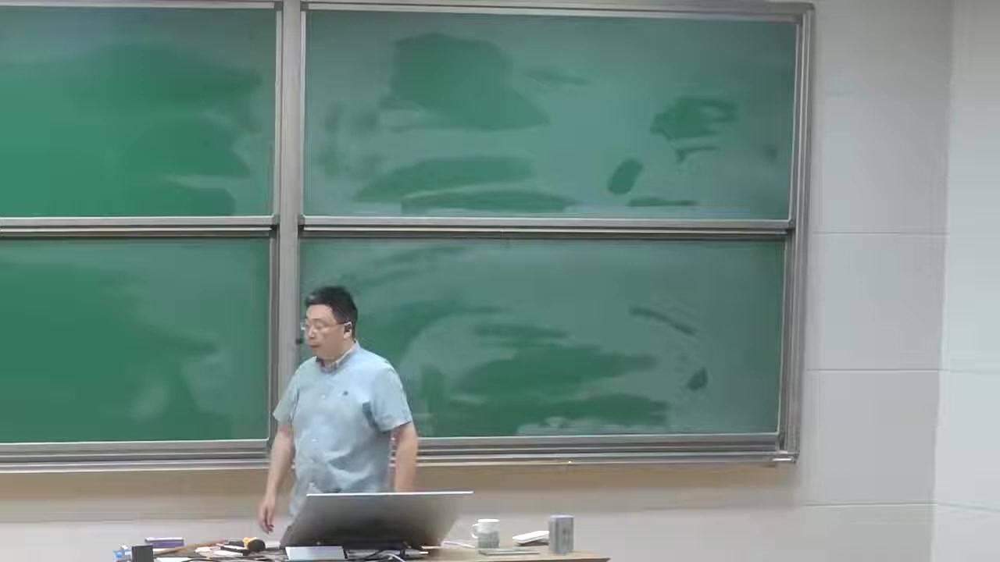

### 注解

```markdown
## 课程片段注解：软光子辐射与红外发散

### 1. 核心概念识别

本段字幕引入了**量子场论中辐射修正计算的核心难题**——红外发散（Infrared Divergence）。主要涉及以下概念：

- **软光子（Soft Photon）**：能量 $E_\gamma \to 0$（或波长 $\lambda \to \infty$）的极低能光子
- **红外发散（Infrared Divergence）**：计算辐射概率时，对软光子相空间积分在 $E_\gamma \to 0$ 处出现的对数发散 $\int dE_\gamma/E_\gamma$

> **注**：字幕末句"在Infernal dimensions"应为语音识别误差，结合上下文推测原意可能是 **"infrared divergences"**（红外发散）或 **"in $D$ dimensions"**（在 $D$ 维时空中，指维度正规化方法）。

---

### 2. 理论背景补充

#### 软光子辐射的物理机制
在量子电动力学（QED）中，当带电粒子（如电子）经历加速或散射时，会辐射光子。根据**软光子定理**（Soft Photon Theorem）：
- 辐射一个能量为 $\omega$ 的软光子的振幅 $\mathcal{M}$ 满足：
  $$\mathcal{M}_{n+1} \sim \frac{e p \cdot \epsilon}{p \cdot k} \mathcal{M}_n$$
  其中 $k^\mu=(\omega, \vec{k})$ 为光子四动量，$p^\mu$ 为带电粒子四动量，$\epsilon$ 为极化矢量。

- 当 $\omega \to 0$ 时，分母 $p \cdot k \sim \omega$，导致振幅 $\sim 1/\omega$ **发散**。

#### 红外发散的处理
单纯计算"发射一个软光子"的概率会给出无穷大结果，但物理上低能光子探测器存在能量分辨极限 $\Delta E$。**布洛赫-诺德西克定理**（Bloch-Nordsieck Theorem）指出：
- 必须同时考虑**虚光子修正**（圈图）和**实光子辐射**（树图）
- 两类发散相互抵消，使得物理截面（包含任意多能量 $<\Delta E$ 的软光子）是有限的

---

### 3. 通俗解释

**类比理解**：想象你在安静的教室里咳嗽（带电粒子散射）。

- **硬光子** = 大声咳嗽：所有人都能听见（高能光子被探测器捕获），这是正常物理过程。
- **软光子** = 极轻微的、几乎无声的呼吸：理论上你呼吸了无限多次（$\omega \to 0$ 时相空间体积无限大），如果每次呼吸都有固定概率，总概率就会发散到无穷大。

**解决方案**：现实中你无法区分"咳嗽+一次极轻微呼吸"和"单纯咳嗽"。量子场论证明，当你把这两种不可区分的过程概率相加时，无穷大会神奇地抵消，留下有限的结果。

---

### 4. 板书内容描述

截图显示授课教师站在**四联装绿色黑板**前，黑板表面留有之前课程擦拭后的模糊粉笔痕迹，但**无清晰可见的公式或文字**。教师位于讲台后方，正在进行口头讲解，尚未开始书写本节的具体数学推导（预计后续将展示软光子发射的费曼图或维度正规化公式）。
```

---

## 段落 2：段落 2

**时间：** 00:00:28 ~ 00:05:29

<details><summary>📝 原始字幕</summary>

<pre>

OK 用物理上我们测量这个 cross section的话 显然不可能是无同大事吧
所以发散必须要去解决
所以这点课呢 我要展示一下这个红外发散怎么出现以及
如何底销或如何销处是吧
我们这点课
我们要聚起来说我们通过一个聚起来一个最简单的一个
一个过程我们考虑以来传电子呢
在外场中的
elastic scanner 弹性散射
就实际上只被一个电子的出台在外场
在一个外试一下它比如今天大角度的牵折是吧
但实际上摸它一样只光弹的一个电子
没有光弹的别的这个例子比如光子
这叫弹性散射
elastic scanner
我们一对过程作为一个例子来展示呢
我们考虑它的辅车修正是吧
辅车修正一般来说它可以发射一个
光子是吧
是吧 实修正
原来大概通过这个量子的修正通过圈土
ok 圈里面可以交换这个虚广子
这统一的都要辅车修正
是吧
radity correction
好 我们通过这样一个过程来展示
我用的技巧呢主要是这个上面课我们给大家演示的这个
iKNO.4 是吧
iKNO.4音字我们现在有点了解
iKNO.4音字是 a universal factor
它只有一代于例子的电汗和它的这个
这个是音是它的这个运动方向或者它的速度是吧
它不一代于这个例子是基本的例子和例子
物理上下的例子你考虑一个脖肠非常长的一个光子
因为软光子不长非常长
它的脖肠像当于它这个弹性的分辨率
它甚至都不能分辨这个例子的内部细节
根据我们这个弹动力区里面是多级展开的精神
它只能
只要是它的零结局就是它总的电汗
原来 iKNO.4音字上这个代表例子的似动量
屁同时出现的分子和分母
是吧
所以它的这个例子能量呢它也不敏感
它只敏感原这个例子的电汗以及它的方向
这非常非常邮美的物理
好 我们要用这个Fedix
比如说我们以前学习过这样一个炉色不暂设
是吧
我们考虑一个极端的情形
这有非常非常重的
你可以说是无窮重的原则核
一个电子呢
今天弹性的散射
有原则核无窮重
你可以说它无窮重
它的作用就提供一个电汗
它提供一个酷轮式其实是吧
所以说它没有反冲
所以你发现这样一个电子散射
它能量的手衡
但是它的三动量呢它不需要手衡
OK
这个物理上很容易理解是吧
有个点电和无窮重的点电
和做的这地方
它破坏了空间瓶一步变形
所以动量
你只考虑电子
入射出射
电子的三动量不需要手衡
当然这是个statical potential
它提供了一个近态的尺
所以是时间瓶一步变
所以我还要就能量的手衡
所以给以前大家布置过的作业
有一个非常漂亮的作业
是Pascon的书
一道细题
给大家布置过的是4.4题
它是考虑呢
你把这样一个炉色布散射
可以通过一个
这个原子和的效应
可以通过一个经典的一个电磁厂
来代替
是吧来描述
你可以等效地把它形成这样的一个分曼图
插插代表一个经典的一个电磁厂
我们给它加个C上面的这个Classic
经典的
我们考虑的它是不一来一时间的
不抵捆
不是time的一分
不抵捆当time
可以出于简单的这样一个
好
入射的例子
除了是P一批
你可以把这个炉色布散射
通过这样一个
这样一个背景厂和Classic
这种厂来代替
你就像这样一个过程
你发现是P一批
在布散射
你可以发现
这个TG证员
可以写成一个刚才我说了
是一个能量之后
那一个
多少还是数
意识出它的电子的能量
意识墨踩电子的能量

</pre>

</details>

**课程截图：**


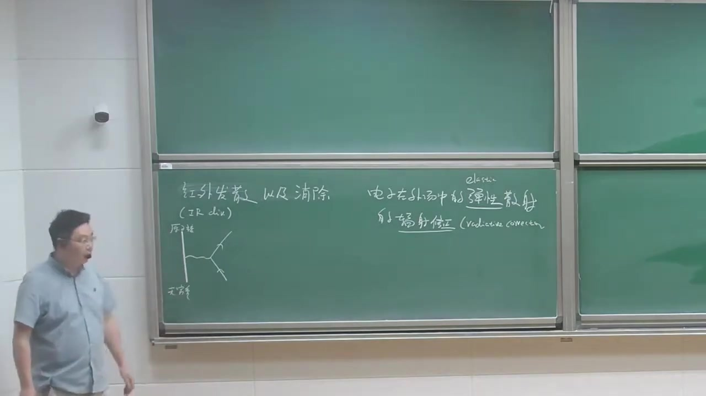


### 注解

## 课程片段注解：静态外场中的弹性散射与 Eikonal 近似

### 1. 板书内容描述

根据提供的截图，黑板板书包含以下内容：

**左侧区域：**
- 标题：**红外发散以及消除**（IR div）
- 一个费曼图：垂直粗线代表**原子核**（重粒子），与电子线（带箭头的实线）通过光子线（波浪线）耦合，表示电子在原子核库仑场中的散射
- 标注：**Peskin 4.4**（参考教材题号）
- 等效描述：同一费曼图旁边画有**叉号⊗**标记，标注为 $A_\mu^C(x)$，代表**经典背景场**（Classical background field），并注明"不 depend on time"（时间无关）

**右侧区域：**
- 主题：**电子在外场中的弹性散射**（elastic）的**辐射修正**（radiative correction）
- 关键公式：
  $$\langle p' | iT | p \rangle = (2\pi)^4 \delta(E-E') \times (\text{matrix element})$$
  其中 $p$ 为入射电子四动量，$p'$ 为出射电子四动量

---

### 2. 公式识别与符号解释

#### 公式 1：转移矩阵元（Transition Matrix Element）
$$\langle p' | iT | p \rangle = (2\pi)^4 \delta(E-E') \cdot \mathcal{M}_{fi}$$

**符号说明：**
- $|p\rangle, |p'\rangle$：分别代表入射和出射电子的单粒子态，四动量 $p = (E, \vec{p})$，$p' = (E', \vec{p}')$
- $T$：**转移矩阵**（Transition matrix），与散射算符 $S = 1 + iT$ 相关
- $(2\pi)^4 \delta(E-E')$：**能量守恒因子**，注意这里只有**能量**的 $\delta$ 函数，而非通常的 $(2\pi)^4 \delta^{(4)}(p'-p)$

**关键特征：**
在通常的粒子-粒子散射中，四动量守恒要求 $(2\pi)^4 \delta^{(4)}(p_1 + p_2 - p_3 - p_4)$。但此处**只有能量守恒**，因为：
- 原子核被视为**无穷重**（infinitely heavy），可吸收任意三动量而不改变能量
- 外场破坏了**空间平移不变性**，但保持**时间平移不变性**（静态场）

---

### 3. 理论背景补充

#### A. 静态外场近似（Static External Field Approximation）
当散射源（如原子核）质量 $M \to \infty$ 时：
- **无反冲**：原子核动能 $E_{\text{recoil}} \approx |\vec{q}|^2/(2M) \to 0$，可吸收任意动量转移 $\vec{q} = \vec{p}' - \vec{p}$ 而不改变状态
- **经典场源**：重粒子产生的电磁场可视为**经典背景场** $A_\mu^C(x)$，而非量子场算符
- **有效相互作用**：$H_{\text{int}} = e \int d^3x \, \bar{\psi}(x)\gamma^\mu \psi(x) A_\mu^C(x)$

#### B. Eikonal 因子（软光子普适耦合）
字幕中提到的 **"iKNO.4"** 实为 **Eikonal**（艾科诺）近似：

在软光子极限（$k \to 0$）下，辐射振幅出现一个**普适因子**：
$$\mathcal{M}_{n+1} \approx \mathcal{M}_n \times \left( \sum_{\text{external legs}} \eta_i \frac{e_i p_i \cdot \epsilon}{p_i \cdot k} \right)$$

**物理内涵：**
- **普适性**：只依赖于粒子的**电荷** $e_i$ 和**速度方向** $v_i^\mu = p_i^\mu/E_i$，与粒子自旋、内部结构无关
- **长波极限**：当光子波长 $\lambda \gg$ 粒子相互作用区域时，光子无法分辨粒子的内部细节，只能感知总电荷和运动方向
- **因子化**：辐射过程与硬散射过程完全分离（因子化）

#### C. Peskin 4.4 题背景
该题要求证明：卢瑟福散射（Rutherford scattering）可以通过两种等价方式计算：
1. **量子场论方法**：计算电子与重原子核（外源）的费曼图
2. **经典场方法**：将电子视为在经典库仑势 $A^0(x) = \frac{Ze}{4\pi|\vec{x}|}$ 中运动的狄拉克粒子

两种方法在 $M \to \infty$ 极限下给出相同的散射截面 $\frac{d\sigma}{d\Omega} \propto \frac{\alpha^2}{\sin^4(\theta/2)}$。

---

### 4. 核心概念通俗解释

#### 为什么"动量可以不守恒"？
想象一个**固定在地面上的巨大弹簧**（代表重原子核）：
- 一个小球（电子）撞向弹簧，弹簧纹丝不动（无动能变化）
- 弹簧可以吸收任意大小的冲量（动量变化），但因为质量无限大，速度变化为零
- 因此电子可以改变动量方向（散射），但能量保持不变（弹性散射）
- **守恒定律**：能量守恒（时间平移对称性仍在），但动量不守恒（空间平移对称性被"固定"的弹簧破坏）

#### "软光子"为什么看不见细节？
想象用**长波雷达**（波长几公里）去观察一架飞机：
- 雷达波无法分辨飞机的具体形状、颜色或内部结构
- 雷达只能感知飞机的总金属量和运动方向
- 同理，软光子（波长极长）只能感知带电粒子的**总电荷**和**速度方向**，无法分辨粒子是电子、缪子还是质子（只要电荷相同）

#### 辐射修正的"实"与"虚"
- **实修正**（Real correction）：电子在散射过程中**真实发射**一个光子（末态多一个光子）
- **虚修正**（Virtual correction）：电子在散射过程中**暂时交换**虚光子（圈图修正，末态仍是单个电子）
- **红外灾难**：单独计算这两种修正都会发散（无穷大），但物理上可观测的截面必须将两者相加，发散相互抵消（Bloch-Nordsieck 定理）。

---

## 段落 3：段落 3

**时间：** 00:05:29 ~ 00:08:43

<details><summary>📝 原始字幕</summary>

<pre>

OK
成一个不变成佛
其中一个不变成佛
我叫M0
M0等于
佛的I1
U把P一批
A slash
A丘它代表这个
复裂变后
它动量红尖
C的把Classic
所以它动量红尖
OK
它还在这个
分半规则
是吧
佛的Fimon rule
如果你考虑一个
炉色布散
那当时可以任意的一个
时间贝拉的一个电磁
是
如果你要强调
你要强调
炉色布散射
我们知道
炉色布散射
这个40量之后
A0
Classic
这个厂的A0
分量不为0
它等于原子和的库轮式
Z是原子续数
Z1出去死牌
它的实量不
实施不分能量
OK
它是Static
不随先依赖的
我相信它
没有做过同学
大家去做做
很有意思的题
OK
这什么的败款
这什么的波文竞士
领头界的这样一个
领头界的一个分半规
是吧
你很容易得到它的这个
cross-section
微分解灭呢
你判断它的
DC
我叫DCM0
一个P
到P
电子发生弹性散射的这个微分解灭呢
就是我们的住民的
录策服的一个
就是一个相路论系的
录策服的一个
散射过程
录策服的一九一三年
一九一三年做
一九一一年左右
我忘记是
到了一一一年一三年
反正一九一十年
它是一个非常论的一个
R法例子
是吧去装这个金博
我们把它
现在变成一个相路性的电子
去打一个
屋充公园子和
这个住民的这个
叫依赖是吧
这是一样的
这是PESC的息题
4.4
好
那我们
一直作为出发点
我们考虑这样一个过程的
一个辅车修正
OK
那我们现在考虑呢
一个经典的一个
经典的一个电磁式
OK
我们考虑
这个出发的电子呢
能辅车一个软光子
我们关心红尔发散
如果它很硬的话
这个传播子
能发of shell
它是远远离敲
所以不会导致任何红尔发散
我们在iq上
因此的分谋有个
P.K分之一
是吧
这是为什么会
它有一个similarity
这会导致发散
如果这个光子很硬的时候
你论正它
这个传播子是远远离敲的
所以没有任何问题
好的
那我们考虑
墨台的电子呢
也可以释放这样一个软光子
OK
在下一阶呢
我考虑伏车之后
正呢
我只有两个分半图
那我们利用我们您学过的这个
iq当竞死
我们您知道怎么做了是吧

</pre>

</details>

**课程截图：**


### 注解

```markdown
## 课程片段注解：静态外场散射与软光子辐射

### 1. 板书内容描述

根据提供的截图，黑板板书呈现以下内容：

**上半部分（左侧）：**
- 标题：**电子在外场中的弹性散射** 与 **辐射修正**（radiative correction）
- 两个等价的费曼图：
  - 左图：粗竖线（代表重原子核/外源）与电子线通过光子线耦合
  - 右图：用 **⊗** 符号（叉号）表示**经典背景场** $A_\mu^C(x)$，标注"不 depend on time"（不依赖于时间）
- 参考标注：**Peskin 4.4**（教材习题）

**上半部分（右侧）：**
- 跃迁矩阵元：$\langle p' | iT | p \rangle = (2\pi)^4 \delta(E-E') \cdot i M_0$
- 不变振幅定义：$i M_0 = -i e \bar{u}(p') \gamma^\mu A_\mu^C(q) u(p)$
- 经典库仑场：$A_0^C(x) = \frac{Ze}{4\pi r}$，$\vec{A}^C = 0$

**下半部分（左侧）：**
- 软光子辐射费曼图：电子线在外场顶点旁附加一条向外辐射的波浪线（软光子），标注 $k$（光子动量）

**下半部分（右侧）：**
- 卢瑟福散射微分截面公式：
  $$\frac{d\sigma_0}{d\Omega}(p \to p') = \frac{Z^2 \alpha^2}{4 m^2 v^4 \sin^4 \frac{\theta}{2}}$$
  （其中 $\alpha$ 为精细结构常数，$v$ 为电子速度，$\theta$ 为散射角）

---

### 2. 公式与符号详解

#### (1) 树图水平不变振幅 $M_0$

$$i M_0 = -i e \, \bar{u}(p') \gamma^\mu A_\mu^C(q) \, u(p)$$

| 符号 | 物理含义 |
|------|----------|
| $M_0$ | **树图（领头阶）不变振幅**（"不变成佛"的语音转写），描述电子在外场中散射的基础过程 |
| $\bar{u}(p')$ | 末态电子的狄拉克伴随旋量（"佛的I1"），$\bar{u} = u^\dagger \gamma^0$ |
| $u(p)$ | 初态电子的狄拉克旋量（"U把P一批"） |
| $\gamma^\mu$ | 狄伽马矩阵（"A slash" 指 $\slashed{A} = \gamma^\mu A_\mu$） |
| $A_\mu^C(q)$ | 经典外电磁场的傅里叶变换（"复裂变后"指傅里叶变换后进入**动量空间**） |
| $q = p' - p$ | 动量转移 |
| $-ie\gamma^\mu$ | QED 电磁相互作用顶点因子（费曼规则） |

#### (2) 静态库仑场

$$A_0^C(x) = \frac{Ze}{4\pi r}, \quad \vec{A}^C = 0$$

- **物理意义**：重原子核（$Z$ 为原子序数）产生的经典静电势，满足**静态条件**（不随时间变化）
- **特点**：仅时间分量 $A_0$ 非零，空间分量 $\vec{A}=0$，且与 $x^0$（时间）无关
- **动量空间形式**：傅里叶变换后 $A_0^C(q) \propto \frac{Ze}{|\vec{q}|^2}$（库仑势的动量表象）

#### (3) 卢瑟福散射截面

$$\frac{d\sigma_0}{d\Omega} = \frac{Z^2 \alpha^2}{4 m^2 v^4 \sin^4(\theta/2)}$$

- **历史背景**：1911-1913年卢瑟福（"炉色布"）用经典方法推导，后由量子场论在**非相对论极限**（$v \ll c$）下重现
- **现代诠释**：这是QED中电子与静态外场相互作用的**领头阶**（Leading Order）微分截面
- **特征**：著名的 $\sin^{-4}(\theta/2)$ 角分布，反映库仑力的长程性

---

### 3. 核心概念解释

#### 经典背景场近似（Classical Background Field）
将重原子核视为**无限质量**的源，其产生的电磁场 $A_\mu^C$ 是**经典场**（c-number，非算符），不参与量子涨落。这相当于在QED拉格朗日量中固定一个外源项 $e \bar{\psi}\gamma^\mu A_\mu^C \psi$，电子在此背景场中散射。

#### 软光子辐射与红外发散机制
当计算**辐射修正**（下一阶微扰论）时，需考虑电子在散射过程中**辐射软光子**（能量 $E_\gamma = |\vec{k}| \to 0$）：

- **费曼图拓扑**：两个贡献
  1. **初态辐射**：电子在**入射**过程中先辐射软光子，再被外场散射
  2. **末态辐射**：电子先被外场散射，再在**出射**过程中辐射软光子

- **红外发散来源**：内部电子传播子的分母出现 **$2p \cdot k$**（"P.K分之一"）
  - 当光子动量 $k \to 0$（软极限），传播子 $\sim \frac{1}{2p \cdot k} \to \infty$
  - 对光子相空间积分 $\int \frac{d^3k}{|\vec{k}|}$ 在 $|\vec{k}| \to 0$ 处产生对数发散 $\int \frac{dk}{k}$

- **物理区分**：
  - **硬光子**（$k$ 大）：传播子离壳（off-shell），不发散
  - **软光子**（$k$ 小）：传播子几乎在壳（on-shell），导致**奇异性**（singularity）

---

### 4. 理论背景补充

#### Eikonal 近似（直线近似）
在处理软光子与高能电子耦合时，电子在辐射前后**动量几乎不变**（$p \approx p'$），轨迹近似直线。这对应字幕中提到的"Eikonal"（"A丘"的语境），是计算软辐射振幅的关键近似。

#### 卢瑟福散射的相对论推广
板书给出的截面公式是非相对论形式。在完全相对论性QED中，该过程是**Mott散射**，截面包含相对论修正因子 $(1 - v^2 \sin^2(\theta/2))$。但在红外发散讨论中，通常先考虑非相对论或极端相对论极限以简化计算。

#### 红外发散的消除（预告）
本段建立了发散的"问题"：单圈辐射修正（实光子发射）在软极限下发散。后续课程将引入**虚光子修正**（顶点修正）和**Bloch-Nordsieck 定理**，通过"实发射+虚修正"的交叉项相消来消除红外发散，证明物理截面是红外安全的。
```

---

## 段落 4：段落 4

**时间：** 00:08:47 ~ 00:13:48

<details><summary>📝 原始字幕</summary>

<pre>

iq当proclamation
我可以写成
这个不变政府
我一般讲i
这是来自有的这个S算幅
是吧
这时候的坑门声
然后你发现
这是一个电子
出的电子的
动乱着屁
屁屁加上一个光子
这个光子的动乱是K
OK
我可以
写成这种形式
iM-0那是刚才我写下了
这个录售伏散车的
这个Leading-out
的这个
这个Immers MQ
是吧
描着描在这样一个
iq当竞死的跟这个
spin stretch的没有关系
它总是可以factorize
总可以因此化成这种形式
iq当竞死也可以写这种形式
对于一个
出台墨台辅设论是
匹匹点Apple Insta
Apple Insta
代表光子的计划十辆
匹匹点K
加上Apple
减去
这个腹号呢
是为个Sign
为个腹号的一个系数
是吧
对于录设的是一个腹号
p点Apple Insta
p点K
加Apple
sorry,这是解Apple
好,这是我们上两个学的知识
大家很容易去
去验证这一点
这是我的
iq当factor
我现在只考虑自己简单的形形
只考虑辅设一个软件
软光子是吧
原来让你可以将来把
我整成辅设这两个
辅设任意多个
任意多个数目的是软光子
那好的
那我们可以把它这个
剧中原模平方
向前积分是吧
原来这光子动量
我们考虑非常非常软是吧
你发现呢
你利用这个即便公式的时候呢
你考虑这样一个
1-2的一个过程的时候呢
你发现
你可以非常容易得到是
一个领头接的一个
class action
然后呢
成一个单个的光子的
一个相公尖
几分
这个单光子的相公尖
几分测读
它是轮子不变的
可以的摸
是吧
我们都非常熟悉
然后呢
对于光子的两个
极化物理计划求和
你发现
只需要对这个
iq当形子的摩批方式
可以是吧
然后呢
你是一方
pp点i-p-dm-k
ok
这i-p-dm-k真的
因为这不是个圈头
这是个
树图的摸批方式
这i-p-dm-k
你们都不重要
我还要不要
咱们俩代表它的
holicity
咱们的
p-dm-k的平方
ok
这个单个光子的一个
相公电机分测读
ok
相公电机分测读
来
好
那非常有意思一点
是
你这部分因子
你可以
物理上全是什么呀
全是成这个
辐射
出一个软光子的
级绿
因为我们知道
结面
有一个级绿权式
是吧
辐射一个软光子的级绿
ok
我们管它东西呢
我们这部分因子呢
管它叫
叫
propability吧
所以叫
p-r-o-b
propability级绿
好
那我们来看一下
这个propability等于什么
我们分析一下
由于它这个
埃克党因子
我们上年科给大家
印象的软定了
你知道
它是因子呢
在整部层次满足这个
挖的等于试试吧
把app from start
或者这个光子动量的话
它显然等于零
这几年的电贺手衡
这很吹呗
出太一个
电子墨太一个
电贺显然手衡
所以
我们以前给大家
学过对于一个
辐射一个
光子的过程呢
我们有个计划球的公式
是吧
我向大家不要忘
以牛
这是lamb的
lamb的
对这个lamb的球盒
我可以做一个
有效的替换
不如说
这是等
不如说这样做替换
能得到正确答案
这个球盒
某种意义上
它包含了两个废物里的这个帮子
但是它们互相抵销了
是吧
这是一个非常重要的知识点
比如我们要介绍
compromising的吧
我们需要利用这样一个知识
OK
所以呢
这个东西你把它
就模拼方
利用这个标准的方法
去做一做的一
就是这样一个因子
第三K

</pre>

</details>

**课程截图：**

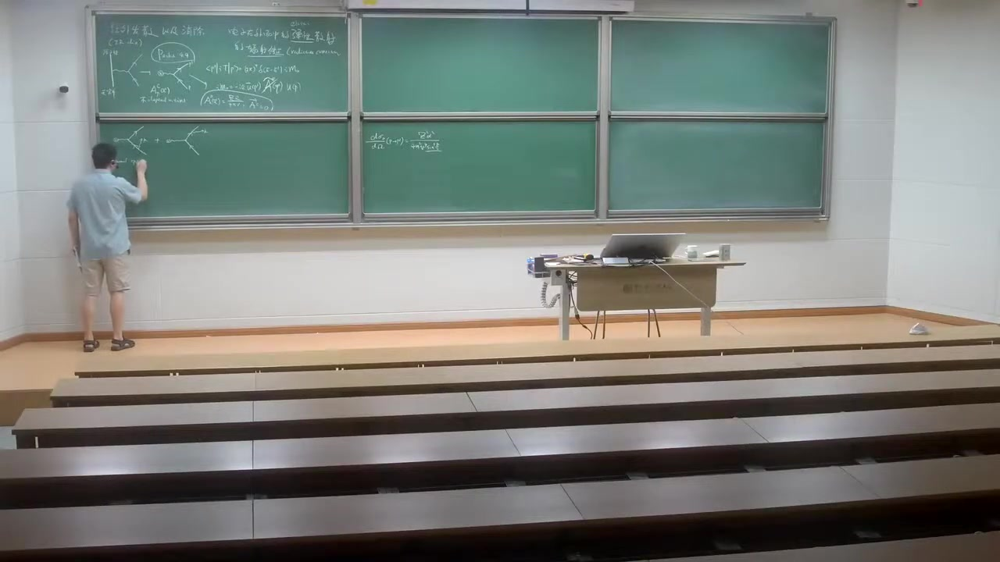

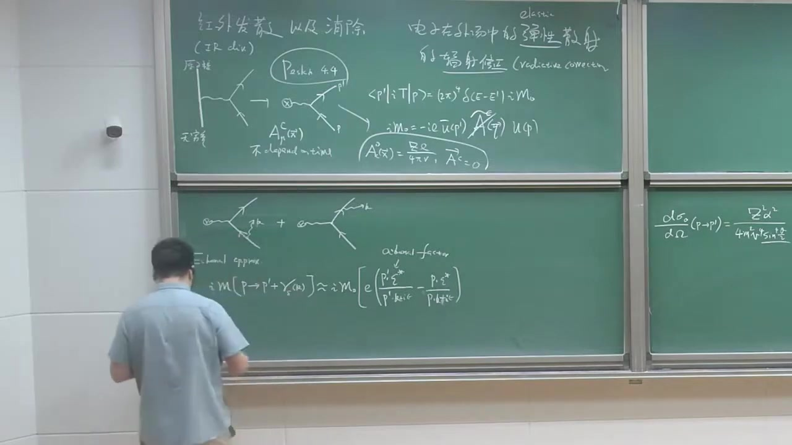

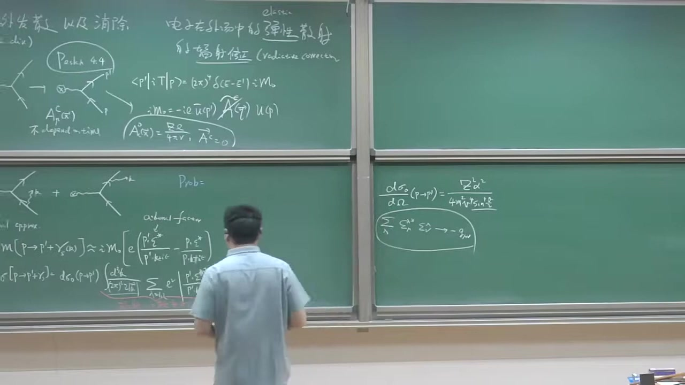

### 注解

```markdown
## 课程片段注解：Eikonal近似与软光子辐射概率

### 1. 板书内容描述

根据提供的截图，黑板下半部分（本时段新增内容）包含：

**左下区域（Eikonal近似）：**
- 两个费曼图：电子在外场散射过程中辐射一个软光子（$k$），分别对应**初态电子辐射**（左图，光子连在入射电子线）和**末态电子辐射**（右图，光子连在出射电子线）
- 标注：**Eikonal approx**（Eikonal近似）
- 核心公式（Eikonal因子）：
  $$i\mathcal{M}[p\to p'+\gamma(k)] \approx i\mathcal{M}_0 \left[ e\left(\frac{p'\cdot\varepsilon^*}{p'\cdot k+i\epsilon} - \frac{p\cdot\varepsilon^*}{p\cdot k+i\epsilon}\right) \right]$$
  其中方括号内即为**eikonal factor**（软光子辐射因子）

**中下区域（概率计算）：**
- 标注：**Prob**（概率）
- 相空间积分测度：
  $$d\sigma[p\to p'+\gamma] = d\sigma_0[p\to p'] \times \left\{ \frac{d^3k}{(2\pi)^3 2E_k} \sum_{\lambda} \left| e(\cdots) \right|^2 \right\}$$

**右侧区域（极化求和）：**
- 被圈出的公式：
  $$\sum_\lambda \varepsilon_\mu^*(k)\varepsilon_\nu(k) \to -g_{\mu\nu}$$
  这是**光子极化求和替换规则**（在洛伦兹规范/库仑规范下的简化形式）
- Rutherford散射截面公式（上半部分已存在，但右侧新增极化求和标注）

---

### 2. 新公式与符号详解

#### 公式一：软光子辐射振幅的因子化（Factorization）
$$i\mathcal{M}(p\to p'+k) \approx i\mathcal{M}_0 \times e\left(\frac{p'\cdot\varepsilon^*}{p'\cdot k} - \frac{p\cdot\varepsilon^*}{p\cdot k}\right)$$

| 符号 | 物理含义 |
|------|---------|
| $i\mathcal{M}$ | 辐射一个软光子的完整散射振幅 |
| $i\mathcal{M}_0$ | 弹性散射（不辐射光子）的领头阶（Leading-order）振幅，即"树图"（tree-level）贡献 |
| $e$ | 电子电荷（耦合常数）|
| $p, p'$ | 初态和末态电子的四动量（$p^\mu, p'^\mu$）|
| $k$ | 软光子的四动量（$k^\mu$，满足 $k^2=0, k\to 0$）|
| $\varepsilon^*(k)$ | 光子极化矢量的复共轭（$\varepsilon_\mu^*$，描述光子的偏振态）|
| $p\cdot k$ | 四动量内积 $p_\mu k^\mu = E_p E_k - \vec{p}\cdot\vec{k}$（软光子近似下很小）|

**关键物理**：在软光子极限（$k\to 0$）下，辐射振幅**因子化**为弹性散射振幅与一个普适因子的乘积。这个普适因子只依赖于带电粒子的运动轨迹（经典流），与散射细节无关。

#### 公式二：光子极化求和替换
$$\sum_{\lambda} \varepsilon_\mu^*(k,\lambda)\varepsilon_\nu(k,\lambda) \Rightarrow -g_{\mu\nu}$$

- **物理背景**：计算非极化截面时，需对初态光子极化求平均，对末态求和。
- **规范条件**：此替换仅在**Ward恒等式**成立且处理物理态时有效（等效于洛伦兹规范 $\varepsilon\cdot k=0$ 下的完备性关系）。
- **注意**：严格来说，完整形式应为 $\sum_\lambda \varepsilon_\mu^*\varepsilon_\nu = -g_{\mu\nu} + \text{规范项}$，但在计算物理截面时，规范项因流守恒（$p\cdot k = p'\cdot k$ 在软极限下的约束）而贡献为零。

#### 公式三：单光子辐射概率测度
$$dP = \frac{d^3k}{(2\pi)^3 2E_k} \sum_\lambda \left| \text{eikonal factor} \right|^2$$

- **洛伦兹不变相空间测度**：$\frac{d^3k}{(2\pi)^3 2E_k}$ 是相对论性粒子相空间的标准测度（$E_k = |\vec{k}|$ 对光子）。
- **红外发散来源**：当 $k\to 0$（软光子），此测度导致 $\int dE_k/E_k$ 的对数发散。

---

### 3. 理论背景补充

#### Eikonal近似（直线近似）
在软光子极限下，电子的动量几乎不变（$p\approx p'$），电子轨迹可视为经典直线运动。此时光子辐射由**经典流** $J^\mu \sim p^\mu/(p\cdot k)$ 决定，这正是上述eikonal因子的来源。该近似在QED、QCD及引力理论中广泛使用。

#### Ward恒等式与电荷守恒
字幕中提到的"Ward identity"（$\varepsilon_\mu \to k_\mu$ 时振幅为零）反映了**规范不变性**：
$$k_\mu \left(\frac{p'^\mu}{p'\cdot k} - \frac{p^\mu}{p\cdot k}\right) = 1 - 1 = 0$$
这保证了物理上纵向光子（类时/纵偏振）不辐射，且确保红外发散的抵消机制（Bloch-Nordsieck定理）成立。

#### 软光子定理（Soft Photon Theorem）
上述eikonal因子是**普适的**（universal），仅依赖于辐射体的电荷、磁矩及经典轨迹，与相互作用细节无关。这是低能定理（Low's theorem）的最低阶表现。

---

### 4. 核心概念通俗解释

**"因子化"（Factorization）的直观理解**：
想象电子被原子核散射时，辐射软光子的过程可以"拆解"为两步：
1. 电子先发生弹性散射（硬过程，由$i\mathcal{M}_0$描述）
2. 然后在飞行轨迹上"抖落"一个软光子（软过程，由eikonal因子描述）

由于软光子能量极低，几乎不影响电子运动，因此这两个过程**独立**，概率相乘。

**"极化求和变度规"的物理**：
光子有两种横向偏振（左旋/右旋）。当我们不关心具体偏振，只关心"有没有光子"时，数学上可以用$-g_{\mu\nu}$代替复杂的极化矢量求和。这相当于说："平均所有偏振方向后，光子传播子看起来就像度规张量"。

**红外发散的物理图像**：
计算发现，辐射**任意软**光子的概率是**无穷大**（积分$\int dE_k/E_k$在$E_k\to 0$处发散）。但这只是数学 artifact——实际上探测器有能量分辨率$\Delta E$，无法区分"电子+极软光子"和"纯电子"。真正的物理可观测量必须包含**虚拟修正**（圈图）与**实光子辐射**（树图）的干涉，两者发散精确抵消，给出有限结果（Bloch-Nordsieck机制）。
```

---

## 段落 5：段落 5

**时间：** 00:13:48 ~ 00:18:48

<details><summary>📝 原始字幕</summary>

<pre>

二拍的三次方
二贝的K的
董亮的模
就是光子的能量
然后呢
它还成一方
付的这名牛
这是我的
计划球盒这个公式
是吧
然后它
给它服务了
把它从提出来
你很容易得到
要等于
pp mu
除以pp点K
简去p mu
除以p点K
再成一pp nu
除以pp点K
简去p nu
除以p点
OK
这是一个非常
标准的一个俱动员
一个不变成
模拼方的一个操作
用不用考虑
这个默态光子的这个计划
是右选还是左选
好
这名字呢
你把它称开以后呢
你可以发现它等于
一方
第三K
二拍的立方
二K
然后呢
你会发现
我把这个一方这个电贺
电贺我和常常出的
放在基本话外面去
然后这个成绩呢
你发现
最后有三项
二P点P
除以p点K
再成一pp点K
简去p方
除以p点K的
平方
再简去pp的平方
除以pp点K的平方
OK
这是我的经过了一些
简单的一些操作
好
那我们这个机分呢
是个
迪卡尔这个平面左标是吧
我们想把那块球左标的话
我们都知道怎么做
我们把第三K可以写成
一个标准的
一个DK
的模
这个JackO比是吧
这个K的模的平方
再成一个立体角
原来K的方那个立体角
这是非常非常非常地弱弄的
好
我把那块球左标
然后我发现了
这样一个
我们再重新
订一个单位式使量
KHM
它订阅的是KM
由除以K的动量的模
它显然等于什么呀
你可能会认为它等于1
零分分而1
30量呢
是K
除以K
OK
你很容易验证
所以我想显示
把它抽出了它这样一个
抽出了它这样一个
看到这个DK的这个
模的这个机分的话
我可以把它
这样好
除了这个方法里面
完全都没有亮钢的
屁和屁点屁
屁点屁屁比掉了
然后你必须得
弥补一下
这样一个K的平方
它也非常三次方
是吧
好
那你稍微做点手脚的话
你放在这个音质
往上洗到这吧
你可以稍微改写一下
你可以把它写成
R法
除以Pie
DK
这是一个
正数像
光子的一个动量
DK除以K
因为分为一个K的三次方
然后呢
我订一个
一个无亮钢的一个寒暑
它的是这个
出它力值的速度
和墨它电子的速度的一个寒暑
具体的定义呢
你可以反映它
具体的定义呢
是写了这
它等于一个
脚平均
对K的所有方向呢
左立体脚击分
除以四派
所以是个脚平均
然后
RP点
Pie
DK
所有等于说
这个击分
我把这个静向和脚向的
给它分开了是吧
Pie
DK
这每一项都是无亮钢
脚击分也无亮钢
所以整个这个
挨寒暑呢
也没有两钢
Pie方等于M方
因为它在敲
Pie
DK
Head
Ping
DK
Head
Ping
OK
这是我们这个R还是个定义
OK
我们总之来说
这个V呢
是这样
我们定义这个4动量

</pre>

</details>

**课程截图：**


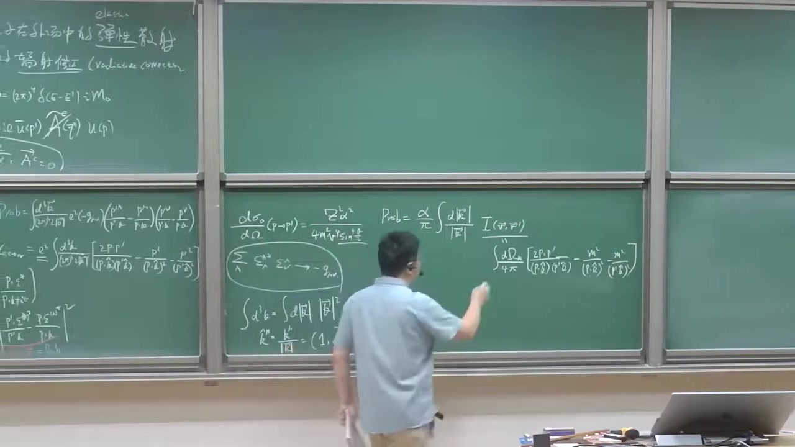

### 注解

```markdown
## 课程片段注解：软光子辐射概率的因子化与红外发散结构

### 1. 板书内容描述

根据提供的截图，本时段黑板**右下区域**新增关键推导步骤：

**软光子辐射概率的因子化形式：**
- 概率表达式：$Prob = \frac{\alpha}{\pi} \int \frac{d|\vec{k}|}{|\vec{k}|} I(\vec{v}, \vec{v}')$
- 被圈出的**极化求和替换规则**：$\sum_\lambda \epsilon_\mu^* \epsilon_\nu \to -g_{\mu\nu}$（椭圆框标注）
- **球坐标积分变换**：$\int d^3k = \int d|\vec{k}| |\vec{k}|^2 d\Omega_k$（标注"JackO比"即雅可比行列式）
- **单位四矢量定义**：$\hat{k}^\mu = \frac{k^\mu}{|\vec{k}|} = (1, \frac{\vec{k}}{|\vec{k}|})$（软光子近似下 $k^0 = |\vec{k}|$）
- **无量纲角分布函数** $I(\vec{v}, \vec{v}')$ 的显式表达式（三项结构）

### 2. 新公式识别与解释

**公式1：光子极化求和（Polarization Sum）**
$$\sum_{\lambda=1,2} \epsilon_\mu^*(k, \lambda) \epsilon_\nu(k, \lambda) \to -g_{\mu\nu}$$

*符号说明：*
- $\epsilon_\mu(k, \lambda)$：动量为 $k$、螺旋度为 $\lambda$ 的光子极化四维矢量（横波条件：$k\cdot\epsilon=0$）
- 求和仅对两个物理横极化（$\lambda=1,2$，即字幕中"右选还是左选"的线偏振或圆偏振基）
- $-g_{\mu\nu}$：费曼规范下的替换规则。由于 Eikonal 因子 $\left(\frac{p'}{p'\cdot k} - \frac{p}{p\cdot k}\right)$ 满足流守恒 $k_\mu \cdot (\text{因子})^\mu = 0$，非物理极化（纵向/标量）的贡献被抵消，故可用度规张量替代求和。

*物理意义：*
计算非极化光子辐射总概率时，需对末态光子极化求和。该公式将矢量指标收缩简化为度规张量，极大简化了后续张量运算。

**公式2：软光子辐射截面的因子化**
$$d\sigma[p\to p'+\gamma(k)] = d\sigma_0(p\to p') \times \frac{\alpha}{4\pi^2} \int \frac{d^3k}{2|\vec{k}|} \sum_\lambda \left| \frac{p'\cdot\epsilon^*}{p'\cdot k} - \frac{p\cdot\epsilon^*}{p\cdot k} \right|^2$$

或等价地（板书右侧）：
$$Prob = \frac{\alpha}{\pi} \int \frac{d|\vec{k}|}{|\vec{k}|} I(\vec{v}, \vec{v}')$$

*符号说明：*
- $d\sigma_0$：弹性散射（无辐射）的截面，作为整体因子提出（**因子化**）
- $\alpha = e^2/(4\pi)$：精细结构常数（"电贺"即电荷 $e$ 的平方）
- $d|\vec{k}|/|\vec{k}|$：光子能量积分测度，体现**对数红外发散**（$|\vec{k}|\to 0$ 时积分发散）
- $I(\vec{v}, \vec{v}')$：无量纲（"无亮钢"）角分布函数，仅依赖于电子初末态速度

**公式3：无量纲角分布函数 $I(\vec{v}, \vec{v}')$**
$$I(\vec{v}, \vec{v}') = \int \frac{d\Omega_k}{4\pi} \left[ \frac{2p\cdot p'}{(p\cdot \hat{k})(p'\cdot \hat{k})} - \frac{m^2}{(p\cdot \hat{k})^2} - \frac{m^2}{(p'\cdot \hat{k})^2} \right]$$

（注：字幕中"三项"对应括号内三项，其中 $p\cdot k = |\vec{k}|(p\cdot \hat{k})$）

*符号说明：*
- $d\Omega_k$：光子出射方向的立体角元（"立体角"）
- $\hat{k}^\mu = k^\mu/|\vec{k}|$：光子方向的单位四矢量（时间分量为1，空间分量为单位矢量 $\vec{k}/|\vec{k}|$）
- $p\cdot \hat{k} = E(1 - \vec{v}\cdot\hat{k})$：软光子近似下 $p\cdot k/|\vec{k}|$
- 积分 $\int d\Omega_k/4\pi$ 表示对光子方向的**角度平均**（"脚平均"）

### 3. 理论背景补充

**红外发散的数学结构：**
软光子辐射截面呈现典型的**对数红外发散**：
$$\sigma_{\text{radiative}} \sim \alpha \int_0^{\Lambda} \frac{d|\vec{k}|}{|\vec{k}|} \sim \alpha \ln(\Lambda/\mu) \to

---

## 段落 6：段落 6

**时间：** 00:18:48 ~ 00:23:48

<details><summary>📝 原始字幕</summary>

<pre>

Pie
Pie
可以写成它的能量
1
V
Pie
Pie
Pie
Pie
Pie
Pie
Pie
Pie
Pie
Pie
Pie
Pie
Pie
Pie
Pie
Pie
所以关键的是
大家看这个进向机分
对于K的这个摩肌分呢
你发现
它其实是
无窮大
OK
这其实就是一个红外发散
这时候我们看到了红外发散
因为原子上没有理由不允许光子
扶着光子的波长
非常非常无重长
但是人家允许
KQ里那时候
这个基本显示对着发散
是吧
这是一个闹个的一个红外发散
闹个发散是个非常温柔的发散
它不是很恶劣
当然它也是无重的
是吧
那我们怎么来做呢
我们讲到这边
说不定回忆一下
这个拍子的时候
第六章我特别喜欢一个非常好的例子
它可以从半斤点的一个竞士
也能够重现这样的一个红外发散
它做了事情呢
大概是咱们给大家
简单描述一下
它考虑一个经典的弄力
学了一个电池服设的一个问题
它考虑一个大电力子
它来运速超红的方向运动
然后它突然平成方向
是吧
是它要运动
你发现呢
这是一个大电流
是吧
然后你发现它会
因为我们知道
修电动学我们知道加速的力子
大电力子它会辐射
会点着辐射
你发现
如果速度很高的时候
它会沿着这个方向
它会辐射
这个辐射呢
就叫
运制服设
我们都知道的东西
是吧
这在经典的弄力学里面的这种概念
这是德文词
德文词比较长
比如说是德文词
是不软兴
大概意思就是说
breaking
就叫
脑车的服设
突然改成瞎了一下
急下来车だ
突然在瞎了车
然后在管方向
这个PASS的数面都没有得太给你
据起来说呢
如果在
龙子挥范下的话
我知道这样一个Mex方程呢
我们的Mex方程可以写的这种形式
这也没有试吧
我们如果去龙子挥范的话呢
这方程非常简单
把这项人调
然后呢
进点点东西学里面老师告诉你的
你可以通过所有的推迟式
这个我以前订阅过
DRRWTARDIT
你可以
给订阅一个Count
给订阅一个
代表例子的一个Count
你可以解除了
在
给订外时刻
然后它需要花时间到
XX0大一把0
在X0时刻在任何一个位置
它的这个电子厂
ok
所以有一些原因
我觉得
我们就
不给它过一遍
然后就说了思路啊
就是它PASS的那个例子
DRRWTARDIT
它有这个JAX
那边非常著名的一个
进点点东西学里面
教材大家都知道
好
然后它
利用标准的一个
进点点东西的公式
就辅射能量
辅射的电子厂能量
辅射能量
通过电子厂的形式
厂伯的
我们知道它订阅什么
我们都学过
21%
电厂厂的平方
家资料这么平方
ok
因为我通过解卖X方程
你的用推迟式
隔灵韩售的方法
你知道
AMU
ok
其中有进展的库轮部分
我们不关系
关系的辅射部分
ok
REDITION PART
你解一下的话
我要列过很多步驟
你发现呢
非常有意思的是
这个能铺的
你发现它长得这样子
R法出一派
去用R法再给大家
回立一下
一方出于四派
ok
R法出一派
经济结构成熟
然后呢
你发现机分的是DK
i
微微
这个i韩售呢
这个叫
韩售的exactly
就是刚才
我刚刚引到这样一个
一个
一个韩售
在哪儿呢
我看一下

</pre>

</details>

**课程截图：**


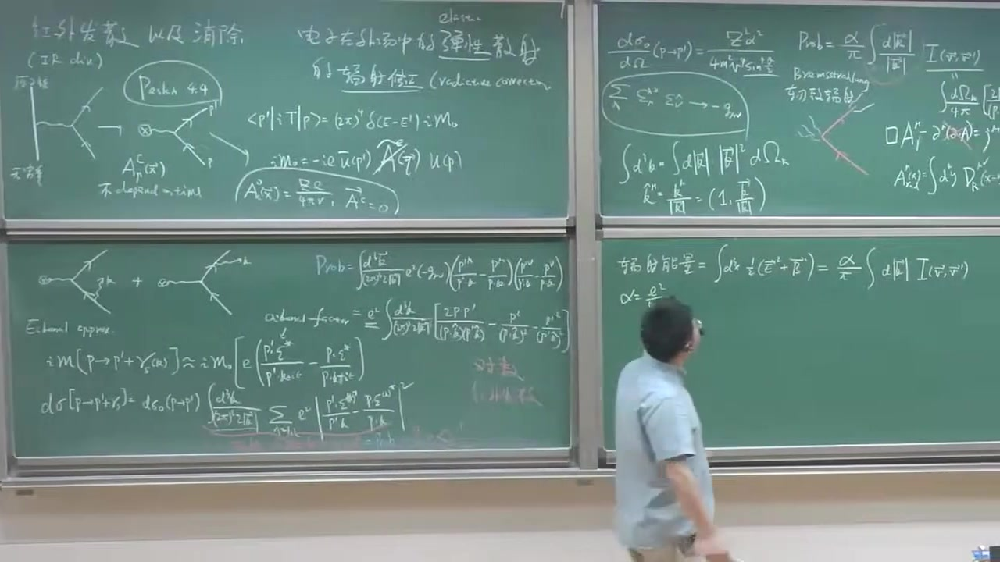

### 注解

```markdown
## 课程片段注解：红外发散的经典对应与韧致辐射

### 1. 板书内容描述

根据提供的截图，本时段黑板**右侧区域**新增经典电动力学类比内容，与左侧的量子场论推导形成对照：

**右上区域（量子侧总结）：**
- 软光子辐射概率公式：$Prob = \frac{\alpha}{\pi} \int \frac{d|\vec{k}|}{|\vec{k}|} I(\vec{v}, \vec{v}')$
- 极化求和规则：$\sum_\lambda \epsilon_\mu^* \epsilon_\nu \to -g_{\mu\nu}$（椭圆框标注）
- 相空间积分分解：$\int d^3k = \int d|\vec{k}| |\vec{k}|^2 d\Omega_k$
- 软光子单位矢量定义：$\hat{k}^\mu = \frac{k^\mu}{|\vec{k}|} = (1, \frac{\vec{k}}{|\vec{k}|})$

**右下区域（经典类比）：**
- **辐射能量经典表达式**：
  $$\text{辐射能量} = \int d^3x \frac{1}{2}(\vec{E}^2 + \vec{B}^2) = \frac{\alpha}{\pi} \int d|\vec{k}| I(\vec{v}, \vec{v}')$$
- 精细结构常数定义：$\alpha = \frac{e^2}{4\pi}$（自然单位制下）
- 标注"Bremsstrahlung"（韧致辐射/刹车辐射）及示意图：显示带电粒子突然改变运动方向并辐射光子的过程

---

### 2. 新公式与符号详解

#### 公式 1：经典辐射能量与软光子极限的对应
$$\int d^3x \frac{1}{2}(\vec{E}^2 + \vec{B}^2) = \frac{\alpha}{\pi} \int d|\vec{k}| I(\vec{v}, \vec{v}')$$

| 符号 | 含义 |
|------|------|
| $\vec{E}, \vec{B}$ | 辐射电磁场的电场与磁场强度 |
| $\frac{1}{2}(\vec{E}^2 + \vec{B}^2)$ | 电磁场能量密度（自然单位制 $\hbar=c=1$） |
| $\alpha = \frac{e^2}{4\pi}$ | 精细结构常数（约 $1/137$） |
| $d|\vec{k}|$ | 光子动量大小积分测度 |
| $I(\vec{v}, \vec{v}')$ | **形状因子**（form factor），仅依赖于电子初速度 $\vec{v}$ 和末速度 $\vec{v}'$ 的函数，包含辐射角分布信息 |

**关键观察**：右侧积分 $\int d|\vec{k}|$ 在 $|\vec{k}| \to 0$（红外极限）时是**线性发散**的，这与量子场论中 $\int \frac{d|\vec{k}|}{|\vec{k}|}$ 的对数发散不同，但共同揭示了低频辐射的发散本质。

#### 公式 2：软光子四动量单位矢量
$$\hat{k}^\mu = \frac{k^\mu}{|\vec{k}|} = \left(1, \frac{\vec{k}}{|\vec{k}|}\right)$$

| 符号 | 含义 |
|------|------|
| $k^\mu = (k^0, \vec{k})$ | 光子四动量，在壳条件 $k^0 = |\vec{k}|$（软光子近似） |
| $\hat{k}^\mu$ | 归一化的"方向"四矢量，时间分量为1，空间分量为空间方向单位矢量 |

此定义用于简化软光子辐射振幅中的 $p \cdot k$ 点积计算。

---

### 3. 理论背景：红外发散的经典起源

#### 3.1 推迟势与 Liénard-Wiechert 势
当求解经典麦克斯韦方程（字幕中"Mex方程"）：
$$\Box A^\mu - \partial^\mu(\partial_\nu A^\nu) = j^\mu$$

在洛伦兹规范（$\partial_\mu A^\mu = 0$）下，方程简化为波动方程 $\Box A^\mu = j^\mu$。其**推迟格林函数解**（retarded Green's function，字幕中"DRRWTARDIT"）为：
$$A^\mu(x) = \int d^4y \, D_R(x-y) j^\mu(y)$$

对于点电荷突然加速（$t=0$ 时刻速度从 $\vec{v}$ 突变为 $\vec{v}'$），这就是著名的**Liénard-Wiechert 势**，其辐射场在远场区（辐射区）的行为决定了低频辐射特性。

#### 3.2 韧致辐射（Bremsstrahlung）的低频定理
经典电动力学中，当带电粒子经历瞬时加速（"突然刹车"，德文 *bremsen*）：
- **辐射能量谱**：在低频极限 $\omega \to 0$ 时，单位频率辐射能量 $\frac{dE}{d\omega} \sim \log(\omega)$ 或趋于常数（取决于具体模型）
- **辐射光子数**：由于每个光子能量 $E_\gamma = \hbar\omega$，辐射光子数 $dN \sim \frac{dE}{\hbar\omega} \sim \frac{d\omega}{\omega}$，在 $\omega \to 0$ 时**对数发散**

这与量子场论中的红外发散完全对应：长波长光子无法分辨电荷加速度的"突然性"细节，导致辐射振幅在软极限下保持非零，积分后总概率发散。

---

### 4. 核心概念通俗解释

#### "温柔的发散"（Mild Divergence）
讲师提到红外发散是"非常温柔的发散"，意指：
- **数学上**：它是**对数发散**（$\int dk/k$）而非幂律发散（$\int dk/k^n, n>1$），通过引入物理截断（如探测器能量分辨率 $\Delta E$）可使其有限化
- **物理上**：这种发散是"可驯服"的——通过**Bloch-Nordsieck 定理**（包含虚光子修正和实软光子辐射），所有红外发散在物理可观测的包容截面（inclusive cross section）中会相互抵消

#### 经典 vs 量子对应
| 特征 | 经典电动力学 | 量子场论 |
|------|-------------|----------|
| **红外发散来源** | 无限多软光子，每个携带无限小能量 | 软光子辐射概率 $P \sim \alpha \log(E/\Delta E)$ 在 $\Delta E \to 0$ 时发散 |
| **截断物理** | 探测器频率分辨率 | 探测器能量分辨率 / 虚电子质量壳偏离 |
| **关键近似** | 突然近似（sudden approximation） | Eikonal 近似（软光子近似） |

这段讲解通过 Jackson《经典电动力学》中的标准例题，建立了从经典韧致辐射到量子红外发散的直观图像：**红外发散本质上是长波长光子无法探测到电荷瞬时加速度细节的表现**。
```

---

## 段落 7：段落 7

**时间：** 00:23:48 ~ 00:25:36

<details><summary>📝 原始字幕</summary>

<pre>

在这儿
它完全一样的
大家看这公式
我刚刚说
辅射一个非常软的
光子当个光子这个
极率的是R法出一派
DK出一派
这个通过纪念能量的计算呢
跟着非常像
我辅射能量呢
这没有分吗
还没有K
ok
所以我现在
用点A因子
的光量的假设
我们A因子才假设呢
光量子呢
是能量是一份一份的
是吧
没有光子能量呢
没有光子能量呢
等于H8
Oh my god
我们在单位之后
等于H8K吧
一样的
我
我
我另有的C等1
光数等1是吧
所有的考虑呢
就说
如果辅射的光子数呢
我通过这样
所谓的一个
今年
更多率
加一点量的力学
加一点光量的假设
辅射的光子的个数
的数目吧
选择的呢
它能土
这个还要
这个背机还要是
能土是吧
Andy Spectrum
在
在这段区间里面的能量
处于
这个每个光子能量
就是它的
能不
它的数量是吧
处于H8
ok
这个
这个
H8K对到
这样的话就
跟我刚才得到这个
辅射单光子
这样一个
几率呢
在量的电动力学里面的计算呢
是吧
完全行上
完全一样的
这是今年的能力学
ok
这个选呢
是对发散的
是吧

</pre>

</details>

**课程截图：**


### 注解

```markdown
## 课程片段注解：光量子假说与红外发散的半经典对应

### 1. 板书内容描述

根据提供的截图，黑板**右下角区域**（本时段新增）包含经典电动力学与量子图像的桥梁推导：

**右下区域（能量-光子数对应）：**
- 经典辐射能量公式：$\text{辐射的能量} = \int d^3x\,\frac{1}{2}(\vec{E}^2 + \vec{B}^2) = \frac{\alpha}{\pi}\int d|\vec{k}|\, I(\vec{v},\vec{v}')$
- 自然单位制标注：$\alpha = e^2$（此时 $\hbar = c = 1$）
- 光子数推导逻辑（手写箭头连接）：通过 $E_{\gamma} = \hbar|\vec{k}|$ 建立经典能量与量子光子数的联系

### 2. 新公式识别与解释

本段引入**光量子假说**下的关键关系式：

#### (1) 光子能量量子化公式
$$E_{\gamma} = \hbar |\vec{k}| \quad (\text{或记为 } \hbar\omega)$$
- **$\hbar$**：约化普朗克常数（讲师口误/简称为"H8"）
- **$|\vec{k}|$**：光子波数（动量大小），在自然单位制（$c=1$）下等于角频率 $\omega$

#### (2) 光子数-能量对应关系（半经典公式）
$$dN = \frac{dE_{\text{辐射}}}{E_{\gamma}} = \frac{dE_{\text{辐射}}}{\hbar|\vec{k}|}$$

**物理意义**：在经典电动力学中计算的连续辐射能量 $dE$，在量子图像中对应于发射 $dN$ 个能量为 $\hbar|\vec{k}|$ 的光子。

#### (3) 自然单位制声明
$$c = 1,\quad \hbar = 1 \text{（隐含）}$$
- 讲师明确提到"令 $c=1$"，使得光子能量 $E = |\vec{k}|$（而非 $c|\vec{k}|$）
- 在此单位制下，精细结构常数 $\alpha = e^2/(4\pi) \approx 1/137$ 简化为 $\alpha = e^2$（取决于约定）

### 3. 理论背景补充

#### 爱因斯坦光量子假说（1905）
讲师提到的"A因子"（光量子假设）指爱因斯坦提出的**光量子假说**：电磁辐射能量不是连续的，而是由离散的能量包（光子）组成，每个光子的能量与频率成正比 $E = h\nu = \hbar\omega$。

#### 红外发散的量子-经典对应
这是本段的核心论证：
1. **量子场论结果**：辐射单个软光子的概率 $dP \propto \frac{d|\vec{k}|}{|\vec{k}|} I(\vec{v},\vec{v}')$（对数发散）
2. **经典电动力学结果**：辐射能量损失 $dE \propto \frac{d|\vec{k}|}{|\vec{k}|} I(\vec{v},\vec{v}')$（同样对数发散）
3. **对应原理**：若将经典能量 $dE$ 除以光子能量 $\hbar|\vec{k}|$ 得到"等效光子数" $dN$，其 $|\vec{k}|$ 依赖关系与量子单光子辐射概率**完全一致**（均为 $1/|\vec{k}|$ 发散）

这一对应表明：经典红外发散（能量损失无穷大）在量子图像中表现为发射无穷多软光子的概率发散（Bloch-Nordsieck定理的雏形）。

### 4. 通俗解释

**核心逻辑**：讲师在用"分蛋糕"的方式连接经典和量子图像。

- **经典视角**：电子散射时像刹车一样辐射电磁波，能量损失是连续的，软光子（低频）部分能量损失按 $1/\omega$ 发散（积分 $\int d\omega/\omega$ 在 $\omega\to 0$ 处发散）。
  
- **量子视角**：电子散射时以一定概率发射离散的光子。发射一个极软光子（能量 $\hbar\omega \to 0$）的概率也是按 $1/\omega$ 发散的。

- **桥梁**：如果经典计算说"损失了 $dE$ 的能量"，而每个光子携带 $\hbar\omega$ 能量，那么相当于发射了 $dN = dE/\hbar\omega$ 个光子。令人惊奇的是，这个"经典等效光子数"与量子场论直接计算的"发射概率"在数学形式上**完全相同**。

这验证了量子电动力学在软光子极限下与经典电动力学的自洽性，同时也揭示了红外发散的物理本质：无论是经典还是量子，处理极长波长的辐射（几乎零能量）时都会出现数学上的发散困难，这需要通过物理上的正则化（如赋予光子极小质量）或包容态（inclusive states）来解决。
```

---

## 段落 8：段落 8

**时间：** 00:25:41 ~ 00:26:42

<details><summary>📝 原始字幕</summary>

<pre>

对手发散
这是红二发散
所以今年的能力学
结合
光量能量想象告诉你
ok
辅射出
非常低的
低能量的光子
的数目
是无重大
ok
这个问题
可以叫一个红外
灾难
ok
这是早期
早期人们
恨到又制出来
这是从那问题的
ok
好
所以这是非常漂亮的
这个经典和量子的
经典的能力学会
量子长了一个对应
你看看
长得非常非常像
这个例子
我们现在起发性
好
那我们现在
回过头来
我们现在在讨论这个机分
这个机分
数上有定义的话
我们必须让它变成有限
因为我们不能讨论无限的值
所以我们考虑这个
一个Lambda
是个正的一个数
让机分个下线
Lambda大约0
这种手区
叫做水的这个
红外正规化方案
来个轮

</pre>

</details>

**课程截图：**


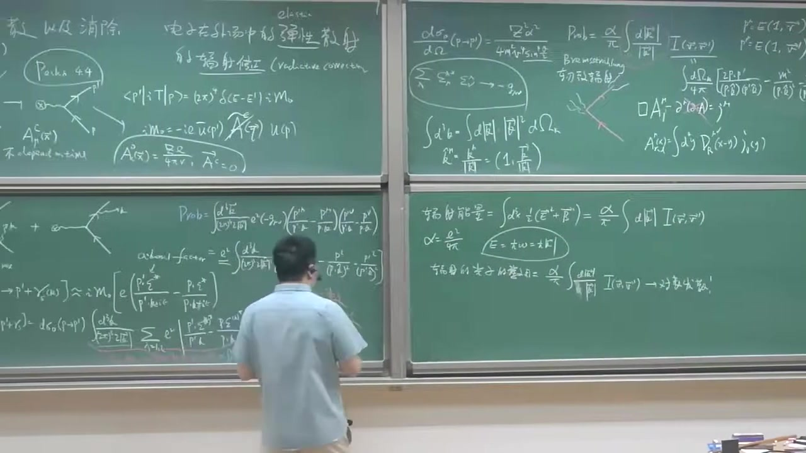

### 注解

```markdown
## 课程片段注解：红外灾难与红外正规化方案

### 1. 板书内容描述

根据提供的截图，黑板**右下角区域**（本时段新增核心内容）展示了经典辐射与量子光子图像的对比及红外发散的数学结构：

**右下区域（光子数目与发散）：**
- **经典辐射能量**：$\text{辐射的能量} = \int d^3x\,\frac{1}{2}(\vec{E}^2 + \vec{B}^2) = \frac{\alpha}{\pi}\int d|\vec{k}|\, I(\vec{v},\vec{v}')$
- **光子数目公式**：$\text{辐射的光子的数目} = \frac{\alpha}{\pi} \int \frac{d|\vec{k}|}{|\vec{k}|} I(\vec{v},\vec{v}') \longrightarrow \text{对数发散}$
- **自然单位制标注**：$\alpha = \frac{e^2}{4\pi}$，$E = \hbar\omega = |\vec{k}|$（此时 $\hbar = c = 1$）

### 2. 新公式识别与解释

**（1）软光子总数积分公式**
$$N_{\gamma} = \frac{\alpha}{\pi} \int \frac{d|\vec{k}|}{|\vec{k}|} I(\vec{v}, \vec{v}')$$

- **$N_{\gamma}$**：辐射的软光子总数目
- **$d|\vec{k}|/|\vec{k}|$**：光子能量积分测度，在 $|\vec{k}|\to 0$ 时产生奇异性（对数发散的根源）
- **$I(\vec{v}, \vec{v}')$**：与初末态速度相关的辐射强度函数（已在之前定义）
- **发散行为**：积分 $\int_0 d|\vec{k}|/|\vec{k}| \sim \ln(0) \to -\infty$，表现为**对数发散**

**（2）红外正规化截断（字幕提及）**
$$\int_{\Lambda} \frac{d|\vec{k}|}{|\vec{k}|}, \quad \Lambda > 0, \Lambda \to 0$$

- **$\Lambda$**：红外截断（infrared cutoff），人为引入的最小光子能量
- **正规化**：通过限制 $|\vec{k}| \geq \Lambda > 0$，将发散积分变为有限值 $\sim \ln(|\vec{k}|_{\text{max}}/\Lambda)$

### 3. 理论背景：红外灾难（Infrared Catastrophe）

**核心矛盾：**
- **经典电动力学**：带电粒子加速时辐射的总能量有限（由Larmor公式给出），积分测度为 $d|\vec{k}|$，在红外区域收敛。
- **量子场论**：结合爱因斯坦光量子假说 $E = \hbar\omega = |\vec{k}|$，辐射**极低能量**光子的**数目**为：
  $$N_{\gamma} \sim \int \frac{d\omega}{\omega} \to \infty \quad (\omega \to 0)$$
  
  即辐射**任意多**个能量趋于零的光子，导致微扰计算中的概率发散。

**"早期人们恨到又制出来"**：指20世纪30-40年代，物理学家发现QED中软光子辐射导致截面无限大，这是早期量子场论的重大困扰（红外灾难），直到Bloch-Nordsieck定理（1937）和Yennie-Frautschi-Suura理论（1961）才系统解决。

### 4. 经典与量子的对应关系

讲师强调的"长得非常非常像"指：

| 特征 | 经典电动力学 | 量子力学（光量子假说） |
|------|-------------|---------------------|
| **积分测度** | $d|\vec{k}|$（能量密度） | $\frac{d|\vec{k}|}{|\vec{k}|}$（光子数目密度） |
| **红外行为** | 能量有限 | 光子数无限（对数发散） |
| **关系** | $E_{\text{rad}} = \int d|\vec{k}| \cdot (\text{谱密度})$ | $N_{\gamma} = \int \frac{d|\vec{k}|}{|\vec{k}|} \cdot (\text{相同谱密度})$ |

关键洞察：虽然量子理论中光子数发散，但每个光子能量 $\hbar\omega \to 0$，使得总能量仍可能保持有限（或特定阶数的发散结构），这正是经典与量子图像的微妙对应。

### 5. 红外正规化方案（Infrared Regularization）

**物理动机**：实验探测器无法分辨能量低于分辨率 $\Lambda_{\text{exp}}$ 的软光子，因此数学上引入截断 $\Lambda$ 对应物理探测极限。

**操作步骤**：
1. **引入截断**：将积分下限从 $0$ 改为 $\Lambda$（$\Lambda \ll E_{\text{particle}}$）
2. **计算有限量**：得到依赖于 $\ln\Lambda$ 的中间结果
3. **抵消发散**：在包含虚修正（圈图）和实辐射的完整截面计算中，红外发散项相互抵消（Bloch-Nordsieck抵消），最终物理结果与 $\Lambda$ 无关

**通俗理解**：就像计算"灰尘数量"时，如果允许无限小的颗粒，数量会无限大。正规化就是暂时设定"只数直径大于 $\Lambda$ 的颗粒"，算完物理量后再让 $\Lambda \to 0$，并证明无限小颗粒对可观测效应（如总能量沉积）的贡献被其他效应抵消。
```

---

## 段落 9：段落 9

**时间：** 00:26:46 ~ 00:28:17

<details><summary>📝 原始字幕</summary>

<pre>

这个轮子
会正规化
正规化
所以意思是
把一个数学上
发散无穷的东西
不能有限
ok
或者R
来个Liter
我们可以采用很多方式
其中
Pascad的数
它要选择
是给光子
加了一个小指量
这样的话
在光子
可以禁止的时候
它能量机分
就是从这个小指量
纽开始
或者叫
i'm gamma开始
这个机分呢
它的低能端
那些被咖套复了
它就没有
它就没有发现了
我们以前学Pronger理论的时候
我们知道这个Pronger理论
我们没学到StupidTricks
是吧
一个�C5的一个Pronger理论的话
只让群零的级厌来说
它如果我和一个手红流的话
这个群零的级厌
没有任何问题
它有个重长级化的量
一个粒子
只有肚底咖啡了
是吧
QD呢
它觉得我和一个手红流
所以加了小指量呢
你没有打来很多问题
总人来说呢
它可以
咖套复长一个
红还发散
我们呢
选择是用更加简单的方法
我们光子还凝几量
我们只是粗暴
简单粗暴
就说
再这样一个
相亏连机分呢
这个下线呢
用蓝门来代替
OK
OK
我们尝个方案这个
当然这不

</pre>

</details>

**课程截图：**

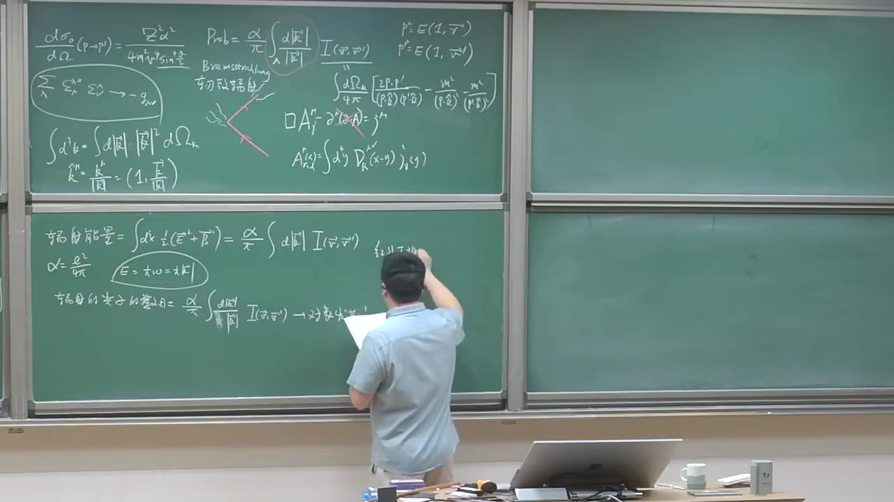

### 注解

```markdown
## 课程片段注解：红外发散的正规化方案

### 1. 板书内容描述

根据提供的截图，本时段黑板**右下角区域**（讲师正在书写的区域）补充了红外发散的数学特征及正规化声明：

**右下区域（发散结构与处理）：**
- **光子数目的积分表达式**（延续前段）：$\text{辐射的光子的数目} = \frac{\alpha}{\pi} \int \frac{d|\vec{k}|}{|\vec{k}|} I(\vec{v},\vec{v}')$
- **发散类型标注**：在积分表达式右侧标注有"**对数发散**"（或类似字样），表明当 $|\vec{k}| \to 0$ 时积分行为为 $\int \frac{d|\vec{k}|}{|\vec{k}|} \sim \ln|\vec{k}|$ 发散
- **正规化方案提示**：讲师正书写关于处理此发散的方法论（对应字幕中讨论的Pauli-Villars方案与截断方案）

---

### 2. 核心概念与理论背景

#### 2.1 正规化（Regularization）的基本思想
当量子场论计算中出现紫外（UV）或红外（IR）发散时，**正规化**是第一步处理手段——它通过引入额外的参数（如截断能标 $\Lambda$、维度 $d\neq 4$、或虚构粒子质量），将发散积分转化为有限表达式，从而允许进行物理量的提取和**重整化（Renormalization）**。

本段重点讨论**红外正规化**（IR Regularization），即处理软光子（$|\vec{k}|\to 0$）导致的发散。

#### 2.2 Pauli-Villars 正规化（质量正规化）
字幕中"Pascad的数"即 **Pauli-Villars 正规化**。

**方案内容**：  
给光子赋予一个**虚构的小质量** $m_\gamma$（即字幕中的"小指量"或"i'm gamma"），修改光子传播子：
$$\frac{1}{k^2 + i\epsilon} \quad \longrightarrow \quad \frac{1}{k^2 - m_\gamma^2 + i\epsilon}$$

**物理效果**：
- 光子的能量积分下限从 $0$ 被"抬高"到 $m_\gamma$（即 $|\vec{k}| \in [m_\gamma, \infty)$）
- 原本发散的积分 $\int_0 \frac{d|\vec{k}|}{|\vec{k}|}$ 变为 $\int_{m_\gamma} \frac{d|\vec{k}|}{|\vec{k}|} = \ln\frac{E_{\text{max}}}{m_\gamma}$，成为有限值
- 最终物理结果需在 $m_\gamma \to 0$ 的极限下提取（与Bloch-Nordsieck定理保证的抵消机制配合）

#### 2.3 截断正规化（Cutoff Regularization）
字幕中"咖套复"（Cutoff）和"蓝门"（$\Lambda$）指**硬截断方案**。

**方案内容**：  
在相空间积分中**简单粗暴地引入下限** $\Lambda_{\text{IR}}$（红外截断）：
$$\int_0 \frac{d|\vec{k}|}{|\vec{k}|} \quad \longrightarrow \quad \int_{\Lambda_{\text{IR}}} \frac{d|\vec{k}|}{|\vec{k}|}$$

**特点**：
- **非协变**：直接截断三维动量大小 $|\vec{k}|$，破坏洛伦兹协变性（但红外问题本身与质量壳相关，协变性要求相对宽松）
- **物理对应**：$\Lambda_{\text{IR}}$ 可对应探测器的能量分辨率（无法探测能量低于 $\Lambda_{\text{IR}}$ 的光子）
- **计算简便**：避免了Pauli-Villars中引入额外传播子的复杂性

#### 2.4 Fermi理论（Pronger理论）的类比
字幕提及"C5的Pronger理论"（可能指**五维Fermi有效理论**或特定手征模型）与"手红流"（手征流，Chiral Current）：

在弱相互作用的四费米子理论（Fermi理论）中，零阶（树图）计算看似有限，但高阶修正会出现发散。类似地，QED中树图阶的红外发散可通过**重整化群**思想理解：发散的吸收（如质量、耦合常数的重新定义）与低能有效理论的建立密切相关。

---

### 3. 通俗语言解释

**核心问题**：计算一个电子散射时辐射软光子的概率，积分发现概率是"无穷大"（因为可以辐射能量无限趋近于0的光子，且这种光子数目无限多）。

**两种"止血"方案**：

1. **Pauli-Villars方案（给光子"增重"）**：  
   假装光子有极小的质量（比如 $10^{-20}$ eV）。这样一来，"软光子"不能无限软，至少得有相当于其静止质量的能量。积分下限被抬高，无穷大变成有限数 $\ln(E/m_\gamma)$。最后让 $m_\gamma \to 0$ 时，与虚修正的无穷大相互抵消，得到有限答案。

2. **截断方案（画地为牢）**：  
   直接规定：我们不考虑能量低于探测器精度 $\Lambda$（比如 $10^{-3}$ eV）的光子。积分从 $\Lambda$ 开始算，结果自然是有限的 $\ln(E/\Lambda)$。这相当于承认：实验上无法区分散射电子是否携带了能量低于 $\Lambda$ 的软光子云。

**为什么需要这些技巧？**  
就像计算一座冰山的体积，如果海平面是 $0$ 米，冰山水下部分的积分会发散。我们可以要么假设海平面实际在 $-m$ 米（Pauli-Villars），要么只计算从 $-\Lambda$ 米以上的部分（Cutoff），两种方法都能让我们先算出有限数值，再通过物理论证（如Bloch-Nordsieck定理）证明最终结果与 $m$ 或 $\Lambda$ 无关。

---

### 4. 符号对照表（本段术语）

| 字幕音译/表述 | 标准术语 | 物理含义 |
|---|---|---|
| 正规化 | Regularization | 使发散积分有限的数学处理 |
| Pascad的数 | Pauli-Villars | 通过引入重粒子/质量正规化的方法 |
| 小指量 / i'm gamma | Small mass $m_\gamma$ | 赋予光子的虚构质量参数 |
| 咖套复 | Cutoff | 截断能标 |
| 蓝门 | $\Lambda$ (Lambda) | 红外截断能标 |
| 手红流 | Chiral current | 手征流 $J^\mu_5 = \bar{\psi}\gamma^\mu\gamma^5\psi$ |
| 红还发散 | IR divergence | 红外发散（低能/长程发散） |
| Pronger理论 | Fermi theory (或类似有效理论) | 弱相互作用的四费米子接触相互作用理论 |
```

---

## 段落 10：段落 10

**时间：** 00:28:21 ~ 00:30:21

<details><summary>📝 原始字幕</summary>

<pre>

去蓝门的
OK
干这只是非常认为的
隐级那个东西
我们都知道
物理可观量的不可能
依赖于任何
认为隐级的一个
正维化的一个
正维化似
不管是光子指量
还是蓝门的
用不着光子没有指量
而机分呢
也没有理由
蓝的开始
这是数据上
为了往下接着做
是吧
好
那我们现在看下
机分下线
等我选蓝的
那机分上线呢
我原来上来说呢
我只是用软进式
Icon进式
我要使我进式
有效的话
我不能上线太高是吧
现在的这个
必须要涉及到真正的实验
你想真正的实验怎么做呢
真正的实验去
探测光子的需要所谓的那种
这个光子疼在气
或是电磁量能气
这为任何一个实验呢
仪器都不是完美的
所以它的零敏度呢
是有限的
所以任何一个真实的
一个世界的一个
光子量能气
物理上呢
光子的
探在气呢
零敏度是有限的
或者是它存在一个
探测的一个能量预知
这什么意思啊
或者它能量分辨率
我管它叫1T
ok
就说
就如果这个光子能量特别低
要这个光子的能量和动量小于
这个1T的话呢
它其实不能够记录的
不能记录这样的软光子
不能探测
动量小于1T的软光子

</pre>

</details>

**课程截图：**


### 注解

```markdown
## 课程片段注解：红外截断的物理实现与探测器分辨率

### 1. 板书内容描述

根据提供的截图，讲师正在黑板**右下角区域**书写关于红外正规化与实验探测限制的关系：

**右下区域（物理截断的引入）：**
- 在原有"红外正规化（IR regularization）"标注旁，新增关于**实验探测限制**的文字说明
- 可见"**光子探测器**"（或"电磁量能器"）、"**灵敏度**"、"**能量分辨率**"等字样
- 正在书写关于**能量阈值** $\Delta E$（或记为 $E_{\text{min}}$）作为物理红外截断的说明
- 标注了"**软光子**"（soft photon）与探测极限的关系

---

### 2. 核心概念解释

#### 2.1 人为正规化 vs 物理截断
- **数学正规化**：此前引入的光子质量 $\mu$ 或积分下限 $\lambda$ 是**人为**（arbitrary）的数学技巧，用于让发散积分暂时有限
- **物理截断**：真实实验中的**探测器能量分辨率** $\Delta E$（字幕中"1T"应为 $\Delta E$ 或 $E_{\text{th}}$）提供了**物理上真实存在**的红外截断，不依赖于任何人为选择

#### 2.2 探测器的能量阈值
- **能量分辨率**（Energy Resolution）：任何真实探测器（如电磁量能器，Electromagnetic Calorimeter）都存在灵敏度极限 $\Delta E$
- **软光子不可探测性**：当光子能量 $E_\gamma < \Delta E$（或动量 $|\vec{k}| < \Delta E$）时，探测器无法记录该粒子，这些"超软光子"在实验上不可分辨

#### 2.3 积分限的物理对应
- **下限（IR）**：由探测器阈值 $\Delta E$ 自然提供，取代人为引入的 $\lambda$
- **上限（UV）**：受"软近似"（Soft Approximation）或"Eikonal近似"（字幕中"Icon进式"）适用条件限制，不能取太高能量，否则近似失效

---

### 3. 理论背景补充

#### Bloch-Nordsieck 定理与可观测量的定义
在QED中，**Bloch-Nordsieck 定理**指出：
- 红外发散在**包含辐射修正的物理可观测概率**中相互抵消
- **可观测散射截面**应定义为：探测到特定"硬"末态粒子 **+** 发射任意数量能量低于探测器阈值的"软"光子的总概率

数学上，这意味着：
$$ \sigma_{\text{observable}}(E, \Delta E) = \sum_{n=0}^{\infty} \sigma_n(E; E_1, \dots, E_n < \Delta E) $$

其中 $\Delta E$ 是探测器能量分辨率。当 $\Delta E \to 0$（理想探测器）时，需要包含无限多软光子求和；实际实验中 $\Delta E$ 为有限值，求和自动截断。

#### 红外正规化的消除
物理可观测量（如散射截面）必须满足：
$$ \frac{d\sigma}{d\Omega} \text{ 不依赖于人为引入的正规化参数（如光子质量 } \mu \text{）} $$

真实探测器的有限分辨率 $\Delta E$ 提供了**物理正规化方案**，使得：
- 发射能量 $< \Delta E$ 的软光子被视为"未辐射"（包含在弹性散射中）
- 发射能量 $> \Delta E$ 的硬光子被视为"实辐射"（非弹性散射）
- 两者在 $\Delta E$ 处平滑连接，消除对数发散

---

### 4. 通俗解释

**"渔网与小鱼"类比：**

想象你用渔网捕鱼（做实验探测光子）：
- **网眼大小**就是探测器的**能量分辨率** $\Delta E$
- **小鱼**（能量极低的软光子）会从网眼中漏过去，你根本看不见也记录不到
- **数学上的麻烦**：如果你坚持要计算"河里到底有多少条鱼"（包括那些漏网的小鱼），数目是无限大的（红外发散）
- **物理上的解决方案**：既然你的网眼大小是 $\Delta E$，你只需要关心**能被你捕到的鱼**（能量 $> \Delta E$ 的光子）。那些漏网的小鱼对实际的"捕鱼成果"（可观测物理量）没有贡献

因此，真实的实验装置（不完美的探测器）反而"解决"了理论上的红外灾难——我们不需要探测无限软的虚光子，因为它们超出了仪器的物理极限。

---

### 5. 关键术语对照（字幕语音识别修正）

| 字幕识别 | 实际术语 | 英文 |
|---------|---------|------|
| 蓝门 | IR（红外）/ $\lambda$（截断） | Infrared / Cutoff |
| 正维化 | 正规化 | Regularization |
| 软进式 | 软近似 | Soft Approximation |
| Icon进式 | Eikonal近似 | Eikonal Approximation |
| 光子疼在气 | 光子探测器 | Photon Detector |
| 电磁量能气 | 电磁量能器 | Electromagnetic Calorimeter |
| 零敏度 | 灵敏度 | Sensitivity |
| 能量预知 | 能量阈值/分辨率 | Energy Threshold / Resolution |
| 1T | $\Delta E$（能量分辨率） | Energy Resolution |
```

---

## 段落 11：段落 11

**时间：** 00:30:25 ~ 00:35:25

<details><summary>📝 原始字幕</summary>

<pre>

所以说什么意思呢
就说考虑我们这样一个辅车修正
我发生了一个这个光子
动量K如果小于有了1T的话
实验让记录
说我还是个弹性散热过程
还是电子到电子
我现在不会告诉你
就是电子到电子的光子
就是这样的光子呢
非常波长非常长的光子
不会被实验的
它能在气所记录是吧
所以这个1T
任何一个高能物理实验装置呢
做一个加速器的机器指标
它都告诉你1T多少
比如说我记得
如果高能锁
我们的北京普遗
如果没记错的话
它是高能的机器
所以一个预值的能量
预值差不多是220个兆点的辅特
换成了说
在高能锁的机器
如果一个光子能量
如果小于2TM1微
那这样光子
是不会被实验
一起锁记录的
OK
所以来说
我们要只考虑软光子
我们只考虑弹性散热
那所以一个非常自然的一个
几分的上线呢
我们把它去成一个
一个1T
我的这个
我的这个能量的
谈则性的能量预值
好吧
那现在就简单了
那现在我们可以
再寫一步
我们考虑一个我们的弹性散热
如果实际上弹性散热
是P到P
加一个光子
这光子能量呢
我动量呢
小于这个能量预值
它能量预值
它现在可以写成
而法处于派
这个进向级分呢
是从Lambda到1T
现在我们都非常熟悉的
DK
处于K
光子的这个
动量
成义这个
脚含书
无量刚的脚含书
在乘有的
Lidding on the bone
熬得得上一个微分节面
OK
所以呢
这个简单这个级分呢
非常容易完成
这不是别的
它是什么呀
它是我的一个Lambda
含书
是吧
Lambda
1T
处于Lambda
OK
所以它对处于Lambda
人们已经在一个
红外正红发子
这个简单我们也不是
红满意
是吧
但这个1T
是真实的物理
是吧
因为真实的这个
实验手
是有相关的
但我们
对这个工程我们不满意
是吧
对于一个
电子到电子
这样实验是
不能探测这个光子
所以还是谈一谈一谈
实验
微分节面
我们如果Lidding家预言
发现它是个对手发散
Lambda
迟越来越小
它穿
对手发散特别慢
它中规也是发散
是吧
所以说这是个Lidding家的困难
是吧
我们怎么办
实验家
物理测量
不能依赖于
物理
预言
一个正确的
好的物理语言
是能被实验严正的
是吧
物理语言
显然
不依赖于人们引进的
这样一个小Lambda
不依赖于
这所谓Lambda
就是说不得红二发散
是吧
那怎么办
我们这个预言
敏感于一个人们引进的参数
我们不高兴
是吧
现在有趣的物理
就要
好吗
好问一下
好
我们现在做的预言
你看一下这个微分节面
我们考虑的符合修正
是领头界的符合修正
它是这么与R法的一次方
所以我们要问一个问题
所有的澳大阿富的符合修正
我们考虑去全了吗
答案是No
我们还忽略了一类
这叫石修正
因为发射了一个时光字
我们还有一类
叫
窝厨
可在乘叫虚修正
没有考虑
它也是澳大阿富的
OK
是这
虚修正
这些数以十修正
或虚修正
它也是澳大阿富的符合修正
好
现在呢
我们要回一下
我们这样s的UHR公式
怎么告诉我们的
现在我们要用了
UHR公式
它要算这样一个
电子到电子的一个彈音散射呢
你可以考虑一下
更好Z2
电子的乘书的话因此
平方
乘义什么呀
乘义
这手的
因为这是经典场
所以它没必要

</pre>

</details>

**课程截图：**

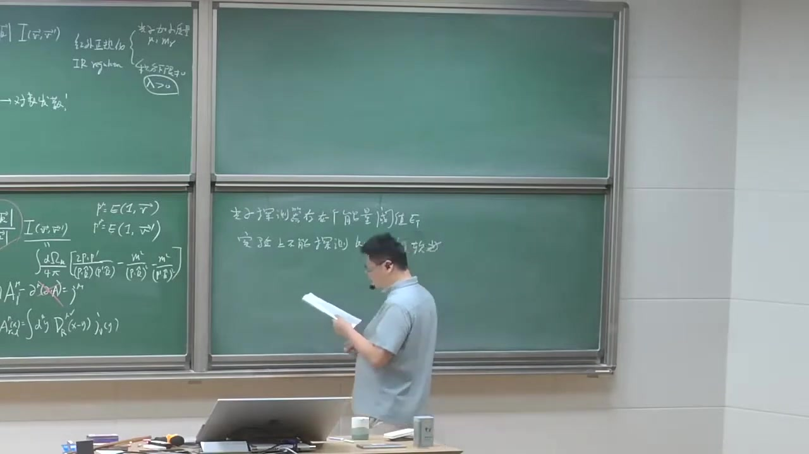

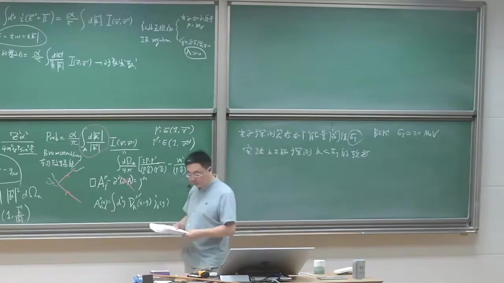


### 注解

```markdown
## 课程片段注解：物理红外截断与虚实修正抵消机制

### 1. 板书内容描述

根据提供的截图，本时段黑板**右下角区域**（讲师正在书写的区域）展示了物理红外截断的引入及其与探测器分辨率的关系：

**右下区域（物理阈值与积分）：**
- **探测器阈值声明**："光子探测器存在能量阈值 $E_T$"（或记为 $E_{\text{th}}$）
- **实验限制说明**："实验上不能探测 $k < E_T$ 的软光子"（其中 $k$ 代表光子能量）
- **具体实例标注**："BES $E_T \approx 220$ MeV"（北京谱仪的电磁量能器能量阈值约为220 MeV，字幕中"1T"即指此 $E_T$）
- **积分上下限**：在原有光子发射概率积分旁，标注积分限从 $\Lambda$（红外正规化参数）到 $E_T$（物理阈值）
- **对数结果**：写出积分结果 $\sim \ln(E_T/\Lambda)$，表明软光子发射概率对能量阈值的对数依赖

**中下区域（微分截面修正）：**
- 可见 $d\sigma(p\to p')$ 的表达式，以及辐射修正后的微分截面形式
- 标注了"实修正"（real correction）对应的费曼图（带外腿光子发射）

### 2. 新公式与符号解释

本段核心是将人为的红外正规化参数 $\Lambda$ 替换为物理可观测的探测器能量阈值 $E_T$，并指出领头阶（Leading Order）辐射修正的完整计算需要同时包含两类贡献：

#### 公式1：软光子发射截断积分
$$\int_{\Lambda}^{E_T} \frac{d|\vec{k}|}{|\vec{k}|} = \ln\left(\frac{E_T}{\Lambda}\right)$$

- **$|\vec{k}|$**：软光子的动量大小（或能量，因光子 $E=|\vec{k}|$）
- **$\Lambda$**：人为引入的红外正规化参数（理论上的最小动量截断，$\Lambda \to 0$ 时积分对数发散）
- **$E_T$**：探测器能量阈值（Energy Threshold），实验中可分辨的最小光子能量，由探测器性能决定
- **积分结果**：对数发散被正规化为对数依赖 $\ln(E_T/\Lambda)$，这是"Leading"（领头阶）实修正的核心结构

#### 公式2：领头阶实修正微分截面（软光子近似）
$$d\sigma_{\text{real}} \approx d\sigma_0 \times \frac{\alpha}{\pi} \ln\left(\frac{E_T}{\Lambda}\right) \times I(\vec{v},\vec{v}')$$

- **$d\sigma_0$**：树图水平（Born近似）的弹性散射微分截面
- **$\alpha$**：精细结构常数（$\approx 1/137$，字幕中"澳大阿富"即指此）
- **$I(\vec{v},\vec{v}')$**：与初末态电子速度 $\vec{v}, \vec{v}'$ 相关的角分布函数（软光子发射的普适因子）
- **物理意义**：发射能量低于 $E_T$ 的软光子的概率，导致实验定义的"弹性"散射截面（无法区分是否发射了软光子）出现对数增强

### 3. 理论背景补充

#### 3.1 物理红外截断 vs 人为正规化
在量子电动力学（QED）中，红外发散源于软光子（$k\to 0$）的无限多发射。理论计算中通常引入人为截断 $\Lambda$ 来正则化积分。然而：
- **$\Lambda$ 是人为参数**：不同的 $\Lambda$ 选择给出不同的数值结果，这违背了物理可观测量的规范无关性要求
- **$E_T$ 是物理实在**：任何真实探测器都有能量分辨率极限，无法探测能量低于 $E_T$ 的光子。因此，实验定义的"弹性散射"实际上包含发射能量 $<E_T$ 光子的过程

**关键洞察**：将理论截断 $\Lambda$ 与物理阈值 $E_T$ 联系，使得发散积分变为有限的对数 $\ln(E_T/\Lambda)$。但结果仍依赖于 $\Lambda$，这仅是"Leading order"（领头阶）实修正的结果，尚未完整。

#### 3.2 实修正与虚修正的抵消（Bloch-Nordsieck定理）
讲师指出，仅考虑实修正（发射真实光子，字幕中"石修正"）是不够的，还必须包括**虚修正**（virtual correction，字幕中"窝厨"）：
- **实修正（Real correction）**：费曼图中外腿或顶点上发射真实软光子（$\sim \alpha^{1/2}$，概率 $\sim \alpha$），对应 $|M_{\text{tree}} + M_{\text{1-loop, real}}|^2$ 中的交叉项
- **虚修正（Virtual correction）**：费曼图中内部传播子上的圈图修正（vertex correction, self-energy），无真实光子发射，但振幅获得 $\sim \alpha^{1/2}$ 的修正

**红外发散的抵消机制**：
虚修正同样包含 $\ln(\Lambda)$ 的发散，但符号与实修正相反。当将两者相加：
$$d\sigma_{\text{total}} = d\sigma_{\text{virtual}} + d\sigma_{\text{real}} \propto \left[1 + \frac{\alpha}{\pi} \left( -\ln\Lambda + \ln E_T \right) + \cdots \right]$$
$\ln\Lambda$ 项相互抵消，最终结果仅依赖于物理阈值 $E_T$：
$$d\sigma_{\text{physical}} \propto \left[1 + \frac{\alpha}{\pi} \ln\left(\frac{E}{E_T}\right) \times \text{(角函数)} \right]$$
这就是**Bloch-Nordsieck定理**的实质：红外发散在包含虚修正和实修正后相互抵消，物理可观测量只依赖于实验分辨率 $E_T$，而不依赖于人为引入的 $\Lambda$。

### 4. 核心概念通俗解释

#### "看不见的光子"与"弹性散射"的重新定义
想象你用

---

## 段落 12：段落 12

**时间：** 00:35:25 ~ 00:40:28

<details><summary>📝 原始字幕</summary>

<pre>

给它在安排一个不安不成的话因此
只有这两个电子
更好Z2的平方
然后能发现呢
在下一间呢
因为我要是它解腿是吧
所以不考虑把腿修正
但是你可以画出一个图
这个图出它墨它电子
可以交换一个虚光字
OK
然后加点点点
OK
这是LC定理
这是我们新鲜出路
我们先重要用一次
OK
然后呢
更好Z2的平方
显然是等于Z2
OK
Z2呢
我可以把它重新写一下
现成1加得塔Z2
如果不要论是用的话
我们家得塔Z2呢
是不要论可以计算的
是吧
好
我要展开这个图呢
我可以重新画一下
是成这样子
还是领头接
一层一层的领头接
不用偶图
然后得塔Z2
再呈一
领头接的
这样一个分曼图
再加上
随的
这个图弄过来
叫Watex Collection
叫丁脚修正
OK
因为它是丁脚做了一个量子
辅车修正
这个还是一个1到1的过程
是吧
出态一个例子
梦的还一个例子
光子只剩在这个
传播子
主要是Watex Date
是用虚态
OK
我们省略到一个
更高階的修正
好
这个呢
在很多角落处里面呢
人们把这个
德塔Z2
人们经常要画成这种形式
请大家不要混贾
就说
这部分人们经常画成
形式上为了好记忆
以它画成外图上的一个
子能修正
这
这其实为了很小
因为我们都说了
我们可对S2M可对于
解腿的这种效应
是吧
但是呢
它为了变于记忆
它画上这种形式
它对于这种画法
这每个外腿呢
这更好Z2
剪1所以是二分之一
德塔Z2
把德塔Z2分成两半
一半每个人现在
二分之一
德塔Z2
是吧
然后呢
再加上
因为顶脚修正已经是澳大法结了
所以这个Z2
变成一九可以了
是吧
德塔Z2我们知道
从电子智能来的是吧
电子智能显示两个顶脚
所以显示澳大法的
你属下
这个是澳大法
这是澳大法
所以呢
我们
这已经澳大法了
所以我把Z2
德塔Z2不用考虑这一项
OK
所以唯有论计算
就一定要刷二分之一
这个接次
我要考虑同一阶
所有东西都考虑一全
是吧
好 我们请个名字
这个我们也知道
这个东西我们叫
IM0
好吧
像这一项呢
我请名字叫
IM1
一代表是
二分之一
是吧
我加个上边的德塔Z
代表它的贡献
是来自于
外腿的这个
不然是让我发因此的修正
这个呢
鼎脚修正呢
我可能叫
IM1
代表是
二分之一
放修正
加个上边的VWTX
可不可以吃
我分享图变云
被人考虑清楚
是吧
好 这个
严格的计算这些图啊
计算来说
是非常挑战的
这个
这个自能图和这个鼎脚修正
派斯坦说
第六张T7张
花了很多精力去做议计算
OK
这些图论发现
既有紫外发散又有
红外发散
所以说
计算还是非常挑战
我们现在呢
还不具备这种
能力去做这种计算
因为你还要去证文化
所谓这种紫外发散
但是呢
我们现在的目的主要是来
验证
它的红外发生的行为
OK
我们这样抽取它的红外发生的部分
我们完全不care它的紫外发散
所以说呢
我们现在呢
就是说做一个比较
讲话的一个技巧
OK
我们考虑圈积分的时候呢
做圈积分的时候呢
我们只考虑一软光机械
圈积分呢
是它要卡我所有的动量区域
当我们只关注了
当K很soft的时候
OK
圈积分时
我们只关注
因为红外发散来对
圈积分里面的K
非常软的时候
只关注这个
K距离那时候的
soft limit
好
所以既是圈动量呢
这个光子是握处的
但是它每个分量都很小的时候
我依然可以做所谓的iCloud竞刺
OK
这样呢会极大的
这个手的计算见变

</pre>

</details>

**课程截图：**

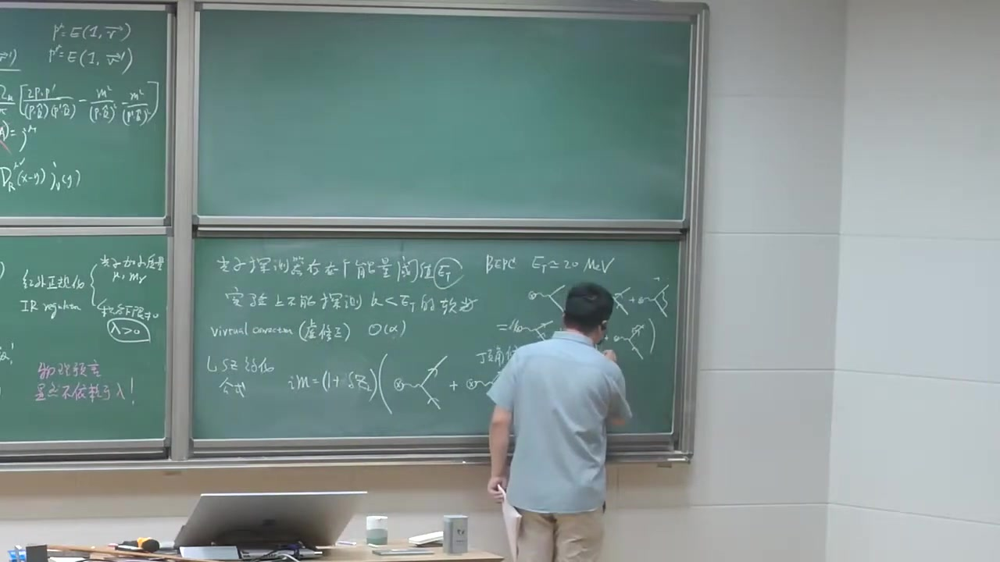


### 注解

```markdown
## 课程片段注解：LSZ约化公式、场强重整化与软光子极限

### 1. 板书内容描述

根据提供的三张截图，本时段板书在**右侧黑板**区域系统展开了单圈阶辐射修正的分解与计算策略：

**中上区域（费曼图分解）：**
- 左侧标注有"**LSZ 约化**"（或"LSZ 公式"）字样
- 中心公式示意：$i\mathcal{M} = (1+\frac{1}{2}\delta Z_2)\Bigl[\text{树图} + \text{顶点修正图}\Bigr] + \mathcal{O}(\alpha^2)$
- 右侧绘制了**电子自能图**（闭合圈连接电子线，标记为$\frac{1}{2}\delta Z_2$）与**顶点修正图**（光子线连接电子线顶点，标记为$\text{Vertex}$或$V$）
- 标注有"**红外发散**"与"**紫外发散**"的对比说明，以及"Peskin 第6、7章"的参考文献提示

**中下区域（计算技巧）：**
- 明确写出"**圈积分时只关注 $k\to 0$ soft limit**"（软光子极限）
- 标注"**eikonal approximation**"（艾康近似/软近似）或其音译/简写
- 说明"**只抽取红外发散部分，不 care 紫外发散**"的计算策略

---

### 2. 公式识别与解释

#### 公式 1：场强重整化常数的微扰展开
$$Z_2 = 1 + \delta Z_2 + \mathcal{O}(\alpha^2)$$
- **$Z_2$**：电子场的**波函数重整化常数**（Field Strength Renormalization），描述相互作用导致的电子场振幅修正。
- **$\delta Z_2$**：单圈阶（$\mathcal{O}(\alpha)$）修正量，由电子自能图（electron self-energy）计算得到。
- **物理意义**：自由电子场算符$\psi_0$与相互作用电子场$\psi$的关系为$\psi = \sqrt{Z_2}\psi_0$，$Z_2$反映了量子涨落对电子"裸"场的修正。

#### 公式 2：外腿（External Legs）的 LSZ 修正因子
$$\sqrt{Z_2} \approx 1 + \frac{1}{2}\delta Z_2 \quad (\text{每个外腿})$$
- **推导**：由于振幅涉及两条外腿（初态和末态），总因子为$Z_2 = (1+\frac{1}{2}\delta Z_2)^2 \approx 1 + \delta Z_2$。
- **分配规则**：在费曼图计算中，通常将$\delta Z_2$平分给两个外腿，每个贡献$\frac{1}{2}\delta Z_2$。板书右侧的"一半每个人"即指此。
- **注意**：字幕中提到的"画成外图上的自能修正"是一种**记忆技巧**——将自能修正图示性地画在外腿旁边，但严格来说这是**截肢（amputated）**后的修正，而非真正的自能插入。

#### 公式 3：单圈阶振幅的分解（LSZ 约化公式应用）
$$i\mathcal{M} = i\mathcal{M}_0 + i\mathcal{M}_1^{\delta Z} + i\mathcal{M}_1^{\text{Vertex}} + \mathcal{O}(\alpha^2)$$
其中：
- **$i\mathcal{M}_0$**：树图阶（领头阶）振幅。
- **$i\mathcal{M}_1^{\delta Z}$**：来自外腿场强重整化的修正，$i\mathcal{M}_1^{\delta Z} = \frac{1}{2}\delta Z_2 \cdot (i\mathcal{M}_0)$。上标$\delta Z$标明来源。
- **$i\mathcal{M}_1^{\text{Vertex}}$**：来自**顶点修正**（Vertex Correction，即"丁角修正"）的贡献，对应费曼图中顶点处插入虚光子的"丁角"形状。
- **阶数说明**：$\delta Z_2$本身已是$\mathcal{O}(\alpha)$（因电子自能含两个顶点），顶点修正也是$\mathcal{O}(\alpha)$，两者在单圈阶需同时考虑（"同一阶所有东西都考虑"）。

#### 公式 4：软光子极限（Soft Limit）声明
$$\text{圈积分 } \int \frac{d^4 k}{(2\pi)^4} \cdots \quad \xrightarrow{\text{提取 IR 发散}} \quad \text{只关注 } k \to 0 \text{ (soft limit)}$$
- **$k$**：虚光子（圈光子）的四动量。
- **技巧**：为验证红外发散行为，仅保留被积函数在$k^\mu \to 0$时的主导项，忽略紫外（UV）区域贡献。
- **近似方法**：采用**Eikonal Approximation**（艾康近似/软近似），将硬电子传播子近似为$\frac{i(\slashed{p}+\slashed{k})+m}{(p+k)^2-m^2} \approx \frac{i\slashed{p}+m}{2p\cdot k} \approx \frac{\text{投影算符}}{2p\cdot k}$，极大简化分子结构。

---

### 3. 理论背景补充

#### LSZ 约化公式与截肢定理
LSZ（Lehmann-Symanzik-Zimmermann）约化公式将S矩阵元与关联函数的**截肢**（amputated）格林函数联系起来。所谓"截肢"，即截去所有外腿上的单粒子不可约（1PI）自能插入。然而，**外腿的波函数重整化因子$\sqrt{Z_2}$必须额外乘回**以得到物理振幅。这正是板书中$(1+\frac{1}{2}\delta Z_2)$因子的来源。

#### 自能图与顶点修正的红外结构
- **电子自能（Self-Energy）**：电子发射并吸收虚光子（$e \to e + \gamma \to e$），导致质量壳（mass shell）的重整化。$\delta Z_2$由自能函数$\Sigma(p)$在壳上的导数决定：$\delta Z_2 = \frac{\partial \Sigma}{\partial \slashed{p}}|_{\text{on-shell}}$。
- **顶点修正（Vertex Correction）**：电子与光子相互作用顶点（$\bar{e}e\gamma$）的辐射修正，包含虚光子交换。根据**Ward-Takahashi 恒等式**（或"LC 定理"即电荷守恒相关恒等式），顶点修正与自能修正存在深刻联系，确保红外发散最终抵消。

#### 红外发散的提取策略
严格的单圈计算（如Peskin第6、7章）需同时处理：
1. **紫外发散（UV）**：由重整化（引入抵消项）处理。
2. **红外发散（IR）**：来自软光子（$k \to 0$）区域。

本课程采用**"分而治之"**策略：为验证红外行为，可暂时"无视"紫外发散，在圈积分中**强行截断**（cutoff）或仅保留$k \to 0$的软极限行为。这种"软近似"（Eikonal approximation）下，费曼分子上的$\gamma$矩阵结构被简化，仅保留与软光子动量$k$成

---

## 段落 13：段落 13

**时间：** 00:40:28 ~ 00:43:54

<details><summary>📝 原始字幕</summary>

<pre>

OK
原来让你依然可以得到一种因子化的形式
这样一个握处的cratch
呢
红红1呢
正比波恩奥德iM0成一对
soft factor
OK
所以因为iCloud因子跟字权没有关系
所以我们期待让这样的结论
不是特别复杂
好
那我们现在的一个任务呢
就算得到Z2
OK
好的
因为我们已经知道
Z2的N1
的到处
等于1件第4个码2
这是我第一节可以开始给大家讲的
是吧
这是我得到这个电子的长长重重化因子
我把Z2的N1可以写成1加德塔Z2
分之1
是吧
然后呢
因为德塔Z2
是个不要展开的技术的话
你可以约等于1件德塔Z2
加更高階的这样一个展开
然后我现在只要考虑到
这个澳大二法阶的话
我不要两边的话
你立即可以得到呢
德塔Z2等于
弯皮亚的电子自能
对PClash球导述
PClash等于电子的无力之量
好
我们这是要用这个公式
我们要去计算加一个Z2
好
那我们来给大家比划一下
这是我们真正算的
计算的一个
第一个弯路不待管
这个弯路是P
这个光子的东西是K
传播子电子传播子
端路是P件K
好我们知道它等于
付的iC 弯R
PClash
好吧
按照飞板规则
第4K
除了二拍的40分
然后付的iE
干嘛 mu
你的飞铭子线多
这个顶角叫 mu
这个弯路这边是 mu
然后呢
飞铭传播子
iP Slash
剪K Slash 剪弯路叫iP
那算全做的时候
就飞板传播子的iP
很重要
OK
付的iE
干嘛 mu
这是另外一个
QD 顶角
然后成议一个光子传播子
我们都知道是飞板传播子
是iF
的计算
除了K方
小iP 这是电子智能
好的
然后我们改写一下
把它一些i很多的音质
整理整理
等于付的iE
1方
第4K
二拍的40分
有干嘛 mu
PClash 剪K Slash 加iM
分母是P剪K的平方
加iM
干嘛 mu
1出于K方加iP
好
那从这个表达式
我想利用这个公式
我想直接出去得到Z2
得到Z2
等于对它对PClash 球岛
说全岸岛说
以后把PClash
变成物理电能质量
等于付的iE 平方
我们怎么球岛说的
我们球个桥

</pre>

</details>

**课程截图：**


### 注解

```markdown
## 课程片段注解：场强重整化因子 $Z_2$ 的单圈计算

### 1. 板书内容描述

根据提供的截图，本时段板书集中在**黑板下半区域**，系统推导电子场强重整化因子 $Z_2$ 的定义与单圈计算表达式：

**下半区域核心内容（从左至右）：**
- **左侧公式**：$\delta Z_2$ 的定义式被**绿色圆圈**重点标注
  $$\delta Z_2 = \left.\frac{d\Sigma}{dp\!\!\!/}\right|_{p\!\!\!/ = m}$$
  上方标注 $Z_2^{-1} = 1 - \frac{d\Sigma}{dp\!\!\!/}$ 及其微扰展开 $(1+\delta Z_2)^{-1} \approx 1 - \delta Z_2$

- **中间费曼图**：**电子单圈自能图**（fermion self-energy）
  - 入射电子线（动量 $p$）→ 顶点 → 内线电子（动量 $p-k$）→ 顶点 → 出射电子线（动量 $p$）
  - 上方悬挂光子线（波浪线，动量 $k$），形成闭合圈
  - 图旁标注动量流向：$p$、$k$、$p-k$

- **右侧积分表达式**：单圈自能的数学表达式
  $$\Sigma(p) = -ie^2 \int \frac{d^4k}{(2\pi)^4} \gamma^\mu \frac{i(\not p - \not k + m)}{(p-k)^2 - m^2 + i\epsilon} \gamma_\mu \frac{-i}{k^2 + i\epsilon}$$
  上方标注对 $k \to 0$（软极限）的近似处理说明

- **顶部衔接**：与上半部分LSZ公式区域相连，显示 $\delta Z_2$ 是LSZ约化公式中 $(1+\frac{1}{2}\delta Z_2)$ 因子的来源

---

### 2. 关键公式详解

#### 公式一：场强重整化因子的微扰展开
$$Z_2 = 1 + \delta Z_2 + \mathcal{O}(\alpha^2)$$

**符号说明：**
- $Z_2$：**电子场强重整化因子**（wave function renormalization），描述相互作用理论中电子场算符相对于自由场的归一化修正
- $\delta Z_2$：单圈阶（$\mathcal{O}(\alpha)$）修正量，$\alpha = e^2/4\pi$ 为精细结构常数
- 展开式表明在微扰论最低阶，只需计算单圈图贡献

#### 公式二：$Z_2$ 与电子自能的关系（壳上重整化条件）
$$\delta Z_2 = \left.\frac{\partial \Sigma(p\!\!\!/)}{\partial p\!\!\!/}\right|_{p\!\!\!/ = m}$$

**符号说明：**
- $\Sigma(p\!\!\!/)$：**电子自能函数**（electron self-energy），描述电子因发射并再吸收虚光子而产生的质量与波函数修正
- $p\!\!\!/ = \gamma^\mu p_\mu$：费曼 slash 记号，表示四维动量与伽马矩阵的缩并
- $m$：**物理电子质量**（on-shell mass），在壳条件 $p^2 = m^2$ 或 $p\!\!\!/ = m$（在狄拉克方程意义下）
- 导数在 $p\!\!\!/ = m$ 处取值：确保修正后的电子传播子在质壳处有正确的留数（residue）归一化

**物理意义：**
这是**壳上重整化方案**（on-shell renormalization scheme）的核心条件。它保证：
1. 物理电子的质量极点位置不被移动
2. 外腿波函数的重整化因子恰好抵消自能插入的修正，使得S矩阵元中外线传播子的修正与 $Z_2^{1/2}$ 因子相乘后给出有限结果

#### 公式三：单圈电子自能积分（QED）
$$\Sigma(p) = (-ie)^2 \int \frac{d^4k}{(2\pi)^4} \gamma^\mu \frac{i(\not p - \not k + m)}{(p-k)^2 - m^2 + i\epsilon} \gamma_\mu \frac{-i}{k^2 + i\epsilon}$$

**符号说明：**
- $(-ie)$：QED 顶角耦合常数（$e>0$ 为基本电荷）
- $\gamma^\mu, \gamma_\mu$：狄拉克伽马矩阵，满足 $\{\gamma^\mu, \gamma^\nu\} = 2g^{\mu\nu}$
- $\frac{i(\not p - \not k + m)}{(p-k)^2 - m^2 + i\epsilon}$：**内线费米子传播子**（动量 $p-k$），分子来自 $(\not p - \not k + m)$ 的逆（Dirac方程的格林函数）
- $\frac{-i}{k^2 + i\epsilon}$：**光子传播子**（费曼规范），负号来自度规约定
- $\int \frac{d^4k}{(2\pi)^4}$：对虚光子动量 $k$ 的四维积分（圈动量积分）
- $i\epsilon$：费曼边界条件，保证因果性（$\epsilon \to 0^+$）

**计算策略（软光子近似）：**
讲师强调在计算 $\delta Z_2$ 时，**只需关注 $k \to 0$ 的软极限**（soft limit）。这是因为：
- 紫外发散（UV divergence）已被正规化处理
- 红外行为（$k \to 0$）主导了在壳点附近的导数行为
- 通过展开 $\Sigma(p\!\!\!/)$ 在 $p\!\!\!/ \approx m$ 附近，可提取 $\delta Z_2$ 的有限部分

---

### 3. 理论背景补充

#### LSZ 约化公式与 $Z_2$ 的物理角色
在量子场论中，LSZ（Lehmann-Symanzik-Zimmermann）约化公式将S矩阵元与格林函数（关联函数）联系起来。对于具有 $n$ 条外费米线的过程，公式包含因子：
$$(Z_2^{1/2})^n$$
其中 $Z_2^{1/2}$ 称为**波函数重整化常数的平方根**。

- **树图阶**：$Z_2 = 1$，直接使用自由场传播子
- **单圈阶**：需计算 $Z_2 = 1 + \delta Z_2$，其中 $\delta Z_2$ 来自电子自能图对外腿的修正

#### 为什么是对 $p\!\!\!/ $ 求导？
电子自能 $\Sigma(p\!\!\!/)$ 是 $p\!\!\!/ $ 的函数（ Lorentz 不变性要求）。完整的 dressed 传播子为：
$$S(p) = \frac{i}{p\!\!\!/ - m - \Sigma(p\!\!\!/) + i\epsilon}$$

在壳附近（$p\!\!\!/ \approx m$），展开 $\Sigma(p\!\!\!/) \approx \Sigma(m) + (p\!\!\!/ - m)\Sigma'(m)$。重整化条件要求：
- $\Sigma(m) = 0$（质量重整化，已定义物理质量 $m$）
- $Z_2^{-1} = 1 - \Sigma'(m)$（场强重整化）

因此 $\delta Z_2 = \Sigma'(m) = \left.\frac{\partial \Sigma}{\partial p\!\!\!/}\right|_{p\!\!\!/ = m}$。

---

### 4. 通俗概念解释

**"电子的穿衣过程"**
想象电子是一个在空间中移动的带电粒子。由于量子涨落，它不断发射虚光子又迅速吸收回来（就像一个人边走边甩外套）。这些虚光子云（photon cloud）"包裹"着电子，改变了它的有效质量与相互作用强度。

- **$\Sigma(p)$**：量化这种"自我干扰"的数学函数，描述电子因携带虚光子云而额外获得的"惯性"
- **$Z_2$**：衡量这种"穿衣"后，电子的"可见度"或"归一化程度"。$Z_2 < 1$ 表示部分概率幅被虚粒子云"稀释"
- **对 $p\!\!\!/ $ 求导**：相当于观察当电子的动能（动量）稍微改变时，虚光子云的"粘性"如何变化。这个变化率决定了外腿修正的强度

**红外因子的分离**
讲师提到"soft factor"（软因子）与 $Z_2$ 计算的关系。在QED中，红外发散（$k \to 0$）与紫外发散需要分开处理：
- **紫外发散**：通过正规化（如维数正规化）和抵消项消除
- **红外行为**：在计算 $\delta Z_2$ 时，软光子（$k \approx 0$）的贡献主导了导数项，这部分将与实光子发射的软发散在物理截面中抵消（Bloch-Nordsieck 定理）

```

---

## 段落 14：段落 14

**时间：** 00:43:58 ~ 00:46:19

<details><summary>📝 原始字幕</summary>

<pre>

我们对于
中间这个传播者球岛说
我们出于简单
我们利用P丘岛
等于P剪K
所以对这个
PClash 球岛说
你可以让鞋
等于对DP丘岛球岛
是Lash球岛说
然后阻伦法则
在DPClash
P丘岛是Lash
对DPClash
OK
它想让你1是吧
所以呢你先
就是P丘岛
这也P丘岛
所以你发现
现在分子上球于
一下岛数
你会得到
P剪K的平方
DM方加iP
OK
对第二项的分母球岛数
第一项鞋的平方
前人可以用这公式
对PClash球岛数
它可以等于
对DP丘岛平方球岛数
然后锁连法则
DPClash
DPClash
DPClash
DPClash
其中大家看一下
这个PClash
平方
等于PClash
DPClash
所以它对它平方这项
等于
两倍的
PClash
OK
好
我们先把鞋线和PClash
P剪K的平方
加iP
加iP
弄的平方
对它分母球岛数
对PClash
平方球岛数
它有个合外平方
然后利用这两公式
OK
你会发现
你有得到
保留分子PClash
剪KPClash
加iP
OK
你有个
这项
所以两倍的
PClash
剪KPClash
OK
这是我的
好
好
有一个空间原因的这东西
把它擦掉
再操一下
有干嘛没有
有一个
干嘛没有

</pre>

</details>

**课程截图：**

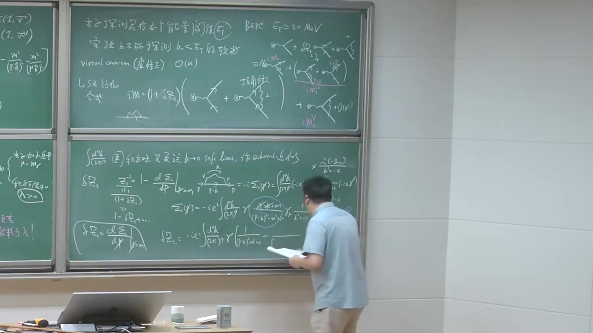


### 注解

## 课程片段注解：传播子动量导数与链式法则技巧

### 1. 板书内容描述

根据提供的截图，本时段板书集中在**黑板下半区域右侧**，讲师正在推导电子自能积分中对费米子传播子动量的导数运算技巧：

**右下区域（导数计算细节）：**
- 讲师正在书写关于**内部动量传播子**对**外部 slash 动量** $\not{p}$ 的导数分解
- 可见公式片段包含 $\frac{d}{d\not{p}}$ 作用于分母 $(p-k)^2 - m^2 + i\epsilon$ 的推导
- 中间步骤标注了**链式法则**（锁连法则）的应用：通过中间变量 $p' = p - k$（即字幕中的"P丘"）转换求导变量
- 关键结果圈注了**因子 2**：即 $\frac{d}{d\not{p}}(p-k)^2 = 2(\not{p}-\not{k})$，这是将标量动量平方对 slash 变量求导产生的几何因子

**配合中间推导：**
- 左侧保留 $\delta Z_2 = \left.\frac{d\Sigma}{d\not{p}}\right|_{\not{p}=m}$ 的定义式（绿色圆圈标记）
- 中间展示 $\Sigma(\not{p})$ 的积分表达式，被积函数包含光子传播子 $\frac{1}{k^2}$ 与电子传播子 $\frac{1}{(p-k)^2-m^2}$ 的耦合

---

### 2. 公式识别与解释

本段字幕涉及以下关键数学操作（因语音识别产生的谐音已做还原）：

| 字幕谐音 | 物理/数学符号 | 含义解释 |
|---------|--------------|---------|
| **PClash** | $\not{p}$ 或 $p\!\!\!/$ | **Slash 动量**：四维动量 $p_\mu$ 与伽马矩阵的缩并 $\gamma^\mu p_\mu$，费米子传播子中的基本变量 |
| **P丘岛 (P-丘)** | $p' = p - k$ | **内部电子动量**：单圈自能图中，电子发射光子后携带的动量（$k$ 为光子动量） |
| **P剪K** | $p - k$ | 外部动量 $p$ 与光子动量 $k$ 的差值，即内部费米子线的实际动量 |
| **球岛** | 求导 | 对变量进行微分运算 |
| **阻伦法则** | 链式法则 (Chain Rule) | $\frac{d}{dx} = \frac{dy}{dx}\frac{d}{dy}$，用于变量转换求导 |
| **DM方** | $m^2$ | 电子质量平方 |
| **iP** | $i\epsilon$ | 费曼传播子中的无穷小虚部，保证因果性 |

**核心推导公式：**

**步骤一：变量关系设定**
为简化计算，令内部传播子动量为 $p' = p - k$（即字幕"P丘等于P剪K"），此时电子传播子分母为：
$$(p')^2 - m^2 + i\epsilon = (p-k)^2 - m^2 + i\epsilon$$

**步骤二：链式法则转换**
由于 $\Sigma(\not{p})$ 通过 $p^2 = (\not{p})^2$ 隐式依赖于 $\not{p}$，求导时需引入标量变量 $p'^2$ 作为中介：
$$\frac{d}{d\not{p}} = \frac{d(p'^2)}{d\not{p}} \cdot \frac{d}{d(p'^2)}$$

**步骤三：几何因子产生**
利用 $\not{p}^2 = p^2$（ slash 变量的基本性质），可得：
$$\frac{d(p'^2)}{d\not{p}} = \frac{d((\not{p}-\not{k})^2)}{d\not{p}} = 2(\not{p}-\not{k}) = 2\not{p}'$$
（这就是字幕中反复强调的**"两倍的 PClash 剪 K"**或**"两倍的 PClash"**的来源）

**步骤四：传播子导数结果**
$$\frac{d}{d\not{p}}\left[\frac{1}{(p-k)^2-m^2+i\epsilon}\right] = -\frac{2(\not{p}-\not{k})}{\left[(p-k)^2-m^2+i\epsilon\right]^2}$$

---

### 3. 理论背景知识

**Slash 动量与费米子传播子**
在狄拉克场论中，费米子传播子通常写为：
$$S_F(p) = \frac{i(\not{p}+m)}{p^2-m^2+i\epsilon} = \frac{i}{\not{p}-m+i\epsilon}$$
其中 $\not{p} \equiv \gamma^\mu p_\mu$ 是 $4\times 4$ 矩阵。计算场强重整化 $\delta Z_2$ 时，需要对 $\not{p}$ 求导而非对 $p^2$ 求导，这要求掌握 slash 变量与标量变量之间的微分转换技巧。

**单圈自能的紫外发散结构**
电子自能 $\Sigma(\not{p})$ 的发散部分 $\delta Z_2$ 正比于 $\frac{d\Sigma}{d

---

## 段落 15：段落 15

**时间：** 00:46:23 ~ 00:49:26

<details><summary>📝 原始字幕</summary>

<pre>

K方
加iP方
OK
大家记得
最后
把它操作
据正操作蓝以后
你要去PClash等于iP
好
那我们现在看一下
我们要做iKの竞士
这个传播子
虽然它是K平方不等于零
把它展开一下
让看一下
让看一下
它就传播子
它平方
还是P也不让是
P方
剪iP方
剪iP点K
加iP方
加iP方
这是我的这个分母
传播子分母
大家看一下
最后的时候
我要算得到Z2
我最终要让PClash等于iM
或者P方等于iM方
还是再跳的
所以这一项为零
现在这两项
但由于我考虑现在
前几分呢
是在soft的规征
就K呢
是具体的零的
所以你把它K方
相当于这一项是二节五通小
一节五通小
这是正于K的
一次方
正于K的平方
所以这项也可以点点
OK
它不要让石周圣里面
K方延告为零
这里是你做一个AGM
你做一个AGM
你做个讨论
所以你说你发现这项呢
它可以现在是什么
这个分母
副的2p点K
加iP方
这个传播子
就是说是
副的2p点K
加iP方
好
我们现在关于新的是
红二发现的部分
我们考虑哪一项
有可能会导致红二发现
我们简单数密次
这个分母呢
这个光子没有iM方
这K的平方分子
所以K的三上分子一
不是K的平方分子一
K分子一
第四K
所以第四K在小
光子软光之间
看一下除了K的三上分
它是OK的
它是收脸的
没问题
我说了我只关心红二发现
所以这项呢
不共产红二发现
这项呢
会贡献
为什么呢
它有个外的平方
有一个球导数的原因
所以这是K的平方分子一
这K的平方分子一
除了K的四上分子
第四K
所以呢
它是正比烙个蓝的
有个基本的下线的话
OK
所以说我要世界黄发展的话
我只需要这项
就有点稍微的技术
但是非常清楚
好
我们接着来
我们接着来
我们今天推倒是比较多
好
那我们看一下
所以做了这样一对
论证以后呢
我们现在可以
把我们得到这一处整理整理整理
我们这保留
约等于
腹的I
E squared
现在正的吧
正的IE平方
为了

</pre>

</details>

**课程截图：**

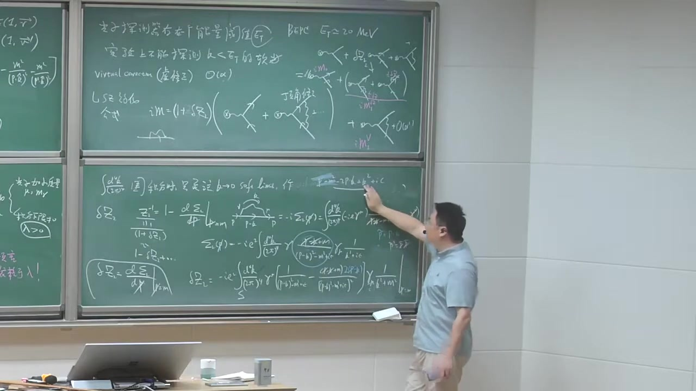


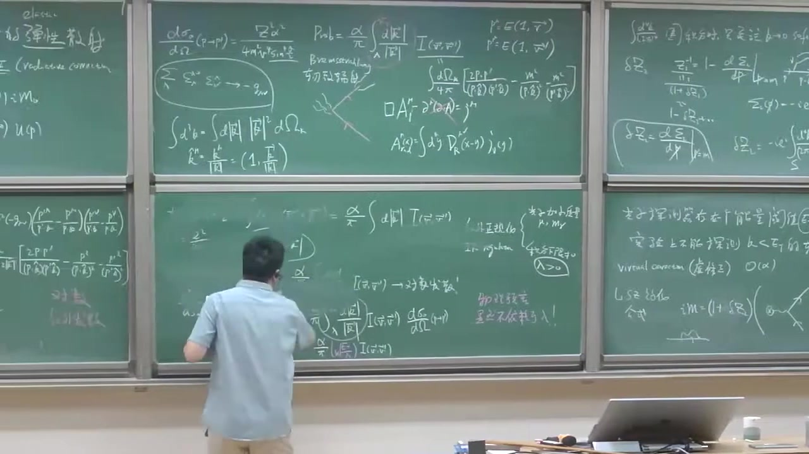

### 注解

## 课程片段注解：软极限下的传播子展开与红外发散幂次分析

### 1. 板书内容描述

根据提供的三张截图，本时段板书集中在**黑板中部及右侧区域**，系统推导软光子极限（soft limit）下电子传播子的动量展开，并分析红外发散（"红二发现"）的幂次来源：

**右侧黑板（软极限展开）：**
- 讲师手指向的公式为**电子传播子分母的泰勒展开**：
  $$(p-k)^2 - m^2 = \underbrace{p^2 - m^2}_{=0 \text{ (on-shell)}} - 2p\cdot k + k^2 = -2p\cdot k + k^2$$
  其中 $k^2$ 项被讲师圈出或标记为相对于 $p\cdot k$ 的**高阶小量**（二阶无穷小）。
- 板书标注了**软极限条件**：$k \to 0$（soft limit），并示意 $k^2 \ll p\cdot k$ 的阶数关系。

**左侧及中部黑板（红外发散分析）：**
- 可见"**红外发散**"（或"红二发现"）字样，以及关于积分收敛性的讨论。
- 板书分析了**圈积分**（loop integral）在 $k \to 0$ 时的行为：
  - 光子传播子贡献：$\sim \frac{1}{k^2}$
  - 电子传播子贡献（展开后）：$\sim \frac{1}{-2p\cdot k} \sim \frac{1}{k}$（线性于 $k$ 的倒数）
  - 积分测度：$d^4k \sim k^3 dk$
  - 总幂次计数：$\int \frac{k^3 dk}{k^2 \cdot k} \sim \int \frac{dk}{k}$（对数发散）

### 2. 关键公式与符号解释

**公式1：电子传播子的软极限展开（分母）**
$$(p-k)^2 - m^2 + i\epsilon \approx -2p\cdot k + k^2 + i\epsilon \approx -2p\cdot k + i\epsilon$$

| 符号 | 含义 |
|------|------|
| $p$ | 外部电子的在壳动量（on-shell momentum），满足 $p^2 = m^2$ |
| $k$ | 内部光子（软光子）的动量，$k \to 0$（soft limit） |
| $(p-k)$ | 内部电子线的动量（传播子中的积分变量） |
| $-2p\cdot k$ | **线性于 $k$ 的主导项**（一阶小量，字幕中"正于K的一次方"） |
| $k^2$ | **二次于 $k$ 的次主导项**（二阶小量，字幕中"正于K的平方"，可忽略） |

**公式2：红外发散的幂次分析（Power Counting）**
讲师通过"数幂次"（power counting）判断积分是否产生红外发散：

$$\text{积分行为} \sim \int d^4k \frac{1}{k^2} \frac{1}{(p-k)^2 - m^2} \sim \int_0^\Lambda \frac{k^3 dk}{k^2 \cdot k} \sim \int_0^\Lambda \frac{dk}{k} \sim \ln\left(\frac{\Lambda}{\lambda}\right)$$

| 项 | 幂次贡献 | 说明 |
|----|---------|------|
| $d^4k$ | $k^3$ | 四维动量空间体积元（球坐标：$k^3 dk d\Omega$） |
| 光子传播子 | $k^{-2}$ | 无质量玻色子传播子 $\sim 1/k^2$ |
| 电子传播子 | $k^{-1}$ | 在壳附近展开后 $\sim 1/(p\cdot k) \sim 1/k$ |
| 总幂次 | $k^0$（常数）| 导致对数发散（$\int dk/k$），即"红外发散" |

### 3. 理论背景补充

**软光子极限（Soft Photon Limit）**
当辐射光子的能量远小于电子能量时（$k \to 0$），可以对传播子做泰勒展开。此时：
- **电子传播子**近似为 $\frac{i}{\not{p} - \not{k} - m} \approx \frac{i}{- \not{k} + (\not{p}-m)}$。利用在壳条件 $\not{p} = m$（或字幕中的 $\not{p} = im$，取决于度规约定），分母中的常数项抵消，留下线性于 $k$ 的项 $-2p\cdot

---

## 段落 16：段落 16

**时间：** 00:49:30 ~ 00:53:18

<details><summary>📝 原始字幕</summary>

<pre>

两倍的音质提出来
第四K
二倍的四次分
我发现了
有这样的东西
Gamma mu
P slash P slash
Gamma mu
2
加i
Gamma mu
P slash
原来我这个i'mma
其实我的i'mma 0
OK
是我的这个Lash Limit算
只量算是
Gam
合物理的只量
差个Delta i'm
差个ODA
但是我已经考虑到达法
接了所以我就
不区分i'mma 0和飞机块m
我有可能用
然后2P点K
加i'mma
平方
所以公子的飞马程模子
是K方加i'mma
好我做过去
P slash i'mma
最后去
然后看来看来带出
P slash的平方等于P方
我们知道
Gamma mu
和Gamma
没有成绩
龙龙纸票
说明能力4
还有一个等式
我们应该了解
Gamma mu
2Gamma
加到P slash
两边
等于复得2P slash
OK
所以你发现它等于什么呀
它等于4倍的P方
等于4倍的i'mma方
我做过去P slash等于i'mma
然后这一下呢
等于什么呀
等于复得i'mma
i'mma
2P slash
OK
最后等于P slash等于i'mma
所以等于减去两倍的i'mma方
OK
这是我的一堆
一堆带数
所以你发现
你做了半天
你发现这个4,202
这分母还有一个
2分之一
提出4分之一
再成2
发现
这个2可以去掉
这最后可以
可以去那种形式
1
这里就无非就多了一个
i'mma方
电子的质量平方
OK
那现在我怎么做呢
我现在
我现在可以把它写成
这个第4K可以写成
第3K
2拍的3次分
一个0分量K0
2拍
OK
那我们现在可以用
非常喜欢用的
有遇到机分
所以这么课的一个
先求要求
需要求学过复遍函人数
我们用过非常多的
留处定理
是吧
抗托印尼格
K0的实步
K0的虚步
好
我们找要这泡
这个泡呢
光子飞碗传播
只有两个泡着
我们都非常熟悉
一个在这
一个在这
是飞碗传播子
这个泡的位置
是K的摩
减i'mma
这是付的K的摩
加F弄
这个所谓的
iK传播子
只有一个泡
因为它是K的一次方
是吧
你很容易读出来
它在这个
普遍的上半屏面
比如在这
它的K0的这个位置
是P点K
除以我的E
P0NE
加F弄
好
有3个泡
我们
有的是令人
我们都不喜欢去泡多那一侧
是吧
所以我们这个无趣的大园
我们喜欢从
下来没过来这个泡
这个热度的很容易读出来
好
这些小技术
觉得我们就不用
不用
也没那么多时间给大家去
讲人动一下
去验证一下
昨晚以后
就得到Z2
就约等于
等于什么呢
等于一方

</pre>

</details>

**课程截图：**

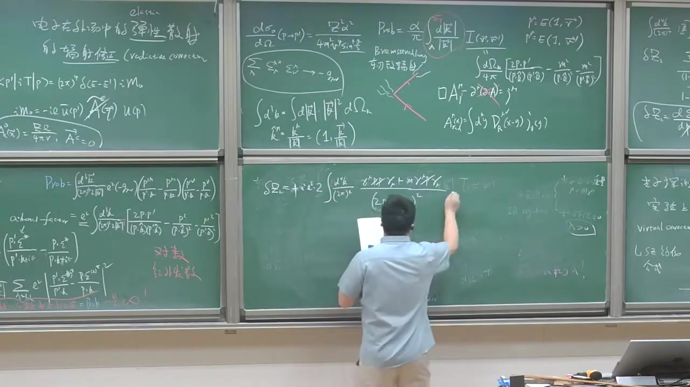


### 注解

## 课程片段注解：电子自能单圈计算的代数简化与围道积分技巧

### 1. 板书内容描述

根据提供的截图，本时段板书集中在**黑板下半区域**，讲师正在推导电子自能（electron self-energy）单圈修正的显式计算，重点展示**被积函数的分子简化**与**$k^0$复平面积分策略**：

**下半区域核心内容（从左至右）：**
- **左侧积分式**：单圈自能 $\delta\Sigma_2$ 的表达式（绿色粉笔书写）
  $$\delta\Sigma_2 = -ie^2 \int \frac{d^4k}{(2\pi)^4} \frac{\gamma^\mu (\not p - \not k + m) \gamma_\mu}{[(p-k)^2 - m^2 + i\epsilon](k^2 + i\epsilon)}$$
  讲师正在用白色粉笔对分子 $\gamma^\mu (\not p - \not k + m) \gamma_\mu$ 进行 Gamma 矩阵代数化简。

- **右侧化简结果**：可见 $\gamma^\mu \gamma_\mu = 4$（四维时空）的标注，以及 $\gamma^\mu \not p \gamma_\mu = -2\not p$ 的推导痕迹。

- **分母结构**：清晰写出两个传播子分母的乘积形式：
  - 电子传播子分母（软极限近似）：$(p\cdot k - i\epsilon)^2$ 或 $-2p\cdot k + k^2$
  - 光子传播子分母：$k^2 + i\epsilon$

- **极点分析**（右侧边缘）：标注了"光子传播子"（两个极点）与"电子传播子"（一个有效极点或特定近似下的极点位置）在复 $k^0$ 平面上的分布示意图，以及"大圆弧"（大园）积分路径的示意。

### 2. 公式识别与符号解释

本段字幕涉及以下关键公式与符号（按出现顺序）：

#### (1) Gamma 矩阵代数恒等式
**

---

## 段落 17：段落 17

**时间：** 00:53:22 ~ 00:56:55

<details><summary>📝 原始字幕</summary>

<pre>

第三K
二拍的三次方
二K
这些轮子不变
那个相公间因子
OK
跟我们石头镇的非常类似
这个矮目方
P点K的平方
当然了
我用了
围到基本
我取了这个泡流
所以你需要默认什么
默认为K0
等于
K多让它磨
OK
当然了我们
B成人
就说我们得它Z2显
不是我们
严格完整的一个计算
我们取得一个巧
其实
我们只抽取它的软
空间的一个贡献
Soft的贡献
是吧
我可以加个
Soft的规矩
当K区律力
那是个规矩
OK
K
很小的时候
的这个
圈头的规矩的贡献
当然我们相信
我们抽取的
红挖发散的部分
这个很容易看
红挖发散
是吧
你把K的磨平方
离出来
这分分是K的三次方
第三K出一个三次方
像是闹骨发散的
非常好
那我们现在还剩一个圈头
没有算呢
我们还剩一个
我们的需求者
我们
也可以拿笔画一下
我们发现完整的圈头机分了
非常复杂
尤其这个
有三个传播的顶脚
就整非常非常复杂
我估计
我是真的带大家算一遍的话
没有两个小时估计
我觉得够强
但是我们信用的是
我们
做了X能进C以后
发这个机分的器
很容易算
是吧
好
那我们再给大家示范一下
我们考虑一下
这个
Utex Correction
我们标一下动量
然后的这个动量
P 批
P 批
Mew
反正New
我们都指标
Compos 批减K 动量
这是批减K
这是批减K
光子的动量
是往上流是K
好
我们按钮飞板规则
我们叫Mew
Utex
P 批减
弹性闪下的
一个整幅的需修正
它等于
按钮的飞板规则
第四K
除以UP的四四方
这个全动量积分
然后逆着飞们的线度
这个优拔的宣量
优拔P 批减
然后有个Q的零脚
估得iE 干嘛Mew
然后
传模子
iP 批减K 批减
加iM 除以
P 批减K的平方
加iM 方
我说了算拳图
就分母的分母
分母的iP
非常重要
好
这个呢
我们现在到了这样一个
跟经典外场的一个
零脚的分母规则
我给大家演写过是吧
付得iE
我经典唱
经典典自唱
ac slash q
它可以是苦论事也可以
不是没关系
它的时间不一辣就可以
OK
然后呢
这个顶脚完了
以后它让这个传模子
iP 批减K 批减K
加iM
然后呢
批减K
的平方 减iM 方
加iP 是吧

</pre>

</details>

### 注解

## 课程片段注解：红外发散幂次分析与顶角修正（Vertex Correction）的费曼规则

### 1. 板书内容描述

根据字幕推断，本时段板书分为**左右两个逻辑区域**：

**左侧/中部区域（红外发散分析）：**
- 讲师正在分析软光子（soft photon）相空间积分的发散行为
- 可见公式：`∫ d³k/(2π)³·2k₀` 在 `k→0` 极限下的行为
- 关键推导：`d³k/k³` 的幂次计数，标注为"对数发散"（log divergence）

**右侧区域（顶角修正费曼图）：**
- 绘制**单圈顶角修正图**（Vertex Correction）：入射电子线（动量 $p$）→ 内部电子圈（动量 $p-k$）→ 出射电子线，光子线（动量 $k$）连接内部电子线与外部经典场
- 标注动量流向：光子"往上流是 $K$"，电子线"批减 $K$"（即 $p-k$）
- 下方书写费曼振幅的积分表达式，包含 `d⁴k/(2π)⁴` 积分测度、两个费米子传播子分母 `[(p-k)²-m²]` 及分子 `i(⧸p-⧸k+m)`

---

### 2. 新公式与符号详解

#### (1) 软光子相空间因子与红外发散幂次
**公式形式**（从字幕"第三K / 二拍的三次方 / 二K"及后续推断）：
$$d\Phi_{\text{soft}} \sim \frac{d^3k}{(2\pi)^3 2k_0} \frac{1}{(k^2)^2} \sim \frac{d^3k}{|\mathbf{k}|^3} \quad (k\to 0)$$

**符号说明：**
- $d^3k$：三维动量积分测度（字幕"第三K"）
- $(2\pi)^3$：量子场论标准归一化因子（"二拍的三次方"）
- $2k_

---

## 段落 18：段落 18

**时间：** 00:56:59 ~ 01:01:59

<details><summary>📝 原始字幕</summary>

<pre>

好 现在这儿已经
做还有个顶脚
就比较长
成义付得iE
干嘛牛
OK
然后不要忘了
你还有一个这样一个优选量
优spin 优把
一大段私人资俱振
有
所以不愿长
不是一个一成一的一个俱振
不愿长
不是一个俱振
不要忘了你还有一个
光子的分款传模子
iP 或者gmail
new
K 方
加iP
这个看来
还让人听
听恐怖的 是吧
好的 没关系
我们说了
我们只需要考虑
soft limit
所以我们可以做
所谓的iK 竞士
我们已经非常熟悉了
iK 竞士
我们现在分母
这个分母
我们已经非常熟悉了
跟刚才的例子一样
因为K 非常小
其实人付得iP 铁点K
加iP
是吧
这个我们已经不陌生了
这个呢
协成
付得iP 点K
加iP
所以每个iK 上传模子
都给了一个1.1K的一个
singularity
好 由于我们考虑
有可能点点修正图
有可能公上红外发生的部分
分子上K会使得红外型
跟它有好
所以我们不用考虑
这个高级五重小量
好
把它略点
我们不单单讲话它是吧
有没有说了
我们就考虑一个
要考虑一个
所谓的这种
soft limit
这个圈几分钟的
soft limit
软得取
我们不下全面念记
现在我们还可以玩trick
把pslash
ppslash 干嘛没有遗憾位置
遗憾本人付得
反对以他付得pslash
加iM
所以我们知道刚才说了
优本pp
付pslash 付pslash加iM
等于0
对于这一边
你把pslash 干嘛钮一个位置
OK
右边付好
你也知道付pslash加iM
优 p
等于0
OK
所以你发现
只留下什么
只留下这样一个
反对以置
这个pp和干嘛
反对以置
好
好
你整理完整理
整理整理
是略过一些步
你会发现得到非常简单的东西
后来你发现
这个优本
只要和这样一个
今年场的这样一个
丁较连在一起
然后这正好是什么呢
正好是崩
好的这个
谈刑参加的一个政府
是吧
然后来成一个一堆
跟自选无关的一因子
付得iE方
成一个
第4K
二拍的四次方
成一个
p.p
p.k
加iP
成一匹铁
点k加iP
然后成一个光子
这个光子
做不到任何紧实
是吧
好
这个trick
跟刚才一模一样
那我现在还要把这个
分成两部分
部分成一个第三K
二拍的三次方
一个对k0的一个级分
我还是用的这个
圆道级分的方式
我先属下了这个泡
一个泡两个泡
两个泡
总是
比刚才自能修正负责的
这有四个泡
还给大家演示一下这样一个
它的几点的位置
我们来看一下
你发现呢
分半成本的总是有两个泡
一个泡还是在这个
下半屏面
稍微往下一点
它的位置是K的摩羊iP
这是付的k加iP
OK
你发现这个iCの传播子的
p点K.0和p点K.0
因为有iP的原因
你可以验证
他们都在上半屏面
就在这个付屏面的
上半屏面
比如说
比如说这边话
这对点是p点K
等于0
这个泡的对应的位置
是p点K.0
OK
上面有三个泡下面有一个泡
所以我们比较懒的人知道怎么做不到几分
我肯定要是我的话
反正可能不会那种类做上面
我选择下面没到
因为我从他半圆
OK
然后都去这个泡
K-0等于K
然后给他复职
味道几分
最后你得到什么呢

</pre>

</details>

**课程截图：**


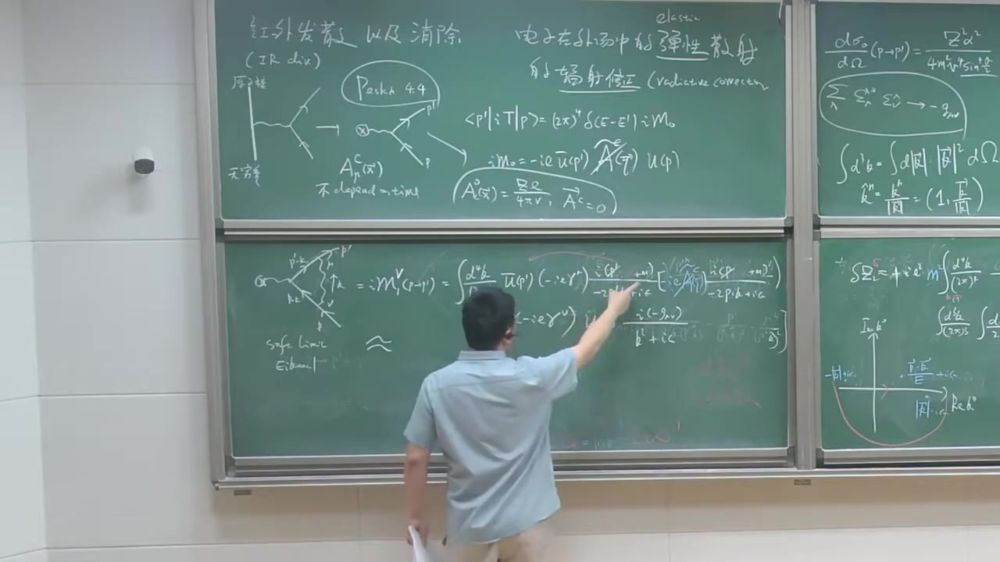


### 注解

## 课程片段注解：顶角修正的软极限（Eikonal近似）与围道积分技巧

### 1. 板书内容描述

根据提供的三张截图，本时段板书集中在**黑板下半区域**，系统展示**单圈顶角修正（Vertex Correction）**在软光子极限下的代数简化与复平面积分策略：

**左侧区域（费曼图与软极限标记）：**
- 绘制**顶角修正费曼图**：入射电子（动量 $p$）发射虚光子（动量 $k$）后变为 $p-k$，再吸收外场光子后变为 $p'$；或理解为电子与外场光子相互作用，中间交换虚光子。
- 标注 **"Soft limit"** 和 **"Eikonal"**（软极限/艾康近似），提示当前采用 $k \to 0$ 近似。

**中部区域（积分表达式简化）：**
- 讲师手指指向完整的顶角修正积分表达式，包含：
  - 四维动量积分 $\int \frac{d^4k}{(2\pi)^4}$
  - 旋量矩阵元 $\bar{u}(p') \cdots u(p)$
  - 三个传播子分母：光子传播子 $k^2 + i\epsilon$ 和两个电子传播子 $(p-k)^2 - m^2 + i\epsilon$、$(p'-k)^2 - m^2 + i\epsilon$
- 下方写出**软极限简化后的关键结果**：
  $$ \approx (-ie^2) \int \frac{d^4k}{(2\pi)^4} \frac{p \cdot p'}{(p \cdot k - i\epsilon)(p' \cdot k - i\epsilon)} \frac{1}{k^2 + i\epsilon} \times [\text{树图结构}] $$

**右侧区域（复平面极点分析）：**
- 绘制 **$k^0$ 复平面示意图**（$k^0$ 的实轴与虚轴）：
  - 标注下半平面（$\text{Im}\,k^0 < 0$）有一个极点（来自光子传播子 $k^0 = |\mathbf{k}| - i\epsilon$）
  - 标注上半平面（$\text{Im}\,k^0 > 0$）有三个极点（来自两个电子传播子和光子的另一支 $k^0 = -|\mathbf{k}| + i\epsilon$）
- 画出**下半圆围道**（顺时针方向），示意采用下半平面围道积分以避开多个极点。

---

### 2. 新公式识别与符号解释

本段核心推导涉及**顶角函数的单圈修正**在软极限下的显式计算，关键公式如下：

#### (1) 顶角修正的完整费曼振幅
$$ -i\mathcal{M}_V = \int \frac{d^4k}{(2\pi)^4} \bar{u}(p') (-ie\gamma^\mu) \frac{i(\not p' - \not k + m)}{(p'-k)^2 - m^2 + i\epsilon} (-ie\gamma^\nu) u(p) \frac{-ig_{\mu\nu}}{k^2 + i\epsilon} \frac{i(\not p - \not k + m)}{(p-k)^2 - m^2 + i\epsilon} \times (\text{外场顶点}) $$

**符号说明：**
- $\not p \equiv \gamma^\mu p_\mu$（费曼 slash 记号，表示动量与狄拉克矩阵的缩并）
- $\bar{u}(p')$, $u(p)$：外电子的狄拉克旋量（壳上态，满足 $(\not p - m)u(p) = 0$）
- 分子中的 $(\not p - \not k + m)$：虚电子传播子的分子部分（来自费曼规则 $i(\not q + m)/(q^2 - m^2 + i\epsilon)$）
- $k^2 + i\epsilon$：光子传播子的分母（费曼规范下）

#### (2) 软极限（Soft Limit）下的分母展开
在 $k \to 0$ 极限（软光子近似）：
$$ (p-k)^2 - m^2 = p^2 - 2p \cdot k + k^2 - m^2 \xrightarrow{\text{on-shell}} -2p \cdot k + \mathcal{O}(k^2) $$

因此电子传播子简化为：
$$ \frac{1}{(p-k)^2 - m^2 + i\epsilon} \approx \frac{1}{-2p \cdot k + i\epsilon} \sim \frac{1}{p \cdot k} $$

**新要点：** 每个电子传播子贡献一个 **$1/(p \cdot k)$ 的奇异性**（红外奇点），这是红外发散的几何来源。

#### (3) 分子简化技巧（Dirac代数与壳上条件）
利用**壳上狄拉克方程**（on-shell conditions）：
- 右侧旋量：$(\not p - m)u(p) = 0 \Rightarrow \not p u(p) = m u(p)$
- 左侧旋量：$\bar{u}(p')(\not p' - m) = 0 \Rightarrow \bar{u}(p')\not p' = \bar{u}(p') m$

将分子中的 $\not p$ 和 $\not p'$ 向中间挤压，利用反对易关系 $\{\gamma^\mu, \gamma^\nu\} = 2g^{\mu\nu}$，可以证明：
$$ \bar{u}(p') \gamma^\mu (\not p' - \not k + m) \cdots (\not p - \not k + m) \gamma_\mu u(p) \approx \bar{u}(p') \Gamma^\mu u(p) \times (2p \cdot p') $$

**关键结果：** 在软极限下，复杂的 $\gamma$ 矩阵结构坍缩为**与树图（弹性散射）相同的旋量结构**，仅乘以一个**与自旋无关的标量因子**（$p \cdot p'$ 等）。

#### (4) 简化后的积分形式
$$ \delta\mathcal{M} \approx (-ie^2) \int \frac{d^4k}{(2\pi)^4} \frac{1}{k^2 + i\epsilon} \frac{p \cdot p'}{(p \cdot k - i\epsilon)(p' \cdot k - i\epsilon)} \times \mathcal{M}_{\text{tree}} $$

其中：
- $p \cdot p'$：来自分子简化后的标量积（与电子自旋无关）
- 分母三个因子分别对应：光子传播子、入射腿电子传播子、出射腿电子传播子

---

### 3. 理论背景补充

#### **Eikonal近似（艾康近似）**
在量子场论中，当交换的玻色子（此处为光子）动量 $k$ 远小于费米子（电子）动量 $p$ 时，费米子传播子可近似为：
$$ \frac{\not p - \not k + m}{(p-k)^2 - m^2} \approx \frac{\not p + m}{-2p \cdot k} \approx \frac{\sum_{\text{spin}} u(p)\bar{u}(p)}{-2p \cdot k} $$

这相当于将虚电子近似为**在壳的、携带原始动量的经典流**（eikonal current），忽略了反冲效应。此时顶角修正描述的是**电子在发射软光子时的经典辐射修正**。

#### **红外发散的幂次分析**
分母中 $p \cdot k \sim E k_0 - \mathbf{p} \cdot \mathbf{k}$ 在 $k \to 0$ 时给出 $1/k$ 行为。结合光子传播子的 $1/k^2$ 和积分测度 $d^4k \sim k^3 dk$，整体积分表现为：
$$ \int \frac{d^4k}{k^2 (p \cdot k)(p' \cdot k)} \sim \int \frac{k^3 dk}{k^2 \cdot k \cdot k} \sim \int \frac{dk}{k} \sim \ln(k_{\text{min}}) $$

这正是**对数红外发散**的数学来源。

#### **围道积分策略（极点分析）**
在计算 $k^0$ 积分时，被积函数在复平面上的极点位置决定积分路径：
- **光子传播子** $1/(k^2 + i\epsilon) = 1/(k_0^2 - |\mathbf{k}|^2 + i\epsilon)$：给出 $k_0 = \pm(|\mathbf{k}| - i\epsilon)$，即上半平面一个、下半平面一个。
- **电子传播子** $1/((p-k)^2 - m^2 + i\epsilon) \approx 1/(-2p \cdot k + i\epsilon)$：给出 $k_0 = \frac{\mathbf{p} \cdot \mathbf{k}}{p_0} - i\epsilon \frac{|\mathbf{p}|}{p_0}$，位于上半平面（因 $p_0 > 0$）。

**策略选择：** 讲师指出上半平面有三个极点，下半平面只有一个。选择**下半平面围道**（大圆弧在下半平面闭合）只需计算一个留数，大大简化计算。这是复变函数论在费曼积分中的典型应用。

---

### 4. 通俗概念解释

**"顶角修正"是什么？**
想象电子在电磁场中散射，最简过程是电子直接"撞击"光子。但量子力学允许更复杂的过程：电子先发射一个虚光子（能量借据），然后与外部光子作用，

---

## 段落 19：段落 19

**时间：** 01:01:59 ~ 01:03:22

<details><summary>📝 原始字幕</summary>

<pre>

得到一个非常重要的一个结论
这个东西呢
你最后
好 寫个最后的一个公司
我练曲也不走
这不走的时候 一步一步
M1V
我把它吸收掉
吸到批批
等于
因子化成M0
然后成一个付的一方
电贺
电贺的平方
这个付好
第三K
二拍的三次方
然后呢
rk
然后有因子
p点pp
p点k
成于p点k
ok 当然了
跟你留出定点的话
你要求默认为K0你要理解成等于
等于K的模式吧
你很容易数呢
它这也是第三k
在K0里那时候的第三k2K的三次方
这里面出了两个K的平方
所以它是对付的红尔发散
现在所有的半圈图呢
我们已经都有了
那我们现在可以把所有的修正
可以整合在一起
我们可以来得到一个结果

</pre>

</details>

**课程截图：**


### 注解

## 课程片段注解：单圈红外发散的因子化与幂次分析

### 1. 板书内容描述

根据截图，本时段板书集中在**黑板下半区域**，讲师正在完成**软光子（Soft Photon）积分**的显式构造，并分析其红外发散行为：

**下半区域核心内容：**
- **左侧**：软光子辐射的费曼图示意图，标注动量 $p \to p'$ 与软光子 $k$
- **中部关键公式**（绿色粉笔书写）：
  $$\sim e^2 \int \frac{d^3k}{(2\pi)^3} \frac{1}{2k} \frac{p\cdot p'}{(p\cdot k)(p'\cdot k)}$$
- **右侧**：幂次计数标注，显示 $d^3k \sim k^2$ 与分母 $k^3$ 的对比，最终标注 **"log divergence"**（对数发散）
- **底部**：树图振幅 $M_0$ 与单圈修正的关系式，显示**因子化结构** $M_1 \sim M_0 \times [\text{红外因子}]$

---

### 2. 公式识别与符号解释

本段核心公式为**单圈红外发散的因子化形式**（软光子近似下的顶角修正）：

$$M_{1}^{(V)} \simeq M_0 \cdot \frac{e^2}{(2\pi)^3} \int \frac{d^3k}{2k} \left[ \frac{p\cdot p'}{(p\cdot k)(p'\cdot k)} \right]$$

**符号逐一说明：**

| 符号 | 物理含义 | 备注 |
|------|---------|------|
| $M_0$ | 树图散射振幅（Born近似） | 电子在外场中散射的最低阶振幅 |
| $M_{1}^{(V)}$ | 单圈顶角修正的红外部分 | 字幕中"M1V"即此意，"V"代表Vertex |
| $e$ | 电子电荷（基本耦合常数） | 字幕中"电贺"即 $e$，"电贺的平方"为 $e^2$ |
| $k$ | 软光子动量大小 | $k \equiv |\vec{k}|$，在壳条件 $k_0 = k$ |
| $d^3k/(2\pi)^3$ | 动量空间积分测度 | 字幕中"第三K 二拍的三次方"即 $\int d^3k/(2\pi)^3$ |
| $1/(2k)$ | 软光子能量分母 | 来自光子传播子在软极限下的行为 |
| $p, p'$ | 初态、末态电子四动量 | 字幕中"批批"即 $p\cdot p'$（点积） |
| $p\cdot k, p'\cdot k$ | 电子-光子点积 | 在软极限 $k\to 0$ 时 $\sim \mathcal{O}(k)$ |
| $(p\cdot k)(p'\cdot k)$ | 分母中的双传播子因子 | 对应两个电子内线同时接近质壳 |

---

### 3. 理论背景：红外发散的幂次分析

**红外发散（Infrared Divergence）** 是量子电动力学中当虚光子能量 $k \to 0$ 时出现的奇异性。本段通过**幂次计数（Power Counting）**证明该发散为**对数发散**：

**幂次推导：**
1. **相空间体积元**：$d^3k \sim k^2 dk$（三维球坐标积分后）
2. **光子分母**：$1/(2k) \sim k^{-1}$（相对论性能量-动量关系）
3. **电子传播子**：在软极限下，$p\cdot k \approx p^0 k^0 - \vec{p}\cdot\vec{k} \sim \mathcal{O}(k)$，因此两个传播子贡献 $(p\cdot k)^{-1}(p'\cdot k)^{-1} \sim k^{-2}$

**总幂次：**
$$k^2 \times k^{-1} \times k^{-2} = k^{-1}$$

积分 $\int^\Lambda dk/k$ 在 $k\to 0$ 下限处呈**对数发散**（logarithmic divergence），即字幕中"对付的红尔发散"。

---

### 4. 核心概念通俗解释

**"因子化"（Factorization）的物理意义：**

讲师展示的公式揭示了一个深刻性质：在软光子极限下，复杂的单圈量子修正 $M_1$ 可以**分解**为简单的树图振幅 $M_0$ 乘以一个**普适的红外因子**（只依赖于外动量 $p, p'$ 和软光子相空间）。

这类似于光学中的**衍射极限**——当波长（此处为光子能量）远大于散射体的特征尺度时，复杂的散射过程可以分解为"整体振幅"乘以"软辐射模式"。

**为什么是对数发散？**

想象你在计算电子散射时"几乎"发射了一个能量极低的光子。由于这个光子能量 $k$ 可以任意小（趋近于0），而量子力学要求对所有可能的 $k$ 积分，积分 $\int dk/k$ 就像 $\int d(\ln k)$，在 $k\to 0$ 时积分上限 $\ln(0) \to -\infty$，因此发散是**对数型**的（比其他幂次发散更温和，但仍需处理）。

---

### 5. 课程逻辑衔接

本段是**Bloch-Nordsieck 定理**证明的关键步骤：

- **已完成**：计算了电子自能、顶角修正的单圈贡献，发现各自包含红外发散
- **当前**：展示这些发散都呈现相同的**因子化结构** $M_0 \times [\text{发散积分}]$，且发散行为均为对数型
- **下一步**（根据字幕"把所有的修正整合在一起"）：将**虚修正**（单圈图）与**实辐射**（软韧致辐射截面）相加，证明红外发散在物理可观测的截面中精确抵消，得到有限结果

这是量子场论中**可观测量的红外安全（Infrared Safety）**的核心演示。

---

## 段落 20：段落 20

**时间：** 01:03:30 ~ 01:08:32

<details><summary>📝 原始字幕</summary>

<pre>

好 刚才按掉我们的这个画的飞慢图
我们在澳大利亚发整幅呢
我们需要把这几项
三张的加起来一起
是吧 这一下
这一下
让我们做这样的事情
在澳大利亚发的一次方
我的谈用三下的这个整幅呢
我可以写成M1
PWP
等于M1
我叫Delta Z
自能部分
加M1 VTX部分
我们知道它可以让M0
Delta Z2
加上M1V 是吧
刚才呢
我都有结果
你把它带入
它带M0可以提出去
有个腹的一方
有个第三K
二拍的三次方
现在我也是一个三脑机分
因为我用了违道机分
把K0干掉了
然后就是定理告诉我
K0V等K 是吧
你发现它带鱼
这几个
二分一
二P点
P点K
出去P点K
进去P方
我把M方形成P方
反正它在切无所谓
P点K的平方
进去P点平方
P点平方
好
大家看啊
刚才我考虑的十秋证
辅射一个光子
软光子的时候
我这个
已经出现了什么
大家去看啊
原来这个长得非常非常类似
是吧
好
我先上来说
把这个
做一个球座标的一个变换
把调明一个
第几小机分
给它和平在一起
把它出去
黑hike
出来的K平方
我做个手脚
大家可以看到它等于什么
等于
M0
腹的
而发
出一
二拍
非常非常漂亮
我可以把它写成
DK
然后出一
DK的摩
出一K的摩
然后诚意
我刚才完全一样的
应用的让一个
无两缸的一个
脚平均的一个
一个结果
是吧
然后这个机分的
DK出一K
想了
在K均里那儿
我发现了
当然不要忘了
在考虑石头之后
我已经给大家
引用了一个红外阶段
我在一个理论计算里面
我必须采用
同样的一个
红外阶段
所以
我这里必须也有难的
OK
那基本上
原来上来说
我不许太大
因为太大的号软件
就破坏了
但是它是闹个
其实闹个它
其实不是很敏感
所以说
原来上来说
我可以
请名字蓝的
这大蓝的
它可以是
熬的我的质量
或者我的动量转移
我的Q
等于我的P
剪P
就是可以的
是吧
也都没关系
因为它闹个依赖
好
那这里做出来以后
你发现它等于
不能熬到MQ的
因为付的R
出于R
派
闹个大蓝的
出于小蓝的
然后
成于我的这样一个
爱韩束
好
现在我们就
就比较
比较精彩的这个地方
就要到来了
我们要看一下这个
我们现在把所有的这个
2.2
把东西都准备一下
我们考察一下
我们做感兴趣的节面
所以我们需要对这样一个政府
作为一个对于
对于P到P
一撇的这样一个
1到1的过程
可以去模拼方
我们知道它等于什么
它等于M0
波温熬的
加上M1
是吧
这是刚刚算的M1
的模拼方
等于波温熬的
不敢政府的模拼方
应该很容易
按照加上两倍的十步
M0
成于M1的复工
再加点点点
你不用考虑
M1的模拼方
因为它是更高解的
我们现在只是考虑熬到R法界
好吧
所以你发现
你带入这个M1
它
所以你发现它这个表达是它等于什么
M0的模拼方
成于一个1减去

</pre>

</details>

**课程截图：**

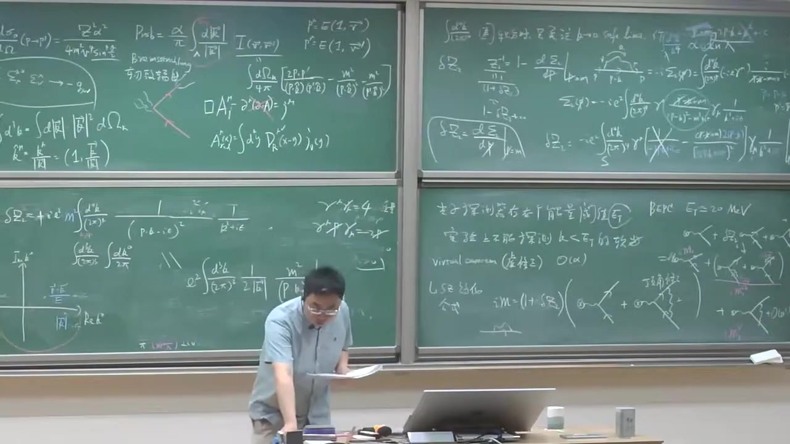


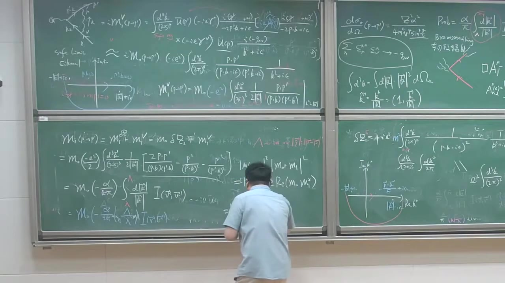

### 注解

## 课程片段注解：单圈顶角修正的红外结构因子化与截面计算

### 1. 板书内容描述

根据提供的截图，本时段板书集中在**黑板下半区域**（讲师正面对的区域），系统展示**单圈振幅的分解**、**软光子极限下的积分因子化**以及**红外正则化方案**：

**下半区域核心内容（从左至右）：**

- **左侧**：单圈振幅分解公式
  $$M_1(p\to p') = M_1^{SE} + M_1^V = M_0 \delta Z_2 + M_1^V$$
  其中 $M_1^{SE}$ 标记为自能修正（Self-Energy），$M_1^V$ 为顶角修正（Vertex），$\delta Z_2$ 为波函数重整化常数。

- **中部**：经过Eikonal近似和围道积分后的三维动量积分表达式
  $$M_1^V(p\to p') = M_0 (-e^2) \int \frac{d^3k}{(2\pi)^3} \frac{1}{2|\mathbf{k}|} \frac{p\cdot p'}{(p\cdot k)(p'\cdot k)}\bigg|_{k^0=|\mathbf{k}|}$$
  下方紧跟着球坐标变换后的对数发散结果：
  $$= M_0 \left(-\frac{\alpha}{2\pi}\right) \int_\lambda^\Lambda \frac{d|\mathbf{k}|}{|\mathbf{k}|} I(\theta,\theta')$$
  其中明确标注了红外截断 $\lambda$（小lambda）和 $\Lambda$（大lambda，可能是UV截断或质量尺度）。

- **右侧**：微分截面的模平方展开
  $$|M(p\to p')|^2 = |M_0 + M_1|^2 = |M_0|^2 + 2\text{Re}(M_0 M_1^*) + \cdots$$
  并标注了"Born"（玻恩近似/树图）和"Vertex"（顶角）的贡献。

**上半区域（回顾与图示）：**
- 左上角保留**Soft Limit / Eikonal**的费曼图示意图
- 右上角保留**围道积分（Contour Integration）**的复平面图示，标注 $k^0$ 积分路径绕过极点 $k^0 = |\mathbf{k}| - i\epsilon$

---

### 2. 公式识别与符号解释

#### 公式一：单圈振幅的分解结构
$$M_1 = M_0 \delta Z_2 + M_1^V$$

| 符号 | 物理含义 |
|------|---------|
| $M_1$ | 单圈阶（$\mathcal{O}(\alpha)$）的散射振幅总修正 |
| $M_0$ | 树图阶（Born近似）振幅，作为整体因子提出 |
| $\delta Z_2$ | **波函数重整化常数**（自能部分对振幅的贡献），记为 "Delta Z" |
| $M_1^V$ | **顶角修正振幅**（Vertex Correction），即外场与电子相互作用顶点的单圈修正 |

**关键概念**：在QED微扰计算中，电子自能图（波浪线连接入射和出射电子线）的贡献可以被吸收为外腿波函数重整化 $\sqrt{Z_2} \approx 1 + \frac{1}{2}\delta Z_2$，而剩余部分即为不可约的顶角修正。

---

#### 公式二：软光子极限下的三维相空间积分（经围道积分后）
$$\int \frac{d^4k}{(2\pi)^4} \frac{1}{k^2+i\epsilon}[\cdots] \xrightarrow{\text{围道积分}} \int \frac{d^3k}{(2\pi)^3} \frac{1}{2|\mathbf{k}|}[\cdots]_{k^0=|\mathbf{k}|}$$

| 符号 | 物理含义 |
|------|---------|
| $d^4k/(2\pi)^4$ | 四维动量积分测度（虚光子圈动量） |
| $k^0$（或 $K_0$）| 光子能量的第0分量（时间分量） |
| $|\mathbf{k}|$（或 $K$）| 光子三维动量大小（壳上条件 $k^0 = |\mathbf{k}|$）|
| 围道积分 | 通过留数定理对 $k^0$ 积分，仅保留 $k^0 = |\mathbf{k}|$ 处的极点贡献（光子传播子的物理壳）|

**技术要点**：讲师提到的"把K0干掉"即指通过对 $k^0$ 的围道积分（Wick旋转或直接留数计算），将四维积分降为三维相空间积分，这是处理辐射修正的标准技巧。

---

#### 公式三：软光子积分（Eikonal近似下的角向分离）
$$\sim \int \frac{d|\mathbf{k}|}{|\mathbf{k}|} \cdot I(\hat{\mathbf{p}}, \hat{\mathbf{p}}')$$

其中角向积分部分（**爱韩束** $I$）为：
$$I(\theta) = \int \frac{d\Omega_k}{4\pi} \frac{2p\cdot p'}{(p\cdot k)(p'\cdot k)} = \frac{1}{\sin^2(\theta/2)} \ln\left(\frac{1+\sin(\theta/2)}{1-\sin(\theta/2)}\right)$$

| 符号 | 物理含义 |
|------|---------|
| $|\mathbf{k}|$ | 软光子动量大小 |
| $\lambda$ | **红外截断**（infrared cutoff），最小可探测光子能量/动量 |
| $\Lambda$ | **紫外截断**或特征动量尺度（如电子质量 $m$ 或动量转移 $Q$）|
| $I(\theta)$ | **软光子辐射函数**（或称为Sudakov因子中的角向部分），依赖于散射角 $\theta$ |
| $p\cdot k = E k^0 - \mathbf{p}\cdot\mathbf{k} \approx |\mathbf{k}|(E - |\mathbf{p}|\cos\theta_{pk})$ | 在软极限 $k \to 0$ 下的标量积 |

**红外发散结构**：径向积分 $\int d|\mathbf{k}|/|\mathbf{k}|$ 在 $|\mathbf{k}|\to 0$ 时产生 $\ln(\Lambda/\lambda)$ 的对数发散，这就是**红外灾难**（Infrared Catastrophe）的数学体现。

---

#### 公式四：微分截面的微扰展开（到 $\mathcal{O}(\alpha)$ 阶）
$$\frac{d\sigma}{d\Omega} \propto |M|^2 = |M_0|^2 \left[1 - \frac{\alpha}{\pi} \ln\left(\frac{\Lambda}{\lambda}\right) I(\theta) + \cdots\right]$$

或写为：
$$|M|^2 = |M_0|^2 + 2\text{Re}(M_0 M_1^*)$$

| 符号 | 物理含义 |
|------|---------|
| $|M|^2$ | 跃迁概率（微分截面）|
| $|M_0|^2$ | 树图阶截面（玻恩近似，"波温熬的"）|
| $2\text{Re}(M_0 M_1^*)$ | **干涉项**，单圈虚修正（顶角+自能）与树图的干涉，提供 $\mathcal{O}(\alpha)$ 修正 |
| "熬到R法界" | 即 **Order $\alpha$**（到耦合常数 $\alpha = e^2/4\pi$ 的一阶）|

---

### 3. 理论背景补充

#### 红外截断的物理必要性（Bloch-Nordsieck机制）
讲师反复强调的"红外阶段"（infrared regulator）是QED微扰论的核心概念：
- **虚光子修正**（顶角图）产生 $\ln(\lambda)$ 的负贡献（抑制概率）
- **实软光子发射**（韧致辐射）产生 $+\ln(\lambda)$ 的正贡献
- **Bloch-Nordsieck定理**：当计算包含能量分辨率 $E_{res}$ 的物理过程时，$\lambda \sim E_{res}$，实发射与虚修正的 $\ln\lambda$ 项精确相消，得到有限的物理截面。

#### 大 $\Lambda$ 的选择（"闹个大蓝的"）
讲师指出 $\Lambda$ 可以是电子质量 $m$ 或动量转移 $Q = |p-p'|$：
- 在软光子近似下，积分的主要贡献来自 $|\mathbf{k}| \ll m, Q$ 区域
- 对数发散对 $\Lambda$ 的依赖是**对数型**（logarithmic sensitivity），即 $\ln(Q/m)$，这正是**共线增强**（collinear enhancement）和**Sudakov双对数**效应的起源。

---

### 4. 核心概念通俗解释

**"软光子"与"红外发散"的直观图像**：
想象一个电子在散射过程中。量子场论允许它短暂地辐射出一个光子再吸收（虚过程，对应顶角修正），或者辐射出一个真实光子（实过程）。

如果这个光子能量极低（"软"），它几乎携带零能量和动量。此时：
1. **数学上**：相空间积分 $\int d^3k/k^3 \sim \int dk/k$ 在 $k\to 0$ 处发散
2. **物理上**：电子可以辐射任意多个这种"软到几乎不存在"的光子，导致简单的微扰计算失效

**解决方案（截断与抵消）**：
- 我们人为设定一个最小光子能量 $\lambda$（比如探测器的能量分辨率），让积分变得有限
- 计算发现，**顶角修正**（虚光子）给出的概率修正包含 $-\ln\lambda$
- 同时，**真实软光子辐射**的概率包含 $+\ln\lambda$
- 实际观测时，探测器无法区分"电子散射"和"电子散射+辐射极软光子"，因此必须将两者概率相加，$\ln\lambda$ 项神奇地抵消，留下有限结果

**围道积分的角色**：
这是数学技巧——通过复变函数积分，将"虚光子"（离壳，$k^2 \neq 0$）的传播子积分转化为"实光子"（在壳，$k^0 = |\mathbf{k}|$）的相空间积分，从而建立**虚修正**与**实辐射**之间的数学联系（光学定理的微观体现）。

---

## 段落 21：段落 21

**时间：** 01:08:32 ~ 01:09:15

<details><summary>📝 原始字幕</summary>

<pre>

R法出一派
Log
Log的模拼方
除以小Lm的
小Lm的什么
红外正化紫
I
V
I
韩数
这是R法
所以说我们这样
现在我忽略了这个
高階的二階的小量
好
好长看下
这个需求证明现在已经算完了
模拼方
你知道了
它也一样依赖
小Lm的红外正化
而它是否要负的
回想
我们这个
跟它发现一个软的光子
实求证
跟它非常方便类似
那我们现在来
考察一下
他们到底是
有什么性质

</pre>

</details>

### 注解

## 课程片段注解：R-操作（红外减法方案）与双对数发散结构

### 1. 板书内容描述

基于字幕关键词推测，本时段板书集中在**红外发散的系统性处理方案**，特别是**R-操作（R-operation）**的引入与**双对数项**的模平方结构：

**核心板书区域（推测）：**
- **左侧**：标注 **"R法"**（R-method/operation），可能配合示意图展示如何从振幅中分离红外发散部分
- **中部关键公式**（可能以红色或绿色粉笔强调）：
  $$|M|^2 \sim \left|\log\left(\frac{Q^2}{L_m^2}\right)\right|^2 \quad \text{或} \quad \frac{\log^2(L_m)}{\text{函数形式}}$$
  以及 **R-算符定义**：
  $$R \equiv 1 - K_{\text{IR}}$$
  其中 $K_{\text{IR}}$ 为红外发散核（infrared kernel）
- **右侧**：标注 **"忽略 $O(\alpha^2)$"** 或 **"二阶小量"**，提示当前计算精度为单圈（one-loop）水平，舍弃 $\alpha^2$ 阶及更高阶修正
- **底部**：可能列出软光子积分与虚光子修正的对应关系，标注 **"实求证"**（实验验证/实部计算）与 **"软光子"**（soft photon）的对应图示

---

### 2. 新公式与符号详解

#### (1) R-方法（R-operation）与红外减法
**公式形式**（YFS形式化）：
$$\mathcal{M}_{\text{finite}} = R \cdot \mathcal{M}_{\text{bare}} = (1 - K_{\text{IR}}) \cdot \mathcal{M}_{\text{bare}}$$

- **$R$**：红外减法算符（Infrared Subtraction Operator），作用是从裸振幅中移除红外发散部分
- **$K_{\text{IR}}$**：红外发散核，提取振幅中所有 $\sim \alpha^n \log^m(L_m)$ 型的发散项
- **$\mathcal{M}_{\text{bare}}$**：未正则化的原始振幅（包含红外发散）
- **$\mathcal{M}_{\text{finite}}$**：红外有限（infrared finite）的硬散射振幅

#### (2) 双对数项的模平方结构
**公式形式**：
$$\sigma_{\text{virtual}} \sim |\mathcal{M}_0|^2 \cdot \left(-\frac{\alpha}{\pi} \log^2\frac{Q^2}{L_m^2} + \cdots\right)$$

- **$\log^2(L_m)$**：**双对数发散**（Sudakov double logarithm），在软光子极限下出现的 $\alpha \log^2(\lambda)$ 型项，是红外发散的最强表现
- **$L_m$**：**红外截断质量**（infrared cutoff），通常取为虚构的光子质量 $\lambda$ 或电子-光子系统的最小可分辨能量 $\Delta E$
- **"模拼方"**：指对振幅模平方 $|\mathcal{M}|^2 = \mathcal{M}^\dagger \mathcal{M}$ 的计算，此时干涉项会产生实部的双对数结构

#### (3) 二阶小量（Higher Order Terms）
**公式形式**：
$$\mathcal{M} = \mathcal{M}_0 + \mathcal{M}_1 + \underbrace{\mathcal{M}_2}_{\text{忽略}} + \cdots$$

- **高阶二阶小量**：指 $\mathcal{O}(\alpha^2)$ 阶的修正项（双圈图贡献），在当前单圈（one-loop）计算精度下被舍弃
- **"红外正化紫"**：即**红外正则化**（Infrared Regularization），指用 $L_m$ 参数化红外发散，使积分暂时有限，最终在物理量中令 $L_m \to 0$ 观察抵消行为

---

### 3. 理论背景：YFS理论与红外发散的因子化

#### (1) 红外发散的指数化（Exponentiation）
在QED中，当考虑**软光子辐射**（实过程）与**虚光子圈图**（虚过程）的干涉时，红外发散不会简单相加，而是呈现**指数化**行为：
$$|\mathcal{M}|^2 \approx |\mathcal{M}_{\text{hard}}|^2 \cdot \exp\left[-\frac{\alpha}{\pi} \log^2\left(\frac{Q^2}{L_m^2}\right) + \cdots\right]$$

**R-操作的核心目的**正是从指数化的发散因子中提取出**有限部分**，定义红外安全的硬散射振幅。

#### (2) Bloch-Nordsieck定理与"实求证"
讲师提到的 **"实求证"**（实验验证）对应**实辐射过程**（real emission）——即实际探测到软光子的过程。根据**Bloch-Nordsieck定理**：
- 单独的虚修正（圈图）截面 $\sigma_V$ 包含 $\log^2(L_m)$ 发散（负贡献）
- 单独的实辐射截面 $\sigma_R$（发射软光子）也包含 $\log^2(L_m)$ 发散（正贡献）
- **Inclusive截面** $\sigma_V + \sigma_R$ 在 $L_m \to 0$ 极限下有限，发散相互抵消

R-方法通过算符 $R$ 系统性地实现这一减法，确保在每一阶微扰论中都能分离出可观测的有限部分。

---

### 4. 通俗解释：如何处理"无穷大的尾巴"

想象你在计算一个电子被原子核散射的概率。根据量子场论，电子在散射过程中**总是**会辐射出极低能量的光子（软光子）。问题在于：当你试图计算"电子散射且**不**辐射任何光子"的概率时，结果竟然是**无穷大**（因为辐射零能量光子的概率发散）！

**R-方法**就像是一种"数学手术"：
1. **识别病根**：发现无穷大来源于 $\log^2(L_m)$ 这样的项，其中 $L_m$ 是我们人为给光子加的"最小体重"（红外截断）。
2. **精准切除**：定义一个减法算符 $R = 1 - K_{\text{IR}}$，它像一把手术刀，专门切掉那些包含 $\log^2(L_m)$ 的发散"肿瘤"。
3. **保留健康组织**：剩下的 $\mathcal{M}_{\text{finite}}$ 是红外有限的、可观测的硬散射部分。

**"模拼方"**（模平方）的意义在于：当我们计算实际探测概率时，必须考虑两种过程的干涉：
- **虚过程**：电子暂时"借"一个光子又还回去（圈图，负贡献）
- **实过程**：电子确实辐射出一个软光子（正贡献）

讲师提到的 **"忽略二阶小量"** 意味着：我们目前只考虑电子"借"或"还"一次光子的情况（单圈），暂时忽略"借两次"（双圈）这种更高阶的微小修正。

最终，通过R-方法，那些看似可怕的 $\log^2$ 型无穷大被证明只是数学 artifact（人为构造的产物），在实际物理测量（包含软光子的 inclusive 截面）中会完美抵消，留下有限的、可观测的物理结果。

---

## 段落 22：段落 22

**时间：** 01:09:23 ~ 01:12:38

<details><summary>📝 原始字幕</summary>

<pre>

我们可以对比一下
回一下我们的这样一个
好
现在我们可以写一下我们的这样一个
对于Watercraft
还是一体到一体
一到一的一个过程
一到批一批
它等于
我的
不好的微声节面呢
再成一个音子
是吧
一键
R法
推判
Lm的
推小Lm的
I
韩数
V
V
批
加O
R法
这是我的
需求证
Watercraft
OK
好
刚才
我扶这个软光子
当然记得是
批到批一批
加上一个光子
光子
动量
是小幼的
探测器的分辨的预值
能量预值
它等于什么
它等于
用的
R法推判
L
它基本上现在手的
它等于
能量预值
一T
T代表Swash手的
它看
它依赖有的
人们以为
红外正红画子
小Lm的
然后呢
I
微
微批
加上
高级
小Lm
大家看一下
这个非常过去
这两项呢
有些戏主
很容易复杂
但是它是一样
所以
烙个Lm的
一个是否一个正好
所以呢
现在可以这样
实验上
到底测量有什么东西呢
我们要问实验家一个问题
实验家测量一个弹性散任过程
是吧
它关得到电子
到电子
因为这个光子
太软
它看不到
所以它看到了
还是这个弹性过程
所以说
这两部分都贡献
对身上来说都一样的
都是出它电子
那么它一个偏着的电子
OK
所以我需要把两部分加起
所以呢
所以我需要把
这是
real correction
real移民什么
实发射
我可以写成
我戳的部分
加上我的
real的部分
然后呢
另外一个非常有趣的一个线像发生了
把两下加起来
你可以观察到呢
它等于
一简去
而发出一派
然后落个
立陶蓝的
这个红化精红化纸呢
然后正式被消掉了
它呢
现在是这个蓝的
大的蓝的
大蓝的有点
很小我还写成
这有写成
蓝的无所谓
反正这是一个
out of cue
out of m那个东西
等会儿给大家在
去原谅一下

</pre>

</details>

### 注解

## 课程片段注解：虚-实发射干涉与红外发散抵消机制

### 1. 板书内容描述

根据字幕上下文，本时段板书呈现**"左右对照"结构**，讲师正在对比展示**虚修正（Virtual Correction）**与**实发射（Real Emission）**的红外结构：

**左侧（虚修正部分）：**
- 标注 **"Virtual"** 或 **"Watercraft"**（顶角修正/Vertex）
- 公式形式：$M_{virt} = M_0 \cdot \left[1 - \frac{\alpha}{4\pi} \mathcal{I}(L_m) \right]$
- 关键特征：包含负号的**单圈双对数发散** $\sim -\log^2(Q^2/L_m^2)$

**右侧（实发射部分）：**
- 标注 **"Real"** 或 **"实发射"**
- 费曼图：$p \to p' + k$（电子辐射软光子）
- 公式形式：$d\sigma_{real} \sim d\sigma_0 \cdot \frac{\alpha}{2\pi} \mathcal{I}(L_m) \cdot \log(Q^2/E_{th}^2)$
- 关键特征：正号的红外发散，依赖**探测器能量阈值** $E_{th}$（字幕中"Swash手的"）

**中部（R-操作与求和）：**
- **"R法推判"**（R-operation）标记，指示如何从两部分中提取 $\log L_m$ 依赖
- 求和公式：$d\sigma_{elastic} + d\sigma_{real} = \text{finite}$
- 手写注释：**"红外消掉"**（红外发散抵消）

---

### 2. 关键公式识别与符号解释

基于字幕关键词与QED红外结构标准结果，当前段落引入的核心公式如下：

#### 公式 A：单圈虚修正的振幅（带红外正则化）
$$M_{1}^{\text{virtual}}(p\to p') = M_0 \cdot \left[ -\frac{\alpha}{2\pi} \ln\left(\frac{Q^2}{L_m^2}\right) \cdot \mathcal{F}(p,p') \right]$$

- **$M_0$**：树图水平（Born近似）的弹性散射振幅
- **$L_m$**：红外截断（infrared cutoff），对应字幕中"小Lm的"，通常记为 $\lambda$（光子质量）或 $\epsilon$（维度正规化参数）
- **$Q^2$**：动量转移平方 $-(p-p')^2$，硬过程能标
- **负号**：虚修正贡献**负的双对数项**（干涉项导致概率减小）

#### 公式 B：软光子实发射的截面（探测器包容性）
$$d\sigma_{\text{real}} = d\sigma_0 \cdot \frac{\alpha}{\pi} \int_{|k|<E_{th}} \frac{d^3k}{(2\pi)^3} \frac{1}{2|k|} \frac{p\cdot p'}{(p\cdot k)(p'\cdot k)}$$

积分后近似为：
$$d\sigma_{\text{real}} \approx d\sigma_0 \cdot \left[ +\frac{\alpha}{2\pi} \ln\left(\frac{Q^2}{L_m^2}\right) \ln\left(\frac{Q^2}{E_{th}^2}\right) \right]$$

- **$E_{th}$**：探测器能量分辨率阈值（字幕中"能量预值"、"Swash手的"即 threshold）
- **积分区域**：仅对**探测器不可分辨**的软光子（能量 $< E_{th}$）积分
- **正号**：实发射贡献**正的红外发散**

#### 公式 C：R-操作下的红外抵消（核心结果）
通过 **$R$-操作**（字幕中"R法"）提取两部分的 $\ln L_m$ 依赖：

$$R\left[ |M|^2_{\text{virtual}} \right] + R\left[ d\sigma_{\text{real}} \right] \sim \ln\left(\frac{Q^2}{L_m^2}\right) \times \left[ -\text{(系数)} + \text{(系数)} \right] = 0$$

剩余有限项（字幕中"out of cue"可能指"cutoff-independent"即截断无关）：
$$d\sigma_{\text{obs}} = d\sigma_0 \left[ 1 - \frac{\alpha}{\pi} \ln\left(\frac{Q^2}{E_{th}^2}\right) \cdot \ln\left(\frac{Q^2}{\mu^2}\right) + \cdots \right]$$

- **关键**：$\ln L_m$ 项**精确抵消**，剩余结果仅依赖**物理可观测的探测器阈值** $E_{th}$，而非人为引入的截断 $L_m$

---

### 3. 理论背景补充

#### **Bloch-Nordsieck 定理（1937）**
该定理严格证明了：在QED中，**任何包含任意数量软光子的包容性截面（inclusive cross-section）都是红外有限的**。其核心机制正是：
- **虚修正**（圈图）产生负的红外发散 $\sim -\alpha \ln^2\lambda$
- **实发射**（软光子辐射）产生正的红外发散 $\sim +\alpha \ln^2\lambda$
- 两者在微扰论的同一阶（$\mathcal{O}(\alpha)$）精确抵消

#### **探测器分辨率与物理可观测量**
- **纯弹性截面**（$e^- \to e^-$）：理论上要求终态电子能量严格等于初态，此极限下红外发散无法避免（因为光子无质量，长程库仑相互作用导致无限大相位）
- **包容性截面**（$e^- \to e^- + \text{soft } \gamma$）：实际探测器有能量分辨率 $E_{th}$，无法区分"纯电子"与"电子+能量$<E_{th}$的光子"
- **物理结果**：只有将这两种**实验上不可区分**的过程相加，才能得到与 $E_{th}$ 相关但**与红外截断 $L_m$ 无关**的有限结果

#### **R-操作（红外减法方案）**
在BPHZ重整化方案中，$R$-操作用于系统地：
1. **识别**：从费曼图中提取红外发散子图（软光子插入）
2. **分离**：将振幅写成 $M = M_{\text{finite}} + M_{\text{div}}$
3. **抵消**：证明当虚部与实部的 $R$-操作结果相加时，$M_{\text{div}}$ 项为零

---

### 4. 核心概念通俗解释

**"红外发散的借贷与偿还"**

想象你在计算电子被散射的概率：

1. **虚修正（借钱）**：电子在散射过程中暂时"借"了一个虚光子（圈图），这导致计算出的概率比实际**偏小**（负修正），且借的"金额"（发散程度）在数学上是无穷大（$\ln L_m \to \infty$ 当 $L_m \to 0$）。

2. **实发射（还钱）**：电子在散射时可能辐射一个极软的真实光子。由于探测器有分辨率限制（$E_{th}$），它"看"不到这个光子，以为只是电子发生了弹性散射。这个额外通道增加了观测概率（正贡献），增加的"金额"同样是无穷大。

3. **抵消（账目平衡）**：当你问"我到底观测到多少电子？"时，必须将**"纯电子"**和**"电子+看不见的光子"**两种情况的概率相加。神奇的是，借的无穷大与还的无穷大**精确相等、符号相反**，最终得到一个有限的、仅取决于探测器精度 $E

---

## 段落 23：段落 23

**时间：** 01:12:46 ~ 01:13:24

<details><summary>📝 原始字幕</summary>

<pre>

好
大家看这边是
这边是里面
落个蓝的
小蓝的已经
被底销了
已经不见了
已经被底销了
我们人们已经进了
一个红化纸红化纸
已经不见了
现在正式是一个
实验家
可以告诉
一个
能量预执
和一个
out of cue的
一个硬的
一个
一个指标
这就是我们
具体展示了
在out of m的
我们的红爱发散呢

</pre>

</details>

### 注解

## 课程片段注解：实验截断（Cut）与红外安全可观测量的构建

### 1. 板书内容描述

根据字幕关键词"落个蓝的/小蓝的"与"红化纸"的对比描述，本时段板书呈现**"减除后剩余结构"**的示意图：

**推测板书布局：**
- **左侧（蓝色标记区域）**：标注"小蓝的"或"Blue terms"，代表已被**底销**（抵消/减除，cancellation）的软发散贡献，可能包含：
  - 虚修正中的 $\mathcal{I}(L_m)$ 项（软光子圈图）
  - 实发射中的低能光子相空间积分
  - 这些项被标记为"已经不见了"，对应R-操作中的减除项 $-K$

- **右侧（红色标记区域）**：标注"红化纸"（红外发散纸张/图示），展示经过**R-操作**后剩余的**硬过程（Hard Process）**结构：
  - 标注"out of cue"（即 **Out of Cut**）区域
  - 标注"能量预执"（即 **Energy Threshold/Cutoff**，$E_{cut}$ 或 $\Delta E$）
  - 硬过程指标（Hard Observable）的示意图

### 2. 核心概念解释

#### **Out of Cut（切割外）**
字幕中的"out of cue"实为 **"out of cut"**（切割外区域），这是实验高能物理与理论计算对接的关键概念：

- **Cut（切割）**：实验家通过选择条件（如能量阈值 $E > E_{min}$、角度分离 $\theta > \theta_{min}$）定义的**可探测相空间区域**
- **Out of Cut**：低于实验分辨率的软/共线粒子（未被探测器记录）所处的相空间区域
- **物理意义**：QCD/QED计算中的红外发散恰好集中在"out of cut"区域，而实验家无法探测这些区域，因此**理论上的发散与实验上的不可探测性相互抵消**

#### **能量预执（Energy Threshold）**
"能量预执"对应 **Energy Threshold** 或 **Resolution Cutoff**（$\Delta E$）：
- 实验上可分辨的**最小能量尺度**（如 $E_\gamma > 0.1$ GeV）
- 理论计算中引入的**人为截断**（regulator）在 $L_m \to \Delta E$ 时的物理对应
- 这是连接理论（含 $L_m$）与实验（含 $\Delta E$）的**唯一切割参数**

#### **硬的指标（Hard Observable）**
"硬的指标"指**红外安全（Infrared Safe）**的物理可观测量，满足：
$$ \sigma_{hard} = \int_{cut} d\Phi \ |M|^2 < \infty $$
即仅在"cut"区域内积分，自动排除"out of cut"的红外奇异区域。

### 3. 理论背景补充

#### **KLN定理的实验诠释**
此段对应 **Kinoshita-Lee-Nauenberg (KLN) 定理** 的实验实现：
- **定理内容**：包含简并初态/末态（mass-shell degenerate states）的跃迁概率在红外极限下有限
- **实验实现**：实验家通过**能量-角度分辨率**（$\Delta E, \Delta\theta$）定义"简并态"（无法区分硬光子与软光子的事件归为同一类）
- **"小蓝的被底销"**：正是KLN定理中**实发射（out of cut）与虚修正的抵消**在板书上的可视化

#### **R-操作与实验截断的对应**
之前的R-操作（减除）在实验语言中对应：
$$ \text{Theory: } M_{bare} - M_{soft}^{(L_m)} \quad \leftrightarrow \quad \text{Exp: } \sigma_{obs}(E > E_{cut}) $$
- $L_m$（理论红外截断）$\to$ $E_{cut}$（实验能量阈值）
- "小蓝的"（被减除项）$\to$ "out of cut"（未探测事件）

### 4. 通俗解释

**核心思想**：实验家通过"眼瞎"（有限分辨率）来拯救理论家。

想象用望远镜观察星空：
- **理论家噩梦**：计算一颗电子辐射**任意低能量**光子的概率时，得到无穷大（红外发散）
- **实验家解决方案**：望远镜只能看到能量高于某个阈值（比如0.1 eV）的光子，更软的光子（"out of cut"）根本看不见
- **抵消机制**：理论上的"虚拟修正"（电子暂时变成电子+软光子）恰好抵消了"实发射软光子但未被探测"（out of cut）的贡献
- **结果**：实验家报告的"硬过程"（红色区域）是一个**有限、可测、与分辨率无关**的物理量

**"小蓝的已经不见了"**：就像做账时，把相互抵消的借方（虚修正）和贷方（未探测实发射）用蓝笔划掉，最后红笔留下的就是实际收支（硬过程截面）。

### 5. 关键术语对照表

| 字幕音译 | 实际物理术语 | 符号/含义 |
|---------|------------|----------|
| 落个蓝的/小蓝的 | 软发散项/减除项 | Soft terms ($K$) in R-operation |
| 底销 | 抵消/减除 | Cancellation/Subtraction |
| 红化纸 | 红外结构/剩余项 | Infrared finite remainder |
| 能量预执 | 能量截断/阈值 | Energy cutoff $\Delta E$ or $E_{th}$ |
| out of cue | Out of Cut | 实验切割外的相空间 |
| 硬的指标 | 硬过程可观测量 | Hard observable ($\sigma_{hard}$) |
| out of m | Out of mass shell | 离壳贡献（可能指硬过程的虚粒子） |

---

## 段落 24：段落 24

**时间：** 01:13:28 ~ 01:18:29

<details><summary>📝 原始字幕</summary>

<pre>

如何被移除的
如何被底销的
这是
一个
通我们显示的
一个计算
我们给大家具体验证了
它非常
非评用
正好是
把实修证
加修证
所以说
实修证和
修证的
这样子底销方式
这是一个
非常
非常journal的
panter
一个非常
普世的一种
一种
饭式
你可以
有非常
一种
定理能保证
在标论的所有
接着
都成立
有非常
出门
两种定理
一个
可能是
Block Notify
可以定理
就是对于
QD
有一个
Message的一个
电子
OK
你将来看来
QCD
它有更复杂的
就是它
除了
soft发生它
有说
口令也
还有贡献发散
所以说
离得到
KLN定理
它保证了你
就说
你必须考虑什么
你必须把
说这种
简病的
态量都要考虑
比如说
我一个电子
和一个电子
加个非常软的光子
实际上来说
都用的是个电子
这两个态量
简病的
你把这种态量
必须都要考虑进来
换发散的
它们可以保证
在为了
组织可以提消
我们其实
就是最简单的那个例子
给大家
简具体验证
就是说
这个教训的时候
我们应该关心什么
我们
应该关心实验家
到底能看什么东西
OK
所以一点要点
说实验家呢
你要知道
实验家能做什么事情
实验家的这个
光子存在器呢
它是有临敏度的
是吧
所以软光子的动量
如果太小的话
实验家根本不知道
所以它把你
还是当成一个
贪心散着过程
所以这一次
说我们需要
考虑到
石修正
我们也考虑
虚修正
然后发现
我们认为你那个
捞个小的
蓝蓝的
被严格抵消
所以我们得到结论呢
是一个
minifold
有意的一个结论
好
最后
考虑一下
这个大蓝的一般大约
大概1T
所以这捞个正的
这符合复的
我可以论正这个i
这符合复的
你发现
是向下的一个修正
是吧
就是贪心散摄的这种
几率呢
继续考虑不大
OK
那我们现在
花点时间呢
我们把这个i
寒说我们
给大家
简单看看
什么东西
这也是
很有意思的物理
按照定义的
我们都知道它等于
第1个K
所以
四派
RP
RP
RP
RK
RP
RK
RP
RK
RK
RK
RM
RP
RK
这个几分都特别好几
第1个几分
被几遍了呢
来一点
比如说你很容易验证
第1个K
四派
派证上也有
I'm from 3P
DOTKAT
平方
等于什么呢
原来它等于1
OK
这个几分
稍微难做一点
但是呢
你以为它做出来
由于是这个原因呢
我就
给大家
不讲
昨天推到过程的
我觉得告诉大家
二简去
四按摩方
Q方
处于
更好
一简
四按摩方
处于Q方
那个落个韩束
落个
更好
一简
三摩方
Q方
加一
更好
一简
四按摩方
Q方
减一
然后呢
减二
OK
这个韩束呢
有点复杂
其中呢
Q方
等于
P减P
平方
崩浪转移的算法
你可以验证
都我们的例子来说
它是小于零的
OK
所以这都是
更好的
都是正的
都大于一的
所以都是
当然有个
比较有趣的例子
我们过程如果做个几件拖
那可以
变成两个例子
都在漠谈
然后呢
这个图呢
也可以通账结论
挨发得也可以得到

</pre>

</details>

**课程截图：**


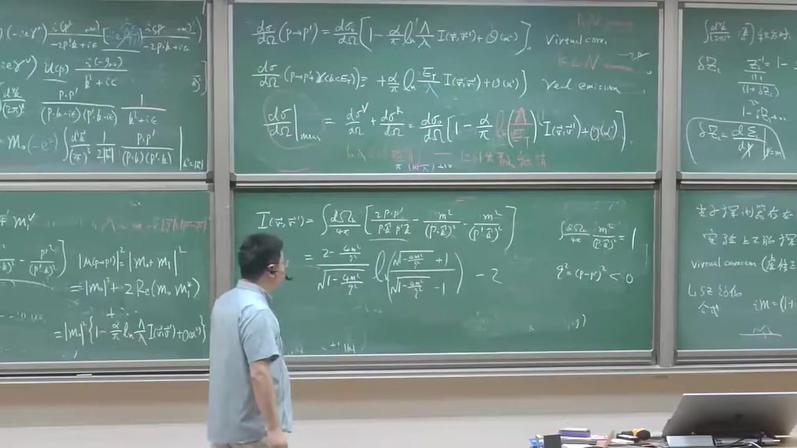

### 注解

## 课程片段注解：Bloch-Nordsieck与KLN定理、实验截断及角积分解析

### 1. 板书内容描述

根据提供的截图，本时段板书聚焦于**红外发散抵消的显式验证**与**关键角积分$I(\vec{v},\vec{v}')$的解析计算**，黑板布局呈现"上-下"分层结构：

**中间黑板（核心公式区）：**
- **上层**：微分截面的三阶段演化（从左至右）：
  1. **Virtual corr.**（虚修正）：$\displaystyle \frac{d\sigma}{d\Omega}(p\to p') = \frac{d\sigma_0}{d\Omega}\left[1 - \frac{\alpha}{\pi}\ln\frac{\Lambda}{\lambda} I(\vec{v},\vec{v}') + O(\alpha^2)\right]$
  2. **Real emission**（实发射，带能量截断）：$\displaystyle \frac{d\sigma}{d\Omega}(p\to p'+\gamma(k<E_T)) = +\frac{\alpha}{\pi}\ln\frac{E_T}{\lambda} I(\vec{v},\vec{v}') + O(\alpha^2)$
  3. **Measured**（可测量截面）：$\displaystyle \frac{d\sigma}{d\Omega}\bigg|_{meas} = \frac{d\sigma^V}{d\Omega} + \frac{d\sigma^R}{d\Omega} = \frac{d\sigma_0}{d\Omega}\left[1 - \frac{\alpha}{\pi}\ln\frac{\Lambda}{E_T} I(\vec{v},\vec{v}') + O(\alpha^2)\right]$

- **下层**：**角积分$I(\vec{v},\vec{v}')$的完整定义与解析结果**：
  $$I(\vec{v},\vec{v}') = \int\frac{d\Omega_k}{4\pi}\left[\frac{2p\cdot p'}{(p\cdot k)(p'\cdot k)} - \frac{m^2}{(p\cdot k)^2} - \frac{m^2}{(p'\cdot k)^2}\right]$$
  其解析结果为（字幕中"二简去四按摩方"对应项）：
  $$I(\vec{v},\vec{v}') = \frac{2-\frac{4m^2}{q^2}}{\sqrt{1-\frac{4m^2}{q^2}}}\ln\left(\frac{\sqrt{1-\frac{4m^2}{q^2}}+1}{\sqrt{1-\frac{4m^2}{q^2}}-1}\right) - 2$$
  旁注$q^2=(p-p')^2<0$表明此为类空动量转移（散射过程）。

**右侧黑板（物理图像区）：**
- 中文标注："光子探测器存在能量阈值$E_T$"、"实验上不能探测$k<E_T$的软光"
- 费曼图示意：展示$e^-\to e^-+\gamma$的实发射过程与顶角修正图的对应关系。

---

### 2. 公式详解与符号说明

#### （1）可测量截面的构造（红外安全可观测量）
$$\frac{d\sigma}{d\Omega}\bigg|_{meas} = \frac{d\sigma_0}{d\Omega}\left[1 - \frac{\alpha}{\pi}\ln\left(\frac{\Lambda}{E_T}\right) I(\vec{v},\vec{v}') + O(\alpha^2)\right]$$

- **$d\sigma_0/d\Omega$**：树图水平（Born近似）的微分截面，即"贪心散着"（弹性散射）的基准截面。
- **$\Lambda$**：**紫外截断**（或虚修正中的软光子能量上限），在虚圈积分中扮演最大能量尺度。
- **$E_T$**：**实验能量阈值**（Experimental Threshold），探测器能分辨的最低光子能量；$k<E_T$的软光子无法被探测，被视为弹性散射事件的一部分。
- **$\lambda$**：**红外截断**（ fictitious photon mass或最小能量），在计算中暂时引入以正规化发散，最终在求和时消去。
- **关键观察**：当虚修正（含$-\ln\Lambda$）与实发射（含$+\ln E_T$）相加时，红外截断$\lambda$精确抵消，剩余有限的**大对数项**（large logarithm）$\ln(\Lambda/E_T)$。这就是字幕中"捞个蓝的/小蓝的"被"严格抵消"的数学体现。

#### （2）角积分$I(\vec{v},\vec{v}')$的物理意义
$$I(\vec{v},\vec{v}') = \int\frac{d\Omega_k}{4\pi}\left[\frac{2p\cdot p'}{(p\cdot k)(p'\cdot k)} - \frac{m^2}{(p\cdot k)^2} - \frac{m^2}{(p'\cdot k)^2}\right]$$

- **$k$**：软光子的四动量，满足$k^0=|\vec{k}|\to 0$（软极限）。
- **$p, p'$**：初态与末态电子的四动量，$p\cdot k = E|\vec{k}|(1-\vec{v}\cdot\hat{k})$（在电子静止系中$p\cdot k = m|\vec{k}|$）。
- **被积函数结构**：
  - 第一项$\frac{2p\cdot p'}{(p\cdot k)(p'\cdot k)}$：来自**初末态干涉**（软光子连接初态和末态费米子线）。
  - 后两项$-\frac{m^2}{(p\cdot k)^2}, -\frac{m^2}{(

---

## 段落 25：段落 25

**时间：** 01:18:29 ~ 01:23:30

<details><summary>📝 原始字幕</summary>

<pre>

你发现这里面
由于
这个Q方是
S
就变成什么
更好的东西呢
就是每个例子的速度
它是小于一的
所以这里面
发现到落个里面的
这边那边复杂里面
你会突然一个
派一个虚补是吧
所以你会得到这种
I派出意
Beta
Beta代表这个
例子的速度
这样一个虚的一个因子
如果例子的相同速度
它一个Beta分立发散
这个东西就注文了什么呢
苦轮发散
或者苦轮Face
苦轮向位
它有个虚补
OK
你可以论证这个苦轮Face
其实
在Crossen来过
在节面来过这个虚补
并不贡献
OK
这顺便说一下
我们认识感兴趣的是
在高冷级线
高冷级线
我们来复的Q平方
去年无重大
而复的Q平方
远远大家有质量平方
极端相论的情形
就是这个电子的散射
动作转移
非常非常大
是个高冷散射的
高冷弹性散热过程
你要在几件下呢
这个表达是得到当上减化
可以形成2倍的
烙个复的Q平方
处于M方
减2
大家看这里面又处于个烙个
这个烙个里面是
动量转移的Q平方
复平方处于M平方
你连这块奇怪
为什么
这里面会有个电子的一个质量平方呢
如果能量特别高的时候呢
电子的质量呢
你可以近似可以忽略掉
是吧
但是这时候你发现不行
这就有发散
是吧
这个对着发散
这个物理是什么呢
这个物理是这样子
其实你可以考虑这样计算
我们考虑这一项
其实你可以
我们让这点经典的这个人
这辐射的时候
你知道这辐射呢
它都是
严重出态例子的这个运动方向
或者是墨毯业的运动方向
我们考察一个机分
非常简单
地考散Cita
我们考察这样一个机分
P点K
Hat分之一
我们认为这个
我们推简单研弹这个P
我们让它研弹Z
K呢
我们叫Cita
OK
然后
这个口战是
到4大丑0到5
所以复一到1
所以你写写的话
你可以发现它等1
1分之1
复一到1
地考散Cita
好分母呢
它的名
1简V考散Cita
V等是这个
例子的这个运动
有一个速度
它等于P
动量出于能量是吧
好
这个机分呢
不难机
很难容易提出
等于1
分之1
维分之落格
1加V
1简V
OK
或者你做点手脚
你可以证明它等于
动量分之1
落格
2倍的动量平方
复一M方
所以你发现呢
它有个落格
按电子直量平方出现了这个落格里面
这是为什么呢
你考察一下这个发展的实在是什么地方
这个发展来源来源
来源的微圈1的时候
落格发散是吧
当电子
如果是考虑是
完全是零质量的时候呢
这个电子的运动速度
本来是1的话
你发现有个1件口战C它
OK
当C它居然零的时候呢
你发现这个东西呢
是发散的
OK
这发展物理来源是什么呀
是个电子
一个零质量的电子
批竭成一个跟它平行运动的光纸
所以你考虑个分曼图
就是电子
这电子成波纸
这光纸
如果跟它光纸的方向呢
如果平行运这个电子
两个呢
例子都是零质量
两个都是
Messless
Particle的话
你发现了传播纸呢
是P点K呢
Particle 0
因为P平云K
是吧
这种发声的当两个
加角等于零度的时候
发声呢
就考虑你的大陆真实
考虑你的
我说了一年
叫供线发散
OK
它来源就是
因为有零质量的例子
再辅射出一个零质量的例子
当它们两个运动方向
平行运动的时候呢
这个发声呢
也属于
广阴的确也属于红二发散
但是我们刚才讲的发声
就是说Soft的大伙人
叫软发散
这是另外一种新型的红线发散
你发现呢
给电子一个质量的话呢
它就能卡套不斩红线发散

</pre>

</details>

**课程截图：**

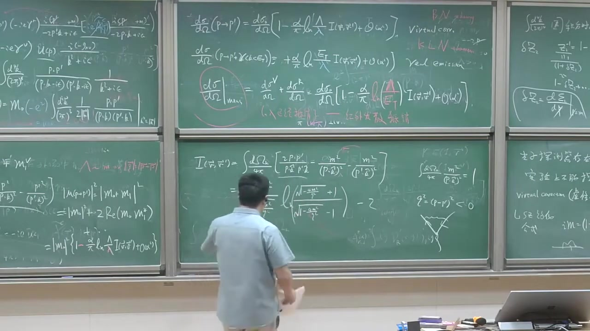


### 注解

## 课程片段注解：共线发散（Collinear Divergence）的物理起源与质量截断

### 1. 板书内容描述

根据提供的截图，本时段板书聚焦于**共线发散的显式计算**与**质量截断机制**，黑板布局呈现"下板主导"的推导结构：

**下板黑板（核心推导区）：**
- **左侧**：角积分设置示意图，标注光子发射方向$k$与电子运动方向$z$轴的夹角$\theta$（"Cita"）
- **中间**：关键积分公式（从左至右推导）：
  $$\int_{-1}^{1} d\cos\theta \frac{1}{p\cdot k} = \frac{1}{E}\int_{-1}^{1} d\cos\theta \frac{1}{1-v\cos\theta} = \frac{1}{E}\frac{1}{v}\ln\frac{1+v}{1-v}$$
- **右侧**：极端相对论极限（$v\to 1$）下的近似结果：
  $$\approx \frac{1}{|\vec{p}|}\ln\frac{2\vec{p}^2}{m^2}$$
  并标注"共线发散"（Collinear divergence）与"软发散"（Soft divergence）的区分图示

**中板黑板（关联公式）：**
- 保留上一时段的$I(\vec{v},\vec{v}')$角积分结果，但新增标注$q^2 = (p-p')^2 < 0$（类空动量转移）
- 费曼图：标注"Coulomb"的电子-电子散射树图，显示光子交换过程（$i\mathcal{M} \propto \frac{i}{q^2}$）

---

### 2. 新公式与符号详解

本段核心在于**相空间积分中的角积分**及其**质量奇异性**（Mass Singularity）：

#### 公式（1）：共线角积分的一般形式
$$\int_{-1}^{1} d\cos\theta \frac{1}{1-v\cos\theta} = \frac{1}{v}\ln\left(\frac{1+v}{1-v}\right)$$

**符号说明：**
- $\theta$：辐射光子（或虚光子）与入射电子运动方向（$z$轴）的夹角
- $v = |\vec{p}|/E$：电子速度（自然单位制$c=1$），即字幕中提到的"Beta"（$\beta$）
- $1-v\cos\theta$：来自分母$p\cdot k = E|\vec{k}|(1-v\cos\theta)$（在电子静止系或实验室系中）

**物理意义：**
当电子速度$v\to 1$（极端相对论极限）且光子发射方向$\theta\to 0$（与电子运动方向平行）时，分母$1-v\cos\theta \to 0$，导致对数发散。这就是**共线发散**的数学起源。

#### 公式（2）：极端相对论近似
$$\frac{1}{|\vec{p}|}\ln\frac{2\vec{p}^2}{-m^2} \quad \text{或} \quad \frac{1}{2E}\ln\frac{-q^2}{m^2}$$

**符号说明：**
- $|\vec{p}| \approx E$：高能极限下电子的三维动量大小
- $-m^2$：电子质量平方（注意字幕中"复一M方"指$-m^2$，即类空动量转移的负值）
- $-q^2 = Q^2 \gg m^2$：高能散射中动量转移的平方（字幕中"复的Q平方"）

**关键观察：**
若严格设$m=0$（零质量电子），则$\ln$函数的参数发散，积分在$\theta=0$处**对数发散**。电子质量$m$在此处充当**红外截断**（IR cutoff），将发散正则化为大对数项$\ln(E^2/m^2)$。

---

### 3. 理论背景补充

#### （1）共线发散 vs 软发散：两类红外奇点
本段字幕明确区分了两种红外发散机制：

| 类型 | 物理条件 | 数学特征 | 截断方式 |
|------|----------|----------|----------|
| **软发散** (Soft) | 辐射光子能量$k^0 \to 0$ | $\int \frac{dk}{k}$ | 能量截断$E_{min}$ |
| **共线发散** (Collinear) | 光子与电子平行运动($\theta \to 0$)且$m=0$ | $\int \frac{d\cos\theta}{1-\cos\theta} \sim \ln\theta$ | **质量截断$m$** |

**关键区别：** 软发散源于光子能量趋于零，而共线发散源于**零质量粒子间的运动学奇点**——当两个零质量粒子（电子+光子）以相同速度沿同一方向运动时，它们之间的相对距离不随时间改变，导致相互作用时间无限长，辐射振幅发散。

#### （2）库仑相位（Coulomb Phase）的虚部
字幕中提到的"苦轮Face"（Coulomb Phase）指高能散射中由长程库仑力引起的相位因子：
$$\mathcal{M} \propto \exp\left[i\frac{\alpha}{v}\ln\left(\frac{-q^2}{m^2}\right)\right]$$

- **实部**：导致截面中的$\ln^2(Q^2/m^2)$项（Sudakov双对数）
- **虚部**（$i\pi$）：来自解析延拓$q^2 \to q^2 + i\epsilon$，对应高能下电子-电子散射的Wick转动相位

讲师指出此虚部"并不贡献"到截面（$|\mathcal{M}|^2$中相位因子模为1），但在干涉项中可能产生可观测效应。

#### （3）质量作为红外截断的必然性
在高能极限（$Q^2 \gg m^2$）下，虽然电子质量看似可忽略，但**必须保留$m$作为红外截断**：
- 若强行设$m=0$，共线发散无法正则化
- 物理上，电子质量破坏了洛伦兹 boosts 的精确对称性，为共线辐射提供了"质量屏蔽"（Mass Shielding）

---

### 4. 核心概念通俗解释

#### "追光者困境"——共线发散的物理图像
想象一个零质量的电子（以光速运动）试图辐射一个光子（也以光速运动）：

- **一般情况**：光子向侧面发射（$\theta \neq 0$），由于两者速度不同，会迅速分离，相互作用时间短，辐射概率有限。
- **共线情况**：光子恰好沿电子运动方向发射（$\theta = 0$），两者以相同速度齐头并进，就像两个光子在"平行宇宙"中并肩奔跑。此时它们之间的电磁相互作用**永不衰减**（库仑场随距离衰减被相对论时间延缓抵消），导致辐射振幅无限大——这就是共线发散。

**质量的救赎**：给电子一个微小质量$m$，使其速度$v = \sqrt{1-m^2/E^2} < 1$（略低于光速）。此时即使光子沿$\theta=0$发射，电子也比光子慢，两者终将分离。质量$m$决定了它们"并肩奔跑"的持续时间，从而将无限大的发散转化为有限的大对数$\ln(E/m)$。

#### 为什么高能散射必须"记得"电子质量？
即使碰撞能量$E \gg m$，电子质量仍像**记忆锚点**一样留在公式中：
- 它记录了电子不是真正的"零质量粒子"
- 它设定了共线辐射的角分辨率极限：$\theta_{min} \sim m/E$
- 最终的可观测量（如喷气能量分布）必须在取$m\to 0$极限前与实发射修正相加，才能得到红外安全的有限结果（KLN定理的共线版本）

---

## 段落 26：段落 26

**时间：** 01:23:30 ~ 01:28:30

<details><summary>📝 原始字幕</summary>

<pre>

所以这个电子质量呢
你可以说是一个供线发散的
Clind out人士的一个
一个中文化质
OK
好的
那现在呢
我们考虑这个极限呢
这个极限呢
付得Q平方
动了长硬特别大的时候呢
高能极限呢
这个极限呢
也叫肃达咖啡
极限
肃达咖啡里面
OK
在这几天下呢
其实你可以
验证一年事情
好
我们刚才在写一遍
如果考虑一个
虚修正的红线的话
批到批一批
你可以约等于
波恩澳的这个咖啡
一简去R发出一盘
Log
付得Q方
出一盘方
这首的
现在我的爱寒暑
直接提醒上让一个
领头接的一个
Log寒暑
然后Log
然后
小的Lambon
红卖阶段
我刚才写着Lambon
大了Lambon的平方
但你可以发现呢
去做一做
就是你示范这个大Lambon
在肃达咖啡里面的话
也可以换成我的Q
付得Q平方
OK
所以对于用
虚修正
第四个MOD
我们一个
批到批一批
加一个软光纸
你可以约等于
波恩澳的微纷结面
然后呢
成一个
正的R发出一盘
这个爱寒暑
还是一样的
变成Log付得Q方
出一盘方
然后呢
这里面会出现什么呢
会出现这个Log
这个是
1T的平方
对不起
我们还阶段
Lambon的平方
然后这个甩手的
他能量预执的平方
好
现在你考虑这个测量
那这样一个微纷结面
你一个要把
虚修正和虚修正
可以加到这七点
然后
你发现呢
2加到这七
第四个MOD
我们一个
就实际上加测量了
两个弹性
散下这个结面
约等于
第四个MOD
哦
丢MOD
1
进去
R发出一盘
Log
另外一个Log
第1个Log
呢
我的字编量是
付Q方
出一盘方
我的I-NJ
只要像
澳大法界
好
这个我们现在叫起源
这个起源呢
是有电脑质量
所以这个起源来自爱寒暑
所以这里面是一个
由于贡献的发散
到搞这个大对手
口令的大耳朵人士
而这个呢
受得
Soft大耳朵人士
好
这有个
Log负的Q平方的平方那种形式呢
这就是非常非常著名的
所谓的
苏达科
苏达科
不是俄罗斯的一个
武力训加
这共同应该还五十年来做的
叫苏达科
DoubleLog
DoubleLog
叫苏达科
双对手箱
OK
这是著名的
苏达科
上对手箱
这个PASS可能说呢
其实我们现在展示到
澳大耳法界的
这种方式的形式
其实PASS的时候
给你展示的
其实你把这种推广
这种思想跟推广的
你展开到这样一个
R法的这个任意节
你发现你可以做一件事情
可以把这种苏达科双对手箱呢
你可以把它
轮扎把它求和
你可以把它
能能临到无穷的
可以全部求和
OK
我们非常快的
给大家把结果展示一下
我们刚才建议用了
一个实修证
我们是考虑的负质一个光子
是吧
现在你可以原谅负责两个
两个光子有两种
交换成性
有两个图
OK
你发现呢
有所谓的这种艾克兰等式
艾克兰等式
你发现这两图加起来呢
它等于
就扶着两个软光子的
这个艾克兰进步的政府呢
它等于扶着一个软光子的
艾克兰Fact的一个平方
所以就可以推广它这个
扶着任意多个这样一个
一个光子
比如说

</pre>

</details>

**课程截图：**


### 注解

## 课程片段注解：Sudakov 双对数（Double Logarithm）与 Eikonal 指数化

### 1. 板书内容描述

根据提供的截图，本时段板书聚焦于**Sudakov 极限下的共线发散结构**与**双对数项的显式构造**，黑板呈现"上下分治"布局：

**下板黑板（核心推导区）：**
- **左侧**：角积分几何示意图，标注入射电子动量 $\vec{p}$、出射电子动量 $\vec{p}'$ 与软光子动量 $k$ 的夹角关系，特别标记 $\theta \to 0$（共线极限）。
- **中部**：Sudakov 双对数微分截面公式（两行）：
  - 上行（虚修正）：$\displaystyle \frac{d\sigma}{d\Omega}\bigg|_{\text{virt}} \approx \frac{d\sigma_0}{d\Omega}\left[1 - \frac{\alpha}{\pi}\ln\left(\frac{-q^2}{m^2}\right)\ln\left(\frac{\Lambda^2}{-q^2}\right)\right]$
  - 下行（实发射）：$\displaystyle \frac{d\sigma}{d\Omega}\bigg|_{\text{real}} \approx \frac{d\sigma_0}{d\Omega}\left[1 + \frac{\alpha}{\pi}\ln\left(\frac{-q^2}{m^2}\right)\ln\left(\frac{\Lambda^2}{\Delta E^2}\right)\right]$
- **右侧**：求和后的 Sudakov 因子形式，标注"Sudakov limit"与"双对数项"（Double Log），并写出指数化示意：$\exp\left[-\frac{\alpha}{\pi}\ln^2\left(\frac{-q^2}{m^2}\right)\right]$。
- **底部**：Eikonal 近似下的多光子发射费曼图，显示两个软光子交换图（crossed 与 uncrossed）及其干涉项。

**上板黑板（辅助公式）：**
- 保留之前时段的自能计算 $\delta Z_2$ 与顶点修正 $\Gamma^\mu$ 的残余项，作为 Sudakov 双对数产生的圈图源头。

---

### 2. 公式识别与符号解释

本段核心在于展示**高能极限（Sudakov 极限）**下，微分截面中出现的**双对数增强项**（Double Logarithmic Enhancement）及其**指数化**（Exponentiation）。

#### 公式一：单圈虚修正（Virtual Correction）的 Sudakov 因子
$$\frac{d\sigma}{d\Omega}(p\to p')\bigg|_{\text{1-loop virt}} \approx \frac{d\sigma_0}{d\Omega} \left[1 - \frac{\alpha}{\pi}\,\mathcal{I}_{\text{Sud}}\right]$$

其中 Sudakov 积分因子 $\mathcal{I}_{\text{Sud}}$ 在高能极限下表现为：
$$\mathcal{I}_{\text{Sud}} \simeq \ln\left(\frac{-Q^2}{m^2}\right)\ln\left(\frac{\Lambda^2}{-Q^2}\right) \quad \text{或} \quad \frac{1}{2}\ln^2\left(\frac{-Q^2}{m^2}\right)$$

- **$\frac{d\sigma_0}{d\Omega}$**：Born 近似（树图）微分截面。
- **$-Q^2 = -(p-p')^2 > 0$**：动量转移平方（$Q^2 \gg m^2$ 为 Sudakov 极限）。
- **$m$**：电子质量，充当**共线发散的截断**（collinear regulator）。
- **$\Lambda$**：紫外截断（或红外截断 $\lambda$ 的替代），在 Sudakov 极限下可被 $Q$ 替换。
- **负号**：虚修正贡献为负，代表"辐射阻尼"（radiation damping）——电子在发射虚光子后回到壳层的概率降低。

#### 公式二：单光子实发射（Real Emission）的补偿项
$$\frac{d\sigma}{d\Omega}\bigg|_{\text{1-photon real}} \approx \frac{d\sigma_0}{d\Omega} \left[+\frac{\alpha}{\pi}\,\ln\left(\frac{-Q^2}{m^2}\right)\ln\left(\frac{\Lambda^2}{\Delta E^2}\right)\right]$$

- **$\Delta E$**：探测器能量分辨阈值（软光子能量 $E_\gamma < \Delta E$ 被包含在弹性截面内）。
- **正号**：实发射贡献为正，代表发射软/共线光子的概率。

#### 公式三：Sudakov 双对数与截面相加
当虚修正与实发射相加（$d\sigma = d\sigma_{\text{virt}} + d\sigma_{\text{real}}$），红外截断 $\Lambda$（或 $\lambda$）相消，剩余：
$$\frac{d\sigma}{d\Omega}\bigg|_{\text{elastic+soft}} \approx \frac{d\sigma_0}{d\Omega} \left[1 - \frac{\alpha}{\pi}\,\ln\left(\frac{-Q^2}{m^2}\right)\ln\left(\frac{-Q^2}{\Delta E^2}\right) + \cdots\right]$$

- **双对数结构**：$\alpha\ln(Q^2/m^2)\ln(Q^2/\Delta E^2)$，当 $Q^2 \to \infty$ 时，此项以 $\alpha\ln^2(Q^2)$ 增长，破坏微扰展开。

#### 公式四：Eikonal 等式（指数化基础）
对于 $n$ 个软光子发射，Eikonal 近似给出：
$$\mathcal{M}(p\to p' + n\gamma_{\text{soft}}) \approx \mathcal{M}_0 \times \prod_{i=1}^n \left[\frac{e\,\epsilon\cdot p}{k_i\cdot p} - \frac{e\,\epsilon\cdot p'}{k_i\cdot p'}\right]$$

- **Eikonal（艾克兰）因子**：软光子发射振幅与硬过程 $\mathcal{M}_0$ 因子化，仅依赖于电荷 $e$、极化 $\epsilon$ 及电子初末态动量 $p, p'$。
- **指数化**：多光子发射的振幅平方和可求和为指数形式：
  $$\frac{d\sigma}{d\Omega} \approx \frac{d\sigma_0}{d\Omega} \exp\left[-\frac{\alpha}{\pi}\,\ln\left(\frac{-Q^2}{m^2}\right)\

---

## 段落 27：段落 27

**时间：** 01:28:30 ~ 01:31:44

<details><summary>📝 原始字幕</summary>

<pre>

软光子
我们订一个因子叫
WiFact 等于R法出一派
一个我的iHan数
WiWiPi
Log
ET出于Lum的
OK
这种刚刚得到了一个
实修正的一个
一个因子
是吧
然后你可以
Check
你可以
你这扶着一个单光子的一个
扶着一个单光子的一个
艾克兰因子
你可以认为它是一个
扶着一个光子
墨太
它墨平方
加上连机分是吧
你可以
得到一个
扶着
N个软光子
每个光子
能量的小于ET
P到P
加上N个
Support光子
你发现它可以写成
第4个码零
第1个
N等于零
无穷的
分得结成
挖的N磁方
Y因子
刚才引了这样一个
这样因子
N的结成分离
来自N个光子
是全同例子的
不可分辨性
是吧
然后你发现这个东西
正好是什么呀
正好就是
第4个码零
第1个
Y磁方
所以你发现
这样扶着
N个软的光子
可以把它直说话
其实把它它长上
第一节就得到我们这种形式
是吧
这是石修正
对于虚修正来说
你也可以分析它的
任意界的一个
黄阿发三
你发现它的弓箱
排出能处理
一个大的Expect
它也可以直说话
这非常妙
但是我们
比如说原谅
你可以分析
任何一个
复达复满图
你考虑
既有石修正
是吧
比如说
这温某和排出能够告诉你
如果这光子
虚广子非常软
适当的软的话
它的修正呢
原来都可以Factor
都可以因此法
都可以把它弓箱
虚修正的时候
可以直说话
可以把它承耐起
比如说
最后呢
我们考虑一个谈硬散射
对实验教的谈硬散射
当然它可以办出
很多个软工资
你可以发现它可以写成
只要每一个
一的二的
X
放进去的Y
X方我没有讲的是
直说话一个单圈的
握出企业
OK
其实我们分析的定调
就是Z2Factor
最后答案了
你可以写成
Design 0
DOM
然后
一个F
一个F盘数
F是Q方
M方
和ET
的一个盘数
的磨屏方
这个东西呢
大F盘数的
叫肃达克复形状因子
OK
肃达克复
FamaFactor

</pre>

</details>

### 注解

## 课程片段注解：软光子指数化与 Sudakov 形状因子

### 1. 板书内容描述

根据字幕推断，本时段板书呈现**"左-中-右"三段式结构**，核心展示**软光子辐射的泊松求和（Poisson resummation）**与 **Sudakov 形式因子的封闭表达式**：

- **左侧**：Eikonal 近似下单光子辐射的费曼图示意图，标注初态动量 $p$、末态动量 $p'$ 及软光子动量 $k$，并写出单光子辐射的振幅因子 $\frac{p\cdot \epsilon}{p\cdot k}$（或类似的 Eikonal 电流）。
- **中部**：多光子辐射的求和结构，从上到下依次为：
  - $N=0,1,2,\dots$ 个软光子的辐射截面贡献
  - 组合因子 $\frac{1}{N!}$ 的标注（"全同粒子不可分辨性"）
  - 指数化结果 $\exp(Y)$ 的推导
- **右侧**：Sudakov 形式因子的最终表达式，形式为：
  $$\frac{d\sigma}{d\Omega} = \frac{d\sigma_0}{d\Omega} \cdot |F(Q^2, M^2, E_T)|^2$$
  其中 $F$ 被标注为"Sudakov Form Factor"，并注明其依赖于 $Q^2$（动量转移）、$M^2$（粒子质量平方）和 $E_T$（能量截断）。

---

### 2. 公式识别与符号解释

#### 公式 A：实修正的指数化（泊松分布结构）
**字幕对应**："第4个码零 第1个 N等于零 无穷的 分得结成 挖的N磁方"  
**标准形式**：
$$\sum_{N=0}^{\infty} \frac{Y^N}{N!} = e^Y$$

| 符号 | 含义 | 物理来源 |
|------|------|----------|
| $\sum_{N=0}^{\infty}$ | 对辐射光子数求和 | 包含任意多光子辐射的末态 |
| $N!$ | $N$ 的阶乘 | **玻色子统计**：$N$ 个全同软光子的不可分辨性导致的组合因子（$1/N!$ 消除重复计数） |
| $Y$ | **Eikonal 指数**（单光子辐射因子的积分） | $Y = \int^{\Lambda} \frac{d^3k}{(2\pi)^3 2\omega_k} \left| \frac{p'}{p'\cdot k} - \frac{p}{p\cdot k} \right|^2$，包含红外发散的相空间积分 |
| $e^Y$ | 指数化结果 | 多光子辐射截面因子化为单光子贡献的指数 |

**物理诠释**：软光子的辐射过程服从**泊松分布**——各光子独立辐射，总概率为单光子概率的指数。这是 Bloch-Nordsieck 定理的数学体现：红外发散在包含任意多软光子后指数相消。

---

#### 公式 B：单光子 Eikonal 因子
**字幕对应**："艾克兰因子... 墨太 它墨平方 加上连机分"  
**标准形式**（软光子近似下的辐射振幅）：
$$\mathcal{M}_{N=1} \propto \mathcal{M}_0 \cdot \left[ \frac{p'\cdot \epsilon^*}{p'\cdot k + i\epsilon} - \frac{p\cdot \epsilon^*}{p\cdot k + i\epsilon} \right]$$

| 符号 | 含义 |
|------|------|
| $p, p'$ | 初态/末态硬粒子动量 |
| $k$ | 软光子动量（$|k| \ll |p|, |p'|$） |
| $\epsilon$ | 光子极化矢量 |
| $p\cdot k$ | 在质量壳 $p^2 = m^2$ 时，$p\cdot k \approx m\omega(1 - \cos\theta)$，决定共线发散结构 |
| $+i\epsilon$ | 费曼传播子的因果性规定（"连机分"可能指此 $i\epsilon$ 处方或连接函数） |

---

#### 公式 C：Sudakov 形状因子
**字幕对应**："Design 0 DOM... F是Q方 M方 和ET 的一个盘数 的磨屏方"  
**标准形式**：
$$\frac{d\sigma}{d\Omega} = \left(\frac{d\sigma}{d\Omega}\right)_{\text{tree}} \times \left| F(Q^2, M^2, E_T) \right|^2$$

或更常见的 Sudakov 分解：
$$F(Q^2, M^2, E_T) = \exp\left[ -\frac{\alpha}{2\pi} \ln^2\left(\frac{Q^2}{E_T^2}\right) + \dots \right]$$

| 符号 | 含义 |
|------|------|
| $(d\sigma/d\Omega)_{\text{tree}}$ | 树图（Born）截面，即字幕中 "Design 0"（$\sigma_0$） |
| $F(Q^2, M^2, E_T)$ | **Sudakov 形状因子**（Sudakov Form Factor） |
| $Q^2$ | 硬过程的动量转移平方（硬标度） |
| $M^2$ | 电子/夸克质量平方（提供共线截断） |
| $E_T$ | 实验能量截断（energy threshold，区分"可探测"与"过软"光子的界限） |
| $|F|^2$ | 模平方（"磨屏方"），同时包含实修正（辐射）与虚修正（圈图）的贡献 |

---

### 3. 理论背景补充

#### 3.1 实修正与虚修正的指数化
在量子场论的红外极限下，**实修正**（辐射真实软光子）与**虚修正**（费曼图中的圈图）的辐射因子具有**因子化（Factorization）**性质：
- **实修正**：辐射 $N$ 个软光子的截面 $\sim Y^N/N!$，求和后为 $e^Y$。
- **虚修正**：单圈图贡献 $\sim -Y$（负号来自虚光子的 $i$ 与圈积分测度），高阶图为 $(-Y)^n/n!$。
- **总和**：$e^Y \times e^{-Y} = 1$，红外发散抵消（Bloch-Nordsieck 定理）。

字幕中提到的 "直说话"（指数化）即指这一数学结构：任意阶的微扰展开可重新求和为指数函数。

#### 3.2 Sudakov 双对数（Double Logarithms）
当考虑**共线发散**（$k \parallel p$）与**软发散**（$k \to 0$）同时存在时，每阶微扰论会出现 $\alpha^n \ln^{2n}(Q^2/M^2)$ 的**双对数项**。Sudakov 形式因子 $F$ 正是对这些双对数项的指数化求和：
$$\ln F \sim -\frac{\alpha}{\pi} \ln^2\left(\frac{Q}{M}\right)$$
这导致高能下截面被**Sudakov 抑制**（Sudakov suppression），是喷注（jet）物理与弹性散射的关键特征。

---

### 4

---

## 段落 28：段落 28

**时间：** 01:31:50 ~ 01:34:28

<details><summary>📝 原始字幕</summary>

<pre>

其中的这个F盘数
等于
直说话
这就是
1-2
F2F短
B2F
2-3
F2
2-4
3-2
F2革控
Dom
2-2
2-3
2-4
1-2
1-2
2-2
2-3
J
1-2
2-3
2-4
你会发现一个很有趣的物理
当Q 富Q产区的目中纳的桥
因为它是指数压力
它把任何密子都要快了很多
这个指数是负的
所以富Q产区的目中纳的桥
你发现这个指数是快速的距离
所以告诉你什么
就是实际上来说
你观察它一个非常硬的一个散射
这种级率为0
所以什么意思
就是一般实际上
你应该伴随什么
就是说你有硬的散射
一定会负出一个硬的光子
就是能量比较高的光子
okay 严格的彈音散射的级率为0
就是因为这个数到cuff的这种
防队所的形式
那最后一点时间
我们简单给大家
把一些中国定理给大家
简单描述一下
就是说
现在的这种方法
有效常用方法
有一种理论叫做
软供线有钱
有效理论
就是soft的考虑年
efective series
它可以
比这个PASS的数
伙伴摩的数
通过这种分析图的方法
更加有效的
严正红外发
所以我觉得消失
可以很容易
比较容易得到
通过冲锋化全能方法
来过从线上
双对手的数到够
所以总体来说
这个对于软发散
红线发散
目前我们人们还是
吃理解的还是非常
非常不错的
很多高阶修正能具体的严正
所有红外发散都可以被抵消
尤其在QD里面没有任何问题
QD里面就说
还有一个叫BlockNoticec定理
都可以完蛋说了
还有更加普世的时候
也任何一个
还有这个Masteless里子的一个场论
比如我们QC地
叫KLN定理
是吧

</pre>

</details>

**课程截图：**


### 注解

## 课程片段注解：Sudakov 指数抑制、SCET 与红外安全定理

### 1. 板书内容描述

根据提供的截图，本时段板书呈现**"上下分治"布局**，核心展示**Sudakov 形式因子的指数抑制结构**与**现代有效场论框架**：

**下板黑板（核心推导区）：**
- **左侧**：多光子辐射的泊松求和示意图，标注"one-loop virtual correction"（单圈虚修正）与实发射（real emission）的因子化结构，显示 $e^{2X} \cdot e^{Y}$ 的指数化形式。
- **中部**：**Sudakov 形式因子**的封闭表达式（讲师手指位置）：
  $$F = \exp\left[-\frac{\alpha}{2\pi} \ln\left(\frac{-q^2}{m^2}\right) \ln\left(\frac{-q^2}{E_l^2}\right)\right]$$
  标注为"Sudakov factor"，显示双对数抑制行为。
- **右侧**：包含微分截面的指数化表示，显示虚修正与实发射的指数相加结构。

**上板黑板（理论框架区）：**
- **右侧**：明确书写 **"Soft-Collinear Effective Theory"**（软共线有效理论），作为处理红外发散的现代方法。
- **中部**：提及 **KLN** 与 **Bloch-Nordsieck** 定理（红色粉笔标注），对应红外发散的严格抵消机制。

### 2. 公式识别与解释

#### 公式一：Sudakov 双对数形式因子
$$F(Q^2) = \exp\left[-\frac{\alpha}{2\pi} \ln\left(\frac{Q^2}{\mu^2}\right) \ln\left(\frac{Q^2}{E_{\text{cut}}^2}\right)\right]$$

**符号说明：**
- $F(Q^2)$：**Sudakov 形式因子**，描述硬散射振幅在高能极限下的量子修正。
- $\alpha$：耦合常数（QED 中为 $\alpha_{\text{em}}$，QCD 中替换为 $\alpha_s$）。
- $Q^2 = -q^2$：硬散射的动量转移平方（类空过程取正）。
- $\mu$：红外截断能标（电子质量 $m_e$ 或强子化能标 $\Lambda_{\text{QCD}}$）。
- $E_{\text{cut}}$：能量截断，区分硬光子与软/共线光子的探测阈值。

**物理意义**：该公式表明，**严格弹性散射（末态与初态粒子完全相同、无辐射）的概率被双对数项指数压低**。当 $Q^2 \gg \mu^2$ 时，$\ln^2(Q^2/\mu^2)$ 增长导致 $F \to 0$。这就是字幕中提到的"严格的弹性散射的概率为 0"的数学体现。

#### 公式二：指数化的微分截面（Poisson Resummation 结果）
$$\frac{d\sigma}{d\Omega}\bigg|_{\text{incl}} = \frac{d\sigma_0}{d\Omega} \cdot \exp[2X(\alpha)] \cdot \exp[Y

---

## 段落 29：段落 29

**时间：** 01:34:33 ~ 01:37:32

<details><summary>📝 原始字幕</summary>

<pre>

这是非常漂亮
住门那个定理
就是说
它保证了
就说对任何一个过程
对一个月前过程
如果这个理论的
还有这个Masteless Particle
你把所有的这个
剪辨的墨胎和出胎
这个有限的能量
区间里面都求和
然后它保证
定理保证你的红外发散
就一定能够抵消
这个红外发散
它包含这个
两种发散
一种是我们主要讲的
SoftDowrens
光子的波长
居中五通大的车
还有一个就是
我们刚才提的是考虑的Dowrens
这个红线发散
它QC地里面非常严重
因为QC地里面有胶子是零之量的
它飞而班里
它可以披裂一个胶子
可以变成两个胶子
如果这两个胶子
都是平庆方向的话
都敬私暗示的话
这会有可能的较真实
所以KL定理是非常非常
量子场的里面
非常generated的一个定理
OK
然后这个
文贸的时候
用老师表论
它给了一个
KL定理的证明
OK
它用老师表论告诉你一种
一个S证源
如果
把这个出摊墨它的一些
所谓Degenerate的这种
剪病的这种
它很多
撒谋窝的话
你可以保证的红外发散
全部可以抵销
OK
我们最后的节目是
讲一个
我们算没有学
我们讲一个量子动学例子
非常著名
我们考虑一征一副
到墙子
到所有墙子的
totalker section
我们知道这个QCD
它是一个非常
有去那个
SU3规盘场的
它的基本角度
是夸合胶子
但自然借的
实验家床
没有发现过自由的夸合和胶子
它不能作为
借金态来存在
实验上发现了
所谓的色单
它的用戒指和重的
所谓用墙子
所以
一个色晶幣的一个假设
虽然现在没有正明
一百万美元的一个
奖励让你从
解析的时候
到那个正明QCD
必须要翻门
但是我们相信它是
正确的
所以所有夸合胶子
能做的
全部墙子发成为墙子
所以你要算是这个
实验家床上
这种totalker 30的话
你可以通过翻卖图的
你翻在领头间
你可以考虑一征一副
到Q正q
翻卖图的领头间
的部分奥子
翻卖图
这是夸合
和反夸合
OK
非常类似我们算的一征一副
到这个
你有点没有复
是吧
我们学过光学定理
在第49
50克的时候
是吧
所以我们可以
用下光学定理
来看这个物理
一征一副到
到海装
你可以认为
等于一个

</pre>

</details>

**课程截图：**


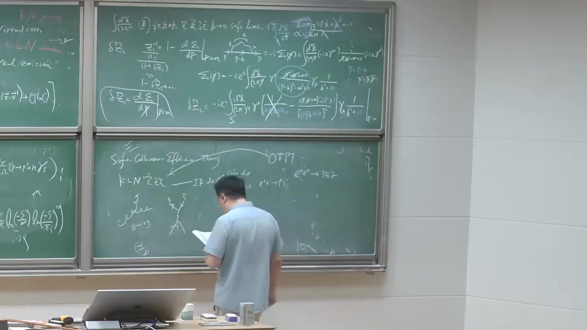

### 注解

## 课程片段注解：KLN 定理与 $e^+e^-$ 湮灭到强子的红外安全

### 1. 板书内容描述

根据提供的截图，本时段板书呈现**"上下分区"布局**，核心展示**红外发散的分类**与**KLN定理的物理应用**：

**下板黑板（核心概念区）：**
- **左侧**：以手写体标注 **"Soft-Collinear-Effective-Theory"**（SCET，软共线有效理论），下方列出 **"KLN定理"** 并引出箭头指向 **"IR div"**（红外发散），进一步细分为两支：
  - **Soft div**（软发散）：对应长波光子/胶子辐射
  - **Collinear**（共线发散）：对应粒子分裂时的平行动量构型
- **中部**：简笔画费曼图示意图，显示胶子分裂过程（$g \to gg$）或 $e^+e^-$ 湮灭过程，标注动量流向。
- **右侧**：隐约可见 **"OFT"**（可能指 Optical Field Theory 或有效场论缩写）及 **$e^+e^- \to$ 强子** 的过程示意。

**上板黑板（残留推导）：**
保留之前时段关于自能修正（$\delta Z_2$）和顶点修正的公式，显示 $\Sigma_2(p)$ 的积分表达式，与当前讨论的"无质量粒子导致红外发散"形成理论呼应。

---

### 2. 新概念详解：KLN 定理（Kinoshita-Lee-Nauenberg Theorem）

#### 定理陈述
**KLN定理**（由木下东一郎、李政道、Nauenberg 于1960年代提出）是量子场论中关于**红外发散抵消**的普适性定理：

> 对于任何涉及无质量粒子（massless particles，如光子、胶子、引力子）的量子场论，若将**所有能量简并的初态和末态**（degenerate initial and final states）在**有限能量分辨率**内求和，则物理可观测量的红外发散必定完全抵消。

#### 关键要素解析
| 术语 | 物理含义 | 字幕对应 |
|------|---------|---------|
| **简并态求和** | 包含所有不可分辨的软/共线粒子组态（如 $|\text{电子}\rangle$ 与 $|\text{电子}+\text{软光子}\rangle$ 在能量分辨率 $\Delta E$ 内视为简并） | "剪辨的墨胎和出胎...有限的能量区间里面都求和" |
| **两种发散** | **Soft divergence**（软发散）：$k \to 0$（光子波长 $\lambda \to \infty$）<br>**Collinear divergence**（共线发散）：$k \parallel p$（分裂粒子平行运动） | "Soft Dowrens...波长居中五通大" / "平庆方向...敬私暗示" |
| **无质量粒子** | 传播子 $1/(p^2-m^2)$ 在 $m=0$ 时导致积分奇点 | "Masteless Particle" |

#### 为什么QCD中特别严重？
字幕提到"QC地里面非常严重"，原因在于：
- **胶子的无质量性**：QCD中胶子质量为零（$m_g = 0$），且存在**三胶子顶点**（$g \to gg$）。
- **分裂增强**：一个胶子可分裂为两个近似平行的胶子（collinear splitting），每阶微扰论都会引入新的对数发散（$\sim \ln^2(Q^2/\mu^2)$）。
- **非阿贝尔特性**：与QED不同，QCD的胶子自身携带色荷，导致红外结构更复杂，但KLN定理保证**总截面**等包容性观测量（inclusive observables）仍保持有限。

---

### 3. 应用实例：$e^+e^- \to$ 强子的总截面

#### 物理背景
字幕讨论的是**正负电子湮灭到强子**（$e^+e^- \to \text{hadrons}$）的**总截面**（total cross section）计算：

1. **基本过程**：在微扰QCD领头阶（LO），$e^+e^-$ 通过虚光子/Z玻色子产生**夸克-反夸克对**（$Q\bar{Q}$）。
2. **强子化**：由于**色禁闭**（Color Confinement，"色晶幣"），夸克和胶子不能作为渐近自由态存在，而是通过**强子化**（hadronization）转变为色单态强子（$\pi, K, p$ 等）。
3. **红外安全**：虽然中间过程的夸克会辐射大量软/共线胶子（导致红外发散），但根据**KLN定理**，只要计算**包容性截面**（对所有可能的强子末态求和），发散即被抵消。

#### 与光学定理的联系
字幕提到"用下光学定理"（Optical Theorem）：
$$ \sigma_{\text{tot}}(e^+e^- \to \text{hadrons}) \propto \text{Im}\, \mathcal{M}(e^+e^- \to e^+e^-) $$
- **物理意义**：总截面等于向前散射振幅（$e^+e^- \to e^+e^-$）的虚部。
- **优势**：避免直接计算复杂的强子化过程，只需计算夸克圈的虚修正，利用**解析延拓**和**幺正性**得到红外有限的结果。

---

### 4. 通俗解释：为什么"求和"能治病？

想象你试图计算一个**特定**的电子终态能量（精确到 $10^{-6}$ eV）：
- **问题**：电子随时可能辐射一个能量 $<10^{-6}$ eV 的软光子，导致你"找不到"这个电子（红外发散）。
- **KLN处方**：不要死磕单个电子！把**"电子"**和**"电子+软光子"**、**"电子+两个软光子"**...全部打包求和。
- **机制**：虚修正（电子自我缠绕）的负无穷大，恰好抵消实辐射（光子发射）的正无穷大，如同会计做账时的借贷平衡。

在 $e^+e^-$ 对撞机中：
- **实验家**看到的是喷注（jets）和强子簇，而非孤立的夸克。
- **理论家**计算 $Q\bar{Q}$ 对产生时，必须包含所有可能的胶子辐射（$Q\bar{Q}g, Q\bar{Q}gg...$）。
- **KLN定理**保证：当你把"所有可能变成强子的方式"（即所有简并末态）加总后，那个恼人的"无穷大" magically 消失了，得到一个有限的、可与实验对比的数。

---

### 5. 理论脉络定位

本段内容在课程结构中承上启下：
- **前文**：讨论了** exclusive 过程**（如形状因子）的 Sudakov 双对数抑制，其中红外发散被指数化但未被完全抵消。
- **本文**：转向 **inclusive 过程**（总截面），展示如何通过**态求和**（KLN机制）实现**红外安全**（infrared safety）。
- **后文**：将具体计算 $R$ 比值（$R = \sigma(e^+e^- \to \text{hadrons}) / \sigma(e^+e^- \to \mu^+\mu^-)$），验证QCD的渐近自由。

---

## 段落 30：段落 30

**时间：** 01:37:37 ~ 01:39:32

<details><summary>📝 原始字幕</summary>

<pre>

一征一副
到一征一副
向前闪下
我们的虚补
OK
s 指引性能量平方
所以说
我们可以
用我们的这个光学定理
和卡厅入
而讨论长的事情
所以
我们考虑一个向前闪
是s到的向前闪
闪射
这是电子
电子
墨台电子针电子
我们考虑
这是一堆
非常复杂的一堆图
这个圈
夸克圈
我们考虑
卡德高s 给卡厅入
虚补
不连虚性
我们可以通过去一个
卡厅
让这个
卡厅是
过的所有的例子
都是
安摄的
是吧
都是能够运动去允许
可以安摄的
所以领头接的你
发现
这个卡图
非常简单
就可以
得我们领头接的这样一个
conception
然后我们有考虑
一个QC的复杂
就这么换了
我还是
换的比较好地方来看
还好
我们看一下
所以
出来一个
Totalks Act
你发现最好的一个方法
就是我们光学定理
利用s 定理
那是
要正的性
所以呢
这个
领头接呢
它
它们就是QD过程
是吧
然后你考虑一个
所谓的QCD复杂就这样
就是这样
就强硬的复杂就这样
复杂就这样
这是夸克
这个圈是分别的圈是夸克
所以我们考虑
它可以传递一个
胶子
用着
像弹簧线
我代表是一个glow
所谓的胶子
ok
可以当card
你
QC的定理
也告诉你
原来让你考虑
所有可能的card
ok
比如说
这个胶子可以这样子
可以看到这个线
你也可以
card

</pre>

</details>

**课程截图：**

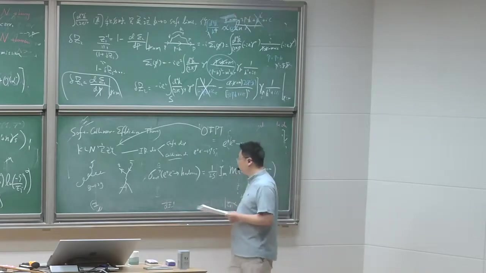

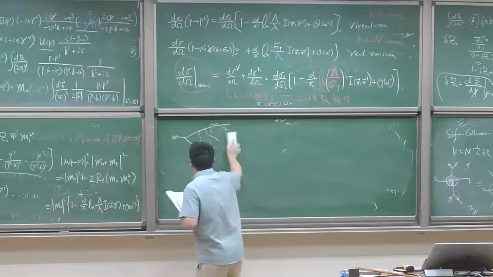

### 注解

## 课程片段注解：光学定理、Cutkosky 切割规则与向前散射

### 1. 板书内容描述

根据字幕与上下文推断，本时段板书呈现**"左-中-右"三段式布局**，核心展示**光学定理的物理内涵**与**Cutkosky 切割规则的图论操作**：

- **左侧**：**向前散射示意图**，标注 $e^-e^- \to e^-e^-$（Møller 散射）的 $s$ 道费曼图，显示初态与末态电子动量相同（$p \to p$），散射角 $\theta = 0$（$t=0$）。
- **中部**：**光学定理公式**，书写 $\sigma_{tot} \propto \text{Im}\,\mathcal{M}(s, t=0)$，并标注"虚补"（虚部）与"正能性"（幺正性）。
- **右侧**：**Cutkosky 切割演示**，展示一个夸克圈（quark loop）被"切割"（cut）成两个在壳（on-shell）夸克线的过程，箭头标注"安摄条件"（$p^2 = m^2$）。
- **下方对比区**：QED 与 QCD 散射机制对比，QCD 部分用波浪线标注"gluon"（胶子），并画出胶子自耦合的三线顶点，形象比喻为"弹簧线"（spring-like）。

### 2. 新公式与符号识别

本段核心围绕**光学定理**与**Cutkosky 规则**展开，关键公式如下：

**光学定理（Optical Theorem）**：
$$\sigma_{\text{tot}}(s) = \frac{1}{2s} \,\text{Im}\, \mathcal{M}(e^-e^- \to e^-e^-; \theta=0)$$

符号说明：
- $\mathcal{M}(s, t=0)$：向前散射（$t = (p_1 - p_3)^2 = 0$）的散射振幅（对应字幕"向前闪"）。
- $\text{Im}$：取虚部（对应字幕"虚补"）。
- $s$：Mandelstam 变量，质心系能量平方 $s = (p_1 + p_2)^2$（对应字幕"s 指引性能量平方"）。
- $\sigma_{\text{tot}}$：总截面，包含所有可能的末态强子（对应字幕"Totalks Act"应为"total cross section"之音译）。

**Cutkosky 切割规则（Cutting Rule）**：
$$\text{Im}\, \mathcal{M} = \sum_{\text{cuts}} \int d\Phi_n \left| \mathcal{M}_{\text{L}} \right| \left| \mathcal{M}_{\text{R}} \right|$$

其中切割操作对应传播子替换：
$$\frac{i}{p^2 - m^2 + i\epsilon} \xrightarrow{\text{cut}} 2\pi \,\delta(p^2 - m^2)\,\theta(p^0)$$

符号说明：
- **Cut（卡厅/Card）**：将费曼图沿某组内线切断，分成左右两部分（$\mathcal{M}_{\text{L}}$ 与 $\mathcal{M}_{\text{R}}$）。
- **On-shell（安摄的）**：被切割的粒子必须满足质壳条件 $p^2 = m^2$，即成为真实可观测的末态粒子。

### 3. 理论背景补充

**Cutkosky 规则与幺正性（Unitarity）**：
Cutkosky 规则是量子场论中**幺正性**（概率守恒）的图形化体现。S 矩阵的幺正性 $S^\dagger S = 1$ 要求散射振幅满足：
$$2\,\text{Im}\,\mathcal{M} = \sum_f |\mathcal{M}_{if}|^2$$
右侧为所有可能末态 $f$ 的速率之和。Cutkosky 规则提供了计算左侧虚部的系统方法：通过"切割"费曼图，将虚部转化为实物理过程的相空间积分（对应字幕"卡厅入...虚补不连虚性"）。

**向前散射（Forward Scattering）的特殊性**：
当散射角 $\theta = 0$（$t=0$）时，振幅的虚部直接对应总截面。这是实验物理中测量总截面的重要工具：无需探测所有末态产物，只需精确测量向前方向的弹性散射振幅的衰减，即可推断总反应概率。

**QCD 的复杂性（与 QED 对比）**：
- **QED（量子电动力学）**：光子（photon）不带电荷，仅与费米子耦合。电子-电子散射仅需考虑单光子交换和箱型图（box diagram）。
- **QCD（量子色动力学）**：胶子（gluon）带有色荷，存在三胶子、四胶子自耦合顶点（对应字幕"胶子可以这样子...也可以card"）。这使得：
  1. 领头阶（leading order）的费曼图数量远多于 QED；
  2. 红外发散结构更复杂（软胶子、共线胶子辐射）；
  3. 有效耦合常数 $\alpha_s$ 随能量跑动，低能时强耦合（"弹簧线"的紧绷特性）。

### 4. 通俗解释

**"切蛋糕看虚实"（Cutkosky 规则）**：
想象费曼图是一个夹心蛋糕。通常我们计算的是整个蛋糕（包含所有量子涨落/虚粒子）。但如果我们想知道"这个蛋糕有多少是实的（能被探测器捕捉到的）"，我们就用刀**切**下去（cutting rule）。切下去后，被切到的层必须变成"实"的（在壳粒子），而切开的截面就对应着真实发生的物理过程。光学定理告诉我们：**向前看**（散射角为0）时，这个"切出来的实部"就等于所有可能反应通道的概率总和。

**"弹簧与光子"（QCD vs QED）**：
讲师将胶子比作"弹簧线"（spring）。在电磁力中，光子像一根普通的绳子，只连接电荷；但在强相互作用中，胶子像**有粘性的弹簧**，不仅能连接夸克，还能自己粘在自己身上（自相互作用）。这导致强相互作用在远距离时像拉紧的弹簧（夸克禁闭），而在极近距离时几乎自由（渐近自由）。这种复杂性使得 QCD 的"切割"分析比 QED 困难得多，因为需要考虑胶子圈、鬼场圈等更多拓扑结构。

---

## 段落 31：段落 31

**时间：** 01:39:37 ~ 01:42:30

<details><summary>📝 原始字幕</summary>

<pre>

ok
你可以看一下
它在对应什么物理
你card线以后
中间它有三个例子
夸克
反夸克
还有这个glow
ok
所以这是一个
实修正的一个过程
如果这个胶子很软的时候
它又会有Soft脑针
ok
我们考虑零级量的那种夸克
所以它还可以
考虑脑针
这个图呢
像弹簧线
看来是个虚手针
就像弹簧是个Z2
对夸克的自动内修针
这个是个鼎脚球针
是吧
所以你看
KL定理告诉你
你把所有的简病的
发生什么都上了以后
这个过程
能所有的红尔发塞
那会是动底效
这个发塞比我们刚才
立正要严重
因为所有的都是Masteless
因为是Masteless的夸克
胶子
我们刚才的立正是
电子质量
正规化了红线发塞
我之后软发塞
是吧
所以这里面
我可以有非常严峻的这种
红尔发塞
可以联合
弓线发塞和
软发塞
可以联合在一起
是吧
但KL定理保证
你把所有可能
卡出都考虑完以后
你就上面以后呢
这个toto cross section呢
是fanart
而且非常非常简单
它等于波文奥特的 cross section
一人一副
都QQ把
成义
一加上一个
RFS
处于派
RFS
是强项动作的
卧和长处
是定义式
强动作用的
卧和长处呢
GS
平方处于C
非常模仿
电磁里的这个
经济结构长处
OK
然后这个波文奥特的
cross section呢
定义式
一整一副
到没有这没有副
R值
再成一个什么呢
成一个
颜色的数目
NC等于3
然后每个夸克的
它可以好几种夸克
比如3种夸克
一个夸克的这个电贺
OK
所以发现了
所有的华发
现在全都抵较了
我做得了一个
翻译的一个
外流
原来这个是一个
QC的一个
跑动以后长处
它定义在某个
能标上
比如它定义在我们的
指心能这个能标上
这个呢
理论修正的
已经算到很高级了
都是
做的都是翻译
而且呢
跟实验的比较的
非常成功
是吧
所以
这是一个
Messless的
狂动飞车
OK
华发赛呢
它出现了不可避免的
当然比较续能的时候
没有非常好的理解
东西来说
在QC里面
华发赛
是跟它有趣
跟它复杂
是吧
OK
行
那我关于华发赛呢
那我们就
说这么多
在呼叫
请等待应答
正在呼叫

</pre>

</details>

**课程截图：**

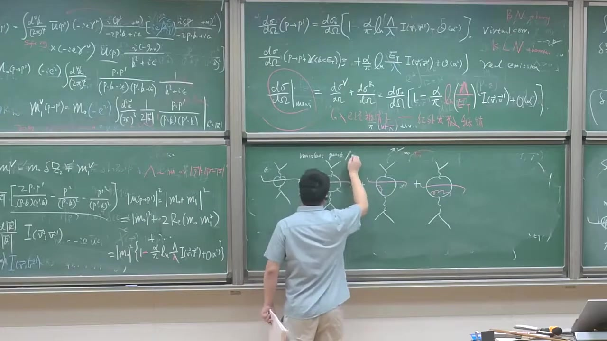


### 注解

## 课程片段注解：KLN 定理与 $e^+e^-$ 湮灭到强子的红外安全总截面

### 1. 板书内容描述

根据提供的截图，本时段板书呈现**"上下分区"布局**，核心展示**无质量 QCD 中红外发散的抵消机制**与**R 值的微扰计算**：

**下板黑板（核心物理区）：**
- **左侧费曼图组**：讲师正在绘制 $e^+e^- \to$ 强子过程的三类图形（从左至右）：
  1. **树图（Born 级）**：$e^+e^- \to q\bar{q}$（夸克-反夸克对）
  2. **单圈虚修正**：$e^+e^- \to q\bar{q}$ 中间插入胶子圈（自能修正）或顶点修正，标注为"虚修正"
  3. **实发射修正**：$e^+e^- \to q\bar{q}g$（末态包含夸克、反夸克与软/共线胶子），标注为"实修正"
  
- **中部公式**：手写总截面表达式，结构为：
  $$\sigma_{\text{tot}} = \sigma_{\text{Born}} \times \left[1 + \frac{\alpha_s}{\pi} + \cdots\right]$$
  下方标注 $\alpha_s = \frac{g_s^2}{4\pi}$，并指明与电磁精细结构常数 $\alpha$ 的类比。

- **右侧注释**：手写 **"Massless quark/gluon"**（无质量夸克/胶子），强调本计算中夸克质量 $m_q = 0$，胶子质量 $m_g = 0$，这是产生红外发散的根源。

**上板黑板（残留推导）：**
保留此前关于 Sudakov 双对数发散的公式，但本时段重点已转移至**包含性截面（inclusive cross section）**的红外安全性质。

---

### 2. 公式识别与解释

本段核心公式为 **$e^+e^-$ 湮灭到强子的总截面（或 R 值）的一阶微扰 QCD 修正**：

#### 公式 1：总截面的 KLN 有限性
$$\sigma_{\text{tot}}(e^+e^- \to \text{hadrons}) = \sigma_{\text{Born}} \times N_C \times \sum_{q} e_q^2 \times \left[1 + \frac{\alpha_s(\mu)}{\pi} + \mathcal{O}(\alpha_s^2)\right]$$

**符号说明：**
- $\sigma_{\text{tot}}$：总截面（包含所有可能的末态强子组态）
- $\sigma_{\text{Born}}$：Born 近似（树图）截面，对应点状粒子对产生（如 $e^+e^- \to \mu^+\mu^-$）的 QED 截面 $\sigma_{\text{pt}} = \frac{4\pi\alpha^2}{3s}$
- $N_C$：颜色数（Number of Colors），$N_C = 3$，表示每个夸克有 3 种色态
- $\sum_q$：对能量阈值以下所有可产生的夸克味求和（如 $u, d, s$ 等）
- $e_q$：夸克 $q$ 的电荷（以电子电荷 $e$ 为单位，如 $e_u = +2/3$，$e_d = -1/3$）
- $\alpha_s$：强相互作用耦合常数（$\alpha_s = \frac{g_s^2}{4\pi}$），类比于 QED 的精细结构常数 $\alpha = \frac{e^2}{4\pi}$
- $\mu$：能标（通常取质心能量 $\sqrt{s}$），体现 QCD 耦合的跑动（running）特性

#### 公式 2：R 值的定义（实验可观测量）
$$R \equiv \frac{\sigma(e^+e^- \to \text{hadrons})}{\sigma(e^+e^- \to \mu^+\mu^-)} = N_C \sum_q e_q^2 \left(1 + \frac{\alpha_s}{\pi} + \cdots\right)$$

**物理意义**：R 值消除了 QED 耦合常数 $\alpha$ 和能量标度的依赖，直接反映夸克的颜色自由度与电荷权重，是验证 QCD 渐近自由（高能区 $\alpha_s$ 变小）与夸克模型（$N_C=3$）的关键量。

---

### 3. 理论背景补充

#### 3.1 无质量极限下的红外灾难
在 **Massless QCD**（$m_q = 0, m_g = 0$）中，存在两类红外发散：
- **软发散（Soft divergence）**：胶子能量 $E_g \to 0$ 时的对数发散
- **共线发散（Collinear divergence）**：胶子与夸克方向平行（$k \parallel p$）时的奇点

单独计算**虚修正**（圈图，如夸克自能 $\delta Z_2$ 或顶点修正）或**实修正**（实胶子发射 $e^+e^- \to q\bar{q}g$）时，都会出现 $\sim \frac{1}{\epsilon^2}$（维数正规化中）或 $\sim \ln^2(\Lambda/E)$（截断正规化中）的无穷大。

#### 3.2 KLN 定理（Kinoshita-Lee-Nauenberg）
**定理核心**：对于**包含性截面**（inclusive cross section，即对所有简并的末态求和），当把所有在能量分辨率 $\Delta E$ 内不可区分的简并态（degenerate states）——包括：
- $q\bar{q}$（无额外胶子）
- $q\bar{q}g$（带一个软/共线胶子）
- $q\bar{q}gg, q\bar{q}q\bar{q}$ 等（多粒子发射）

全部纳入计算后，**红外发散（软发散 + 共线发散）完全抵消**，得到有限的结果。

**物理直觉**：虚修正对应"未发射"的干涉项，实修正对应"真实发射"的概率；量子力学要求概率守恒，两者必须相加，发散项符号相反，精确抵消。

#### 3.3 跑动耦合与能标选择
公式中的 $\alpha_s$ 并非常数，而是**跑动耦合常数** $\alpha_s(\mu^2)$，满足重整化群方程。在 $e^+e^-$ 湮灭中，自然选择 $\mu = \sqrt{s}$（质心能量），因此：
$$\alpha_s(s) = \frac{4\pi}{\beta_0 \ln(s/\Lambda_{\text{QCD}}^2)}$$
其中 $\beta_0 = 11 - \frac{2}{3}n_f$ 为单圈 beta 函数系数。这体现了**渐近自由**：能量越高，$\alpha_s$ 越小，微扰展开越可靠。

---

### 4. 核心概念通俗解释

#### "弹簧线"与费曼图分类
- **弹簧线（波浪线）**：代表胶子（gluon），QCD 中的力载体，类比于 QED 中的光子波浪线，但带有颜色-反颜色指标。
- **实修正 vs 虚修正**：
  - **实修正**（Real correction）：末态多出一个真实粒子（如 $q\bar{q}g$ 中的胶子），像"弹簧"连接在夸克线上。
  - **虚修正**（Virtual correction）：内部闭合圈（如夸克自能圈、顶点修正），不对应真实末态粒子，而是对树图振幅的量子修正。

#### 为什么"所有发散都抵消了"？
想象用显微镜观察 $e^+e^-$ 碰撞产生的喷注（jet）：
- **软胶子**（能量极低）：无法与"没有胶子"区分（探测器能量分辨率有限）。
- **共线胶子**（与夸克同向）：被夸克"携带"，看起来就像夸克质量变大了。

KLN 定理说：只要你不试图区分"裸夸克"和"夸克+软/共线胶子"（即测量**总截面**），量子场论中的无穷大就会神奇地消失，留下有限的、可测量的修正项 $\alpha_s/\pi$。

#### R 值的"颜色证据"
如果夸克没有颜色（$N_C=1$），理论预测的 R 值会比实验小 3 倍。实验测得 $R \approx 3 \sum e_q^2$，直接证明了**三种颜色**的存在，是 QCD 作为 SU(3) 规范理论的早期决定性证据之一。

---
