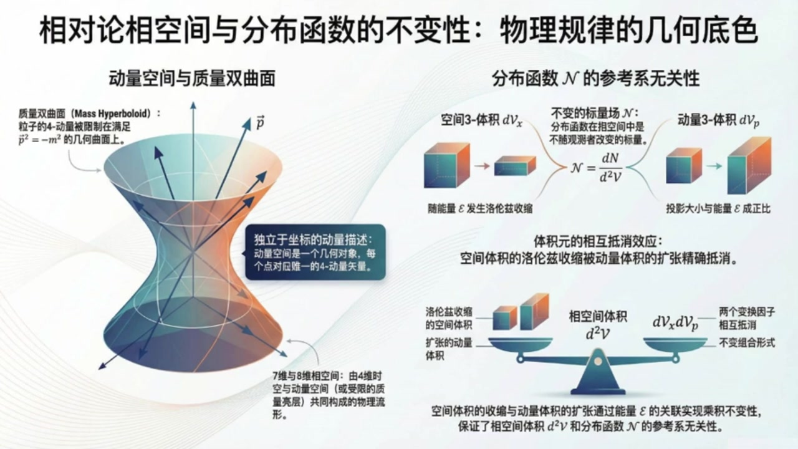
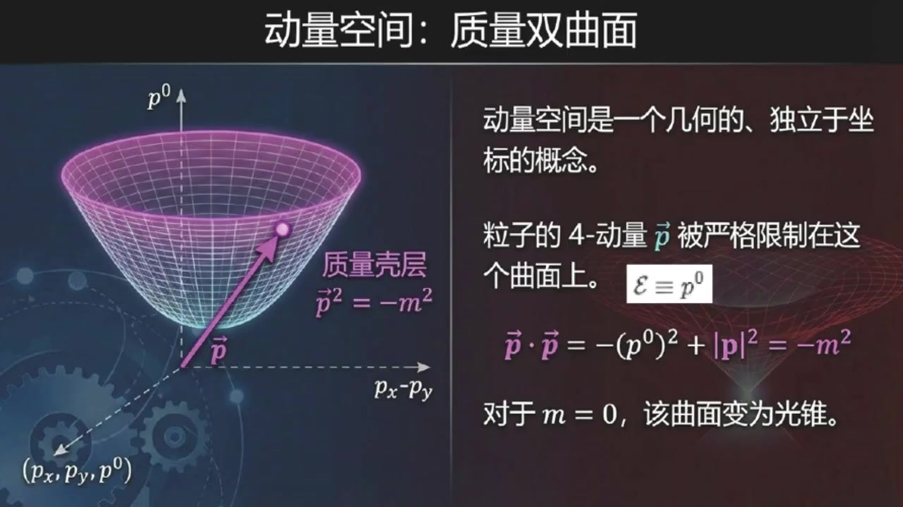
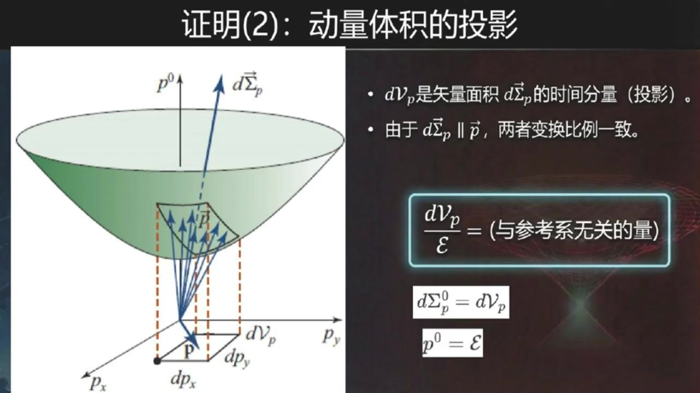
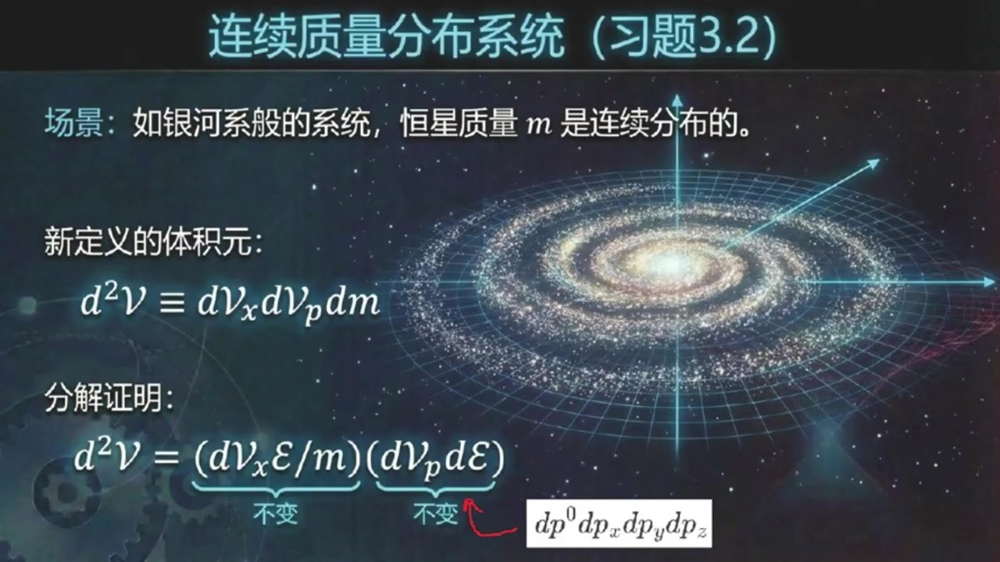

# 《现代经典物理学》第14课 相空间中的相对论分布函数

> 自动生成的课程注解文档（共 4 个段落，[原始视频](https://www.youtube.com/watch?v=YsO39CIizQQ)）

## 目录

- [00:00:00 课程引入与四维时空中的世界线参数化](#段落-1)
- [00:03:58 动量空间、质量双曲面与相空间定义](#段落-2)
- [00:08:40 证明相空间体积元与分布函数的洛伦兹不变性](#段落-3)
- [00:18:55 质量分布情形的推广与课程总结](#段落-4)

---

## 段落 1：课程引入与四维时空中的世界线参数化 { #段落-1 }

**时间：** 00:00:00 ~ 00:03:58

<details><summary>📝 原始字幕</summary>

<pre>

大家好欢迎来到现代经典物理学博客的第十四课我是你们活泼好奇的周伊今天我们要深入探讨向空间中的相对论数密度
大家好,我是塞
今天我们继续深入探讨相对论的世界特别是教科书三点二点二节例提到的相空间中的相对论数密度
这个概念是相对论动力学的基础对我们理解粒子集合在相对论框架下的行为至关重要赛听起来就很高深像空间中的相对论数密度这到底是个什么概念呢
我们之前不是也讲过分布函数吗?听起来好像有点类似没错,卓怡
我们之前定义非相对论分布函数的时候用的是DN百D平方花体V
这里的DNA是粒子树低平方花体V是相空间体积圆对对就是低花体VX乘以低花体VP
空间体积圆乘以动量空间体积圆这个我记得很清楚核心概念没变但现在我们把它放在了狭义相对论的框架下这意味着这里的动量P是相对论动量啊相对论动量就是那个MV除开根号括号一减微平方括号对吧就是那个带洛伦子因子的动量完全正确
但是这里有个很关键的问题就是D花体VX和D花体VP这两个量
他们本身看起来是依赖于参考系的依赖参考系那不就和我们相对论里最最核心的原则物理量应该由独立于参考系的几何对象来描述这个原则冲突了吗
这可有点麻烦啊没错这正是我们今天要解开的谜团
教科书里也提到了这个定义乍一看确实像一来参考系,但实际上它是独立于参考系的
我们今天就要深入探讨为什么会这样那这可太有趣了一个看起来不符合相对论精神的定义结果却是符合的那我们得从头理一理了
要理解这个,是不是得先从四维时空说起?是的,Joy,你抓住了重点
我们首先要跳出传统的三维空间和独立的时间进入四维时空的概念
想象一个经典的例子他在时空中运动画出一条世界线
我们用一个参数Z来描述这条时界线Z这个参数有什么特别之处吗它和我们平时用的时间T不一样吗它和时间T确实不一样这个Z叫做仿射参数它和粒子的四动量P是直接关联的
Z它的倒数也就是四十辆P等于第四十辆X百DZ它哦有点像我们平时速度是位置对时间球倒只不过这里是四尾的参数也换成了Z塔
差不多是这个意思
如果粒子具有非零的净值质量M,那这个ZTA也可以和粒子的固有时间套关联起来,比如ZTA等于套除M
固有时间套就是粒子自身感受到的时间它也是个落轮子不变的量明白了所以Z塔是一个非常重要的参数它把粒子的运动和它的四动量连接起来了
那如果粒子是无质量的,比如光子,那又怎么说?问得好
如果粒子是无质量的,比如光子,它的世界线就是泪光的
在这种情况下固有时间掏沿线是不发生变化的所以我们就别无选择只能使用这个仿射参数Z塔来参数化它的世界线了

</pre>

</details>

**课程截图：**




### 注解

我来对这段课程视频进行深度注解，重点分析新出现的内容。

---

## 一、核心公式识别与解释

### 公式 1：相对论动量定义
$$p = \frac{mv}{\sqrt{1-v^2}} \quad \text{（自然单位制 } c=1\text{）}$$

| 符号 | 含义 |
|:---|:---|
| $p$ | 相对论动量（三维动量） |
| $m$ | 粒子静质量 |
| $v$ | 粒子在参考系中的速度 |
| $\sqrt{1-v^2}$ | 洛伦兹因子 $\gamma$ 的倒数，即 $1/\gamma$ |

**要点**：这是狭义相对论中动量的定义，区别于牛顿力学中的 $p=mv$。

---

### 公式 2：四动量的定义（板书核心公式）
$$\boxed{p^\mu = \frac{dx^\mu}{d\zeta}}$$

| 符号 | 含义 |
|:---|:---|
| $p^\mu$ | **四动量**（4-momentum），四维矢量，$\mu = 0,1,2,3$ |
| $x^\mu$ | 四维位置坐标 $(t, x, y, z)$ |
| $\zeta$ | **仿射参数**（Affine Parameter），新的核心概念 |
| $d/d\zeta$ | 对仿射参数的导数 |

**与三维速度对比**：
- 牛顿速度：$v^i = dx^i/dt$（时间参数化）
- 四速度：$u^\mu = dx^\mu/d\tau$（固有时间参数化）
- **四动量**：$p^\mu = dx^\mu/d\zeta$（仿射参数化）← **本段新内容**

---

### 公式 3：仿射参数与固有时间的关系（有质量粒子）
$$\zeta = \frac{\tau}{m}$$

| 符号 | 含义 |
|:---|:---|
| $\tau$ | **固有时间**（Proper Time），粒子自身携带的时钟读数，洛伦兹不变量 |
| $m$ | 静质量 |
| $\zeta$ | 仿射参数 |

---

## 二、新概念详解：仿射参数 ζ

### 为什么需要引入 ζ？

| 情形 | 参数选择 | 原因 |
|:---|:---|:---|
| **有质量粒子** ($m \neq 0$) | 可用 $\tau$ 或 $\zeta$ | 固有时间沿世界线单调变化 |
| **无质量粒子** ($m = 0$，如光子) | **只能用 ζ** | 固有时间恒为零（$d\tau = 0$），无法参数化 |

### 仿射参数的物理意义

> **仿射参数**是描述世界线的一个**与参考系无关的标量参数**，它保证四动量 $p^\mu$ 作为切向量的"长度"与物理动量一致。

**关键性质**：
- 是**曲线参数化**的数学工具
- 保证 $p^\mu p_\mu = -m^2$（质量壳条件）自动满足
- 对无质量粒子，这是唯一能参数化类光世界线的方法

---

## 三、板书/PPT 截图内容描述

### 截图 1：「相对论相空间与分布函数的不变性」
- **左侧**：质量双曲面（Mass Hyperboloid）图示——三维动量空间中被约束在 $p^2 = -m^2$ 上的双叶双曲面
- **右侧**：解释分布函数 $\mathcal{N}$ 的参考系无关性机制：
  - 空间体积 $d\mathcal{V}_x$ 洛伦兹收缩（变小）
  - 动量体积 $d\mathcal{V}_p$ 相应扩张（变大）
  - **两者效应抵消**，保证相空间体积元不变

### 截图 2：「定义与显见的悖论」
- **左侧**：非相对论定义 $\mathcal{N}(\mathbf{x}, \mathbf{p}, t) \equiv \frac{dN}{d^2\mathcal{V}} = \frac{dN}{d\mathcal{V}_x d\mathcal{V}_p}$
- **右侧**：提出核心矛盾——$d\mathcal{V}_x$ 和 $d\mathcal{V}_p$ 各自依赖参考系，但它们的组合可能不依赖

### 截图 3：「时空几何：世界线」（本段重点）
- **图示**：三维时空图（$t, x, y$），展示曲线世界线 $\vec{x}(\zeta)$
- **标注点**：$P(\zeta)$ 表示参数 $\zeta$ 处的世界线点
- **关键公式**：
  - $\vec{p} = \frac{d\vec{x}}{d\zeta}$（四动量定义）
  - $m \neq 0$: $\zeta = \tau/m$
  - $m = 0$: 只能使用 $\zeta$（类光）

---

## 四、理论背景补充

### 从三维到四维：为什么必须这样做？

| 牛顿力学 | 狭义相对论 |
|:---|:---|
| 空间和时间分离 | 时空统一为四维流形 |
| 绝对时间 $t$ 作为参数 | 必须寻找与参考系无关的参数 |
| 速度 $\mathbf{v} = d\mathbf{x}/dt$ | 四速度、四动量才是几何对象 |

### 仿射参数的数学本质

在微分几何中，仿射参数是**测地线方程**的自然参数。对于自由粒子：
- 世界线是时空中"最直"的线（测地线）
- 仿射参数保证切向量沿曲线平行传输时"长度"不变
- 这是**广义协变性**的要求——物理规律应与坐标选择无关

---

## 五、通俗总结

> **本段核心**：为了描述相对论性粒子，我们需要一个**所有观察者都能认同的"尺子"**来度量世界线。

- **有质量粒子**：可以用自己的手表（固有时间 $\tau$），也可以用 $\zeta = \tau/m$
- **光子**：没有"手表"（固有时间不走），只能用**仿射参数 ζ**这把"公共尺子"

这个 ζ 的引入，是后续证明**相空间体积元 $d^2\mathcal{V}$ 是洛伦兹不变量**的关键第一步——因为它让我们能用与参考系无关的方式描述粒子的运动状态。

---

## 段落 2：动量空间、质量双曲面与相空间定义 { #段落-2 }

**时间：** 00:03:58 ~ 00:08:39

<details><summary>📝 原始字幕</summary>

<pre>

好的
粒子在四维时空里有它的世界线,那除了在时空里跑
他是不是也在动量空间里跑啊
就像粒子在时空中有个世界线一样,它在四动量空间中有个轨迹
这个动量空间跟时空一样也是一个几何的独立与坐标的概念动量空间听起来有点抽象
我们平时说的动量不就是 px,py,pz吗
现在又多了一位,是的
你可以想象一个时空坐标系,它的坐标轴是 p上零, px, py, pz
粒子的四动量P的尖端就落在这个空间里的某个点
其中P上零,就是我们通常说的能量花体翼,那这个点是随便落的吗?
还是说有什么限制不是随便落的这里有个非常重要的约束就是四动量的平方长度也就是四十辆P到四十辆P
它永远等于负的m平方,负的m平方
就是那个著名的四十辆P,倒车四十辆P等于负的P上零平方加PX平方加PY平方加PZ平方等于负的M平方嘛
对这个关系意味着粒子的四动量被限制在一个叫做质量双曲面的曲面上
这个曲面就是动量空间中所有满足四十两P到四十两P等于负的M平方的点集合就像一个三维物体被限制在一个二维曲面上一样
所以粒子不是在整个四动量空间里随意移动,而是被限制在这个质量双曲面上对,你可以这么理解
如果粒子有净值质量m,它就在一个双曲面上
如果没禁止质量,比如光子,m等于0
那它就在一个锥面上我们称之为光锥
我们通常把P上零叫做能量花体翼
所以这个关系也可以写成花体一平方等于M平方加空间动量P的模制平方
明白了,所以粒子在动量空间里的位置不是四个坐标都独立,而是因为这个质量双曲面的约束,它其实是一个三维的曲面
我们通常用粒子的空间动量分量PXPYPC来描述它在这个三维曲面上的位置没错
如果粒子不受力,它的动量就守恒,在动量空间中的位置是固定的
如果受力比如电磁力那它的四动量就会沿着质量双曲面上的某条曲线移动好的我们有四维时空有四动量空间或者说三维质量双曲面
那像空间又是什么他把这些都结合起来了吗是的杰里
向空间就是把时空和动量空间结合起来
你可以把它看作是8维的
也就是四个时空维度加上四个动量空间维度八维听起来就很厉害或者如果我们考虑到动量被限制在三维质量双曲面上那也可以说是七维的
但关键是这个向空间它本身就是独立于参考系的这是一个非常重要的概念好的那我们回到最初的分布函数话题N等于DN百括号D话题VX成D话题VP括号
我们要证明它独立于参考系,对吧
这可是今天的重头戏对我们想象一个观测者在某个特定的惯性戏里看一群粒子
这个观测者在时空里选一个微小的三维空间体积D话题VX
同时在动量空间里选一个微小的三维动量体积第一话题VP
这里的D花体V就是DX,DY,DC这样的空间体积圆
D花体P就是DPX,DPY,DPC这样的动量体集圆吗
正是
然后观测者数一数有多少粒子同时在这两个体积原里假设是第安格
那么花体N就定义成DN处于这两个体积圆的积积
这样定义出来的花体N教科书说它就是个与参考系无关的标量场

</pre>

</details>

**课程截图：**




### 注解

我来对这段课程视频进行深度注解，重点分析新出现的内容。

---

## 一、板书/PPT截图内容描述

### 截图1：动量空间——质量双曲面
**视觉内容**：一个三维坐标系，横轴为 $(p_x, p_y)$ 平面，纵轴为 $p^0$（能量轴）。一个向上开口的双曲面壳层，粒子四动量 $\vec{p}$ 的尖端被约束在此曲面上。

**关键标注**：
- "质量壳层"：标注在双曲面上
- $\vec{p}^2 = -m^2$：壳层的约束方程
- $\mathcal{E} \equiv p^0$：能量定义

---

### 截图2：质量壳层的结构
**视觉内容**：二维截面图（$|p|$ 水平轴，$\mathcal{E}$ 纵轴），显示双曲线 $\mathcal{E}^2 = m^2 + |p|^2$。

**关键元素**：
- 静止质量 $m$：双曲线与纵轴交点
- 无力作用时：点在曲面上固定
- 有力作用时：轨迹沿曲面移动（虚线箭头）

---

### 截图3：观测者的视角——体积元的选取
**视觉内容**：左右分栏对比
- **左图（Fig 3.3a）**：时空中的矩形体积元 $d\mathcal{V}_x = dxdydz$
- **右图（Fig 3.3b）**：动量空间中双曲面上的投影面积元 $d\mathcal{V}_p = dp_x dp_y dp_z$

---

## 二、核心公式识别与解释

### 公式 1：四动量平方（质量壳条件）
$$\vec{p} \cdot \vec{p} = -(p^0)^2 + |\mathbf{p}|^2 = -m^2$$

| 符号 | 含义 |
|:---|:---|
| $\vec{p}$ | 四动量 $(p^0, p_x, p_y, p_z)$，带箭头的花体字母 |
| $\vec{p} \cdot \vec{p}$ | 四动量的**闵可夫斯基内积**（非欧几里得） |
| $p^0$ | 时间分量 = 能量 $\mathcal{E}$（自然单位制 $c=1$） |
| $|\mathbf{p}|^2 = p_x^2 + p_y^2 + p_z^2$ | 三维动量模方 |
| $-m^2$ | 负的静质量平方（**号差约定**：$(-,+,+,+)$）|

**关键理解**：这是相对论性粒子的**质壳条件（mass shell condition）**，将4个动量分量约束为3个独立自由度。

---

### 公式 2：能量-动量关系（显式形式）
$$\mathcal{E} = \sqrt{m^2 + |\mathbf{p}|^2}$$

这是公式1的解，取正根（物理粒子能量为正）。显示能量随动量连续变化，形成双曲面。

---

### 公式 3：光子极限（$m=0$）
当 $m=0$：$\mathcal{E} = |\mathbf{p}|$，双曲面退化为**光锥**（light cone）

---

## 三、新概念深度解析

### 1. **动量空间（Momentum Space）的几何化**
> "动量空间跟时空一样也是一个几何的、独立于坐标的概念"

**核心洞见**：动量空间不是简单的"坐标轴拼盘"，而是具有**内禀几何结构**的流形：
- 度规结构与时空相同（闵可夫斯基度规）
- 粒子状态 = 动量空间中的"位置"
- 动力学演化 = 在此空间中的"运动轨迹"

**类比**：如同时空世界线描述"粒子在哪里"，动量空间轨迹描述"粒子有多快、往哪跑"。

---

### 2. **质量双曲面（Mass Shell）的物理意义**

| 特征 | 解释 |
|:---|:---|
| **为什么是"双曲"？** | 闵可夫斯基度规下，$-(p^0)^2 + |\mathbf{p}|^2 = -m^2$ 是双曲面方程（类时区域）|
| **为什么是"壳"？** | 3维曲面嵌入4维空间，像"蛋壳"一样薄——粒子不能"钻入"内部 |
| **壳内/壳外是什么？** | 壳内：$-(p^0)^2 + |\mathbf{p}|^2 > -m^2$（类空，非物理）；壳上：物理粒子；壳外"类时但 $p^0<0$"：反粒子 |

---

### 3. **相空间（Phase Space）的维度之谜**

| 说法 | 实际含义 |
|:---|:---|
| "8维" | 4维时空 + 4维动量空间，未加约束 |
| "7维" | 考虑质壳条件后，动量部分降为3维 |
| 物理自由度 | 3（空间位置）+ 3（空间动量）= **6维相空间** per particle |

**关键强调**：相空间是**独立于参考系**的——这是协变性（covariance）的核心。

---

### 4. **分布函数的洛伦兹不变性**

$$\mathcal{N} = \frac{dN}{d\mathcal{V}_x \, d\mathcal{V}_p}$$

**为什么这是"重头戏"？**

| 要素 | 变换行为 | 结果 |
|:---|:---|:---|
| $dN$（粒子数） | 标量，不变 | 分子不变 |
| $d\mathcal{V}_x = dxdydz$ | 体积洛伦兹收缩 $\rightarrow$ 变 | 分母第一项变 |
| $d\mathcal{V}_p = dp_x dp_y dp_z$ | 动量空间也变换 $\rightarrow$ 也变 | 分母第二项变 |
| **但组合** $d\mathcal{V}_x \, d\mathcal{V}_p$ | **奇迹般地不变！** | $\mathcal{N}$ 是**洛伦兹标量** |

**深层原理**：这是**刘维尔定理**的相对论推广——相空间体积元在正则变换（包括洛伦兹 boost）下保持不变。

---

## 四、通俗类比

> **质量双曲面 = 高速公路的"车道"**

- 普通粒子（$m>0$）：必须在特定"车道"（双曲面）上行驶，速度有限（$v<c$）
- 光子（$m=0$）：走"应急车道"（光锥），速度锁定为 $c$
- 受力作用：不能离开车道，只能在车道上"变道"（改变动量方向/大小）
- 自由粒子：车道上"定速巡航"（动量守恒）

> **相空间 = 电影的"胶片"**

每一格胶片记录：【哪里】（时空位置）+ 【怎么动】（动量）。完整的电影需要同时知道两者，且胶片的"格数密度"（分布函数）与观众从哪个角度（参考系）看无关。

---

## 五、与之前内容的衔接

| 之前建立 | 现在扩展 |
|:---|:---|
| 四维时空 + 世界线 | 四动量空间 + "动量世界线" |
| 固有时 $\tau$ 作为世界线参数 | 某种参数 $\zeta$ 描述动量空间轨迹 |
| 洛伦兹变换联系不同参考系的时空观测 | 同一**相空间**在不同参考系下的不同"切片" |

下一段预告：将严格证明 $d\mathcal{V}_x \, d\mathcal{V}_p$ 的洛伦兹不变性，并引入**相对论性刘维尔方程**。

---

## 段落 3：证明相空间体积元与分布函数的洛伦兹不变性 { #段落-3 }

**时间：** 00:08:40 ~ 00:18:55

<details><summary>📝 原始字幕</summary>

<pre>

怎么证明呢?这听起来有点反直觉
因为地花体Vx会落轮子收缩
地花体皮看起来也应该会变
好的
我们一步步来解开这个谜团
首先我们选定一个粒子集合花体S
这个集合里的粒子数DNA,它肯定是独立于仓号系的,对吧
你换个参考系看粒子数量不会变
嗯这个肯定
粒子不会因为你换个视角看,就突然多出来或者少掉
很好
接下来我们要看地花体VX和地花体P这两个量
我们假设粒子的净值质量m不为0
临近质量的情况我们稍后会提到
好的先从有质量的粒子开始想象一下这群粒子在他们自己的静止系里占据了一个体积D花体VXP
你可以把它想象成由粒子组成的有虚拟壁面的小箱子一个净直的粒子箱对但是当我们从一个实验室系去看这个箱子时如果粒子相对于实验室系在运动这个箱子的体积会发生什么落轮姿收缩体积会变小变成D花体VX等于开根号跨号一减V平方跨号成D花体VX片
这里的V是粒子相对于实验室系的速度非常好我们知道相对论里有一个很重要的关系就是开根号括号E减V平方可以写成M除花体一
其中花体翼是粒子在实验室系中测得的能量也就是所谓的运动质量等于运动能量所以低花体VX等于跨号M除花体一跨号成低花体VXP那么我们把花体翼成过去我们就得到花体翼成低花体VX等于M成低花体VXP
现在我们看看等式右边m是粒子的净值质量
是个场数独立于参考系
低花体VX片是粒子静止系里的体积
这个体积大小也是大家都能达成共识的也不依赖于你从哪个运动的参考系去看所以花体E乘低花体VX这个成绩它就是个与参考系无关的量
这个太巧妙了
虽然第一花体VX本身会收缩,花体E本身会变大,但它们的成基却保持不变没错,这是第一步
接下来看低花体VP
这个动量体积圆D花体VP你可以把它看作是质量双曲面上某个区域在动量空间三维平面PXPYPZ上的投影投影这又是什么意思
我先看左边这个图假设我们在动量空间三维平面PXPYPC上任意选择一个提及为D花TVP小箱子
也就是DPX成DPY成DPZ构成的小箱子但在画图时DPZ画不出来所以就用DPX成DPY代表的小举形示意
这个我明白,毕竟时间轴占了一个维度,所以三维空间只能用平面来示意
我们就可以顺着时间轴的方向将这个小箱子,或者说小矩形,逆向投影到质量双曲面上
得到一个似乎扭曲的小箱子或者说是小巨星哦我明白了既然下面的小箱子可以顺着P上零轴唯一逆向投影到质量双曲面上也就意味着的确存在质量双曲面上的一个小箱体顺着P上零轴投影到动量空间三维平面PXPYPZ上
同时,我也似乎感觉到了这两个小箱子或小矩形似乎有不同的方向毕竟质量双曲面肯定和动量空间三维平面肯定不是平行的,对吧你这个洞察很深刻
所以我们必须为四维时空中的三体级引入方向的概念
你还记得奥吉里的空间中的有向面积的概念吗
我记得在欧吉里的空间中有向面积就是有方向的面积是一个三维尺量大小即是面积方向就是垂直这个面的方向
很好
那你还记得我们在现代经典物理学第十一课中引入了一个四维时空中的三体机或同一的三面积的概念吗哦我好像记得这个是类似三维欧几里的空间中的面积也就是二面积的概念
欧吉里的空间有有向面积的概念自然四维时空中必然也有对应的所谓有向三体机或统一的有向三面积概念有向三体机或有向三面积也就是四维时空中的四十量三体机或四十量三面积
有了这个概念,我们回头看前面这两个小箱子或小矩形
动量空间三维平面PXPYPC上小箱子对应的四十辆三体机是平行与P上零时间轴的
而质量双曲面上的这个小箱子
根据双曲面的性质
对应的四十辆三体机D四十辆SIGMAP是平行于四十辆P的我们明白了相当于说动量空间三维平面PXPYPC上小箱子对应四十辆三体机D四十辆SIGMAP的时间分量
而D四十辆SIGMAP是平行于四十辆P这意味着什么这和D花体VP的参考系依赖性有什么关系呢意味着当从一个参考系变换到另一个参考系时这两个尺量的时间分量也就是D花体VP和花体E将以相同的方式增长或缩小
所以D花体VP会和粒子的能量花体E成正比也就是D花体VP也会跟着花体E变化它们是同步变化的对所以他们的笔直D花体VP除花体E
它就变成了一个与参考系无关的量
这个论证可能有点复杂,教科书里其实建议了一个更简单的二维时空图推导,也就是练习三十一
但核心思想就是虽然D花体VP和花体E都依赖参考系
但它们的变化是同步的所以笔直不变这个二维版本的推导你也给我讲讲让我理解得更深刻些参见这个二维版本的示意图
这里明确地建立了两个坐标系一个带片作为静止参考系一个不带片作为实验室参考系
关于花体翼成D花体VX这个参考系无体VP除花体翼这个参考系不变量是如何证明的在二维动量空间中质量双曲面推化为双曲线
负P20平方加PX平方等于负的M平方上
根据双曲线的性质,质量双曲线上的始量位移D始量Sigma P
与呆点的动量P是相互平行的
注意这个平行性也是集合的参考系无关
无论在静止系还是在实验系中都是如此我似乎明白了所以他们的坐标分量在两个坐标系之间的变换时缩放比例完全一致是的在实验室系中该时量的投影时间分量是DPX
对应的动量时间分量P上零为花体翼而在静止系中该时量P上零片是花体异片哦我明白了根据平行时量的性质于是有DPS除花体翼等于DPS也除花体异片等于长数你说的很对这样我们从二维时空版本下重新证明了DPS除花体翼也是一个与参考系无关的量这个太厉害了所以我们现在有两项花体翼成D花体BX是不变的
地花体VP除花体括号花体E成地花体VX括号成括号地花体VP除花体E括号
O花体异底消了剩下地花体VX成地花体VP而这个地花体VX成地花体VP正是相空间体积圆D平方化体V
所以相空间体积元D平方化TV它也是一个与参考系无关的量
太棒了DN不变D平方话题V也不变那话题N等于DN摆D平方话题V自然就独立于参考系了
这个证明这是太漂亮了,完全解开了我刚才的疑惑,完全正确
而且这个结论对于禁制质量为零的例子也同样适用
虽然我们在推导中假设了M不等于零但若起M到零的基线那么话题一成D话题VX和D话题VP除话题一依然是与参考系无关的
所以最终的分布函数话题N也是不变的赛今天这节课真是信息量巨大但你讲得非常清楚从最初的矛盾到一步步解开真是太精彩了

</pre>

</details>

**课程截图：**





### 注解

我来对这段课程视频进行深度注解，重点分析新出现的内容。

---

## 一、板书/PPT截图内容描述

### 截图1：分布函数 $\mathcal{N}$ 的定义公式
**视觉内容**：中央大公式，右侧有粒子集合 $\mathcal{S}$ 的示意图（带虚线壁面的立方体，内部有粒子点）

**关键标注**：
- 分子 $dN$：标注"粒子数（标量）"
- 分母 $d\mathcal{V}_x d\mathcal{V}_p$：标注"时空体积元"
- 关键提示："质量双曲面区域在水平面上的投影"

---

### 截图2：动量体积的投影（核心几何图）
**视觉内容**：三维动量空间图，绿色双曲面壳层，底部水平面 $(p_x, p_y)$，垂直轴 $p^0$

**核心几何元素**：
- 双曲面：质量壳层 $p^2 = -m^2$
- 底部小矩形：$dp_x \times dp_y$ 表示 $d\mathcal{V}_p$（三维时为 $dp_x dp_y dp_z$）
- 蓝色箭头：四动量 $\vec{p}$，从原点指向双曲面上一点
- 虚线箭头：从双曲面上一点垂直投影到底部平面
- 双曲面上的小"扭曲箱子"：标注 $d\vec{\Sigma}_p$（有向三维面积元）

**关键公式框**：
$$\frac{d\mathcal{V}_p}{\mathcal{E}} = \text{(与参考系无关的量)}$$

**辅助公式**：
- $d\Sigma_p^0 = d\mathcal{V}_p$（时间分量即投影）
- $p^0 = \mathcal{E}$（能量定义）

---

### 截图3：几何视角的验证（二维简化图）
**视觉内容**：左右并列两个图

**(a) 时空图（Spacetime Diagram）**：
- 横轴 $x$，纵轴 $t$（带撇为静止系 $x', t'$）
- 斜线：粒子世界线，与 $t$ 轴夹角表示运动
- 水平粗线段：标注 $dx'$（静止系中的长度/体积）
- 收缩后的线段：标注 $dx$（实验室系观测到的长度）
- 竖直阴影条带：标注 $\mathcal{S}$（粒子集合的世界管）

**(b) 动量图（Momentum Diagram）**：
- 横轴 $p_x$，纵轴 $p^0$
- 绿色曲线：mass hyperboloid（质量双曲线，二维情形）
- 小矩形：$dp_{x'}$（静止系）和 $dp_x$（实验室系）
- 蓝色箭头：$\vec{p}$ 四动量
- 小斜面元：标注 $d\vec{\Sigma}_p$

**顶部公式**：
- $\mathcal{E}d\mathcal{V}_x = \text{(与参考系无关的量)}$
- $\dfrac{d\mathcal{V}_p}{\mathcal{E}} = \text{(与参考系无关的量)}$
- $\dfrac{dp_x}{\mathcal{E}} = \dfrac{dp_{x'}}{\mathcal{E}'} = \text{常数}$

---

## 二、新公式识别与解释

### 公式1：洛伦兹收缩的体积变换
$$d\mathcal{V}_x = \sqrt{1-v^2}\, d\mathcal{V}_x' = \frac{m}{\mathcal{E}}\, d\mathcal{V}_x'$$

| 符号 | 含义 |
|:---|:---|
| $d\mathcal{V}_x$ | 实验室系中观测到的时空体积元 |
| $d\mathcal{V}_x'$ | 粒子静止系中的固有体积元（"箱子"的静止体积）|
| $\sqrt{1-v^2}$ | 洛伦兹因子倒数 $1/\gamma$（自然单位制 $c=1$）|
| $m$ | 粒子静质量 |
| $\mathcal{E}$ | 粒子在实验室系中的能量（运动能量/运动质量）|

**推导逻辑**：$\sqrt{1-v^2} = m/\mathcal{E}$ 来自相对论能量公式 $\mathcal{E} = m/\sqrt{1-v^2}$

---

### 公式2：相空间体积元的洛伦兹不变性（核心结论）
$$\boxed{\mathcal{E}\, d\mathcal{V}_x = m\, d\mathcal{V}_x' = \text{与参考系无关}}$$

$$\boxed{\frac{d\mathcal{V}_p}{\mathcal{E}} = \text{与参考系无关}}$$

$$\Rightarrow \quad d^2\mathcal{V} \equiv d\mathcal{V}_x\, d\mathcal{V}_p = \text{洛伦兹不变量}$$

| 符号 | 含义 |
|:---|:---|
| $d\mathcal{V}_p$ | 动量空间体积元 $= dp_x dp_y dp_z$（三维动量空间中的"小箱子"）|
| $d^2\mathcal{V}$ | **相空间体积元**（phase space volume element），时空部分与动量部分的乘积 |
| $d\vec{\Sigma}_p$ | 质量双曲面上的**有向三维面积元**（四维时空中的3-form/3-vector）|

---

### 公式3：二维简化版本的不变量
$$\frac{dp_x}{\mathcal{E}} = \frac{dp_{x'}}{\mathcal{E}'} = \text{常数}$$

**教学意义**：用1+1维时空（一维空间+时间）直观展示核心机制，避免三维动量空间的复杂投影几何。

---

## 三、新概念详解

### 概念1：有向三维面积元 $d\vec{\Sigma}_p$（Directed 3-Volume / 3-Form）

**通俗解释**：
- 在三维欧几里得空间中，面积是有方向的（法向量方向）→ **有向面积**（2-vector）
- 在**四维时空**中，三维"体积"也需要方向信息 → **有向三维面积**（3-vector / 3-form）

**关键性质**（截图2的核心）：
> 质量双曲面上的 $d\vec{\Sigma}_p$ **平行于**该点的四动量 $\vec{p}$

**几何意义**：双曲面的"切平面"在四维时空中是三维的，其法向就是四动量方向。$d\vec{\Sigma}_p$ 作为面积元，自然垂直于法向，即平行于 $\vec{p}$。

---

### 概念2：投影与参考系变换的同步性

**核心洞察**（课程中的"巧妙"之处）：

| 量 | 实验室系 | 静止系 | 变换规律 |
|:---|:---|:---|:---|
| 能量 | $\mathcal{E}$ | $\mathcal{E}' = m$ | $\mathcal{E} = \gamma m$ |
| 时空体积 | $d\mathcal{V}_x$ | $d\mathcal{V}_x'$ | $d\mathcal{V}_x = d\mathcal{V}_x'/\gamma$ |
| 动量体积 | $d\mathcal{V}_p$ | $d\mathcal{V}_p'$ | $d\mathcal{V}_p = \gamma\, d\mathcal{V}_p'$（投影效应）|

**同步机制**：
- $\mathcal{E}$ 膨胀 $\gamma$ 倍，$d\mathcal{V}_x$ 收缩 $\gamma$ 倍 → **乘积不变**
- $d\mathcal{V}_p$ 膨胀 $\gamma$ 倍，$\mathcal{E}$ 膨胀 $\gamma$ 倍 → **比值不变**

**几何根源**：$d\vec{\Sigma}_p \parallel \vec{p}$ 导致时间分量（投影）与四动量的时间分量 $p^0 = \mathcal{E}$ 按相同比例缩放。

---

### 概念3：质量双曲面（Mass Shell / Mass Hyperboloid）

**定义**：四维动量空间中满足约束条件的曲面：
$$\vec{p}^2 = -(p^0)^2 + |\vec{p}|^2 = -m^2$$

**物理意义**：
- 所有可能的物理动量状态必须"生活"在这个曲面上
- 曲面以上的"内部"区域对应 $m^2 < 0$（超光速，禁戒）
- 曲面是**类时**的（时间轴方向开口）

**与相空间的关系**：相空间 = 时空位置空间 × 动量空间，但动量被约束在双曲面上，所以实际是三维（位置）+ 三维（双曲面上的坐标）= **六维**。

---

## 四、证明策略的逐步拆解

```
步骤1：确立粒子数 dN 的参考系无关性（显然）

步骤2：分析 dVx 的洛伦兹收缩
        ↓
    dVx = dVx'/γ = (m/E) dVx'
        ↓
    E·dVx = m·dVx' = 不变量 ✓

步骤3：分析 dVp 的变换（几何核心）
        ↓
    引入有向3-体积 dΣ_p（平行于 p）
        ↓
    dVp = dΣ_p 的时间分量（投影）
        ↓
    由于 dΣ_p ∥ p，两者变换比例相同
        ↓
    dVp/E = 不变量 ✓

步骤4：组合
        ↓
    d²V = dVx · dVp = (不变量/E) · (E·不变量) = 不变量 ✓
        ↓
    N = dN/d²V = 不变量 ✓
```

---

## 五、关键教学点总结

| 反直觉之处 | 解释 |
|:---|:---|
| 为何 $d\mathcal{V}_p$ 会膨胀？ | 不是动量本身膨胀，而是**投影面积**膨胀——双曲面在动量平面的投影随能量增加而"摊开" |
| 为何 $m=0$ 也成立？ | 公式 $\mathcal{E}\,d\mathcal{V}_x$ 和 $d\mathcal{V}_p/\mathcal{E}$ 在 $m\to 0$ 极限下仍有良好定义，光子也有相空间体积元 |
| "虚拟壁面"的意义 | 强调 $d\mathcal{V}_x$ 是**随粒子一起运动的体积**，不是实验室中的固定容器 |

这一证明展示了相对论统计力学的精妙之处：**看似分别依赖参考系的量，以特定方式组合后成为绝对的不变量**，这正是协变性（covariance）在物理定律中的体现。

---

## 段落 4：质量分布情形的推广与课程总结 { #段落-4 }

**时间：** 00:18:55 ~ 00:25:03

<details><summary>📝 原始字幕</summary>

<pre>

原来相对论的分布函数虽然定义看起来依赖参考系骨子里却是洛伦兹不变的是的乔伊
理解向空间中的相对论数密度是相对论动力学的基础
它让我们能用一个独立于参考系的语言来描述大量相对论粒子的分布和演化嗯特别是那个花体E成D花体VX和D花体VP除花体E的不变性真是太巧妙了
他展示了相对论中物理量是如何巧妙地组合在一起以保持其不变性的没错
这正是相对论物理优美之处
他告诉我们即使在不同的观测者看来粒子所占据的空间和动量会发生变化但它们在像空间中的密度却是一个普世的量好的那我们再来看看一个更近接的连接体连接三十二
他说如果粒子的静止质量不是一个固定值而是一个分布在以某值M为中心的区间DM内的量那该怎么办
比如一个星系里有各种质量的恒星这是一个非常好的问题他把我们的理论应用到了更实际的场景中比如星系动力学
星的质量可能就不是完全一样的那这样我们的相空间体积圆是不是也要变了是的
在这种情况下我们把向空间体积圆扩展一下变成D平方花体V被定义成D花体VX成D花体VP成DM
我们多了一个DM来描述静止质量的微小区间多了一个DM那这个扩展后的体积源还是独立于参考系的吗没错它依然是独立于参考系的
因为DM本身是静止质量的尾效区间
而精尺质量m是一个标量
它本身就是独立于参考系的
所以你只是在原来的向空镜基础上又增加了一个不变的维度明白了那练习里还把这个不变的占据体积改写成了另一个形式
括号D花体VX成花体E出M括号成括号D花体VP成D花体E括号
这里面每一项都有物理含义,而且每一项也都是独立于参考系的吗当然有,我们来仔细看看
第一个括号里的D话题VX成话题E除M这个其实就是我们之前证明的D话题VX成以一个洛伦兹音字就是话题E除M等于E除开根号括号E减V平方括号第一个括号里的这项和粒子的净值提及有关所以它也是与参考系无关的这个我们刚才已经证明过了对
第二个括号里的D话题一批成D话题一
就更有意思了
你可以把它理解成在四动量空间中由DP上零成DPX
呈DPY呈DPC构成的一个四维体积元哦因为话题一就是P上零嘛
那这个思维体积源,它也是独立于参考系的吗?是的
这盒四维时空中的体积圆第四次方X
等于dt乘dx
乘DY,乘DC
是洛伦兹不变的原理是类似的
在相对论中四维体积圆无论是时空中的还是动量空间中的都是落轮自不变的
所以第四次放P等于DP上零乘DPX
乘DPI乘DPC也是洛伦子不变的所以虽然形式变了但骨子里还是不变的
这真是太巧妙了
物理学家们总是能找到这些不变的量没错
所以即使粒子的静止质量有分布我们依然可以定义一个与参考系无关的分布函数
话题N等于DN除括号D话题VX成D话题VP成DM括号
这个函数就是八维向空间中的位置函数它考虑了时空位置动量以及静止质量的分布
赛今天这节课真是让我对相对论的理解又深了一层从最初的矛盾到一步步解开再到扩展到有质量分布的例子真是太精彩了谢谢乔伊
理解向空间中的相对论数密度是相对论动力学的基础
它让我们能用一个独立于参考系的语言来描述大量相对论粒子的分布和演化
这对于研究天体物理中的等离子体
宇宙学中的粒子分布等等都非常关键特别是那个化体E成D化体VX和D化体VP除化体E的不变性真是太巧妙了它展示了相对论中物理量是如何巧妙地组合在一起以保持其不变性的是的
这正是相对论物理优美之处
他告诉我们即使在不同的观测者看来粒子所占据的空间和动量会发生变化但它们在像空间中的密度却是一个普世的量好的那今天的现代经典物理学博客就到这里了
希望同学们通过这期节目能对向空间中的相对论述密度有更深入的理解
感谢赛的精彩讲解,也感谢大家的收听
感谢大家,希望这次的讲解能帮助大家更好地掌握这一重要概念,我们下期再见,拜拜

</pre>

</details>

**课程截图：**




### 注解

我来对这段课程视频进行深度注解，重点分析新出现的内容。

---

## 一、板书/PPT截图内容描述

### 截图1：连续质量分布系统（习题3.2）
**视觉内容**：背景为银河系图像，中心有螺旋星系结构，周围有坐标网格示意。左侧为公式区域，右侧有手写注释框。

**关键标注**：
- 场景说明："如银河系般的系统，恒星质量 $m$ 是连续分布的"
- 新定义的体积元：$d^2\mathcal{V} \equiv d\mathcal{V}_x d\mathcal{V}_p dm$
- 分解证明公式：$d^2\mathcal{V} = (d\mathcal{V}_x \mathcal{E}/m)(d\mathcal{V}_p d\mathcal{E})$
- 蓝色下划线标注"不变"（两项分别标注）
- 红色箭头指向注释框：$dp^0 dp_x dp_y dp_z$

---

## 二、核心公式识别与解释

### 公式 1：扩展的相空间体积元
$$d^2\mathcal{V} \equiv d\mathcal{V}_x \, d\mathcal{V}_p \, dm$$

| 符号 | 含义 |
|:---|:---|
| $d^2\mathcal{V}$ | 扩展后的**八维相空间体积元**（注意上标2表示"二次"扩展，非平方） |
| $d\mathcal{V}_x$ | 三维空间体积元 $d^3x = dx\,dy\,dz$（即 $d\mathcal{V}_x \equiv d^3x$） |
| $d\mathcal{V}_p$ | 三维动量空间体积元 $d^3p = dp_x\,dp_y\,dp_z$ |
| $dm$ | 静质量分布区间，描述粒子静质量的微小区间 |

**物理意义**：当粒子静质量不是单一值（如星系中不同质量的恒星），需在原有六维相空间 $(x,p)$ 基础上增加质量维度，形成**八维相空间** $(x,p,m)$。

---

### 公式 2：体积元的洛伦兹不变分解
$$d^2\mathcal{V} = \underbrace{\left(d\mathcal{V}_x \frac{\mathcal{E}}{m}\right)}_{\text{不变}} \underbrace{\left(d\mathcal{V}_p \, d\mathcal{E}\right)}_{\text{不变}}$$

这是本段最核心的新公式，展示了如何将八维体积元分解为两个分别洛伦兹不变的因子。

---

## 三、分解因子的详细解释

### 第一因子：$d\mathcal{V}_x \cdot \mathcal{E}/m$ —— 与"固有体积"相关

| 符号 | 含义 |
|:---|:---|
| $\mathcal{E}$ | 粒子能量（即 $p^0$，四动量的时间分量） |
| $m$ | 粒子静质量 |
| $\mathcal{E}/m = \gamma$ | 洛伦兹因子（因 $\mathcal{E} = \gamma m c^2$，自然单位制 $c=1$） |

**不变性来源**：
- $d\mathcal{V}_x = d^3x$ 在洛伦兹变换下会**洛伦兹收缩**：$d^3x = d^3x_0 / \gamma$
- 其中 $d^3x_0$ 是**固有体积**（粒子静止系中的体积）
- 因此 $d^3x \cdot \gamma = d^3x_0$ 是洛伦兹不变的
- 即 $d\mathcal{V}_x \cdot \mathcal{E}/m = d^3x_0$（固有体积）

**物理图像**：运动参考系中看到的空间被"压扁"了，但能量（从而 $\gamma$）变大了，两者相乘抵消，得到静止系中的固有体积。

---

### 第二因子：$d\mathcal{V}_p \, d\mathcal{E}$ —— 四动量空间体积元

| 符号 | 含义 |
|:---|:---|
| $d\mathcal{V}_p = d^3p$ | 三维动量空间体积元 |
| $d\mathcal{E} = dp^0$ | 能量微分（即四动量时间分量的微分） |

**关键识别**：
$$d\mathcal{V}_p \, d\mathcal{E} = dp_x\,dp_y\,dp_z\,dp^0 = d^4p$$

这是**四动量空间中的四维体积元**！

**不变性来源**：
- 四动量 $p^\mu = (p^0, p_x, p_y, p_z)$ 是四维矢量
- 洛伦兹变换是四动量空间的"转动"（保持度规 $p^\mu p_\mu = -m^2$ 不变）
- 类似于四维时空体积元 $d^4x = dt\,dx\,dy\,dz$ 的洛伦兹不变性
- 任何四维空间中的体积元在"转动"下保持不变

**质量壳约束的微妙之处**：
- 注意：粒子被约束在质量壳上 $p^\mu p_\mu = -m^2$，即 $(p^0)^2 - |\vec{p}|^2 = m^2$
- 这意味着 $d^4p$ 并非完全独立——但这里的 $d\mathcal{V}_p d\mathcal{E}$ 是**形式上的**四维体积元构造
- 实际上，分布函数定义中 $d\mathcal{V}_p$ 已经是在质量壳上的"投影"测度

---

## 四、理论背景补充

### 为什么静质量分布 $dm$ 是洛伦兹不变的？

这是本段容易被忽视的关键点：

| 性质 | 说明 |
|:---|:---|
| $m$ 是**标量**（洛伦兹标量） | 静质量是粒子在静止系中的属性，不随参考系改变 |
| $dm$ 因此也是标量 | 微分不改变张量性质 |
| 对比：$\mathcal{E}$ 不是标量 | 能量是四动量的时间分量，随参考系变化 |

**物理图像**：
- 想象一个恒星，无论你在什么参考系观察它，它的静质量就是那么多
- 你看到它的动能变了，但总能量 $\mathcal{E}$ 变了；静质量 $m$ 不变
- 因此 $dm$ 是"绝对"的，不需要任何变换因子

---

### 八维相空间分布函数

$$\mathcal{N} = \frac{dN}{d^2\mathcal{V}} = \frac{dN}{d\mathcal{V}_x \, d\mathcal{V}_p \, dm}$$

这是**终极的洛伦兹不变分布函数**，适用于：
- 天体物理：星系动力学（恒星质量分布）
- 宇宙学：暗物质粒子质量谱
- 等离子体物理：多物种相对论等离子体

---

## 五、核心概念的通俗解释

### "不变性套娃"结构

这段内容展示了一个美妙的层次结构：

```
最外层：八维体积元 d²𝒱 = d𝒱ₓ d𝒱ₚ dm  ← 不变（因为三个因子都不变）
    │
    ├── d𝒱ₓ = d³x  ← 单独变（洛伦兹收缩）
    │      但 d³x · (ℰ/m) = d³x₀ ← 不变（固有体积）
    │
    ├── d𝒱ₚ dℰ = d⁴p ← 不变（四动量空间"转动"）
    │
    └── dm ← 天生不变（静质量是标量）
```

**核心洞见**：物理学家像搭积木一样，把**单独会变**的量组合成**整体不变**的量。这种"组合艺术"是相对论协变形式主义的精髓。

---

### 银河系例子的心理图像

想象你是星系中的"人口普查员"：

| 传统方法（单一质量） | 扩展方法（质量分布） |
|:---|:---|
| 数恒星，只记位置和速度 | 还要记每颗恒星的质量 |
| 相空间 = 6维 (x,y,z, px,py,pz) | 相空间 = 8维 (加上 m) |
| 密度 = 每单位相空间体积的恒星数 | 密度 = 每单位扩展相空间体积的恒星数 |

关键发现：即使恒星质量各不相同，"单位八维体积里的恒星数"这个密度，所有参考系的观察者都会一致同意。

---

## 六、与之前内容的衔接

| 之前段落 | 本段扩展 |
|:---|:---|
| 六维相空间 $(x,p)$ | 八维相空间 $(x,p,m)$ |
| 分布函数 $\mathcal{N} = dN/(d\mathcal{V}_x d\mathcal{V}_p)$ | 分布函数 $\mathcal{N} = dN/(d\mathcal{V}_x d\mathcal{V}_p dm)$ |
| 证明 $d\mathcal{V}_x \mathcal{E}$ 和 $d\mathcal{V}_p/\mathcal{E}$ 的组合不变性 | 展示更简洁的分解：$(d\mathcal{V}_x \mathcal{E}/m)(d\mathcal{V}_p d\mathcal{E})$ |

本段的分解形式 $d^2\mathcal{V} = (d\mathcal{V}_x \mathcal{E}/m)(d^4p)$ 实际上是**更本质**的视角：它将时空部分和动量-能量部分清晰分离，各自展示其不变性来源。

---
