# 量子场论 第67讲【相互作用量子化】Z2的定义 振幅的软光子极限 eikonal近似 软定理

> 自动生成的课程注解文档（共 14 个段落）

## 目录

- [00:00:02 课程引入与LSZ公式回顾](#段落-1)
- [00:07:20 Z因子的物理图像与外腿修正](#段落-2)
- [00:11:12 LSZ投影、极点结构与不连通图排除](#段落-3)
- [00:16:29 狄拉克场谱表示与Z2定义](#段落-4)
- [00:21:01 电子传播子重求和与自能展开](#段落-5)
- [00:30:20 物理质量条件与Z2公式推导](#段落-6)
- [00:35:34 微扰下的Z2、Z3与紫外红外发散](#段落-7)
- [00:41:37 红外发散背景与标量QED软光子发射](#段落-8)
- [00:47:13 软极限计算：标量与旋量QED的统一因子](#段落-9)
- [00:56:38 Eikonal因子、螺旋守恒与入射粒子情形](#段落-10)
- [01:04:29 反粒子情形与软光子统一公式](#段落-11)
- [01:10:43 任意过程的软光子定理与电荷守恒](#段落-12)
- [01:18:48 软引力子定理与引力耦合普适性](#段落-13)
- [01:26:07 高自旋零质量粒子的限制与课程小结](#段落-14)

---

## 段落 1：课程引入与LSZ公式回顾

**时间：** 00:00:02 ~ 00:07:20

📝 原始字幕

<pre>

好的早上好
把我们
刚才老教室的音响出现问题我们这次换一个
换了另外一个教室
好的
那我们上次课其实我们是把场论里面其实比较重要的两个定理
给大家讲来讲一个就是这个
所谓的铺表式
两点还有的铺表示
okay
然后呢
我们
又引入了这个 LSV
约化公式OK
这两个呢
都是
基于
都是基于FIVO的方法
他们本身并不依赖于围绕论所以这是非常非常
基本非常非常重要的这样一个
长论的定理他们都是从海森堡会见到长算符
这个格林函数出发是吧第一个这个普表示告诉你
它有一个引用的Z印子这个Z印子非常非常重要是吧
我们惯常叫这个场墙重重化常数或者叫不安数重重化因子
然后呢因为它公式呢
也非常重要它是一座桥梁
它呢
能够
联系这个格林函数
到我们感兴趣的这个
S 举证
蓉
所以说
这两个定理呢
都是非常非常重要的
所以上课课的末尾呢
我们给它引入一个
我们举例比如说我们举了一个标量理论
我们举例就说
一个四点格零函数
四点函数
最普世的一个思想函数比如拉姆达费斯理论你可以画成这种拓谱
我加黑黑色的这个
圈代表是一个
完整的一个两点函数
或者叫
精确的exact的这个
翻摩子是吧代表夫妇不归成
然后中间这样一个圆圈
代表一个
结腿的一个
四点函数其中定义的你可以这样定义我用的这个
这丘塔呢这是
代表是一个
从普通坐标空间的格林函数的副列变换到动量空间
它Incarnate毛毛特地P1P2
出射的呢是P3P4OK
你可以定义这个
你可以定义所有的这种节腿的格林函数呢你想这个四个
我用G2
代表是
这辆车代表是一个
Exact动量传播子动量空间这个两点函数比如这是一
这是二这是三这是四OK
所以它可以写成
这种形式
P4
然后呢我订我的
伽马四大的伽马呢
我来表示一个解腿的四点格林函数
我一般来说呢我画个图它代表它是动量空间所以说这个图呢
其实精确的一个公式表达的是这个意思
精确的一个四点零函数可以写成四个
代表外推了两点格林函数或者说进去的传播子的沉积
再成一个结腿的一个
四点二很舒服LCD里告诉我们什么呢
他告诉我们呢
当这个四点格林函数呢
你把每个外腿的吃动量呢
把它屈进纸壳
所以说呢
LC告诉我们的事情是
就是他
最奇异的最SINGLEPARTNER
你可以写成这种形式
且成
四个G2T
就不写字变量了都是动量
然后呢
陈一哥
还是挺有
洗衣
喜二
到皮三
P4
然后呢
Risk有一个这个更好Z Factor
刚好在标量厂对的那个厂墙重整化了一个
常树
它有四条外腿所有
跟好吃的這個四次方
okay
当然这不是个严格等式这是个极限非常重要极限
它是当每个PI平方
趋近于这个
物理的非常重要是物理的这个
单例子的这样一个物理质量所以说
这不是等式应该理解是这样的这是有四个这个
四个泡是吧四个弹链子泡的成机所以你要加
LAST SINGLE TERM就是说没有这么起的就是三个破的成绩等等等等
所以说呢
所以说原则上来说从这个公式我比较这两个这是个定义
我可以
得到他的关系是吧我可以说OK
所以这个X正元呢
一二到三四
可以等于什么呢
可以取个极限
然后呢每个平方去进行
物理的质量平方
在撬的时候呢
然后
更好记得四十番
陈一干嘛死
P2P3
OK这是我们给大家的一个master formula这非常非常重要是吧大概在
时解课之前
我们给大家讲这个
一个比较取巧的方法怎么来计算SG能量
其实大家回忆一下其实
我以前给大家引来是员工呢
我是说雪城
我是喜来登正行是吧
我用了SOPRETER
OK
我给大家的recipe就是说你要就算说的这样一个
联通的截图的分班图是吧所以默认呢我其实给大家说的
说谁能去吃
就直接
计算
这样的一个量就可以了是吧LCD里告诉我们这个公式是不完备的
这个公式不完备就说你应该
额外的音质你得补一个更号Z
对四次方
在列定奥的数图阶段这个Z等于一所以我们以前给它引入的这个公式一个快速的一个捷径它也是正确的但是当你要考虑这个辐射修正或者量子修正的时候这个ZFACT是极其重要的OK如果你们不包括这个ZFACT的话你就得不到正确答案所以这是非常非常重要的一个物理

</pre>

**课程截图：**

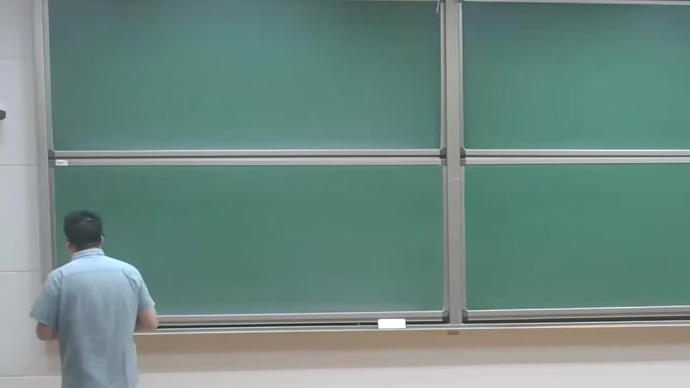

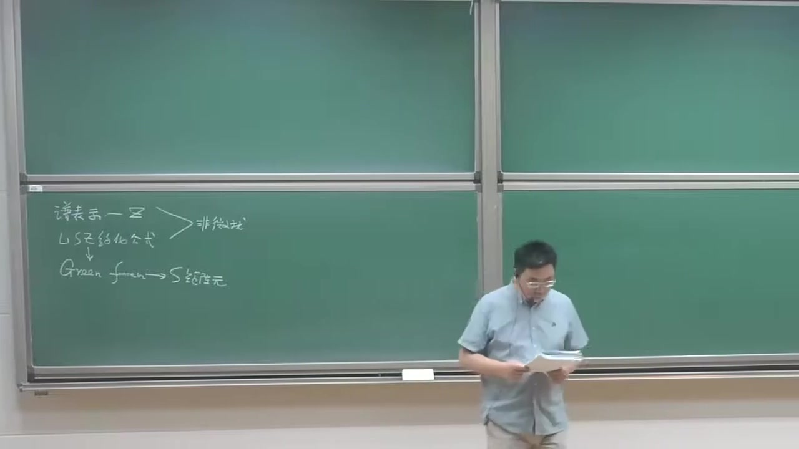

### 注解

# 这段课的核心内容：四点格林函数的极点结构、截腿函数与 LSZ 的真正用法

这段内容是在**回顾并串联上节课的两个核心定理**：

- **Källén–Lehmann（谱）表示**
- **LSZ 约化公式**

并进一步给出一个在实际计算散射振幅时非常重要的结论：

> **完整四点格林函数**在外腿接近质壳时，其最奇异部分可以分解成  
> **四个完整两点函数（传播子） × 一个截腿四点函数**，  
> 从而 LSZ 告诉你真正的散射振幅还要乘上外腿的 **\(Z^{1/2}\)** 因子。

---

## 1. 这段里出现的新公式与符号解释

---

## 公式 1：完整四点函数的“外腿 × 截腿顶点”分解

从老师口述和板书看，这里的公式是：

\[
\tilde G_4(p_1,p_2,p_3,p_4)
=
\tilde G_2(p_1)\,\tilde G_2(p_2)\,\tilde G_2(p_3)\,\tilde G_2(p_4)\,
\Gamma_4(p_1,p_2,p_3,p_4)
\]

更准确地说，这里讨论的是**四点连通格林函数**的动量空间表示的极点结构；在外腿意义下，它可以写成这种“截腿分解”。

### 符号解释

- \(\tilde G_4(p_1,p_2,p_3,p_4)\)  
  四点格林函数的**动量空间**表示。  
  波浪号 \(\tilde{}\) 表示已经从坐标空间做了傅里叶变换。

- \(p_1,p_2\)  
  入射粒子的四动量。

- \(p_3,p_4\)  
  出射粒子的四动量。

- \(\tilde G_2(p)\)  
  完整的两点格林函数，也就是**精确传播子**（exact propagator）。

- \(\Gamma_4(p_1,p_2,p_3,p_4)\)  
  **截腿的四点函数**，也常称为 amputated four-point function。  
  “截腿”意思是：把外部那四条传播子腿拿掉以后剩下的那部分。

---

### 这个公式的物理意思

它表达的是：

> 一个完整的四点相关函数，可以看成：
> 1. 外面每条腿先各自传播到相互作用区域；
> 2. 中间发生一个“真正的四点散射过程”。

因此：
- **外腿传播**由 \(\tilde G_2(p_i)\) 描述，
- **真正相互作用核心**由 \(\Gamma_4\) 描述。

这就是为什么画图时常用：
- 黑色圆点/黑团表示完整传播子；
- 中间圆圈表示截腿四点函数。

---

## 公式 2：LSZ 给出的四点函数在质壳附近的最奇异部分

老师这里讲的是，当每个外腿动量都逼近物理质壳时，四点函数最奇异的部分具有如下结构：

\[
\tilde G_4(p_1,p_2,p_3,p_4)
\;\sim\;
\tilde G_2(p_1)\tilde G_2(p_2)\tilde G_2(p_3)\tilde G_2(p_4)\,
\langle p_3,p_4 \vert S-1 \vert p_1,p_2\rangle
\]

再结合每个两点函数在单粒子极点附近的行为

\[
\tilde G_2(p)\;\sim\;\frac{iZ}{p^2-m_{\text{phys}}^2+i\epsilon}
\]

可得到四点函数在四条外腿都上壳时的主导奇异项与 S 矩阵元之间的关系。

---

### 这里的符号解释

- \(\sim\)  
  不是严格相等，而是表示“在某个极限下具有相同的主导奇异行为”。

- \(\langle p_3,p_4 \vert S-1 \vert p_1,p_2\rangle\)  
  从两粒子初态 \((p_1,p_2)\) 到两粒子末态 \((p_3,p_4)\) 的**散射矩阵元**。  
  写 \(S-1\) 是因为单位算符对应“不发生散射”的平凡部分，真正关心的是非平凡散射部分。

- \(m_{\text{phys}}\)  
  **物理质量**，即传播子的单粒子极点所在位置对应的质量。

- \(Z\)  
  场强重整化常数（wavefunction renormalization constant），也叫单粒子极点的留数。

---

### 为什么老师强调“这不是严格等式”？

因为完整四点函数不仅包含“四条腿都出现单粒子极点”的部分，还可能有：

- 只有三条腿是极点的项，
- 两条腿是极点的项，
- 更不奇异或完全正则的项。

所以严格说应该理解为：

\[
\tilde G_4 = (\text{四个单粒子极点项}) + (\text{较不奇异项})
\]

LSZ 提取的正是**最强的、与外部单粒子态对应的那部分极点结构**。

---

## 公式 3：由上两式比较得到的散射振幅公式

老师最后给出的“master formula”本质上是：

\[
\langle p_3,p_4 \vert S-1 \vert p_1,p_2\rangle
=
\lim_{p_i^2\to m_{\text{phys}}^2}
Z^{-2}\,
\Gamma_4(p_1,p_2,p_3,p_4)
\]

如果按每条外腿贡献一个 \(Z^{-1/2}\) 来记，那么四条外腿总共就是

\[
\left(\sqrt{Z}\right)^{-4}=Z^{-2}
\]

有些教材也会把约定写成不同的 \(i\)、负号或连同动量守恒 \((2\pi)^4\delta^{(4)}(\sum p)\) 的形式；老师这里强调的核心不是这些约定细节，而是：

> **S 矩阵元 = 截腿绿函数在外腿上壳极限下，再乘上每条外腿的 \(Z^{-1/2}\)**

---

### 符号解释

- \(\lim_{p_i^2\to m_{\text{phys}}^2}\)  
  对每条外腿都取**上质壳极限**：  
  \[
  p_1^2,p_2^2,p_3^2,p_4^2 \to m_{\text{phys}}^2
  \]

- \(Z^{-2}\)  
  四条外腿各给 \(Z^{-1/2}\)，总乘积为 \(Z^{-2}\)。

- \(\Gamma_4\)  
  截腿四点函数。它不是最终可观测振幅本身，必须经过 LSZ 的外腿归一化修正。

---

## 2. 必要的理论背景补充

---

## 2.1 为什么两点函数里会有 \(Z\)？

由谱表示可知，完整传播子在单粒子极点附近具有形式

\[
\tilde G_2(p)\approx \frac{iZ}{p^2-m_{\text{phys}}^2+i\epsilon}
\]

这说明：

- 极点位置给出**物理质量**；
- 极点留数不是 1，而是 \(Z\)。

### \(Z\) 的物理意义

它衡量的是：

> 场算符 \(\phi\) 作用在真空上时，产生“单粒子纯态”的概率幅有多大。

在相互作用理论中，\(\phi|0\rangle\) 不只包含一个单粒子态，还掺杂多粒子连续谱，所以留数一般不是 1。

---

## 2.2 为什么“只算截腿图”还不够？

很多人在初学费曼图时会记住一个快速规则：

> “算连通、截腿的费曼图，就得到散射振幅。”

这句话在**树图级**通常没问题，因为此时常常有

\[
Z=1
\]

但一旦加入**辐射修正/圈图修正**，就不对了。因为此时：

- 两点函数被自能修正改变；
- 单粒子极点的留数变成 \(Z\neq 1\)。

因此真正的振幅不是单纯 \(\Gamma_4\)，而是

\[
\mathcal M \propto Z^{-2}\Gamma_4 \quad (\text{四条外腿时})
\]

老师强调的正是这一点：

> **只算 amputated connected diagrams 只是“差不多”，并不是完整 LSZ 公式。**

---

## 2.3 “上壳极限”是什么意思？

散射中的外粒子是真实可探测粒子，因此必须满足其物理色散关系：

\[
p^2 = m_{\text{phys}}^2
\]

这叫做**on-shell（上质壳）条件**。

而格林函数里的外腿一般是任意四动量的数学变量，未必上壳。  
LSZ 就是告诉你：

> 怎样从这些“非上壳”的格林函数中，提取出对应真实入射/出射粒子的散射振幅。

---

## 3. 通俗解释核心概念

---

## 3.1 “完整四点函数”到底在讲什么？

可以把它想成：

- 两个粒子从远处来，
- 它们一路传播，
- 在中间发生相互作用，
- 然后两个粒子再传播出去。

所以整体自然分成两部分：

1. **外腿传播过程**：每条腿一个完整传播子 \(\tilde G_2\)；
2. **中心散射核心**：\(\Gamma_4\)。

就像：

- 乘客从家到车站（外腿传播），
- 中间乘坐高铁（中心相互作用），
- 再从车站去目的地（外腿传播）。

真正你想研究的“列车运行机制”，是中间那部分；但实际观测到的信号还带着前后接驳过程的影响。因此需要 LSZ 来把这些“接驳因子”系统地剥离并归一化。

---

## 3.2 为什么每条外腿都要带一个 \(\sqrt Z\)？

因为每个外部粒子并不是“裸场”本身，而是相互作用理论中的**物理单粒子态**。  
场算符产生它的强度不是 1，而是 \(\sqrt Z\)。

所以：

- 一条外腿：补一个 \(Z^{-1/2}\)
- 四条外腿：补一个 \(Z^{-2}\)

这是把“格林函数的归一化”转换成“单粒子散射态归一化”的必要步骤。

---

## 3.3 为什么树图时常常忽略 \(Z\)？

因为在最低阶近似中，传播子还是自由传播子的样子，极点留数通常就是 1，即

\[
Z=1+O(\hbar)
\]

因此在树图级别可以近似不管。  
但到了圈图级别，\(Z\) 偏离 1，这时**漏掉它就会得到错误答案**。

这正是老师最后强调的重点。

---

## 4. 板书/截图内容描述

根据截图，板书内容大致包括以下几部分：

---

### 截图 1
黑板基本还是空的，老师刚开始进入这部分内容，应该是在口头回顾上节课两个重要定理的关系。

---

### 截图 2
左下区域开始写出逻辑链条，大意是：

- **谱表示 / \(Z\)**
- **LSZ 约化公式**
- 它们都是**非微扰**的基本结论
- 从 **Green function** 到 **S 矩阵元**

可以看出老师在强调这两个定理的地位：  
它们不是依赖微扰展开才成立，而是从场论基本结构出发得到的。

---

### 截图 3
左下黑板画出了一个四点函数的图像：

- 中间一个圆/团块，标记为类似 \(\Gamma_4\) 的对象；
- 四条外腿连到这个圆上；
- 外腿附近画了波浪/圈注，表示完整两点函数 \(\tilde G_2\)。

板书同时写出了类似公式：

\[
\tilde G_4(p_1,p_2,p_3,p_4)
=
\tilde G_2(p_1)\tilde G_2(p_2)\tilde G_2(p_3)\tilde G_2(p_4)\Gamma_4(p_i)
\]

并在上方标出 LSZ 的箭头，说明接下来要将其与 S 矩阵元联系起来。  
老师手指的位置看起来正在强调外腿传播子那一串 \(\tilde G_2\) 因子。

---

## 5. 这段内容的知识重点总结

这段真正新增、最值得记住的内容有三点：

### 重点 1：四点函数的截腿分解
\[
\tilde G_4 = \tilde G_2\tilde G_2\tilde G_2\tilde G_2\,\Gamma_4
\]
意思是：完整相关函数 = 外腿传播 × 截腿核心。

### 重点 2：LSZ 只取外腿上壳时的最强极点
当 \(p_i^2\to m_{\text{phys}}^2\) 时，四点函数的最奇异部分才对应真实散射过程。

### 重点 3：真正的散射振幅要带 \(Z\) 因子
四条外腿各给一个 \(Z^{-1/2}\)，所以总共给出 \(Z^{-2}\)。  
因此：

> **“振幅 = 截腿图”只是在树图级的简化说法。**
> **有量子修正时，必须再乘上外腿的波函数重整化因子。**

---

如果你愿意，我下一步可以把这段内容**整理成一页“考试速记版”**，或者进一步帮你**把老师这里的口述公式统一成标准教材记号**。

---

## 段落 2：Z因子的物理图像与外腿修正

**时间：** 00:07:20 ~ 00:11:12

📝 原始字幕

<pre>

所以以前你也比较容易理解以前我们都是S算符的相互作用会景下呢
我用的VIT
知识化来表征是吧对然后I和F呢我都说了是什么呀
是H0的本侦探是吧
这是我们以前给大家的支持
我跟大家说这是一种不太严格的一种
这种近似的一种
快速这种捷径
那我们怎么理解这个更好的一个非常好的物理理解就是物理上来说呢
我们非常感兴趣的是
物理的DREASED这个例子比如DREASED的电子穿上一张电子的这种作为这个INSTATED或者作为ALSETE是吧我们并不感兴趣裸的这个电子裸的电子原来实际上可以观测的
所以说你可以这样理解比如说我们
上面可给大家讲这个ZFACT物理一的时候呢
你可以认为一个物理的一个电子就开启相关作用以后QED的真正的完整哈姆顿本侦探的我们叫物理的电子某种意义上你可以认为是
它写成一个裸的一个电子
然后更好Z是个这个
重新规划这个因子是吧我们管在量子域里面叫不行数重整因子一般叫Z二
然后加上下一节诗
一个裸的垫子
加上一个光子OK这是贝尔
加点点点是吧
所以你发现的同时公式呢你可以
发现了
你问你自己一个物理的一个电子的一个胎
里面
你要找到一个裸的电子弹的几率
整幅呢就是这个更号Z二
是吧
okay
当然这给大家一种图强这并不是一个严格的
数学上非常严格的一种说法因为我们知道单粒子它还有一堆得它方程动量成得它方程但我们并不关注我们说物理上这样的话你就可以容易理解
我们以前计算的这样一个
冰蒸
是从一个
H0的一个本质态
说不
初态和末态是吧
物理打个比方来说
我们这里面好像是一个裸的一个垫子
作为H0的一个
问侦探是吧
但物理上我们知道一个
物理的一个电子呢
是完整的QED的哈姆顿那样的一个
本侦探是吧
比如说我们考虑以前我们做计算呢
我们集团的H成员呢
比如我们考虑比如电子电子闪射
电子电子散射
那我们以前通过这种公鸡酸呢
其实这都是什么呀这都可以认为某种异常
那是贝尔的是吧
我们绕一圈
一个贝尔的这个电子摊
它含有物理的一个
电子的这个几率呢
这更号Z2是吧所以你很容易发现它
大致来说等于根号
Z二有四个电子所以更恰恰要有四个方
然后呢
你把它换成
上一个
物理的
电子
给他
电子在Instead
物质电子呢在奥斯汀当然这这样写的是海斯摩汇景
okay
所以通过这个图像呢
我希望大家能够记住为什么你要
你要这个结腿的四点函数里面要加一个更好这个四十方factor
这是一个给大家一些直觉上的一种
一种理解OK
好那我们最后呢

</pre>

**课程截图：**

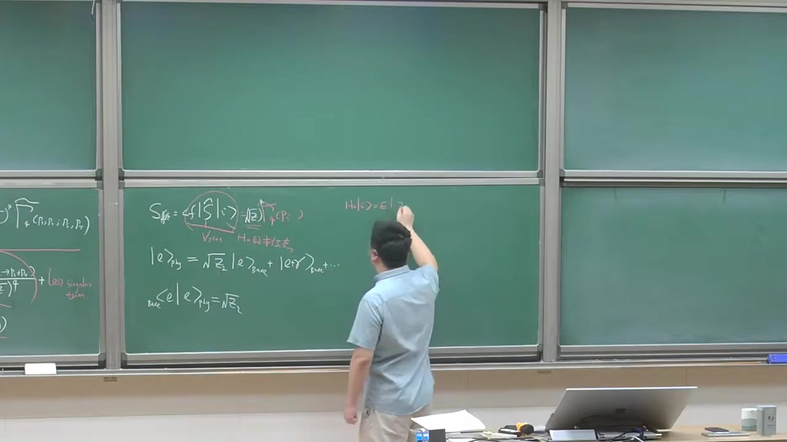

### 注解

# 本段新内容注解：把 \(Z_2^{1/2}\) 理解成“物理电子在裸电子态中的概率幅”

这一段老师主要不是在推新定理，而是在给前面 **LSZ 外腿因子** 一个**物理图像**。核心思想是：

> 我们真正关心的散射粒子不是“裸粒子（bare particle）”，而是打开相互作用后、完整哈密顿量的本征态，也就是“物理粒子（dressed particle）”。
>
> 因而一个物理电子态，可以展开成“裸电子 + 裸电子加光子 + ……”的叠加。
>
> 其中，物理电子态中“纯裸电子成分”的系数，就是 \(\sqrt{Z_2}\)。

这正是为什么在从格林函数提取实际散射振幅时，每条电子外腿都要带一个 \(Z_2^{1/2}\) 因子；如果有四条电子外腿，就会得到 \((\sqrt{Z_2})^4 = Z_2^2\)。

---

## 1. 本段出现的公式与符号解释

结合字幕和黑板，这一段出现的核心公式主要有下面几类。

---

### 公式 1：S 矩阵元与截腿振幅的关系

黑板上写的是类似：

\[
S_{fi}=\langle f|\hat S|i\rangle
\]

以及前面已经推到的、这里被重新解释的关系：

\[
S_{2\to 2}\sim (\sqrt{Z})^4 \,\widetilde{\Gamma}_4
\]

或者更具体地，对电子外腿应写成

\[
S_{fi}\sim (\sqrt{Z_2})^4 \,\widetilde{\Gamma}_4(p_1,p_2;p_3,p_4)
\]

其中：

- \(S_{fi}\)：从初态 \(i\) 到末态 \(f\) 的散射矩阵元
- \(\hat S\)：S 算符
- \(\widetilde{\Gamma}_4\)：四点“截腿”关联函数/振幅（amputated 4-point function）
- \(Z_2\)：电子场的波函数重整化常数
- \((\sqrt{Z_2})^4\)：四条外电子腿各自贡献一个 \(\sqrt{Z_2}\)

#### 这里的新解释
前面这个式子已经从 LSZ 技术上得到了；现在老师强调的是：

- **这不是纯粹形式操作**
- 它有物理意义：每条外腿都要把“裸电子态”投影到“物理电子态”，因此每条腿给一个 \(\sqrt{Z_2}\)

---

### 公式 2：物理电子态展开成裸态叠加

黑板上最关键的新式子是类似：

\[
|e\rangle_{\text{phys}}
=
\sqrt{Z_2}\,|e\rangle_{\text{bare}}
+
|e\gamma\rangle_{\text{bare}}
+\cdots
\]

更准确一点，从物理意义上应理解为：

\[
|e\rangle_{\text{phys}}
=
\sqrt{Z_2}\,|e\rangle_{\text{bare}}
+
c_{e\gamma}|e\gamma\rangle_{\text{bare}}
+
c_{e\gamma\gamma}|e\gamma\gamma\rangle_{\text{bare}}
+\cdots
\]

其中：

- \(|e\rangle_{\text{phys}}\)：**物理电子态**，即完整相互作用哈密顿量的单电子本征态
- \(|e\rangle_{\text{bare}}\)：**裸电子态**，即自由理论 \(H_0\) 的单粒子本征态
- \(|e\gamma\rangle_{\text{bare}}\)：一个裸电子加一个光子的多体态
- \(\cdots\)：还包含更复杂的 Fock 分量，如一个电子加多个光子，甚至电子-光子-电子对等更复杂成分
- \(\sqrt{Z_2}\)：物理电子态在“纯裸电子分量”上的概率幅

#### 含义
这个式子表达的是：

- 真正的物理电子不是简单的“一个孤零零的电子”
- 它周围总伴随电磁场涨落
- 因而它是一个“穿着云”的电子，英文叫 **dressed electron（着装电子 / 穿衣电子）**

从 QED 角度看，打开相互作用后，电子态会混入：

- 电子本身
- 电子 + 虚光子云
- 更高阶辐射修正对应的更多分量

---

### 公式 3：重叠振幅等于 \(\sqrt{Z_2}\)

黑板上还写了类似：

\[
{}_{\text{bare}}\langle e|e\rangle_{\text{phys}}=\sqrt{Z_2}
\]

这和上面的态展开是等价的。

其中：

- \({}_{\text{bare}}\langle e|\)：裸电子单粒子态的 bra
- \(|e\rangle_{\text{phys}}\)：物理电子态
- 内积 \({}_{\text{bare}}\langle e|e\rangle_{\text{phys}}\)：物理电子态投影到纯裸电子态上的振幅

#### 物理意义
这说明：

> 在一个“物理电子”里，抽取出“单纯裸电子成分”的概率幅是 \(\sqrt{Z_2}\)

因此对应的概率大致是

\[
Z_2
\]

当然老师也提醒了：这是一种**物理图像上的说法**，不是最严格的数学表述。

---

### 公式 4：自由哈密顿量与完整哈密顿量的本征态

黑板右边写了两行，意思大致是：

\[
H_0|e\rangle_{\text{bare}} = E\,|e\rangle_{\text{bare}}
\]

\[
H|e\rangle_{\text{phys}} = E\,|e\rangle_{\text{phys}}
\]

其中：

- \(H_0\)：自由哈密顿量，不含相互作用
- \(H\)：完整哈密顿量，含相互作用
- \(|e\rangle_{\text{bare}}\)：\(H_0\) 的本征态
- \(|e\rangle_{\text{phys}}\)：\(H\) 的本征态
- \(E\)：对应能量本征值

#### 新内容所在
老师在强调：

- 我们以前散射计算里，常把初末态近似为 \(H_0\) 的本征态
- 这在物理上并不完全严格
- 真正可观测的是 \(H\) 的本征态，也就是 dressed 物理粒子态

这正是 LSZ 外腿因子需要修正的原因。

---

## 2. 必要背景知识补充

---

### 2.1 什么是“裸粒子”和“物理粒子”？

#### 裸粒子（bare）
“裸电子”是理论计算中的一个中间概念：

- 它是自由理论里的单粒子态
- 不带相互作用云
- 是 \(H_0\) 的本征态

#### 物理粒子（physical / dressed）
真实可观测的电子则是：

- 打开电磁相互作用后的单粒子激发
- 是完整哈密顿量 \(H\) 的本征态
- 周围伴随着虚光子云、真空极化等效应

所以物理电子不是“纯态 \(|e\rangle_{\text{bare}}\)”；
它是一个由很多自由理论 Fock 态组成的叠加态。

---

### 2.2 为什么会出现 \(Z_2\)？

在 QED 中，电子两点函数在质壳附近有单粒子极点，极点留数就是 \(Z_2\)。

从传播子角度看，电子完整传播子在 \(p^2 \to m^2\) 附近的行为大致是

\[
S_F(p)\sim \frac{i Z_2}{\slashed p-m+i\epsilon}
\]

这里：

- \(\slashed p=\gamma^\mu p_\mu\)
- \(m\)：物理质量
- 极点前的系数 \(Z_2\)：表示相互作用场与真正单粒子态之间的重叠强度

因此 LSZ 在“去掉外腿传播子”之后，还会留下每条外腿一个 \(\sqrt{Z_2}\)。

---

### 2.3 为什么是 \(\sqrt{Z_2}\)，不是 \(Z_2\)？

因为：

- 两点函数的极点留数是 \(Z_2\)
- 但单个外态的重叠振幅是“留数的平方根”

也就是说：

- 一个物理外态 \(\leftrightarrow\) 裸场激发单粒子态的振幅：\(\sqrt{Z_2}\)
- 两端合起来（例如两点函数中一个 bra 一个 ket）才给出 \(Z_2\)

所以每条外腿贡献的是 \(\sqrt{Z_2}\)。

---

### 2.4 四条电子外腿为什么给 \((\sqrt{Z_2})^4\)？

例如电子-电子散射：

\[
e^- e^- \to e^- e^-
\]

有：

- 2 条入射电子腿
- 2 条出射电子腿

总共 4 条外电子腿，因此总因子是

\[
(\sqrt{Z_2})^4 = Z_2^2
\]

这就是老师说的“有四个电子，所以要有四个 \(\sqrt{Z_2}\)”。

---

## 3. 通俗理解：为什么外腿要乘 \(Z_2^{1/2}\)？

可以把这个想成“身份匹配系数”。

你在费曼图计算里，通常是拿**自由理论中的裸电子态**做基底来算；
但实验里真正入射和出射的是**物理电子**。

于是就有一个“转换”：

- 裸电子态 不是 物理电子态
- 物理电子态只是在裸电子态方向上有一个分量
- 这个分量大小就是 \(\sqrt{Z_2}\)

所以：

- 每个入射物理电子，要投影到裸电子基底上，给一个 \(\sqrt{Z_2}\)
- 每个出射物理电子，也要从裸电子基底投影回去，再给一个 \(\sqrt{Z_2}\)

总之，每条外腿一个 \(\sqrt{Z_2}\)。

---

## 4. 老师强调的“这不是严格数学定理”是什么意思？

这一点很重要。

老师说把物理电子写成

\[
|e\rangle_{\text{phys}}
=
\sqrt{Z_2}|e\rangle_{\text{bare}}+|e\gamma\rangle_{\text{bare}}+\cdots
\]

是一种**直观图像**，但不是最严格的说法，原因包括：

1. **单粒子态与连续谱的处理很微妙**  
   严格来说，量子场论中的单粒子态、散射态、连续谱、归一化都需要小心处理。

2. **相互作用理论里的本征态结构更复杂**  
   特别是在规范理论中，红外问题会使“一个电子 + 若干软光子”的分解更微妙。

3. **\(Z_2\) 的严格定义来自传播子极点留数**  
   真正可靠、可计算、可用于推导 LSZ 的定义，是两点函数在单粒子极点附近的留数，而不是简单把它当作通常量子力学里某个概率。

所以这里应该把这个图像理解为：

> 一个帮助你记住 LSZ 外腿因子来源的物理直觉，而不是完整的严格谱理论表述。

---

## 5. 这一段和前面内容的衔接

前面已经知道：

- 四点格林函数在外腿接近质壳时，会分解出四个外传播子
- 真正的散射振幅来自“截腿后的部分”
- 还要乘外腿的 \(Z^{1/2}\)

这一段新增的是：

> **为什么乘 \(Z^{1/2}\) 可以从“物理粒子态 vs 裸粒子态”的重叠来直观理解。**

所以现在你可以把 LSZ 的外腿因子记成一句话：

> **外腿因子 \(Z^{1/2}\) 表示“物理外粒子在裸单粒子态中的概率幅”。**

---

## 6. 结合电子-电子散射的具体理解

老师举的例子是电子-电子散射：

\[
e^- e^- \to e^- e^-
\]

在图像上你可以这么理解：

- 费曼图里的外腿，形式上像是裸电子线
- 但实验里的入射、出射粒子其实是物理电子
- 每个物理电子态包含：
  - 一个裸电子分量
  - 电子 + 光子分量
  - 更复杂分量

因此，从计算用的“裸电子外腿”对应到真正实验态“物理电子外腿”，每条腿都要补一个重叠因子 \(\sqrt{Z_2}\)。

四条腿合起来就是：

\[
(\sqrt{Z_2})^4
\]

---

## 7. 对截图板书的描述

从截图中可以辨认出黑板上主要写了以下内容：

### 左侧黑板
仍保留着上一段的内容，大意是：

- \(S_{2\to 2}\) 可以由四点截腿函数 \(\widetilde{\Gamma}_4\) 给出
- 外面带有 \((\sqrt{Z})^4\) 因子
- 以及四点函数在质壳附近分解成四个完整传播子乘以截腿四点函数的结构

这些内容是前面已经讲过的技术推导结果。

### 中间黑板
这里是本段新写的重点：

1. 写出
   \[
   S_{fi}=\langle f|\hat S|i\rangle
   \]
2. 在旁边标明：
   - 初末态是“物理态”
   - 不只是 \(H_0\) 的本征态
3. 写出物理电子态展开：
   \[
   |e\rangle_{\text{phys}}=\sqrt{Z_2}|e\rangle_{\text{bare}}+|e\gamma\rangle_{\text{bare}}+\cdots
   \]
4. 写出重叠：
   \[
   {}_{\text{bare}}\langle e|e\rangle_{\text{phys}}=\sqrt{Z_2}
   \]

### 右侧黑板
写了自由态和物理态分别满足的本征方程，大意是：

\[
H_0|e\rangle_{\text{bare}}=E|e\rangle_{\text{bare}}
\]

\[
H|e\rangle_{\text{phys}}=E|e\rangle_{\text{phys}}
\]

用来强调：
- 裸电子是自由哈密顿量的本征态
- 物理电子是完整哈密顿量的本征态

---

## 8. 本段最核心的一句话总结

这段的核心新结论可以浓缩成一句话：

> **\(Z_2^{1/2}\) 可以直观地理解为：一个“物理电子”投影到“裸电子单粒子态”上的概率幅；因此每条电子外腿都要带一个 \(Z_2^{1/2}\)，四条外腿就得到 \((Z_2^{1/2})^4\)。**

如果你愿意，我下一步可以把这段内容整理成一页“LSZ 外腿因子的物理解释”速记卡。

---

## 段落 3：LSZ投影、极点结构与不连通图排除

**时间：** 00:11:12 ~ 00:16:29

📝 原始字幕

<pre>

关于IC呢我们再comment一点
弄不着
就是我买了CDN也可以改写一下OK
比如我们韩元凯的二到二的一个
一个过程我们可以写成
我们把X能量
怎么得到呢比如我可以发现它等于
做一个四点函数
你可以发现
它可以通过这样一个
动量空间的一个四点
格林函数
来得到怎么得到呢
跟每个外腿呢
你成一个这样一个因子
成一个自由传播子的自由的非凡传播子的这个倒数是吧
这什么意思
还有说
这什么时候会可是非礼呢你发现了我们知道
这样的一个
四点零函数它具有这种结构当米的外图是虚心外壳它具有这种结构
P I 方 G M 方
当然有个Z因子是吧
然后呢
这应该有四个连成爱人一到四
它具有这种结构
Okey
它正面临这种形式
所以它的意思就是说
我每一个这样一个因子杀掉一个
穿脖子的一个分母OK
然后最后呢你发现
所以说你发现它给着飞灵的结构的话它必须含有这个四个单粒子的破的沉积
最后你可以投影出来一个S正元是吧所以某种意义上说你能说X正元也可以认为是格林函数的这样一个
四个单粒子炮的这个
细数或者说软的数或者流数是吧所以从这个公式你很容易看出来
就说啊
如果出于某种原因呢
如果这个四点零函数含有的这个POW它不是这个世界的一个
不是有四个破了成绩的话比如只有三个破或两个破的话根据这样一个投影的工业上这个是零我举个例子我们积分和之前给大家讲这个格林函数的时候呢
我们发现格林函数根据GAME二楼公式我们不需要考虑这样一个真空泡泡图是吧
比如说对于QED一正一负的着着
或者一件衣服一件衣服吧
我们发现
我们永远都不用考虑
这种说这种
VCOM八宝代币是吧因为他的GAMERO公司的分母被抵掉了
但是格林还说原浪可以存在很多不联通图比如说我们考虑一个
四点的一个格林函数在拉布纳菲斯特理论的话
我让他画了很多图其中里面的图呢
它是不联通的
这也是一个合理合法的一个四点零函数还有那图呢
是这样子的OK
那我们已经清楚根据我们LC公式呢
我们需要考虑的是这样一个
我们已经知道了
我们理解就是说
我们需要考虑一个节腿的一个死点函数是吧
然后你给它弥补一个更好的一点所以这个图我们知道已经不用考虑了这个非常好我们截图的图这种图
就从这儿砍掉是吧所以这种图不用考虑
那那个图呢
我们也说过一个所谓的这种克拉斯的组合分解原理是吧当然你也可以根据这个公式可以理解你看这样一个思想函数它动量空间
它是两个完整的
两个函数所以它只有
只有两个破了成机
所以说呢
你成四个这样一个
P放到M方呢
四界的一个零点成一个两界的破他那个零
所以从IC定理你也知道这种图呢
也不用考虑是吧
我们让这个
外孔八宝图也不用考虑
当然了
就是说你要是论证最朴实的一个
不联通图为什么不考虑你还得需要用这个CLAUSE TECHNOLOGYPROPOSITIONPRICEPOLE比如说我们考虑一个
尸体的反应比如一张衣服
两对一争一复到两对一争一复
比如说
你可以画出这样的一个图
四到四的一个过程是吧
如果这两个呢
离得特别遥远是吧它也不联通我们知道这个定理说的是
类定定位置这个原则说的是如果两个非常遥远的人实验呢
他们彼此不能影响是吧
所以这个反应的X正元其实可以因子化成两个独立的
S级的成绩是吧
所以这是根据GDP这个原则
不用考虑LC本身
它并不能心灵这种
这种反应呢
不用考虑
所以很多时候我们还是说用这种原理但我们以前讨论过
如果
它是完全联通的话这样一个四成四到四的一个H正元就是一个比较合力的一个
一个考虑是吧一个函数好的

</pre>

**课程截图：**

### 注解

# 本段新内容注解：LSZ 如何“筛掉”不该进入散射振幅的四点函数部分

这一段是在前面 **LSZ 约化公式 + 四点函数极点结构** 的基础上，继续往前推进一个很重要的判断：

> **不是所有四点格林函数图都对 \(2\to2\) 散射振幅有贡献。**  
> 只有那些在四个外腿上都带有**单粒子极点**的部分，经过 LSZ “截腿”以后才会留下非零的 \(S\)-矩阵元。

老师这里主要讲了三件事：

1. 如何把 \(2\to2\) 散射振幅写成四点动量空间格林函数乘以外腿因子；
2. 为什么 LSZ 的本质是“**用 \((p_i^2-m^2)\)** 去消掉每条外腿传播子的极点”；
3. 为什么某些图——尤其是**真空泡泡图**和**不联通图**——不会对散射振幅作贡献。

---

## 1. 本段出现的公式与逐项解释

---

### 公式 1：\(2\to2\) 散射的 LSZ 形式

从截图和字幕可还原出老师写的是类似下面的式子：

\[
S_{2\to2}
=
\prod_{i=1}^{4}
\frac{p_i^2-m^2}{i}\;
\widetilde G_4(p_1,p_2,p_3,p_4)
\quad \text{(再取各外腿上壳极限)}
\]

更完整一点通常写成

\[
\langle p_3,p_4 \,{\rm out}|p_1,p_2\,{\rm in}\rangle
=
\left(\prod_{i=1}^4 Z^{-1/2}\right)
\lim_{p_i^2\to m^2}
\left[
\prod_{i=1}^4 i(p_i^2-m^2)\,
\widetilde G_4(p_1,p_2,p_3,p_4)
\right]
\]

不同教材会有 \(i\)、符号约定、动量流向的差别，老师这里强调的不是这些细节，而是结构本身。

#### 符号解释

- \(S_{2\to2}\)：二体到二体散射的 \(S\)-矩阵元。
- \(\widetilde G_4(p_1,p_2,p_3,p_4)\)：**动量空间四点格林函数**。
- \(p_i\)：四条外腿对应的四动量。
- \(m\)：外部散射粒子的物理质量。
- \(\prod_{i=1}^4 (p_i^2-m^2)\)：LSZ 的“截腿”操作核心部分。
- \(Z\)：场强重整化常数；每条外腿通常带一个 \(Z^{-1/2}\) 或等价因子，具体取决于定义。
- “取上壳极限” \(p_i^2\to m^2\)：把外部粒子动量放到真实单粒子质壳上。

---

### 公式 2：四点函数在外腿接近质壳时的极点结构

老师说“四点函数具有这种结构”，意思是它在四个外腿都靠近单粒子壳时，有如下因子化形式：

\[
\widetilde G_4(p_1,p_2,p_3,p_4)
\;\sim\;
\prod_{i=1}^{4}
\left(
\frac{iZ}{p_i^2-m^2+i\epsilon}
\right)
\;
\widetilde \Gamma_4(p_1,p_2,p_3,p_4)
\]

也常写成

\[
\widetilde G_4
\sim
\widetilde G_2(p_1)\widetilde G_2(p_2)\widetilde G_2(p_3)\widetilde G_2(p_4)\,
\widetilde \Gamma_4
\]

其中 \(\widetilde G_2\) 是完整两点函数，\(\widetilde \Gamma_4\) 是**截腿四点函数**（amputated 4-point function）。

#### 符号解释

- \(\widetilde G_2(p)\)：完整传播子/完整二点格林函数。
- \(\dfrac{iZ}{p^2-m^2+i\epsilon}\)：在单粒子极点附近，完整传播子的主导行为。
- \(Z\)：单粒子极点的留数（或者说场与单粒子态重叠的平方）。
- \(\widetilde \Gamma_4\)：把四条外腿传播子“砍掉”之后剩下的四点顶角函数，也叫**截腿四点函数**。
- \(i\epsilon\)：费曼边界条件。

---

### 公式 3：完整两点函数的单粒子极点

字幕里老师说“每一个这样一个因子杀掉一个传播子的分母”，依赖的就是这个结构：

\[
\widetilde G_2(p)
\;\xrightarrow[p^2\to m^2]{}
\frac{iZ}{p^2-m^2+i\epsilon}
+\text{less singular terms}
\]

也就是：

- 在 \(p^2\to m^2\) 时，
- 完整传播子含有一个单粒子极点，
- 极点的留数是 \(iZ\)。

于是 LSZ 里的 \((p^2-m^2)\) 恰好把这个极点分母消掉。

---

## 2. 这些公式到底在说什么

---

### 2.1 LSZ 的本质：只提取“单粒子外腿”的那一部分

通俗地说，四点格林函数 \(\widetilde G_4\) 里面“混着很多东西”：

- 真正对应 \(2\to2\) 散射的信息；
- 纯真空涨落；
- 不联通的拼接图；
- 甚至一些只在部分外腿上有极点的结构。

而 **LSZ 并不是直接把整个四点函数都当作振幅**，它做的是：

> 对每条外腿乘上一个 \((p_i^2-m^2)\)，再把该腿放到质壳。

这一步像一个“投影仪”或“筛子”：

- 如果某条外腿上真有单粒子极点 \(\sim 1/(p_i^2-m^2)\)，那它会被消掉并留下有限非零结果；
- 如果没有这个极点，那乘上 \((p_i^2-m^2)\) 后在上壳极限就会变成零。

所以老师说：

> **要得到非零的散射振幅，四点函数必须含有四个单粒子极点的乘积。**

---

## 3. 为什么只有“四个极点都齐全”的部分才贡献 \(2\to2\)

这是本段最核心的新结论。

若某一部分四点函数只含有：

- 两个外腿极点，或
- 三个外腿极点，

那么经过

\[
\prod_{i=1}^{4}(p_i^2-m^2)
\]

之后，总会剩下至少一个没有分母可消的 \((p_j^2-m^2)\)，再取 \(p_j^2\to m^2\) 时，它就会把整个项压成 0。

所以：

\[
\text{若 } \widetilde G_4 \text{ 不含四个单粒子极点的乘积，则该部分对 } S_{2\to2} \text{ 贡献为零。}
\]

这就是老师说“如果这个四点函数含有的 pole 不是四个 pole 的乘积，比如只有三个 pole 或两个 pole，根据这样一个投影公式它就是零”。

---

## 4. 本段涉及的新图像判断：哪些图不用考虑

---

### 4.1 真空泡泡图不考虑

老师先提到：在生成格林函数时，可能会出现真空泡泡图。

但这些图在规范定义的格林函数里通常已经被分母归一化抵消掉，这一点前文已经讲过；本段的新强调是：

> 就算你从“LSZ 提取散射振幅”的角度看，真空泡泡也不携带外腿的单粒子极点结构，因此不进入真正的散射振幅。

也就是说，它们本来就是与外部粒子散射无关的“整体真空背景因子”。

---

### 4.2 只由两个完整两点函数拼出来的不联通四点图也不考虑

老师举了 \(\lambda\phi^4\) 理论中的四点函数为例，说其中会有一些**不联通图**，比如本质上是

\[
\widetilde G_4 \sim \widetilde G_2 \, \widetilde G_2
\]

这种结构。

这类图从四点格林函数看，确实是“合法的四点函数贡献”；但对 \(2\to2\) 散射来说，它没有四个外腿都接在同一个真正相互作用过程上。

更关键的是，从极点结构上看：

- 一个完整二点函数 \(\widetilde G_2\) 只给出一个单粒子极点；
- 两个完整二点函数乘起来，整体只有**两个极点因子**；
- 但 LSZ 需要四个外腿各自都有极点。

因此：

\[
\widetilde G_4 \sim \widetilde G_2 \widetilde G_2
\quad \Longrightarrow \quad
\prod_{i=1}^4 (p_i^2-m^2)\,\widetilde G_4 \to 0
\]

所以这类图也不贡献 \(2\to2\) 散射振幅。

---

## 5. 与 cluster decomposition（簇分解）原则的关系

老师这里还提到了一个比 LSZ 更“物理”的原则：**cluster decomposition principle**（簇分解原理）。

### 它说什么？

如果两个实验、两个反应过程在空间上相距非常遥远，那么它们应该彼此独立，整体振幅应该因子化成两个远离系统各自振幅的乘积。

例如老师举的意思是：如果一个“4 到 4”的过程，本质上只是两个远离彼此的“2 到 2”过程同时发生，那么：

\[
S_{\text{overall}} \sim S^{(1)} S^{(2)}
\]

这说明它不是一个真正的“整体联通散射事件”，而是两个独立实验的并列发生。

### 为什么这里要提它？

因为：

- **LSZ** 从“单粒子极点结构”出发，告诉你哪些东西在约化后会消失；
- **cluster decomposition** 从“远距离独立性”的物理原则出发，告诉你为什么这种不联通的远距离过程不应视作一个真正的基本散射振幅。

老师特别指出：

> 对某些更复杂的不联通反应，单靠 LSZ 的形式还不足以一眼看出“为什么它不算一个真正的单个散射过程”，这时就需要借助簇分解原理来理解。

---

## 6. 通俗解释：LSZ 像“四个验票口”

可以把四点格林函数想成一个很大的候选集合，里面什么成分都有。

而 \(2\to2\) 散射要求：

- 第 1 条外腿真的是一个单粒子；
- 第 2 条外腿也真的是一个单粒子；
- 第 3 条外腿也一样；
- 第 4 条外腿也一样。

LSZ 的 \((p_i^2-m^2)\) 就像 **四个验票口**：

- 每条外腿都必须拿得出一个单粒子极点“票据”；
- 缺一个都进不去；
- 只有四张票都齐的那部分，最后才被识别为真正的 \(S\)-矩阵元。

所以：

- 真空泡泡：一张票都没有；
- 两个两点函数拼起来：只有两张票；
- 某些半截的不联通图：票不齐；
- 真正的联通散射图：四张票齐。

---

## 7. 板书/截图内容描述

根据截图，这一段黑板上主要有以下内容：

### 上方左侧黑板
延续前面内容，板书了：

- “读表象 \(\to Z\)”
- “LSZ 约化公式”
- “Green function \(\to S\) 矩阵元”
- 一个四外腿图示，中间写了类似 “Amplitude”
- 四点函数分解成若干完整两点函数乘上一个截腿四点函数的结构：
  \[
  \widetilde G_4 \sim \widetilde G_2\widetilde G_2\widetilde G_2\widetilde G_2\,\widetilde \Gamma_4
  \]

右上角还圈出了 \(S\)-矩阵和极限、\(\sqrt{Z}\) 因子有关的表达式。

### 中间黑板
老师新写了本段核心公式：

\[
S_{2\to2} = \prod_{i=1}^{4}\frac{(p_i^2-m^2)}{i}\,\widetilde G_4(p_1,p_2,p_3,p_4)
\]

并在公式下方画了一个传播子的极点样子，大意是：

\[
\frac{iZ}{p^2-m^2}
\]

用来说明为什么外腿因子会“杀掉”传播子分母。

随后黑板上又画了几个叉掉的图：

- 一个与外部散射无关的泡泡/团状图，被打叉；
- 一个不应考虑的图结构，也被打叉；

其意图就是说明：

> 这类图在 LSZ 投影下不会留下真正的散射振幅贡献。

### 右侧黑板
仍保留前面关于

\[
|e\rangle_{\rm phy} = \sqrt{Z_2}\,|e\rangle_{\rm bare} + \cdots
\]

以及

\[
{}_{\rm bare}\langle e|e\rangle_{\rm phy}=\sqrt{Z_2}
\]

之类的内容，不过这部分属于前一段主题，本段只是作为背景保留在黑板上。

---

## 8. 本段的核心结论

这一段最重要的结论可以压缩成三句话：

1. **\(2\to2\) 散射振幅由动量空间四点格林函数通过 LSZ 提取。**
2. **LSZ 只保留外腿上都具有单粒子极点的那部分。**
3. **因此真空泡泡图、只含部分极点的不联通图、以及像 \(G_2G_2\) 这样的拼接图，都不对真正的散射振幅贡献。**

---

## 9. 一句总结

> **四点格林函数不等于散射振幅；只有其中“四条外腿都能上壳、都带单粒子极点”的联通部分，才会被 LSZ 约化成真正的 \(S\)-矩阵元。**

---

## 段落 4：狄拉克场谱表示与Z2定义

**时间：** 00:16:29 ~ 00:20:59

📝 原始字幕

<pre>

好 那我们现在呢
顺便呢
我们
讨论一下Z2OK
我们讨论一下对于迪拉克厂的普表示
迪拉克厂的
他来来来来
所以关键的两面引用的这个Z2这个一个因子OK
所以说呢
我们根据以前做法类似我们可以
引入一个
迪拉克厂的
两点函数是吧这个Omega是物理真空
PSX是海斯马虎虎金的迪拉合长然后做一个副列变换是吧
好
我们把它复制到动量空间里面去的你可以论证
到
当这个P方四动量的平方
趋近于这样一个物理的一个电子的质量平方的时候
它只有一个
单个的一个极点的结构它长得样子是这样的
iZZ二
求和
计划求和
有有吧
注意
西风
物理的电子的质量平方加E
然后再加上
停停停停
身上像比如说是割线或者没有像这样的单个这个剖这么奇异你可以
图示一下你可以跟上一个例子一样可以画一个这个
在这个批评方的这个
铺平面把它这样一个
动量空间的一个
严格的传播精确的传播的这个
气体结构会坏的话你会发现它长得这样子
Okey
这是批发的食谱
这是批方的虚布
你发现呢
你期待这里有一个单个的一个
厚是吧
你
如果是一个理论呢
如果像Face一样它还是带质量的话你期待呢
你看
有个Slasher的呢
沿着这条视轴是个割线是个branch cut是吧
所以一般来说我们这说是ICELITTLEPOW但是你要注意QQD里面呢
光子是严格零质量的
所以你这个歌现在起点呢
一般我们说是电子质量加光子质量
这个平方
OK在FES理论里面由于是MASTER的话这个ISLETPOW和这个歌线的时点是有距离的但是对于QE来说非常SATLED是因为光子零质量所以这个POW呢其实是歌线的这个
初始位置是个Branch Point
所以这一点带来很多satellite
好那我们假设呢我们还可以把它参照化这种形式
还是可以参化这种形式
法国
卡特
那我们接着往下走
好那我们现在正式引入Z2这个音字什么叫Z2呢
你会发现呢
还是一个
它代表一个迪拉克场算服海斯堡湖丁的迪拉克场算服
和一个物理的一个单
单电子胎呢
还有一个偶合的一个卡普林的一个这个strength一个强度是吧
你可以定义成
因为它是个炫亮城它有四个分量所以你右边它正比一个
Dex spinner 然后这类银子
更好这一图如果这是我们以前学的自由场论就是自由的迪拉克理论的话我们都知道
这东西不能零
你发现没有这个因子或者说是二等一
所以加入相干作用以后
你看引了一个 z2 是吧
根据这个物理上的这个谱表示我们给出了一个根据这个正则量化的一个
一个等项的话条件我们有沙漠路是吧我们知道
团数镇定的话要求Z二是大一零的
然后根据这个一个非常
这个普世的要求呢我们叫Z二呢
它是一个小于一的一个正的一个数是吧
好的

</pre>

**课程截图：**

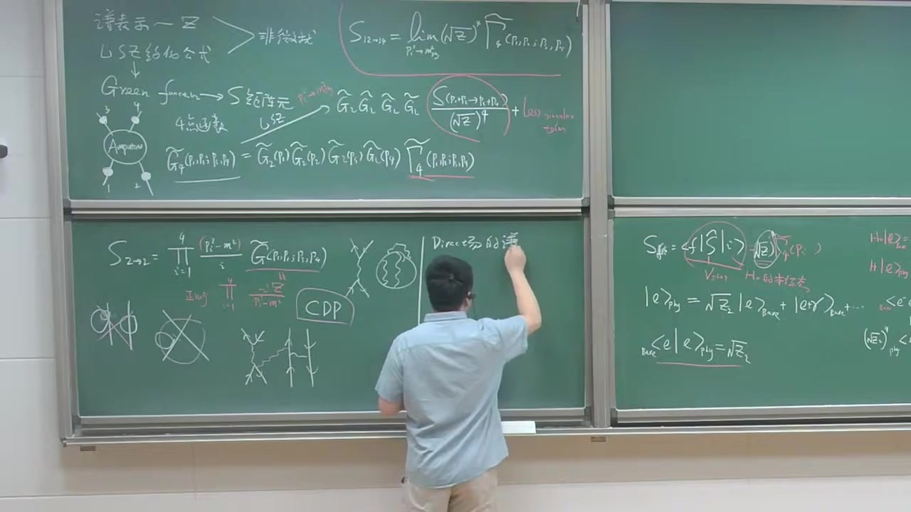

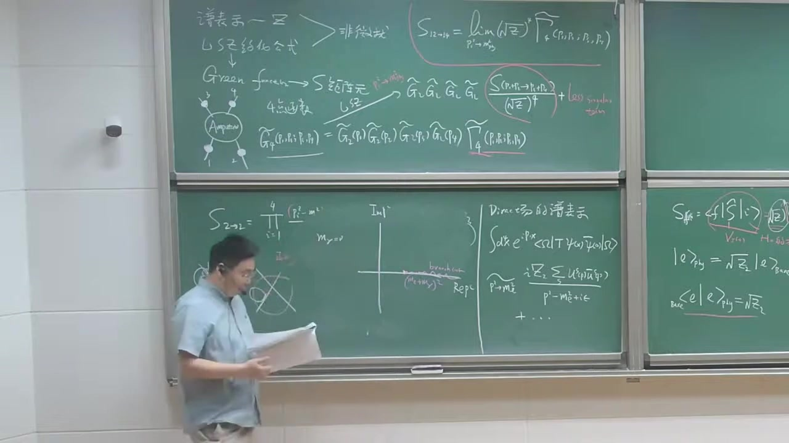

### 注解

# 本段新内容注解：Dirac 场的两点函数、单粒子极点与 \(Z_2\)

这一段开始正式讨论 **费米子场（Dirac 场）对应的场强重整化常数 \(Z_2\)**。  
核心内容有三部分：

1. **完整 Dirac 两点函数在物理电子质量壳附近的极点结构**
2. **为什么在 QED 里这个极点和 branch cut 的起点会“粘”在一起**
3. **\(Z_2\) 的物理意义：Heisenberg 场与单电子物理态之间的耦合强度**

这部分是把前面讲过的 LSZ 外腿因子，专门落实到 **电子场** 上。

---

## 1. 本段出现的公式与逐一解释

---

### 公式 1：Dirac 场的两点函数

老师先定义了相互作用理论中 Dirac 场的二点函数（传播子）：

\[
\langle \Omega | T \,\psi(x)\,\bar\psi(y)|\Omega\rangle
\]

再做傅里叶变换到动量空间：

\[
\int d^4x\, e^{ip\cdot x}\,
\langle \Omega | T\,\psi(x)\bar\psi(0)|\Omega\rangle
\]

更标准地通常记作

\[
S_F(p)
=
\int d^4x\, e^{ip\cdot x}\,
\langle \Omega | T\,\psi(x)\bar\psi(0)|\Omega\rangle
\]

#### 符号解释

- \(\Omega\)：**物理真空**，即相互作用理论真正的基态
- \(T\)：时间排序算符
- \(\psi(x)\)：Heisenberg 绘景下的 Dirac 场
- \(\bar\psi(x)\equiv \psi^\dagger(x)\gamma^0\)：Dirac 共轭场
- \(S_F(p)\)：费米子完整传播子（full propagator）
- \(p\)：四动量
- \(d^4x\)：四维时空积分

#### 它在说什么

这个量描述的是：

> 在真空中放入一个电子型激发，再把它取出来，期间所有相互作用都已经包含在内。

所以这不是“自由传播子”，而是**严格/精确传播子**。

---

### 公式 2：在 \(p^2\to m_e^2\) 附近的单粒子极点结构

老师说：当四动量平方 \(p^2\) 趋近于**物理电子质量平方** \(m_e^2\) 时，完整传播子有一个单极点，形式是

\[
S_F(p)\;\sim\;
\frac{i\,Z_2\,\sum_s u_s(\mathbf p)\bar u_s(\mathbf p)}
{p^2-m_e^2+i\epsilon}
+\text{less singular terms}
\]

这就是板书中的核心公式。  
有时也常写成等价形式：

\[
S_F(p)\;\sim\;
\frac{i\,Z_2(\slashed p+m_e)}{p^2-m_e^2+i\epsilon}
+\cdots
\]

因为对壳上自旋和有恒等式

\[
\sum_s u_s(\mathbf p)\bar u_s(\mathbf p)=\slashed p+m_e
\quad\text{(在适当归一化下)}
\]

#### 符号解释

- \(m_e\)：**物理电子质量**（renormalized / physical mass）
- \(Z_2\)：Dirac 场的场强重整化常数
- \(u_s(\mathbf p)\)：动量为 \(\mathbf p\)、自旋为 \(s\) 的电子正能量旋量
- \(\bar u_s(\mathbf p)\)：其 Dirac 共轭
- \(\sum_s\)：对自旋求和
- \(\epsilon\)：Feynman 处方里的无穷小正数
- \(\slashed p \equiv \gamma^\mu p_\mu\)
- “less singular terms”：比单极点不那么奇异的项，例如正则项或割线贡献

#### 这条公式的物理意义

它说的是：

> 完整传播子虽然包含无限多量子修正，但在“电子真正作为单粒子传播”的那一点附近，它还是会表现得像一个单粒子极点，只不过这个极点前面的残数变成了 \(Z_2\)。

自由理论里这个残数是 1；有相互作用后变成 \(Z_2\)。

---

### 公式 3：branch cut 的起点

老师提到，如果理论中还有别的多粒子态，那么传播子不只有单极点，还会有割线（branch cut）。

对于一个带质量的“光子型”媒介粒子（更一般地说其他可产生的粒子）质量记为 \(m_\gamma\)，那么多粒子连续谱的起点一般在

\[
p^2=(m_e+m_\gamma)^2
\]

#### 符号解释

- \(m_\gamma\)：这里课堂上是拿“光子质量”做示意；严格 QED 中 \(m_\gamma=0\)
- \((m_e+m_\gamma)^2\)：电子 + 一个光子态的阈值（threshold）

#### 含义

当动量足够大，场算符不仅能激发“单电子态”，也能激发：

- 电子 + 光子
- 电子 + 多个光子
- 更复杂的多粒子连续态

这些连续谱在动量空间中对应的就是 **branch cut**，不是孤立极点。

---

### 公式 4：QED 中阈值与极点重合

由于真实 QED 中光子严格无质量：

\[
m_\gamma=0
\]

所以连续谱起点变成

\[
p^2=(m_e+0)^2=m_e^2
\]

也就是说：

\[
\text{branch point} = m_e^2
\]

刚好和电子单粒子“极点位置”重合。

#### 这一点为什么重要

在有质量媒介粒子的理论里，通常：

- 单粒子极点在 \(p^2=m_e^2\)
- 连续谱起点在 \(p^2=(m_e+m_\gamma)^2\)

两者中间有一个间隔，所以极点很“干净”。

但在 QED 里：

- 光子质量为零
- 电子 + 软光子态可以从 \(m_e\) 处就开始出现

因此单电子与“电子 + 无限软光子云”的结构纠缠在一起，这会带来著名的 **红外微妙性（infrared subtlety）**。老师说的 “very subtle” 指的就是这里。

---

### 公式 5：\(Z_2\) 的定义

老师随后正式定义 \(Z_2\)。  
对单电子物理态 \(|e(\mathbf p,s)\rangle\)，定义

\[
\langle \Omega|\psi(0)|e(\mathbf p,s)\rangle
=
\sqrt{Z_2}\,u_s(\mathbf p)
\]

或者等价地写在 \(x\) 点：

\[
\langle \Omega|\psi(x)|e(\mathbf p,s)\rangle
=
\sqrt{Z_2}\,u_s(\mathbf p)e^{-ip\cdot x}
\]

这就是板书中说的“Dirac 场算符和一个物理单电子态之间耦合的强度”。

#### 符号解释

- \(|e(\mathbf p,s)\rangle\)：动量为 \(\mathbf p\)、自旋为 \(s\) 的**物理单电子态**
- \(\sqrt{Z_2}\)：场算符从真空中“打出”一个物理电子的概率幅/重叠幅
- \(u_s(\mathbf p)\)：由于左边是一个旋量对象，所以右边必然正比于 Dirac 旋量

#### 为什么右边一定是 \(u_s(\mathbf p)\)

因为：

- 左边 \(\langle\Omega|\psi(0)|e\rangle\) 是一个 **四分量旋量**
- 这个矩阵元又必须满足 Lorentz 对称性和 Dirac 方程的结构
- 所以它只能正比于电子的外线旋量 \(u_s(\mathbf p)\)

比例常数就定义为 \(\sqrt{Z_2}\)。

---

### 公式 6：\(Z_2\) 的取值范围

老师说根据正定性与谱表示，可以得到

\[
0<Z_2\le 1
\]

严格按课堂语气是：“大于零，小于等于一”。

#### 解释

- \(Z_2>0\)：因为它来源于谱权重/态空间内积，不能是负的
- \(Z_2\le 1\)：因为物理电子态不再是纯粹“单裸电子”，而是混合了更多成分，所以“纯单电子分量”的权重不可能超过 1

自由理论极限下：

\[
Z_2=1
\]

有相互作用时通常：

\[
Z_2<1
\]

---

## 2. 必要的理论背景补充

---

### 2.1 为什么传播子会出现“极点 + 割线”结构

这是谱表示在费米子场上的直接体现。

一个局域场算符 \(\psi\) 作用在真空上，不只会产生单电子态，还可以产生：

- 单电子态
- 电子 + 一个光子
- 电子 + 两个光子
- 更高连续谱态

因此动量空间两点函数的解析结构自然分成两部分：

1. **单粒子态**给出孤立极点
2. **多粒子连续态**给出 branch cut

所以老师画复 \(p^2\) 平面时，一边画了一个点状极点，一边画了从阈值开始的割线。

---

### 2.2 为什么费米子传播子的极点 residue 写成 \(\sum_s u_s\bar u_s\)

标量场在极点附近是

\[
\frac{iZ}{p^2-m^2+i\epsilon}
\]

但 Dirac 场不是标量，而是旋量场，所以极点 residue 不能只是一个数，而必须带有自旋结构。  
这个结构正好就是

\[
\sum_s u_s(\mathbf p)\bar u_s(\mathbf p)
\]

它是把中间单电子态插进去后得到的自然结果。

直观地说：

> 标量粒子只有“一个分量”，费米子有自旋和旋量结构，所以传播子极点前面也必须保留这部分信息。

---

### 2.3 \(Z_2\) 与 LSZ 的关系

前面课堂已经讲过 LSZ 外腿会带 \(Z^{1/2}\) 因子。  
对电子外线，这个 \(Z\) 就是这里的 **\(Z_2\)**。

也就是说：

- 每条外部电子腿，对应一个 \(\sqrt{Z_2}\)
- 每条外部光子腿，对应类似的 \(\sqrt{Z_3}\)

所以 \(Z_2\) 不是凭空加上的，它直接来自 **完整费米子传播子在物理质量壳附近的 residue**。

---

### 2.4 QED 为什么特别麻烦：红外问题

老师特别提醒：

> 在一般带质量理论里，孤立极点和连续谱阈值之间有间隔；
> 但 QED 因为光子无质量，这个间隔消失了。

这意味着：

- 任意低能的软光子都可以伴随电子出现
- 于是“单电子态”很难和“电子 + 极软光子态”完全分开
- 数学上表现为极点附近解析结构更微妙

这正是 QED 中很多红外现象的源头，例如：

- 软光子发射
- 红外发散
- 严格单粒子态定义的细微问题

老师这段还没有展开这些内容，但已经点出了原因。

---

## 3. 通俗解释核心概念

---

### 3.1 \(Z_2\) 到底是什么？

可以把它想成：

> **“你用场算符 \(\psi\) 去敲真空时，敲出来一个真正单电子态的效率有多高。”**

如果是自由理论，没有相互作用：

- \(\psi\) 敲一下，出来的就是干干净净的电子
- 所以 \(Z_2=1\)

如果有相互作用：

- 你敲出来的不再只是“纯电子”
- 还会夹杂电子周围带着光子云等复杂成分
- 真正“纯单电子”的那部分只占一部分权重

所以：

\[
Z_2<1
\]

---

### 3.2 为什么说它像“重叠系数”？

因为物理电子态不是 bare electron 的简单版本，而是“穿了衣服”的 dressed electron。  
场算符 \(\psi\) 最容易激发的是“裸电子型”的分量，但真实物理态已经被相互作用修饰。

于是 \(Z_2\) 就衡量：

> **裸电子型激发，与真实物理电子态之间的重叠有多大。**

这就是老师说的“coupling strength”。

---

### 3.3 为什么 QED 中极点与割线起点重合很特别？

可把它理解成：

- 如果媒介粒子有质量，那么“一个纯电子”和“电子 + 一个额外粒子”之间有能量门槛
- 所以纯电子对应的峰会比较孤立、容易辨认

但如果光子没质量：

- 你几乎不需要额外能量，就能带出一个无限软的光子
- 因此“纯电子”和“电子 + 软光子”从阈值上就缠在一起了

所以 QED 中单电子态的解析性质比一般有质量理论更 delicate。

---

## 4. 结合截图的板书内容描述

从截图可以看到，这一段黑板上主要写了三块内容：

---

### （1）左/中间黑板：复 \(p^2\) 平面上的解析结构图

老师画了一个复平面示意图：

- 横轴大致是 \(p^2\) 的实部
- 纵轴是虚部
- 在 \(p^2=m_e^2\) 附近标出一个单极点（pole）
- 从阈值位置开始沿实轴画出一条 branch cut

并特别标出：

- 一般情况下 branch cut 起点是 \((m_e+m_\gamma)^2\)
- QED 中因 \(m_\gamma=0\)，它就落到 \(m_e^2\)

这正是在说明：
**Dirac 全传播子不仅有单电子极点，还有多粒子连续谱。**

---

### （2）中间黑板：Dirac 两点函数的谱表示/极点展开

能看见老师写了类似

\[
\int d^4x\, e^{ip\cdot x}
\langle \Omega | T \psi(x)\bar\psi(0)|\Omega\rangle
\]

然后在 \(p^2\to m_e^2\) 时写成

\[
\frac{i Z_2 \sum_s u_s(\mathbf p)\bar u_s(\mathbf p)}
{p^2-m_e^2+i\epsilon}
+\cdots
\]

这是这一段最关键的公式。

---

### （3）右边黑板：\(Z_2\) 的定义与物理意义

右边板书能看出老师写了类似：

\[
\langle \Omega|\psi(0)|e\rangle \sim \sqrt{Z_2}\,u(p)
\]

以及进一步把物理电子态展开成“bare electron + 其他成分”的样子，表达其物理含义：

- 物理电子态不是单一裸态
- \(\sqrt{Z_2}\) 是其中“单电子分量”的幅度

底下还写了一个类似“bare 与 phy 的重叠”关系，说明：

\[
\sqrt{Z_2}
\]

可以看作某种重叠振幅。

---

## 5. 本段要点总结

这一段的新内容可以压缩成三句话：

1. **Dirac 场完整两点函数在 \(p^2\to m_e^2\) 时有单电子极点：**
   \[
   S_F(p)\sim \frac{iZ_2(\slashed p+m_e)}{p^2-m_e^2+i\epsilon}+\cdots
   \]

2. **\(Z_2\) 定义为场算符与物理单电子态之间的耦合强度：**
   \[
   \langle \Omega|\psi(0)|e(\mathbf p,s)\rangle=\sqrt{Z_2}\,u_s(\mathbf p)
   \]

3. **QED 因为光子无质量，连续谱阈值从 \(p^2=m_e^2\) 就开始，极点与 branch point 重合，因此解析结构比一般有质量理论更微妙。**

如果你愿意，我可以下一步把这段内容进一步整理成一页“考试/复习版公式卡片”，或者专门解释一下  
**为什么 \(0<Z_2\le 1\)** 能从谱表示与正定性推出。

---

## 段落 5：电子传播子重求和与自能展开

**时间：** 00:21:01 ~ 00:30:19

📝 原始字幕

<pre>

然后呢我们
一般来说这为什么叫Z2这是根据convention是吧就
电子唱算符的这样一个
电子唱算符的
红花常说
为什么要重整化常数
这里面其实理解中重新规划场景更好一点
但是历史上这张照片
上次写给大家举例什么
得到一个比较好的物理图像其实你是从这个
两个类学
对时间功的秒论
能获取很多饮酒预选非常好好那现在我们仿照我们上节课就是说对于飙量场论
我们结合微量论
因为这个东西IFC和这个普表是都是飞不了的东西
我们把维扰论如果能把一系列图能重塑到所有阶的话原来上某种意义上也是非维扰的东西是吧我们想通过这个非版图的层次来说
来知道Z二来怎么表示好的那我们还是一样
我们还是看这样一个
其实exact它占一个两点函数
副列变化动量空间或者叫
我们一般管得叫穿上衣服的
电子的传播子OK的电子propagator
好的我们
我们根据这个分班图怎么画呢我们可以这样画
因为这飞鸣子现在带箭头所以来说呢
我要给个箭头这动量是P
动量方向沿着这个飞米子箭头的方向
图上十色的代表是完整的传播字
这是严格的一个传播子
你可以企图一个这个
等价的一个等式它等于一个
自由的迪拉克传播子
嘿
加上什么呢加上一个自由的传播词
然后有个所谓的单粒子不可约的一个
电子智能图OK
然后呢
右边呢
再接上一个完整的
电子的Dress传播子OK
这是个等式是吧这显然你可以让你自己幸福这是对的好你把它利用迭代呢把它反复可以
把它展开足结展开你可以发现它是一些重形势
等于领头阶等于
自由的迪拉克传播子
加上一个玩PI的一个智能
插入再加上
玩PI自由传播的再加个玩PI
更有智能
然后
可以再加上
蓝皮啊
P P I
三个蛮便宜
加点点点
你可以用迭代法是吧你可以
得到一个精确的一个
Dress的电子传播子的一个
一个图形的一个表示OK
好的
那万比一
我们其实已经大家知道什么意思了是吧
就是
我们可以给它盯一下
我们把这个 onepi
继承负的I Sigma 2P
它P的函数
它等于
One Pi
我们考虑智能图的时候呢
两端的两个传播子我们并不
并不写在我们的这个
写到我们的这样一个废卖规则里面去
牢牢记住我们会画这个图
比如说什么是VIP呢
在单泉节呢
QD只有一个
三粒子不可分割的非凡图完PLA这个时候你砍掉其中任何一个内线呢这个图不能切割成独立的分离的两块
不管砍那个还是砍那个它不能把它这个图分成两
两节是吧
在两圈呢
你可以画出
这种图
或者说
中途
Okey
或者是
中间会有一个电子
正电子的一个圈图费米子圈图加点点点你可以很容易验证呢这都是玩PI是吧
你也可以很容易举一个不是翻皮的例子
我看你发现呢
像这样一个图
它就不是
蛮屁呀
因为你
我说了这两根线不用考虑是吧但是中间任何线你砍掉不能把这土砍成两截但是你砍这个地方这个土变成两截了
这不是班皮尔图呢它已经被
所有的这种结构已经自动包含了
所以我们并没有丢失任何东西
好的大家注意一下这电子智能它是一个
它是一个四成丝的矩阵
所以说呢
你可以把它参数化成一个sigma p
等于什么呢等于A
是个表扬函数
显示的是正比P slash
家比
屁放
然后成一个
四成四的单位矩阵是吧
所以你可以认为呢
这A和
B 都是skiller函数
所以你认为Sigma Tool也可以是P slash的
P slash 函数
很容易验证呢
啊
这个智能呢变得智能了
这个修正和
算数来讲
它是对翼的是吧
好的那我们现在可以做一件事情
那我们现在可以把这样一个
动量空间的这个Dress的传播子呢
用的这个自由传播字
和我的这样一个智能可以表示一下是吧
好 嗯现在D4X
你的pit dot ex
哦米加
可以
是吧
编尸沉机的整工据证员
你可以把它写成
我把那张图翻译一下第一项Pslash减M0
M0代表拉式量里面出QD拉式量里面出来的这样一个
质量参数我们期待它不一定跟
实际上测量到零五一一物理电子质量一样
好了我们就把这个
图形呢
把它翻译成
我们的这个公式
哦
第二项有一个 one Pi 的智能可以写成 pslx 减m0
富达I,SigmatR,Pslash
IP slash Gm0 加点点点 OK
鱼的你发现这个sig吗
谁干嘛二
和这个PISLAY是堆的
所以我其实把这两项可以合并一下我可以写成这种形式来看一下父爱成I等于一
我可以重新写一下写成这种形式
称
什么RP slash
注意P slash
这m0好出于简单的这个RXL
我先把它扔掉了大家默认这个APP了
你可以一次累推加上i
什么事情做
现在呢有两个WINPIRE的智能
所以说呢
它可以选择它的平方
要点点点是吧你发现了这个东西有点类似我们标浪里人的话
它也形成了一个几何级数这是非常重要的
几何几数
所以呢我们都知道很容易来
求和是吧
它等于I
写了七千零
然后
陈一
把后面的这一项这两项
无穷无穷的各种几何技术把从容求和
你得到了非常标准的
和极处的这种样子
重心事
OK
好
然后呢你把它分母了两个
两组矩阵相成你发现它等于
哎
披萨是JAML
减去SigmaR
还是Slash
好这是我的
严格的
斯特斯特
电子传播子
对行事是吧
好的

</pre>

**课程截图：**

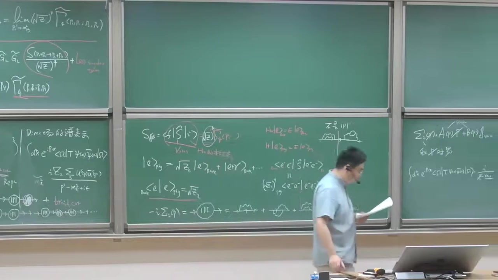

### 注解

# 本段新内容注解：QED 中电子两点函数的 Dyson 重求和与自能 \(\Sigma(\slashed p)\)

这一段开始做一件非常关键的事：

> **把“完整的电子传播子”写成“自由传播子 + 自能插入的无穷求和”**，

并由此给出 **电子场强重整化常数 \(Z_2\)** 在图像上的来源。

这里的重点新内容有三类：

1. **完整电子传播子（dressed propagator）** 的图形 Dyson 方程；
2. **单粒子不可约（1PI）电子自能图** 的定义；
3. 用几何级数把这些自能插入求和，得到完整传播子的封闭表达式。

---

# 1. 本段出现的公式与逐一解释

---

## 1.1 完整电子传播子与自由传播子的 Dyson 方程

字幕里老师说的“严格的传播子”“穿上衣服的电子传播子”“dress propagator”，对应的是：

\[
S(p) = S_0(p) + S_0(p)\,\big[-i\Sigma(\slashed p)\big]\,S(p)
\]

这就是费米子两点函数的 Dyson 型积分方程。

---

### 符号解释

- \(\boxed{S(p)}\)：  
  **完整电子传播子**（full / dressed electron propagator）。  
  它包含了所有量子修正，不再只是自由 Dirac 方程的传播。

- \(\boxed{S_0(p)}\)：  
  **自由电子传播子**（free Dirac propagator），在动量空间里是
  \[
  S_0(p)=\frac{i}{\slashed p-m_0+i\epsilon}
  \]
  这里 \(m_0\) 是裸质量（bare mass）。

- \(\boxed{\Sigma(\slashed p)}\)：  
  **电子自能**（self-energy）。  
  它总结了电子在传播过程中由于与电磁场相互作用而发生的所有 1PI 修正。

- \(\boxed{\slashed p}\)：  
  Dirac 斜杠记号，
  \[
  \slashed p \equiv \gamma^\mu p_\mu
  \]
  其中 \(\gamma^\mu\) 是 Dirac 伽马矩阵，\(p_\mu\) 是四动量。

- \(\boxed{-i\Sigma(\slashed p)}\)：  
  老师板书中把 **1PI 两点插入块** 约定定义成 \(-i\Sigma\)。  
  这是常见 convention。

- \(\boxed{i\epsilon}\)：  
  Feynman 边界条件规定，用来指定极点绕行方式。

---

## 1.2 迭代展开：自能插入的无穷级数

由上面的 Dyson 方程反复代回去，可以得到：

\[
S(p)
=
S_0(p)
+
S_0(p)\big[-i\Sigma(\slashed p)\big]S_0(p)
+
S_0(p)\big[-i\Sigma(\slashed p)\big]S_0(p)\big[-i\Sigma(\slashed p)\big]S_0(p)
+\cdots
\]

这就是老师说的“用迭代法展开”“形成一个几何级数”。

---

### 物理意义

每一项都表示：

- 先按自由电子传播；
- 中间插入一次、两次、三次……电子自能修正；
- 然后把所有可能次数都加起来。

也就是说，**完整传播子 = 自由传播 + 任意多次自能修正的总和**。

---

## 1.3 自由 Dirac 传播子

本段板书里老师把图翻译成公式时，用到了自由传播子：

\[
S_0(p)=\frac{i}{\slashed p-m_0+i\epsilon}
\]

---

### 符号解释

- \(\boxed{m_0}\)：QED 拉氏量中的**裸质量参数**。  
  它不是实验直接测到的物理电子质量。
- \(\boxed{\slashed p-m_0}\)：自由 Dirac 算符在动量空间里的形式。
- 分子上的 \(\boxed{i}\)：来自 Minkowski 时空下 Feynman 规则。

---

## 1.4 1PI 自能块的定义

老师说“我们把这个 onePI 记成负的 \(i\Sigma(\slashed p)\)”：

\[
\text{1PI two-point insertion} \;\equiv\; -\,i\,\Sigma(\slashed p)
\]

这个不是推导出来的，而是**定义**。

---

### 为什么这样定义？

因为这样写以后，Dyson 求和的公式最整齐，最后完整传播子会变成标准形式：

\[
S(p)=\frac{i}{\slashed p-m_0-\Sigma(\slashed p)+i\epsilon}
\]

这就是本段最重要的结果之一。

---

## 1.5 电子自能的一般参数化

老师说“电子自能是一个 \(4\times4\) 矩阵，所以可以参数化成”

\[
\Sigma(\slashed p)=A(p^2)\,\slashed p + B(p^2)\,\mathbf 1
\]

其中 \(\mathbf 1\) 是 \(4\times 4\) 单位矩阵。

---

### 符号解释

- \(\boxed{\Sigma(\slashed p)}\)：  
  由于电子有自旋，自能不是普通数，而是自旋空间中的矩阵。

- \(\boxed{A(p^2)}\)：  
  标量函数，只依赖 Lorentz 不变量 \(p^2\)。

- \(\boxed{B(p^2)}\)：  
  另一个标量函数，也只依赖 \(p^2\)。

- \(\boxed{\mathbf 1}\)：  
  \(4\times4\) 单位矩阵。

---

### 为什么只能写成这两项？

因为在 Lorentz 协变、宇称等对称性约束下，对于电子两点函数，能出现的矩阵结构只允许是：

- \(\slashed p\)
- 单位矩阵 \(\mathbf 1\)

因此最一般形式就是

\[
\Sigma(\slashed p)=A(p^2)\slashed p+B(p^2)
\]

这也是为什么老师说“你可以认为它是 \(\slashed p\) 的函数”。

---

## 1.6 几何级数求和得到完整传播子

把

\[
S_0(p)=\frac{i}{\slashed p-m_0+i\epsilon}
\]

代入级数，可以抽出一个 \(S_0\)，剩下的部分构成矩阵意义下的几何级数：

\[
S(p)=
S_0(p)\left[
1+\big(-i\Sigma\big)S_0+\big((-i\Sigma)S_0\big)^2+\cdots
\right]
\]

求和后得到：

\[
S(p)=S_0(p)\frac{1}{1-(-i\Sigma)S_0}
\]

进一步整理，可写成标准结果：

\[
\boxed{
S(p)=\frac{i}{\slashed p-m_0-\Sigma(\slashed p)+i\epsilon}
}
\]

这就是老师最后写出来的“严格的 dressed 电子传播子”。

---

### 这个结果怎么理解？

它说明：

- 自由传播子的极点原来由 \(\slashed p-m_0=0\) 决定；
- 加上相互作用后，极点位置被 \(\Sigma(\slashed p)\) 修正；
- 所以**物理质量、波函数归一化等信息，都编码在 \(\Sigma\) 里**。

这正是后面讨论 \(Z_2\) 的基础。

---

# 2. 补充必要的理论背景知识

---

## 2.1 什么叫 1PI（单粒子不可约）？

本段老师用“砍掉任何一根内部线都不能把图切成两块”来定义 1PI。

更准确地说：

> 对于两点函数而言，**1PI 图** 是指：切断任意一条内部 propagator，图不会分裂成两个彼此独立、且分别带一个外腿的部分。

---

### 为什么 1PI 特别重要？

因为所有“可约”的两点修正，其实都可以通过“多个 1PI 块串起来”自动生成。  
所以只要把 **1PI 自能块** 作为基本单元，再做 Dyson 求和，就已经包含了所有图。

这就是老师说的：

> “我们并没有丢失任何东西。”

---

## 2.2 一圈、两圈的电子自能图

老师举了几个例子：

- **一圈（1-loop）QED 自能图**：电子发射并再次吸收一个虚光子；
- **两圈（2-loop）自能图**：比如在内部再插入更复杂的回路修正、真空极化、费米子圈等。

这些都属于 \(\Sigma(\slashed p)\) 的一部分，只要它们是 1PI 的。

---

## 2.3 为什么说“重求和后某种意义上也是非微扰的”？

老师提到一个重要思想：

> 虽然每一个自能图本身是按微扰论阶数算出来的，但如果把某一类图“加到所有阶”并重求和，就得到一个超出有限阶微扰的结果。

严格讲它仍然建立在图展开上，但因为做了**无限多项重求和**，往往能捕捉更完整的结构，比如：

- 极点移动，
- 宽度形成，
- dressed 粒子传播的真实解析结构。

所以它常被称为“某种意义上的非微扰信息”。

---

## 2.4 为什么 \(\Sigma\) 是矩阵？

标量场两点函数修正只是一个数函数 \(\Pi(p^2)\)。  
但电子是自旋 \(1/2\) 粒子，场是 Dirac spinor，所以两点函数作用在自旋指标上，必须是一个矩阵。

因此：

\[
S(p),\quad S_0(p),\quad \Sigma(\slashed p)
\]

全部都是 \(4\times4\) Dirac 矩阵对象。

---

# 3. 通俗语言解释核心概念

---

## 3.1 “穿上衣服的传播子”是什么意思？

“穿上衣服”（dressed）就是：

> 电子不再是孤零零地自由传播，而是一路上不断被周围量子涨落“包围”。

比如它可以：

- 发射一个虚光子，
- 过一会儿再把它吸收回来，
- 或者中间发生更复杂的虚过程。

所以真正传播的不是“裸电子”，而是一个带着量子云的电子。  
完整传播子 \(S(p)\) 就是在描述这个“穿衣服的电子”。

---

## 3.2 自能 \(\Sigma\) 可以怎么理解？

可把它理解成：

> 电子在传播时，环境对它“反作用”的总效果。

它会导致：

- 质量参数修正；
- 波函数归一化修正；
- 传播子的极点结构改变。

所以 \(\Sigma\) 就像是电子传播规律中的“量子修正模块”。

---

## 3.3 为什么要只挑 1PI 图？

因为如果一个图能从中间明显切成两段，那它并不是一个“基本修正块”，而只是几个基本修正块串起来的复合结构。

就像搭积木：

- **1PI 图**是基本积木；
- 非 1PI 图只是把这些积木串起来的组合。

因此为了避免重复计算，只保留基本积木 \(\Sigma\)，再统一求和。

---

## 3.4 为什么会出现几何级数？

因为传播过程是：

- 零次自能插入；
- 一次自能插入；
- 两次自能插入；
- 三次自能插入；
- ……

这和

\[
1+x+x^2+x^3+\cdots
\]

完全同型，只不过这里的 \(x\) 是矩阵组合 \(( -i\Sigma )S_0\)。

所以最后能一口气求和，得到紧凑的 closed form。

---

# 4. 板书/截图内容描述

根据截图，这一段黑板上主要有以下内容：

---

## 4.1 左/中间黑板：从 \(Z_2\) 的物理图像过渡到自能图展开

能看到此前板书遗留的内容包括：

- \( |e\rangle_{\text{phy}} = \sqrt{Z_2}\,|e\rangle_{\text{bare}} + |e\gamma\rangle_{\text{bare}}+\cdots \)
- \( {}_{\text{bare}}\langle e|e\rangle_{\text{phy}}=\sqrt{Z_2} \)

这些是前面一段讲过的 \(Z_2\) 的物理解释。

在这一段的新板书中，下面出现了：

- \(-i\Sigma_2(\slashed p)\) 或写作 \(-i\Sigma(\slashed p)\)
- 一个被圈出的 **1PI**
- 后面接着一串电子两点自能图示意：一圈、两圈、更高圈……

说明老师正在强调：

> 电子自能由所有 1PI 两点图组成。

---

## 4.2 右侧黑板：自能的参数化与传播子表达式

截图右边能看出老师写了类似：

\[
\Sigma_2(p)=A(p^2)\slashed p + B(p^2)\mathbf 1_{4\times4}
\]

以及下方关于 Dirac 两点函数在动量空间的表达。  
虽然截图有遮挡和模糊，但从字幕和板书结构判断，后续应写到了：

\[
S_0(p)=\frac{i}{\slashed p-m_0+i\epsilon}
\]

和 Dyson 求和后得到的

\[
S(p)=\frac{i}{\slashed p-m_0-\Sigma(\slashed p)+i\epsilon}
\]

这与老师口述完全一致。

---

# 5. 本段核心结论小结

这一段最关键的新内容可以压缩成三句话：

1. **完整电子传播子**可以表示为  
   \[
   S=S_0+S_0(-i\Sigma)S
   \]
   其中 \(\Sigma\) 是电子自能。

2. \(\Sigma\) 由所有 **1PI 两点图** 组成，并且它是一个 \(4\times4\) Dirac 矩阵，可参数化为  
   \[
   \Sigma(\slashed p)=A(p^2)\slashed p+B(p^2)
   \]

3. 对自能插入做无穷重求和后，得到标准结果  
   \[
   \boxed{
   S(p)=\frac{i}{\slashed p-m_0-\Sigma(\slashed p)+i\epsilon}
   }
   \]
   这就是后面讨论物理质量、壳上重整化以及 \(Z_2\) 的出发点。

如果你愿意，我下一步可以继续把这段里的 **Dyson 求和推导逐行补全成规范的数学推导版**，或者进一步解释 **为什么由 \(\Sigma(\slashed p)\) 可以读出 \(Z_2\)**。

---

## 段落 6：物理质量条件与Z2公式推导

**时间：** 00:30:20 ~ 00:35:26

📝 原始字幕

<pre>

那我们现在可以解我们要寻找这个物理的这个
电子质量
到底是什么呢我们可以
让分母等于零可以解这个等式
写这个方程是吧我们可以
得到p slash减m0
先去sigma2去slash
我们要求
谁的
等于
物理的
电子质量的时候呢差点能零
这个条件能够定出来
这个What's physical electronics
是吧
所以你也可以写成
你可以写成这种形式
这个智能呢你发现你可以让人定一个质量的一个Shift
DTAM等于一个物理的电子质量
剪去了
裸的电脑指令
你发现了
它就等于Sigma 2
什斯莱什特
OK
从人里面可以把它定出来
好这是非常重要的公式
OK
就换着说
从量子场论来说你通过计算机WANPIDAYGRAM的话
你可以得到对电子的这种质量的修正OK
所以智能图是非常非常重要的
东西好
当这个p slice呢约等于
物理的质量的时候我可以把这个sigma2
把他拉展开的第一节所以你会发现这一项呢
下一节可以展成什么呢展成
P slash 剪去
唉
再加上Sigma 2
去slash的m这个m代表一个物理的一个
变得吃亮
把Sigma讲到下一个阶段你发现再来一下
吃了点开皮丝莱士的Amu
然后
对Disc嘛
求导数对
是slash抽导数
然后P slash等于M
炸上
二阶的
无穷小量
OK
哦可以
把这一项作为它的展开是吧这没问题
我们看一下
所以呢你发现
这些东西其实我们已经知道了
这东西就是
等于
物体的电磁质量是吧
所以可以把它P3D甲M合并
它可以等于
你想想他吗
一一剪去
D sigma 2它是p slash函数对p slash求导数
你想
那你
那然后呢
我们根据这个图表示
我们刚才已经知道了
在动量空间里面呢
电子的这个完整的传播字呢或者Dress传播字呢
当 p slash 确定为 m 的时候呢
它可以写成I
齐图
出于P方加M方这个M是物理的电量质量
加一粒肉 加上
这个有限像加上这种regular term是吧
好那你可以对比
这个传播词我刚刚说了可以写成
郑州军师
可以写成
说实话啊
啊
理解
D sigma R
杜皮斯莱什
什么是黑人
好
那我要
adentify
这个
這個的話
我可以把ZR可以表示出来是吧
很漂亮
我可以
写成这种形式
Z2
等腻
等于一减去
D sigma R
对Pslash求导数
然后LIMP slash等于IM等于
这是个非常非常重要的一个
一个等式
所以呢这里Z2呢
就说这叫电子的这个长长中中化因子是吧雷迪二记住
这个电子的传播只能是一个四乘四乘但是Z2呢
它是个number它是个普通的数
它不是个矩阵这要记住
不是我的小子
好的

</pre>

**课程截图：**

### 注解

# 本段新内容注解：物理电子质量的定义、质量重整化与电子场强重整化因子 \(Z_2\)

这一段是在前面已经得到的 **完整电子传播子**
\[
S_F(p)=\frac{i}{\slashed p-m_0-\Sigma_2(\slashed p)}
\]
基础上，进一步讨论两个核心问题：

1. **物理电子质量 \(m\)** 到底如何从传播子的极点定义出来；
2. **电子场强重整化因子 \(Z_2\)** 如何由传播子在质量壳附近的留数得到。

这段内容非常关键，因为它把：

- 自能 \(\Sigma_2(\slashed p)\)
- 质量修正 \(\delta m\)
- 传播子极点
- 重整化常数 \(Z_2\)

这些量清楚地联系在了一起。

---

## 1. 本段出现的公式与逐一解释

---

### 1. 完整电子传播子的极点条件

老师说“让分母等于零”，就是指完整传播子
\[
S_F(p)=\frac{i}{\slashed p-m_0-\Sigma_2(\slashed p)}
\]
的分母在**物理质量**处为零。

因此物理电子质量 \(m\) 由如下条件定义：

\[
\left[\slashed p-m_0-\Sigma_2(\slashed p)\right]_{\slashed p=m}=0
\]

也就是

\[
m-m_0-\Sigma_2(m)=0
\]

或者写成

\[
m=m_0+\Sigma_2(m)
\]

#### 符号解释
- \(S_F(p)\)：电子的完整（dressed）费曼传播子
- \(p^\mu\)：电子四动量
- \(\slashed p \equiv \gamma^\mu p_\mu\)：Dirac slash 记号
- \(m_0\)：裸质量（bare mass）
- \(\Sigma_2(\slashed p)\)：电子两点 1PI 自能修正
- \(m\)：物理电子质量，也就是传播子的单粒子极点位置

---

### 2. 质量位移（质量修正）的定义

老师随后定义了质量的 shift：

\[
\delta m \equiv m-m_0
\]

结合上面的极点条件，就得到

\[
\delta m=\Sigma_2(m)
\]

更准确地说，是在质量壳 \(\slashed p=m\) 上评价的自能：

\[
\delta m=\Sigma_2(\slashed p)\big|_{\slashed p=m}
\]

#### 符号解释
- \(\delta m\)：电子质量因量子修正产生的偏移量
- \(m-m_0\)：物理质量减去裸质量
- \(\Sigma_2(m)\)：自能在质量壳上的取值

这就是本段反复强调的“非常重要的公式”。

---

### 3. 在质量壳附近对自能作展开

当 \(\slashed p\) 接近物理质量 \(m\) 时，可以对自能做泰勒展开。老师讲的是一阶展开：

\[
\Sigma_2(\slashed p)
=
\Sigma_2(m)
+
(\slashed p-m)\left.\frac{d\Sigma_2}{d\slashed p}\right|_{\slashed p=m}
+\mathcal O\!\left((\slashed p-m)^2\right)
\]

这里保留到一阶，后面高阶项略去。

#### 符号解释
- \(\frac{d\Sigma_2}{d\slashed p}\)：把 \(\Sigma_2\) 看作 \(\slashed p\) 的函数后，对 \(\slashed p\) 求导
- \(\mathcal O((\slashed p-m)^2)\)：二阶及以上的小量

---

### 4. 将展开代回传播子分母

传播子分母是

\[
\slashed p-m_0-\Sigma_2(\slashed p)
\]

把上面的展开代进去：

\[
\slashed p-m_0-\Sigma_2(m)-(\slashed p-m)\left.\frac{d\Sigma_2}{d\slashed p}\right|_{\slashed p=m}
+\mathcal O((\slashed p-m)^2)
\]

再利用
\[
m-m_0-\Sigma_2(m)=0
\]
即
\[
m_0+\Sigma_2(m)=m
\]
可化简为

\[
(\slashed p-m)\left[1-\left.\frac{d\Sigma_2}{d\slashed p}\right|_{\slashed p=m}\right]
+\mathcal O((\slashed p-m)^2)
\]

于是传播子在极点附近可写成

\[
S_F(p)\approx
\frac{i}{
(\slashed p-m)\left[1-\left.\dfrac{d\Sigma_2}{d\slashed p}\right|_{\slashed p=m}\right]
}
\]

进一步整理成

\[
S_F(p)\approx
\frac{i\,Z_2}{\slashed p-m}
\]

其中

\[
Z_2=
\frac{1}{
1-\left.\dfrac{d\Sigma_2}{d\slashed p}\right|_{\slashed p=m}
}
\]

这就是本段最重要的结论之一。

---

### 5. 从极点结构定义 \(Z_2\)

老师说“在动量空间里完整传播子当 \(\slashed p\) 接近 \(m\) 时，可以写成极点加 regular term”，对应的是

\[
S_F(p)=\frac{iZ_2}{\slashed p-m+i\epsilon}+\text{regular terms}
\]

这里的 “regular terms” 指在 \(\slashed p=m\) 附近**不发散**的有限项。

然后与 Dyson 结果做对比，就得到

\[
Z_2=
\frac{1}{
1-\left.\dfrac{d\Sigma_2}{d\slashed p}\right|_{\slashed p=m}
}
\]

有时老师板书或口述可能省略成近似形式
\[
Z_2^{-1}=1-\left.\frac{d\Sigma_2}{d\slashed p}\right|_{\slashed p=m}
\]
这是完全等价的写法。

#### 符号解释
- \(Z_2\)：电子场强重整化因子（wave-function renormalization constant）
- regular terms：在极点附近解析、有限的部分
- \(i\epsilon\)：费曼边界条件

---

## 2. 必要的理论背景

---

### 2.1 为什么“物理质量”由传播子的极点定义？

在量子场论里，单粒子态对应于两点函数中的**单粒子极点**。

对于自由 Dirac 粒子，传播子是
\[
S_F^{(0)}(p)=\frac{i}{\slashed p-m_0}
\]
它在 \(\slashed p=m_0\) 处有极点，所以自由粒子的质量就是 \(m_0\)。

加入相互作用后，传播子变成
\[
S_F(p)=\frac{i}{\slashed p-m_0-\Sigma_2(\slashed p)}
\]
极点位置会移动，因此真实可观测电子质量不再是 \(m_0\)，而是新的极点位置 \(m\)。

所以：

> **物理质量 = 完整传播子的单粒子极点位置。**

---

### 2.2 为什么自能会导致质量修正？

可以把电子想象成“裸电子 + 真空涨落云”。

电子在传播过程中，会不断发射/吸收虚光子、与真空中的虚粒子云纠缠，这些量子效应会改变它的传播规律。  
这种对两点函数的修正，正是由自能 \(\Sigma_2(\slashed p)\) 表示的。

于是观测到的电子质量，不再是拉氏量里最初写进去的裸质量 \(m_0\)，而是：

\[
m=m_0+\delta m
\]

其中
\[
\delta m=\Sigma_2(m)
\]

---

### 2.3 为什么要在 \(\slashed p=m\) 附近展开？

因为我们关心的是**极点附近的行为**。  
LSZ 公式、外腿截断、散射振幅的归一化，最终都只依赖传播子在单粒子极点附近的主导形式。

极点附近最重要的是：

1. 极点在什么位置 —— 给出物理质量 \(m\)
2. 极点前面的系数（留数）是多少 —— 给出 \(Z_2\)

所以对 \(\Sigma_2(\slashed p)\) 在 \(\slashed p=m\) 附近做一阶展开，是最自然的做法。

---

### 2.4 \(Z_2\) 为什么是一个数而不是矩阵？

老师特别强调了这点。

完整电子传播子本身是 \(4\times 4\) 的 Dirac 矩阵，因为它作用在旋量空间中。  
但**极点前面的留数** \(Z_2\) 是一个普通数，这是因为在 Lorentz 对称和 Dirac 结构约束下，极点附近最主要的奇异部分只能写成

\[
\frac{iZ_2}{\slashed p-m}
\]

其中 \(\slashed p-m\) 已经承担了矩阵结构，前面的系数 \(Z_2\) 只能是标量数。

这对后面的 LSZ 外腿因子非常重要：  
每条外部电子腿会带来一个 \(\sqrt{Z_2}\)，这个 \(\sqrt{Z_2}\) 当然必须是普通数，而不是矩阵。

---

## 3. 通俗理解核心概念

---

### 3.1 “物理质量”是什么意思？

“裸质量” \(m_0\) 是你在理论最初写下的参数，  
但真正测量到的电子并不是孤零零的裸电子，它总是伴随着量子涨落。

所以实验看到的是“穿着一层量子外衣的电子”——这就是 dressed electron。  
它的质量就是**物理质量** \(m\)。

因此：

- \(m_0\)：理论输入参数
- \(m\)：实验上看到的真实质量
- \(\delta m=m-m_0\)：量子修正带来的差别

---

### 3.2 “让分母等于零”为什么这么重要？

传播子就像一个“响应函数”。

当分母等于零时，传播子出现极点，意味着系统可以支持一个真实的单粒子激发。  
所以如果你想知道“电子真实质量是多少”，就要看：

> 传播子在哪个动量上出现单粒子极点。

这就是老师说“让分母等于零来解这个方程”的物理含义。

---

### 3.3 \(Z_2\) 可以怎样直观理解？

可以把 \(Z_2\) 看成：

> 场 \(\psi\) 创造出“真实单电子态”的效率。

如果没有相互作用，这个效率就是 1。  
但有相互作用后，场算符 \(\psi\) 作用在真空上，不再只产生纯净的单电子态，还会混入带光子的成分、多粒子连续谱等。  
因此“单电子那一部分”的权重会改变，这个权重就体现在 \(Z_2\) 上。

从传播子的角度看，就是：

> \(Z_2\) 是完整传播子在单粒子极点处的留数。

---

## 4. 本段板书/截图内容描述

从截图中可以辨认出右侧黑板主要写了以下内容：

---

### 截图 1–2 中的板书内容

1. 上方写着电子自能的一般 Dirac 结构，大意是
   \[
   \Sigma_2(\slashed p)=A(p^2)\slashed p + B(p^2)\mathbf 1
   \]
   或等价形式。  
   这是说明：由于 Lorentz 对称性和 Dirac 结构限制，自能只能由 \(\slashed p\) 和单位矩阵组成。

2. 中间写着物理质量条件：
   \[
   (\slashed p-m_0-\Sigma_2(\slashed p))\big|_{\slashed p=m_{\rm phys}}=0
   \]

3. 旁边方框里写出了质量修正：
   \[
   \delta m = m-m_0 = \Sigma_2(m)
   \]

4. 下方写着 Dyson 重求和后的完整传播子：
   \[
   \frac{i}{\slashed p-m_0}
   +
   \frac{i}{\slashed p-m_0}\Sigma_2(\slashed p)\frac{i}{\slashed p-m_0}
   +\cdots
   =
   \frac{i}{\slashed p-m_0-\Sigma_2(\slashed p)}
   \]
   并标注为 dressed 电子传播子。

---

### 截图 3 中新增的板书内容

1. 在右上区域，老师开始对分母在 \(\slashed p=m\) 附近展开，写出类似
   \[
   \slashed p-(m_0+\Sigma_2(m))
   -(\slashed p-m)\left.\frac{d\Sigma_2}{d\slashed p}\right|_m
   +O((\slashed p-m)^2)
   \]

2. 其中有一项用括号特别标出
   \[
   m_0+\Sigma_2(m)=m
   \]
   用来说明为什么前面的常数项会抵消，只剩下 \((\slashed p-m)\) 乘上导数修正。

3. 左边黑板还能看到前一段关于矩阵元、1PI 图和散射的遗留板书，但这一段真正的新重点已经转移到：
   - 质量极点条件
   - \(\delta m\)
   - \(\Sigma\) 的展开
   - \(Z_2\) 的识别

---

## 5. 这一段的核心结论

这一段最关键的结果只有两个：

### 结论一：物理电子质量由传播子极点决定
\[
\left[\slashed p-m_0-\Sigma_2(\slashed p)\right]_{\slashed p=m}=0
\]
因此
\[
m=m_0+\Sigma_2(m)
\]
或
\[
\delta m=m-m_0=\Sigma_2(m)
\]

### 结论二：电子场强重整化因子 \(Z_2\) 是极点留数
\[
S_F(p)\xrightarrow[\slashed p\to m]{}\frac{iZ_2}{\slashed p-m}+\text{regular}
\]
并且
\[
Z_2=
\frac{1}{1-\left.\dfrac{d\Sigma_2}{d\slashed p}\right|_{\slashed p=m}}
\]

---

## 6. 一句话总结

这段课的本质是：

> **自能 \(\Sigma_2\) 把电子传播子的极点从裸质量 \(m_0\) 推到物理质量 \(m\)，同时把极点留数改成 \(Z_2\)。**

如果你愿意，我下一步可以把这一段整理成一份更清晰的“板书还原版推导”，把从  
\[
S_F(p)=\frac{i}{\slashed p-m_0-\Sigma_2(\slashed p)}
\]
一步一步推到
\[
\delta m=\Sigma_2(m),\qquad
Z_2^{-1}=1-\Sigma_2'(m)
\]
的全过程写成可直接复习的笔记。

---

## 段落 7：微扰下的Z2、Z3与紫外红外发散

**时间：** 00:35:34 ~ 00:41:37

📝 原始字幕

<pre>

好你用利润率论呢我可以把Z2呢可以out of by out计算比如说
第一件我们知道WANPIER的一个智能图功能只有一个图这个电子的智能图
你把它计算一下你发现
等于一件
Alpha 3 4p
落个蓝的平方
去M一方
摘上两边的烙
M1的平方
然后分子是一个光子质量平方也许你会有点困惑为什么光子
会有质量呢
这个问题是这样这个兰布达是一个所谓的这个这个图其实是所谓的有紫外发散当全动量K群无穷大的时候它是发散的你需要把它截断
这也是一个
除了Autobiography之外
烤烤
失败阶段是这个积分的是
是有限的OK
这个
这个Z2呢它既是紫而发散它也是红而发散
所以红红发发就是当这个圈动量的动量K群零的时候
它也是对方发出的所以你需要
给光子附一个小质量
当然是非物理的
随着红外阶段
偶尔卡特夫
所以大家看在微小论里面呢
这个Z2呢其实不是Wild DIFFAN的OK
但是你忘了这一点你比如说你给兰德给一个非常大你假设这QQD在某个能标要实效我们知道所有两种场论呢
在所谓的这种普朗克农标
大概十到十九次放过GTV
这个量子引力的效应非常重要是吧还有时空呢都是
再亮得长落
所有的我们已知两种场子都得试一下比如你取兰姆达
是不是十九次方GEV电子实力在五一一和MEV中间差了很多量级发现对手呢是非常温柔的所以这个对手呢
对普朗克麦斯平方出于电子质量平方这个LOG呢差不多是一百左右一百零三OK阿尔法除以P呢是非常小的
Alpha出去拍到零点零零二三
所以沉积呢你发现只有零点二级零点二四
所以你发现呢你还忘了这一项你发现呢
这个LOGAR法出于派成LOGAR呢只有零二级再出一个四你发现确实是如果你忘了这一项红外发散这一项呢你会发现它确实还是满足
我以前说的这样
说的这个
棒的是吧顺便我们
讲一下将一个对于光子的这样一个
你同样可以定义一个
YPI真空集画图是吧
然后你可以定义Z3
什么
预热我们保留这些名词常见通化因子ZR是电子
第三是光子,这物体的单光子态
我们定义是根号Z3
陈毅
一个物理光子的一个
几画时量,OK这是光子的长强重重画
常书好你只要这样涂的你会发现呢
这个Z3呢
等于一减二法出于三派
blog一个它也是紫外阶段紫外发散的
但是它没有红外发育
好它确实有点小意
顺便说一下这个
有红外发散其实我们很快就要讲到
就红化发散呢来自于一个光子
非常软的时候动量非常小的时候因为它是零质量是吧
这个物理原因其实跟刚才我讲的这个
电子的这个两点传播字
得到这个
在浮平面的动量空间在浮平面的这个解结果有关系因为光子没有质量OK
所以它这个Branch Craft 和这个物理电子炮它是重合的
这是为什么会导致一个非常奇怪的非常奇异的这个
紫图既是紫而发散又是红而发散
这个原因OK
好的
那我们计算一个量子场论或者任意一个量子场论在四维时空呢
一般
我们考虑浮热修正就火热量子的修正H八的修正
对于量子场论
说
圈途展开是吧你发现我们希望今天能够讲到
所谓的紫外发散
你做缺重量积分的时候
你会得到这样的形式上的积分
dk2uK
当K非常非常大的时候我们说积分线K要从一个有限的积到无穷大
OK
你发现这个积分是对手发散的OK
因为它群可以非常大所以它叫紫外发散
OK
跟它相反的
鱼龙发胀呢
它出现在Q力里面存在着这种零质量粒子的这样一个
理论呢
如果一个理论都是有质量比如FIVE理论它兰玛那FIVE理论就MASS的话它没有红啊八三那么QED呢有光子严格零质量你发现呢
你在做一些问题呢你会遇到这样的积分
还是DK2K
但是积分线你要从零开始记
你发现呢
这会导致
新的对阵法三叫红外法三
这叫INFRADE这叫ARTOVALID紫外红外是按照光谱学紫外代表这个波长很短能量比较高红外呢在光谱的红外区就代表它的这个波长很长所以呢能量就比较低这是根据这样一个
就说

</pre>

**课程截图：**

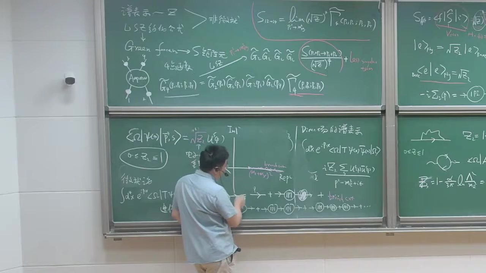

### 注解

# 本段新内容注解：QED 中 \(Z_2\) 与 \(Z_3\) 的一圈结果、紫外/红外发散的区分

这一段的核心是在前面已经定义好 **电子场强重整化常数 \(Z_2\)** 之后，进一步说明：

1. **在一圈近似下 \(Z_2\) 的具体形式**  
2. 为什么这个结果**同时含有紫外发散（UV divergence）和红外发散（IR divergence）**
3. 类似地，**光子场强重整化常数 \(Z_3\)** 的一圈结果是什么
4. 从更一般角度解释：量子场论里为什么会出现 UV / IR 发散

这一段是非常标准的 QED 重整化内容。

---

## 1. 本段出现的公式与逐一解释

---

## 1.1 电子场强重整化常数 \(Z_2\) 的一圈结果

根据字幕和黑板内容，这里讲的是 QED 中电子自能图计算后得到的 \(Z_2\) 的一圈表达式。板书可读为

\[
Z_2
=
1-\frac{\alpha}{4\pi}
\left[
\ln\frac{\Lambda^2}{m_e^2}
+
2\ln\frac{m_\gamma^2}{m_e^2}
\right]
+\cdots
\]

有时也可能写成同数量级、同物理意义的等价形式；这里重点不是某个规范下的精确有限项，而是：

- 第一项是 **紫外发散**
- 第二项是 **红外发散**

### 符号解释

- \(Z_2\)：电子场的**场强重整化常数**  
  描述“裸电子场”与“物理单电子态”之间重叠的大小。

- \(\alpha\)：精细结构常数
  \[
  \alpha=\frac{e^2}{4\pi}
  \]
  在低能 QED 中大约
  \[
  \alpha \approx \frac{1}{137}
  \]

- \(4\pi\)：圈图积分里常见的因子。

- \(\Lambda\)：**紫外截断**（UV cutoff）  
  用来限制圈积分的高动量部分，即不让圈动量 \(k\to\infty\)。

- \(m_e\)：电子质量。

- \(m_\gamma\)：给光子临时引入的一个**小质量**  
  不是物理真实质量，只是为了调节红外发散。最后物理量里应把 \(m_\gamma\to 0\)。

- \(\ln(\Lambda^2/m_e^2)\)：来自高动量区的大对数，表示 **UV 发散**

- \(\ln(m_\gamma^2/m_e^2)\)：来自低动量区的对数，表示 **IR 发散**  
  因为 \(m_\gamma\to 0\) 时，这项发散。

- “\(+\cdots\)”：表示还省略了有限项或更高阶修正。

---

## 1.2 如何区分其中的 UV 和 IR 项

老师明确指出：

\[
\ln\frac{\Lambda^2}{m_e^2}
\quad \text{是 UV 发散}
\]

因为当圈动量 \(k\to\infty\) 时，积分高能部分发散，所以必须用 \(\Lambda\) 截断。

而

\[
\ln\frac{m_\gamma^2}{m_e^2}
\quad \text{是 IR 发散}
\]

因为当光子质量取零、且圈动量 \(k\to 0\) 时，零质量光子会导致低能部分发散，所以临时让光子带一个很小的 \(m_\gamma\) 作为红外调节器。

---

## 1.3 光子场强重整化常数 \(Z_3\)

老师随后定义了光子的 1PI 真空极化图，并给出 \(Z_3\)。板书内容对应

\[
Z_3
=
1-\frac{2\alpha}{3\pi}\ln\frac{\Lambda}{m_e}
\]

等价地也常写作

\[
Z_3
=
1-\frac{\alpha}{3\pi}\ln\frac{\Lambda^2}{m_e^2}
\]

这两种写法完全等价，因为

\[
\ln\frac{\Lambda^2}{m_e^2}=2\ln\frac{\Lambda}{m_e}
\]

### 符号解释

- \(Z_3\)：**光子场强重整化常数**
- \(\alpha\)：精细结构常数
- \(\Lambda\)：紫外截断
- \(m_e\)：电子质量，作为圈图中的质量尺度

### 物理意义

这个结果说明：

- \(Z_3\) 也有 **紫外发散**
- 但在这里**没有红外发散**

这是因为光子的真空极化圈图结构和电子自能图不同；这里不会出现字幕中提到的那种“既有单粒子极点又和软光子 branch cut 粘在一起”的问题。

---

## 1.4 一般形式的 UV 发散积分

老师后面转到一般讨论时，写了类似

\[
\int^{\infty} dk\,\frac{1}{k}
\]

或者等价地说“积分变量从某个有限值积到无穷大”，用来说明：

- 当大动量区贡献像 \(dk/k\) 一样时，
- 会得到对数发散

更一般地，如果写成四维圈积分的简化形式，常常归结到某种径向积分：

\[
\int^\infty dk\, \frac{1}{k}
\sim \ln \Lambda
\]

这就是 **紫外对数发散**。

---

## 1.5 一般形式的 IR 发散积分

老师又举了低动量端的例子，意思相当于

\[
\int_0 dk\,\frac{1}{k}
\]

当积分从 \(k=0\) 开始，而被积函数在 \(k\to 0\) 时像 \(1/k\) 一样，就会得到对数型 **红外发散**。

即

\[
\int_0 dk\,\frac{1}{k}
\sim \ln k\big|_{0}
\]

在下限处发散。

---

## 2. 必要的理论背景补充

---

## 2.1 为什么 \(Z_2\) 会出现红外发散？

这一点是本段最重要的新内容之一。

前面已经讲过：电子两点函数在质量壳附近有单粒子极点，\(Z_2\) 就来自这个极点的留数。  
但在 QED 中，电子总是和软光子云纠缠在一起：

- 电子可以带着任意软的光子
- 光子又是严格零质量
- 所以“电子 + 极软光子”的阈值可以无限逼近电子本身的质量壳

这导致：

- 单电子极点附近不再是一个干净、孤立的结构
- branch cut 的起点会贴到极点上

于是 \(Z_2\) 的定义变得比普通有质量理论更微妙，并在微扰计算中表现出 **IR 发散**。

### 通俗理解

你本来想定义“一个纯净电子”。  
但在 QED 里，电子周围总能裹着一些能量几乎为零的软光子，它们几乎不花代价。  
于是“纯电子”和“电子 + 一点点超软光子”的状态几乎分不开。

所以 \(Z_2\) 不再像普通有质量理论那样是个完全良好的有限数。

---

## 2.2 为什么给光子加一个小质量 \(m_\gamma\)？

因为红外发散来自 **零质量光子** 的低能行为。  
为了先把积分算出来，通常先把光子传播子改成“好像光子有个很小的质量”：

\[
m_\gamma \neq 0
\]

这样在 \(k\to 0\) 时不再那么奇异，积分就能暂时定义。  
最后再看物理可观测量在 \(m_\gamma\to 0\) 时会怎样。

要强调：

- 这不是说真实光子有质量
- 这是一个**红外调节器**（IR regulator）

---

## 2.3 为什么 \(Z_3\) 没有红外发散？

\(Z_3\) 来自光子的两点函数，也就是真空极化图：一个光子变成电子-正电子虚对，再回到光子。  
由于圈里是 **有质量的电子**，低动量区不会产生像软光子那样的红外奇异行为。

所以 \(Z_3\) 的主要问题是：

- 高动量区导致 UV 发散

而不是 IR 发散。

---

## 2.4 “QED 在普朗克尺度可能失效”的估算意义

老师中间做了一个数量级估计，意思是：

即使把紫外截止取得极高，比如取到普朗克能标

\[
\Lambda \sim 10^{19}\,\text{GeV}
\]

与电子质量

\[
m_e \approx 0.511\,\text{MeV}
\]

相比差很多量级，但由于发散只是对数型：

\[
\ln\frac{\Lambda^2}{m_e^2}
\]

这个数并不像幂次发散那样夸张，只是大约一百左右。  
再乘上很小的系数

\[
\frac{\alpha}{4\pi}
\]

整体修正依然不大。

### 这说明什么？

说明 **对数发散是“温和”的**。  
哪怕理论在极高能处失效，只要只进入一个对数，低能结果不一定被严重破坏。

这也是重整化理论中很重要的直觉。

---

## 3. 通俗解释核心概念

---

## 3.1 紫外发散是什么？

“紫外”就是高能、短波长。  
在圈图里，内部虚粒子的动量可以任意大。  
如果大动量部分贡献太多，积分就会在上限发散，这叫 **紫外发散**。

### 类比

像你统计一个系统的贡献时，极高频的模式数量太多，每一层都贡献一点，累起来就无限大了。

---

## 3.2 红外发散是什么？

“红外”就是低能、长波长。  
如果理论里有**零质量粒子**，那么极低能激发几乎不花能量，就可能出现无限多“很软很软”的贡献。  
积分在下限 \(k\to 0\) 处分裂，这叫 **红外发散**。

### 类比

你试图精确区分“一个电子”和“一个电子加上一颗能量无限小的小光子”。  
但后者几乎跟前者没区别，于是低能区贡献堆积起来，造成发散。

---

## 3.3 为什么 \(Z_2\) 比 \(Z_3\) 更麻烦？

因为 \(Z_2\) 直接牵涉到“物理电子态”本身。  
而物理电子总是会带着软光子云，所以它受到红外问题的直接影响。

相比之下，\(Z_3\) 来自真空极化，结构上主要是电子-正电子虚对的高能响应，因此只表现出 UV 发散。

---

## 4. 板书/截图内容描述

从截图可以辨认出这一段黑板上的主要内容有：

---

### 4.1 中间黑板：电子 \(Z_2\) 的一圈结果

中间黑板写着一个电子线加一圈光子自能修正的小图，对应电子自能一圈图。  
旁边明确写出

\[
Z_2 = 1 - \frac{\alpha}{4\pi}\left(\ln\frac{\Lambda^2}{m_e^2}+2\ln\frac{m_\gamma^2}{m_e^2}\right)+\cdots
\]

并且老师在板书上方/旁边标注了：

- **UV cutoff**：对应 \(\Lambda\)
- **IR cutoff**：对应 \(m_\gamma\)

说明这两个对数项分别来自紫外和红外调节。

---

### 4.2 右侧黑板：光子 \(Z_3\) 的定义与结果

右下区域画了一个光子线两端，中间是电子圈的图，也就是真空极化图。  
旁边给出 \(Z_3\) 的结果，大意是

\[
Z_3 = 1-\frac{2\alpha}{3\pi}\ln\frac{\Lambda}{m_e}
\]

强调它只有 UV 发散。

---

### 4.3 左/中黑板：电子传播子的极点与 branch cut

截图上还能看到前一部分留下来的图像：

- 传播子复平面或谱表示相关示意图
- 单电子极点
- 从阈值开始的 branch cut

这些图正是老师此处解释“为什么 \(Z_2\) 会有 IR 发散”的直观依据：  
**光子无质量使得 branch cut 起点和物理电子极点重合或贴近**。

---

## 5. 本段要点总结

这一段最关键的结论可以压缩成四句话：

1. **QED 中电子场强重整化常数 \(Z_2\) 在一圈下同时有 UV 和 IR 发散**
   \[
   Z_2
   =
   1-\frac{\alpha}{4\pi}
   \left[
   \ln\frac{\Lambda^2}{m_e^2}
   +
   2\ln\frac{m_\gamma^2}{m_e^2}
   \right]+\cdots
   \]

2. 其中  
   - \(\Lambda\) 是紫外截断  
   - \(m_\gamma\) 是给光子引入的虚拟小质量，作为红外调节器

3. **光子场强重整化常数 \(Z_3\)** 由真空极化给出，只含 UV 发散：
   \[
   Z_3
   =
   1-\frac{2\alpha}{3\pi}\ln\frac{\Lambda}{m_e}
   \]

4. 一般地：
   - 高动量 \(k\to\infty\) 引起 **紫外发散**
   - 低动量 \(k\to 0\) 在零质量理论中引起 **红外发散**

如果你愿意，我下一步可以把这一段里的 **“为什么软光子导致 IR 发散”** 用费曼图和积分结构更系统地推一遍。

---

## 段落 8：红外发散背景与标量QED软光子发射

**时间：** 00:41:37 ~ 00:47:10

📝 原始字幕

<pre>

我们这节课呢我们想给大家
把这个红花八仙呢给大家
简单地给它过一遍因为红花发散
是QED里边非常非常重要的一个知识点OKQED是个比较其实虽然没有QCD复杂但是它也相当复杂为什么呢在很多服饰修正过程里面呢
它这个红二发散和紫二发散呢
它交织在一起是吧
所以我们希望通过这两节课的学习
我们所有同学对红花发散呢有大致的一个图像
所以说红花发现来自于什么呢来自于这个光子的动态变得非常软
来这个圈里面动量光子变得非常非常soft
就说
在一九三十年代的时候
一九三零年到四十年代的时候物理学家
被紫外发泄非常困扰大家知道这个紫外发泄从种化理论是
差不多在二章后才正式定型的是吧当然比较幸运的是红外发散其实
看
是在三十年代
中期就被人们在QD里面被人们非常好理解其中两个物理学家做出比较重要的贡献
你知道吧
五个个就
现在是病
他们在一九三七年的时候有个定理就是说如果你考虑一个QE的过程呢
比如你考虑任何一个软光子的包括任何一个软光子的辐射呢
你们发现红二发散它会被抵消所以说红二发散其实
在QD里面其实不再是任何
问题OK
好我刚才说了红二发现来对这个软一个枕服呢
光子的
冻到变得非常软是吧
我们随便先看一下这个soft head pain
软光子
政府
你发现了
在软光子极限下这个QE异地的阵幅呈现了一些非常简单的形状
而且会有一些非常深刻的一些
后果比如说有一个所谓的软定理
soft serum什么意思大概来说
在QD里面呢就是说
你考虑一个大电粒子的辐射一个波长非常长的一个软光子
Okey
你去个软极线
你发现呢
这个定理大致的意思就是soft limit
加上
骆驼轮子不变形
强迫要求什么呀
强迫要求你的差值控制视线强迫要求你的
所以电和守恒是吧
我们早就知道电话守恒来自于这个NOTE流有U1的对称性是吧
我们知道这个
如果有一个零质量资源一粒子比如光子的话这里轮必须是一个Gage series
所以一个规范灵的话这个AMO必须偶合一个守恒流是吧
这是我们以前的逻辑线条但是软定理告诉你我只需要一个所谓的这种软的一个整幅的一个极限
我都不要求你要有G制
买了说只需要一个龙三角
我一定能得到这个电荷守恒
好这都是非常简单非常优美的物理我们简单
给他 review一下这个soft fountain
的好我们先考虑这个标量QD吧
的鸡
OK
朋友们考虑
一个过程
这个过程的一个电子
这个垫子呢
啊阿特去
他流出这个Fromanthe是吧这个代表一堆别的一个
外线内线我们并不关心
我们把这个动量叫P
冬亮是盐的这样一个剂量
粒子流
肉是吧
这不变成服务那么管的M零P它是P的函数就这一团的我们管的M零P
那我们考虑呢
我们考虑
这跟叉子的这个 spin 6 的这个电子呢
我们考虑它辐射一个
一个光子扶着光子呢
动量叫K
我们根据动量标记
这是这个箭头的动量呢
我们管它叫P加K
OK
所谓这样一个
多了一个软光子辐射整幅可以写成M
屁
可以写成我们读到这个非凡图这个外线是一对于SCALERSPININGWELLPARTICLE是吧然后我们读这个顶角呢我们学过了标量P的顶角是F的RIE
这样动量的核p加p加k所以是
二屁
贾克海米欧
核电光子的极化时量我叫Epstone milk它是末态所以有一个复功额
说病是吧
然后我会读到这个顶角然后这个传播字动作是PJK
所以是I
P加K
方减去m方
叫APSL然后再记上这样一个整幅这整幅现在
流出的动量是PDAK所以它是一个
P+K的函数是吧
好了

</pre>

**课程截图：**

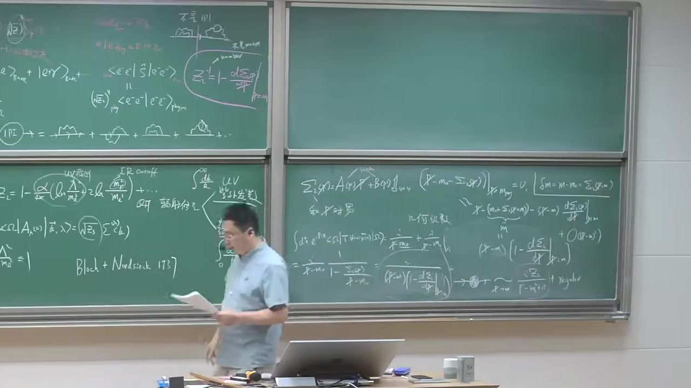

### 注解

# 本段新内容注解：QED 中的红外发散、软光子定理与标量 QED 的软辐射振幅

这一段开始进入 **QED 红外发散（infrared divergence, IR divergence）** 的核心物理图像，重点是：

1. **红外发散来自哪里**：来自光子动量变得很小，即 **soft photon（软光子）极限**；
2. **为什么红外发散不是物理灾难**：实软光子辐射与虚光子修正一起考虑时，红外发散会抵消；
3. **软光子定理（soft theorem）** 的基本思想；
4. 通过 **标量 QED** 的一个简单例子，写出“某外线再辐射一个软光子”时的振幅结构。

这段是后面系统讨论 IR 结构的出发点。

---

## 1. 本段的核心新概念

---

### 1.1 红外发散来自“软光子”

老师这里强调：

> 红外发散来自于光子的动量变得非常小，也就是光子变得非常 soft。

这里的“软”是指：

\[
k^\mu \to 0
\]

即光子的四动量趋于零，尤其是它的能量
\[
\omega = k^0 \to 0
\]

时，会导致某些散射振幅或截面出现发散行为。

---

### 1.2 历史背景：Bloch–Nordsieck

老师提到 1937 年两个物理学家做出关键贡献，这里指的是 **Bloch 和 Nordsieck**。

他们的结论大意是：

> 如果对一个 QED 过程，把“辐射任意个足够软的光子”的贡献一并考虑，那么红外发散会抵消掉。

这就是后来著名的 **Bloch–Nordsieck 机制** 的起点。

它说明：

- 单独看某个固定过程（比如“不辐射任何软光子”）可以 IR 发散；
- 但真正可观测的、具有有限实验分辨率的“包容截面（inclusive rate）”，把不可分辨的软光子态都加起来之后，是有限的。

---

### 1.3 软光子定理（soft theorem）

老师说的大意是：

> 在软极限下，QED 振幅会呈现非常简单、非常普适的形式。

也就是当附加一个光子，且这个光子很软时，整个振幅会**因子化**为：

- 一个“不带该软光子”的原始振幅；
- 乘上一个只依赖于外线电荷、动量和光子极化的通用因子。

这就是 soft theorem 的核心。

老师还特别提到：

- **soft limit + Lorentz invariance**
- 会强迫得到 **charge conservation**

这句话的思想很深：  
软极限下振幅的一致性要求，与洛伦兹协变性结合起来，会约束理论结构，最终要求外线总电荷守恒。

---

## 2. 本段出现的公式与逐一解释

下面是这段字幕里真正出现并开始推导的公式。

---

### 2.1 不带软光子的原始振幅：\(M_0(p)\)

老师先考虑一个过程：某个带电标量粒子从某个复杂子过程“流出”，其动量记为 \(p\)。把剩下那一团复杂过程记成一个振幅函数：

\[
M_0(p)
\]

#### 符号说明

- \(M_0(p)\)：**不带额外软光子辐射时** 的原始散射振幅；
- 下标 \(0\)：表示还没有加那个额外的软光子；
- \(p\)：这个外线标量粒子的四动量；
- 这个振幅只把“那一团其余动力学”打包起来，暂时不关心内部细节。

#### 物理意义

它就是“原本的过程振幅”。  
后面加一个软光子时，目标是把新的振幅写成“原始振幅 × 一个通用软因子”的形式。

---

### 2.2 加一个光子后的振幅：\(M(p)\)

老师接着考虑：同一个外线再辐射一个光子，光子动量记为 \(k\)，极化记为 \(\epsilon^\mu(k)\)。新的振幅记成

\[
M(p)
\]

严格地说这里更像是“带一个额外软光子后的振幅”，只是老师口头上简记成 \(M(p)\)。

---

### 2.3 标量 QED 三点顶角

老师明确说到了：

> 标量 QED 的顶角是 \(ie\) 乘上两个标量线动量之和。

按照他在板书中的取向，顶角写成

\[
ie\,(2p+k)^\mu
\]

然后再与光子的极化矢量收缩，得到

\[
ie\,(2p+k)^\mu \,\epsilon_\mu^*(k)
\]

#### 符号说明

- \(e\)：电荷耦合常数；
- \(i\)：费曼规则中的虚数因子；
- \(p^\mu\)：原来外线标量粒子的动量；
- \(k^\mu\)：辐射出去的光子的四动量；
- \((2p+k)^\mu\)：标量 QED 三点顶角的动量结构；
- \(\epsilon_\mu^*(k)\)：末态光子的极化四矢量；
- 上面的复共轭 \(^*\)：因为这是出射光子。

#### 为什么是 \(2p+k\)？

因为标量 QED 相互作用项来自协变导数，顶角对两个标量腿的动量之和敏感。  
若一条标量线动量是 \(p\)，另一条是 \(p+k\)，那么顶角就是这两个动量之和：

\[
p+(p+k)=2p+k
\]

---

### 2.4 发射光子之后，中间标量线的传播子

老师读出的传播子是

\[
\frac{i}{(p+k)^2-m^2+i\epsilon}
\]

字幕里口误/转写略乱，但意思就是标准的标量传播子分母。

#### 符号说明

- \(i\)：费曼传播子前的因子；
- \(p+k\)：辐射光子之后，那条内部标量线携带的动量；
- \(m\)：该标量带电粒子的质量；
- \(i\epsilon\)：费曼因果 prescription。

#### 物理意义

这个传播子来自图中“外线先接出一个光子，再连到其余过程”的那一段内部线。

---

### 2.5 剩余硬过程振幅：\(M_0(p+k)\)

因为接出了一个光子，其余那团子过程接收到的动量不再是 \(p\)，而是 \(p+k\)，所以老师写成

\[
M_0(p+k)
\]

#### 物理意义

这表示：  
“复杂子过程本身并没有具体展开，但它所依赖的外部动量从 \(p\) 变成了 \(p+k\)。”

在软极限 \(k\to 0\) 下，它通常会近似为

\[
M_0(p+k)\approx M_0(p)
\]

这正是 soft theorem 能成立的关键之一。

---

### 2.6 整个单外线软辐射振幅的表达式

把顶角、传播子、剩余振幅连起来，老师实际写出的结构是

\[
M(p)
=
\Big[ie(2p+k)^\mu \epsilon_\mu^*(k)\Big]
\frac{i}{(p+k)^2-m^2+i\epsilon}
\,M_0(p+k)
\]

这就是本段最重要的公式。

---

## 3. 对这个公式做进一步化简：软极限的通用结构

虽然字幕在这段里还没完全化到最后一步，但按照老师接下来想做的事情，这个式子在软极限下会变得非常简单。

---

### 3.1 先化简传播子分母

如果外线粒子本来在壳上：

\[
p^2=m^2
\]

那么

\[
(p+k)^2-m^2
=
p^2+2p\cdot k+k^2-m^2
\]

对真实光子有

\[
k^2=0
\]

再用 \(p^2=m^2\)，得

\[
(p+k)^2-m^2 = 2p\cdot k
\]

因此传播子近似变成

\[
\frac{i}{2p\cdot k+i\epsilon}
\]

---

### 3.2 顶角在软极限下化简

当 \(k\to 0\) 时，

\[
(2p+k)^\mu \approx 2p^\mu
\]

于是顶角部分变成

\[
ie\,2p^\mu \epsilon_\mu^*(k)
=
2ie\,p\cdot \epsilon^*(k)
\]

---

### 3.3 组合后得到软因子

于是整个振幅近似为

\[
M(p)
\approx
\left[ie\,2p\cdot \epsilon^*(k)\right]
\frac{i}{2p\cdot k}
M_0(p)
\]

把常数因子整理一下，可得

\[
M(p)\approx
-e\,\frac{p\cdot \epsilon^*(k)}{p\cdot k}\,M_0(p)
\]

差一个整体号或 \(i\) 的约定常常取决于具体费曼规则与振幅定义，但**最关键的结构**是：

\[
\boxed{
M_{\text{with soft }\gamma}
\;\propto\;
\frac{p\cdot \epsilon^*}{p\cdot k}\,
M_0
}
\]

这就是软光子辐射的基本因子化形式。

---

## 4. 为什么这里会出现红外发散？

核心就在这个因子：

\[
\frac{1}{p\cdot k}
\]

当光子越来越软，即 \(k^\mu\to 0\) 时，

\[
p\cdot k \to 0
\]

于是振幅会变大；其平方进入截面后，会产生类似

\[
\int \frac{d^3k}{\omega}
\]

这样的积分结构，在 \(\omega\to 0\) 区域出现红外发散。

通俗讲：

- 光子能量越低，越“便宜”；
- 带电粒子就越容易顺手带出一个非常软的光子；
- 软到某种程度时，实验上甚至分辨不出来；
- 因而“单独只算不发光子”不是可观测量，必须把“发了不可分辨软光子”的过程一起算。

---

## 5. 软定理与电荷守恒的关系

老师这里讲了一个很重要但比较抽象的观点：

> soft limit 和 Lorentz invariance 结合起来，会强迫出电荷守恒。

这句话可以用更直白的方式理解：

如果一个附加软光子的振幅必须具有某种普适结构，那么当你把光子的极化矢量做规范变换时，振幅不能产生物理变化。  
这会要求所有外线贡献加起来满足一个约束，而这个约束正是

\[
\sum_i \eta_i\, e_i = 0
\]

其中：

- \(e_i\)：第 \(i\) 条外线的电荷；
- \(\eta_i\)：入射和出射线会带不同符号。

这就是总体电荷守恒。

也就是说：

- 以前我们常说：**规范对称性 \(\Rightarrow\) 守恒流 \(\Rightarrow\) 电荷守恒**；
- 这里老师强调的是另外一个角度：  
  **软极限下振幅的自洽性，也会反过来逼出电荷守恒。**

这是软定理之所以“深刻”的地方。

---

## 6. 为什么先讲标量 QED？

老师说“我们先考虑标量 QED”，原因很简单：

- 费米子 QED 会有狄拉克自旋结构，公式更繁；
- 但软光子发射的本质并不依赖粒子自旋；
- 标量 QED 中，顶角和传播子最简单，最适合看清楚
  \[
  \frac{p\cdot\epsilon}{p\cdot k}
  \]
  这种普适软因子的来源。

所以这是一个“先看本质，再加复杂性”的标准教学策略。

---

## 7. 通俗理解：什么叫“软光子定理”？

可以把它理解成一句话：

> 如果一个电荷粒子在运动，它几乎总可以顺便甩出一个非常非常低能的光子；而这个过程的概率细节，主要不取决于短程复杂动力学，而只取决于这个粒子的电荷和动量。

这就是为什么软辐射有“普适性”：

- 不管图里面那一团复杂相互作用多复杂；
- 只要额外发出的光子足够软；
- 它就看不清内部细节；
- 它只“感受到”外部带电粒子的总运动状态。

所以软光子像一个“分辨率极低的探针”，只能看到大尺度、整体性的东西。

---

## 8. 结合截图可见的板书内容

从截图中，这一段新写上的板书主要包括：

### 8.1 标题性内容
- `Soft photon 振幅`
- `Soft theorem`
- 旁边写有类似：
  - `soft limit + Lorentz inv`
  - 指向“电荷守恒”之类的结论

这说明老师在强调：  
软极限下振幅的普适形式，与洛伦兹不变性/规范一致性之间有深刻联系。

---

### 8.2 标量 QED 的示意费曼图

板书画了两个图：

1. 一个“不带软光子”的原始过程，记为
   \[
   M_0(p)
   \]
   图中是一个标量外线连到一团黑箱/blobs。

2. 一个“同一条标量外线额外辐射一个光子”的过程：
   - 外线动量标为 \(p\) 或与之相关；
   - 光子动量标为 \(k\)；
   - 接到黑箱前，那段内部标量线动量标为 \(p+k\)。

这正对应老师口头推导的振幅结构。

---

### 8.3 振幅公式

板书应当写出了类似

\[
M(p)=
\big(ie(2p+k)^\mu\big)\epsilon_\mu^*(k)
\frac{i}{(p+k)^2-m^2+i\epsilon}
M_0(p+k)
\]

虽然截图分辨率有限，但从字幕可确认老师正在逐项“读费曼图”写出这个表达式。

---

## 9. 本段要点总结

这一段最关键的内容可以浓缩为四句话：

1. **QED 的红外发散来自软光子极限**
   \[
   k^\mu\to 0
   \]

2. **实软光子辐射与虚修正一起考虑时，IR 发散会抵消**  
   这就是 Bloch–Nordsieck 思想。

3. **软光子定理说：带一个软光子的振幅会因子化**
   \[
   M_{\text{soft}} \sim \left(\frac{p\cdot \epsilon}{p\cdot k}\right) M_0
   \]

4. **这种普适结构不仅简单，而且深刻地联系到电荷守恒与规范一致性。**

---

如果你愿意，我下一步可以继续把这段最后那个公式**严格从标量 QED 费曼规则推到软极限结果**
\[
M_{\text{soft}} \propto \frac{p\cdot \epsilon^*}{p\cdot k} M_0
\]
并把每一步约掉的因子、符号来源都写清楚。

---

## 段落 9：软极限计算：标量与旋量QED的统一因子

**时间：** 00:47:13 ~ 00:56:38

📝 原始字幕

<pre>

那我们现在要考虑一个极限
考虑K趋近零的一个极限
就它KMO的每个分量都是
非常非常小的我们看能做什么近视好再如果K群林的几天来说
这样一个
以前那政府呢
我可以认为M0自本让P加K把K扔掉
可以约等于
M0
M0P是吧
船模子那我们看一下把它
展开是
P方加2K
点P
加K方
讲一方
加二
因为这个粒子是在翘的
P方等于M方
OK
消掉了
然后光子也在敲的
K方等于零
所以你发现这分不得
变得非常简单传播字
它变成什么了它变成
2K点P
加上RXL
好那我们看一下这一枪
这一项呢
这显然光子这个物理光子它显然是
显然是Transverse是吧物理计划的
所以你可把它写成
这像写成
啊不行
Okey
简单化学absum
有等于零是吧
所以这箱可以
扔掉
好我們整理一下
这是二可以下点分为一个二所以你稍微整理一下呢你发现可以写得非常简单
它约等于
一
电子的电荷
屁点上
毕竟是
厨艺P
点K
谢谢阿姨
M0
OK
这一点呢
我发现非常简化一个任意复杂的过程一个SKELLERSPINER垫子在末台
它如果辐射出一个非常软的光子的一个整符呢可以变成以前老的整符
乘以因子这个因子呢
长这个样子
P点K
批点这个极化尺量的这个
光泽计划是量是吧
你发现它有一个K群零的时候分母是发散的OK这是为什么
你最后在做一个相空间积分的时候你会有对数的这个宏观发展来一遍因为这个分母有个E到K的一个singularity
O K
好那我们
可以在颈椎上做个练习我们要考虑的SKILLERQED
我们得到这种简单的因子化的结构那我们好奇
那我们如果
我们更加熟悉的
这个那种的这个spinnerQD
就描写自权二分之一的电子和光子相关作用理论
我们再考虑了一次的这个
红外结构软光子的极限应该长什么样子
这是我们感兴趣的一个菲利克斯是吧
好的
Spin Accuracy
出于简单的
我晚上考虑一个
任何一个过程一个电子
一个电子的动量是p
这个字权label是S
OKS可以是HALIST也可以是自主研究的这种投影好我们跟你刚才一样逻辑的
我呢
可以把它考虑这个垫子呢
辐射出一个非常软的soft的一个光线
这个动量还是K
okay
电子的动量呢
传播者呢是
一样
就是P加K
嘿
好
这个整图呢
辐射之前的这个整数叫M0
它可以写成U板皮因为你这个分明天读这个U板皮
我写一个M
邱塔林
这个可以上写
那好那我们现在把这个分盘整数写一下
你发现它这部分可以写成
它可以变成
UPP 我们来读一下
这个顶角我们非常清楚是负的I
一个
光子的计划尺量的 slash 是吧这个QD顶角
读完这个顶角以后当然这个外向我已经写了
然后再读这个
拿它穿模子
是啊
什什拉什 杰克希什拉什 杰恩
叫阿普斯鲁
然后呢
我读完这个然后再读到这个地方
这里呢是我按照我的定义呢我是m0t2ta自变量呢现在是p加k是吧
好我现在还在考虑呢
子非常软
索特林特OK你们发现索特林特在主机上来说是整数呢
非常大的简化好我们来一点点来看一下
好 再写一行
好我们整理一下这个
这个爱的因此能整理一切得到优薄
屁
一个电子的电荷
父爱成爱没了
然后呢
这位哥
艾布森斯莱什
这个K我就不写了自闭症的K就不写了因为这个计划是量光子原量非常清楚创作的分子是P
扎克希斯莱什
加M
OK
这个分母就用刚才结果了分母刚才已经做了对于这个SCALE理论是吧我们可以写成非常简化形式
这个分母就是我的
两倍的P点K加E okay
当K710的时候呢分母也去用零
Okey
然后呢
我现在约等于
可以扔掉所以还让M零丢它皮好那我们现在要用语对我们迪拉克代数了第一点呢在软极限下呢这KTR的分子上来说它并不重要因为它是
无穷小量所以这个K可以把它
可以忽略掉是吧在soft limit下
好
那我们注意到这个迪拉克炫亮满足这个迪拉克方程是U板
又变成PslashJM
等于零这我们都非常熟悉是吧
那我想一下P和U巴之间差个EPSONSLAYSH你可以利用一个
公式叫什么呢
叫A slash
和B slash
都反对一直
等于两倍的
A点B
这个你很容易通过迪拉克带数去证明
所以你这一项可以怎么写你可以这样写
斯拉斯
G slash 可以写成
两倍的P点APP从Slash
剪去
谁是什啊啊
好的
然后你发现这个符号
富的P slash
现在Epson Slack的左边了
这个M呢一过去
你发现正好可以用这个公式
你把这个
必须先把它们干掉
所以说得到什么表达式呢
你发现你得到一个非常简单的答案是
你得到了一个
一
然后呢
吃的啊就很糟糕
出去P点K
谢谢阿布森
尤巴皮
M零二塔皮
Okey
这个很容易验证大家去验证一下
这刚才我订的这样一个
啊啊
优盘M0秋塔
就是我们一开始订单张一哥
完整的整幅是吧
所以我又可以写成
大家注意一下
我来比较一下就很有意思我们考虑两种情形
一个是分了区地
我们发现在软极限下的发射一个软光子的整幅可以写成一个没有发射之前的整幅成一个非常简单的音符
易
分的是 p.x 呢
分分是 p.k 这个加 app 现在不是很重要
对于血量Q六做同样的事情一个带自旋二氧化电子辐射一个软光子的整浮呢烟可以形成同样这种结构
这个因子的你发现只依赖带电离子的这个
这个动量呢你发现它分子分数都出现了OK
所以其实这样一个因子你发现是普世的
这非常非常重要
它是一个普世的音字什么意思呢

</pre>

**课程截图：**

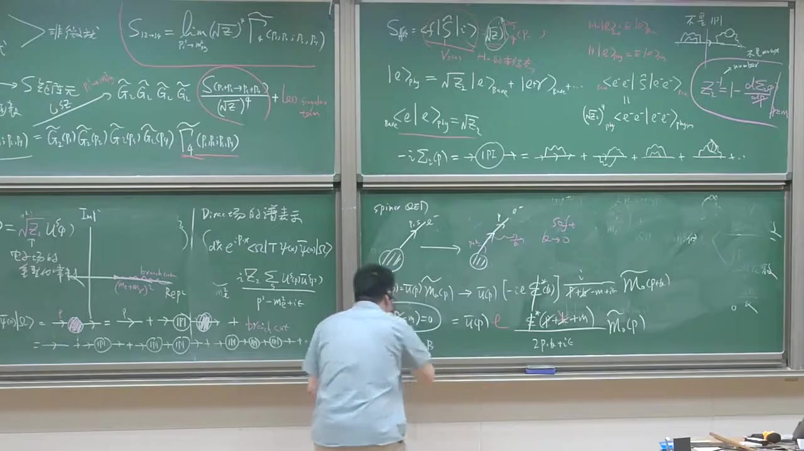

### 注解

---

## 段落 10：Eikonal因子、螺旋守恒与入射粒子情形

**时间：** 00:56:38 ~ 01:04:28

📝 原始字幕

<pre>

就是你考虑
任何一个弹粒子
任何自选它可以自选二分之一二分之三
电电粒子OK
朴氏的一个因子它跟粒子的字权没关系它甚至跟这个粒子是
基本粒子就没有结构的粒子或者是符合粒子也没关系
所以这个因子的一般
叫所谓的E2银子
我看不见
好我们对一个整幅出发呢
我们做了一堆镜子分母变成2p.k
分子呢k slash
这东西也叫
我说了
静四
好中作法
好的
那一个非常重要的性质就是我们现在知道了
这个音子呢X的音子是普世的我们想稍微
多得理解它为什么
不依赖于大电离子的自选甚至
它不依赖于这个带电粒子的这个能量因为P在分子群中出现它只依赖于这个带电粒子的什么电荷
还依赖于大电磁的什么呀
运动方向是吧
那我们稍微看一下我们还是以这个
这个SpinQD为例咱们看一下这个菲利克斯在什么地方就它为什么是一个
有您握手的一个
一个因子是吧
那我回过头看一下看一下这一行是吧
我把KIS扔掉呢我发现这行我可以重新写一下
我可以
看一下这个例子
我利用我已知的条件我知道
粉末子的分子呢
当
动量确定安沙的车上对的是物理计划核是吧
在撬的时候
我们这边可以写成sigma计划求和
S1版US1版
P U L C P
屁包
可以批方加M方
加艾普斯呢
好那我们把这项可以看一下我们从这行可以看一下把这K带伸掉了这中间下面一行可能发现它可以写成什么呢
优吧
可以写成
这样写吧
我写成我的意思
绝对没有
这个米是吧
哦Epson slash 啊Epsonmyo 卡玛米欧
啊后面
你看切成
我这个穿帽子的这个
R P dot k
这个Ecna呢
翻摩子呢
这个
一出来我要看得清楚一点
你会发现它可以写成
对ICP球和
这是我的U8
P这是S是我的这个Y态的这样一个
激化之标是吧
然后对
吃过加麻
干嘛没有好像是不能说别的APP送Slash
我觉得APP都没有干嘛没有好问题是PSM这一项
我把它表成那种形式这球号放外面去了你发现它是
USEPP
U8ICPP
Okey
然后乘用我的M0
挑挑皮
好一个非常非常重要的一个性质呢
根据这个DRAXPIN有八个碗没有有
再乘以油动量指标一样它的区别这个极化指标不一样你发现有一个恒等是非常重要的恒等是
它等于
两倍的PMI
杜尔塔S
你Cornell Dirt他强制你呢
这两XPU相等所以这物理上我们理解了
你可以看这个例子因为这个现在是镜丝在翘的是吧它的意思就是说
我考虑辐射了一个非常软的光子它并不改变这样一个粒子的电子的这个海立斯体或者这个紫旋所以这个现在经常晒的时候如果他携带一个
自权激化指标的话呢跟外线是一样的OK所以说一个非常重要的结论就是说这个SOFTGLOW呢
他不飞飞飞飞飞飞飞飞飞飞
Okey
这个为什么
我有一个这个
我这ICP跟IC一样这某语上解释了呢
你为什么
你解释了你为什么有一个有你握手的一个
Ectone因子OK
现在不加证明我们接受
对于一个出射的一个单粒子来说呢
这个
这是一个有NIVOSO的一个因子这种ICONFACTOR好我们类似可以分析一个入射OK我刚刚分析了ICOIN分析一个入射的一个例子
一个Incoming的一个大电粒子
我们看爱康因子跟出水有什么区别
比如说我们厨艺简单呢
我们有先原因也许我们就给大家不用那么细的给大家推导
入室动荡是P我们考虑一个
这个电子的流入这个分发图OK
它辐射了一个光子的动量是K
所以这个传播子的动量呢电子传播的是pgnk
好你根据刚才一模一样的分析你可以发现
其中
就说
我们考虑一开始的圆蛇枕服呢
我们管它叫M0
辐射一个软光子初态
电子服有软光子或者整服呢你做了XTRANGIST以后呢
我省去一堆代数这代数非常累死你只要认真点去做肯定可以做出来还那副的意义
石的EPSOLON STAR
苹果依然是光子计划十亮
然后呢是
P点K
贾
趁有我的M零
好这跟刚才我的这个电子是在ART GOING有什么区别大家看一下第一你发现
勾引师正一针腹衣
OK然后分母的这个EPSON呢
也变了个好
你发现有些区别是吧
这是两个区别
好你可以证明障碍交易
也是有利于我手的
就对于任何一个字权的一个代价粒子在初台辐射有一个
一个软光子都有具有燃烧能的一个有牛油的一个IP量
我看不出来
少
那相当考虑的是用电子那如果反粒子或电荷跟它相反的怎么样呢我们再可以看一下
我们考察一个
入车
是
反粒子或者我们叫正电子子
电荷和电的相反
嘛
把这个飞曼图呢
可以简单地标记为
我们知道对于反粒子来说动量箭头和肺米子的箭头是相反的
Okey

</pre>

**课程截图：**

### 注解

---

## 段落 11：反粒子情形与软光子统一公式

**时间：** 01:04:29 ~ 01:10:36

📝 原始字幕

<pre>

所以这个图应该读成M0可以写成
V8P
这是个微拔腻的毒
M0 T2 T3
好我们考虑一个入侧的一个正点字或者反粒子呢浮而出
一个软光子
这冬梁是屁这个非美子箭头
传播总必须
按照非明镜头来写这个动量所以它是复P
加K 是吧
所以这样一个不变正符的你发现它变成了什么呢
它變成了
微博
这是反粒子
微拔屁
然后的负的IE这是这个
丁角 徐的丁角
石
唉
极化时量光子极化时量
然后呢
陈毅这个
迪拉克成的传播子是吧非凡传播子
啊他的恩爱
酷恶劣
恰恰是Slash,Jaymu
叫APSO
然后对接的是我让一个m0twitter
它磁变量现在是一个
批剪K
好根据完全一样的逻辑呢就是说
我们是capital soft我们可以把它
我们利用这样一个
Ecransight4就利用这个Viber的运动方程Viber我们知道
他满足你的需求
思考了
等于零是吧
我们把P SLAYS跟EPSONSLAYS交换位置你发现运动方程的话把它可以干掉
Pc 加m 剩下什么呢剩下这样的元素
剩下一個
M0P
这是发射之前那样一个
肺慢症服成一个有牛肉素的一个因子
Ectans因子
但是
正义
说得很Slash
Pdnk
像艾普斯
OK你反而入车的这样一个
栗子呢
和反粒子的区别是这有相对符号
这是正义
刚才那儿
刚才那是腹蚁是吧然后别的东西一样
所以你发现我们现在找了一个规律
非常简单的一个规律
那么
我们可以总结一下
爬这儿吧
这个教室有六块黑板比我们以前的接一四
多了两块黑板这是比较好的消息
所以我们现在把
软光子的整服呢
或者软光子极限
现在政府呢
我们总可以写出一个
起初没有辐射软光子的这个整部再成一个同一的
爱看樱子是吧
我可以
现在发现X可能可以形成一个统一的形式
可以写成
有你发的形式
同意的巡视
不管他是出社还是入社比如说
大家例子不管它是入船出车它动量是P
如果这个粒子显然辐射出一根
软光子它可以在软光之间整幅可以形成印花的形式
你发现可以使用银子
只是
一是电子的电鹤
QN是一个
是个real number
然后成一个
伊特恩
遗产N这个N代表这个例子的种类是吧
然后呢你就发现这是P
是立则七东亮
给它去 EPSOL 开始
然后呢厨艺
P点K
加上一个IETN
毕竟
帮我们解释一下什么意思
这个我们
认为E成于QN呢
这什么意思就是第N个例子的
第n个例子的
电鹤
我认识他的物理意义
所以显然对于电子来说
Q等于1
对于它的繁例来说呢
就等于负矣是吧
那对于我们一个自旋带三分之二电荷是正三分之二的一个
克的
你放Q呢
它就等于
或者三分之二
OK
你可以一一来推OK
别说
这是QN然后ITAN呢这是一个
符号函数
n等于正一
它代表这个例子是出射outgoing
如果一条N等于负一呢
这个例子是入舍
In coming okay
所以你发现统一的公式非常精简的把这个ECON因子把我们考虑的这个
各种情形它都给你总结在一起是吧注意这个符号
在数图了这个APP怎么不一样的在算圈图的时候这个还是非常重要的
所以这是Icon Factor
我们现在接近我们真正
给大家展现一个非常优美的一个
说这种软定理

</pre>

**课程截图：**

### 注解

# 本段新内容注解：旋量 QED 中外线发射软光子的统一 eikonal 因子

这一段是在前面“标量粒子发射软光子”结果的基础上，进一步推广到 **旋量 QED（即电子/正电子的情形）**，并最终把各种“入射/出射、粒子/反粒子”的情况统一写成一个简洁公式。这就是软光子定理里最核心的 **soft factor / eikonal factor（软因子/程函近似因子）**。

---

## 1. 本段出现的主要公式与逐一解释

---

### 公式 1：没有软光子时的原振幅记为 \(M_0\)

板书里先说：

\[
M_0 \equiv \bar v(p)\,\Gamma
\]

或者更一般地，表示成“某个不带软光子的硬过程振幅”。

这里字幕里的“V8P”“微拔屁”其实就是在说：

\[
\bar v(p)
\]

#### 符号说明
- \(M_0\)：**原本没有额外软光子辐射时的散射振幅**
- \(\bar v(p)\)：反粒子（例如正电子）对应的外线旋量
- \(p\)：该外线粒子的四动量
- \(\Gamma\)：代表其余“硬散射”部分，具体结构不重要；在软极限下只把它当成一个整体

#### 物理意思
我们把复杂过程拆成：
- 一个“原本就有的硬过程” \(M_0\)
- 再乘上一个“软光子附着到某条外线上”产生的通用修正因子

这正是软定理的因式分解思想。

---

### 公式 2：反粒子外线发射软光子时，中间传播子的动量

字幕里说：

> 传播子总必须按照费米子箭头来写这个动量，所以它是 \(-p+k\)

更规范地，板书对应的是：  
若考虑 **入射反粒子** 发出一个动量为 \(k\) 的软光子，那么按费米子流向，中间费米子传播子的动量写成

\[
-(p+k)
\]

或在不同约定下写成与之等价的形式。  
最后真正进入分母的，是这个传播子分母：

\[
(p+k)^2-m^2+i\epsilon \approx 2p\cdot k+i\epsilon
\]

#### 符号说明
- \(k\)：软光子的四动量
- \(m\)：费米子质量
- \(i\epsilon\)：费曼处方，规定传播子极点如何绕过

#### 物理意思
软极限下 \(k\to 0\)，所以传播子的“离壳程度”只由 \(2p\cdot k\) 控制。这正是所有软发散公式里都会出现

\[
\frac{1}{p\cdot k}
\]

的根源。

---

### 公式 3：带一个软光子时的振幅结构

对于某条费米子外线发射一个软光子，振幅一般写成

\[
M_{n+1}\sim \bar v(p)\,(-ieQ_n)\,\gamma^\mu \epsilon_\mu^*(k)\,
\frac{i(\slashed p+\slashed k \mp m)}{(p+k)^2-m^2+i\epsilon}\,
(\text{硬过程})
\]

不同情形下分子里是 \(\slashed p+\slashed k +m\) 还是 \(\slashed p+\slashed k -m\)，要看你处理的是粒子还是反粒子、以及箭头方向；但在软极限中它们都会化成同一个 universal 结构。

字幕里面提到的：
- “负的 \(ie\)”
- “\(\gamma^\mu\)”
- “光子极化矢量”
- “Dirac 传播子”
- “Slash”

说的就是这个式子里的顶角和传播子。

#### 符号说明
- \(e\)：电磁耦合常数
- \(Q_n\)：第 \(n\) 条外线粒子的电荷数（以 \(e\) 为单位）
- \(\gamma^\mu\)：狄拉克矩阵
- \(\epsilon_\mu^*(k)\)：辐射出去的光子的极化矢量
- \(\slashed p \equiv \gamma^\mu p_\mu\)：Feynman slash 记号
- \(\slashed k \equiv \gamma^\mu k_\mu\)
- \(\frac{i(\slashed q+m)}{q^2-m^2+i\epsilon}\)：费米子传播子

---

### 公式 4：利用外线旋量满足的运动方程

字幕里说：

> 利用外线的运动方程……把 \(p\!\!\!/\) 跟 \(\epsilon\!\!\!/\) 交换位置……可以干掉……

这里用到的是外线旋量满足的 on-shell 条件。对于反粒子旋量：

\[
\bar v(p)(\slashed p + m)=0
\]

对于粒子旋量则是：

\[
(\slashed p-m)u(p)=0
\]

#### 符号说明
- \(u(p)\)：粒子外线旋量
- \(v(p)\)：反粒子外线旋量
- \(\bar v(p)=v^\dagger(p)\gamma^0\)

#### 物理作用
这是化简软极限振幅的关键一步。  
通过把分子中的 Dirac 结构整理后，复杂的旋量表达式会塌缩成一个纯粹由动量决定的因子：

\[
\frac{p\cdot \epsilon^*}{p\cdot k}
\]

这说明：**软极限下，软光子的耦合不再敏感于硬过程的细节，也几乎不敏感于粒子的自旋结构**，只依赖于外线的电荷和四动量。

---

### 公式 5：软极限下的因式分解结果

这一段的核心结果是：

\[
M_{n+1}\approx M_0 \times \left(eQ_n\,\eta_n\,\frac{p_n\cdot \epsilon^*(k)}{p_n\cdot k+i\eta_n\epsilon}\right)
\]

这是本段最终总结出来的统一公式。

有时也写成对所有外腿求和的形式：

\[
M_{n+1}\approx \left[\sum_n eQ_n\,\eta_n\,
\frac{p_n\cdot \epsilon^*(k)}{p_n\cdot k+i\eta_n\epsilon}\right] M_0
\]

而这一小段中主要是在说明 **单条外线** 的统一因子长什么样。

#### 符号说明
- \(M_{n+1}\)：比原过程多辐射了一个软光子的振幅
- \(M_0\)：不带该软光子的原振幅
- \(p_n\)：第 \(n\) 条外线粒子的四动量
- \(Q_n\)：该粒子的电荷数（单位电荷 \(e\) 的倍数）
- \(\epsilon^*(k)\)：软光子的极化矢量
- \(k\)：软光子动量
- \(\eta_n\)：符号函数，区分入射/出射
- \(i\eta_n\epsilon\)：不同入射/出射对应的 pole prescription

---

### 公式 6：\(\eta_n\) 的定义

板书明确给出：

\[
\eta_n=
\begin{cases}
+1, & \text{outgoing} \\
-1, & \text{incoming}
\end{cases}
\]

#### 解释
- \(\eta_n=+1\)：第 \(n\) 条外线是 **出射粒子**
- \(\eta_n=-1\)：第 \(n\) 条外线是 **入射粒子**

#### 物理意义
这个符号统一编码了：
- 动量流向
- 传播子分母里的 \(i\epsilon\) 规定
- 软因子的整体符号差异

所以不同情形不需要分别记四套公式，用一个 \(\eta_n\) 就能统一表示。

---

### 公式 7：\(Q_n\) 的定义

板书里讲：

\[
e_n \equiv eQ_n
\]

即第 \(n\) 个粒子的实际电荷等于基本耦合 \(e\) 乘以一个无量纲实数 \(Q_n\)。

#### 例子
- 电子：
  \[
  Q=-1
  \]
- 正电子：
  \[
  Q=+1
  \]
- 上夸克：
  \[
  Q=\frac{2}{3}
  \]
- 下夸克：
  \[
  Q=-\frac{1}{3}
  \]

注意：老师字幕里“电子 \(Q=1\)”可能是口误，或者采用了不同的符号约定（把 \(e\) 本身取负号）。标准高能物理中更常见的是：
- 电子电荷 \(=-e\)
- 因此 \(Q_e=-1\)

阅读公式时一定要看课程具体约定。

---

## 2. 必要的理论背景补充

---

### 背景 1：为什么费米子软辐射最后也变成和标量一样的形式？

这是本段最值得注意的点。

虽然费米子顶角和传播子看起来比标量复杂得多：

- 有 \(\gamma^\mu\)
- 有 \(\slashed p\)
- 有 Dirac 传播子
- 有外线旋量 \(u,\bar u,v,\bar v\)

但在 **soft limit \(k\to 0\)** 下，这些复杂结构经过：
1. 保留传播子的奇异主导项；
2. 用外线运动方程消掉 \((\slashed p\mp m)\)；
3. 忽略相对 \(k\) 更高阶的小量；

最后都会只剩下：

\[
\frac{p\cdot \epsilon^*}{p\cdot k}
\]

这就是所谓 **eikonal universality（程函近似普适性）**。

#### 直观理解
软光子的波长很长，长到“看不清”粒子的内部细节与自旋结构；它只“看到”：
- 这个物体有多大电荷；
- 这个物体正沿哪个四动量方向运动。

所以软辐射只依赖 \(Q\) 和 \(p\)。

---

### 背景 2：为什么分母总是 \(p\cdot k\)？

因为外线发射一个很软的光子后，中间传播子的动量变成 \(p+k\) 或相应符号的组合，于是分母是

\[
(p+k)^2-m^2+i\epsilon
= p^2 + 2p\cdot k + k^2 - m^2 + i\epsilon
\]

若外线是 on shell：
\[
p^2=m^2
\]
而光子是无质量：
\[
k^2=0
\]

就得到

\[
(p+k)^2-m^2+i\epsilon \approx 2p\cdot k+i\epsilon
\]

所以软极限的增强就是来自

\[
\frac{1}{p\cdot k}
\]

当 \(k\to 0\) 时，这会变大，从而导致红外奇异行为。

---

### 背景 3：为什么 \(i\epsilon\) 的符号要小心？

老师特别提醒：

> 这个符号在算圈图的时候还是非常重要的

这是因为：
- 软定理不仅用于树图；
- 在 loop（圈图）积分里，极点位置和 contour 的处理高度依赖 \(i\epsilon\)；
- 入射与出射线的分母极点在复平面上的位置不同，不能随便写错。

因此统一写成

\[
p_n\cdot k+i\eta_n\epsilon
\]

非常有用。

---

## 3. 通俗解释：这一段到底在讲什么？

---

可以把这段话理解成：

> “不管是电子、正电子，还是别的带电粒子；不管它是入射还是出射；只要它额外辐射了一个**很软的光子**，那么整个振幅都等于原来不带软光子的振幅，再乘上一个非常通用的因子。”

这个因子就是：

\[
eQ_n\eta_n\frac{p_n\cdot \epsilon^*}{p_n\cdot k+i\eta_n\epsilon}
\]

它像一个“外挂模块”：
- 原硬过程具体怎么散射，不重要；
- 粒子是自旋 0 还是自旋 \(1/2\)，在最低阶软极限也不重要；
- 只要知道这条外线的电荷、动量、是入射还是出射，就行了。

---

### 一个形象比喻

把硬散射看成一场复杂的交通系统。  
软光子像一个能量极低、波长很长的“远处摄像头”。

这个摄像头看不清：
- 车里面坐的是谁（自旋结构）
- 引擎怎么工作（硬相互作用细节）

它只能看见：
- 这辆车带多少“电”（\(Q_n\)）
- 它朝哪个方向跑（\(p_n\)）
- 它是进场还是出场（\(\eta_n\)）

所以软光子发射规律会特别简单，而且具有普适性。

---

## 4. 板书/截图内容描述

根据截图，这几块黑板的内容大致如下：

### 中下与右下黑板
这是本段最相关的部分，主题写着：

- **Soft photon 振幅**
- **Soft theorem**

板书内容包括：
1. 画出一条费米子外线，在外线上附着一个软光子；
2. 分别讨论：
   - incoming / outgoing
   - 粒子 / 反粒子
3. 写出旋量 QED 的顶角和传播子结构；
4. 用外线满足的 Dirac 方程做化简；
5. 最后把结果圈出来，得到一个类似

\[
M_{\text{soft}} \sim M_0 \left(\frac{eQ_n\eta_n\, p\cdot \epsilon^*}{p\cdot k+i\eta_n\epsilon}\right)
\]

的统一形式。

右下角还能看到一些旋量 QED 的中间推导痕迹，比如：
- \(\bar u(p)\)
- \((\slashed p-m)=0\)
- 分母近似成 \(2p\cdot k+i\epsilon\)

这些都是在证明费米子情形如何退化为 eikonal 因子。

### 左下黑板
更早一些内容仍然保留着：
- eikonal 近似
- 标量情形的软因子
- \(M_0(p+k)\approx M_0(p)\) 一类近似

与这一段构成前后呼应：现在是在把同样的思想推广到旋量 QED。

### 上方黑板
主要还是前面 LSZ、波函数重整化 \(Z_2\) 等内容的遗留板书，不是这一小段的新重点。

---

## 5. 本段最核心的结论

这一段真正要记住的只有一句话：

> **QED 中，一个软光子从任意带电外线上发射出来时，振幅在软极限下总能因式分解为**
>
> \[
> M_{n+1}\approx
> \left[
> eQ_n\eta_n\frac{p_n\cdot \epsilon^*(k)}{p_n\cdot k+i\eta_n\epsilon}
> \right] M_0
> \]
>
> **这个因子与硬过程细节无关，是普适的。**

这就是后面真正完整软定理的基础。

---

如果你愿意，我下一步可以把这一段里的 **“四种情况（入射/出射 × 粒子/反粒子）”统一成同一公式的推导过程**，给你系统整理成一张表。

---

## 段落 12：任意过程的软光子定理与电荷守恒

**时间：** 01:10:43 ~ 01:18:48

📝 原始字幕

<pre>

那我们现在考虑
一个任意的一个过程
考虑任意的一个过程
Alpha到 beta
阿尔法手的初胎备胎或末胎比如我可以考虑这个
OK
其中这些例子不用全都带电也可以允许电中心的电荷零就可以了
我的图态量叫Alpha
我的墨炭我叫贝塔OK
好的
我现在考虑呢
这样跟阿弗拉贝特的一个越迁过程呢
我考虑这个过程现在末态
都有一个软光子这个软光子可以贴到任何一个带电离子的线是吧比如说
他可以
从这个线发射从末期的某一个线发射
它呢当然也可以从
初态的先去发射是吧
这没什么问题只要带电的粒子就可以和光子偶合
所以比如说它可以从这样一个
所以每根带电的线都可以偶合
那我们现在要看一下
看一下
发现这个软光头之前这整图呢
不便整服者
m beta alpha
在
发射
这个软锅做之后呢
我考虑所有可能的人我ATCHMENT光子可以ATCH到所有的
带点例子末台入台
对于每个这样的一个attachment都可以做ICANN进度四你很容易验证了它它等于什么呀
它等于
它等于因子化结构就是说起先的M
变整书呢
成一个
求和
对恩求和恩是代表是所有的
带电粒子的种类N它可以数
或者是AlphaInstead或者BetaAlsted都可以是吧
然后对每一个
根据这个公式呢
对每一个这样的外线辐射
软光子都有个XT因子
披头儿
屁
我现在写开
几点K
叫
吉他一
绝对
然后呢它这个PN油四通量呢
它要縮一個
Epsilon这个计划光泽计划
实力啊
Okay
这个也非常清楚是吧
考虑所有的这个attachment
但是有可能你会问就是说有没有可能
我开始到这个内线呢
我们不用考虑原因上大家注意一下这个分母
一出一K一出PK我们考虑的是最奇异的部分是吧
在软极限我们只要考虑最发散的最SINGLEAPART
你发现呢
比如说你考虑一个
康普森散射过程
Okey
这个软光子可以从初采电子辐射或者摩托电子辐射但是你要考虑中间这个传播子这中间传播子是
发offshell的是梨壳的
你发现它离窍的弗洛格软光子的话它动量的依然少
泡沫模子依然是REGULAR它不发散OK所以这个意义上来说我们不用考虑这个内线辐射一个软光子都是所有的外线
好那现在我们怎么做呢回一下我们说的这个瓦的本事
我刚才讲过是吧
在一个QD的一个枕服里面呢
你如果
把一个EPSL计划起来换成自己的动量KMO说不定应该等于零回去想想它怎么证明出来的OK我们的推导呢
其实原点上都没有用规范不变性其实
我们用了什么呀
我们用了一个LITTLE GROUP的一个性质是吧
我们知道光子磷质量
是严格的MASTERS严格的MASTERSPING ONE是吧
我们知道因为它是零质量
所以它只有两个物理的一个
它只有两个物理的这个
横向计划比如正负一是吧海力CT
我们要带一个
Lita Group的变量下我问叫 s alpha beta吧
在一个小群的变换下
小群的变化就是它的动量K不变
你发现呢
这个极化石量呢
它会有一个
额外的一个
比如说
一个 save它它这个
它会
它会移动一个证明它四动量是吧
这是
因为我们知道这个量子化的电子厂算法呢
在这个笼子变换下它不可能是一个真正的笼子四十辆
你要求这个整幅日轮子不变的话你发现你必须要求K
凯米欧呢
我得按秒说出来的
是外面等于从我们一样你发现这个情形
一样我也觉得龙都不变
我在一个小小变换前面APSON变APSON加KK没有到它必须是等于零是吧
所以我们用挖的等式
好
我们看一下然后EPSLON换成KAMEO
那你可以直接把它写在上面
就现在写成p点k
PN点K你发现非常妙
这个 icrane this factor 的分母要有个 pn点 k
分成两片点给它消掉了
非常好
那容易整理一下等于什么呀让我们看一下
它等于
起初的这个不变正服务
求和
嗯
属于alpha beta
好我们看一下这个分母现在没了现在非常非常清楚很简单就是伊塔恩
等于正义附近卡明
等于正义法外去正义是Incoming
然后
这是这个符号音字
乘以每个粒子的
电鹤
那这个非常非常简单我们立即就看出来了
这个菲利克斯在什么地方了
那我可以改写一下
我们显示的用这个ETN等于正义对于outgoingETN等于F一对INGOING对INCOMING我们可以重新写一下你发现什么呀
发现
对于
出胎
所有的例子的
电荷的
就恩
属于初菜
便喝的这个和
等于
嗯
属于Mote Outgoing
所有例子的
电和他合
那这个物理我们非常熟好这不是什么呀
不就是定和守恒吗
我们
非常非常熟悉电和守恒是吧我们以前说
S质素源体现了这个理论的所有对称性其中一个对称性是U一的一个
向位转动对称性我们也可以推出电脑守恒现在我们通过所谓的一个软定力
通过一个软极线
这个整幅有一个有尼泊尔的一个ICANN的一个音字
然后我们再利用这样一个
龙子
环境人
怎么发现呢
必须有电和收音所以您可以这样说一句非常有意思的话
就是一个理论存在一个MASSless的一个
人一粒子
如果你要要求
还有劳伦斯伊曼斯的话
那它必须得有电和守恒OK我们现在又有一种新的一种
理解什么的
charge conservation
这是一个所谓的软定力
好

</pre>

**课程截图：**

### 注解

# 本段新内容注解：任意过程中的软光子定理、Ward 恒等式与电荷守恒

这一段把前面具体例子的结论，推广到了一个**完全一般的散射过程**
\[
\alpha \to \beta
\]
并说明：

- 软光子可以接到**任意带电外线**上；
- 在软极限下，带一个软光子的振幅会**因子化**；
- 再利用 **Ward 恒等式**（把极化矢量换成光子动量时振幅应为零），就能推出
  **总入射电荷 = 总出射电荷**；
- 因而得到一个很重要的观点：  
  **如果一个理论有无质量自旋 1 粒子（光子）并要求 Lorentz invariance / gauge consistency，那么电荷守恒是被迫成立的。**

---

## 1. 本段出现的公式与符号解释

---

### 1.1 一般散射过程

老师先考虑一个任意过程：

\[
\alpha \to \beta
\]

其中：

- \(\alpha\)：初态（incoming state）
- \(\beta\)：末态（outgoing state）

对应的不带软光子的原始振幅记作：

\[
M_{\beta\alpha}
\]

这里：

- \(M_{\beta\alpha}\)：从初态 \(\alpha\) 跃迁到末态 \(\beta\) 的散射振幅
- 它可以对应任意复杂过程，不要求所有粒子都有电荷
- **只要求某些外线是带电的**，软光子就能耦合到那些外线上

---

### 1.2 带一个软光子时的振幅因子化公式

若在过程 \(\alpha\to\beta\) 的末态再附加一个软光子，其动量为 \(k\)，极化为 \(\varepsilon_\mu(k)\)，则软极限下振幅满足：

\[
M_{\beta\alpha}^{(\gamma)} \;\simeq\;
M_{\beta\alpha}
\sum_n
\eta_n \, eQ_n\,
\frac{p_n\!\cdot\!\varepsilon(k)}{p_n\!\cdot\! k}
\]

这就是本段最核心的公式。

---

#### 各个符号的含义

- \(M_{\beta\alpha}^{(\gamma)}\)：在原过程基础上，多发射了一个软光子的振幅
- \(M_{\beta\alpha}\)：不带软光子的原始振幅
- \(\sum_n\)：对所有**带电外线**求和
- \(n\)：外部带电粒子的编号，既可能属于初态 \(\alpha\)，也可能属于末态 \(\beta\)
- \(p_n^\mu\)：第 \(n\) 条带电外线的四动量
- \(k^\mu\)：软光子的四动量
- \(\varepsilon_\mu(k)\)：软光子的极化矢量
- \(e\)：基本耦合常数（电磁耦合）
- \(Q_n\)：第 \(n\) 个粒子的电荷数，实际电荷为 \(eQ_n\)
- \(\eta_n\)：符号因子，用来统一 incoming / outgoing 的贡献

老师后面给出的约定是：

\[
\eta_n=
\begin{cases}
+1, & n\in \beta \quad (\text{outgoing})\\[4pt]
-1, & n\in \alpha \quad (\text{incoming})
\end{cases}
\]

即：

- **末态外线**贡献正号
- **初态外线**贡献负号

---

### 1.3 eikonal 因子

每一条带电外线对软光子发射都贡献一个通用因子：

\[
eQ_n\,\frac{p_n\!\cdot\!\varepsilon}{p_n\!\cdot\! k}
\]

更精确地说，连同入射/出射的符号，统一写成

\[
\eta_n eQ_n\,\frac{p_n\!\cdot\!\varepsilon}{p_n\!\cdot\! k}
\]

这叫做：

- **soft factor**
- **eikonal factor**
- **软光子外线发射因子**

它的特点是：

1. 与过程内部细节无关；
2. 只依赖于外线的电荷和四动量；
3. 在软极限 \(k\to 0\) 下具有最强奇异性，因为分母有
   \[
   p_n\cdot k
   \]
   当 \(k\to 0\) 时它趋于 0。

---

### 1.4 为什么只需要考虑外线发射

老师强调，在软极限下只保留**最奇异（most singular）**部分。

外线发射给出的是：

\[
\frac{1}{p_n\cdot k}
\]

这种在 \(k\to 0\) 时发散的行为。

而如果软光子接到**内部传播子（内线）**上，则内部传播子通常是 off-shell（离壳）的，修正后不会产生这种软发散极点，因此只给出 regular 项，不属于主导的软奇异部分。

所以：

- **主导软行为只来自外线 attachment**
- **内线发射在 leading soft order 下可忽略**

这是软光子定理成立的关键技术点之一。

---

### 1.5 Ward 恒等式：把极化矢量换成动量后振幅为零

接下来老师调用了 Ward identity。其形式是：

\[
\varepsilon_\mu(k)\;\to\; k_\mu
\quad\Longrightarrow\quad
M_{\beta\alpha}^{(\gamma)}=0
\]

也就是：

\[
k_\mu \, M^\mu = 0
\]

这表示：

- 振幅只能依赖于光子的**物理横向极化**
- 如果把极化矢量替换成纯规范方向 \(k_\mu\)，物理振幅必须消失

---

### 1.6 代入 Ward 恒等式后得到的约束

把软因子中的 \(\varepsilon\) 替换为 \(k\)，则每一项变为：

\[
\eta_n eQ_n\,\frac{p_n\cdot k}{p_n\cdot k}
=
\eta_n eQ_n
\]

因此带软光子振幅变为：

\[
M_{\beta\alpha}^{(\gamma)}\Big|_{\varepsilon\to k}
=
M_{\beta\alpha}
\sum_n \eta_n eQ_n
\]

根据 Ward 恒等式，这个量必须为零，因此：

\[
M_{\beta\alpha}\sum_n \eta_n eQ_n =0
\]

如果原过程振幅 \(M_{\beta\alpha}\neq 0\)，就必须有

\[
\sum_n \eta_n Q_n =0
\]

等价地写成：

\[
\sum_{n\in \beta} Q_n
=
\sum_{n\in \alpha} Q_n
\]

也就是：

\[
\boxed{
\sum_{\text{outgoing}} Q_n
=
\sum_{\text{incoming}} Q_n
}
\]

这正是**电荷守恒**。

---

## 2. 必要的理论背景补充

---

### 2.1 为什么软极限会出现普适结构

“软光子”指的是光子能量很低，即

\[
k^\mu \to 0
\]

在这个极限下，光子几乎分辨不出散射过程内部发生了什么，因此它只会“看到”：

- 哪些外部粒子带电；
- 这些粒子的动量 \(p_n\) 是什么；
- 它们是入射还是出射。

所以详细的动力学全部浓缩在原振幅 \(M_{\beta\alpha}\) 里，而软光子只额外乘上一个统一的 universal factor。这就是“因子化”的物理原因。

---

### 2.2 为什么内线不贡献 leading soft singularity

对外线来说，发射前后粒子接近 on-shell，于是传播子分母会出现类似

\[
(p_n+k)^2-m^2 \approx 2p_n\cdot k
\]

所以会产生

\[
\frac{1}{p_n\cdot k}
\]

这样的软极点。

但对于内线，原本传播子一般已经是 off-shell，分母不是 0 附近；加一个很小的 \(k\) 只会做平滑修正，不会制造额外发散，因此不影响 leading soft term。

---

### 2.3 Ward 恒等式的物理意义

老师这里提醒了一点：Ward 恒等式并不只是一个纯计算技巧，它背后反映的是：

- 光子是**无质量自旋 1 粒子**
- 无质量自旋 1 粒子只有两个物理偏振态（横向极化）
- 极化矢量在 Lorentz 变换下并不完全像普通四矢量那样变换，会差一个沿 \(k^\mu\) 的“规范项”
- 为了保证物理振幅是 Lorentz invariant / gauge-consistent，振幅对这部分规范变化必须不敏感

于是得到：

\[
k_\mu M^\mu =0
\]

这就是 Ward identity 的根源。

---

### 2.4 从“存在光子”到“电荷守恒”

本段最有意思的逻辑是：

1. 假设理论里存在一个 **massless spin-1 particle**；
2. 它与带电粒子相互作用；
3. 要求散射振幅满足 Lorentz invariance / gauge consistency；
4. 软极限下振幅因子化；
5. Ward 恒等式迫使
   \[
   \sum_{\text{out}} Q = \sum_{\text{in}} Q
   \]

也就是说，**电荷守恒不是额外随手加上的经验规律，而是和无质量规范玻色子的存在深刻相连**。

---

## 3. 通俗理解：这段到底在说什么

---

### 3.1 软光子像“轻轻蹭一下”所有带电外线

想象一个复杂散射过程本来已经发生完了。现在额外发射一个能量非常低的光子。因为它太“软”，所以它不关心内部复杂细节，只是“蹭”在每条带电外线上发射出来。

所以总效果就是：

- 原过程振幅 \(M_{\beta\alpha}\)
- 乘上“所有带电外线发射软光子的贡献之和”

这就是因子化。

---

### 3.2 为什么会出现电荷守恒

现在做一个很巧妙的测试：把光子的极化矢量 \(\varepsilon\) 换成它自己的动量 \(k\)。

按照规范理论要求，这种“纯规范”方向不应产生真实物理效应，所以总振幅必须是 0。

但另一方面，软因子里本来是

\[
\frac{p_n\cdot \varepsilon}{p_n\cdot k}
\]

一换成 \(\varepsilon\to k\)，立刻变成

\[
\frac{p_n\cdot k}{p_n\cdot k}=1
\]

于是所有复杂结构全消掉了，只剩：

- 每条出射线给 \(+eQ_n\)
- 每条入射线给 \(-eQ_n\)

总和必须为零，于是就是：

\[
\text{总出射电荷} - \text{总入射电荷} = 0
\]

也即电荷守恒。

---

### 3.3 一句话总结本段核心思想

**软光子定理 + Ward 恒等式 = 电荷守恒**

这就是本段最重要的结论。

---

## 4. 板书/截图内容描述

从截图中可以辨认出，这一段板书主要包括以下内容：

1. 左侧画了一个一般散射过程的示意图：
   - 下方是一组初态 \(\alpha\)
   - 上方是一组末态 \(\beta\)
   - 中间是一般相互作用“黑盒”

2. 在这个一般过程图上，额外画了一个软光子波浪线 \(k\)，表示它可以 attach 到不同外线上。

3. 中间写出了带软光子的振幅公式，结构上是：
   \[
   M_{\beta\alpha} \to M_{\beta\alpha}\sum_n (\text{soft factor})_n
   \]
   并特别强调是对所有带电外线求和。

4. 右侧/中间板书中写了把
   \[
   \varepsilon \to k
   \]
   代入之后，分子分母中的 \(p_n\cdot k\) 约掉，最后只剩下电荷和符号因子。

5. 最终板书应该落到了类似
   \[
   \sum_{\text{in}} Q_n = \sum_{\text{out}} Q_n
   \]
   或等价形式上，并说明这就是 charge conservation。

---

## 5. 本段结论整理

---

### 结论 1：任意过程的 leading soft photon emission 都因子化

\[
M_{\beta\alpha}^{(\gamma)}
\simeq
M_{\beta\alpha}
\sum_n
\eta_n eQ_n
\frac{p_n\cdot \varepsilon}{p_n\cdot k}
\]

---

### 结论 2：leading soft contribution 只来自带电外线

内线发射不产生 \(1/(p\cdot k)\) 的主导软奇异项，因此在 leading soft order 下可忽略。

---

### 结论 3：由 Ward 恒等式推出电荷守恒

\[
\varepsilon_\mu \to k_\mu
\quad\Rightarrow\quad
\sum_n \eta_n Q_n =0
\]

等价于

\[
\sum_{\text{incoming}} Q_n
=
\sum_{\text{outgoing}} Q_n
\]

---

### 结论 4：电荷守恒与无质量自旋 1 粒子的存在密切相关

如果一个理论中存在光子这样的 massless spin-1 particle，并要求理论满足 Lorentz/gauge consistency，那么电荷守恒会作为一致性条件自动出现。

---

如果你愿意，我还可以把这一段进一步整理成一页“**软光子定理推出电荷守恒**”的推导笔记版。

---

## 段落 13：软引力子定理与引力耦合普适性

**时间：** 01:18:48 ~ 01:26:06

📝 原始字幕

<pre>

其实我们非常快地走下去说
虽然我们现在根本没有学很多更高深的理论比如说我们没有学
引力理论但是我们
可以说两句话
我们对软光子的整复的分析可以推广到这个软的
瑞瑞城
管好它就是
引力子是吧我们现在不需要懂任何引力
我们只需要知道
从那个例子它是零质量的
迈斯勒斯而且他是自选名二
对于邻居上来说自选的意思其实是海瑞城是吧
凯勒斯等于正复二只有两个物理极化
OK
好
你一样可以做这样的分析
只是
出台是alpha 末台是beta
OK
你一样可以考虑
不是
什么意思
这个MastSpin2它卡跑任何粒子可以
所以说我用双曲线代表一个古怪的场
它可以从墨台或者可以拆
锄苔是吧
所以你发现同样做一个
这个
Ectone近似的你会发现
你考虑辐射了一个软引粒子你发现整幅也可以写成这种形式
嗯
属于Alpha Beta
然后你又发现
有个
一查
我叫卡帕恩是依赖粒子种类的一个
一个鹤它类似于电鹤你可以管它叫引力鹤没关系
你看这蛋
近似的区别就是说
它有两个动量
皮皮
然后分母是一样的还是PN点K
加E为什么我现在
跟光子的非常累三个两个P在分子上的原因是这样的因为我的SpinTwo的极化不是极化时量是一个极化张量
它应该是
还有它容易蒸富二
它是张亮遂他两个轮子指标OK
OK
所以你现在需要有两个
吃中粮
这是它的软极限
OK
你会发现呢
我依然可以做一个LITTLE GROUP的一个
一个笼子变换
你看立特
在一个LITTLE GROUP就说
保证K不变的叫LITTLE GROUP
我们都变成一个子集是吧我们或者S阿尔法贝塔两门的OG里德群
你看它变成了什么呢
有没有APPMUNIOOK
加上一个函数这个函数这个四十辆叫RAMDA吧
兰兰牛牛加
蓝大牛
可以没有
加上
懒得
可以没有可以有这要比这个
光子计划非常复杂一些总体来说
你又多了一大堆
额外的东西
所以说你要求额外的东西
不贡献就
这个不变整服呢
它不
他不
它是笼子不变的话这额外像
点成这东西不等于零是吧
所以你要求一个什么样的条件呢
你可以要求
比如说
把其中某一项换成一个KMO比如说
把它换成KMU
要求它等于0
哦对
这是一个非常
物理的要求是吧
一样
你把它做个替换以后呢
你把K没有说成的话你发现P
变K
分门消掉了
你会发现一个等式是什么呀你要求一个等式什么东西给你练呢
你发现有这样一个要求
对粒子种类n alpha beta
P点可以下到分母当然还有一个P是吧你发现是
以塔恩这个符号函数符号系数
哈
撇
U等于零
这是一个 spin
Mast Spin 2的一个挖掘等式
要求
好你把它一样你可以写得
写得容易理解一下
就说我们把这个
苏泰河
墨态呢我们把它分开写
你可以寫成一個什么形式呢
你可以把它写成
别别心用
结成
嗨属于
我的这个
Instead所有的这个出态
然后呢
啊
第二个例子
引力鹤
我估计他赢了一喝吧
牛等于
这属于
墨台
等于卡帕吉
在莫泰这个例子
引力和乘以它四动量
OK
那这个等式怎么满足呢
我们知道一个反应来说轮子不变性黄赖不变性是空屏不变性告诉你
这个粒子的这个反应的初态的总容量必须等于末态的总容量是吧
所以这样一个等级怎么能够和
四度量守恒能够一致呢
你发现他要求他强迫要求呢
所以的capn呢
都比喻一样
等于carpa
吃什么
可以identify成八派Gen
所以JN就是牛顿的万能力常数
牛顿的
盈利常说
所以得到什么样的一个有意思的结论呢你发现了你得到
要求一个MASS这个理论存在一个MASSless的一个SpinTOPARTICLE
这个东西我们叫引粒子现在的观点是什么呀就是说
如果你要求一个理论存在一个自权
围绕着邻近的粒子
那这个理论只能是什么呀
只能是
谎向论OK这是现在的一种理解
当然我们现在考虑是一个所谓的平直时空所以你要做一个所谓的弱场的一个近似或者先行近似
我们现在都其实不用动引力我们得到这样一个有趣的结果
就是MasslessSpin2Park一个
我们估计管他叫郭瑞一趟江龙子不变性软定你告诉你什么呀告诉你
引力的核呢
必须是有你握手的
必须是朴实的
这点很神奇是吧广义相论显然是很有意思
所以大家看一下对于软极线你用X呢
进了森林得到很多很有趣的一个结论好

</pre>

**课程截图：**

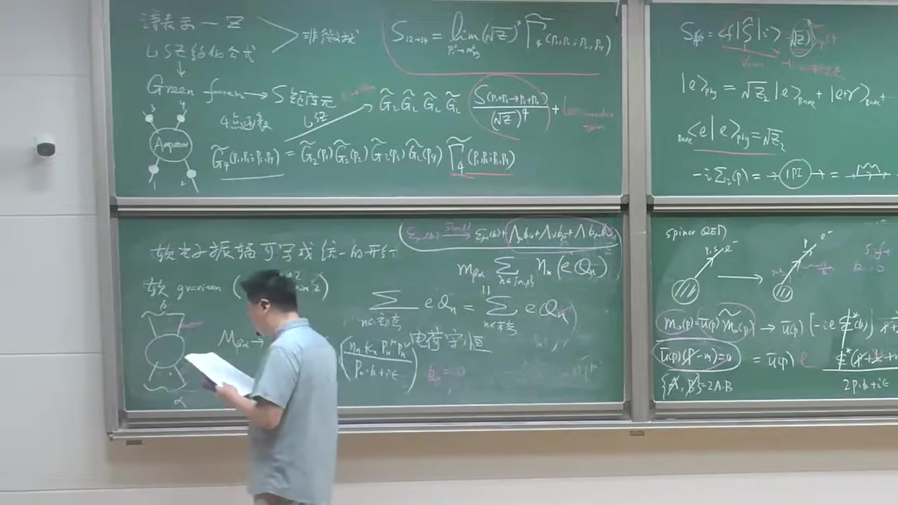

### 注解

# 本段新内容注解：从软光子推广到软引力子，推出“引力荷 universality”

这一段的核心是在说：

- 前面对**软光子**做的分析，可以几乎原样推广到**软引力子**；
- 引力子的自旋是 **2**，所以它的极化对象不再是矢量，而是**极化张量**；
- 在软极限下，发射一个软引力子的振幅同样会**因子化**；
- 再要求这个结果在引力子的“规范冗余/Little group 变换”下不变，就会推出一个非常强的结果：

\[
\text{所有粒子耦合到引力的强度必须相同}
\]

也就是**引力荷是普适的**，最终可识别为引力常数（牛顿常数）控制的耦合。这正是**等效原理**在散射振幅语言中的体现。

---

## 1. 本段出现的公式与逐一解释

---

## 公式 1：软引力子的软因子形式

字幕中讲的是：若在某个散射过程里再辐射一个**软引力子**，那么振幅可写成类似软光子的形式，但现在由于引力子是自旋 2，分子里会出现两个动量。

其标准形式可写作

\[
\mathcal M_{N+1}(p_i;k,\varepsilon)
\;\approx\;
\left[
\sum_n \eta_n \,\kappa_n\,
\frac{p_n^\mu p_n^\nu \,\varepsilon_{\mu\nu}(k)}
{p_n\!\cdot\! k + i\epsilon}
\right]
\mathcal M_N
\]

这就是本段最重要的新公式。

### 符号解释

- \(\mathcal M_N\)：原来**没有软引力子**时的 \(N\) 点散射振幅。
- \(\mathcal M_{N+1}\)：多了一个软引力子后的振幅。
- \(k^\mu\)：这个额外辐射出来的**软引力子**的四动量。
- \(\varepsilon_{\mu\nu}(k)\)：引力子的**极化张量**。
- \(p_n^\mu\)：第 \(n\) 条外线粒子的四动量。
- \(\eta_n\)：符号因子，用来区分入射/出射外线。常见约定是  
  - 出射粒子：\(\eta_n=+1\)
  - 入射粒子：\(\eta_n=-1\)
- \(\kappa_n\)：第 \(n\) 种粒子与引力子的耦合常数。老师说它“类似于电荷”，可以理解成该粒子的“引力荷”。
- \(p_n\!\cdot\! k\)：四维 Minkowski 内积。
- \(i\epsilon\)：传播子处方里的微小虚部，保证极点处理正确。
- \(\approx\)：表示这是**软极限**下的主导项。

---

### 为什么分子里是 \(p^\mu p^\nu\)？

因为前面软光子对应的是自旋 1 粒子，极化对象是矢量 \(\varepsilon_\mu\)，所以软因子分子里只有一个动量 \(p^\mu\)。

现在引力子是**自旋 2 无质量粒子**，极化对象变成二阶张量：

\[
\varepsilon_{\mu\nu}
\]

它有两个 Lorentz 指标，因此要用两个动量来和它收缩，所以分子是

\[
p^\mu p^\nu \varepsilon_{\mu\nu}
\]

这是软光子与软引力子的最直接区别。

---

## 公式 2：无质量自旋 2 粒子的极化张量变换

字幕中讲到：像光子一样，保持 \(k\) 不变的 Little group 变换会让极化对象发生某种“冗余变化”。对引力子，极化张量的变化更复杂。

其标准写法是

\[
\varepsilon_{\mu\nu}
\;\to\;
\varepsilon_{\mu\nu}
+ k_\mu \lambda_\nu
+ k_\nu \lambda_\mu
\]

更严格地说，还常常要求 \(\lambda\) 满足一些横向条件；老师在课堂上强调的是其结构：**多出若干含 \(k_\mu\) 的项**。

### 符号解释

- \(\varepsilon_{\mu\nu}\)：引力子的极化张量。
- \(k_\mu\)：引力子动量。
- \(\lambda_\nu\)：某个任意函数/参数，代表 Little group 或规范冗余带来的变化参数。

### 物理含义

这说明 \(\varepsilon_{\mu\nu}\) 不是完全物理的，里面有“规范多余”的成分。  
真正可测的是那些在上述变换下**不变**的振幅。

---

## 公式 3：Ward 恒等式/规范一致性条件

老师说：为了让这些额外项不对真实振幅有贡献，就要求把某个极化指标换成 \(k\) 时，振幅要为零。于是得到类似 Ward 恒等式的条件：

\[
k_\mu\,\mathcal M^{\mu\nu}=0
\qquad\text{或}\qquad
k_\nu\,\mathcal M^{\mu\nu}=0
\]

对于软因子代入后，得到约束：

\[
\sum_n \eta_n \kappa_n\, p_n^\nu = 0
\]

这就是本段推出的关键公式。

### 这一步怎么来的？

因为软因子中有

\[
\frac{p_n^\mu p_n^\nu \varepsilon_{\mu\nu}}{p_n\cdot k}
\]

若把 \(\varepsilon_{\mu\nu}\) 中某一部分换成 \(k_\mu\lambda_\nu\)，则分子变成

\[
p_n^\mu p_n^\nu k_\mu \lambda_\nu
=
(p_n\cdot k)\, p_n^\nu \lambda_\nu
\]

于是和分母中的 \(p_n\cdot k\) 抵消，剩下

\[
\sum_n \eta_n \kappa_n\, p_n^\nu \lambda_\nu
\]

为了任意 \(\lambda_\nu\) 都不影响振幅，必须要求

\[
\sum_n \eta_n \kappa_n\, p_n^\nu = 0
\]

---

## 公式 4：把入态与出态分开写

老师随后把上式拆成“初态”和“末态”两部分。写法大意是

\[
\sum_{n\in \beta} \kappa_n\, p_n^\nu
=
\sum_{n\in \alpha} \kappa_n\, p_n^\nu
\]

这里：

- \(\alpha\)：初态（incoming states）
- \(\beta\)：末态（outgoing states）

这只是把

\[
\sum_n \eta_n \kappa_n p_n^\nu =0
\]

按入射和出射重新整理后的写法。

---

## 公式 5：由四动量守恒推出耦合必须相同

散射过程本身满足四动量守恒：

\[
\sum_{n\in \beta} p_n^\nu
=
\sum_{n\in \alpha} p_n^\nu
\]

若要它和上一条

\[
\sum_{n\in \beta} \kappa_n p_n^\nu
=
\sum_{n\in \alpha} \kappa_n p_n^\nu
\]

对**任意过程、任意粒子种类**都成立，那么唯一自然的办法就是：

\[
\kappa_n = \kappa
\qquad \text{对所有 } n
\]

也就是说，所有粒子的“引力荷”都相同。

老师后面把它进一步认成某个统一常数，例如与牛顿常数相关：

\[
\kappa \sim \sqrt{8\pi G_N}
\]

不同教材会有不同规范，也可能写成 \(\kappa=\sqrt{32\pi G_N}\)。  
课堂这里的重点不是精确归一化，而是：

> **所有粒子都以同一个普适常数耦合到无质量自旋 2 场。**

---

## 2. 必要理论背景补充

---

## 2.1 为什么说“引力子是 massless spin 2”？

在线性化引力或量子引力的弱场极限里，我们把时空度规写成

\[
g_{\mu\nu}=\eta_{\mu\nu}+\kappa h_{\mu\nu}
\]

其中：

- \(\eta_{\mu\nu}\) 是平直时空度规；
- \(h_{\mu\nu}\) 是小扰动。

这个 \(h_{\mu\nu}\) 是一个**对称二阶张量场**，其量子对应物就是**引力子**。  
因为它是无质量的，小群结构告诉我们它只有两个物理螺旋度态：

\[
\lambda = \pm 2
\]

所以它叫**无质量自旋 2 粒子**。

---

## 2.2 为什么会有“只有两个物理极化”？

这和光子类似。  
光子虽然写成四维矢量 \(A_\mu\)，但无质量加规范不变性会消掉大多数分量，只剩两种横向物理极化。

引力子虽然用 \(\varepsilon_{\mu\nu}\) 表示，看起来分量更多，但因为：

- 它是对称张量；
- 又有无质量约束；
- 再加上线性化微分同胚不变性（gauge redundancy）；

最终也只剩两种物理自由度，对应 helicity \(\pm 2\)。

---

## 2.3 Little group 在这里起什么作用？

对一个固定动量 \(k^\mu\) 的无质量粒子，保持 \(k^\mu\) 不变的 Lorentz 变换集合叫 **Little group**。  
对无质量粒子，它会带来极化对象的某种“平移型冗余变换”。

- 对光子，表现成  
  \(\varepsilon_\mu \to \varepsilon_\mu + c\,k_\mu\)
- 对引力子，表现成  
  \(\varepsilon_{\mu\nu}\to \varepsilon_{\mu\nu}+k_\mu\lambda_\nu+k_\nu\lambda_\mu\)

所以要求散射振幅对这种变化不敏感，就能得到**一致性条件**。  
本段最重要的就是：这个一致性条件比自旋 1 的情形更强，直接推出**引力耦合的普适性**。

---

## 2.4 这和等效原理有什么关系？

经典力学里的等效原理说：

- 惯性质量 = 引力质量；
- 所有物体在同一引力场中自由下落加速度相同。

量子场论/散射振幅语言中的对应说法就是：

> 所有粒子都以同样的方式耦合到引力子。

也就是这段推出来的

\[
\kappa_n=\kappa
\]

这正是**等效原理的振幅版表述**之一。

---

## 3. 用通俗语言解释核心概念

---

## 3.1 从“软光子”到“软引力子”

前面软光子告诉我们：

- 如果散射过程里顺便放出一个**很软的光子**，
- 那么这个过程的主要修正非常简单，
- 只是在原振幅外面乘一个“通用因子”。

现在老师说：  
**软引力子也一样。**

只是因为引力子“自旋更高”，所以这个通用因子看起来更复杂一点，从一个动量 \(p^\mu\) 变成两个动量 \(p^\mu p^\nu\)。

---

## 3.2 为什么“规范不变性”会逼出普适耦合？

直觉上可以这么理解：

- 极化张量里有些部分不是物理的，只是你描述方式的冗余；
- 真正的振幅不能依赖这些冗余；
- 所以把这些“假的分量”代进去，最后必须自动消失。

一算就发现，如果想让它自动消失，那么不同粒子耦合到引力子的强度不能乱取。  
只要某些粒子耦合强一点、某些弱一点，那个“冗余项”一般就消不掉，理论就不一致。

于是理论被迫要求：

\[
\kappa_1=\kappa_2=\cdots=\kappa
\]

也就是说：

> 引力不能“挑人”，它必须对所有粒子一视同仁。

这就是为什么说引力的耦合是**普适的**。

---

## 3.3 为什么这比电磁作用更“严格”？

电磁作用里，不同粒子可以有不同电荷：

- 电子带 \(-e\)
- 质子带 \(+e\)
- 中子带 \(0\)

一致性要求的是**总电荷守恒**。

但引力这里不一样。  
由软无质量自旋 2 的一致性条件推出来的是：

- 不是“某种引力荷之和守恒”这么简单，
- 而是更强地要求所有粒子的引力耦合必须同一个常数。

所以无质量自旋 2 理论非常特殊，它强烈指向**广义相对论式的结构**。

---

## 4. 本段板书/截图内容描述

从截图能辨认出，这一段黑板主要包括以下内容：

---

### 左侧中下区域

- 写着类似“转换为振幅写成统一的形式”
- 板书明确提到  
  **graviton (massless spin 2)**  
  以及 helicity
  \[
  \lambda=\pm 2
  \]
- 画了一个散射图：一个中心“硬过程”blob，外面接一条软辐射线，表示在一般散射过程中附加发射一个软引力子。

---

### 中间偏下区域

- 写出了软引力子振幅的因子化结构，能看出框起来的式子大致是
  \[
  \frac{\kappa_n\, p_n^\mu p_n^\nu}{p_n\cdot k + i\epsilon}
  \]
  乘原振幅。
- 这里突出强调了：
  - 分母仍是 \(p\cdot k\)
  - 但分子变成了两个动量 \(p^\mu p^\nu\)

这正对应老师口头讲的“因为 spin 2 的极化是张量，所以分子上有两个 \(p\)”。

---

### 中间上方区域

- 圈出了极化张量变换的形式，能辨认出类似
  \[
  \varepsilon_{\mu\nu}\to \varepsilon_{\mu\nu}
  + \Lambda_\mu \delta_{\nu?}
  + \Lambda_\nu \delta_{\mu?}
  \]
  的结构；虽然板书不完全清楚，但显然是在写
  \[
  \varepsilon_{\mu\nu}\to \varepsilon_{\mu\nu}+k_\mu\lambda_\nu+k_\nu\lambda_\mu
  \]
  这种规范型变化。

---

### 中间黑板正中

- 写出了由不变性得到的约束式，能看到求和号、\(\eta_n\)、\(\kappa_n\)、\(p_n^\nu\) 这些符号；
- 接着又把它改写成“入态求和 = 出态求和”的形式；
- 黑板上还写了“电荷守恒”字样，这是在和前面的软光子情况作对比；
- 随后进一步说明这里最终不是一般的守恒律，而是要求所有 \(\kappa_n\) 相同。

---

### 中下偏右区域

- 出现了关于 \(G_N\) 或 Newton 引力常数的板书；
- 老师是在说明这个统一常数可以识别为引力耦合常数，与**牛顿万有引力常数**有关。

---

## 5. 本段结论总结

这一段最重要的新结论可以浓缩成三句话：

1. **软光子定理可推广到软引力子。**
2. **由于引力子是无质量自旋 2 粒子，软因子变成**
   \[
   \sum_n \eta_n \kappa_n \frac{p_n^\mu p_n^\nu \varepsilon_{\mu\nu}}{p_n\cdot k}
   \]
3. **要求振幅对引力子极化的规范冗余不敏感，会强迫所有粒子的引力耦合相同：**
   \[
   \kappa_n=\kappa
   \]
   这就是引力耦合的**普适性**，也正是**等效原理**在振幅语言中的体现。

如果你愿意，我下一步可以把这段内容整理成一份更“教材化”的版本：  
**“Weinberg 软引力子定理推导提纲”**，按“假设—公式—Ward 恒等式—结论”四步写清楚。

---

## 段落 14：高自旋零质量粒子的限制与课程小结

**时间：** 01:26:07 ~ 01:29:59

📝 原始字幕

<pre>

以前我们其实也给大家提过一句
这个自然界不存在
零质量的
自全为三或者更多的例子
那我们现在也有个新的理解
通过softcurrent可以去理解
我们考虑一个MASTERS的
并三它这个例子呢HALESTY只能是正负三是吧
你要刻画这样一个高子权粒子呢你可以给它一个三个这个浓度指标的一个极化张量是吧
同样你可以利用这个软极限再加上这个瓦的等式
你可以得到这样的条件这我们不细推倒了温博的时候和吃饭的时候都有都有一些讨论一场恩恩
这个三FACTUR符号的这个因子正一对OUTGOING复一等INCOMING悲谈代表这样一个
这个物质粒子和这个MASTERSPINSTRIPS粒子偶合的一个长数偶合了一个鹤
PN
没用
因为你现在软X英子有三个这样一个动量所以你点成一个销售分门还有两个PP
等于零
好你把它出台末台给它
分开你可以发现对于
对于入社的泰英卡明
你发现他BETAI成语
P I
蜜萝
屁爱牛比等于
墨炭
啊高
是一个张亮等式
贝塔吉
芝芝米
屁给牛
这样一个张亮方程张亮等式很难满足
你不妨
取个简单的极限
对任何一个反应过程
你取
等于
咱们养
爸爸
你发现这个换成什么了
P0就是它的能量两个都是能量所以呢P0就是
第二个例子的
能量平方
等于
能量平方的核等于墨炭每个粒子的能量的平方的核
OK
你发现这样一个等式实在是
要求太严格了现在你对任何一个过程N到M的过程
你出了一些特殊的运动学的一些区域这个等于是不可能满足除非什么呢
除非這個凳是滿足
除非是
对所有例子呢这样一个鹤
等于零随着这个平了情况是吧
所谓的贺维灵
索尔哈克
和自悬散林志强粒子的
和何维林所以得了一个非常有趣的一个
性质
就是对于
大约等于三
零质量粒子
不存在没有
非平庸的或者说自洽的没有
当吹尾的没有非平庸的
相互作用理论
大家看这是另外一种视角
我们
告诉为什么高自权的灵长例子呢
它不存在是吧
行那我们先
我们先休息一会儿

</pre>

**课程截图：**

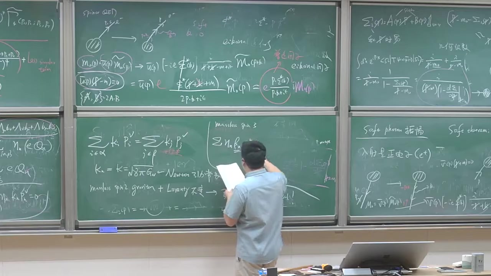

### 注解

---
