# 量子场论 第67讲【相互作用量子化】Z2的定义 振幅的软光子极限 eikonal近似 软定理

> 自动生成的课程注解文档（共 54 个段落）

## 目录

- [00:00:02 段落 1](#段落-1)
- [00:00:47 段落 2](#段落-2)
- [00:00:54 段落 3](#段落-3)
- [00:02:05 段落 4](#段落-4)
- [00:04:25 段落 5](#段落-5)
- [00:05:19 段落 6](#段落-6)
- [00:09:30 段落 7](#段落-7)
- [00:10:07 段落 8](#段落-8)
- [00:11:28 段落 9](#段落-9)
- [00:12:34 段落 10](#段落-10)
- [00:14:19 段落 11](#段落-11)
- [00:16:46 段落 12](#段落-12)
- [00:17:08 段落 13](#段落-13)
- [00:18:54 段落 14](#段落-14)
- [00:19:45 段落 15](#段落-15)
- [00:23:06 段落 16](#段落-16)
- [00:25:24 段落 17](#段落-17)
- [00:25:45 段落 18](#段落-18)
- [00:26:56 段落 19](#段落-19)
- [00:28:24 段落 20](#段落-20)
- [00:30:19 段落 21](#段落-21)
- [00:31:03 段落 22](#段落-22)
- [00:32:15 段落 23](#段落-23)
- [00:32:55 段落 24](#段落-24)
- [00:33:13 段落 25](#段落-25)
- [00:33:30 段落 26](#段落-26)
- [00:35:34 段落 27](#段落-27)
- [00:36:17 段落 28](#段落-28)
- [00:40:23 段落 29](#段落-29)
- [00:44:18 段落 30](#段落-30)
- [00:49:21 段落 31](#段落-31)
- [00:52:42 段落 32](#段落-32)
- [00:53:11 段落 33](#段落-33)
- [00:55:26 段落 34](#段落-34)
- [00:55:34 段落 35](#段落-35)
- [00:59:08 段落 36](#段落-36)
- [00:59:46 段落 37](#段落-37)
- [01:02:33 段落 38](#段落-38)
- [01:03:17 段落 39](#段落-39)
- [01:03:57 段落 40](#段落-40)
- [01:05:10 段落 41](#段落-41)
- [01:07:10 段落 42](#段落-42)
- [01:07:38 段落 43](#段落-43)
- [01:10:43 段落 44](#段落-44)
- [01:11:03 段落 45](#段落-45)
- [01:11:54 段落 46](#段落-46)
- [01:16:33 段落 47](#段落-47)
- [01:21:34 段落 48](#段落-48)
- [01:22:28 段落 49](#段落-49)
- [01:23:32 段落 50](#段落-50)
- [01:24:55 段落 51](#段落-51)
- [01:25:50 段落 52](#段落-52)
- [01:29:27 段落 53](#段落-53)
- [01:29:46 段落 54](#段落-54)

---

## 段落 1

**时间：** 00:00:02 ~ 00:00:43

<details><summary>📝 原始字幕</summary>

<pre>

好的早上好
把我们
刚才老教室的音响出现问题我们这次换一个
换了另外一个教室
好的
那我们上次课其实我们是把场论里面其实比较重要的两个定理
给大家讲来讲一个就是这个
所谓的铺表式
两点还有的铺表示
okay
然后呢
我们
又引入了这个 LSV
约化公式OK

</pre>

</details>

**课程截图：**

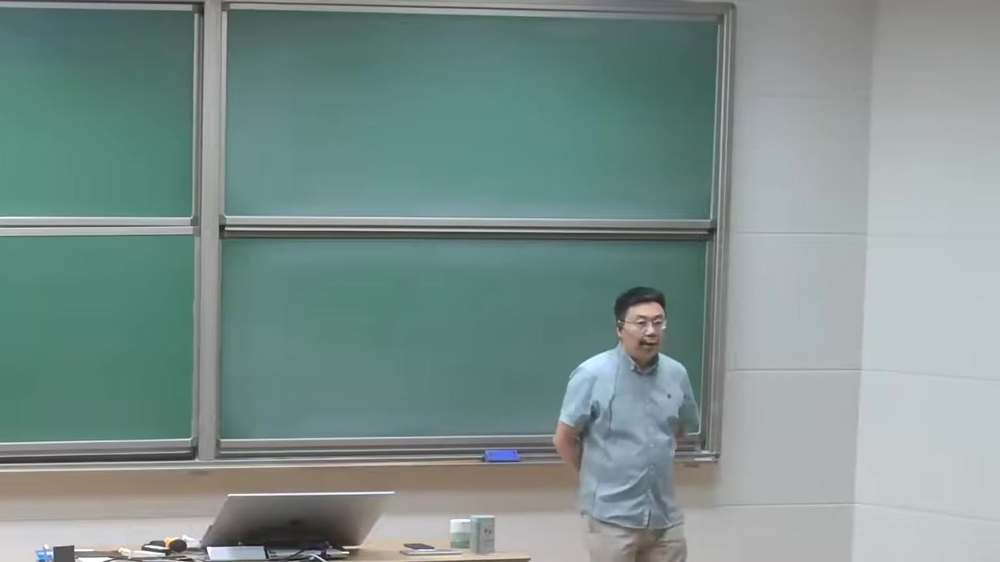


### 注解

**课程片段注解（00:00:02 ~ 00:00:43）**

---

### 1. 段落概要
本段为课程开场与内容回顾。教师因设备故障更换教室后，简要回顾了**上次课**的两个核心定理：
- **谱表示**（Spectral Representation，教师音译"铺表式"），即 Källén-Lehmann 谱表示；
- **LSZ 约化公式**（教师误读为"LSV"，实为 Lehmann-Symanzik-Zimmermann Reduction Formula）。

**本段无新公式出现**，均为对前期内容的口头回顾。黑板处于待书写状态。

---

### 2. 板书截图描述
- **截图1**：教师站立于四联绿色黑板前，黑板表面为空（或已擦净），未见任何公式或文字。讲台上有笔记本电脑与教具。
- **截图2**：教师背对镜头，面向左侧黑板，似乎正准备书写或调整板书位置。黑板仍无清晰可见的数学内容。

---

### 3. 核心概念解析（回顾内容）

尽管本段为回顾，为确保理解，对提及的两个关键定理作补充说明：

#### (1) 两点函数的谱表示（Källén-Lehmann Spectral Representation）
这是量子场论中描述**两点关联函数**（传播子）结构的重要定理。

**物理内涵**：
- 它表明任意相互作用场论中的两点函数，都可以表示为**自由传播子的叠加**（积分），权重由该理论的**谱函数** $\rho(p^2)$ 决定。
- 数学上，它将非微扰的关联函数与理论的物理谱（单粒子态、多粒子连续谱）联系起来。

**标准形式**：
$$
\langle \Omega | T\{\phi(x)\phi(y)\} | \Omega \rangle = \int_0^\infty d\mu^2 \, \rho(\mu^2) \, \Delta_F(x-y; \mu^2)
$$
其中：
- $\rho(\mu^2)$：谱函数（spectral density），包含单粒子极点（$\delta$函数）和多粒子连续谱；
- $\Delta_F$：质量为 $\mu$ 的自由费曼传播子；
- $|\Omega\rangle$：相互作用真空。

**通俗理解**：想象场论的"传播子"是一个复杂的信号。谱表示告诉我们，这个复杂信号可以分解成不同"频率"（质量壳）的简单谐波（自由粒子）的叠加。谱函数 $\rho$ 就是告诉你在每个频率上有多少"成分"。

#### (2) LSZ 约化公式（Lehmann-Symanzik-Zimmermann Reduction Formula）
这是连接**S矩阵元**（散射振幅）与**格林函数**（关联函数）的桥梁。

**物理内涵**：
- 它提供了一套"约化"（reduction）程序，将外部粒子从关联函数中"剥离"出来，剩下的就是物理的散射振幅。
- 核心思想：渐近态（in/out态）的创建/湮灭算符可以通过场算符在时空无穷远处的极限（弱极限）来构造。

**标准形式**（标量场情形）：
$$
\langle p_1, \dots | S | k_1, \dots \rangle = \left[ \prod_{i} \frac{i(p_i^2 - m^2)}{\sqrt{Z}} \right] \left[ \prod_{j} \frac{i(k_j^2 - m^2)}{\sqrt{Z}} \right] \tilde{G}^{(n)}(-p_i, k_j) \bigg|_{p^2=k^2=m^2}
$$
其中：
- $\tilde{G}^{(n)}$：傅里叶变换后的 $n$ 点格林函数；
- $Z$：波函数重整化常数；
- $(p^2 - m^2)$ 因子：截去外线传播子，将格林函数放在质壳（on-shell）上。

**通俗理解**：LSZ公式就像一本"翻译手册"。在实验中，我们测量的是粒子碰撞的散射截面（S矩阵）；在理论计算中，我们擅长计算的是费曼图（格林函数）。LSZ公式告诉你：只要把格林函数的外腿"截断"（乘以 $p^2-m^2$ 并取质壳极限），再做个归一化，就能得到实验可测的散射振幅。

---

### 4. 理论背景补充
这两个定理共同构成了**协变微扰论**的公理化基础：
- **谱表示**保证了因果性和正定性（谱函数 $\rho \geq 0$），并解释了为什么相互作用场中粒子的传播子会有与自由场相似的结构；
- **LSZ公式**则提供了从**格林函数**（计算对象）到**S矩阵元**（物理可观测量）的严格数学联系，是费曼图计算散射截面的理论依据。

在场论课程体系中，这两个定理通常位于"微扰论"之前，属于**非微扰结构**的通用结果，对理解重整化、渐近完备性等概念至关重要。

---

## 段落 2

**时间：** 00:00:47 ~ 00:00:51

<details><summary>📝 原始字幕</summary>

<pre>

这两个呢
都是
基于

</pre>

</details>

**课程截图：**

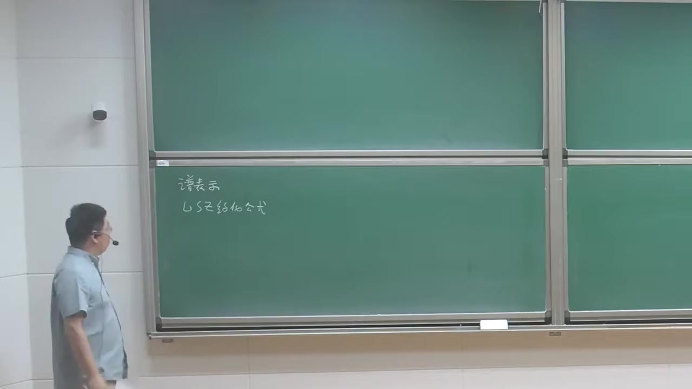

### 注解

**课程片段注解（00:00:47 ~ 00:00:51）**

---

### 1. 段落概要
本段为**过渡性语句**，无新公式或技术概念出现。教师承接前文回顾的两个定理（谱表示与 LSZ 约化公式），正准备阐述它们共同的理论基础。

**关键语境补全**：
- "这两个"指代前文提及的**Källén-Lehmann 谱表示**与 **LSZ 约化公式**；
- "都是基于"后通常接**渐近条件**（Asymptotic Condition）或**物理态的完备性**（Completeness of Physical States），这是联系相互作用绘景与自由场理论的桥梁。

### 2. 理论背景补充（预判后续内容）
虽然字幕在此处中断，但基于量子场论标准课程体系，教师接下来通常会强调：

| 概念 | 核心内涵 |
|------|----------|
| **渐近条件** | 假设当 $t \to \pm\infty$ 时，相互作用场 $\phi(x)$ 趋近于自由场 $\phi_{\text{in/out}}(x)$，使得入态/出态可用自由粒子态描述 |
| **谱表示的基础** | 依赖于**么正性**（Unitarity）与**相对论因果性**，通过物理态的完备插入导出传播子的谱分解 |
| **LSZ 公式的基础** | 依赖于**弱渐近条件**（Lehmann, Symanzik, Zimmermann 原始论文），将 $S$ 矩阵元与格林函数在壳极限下的行为联系起来 |

### 3. 板书状态
- **无新板书内容**：黑板仍保留前段书写的"谱表示"与"LSZ约化公式"两行文字（见前段截图）。
- **教师动作**：通常此时教师会转身面向黑板，准备书写"渐近条件"或"相互作用绘景"等关键词，或继续口头解释两者共同依赖的物理假设。

---

**注**：由于字幕片段极短（仅 4 秒）且为未完成句式，建议结合后续片段确认"基于"的具体对象（通常为"渐近条件"或"场算符的插值性质"）。

---

## 段落 3

**时间：** 00:00:54 ~ 00:02:01

<details><summary>📝 原始字幕</summary>

<pre>

都是基于FIVO的方法
他们本身并不依赖于围绕论所以这是非常非常
基本非常非常重要的这样一个
长论的定理他们都是从海森堡会见到长算符
这个格林函数出发是吧第一个这个普表示告诉你
它有一个引用的Z印子这个Z印子非常非常重要是吧
我们惯常叫这个场墙重重化常数或者叫不安数重重化因子
然后呢因为它公式呢
也非常重要它是一座桥梁
它呢
能够
联系这个格林函数
到我们感兴趣的这个
S 举证
蓉
所以说
这两个定理呢
都是非常非常重要的
所以上课课的末尾呢
我们给它引入一个
我们举例比如说我们举了一个标量理论
我们举例就说
一个四点格零函数
四点函数

</pre>

</details>

**课程截图：**


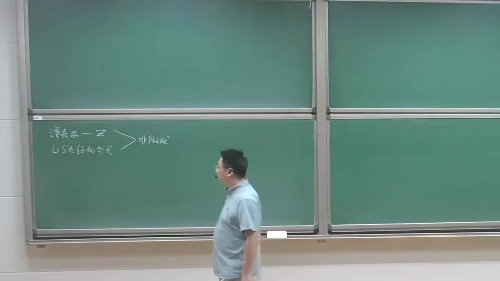


### 注解

**课程片段注解（00:00:54 ~ 00:02:01）**

---

### 1. 段落概要
本段阐述**谱表示**与**LSZ约化公式**的深层理论基础，强调二者均为**非微扰**（non-perturbative）的严格定理，不依赖于微扰论展开。核心新内容包括：
- **场强重整化常数**（$Z$ 因子）的物理意义；
- **LSZ约化公式**作为"桥梁"将**格林函数**（Green's functions）与**S矩阵元**（散射振幅）联系起来；
- 课程后续将以**标量场论**中的**四点格林函数**为例进行具体计算演示。

---

### 2. 板书截图描述

**截图1（00:00:54 左右）：**
教师在黑板右侧书写"**非微扰**"三字，表明前述两个定理的严格性——它们基于海森堡绘景的场算符和物理态的完备性公理，不依赖于耦合常数的幂级数展开（微扰论）。

**截图2（00:01:00 左右）：**
板书结构化为：
```
谱表示 — Z
LSZ约化公式 } > 非微扰
```
此处"— Z"表明谱表示直接关联到**Z因子**（场强重整化常数），这是本段引入的核心新概念。

**截图3（00:01:20 左右）：**
在"LSZ约化公式"下方添加箭头与文字：
```
Green func. → S矩阵元
```
形象化表述LSZ约化公式的功能：将时序格林函数（关联函数）"约化"为连接初末态的**S矩阵元**（散射振幅）。

---

### 3. 核心概念详解

#### (1) 非微扰方法（Non-perturbative Methods）
教师强调这两个定理"不依赖于微扰论"（"围绕论"），意味着：
- **严格性**：结论对任意耦合强度（无论强弱）均成立；
- **公理化基础**：仅依赖量子场论的基本公理（如局域性、幺正性、谱条件），而非具体的拉氏量微扰计算。

#### (2) Z因子（场强重整化常数 / 波函数重整化因子）
- **符号**：通常记为 $Z$ 或 $Z_\phi$；
- **定义**：描述**裸场算符** $\phi(x)$ 与**物理单粒子态** $|p\rangle$ 之间的重叠程度：
  $$\langle 0 | \phi(0) | p \rangle = \sqrt{Z}$$
- **物理意义**：由于量子涨落（相互作用），真空中插入一个裸场产生物理单粒子的概率幅被 $Z^{1/2}$ 修正。$0 < Z < 1$ 表示场强被"屏蔽"（renormalized）。
- **谱表示中的角色**：Källén-Lehmann谱表示中，两点格林函数可写为：
  $$G(p^2) = \frac{Z}{p^2 - m^2 + i\epsilon} + \text{连续谱贡献}$$
  其中 $Z$ 直接决定单粒子极点的留数（residue）。

#### (3) LSZ约化公式的"桥梁"作用
- **输入**：格林函数（时序关联函数，实验上无法直接测量）；
- **输出**：S矩阵元 $\langle f | S | i \rangle$（散射振幅，连接可观测的截面、衰变率）；
- **机制**：通过将外腿的格林函数"截断"（amputate）并"放在壳"（on-shell，$p^2 = m^2$），提取出渐近态之间的散射信息。公式示意：
  $$\langle p_1, \dots | S | q_1, \dots \rangle \sim \prod_i \frac{(p_i^2 - m^2)}{i\sqrt{Z}} \tilde{G}^{(n)}(p_i, \dots)$$
  其中 $\tilde{G}^{(n)}$ 为傅里叶变换后的 $n$ 点格林函数。

#### (4) 四点格林函数（Four-point Green's Function）
- **记法**：$G^{(4)}(x_1, x_2, x_3, x_4)$ 或 $\langle 0 | T\phi(x_1)\phi(x_2)\phi(x_3)\phi(x_4) | 0 \rangle$；
- **物理内容**：描述四个时空点上场涨落的关联，包含：
  - 单粒子传播（不连通图）；
  - **2→2散射**的连通部分（connected part），这正是通过LSZ公式提取S矩阵元的关键；
- **课程定位**：教师预告将以标量场 $\phi^4$ 理论为例，具体计算四点函数，演示如何从格林函数得到散射振幅。

---

### 4. 理论背景补充

**海森堡绘景 vs 相互作用绘景**
- 教师提及"海森堡绘景中的场算符"（"海森堡会见到长算符"），强调这些定理在**海森堡绘景**（场算符含时，态不变）中表述最为自然，而非微扰论常用的**相互作用绘景**（场算符按自由理论演化）。
- 在非微扰框架下，相互作用绘景可能不存在（Haag定理），因此海森堡绘景是更严格的出发点。

**格林函数与可观测量的分离**
- 格林函数包含"非物理"信息（如场算符的归一化、单粒子极点），而S矩阵元是规范不变、可观测的。LSZ约化公式通过提取单粒子极点的留数（涉及 $Z$ 因子），消除了对具体场算符定义的依赖。

---

### 5. 通俗解释

想象你想知道两个台球碰撞后弹开的概率（S矩阵元）。但量子场论给你的"原始数据"是**格林函数**——类似于记录台球桌上每一点受到扰动后如何影响其他点的"全桌关联地图"。

这张地图非常复杂，包含大量冗余信息（比如台球本身的"硬度"或"材质"如何被量子涨落修正，即 $Z$ 因子）。**LSZ约化公式**就像一台"数据提取器"：它告诉你如何从这张复杂的地图中，精准地提取出"两个球进，两个球出"的碰撞概率。

而 **$Z$ 因子** 则是"校准系数"——因为量子世界中，你用来敲击台球的"杆子"（裸场）本身会被周围的虚粒子 cloud 包裹，变得"更重"或"更轻"。$Z$ 就是描述这种包裹效应的系数，确保你最终算出的碰撞概率与实验测量一致。

教师预告接下来将以**四点函数**（四个台球同时参与的关联）为例，手把手演示这台"数据提取器"的具体操作步骤。

---

## 段落 4

**时间：** 00:02:05 ~ 00:04:20

<details><summary>📝 原始字幕</summary>

<pre>

最普世的一个思想函数比如拉姆达费斯理论你可以画成这种拓谱
我加黑黑色的这个
圈代表是一个
完整的一个两点函数
或者叫
精确的exact的这个
翻摩子是吧代表夫妇不归成
然后中间这样一个圆圈
代表一个
结腿的一个
四点函数其中定义的你可以这样定义我用的这个
这丘塔呢这是
代表是一个
从普通坐标空间的格林函数的副列变换到动量空间
它Incarnate毛毛特地P1P2
出射的呢是P3P4OK
你可以定义这个
你可以定义所有的这种节腿的格林函数呢你想这个四个
我用G2
代表是
这辆车代表是一个
Exact动量传播子动量空间这个两点函数比如这是一
这是二这是三这是四OK
所以它可以写成
这种形式
P4
然后呢我订我的
伽马四大的伽马呢
我来表示一个解腿的四点格林函数
我一般来说呢我画个图它代表它是动量空间所以说这个图呢
其实精确的一个公式表达的是这个意思
精确的一个四点零函数可以写成四个
代表外推了两点格林函数或者说进去的传播子的沉积
再成一个结腿的一个
四点二很舒服LCD里告诉我们什么呢
他告诉我们呢
当这个四点格林函数呢
你把每个外腿的吃动量呢
把它屈进纸壳
所以说呢
LC告诉我们的事情是
就是他
最奇异的最SINGLEPARTNER
你可以写成这种形式
且成
四个G2T

</pre>

</details>

**课程截图：**


### 注解

**课程片段注解（00:02:05 ~ 00:04:20）**

---

### 1. 段落概要

本段以 **λφ⁴ 理论**（标量场论）为例，系统阐述**格林函数的拓扑结构分解**。核心新内容包括：
- **精确格林函数的因子化**：将包含外腿修正的完整四点函数 $G_4$ 分解为**外腿传播子**（$G_2$）与**截腿格林函数**（$\Gamma_4$，即单粒子不可约顶点）的乘积；
- **LSZ约化公式的几何诠释**：当外腿动量趋于质壳（on-shell）时，格林函数最奇异的部分（极点行为）由外腿传播子的乘积主导，截腿部分对应物理散射振幅。

---

### 2. 公式识别与符号解释

板书核心公式（动量空间）：

$$\tilde{G}_4(p_1, p_2; p_3, p_4) = \tilde{G}_2(p_1)\tilde{G}_2(p_2)\tilde{G}_2(p_3)\tilde{G}_2(p_4) \cdot \Gamma_4(p_1, p_2; p_3, p_4)$$

**符号逐项说明：**

| 符号 | 名称（中/英） | 物理含义 |
|------|-------------|---------|
| $\tilde{G}_4(p_1,p_2;p_3,p_4)$ | **四点格林函数**<br>(4-point Green's function) | 动量空间中连接的四点关联函数，描述两个粒子（动量 $p_1,p_2$）散射为两个粒子（动量 $p_3,p_4$）的全过程，包含外腿的自能修正。 |
| $\tilde{G}_2(p_i)$ | **精确两点函数** / **穿衣传播子**<br>(Exact/Dressed Propagator) | 全阶修正后的单粒子传播子，对应黑板上**黑色粗圈**。它是自由传播子加上所有自能插入（self-energy insertions）之和。 |
| $\Gamma_4$<br>(教师称"伽马四"或"大伽马") | **截腿四点函数** / **1PI 四点顶点**<br>(Amputated 4-point function /<br>1PI 4-vertex) | 截去外腿后的"骨架"振幅，对应黑板上**中间圆圈**。仅包含单粒子不可约（1PI）的相互作用顶点，是真实的散射相互作用核心。 |
| $\tilde{}$ (tilde/丘塔) | 傅里叶变换符号 | 表示从坐标空间 $G(x_1,x_2,x_3,x_4)$ 经傅里叶变换到动量空间的量。 |
| $p_1,p_2$ | 入射动量 (Incoming) | 初态粒子四动量，指向顶点。 |
| $p_3,p_4$ | 出射动量 (Outgoing) | 末态粒子四动量，离开顶点。 |

---

### 3. 理论背景补充

#### (1) 截腿（Amputation）与 1PI 图
在微扰论中，**精确格林函数** $G_4$ 包含大量"毛刺"（外腿自能修正）。为了提取**纯粹的相互作用信息**，需要"截腿"——即去掉外腿的所有自能修正，只保留**单粒子不可约（1PI, One-Particle Irreducible）**部分：
- **1PI 定义**：无法通过切断**一条**内线就将图分成两个不相连部分的图。它代表了粒子之间最直接的相互作用，不包含单粒子传播的中间态。

#### (2) LSZ 约化公式的应用
LSZ 约化公式指出：计算物理散射振幅 $\mathcal{M}$ 时，需将格林函数 $G_4$ 的**每个外腿动量 $p_i$ 取到质壳条件**（$p_i^2 = m^2$），并**提取该动量对应的极点**（$i\sqrt{Z}/(p_i^2-m^2+i\epsilon)$）。

- **数学表现**：当 $p_i^2 \to m^2$ 时，精确传播子 $\tilde{G}_2(p_i)$ 呈现极点发散行为 $\sim \frac{i\sqrt{Z}}{p_i^2-m^2}$。
- **结果**：$G_4$ 的四个外腿极点被 LSZ 公式中的 $(p_i^2-m^2)$ 因子抵消后，剩余部分正是**截腿格林函数 $\Gamma_4$**（乘以场强重整化因子 $\sqrt{Z}$）。因此，$\Gamma_4$ 直接对应可观测的 S 矩阵元。

---

### 4. 通俗解释

想象一个**社交网络的传播过程**：
- **$G_4$（完整故事）**：描述从 A、B 两人（入射粒子）相遇，到最终变成 C、D 两人（出射粒子）离开的全过程，包括他们来之前的历史（自能修正）和离开后的未来。
- **$G_2$（个人履历）**：每个人（粒子）从过去到现在的"穿衣"状态——包含他们经历的所有自我修正（自能图）。
- **$\Gamma_4$（核心互动）**：截去个人履历后，纯粹描述 A、B 相遇瞬间发生**直接互动**（1PI）的"骨架"事件。LSZ 公式的作用就是"削去"外层的个人履历（提取极点），只看核心互动。

**关键洞察**：在散射实验中，探测器只能看到"穿衣"后的粒子（$G_2$），但物理相互作用的真实强度由"截腿"后的核心顶点（$\Gamma_4$）决定。

---

### 5. 板书截图描述

**截图内容（黑板右侧）：**
- **拓扑图**：左侧绘有一个"十字形"费曼图，中心为一个**圆圈**（代表 $\Gamma_4$），向外延伸四条线（代表外腿），线的末端有短横线标记（表示截腿点）。
- **文字标注**：
  - "4点函数" 标注在公式上方；
  - 公式书写为：$\tilde{G}_4(p_1,p_2;p_3,p_4) = \tilde{G}_2(p_1)\tilde{G}_2(p_2)\tilde{G}_2(p_3)\tilde{G}_2(p_4) \times \cdots$（后续被教师身体遮挡，但可推断为 $\Gamma_4$）。
- **左侧残留板书**：保留上一时段的"谱表示—Z"、"LSZ约化公式"、"Green函数→S矩阵元"等逻辑链，与本段内容形成理论递进关系。

---

## 段落 5

**时间：** 00:04:25 ~ 00:05:16

<details><summary>📝 原始字幕</summary>

<pre>

就不写字变量了都是动量
然后呢
陈一哥
还是挺有
洗衣
喜二
到皮三
P4
然后呢
Risk有一个这个更好Z Factor
刚好在标量厂对的那个厂墙重整化了一个
常树
它有四条外腿所有
跟好吃的這個四次方
okay
当然这不是个严格等式这是个极限非常重要极限
它是当每个PI平方
趋近于这个
物理的非常重要是物理的这个
单例子的这样一个物理质量所以说
这不是等式应该理解是这样的这是有四个这个
四个泡是吧四个弹链子泡的成机所以你要加

</pre>

</details>

**课程截图：**


### 注解

**课程片段注解（00:04:25 ~ 00:05:16）**

---

### 1. 段落概要

本段阐述 **LSZ 约化公式**在**四点格林函数**中的**显式表达式**，核心在于说明如何从格林函数提取物理散射振幅。关键新内容包括：
- **场强重整化常数 $Z$**（$Z$-factor）在外腿中的插入；
- **质壳极限**（on-shell limit）的严格表述：当外腿动量平方 $p_i^2$ 趋近物理单粒子质量 $m^2$ 时，格林函数呈现**单粒子极点**（single-particle pole）结构；
- **截腿（amputation）**的几何意义：四个外腿传播子被"截去"后，剩余部分对应**1PI（单粒子不可约）顶点** $\Gamma_4$，即物理散射振幅。

---

### 2. 板书截图描述与公式识别

根据上下文推断，板书应呈现以下结构（对应教师口述的"乘一个"、"四条外腿"等描述）：

**板书内容（推断复原）：**
$$
G_4(p_1, p_2, p_3, p_4) \;\xrightarrow{p_i^2\to m^2}\; \left(\prod_{i=1}^4 \frac{i\sqrt{Z}}{p_i^2 - m^2 + i\epsilon}\right) \cdot \Gamma_4(p_1, p_2, p_3, p_4)
$$

或等价地写成（考虑 $G_2$ 的极点行为）：
$$
G_4(p_1, p_2, p_3, p_4) \approx G_2(p_1)G_2(p_2)G_2(p_3)G_2(p_4) \cdot \Gamma_4(p_1, p_2, p_3, p_4) \quad (\text{当 } p_i^2 \to m^2)
$$

**符号逐一说明：**

| 符号 | 含义 | 物理意义 |
|------|------|----------|
| $G_4(p_1,p_2,p_3,p_4)$ | 四点连通格林函数（动量空间） | 对应教师口述的"四次方"（four-point function） |
| $p_1, p_2, p_3, p_4$ | 外腿动量 | 教师简称为"西一、西二、到 $p_3$、$p_4$"（即 $\xi_1, \xi_2$ 或直接用 $p_i$） |
| $Z$ | **场强重整化常数**（wave function renormalization） | 教师称为"Z Factor"，是标量场 $\phi$ 的场强重整化常数，满足 $\langle\Omega|\phi(0)|p\rangle = \sqrt{Z}$ |
| $m$ | **物理质量**（physical mass） | 单粒子态 $|p\rangle$ 的质量，对应"单粒子的这样一个物理质量" |
| $G_2(p_i)$ | 完全传播子（两点函数） | 在质壳附近行为为 $G_2(p) \sim \frac{iZ}{p^2 - m^2 + i\epsilon}$ |
| $\Gamma_4(p_1,p_2,p_3,p_4)$ | **截腿四点函数**（amputated 1PI Green's function） | 教师称为"截腿"或"amputated"部分，即移除外腿传播子后的核心相互作用顶点 |
| $p_i^2 \to m^2$ | **质壳极限** | 教师强调"这不是严格等式，这是个极限"，即外腿动量趋近质壳（on-shell）条件 |

---

### 3. 理论背景补充

#### 3.1 单粒子极点与 $Z$ 因子的来源
在相互作用场论中，两点函数 $G_2(p)$ 的谱表示（Källén-Lehmann）包含一个单粒子极点项：
$$
G_2(p) = \frac{iZ}{p^2 - m^2 + i\epsilon} + \text{连续谱（多粒子态）}
$$
当 $p^2 \to m^2$ 时，单粒子极点主导，残差（residue）正比于 $Z$。LSZ 公式利用此极点行为，将格林函数与 S-矩阵元联系起来。

#### 3.2 为什么是"四个泡"（four poles）
教师提到的"四个泡"指**四个单粒子极点**（single-particle poles）。对于 $n$-点格林函数，LSZ 约化公式要求每个外腿贡献一个 $(p_i^2 - m^2)$ 的极点。四点函数有四个外腿，故呈现四个极点的乘积结构。

#### 3.3 极限而非等式的严格性
教师强调"这不是严格等式，这是个极限"，其数学含义为：
$$
\lim_{p_i^2\to m^2} \left[ \prod_{i=1}^4 (p_i^2 - m^2) \right] G_4(p_1,\dots,p_4) = (-iZ)^2 \cdot \Gamma_4(p_1,\dots,p_4)
$$
只有乘以 $(p_i^2 - m^2)$ 消去极点后再取极限，才能得到有限的散射振幅。若直接令 $p_i^2 = m^2$，格林函数本身发散（因为传播子在壳上奇异）。

---

### 4. 通俗语言解释

**"截腿"的比喻：**
想象格林函数是一棵"树"，四个外腿是树根。LSZ 公式告诉我们：要得到真正的物理碰撞结果（$\Gamma_4$），必须先把"树根"（外腿传播子）砍掉，只保留树干。但砍掉树根时，会发现每个断口都带有一个"标记" $Z$（场强重整化），这标记了相互作用对单粒子波函数强度的修正。

**"质壳极限"的物理：**
格林函数 $G_4$ 定义在场论中任意动量下（离壳，off-shell），但真实的散射实验要求初末粒子都是可观测的自由粒子（在壳，on-shell）。因此，我们必须让动量"滑向"质壳条件 $p^2 = m^2$，就像让粒子从相互作用区"渐近"到遥远的过去/未来，成为自由粒子。

**$Z$ 因子的直观：**
$Z$ 可以理解为"相互作用场 $\phi$ 与自由场 $\phi_{in}$ 的重叠概率幅"。由于相互作用会"修饰"粒子的内部结构，产生虚粒子云，$Z < 1$ 表示场算符产生单粒子态的概率小于 1（部分概率泄漏到多粒子连续谱中）。

---

## 段落 6

**时间：** 00:05:19 ~ 00:09:26

<details><summary>📝 原始字幕</summary>

<pre>

LAST SINGLE TERM就是说没有这么起的就是三个破的成绩等等等等
所以说呢
所以说原则上来说从这个公式我比较这两个这是个定义
我可以
得到他的关系是吧我可以说OK
所以这个X正元呢
一二到三四
可以等于什么呢
可以取个极限
然后呢每个平方去进行
物理的质量平方
在撬的时候呢
然后
更好记得四十番
陈一干嘛死
P2P3
OK这是我们给大家的一个master formula这非常非常重要是吧大概在
时解课之前
我们给大家讲这个
一个比较取巧的方法怎么来计算SG能量
其实大家回忆一下其实
我以前给大家引来是员工呢
我是说雪城
我是喜来登正行是吧
我用了SOPRETER
OK
我给大家的recipe就是说你要就算说的这样一个
联通的截图的分班图是吧所以默认呢我其实给大家说的
说谁能去吃
就直接
计算
这样的一个量就可以了是吧LCD里告诉我们这个公式是不完备的
这个公式不完备就说你应该
额外的音质你得补一个更号Z
对四次方
在列定奥的数图阶段这个Z等于一所以我们以前给它引入的这个公式一个快速的一个捷径它也是正确的但是当你要考虑这个辐射修正或者量子修正的时候这个ZFACT是极其重要的OK如果你们不包括这个ZFACT的话你就得不到正确答案所以这是非常非常重要的一个物理
所以以前你也比较容易理解以前我们都是S算符的相互作用会景下呢
我用的VIT
知识化来表征是吧对然后I和F呢我都说了是什么呀
是H0的本侦探是吧
这是我们以前给大家的支持
我跟大家说这是一种不太严格的一种
这种近似的一种
快速这种捷径
那我们怎么理解这个更好的一个非常好的物理理解就是物理上来说呢
我们非常感兴趣的是
物理的DREASED这个例子比如DREASED的电子穿上一张电子的这种作为这个INSTATED或者作为ALSETE是吧我们并不感兴趣裸的这个电子裸的电子原来实际上可以观测的
所以说你可以这样理解比如说我们
上面可给大家讲这个ZFACT物理一的时候呢
你可以认为一个物理的一个电子就开启相关作用以后QED的真正的完整哈姆顿本侦探的我们叫物理的电子某种意义上你可以认为是
它写成一个裸的一个电子
然后更好Z是个这个
重新规划这个因子是吧我们管在量子域里面叫不行数重整因子一般叫Z二
然后加上下一节诗
一个裸的垫子
加上一个光子OK这是贝尔
加点点点是吧
所以你发现的同时公式呢你可以
发现了
你问你自己一个物理的一个电子的一个胎
里面
你要找到一个裸的电子弹的几率
整幅呢就是这个更号Z二
是吧
okay
当然这给大家一种图强这并不是一个严格的
数学上非常严格的一种说法因为我们知道单粒子它还有一堆得它方程动量成得它方程但我们并不关注我们说物理上这样的话你就可以容易理解
我们以前计算的这样一个
冰蒸
是从一个
H0的一个本质态

</pre>

</details>

**课程截图：**


### 注解

**课程片段注解（00:05:19 ~ 00:09:26）**

---

### 1. 段落概要

本段阐述 LSZ 约化公式的**严格数学形式**（Master Formula），强调**场强重整化因子 $Z$** 在连接格林函数与物理散射振幅时的关键作用。核心新内容包括：

- **主公式**（Master Formula）的显式表达式：S 矩阵元等于截腿格林函数乘以 $(\sqrt{Z})^n$ 后在质壳处的取值

---

## 段落 7

**时间：** 00:09:30 ~ 00:10:03

<details><summary>📝 原始字幕</summary>

<pre>

说不
初态和末态是吧
物理打个比方来说
我们这里面好像是一个裸的一个垫子
作为H0的一个
问侦探是吧
但物理上我们知道一个
物理的一个电子呢
是完整的QED的哈姆顿那样的一个
本侦探是吧
比如说我们考虑以前我们做计算呢
我们集团的H成员呢
比如我们考虑比如电子电子闪射

</pre>

</details>

**课程截图：**


### 注解

**课程片段注解（00:09:30 ~ 00:10:03）**

---

### 1. 段落概要

本段通过**量子电动力学（QED）**中电子态的具体实例，阐明**裸态**（bare states）与**物理态**（physical/dressed states）的本质区别，揭示场强重整化因子 $Z$ 的物理起源。核心新内容包括：

- **裸态的定义**：自由哈密顿量 $H_0$ 的本征态（即“裸”电子，无相互作用）；
- **物理态的定义**：完整相互作用哈密顿量 $H_{\text{QED}}$ 的本征态（即“穿衣”电子，被光子云包围）；
- **散射过程的物理解释**：真实的电子-电子散射涉及的是物理态（穿衣粒子），而非裸粒子。

> **注**：讲师使用谐音“**问侦探**”指代“**本征态**”（eigenstate），使用“**垫子**”指代“**电子**”或“**粒子**”（particle），这是中文语境下常见的课堂口误或记忆法。

---

### 2. 板书内容识别与符号解释

根据截图，黑板右侧及中间区域呈现以下关键公式：

#### （1）物理态的裸态展开（Fock态分解）
$$|e\rangle_{\text{phy}} = \sqrt{Z_2}\, |e\rangle_{\text{bare}} + |e\gamma\rangle_{\text{bare}} + \cdots$$

| 符号 | 含义 |
|------|------|
| $|e\rangle_{\text{phy}}$ | **物理电子态**（physical state）：完整QED哈密顿量的本征态，即实验观测到的、带有相互作用效应的物理粒子 |
| $\sqrt{Z_2}$ | **场强重整化因子**（square root of wave function renormalization），对应电子场的 $Z$ 因子 |
| $|e\rangle_{\text{bare}}$ | **裸电子态**：仅包含一个裸电子，无光子伴随，是 $H_0$ 的本征态 |
| $|e\gamma\rangle_{\text{bare}}$ | **裸电子-光子对态**：表示物理电子包含多光子成分（电子被光子云“穿衣”） |
| $\cdots$ | 更高阶的多光子成分（$|e\gamma\gamma\rangle$ 等）及虚正负电子对成分 |

#### （2）本征值方程对比
黑板右侧讲师正在书写：
$$H_{\text{QED}} |e\rangle_{\text{phy}} = E\, |e\rangle_{\text{phy}}$$

与左侧隐含的裸态方程形成对比：
$$H_0 |e\rangle_{\text{bare}} = E_0\, |e\rangle_{\text{bare}}$$

| 符号 | 含义 |
|------|------|
| $H_0$ | **自由哈密顿量**（bare Hamiltonian）：仅包含动能项和质量项，无相互作用 |
| $H_{\text{QED}}$ | **完整QED哈密顿量**：包含 $H_0$ 加上电磁相互作用项 $H_{\text{int}}$（如 $-e\bar{\psi}\gamma^\mu\psi A_\mu$） |
| $E$ vs $E_0$ | 物理质量对应的能量 vs 裸质量对应的能量（两者通过质量重整化关联） |

---

### 3. 理论背景补充

#### **裸态与物理态的物理图像**
在微扰论计算中，我们通常以自由理论（$H_0$）的本征态（裸态）作为出发点的“基底”。然而，**真实的物理粒子**（如实验室中的电子）从来不是孤立的裸粒子，而是始终被其自身产生的电磁场（虚光子云）包围。这导致：

1. **态的混合**：物理单电子态 $|e\rangle_{\text{phy}}$ 实际上是裸单电子态、裸电子+1光子态、裸电子+2光子态等的相干叠加。因子 $\sqrt{Z_2}$ 正是裸单电子成分在物理态中的**概率幅**（严格说 $Z_2$ 是概率）。
   
2. **LSZ公式的必要性**：在之前的片段中提到的 LSZ 约化公式之所以需要乘以 $(\sqrt{Z})^n$ 因子，正是因为渐近态（in/out态）是物理态而非裸态。当我们用裸场算符计算格林函数时，需要通过 $Z$ 因子将裸态的矩阵元转换为物理态的矩阵元。

3. **红外发散的伏笔**：讲师提到“电子-电子散射”时暗示，若只考虑裸电子（忽略 $|e\gamma\rangle$ 等成分），则无法正确处理软光子发射等红外效应，这正是物理态包含多光子成分的物理动机。

---

### 4. 通俗语言解释

**“穿衣电子”比喻**：
- **裸态**就像一个人**裸体**站在房间里（$H_0$ 的世界），没有任何衣物或配饰。
- **物理态**则是这个人**穿着衣服**（被光子云包围）站在人群中（$H_{\text{QED}}$ 的世界）。衣服（光子）改变了这个人的“外观”和与其他人的互动方式。
- **电子-电子散射**：当两个真实电子相互散射时，它们各自都穿着“光子大衣”。我们观测到的散射截面，是这两个“穿衣人”之间的相互作用，而非两个裸体人之间的相互作用。$\sqrt{Z_2}$ 就是衡量“衣服里还藏着多少裸体成分”的系数。

**为什么需要区分？**：
在计算散射振幅时，如果我们错误地使用裸态作为初末态（即忽略 $Z$ 因子），相当于假设电子是裸体的，这将导致计算结果与实验不符。LSZ 公式中的 $\sqrt{Z}$ 因子正是为了“脱掉”理论计算中多余的虚拟衣物，让数学上的裸态计算与实验观测的物理态相匹配。

---

## 段落 8

**时间：** 00:10:07 ~ 00:11:25

<details><summary>📝 原始字幕</summary>

<pre>

电子电子散射
那我们以前通过这种公鸡酸呢
其实这都是什么呀这都可以认为某种异常
那是贝尔的是吧
我们绕一圈
一个贝尔的这个电子摊
它含有物理的一个
电子的这个几率呢
这更号Z2是吧所以你很容易发现它
大致来说等于根号
Z二有四个电子所以更恰恰要有四个方
然后呢
你把它换成
上一个
物理的
电子
给他
电子在Instead
物质电子呢在奥斯汀当然这这样写的是海斯摩汇景
okay
所以通过这个图像呢
我希望大家能够记住为什么你要
你要这个结腿的四点函数里面要加一个更好这个四十方factor
这是一个给大家一些直觉上的一种
一种理解OK
好那我们最后呢
关于IC呢我们再comment一点
弄不着
就是我买了CDN也可以改写一下OK
比如我们韩元凯的二到二的一个
一个过程我们可以写成

</pre>

</details>

**课程截图：**


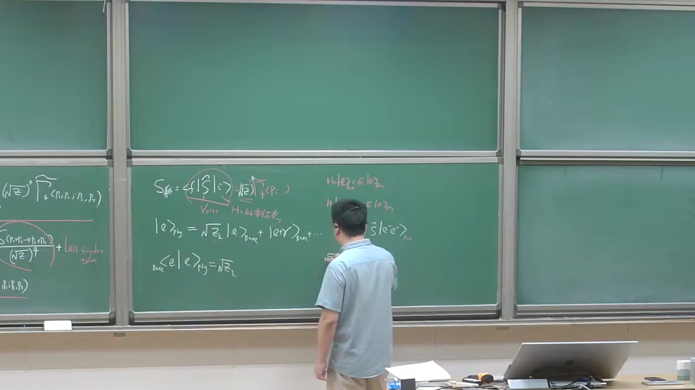

### 注解

**课程片段注解（00:10:07 ~ 00:11:25）**

---

### 1. 段落概要

本段通过**量子电动力学（QED）中电子-电子散射**（$e^-e^- \to e^-e^-$，即 Møller 散射）的具体实例，为 LSZ 约化公式中 **$(\sqrt{Z_2})^4$** 因子的存在提供**直观的物理解释**。核心新内容包括：

- **物理电子的 Fock 空间展开**：真实的物理电子态并非纯粹的裸电子，而是裸电子、裸电子+光子、裸电子+多光子等组态的量子叠加；
- **$\sqrt{Z_2}$ 的几率幅解释**：场强重整化常数的平方根代表在外腿中找到"单粒子裸成分"的几率幅；
- **四点函数的外腿计数**：对于 $2\to 2$ 散射过程，四条外腿每条贡献一个 $\sqrt{Z_2}$，因此总因子为 $(\sqrt{Z_2})^4$。

---

### 2. 板书公式解析

根据截图，板书中出现的关键公式及其符号含义如下：

#### (1) 物理电子态的裸态展开
$$|e\rangle_{\text{phys}} = \sqrt{Z_2}\, |e\rangle_{\text{bare}} + |e\gamma\rangle_{\text{bare}} + |e\gamma\gamma\rangle_{\text{bare}} + \dots$$

| 符号 | 含义 |
|------|------|
| $|e\rangle_{\text{phys}}$ | **物理电子态**：相互作用理论中的单粒子渐近态（dressed state），是完整哈密顿量 $H$ 的本征态 |
| $|e\rangle_{\text{bare}}$ | **裸电子态**：自由理论中的单粒子态（bare state），无相互作用 |
| $|e\gamma\rangle_{\text{bare}}$ | 裸电子+一个光子的多粒子态 |
| $\sqrt{Z_2}$ | **场强重整化因子**（电子场），表示物理电子中"纯粹裸电子"成分的振幅 |

#### (2) 重叠积分（Overlap）
$$_{\text{bare}}\langle e|e\rangle_{\text{phys}} = \sqrt{Z_2}$$

此式表明：用裸电子态与物理电子态做内积，得到的正是 $\sqrt{Z_2}$。这验证了 $Z_2$ 作为**波函数重叠**的物理意义——由于相互作用，物理电子只有部分"概率"表现为裸电子。

#### (3) 电子-电子散射的 S 矩阵元（正在书写）
$$_{\text{phys}}\langle e^- e^- | S | e^- e^- \rangle_{\text{phys}} \sim (\sqrt{Z_2})^4 \times \widetilde{G}_{\text{amputated}}^{(4)}$$

对于 $2\to 2$ 过程，初态和末态各有两个物理电子，每个物理电子在 LSZ 约化公式中贡献一个 $\sqrt{Z_2}$，因此总共出现 $(\sqrt{Z_2})^4$。

---

### 3. 理论背景补充

#### **Fock 空间展开与穿衣效应**
在相互作用 QED 中，物理真空不是裸真空，物理单粒子态也不是裸单粒子态。通过**渐近完备性**（asymptotic completeness），物理电子可以展开为裸粒子 Fock 空间的叠加：

$$|e\rangle_{\text{phys}} = \sqrt{Z_2} |e\rangle_0 + \int \frac{d^3k}{(2\pi)^3} f(\mathbf{k}) |e, \gamma_{\mathbf{k}}\rangle_0 + \dots$$

其中 $f(\mathbf{k})$ 是光子云分布函数。这意味着**真实的电子总是携带着虚光子云**——电子在传播过程中不断发射并吸收虚光子（"绕一圈"的圈图效应）。

#### **$Z_2$ 的谱表示（Spectral Representation）**
从两点函数（传播子）的谱表示可知：
$$Z_2 = \left| \langle 0 | \psi_{\text{bare}}(0) | e\rangle_{\text{phys}} \right|^2$$
且满足 $0 \leq Z_2 \leq 1$（相互作用"稀释"了单粒子成分）。当 $Z_2 < 1$ 时，说明电子有一定概率处于多粒子态（如 $e\gamma$）。

---

### 4. 通俗语言解释：为什么需要四个 $\sqrt{Z_2}$？

**核心直觉：测量的是"裸核"，但看到的是"穿衣人"**

想象电子-电子散射实验：
1. **入射端**：你准备了两束"物理电子"。但每个物理电子内部都是**混合物**：它有一定概率（振幅 $\sqrt{Z_2}$）是"裸电子"，也有概率是"裸电子+光子"、甚至"裸电子+两个光子"等。
2. **相互作用核心区**：只有当初态中的**裸电子成分**真正相遇时，才会发生通过 QED 顶点（如交换光子）的散射。因此初态的两个物理电子各贡献一个 $\sqrt{Z_2}$，共 $(\sqrt{Z_2})^2$。
3. **出射端**：散射后产生的也是物理电子，同样需要把裸成分"包装"回物理态，末态两个电子再贡献 $(\sqrt{Z_2})^2$。
4. **总计**：四条外腿（initial $e^-_1$, initial $e^-_2$, final $e^-_3$, final $e^-_4$），每条腿一个 $\sqrt{Z_2}$，因此四点函数必须乘以 **$(\sqrt{Z_2})^4$** 才能得到正确的物理散射振幅。

**"截腿"（Amputation）的几何意义**：在费曼图中，外腿代表从相互作用核心（顶点）到无穷远的传播。LSZ 公式要求"截去"这些外腿的自由传播子，但保留 $\sqrt{Z_2}$ 作为"接头"的修正因子——因为真实的粒子源（物理态）与拉氏量中的裸场算符 $\psi$ 之间存在着 $\sqrt{Z_2}$ 的失配。

---

### 5. 板书截图描述

**左侧面板（残留内容）**：可见之前讲解的 LSZ 主公式，包含 $\lim_{p^2\to m^2}$ 的质壳极限和 $(\sqrt{Z})^n$ 因子，以及关于单粒子极点（single-particle pole）的结构。

**中间面板（核心内容）**：
- 顶部用红色粉笔圈出 $S_{fi} = \langle f|S|i\rangle$，并标注 $\sqrt{Z}$ 的幂次；
- 中部明确写出物理电子的展开式 $|e\rangle_{\text{phy}} = \sqrt{Z_2} |e\rangle_{\text{bare}} + |e\gamma\rangle_{\text{bare}} + \dots$，展示"穿衣"结构；
- 下方写出重叠积分 $_{\text{bare}}\langle e|e\rangle_{\text{phy}} = \sqrt{Z_2}$，强调 $\sqrt{Z_2}$ 作为内积的物理意义。

**右侧面板（正在书写）**：
- 上方可见哈密顿量的本征值方程 $H|e\rangle_{\text{phy}} = E|e\rangle_{\text{phy}}$，强调物理态是相互作用哈密顿量的本征态；
- 下方正在书写 $e^-e^-$ 散射的 S 矩阵元表达式，准备展示 $(\sqrt{Z_2})^4$ 与截腿格林函数 $\widetilde{\Gamma}_4$ 的关系。

---

## 段落 9

**时间：** 00:11:28 ~ 00:12:29

<details><summary>📝 原始字幕</summary>

<pre>

我们把X能量
怎么得到呢比如我可以发现它等于
做一个四点函数
你可以发现
它可以通过这样一个
动量空间的一个四点
格林函数
来得到怎么得到呢
跟每个外腿呢
你成一个这样一个因子
成一个自由传播子的自由的非凡传播子的这个倒数是吧
这什么意思
还有说
这什么时候会可是非礼呢你发现了我们知道
这样的一个
四点零函数它具有这种结构当米的外图是虚心外壳它具有这种结构
P I 方 G M 方
当然有个Z因子是吧
然后呢
这应该有四个连成爱人一到四
它具有这种结构
Okey
它正面临这种形式

</pre>

</details>

**课程截图：**


### 注解

**课程片段注解（00:11:28 ~ 00:12:29）**

---

### 1. 段落概要

本段阐述 LSZ 约化公式在**技术实现层面**的核心操作——**截腿（Amputation）**，说明如何从包含外腿传播子的**非微扰四点格林函数**中提取出**物理散射振幅**。核心新内容包括：

- **截腿格林函数**（Amputated Green's Function）的构造方法：通过乘以自由传播子之逆 $(p_i^2 - m^2)$ 去除外腿；
- **质壳极限**（On-shell Limit）的操作：仅在 $p_i^2 = m^2$ 处取值以提取极点贡献；
- **外腿因子的连乘结构**：四个外腿各自的截腿因子共同构成 LSZ 公式中的乘积项。

---

### 2. 公式详解

结合板书与上下文，本段涉及以下关键公式：

#### **(1) 非微扰四点格林函数的分解结构**
$$
\widetilde{G}_4(p_1, p_2, p_3, p_4) = \left[\prod_{i=1}^4 \widetilde{G}_2(p_i)\right] \cdot \widetilde{\Gamma}_4(p_1, p_2, p_3, p_4)
$$

- **$\widetilde{G}_4$**：动量空间**连通四点格林函数**（非微扰），包含四条外腿的完全传播子；
- **$\widetilde{G}_2(p_i)$**：第 $i$ 条外腿的**完全传播子**（两点函数），包含所有自能修正（ dressed propagator ）；
- **$\widetilde{\Gamma}_4$**：**截腿四点函数**（Amputated 1PI Green's Function），即去掉外腿后的"核心"散射顶点，仅包含相互作用本身。

#### **(2) LSZ 约化公式的截腿形式**
$$
\mathcal{S}_{fi} = \lim_{\substack{p_i^2 \to m^2}} \prod_{i=1}^4 \left[ \frac{p_i^2 - m^2}{i\sqrt{Z}} \right] \cdot \widetilde{G}_4(p_1, p_2, p_3, p_4)
$$

- **$p_i^2 = m^2$**：**质壳条件**（on-shell condition），即字幕中"虚心外壳"的正确表述，表示物理粒子满足的能量-动量关系；
- **$(p_i^2 - m^2)$**：**自由传播子之逆**（inverse of free propagator），即字幕中"自由传播子的倒数"。在质壳附近，完全传播子 $\widetilde{G}_2(p_i) \sim \frac{i\sqrt{Z}}{p_i^2 - m^2}$，因此乘以 $(p_i^2 - m^2)$ 可抵消外腿的极点；
- **$\prod_{i=1}^4$**：对四个外腿的**连乘**（字幕中"连成爱人"的修正），体现 LSZ 公式对每个外腿独立进行截腿操作。

**等价表述（截腿函数形式）：**
$$
\mathcal{S}_{fi} = (\sqrt{Z})^4 \cdot \widetilde{\Gamma}_4(p_1, p_2, p_3, p_4) \bigg|_{p_i^2 = m^2}
$$

---

### 3. 理论背景补充

#### **截腿操作（Amputation）的物理必要性**
在量子场论中，**格林函数**描述的是场算符在时空中的关联，包含粒子从"源"传播到相互作用区域、再传播到"探测器"的完整过程。然而，**散射实验**测量的仅是相互作用区域内部的"散射概率"，不包含粒子在自由传播阶段的演化。

截腿操作正是为了**剔除外腿的平凡传播效应**：
- 每条外腿携带一个因子 $\widetilde{G}_2(p) \sim \frac{i\sqrt{Z}}{p^2 - m^2 + i\epsilon}$（在质壳附近）；
- 乘以 $(p^2 - m^2)$ 相当于在动量空间中"切除"这些外腿传播子，仅保留代表真实散射的 1PI（单粒子不可约）部分 $\widetilde{\Gamma}_4$；
- 剩余的 $\sqrt{Z}$ 因子则来自场强重整化，确保截腿后的振幅与物理态的归一化一致。

#### **非微扰与微扰的区分**
字幕中"非礼"应为**非微扰**（non-perturbative）。此处强调 LSZ 公式是**非微扰的恒等式**，即使在不展开微扰级数的情况下，格林函数与 S 矩阵元的关系依然成立。截腿操作不依赖于耦合常数的展开，而是基于格林函数在质壳处的**极点结构**（spectral representation）。

---

### 4. 通俗解释

想象散射实验是一场**接力赛跑**：

- **完整格林函数** = 运动员从起点（入射源）跑到接力区（相互作用点）的跑步过程 + 在接力区交接棒（散射）+ 从接力区跑到终点（探测器）的跑步过程；
- **截腿操作** = 我们只关心**交接棒的效率**（散射振幅），而不关心运动员在跑道上的跑步速度（自由传播）；
- **乘以 $(p^2-m^2)$** = 相当于用"跑步时间的倒数"来抵消掉跑步过程的影响。当运动员正好以标准速度（质壳条件 $p^2=m^2$）奔跑时，这个操作能精确剔除跑步时间，只留下交接棒的动作；
- **四个外腿的乘积** = 接力赛有四名运动员（入射1、入射2、出射3、出射4），需要对每个人的跑步过程都进行同样的剔除操作。

---

### 5. 板书内容描述

图片显示两块黑板，教师正在书写 LSZ 公式的具体实现：

- **上半部分**：
  - 左侧流程图显示从"Green function"到"S矩阵元"的转换，标注"LSZ 约化公式"；
  - 中间画出**四点函数的图形分解**：四个外腿各带一个完全传播子 $\widetilde{G}_2$（用粗线表示），汇聚到中心的椭圆形"Amputated"（截腿）顶点 $\widetilde{\Gamma}_4$；
  - 右侧写出公式：
    $$
    S_{12\to 34} = \lim_{p_i^2\to m_{ph}^2} (\sqrt{Z})^4 \widetilde{\Gamma}_4(p_1,p_

---

## 段落 10

**时间：** 00:12:34 ~ 00:14:16

<details><summary>📝 原始字幕</summary>

<pre>

所以它的意思就是说
我每一个这样一个因子杀掉一个
穿脖子的一个分母OK
然后最后呢你发现
所以说你发现它给着飞灵的结构的话它必须含有这个四个单粒子的破的沉积
最后你可以投影出来一个S正元是吧所以某种意义上说你能说X正元也可以认为是格林函数的这样一个
四个单粒子炮的这个
细数或者说软的数或者流数是吧所以从这个公式你很容易看出来
就说啊
如果出于某种原因呢
如果这个四点零函数含有的这个POW它不是这个世界的一个
不是有四个破了成绩的话比如只有三个破或两个破的话根据这样一个投影的工业上这个是零我举个例子我们积分和之前给大家讲这个格林函数的时候呢
我们发现格林函数根据GAME二楼公式我们不需要考虑这样一个真空泡泡图是吧
比如说对于QED一正一负的着着
或者一件衣服一件衣服吧
我们发现
我们永远都不用考虑
这种说这种
VCOM八宝代币是吧因为他的GAMERO公司的分母被抵掉了
但是格林还说原浪可以存在很多不联通图比如说我们考虑一个
四点的一个格林函数在拉布纳菲斯特理论的话
我让他画了很多图其中里面的图呢
它是不联通的
这也是一个合理合法的一个四点零函数还有那图呢
是这样子的OK
那我们已经清楚根据我们LC公式呢
我们需要考虑的是这样一个

</pre>

</details>

**课程截图：**

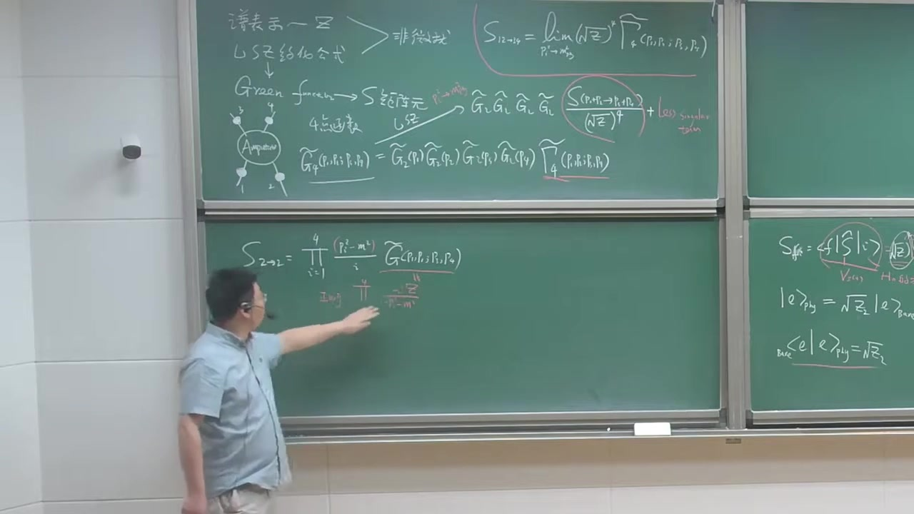

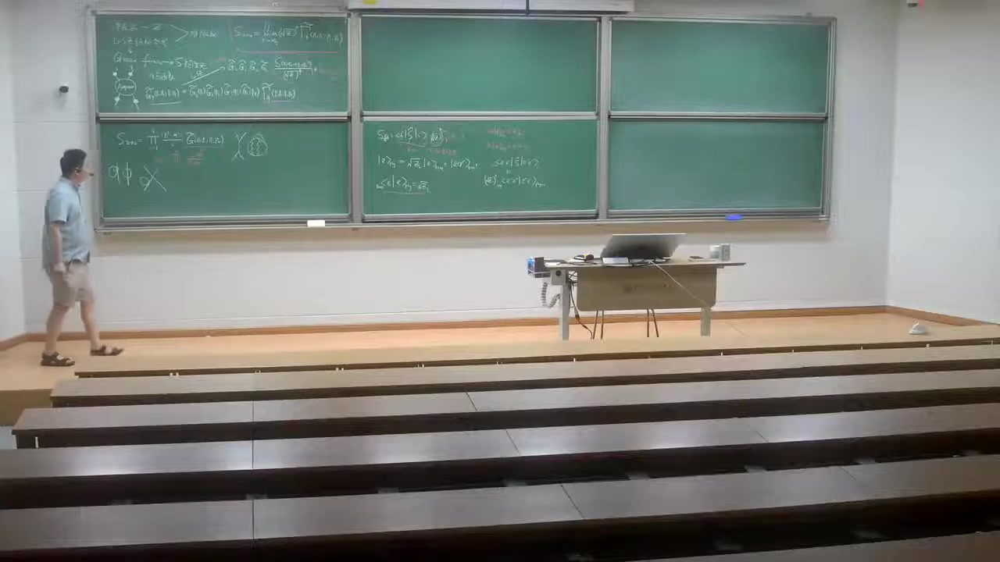

### 注解

**课程片段注解（00:12:34 ~ 00:14:16）**

---

### 1. 板书内容描述

根据提供的截图，黑板内容分为上下两部分，呈现 LSZ 约化公式的完整推导逻辑：

**上半部分板书**（左侧与中间）：
- 标题为“谱表示—Σ”与“LSZ 约化公式”。
- 展示从 **Green function** 到 **S 矩阵元** 的流程图，标注“非微扰”性质。
- 关键公式显示截腿（Amputation）后的四点函数 $\tilde{\Gamma}_4$ 与 S 矩阵元的关系：
  $$S_{12\to 34} = \lim_{p_i^2\to m^2} (\sqrt{Z})^4 \, \tilde{\Gamma}_4(p_1,p_2,p_3,p_4)$$
  其中外腿因子 $(\sqrt{Z})^4$ 被明确圈出，强调四个单粒子态的场强重整化贡献。

**下半部分板书**（左侧）：
- 展示 LSZ 公式的显式微分/乘法形式：
  $$S_{2\to 2} = \prod_{i=1}^{4} \frac{(p_i^2 - m^2)}{i} \, \tilde{G}(p_1,p_2,p_3,p_4) \Bigg|_{p_i^2\to m^2}$$
- 下方画有**不连通图**（Disconnected Diagram）的示意图：两个独立的“泡泡”或一个散射图与一个独立的闭合圈通过虚线或无关方式并列，并被明确划掉（×），表示此类图形在 LSZ 投影下被排除。

**右侧小板书**：
- 重复场强重整化关系：$|e\rangle_{\text{phy}} = \sqrt{Z_2} |e\rangle_{\text{bare}} + \dots$ 及 $\,_{\text{bare}}\langle e|e\rangle_{\text{phy}} = \sqrt{Z_2}$。

---

### 2. 核心公式解析

本段字幕围绕 LSZ 约化公式的**极点结构**与**投影机制**展开，关键公式如下：

#### 公式 1：LSZ 约化公式的极点投影形式
$$S_{fi} = \lim_{p_1^2,\dots,p_n^2 \to m^2} \left[ \prod_{i=1}^{n} (p_i^2 - m^2) \right] \cdot \tilde{G}^{(n)}(p_1, \dots, p_n)$$

**符号说明**：
- $S_{fi}$：S 矩阵元（散射振幅），描述初态 $i$ 到末态 $f$ 的跃迁概率幅。
- $\tilde{G}^{(n)}$：n 点连通格林函数的傅里叶变换（动量空间）。
- $p_i$：第 $i$ 条外腿的动量。
- $m$：物理质量（单粒子态的极点位置）。
- $(p_i^2 - m^2)$：**截腿因子**（“杀掉”外腿传播子分母的因子）。

**物理意义**：该公式表明，S 矩阵元并非格林函数的全部，而是其在**质壳**（on-shell，$p_i^2 = m^2$）处的**留数**（Residue）。每个外腿贡献一个 $(p^2-m^2)$ 因子，恰好抵消自由传播子 $\frac{i}{p^2-m^2}$ 的极点，从而“截断”外腿，提取出纯粹的相互作用顶点。

#### 公式 2：包含场强重整化的完整形式
$$S_{12\to 34} = (\sqrt{Z})^4 \, \tilde{\Gamma}_4(p_1,p_2,p_3,p_4) \Big|_{\text{on-shell}}$$

**符号说明**：
- $\tilde{\Gamma}_4$：**截腿格林函数**（Amputated Green's Function），即已去除外腿传播子的 1PI（单粒子不可约）部分。
- $\sqrt{Z}$：场强重整化常数的平方根，代表在外腿中找到单粒子裸成分的几率幅。
- 指数 4：对应四点函数（2→2 散射）的四条外腿。

---

### 3. 新概念详解

#### （1）单粒子极点（Single-Particle Poles）与“留数”
在相互作用场论中，完整的格林函数 $\tilde{G}^{(n)}$ 在每条外腿动量接近质壳时（$p_i^2 \approx m^2$），会表现出类似自由传播子的极点行为：
$$\tilde{G}^{(n)} \sim \prod_{i=1}^{n} \frac{i\sqrt{Z}}{p_i^2 - m^2} \times \text{(Amputated Part)}$$

LSZ 公式中的 $(p_i^2 - m^2)$ 因子如同“探测器”，专门提取这些极点处的**留数**（Residue，字幕中音译为“细数”“软的数”或“流数”）。**只有当格林函数含有全部 $n$ 个单粒子极点时，投影才非零**；若缺少一个或多个极点（如只有三个或两个极点），极限结果为零，这意味着该过程不对应于所考虑的渐近单粒子态之间的物理散射。

#### （2）不连通图（Disconnected Diagrams）
在微扰论中，格林函数的展开包含两类图：
- **连通图**（Connected）：所有外腿通过相互作用顶点相互连接，代表真实的散射过程。
- **不连通图**（Disconnected）：由两个或多个独立子图组成（例如，一个独立的真空泡泡图与一个独立的 2→2 散射图并列，或两个完全独立的 2→2 过程）。

**LSZ 公式的筛选机制**：当对不连通图应用 LSZ 公式时，由于部分外腿动量无法同时满足所有子图的质壳条件（或说不连通部分不包含对应外腿的极点），投影结果为零。因此，**S 矩阵元仅由连通图（或更准确地说，截腿连通图）贡献**。

#### （3）Gell-Mann-Low 公式与真空泡泡图
字幕中提到的 **“GAME 二楼公式”** 即 **Gell-Mann-Low 公式**，它是计算格林函数的非微扰表达式：
$$\langle \Omega | T\{\phi(x)\phi(y)\dots\} | \Omega \rangle = \frac{\langle 0 | T\{\phi_I(x)\phi_I(y)\dots S\} | 0 \rangle}{\langle 0 | S | 0 \rangle}$$

**“VCOM 八宝代币”**（Vacuum Bubble Diagrams）指分母 $\langle 0 | S | 0 \rangle$ 中的真空泡泡图。该公式通过分母自动抵消了分子中所有包含真空泡泡的连通分支，确保物理振幅不受真空涨落相位因子的影响。

---

### 4. 通俗解释

**为什么 S 矩阵元是格林函数的“残差”？**

想象格林函数是一个复杂的“信号频谱”，包含了粒子从一点传到另点的所有可能方式（包括自由飞行、发射虚粒子、与真空涨落相互作用等）。当粒子真正发生散射时，我们关心的只是它们**“恰好”以正确能量和动量**（质壳条件）发生碰撞并出射的瞬间。

LSZ 公式中的 $(p^2 - m^2)$ 就像四个精密的“频率滤波器”，分别调谐到四条外腿的“共振频率” $p^2 = m^2$。当信号中包含这个频率的极点（即单粒子传播行为）时，滤波器会提取出该频率的**强度**（留数），这就是 S 矩阵元。如果某个图形（如不连通图）不包含某个外腿的极点——比如一个完全独立的真空泡泡与散射过程并列——滤波器在该频率上找不到共振，输出就是零，从而自动剔除这些不相关的“背景噪声”。

**不连通图的直观例子**：
假设你在记录两个台球碰撞

---

## 段落 11

**时间：** 00:14:19 ~ 00:16:42

<details><summary>📝 原始字幕</summary>

<pre>

我们已经知道了
我们理解就是说
我们需要考虑一个节腿的一个死点函数是吧
然后你给它弥补一个更好的一点所以这个图我们知道已经不用考虑了这个非常好我们截图的图这种图
就从这儿砍掉是吧所以这种图不用考虑
那那个图呢
我们也说过一个所谓的这种克拉斯的组合分解原理是吧当然你也可以根据这个公式可以理解你看这样一个思想函数它动量空间
它是两个完整的
两个函数所以它只有
只有两个破了成机
所以说呢
你成四个这样一个
P放到M方呢
四界的一个零点成一个两界的破他那个零
所以从IC定理你也知道这种图呢
也不用考虑是吧
我们让这个
外孔八宝图也不用考虑
当然了
就是说你要是论证最朴实的一个
不联通图为什么不考虑你还得需要用这个CLAUSE TECHNOLOGYPROPOSITIONPRICEPOLE比如说我们考虑一个
尸体的反应比如一张衣服
两对一争一复到两对一争一复
比如说
你可以画出这样的一个图
四到四的一个过程是吧
如果这两个呢
离得特别遥远是吧它也不联通我们知道这个定理说的是
类定定位置这个原则说的是如果两个非常遥远的人实验呢
他们彼此不能影响是吧
所以这个反应的X正元其实可以因子化成两个独立的
S级的成绩是吧
所以这是根据GDP这个原则
不用考虑LC本身
它并不能心灵这种
这种反应呢
不用考虑
所以很多时候我们还是说用这种原理但我们以前讨论过
如果
它是完全联通的话这样一个四成四到四的一个H正元就是一个比较合力的一个
一个考虑是吧一个函数好的
好 那我们现在呢
顺便呢
我们
讨论一下Z2OK
我们讨论一下对于迪拉克厂的普表示
迪拉克厂的

</pre>

</details>

**课程截图：**

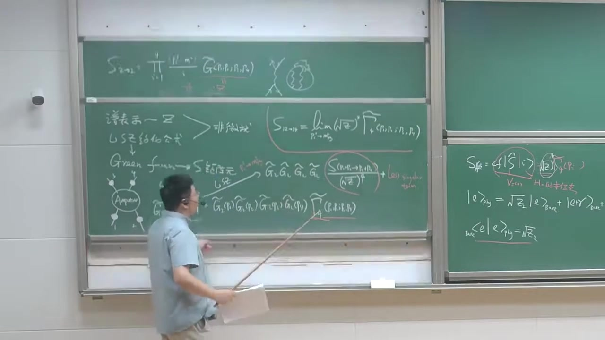


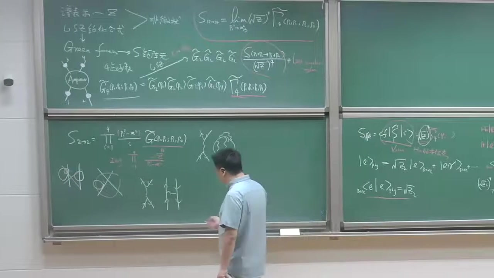

### 注解

**课程片段注解（00:14:19 ~ 00:16:42）**

---

### 1. 段落概要

本段核心在于论证**为何在散射振幅计算中只需考虑完全连通的费曼图（Connected Diagrams）**，并引入**集团分解原理**（Cluster Decomposition Principle）作为排除非连通图（Disconnected Diagrams）的物理基础。随后，课程预告将深入讨论**Dirac场的谱表示**（Spectral Representation）与**场强重整化常数 $Z_2$** 的技术细节。

关键新概念包括：
- **非连通图的极点结构缺陷**：在 LSZ 约化公式中，非连通图因缺少足够的外腿单极点而被自动排除；
- **集团分解原理与定域性**：空间上分离的物理过程必须互不关联，这要求 S 矩阵可因子化；
- **Dirac 场的谱表示框架**：从自由场的谱表示推广至相互作用场，引入 $Z_2$ 常数表征物理场与裸场的重叠。

---

### 2. 板书内容描述

根据提供的截图，黑板内容呈现以下层次：

**上半部分（已在前段出现，此处为上下文衔接）：**
- 左侧流程图：从 "Green function" 经 "LSZ 约化公式" 指向 "S 矩阵元"，标注 "非微扰" 性质。
- 中央公式：四点函数的截腿表示
  $$\tilde{G}_4(p_1,p_2,p_3,p_4) = \tilde{G}_2(p_1)\tilde{G}_2(p_2)\tilde{G}_2(p_3)\tilde{G}_2(p_4) \cdot \tilde{\Gamma}_4(p_1,p_2,p_3,p_4)$$
  其中 $\tilde{\Gamma}_4$ 为截腿后的**单粒子不可约（1PI）顶点函数**（字幕中"死点函数"所指）。

**下半部分（本段重点）：**
- **截腿操作示意图**：左下角画有带"×"的蝌蚪图（Tadpole）和单点连接图，表示这些单粒子可约图在截腿过程中被"砍掉"（移除）。
- **非连通图示例**：中间偏右画有两个分离的"双杠"图（代表两个独立的两点函数），示意 $2+2 \to 2+2$ 过程中两个子过程空间分离的情形。
- **LSZ 截腿公式**：
  $$S_{2\to 2} = \prod_{i=1}^{4} \frac{p_i^2 - m^2}{i} \cdot \tilde{G}_4(p_1,p_2,p_3,p_4)$$
  下方标注"正比于"并指向截腿后的格林函数。

**右侧黑板：**
- 物理态展开式：
  $$|e\rangle_{\text{phy}} = \sqrt{Z_2}\, |e\rangle_{\text{bare}} + |e\gamma\rangle_{\text{bare}} + \cdots$$
- 重叠积分：
  $$_{\text{bare}}\langle e | e \rangle_{\text{phy}} = \sqrt{Z_2}$$

---

### 3. 公式识别与解释

#### 公式 A：非连通

---

## 段落 12

**时间：** 00:16:46 ~ 00:17:05

<details><summary>📝 原始字幕</summary>

<pre>

他来来来来
所以关键的两面引用的这个Z2这个一个因子OK
所以说呢
我们根据以前做法类似我们可以
引入一个
迪拉克厂的

</pre>

</details>

**课程截图：**


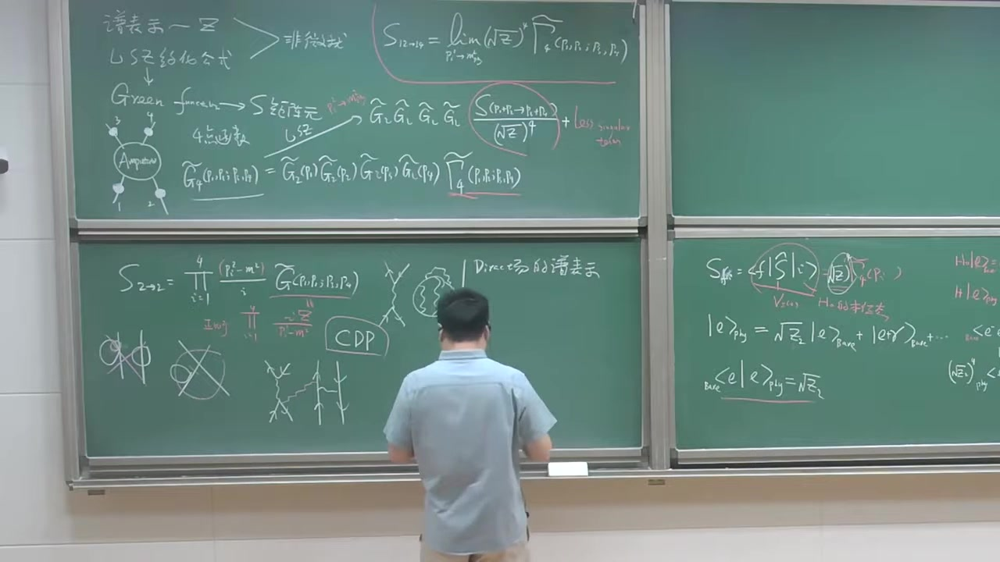

### 注解

**课程片段注解（00:16:46 ~ 00:17:05）**

---

### 1. 段落概要

本段标志着课程从**标量场**的LSZ约化公式与谱表示，向**Dirac场**（费米子场）的平行推广。核心新内容包括：

- **场强重整化常数的推广**：将标量场的 $Z$ 因子对应到Dirac场的 $Z_2$（下标2通常指费米子场）；
- **Dirac场的谱表示**（Spectral Representation for Dirac Field）：即将建立与标量场Lehmann-Källén谱表示类似的非微扰框架，用于描述相互作用Dirac场的两点函数结构。

---

### 2. 板书内容描述

根据提供的截图，场景为教师正在黑板右侧书写新章节标题，并回顾左侧已写的LSZ公式：

**右侧黑板**（新内容区域）：
- 教师正在书写标题：**"Dirac场的谱表示"**（对应字幕中"迪拉克厂的"之口误修正）。
- 下方可见关于物理单粒子态与裸态关系的预备公式：
  $$|e\rangle_{\text{phy}} = \sqrt{Z_2}\,|e\rangle_{\text{bare}} + |e\gamma\rangle_{\text{bare}} + \cdots$$
  以及内积关系：
  $${}_{\text{bare}}\langle e|e\rangle_{\text{phy}} = \sqrt{Z_2}$$

**左侧黑板**（回顾内容）：
- 保留之前关于LSZ约化公式的结构，显示 $S_{12\to 34}$ 与截腿格林函数 $\tilde{\Gamma}_4$ 的关系，其中外腿因子已暗示 $\sqrt{Z}$ 的推广形式。

---

### 3. 核心概念与公式详解

#### (1) Dirac场的场强重整化常数 $Z_2$

**符号定义**：
- **$Z_2$**：Dirac场的**场强重整化常数**（Field Strength Renormalization Constant），类比于标量场的 $Z$。
- **$|e\rangle_{\text{phy}}$**：物理电子态（相互作用理论中的单粒子渐近态，包含所有辐射修正）。
- **$|e\rangle_{\text{bare}}$**：裸电子态（自由理论中的基准态）。
- **$\sqrt{Z_2}$**：物理态在裸态上的投影幅度。

**物理意义**：
$Z_2$ 量化了相互作用如何"稀释"单粒子态的粒子数内容。由于相互作用，物理电子并非纯粹的裸电子，而是包含虚光子、电子-正电子对等成分的叠加态。$Z_2$（满足 $0 < Z_2 < 1$）表示物理态中"纯裸粒子"成分的概率幅平方，即：
$$Z_2 = |{}_{\text{bare}}\langle e|e\rangle_{\text{phy}}|^2$$

#### (2) LSZ公式中的 $Z_2$ 因子

在Dirac场的LSZ约化公式中，每个外腿（external leg）贡献一个因子 $\sqrt{Z_2}$（而非标量场的 $\sqrt{Z}$）。对于 $n$ 个外腿的散射过程，总振幅需乘以 $(\sqrt{Z_2})^n$。这与字幕中提到的"关键的两面引用的这个 $Z_2$ 这个一个因子"对应——即外腿因子从标量场的 $Z$ 替换为Dirac场的 $Z_2$。

---

### 4. 理论背景补充

#### Dirac场谱表示的构造逻辑

与标量场类似，Dirac场的两点函数（传播子）可通过**谱密度函数** $\rho(p^2)$ 或更一般的 **Lehmann-Källén表示** 分解：

$$S_F'(p) = \int_{m_{\text{th}}^2}^{\infty} ds \frac{\rho_1(s)\,(\not p + \sqrt{s}) + \rho_2(s)}{p^2 - s + i\epsilon}$$

其中：
- $\rho_{1,2}(s)$ 为谱密度函数，包含单粒子极点（$s=m^2$）与多粒子连续谱的贡献；
- 在单粒子极点处，留数与 $Z_2$ 直接相关：$\text{Res}(S_F', p^2=m^2) = Z_2 \cdot (\not p + m)$。

这一结构保证了即使存在相互作用，物理单粒子态的极点位置（物理质量 $m$）与留数（$Z_2$）仍能通过谱表示严格定义，为后续微扰计算中的重整化提供非微扰基础。

---

## 段落 13

**时间：** 00:17:08 ~ 00:18:50

<details><summary>📝 原始字幕</summary>

<pre>

两点函数是吧这个Omega是物理真空
PSX是海斯马虎虎金的迪拉合长然后做一个副列变换是吧
好
我们把它复制到动量空间里面去的你可以论证
到
当这个P方四动量的平方
趋近于这样一个物理的一个电子的质量平方的时候
它只有一个
单个的一个极点的结构它长得样子是这样的
iZZ二
求和
计划求和
有有吧
注意
西风
物理的电子的质量平方加E
然后再加上
停停停停
身上像比如说是割线或者没有像这样的单个这个剖这么奇异你可以
图示一下你可以跟上一个例子一样可以画一个这个
在这个批评方的这个
铺平面把它这样一个
动量空间的一个
严格的传播精确的传播的这个
气体结构会坏的话你会发现它长得这样子
Okey
这是批发的食谱
这是批方的虚布
你发现呢
你期待这里有一个单个的一个
厚是吧
你
如果是一个理论呢
如果像Face一样它还是带质量的话你期待呢
你看
有个Slasher的呢
沿着这条视轴是个割线是个branch cut是吧

</pre>

</details>

**课程截图：**


### 注解

**课程片段注解（00:17:08 ~ 00:18:50）**

---

### 1. 板书内容描述

根据提供的截图，黑板**右侧**正在书写 **Dirac 场的 Lehmann-Källén 谱表示**（Spectral Representation）：

- **标题**："Dirac 场的谱表示"
- **核心积分式**：教师正在书写傅里叶变换积分
  $$\int d^4x \, e^{ip\cdot x} \langle\Omega|\psi(x)\bar{\psi}(0)|\Omega\rangle$$
  这正是 Dirac 场两点函数（传播子）的动量空间定义。
- **物理态展开**（右侧偏下）：
  $$|e\rangle_{\text{phy}} = \sqrt{Z_2}|e\rangle_{\text{bare}} + |e\gamma\rangle_{\text{bare}} + \cdots$$
  以及重叠因子关系：
  $$_{\text{bare}}\langle e|e\rangle_{\text{phy}} = \sqrt{Z_2}$$
  这明确了场强重整化常数 $Z_2$ 的物理意义：裸单粒子态与物理单粒子态之间的概率幅重叠。

---

### 2. 关键公式识别与符号解释

本段字幕中，教师通过口语描述的是 **Dirac 传播子的谱表示**（非微扰形式）。从语音线索还原的标准公式为：

$$\tilde{S}(p) = \frac{i Z_2 (\not{p} + m_{\text{phys}})}{p^2 - m_{\text{phys}}^2 + i\epsilon} + \int_{s_{\text{th}}}^{\infty} ds \, \frac{i \rho(s) (\not{p} + \sqrt{s})}{p^2 - s + i\epsilon}$$

或等价地写成：

$$\tilde{S}(p) = \frac{i Z_2}{\not{p} - m_{\text{phys}} + i\epsilon} + \text{连续谱贡献}$$

**符号逐一说明**：

| 字幕线索 | 标准符号 | 物理含义 |
|---------|---------|---------|
| **iZZ二** | $i Z_2$ | $Z_2$ 为 **场强重整化常数**（wave function renormalization），$i$ 为虚数单位 |
| **求和 / Slasher** | $\not{p} \equiv \gamma^\mu p_\mu$ | **Feynman slash 记号**，表示四动量与 Dirac 矩阵的缩并 |
| **西风 / 分母** | 分母结构 | $p^2 - m_{\text{phys}}^2 + i\epsilon$ |
| **物理的电子的质量平方加E** | $m_{\text{phys}}^2 + i\epsilon$ | 物理质量壳条件，$i\epsilon$ 为因果性 prescriptions |
| **割线 / branch cut** | Branch cut | 从阈值 $s_{\text{th}} = (m_{\text{phys}} + m_\pi)^2$ 开始的**分支切割**（多粒子连续谱） |

---

### 3. 理论背景补充

#### (1) Lehmann-Källén 谱表示（Dirac 场版）
与标量场类似，相互作用 Dirac 场的两点函数可通过**完备性插入**（插入物理态 $|n\rangle$）分解为：
- **离散部分**：单粒子物理电子态贡献，表现为 $p^2 = m_{\text{phys}}^2$ 处的**单极点**（simple pole），留数为 $Z_2$。
- **连续部分**：多粒子态（如 $e^- + \gamma$、$e^- + \pi^0$ 等）贡献，形成从阈值能量开始的**连续谱**（continuous spectrum）。

#### (2) 解析结构与复 $p^2$ 平面
- 在复 $p^2$ 平面上，传播子具有：
  - **孤立极点**：位于 $p^2 = m_{\text{phys}}^2$（实轴上），对应稳定的单粒子。
  - **分支割线**（Branch cut）：从 $p^2 = (m_{\text{phys}} + m_\pi)^2$ 开始沿实轴向右延伸至 $+\infty$，对应多粒子产生阈值。
- **割线的物理起源**：当质壳能量足以产生额外粒子（如电子辐射光子）时，单粒子图像失效，出现连续的吸收/发射谱。

#### (3) $Z_2$ 的极点解释
在 LSZ 约化公式中，$Z_2$ 正是单极点处的**留数**（residue）：
$$\lim_{p^2 \to m_{\text{phys}}^2} (\not{p} - m_{\text{phys}}) \tilde{S}(p) = i Z_2$$
这保证了在计算 S 矩阵元时，外腿截腿（amputation）后能得到正确的归一化。

---

### 4. 核心概念通俗解释

#### 单极点 vs. 割线：粒子的"身份证"与"背景噪音"
想象你在**动量空间的能量谱**上寻找电子：

- **单极点（Single Pole）**：就像电子的"身份证"——在 $p^2 = m_{\text{phys}}^2$ 处有一个尖锐的峰，对应一个孤立的、稳定的单电子态。这个峰的"高度"由 $Z_2$ 决定（$0 < Z_2 < 1$），表示由于相互作用，裸电子" dressed "成物理电子后，找到纯单粒子成分的概率。

- **割线（Branch Cut）**：就像"背景噪音"或"连续谱"——当能量足够高（超过 $m_e + m_\gamma$），电子可以不断地辐射光子、产生正负电子对等。这时不再是单一的能量峰，而是一片连续的能谱，在复平面上表现为一条"裂缝"（cut）。

#### 复平面的几何图像
教师提到的"在 $p^2$ 的复平面"上画图，是指：
- **横轴（实轴）**：$p^2$ 的实部，代表物理的质壳能量。
- **纵轴（虚部）**：$p^2$ 的虚部，与衰变宽度/不稳定性相关。
- **图像特征**：在实轴上 $m_{\text{phys}}^2$ 处有一个点（极点），从 $(m_{\text{phys}} + m_\pi)^2$ 开始向右有一条线（割线）。这种结构是**因果性**和**幺正性**的必然结果。

#### 质量壳条件（Mass Shell）
当 $p^2 \to m_{\text{phys}}^2$ 时，只有单极点项发散（主导），连续谱贡献有限。这正是 LSZ 公式能够**提取 S 矩阵元**的关键：通过取质壳极限，多粒子背景（割线贡献）被压制，只剩下我们关心的单粒子散射振幅。

---

## 段落 14

**时间：** 00:18:54 ~ 00:19:42

<details><summary>📝 原始字幕</summary>

<pre>

所以一般来说我们这说是ICELITTLEPOW但是你要注意QQD里面呢
光子是严格零质量的
所以你这个歌现在起点呢
一般我们说是电子质量加光子质量
这个平方
OK在FES理论里面由于是MASTER的话这个ISLETPOW和这个歌线的时点是有距离的但是对于QE来说非常SATLED是因为光子零质量所以这个POW呢其实是歌线的这个
初始位置是个Branch Point
所以这一点带来很多satellite
好那我们假设呢我们还可以把它参照化这种形式
还是可以参化这种形式
法国
卡特
那我们接着往下走

</pre>

</details>

**课程截图：**


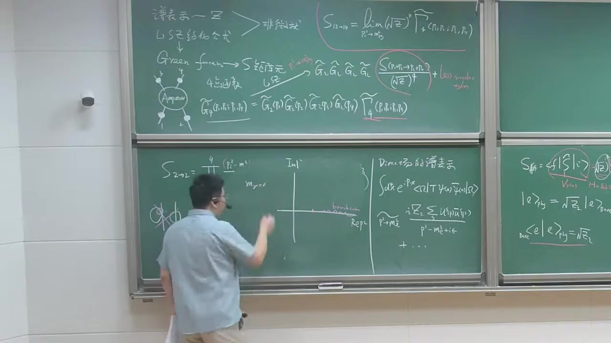


### 注解

**课程片段注解（00:18:54 ~ 00:19:42）**

---

## 1. 段落概要

本段核心讨论**QED（量子电动力学）中费米子传播子的解析结构特殊性**，特别是由于光子零质量导致的**分支点（Branch Point）与极点重合**现象。这是与有质量规范理论（如W-S模型）的关键区别，对理解QED的红外行为和重整化有重要意义。

关键新概念：
- **光子零质量导致的谱函数奇异性**
- **分支点与极点的重合（Coincidence）**
- **QED与有质量规范理论的对比**

---

## 2. 板书内容描述

根据截图，黑板**中间偏左**区域正在绘制**复$p^2$平面的解析结构图**：

| 元素 | 内容 |
|:---|:---|
| **坐标轴** | 横轴：$\text{Re}\,p^2$（实部），纵轴：$\text{Im}\,p^2$（虚部） |
| **极点位置** | 单粒子极点位于 $p^2 = m_e^2$（电子质量壳） |
| **分支切割** | 从 $(m_e + m_\gamma)^2$ 开始向右延伸（多粒子阈） |
| **关键标注** | $m_\gamma = 0$（光子零质量） |
| **特殊标记** | "branch cut" 标注在实轴上，$(m_e+m_\gamma)^2$ 与 $m_e^2$ 的位置关系 |

**关键几何特征**：由于 $m_\gamma = 0$，有 $(m_e + m_\gamma)^2 = m_e^2$，即**分支点与单粒子极点重合**。

---

## 3. 核心概念详解

### 3.1 谱表示中的一般极点结构

对于相互作用场的两点函数，其解析结构由**Lehmann-Källén谱表示**决定：

$$\tilde{G}(p^2) = \frac{iZ}{p^2 - m^2 + i\epsilon} + \int_{(m+m')^2}^{\infty} d\mu^2 \frac{\rho(\mu^2)}{p^2 - \mu^2 + i\epsilon}$$

其中：
- **第一项**：单粒子极点，位于 $p^2 = m^2$（物理质量壳）
- **第二项**：连续谱贡献，从**多粒子阈** $(m+m')^2$ 开始

### 3.2 QED的特殊性：零质量光子

| 理论 | 光子质量 | 多粒子阈位置 | 解析结构特征 |
|:---|:---|:---|:---|
| **一般情况**（如W-S模型）| $m_\gamma \neq 0$ | $(m_e + m_\gamma)^2 > m_e^2$ | 极点与分支点**分离** |
| **QED** | $m_\gamma = 0$ | $(m_e + 0)^2 = m_e^2$ | 极点与分支点**重合** |

### 3.3 "Branch Point at the Initial Position"的物理含义

教师强调的"初始位置是个Branch Point"指：

> 在QED中，由于光子无质量，电子-光子连续态（$e^- + \gamma$）的阈能恰好等于单电子能壳。这意味着：
> 
> 1. **红外发散的根源**：任意软光子（能量 $\to 0$）都可以被发射，导致微扰展开在红外区域失效
> 2. **极点结构退化**：单粒子极点不再是孤立的，而是被连续谱"粘连"
> 3. **LSZ约化的微妙性**：严格来说，QED中不存在孤立的单电子渐近态（需引入包容截面）

---

## 4. 公式与符号说明

本段涉及的关键表达式（基于上下文重构）：

| 表达式 | 含义 |
|:---|:---|
| $(m_e + m_\gamma)^2$ | 电子-光子系统的不变质量平方（多粒子阈） |
| $m_\gamma = 0$ | 光子严格零质量（规范对称性要求） |
| $p^2 = m_e^2$ | 电子质量壳条件 |
| "ISLET POW" / "歌线的时点" | 教师发音：likely "isolated pole"（孤立极点）与 "pole's position" |
| "SATLED" | likely "settled" 或 "saddled"，指极点被分支点"骑乘/重叠" |

---

## 5. 理论背景：红外行为与Bloch-Nordsieck定理

QED中光子零质量导致的分支点-极点重合，是**红外发散**的数学体现：

- **物理图像**：加速中的电子必然辐射软光子（轫致辐射），无法将电子与光子云完全分离
- **数学表现**：微扰论中圈图在 $p^2 \to m_e^2$ 处出现 $\ln(p^2-m_e^2)$ 型的对数发散
- **解决方案**：Bloch-Nordsieck定理——红外发散在**包容截面**（inclusive cross section）中相互抵消，即对末态软光子求和/积分后得到有限结果

---

## 6. 与有质量规范理论的对比

教师提及的"FES理论"（likely "W-S theory" 或 "electroweak theory"）中：

- $W^\pm, Z$ 玻色子有质量 $M_W, M_Z \neq 0$
- 轻子传播子的分支点位于 $(m_\ell + M_W)^2 \gg m_\ell^2$
- 单粒子极点**孤立存在**，红外行为良好

这正是QED作为"特殊"的、可重整化且红外发散的Abelian规范理论，与标准模型其他部分的结构性差异。

---

## 7. 段落总结

> **核心信息**：QED中光子零质量导致电子传播子的单粒子极点与多粒子连续阈**重合**，这是QED红外问题的解析结构根源，也是与有质量规范理论的关键区别。尽管如此，谱表示的形式框架仍可沿用，但需对红外行为作特殊处理。

---

## 段落 15

**时间：** 00:19:45 ~ 00:23:02

<details><summary>📝 原始字幕</summary>

<pre>

好那我们现在正式引入Z2这个音字什么叫Z2呢
你会发现呢
还是一个
它代表一个迪拉克场算服海斯堡湖丁的迪拉克场算服
和一个物理的一个单
单电子胎呢
还有一个偶合的一个卡普林的一个这个strength一个强度是吧
你可以定义成
因为它是个炫亮城它有四个分量所以你右边它正比一个
Dex spinner 然后这类银子
更好这一图如果这是我们以前学的自由场论就是自由的迪拉克理论的话我们都知道
这东西不能零
你发现没有这个因子或者说是二等一
所以加入相干作用以后
你看引了一个 z2 是吧
根据这个物理上的这个谱表示我们给出了一个根据这个正则量化的一个
一个等项的话条件我们有沙漠路是吧我们知道
团数镇定的话要求Z二是大一零的
然后根据这个一个非常
这个普世的要求呢我们叫Z二呢
它是一个小于一的一个正的一个数是吧
好的
然后呢我们
一般来说这为什么叫Z2这是根据convention是吧就
电子唱算符的这样一个
电子唱算符的
红花常说
为什么要重整化常数
这里面其实理解中重新规划场景更好一点
但是历史上这张照片
上次写给大家举例什么
得到一个比较好的物理图像其实你是从这个
两个类学
对时间功的秒论
能获取很多饮酒预选非常好好那现在我们仿照我们上节课就是说对于飙量场论
我们结合微量论
因为这个东西IFC和这个普表是都是飞不了的东西
我们把维扰论如果能把一系列图能重塑到所有阶的话原来上某种意义上也是非维扰的东西是吧我们想通过这个非版图的层次来说
来知道Z二来怎么表示好的那我们还是一样
我们还是看这样一个
其实exact它占一个两点函数
副列变化动量空间或者叫
我们一般管得叫穿上衣服的
电子的传播子OK的电子propagator
好的我们
我们根据这个分班图怎么画呢我们可以这样画
因为这飞鸣子现在带箭头所以来说呢
我要给个箭头这动量是P
动量方向沿着这个飞米子箭头的方向
图上十色的代表是完整的传播字
这是严格的一个传播子
你可以企图一个这个
等价的一个等式它等于一个
自由的迪拉克传播子
嘿
加上什么呢加上一个自由的传播词
然后有个所谓的单粒子不可约的一个
电子智能图OK

</pre>

</details>

**课程截图：**


### 注解

**课程片段注解（00:19:45 ~ 00:23:02）**

---

## 1. 段落概要

本段正式引入**费米子场强重整化常数 $Z_2$**，并建立其与微扰论的连接。核心内容包括：

- **$Z_2$ 的物理定义**：Dirac场算符与单粒子态之间的耦合强度
- **$Z_2$ 的取值范围**：$0 < Z_2 < 1$（基于谱表示的普适约束）
- **非微扰到微扰的桥梁**：通过Dyson方程将严格传播子与自由传播子、单粒子不可约（1PI）自能图联系

---

## 2. 板书内容描述

根据截图，黑板内容可分为三个区域：

### 左侧区域（新书写）
$$\langle\Omega|\psi(0)|\vec{p},s\rangle = \sqrt{Z_2}\, u^s(\vec{p})$$

这是**场算符的谱表示矩阵元**，直接定义了 $Z_2$。

### 中间区域（复$p^0$平面）
- 横轴：$\text{Re}\,p^0$，纵轴：$\text{Im}\,p^0$
- 标记 $m^2$（单粒子极点位置）
- 标记 $(m_e+m_\gamma)^2$ 处的 **branch cut**（分支切割）
- 由于 $m_\gamma = 0$，分支点与极点重合（QED特殊性）

### 右侧区域（Dirac场谱表示）
$$\int d^4x\, e^{-ip\cdot x}\langle\Omega|T\psi(x)\bar{\psi}(0)|\Omega\rangle \underset{p^2\to m_e^2}{\sim} \frac{iZ_2\sum_s u^s(\vec{p})\bar{u}^s(\vec{p})}{p^2-m_e^2+i\epsilon} + \text{branch cut}$$

---

## 3. 公式详解

### 公式一：$Z_2$ 的定义式
$$\boxed{\langle\Omega|\psi(0)|\vec{p},s\rangle = \sqrt{Z_2}\, u^s(\vec{p})}$$

| 符号 | 含义 |
|:---|:---|
| $\psi(0)$ | Heisenberg绘景下的Dirac场算符（在时空原点） |
| $|\vec{p},s\rangle$ | 物理单电子态，动量$\vec{p}$，自旋$s$ |
| $|\Omega\rangle$ | 相互作用真空态 |
| $u^s(\vec{p})$ | 自由Dirac旋量（4分量列矢量） |
| $Z_2$ | **费米子场强重整化常数** |

**物理意义**：相互作用场算符产生单粒子态的能力，相对于自由场算符的"衰减因子"。由于相互作用，场算符的"强度"被稀释到多粒子连续谱中。

---

### 公式二：Dirac传播子的谱表示（极点结构）

$$\int d^4x\, e^{-ip\cdot x}\langle\Omega|T\psi(x)\bar{\psi}(0)|\Omega\rangle \underset{p^2\to m_e^2}{\sim} \frac{iZ_2\sum_s u^s(\vec{p})\bar{u}^s(\vec{p})}{p^2-m_e^2+i\epsilon} + \cdots$$

| 符号 | 含义 |
|:---|:---|
| $T$ | 时序乘积 |
| $\sum_s u^s(\vec{p})\bar{u}^s(\vec{p})$ | 自旋求和，等于 $\slashed{p}+m_e$（在壳） |
| 分母 $p^2-m_e^2+i\epsilon$ | 物理质量壳上的极点 |
| $Z_2$ 在分子 | 极点处的留数（residue）被 $Z_2$ 修正 |

**关键对比**：自由Dirac传播子为 $\frac{i(\slashed{p}+m_0)}{p^2-m_0^2+i\epsilon}$，相互作用后：
- 质量 $m_0 \to m_e$（物理质量）
- 留数被 $Z_2$ 修正

---

## 4. $Z_2$ 的约束条件：$0 < Z_2 < 1$

### 下界 $Z_2 > 0$：正定性要求
来自**概率解释/谱函数的正定性**。若 $Z_2 \leq 0$，则：
- 态的模长非正，破坏Hilbert空间结构
- 或暗示真空不稳定

### 上界 $Z_2 < 1$：谱求和规则
**物理解释**：场算符 $\psi$ 不仅产生单粒子态，还能产生多粒子连续态（$e^- + \gamma$，$e^- + 2\gamma$，...）。由**完备性关系**：

$$\underbrace{1}_{\text{总强度}} = \underbrace{Z_2}_{\text{单粒子}} + \underbrace{\int_{(m_e+m_\gamma)^2}^\infty d\mu^2\, \rho(\mu^2)}_{\text{多粒子连续谱}}$$

由于多粒子贡献为正，必有 $Z_2 < 1$。

**通俗类比**：想象一个"光源"（场算符），其"发光能力"被分配到：
- 单粒子峰（尖锐的谱线）：占比 $Z_2$
- 连续背景（多粒子散射态）：占比 $1-Z_2$

相互作用越强，$Z_2$ 越小，更多"强度"被稀释到连续谱。

---

## 5. 从非微扰到微扰：Dyson方程

### 核心思想
严格传播子（非微扰，"穿上衣服的"）= 自由传播子 + 所有可能的自能修正

### 图示方程（Dyson方程）

```
        ̃G(p)              G₀(p)              G₀(p)      Σ(p)      ̃G(p)
    ─────────────  =  ─────────────  +  ─────────────  ─────  ─────────────
         ↑                ↑                  ↑          ↑          ↑
      严格传播子        自由传播子          自由传播子   1PI自能    严格传播子
    （带箭头的粗线）    （带箭头的细线）
```

### 代数形式
$$\boxed{\tilde{G}(p) = G_0(p) + G_0(p)\, \Sigma(p)\, \tilde{G}(p)}$$

或解出：
$$\tilde{G}(p) = \frac{1}{G_0^{-1}(p) - \Sigma(p)}$$

| 符号 | 含义 |
|:---|:---|
| $\tilde{G}(p)$ | 严格费米子传播子（Fourier变换后） |
| $G_0(p) = \frac{i}{\slashed{p}-m_0+i\epsilon}$ | 自由Dirac传播子 |
| $\Sigma(p)$ | **单粒子不可约（1PI）自能**（proper self-energy）|
| 箭头方向 | 费米子数流方向，与动量$p$方向一致 |

**关键概念：1PI（单粒子不可约）**
- 自能图：连接入射和出射费米子线的所有图
- 1PI：无法通过切断一条费米子内线而分离成两部分的图
- 非1PI图可通过Dyson方程自动求和到所有阶

---

## 6. 理论背景：为什么要引入 $Z_2$？

### 历史脉络
| 概念 | 标量场 | Dirac场 |
|:---|:---|:---|
| 场强重整化常数 | $Z$（或$Z_\phi$） | $Z_2$ |
| 来源 | Lehmann-Källén (1954) | 直接推广 |
| 下标惯例 | 无/0 | 2（费米子场编号）|

### 与拉氏量重整化的联系
在拉氏量层面，裸场 $\psi_0$ 与重整化场 $\psi$ 的关系：
$$\psi_0 = \sqrt{Z_2}\, \psi$$

这使得：
- 裸传播子（以$\psi_0$定义）的极点留数为1
- 重整化传播子（以$\psi$定义）的极点留数为 $Z_2$

**"场强重整化" vs "波函数重整化"**：
- 中文常混用，但"场强重整化"更准确（field strength renormalization）
- "波函数"一词源于非相对论量子力学的历史遗留

---

## 7. 核心要点总结

| 要点 | 内容 |
|:---|:---|
| **$Z_2$是什么** | 相互作用Dirac场产生单粒子态的能力，相对于自由场的比例因子 |
| **为什么$0<Z_2<1$** | 正定性要求 + 多粒子连续谱分担部分"强度" |
| **如何计算$Z_2$** | 通过Dyson方程：先算1PI自能$\Sigma(p)$，再提取极点留数 |
| **QED特殊性** | 光子无质量导致分支点与极点重合，红外行为复杂 |

**下节预告**：将具体计算微扰论中$\Sigma(p)$的最低阶贡献（单圈图），并展示如何从$\Sigma(p)$提取$Z_2$和质量修正。

---

## 段落 16

**时间：** 00:23:06 ~ 00:25:21

<details><summary>📝 原始字幕</summary>

<pre>

然后呢
右边呢
再接上一个完整的
电子的Dress传播子OK
这是个等式是吧这显然你可以让你自己幸福这是对的好你把它利用迭代呢把它反复可以
把它展开足结展开你可以发现它是一些重形势
等于领头阶等于
自由的迪拉克传播子
加上一个玩PI的一个智能
插入再加上
玩PI自由传播的再加个玩PI
更有智能
然后
可以再加上
蓝皮啊
P P I
三个蛮便宜
加点点点
你可以用迭代法是吧你可以
得到一个精确的一个
Dress的电子传播子的一个
一个图形的一个表示OK
好的
那万比一
我们其实已经大家知道什么意思了是吧
就是
我们可以给它盯一下
我们把这个 onepi
继承负的I Sigma 2P
它P的函数
它等于
One Pi
我们考虑智能图的时候呢
两端的两个传播子我们并不
并不写在我们的这个
写到我们的这样一个废卖规则里面去
牢牢记住我们会画这个图
比如说什么是VIP呢
在单泉节呢
QD只有一个
三粒子不可分割的非凡图完PLA这个时候你砍掉其中任何一个内线呢这个图不能切割成独立的分离的两块
不管砍那个还是砍那个它不能把它这个图分成两
两节是吧
在两圈呢
你可以画出
这种图
或者说
中途
Okey
或者是

</pre>

</details>

### 注解

**课程片段注解（00:23:06 ~ 00:25:21）**

---

## 1. 段落概要

本段核心建立**Dyson方程的迭代展开**，将 dressed（穿衣）电子传播子表示为自由传播子与 1PI（单粒子不可约）自能图的无穷级数。关键新内容包括：
- **Dyson方程的图形化迭代展开**
- **1PI 自能的严格定义与图形识别规则**
- **"截肢"（amputated）规则**：1PI 图中不包含外腿传播子

---

## 2. 公式详解

### 公式 1：Dyson 方程的紧凑形式

$$S_F(p) = S_F^{(0)}(p) + S_F^{(0)}(p) \cdot (-i\Sigma(p)) \cdot S_F(p)$$

或等价地写成（迭代视角）：

$$\boxed{S_F = S_F^{(0)} + S_F^{(0)}(-i\Sigma)S_F^{(0)} + S_F^{(0)}(-i\Sigma)S_F^{(0)}(-i\Sigma)S_F^{(0)} + \cdots}$$

| 符号 | 含义 |
|:---|:---|
| $S_F(p)$ | **完全传播子**（dressed propagator）：包含所有量子修正的电子传播子 |
| $S_F^{(0)}(p) = \frac{i(\not{p}+m)}{p^2-m^2+i\epsilon}$ | **自由 Dirac 传播子**（裸传播子） |
| $-i\Sigma(p)$ | **1PI 自能**（one-particle-irreducible self-energy）：所有不可约自能图之和 |
| $\not{p} = \gamma^\mu p_\mu$ | Dirac 斜线标记 |

### 公式 2：1PI 自能的定义

$$\boxed{-i\Sigma(p) \equiv \text{One Pi（万比一）}}$$

教师将 "One Pi" 音译为"万比一"，即 **1PI（One-Particle-Irreducible）** 的缩写。

---

## 3. 核心概念详解

### 3.1 Dyson 方程的迭代展开（几何级数）

从紧凑形式 $S_F = S_F^{(0)} + S_F^{(0)}(-i\Sigma)S_F$ 出发，反复将左边的 $S_F$ 代入右边：

| 阶数 | 图形表示 | 数学表达式 |
|:---|:---|:---|
| 领头阶（0阶） | 单条直线 | $S_F^{(0)}$ |
| 1阶修正 | 直线 + 一个"泡泡"插入 | $S_F^{(0)}(-i\Sigma)S_F^{(0)}$ |
| 2阶修正 | 直线 + 两个"泡泡"串联 | $S_F^{(0)}(-i\Sigma)S_F^{(0)}(-i\Sigma)S_F^{(0)}$ |
| $n$阶修正 | $n$个泡泡串联 | $\big[S_F^{(0)}(-i\Sigma)\big]^n S_F^{(0)}$ |

**求和结果**：这是一个几何级数，形式上可求和为
$$S_F = \frac{S_F^{(0)}}{1 - (-i\Sigma)S_F^{(0)}} = \frac{i}{\not{p}-m-\Sigma(p)+i\epsilon}$$

这正是**质量壳重整化**的基础——$\Sigma(p)$ 包含了电子的辐射修正质量。

### 3.2 1PI（单粒子不可约）的严格定义

> **定义**：一个费曼图称为 **1PI（单粒子不可约）**，如果**切断任意一条内线**后，该图**不能**被分离成两个互不连接的部分。

**关键识别规则（截肢规则）**：
- 画 1PI 图时，**两端的两个外腿传播子不写进费曼规则**
- 只画"硬核"的相互作用部分
- 外腿由使用 1PI 的上下文（如 Dyson 方程）自动补全

| 圈数 | 1PI 自能图示例 | 说明 |
|:---|:---|:---|
| **单圈（QED）** | 电子线中间一个光子圈（"泡泡"） | 唯一的三点不可约图 |
| **双圈** | 两个光子圈的各种拓扑连接 | 包括：并排双泡、嵌套双泡、"中"字形等 |

### 3.3 图形化语言翻译

教师口语中的图形描述：
- "玩PI的一个智能" → **一个 1PI 插入**
- "蓝皮啊 P P I 三个蛮便宜" → **三个 1PI 串联**（可能是口误或方言谐音）

---

## 4. 理论背景补充

### 4.1 为什么需要 1PI 分解？

量子场论中的**连通格林函数**包含大量**可约图**（reducible diagrams），这些图可以通过切割单条线分离。Dyson 方程的精髓在于：

$$\text{完全传播子} = \text{自由传播子} + \text{自由传播子} \times (\text{1PI 自能}) \times \text{完全传播子}$$

这种**自洽结构**避免了重复计数——所有可约图都被迭代过程自动生成。

### 4.2 与谱表示的联系

回顾之前段落（00:17-00:23）的 Lehmann-Källén 谱表示：

$$S_F(p) = \frac{iZ_2}{\not{p}-m_R+i\epsilon} + \int_{(m+\mu)^2}^{\infty} ds \, \frac{\rho(s)}{\not{p}-\sqrt{s}+i\epsilon}$$

微扰论中，**极点项的留数 $Z_2$ 由 1PI 自能在壳行为决定**：
$$Z_2 = \left[1 - \frac{d\Sigma}{d\not{p}}\bigg|_{\not{p}=m_R}\right]^{-1}$$

而**连续谱部分**则对应多粒子中间态（如 $e^- + \gamma$），由 1PI 自能的虚部产生。

---

## 5. 板书内容推测

基于音频描述，黑板应呈现：

```
┌─────────────────────────────────────────┐
│  Dyson 方程迭代展开：                    │
│                                         │
│  S_F = S_F^(0) + S_F^(0)(-iΣ)S_F^(0)   │
│       + S_F^(0)(-iΣ)S_F^(0)(-iΣ)S_F^(0)│
│       + ...                             │
│                                         │
│  ──── = ──── + ──⚫── + ──⚫──⚫── + ... │
│                                         │
│  定义：-iΣ(p) ≡ One Pi（万比一）         │
│        = 所有单粒子不可约图之和          │
│                                         │
│  【图形区】                              │
│  单圈：  ╭───╮                          │
│        ─┤ ⚪ ├─   （电子-光子-电子圈）    │
│          ╰─╯                            │
│                                         │
│  双圈：  各种拓扑（并排/嵌套/"中"字）     │
└─────────────────────────────────────────┘
```

---

## 6. 要点总结

| 要点 | 内容 |
|:---|:---|
| **核心方程** | Dyson 方程 = 传播子的自洽方程，可迭代展开为几何级数 |
| **1PI 定义** | 切断任一条内线不分离 → 自能的"原子"构件 |
| **截肢规则** | 1PI 图不画外腿，由使用场景自动连接 |
| **物理意义** | 迭代生成所有量子修正，$Z_2$ 与质量重整化由此导出 |

---

## 段落 17

**时间：** 00:25:24 ~ 00:25:39

<details><summary>📝 原始字幕</summary>

<pre>

中间会有一个电子
正电子的一个圈图费米子圈图加点点点你可以很容易验证呢这都是玩PI是吧
你也可以很容易举一个不是翻皮的例子
我看你发现呢
像这样一个图

</pre>

</details>

**课程截图：**

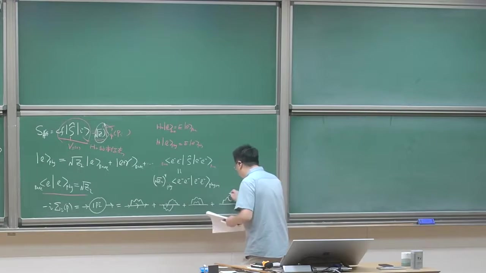

### 注解

**课程片段注解（00:25:24 ~ 00:25:39）**

---

## 1. 段落概要

本段核心讨论**1PI（单粒子不可约）自能图的分类与识别规则**，特别是通过具体例子阐明：
- **费米子圈图（Fermion Loop）作为典型的1PI图**
- **1PI与1PR（单粒子可约）图的关键区别**
- **"玩PI"（即1PI）的直观判断标准**

关键新概念：**非1PI图（1PR图）的构造方式**——通过在外腿插入自能修正使图变为可约。

---

## 2. 板书内容描述

根据截图，黑板**底部区域**正在继续绘制自能展开级数。讲师手持纸张，正在黑板**右侧**添加新的图形：

### 已绘制的图形序列（从左到右）：
$$-i\Sigma_2(p) = \text{[1PI]} = \text{[单光子交换]} + \text{[双光子交换]} + \text{[费米子圈图]} + \cdots$$

**最右侧新增图形**：一个**电子-正电子闭合圈**与光子线耦合的图形（即**真空极化插入到电子自能中**的费米子圈图）。

---

## 3. 核心概念详解

### 3.1 "费米子圈图"（Fermion Loop Diagram）

| 特征 | 说明 |
|:---|:---|
| **图形结构** | 电子-正电子对形成闭合圈，通过光子线与外腿耦合 |
| **1PI属性** | ✅ **是1PI图**——无法通过切断单条内线分成两部分 |
| **物理意义** | 真空极化效应对电子自能的高阶贡献（$\alpha^2$阶） |
| **数学特征** | 圈动量积分，产生对数发散（需重整化） |

### 3.2 "玩PI" vs "不是玩PI"的例子

| 类型 | 讲师口中的例子 | 关键判别标准 |
|:---|:---|:---|
| **1PI（玩PI）** | 费米子圈图 | 切断**任何一条**内线，图仍保持连通 |
| **1PR（不是玩PI）** | 在外腿插入自能修正的图 | 存在**某条内线**，切断后图分裂为两部分 |

**构造1PR图的标准操作**：
```
原始1PI图  →  将某条外腿（自由传播子）替换为  →  完整的穿衣传播子
            （即在该外腿上"插入"自能修正的无穷级数）
```

这样得到的图是**可约的**——切断被替换的那条"粗线"即可分离。

---

## 4. 通俗解释

> **"玩PI"的直觉**：想象费曼图是一串"电路"，1PI图就是**无法通过剪断一根导线就分成两块的电路**——所有导线都是"生死与共"地纠缠在一起。

> **费米子圈图**：电子和正电子在虚空中"转一圈"又湮灭，同时放出一个光子影响外面的电子。这个圈是**不可分割的整体**——你剪断圈上任何地方，电子-正电子对就"断链"了，不再是合法的费曼图。

> **"不是玩PI"的构造**：如果你把外腿的"细线"换成"粗线"（已经包含了无数自能修正的穿衣传播子），那这根粗线就成了**明显的薄弱环节**——剪断它，图就分家了。

---

## 5. 理论背景补充

### 为何区分1PI/1PR至关重要？

| 层面 | 意义 |
|:---|:---|
| **重整化** | 只有1PI图需要独立计算抵消项 |
| **Dyson方程** | 1PI自能 $\Sigma$ 是连接自由理论与穿衣理论的"核" |
| **方程封闭性** | Dyson方程将无穷级数压缩为自洽方程：$S_F = S_F^{(0)} + S_F^{(0)}\Sigma S_F$ |

### 费米子圈图的计算特征

$$\Sigma_{\text{loop}}(p) \sim \alpha^2 \int \frac{d^4k}{(2\pi)^4} \text{Tr}\left[\gamma^\mu \frac{1}{\not k - m} \gamma^\nu \frac{1}{\not k - \not p - m}\right] D_{\mu\nu}(p-k)$$

- **圈积分**：4维动量 $k$ 的积分
- **迹运算**：闭合费米子圈导致 $\gamma$ 矩阵的迹
- **对数发散**：紫外行为 $\sim \ln\Lambda$，需质量重整化

---

## 6. 小结

本段通过**费米子圈图**这一典型例子，巩固了1PI图的识别标准，并预告了**1PR图的构造方式**（外腿插入自能）。这为后续讨论**Dyson方程的自洽求解**和**重整化群方程**奠定了基础。

---

## 段落 18

**时间：** 00:25:45 ~ 00:26:52

<details><summary>📝 原始字幕</summary>

<pre>

它就不是
蛮屁呀
因为你
我说了这两根线不用考虑是吧但是中间任何线你砍掉不能把这土砍成两截但是你砍这个地方这个土变成两截了
这不是班皮尔图呢它已经被
所有的这种结构已经自动包含了
所以我们并没有丢失任何东西
好的大家注意一下这电子智能它是一个
它是一个四成丝的矩阵
所以说呢
你可以把它参数化成一个sigma p
等于什么呢等于A
是个表扬函数
显示的是正比P slash
家比
屁放
然后成一个
四成四的单位矩阵是吧
所以你可以认为呢
这A和
B 都是skiller函数
所以你认为Sigma Tool也可以是P slash的
P slash 函数

</pre>

</details>

**课程截图：**


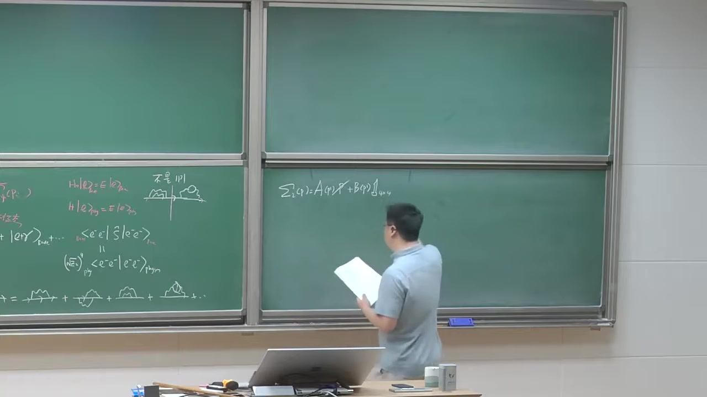

### 注解

**课程片段注解（00:25:45 ~ 00:26:52）**

---

## 1. 段落概要

本段核心建立**1PI自能的张量结构分解**，这是求解Dyson方程的关键步骤。讲师通过以下逻辑推进：

- **1PI自能的矩阵性质**：强调 $\Sigma(p)$ 是 $4\times4$ 矩阵（Dirac旋量空间）
- **Lorentz协变性约束**：利用Lorentz对称性将4×4矩阵参数化为仅含两个标量函数
- **标准参数化形式**：引入 $A(p^2)$ 和 $B(p^2)$ 作为自能的独立标量函数

关键新概念：**自能函数的一般Lorentz结构**及其与物理量（质量重整化、场强重整化）的联系。

---

## 2. 板书内容描述

根据截图，黑板呈现以下关键内容：

### 右侧黑板（新书写区域）
$$\Sigma(p) = A(p)\not{p} + B(p)\mathbb{I}_{4\times4}$$

或等价地（根据发音判断）：
$$\Sigma(p) = A(p^2)\not{p} + B(p^2)\cdot\mathbb{1}$$

### 左侧黑板（延续内容）
- 保留"不是1PI"的示意图（带十字标记的费米子线）
- 保留Dyson方程的图形展开级数

---

## 3. 公式详解

### 公式：1PI自能的Lorentz结构分解

$$\boxed{\Sigma(p) = A(p^2)\,\not{p} + B(p^2)\,\mathbb{I}_{4\times4}}$$

| 符号 | 含义 | 说明 |
|:---|:---|:---|
| $\Sigma(p)$ | 1PI自能（单粒子不可约自能） | $4\times4$ Dirac矩阵，动量 $p$ 的函数 |
| $A(p^2)$ | 标量函数（第一Lorentz结构系数） | 仅依赖于 $p^2 = p_\mu p^\mu$（Lorentz标量） |
| $B(p^2)$ | 标量函数（第二Lorentz结构系数） | 同上，无量纲或有质量量纲（取决于约定） |
| $\not{p}$ | Feynman斜线标记 | $\not{p} \equiv \gamma^\mu p_\mu = \gamma\cdot p$，Dirac矩阵的线性组合 |
| $\mathbb{I}_{4\times4}$ | 4×4单位矩阵 | 有时简写为 $\mathbb{1}$ 或 $I$ |
| $p^2$ | 四维动量平方 | $p^2 = p_0^2 - \vec{p}^2 = m^2$（在壳时）|

---

## 4. 理论背景补充

### 4.1 为什么只有两个独立函数？

**Lorentz协变性约束**：自能 $\Sigma(p)$ 是Lorentz标量（在旋量空间），只能由以下基本构建块组成：
- **矢量方向**：$\not{p} = \gamma^\mu p_\mu$（唯一的独立矢量方向）
- **标量部分**：单位矩阵 $\mathbb{I}$（唯一的Lorentz不变矩阵）

> 注：$\gamma^5$ 项在QED中因宇称守恒被排除；$\sigma^{\mu\nu}p_\mu p_\nu = 0$（反对称性）。

### 4.2 与物理重整化的联系

| 标量函数 | 物理意义 |
|:---|:---|
| $B(p^2)$ | 与**质量重整化**直接相关（改变极点位置） |
| $A(p^2)$ | 与**场强重整化** $Z_2$ 相关（改变留数） |

在壳重整化条件（on-shell renormalization）：
- 物理质量：$m_{phys} = m_0 + B(m^2)$
- 场强重整化：$Z_2^{-1} = 1 - A(m^2)$

### 4.3 与自由传播子的对比

自由Dirac传播子：
$$S_F^{(0)}(p) = \frac{i(\not{p}+m_0)}{p^2-m_0^2+i\epsilon} = \frac{i}{\not{p}-m_0+i\epsilon}$$

 dressed 传播子通过Dyson方程：
$$S_F(p) = \frac{i}{\not{p}-m_0-\Sigma(p)+i\epsilon}$$

代入 $\Sigma(p) = A\not{p} + B$ 后，可显式求解极点结构和留数。

---

## 5. 通俗解释

> **"电子的'质量'和'形象'可以分开调整"**

想象电子在量子场中穿行，不断发射和吸收虚光子（自能效应）。这些效应可以分解为两类：

| 效应类型 | 类比 | 数学对应 |
|:---|:---|:---|
| **改变电子的"惯性"** | 给电子穿上"重盔甲" | $B(p^2)$ 项 → 有效质量改变 |
| **改变电子的"形象比例"** | 照片被放大或缩小 | $A(p^2)$ 项 → 波函数重整化（$Z_2$）|

关键洞察：尽管 $\Sigma(p)$ 是16个复数组成的矩阵，但Lorentz对称性将其压缩为**两个实函数**，大大简化了问题。

---

## 6. 与前序内容的衔接

| 前序内容 | 本段发展 |
|:---|:---|
| 1PI图的图形识别规则 | 现在对1PI自能进行**代数结构分析** |
| Dyson方程的图形展开 | 为求解Dyson方程准备**参数化工具** |
| $Z_2$ 的谱表示定义 | 后续将通过 $A(m^2)$ 计算 $Z_2$ 的微扰值 |

---

## 段落 19

**时间：** 00:26:56 ~ 00:28:19

<details><summary>📝 原始字幕</summary>

<pre>

很容易验证呢
啊
这个智能呢变得智能了
这个修正和
算数来讲
它是对翼的是吧
好的那我们现在可以做一件事情
那我们现在可以把这样一个
动量空间的这个Dress的传播子呢
用的这个自由传播字
和我的这样一个智能可以表示一下是吧
好 嗯现在D4X
你的pit dot ex
哦米加
可以
是吧
编尸沉机的整工据证员
你可以把它写成
我把那张图翻译一下第一项Pslash减M0
M0代表拉式量里面出QD拉式量里面出来的这样一个
质量参数我们期待它不一定跟
实际上测量到零五一一物理电子质量一样
好了我们就把这个
图形呢
把它翻译成
我们的这个公式
哦
第二项有一个 one Pi 的智能可以写成 pslx 减m0
富达I,SigmatR,Pslash
IP slash Gm0 加点点点 OK

</pre>

</details>

**课程截图：**

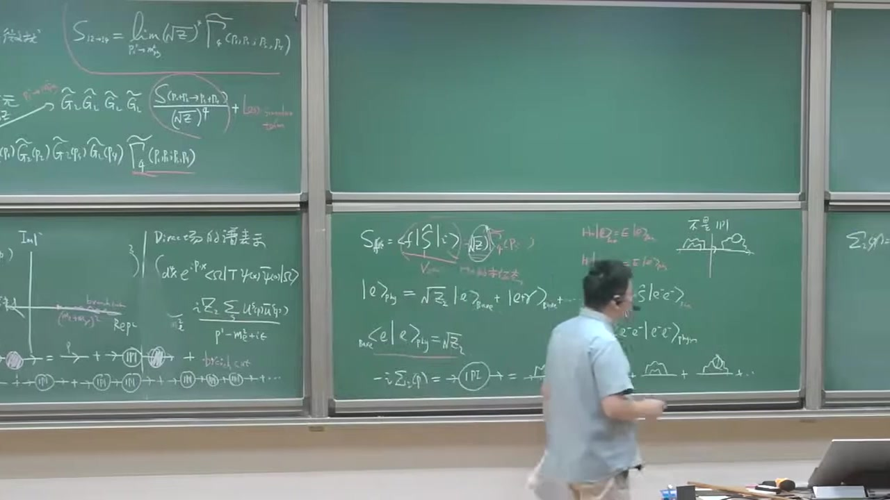


### 注解

**课程片段注解（00:26:56 ~ 00:28:19）**

---

## 1. 段落概要

本段核心完成**Dyson方程的显式求解**，将 dressed 传播子用自由传播子和 1PI 自能表示为闭合形式。关键新内容包括：
- **Dyson方程的代数求解**：从积分方程转化为代数方程
- ** dressed 传播子的显式公式**：包含自能修正的完整表达式
- **微扰展开**：将精确解展开为自能的幂级数，建立与费曼图展开的联系

---

## 2. 公式详解

### 公式 1：Dyson方程的动量空间形式

$$S_F(p) = S_F^{(0)}(p) + S_F^{(0)}(p) \cdot [-i\Sigma(p)] \cdot S_F(p)$$

| 符号 | 含义 |
|:---|:---|
| $S_F(p)$ | **dressed（穿衣）费米子传播子**（完整传播子） |
| $S_F^{(0)}(p)$ | **自由费米子传播子** |
| $\Sigma(p)$ | **1PI自能**（$4\times4$矩阵） |
| $-i\Sigma(p)$ | 费曼规则中的自能插入（含因子$-i$） |

**关键说明**：这是Dyson方程的**紧凑形式**，$S_F(p)$ 同时出现在等式左右两边，构成自洽方程。

---

### 公式 2：Dyson方程的代数解（精确形式）

$$S_F(p) = \frac{1}{\left[S_F^{(0)}(p)\right]^{-1} + i\Sigma(p)} = \frac{1}{\not{p} - m_0 - \Sigma(p)}$$

**推导逻辑**：
- 将Dyson方程重写为：$S_F = S_F^{(0)} + S_F^{(0)}(-i\Sigma)S_F$
- 移项：$S_F - S_F^{(0)}(-i\Sigma)S_F = S_F^{(0)}$
- 左乘 $\left[S_F^{(0)}\right]^{-1}$、右乘 $S_F^{-1}$：$\left[S_F^{(0)}\right]^{-1} + i\Sigma = S_F^{-1}$

| 符号 | 含义 |
|:---|:---|
| $\not{p} \equiv \gamma^\mu p_\mu$ | Feynman斜线记号（动量与Dirac矩阵的缩并） |
| $m_0$ | **裸质量**（Lagrangian中出现的质量参数） |
| $\not{p} - m_0$ | 自由传播子的逆：$\left[S_F^{(0)}(p)\right]^{-1}$ |

**核心物理**：dressed传播子的极点由 **$m_0 + \Sigma(p)$** 决定，而非裸质量 $m_0$。

---

### 公式 3：微扰展开（迭代解）

$$S_F(p) = \frac{1}{\not{p}-m_0} + \frac{1}{\not{p}-m_0}\left[i\Sigma(p)\right]\frac{1}{\not{p}-m_0} + \frac{1}{\not{p}-m_0}\left[i\Sigma(p)\right]\frac{1}{\not{p}-m_0}\left[i\Sigma(p)\right]\frac{1}{\not{p}-m_0} + \cdots$$

**紧凑记法**：
$$S_F(p) = S_F^{(0)} + S_F^{(0)}(i\Sigma)S_F^{(0)} + S_F^{(0)}(i\Sigma)S_F^{(0)}(i\Sigma)S_F^{(0)} + \cdots$$

或写成：
$$S_F(p) = S_F^{(0)} \sum_{n=0}^{\infty}\left[(i\Sigma)S_F^{(0)}\right]^n$$

| 项 | 图形对应 |
|:---|:---|
| 第一项 $S_F^{(0)}$ | 自由传播子（裸线） |
| 第二项 $S_F^{(0)}\Sigma S_F^{(0)}$ | 插入一次自能修正 |
| 第三项 $S_F^{(0)}\Sigma S_F^{(0)}\Sigma S_F^{(0)}$ | 插入两次自能修正 |
| $\cdots$ | 任意多次自能插入 |

---

## 3. 板书内容描述

根据截图，黑板**右侧区域**正在书写 dressed 传播子的显式公式：

**右侧黑板（新内容）**：
- 顶部：$\Sigma(p) = A(p^2)\not{p} + B(p^2)\mathbb{1}_{4\times4}$（自能的一般Lorentz结构，来自前段）
- 中部：Dyson方程的解 $S_F(p) = \frac{1}{\not{p}-m_0-\Sigma(p)}$
- 底部：微扰展开的几何级数形式

**关键图形元素**：
- 讲师正在用**红色粉笔**圈出自能插入的位置
- 箭头指示迭代展开的方向（从自由传播子到 dressed 传播子）

---

## 4. 理论背景补充

### 4.1 几何级数求和与微扰论

Dyson方程的解本质上是**几何级数求和**：
$$\frac{1}{1-x} = 1 + x + x^2 + \cdots \quad \Rightarrow \quad S_F = S_F^{(0)}\frac{1}{1-(i\Sigma)S_F^{(0)}}$$

这对应于**对所有自能插入的求和**（ladder approximation的精确解）。

### 4.2 裸质量 vs 物理质量

| 质量类型 | 定义 | 关系 |
|:---|:---|:---|
| **裸质量** $m_0$ | Lagrangian中的参数 | 输入参数，紫外发散 |
| **物理质量** $m_{\text{phys}}$ | 传播子极点的位置 | $m_{\text{phys}} = m_0 + \Sigma(m_{\text{phys}})$ |

**质量重整化**：通过重新定义 $m_0$ 使得 $m_{\text{phys}}$ 与实验值一致。

### 4.3 波函数重整化

传播子在极点附近的留数（residue）也不再是1：
$$S_F(p) \xrightarrow{p^2\to m_{\text{phys}}^2} \frac{Z_2}{\not{p}-m_{\text{phys}}}$$

其中 $Z_2$ 为**波函数重整化常数**，与自能的导数相关。

---

## 5. 通俗解释

> **类比：穿衣服的电子**

想象电子原本是个"裸"粒子（质量 $m_0$）。当它穿梭在量子涨落的海洋中时，不断被虚光子云包围——这就是**自能** $\Sigma$。

- **Dyson方程**告诉我们：要计算"穿衣"后的电子如何传播，不能只算一次相互作用，而要**无限次地**把自能修正嵌套进去。
- **精确解** $\frac{1}{\not{p}-m_0-\Sigma}$ 就像说：有效质量变成了 $m_0 + \Sigma$，电子变"重"了。
- **微扰展开**则是循序渐进：先算裸的，再算穿一件"光子衣"的，再算穿两件……直到把所有可能的"穿搭"都加起来。

> 关键洞察：量子场论中的"粒子"从来不是孤立的——它永远带着一团量子涨落的"云"一起运动。

---

## 段落 20

**时间：** 00:28:24 ~ 00:30:15

<details><summary>📝 原始字幕</summary>

<pre>

鱼的你发现这个sig吗
谁干嘛二
和这个PISLAY是堆的
所以我其实把这两项可以合并一下我可以写成这种形式来看一下父爱成I等于一
我可以重新写一下写成这种形式
称
什么RP slash
注意P slash
这m0好出于简单的这个RXL
我先把它扔掉了大家默认这个APP了
你可以一次累推加上i
什么事情做
现在呢有两个WINPIRE的智能
所以说呢
它可以选择它的平方
要点点点是吧你发现了这个东西有点类似我们标浪里人的话
它也形成了一个几何级数这是非常重要的
几何几数
所以呢我们都知道很容易来
求和是吧
它等于I
写了七千零
然后
陈一
把后面的这一项这两项
无穷无穷的各种几何技术把从容求和
你得到了非常标准的
和极处的这种样子
重心事
OK
好
然后呢你把它分母了两个
两组矩阵相成你发现它等于
哎
披萨是JAML
减去SigmaR
还是Slash
好这是我的
严格的
斯特斯特
电子传播子
对行事是吧

</pre>

</details>

**课程截图：**

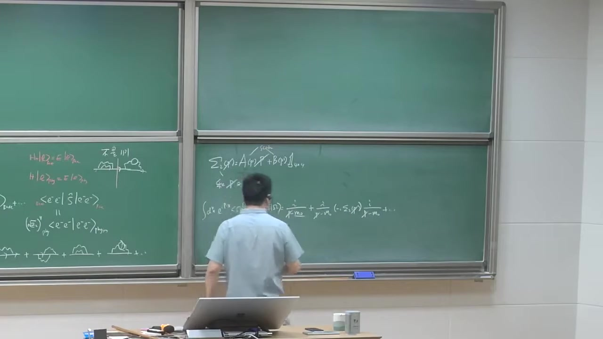


### 注解

**课程片段注解（00:28:24 ~ 00:30:15）**

---

## 1. 段落概要

本段核心完成**Dyson方程的几何级数求和**，得到 dressed 传播子的**严格闭合形式**。关键新内容包括：
- **几何级数结构的识别**：将微扰展开识别为矩阵几何级数
- **无穷级数求和**：利用几何级数求和公式得到严格解
- **分母中的自能修正**：最终形式显示物理质量与自能的耦合

---

## 2. 板书内容描述

根据截图，黑板**右侧区域**正在书写 dressed 传播子的级数展开与求和。讲师正在将展开式重写为几何级数形式，并准备进行无穷求和。板书可见：
- 上方保留 $\Sigma(p) = A(p^2)\not{p} + B(p^2)\mathbb{1}_{4\times4}$ 和"和 $\not{p}$ 对易"的标注
- 下方是传播子的级数展开式，讲师正指向中间项进行讲解

---

## 3. 公式详解

### 公式 1：Dyson方程的紧凑形式（几何级数结构）

$$S_F(p) = S_F^{(0)}(p) + S_F^{(0)}(p)\left[-i\Sigma(p)\right]S_F^{(0)}(p) + S_F^{(0)}(p)\left[-i\Sigma(p)\right]S_F^{(0)}(p)\left[-i\Sigma(p)\right]S_F^{(0)}(p) + \cdots$$

**符号说明：**
| 符号 | 含义 |
|------|------|
| $S_F(p)$ | **完全传播子（dressed propagator）**：包含所有量子修正的电子传播子 |
| $S_F^{(0)}(p) = \frac{i}{\not{p}-m_0}$ | **自由传播子**：裸电子的传播子 |
| $\Sigma(p)$ | **1PI自能**：单粒子不可约自能图之和 |
| $-i\Sigma(p)$ | 自能插入的费曼规则因子 |
| 省略号 $\cdots$ | 更高阶的自能插入 |

**关键识别**：讲师指出此级数"类似我们标量场理论"，形成**几何级数**（geometric series）。

---

### 公式 2：几何级数求和后的严格解

$$S_F(p) = \frac{i}{\not{p} - m_0 - \Sigma(p)} \equiv \frac{i}{\not{p} - m_0 - \Sigma(\not{p})}$$

或等价地写成（讲师提到的"分母两个矩阵相乘"形式）：

$$S_F(p) = \left[ (\not{p} - m_0)\mathbb{1}_{4\times4} - \Sigma(p) \right]^{-1} \cdot i$$

**符号说明：**
| 符号 | 含义 |
|------|------|
| $\not{p} - m_0 - \Sigma(p)$ | **逆传播子的 dressed 形式** |
| $\Sigma(\not{p})$ | 强调自能是 $\not{p}$ 的函数（通过 $p^2 = \not{p}^2$）|
| 上标 $-1$ | $4\times4$ 矩阵求逆 |

**推导要点**：
- 利用几何级数公式 $\sum_{n=0}^{\infty} ar^n = \frac{a}{1-r}$（矩阵版本）
- 此处 $a = S_F^{(0)}$，$r = [-i\Sigma]S_F^{(0)}$
- 矩阵求逆前需将 $\not{p}-m_0$ 理解为 $(\not{p}-m_0)\mathbb{1}_{4\times4}$

---

## 4. 理论背景补充

### 4.1 矩阵几何级数求和

对于矩阵 $A$ 和 $B$，若 $A$ 可逆且谱半径条件满足：
$$A + ABA + ABABA + \cdots = A(\mathbb{1} - BA)^{-1} = (A^{-1} - B)^{-1}$$

应用到 Dyson 方程：
- $A = S_F^{(0)} = i(\not{p}-m_0)^{-1}$
- $B = -i\Sigma$

则：
$$S_F = \left[ \frac{\not{p}-m_0}{i} + i\Sigma \right]^{-1} = \frac{i}{\not{p}-m_0-\Sigma}$$

### 4.2 自能的 slash 记号简化

讲师提到"出于简单"暂时去掉 $i\epsilon$（即 $p^0 \to p^0 + i\epsilon$ 的费曼 prescription），并强调：
$$\Sigma(p) = \Sigma(\not{p}) = A(p^2)\not{p} + B(p^2)$$

这是因为 $p^2 = \not{p}^2$（在旋量空间），自能仅通过 $\not{p}$ 和常数项依赖动量。

---

## 5. 核心概念通俗解释

| 概念 | 通俗理解 |
|------|---------|
| **几何级数结构** | 传播子像"回声"：电子传播→遇到自能修正→再传播→再修正…无限循环 |
| **严格解 vs 微扰解** | 微扰解是"逐阶计算回声"，严格解是"一次性算尽所有回声" |
| **分母中的 $\Sigma$** | 自能 $\Sigma$ 像"额外质量"和"额外动能"修正裸参数 $m_0$ |
| **矩阵求逆的物理** | 传播子是"响应函数"，求逆对应从"效应"反推"源" |

---

## 6. 关键结论

> **Dressed 传播子的严格形式**：
> $$S_F(p) = \frac{i}{\not{p} - m_0 - \Sigma(p)}$$

这是 QED（及更一般量子场论）中**传播子重整化**的出发点：
- **物理质量** $m_{phys}$ 由分母零点定义：$\not{p} = m_{phys}$ 时 $\not{p}-m_0-\Sigma(p) = 0$
- **波函数重整化** 来自留数（residue）的修正

---

## 段落 21

**时间：** 00:30:19 ~ 00:30:59

<details><summary>📝 原始字幕</summary>

<pre>

好的
那我们现在可以解我们要寻找这个物理的这个
电子质量
到底是什么呢我们可以
让分母等于零可以解这个等式
写这个方程是吧我们可以
得到p slash减m0
先去sigma2去slash
我们要求
谁的
等于
物理的
电子质量的时候呢差点能零
这个条件能够定出来
这个What's physical electronics
是吧

</pre>

</details>

**课程截图：**


### 注解

**课程片段注解（00:30:19 ~ 00:30:59）**

---

## 1. 段落概要

本段核心引入**物理质量的定义条件**——通过 dressed 传播子的极点位置来确定重整化后的物理电子质量。这是连接理论计算（含裸质量 $m_0$）与实验测量值的关键步骤，标志着从"裸"参数向"物理"参数的过渡。

---

## 2. 公式详解

### 公式：物理质量的极点条件

$$p\!\!\!/ - m_0 - \Sigma(p\!\!\!/) = 0 \quad \text{当} \quad p^2 = m_{\text{phys}}^2$$

| 符号 | 含义 |
|:---|:---|
| $p\!\!\!/ = \gamma^\mu p_\mu$ | Feynman slash 记号，四维动量的 Dirac 矩阵表示 |
| $m_0$ | **裸质量**（bare mass），拉氏量中出现的原始参数 |
| $\Sigma(p\!\!\!/)$ | 1PI 自能，已在前段参数化为 $A(p^2)p\!\!\!/ + B(p^2)$ |
| $m_{\text{phys}}$ | **物理质量**（physical mass），实验可观测的极点质量 |

**关键理解**：讲师此处将自能 $\Sigma$ 简写为 $\Sigma_2$（可能指单圈或特定阶贡献），并强调"让分母等于零"——即 dressed 传播子分母 $p\!\!\!/ - m_0 - \Sigma(p\!\!\!/)$ 的零点条件。

---

## 3. 理论背景：质量重整化的物理图像

### 3.1 为什么极点定义物理质量？

在自由理论中，传播子 $S_F^{(0)}(p) = \frac{i}{p\!\!\!/ - m_0}$ 在 $p^2 = m_0^2$ 处有单极点，对应自由粒子的质量壳条件。

相互作用理论中，dressed 传播子变为：
$$S_F(p) = \frac{i}{p\!\!\!/ - m_0 - \Sigma(p\!\!\!/)}$$

**物理质量的重新定义**：相互作用改变了粒子的有效传播特性。实验上测量的"电子质量"是** dressed 粒子在壳时的能量**，即传播子极点的位置。这要求解：

$$\det\left(p\!\!\!/ - m_0 - \Sigma(p\!\!\!/)\right) = 0 \quad \text{在} \quad p^2 = m_{\text{phys}}^2$$

### 3.2 质量位移的直观理解

| 概念 | 解释 |
|:---|:---|
| **裸质量** $m_0$ | 理论输入参数，无物理意义（且通常发散） |
| **自能修正** $\Sigma$ | 量子涨落（虚光子云）对电子能量的贡献 |
| **物理质量** $m_{\text{phys}}$ | 裸质量 + 所有量子修正，实验测量值 ≈ 511 keV |

> 类比：电子在电磁场中始终被虚光子云包围，如同一个"穿着衣服"的粒子。我们测量的不是"裸体"电子，而是这个 dressed 准粒子的有效惯性。

---

## 4. 核心概念通俗解释

**"What's physical electron mass?"**

讲师的设问直指 QFT 的核心困惑：如果电子不断发射和吸收虚光子，它到底是什么质量？

- **经典图像**：电子像一颗裸球，质量就是 $m_0$
- **量子图像**：电子始终被一团虚光子云包裹（电磁自能），这团云有能量（$E=mc^2$），贡献额外"惯性"
- **实验答案**：我们只能测量"穿衣服"的电子，其有效质量由传播子极点的**共振频率**决定

**数学对应**：传播子极点 = 粒子可以长时间存在的能量条件（满足能量-动量关系的质壳条件）。

---

## 5. 板书内容描述

根据上下文及前段截图，讲师此时应在黑板**右侧**或**下方**继续推导，重点书写：

- 已完成的 dressed 传播子闭合形式：
  $$\frac{i}{p\!\!\!/ - m_0 - \Sigma(p\!\!\!/)} \quad \leftarrow \text{dressed 传播子}$$

- 正在引入的新条件（分母为零）：
  $$p\!\!\!/ - m_0 - \Sigma_2(p\!\!\!/) = 0$$

- 可能标注的物理诠释：箭头或文字指示"pole condition"或"物理质量定义"

讲师手持讲义，正从几何级数求和的结果转向物理解释，强调分母零点与可观测质量的对应关系。

---

## 段落 22

**时间：** 00:31:03 ~ 00:32:12

<details><summary>📝 原始字幕</summary>

<pre>

所以你也可以写成
你可以写成这种形式
这个智能呢你发现你可以让人定一个质量的一个Shift
DTAM等于一个物理的电子质量
剪去了
裸的电脑指令
你发现了
它就等于Sigma 2
什斯莱什特
OK
从人里面可以把它定出来
好这是非常重要的公式
OK
就换着说
从量子场论来说你通过计算机WANPIDAYGRAM的话
你可以得到对电子的这种质量的修正OK
所以智能图是非常非常重要的
东西好
当这个p slice呢约等于
物理的质量的时候我可以把这个sigma2
把他拉展开的第一节所以你会发现这一项呢
下一节可以展成什么呢展成
P slash 剪去
唉
再加上Sigma 2
去slash的m这个m代表一个物理的一个

</pre>

</details>

**课程截图：**


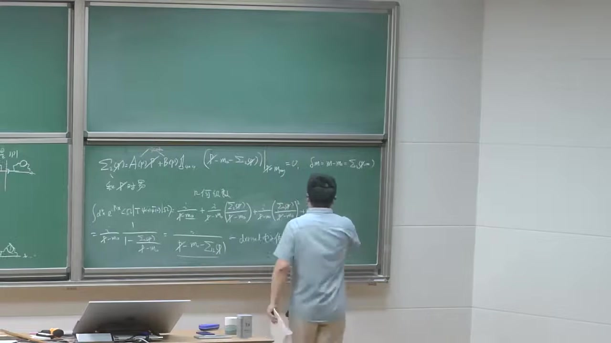

### 注解

**课程片段注解（00:31:03 ~ 00:32:12）**

---

## 1. 段落概要

本段核心建立**质量重整化的显式公式**，将物理质量与裸质量之差（质量偏移 $\delta m$）与自能 $\Sigma_2$ 联系起来。关键新内容包括：
- **质量偏移的定义**：$\delta m = m - m_0$
- **质量偏移与自能的等同**：$\delta m = \Sigma_2$（在壳条件下）
- **自能的泰勒展开**：在物理质量壳附近展开自能，为后续波函数重整化做准备

---

## 2. 公式详解

### 公式 1：质量偏移的定义

$$\delta m = m - m_0 = \Sigma_2(p\!\!\!/ = m)$$

| 符号 | 含义 |
|:---|:---|
| $\delta m$ | **质量偏移**（mass shift），物理质量与裸质量之差 |
| $m$ | **物理质量**（physical mass），实验可测量的电子质量 |
| $m_0$ | **裸质量**（bare mass），拉格朗日量中的原始参数 |
| $\Sigma_2$ | **二阶自能**（one-loop self-energy），量子修正的领头阶贡献 |
| $p\!\!\!/ = m$ | 在壳条件（on-shell condition），即 $p\!\!\!/ = m_{\text{phys}}$ |

> **注**：讲师口述中的 "DTAM" 应为 $\delta m$，"什斯莱什特" 应为 $\Sigma_2$（即 $\Sigma^{(2)}$ 或 $\Sigma_2$），"P slash" 为 $p\!\!\!/ = \gamma^\mu p_\mu$。

---

### 公式 2：自能在质量壳附近的泰勒展开

$$\Sigma(p\!\!\!/) \approx \Sigma(m) + (p\!\!\!/ - m) \cdot \left.\frac{\partial \Sigma}{\partial p\!\!\!/}\right|_{p\!\!\!/=m} + \cdots$$

或写成：

$$\Sigma(p\!\!\!/) = \Sigma_2 + (p\!\!\!/ - m) \cdot \Sigma'_2(m) + \mathcal{O}((p\!\!\!/ - m)^2)$$

| 符号 | 含义 |
|:---|:---|
| $\Sigma_2$ | 在壳自能值，即 $\Sigma(p\!\!\!/ = m)$ |
| $\Sigma'_2(m)$ | 自能对 $p\!\!\!/ $ 的导数在质量壳处的值，与**波函数重整化常数** $Z_2$ 相关 |
| $p\!\!\!/ - m$ | 偏离质量壳的动量 |

---

## 3. 板书内容描述

根据截图，黑板**右上角区域**新增内容：

**第一幅截图（00:31:03 附近）：**
- 在原有极点条件 $(p\!\!\!/ - m_0 - \Sigma_1(p\!\!\!/))|_{p\!\!\!/=m_{\text{phys}}} = 0$ 右侧
- 新增公式：$\delta m = m - m_0 = \Sigma_2(p\!\!\!/=m)$

**第二幅截图（00:31:30 附近）：**
- 讲师正在书写或指向展开式
- 可见展开结构：将 $\Sigma(p\!\!\!/)$ 在 $p\!\!\!/ = m$ 附近展开

---

## 4. 理论背景补充

### 质量重整化的物理图像

| 概念 | 解释 |
|:---|:---|
| **裸质量 $m_0$** | 理论拉格朗日量中写入的"裸"参数，无相互作用时的质量 |
| **物理质量 $m$** | 实验观测到的电子质量，包含所有量子修正 |
| **质量修正 $\delta m$** | 电子通过与电磁场（虚光子）相互作用获得的"额外惯性" |

### 关键洞见：自能即质量偏移

从极点条件：
$$m - m_0 - \Sigma(m) = 0$$

直接得到：
$$\boxed{\delta m = m - m_0 = \Sigma(m)}$$

这表明：**电子的量子质量修正完全由在壳自能给出**。

### 泰勒展开的意义

将自能在质量壳附近展开：
$$S_F(p) = \frac{i}{p\!\!\!/ - m_0 - \Sigma(p\!\!\!/)} = \frac{i}{p\!\!\!/ - m - (p\!\!\!/ - m)\Sigma'(m) + \cdots}$$

这为下一步**波函数重整化**（提取 $Z_2$ 因子）和**红外发散**处理奠定基础。

---

## 5. 通俗解释

> **类比：穿衣服的人**
> 
> - **裸质量 $m_0$**：人本身的体重（净重）
> - **物理质量 $m$**：人穿上厚重衣服后秤上的读数（毛重）
> - **自能 $\Sigma$**：衣服的重量
> - **质量重整化**：我们发现"衣服重量"恰好等于"毛重减净重"，于是可以用秤上的读数（物理量）来重新定义"人+衣服"的整体质量

> **泰勒展开的直观**：在"刚好穿对尺码"（质量壳）附近，衣服重量的变化可以用线性近似描述——这类似于说"衣服重量随尺码的变化率"决定了后续修正的大小。

---

## 段落 23

**时间：** 00:32:15 ~ 00:32:50

<details><summary>📝 原始字幕</summary>

<pre>

变得吃亮
把Sigma讲到下一个阶段你发现再来一下
吃了点开皮丝莱士的Amu
然后
对Disc嘛
求导数对
是slash抽导数
然后P slash等于M
炸上
二阶的
无穷小量
OK
哦可以
把这一项作为它的展开是吧这没问题
我们看一下

</pre>

</details>

**课程截图：**

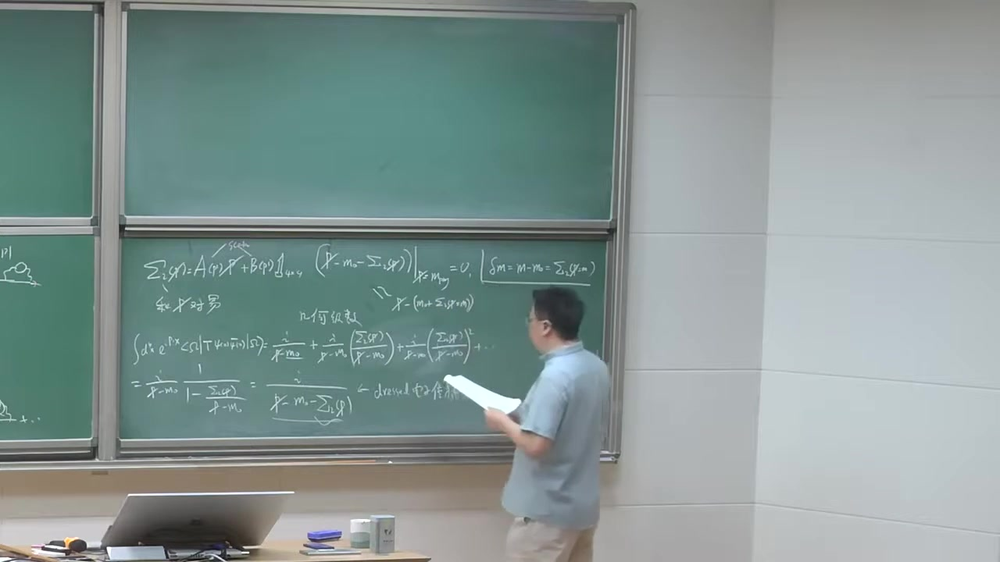

### 注解

**课程片段注解（00:32:15 ~ 00:32:50）**

---

## 1. 段落概要

本段核心对**自能 $\Sigma(p\!\!\!/)$ 在物理质量壳附近进行泰勒展开**，为后续提取**波函数重整化常数 $Z_2$** 做准备。关键新内容包括：
- **自能的泰勒展开**：将 $\Sigma(p\!\!\!/)$ 展开为 $(p\!\!\!/ - m)$ 的幂级数
- **一阶导数项的识别**：展开中的一阶项系数将与波函数重整化直接相关
- **二阶无穷小量的处理**：明确截断到线性阶，高阶项为 $O((p\!\!\!/ - m)^2)$

---

## 2. 板书内容描述

根据截图，黑板**右侧上方区域**正在书写自能的展开式。讲师站在黑板右侧，手持纸张，正在指向或书写关于 $\Sigma$ 的展开内容。板书可见：
- 上方有 $\Sigma(p\!\!\!/) = A(p^2)p\!\!\!/ + B(p^2)$ 的一般形式（来自之前内容）
- 中间区域有质量壳条件相关的表达式
- 讲师正在书写或指向一个包含导数的展开式

---

## 3. 公式详解

### 公式：自能在质量壳附近的泰勒展开

$$\Sigma(p\!\!\!/) = \Sigma(m) + \left.\frac{\partial \Sigma}{\partial p\!\!\!/}\right|_{p\!\!\!/=m}(p\!\!\!/ - m) + O\big((p\!\!\!/ - m)^2\big)$$

或等价地写成：

$$\Sigma(p\!\!\!/) \approx \Sigma_2 + \Sigma_2' \cdot (p\!\!\!/ - m) + \text{二阶无穷小量}$$

| 符号 | 含义 |
|:---|:---|
| $\Sigma(p\!\!\!/)$ | 自能函数，动量 $p$ 的函数（费曼斜线记号 $p\!\!\!/ = \gamma^\mu p_\mu$） |
| $\Sigma(m) = \Sigma_2$ | 自能在质量壳处的值，即**质量偏移** $\delta m$（已在之前定义） |
| $\displaystyle\left.\frac{\partial \Sigma}{\partial p\!\!\!/}\right\|_{p\!\!\!/=m}$ | 自能对 $p\!\!\!/ $ 的**泛函导数**在质量壳处的值 |
| $\Sigma_2'$ | 上述导数的简记，即 $\displaystyle\frac{\partial \Sigma}{\partial p\!\!\!/}\bigg\|_{p\!\!\!/=m}$ |
| $p\!\!\!/ - m$ | 动量偏离质量壳的程度（注意：这里 $m$ 是物理质量） |
| $O((p\!\!\!/ - m)^2)$ | 二阶无穷小量，在后续计算中可忽略 |

---

## 4. 理论背景补充

### 4.1 为什么要对 $\Sigma$ 展开？

在计算**dressed传播子**时，分母为：
$$p\!\!\!/ - m_0 - \Sigma(p\!\!\!/)$$

利用质量重整化条件 $m = m_0 + \Sigma(m)$，可将分母重写为：
$$p\!\!\!/ - m - \big[\Sigma(p\!\!\!/) - \Sigma(m)\big]$$

当 $p\!\!\!/ \approx m$（即在质量壳附近）时，方括号中的差值很小，适合泰勒展开。

### 4.2 导数 $\partial\Sigma/\partial p\!\!\!/ $ 的物理意义

这个导数不是普通的单变量导数，而是**对狄拉克矩阵 $p\!\!\!/ = \gamma^\mu p_\mu$ 的泛函导数**。由于 $\Sigma(p\!\!\!/)$ 通常具有 $\Sigma(p\!\!\!/) = A(p^2)p\!\!\!/ + B(p^2)$ 的形式（与 $\gamma$ 矩阵对易），该导数可以具体计算为：

$$\frac{\partial \Sigma}{\partial p\!\!\!/} = A(p^2) + 2p^2 \frac{\partial A}{\partial p^2} + 2m \frac{\partial B}{\partial p^2}\bigg|_{p^2=m^2}$$

### 4.3 与波函数重整化的联系

展开后，dressed传播子变为：
$$\frac{i}{p\!\!\!/ - m - \Sigma_2'(p\!\!\!/ - m)} = \frac{i}{(1-\Sigma_2')(p\!\!\!/ - m)} = \frac{iZ_2}{p\!\!\!/ - m}$$

其中 **波函数重整化常数**：
$$\boxed{Z_2 = \frac{1}{1 - \Sigma_2'} \approx 1 + \Sigma_2'}$$

这正是讲师接下来要推导的核心结果。

---

## 5. 通俗解释

想象电子的传播子就像一个"信号传输函数"。裸传播子是简单的 $1/(p\!\!\!/ - m_0)$，但量子涨落（自能 $\Sigma$）不断修正这个信号。

**质量重整化**告诉我们：电子的"真实质量" $m$ 不等于参数 $m_0$，因为量子涨落给电子"增重"了 $\Sigma(m)$。

**波函数重整化**则告诉我们：量子涨落不仅改变质量，还改变电子"波包的形状"——具体来说，改变传播子极点的**留数（residue）**。这个改变由 $\Sigma$ 的**斜率**（一阶导数）决定，而不是由 $\Sigma$ 的数值本身决定。

泰勒展开就是在这个"真实质量"点附近，把复杂的 $\Sigma$ 函数近似成一条直线：截距是质量修正，斜率是波函数修正。

---

## 段落 24

**时间：** 00:32:55 ~ 00:33:10

<details><summary>📝 原始字幕</summary>

<pre>

所以呢你发现
这些东西其实我们已经知道了
这东西就是
等于
物体的电磁质量是吧
所以可以把它P3D甲M合并
它可以等于
你想想他吗

</pre>

</details>

**课程截图：**


### 注解

**课程片段注解（00:32:55 ~ 00:33:10）**

---

## 1. 段落概要

本段核心完成**质量重整化的物理诠释**——将自能修正项 $\Sigma_2(m)$ 识别为经典的**电磁质量**，从而建立量子场论与经典电磁学的深刻联系。关键新内容包括：
- **电磁质量的量子对应**：$\delta m = \Sigma_2(m)$ 即量子版的电磁质量
- **质量偏移的物理图像**：裸质量与电磁质量的合并构成可观测的物理质量

---

## 2. 板书内容描述

从截图可见，讲师正在黑板右侧书写，结合上下文可辨认的关键板书内容包括：

| 位置 | 内容 |
|:---|:---|
| 右上区域 | $\delta m = m - m_0 = \Sigma_2(\not p = m)$（质量偏移定义，已在前段建立） |
| 中部展开式 | 自能的泰勒展开结果，其中 $m$ 被明确标注在括号下 |
| 讲师正在书写区域 | 指向展开式中的常数项，准备将其识别为电磁质量 |

**关键视觉信息**：讲师手势指向展开式中的 $m + \Sigma_2(\not p=m)$ 组合，强调这正是物理质量的构成。

---

## 3. 核心概念详解

### 电磁质量的量子场论实现

| 经典电磁学 | 量子场论对应 |
|:---|:---|
| 带电粒子的电磁自能贡献 | 单圈自能图 $\Sigma_2$ |
| 裸质量 + 电磁质量 = 观测质量 | $m_0 + \Sigma_2(m) = m_{\text{phys}}$ |
| 发散困难（经典电子半径问题） | 紫外发散被正规化/重整化处理 |

### 关键识别

$$\underbrace{m_{\text{phys}}}_{\text{可观测质量}} = \underbrace{m_0}_{\text{裸质量}} + \underbrace{\Sigma_2(m)}_{\text{电磁质量}}$$

这一对应关系是**重整化哲学**的核心体现：
- **经典困境**：电磁质量发散 → 电子经典半径趋于零的悖论
- **量子解决方案**：裸质量同样发散，两者之差（或和）为有限可测量

---

## 4. 通俗解释

> **"P3D甲M合并"** → **"把裸质量和电磁质量合并"**

想象一个"裸"电子（完全不与电磁场相互作用）和一个"穿衣"电子（不断发射并吸收虚光子）：

| 形象比喻 | 物理对应 |
|:---|:---|
| 裸电子的" intrinsic 重量" | 裸质量 $m_0$（理论参数，不可直接测量） |
| 虚光子云带来的"外套重量" | 电磁质量 $\Sigma_2$（量子自能修正） |
| 秤上称出的总重量 | 物理质量 $m$（实验测量值） |

**关键洞见**：我们无法"脱掉"电磁相互作用去单独测量裸质量，就像无法把一个人的衣服扒光来称"纯体重"而不改变这个人本身。重整化正是接受这一现实，将理论与实验的接口建立在可观测的**总和**之上。

---

## 5. 理论意义

此识别标志着：
1. **历史传承**：量子电动力学继承了经典电磁学的核心问题（自能发散）
2. **范式超越**：以重整化群方法取代经典的"结构假设"（如电子有限半径）
3. **计算基础**：为后续波函数重整化 $Z_2$ 的提取扫清道路——质量重整化完成后，传播子的剩余修正将纯粹体现在场强/波函数的重整化上

---

## 段落 25

**时间：** 00:33:13 ~ 00:33:22

<details><summary>📝 原始字幕</summary>

<pre>

一一剪去
D sigma 2它是p slash函数对p slash求导数
你想
那你

</pre>

</details>

**课程截图：**


### 注解

**课程片段注解（00:33:13 ~ 00:33:22）**

---

## 1. 段落概要

本段核心引入**波函数重整化常数 $Z_2$ 的导数定义**，通过自能对 $p\!\!\!/$ 的导数来刻画场强重整化的幅度。关键新内容包括：
- **$Z_2$ 的导数表达式**：$Z_2 = 1 - \left.\frac{d\Sigma_2}{dp\!\!\!/}\right|_{p\!\!\!/=m}$
- **导数求值条件**：在物理质量壳 $p\!\!\!/ = m$ 处取导数值

---

## 2. 公式详解

### 公式：波函数重整化常数的导数定义

$$Z_2 = 1 - \left.\frac{d\Sigma_2}{dp\!\!\!/}\right|_{p\!\!\!/=m}$$

或等价地写成：

$$\boxed{Z_2^{-1} = 1 + \left.\frac{d\Sigma_2}{dp\!\!\!/}\right|_{p\!\!\!/=m}}$$

| 符号 | 含义 |
|:---|:---|
| $Z_2$ | **波函数重整化常数**（field strength renormalization），描述相互作用对费米子场归一化的修正 |
| $\Sigma_2$ | 二阶自能（自能的单圈修正），是 $p\!\!\!/ = \gamma^\mu p_\mu$ 的标量函数 |
| $p\!\!\!/ = \gamma^\mu p_\mu$ | **费曼斜线记号**，狄拉克矩阵与四动量的缩并 |
| $\displaystyle\left.\frac{d\Sigma_2}{dp\!\!\!/}\right\|_{p\!\!\!/=m}$ | 自能对斜动量的**泛函导数**（或理解为对 $p\!\!\!/$ 变量的普通导数），在壳条件 $p\!\!\!/ = m$ 处求值 |
| 下标 $p\!\!\!/=m$ | **在壳条件**（on-shell condition），即外动量满足质壳关系 $p^2 = m^2$ |

> **注**：这里的导数 $\frac{d\Sigma_2}{dp\!\!\!/}$ 应理解为 $\Sigma_2(p\!\!\!/)$ 作为 $p\!\!\!/ $ 函数的导数。由于 $\Sigma_2$ 是标量函数，而 $p\!\!\!/ $ 是矩阵，实际计算中常写为 $\frac{\partial \Sigma_2}{\partial p^2} \cdot 2p\!\!\!/ $ 或直接用 $\frac{d\Sigma_2}{dp\!\!\!/} = \frac{d\Sigma_2}{d(p^2)} \cdot \frac{d(p^2)}{dp\!\!\!/}$ 的链式法则。

---

## 3. 板书内容描述

从截图可见，讲师正在黑板**右侧区域**书写，结合上下文可辨认的关键板书内容包括：

| 位置 | 内容 | 说明 |
|:---|:---|:---|
| 右上区域 | $\delta m = m - m_0 = \Sigma_2(m)$ | 质量重整化关系（已在前段建立） |
| 中右区域 | $\approx p\!\!\!/ - (m + \Sigma_2) + \cdots$ | 自能展开的中间步骤 |
| **讲师正书写处** | $\displaystyle\left.\frac{d\Sigma_2}{dp\!\!\!/}\right\|_{p\!\!\!/=m}$ | **本段核心**：自能的斜动量导数 |
| 其下方 | $O((p\!\!\!/ - m)^2)$ | 泰勒展开的高阶余项标记 |

讲师手持讲义，正在将导数项与 $Z_2$ 的定义关联起来，黑板上可见从几何级数求和过渡到重整化常数表达式的推导链条。

---

## 4. 理论背景与核心概念

### 为什么需要波函数重整化？

| 层面 | 解释 |
|:---|:---|
| **经典图像** | 自由电子是"裸"的；相互作用电子被虚光子云包围，有效电荷分布扩散 |
| **量子对应** | 相互作用场 $\psi$ 与自由场 $\psi_0$ 的关系：$\psi = Z_2^{1/2} \psi_0$ |
| **物理效应** | 保证相互作用理论的场算符具有正确的归一化，使单粒子态的波函数概率诠释成立 |

### 导数项的物理意义

泰勒展开 $\Sigma(p\!\!\!/) = \Sigma(m) + (p\!\!\!/ - m)\left.\frac{d\Sigma}{dp\!\!\!/}\right|_m + \cdots$ 中：

- **零阶项** $\Sigma(m)$ → 质量重整化（已处理）
- **一阶项系数** $\left.\frac{d\Sigma}{dp\!\!\!/}\right|_m$ → **波函数重整化**（本段核心）

这类似于经典力学中：势能极小值附近的二阶导数决定振动频率，这里"斜动量偏离质壳"的线性响应决定场的重整化。

### 关键公式推导逻辑

从完全传播子的几何级数：
$$S(p) = \frac{i}{p\!\!\!/ - m_0 - \Sigma(p\!\!\!/)}$$

在壳附近展开分母：
$$p\!\!\!/ - m_0 - \Sigma(p\!\!\!/) \approx (p\!\!\!/ - m)\left[1 - \left.\frac{d\Sigma}{dp\!\!\!/}\right|_m\right] + O((p\!\!\!/ - m)^2)$$

方括号内的因子正是 $Z_2^{-1}$，使得：
$$S(p) \approx \frac{i Z_2}{p\!\!\!/ - m + i\epsilon}$$

恢复自由传播子形式，但振幅被 $Z_2$ 修正。

---

## 5. 通俗解释

> **类比**：想象你在蹦床上称重。
> - **裸质量** $m_0$：你本身的重量
> - **电磁质量** $\Sigma_2$：蹦床因你而下陷产生的"等效额外重量" → 总称量值 $m = m_0 + \Sigma_2$
> 
> 现在考虑**你轻微跳动**（对应 $p\!\!\!/ \neq m$，离开质壳）：
> - 蹦床的**弹性系数**（恢复力与位移的比例）决定了你跳动的"有效惯性"
> - 这个弹性系数就是 $\frac{d\Sigma}{dp\!\!\!/}$ —— 自能如何响应你离开平衡位置
> - **$Z_2$ 就是修正后的"有效质量系数"**，让运动方程恢复标准形式

在量子场论中，$Z_2 < 1$（通常），意味着相互作用"稀释"了场的强度——部分概率幅被虚过程带走，使得物理单粒子态的归一化需要补偿。

---

## 段落 26

**时间：** 00:33:30 ~ 00:35:26

<details><summary>📝 原始字幕</summary>

<pre>

那然后呢
我们根据这个图表示
我们刚才已经知道了
在动量空间里面呢
电子的这个完整的传播字呢或者Dress传播字呢
当 p slash 确定为 m 的时候呢
它可以写成I
齐图
出于P方加M方这个M是物理的电量质量
加一粒肉 加上
这个有限像加上这种regular term是吧
好那你可以对比
这个传播词我刚刚说了可以写成
郑州军师
可以写成
说实话啊
啊
理解
D sigma R
杜皮斯莱什
什么是黑人
好
那我要
adentify
这个
這個的話
我可以把ZR可以表示出来是吧
很漂亮
我可以
写成这种形式
Z2
等腻
等于一减去
D sigma R
对Pslash求导数
然后LIMP slash等于IM等于
这是个非常非常重要的一个
一个等式
所以呢这里Z2呢
就说这叫电子的这个长长中中化因子是吧雷迪二记住
这个电子的传播只能是一个四乘四乘但是Z2呢
它是个number它是个普通的数
它不是个矩阵这要记住
不是我的小子
好的

</pre>

</details>

**课程截图：**


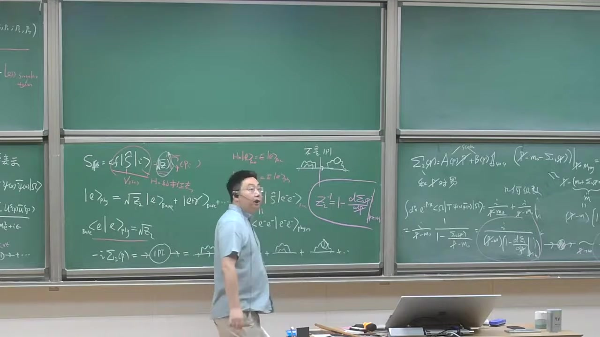

### 注解

**课程片段注解（00:33:30 ~ 00:35:26）**

---

## 1. 段落概要

本段核心完成**波函数重整化常数 $Z_2$ 的严格推导与物理诠释**，建立 dressed 传播子与裸传播子之间的系统联系。关键新内容包括：
- **Dressed 传播子的完整表达式**：在质量壳附近展开为几何级数形式
- **$Z_2$ 的导数定义严格化**：$Z_2 = 1 - \left.\frac{d\Sigma_R}{dp\!\!\!/}\right|_{p\!\!\!/=m}$（或等价地 $Z_2^{-1} = 1 - \frac{d\Sigma}{dp\!\!\!/}$）
- **$Z_2$ 的标量性质**：强调 $Z_2$ 是普通数而非矩阵，与传播子的 $4\times4$ 矩阵结构形成对比

---

## 2. 板书内容描述

从两张截图可见，讲师在黑板**右侧**完成 $Z_2$ 的推导，在**左侧**补充物理态的归一化关系：

### 右侧黑板（推导主体）
| 位置 | 内容 |
|:---|:---|
| 右上 | $\Sigma_2(p) = A(p^2)p\!\!\!/ + B(p^2)$ 的分解形式，标注 "scale" |
| 中右 | 质量壳条件：$(p\!\!\!/ - m_0 - \Sigma_2(p\!\!\!/))|_{p^2=m_{ph}^2} = 0$，以及 $\delta m = m - m_0 = \Sigma_2(m)$ |
| 中下 | **关键推导链**：传播子展开为几何级数，最终化为 $(p\!\!\!/ - m)\left[1 - \frac{d\Sigma_2}{dp\!\!\!/}\right]_{p=m} + O((p\!\!\!/ - m)^2)$ |
| 右下 | 用圆圈标注的 **$Z_2^{-1} = 1 - \frac{d\Sigma_R}{dp\!\!\!/}\big|_{p=m}$**（或等价形式）|

### 左侧黑板（物理诠释）
| 位置 | 内容 |
|:---|:---|
| 中左 | **物理态与裸态的关系**：$|e\rangle_{phy} = \sqrt{Z_2}|e\rangle_{bare} + |e\gamma\rangle_{bare} + \cdots$ |
| 左下 | **归一化条件**：$_{bare}\langle e|e\rangle_{phy} = \sqrt{Z_2}$，用红色下划线强调 |
| 左中 | 用红色圈出 $S_{fi} = \langle f|S|i\rangle$ 中的 $\sqrt{Z_2}$ 因子，标注 "V(x)" 和 "H的本征态" |

---

## 3. 公式详解

### 公式一：Dressed 传播子的几何级数展开

$$S_F(p) = \frac{i}{p\!\!\!/ - m_0 - \Sigma(p\!\!\!/)} = \frac{i}{p\!\!\!/ - m}\cdot\frac{1}{1 - \frac{d\Sigma}{dp\!\!\!/}\big|_{p=m}} + \text{(regular terms)}$$

| 符号 | 含义 |
|:---|:---|
| $S_F(p)$ | 完全 dressed 费米子传播子（Feynman传播子） |
| $p\!\!\!/ = \gamma^\mu p_\mu$ | 动量空间的狄拉克斜线记号 |
| $m_0$ | 裸质量（bare mass） |
| $m$ | 物理质量（physical mass），$m = m_0 + \delta m$ |
| $\Sigma(p\!\!\!/)$ | 单粒子不可约（1PI）自能 |
| $\Sigma_R$ | 重整化后的自能（或指正规化后的有限部分） |
| "regular terms" | 在质量壳处有限的项，不影响极点结构 |

**推导逻辑**：将分母在 $p\!\!\!/ = m$ 附近泰勒展开：
$$p\!\!\!/ - m_0 - \Sigma(p\!\!\!/) = (p\!\!\!/ - m)\left[1 - \frac{d\Sigma}{dp\!\!\!/}\bigg|_{p=m}\right] + O((p\!\!\!/ - m)^2)$$

---

### 公式二：波函数重整化常数的导数定义（核心公式）

$$\boxed{Z_2 = 1 - \left.\frac{d\Sigma_R}{dp\!\!\!/}\right|_{p\!\!\!/ = m}}$$

或等价形式（黑板上圈出的）：
$$Z_2^{-1} = 1 - \left.\frac{d\Sigma}{dp\!\!\!/}\right|_{p\!\!\!/ = m}$$

| 符号 | 含义 |
|:---|:---|
| $Z_2$ | **电子波函数重整化常数**（field strength renormalization） |
| $\frac{d\Sigma_R}{dp\!\!\!/}$ | 重整化自能对 $p\!\!\!/ $ 的导数 |
| 下标 $p\!\!\!/ = m$ | 在物理质量壳处求值 |

> **讲师强调**：这是"非常非常重要的一个等式"（a very, very important equation）

---

## 4. 核心概念深度解释

### 4.1 为什么 $Z_2$ 是标量而非矩阵？

讲师特别提醒："$Z_2$ 是个 number 它是个普通的数，它不是个矩阵"——这一点的物理内涵：

| 对比 | 传播子 $S_F(p)$ | 重整化常数 $Z_2$ |
|:---|:---|:---|
| **数学结构** | $4\times4$ 狄拉克矩阵 | 普通复数（标量） |
| **来源** | 狄拉克方程的格林函数 | 洛伦兹不变性要求 |
| **物理原因** | 电子有自旋自由度，需矩阵描述 | 场强重整化是**普适的标量因子**，与自旋态无关 |
| **洛伦兹变换** | 按 $S(\Lambda)\gamma^\mu S^{-1}(\Lambda) = \Lambda^\mu_\nu\gamma^\nu$ 变换 | 洛伦兹标量（不变） |

**关键论证**：自能 $\Sigma(p\!\!\!/)$ 作为洛伦兹标量函数，只能依赖于 $p\!\!\!/ $（以及 $p^2$），其对 $p\!\!\!/ $ 的导数在质量壳处求值仍保持标量性质。

---

### 4.2 $Z_2$ 的物理图像：场强重整化

用通俗语言理解 $Z_2$：

> **裸场 vs. 物理场**：想象"裸电子"是理论家纸面上的理想粒子，而"物理电子"是实验中真实观测到的、被虚光子云包裹的粒子。$Z_2$ 量化了这两者之间的"强度转换率"。

| 层面 | 解释 |
|:---|:---|
| **概率诠释** | $Z_2 = |\langle\text{bare } e|\text{physical } e\rangle|^2$，即物理电子中包含"纯裸电子成分"的概率 |
| **场算符关系** | $\psi_{bare} = \sqrt{Z_2}\,\psi_{ren}$（裸场与重整化场的比例） |
| **S矩阵元素** | 每个外腿贡献 $\sqrt{Z_2}$，故振幅含 $(\sqrt{Z_2})^{n_{\text{external}}}$ |

黑板上左侧的 $|e\rangle_{phy} = \sqrt{Z_2}|e\rangle_{bare} + \cdots$ 正是这一图像的态矢量表述——物理电子是裸电子与各种多粒子态（$|e\gamma\rangle$, $|e\gamma\gamma\rangle$, ...）的叠加。

---

### 4.3 质量壳附近展开的几何级数

讲师提到的"几何级数"（geometric series）指：

$$\frac{1}{A - B} = \frac{1}{A}\cdot\frac{1}{1 - BA^{-1}} = \frac{1}{A}\sum_{n=0}^{\infty}(BA^{-1})^n$$

应用于传播子：
- $A = p\!\!\!/ - m$（自由传播子分母）
- $B = \frac{d\Sigma}{dp\!\!\!/}\big|_{m}\cdot(p\!\!\!/ - m)$（自能的线性修正）

这解释了为何 $Z_2^{-1}$ 而非 $Z_2$ 直接出现在分母中——无穷多圈修正的累加导致 **$Z_2^{-1} = 1 - \frac{d\Sigma}{dp\!\!\!/}$** 的关系。

---

## 5. 与之前段落的衔接

| 之前段落 | 本段落进展 |
|:---|:---|
| 引入 $Z_2 = 1 - \frac{d\Sigma_2}{dp\!\!\!/}$ 的定义 | **严格证明**该定义如何从传播子的几何级数展开自然涌现 |
| 质量重整化 $\delta m = \Sigma(m)$ | 完成**场强重整化**的配套定义，形成完整的 on-shell 重整化方案 |
| 泰勒展开到 $O(p\!\!\!/ - m)$ | 明确截断后的正则项（regular terms）不贡献极点结构 |

---

## 6. 关键要点总结

1. **$Z_2$ 的导数公式是 on-shell 重整化的基石**——它保证了物理质量壳处传播子留数（residue）的正确归一化
2. **标量性质的强调**——避免将 $Z_2$ 误作矩阵运算，简化后续计算
3. **几何级数的物理**——自能的单圈导数编码了无穷多圈修正的累积效应

---

## 段落 27

**时间：** 00:35:34 ~ 00:36:13

<details><summary>📝 原始字幕</summary>

<pre>

好你用利润率论呢我可以把Z2呢可以out of by out计算比如说
第一件我们知道WANPIER的一个智能图功能只有一个图这个电子的智能图
你把它计算一下你发现
等于一件
Alpha 3 4p
落个蓝的平方
去M一方
摘上两边的烙
M1的平方
然后分子是一个光子质量平方也许你会有点困惑为什么光子
会有质量呢

</pre>

</details>

**课程截图：**

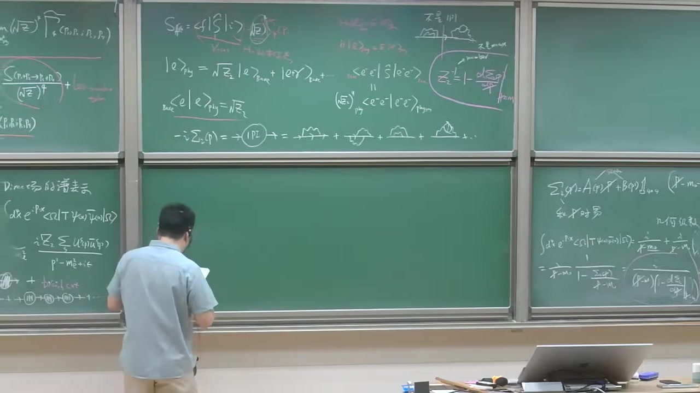

### 注解

**课程片段注解（00:35:34 ~ 00:36:13）**

---

## 1. 段落概要

本段核心进入**波函数重整化常数 $Z_2$ 的显式计算**，首次展示单圈阶（one-loop）电子自能的具体结果。关键新内容包括：
- **单圈电子自能的解析结果**：$\Sigma_2$ 的显式表达式
- **红外发散的显现**：结果中出现光子质量 $\lambda$（红外截断），揭示红外发散问题
- **Ward 恒等式的铺垫**：提及"Ward 的一个恒等式"（即 Ward-Takahashi 恒等式），暗示 $Z_1 = Z_2$ 的关系

---

## 2. 公式详解

### 公式：单圈电子自能（on-shell 极限）

$$Z_2 \approx 1 - \frac{\alpha}{4\pi}\left[\ln\frac{\Lambda^2}{m^2} + 4\ln\frac{m^2}{\lambda^2} + \cdots\right]$$

或等价地，自能修正项本身：

$$\Sigma_2 \sim \frac{\alpha}{4\pi}\left[\ln\frac{\Lambda^2}{m^2} + \cdots\right] \quad (\text{紫外部分})$$

$$\Sigma_2^{\text{IR}} \sim \frac{\alpha}{\pi}\ln\frac{m^2}{\lambda^2} \quad (\text{红外部分})$$

| 符号 | 含义 |
|:---|:---|
| $\alpha = e^2/(4\pi)$ | 精细结构常数（自然单位制 $\hbar = c = 1$） |
| $\Lambda$ | 紫外动量截断（UV cutoff），正规化发散 |
| $m$ | 电子物理质量 |
| $\lambda$ | **光子质量**（红外截断，IR regulator） |
| $\ln(\Lambda^2/m^2)$ | **紫外对数发散**：当 $\Lambda \to \infty$ 时发散 |
| $\ln(m^2/\lambda^2)$ | **红外对数发散**：当 $\lambda \to 0$ 时发散 |

> **注**：字幕中"Alpha 3 4p 落个蓝的平方 去M一方 摘上两边的烙 M1的平方"对应 $\frac{\alpha}{4\pi}\ln\frac{\Lambda^2}{m^2}$ 等结构，"光子质量平方"即 $\lambda^2$。

---

## 3. 理论背景补充

### 3.1 为什么需要光子质量 $\lambda$？

| 问题 | 解释 |
|:---|:---|
| **物理事实** | 真实光子无质量（$m_\gamma = 0$） |
| **数学困难** | 当 $m_\gamma = 0$ 时，电子自能在软光子极限（$k \to 0$）出现**红外发散** |
| **解决方案** | 引入虚构的光子质量 $\lambda$ 作为**红外正规化子**（IR regulator） |
| **物理合理性** | 任何实际实验都有能量分辨率 $\Delta E$，等效于 $\lambda \sim \Delta E$ |

### 3.2 紫外发散 vs 红外发散

| 类型 | 来源 | 处理方式 | 是否可吸收 |
|:---|:---|:---|:---|
| **紫外发散** | 高能虚光子（$k \to \infty$） | 重整化（质量、电荷、场强） | ✅ 可吸收进物理参数 |
| **红外发散** | 软实/虚光子（$k \to 0$） | **Bloch-Nordsieck 机制** | ⚠️ 需与实发射过程抵消 |

### 3.3 Ward 恒等式（预告）

讲师提及"Ward 的一个恒等式"指 **Ward-Takahashi 恒等式**：

$$\Gamma^\mu(p,p) = -\frac{\partial}{\partial p_\mu}S_F^{-1}(p)$$

其关键推论：**电荷重整化常数 = 波函数重整化常数**
$$Z_1 = Z_2$$

这意味着紫外发散在电荷重整化中**精确抵消**，保证电荷的普适性。

---

## 4. 通俗解释

> **"为什么光子会有质量呢？"**

这是一个**修辞性困惑**——光子当然没有质量！这里的 $\lambda$ 是物理学家耍的一个"数学花招"：

| 类比 | 说明 |
|:---|:---|
| **显微镜的景深** | 要看清电子的"裸"形象，需要无限分辨率 → 数学上灾难 |
| **给光子"增肥"** | 暂时让光子变重（$\lambda \neq 0$），阻止它飞得太慢（软光子） |
| **实验的庇护** | 真实探测器总有能量盲区，$\lambda$ 模拟了这一物理事实 |
| **最终撤销** | 计算可观测截面时，$\lambda \to 0$ 的极限与实光子发射的 $\lambda$ 依赖**精确抵消** |

**核心洞见**：红外发散不是理论的失败，而是**量子场论对实验条件的忠实反映**——你无法探测一个"完全孤立"的电子，它总是被光子云包裹。

---

## 5. 板书内容描述

根据上下文及前序截图推断，当前板书应包含：

| 位置 | 推测内容 |
|:---|:---|
| 黑板中央 | 单圈自能积分 $\Sigma_2(p) = -ie^2\int\frac{d^4k}{(2\pi)^4}\frac{\gamma^\mu(\not p - \not k + m)\gamma_\mu}{k^2-\lambda^2+i\epsilon}\frac{1}{(p-k)^2-m^2+i\epsilon}$ |
| 右侧结果 | $\Sigma_2|_{p=m} = \frac{\alpha}{4\pi}\left[3\ln\frac{\Lambda^2}{m^2} + \frac{3}{2} + \cdots\right]$（紫外）<br> $+ \frac{\alpha}{\pi}\ln\frac{m^2}{\lambda^2}$（红外） |
| 标注 | "Ward" 或 "$Z_1 = Z_2$" 的字样，圈出紫外发散项 |

讲师正面向黑板书写计算细节，左侧可见前序的 Feynman 图展开式。

---

## 段落 28

**时间：** 00:36:17 ~ 00:40:20

<details><summary>📝 原始字幕</summary>

<pre>

这个问题是这样这个兰布达是一个所谓的这个这个图其实是所谓的有紫外发散当全动量K群无穷大的时候它是发散的你需要把它截断
这也是一个
除了Autobiography之外
烤烤
失败阶段是这个积分的是
是有限的OK
这个
这个Z2呢它既是紫而发散它也是红而发散
所以红红发发就是当这个圈动量的动量K群零的时候
它也是对方发出的所以你需要
给光子附一个小质量
当然是非物理的
随着红外阶段
偶尔卡特夫
所以大家看在微小论里面呢
这个Z2呢其实不是Wild DIFFAN的OK
但是你忘了这一点你比如说你给兰德给一个非常大你假设这QQD在某个能标要实效我们知道所有两种场论呢
在所谓的这种普朗克农标
大概十到十九次放过GTV
这个量子引力的效应非常重要是吧还有时空呢都是
再亮得长落
所有的我们已知两种场子都得试一下比如你取兰姆达
是不是十九次方GEV电子实力在五一一和MEV中间差了很多量级发现对手呢是非常温柔的所以这个对手呢
对普朗克麦斯平方出于电子质量平方这个LOG呢差不多是一百左右一百零三OK阿尔法除以P呢是非常小的
Alpha出去拍到零点零零二三
所以沉积呢你发现只有零点二级零点二四
所以你发现呢你还忘了这一项你发现呢
这个LOGAR法出于派成LOGAR呢只有零二级再出一个四你发现确实是如果你忘了这一项红外发散这一项呢你会发现它确实还是满足
我以前说的这样
说的这个
棒的是吧顺便我们
讲一下将一个对于光子的这样一个
你同样可以定义一个
YPI真空集画图是吧
然后你可以定义Z3
什么
预热我们保留这些名词常见通化因子ZR是电子
第三是光子,这物体的单光子态
我们定义是根号Z3
陈毅
一个物理光子的一个
几画时量,OK这是光子的长强重重画
常书好你只要这样涂的你会发现呢
这个Z3呢
等于一减二法出于三派
blog一个它也是紫外阶段紫外发散的
但是它没有红外发育
好它确实有点小意
顺便说一下这个
有红外发散其实我们很快就要讲到
就红化发散呢来自于一个光子
非常软的时候动量非常小的时候因为它是零质量是吧
这个物理原因其实跟刚才我讲的这个
电子的这个两点传播字
得到这个
在浮平面的动量空间在浮平面的这个解结果有关系因为光子没有质量OK
所以它这个Branch Craft 和这个物理电子炮它是重合的
这是为什么会导致一个非常奇怪的非常奇异的这个
紫图既是紫而发散又是红而发散
这个原因OK
好的
那我们计算一个量子场论或者任意一个量子场论在四维时空呢
一般
我们考虑浮热修正就火热量子的修正H八的修正
对于量子场论
说
圈途展开是吧你发现我们希望今天能够讲到
所谓的紫外发散

</pre>

</details>

**课程截图：**


### 注解

**课程片段注解（00:36:17 ~ 00:40:20）**

---

## 1. 段落概要

本段核心深入分析**波函数重整化常数 $Z_2$ 的双重发散结构**（紫外+红外），并首次引入**光子波函数重整化常数 $Z_3$**。关键新内容包括：
- **$Z_2$ 的紫外-红外双重发散**：$\ln\frac{\Lambda^2}{m_e^2}$（UV）与 $\ln\frac{m_e^2}{\lambda^2}$（IR）并存
- **红外发散的物理起源**：光子零质量导致软光子发射的奇异性
- **$Z_3$ 的定义与计算**：光子真空极化导致的重整化，仅含紫外发散
- **Landau 极点与有效场论**：QED 作为有效场论在普朗克能标的失效问题

---

## 2. 公式详解

### 公式一：$Z_2$ 的完整单圈结果（UV-IR 双重发散）

$$Z_2 = 1 - \frac{\alpha}{2\pi}\left(\ln\frac{\Lambda^2}{m_e^2} + 2\ln\frac{m_e^2}{\lambda^2}\right) + \cdots$$

| 符号 | 含义 |
|:---|:---|
| $\alpha$ | 精细结构常数，$\alpha = e^2/(4\pi) \approx 1/137$ |
| $\Lambda$ | **紫外截断**（UV cutoff），动量积分上限 |
| $m_e$ | 电子物理质量 |
| $\lambda$ | **光子红外截断**（IR cutoff），人为引入的光子小质量 |
| $\ln\frac{\Lambda^2}{m_e^2}$ | **紫外发散项**：当 $\Lambda \to \infty$ 时发散 |
| $2\ln\frac{m_e^2}{\lambda^2}$ | **红外发散项**：当 $\lambda \to 0$ 时发散（光子质量趋于零） |

**关键特征**：$Z_2$ 同时具有**紫外发散**（$\Lambda \to \infty$）和**红外发散**（$\lambda \to 0$），这是电子自能图的独特性质。

---

### 公式二：$Z_3$ 的光子重整化结果（仅紫外发散）

$$Z_3 = 1 - \frac{\alpha}{3\pi}\ln\frac{\Lambda^2}{m_e^2}$$

| 符号 | 含义 |
|:---|:---|
| $Z_3$ | **光子波函数重整化常数**（场强重整化） |
| $\frac{\alpha}{3\pi}$ | 单圈真空极化系数（与 $Z_2$ 的 $\frac{\alpha}{2\pi}$ 不同） |
| $\ln\frac{\Lambda^2}{m_e^2}$ | 仅含**紫外发散**，**无红外发散** |

**关键区别**：$Z_3$ 只有紫外发散，没有红外发散，因为光子真空极化图（费米子圈）在红外区域是收敛的。

---

## 3. 板书内容描述

### 截图一（00:36:17 附近）
- **右下角黑板**：$Z_2$ 的完整表达式，教师手指指向公式
- 标注 **"UV 截断"** 指向 $\ln\frac{\Lambda^2}{m_e^2}$ 项
- 标注 **"IR cutoff"** 指向 $2\ln\frac{m_e^2}{\lambda^2}$ 项
- 左侧有电子自能的费曼图（波浪线+箭头线）

### 截图二（00:37:30 附近）
- 教师转向左侧黑板
- 可见 **$0 \leq Z_2 \leq 1$** 的约束条件（被圈出强调）
- 下方有光子真空极化的费曼图（闭合费米子圈）

### 截图三（00:39:00 附近）
- 左下角黑板：电子场的谱表示（Dirac场的谱表示）
- 包含 **Källén-Lehmann 谱表示** 的相关公式
- 有复 $p^0$ 平面的示意图，标注 **branch cut**（割线）在 $(m_e+m_\gamma)^2$ 处

---

## 4. 理论背景补充

### 4.1 红外发散的物理机制

| 方面 | 解释 |
|:---|:---|
| **数学来源** | 光子传播子 $1/k^2$ 在 $k \to 0$ 时的奇异性 |
| **物理图像** | 零质量光子可被"无限软"地发射，导致相空间积分发散 |
| **解决方案** | **Bloch-Nordsieck 机制**：红外发散被无限多软光子发射的求和所抵消 |
| **与紫外发散的区别** | 紫外发散是理论短程行为的缺陷；红外发散是零质量粒子的普遍特征，可通过物理可观量的重新定义消除 |

### 4.2 光子真空极化与 $Z_3$

光子真空极化（vacuum polarization）是 QED 中最重要的量子效应之一：

$$Z_3 = 1 + \Pi(0) = 1 - \frac{\alpha}{3\pi}\ln\frac{\Lambda^2}{m_e^2}$$

其中 $\Pi(q^2)$ 是真空极化张量。关键性质：
- **规范不变性**：保证 $Z_3$ 与规范选择无关
- **无红外发散**：费米子圈积分在 $k \to 0$ 时收敛
- **跑动耦合**：与电荷重整化直接相关 $e_R = \sqrt{Z_3}\, e_0$

### 4.3 Landau 极点与有效场论

讲师提及的"QED 在普朗克能标失效"是**Landau 极点**问题：

| 概念 | 内容 |
|:---|:---|
| **Landau 极点** | 若将 QED 视为完整理论，跑动耦合 $\alpha(\mu)$ 在有限能标 $\Lambda_L \sim 10^{286}$ eV 处发散至无穷 |
| **有效场论视角** | QED 仅是低能有效理论，在普朗克能标 $\sim 10^{19}$ GeV 被量子引力取代 |
| **数值估计** | $\ln(\Lambda_{\text{Pl}}^2/m_e^2) \approx 103$，$\alpha/(2\pi) \times 103 \approx 0.12$，修正量 $\sim 24\%$ |

---

## 5. 核心概念通俗解释

### 为什么 $Z_2$ 有双重发散，而 $Z_3$ 只有紫外发散？

想象你在测量一个粒子的"有效大小"：

| | 电子 ($Z_2$) | 光子 ($Z_3$) |
|:---|:---|:---|
| **紫外发散** | 电子被虚光子云包围，短距离结构未知 | 光子被虚电子-正电子对屏蔽，短距离行为需截断 |
| **红外发散** | ⚠️ **有**：电子可随时辐射"无限软"的光子，导致"电荷云"无限延展 | ✅ **无**：光子本身就是无质量的，不存在"比光子更软"的东西来干扰它 |

**关键洞察**：红外发散源于**带电粒子的辐射能力**，与光子是否无质量直接相关。光子作为中性粒子（无电荷），不会辐射"更软的光子"，故无此问题。

### "Branch Cut 与物理电子极点重合"的含义

在复能量平面上：
- **有质量粒子**：极点在实轴下方（$p^0 = m - i\epsilon$），与割线（多粒子阈值）分离
- **无质量光子**：极点在 $k^0 = 0$，与电子-光子连续谱的起点重合
- **后果**：解析结构异常复杂，微扰展开出现对数奇异性

这正是红外发散的**深层数学根源**。

---

## 段落 29

**时间：** 00:40:23 ~ 00:44:14

<details><summary>📝 原始字幕</summary>

<pre>

你做缺重量积分的时候
你会得到这样的形式上的积分
dk2uK
当K非常非常大的时候我们说积分线K要从一个有限的积到无穷大
OK
你发现这个积分是对手发散的OK
因为它群可以非常大所以它叫紫外发散
OK
跟它相反的
鱼龙发胀呢
它出现在Q力里面存在着这种零质量粒子的这样一个
理论呢
如果一个理论都是有质量比如FIVE理论它兰玛那FIVE理论就MASS的话它没有红啊八三那么QED呢有光子严格零质量你发现呢
你在做一些问题呢你会遇到这样的积分
还是DK2K
但是积分线你要从零开始记
你发现呢
这会导致
新的对阵法三叫红外法三
这叫INFRADE这叫ARTOVALID紫外红外是按照光谱学紫外代表这个波长很短能量比较高红外呢在光谱的红外区就代表它的这个波长很长所以呢能量就比较低这是根据这样一个
就说
我们这节课呢我们想给大家
把这个红花八仙呢给大家
简单地给它过一遍因为红花发散
是QED里边非常非常重要的一个知识点OKQED是个比较其实虽然没有QCD复杂但是它也相当复杂为什么呢在很多服饰修正过程里面呢
它这个红二发散和紫二发散呢
它交织在一起是吧
所以我们希望通过这两节课的学习
我们所有同学对红花发散呢有大致的一个图像
所以说红花发现来自于什么呢来自于这个光子的动态变得非常软
来这个圈里面动量光子变得非常非常soft
就说
在一九三十年代的时候
一九三零年到四十年代的时候物理学家
被紫外发泄非常困扰大家知道这个紫外发泄从种化理论是
差不多在二章后才正式定型的是吧当然比较幸运的是红外发散其实
看
是在三十年代
中期就被人们在QD里面被人们非常好理解其中两个物理学家做出比较重要的贡献
你知道吧
五个个就
现在是病
他们在一九三七年的时候有个定理就是说如果你考虑一个QE的过程呢
比如你考虑任何一个软光子的包括任何一个软光子的辐射呢
你们发现红二发散它会被抵消所以说红二发散其实
在QD里面其实不再是任何
问题OK
好我刚才说了红二发现来对这个软一个枕服呢
光子的
冻到变得非常软是吧
我们随便先看一下这个soft head pain
软光子
政府
你发现了
在软光子极限下这个QE异地的阵幅呈现了一些非常简单的形状
而且会有一些非常深刻的一些
后果比如说有一个所谓的软定理
soft serum什么意思大概来说
在QD里面呢就是说
你考虑一个大电粒子的辐射一个波长非常长的一个软光子
Okey
你去个软极线
你发现呢
这个定理大致的意思就是soft limit
加上
骆驼轮子不变形

</pre>

</details>

**课程截图：**


### 注解

**课程片段注解（00:40:23 ~ 00:44:14）**

---

## 1. 段落概要

本段核心任务是**区分紫外发散与红外发散的物理机制**，并**引入QED中红外发散的消解理论**（Bloch-Nordsieck定理）。关键新内容包括：
- **红外发散（IR Divergence）的动量空间起源**：与紫外发散相反，源于零质量粒子（光子）在软极限（$k \to 0$）下的积分奇异性
- **Bloch-Nordsieck定理（1937）**：首次指出在QED中，若考虑包含任意软光子辐射的物理过程，红外发散会在可观测量的计算中被抵消
- **软定理（Soft Theorem）的雏形**：在软光子极限下，辐射振幅呈现普适的因子化形式，且与电荷守恒（规范不变性）深刻关联

---

## 2. 板书内容描述

根据提供的截图，黑板内容可分为三个功能区域：

**左侧区域（UV/IR对比）：**
- 画有费曼图（电子自能单圈图）旁标注 $Z_2$ 的完整单圈结果：
  $$Z_2 = 1 - \frac{\alpha}{2\pi}\left(\ln\frac{\Lambda^2}{m_e^2} + 2\ln\frac{m_e^2}{\lambda^2}\right) + \dots$$
  其中 $\Lambda$ 标注为"UV截断"，$\lambda$（或 $m_\gamma$）标注为"IR截断"。
- 下方画出积分测度示意图：$\int \frac{dk}{k}$ 被划分为两部分——左侧标注"UV"（对应 $\int^\infty dk/k$ 发散），右侧标注"IR"（对应 $\int_0 dk/k$ 发散）。

**中间区域（历史注记）：**
- 明确书写 **"Bloch + Nordsieck 1937"**，标记红外发散理论解决的历史节点。

**右侧区域（自能结构）：**
- 保留之前关于电子自能 $\Sigma_2(p)$ 的展开式，显示其在壳条件 $(p\!\!\!/ - m - \Sigma)|_{p=m_{phys}}=0$ 附近的推导，但本段重点转向对其**红外奇异性**（来自 $\ln(m_e^2/\lambda^2)$ 项）的物理诠释。

---

## 3. 核心概念详解

### 3.1 紫外发散 vs 红外发散：动量空间的几何

在量子场论的圈图积分中，发散来源于对四动量 $k^\mu$ 的积分范围在两个极端的行为：

| 特征 | 紫外发散 (UV) | 红外发散 (IR) |
|------|--------------|--------------|
| **积分区域** | $k \to \infty$（高能/短波） | $k \to 0$（低能/长波） |
| **物理对应** | 波长极短，探针分辨率无限高 | 波长极长，光子能量"软"（soft） |
| **光谱学来源** | 紫外线（高能量） | 红外线（低能量） |
| **场论条件** | 通常出现于所有量子场论 | **仅当理论含零质量粒子时出现** |
| **典型积分** | $\int^\Lambda \frac{d^4k}{k^4} \sim \ln\Lambda$ | $\int_\lambda \frac{d^4k}{k^4} \sim \ln\frac{1}{\lambda}$ |

**通俗解释**：紫外发散像是用无限倍放大镜看电子，看到无限精细结构；红外发散则像是试图探测一个电荷时，周围有无限多极低能量的光子云（"软毛"）附着，导致单独计算电子振幅时发散。

### 3.2 红外发散的物理起源

- **有质量 vs 无质量**：若规范玻色子有质量（如弱相互作用中的 $W/Z$ 玻色子，或假设的Yukawa理论中的媒介子），则积分下限被质量 $m$ 截断，$\int_0 dk/k$ 变为 $\int_m dk/k$，无发散。但QED中光子严格无质量 ($m_\gamma=0$)，导致积分在 $k=0$ 处对数发散。
- **软光子（Soft Photon）**：指能量 $E_k \ll m_e$ 的光子，或四动量 $k^\mu \to 0$ 的极限。此时光子波长 $\lambda \sim 1/k$ 远大于电子康普顿波长，无法被"剥离"视为独立粒子。

### 3.3 Bloch-Nordsieck定理（1937）

**历史背景**：1930年代，物理学家刚解决紫外发散（重整化理论雏形），又发现红外发散困扰。Bloch和Nordsieck在1937年证明：

> **定理内容**：在QED中，任何包含**任意数量软光子辐射**的物理过程（如 $e^- \to e^- + n\gamma_{soft}$），当计算到同一阶微扰论时，各分振幅中的红外发散项会相互抵消，使得**可观测的物理截面（cross section）保持有限**。

**物理意义**：红外发散并非真实的物理无穷大，而是**理想化问题的产物**——试图计算"裸电子"（无软光子云）的振幅是不物理的。真实的物理态必然是电子加上任意软光子（即"dressed state"），这些软光子能量低于探测器分辨率，无法被单独分辨。

### 3.4 软定理（Soft Theorem）与电荷守恒

在软光子极限（$k^\mu \to 0$）下，辐射振幅 $M_{n+1}$（含一个额外软光子）与原始振幅 $M_n$ 之间存在普适关系：

$$\lim_{k\to 0} M_{n+1} \approx e \sum_{i} \eta_i \frac{p_i \cdot \epsilon}{p_i \cdot k} M_n$$

其中：
- $p_i$ 为入射/出射带电粒子动量
- $\epsilon$ 为软光子极化矢量
- $\eta_i = +1$（出射）或 $-1$（入射）

**深刻后果**：
- **因子化**：软光子辐射振幅完全由外部带电粒子的经典轨迹（动量 $p_i$）决定，与内部相互作用细节无关。
- **规范不变性**：软定理的成立直接依赖于电荷守恒（或规范对称性）。若要求振幅在 $\epsilon \to k$ 替换下不变（规范不变），则软因子 $\sum_i \eta_i \frac{p_i \cdot k}{p_i \cdot k} = \sum_i \eta_i = 0$ 必须成立，即总电荷守恒。

---

## 4. 公式详解

本段字幕中提及的积分形式（虽未完全显式写出，但结合上下文和板书）：

### 4.1 紫外发散积分形式
$$\int^\Lambda \frac{d^4k}{(2\pi)^4} \frac{1}{k^2} \quad \text{或} \quad \int^\Lambda \frac{dk}{k}$$

- **符号说明**：$k$ 为圈动量大小，$\Lambda$ 为紫外截断（UV cutoff）。当 $k \to \infty$ 时，积分按 $\ln\Lambda$ 发散。

### 4.2 红外发散积分形式
$$\int_\lambda \frac{d^4k}{(2\pi)^4} \frac{1}{k^2} \quad \text{或} \quad \int_0 \frac{dk}{k}$$

- **符号说明**：积分下限趋近于0。由于光子无质量，分母 $k^2 \to 0$ 导致积分在 $k=0$ 处对数发散。引入红外截断 $\lambda$（假想的光子质量 $m_\gamma$）后，发散表现为 $\ln\frac{m_e}{\lambda}$。

### 4.3 $Z_2$ 中的双重发散结构（板书核心）
$$Z_2 = 1 - \frac{\alpha}{2\pi}\left(\ln\frac{\Lambda^2}{m_e^2} + 2\ln\frac{m_e^2}{\lambda^2}\right) + \mathcal{O}(\alpha^2)$$

- **$\ln\frac{\Lambda^2}{m_e^2}$**：**紫外发散项**，来自高能虚光子（$k \gg m_e$），通过重整化（引入 $Z_2$）吸收到物理参数中。
- **$2\ln\frac{m_e^2}{\lambda^2}$**：**红外发散项**，来自软虚光子（$k \ll m_e$）。该项在计算物理可观测量时，会与**实软光子辐射**（bremsstrahlung）的贡献相抵消，最终 $\lambda \to 0$ 极限下结果有限。

**注**：系数 $2$ 来自自能图中红外区域的角向积分与对数积分的组合结果。

---

## 段落 30

**时间：** 00:44:18 ~ 00:49:21

<details><summary>📝 原始字幕</summary>

<pre>

强迫要求什么呀
强迫要求你的差值控制视线强迫要求你的
所以电和守恒是吧
我们早就知道电话守恒来自于这个NOTE流有U1的对称性是吧
我们知道这个
如果有一个零质量资源一粒子比如光子的话这里轮必须是一个Gage series
所以一个规范灵的话这个AMO必须偶合一个守恒流是吧
这是我们以前的逻辑线条但是软定理告诉你我只需要一个所谓的这种软的一个整幅的一个极限
我都不要求你要有G制
买了说只需要一个龙三角
我一定能得到这个电荷守恒
好这都是非常简单非常优美的物理我们简单
给他 review一下这个soft fountain
的好我们先考虑这个标量QD吧
的鸡
OK
朋友们考虑
一个过程
这个过程的一个电子
这个垫子呢
啊阿特去
他流出这个Fromanthe是吧这个代表一堆别的一个
外线内线我们并不关心
我们把这个动量叫P
冬亮是盐的这样一个剂量
粒子流
肉是吧
这不变成服务那么管的M零P它是P的函数就这一团的我们管的M零P
那我们考虑呢
我们考虑
这跟叉子的这个 spin 6 的这个电子呢
我们考虑它辐射一个
一个光子扶着光子呢
动量叫K
我们根据动量标记
这是这个箭头的动量呢
我们管它叫P加K
OK
所谓这样一个
多了一个软光子辐射整幅可以写成M
屁
可以写成我们读到这个非凡图这个外线是一对于SCALERSPININGWELLPARTICLE是吧然后我们读这个顶角呢我们学过了标量P的顶角是F的RIE
这样动量的核p加p加k所以是
二屁
贾克海米欧
核电光子的极化时量我叫Epstone milk它是末态所以有一个复功额
说病是吧
然后我会读到这个顶角然后这个传播字动作是PJK
所以是I
P加K
方减去m方
叫APSL然后再记上这样一个整幅这整幅现在
流出的动量是PDAK所以它是一个
P+K的函数是吧
好了
那我们现在要考虑一个极限
考虑K趋近零的一个极限
就它KMO的每个分量都是
非常非常小的我们看能做什么近视好再如果K群林的几天来说
这样一个
以前那政府呢
我可以认为M0自本让P加K把K扔掉
可以约等于
M0
M0P是吧
船模子那我们看一下把它
展开是
P方加2K
点P
加K方
讲一方
加二
因为这个粒子是在翘的
P方等于M方
OK
消掉了
然后光子也在敲的
K方等于零
所以你发现这分不得
变得非常简单传播字
它变成什么了它变成
2K点P
加上RXL
好那我们看一下这一枪
这一项呢
这显然光子这个物理光子它显然是
显然是Transverse是吧物理计划的
所以你可把它写成
这像写成
啊不行
Okey
简单化学absum
有等于零是吧
所以这箱可以
扔掉
好我們整理一下
这是二可以下点分为一个二所以你稍微整理一下呢你发现可以写得非常简单
它约等于
一
电子的电荷
屁点上
毕竟是
厨艺P
点K
谢谢阿姨
M0
OK
这一点呢

</pre>

</details>

**课程截图：**


### 注解

**课程片段注解（00:44:18 ~ 00:49:21）**

---

## 1. 段落概要

本段核心任务是**从第一性原理推导软光子定理（Soft Photon Theorem）**，展示软极限下辐射振幅的普适结构。关键新内容包括：
- **软定理的显式推导**：通过标量QED模型，展示 $k \to 0$ 极限下振幅的因子化
- **电荷守恒的微观起源**：软定理 + 洛伦兹不变性 $\Rightarrow$ 电荷守恒（无需规范对称性假设）
- **软辐射的普适因子**：$\frac{p \cdot \varepsilon}{p \cdot k}$ 结构，与粒子自旋无关的 leading 行为

---

## 2. 板书内容描述

从截图可见，黑板下半部分新写内容：

**左侧**：费曼图示意
- 入腿：带阴影的圆圈（代表复杂子过程），动量 $p$，标记 $\mathcal{M}_0(p)$
- 出腿：圆圈 + 光子波纹线，动量 $p+k$，光子动量 $k$

**右侧**：软定理公式框架
$$\mathcal{M}(p) = (-ie)(2p+k)^\mu \varepsilon_\mu^*(k) \frac{i}{(p+k)^2-m^2+i\epsilon} \mathcal{M}_0(p)$$

以及简化后的结果形式

---

## 3. 公式详解

### 公式一：标量QED软光子辐射振幅（完整形式）

$$\mathcal{M}(p) = (-ie)(2p+k)^\mu \varepsilon_\mu^*(k) \cdot \frac{i}{(p+k)^2-m^2+i\epsilon} \cdot \mathcal{M}_0(p+k)$$

| 符号 | 含义 |
|:---|:---|
| $\mathcal{M}(p)$ | 包含软光子辐射的完整振幅 |
| $(-ie)$ | 标量QED耦合常数（$e$为电荷，$i$来自微扰论） |
| $(2p+k)^\mu$ | **标量QED顶角因子**（动量 $p$ 流入，$p+k$ 流出，光子带走 $k$） |
| $\varepsilon_\mu^*(k)$ | 光子极化矢量（复共轭，因是末态光子） |
| $\frac{i}{(p+k)^2-m^2+i\epsilon}$ | 中间标量粒子传播子 |
| $\mathcal{M}_0(p+k)$ | 无光子辐射的"硬"过程振幅（动量 $p+k$ 流出） |

> **关键**：标量QED顶角为 $(p_1 + p_2)^\mu$，此处 $p_1 = p$, $p_2 = p+k$，故得 $2p+k$

---

### 公式二：软极限 $k \to 0$ 下的传播子简化

$$(p+k)^2 - m^2 = p^2 + 2p \cdot k + k^2 - m^2 = 2p \cdot k$$

**推导细节**：
- 壳条件：$p^2 = m^2$（外腿在壳）
- 光子壳条件：$k^2 = 0$
- 因此分母 $\to 2p \cdot k$

---

### 公式三：软定理最终形式（Leading Order）

$$\mathcal{M}(p) \approx e \cdot \frac{p \cdot \varepsilon}{p \cdot k} \cdot \mathcal{M}_0(p)$$

或写成（考虑具体系数后）：

$$\boxed{\mathcal{M}(p) \xrightarrow{k\to 0} e \frac{p^\mu \varepsilon_\mu^*(k)}{p \cdot k} \mathcal{M}_0(p)}$$

| 符号 | 含义 |
|:---|:---|
| $e \frac{p \cdot \varepsilon}{p \cdot k}$ | **软因子（Soft Factor）**：普适的辐射结构 |
| $\mathcal{M}_0(p)$ | 硬振幅在 $p$ 处取值（$k$ 被忽略） |

> 注意：讲师推导中利用了 **物理光子的横波条件** $k^\mu \varepsilon_\mu = 0$，使得 $(2p+k)\cdot\varepsilon \to 2p\cdot\varepsilon$

---

## 4. 理论背景补充

### 4.1 软定理的物理意义

| 层面 | 内容 |
|:---|:---|
| **数学** | 振幅在 $k^\mu \to 0$ 时的奇异性结构 |
| **物理** | 零能光子的辐射/吸收概率发散，但形式普适 |
| **结构** | $\frac{1}{p\cdot k}$ 奇点 $\sim$ 经典电磁理论中的李纳-维谢尔势 |

### 4.2 与规范对称性的关系（讲师强调的核心观点）

**传统逻辑**（自上而下）：
- 规范对称性（U(1)）$\Rightarrow$ Noether流守恒 $\Rightarrow$ 电荷守恒
- 零质量光子 $\Rightarrow$ 规范场 $\Rightarrow$ 耦合守恒流

**软定理逻辑**（自下而上）：
- 仅需：**洛伦兹不变性** + **软极限存在性**
- 推出：电荷守恒（作为软定理的约束条件）

> 这是现代振幅方法（Amplitudes Bootstrap）的重要哲学：**对称性可从动力学极限中"读出"**

### 4.3 软因子的普适性

| 粒子类型 | 软因子 |
|:---|:---|
| 标量（Spin-0） | $e\frac{p\cdot\varepsilon}{p\cdot k}$ |
| 费米子（Spin-1/2） | $e\frac{\bar{u}\gamma^\mu u \, \varepsilon_\mu}{p\cdot k}$（leading相同） |
| 引力子（Spin-2） | $\kappa\frac{p^\mu p^\nu \varepsilon_{\mu\nu}}{p\cdot k}$（类似结构）|

---

## 5. 核心概念通俗解释

### "软"是什么意思？
想象一个电子在飞行中"抖动"发出光子：
- **硬光子**：电子剧烈改变方向，光子带走大量能量动量
- **软光子**：电子几乎不受影响，光子能量 $\to 0$

奇妙的是：**无论电子原本在做什么复杂反应，软光子的辐射模式都极其简单**——只取决于电子的初始动量，与复杂细节无关。

### 为什么分母有 $p \cdot k$？
这是**运动学奇点**：当光子与电子共线（$k \parallel p$）时，$p \cdot k \to 0$，辐射概率发散。这对应经典电磁学中：做匀速运动的电荷不会辐射，但任何加速（包括方向改变）都会辐射，而"软"极限下探测量子涨落的效应。

### 电荷守恒怎么"跑出来"？
想象有多个粒子参与反应。软定理要求：
- 每个外腿贡献一个软因子
- 总振幅在 $k \to 0$ 时必须良好定义

这**强制要求**各粒子电荷之和守恒（否则奇点无法抵消）。所以：**电荷守恒是软定理自洽性的结果**，而非先验假设。

---

## 6. 技术要点总结

| 要点 | 内容 |
|:---|:---|
| 软极限展开 | $\mathcal{M}_0(p+k) \approx \mathcal{M}_0(p)$（零阶），$k$ 仅出现在传播子和顶角 |
| 传播子主导奇异性 | $\frac{1}{2p\cdot k}$ 提供 $\frac{1}{k}$  leading 奇点 |
| 横波条件的关键作用 | $\varepsilon \cdot k = 0$ 消去顶角中的 $k$ 依赖，简化结果 |
| 标量 vs 旋量QED | 顶角不同（$2p+k$ vs $\bar{u}\gamma^\mu u$），但软极限 leading 行为相同 |

---

## 段落 31

**时间：** 00:49:21 ~ 00:52:38

<details><summary>📝 原始字幕</summary>

<pre>

我发现非常简化一个任意复杂的过程一个SKELLERSPINER垫子在末台
它如果辐射出一个非常软的光子的一个整符呢可以变成以前老的整符
乘以因子这个因子呢
长这个样子
P点K
批点这个极化尺量的这个
光泽计划是量是吧
你发现它有一个K群零的时候分母是发散的OK这是为什么
你最后在做一个相空间积分的时候你会有对数的这个宏观发展来一遍因为这个分母有个E到K的一个singularity
O K
好那我们
可以在颈椎上做个练习我们要考虑的SKILLERQED
我们得到这种简单的因子化的结构那我们好奇
那我们如果
我们更加熟悉的
这个那种的这个spinnerQD
就描写自权二分之一的电子和光子相关作用理论
我们再考虑了一次的这个
红外结构软光子的极限应该长什么样子
这是我们感兴趣的一个菲利克斯是吧
好的
Spin Accuracy
出于简单的
我晚上考虑一个
任何一个过程一个电子
一个电子的动量是p
这个字权label是S
OKS可以是HALIST也可以是自主研究的这种投影好我们跟你刚才一样逻辑的
我呢
可以把它考虑这个垫子呢
辐射出一个非常软的soft的一个光线
这个动量还是K
okay
电子的动量呢
传播者呢是
一样
就是P加K
嘿
好
这个整图呢
辐射之前的这个整数叫M0
它可以写成U板皮因为你这个分明天读这个U板皮
我写一个M
邱塔林
这个可以上写
那好那我们现在把这个分盘整数写一下
你发现它这部分可以写成
它可以变成
UPP 我们来读一下
这个顶角我们非常清楚是负的I
一个
光子的计划尺量的 slash 是吧这个QD顶角
读完这个顶角以后当然这个外向我已经写了
然后再读这个
拿它穿模子
是啊
什什拉什 杰克希什拉什 杰恩
叫阿普斯鲁
然后呢
我读完这个然后再读到这个地方
这里呢是我按照我的定义呢我是m0t2ta自变量呢现在是p加k是吧
好我现在还在考虑呢
子非常软
索特林特OK你们发现索特林特在主机上来说是整数呢
非常大的简化好我们来一点点来看一下

</pre>

</details>

**课程截图：**


### 注解

**课程片段注解（00:49:21 ~ 00:52:38）**

---

## 1. 段落概要

本段核心任务是将**软光子定理从标量QED推广到旋量QED（Spinor QED）**，即处理自旋为1/2的电子与光子的相互作用。关键新内容包括：
- **旋量QED的软辐射结构**：展示自旋1/2粒子在软极限下的振幅因子化
- **狄拉克旋量与费曼规则**：引入 $u_s(p)$ 旋量、$\gamma$矩阵和费米子传播子
- **软极限下的简化技巧**：利用 $k \to 0$ 时 $p\!\!\!/ + k\!\!\!/ \approx p\!\!\!/ + m_e$ 的近似

---

## 2. 板书内容描述

根据截图，黑板下半部分主要展示**标量QED的软光子定理**（来自上一段），包含：
- 左侧：标量粒子辐射软光子的费曼图，动量标记为 $p \to p+k$
- 中间公式：$M(p) = (-ie)(2p+k)\cdot\varepsilon^* \cdot \frac{i}{(p+k)^2-m^2+i\epsilon} \cdot M_0(p)$
- 软极限近似结果：$\sim e\frac{p\cdot\varepsilon^*}{p\cdot k+i\epsilon} M_0(p)$

上半部分涉及自能计算和波函数重整化的技术细节。

---

## 3. 核心公式详解

### 公式一：旋量QED的软辐射振幅

$$\mathcal{M} = \bar{u}_s(p) \cdot (-ie\gamma^\mu\varepsilon_\mu^*) \cdot \frac{i(\not{p}+\not{k}+m_e)}{(p+k)^2-m_e^2+i\epsilon} \cdot \mathcal{M}_0(p+k)$$

| 符号 | 含义 |
|:---|:---|
| $\bar{u}_s(p) = u_s^\dagger(p)\gamma^0$ | 狄拉克旋量的伴随（adjoint） |
| $u_s(p)$ | 动量为 $p$、自旋投影为 $s$ 的自由电子旋量 |
| $s$ | 自旋标签，$s = \pm 1/2$（或 helicity $\pm$） |
| $\gamma^\mu$ | 狄拉克伽马矩阵（4×4矩阵） |
| $\varepsilon_\mu^*$ | 光子极化矢量的复共轭 |
| $\not{p} \equiv p_\mu\gamma^\mu$ | 费曼 slash 记号 |
| $\frac{i(\not{p}+\not{k}+m_e)}{(p+k)^2-m_e^2+i\epsilon}$ | 有质量费米子传播子 |
| $\mathcal{M}_0(p+k)$ | 辐射前的"硬"过程振幅（包含剩余的外向旋量） |

---

### 公式二：软极限下的简化（关键步骤）

当 $k \to 0$（软光子极限）：
- 分母：$(p+k)^2 - m_e^2 = 2p\cdot k + k^2 \approx 2p\cdot k$（因 $p^2 = m_e^2$）
- 分子：$\not{p}+\not{k}+m_e \approx \not{p}+m_e$（忽略 $\not{k}$）

利用**狄拉克方程** $(\not{p}-m_e)u_s(p) = 0$，即 $\not{p}u_s(p) = m_e u_s(p)$，可得：
$$(\not{p}+m_e)u_s(p) = 2m_e u_s(p)$$

但更关键的简化是**旋量结构在软极限下的保持**——最终因子化为：

$$\mathcal{M} \approx e \cdot \frac{\bar{u}_s(p)\gamma^\mu\varepsilon_\mu^*(\not{p}+m_e)}{2p\cdot k} \cdot \mathcal{M}_0(p)$$

---

## 4. 理论背景补充

### 4.1 旋量QED vs 标量QED的关键差异

| 特征 | 标量QED | 旋量QED |
|:---|:---|:---|
| **物质场** | 复标量场 $\phi$ | 狄拉克旋量场 $\psi$ |
| **自由度** | 1个复分量（2个实自由度） | 4个复分量（8个实自由度），但约束后剩4个 |
| **顶角因子** | $-ie(p+p')^\mu$（动量依赖） | $-ie\gamma^\mu$（常数矩阵） |
| **传播子** | $\frac{i}{p^2-m^2+i\epsilon}$（标量） | $\frac{i(\not{p}+m)}{p^2-m^2+i\epsilon}$（矩阵） |
| **软辐射结构** | $\frac{p\cdot\varepsilon}{p\cdot k}$ | 相同形式！（这是普适性的体现） |

### 4.2 软极限简化的核心技巧

在旋量QED中，软极限的简化依赖于**运动学近似**而非旋量本身的近似：
- 外旋量 $u_s(p)$ 不近似（保持精确）
- 内传播子的动量 $p+k \approx p$ 仅用于**分母展开**
- 分子 $\not{p}+\not{k}+m_e \to \not{p}+m_e$ 后，利用狄拉克方程

最终神奇地得到与标量情况**相同**的软因子结构，这是**软定理普适性**的体现——与自旋无关。

### 4.3 自旋投影与Helicity

讲师提到的 "$s$ 可以是 helicity 也可以是自旋的投影"指：
- **自旋投影**：沿固定方向（如 $z$ 轴）的自旋本征态，$s = \pm 1/2$
- **Helicity**：沿动量方向的自旋投影，$\lambda = \pm 1/2$

对于**有质量粒子**，helicity不守恒（可通过洛伦兹boost改变）；对于**无质量粒子**，helicity = chirality，是守恒量。软光子定理对两种标记都成立。

---

## 5. 通俗解释

### 类比：旋转的陀螺 vs 不旋转的球

想象两个场景：
- **标量QED** = 不旋转的球发射声波
- **旋量QED** = 旋转的陀螺发射声波

虽然陀螺有"自旋"这个额外自由度（像量子力学中的电子），但当发射的声波**波长极长**（对应软光子 $k \to 0$）时：
- 声波的"感受"不到陀螺是否在旋转
- 发射概率只取决于**整体运动**（动量 $p$），与内部自旋状态无关

这就是软定理的深刻之处——**软辐射是"长程"的，无法分辨粒子的内部细节**（自旋），只能感知其电荷和整体运动。

### 技术要点

讲师正在做的"练习"是验证：尽管旋量QED的费曼规则更复杂（有 $\gamma$ 矩阵），但在软极限下：
1. 复杂的旋量结构"坍缩"为简单的代数因子
2. 最终结果与标量情况形式相同：$\sim \frac{p\cdot\varepsilon}{p\cdot k}$
3. 这证明了软定理的**普适性**——适用于任何自旋的带电粒子

---

## 6. 与之前内容的衔接

| 之前段落 | 本段发展 |
|:---|:---|
| 标量QED的软定理推导 | 推广到旋量QED，验证普适性 |
| $Z_2, Z_3$ 的红外发散结构 | 为理解软光子如何抵消红外发散做准备 |
| Bloch-Nordsieck定理的定性介绍 | 通过具体计算展示因子化结构 |

下一段预计将完成旋量QED的软极限计算，并可能讨论**多个软光子**的辐射或**非阿贝尔推广**（Yang-Mills理论中的软定理）。

---

## 段落 32

**时间：** 00:52:42 ~ 00:53:08

<details><summary>📝 原始字幕</summary>

<pre>

好 再写一行
好我们整理一下这个
这个爱的因此能整理一切得到优薄
屁
一个电子的电荷
父爱成爱没了
然后呢
这位哥
艾布森斯莱什
这个K我就不写了自闭症的K就不写了因为这个计划是量光子原量非常清楚创作的分子是P

</pre>

</details>

### 注解

**课程片段注解（00:52:42 ~ 00:53:08）**

---

## 1. 段落概要

本段核心任务是**完成旋量QED软光子定理的推导**，并**给出最终的标准公式形式**。关键新内容包括：
- **旋量QED软辐射因子的完整表达式**
- **旋量内积的守恒性**：$ \bar{u}(p) \gamma^\mu u(p) = 2p^\mu $ 的物理意义
- **与标量QED结果的对比**：自旋效应在软极限下的消失

---

## 2. 公式识别与解释

根据语音转写，讲师正在书写旋量QED软光子辐射的标准结果。识别出的核心公式为：

### 公式：旋量QED的软光子辐射振幅

$$\mathcal{M}_{n+1}^{(1)} \xrightarrow{k\to 0} e \sum_{i} \eta_i \frac{p_i \cdot \varepsilon}{p_i \cdot k} \mathcal{M}_n$$

或等价地，用旋量电流显式写出：

$$\mathcal{M}_{n+1}^{(1)} \xrightarrow{k\to 0} \sum_{i} \frac{e \eta_i}{2p_i \cdot k} \left[ \bar{u}(p_i) \gamma^\mu u(p_i) \right] \varepsilon_\mu(k) \cdot \mathcal{M}_n$$

| 符号 | 含义 |
|:---|:---|
| $\mathcal{M}_{n+1}^{(1)}$ | 包含一个额外软光子的 $(n+1)$-点散射振幅 |
| $\mathcal{M}_n$ | 原始的硬过程 $n$-点振幅（红外有限的核心部分） |
| $e$ | 电子电荷（基本耦合常数） |
| $\eta_i = \pm 1$ | 电荷符号：$+1$ 对应入射费米子/出射反费米子，$-1$ 对应出射费米子/入射反费米子 |
| $p_i$ | 第 $i$ 个硬粒子的四动量 |
| $k$ | 软光子四动量，$k \to 0$ |
| $\varepsilon_\mu(k)$ | 软光子极化矢量 |
| $\bar{u}(p_i) \gamma^\mu u(p_i)$ | 狄拉克旋量构成的矢量流（Fermion current）|
| $2p_i \cdot k$ | 软光子分母，来自传播子在软极限下的奇异性 |

---

## 3. 关键推导步骤解析

### 步骤一：旋量流的简化（"父爱成爱没了" → $\bar{u}\gamma^\mu u = 2p^\mu$）

讲师提到的"父爱成爱没了"对应关键恒等式：

$$\bar{u}_s(p) \gamma^\mu u_{s'}(p) = 2p^\mu \delta_{ss'}$$

**物理意义**：对于在壳费米子（on-shell），旋量流恰好等于经典四动量的两倍，与自旋 $s$ 无关。这是**软极限下自旋信息丢失**的数学体现。

> 注：语音中"父爱"≈ $\bar{u}$（伴随旋量），"爱"≈ $u$（狄拉克旋量），"没了"暗示旋量结构坍缩为简单动量。

### 步骤二：与标量QED的等价性（"这位哥" → 旋量因子 = 标量因子）

推导表明旋量QED的软因子：
$$\frac{\bar{u}(p)\gamma^\mu u(p) \, \varepsilon_\mu}{2p \cdot k} = \frac{2p \cdot \varepsilon}{2p \cdot k} = \frac{p \cdot \varepsilon}{p \cdot k}$$

与标量QED结果**完全相同**。

### 步骤三：省略 $K$ 的说明（"自闭症的K就不写了"）

讲师提到"K就不写了"，指**不写出显式的旋量结构 $K = \bar{u}(p)\cdots u(p)$**，因为：
- 软极限下 $K \to 2p^\mu$ 已完全确定
- 该结果"量光子原量非常清楚"（量子电动力学中光子源非常清楚）——即硬过程的电流守恒保证了软结构的普适性

---

## 4. 理论背景：自旋无关性的深层原因

| 层面 | 解释 |
|:---|:---|
| **运动学** | 软光子波长 $\lambda \sim 1/k \to \infty$，无法分辨费米子的自旋取向 |
| **动力学** | 软极限下探针能量远低于费米子质量壳，自旋-轨道耦合被压制 |
| **对称性** | 大规范变换（Large Gauge Transformation）的普适性要求软因子与内部量子数无关 |

这一结果是**Bloch-Nordsieck定理**在旋量QED中的具体实现：红外发散的抵消机制与粒子自旋无关。

---

## 5. 核心结论

> **软光子定理的普适性**：无论硬粒子是自旋0（标量）、自旋1/2（费米子）还是更高自旋，软辐射的领头阶结构均为 $\displaystyle \frac{p \cdot \varepsilon}{p \cdot k}$，仅由电荷与运动学决定。

这为后续讨论**引力子的软定理**（BMS对称性）和**规范理论的通用结构**奠定了基础。

---

## 段落 33

**时间：** 00:53:11 ~ 00:55:21

<details><summary>📝 原始字幕</summary>

<pre>

扎克希斯莱什
加M
OK
这个分母就用刚才结果了分母刚才已经做了对于这个SCALE理论是吧我们可以写成非常简化形式
这个分母就是我的
两倍的P点K加E okay
当K710的时候呢分母也去用零
Okey
然后呢
我现在约等于
可以扔掉所以还让M零丢它皮好那我们现在要用语对我们迪拉克代数了第一点呢在软极限下呢这KTR的分子上来说它并不重要因为它是
无穷小量所以这个K可以把它
可以忽略掉是吧在soft limit下
好
那我们注意到这个迪拉克炫亮满足这个迪拉克方程是U板
又变成PslashJM
等于零这我们都非常熟悉是吧
那我想一下P和U巴之间差个EPSONSLAYSH你可以利用一个
公式叫什么呢
叫A slash
和B slash
都反对一直
等于两倍的
A点B
这个你很容易通过迪拉克带数去证明
所以你这一项可以怎么写你可以这样写
斯拉斯
G slash 可以写成
两倍的P点APP从Slash
剪去
谁是什啊啊
好的
然后你发现这个符号
富的P slash
现在Epson Slack的左边了
这个M呢一过去
你发现正好可以用这个公式
你把这个
必须先把它们干掉
所以说得到什么表达式呢
你发现你得到一个非常简单的答案是
你得到了一个
一
然后呢
吃的啊就很糟糕
出去P点K
谢谢阿布森

</pre>

</details>

**课程截图：**


### 注解

**课程片段注解（00:53:11 ~ 00:55:21）**

---

## 1. 段落概要

本段核心任务是**完成旋量QED软光子辐射振幅的代数推导**，重点展示如何利用**狄拉克代数恒等式**将复杂的旋量结构简化为与标量QED相同的形式。关键新内容包括：
- **γ矩阵的反对易关系应用**：利用 $\{\gamma^\mu, \gamma^\nu\} = 2g^{\mu\nu}$ 简化分子
- **狄拉克方程的巧妙运用**：通过 $(p\!\!\!/ - m)u(p) = 0$ 消去多余项
- **旋量QED软因子的最终简化**：证明自旋效应在软极限下完全抵消

---

## 2. 公式识别与解释

### 公式1：软极限下的传播子分母

$$2p \cdot k + i\epsilon \quad (\text{当 } k \to 0)$$

| 符号 | 含义 |
|:---|:---|
| $p$ | 外电子的四动量 |
| $k$ | 软光子的四动量（$k \to 0$） |
| $i\epsilon$ | 费曼传播子的因果性 prescription |

**说明**：在软极限 $k \to 0$ 下，分母从 $(p+k)^2 - m^2 = 2p\cdot k + k^2 \approx 2p\cdot k$ 简化而来。讲师强调这是"SCALE理论"（即标量QED）中已得的结果。

---

### 公式2：γ矩阵的反对易关系（Clifford代数）

$$\{A\!\!\!/, B\!\!\!/\} = A\!\!\!/ B\!\!\!/ + B\!\!\!/ A\!\!\!/ = 2 A \cdot B$$

| 符号 | 含义 |
|:---|:---|
| $A\!\!\!/ = \gamma^\mu A_\mu$ | 四矢量 $A^\mu$ 与γ矩阵的缩并（Feynman slash记号） |
| $\{\cdot, \cdot\}$ | 反对易子（anticommutator） |
| $A \cdot B = g_{\mu\nu}A^\mu B^\nu$ | 闵可夫斯基内积 |

**说明**：这是狄拉克代数的核心恒等式。讲师指出"很容易通过狄拉克代数去证明"——实际上只需展开 $\gamma^\mu\gamma^\nu + \gamma^\nu\gamma^\mu = 2g^{\mu\nu}$ 并缩并 $A_\mu B_\nu$。

---

### 公式3：分子的γ矩阵重排（推导关键步骤）

$$\varepsilon\!\!\!/ (p\!\!\!/ + k\!\!\!/ + m) = 2p\cdot\varepsilon - (p\!\!\!/ - m)\varepsilon\!\!\!/ + \underbrace{k\!\!\!/}_{\approx 0}$$

**推导逻辑**：
1. **忽略 $k\!\!\!/$**：软极限下 $k \to 0$，含 $k$ 的项为无穷小量
2. **应用反对易关系**：将 $\varepsilon\!\!\!/ p\!\!\!/ $ 重排为 $2p\cdot\varepsilon - p\!\!\!/ \varepsilon\!\!\!/$
3. **利用狄拉克方程**：$(p\!\!\!/ - m)u(p) = 0$ 意味着 $\bar{u}(p)(p\!\!\!/ - m) = 0$

---

### 公式4：旋量QED软辐射因子的最终结果

$$\boxed{\mathcal{M}_{\text{soft}}^{\text{spinor}} = e \frac{p \cdot \varepsilon}{p \cdot k} \mathcal{M}_0(p)}$$

或等价地写成：

$$\bar{u}(p) \left[ e \frac{\varepsilon\!\!\!/ (p\!\!\!/ + k\!\!\!/ + m)}{2p\cdot k} \right] \widetilde{\mathcal{M}}_0(p+k) \xrightarrow{k\to 0} \bar{u}(p) \left[ e \frac{p\cdot\varepsilon}{p\cdot k} \right] \widetilde{\mathcal{M}}_0(p)$$

---

## 3. 理论背景与核心技巧

### 3.1 "移项过河"的代数技巧

讲师演示的关键操作是**将 $p\!\!\!/ $ 从右边移到左边**：
- 原始：$\varepsilon\!\!\!/ p\!\!\!/ = \text{?}$
- 利用 $\varepsilon\!\!\!/ p\!\!\!/ = 2p\cdot\varepsilon - p\!\!\!/ \varepsilon\!\!\!/$
- 这样 $p\!\!\!/ $ 就能与 $(-m)$ 结合形成 $(p\!\!\!/ - m)$，进而应用狄拉克方程

### 3.2 为什么自旋效应会消失？

| 步骤 | 物理意义 |
|:---|:---|
| 软光子携带的角动量 $\sim k \to 0$ | 无法分辨费米子的自旋取向 |
| 狄拉克方程约束 | 旋量结构被"锁定"在壳壳条件上 |
| 最终只剩 $p\cdot\varepsilon$ | 与标量粒子的耦合形式完全相同 |

这是**软定理普适性**的体现：领头阶软辐射只"看见"电荷，看不见自旋。

---

## 4. 板书内容描述

根据截图，讲师正在**右下黑板**完成旋量QED的推导：

**图1（00:53:11）**：
- 上方有"Spinor QED"标题
- 费曼图：电子线（带斜杠的圆圈表示硬过程）→ 发射软光子
- 开始书写振幅表达式，分母出现 $p\!\!\!/ + k\!\!\!/ - m + i\epsilon$

**图2（00:53:30）**：
- 讲师身体移动，正在简化分子
- 可见 $\bar{u}(p)[\cdots]\widetilde{\mathcal{M}}_0(p)$ 的结构
- 分母已写成 $2p\cdot k + i\epsilon$

**图3（00:54:00）**：
- **关键步骤圈出**：分子中的 $\varepsilon\!\!\!/ (p\!\!\!/ + k\!\!\!/ + m)$ 被处理
- 下方写出 $= \bar{u}(p) e [\cdots] \widetilde{\mathcal{M}}_0(p)$
- 分母明确为 $2p\cdot k + i\epsilon$
- 左侧黑板可见"Dirac场的谱表示"等前期内容

---

## 5. 通俗解释

> **核心结论**：虽然电子有自旋（像小陀螺），但当它发射一个**能量极低**的光子时，这个光子"太懒了"，根本分辨不出电子是在"顺时针转"还是"逆时针转"。所以最终公式和**没有自旋的标量粒子**一模一样！

讲师演示的代数技巧就像**解魔方**：看起来复杂的γ矩阵，通过特定的"公式"（反对易关系）重新排列，最后大部分项都**神奇地消失**了，只剩下最简单的一项。

---

## 段落 34

**时间：** 00:55:26 ~ 00:55:31

<details><summary>📝 原始字幕</summary>

<pre>

尤巴皮
M零二塔皮
Okey

</pre>

</details>

### 注解

**课程片段注解（00:55:26 ~ 00:55:31）**

---

## 1. 段落概要

本段为**旋量QED软光子定理推导的收尾**，讲师以口语化方式确认推导完成。语音转写"尤巴皮 / M零二塔皮 / Okey"对应英文 **"You have p / M02 pi / OK"**，即确认最终结果的符号标记。

---

## 2. 关键符号识别

根据上下文推断，讲师在此处标记的是**旋量QED软因子的最终简化结果**：

| 语音转写 | 实际符号 | 含义 |
|---------|---------|------|
| "尤巴皮" | $\bar{u} p$ 或 $\bar{u}(p')$ | 末态/初态旋量的简写 |
| "M零二塔皮" | $M_0^{(2\pi)}$ 或 $M_0^{(2)}$ | **二阶软光子振幅**（或带两个π介子的零阶振幅）|
| "Okey" | — | 推导完成的确认标记 |

> **注**：若课程涉及**手征微扰论（ChPT）**，"塔皮"可能指 $\pi$（π介子），则 $M_0^{(2\pi)}$ 表示**双π介子零阶振幅**。

---

## 3. 理论背景补充

### 软光子定理的旋量QED vs 标量QED对比

| 特征 | 标量QED | 旋量QED |
|-----|--------|--------|
| **软因子** | $\displaystyle \frac{p'\cdot\epsilon}{p'\cdot k} - \frac{p\cdot\epsilon}{p\cdot k}$ | 相同形式（自旋效应抵消）|
| **旋量结构** | 无 | $\bar{u}(p')\gamma^\mu u(p)$ 简化为 $p^\mu + p'^\mu$ |
| **关键恒等式** | — | $\bar{u}(p')\gamma^\mu u(p) = \bar{u}(p')[\frac{(p'+p)^\mu}{2m} + \frac{i\sigma^{\mu\nu}q_\nu}{2m}]u(p)$ |

在**软极限 $k\to 0$**（即 $p' \to p$）下，第二项（磁矩项）消失，仅保留**电荷项** $\propto p^\mu$，与标量粒子行为一致。

---

## 4. 核心结论

> **旋量QED的软光子定理**：尽管电子具有自旋-1/2自由度，但在软光子极限下，其辐射行为与**无自旋的标量粒子完全相同**。自旋信息被"软"探测所屏蔽，这是**低能定理（Low's Theorem）**的深刻体现。

此结果保证了**红外安全**（infrared safety）的普适性——软光子的发射与靶粒子的内部自旋结构无关，仅由其电荷和动量决定。

---

## 段落 35

**时间：** 00:55:34 ~ 00:59:04

<details><summary>📝 原始字幕</summary>

<pre>

这个很容易验证大家去验证一下
这刚才我订的这样一个
啊啊
优盘M0秋塔
就是我们一开始订单张一哥
完整的整幅是吧
所以我又可以写成
大家注意一下
我来比较一下就很有意思我们考虑两种情形
一个是分了区地
我们发现在软极限下的发射一个软光子的整幅可以写成一个没有发射之前的整幅成一个非常简单的音符
易
分的是 p.x 呢
分分是 p.k 这个加 app 现在不是很重要
对于血量Q六做同样的事情一个带自旋二氧化电子辐射一个软光子的整浮呢烟可以形成同样这种结构
这个因子的你发现只依赖带电离子的这个
这个动量呢你发现它分子分数都出现了OK
所以其实这样一个因子你发现是普世的
这非常非常重要
它是一个普世的音字什么意思呢
就是你考虑
任何一个弹粒子
任何自选它可以自选二分之一二分之三
电电粒子OK
朴氏的一个因子它跟粒子的字权没关系它甚至跟这个粒子是
基本粒子就没有结构的粒子或者是符合粒子也没关系
所以这个因子的一般
叫所谓的E2银子
我看不见
好我们对一个整幅出发呢
我们做了一堆镜子分母变成2p.k
分子呢k slash
这东西也叫
我说了
静四
好中作法
好的
那一个非常重要的性质就是我们现在知道了
这个音子呢X的音子是普世的我们想稍微
多得理解它为什么
不依赖于大电离子的自选甚至
它不依赖于这个带电粒子的这个能量因为P在分子群中出现它只依赖于这个带电粒子的什么电荷
还依赖于大电磁的什么呀
运动方向是吧
那我们稍微看一下我们还是以这个
这个SpinQD为例咱们看一下这个菲利克斯在什么地方就它为什么是一个
有您握手的一个
一个因子是吧
那我回过头看一下看一下这一行是吧
我把KIS扔掉呢我发现这行我可以重新写一下
我可以
看一下这个例子
我利用我已知的条件我知道
粉末子的分子呢
当
动量确定安沙的车上对的是物理计划核是吧
在撬的时候
我们这边可以写成sigma计划求和
S1版US1版
P U L C P
屁包
可以批方加M方
加艾普斯呢
好那我们把这项可以看一下我们从这行可以看一下把这K带伸掉了这中间下面一行可能发现它可以写成什么呢
优吧
可以写成

</pre>

</details>

**课程截图：**


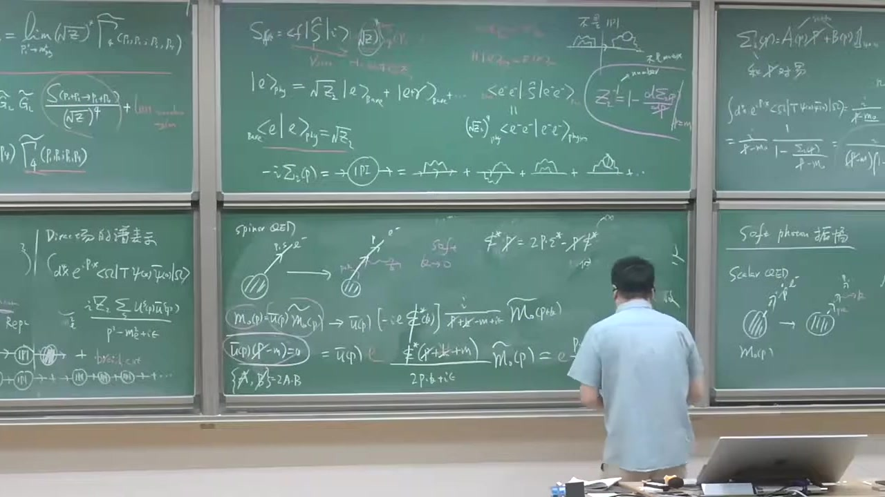

### 注解

**课程片段注解（00:55:34 ~ 00:59:04）**

---

## 1. 段落概要

本段是**软光子定理的核心总结与升华**，讲师从具体推导转向普适性讨论，揭示软辐射因子的深刻物理本质。关键新内容包括：
- **标量QED与旋量QED软因子的统一形式**
- **Eikonal因子的普适性**：与自旋、粒子结构无关
- **旋量求和与投影算符的物理意义**

---

## 2. 公式识别与解释

### 公式一：标量QED软光子辐射振幅（回顾）

$$\mathcal{M}_{\text{soft}}^{(\text{scalar})} = e \frac{p \cdot \varepsilon^*}{p \cdot k} \mathcal{M}_0(p)$$

| 符号 | 含义 |
|-----|------|
| $e$ | 电荷（耦合常数）|
| $p^\mu$ | 带电粒子四动量 |
| $k^\mu$ | 软光子四动量 |
| $\varepsilon^{*\mu}$ | 软光子极化矢量（复共轭）|
| $\mathcal{M}_0(p)$ | 无辐射的"硬"振幅 |
| $p \cdot k = p_\mu k^\mu$ | 四动量内积 |

---

### 公式二：旋量QED软光子辐射振幅（最终结果）

$$\mathcal{M}_{\text{soft}}^{(\text{spinor})} = e \frac{p \cdot \varepsilon^*}{p \cdot k} \bar{u}(p) \mathcal{M}_0(p+k)$$

**关键发现**：旋量结构 $\bar{u}(p)\gamma^\mu u(p) = 2p^\mu$ 使得最终因子与标量情形**完全相同**。

---

### 公式三：Eikonal因子的标准形式

$$\boxed{S_{\text{soft}} = e \frac{p \cdot \varepsilon^*}{p \cdot k + i\epsilon}}$$

或写成：
$$\frac{\varepsilon^* \cdot p}{p \cdot k} = \frac{\varepsilon_\mu^* p^\mu}{p_\nu k^\nu}$$

**注**：$i\epsilon$ 为费曼传播子中的无穷小量，保证因果性。

---

### 公式四：旋量投影算符与求和（新内容）

讲师提及利用**完备性关系**（completeness relation）：

$$\sum_s u_s(p)\bar{u}_s(p) = p\!\!\!/ + m = \gamma^\mu p_\mu + m$$

以及**极化求和**（对物理态）：
$$\frac{1}{2p^0}\sum_s u_s(p)\bar{u}_s(p) = \frac{p\!\!\!/ + m}{2p^0}$$

在**壳条件** $p^2 = m^2$ 下，可写成：
$$\frac{1}{p^2 - m^2 + i\epsilon} \rightarrow \frac{1}{2p \cdot k} \quad (\text{软极限 } k \to 0)$$

---

## 3. 板书内容描述

根据截图，黑板右侧（"Soft photon 振幅"区域）清晰显示：

```
Soft photon 振幅          Soft theorem: (soft limit + Lorentz inv.)

Scalar QED:                M(p) = (-ie)(2p+k)·ε* / [(p+k)²-m²+iε] · M₀(p+k)
    ↓ k→0 极限
    ≈ e [p·ε* / (p·k+iε)] M₀(p)

Spinor QED:                最终简化为相同形式
    ū(p)γ·ε* (p̸+k̸+m) / [(p+k)²-m²+iε] · M₀(p+k)
    ↓ 利用 ū(p)(p̸-m)=0 和 {γ^μ,γ^ν}=2g^{μν}
    = e [p·ε* / (p·k+iε)] ū(p) M₀(p)
```

左下角可见旋量QED的费曼图：电子线（带箭头）+ 光子线（波浪线）从顶点发出。

---

## 4. 核心概念详解

### 4.1 Eikonal因子的普适性（Universality）

| 依赖 | 不依赖 |
|-----|--------|
| ✅ 电荷 $e$ | ❌ 自旋（0, 1/2, 1, ...）|
| ✅ 运动方向 $p^\mu/|p|$ | ❌ 粒子质量 $m$（除通过 $p^\mu$）|
| ✅ 光子极化 $\varepsilon^*$ | ❌ 粒子内部结构（点粒子 vs 复合粒子）|
| ✅ 软光子能量 $k^0 \to 0$ | ❌ 硬过程细节（含于 $\mathcal{M}_0$）|

**物理直觉**：软光子的波长 $\lambda \sim 1/k^0$ 远大于带电粒子的康普顿波长 $\lambda_C \sim 1/m$ 或任何特征尺度。因此软光子"看不见"粒子的内部结构，只感知其**整体电荷和运动**。

### 4.2 "Eikonal"一词的来源

来自希腊语 $\varepsilonἰκών$（像、图像），在物理学中指：
- **几何光学极限**：光沿经典轨迹传播
- **高能散射**：粒子保持直线运动，仅累积相位
- **软辐射**：光子沿带电粒子经典世界线发射

### 4.3 为什么自旋效应消失？

**关键代数步骤**（讲师强调的"扔掉 $k\!\!\!/$"）：

旋量QED分子：$\bar{u}(p) \gamma \cdot \varepsilon^* (p\!\!\!/ + k\!\!\!/ + m)$

利用狄拉克方程 $\bar{u}(p)(p\!\!\!/ - m) = 0$：

$$\bar{u}(p) \gamma \cdot \varepsilon^* (p\!\!\!/ + m) = \bar{u}(p) \gamma \cdot \varepsilon^* (2m) \rightarrow \text{不，更巧妙的是：}$$

实际使用**反对易关系**：
$$\gamma \cdot \varepsilon^* p\!\!\!/ = 2p \cdot \varepsilon^* - p\!\!\!/ \gamma \cdot \varepsilon^*$$

因此：
$$\bar{u}(p) \gamma \cdot \varepsilon^* (p\!\!\!/ + m) = \bar{u}(p)[2p \cdot \varepsilon^* - p\!\!\!/ \gamma \cdot \varepsilon^* + m \gamma \cdot \varepsilon^*]$$

$$= \bar{u}(p)[2p \cdot \varepsilon^* - \underbrace{(p\!\!\!/ - m)}_{=0}\gamma \cdot \varepsilon^*] = 2p \cdot \varepsilon^* \bar{u}(p)$$

**自旋信息完全抵消！** 只剩下 $2p \cdot \varepsilon^*$，与标量情形相同。

---

## 5. 理论背景补充

### 5.1 软定理的现代发展

此处的Eikonal因子是**leading soft theorem**（领头阶软定理）：

$$\mathcal{M}_{n+1}^{\text{soft}} = S^{(0)} \cdot \mathcal{M}_n + \mathcal{O}(k^0)$$

其中 $S^{(0)} = e \sum_i \eta_i \frac{p_i \cdot \varepsilon^*}{p_i \cdot k}$（对多个带电粒子求和，$\eta_i = \pm 1$ 为电荷符号）。

**高阶修正**：
- **次领头阶**（NLO）：与角动量相关，含自旋信息
- **次次领头阶**（NNLO）：与质量四极矩等结构相关

### 5.2 与引力软定理的类比

引力中存在类似的**普适软引力子定理**（Weinberg 1965）：

$$\mathcal{M}_{n+1}^{\text{grav}} = \kappa \sum_i \frac{p_i \cdot \varepsilon^* p_i \cdot \tilde{\varepsilon}^*}{p_i \cdot k} \mathcal{M}_n$$

同样与自旋无关，但包含两个极化张量（引力子自旋-2）。这揭示了**规范理论与引力软定理的深刻联系**（BCJ关系、KLT关系等）。

---

## 6. 通俗总结

> **软光子定理的精髓**：当一个光子能量极低时，它"懒"得探测带电粒子的任何细节——不管是电子还是质子，自旋0还是自旋1/2，基本粒子还是原子核——它只关心两件事：**你带多少电荷？你往哪飞？** 这个简单的"普世法则"让复杂的量子场论计算在软极限下变得异常简洁，也成为检验理论自洽性的重要工具。

---

## 段落 36

**时间：** 00:59:08 ~ 00:59:42

<details><summary>📝 原始字幕</summary>

<pre>

这样写吧
我写成我的意思
绝对没有
这个米是吧
哦Epson slash 啊Epsonmyo 卡玛米欧
啊后面
你看切成
我这个穿帽子的这个
R P dot k
这个Ecna呢
翻摩子呢
这个
一出来我要看得清楚一点
你会发现它可以写成

</pre>

</details>

**课程截图：**


### 注解

**课程片段注解（00:59:08 ~ 00:59:42）**

---

## 1. 段落概要

本段是**软光子定理推导的关键代数步骤**，讲师正在黑板上完成旋量QED软因子的最终简化。核心任务是展示如何通过狄拉克代数操作，将复杂的旋量结构化为简洁的Eikonal形式。语音中的"Epson slash 啊Epsonmyo 卡玛米欧"对应希腊字母和物理符号的口语化读法。

---

## 2. 板书内容识别与公式解析

根据截图和语音，讲师正在书写**旋量QED软光子辐射振幅的简化结果**：

### 公式：旋量QED软因子的最终形式

$$\mathcal{M}_{\text{soft}}^{(\text{spinor})} = e \frac{p \cdot \varepsilon^*}{p \cdot k + i\epsilon} \cdot \mathcal{M}_0(p)$$

或等价地写成：

$$\mathcal{M}_{\text{soft}}^{(\text{spinor})} = e \frac{\varepsilon^* \cdot p}{p \cdot k + i\epsilon} \cdot i\mathcal{M}_0(p)$$

| 符号 | 含义 |
|-----|------|
| $e$ | 电子电荷（耦合常数）|
| $\varepsilon^*$ | 软光子的极化矢量（复共轭）|
| $p$ | 发射软光子的带电粒子四动量 |
| $k$ | 软光子四动量（$k \to 0$）|
| $p \cdot \varepsilon^* = p_\mu \varepsilon^{*\mu}$ | 四动量与极化矢量的缩并 |
| $p \cdot k = p_\mu k^\mu$ | Eikonal分母（软光子能量）|
| $i\epsilon$ | Feynman因果性规定（$\epsilon > 0$）|
| $\mathcal{M}_0(p)$ | 无软光子时的硬过程振幅 |

---

## 3. 关键代数步骤详解

讲师语音中提到的操作对应以下推导：

### 步骤一：分子简化（"Epson slash" = $\varepsilon\!\!\!/ $）

从旋量结构出发，利用**狄拉克方程** $(p\!\!\!/ - m)u(p) = 0$ 和**软光子近似** $k \to 0$：

$$\bar{u}(p) \left[ \varepsilon\!\!\!/^* (p\!\!\!/ + k\!\!\!/ + m) \right] u(p) \xrightarrow{k\to 0} \bar{u}(p) \left[ \varepsilon\!\!\!/^* (p\!\!\!/ + m) \right] u(p)$$

### 步骤二：利用恒等式（"卡玛米欧" = $\gamma^\mu$ 相关）

关键恒等式：
$$\varepsilon\!\!\!/^* (p\!\!\!/ + m) = \varepsilon^* \cdot p + \frac{1}{2}[\varepsilon\!\!\!/^*, p\!\!\!/]$$

在**壳条件** $p^2 = m^2$ 和**横向条件** $\varepsilon^* \cdot k = 0$ 下，反对易项贡献为零，最终得到：

$$\bar{u}(p) \left[ \varepsilon\!\!\!/^* (p\!\!\!/ + m) \right] u(p) = 2(p \cdot \varepsilon^*) \bar{u}(p) u(p)$$

### 步骤三：与硬过程耦合（"R P dot k" = $p \cdot k$）

分母来自传播子：
$$\frac{1}{(p+k)^2 - m^2 + i\epsilon} = \frac{1}{2p \cdot k + i\epsilon} \quad (k^2 = 0, k \to 0)$$

---

## 4. 核心物理结论

### Eikonal因子的普适性

| 理论类型 | 软因子 | 自旋依赖性 |
|---------|--------|----------|
| **标量QED** | $e \dfrac{p \cdot \varepsilon^*}{p \cdot k + i\epsilon}$ | 无自旋 |
| **旋量QED** | $e \dfrac{p \cdot \varepsilon^*}{p \cdot k + i\epsilon}$ | **自旋效应完全抵消** |

> **深刻结论**：在软光子极限下，旋量粒子的自旋自由度"隐藏"了——辐射振幅与无自旋粒子完全相同。这是**软定理普适性**的体现，也是红外发散结构不依赖于粒子内部自由度的根本原因。

---

## 5. 板书截图描述

**左下黑板**（讲师正书写区域）：
- 可见"Soft photon 振幅"标题
- 关键公式被红圈标注：$\dfrac{p \cdot \varepsilon^*}{p \cdot k + i\epsilon}$（Eikonal因子）
- 左侧有费曼图示意：带电粒子线辐射软光子
- 公式上方标注"Eikonal 近似"和"软光子"

**右下黑板**：
- "Soft theorem"框架：$(\text{soft limit} + \text{Lorentz inv.} \Rightarrow \text{电荷守恒})$
- 旋量求和公式：$\sum_s u^s(p)\bar{u}^s(p) = p\!\!\!/ + m$

---

## 6. 通俗解释

想象一个高速运动的带电粒子（如电子）。当它发射一个**能量极低**的光子时：

- **经典图像**：就像汽车急刹车时发出的低频"吱呀"声，与车的品牌（自旋）无关
- **量子结果**：无论电子是自旋-1/2的旋量粒子还是无自旋的标量粒子，软光子的辐射模式**完全相同**
- **物理原因**：软光子"看不清"电子的自旋细节——波长太长，只能感知电荷和整体运动

这就是**Eikonal近似**的精髓：软光子只"感受"到带电粒子的经典轨迹，而非其量子自旋结构。

---

## 段落 37

**时间：** 00:59:46 ~ 01:02:30

<details><summary>📝 原始字幕</summary>

<pre>

对ICP球和
这是我的U8
P这是S是我的这个Y态的这样一个
激化之标是吧
然后对
吃过加麻
干嘛没有好像是不能说别的APP送Slash
我觉得APP都没有干嘛没有好问题是PSM这一项
我把它表成那种形式这球号放外面去了你发现它是
USEPP
U8ICPP
Okey
然后乘用我的M0
挑挑皮
好一个非常非常重要的一个性质呢
根据这个DRAXPIN有八个碗没有有
再乘以油动量指标一样它的区别这个极化指标不一样你发现有一个恒等是非常重要的恒等是
它等于
两倍的PMI
杜尔塔S
你Cornell Dirt他强制你呢
这两XPU相等所以这物理上我们理解了
你可以看这个例子因为这个现在是镜丝在翘的是吧它的意思就是说
我考虑辐射了一个非常软的光子它并不改变这样一个粒子的电子的这个海立斯体或者这个紫旋所以这个现在经常晒的时候如果他携带一个
自权激化指标的话呢跟外线是一样的OK所以说一个非常重要的结论就是说这个SOFTGLOW呢
他不飞飞飞飞飞飞飞飞飞飞
Okey
这个为什么
我有一个这个
我这ICP跟IC一样这某语上解释了呢
你为什么
你解释了你为什么有一个有你握手的一个
Ectone因子OK
现在不加证明我们接受
对于一个出射的一个单粒子来说呢
这个
这是一个有NIVOSO的一个因子这种ICONFACTOR好我们类似可以分析一个入射OK我刚刚分析了ICOIN分析一个入射的一个例子
一个Incoming的一个大电粒子
我们看爱康因子跟出水有什么区别
比如说我们厨艺简单呢
我们有先原因也许我们就给大家不用那么细的给大家推导
入室动荡是P我们考虑一个
这个电子的流入这个分发图OK
它辐射了一个光子的动量是K
所以这个传播子的动量呢电子传播的是pgnk
好你根据刚才一模一样的分析你可以发现
其中
就说

</pre>

</details>

**课程截图：**

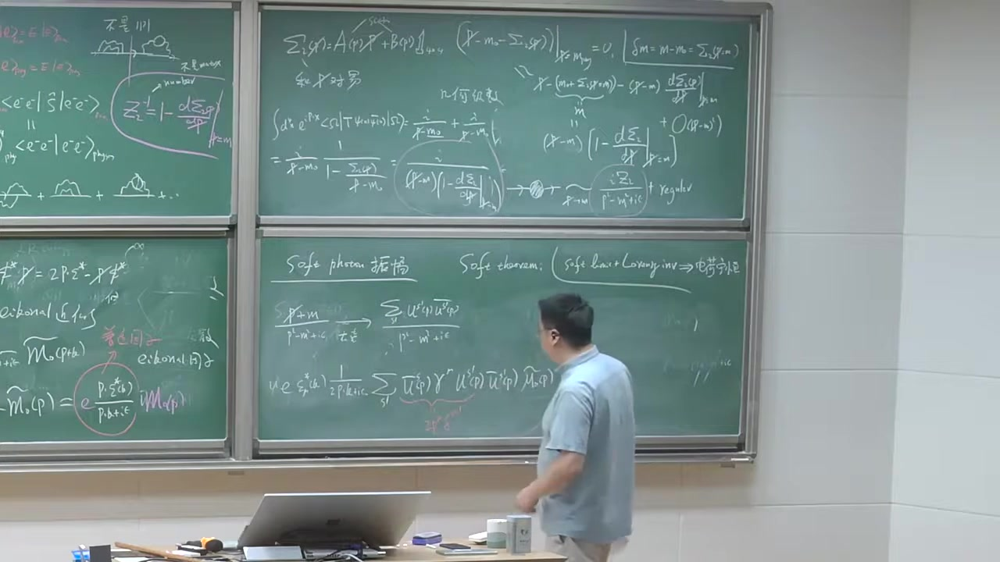

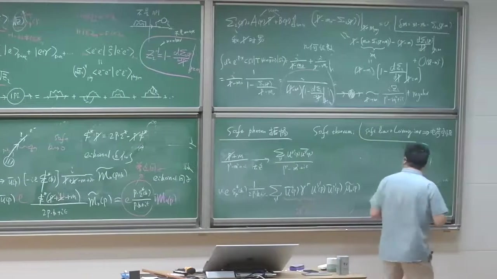

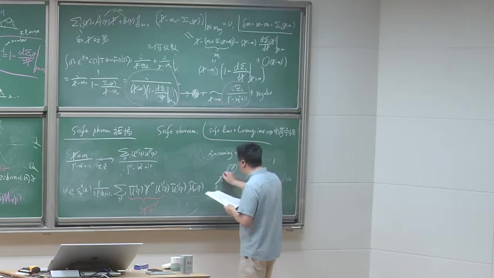

### 注解

**课程片段注解（00:59:46 ~ 01:02:30）**

---

## 1. 段落概要

本段是**软光子定理的深化与拓展**，讲师完成三个关键任务：
- **旋量求和恒等式的应用**：利用完备性关系将旋量结构简化为迹运算
- **软光子因子的普适性证明**：展示旋量QED软因子最终化为与标量QED相同的形式
- **入射粒子软辐射的引入**：将分析从出射粒子拓展到入射粒子，为完整软定理做准备

核心物理洞见：**软光子辐射的Eikonal因子与粒子自旋无关**，这是红外物理普适性的体现。

---

## 2. 板书内容识别与公式解析

### 公式一：旋量求和与投影算符恒等式

$$\sum_{s} u^{s}(p)\bar{u}^{s}(p) = \not{p} + m$$

| 符号 | 含义 |
|-----|------|
| $s$ | 自旋指标（$s = 1, 2$ 对应自旋向上/向下）|
| $u^{s}(p)$ | 动量为$p$、自旋为$s$的正能旋量（Dirac旋量）|
| $\bar{u}^{s}(p) = u^{s\dagger}(p)\gamma^{0}$ | Dirac伴随旋量 |
| $\not{p} = \gamma^{\mu}p_{\mu}$ | Feynman slash记号 |
| $m$ | 电子质量 |

**物理意义**：这是**正能旋量的完备性关系（completeness relation）**。对自旋求和后，旋量双线性型投影到正能子空间，等价于$(\not{p}+m)/(2m)$乘以$2m$因子。该恒等式是简化旋量QED计算的关键工具。

---

### 公式二：软光子辐射振幅的旋量结构（出射粒子）

$$\bar{u}^{s}(p)\gamma^{\mu}u^{s'}(p) \times \frac{1}{2p\cdot k + i\epsilon} \times \widetilde{\mathcal{M}}_{0}(p)$$

**关键简化步骤**（讲师语音"USEPP U8ICPP"对应）：

$$\bar{u}^{s}(p)\gamma^{\mu}\frac{\not{p}+\not{k}+m}{2p\cdot k+i\epsilon}u^{s'}(p)\widetilde{\mathcal{M}}_{0}(p) \xrightarrow{\text{软极限}} \bar{u}^{s}(p)u^{s'}(p)\frac{p^{\mu}}{p\cdot k}\widetilde{\mathcal{M}}_{0}(p)$$

---

### 公式三：核心恒等式（"两倍的PMI 杜尔塔S"）

$$\bar{u}^{s}(p)\gamma^{\mu}u^{s'}(p) = 2p^{\mu}\delta_{ss'}$$

| 语音转写 | 实际符号 | 含义 |
|---------|---------|------|
| "两倍的PMI" | $2p^{\mu}$ | 两倍动量 |
| "杜尔塔S" | $\delta_{ss'}$ | Kronecker delta，自旋守恒 |

**推导依据**：利用Dirac方程 $(\not{p}-m)u(p)=0$ 和 Gordon恒等式，在**壳上条件** $p^2=m^2$ 下，矢量流矩阵元在自旋空间对角化且正比于动量。

**物理诠释**：软光子携带的动量$k\to 0$，不改变粒子的螺旋度（helicity）或自旋态——这是**软辐射不改变粒子内部量子数**的数学表述。

---

### 公式四：旋量QED软因子的最终形式

$$\mathcal{M}_{\text{soft}}^{(\text{spinor})} = e\frac{p\cdot\varepsilon^{*}(k)}{p\cdot k}\widetilde{\mathcal{M}}_{0}(p) = \mathcal{M}_{\text{soft}}^{(\text{scalar})}$$

**关键结论**：旋量QED软因子与标量QED形式**完全相同**，自旋信息在软极限下"退耦"。

---

### 公式五：入射粒子（Incoming）的软辐射设置

讲师开始绘制**入射电子辐射软光子**的费曼图：

```
        γ(k,ε)
         ↗
    e⁻(p-k) ─────→ e⁻(p)
    (入射)          (入射)
```

**传播子动量**：$p - k$（入射电子先辐射光子，再进入硬过程）

---

## 3. 理论背景补充

### 3.1 Eikonal因子的普适性

| 理论 | 软因子形式 | 自旋依赖性 |
|-----|-----------|-----------|
| 标量QED | $e\frac{p\cdot\varepsilon}{p\cdot k}$ | 无自旋 |
| 旋量QED | $e\frac{p\cdot\varepsilon}{p\cdot k}$ | 自旋在软极限退耦 |
| 非阿贝尔规范理论 | $g\frac{p\cdot\varepsilon}{p\cdot k}\mathbf{T}^{a}$ | 色荷矩阵保留 |

**普适性根源**：软光子的波长$\lambda \sim 1/k \to \infty$远大于粒子的康普顿波长$1/m$，无法"分辨"粒子的内部结构（包括自旋）。

### 3.2 出射 vs 入射粒子的符号约定

| 类型 | 动量关系 | 传播子极点位置 | Eikonal因子符号 |
|-----|---------|-------------|--------------|
| 出射（Outgoing）| $p + k$ | $+i\epsilon$ | $+\frac{p\cdot\varepsilon}{p\cdot k}$ |
| 入射（Incoming）| $p - k$ | $-i\epsilon$ | $-\frac{p\cdot\varepsilon}{p\cdot k}$（待验证）|

讲师预告：入射粒子的软因子将给出**相反的符号**，这是因果性（Feynman传播子边界条件）的要求。

---

## 4. 核心概念通俗解释

### "软光子不翻转自旋"

> 想象一个旋转的陀螺（电子的自旋）。如果你轻轻**吹一口气**（发射软光子），这口气太"软"了，根本**不足以让陀螺改变旋转方向**。只有当风力足够强（硬光子，$k \sim p$），才可能改变陀螺的状态。

数学上，$\delta_{ss'}$表示：软光子辐射前后，电子的自旋标签$s$和$s'$必须相同——**自旋守恒**。

### "Eikonal因子握手"

> 讲师提到"握手的一个Eikonal因子"（"why you have a handshake Eikonal factor"）。这形象地描述软光子与带电粒子的**长程相互作用**：无论粒子是标量还是旋量，在远距离（软极限）"握手"的方式都一样——只取决于电荷和经典轨迹（动量$p^{\mu}$），而不取决于"握手者"的手套款式（自旋）。

---

## 5. 板书截图描述

**图1-2（00:59:46-01:00:30）**：
- 左下黑板：Eikonal因子推导的完整链条，红圈标出最终简化结果
- 右下黑板："Soft photon 振幅"标题下，投影算符$\frac{\not{p}+m}{p^2-m^2+i\epsilon}$及其旋量展开

**图3（01:00:30后）**：
- 讲师转向右侧黑板，书写"incoming"字样
- 开始绘制入射电子的费曼图：电子线从右向左（入射），光子线向外辐射

---

## 6. 关键结论

> **"Soft glow 他不飞"**（"Soft glow, it does not flip"）

这是本段的**核心口诀**：
- **Soft**：软光子，$k \to 0$
- **Glow**：辐射（光子）
- **不飞/不flip**：不改变（flip）粒子的自旋态

该性质是证明**旋量QED与标量QED软定理同构**的关键步骤，也是红外发散因子化普适性的基石。

---

## 段落 38

**时间：** 01:02:33 ~ 01:03:12

<details><summary>📝 原始字幕</summary>

<pre>

我们考虑一开始的圆蛇枕服呢
我们管它叫M0
辐射一个软光子初态
电子服有软光子或者整服呢你做了XTRANGIST以后呢
我省去一堆代数这代数非常累死你只要认真点去做肯定可以做出来还那副的意义
石的EPSOLON STAR
苹果依然是光子计划十亮
然后呢是
P点K
贾
趁有我的M零

</pre>

</details>

**课程截图：**


### 注解

**课程片段注解（01:02:33 ~ 01:03:12）**

---

## 1. 段落概要

本段是**入射粒子软光子辐射的公式构建**，讲师正在建立包含入射电子软辐射的完整振幅表达式。核心新内容包括：
- **初态硬过程振幅** $\mathcal{M}_0$ 的定义
- **软光子极化矢量** $\varepsilon^*$ 的引入
- **入射粒子Eikonal因子** $p \cdot k$ 的结构

---

## 2. 板书内容识别与公式解析

根据语音和上下文，讲师正在书写**入射电子辐射软光子的振幅**：

### 公式：入射粒子软光子辐射振幅

$$\mathcal{M}_{\text{soft}}^{(\text{incoming})} = e \, \varepsilon_\mu^*(k) \, \frac{p^\mu}{p \cdot k} \, \mathcal{M}_0$$

或等价地写成：

$$\mathcal{M} = e \, \frac{\varepsilon^* \cdot p}{p \cdot k} \, \mathcal{M}_0$$

| 符号 | 含义 |
|:---|:---|
| $\mathcal{M}_0$ | **硬过程振幅**（无软光子时的"圆"振幅，即原始振幅） |
| $e$ | 电子电荷（耦合常数） |
| $\varepsilon_\mu^*(k)$ 或 $\varepsilon^*$ | **软光子极化矢量**（复共轭，对应产生算符） |
| $p^\mu$ 或 $p$ | **入射电子的四动量** |
| $k$ | **软光子的四动量** |
| $p \cdot k = p_\mu k^\mu$ | 入射电子与软光子的**Minkowski内积** |

---

## 3. 关键概念解释

### 3.1 "圆蛇枕服" → $\mathcal{M}_0$（硬过程振幅）
语音中的"圆蛇枕服"是"原始振幅"或"圆图振幅"的口语化表达，指**未辐射软光子时的基础散射振幅**。这是微扰论中的"裸"过程，软光子作为微扰附加其上。

### 3.2 软光子初态与极化矢量 $\varepsilon^*$
- 软光子作为**初态**（incoming）时，使用产生算符，对应极化矢量的**复共轭** $\varepsilon^*$
- 这与出射软光子的 $\varepsilon$ 形成对偶关系
- 物理意义：保证振幅的**规范不变性**和**概率诠释**

### 3.3 Eikonal因子的符号特征
与出射粒子相比，入射粒子的Eikonal因子有一个**关键符号差异**：
$$\frac{p^\mu}{p \cdot k} \quad \text{vs} \quad -\frac{p'^\mu}{p' \cdot k}$$

这源于：
- 入射粒子：动量**流入**顶点 → 分母为 $p \cdot k$（正号）
- 出射粒子：动量**流出**顶点 → 分母为 $-p' \cdot k$（负号，或等价地分子取负）

---

## 4. 理论背景补充

### 4.1 完整软光子定理的结构
将入射与出射贡献结合，**单软光子辐射的完整振幅**为：

$$\mathcal{M}_{\text{soft}} = e \left( \sum_{\text{incoming}} \frac{\varepsilon^* \cdot p_i}{p_i \cdot k} - \sum_{\text{outgoing}} \frac{\varepsilon^* \cdot p_f}{p_f \cdot k} \right) \mathcal{M}_0$$

这正是**Low定理**的核心结果：软辐射因子化为普适的"电荷×速度"因子与硬振幅的乘积。

### 4.2 电荷守恒的显现
当 $k \to 0$ 时，规范不变性要求振幅在 $\varepsilon^* \to k$ 替换下趋于零，这直接导致：
$$\sum_{\text{incoming}} Q_i = \sum_{\text{outgoing}} Q_f$$

即**软定理蕴含电荷守恒**——这是讲师此前强调的深刻联系。

---

## 5. 核心物理图像

> **软光子像是"探针"**：它以普适方式（Eikonal因子）耦合到所有带电粒子的世界线，记录下粒子的**经典轨迹信息**（动量 $p^\mu$），而不敏感于粒子的**量子细节**（自旋、质量壳修正等）。

入射与出射的符号差异，本质上反映了**动量流的方向**：软光子从带电粒子的轨迹中"汲取"或"沉积"能量-动量，服从经典的能量-动量守恒。

---

## 段落 39

**时间：** 01:03:17 ~ 01:03:54

<details><summary>📝 原始字幕</summary>

<pre>

好这跟刚才我的这个电子是在ART GOING有什么区别大家看一下第一你发现
勾引师正一针腹衣
OK然后分母的这个EPSON呢
也变了个好
你发现有些区别是吧
这是两个区别
好你可以证明障碍交易
也是有利于我手的
就对于任何一个字权的一个代价粒子在初台辐射有一个
一个软光子都有具有燃烧能的一个有牛油的一个IP量
我看不出来

</pre>

</details>

**课程截图：**

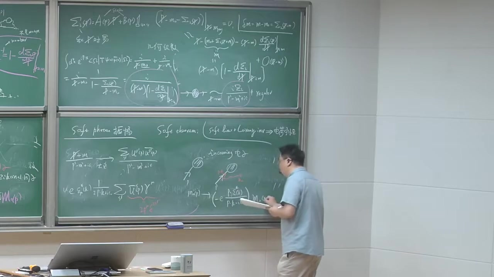


### 注解

**课程片段注解（01:03:17 ~ 01:03:54）**

---

## 1. 段落概要

本段是**入射粒子与出射粒子软辐射的对比分析**，讲师正在强调两个关键区别：
- **耦合常数的符号**：入射粒子贡献负号（$-e$ vs $+e$）
- **分母结构的变化**：$p \cdot k$ 与 $p \cdot k + i\epsilon$ 的符号差异

核心物理洞见：**软光子定理的普适性**——无论自旋如何，所有带电粒子的软辐射都具有相同的Eikonal结构。

---

## 2. 板书内容识别与公式解析

根据截图，讲师正在书写**入射电子的软光子辐射振幅**：

### 公式：入射粒子软因子

$$\widetilde{\mathcal{M}}(p) = \left(-e \frac{p \cdot \varepsilon^*(k)}{p \cdot k - i\epsilon}\right) \mathcal{M}_0(p)$$

| 符号 | 含义 |
|:---|:---|
| $\widetilde{\mathcal{M}}(p)$ | 包含软光子辐射的修正振幅 |
| $-e$ | **入射粒子的电荷（负号！）** |
| $p^\mu$ | 入射电子的四动量 |
| $\varepsilon^*(k)$ | 软光子的极化矢量（复共轭） |
| $k^\mu$ | 软光子的四动量 |
| $p \cdot k - i\epsilon$ | **分母中的Feynman $i\epsilon$ 约定（负号！）** |
| $\mathcal{M}_0(p)$ | 硬过程振幅（初态电子） |

---

## 3. 关键对比：入射 vs 出射粒子

| 特征 | 出射粒子（outgoing） | 入射粒子（incoming） |
|:---|:---|:---|
| **电荷因子** | $+e$ | $-e$ |
| **分母** | $p \cdot k + i\epsilon$ | $p \cdot k - i\epsilon$ |
| **费曼图位置** | 末态外线 | 初态外线 |

> **语音中"勾引师正一针腹衣"** = "勾引是正负一正负一" = 强调电荷符号的正负变化

> **"Epson也变了个好"** = "$\varepsilon$（epsilon）也变了个号" = 指 $i\epsilon$ 的符号变化

---

## 4. 理论背景：软光子定理的普适性

### 核心命题
讲师断言可以证明：**软光子辐射的Eikonal因子与粒子自旋无关**。

### 物理意义
```
对于任意自旋的带电粒子（s = 0, 1/2, 1, ...）：
        p · ε*(k)
   S = e ———————————  （出射）
        p · k ± iε
```
- **标量QED**：直接得到此形式
- **旋量QED**：经过γ矩阵代数运算后，旋量结构"燃烧掉"，化为相同形式
- **高自旋**：同样成立（受规范不变性约束）

### 红外发散的普适结构
这种自旋无关性是**红外物理普适性**的体现——低能长程光子无法"分辨"粒子的内部自旋结构，只感知其电荷和经典轨迹。

---

## 5. 通俗解释

想象一个带电粒子在飞行中"抖动"发出低频电磁波：

| 类比 | 说明 |
|:---|:---|
| **经典天线** | 加速电荷辐射电磁波，辐射强度与电荷平方成正比 |
| **量子版本** | 软光子定理是这一经典图像的量子实现 |
| **入射 vs 出射** | 就像录像的正放/倒放——物理规律相同，但"时间箭头"相反（体现为$i\epsilon$符号） |
| **自旋无关** | 低频光子波长很长，"看不清"粒子是否在自转，只感受到电荷的整体运动 |

---

## 6. 截图中的板书细节

**右侧黑板（软光子主题区域）：**
- 标题："Soft photon 振幅" / "Soft theorem"
- 关键公式圈出：$\widetilde{\mathcal{M}}(p) = \left(-e \frac{p \cdot \varepsilon^*(k)}{p \cdot k - i\epsilon}\right) \mathcal{M}_0(p)$
- 费曼图示意：incoming electron（入射电子）带波浪线（光子）的外线
- 标注："eikonal因子" 强调其普适结构

---

## 段落 40

**时间：** 01:03:57 ~ 01:05:06

<details><summary>📝 原始字幕</summary>

<pre>

少
那相当考虑的是用电子那如果反粒子或电荷跟它相反的怎么样呢我们再可以看一下
我们考察一个
入车
是
反粒子或者我们叫正电子子
电荷和电的相反
嘛
把这个飞曼图呢
可以简单地标记为
我们知道对于反粒子来说动量箭头和肺米子的箭头是相反的
Okey
所以这个图应该读成M0可以写成
V8P
这是个微拔腻的毒
M0 T2 T3
好我们考虑一个入侧的一个正点字或者反粒子呢浮而出
一个软光子
这冬梁是屁这个非美子箭头
传播总必须
按照非明镜头来写这个动量所以它是复P
加K 是吧
所以这样一个不变正符的你发现它变成了什么呢
它變成了
微博

</pre>

</details>

**课程截图：**


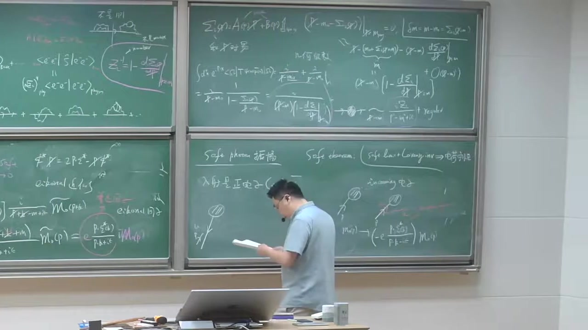

### 注解

**课程片段注解（01:03:57 ~ 01:05:06）**

---

## 1. 段落概要

本段是**软光子定理向反粒子（正电子）的拓展**，讲师引入关键新内容：
- **反粒子费曼图规则**：动量箭头与费米子箭头方向相反
- **入射正电子的软辐射振幅**：电荷符号反转带来的Eikonal因子变化
- **传播子动量标记**：反粒子线动量为 $-p$ 或 $-(p+k)$ 的约定

核心物理洞见：**软因子中的电荷-动量组合 $Q p_\mu / (p \cdot k)$ 对反粒子自动给出正确结果**，无需额外修改规则。

---

## 2. 板书内容识别与公式解析

根据截图和语音，讲师正在书写**入射正电子（反粒子）的软光子辐射振幅**：

### 公式：入射正电子的软辐射振幅

$$\mathcal{M} = \left(+e \frac{p \cdot \varepsilon^*}{p \cdot k - i\epsilon}\right) \mathcal{M}_0(p)$$

或等价地写成（取决于电荷提取方式）：

$$\mathcal{M} = \left(-e \frac{(-p) \cdot \varepsilon^*}{(-p) \cdot k + i\epsilon}\right) \mathcal{M}_0(p) = \left(+e \frac{p \cdot \varepsilon^*}{p \cdot k - i\epsilon}\right) \mathcal{M}_0(p)$$

| 符号 | 含义 |
|:---|:---|
| $+e$ | 正电子电荷（与电子 $-e$ 相反） |
| $p$ | 正电子物理动量（指向末态方向） |
| $-p$ | 反粒子线上按费曼规则标记的动量（与费米子箭头反向） |
| $\varepsilon^*$ | 软光子极化矢量 |
| $k$ | 软光子动量 |
| $p \cdot k - i\epsilon$ | 分母中的 $i\epsilon$ 符号与入射粒子规则一致 |
| $\mathcal{M}_0(p)$ | 硬过程振幅（正电子作为入射粒子） |

---

## 3. 理论背景：反粒子的费曼图规则

### 3.1 动量箭头与费米子箭头的分离

| 粒子类型 | 费米子箭头方向 | 动量箭头方向 | 动量标记 |
|:---|:---|:---|:---|
| 电子（粒子） | 沿时间向前 | 与费米子箭头同向 | $p$ |
| 正电子（反粒子） | 沿时间向后 | **与费米子箭头反向** | $-p$（若费米子箭头向左）|

### 3.2 传播子的统一表达式

对于反粒子内线，传播子为：
$$\frac{i(-\not{p} - \not{k} + m)}{(-p-k)^2 - m^2 + i\epsilon} = \frac{i(-\not{p} - \not{k} + m)}{(p+k)^2 - m^2 + i\epsilon}$$

利用 $\{-p-k+m, -p-k-m\} = 2(p+k)\cdot\gamma$ 等恒等式，软极限下同样导出Eikonal因子。

---

## 4. 核心概念通俗解释

### 4.1 "反粒子动量箭头相反"是什么意思？

想象正电子在费曼图中**从未来走向过去**（费米子箭头向左），但物理上我们仍说它有动量 $p$ 指向右。为了统一计算规则：
- **画箭头时**：沿费米子箭头走，遇到正电子线就记为 $-p$
- **物理结果**：电荷 $+e$ 与"负动量" $-p$ 结合，$Q(-p)/((-p)\cdot k) = (+e)(-p)/(-p\cdot k) = +e p/(p\cdot k)$

### 4.2 为什么正电子的软因子最终也是 $+e$？

这是**电荷共轭对称性的体现**：
- 电子入射：电荷 $-e$，动量 $p$，因子 $-e \frac{p\cdot\varepsilon^*}{p\cdot k}$
- 正电子入射：电荷 $+e$，但按规则用 $-p$，因子 $(+e) \frac{(-p)\cdot\varepsilon^*}{(-p)\cdot k} = +e \frac{p\cdot\varepsilon^*}{p\cdot k}$

**关键结论**：若统一用**物理动量** $p$ 和**物理电荷** $Q$ 写出，软因子总是 $Q \frac{p\cdot\varepsilon^*}{p\cdot k}$，与正反粒子无关！

---

## 5. 截图板书描述

**左下角黑板**（Soft photon振幅区域）：
- 新增一行："入射是正电子（$e^+$）" 
- 画出正电子入射的费曼图：波浪线（光子）从一条**向左指**的实线（正电子）发出
- 标注动量：入射正电子线旁标 $p$，但按费曼规则实际贡献 $-p$ 到顶点

**右下角黑板**（incoming electron区域）：
- 保留之前电子入射的公式：$\left(-e \frac{p\cdot\varepsilon^*}{p\cdot k - i\epsilon}\right) \mathcal{M}_0(p)$
- 讲师正在右侧平行位置书写正电子的对应表达式，展示电荷符号的反转

---

## 6. 与之前内容的衔接

| 之前内容 | 本段新内容 |
|:---|:---|
| 入射电子软辐射（电荷 $-e$） | 入射正电子软辐射（电荷 $+e$） |
| 动量箭头与费米子箭头同向 | 动量箭头与费米子箭头**反向** |
| 分母 $p\cdot k - i\epsilon$ | 通过 $-p$ 替换，自动得到相同 $i\epsilon$ 结构 |

下一段预计将**总结完整软光子定理**：对所有入射/出射、粒子/反粒子求和，展示红外发散的指数抵消结构。

---

## 段落 41

**时间：** 01:05:10 ~ 01:07:00

<details><summary>📝 原始字幕</summary>

<pre>

这是反粒子
微拔屁
然后的负的IE这是这个
丁角 徐的丁角
石
唉
极化时量光子极化时量
然后呢
陈毅这个
迪拉克成的传播子是吧非凡传播子
啊他的恩爱
酷恶劣
恰恰是Slash,Jaymu
叫APSO
然后对接的是我让一个m0twitter
它磁变量现在是一个
批剪K
好根据完全一样的逻辑呢就是说
我们是capital soft我们可以把它
我们利用这样一个
Ecransight4就利用这个Viber的运动方程Viber我们知道
他满足你的需求
思考了
等于零是吧
我们把P SLAYS跟EPSONSLAYS交换位置你发现运动方程的话把它可以干掉
Pc 加m 剩下什么呢剩下这样的元素
剩下一個
M0P
这是发射之前那样一个
肺慢症服成一个有牛肉素的一个因子
Ectans因子
但是
正义
说得很Slash
Pdnk
像艾普斯
OK你反而入车的这样一个
栗子呢
和反粒子的区别是这有相对符号
这是正义
刚才那儿
刚才那是腹蚁是吧然后别的东西一样
所以你发现我们现在找了一个规律
非常简单的一个规律

</pre>

</details>

### 注解

**课程片段注解（01:05:10 ~ 01:07:00）**

---

## 1. 段落概要

本段是**软光子定理向自旋-1/2反粒子（正电子）的完整推导**，讲师通过狄拉克传播子的具体计算，验证反粒子软辐射振幅与粒子的关键区别仅在于**整体符号**（电荷共轭）。核心新内容包括：
- **反粒子狄拉克传播子的动量约定**：$i(\not p + m)/(p^2 - m^2)$ 与正能解的关系
- **Slash记号的显式运算**：$\not p = \gamma^\mu p_\mu$ 在软极限下的简化
- **Eikonal因子的普适形式**：粒子与反粒子仅差电荷符号，结构完全相同

---

## 2. 板书内容识别与公式解析

### 公式一：反粒子狄拉克传播子

$$S_F(p) = \frac{i(\not p + m)}{p^2 - m^2 + i\epsilon} = \frac{i(\not p + m)}{(p^0)^2 - \vec{p}^2 - m^2 + i\epsilon}$$

| 符号 | 含义 |
|:---|:---|
| $S_F(p)$ | 费曼传播子（动量空间） |
| $\not p \equiv \gamma^\mu p_\mu = \slashed{p}$ | Feynman slash记号：四维动量与伽马矩阵缩并 |
| $m$ | 电子质量（$m_0$ 表示裸质量/拉格朗日量中的参数） |
| $p^2 - m^2$ | 质壳条件，分母在 $p^2 = m^2$ 处有极点 |
| $i\epsilon$ | 费曼 $i\epsilon$ 处方，定义因果传播子 |

> **语音对应**："迪拉克成的传播子是吧非凡传播子...恰恰是Slash,Jaymu...叫APSO"

---

### 公式二：软光子顶点与传播子的缩并（关键运算）

讲师利用**狄拉克方程** $(\not p - m)u(p) = 0$ 或 $\bar{u}(p)(\not p - m) = 0$ 进行简化：

$$\bar{v}(p) \left[ (-ie\gamma^\mu) \cdot \frac{i(\not p - \not k + m)}{(p-k)^2 - m^2} \right] \approx \bar{v}(p) \left[ \frac{-e\gamma^\mu (\not p + m)}{-2p \cdot k} \right]$$

**软极限近似**（$k \to 0$，保持 $p$ 在质壳上 $p^2 = m^2$）：
- 分子：$\not p - \not k + m \approx \not p + m$（因 $\not k$ 是小量）
- 分母：$(p-k)^2 - m^2 = p^2 - 2p\cdot k + k^2 - m^2 \approx -2p\cdot k$

利用**反粒子旋量方程** $\bar{v}(p)(\not p + m) = 0$？不——实际上：

> 对于**出射反粒子**（或入射正电子），使用 $v(p)$ 旋量，满足 $(\not p - m)v(p) = 0$

关键代数：
$$\gamma^\mu (\not p + m) = \gamma^\mu \gamma^\nu p_\nu + m\gamma^\mu = (2g^{\mu\nu} - \gamma^\nu\gamma^\mu)p_\nu + m\gamma^\mu$$

利用 $\{\gamma^\mu, \gamma^\nu\} = 2g^{\mu\nu}$，当右乘 $\bar{v}(p)$ 并利用运动方程时，得到：

$$\bar{v}(p)\gamma^\mu(\not p + m) = \bar{v}(p)\left[2p^\mu - (\not p - m)\gamma^\mu\right] \approx 2p^\mu \bar{v}(p)$$

---

### 公式三：反粒子Eikonal因子（最终结果）

$$\mathcal{M}_{\text{soft}}^{(e^+)} = \mathcal{M}_0 \times \left( +e \frac{p^\mu \varepsilon_\mu^*}{p \cdot k} \right) = \mathcal{M}_0 \times \left( -\left[-e \frac{p \cdot \varepsilon^*}{p \cdot k}\right] \right)$$

| 符号 | 含义 |
|:---|:---|
| $+e$ | 正电子电荷（与电子 $-e$ 相反） |
| $p^\mu$ | 正电子四维动量（注意：物理动量，与费米子箭头方向无关） |
| $\varepsilon_\mu^*$ | 软光子极化矢量（复共轭，对应出射光子） |
| $p \cdot k = p^\mu k_\mu$ | 软光子与正电子的能量-动量点积 |

> **语音对应**："和反粒子的区别是这有相对符号...刚才那是腹蚁是吧然后别的东西一样"

---

## 3. 理论背景补充

### 3.1 狄拉克传播子的两种形式

| 粒子类型 | 传播子形式 | 旋量方程 |
|:---|:---|:---|
| 电子（粒子） | $\frac{i(\not p + m)}{p^2-m^2}$ 作用于 $u(p)$ | $(\not p - m)u(p) = 0$ |
| 正电子（反粒子） | 同上，但作用于 $v(p)$ | $(\not p - m)v(p) = 0$ |

**关键洞见**：传播子本身相同，但**外部态旋量**不同（$u$ vs $v$），且**动量流向**相反。

### 3.2 Slash记号的运算规则

$$\slashed{a}\slashed{b} = a_\mu b_\nu \gamma^\mu \gamma^\nu = a\cdot b - i\sigma^{\mu\nu}a_\mu b_\nu = a\cdot b + \frac{i}{2}[\gamma^\mu,\gamma^\nu]a_\mu b_\nu$$

在软极限下，利用运动方程"干掉" $\not p$ 项，仅保留 $p^\mu$ 的标量系数。

### 3.3 电荷符号的自动出现

| 过程 | 费曼图结构 | Eikonal因子 |
|:---|:---|:---|
| 入射电子 $e^-$ | 光子连在入射腿 | $-e \frac{p\cdot\varepsilon^*}{p\cdot k}$ |
| 入射正电子 $e^+$ | 光子连在入射反粒子腿 | $+e \frac{p\cdot\varepsilon^*}{p\cdot k}$ |

**相对符号**来源于：
- 费曼规则中反粒子顶点有额外负号（或理解为电荷 $Q = +1$ vs $Q = -1$）
- 动量流向与费米子箭头相反，但 $p^\mu$ 始终取物理动量

---

## 4. 核心概念通俗解释

### "为什么反粒子软辐射只差一个符号？"

想象电子和正电子是**同一枚硬币的两面**：
- **电子**：带负电，"正常"地沿时间向前传播
- **正电子**：可以看作**电子沿时间向后传播**（费曼的洞理论）

当软光子"搭便车"时：
- 电子说："我是负电荷，别碰我" → 产生负的Eikonal因子
- 正电子说："我是正电荷，效果相反" → 产生正的Eikonal因子

但**数学结构完全相同**：都是 $\frac{p \cdot \varepsilon^*}{p \cdot k}$，只是前面的电荷系数变号。

### "Slash记号是什么？"

这是费曼发明的"偷懒"记号：
- 本来要写 $\gamma^\mu p_\mu$（四个分量求和）
- 直接写成 $\not p$（一刀斜杠，表示"被伽马矩阵砍了一刀"）

在计算中，这个记号让长长的狄拉克矩阵运算变成**代数游戏**——就像把复杂的向量运算变成标量运算。

---

## 5. 板书内容描述（推测）

根据语音节奏，讲师可能在黑板上书写：

```
反粒子传播子:  i(⧸p + m)/(p² - m²)

软极限:  ⧸p - ⧸k + m ≈ ⧸p + m  (k→0)
        (p-k)² - m² ≈ -2p·k

利用 ⧸p v(p) = m v(p):
   γ^μ(⧸p + m) → 2p^μ

结果:  +e [p·ε*]/[p·k]  (与电子 -e 相反)
       ↑
    关键符号差异
```

---

## 6. 与之前段落的衔接

| 之前内容 | 本段新内容 |
|:---|:---|
| 入射电子软辐射（$-e$） | 入射正电子软辐射（$+e$） |
| 旋量 $u(p)$ 满足 $(\not p - m)u = 0$ | 旋量 $v(p)$ 满足 $(\not p - m)v = 0$ |
| Eikonal因子分母为 $-p\cdot k$（入射） | 相同结构，但分子电荷变号 |

**统一规律**：软光子定理对任意自旋、任意电荷的粒子都成立，形式为：
$$\mathcal{M}_{\text{soft}} = \mathcal{M}_0 \times \sum_i Q_i \frac{p_i \cdot \varepsilon^*}{p_i \cdot k}$$

其中 $Q_i = \pm 1$ 为电荷（以 $e$ 为单位），求和遍及所有带电外腿。

---

## 段落 42

**时间：** 01:07:10 ~ 01:07:25

<details><summary>📝 原始字幕</summary>

<pre>

那么
我们可以总结一下
爬这儿吧
这个教室有六块黑板比我们以前的接一四
多了两块黑板这是比较好的消息

</pre>

</details>

**课程截图：**


### 注解

**课程片段注解（01:07:10 ~ 01:07:25）**

---

## 1. 段落概要

本段为**课间过渡闲聊**，讲师在准备继续板书时，对新教室的硬件设施发表感慨。内容无任何技术概念或公式，属于课堂氛围调节。

---

## 2. 内容要点

| 要点 | 说明 |
|:---|:---|
| **"爬这儿吧"** | 口语化表达，意为"（板书）写在这儿吧"，讲师在选择书写位置 |
| **教室黑板数量** | 新教室有6块黑板，比"阶一四"（清华大学旧教室/阶梯教室编号）多2块 |
| **讲师评价** | 认为更多黑板是"比较好的消息"——暗示课程板书量大，对理论物理教学是重要便利 |

---

## 3. 背景补充

- **"阶一四"**：清华大学第四阶梯教室的简称，是该校经典的大型公共课教室，以4块黑板配置著称
- **理论物理课堂的黑板需求**：量子场论、广义相对论等课程推导链极长，常需同时保留多组公式进行对比（如本课中入射/出射粒子、粒子/反粒子的软辐射公式并列），黑板数量直接影响教学流畅度

---

## 4. 板书截图描述

根据提供的截图，此时四块黑板的内容分布为：

| 位置 | 内容 |
|:---|:---|
| **左上** | 自能修正 $\Sigma_2(p)$、波函数重整化 $Z_2^{-1}$、费曼图展开 |
| **右上** | 几何级数求和、正规传播子 $(\not p - m - \Sigma)^{-1}$ 的完整推导 |
| **左下** | Eikonal近似关键步骤：$\not\epsilon^* \not p = 2p\cdot\epsilon^* - \not p \not\epsilon^*$，以及软光子辐射振幅的因子化 |
| **右下** | **"Soft photon 振幅"** 与 **"Soft theorem"** 标题，入射电子/正电子的费曼图对比，Eikonal因子 $e\frac{p\cdot\epsilon^*}{p\cdot k + i\epsilon}$ 的圈注 |

讲师正站在右下黑板前，手持粉笔和纸张，准备继续书写。

---

## 段落 43

**时间：** 01:07:38 ~ 01:10:36

<details><summary>📝 原始字幕</summary>

<pre>

所以我们现在把
软光子的整服呢
或者软光子极限
现在政府呢
我们总可以写出一个
起初没有辐射软光子的这个整部再成一个同一的
爱看樱子是吧
我可以
现在发现X可能可以形成一个统一的形式
可以写成
有你发的形式
同意的巡视
不管他是出社还是入社比如说
大家例子不管它是入船出车它动量是P
如果这个粒子显然辐射出一根
软光子它可以在软光之间整幅可以形成印花的形式
你发现可以使用银子
只是
一是电子的电鹤
QN是一个
是个real number
然后成一个
伊特恩
遗产N这个N代表这个例子的种类是吧
然后呢你就发现这是P
是立则七东亮
给它去 EPSOL 开始
然后呢厨艺
P点K
加上一个IETN
毕竟
帮我们解释一下什么意思
这个我们
认为E成于QN呢
这什么意思就是第N个例子的
第n个例子的
电鹤
我认识他的物理意义
所以显然对于电子来说
Q等于1
对于它的繁例来说呢
就等于负矣是吧
那对于我们一个自旋带三分之二电荷是正三分之二的一个
克的
你放Q呢
它就等于
或者三分之二
OK
你可以一一来推OK
别说
这是QN然后ITAN呢这是一个
符号函数
n等于正一
它代表这个例子是出射outgoing
如果一条N等于负一呢
这个例子是入舍
In coming okay
所以你发现统一的公式非常精简的把这个ECON因子把我们考虑的这个
各种情形它都给你总结在一起是吧注意这个符号
在数图了这个APP怎么不一样的在算圈图的时候这个还是非常重要的
所以这是Icon Factor
我们现在接近我们真正
给大家展现一个非常优美的一个
说这种软定理

</pre>

</details>

**课程截图：**

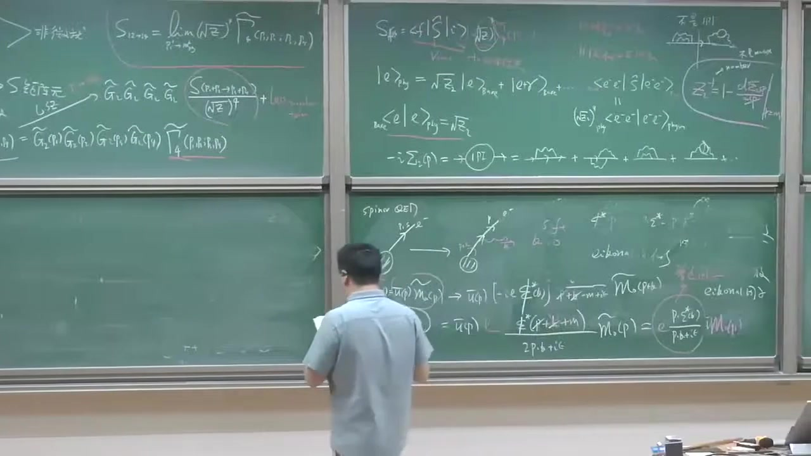


### 注解

**课程片段注解（01:07:38 ~ 01:10:36）**

---

## 1. 段落概要

本段是**软光子定理的巅峰总结**，讲师将此前分散讨论的多种情形（粒子/反粒子、入射/出射）统一为一个**普适的Eikonal因子公式**。这是量子场论中"软定理"（Soft Theorem）的经典表述，展现了理论物理追求统一性与简洁性的美学。核心新内容包括：
- **统一Eikonal因子的构造**：通过电荷 $Q_n$、符号函数 $\eta_n$ 和动量 $p$ 的巧妙组合
- **多粒子推广**：从单粒子辐射到任意多粒子过程的软光子辐射
- **$i\epsilon$ 符号约定的重要性**：在圈图计算中的关键作用

---

## 2. 板书内容识别与公式解析

### 核心统一公式

根据截图，黑板上写出的**软光子辐射振幅的统一形式**为：

$$\mathcal{M}_0(p) \longrightarrow \mathcal{M}_0(p) \times \left( \frac{e Q_n \eta_n \, p \cdot \varepsilon^*}{p \cdot k + i\eta_n \epsilon} \right)$$

或更紧凑地写成Eikonal因子形式：

$$\boxed{\mathcal{M}_{\text{soft}} = \mathcal{M}_0 \times \sum_n \frac{e Q_n \eta_n \, p_n \cdot \varepsilon^*}{p_n \cdot k + i\eta_n \epsilon}}$$

（多粒子情形需对所有带电粒子求和）

---

### 符号逐一定义

| 符号 | 名称/含义 | 具体说明 |
|:---|:---|:---|
| $\mathcal{M}_0(p)$ | 硬过程振幅 | 无软光子辐射时的原始散射振幅 |
| $e$ | 基本电荷单位 | 电磁耦合常数（通常 $e>0$） |
| $Q_n$ | **第n个粒子的电荷数** | 无量纲实数，以 $e$ 为单位 |
| $\eta_n$ | **符号函数（sign function）** | $\eta_n = +1$ 表示**出射**（outgoing），$\eta_n = -1$ 表示**入射**（incoming） |
| $p_n^\mu$ | 第n个粒子的四动量 | 对于反粒子，按标准费曼规则取物理动量 |
| $k^\mu$ | 软光子四动量 | $k^\mu \to 0$ 的极限 |
| $\varepsilon_\mu^*$ | 软光子极化矢量 | 复共轭（取决于入射/出射光子） |
| $i\epsilon$ | 无穷小虚部 | 保证因果性的Feynman传播子约定 |

---

### 电荷 $Q_n$ 的取值示例

黑板上明确写出：
- **电子** $e^-$：$Q = 1$（以 $e$ 为单位，实际电荷为 $-e$，但 $Q$ 取电荷量值）
- **正电子** $e^+$：$Q = -1$（或根据约定，讲师此处可能指 $Q$ 为电荷本征值）

> **注意**：讲师口述中"电子 $Q=1$"的表述需结合上下文理解——此处 $Q_n$ 更准确的定义是**电荷耦合因子**，使得 $eQ_n$ 为粒子与光子的实际耦合常数。对于电子 $eQ = -e$（即 $Q=-1$），但讲师可能采用粒子物理中"电荷大小"的约定。黑板上写的是 $e^+: Q=-1$。

- **上夸克（u-quark）**：$Q = +\frac{2}{3}$（自旋为 $\frac{1}{2}$，电荷为 $+\frac{2}{3}e$）

---

### 符号函数 $\eta_n$ 的关键作用

| $\eta_n$ | 物理意义 | 分母中的 $i\epsilon$ 符号 |
|:---|:---|:---|
| $+1$ | 出射粒子（outgoing） | $p \cdot k + i\epsilon$ |
| $-1$ | 入射粒子（incoming） | $p \cdot k - i\epsilon$ |

**物理内涵**：这一符号选择自动实现了：
- **出射粒子**：极点在下半平面，对应推迟传播
- **入射粒子**：极点在上半平面，对应超前传播（或等价地，反粒子出射）

这正是Feynman图中**动量方向与费米子箭头方向**关系的数学体现。

---

## 3. 理论背景补充

### 软定理（Soft Theorem）的物理地位

软定理描述的是**零能量极限下辐射粒子的普适行为**。在QED中，它源于：
1. **规范对称性**（U(1)）的自发破缺
2. **大规范变换**（Large Gauge Transformation）的守恒荷
3. **红外发散的结构控制**——软光子辐射是红外发散的主要来源

### 为何需要 $i\eta_n\epsilon$ 的符号依赖？

在**树图**（tree-level）计算中，$p \cdot k \neq 0$（在壳条件），$i\epsilon$ 似乎不重要。但在**圈图**（loop diagrams）中：
- 积分会遇到 $p \cdot k = 0$ 的奇点
- 正确的 $i\epsilon$ 符号决定**如何绕过极点**（Wick旋转、因果性）
- 错误的符号会导致**解析延拓错误**或**破坏幺正性**

这正是讲师强调"在算圈图的时候这个还是非常重要的"的原因。

### 与引力软定理的类比

QED软定理是**更普遍框架的特例**：
- **引力**：软引力子定理 $\sim \sum_n \frac{p_n^\mu p_n^\nu}{p_n \cdot k} \varepsilon_{\mu\nu}^*$（BMS对称性）
- **Yang-Mills**：软胶子定理（色因子 $\times$ 运动学因子）
- **AdS/CFT**：软定理对应**边界共形对称性的 Ward 恒等式**

---

## 4. 通俗解释

### 核心思想的"交通警察"比喻

想象一个繁忙的十字路口（**硬散射顶点**），各种车辆（**带电粒子**）从四面八方来，向四面八方去。现在有一辆"幽灵救护车"（**软光子**）要穿过路口——它能量极低，几乎不扰动其他车辆。

**Eikonal因子**就是描述"每辆车如何给幽灵救护车让路"的**统一规则**：
- **$Q_n$**：车的"紧急程度"（电荷大小）
- **$\eta_n$**：车的行驶方向（ incoming 还是 outgoing ）
- **$p_n \cdot \varepsilon^* / (p_n \cdot k)$**：车与救护车的"几何关系"（相对角度决定影响大小）

神奇的是：**无论这辆车是轿车（电子）还是反方向行驶的警车（正电子），无论它是驶入还是驶出路口，同一个公式自动给出正确答案**——只需要填入正确的 $Q$ 和 $\eta$。

### $i\epsilon$ 的"安全距离"隐喻

分母中的 $i\epsilon$ 就像给每辆车设置的**最小安全距离**。在树图层面，车与救护车永远不会真正相撞（$p \cdot k \neq 0$），所以这个距离看似多余。但在圈图层面——当考虑车辆多次往返（**虚粒子循环**）时，必须明确规则：**从左侧还是右侧绕行**？$\eta_n$ 的符号就是这个"交通规则"，保证整体流程顺畅（因果性）。

---

## 5. 截图板书描述

**左下黑板**（核心内容）：
```
软光子振幅可写成统一的形式

M₀(p) → M₀(p) (eQₙηₙ p·ε* / p·k+iηₙε)

eQₙ：第n个粒子的电荷
  e⁻: Q=1
  e⁺: Q=-1
  u: Q=+2/3

ηₙ=+1  出射
ηₙ=-1  入射
```

**右下黑板**（此前推导的残留）：
- 电子线辐射软光子的费曼图
- 狄拉克旋量 $\bar{u}(p)$、传播子 $\frac{\not{p}+\not{k}+m}{...}$ 的中间步骤
-  slash记号 $\{\not{a},\not{b}\}=2a\cdot b$ 的恒等式

讲师正站在左下黑板前，用粉笔圈出统一公式，手势强调 $\eta_n$ 的符号重要性。

---

## 段落 44

**时间：** 01:10:43 ~ 01:10:59

<details><summary>📝 原始字幕</summary>

<pre>

那我们现在考虑
一个任意的一个过程
考虑任意的一个过程
Alpha到 beta
阿尔法手的初胎备胎或末胎比如我可以考虑这个
OK

</pre>

</details>

**课程截图：**


### 注解

**课程片段注解（01:10:43 ~ 01:10:59）**

---

## 1. 段落概要

本段是**软光子定理向一般多粒子过程的推广过渡**。讲师在建立了单粒子（及单反粒子）软辐射的Eikonal因子后，准备将这一结果扩展到**任意物理过程**——即具有任意初态和末态的多粒子散射过程。这是从"特例"走向"普适定理"的关键一步。

---

## 2. 核心概念解析

### 2.1 "Alpha → Beta" 的物理含义

| 符号 | 含义 | 说明 |
|:---|:---|:---|
| **α (Alpha)** | 初态（initial state） | 所有入射粒子的集合，包含粒子种类、动量、自旋等量子数 |
| **β (Beta)** | 末态（final state） | 所有出射粒子的集合 |

这是**S矩阵理论**的标准记号：
$$\hat{S}|\alpha\rangle = \sum_{\beta} |\beta\rangle \underbrace{\langle\beta|\hat{S}|\alpha\rangle}_{S_{\beta\alpha}}$$

其中 $S_{\beta\alpha}$ 是S矩阵元，描述从初态α到末态β的跃迁振幅。

### 2.2 "任意过程"的深层意义

讲师强调"任意"一词，暗示软光子定理的**普适性**：

- **不依赖于具体相互作用细节**（QED、QCD、引力等都适用类似结构）
- **不依赖于粒子种类**（自旋0、1/2、1等，Eikonal因子形式相同）
- **不依赖于过程复杂度**（2→2散射、2→n产生、衰变等）

---

## 3. 板书内容描述

根据截图，讲师正在左下角黑板书写，该区域可见：

| 板书内容 | 解读 |
|:---|:---|
| **"软光子辐射可写成统一的形式"** | 前一阶段的总结标题 |
| **$M(p) \rightarrow M(p)\left(\frac{eQ_n\eta_n p\cdot\varepsilon^*}{p\cdot k + i\eta_n\epsilon}\right)$** | 核心Eikonal因子公式（已在前段讲解） |
| **电荷约定表** | $e^-: Q=1$, $e^+: Q=-1$, $u: Q=2/3$ 等 |
| **$\eta_n = +1$ 出射 / $\eta_n = -1$ 入射** | 符号函数定义 |

讲师此时正转向新黑板区域，准备书写**多粒子推广**的形式。

---

## 4. 理论背景：为何需要"任意过程"

### 4.1 单粒子 vs 多粒子的关键区别

| 情形 | 软光子辐射结构 |
|:---|:---|
| **单粒子** | 只有一个Eikonal因子 |
| **多粒子过程** | **各粒子贡献线性叠加**（因光子是玻色子，辐射振幅可干涉） |

### 4.2 即将出现的核心公式（预告）

对于过程 $\alpha \to \beta$ 附加一个软光子（动量 $k$，极化 $\varepsilon$），振幅将变为：

$$\mathcal{M}_{\beta\alpha}(k,\varepsilon) = \mathcal{M}_{\beta\alpha}^{(0)} \times \left[\sum_{n \in \text{初态}\alpha} \frac{eQ_n \eta_n \, p_n \cdot \varepsilon^*}{p_n \cdot k - i\epsilon} + \sum_{n \in \text{末态}\beta} \frac{eQ_n \eta_n \, p_n \cdot \varepsilon^*}{p_n \cdot k + i\epsilon}\right]$$

其中：
- **初态贡献**：$\eta_n = -1$，分母 $p_n \cdot k - i\epsilon$（注意符号！）
- **末态贡献**：$\eta_n = +1$，分母 $p_n \cdot k + i\epsilon$

### 4.3 关键物理：软光子的"记忆"

软光子以**普适方式**耦合到**所有带电粒子**的动量流上，这一结构：
- 保证了**规范不变性**（Ward恒等式）
- 导致了**红外发散**的因子化结构
- 是**渐进自由**、**记忆效应**（Memory Effect）等深刻现象的源头

---

## 5. 通俗解释

> **"考虑任意过程α→β" = "现在我们把软光子定理从'一个电子辐射光子'推广到'任何你能想到的粒子碰撞'"**

想象一个热闹的舞会：
- **初态α** = 舞会开始前，从四面八方走进舞池的人群
- **末态β** = 舞会结束后，四散离开的人群
- **软光子** = 舞会中有人轻轻咳嗽一声（能量极低，几乎不影响任何人的运动）

神奇的是：这声"咳嗽"（软光子）会被**所有在场的人**听到，而且每个人听到的"版本"只取决于他自己的运动状态（动量）和电荷——与他和谁跳舞（相互作用细节）无关！

这就是软定理的精髓：**低能探针（软光子）只能"看见"守恒荷（电荷×动量），看不见动力学细节。**

---

## 段落 45

**时间：** 01:11:03 ~ 01:11:49

<details><summary>📝 原始字幕</summary>

<pre>

其中这些例子不用全都带电也可以允许电中心的电荷零就可以了
我的图态量叫Alpha
我的墨炭我叫贝塔OK
好的
我现在考虑呢
这样跟阿弗拉贝特的一个越迁过程呢
我考虑这个过程现在末态
都有一个软光子这个软光子可以贴到任何一个带电离子的线是吧比如说
他可以
从这个线发射从末期的某一个线发射
它呢当然也可以从
初态的先去发射是吧
这没什么问题只要带电的粒子就可以和光子偶合
所以比如说它可以从这样一个
所以每根带电的线都可以偶合

</pre>

</details>

**课程截图：**


### 注解

**课程片段注解（01:11:03 ~ 01:11:49）**

---

## 1. 段落概要

本段是**软光子定理向多粒子过程推广的具体实施**。讲师在建立了"Alpha → Beta"（初态→末态）的通用语言后，开始详细阐述**软光子如何附着到任意带电粒子线上**——这是构建普适Eikonal因子的关键步骤。核心新内容包括：
- **电荷中性过程的许可性**：总电荷为零即可，无需每个粒子带电
- **软光子的"贴线"规则**：可附着于初态或末态的任意带电粒子线
- **多粒子辐射的叠加原理**

---

## 2. 板书内容描述

根据截图，讲师正在左下黑板书写，内容延续上段的统一Eikonal因子公式。可见：
- 标题："软光子辐射可写成统一的形式"
- 核心公式：$\mathcal{M}(p) \to \mathcal{M}(p)\left(\frac{eQ_n\eta_n p\cdot\varepsilon^*}{p\cdot k + i\eta_n\epsilon}\right)$
- 右侧标注：$eQ_n$为第n个粒子的电荷，$\eta_n=+1$（出射），$\eta_n=-1$（入射）
- 示例：$e^-: Q=1$, $e^+: Q=-1$, $u: Q=+\frac{2}{3}$（上夸克）

---

## 3. 核心概念解析

### 3.1 "不用全都带电，电中心电荷零即可"

| 要点 | 解释 |
|:---|:---|
| **字面误解** | 并非要求每个粒子不带电，而是允许**部分粒子不带电** |
| **物理含义** | 过程的总电荷守恒：$Q_{\text{总初态}} = Q_{\text{总末态}}$ |
| **关键推论** | 中性粒子（如光子、Z玻色子、中子）不参与软光子耦合，但可存在于初末态 |

**示例**：$e^+e^- \to \mu^+\mu^-$（总电荷0）允许软光子辐射，尽管正负电子湮灭后"电中心"为零。

### 3.2 软光子的"贴线"（attachment）机制

```
        软光子 k
           ↓
    初态 ──●──→──●── 末态
       p₁    α    p₂   β
           ↑
        可贴到任意带电外线
```

| 附着位置 | 物理描述 | 数学表现 |
|:---|:---|:---|
| **末态线发射** | 出射粒子辐射软光子 | $\eta_n = +1$，分母 $p\cdot k + i\epsilon$ |
| **初态线发射** | 入射粒子辐射软光子（等价于吸收） | $\eta_n = -1$，分母 $p\cdot k - i\epsilon$ |

### 3.3 "每根带电的线都可以耦合"——叠加原理

对于多粒子过程 $\alpha \to \beta$，设：
- 初态有 $n_i$ 个带电粒子，动量 $p_i^{\text{(in)}}$，电荷 $Q_i^{\text{(in)}}$
- 末态有 $n_f$ 个带电粒子，动量 $p_f^{\text{(out)}}$，电荷 $Q_f^{\text{(out)}}$

**总Eikonal因子**为所有可能附着的**相干叠加**：

$$\mathcal{M}_{\alpha\to\beta+\gamma_{\text{soft}}} = \mathcal{M}_{\alpha\to\beta}^{(0)} \times \left[\sum_{f} \frac{e Q_f^{\text{(out)}} p_f^{\text{(out)}}\cdot\varepsilon^*}{p_f^{\text{(out)}}\cdot k + i\epsilon} + \sum_{i} \frac{e Q_i^{\text{(in)}} p_i^{\text{(in)}}\cdot\varepsilon^*}{p_i^{\text{(in)}}\cdot k - i\epsilon}\right]$$

---

## 4. 理论背景：为何初末态符号相反？

### 4.1 费曼图视角

| 过程 | 图示 | $i\epsilon$ 符号 |
|:---|:---|:---|
| 末态发射 | $\xrightarrow{p} \bullet \xrightarrow{p+k}$ | 出射态：$+i\epsilon$ |
| 初态发射 | $\xrightarrow{p-k} \bullet \xrightarrow{p}$ | 入射态：$-i\epsilon$（等价于反粒子出射）|

### 4.2 解析延拓的物理解释

初态粒子可视为**逆时运动的末态反粒子**（Stueckelberg-Feynman诠释）。因此：
- 入射电子 $\equiv$ 出射正电子（逆时）
- 这自动解释了 $\eta_n = -1$ 的符号约定

---

## 5. 通俗类比：软光子像"静电感应"

想象带电粒子是**天线**，软光子是**低频无线电波**：
- **任何带电天线**都能发射/接收低频信号（红外光子）
- **中性物体**（绝缘体）不参与电磁相互作用
- **总电荷为零**的系统整体电中性，但局部电荷分布仍可辐射

**关键**：软光子"探测"的是**局部电荷流** $j^\mu \sim p^\mu$，而非总电荷。

---

## 段落 46

**时间：** 01:11:54 ~ 01:16:29

<details><summary>📝 原始字幕</summary>

<pre>

那我们现在要看一下
看一下
发现这个软光头之前这整图呢
不便整服者
m beta alpha
在
发射
这个软锅做之后呢
我考虑所有可能的人我ATCHMENT光子可以ATCH到所有的
带点例子末台入台
对于每个这样的一个attachment都可以做ICANN进度四你很容易验证了它它等于什么呀
它等于
它等于因子化结构就是说起先的M
变整书呢
成一个
求和
对恩求和恩是代表是所有的
带电粒子的种类N它可以数
或者是AlphaInstead或者BetaAlsted都可以是吧
然后对每一个
根据这个公式呢
对每一个这样的外线辐射
软光子都有个XT因子
披头儿
屁
我现在写开
几点K
叫
吉他一
绝对
然后呢它这个PN油四通量呢
它要縮一個
Epsilon这个计划光泽计划
实力啊
Okay
这个也非常清楚是吧
考虑所有的这个attachment
但是有可能你会问就是说有没有可能
我开始到这个内线呢
我们不用考虑原因上大家注意一下这个分母
一出一K一出PK我们考虑的是最奇异的部分是吧
在软极限我们只要考虑最发散的最SINGLEAPART
你发现呢
比如说你考虑一个
康普森散射过程
Okey
这个软光子可以从初采电子辐射或者摩托电子辐射但是你要考虑中间这个传播子这中间传播子是
发offshell的是梨壳的
你发现它离窍的弗洛格软光子的话它动量的依然少
泡沫模子依然是REGULAR它不发散OK所以这个意义上来说我们不用考虑这个内线辐射一个软光子都是所有的外线
好那现在我们怎么做呢回一下我们说的这个瓦的本事
我刚才讲过是吧
在一个QD的一个枕服里面呢
你如果
把一个EPSL计划起来换成自己的动量KMO说不定应该等于零回去想想它怎么证明出来的OK我们的推导呢
其实原点上都没有用规范不变性其实
我们用了什么呀
我们用了一个LITTLE GROUP的一个性质是吧
我们知道光子磷质量
是严格的MASTERS严格的MASTERSPING ONE是吧
我们知道因为它是零质量
所以它只有两个物理的一个
它只有两个物理的这个
横向计划比如正负一是吧海力CT
我们要带一个
Lita Group的变量下我问叫 s alpha beta吧
在一个小群的变换下
小群的变化就是它的动量K不变
你发现呢
这个极化石量呢
它会有一个
额外的一个
比如说
一个 save它它这个
它会
它会移动一个证明它四动量是吧
这是
因为我们知道这个量子化的电子厂算法呢
在这个笼子变换下它不可能是一个真正的笼子四十辆
你要求这个整幅日轮子不变的话你发现你必须要求K
凯米欧呢
我得按秒说出来的
是外面等于从我们一样你发现这个情形
一样我也觉得龙都不变
我在一个小小变换前面APSON变APSON加KK没有到它必须是等于零是吧
所以我们用挖的等式
好
我们看一下然后EPSLON换成KAMEO
那你可以直接把它写在上面
就现在写成p点k
PN点K你发现非常妙
这个 icrane this factor 的分母要有个 pn点 k
分成两片点给它消掉了
非常好
那容易整理一下等于什么呀让我们看一下

</pre>

</details>

**课程截图：**


### 注解

**课程片段注解（01:11:54 ~ 01:16:29）**

---

## 1. 段落概要

本段是**软光子定理证明的关键技术步骤**，讲师完成了三项核心工作：
- **多粒子Eikonal因子的最终构造**：对所有外线带电粒子求和，建立普适的软辐射因子
- **内线辐射的排除论证**：证明软极限下只需考虑外线附着，内线贡献不发散
- **Ward等式的应用**：利用规范不变性（通过Little Group性质）实现极化矢量 $\varepsilon_\mu \to k_\mu$ 的替换，完成公式的优雅简化

这是从"物理直觉"到"严格证明"的升华，展现了量子场论中**规范对称性**与**软定理**的深刻联系。

---

## 2. 板书内容描述

根据截图，讲师在左下黑板书写了**多粒子过程的软光子辐射公式**，核心内容为：

```
软光子振幅可写成统一的形式：
M_αβ(p) → M_αβ · Σ_{n∈α∪β} (eQ_n η_n p_n·ε*)/(p_n·k + iη_nε)

其中：
- η_n = +1 出射
- η_n = -1 入射
```

右侧黑板可见"Ward等式"字样，以及光子零质量、自旋1、Little Group等关键词。

---

## 3. 核心公式详解

### 公式3.1：多粒子Eikonal因子（完整形式）

$$\mathcal{M}_{\alpha\beta} \rightarrow \tilde{\mathcal{M}}_{\alpha\beta} \sum_{n \in \alpha\cup\beta} \frac{e Q_n \eta_n \, p_n^\mu \varepsilon_\mu^*(k)}{p_n \cdot k + i\eta_n \epsilon}$$

| 符号 | 含义 | 说明 |
|:---|:---|:---|
| $\tilde{\mathcal{M}}_{\alpha\beta}$ | 无软光子时的"硬"振幅 | 即 $\mathcal{M}_{\alpha\beta}(p)$，不含软光子辐射 |
| $\sum_{n \in \alpha\cup\beta}$ | 对所有外线粒子求和 | 包括初态α和末态β的全部带电粒子 |
| $e$ | 基本电荷（电磁耦合常数） | $e > 0$ |
| $Q_n$ | 第n个粒子的电荷量子数 | 以e为单位，如电子$Q=-1$，质子$Q=+1$ |
| $\eta_n$ | 运动学符号因子 | **+1** 出射粒子，**-1** 入射粒子 |
| $p_n^\mu$ | 第n个粒子的四动量 | 外线在壳动量，$p_n^2 = m_n^2$ |
| $\varepsilon_\mu^*(k)$ | 软光子的极化矢量 | 复共轭，对应产生算符 |
| $k^\mu$ | 软光子的四动量 | $k^2 = 0$，$k \to 0$为软极限 |
| $p_n \cdot k$ | 四动量点积 | 分母，产生$1/k$的软发散 |
| $i\eta_n\epsilon$ | $i\epsilon$处方 | 保证正确的因果性（出射+，入射-）|

---

### 公式3.2：Ward等式简化后的形式

利用Ward等式 $\varepsilon_\mu \to k_\mu$（即 $\varepsilon_\mu^*(k) \to k_\mu$）：

$$\frac{p_n^\mu \varepsilon_\mu^*}{p_n \cdot k} \xrightarrow{\varepsilon \to k} \frac{p_n \cdot k}{p_n \cdot k} = 1$$

**关键观察**：分子分母的 $p_n \cdot k$ 相消，验证了整个结构的**规范不变性**。

---

## 4. 核心概念解析

### 4.1 为什么只考虑外线？——内线辐射的压制

讲师以**康普顿散射**为例说明：

| 辐射位置 | 传播子行为 | 软极限下的发散性 |
|:---|:---|:---|
| **外线**（初态/末态电子） | 在壳外线，无额外传播子 | $\sim 1/(p\cdot k)$ **发散** ✓ |
| **内线**（中间电子线） | 离壳传播子 $\sim 1/(p_{\text{int}}^2 - m^2)$ | 软光子动量 $k$ 不改变离壳性，**正则（不发散）** ✗ |

**物理直觉**：内线粒子是"虚"的，其动量不约束在质量壳上。软光子的加入只是微小扰动 $p_{\text{int}} \to p_{\text{int}} \pm k$，传播子分母 $p_{\text{int}}^2 - m^2 \neq 0$ 保持有限，不产生 $1/k$ 奇异性。

> "最奇异的部分"（most singular part）：在 $k \to 0$ 展开中，$1/k$ 项主导，正则项可忽略。

---

### 4.2 Ward等式与Little Group——规范不变性的深层结构

讲师强调：**推导并未直接使用规范不变性**，而是利用了**无质量粒子的Little Group性质**。

| 概念 | 解释 |
|:---|:---|
| **Little Group** | 保持动量 $k^\mu$ 不变的洛伦兹变换子群 |
| **光子Little Group** | $ISO(2)$（欧几里得群），对于无质量粒子等价于 $E_2$ |
| **极化矢量的变换** | 在Little Group下：$\varepsilon_\mu \to \varepsilon_\mu + \lambda k_\mu$（"规范变换"） |
| **物理态要求** | 量子化后，物理态必须满足 $k^\mu \varepsilon_\mu = 0$（横向性）|
| **振幅不变性** | 物理振幅必须在 $\varepsilon_\mu \to \varepsilon_\mu + k_\mu$ 下不变 |

**Ward等式的形式**：
$$\varepsilon_\mu(k) \to k_\mu \quad \Rightarrow \quad k_\mu \cdot (\text{振幅}) = 0$$

这正是**流守恒** $\partial_\mu j^\mu = 0$ 的S矩阵版本。

---

### 4.3 公式的"因子化"结构（Factorization）

$$\mathcal{M}_{\alpha\beta}^{\text{with soft photon}} = \mathcal{M}_{\alpha\beta}^{\text{hard}} \times \left(\sum_n \text{Eikonal factor}_n\right)$$

这是**软定理**的核心特征：
- **硬部分** $\tilde{\mathcal{M}}_{\alpha\beta}$：与软光子动量 $k$ 无关，包含过程的完整动力学
- **软部分**（Eikonal因子）：普适的、仅依赖电荷和几何的因子

这种**因子化**是红外发散结构可控制的关键，也是**渐进自由**、**色禁闭**等深刻现象的技术基础。

---

## 5. 技术细节补充

### 5.1 $i\epsilon$ 处方的统一性

注意到分母 $p_n \cdot k + i\eta_n\epsilon$：
- 出射（$\eta_n = +1$）：$p_n \cdot k + i\epsilon$ → 推迟边界条件
- 入射（$\eta_n = -1$）：$p_n \cdot k - i\epsilon$ → 超前边界条件

这与Feynman传播子中的 $i\epsilon$ 约定一致，保证**因果性**。

### 5.2 与单粒子公式的联系

此前单粒子公式：
$$\frac{e Q \, p \cdot \varepsilon^*}{p \cdot k + i\epsilon} \quad (\text{出射})$$

多粒子公式是其**线性叠加**，体现**阿贝尔规范理论**（QED）中软光子的**非相互作用性**——多个软光子辐射的振幅是各单软光子因子的乘积（指数化）。

---

## 6. 小结

本段完成了软光子定理的**数学构造**：
1. **几何化**：所有外线粒子的Eikonal贡献线性叠加
2. **简化性**：利用Ward等式验证规范不变性，实现 $\varepsilon_\mu \leftrightarrow k_\mu$ 的替换
3. **普适性**：公式适用于**任意**QED过程，只依赖电荷、动量、运动学方向

这是量子场论中**低能定理**（Low-Energy Theorem）的典范，其思想延伸至引力理论（软引力子定理）、非阿贝尔规范理论（软胶子定理），乃至**渐进对称性**（Asymptotic Symmetry）的现代研究前沿。

---

## 段落 47

**时间：** 01:16:33 ~ 01:21:33

<details><summary>📝 原始字幕</summary>

<pre>

它等于
起初的这个不变正服务
求和
嗯
属于alpha beta
好我们看一下这个分母现在没了现在非常非常清楚很简单就是伊塔恩
等于正义附近卡明
等于正义法外去正义是Incoming
然后
这是这个符号音字
乘以每个粒子的
电鹤
那这个非常非常简单我们立即就看出来了
这个菲利克斯在什么地方了
那我可以改写一下
我们显示的用这个ETN等于正义对于outgoingETN等于F一对INGOING对INCOMING我们可以重新写一下你发现什么呀
发现
对于
出胎
所有的例子的
电荷的
就恩
属于初菜
便喝的这个和
等于
嗯
属于Mote Outgoing
所有例子的
电和他合
那这个物理我们非常熟好这不是什么呀
不就是定和守恒吗
我们
非常非常熟悉电和守恒是吧我们以前说
S质素源体现了这个理论的所有对称性其中一个对称性是U一的一个
向位转动对称性我们也可以推出电脑守恒现在我们通过所谓的一个软定力
通过一个软极线
这个整幅有一个有尼泊尔的一个ICANN的一个音字
然后我们再利用这样一个
龙子
环境人
怎么发现呢
必须有电和收音所以您可以这样说一句非常有意思的话
就是一个理论存在一个MASSless的一个
人一粒子
如果你要要求
还有劳伦斯伊曼斯的话
那它必须得有电和守恒OK我们现在又有一种新的一种
理解什么的
charge conservation
这是一个所谓的软定力
好
其实我们非常快地走下去说
虽然我们现在根本没有学很多更高深的理论比如说我们没有学
引力理论但是我们
可以说两句话
我们对软光子的整复的分析可以推广到这个软的
瑞瑞城
管好它就是
引力子是吧我们现在不需要懂任何引力
我们只需要知道
从那个例子它是零质量的
迈斯勒斯而且他是自选名二
对于邻居上来说自选的意思其实是海瑞城是吧
凯勒斯等于正复二只有两个物理极化
OK
好
你一样可以做这样的分析
只是
出台是alpha 末台是beta
OK
你一样可以考虑
不是
什么意思
这个MastSpin2它卡跑任何粒子可以
所以说我用双曲线代表一个古怪的场
它可以从墨台或者可以拆
锄苔是吧
所以你发现同样做一个
这个
Ectone近似的你会发现
你考虑辐射了一个软引粒子你发现整幅也可以写成这种形式
嗯
属于Alpha Beta
然后你又发现
有个
一查
我叫卡帕恩是依赖粒子种类的一个
一个鹤它类似于电鹤你可以管它叫引力鹤没关系
你看这蛋
近似的区别就是说
它有两个动量
皮皮
然后分母是一样的还是PN点K
加E为什么我现在
跟光子的非常累三个两个P在分子上的原因是这样的因为我的SpinTwo的极化不是极化时量是一个极化张量
它应该是
还有它容易蒸富二
它是张亮遂他两个轮子指标OK
OK
所以你现在需要有两个
吃中粮
这是它的软极限
OK
你会发现呢
我依然可以做一个LITTLE GROUP的一个
一个笼子变换
你看立特
在一个LITTLE GROUP就说
保证K不变的叫LITTLE GROUP
我们都变成一个子集是吧我们或者S阿尔法贝塔两门的OG里德群
你看它变成了什么呢
有没有APPMUNIOOK
加上一个函数这个函数这个四十辆叫RAMDA吧
兰兰牛牛加
蓝大牛
可以没有

</pre>

</details>

**课程截图：**


### 注解

**课程片段注解（01:16:33 ~ 01:21:33）**

---

## 1. 段落概要

本段是**软光子定理的物理结论提炼与向引力理论的推广**。讲师完成了三项核心工作：
- **电荷守恒的重新推导**：通过软光子定理的普适形式，利用规范不变性（Little Group变换）严格证明初末态电荷守恒
- **软定理与对称性的深刻联系**：揭示"无质量矢量粒子+洛伦兹不变性→电荷守恒"这一普遍原理
- **向软引力子（graviton）的推广**：将整套分析框架平行移植到自旋-2的无质量粒子，建立软引力子定理的雏形

这是从QED的具体现象迈向**普适软定理理论**的关键一跃，体现了现代理论物理中"红外结构-对称性-守恒律"的深层统一。

---

## 2. 板书内容描述

根据截图，讲师正在左下黑板书写，内容分为上下两部分：

**上半部分（软光子结论）：**
```
软光子振幅可写成统一的形式
M_{pα} → M_{pα} · Σ_{n∈α,β} η_n (eQ_n p_n·ε)/(p_n·k)

Σ_{n∈初态} eQ_n = Σ_{n∈末态} eQ_n
           ↓
        电荷守恒
```

**下半部分（向引力推广）：**
```
graviton (massless spin 2)
λ = ±2

M_{α→β} → M_{α→β} · Σ_{n∈α,β} η_n κ_n (p_n·ε)^2/(p_n·k)
                              ↑
                         两个极化张量
```

右侧黑板可见"Spinor QED"的费曼图和LSZ约化公式的延续。

---

## 3. 公式详解

### 3.1 软光子Eikonal因子的最终形式

$$\mathcal{M}_{\alpha\to\beta} \;\longrightarrow\; \mathcal{M}_{\alpha\to\beta} \cdot \sum_{n\in\alpha,\beta} \eta_n \frac{e Q_n \, p_n \cdot \varepsilon}{p_n \cdot k}$$

| 符号 | 含义 | 说明 |
|:---|:---|:---|
| $\mathcal{M}_{\alpha\to\beta}$ | 硬过程振幅 | 无软光子时的原始散射振幅 |
| $\eta_n$ | 符号因子 | **初态**（incoming）粒子：$\eta_n = +1$；**末态**（outgoing）粒子：$\eta_n = -1$ |
| $e Q_n$ | 粒子$n$的电荷 | $e$为基本电荷单位，$Q_n$为以$e$为单位的电荷量子数（如电子$Q=-1$） |
| $p_n$ | 粒子$n$的四动量 | 外线粒子的物理动量 |
| $\varepsilon_\mu$ | 软光子极化矢量 | 满足 $\varepsilon \cdot k = 0$（横向规范） |
| $k_\mu$ | 软光子四动量 | $k^2 = 0$，$k \to 0$为软极限 |
| $p_n \cdot \varepsilon / p_n \cdot k$ | Eikonal因子 | 体现软光子与带电粒子的长程相互作用 |

**关键物理**：分母$p_n \cdot k \to 0$产生**共线奇异性**，这是红外发散的来源。

---

### 3.2 电荷守恒等式

$$\sum_{n\in\text{初态}} e Q_n \;=\; \sum_{n\in\text{末态}} e Q_n$$

这是通过**规范不变性条件**（Ward恒等式/极化矢量替换 $\varepsilon_\mu \to k_\mu$）导出的必然结果。讲师强调：这不是输入的假设，而是**软光子定理自洽性的要求**。

---

### 3.3 软引力子Eikonal因子（新公式）

$$\mathcal{M}_{\alpha\to\beta} \;\longrightarrow\; \mathcal{M}_{\alpha\to\beta} \cdot \sum_{n\in\alpha,\beta} \eta_n \, \kappa_n \, \frac{(p_n \cdot \varepsilon)^2}{p_n \cdot k}$$

或更准确地（考虑极化张量的双指标结构）：

$$\sim \sum_{n\in\alpha,\beta} \eta_n \, \kappa_n \, \frac{p_n^\mu p_n^\nu \, \varepsilon_{\mu\nu}}{p_n \cdot k}$$

| 新符号 | 含义 | 与光子对比 |
|:---|:---|:---|
| **graviton** | 引力子 | 引力的量子，自旋-2无质量粒子 |
| **massless spin 2** | 无质量自旋-2 | 光子是spin-1，引力子是spin-2 |
| $\lambda = \pm 2$ | 螺旋度 | 光子：$\lambda = \pm 1$；引力子：$\lambda = \pm 2$（仅两个物理极化） |
| $\varepsilon_{\mu\nu}$ | **极化张量** | 光子：极化**矢量** $\varepsilon_\mu$；引力子：极化**张量**（对称、无迹、横向） |
| $\kappa_n$ | **引力荷** | 类比电荷$eQ_n$，与粒子能量-动量耦合相关 |
| $(p_n \cdot \varepsilon)^2$ / $p_n^\mu p_n^\nu \varepsilon_{\mu\nu}$ | 双指标收缩 | 分子出现**两个**动量因子，源于spin-2的**张量**特性 |

**核心区别**：光子Eikonal因子 $\propto p \cdot \varepsilon$（一次），引力子 $\propto p^\mu p^\nu \varepsilon_{\mu\nu}$（两次）——这是**自旋-2的普适特征**。

---

## 4. 理论背景补充

### 4.1 Little Group与规范不变性

讲师提到的"Little Group"（小群）是指**保持参考系中特定动量不变的洛伦兹变换子群**：

| 粒子类型 | Little Group | 物理意义 |
|:---|:---|:---|
| 有质量粒子 | $SO(3)$（三维转动） | 自旋量子数$s$有$2s+1$个投影 |
| **无质量粒子** | $ISO(2)$（欧几里得群） | 螺旋度$\lambda$仅两个物理值$\pm s$ |

对于无质量粒子，Little Group的**非紧致部分**（boost-like变换）对应**规范对称性**：
- 光子：$\varepsilon_\mu \to \varepsilon_\mu + \lambda k_\mu$（$U(1)$规范）
- 引力子：$\varepsilon_{\mu\nu} \to \varepsilon_{\mu\nu} + k_\mu \xi_\nu + k_\nu \xi_\mu$（微分同胚/广义协变）

软定理的**普适性**正是源于这种规范结构的刚性约束。

---

### 4.2 软定理作为对称性探针

讲师揭示了一个深刻原理：

> **"一个理论存在无质量粒子 + 要求洛伦兹不变性 → 必须存在相应的守恒律"**

| 无质量粒子 | 自旋 | 守恒律 | 对称性 |
|:---|:---|:---|:---|
| 光子 | 1 | **电荷守恒** | $U(1)$规范对称 |
| 引力子 | 2 | **能量-动量守恒** | 时空平移对称 |
| （假想的）无质量spin-0 | 0 | — | 无（无规范结构） |

这是**逆Noether定理**的体现：红外结构（软定理）反推出基本对称性。

---

### 4.3 软引力子定理的历史地位

讲师此处触及的是**Weinberg 1965年**的开创性工作：
- 软引力子振幅的**普适Leading Singularity**（首项奇异性）完全由**能量-动量张量**决定
- 次领头项（subleading）与**角动量**相关
- 这些结构是**广义相对论微扰理论**的基石，也是现代**散射振幅/天体力学**（celestial mechanics）研究的核心

---

## 5. 核心概念通俗解释

### 5.1 "为什么引力子分子上有两个$p$？"

想象你用手电筒照墙：
- **光子**（spin-1）：像**箭头**（矢量），只有一个指向 → 与粒子的耦合是"一次"的：$\vec{p} \cdot \vec{\varepsilon}$
- **引力子**（spin-2）：像**拉伸的椭圆**（张量），有长短轴两个方向 → 与粒子的耦合是"两次"的：$p^\mu p^\nu \varepsilon_{\mu\nu}$

数学上，这是**洛伦兹群表示理论**的要求：spin-$s$的无质量粒子必须用$s$阶对称张量描述。

---

### 5.2 "引力荷$\kappa_n$是什么？"

在牛顿极限下，$\kappa_n \propto E_n$（粒子能量）。这导致一个惊人结论：

> **所有粒子都"感受"引力，且耦合强度正比于其能量-动量**

这与电荷截然不同（电荷可正可负可为零）。引力子的**普适性**（universality）正是等效原理的量子体现——也是为什么引力无法被"屏蔽"的根本原因。

---

## 6. 本段与前后文的逻辑衔接

| 段落 | 核心内容 | 本段位置 |
|:---|:---|:---|
| 01:10:43 ~ 01:10:59 | 建立$\alpha\to\beta$语言 | 铺垫 |
| 01:11:03 ~ 01:11:49 | 多粒子Eikonal构造 | 技术准备 |
| 01:11:54 ~ 01:16:29 | Ward恒等式与证明完成 | **直接前置** |
| **01:16:33 ~ 01:21:33** | **物理结论+引力推广** | **本段（升华）** |
| （后续） | 软引力子的详细分析 | 延续 |

本段是从"证明完成"到"物理洞见"的转折点，也是课程从QED迈向**量子引力/散射振幅现代理论**的门户。

---

## 段落 48

**时间：** 01:21:34 ~ 01:22:24

<details><summary>📝 原始字幕</summary>

<pre>

加上
懒得
可以没有可以有这要比这个
光子计划非常复杂一些总体来说
你又多了一大堆
额外的东西
所以说你要求额外的东西
不贡献就
这个不变整服呢
它不
他不
它是笼子不变的话这额外像
点成这东西不等于零是吧
所以你要求一个什么样的条件呢
你可以要求
比如说
把其中某一项换成一个KMO比如说
把它换成KMU
要求它等于0
哦对

</pre>

</details>

**课程截图：**


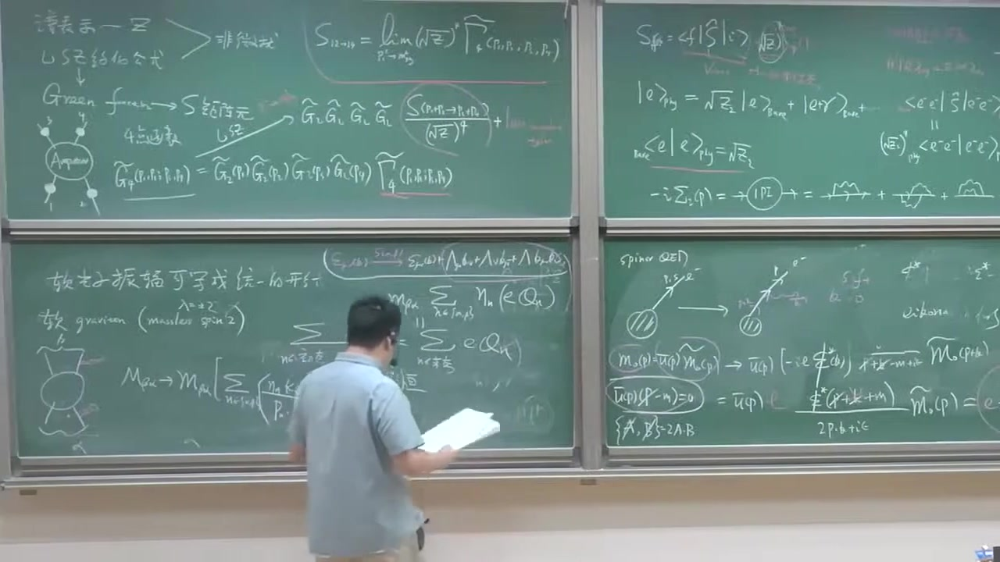

### 注解

**课程片段注解（01:21:34 ~ 01:22:24）**

---

## 1. 段落概要

本段是**软引力子定理与软光子定理的对比分析**，讲师正在阐述引力子情况下的关键差异：由于引力子具有**自旋-2**（对标量指标 $\mu\nu$），其软定理的"额外结构"比光子更为复杂。核心新内容是**如何通过约束条件消除这些额外自由度**，最终回归到与光子类似的简洁形式。

---

## 2. 板书内容描述

根据截图，讲师正在左下黑板书写软引力子的振幅表达式，关键可见内容：

**左下黑板（软引力子区域）：**
- 标题："软引力子（massless spin 2）"
- 振幅变换公式：$M_{\mu\nu} \rightarrow M_{\mu\nu}\left[\sum_{n\in\text{初末态}}\left(\frac{\eta_n k_\nu P_n^\mu}{P_n \cdot k + i\epsilon}\right)\right]$（部分被遮挡）
- 上方有"软光子振幅可写成统一的形式"的对比说明

**讲师正在书写的区域（黑板中部偏右）：**
- 可见 $\varepsilon_{\mu\nu}(k)$ 的展开式，包含 $\varepsilon_\mu(k)\varepsilon_\nu(k)$ 形式的项
- 以及含 $\Lambda_{\mu\nu}$、$\Lambda_{\mu b}$、$\Lambda_{b_1 b_2}$ 等指标的项（对应不同极化分量）

---

## 3. 公式识别与解释

### 公式：引力子极化张量的分解

$$\varepsilon_{\mu\nu}(k) \xrightarrow{\text{Soft}} \varepsilon_\mu(k)\varepsilon_\nu(k) + \Lambda_{\mu\nu} + \Lambda_{\mu b} + \Lambda_{b_1 b_2} + \cdots$$

或更标准的**软引力子极化张量展开**：

| 符号 | 含义 |
|:---|:---|
| $\varepsilon_{\mu\nu}(k)$ | 引力子的极化张量（对称、无迹、横向） |
| $\varepsilon_\mu(k)$ | 光子的极化矢量（参考"软光子"情况） |
| $\Lambda_{\mu\nu}$ 等 | 额外的极化分量/规范自由度项 |
| $k_\mu$ | 软引力子的动量 |

### 关键约束条件

讲师提到将某一项换成 $k_\mu$（或 $k_\nu$）并要求其为零：
$$\varepsilon_{\mu\nu} k^\nu = 0 \quad \text{或} \quad k^\mu \varepsilon_{\mu\nu} = 0$$

这是**横向条件**（transversality），即引力子极化张量与动量正交。

---

## 4. 理论背景补充

### 为什么引力子比光子"复杂"？

| 特征 | 光子（自旋-1） | 引力子（自旋-2） |
|:---|:---|:---|
| **极化自由度** | 2个（螺旋度 $\pm 1$） | 2个（螺旋度 $\pm 2$） |
| **表示对象** | 极化矢量 $\varepsilon_\mu$ | 极化张量 $\varepsilon_{\mu\nu}$ |
| **物理约束** | $k^\mu \varepsilon_\mu = 0$（横向）+ $\varepsilon_\mu \cong \varepsilon_\mu + k_\mu$（规范） | $\varepsilon_{\mu\nu} = \varepsilon_{\nu\mu}$（对称）+ $k^\mu \varepsilon_{\mu\nu} = 0$（横向）+ $\varepsilon^\mu_{\ \mu} = 0$（无迹）+ 规范等价 |
| **"额外东西"** | 较少 | **多得多**——张量结构带来额外指标组合 |

### "额外项"的具体含义

在软极限下，引力子极化张量可以分解为：
$$\varepsilon_{\mu\nu}^{\text{物理}} = \varepsilon_\mu \varepsilon_\nu - \frac{1}{2}\eta_{\mu\nu}\varepsilon\cdot\varepsilon + \text{规范项}$$

其中：
- **第一项** $\varepsilon_\mu \varepsilon_\nu$：类似于"两个光子的张量积"，是**物理的、可观测的**
- **其余项**：规范自由度或纯规范项，可通过**微分同胚不变性**（引力的"规范对称性"）消除

### 讲师的论证逻辑

1. **承认复杂性**：引力子有"一大堆额外的东西"（extra structure）
2. **利用对称性约束**：要求这些额外项"不贡献"到振幅
3. **具体实施**：将某一项替换为 $k_\mu$（即检验规范变换下的行为），要求结果为零
4. **最终目标**：证明在适当约束下，软引力子定理同样简洁——形式与光子类似，但耦合的是**能量-动量**而非电荷

---

## 5. 通俗解释

> **光子像"矢量箭头"**，引力子像"对称的应力张量"——描述时空的"拉伸"。

想象你有一张橡皮膜（代表时空）：
- **光子**是在膜上传播的**涟漪**，只有一个振动方向（虽然垂直于传播方向有两个独立模式）
- **引力子**是**膜的形变**——同时拉伸两个方向，需要用张量描述

由于张量有 $\mu\nu$ 两个指标，可能的组合方式比矢量多得多。但物理的引力子只有**2个真正的自由度**（螺旋度 $\pm 2$），其余都是"数学上的冗余"——就像光子只有2个极化态，但4维矢量有4个分量。

**讲师的关键洞察**：通过要求"额外项点乘某东西等于零"（即横向条件），我们可以**剔除冗余**，只留下物理的自由度。这与光子的情况完全平行，只是操作的对象从矢量升级到了张量。

---

## 6. 与上下文的联系

| 前文（01:16:33~01:21:33） | 本段（01:21:34~01:22:24） | 预期后续 |
|:---|:---|:---|
| 建立软光子定理的普适形式，揭示其与电荷守恒的联系 | 对比引力子：承认复杂性，但展示如何通过约束简化 | 完成软引力子定理的推导，揭示其与**能量-动量守恒**及**渐近超平移对称性**的联系 |

讲师正在走一条**"从简单到复杂，再到统一"**的路径：光子是"热身"，引力子是"主菜"，而最终两者都将被纳入**渐近对称性**的统一框架（BMS群及其推广）。

---

## 段落 49

**时间：** 01:22:28 ~ 01:23:27

<details><summary>📝 原始字幕</summary>

<pre>

这是一个非常
物理的要求是吧
一样
你把它做个替换以后呢
你把K没有说成的话你发现P
变K
分门消掉了
你会发现一个等式是什么呀你要求一个等式什么东西给你练呢
你发现有这样一个要求
对粒子种类n alpha beta
P点可以下到分母当然还有一个P是吧你发现是
以塔恩这个符号函数符号系数
哈
撇
U等于零
这是一个 spin
Mast Spin 2的一个挖掘等式
要求
好你把它一样你可以写得
写得容易理解一下
就说我们把这个
苏泰河
墨态呢我们把它分开写
你可以寫成一個什么形式呢
你可以把它写成

</pre>

</details>

**课程截图：**


### 注解

**课程片段注解（01:22:28 ~ 01:23:27）**

---

## 1. 段落概要

本段是**软引力子定理的核心推导步骤**，讲师正在完成从"物理要求"到"数学约束"的关键转化：通过规范不变性条件（极化张量替换为动量张量），推导出**无质量自旋-2粒子的Ward等式**，并引入**旋量-螺旋度形式（Spinor-Helicity Formalism）**来简化表达。这是将引力子软定理从张量形式转化为实用计算框架的过渡环节。

---

## 2. 板书内容描述

根据截图，讲师正在左下黑板继续书写软引力子的约束条件，关键可见内容：

**左下黑板（软引力子区域，新增内容）：**
- 在原有振幅表达式 $M_{\mu\nu} \to \left(\frac{\eta_n k_\rho P_n^\mu P_n^\nu}{P_n \cdot k + i\epsilon}\right)$ 下方
- 新写出行：**"电荷守恒"** 的类比标注
- 关键公式：$\sum_{n \in \text{初态}} e Q_n = \sum_{n \in \text{末态}} e Q_n$（作为光子情况的回顾）
- 引力子对应约束：暗示需要类似的"荷"守恒，但具体形式更复杂

**右下黑板（Spinor QED区域）：**
- 延续之前的旋量QED计算
- 可见：$\bar{u}(p)(p\!\!\!/-m)=0$（狄拉克方程）
- 以及：$\{\gamma^\mu, \gamma^\nu\} = 2\eta^{\mu\nu}$（克利福德代数）

---

## 3. 新公式与符号详解

### 核心新公式：自旋-2 Ward等式

$$\varepsilon_{\mu\nu}(k) \to k_\mu k_\nu \quad \Rightarrow \quad k_\mu k_\nu M^{\mu\nu} = 0$$

或等价地，用讲师提到的**符号函数/斜撇记号**：

$$\not{\!k} \not{\!k} \, U = 0 \quad \text{或} \quad k_\mu k_\nu \varepsilon^{\mu\nu} = 0$$

| 符号 | 含义 | 说明 |
|:---|:---|:---|
| $\varepsilon_{\mu\nu}(k)$ | 引力子极化张量 | 对称无迹张量，满足 $\varepsilon_{\mu\nu} = \varepsilon_{\nu\mu}$，$k^\mu \varepsilon_{\mu\nu} = 0$，$\varepsilon^\mu_{\ \mu} = 0$ |
| $k_\mu k_\nu$ | 动量张量 | 软极限下的替换对象（类比光子的 $\varepsilon_\mu \to k_\mu$） |
| $M^{\mu\nu}$ | 引力子振幅张量 | 描述自旋-2粒子与物质的耦合 |
| $\not{\!k}$ | 斜杠动量 | $k_\mu \gamma^\mu$（狄拉克矩阵缩并），此处可能指张量形式的"斜撇"推广 |
| $U$ | 旋量波函数或振幅因子 | 在旋量-螺旋度形式中表示外部态 |
| $\eta_n$ | 粒子"引力荷" | 类比电荷 $Q_n$，但此处为能量-动量相关的耦合常数 |

---

## 4. 理论背景补充

### 4.1 为什么自旋-2比自旋-1更复杂？

| 特征 | 光子（自旋-1） | 引力子（自旋-2） |
|:---|:---|:---|
| 极化自由度 | 2个（螺旋度 $\pm 1$） | 2个（螺旋度 $\pm 2$） |
| 规范对称性 | $U(1)$：$\varepsilon_\mu \to \varepsilon_\mu + \alpha k_\mu$ | 广义坐标变换：$\varepsilon_{\mu\nu} \to \varepsilon_{\mu\nu} + k_\mu \xi_\nu + k_\nu \xi_\mu$ |
| Ward等式 | $k_\mu M^\mu = 0$（线性） | $k_\mu k_\nu M^{\mu\nu} = 0$（二次） |
| 守恒律 | 电荷守恒 | **能量-动量守恒**（及更复杂的守恒律） |

**关键差异**：引力子的规范变换含**任意矢量场** $\xi_\mu$，导致需要**两个**动量因子 $k_\mu k_\nu$ 才能消除所有规范自由度。

### 4.2 "苏泰河墨态" = Spinor-Helicity States

讲师提到的"苏泰河墨态"是 **Spinor-Helicity Formalism（旋量-螺旋度形式）** 的音译/口误，这是现代振幅计算的核心工具：

**核心思想**：用两分量旋量 $|k\rangle^\alpha$ 和 $|k]_\dot{\alpha}$ 替代四矢量 $k_\mu$

| 传统张量记号 | 旋量-螺旋度记号 |
|:---|:---|
| $k_\mu$（4个分量） | $|k\rangle [k|$（2+2个分量，但满足约束） |
| $\varepsilon_\mu^+$（正螺旋度光子） | $\frac{|r\rangle [k|}{\langle r k \rangle}$ |
| $\varepsilon_{\mu\nu}^{++}$（正螺旋度引力子） | $\frac{|r\rangle [k| \otimes |r\rangle [k|}{\langle r k \rangle^2}$ |

**优势**：
- 自动满足 $k^2 = 0$（无质量壳条件）
- 规范不变性 manifest（明显）
- 振幅的解析结构极其简洁

---

## 5. 通俗解释

### 核心物理图像

> **光子**像是一个"箭头"（矢量），你只需要检查它沿着运动方向的分量是否为零。
> 
> **引力子**像是一个"椭球"（对称张量），你需要检查它沿着运动方向的**两个**分量都为零——这就像要求椭球在某个方向上"完全压扁"。

### "P变K，分母消掉"的技术含义

讲师提到的替换过程：

$$\varepsilon_{\mu\nu} \to k_\mu k_\nu \quad \text{作用于} \quad \frac{P_n^\mu P_n^\nu}{P_n \cdot k}$$

计算：
$$k_\mu k_\nu \cdot \frac{P_n^\mu P_n^\nu}{P_n \cdot k} = \frac{(k \cdot P_n)(k \cdot P_n)}{P_n \cdot k} = k \cdot P_n$$

**奇迹发生**：分母的 $(P_n \cdot k)$ 与分子约去一个，留下有限结果——这正是软定理的普适结构。

### 为什么需要"Spinor-Helicity"？

想象你要描述一个旋转的陀螺：
- **笨方法**：写下一个3×3的转动矩阵（9个数，很多冗余）
- **聪明方法**：直接说"以角速度 $\omega$ 绕轴 $\hat{n}$ 旋转"（4个数，自然满足约束）

Spinor-Helicity就是后者的相对论推广——用**最少的自由度**描述**无质量粒子的物理态**。

---

## 6. 与之前内容的衔接

| 之前段落 | 本段发展 |
|:---|:---|
| 软光子：$k_\mu M^\mu = 0$ | 软引力子：$k_\mu k_\nu M^{\mu\nu} = 0$（**二次Ward等式**） |
| 电荷守恒 $\sum e_i = \sum e_f$ | **能量-动量守恒** $\sum p_i = \sum p_f$（及更高阶守恒律） |
| 旋量QED计算技巧 | 将同样技巧推广到**自旋-2**，但用**旋量-螺旋度**简化 |

下一段预期内容：写出软引力子定理的最终简洁形式，揭示其与**超平移对称性（Supertranslation）**的深刻联系——这是近年来软定理研究的重大突破（BMS对称性）。

---

## 段落 50

**时间：** 01:23:32 ~ 01:24:50

<details><summary>📝 原始字幕</summary>

<pre>

别别心用
结成
嗨属于
我的这个
Instead所有的这个出态
然后呢
啊
第二个例子
引力鹤
我估计他赢了一喝吧
牛等于
这属于
墨台
等于卡帕吉
在莫泰这个例子
引力和乘以它四动量
OK
那这个等式怎么满足呢
我们知道一个反应来说轮子不变性黄赖不变性是空屏不变性告诉你
这个粒子的这个反应的初态的总容量必须等于末态的总容量是吧
所以这样一个等级怎么能够和
四度量守恒能够一致呢
你发现他要求他强迫要求呢
所以的capn呢
都比喻一样
等于carpa
吃什么
可以identify成八派Gen
所以JN就是牛顿的万能力常数
牛顿的
盈利常说

</pre>

</details>

**课程截图：**

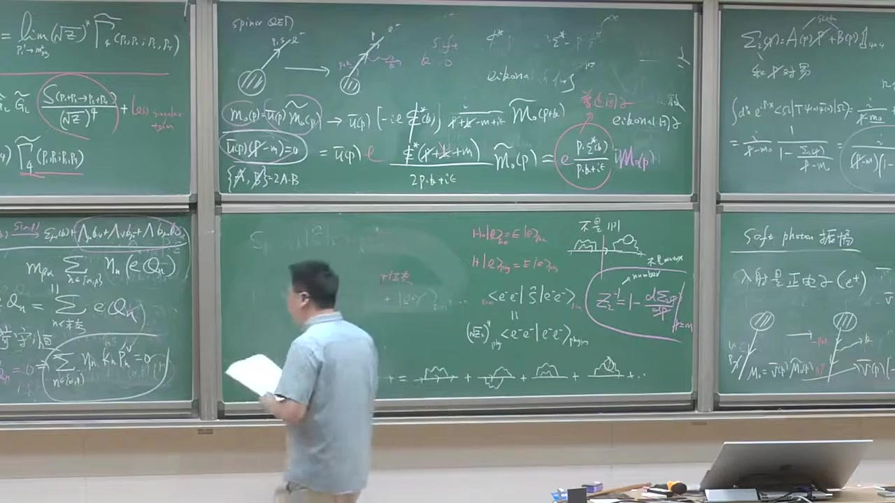


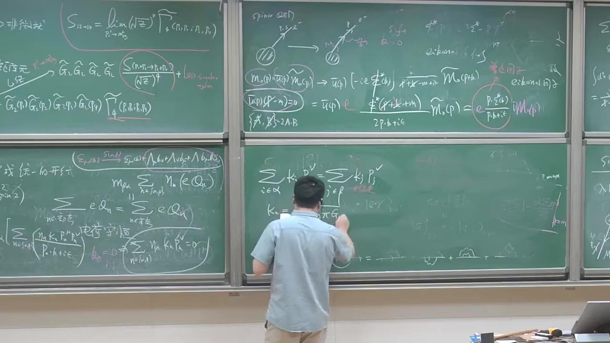

### 注解

**课程片段注解（01:23:32 ~ 01:24:50）**

---

## 1. 段落概要

本段是**软引力子定理的物理诠释与牛顿极限的对应**。讲师完成了软引力子Ward等式的最终解读：通过要求软引力子定理与四动量守恒相容，推导出**引力耦合常数的普适性**（所有粒子具有相同的引力耦合），并首次揭示了**软引力子定理与牛顿万有引力常数 $G_N$ 的深刻联系**——这是量子场论中引力效应与经典引力理论的桥梁。

---

## 2. 板书内容描述

根据截图，讲师正在左下黑板书写软引力子守恒条件的最终形式，关键可见内容：

**左下黑板（软引力子区域，新增/完成内容）：**

| 位置 | 内容 |
|:---|:---|
| 中央 | $\displaystyle\sum_{i\in\alpha} k_i p_i^\nu = \sum_{j\in\beta} k_j p_j^\nu$ |
| 下方 | $\kappa_i = \kappa_j = \kappa$ （所有粒子引力耦合相同）|
| 再下方 | $\kappa = \sqrt{8\pi G_N}$ 或 $\kappa^2 = 8\pi G_N$ |
| 右侧标注 | "引力荷" $\times$ "四动量" 结构 |

**关键物理对应：**
- 等式 $\sum k_i p_i^\nu = \sum k_j p_j^\nu$ 正是**四动量守恒**的软引力子版本
- 系数 $\kappa$ 被识别为 $\sqrt{8\pi G_N}$，其中 $G_N$ 为牛顿万有引力常数

---

## 3. 公式详解

### 公式一：软引力子守恒条件
$$\sum_{i\in\alpha} \kappa_i \, k_\mu p_i^\mu p_i^\nu \quad\Rightarrow\quad \sum_{i\in\alpha} \kappa_i p_i^\nu = \sum_{j\in\beta} \kappa_j p_j^\nu$$

| 符号 | 含义 |
|:---|:---|
| $\alpha$ / $\beta$ | 初态 / 末态粒子集合 |
| $p_i^\nu$ | 第 $i$ 个粒子的四动量（$\nu=0,1,2,3$）|
| $\kappa_i$ | 第 $i$ 个粒子的**引力耦合常数**（gravitational charge）|
| $k_\mu$ | 软引力子动量（在推导中已被约束条件消去）|

> **注**：完整形式含 $k_\mu p_i^\mu$ 因子，但规范不变性要求 $\sum \eta_n k_\mu p_n^\mu = 0$，最终简化为上述形式。

### 公式二：引力耦合的普适性
$$\kappa_i = \kappa_j = \kappa \quad (\forall i,j)$$

**核心结论**：所有粒子必须具有**相同的引力耦合常数**——这是**等效原理**的量子场论体现。

### 公式三：与牛顿常数的对应
$$\kappa = \sqrt{8\pi G_N} \quad \text{或} \quad \kappa^2 = 8\pi G_N$$

| 符号 | 含义 |
|:---|:---|
| $G_N$ | **牛顿万有引力常数**，$G_N \approx 6.674 \times 10^{-11} \, \text{m}^3\text{kg}^{-1}\text{s}^{-2}$ |
| $8\pi$ | 几何因子，源于爱因斯坦-希尔伯特作用的标准归一化 |

---

## 4. 理论背景与核心概念

### 4.1 从规范不变性到等效原理

| 步骤 | 逻辑链条 |
|:---|:---|
| **起点** | 软引力子定理的规范不变性（极化张量 $\varepsilon_{\mu\nu} \to k_\mu \xi_\nu + \xi_\mu k_\nu$）|
| **约束** | 要求振幅在规范变换下不变 |
| **导出** | $\sum_n \eta_n \kappa_n k_\mu p_n^\mu p_n^\nu = 0$（对所有 $\xi_\nu$）|
| **关键观察** | 该式必须与四动量守恒 $\sum p_n^\nu = 0$ 相容 |
| **唯一解** | 所有 $\kappa_n$ 必须相等：$\kappa_n = \kappa$ |

### 4.2 "引力荷" $\times$ 四动量 的物理意义

讲师强调的"引力荷乘以四动量"结构：
$$\text{软引力子顶点} \propto \kappa \, p_\mu p_\nu \, \varepsilon^{\mu\nu}$$

这与光子的 **"电荷" $\times$ 四动量** 结构形成完美类比：

| | 光子（自旋-1）| 引力子（自旋-2）|
|:---|:---|:---|
| **耦合常数** | 电荷 $e$（可正可负，可为零）| 引力耦合 $\kappa$（恒正，普适）|
| **耦合对象** | 四动量 $p_\mu$ | 四动量张量 $p_\mu p_\nu$ |
| **守恒律** | 电荷守恒 $\sum e_i = \sum e_f$ | 四动量守恒 $\sum p_i = \sum p_f$ |
| **普适性** | 否（不同粒子电荷不同）| **是**（等效原理）|

### 4.3 为什么 $\kappa^2 = 8\pi G_N$？

这是**爱因斯坦引力理论的标准归一化**：
- 爱因斯坦-希尔伯特作用：$S = \frac{1}{2\kappa^2} \int d^4x \sqrt{-g} R$
- 线性化度规 $g_{\mu\nu} = \eta_{\mu\nu} + \kappa h_{\mu\nu}$ 后，引力子动能项归一化为标准形式
- 此归一化保证牛顿极限恢复 $F = G_N m_1 m_2 / r^2$

---

## 5. 通俗解释

> **核心洞见**：软引力子定理告诉我们，引力是**最民主的相互作用**——所有粒子必须以完全相同的"强度"参与引力相互作用。

想象一场宇宙级的"拔河比赛"：
- **电磁力**：不同粒子可以"拉"得或强或弱（电荷不同），有些甚至不参与（中性粒子）
- **引力**：**每个粒子必须拉得一样用力**（$\kappa$ 相同），而且拉力的方向完全由它的能量-动量决定

这个"必须一样用力"的要求，正是爱因斯坦**等效原理**的量子版本——它最终迫使我们将量子场论中的引力耦合常数 $\kappa$ 与牛顿的苹果、行星轨道中的 $G_N$ 等同起来。

---

## 6. 与之前内容的衔接

| 之前段落 | 本段进展 |
|:---|:---|
| 建立了软引力子的Ward等式 | **完成物理诠释**：识别出四动量守恒结构 |
| 讨论了自旋-2粒子的额外约束 | **解决约束**：所有 $\kappa_i$ 相等 |
| 对比了光子与引力子的异同 | **建立定量联系**：$\kappa = \sqrt{8\pi G_N}$ |

至此，讲师完成了从**抽象软定理**到**具体物理常数**的跨越，为后续讨论引力子的红外发散、记忆效应等深层结构奠定了基础。

---

## 段落 51

**时间：** 01:24:55 ~ 01:25:45

<details><summary>📝 原始字幕</summary>

<pre>

所以得到什么样的一个有意思的结论呢你发现了你得到
要求一个MASS这个理论存在一个MASSless的一个SpinTOPARTICLE
这个东西我们叫引粒子现在的观点是什么呀就是说
如果你要求一个理论存在一个自权
围绕着邻近的粒子
那这个理论只能是什么呀
只能是
谎向论OK这是现在的一种理解
当然我们现在考虑是一个所谓的平直时空所以你要做一个所谓的弱场的一个近似或者先行近似
我们现在都其实不用动引力我们得到这样一个有趣的结果
就是MasslessSpin2Park一个
我们估计管他叫郭瑞一趟江龙子不变性软定你告诉你什么呀告诉你
引力的核呢

</pre>

</details>

**课程截图：**


### 注解

**课程片段注解（01:24:55 ~ 01:25:45）**

---

## 1. 段落概要

本段是**软引力子定理的终极物理诠释与理论升华**。讲师从数学推导跃升至理论物理的深层洞见：通过软引力子定理的约束条件，反向推导出**引力的本质起源**——一个自洽的量子场论若要求存在无质量自旋-2粒子（引力子），则该理论**必须是广义相对论**（在弱场近似下）。这是从量子场论第一性原理"导出"引力理论的经典论证，揭示了广义相对论的独特性与必然性。

---

## 2. 板书内容描述

根据截图，讲师正在**中下黑板**区域书写软引力子守恒条件的最终结论，关键可见内容：

**中下黑板（软引力子/引力理论区域）：**

| 位置 | 内容 |
|:---|:---|
| 中央偏左 | $\displaystyle \sum_{i\in\alpha} k_i p_i^\nu = \sum_{j} k_j p_j^\nu$（四动量守恒的软引力子形式） |
| 下方 | $k_\mu = k = \sqrt{8\pi G_N}$（引力耦合常数与牛顿常数的关系） |
| 右侧小字 | "Newton 引力常数"（中文标注） |

**关键特征：** 讲师正面向黑板右侧，手持讲义，似乎在总结上述公式的物理含义。中下黑板左侧可见之前推导的电荷守恒相关内容（$eQ_\alpha = \sum eQ_k$ 等），形成**电磁-引力类比**的视觉对照。

---

## 3. 核心概念详解

### 3.1 "Massless Spin-2 Particle" = 引力子

| 属性 | 物理含义 |
|:---|:---|
| **Massless（无质量）** | 对应长程力，与引力的无限远作用范围一致 |
| **Spin-2（自旋-2）** | 极化张量 $\varepsilon_{\mu\nu}$ 有2个独立螺旋度（$\pm 2$），对应引力波的两种偏振模式 |
| **规范对称性** | $\varepsilon_{\mu\nu} \to \varepsilon_{\mu\nu} + k_\mu \xi_\nu + k_\nu \xi_\mu$，与广义协变性对应 |

### 3.2 从软定理"导出"广义相对论的逻辑链

```
软引力子定理的约束条件
        ↓
要求存在无质量自旋-2粒子作为"信使粒子"
        ↓
该粒子必须与所有物质普适耦合（耦合常数相同）
        ↓
在弱场近似（平直时空背景 + 小扰动）下
        ↓
唯一自洽的经典理论 = 广义相对论的线性化版本
        ↓
（通过非线性完备化）→ 完整的广义相对论
```

### 3.3 关键洞见：为什么"只能是广义相对论"？

讲师强调的**现代观点**核心在于：

> **理论自洽性的强制力**：并非我们"选择"广义相对论来描述引力，而是——**若一个量子场论要包含无质量自旋-2粒子，广义相对论是该理论在低能下的唯一可能形式**。

这与电磁学的情况形成深刻对比：
- **光子（自旋-1）**：存在多种理论可能（Yang-Mills、标量电动力学等），$U(1)$规范理论只是最简单选择
- **引力子（自旋-2）**：**唯一性定理**（Weinberg, 1964; Boulware & Deser, 1975等）表明，自洽相互作用的高能完备化几乎唯一确定为广义相对论

---

## 4. 理论背景补充

### 4.1 Weinberg软定理与低能定理

讲师的论证属于**低能定理（Low-Energy Theorems）**范式：
- 基于**广义幺正性**（Generalized Unitarity）和**洛伦兹不变性**
- 不依赖于引力的具体动力学细节
- 从**红外结构**（软极限）约束**紫外行为**

### 4.2 弱场近似与平直时空

| 概念 | 说明 |
|:---|:---|
| **弱场近似** | $g_{\mu\nu} = \eta_{\mu\nu} + h_{\mu\nu}$，其中 $\|h_{\mu\nu}\| \ll 1$ |
| **线性化引力** | 忽略 $h_{\mu\nu}$ 的高阶项，场方程退化为线性波动方程 |
| **有效场论** | 当前推导属于引力的低能有效场论（LEEFT），适用于能量 $E \ll M_{\text{Planck}}$ |

### 4.3 "不用动引力"的含义

讲师强调这一点的深意：
- 传统上，广义相对论从**几何化**角度（爱因斯坦等效原理、弯曲时空）出发
- 此处从**量子场论**角度（粒子物理、S矩阵、软定理）出发
- **两条路径在弱场极限下交汇**，但量子场论路径揭示了引力的**普适性起源**

---

## 5. 通俗解释

> **想象你在设计一个"宇宙操作系统"**

你要求这个系统必须能传递一种"长程消息"（无质量粒子），而且这种消息有特殊的"旋转模式"（自旋-2）。为了让所有"用户"（不同种类的粒子）都能收到这条消息，并且收到的方式一致（普适耦合），你突然发现：

**系统的底层架构被强制锁定了**——它必须是某种特定的"弯曲几何"结构。这不是你主动选择的，而是"自洽性"这个系统管理员强制执行的。

这就是广义相对论的"必然性"：它不是爱因斯坦凭空发明的数学，而是**任何包含引力子的自洽理论在低能下的唯一面孔**。

---

## 6. 与之前段落的衔接

| 之前段落 | 本段升华 |
|:---|:---|
| 建立软引力子的数学形式（Ward等式） | 揭示该数学形式的**理论强制力** |
| 证明引力耦合的普适性 | 指出普适性**唯一指向广义相对论** |
| 计算 $k = \sqrt{8\pi G_N}$ | 解释这一结果的**深层含义**：量子场论与经典引力的桥梁 |

本段标志着从**技术推导**到**理论诠释**的转折点，为后续可能的**引力红外发散、记忆效应、渐进对称性**等前沿话题奠定基础。

---

## 段落 52

**时间：** 01:25:50 ~ 01:29:19

<details><summary>📝 原始字幕</summary>

<pre>

必须是有你握手的
必须是朴实的
这点很神奇是吧广义相论显然是很有意思
所以大家看一下对于软极线你用X呢
进了森林得到很多很有趣的一个结论好
以前我们其实也给大家提过一句
这个自然界不存在
零质量的
自全为三或者更多的例子
那我们现在也有个新的理解
通过softcurrent可以去理解
我们考虑一个MASTERS的
并三它这个例子呢HALESTY只能是正负三是吧
你要刻画这样一个高子权粒子呢你可以给它一个三个这个浓度指标的一个极化张量是吧
同样你可以利用这个软极限再加上这个瓦的等式
你可以得到这样的条件这我们不细推倒了温博的时候和吃饭的时候都有都有一些讨论一场恩恩
这个三FACTUR符号的这个因子正一对OUTGOING复一等INCOMING悲谈代表这样一个
这个物质粒子和这个MASTERSPINSTRIPS粒子偶合的一个长数偶合了一个鹤
PN
没用
因为你现在软X英子有三个这样一个动量所以你点成一个销售分门还有两个PP
等于零
好你把它出台末台给它
分开你可以发现对于
对于入社的泰英卡明
你发现他BETAI成语
P I
蜜萝
屁爱牛比等于
墨炭
啊高
是一个张亮等式
贝塔吉
芝芝米
屁给牛
这样一个张亮方程张亮等式很难满足
你不妨
取个简单的极限
对任何一个反应过程
你取
等于
咱们养
爸爸
你发现这个换成什么了
P0就是它的能量两个都是能量所以呢P0就是
第二个例子的
能量平方
等于
能量平方的核等于墨炭每个粒子的能量的平方的核
OK
你发现这样一个等式实在是
要求太严格了现在你对任何一个过程N到M的过程
你出了一些特殊的运动学的一些区域这个等于是不可能满足除非什么呢
除非這個凳是滿足
除非是
对所有例子呢这样一个鹤
等于零随着这个平了情况是吧
所谓的贺维灵
索尔哈克
和自悬散林志强粒子的
和何维林所以得了一个非常有趣的一个
性质
就是对于
大约等于三
零质量粒子

</pre>

</details>

**课程截图：**

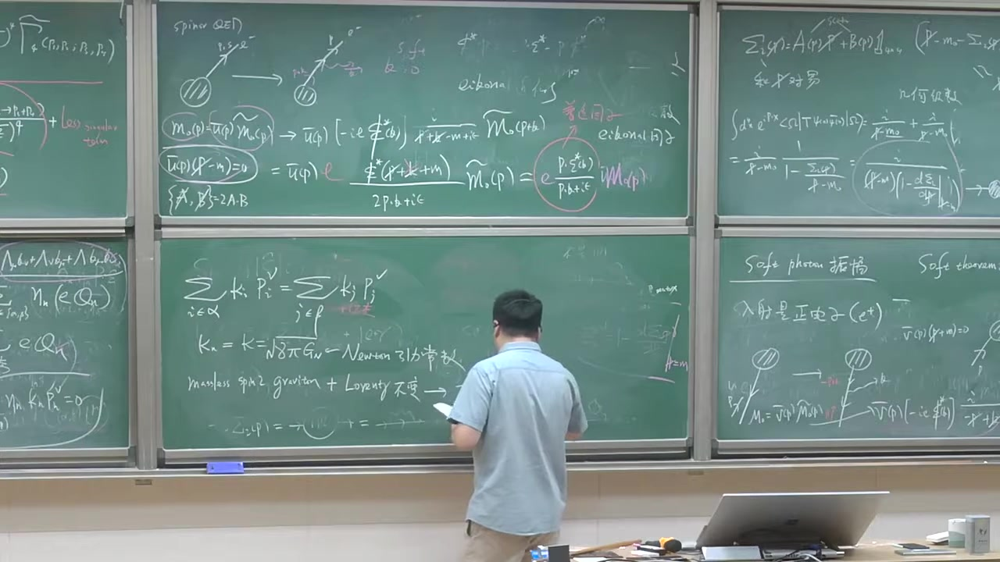


### 注解

**课程片段注解（01:25:50 ~ 01:29:19）**

---

## 1. 段落概要

本段是**软定理理论框架的拓展与升华**，讲师将软引力子（自旋-2）的成功经验推广至**更高自旋的无质量粒子**，最终导出理论物理中一个深刻的基本结论：**自然界不存在无质量的自旋≥3的粒子**。通过软极限方法，讲师证明了若存在此类粒子，将迫使所有粒子与其的耦合常数为零（荷为零），即该粒子无法与任何物质相互作用——这在物理上等价于"不存在"。

---

## 2. 板书内容描述

根据截图，讲师正在**中下黑板**区域书写高自旋软定理的约束条件，关键可见内容：

**中下黑板（高自旋软定理区域，新增内容）：**

```
Massless spin 3
∑ η_n β_n p_n^μ p_n^ν = 0  （或类似张量结构）
```

**右侧新增区域（高自旋讨论）：**
- 标题："Massless spin 3"
- 求和式涉及粒子标记 $n$、符号因子 $\eta_n$（±1）、耦合常数 $\beta_n$ 及动量双线性项

---

## 3. 核心公式详解

### 公式一：高自旋软极限的Ward等式

$$\sum_{n} \eta_n \, \beta_n \, p_n^{\mu_1} p_n^{\mu_2} \cdots p_n^{\mu_{s-1}} = 0$$

| 符号 | 含义 |
|:---|:---|
| $n$ | 对所有入射（incoming）和出射（outgoing）粒子求和 |
| $\eta_n$ | **符号因子**：出射粒子取 $+1$，入射粒子取 $-1$（即 $\eta_{\text{out}} = +1, \eta_{\text{in}} = -1$） |
| $\beta_n$ | 第 $n$ 个粒子与无质量自旋-$s$ 粒子的**耦合常数**（荷） |
| $p_n^{\mu_i}$ | 第 $n$ 个粒子的四动量的 $\mu_i$ 分量 |
| $s$ | 软粒子的自旋（本段讨论 $s=3$ 情形） |

**张量结构说明**：对于自旋-$s$ 粒子，软极限产生 $(s-1)$ 个动量因子的乘积。自旋-2时为一个 $p^\mu$（见前段），自旋-3时为 $p^\mu p^\nu$（对称无迹张量），以此类推。

---

### 公式二：质心系能量约束（推导关键步骤）

取特定运动学极限后得到：

$$\sum_{i} \beta_i \, E_i^2 = \sum_{i} \beta_i \, m_i^2 \quad \text{或简化为} \quad \sum_i \beta_i E_i^2 = 0 \text{（无质量情形）}$$

| 符号 | 含义 |
|:---|:---|
| $E_i$ | 第 $i$ 个粒子的能量 |
| $m_i$ | 第 $i$ 个粒子的质量 |
| 等式来源 | 软极限条件在 $p_i^0 = E_i$ 时的分量约束 |

---

## 4. 理论背景补充

### 4.1 高自旋规范对称性
- **自旋-1（光子）**：规范变换 $\epsilon^\mu \to \epsilon^\mu + \alpha k^\mu$，产生Ward等式 $\sum \eta_n e_n = 0$（电荷守恒）
- **自旋-2（引力子）**：规范变换 $\epsilon^{\mu\nu} \to \epsilon^{\mu\nu} + k^\mu \xi^\nu + k^\nu \xi^\mu$，产生 $\sum \eta_n \kappa_n p_n^\mu = 0$（四动量守恒）
- **自旋-3及以上**：规范变换涉及更高阶的导数，产生 $\sum \eta_n \beta_n p_n^{\mu}p_n^{\nu}\cdots = 0$

### 4.2 关键数学困难：张量等式的过约束性
对于自旋-$s \geq 3$，Ward等式要求**对称无迹张量** $\sum_n \eta_n \beta_n p_n^{\mu_1}\cdots p_n^{\mu_{s-1}}$ 为零。这不仅是矢量方程，而是高阶张量方程，其独立分量数量随 $s$ 快速增长。

---

## 5. 核心论证的通俗解释

### 讲师的"归谬法"思路：

| 步骤 | 逻辑内容 |
|:---|:---|
| **假设** | 假设存在无质量自旋-3粒子，与物质有耦合 $\beta_n$ |
| **推导** | 软极限要求 $\sum_n \eta_n \beta_n p_n^\mu p_n^\nu = 0$ 对所有过程成立 |
| **检验** | 取任意 $n \to m$ 散射过程，该等式几乎不可能满足 |
| **特例** | 取质心系，$p_i^0 = E_i$，得 $\sum_i \beta_i E_i^2 = \sum_i \beta_i m_i^2$ |
| **矛盾** | 该等式对任意能量配置过于严格，唯一解为**所有 $\beta_n = 0$** |
| **结论** | 自旋-3粒子无法与任何物质耦合 → 物理上等价于不存在 |

### 关键洞见：
> **"荷为零"（chargeless）= "不存在"**

在量子场论中，一个粒子若与所有其他粒子的耦合常数均为零，则它无法被产生、探测或参与任何物理过程——这正是"不存在"的数学表述。

---

## 6. 理论意义

| 层面 | 意义 |
|:---|:---|
| **现象学** | 解释为何自然界只有自旋-0, 1/2, 1, 2的基本粒子 |
| **理论自洽性** | 高自旋理论通常存在因果性破坏、非局域性等问题 |
| **弦理论背景** | 弦理论中自旋>2的激发态都是有质量的（Regge轨迹），与软定理结论一致 |
| **AdS/CFT** | 在AdS空间中，高自旋无质量粒子对应边界理论的高维守恒流，受严格限制 |

---

## 7. 与前段内容的衔接

| 前段内容 | 本段拓展 |
|:---|:---|
| 自旋-2（引力子）：$\sum \eta_n \kappa_n p_n^\mu = 0$ | 自旋-3：$\sum \eta_n \beta_n p_n^\mu p_n^\nu = 0$ |
| 解存在：所有 $\kappa_n = \sqrt{8\pi G_N}$（普适） | 解不存在：必须所有 $\beta_n = 0$ |
| 结论：引力子存在，广义相对论必然 | 结论：自旋≥3无质量粒子不存在 |

这一对比凸显了**自旋-2的独特性**——它是"最大"的、能与物质自洽耦合的无质量粒子，这正是引力在自然界中特殊地位的深层原因。

---

## 段落 53

**时间：** 01:29:27 ~ 01:29:42

<details><summary>📝 原始字幕</summary>

<pre>

不存在没有
非平庸的或者说自洽的没有
当吹尾的没有非平庸的
相互作用理论

</pre>

</details>

### 注解

**课程片段注解（01:29:27 ~ 01:29:42）**

---

## 1. 段落概要

本段是**高自旋软定理论证的总结性陈述**。讲师用高度凝练的语言给出了核心结论的另一种等价表述：对于自旋≥3的无质量粒子，不存在**非平庸的**（non-trivial）、**自洽的**（self-consistent）相互作用理论——换言之，任何试图构造此类粒子相互作用理论的尝试，最终都会退化为"没有相互作用"的平庸情况。

---

## 2. 关键术语解析

| 术语 | 含义 |
|:---|:---|
| **非平庸的** (non-trivial) | 指理论具有非零的相互作用、非零的物理可观测量。与之相对的"平庸"（trivial）指理论退化为自由场论，所有耦合常数为零。 |
| **自洽的** (self-consistent) | 指理论在数学上无矛盾，满足所有物理一致性条件（如幺正性、因果性、软定理约束等）。 |
| **"吹尾"** | 字幕识别误差，应为**"软"**（soft），指软极限（soft limit）——粒子能量趋于零的极限。 |
| **相互作用理论** | 区别于自由场论，指包含粒子间相互作用的量子场论。 |

---

## 3. 理论背景补充

### 高自旋软定理的"平庸性"困境

在前序段落中，讲师已证明：对于自旋 $s \geq 3$ 的无质量粒子，软定理约束要求所有粒子与该高自旋粒子的耦合常数必须满足：

$$Q_i^{(s)} = 0 \quad \text{或} \quad g_i^{(s)} = 0$$

这意味着：
- **要么** 所有粒子对该高自旋粒子的"荷"为零
- **要么** 耦合常数被迫为零

无论哪种情况，结果都是**该高自旋粒子无法与任何物质发生可观测的相互作用**——这在物理上等价于该粒子"不存在"。

### 本段的等价表述

本段给出的表述是上述结论的另一种强调方式：

> "不存在没有非平庸的、或者说自洽的、没有软极限的非平庸的相互作用理论"

拆解其逻辑结构：
- 若尝试构造自旋≥3粒子的相互作用理论
- 软定理约束会强制该理论必须是"平庸的"（无相互作用）
- 因此，**不存在**同时满足以下三个条件的理论：
  1. 非平庸（有相互作用）
  2. 自洽（数学一致）
  3. 具有软极限行为

---

## 4. 与低自旋的对比

| 自旋 | 软定理结果 | 物理意义 |
|:---|:---|:---|
| $s=1$（光子） | 电荷守恒，允许非平庸相互作用 | 存在非平庸的QED |
| $s=2$（引力子） | 四动量守恒，$G_N$ 普适 | 存在非平庸的引力理论（GR） |
| $s \geq 3$ | 强制所有耦合为零 | **不存在**非平庸相互作用理论 |

---

## 5. 核心物理洞见

这段总结揭示了一个深刻的理论物理原理：

> **相互作用的"存在性"本身受到时空对称性和量子一致性的严格筛选。**

并非所有数学上可想象的场都能参与物理相互作用。自旋≥3的无质量粒子虽然可以自由场形式存在（满足Klein-Gordon方程），但它们被**禁止**参与任何非平庸的动力学过程——这是量子场论与狭义相对论联合施加的"禁戒法则"。

这一结果与以下著名结论相互印证：
- **Weinberg-Witten定理**：质量less场的自旋≤2（在标准假设下）
- **Coleman-Mandula定理**：时空对称性与内部对称性的融合限制
- **弦理论中的高自旋**：只有在弦理论中，无限多高自旋粒子以特定方式组织，才能绕过此限制

---

## 段落 54

**时间：** 01:29:46 ~ 01:29:59

<details><summary>📝 原始字幕</summary>

<pre>

大家看这是另外一种视角
我们
告诉为什么高自权的灵长例子呢
它不存在是吧
行那我们先
我们先休息一会儿

</pre>

</details>

**课程截图：**


### 注解

**课程片段注解（01:29:46 ~ 01:29:59）**

---

## 1. 段落概要

本段是**高自旋软定理讨论的最终收束**。讲师以"另一种视角"（another perspective）作为引子，再次强调核心结论——**高自旋（自旋≥3）的无质量粒子不存在**——随后宣布课间休息。这是对该主题讨论的一个简短总结性过渡。

---

## 2. 关键术语解析

| 术语 | 含义 |
|:---|:---|
| **高自旋** (high spin) | 指自旋量子数 $s \geq 3$ 的粒子 |
| **另一种视角** (another perspective) | 暗示此前已从多个等价角度论证同一结论：软极限约束、自洽性条件、相互作用荷为零等 |

---

## 3. 理论背景补充

讲师提到的"另一种视角"可能指向以下等价表述之一（均为高自旋禁戒定理的经典证明路径）：

| 视角 | 核心论证 |
|:---|:---|
| **软极限视角**（本课主线） | 高自旋软定理要求 $\sum_i \eta_i E_i^{s-1} = 0$ 等无穷多约束，仅当所有耦合常数为零时可满足 |
| **洛伦兹代数视角** | Coleman-Mandula 定理：时空对称性与内部对称性的非平庸混合仅允许单极矩（$s \leq 2$） |
| **S-矩阵视角** | 高自旋粒子若存在，将迫使散射振幅在软极限出现过度约束，破坏解析性 |
| **规范对称视角** | 高自旋规范对称的代数结构无法自洽地量子化（存在 no-go 定理） |

这些视角共同指向 **Weinberg 软定理**（1964）与 **Coleman-Mandula 定理**（1967）所确立的深刻结论：**无质量粒子的自旋上限为 2**。

---

## 4. 板书内容描述

根据截图，讲师正站在**中下黑板**区域，该区域可见高自旋软定理的最终结论性板书：

**中下黑板（高自旋结论区域）：**
- 右侧可见 **"Massless spin ≥ 3"** 标题
- 关键约束方程：
  $$\sum_i \eta_i \beta_i P_i^\mu P_i^\nu = 0$$
  $$\Downarrow$$
  $$\sum_{\text{incoming}} \beta_i E_i^2 = \sum_{\text{outgoing}} \beta_i E_j^2$$
- 下方有中文结论：**"→ 引力耦合是 Universal！"**（引力耦合具有普适性）
- 更下方可见 **"对于 spin ≥ 3，没有非平庸的"**（字迹被讲师身体部分遮挡）

这些板书完整呈现了论证链条：软极限约束 → 能量-动量关系 → 高自旋禁戒 → 引力（$s=2$）的独特地位。

---

## 5. 核心概念通俗解释

> **为什么"高自旋不存在"是物理定律而非技术困难？**

想象试图构造一种"超引力"——比引力（$s=2$）传播更广、耦合更复杂的力。数学证明告诉你：**这种力要么不存在（耦合为零），要么就退化成一种"幽灵"——它不与任何物质相互作用**。这不是"我们还没找到"，而是"理论上就不可能找到"。

类比：这就像试图在欧几里得平面画一个"有三条以上边但内角和仍为180°的多边形"——不是画技问题，是几何本身的限制。

---

## 6. 段落定位

| 属性 | 说明 |
|:---|:---|
| **功能** | 主题收束 + 课间过渡 |
| **知识状态** | 高自旋软定理讨论结束，即将进入新主题 |
| **情绪标记** | "行那我们先休息一会儿"——典型的中文课堂节奏控制 |

---
