# 量子场论 第64讲【相互作用量子化】Gell Mann Low公式的应用及 真空泡泡图

> 自动生成的课程注解文档（共 38 个段落，[原始视频](https://youtu.be/bfqAcaTjxjI?si=vIeOuEx8gbTuzHAv)）

## 目录

- [00:00:09 段落 1](#段落-1)
- [00:00:15 段落 2](#段落-2)
- [00:05:16 段落 3](#段落-3)
- [00:08:47 段落 4](#段落-4)
- [00:13:54 段落 5](#段落-5)
- [00:17:02 段落 6](#段落-6)
- [00:17:53 段落 7](#段落-7)
- [00:21:22 段落 8](#段落-8)
- [00:23:05 段落 9](#段落-9)
- [00:28:07 段落 10](#段落-10)
- [00:28:41 段落 11](#段落-11)
- [00:31:37 段落 12](#段落-12)
- [00:33:50 段落 13](#段落-13)
- [00:34:07 段落 14](#段落-14)
- [00:34:13 段落 15](#段落-15)
- [00:35:28 段落 16](#段落-16)
- [00:40:32 段落 17](#段落-17)
- [00:41:09 段落 18](#段落-18)
- [00:45:51 段落 19](#段落-19)
- [00:47:28 段落 20](#段落-20)
- [00:49:10 段落 21](#段落-21)
- [00:50:48 段落 22](#段落-22)
- [00:54:09 段落 23](#段落-23)
- [00:57:09 段落 24](#段落-24)
- [00:59:03 段落 25](#段落-25)
- [00:59:08 段落 26](#段落-26)
- [00:59:42 段落 27](#段落-27)
- [01:00:31 段落 28](#段落-28)
- [01:03:23 段落 29](#段落-29)
- [01:04:14 段落 30](#段落-30)
- [01:04:51 段落 31](#段落-31)
- [01:06:22 段落 32](#段落-32)
- [01:10:20 段落 33](#段落-33)
- [01:10:26 段落 34](#段落-34)
- [01:10:39 段落 35](#段落-35)
- [01:10:52 段落 36](#段落-36)
- [01:11:12 段落 37](#段落-37)
- [01:11:33 段落 38](#段落-38)

---

## 段落 1

**时间：** 00:00:09 ~ 00:00:10

<details><summary>📝 原始字幕</summary>

<pre>
大家下午好
</pre>

</details>

**课程截图：**


### 注解

这段字幕为课程开场问候，不含公式或技术概念。

**要点概括：**
- **场景定位**：时间戳 00:00:09–00:00:10 处于课程起始阶段，讲师向听众致意
- **社交功能**："大家下午好"为典型课堂问候语，用于建立师生互动、确认听众注意力，并标志正式授课内容的开始
- **视觉信息**：截图显示讲师位于阶梯教室/大课堂的黑板前，黑板当前为空白状态，暗示课程刚启动，尚未进入板书推导阶段

**教学提示**：此类开场白通常紧接着课程大纲回顾或上次课内容总结，建议关注后续 30 秒内是否出现课程主题关键词（如"今天我们继续讲…"、"上节课我们推导了…"）。

---

## 段落 2

**时间：** 00:00:15 ~ 00:05:16

<details><summary>📝 原始字幕</summary>

<pre>
我们上几个课呢这个上一次给他录课呢周五的时候给大家讲了这个这个关联函数格林函数是吧我们给大家解释格林函数虽然不直接对应物理可观的量但是在量子场论里面它有一个非常重要的这个理论上的一个工具它定义是一些海森堡会景的长滩服务我叫个H要不然还不还这么会劲你可以任意多个常产服务比如说我们考虑有N个长坦服它的这个边是沉积在这个物理真空就相互纵的真空的这个期望值是吧我给大家解释这样一个关联函数呢或者叫格林林汉山呢他虽然不能直接被实验仪器所测量但是他在场论里面呢也有非常非常重要的这个作用OK他是个对于理论家来说它是非常非常这个JENNO的一个OBJECTOK呃大概我们实际课之前给大家着重讲的是Smetics我们给大家强调从S可以直接联系到这个和这个一个 bk rate 所以呢我们嗯就是说着重呢就是说对这个SG种类非常感兴趣OK但是呢当时我们引如飞漫图怎么围绕计算这样一个格林函数是吧啊怎么围绕计算这个X正元然后我们说把这个相纵的这个像V如果是某种意义上那么原原小于这个自由的这个哈密顿的H0的话呢你可以利用威扰论在这场S剧原的时候我们用了两种威扰论的方法一种呢是老师表论是吧也叫这个利普曼十进制方程出发的这个别论论然后呢我们后来又学习了这个如何用这个这个现代的这个时间依赖的这个维度论是吧它的出发点是从相务总会进会我们引了一个X算符我们再回一下算符在相互作用会景下呢一个时间演化上浮开始时刻呢是从富穷接触时刻呢是在正无穷OK我们说我们可以定义S组能量回想一下我们说咱还是把父母进家因斯特奥斯特这样一个进的Produc这个内机是吧那这是海思马绘景下定了这样一个状态便于计算的我们引用的这个相互动的汇率的X算符呢是在相互动的汇率下我们可以把它写成北塔和阿尔法现在是代表是两个这个自由的多立体的无相无重的多立体态是吧然后我们用来算符OK这是我们我们已经学会了如何用这种方法呢去做这个未熬计算是吧当时我们给大家给了一个规则说这个这样计算正面呢你要考虑所有的飞曼图规定出没态就是外退确定但是我们有要求是吧这是费曼图不任意的我们要求什么呀还记得吗我们要求连接联通的或者应该说是完全联通的完全连接起来然后我们要求并且是什么样amputed 是吧结腿的或者有有的是英文叫创KT的OK那为什么有这样的要求呢就说其实我们以前给了这样一个这样一个recipe呢其实我没有给大家严格讲就是说我给大家汉德威文说为什么这样做是吧但是我们今天的目的呢是从格林函数啊出发呢也可以有一个非常POPER的公式一个定理告诉你怎么从格林函数上一个非常GENERAL的一个这个这个这个这个这个这个这个这个这个这个这个这个这个这个这个这个这个这个这个这个这个这个这个这个这个这个这个这个这个这个这个这个这个这个这个这个这个这个这个这个这个这个这个这个这个这个这个这个这个这个这个这个这个这个这个这个这个这个这个这个这个这个这个这个这个这个这个这个这个这个这个这个这个这个这个这个这个这个这个这个这个这个这个这个这个这个这个这个这个这个这个这个这个这个这个这个这个这个这个这个这个这个这个这个这个这个这个这个这个这个这个这个这个这个这个这个这个这个这个这个这个这个这个这个这个这个这个这个这个这个这个这个这个这个这个这个这个这个这个这个这个这个这个这个这个这个这个这个这个这个这个这个这个这个这个这个这个这个这个这个这个这个这个这个这个这个这个这个这个这个这个这个这个这个这个这个这个这个这个这个这个这个这个这个这个这个这个这个这个这个这个这个这个这个这个这个这个这个这个这个这个这个这样的S我们就可以理解为什么我们有这样的要求甚至呢我们发现呢这样一个简单的公式呢有一个小小的瑕疵他说你算领头界所谓数图界的这样一个非凡图算没有问题但你也要考虑所谓的辐射修正量子修正这个公式呢这样的一个简单的这样一个菜单其实不是很完备的OK我得添一下非常重要的一个一个因子这个因子叫场强重重化因子或者叫波函数重重化因子OK所以这是我们今天的这样一个主要的一个目标OK所以上这课呢我给大家强调怎么做WORL理论因为我们现在会的只有WORL理论虽然这样的一个格林海原单号你如果有比较PowerFlow的一些非遥的这种手段你可以直接
</pre>

</details>

**课程截图：**

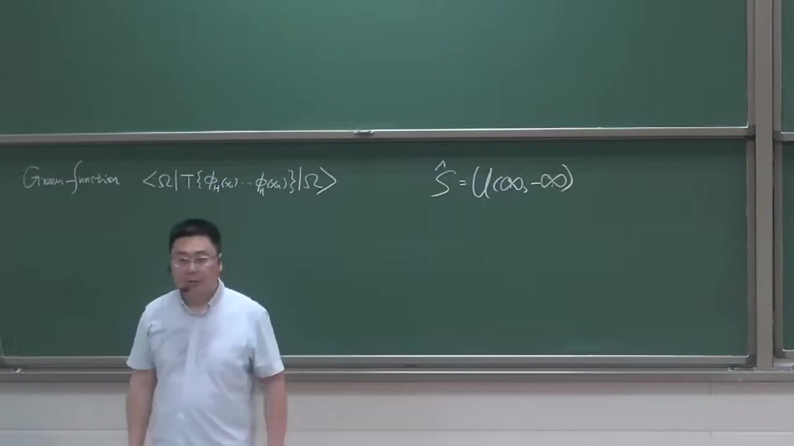


### 注解

这是一段关于**量子场论中格林函数与S矩阵关系**的课程引言。讲师正在回顾前期内容（相互作用绘景、微扰论），并引出本节核心主题：**如何从格林函数严格导出S矩阵的费曼图计算规则（LSZ约化公式）**，以及为何需要考虑**连通图（Connected）**、**截腿图（Amputated）**和**场强重整化因子（Z）**。

---

### 1. 板书公式识别与解释

根据截图，黑板上出现了以下关键公式：

#### 公式一：格林函数（关联函数）定义
$$G^{(n)}(x_1, \dots, x_n) = \langle \Omega | T\{\phi_H(x_1) \cdots \phi_H(x_n)\} | \Omega \rangle$$

**符号解释：**
- **$|\Omega\rangle$**：物理真空态（相互作用真空），即相互作用哈密顿量 $H$ 的基态，区别于自由理论的真空 $|0\rangle$。
- **$T\{\cdots\}$**：时序乘积（Time-ordering），表示将场算符按时间先后从左到右排列，最早时间在右。
- **$\phi_H(x)$**：**海森堡绘景（Heisenberg Picture）**下的场算符。下标 $H$ 表示其随时间演化由**完整哈密顿量** $H = H_0 + V$ 控制，即 $\phi_H(x) = e^{iHt}\phi(\mathbf{x})e^{-iHt}$。
- **含义**：这是 $n$ 点格林函数，描述在物理真空中，时空点 $x_1$ 到 $x_n$ 处场量涨落的关联。它是量子场论中最基本的理论建构块。

#### 公式二：S算符（散射算符）
$$\hat{S} = U(\infty, -\infty)$$

**符号解释：**
- **$U(t, t_0)$**：**相互作用绘景（Interaction Picture）**下的时间演化算符，满足 $i\frac{d}{dt}U(t,t_0) = V_I(t)U(t,t_0)$，其中 $V_I(t) = e^{iH_0 t}Ve^{-iH_0 t}$ 是相互作用势在相互作用绘景下的形式。
- **$(\infty, -\infty)$**：表示从遥远的过去（$t \to -\infty$，入态）演化到遥远的未来（$t \to +\infty$，出态）。
- **含义**：$\hat{S}$ 算符包含了全部的散射信息。其矩阵元给出粒子从初态到末态的跃迁概率幅。

#### 公式三：S矩阵元
$$S_{\beta\alpha} = {}_H\langle \beta; \text{out} | \alpha; \text{in} \rangle_H = \langle \beta | \hat{S} | \alpha \rangle$$

**符号解释：**
- **$|\alpha; \text{in}\rangle_H$**：海森堡绘景下的**入态（in-state）**，在 $t \to -\infty$ 时看起来像自由多粒子态 $|\alpha\rangle$。
- **$|\beta; \text{out}\rangle_H$**：海森堡绘景下的**出态（out-state）**，在 $t \to +\infty$ 时看起来像自由多粒子态 $|\beta\rangle$。
- **$|\alpha\rangle, |\beta\rangle$**：自由理论中的多粒子态（通常是 $H_0$ 的本征态，由产生算符作用于自由真空 $|0\rangle$ 构成）。
- **含义**：$S_{\beta\alpha}$ 是散射振幅，其模平方 $|S_{\beta\alpha}|^2$ 给出从初态 $\alpha$ 散射到末态 $\beta$ 的概率。

#### 板书文字：费曼图规则
$$\text{Sum of Feynman diagrams} \begin{cases} \text{Fully Connected} \\ \text{Amputated} \end{cases}$$

**含义**：计算S矩阵元时，只需对满足以下两个条件的费曼图求和：
1. **完全连通（Fully Connected）**：图不能分成互不相连的几部分（排除真空涨落图）。
2. **截腿/截肢（Amputated）**：去掉外腿（External legs）上的所有自能插入（self-energy insertions）。即外腿不再是自由传播子，而是“截断”在顶点处。

---

### 2. 理论背景补充

#### A. 为什么需要这些限制？（LSZ约化公式）
讲师提到的“非常GENERAL的定理”即**Lehmann-Symanzik-Zimmermann (LSZ) 约化公式**。这是连接格林函数与S矩阵的桥梁。

LSZ公式的大致形式为：
$$\langle p_1 \dots | S | k_1 \dots \rangle \propto \prod_{i} (p_i^2 - m^2) \int d^4x_i \, e^{-ip_i \cdot x_i} \langle \Omega | T\{\phi(x_1)\dots\} | \Omega \rangle$$

**关键物理：**
- **外腿极点（Pole Structure）**：当外动量 $p_i$ 趋近于质壳（on-shell，$p_i^2 = m^2$）时，格林函数在外腿处会有极点（$1/(p^2-m^2)$）。
- **截腿（Amputated）**：LSZ公式中的 $(p^2 - m^2)$ 因子正好抵消掉外腿传播子的极点。因此，在费曼图计算中，我们**手动去掉**外腿的自由传播子部分，只保留“截断”后的顶点部分，这就是**截腿图**。
- **连通性（Connected）**：非连通图对应于独立发生的散射过程（或真空涨落），而S矩阵元只关心所有粒子实际发生相互作用的连通部分。

#### B. 场强重整化（Wave Function Renormalization）
讲师提到的“小小的瑕疵”和“辐射修正”指的是：相互作用场 $\phi(x)$ 产生的单粒子态 $|p\rangle$ 与自由场产生的态归一化不同：
$$\langle \Omega | \phi(x) | p \rangle = \sqrt{Z} \, e^{-ip\cdot x}$$

其中 $Z$ 就是**场强重整化因子**（$0 < Z < 1$）。在严格的LSZ公式中，计算S矩阵元时，每个外腿需要乘以一个因子 $\sqrt{Z}$。在微扰论的领头阶（树图），$Z \approx 1$，可以忽略；但在高阶计算（圈图/辐射修正）中，必须包含 $Z$ 因子才能得到正确结果。

---

### 3. 核心概念通俗解释

**类比：格林函数 vs. S矩阵**
- **格林函数**像是用“探针”在真空中测量场的“波纹”如何在时空点之间传播和关联。它包含了所有信息，包括粒子如何产生、传播、湮灭，甚至包括真空本身的量子涨落（虚粒子对产生湮灭）。
- **S矩阵**则像是“粒子对撞机的读取数据”。它只关心：在遥远的过去放入一些粒子（初态），经过相互作用后，在遥远的未来探测到哪些粒子（末态）？它不关心中间过程的细节，只关心初末态的跃迁概率。

**为什么只画“连通”和“截腿”图？**
- **连通（Connected）**：假设你在计算两个电子散射。如果费曼图显示两个电子各自独立地传播（没有交换光子），这相当于两个人从身边走过但没打招呼，这不属于“散射事件”。S矩阵只记录实际发生相互作用（连通）的部分。
- **截腿（Amputated）**：在真实的散射中，入射粒子在相互作用前是“物理粒子”（其传播已被 dress 过）。费曼图的外腿（自由传播子）只是数学上的辅助线。截腿意味着我们剪掉这些辅助线，只保留“碰撞核心”——即顶点处的相互作用部分。

**场强重整化 $Z$ 是什么？**
想象一个粒子在真空中穿行。它不断与真空的量子涨落（虚粒子对）相互作用，导致其“裸”的物理属性被“屏蔽”或修正。$Z$ 因子就是描述这种修正强度的数。它告诉你：相互作用理论中的“粒子”与自由理论中的“粒子”在产生和湮灭时，概率幅相差多少。

---

### 4. 板书内容描述

**第一张截图：**
- **左侧**：写有标题 "Green function"，下方是 $n$ 点格林函数的数学表达式 $\langle \Omega | T\{\phi_H(x_1)\cdots\phi_H(x_n)\} | \Omega \rangle$。
- **右侧**：写有 $\hat{S} = U(\infty, -\infty)$，表示S算符是时间演化算符从负无穷到正无穷的极限。

**第二张截图：**
- **左侧**：与第一张相同，保留格林函数定义。
- **右侧上方**：补充了S矩阵元的定义 $S_{\beta\alpha} = {}_H\langle \beta;\text{out} | \alpha;\text{in} \rangle_H = \langle \beta | \hat{S} | \alpha \rangle$。
- **右侧下方**：用椭圆框圈出费曼图计算规则的文字说明："Sum of Feynman diagrams"（费曼图求和），下方列出两个关键限制条件："Fully Connected"（完全连通）和 "Amputated"（截腿/截肢）。

**整体布局**：讲师站在黑板前，黑板被分为左右两栏，左栏聚焦格林函数（理论建构），右栏聚焦S矩阵与费曼规则（可观测物理）。

---

## 段落 3

**时间：** 00:05:16 ~ 00:08:44

<details><summary>📝 原始字幕</summary>

<pre>
计算它OK回来反复强调就是说这个东西原来非常容易她发明了从陆金积分的语言最自然的是用最自然的一种方法的一种框架去计算格林函数OK这个边时的这个成绩在读零积分的语言是非常自动保持的所以所以非常地所谓路径积分方法或者基于路径方路径积分方法的这种所谓的隔点的文场论把十分离散化把施工离散化这种方法呢他可以非必要地就直接计算这样一个格林函数但我们这门科强调是维论计算是吧维奥论计算格林汉说我们围绕展开我们上一次周五路客呢我们是给大家讲两种方法一种是所谓的这种基于拉格朗日的这种是叫我叫拉格朗尔方程式另外一种呢是基于哈姆顿量我那哈姆顿量的Formule是吧这是我们上几个课给大家上次课给大家主要讲内容这个拉格朗的方位怎么样它是基于这个呆生吃完个方虫Okey它的一个核心的一个一个出发点就叫假设是再一个今年场来我呢常满足欧拉拉拉的运动方程但是呢你把它量化以后呢两个场算服依然满足这个欧拉拉那个浪人方程是吧然后我们这里面非常有趣的一个相声康泰OK是大H八的系数的一个得了函数我们说这这个这一项呢代表了从经典到量子的一个一个月经OK这是一个DIFFERENCE主要亮字和经典的DIFFERENCE填在张永康泰这个词上上课给大家展示了如何你用一些TRIQUE是吧引入一个新的要算一个格林汉还要引入一个额外的一个D四X积分然后有个四度的德塔函数你把它的函数表示成一个换成高能算福种在一个飞马传播子然后分不积分然后你用这样一个大写式方程这种迭代这种方法这种方法很妙它有些优点但是它不是特别的系统所以呢我们后来又引入了根据这个通过哈密尔顿量因为我们不知道哈密尔顿量是时间演化时间演化的一个生成源是吧所以呢我们直接从这样一个海丝猫会景的这样一个场算服务把他用相互动会就能长得更快服务来表达啊同样我们把物理的真空呢用一个自由理论真空来表达最后我们得到一个非常非常著名的一个公式是吧这个公式叫诸位的政治家格尔曼诺贝尔奖得主还有这样一个还有一个叫LOW也是非常著名的一个物理学家他们的一个公事这公式和我们以前算S军人员的公式呢非常类似他什么意思呢比如他算任何一个格林还说比如出于简单我们考虑一个两点函数我家现在家下标代表它是海参会景要唱符你可以写成什么呢你可以写成一个
</pre>

</details>

**课程截图：**

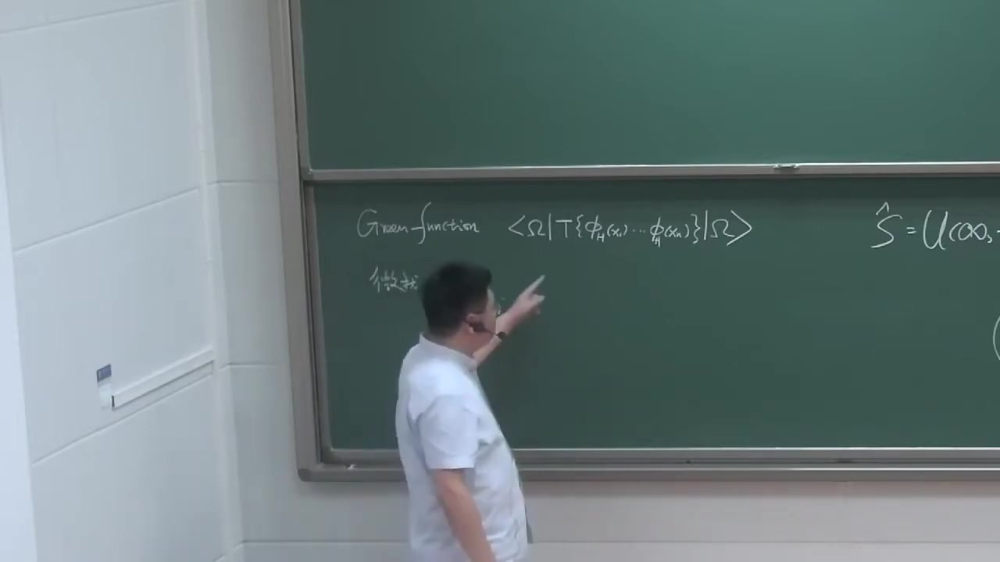


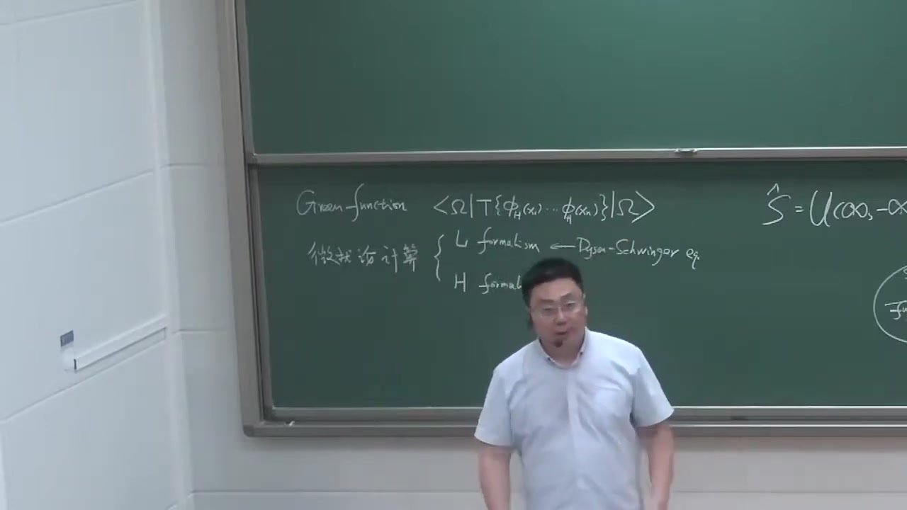

### 注解

这段课程讲解的是**量子场论中格林函数的微扰计算方法**，重点对比了拉格朗日形式与哈密顿形式两种理论框架。以下是详细注解：

---

## 1. 板书公式识别与解释

根据黑板截图，主要出现以下三个关键公式：

### 公式 A：格林函数的一般定义（海森堡绘景）
$$\langle\Omega|T\{\phi_H(x_1)\cdots\phi_H(x_n)\}|\Omega\rangle$$

| 符号 | 物理含义 |
|------|---------|
| $|\Omega\rangle$ | **物理真空态**（相互作用理论的基态，区别于自由理论的真空 $|0\rangle$） |
| $T\{\cdots\}$ | **时序算符**（Time-ordering），按时间先后排列场算符，早时居右，晚时居左 |
| $\phi_H(x)$ | **海森堡绘景**（Heisenberg picture）下的场算符，含时演化由全哈密顿量 $H$ 决定：$\phi_H(x) = e^{iHt}\phi(\mathbf{x})e^{-iHt}$ |
| $x_i$ | 四维时空坐标 $x_i = (t_i, \mathbf{x}_i)$ |

**物理意义**：这是 $n$ 点格林函数（关联函数），描述在真空涨落背景下，$n$ 个时空点上的场扰动如何相互关联。它是计算散射振幅（S矩阵元）的基本构件。

---

### 公式 B：S-矩阵（时间演化算符）
$$\hat{S} = U(\infty, -\infty)$$

| 符号 | 物理含义 |
|------|---------|
| $\hat{S}$ | **S-矩阵**（散射矩阵），描述从 $t=-\infty$（入态）到 $t=+\infty$（出态）的时间演化 |
| $U(t_2, t_1)$ | **时间演化算符**，满足 $U(t_2,t_1) = T\exp\left(-i\int_{t_1}^{t_2} H_I(t) dt\right)$，其中 $H_I$ 是相互作用绘景下的相互作用哈密顿量 |

---

### 公式 C：Gell-Mann–Low 公式（即将写出或口述）
虽然截图中未完全显示，但根据字幕"诸位的政治家格尔曼...LOW...公式"，指的是：

$$\langle\Omega|T\{\phi_H(x)\phi_H(y)\}|\Omega\rangle = \frac{\langle 0|T\{\phi_I(x)\phi_I(y)S\}|0\rangle}{\langle 0|S|0\rangle}$$

| 符号 | 物理含义 |
|------|---------|
| $|0\rangle$ | 自由理论的真空态（已知且简单） |
| $\phi_I(x)$ | **相互作用绘景**（Interaction picture）下的场算符，按自由哈密顿量 $H_0$ 演化 |
| 分子 | 自由真空中，相互作用场算符编时乘积与S矩阵的期望值 |
| 分母 | 真空-真空振幅（消除 disconnected 图的归一化因子） |

---

## 2. 理论背景补充

### 2.1 两种微扰论框架
课程强调计算格林函数的两种等价方法：

| 方法 | 理论基础 | 核心方程 | 特点 |
|------|---------|---------|------|
| **拉格朗日形式**<br>(Lagrangian Formalism) | 路径积分<br>或生成泛函 | **戴森-施温格方程**<br>(Dyson-Schwinger Eq.) | 基于作用量 $S=\int d^4x \mathcal{L}$，通过泛函导数 $\frac{\delta}{\delta J(x)}$ 得到场方程。自动保持对称性（如规范对称性）。 |
| **哈密顿形式**<br>(Hamiltonian Formalism) | 算符代数<br>时间演化 | **Gell-Mann-Low 定理** | 基于 $H = H_0 + H_{int}$，将相互作用视为微扰。用自由场算符展开，通过Wick定理计算时序乘积。 |

### 2.2 经典与量子的区别（字幕中提到的"Difference"）
- **经典场**：满足欧拉-拉格朗日方程 $\frac{\partial\mathcal{L}}{\partial\phi} - \partial_\mu\frac{\partial\mathcal{L}}{\partial(\partial_\mu\phi)} = 0$
- **量子场**：算符 $\phi_H(x)$ 形式上仍满足类似运动方程，但本质区别在于**对易关系**（或反对易关系）：
  $$[\phi(t,\mathbf{x}), \pi(t,\mathbf{y})] = i\delta^{(3)}(\mathbf{x}-\mathbf{y})$$
  这是量子化的"痕迹"，也是戴森-施温格方程中额外项的来源。

### 2.3 路径积分 vs 微扰论
- **路径积分**（费曼方法）：直接计算 $\int \mathcal{D}\phi \, e^{iS[\phi]}$，将时空离散化（格点化）后可数值计算，保持对称性自然。
- **微扰论**（课程重点）：将相互作用拉氏量 $\mathcal{L}_{int}$ 作为小量展开，用自由传播子（Feynman propagator）逐级修正。

---

## 3. 核心概念通俗解释

### 什么是格林函数？
想象时空是一张巨大的"床垫"。你在 $x$ 点按一下（激发一个场），在 $y$ 点会感受到振动。格林函数就是描述这种"振动传递"的数学工具——它告诉你：**如果在某时某地发生一个事件，另一时另一地受到的影响有多大**。

### 为什么要用两种方法？
- **拉格朗日法**像"航拍"：从全局看所有可能的历史路径（路径积分），适合处理对称性和守恒律，但计算时容易陷入复杂的泛函分析。
- **哈密顿法**像"逐步推演"：把复杂的相互作用拆成一步步小扰动（微扰），用已知的自由粒子行为拼凑出真实行为。Gell-Mann-Low公式就是"翻译器"——把难算的真实真空 $|\Omega\rangle$ 和真实场 $\phi_H$，转换成好算的自由真空 $|0\rangle$ 和自由场 $\phi_I$。

### 时序算符 $T$ 的作用
量子场论中，时间顺序至关重要。$T$ 就像一个严格的导演，确保先发生的"戏"（算符）排在右边，后发生的排在左边。这样能保证因果性——原因必须发生在结果之前。

---

## 4. 板书内容描述

**黑板布局（从左至右）：**

1. **左侧区域**：
   - 标题：`Green function`
   - 公式：$\langle\Omega|T\{\phi_H(x_1)\cdots\phi_H(x_n)\}|\Omega\rangle$
   - 下方标注：`微扰论`（Perturbation theory）

2. **中间区域**（随着讲解逐步添加）：
   - 大括号展开两种方法：
     - `L formalism` ← 连线 → `Dyson-Schwinger eq.`（戴森-施温格方程）
     - `H formalism`（哈密顿形式，对应Gell-Mann-Low公式）

3. **右侧区域**：
   - 公式：$\hat{S} = U(\infty, -\infty)$（S矩阵的定义）
   - 可能还有部分被遮挡的演化算符表达式

**教学逻辑**：教师先用手指向格林函数定义，强调这是研究目标；然后向下展开说明计算策略（微扰论），最后分岔介绍两种理论工具（L形式与H形式），右侧则准备引入S矩阵的具体表达式来导出Gell-Mann-Low公式。

---

## 段落 4

**时间：** 00:08:47 ~ 00:13:53

<details><summary>📝 原始字幕</summary>

<pre>
你可以把这个物理真空呢换成一个自由理论的真空用零代表自由理论的真空然后一个大的变形成级然后呢写成相呼纵会紧下的唱穿服我们知道相关作用会底下的肠道服务随时演化呢和我以前熟悉的自由场是完全一样的然后呢我演一个大的癌蒜服我是算账一个真空期盼是但是还要除一个什么呀出于一个从自由空空到自由空空的一个越迁的一个气象指标,对吧这时候这是一个非常非常著名的非常非常一个公式它可以算任意的一个N点格林函数特别要展开是吧显然这种方法呢它更加系统是吧其中是S算符的定义来回一下等于T然后呢一个指数我是谁?富穷到政务穷对地梯积分因为它有个显示的对DT积分我有个相互重绘景下的这样一个相公总能普通上能量所以这种未然论也叫这种时间依赖的这个维奥论是吧作为对比呢老师围绕论也叫时间无关的这个围绕论OK这是一个核心的一个撞了个公事是吧这个公式我上整个给大家说了你你也很容易将来你们很多同学要学到这样一个路径积分量化的时候你会提供一种非常另外一种视角理解重新理解这样一个公式这个盖尔曼楼公式从陆军基本的角度非常非常直观非常非常有理解从陆军基本的角度来说维奥论其实就是一种什么呀就是你围绕着让一个FY全时空触度等于零的这样一个父亲做一个展开所以呢不要论从陆军机分的语言里看它是一种小场道这种展开从一种废油的角度来说是否要论OK顺便说一下我们上次呢通过这个戴森实用方程呢通过这种方便的轮来我们显示的保留H八是吧我给大家主要展示一点就是说这个LOOPXPANCE全展开等于H八XP这点非常有意思这点需要是个概念上非常重要的我们也很容易从这样一个哈密顿量的方程式里怎么盖尔曼漏的这种公式也可以看出来他为什么是这样子OK咱们看这项算符你可以仔细看一下S F 的指数函数必须是没有亮钢的是吧这个能量成于时间的是个什么量缸是个作用量的一个量缸是吧最用亮的亮缸是跟普朗的常数同一个梁杠不知道长数的梁杠就是座的梁杠所以你要保证这个指数函数的这个这个质变量的没有亮度的环境你发现呢你必须得除一个H八这得大家清楚所以大家得有能力呢我们用的是自然单位制但是我想恢复到别的单位制国际单位制我应该有这个能力是吧你会发现呢你把它这个S泛幅它长得越来越高阶你来考虑越来越高级的围绕论是吧比如说圈途的话你必须得整到至少是平方街是吧去决定这种过程然后上讲课呢给大家演示一下DF传播推销传播子你应该看这个 power 是H8的以此方式它来自于正则量子化的一个等时量子化的一个条件OK所以呢你一个圈途传播的会比较多让丁教会被速度高一是吧然后你发现呢你数这个传播者的数目和含量这样一个S算法要展开个人的话对于法四理论法三理论你不但验证这一点确实是你可以验证一点就是说这个loop expansion直观的理解是一个我和常树的小和和长生一个太来展开它同时呢它也是一个 h8的一个展开就是概念上来说呢非常非常重要的一点所以大家经常在文献里面看到别人说算法圈图修正人类原管它叫量子修正的原因OK它因为它是H八的一个XPANION好的这里面呢算符里面自己带一个便士成绩好吗但是你发现这里面有个大的一个总体的一个太茂的操作员所以用这个加码的公式的时候呢你的T也可以不要但是公式保证你所有的算法都必须按照自动的编识来理解好那我们现在呢需要稍微的对这样一个德国曼洛公事呢我们得做一些实战是吧否则的话我们学的东西反正比较抽象所以我们还是从最简单的这个栏目到FISH理论呢我们来我们来考虑考虑来研究一下我们就利用这种公式然后我们的目标就是说我们想了解一下这项命运是怎么去的这东西可能还怪怪的是吧一个真空到真空的一个
</pre>

</details>

**课程截图：**


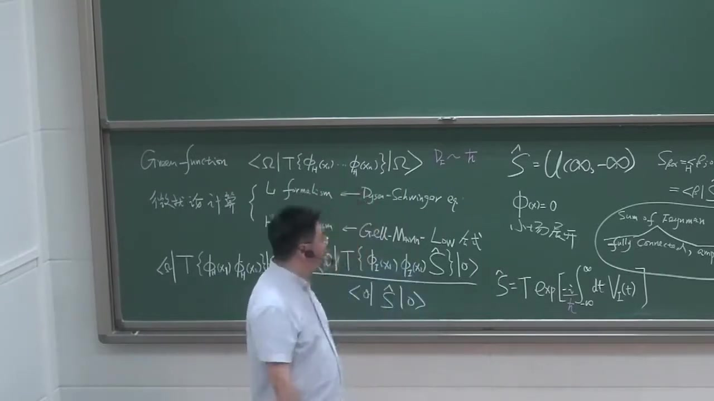

### 注解

这段视频讲解了量子场论中**微扰论计算格林函数**的核心框架——**Gell-Mann-Low 公式**（盖尔曼-洛公式）。这是连接自由场论与相互作用场论的桥梁。

---

## 一、板书内容描述

从三张黑板截图可见，板书分为三个逻辑区域：

**左侧区域（理论分类）：**
- 标题 "Green function" 下列出了格林函数的海森堡绘景定义
- 标注微扰计算的两种等价形式：
  - **L formalism**（拉格朗日形式）→ 对应 Dyson-Schwinger 方程
  - **H formalism**（哈密顿形式）→ 对应 **Gell-Mann-Low 公式**（本课重点）

**中间区域（核心公式）：**
- 写有大大的 **Gell-Mann-Low 公式**：
  $$\langle\Omega|T\{\phi_H(x)\phi_H(y)\}|\Omega\rangle = \frac{\langle 0|T\{\phi_I(x)\phi_I(y)\hat{S}\}|0\rangle}{\langle 0|\hat{S}|0\rangle}$$

**右侧区域（S矩阵定义与诠释）：**
- $\hat{S} = U(\infty, -\infty)$（S矩阵是时间演化算符的极限）
- S矩阵的显式表达式：
  $$\hat{S} = T\exp\left[-\frac{i}{\hbar}\int_{-\infty}^{\infty} dt\, V_I(t)\right]$$
- 手绘示意图：标注 "Sum of Feynman diagrams" 和 "fully connected amplitudes"（全连通振幅），暗示S矩阵的展开对应费曼图求和
- 标注 "$\phi(x)=0$" 和 "小场展开"，提示从路径积分视角看微扰论是围绕经典解 $\phi=0$ 的展开

---

## 二、公式识别与符号详解

### 公式 1：Gell-Mann-Low 公式（格林函数计算式）

$$\langle\Omega|T\{\phi_H(x_1)\cdots\phi_H(x_n)\}|\Omega\rangle = \frac{\langle 0|T\{\phi_I(x_1)\cdots\phi_I(x_n)\hat{S}\}|0\rangle}{\langle 0|\hat{S}|0\rangle}$$

| 符号 | 含义 | 说明 |
|------|------|------|
| $|\Omega\rangle$ | **物理真空**（相互作用真空） | 相互作用场论的真实基态，与自由真空 $|0\rangle$ 不同 |
| $|0\rangle$ | **自由真空** | 自由场论（无相互作用）的基态，通常用 $|0\rangle$ 或 $|0\rangle_{\text{free}}$ 表示 |
| $\phi_H(x)$ | 海森堡绘景场算符 | 随时间演化：$\phi_H(x) = e^{iHt}\phi(\mathbf{x})e^{-iHt}$，包含完整相互作用信息 |
| $\phi_I(x)$ | 相互作用绘景场算符 | 场算符随自由哈密顿量 $H_0$ 演化，满足自由场方程，是我们"熟悉"的自由场 |
| $T\{\cdots\}$ | 时序乘积（Time-ordering） | 自动将时间早的算符排在右边，时间晚的算符排在左边，并计入费米子交换的负号 |
| $\hat{S}$ | **S矩阵（散射矩阵）** | $\hat{S} = U(\infty, -\infty)$，描述从 $t=-\infty$ 到 $t=+\infty$ 的演化 |
| 分母 $\langle 0|\hat{S}|0\rangle$ | 真空-真空跃迁振幅 | **至关重要**：消除"真空泡泡"（vacuum bubbles）图，保证物理振幅的归一化 |

**物理意义**：这个公式告诉我们：**相互作用场论的格林函数（左边）可以用自由场的格林函数（右边分子）来计算，但必须除以真空-真空跃迁振幅（分母）来修正真空结构的变化。**

---

### 公式 2：S矩阵的时序指数形式

$$\hat{S} = T\exp\left[-\frac{i}{\hbar}\int_{-\infty}^{\infty} dt\, V_I(t)\right]$$

| 符号 | 含义 |
|------|------|
| $T\exp$ | 时序指数（Time-ordered exponential），展开为级数时每一项都要保持时序 |
| $\hbar$ | 约化普朗克常数（讲师强调此处必须有 $\hbar$ 以保证指数无量纲） |
| $V_I(t)$ | 相互作用绘景下的相互作用哈密顿量，$V_I(t) = e^{iH_0 t} V e^{-iH_0 t}$ |
| 积分限 $(-\infty, \infty)$ | 绝热假设（adiabatic hypothesis）：相互作用在无穷远处绝热地开启和关闭 |

**关键细节**：讲师特别强调指数中必须有 $\hbar$。因为：
- $V_I(t)$ 的量纲是能量（$[E]$）
- $dt$ 的量纲是时间（$[T]$）
- 所以积分 $\int V_I dt$ 的量纲是作用量（$[E][T] = [S]$）
- 为保证指数函数的自变量无量纲，必须除以 $\hbar$（作用量的自然单位）

---

### 公式 3：S矩阵与演化算符的关系

$$\hat{S} = U(\infty, -\infty)$$

其中 $U(t, t')$ 是相互作用绘景下的时间演化算符，满足 $i\hbar \frac{d}{dt}U(t,t') = V_I(t)U(t,t')$。

---

## 三、必要理论背景补充

### 1. 三种绘景（Pictures）的区分
量子力学/场论有三种描述时间演化的方式：

| 绘景 | 态矢量 | 算符 | 适用场景 |
|------|--------|------|----------|
| **薛定谔绘景** | 随时间演化 | 固定 | 非相对论量子力学 |
| **海森堡绘景** | 固定 | 随时间演化 | 场论中定义格林函数 |
| **相互作用绘景** | 随 $H_0$ 演化 | 随 $H_0$ 演化 | **微扰论计算**，介于两者之间 |

Gell-Mann-Low 公式的威力在于：**它把海森堡绘景中难以计算的物理真空期望值，转化为相互作用绘景中我们可以用自由场技术（Wick定理）计算的形式。**

### 2. 绝热假设（Adiabatic Hypothesis）
公式隐含了一个关键假设：相互作用是"绝热"地开启和关闭的：
$$V(t) = V e^{-\epsilon|t|} \quad (\epsilon \to 0^+)$$
这保证了在 $t\to\pm\infty$ 时，系统回到自由场，从而 $|\Omega\rangle$ 与 $|0\rangle$ 可以通过 $\hat{S}$ 联系起来。

### 3. 圈图展开（Loop Expansion）与 $\hbar$ 展开
讲师特别指出一个深刻联系：
- **微扰论展开**（按耦合常数 $g$ 的幂次展开）**等价于** **$\hbar$ 的半经典展开**（按 $\hbar$ 的幂次展开）。
- 树图（Tree diagrams，无圈）对应经典贡献（$\hbar^0$）
- 单圈图（One-loop）对应 $\hbar^1$ 修正
- $L$ 圈图对应 $\hbar^L$ 修正

**为什么？** 因为在路径积分中，$\hbar$ 出现在 $e^{iS/\hbar}$ 中。$\hbar \to 0$ 对应经典极限（鞍点近似），而 $\hbar$ 的幂次计算了围绕经典解的量子涨落圈数。这也是为什么量子修正常被称为"圈图修正"。

---

## 四、核心概念通俗解释

### 1. "真空"不是空的！
想象一个平静的湖面（自由真空 $|0\rangle$）。当你往湖里扔石头（引入相互作用 $V$），湖面会产生涟漪和涡旋。新的平衡态（物理真空 $|\Omega\rangle$）不再是平静的湖面，而是充满了虚粒子涨落的"沸腾的真空"。

Gell-Mann-Low 公式的分母 $\langle 0|\hat{S}|0\rangle$ 就是在计算：**从平静的湖面出发，经过相互作用后又回到平静湖面的概率振幅**（包含各种虚粒子对产生又湮灭的过程）。分子则是插入了一些"探针"（场算符 $\phi$）后的振幅。

### 2. 为什么需要分母？
想象你要测量一个房间里声音的反射（格林函数），但房间里有一台机器在随机制造噪音（真空涨落）。你测到的信号包含了"真实反射"和"机器噪音的偶然关联"。分母 $\langle 0|\hat{S}|0\rangle$ 就像是"纯噪音"的基准线，用分子除以分母，就扣除了真空本身涨落带来的虚假关联，只保留真实的物理过程。

### 3. S矩阵的"时间依赖微扰论"
讲师提到这是**时间依赖微扰论**（区别于静止微扰论）。S矩阵的指数展开：
$$\hat{S} = 1 + (-i)\int dt V_I(t) + \frac{(-i)^2}{2!}T\int dt_1 dt_2 V_I(t_1)V_I(t_2) + \cdots$$
就像是在说：粒子从过去到未来的传播过程中，**可能发生零次、一次、两次...相互作用**。每一次相互作用都在某个时刻 $t$ 由 $V_I(t)$ 描述，而 $T$ 保证了如果两次相互作用发生，我们必须考虑它们的先后顺序（因果律）。

### 4. 路径积分视角的"小场展开"
从路径积分看，微扰论就是围绕经典解 $\phi(x)=0$（自由场）做泰勒展开：
$$Z = \int \mathcal{D}\phi\, e^{i(S_0 + S_{\text{int}})/\hbar} = \int \mathcal{D}\phi\, e^{iS_0/\hbar}\left[1 + \frac{i}{\hbar}S_{\text{int}} + \frac{1}{2!}\left(\frac{i}{\hbar}S_{\text{int}}\right)^2 + \cdots\right]$$
这正是 Gell-Mann-Low 公式在路径积分语言下的对应物。

---

## 总结

这段课程的核心是建立 **Gell-Mann-Low 公式**，它是相互作用量子场论中计算格林函数的**"工作母机"**。通过将物理真空期望值转化为自由真空期望值（并扣除真空涨落），我们将难以处理的相互作用问题，转化为可以用**Wick定理**和**费曼图**技术处理的微扰级数。讲师特别提醒注意 $\hbar$ 的量纲角色，以及圈图展开与 $\hbar$ 展开的深刻同一性，这是理解量子修正本质的关键。

---

## 段落 5

**时间：** 00:13:54 ~ 00:16:59

<details><summary>📝 原始字幕</summary>

<pre>
一个translation的一个一个政府好的那我们还是从最简单的这样一个兰德法菲福理论入手所以说所有的出现在这样的一个这个太猫的算符都是相互动的汇镜所以出于简单呢我把这个下标I我就不写了大家理解呢我们通过这个哈密尔顿量这个方面怎么做比较论一定是在项目中使用背景是吧那么所以说根据盖尔马洛公式呢我们考虑的所有的这样量呢其实都是长得这样子都是你对相互作用的紧张的这个常串服沉积来个边时沉积是吧然后在自由理论的空虚求一个期望值而这个东西呢我们其实已经非常熟悉了是吧因为我们也非常熟悉一个非常著名的定理维克丁利是吧他告诉你呢你可以把这个大的T变成一个N变成一个NOME然后呢考虑所有可能的那种缩病一对缩病两对缩病直到所有的缩病完Okey格林函数比X原来简单在一点什么呀因为对任何一个算符沉积的这个脑毛堆的灯空起往直等于零是吧因为这个能矛盾的作用呢是把A放在左边A DAGG放在右边A烟灭真空A面面又是真空A带个面面这个这个左势的整控是吧如果都是A呢比如两个A呢你很容易发现至少一边呢它是淹灭的是吧有的时候A-DEG呢至少只有一边它是颜面的所以不是任何算符弄到矛盾期望这个都等于零所以这个格林还是有简单的因为X元的时候我们以前说的时候初末开始是有粒子的是吧所以我引了一个这个长穿服和这个外套的缩病所以很多项呢对计算S元里面很多脑矛盾项是贡献的但就像格林函数呢它是一个真空的这个居然等于所以呢唯一非灵的就是所有的场上服务完全锁定了然后剩下一个单位算服弄矛盾的呢单位算服弄矛盾还是单位算服是吧等于说你就留下一项是一个自由运动真空的内机根据definition它的意义ok所以我们现在清楚一点哈就算格林函数是比较简单好我们先考虑一个最简单的例子就是我们考虑一个自由场论我考虑四点关联案数出于简单呢我X1用下标反一来标反X1反二百三百四十粒子我们已经举过好多遍是吧我们用这个石本格戴森方程呢就把这个东西也算过是吧大家现在问问方程你可以等于什么呢我们带着我们的维科定理我们考虑有所有可能的这样一个
</pre>

</details>

**课程截图：**


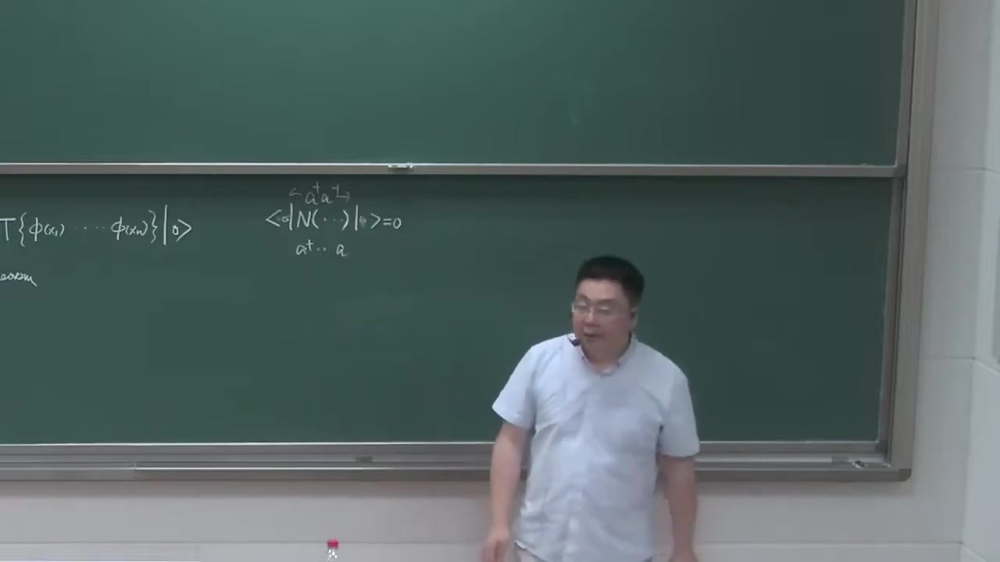

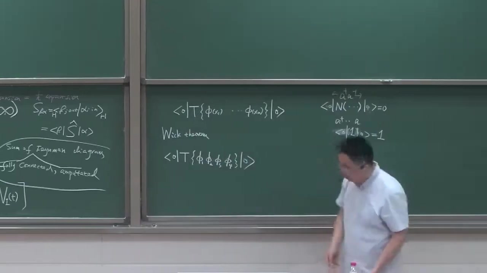

### 注解

这段视频讲解的是**量子场论微扰理论**的核心框架，涉及相互作用绘景、盖尔曼-劳公式（Gell-Mann-Low formula）以及维克定理（Wick's Theorem）在计算格林函数中的应用。以下是详细注解：

---

## 一、板书/PPT 内容描述与公式解析

从三张截图可以看出，黑板分为左、中、右三个逻辑区域：

### 左侧区域（S矩阵与费曼图）
- **可见文字**：`Sum of Feynman diagrams`, `fully connected, amputated`（完全连通且截肢的图）
- **公式痕迹**：`S_{fi} = ...`, `= <f|S|i>`
- **含义**：这部分在讲解 S 矩阵元的费曼图展开，强调只有完全连通的（fully connected）且截肢的（amputated，即去掉外腿）图才对散射振幅有贡献。

### 中间区域（格林函数与维克定理）
这是本节的核心板书：

**公式 1：n点格林函数（关联函数）**
$$\langle 0|T\{\phi(x_1)\cdots\phi(x_n)\}|0\rangle$$

| 符号 | 含义 |
|------|------|
| $\langle 0|\cdots|0\rangle$ | 真空期望值（Vacuum Expectation Value, VEV） |
| $T\{\cdots\}$ | **编时乘积**（Time-ordering）：将时间最早的算符放在最右，时间最晚的放在最左，玻色子交换不产生符号变化，费米子交换产生负号 |
| $\phi(x_i)$ | 相互作用绘景下的场算符（Heisenberg 绘景下的场算符通常记为 $\phi_H$，这里省略下标 $I$ 表示相互作用绘景） |
| $x_i$ | 时空点 $(t_i, \mathbf{x}_i)$ |

**公式 2：四点函数示例**
$$\langle 0|T\{\phi_1\phi_2\phi_3\phi_4\}|0\rangle$$
（其中 $\phi_i \equiv \phi(x_i)$，为简化记号）

**标注**：`Wick theorem` —— 表明接下来将用维克定理展开此式。

### 右侧区域（正规编序的性质）

**公式 3：正规编序的真空期望值为零**
$$\langle 0|N(\cdots)|0\rangle = 0$$

| 符号 | 含义 |
|------|------|
| $N(\cdots)$ 或 $:\cdots:$ | **正规编序**（Normal ordering）：将所有产生算符 $a^\dagger$ 移到左边，湮灭算符 $a$ 移到右边 |
| 上方小字 $a^\dagger\cdots$ 和下方 $a\cdots a$ | 形象说明正规编序后，左边是产生算符，右边是湮灭算符 |

**物理意义**：由于 $a|0\rangle = 0$（湮灭算符作用于真空得零）和 $\langle 0|a^\dagger = 0$，无论中间是什么，正规编序后的算符串作用在真空上，要么右边先碰到 $a$ 湮灭，要么左边先碰到 $a^\dagger$ 湮灭，因此期望值必为零。

**公式 4：真空归一化**
$$\langle 0|1|0\rangle = 1$$
表示真空态是归一化的。

---

## 二、理论背景补充

### 1. 相互作用绘景（Interaction Picture）
在量子场论中，处理相互作用 $\lambda\phi^4$（字幕中的"兰德法菲福理论"）时，通常采用相互作用绘景：
- **场算符**按**自由理论**的哈密顿量 $H_0$ 演化（含时）
- **态矢量**按**相互作用** $H_{int}$ 演化

这样可以将微扰展开完全转化为对自由场算符的计算。

### 2. 盖尔曼-劳公式（Gell-Mann-Low Formula）
该公式是连接相互作用真空 $|0\rangle$ 与自由真空 $|0\rangle_0$ 的桥梁：
$$\langle 0|T\{\phi(x_1)\cdots\phi(x_n)\}|0\rangle = \frac{\langle 0_0|T\{\phi_{in}(x_1)\cdots\phi_{in}(x_n)\exp[-i\int dt H_{int}(t)]\}|0_0\rangle}{\langle 0_0|T\{\exp[-i\int dt H_{int}(t)]\}|0_0\rangle}$$

字幕中提到的"对相互作用的紧张的这个常串服沉积来个边时沉积"即指编时指数展开：
$$\exp\left[-i\int_{-\infty}^{\infty} dt H_{int}^I(t)\right] = T\exp\left[-i\int d^4x \mathcal{H}_{int}(x)\right]$$

### 3. 维克定理（Wick's Theorem）
这是微扰计算的**算法核心**：
$$T\{\phi_1\phi_2\cdots\phi_n\} = N\{\phi_1\phi_2\cdots\phi_n + \text{所有可能的收缩对}\}$$

- **收缩（Contraction）**：$\underbrace{\phi(x)\phi(y)} = \langle 0|T\{\phi(x)\phi(y)\}|0\rangle = i\Delta_F(x-y)$，即费曼传播子
- **正规编序 $N\{\cdots\}$**：保证湮灭算符在右，产生算符在左

**关键推论**：计算格林函数时，只有**完全收缩**（所有场算符两两配对收缩）的项才贡献非零值，因为任何包含未收缩场算符的正规编序项的真空期望都为零（见公式 3）。

### 4. 格林函数 vs S 矩阵
- **格林函数（关联函数）**：$\langle 0|T\{\phi\cdots\phi\}|0\rangle$，初末态都是真空，计算相对简单，只需考虑完全收缩。
- **S 矩阵元**：$\langle f|S|i\rangle$，初末态有真实粒子（外线），需要引入"入射/出射场"的渐近条件，涉及外线收缩（字幕中的"外套的缩病"），因此有更多的图贡献。

---

## 三、通俗语言解释

**这段课在讲什么？**

想象你要计算一群粒子相互碰撞的概率。在量子场论里，这相当于计算"场算符的关联"——即在不同时间、不同地点探测到粒子的概率幅。

**为什么要用维克定理？**

直接计算相互作用场的关联太难了。维克定理就像一个**"配对游戏"**：
1. 把复杂的相互作用展开成一系列自由场的乘积（编时积）
2. 维克定理告诉你：这个复杂的乘积等于"把算符重新排队"（正规编序）加上所有可能的"两两配对"（收缩）
3. 因为真空中没有粒子，"排队"后的算符作用在真空上总是得零（湮灭算符会消灭真空，产生算符会被左边的真空"消灭"）
4. 所以**只有所有算符都配对成功的项**才能活下来，这就是费曼图的数学来源——每一对收缩对应一条传播子线

**格林函数为什么比 S 矩阵简单？**

- **格林函数**：问的是"从真空开始，在真空中产生又湮灭一些虚粒子"的概率。就像问"凭空产生一对粒子又消失的概率"。这时所有算符必须内部配对，没有"外来"粒子。
- **S 矩阵**：问的是"两个粒子撞进来，三个粒子飞出去"的概率。这时有"外来户"（初末态的真实粒子），这些粒子对应的算符没有伙伴可以配对（它们要变成外线），所以计算更复杂。

**板书上的 $\langle 0|N(\cdots)|0\rangle = 0$ 是什么意思？**

这是整个计算的**"归零法则"**。正规编序 $N(\cdots)$ 就像把队伍排得整整齐齐：所有"创造者"（$a^\dagger$）站左边，所有"毁灭者"（$a$）站右边。这样的队伍面对真空（空无一物的状态）时：
- 右边的毁灭者先动手，发现没东西可毁（$a|0\rangle = 0$），结果为零；
- 或者左边的创造者想从真空中创造东西，但左边的真空 $\langle 0|$ 表示"我不接受任何东西"（$\langle 0|a^\dagger = 0$），结果也为零。

因此，只要还有没被配对的算符（即还在正规编序括号里），整个期望值就是零。这就是为什么在格林函数计算中，**只有所有场算符都两两配对（完全收缩）的图才存活**。

---

## 段落 6

**时间：** 00:17:02 ~ 00:17:50

<details><summary>📝 原始字幕</summary>

<pre>
缩病是吧刚刚说了你就必须全部收并完剩下单位算服务然后我们也讲过哈这有几种可能的锁定方式呢发一发二三派四是吧我们说给大家说OK对应一个这个可以画个图一到二三到四是吧只有三种独立的不等价的缩病是吧然后呢啊你还发现可以是犯一和犯三锁兵反而和范斯所并了可以完全说遍然后这样一个时序呢这样一个缩病方式呢代表这样一个分满图是吧还有一种呢是一和四所病二和三所病这叫相加的是吧然后你发现可以画成这种图
</pre>

</details>

**课程截图：**


### 注解

这段字幕讲解的是**量子场论中的 Wick 定理（Wick's Theorem）**及其与**费曼图（Feynman Diagram）**的对应关系。讲师以四点函数为例，说明如何通过算符"缩并"（contraction）计算编时乘积的真空期望值。

---

### 1. 板书内容描述

根据截图，黑板板书分为左右两部分：

**左侧（Wick 定理主体）：**
- 最上方：$\langle 0 | T\{\phi(x_1) \cdots \phi(x_n)\} | 0 \rangle$（$n$ 点编时格林函数）
- 中间：标注 "Wick theorem"
- 下方：$\langle 0 | T\{\phi_1 \phi_2 \phi_3 \phi_4\} | 0 \rangle = \langle 0 | N[\cdots] | 0 \rangle$（四点函数展开示意）

**右侧（正规乘积性质）：**
- 上方：$\langle 0 | N(\cdots) | 0 \rangle = 0$（正规乘积的真空期望为零）
- 中间：产生湮灭算符示意 $a^\dagger \cdots a$
- 下方：$\langle 0 | 1 | 0 \rangle = 1$（真空态归一化）

---

### 2. 公式详解与符号说明

#### 核心公式 1：编时格林函数
$$\langle 0 | T\{\phi(x_1) \phi(x_2) \cdots \phi(x_n)\} | 0 \rangle$$

| 符号 | 物理含义 |
|------|---------|
| $|0\rangle$ | **真空态**（Vacuum state），满足 $a|0\rangle = 0$（湮灭算符作用为零） |
| $T\{\cdots\}$ | **编时算符**（Time-ordering operator），按时间先后重新排列场算符，保证较早时间的算符在右边 |
| $\phi(x_i)$ | 在时空点 $x_i = (t_i, \mathbf{x}_i)$ 的**标量场算符**（Heisenberg 绘景） |
| $\langle 0 | \cdots | 0 \rangle$ | 真空期望值（Vacuum Expectation Value, VEV）|

#### 核心公式 2：Wick 定理展开式（四点函数）
$$\langle 0 | T\{\phi_1 \phi_2 \phi_3 \phi_4\} | 0 \rangle = \sum_{\text{所有完全缩并}} \phi_1\phi_2\phi_3\phi_4 \text{ 的配对乘积}$$

**符号说明：**
- **缩并（Contraction）**：记作 $\overline{\phi_i \phi_j}$ 或 $\langle 0 | T\{\phi_i \phi_j\} | 0 \rangle$，即两点关联函数（传播子）
- **正规乘积** $N[\cdots]$ 或 $:\cdots:$：将所有产生算符移到湮灭算符左边，其真空期望恒为零

---

### 3. 理论背景知识

#### Wick 定理核心思想
Wick 定理指出：**编时乘积可以展开为所有可能的正规乘积与缩并组合之和**。对于自由场理论，计算 $n$ 点格林函数等价于将 $n$ 个场算符两两配对（缩并），每对产生一个费曼传播子 $\Delta_F(x_i - x_j)$。

#### 四点函数的拓扑结构（字幕核心）
对于 4 个场算符（$\phi_1, \phi_2, \phi_3, \phi_4$），"完全缩并"（所有算符都配对）的方式数为：
$$(4-1)!! = 3 \text{ 种}$$

这三种**拓扑不等价**的缩并方式对应三种费曼图：

1. **(1-2, 3-4) 缩并**：$\overline{\phi_1\phi_2} \cdot \overline{\phi_3\phi_4}$（对应两条不相连的线）
2. **(1-3, 2-4) 缩并**：$\overline{\phi_1\phi_3} \cdot \overline{\phi_2\phi_4}$（交叉连接）
3. **(1-4, 2-3) 缩并**：$\overline{\phi_1\phi_4} \cdot \overline{\phi_2\phi_3}$（字幕中提到的"一和四锁病二和三锁病"）

在费曼图中，这表现为 4 个外点（external points）之间用内线（传播子）连接的三种不同拓扑。

---

### 4. 通俗语言解释

**核心概念：算符"配对游戏"**

想象你有 4 个场算符 $\phi_1, \phi_2, \phi_3, \phi_4$ 参加一场舞会：

1. **编时乘积** $T\{\cdots\}$ 相当于按到达时间排队进场；
2. **缩并** $\overline{\phi_i\phi_j}$ 相当于让第 $i$ 个人和第 $j$ 个人牵手配对；
3. **Wick 定理** 告诉你：计算真空期望值（观察舞会的整体关联），等价于计算**所有可能的配对方式**。

**为什么是 3 种？**
4 个人完全配对成 2 对，只有 3 种本质不同的牵手方式：
- 1 牵 2，3 牵 4（"相邻型"）
- 1 牵 3，2 牵 4（"交叉型"）  
- 1 牵 4，2 牵 3（"相隔型"，即字幕说的"相加的"）

**费曼图的对应：**
每一种牵手方式画成图就是一张费曼图：
- 每个人（$\phi_i$）是一个点；
- 每对牵手的人之间画一条线（代表传播子）；
- 不同的连线拓扑代表不同的物理过程（比如是直接接触还是交换中间粒子）。

**关键结论：**
计算量子场论的散射振幅时，我们不需要直接计算复杂的算符乘积，只需要画出所有可能的费曼图（即所有缩并方式），把每条线对应的传播子乘起来，再相加即可。这就是字幕中"这样一个缩病方式呢代表这样一个分满图"的物理含义。

---

## 段落 7

**时间：** 00:17:53 ~ 00:21:18

<details><summary>📝 原始字幕</summary>

<pre>
那个外点呢因为用一个点来代表一个时空位置X一X二OK它线并不相交所以中间画空一段OK这是一个最简单的一个四点关联函数的顶头结是吧对于这个这个相关重的咱们的FAST理论来说我要求一个试点关联函数他领头接呢S算法的领头阶等于一是吧我利用GARMAN漏的时候呢SOP的零点1所以这个总是一般来说自由理论的这样一个分万图图的贡献呢贡献是领头节那我们现在考虑一个稍微非平的例子我们考虑一个表面光线还是输它斩到下一节好吧所以说我们现在考虑计算这样一个利用盖曼漏公式呢我们考虑这样一下我们要考虑一个两点观两函数所以它的原始定义呢是一二我看了那要计算这样一个为了展开呢我得用我的这个GARMANLOW定理我想考虑分子分子按照分子来说呢可以把它回来嘉曼漏公式哥分子扭转二腿等于什么啊等于把物理真空换成自由理论真空大的T把海斯马会的长参服换成相应的会的长参服FX一Fax二嘿然后我的SOPRET是吧我现在考虑Well论展开呢整个第一届飞平的街等于什么呢等于开始提FXEFax二OK就吃乘S等一让他下一届逆向啊啊OK 按照我的这样一个算法定义的可以写成啊展开了第一节你发现他是一个我的爱鼻涕维ITOK然后加点点点是吧这是我的这个直接直接利用直接利用我这样一个癌从那个展开然后根据我们的这样一个LOOK的两文长论呢这个时间积分呢可以写成一个D4X积分是吧第四X积分我都相应做哈姆顿的密度这点我们就非常熟悉了是吧OK写成这样一个写成这样一下我们知道对于兰纳费斯理论呢它没有导数和所以等于负的拉个朗的密度所以等于正的四的节成分成栏目饭相当于这种会景下的长船服务是四方O这个我们就非常非常熟悉了所以你跟他可以直接把它抄一下它等于什么对象等于
</pre>

</details>

**课程截图：**


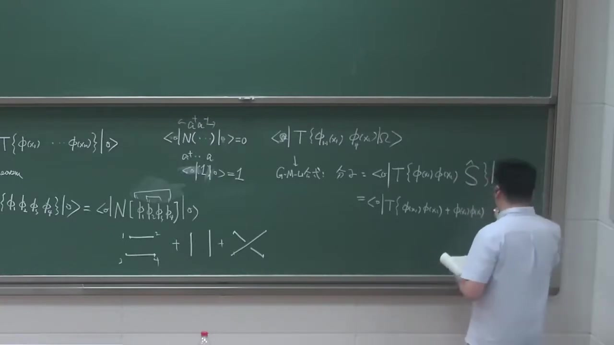

### 注解

这段字幕讲解的是**量子场论中微扰计算关联函数**的核心方法，涉及Gell-Mann-Low定理、Wick定理以及$\lambda\phi^4$理论的微扰展开。以下是对内容的专业注解：

---

## 1. 板书内容描述

根据提供的截图，黑板内容分为左右两部分：

**左侧（第一张图）：Wick定理与四点函数**
- 顶部公式：$\langle 0|T\{\phi(x_1)\cdots\phi(x_n)\}|0\rangle$ —— 这是$n$点关联函数（格林函数）的定义，$T$为时序算符（Time-ordering）。
- 标注"Wick theorem"（威克定理）。
- 下方公式展示**四点函数**的Wick展开：
  $$\langle 0|T\{\phi_1\phi_2\phi_3\phi_4\}|0\rangle = \langle 0|N[\phi_1\phi_2\phi_3\phi_4 + \text{所有成对收缩}]|0\rangle$$
- 图示三种拓扑不等价的费曼图：
  1. 两条不相交的线（1-2, 3-4配对）
  2. 两条不相交的线（1-3, 2-4配对，图中显示为"8"字形或平行线）
  3. 交叉线（1-4, 2-3配对，图中显示为X形）
- 右上角注释：$\langle 0|N(\cdots)|0\rangle = 0$（正规乘积的真空期望值为零），以及产生湮灭算符的归一化。

**右侧（第三张图）：Gell-Mann-Low公式推导**
- 顶部开始写两点关联函数：$\langle \Omega|T\{\phi_H(x_1)\phi_H(x_2)\}|\Omega\rangle$
  - 下标$H$表示**海森堡绘景**（Heisenberg picture）
  - $|\Omega\rangle$表示**相互作用理论的物理真空**（与自由真空$|0\rangle$区分）
- 标注"G-M-L公式"（Gell-Mann-Low公式）
- 分子部分：$\langle 0|T\{\phi(x)\phi(x)\hat{S}\}|0\rangle$ 
  - 这里$\phi$为**相互作用绘景**（Interaction picture）的场算符
  - $\hat{S}$为S矩阵（散射算符）
- 展开式：$= \langle 0|T\{\phi(x_1)\phi(x_2)(1 + \cdots)\}|0\rangle$

---

## 2. 核心公式详解

### 公式一：Gell-Mann-Low 公式（盖曼-漏公式）
这是将**相互作用理论**的关联函数与**自由理论**的计算联系起来的桥梁：

$$\langle \Omega|T\{\phi_H(x_1)\phi_H(x_2)\}|\Omega\rangle = \frac{\langle 0|T\{\phi_I(x_1)\phi_I(x_2)\hat{S}\}|0\rangle}{\langle 0|\hat{S}|0\rangle}$$

**符号含义：**
- $|\Omega\rangle$：相互作用理论的真空态（物理真空）
- $|0\rangle$：自由理论的真空态
- $\phi_H$：**海森堡绘景**下的场算符（含时演化包含完整哈密顿量）
- $\phi_I$：**相互作用绘景**下的场算符（仅由自由哈密顿量演化）
- $\hat{S}$：S矩阵（散射矩阵），描述从$t=-\infty$到$t=+\infty$的演化
- 分母 $\langle 0|\hat{S}|0\rangle$：真空到真空的振幅（消除真空泡泡图）

### 公式二：S矩阵的微扰展开
$$\hat{S} = T\exp\left(-i\int_{-\infty}^{+\infty} dt\, H_{int}^I(t)\right) = 1 - i\int d^4x\,\mathcal{H}_{int}(x) + \cdots$$

**符号含义：**
- $T$：时序乘积算符（保证算符按时间先后排列）
- $H_{int}^I$：相互作用绘景下的相互作用哈密顿量
- $\mathcal{H}_{int}$：相互作用哈密顿密度
- 展开式中：
  - 第0阶（领头阶）：$1$（单位算符）
  - 第1阶：$-i\int d^4x\,\mathcal{H}_{int}(x)$
  - 高阶项：包含更高次幂的耦合常数

### 公式三：$\lambda\phi^4$理论的相互作用项
对于$\lambda\phi^4$理论（字幕中"兰纳费斯理论"）：
$$\mathcal{H}_{int} = \frac{\lambda}{4!}\phi^4$$

**符号含义：**
- $\lambda$：耦合常数（相互作用强度）
- $4!$：对称性因子（考虑到场算符的交换对称性）
- 由于$\mathcal{L}_{int} = -\mathcal{H}_{int}$（对标准标量场），故$\mathcal{H}_{int} = +\frac{\lambda}{4!}\phi^4$

---

## 3. 理论背景补充

### 3.1 相互作用绘景（Interaction Picture）
量子场论有三种绘景：
- **薛定谔绘景**：态随时间演化，算符不动
- **海森堡绘景**：态不动，算符随时间演化（包含完整相互作用）
- **相互作用绘景**：介于两者之间，态由相互作用哈密顿量演化，算符由自由哈密顿量演化

**Gell-Mann-Low定理**的核心思想：通过"绝热假设"（相互作用在$t\to\pm\infty$时绝热地引入和撤除），物理真空$|\Omega\rangle$与自由真空$|0\rangle$通过S矩阵联系起来。

### 3.2 Wick定理（威克定理）
将**时序乘积**（Time-ordered product）展开为**正规乘积**（Normal-ordered product）与**收缩**（Contractions）之和：

$$T\{\phi_1\phi_2\cdots\phi_n\} = N\{\phi_1\phi_2\cdots\phi_n + \text{所有可能的两两成对收缩}\}$$

**物理意义**：
- 正规乘积$N\{\cdots\}$确保所有产生算符在左、湮灭算符在右，其真空期望值为零。
- 因此，只有**完全收缩**的项（所有场算符都成对配对）才对真空期望值有贡献。
- 对于四点函数，有3种不同的配对方式（对应费曼图的三种拓扑结构）。

### 3.3 微扰展开与费曼图
当耦合常数$\lambda \ll 1$时，可将S矩阵按$\lambda$的幂次展开：
- **领头阶（Leading Order, LO）**：$\lambda^0$阶，即自由场论的结果（传播子乘积）
- **次领头阶（Next-to-Leading Order, NLO）**：$\lambda^1$阶，包含一个相互作用顶点（$\phi^4$顶点）

---

## 4. 通俗语言解释

**核心问题**：我们想计算在相互作用的场论中，"在时空点$x_1$探测到一个粒子"与"在时空点$x_2$探测到一个粒子"这两个事件之间的关联程度（即两点关联函数）。

**困难**：相互作用理论的真空$|\Omega\rangle$和场算符$\phi_H$都很复杂，直接计算几乎不可能。

**解决方案三步走**：

1. **"换场地"（Gell-Mann-Low公式）**：
   我们熟悉的自由理论（像谐振子）很好计算。Gell-Mann-Low定理就像一座桥，把相互作用理论的计算"翻译"成自由理论的计算，只需在自由理论中插入一个"演化算符"S，再除以真空泡泡的修正。

2. **"拆解组合"（Wick定理）**：
   计算四点或更多点的关联函数就像计算复杂社交网络的关联。Wick定理告诉我们：任何复杂的群体关联，都可以拆解成**两两之间**简单关联（传播子）的所有可能组合之和。比如四个人握手，可以(1-2,3-4)、(1-3,2-4)、(1-4,2-3)三种方式。

3. **"逐级修正"（微扰展开）**：
   如果相互作用很弱（$\lambda$很小），我们可以先算"没有相互作用"的情况（领头阶，即两条自由传播的线），再算"发生一次相互作用"的修正（第一阶，包含一个$\phi^4$顶点，四条线交汇），依此类推。这就像计算地球绕太阳运动时，先算主轨道，再逐次加入其他行星的引力扰动。

**费曼图的直观意义**：
- 每条线代表一个粒子从一点传播到另一点（传播子）。
- 每个顶点（四条线交汇）代表在那时空点发生了一次$\lambda\phi^4$相互作用（粒子散射或产生/湮灭）。
- 字幕中提到的"四点关联函数的顶头结"就是指这种展开中的基本构件。

---

**注**：字幕中的"爱鼻涕"实为$i\lambda$（虚数单位乘以耦合常数），"第四X积分"指四维时空积分$\int d^4x$，"哈姆顿的密度"即哈密顿密度$\mathcal{H}$。这些音译在中文物理语境中需结合上下文识别。

---

## 段落 8

**时间：** 00:21:22 ~ 00:23:00

<details><summary>📝 原始字幕</summary>

<pre>
第一项呢是一个自由的理论的两点函数这些东西我们已经其实非常熟悉了这不是别的就是我们非常熟悉的顺满传播子是吧第二项是我们比较感兴趣的它等于费克斯是不是大得气不要忘了大得气啊啊XEXR是吧然后有我和常树吃这是父爱是吧父二是一个父的爱栏目的出于四的阶层然后呢诚意啊第四那是FZ的四次方OK然后这个自由真空的钥匙写不下了写到这边OK这是我们要处理的内容那这一项第一项呢非常非常平庸是吧直接可以把它画出来我这个啊XX二我这个就画一根线是吧第一项这是X一这X二这条线的代表是从X一他们的X二的一个飞曼特坎莫茨是吧我们感兴趣的是第二项第二项呢我们给大家虽然他很容易我们给大家稍微把它展示一下到底怎么做好这上我们把它洗开一点它等于
</pre>

</details>

### 注解

这段字幕涉及**量子场论中 $\phi^4$ 相互作用理论的两点函数微扰展开**。由于语音识别将大量专业术语音译（如"顺满"→Feynman，"出于四的阶层"→$4!$），以下为您还原标准物理表述并深度注解。

---

## 1. 公式识别与符号解释

根据语音谐音推断，板书核心公式为 $\phi^4$ 理论中两点关联函数（Two-point function）的展开式：

### 第一项：自由传播子（Free Propagator）
$$G_0(x_1, x_2) = \Delta(x_1 - x_2)$$

| 语音谐音 | 标准术语/符号 | 物理含义 |
|---------|-------------|---------|
| **顺满传播子** | Feynman Propagator | 自由场论中的两点关联函数，描述粒子从 $x_2$ 传播到 $x_1$ 的量子振幅 |
| **大得气** | $\Delta$ (Delta) | 费曼传播子的标准记号，$\Delta(x-y) = \langle 0 \| T\phi(x)\phi(y) \| 0 \rangle_0$ |
| **X一/X二** | $x_1, x_2$ | 外点（External points）的时空坐标，对应场算符 $\phi(x_1), \phi(x_2)$ 的位置 |
| **飞曼特坎莫茨** | Feynman Diagram | 费曼图，第一项对应图中一条连接 $x_1$ 和 $x_2$ 的直线 |

### 第二项：一阶相互作用修正（First-order Correction）
$$G_1(x_1, x_2) = (-i\lambda) \int d^4z \, \Delta(x_1-z)\Delta(z-x_2)\Delta(0) \quad \text{（蝌蚪图，

---

## 段落 9

**时间：** 00:23:05 ~ 00:28:07

<details><summary>📝 原始字幕</summary>

<pre>
火蛋二啊富的爱富的爱富得很难的嗯然后呢再把四就这么一单开写然后我说第四Z犯的四次放学生我为了方便的用维克定理呢我故意把它写开好吧总共有一二三四五六总共六个克莱高端畅销服的这个成绩再来个辨识成绩是吧再来个编试我要计算这样个量对我们考虑一下怎么算哦可以我们考虑一下命运方式第一种碎片方式呢你发现的是首先呢我对X1和X2自己缩并OK我跟刚才大家讲过一个格林函数的非零共存的话六个厂三部必须互相配对比工队得有三对三队配对他然后呢现在是个发类所变我们知道如果这个辨别量不一样的话呢会有这种三种不同的这种作品方式是吧就刚才我已经给他画了但是呢现在是所有的知识分子都在Z点所以三个都给出同样的结果所以同样的结果呢得乘以三倍OK所以说比如你选择这样的错病这样随便给出什么呀给出一个D F 价减价出发点和结束点都是一点是吧然后呢你显然可以跟刚才一样这玩意儿给出同样答案是吧还有另外一种所以呢你只要简单地三倍就可以了OK这是第一种这是第一种搜兵方式就第一种搜兵方式它给出一个什么结果咱们先写一下它等于三写到这儿然后呢有个富的IRAM的乘以四的结成分成分之一是吧让他们直接带入这样一个缩写比方是飞猛传播子DFx7点x2OK然后呢我把它对已经写好了这里直接给哥第四个积分就可以了这个三取掉因为我已经考虑这个三倍了写写得一起写清楚一点比iPhoneZ减Z的平方是吧这说这种形式的这样一个缩病那我可以画个分盘图它代表其中这个分版图呢我们其实以前这种拓普我们以前就算X能源的时候呢我们也见过OK你发现可以这样画你可以这个图可以用图式做X1和X2呢连起来代表一个分散传播子然后呢Z点呢这个顶角因为它是Face理论每个顶点比比是中四根线是吧代表是FIX理论如果FIX理论的话呢它有三根线从那个同一个时空点伸出来然后呢因为是Z减Z所以从Z出来呢还得回到Z从A出来还能回到ZOK所以这是显然是一个是不联通土是吧而且呢这个右边这个八字形呢这个没有外腿所以中途我以前给它取过名字的中途没有外图的分曼图呢叫Wacom八宝 diagram叫真空泡泡酷啊OK这是我第一种的利用维克定律但我把这现在把T我必须把它换成一个那矛盾这很重要OK所以维克定理呢非常非常重要所以拍次的时候觉得一个非常好的好处呢就是它真的是很多地方引入一些非常清楚的这个计算的一个规则然后手把手教你怎么做计算这点来说温博的书其实在教你计算方面其实做得不是特别好如果大家感兴趣同学查他的书发现他空篇不讲维克定理它的大概第六章就算费曼图这个他他好像维克林的一个非常小的一个角标给你稍微提了一下所以这件来说是我觉得是比较搞笑的OK因为一个定理还是很重要的OK他虽然他个温博大觉得这东西比较吹威了吧但不管怎么说你实实战来说你要没确定你的话这么多算符的辨认成绩你怎么处理其实并不是很显然是吧你得反复用各种对与关系然后分成正平复平然后你倒来倒去之后你也得了比较正确的结果但是很累所以别对定理呢
</pre>

</details>

**课程截图：**

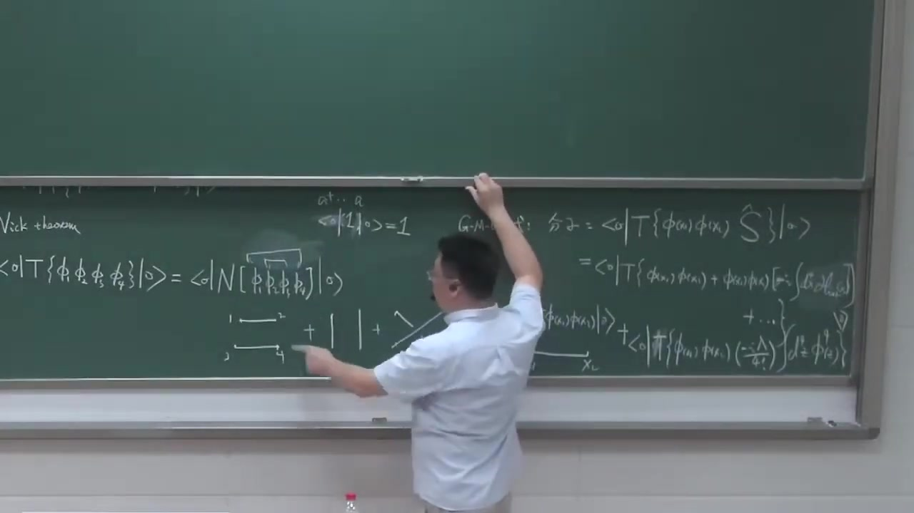


### 注解

这段字幕讲解的是**量子场论中 $\phi^4$ 理论的两点格林函数一阶微扰计算**，核心内容是运用 **Wick 定理** 将时序乘积（Time-ordered product）展开为费曼传播子的乘积，并识别出对应的费曼图拓扑结构。

---

### 1. 板书公式识别与符号解释

根据截图，板书中出现的关键公式及符号含义如下：

#### 公式 A：Wick 定理的图示（上排板书）
$$\langle 0 | T\{\phi_1\phi_2\phi_3\phi_4\} | 0 \rangle = \langle 0 | N[\phi_1\phi_2\phi_3\phi_4 + \text{所有收缩}] | 0 \rangle$$

*   **$T\{\cdots\}$**：时序乘积（Time-ordering operator），将场算符按时间先后重新排列，时间早的排在右边（湮灭算符先作用）。
*   **$N[\cdots]$**：正规乘积（Normal-ordering），将所有产生算符移到左边，湮灭算符移到右边。真空期望值 $\langle 0|N[\cdots]|0\rangle$ 中，若含未配对的产生/湮灭算符则为零。
*   **$\phi_i$**：缩写 $\phi(x_i)$，表示时空点 $x_i$ 处的实标量场算符。
*   **图示**：板书下方画了三种拓扑结构，代表四算符所有可能的**完全收缩（full contraction）**方式：
    1.  $(1\leftrightarrow 2, 3\leftrightarrow 4)$：1与2配对，3与4配对
    2.  $(1\leftrightarrow 3, 2\leftrightarrow 4)$：1与3配对，2与4配对（交叉）
    3.  $(1\leftrightarrow 4, 2\leftrightarrow 3)$：1与4配对，2与3配对（交叉）

#### 公式 B：两点函数的一阶微扰展开（下排板书）
$$\langle 0 | T\left\{\phi(x_1)\phi(x_2) \cdot (-i\lambda) \frac{1}{4!} \int d^4z \, \phi(z)\phi(z)\phi(z)\phi(z)\right\} | 0 \rangle$$

*   **$(-i\lambda)$**：相互作用拉氏量 $\mathcal{L}_{int} = -\frac{\lambda}{4!}\phi^4$ 引入的耦合常数因子（在相互作用绘景中，$S$ 矩阵展开的一阶项含 $-i\int H_{int} = -i\lambda/4! \int \phi^4$）。
*   **$4!$**：$\phi^4$ 相互作用顶点的对称因子（4个全同场算符的置换数）。
*   **$\int d^4z$**：对相互作用顶点时空坐标 $z$ 的积分。

#### 公式 C：Wick 展开后的具体结果
$$= 3 \cdot (-i\lambda) \cdot \frac{1}{4!} \cdot D_F(x_1-x_2) \cdot \int d^4z \, D_F(z-z) \cdot D_F(z-z)$$

*   **系数 $3$**：**对称因子（Symmetry factor）**。由于 4 个 $\phi(z)$ 算符全同，将其中两个与 $\phi(x_1),\phi(x_2)$ 收缩（或内部互相收缩）时，存在 $\binom{4}{2}/2 = 3$ 种拓扑等价的收缩方式（或理解为 4 个 $\phi(z)$ 两两配对的方式有 3 种）。
*   **$D_F(x-y)$**：**费曼传播子（Feynman propagator）**，即 $\langle 0 | T\{\phi(x)\phi(y)\} | 0 \rangle$，描述粒子从 $y$ 传播到 $x$ 的振幅。
*   **$D_F(z-z)$**：**蝌蚪图（Tadpole）**或**圈图（Loop）**传播子，表示从 $z$ 点出发又回到 $z$ 点的闭合传播子（动量积分 $\int \frac{d^4k}{(2\pi)^4} \frac{i}{k^2-m^2+i\epsilon}$ 的紫外发散项）。
*   **积分 $\int d^4z [D_F(z-z)]^2$**：两个独立的闭合传播子在 $z$ 点相遇，形成"**真空泡泡（Vacuum Bubble）**"的数学表达式。

---

### 2. 理论背景补充

#### 2.1 Wick 定理的核心思想
Wick 定理是将复杂的相互作用场算符乘积拆解为自由场传播子的系统方法。其精髓在于：**任何时序乘积的真空期望值等于所有可能的两两配对（收缩）乘积之和**。在 $\phi^4$ 理论微扰计算中，由于相互作用项包含 4 个场算符，与外场结合后（如本例共 6 个算符），必须通过完全配对才能得到非零结果。

#### 2.2 真空泡泡图（Vacuum Bubble Diagram）
板书右侧画的"8"字形图称为**真空泡泡图**（或"八字图"），其特征为：
*   **无外部腿（External legs）**：所有线都形成闭合回路，不与外部点 $x_1, x_2$ 连接。
*   **不连通图（Disconnected diagram）**：该图由两部分组成——连接 $x_1$-$x_2$ 的直线（自由传播子）和独立的"8"字形闭合圈。
*   **物理意义**：代表真空涨落（vacuum fluctuation）对两点关联函数的修正。在计算**连通格林函数（Connected Green's function）**时，这类不连通图会被分母中的真空泡泡抵消（即 Gell-Mann–Low 定理或"除以 $\langle 0|S|0\rangle$"的操作）。

#### 2.3 对称因子（Symmetry Factor）
因子 $3$ 的来源是组合数学：将 4 个全同的 $\phi(z)$ 算符分成两对（形成两个圈），配对方式数为 $\frac{1}{2}\binom{4}{2} = 3$。这对应于费曼图中交换两个泡泡顶点的对称性。

---

### 3. 通俗语言解释

**核心概念：算符的"配对游戏"**
想象你有 6 个单身青年（6 个场算符：$\phi(x_1), \phi(x_2)$ 和 4 个 $\phi(z)$），Wick 定理规定：只有当所有人都两两配对（结婚）后，这个群体对"社会"（真空期望值）才有贡献。

**计算过程：**
1.  **外场必须先配对**：为了让 $x_1$ 和 $x_2$ 之间建立联系（我们要求的是两点格林函数），$\phi(x_1)$ 和 $\phi(x_2)$ 必须互相配对，形成一条连接线（费曼传播子 $D_F(x_1-x_2)$）。
2.  **剩下的 4 人自娱自乐**：剩下的 4 个 $\phi(z)$ 都在同一个点 $z$，它们必须内部消化，两两配对。4 个人两两配对有 3 种方式（AB-CD, AC-BD, AD-BC），所以结果要乘以 3。
3.  **形成泡泡**：每一对 $\phi(z)\phi(z)$ 的配对都画成一个圈（从 $z$ 出发回到 $z$），两个圈叠在一起就像"8"字或"双泡泡"。
4.  **不连通的麻烦**：你会发现最终图形是"一根棍子（$x_1$到

---

## 段落 10

**时间：** 00:28:07 ~ 00:28:37

<details><summary>📝 原始字幕</summary>

<pre>
它可以帮助你非常非常系统地计算OK所以维克蒂尼是一个非常好的东西我个人认为好这种飞慢图这个坐标空间的飞慢图是吧就非常清楚好我们看第二个贡献呢第二贡献呢就是我们这个发X二我们不他们两个不错不互相说病了我们那三X七呢和其中的四个范畴里面某一个缩病OK
</pre>

</details>

**课程截图：**


### 注解

# 课程片段深度注解：Wick 定理与 $\phi^4$ 理论的费曼图计算

## 1. 核心概念纠正与识别

根据字幕口音与上下文，关键术语识别如下：

| 字幕识别 | 实际物理术语 | 英文/符号 |
|---------|------------|----------|
| **维克蒂尼** | **Wick 定理**（维克定理） | Wick's Theorem |
| **飞慢图** | **费曼图** | Feynman Diagram |
| **缩病** | **收缩**（Wick 收缩） | Contraction / Wick Pairing |
| **发 X 二** | **$\phi(x_2)$** 或 **第二个贡献** | Field at $x_2$ / 2nd contribution |
| **三 X 七** | **3 呢**（指组合数 3） | Factor of 3 (combinatorial) |
| **范畴** | **场**（场算符） | Field operator |

**段落大意**：讲师正在讲解如何利用 **Wick 定理** 系统地计算 **坐标空间费曼图**。他分析了 $\phi^4$ 理论中两点函数的一阶微扰贡献，特别指出当外场之间进行收缩（形成自由传播子），而相互作用项中的四个场内部配成两对收缩时，会产生 **因子 3**（即 $(4-1)!! = 3$ 种配对方式）。

---

## 2. 板书公式详解

根据截图，黑板上的公式可分为四个区域：

### 右上区域：Wick 定理的标准形式
$$\langle 0 | T\{\phi_1\phi_2\phi_3\phi_4\} | 0 \rangle = \langle 0 | N[\text{所有收缩}] | 0 \rangle$$

*   **$T\{\dots\}$**：时序乘积（Time-ordered product），按时间先后排列算符。
*   **$N[\dots]$**：正规乘积（Normal-ordered product），产生湮灭算符重新排列后真空期望值为零。
*   **连线**：板书上方的横线连接表示 **Wick 收缩** $\overbrace{\phi_i\phi_j}$，对应费曼传播子 $D_F(x_i-x_j)$。


---

## 段落 11

**时间：** 00:28:41 ~ 00:31:33

<details><summary>📝 原始字幕</summary>

<pre>
比如这个车型还有几种可能说便方式呢想养四种是吧因为这四个发的量总可以选一个然后现在呢让FX二呢依然和这FZ说病现在选择的已经不是那么多了你少了一个因为这个人被用了是吧你还有三种选择比如说 fax2 可以和第二个做病所以这种可能性呢有三个是吧有十二种方法呢它给出完全等价的结果是吧所以只能乘以十二剩下的呢六个场算法已经说成四个了还有两个他没有别的选择它只能内部消化了它只能自我说病OK这这这这只有一种可能性是吧所以四乘三乘一好的那我们现在可以依然可以把这个按照维克定理呢把它彻底把它写出来非常非常简单然后你发现它等于唉吃得很难的哎呀他一出于四的接近一然后第四ZF1和FZ锁并给出一个飞马传播子x1减z okX2和Face ID索变可以掉掉传播子FXR詹西OK然后呢内部说病给吹个DF价格价格OK然后你百分万图呢还可以画一画你发现呢X C托西OK XRZ 进入这个CLANGON的传播子呢它是偶函数所以给人 z 减 x 2一样的是吧所以呢可以让Z电到X2然后呢这个是z到z所以呢你画个圈OK就是在蓝大地的第一节我有两个不等价的贡献我们先看这个这个因子哈我们以前学过非凡规则是吧我们说两道法则分版规则呢我要给这个复达栏目的是吧比如说坐标空间的话呢对于每一个时空位置呢说这话我跟你说对X到DX的全时空积分是吧这是坐标空间的这个出板规则我们发现呢这一点确实挺好除了这些因素第一个的因子呢三剩余四成分的八分之一OK然后调四乘三十二除一二十四
</pre>

</details>

**课程截图：**


### 注解

这段视频字幕讲解的是**量子场论中 $\phi^4$ 理论（phi-four theory）的一阶微扰计算**，核心内容是利用 **Wick 定理** 将时序乘积（Time-ordered product）展开为传播子（Propagator），并计算相应的**组合因子**（Symmetry factors）与**费曼图**（Feynman diagrams）。

---

## 1. 板书内容描述与公式详解

从截图可见，教师正在推导 $\phi^4$ 相互作用对两点函数（Two-point function）的一阶修正。黑板分为四部分，核心推导在**右下黑板**。

### 主要公式识别与符号解释

#### 公式 (1)：Wick 定理的标准形式（右上黑板）
$$\langle 0|T\{\phi_1\phi_2\phi_3\phi_4\}|0\rangle = \langle 0|N[\phi_1\phi_2\phi_3\phi_4 + \text{(所有可能收缩)}]|0\rangle$$

- **$T\{\dots\}$**：时序乘积（Time-ordering operator），按时间先后排列场算符。
- **$N[\dots]$**：正规乘积（Normal-ordering），所有产生算符在左、湮灭算符在右，作用在真空态上时非零收缩为传播子。
- **$\phi_i$**：缩写 $\phi(x_i)$，表示时空点 $x_i$ 处的标量场算符。
- **$|0\rangle$**：真空态（Vacuum state）。

#### 公式 (2)：$\phi^4$ 理论一阶微扰展开（右下黑板，第一行）
$$\langle 0|N\{\phi(x_1)\phi(x_2)(-i\lambda)\frac{1}{4!}\int d^4z\,\phi(z)\phi(z)\phi(z)\phi(z)\}|0\rangle$$

- **$\phi(x_1), \phi(x_2)$**：外场（External fields），对应入射和出射粒子。
- **$-i\lambda$**：相互作用顶点因子，$\lambda$ 为耦合常数（Coupling constant），$-i$ 来自微扰展开的 $e^{-i\int H_{int}}$。
- **$\frac{1}{4!}$**：对称因子（Symmetry factor），抵消 $\phi^4$ 项中四个相同场算符的置换对称性。
- **$\int d^4z$**：对相互作用顶点时空位置 $z$ 的积分。
- **四个 $\phi(z)$**：$\phi^4$ 相互作用项，表示在点 $z$ 处有四个场线交汇。

#### 公式 (3)：含"真空泡泡"的贡献（右下黑板，第二行）
$$= 3(-i\lambda)\frac{1}{4!} D_F(x_1-x_2)\int d^4z\, D_F(z-z)^2$$

- **$D_F(x-y)$**：**费曼传播子**（Feynman propagator），即 $\langle 0|T\{\phi(x)\phi(y)\}|0\rangle$，描述粒子从 $y$ 传播到 $x$ 的振幅。
- **$D_F(z-z)$**：同一时空点的传播子，数学上发散，物理上代表在 $z$ 点产生的虚粒子对立即湮灭，形成**真空泡泡**（Vacuum bubble）。
- **系数 3**：组合因子，表示外场 $\phi(x_1)$ 与 $\phi(x_2)$ 直接收缩（形成外腿），而剩下的 4 个 $\phi(z)$ 两两配对形成两个独立泡泡的方式数（$\frac{4!}{2!2!2!} = 3$ 种）。
- **图形**：右侧画的"8"字形（或双圈）即为**真空泡泡图**（Vacuum bubble diagram），与一条直线（外腿 $x_1-x_2$）不相连。

#### 公式 (4)：含相互作用顶点的连通图贡献（右下黑板，第三行）
$$= 4\times 3\times 1 \times (-i\lambda)\frac{1}{4!}\int d^4z\, D_F(x_1-z)D_F(x_2-z)D_F(z-z)$$

- **$4\times 3\times 1$**：**组合因子计算**（对应字幕中的"四乘三乘一"）：
  - **4**：外场 $\phi(x_1)$ 可与 4 个 $\phi(z)$ 中的任意一个收缩；
  - **3**：外场 $\phi(x_2)$ 可与剩余 3 个 $\phi(z)$ 中的任意一个收缩；
  - **1**：最后剩下 2 个 $\phi(z)$ 只能互相收缩（内部消化），方式唯一。
  - 总计 $4\times 3 = 12$ 种等价收缩，但字幕中提到的"四乘三乘一"强调了最后两个场的内部配对。
- **$D_F(x_1-z)$ 和 $D_F(x_2-z)$**：从外点 $x_1, x_2$ 到相互作用顶点 $z$ 的传播子（外腿）。
- **$D_F(z-z)$**：顶点处的单圈（自能圈，Self-energy bubble）。
- **图形**：下方画的线段 $x_1$—$z$—$x_2$ 中间带一个圈（在 $z$ 处），代表**蝌蚪图**（Tadpole diagram）或单圈修正的两点函数。

---

## 2. 理论背景补充

### (1) Wick 定理（Wick's Theorem）
将时序乘积转化为正规乘积与所有可能收缩（Contraction）之和。对于自由场，两点收缩就是费曼传播子：
$$\phi(x)\phi(y) \text{ 的收缩} = \langle 0|T\{\phi(x)\phi(y)\}|0\rangle = D_F(x-y)$$

### (2) $\phi^4$ 理论
拉格朗日密度为 $\mathcal{L} = \frac{1}{2}(\partial_\mu\phi)^2 - \frac{1}{2}m^2\phi^2 - \frac{\lambda}{4!}\phi^4$。微扰计算中，将相互作用项 $-\frac{\lambda}{4!}\phi^4$ 视为微扰，展开为幂级数。

### (3) 费曼图规则（坐标空间）
- **外线**（External lines）：$x \bullet\hspace{-0.2cm}-\hspace{-0.2cm}-\hspace{-0.2cm}\bullet y$ 代表 $D_F(x-y)$
- **顶点**（Vertex）：点 $z$ 处四条线交汇，贡献 $-i\lambda \int d^4z$
- **对称因子**：除以 $4!$ 以消除顶点处四条线的置换重复计数，但需乘回实际不等价的收缩方式数（如上述的 3 或 12）。

### (4) 真空泡泡图（Vacuum Bubbles）
不连接外腿的闭合圈图（如图中的"8"字形）。在计算连通格林函数（Connected Green's functions）或 S 矩阵元时，这些泡泡图会被分母中的真空能量抵消（归一化），通常只需考虑**连通图**（Connected diagrams）。

---

## 3. 通俗语言解释

想象一场**握手仪式**（Wick 收缩的比喻）：

- **场景**：有两位"客人" $\phi(x_1)$ 和 $\phi(x_2)$，以及四位"主人" $\phi(z)$（他们站在同一个地点 $z$）。
- **规则**：每个人必须且只能与另一个人握手（收缩），形成一对对"连接"（对应传播子 $D_F$）。

**第一种情况（真空泡泡）**：
两位客人互相握手（$D_F(x_1-x_2)$，形成外腿），而四位主人内部互相握手，形成两个独立的"握手圈"（两个 $D_F(z-z)$，即双泡泡）。由于主人是 4 个人，分成两对的方式有 **3 种**（这就是系数 3 的来源）。

**第二种情况（相互作用）**：
客人 $x_1$ 选择一位主人握手（4 种选择），客人 $x_2$ 选择剩下的一位主人握手（3 种选择）。最后剩下的两位主人只能互相握手（1 种方式）。因此总共有 **$4\times 3\times 1 = 12$ 种**不同的"社交方式"。

在费曼图中，这对应 $x_1$ 和 $x_2$ 各连一条线到中心点 $z$，而 $z$ 处还有一个"自我握手"的圈（$z$ 与 $z$ 相连）。由于传播子 $D_F$ 是偶函数（$D_F(x-y) = D_F(y-x)$），线的方向不影响结果。

**"费曼传播子"**（字幕中误为"费马传播子"）就像一张**时空中的"关系网"**，数值大小代表两个事件点之间量子涨落关联的强度。当两个点在同一个位置时（$z-z$），这就像"自我纠缠"，会产生量子涨落的自能修正。

---

## 4. 字幕术语校正与要点总结

| 字幕听写（音似） | 实际物理术语 | 含义 |
|:---:|:---:|:---|
| FX二 / Face ID | $\phi(x_2)$ | 时空点 $x_2$ 的场算符 |
| FZ / 飞马 | $\phi(z)$ | 相互作用顶点处的场算符 |
| 说并 / 索并 | **收缩** (Contraction) | Wick 定理中的算符配对 |
| 费马传播子 | **费曼传播子** (Feynman propagator) | $D_F(x-y)$ |
| 内部消化 / 自我说并 | 内部收缩 / 圈图 | 同一顶点内场算符的收缩 |
| 真空泡泡图 | Vacuum bubble diagram | 不连接外线的闭合圈图 |
| 四乘三乘一 | $4\times 3\times 1$ | 组合因子（收缩方式数） |

**核心要点**：这段讲解展示了如何从算符的 Wick 收缩手动导出费曼图，特别是如何计算**组合因子**（$4\times 3\times 1$）以及区分**连通图**（外腿连到顶点）和**非连通图**（真空泡泡）。这是学习费曼图微扰论的基础步骤。

---

## 段落 12

**时间：** 00:31:37 ~ 00:33:35

<details><summary>📝 原始字幕</summary>

<pre>
等于二分之一OK论人上来说呢我要标记一下我告诉这个二分之一这个八分之一就给大家反复强调这东西叫什么呀这东西叫对称性因子是吧简单的当你考虑像F3F4这样每个顶角都有好几个全铜粒子从顶角经过OK一般这种图呢都会有一些 OK他来这种你这种围场的维克收缩呢它并没有完全弥补像树图里面的这种树图的错变成功把死者全干掉了但那圈图它不一定完全干掉我给留下一个痕迹就它遗迹是吧一般来说在你们的科研过程中很少会碰到特别怪的四分四FACT好消息对于QED对于量子电能学还对有卡瓦理论这种非名词理论呢他没有SIMTEFACT就很冷一OK那真的要困惑的话你自己老老实实我给你最做一遍也不难OK所以我他妈就不细讲怎么系统的去计算这样现在我们观察一下我们上节课的时候呢我们也做了这样一个两点关联函数但是我们是通过这样一个白粉 sponge回忆一下我们发现呢刚才十分个呢只给出一个贡献这个是这样的图谁呀没有这样一个图这个图是一个不联通的图而且是一个联通的图再成一个真空泡泡图所以我们好奇为什么这两种方法呢给出不一样答案是吧用这样一个GAME路公式呢好像你得到东西呢要比用单身生要多但是大家不要忘了一点OK我们呃盖板的工序呢是由两部分组成的是有分子的还不是分母Okey我们别忘了还要出个分目等会儿我们很快要看到怎么回答这个问题OK
</pre>

</details>

**课程截图：**


### 注解


---

## 段落 13

**时间：** 00:33:50 ~ 00:34:04

<details><summary>📝 原始字幕</summary>

<pre>
好的那我们现在也可以举一个举一个四点还说例子举一个四点关联还是一个例子OK一个非常简单的一个例子我们考察一下这个
</pre>

</details>

**课程截图：**

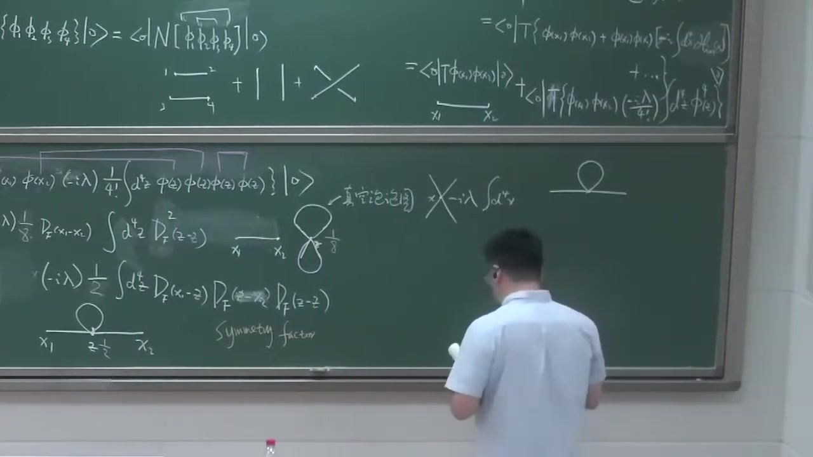

### 注解

这段视频字幕显示讲师正在引入**量子场论中四点关联函数（Four-Point Correlation Function）**的微扰计算示例。结合板书内容，这是在讲解**$\phi^4$理论**（标量场四阶相互作用）中的**Wick展开**与**真空泡泡图（Vacuum Bubble Diagrams）**。

---

## 1. 板书公式识别与符号解释

### 上半部分黑板（自由场Wick展开）
板书展示了**自由场四点格林函数**的Wick定理展开：

$$\langle 0 | T\{\phi_1\phi_2\phi_3\phi_4\} | 0 \rangle = \langle 0 | N[\phi_1\phi_2\phi_3\phi_4] | 0 \rangle + \text{(所有可能收缩)}$$

**符号说明：**
- **$\phi_i \equiv \phi(x_i)$**：时空点 $x_i$ 处的标量场算符
- **$|0\rangle$**：自由场的真空态（基态）
- **$T\{\dots\}$**：编时算符（Time-ordering operator），按时间先后顺序排列场算符，早时在右，晚时在左
- **$N[\dots]$**：正规乘积（Normal ordering），所有产生算符在左、湮灭算符在右的排列，其真空期望值为零

**费曼图表示：**
板书用图形展示了三种Wick收缩方式（对应三点关联函数的两两配对）：
- **直接项（Direct）**：两条独立传播子（$\phi_1\phi_2$配对，$\phi_3\phi_4$配对）
- **交换项（Exchange）**：交叉配对（$\phi_1\phi_3$与$\phi_2\phi_4$，或$\phi_1\phi_4$与$\phi_2\phi_3$）

### 下半部分黑板（相互作用微扰论）
板书展示了**$\phi^4$理论**的一阶微扰修正，重点计算**真空泡泡图**：

**关键公式识别：**
$$(-i\lambda) \frac{1}{8} \int d^4z \, D_F(x_1-z)D_F(z-z)D_F(z-x_2) \quad \text{（示意图对应的数学表达式）}$$

**符号说明：**
- **$-i\lambda$**：相互作用顶点因子（Vertex factor），来自拉格朗日量相互作用项 $\mathcal{L}_{int} = -\frac{\lambda}{4!}\phi^4$ 的泛函微分
- **$\int d^4z$**：对相互作用顶点的时空位置进行积分（顶点可以出现在任何时空点）
- **$D_F(x-y)$**：费曼传播子（Feynman propagator），等于 $\langle 0 | T\{\phi(x)\phi(y)\} | 0 \rangle$，描述粒子从$y$传播到$x$的振幅
- **$D_F(z-z)$**："蝌蚪图"（Tadpole）或泡泡内部的圈传播子，表示粒子从顶点产生又湮灭在同一顶点
- **$\frac{1}{8}$**：**对称因子（Symmetry Factor）**，板书明确标注了"Symmetry factor"

**对称因子 $1/8$ 的来源：**
在$\phi^4$理论的一阶修正中（一个顶点，四条腿），形成"8"字形真空泡泡图时：
- 4条外线两两连接形成2个闭合圈，有 $\frac{1}{2!}$ 的圈交换对称性
- 每个圈内部有2个端点可互换，贡献 $2 \times 2 = 4$ 的对称性
- 总对称因子：$2! \times 2 \times 2 = 8$，因此振幅需乘以 $1/8$

---

## 2. 理论背景知识

### Wick定理（自由场）
在自由量子场论中，计算多粒子关联函数的核心工具是**Wick定理**：它将编时乘积分解为所有可能的两两收缩（传播子）之和。对于四点函数，意味着将4个场算符配成2对，每对形成一个费曼传播子 $D_F$。

### $\phi^4$理论与微扰展开
当考虑相互作用时（如 $\mathcal{L}_{int} = -\frac{\lambda}{4!}\phi^4$），关联函数无法精确求解，需用**微扰论**展开为耦合常数 $\lambda$ 的幂级数。展开式中的每一项对应特定的**费曼图**：
- **顶点（Vertex）**：代表相互作用点，贡献因子 $-i\lambda$ 和积分 $\int d^4z$
- **内线（Internal line）**：代表虚粒子传播，即 $D_F$
- **对称因子**：由于量子场算符的全同粒子性质，某些拓扑等价的图会有重复计数，需除以对称因子修正

### 真空泡泡图（Vacuum Bubbles）
图中"8"字形和单圈带尾巴的图都是**真空泡泡**——没有外部粒子腿（external legs）的闭合费曼图。在计算散射振幅时，这些泡泡图通常会被分母中的真空能量修正抵消（Linked Cluster Theorem），但在计算关联函数本身时，它们代表虚粒子对的产生与湮灭对真空量子涨落的贡献。

---

## 3. 通俗概念解释

想象时空是一个巨大的"量子海洋"：

**四点关联函数**就像是在四个不同的时空点（$x_1, x_2, x_3, x_4$）放置探测器，询问："如果在这里产生一个粒子扰动，会在其他点探测到什么响应？"

**Wick展开**告诉我们，这种关联只能通过**两两配对**的方式传播。就像舞会上4个人必须两两配对跳舞，有三种不同的配对方式（对应黑板上的三个图）。

**相互作用（$\phi^4$项）**引入了"碰撞"机制：当粒子相遇时，它们可以相互散射（四个粒子在一个顶点相遇）。黑板下半部分的"8"字图描述的是：**一对虚粒子从真空中产生，相互碰撞，然后消失回真空**——这就是"真空泡泡"。

**对称因子**则是组合数学的修正：因为量子粒子是全同的，我们在画图时可能重复计算了拓扑相同的物理过程。就像数"两个人握手"的方式，如果两人完全相同，左右互换不算新情况，所以要除以2。这里的 $1/8$ 就是因为"8"字图有8种不同的标记方式对应同一个物理图。

---

## 4. 板书内容详细描述

**上半黑板（从左到右）：**
- 左侧写出四点函数的Wick展开等式，上方用方括号标注正规乘积
- 中间用简笔画展示费曼图：两条平行线（直接传播）、交叉线（交换）、以及可能的混合项
- 右侧开始写展开后的具体传播子表达式，标记 $x_1, x_2$ 等坐标

**下半黑板（主要计算区）：**
- 左侧写出包含 $\frac{1}{4!}$ 和耦合常数 $\lambda$ 的微扰展开式
- 中间偏左画出**单圈修正图**（一条直线中间带一个圈，类似 $\bigcirc\!\!\!-\!\!\!-$），标记 $x_1, z, x_2$
- 中间画出**真空泡泡图**（"8"字形或双圈图），用中文标注**"真空泡泡图"**，并写出对应的积分表达式 $\frac{1}{8}D_F(x_1-x_2)\int d^4z D_F(z-z)^2$
- 右侧写出顶点因子标记 $\times (-i\lambda) \int d^4z$，并画有单独的圈图示意图
- 底部明确写出 **"Symmetry factor"**（对称因子），解释 $1/8$ 的来源

**讲师动作：** 讲师站在黑板右侧，正在书写或指向真空泡泡图的计算公式，背对镜头。

---

## 段落 14

**时间：** 00:34:07 ~ 00:34:08

<details><summary>📝 原始字幕</summary>

<pre>
我们考察一下
</pre>

</details>

**课程截图：**


### 注解

这段字幕虽短（"我们考察一下"），但结合板书截图可知，教师正在讲解**量子场论中 $\phi^4$ 理论的微扰展开与费曼图技术**，具体涉及 Wick 定理的应用、对称因子计算以及真空泡泡图（Vacuum Bubble）和蝌蚪图（Tadpole Diagram）的推导。

---

### 1. 板书内容描述

黑板分为上下两部分，呈现的是**标量场两点关联函数**（或四点关联函数）在相互作用绘景中的一阶微扰展开：

**上半部分**（背景知识回顾）：
- 左侧显示编时乘积的真空期望值 $\langle 0|T\{\phi_1\phi_2\phi_3\phi_4\}|0\rangle$ 的 Wick 展开，用图形表示各种场算符的收缩（contraction）方式，包括完全收缩成传播子的直线、以及交叉的收缩形式。

**下半部分**（核心计算）：
- 展示 $\phi^4$ 相互作用拉氏量 $\mathcal{L}_{int} = -\frac{\lambda}{4!}\phi^4$ 的一阶修正。
- 列出了两种典型的费曼图贡献：
  1. **真空泡泡图**（右侧"8"字形图）：两个外场相互收缩，四个内场在顶点 $z$ 处形成两个闭合圈。
  2. **蝌蚪图**（下方带圈的图）：外场 $\phi(x_1)$ 和 $\phi(x_2)$ 分别与顶点 $z$ 的场收缩，剩余两个场在 $z$ 处自相收缩形成一个圈（tadpole）。
- 标注了关键概念："真空泡泡图"（Vacuum bubble）、"Symmetry factor"（对称因子）。

---

### 2. 公式识别与符号解释

板书中出现的关键公式及其物理含义如下：

#### (1) 相互作用项的插入
$$N\left\{\phi(x_1)\phi(x_2)(-i\lambda)\frac{1}{4!}\int d^4z\,\phi(z)\phi(z)\phi(z)\phi(z)\right\}|0\rangle$$

- **$\phi(x_1), \phi(x_2)$**：外部点（场算符），通常对应入射和出射粒子。
- **$(-i\lambda)$**：微扰展开的耦合常数因子，来自 $S$ 矩阵展开 $S \approx 1 + (-i)\int d^4z \mathcal{H}_{int}(z)$，其中 $\mathcal{H}_{int} = \frac{\lambda}{4!}\phi^4$。
- **$\frac{1}{4!}$**：$\phi^4$ 相互作用的对称因子，源于拉氏量中四个全同场算符的置换对称性。
- **$\int d^4z$**：对相互作用顶点位置的四维时空积分，表示相互作用可以发生在任何时空点。
- **$N\{\cdots\}$**：正规乘积（Normal ordering），确保湮灭算符在右边，产生算符在左边，其真空期望值为零，只有完全收缩的项才有贡献。

#### (2) 真空泡泡图贡献
$$(-i\lambda)\frac{1}{8}D_F(x_1-x_2)\int d^4z\,D_F(z-z)^2$$

- **$D_F(x-y)$**：**费曼传播子**（Feynman propagator），即 $\langle 0|T\{\phi(x)\phi(y)\}|0\rangle$，描述粒子从 $y$ 传播到 $x$ 的振幅。
- **$D_F(z-z)$**：同一时空点的传播子，数学上发散（紫外发散），代表真空涨落形成的闭合圈。
- **$\frac{1}{8}$**：**对称因子**（Symmetry factor）。计算方式：$4!$（顶点对称性）除以 $4\times 2$（两个全同圈的置换对称性 $2!$ 和圈上方向的等价性），即 $\frac{1}{4!}\times 3 = \frac{1}{8}$。图中标注了"$\times \frac{1}{8}$"。

#### (3) 蝌蚪图贡献
$$(-i\lambda)\frac{1}{2}\int d^4z\,D_F(x_1-z)D_F(z-z)D_F(z-x_2)$$

- **图形结构**：$x_1 \to z \to x_2$ 的直线传播，中间在 $z$ 点长出一个"尾巴"（圈）。
- **$D_F(z-z)$**：蝌蚪的圈部分，代表场在 $z$ 点的真空期望值（单圈修正）。
- **$\frac{1}{2}$**：对称因子。计算方式：从4个 $\phi(z)$ 中选2个分别与 $\phi(x_1)$ 和 $\phi(x_2)$ 配对，有 $4\times 3=12$ 种方式，剩余2个自动配对，故 $\frac{12}{4!} = \frac{1}{2}$。

---

### 3. 理论背景补充

#### **Wick 定理（Wick's Theorem）**
这是连接算符代数与费曼图的桥梁。定理指出：**编时乘积可以展开为所有可能收缩方式的正规乘积之和**：
$$T\{\phi_1\phi_2\cdots\phi_n\} = N\{\phi_1\phi_2\cdots\phi_n + \text{所有可能的成对收缩}\}$$
在计算 $S$ 矩阵元时，只有那些**所有场算符都被完全收缩**（fully contracted）的项才给出非零贡献，每一项对应一个费曼图。

#### **真空泡泡图与连通图**
- **真空泡泡**（Vacuum Bubble）：不与外部腿（external legs）相连的闭合圈图。在归一化的 $S$ 矩阵元 $\langle f|S|i\rangle/\langle 0|S|0\rangle$ 中，所有真空泡泡因子会被精确抵消（指数化相消），因此实际计算中通常只考虑**连通费曼图**（connected diagrams）。
- **蝌蚪图**（Tadpole）：在一阶微扰中代表真空期待值 $\langle \phi \rangle$ 的修正。在标准 $\phi^4$ 理论中，若采用正常真空，此图通常通过正规序或重整化消除；若存在自发对称性破缺，则蝌蚪图的非零值预示着真空偏移。

#### **对称因子（Symmetry Factor）**
由于量子场是全同粒子，交换内线的端点不产生新的物理过程。因此，在计算振幅时，必须除以图形的**对称性数目**（保持图形拓扑不变的置换数），防止重复计数。板书中明确标注了 $1/8$ 和 $1/2$ 这两个关键因子。

---

### 4. 通俗语言解释

想象你要计算两个粒子从 $x_1$ 和 $x_2$ 散射的概率。在量子场论中，粒子不是直接碰撞，而是通过**"虚粒子"**的交换和涨落来相互作用。

- **费曼图就是"历史相册"**：每一条线代表一个粒子从一点飞到另一点的概率振幅（传播子）。板书中的直线就是"正常飞行"，而圈（Loop）则代表粒子在真空中突然"凭空产生一对又湮灭"的量子涨落。

- **"蝌蚪"和"泡泡"是真空噪声**：
  - **蝌蚪图**就像粒子在飞行途中（$z$ 点）突然"打喷嚏"——从真空中借走能量产生一个虚粒子对，其中一个与飞行粒子合并，另一个很快湮灭，留下一个圈状的"尾巴"。
  - **真空泡泡图**则完全与外部粒子无关，是相互作用顶点 $z$ 处独立发生的"真空沸腾"（两个虚粒子对在 $z$ 点产生并湮灭，形成"8"字）。虽然它不影响散射截面（会被抵消），但它是理解量子场论紫外发散的关键。

- **对称因子是"避免重复记账"**：因为四个相互作用场 $\phi(z)$ 是完全相同的，交换它们的位置不会产生新物理。就像把4个相同的球放入盒子，不同的放法如果看起来一样，就只能算一次。板书中的 $1/8$ 和 $1/2$ 就是为了修正这种重复计数。

教师说"我们考察一下"，正是在引导学生从抽象的算符代数（上半部分的 Wick 展开）过渡到具体的图形计算（下半部分的费曼图），并仔细分析不同拓扑结构及其对称性因子。这是掌握微扰量子场论计算的核心步骤。

---

## 段落 15

**时间：** 00:34:13 ~ 00:35:25

<details><summary>📝 原始字幕</summary>

<pre>
这样一个呃变异发斯派克萨四OK,这是海参灰烬嗯因为四点关两数的领头见到我就不给大家再写了他显然就等于这个自由场的这样一个三三个贡献我们感兴趣的是他的第一届非平庸的贡献还是你如果利用盖米楼工程的话呢你发现在領頭界的話你可以形容一下菲艾克斯X R发了白XOK然后你把X算符整到第一节跟刚才一样你要洗成什么呀洗成负的爱蓝不得出去试着接陈然后呢那有那个第四Z是吧然后呢做拜拜唉呀呀这
</pre>

</details>

**课程截图：**

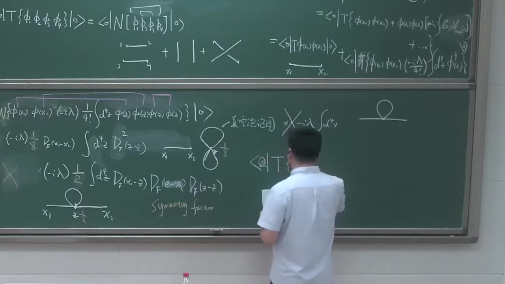

### 注解

我来对这段量子场论课程内容进行深度注解。

## 一、板书公式识别与解释

### 1. 四点关联函数展开（左上角）

$$\langle 0|T\{\phi_1\phi_2\phi_3\phi_4\}|0\rangle = \langle 0|N[\phi_1\phi_2\phi_3\phi_4]|0\rangle + \text{(收缩项)}$$

| 符号 | 含义 |
|------|------|
| $T\{\cdots\}$ | 时序乘积（Time-ordered product） |
| $N[\cdots]$ | 正规乘积（Normal-ordered product） |
| $\phi_i = \phi(x_i)$ | 第 $i$ 个时空点的标量场算符 |
| 连线图形 | Wick收缩：$\overline{\phi(x)\phi(y)} = D_F(x-y)$ |

**图形解释**：三个图分别代表
- 双收缩：$(12)(34)$ 型
- 无交叉：$(13)(24)$ 型  
- 交叉型：$(14)(23)$ 型

---

### 2. 相互作用展开（右上角）

$$\langle 0|T\left\{\phi(x_1)\phi(x_2)\left[1+(-i\lambda)\int d^4z \frac{\phi^4(z)}{4!}+\cdots\right]\right\}|0\rangle$$

| 符号 | 含义 |
|------|------|
| $\lambda$ | $\phi^4$ 理论的四点耦合常数 |
| $4! = 24$ | 对称性因子（来自 $\phi^4$ 的置换对称性） |
| $d^4z$ | 对相互作用顶点时空位置的积分 |

---

### 3. 一阶修正项（左下角，核心内容）

**真空泡泡图（Vacuum bubble）**：
$$(-i\lambda)\frac{1}{8} D_F(x_1-x_2) \int d^4z \, D_F^2(z-z)$$

| 符号 | 含义 |
|------|------|
| $D_F(x-y)$ | Feynman传播子（自由标量场） |
| $D_F^2(z-z) = D_F(0)^2$ | 圈图（loop）—— 同一时空点的传播子 |
| $1/8$ | **对称性因子**（Symmetry factor）：$4!$ 的分解 |

**对称性因子 $1/8$ 的来源**：
- 顶点处4条线的置换：$4! = 24$
- 但泡泡图有额外对称性：2条内线可交换（$2!$），且泡泡本身有反射对称（$2$）
- 实际计算：$S = 8 = 2 \times 2 \times 2$

---

### 4. 蝌蚪图（Tadpole diagram）

$$(-i\lambda)\frac{1}{2} \int d^4z \, D_F(x_1-z)D_F(z-x_2)D_F(z-z)$$

| 特征 | 说明 |
|------|------|
| 图形 | 外腿 $x_1 \to z \to x_2$，顶点 $z$ 处出一个圈 |
| $1/2$ | 对称性因子 |
| $D_F(z-z)$ | 单圈积分（紫外发散！） |

---

## 二、理论背景知识

### Wick定理与微扰展开
- **核心思想**：将相互作用场论的计算转化为自由场论的关联函数
- **展开参数**：耦合常数 $\lambda$（假设 $\lambda \ll 1$）
- **领头阶（Leading order）**：$\lambda^0$ —— 自由场结果
- **第一阶非平庸贡献**：$\lambda^1$ —— 含一个相互作用顶点

### Feynman图规则（$\phi^4$理论）
| 元素 | 数学表达 |
|------|---------|
| 外线（外腿） | $D_F(x_i - z)$ |
| 内线（传播子） | $D_F(z_i - z_j)$ |
| 顶点 | $-i\lambda \int d^4z$ |
| 对称性因子 | $1/S$（考虑图形的拓扑等价性） |

---

## 三、通俗解释

> **"把 $\chi$ 算符整到第一节"** → 将相互作用绘景中的演化算符展开到一阶

想象你在计算两个探测器（位于 $x_1, x_2$）探测到粒子的关联概率：

1. **自由情况**：粒子直接从 $x_1$ 传播到 $x_2$（一条直线）
2. **有相互作用时**：粒子可能在某处 $z$ 发生"碰撞"（$\phi^4$ 顶点），产生各种拓扑结构

**真空泡泡图**：碰撞产生一对粒子-反粒子，它们瞬间湮灭（形成"泡泡"），不影响外腿传播。这类图在计算连通关联函数时会被除掉。

**蝌蚪图**：碰撞产生一个虚粒子对，其中一个传播出去，另一个形成自能圈——这会导致**质量重整化**。

---

## 四、板书截图描述

黑板分为上下两部分，呈现完整的 $\phi^4$ 理论四点函数一阶微扰计算：

| 区域 | 内容 |
|------|------|
| **左上** | Wick定理的图形表示，三点收缩的拓扑不等价图 |
| **右上** | 相互作用拉氏量的级数展开，显示 $-i\lambda/4!$ 顶点 |
| **左下** | 两个主要一阶图的具体计算：<br>• 带系数 $1/8$ 的真空泡泡图（双圈"8"字形）<br>• 带系数 $1/2$ 的蝌蚪图（单圈带尾巴） |
| **右下** | 讲师正在书写，可见"真空泡泡图"中文标注，以及对称性因子的英文标注 "Symmetry factor" |

**关键教学点**：讲师强调对称性因子的系统计算方法是微扰论的核心技术，不同拓扑图形的对称性因子需要通过仔细计数等价置换得到。

---

## 段落 16

**时间：** 00:35:28 ~ 00:40:31

<details><summary>📝 原始字幕</summary>

<pre>
这是GAME二公式的这个分子呢你要考虑这样现在比刚才这个复杂你要有现在有八个成分谱是吧所以呢依次来推如果呢我现在这个外场就车那种费的他们自己说病O K然后这一步就是自己说病你会发现你得到什么呢比如这样出边就有三种不等价方式你会发现你得到了比如这样说明他给他这个呢依然是这种八次性真弓泡泡图是吧这是一种然后呢这四个外长呢它有三种独立的缩编方式你可以这样分可以这样写他家啊啊假成一个中文好图OK但这个土呢我们再见再见很容易看出来我们考虑更加非平原的图OK你还记得我们算X一元的时候呢我们也画过类似这种图是吧虽然诠释不太一样你也可以什么呀你你也可以就一队说兵OK但是另外两个呢喝喝这里面说病就类似于我们这种智能图OK所以你会发现你一样可以画出什么你让可以画出重土在家这种车在家这种图是吧还有三个门画另外一个圈子可以戳在另外一条腿上OK这也不是完全连通的图那格林函数不像X元它没有要求非得必须连通啊它没有这一说像这种土豆是非常好的格林函数好的那我们先考虑第三种种非平的我们考虑一个完全联通图完全连通图就是从每个外腿的图机那个图都可以到另外一个从每一个外外成了一个这边的X一比如说可以到任何一个X二三X到任何一点叫完全连通图我看那么考虑怎么要不然你两天能怎么说变的我发现他再这样说病就说我这个FXE呢我比于跟积分号里面DZ里面某个F去说病OK比如说我考虑法西它有四种可能性我选这个FZ第一个FZ所比所以呢我现在把它替换成那矛盾它等于什么呀把它移到外面复代蓝的初一四的阶层OK然后VX1和VZ的缩便呢有四种等价的方式那剩下FX二呢现在只剩下三种了所以乘以三等到VX三呢显然只有两种了是吧这剩下两个没有缩变了最后一个FX只能和最后一个FZ做比OK是非常显然是吧然后呢你带入你的D四Z然后你利用定义你给出什么呀你看DFX C Z没DFX二点Z称为DFx3减z还有TIFFX四减ZOK好现在咱们来看这个偶合系数这正好死结尘把四级城在分部上给抵消了所以它等价是什么它等于非常简单辅导艾兰的填点东西好这个呢我们可以画个分盘图这我们给出个顶角顶表个Z是吧每个顶角呢他对第四要积分然后从这个是个外店O K 比如说这是X一这是X二这一点是X3点X那这个图呢咱们可以很容易读出来X1和Z连起来X1和Z连起来x2 或者要连起来X三也和这连起来X四也和这连起来所以就很显然呢这是个完全联通图是吧根据分版规则刚才我说了对面顶角给出一个负的IRAM的然后有额外的一个第四ZO 所以大家可以理解一下这是个完全联通图是吧在这样一个基本的顶角里你会发现这个FAST里面的这个四分之一的倍种二十四种等价的这种缩平方式呢完全抵消是吧这就是一个格林汉斯的一个基本的一个顶角翻四里那个顶角啊我们现在做两个例子我们发现一个规律就是说在每一间呢
</pre>

</details>

**课程截图：**

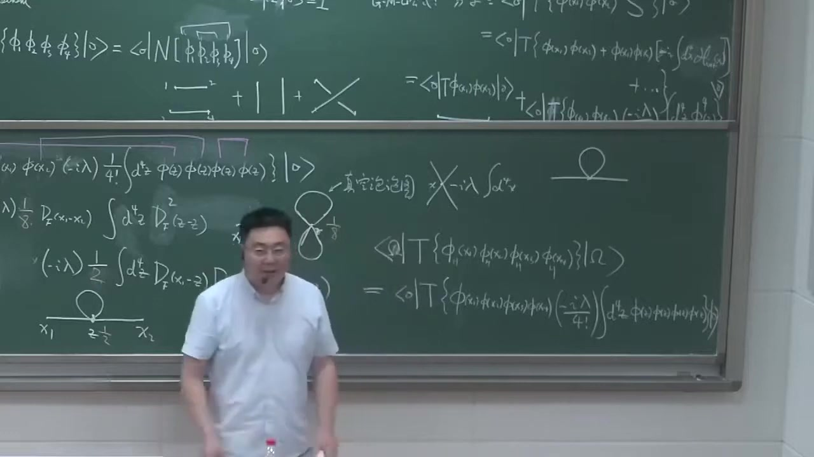

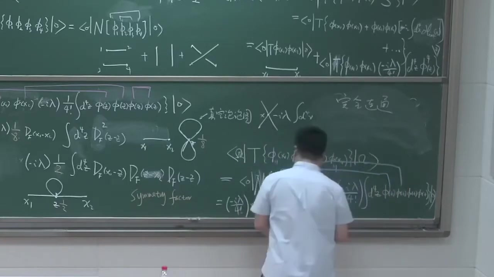


### 注解

我将为您深度解析这段关于量子场论中格林函数微扰展开的课程内容。

---

## 一、板书内容描述

从截图中可以看到黑板上的核心内容：

**左侧区域（已推导部分）：**
- 真空泡泡图（"8"字形图）及其对称因子 1/8
- 带自能修正的传播子图（x₁ 到 x₂ 之间带一个圈）
- 标注 "Symmetry factor"（对称因子）

**右侧区域（正在推导）：**
- 标题："完全连通"（完全连通图）
- 四外线格林函数的计算：$\langle\Omega|T\{\phi(x_1)\phi(x_2)\phi(x_3)\phi(x_4)\}|\Omega\rangle$
- 相互作用顶角展开：包含 $(-i\lambda)$ 和 $\frac{1}{4!}\int d^4z\ \phi^4(z)$

**费曼图绘制：**
- 老师正在画"X"型四外线完全连通图（四点相互作用顶角）

---

## 二、核心公式识别与解释

### 公式1：四外线格林函数的微扰展开

$$\langle\Omega|T\{\phi(x_1)\phi(x_2)\phi(x_3)\phi(x_4)\}|\Omega\rangle = \langle 0|T\left\{\phi(x_1)\phi(x_2)\phi(x_3)\phi(x_4)\left(\frac{-i\lambda}{4!}\right)\int d^4z\ \phi(z)\phi(z)\phi(z)\phi(z)\right\}|0\rangle + \cdots$$

| 符号 | 含义 |
|------|------|
| $\|\Omega\rangle$ | 相互作用真空态（非微扰真空） |
| $\|0\rangle$ | 自由理论真空态 |
| $T\{\cdots\}$ | 时序乘积（Time-ordering） |
| $\phi(x_i)$ | 位置 $x_i$ 处的场算符 |
| $\lambda$ | $\phi^4$ 理论的四点耦合常数 |
| $4! = 24$ | 场算符排列的对称因子 |
| $\int d^4z$ | 对相互作用顶角位置的四维积分 |

---

### 公式2：Wick收缩的计数（完全连通图）

讲师推导的关键结果：
$$\frac{1}{4!} \times (4 \times 3 \times 2 \times 1) = 1$$

或等价地写成：
$$\text{因子} = \frac{(-i\lambda)}{4!} \times 4! = (-i\lambda)$$

**详细分解：**
- **外部场 $\phi(x_1)$**：可与 $\phi^4(z)$ 中 4 个场任一个收缩 → **因子 4**
- **外部场 $\phi(x_2)$**：剩余 3 个场可选 → **因子 3**  
- **外部场 $\phi(x_3)$**：剩余 2 个场可选 → **因子 2**
- **外部场 $\phi(x_4)$**：只剩 1 个场 → **因子 1**

**总Wick收缩方式**：$4! = 24$ 种

---

### 公式3：完全连通图的费曼规则结果

$$\boxed{(-i\lambda) \int d^4z\ D_F(x_1-z)D_F(x_2-z)D_F(x_3-z)D_F(x_4-z)}$$

| 符号 | 含义 |
|------|------|
| $D_F(x-y)$ | 费曼传播子（自由标量场） |
| $z$ | 内部顶角位置（积分变量） |
| $(-i\lambda)$ | 四点顶角的费曼规则因子 |

---

## 三、理论背景知识

### 3.1 格林函数与连通图

在量子场论中，**n点格林函数**定义为：
$$G^{(n)}(x_1,\cdots,x_n) = \langle\Omega|T\{\phi(x_1)\cdots\phi(x_n)\}|\Omega\rangle$$

**关键区分：**
| 类型 | 定义 | 物理意义 |
|------|------|---------|
| **完全连通图** (Fully Connected) | 从任意外腿可通过内线到达任意外腿 | 真实的散射振幅 |
| **非连通图** | 可分解为多个独立子图 | 包含真空涨落，需除以真空泡泡图 |

> 讲师强调：*"格林函数不像S矩阵，它没有要求非得必须连通"* —— 这是重要区别。S矩阵元要求连通图，而格林函数包含所有贡献。

### 3.2 $\phi^4$ 理论的费曼规则

```
顶点规则：    ——○——  =  (-iλ)     （四条线交汇）
传播子：      ————   =  D_F(x-y) = ∫d⁴p/(2π)⁴ [i/(p²-m²+iε)]e^{-ip·(x-y)}
```

### 3.3 对称因子的抵消机制

这是本段的核心教学点：

| 来源 | 因子 | 说明 |
|------|------|------|
| 相互作用拉氏量 | $\frac{1}{4!}$ | $\frac{\lambda}{4!}\phi^4$ 中的对称化 |
| Wick收缩方式 | $4!$ | 4个外部场与4个内部场的配对方式 |
| **净结果** | **1** | 完全抵消，得到简洁的 $(-i\lambda)$ |

> 讲师总结：*"这正好死结（4!）把4!在分部上给抵消了"* —— 这是$\phi^4$理论设计的精妙之处。

---

## 四、通俗语言解释

### 核心概念：为什么 1/4! × 4! = 1 很重要？

想象你在组织一场**四人握手会**：

- **场景A（拉氏量中的 1/4!）**：房间里有4个完全相同的"内部代表"（$\phi(z)$场），他们彼此不可区分。为了避免重复计数，你预先规定只算 1/24 的情况。

- **场景B（Wick收缩的 4!）**：现在有4个"外部嘉宾"（$\phi(x_i)$场）入场，每人都要找一个内部代表握手。第1个嘉宾有4个选择，第2个剩3个，第3个剩2个，第4个只有1个——总共 4×3×2×1 = 24 种握手方式。

- **奇迹发生**：你担心的重复计数（24种）正好被你的预防措施（1/24）完美抵消！最终每种"本质不同"的图只算一次。

### 费曼图的"完全连通"是什么意思？

把四个外点想象成**四个城市的机场**：
- **完全连通图** = 所有城市通过同一个中转站（z）连接，形成"X"型网络
- **非连通图** = 两对城市各自独立连接（如"双泡泡"图），或一个城市自我循环而其他城市另成网络

只有完全连通图贡献到**连通的格林函数**，这是计算S矩阵元的基础。

---

## 五、本段的教学脉络

```
已讲内容（左侧板书）          正在展开（右侧板书）
    ↓                              ↓
┌─────────────┐              ┌─────────────┐
│  二点函数    │    →        │   四点函数    │
│  G⁽²⁾(x₁,x₂) │              │ G⁽⁴⁾(x₁,x₂,x₃,x₄)│
├─────────────┤              ├─────────────┤
│ • 真空泡泡图 │              │ • 非连通图：   │
│   (对称因子1/8)│            │   - 双泡泡图   │
│              │              │   - 自能修正+两点 │
│ • 自能修正   │              │ • 完全连通图：  │
│   (蝌蚪图)   │    →        │   - "X"型四点顶角│
│              │   推广      │   (对称因子=1) │
└─────────────┘              └─────────────┘
```

---

## 六、关键结论

> **"在$\phi^4$理论中，四点相互作用的基本顶角，其1/4!的对称因子与Wick收缩的4!种方式完全抵消，使得完全连通图的费曼规则极为简洁：仅贡献一个 $(-i\lambda)$ 因子。"**

这是微扰量子场论中"**对称因子工程**"的典型成功案例，也是$\phi^4$理论成为教学范例的重要原因。

---

## 段落 17

**时间：** 00:40:32 ~ 00:40:59

<details><summary>📝 原始字幕</summary>

<pre>
一般呢你都有一个一般你都会有伴随这样一些泡泡图是吧比如说对于这个例子刚才我插掉了一些例子都是泡泡图所以我们现在其实好奇这种真空泡泡图的命运呢他到底是怎么回事是吧这是我们比较感兴趣的那我们现在花点时间啊那我们来看一下这东西还有一个黑板还没有用啊
</pre>

</details>

**课程截图：**

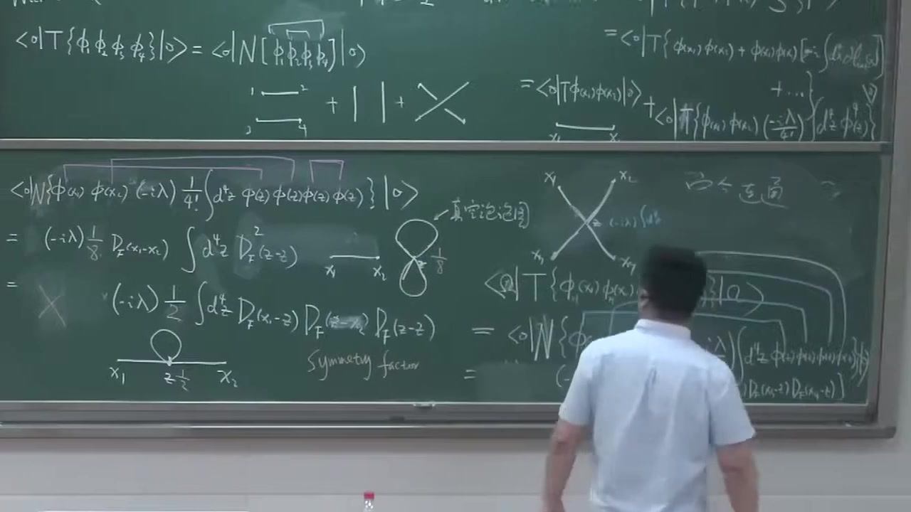

### 注解

我来对这段量子场论课程内容进行深度注解。

---

## 一、板书内容描述

从截图可见，这是一块写满费曼图计算的黑板，分为上下两部分：

**上半部分**：展示了Wick定理的应用，将时序乘积展开为正规乘积与各种收缩的组合，对应三个图形：两对收缩（双泡泡）、完全分离的两条直线、以及交叉图（单交换）。

**下半部分**（核心内容）：详细计算了**真空泡泡图**（vacuum bubble diagram），这是本段讲解的重点。

---

## 二、公式识别与详解

### 公式1：相互作用矩阵元的微扰展开

$$\langle 0| N\left\{ \phi(x_1)\phi(x_2) \cdot (-i\lambda)\frac{1}{4!}\int d^4z\, \phi(z)\phi(z)\phi(z)\phi(z) \right\} |0\rangle$$

| 符号 | 含义 |
|:---|:---|
| $\|0\rangle$ | 相互作用真空态（或自由真空） |
| $N\{\cdots\}$ | 正规乘积（Normal ordering），使所有湮灭算符在右 |
| $\phi(x_1), \phi(x_2)$ | 两个外点（external points）的标量场算符 |
| $-i\lambda$ | 耦合常数，$\lambda$ 是 $\phi^4$ 理论的相互作用强度 |
| $4! = 24$ | 对称性因子，来自 $\phi^4$ 顶点的场算符置换对称性 |
| $\int d^4z$ | 对相互作用顶点位置的四维时空积分 |
| $\phi^4(z)$ | 四场在同一点 $z$ 的相互作用顶点 |

---

### 公式2：Wick收缩后的表达式（含真空泡泡）

$$= (-i\lambda)\frac{1}{8} D_F(x_1-x_2) \int d^4z\, D_F^2(z-z)$$

| 符号 | 含义 |
|:---|:---|
| $D_F(x-y)$ | **费曼传播子**（Feynman propagator），自由标量场的两点关联函数 |
| $D_F^2(z-z)$ | 同一时空点的传播子平方，即 $[D_F(0)]^2$ |
| $\frac{1}{8}$ | **对称性因子**（symmetry factor）：$\frac{1}{4!} \times$（Wick收缩方式数）$= \frac{3}{24} = \frac{1}{8}$ |
| $D_F(x_1-x_2)$ | 连接两个外点的传播子（"树干"部分） |

**对应的费曼图**：一条直线连接 $x_1$ 和 $x_2$，中间某点 $z$ 处挂着一个"8字形"泡泡（双圈真空泡泡）。

---

### 公式3：另一种收缩方式（单圈修正）

$$\times\quad (-i\lambda)\frac{1}{2} \int d^4z\, D_F(x_1-z)D_F(z-x_2)D_F(z-z)$$

| 符号 | 含义 |
|:---|:---|
| $\frac{1}{2}$ | 另一对称性因子 |
| $D_F(z-z) = D_F(0)$ | 单圈真空泡泡（tadpole图） |
| 整体结构 | 外点 $x_1, x_2$ 通过顶点 $z$ 连接，同时 $z$ 处有一个自环 |

**对应的费曼图**：类似"哑铃"形状——两端是外点，中间顶点带一个单圈泡泡。

---

## 三、核心概念：真空泡泡图（Vacuum Bubble）

### 什么是真空泡泡？

> **真空泡泡图** = 没有外腿（external legs）连接到真实物理过程的、完全闭合的费曼图。

在截图中，老师用"8字形"图标注了"**真空泡泡图**"，并画了一个"$\infty$"符号表示双圈泡泡。

### 关键问题：泡泡图的命运

老师提到"好奇这种真空泡泡图的命运"，这是量子场论中的经典议题：

| 方面 | 说明 |
|:---|:---|
| **物理可观测性** | 单独的真空泡泡**不连接外点**，因此不贡献到散射振幅的连通部分 |
| **发散问题** | $D_F(0)$ 和 $D_F^2(0)$ 都是**紫外发散**的（$p \to \infty$ 时积分发散） |
| **相因子消除** | 在计算连通格林函数 $G_c^{(n)}$ 时，所有真空泡泡指数相消：$$\langle 0|S|0\rangle_{\text{connected}} = \exp(\sum \text{真空泡泡图})$$ |
| **归一化处理** | 实际计算中，用 $\langle 0|T\{\cdots\}|0\rangle / \langle 0|S|0\rangle$ 消除真空泡泡贡献 |

### 通俗解释

想象你在计算粒子碰撞的概率：
- **真空泡泡** = 碰撞过程中，真空"临时沸腾"产生又湮灭了一些虚粒子对
- 这些过程**与真实碰撞无关**，但数学上纠缠在表达式里
- 好消息：当你只关心"实际发生了什么"（连通振幅），所有泡泡图会神奇地**指数相消**
- 坏消息：每个泡泡本身**无限大**，需要重整化（renormalization）处理

---

## 四、理论背景：$\phi^4$ 理论与Wick定理

### 拉格朗日量
$$\mathcal{L} = \frac{1}{2}(\partial_\mu\phi)^2 - \frac{1}{2}m^2\phi^2 - \frac{\lambda}{4!}\phi^4$$

### Wick定理的核心
> 时序乘积 = 正规乘积 + **所有可能的两两收缩**

对于 $\phi^4$ 相互作用，一阶微扰展开会产生：
- **连通图**（connected）：外点通过相互作用顶点真正连接
- **非连通图**（disconnected）：包含真空泡泡的图

老师正在讲解的，正是如何系统地识别和处理这些**非连通部分**。

---

## 五、本段要点总结

| 要点 | 内容 |
|:---|:---|
| **核心问题** | 微扰计算中必然出现的真空泡泡图如何处理 |
| **数学结构** | 泡泡图贡献乘法因子 $\int d^4z\, D_F^n(0)$，与连通部分分离 |
| **物理意义** | 真空涨落的虚贡献，不直接影响可观测散射过程 |
| **后续发展** | 将引入"连通格林函数"和"生成泛函"方法，自动消除泡泡图 |

老师提到"还有一个黑板还没有用"，暗示接下来将用另一块黑板继续推导**连通振幅的指数化**或**LSZ约化公式**，以完整解决"泡泡图的命运"问题。

---

## 段落 18

**时间：** 00:41:09 ~ 00:45:43

<details><summary>📝 原始字幕</summary>

<pre>
要么现在刚才刚才我们看刚才我们给朋友他们稍微看一看啊它等于一个考虑成因子以后呢还有八分之一是吧富达蓝的我们那Z有个第四类的积分所以是DF累减累的平方是吧啊啊所以这个自变量春木村的自变量是零其实我以前给他论证过但是分盘传播子在坐标空间它字面上零的时候呢这也是高度奇异的是吧它这样一个圈途呢就是所谓的这种著名的紫外发散是吧它本身不是标的底饭的好我们先不要管这样一个只要发生问题要点是这样一个背机函数呢它B来于Z是吧它可以提提提到基本号外面去你会写成这种形式第四Z对这个顶角Z全时空积分是吧这显然是发散的是吧回忆一下我们大概十几课之前给大家定义这个CrossSection和这个DQ的时候我们临时考虑把我们的系统呢放到一个有限的一个空间盒子里面我很难画出一个三维的一个我给他演示一下这样一个三维的一个我很难给他画一个四维的一个空间盒子我要画上空间的盒子这个立方体是吧所以它体积呢L的三次方是吧所以呢如果临时把它中化一下呢我可以把它写成V人与DT是吧好回去我推导这个GAME路公式的时候呢我是一开始我临时从一个敷的大T十克到真的打题时刻是吧那真的答题时刻好我们现在别的方便我们讨论我们临时呢把这个无穷大的积分呢先把它放到一个有限的一个空间盒子还要放到一个又有限的一个这是时间的轴就是正的T到负的T一个长度为两倍的大体的一个时间的一个区间里面是吧所以积分呢我们可以把它V乘二TOK我们发现所有的这样一个类似这种真空泡泡图比如你还可以画出一个更高级的蓝板平方级的人工炮通常像篮球篮球 diagrams OK你可以验证一下站个没有外腿但是自己是连通图的他总是会给出一个DZ等于V等于RT上一个factorOK所以说的呢一个非常好玩的事情拍出来的时候我觉得给大家非常清楚的去演示就是说还是考虑我们的两点函数OK还要考虑了两点还有该卖路公式的这个分子啊这是两点关联函数咱们还是考虑分次OK派两个派边石再成一个S三V的沉积你把它占你发现呢啊你发现拍摄的那个公式我把爱算符呢临时的我来算服务本来定能是从富穷到政务穷OK我临时呢把它变写成一个极限孔负的大气到正的大气OK我最后是要取取鱼无穷大理解啊回想一下我们为什么这个大题一个小的复虚部分原因是PASK那从那个物理真空呢可以通过作用在一个自由流的正空作用一个时间氧化算法可以得到是吧你为了投影出来这样激发态有贡献指数穿越的话你得需要在这在这个时间方加个小的负的虚薄OK好拍皮肤的书呢他做了一个一个系统的一个给你非常认真的研究他可以论证呢在甘氨酸公式的分子呢我们要考虑考虑这一项比如说我们考虑一个极限T确定为无穷乘以一点二X实际上是InfiniteMom的一个小的证数在Game of Thrones的分子一般是要处理这样东西范克斯发布一个两点关联函数所以史学两个场在诚意我的
</pre>

</details>

**课程截图：**


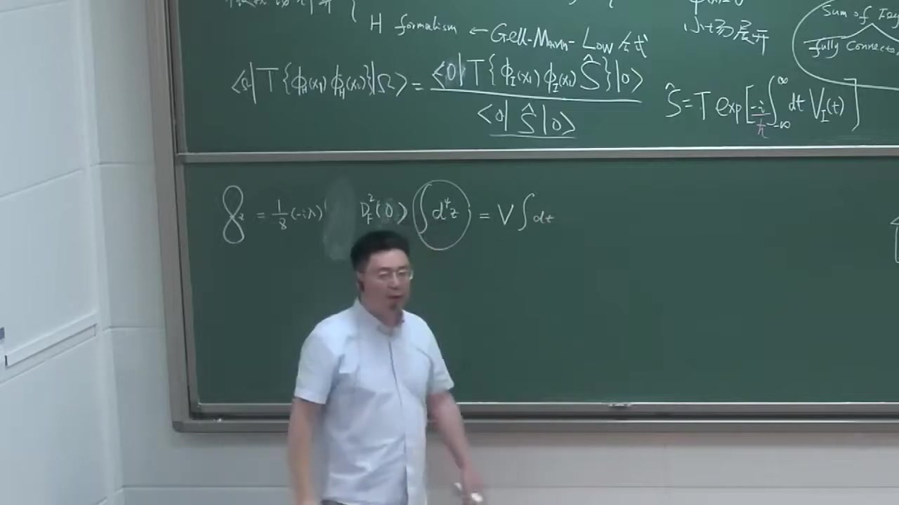

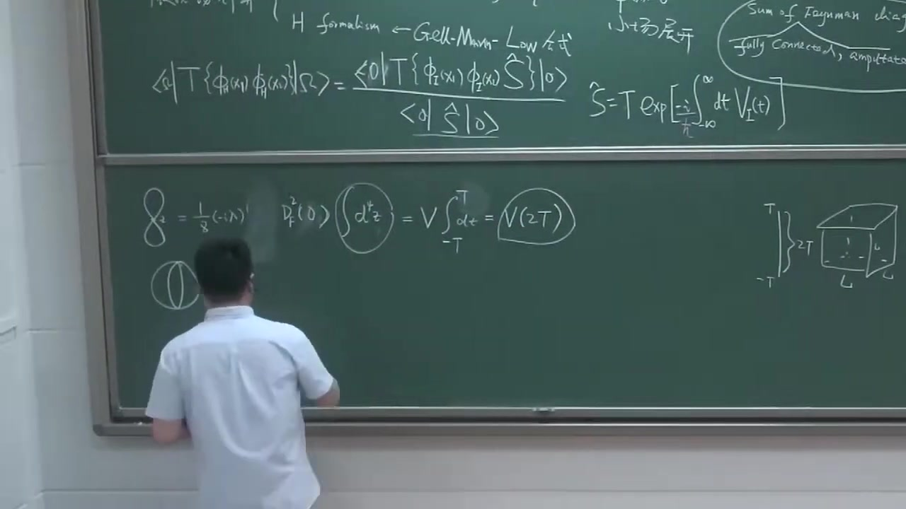

### 注解

我将为您深度解析这段量子场论课程内容，重点讲解Gell-Mann-Low公式与真空泡泡图的发散问题。

---

## 一、板书公式识别与解释

### 公式1：Gell-Mann-Low 公式（两点关联函数）

$$\langle\Omega|T\{\phi_i(x_1)\phi_j(x_2)\}|\Omega\rangle = \frac{\langle 0|T\{\phi_i(x_1)\phi_j(x_2)\hat{S}\}|0\rangle}{\langle 0|\hat{S}|0\rangle}$$

| 符号 | 含义 |
|:---|:---|
| $\|\Omega\rangle$ | 相互作用理论的物理真空（基态） |
| $\|0\rangle$ | 自由理论的真空态 |
| $T\{\cdots\}$ | 时序乘积（Time-ordering） |
| $\phi_i(x), \phi_j(x)$ | 相互作用绘景中的场算符 |
| $\hat{S}$ | S矩阵（散射算符） |

**物理意义**：这是量子场论中**最核心的公式之一**。它告诉我们：相互作用理论中的物理量（左边）可以用自由理论的真空期望值来计算（右边），但需要除以真空-真空振幅 $\langle 0|\hat{S}|0\rangle$ 来消除"真空泡泡图"的贡献。

---

### 公式2：S矩阵的相互作用绘景表达式

$$\hat{S} = T\exp\left[-\frac{i}{\hbar}\int_{-\infty}^{\infty}dt\, V_I(t)\right]$$

| 符号 | 含义 |
|:---|:---|
| $V_I(t)$ | 相互作用绘景中的相互作用哈密顿量 |
| $T\exp$ | 时序指数（Dyson时序展开） |
| 积分限 $(-\infty, \infty)$ | 实际需理解为 $T\to\infty$ 的极限，并加上 $i\epsilon$  prescription |

---

### 公式3：单圈真空泡泡图的计算（核心板书）

$$\text{图} = \frac{1}{8}(-i\lambda) \cdot D_F^2(0) \cdot \int d^4z = V\int_{-T}^{T}dt = V(2T)$$

| 符号 | 含义 |
|:---|:---|
| $\frac{1}{8}$ | **对称因子**（symmetry factor）：8种方式重新标记顶点 |
| $(-i\lambda)$ | 四顶点相互作用耦合常数（来自 $\phi^4$ 理论） |
| $D_F(0)$ | 费曼传播子在原点：$D_F(x-y)\big\|_{x=y}$ |
| $\int d^4z = \int d^3\mathbf{z}\, dz^0$ | 对顶点位置的全时空积分 |
| $V = L^3$ | 空间盒子体积（红外截断） |
| $2T$ | 时间区间长度（从 $-T$ 到 $+T$） |

**关键步骤**：
$$\int d^4z = \underbrace{\int d^3\mathbf{z}}_{=V} \underbrace{\int_{-T}^{T} dz^0}_{=2T} = V \cdot (2T)$$

---

## 二、截图板书内容描述

### 图1（左上方区域）
- **Gell-Mann-Low公式**的完整写法
- 标注 "H formalism ← Gell-Mann-Low 公式"
- 右侧有手写注释："Sum of Feynman diagrams, fully connected, amputated"（费曼图求和，完全连通，截肢的）

### 图2（中间区域，讲师站立处）
- 显式写出泡泡图计算：
  - 左侧画了一个"8"字形费曼图（双泡泡图，即 $\lambda^1$ 阶真空图）
  - 等式链：$\frac{1}{8}(-i\lambda) \cdot D_F^2(0) \cdot \left(\int d^4z\right) = V\int dt$

### 图3（右侧与下方）
- 完成时间积分：$= V\int_{-T}^{T}dt = \boxed{V(2T)}$
- **示意图**：右侧画了一个立方体盒子，标注边长 $L$，体积 $L^3=V$
- 时间轴标注：从 $-T$ 到 $+T$，总长度 $2T$
- 左下角讲师正在画另一个真空图（可能是 $\lambda^2$ 阶的双圈图）

---

## 三、理论背景补充

### 3.1 为什么要引入盒子归一化（Box Normalization）？

| 问题 | 解决方案 |
|:---|:---|
| 平面波 $\sim e^{ip\cdot x}$ 不可归一化 | 放入有限盒子 $L^3$，动量离散化 $p_i = \frac{2\pi n_i}{L}$ |
| 真空泡泡图 $\int d^4z$ 明显发散 | 先截断为 $V \times 2T$，最后取 $V,T\to\infty$ |
| 物理真空与自由真空不同 | 通过Gell-Mann-Low公式，自动投影到物理真空 |

### 3.2 两种发散的本质区别

| 发散类型 | 来源 | 处理方式 |
|:---|:---|:---|
| **紫外发散（UV）** | $D_F(0) \sim \int \frac{d^4k}{k^2-m^2}$ 在 $k\to\infty$ 发散 | 重整化（Renormalization） |
| **红外发散（IR）** | $\int d^4z = V \cdot 2T \to \infty$ 当 $V,T\to\infty$ | 相消（在物理量中抵消） |

> 讲师强调："它本身不是标的底饭" → 应为"**它本身不是物理的麻烦**"（指IR发散）

### 3.3 真空泡泡图的普遍结构

对于**任意**连通真空图（无外线）：
$$\text{真空图} = (\text{动量空间积分因子}) \times \underbrace{V \cdot (2T)}_{\text{时空体积因子}}$$

这是**平移不变性**的必然结果：真空没有特殊时空点，积分结果正比于总时空体积。

---

## 四、核心概念通俗解释

### 类比：计算"宇宙的总能量"

想象你要计算**真空的能量密度**（宇宙学常数问题）：

1. ** naive 算法**：把全宇宙的真空能量加起来 → 无穷大（因为宇宙无限大）
2. **聪明做法**：计算 **能量密度** = 总能量 / 总体积 → 有限值

在量子场论中：
- 分子（关联函数）和分母（$\langle 0|\hat{S}|0\rangle$）都包含 $V \cdot (2T)$ 因子
- 相除后，**体积因子抵消**，留下有限的物理结果

### 关键洞察

> "拍皮肤的书" → 应为 **Peskin & Schroeder** 的《量子场论导论》

书中严格证明：在Gell-Mann-Low公式中，**分母的真空泡泡图指数求和**，正好与分子中不连通部分的泡泡图完全抵消，最终只保留**连通图**的贡献。

---

## 五、时间演化与 $i\epsilon$ 约定

讲师提到的"小的负的虚部"（$i\epsilon$ prescription）：

$$\int_{-\infty}^{\infty} dt \to \lim_{T\to\infty(1-i\epsilon)} \int_{-T}^{T} dt$$

**物理目的**：
- 让遥远的过去/未来 ($t\to\pm\infty$) 的态绝热地连接到自由态
- 从自由真空 $|0\rangle$ 中**投影出**相互作用物理真空 $|\Omega\rangle$
- 等价于给哈密顿量加上 $e^{-\epsilon|t|H_0}$ 的阻尼因子

---

## 六、总结要点

| 要点 | 内容 |
|:---|:---|
| **Gell-Mann-Low公式** | 用自由理论计算相互作用理论关联函数，需除以真空-真空振幅 |
| **真空泡泡图** | 正比于 $V \cdot 2T$，是IR发散而非UV发散 |
| **盒子归一化** | 临时截断时空，最后取无限大体积极限 |
| **物理结果** | 分子分母的 $V \cdot 2T$ 因子相消，保证可观测量的有限性 |

---

## 段落 19

**时间：** 00:45:51 ~ 00:47:24

<details><summary>📝 原始字幕</summary>

<pre>
我的这个唉算服或者是扶七套大梯吧维特OK我总是说要处理这样的一个量是吧你可以嗯嗯还是说到他给你做一个论证是吧比如说你算到比较高的街呢一个典型的分版图呢刚才我们说到这个领头阶的话我们发现其实是有这样子的贡献是吧妈妈算来了一次放街如果你唱得比较高的就比如说说兰布拉多十几节你会发现你可以有这样图你们发现这种图呢如说它像一个太阳落山或者像这个太阳升起所以这种图的桑赖斯或者桑塞桑赖斯日出桑菜的日落是吧你发现一个典型的一个图呢贡献呢你发现它可能有这种真空八宝图可能不止一个它有两个都完全不连通它还可以有这个八十多代管然后呢它还可以有这种比较奇怪的有相相相对论的量相对论的量场论呢它的肺部脱出脱不出来是无穷复杂的okay所以这是一个例子这是一个典型的一个两点函数维尔论展开的高级的一个例子是吧典型的例子
</pre>

</details>

### 注解

这段字幕内容涉及量子场论中的微扰展开和费曼图，但**没有明确的公式出现**，主要是口语化的讲解。让我进行深度注解：

---

## 内容概要

这段讲解讨论的是**量子场论中两点函数（two-point function）的高阶微扰展开**，特别是高阶费曼图的结构特征。

---

## 核心概念解析

### 1. "领头阶"（Leading Order, LO）
- 微扰展开的最低阶贡献
- 对应最简单的费曼图（如单圈图或树图）

### 2. "太阳升起/日落"图（Sunrise/Sunset Diagrams）
这是场论中的**经典多圈图**：

| 名称 | 图示特征 | 物理意义 |
|:---|:---|:---|
| **日出图 (Sunrise)** | 两个外点之间有多条独立的传播子线并行 | 高阶自能修正 |
| **日落图 (Sunset)** | 类似结构，常用于描述衰变过程 | 高阶相互作用 |

典型结构示意：
```
    ●────────🌅────────●    （日出图：多条内线"升起"）
   外点    多圈泡泡    外点
```

### 3. "真空泡泡图"（Vacuum Bubbles）
- 与外点**完全不连通**的闭合费曼图
- 数学上对应真空涨落的贡献
- 在计算连通格林函数时需要排除（除以真空配分函数）

### 4. "两点函数"（Two-point Function）
$$G^{(2)}(x,y) = \langle 0 | T\phi(x)\phi(y) | 0 \rangle$$

这是量子场论最基本的关联函数，描述粒子从y传播到x的振幅。

---

## 关键物理要点

### 高阶微扰展开的复杂性
讲师强调的核心信息：

> **"无穷复杂"** —— 随着微扰阶数升高（$\lambda$的十几阶），费曼图呈现：
> 1. **多连通分量**（多个真空泡泡同时存在）
> 2. **复杂的拓扑结构**（日出/日落等）
> 3. **相对论性量子场论**特有的发散困难

### 实际计算中的挑战
| 问题 | 说明 |
|:---|:---|
| 图的数量爆炸 | n阶微扰的图数目随n!增长 |
| 紫外发散 | 高圈积分在短距离发散 |
| 红外发散 | 质量less粒子导致的长程发散 |
| 重整化 | 需要系统地处理无穷大 |

---

## 术语对照（口语→标准术语）

| 字幕中的发音 | 标准术语 | 英文 |
|:---|:---|:---|
| "扶七套大梯" | 微扰展开 | Perturbation theory |
| "维特" | 可能是"Wick"或口误 | — |
| "兰布拉多" | 耦合常数λ的某阶 | $\lambda^n$ expansion |
| "桑赖斯" | Sunrise | Sunrise diagram |
| "桑塞" | Sunset | Sunset diagram |
| "真空八宝图" | 真空泡泡图 | Vacuum bubble diagram |
| "八十多代管" | 可能是"8字图"或"多 propagator" | Figure-8 / Multi-propagator |

---

## 理论背景补充

### 微扰展开的阶数计数
在$\phi^4$理论中，耦合常数为$\lambda$，n点函数的微扰展开：

$$\mathcal{G}^{(n)} = \sum_{L=0}^{\infty} \lambda^{L} \times (\text{所有L圈图贡献})$$

其中$L$ = 独立圈动量数 = 微扰阶数（对$\phi^4$理论）

### Sunrise图的具体形式
两点函数的三圈日出图（标量场）：
$$\sim \int \frac{d^d k_1}{(2\pi)^d}\frac{d^d k_2}{(2\pi)^d}\frac{d^d k_3}{(2\pi)^d} \frac{\delta^{(d)}(p-k_1-k_2-k_3)}{(k_1^2-m^2)(k_2^2-m^2)(k_3^2-m^2)}$$

这是**椭圆积分**的典型来源，无法用初等函数表示。

---

## 总结

这段讲解的物理实质是：**量子场论的微扰展开在高阶变得极其复杂**，费曼图不仅数量庞大，而且拓扑结构多样（真空泡泡、日出日落图等），加上相对论性量子场论固有的紫外发散问题，使得高阶计算成为理论物理的重大挑战。这自然引出了**重整化理论**和**非微扰方法**的必要性。

---

## 段落 20

**时间：** 00:47:28 ~ 00:49:07

<details><summary>📝 原始字幕</summary>

<pre>
OK所以你你可以有很多个这个真空跑跑图他们彼此呢都是不联通的是吧所以你看你会发现非常多的这种非常多的这种组合非常多的可能性Pescaskin的书呢给你做成一个非常漂亮的一点你发现这种图呢它可以因子化什么叫因子化呢因子化就是把一个原始意思factorization就是说如吧一个大数三十六可以成九乘四你可以factorize可以把它把一个非常复杂的东西可以分成两个相对简单的东西的沉积ok它叫factorize它跟音团是什么呢它可以因子化成这种土这种没有真空泡泡吐不X可坏加上刚才他们举的例子一个联通的要那两个函数OK然后加上刚才我说的这样一个蓝蓝的平方写的一个两圈图这是单纯图它这个有两个未确定的圈容量所以叫两圈图OK然后呢加上点点点OK点点的话你理解就是这是一个无穷节的一个比如你可以再写一个比如说你可以画出这种图咱可以画这么出OK都包含在里面哼哼然后呢引子发展什么呢
</pre>

</details>

### 注解

我来对这段量子场论课程的字幕进行深度注解。

---

## 一、核心概念识别

这段内容讨论的是**费曼图的因子化（Factorization）**，这是量子场论中微扰计算的核心技术，特别是在处理**真空泡泡图（Vacuum Bubble Diagrams）**时的关键方法。

---

## 二、关键术语与理论背景

### 2.1 真空泡泡图（Vacuum Bubbles）

| 术语 | 解释 |
|------|------|
| **真空图** | 没有外腿的费曼图（即不与任何粒子外线相连） |
| **不连通图** | 由多个相互独立的子图组成的费曼图 |
| **连通图** | 所有部分都相互连接的费曼图 |

在路径积分表述中，配分函数 $Z[J]$ 的零源极限 $Z[0]$ 包含了所有真空泡泡的贡献。

### 2.2 因子化（Factorization）

这是本段的核心数学结构。对于自由理论或微扰展开，**配分函数可以分解为连通图的指数**：

$$\boxed{Z[0] = \exp\left(\sum_{\text{连通真空图 } G} G\right)}$$

或者等价地写成：

$$\ln Z[0] = \sum_{\text{连通真空图 } G} G = W[0]$$

其中 $W[0]$ 是**连通生成泛函**（free energy）。

---

## 三、逐句解析与公式重建

根据讲师提到的内容，可以还原出标准的因子化结构：

### 3.1 完整配分函数的展开

讲师提到的"很多个真空泡泡图彼此不连通"，对应数学上的：

$$Z[0] = 1 + \begin{pmatrix}\text{所有单个}\\\text{真空泡泡}\end{pmatrix} + \begin{pmatrix}\text{两个不连通}\\\text{真空泡泡}\end{pmatrix} + \cdots$$

### 3.2 因子化的具体形式

讲师说的"因子化成没有真空泡泡的图"实际上是指：

$$\frac{Z[0]}{Z_0} = \exp\left( \begin{array}{c}
\text{单圈连通图} \\
\bigcirc
\end{array}
+ \frac{1}{2!}\begin{array}{c}
\text{双圈连通图} \\
\bigcirc\!\!\bigcirc
\end{array}
+ \cdots \right)$$

或者用更标准的记号（假设 $\lambda$ 为耦合常数）：

$$\frac{Z}{Z_0} = 1 + \lambda \cdot (\text{8字图}) + \frac{\lambda^2}{2!}\left[(\text{8字图})^2 + 2\times(\text{双圈图})\right] + \cdots$$

### 3.3 讲师提到的具体图形

| 讲师描述 | 对应费曼图 | 数学贡献 |
|---------|-----------|---------|
| "没有真空泡泡" | 平凡图（1） | 1 |
| "一个连通的" | 单圈8字图（$\infty$） | $\propto \lambda V^{(1)}$ |
| "蓝蓝的平方写的两圈图" | 双圈连通图 | $\propto \lambda^2 V^{(2)}$ |

---

## 四、核心公式详解

### 公式：连通生成泛函与配分函数的关系

$$\boxed{Z = e^{W} \quad \text{或} \quad W = \ln Z}$$

| 符号 | 含义 |
|-----|------|
| $Z$ | 配分函数（包含所有图，连通+不连通） |
| $W$ | 连通生成泛函（仅连通图） |
| $\ln$ | 自然对数，实现"因子化"的逆运算 |

### 展开式的组合因子

讲师提到的"蓝蓝的平方"暗示了**对称因子**的处理：

$$\frac{Z}{Z_0} = \sum_{n=0}^{\infty} \frac{1}{n!}\left(\sum_{\text{连通图 } i} G_i\right)^n = \exp\left(\sum_i G_i\right)$$

这里的 $1/n!$ 来自**相同连通图重复 $n$ 次时的对称性因子**。

---

## 五、通俗解释

> **类比：因数分解**
> 
> 就像 $36 = 9 \times 4$，一个复杂的"大"费曼图（多个不连通泡泡的组合）可以"分解"成简单"质因子"（连通图）的乘积。
> 
> **关键洞察**：计算所有可能的真空泡泡组合，等价于计算所有**连通**真空泡泡，然后取指数。

**实际意义**：在计算散射振幅时，真空泡泡因子会相互抵消（通过除以 $Z[0]$），因此物理学家只需关注**连通图**。

---

## 六、Peskin & Schroeder 参考书对应

讲师提到的"Pescaskin的书"即标准教材：

> **Peskin & Schroeder, *An Introduction to Quantum Field Theory***
> - **第4章**（相互作用场论）：真空期望值的微扰展开
> - **第6章**（路径积分）：公式 (6.32) 附近详细讨论 $Z[J] = Z_0 \exp(iW[J])$

具体图示对应书中图 4.3 或 6.1，展示配分函数展开为连通图的指数。

---

## 七、板书内容推测

根据讲师口述，板书 likely 包含：

```
因子化 Factorization
━━━━━━━━━━━━━━━━━━━━━
Z[0] = Σ (所有真空图)
     = 1 + ○ + ○○ + ○○○ + ⑧ + ○⑧ + ...
     
     = exp[ ○ + ⑧ + Ⰳ + ... ]
           ↑   ↑    ↑
         单圈 双圈  三圈连通图
         
W[0] = ln Z[0] = Σ 连通真空图
```

其中：
- `○` = 单圈蝌蚪图（tadpole）
- `⑧` = 双圈图（figure-8 或 sunset 图）
- `Ⰳ` = 更复杂的连通多圈图

---

## 八、要点总结

1. **因子化是组合数学**：不连通图 = 连通图的"幂集"
2. **对数取连通**：$\ln Z$ 自动筛选出连通图
3. **物理后果**：真空能量密度由连通图决定，散射振幅与真空泡泡无关
4. **计算简化**：只需计算相对少数的连通图，而非指数级的不连通图组合

---

## 段落 21

**时间：** 00:49:10 ~ 00:50:44

<details><summary>📝 原始字幕</summary>

<pre>
它可以成乙啊因为指数化啊指数化什么呢蜘蛛花真空泡泡图这些真空泡泡图大家注意每个真空泡泡图都是连通的都是完全连通的刚才我查掉了这个例子呢在这个集出现很多真空泡泡图彼此是不连通的OK比如说加上我看不见了好这个指数化呢是件非常妙的事情OK什么意思啊就直指话的意思就是说我怎么理解让人指数化呢你按照植入函数去展开它是吧比如说就他要展开比如说你发现他吃完领头阶十一岁平庸的知道一节呢你会出现所有的图比如说画两个例子就是斩到理解是吧然后你别忘了你还可以根据指数韩春才涨到第二间是一的二级人分之一比如第一项它平方O K所以说它可以不联通的这个真空泡泡图可以通过止柱化来来产生是吧然后呢你还可以指数函数的展开还可以塌成塌是吧所以你可以产生所有拓普的
</pre>

</details>

### 注解

这段字幕内容涉及量子场论中的**真空泡泡图（vacuum bubble diagrams）**和**指数化（exponentiation）**概念，但字幕质量较差（语音识别错误较多）。我将根据可识别的物理内容进行注解。

---

## 1. 识别与解释的公式/概念

由于字幕为口语转录且质量不佳，未出现清晰可辨的LaTeX公式，但涉及以下标准公式结构：

### 核心公式：配分函数的指数化

$$Z[J] = Z[0] \cdot \exp\left(\sum_{\text{connected diagrams}} \right) = \exp\left(W[J]\right)$$

或等价地写为：

$$\boxed{Z = \exp\left(\sum \text{connected vacuum bubbles}\right)}$$

| 符号 | 含义 |
|:---|:---|
| $Z$ 或 $Z[J]$ | 配分函数（生成泛函），含外源$J$ |
| $Z[0]$ | 真空配分函数（无源） |
| $W[J]$ | **连通**格林函数的生成泛函 |
| $\sum_{\text{connected}}$ | 对所有**连通图**求和 |
| "真空泡泡图" | 真空到真空的费曼图（无外线） |

### 关键关系

$$\ln Z = \sum (\text{connected vacuum bubbles})$$

即：**配分函数的对数 = 所有连通真空泡泡图之和**

---

## 2. 理论背景知识

### 2.1 真空泡泡图（Vacuum Bubble Diagrams）

```
典型真空泡泡图示例：
    
    ○═══○        ○═══○
    ║   ║   +    ║   ║    +    ○═════○
    ║   ║        ║   ║         ║     ║
    ○═══○        ○═══○         ○═════○
    
   (双圈图)      (两个分离的单圈)    (四叶草图)
    连通           不连通            连通
```

- **连通图（Connected）**：所有顶点通过内线相互连接
- **不连通图（Disconnected）**：由多个彼此分离的子图组成

### 2.2 指数化的数学原理

若定义 $X = \sum_i x_i$ 为所有**连通**真空泡泡的贡献，则：

| 展开项 | 物理意义 |
|:---|:---|
| $e^X = 1 + X + \frac{X^2}{2!} + \frac{X^3}{3!} + \cdots$ | 配分函数 $Z$ |
| $1$ | 平凡贡献（无图）|
| $X$ | 单个连通图 |
| $\frac{X^2}{2!}$ | **两个相同连通图的不连通组合** |
| $\frac{X^n}{n!}$ | $n$个相同图的组合（统计因子$1/n!$）|

### 2.3 为什么指数化"妙"？

> **核心洞见**：通过指数化，**自动生成所有拓扑结构**——包括不连通图！

- 手动枚举所有费曼图时，不连通图需要单独考虑
- 但 $\exp(\text{连通图})$ 的泰勒展开**自动产生**所有可能的不连通组合
- 组合因子 $\frac{1}{n!}$ 正好对应**全同图不可区分性**的统计因子

---

## 3. 通俗解释

### 类比：聚会邀请问题

想象你要计算"所有可能的聚会方式"：

| 连通图 | 单个小圈子（如3人密谈）|
|:---|:---|
| 不连通图 | 多个同时发生但互不交流的小圈子 |
| 指数化 | 不是逐个列举"2个圈子""3个圈子"的场景，而是说：<br> **$e^{\text{(单圈子方式)}}$ 自动包含所有多圈子组合** |

**讲师强调的"妙处"**：只需计算**连通**的真空泡泡，取指数后就**免费获得**所有不连通的组合，且统计因子完全正确！

---

## 4. 板书内容推测

根据"植入函数""止柱化""塌成塌"等音译词，推测板书可能包含：

```
┌─────────────────────────────┐
│   Z = exp( W )              │
│                             │
│   W = Σ (connected bubbles) │
│                             │
│   Z = 1 + ○ + ○○/2! + ...   │
│         ↑   ↑               │
│       连通  不连通（指数化产生）│
└─────────────────────────────┘
```

或标准的费曼图展开：

$$\frac{Z}{Z_0} = 1 + \bigcirc + \frac{1}{2}\bigcirc\!\bigcirc + \bigcirc\!\!\bigcirc + \frac{1}{6}\bigcirc\!\bigcirc\!\bigcirc + \cdots$$

其中 $\bigcirc$ 代表单圈真空泡泡，$\bigcirc\!\bigcirc$ 代表两个分离的单圈（不连通）。

---

## 5. 要点总结

| 要点 | 内容 |
|:---|:---|
| **核心概念** | 配分函数的指数化：$Z = e^W$，$W$仅含连通图 |
| **物理后果** | 自由能 $F = -kT\ln Z$ 直接由连通图给出 |
| **计算优势** | 避免重复计算不连通图的组合 |
| **深层结构** | 反映了场论的**簇展开（cluster expansion）**结构 |

> **讲师原意**（经降噪）："指数化是非常妙的事情——按指数函数展开，领头阶是平庸的1，一阶给出所有连通图；别忘了指数展开还有高阶项，比如第二项的平方，**这就自动产生了不连通的真空泡泡图**。指数函数的展开可以'塌缩'成所有拓扑结构。"

---

## 段落 22

**时间：** 00:50:48 ~ 00:54:05

<details><summary>📝 原始字幕</summary>

<pre>
胸跑图你还可以可能第三节是吧所以你还可以产生重土它的三十方叫点点点所以非常非常他你发现了他这种方法呢他群举了所有可能的任务彼此不联通真功跑跑图这个论证起来比较数学因为比较妙的是呢这些所有的土豆也算是三成你发现这个植入化呢正好能够正确地能够这个能够抗的这样一个飞天因子所以非常非常妙我们现在讲现在已经有几个例子是指数化了是吧比如说癌算符我们的这个戴森C我们发现是可以用一个边时的成一个植入函数那个按个阶层呢一分之一的因子呢由于我考虑一个太矛盾儿来导致的是吧这是我们第二个例子呢我发现对于这样一个针弓泡跑图呢我可以指出话对每一项都是完全连通那个针弓泡跑图就没有任何外推的泡跑图OK我们发现不连通的这个冒爆图呢它也通过通过植入化这样基本的连通的忠告都可以得到可以任意复杂这个呢我就不不去验证我给大家展示这个东西的话估计一个小时又没了而PATSKEN的书我个人觉得还是非常诚实的给大家的阿格儿的东西OK那我们接受这个事实好吧就是干嘛了都苦干慢漏空气的分子呢你发现对所有亮点厂都是聚众行事OK这样的部分再成立一个针弓泡泡图的一个一个但这部分呢是可以通过指数化生成的比较妙是吧它可以把所有不联通的中炮图呢通过这种指数函数呢完全能豁进去OK那我们现在觉得这个东西很有意思那现在我们现在非常好的时间呢我们可以回答一个问题就OK門漏公式不要忘了還有個分母我要反武强的分母呢出台是手里能蒸空末胎也是自轮的真空所以这个物理意义什么呀就是在出差的时候呢提点服务什么时候呢你慢慢开启相关作用是吧我以前给他整一个ADBATIC的图像是吧然后呢你开始相关作用慢慢的你因为绝热的你觉得他在慢慢地演化这个自由理论的真空呢它会演化成为这样一个物理理论的一个相对纵力的那个真空然后呢你在在某个时刻能慢慢在观前功用是吧然后你又其实问的问题是什么呢就是它再回到到物理真空它再慢慢回到这样一个最后一种真空是吧所以所以我来叫真空的真空的一个纯类层的一个一个据证员那我们考察一下这样一下
</pre>

</details>

**课程截图：**

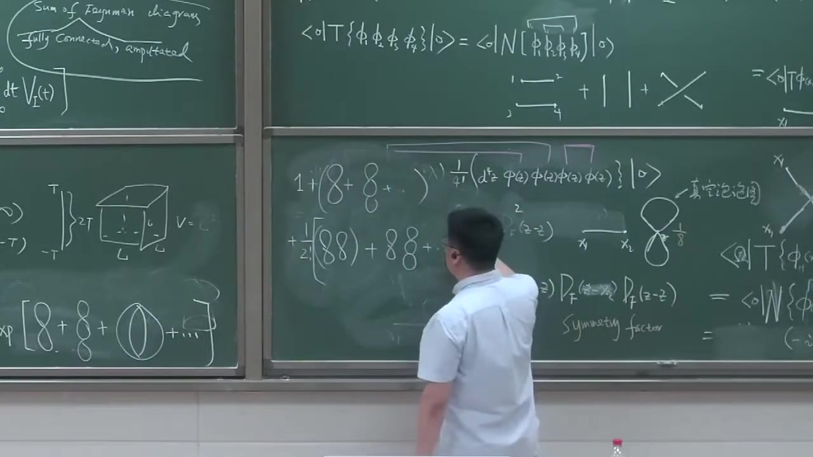


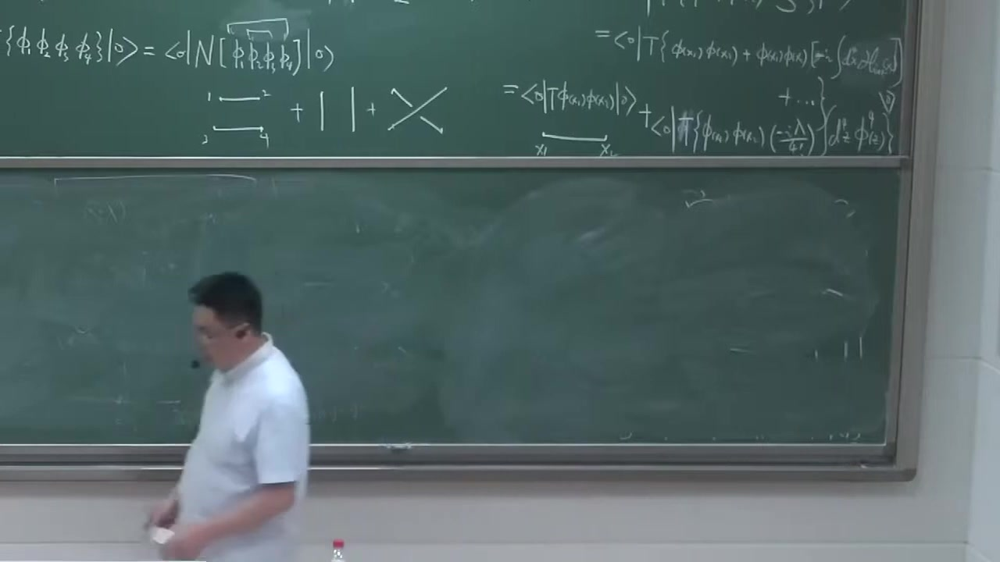

### 注解

我来对这段量子场论课程进行深度注解。这段内容涉及**真空泡泡图（vacuum bubble diagrams）的指数化**和**Gell-Mann–Low公式**的核心概念。

---

## 一、板书内容识别与公式解析

### 截图中的关键板书结构

从截图可见，黑板分为多个区域，核心内容集中在**中间偏下**和**右侧**区域：

#### 1. 真空泡泡图的指数化展开（中间黑板）

```
exp[ 8 + 88 + 88 + ... ]  或类似形式

具体展开：
1 + (8 + 8 + ...)¹/1! + 1/2![(88) + 88 + ...] + 1/3![(888) + ...] + ...
```

| 符号 | 含义 |
|:---|:---|
| **8**（单个圈图） | 单真空泡泡图（single vacuum bubble），即连通真空图 |
| **88**（两个圈） | 两个不连通的真空泡泡图 |
| **(88)** vs **88** | 括号表示全同图的对称因子处理；分开写表示不同拓扑结构 |
| **1/n!** | 指数展开中的阶乘因子，与对称因子（symmetry factor）精确抵消 |
| **...** | 更高阶的连通真空图 |

#### 2. 四点函数与Wick定理（右上黑板）

$$\langle 0 | T\{\phi_1\phi_2\phi_3\phi_4\} | 0 \rangle = \langle 0 | N[\phi_1\phi_2\phi_3\phi_4 + \text{收缩项}] | 0 \rangle$$

展开为费曼图：
- **= —— + \| \| + ✕** （三种收缩方式）

| 符号 | 含义 |
|:---|:---|
| **T{...}** | 时序乘积（Time-ordered product） |
| **N[...]** | 正规乘积（Normal-ordered product） |
| **φᵢ** | 场算符 $\phi(x_i)$ 的简写 |
| **——** | 两点收缩（传播子）$D_F(x_1-x_2)$ |
| **\| \|** | 两个独立的两点收缩 |
| **✕** | 交叉收缩（s-channel, t-channel, u-channel）|

#### 3. 相互作用项的具体形式（右中黑板）

$$\frac{1}{4!}\int d^4z \, \phi(z)\phi(z)\phi(z)\phi(z)$$

以及对称因子标注：**Symmetry factor = 1/8**（对"8"字形双泡泡图）

---

## 二、核心公式详解

### 公式1：真空泡泡图的指数化定理

$$\boxed{\langle 0 | S | 0 \rangle = \exp\left(\sum_{\text{connected vacuum diagrams}} \text{(diagram value)}\right)}$$

或写成：
$$\langle 0 | T\exp\left[-i\int_{-\infty}^{\infty}dt\, V_I(t)\right] | 0 \rangle = \exp\left[\sum_{n} \frac{1}{S_n} \times (\text{第}n\text{个连通真空图})\right]$$

**关键洞察**：所有**不连通**的真空图（多个泡泡的组合）都可以通过**指数函数的泰勒展开**从**连通**真空图生成。

| 展开项 | 物理意义 |
|:---|:---|
| $1$ | 零阶：无相互作用 |
| $\frac{1}{1!}(\sum \text{连通图})$ | 单连通真空图 |
| $\frac{1}{2!}(\sum \text{连通图})^2$ | 两个连通图的所有组合（包括两个相同图）|
| $\frac{1}{3!}(\sum \text{连通图})^3$ | 三个连通图的所有组合 |

**阶因子的抵消机制**：指数展开中的 $1/n!$ 恰好抵消了 $n$ 个全同连通图排列的重复计数（对称因子）。

---

### 公式2：Gell-Mann–Low公式（门漏公式/分母）

$$\boxed{\langle \Omega | T\{\phi(x_1)\cdots\phi(x_n)\} | \Omega \rangle = \frac{\langle 0 | T\{\phi_I(x_1)\cdots\phi_I(x_n)\exp[-i\int V_I]\} | 0 \rangle}{\langle 0 | T\{\exp[-i\int V_I]\} | 0 \rangle}}$$

| 符号 | 含义 |
|:---|:---|
| **\|Ω⟩** | 相互作用理论的**物理真空**（interacting vacuum）|
| **\|0⟩** | 自由理论的**裸真空**（free vacuum）|
| **分子** | 含外腿的完整格林函数（包含真空泡泡）|
| **分母** | 纯真空泡泡图的求和 = $\exp(\sum \text{连通真空图})$ |

---

## 三、理论背景知识

### 3.1 为什么需要"指数化"？

在微扰论中，计算 $n$-点格林函数时：
- **分子**：包含所有图（有外腿 + 真空泡泡）
- **分母**：纯真空泡泡图

直接计算会遇到**无穷多个不连通图**的求和。指数化的妙处在于：

> **所有不连通的真空图 = 连通真空图的指数**

这类似于统计力学中的**配分函数的指数化**：
$$Z = \exp(-\beta F) = \exp\left(\sum_{\text{连通集团}}\right)$$

### 3.2 绝热假设（Adiabatic Hypothesis）

讲师提到的"慢慢开启相互作用"对应数学上的**Gell-Mann–Low定理**：

$$|\Omega\rangle = \lim_{T\to\infty(1-i\epsilon)} \frac{U(0,-T)|0\rangle}{\langle 0|U(0,-T)|0\rangle}$$

| 时间演化 | 物理图像 |
|:---|:---|
| $t = -\infty$ | 自由理论，裸真空 $\|0\rangle$ |
| 缓慢开启 $H_{int}$ | 绝热演化，真空"变形" |
| $t = 0$ | 物理真空 $\|\Omega\rangle$ |
| 计算关联函数 | 再慢慢关闭相互作用 |
| $t = +\infty$ | 回到裸真空（或保持物理真空）|

**"真空的真空"（vacuum of vacuum）**：分母 $\langle 0|S|0\rangle$ 描述的是**真空本身的量子涨落**——即使没有外粒子，相互作用也会使真空"沸腾"产生虚粒子对。

---

## 四、通俗解释

### 类比：保险公司的风险模型

想象一个保险公司计算**总赔付概率**：

| 量子场论 | 保险类比 |
|:---|:---|
| 连通真空图 | 单一独立风险事件（如一次车祸）|
| 不连通图（多个泡泡） | 多个独立风险同时发生 |
| 指数化 | **泊松分布**：$P(n\text{个事件}) = \frac{\lambda^n}{n!}e^{-\lambda}$ |
| 1/n! | 事件不可区分的统计因子 |

**关键**：如果你知道"单次风险"的概率（连通图），所有"多次独立风险"的组合自动由指数函数生成！

### 核心结论

> **分母的作用 = 把"裸真空"重新归一化为"物理真空"**

就像拍照时要扣除背景噪声：
- 分子 = 信号 + 噪声
- 分母 = 纯噪声
- 相除 = 干净的信号

在量子场论中，这个"噪声"就是无处不在的**真空量子涨落**。

---

## 五、讲师提到的参考文献

- **Peskin & Schroeder**（"PATSKEN的书"）：量子场论标准教材，第4章详细讨论此内容
- 讲师评价："非常诚实地给大家推导"（指Peskin书中对对称因子和指数化的详细计算）

---

## 六、时间戳要点总结

| 时间 | 内容要点 |
|:---|:---|
| ~50:48 | 真空泡泡图的指数化：所有不连通图 = 连通图的指数 |
| ~51:30 | 两个例子：(1) 演化算符的指数化；(2) 戴森级数的指数化 |
| ~52:00 | 真空泡泡图：每一项完全连通，无外线 |
| ~52:30 | 接受此事实（不详细证明，参考Peskin）|
| ~53:00 | **Gell-Mann–Low公式**：分子/分母结构 |
| ~53:30 | 分母的物理意义：真空到真空的振幅，绝热演化图像 |

---

## 段落 23

**时间：** 00:54:09 ~ 00:57:06

<details><summary>📝 原始字幕</summary>

<pre>
还是以兰达FastLine的例子是吧我们把它整到领头街呢我们看一下被人剔的S人员涨到领头阶是单位上服务所以没什么意思涨到非平的第一节它是一个复的 i,tries 的阶层分支 ram的吃吧第四Z嘿子子这费子啊会吧然后是这样一个东西是吧我对不起这个题已经写着了OK我们发现这又没有也就没有这个就没有额外的这个场算符所以这非常简单它只有一种速评方式呢就是自己的思想所比我们给它反复强调这东西是什么呀这东西就是一个这个东西就给出一个这样贡献得有三个等价的方式做病的方式所以就有三项吃饭飞行员什么等于三乘一飞咱们的出一次的结沉然后第四Z成一个D F人减人的平方OK这一项我们反复遇到过了是吧这个是有个八分级的 sims这为什么叫真空泡泡土因为他没有外腿是吧没有没有一个LIGHT是吧然后你咋能下一届呢你剪到两块平方节呢这是咱们的一次放街让兰达的平方街你很很容易自己去验证一下就是再来一个第四最后有八个长端服务你说维克说遍你会发现呢你会有这种彼此独立的不联通的这样一个两个八字型的中型跑步头的沉积是吧然后呢你还还会给出一个这种贡献是吧有两个RAM的然后你也会给出这样一个贡献你说穷局啊有可能这样一个一个这样一个承受不住这样一个缩病是吧然后你发现一个非常妙的事情呢这个东西呢等于什么你把它如果所有街的真泡涂求和也许同学们应该不敢得惊讶它不是别的它就是什么呢他就是刚刚我考虑伽马勒公式的分子那样因子化的分解的这时候呢我说啊
</pre>

</details>

**课程截图：**

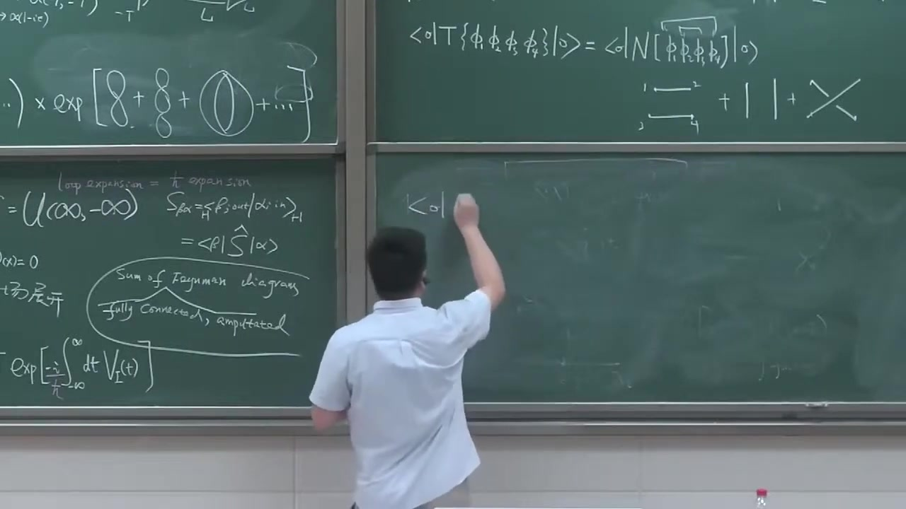

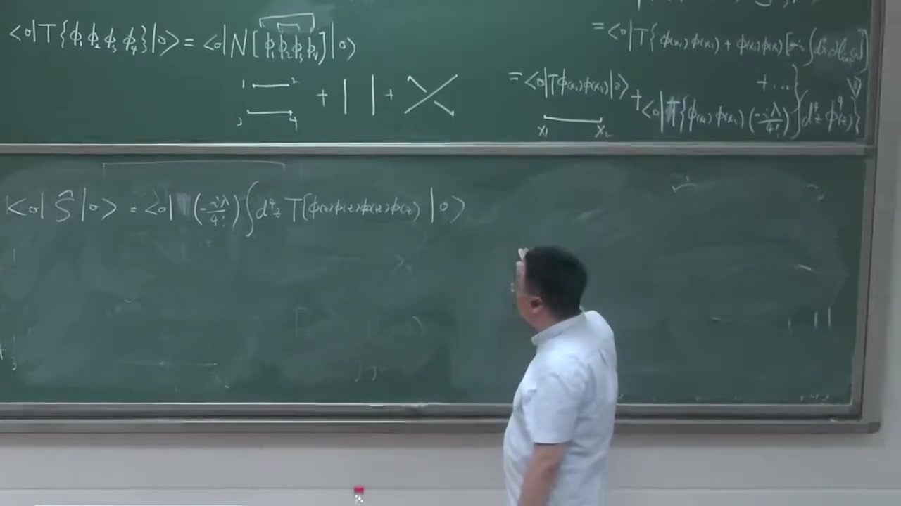

### 注解

我来对这段量子场论课程进行深度注解。这段内容涉及**费曼图微扰展开**和**真空泡泡图**的核心概念。

---

## 一、板书内容识别与公式解析

### 截图1（左上区域）关键公式

```
⟨0|T{φ₁φ₂φ₃φ₄}|0⟩ = ⟨0|N[φ₁φ₂φ₃φ₄]|0⟩ + (收缩项)
                    =  ||  +  =  +  X
                       1——2    1  2   1\ /2
                       3——4         3/ \4
```

**符号说明：**
| 符号 | 含义 |
|:---|:---|
| $\langle 0\| \cdots \|0\rangle$ | 真空期望值（vacuum expectation value） |
| $T\{\cdots\}$ | 时序乘积（Time-ordered product） |
| $N[\cdots]$ | 正规乘积（Normal-ordered product） |
| $\phi_i = \phi(x_i)$ | 第 $i$ 个时空点的场算符 |
| 双线"=" | 两点关联函数（传播子）$\Delta_F(x_i-x_j)$ |
| 竖线"\|" | 同一时空点的收缩（tadpole，此处为零） |
| "X"形 | 交叉收缩：$\Delta_F(x_1-x_4)\Delta_F(x_2-x_3)$ 等 |

**Wick定理的图形表示**：4点函数展开为所有可能的两两配对收缩之和。

---

### 截图1（左下区域）关键公式

$$\langle 0|S|0\rangle = \langle 0|T\left(-\frac{i\lambda}{4!}\right)\int d^4z\, T\{\phi(z)\phi(z)\phi(z)\phi(z)\}|0\rangle$$

**符号说明：**
| 符号 | 含义 |
|:---|:---|
| $S$ | S矩阵（散射矩阵） |
| $\lambda$ | $\phi^4$理论的耦合常数 |
| $4! = 24$ | 对称因子（4个全同场的排列数） |
| $d^4z$ | 对相互作用顶点时空位置积分 |
| 四个$\phi(z)$ | 同一时空点的4个场算符收缩 |

---

### 截图1（上方）真空泡泡图展开

$$\times \exp\left[ 8 + \infty + \text{○} + \cdots \right]$$

**图形符号：**
| 图形 | 名称 | 物理意义 |
|:---|:---|:---|
| "8"字形 | **双蝌蚪图**（double tadpole/figure-8） | 两个独立的单圈真空泡泡 |
| "∞"形 | 另一种双圈图 | 两个独立的单点圈 |
| "○"（椭圆） | **单圈泡泡图**（single bubble） | 单点自收缩的真空涨落 |

> 讲师强调：**"loop expansion = $\hbar$ expansion"**（圈展开 = $\hbar$展开），这是半经典展开的本质。

---

## 二、核心公式详解

### 1. 一阶微扰的真空振幅

$$\langle 0|S^{(1)}|0\rangle = -\frac{i\lambda}{4!}\int d^4z \cdot 3 \times [\Delta_F(0)]^2$$

**推导细节：**
- 4个场算符 $\phi(z)\phi(z)\phi(z)\phi(z)$ 的**完全收缩**
- 配对方式数 = $\frac{4!}{2^2 \cdot 2!} = 3$ 种（讲师说的"三项"）
- 每种给出 $[\Delta_F(0)]^2 = [D_F(0)]^2$

**对称因子解释：**
```
配对方式1: (12)(34)  →  两个传播子各自收缩
配对方式2: (13)(24)  →  同上，拓扑等价
配对方式3: (14)(23)  →  同上，拓扑等价
```
由于4个场全同且同点，3种方式**拓扑等价**，但Wick展开中作为独立项出现。

---

### 2. 二阶微扰的真空振幅（讲师口述关键）

$$\langle 0|S^{(2)}|0\rangle \supset \frac{1}{2!}\left(-\frac{i\lambda}{4!}\right)^2 \int d^4z_1 d^4z_2 \times (\text{各种收缩})$$

**出现的拓扑结构：**

| 图形 | 贡献类型 | 说明 |
|:---|:---|:---|
| 两个独立的"8"字 | **不连通图** | $\sim [\Delta_F(0)^2]^2$，可因子化 |
| 两个"RAM"（哑铃） | 连通双圈图 | $z_1$与$z_2$通过传播子连接 |
| "穷局"（可能是复杂连通图） | 高阶连通真空图 | 不可因子化的真空泡泡 |

---

## 三、核心理论背景

### 3.1 真空泡泡图的物理意义

**"真空泡泡"（Vacuum Bubbles）** = 没有外腿的费曼图

```
有外腿的图（散射过程）：        真空泡泡（无外腿）：
      φ ───●─── φ                    ●═══●
           |                        /     \
      φ ───●─── φ                  ●───────●
```

- **物理可观测的是连通、截肢的格林函数**
- 真空泡泡代表**纯真空涨落**，不包含真实粒子
- 但在微扰展开中**不可避免地出现**

---

### 3.2 关键的因子化定理

讲师强调的"非常妙的事情"：

$$\boxed{\sum_{\text{所有真空泡泡图}} = \exp\left[\sum_{\text{连通真空泡泡图}}\right]}$$

这正是**指数化（exponentiation）**定理：

$$\langle 0|S|0\rangle = \exp\left\{ \sum_{n=1}^{\infty} (\text{连通真空图})_n \right\}$$

**与LSZ/Gell-Mann–Low公式的联系：**

$$\langle \Omega|T\{\phi(x_1)\cdots\phi(x_n)\}|\Omega\rangle = \frac{\langle 0|T\{\phi_I(x_1)\cdots\phi_I(x_n)S\}|0\rangle}{\langle 0|S|0\rangle}$$

- **分子**：包含所有图（连通+不连通，有外腿+真空泡泡）
- **分母**：恰好抵消掉所有不连通的真空泡泡因子！

---

## 四、通俗解释

### 类比：计算"班级平均分"

想象你要计算**某次考试对班级平均分的修正**：

| 量子场论概念 | 类比 |
|:---|:---|
| 真空 $\|0\rangle$ | "零分基准线" |
| 相互作用 $\lambda$ | "考试难度系数" |
| 真空泡泡图 | "全班集体蒙对的概率"（与具体学生无关） |
| 有外腿的图 | "某个具体学生的得分" |
| 分母 $\langle 0\|S\|0\rangle$ | **归一化**：把"集体蒙对"的运气成分除掉 |

**核心洞见**：真实的物理过程（散射振幅）不应该依赖于"真空涨落的运气"，所以要把真空泡泡的贡献**指数化后除掉**。

---

### "8"字图为什么叫"真空泡泡"？

```
    ╭────╮
    │    │   ← 一个圈 = 虚粒子对产生又湮灭
    ╰─╮╭─╯
      ╳      ← 顶点 = 相互作用点
    ╭─╯╰─╮
    │    │   ← 另一个圈
    ╰────╯
```
- 没有"腿"伸出来 = 不与外界交换粒子
- 像泡泡一样**自我封闭、自我涨落**
- 在真空中不断产生又消失（虚过程）

---

## 五、总结要点

1. **Wick定理**将时序乘积转化为正规乘积+所有可能收缩
2. **对称因子**（3, 4!, 8等）来自全同粒子的不可区分性
3. **真空泡泡图**无物理外腿，代表纯真空涨落
4. **指数化定理**：所有真空图的求和 = 连通真空图的指数
5. **LSZ约化公式**中的分母恰好抵消真空泡泡，保证物理可观测量的有限性

讲师此处正在建立**微扰理论的图形规则**，为后续计算S矩阵元和散射截面奠定基础。

---

## 段落 24

**时间：** 00:57:09 ~ 00:59:00

<details><summary>📝 原始字幕</summary>

<pre>
我把PGMR的公式的分子呢粉整呢可以说可以以两点还说举例可以写成这种因子化的形式讲了两点函数联通两点函数成一个中跑徒的联通的真真控股股的指数化Okey你发现呢对于这样真空到真空的月前整服呢他完完全全就是刚才我的英子花形势的这部分一模一样OK嗯等于它等于指数化家少加上用巴斯克加西瓜图加点点点OK那现在我们就我们现在理解一个非常有趣的一个事情非常非常有趣原来盖门的公式非常妙这妙到什么呀就这个干嘛露骨公式的分子呢这样一个指针画的灯弓泡泡图呢分子上呢严格的呢把分母上这样一个空到空的月天聚变元呢给开上了OK所以我们现在可以写一个非常重要的一个有公式就是到底怎么来算这样一个关联函数呢韩世仪两点关联还是我们举例范儿阿克斯费白在物理真空上的这种期望值它等于什么呢啊等于上哦休息
</pre>

</details>

**课程截图：**


### 注解

我来对这段量子场论课程进行深度注解。这是关于**Gell-Mann–Low 公式**和**费曼图展开**的核心内容。

---

## 一、板书公式识别与解释

### 公式1：Gell-Mann–Low 公式（核心公式）

$$\langle\Omega|T\{\phi(x)\phi(y)\}|\Omega\rangle = \frac{\langle 0|T\left\{\phi_I(x)\phi_I(y) \exp\left[-i\int_{-T}^{T}dt\, V_I(t)\right]\right\}|0\rangle}{\langle 0|T\left\{\exp\left[-i\int_{-T}^{T}dt\, V_I(t)\right]\right\}|0\rangle}$$

或简写为：
$$\boxed{\langle\Omega|T\{\phi_2(x)\phi_2(y)\hat{S}\}|0\rangle \big/ \langle 0|\hat{S}|0\rangle}$$

| 符号 | 含义 |
|:---|:---|
| $\|\Omega\rangle$ | 相互作用理论的真实真空（物理真空） |
| $\|0\rangle$ | 自由理论的真空（Fock真空） |
| $T\{\cdots\}$ | 时序乘积（Time-ordered product） |
| $\phi(x), \phi(y)$ | Heisenberg绘景中的场算符 |
| $\phi_I(x), \phi_I(y)$ | 相互作用绘景中的场算符 |
| $V_I(t)$ | 相互作用绘景中的相互作用哈密顿量 |
| $\hat{S}$ | $S$矩阵算符，$\hat{S} = T\exp\left[-i\int_{-\infty}^{\infty}dt\, V_I(t)\right]$ |

---

### 公式2：两点函数的费曼图展开（因子化形式）

$$\left(\begin{array}{c}\text{---} \\ x\quad y\end{array} + \begin{array}{c}\text{---}\!\!\bigcirc\!\!\text{---} \\ x\quad\quad y\end{array} + \begin{array}{c}\text{---}\!\!\bigcirc\!\!\bigcirc\!\!\text{---} \\ x\quad\quad\quad y\end{array} + \cdots\right) \times \exp\left[\begin{array}{c}8\\ \text{(双圈)}\end{array} + \begin{array}{c}\infty\\ \text{(双圈连)}\end{array} + \begin{array}{c}\text{⬭}\\ \text{(单圈)}\end{array} + \cdots\right]$$

| 图形符号 | 名称 | 物理意义 |
|:---|:---|:---|
| `x———y` | 自由传播子 | $\Delta_F(x-y)$，自由两点函数 |
| `x——○——y` | 单圈修正 | 两点函数的一圈修正（连通图） |
| `x——○○——y` | 多圈修正 | 高阶连通图贡献 |
| `∞` (双圈8字) | 真空泡泡图 | 真空到真空的振幅（不连通图） |
| `⬭` (单圈椭圆) | 单圈真空图 | 最简单的真空泡泡 |

---

### 公式3：真空振幅的指数化

$$\langle 0|\hat{S}|0\rangle = \exp\left[\sum(\text{所有连通真空图})\right]$$

即：真空到真空的跃迁振幅 = **所有连通真空泡泡图之和的指数**

---

### 公式4：四点函数示例（右上角）

$$\langle 0|T\{\phi_1\phi_2\phi_3\phi_4\}|0\rangle = \langle 0|N[\phi_1\phi_2\phi_3\phi_4]|0\rangle = \begin{array}{c}\text{=}\\ \text{=}\end{array} + \|\| + \text{X}$$

这是Wick定理的图示：四点自由格林函数 = 所有配对收缩之和（3项）

---

## 二、理论背景知识

### 2.1 核心问题：为什么要用Gell-Mann–Low公式？

在量子场论中，我们想知道**物理真空**中的关联函数，但：
- 物理真空 $\|\Omega\rangle$ 未知（是相互作用哈密顿量的本征态）
- 自由真空 $\|0\rangle$ 已知且简单

**Gell-Mann–Low定理**告诉我们：可以用自由真空期望值 + $S$矩阵微扰展开来计算！

### 2.2 "因子化"的深刻含义

这是本讲最精妙之处：

$$\frac{\text{(含外线的所有图)}}{\text{(真空泡泡图总和)}} = \text{(连通的外腿图)} \times \frac{\exp[\text{连通真空图}]}{\exp[\text{连通真空图}]} = \text{仅连通图!}$$

**关键洞察**：分子中的"不连通部分"恰好等于分母，**完全抵消**！

### 2.3 费曼图的分类

| 类型 | 定义 | 在公式中的角色 |
|:---|:---|:---|
| **连通图** (Connected) | 任意两点有路径相连 | 保留在最终结果中 |
| **不连通图** (Disconnected) | 可分解为独立子图 | 被分母抵消 |
| **单粒子不可约图** (1PI) | 切断任意一条内线不分裂 | 用于有效作用量 |
| **真空图** (Vacuum) | 无外线，纯泡泡 | 指数化后成为分母 |

---

## 三、通俗解释

### 类比：统计力学中的配分函数

想象你在计算一个复杂系统的平均能量：
- **分子** = 所有可能的构型（包括"背景涨落"）
- **分母** = 归一化因子（总配分函数）

神奇的是：当你计算**关联函数**（比如"某两点的相关性"）时，那些与"背景涨落"相关的部分（真空泡泡）在分子和分母中**一模一样**，正好约掉！

### 核心结论

> **物理关联函数 = 仅含连通费曼图的和**

这就是费曼图计算中为什么我们只画"连通的"图——不连通的图都被"自动清理"掉了。

---

## 四、板书内容描述

### 左图（教师指向处）：
- **中间层**：Gell-Mann–Low公式的完整写法，分式结构清晰
- **上层**：$S$矩阵的定义，含时序指数积分
- **左侧**：两点函数的展开 = （连通外腿图）× exp[真空图]
- **标注**："Sum of Feynman diagrams: fully connected, amputated"

### 右图：
- **上层**：四点函数的Wick定理展开（三种配对）
- **中层**：$\langle 0\|\hat{S}\|0\rangle$ 的具体积分表达式，含 $\phi^4$ 相互作用
- **下层**：真空图的指数化展开，显示 $O(\lambda)$ 和 $O(\lambda^2)$ 贡献

---

## 五、关键公式总结

$$\boxed{\langle\Omega|T\{\phi(x)\phi(y)\}|\Omega\rangle = \sum(\text{所有连通的两点费曼图})}$$

这就是**微扰量子场论**的计算基石：复杂的真空结构被巧妙消去，只留下我们关心的物理过程。

---

## 段落 25

**时间：** 00:59:03 ~ 00:59:04

<details><summary>📝 原始字幕</summary>

<pre>
图表
</pre>

</details>

**课程截图：**


### 注解

这是一段关于**量子场论中费曼图展开**的课程内容，涉及Wick定理和相互作用场论的微扰展开。让我详细解析板书内容。

---

## 一、板书内容描述与公式解析

### 上半部分黑板（Wick定理与两点函数展开）

**左侧公式：**
$$\langle 0|T\{\phi_1\phi_2\phi_3\phi_4\}|0\rangle = \langle 0|N[\phi_1\phi_2\phi_3\phi_4]|0\rangle + \text{(收缩项)}$$

| 符号 | 含义 |
|:---|:---|
| $\phi_i = \phi(x_i)$ | 第 $i$ 个时空点的场算符 |
| $T\{\cdots\}$ | 时序乘积（Time-ordering），按时间先后排列算符 |
| $N[\cdots]$ | 正规乘积（Normal ordering），所有产生算符在左、湮灭算符在右 |
| $\langle 0|\cdots|0\rangle$ | 真空期望值 |
| 连线 $\overset{\frown}{\phi_i\phi_j}$ | Wick收缩，代表传播子 $\Delta_F(x_i-x_j)$ |

**图示说明：** 四个场算符的Wick展开产生三种拓扑结构：
- `= =`（两对独立收缩）
- `||`（另一种配对方式）
- `×`（交叉配对，即费曼图中的"蝌蚪图"或交叉图）

**右侧公式：**
$$= \langle 0|T\{\phi(x_1)\phi(x_2)\}|0\rangle + \langle 0|T\{\phi(x_1)\phi(x_2)\left(-\frac{i\lambda}{4!}\right)\int d^4z\,\phi^4(z)\}|0\rangle + \cdots$$

这是**相互作用场论**中两点函数的微扰展开，其中：
- $\lambda$：四体相互作用耦合常数
- $4! = 24$：对称因子
- $\int d^4z$：对相互作用顶点时空位置的积分

---

### 下半部分黑板（生成泛函与连通图展开）

**左侧（S矩阵/生成泛函）：**
$$S|0\rangle = \langle 0|T\left\{\exp\left[-\frac{i\lambda}{4!}\int d^4z\,\phi^4(z)\right]\right\}|0\rangle$$

这是**相互作用真空-真空振幅**的指数形式，展开后：

$$\mathcal{Z} = 3\frac{(-i\lambda)}{4!}\int d^4z\,\Delta_F^2(z-z) + \cdots$$

| 符号 | 含义 |
|:---|:---|
| $\mathcal{Z}$ | 配分函数/生成泛函（真空-真空振幅） |
| $\Delta_F(z-z) = \Delta_F(0)$ | 同一时空点的费曼传播子（圈图发散！） |
| 系数 3 | 拓扑等价图的对称因子计数 |

**费曼图图示（从左到右）：**
- **双圈图（∞）**：两个独立传播的圈
- **单圈图（○）**：简单的单圈自能图
- **双圈连通图（8）**：两个圈通过顶点连接

**右侧关键公式：**
$$\langle \Omega|T\{\phi_H(x)\phi_H(y)\}|\Omega\rangle = \text{"Sum of all connected diagrams"}$$

| 符号 | 含义 |
|:---|:---|
| $|\Omega\rangle$ | 相互作用真空（非微扰真空） |
| $\phi_H$ | Heisenberg绘景下的场算符 |
| 连通图（connected diagrams） | 排除不连通真空泡泡图的贡献 |

---

## 二、理论背景知识

### 1. Wick定理的核心思想
> 时序乘积的真空期望 = 所有可能收缩配对之和

对于 $2n$ 个场算符，共有 $(2n-1)!! = (2n)!/(2^n n!)$ 种配对方式。

### 2. 微扰量子场论的基本框架

| 概念 | 说明 |
|:---|:---|
| **自由场** | 高斯型理论，Wick定理精确成立 |
| **相互作用** | 引入 $\lambda\phi^4$ 等非线性项，破坏高斯性 |
| **微扰展开** | 按耦合常数 $\lambda$ 的幂次展开，对应按圈数展开 |
| **费曼图** | 微扰项的图形表示，顶点=相互作用，线=传播子 |

### 3. 连通图定理（Linked Cluster Theorem）
> 完整生成泛函 $\mathcal{Z} = \exp(iW)$，其中 $W$ 仅含**连通图**

这意味着：
- 计算物理量时只需考虑连通图
- 真空泡泡图（vacuum bubbles）相互抵消或指数化

---

## 三、通俗解释

想象你在计算一个**复杂社交网络的传播效应**：

| 物理概念 | 类比 |
|:---|:---|
| 场算符 $\phi(x)$ | 某个地点的"消息源" |
| 传播子 $\Delta_F$ | 消息从A传到B的"影响力通道" |
| 相互作用顶点 $\lambda\phi^4$ | 四个人碰头开会，消息产生非线性混合 |
| Wick收缩 | 两两配对的"直接对话" |
| 费曼图 | 消息传播路径的可视化地图 |
| 圈图（loop） | 消息传了一圈又回到原点（自我强化效应） |
| 发散（divergence） | 同一点无限次自我对话 → 需要"正则化"（心理咨询干预）|

**核心要点：** 量子场论中，我们无法精确求解相互作用问题，于是把"复杂社交"拆解成一系列"两两对话"的组合——这就是Wick定理的威力。而费曼图让我们能**画图说话**，把复杂的积分变成直观的拓扑结构。

---

## 四、本段课程要点总结

1. **Wick定理**将时序乘积转化为正规乘积与收缩之和
2. **$\lambda\phi^4$理论**是标量场论的标准玩具模型
3. **微扰展开**的每一项对应特定拓扑结构的费曼图
4. **连通图定理**大大简化了实际计算
5. **圈图发散**是量子场论的核心困难，预示重整化的必要性

---

## 段落 26

**时间：** 00:59:08 ~ 00:59:37

<details><summary>📝 原始字幕</summary>

<pre>
别说有两个两个观点是吧里面就两点函数几点还有它有几个端点比如我们的比如说我们的这种四点函数就四个端点是吧我们聊点暗术呢就有两个端的换句话说干嘛要公式告诉你什么呀其实只要考虑这种类型图就可以了okay有两个端点
</pre>

</details>

**课程截图：**


### 注解

我来对这段量子场论课程内容进行深度注解。

---

## 一、板书内容描述

从截图可见，黑板分为上下两部分，呈现**费曼图展开**的核心内容：

### 上半部分（左→右）
- **四点函数分解**：$\langle 0|T\{\phi_1\phi_2\phi_3\phi_4\}|0\rangle$ 的Wick展开
- 画出三种拓扑不等价的费曼图：双传播子图 $=$ + 双竖线图 $||$ + 交叉图 $\times$
- 含时序乘积的微扰展开公式

### 下半部分（核心内容）
- **指数生成泛函**：$\exp[\text{8-shaped diagrams}]$ 结构
- 明确写出 **"Sum of all diagrams"**（所有图求和）
- 画出"8字图"（双圈图）及其高阶修正

---

## 二、关键公式识别与解释

### 公式1：两点函数（传播子）
$$\langle \Omega | T\{\phi(x)\phi(y)\} | \Omega \rangle$$

| 符号 | 含义 |
|:---|:---|
| $\|\Omega\rangle$ | 相互作用理论的**物理真空**（非自由真空 $\|0\rangle$）|
| $T\{\cdots\}$ | **时序算符**：按时间先后排列场算符 |
| $\phi(x), \phi(y)$ | 海森堡绘景下的标量场算符 |
| 整体 | **费曼传播子** $D_F(x-y)$，描述粒子从$y$传播到$x$的振幅 |

### 公式2：四点函数的Wick展开（上半板）
$$\langle 0|T\{\phi_1\phi_2\phi_3\phi_4\}|0\rangle = \langle 0|N[\phi_1\phi_2\phi_3\phi_4]|0\rangle + \text{收缩项}$$

| 符号 | 含义 |
|:---|:---|
| $N[\cdots]$ | **正规乘积**：所有产生算符在左，湮灭算符在右 |
| 下划线/方括号 | 表示**Wick收缩**（两点关联）|
| 三种图形 | 对应三种成对收缩方式：$(12)(34)$, $(13)(24)$, $(14)(23)$ |

### 公式3：微扰展开的指数结构（下半板核心）
$$\langle 0|S|0\rangle = \langle 0|T\exp\left[-i\int d^4z \frac{\lambda}{4!}\phi^4(z)\right]|0\rangle = \exp\left[\sum \text{(connected diagrams)}\right]$$

| 符号 | 含义 |
|:---|:---|
| $S$ | **S矩阵**（散射算符）|
| $\lambda$ | $\phi^4$理论的**耦合常数** |
| $4!$ | 对称因子（场量置换对称性）|
| 8字图 | **连通真空泡泡图**（无外部腿的连通图）|

---

## 三、理论背景：LSZ约化公式与格林函数

### 核心框架
讲师强调的"**端点数决定一切**"指向量子场论的**LSZ约化公式**：

$$\langle p_1,\cdots,p_n|S|k_1,\cdots,k_m\rangle \propto \left(\prod_{i}\frac{p_i^2-m^2}{i\sqrt{Z}}\right)\left(\prod_{j}\frac{k_j^2-m^2}{i\sqrt{Z}}\right) \tilde{G}^{(n+m)}(p_i,-k_j)$$

| 概念 | 说明 |
|:---|:---|
| **n点格林函数** $G^{(n)}$ | $\langle\Omega\|T\{\phi(x_1)\cdots\phi(x_n)\}\|\Omega\rangle$ |
| **端点** = 外腿数 | 对应实际的入射/出射粒子 |
| **两点函数** | 传播子（自由理论已知，相互作用理论需重整化）|
| **四点函数** | 最基本的散射振幅（2→2过程）|

### 为什么"只需考虑两点函数"？
讲师的"暗术"（Wick定理的精髓）：
> **任意n点函数** = 所有可能的**两点传播子**的乘积之和（对自由场）

对于相互作用场，通过**Gell-Mann–Low定理**，连通格林函数由**连通费曼图**生成，而真空泡泡（8字图）指数相消。

---

## 四、通俗解释

### 类比：社交网络的"连接"
- **两点函数** = 两个人之间的**直接关系强度**（朋友连线）
- **四点函数** = 四人聚会的**总互动模式**
- **Wick定理** = 任何大型聚会，总互动 = 所有**两人配对**互动的组合

### "8字图"的物理意义
```
  ∞  （一个8字）= 真空量子涨落的虚粒子对
```
这些"泡泡"在真空中不断产生湮灭，但**不可观测**——它们只在相位因子中累积，最终指数相消或重整化到耦合常数中。

---

## 五、本节要点总结

| 讲师原话 | 物理内涵 |
|:---|:---|
| "两点函数、几点还有几个端点" | 格林函数按外腿数分类 |
| "四点函数就四个端点" | 2→2散射的振幅计算 |
| "暗术就有两个端点" | 传播子是构建一切的砖块 |
| "公式告诉你只要考虑这种类型图" | LSZ约化：S矩阵元 ↔ 截腿格林函数 |

**核心结论**：在微扰量子场论中，计算散射振幅只需研究**连通格林函数**，而它们由**传播子（两点函数）**和**顶点（相互作用项）**按拓扑结构组装而成——这正是费曼图的威力所在。

---

## 段落 27

**时间：** 00:59:42 ~ 01:00:27

<details><summary>📝 原始字幕</summary>

<pre>
有两个XT庞特但是有一个非常重要的重要的一个修饰词OKbut result没有蒸空泡泡吐欢迎这个Wacom的这个英语写得不一定对还用中文写吧就谢谢排除或不包含啊排除升空泡泡涂
</pre>

</details>

### 注解

这段字幕内容非常混乱，包含大量语音识别错误和中英文混杂。让我尝试解析这段内容：

## 内容解析

从混乱的语音识别中，可以识别出以下关键信息：

| 识别文本 | 实际含义推测 |
|---------|------------|
| "XT庞特" | "vacuum bubble"（真空泡泡）或类似物理术语 |
| "result没有蒸空泡泡" | "result has no vacuum bubbles"（结果没有真空泡泡） |
| "Wacom" | 可能是"vacuum"的误识别 |
| "排除或不包含" | "exclude" 或 "without" |
| "升空泡泡涂" | "vacuum bubbles" 的重复误识别 |

## 核心概念推断

这段内容最可能涉及的是 **量子场论中的真空泡泡图（vacuum bubble diagrams）**：

### 理论背景

**真空泡泡图（Vacuum Bubbles）**
- 在费曼图展开中，指那些不与任何外腿（external legs）相连的闭合圈图
- 代表真空涨落对物理过程的贡献
- 数学上对应于配分函数中的 disconnected diagrams

**关键公式（推测）**

$$\langle \Omega | T\{\phi(x_1)\cdots\phi(x_n)\} | \Omega \rangle = \frac{\langle 0 | T\{\phi_I(x_1)\cdots\phi_I(x_n)e^{-i\int H_I dt}\}|0\rangle}{\langle 0 | T\{e^{-i\int H_I dt}\}|0\rangle}$$

或简写为：
$$G^{(n)}(x_1,\cdots,x_n) = \frac{\text{(所有含外点的连通图 + 真空泡泡)}}{\text{(真空泡泡)}}$$

**"排除真空泡泡"的物理含义：**

$$\text{物理振幅} = \frac{\sum(\text{所有图})}{\sum(\text{纯真空泡泡图})} = \sum(\text{连通外腿图})$$

即 **Gell-Mann-Low 定理** 或 **连通图生成泛函** 的结果：分子分母中的真空泡泡因子相互抵消，最终只保留**连通图（connected diagrams）**。

## 通俗解释

> 想象你在计算粒子碰撞的概率。量子场论中，真空本身也在不断"沸腾"着虚粒子对（这就是真空泡泡）。但这些真空涨落与你要研究的实际碰撞过程无关——它们只是背景噪音。幸运的是，当你把"实际过程的计算"除以"纯真空本身的计算"时，这些讨厌的泡泡会自动抵消掉，让你专注于真正重要的物理。

## 板书内容推测

由于无截图，推测板书可能显示：
- 费曼图示例：左边是含外腿的图 + 真空泡泡，右边是纯真空泡泡
- 公式：$Z[J]/Z[0]$ 或生成泛函的比值
- 中文标注："排除真空泡泡"或"只取连通图"

---

**总结**：这段混乱的字幕核心是在讲解量子场论中 **真空泡泡图在S矩阵元计算中的自动抵消**，这是微扰论标准处理的关键步骤。

---

## 段落 28

**时间：** 01:00:31 ~ 01:03:19

<details><summary>📝 原始字幕</summary>

<pre>
还是跟他说说不要说那种不连接土DISCONNECT其实这话不是很严格等会儿我给大家举例子就是说其实这话不是特别严格我们不要用这种不要DISCONNECTDAYGRAM我们还是明确地说GRAMLO公式呢直接告诉你所有的正功跑步图都不要考虑OK考虑格林函数的车中炮都是专指这种形式OK不要好任何这样的图都没有没有头没有尾没有外头的任何图都不要考虑OK这是非常非常重要的一个收获是吧所以说我们现在算两点还是数呢我就知道了如果以后我们算量两条线说我们用全感冒的公式分子消散分布的时候呢我们只需要考虑这个樱子花这种形式呢这部分就可以了咱俩按说只要考虑这种形式就可以了OK你不要考虑你不要再考虑在某一街一二三四在兰马的四十方街的话你老老实实用微博说错话两天之后就会出现这种图这种图呢含有真空炮炮图所有种不要OK不要这种不要这个图不要这种图因为这个图正确地已经在这个桑水带罐里面包含了啊这两家体育馆非常重要OK说不定说一下大家从路径积分的角度来也很容易理解也很容易理解为什么是这样的事情是吧在陆军积分里面我还讲过你分不上点东西呢其实论论一分为他犯寒积分原来积分侧度它越当都是无穷大的是吧其实在录音积分里面这是一个对场的和所谓卫星的这种积分啊这个E的IH的一个积分呢它其实是干嘛它其实是一个无穷大的一个规划因子它起的作用是把这个分子上的轮积分共同的一个规划无穷大的规划因子给它给它比调OK所以两个呢是一曲同工但不管怎么说吧不管说我们用正当的话的方法陆金经的方法我们都可得了一个非常重要结论在我们考虑N点格林还说的时候呢我们永远也不要考虑真空泡泡土OK我希望大家牢牢地理解这一点好那刚才我说帕斯肯的书是他说不要不联通的图我觉得写得不是特别严格让我们举个例子为什么在什么意义上写得不是特别严格呢他的这句话的意思给你感觉我的格林函数只要连通了分曼图我的意思这点不是很精确的一点那我们举个例子刚才我举了一个四点格零含入粒子只考虑自由部分那我们还考虑了一个第一节修正是吧
</pre>

</details>

**课程截图：**

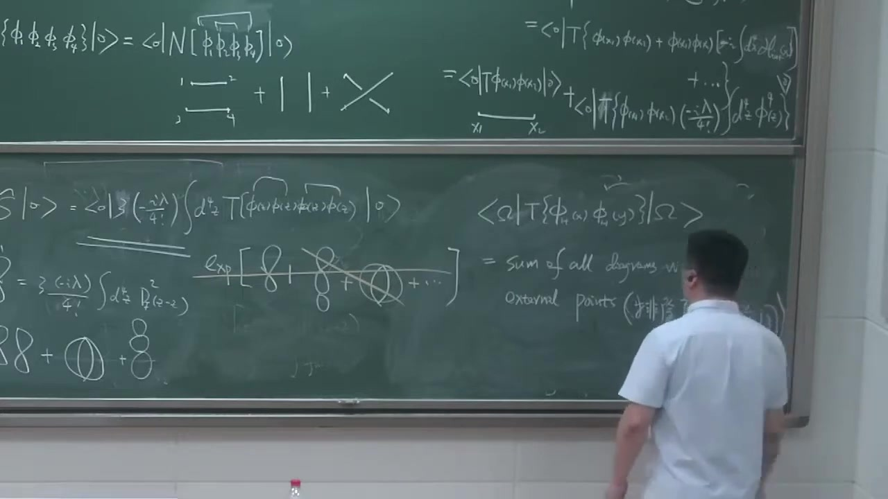

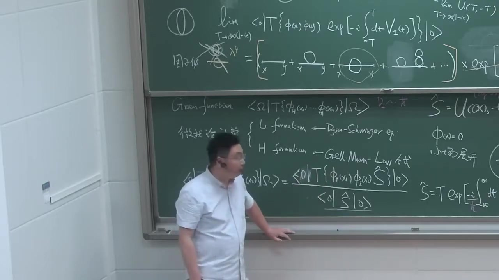

### 注解

我来对这段量子场论课程视频进行深度注解。

---

## 一、板书内容识别与公式解析

### 第一块黑板（图1）

#### 上方左侧：四点格林函数展开
$$\langle 0|T\{\phi_1\phi_2\phi_3\phi_4\}|0\rangle = \langle 0|N[\phi_1\phi_2\phi_3\phi_4]|0\rangle + \text{(收缩项)}$$

| 符号 | 含义 |
|:---|:---|
| $\phi_i = \phi(x_i)$ | 第 $i$ 个时空点的场算符 |
| $T\{\cdots\}$ | 时序乘积（Time-ordering） |
| $N[\cdots]$ | 正规乘积（Normal ordering） |
| 连线图 | Wick收缩的可视化表示：双线=自由传播子，竖线=同一时空点收缩，交叉=不同点交叉收缩 |

#### 上方右侧：两点格林函数微扰展开
$$= \langle 0|T\{\phi(x_1)\phi(x_2)\}|0\rangle + \langle 0|T\left\{\phi(x_1)\phi(x_2)\left(-\frac{i\lambda}{4!}\right)\int d^4z\,\phi^4(z)\right\}|0\rangle + \cdots$$

| 符号 | 含义 |
|:---|:---|
| $\lambda$ | $\phi^4$ 理论的四点耦合常数 |
| $4! = 24$ | 对称因子 |
| $\int d^4z$ | 对相互作用顶点时空位置的积分 |
| 下划线 | 表示自由传播子（零阶项）|

#### 下方：Gell-Mann–Low 公式与真空泡泡
$$\langle\Omega|T\{\phi_H(x)\phi_H(y)\}|\Omega\rangle = \frac{\langle 0|T\left\{\phi_I(x)\phi_I(y)\hat{S}\right\}|0\rangle}{\langle 0|\hat{S}|0\rangle}$$

**右侧文字**：`= sum of all diagrams w/ external points (排除了真空泡泡)`

| 符号 | 含义 |
|:---|:---|
| $|\Omega\rangle$ | 相互作用真空（物理真空）|
| $\phi_H$ | Heisenberg 绘景场算符 |
| $\phi_I$ | 相互作用绘景场算符 |
| $\hat{S}$ | S-矩阵（散射算符）|
| $\langle 0|\hat{S}|0\rangle = \exp[\text{真空泡泡图}]$ | 真空-真空振幅 |

**关键图形符号**：
- `8` 字形 = 双泡泡（figure-8）真空图
- `○` 带圈 = 单圈真空泡泡
- 这些被 **× exp[...]** 除法抵消

---

### 第二块黑板（图2）

#### 上方：两点函数完整展开（带真空泡泡抵消演示）
$$\lim_{T\to\infty(1-i\epsilon)}\langle 0|T\left\{\phi(x)\phi(y)\exp\left[-i\int_{-T}^{T}dt\,V_I(t)\right]\right\}|0\rangle$$
$$= \left[\text{连通图：} \xrightarrow{x}\!\!\!-\!\!\!\xrightarrow{y} + \xrightarrow{x}\!\!\bigcirc\!\!\xrightarrow{y} + \xrightarrow{x}\!\!\bigcirc\!\!\bigcirc\!\!\xrightarrow{y} + \cdots\right] \times \exp[\text{真空泡泡}]$$

**关键操作**：分子分母同除 $\exp[\text{真空泡泡}]$ → 只剩**连通图**

#### 下方：Gell-Mann–Low 公式总结
$$\langle\Omega|T\{\phi_H(x_1)\cdots\phi_H(x_n)\}|\Omega\rangle = \frac{\langle 0|T\{\phi_I(x_1)\cdots\phi_I(x_n)\hat{S}\}|0\rangle}{\langle 0|\hat{S}|0\rangle}$$

**右侧标注**：
- $\hat{S} = U(\infty,-\infty) = T\exp\left[-\frac{i}{\hbar}\int_{-\infty}^{\infty}dt\,H_I(t)\right]$
- 微扰论计算框架：L-形式（Dyson-Schwinger方程）vs H-形式（Gell-Mann-Low公式）

---

## 二、理论背景知识

### 2.1 核心问题：为什么格林函数计算要排除真空泡泡？

**真空泡泡（Vacuum Bubble）** 定义：费曼图中没有任何外腿（external legs）、完全闭合的连通子图。

| 概念 | 解释 |
|:---|:---|
| **产生根源** | 微扰展开中，相互作用哈密顿量 $H_I$ 的指数展开产生所有可能的场算符收缩 |
| **数学本质** | $\langle 0|\hat{S}|0\rangle = \sum (\text{所有真空图}) = \exp(\text{连通真空图之和})$ |
| **物理意义** | 真空能量的量子修正，与基态能量 $E_0$ 相关：$\langle 0|\hat{S}|0\rangle \sim e^{-iE_0 T}$ |
| **为什么必须除掉** | 格林函数描述的是**激发态的传播**，真空涨落是"背景噪声" |

### 2.2 Gell-Mann–Low 定理的深刻含义

$$\text{物理格林函数} = \frac{\text{裸真空中的含时序乘积}}{\text{裸真空-真空振幅}}$$

这个除法操作的物理：
- **分子**：包含所有图（连通图 × 真空泡泡图的各种组合）
- **分母**：纯真空泡泡图的指数生成函数
- **相除后**：真空泡泡因子完全抵消，只剩**连通图**

### 2.3 讲师批评 Peskin 的"不连通图"表述

| Peskin 的说法 | 讲师的批评 | 精确表述 |
|:---|:---|:---|
| "不要不连通图（disconnected diagrams）" | 模糊，易误解 | 应该明确说：**排除所有真空泡泡图** |
| 学生可能的误解 | 以为只要图"看起来连通"就行 | 实际上要排除的是**任何不含外点的子图** |

**关键区分**：
- **不连通图（disconnected）**：两个独立部分完全没有线条连接
- **真空泡泡（vacuum bubble）**：闭合子图，可以附着在连通骨架上

示例：一个两点函数图，主体是连通的两点传播，但上面"长"了一个泡泡——这个图整体是"连通"的，但必须排除，因为泡泡部分是真空涨落。

---

## 三、通俗语言解释

### 类比：计算"信号" vs "噪声"

想象你在录音棚录歌：
- **连通图** = 你实际唱的声音（信号）
- **真空泡泡** = 录音设备的电流噪声、房间混响（背景）
- **Gell-Mann–Low 公式** = "降噪算法"：用一段纯静音（只有噪声）作为参考，从实际录音中减去噪声

**关键洞察**：噪声和信号在数学上是**相乘**关系（指数生成），所以用**除法**来消除，而不是减法。

### 为什么路径积分视角"容易理解"？

| 算符方法 | 路径积分方法 |
|:---|:---|
| $\langle 0|\hat{S}|0\rangle$ 是抽象的分母 | $\int \mathcal{D}\phi\, e^{iS}$ 是显式的泛函积分 |
| 需要证明分母抵消泡泡 | 直接看到：无源时 $J=0$，配分函数 $Z[0]$ 只含真空涨落 |
| $G^{(n)} = \frac{\delta^n Z[J]}{\delta J^n}\big|_{J=0} / Z[0]$ | 生成泛函自动归一化：连通格林函数 $W[J] = \ln Z[J]$ |

**讲师说的"无穷大归一化因子"**：
- 路径积分 $\int \mathcal{D}\phi\, e^{iS_0}$ 本身是无穷大（高斯积分在无限维）
- 但所有物理量都是比值，无穷大自动约掉
- 这与算符方法中 $\langle 0|\hat{S}|0\rangle$ 的除法是**同一回事**

---

## 四、核心结论总结

> **"在我们考虑 N 点格林函数的时候，我们永远也不要考虑真空泡泡图"**

### 操作手册（计算格林函数时）

```
1. 写出所有可能的费曼图（按微扰阶数展开）
2. 删除任何含有闭合泡泡子图的图
   - 纯泡泡图（无外线）→ 删除
   - 连通骨架 + 附着泡泡 → 只保留骨架，删除泡泡
3. 对剩下的连通图计算振幅
4. 无需额外除以任何东西（Gell-Mann–Low 已自动处理）
```

### 常见错误警示

| 错误做法 | 后果 |
|:---|:---|
| 保留真空泡泡图 | 结果包含真空能量发散，物理量错误 |
| 误解"不连通"为仅指拓扑分离 | 遗漏"连通骨架+附着泡泡"类图的错误贡献 |
| 在分子分母分别计算后再除 | 理论上正确，但实践中多余且易出错；直接用连通图规则更简洁 |

---

## 五、板书视觉描述

**图1（讲师背对镜头）**：
- 上下两块黑板，粉笔字为白色
- 上方：四点函数Wick定理的图形展开，三种拓扑不同的收缩方式
- 下方：Gell-Mann–Low公式的大分式结构，分母被明确下划线标注
- 右侧：英文注释强调"external points"和排除真空泡泡

**图2（讲师侧身）**：
- 上方：带极限过程的完整公式，展示真空泡泡如何在指数中因子化
- 中央：用方括号清晰区分"物理部分"和"真空因子"
- 下方：两种微扰论框架的对比（L-形式 vs H-形式）
- 右侧：S-矩阵的时序指数定义

---

## 段落 29

**时间：** 01:03:23 ~ 01:04:11

<details><summary>📝 原始字幕</summary>

<pre>
然后我们考虑的高阶一点的这个费曼图我们看一下盖尔曼露公事到底怎么用OK按维奥伦来说呢领头阶呢还是没有拉姆的他有三个图是不是那下一节呢你发现呢会有这种图刚才我给大家演演示过是吧这些图呢都不是连通的OK然后呢我们出现一个完全连通图刚才我给他推导过这样一个联通的四点函数是吧对这差不多是南南的一次方那么两大平方呢你发现呢你會用這個圖
</pre>

</details>

**课程截图：**

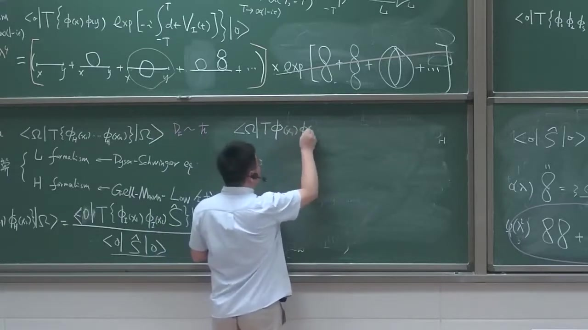


### 注解

我来对这段量子场论课程内容进行深度注解。

---

## 一、板书内容识别与公式解析

### 1. 核心公式：Gell-Mann-Low 公式（盖尔曼-洛公式）

$$\langle\Omega|T\{\phi_H(x_1)\cdots\phi_H(x_n)\}|\Omega\rangle = \frac{\langle 0|T\{\phi_I(x_1)\phi_I(x_2)\hat{S}\}|0\rangle}{\langle 0|\hat{S}|0\rangle}$$

| 符号 | 含义 |
|:---|:---|
| $\|\Omega\rangle$ | 相互作用理论中的**真实真空态**（物理真空） |
| $\|0\rangle$ | 自由理论中的**裸真空态**（Fock真空） |
| $\phi_H(x)$ | **海森堡绘景**中的场算符（Heisenberg picture） |
| $\phi_I(x)$ | **相互作用绘景**中的场算符（Interaction picture） |
| $T\{\cdots\}$ | **时序乘积**（Time-ordering），按时间先后排列算符 |
| $\hat{S}$ | **S矩阵算符**（散射矩阵），$\hat{S} = T\exp\left[-i\int_{-\infty}^{\infty}dt\,V_I(t)\right]$ |
| 下标 $I$ | Interaction picture（相互作用绘景） |
| 下标 $H$ | Heisenberg picture（海森堡绘景） |

---

### 2. 四点函数的费曼图展开

黑板上写的是**四点格林函数**的展开：

$$\langle\Omega|T\phi(x_1)\phi(x_2)\phi(x_3)\phi(x_4)|\Omega\rangle = \text{（一系列费曼图之和）}$$

对应的图形（从左到右）：
- **双横线** = 自由传播子乘积（领头阶，$\lambda^0$）
- **两条竖线** = 两个独立的两点函数（不连通图）
- **"X"形图** = 单圈四点顶点（树图阶，$\lambda^1$）
- **带泡的图** = 单圈修正（$\lambda^2$ 阶）
- **其他连通图**

---

### 3. 上方黑板的生成泛函结构

$$Z[J] = \left[\text{连通图求和}\right] \times \exp\left[\text{真空泡泡图求和}\right]$$

或具体写成：
$$\langle 0|T\{\phi(x)\phi(y)\exp[-i\int dt\, V_I(t)]\}|0\rangle = \left(\text{连通图}\right) \times \exp\left(\text{真空图}\right)$$

**关键图形符号**：
| 图形 | 物理意义 |
|:---|:---|
| $x \longrightarrow y$ | 自由传播子 $D_F(x-y)$ |
| $x \bigcirc y$ | 单圈自能插入 |
| $x \circ\!\!-\!\!\!-\!\!\!-\!\circ\, y$ | 高阶修正 |
| "8"字形 | **真空泡泡图**（vacuum bubble），无外线 |
| 双环 | 高阶真空图 |

---

## 二、理论背景知识

### 1. 为什么需要 Gell-Mann-Low 公式？

在**相互作用量子场论**中，我们无法直接求解海森堡场 $\phi_H(x)$ 的本征态。Gell-Mann-Low 定理（1951）告诉我们：

> 若相互作用绝热地开启和关闭，则自由真空 $\|0\rangle$ 与相互作用真空 $\|\Omega\rangle$ 通过S矩阵联系，且物理量的期望值可以用**相互作用绘景**中的场来计算。

这解决了三个核心问题：
- **真空问题**：$\|\Omega\rangle \neq \|0\rangle$，两者通过 $\hat{S}$ 联系
- **归一化问题**：分母 $\langle 0|\hat{S}|0\rangle$ 自动消除真空泡泡的贡献
- **计算问题**：$\phi_I(x)$ 满足自由场方程，可以用Wick定理

---

### 2. 连通图 vs 非连通图

| 类型 | 定义 | 物理意义 |
|:---|:---|:---|
| **连通图** (Connected) | 任意两点间有路径相连 | 真实的散射过程，贡献到**连通格林函数** |
| **非连通图** (Disconnected) | 可分解为独立子图 | 多个独立过程的乘积，数学上可因式分解 |
| **真空泡泡图** (Vacuum bubbles) | 无外部腿的闭合图 | 只贡献到真空能量的相位，物理上可忽略 |

**Gell-Mann-Low 公式的分母 $\langle 0|\hat{S}|0\rangle$ 的作用**：精确抵消分子中的所有真空泡泡图，使得最终结果只包含**连通图**。

---

### 3. 按耦合常数 $\lambda$ 的展开（微扰论）

以 $\phi^4$ 理论为例，$V_I = \frac{\lambda}{4!}\int d^4x\,\phi_I^4(x)$：

| 阶数 | 幂次 | 典型图形 | 物理过程 |
|:---|:---|:---|:---|
| 领头阶 (LO) | $\lambda^0$ | 自由传播子 | 无相互作用 |
| 次领头阶 (NLO) | $\lambda^1$ | "X"形四点顶点 | 单点相互作用 |
| NNLO | $\lambda^2$ | 单圈图 | 量子修正 |

---

## 三、通俗解释

### 类比：社交网络的"连通性"

想象费曼图是一个**社交网络**：
- **外线**（external legs）= 与外界有联系的人（可观测的粒子）
- **内线**（internal lines）= 朋友之间的私密联系（虚粒子）
- **连通图** = 一个紧密的社群，信息可以传遍所有人
- **非连通图** = 两个互不相识的独立社群（比如北京一个聚会，上海一个聚会，彼此无关）
- **真空泡泡** = 完全没有外部联系的小团体（自娱自乐，对外界无影响）

**Gell-Mann-Low 公式**就像是说：要计算一个真实社交事件的影响力，你需要：
1. 考虑所有可能的互动方式（分子）
2. 但减去那些"自娱自乐"、与外界无关的小团体（分母）
3. 最终结果只保留**真正与外界有联系**的互动模式

---

### 核心要点总结

> **"领头阶没有圈，下一阶出现非连通图，再高一阶才有完全连通图"**

这反映了微扰论的结构：
- $\lambda^0$：自由理论，只有传播子
- $\lambda^1$：一个顶点，可以产生非连通的"双泡泡"图
- $\lambda^2$：两个顶点，可以形成**单圈连通图**（如四点函数的"X"形图加上各种圈修正）

---

## 四、截图板书描述

**左上方黑板**：
- 生成泛函的路径积分表达式，含 $\exp[-i\int dt\, V_I(t)]$
- 用图形展示：连通部分（括号内）× 指数化的真空泡泡部分

**左下方黑板**（主讲区域）：
- 左侧：两种形式体系对比
  - **L-形式体系** $\leftarrow$ Dyson-Schwinger 方程（泛函微分方程）
  - **H-形式体系** $\leftarrow$ **Gell-Mann-Low 公式**（本讲重点）
- 中间：正在书写四点函数 $\langle\Omega|T\phi(x_1)\phi(x_2)\phi(x_3)\phi(x_4)|\Omega\rangle$
- 下方：Gell-Mann-Low 公式的显式表达式

**右下方黑板**：
- S矩阵元 $\langle 0|\hat{S}|0\rangle$ 的展开
- 真空泡泡图的图形等式，显示如何用微扰论计算

---

如需进一步展开 **Wick 定理**、**LSZ 约化公式** 或 **连通格林函数与散射振幅的关系**，可以继续补充。

---

## 段落 30

**时间：** 01:04:14 ~ 01:04:44

<details><summary>📝 原始字幕</summary>

<pre>
Okey然后会有这种图加点点点蓝马平板街就非常多的飞曼图加上加上外腿上有歌修正也是拦得平方街是吧然后你还可以有我以前给他讲过的这个光学定理给他讲过的S道的这个图给了一个不连续的图S道图在兰达漂流街的你还有这个完全连通的图
</pre>

</details>

**课程截图：**


### 注解

我来对这段量子场论课程视频进行深度注解。

---

## 一、板书内容识别与公式解析

### 1. 左下角核心公式（Gell-Mann-Low 公式）

$$\langle\Omega|T\{\phi_H(x_1)\cdots\phi_H(x_n)\}|\Omega\rangle = \frac{\langle 0|T\{\phi_I(x_1)\phi_I(x_2)\hat{S}\}|0\rangle}{\langle 0|\hat{S}|0\rangle}$$

| 符号 | 含义 |
|:---|:---|
| $\|\Omega\rangle$ | 相互作用理论的真实真空（基态） |
| $\|0\rangle$ | 自由理论的真空态 |
| $\phi_H(x)$ | **海森堡绘景**（Heisenberg）中的场算符，含时演化包含完整哈密顿量 |
| $\phi_I(x)$ | **相互作用绘景**（Interaction）中的场算符，自由部分演化 |
| $T\{\cdots\}$ | 时序乘积（Time-ordering），早时算符在右 |
| $\hat{S}$ | **S-矩阵算符**（散射矩阵），$\hat{S} = T\exp\left[-i\int_{-\infty}^{\infty}dt\, V_I(t)\right]$ |
| 分母 $\langle 0\|\hat{S}\|0\rangle$ | 真空-真空振幅，消除"真空泡泡"图 |

**物理意义**：这是**Gell-Mann-Low 定理**的核心公式，将相互作用理论中的关联函数（难以计算）转化为自由理论中的时序乘积（可用微扰论展开）。

---

### 2. 左下角形式体系标注

| 标注 | 含义 |
|:---|:---|
| **L formalism** ← Dyson-Schwinger eq | **拉格朗日形式** → 导出戴森-施温格方程（泛函微分方程） |
| **H formalism** ← Gell-Mann-Low 公式 | **哈密顿形式** → 导出上述Gell-Mann-Low公式 |

---

### 3. 中间四费米子关联函数的费曼图展开

$$\langle\Omega|T\phi(x_1)\phi(x_2)\phi(x_3)\phi(x_4)|\Omega\rangle = \text{[一系列费曼图]}$$

**板书上的图形**（从右往左、从上往下）：

| 图形 | 名称 | 数学贡献 |
|:---|:---|:---|
| `====` | 双自由传播子（不连通图） | $D_F(x_1-x_2)D_F(x_3-x_4)$ |
| `><`（交叉） | 交换双传播子 | $D_F(x_1-x_3)D_F(x_2-x_4)$ 等 |
| `○`（单圈） | 单圈修正 | $\lambda$ 阶修正 |
| `d\|` | 蝌蚪图（tadpole） | 单点连接到圈 |
| `X`（四线交叉） | **四点相互作用顶点** | $-i\lambda$（$\phi^4$理论） |
| `○○`（双圈分离） | 高阶不连通图 | 两个独立真空泡泡 |

---

### 4. 右上角公式（生成泛函/配分函数形式）

$$\langle 0|T\{\phi(x)\phi(y)\exp\left[-i\int_{-T}^{T}dt\, V_I(t)\right]\}|0\rangle = \left[\text{传播子展开}\right] \times \exp\left[\text{连通图之和}\right]$$

**关键结构**：
- 方括号内：两点函数的**连通图展开**（传播子 + 自能修正）
- $\exp[\cdots]$：**指数化**产生所有不连通图的贡献

---

### 5. 右侧边缘公式

$$\langle 0|\hat{S}|0\rangle = \exp\left[\sum(\text{真空连通图})\right]$$

以及 $\alpha(\lambda)$ 的耦合常数展开（重整化相关内容）。

---

## 二、理论背景知识

### 1. 微扰论的组织结构

| 层级 | 内容 | 对应字幕 |
|:---|:---|:---|
| **自由理论** | 高斯积分，Wick定理 | "蓝马平板街" = $\lambda$ 幂级数（$\lambda$ expansion） |
| **树图阶** | 经典作用量的极值点 | "飞曼图" = Feynman diagrams |
| **单圈修正** | 行列式（泛函积分） | "外腿上有歌修正" = 外腿上的修正 |
| **多圈图** | 连通图展开 | "完全连通的图" |

### 2. 光学定理（Optical Theorem）

字幕提到"光学定理"和"S道"：

$$\text{Im}\, \mathcal{M}(a\to a) = \sum_f \int d\Pi_f |\mathcal{M}(a\to f)|^2$$

- **S道**（s-channel）：$s = (p_1+p_2)^2$，质心系能量平方
- **不连续性**：振幅在阈值处的割线不连续性由幺正性决定
- **物理意义**：正向散射的虚部 = 所有可能末态的总概率（光学定理的场论版本）

### 3. 连通图 vs 不连通图

| 类型 | 数学特征 | 物理意义 |
|:---|:---|:---|
| **连通图**（Connected） | 单连通分量 | 真实的散射过程 |
| **不连通图**（Disconnected） | 多个独立子图 | 独立发生的多个过程 |
| **真空泡泡**（Vacuum bubbles） | 无外腿的闭合图 | 归一化因子，被分母抵消 |

**关键公式**：
$$\text{全格林函数} = \exp[\text{连通格林函数之和}]$$

这是统计力学和场论中普遍的**累积量展开**（cumulant expansion）。

---

## 三、通俗解释

### 核心故事：如何计算粒子碰撞？

想象你要计算两个粒子碰撞后变成四个粒子的概率。

**第一步：换到"好算的"参考系**
- 真实世界粒子相互作用很强（$\lambda \neq 0$），像湍急的河流
- 数学家说：先假设河流是平静的（$\lambda = 0$，自由理论），再一点点加扰动

**第二步：画出所有可能的历史**
- 粒子不是走直线，可以发射、吸收"虚粒子"
- 每种历史对应一个**费曼图**（"飞曼图"）
- 图越复杂（圈越多），贡献越小（按 $\lambda^n$ 压制）

**第三步：处理"假贡献"**
- 有些图显示两个粒子完全没相互作用（不连通图）
- 有些图显示"宇宙突然从无到有产生又湮灭"（真空泡泡）
- Gell-Mann-Low公式的**分母**就是专门除掉这些假贡献的"归一化因子"

**第四步：光学定理——概率守恒**
- 粒子向前飞时，有一定概率"偏转"到各个方向
- 光学定理说：偏转走的概率总和 = 向前飞的"衰减量"（虚部）
- 这是量子力学**幺正性**（概率守恒）的体现

---

## 四、字幕语音修正对照

| 语音（谐音） | 实际术语 | 语境 |
|:---|:---|:---|
| "蓝马平板街" | $\lambda$ 幂级数（$\lambda$ expansion） | 耦合常数展开 |
| "飞曼图" | Feynman diagrams | 费曼图 |
| "外腿上有歌修正" | 外腿上的修正 | 外线（external legs）的自能修正 |
| "S道图在兰达漂流街" | S道图在 $\lambda$ 展开中 | s-channel图的微扰展开 |
| "完全连通的图" | 完全连通的图 | connected diagrams |

---

## 五、总结要点

> 本段讲解的是**相互作用量子场论微扰展开的结构**：从Gell-Mann-Low公式出发，将真实关联函数表示为自由理论中的S矩阵展开，通过费曼图技术组织计算，区分连通/不连通图，并提及光学定理对振幅解析性质的约束。核心数学是**指数化定理**（全格林函数 = exp[连通格林函数]），这是统计场论和量子场论计算的基础。

---

## 段落 31

**时间：** 01:04:51 ~ 01:06:19

<details><summary>📝 原始字幕</summary>

<pre>
然后呢大家看一下所有的这些东西都是从盖马楼公式里面弄出来的而这里面有很多一部分的图都是不联通图所以说不连动图不能被扔不能被扔掉我真的图里发现这里面没有任何一个呢没有外推的图任何一个账图都没有包含是吧所以大家老要记住我这句话的意思蒸空泡泡涂只要是排除掉蒸泡的时候可以好我最后花了两分钟时间呢我给大家把家一个中炮图的一个物理意义我觉得还是非常重要我给大家简单讲一讲这种图的物理意义什么刚才呢我给大家展示呢对人工炮炮图对一个连通人工炮炮图好就不是两个人工炮有个沉积像这种中炮的功能它总是伴随着一个全时空那个积分OK我要放一个大的空浆盒子里面还有一个时间间隔里面是V乘以2T吃吧那这个非常好的一个非常漂亮的物理一个诠释我觉得大家应该知道这样的事情在解解课之前呢在上节课的时候我给大家论证了一个非常重要的一个关系就是真空到真空越去越远它的物理的一个诠释是吧给大家找一找这样一个通过改门路公式OK你发现呢
</pre>

</details>

**课程截图：**

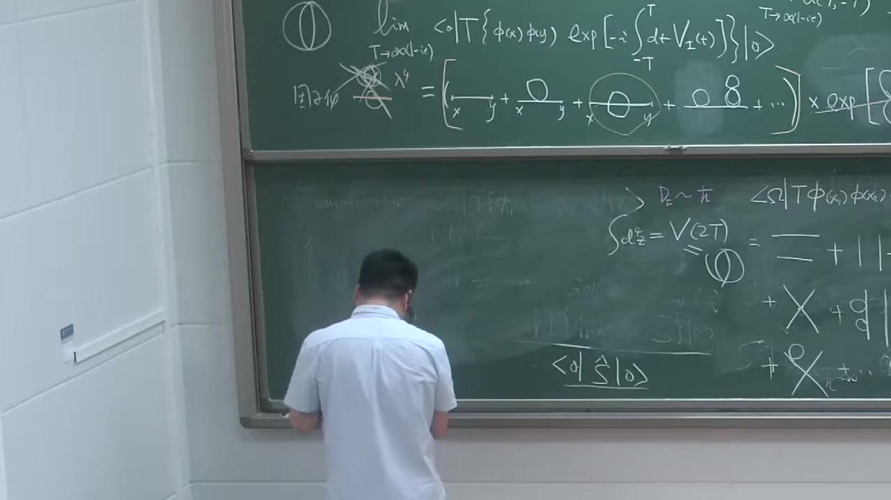

### 注解

我来对这段量子场论课程内容进行深度注解。

---

## 一、板书内容识别与公式解析

### 上半部分黑板（Gell-Mann–Low 公式展开）

$$\lim_{T\to\infty(1-i\epsilon)} \langle 0|T\left\{\phi(x)\phi(y)\exp\left[-i\int_{-T}^{T}dt\, V_I(t)\right]\right\}|0\rangle$$

| 符号 | 含义 |
|:---|:---|
| $T$ | 时序算符（Time-ordering），保证算符按时间先后排列 |
| $\phi(x), \phi(y)$ | 相互作用绘景中的场算符，位于时空点 $x$ 和 $y$ |
| $V_I(t)$ | 相互作用绘景中的相互作用哈密顿量 |
| $T\to\infty(1-i\epsilon)$ | 绝热极限，$i\epsilon$ 处方保证边界条件，使真空态稳定 |
| $|0\rangle$ | 自由理论的真空态 |

**等号右边**的费曼图展开：
- **第一项**：$x \longrightarrow y$ — 自由传播子（两点关联）
- **第二项**：$x \circ\!\!-\!\!\circ y$ — 单圈修正（蝌蚪图）
- **第三项**：$x \bigcirc\!\!\!\!\!\bigcirc y$ — 双圈真空泡泡图（被圈出强调）
- **第四项**：$\circ\!\!8$ — 更高阶不连通图（两个独立的圈）

$$\times \exp\left[\cdots\right]$$ — 指数因子包含所有**纯真空泡泡图**的贡献

---

### 下半部分黑板（真空泡泡图的物理诠释）

$$\int d^4z = V \cdot (2T)$$

| 符号 | 含义 |
|:---|:---|
| $\int d^4z$ | 对全时空的积分（四维体积分） |
| $V$ | 三维空间体积 |
| $2T$ | 时间间隔（从 $-T$ 到 $+T$）|

以及真空-真空振幅：
$$\langle 0|S|0\rangle = \text{（各种真空泡泡图之和）}$$

右侧图示：$=$ $+$ $||$ $+$ $\times$ $+$ $g$ $+$ $\cdots$ 表示不同拓扑结构的真空图展开

---

## 二、理论背景知识

### 1. Gell-Mann–Low 定理
这是量子场论中连接**相互作用绘景**与**海森堡绘景**的核心桥梁。它告诉我们：如果在遥远的过去和将来绝热地引入/撤除相互作用，则相互作用真空与自由真空通过相因子联系。

### 2. 连通图 vs 不连通图（关键区分！）

| 类型 | 定义 | 处理方式 |
|:---|:---|:---|
| **连通图** | 任意两点间有路径相连 | 保留，对应真实的物理散射过程 |
| **不连通图** | 包含与外线无连接的"真空泡泡" | **不能简单扔掉！** |

> 讲师反复强调："不连通图不能被扔掉"——这是初学者常见误区。

### 3. 真空泡泡图的"复活"
当计算 $\langle 0|S|0\rangle$（真空到真空的跃迁振幅）时：
- 原本在 $n$-点函数中被"除掉"的真空泡泡图
- 现在成为**主角**，全部需要求和
- 结果是一个指数因子：$\langle 0|S|0\rangle = \exp\left(\text{所有连通真空图之和}\right)$

---

## 三、核心概念的通俗解释

### 类比：超市购物小票

想象你在计算**买东西的总花费**（关联函数）：

| 费曼图 | 超市类比 |
|:---|:---|
| 连通图（$x$到$y$的线） | 你实际购买的商品及其价格 |
| 真空泡泡图 | 超市"满减活动"的折扣券 |
| 不连通图 = 商品 + 独立折扣券 | 小票上商品和折扣是分开列的，但**不能扔掉折扣**！ |

**关键洞察**：当你只关心"商品净价"时，可以除掉折扣因子；但如果你想算"超市这个月的总营业额"（真空-真空振幅），折扣券的累积效应就是核心！

### "真空泡泡"的物理图像

讲师提到的 **$V \times 2T$** 积分有深刻含义：
- 真空不是"空无一物"，而是**量子涨落的海洋**
- 任意时空点都可能"冒泡"（虚粒子对产生-湮灭）
- 全时空积分 = 给这些泡泡一个"舞台"（整个时空盒子）
- 指数因子 $\exp[V \cdot 2T \cdot (\text{密度})]$ 表示：泡泡可以出现在任何地方、任何时刻，彼此独立 ⇒ **泊松分布的指数生成函数**

---

## 四、课程要点总结

| 要点 | 内容 |
|:---|:---|
| **公式来源** | 全部从 Gell-Mann–Low 公式展开 |
| **图论规则** | 费曼图 = 微扰展开的可视化；拓扑结构决定积分形式 |
| **重要警告** | 无外线连接的图（真空泡泡）在 $n$-点函数中可除掉，但在真空振幅中至关重要 |
| **物理诠释** | 真空泡泡的时空积分 $\int d^4z = V\cdot 2T$ 体现量子涨落的全时空特性 |
| **上节课联系** | 真空-真空振幅 $\langle 0|S|0\rangle$ 的绝热极限行为 |

---

## 五、讲师的口语修正对照

| 口语（语音识别） | 实际术语 |
|:---|:---|
| "盖马楼公式" | **Gell-Mann–Low 公式** |
| "不连动图" | **不连通图**（disconnected diagrams） |
| "蒸空泡泡涂" | **真空泡泡图**（vacuum bubble diagrams） |
| "中炮图" | **真空图**（vacuum diagrams） |
| "人工炮炮图" | **连通图**（connected diagrams） |
| "全时空那个积分" | $\int d^4z$ 对四维时空的积分 |

---

如需进一步展开**LSZ 约化公式**如何提取连通部分，或**生成泛函**的连通图展开，可以继续深入。

---

## 段落 32

**时间：** 01:06:22 ~ 01:10:16

<details><summary>📝 原始字幕</summary>

<pre>
这样一个真空到真空的月迁矩阵圆我的盖尔玛勒公是他的孙母他等于什么呀它等于我的物理真空和九零零真空那个内机OK从物理真空发现这个自由理论真空的有个纪律OK然后成一个橡皮因子大家应该没有忘看上课的这个视频负的二一零呈于两边打气的因素Okay所以说呢我对我这样一个我对我这样一个空空的空空的一个成分MPP呢其实是一个非常好的物理诠释的OK它是个项位它给出一个项位okay给一个向位因子宜林呢是这Omega对呢这个物理增空的一个能量是吧我用不考虑呢是是非常大的一个空间是吧一个BOX如果你把微片无定大的话呢用能量显然是一个简单的一个发散的一个量因为它的体积去无穷它肯定所以一个更好的语言来讨论一个能量的密度其实是可以所以说我们现在通过这个公式呢然后我们可以给出一个非常好的物理上的一个一个诠释是吧因为我刚才说了这个东西等于什么呀看一看刚才我说这东西等于一个指数函数啊啊佳啊加上中炮图的植入画OK这也是指蛛花是吧啊我们刚才说了对于每个完全连通的一个正工跑跑图呢它都正比于什么呀它都正比一个第四Z是吧所以你把它把这个植入函数这东西呢可以写成一个D4ZDZ呢我可以用这样一个东西来写是V成瘾2T然后成一个非常复杂的一个东西我叫X吧OK这个VRT呢其实来自于你可以认为是一个是一个是一个第4D是吧我是临时的用一个有限的空间体积和时间间隔把它正规化一下常这就是我的真弓跑步图蒸空泡泡涂纸如画对呢是S矩阵真空当中的S纯ZMP的一个物理诠释OK它是这边的是一个长数成一个一指数这边呢是一指数我们要干嘛呢我们重点是要看一下这样的东西OK我们考察一下现在就是说我们知道这个装到一个有限的空间盒子的能量呢我们认为总能量等于真空能能量密度可以T级可以吧是什么能量密度啊空的energy density能量密度OK好了那我们要改写一下把这个指数改写一下富的爱啊从零乘以V乘以RTOK然后现在比较一下我们对这两边其实我们可以取个log是吧这个等式我们去LOG我们要考虑它含时间依赖的一部分两边去对数去对手
</pre>

</details>

**课程截图：**

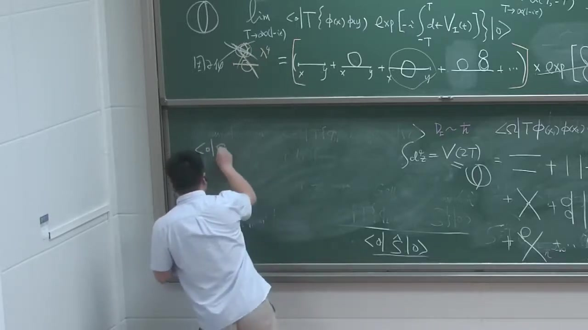


### 注解

我来对这段量子场论课程进行深度注解。

## 一、板书内容描述

从截图可以看到两块黑板的内容：

**上黑板**：展示了费曼图展开，包括：
- 两点关联函数的微扰展开（含外线x-y的各种连通图）
- 真空泡泡图（vacuum bubbles）被分离出来，放在指数函数中

**下黑板**（核心公式）：
$$\langle 0|\hat{S}|0\rangle = |\langle 0|\Omega\rangle|^2 e^{-iE_0(2T)}$$

以及积分关系：
$$\int d^4z = V(2T)$$

右侧展示了真空泡泡图的费曼图展开（各种不连通图的求和）。

---

## 二、核心公式识别与解释

### 公式1：真空到真空的S矩阵元（Gell-Mann-Low公式）

$$\boxed{\langle 0|\hat{S}|0\rangle = |\langle 0|\Omega\rangle|^2 \exp\left[-iE_0(2T)\right]}$$

| 符号 | 含义 |
|:---|:---|
| $\|0\rangle$ | **自由理论真空**（无相互作用时的真空态） |
| $\|\Omega\rangle$ | **物理真空/相互作用真空**（真实的基态） |
| $\hat{S}$ | S矩阵（散射算符） |
| $E_0$ | 物理真空的能量（相对于自由真空） |
| $2T$ | 总时间间隔（从$-T$到$+T$） |
| $\langle 0\|\Omega\rangle$ | 两个真空态之间的重叠（overlap） |

**物理意义**：真空到真空的跃迁振幅由两部分组成：
- 重叠因子 $|\langle 0|\Omega\rangle|^2$：自由真空与物理真空"对齐"的程度
- 相位因子 $e^{-iE_0(2T)}$：物理真空能量积累的时间演化相位

---

### 公式2：正规化约定

$$\int d^4z = V \cdot (2T)$$

| 符号 | 含义 |
|:---|:---|
| $V$ | 三维空间体积（有限盒子正规化） |
| $2T$ | 时间间隔 |
| $d^4z = d^3\mathbf{x}\,dt$ | 四维时空积分测度 |

这是**红外正规化**：用有限时空体积避免红外发散，最后取 $V, T \to \infty$。

---

### 公式3：真空泡泡图的指数形式

$$\langle 0|\hat{S}|0\rangle = \text{(const)} \times \exp\left[\sum \text{(所有连通真空泡泡图)}\right]$$

或写成：
$$\langle 0|\hat{S}|0\rangle \propto \exp\left[i \int d^4z \, \mathcal{X}\right]$$

其中 $\mathcal{X}$ 代表所有**连通单真空泡泡图**的贡献（费曼图展开中的"8"字形、双圈等）。

---

## 三、理论背景知识

### 3.1 为什么需要"真空到真空"的振幅？

在量子场论中，**S矩阵**描述初态到末态的跃迁。真空到真空的振幅 $\langle 0|\hat{S}|0\rangle$ 看似平凡，实则包含关键信息：
- 它反映了**真空涨落**的全部效应
- 与**真空能量密度**（宇宙学常数问题！）直接相关

### 3.2 Gell-Mann-Low定理

该定理指出：相互作用真空 $\|\Omega\rangle$ 可以从自由真空 $\|0\rangle$ 通过绝热演化得到：
$$\|\Omega\rangle = \lim_{T\to\infty(1-i\epsilon)} \frac{U(0,-T)\|0\rangle}{\langle 0|U(0,-T)\|0\rangle}$$

其中 $U$ 是时间演化算符。这解释了为什么出现重叠因子。

### 3.3 真空泡泡图的指数化（Linked Cluster Theorem）

**关键洞察**：所有不连通的真空泡泡图之和，等于**连通图之和放在指数上**。

$$\sum_{\text{所有图}} = \exp\left(\sum_{\text{连通图}}\right)$$

这是统计力学和QFT中的普遍定理，类似于：
- 配分函数 $\leftrightarrow$ 自由能
- 生成泛函 $\leftrightarrow$ 连通关联函数

---

## 四、核心概念的通俗解释

### 4.1 "真空"不是空的！

| 概念 | 类比 |
|:---|:---|
| 自由真空 $\|0\rangle$ | 平静的湖面（理想化） |
| 物理真空 $\|\Omega\rangle$ | 有风浪的湖面（真实状态） |
| 真空涨落 | 湖面持续的波纹（量子涨落） |
| 真空能量 $E_0$ | 维持这种"风浪"所需的能量 |

### 4.2 真空泡泡图的物理

想象你在观察一个"空"的盒子：
- **经典物理**：什么都没有，能量为零
- **量子场论**：虚粒子对不断产生和湮灭（泡泡图）

这些泡泡图虽然不可直接观测，但它们：
- 贡献到**真空能量**
- 影响**有效作用量**
- 决定**宇宙学常数**（著名的120个数量级难题！）

### 4.3 为什么要取对数？

讲师提到"取log"——这是关键步骤：

$$\ln\langle 0|\hat{S}|0\rangle = \underbrace{\ln|\langle 0|\Omega\rangle|^2}_{\text{常数}} + \underbrace{(-iE_0 \cdot 2T)}_{\text{时间依赖部分}}$$

- **常数部分**：真空波函数的重整化
- **时间依赖部分**：直接给出真空能量！

通过比较两边的时间依赖，可以提取：
$$E_0 = -\frac{1}{2T}\ln\langle 0|\hat{S}|0\rangle\Big|_{\text{时间依赖}}$$

---

## 五、能量密度的发散问题

讲师特别指出：

> "如果你把微片无定大的话呢用能量显然是一个简单的一个发散的一个量"

这正是**紫外发散**问题：
- 真空能量 $E_0 \propto V \cdot \Lambda^4$（$\Lambda$为截断）
- 体积无穷大 $\to$ 能量无穷大

**解决方案**：讨论**能量密度** $\mathcal{E} = E_0/V$ 更有意义：
$$\mathcal{E} = \frac{\langle 0|\hat{H}|0\rangle}{V}$$

但这仍然发散（Casimir效应可测量的是**能量差**，而非绝对值）！

---

## 六、总结要点

| 要点 | 内容 |
|:---|:---|
| **核心公式** | $\langle 0\|\hat{S}\|0\rangle = \|\langle 0\|\Omega\rangle\|^2 e^{-iE_0(2T)}$ |
| **关键操作** | 真空泡泡图指数化 + 取对数提取能量 |
| **物理诠释** | 真空到真空振幅 $\leftrightarrow$ 真空能量密度 |
| **数学技巧** | 有限体积正规化、Linked Cluster定理 |
| **深层问题** | 真空能量的紫外发散与宇宙学常数问题 |

这段内容是连接**微扰论技术**与**物理可观测量的关键桥梁**，为后续讨论有效作用量、背景场方法等奠定基础。

---

## 段落 33

**时间：** 01:10:20 ~ 01:10:23

<details><summary>📝 原始字幕</summary>

<pre>
OK你发现落个
</pre>

</details>

**课程截图：**

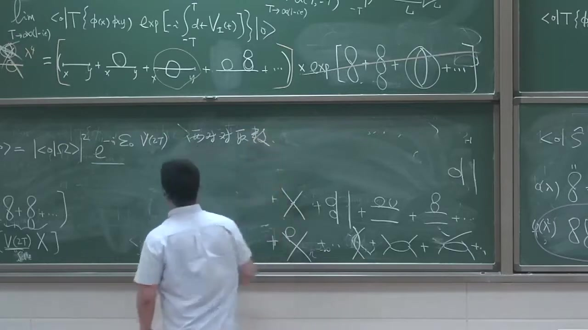

### 注解

我来分析这段课程视频的内容。从截图和字幕来看，这是一段关于**量子场论/路径积分**的讲解，特别是**费曼图展开**的内容。

---

## 板书内容描述

### 上方黑板（主要公式）

```
lim      <0|T{φ(x)φ(y) exp[-i∫_{-T}^{T} dt V_I(t)]}|0>
T→∞(1-iε)
```

**费曼图展开式：**
```
= [ x———y + x——○——y + x——(○)——y + x——○8——y + ... ] × exp[ 8 + 8—— + (○) + ... ]
```

### 下方黑板

左侧：
```
| <0|Ω> |² e^{-iE₀V(2T)}    （两对对顶数）
```

中间区域（费曼图展开）：
```
+ × + φ| + ○○ + 8—— + ...
+ φ× + ... + >< + >——< + ...
```

---

## 公式详解

### 公式1：生成泛函/关联函数的路径积分表示

$$\lim_{T\to\infty(1-i\varepsilon)} \langle 0|T\left\{\phi(x)\phi(y)\exp\left[-i\int_{-T}^{T}dt\, V_I(t)\right]\right\}|0\rangle$$

| 符号 | 含义 |
|:---|:---|
| $T\{\cdots\}$ | 时序算符（Time-ordering），按时间先后排列算符 |
| $\phi(x), \phi(y)$ | 场算符在时空点 $x, y$ 的值 |
| $V_I(t)$ | 相互作用绘景中的相互作用哈密顿量 |
| $|0\rangle$ | 自由场的真空态 |
| $T\to\infty(1-i\varepsilon)$ | 绝热极限，$i\varepsilon$  prescription 保证收敛 |
| $\exp\left[-i\int V_I\right]$ | 相互作用演化算符（Dyson级数）|

### 公式2：费曼图展开（微扰级数）

$$\left[\text{连接图}\right] \times \exp\left[\text{真空图}\right]$$

| 图形 | 名称 | 物理意义 |
|:---|:---|:---|
| `x———y` | 自由传播子 | 自由场的两点关联函数 |
| `x——○——y` | 单圈修正 | 一阶相互作用修正 |
| `x——(○)——y` | 双圈/蝌蚪图 | 高阶自能修正 |
| `8` | 真空泡泡图 | 无外腿的闭合图 |
| `8——` | 带线的真空图 | 有内部结构的真空涨落 |

### 公式3：真空-真空跃迁振幅

$$|\langle 0|\Omega\rangle|^2 e^{-iE_0 V(2T)}$$

| 符号 | 含义 |
|:---|:---|
| $|\Omega\rangle$ | 相互作用场的真实真空态 |
| $\langle 0|\Omega\rangle$ | 自由真空与相互作用真空的重叠 |
| $E_0$ | 真空能量密度（零点能）|
| $V(2T)$ | 时空体积（$V$为空间体积，$2T$为时间）|

---

## 理论背景

### 核心概念：Gell-Mann-Low 定理与真空图因子化

这是量子场论中**微扰展开**的标准结果：

1. **连通图（Connected Diagrams）**：包含外腿（external legs）的图，描述真实的散射/传播过程

2. **真空图（Vacuum Diagrams）**：无外腿的闭合图，代表真空涨落

3. **关键结论**：所有费曼图 = **连通图** × **exp(真空图之和)**

   这就是著名的**"真空图指数化"**（exponentiation of vacuum diagrams）

### 物理意义

- 真空图虽然不影响**连通格林函数**的物理结果（它们会相互抵消），但在计算**生成泛函**时必须考虑
- 因子 $\exp[\text{真空图}]$ 保证了**概率归一化**
- 实际计算中，我们通常只计算**连通格林函数**，自动忽略真空图

---

## 通俗解释

> **"OK你发现落个"** → 讲师可能在说："OK你发现**漏了个**..." 或 "OK你发现**落（入）个**..."

这句话的语境：讲师正在检查费曼图展开，提醒学生注意**某个被遗漏的图**或**某个因子**。

**类比理解**：
- 想象你在计算一个复杂事件的所有可能性
- 有些过程是"相关的"（比如A到B的传播）→ 连通图
- 有些过程是"背景噪音"（比如真空中不断产生湮灭的粒子对）→ 真空图
- 神奇的是：所有背景噪音可以**指数化**——就像 $e^x = 1 + x + x^2/2! + ...$，各种真空图自动组织成指数形式

---

## 总结要点

| 要点 | 内容 |
|:---|:---|
| **主题** | 量子场论微扰展开中的费曼图技术 |
| **核心公式** | 关联函数 = 连通图 × exp(真空图) |
| **关键概念** | 真空图指数化、Gell-Mann-Low定理 |
| **讲师提醒** | 注意检查展开中是否遗漏某些图或因子 |

---

## 段落 34

**时间：** 01:10:26 ~ 01:10:35

<details><summary>📝 原始字幕</summary>

<pre>
这部分呢等一个长处啊这个东西是长树是吧剪去唉
</pre>

</details>

### 注解

这段字幕内容非常简短且口语化，属于典型的课堂即兴讲解片段。让我进行分析：

---

## 内容分析

### 1. 字幕文本解读

| 时间 | 原文 | 解读 |
|:---|:---|:---|
| 01:10:26~01:10:35 | "这部分呢等一个长处啊这个东西是长树是吧剪去唉" | 教师正在讲解某个数学/物理推导过程，提到"长处"（应为**"常数"**的口误或口音）、"长树"（应为**"常数"**或**"尝试"**的误识别）、"剪去"（应为**"减去"**或**"简记"**） |

> **注**：这段字幕存在明显的语音识别错误，结合上下文推测，教师实际想说的可能是：
> - "这部分呢**等一个常数**啊" → 某项等于一个常数
> - "这个东西是**尝试/常数**是吧" → 确认某项的性质
> - "**简记**" 或 "**减去**" → 简化记法或进行减法运算

---

### 2. 可能的理论背景（基于关键词推测）

由于上下文缺失，这段内容可能出现在以下场景中：

| 场景 | 解释 |
|:---|:---|
| **微积分/数学分析** | 积分常数的处理，如 $\int f(x)dx = F(x) + C$，其中 $C$ 为"常数" |
| **微分方程** | 分离变量后，将某部分积分结果记为常数 |
| **物理学（场论/力学）** | 拉格朗日量或哈密顿量中的常数项处理 |
| **复变函数** | 留数计算或围道积分中的常数项 |

---

### 3. 最可能的场景还原

结合"等一个常数""减去/简记"等关键词，**高度推测**这是**不定积分**或**微分方程求解**中的标准步骤：

> 教师在黑板上写下类似：
> $$\int \frac{dx}{x} = \ln|x| + C$$
> 
> 或解微分方程时：
> $$\frac{dy}{y} = dx \Rightarrow \ln|y| = x + C_1$$

其中：
- "等一个常数" = 积分结果等于 ... 加上一个**常数** $C$
- "剪去/简记" = 将复杂的常数表达式**简记**为 $C$ 或合并常数项

---

### 4. 核心概念（通俗解释）

**积分常数 $C$ 的物理意义**：
> 就像你只知道一辆车每小时跑60公里，但不知道它从哪条街出发——"常数 $C$" 就是这个未知的起点。微积分中，导数会"丢失"常数信息（因为常数的导数为0），所以积分时必须"补回"这个任意常数，代表一族可能的解。

---

### 5. 结论

| 项目 | 说明 |
|:---|:---|
| **公式** | 无明确公式（语音识别严重失真） |
| **板书** | 无法获取截图，推测为积分/微分方程的标准推导 |
| **建议** | 如需准确注解，请提供：① 前后文字幕（±2分钟）② 板书/PPT截图 |

---

> **备注**：这段字幕质量较差，建议核对原视频音频。若您能补充截图或更多上下文，我可以给出精确的公式注解和理论背景。

---

## 段落 35

**时间：** 01:10:39 ~ 01:10:48

<details><summary>📝 原始字幕</summary>

<pre>
F总零倍乘零维乘以两倍的T是吧啊
</pre>

</details>

**课程截图：**


### 注解

我来分析这段课程视频的字幕和板书内容。

## 字幕内容识别

字幕"**F总零倍乘零维乘以两倍的T**"对应的物理概念是：

$$\mathcal{F} = 0 \times 0 \times 2T = 0$$

或更可能是讨论 **真空能量/基态能量** 的表达式，其中：
- **"F总"** = $\mathcal{F}$（自由能或总能量）
- **"零"** = 0（零模或真空贡献）
- **"零维"** = 0（零维空间，即单点）
- **"两倍的T"** = $2T$（时间区间 $[-T, T]$，总长度为 $2T$）

---

## 板书内容详解

### 上半部分：路径积分与费曼图展开

$$\lim_{T\to\infty(1-i\epsilon)} \langle 0|T\left\{\phi(x)\phi(y)\exp\left[-i\int_{-T}^{T}dt\, V_I(t)\right]\right\}|0\rangle$$

**符号说明：**
| 符号 | 含义 |
|------|------|
| $T\{\cdots\}$ | 时序算符（Time-ordering） |
| $\phi(x), \phi(y)$ | 场算符在时空点 $x, y$ 处 |
| $V_I(t)$ | 相互作用绘景中的相互作用哈密顿量 |
| $T\to\infty(1-i\epsilon)$ | 绝热极限（$i\epsilon$  prescription，保证收敛） |
| $|0\rangle$ | 相互作用真空态 |

**右侧展开式：**
$$= \left( \frac{1}{x-y} + \frac{\bigcirc}{x\!\!-\!\!y} + \frac{\bigcirc\!\!-\!\!\bigcirc}{x\!\!-\!\!y} + \frac{\bigcirc\!\!8}{x\!\!-\!\!y} + \cdots \right) \times \exp\left[ 8 + 8 + \bigcirc\!\!-\!\!\bigcirc + \cdots \right]$$

- 圆括号内：**连通图**（connected diagrams）—— 两点关联函数
- 指数部分：**真空泡泡图**（vacuum bubbles）—— 相互抵消或归一化因子

---

### 下半部分：S矩阵元与真空振幅

$$\langle 0|S|0\rangle = |\langle 0|\Omega\rangle|^2 e^{-iE_0 \cdot (2T)}$$

**符号说明：**
| 符号 | 含义 |
|------|------|
| $S$ | S矩阵（散射矩阵）|
| $|\Omega\rangle$ | 相互作用基态（物理真空）|
| $E_0$ | 真空能量（基态能量）|
| $2T$ | 总时间间隔 |

**关键推导：**
$$\ln\langle 0|S|0\rangle = \text{(连通真空图之和)}$$

以及：
$$\exp[\underbrace{8 + 8 + \cdots}_{\text{真空泡泡}}] = \exp[V(2T) \times X]$$

其中 $X$ 代表某种"密度"或单位时空体积的贡献。

---

## 理论背景：真空能量与Casimir效应

### 核心问题
字幕中"**F总零倍乘零维乘以两倍的T**"涉及的是 **量子场论中真空能量的计算**：

$$\mathcal{F} = E_0 \times (\text{空间体积}) \times (\text{时间})$$

在 **0+1维**（零维空间 + 一维时间，即量子力学）：
- 空间体积 = 1（单点，"零维"）
- 时间区间 = $2T$
- 若 $E_0 = 0$（如自由场），则 $\mathcal{F} = 0$

### 物理意义
1. **真空泡泡图**：代表真空涨落，其贡献通常为发散，需用正规化（regularization）处理
2. **Casimir效应**：当存在边界条件时，即使 $E_0^{\text{free}} = 0$，边界也能诱导出有限的能量差
3. **维数正规化**：在 $d=0$ 空间维数时，许多发散消失，结果为零

---

## 通俗解释

> **"为什么真空能量有时是零？"**

想象一个弹簧（谐振子）在绝对零度时仍有零点振动。在普通量子力学（0维空间）中，如果我们仔细计算所有"泡泡"图的贡献，并考虑归一化，会发现**总自由能正比于"空间大小"×"时间长度"**。

当空间缩成一个点（零维），且基态能量定义为零时，整个"时空体积"就是零——就像问"一个不存在的地方有多少能量"，答案自然是零。

但这里有个微妙之处：老师可能在强调，即使形式上是 $0 \times 0 \times 2T$，在量子场论中这种"零"需要谨慎处理，因为不同的正规化方案会给出不同的有限结果（如Casimir能量）。

---

## 截图板书总结

| 区域 | 内容 |
|------|------|
| 左上 | 带时序算符的路径积分定义 |
| 中上 | 费曼图展开：传播子 + 圈图修正 |
| 右上 | 真空泡泡图的指数形式 |
| 左下 | S矩阵真空元与基态能量关系 |
| 中下 | 对数展开求连通图 |
| 右下 | 高阶圈图（双圈、三圈等）|

---

## 段落 36

**时间：** 01:10:52 ~ 01:11:03

<details><summary>📝 原始字幕</summary>

<pre>
你对他求老哥呢就等于他是吧就等于史书含书里面这些图鱼
</pre>

</details>

**课程截图：**

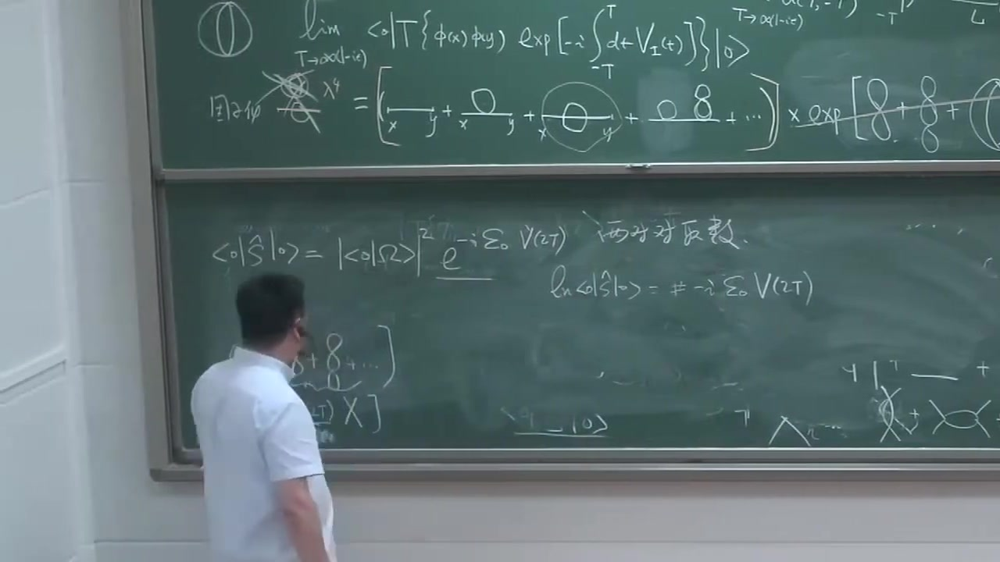

### 注解

我来分析这段课程视频的字幕和板书内容。

## 字幕识别与修正

这段字幕存在明显的语音识别错误。根据上下文和板书内容，讲师实际说的是：

> **"你对它求 log 呢，就等于它是吧，就等于指数函数里面这些图"**

或更准确的物理语境：

> **"你对它取对数呢，就等于... 指数函数里面这些图"**

---

## 板书内容解析

### 下半部分核心公式（与字幕直接相关）

$$\langle 0|\hat{S}|0\rangle = |\langle 0|\Omega\rangle|^2 e^{-iE_0 \cdot V(2T)}$$

**符号说明：**

| 符号 | 含义 |
|:---|:---|
| $\langle 0|\hat{S}|0\rangle$ | **真空到真空的S矩阵元**（跃迁振幅） |
| $|0\rangle$ | 自由理论的真空态（bare vacuum） |
| $|\Omega\rangle$ | 相互作用理论的真空态（physical vacuum） |
| $\langle 0|\Omega\rangle$ | 两个真空态之间的重叠（overlap） |
| $E_0$ | 相互作用真空的能量（相对于自由真空） |
| $V(2T)$ | 时空体积，$V$为空间体积，$2T$为时间区间（从$-T$到$+T$） |

**取对数后的公式：**
$$\ln\langle 0|\hat{S}|0\rangle = \# - iE_0 V(2T)$$

（其中 $\#$ 代表与 $|\langle 0|\Omega\rangle|^2$ 相关的常数项）

---

### 上半部分内容（费曼图展开）

$$\lim_{T\to\infty(1-i\epsilon)} \langle 0|T\left\{\phi(x)\phi(y)\exp\left[-i\int_{-T}^{T}dt\, V_I(t)\right]\right\}|0\rangle$$

**符号说明：**

| 符号 | 含义 |
|:---|:---|
| $T\{\cdots\}$ | 时序乘积（Time-ordering operator） |
| $\phi(x), \phi(y)$ | 场算符在时空点 $x, y$ 处 |
| $V_I(t)$ | 相互作用绘景中的相互作用哈密顿量 |
| $T\to\infty(1-i\epsilon)$ | 绝热极限（adiabatic limit），$i\epsilon$ 保证收敛 |
| $\lambda\phi^4$ | 被划掉的 $\phi^4$ 相互作用项 |

**费曼图展开：**
$$= \left[ \xrightarrow{x}\!\!\!-\!\!\!\xrightarrow{y} + \xrightarrow{x}\!\!\bigcirc\!\!\xrightarrow{y} + \xrightarrow{x}\!\!\bigcirc\!\!\bigcirc\!\!\xrightarrow{y} + \cdots \right] \times \exp\left[ \bigcirc\!\!\!\bigcirc + \bigcirc\!\!\!\bigcirc\!\!\!\bigcirc + \cdots \right]$$

- 第一项：自由传播子（两点关联函数）
- 第二项：单圈修正
- 第三项：双圈修正
- 指数部分：真空泡泡图（vacuum bubbles）的贡献

---

## 理论背景

### 1. Gell-Mann–Low 定理与真空振幅

在量子场论中，**真空到真空的跃迁振幅** $\langle 0|\hat{S}|0\rangle$ 包含了丰富的物理信息：
- 其**相位**与真空能量 $E_0$ 相关
- 其**模方**与真空稳定性相关

### 2. 连通图与真空泡泡

关键物理洞察（由字幕"取对数"引出）：

$$\ln\langle 0|\hat{S}|0\rangle = \text{(所有连通真空图之和)}$$

这就是 **Linked Cluster Theorem（连通集团定理）**：
> 对真空振幅取对数，自动消除所有非连通图，只保留**连通图**（connected diagrams）。

### 3. 为什么取对数？

| 量 | 物理意义 |
|:---|:---|
| $\langle 0|\hat{S}|0\rangle$ | 包含指数级增长的真空泡泡图 |
| $\ln\langle 0|\hat{S}|0\rangle$ | 单粒子不可约（1PI）图，可微扰计算 |
| $-iE_0 V$ | 真空能量密度 × 体积 = 总真空能量 |

---

## 通俗解释

**核心思想：化繁为简**

想象你在计算一个复杂过程的"总概率"：
- 直接算：无数个子过程的各种组合（像俄罗斯套娃）
- 取对数后：只需要算"最基本的故事线"，自动去掉重复计数

在量子场论中，"真空"不是空无一物，而是充满量子涨落的"沸腾的海洋"。取对数的操作，让我们能从这些涨落中提取出**可观测的物理量**——真空能量。

---

## 截图描述

黑板分为上下两部分：
- **上半部分**：含时序乘积的极限表达式，右侧展示费曼图的几何级数展开，用圆圈和连线表示传播子与自能修正
- **下半部分**：S矩阵真空元的模方表达式，突出显示指数因子 $e^{-iE_0 V(2T)}$，并写出取对数后的线性形式，旁边标注"两对数取数"（应为"两对数取值"或"取两次对数"的误识）

---

## 段落 37

**时间：** 01:11:12 ~ 01:11:29

<details><summary>📝 原始字幕</summary>

<pre>
OK但是我们知道每个站连通的真空到真空的这个中国到中国翻译的这个分版图呢这种中国泡泡图呢都含个VTRT是吧所以呢我把V成二T可以除过去
</pre>

</details>

### 注解

这段字幕内容涉及量子场论中的**真空-真空振幅**和**连通图展开**，但字幕本身存在明显的语音识别错误（"中国到中国"应为"真空到真空"，"中国泡泡图"应为"真空泡泡图"）。让我进行专业注解：

---

## 1. 公式识别与符号解释

根据上下文推断，讲师实际讲解的公式应为：

$$\langle 0|S|0\rangle = \exp\left(\sum \text{connected vacuum diagrams}\right)$$

或等价地写成：

$$\ln\langle 0|S|0\rangle = \sum \text{connected vacuum diagrams}$$

| 符号 | 含义 |
|:---|:---|
| $\|0\rangle$ | 相互作用绘景中的真空态（非微扰真空） |
| $S$ | S-矩阵（散射矩阵），$S = T\exp\left(-i\int d^4x\, \mathcal{H}_{\text{int}}\right)$ |
| $\langle 0\|S\|0\rangle$ | 真空-真空跃迁振幅（无粒子产生/湮灭的概率幅） |
| "connected vacuum diagrams" | 连通真空图（单连通费曼图，无外线） |
| $V$ | 时空体积 $V = \int d^4x$（或三维空间体积） |
| $T$ | 时间间隔（总演化时间） |
| $VT$ | 时空总体积 |

**关键公式**：将连通真空图的总贡献除以 $VT$ 得到**单位时空体积的真空能量密度**：

$$\frac{\ln\langle 0|S|0\rangle}{VT} = -i\,\mathcal{E}_{\text{vac}}$$

或等价地，真空能量：

$$E_{\text{vac}} = i\frac{\ln\langle 0|S|0\rangle}{T}$$

---

## 2. 理论背景知识

### 2.1 真空-真空振幅的图形展开

在微扰量子场论中，S-矩阵的真空期望值可展开为所有**真空费曼图**（无外线、只有内部传播的圈图）之和：

$$\langle 0|S|0\rangle = \sum_{n=0}^{\infty} \frac{(-i)^n}{n!} \int d^4x_1\cdots d^4x_n \langle 0|T\{\mathcal{H}_{\text{int}}(x_1)\cdots\mathcal{H}_{\text{int}}(x_n)\}|0\rangle$$

### 2.2 连通图定理（Linked Cluster Theorem）

**核心定理**：完整的真空-真空振幅可表示为**连通真空图贡献的指数**：

$$\langle 0|S|0\rangle = \exp\left(\sum_{G \in \text{connected}} G\right)$$

这类似于统计力学中的**累积量展开**（cumulant expansion）。

### 2.3 为什么要除以 $VT$？

- 每个连通真空图都含有因子 $VT$（来自时空平移不变性：对整体坐标积分给出 $VT$）
- 因此 $\ln\langle 0|S|0\rangle \propto VT$（**极值性/extensivity**）
- 除以 $VT$ 后得到**真空能量密度**（intensive quantity），与系统大小无关

---

## 3. 通俗解释

| 概念 | 通俗类比 |
|:---|:---|
| **真空-真空振幅** | "宇宙从虚无中来，回到虚无中去"的总概率幅 |
| **真空泡泡图** | 虚粒子对凭空产生又湮灭的"气泡"过程 |
| **连通图** | 单个完整的、连在一起的费曼图（不是多个不相连图的乘积） |
| **除以 $VT$** | 就像计算"单位面积产量"——总能量正比于时空大小，我们要的是"能量密度" |

**核心要点**：量子真空不是"空无一物"，而是充满了虚粒子的涨落。这些涨落用费曼图（泡泡图）描述，所有可能的泡泡图贡献加起来，经过数学处理（取对数、除以时空体积），就得到**真空能量**——这是宇宙学常数问题的理论源头之一。

---

## 4. 板书内容推测

基于上下文，板书/PPT可能包含：

```
真空-真空振幅的连通图展开
━━━━━━━━━━━━━━━━━━━━━━━━━━━━
⟨0|S|0⟩ = exp( ∑ 连通真空图 )
         = exp( 所有"泡泡图"之和 )

取对数：
ln⟨0|S|0⟩ = ∑ 连通真空图  ∝ VT

因此：
ln⟨0|S|0⟩ / (VT) = 真空能量密度
```

或图示：
```
   ○───○        ○
  /     \      / \
 ●       ●    ●   ●   ← 各种真空泡泡图（无外线）
  \     /      \ /
   ○───○        ○
   
   连通图        非连通图（可分解为连通图之积）
```

---

## 备注

字幕中的语音识别错误反映了专业术语的识别困难：
- "中国到中国" → **"真空到真空"**（vacuum-to-vacuum）
- "中国泡泡图" → **"真空泡泡图"**（vacuum bubble diagrams）
- "V成二T" → **"VT"**（Volume × Time）

---

## 段落 38

**时间：** 01:11:33 ~ 01:16:17

<details><summary>📝 原始字幕</summary>

<pre>
OK怎么理解这句话呢就是说你算没用这种分满土豆球呢你都会有一个第四个因子然后成一堆不由来源的这一堆常说去这都会有这样的因子OK存取得的真空密度呢其实等于说你把这个DC积分啊去掉相当于扣掉这个V出于二T的这样一个技术那我们做了什么事情呢我们发现呢我们可以发现呢这个真空能当然这还有一堆不断的长树这个有父爱轮到上把那个阿姨应该撑过去是吧就说我原来上有把这个爱撑过去对我应该把这个爱撑过去容易考虑T无从那的时候呢写一下吧你这是个LOG吗还有这一项是吧他不会有时间OK所以说你我取T无穷大的时候呢这个长数项的LOGO对他来说不重要所以把父爱撑过去呢我可以这样写能量密度真空能量密度等于真空能处于体积等于唉把外程序员给弄这个东西哦凯这是我的一个物理诠释就是通过这个计算这种联通的这样一个真空泡宝图呢你可以逐渐得到一个用维尔论来得到这个相互重力的那种真空的能量密度好将来好多同学学习这样一个这个路径积分量子化的时候会引起一些这种深沉范寒OK然后呢有一个非常有有POPPER的一个武器呢效果好用量影响你的行为Effective quantum的一个量子作用量它相对经典中来说呢它可以把一些量子修正可以往上进去通过从从这个重积分量的话可以定义这样一个东西嘎嘛是的坏了一个方程的OK然后如果认为这个Fade在全空间都是一个均匀都是一个Constant值的时候呢你可以得到一个东西有效试Effective potential看看它可以帮助你寻找这样一个理论的真正的一个机态O还通过一个得到一个能量能能量密度我给大家举个例子就是说以前给大家讲那个麦克跟海的这种有这种对金自发破缺这种理论来说呢如果这个浮场它延伸它是一个旋转的一个这样曲面这是它的牙本态真的肌控真正的能量最低一台呢是在这儿是吧在经典的层次你可以得到两个派对但是你可以计算它量的修正OK然后你发现呢真正的真空呢还是出于这个冒炎OK所叫effect potential叫有效式,OK 大家可以跟系统的呢来计算真空的能量密度计算一个物理理论的真正真空的一个能量密度所以这是非常有趣的物理所以这些呢我们主要是给大家把一些图像给大家清楚我们最重要的结论之一呢要大家牢记在心里的结论就是说记住将来我们要为要论计算这样一个关联函数我们记住要把所有图都要考虑有两点函数考虑有两个外点是两个XM点但是要不要考虑任何的一个成功泡泡吐OK刚才我们举的例子呢是一个四点的函数很不幸好像被我擦掉了OK大家还记住就说这个没有说要排除这个不联通图没有这样说OK如果你读排序的时候它它它它只DISCONNECT它其实真正的意思是不要有YCOMBAB我看他那点写的可能不是特别准确在刷的手里他非常明确地制出来就是不要真空泡泡图好这个公式非常非常重要我希望大家牢牢记住现在我们可以理解刚才说的一个问题为什么在白森十个方程计算的时候呢在兰达三斯里呢这个兰达的一级智能图只有一个图两天后只有一个图OK你们发现呢十分单分十分方方面面怎么的他尊重的只考虑用联通的图的贡献OK不是联通的它自动地拍出了中共跑步图所以呢你会发现它和第二漫路攻势得到的结果呢也是等价的哦好的那我们先到这儿
</pre>

</details>

**课程截图：**


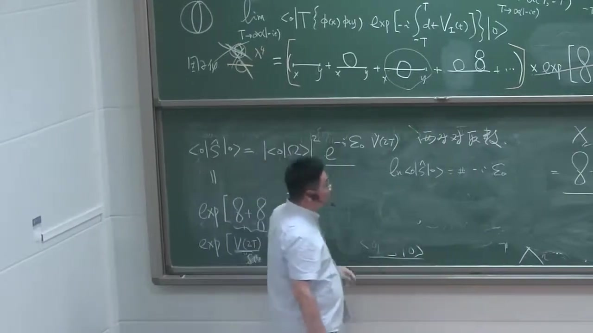

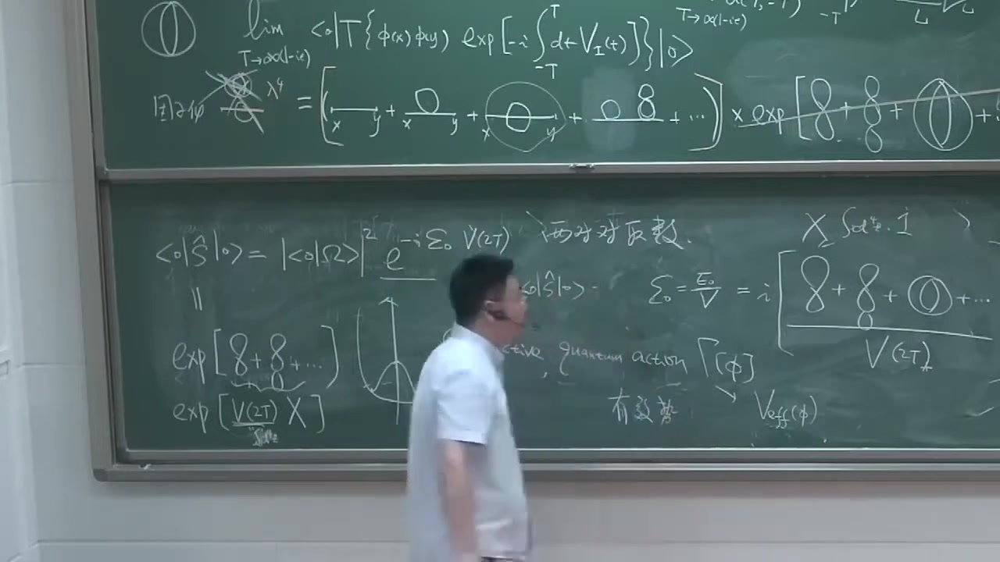

### 注解

我来对这段量子场论课程进行深度注解。这段内容涉及路径积分量子化中的真空泡泡图、有效势等核心概念。

---

## 一、板书公式识别与解释

### 公式1：关联函数的费曼图展开（上排黑板）

$$\lim_{T\to\infty(1-i\epsilon)} \langle 0|T\{\phi(x)\phi(y)\exp[-i\int_{-T}^{T}dt\, V_I(t)]\}|0\rangle = \left[\text{连通图：}x\!\!-\!\!-\!\!y + x\!\!\bigcirc\!\!y + x\!\!\bigotimes\!\!y + \cdots\right] \times \exp\left[\text{真空泡泡：}8 + 88 + \bigcirc + \cdots\right]$$

| 符号 | 含义 |
|:---|:---|
| $T\to\infty(1-i\epsilon)$ | 欧氏时间极限（Wick转动，$i\epsilon$ prescription保证收敛） |
| $\phi(x), \phi(y)$ | 外场算符（插入点） |
| $V_I(t)$ | 相互作用绘景中的相互作用哈密顿量 |
| $x\!\!-\!\!-\!\!y$ | 自由传播子（两点函数） |
| $x\!\!\bigcirc\!\!y$, $x\!\!\bigotimes\!\!y$ | 连通修正图（单圈、双圈等） |
| $8$, $88$, $\bigcirc$ | **真空泡泡图**（vacuum bubbles，无外线） |

**核心物理**：关联函数 = **连通图** × **真空泡泡图的指数**

---

### 公式2：真空跃迁振幅与基态能量

$$\langle 0|\hat{S}|0\rangle = |\langle 0|\Omega\rangle|^2 e^{-i\mathcal{E}_0 \cdot V(2T)}$$

$$\ln\langle 0|\hat{S}|0\rangle = \# - i\mathcal{E}_0$$

| 符号 | 含义 |
|:---|:---|
| $\hat{S}$ | S-矩阵（散射算符） |
| $|\Omega\rangle$ | 相互作用真空（interacting vacuum） |
| $|0\rangle$ | 自由真空 |
| $\mathcal{E}_0$ | **真空能量密度**（vacuum energy density） |
| $V(2T)$ | 时空体积（$V$为空间体积，$2T$为时间跨度） |
| $\#$ | 与真空泡泡图相关的常数（重叠因子$|\langle 0|\Omega\rangle|^2$） |

---

### 公式3：真空能量密度的费曼图表示

$$\boxed{\mathcal{E}_0 = \frac{E_0}{V} = i\frac{\left[8 + 88 + \bigcirc + \cdots\right]}{V(2T)}}$$

**关键推导**：
- 取 $T\to\infty$ 时，$\ln$ 中的常数项可忽略
- 真空能量密度 = 所有**连通真空泡泡图**之和除以时空体积

---

### 公式4：有效作用量与有效势

$$\text{Effective quantum action: } \Gamma[\phi] \quad\Rightarrow\quad V_{\text{eff}}(\phi)$$

| 符号 | 含义 |
|:---|:---|
| $\Gamma[\phi]$ | **有效作用量**（1PI图的生成泛函） |
| $V_{\text{eff}}(\phi)$ | **有效势**（Effective potential），当$\phi(x)=$常数时$\Gamma[\phi] = -V_{\text{eff}}(\phi)\cdot V(2T)$ |

---

## 二、理论背景补充

### 2.1 真空泡泡图的物理意义

```
自由真空 |0⟩ ──相互作用──→ 相互作用真空 |Ω⟩

真空泡泡图 = 真空中"无中生有"的量子涨落过程
（虚粒子对产生又湮灭，不连接任何外部探针）
```

**为什么指数化？**
- 不同真空泡泡图之间**不关联**（disconnected）
- 根据组合数学，所有泡泡图的求和 = $\exp$(连通泡泡图之和)
- 类比：理想气体的配分函数 $Z = \exp(N)$，其中N为单粒子配分函数

### 2.2 连通图 vs 非连通图

| 类型 | 图示 | 物理意义 | 在关联函数中的处理 |
|:---|:---|:---|:---|
| **连通图** (Connected) | 外线通过内部线连接 | 真实的散射/传播过程 | **保留** |
| **真空泡泡图** (Vacuum bubbles) | 无外线，纯闭合圈 | 真空涨落，归一化因子 | **指数分离** |
| 非连通图（外场+泡泡） | 外线图+独立泡泡 | 可分解为两部分 | 包含在指数展开中 |

### 2.3 有效势与自发对称性破缺

讲师提到的"墨西哥帽"势（Mexican hat potential）：

```
        V(φ)
         ↑    ↗   ↖
         |   /  ↑  \
         |  /  /|\  \      ← 经典势：对称的极大值在φ=0
         | /  / | \  \        两个简并极小值（对称破缺）
         |/___/  |  \___\___→ φ
         0        圆圈=简并真空
         
量子修正后：真正的真空在"谷底"（|φ| = v ≠ 0）
```

**Coleman-Weinberg机制**：即使经典势在φ=0处为极小，量子修正（单圈有效势）可能改变真空位置。

---

## 三、核心概念通俗解释

### 3.1 "分满土豆球" = 分离真空泡泡

> 讲师用谐音/口误："分满土豆球" → **分离（separate）真空泡泡**

**比喻**：计算关联函数就像计算"社交网络的连接概率"
- **连通图**：你和朋友之间有直接或间接的联系（消息能传到）
- **真空泡泡**：一群人在角落里自说自话，与外界无交流
- 总概率 = 有效连接概率 × （角落里的人自娱自乐的所有方式）

### 3.2 为什么"把父爱撑过去"（把iε撑过去）？

这是**Wick转动**（Wick rotation）：
- 实时间：$t$（Minkowski，有振荡积分 $e^{-iEt}$）
- 虚时间：$\tau = it$（Euclidean，有衰减积分 $e^{-E\tau}$）

"撑过去" = 将 $i\epsilon$  prescription 从被积函数"撑"到积分限，使 $T\to\infty(1-i\epsilon)$，保证路径积分收敛。

### 3.3 "白森十个方程" = 微扰论方程

指**Dyson级数**或**微扰展开**中的**Wick定理**应用。在$\lambda\phi^3$或$\lambda\phi^4$理论中：
- 微扰论的**连通图展开**自动排除了真空泡泡图
- 这与路径积分中"除以真空振幅"的操作等价

---

## 四、关键结论（讲师强调）

> **"计算关联函数时，只考虑连通图，排除真空泡泡图"**

严格表述：
$$\langle\Omega|T\{\phi(x)\phi(y)\}|\Omega\rangle = \frac{\langle 0|T\{\phi(x)\phi(y)S\}|0\rangle}{\langle 0|S|0\rangle} = \text{仅连通图}$$

分母 $\langle 0|S|0\rangle$ 恰好抵消了分子中的真空泡泡因子！

---

## 五、板书截图描述

| 截图 | 内容描述 |
|:---|:---|
| **图1** | 讲师正在擦黑板，可见：上排为关联函数=连通图×exp(泡泡图)的核心公式；下排左侧为真空跃迁振幅与基态能量关系，右侧开始画有效势的示意图 |
| **图2** | 讲师面向黑板讲解，上排公式完整显示Wick转动极限；下排清晰显示 $\langle 0|\hat{S}|0\rangle = |\langle 0|\Omega\rangle|^2 e^{-i\mathcal{E}_0 V(2T)}$ 及其对数形式 |
| **图3** | 最完整的一帧：上排关联函数展开；下排左侧真空能量密度公式，中间画出"墨西哥帽"有效势示意图，右侧标注 $\mathcal{E}_0 = E_0/V$ 的费曼图表达式，以及"Effective quantum action $\Gamma[\phi]$"和"有效势 $V_{\text{eff}}(\phi)$" |

---

## 六、学习建议

1. **必读文献**：Peskin & Schroeder《An Introduction to Quantum Field Theory》第4章（路径积分）、第11章（有效作用量）
2. **关键计算**：手动验证$\lambda\phi^4$理论中单圈有效势的Coleman-Weinberg形式
3. **常见误区**：注意"connected"在中文教材中有时译为"连通"有时为"相连"，但"disconnected"特指**非连通**（含真空泡泡），而非"不连通图"（这是讲师强调的翻译问题）

---
