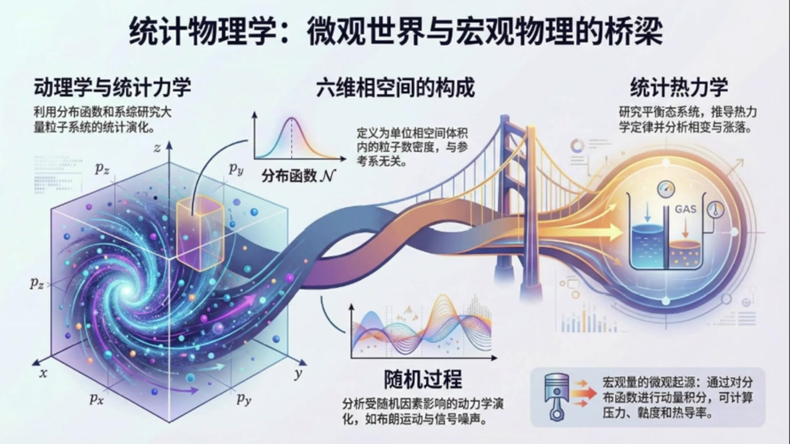
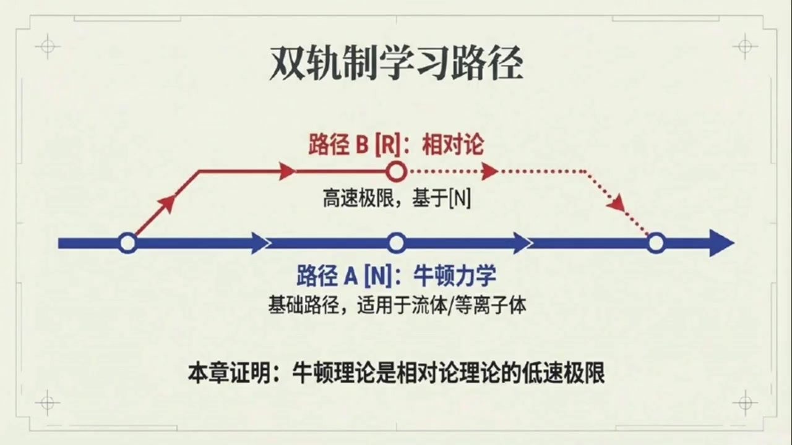
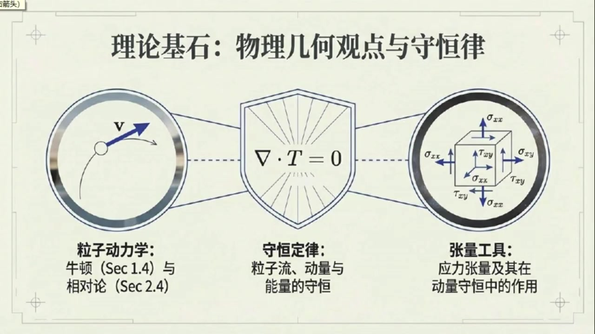

# 《现代经典物理学》第13课 统计物理学与动理学理论

> 自动生成的课程注解文档（共 3 个段落，[原始视频](https://www.youtube.com/watch?v=c5LLj0IMkmQ)）

## 目录

- [00:00:00 统计物理学全貌与四大章节导览](#段落-1)
- [00:07:52 第三章动力学理论的定位、应用与学习准备](#段落-2)
- [00:11:35 相空间与分布函数的定义及其物理意义](#段落-3)

---

## 段落 1：统计物理学全貌与四大章节导览 { #段落-1 }

**时间：** 00:00:00 ~ 00:07:52

<details><summary>📝 原始字幕</summary>

<pre>

大家好欢迎来到现代经典物理学第十三课的博客课堂我是你们活泼好奇的主持人周伊
大家好,我是赛今天我们将一起踏入同级物理学的奇妙世界
很高兴和大家一起探索物理世界的奥秘赛我们今天终于要进入一个全新的领域了就是这本书的第二部分统计物理学听起来就觉得特别有深度
没错Joy
不过今天的内容比较轻松毕竟是进入一个新领域的开篇嘛
统计物理学可是每个物理学家都必须掌握的核心内容
他帮我们从微观粒子的角度理解宏观世界的现象那他跟我们之前学过的热力学有什么关系呢是不是更进一步了可以这么说
它会为我们后面要讲的连续戒指物理学提供一个非常扎实的微观基础
而且还会连接牛顿理论相对论甚至量子统计物理学哇听起来好宏大
那我们这部分具体会讲些什么呢
整个第二部分我们会分成几章来深入探讨
比如第三章是动力学理论第四章是统计力学第五章是统计热力学最后第六章是随机过程理论今天我们是不是要从最简单的动力学理论开始对我们今天要聚焦第三招动力学理论
它是分析包含巨大数量粒子系统最简单最直观的形式体系巨大数量的粒子听起来就很有趣比如哪些系统可以用它来研究呢
比如空气分子核反应堆里扩散的中子甚至宇宙大爆炸起源中的光子
这些都可以用动力学理论来分析从微观到语观应用范围也太广了吧
那动力学理论的核心概念是什么呢?它的核心是分布函数
也就是像空间中的粒子数密度,即做大写滑体N
这个大写话题N告诉我们在单位物理空间和单位动量空间内有多少这种粒子像空间听起来有点抽象
是不是就是把粒子的位置和动量都考虑进去的空间?没错,它就是物理空间和动量空间的迪卡尔机
而且这个大写花体N在狭义相对论里被证明一个几何的与参考系无关的实体一个标两场
哇,不依赖参考系,那它肯定是个特别重要的物理量了
通过它和它遵循的定律我们就能从微观物理学计算出各种宏观量
比如质量密度,热能密度,压力,热导率,粘度这些吗?完全正确
这些都是我们用动力学理论来连接微观和宏观的关键然后就是第四章是统计力学
它跟刚才动力学理论有什么不一样啊,这是一个很好的问题
简单来说统计力学研究的视角更宏观也更精细
它不再只关注单个粒子或少数粒子的运动而是引入了一个非常重要的概念细宗细宗听起来有点抽象能概要说说这是什么吗当然你可以把它想象成一大堆一模一样的物理系统集合
比如我们想象一个装有十的23次放个空气分子的气球
这些气球就是细宗里的系统,它们自有度相同,但每个气球里分子的具体状态可能不同
哇,那要描述一个气球的状态,岂不是要超多数字
是的非常多
一个气球力十的二十三次放个分子每个分子有XYC三个位置坐标和PXPYPC三个动量坐标加起来就是六乘十的二十三次放个数字
我们用一个高纬的向空间来表示这些状态然后引入一个分布函数它告诉我们系统里有多少系统处于向空间的某个特定状态
明白了就是用统计的方法去描述大量系统,那统计力学主要解决什么问题呢
很多,比如伤到底是什么,它跟信息又有什么关系
热力学第二定律的统计起源是什么
还有热平衡的统计含义以及系统如何演化到热平衡
我们还会用它来推倒费米子和波瑟子的坟墓研究波瑟爱因斯坦凝聚甚至讨论伤在黑洞和宇宙中的意义
听起来好酷,那紧接着的第五章统计热力学又是什么呢?是不是统计力学的一个应用方向?你说得很对
第五章的统计热力学就是利用统计力学的强大工具去研究那些处于或接近热平衡状态的系统系宗
我们用它来吹导出热力学定律并且研究平衡态还有系统偏离平衡时那些随机的自发的涨落涨落那有什么具体的应用例子吗例子很多比如高温气体中的电离平衡电子正电子对的产生这些都是化学和粒子反应的应用
还有大家熟悉的变,像水结冰,融化,气化这些过程,我记得资料里还提到了铁瓷变,还有什么重整化群和蒙特卡罗方法,是的
以铁磁相变为例,当铁冷却时,原子磁锯会自发对起
研究这种现象我们就能用到统计物理里两种非常精妙且强大的技术重整化群和蒙特卡罗方法
他们能帮助我们理解复杂系统的行为太棒了最后第六章讲的随机过程又是什么呢听起来跟前面两个概念有点不一样确实有所不同
随机过程理论主要研究那些被海量因素影响我们几乎无法精确控制或预测其巨皮演化的过程
我们知道的只有这些因素的统计形式比如布朗运动码尘埃粒子被空气分子撞来撞去那种完全正确
还有引力波干涉以里的败
他的运动非常精确,甚至能看到地震震动和热涨落力的影像
我们无法预测这些尘埃粒子或白的精确轨迹但可以计算它以某种方式演化的概率原来如此就是研究概率分布的演化
那它会涉及哪些概念呢主要包括普密度相关函数还有控制概率分布演化的福克普朗克方程
最核心的还有涨落耗散定理
它揭示了摩擦和涨落力之间必然存在的联系落耗散定理听起来很有意思
课书里还提到随机过程理论也包含信号与噪声理论这跟统计物理有什么关系呢关系非常密切虽然听起来像是实验科学的范畴但我们发现描述布朗运动的原理在从强噪声背景中探测微弱性化石也同样适用
比如我们用顾虑数据的方法从造声中提取信号还会研究造声对实验精度和通信可靠性的限制没想到统计物理的触角能延伸到这么多领域从微观的粒子分布到宏观的像变再到信号处理真是太有意思了是啊

</pre>

</details>

**课程截图：**




### 注解

我来对这段课程视频进行深度注解。这段内容是统计物理学的导论，介绍了整个第二部分的章节结构和核心概念。

---

## 一、板书/PPT截图内容描述

### 图1：统计物理学总览图
这是一张"桥梁"隐喻的可视化图，展示统计物理学的四大支柱：
- **左侧**：动力学与统计力学（六维相空间中的分布函数）
- **中间**：六维相空间的构成（位置空间+动量空间）
- **右侧**：统计热力学（平衡态系统、相变与涨落）
- **底部**：随机过程（噪声驱动、信号提取）

### 图2：动力学理论详解
核心视觉元素：
- **左侧**：三个应用实例（空气分子、核反应堆中子、宇宙大爆炸光子）
- **中央**：六维相空间示意图（x-y-z位置轴与p_x-p_y-p_z动量轴构成的立方体，中心标有分布函数 $\mathcal{N}$）
- **右侧**：微观到宏观的推导流程（分布函数→积分/统计平均→质量密度、热能密度、压力、热导率、粘度等）

### 图3：随机过程理论
- **左侧**：摆受"Thermal Noise"驱动的示意图
- **中央**：Random Walk轨迹图，配以随时间展宽的概率分布
- **右侧**：信号处理示意图（Noisy Data → Extracted Signal）

---

## 二、核心概念详解

### 1. 分布函数 $\mathcal{N}$（动力学理论的核心）

**符号说明**：
| 符号 | 含义 |
|:---|:---|
| $\mathcal{N}$（花体N） | 相空间中的粒子数密度分布函数 |
| $\mathbf{x} = (x,y,z)$ | 三维位置坐标 |
| $\mathbf{p} = (p_x, p_y, p_z)$ | 三维动量坐标 |
| $d^3x \, d^3p$ | 六维相空间体积元 |

**数学定义**：
$$\mathcal{N}(\mathbf{x}, \mathbf{p}, t) \, d^3x \, d^3p = \text{在时刻}t\text{，位于}(\mathbf{x}, \mathbf{x}+d\mathbf{x})\text{且动量在}(\mathbf{p}, \mathbf{p}+d\mathbf{p})\text{范围内的粒子数}$$

**关键性质**：
- **洛伦兹不变性**：在狭义相对论中，$\mathcal{N}$ 是一个**标量场**，与参考系无关
- 这是非平凡的——虽然 $d^3x$ 和 $d^3p$ 各自会随参考系变换（长度收缩、动量变换），但它们的组合 $d^3x \, d^3p$ 保持洛伦兹不变

---

### 2. 从微观到宏观：统计平均

通过 $\mathcal{N}$ 计算宏观量的通用公式：

| 宏观量 | 计算公式 |
|:---|:---|
| 粒子数密度 | $n(\mathbf{x},t) = \int \mathcal{N}(\mathbf{x}, \mathbf{p}, t) \, d^3p$ |
| 质量密度 | $\rho(\mathbf{x},t) = m \int \mathcal{N} \, d^3p$ |
| 动量密度/流 | $\mathbf{j}(\mathbf{x},t) = \int \mathbf{p} \, \mathcal{N} \, d^3p$ |
| 能量密度 | $\varepsilon(\mathbf{x},t) = \int E(\mathbf{p}) \, \mathcal{N} \, d^3p$ |
| 压强张量 | $P_{ij} = \int p_i v_j \, \mathcal{N} \, d^3p$ |

> **通俗理解**：宏观量 = 微观量 × "有多少人这样" 的加权平均

---

### 3. 系综（Ensemble）概念

**定义**：大量**宏观上相同**（同哈密顿量、同约束条件）、**微观上不同**（不同初始条件）的虚拟系统集合

**数学表示**：
- 单个系统：$6N$ 维相空间中的点（$N \sim 10^{23}$）
- 系综：这些点在相空间中的**概率分布** $\rho(\{\mathbf{q}_i, \mathbf{p}_i\}, t)$

**三种经典系综**（预告）：
| 系综 | 约束条件 | 适用场景 |
|:---|:---|:---|
| 微正则系综 | $E, V, N$ 固定 | 孤立系统 |
| 正则系综 | $T, V, N$ 固定 | 与热库接触 |
| 巨正则系综 | $T, V, \mu$ 固定 | 粒子交换开放系统 |

---

### 4. 涨落-耗散定理（Fluctuation-Dissipation Theorem）

这是随机过程理论的核心结果，揭示了**不可逆性**的微观起源：

$$\boxed{\text{响应函数}} \propto \boxed{\text{关联函数（涨落）}}$$

**物理内涵**：
- **耗散**（摩擦、电阻）↔ 系统对外部扰动的**响应**
- **涨落**（热噪声、布朗运动）↔ 系统的**自发波动**
- **定理**：二者由同一微观机制产生，必然同时存在

**实例**：
| 系统 | 耗散 | 涨落 |
|:---|:---|:---|
| 布朗粒子 | 流体粘滞阻力 | 随机碰撞力 |
| 电路 | 电阻 | 约翰逊-奈奎斯特噪声 |
| 引力波探测器 | 悬挂阻尼 | 热噪声导致的摆随机运动 |

---

## 三、章节结构脉络

```
第二部分：统计物理学
├── 第三章：动力学理论（Kinetic Theory）
│   └── 单粒子分布函数 $\mathcal{N}$，Boltzmann方程
├── 第四章：统计力学（Statistical Mechanics）
│   └── 系综理论，熵的统计诠释，量子统计
├── 第五章：统计热力学（Statistical Thermodynamics）
│   └── 平衡态，相变，重整化群，蒙特卡洛方法
└── 第六章：随机过程（Random Processes）
    └── Fokker-Planck方程，涨落-耗散定理，信号处理
```

---

## 四、关键术语对照

| 中文 | 英文 | 核心含义 |
|:---|:---|:---|
| 相空间 | Phase Space | 位置+动量的联合空间 |
| 系综 | Ensemble | 大量虚拟系统的集合 |
| 涨落 | Fluctuation | 物理量的随机偏离 |
| 耗散 | Dissipation | 能量向热运动转化 |
| 福克-普朗克方程 | Fokker-Planck Equation | 概率分布演化的偏微分方程 |
| 重整化群 | Renormalization Group | 处理多尺度问题的数学工具 |

---

## 五、总结要点

本段作为**开篇导论**，建立了统计物理学的整体框架：

1. **方法论核心**：用**概率分布**替代**精确轨道**，处理 $N \sim 10^{23}$ 量级的多体问题
2. **理论层次**：从微观（动力学理论）→ 介观（统计力学）→ 宏观（热力学）
3. **普适性**：从空气分子到宇宙光子，从相变到信号处理，统一框架

---

## 段落 2：第三章动力学理论的定位、应用与学习准备 { #段落-2 }

**时间：** 00:07:52 ~ 00:11:35

<details><summary>📝 原始字幕</summary>

<pre>

统计物理的魅力就在此
它提供了一套强大的工具和思维方式帮助我们理解和解决从基础科学到工程应用中的各种复杂问题
希望今天的介绍能让大家对这几章的内容有个初步的人识那赛我们看书上第三章一开始就提到了詹姆斯克拉克麦克斯维一千八百七十三年的一句话很有意思把气态条件比作社交晚会是啊麦克斯维真的是个天才
他用这种生动的比喻来描述粒子们在气体中那种混乱又充满碰撞的运动状态
这正是动力学理论要研究的场景感觉一下子就懂了那我们这张具体会学到哪些内容呢这一张我们会深入学习动力学理论
它处理的是有大量粒子组成的气体这些粒子在很长的距离内自由运动很少发生碰撞很少碰撞那是不是说大部分时间它们都在各玩各的可以这么理解
然后我们就会用动力学理论来研究各种现象比如核反应堆里的中子早期宇宙里星气的形成还有白矮星里的电子状态方程对还有超星性爆炸怎么影响星际分子宇宙微薄光子的温度分布以及金属的热导率和电导率这些都离不开动力学理论
哇,这应用太广泛了,感觉学了这一章就能解释好多不同的物理现象
没错
这里面有些粒子速度远小于光速,可以用牛顿理论处理
但也有一些接近光速,就需要用到相对论了
所以我们这章会同时学习牛顿版本和相对论版本是吗
对,牛顿理论是相对论理论的低速极限
不过如果你只对牛顿力学感兴趣,书里也提供了读者指南,告诉你哪些相对论部分可以跳过
读者指南,那我们赶紧看看这个BOX 3.1 它具体告诉我们什么呢
这个指南很重要
他明确指出表有N的是牛顿力学内容表有R的是相对论内容
N是基础而是境界的第二路径
明白了就是说想学相对论的同学可以继续往下看二的部分如果暂时不想可以先跳过正是如此而且他还强调了本章对前面章节的依赖性依赖性是说需要我们对第一章和第二章的内容很熟悉吗对特别是关于物理的几何观点还有粒子动力学守恒定律以及应力张量这些概念
这些都是理解动力学理论的基础所以说如果对牛顿粒子动力学相对论离子动力学还有各种守恒定律部署的话学起来会有点吃力没错尤其是牛顿的应力量和相对力量它们在动量定律中的作用都是非常关键的听起来有点像温固而新新把前面的基础知识构建起来了对这是一篇重要的物理学知识体系的关键部分也是第二部分统计物理学和后面流体动力学等的内容的关键基础所以这张是可以说它会为我们理解流体动力学的状态方程以及等离子体物理的坚固基础

</pre>

</details>

**课程截图：**





### 注解

我来对这段课程视频进行深度注解。这段内容聚焦于**动力学理论（Kinetic Theory）**的章节导论，介绍了学习路径和前置知识要求。

---

## 一、板书/PPT截图内容描述

### 图1：动力学理论详解（已在之前描述，但补充新细节）

**右侧新增信息框**——"微观分布函数 $\mathcal{N}$ 的积分/统计平均"：
| 宏观可观测量 | 物理意义 |
|:---|:---|
| 质量密度 (Mass Density) | 单位体积内的总质量 |
| 热能密度与压力 (Thermal Energy & Pressure) | 粒子无规运动的能量与动量输运 |
| 热导率与电导率 (Conductivity) | 能量与电荷的输运系数 |
| 黏度与扩散系数 (Viscosity & Diffusion) | 动量与物质的输运系数 |

> **关键洞察**：所有宏观输运现象都源于对微观分布函数 $\mathcal{N}$ 的适当加权平均。

---

### 图2：双轨制学习路径 ⭐新出现

```
路径 A [N]: 牛顿力学 ──────────────────────────────→
           基础路径，适用于流体/等离子体
                ↗
               /   路径 B [R]: 相对论
              /    高速极限，基于[N]
             ↙     （虚线表示可选分支）
```

**核心设计思想**：
- **N = Newton**：实心蓝线，必修基础
- **R = Relativistic**：红色分支，在掌握N后扩展
- 虚线箭头表示：学完R后需回归主线，与N的结果汇合验证

---

### 图3：理论基石：物理几何观点与守恒律 ⭐新出现

三圆盾形结构，中央核心方程：

$$\nabla \cdot T = 0$$

| 左侧圆盾 | 中央盾牌 | 右侧圆盾 |
|:---|:---|:---|
| **粒子动力学** | **守恒定律** | **张量工具** |
| 牛顿 (Sec.1.4) | 粒子流、动量与 | 应力张量及其在 |
| 与相对论 (Sec.2.4) | 能量的守恒 | 动量守恒中的作用 |

**视觉隐喻**：三个基础如同盾牌护卫着中央的核心方程，暗示这是整个理论的"防御工事"——必须牢固掌握。

---

## 二、核心概念解释

### 1. 麦克斯韦的"社交晚会"比喻（1873年）

> *"把气态条件比作社交晚会"*

| 社交晚会 | 气体分子 |
|:---|:---|
| 人群在宽敞大厅中移动 | 粒子在容器内自由运动 |
| 偶尔相遇交谈后分开 | 弹性碰撞后改变速度 |
| 大部分时间各自活动 | 平均自由程 >> 分子尺寸 |
| 整体氛围由个体行为统计决定 | 宏观压强/温度源于微观运动统计 |

**为什么这个比喻深刻**：麦克斯韦在分子运动论初创时期，就直觉地抓住了**稀薄气体**的本质特征——**碰撞是稀有的、局域的事件**，而非连续作用。这为玻尔兹曼方程的"碰撞项"处理奠定了直观基础。

---

### 2. 动力学理论的典型应用场景

| 应用场景 | 粒子类型 | 关键特征 | 理论版本 |
|:---|:---|:---|:---|
| 核反应堆中子扩散 | 中子 | 与核的散射、裂变产生 | 牛顿/相对论 |
| 早期宇宙星系形成 | 暗物质粒子、重子气体 | 引力不稳定性、光子退耦 | 相对论为主 |
| 白矮星电子状态 | 简并电子气 | 费米-狄拉克统计、相对论性简并压 | 相对论 |
| 超新星爆炸 | 光子、中微子、重核 | 极端相对论性、强相互作用 | 相对论 |
| 宇宙微波背景(CMB) | 光子 | 黑体谱、各向异性、萨克斯-沃尔夫效应 | 相对论 |
| 金属热/电导率 | 传导电子 | 费米面附近激发、声子散射 | 牛顿（固体中有效质量）|

---

### 3. 牛顿 vs 相对论：低速极限的数学含义

设粒子速度为 $v$，光速为 $c$，定义 $\beta = v/c$：

| 量 | 牛顿近似 | 相对论精确 | 低速展开 |
|:---|:---|:---|:---|
| 动量 | $p = mv$ | $p = \gamma mv$ | $mv(1 + \frac{1}{2}\beta^2 + ...)$ |
| 动能 | $E_k = \frac{1}{2}mv^2$ | $E_k = (\gamma-1)mc^2$ | $\frac{1}{2}mv^2(1 + \frac{3}{4}\beta^2 + ...)$ |
| 分布函数 | $f(\mathbf{x}, \mathbf{p}, t)$ | 同左，但 $\mathbf{p}$ 为相对论动量 | 形式相同，物理解释不同 |

其中洛伦兹因子：
$$\gamma = \frac{1}{\sqrt{1-\beta^2}}$$

**"低速极限"的严格含义**：当 $\beta \ll 1$ 时，相对论结果按 $\beta^2$ 的幂次展开，**首项**即为牛顿结果。这不是简单的"数值接近"，而是**数学结构的层次嵌套**。

---

### 4. 核心方程 $\nabla \cdot T = 0$ 的物理内涵 ⭐关键公式

这是**能动量守恒**的微分形式：

$$T^{\mu\nu}_{\;\;\;;\nu} = 0 \quad \text{（相对论，逗号/分号表示偏导/协变导）}$$

或牛顿版本：
$$\frac{\partial T^{ij}}{\partial x^j} = 0 \quad \text{（稳态，无体积力）}$$

**符号说明**：
| 符号 | 名称 | 物理意义 |
|:---|:---|:---|
| $T^{\mu\nu}$ 或 $T^{ij}$ | 能量-动量张量（应力-能量张量） | 描述能量、动量密度及其流 |
| $\nabla \cdot$ 或 $_{;\nu}$ | 四维散度 | 协变导数缩并，保证广义协变性 |
| 上标 $\mu,\nu = 0,1,2,3$ | 时空指标 | 0=时间，1,2,3=空间 |
| 上标 $i,j = 1,2,3$ | 空间指标 | 纯空间分量 |

**$T^{\mu\nu}$ 的分量结构**：
$$T^{\mu\nu} = \begin{pmatrix} 
\text{能量密度} & \text{能量流/动量密度} \\
\text{动量密度} & \text{应力张量（动量流）}
\end{pmatrix} = \begin{pmatrix} 
\mathcal{E} & S_i/c \\
c g_i & T^{ij}
\end{pmatrix}$$

**为什么 $\nabla \cdot T = 0$ 是核心**：
- 它统一了**质量守恒**、**动量守恒**、**能量守恒**
- 是推导**流体动力学方程**（欧拉方程、纳维-斯托克斯方程）的起点
- 在广义相对论中，这是**爱因斯坦场方程 $G_{\mu\nu} = 8\pi G T_{\mu\nu}$** 的必然后果（比安基恒等式保证 $\nabla \cdot G = 0$，故 $\nabla \cdot T = 0$）

---

## 三、前置知识依赖关系

```
第一章（物理几何观点）
    ├── 1.4 牛顿粒子动力学 ──┐
    │                         ├──→ 第三章：动力学理论
    ├── 2.4 相对论粒子动力学 ─┘   （需要：分布函数、碰撞积分、
    │                                输运方程的推导）
    ├── 守恒定律（粒子流、动量、能量）
    │       │
    │       └── 应力张量 T^{ij} 或 T^{\mu\nu}
    │              │
    └── 张量分析 ──┘（指标运算、散度、斯托克斯定理）
```

**"温故而知新"的具体体现**：
- 第一章的**单粒子**轨迹 → 第三章的**分布函数** $\mathcal{N}$（多粒子统计描述）
- 第二章的**相对论协变性** → 第三章的**协变输运方程**（保证所有参考系形式相同）
- 应力张量的**抽象定义** → 第三章的**微观推导**（从 $\mathcal{N}$ 计算 $T^{\mu\nu}$）

---

## 四、学习策略建议

基于"读者指南"的设计：

| 目标 | 路径 | 跳过内容 | 注意事项 |
|:---|:---|:---|:---|
| 快速入门流体/等离子体应用 | 仅N | 所有标R的章节 | 后续若遇相对论性等离子体需补课 |
| 天体物理/宇宙学方向 | N→R | 无 | 白矮星、中子星、黑洞吸积盘必须R |
| 核工程/反应堆物理 | 仅N | 相对论部分 | 中子速度通常非相对论性 |
| 完整理论物理训练 | N→R，并验证低速极限 | 无 | 重点理解N如何作为R的近似出现 |

---

## 五、关键引述与历史语境

**麦克斯韦（1873）原文脉络**：
> "The condition of a material body... may be compared to that of a number of men rushing about in a crowd..."

麦克斯韦在《论物质与运动》中提出此比喻时，正值**分子运动论**与**热力学唯象理论**激烈交锋之际。他的统计方法最终由玻尔兹曼（1872年的H定理）和吉布斯（1902年的系综理论）完善，形成现代统计物理的框架。

**本章定位**：从**微观可逆**的粒子运动出发，理解**宏观不可逆**的输运现象（扩散、黏滞、热传导）——这是统计物理最深奥的哲学问题之一，即**时间箭头**的起源。

---

## 段落 3：相空间与分布函数的定义及其物理意义 { #段落-3 }

**时间：** 00:11:35 ~ 00:18:01

<details><summary>📝 原始字幕</summary>

<pre>

好的,那我们现在就来正式进入三点二节向空间和分布函数
好的
首先我们来介绍动量空间向空间以及我们前面提到的核心概念分布函数分布函数就是向空间中的粒子数密度大写花体N对吧没错
我们会遇到几种不同版本的分布函数
它们本质上是等价的
但各自在特定领域有其优势比如在光子等离子体物理或与量子理论对接时嗯那我们先从最基础的牛顿相空间的粒子数密度大写花铁N开始讲起吧
没问题
我们想象一下
在牛顿的三维物理空间里,有一个净值量为M的粒子
它沿着路径XOT运动就像一个点在空间里跑来跑去对吧对
它的速度是 v of t 等于 dx by dt
动量就是 pft 等于 m 乘 f
这个动量PFT是物理空间中一个随时间变化的食量这个我们很熟悉那动量空间又是什么呢动量空间是一个辅助的三维空间
我们可以把粒子的动量时量PFT的尾部放在这个空间的圆点尾部在圆点那尖端呢随着时间流逝动量时量PFT的尖端就会在动量空间中扫出一条曲线
就像梳理图中画的那样哦我明白了物理空间描述位置动量空间描述运动状态很形象的比喻
物理空间的任何迪卡尔坐标系XYZ
都会在动量空间中诱导出相应的坐标系PXPYPC那像空间就是把这两个空间合起来了
正是三维物理空间和三维动量空间共同构成了我们说的六维向空间
它的坐标就是 x y z p x p y p z
哇六维空间
听起来就觉得信息量巨大,确实如此
现在我们考虑一个由大量相同粒子组成的几何这些粒子都有相同的净值量M就剩一大堆空气分子对为了研究它们我们想象在物理空间中以位置X为中心取一个微小的三维体积D花体为X
就像一个微小的方块,对吧没错
同时在动量空间中我们也以P为中心取一个微小的三维体积D花体VIP也就是说我们不仅限制了粒子在哪儿还限制了它们怎么动完全正确
这两个微小体积合在一起就构成了一个微小的六维体积我们称之为D平方花体V也就是D花体VX乘以D花体VP吗
就是地平方花体为被定义成地花体VX成地花体VP
在迪卡尔坐标系里,它就是DX乘DY乘DZ乘DPS乘DPI乘DPS
这个地平方花体微,就是像空间里的一个小格子没错
现在我们用DNA来表示在某个时刻T位于这个像空间小格子D平方花体V里面的粒子数量也就是说这些粒子不仅在物理空间某个小区域它们的动量也在动量空间的某个小区域里非常近乎
那么我们就可以定义花体N ofXPT被定义成DN百地平方化体位这就是我们说的粒子数密度或者分布函数对这个分布函数大写话体N就是动力学理论描述大量相同粒子集合的主要工具听起来它就是我们理解这些粒子集体行为的关键没错
而且在牛顿理论中我们这组DNA粒子所占据的体积D话题VX和D话题VP是与我们观察它们的参考系无关的
哦,所以它是客观的,不随观察者改变
在相对论理论中虽然第一话题VX会发生洛伦兹收缩第一话题VP也会改变
但他们的乘积D平方话题V在所有参考系中都是相同的哇那这样一来无论是牛顿理论还是相对论理论这个分布函数大写话题N都独立于参考系了正是如此
它是一个坐标无关的标量
是向空间中的一个基本物理量,明白了
所以这个大写话题N这么重要
因为它既能描述微观粒子的重态,又不依赖于我们的观察方式
这就是它的强大之处
有了这个工具我们就能在接下来的章节里研究热平衡系统的粒子分布计算各种宏观物理量比如麦克斯维速度分布还有费米子波色子的分布吗没错
还会学到刘尔定理波尔兹曼方程以及如何计算输运系数
比如扩散系数,热导率和年度听起来后面内容更精彩了
简直是打开了新世界的大门的确
不过赵艾也想提醒大家书里提到的应用非常多我们不是要记住所有细节作者也说了主要是学习基本概念然后了解这些概念是怎么被应用到各种问题中的对理解核心思想掌握工具才是最重要的好的今天的博客时间也差不多了感谢赛为我们深入浅出的讲解了统计物理的开篇和动力学理论的基础概念不客气周伊希望大家对向空间和分布函数有了初步的认识感谢大家的收听我们下期节目再见

</pre>

</details>

**课程截图：**




### 注解

我来对这段课程视频进行深度注解。这段内容是**3.2节"相空间和分布函数"**的核心讲解，建立了动力学理论的数学基础。

---

## 一、板书/PPT截图内容描述

### 图1：理论基石——物理几何观点与守恒律
**三圆盾牌结构**，展示动力学理论的三大支柱：
- **左侧**：粒子动力学（牛顿第1.4节 / 相对论第2.4节）→ 单个粒子的运动规律
- **中间**：守恒定律 → $\nabla \cdot T = 0$（能量-动量张量的守恒）
- **右侧**：张量工具 → 应力张量 $\sigma_{ij}$ 及其在动量守恒中的作用

### 图2：六维相空间的构建（笛卡尔积）
**核心视觉**：三个立方体的"乘法"示意
- **左**：3D物理空间（位置空间）→ 坐标 $(x,y,z)$
- **中**：3D动量空间 → 坐标 $(p_x, p_y, p_z)$
- **右**：6D相空间 = 两者的笛卡尔积

**关键公式**：
$$d^2\mathcal{V} \equiv d\mathcal{V}_x d\mathcal{V}_p = (dx\,dy\,dz) \times (dp_x dp_y dp_z)$$

### 图3：几何实体的参考系无关性
**对比图示**：
- **静止参考系**：立方体 $d\mathcal{V}_x \times d\mathcal{V}_p$ 为标准形状
- **运动参考系**：空间体积 $d\mathcal{V}_x$ 发生洛伦兹收缩（变扁），但相空间体积权重 $d^2\mathcal{V}$ 保持不变

**结论**：$\mathcal{N}$ 是相空间中的标量场，独立于参考系

---

## 二、公式识别与详解

### 公式1：单个粒子的运动学
| 公式 | 符号含义 |
|:---|:---|
| $\mathbf{v}(t) = \dfrac{d\mathbf{x}}{dt}$ | $\mathbf{v}(t)$：时刻 $t$ 的速度矢量；$\mathbf{x}$：位置矢量；$t$：时间 |
| $\mathbf{p}(t) = m\mathbf{v}$ | $\mathbf{p}(t)$：时刻 $t$ 的动量矢量；$m$：粒子静质量 |

> **注**：这里用 $\mathbf{v}$ 而非 $\dot{\mathbf{x}}$，强调这是**物理空间**中的普通时间导数，而非相空间中的演化。

---

### 公式2：相空间体积元的定义
$$\boxed{d^2\mathcal{V} \equiv d\mathcal{V}_x \, d\mathcal{V}_p}$$

| 符号 | 含义 |
|:---|:---|
| $d^2\mathcal{V}$ | **相空间体积元**（六维）；"平方"记号强调这是两个三维空间的乘积 |
| $d\mathcal{V}_x$ | 物理空间体积元：$d\mathcal{V}_x = dx\,dy\,dz$ |
| $d\mathcal{V}_p$ | 动量空间体积元：$d\mathcal{V}_p = dp_x\,dp_y\,dp_z$ |

**笛卡尔坐标下的显式形式**：
$$d^2\mathcal{V} = dx\,dy\,dz \cdot dp_x\,dp_y\,dp_z$$

> **关键理解**：这里的"2"不是平方，而是**二重性**（duality）的记号——相空间是"位置-动量"这一对共轭变量的联合空间。

---

### 公式3：分布函数（粒子数密度）的定义
$$\boxed{\mathcal{N}(\mathbf{x}, \mathbf{p}, t) \equiv \dfrac{dN}{d^2\mathcal{V}}}$$

| 符号 | 含义 |
|:---|:---|
| $\mathcal{N}$ | **分布函数**（大写花体N）：相空间中的粒子数密度 |
| $dN$ | 在时刻 $t$，位于相空间小体积元 $d^2\mathcal{V}$ 内的粒子数 |
| $(\mathbf{x}, \mathbf{p})$ | 相空间坐标：位置 $\mathbf{x} = (x,y,z)$，动量 $\mathbf{p} = (p_x,p_y,p_z)$ |
| $t$ | 时间 |

**物理意义**：$\mathcal{N}$ 告诉我们"在位置 $\mathbf{x}$ 附近、具有动量 $\mathbf{p}$ 的粒子有多密集"。

---

## 三、核心概念深度解释

### 1. 动量空间：为什么需要"辅助空间"？

| 空间类型 | 描述对象 | 可视化 |
|:---|:---|:---|
| **物理空间** | 粒子"在哪里" | 粒子轨迹 $\mathbf{x}(t)$ 是一条曲线 |
| **动量空间** | 粒子"怎么动" | 动量矢量 $\mathbf{p}(t)$ 的尖端扫出另一条曲线 |

**关键洞察**：同一个物理运动，在两个空间中呈现**完全不同的几何形态**：
- 匀速直线运动 → 物理空间：直线；动量空间：**一个固定点**
- 匀速圆周运动 → 物理空间：圆；动量空间：另一个圆（动量方向旋转）

> **通俗类比**：物理空间像"GPS地图"显示你的位置；动量空间像"仪表盘"显示你的速度和方向。两者合起来才能完整描述驾驶状态。

---

### 2. 相空间：六维的"状态宇宙"

**维度构成**：
| 维度 | 坐标 | 范围 |
|:---|:---|:---|
| 1-3 | $x, y, z$ | 物理空间（通常无限或有限体积） |
| 4-6 | $p_x, p_y, p_z$ | 动量空间（通常 $(-\infty, +\infty)$） |

**"小格子" $d^2\mathcal{V}$ 的物理意义**：
- 不仅问"粒子在房间里哪个角落"（$d\mathcal{V}_x$）
- 还要问"它运动有多快、朝哪个方向"（$d\mathcal{V}_p$）

> **例子**：同一位置的空气分子，有的向东快飞，有的向西慢飘——它们在**不同的相空间格子**里！

---

### 3. 参考系无关性：为什么 $\mathcal{N}$ 是"标量场"？

这是本段最深刻的物理内容，涉及**经典力学与相对论力学的统一**：

| 理论 | 物理空间体积 $d\mathcal{V}_x$ | 动量空间体积 $d\mathcal{V}_p$ | 相空间体积 $d^2\mathcal{V}$ |
|:---|:---|:---|:---|
| **牛顿力学** | 不变 | 不变 | 不变 |
| **狭义相对论** | 洛伦兹收缩 $\gamma^{-1}$ | 膨胀 $\gamma$ | **不变**（$\gamma \cdot \gamma^{-1} = 1$）|

**数学机制**：
- 洛伦兹变换下，$dp_x$ 与 $dx$ 以**相反方式**变换（一个收缩、一个膨胀）
- 它们的**乘积**恰好抵消，$d^2\mathcal{V}$ 成为**洛伦兹不变量**

> **物理意义**：$\mathcal{N}$ 的客观性保证了"数粒子"这件事不依赖于观察者——这是统计物理能够描述客观物理现实的基础。

---

## 四、理论背景补充

### 刘维尔定理（Liouville Theorem）的伏笔
讲师提到"还会学到刘维尔定理"，其核心是：
> **相空间体积守恒**：对于哈密顿系统，相空间中的"流体"（代表点集合）在演化过程中保持体积不变：
$$\frac{d}{dt}\left(d^2\mathcal{V}\right) = 0$$

这与本段定义的 $d^2\mathcal{V}$ 直接相关——正是因为体积元有良好定义，才能谈论它的守恒。

### 玻尔兹曼方程的地位
分布函数 $\mathcal{N}$ 的演化方程：
$$\frac{\partial \mathcal{N}}{\partial t} + \{\mathcal{N}, H\} = \left(\frac{\partial \mathcal{N}}{\partial t}\right)_{\text{collision}}$$

这是连接微观力学与宏观输运现象的**核心桥梁**。

---

## 五、学习要点总结

| 核心工具 | 关键性质 |
|:---|:---|
| 六维相空间 $(\mathbf{x}, \mathbf{p})$ | 完整描述经典粒子的运动状态 |
| 相空间体积元 $d^2\mathcal{V} = d\mathcal{V}_x d\mathcal{V}_p$ | 洛伦兹不变量，参考系无关 |
| 分布函数 $\mathcal{N} = dN/d^2\mathcal{V}$ | 标量场，动力学理论的基本变量 |

**后续预告**：有了 $\mathcal{N}$，可以通过**相空间积分**计算一切宏观量：
- 粒子数密度：$n(\mathbf{x},t) = \int \mathcal{N}\, d\mathcal{V}_p$
- 能量密度：$\epsilon(\mathbf{x},t) = \int \mathcal{E}(\mathbf{p})\,\mathcal{N}\, d\mathcal{V}_p$
- 压强张量：$P_{ij} = \int p_i v_j \,\mathcal{N}\, d\mathcal{V}_p$

这正是"从微观到宏观"的统计物理方法论。

---
