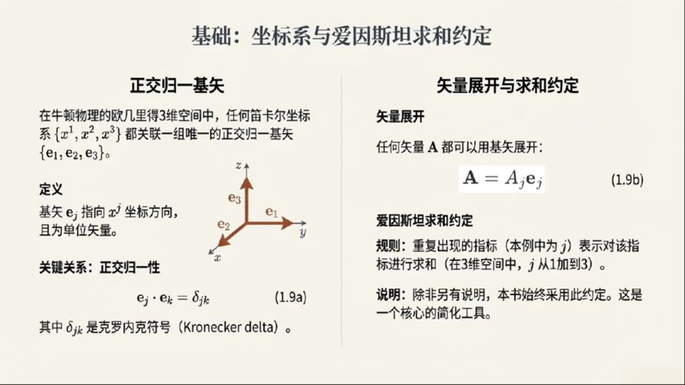
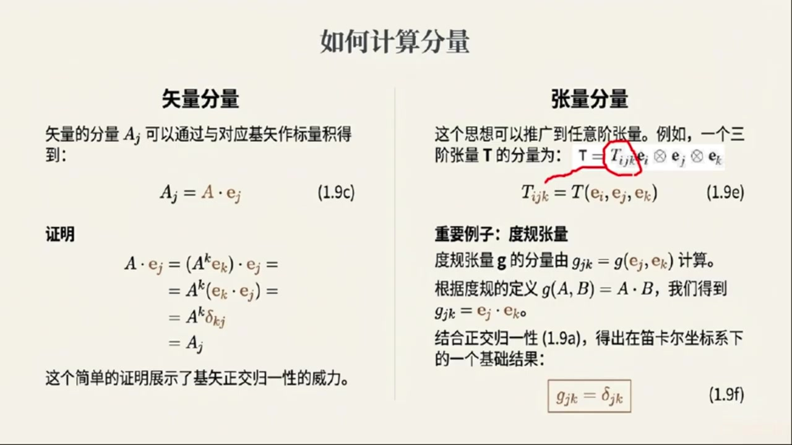
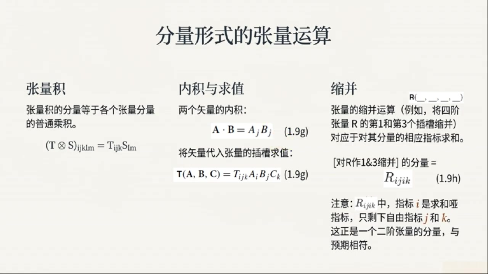
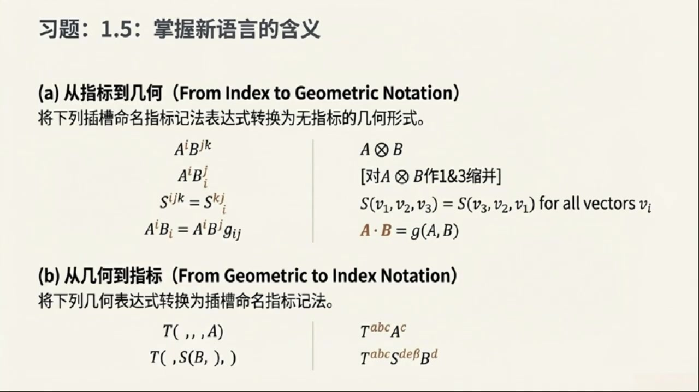
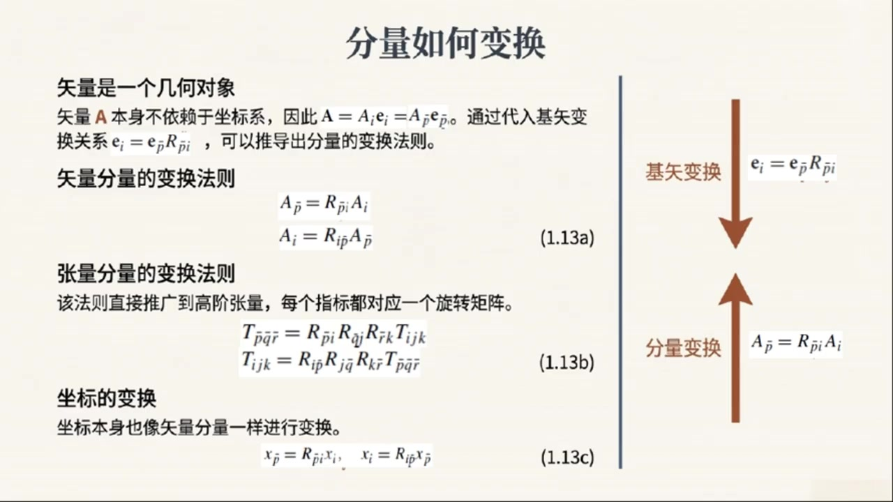

# 《现代经典物理学》第3课 张量的分量表示

> 自动生成的课程注解文档（共 4 个段落，[原始视频](cssdpuXtJsg)）

## 目录

- [00:00:03 课程导入与迪卡尔基底下的向量分量](#段落-1)
- [00:04:56 高阶张量分量表示与槽位命名指标技法](#段落-2)
- [00:11:07 指标语言在经典力学与量子理论中的应用](#段落-3)
- [00:15:12 正交坐标变换、分量变换规律与自旋示例](#段落-4)

---

## 段落 1：课程导入与迪卡尔基底下的向量分量 { #段落-1 }

**时间：** 00:00:03 ~ 00:04:55

<details><summary>📝 原始字幕</summary>

<pre>

大家好欢迎来到现代经典物理学的第三课我是你们的好奇宝宝周亦大家好我是赛很高兴再次和周亦一起深入探索物理学的奇妙世界赛上课我们聊了牛顿物理学的几何视角感觉就像给物理学加了一个空间滤镜让很多概念都立体起来了今天我们要聊什么呢没错周亦今天我们要继续深入这个几何视角聊聊我们怎么在具体坐标系里描述这些几何对象
我们会从最熟悉的迪卡尔坐标系开始讲到基始分量再到爱因斯坦求和约定以及更高级的张亮分量表示
最后我们还会看看当我们换一个坐标系的时候这些分量会怎么变化哇听起来有点像在给物理学编程了用一套规则把这些抽象概念具象化你说的没错主意这套编程语言非常强大是学习广义相对论量子场论这些现代物理学基石的必需工具那我们赶紧开始吧先从最基础的来在咱们熟悉的牛顿物理学里就是在那个三维欧吉里德空间里我们通常会用迪卡尔物理系对吧对没错
想象一下你面前有个房间
你总能找到三条相互垂直的边作为参考轴,比如X轴,Y轴,Z轴
这就是我们说的迪卡尔坐标系
嗯,我们高中就学过这个,那基史又是什么呢?好的,基史或者叫基向量
就是和这些坐标轴方向一致长度唯一的向量
我们通常用EX,EY,EZ来表示
或者更数学一点用一一一二一三来表示哦我知道了就像是三个单位尺子分别指向XYZ方向
他们有什么特别的性质吗?当然
首先,它们是正交的
就是说任何两个基石都是相互垂直的
比如一一和一二垂直一一和一三垂直以此类推垂直的意思就是他们的点成结果是零对吧完全正确
其次它们是归一化的,也就是它们的长度都是一长度唯一的点成就是一对吗是的
所以如果把这两个性质结合起来
e j 和 e k 的点称结果,如果 j 等于 k,那就是 e;如果 j 不等于 k,那就是 zero
我们用一个非常方便的符号来表示这个叫做克罗内克德尔塔符号写成DELTAJK哦DELTAJK我记得这个符号
当两个下标一样是1不一样是0这确实很方便没错
有了这组正交规一化的基石我们就可以表示空间中的任何一个向量A了怎么表示呢我们可以把向量A写成A等于A一一一加上A二一二加上A三一三
这里的A一A二A三就是向量A在这三的方向上的分量这也很熟悉就是把一个向量分解成XYZ方向上的投影对
不过这里我要介绍一个非常重要的约定叫做爱因斯坦求和约定听起来很高大上其实很简单它规定如果一个世子里出现两次重复的指标一次是上标一次是下标或者像我们这里都是下标那么就默认也要对这个指标进行求和比如刚才的A等于A一一一加A二一二加A三一三如果用爱因斯坦求和约定怎么写呢就可以简单地写成A等于AJ一J
这里的J出现了两次所以我们就知道它要从一加到三这样是不是简洁多了哇一下子就精练了好多我喜欢这种数学上的偷懒方式哈哈那我们怎么计算这个AJ分量呢计算方法也很直接
你只需要把向量A和对应的基石EJ进行点成也就是AJ等于A到EJ这也很符合直觉一个向量在某个方向上的分量不就是它在这个方向上的投影吗点成就能得到投影的长度完全正确

</pre>

</details>

**课程截图：**




### 注解

# 现代经典物理学 第三课 深度注解

## 一、板书/PPT 公式详解

### 公式 (1.9a)：正交归一性
$$\mathbf{e}_j \cdot \mathbf{e}_k = \delta_{jk}$$

| 符号 | 含义 |
|:---|:---|
| $\mathbf{e}_j, \mathbf{e}_k$ | 基向量（下标 $j,k = 1,2,3$ 分别对应 $x,y,z$ 方向）|
| $\cdot$ | 欧几里得空间中的点积（内积）|
| $\delta_{jk}$ | **克罗内克δ符号**（Kronecker delta）|

**克罗内克δ的显式定义：**
$$\delta_{jk} = \begin{cases} 1 & \text{若 } j = k \\ 0 & \text{若 } j \neq k \end{cases}$$

> 💡 **物理意义**：这个 compact 的公式同时编码了两个信息——"正交"（$j\neq k$ 时为0）和"归一"（$j=k$ 时为1）。

---

### 公式 (1.9b)：矢量展开（爱因斯坦求和约定）
$$\mathbf{A} = A_j \mathbf{e}_j$$

| 符号 | 含义 |
|:---|:---|
| $\mathbf{A}$ | 三维欧几里得空间中的任意向量 |
| $A_j$ | 向量 $\mathbf{A}$ 的第 $j$ 个**分量**（投影系数）|
| $\mathbf{e}_j$ | 第 $j$ 个基向量 |
| **重复下标 $j$** | 暗示求和：$\displaystyle\sum_{j=1}^{3} A_j \mathbf{e}_j = A_1\mathbf{e}_1 + A_2\mathbf{e}_2 + A_3\mathbf{e}_3$ |

> ⚠️ **关键细节**：本课程采用**下标重复即求和**的约定（而非上下标配对），这是部分教材的简化写法，在笛卡尔坐标系中无歧义。

---

## 二、理论背景补充

### 2.1 为什么需要"基"的概念？
| 层面 | 说明 |
|:---|:---|
| **几何层面** | 向量是**坐标无关**的几何对象（有大小有方向的箭头）|
| **计算层面** | 必须选定基才能写成**分量形式**进行代数运算 |
| **核心洞见** | 向量本身不变，但**分量随基的选择而变**——这是张量理论的萌芽 |

### 2.2 爱因斯坦求和约定的历史与优势
- **起源**：1916年爱因斯坦在建立广义相对论时，为简化张量运算而系统采用
- **核心规则**：**哑指标（dummy index）**——重复出现的指标自动求和，无需写求和号 $\sum$
- **优势对比**：

| 传统写法 | 爱因斯坦约定 |
|:---|:---|
| $\displaystyle\sum_{j=1}^{3} A_j \mathbf{e}_j$ | $A_j \mathbf{e}_j$ |
| $\displaystyle\sum_{i=1}^{3}\sum_{j=1}^{3} g_{ij}x^i x^j$ | $g_{ij}x^i x^j$ |

> 在复杂计算（如黎曼几何、场论）中，省略求和号可显著提升可读性。

---

## 三、核心概念通俗解释

### 3.1 "正交归一基" = 完美的测量工具
想象你有一把**三向卡尺**：
- **正交**：三个测量臂互相垂直 → 测量互不干扰
- **归一**：每个刻度都是"1单位" → 读数直接就是真实长度
- **完备**：三个方向覆盖全空间 → 任何向量都能被测量

### 3.2 分量提取的直觉
$$A_j = \mathbf{A} \cdot \mathbf{e}_j$$

这就像是**"用标准尺子去量投影"**：
- 点积 $\mathbf{A} \cdot \mathbf{e}_j$ 的几何意义 = $|\mathbf{A}| \cos\theta$ = 投影长度
- 由于 $\mathbf{e}_j$ 长度为1，结果就是纯净的分量值

---

## 四、板书截图描述

**左侧板块「正交归一基矢」：**
- 三维笛卡尔坐标系示意图：$x,y,z$ 轴，基矢 $\mathbf{e}_1,\mathbf{e}_2,\mathbf{e}_3$ 分别沿各轴指向
- 文字说明基矢指向 $x^j$ 坐标方向且为单位矢量
- 关键公式 (1.9a) 突出显示

**右侧板块「矢量展开与求和约定」：**
- 公式 (1.9b) 以高亮框呈现
- 规则说明：重复指标 $j$ 表示求和（1到3）
- 强调说明：本书始终采用此约定，是**核心简化工具**

---

## 五、本节知识图谱

```
几何对象（向量 A）
    ↓ 选定基 {e_j}
分量表示 A_j（依赖于基的选择）
    ↓ 爱因斯坦约定
紧凑写法：A = A_j e_j
    ↓ 正交归一性 e_j·e_k = δ_jk
分量提取：A_j = A·e_j
```

> 🎯 **预告**：下节将讨论**坐标变换时分量的变化规律**——这是从"向量"走向"张量"的关键一步。

---

## 段落 2：高阶张量分量表示与槽位命名指标技法 { #段落-2 }

**时间：** 00:04:56 ~ 00:11:07

<details><summary>📝 原始字幕</summary>

<pre>

你可以自己推导一下,用我们刚才说的A等于AKEK带入A.E.J
在利用基石的正交归一性你会发现结果确实是AJ好的我回去自己试试那向量是一节张量更高节的张量呢比如二节三节张量他们的分量怎么表示问得好快
对于更高节的张亮,比如一个三节张亮梯,我们也可以用积石的张亮极来展开它
它会是T等于TIJKEI张亮级EJ张亮级EK哇一下子出现三个基石的张亮级听起来有点复杂那它的分量TIJK怎么计算呢计算方法是类似的推广
你把三个鸡屎EIJEK依次带入张亮梯的三个草味中也就是TIJK等于TEIJEK草味这个词听起来很形象是的
你可以把张亮想象成一个带有若干个草味的机器你把项亮放进去它就会给你一个数或者一个新的张亮那我们之前提到的杜龟张亮呢它的分量是什么杜龟张亮级是一个二阶张亮
它的分量 gjk 就是 ej.ek
而我们知道这正是Delta JK
所以杜龟章亮在迪卡尔坐标系下的分量就是克罗内克的二塔
啊哈!原来GJK等于DeltaJK是这么来的,这一下就清晰多了
那张亮之间也有运算,比如点乘缩并这些,他们的分量怎么表示呢?当然有
比如两个向量A和B的内积也就是点成在分量表示下就是A.B等于A.J.B.J
你看这里J重复了所以要对J求和这也是我们熟悉的公式再比如把三个向量A B C带入一个三阶张量T的三个槽位得到的结果是一个标量
它的分量行驶就是T of A B C等于TIJKAIBJCK哇这个公式有点长但思路很清楚每个分量都对应上了那缩并呢
缩病是一个很重要的操作
比如你有一个四节章亮R
如果你把它第一个草位和第三个草位进行缩并,那么结果会是一个二解张量
它的分量表示就是RIJIK
I J I K
我看到这里的I重复了两次所以要对I求和剩下的J和K就是自由指标所以它是一个二界张亮对吗完全正确J
你看爱因斯坦求合约定和指标的巧料运用让这些复杂的张量运算变得非常清晰和简洁确实感觉一下子打开了新世界的大门不过赛我有个问题
我们刚才一直在说AJ是向量A的分量,TIJK是张量T的分量
这些指标 JIJK 好像都在指分量
但教材里提到一个曹魏命名指标技法这是什么意思难道指标还有别的用法吗这是一个非常非常关键的新视角赵你抓住了重点
我们前面说的指标代表的是分量在某个特定基地下的值
但曹魏命名指标技法则更进一步他把指标看作是张亮曹魏的名字曹魏名字这有什么区别呢区别可大了举个例子假设你有一个二节章亮F括号括号现在我们定义一个新的二节章亮G括号括号它和F是一样的只不过是把曹魏交换了一下
也就是说对于任意两个向量 a 和 b
句括号AB等于F括号BA就是把输入顺序调换了如果用我们刚才的分量技法你可能会写成句AB等于FBA对啊这不就是说句张量的DA个分量和DB个分量等于F张量的DB个分量和DA个分量吗这还是在说分量啊这就是艾舍尔画作的比喻精髓了你可以瞬间把它看作是特定基地下张量分量之间的关系但你也可以迅速心智反转把它看作是几何的与基地五关的张量之间的关系而那些指标只是在扮演曹魏名字的角色哇这个心智反转有点意思
所以GAB等于FBA既可以理解为分量关系也可以理解为G张亮的A草位和B草位就是F张亮的B草位和A草位没错这个观点非常强大
它能让我们在不指定具体基地的情况下依然用指标来简洁地表示张亮之间的几何关系
比如刚才的缩并草作一个三界张亮T的第一和第三个草位缩并直接就可以写成TABA
这里的A就是草位的名字它被缩并了剩下一个自有的B草位所以结果是一个一节张亮也就是一个向量这样一来很多张亮运算就变得非常直观了不再需要写出融长的几何表达式正是如此虽然草位命名指标技法这个词可能不是教材里最常见的但他非常准确地表达了这个思想明白了这个心智反转太重要了

</pre>

</details>

**课程截图：**






### 注解

# 现代经典物理学 第三课 深度注解（续）

## 二、板书/PPT 公式详解（新内容）

### 公式 (1.9e)：三阶张量的分量展开

$$\mathbf{T} = T_{ijk} \, \mathbf{e}_i \otimes \mathbf{e}_j \otimes \mathbf{e}_k$$

$$T_{ijk} = T(\mathbf{e}_i, \mathbf{e}_j, \mathbf{e}_k)$$

| 符号 | 含义 |
|:---|:---|
| $\mathbf{T}$ | 三阶张量（一个"三槽机器"）|
| $T_{ijk}$ | 张量在基 $\{\mathbf{e}_i, \mathbf{e}_j, \mathbf{e}_k\}$ 下的**分量** |
| $\otimes$ | **张量积**（tensor product），将基向量"粘合"成更高阶对象 |
| $T(\mathbf{e}_i, \mathbf{e}_j, \mathbf{e}_k)$ | 将三个基向量依次"喂入"张量的三个槽位 |

**关键理解：** 三阶张量需要**三个基向量**来展开，每个基向量对应一个"槽位"。分量 $T_{ijk}$ 的获取方法是：把第 $i$ 个、第 $j$ 个、第 $k$ 个基向量分别填入第一、第二、第三个槽位。

---

### 公式 (1.9f)：度规张量的分量

$$g_{jk} = \mathbf{e}_j \cdot \mathbf{e}_k = \delta_{jk}$$

| 符号 | 含义 |
|:---|:---|
| $g_{jk}$ | **度规张量**（metric tensor）的分量，记作粗体 $\mathbf{g}$ |
| $\mathbf{e}_j \cdot \mathbf{e}_k$ | 基向量的内积（定义度规的方式）|

**核心结论：** 在**笛卡尔坐标系**下，度规张量的分量恰好等于克罗内克δ符号。这是正交归一基的直接结果——基向量长度为1且互相垂直。

> 💡 **物理意义**：度规张量"告诉"你如何计算空间中的长度和角度。在平直的欧几里得空间中，度规就是简单的 $\delta_{jk}$；在弯曲空间（如广义相对论）中，度规会变得复杂。

---

### 公式 (1.9g)：向量内积的分量形式

$$\mathbf{A} \cdot \mathbf{B} = A_j B_j$$

| 符号 | 含义 |
|:---|:---|
| $A_j, B_j$ | 向量 $\mathbf{A}, \mathbf{B}$ 的第 $j$ 个分量 |
| 重复指标 $j$ | **爱因斯坦求和约定**：对 $j=1,2,3$ 求和 |

**展开形式：** $A_j B_j = A_1B_1 + A_2B_2 + A_3B_3$

---

### 公式 (1.9g')：张量求值（张量"吃"向量）

$$T(\mathbf{A}, \mathbf{B}, \mathbf{C}) = T_{ijk} A_i B_j C_k$$

| 符号 | 含义 |
|:---|:---|
| $T(\mathbf{A}, \mathbf{B}, \mathbf{C})$ | 三阶张量 $T$ 同时作用于三个向量，输出一个**标量** |
| $T_{ijk}$ | 张量的分量 |
| $A_i, B_j, C_k$ | 三个向量的分量 |

**运作机制：** 张量的每个"槽位"各吃一个向量，对应指标相乘后求和。这是"机器"比喻的精确数学实现。

---

### 公式 (1.9h)：缩并（Contraction）

$$\text{[对 } R \text{ 作 } 1\&3 \text{ 缩并]} \text{ 的分量} = R_{ijik}$$

| 符号 | 含义 |
|:---|:---|
| $R_{ijik}$ | 四阶张量 $R$ 的分量，第一和第三指标相同 |
| 重复的 $i$ | **求和指标**（哑指标），对 $i=1,2,3$ 求和 |
| 剩余的 $j, k$ | **自由指标**，决定结果的阶数 |

**结果分析：** 
- 原始：四阶张量 $R_{ijkl}$（4个自由指标）
- 缩并后：$R_{ijik}$，$i$ 被求和"吃掉"，剩下 $j,k$ 两个自由指标
- 结果：**二阶张量**（与预期相符）

---

## 三、核心新概念：插槽命名指标记法（Slot-Naming Index Notation）

这是本段最重要的**观念飞跃**（Conceptual Leap）。

### 3.1 问题背景

| 传统困境 | 具体表现 |
|:---|:---|
| 如何简洁表示张量插槽的互换？ | 想表达"G 和 F 相同，只是插槽顺序交换" |
| 几何 vs 分量的混淆 | 写 $G_{ab} = F_{ba}$ 时，到底在说分量关系还是几何关系？ |

### 3.2 埃舍尔画作比喻

```
┌─────────────────────────────────────┐
│         视角一：分量关系              │
│    在特定基底下，张量各分量之间的关系   │
│         （像画中的"鱼"）              │
├─────────────────────────────────────┤
│         视角二：几何关系              │
│    独立于基底的几何对象本身            │
│         （像画中的"鸟"）              │
│    此时指标扮演"插槽名称"的角色        │
└─────────────────────────────────────┘
```

### 3.3 关键公式：插槽命名的双重解读

$$G_{ab} = F_{ba}$$

| 解读方式 | 含义 | 适用场景 |
|:---|:---|:---|
| **视角一（分量）** | 在特定基底下，$G$ 的 $(a,b)$ 分量等于 $F$ 的 $(b,a)$ 分量 | 具体计算 |
| **视角二（几何）** | $G$ 的第 $a$ 插槽和第 $b$ 插槽，就是 $F$ 的第 $b$ 插槽和第 $a$ 插槽 | 抽象推理 |

### 3.4 缩并的简洁表达

**传统写法（冗长）：** "将三阶张量 $T$ 的第一和第三个插槽进行缩并"

**插槽命名写法：** 
$$T_{aba}$$

- $a$：被缩并的插槽名称（出现两次，求和后消失）
- $b$：自由插槽名称（保留）

**结果：** 一阶张量（向量），只有一个自由插槽 $b$

---

## 四、理论背景补充

### 4.1 张量阶数与插槽数量的对应

| 阶数 | 插槽数 | 输入 | 输出 | 例子 |
|:---:|:---:|:---|:---|:---|
| 0 | 0 | 无 | 标量 | 温度、质量 |
| 1 | 1 | 1个向量 | 标量 | 向量（作为线性泛函）|
| 2 | 2 | 2个向量 | 标量 | 度规张量、应力张量 |
| 3 | 3 | 3个向量 | 标量 | 压电张量 |
| $n$ | $n$ | $n$个向量 | 标量 | 一般 $n$ 阶张量 |

### 4.2 缩并的抽象定义

缩并是**降低张量阶数**的核心操作：
- 选择张量的两个插槽
- 将**同一个向量**同时填入这两个插槽
- 对填入的向量进行积分（或求和）
- 结果：阶数减少 2

在插槽命名记法中，这表现为**让两个插槽共享同一个名称**。

---

## 五、通俗语言总结

> **"槽位命名"的心智模型**

想象张量是一台**多槽自动售货机**：
- **传统观点**：每个槽位有编号（第1槽、第2槽...），关注"投币口1投了什么"
- **插槽命名观点**：给槽位起名字（"苹果槽"、"香蕉槽"），关注"苹果槽和香蕉槽的关系"

**关键洞察：** 名字是**几何的、永恒的**；编号是**人为的、随基底变化的**。当你看到 $G_{ab} = F_{ba}$，你可以瞬间"翻转"理解方式——既看到具体数字，又看到抽象结构，就像埃舍尔画中鱼群瞬间变成飞鸟。

这种**双重视角**的能力，是掌握现代张量分析的标志。

---

## 段落 3：指标语言在经典力学与量子理论中的应用 { #段落-3 }

**时间：** 00:11:07 ~ 00:15:11

<details><summary>📝 原始字幕</summary>

<pre>

那这个强大的技法在实际物理学里是怎么用的呢我们可以用它来重写粒子动力学的方程
比如速度v变成VI等于dxibdt
动量P变成PI等于MVI
加速度A变成AI等于DVI比DT等于第二方XI比DT二方
能量呢,一等于二分之一MV平方怎么写
就可以写成1等于二分之一MVJVJ
你看,这里的VJVJ就是V和V的点成很简洁
那洛伦兹利方程呢,DP比DT等于Q1加V乘B
那个稍微复杂一点会引入一个叫做列为奇维他长两的符号EPSLONIJK来表示插成
会写成DPIBDT等于QEI加IJKVJBK
我们后面会详细讲这个张量
哇,一下子感觉这些经典物理的方程都穿上了新衣,变得更统一,更抽象了
是的
而且这个视角不仅仅局限于经典物理
在量子理论中向量和张亮也扮演着核心角色哦量子理论里也有向量和张亮当然比如一个物理系统的量子态我们用右史普赛来表示它就是一个希尔伯特空间里的向量可以看作是我们欧吉里的空间向量的推广希尔伯特空间听起来就很高位没错它甚至是无限为的
不像我们经典物理只需要三个极事在量子理论中我们可能需要无限多个极事来描述所有可能的量子态无限多个极事那这些量子向量也有内极吗有叫做左是FY右是PSY的内极它是一个负数这和经典向量的时速内极有点不同还有代表可观察量比如能量位置动量的恶米算符它们就是二解长量也是负数值的函数这么说我们刚才学到的那些张量操作比如把向量带入张量的草位在量子理论里也有对应的概念完全有比如你把量子态又是PSY带入一个算符HHHH的第二个草位就会得到新的量子态HHH又是PSY这和我们把向量A带入经典张量T的草位
是的而且在量子理论中我们也会用分量来表示散幅比如位置散幅XHET的分量就是XMN等于M键号XHETN键号
既然如此,那两个算符的乘积或者著名的对异子关系也能用分量来表示吗?当然可以
比如位置和动量算符的成绩XHAPPHAT它的分量就是矩阵成绩XJKPKM
而著名的位置和动量不对一关系XHTPH等于IHB用分量表示就是XJKPKM减去PKJKXJM等于IHBDEALTJM哇连这么深奥的量子力学定律也能用我们学到的指标技法来表达这简是太酷了所以你看这个曹魏命名指标技法绝不仅仅是一个数学上的小技巧它是一种统一的强大的语言管穿了从经典到量子的物理学我感觉我开始理解这个心智反传的价值了那我们继续赛

</pre>

</details>

**课程截图：**


### 注解

# 现代经典物理学 第三课 深度注解（续）

## 一、板书/PPT 公式详解（新内容）

### 1. 经典力学方程的指标记法重写

| 物理量 | 传统记法 | 指标记法 | 说明 |
|:---|:---|:---|:---|
| **速度** | $v_i = \frac{dx_i}{dt}$ | $v_i = \frac{dx_i}{dt}$ | 位置对时间的一阶导数 |
| **动量** | $p_i = mv_i$ | $p_i = mv_i$ | 质量乘以速度分量 |
| **加速度** | $a_i = \frac{dv_i}{dt} = \frac{d^2x_i}{dt^2}$ | $a_i = \frac{dv_i}{dt} = \frac{d^2x_i}{dt^2}$ | 速度对时间的一阶导数，或位置的二阶导数 |
| **动能** | $E = \frac{1}{2}mv^2$ | $E = \frac{1}{2}mv_j v_j$ | 利用**爱因斯坦求和约定**：重复指标 $j$ 自动求和 |

**关键理解**：$v_j v_j = v_1^2 + v_2^2 + v_3^2 = v_x^2 + v_y^2 + v_z^2 = \mathbf{v} \cdot \mathbf{v} = v^2$

---

### 2. 洛伦兹力方程的指标记法

**传统矢量形式：**
$$\frac{d\mathbf{p}}{dt} = q(\mathbf{E} + \mathbf{v} \times \mathbf{B})$$

**指标记法形式：**
$$\frac{dp_i}{dt} = qE_i + q\varepsilon_{ijk} v_j B_k$$

| 符号 | 含义 |
|:---|:---|
| $\varepsilon_{ijk}$ | **列维-奇维塔符号**（Levi-Civita symbol），三阶完全反对称张量 |
| $E_i$ | 电场 $\mathbf{E}$ 的第 $i$ 个分量 |
| $B_k$ | 磁场 $\mathbf{B}$ 的第 $k$ 个分量 |
| $v_j$ | 速度的第 $j$ 个分量 |

**列维-奇维塔符号的定义：**
$$\varepsilon_{ijk} = \begin{cases} +1 & (i,j,k) \text{ 为 } (1,2,3) \text{ 的偶排列} \\ -1 & (i,j,k) \text{ 为 } (1,2,3) \text{ 的奇排列} \\ 0 & \text{任意两个指标相同} \end{cases}$$

> 例如：$\varepsilon_{123} = +1$, $\varepsilon_{132} = -1$, $\varepsilon_{112} = 0$

**为何能表示叉乘？** 验证：$(\mathbf{v} \times \mathbf{B})_i = \varepsilon_{ijk} v_j B_k$ 正是叉乘的第 $i$ 个分量。

---

### 3. 量子理论中的核心类比（见截图2）

#### 量子态与希尔伯特空间
| 经典概念 | 量子类比 | 数学结构 |
|:---|:---|:---|
| 欧几里得空间向量 $\mathbf{v}$ | 量子态 $|\psi\rangle$（"右矢"） | **希尔伯特空间** $\mathcal{H}$ 中的向量 |
| 有限维（3维） | 无限维 | 可数无穷或连续无穷维 |
| 基向量 $\mathbf{e}_1, \mathbf{e}_2, \mathbf{e}_3$ | 正交归一基矢 $\{|1\rangle, |2\rangle, \ldots\}$ | 能量本征态或位置本征态 |

#### 内积的对比
| | 经典 | 量子 |
|:---|:---|:---|
| **记号** | $\mathbf{A} \cdot \mathbf{B} = A_i B_i$ | $\langle\phi|\psi\rangle$（"左矢" $\langle\phi|$ 与 "右矢" $|\psi\rangle$ 的配对）|
| **结果类型** | 实数 | **复数** |
| **性质** | 对称：$\mathbf{A}\cdot\mathbf{B} = \mathbf{B}\cdot\mathbf{A}$ | 共轭对称：$\langle\phi|\psi\rangle = \langle\psi|\phi\rangle^*$ |

#### 可观察量：厄米算符
| 概念 | 说明 |
|:---|:---|
| **算符** $\hat{H}$ | 作用于量子态的"二阶张量"，线性映射：$|\psi\rangle \mapsto \hat{H}|\psi\rangle$ |
| **厄米性**（自伴性） | $\hat{H}^\dagger = \hat{H}$，保证本征值为实数（可测量）|
| **求值结果** | $\langle\phi|\hat{H}|\psi\rangle$ —— 左矢、算符、右矢的"三明治"结构 |

> 这与经典张量的"插槽"操作完全类比：$\mathbf{T}(\mathbf{A}, \mathbf{B}) = T_{ij}A_i B_j$

---

### 4. 量子理论的分量表示公式

#### 位置算符的分量
$$x_{mn} = \langle m|\hat{x}|n\rangle$$

| 符号 | 含义 |
|:---|:---|
| $|n\rangle, |m\rangle$ | 希尔伯特空间的基矢（如能量本征态）|
| $\hat{x}$ | 位置算符 |
| $x_{mn}$ | 位置算符在基 $\{|n\rangle\}$ 下的**矩阵元** |

#### 算符乘积的分量
$$(\hat{x}\hat{p})_{jm} = \sum_k x_{jk} p_{km} = x_{jk} p_{km}$$

（最后一步使用爱因斯坦求和约定）

#### 对易关系的分量形式（海森堡不确定性原理的代数核心）

**抽象形式：**
$$[\hat{x}, \hat{p}] = \hat{x}\hat{p} - \hat{p}\hat{x} = i\hbar \hat{I}$$

**分量形式：**
$$x_{jk}p_{km} - p_{jk}x_{km} = i\hbar \delta_{jm}$$

| 符号 | 含义 |
|:---|:---|
| $[\hat{x}, \hat{p}]$ | 对易子（commutator）|
| $\hbar$ | 约化普朗克常数，$\hbar = h/2\pi$ |
| $\delta_{jm}$ | 克罗内克δ（单位矩阵的分量）|
| $i$ | 虚数单位 |

**物理意义**：位置和动量不能同时对角化（没有共同本征态），这是量子不确定性的数学根源。

---

## 二、截图内容描述

### 截图1：插槽命名指标记法的核心思想
- **标题**：1.5.1 一个观念飞跃：插槽命名指标记法
- **三栏结构**：
  - **问题**：如何简洁表示张量插槽的互换？$G(A,B) = F(B,A)$
  - **核心思想**：双重视角——分量视角 vs 几何对象视角
  - **解决方案**：给插槽命名，$F(\_,\_) \to F_{ab}$，则 $G_{ab} = F_{ba}$
- **关键图示**：立方体示意图，标注"视角一：分量"和"视角二：几何对象"，强调思维切换

### 截图2：量子理论中的矢量与张量
- **标题**：拓展视野：量子理论中的矢量与张量
- **左栏（核心类比）**：
  - 量子态 $|\psi\rangle$ ↔ 希尔伯特空间向量
  - 内积 $\langle\psi|\psi\rangle$ ↔ 复数类比经典内积
  - 可观察量（如 $\hat{H}$）↔ 作用于向量的二阶张量
- **右栏（分量表示）**：
  - 无穷维正交归一基矢 $\{|1\rangle, |2\rangle, \ldots\}$
  - 位置算符分量 $x_{mn} = \langle m|\hat{x}|n\rangle$
  - **对易关系分量形式**：$x_{jk}p_{km} - p_{jk}x_{km} = i\hbar\delta_{jm}$
- **底部总结**："张量代数是描述自然法则的通用几何语言"

---

## 三、核心概念通俗解释

### 1. 爱因斯坦求和约定：省略求和号的"潜规则"
> 只要一个指标在一项中出现**两次**（一上一下或都在下），就自动对它求和。

**例子**：$v_j v_j$ 不用写 $\sum_{j=1}^3 v_j v_j$，一看重复就知道要加三遍。

### 2. 列维-奇维塔符号：叉乘的"密码本"
三维叉乘 $\mathbf{a} \times \mathbf{b}$ 有9种分量组合，$\varepsilon_{ijk}$ 用 $+1, -1, 0$ 精确编码了右手定则：
- 顺时针循环（123→231→312）：$+1$
- 逆时针循环（132→213→321）：$-1$
- 任何重复（如113）：$0$（平行向量叉乘为零）

### 3. 希尔伯特空间：无限维的"量子舞台"
经典物理只需要3个坐标 $(x,y,z)$ 描述粒子位置。但量子粒子可以处于**叠加态**——同时"在这里"和"在那里"。描述所有可能状态需要无限多个基向量，就像用无限多个音符才能演奏所有可能的旋律。

### 4. 对易关系：量子世界的"不可交换性"
先位置后动量，与先动量后位置，结果差一个 $i\hbar$。这就像：
- 先旋转再平移 ≠ 先平移再旋转
- 这种"操作顺序不可交换"是量子不确定性的本质

---

## 四、本节核心洞见

> **"插槽命名指标记法"是贯穿经典与量子的统一语言**

| 领域 | 向量/张量角色 | 核心方程的指标形式 |
|:---|:---|:---|
| **经典力学** | 3维欧氏空间 | $E = \frac{1}{2}mv_j v_j$ |
| **电动力学** | 3维+时间 | $\frac{dp_i}{dt} = qE_i + q\varepsilon_{ijk}v_j B_k$ |
| **量子力学** | 无限维希尔伯特空间 | $x_{jk}p_{km} - p_{jk}x_{km} = i\hbar\delta_{jm}$ |

同一套符号系统，从3维到无限维，从实数到复数，从可对易到不可对易——这正是数学抽象的力量。

---

## 段落 4：正交坐标变换、分量变换规律与自旋示例 { #段落-4 }

**时间：** 00:15:12 ~ 00:23:57

<details><summary>📝 原始字幕</summary>

<pre>

刚才我们一直在一个固定的迪卡尔坐标系下讨论
但物理规律应该是普世的
不应该依赖于我们选择哪个坐标系
所以如果我们换一个坐标系这些分量会怎么变化呢没错这就是我们接下来要讲的基地的正交变换与分量变换规律
想象一下你刚才的房间
你现在把XYZ轴旋转了一下,或者干脆换了个方向
那同一个向量的分量肯定会变,对吧
旋转之后X方向的投影就变了.我们用EI来表示原来的基底,用EP横来表示新的基底
上面加一横表示新的那这两个集体之间有什么关系呢它们之间可以通过一个变换矩阵联系起来
我们可以把新的集市一批衡表示成旧集时一爱的先行组合系数就是R一批衡
反过来旧极时一I也可以表示成新极时一P恒的线性组合系数是RP恒一R矩阵
我记得现性带书里学过
这两个二矩阵有什么关系吗?它们互为逆矩阵
也就是RPB乘以RIQ结果是单位矩阵也就是DERTAPIBQ矩阵的逆
更重要的是因为我们讨论的是正交基底之间的变换这个变换矩阵有一个非常特别的形质
他的逆矩阵就是他的转制矩阵逆矩阵等于转制矩阵这不就是正交矩阵的定义吗完全正确
所以这种变换就叫做正交变换
它代表的是空间中的旋转或者反循您骂了那一个向量它本身是客观存在的不随坐标系改变但它的分量会变
这个分量变换的规律是什么呢这是一个非常重要的公式新的分量A把P等于旧的分量AI成以变换矩阵R把PI也就是A把P等于R把PIAI等等赛我有点基石的变换是I等于一把P而把PI看起来R把PI是从新到旧
但是相当似这样的变换是A把P等于R把PIAI
这怎么有点反过来哈哈你观察得很仔细乔伊这就是一个需要特别注意的地方向量本身是几何对象不随机底变化所以A等于AIEI等于A八P一八P
把基时的变换公式带入,你就会发现向量的分量变化规律和基时的变化规律是反向的
旧基底的系数R罢PI在分量变化里是把旧分量变成新分量的哦我明白了因为基石本身在变所以为了保持向量不变分量就得跟着反着变忘记了你抓住了核心
同样的道理对于张亮分量变化规律就是一个三接张亮的新分量T八P八Q八二八会等于旧分量TIJK乘以三个变换矩阵R八PIR八QJR八二K每个指标都要乘以一个变换矩阵哇这一下子就复杂起来了但是规律很清晰是的
而且如果你把坐标原点放在一起那么一个点的坐标它本身也是一个向量所以坐标本身的变化也遵循这个规律X八P等于R八PIXI这个也很合理那这些旋转变换矩阵它们有什么特殊的数学结构吗它们构成了一个非常重要的数学结构叫做旋转群
这个群在量子理论中尤其是在描述粒子的自宣时扮演着极其重要的角色
旋转群,听起来就很有趣,那有没有一些实际的例子能让我们感受一下这些变换的威力?
当然有
我们来看一个练习题 1.6节的练习
想象一下,我们有两个迪卡尔坐标系,它们在XY平面上相互旋转了一个角度FY
嗯G轴方向不变,只是X和Y轴转了一下
对
你能推导出把星基石变到旧基石的旋转矩阵Albaphase吗
让我想想如果X轴转了F角那么新的X轴在旧的X轴上投影是Q三F在旧的Y轴上投影是SINF新Y轴在旧的X轴上投影是F三F在旧的Y轴上投影是Q三F
轴不变
没错
所以旋转矩阵ABAFY的第一行就是 cosinefive sinefive zero
第二行是复三五三五零第三行是零零一哦我写出来了
那它的逆矩阵是不是就是它的转质矩阵呢
你可以把这个矩阵转制一下,然后和原矩阵相成,你会发现结果确实是单位矩阵
这验证了它是一个正交矩阵代表一个旋转
太棒了,那这个例子还有个更深入的部分,和电磁波,引力波有关,是的,这部分非常精彩
他把我们今天讲的变换规律和现代物理学的基本粒子性质联系起来了
想象一下电磁场的实量是A,只有X和Y分量,AC等于0
这两个分量可以描述电磁波的两种偏振电磁波有偏振如果我们把AX加IAY作为一个整体
然后让坐标系旋转西踏角
发现新的A八X加I八AY会变成AX加IAY乘以E的复西塔西方
易的复西他西方这个音子是什么意思这个音子一乘上复F意味着当坐标系旋转斜角时这个负数会旋转一个负斜角
在量子力学中这个异程上F的出现就暗示了与电磁波相关的量子粒子光子具有姿旋唯一的形状哇一个简单的坐标变换竟然能揭示粒子的姿旋这太神奇了还有更神奇的
对于引力波它可以用一个对称的无际的二节张量HJK来描述同样也限制在XY平面
我们考虑 hxx 加上 hxy 这个组合
当坐标系旋转F角时你会发现它会变成HXX加上HXY成一一乘上负二F又是类似的因子但是变成了一乘上负二F多了一个二没错这个一乘上负二F就暗示了与引力波相关的量子粒子引粒子具有自旋为二的形状我的天所以通过观察这些物理量在坐标变换下的表现我们就能推断出它们背后粒子的一些基本属性比如自旋
这简直是太酷了是的Joy
就是集合视角和张量分析的强大处
它不仅仅是描述物理现象的工具更是揭示物理本质的语言今天的内容真是信息量巨大从迪卡尔坐标系到基始再到安因苏坦求和约定然后是张亮分亮和那个令人咽咽闷的曹魏命名指标技法
最后还看到了坐标变换和粒子自宣的联系
感觉我们今天学到了一套非常强大的物理编程语言没错
这套语言虽然刚开始可能有点抽象但一旦掌握你就会发现它能让你以一种非常优雅和统一的方式来理解和描述各种物理现象无论是经典还是量子好的那今天的现代经典物理学第三课就到这里了
感谢赛的精彩讲解也谢谢大家的收听谢谢大家希望今天的课程能帮助大家更好地理解物理学的集合之美我们下期再见下期再见

</pre>

</details>

**课程截图：**






### 注解

# 现代经典物理学 第三课 深度注解（续）

## 一、板书/PPT 公式详解（新内容）

### 1. 基矢变换与正交矩阵

**基矢变换关系（新→旧）：**
$$\mathbf{e}_i = \mathbf{e}_{\bar{p}} R_{\bar{p}i}$$

| 符号 | 含义 |
|:---|:---|
| $\mathbf{e}_i$ | 旧基矢（带横杠表示新坐标系，即 $\mathbf{e}_{\bar{p}}$）|
| $\mathbf{e}_{\bar{p}}$ | 新基矢（下标加横杠标记）|
| $R_{\bar{p}i}$ | 变换矩阵元素：新基矢 $\mathbf{e}_{\bar{p}}$ 在旧基矢 $\mathbf{e}_i$ 上的投影 |

**关键性质：**
$$\mathbf{R}^{-1} = \mathbf{R}^T \quad \text{或} \quad R_{i\bar{p}} = R_{\bar{p}i}^{-1} = R_{\bar{p}i}^T$$

这正是**正交矩阵**的定义，保证旋转保持向量长度不变。

---

### 2. 矢量分量变换法则（公式 1.13a）

$$\boxed{A_{\bar{p}} = R_{\bar{p}i} A_i}$$

$$A_i = R_{i\bar{p}} A_{\bar{p}}$$

| 符号 | 含义 |
|:---|:---|
| $A_i$ | 矢量 $\mathbf{A}$ 在旧基下的分量 |
| $A_{\bar{p}}$ | 矢量 $\mathbf{A}$ 在新基下的分量 |
| $R_{\bar{p}i}$ | 从旧分量到新分量的变换矩阵 |

> ⚠️ **关键洞察**：基矢变换与分量变换**方向相反**（"对偶"关系）
> - 基矢：$\mathbf{e}_i = \mathbf{e}_{\bar{p}} R_{\bar{p}i}$（新→旧用 $R_{\bar{p}i}$）
> - 分量：$A_{\bar{p}} = R_{\bar{p}i} A_i$（旧→新用同样的 $R_{\bar{p}i}$）

**物理本质**：矢量作为几何对象本身不变 $\mathbf{A} = A_i\mathbf{e}_i = A_{\bar{p}}\mathbf{e}_{\bar{p}}$，基矢变了，分量必须反向补偿。

---

### 3. 张量分量变换法则（公式 1.13b）

$$\boxed{T_{\bar{p}\bar{q}\bar{r}} = R_{\bar{p}i} R_{\bar{q}j} R_{\bar{r}k} \, T_{ijk}}$$

$$T_{ijk} = R_{i\bar{p}} R_{j\bar{q}} R_{k\bar{r}} \, T_{\bar{p}\bar{q}\bar{r}}$$

| 符号 | 含义 |
|:---|:---|
| $T_{ijk}$ | 三阶张量在旧基下的分量 |
| $T_{\bar{p}\bar{q}\bar{r}}$ | 三阶张量在新基下的分量 |
| 每个 $R$ 因子 | 对应一个指标的变换 |

**规律**：$n$ 阶张量有 $n$ 个指标，每个指标乘一个变换矩阵——这是张量"多线性"本质的体现。

---

### 4. 坐标变换（公式 1.13c）

$$\boxed{x_{\bar{p}} = R_{\bar{p}i} \, x_i}$$

**说明**：当坐标原点重合时，位置坐标作为位置矢量，其变换规律与普通矢量分量相同。

---

## 二、核心概念深度解析

### 1. 正交变换的物理意义

| 数学性质 | 物理诠释 |
|:---|:---|
| $\mathbf{R}^T \mathbf{R} = \mathbf{I}$ | 旋转保持内积（长度与夹角）不变 |
| $\det(\mathbf{R}) = +1$ | 纯旋转（右手系→右手系）|
| $\det(\mathbf{R}) = -1$ | 包含反射（手性反转）|

**旋转群 SO(3)**：所有三维正交矩阵（行列式为+1）在矩阵乘法下构成群，是描述刚体转动和粒子自旋的数学基础。

---

### 2. 分量变换 vs 基矢变换：为何"反向"？

用**"被动观点"**（坐标系变，物体不动）理解：

```
旧坐标系 {e₁, e₂, e₃} ──旋转──→ 新坐标系 {e₁̄, e₂̄, e₃̄}
         ↑                              ↓
       分量 Aᵢ                      分量 Aᵢ̄
```

- **基矢旋转了** → 新基矢是旧基矢的线性组合
- **分量必须反着变** → 才能保证矢量 $\mathbf{A}$ 这个几何对象不变

数学验证：
$$\mathbf{A} = A_i \mathbf{e}_i = A_i (\mathbf{e}_{\bar{p}} R_{\bar{p}i}) = (R_{\bar{p}i} A_i) \mathbf{e}_{\bar{p}} = A_{\bar{p}} \mathbf{e}_{\bar{p}}$$

---

### 3. 旋转矩阵实例：XY平面旋转（练习1.6）

对于绕z轴旋转角度 $\phi$：

$$\mathbf{R}(\phi) = \begin{pmatrix} \cos\phi & \sin\phi & 0 \\ -\sin\phi & \cos\phi & 0 \\ 0 & 0 & 1 \end{pmatrix}$$

**验证正交性**：
- 转置：$\mathbf{R}^T = \begin{pmatrix} \cos\phi & -\sin\phi & 0 \\ \sin\phi & \cos\phi & 0 \\ 0 & 0 & 1 \end{pmatrix}$
- 验证：$\mathbf{R}^T \mathbf{R} = \mathbf{I}$ ✓

---

## 三、现代物理的深刻联系：变换与自旋

### 核心发现（课程高潮）

| 物理对象 | 数学描述 | 旋转行为 | 暗示的自旋 |
|:---|:---|:---|:---|
| **光子（电磁波）** | $A_x + iA_y$（复组合）| 乘以 $e^{-i\phi}$ | **自旋 $s=1$** |
| **引力子（引力波）** | $h_{xx} + ih_{xy}$（复组合）| 乘以 $e^{-i2\phi}$ | **自旋 $s=2$** |

### 数学机制

对于自旋为 $s$ 的粒子，其波函数在绕z轴旋转 $\phi$ 角时变换为：
$$\psi \rightarrow e^{-is\phi} \psi$$

- **电磁波**：$A_x + iA_y$ 是圆偏振基，旋转 $\phi$ 时相位变 $-\phi$ → $s=1$
- **引力波**：$h_{xx} + ih_{xy}$ 是引力波的"圆偏振"模式，相位变 $-2\phi$ → $s=2$

**物理内涵**：自旋反映了场在旋转下的"扭转"特性，是时空对称性（洛伦兹群的旋转部分）的量子体现。

---

## 四、板书截图描述

**截图内容总结**（"分量如何变换"页面）：

| 区域 | 内容 |
|:---|:---|
| **左侧文字** | 矢量作为几何对象的不变性声明；基矢变换与分量变换的推导逻辑 |
| **中央公式** | 公式(1.13a)-(1.13c)的完整呈现 |
| **右侧图示** | 双向箭头示意图：基矢变换（向下箭头）与分量变换（向上箭头）的"对偶"关系，直观展示变换方向的相反性 |

**视觉设计亮点**：用箭头方向对比，强化"基矢变过去，分量变回来"的核心概念。

---

## 五、本节知识脉络

```
笛卡尔坐标系 ──→ 基矢与分量 ──→ 坐标变换需求
                      ↓
              正交变换（保持内积）
                      ↓
        ┌─────────────┼─────────────┐
        ↓             ↓             ↓
    基矢变换      分量变换        张量推广
   eᵢ = eₚ̄Rₚ̄ᵢ    Aₚ̄ = Rₚ̄ᵢAᵢ    Tₚ̄q̄r̄ = Rₚ̄ᵢRq̄ⱼRᵣ̄ₖTᵢⱼₖ
        └─────────────┴─────────────┘
                      ↓
              旋转群 SO(3)
                      ↓
        ┌─────────────┴─────────────┐
        ↓                           ↓
    经典物理                    量子物理
（刚体力学）                （粒子自旋）
```

---

> **下节预告**：基于这套张量语言，课程将进入经典力学的重新表述——拉格朗日力学与哈密顿力学的几何化形式。

---
