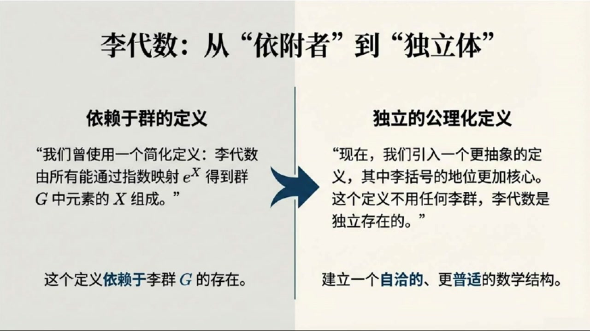
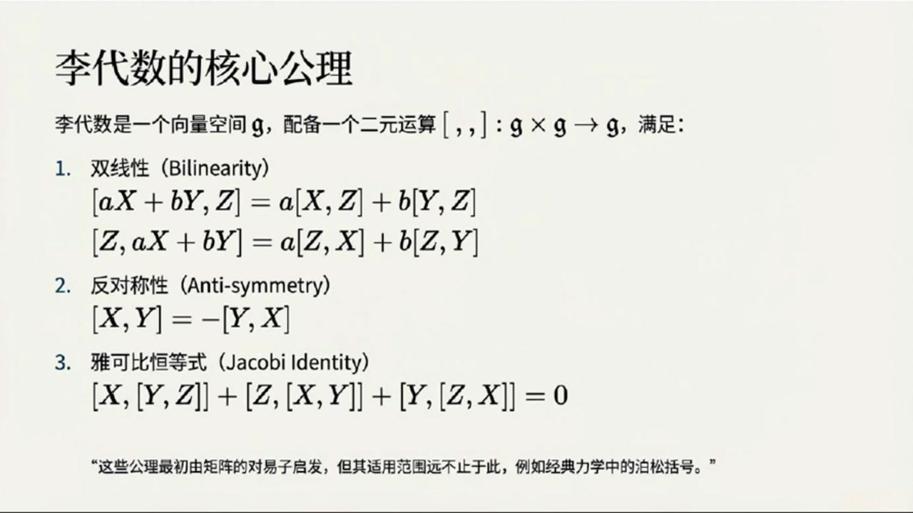
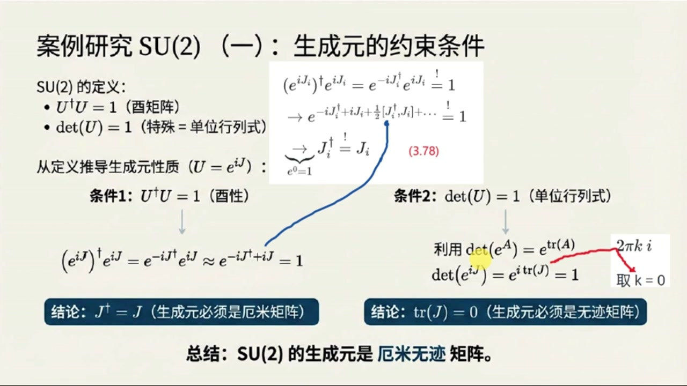
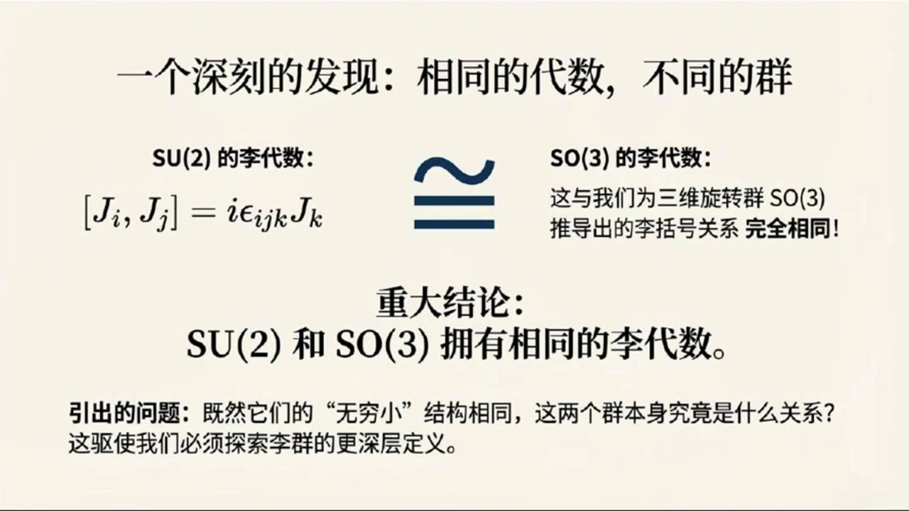
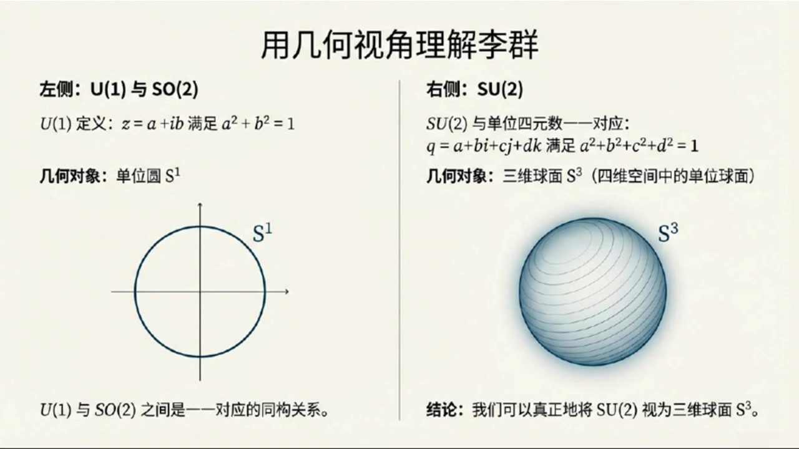
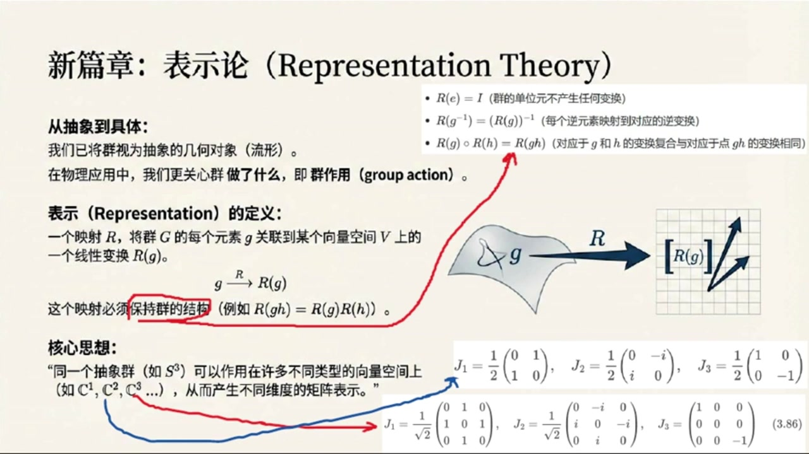
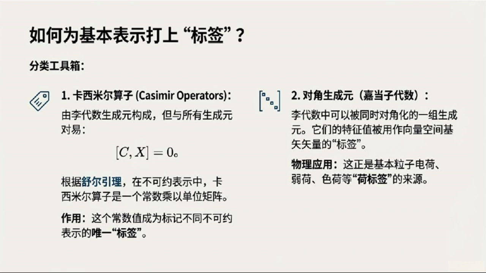

# 《基于对称性的物理学》第8课 李代数李群的抽象定义及其表示

> 自动生成的课程注解文档（共 4 个段落）

## 目录

- [00:00:00 课程引入与李代数的抽象定义](#段落-1)
- [00:05:00 SU(2) 的生成元、泡利矩阵与李代数结构](#段落-2)
- [00:10:00 李群的流形观点与单连通覆盖群](#段落-3)
- [00:14:00 表示论基础、不可约表示及课程总结](#段落-4)

---

## 段落 1：课程引入与李代数的抽象定义 { #段落-1 }

**时间：** 00:00:00 ~ 00:05:00

📝 原始字幕

<pre>

大家好欢迎休听基于对称性的物理学第八课我是你们活泼好奇的主持人就已大家好我是你们的知识向导赛很高兴再次和大家在线上相遇一起探索物理世界的深层奥秘赛上节课我们已经对李代数有了初步的了解知道它跟群的生成源和理括号有关但今天听起来我们要把这个概念抽象升级了对不对没错对今天我们要进入李代数李群和表示论这些核心概念的深水区这些都是我们理解粒子物理和更深层自然规律的关键工具他们会帮我们从更普世的视角来看待对称性听起来就很有意思去然后具体看看SU二这个重要的群它的生成源和李代数长什么样对
我们还会给李群一个更现代更解和化的定义把它和我们熟悉的几何对象联系起来最后还有表示论这个我印象里好像也提到过它是不是能把这些抽象概念和物理实体连接起来完全正确表示论是连接抽象群论和物理实践的桥梁它告诉我们一个群到底能做什么如何作用于物理对象所以今天的内容非常扎实大家准备好了吗准备好了那我们先从李代数这个抽象定义开始吧赛好的教我们之前对李代数的理解是说它有那些能放进指数函数里生成群元素的东西组成然后还有一个叫李括号的运算我记得李括号不是简单的矩阵成法它更像一种特殊的对义子操作对它更像一种特殊的对义子操作
但现在我们要把李括号的地位提得更高给它一个更抽象更基础的定义不依赖于任何具体的群哦那这个抽象定义具体是怎样呢好的简单来说一个李袋鼠话题小计首先得是一个向量空间然后它还带有一个特殊的二元运算就是我们的李括号这个运算把话题小计里的任意两个元素映射回话题小计里也就是从话题小计迪卡尔计话题小计到话题小计向量空间加上一个特殊的运算那这个运算有什么规矩吗当然有它必须满足三个公里第一个是双线性就是说对李括号里的元素做线性组合结果也符合线性规则比如AX加BY和Z的李括号等于A乘X和Z的李括号
加B成Y和Z的理库号这样的完全正确这是对第一个草位的线性对第二个草位也是线性的所以成为双线性第二个功力就是反对称性很简单就是X和Y的理库号等于负的Y和X的理库号也就是如果你把两个元素的顺序颠倒结果会变好这个我在矩阵对义子里见过矩阵A和B的理库号等于AB减BA那B和A的理库号等于A减AB等于负的AB减BA确实是反对称的没错举证对义子就是最经典的例子第三个功力可能听起来有点绕口叫做X和Y可B横等式它长这样Z和XY里括号的理库号加Y和ZX里括号的理库号
等于零这个有点复杂但它也是从对一字来的吗是的你可以自己验证一下标准的聚键对一子确实满足这三个条件但关键在于除了聚键对一子还有很多其他的二元运算也满足这些功力比如经典力学里的柏松括号所以这个抽象定义完全没有提到理群它自己就能独立存在对吗对这正是它的强大之处这意味着我们可以先研究理带数本身而不用管它来自哪个具体的理群而且一个非常重要的结果是我们后面会看到SUR和SO三这两个群虽然它们本身不一样但它们却拥有相同的理带数哇这听起来就像是说虽然它们是不同的外壳但它们的内在骨架或者核心结构是一样的金P这个发现对我们理解这两个群以及他们在物理中的应用

</pre>

**课程截图：**

### 注解

基于您提供的字幕文本与配套截图，以下是针对该教学片段的深度注解：

---

## 一、板书/PPT 内容描述

### 截图 1：概念全景图（李代数与李群的关系）
该图以可视化方式呈现了课程的核心脉络：
- **左侧**：展示李代数 $\mathfrak{g}$ 作为向量空间配备二元运算 $[\cdot, \cdot]$（李括号）的抽象定义。
- **中间**：强调 **SU(2)** 与 **SO(3)** 虽为不同李群，却共享相同的李代数结构（$\mathfrak{su}(2) \cong \mathfrak{so}(3)$），并给出结构常数关系式 $[J_i, J_j] = i\epsilon_{ijk}J_k$。
- **右侧**：引入**覆盖群（Covering Group）**概念，指出 SU(2) 是 SO(3) 的覆盖群（二对一映射），且 SU(2) 在几何上同胚于 3-球面 $S^3$，而 SO(3) 同胚于实射影空间 $\mathbb{R}P^3$（图示为 $S^3$ 的对径点等同）。

### 截图 2：定义方式的范式转换
对比了李代数的两种认知层级：
- **左侧（旧视角）**：李代数作为"生成元集合"，依赖于具体李群 $G$ 的存在，通过指数映射 $e^X$ 定义。
- **右侧（新视角）**：**独立的公理化定义**。将李括号提升为核心结构，使李代数成为不依附于具体群的自洽数学对象。

### 截图 3：李代数三大公理（核心板书）
清晰列出了抽象李代数 $\mathfrak{g}$ 必须满足的三条公理，并注明这些公理虽源于矩阵对易子，但适用范围更广（如经典力学中的泊松括号）。

---

## 二、核心概念与公式详解

### 1. 李代数的抽象定义
**公式形式**：
$$[\cdot, \cdot]: \mathfrak{g} \times \mathfrak{g} \to \mathfrak{g}$$

**符号说明**：
- $\mathfrak{g}$：李代数本身，首先是一个**向量空间**（ over 某数域，通常为 $\mathbb{R}$ 或 $\mathbb{C}$）。
- $[\cdot, \cdot]$：**李括号（Lie Bracket）**，一个二元运算，将任意两个李代数元素映射回李代数。
- $\times$：笛卡尔积，表示取两个元素的有序对。

**深层含义**：这一定义将李代数从"群的附属品"提升为独立的代数结构。只要一个向量空间配备了满足特定公理的二元运算，它就是一个李代数，无需先验地知道它来自哪个李群。

### 2. 公理一：双线性（Bilinearity）
**公式形式**：
$$[aX + bY, Z] = a[X, Z] + b[Y, Z]$$
$$[Z, aX + bY] = a[Z, X] + b[Z, Y]$$

**符号说明**：
- $X, Y, Z \in \mathfrak{g}$：李代数中的任意元素（可视为抽象向量）。
- $a, b \in \mathbb{F}$：标量（来自定义向量空间的数域，如实数或复数）。

**物理意义**：李括号与向量空间的线性结构相容。这意味着李括号运算"尊重"叠加原理——如果你把两个生成元线性组合后再做李括号，等于分别做李括号后再线性组合。这保证了代数结构在线性变换下的一致性。

### 3. 公理二：反对称性（Anti-symmetry）
**公式形式**：
$$[X, Y] = -[Y, X]$$

**关键推论**：
- **自反性**：$[X, X] = 0$（令 $Y=X$ 即得）。
- **几何解释**：李括号衡量的是两个无穷小变换的"不可交换性"。反对称性表明这种"偏差"是有方向的：先 $X$ 后 $Y$ 与先 $Y$ 后 $X$ 的偏差大小相等、方向相反。

**与对易子的联系**：对于矩阵李代数，$[X,Y] = XY - YX$，显然满足 $XY - YX = -(YX - XY)$。

### 4. 公理三：雅可比恒等式（Jacobi Identity）
**公式形式**：
$$[X, [Y, Z]] + [Z, [X, Y]] + [Y, [Z, X]] = 0$$

**符号说明**：
- 这是一个**循环求和**结构，对 $(X,Y,Z)$ 进行轮换。

**本质解读**：
- 它替代了普通代数中的**结合律**（$a(bc)=(ab)c$）。李代数不要求结合律，而是要求这种特殊的"导子性质"。
- 可重写为：**$[X, \cdot]$ 作为一个线性映射，对李括号的作用满足莱布尼茨法则**：
  $$[X, [Y, Z]] = [[X, Y], Z] + [Y, [X, Z]]$$
  这表明"用 $X$ 做李括号"是一种**导子（Derivation）**。

**物理关联**：在经典力学中，泊松括号 $\{f, \{g, h\}\} + \{g, \{h, f\}\} + \{h, \{f, g\}\} = 0$ 同样满足此恒等式，这揭示了哈密顿力学与李代数结构的深刻同构。

---

## 三、理论背景补充

### 1. 从"生成元"到"独立结构"的范式转移
课程强调的"抽象升级"是现代数学的典型思维方式：
- **旧观点**：李代数 $\mathfrak{g}$ 是李群 $G$ 在单位元处的切空间，通过指数映射 $\exp: \mathfrak{g} \to G$ 联系。
- **新观点（Cartan 观点）**：李代数可以**先验地**被定义和研究。通过**李第三定理**，每个有限维李代数都对应一个单连通李群（覆盖群）。这解释了为何 SU(2) 和 SO(3) 共享李代数：它们有相同的"无穷小结构"，但整体拓扑不同（SU(2) 单连通，SO(3) 不是）。

### 2. SU(2) 与 SO(3) 的深层关系（覆盖群）
- **SO(3)**：三维空间旋转群，描述刚体转动。拓扑上，每个旋转对应一个轴（单位球面 $S^2$ 上一点）和一个角度（$[0, 2\pi)$），整体构成 $\mathbb{R}P^3$（射影空间）。
- **SU(2)**：二维特殊酉群，由 $2\times 2$ 幺正矩阵组成，拓扑同胚于 $S^3$（3-球面）。
- **同态关系**：存在二对一的满同态 $\phi: \text{SU}(2) \to \text{SO}(3)$，核为 $\{I, -I\}$。这意味着在量子力学中，自旋-1/2粒子（由 SU(2) 描述）旋转 $2\pi$ 会得到负号，需旋转 $4\pi$ 才回到原态，而经典矢量（SO(3)）旋转 $2\pi$ 即复原。

### 3. 表示论的预告
字幕末尾提到表示论是"连接抽象群论和物理实践的桥梁"。在后续课程中，这将体现为：
- 将抽象的群元素 $g \in G$ 映射为具体的线性算符 $D(g)$ 作用在希尔伯特空间上。
- 李代数的表示 $\rho: \mathfrak{g} \to \text{End}(V)$ 将抽象的李括号转化为具体的对易子关系（如量子力学中的 $[J_i, J_j] = i\hbar\epsilon_{ijk}J_k$）。

---

## 四、通俗语言总结

**核心思想**：这节课完成了从"看山是山"（李代数是生成元的集合）到"看山不是山"（李代数是独立的抽象结构）的跃迁。

**类比理解**：
- 把**李群**想象成一只具体的动物（如猫或狗），它有具体的形状和动作（群乘法）。
- 把**李代数**想象成动物的**DNA**。两只不同的动物（如 SU(2) 和 SO(3) 就像狼和狗）可能有极其相似的 DNA，但外表和习性（群的整体拓扑）不同。
- **李括号**就是 DNA 中的碱基配对规则：它有自己的内在逻辑（三大公理），不依赖于某只具体动物而存在。只要满足这些规则，哪怕是在经典力学（泊松括号）或几何学（向量场李括号）中，我们都能找到相同的"遗传密码"。

**学习提示**：掌握雅可比恒等式的循环对称性是关键。不要死记硬背，要理解它是在说："先作用 $X$ 再作用 $[Y,Z]$ 的偏差，可以被分解为分别作用 $Y$ 和 $Z$ 的偏差的组合"——这是一种自洽性要求，确保代数结构不会自相矛盾。

---

## 段落 2：SU(2) 的生成元、泡利矩阵与李代数结构 { #段落-2 }

**时间：** 00:05:00 ~ 00:10:00

📝 原始字幕

<pre>

极其深远的意义他告诉我们很多时候李袋鼠才是我们真正要抓住的本质既然我们说SU2和SO3有相同的李袋鼠那我们是不是得先搞清楚SU2的李袋鼠到底长什么样没错我们知道SU2乘二的有聚症群而且它的行列式必须是U的有聚症是U等于UU等于U等于U
我们展开一上负IJ达格尔乘一上IJ考虑到生成元乘上任意非零系数都是生成元自然这个系数取任意小都必须成立所以可以只保留BCH公式的E阶项就能推出生成元J必须满足J等于J反过来利用这个结论以及JI和JJ的理代数等于0可以验证这个结论以及JI和JJ的理代数高接项的确都是零应该是自动消失而不是近似忽略这个推导真有雅这不就是说生成元必须是阿米矩阵吗这不是说阿米矩阵在量子力学里非常重要因为它的特征值对应着可观测的物理量那第二的条件行列是为一的指数
所以那就意味着ItraceIJ必须等于I那就意味着ItraceIJ必须等于I这样形式才能让指数是I群确来说为了让生成源本身更普世我们通常要求K等于0也就是它的G必须是0所以SUR的生成源必须是A米无际矩阵A米无际的二乘二矩阵他们有什么特点吗是的他们的基地非常有名就是我们常说的炮力矩阵SIGMA一SIGMA二SIGMA三他们长这样SIGMA一等于矩阵零一换行一零SIGMA三等于矩阵零一零换行零
在量子力学里经常看到它们是A米的而且G都是零没错任何一个A米无G的二长二矩阵都可以写成这三个炮力矩阵的线形组合所以它们就是SU二的生成元空间的基那这些炮力矩阵之间的理括号关系是什么呢我们可以直接硬算结果是SIGMAI和SIGMAJ的理括号等于二I EPSLON下IJK成SIGMAKK和为了让形式更简洁我们通常会定义SU二的生成元JI等于二分之一SIGMAI这样就去到了那个凡人的系数二那理括号就变成了什么了非常经典的JI和JJ的理括号等于I EPSLON下IJKJK
完全正确转这正是我们前面提到的SU二和SO三拥有相同的李代数这个结果太重要了他告诉我们从李代数的角度看这两个群有着相同的骨价所以即使SU二是二层二矩键SO三是三层三矩键但它们描述的旋转本质上是相通的是的而且这个抽象的李代数定义也为我们理解同一变换的不同描述方式打开了大门我们不再局限于二长二矩阵来描述SU二而是可以从更宏观的视角来看待它赛刚才你说到通过李代数我们可以看到同一变换的不同描述那我们是不是该给李群一个更抽象的定义了没错我们之前遇到过U一群它就是单位副数ZSTARZ等于

</pre>

**课程截图：**

### 注解

基于您提供的字幕文本与配套截图，以下是针对该教学片段（00:05:00 ~ 00:10:00）的深度注解：

---

## 一、板书/PPT 内容描述

### 截图 1：李代数的核心公理
该板书以数学公理形式定义了**李代数（Lie Algebra）**的抽象结构：
- **标题**：李代数的核心公理
- **定义**：李代数是一个向量空间 $\mathfrak{g}$，配备二元运算 $[\cdot,\cdot]: \mathfrak{g}\times\mathfrak{g}\to\mathfrak{g}$（李括号），满足三大公理：
  1. **双线性（Bilinearity）**：对加法和数乘的分配律
  2. **反对称性（Anti-symmetry）**：$[X,Y] = -[Y,X]$
  3. **雅可比恒等式（Jacobi Identity）**：$[X,[Y,Z]] + [Z,[X,Y]] + [Y,[Z,X]] = 0$
- **脚注**：指出这些公理虽源于矩阵对易子，但适用范围更广（如经典力学中的泊松括号）。

### 截图 2：案例研究 SU(2) —— 生成元的约束条件
该图展示了从群定义推导李代数性质的完整逻辑链：
- **左侧**：从 SU(2) 定义（$U^\dagger U = \mathbf{1}$ 酉性，$\det U = 1$ 单位行列式）出发
- **中间推导**：利用指数映射 $U = e^{iJ}$ 和 BCH 公式（Baker-Campbell-Hausdorff）的一阶近似
- **右侧分支**：
  - **条件 1（酉性）**：推导出 $J^\dagger = J$（生成元必须是厄米矩阵）
  - **条件 2（单位行列式）**：利用 $\det(e^A) = e^{\text{tr}A}$，推导出 $\text{tr}(J) = 0$（生成元必须是无迹矩阵），并注明取 $k=0$ 的物理约定
- **总结**：SU(2) 的生成元是**厄米无迹矩阵**。

### 截图 3：一个深刻的发现 —— 相同的代数，不同的群
该图揭示了 SU(2) 与 SO(3) 的深层联系：
- **左侧**：SU(2) 的李代数 $[J_i, J_j] = i\epsilon_{ijk}J_k$
- **右侧**：SO(3) 的李代数（与三维旋转群推导出的关系完全相同）
- **重大结论**：SU(2) 和 SO(3) 拥有**相同的李代数**（$\mathfrak{su}(2) \cong \mathfrak{so}(3)$）
- **引出的问题**：既然"无穷小"结构相同，两个群本身是什么关系？（为后续讲解覆盖群/同态映射做铺垫）

---

## 二、公式详解与符号说明

本段字幕涉及从群元约束到李代数结构的核心推导，关键公式如下：

### 1. 生成元的厄米性条件（来自酉性约束）
**公式**：
$$(e^{iJ})^\dagger e^{iJ} = e^{-iJ^\dagger}e^{iJ} \stackrel{\text{BCH}}{\approx} e^{-iJ^\dagger + iJ} = \mathbf{1}$$

**符号说明**：
- $J$：李代数 $\mathfrak{su}(2)$ 的生成元（李群 SU(2) 在单位元处的切向量）
- $^\dagger$：厄米共轭（转置+复共轭）
- $\stackrel{\text{BCH}}{\approx}$：Baker-Campbell-Hausdorff 公式的一阶近似（保留到线性项，忽略高阶对易子 $[J^\dagger, J]$）
- $\mathbf{1}$：单位矩阵

**推导逻辑**：
当参数趋近于 0 时，指数映射的乘积可近似为指数的加法。要使 $e^{-iJ^\dagger + iJ} = \mathbf{1}$ 对任意小参数成立，必须有 $-J^\dagger + J = 0$，即 **$J^\dagger = J$**（厄米条件）。

### 2. 生成元的无迹条件（来自行列式约束）
**公式**：
$$\det(e^{iJ}) = e^{\text{tr}(iJ)} = e^{i\cdot\text{tr}(J)} = 1 \Rightarrow \text{tr}(J) = 0$$

**符号说明**：
- $\det$：矩阵行列式
- $\text{tr}$：矩阵迹（对角元之和）
- 推导中利用了矩阵恒等式 $\det(e^A) = e^{\text{tr}(A)}$（行列式与迹的指数关系）

**物理约定**：
字幕中提到"取 $k=0$"是指严格令 $\text{tr}(J) = 0$，而非 $2\pi k i$ 的其他整数倍，这是为了保证生成元本身构成一个向量空间（线性封闭性）。

### 3. 泡利矩阵（Pauli Matrices）—— 具体实现
**公式**（字幕中提及，截图未完全展示）：
$$\sigma_1 = \begin{pmatrix} 0 & 1 \\ 1 & 0 \end{pmatrix}, \quad \sigma_2 = \begin{pmatrix} 0 & -i \\ i & 0 \end{pmatrix}, \quad \sigma_3 = \begin{pmatrix} 1 & 0 \\ 0 & -1 \end{pmatrix}$$

**性质**：
- 厄米性：$\sigma_i^\dagger = \sigma_i$
- 无迹性：$\text{tr}(\sigma_i) = 0$
- 完备性：任意 $2\times 2$ 厄米无迹矩阵均可表示为 $\vec{a}\cdot\vec{\sigma} = a_1\sigma_1 + a_2\sigma_2 + a_3\sigma_3$

### 4. 李括号（Lie Bracket）关系
**原始形式**（泡利矩阵）：
$$[\sigma_i, \sigma_j] = \sigma_i\sigma_j - \sigma_j\sigma_i = 2i\epsilon_{ijk}\sigma_k$$

**标准化形式**（SU(2) 生成元）：
定义 $J_i = \frac{1}{2}\sigma_i$，则：
$$[J_i, J_j] = i\epsilon_{ijk}J_k$$

**符号说明**：
- $\epsilon_{ijk}$：Levi-Civita 符号（三阶完全反对称张量），当 $(i,j,k)$ 为 $(1,2,3)$ 的偶排列时为 $+1$，奇排列时为 $-1$，有重复指标时为 $0$
- 因子 $1/2$ 的引入是为了消除泡利矩阵对易子中的系数 $2$，使李代数结构常数与 SO(3) 完全匹配

---

## 三、理论背景补充

### 1. BCH 公式与"无穷小"近似
字幕中提到的"只保留 BCH 公式的 1 阶项"是指：
$$\log(e^X e^Y) = X + Y + \frac{1}{2}[X,Y] + \frac{1}{12}[X,[X,Y]] - \frac{1}{12}[Y,[X,Y]] + \cdots$$
当 $X, Y$ 为无穷小量（即含小参数 $\epsilon$）时，高阶对易子项为 $O(\epsilon^2)$ 或更高，可忽略。这正是从**群乘法**（全局性质）导出**李括号**（局部性质）的数学基础。

### 2. 李代数的"骨架"意义
SU(2)（$2\times 2$ 酉矩阵）与 SO(3)（$3\times 3$ 实正交矩阵）作为**流形**（manifold）维度不同（SU(2) 同胚于 3-球 $S^3$，SO(3) 同胚于实射影空间 $\mathbb{RP}^3$），但它们在单位元处的**切空间**（即李代数）结构完全相同。

这种"相同"意味着：
- 它们描述相同的**无穷小变换**（角速度、自旋进动等）
- 它们共享相同的**表示理论**（自旋量子数 $j$ 的分类）
- 它们通过**指数映射**的局部同构相联系（$SU(2)$ 是 $SO(3)$ 的**万有覆盖群**，二对一同态）

### 3. 厄米矩阵与可观测量的联系
字幕中提到的"厄米矩阵在量子力学里非常重要"指向**量子力学的公理**：物理可观测量的算符必须是厄米算符（保证本征值为实数）。SU(2) 的生成元对应**自旋角动量算符** $S_i = \frac{\hbar}{2}\sigma_i$，这解释了为什么泡利矩阵会出现在量子力学中 —— 它们正是描述内禀旋转（自旋）的数学对象。

---

## 四、通俗概念解释

### "李代数是群的 DNA"
想象李群是一个复杂的**几何体**（如球面），李代数就是在这个几何体上某一点（单位元）的**切平面**。虽然 SU(2) 和 SO(3) 看起来形状不同（一个像球，一个像"带扭转的球"），但它们在关键点的"局部平坦近似"完全相同。就像两个人的 DNA 相同但外貌不同，SU(2) 和 SO(3) 共享相同的代数结构，但全局拓扑不同（SU(2) 是单连通的，SO(3) 是双连通的）。

### "泡利矩阵是 SU(2) 的坐标轴"
在三维空间中，我们用 $\hat{x}, \hat{y}, \hat{z}$ 作为基向量描述任何方向。在 SU(2) 的"生成元空间"（一个三维实向量空间）中，**泡利矩阵** $\sigma_1, \sigma_2, \sigma_3$ 就扮演了这样的基向量角色。任何 SU(2) 的无穷小变换都可以写成 $i(a\sigma_1 + b\sigma_2 + c\sigma_3)$，就像任何三维向量都可以写成 $a\hat{x} + b\hat{y} + c\hat{z}$。

### "为什么要有系数 1/2？"
这类似于选择不同的**单位制**。泡利矩阵满足 $[\sigma_i, \sigma_j] = 2i\epsilon_{ijk}\sigma_k$，系数 2 显得"不优雅"。通过定义 $J_i = \sigma_i/2$，我们得到了更简洁的关系 $[J_i, J_j] = i\epsilon_{ijk}J_k$，这与三维空间旋转的角动量对易关系完全一致。这解释了为什么自旋 $1/2$ 粒子的角动量算符是 $\frac{\hbar}{2}\sigma_i$ —— 那个 $1/2$ 正是为了匹配代数结构而引入的归一化因子。

---

## 段落 3：李群的流形观点与单连通覆盖群 { #段落-3 }

**时间：** 00:10:00 ~ 00:14:00

📝 原始字幕

<pre>

乘以C等于A加Ib等于1这个条件就是A平方加B平方等于1这不就是单位圆的方程吗是的所以U一和SO二是同构的他们本质上是同一个东西对他们都可以看作是单位圆这个几何对象同样的SU二呢我们发现SU二和单位四元数之间存在一一对应关系四元数Q等于A加BI加CJ加DK单位四元数满足A平方加B平方加D平方等于一而这正是三维球面S三的定义所以我们可以把SU二看作是三维球面S三从二乘二矩阵到三维球面这跨度有点大这正是离群抽象定义的精髓现在的离群既是一个
流形而且群的运算必须是可谓的这保证了群的代数结构和流形的几何结构是兼容的所以离群就是流形这个很重要那什么是单连通呢这是一个很重要的几何概念简单来说一个流形是单连通的因为在你在上面画的任何一个闭合的圈都可以平滑的收缩成一个点而不会被任何洞卡住听起来有点像甜甜圈和球体的区别球体是单连通的甜甜圈不是很好的闭玉圈中间有洞所以它不是单连通的而球体是单连通的那关系重大对应于每一个李带数都恰好存在一个特有的单连通的李群我们可以把这个单连通的群
完全正确我们知道SU2是SO3的双覆盖这意味着从SU2到SO3有一个二对一的映射SU2是三维球面S3它就是一个单联通流型所以SU2就是我们理代数JI和JJ的理代数等于IJKJK的那个最重要的群那么SO3呢它作为流型又是怎样呢因为是二对一映射我们可以把SO3看作是S3的一半更精确地说使S3上对近点被识别为同一点的流型这确实让我对S2和SO3的关系有了更深的礼界所以在描述自然界最基础的层面我们应该选择SU2这样的覆盖群而不是SO3对吗
标准对称群可能隐藏一些东西比如狭义相对论的对称群就隐藏了字选我们需要使用庞家来群的覆盖群来描述自然因为它是最基础的所以总结一下U1对应单位圆S1S2对应三维球面S3而S3是单联通的所以S2就是它对应理代数的特有群精辟的几何视角正是我们深入理解对称形物理的关键在我们现在已经有了理代数和理群的抽象定义也理解了它们之间的关系呢但这些抽象的东西到底是怎么用的呢这个问题好简单来说

</pre>

**课程截图：**

### 注解

基于您提供的字幕文本与配套截图，以下是针对该教学片段（00:10:00 ~ 00:14:00）的深度注解：

---

## 一、板书/PPT 内容描述

### 截图 1：用几何视角理解李群
该图以左右分栏形式对比展示低维李群的几何实现：
- **左侧：$\mathrm{U}(1)$ 与 $\mathrm{SO}(2)$ 的同一性**
  - 代数定义：复数 $z = a + ib$ 满足模长条件 $a^2 + b^2 = 1$
  - 几何对象：二维平面上的**单位圆** $S^1$（一维球面）
  - 结论：$\mathrm{U}(1)$ 与 $\mathrm{SO}(2)$ 是**同构**的（一一对应），本质上是同一个几何对象的不同代数表述。

- **右侧：$\mathrm{SU}(2)$ 与四元数**
  - 代数定义：四元数 $q = a + bi + cj + dk$ 满足 $a^2 + b^2 + c^2 + d^2 = 1$（单位四元数）
  - 几何对象：四维空间中的**三维球面** $S^3$（四维欧氏空间 $\mathbb{R}^4$ 中到原点距离为1的点集）
  - 结论：$\mathrm{SU}(2)$ 群与单位四元数群一一对应，因此可**真正地将 $\mathrm{SU}(2)$ 视为三维球面 $S^3$**。

### 截图 2：李群的现代定义——群与流形的统一
该图以"群 + 流形 = 李群"的公式化图示呈现现代观点：
- **核心图示**：群符号 $(G)$ + 可微流形（波浪面图标） $\rightarrow$ 李群
- **现代定义**：李群 = 群 (Group) + 可微流形 (Differentiable Manifold)
- **流形解释**：一个点集，其局部看起来像平坦的欧几里得空间 $\mathbb{R}^n$（满足局部同胚于欧氏空间、有光滑结构）
- **相容性要求**：群运算（乘法与取逆）必须是流形上的**可微映射**（光滑映射），确保代数结构与几何结构兼容
- **关键信息框**：强调"李群 = 流形"这一核心认知，提示从具体矩阵（如 $2\times 2$ 或 $3\times 3$）转向统一几何对象来理解。

### 截图 3：结构总览——代数、几何与群的关系
该图以层级结构展示从李代数到李群的对应关系：
- **底层**：李代数 $\mathfrak{su}(2)$，给出生成元关系 $[J_i, J_j] = i\epsilon_{ijk}J_k$（结构常数）
- **中层（母群）**：**单连通覆盖群** $\mathrm{SU}(2)$，几何上实现为 $S^3$
- **顶层（被覆盖群）**：**其他被覆盖的群** $\mathrm{SO}(3)$，几何上是"一半的 $S^3$"（即 $S^3$ 上对径点等同的商空间）
- **右侧关键物理洞见**："为了在最基础的层面描述自然，我们需要使用最基础的群——**覆盖群**。对于三维旋转，这个群是 $\mathrm{SU}(2)$ 而不是 $\mathrm{SO}(3)$。"
- **底部公式总结**：
  - $S^1 \cong \mathrm{U}(1) \cong \mathrm{SO}(2)$
  - $S^3 \cong \mathrm{SU}(2) \xrightarrow{2:1} \mathrm{SO}(3) \cong$ "一半的 $S^3$"
  - 结论：$\mathrm{SU}(2)$ 是属于李代数 $[J_i, J_j] = i\epsilon_{ijk}J_k$ 的**特有群**（万有覆盖群），因为 $S^3$ 是单连通的。

---

## 二、公式与符号详解

### 1. 单位圆与 $\mathrm{U}(1)$ 的方程
$$a^2 + b^2 = 1$$
- **符号含义**：$a, b \in \mathbb{R}$ 为实数，表示复数 $z = a + ib$ 的实部与虚部。
- **几何意义**：满足此条件的所有点 $(a,b)$ 在 $\mathbb{R}^2$ 平面上构成**一维单位球面** $S^1$（即单位圆）。
- **群对应**：$\mathrm{U}(1)$（模为1的复数乘法群）与 $\mathrm{SO}(2)$（二维旋转群）均与此流形同构。

### 2. 单位四元数与 $S^3$ 的方程
$$q = a + bi + cj + dk, \quad a^2 + b^2 + c^2 + d^2 = 1$$
- **符号含义**：
  - $a, b, c, d \in \mathbb{R}$ 为实系数；
  - $i, j, k$ 为四元数虚单位，满足哈密顿关系：$i^2 = j^2 = k^2 = ijk = -1$，以及非交换乘法（如 $ij = k \neq ji = -k$）。
- **几何意义**：满足模长条件 $||q|| = 1$ 的四元数构成**三维单位球面** $S^3 \subset \mathbb{R}^4$（注意：虽然嵌入四维空间，但球面本身是三维度流形）。
- **群对应**：单位四元数在乘法下构成群，与 $\mathrm{SU}(2)$（特殊酉群，$2\times 2$ 幺正矩阵且行列式为1）存在李群同构。

### 3. 李代数结构常数（截图中呈现，字幕提及）
$$[J_i, J_j] = i\epsilon_{ijk}J_k$$
- **符号含义**：
  - $J_i$（$i=1,2,3$）：角动量生成元（李代数基）；
  - $[\cdot, \cdot]$：李括号（此处为对易子 $[A,B] = AB - BA$）；
  - $\epsilon_{ijk}$：Levi-Civita 符号（完全反对称张量，$\epsilon_{123}=1$，任意两指标交换变号）。
- **物理意义**：这是 $\mathfrak{su}(2)$ 与 $\mathfrak{so}(3)$ 共享的李代数关系，表明无穷小旋转生成元满足角动量对易关系。

---

## 三、核心概念深度解析

### 1. 单连通性（Simply Connected）
**通俗解释**：想象你在流形表面画一个闭合的橡皮筋圈（环路）。
- **单连通**（如球面 $S^2$、三维球面 $S^3$）：你可以将这个圈**连续地收缩**（平滑变形）成一个点，过程中不会被任何"洞"卡住。
- **非单连通**（如甜甜圈/环面 $T^2$）：如果橡皮筋圈绕着甜甜圈的洞转了一圈，你就无法在不切断它的情况下将其收缩成点——洞阻碍了收缩。

**数学定义**：流形 $M$ 是单连通的，如果其**基本群**（first homotopy group）平凡：$\pi_1(M) = \{e\}$，即任意环路都同伦于常值环路。

### 2. 覆盖群与双覆盖（Covering Group & Double Cover）
**核心定理**：对于每一个李代数 $\mathfrak{g}$，存在**唯一**的一个单连通李群 $\tilde{G}$（称为**万有覆盖群**），使得所有具有该李代数的其他李群都是 $\tilde{G}$ 的商群。

**$\mathrm{SU}(2) \to \mathrm{SO}(3)$ 的具体机制**：
- **几何图像**：$\mathrm{SU}(2) \cong S^3$（三维球面）。$\mathrm{SO}(3)$ 可以通过将 $S^3$ 上的**对径点**（antipodal points，即直径两端的点 $p$ 与 $-p$）**等同**（identify）起来得到。
- **"一半的 $S^3$"**：由于每对对径点被视为同一个群元，$\mathrm{SO}(3)$ 的流形实际上是**实射影空间** $\mathbb{R}P^3$，其体积是 $S^3$ 的一半。
- **2对1同态**：存在群同态 $\phi: \mathrm{SU}(2) \to \mathrm{SO}(3)$，使得每个 $\mathrm{SO}(3)$ 中的旋转对应 $\mathrm{SU}(2)$ 中两个元素（$U$ 和 $-U$）。这正是"双覆盖"名称的由来。

### 3. 李群 = 流形（现代观点）
传统上，我们将 $\mathrm{SU}(2)$ 看作 $2\times 2$ 复矩阵的集合。现代微分几何观点强调：
- **抽象流形**：李群首先是光滑流形（局部像 $\mathbb{R}^n$ 的空间）。
- **相容性**：群乘法 $(g,h) \mapsto gh$ 和取逆 $g \mapsto g^{-1}$ 必须是**光滑映射**（可微映射）。
- **跨度**：从具体的矩阵表示（代数对象）到抽象的球面 $S^3$（几何对象），这种"跨度"正是现代数学抽象化的体现——它揭示了不同代数结构背后统一的几何本质。

---

## 四、物理意义：为什么选择覆盖群？

字幕中提到一个关键物理洞见：**在描述自然界最基础的层面，我们应该选择单连通覆盖群（如 $\mathrm{SU}(2)$），而非 $\mathrm{SO}(3)$**。

### 1. 自旋（Spin）的发现
- 在量子力学中，粒子具有**自旋**（内禀角动量）。自旋为半整数（如 $1/2$）的粒子（电子、夸克等）在旋转 $360^\circ$（$2\pi$）后，其波函数**不**回到原值，而是获得一个负号（相位因子 $-1$）；需要旋转 $720^\circ$（$4\pi$）才回到原值。
- **数学对应**：这正是 $\mathrm{SU}(2)$ 群的表现。在 $\mathrm{SU}(2)$ 中，对应 $360^\circ$ 旋转的群元是 $-I$（负单位矩阵），而非恒等元；对应 $720^\circ$ 旋转的才是 $I$。
- **$\mathrm{SO}(3)$ 的局限**：$\mathrm{SO}(3)$ 无法区分 $360^\circ$ 和 $720^\circ$ 旋转（它们都对应恒等元），因此无法描述半整数自旋粒子的行为。

### 2. 庞加莱群的覆盖群
类似地，狭义相对论的对称群（庞加莱群）也有覆盖群。为了完整描述费米子（自旋 $1/2$ 粒子）在相对论性量子力学中的行为，我们必须使用**庞加莱群的覆盖群**，而非庞加莱群本身。这导致了**旋量（Spinor）**表示的引入。

### 3. 总结
- **几何视角**：$S^3$（$\mathrm{SU}(2)$）是单连通的，没有"洞"；而 $\mathrm{SO}(3)$ 有非平凡的基本群 $\pi_1(\mathrm{SO}(3)) = \mathbb{Z}_2$（二阶循环群）。
- **物理选择**：自然界在最底层似乎"偏好"单连通的覆盖群，因为旋量（费米子）是基本粒子，而矢量（玻色子）是复合或规范场的表现。选择 $\mathrm{SU}(2)$ 作为三维旋转的"正确"数学描述，是量子场论和粒子物理标准模型的基石。

---

## 段落 4：表示论基础、不可约表示及课程总结 { #段落-4 }

**时间：** 00:14:00 ~ 00:20:44

📝 原始字幕

<pre>

到底能做什么它如何作用于我们物理世界中的各种对象也就是把抽象群变得具体起来差不多是这个意思一个表示就是把群居里的每一个元素小居印设到某个向量空间V上的一个线性变换R小居线性变换比如矩阵成法那种对在我们的语境里通常就是印设到一个矩阵这个印设必须保留群的性质单位元印设到单位变换逆元素印设到对应变换的复合明白了那我们之前说的SU二是二乘二矩阵S三这和表示论有什么关系呢关系可大了我们之前把SU二定义为二乘二矩阵那其实就是它在空星C二这个
R为负向量空间上的一个表示但SU2也可以作用于空星C一甚至空星C三这样的三维负向量空间所以SU2不仅仅是二乘二矩阵它也可以是三乘三矩阵甚至更高维的矩阵没错就像我们教科书里给出的例子SU2的生成源也可以用三乘三矩阵来表示它们作用于空星C三上所以当我们谈论SU2或者其他群的高维表示时我们指的是那个抽象的群而不是它最初被定义的那个特定维度的矩阵形式懂了就像一个人可以扮演不同的角色但本质还是那个人那这些表示之间有什么区别吗有些更基础有些是复合的你提到了一个核心点为了理清这些表示的层次结构首先我们需要引入几个概念
变量空间又是什么呢如果一个向量空间V里有一个子空间V片我们用群里的任何元素去作用于V片里的结果都还在V片里面那V片就是一个不变子空间在群的作用下纹丝不动保持封闭就是这个意思如果一个表示有非平凡的不变子空间那它就不是最基础的因为它还可以被分解成更小的表示这引出了最重要的概念不可约表示听名字就知道它不能
没错一个不可约表示除了零空间和它本身之外没有其他不变子空间它就是群作用的基本构建块不能再通过相似变换变成那种分块对角的形式所以在物理学里我们用不可约表示来描述基本粒子对吗完全正确基本粒子在对称变换下的行为就是有对应对称群的不可约表示来描述的这真是太美妙了抽象的数学概念直接对应着物理世界的基石那一个群可能有好种不可约表示我们怎么知道该选哪个呢这里就用到了卡西米尔算子和舒尔引力它是由李代数生成元构造出来的它和群的每个生成元都对应舒尔引力告诉我们对于不可约表示任何与所有生成元对应的
必须是单位算符的标量倍所以卡西米尔算子会给每个不可约表示一个固定的标量值是的这些值就像是表示的标签我们可以通过这些标签来识别和分类不同的不可约表示还有那些可以同时对角化的生成元也就是所谓的加当生成元他们有什么用他们非常有用他们的特征值可以用给向量空间的基石量打上标签在粒子物理中这些标签就是基本粒子的各种电荷比如电荷弱荷侧荷这真是把抽象的数学和具体的物理现象连接起来了所以我们接下来就是要去推到SU二里代数的不可约表示对吗没错因为罗伦子群的李代数可以看作是两个SU二代数的副本而罗伦子群又是旁家来群的一部分
是啊我们今天学习了李代数如何作为一个独立的向量空间存在并由双线性反对称和雅科比恒等这三个公里定义我们还看到了SU二的生成源是恶米无际的并且它的李代数和SO三完全相同而且我们还把李代数看作是可谓流行比如U1是S1S2是单联通的S3它是对应李代数的母群最后我们深入探讨了表示论了解了什么是表示
类似变换不变子空间以及最重要的不可约表示这些不可约表示正是我们描述基本粒子行为的基石真是太精彩了感觉我们又向理解自然界最深层的对称性迈进了一大步梅草这些概念不仅是纯数学的抽象更是物理学中不可或缺的工具下节课我们就会具体推到SU二理代数的不可约表示到时候大家就能看到这些抽象理论是如何具体应用到物理问题中的了期待感谢C今天的精彩讲解也感谢大家的收听感谢大家我们下期再见下期再见

</pre>

**课程截图：**

### 注解

基于您提供的字幕文本与配套截图，以下是针对该教学片段（00:14:00 ~ 00:20:44）的深度注解：

---

## 一、板书/PPT 内容描述

### 截图 1 & 2：表示论的基本框架与 SU(2) 的矩阵实现
这两张截图展示了**表示论（Representation Theory）**的核心定义与具体示例：

**左侧理论框架：**
- **标题**：新篇章：表示论（Representation Theory）
- **核心思想**：从抽象群到具体线性变换的映射。板书强调"群作用"（group action）是物理应用中的关键，即我们关心群"做了什么"而不仅是它"是什么"。
- **形式定义**：一个映射 $R$ 将群 $G$ 中的每个元素 $g$ 关联到向量空间 $V$ 上的线性变换 $R(g)$，记作 $g \xrightarrow{R} R(g)$。
- **群结构保持条件**：映射必须满足同态关系 $R(gh) = R(g)R(h)$，即群乘法对应矩阵乘法。
- **关键性质**（右上角）：
  - $R(e) = I$（单位元映射到单位矩阵）
  - $R(g^{-1}) = R(g)^{-1}$（逆元映射到逆矩阵）
  - $R(g) \circ R(h) = R(gh)$（变换复合对应群元乘积）

**右侧具体示例：**
展示了 SU(2) 群在不同维度向量空间上的实现：
- **2×2 矩阵（自旋-1/2 表示）**：生成元 $J_1, J_2, J_3$ 为泡利矩阵的 $1/2$ 倍，作用于 $\mathbb{C}^2$。
- **3×3 矩阵（自旋-1 表示）**：生成元为更高维的矩阵形式（含 $\frac{1}{\sqrt{2}}$ 因子），作用于 $\mathbb{C}^3$。

### 截图 3：不可约表示的分类工具箱
该图介绍了标记和分类不可约表示的两大数学工具：

**1. 卡西米尔算子（Casimir Operators）**
- 由李代数生成元构成，但与所有生成元 $X$ 对易：$[C, X] = 0$。
- 根据舒尔引理，在不可约表示中，$C$ 必为常数乘以单位矩阵：$C = c \cdot I$。
- 该常数 $c$ 成为标记不同不可约表示的"量子数"或"标签"。

**2. 对角生成元（嘉当子代数）**
- 李代数中可同时对角化的一组生成元（ Cartan 子代数）。
- 它们的共同特征值用于标记表示空间中的基矢量（态矢量）。
- **物理对应**：这些特征值对应基本粒子的电荷、弱荷、色荷等"荷标签"。

---

## 二、公式详解

### 1. 表示的同态条件
$$R(gh) = R(g)R(h)$$
- **符号说明**：$g, h \in G$ 为抽象群元素；$R(g), R(h) \in \mathrm{GL}(V)$ 为向量空间 $V$ 上的可逆线性变换（通常表现为矩阵）。
- **含义**：群的乘法结构在映射后保持不变。这是"表示"的核心定义——群的结构在线性变换中得以忠实再现。

### 2. SU(2) 的二维表示（自旋-1/2）生成元
$$J_1 = \frac{1}{2}\begin{pmatrix} 0 & 1 \\ 1 & 0 \end{pmatrix}, \quad J_2 = \frac{1}{2}\begin{pmatrix} 0 & -i \\ i & 0 \end{pmatrix}, \quad J_3 = \frac{1}{2}\begin{pmatrix} 1 & 0 \\ 0 & -1 \end{pmatrix}$$
- **符号说明**：$J_i$ 为李代数 $\mathfrak{su}(2)$ 的生成元；系数 $1/2$ 确保满足 $[J_i, J_j] = i\epsilon_{ijk}J_k$；这些正是泡利矩阵 $\sigma_i$ 除以 2。
- **含义**：这是 SU(2) 的**基本表示**（fundamental representation），作用于二维复向量空间 $\mathbb{C}^2$（如电子自旋态）。

### 3. SU(2) 的三维表示（自旋-1）生成元
$$J_1 = \frac{1}{\sqrt{2}}\begin{pmatrix} 0 & 1 & 0 \\ 1 & 0 & 1 \\ 0 & 1 & 0 \end{pmatrix}, \quad J_2 = \frac{1}{\sqrt{2}}\begin{pmatrix} 0 & -i & 0 \\ i & 0 & -i \\ 0 & i & 0 \end{pmatrix}, \quad J_3 = \begin{pmatrix} 1 & 0 & 0 \\ 0 & 0 & 0 \\ 0 & 0 & -1 \end{pmatrix}$$
- **符号说明**：$J_3$ 为对角矩阵，显示这是自旋-1 表示（特征值为 $+1, 0, -1$）；非对角元含 $\frac{1}{\sqrt{2}}$ 为归一化因子。
- **含义**：这是 SU(2) 的**伴随表示**（adjoint representation）或自旋-1 表示，作用于 $\mathbb{C}^3$（如光子或矢量介子的自旋态）。

### 4. 卡西米尔算子的对易关系
$$[C, X] = 0, \quad \forall X \in \mathfrak{g}$$
- **符号说明**：$C$ 为卡西米尔算子（由生成元的多项式构成，如 $C = J_1^2 + J_2^2 + J_3^2$）；$X$ 为李代数 $\mathfrak{g}$ 的任意元素；$[\cdot,\cdot]$ 为李括号（对易子）。
- **含义**：卡西米尔算子与所有生成元对易，因此是群的**不变量**（invariant）。

### 5. 舒尔引理的推论（常数化）
$$C = c \cdot I$$
- **符号说明**：$c$ 为标量常数（依赖于具体表示）；$I$ 为单位矩阵。
- **含义**：在不可约表示中，与所有群元对易的算子必为常数乘单位矩阵。这使得 $c$ 成为表示的"指纹"。

---

## 三、理论背景补充

### 1. 不变子空间与可约性
若表示空间 $V$ 存在子空间 $W \subset V$，使得对所有 $g \in G$ 有 $R(g)W \subset W$（即群作用不使矢量"逃出"该子空间），则 $W$ 为**不变子空间**。此时表示称为**可约的**（reducible），因为可选取基使所有 $R(g)$ 呈分块对角形式：
$$R(g) = \begin{pmatrix} R_1(g) & 0 \\ 0 & R_2(g) \end{pmatrix}$$
若不存在非平凡不变子空间（除 $\{0\}$ 和 $V$ 自身外），则称表示为**不可约的**（irreducible）。

### 2. 卡西米尔算子的构造
对于半单李代数，卡西米尔算子可由**度规张量**（Killing form）构造：
$$C = g^{ij}X_iX_j$$
其中 $g^{ij}$ 为 Killing 度规的逆，$X_i$ 为生成元。对于 SU(2)，唯一的独立卡西米尔算子为**总自旋算符**：
$$J^2 = J_1^2 + J_2^2 + J_3^2$$
其本征值为 $j(j+1)$，其中 $j = 0, \frac{1}{2}, 1, \frac{3}{2}, \dots$ 标记不同的不可约表示。

### 3. 嘉当子代数与权空间
李代数中极大可交换子代数称为**嘉当子代数**（Cartan subalgebra），其维度称为**秩**（rank）。对于 $\mathfrak{su}(2)$，秩为 1，仅有一个嘉当生成元（通常取 $J_3$）。
- **权（Weight）**：嘉当生成元的共同特征值构成的向量。在 SU(2) 中，权即为 $J_3$ 的特征值 $m$（磁量子数）。
- **权空间分解**：任意表示空间可分解为嘉当生成元特征空间的直和，每个特征空间对应一个权。

### 4. 物理对应：粒子物理中的"荷"
在标准模型中：
- **电荷** $Q$：U(1) 群的嘉当生成元（一维，即自身）。
- **弱同位旋第三分量** $I_3$：SU(2)$_L$ 的嘉当生成元。
- **色荷**（红、绿、蓝）：SU(3) 的嘉当生成元（二维，需两个量子数标记）。
卡西米尔算子则对应**总自旋**、**总色荷**等守恒量。

---

## 四、通俗解释

### 表示论：群的"演员表"
想象抽象群是一个**剧本**（定义了角色间的关系，如"英雄击败恶龙"），而表示就是**选角导演**（representation）将抽象角色分配给具体演员（矩阵）。同一个剧本可以：
- 拍成低成本短片（低维表示，如 2×2 矩阵）
- 拍成史诗巨制（高维表示，如 3×3 矩阵）
但剧情结构（群乘法）必须保持一致。

### 不可约表示：不可分割的"基本角色"
如果一部电影可以拆分为两条完全独立的故事线（如 A 剧情和 B 剧情互不干扰），那么这部电影的表示就是**可约的**。而**不可约表示**就像无法拆分的基本角色——你不能把"超人"这个角色再分解成两个独立行动的子角色而不破坏其完整性。基本粒子正是对称群的这些"基本角色"。

### 卡西米尔算子：演员的"身份证号"
虽然演员可以扮演不同角色（不同表示），但每个角色类型有唯一的"身份证号"——即卡西米尔算子的本征值。对于 SU(2)，这个号码就是 $j(j+1)$（总自旋平方）。无论自旋-1 粒子是表现为三维矢量（自旋-1 表示）还是其他形式，其"总自旋"这一内在属性不变。

### 嘉当生成元：角色的"属性条"
在 RPG 游戏中，角色有具体属性值（力量、敏捷、智力）。嘉当生成元的特征值就是粒子在特定对称下的"属性值"：
- 电荷 $Q$：U(1) 对称下的"属性"
- 弱同位旋 $I_3$：SU(2) 对称下的

---
