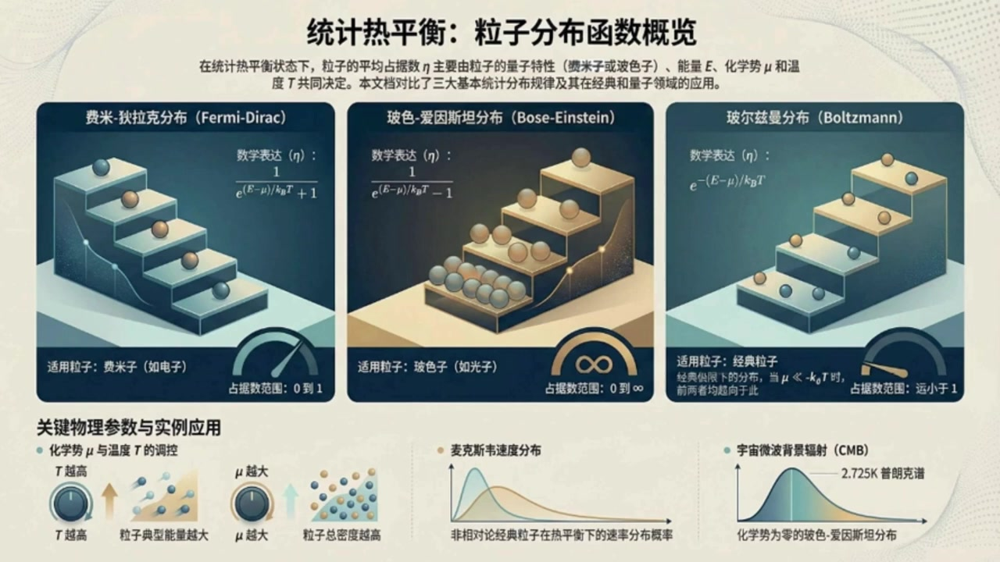
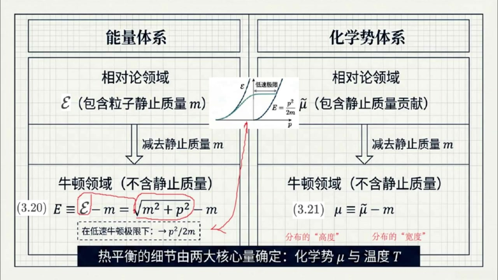
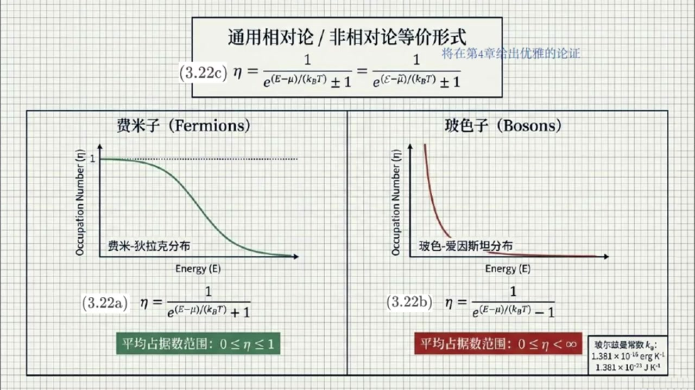
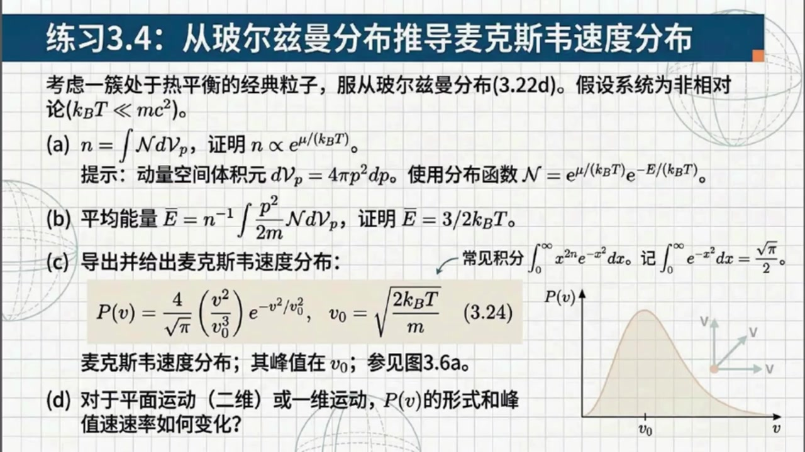
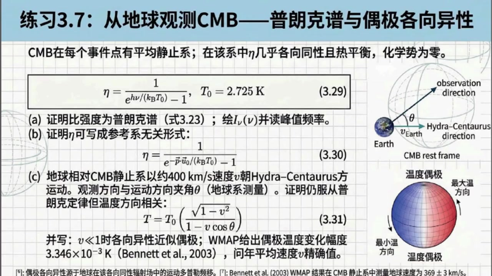

# 《现代经典物理学》第16课 热平衡分布函数：从理论到宇宙观测

> 自动生成的课程注解文档（共 5 个段落，[原始视频](https://www.youtube.com/watch?v=ggNqDCZwJuc)）

## 目录

- [00:00:00 课程引入：热平衡、平均静止系与能量化学势定义](#段落-1)
- [00:03:18 费米-狄拉克与玻色-爱因斯坦分布及经典极限、光子分布](#段落-2)
- [00:12:41 练习3.4：麦克斯韦速度分布与不同维度推广](#段落-3)
- [00:16:57 练习3.5与3.6：相对论速度分布、辐射过程和弱反应](#段落-4)
- [00:23:41 练习3.7：宇宙微波背景辐射、多普勒偶极与课程总结](#段落-5)

---

## 段落 1：课程引入：热平衡、平均静止系与能量化学势定义 { #段落-1 }

**时间：** 00:00:00 ~ 00:03:17

<details><summary>📝 原始字幕</summary>

<pre>

大家好欢迎收听现代经典物理学的第十六课我是你们活泼好奇的主持人周亦
大家好,我是你们的知识向导赛
上一节课我们探讨了向空间中的分布函数以及那个神奇的连接经典和量子的平均占据数ETA
今天我们将进入第三十三节一起聊聊热平衡分布函数并看看它们在宏观甚至是宇宙学层面的奇妙应用
太棒了
一听到热平衡或者统计平衡,我就觉得像是一大群粒子经过漫长而混乱的碰撞,最终安定下来的状态
书里在开头提到如果大量全铜粒子在某个事件话题大辟的领域内处于热平衡就会存在一个特殊的参考系
赛,这到底是个什么样的参考系呢?
这个特殊的惯性参考系被称为粒子的平均静止系
在这个参考系里观察,你会发现分布函数是各相同性的
也就是说平均占据数ETA仅仅是粒子动量的浮值也就是P项量的绝对值的函数
完全不依赖于粒子的运动方向
这个很符合直觉呀
既然都已经达到平衡了,肯定是没有哪个方向是特殊的嘛
这就等效地说ETH其实完全就是粒子能量的函数了没错但要注意一旦跨入相对论领域我们就必须严格区分两种不同的能量定义以及两种对应的化学式定义
这里,你看书里的公式3:20
这里的解释非常关键好的,我看看
书中用话题大意表示包含净值质量贡献的能量而用大意表示不包含净值质量的能量也就是单纯的动能对他们的关系就是大意横等于话题大意减M
也就等于根号下括号m平方加p适量平方括号减m
如果在低速牛顿极限下,我们可以把后面的部分进行太列展开
这个大意就会趋近于我们初高中就非常熟悉的p适量平方出于2m原来如此
类似的对相对论能量的处理在化学式这个指标上也一样根据公式三点二一带波浪号的MUE是包含静止质量的化学式而普通的MUE横等于带波浪号的MUE减M就是不包含静止质量的化学式
如果是在牛顿或非相对论领域,我们统一只用大义和普通的化学式总结得很漂亮
只要明确了温度梯和化学式MUEL这两个核心参数热平衡状态就完全确定
简单来说温度梯决定了每个粒子的平均能量及分布的宽度
而化学式MUE则决定了粒子的平均密度及分布的高度那具体的分布函数公式长什么样呢

</pre>

</details>

**课程截图：**






### 注解

我来对这段课程视频进行深度注解。

---

## 核心概念：热平衡与参考系

### 1. 平均静止系（Mean Rest Frame）

当大量全同粒子在**大体积**内达到热平衡时，存在一个特殊的惯性参考系——**粒子的平均静止系**。

**关键特征**：在此参考系中，分布函数是**各向同性**的，即平均占据数 $\bar{\eta}$ 仅依赖于动量的模 $|p|$，与方向无关。

> 物理直觉：热平衡意味着"混沌最大"，没有任何特殊方向，系统具有旋转对称性。

---

## 2. 相对论 vs 非相对论：能量与化学势的双重定义

这是本段最核心的**新概念**——必须严格区分两种能量标度和两种化学势。

### 板书公式详解

| 公式 | 符号说明 | 物理意义 |
|:---|:---|:---|
| **(3.20)** $E \equiv \mathcal{E} - m = \sqrt{m^2 + p^2} - m$ | $\mathcal{E}$: 包含静止质量的相对论总能量；$E$: 不含静止质量的**动能**；$m$: 粒子静止质量（自然单位制 $c=1$） | 从相对论总能量中扣除"静能" $mc^2$，得到纯动能 |
| **(3.21)** $\mu \equiv \tilde{\mu} - m$ | $\tilde{\mu}$: 包含静止质量贡献的相对论化学势；$\mu$: 不含静止质量的**有效化学势** | 化学势的同样分解 |

### 低速极限（牛顿领域）

当 $p \ll m$（即速度远小于光速），对公式(3.20)进行泰勒展开：
$$\sqrt{m^2 + p^2} - m = m\sqrt{1+\frac{p^2}{m^2}} - m \approx m\left(1 + \frac{p^2}{2m^2}\right) - m = \frac{p^2}{2m}$$

这正是我们熟悉的**经典动能表达式**。

---

## 3. 热平衡的两个"旋钮"：温度与化学势

| 参数 | 控制物理量 | 形象比喻 |
|:---|:---|:---|
| **温度 $T$**（或 $\beta = 1/k_BT$） | 粒子平均能量、分布的**宽度** | 决定分布"有多胖" |
| **化学势 $\mu$** | 粒子平均密度、分布的**高度** | 决定分布"有多高" |

> 关键洞见：一旦 $(T, \mu)$ 确定，热平衡状态就完全确定。这是统计热力学的基本结论。

---

## 板书截图描述

**第二张图**展示了清晰的"分层结构"：

```
┌─────────────────┬─────────────────┐
│    能量体系      │    化学势体系    │
├─────────────────┼─────────────────┤
│   相对论领域     │   相对论领域     │
│  ℰ (含静止质量m) │  μ̃ (含静止质量) │
│       ↓ 减去m    │       ↓ 减去m   │
├─────────────────┼─────────────────┤
│   牛顿领域       │   牛顿领域       │
│  E = ℰ - m      │  μ = μ̃ - m      │
│  = √(m²+p²) - m │                 │
│  → p²/2m (低速) │                 │
└─────────────────┴─────────────────┘
```

图中还包含一个**小插图**：显示相对论能量曲线 $\mathcal{E}(p)$ 在低速区域趋近于抛物线 $E = p^2/2m$。

---

## 理论背景补充

### 为什么需要这种区分？

在**宇宙学**和**高能物理**中，粒子经常处于相对论性 regime（如早期宇宙、中子星内部）。此时：
- 使用 $\mathcal{E}$ 和 $\tilde{\mu}$ 更自然（洛伦兹协变）
- 但在处理粒子数守恒、化学平衡时，扣除共同的静止质量 $m$ 更便于与经典热力学对接

### 与后续内容的衔接

本段为后续讨论**费米-狄拉克分布**、**玻色-爱因斯坦分布**以及它们在**宇宙微波背景辐射(CMB)**、**中微子退耦**等宇宙学应用奠定理论基础。第一张概览图已预告了三大统计分布的对比。

---

## 段落 2：费米-狄拉克与玻色-爱因斯坦分布及经典极限、光子分布 { #段落-2 }

**时间：** 00:03:18 ~ 00:12:41

<details><summary>📝 原始字幕</summary>

<pre>

是不是要区分粒子的脾气性格呀哈哈粒子的脾气确实不一样我们来看教科书中最经典的两个坟部公示三百二十二A的费米迪拉克坟部和三百二十二B的博斯爱因斯坦坟部
我们先看费米子,他可是遵守泡不相容原理的乖孩子
此外还得先声明一下后面这个两个关系我将在第四章给出优雅的论证这里大家只要直接接受这个平均暂居数的表达是即可对于非女性来说
一等于一除括号一的大一减六括号除括号KB乘T括号次方加一括号在这段公式里需要注意的应该是分母里的那个加一对吧这里的KB就是我们常见的波尔兹曼长数一与中地因为分母是指数向一加一并且其中指数向范围是从零到正无穷所以这使得整个一的组织始终被死死地限制在零和一之间
这也完美契合了费米子的特性
一个量子态上最多只能容纳一个非密子哦,真的是这样那波色子就是在分母那里变成减号对吧他是出了名的喜欢扎堆
波色子的一塔等于一除括号E的括号大一减m括号除括号KB乘T括号字方减一括号是的
因为分母是简一才考虑到平均占据数依它的非负性
否则,ATA可取负值,这在物理上是不可能的
所以这里的指数项的范围只能是一到正五穷
也就是说对波斯子而言动能的曲质范围只能在画曲师MEO到正无穷
所以当动能低到化学数的时候分母可以变得非常小
所以平均占据数依它的值就可以从零一直延伸到无穷大我明白了费米子的平均占据数依它的范围是数学上自然的体现而波色子的动能不能小于化学式这是物理合法性的要求在这个情况下波色子的平均占据数依它的值就可以从零一直延伸到无穷大是的
图是三百二十二C向我们展示了如果我们想要采用包蚕静止质量的方式去书写分布函数的形式是完全一样的就是把大意换成花体大意普通的MEE换成带波浪号的MEE就可以了对吧是的
这里还有个另外一个极具启发性的物理极限赵艾你注意到书上怎么描述所谓经典粒子领域的吗它是如何从这些复杂的量子分布里退化出来的我看到了书中说当化学是MU远小于负的KB成T的时候这些粒子就会变得像经典粒子一样也就是处于可区分经典粒子的领域
对在公式层面当MYL远小于F的KB乘T时同时考虑到动能亦非负型
那么指数上的这一项就会变得非常巨大
既然指数箱这么大分母里的那个加一或者减一就像大象旁边的一只蚂蚁变得微不足道了这时候无论是费米子还是波色子它们的分布函数书图同归都会退化成公式三百二十二D所写的波尔兹曼分布也就是一塔约等于E的副括号大义减MU括号除以括号KB成T括号词方完全正确也正是在非相对论状态下所有粒子平均占数都远小于一的情况这群粒子仿佛成了可以标记可以区分的经典小球
这就是由复杂到相对简单的美妙退化这简直是物理世界里大到质简的完美体现呀
对了我不禁想插一句关于经典例子书上的角落里还提到了另一种非常小众的情况是吗哈哈你读书真自写
既然你提到了,我就说一下
小柱六指出在一九六七年伦森贝尔在研究星团的剧烈池域时确定了第四种热分布类型
它对应的是服从类似费米子那种不相容原理的可区分经典例子
也就说明物理学总有很多意想不到的特殊分支等待我们在特定场景下去挖掘太有趣了那我们再接着看分布性质的话书上说温度梯越高粒子的典型能量就越大
而对于波色子有个奇怪的数学限制化学式MU必须始终为负数或者零换句话说带波浪号的MU绝对不能超过粒子的净质质量M这是为什么呢所以前面我们刚刚提到由于平均占据数A塔非负这个物理合法性
对波色子而言,动能异的取质范围只能在化学时MUE到正无穷
而就是说波色子的化学是MUE始终小于动能E这也不能说明波色子的化学是MUE必须始终为负数或者零压但我们必须注意平均占据数A塔非负这个物理合法性必须对任意动能E都成立
也就是说无论动能易是取零还是一直大到正无穷都必须成立哦我明白了按这个强大的物理和法性要求波瑟子的化学是MUE必须始终小于等于动能易的下限零所以说波瑟子的化学是MUE必须始终为负数或者零
这也就是为什么对于波色子化学式缪最多只能极其接近于零而不能跨越它
那万一它极其接近零呢,比如只差一点点,这就引出了一个令人惊叹的量子现象
当波色子的化学式谬极其接近于零并且存在大量极低能量的粒子对这些极低能量的粒子而言那个分母就会趋近于零
这会导致什么结果这会导致这些大量挤低能量的粒子像找了膜一样全部试图挤进那个最低的能量态
占据数会变得庞大无比这正是量子力学中会导致的波色爱因斯坦凝聚啊教科书里提到我们会在第四十九节详细研究它我已经迫不及待了当然除此之外我们还要特意讲一种极其普遍而且我们天天见面的无质量波色子就是光子
如果光子可以在一个温度为T的盒子里完全自由地产生和烟灭,它们的化学式带波浪号的MUE其实会直接等于零
关于这个结论我将会在第五十五节看到书中的确只是简单的解释说这是因为它们只受四动量守恒的约束这就对应了著名的黑体辐射也就是普朗克分布是的
来看看公式3点23
光子的平均占据数I塔等于一除括号E的括号H成New括号除括号KB成T括号次方减一括号
这个公式仅仅是用花体大义等于普朗克常数H成光子频率NUE代替了原先的能量示示带波浪号的NUE直接取零的结果这也是很多天体物理学模型的基础
比如根据上堂课提到标准分布函数花体大N和平均占据数的关系可直接写出标准分布函数花体大N的表达式此外根据标准分布函数花体大N和比强度INU的关系也可以写出比强度INU的表达式只不过再说
此外根据标准分布函数花体大N和比强度INU的关系也可以写出比强度INU的表达式只不过在书中比强度INU的表达式中多插入了一个因子C的辅二次方这是为了方便比强度INU以普通单位表示而已哇那如果是另外一种情况呢比如书中提到的把固定数量的光子放在一个盒子里而且这个盒子的壁面不能发射也不能
那如果是另外一种情况呢比如书中提到的把固定数量的光子放在一个盒子里而且这个盒子的壁面不能发射也不能吸收光子只能让光子发生散射并与壁面交换能量会怎么样这是一个非常好的一个温度梯等于壁面温度的波色爱因斯坦分布
也就是对应咱们前面说的公式3.22b
但关键的区别在于,此时因为光子不能被产生和应面,数量是固定的,所以化学式普通的MUE不再是零了
这个非零化学式MUE完全由盒子里存在的光子总数量来决定简单来说就是里面塞的光子越多这个化学式就越大
前面提及的黑体服饰的公式可以说是现代物理发展的第一大工程了那么理论基础知识算是告落一段落赛我们现在是不是可以进入挑战环节了

</pre>

</details>

**课程截图：**





### 注解

我来对这段课程视频进行深度注解，重点聚焦于**费米-狄拉克分布、玻色-爱因斯坦分布及其物理极限**。

---

## 一、核心公式详解

### 1. 通用形式：相对论/非相对论等价表达

$$\boxed{\eta = \frac{1}{e^{(E-\mu)/(k_B T)} \pm 1} = \frac{1}{e^{(\tilde{E}-\tilde{\mu})/(k_B T)} \pm 1}} \tag{3.22}$$

| 符号 | 含义 |
|:---|:---|
| $\eta$ ($\bar{\eta}$) | 平均占据数（平均粒子数） |
| $E$ | 相对论总能量 = 静止能量 + 动能 = $mc^2 + E_{\text{kin}}$ |
| $\tilde{E}$ | 非相对论能量（**扣除静止质量后**）= $E - mc^2 = E_{\text{kin}}$ |
| $\mu$ | 相对论化学势 |
| $\tilde{\mu}$ | 非相对论化学势 = $\mu - mc^2$ |
| $k_B$ | 玻尔兹曼常数（$1.381 \times 10^{-16}$ erg/K 或 $1.381 \times 10^{-23}$ J/K）|
| $T$ | 系统温度 |
| $\pm$ | 费米子取 $+$，玻色子取 $-$ |

> **关键洞察**：通过重新定义能量零点（扣除静止质量），相对论与非相对论形式在数学上完全等价。这是"花体$\tilde{E}$"和"带波浪号的$\tilde{\mu}$"的物理意义。

---

### 2. 费米-狄拉克分布（Fermi-Dirac）

$$\boxed{\eta = \frac{1}{e^{(E-\mu)/(k_B T)} + 1}} \tag{3.22a}$$

**核心特征**：
- **分母中的 $+1$** 是关键
- 指数项范围：$[0, +\infty)$ → 分母范围：$[2, +\infty)$
- **平均占据数范围**：$0 \leq \eta \leq 1$

**物理诠释**：费米子遵守**泡利不相容原理**——每个量子态最多容纳一个粒子。这就像"乖孩子"排队，每人占一个座位，绝不共享。

> 当 $E \ll \mu$（低温）：$\eta \approx 1$（态被填满）
> 当 $E \gg \mu$（高温）：$\eta \approx e^{-(E-\mu)/k_BT} \ll 1$（态几乎空置）

---

### 3. 玻色-爱因斯坦分布（Bose-Einstein）

$$\boxed{\eta = \frac{1}{e^{(E-\mu)/(k_B T)} - 1}} \tag{3.22b}$$

**核心特征**：
- **分母中的 $-1$** 是关键
- **物理合法性约束**：为保证 $\eta \geq 0$，必须要求 $E > \mu$（严格大于，否则分母为零或负）
- 对于非相对论情况：$E_{\text{kin}} \geq 0$，故 **$\tilde{\mu} \leq 0$**（化学势必须非正！）
- **平均占据数范围**：$0 \leq \eta < +\infty$（无上限！）

**物理诠释**：玻色子"喜欢扎堆"——多个粒子可以占据同一量子态。当 $\tilde{\mu} \to 0^-$ 时，低能态的占据数可以**发散**。

---

### 4. 经典极限：麦克斯韦-玻尔兹曼分布

$$\boxed{\eta \approx e^{-(E-\mu)/(k_B T)}} \tag{3.22d}$$

**退化条件**：$e^{(E-\mu)/k_BT} \gg 1$，即 **$\mu \ll -k_BT$**（化学势为负且绝对值很大）

**物理图像**：
- 指数项"像大象"，$\pm 1$"像蚂蚁"
- 量子统计差异消失，费米子与玻色子"殊途同归"
- 平均占据数 $\eta \ll 1$：粒子变得**可区分**，像经典小球

> "由复杂到相对简单的美妙退化"——这是物理学中"大数简并"的完美体现。

---

### 5. 光子分布：普朗克分布/黑体辐射

$$\boxed{\eta = \frac{1}{e^{h\nu/(k_B T)} - 1}} \tag{3.23}$$

**特殊之处**：
- 光子能量 $\mathcal{E} = h\nu$（$\nu$为频率）
- **化学势 $\tilde{\mu} = 0$**（光子数不守恒！）

**为什么 $\tilde{\mu} = 0$？**
- 光子可被自由产生和湮灭（壁面完美发射/吸收）
- 系统仅受**四动量守恒**约束，无粒子数守恒
- 这是热平衡中的"化学平衡"条件

---

## 二、关键物理概念深度解析

### 1. 玻色子的化学势约束：$\tilde{\mu} \leq 0$

| 论证步骤 | 逻辑 |
|:---|:---|
| 前提 | 平均占据数 $\eta \geq 0$ 必须对所有动能成立 |
| 约束 | 分母 $e^{(E-\mu)/k_BT} - 1 > 0$ → $E > \mu$ |
| 非相对论 | $E_{\text{kin}} \geq 0$，故需 $\tilde{\mu} < E_{\text{kin}}$ 对所有 $E_{\text{kin}} \geq 0$ |
| 结论 | **$\tilde{\mu} \leq 0$**（必须小于动能下限）|

> 这是"强大的物理合法性要求"——数学可能性必须服从物理实在性。

### 2. 玻色-爱因斯坦凝聚（BEC）的预告

当 $\tilde{\mu} \to 0^-$（极其接近零）：
- 低能粒子（$E_{\text{kin}} \sim |\tilde{\mu}|$）的分母 $\to 0$
- 占据数 $\eta \to +\infty$
- **宏观数量粒子"挤"入基态**

这正是**玻色-爱因斯坦凝聚**——纯粹的量子统计效应，将在第49节详述。

### 3. 光子的两种情境对比

| 情境 | 壁面性质 | 化学势 | 分布类型 |
|:---|:---|:---|:---|
| **黑体辐射** | 完美发射/吸收 | $\tilde{\mu} = 0$ | 普朗克分布 (3.23) |
| **散射盒** | 仅散射，不发射/吸收 | $\tilde{\mu} \neq 0$（由光子总数决定）| 玻色-爱因斯坦分布 (3.22b) |

**关键区别**：光子数是否守恒决定了化学势是否为零。

---

## 三、板书/PPT截图内容描述

### 截图1：费米子 vs 玻色子分布对比

```
┌─────────────────────────────────────────────────────────┐
│  通用相对论/非相对论等价形式                               │
│  (3.22) η = 1/[e^(E-μ)/kT ± 1] = 1/[e^(Ẽ-μ̃)/kT ± 1]    │
│                    「将在第4章给出优雅的论证」              │
├─────────────────────────┬───────────────────────────────┤
│        费米子(Fermions)  │        玻色子(Bosons)          │
│  ┌ Occupation Number    │  ┌ Occupation Number          │
│  │    ↑                  │  │    ↑  ↗∞（发散）            │
│  │  1 ━┓                 │  │    │ /                      │
│  │    │  ╲                │  │    │/                       │
│  │    │   ╲____           │  │    └────────→ Energy       │
│  │    └────────→ Energy   │  │                              │
│  └ 费米-狄拉克分布         │  └ 玻色-爱因斯坦分布            │
│                         │                                │
│  (3.22a) η=1/[e^(E-μ)/kT+1] │ (3.22b) η=1/[e^(E-μ)/kT-1] │
│                         │                                │
│  【平均占据数范围: 0≤η≤1】 │ 【平均占据数范围: 0≤η<∞】     │
│        （绿色底）         │        （红色底）               │
└─────────────────────────┴───────────────────────────────┘
                    玻尔兹曼常数 k_B 数值
```

### 截图2：光子集合的特殊情况

```
                    ┌─────────┐
                    │ 光子集合 │
                    │(特殊情况)│
                    └────┬────┘
           ┌─────────────┼─────────────┐
           ▼             ▼             ▼
    ┌─────────────┐  ┌─────────────┐  ┌─────────────┐
    │壁面完美发射/│  │   公式框    │  │壁面仅散射并 │
    │   吸收      │  │ η=1/[exp((ℰ-μ̃)/kT)-1] │  │  交换能量   │
    └─────────────┘  └─────────────┘  └─────────────┘
           │                                │
           ▼                                ▼
    ┌─────────────┐                  ┌─────────────┐
    │ • 黑体辐射   │                  │ • 数量守恒   │
    │ • 完全自由   │                  │ • 非零化学势  │
    │   产生/湮灭  │                  │ • μ由光子总数 │
    │ • 相对论化学势│                  │   决定       │
    │   消失: μ̃=0 │                  │ • 遵循有非零μ̃ │
    │ • 导出普朗克 │                  │   的玻色-    │
    │   形式       │                  │   爱因斯坦分布│
    │   (令ℰ=hν)  │                  │              │
    └─────────────┘                  │  【盒子图示】 │
                                     │  可发射/吸收 │
                                     │    vs 只能散射│
                                     └─────────────┘

    左下：普朗克分布曲线（不同温度T₁<T₂<T₃）
    公式：N = (2/h³)∫... ,  I_ν = (2hc²/λ⁵)/(exp(hc/λkT)-1)
```

---

## 四、理论背景补充

### 1. 第四种分布：Lynden-Bell统计（1967）

| 属性 | 特征 |
|:---|:---|
| 提出者 | Donald Lynden-Bell（研究星团剧烈弛豫）|
| 粒子性质 | **可区分的经典粒子** |
| 统计性质 | 服从**类似泡利不相容原理**的排斥 |
| 物理场景 | 恒星在相空间中的分布（Vlasov方程的准稳态）|

> 这提醒我们：物理学总有"意想不到的特殊分支"在特定场景下显现。

### 2. 标准分布函数与比强度

根据 $\mathcal{N}$（标准分布函数）与 $\eta$ 的关系，以及 $\mathcal{N}$ 与比强度 $I_\nu$ 的关系：

$$\mathcal{N} = \frac{2}{h^3}\eta, \quad I_\nu = \frac{c^2}{2\nu^2}\mathcal{N} = \frac{2h\nu^3}{c^2}\frac{1}{e^{h\nu/k_BT}-1}$$

> 书中 $I_\nu$ 表达式多出的 $c^2/\nu^2$ 因子是为了用**普通单位**表示，而非自然单位。

---

## 五、总结性要点

| 概念 | 核心记忆点 |
|:---|:---|
| **费米子** | "+1"约束 → $0 \leq \eta \leq 1$ → 不相容原理 |
| **玻色子** | "-1"允许发散 → $\tilde{\mu} \leq 0$ → 喜欢扎堆 |
| **经典极限** | $\mu \ll -k_BT$ → 量子差异消失 → 麦克斯韦-玻尔兹曼 |
| **光子特殊性** | 数不守恒 → $\tilde{\mu}=0$ → 普朗克分布 |
| **BEC预告** | $\tilde{\mu} \to 0^-$ → 低能态宏观占据 → 量子相变 |

---

## 段落 3：练习3.4：麦克斯韦速度分布与不同维度推广 { #段落-3 }

**时间：** 00:12:41 ~ 00:16:56

<details><summary>📝 原始字幕</summary>

<pre>

我看课后的这四个练习题各顶各的硬核啊
没错这些习题不仅要求催导更重要的是帮大家实物理直觉
让我们先来看看练习3.4MAXV速度分布
这道题考察的是处于热平衡静止质量不为零的经典例子
温度很低,所以是非相对论的,也就是波尔兹曼分布
题目的第一步A让我们证明物理空间中的总粒子数密度N正比于E的跨号除KB乘T跨号次方我想想密度N是分布函数花体大N在动量空间体积圆上的积分既然是处于热平衡且各项同性
题目提示我们在动量空间使用球坐标
在这个坐标系下,动量空间的体积微元D花体大V下标P
等于四派乘P平方乘P其中P是动量的绝对值这正是破题的关键药你只要把波尔兹曼分布的指数表达式带进去完成积分立马就能看到前置系数里分离出了E的括号没有除KB成T括号次方的音符漂亮那B小题让我们求每个粒子的平均能量平均E
书本上的定义是平均E等于粒子能量E也就是跨号P平方出于二M跨号在分布函数花体大N下的数学期盼也就是等于N的负一次方乘积分括号P平方出于二M括号成花体大N成D花体大V下标P算出来的答案是平均E等于二分之三乘KB乘T
是的你不觉得这个结果非常眼熟吗太眼熟了这不就是经典热力学里我们中学生都要背的理想气体单原子分子平均动能结论吗三个空间自由度每个贡献二分之一KB乘T没错
这就证明了我们宏观测量热力学现象完全可以从微观向空间的严格积分中被完美推导出来接下来最关键的是C小题要求推到概率分布P的V我看到了这里把积分变量从动量P换成了速率V给出了公式三二四
Pf等于括号四除根号派括号
括号V平方除V下标O的三次方括号
乘以的括号负V平方除V下标O平方括号次方
其中峰值速率V下标O等于根号下括号二乘KB乘T除M括号
书上还贴心的加了个侧柱呢
哈哈对,书里提醒大家记住解这种积分的大招,我们要去求这一类的概率归一化,必然会遇到高丝积分
由于从零到五穷大积分一的负X平方次方底X就等于根号排出一二
只要记数这个结果通过使用分布积分法你可以非常快速地推导出麦克斯维速度分布的系数真的非常实用
接下来课后挑战里的D小题非常有启发性
他问如果粒子被强制限制在二维平面甚至一维直线上运动它们的速度分布是什么峰值速率又是多少
这就是一个典型的降尾打击视角
大家可以把刚才咱们用的三维动量体积圆四派乘P平方的形式在二维中换成极坐标的面积圆二派乘P在一维里则变成了简单的DP
然后重新做一遍刚才的计算看看峰值速率会如何随着维度的降低而发生偏移很有意思的把三维的自由度拆分为一维二维感觉数学和物理的双重思维都跟着升华了

</pre>

</details>

**课程截图：**





### 注解

我来对这段课程视频进行深度注解，重点聚焦于**麦克斯韦速度分布的推导与维度效应**。

---

## 一、板书/PPT截图内容描述

截图展示了**练习3.4：从玻尔兹曼分布推导麦克斯韦速度分布**的完整题目，包含四个子问题(a)-(d)。右侧配有速度分布曲线图，显示概率分布 $P(v)$ 在峰值速率 $v_0$ 处达到最大。

---

## 二、核心公式详解

### 公式3.24：麦克斯韦速度分布

$$\boxed{P(v) = \frac{4}{\sqrt{\pi}} \left(\frac{v^2}{v_0^3}\right) e^{-v^2/v_0^2}, \quad v_0 = \sqrt{\frac{2k_B T}{m}}} \tag{3.24}$$

| 符号 | 含义 |
|:---|:---|
| $P(v)$ | 速率 $v$ 的概率密度函数（归一化：$\int_0^\infty P(v)dv = 1$） |
| $v$ | 粒子速率（速度的大小，标量，$v \geq 0$） |
| $v_0$ | **峰值速率**（最概然速率），分布函数取最大值处的速率 |
| $m$ | 粒子静止质量 |
| $k_B$ | 玻尔兹曼常数 |
| $T$ | 系统温度 |

**结构解析**：该分布由三部分组成
- **前置系数** $\frac{4}{\sqrt{\pi}}$：归一化常数，确保概率总和为1
- **相空间因子** $\frac{v^2}{v_0^3} \propto v^2$：来自三维动量空间的球坐标体积元 $4\pi p^2 dp$
- **玻尔兹曼因子** $e^{-v^2/v_0^2} = e^{-mv^2/(2k_B T)}$：能量越高速率概率指数衰减

---

### 关键数学工具：高斯积分

$$\int_0^\infty e^{-x^2} dx = \frac{\sqrt{\pi}}{2}$$

**推广形式**（用于计算任意矩）：
$$\int_0^\infty x^{2n} e^{-x^2} dx = \frac{(2n-1)!!}{2^{n+1}}\sqrt{\pi}$$

> 课程提示：通过**分部积分法**可从基础高斯积分快速导出高阶矩，这是处理此类分布的"大招"。

---

## 三、子问题详解

### (a) 粒子数密度与化学势的关系

**目标**：证明 $n \propto e^{\mu/(k_B T)}$

**推导要点**：
- 分布函数：$\mathcal{N} = e^{\mu/(k_B T)} \cdot e^{-E/(k_B T)} = e^{(\mu-E)/(k_B T)}$
- 非相对论能量：$E = p^2/(2m)$
- 数密度：$n = \int \mathcal{N} \, d\mathcal{V}_p = \int_0^\infty e^{\mu/(k_B T)} e^{-p^2/(2mk_B T)} \cdot 4\pi p^2 dp$

**结果**：积分后所有 $T$ 和 $m$ 的依赖都进入前置因子，仅保留 $e^{\mu/(k_B T)}$ 作为化学势的显式依赖。

---

### (b) 平均能量：能量均分定理的微观证明

$$\boxed{\bar{E} = \frac{3}{2}k_B T}$$

**物理意义**：
| 维度 | 自由度 | 每自由度贡献 | 总平均能量 |
|:---|:---|:---|:---|
| 3D | 3（$p_x, p_y, p_z$） | $\frac{1}{2}k_B T$ | $\frac{3}{2}k_B T$ |

**课程强调**：这是**从微观统计严格推导宏观热力学**的典范——中学背的理想气体公式在此得到第一性原理证明。

---

### (c) 麦克斯韦速度分布的导出

**关键步骤**：变量替换 $p = mv$（动量→速率）

$$\mathcal{N} \cdot 4\pi p^2 dp \quad \xrightarrow{p=mv} \quad P(v)dv$$

经过归一化条件 $\int_0^\infty P(v)dv = 1$ 确定系数，即得公式(3.24)。

**峰值速率 $v_0$ 的物理**：对 $P(v)$ 求导令 $\frac{dP}{dv}=0$，可得 $v_{peak} = v_0 = \sqrt{\frac{2k_B T}{m}}$

> 注意区分三种特征速率：
> - **最概然速率** $v_0 = \sqrt{2k_B T/m}$（分布峰值）
> - **平均速率** $\bar{v} = \sqrt{8k_B T/(\pi m)}$（稍大）
> - **方均根速率** $v_{rms} = \sqrt{3k_B T/m}$（最大）

---

### (d) 降维打击：二维与一维的速度分布 ⭐

这是本段最具启发性的**"降维"视角**。

| 维度 | 动量空间体积元 | 速率分布形式 | 峰值速率 |
|:---|:---|:---|:---|
| **3D** | $d\mathcal{V}_p = 4\pi p^2 dp$ | $P(v) \propto v^2 e^{-v^2/v_0^2}$ | $v_0^{(3)} = \sqrt{2k_B T/m}$ |
| **2D** | $d\mathcal{V}_p = 2\pi p \, dp$（极坐标面积元） | $P(v) \propto v \cdot e^{-v^2/v_0^2}$ | $v_0^{(2)} = \sqrt{k_B T/m}$ |
| **1D** | $d\mathcal{V}_p = dp$ | $P(v) \propto e^{-v^2/v_0^2}$（半高斯） | $v_0^{(1)} = 0$（单调递减）|

**核心发现**：随着维度降低，**相空间因子 $v^{(d-1)}$ 的幂次降低**，导致：
- 分布曲线形状从"右偏峰"（3D）→"对称峰"（2D）→"单调递减"（1D）
- **峰值速率向低速方向移动**：$v_0^{(3)} > v_0^{(2)} > v_0^{(1)}=0$

**物理直觉**：低维空间中"高速态"的相空间体积占比更小，系统更倾向于占据低能态。

---

## 四、核心概念总结

| 概念 | 要点 |
|:---|:---|
| **玻尔兹曼分布** | 经典极限（$\eta \ll 1$）下的量子分布，化学势 $\mu \to -\infty$ |
| **麦克斯韦分布** | 玻尔兹曼分布在动量空间的具体形式，描述热平衡经典粒子的速率统计 |
| **维度效应** | 相空间体积元的维度依赖 $p^{d-1}$ 直接决定分布函数的形态 |
| **能量均分定理** | 每个二次自由度贡献 $\frac{1}{2}k_B T$，微观统计→宏观热力学的桥梁 |

---

## 段落 4：练习3.5与3.6：相对论速度分布、辐射过程和弱反应 { #段落-4 }

**时间：** 00:16:57 ~ 00:23:40

<details><summary>📝 原始字幕</summary>

<pre>

那如果我们的粒子不听话,速度不是慢吞吞的,而是非常快的情况呢?
接下来就是练习三点五麦克斯维尤特纳速度分布这就是相对论版本的麦克斯维分布对吧哈哈对一旦我们突破了牛顿力学由于低速产生的束缚粒子的能量就不再是简单的P平方处于二M了
为了严谨我们需要用带有洛伦兹因子的相对论能量来写布尔兹曼分布
这样一套推倒下来它的概率分布就写在方程3点25里了
在推导过程中由于引入了洛伦兹因子所以增加了积分的复杂性
而这种复杂积分一部分可以划成一个叫做K二的第二类二阶修正贝塞尔函数
我的天哪,公式变得好复杂
P of V等于括号二除V下标O平方括号除K二的括号二除V下标O平方括号
这里面的V下标O和刚才的定义一样,在成语后面一大串带着洛伦子因子,跟号下一减V平方的分数因子,还有复杂指数项因子是的
别看公式吓人,你看土3.6的曲线
在这个拓展到相对论领域的图标里当达到了超相对论状态也就是热能KB成梯远远大于粒子净值质量M的时候曲线发生了惊人的变化我看到了当温度高到一定程度粒子的速度几乎都挤到了非常接近光速的V等于E附近经典的高四中型曲线此刻已经被生硬的挤成了贴着光速上线的一根陡峭的尖峰对当温度高耸入云粒子全都变成标车档以近光速狂奔谁也没法在那块狭窄的速度区域里了明白了我们快马加鞭来看看练习三六辐射过程这题其实又回到了统计物理与原子物理交界的领域 设定了一个具有两个能级电子的系统它们之间H成然后电子还以各种月签这题其实是引出了非常著名的AB系数理论
然后电子还已发生各种越迁这题其实是引出了爱因斯坦非常著名的AB系数理论的核心概念
假设电子以单位时间概率A从高能级U越迁到低能级L
产生一个特定沼态的光子
忽略碱病毒利用波尔兹曼分布和平晶光子占据数表大势
在平衡状态下,因为电子和光子都在相同的温度梯下,你会得到功时3点26
A乘N下标U加A乘N下标U乘A塔下标G等于A乘N下标L乘A塔下标G
也就是A乘高能级电子数密度加相A乘高能级电子密度和光子平均占据数的积积等于A乘低能级电子密度和光子占据数的积积这长城的一个等式物理意义是什么这三项非常优雅的分别指带了单位体积内的辐射行为
低效是自发发射
第二项是受机发射而等号右边内唯一的项则是受机吸收的速率
第二和第三项习惯上就用爱因斯坦B系数表示
只有它们互相平衡热力学的天平才不会倾斜但是我读到绞住期的时候发现作者提醒我们想要让这三项过程在非热力学平衡乃至平衡态下都真的适用并且时间可逆
如果想要给出极其严格和充分的推导是需要借助量子电动力学的我们的作者FORN一贯严禁
确实如果要算真正的散射截面自发越迁的根本之根源量子电动理学也就是QED是无论如何也逃不掉的工具
而在随后的小题中又进也引出了物理学史上赫赫有名的基尔护肤定律我看到了也就是把定义出的经典发射率J上标I下标NEWHATOMEGA除以经典吸收系数CAP下标I
题中要求证明它们的笔直其实等于单级化模式的黑体辐射强度没错,这在说明什么
发射能力强的物质必定吸收能力也强,这就是热平衡赋予它们的铁律
更厉害的是这个庞大练习的最后一文一小题直接乏力把视野拉到了宇宙学里的弱相互作用了
讲的是中子加中微子转变成电子和质子的弱核反应我的天这视野真是开阔
这是一个非常长的积分公式,方程3.28
DNA下标P除以dt,这是在算质子的生成率对吧
它等于中子密度n下标n
乘以一个包含了三个括号连成的巨大积分
是的
如果你仔细拆解,其实逻辑很明确
第一项:D花体大V下标Pnew处于H的三次方成A下标New
这是中微子的向空间密度和分布
第二项里那个含有迪拉克德尔塔函数以及长数大W的项是能量守恒的约束条件
而最有趣的是第三项第三项我看到了是括号二乘D花体大V下标PE除H三次方乘括号一减A塔下标E括号
这个一减去电子平均占据数函数,这是什么意思?
叫泡力阻塞效应
因为生成的电子可是标准的非米子,它要服从泡力不相容原理
如果目标状态已经满圆了,A塔接近1
电子就出不来,转化过程就会被阻塞
所以反应率必须乘以这个剩余空位概率括号一键A塔下标一括号
哇不仅跨界到了宇宙学衰变居然还把费米子占据术带来的反向限制考虑得这么轻巧这简直是一道神奇练习还没完呢重头戏在压轴

</pre>

</details>

**课程截图：**


### 注解

我来对这段课程视频进行深度注解，重点聚焦于**麦克斯韦-尤特纳速度分布、爱因斯坦AB系数理论、基尔霍夫定律以及弱核反应中的泡利阻塞效应**。

---

## 一、板书/PPT截图内容描述

### 截图1：练习3.5 麦克斯韦-尤特纳速度分布
- **标题**：练习3.5：麦克斯韦-尤特纳（Maxwell-Jüttner）速度分布
- **核心公式**：方程(3.25)的完整表达式，包含修正贝塞尔函数 $K_2$
- **右侧曲线图**：图3.6展示三种温度 regimes 下的速度分布曲线
  - 虚线：经典麦克斯韦分布（$k_BT \ll m$）
  - 中间曲线：过渡区域（$k_BT \approx m$）
  - 最右侧尖峰：超相对论极限（$k_BT \gg m$），速度几乎挤到 $v \approx c$（即 $v=1$ 以自然单位表示）

### 截图2：练习3.6（下）
- **标题**：练习3.6（下）：谱线宽度、极化、Kirchhoff定律与更一般推广
- **子问题(c)**：基尔霍夫定律的证明，公式(3.27)定义发射率 $j$ 和吸收系数 $\kappa$
- **子问题(d)**：推广到电子连续动量分布
- **子问题(e)**：弱核反应 $\nu + n \rightarrow e + p$，公式(3.28)的完整积分表达式

---

## 二、核心公式详解

### 公式3.25：麦克斯韦-尤特纳速度分布（相对论版本）

$$\boxed{P(v) = \frac{2/v_0^2}{K_2(2/v_0^2)} \cdot \frac{v^2}{(1-v^2)^{5/2}} \cdot \exp\left[-\frac{2/v_0^2}{\sqrt{1-v^2}}\right]} \tag{3.25}$$

| 符号 | 含义 |
|:---|:---|
| $v$ | 粒子速度（以光速 $c=1$ 为单位，故 $0 \leq v < 1$） |
| $v_0$ | 特征热速度，$v_0 = \sqrt{2k_BT/m}$（与经典定义相同） |
| $K_2$ | **第二类二阶修正贝塞尔函数**（Modified Bessel function of the second kind, order 2） |
| $(1-v^2)^{-5/2}$ | 洛伦兹因子 $\gamma = (1-v^2)^{-1/2}$ 的高次幂，来自相对论相空间体积元 |
| 指数项 | $\exp[-\gamma m c^2 / k_BT]$，即相对论玻尔兹曼因子 |

**关键物理**：
- 分母中的 $K_2(2/v_0^2)$ 是归一化常数，确保 $\int_0^1 P(v)dv = 1$
- 当 $v_0 \ll 1$（低温非相对论极限），此分布退化为经典麦克斯韦分布
- 当 $v_0 \gg 1$（高温超相对论极限），分布尖锐地峰值于 $v \to 1^-$

---

### 公式3.26：爱因斯坦AB系数平衡方程

$$A_{UL} n_U + A_{UL} n_U \bar{\eta}_\nu = A_{LU} n_L \bar{\eta}_\nu$$

| 符号 | 含义 |
|:---|:---|
| $n_U, n_L$ | 高能级(U)和低能级(L)的电子数密度 |
| $A_{UL}$ | **自发发射系数**：单位时间内原子自发从 $U \to L$ 跃迁的概率 |
| 第二项中的系数 | **受激发射系数** $B_{UL}$（与 $A_{UL}$ 相关） |
| 右边系数 | **受激吸收系数** $B_{LU}$ |
| $\bar{\eta}_\nu$ | 频率为 $\nu$ 的光子平均占据数 |

**物理意义的三项平衡**：
| 项 | 过程 | 方向 | 关键特征 |
|:---|:---|:---|:---|
| $A_{UL} n_U$ | **自发发射**（Spontaneous emission） | $U \to L$ + 光子产生 | 与光子场是否存在无关 |
| $\propto n_U \bar{\eta}_\nu$ | **受激发射**（Stimulated emission） | $U \to L$ + 光子产生 | 入射光子"克隆"自身，激光原理 |
| $\propto n_L \bar{\eta}_\nu$ | **受激吸收**（Stimulated absorption） | $L \to U$ + 光子湮灭 | 吸收光子跃迁到高能级 |

> 在热平衡下，利用玻尔兹曼分布 $n_U/n_L = e^{-h\nu/k_BT}$ 和普朗克分布 $\bar{\eta}_\nu$，可导出著名的**爱因斯坦关系**：$B_{UL} = B_{LU}$ 以及 $A_{UL}/B_{UL} = 8\pi h\nu^3/c^3$。

---

### 公式3.27：发射率与吸收系数（基尔霍夫定律）

$$j_{\nu\hat{\Omega}}^i \equiv n_U h\nu A P_{\nu\hat{\Omega}}^i, \quad \kappa_i \equiv n_L A\left(1-e^{-h\nu_0/k_BT_e}\right)\frac{P_{\nu\hat{\Omega}}^i c^2}{\nu^2}$$

**基尔霍夫定律的核心结论**：
$$\boxed{\frac{j_{\nu\hat{\Omega}}^i}{\kappa_i} = B_\nu(T) = \frac{2h\nu^3/c^2}{e^{h\nu/k_BT}-1}}$$

这是**单极化模式的黑体辐射强度**。

**物理内涵**：发射能力与吸收能力成正比——"好的吸收体也是好的发射体"。这是热平衡的必然要求，与材料具体性质无关。

---

### 公式3.28：弱核反应中的质子生成率（含泡利阻塞）

$$\boxed{\frac{dn_p}{dt} = n_n \int \underbrace{\left(\frac{2dV_{p_\nu}}{h^3}\eta_\nu\right)}_{\text{(1) 中微子相空间密度}} \underbrace{\left(hc\frac{W}{p_\nu^2}\delta(E_\nu+m_n-E_e-m_p)\right)}_{\text{(2) 能量守恒}} \underbrace{\left(\frac{2dV_{p_e}}{h^3}(1-\eta_e)\right)}_{\text{(3) 泡利阻塞因子}} \tag{3.28}$$

| 符号 | 含义 |
|:---|:---|
| $n_p, n_n$ | 质子、中子数密度 |
| $\eta_\nu$ | 中微子平均占据数（入射粒子分布） |
| $dV_{p_\nu}/h^3$ | 中微子动量空间体积元（相空间因子） |
| $W$ | 跃迁矩阵元平方（与弱相互作用耦合常数 $G_F$ 相关） |
| $\delta(\cdots)$ | 狄拉克δ函数，强制执行能量守恒 |
| $1-\eta_e$ | **泡利阻塞因子**（Pauli blocking factor）——**本段最关键的新概念** |

---

## 三、核心概念深度解释

### 1. 超相对论极限下的"速度尖峰"现象

**经典图像**：麦克斯韦分布是光滑的钟形曲线，最概然速率 $v_{mp} \sim \sqrt{k_BT/m}$ 随温度升高而增大。

**相对论颠覆**：当 $k_BT \gg mc^2$：
- 粒子能量 $E \approx pc \gg mc^2$，即极端相对论
- 但速度受狭义相对论限制，**永远无法达到或超过光速**
- 所有粒子都被"挤压"在 $v \in [1-\epsilon, 1)$ 的狭窄区间内
- 分布变成贴着 $v=1$ 的**陡峭尖峰**

> 通俗类比：想象高速公路限速120km/h。低温时车辆速度分散；高温时所有车辆都想狂飙，但都被电子眼（相对论）死死卡在119km/h附近，形成"拥堵尖峰"。

---

### 2. 泡利阻塞效应（Pauli Blocking）

这是**量子统计对反应动力学的关键修正**：

| 情景 | 占据数 $\eta_e$ | 阻塞因子 $1-\eta_e$ | 物理结果 |
|:---|:---|:---|:---|
| 目标态空 | $\eta_e \approx 0$ | $\approx 1$ | 反应正常进行 |
| 目标态半满 | $\eta_e \approx 0.5$ | $\approx 0.5$ | 反应率减半 |
| 目标态近满（简并） | $\eta_e \to 1$ | $\to 0$ | **反应被完全阻塞** |

**在弱核反应 $\nu + n \rightarrow e + p$ 中的应用**：
- 生成的电子是**费米子**，必须服从泡利不相容原理
- 如果周围电子气体已经高度简并（如中子星内部、早期宇宙高密度环境），低能电子态已被填满
- 新电子只能占据高于费米能级的态，这大大**抑制了反应速率**
- 因子 $(1-\eta_e)$ 精确量化了这种**量子统计抑制**

> 宇宙学意义：在早期宇宙 $T \sim 1$ MeV 的弱平衡时期，泡利阻塞效应显著影响了中子-质子比例，进而决定了**原初氦丰度**！

---

### 3. 从原子物理到宇宙学的"神奇练习"

这段练习的精妙设计：

```
练习3.6的层次结构：
(a)(b) 原子物理：谱线宽度、自然展宽、多普勒展宽
(c)    热力学/辐射转移：基尔霍夫定律（局域热平衡）
(d)    推广：连续谱（电离态）
(e)    宇宙学/粒子物理：弱核反应 + 量子统计效应
```

这种**跨尺度贯通**是理论物理的精髓——从氢原子到早期宇宙，相同的统计原理统摄一切。

---

## 四、修正贝塞尔函数 $K_2$ 的物理角色

在相对论麦克斯韦分布的推导中，归一化积分：

$$\int_0^\infty \gamma^5 \beta^2 e^{-\gamma/\theta} d\beta = K_2(1/\theta)/\theta$$

其中 $\theta = k_BT/mc^2 = v_0^2/2$。

$K_2(x)$ 的渐近行为：
- $x \to \infty$（低温）：$K_2(x) \sim \sqrt{\pi/2x}e^{-x}$，恢复经典结果
- $x \to 0$（高温）：$K_2(x) \sim 2/x^2$，与超相对论极限匹配

这保证了分布在两个极端下的正确归一化。

---

## 段落 5：练习3.7：宇宙微波背景辐射、多普勒偶极与课程总结 { #段落-5 }

**时间：** 00:23:41 ~ 00:28:24

<details><summary>📝 原始字幕</summary>

<pre>

我们迎接今天最后一个挑战
练习三点七
从地球观测宇宙微波背景辐射CMB
可是关联到诺贝尔物理学奖的神奇观测现象大爆炸遗留下来的余辉
在这个辐射自己的平均净值系里看,它是非常完美的热平衡产物,化学视野为零,它是一个标准的黑体普朗克分布
平均温度T下标O等于极低的二七二五K二文对在A小题题目还要求大家推倒后亲手画出比强度的光谱并找出强度的峰值频率
实际上这就是在让大家复现大名鼎鼎的维恩位移定律但它不仅如此是的随后的公式三百三十把这套平均占据数体系改写成了一个能够独立于任何参考系的通用形式
一塔等于一除括号一的负四动两P点成四速度U下标O除括号KB成T下标O括号次方减一括号
这里的P是光子的四冻两
而U下标O变成了平均静止系的四速度
既然普朗克分布已经很好了
我们费那么大劲改造它干什么呢当然是为了方便我们把地球的宏观运动加进去考量
如果大家抬头看星空我们的地球相对于这个CNB静止系从来都不是静止的
事实上地球所在坐标系正以大概四百千匹汤秒的速度V朝着空中长蛇半人马座的方向飞奔
不改写成四十辆点击的形式你是没法在不同参考系下游刃有余地计算相对论多普勒效应的哇我大概能想到了因为多普勒效应如果是地球迎面撞上来的那些宇宙微波背景光子应该会显得能量更高温度更热吧
我看看推演出的公式
三点三十一
测到的地球系微波背景温度T等于T下标O成跨号跟号下一减V平方除以括号一减V成扣散C塔括号括号
在这个公式里C塔代表观测方向和地球运动方向之间的假角对吗你领悟得非常精准
这个壮观的现象叫做多普勒偶及各项异性
你设想一下,当你迎着地球飞奔的前进方向去看,CTA等于0也就是COXI CTA最大
公事分母最小
于是测出的微波温度T就会偏高
而当你回头看向背后温度就偏低
而且,因为速度V远小于光速,你可以对公式泰勒展开
他会惊讶地发现它几乎就是一个完美的偶几子分度
我们测到了吗
当然
题目的最后给出了当年WMAP卫星的绝佳数据
年平均的偶级温度变化幅度为3.346乘10的负34K
这篇出自贝内特等人在二零零三年的报告是人类探索宇宙的一座峰碑
通过简单的一步代数处方计算仅仅依靠测算微波背景温度变化的极为小幅度我们就能精确推导出地球穿梭在宇宙中的绝对速度了简直绝了把刻板里的分布函数简单的提及积分公式一路推演到泡力组塞效应更是一步步丈量出了地球在宏观宇宙中飞驰的绝对运动
这就是物理学真正的独一无二的浪漫吧,很高兴你能有这样深刻的体会转
无论面对多么复杂的等离子磁体若相互作用衰变或者是巨型的天文观测
它们的本质都深深扎根在我们今天研究的这些热平衡以及向空间分布的基土规律里
打好这座地基以后的星辰大海我们才能飞得更高今天感觉脑容量被撑爆又被彻底刷新了非常感谢大家坚持收听到这里今天的现代经典物理学第十六课博客就到此告一段落了
再次感谢赛老师带领我们硬核突围也感谢专爱的精彩反馈和提问
理论之路道足且长,我们下期见同学们,大家拜拜啦

</pre>

</details>

**课程截图：**





### 注解

我来对这段课程视频进行深度注解，重点聚焦于**宇宙微波背景辐射（CMB）的相对论性描述、多普勒偶极各向异性以及地球绝对速度的测量**。

---

## 一、板书/PPT截图内容描述

### 截图：练习3.7 完整题目设置

| 区域 | 内容 |
|:---|:---|
| **顶部标题** | "练习3.7：从地球观测CMB——普朗克谱与偶极各向异性" |
| **核心公式框** | 公式(3.29)：$\eta = \frac{1}{e^{h\nu/(k_B T_0)}-1}$，$T_0 = 2.725$ K |
| **三维示意图** | 右侧地球-坐标系图：显示地球以速度$v$朝向长蛇-半人马座方向（Hydra-Centaurus）运动，标注观测方向与运动方向的夹角$\theta$ |
| **天球温度分布图** | 下方彩色球体：红色区域（温度极高方向）与蓝色区域（温度极低方向），标注"最大温方向"和"最小温方向" |
| **脚注** | WMAP 2003年结果：偶极温度变化幅度 $3.364 \times 10^{-3}$ K，测得地球速度 $369 \pm 3$ km/s |

---

## 二、核心公式详解

### 公式3.29：CMB静止系中的普朗克分布

$$\boxed{\eta = \frac{1}{e^{h\nu/(k_B T_0)} - 1}, \quad T_0 = 2.725\,\text{K}}$$

| 符号 | 含义 |
|:---|:---|
| $\eta$ | 光子平均占据数（玻色-爱因斯坦分布，化学势$\mu=0$） |
| $h$ | 普朗克常数 |
| $\nu$ | 光子频率（在CMB静止系中测量） |
| $k_B$ | 玻尔兹曼常数 |
| $T_0$ | CMB静止系中的特征温度（宇宙学标准值） |

> **关键物理**：CMB是"大爆炸余辉"，在自身静止系中是完美的黑体辐射，化学势为零，各向同性。

---

### 公式3.30：参考系无关的协变形式（核心创新）

$$\boxed{\eta = \frac{1}{e^{-\vec{p}\cdot\vec{u}_0/(k_B T_0)} - 1}}$$

| 符号 | 含义 | 物理意义 |
|:---|:---|:---|
| $\vec{p}$ | 光子的**四动量**（$p^\mu = (E/c, \vec{p}_{\text{空间}})$） | 相对论协变量 |
| $\vec{u}_0$ | CMB静止系的**四速度**（$u_0^\mu = (c, 0, 0, 0)$在静止系中） | 定义"静止"的基准 |
| $\vec{p}\cdot\vec{u}_0$ | 四矢量点积（洛伦兹不变量） | $= -p_\mu u_0^\mu = E_{\text{共动}}$ |

**为何需要这个形式？**
- 公式(3.29)中的$\nu$是**特定参考系**中的频率
- 公式(3.30)使用**洛伦兹不变量**$\vec{p}\cdot\vec{u}_0$，可在任意参考系中计算
- 这是处理**相对论多普勒效应**的数学利器

---

### 公式3.31：地球系中的观测温度（多普勒效应）

$$\boxed{T = T_0 \frac{\sqrt{1-v^2/c^2}}{1 - \frac{v}{c}\cos\theta}}$$

| 符号 | 含义 |
|:---|:---|
| $T$ | 地球参考系中测得的温度（**方向依赖**） |
| $T_0$ | CMB静止系温度（2.725 K） |
| $v$ | 地球相对CMB静止系的速度（~400 km/s） |
| $c$ | 光速 |
| $\theta$ | **观测方向**与**地球运动方向**的夹角 |
| $\sqrt{1-v^2/c^2}$ | 洛伦兹因子$\gamma^{-1}$（时间膨胀/长度收缩） |

**方向依赖性分析**：

| 观测方向 | $\cos\theta$ | 温度行为 | 物理图像 |
|:---|:---|:---|:---|
| **正前方**（迎向运动） | $\theta=0$, $\cos\theta=1$ | $T = T_0\sqrt{\frac{1+v/c}{1-v/c}} > T_0$ | 蓝移，光子能量更高，"更热" |
| **正后方**（背向运动） | $\theta=\pi$, $\cos\theta=-1$ | $T = T_0\sqrt{\frac{1-v/c}{1+v/c}} < T_0$ | 红移，光子能量更低，"更冷" |
| **垂直方向** | $\theta=\pi/2$, $\cos\theta=0$ | $T = T_0/\gamma \approx T_0$ | 横向多普勒效应（二级小量） |

---

## 三、关键物理概念详解

### 1. 多普勒偶极各向异性（Dipole Anisotropy）

**核心现象**：由于地球运动，CMB温度在天球上呈现**偶极分布**——一侧更热，一侧更冷。

**非相对论近似**（$v \ll c$，泰勒展开）：

$$\frac{T - T_0}{T_0} \approx \frac{v}{c}\cos\theta + \mathcal{O}\left(\frac{v^2}{c^2}\right)$$

这正是**偶极子分布**：$\propto \cos\theta$，天球上温度变化呈完美的$\cos\theta$模式。

**定量估算**：
- $v \approx 400$ km/s $= 400/300000 \approx 1.33 \times 10^{-3}c$
- 预期温度变化幅度：$\Delta T/T_0 \sim v/c \sim 10^{-3}$
- $\Delta T \sim 2.725 \times 10^{-3}$ K $\sim 3 \times 10^{-3}$ K

这与WMAP数据**$3.364 \times 10^{-3}$ K**完美吻合！

---

### 2. 从温度变化测地球绝对速度

**反推逻辑**（课程强调的"浪漫"）：

$$\text{测到的}\frac{\Delta T}{T_0} \xrightarrow{\text{公式3.31}} \text{推出}\frac{v}{c} \xrightarrow{\text{已知}c} \text{得到} v_{\text{地球}}$$

**精妙之处**：
- 不需要任何"外部基准"
- 利用**宇宙学背景本身**作为绝对参考系
- 通过**微观的热平衡分布**推导出**宏观的绝对运动**

这就是物理学的"**相对中的绝对**"——CMB静止系定义了宇宙学意义上的"静止"，而地球相对这个静止系的速度是可以精确测量的。

---

### 3. 历史背景：诺贝尔物理学奖与CMB

| 年份 | 成就 | 获奖者 |
|:---|:---|:---|
| 1964 | CMB的发现（彭齐亚斯&威尔逊） | 1978年诺贝尔物理学奖 |
| 1992 | COBE卫星：CMB黑体谱精确验证、各向异性发现 | 2006年诺贝尔物理学奖（马瑟&斯穆特） |
| 2003 | WMAP：高精度全天图，精确偶极测量 | 贝内特等人（题目引用） |
| 2018 | Planck卫星：更高精度CMB参数 | — |

课程引用的**Bennett et al. 2003**是WMAP首年数据释放的经典论文，标志着"精确宇宙学"时代的开启。

---

## 四、公式推导脉络（课程隐含的逻辑）

```
CMB静止系普朗克分布 (3.29)
           ↓
    改写为四矢量协变形式 (3.30)
    η = 1/[exp(-p·u₀/k_BT₀) - 1]
           ↓
    地球运动：u₀ → 地球系四速度 u
    利用洛伦兹变换：p·u₀ = p·Λ⁻¹·u = (Λp)·u
           ↓
    计算得地球系中的等效温度 (3.31)
    T(θ) = T₀·√(1-v²/c²)/(1-v/c·cosθ)
           ↓
    v≪c展开 → 偶极近似 → 与WMAP数据对比 → 定出v
```

---

## 五、课程总结的核心思想

> "无论面对多么复杂的等离子、磁流体、相互作用、衰变，或者是巨型的天文观测，它们的本质都深深扎根在我们今天研究的这些热平衡以及相空间分布的基土规律里。"

**本节展示的研究范式**：
- **从微观到宏观**：单个光子的玻色分布 → 宇宙尺度的运动学
- **从相对到绝对**：利用相对论协变性 → 测量绝对速度
- **从理论到观测**：黑板上的公式 → 卫星实测数据

这正是理论物理"**硬核突围**"的魅力所在。

---
