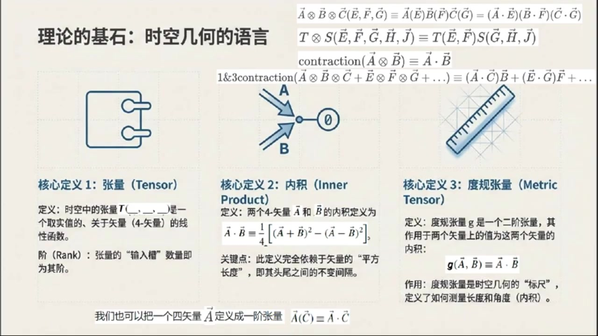
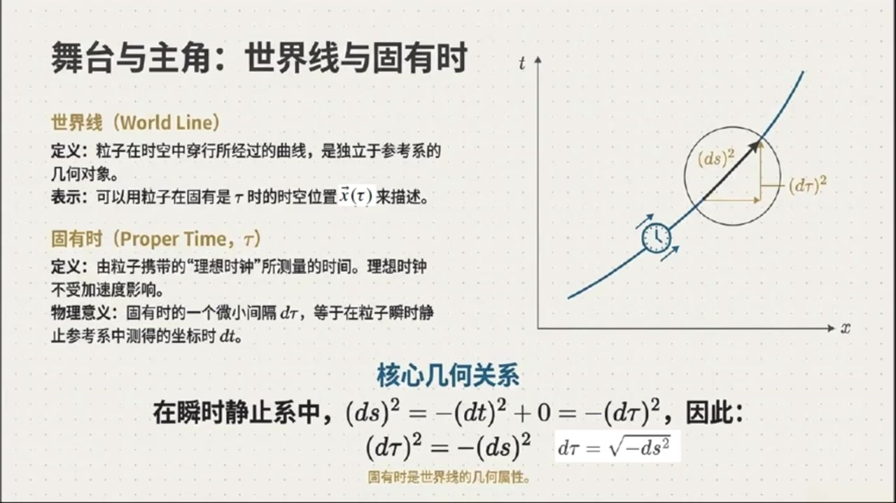
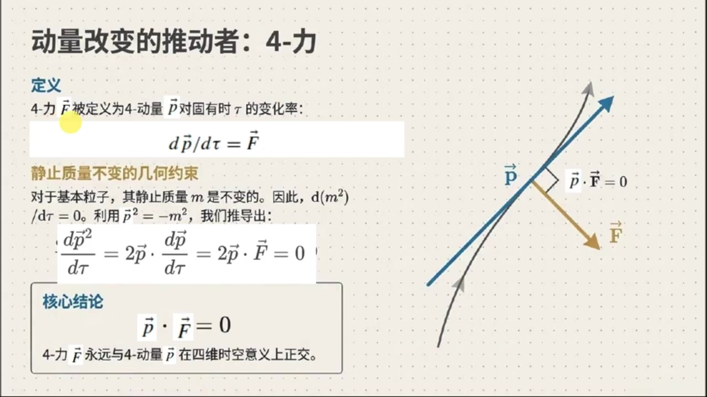
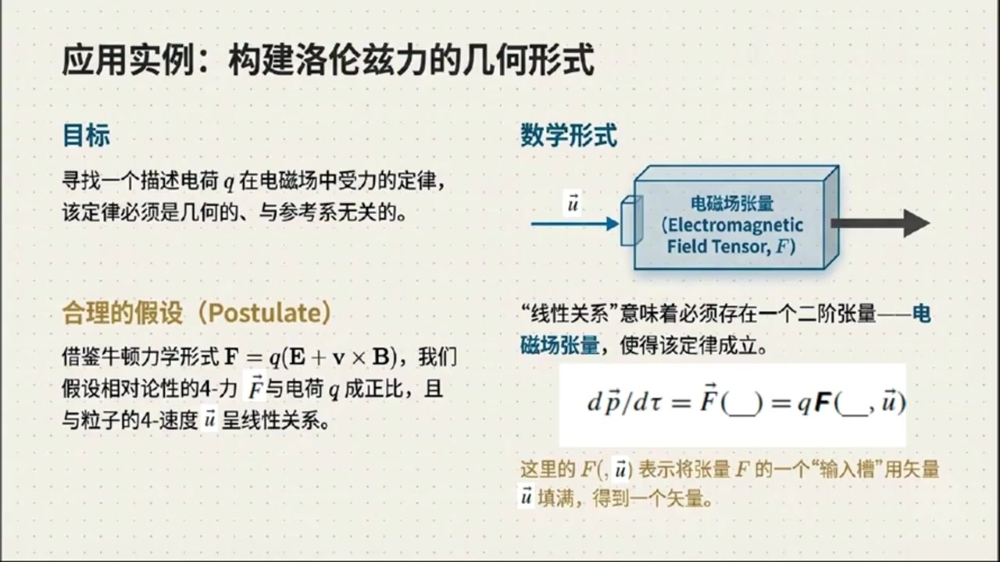
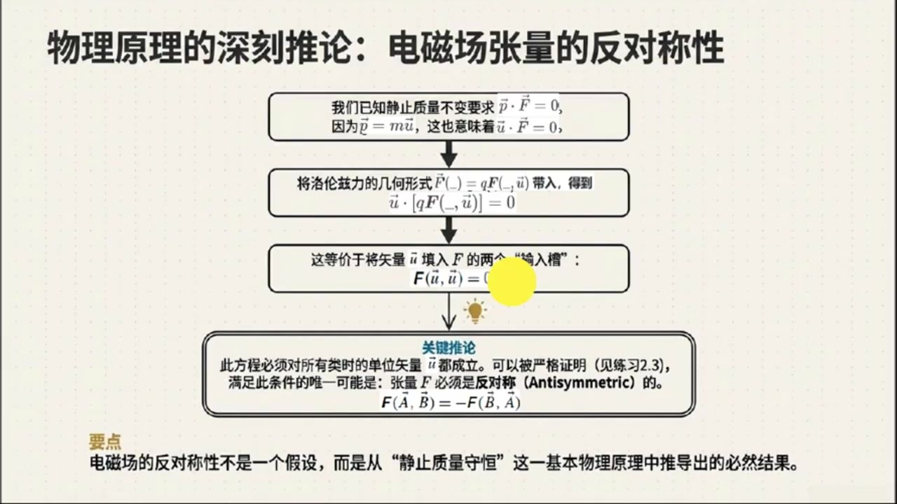
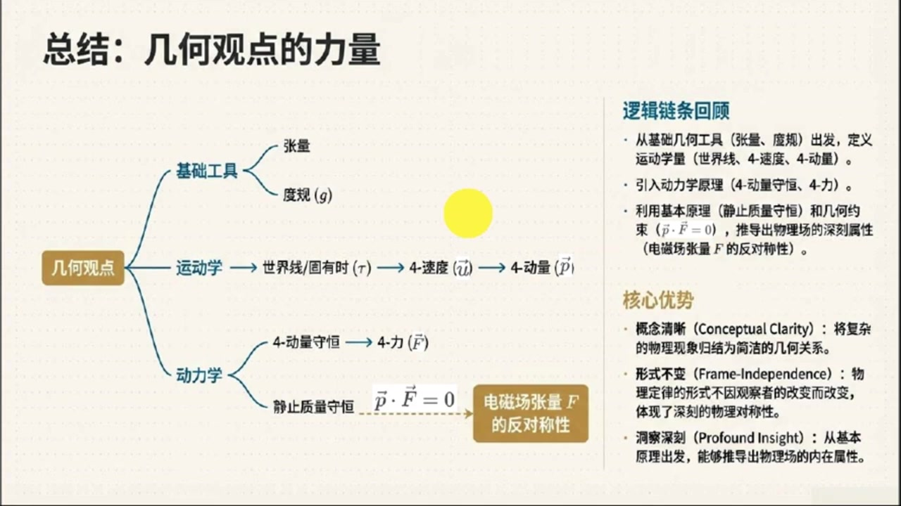
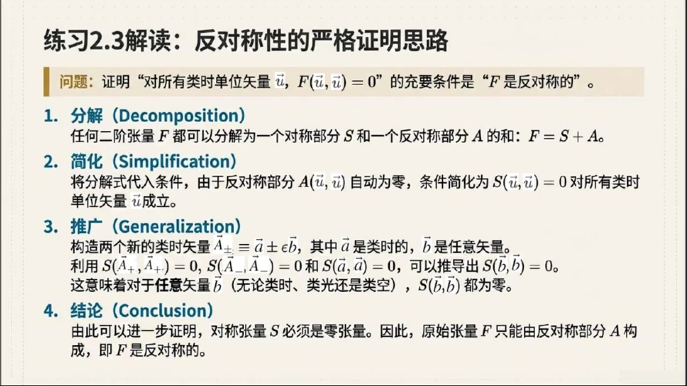

# 《现代经典物理学》第7课 时空中的粒子动力学

> 自动生成的课程注解文档（共 4 个段落，[原始视频](https://www.youtube.com/watch?v=h-cGRfMg0o0)）

## 目录

- [00:00:02 课程引入与无坐标系下的张量代数基础](#段落-1)
- [00:05:06 固有时、世界线与四速度四动量](#段落-2)
- [00:11:48 四动量守恒、四力与洛伦兹力的几何推导](#段落-3)
- [00:17:29 课程总结与练习：反对称张量和标量引力模型](#段落-4)

---

## 段落 1：课程引入与无坐标系下的张量代数基础 { #段落-1 }

**时间：** 00:00:02 ~ 00:05:06

<details><summary>📝 原始字幕</summary>

<pre>

大家好,欢迎来到现代经典物理学的课堂,我是你们的主持人乔伊,今天我们是这门课的第七课了,时间过得真快啊
今天我們要講的內容,聽起來就讓人覺得有點高大赏
无坐标系下的张亮代数和无参考系下的粒子动力学与罗伦斯利
光听名字,就觉得咱们要深入到物理学的核心了,对吧赛
没错作为
听起来是有点糊人,但其实咱们今天就是要用一种更几何化,更本质的视角来看待这些物理现象
摆脱了特定坐标系的束缚,我们才能更好地理解物理定律的普世性
哇,听起来很酷
那我们是不是要先从无坐标系下的张亮代数开始呢
之前我们学过时空点,不变间隔,四十量这些概念,那将量代数又是怎么连接起来的呢
嗯是的
我们之前讲了时空中的点就是事件还有两个事件之间的不变间隔也就是我们说的DOTS平方
此外我们还引入了连接两个事件的四始量以及始量的平方长度其实就是它首尾两点间的不变间隔这些我记得
感觉就像是把牛顿物理学里欧奇迪的三维空间的那一套搬到了明克福斯基时空里来对吗完全正确你可以这么理解
在牛顿物理里,我们用O级里的空间的平方长度来衡量距离
在狭义相对论里,我们用不变间隔来做同样的事情
核心思想是一样的,只是度量标准变了
那具体到张亮这个概念它在无坐标系下是怎么定义的呢具体来说一个张亮比如我们用斜体T来表示
它其实是一个实值线性函数
这个函数呢,它的输入是明科夫斯基时空中的食量
他的质也就是Rank
就等于它的草味数量草味听起来有点像函数的参数位置你可以这么理解比如一个一阶涨量它就有一个草味可以接受一个食量作为输入
二阶张量就有两个草位接受两个食量明白了那我们平时说的内积或者点积在这里是怎么定义的呢我记得有一个公式是A上箭头B上箭头等于四分之一乘以A上箭头加B上箭头平方减于A上箭头减B上箭头平方
这个A上箭头加B上箭头平方是什么意思?这个问题问得好
这里的A上箭头加B上箭头的平方指的就是十量A上箭头加B上箭头的平方长度就像我们刚才说的这个平方长度其实就是这个十量首尾两点之间的不变间隔
所以内机的定义依然是基于不变间隔的哦原来如此
那杜归张亮友是什么呢?它和内机有什么关系?杜归张亮G,它也是一个先性的函数
接收两个四十辆作为输入
然后呢,它的输出值就是这两个40辆的内机
也就是说 G 的 A 上箭头 B 上箭头等于 A 上箭头 dot B 上箭头
它像是一个测量工具告诉我们两个尺量之间是如何相互作用的听起来杜龟章量非常重要
那一个始量,比如A上箭头,它也可以被看作是一个一阶章量吗?是的,完全可以
我们可以把尺量A上箭头定义成一个一阶章量A上箭头C上箭头等于A上箭头DOTC上箭头
他接受另一个十量C上剪头作为输入,然后给出他们假的内积,明白了
那像张亮己圈程和缩病Contraction呢他们的工作方式和OG里的空间里一样吗没错他们的定义和工作方式都和我们在OG里的空间里学到的一模一样
张亮机可以把两个张亮结合起来生成一个更高质的张亮,而缩并则可以把张亮的两个草位折叠起来,从而把张亮的质降低二
好的那关于无坐标系下的张亮代数我们是不是就讲到这里了感觉核心就是把欧几里空间的那些概念用不变间隔这个明科夫斯基时空的度量方式重新定义了一遍可以这么总结关键在于所有这些定义都不依赖于我们选择的任何特定的坐标系它们是集合的是物理定律的本质表达太棒了那我们现在就进入第二部分也就是无参考系下的粒子动力学与罗伦自立吧

</pre>

</details>

**课程截图：**




### 注解

我来对这段课程视频进行深度注解。这段内容涵盖了**无坐标系张量代数**的核心概念，结合您提供的PPT截图，我将系统梳理其中的新公式、新概念和理论框架。

---

## 一、板书/PPT中的核心公式详解

### 公式1：内积（Inner Product）的极化定义

$$\vec{A} \cdot \vec{B} \equiv \frac{1}{4}\left[(\vec{A}+\vec{B})^2 - (\vec{A}-\vec{B})^2\right]$$

| 符号 | 含义 |
|:---|:---|
| $\vec{A}, \vec{B}$ | 闵可夫斯基时空中的**四矢量**（4-vectors） |
| $\vec{A}+\vec{B}$ | 四矢量的**和**（平行四边形法则） |
| $(\vec{A}+\vec{B})^2$ | 合矢量的**平方长度**，即其首尾两点间的**不变间隔**（invariant interval） |
| $\equiv$ | 定义式（恒等于） |
| $\frac{1}{4}$ | 归一化系数，来自极化恒等式 |

**关键点**：此定义完全**不依赖坐标系**——只用到矢量的"平方长度"（几何量），这是内积的**几何本质**。

---

### 公式2：张量积（Tensor Product）

$$\vec{A} \otimes \vec{B} \otimes \vec{C}(\vec{E}, \vec{F}, \vec{G}) \equiv \vec{A}(\vec{E})\vec{B}(\vec{F})\vec{C}(\vec{G}) = (\vec{A}\cdot\vec{E})(\vec{B}\cdot\vec{F})(\vec{C}\cdot\vec{G})$$

| 符号 | 含义 |
|:---|:---|
| $\otimes$ | **张量积**（直积/外积）符号 |
| $\vec{A} \otimes \vec{B} \otimes \vec{C}$ | 三阶张量（三个"槽位"） |
| $(\vec{E}, \vec{F}, \vec{G})$ | 输入的三个**四矢量**（分别填入三个槽位） |
| $\vec{A}(\vec{E}) = \vec{A}\cdot\vec{E}$ | 一阶张量（矢量）作用于输入矢量 = 内积 |

**作用**：将低阶张量"组合"成更高阶的张量。

---

### 公式3：两个张量的张量积

$$T \otimes S(\vec{E}, \vec{F}, \vec{G}, \vec{H}, \vec{J}) \equiv T(\vec{E}, \vec{F})S(\vec{G}, \vec{H}, \vec{J})$$

| 符号 | 含义 |
|:---|:---|
| $T$ | 二阶张量（两个槽位） |
| $S$ | 三阶张量（三个槽位） |
| $T \otimes S$ | 五阶张量（2+3=5个槽位） |

---

### 公式4：缩并（Contraction）

$$\text{contraction}(\vec{A} \otimes \vec{B}) \equiv \vec{A} \cdot \vec{B}$$

$$\text{1\&3contraction}(\vec{A} \otimes \vec{B} \otimes \vec{C} + \vec{D} \otimes \vec{E} \otimes \vec{F} \otimes \vec{G} + ...) \equiv (\vec{A} \cdot \vec{C})\vec{B} + (\vec{D} \cdot \vec{F})\vec{E} \otimes \vec{G} + ...$$

| 符号 | 含义 |
|:---|:---|
| contraction | **缩并**操作——将张量的两个槽位"配对"并求内积 |
| 1&3contraction | 指定对**第1和第3个槽位**进行缩并 |
| 结果 | 张量的**阶数降低2**（三阶→一阶，四阶→二阶） |

**图示理解**：PPT中的"插头-插座"图形象展示了缩并——两个"插槽"相连，输出一个"标量因子"。

---

### 公式5：度规张量（Metric Tensor）的作用

$$\boldsymbol{g}(\vec{A}, \vec{B}) \equiv \vec{A} \cdot \vec{B}$$

| 符号 | 含义 |
|:---|:---|
| $\boldsymbol{g}$ | **度规张量**（二阶张量） |
| 作用 | 接受两个四矢量，输出它们的内积 |
| 本质 | 时空几何的"**标尺**"——定义了如何测量长度和角度 |

---

### 公式6：矢量作为一阶张量

$$\vec{A}(\vec{C}) \equiv \vec{A} \cdot \vec{C}$$

这是**对偶性**的体现：每个四矢量 $\vec{A}$ 都对应一个一阶张量（线性泛函），它"吃掉"另一个矢量 $\vec{C}$，吐出标量内积。

---

## 二、理论背景知识补充

### 2.1 为什么需要"无坐标系"表述？

| 传统坐标系方法 | 无坐标系（几何）方法 |
|:---|:---|
| 依赖 $t, x, y, z$ 等具体坐标 | 只依赖**几何对象本身**（矢量、张量） |
| 洛伦兹变换 = 复杂的坐标替换 | 物理量**自动协变**，无需显式变换 |
| 容易掩盖物理本质 | 直接揭示**物理定律的普适结构** |

**核心思想**：物理定律是**几何的**，不是**算术的**。就像"三角形的内角和"与坐标无关一样，相对论的基本关系也应与坐标无关。

### 2.2 张量的"槽位"语言（Slot Formalism）

这是本课程采用的核心框架，由著名相对论专家**Bernard Schutz**等推广：

> 一个**n阶张量** = 一个"多槽机器"，有n个输入槽位，每个槽位接受一个四矢量，输出一个实数，且对每个输入都是**线性**的。

**类比**：张量就像一台"定制咖啡机"
- 一阶张量（矢量）：单杯咖啡机，投入一种豆子，出一杯咖啡
- 二阶张量（如度规）：双杯对比机，投入两种豆子，输出它们的"风味匹配度"
- 张量积：把两台机器并排，变成多槽位大机器
- 缩并：把两个槽位用管道连起来，机器变小了

### 2.3 与欧几里得空间的对比

| | 欧几里得空间 | 闵可夫斯基时空 |
|:---|:---|:---|
| **度规** | $\delta_{ij}$（正定） | $\eta_{\mu\nu} = \text{diag}(-1, +1, +1, +1)$（不定） |
| **"长度"平方** | 恒正：$\vec{A}\cdot\vec{A} > 0$ | 可正、可负、可零（类空、类时、类光） |
| **内积定义** | $\vec{A}\cdot\vec{B} = \sum A_i B_i$ | 同样的极化公式，但用**不变间隔** |
| **核心不变量** | 旋转下的长度 | 洛伦兹下的**不变间隔** |

**关键洞察**：形式结构完全相同，只是"度量标准"从正定变成了不定（双曲几何）。

---

## 三、核心概念的通俗解释

### 3.1 "张量 = 多线性函数"是什么意思？

想象你在运营一个**多变量定价系统**：
- **一阶张量（矢量）**：单因素定价。输入：商品重量 → 输出：价格（线性：2倍重量 = 2倍价格）
- **二阶张量**：双因素定价。输入：(重量, 体积) → 输出：运费（对重量和体积分别线性）
- **度规张量**：特殊的"兼容性检测器"。输入：(向量A, 向量B) → 输出：它们有多"对齐"

**"无坐标"意味着**：定价规则本身独立于你用"斤"还是"公斤"，用"升"还是"加仑"。

### 3.2 内积公式的几何直觉

$$\vec{A} \cdot \vec{B} = \frac{1}{4}\left[|\vec{A}+\vec{B}|^2 - |\vec{A}-\vec{B}|^2\right]$$

这是**极化恒等式**（Polarization Identity）：

| 几何意义 | 解释 |
|:---|:---|
| $|\vec{A}+\vec{B}|^2$ | "合力"的平方长度 |
| $|\vec{A}-\vec{B}|^2$ | "相对速度"的平方长度 |
| 相减再除以4 | 提取出"对齐程度"的信息 |

**类比**：想知道两个人意见有多一致？
- 让他们**合作**做项目 → 测量效率（和矢量）
- 让他们**竞争**对抗 → 测量冲突（差矢量）
- 对比这两种情况，就能算出他们天然的"契合度"（内积）

### 3.3 缩并：张量的"自我对话"

缩并是张量代数中最神奇的操作之一：

> 一个张量如果有两个"相关的"槽位，可以让它们**相互对话**——用同一个矢量填入两个槽位，求和，得到一个更低阶的张量。

**物理实例**：电磁场张量 $F_{\mu\nu}$ 是二阶反对称张量。缩并 $F^{\mu}_{\ \mu} = 0$（无迹），这直接对应麦克斯韦方程的某些结构。

---

## 四、PPT截图内容描述

### 截图1：时空中的粒子动力学（ overview 图）

**布局**：三维网格示意闵可夫斯基时空，叠加多条彩色世界线

| 标注区域 | 内容 |
|:---|:---|
| ① 世界线 | 粒子穿越四维时空的轨迹，参数为固有时 $\tau$ |
| ② 四维速度 $\vec{u}$ | 世界线的切向量，$\vec{u} = d\vec{x}/d\tau$，**平方长度恒为-1**（类时归一化） |
| ③ 四维力 $\vec{F}$ | 改变四维动量的"推力"，始终与四维速度正交：$\vec{F}\cdot\vec{u} = 0$ |
| ④ 相对论动力学核心 | 四维动量 $\vec{p} = m\vec{u}$，平方长度 $= -m^2$（静止质量平方的负数） |
| ⑤ 守恒定律 | 相互作用中系统总四维动量守恒：$\sum \vec{p}_{\text{initial}} = \sum \vec{p}_{\text{final}}$ |

**关键几何特征**：四维速度的"平方长度"为**常数-1**，这是**世界线的内在几何属性**，与坐标系无关。

---

### 截图2-3：理论的基石——时空几何的语言

**三栏布局**，系统定义三个核心概念：

| 核心定义 | 关键内容 |
|:---|:---|
| **1. 张量** | $T(\_, \_, ...)$ 是实值、多线性的函数；"槽位"数 = 阶数 |
| **2. 内积** | 极化公式定义，依赖不变间隔 |
| **3. 度规张量** | $\boldsymbol{g}$ 是"标尺"，定义时空几何 |

**视觉元素**：
- 左侧：插头-插座示意图（张量的"槽位"隐喻）
- 中间：缩并操作的图示（两个箭头汇入圆点，输出标量）
- 右侧：网格标尺（度规作为测量工具的视觉化）

---

## 五、本节内容的逻辑脉络

```
起点：摆脱坐标系束缚 → 寻找几何本质
    ↓
核心工具：张量 = 多线性函数（"槽位机器"）
    ↓
基本操作：
    • 张量积 ⊗ ：组合机器，增加槽位
    • 缩并 contraction ：连接槽位，降低阶数
    ↓
测量工具：度规张量 g → 定义内积 → 定义"长度"和"角度"
    ↓
应用预告：粒子动力学（世界线、四维速度/动量/力）
```

---

## 六、关键要点总结

| 要点 | 一句话概括 |
|:---|:---|
| **无坐标系的威力** | 物理定律写成张量形式后，自动在所有参考系中成立 |
| **张量的本质** | "吃"矢量、"吐"标量的多线性机器 |
| **度规的核心地位** | 时空几何的DNA，决定了如何测量一切 |
| **内积的几何化** | 不用坐标分量，只用"平方长度"就能定义 |
| **缩并的物理意义** | 张量的"自我作用"，产生低阶的物理量 |

这段内容为后续学习**弯曲时空中的广义相对论**奠定了关键的语言基础——在那里，度规 $\boldsymbol{g}$ 本身成为动力学变量，而"无坐标系"的思维方式将变得不可或缺。

---

## 段落 2：固有时、世界线与四速度四动量 { #段落-2 }

**时间：** 00:05:06 ~ 00:11:48

<details><summary>📝 原始字幕</summary>

<pre>

这部分听起来更贴近我们对粒子运动的直观理解是的这部分我们会用集合的视角来构建狭义相对论中的粒子运动定律首先资料里提到了理想时钟和固有时什么是理想时钟固有时又是什么理想时钟你可以把它想象成一个完美的钟表
它不受加速度的影响
当它和旁边那些静止的受保护的原子震荡器比较时,它的走势是均匀的
我们飞机和导弹上的惯性导航系统里面的时钟就力求达到这种理想状态哦明白了那故有时呢故有时我们用套来表示
它就是粒子身上那个理想时钟所记录的时间
它是一个非常重要的概念
因为它是粒子自己感受到的时间不依赖于任何外部观测者听起来很自我中心的时间
那粒子在时空中运动的轨迹我们把它叫做世界线对吧没错粒子在时空中沿着一条曲线运动这条曲线就是它的世界线
我们可以用P套来表示粒子在固有时套时的时空位置或者用X上箭头套来表示它与某个任意源点的适量分离所以就是它在时空里的足迹了
那瞬时静止器又是什么?瞬时静止器,或者叫瞬时共动惯性器
指的是粒子在某个瞬间相对于它处于静止状态的观静系
这个特殊的参考系里粒子的理想时所记录的微小固有时雕塔套就等于该参考系中的坐标时间雕塔T也就是说在粒子自己的参考系里它的固有时和坐标时是等同的对而且因为粒子在瞬时静止系中是静止的所以它在空间上的位置是不变的这样一来两个相邻事件之间的不变间隔雕塔S平方就简化成了负的雕塔T平方也就是负的雕塔套平方所以说粒子的固有时套其实就是世界线上不变间隔的负平方跟对对对对对对对对对对对对对对对对对对对对对对对对对对对对对对对对对对对对对对对对对对对对对对对对对对对对对对对对对对对对对对对对对对对对对对对对对对对对对对对对对对对对对对对对对对对对对对对对对对对对对对对对对对对对对对对对对对对对对对对对对对对对
图二十三也展示了世界线和四速度强调世界线是一个与参考系无关的几何对象那四速度又是什么呢它和我们平时说的速度有什么区别四速度U上箭头是世界线的切实量它被定义为粒子位置对固有使涛的导数U上箭头等于D P 比D 等于D X上箭头比D
注意这里是对固有史求道而不是对坐标史替求道
哦,所以它是一个四维食量,而且是沿着世界线方向的
那它的平方长度有什么特别指出吗
它的平方长度非常特别而且是一个长数U上箭头平方等于GU上箭头U上箭头等于负一
副一
为什么是负义呢
我们可以这样推倒
U上箭头平方等于DX上箭头白底套
AltDx上箭头白底套
等于 dx 上箭头.dx 上箭头百底平方
我们知道dx上箭头.dx上箭头是ds平方,也就是不变间隔
而底平方是负Dx平方
所以U上箭头平方等于DS平方,白负DS平方等于负移
这个副一告诉我们有净值质量的例子它的世界线是类似的
明白了,于上箭头平方等于负一,真是个简洁又深刻的结论
哪四动量呢
它和四速度有什么关系
粒子和四动量P上箭头定义为它的四速度上箭头乘以它的静止质量M
也就是P上箭头等于M上箭头等于MDX上箭头摆D套
那资料里还提到了一个仿射参数Z
zeta等于除以 m
这是什么意思仿射参数ZTA只是固有十套的一个重新标定版本
任何一个与位置无关的重新标定因子都可以被称为仿射参数引入它主要是为了方便处理一些情况
尤其是在静止质量为零的例子哪里
我看到四动量的平方长度也有一个简洁的公式P上箭头平方等于负M平方是的因为P上箭头等于M上箭头所以P上箭头平方等于M上箭头DOTM上箭头等于M平方上箭头DOT上箭头等于M平方等于负一等于负M平方这个公式也很重要它把粒子的静止质量和它的四动量联系起来了那如果粒子没有静止质量比如光子或者银粒子
它们的四速度和固有时还存在吗
这个问题问到点子上了
对于净值质量M等于零的例子它的四速度U上箭头等于P上箭头BYM会变得无限大因此是未定义的
同样的它的固有时等于MC塔也会以无限慢的速度流逝也是为定义的
但是四动量P上箭头等于DX上箭头摆DC塔这个定义依然是良好的那他们的世界线呢因为固有时是世界线上不变间隔的负平方根所以对于临近值质量粒子世界线上任意两个相邻点之间的不变间隔会消失
这意义,他们的世界线是零性的
而对于有净值质量的粒子时界线是类式的这是它们之间一个根本的区别明白了

</pre>

</details>

**课程截图：**




### 注解

我来对这段课程视频进行深度注解。这段内容聚焦于**狭义相对论中粒子运动定律的集合视角**，核心是世界线、固有时、四速度和四动量。结合您提供的三张PPT截图，我将系统梳理其中的新概念、新公式和理论框架。

---

## 一、板书/PPT中的核心公式详解

### 公式1：固有时与世界线的不变间隔关系

$$(d\tau)^2 = -(ds)^2 \quad \Rightarrow \quad d\tau = \sqrt{-ds^2}$$

| 符号 | 含义 |
|:---|:---|
| $\tau$ | **固有时（Proper Time）**：粒子自身携带的理想时钟所记录的时间 |
| $ds^2$ | **不变间隔（Invariant Interval）**：时空中两个相邻事件的时空间隔，$ds^2 = -dt^2 + dx^2 + dy^2 + dz^2$（采用$c=1$单位制）|
| 负号 | 反映闵可夫斯基时空的号差$(-+++)$，保证$d\tau$为实数（对类时世界线）|

**物理意义**：固有时是世界线的**内禀几何属性**，与参考系无关。在瞬时静止系中，$ds^2 = -(dt)^2 + 0 = -(d\tau)^2$，因此固有时等于不变间隔负平方根。

---

### 公式2：四速度的定义

$$\vec{u} \equiv \frac{d\vec{P}}{d\tau} = \frac{d\vec{x}}{d\tau}$$

| 符号 | 含义 |
|:---|:---|
| $\vec{u}$ | **四速度（4-Velocity）**：世界线的切矢量 |
| $\vec{P}$ 或 $\vec{x}$ | 粒子的时空位置四矢量 |
| $\tau$ | 固有时（曲线参数）|

**关键区别**：四速度是对**固有时**求导，而非坐标时$t$。这使得四速度是**几何对象**（与参考系无关），而普通三维速度是坐标依赖的。

---

### 公式3：四速度的不变模长

$$\vec{u}^2 \equiv g(\vec{u}, \vec{u}) = \frac{d\vec{x}}{d\tau} \cdot \frac{d\vec{x}}{d\tau} = \frac{d\vec{x} \cdot d\vec{x}}{(d\tau)^2} = \frac{ds^2}{-ds^2} = -1$$

| 符号 | 含义 |
|:---|:---|
| $g(\cdot,\cdot)$ | 度规张量，用于计算内积 |
| $\vec{u}^2 = -1$ | **普适几何约束**：任何有质量粒子的四速度平方恒为$-1$（采用$c=1$）|

**推导逻辑**：
- 分子 $d\vec{x} \cdot d\vec{x} = ds^2$（不变间隔的定义）
- 分母 $(d\tau)^2 = -ds^2$（固有时与间隔的关系）
- 因此比值为 $-1$

---

### 公式4：四动量的定义

$$\vec{p} \equiv m\vec{u} = m\frac{d\vec{x}}{d\tau}$$

| 符号 | 含义 |
|:---|:---|
| $\vec{p}$ | **四动量（4-Momentum）** |
| $m$ | **静止质量（Rest Mass）**：粒子的内禀属性，洛伦兹不变量 |
| $\vec{u}$ | 四速度 |

**物理图像**：四动量 = 内禀质量 × 四速度，将粒子的"惯性"与其运动状态几何地结合。

---

### 公式5：四动量的不变模长（质量-能量关系）

$$\vec{p}^2 = (m\vec{u})^2 = m^2(\vec{u}^2) = m^2(-1) = -m^2$$

| 符号 | 含义 |
|:---|:---|
| $\vec{p}^2 = -m^2$ | **核心结论**：四动量平方直接给出静止质量的负平方值 |

**深刻意义**：
- 静止质量是**几何不变量**，不随运动状态改变
- 这与经典力学中"质量随速度增加"的概念形成对比——在相对论中，变化的是能量-动量关系，而非质量本身

---

### 公式6：仿射参数

$$\zeta \equiv \tau/m \quad \Rightarrow \quad \vec{p} = \frac{d\vec{x}}{d\zeta}$$

| 符号 | 含义 |
|:---|:---|
| $\zeta$（zeta）| **仿射参数（Affine Parameter）**：固有时的重新标定 |
| 关键性质 | 与位置无关的线性重参数化，保持世界线的几何结构 |

**引入目的**：处理**零质量粒子**（$m=0$）时，固有时$\tau$无定义（或说"冻结"），但四动量$\vec{p}$仍良好定义。此时用仿射参数$\zeta$代替$\tau$，使方程保持形式统一。

---

## 二、核心概念通俗解释

### 1. 理想时钟与"自我中心的时间"

| 概念 | 通俗理解 |
|:---|:---|
| **理想时钟** | 完美的"心跳"——不受加速度、温度、震动影响，只记录自己最纯粹的时间流逝 |
| **固有时** | 粒子的"私人时间"。双胞胎悖论中，旅行者的年龄增长就是按固有时计算的 |

**关键洞察**：固有时是**相对论中的"绝对"**——虽然同时性是相对的，但粒子自身经历的时间有明确的、可计算的值。

### 2. 瞬时静止系（Momentarily Comoving Inertial Frame, MCIF）

想象你坐在加速上升的火箭里：
- 在**每一瞬间**，存在一个惯性系，相对于该系你**瞬时静止**
- 在这个系中，你的固有时$d\tau$ = 坐标时$dt$
- 但下一瞬间，这个参考系就"过时"了，需要换到新的MCIF

这是处理**加速运动**的相对论标准技巧——用一系列惯性系的"切片"来逼近曲线运动。

### 3. 世界线的分类（新内容）

| 类型 | 条件 | 物理对应 |
|:---|:---|:---|
| **类时世界线（Timelike）** | $ds^2 < 0$ | 有质量粒子（$m>0$），四速度有定义 |
| **零性/类光世界线（Null/Lightlike）** | $ds^2 = 0$ | 光子、引力子（$m=0$），四速度无定义 |
| **类空世界线（Spacelike）** | $ds^2 > 0$ | 超光速（禁止），或空间中的纯距离 |

**根本区别**：有质量粒子"携带"自己的时钟（固有时流逝），而光子"不经历时间"——从光子的视角，发射和吸收是同一事件。

### 4. 四速度 vs 普通速度

| | 普通三维速度 $\vec{v}$ | 四速度 $\vec{u}$ |
|:---|:---|:---|
| 定义 | $d\vec{x}/dt$ | $d\vec{x}/d\tau$ |
| 分量数 | 3 | 4（含时间分量$u^0$）|
| 参考系依赖 | 是（洛伦兹变换复杂）| 否（协变矢量）|
| 大小限制 | $|v| < c$ | 恒为$-1$（归一化）|
| 几何意义 | 坐标斜率 | 世界线切矢量 |

**时间分量的物理**：$u^0 = dt/d\tau = \gamma$（洛伦兹因子），即"时间膨胀"的速率。

---

## 三、PPT截图内容描述

### 图1：舞台与主角——世界线与固有时
- **右侧图示**：$t$-$x$坐标系中的弯曲世界线，标注了微小间隔
  - 直角三角形展示：$(ds)^2$为斜边，$(d\tau)^2$为竖直边（时间方向）
  - 小钟表图标强调"固有时是粒子自身测量的"
- **核心公式框**：黄色高亮显示 $(d\tau)^2 = -(ds)^2$ 和 $d\tau = \sqrt{-ds^2}$

### 图2：运动的几何描述——4-速度
- **右侧图示**：三维时空图（$t$-$x$-$y$），世界线上标有$\tau=0,1,2,...$的离散点
  - 在各点处画出切矢量$\vec{u}$，展示其沿世界线变化
- **关键结论框**：黄色标注"$\vec{u}^2 = -1$ 是普适的几何约束"

### 图3：结合内在属性——4-动量
- **中央图示**：直观的"乘法"示意图
  - 箭头$\vec{u}$ × 圆圈$m$ → 长箭头$\vec{p}$
- **右侧公式链**：逐步展示 $\vec{p}^2 = -m^2$ 的推导
- **底部黄色框**：强调"静止质量是内禀的、不随运动改变的几何不变量"
- **仿射参数**：单独区块说明$\zeta$的定义和用途

---

## 四、理论背景补充

### 为什么四速度平方为负？
这源于**闵可夫斯基度规的号差**$(-+++)$。类时矢量的"长度平方"为负，是时空几何的标志性特征。采用**号差约定**$(+---)$的文献中，此值为$+1$。物理内容等价，但需注意文献差异。

### 零质量粒子的微妙之处
| 量 | $m>0$粒子 | $m=0$粒子（如光子）|
|:---|:---|:---|
| 固有时 $\tau$ | 良好定义 | 无定义（$\tau$不流逝）|
| 四速度 $\vec{u}$ | 良好定义，$\vec{u}^2=-1$ | 发散（无定义）|
| 四动量 $\vec{p}$ | $\vec{p}=m\vec{u}$ | $\vec{p}$有限且非零，$\vec{p}^2=0$|
| 世界线参数 | 固有时$\tau$ | 仿射参数$\zeta$|

**关键公式**：对光子，$\vec{p}^2 = 0$（零性矢量），且 $E = |\vec{p}|c$（能量=动量大小）。

### 与经典力学的联系
当$v \ll c$时：
- $u^0 = \gamma \approx 1 + \frac{1}{2}(v/c)^2$
- $\vec{u}_{\text{空间}} = \gamma\vec{v}/c \approx \vec{v}/c$
- 四动量：$p^0 \approx mc + \frac{1}{2}mv^2/c$（静止能量+动能），$\vec{p} \approx m\vec{v}$

经典能量和动量作为**低速近似**自然涌现。

---

## 段落 3：四动量守恒、四力与洛伦兹力的几何推导 { #段落-3 }

**时间：** 00:11:48 ~ 00:17:29

<details><summary>📝 原始字幕</summary>

<pre>

那四动量守恒定律呢,它和我们平时说的能量守恒,动量守恒,是已会是吗
四动量守恒定律是一个非常重要的基本定律
他说的是如果一群初始粒子在一个时空区域V中相互作用产生了一群最终粒子
那么最终粒子的总四动量必须等于初始粒子的总四动量SIGMAP上箭头末态等于SIGMAP上箭头初态这听起来和能量守恒动量守恒很像啊没错我们之后会看到四动量守恒定律其实就等价于能量守恒和普通动量守恒
而且这个定律是用于参考系五关的几何语言表达的这符合爱因斯坦的理念
它也是平探四维时空平移对成形的结果那如果粒子是自由运动的没有外力作用它的四动量会怎么样呢如果粒子自由运动它的四动量披上箭头会沿着它的世界线保持守恒
也就是地披上箭头摆地炮等鱼鳞
这意味着它的世界线在时空中是一条直线方向永远不会改变那如果我们要改变粒子的四动量呢是不是就需要施加一个四力对没错
要改变粒子的四动量我们必须对它施加一个四里F上剪头
它的定义是F上箭头等于DP上箭头摆低头资料里还提到如果粒子是基本粒子那这个四粒必须保持它的静止质量不变
这又是什么意思这意味着四立F上箭头必须与四动量P上箭头在四维意义上是正交的也就是他们的内机为零F上箭头到P上箭头等于零
因为P上键头平方等于m平方
如果静止质量m不变,那么D 披上箭头平方百套等于零
而DP上箭头平方百套等于2P上箭头DOTDP上箭头百套等于2P上箭头DOTF上箭头
所以P上箭头DOTF上箭头等于零这个关系也很巧妙啊那我们是不是可以利用这些概念来推倒洛伦资历定律了完全可以这就是我们二点四十二节的重点几何推倒洛伦资历定律我们从一开始就坚持相对性原理
要求我们寻求的定律必须用几何的与参考系无关的语言来表达那牛顿版本的洛伦资历是F等于Q乘以一加上V插成B
它和电和Q成正比并且有一个与速度无关的电场部分还有一个与速度V线性相关的磁场部分没错所以我们有理由预期相对论版本的四F上减头也应该与电和Q上减头成正比并且与四U上减头线性相关一定存在一个二阶张量也就是电场张量来描述这个电量就是这样我们引入一个二阶张量就是电场张量就是电场张量就是低的QF上减头等于QF
这里的F控草U上箭头表示F的一个草位被U上箭头填充了哦原来如此那我们之前说的四力必须与四动量正交也就是F上箭头U上箭头等于零
这个条件在这里怎么体现呢
既然四立F上箭头必须与四动量正交那么它也必须与四速度U上箭头正交因为P上箭头和U上箭头是平行的
所以 f 上箭头 dot u 上箭头等于0
这也就意味着 f u 上箭头 u 上箭头等于 0
也就是说,把四速度U上箭头填入电磁场张亮的两个槽位,结果必须是零,这有什么特别的含义吗?
这个条件非常重要
通过一个练习练习二十三我们可以证明只有当电磁场张量F是反对称的时候这个条件才能对所有类时单位长度的四速度U上箭头成立
反对称就是F A上箭头B上箭头等于F B上箭头A上箭头那个
对就是这个性质
所以最终的电磁四力表达式就是DP上箭头BADYTAO等于QF空槽U上箭头其中F是一个反对称的二阶电磁场张量
这就是洛伦兹立定律的相对论形式
哇,从几何角度推导出来,感觉比直接写出分量形式要优雅很多啊是的,这种几何化的描述非常优雅,虽然一开始可能不太熟悉
但它强调了物理定律的普世性和内在的几何结构
我们之后在二点一一节还会把这个电磁场张亮和我们熟悉的电场磁场联系起来并把它和牛顿形状的洛伦兹利进行比较

</pre>

</details>

**课程截图：**







### 注解

我来对这段课程视频进行深度注解。这段内容聚焦于**四动量守恒定律**和**四力与洛伦兹力的几何推导**，是狭义相对论中粒子动力学与电磁学的核心交汇点。结合您提供的三张PPT截图，我将系统梳理其中的新概念、新公式和理论框架。

---

## 一、板书/PPT中的核心公式详解

### 公式1：四动量守恒定律

$$\sum \vec{P}_{\text{末态}} = \sum \vec{P}_{\text{初态}}$$

| 符号 | 含义 |
|:---|:---|
| $\vec{P}$ | **四动量（4-momentum）**：$P^\mu = (E, p_x, p_y, p_z)$，能量与三维动量的统一 |
| $\sum$ | 对所有粒子求和 |
| 下标"初态/末态" | 相互作用前后的粒子集合 |

**关键理解**：这是能量守恒与动量守恒的**协变统一形式**，适用于任意惯性参考系。

---

### 公式2：自由粒子的四动量守恒

$$\frac{d\vec{P}}{d\tau} = 0$$

| 符号 | 含义 |
|:---|:---|
| $\tau$ | 固有时（粒子自身时钟的时间） |
| $\frac{d}{d\tau}$ | 沿世界线的固有时导数 |

**几何意义**：自由粒子的世界线是**直线**（测地线），四动量方向永不改变。

---

### 公式3：四力的定义（第一张PPT）

$$\frac{d\vec{P}}{d\tau} = \vec{F}$$

| 符号 | 含义 |
|:---|:---|
| $\vec{F}$ | **四力（4-force）**：相对论中的力概念 |

---

### 公式4：静止质量不变的几何约束（核心新公式）

$$\vec{P} \cdot \vec{F} = 0$$

**推导过程**（PPT中展示）：
- 静止质量不变：$m = \text{常数}$
- 由 $\vec{P}^2 = -m^2$（取自然单位制 $c=1$，度规符号 $(-,+,+,+)$）
- 对固有时求导：$\frac{d(\vec{P}^2)}{d\tau} = 2\vec{P} \cdot \frac{d\vec{P}}{d\tau} = 2\vec{P} \cdot \vec{F} = 0$

**几何意义**：四力必须与四动量**正交**（在闵可夫斯基内积意义下）。第一张PPT的插图清晰展示了这一正交关系：$\vec{P}$ 与 $\vec{F}$ 构成直角符号。

---

### 公式5：四力与四速度的正交性

$$\vec{F} \cdot \vec{U} = 0$$

| 符号 | 含义 |
|:---|:---|
| $\vec{U}$ | **四速度（4-velocity）**：$\vec{U} = \frac{d\vec{x}}{d\tau}$，满足 $\vec{U}^2 = -1$（类时单位矢量）|

**说明**：由于 $\vec{P} = m\vec{U}$（对基本粒子），四力与四动量正交等价于与四速度正交。

---

### 公式6：洛伦兹力的几何形式假设（第二张PPT）

$$\vec{F}(\_) = qF(\_, \vec{U})$$

或更明确地写成：
$$\frac{d\vec{P}}{d\tau} = q F(\vec{\phantom{U}}, \vec{U})$$

| 符号 | 含义 |
|:---|:---|
| $q$ | 粒子电荷 |
| $F$ | **电磁场张量（Electromagnetic Field Tensor）**：二阶张量，$F^{\mu\nu}$ |
| $F(\_, \vec{U})$ | 张量 $F$ 的一个槽位被四速度 $\vec{U}$ 填充，结果是一个四矢量 |
| 下划线 $\_$ | 表示待填充的"空槽位" |

**关键理解**：这是**线性关系**的几何表达——四力与电荷 $q$ 成正比，与四速度 $\vec{U}$ 线性相关。第二张PPT的"输入-输出"框图形象地展示了这一结构：$\vec{U}$ 进入"电磁场张量"机器，输出四力。

---

### 公式7：电磁场张量的反对称性条件（第三张PPT）

$$F(\vec{A}, \vec{B}) = -F(\vec{B}, \vec{A})$$

或分量形式：
$$F_{\mu\nu} = -F_{\nu\mu}$$

**推导逻辑链**（第三张PPT的流程图）：
1. 静止质量不变要求 $\vec{U} \cdot \vec{F} = 0$
2. 代入几何形式：$\vec{U} \cdot [qF(\_, \vec{U})] = 0$
3. 等价于：$q \cdot F(\vec{U}, \vec{U}) = 0$
4. **关键推论**：此式必须对所有类时单位矢量 $\vec{U}$ 成立
5. 数学上唯一可能：**$F$ 必须是反对称的**

> **核心结论**：电磁场的反对称性**不是假设**，而是从"静止质量守恒"这一基本物理原理**推导出的必然结果**。

---

## 二、理论背景知识补充

### 1. 四动量守恒 vs 能量-动量守恒的关系

| 层面 | 传统表述 | 相对论协变表述 |
|:---|:---|:---|
| 能量守恒 | $E_{\text{初}} = E_{\text{末}}$ | 四动量的**时间分量**守恒 |
| 动量守恒 | $\vec{p}_{\text{初}} = \vec{p}_{\text{末}}$ | 四动量的**空间分量**守恒 |
| **统一表述** | — | **四动量整体守恒**：$\sum \vec{P}_{\text{初}} = \sum \vec{P}_{\text{末}}$ |

**爱因斯坦的理念**：物理定律应该用**与参考系无关的几何语言**表达。四动量守恒正是这一理念的体现——它是一个**四维时空中的矢量等式**，在任何惯性系中都成立，无需区分"能量"还是"动量"。

### 2. 诺特定理与时空对称性

四动量守恒是**诺特定理**的结果：
- **时间平移对称性** → 能量守恒
- **空间平移对称性** → 动量守恒
- **统一为**：**四维时空平移对称性** → **四动量守恒**

### 3. 电磁场张量的物理内涵

反对称二阶张量 $F^{\mu\nu}$ 有6个独立分量，正好对应：
- 3个电场分量：$E^i = F^{0i}$（或 $F_{i0}$）
- 3个磁场分量：$B^i = \frac{1}{2}\epsilon^{ijk}F_{jk}$

反对称性 $F_{\mu\nu} = -F_{\nu\mu}$ 直接导致：
- $F_{00} = 0$（无"纯时间"分量）
- $F_{0i} = -F_{i0}$（电场分量的反对称性）

---

## 三、核心概念的通俗解释

### 🔷 四动量守恒：把"能量"和"动量"打包成一个"四维包裹"

想象你在不同国家旅行：
- 在中国：说"能量守恒"和"动量守恒"是**两句话**
- 在相对论中：说"四动量守恒"是**一句话**——一个四维矢量整体不变

这就像把"东西"和"南北"方向打包成"平面位移"——在不同旋转的坐标系中，分量会变，但**矢量本身不变**。

### 🔷 四力与四动量正交：力的"方向限制"

在欧几里得空间中，垂直意味着 $90^\circ$。但在闵可夫斯基时空中，"正交"有更丰富的含义：
- 四动量 $\vec{P}$ 指向**时间方向**（粒子世界线的切向）
- 四力 $\vec{F}$ 必须**垂直于时间方向**→ 只能改变四动量的**空间指向**，不能改变其**大小**（即静止质量）

**物理直觉**：力只能改变粒子的运动方向（加速/转向），不能改变其"内在属性"（质量）。

### 🔷 电磁场张量：一台"力生成机器"

第二张PPT的框图非常形象：
```
[四速度 Ū] → [电磁场张量 F] → [四力 F⃗ ]
              ↑
         [电荷 q] 作为比例系数
```

这台"机器"的运作规则是**线性**的：
- 输入速度 → 输出力
- 速度加倍 → 力加倍（但方向可能改变）

而**反对称性**是这台机器能持续运转的"安全阀"——确保输出的力永远不会改变粒子的静止质量。

---

## 四、PPT截图内容描述

### 第一张PPT："动量改变的推动者：4-力"
- **标题区**："动量改变的推动者：4-力"
- **定义框**：四力定义 $\frac{d\vec{P}}{d\tau} = \vec{F}$
- **黄色高亮**："静止质量不变的几何约束"
- **推导框**：展示 $\frac{d(\vec{P}^2)}{d\tau} = 2\vec{P}\cdot\vec{F} = 0$ 的详细步骤
- **核心结论框**：$\vec{P} \cdot \vec{F} = 0$，标注"4-力永远与4-动量在四维时空意义上正交"
- **右侧插图**：世界线曲线，四动量 $\vec{P}$（蓝色箭头沿切向），四力 $\vec{F}$（金色箭头垂直于 $\vec{P}$），直角符号标记正交关系

### 第二张PPT："应用实例：构建洛伦兹力的几何形式"
- **左栏（目标与假设）**：
  - 目标：寻找几何的、参考系无关的电荷受力定律
  - 合理假设：借鉴牛顿形式 $\vec{F} = q(\vec{E} + \vec{v} \times \vec{B})$，假设四力与 $q$ 成正比、与 $\vec{U}$ 线性相关
- **右栏（数学形式）**：
  - "输入-输出"框图：$\vec{U}$ 输入"电磁场张量"机器，输出四力
  - 公式框：$\frac{d\vec{P}}{d\tau} = \vec{F}(\_) = qF(\_, \vec{u})$
  - 注释：$F(\_, \vec{u})$ 表示张量 $F$ 的一个"输入槽"用矢量 $\vec{u}$ 填满

### 第三张PPT："物理原理的深刻推论：电磁场张量的反对称性"
- **流程图**（四步推导）：
  1. 已知 $\vec{U} \cdot \vec{F} = 0$（因 $\vec{P} = m\vec{U}$）
  2. 代入几何形式：$\vec{U} \cdot [qF(\_, \vec{U})] = 0$
  3. 等价于 $F(\vec{U}, \vec{U}) = 0$（将 $\vec{U}$ 填入 $F$ 的两个槽）
  4. **关键推论框**（黄色灯泡图标）：对所有类时单位矢量成立 → $F$ 必须**反对称**
- **公式**：$F(\vec{A}, \vec{B}) = -F(\vec{B}, \vec{A})$
- **要点框**："电磁场的反对称性不是一个假设，而是从'静止质量守恒'这一基本物理原理中推导出的必然结果"

---

## 五、本节内容的理论脉络

```
四动量守恒（基本定律）
    ↓
自由粒子：dP̄/dτ = 0（世界线为直线）
    ↓
受力粒子：需要引入四力 F̄ = dP̄/dτ
    ↓
静止质量不变约束：P̄·F̄ = 0（几何正交性）
    ↓
电磁相互作用假设：F̄ = qF(_,Ū)（线性+张量结构）
    ↓
正交性要求：Ū·F̄ = 0 → F(Ū,Ū) = 0
    ↓
【核心结论】F 必须是反对称张量
    ↓
下节预告：F^μν 与 E⃗, B⃗ 的联系，与牛顿洛伦兹力比较
```

这段内容的精妙之处在于：**从最少的假设（相对性原理、静止质量守恒、线性响应）出发，纯粹通过几何推理，推导出电磁场张量的反对称性**——这正是爱因斯坦所追求的"理论从公理出发的演绎结构"的典范。

---

## 段落 4：课程总结与练习：反对称张量和标量引力模型 { #段落-4 }

**时间：** 00:17:29 ~ 00:22:42

<details><summary>📝 原始字幕</summary>

<pre>

好的那今天的课程内容真是太丰富了我们从无坐标系下的张亮代数开始重新定义了张亮内积和度归张亮然后深入探讨了粒子的运动学引入了固有时,世界线,四速度,四动量还讨论了有静止质量和无静止质量粒子的区别以及四动量守恒定律和四力
最后,我们还几何化地推倒了洛伦兹利定律,核心就是电磁场张亮的反对成形
总结得非常到位
这些概念是理解狭义相对论更深层次几何结构的关键
它们让我们能够以一种更本质更不依赖于特定参考系的方式来描述物理世界
最后还有两个练习二点三和二点四
在我们先看二点三题为什么电磁场张量F必须是反对称的
这个是一个精妙的几何证明
核心物理前提是四例必须与四速度正交
即FU上箭头U上箭头等于0
首先你必须先证明任何二阶张量都能拆分为对称部分S和反对称部分A
因为反秤部分A的字锁病
A上剪头上剪头横为零
所以对称部分S在所有类式向量上必须也为零
但类石向量只是空间的一小部分
应该如何把它推广到所有向量的
巧思就在于微扰
取一个类式向量A上剪头和一个任意向量B上剪头
构造两个新的食量A上减头加减EB上减头
只要EPSLON足够小这两个心向量依然是类似的不妨剧作A上箭头下正伏
既然S在所有类史向量比如类史向量A上箭头下政府和A上箭头的自作病都为零
通过代数展开就能证明S在任意向量闭上剪头的自作病也必须为零
明白,最终结论就是既然S对任何向量的自缩病都输出零,那这个对称张量本身就必须恒等于零没错
既然对称部分消失了,整个电磁场照量F就只能是纯反对称的
这从几何上完美保证了电磁力不会改变粒子的净值质量逻辑严丝合缝这个结论对后期理解电场和磁场的本质至关重要那么练习二十四呢习题二十四
探讨的是在广义相对论出现之前物理学家尝试构建的一种标量引力理论
我们要寻找一个由标量厂贩
产生的引力四立F上箭头
它必须满足三个关键约束首先它必须符合相对性原理意味着必须用几何对象如四十量或张量来表达且独立于参考系比如P上箭头U上箭头NABRA上箭头FIVE其次在低速极限下这个力必须回归到牛顿引力公式F等于负MNABRAFIVE第三个约束听起来最关键必须保证粒子的净质质量M不随时间改变
正如我们在二点四节学到的
为了保持M恒定四粒F上箭头必须与粒子的四速度U上箭头正交即满足F上箭头到U上箭头等于零如果直接把四粒F上箭头设为标量场的梯度FM那布拉上箭头F
它不一定总能垂直于速度方向对吧没错解决办法是使用投影技巧将低度向量投影到垂直于U上箭头的三维空间中
利用投影张亮P等于G加上U上箭头圈击U上箭头我们可以构造出符合要求的力
这么说,最终的引力定律公式应该是F等于FM中括号拿不来上箭头FY加小括号U上箭头DOT拿不来上箭头FY小括号U上箭头中括号完全正确
虽然这个理论在几何上很完美但由于它无法准确预测光线偏折等现象最终被广义相对论取代了真可惜但物理就是物理一旦和实验对不上理论上再完美也要被抛弃今天的这些内容对于我们理解后续的广义相对论肯定也有很大的帮助吧当然
广义相对论在弯曲时空中讨论盈利它会进一步推广我们今天讨论的这些几何工具和思想所以打好这些基础非常重要再次感谢赛今天的精彩讲解也感谢大家收听我们下一期节目再见再见

</pre>

</details>

**课程截图：**






### 注解

我来对这段课程视频进行深度注解。这段内容聚焦于**电磁场张量反对称性的几何证明**和**标量引力理论的构建**，是狭义相对论中极具深度的理论推导。结合您提供的三张PPT截图，我将系统梳理其中的新概念、新公式和理论框架。

---

## 一、板书/PPT中的核心公式详解

### 公式1：电磁场张量的对称-反对称分解

$$\vec{F} = \vec{S} + \vec{A}$$

| 符号 | 含义 |
|:---|:---|
| $\vec{F}$ | **电磁场张量（Electromagnetic Field Tensor）**：描述电磁场的二阶张量 |
| $\vec{S}$ | **对称部分（Symmetric Part）**：$S_{\mu\nu} = S_{\nu\mu}$ |
| $\vec{A}$ | **反对称部分（Antisymmetric Part）**：$A_{\mu\nu} = -A_{\nu\mu}$ |

> **关键性质**：反对称张量的自缩并为零，即 $\vec{A}(\vec{u}, \vec{u}) = A_{\mu\nu}u^\mu u^\nu = 0$

---

### 公式2：四力与四速度的正交条件（核心约束）

$$\vec{F} \cdot \vec{u} = 0 \quad \text{或} \quad F_{\mu\nu}u^\mu u^\nu = 0$$

| 符号 | 含义 |
|:---|:---|
| $\vec{F}$ | **电磁四力张量**（此处为二阶张量，与电磁场张量符号相同需注意上下文）|
| $\vec{u}$ | **四速度（4-velocity）**：$u^\mu = \frac{dx^\mu}{d\tau}$，满足 $u^2 = -1$（类时单位矢量）|
| 点乘 | 闵可夫斯基内积 |

> **物理意义**：电磁力不改变粒子的静止质量，因此四力必须与四速度正交

---

### 公式3：投影张量（Projection Tensor）

$$\vec{P} = \vec{g} + \vec{u} \otimes \vec{u} \quad \text{或} \quad P^\mu_{\ \nu} = \delta^\mu_{\ \nu} + u^\mu u_\nu$$

| 符号 | 含义 |
|:---|:---|
| $\vec{g}$ | **度规张量（Metric Tensor）**：闵可夫斯基度规 $\eta_{\mu\nu}$ |
| $\vec{u} \otimes \vec{u}$ | **外积（Outer Product）**：$u^\mu u_\nu$ |
| $\vec{P}$ | **投影张量**：将任意矢量投影到垂直于 $\vec{u}$ 的三维超平面上 |

> **关键性质**：$P^\mu_{\ \nu} u^\nu = 0$，即投影后垂直于四速度

---

### 公式4：标量引力理论的四力公式（练习2.4最终结果）

$$\vec{F} = m\vec{\nabla}\Phi - m(\vec{u} \cdot \vec{\nabla}\Phi)\vec{u}$$

或等价地写成：

$$\vec{F} = m\left[\vec{\nabla}\Phi + (\vec{u} \cdot \vec{\nabla}\Phi)\vec{u}\right]_{\text{投影形式}} = m\vec{P}(\vec{\nabla}\Phi)$$

| 符号 | 含义 |
|:---|:---|
| $m$ | **静止质量（Rest Mass）** |
| $\Phi$ | **标量引力势（Scalar Gravitational Potential）** |
| $\vec{\nabla}\Phi$ | **梯度四矢量**：$\partial_\mu \Phi = (\partial_t\Phi, \partial_x\Phi, \partial_y\Phi, \partial_z\Phi)$ |
| $\vec{u} \cdot \vec{\nabla}\Phi$ | 四速度与梯度的内积：$u^\mu \partial_\mu \Phi = \frac{d\Phi}{d\tau}$（沿世界线的变化率）|

> **结构解读**：第一项 $m\vec{\nabla}\Phi$ 是"裸"梯度力；第二项 $-m(\vec{u}\cdot\vec{\nabla}\Phi)\vec{u}$ 是修正项，确保 $\vec{F}\cdot\vec{u}=0$

---

## 二、PPT截图内容描述

### 截图1：总结——几何观点的力量
- **左侧思维导图**：展示"几何观点"的三层结构
  - 基础工具：张量、度规(g)
  - 运动学：世界线/固有时(τ) → 四速度(ū) → 四动量(p̄)
  - 动力学：四动量守恒 → 四力(F̄)，以及"静止质量守恒" $\vec{p}\cdot\vec{F}=0$ 推出"电磁场张量F的反对称性"
- **右侧逻辑链条回顾**：
  - 从基础几何工具出发定义运动学量
  - 引入动力学原理（4-动量守恒、4-力）
  - 利用基本原理（静止质量守恒）和几何约束（$\vec{p}\cdot\vec{F}=0$）推导出电磁场张量F的反对称性
- **核心优势**：概念清晰、形式不变、洞察深刻

### 截图2&3（相同）：练习2.3解读——反对称性的严格证明思路
- **问题**：证明"对所有类时单位矢量 $\vec{u}$，$F(\vec{u},\vec{u})=0$"的充要条件是"F是反对称的"
- **四步证明法**：
  1. **分解（Decomposition）**：任何二阶张量可分解为对称部分S和反对称部分A
  2. **简化（Simplification）**：反对称部分自动为零，条件简化为S在所有类时单位矢量上为零
  3. **推广（Generalization）**：构造微扰矢量 $\vec{A}_\pm = \vec{a} \pm \epsilon\vec{b}$，利用代数展开证明S在任意矢量上为零
  4. **结论（Conclusion）**：对称张量S必须是零张量，故F纯反对称

---

## 三、核心概念深度解释

### 1. 电磁场张量为何必须反对称？——几何必然性

**物理前提**：电磁力不能改变粒子的静止质量

**数学翻译**：四力 $\vec{f} = q\vec{F}\cdot\vec{u}$ 必须与四速度正交，即 $\vec{f}\cdot\vec{u} = qF_{\mu\nu}u^\mu u^\nu = 0$

**关键推理**：
- 这对**所有**类时单位矢量 $\vec{u}$ 都必须成立
- 将 $\vec{F}$ 分解为 $\vec{S}+\vec{A}$ 后，$\vec{A}$ 自动满足（反对称自缩并为零）
- 于是要求 $\vec{S}(\vec{u},\vec{u})=0$ 对所有类时矢量成立
- **精妙之处**：类时矢量虽只是时空的一部分，但通过**微扰论证**可推广到全部矢量
  - 取 $\vec{u}_\pm = \vec{a} \pm \epsilon\vec{b}$（$\vec{a}$类时，$\vec{b}$任意）
  - 展开 $\vec{S}(\vec{u}_+, \vec{u}_+) = 0$ 和 $\vec{S}(\vec{u}_-, \vec{u}_-) = 0$
  - 相减得 $\vec{S}(\vec{a},\vec{b})=0$，再令 $\vec{a}=\vec{b}$ 得 $\vec{S}(\vec{b},\vec{b})=0$
- 对称张量在所有矢量上自缩并为零 $\Rightarrow$ **零张量**

**结论**：电磁场张量必须是**纯反对称**的——这不是假设，而是几何与物理自洽的要求！

---

### 2. 投影张量的几何意义

在闵可夫斯基时空中，四速度 $\vec{u}$ 定义了粒子世界线的"时间方向"。与 $\vec{u}$ 正交的矢量构成**三维空间超平面**（瞬时静止参考系的空间）。

投影张量 $\vec{P} = \vec{g} + \vec{u}\otimes\vec{u}$ 的作用：
- 对任意矢量 $\vec{v}$：$\vec{P}\cdot\vec{v} = \vec{v} + (\vec{u}\cdot\vec{v})\vec{u}$
- 分量形式：$(Pv)^\mu = v^\mu + u^\mu(u_\nu v^\nu)$
- **效果**：减去 $\vec{v}$ 沿 $\vec{u}$ 的分量，保留垂直分量

这类似于三维欧氏空间中将矢量投影到某平面的操作，但在相对论中保证了**洛伦兹协变性**。

---

### 3. 标量引力理论的兴衰——一个历史教训

**动机**：在广义相对论之前，物理学家尝试用标量场 $\Phi$ 统一描述引力，保持狭义相对论的框架。

**三大约束**：
| 约束 | 数学表达 | 物理意义 |
|:---|:---|:---|
| 相对性原理 | $\vec{F}$ 由四矢量/张量构成 | 与参考系无关 |
| 低速极限 | $\vec{F} \to -m\vec{\nabla}\Phi$（三维） | 回归牛顿引力 |
| 质量守恒 | $\vec{F}\cdot\vec{u}=0$ | 静止质量恒定 |

**构造技巧**：直接用梯度 $\vec{\nabla}\Phi$ 不满足正交条件，因为 $\vec{u}\cdot\vec{\nabla}\Phi \neq 0$（粒子沿世界线运动时势能在变）。

**解决方案**：用投影张量"修正"
$$\vec{F} = m\vec{P}(\vec{\nabla}\Phi) = m\left[\vec{\nabla}\Phi - (\vec{u}\cdot\vec{\nabla}\Phi)\vec{u}\right]$$

**为何失败**：
- 无法预测**光线偏折**（或预测值仅为观测值的一半）
- 无法解释**水星近日点进动**
- 与**等效原理**的深刻内涵不符

**历史意义**：这个"失败"的理论展示了：
1. 几何约束（$\vec{F}\cdot\vec{u}=0$）如何限制理论形式
2. 狭义相对论框架下引力理论的局限性
3. 为何爱因斯坦最终走向**弯曲时空**的几何化描述

---

## 四、关键方法论总结

| 技术 | 应用场景 | 核心思想 |
|:---|:---|:---|
| **张量分解** | 证明反对称性 | 将一般张量拆分为对称+反对称，分别分析 |
| **微扰论证** | 从特殊推广到一般 | 利用连续性，通过微小扰动扩展定义域 |
| **投影技巧** | 构造满足约束的力 | 用投影张量提取垂直分量，自动满足正交条件 |
| **低速极限检验** | 验证新理论的合理性 | 新理论必须在适当极限回归已知经典理论 |

这些几何工具和思想正是广义相对论的**预备知识**——弯曲时空中的"四力"将被"测地线方程"取代，但投影、正交、张量分解等概念将延续下去。

---
