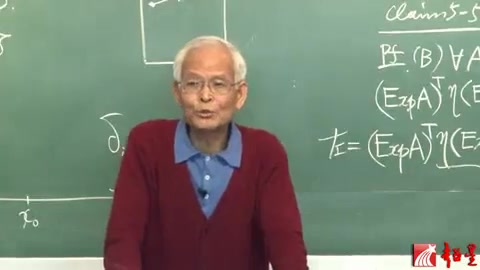
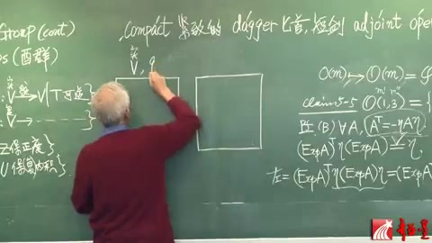
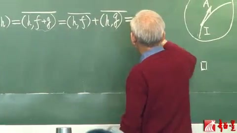
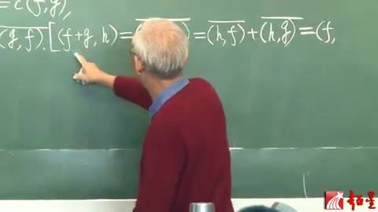
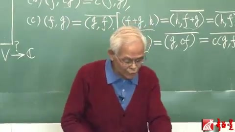
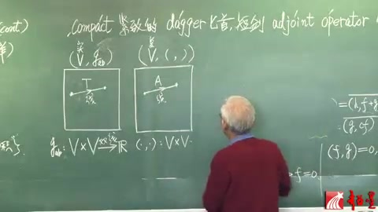
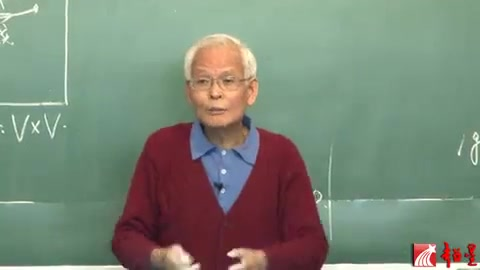
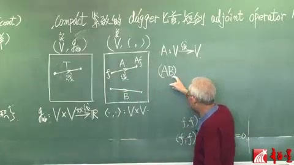
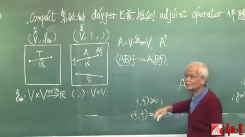
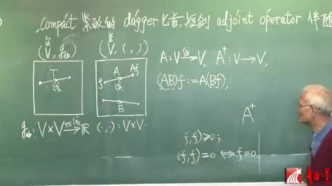

# 李群李代数 第24讲 酉群（续）

视频链接：[李群李代数 第24讲 酉群（续）](https://youtu.be/mG3KzhwXS1k?si=1AV-sMtVCEgtF_7E)

> 自动生成的课程注解文档（共 11 个段落）

## 目录

- [00:00:01 段落 1](#段落-1)
- [00:05:07 段落 2](#段落-2)
- [00:05:54 段落 3](#段落-3)
- [00:07:06 段落 4](#段落-4)
- [00:12:08 段落 5](#段落-5)
- [00:12:15 段落 6](#段落-6)
- [00:12:27 段落 7](#段落-7)
- [00:13:21 段落 8](#段落-8)
- [00:17:59 段落 9](#段落-9)
- [00:18:12 段落 10](#段落-10)
- [00:23:16 段落 11](#段落-11)

---

## 段落 1

**时间：** 00:00:01 ~ 00:05:05

📝 原始字幕

<pre>
一直都是学物理的人比如说我自己就是长期以来是一个很大的困扰后来终于我是下决心就把这个案情分析这个的基本的部分吧学了当然也学得不好那么我特别是强调它怎么样用到量子力学的比如说迪拉克那个左右史这个大家都知道学物理的都知道左右史这个记号这怎么怎么就对了但是他的那个数学的根基为什么这么样就弄对了呢那么还是反而分析那套都能说清楚那么我就觉得呢如果要求每一个学物理的人啊包括教量子力学的老师们都去把分案分析学到这样一个程度什么程度不仅仅是把数学系的分析分析学会了而且还得用到量子力学一把一眼功功整整地说清楚那也太难为了那么所以呢我觉得就有必要写一个简化的副录最后就强化我这个副录B我呢片幅不长那个凡是那个你用的定义那我都是严格给的好正的定理都给你正了不好正的定理那就告诉你那定理还有它的应用你要想看证明你在查案件分析书那么这样篇幅就比较短入门就是对学物理的人我听到不少人反应是觉得很有帮助那么在这儿我也顺便推荐那么现在我因为没讲这个富禄B我就讲这个有群了那么有群里面是要用到腹乳逼的一些东西的关键就是那个无内机空间这个东西我得给你把富鲁比的主要东西简单讲一讲详细的你看路闭好了虽然时间不够我还想再说两句就是学习这个量子力学啊那个我觉得那些爱提问题的那笨人吧我可能也算一个嗯嗯自己成人笨那么就是好多问题都想不明白就提出来就会发现有大量的问题好像物理书里这么讲说不清楚的啊就比如讲那个啊Qubert Space这个就是希尔伯空间了哈那么就定义呢就是啊啊平方可积的函数的集合是吧然后就说到这个你也可以有坐标表象有重量表象到了动量表象的时候平面多啊就是这个啊就物理上就对应着那个动量表象的基石了任何尺量就是就是那个那个平方可接函数吧啊都可以用这个黑白空间的基石去展开比如平面波呢这个也是基石那么它也可以去任何一个就是波函数不就黑表空间的一个元素吗你大都可以写成这个平面波展开了那么平面波就被称为就是那个这个基石代表动量表象的基石那么但是呢你一看那平面波你就发现了平面波作为一个函数啊它是非平方可击的非平方可记的函数呢按理说就不是黑白空间的成员了KBO空间的定义是全体平方可计函数的集合啊那么你这个平面波呢连Q空间的这个啊啊这个元素这个所谓时量也都不是非平方可击啊你连元素都不是你又成鸡屎那即使它首先是个尺量啊是个元素啊那就好像有一个委员会里面有个常委会啊这个你是常委你首先得是个委员吧现在平面波就好比是非委员常委
</pre>

**课程截图：**

### 注解

以下是对这段课程视频内容的深度注解：

### 1. 核心概念与理论背景

这段视频主要探讨了量子力学数学基础中的一个经典“痛点”：**希尔伯特空间（Hilbert Space）与狄拉克符号（Dirac Notation）的严谨性问题**。

#### 1.1 希尔伯特空间与平方可积函数
在量子力学中，系统的状态通常由波函数 $\psi(x)$ 描述。为了保证概率解释的合理性（即粒子在全空间出现的总概率为1），波函数必须满足**平方可积**条件：
$$ \int_{-\infty}^{\infty} |\psi(x)|^2 dx < \infty $$
所有满足这一条件的函数构成了一个数学空间，即 $L^2$ 空间，它是**希尔伯特空间**的一个具体实现。希尔伯特空间是一个完备的内积空间，量子力学中的态矢量（State Vector）就是这个空间中的元素。

#### 1.2 动量表象与平面波的“悖论”
在量子力学中，动量算符的本征态（即动量表象的基矢）是**平面波**，其形式为：
$$ \psi_p(x) = \frac{1}{\sqrt{2\pi\hbar}} e^{i p x / \hbar} $$
然而，平面波在全空间上的积分是发散的：
$$ \int_{-\infty}^{\infty} |\psi_p(x)|^2 dx = \int_{-\infty}^{\infty} \frac{1}{2\pi\hbar} dx \to \infty $$
这意味着**平面波不是平方可积的**，因此它**严格来说并不属于希尔伯特空间**。

#### 1.3 老师的比喻：“非委员常委”
老师用了一个非常生动的比喻来解释这个矛盾：
* **希尔伯特空间**就像是一个“委员会”，只有平方可积的函数才能成为“委员”。
* **平面波**被用作展开其他波函数的“基矢”（类似于“常委”），但它本身却不是平方可积的（“非委员”）。
* 这就产生了一个逻辑上的尴尬：“你是常委，你首先得是个委员吧？现在平面波就好比是非委员常委。”

#### 1.4 狄拉克符号与泛函分析
为了解决这个数学上的不严谨，物理学家狄拉克发明了**左矢（Bra）和右矢（Ket）**记号（即 $\langle \phi | \psi \rangle$）。虽然物理学家用得很顺手，但其严格的数学基础需要用到**泛函分析（Functional Analysis）**，特别是**装备希尔伯特空间（Rigged Hilbert Space / Gelfand Triple）**的概念。在这个扩展的框架下，平面波等非平方可积的广义函数被合法化，可以作为连续谱的基矢。

---

### 2. 截图板书内容描述

虽然老师主要在口述，但背景黑板上隐约可见一些数学推导，主要涉及李群与李代数的相关内容（与老师提到的“群论”部分对应）：

* **右侧板书**：
  可见类似 `Pf (B) ∀ A` 的字样，表示某个定理（Claim）的证明（Proof）。
  下方有公式：
  $$ (\text{Exp} A)^T \eta (\text{Exp} A) $$
  这通常出现在李群的讨论中，例如证明某个矩阵指数（$\text{Exp} A$）属于某个特定的群（如洛伦兹群或正交群），其中 $\eta$ 可能是度规张量，$T$ 表示矩阵转置。

* **左侧板书**：
  可见克罗内克记号 $\delta_{ij}$，以及一个坐标轴上的点 $x_0$。

---

### 3. 总结与学习建议

老师在这段话中传达了几个重要的教学理念：
1. **物理与数学的张力**：物理学家往往先凭直觉发明好用的工具（如狄拉克符号、平面波基矢），而数学家后来才给出严格证明（如泛函分析）。
2. **适度严谨**：对于学物理的人，完全陷入纯数学的泛函分析会“太难为”人，但完全不了解又会产生逻辑困惑。因此，老师推荐通过简化的附录（如他提到的“附录B”）来掌握必要的数学基础，做到“一眼能工工整整地说清楚”。
3. **鼓励提问**：老师鼓励学生做“爱提问题的笨人”，因为很多看似理所当然的物理表述（如平面波作为基矢），深究下去往往隐藏着深刻的数学/物理本质。

---

## 段落 2

**时间：** 00:05:07 ~ 00:05:49

📝 原始字幕

<pre>
非党员的共产党局部书记这说得清楚吗我很早就有这个问题但是百师傅解你要看一般师傅不行到最后呢就发现用反反分析还不是一般反反分析必须反反分析再有一个那个桥梁又回物理回两个历史那么才能搞明白的所以有很多这些东西就举德呢去呃写这么一个符录啊那么现在我就把富鲁逼得最基本的一点内容来讲一讲我们稍微今天要严厉一点啊
</pre>

**课程截图：**

### 注解

### 1. 视频字幕内容纠错与概括

这段字幕显然是语音识别错误（ASR错误）导致的乱码。结合截图中的课程标题“李群和李代数（二十四）”以及主讲人（梁灿彬教授），我们可以推断出这段话的真实含义。

**字幕纠错推测：**
“非连通的洛伦兹群局部性质这说得清楚吗？我很早就有这个问题，但是看一般书不行。到最后呢，就发现用泛函分析，还不是一般泛函分析，必须泛函分析再有一个那个桥梁，又回物理，回两个历史，那么才能搞明白的。所以有很多这些东西，就觉得呢，去写这么一个附录啊。那么现在我就把附录里最基本的一点内容来讲一讲，我们稍微今天要严密一点啊。”

**内容概括：**
梁教授在讲述洛伦兹群（Lorentz Group）的复杂拓扑性质（如非连通性）。他提到，为了讲清楚这些深刻的数学物理概念，一般的教材是不够的，需要借助更高级的数学工具（如泛函分析），并结合物理背景和历史发展才能透彻理解。因此，他专门编写了附录来补充这些内容，并在本节课中对附录的基础部分进行严密的讲解。

---

### 2. 板书公式识别与解释

从截图中可以看到黑板上关于李群和李代数的推导，特别是正交群 $O(1,3)$（洛伦兹群）的李代数性质。

**板书内容提取：**
*   **标题:** `Claim 5-5` $O(1,3) = \{ \dots \}$ (洛伦兹群的定义)
*   **证明过程 (Pf):**
    *   对于李代数元素 $A$，满足条件：$A^T = -\eta A \eta$ （图中被圈出）
    *   指数映射性质：$(\text{Exp} A)^T \eta (\text{Exp} A) = \eta$
    *   推导步骤：左 $= (\text{Exp} A^T) \eta = \dots$

**公式逐一解释：**

1.  **$O(1,3)$**: 洛伦兹群（Lorentz group），是保持闵可夫斯基时空度规不变的线性变换群。
2.  **$\eta$**: 闵可夫斯基度规矩阵，通常在物理学中取为 $\text{diag}(-1, 1, 1, 1)$ 或 $\text{diag}(1, -1, -1, -1)$。它满足 $\eta^T = \eta$ 且 $\eta^2 = I$。
3.  **$A$**: 洛伦兹群 $O(1,3)$ 对应的李代数 $\mathfrak{o}(1,3)$ 中的元素（生成元）。
4.  **$A^T = -\eta A \eta$**: 这是洛伦兹李代数元素的定义条件。它表示在度规 $\eta$ 下，矩阵 $A$ 是反对称的。
5.  **$\text{Exp} A$**: 矩阵指数映射，将李代数元素 $A$ 映射到李群元素。如果 $A \in \mathfrak{o}(1,3)$，那么 $\Lambda = \text{Exp} A \in O(1,3)$（更准确地说是洛伦兹群的连通分支 $SO^+(1,3)$）。
6.  **$(\text{Exp} A)^T \eta (\text{Exp} A) = \eta$**: 这是洛伦兹群元素 $\Lambda = \text{Exp} A$ 必须满足的定义条件，即保持度规 $\eta$ 不变（$\Lambda^T \eta \Lambda = \eta$）。板书正在证明：如果李代数元素 $A$ 满足 $A^T = -\eta A \eta$，那么其指数映射生成的群元素必然满足度规不变性。

---

### 3. 理论背景知识补充

*   **李群与李代数 (Lie Group and Lie Algebra):** 李群是具有光滑流形结构的群，李代数则是其在单位元处的切空间。李代数通过指数映射（Exponential map）局部地生成李群。研究李群的性质通常可以转化为研究其李代数的线性代数问题，这大大简化了计算。
*   **洛伦兹群 $O(1,3)$:** 在狭义相对论中，洛伦兹群是所有保持时空距离 $ds^2 = -dt^2 + dx^2 + dy^2 + dz^2$ 不变的坐标变换的集合。它是一个非紧致、非连通的李群，包含四个连通分支。
*   **度规不变性与李代数条件:** 洛伦兹群的定义是 $\Lambda^T \eta \Lambda = \eta$。令 $\Lambda(t) = \text{Exp}(tA)$ 是一条穿过单位元的单参数子群。对 $t$ 求导并在 $t=0$ 处取值，即可得到李代数元素必须满足的条件：$A^T \eta + \eta A = 0$，两边同乘 $\eta$ 即可得到板书中的 $A^T = -\eta A \eta$。

---

### 4. 核心概念通俗解释

想象你有一个魔方（代表物理系统），你可以对它进行各种旋转（代表群变换）。
*   **李群**就像是所有可能旋转操作的完整集合。对于洛伦兹群，这些操作就是狭义相对论中的空间旋转和速度变换（洛伦兹推力）。
*   **李代数**就像是这些旋转操作的“微小基本动作”。你只需要掌握这些最基本的微小动作，通过不断重复（指数映射），就能组合出任何复杂的旋转。
*   **板书在证明什么？** 梁教授正在黑板上用数学语言证明一个直观的道理：如果你保证每一个“微小基本动作”（李代数元素 $A$）都不会破坏时空的规则（满足 $A^T = -\eta A \eta$），那么由这些微小动作累积而成的“大动作”（群元素 $\text{Exp} A$）也绝对不会破坏时空的规则（满足 $\Lambda^T \eta \Lambda = \eta$）。

---

## 段落 3

**时间：** 00:05:54 ~ 00:07:01

📝 原始字幕

<pre>
我们对比着看很清楚这是一个实的水量空间我们定义那个O群的时候啊就说选了一个正定的赌规宝正定祖规的那个就叫做欧群的群员那么现在要讲有群有群呢我们选一个水量空间是服的怎么上头呢有一个跟杜龟很像又不完全一样的映射叫做嗯嗯内机这个内提呢我们用圆糊中间来个逗号就是这输进一个元素这再输进一个元素它就会变成一个符号了这么一个东西就叫做内积那么这个括弧到这儿呢还应该这么样括起来就是十尺量空间配一个度龟服务室内空间的配一个内机就这个意思
</pre>

**课程截图：**

### 注解

以下是对这段课程视频字幕及板书内容的深度注解：

### 1. 截图板书内容描述与公式解析

**截图描述：**
在截图中，老师正在黑板上画两个方框进行对比。
*   **左侧板书：** 提到了“酉群”（Unitary Groups），并列出了线性映射的集合，如 $V \xrightarrow{\text{实}} V$（$T$ 可逆），以及保正定度规的变换集合（对应正交群 $O$），和保复内积的变换集合（对应酉群 $U$）。
*   **中间板书：** 老师画了两个方框。在左边的方框上方写了“实 $V, g$”，代表实矢量空间配上度规。右边的方框准备用来写复矢量空间配上内积。上方还写了英文单词 "compact"（紧致的）、"dagger"（匕首，短剑，指代厄米共轭符号 $\dagger$）、"adjoint operator"（伴随算子）。
*   **右侧板书：** 包含关于正交群 $O(m)$ 和洛伦兹群 $O(1,3)$ 的李代数推导。核心公式为 $A^T = -\eta A \eta$（表示李代数元素的反对称性质），以及指数映射保度规的证明过程：$(\exp A)^T \eta (\exp A) = \eta$。

**核心符号与公式解析（基于字幕与板书）：**

*   **实 $V$**：指实矢量空间（Real Vector Space），空间中的标量乘法定义在实数域 $\mathbb{R}$ 上。
*   **$g$（度规/Metric）**：字幕中称为“度规”（语音识别为“赌规”）。在实矢量空间中，度规是一个双线性映射 $g: V \times V \to \mathbb{R}$，用于定义矢量之间的长度和夹角。
*   **正交群 $O$ (Orthogonal Group)**：字幕中的“O群”。它是实矢量空间上保持正定度规（即内积）不变的线性变换群。数学上表示为满足 $O^T g O = g$ 的矩阵 $O$ 的集合。
*   **复 $V$**：指复矢量空间（Complex Vector Space），标量乘法定义在复数域 $\mathbb{C}$ 上。
*   **酉群 $U$ (Unitary Group)**：字幕中的“有群”。它是复矢量空间上保持复内积不变的线性变换群。数学上表示为满足 $U^\dagger U = I$（或保持特定埃尔米特形式）的矩阵 $U$ 的集合。
*   **$(\cdot, \cdot)$（内积/Inner Product）**：字幕中描述为“圆糊中间来个逗号...输进一个元素这再输进一个元素它就会变成一个符号（复数）”。这是一个从 $V \times V \to \mathbb{C}$ 的映射，通常要求满足共轭对称性、对第一/第二变元的线性/反线性以及正定性。

### 2. 理论背景知识补充

*   **度规与内积的区别与联系**：
    *   在**实矢量空间**中，正定度规和内积通常是同义词，它们都是对称的双线性形式。保持这种结构不变的对称群是**正交群 $O(n)$**。
    *   在**复矢量空间**中，为了保证矢量的模长平方为实数且非负，我们需要引入**复内积**（或称埃尔米特内积）。它不再是双线性的，而是**半双线性**的（Sesquilinear），即对一个变量线性，对另一个变量反线性（共轭线性）。保持复内积不变的对称群是**酉群 $U(n)$**。
*   **伴随算子与 Dagger ($\dagger$)**：
    *   在复空间中，矩阵的转置 $A^T$ 不足以保持内积结构，必须使用**共轭转置**，即厄米共轭（Hermitian conjugate），记作 $A^\dagger = (A^*)^T$。板书上方的 "dagger" 和 "adjoint operator" 正是在为引入复空间中的伴随操作做铺垫。

### 3. 核心概念通俗解释

这段话的核心在于**对比实空间和复空间的几何结构及其对应的对称群**。

你可以这样理解：
1.  **实数世界的尺子（正交群）**：想象一个普通的 3D 空间（实矢量空间），我们用一把普通的尺子（正定度规 $g$）来量长度和角度。如果你把这个空间旋转或翻转，只要物体的长度和夹角不改变，这种变换就属于**正交群（O群）**。
2.  **复数世界的尺子（酉群）**：现在我们把空间升级到复数世界（复矢量空间）。在这个世界里，普通的尺子不管用了，我们需要一把特殊的尺子叫做**复内积**（括号中间加逗号的那个符号）。它能吃进去两个复矢量，吐出一个复数。如果你在这个复数空间里做变换，且保证这把“复数尺子”量出的结果不变，这种变换就属于**酉群（U群）**。

老师画两个框的目的，就是为了让大家在脑海中建立一个清晰的对应字典：
*   **实空间** 配 **度规** $\longrightarrow$ 对应 **正交群 (O)**
*   **复空间** 配 **复内积** $\longrightarrow$ 对应 **酉群 (U)**

---

## 段落 4

**时间：** 00:07:06 ~ 00:12:08

📝 原始字幕

<pre>
那么渡龟是什么东西呢唉杜龟GAV啊那不是个零二型张亮吗零二型张亮不就是从啊V 跨V吃啊啊这么一个应设吗而且这个硬勺应该是对每一个输入槽都线性的就是所谓双线性硬勺对不对那么到这儿呢是渡归了内基了这个内机这个福啊它也是个硬霜也是从这个V当这个V是浮的跨越V去外你猜这个到时数与这个就到无数语那么现在有一个问题就是这个是双线性的这个也是双向性的吗啊不是到底是什么呢那么下面我们把这个印硕应该满足的条件告诉你你就明白了所以现在呢我们就讲这个映射要满足的四个条件ABCD嗯嗯这里面的元素我们习惯记得V小V这两个元素由于我们要跟随那个FB那么那个时候是记作再一个元素你可以提到的积了那么考从VQSV图大西那就你给我一个F随便再给我一个G我就应该出一个符数对不对那么所以呢就是圆口湖啊这输入一个F这输入一个G那么就应该出一个伏手了哎呀血如果你现在扩起来它就一个浮数那么这个浮数这种硬寿满足什么呢就假如你还有一个东西叫做H那么你集合一个H相加加完了作为第二槽这第一槽是F就而一样跟G加H的那个内机我们要求等于呢嗯鸡的内鸡再加上嗯和H的内积这是很自然的就非常简单了第二条唉B呀这个如果跟鸡再乘一个符号叫小C小C是浮数树成嘛这个浮空间的话数乘是用浮数去乘嘛这个等于什么呢等于把小溪提出来和鸡的这个啊啊内计那么AB这两条呢我们就看出来了这个内肌硬硕啊对于这个第二层而言第二层而言是现性的这儿可是双线性那么于是我们说第二槽是线性的第一槽是什么呢还没讲那么再往下讲第十四条这个东西呢这个度V是对称的张亮就是说你先给个V再给个U和先给U后给V结果一样对吧但这个不一样先给L再给鸡等不等于先给G这叫什么不等怎么就等了呢就要娶个爸取八就是取这个数的这个符数的不数共额就等了那么这一条就意味着它关于一二两朝是不对称的那么这条很厉害它就能导致什么后果我翻空后我给你看看它就能导致啊这个内基硬说对于第一朝啊不是线性那么简单你看看对于第一朝我们应该这么看加鸡但第二条是H这东西等于什么呢啊这个好办你先调过来就是HF加G那么就是得根据这个挖一下这个是逗画在这儿这相加的那么这个呢你利用这个A啊那应该就是H跟啊挖一下再加上H跟鸡又扒一下那么这个呢再调回来
</pre>

**课程截图：**

### 注解

以下是对这段课程视频内容的深度注解：

### 1. 核心概念与板书公式解析

这段视频主要讲解了**复向量空间上的内积（Hermitian内积）**的定义及其与实向量空间上度规（双线性映射）的区别。

#### 板书内容描述
从截图中可以看到，黑板上主要对比了实向量空间和复向量空间上的两种映射：
*   **左侧（实空间）：** 标有“实”，写着 $(V, g_{ab})$，下方公式为 $g_{ab}: V \times V \xrightarrow{\text{双线性}} \mathbb{R}$。这代表实向量空间上的度规张量，它是一个双线性映射，将两个向量映射为一个实数。
*   **右侧（复空间）：** 标有“复”，写着 $(V, \langle , \rangle)$，下方公式为 $\langle , \rangle: V \times V \rightarrow \mathbb{C}$。这代表复向量空间上的内积映射，将两个复向量映射为一个复数。黑板上画了两个方框代表空间，并在复空间框内标出了元素 $f, g$。

#### 公式与符号解析
根据老师的讲解，复内积映射 $\langle , \rangle$ 必须满足以下四个条件（视频中讲解了前三个及由其推导出的性质）：

设 $V$ 是复向量空间，$f, g, h \in V$ 是空间中的向量（视频中称为“元素”或“函数”），$c \in \mathbb{C}$ 是复数。内积记为 $\langle f, g \rangle$（视频中口语称为“圆括号，输入一个f，输入一个g”）。

*   **条件 (a) 第二槽的加法线性：**
    $$\langle f, g + h \rangle = \langle f, g \rangle + \langle f, h \rangle$$
    *解释：* 保持第一个输入 $f$ 不变，对第二个输入 $g+h$ 进行内积，等于分别内积后相加。

*   **条件 (b) 第二槽的数乘线性：**
    $$\langle f, c g \rangle = c \langle f, g \rangle$$
    *解释：* 第二个输入乘上复数 $c$，可以把 $c$ 直接提取到内积外面。
    *(注：结合(a)和(b)，说明内积对**第二个变量**是严格线性的。)*

*   **条件 (c) 共轭对称性（Hermitian对称性）：**
    $$\langle f, g \rangle = \overline{\langle g, f \rangle}$$
    *解释：* 交换两个输入的位置，内积的结果不再是相等（实空间度规是对称的），而是取**复共轭**（视频中称为“取个拔”，即加上横线表示共轭）。这说明它关于两个槽是**不对称**的。

*   **推论：第一槽的共轭线性（反线性）：**
    视频最后推导了对第一槽的性质：
    $$\langle f + g, h \rangle = \langle f, h \rangle + \langle g, h \rangle$$
    $$\langle c f, g \rangle = \overline{c} \langle f, g \rangle$$
    *推导过程（视频口述）：*
    $\langle c f, g \rangle = \overline{\langle g, c f \rangle}$ （利用条件c交换位置取共轭）
    $= \overline{c \langle g, f \rangle}$ （利用条件b把第二槽的 $c$ 提出来）
    $= \overline{c} \cdot \overline{\langle g, f \rangle}$ （复共轭的性质）
    $= \overline{c} \langle f, g \rangle$ （再次利用条件c换回来）
    *结论：* 从第一槽提取复数时，必须加上复共轭。这被称为**半双线性（Sesquilinear）**。

### 2. 理论背景知识补充

*   **度规张量 (Metric Tensor)：** 在实向量空间（如广义相对论中的时空）中，度规 $g$ 是一个 $(0,2)$ 型张量，它是一个**双线性、对称**的映射。即 $g(u,v) = g(v,u)$，且对两个变量都满足线性叠加原理。
*   **复内积 (Complex Inner Product / Hermitian Form)：** 当推广到复向量空间（如量子力学中的态空间）时，如果仍要求双线性且对称，会导致向量自身的内积（模长平方） $\langle v, v \rangle$ 成为复数，这在物理上无法表示概率或长度。因此，必须引入**共轭对称性** $\langle u, v \rangle = \overline{\langle v, u \rangle}$。这保证了 $\langle v, v \rangle = \overline{\langle v, v \rangle}$，即向量的模长平方必定是**实数**。
*   **物理学约定 vs 数学约定：** 视频中采用的是物理学（特别是量子力学，如狄拉克符号）的约定：内积对**第二个变量**（右矢 $| \psi \rangle$）是线性的，对**第一个变量**（左矢 $\langle \phi |$）是反线性的。而许多纯数学教材约定对第一个变量线性，第二个变量反线性。

### 3. 通俗语言解释核心概念

这段视频的核心在于区分“实数世界的尺子”和“复数世界的尺子”。

在实数世界里（比如我们日常的几何空间），我们用“度规”来量长度和角度。它就像一个加工厂，有两个输入口（输入两个向量），输出一个实数。这个加工厂对两个输入口是完全公平的（对称的），而且你往任何一个口里多放一倍的原料，产量就多一倍（双线性）。

但是到了复数世界（比如量子力学），情况变了。如果我们还用完全公平的加工厂，算出来的“长度”可能会包含虚数，这在现实中没有意义（长度必须是实实在在的实数）。
为了解决这个问题，数学家设计了“复内积”这个新加工厂。它的特点是**“不对称”**：
1.  **二号输入口**很正常，放进去多少倍，结果就放大多少倍。
2.  **一号输入口**很特殊。如果你把一号输入口的原料乘以一个复数（比如 $a+bi$），加工厂吐出来的结果会乘上它的**复共轭**（变成 $a-bi$）。
3.  如果你把一号和二号的原料互换，结果不会一样，而是会变成原来的复共轭。

正是这种“不对称”（半双线性），巧妙地保证了当我们把同一个向量同时放进一号和二号口时，虚数部分刚好抵消，算出来的“长度平方”永远是一个实实在在的实数！

---

## 段落 5

**时间：** 00:12:08 ~ 00:12:09

📝 原始字幕

<pre>
就是L
</pre>

**课程截图：**

### 注解

### 1. 板书公式识别与解释

根据截图，黑板上正在推导内积（特别是复内积）的性质。可见的公式部分如下：

$$ (f+g, h) = \overline{(h, f+g)} = \overline{(h, f)} + \overline{(h, g)} = \dots $$

**符号含义：**
*   **$f, g, h$**：通常代表向量空间（如希尔伯特空间或函数空间）中的向量或函数。
*   **$(\cdot, \cdot)$**：表示内积（Inner Product）。在物理学（特别是量子力学）和数学中，内积用于衡量两个状态或函数的重叠程度。
*   **上划线 $\overline{\quad}$**：表示复共轭（Complex Conjugate）。在复向量空间中，内积具有共轭对称性，即 $(x, y) = \overline{(y, x)}$。

### 2. 理论背景知识

这段板书涉及**复内积空间（酉空间）**的基本公理。
在复内积空间中，内积通常满足以下性质：
1.  **共轭对称性**：$(x, y) = \overline{(y, x)}$
2.  **对第一个变量的线性（或共轭线性，取决于约定）**：
    *   数学约定（通常对第一个变量线性）：$(ax+by, z) = a(x, z) + b(y, z)$
    *   物理约定（狄拉克符号，通常对第二个变量线性，对第一个变量共轭线性）：$\langle ax+by | z \rangle = a^* \langle x | z \rangle + b^* \langle y | z \rangle$
    
从板书来看，老师正在利用“共轭对称性”和“对第二个变量的分配律”来推导对第一个变量的分配律：
$(f+g, h)$ 转化为 $\overline{(h, f+g)}$，然后利用 $(h, f+g) = (h, f) + (h, g)$，再取复共轭得到 $\overline{(h, f)} + \overline{(h, g)}$，最终这会等于 $(f, h) + (g, h)$。

### 3. 核心概念通俗解释

简单来说，老师正在证明“把两个东西加起来再和第三个东西算内积”，等于“分别算内积然后再相加”。因为涉及到复数，所以中间借用了“复共轭”（也就是把复数的虚部变号）这个工具来完成证明。这就像是在证明乘法的分配律 $(a+b)c = ac+bc$，只不过在复数向量的世界里，规则稍微复杂了一点点。

### 4. 截图板书描述

*   **左侧**：老师正在书写一连串的等式，推导内积的分配律性质，目前写到了 $\overline{(h, f)} + \overline{(h, g)} =$。
*   **右侧**：画了一个圆，圆内有原点出发的箭头（向量），标有字母 $A$ 和 $I$。这可能是在用几何直观（如复平面或单位圆）来辅助解释向量、复数或某种变换的概念。

---

## 段落 6

**时间：** 00:12:15 ~ 00:12:23

📝 原始字幕

<pre>
对的那么就是F这个在家呢被调回来了
</pre>

**课程截图：**

### 注解

### 1. 截图板书内容描述
截图中，老师正在黑板上推导内积（或标量积）的性质。老师的手指着公式的左侧部分。
黑板上可见的公式主要包括：
*   左上角：$= c(f, g)$ （部分可见）
*   左侧：$\overline{(g, f)}$ （部分可见）
*   主推导公式：$(f+g, h) = \overline{(h, f+g)} = \overline{(h, f)} + \overline{(h, g)} = (f, h) + (g, h)$ （最后一部分在画面边缘，根据逻辑补全）

字幕中的“F这个在家呢被调回来了”显然是语音识别错误，实际应该是描述公式中的 $f+g$ 以及内积中前后项交换（“调回来”）带来复共轭的操作。

### 2. 公式识别与解释
**核心公式：**
$$ (f+g, h) = \overline{(h, f+g)} = \overline{(h, f)} + \overline{(h, g)} = (f, h) + (g, h) $$

**符号含义：**
*   $f, g, h$：通常代表向量空间（如希尔伯特空间）中的向量或函数。
*   $(\cdot, \cdot)$：表示内积（Inner Product）。
*   $\overline{z}$：表示复数 $z$ 的复共轭（Complex Conjugate）。
*   $f+g$：向量的加法。

**推导步骤解析：**
1.  $(f+g, h) = \overline{(h, f+g)}$：利用了复内积的**共轭对称性**（交换内积的两个参数需要取复共轭）。
2.  $\overline{(h, f+g)} = \overline{(h, f) + (h, g)}$：利用了内积对第二个参数（或第一个参数，取决于约定，物理学中通常对后一个参数线性）的**线性/反线性性质**。这里假设对后一项是线性的，即 $(h, f+g) = (h, f) + (h, g)$。
3.  $\overline{(h, f)} + \overline{(h, g)} = (f, h) + (g, h)$：再次利用共轭对称性，将 $\overline{(h, f)}$ 还原为 $(f, h)$。

### 3. 理论背景知识
在量子力学或线性代数中，复向量空间上的内积（如狄拉克符号中的 $\langle \psi | \phi \rangle$）具有以下基本性质：
1.  **共轭对称性（厄米对称性）：** $(x, y) = \overline{(y, x)}$。这意味着如果交换内积的前后位置，结果会变成原来的复共轭。
2.  **对第一/第二变元的线性：** 在数学约定中，内积通常对第一个变元是线性的；而在物理学（量子力学）约定中，内积通常对第二个变元（右矢）是线性的，对第一个变元（左矢）是反线性的。
    *   物理约定：$(x, c_1 y_1 + c_2 y_2) = c_1(x, y_1) + c_2(x, y_2)$
    *   结合共轭对称性可推导出对第一变元的反线性：$(c_1 x_1 + c_2 x_2, y) = \overline{c_1}(x_1, y) + \overline{c_2}(x_2, y)$

板书中的推导正是为了证明：如果已知内积对后一个位置是线性的，那么通过共轭对称性“调换位置”，可以证明它对前一个位置在加法上也是分配的。

### 4. 通俗语言解释
这段视频在讲解复数空间里“向量点乘”（内积）的规则。
字幕里说的“调回来”，其实是指数学上的**“交换位置取共轭”**。
假设你要算 $(f+g)$ 和 $h$ 的内积。你可以先把它们的位置互换，变成 $h$ 和 $(f+g)$ 的内积，但代价是外面要加一个“复共轭”的帽子（横线）。然后利用已知的拆分规则把括号拆开，最后再把每一项的位置“调回来”（去掉复共轭帽子），就证明了加法是可以直接拆开算的。这就是在严谨地证明内积的分配律。

---

## 段落 7

**时间：** 00:12:27 ~ 00:13:17

📝 原始字幕

<pre>
再加那个F和这个和G和H谁害那你要看这不也挺好吗对于第一朝啊不是也限性吗但是别忙啊如果树成呢这个F第一朝的被一个符数相成再跟第二朝是个G去作用呢那么这个就调过来就是GCF这个扒一下这个八丸就是这个八别动那个C根据第二B条就可以拿出来就是C谁是?那么这个C呢就变成C八这个GF八呢就变成F听你看看这一停
</pre>

**课程截图：**

### 注解

以下是对这段课程内容的深度注解：

### 1. 板书公式识别与解释

根据截图和字幕内容，老师正在讲解**复内积空间（Hilbert空间）中内积的性质**，特别是关于第一个变量的共轭线性（反线性）性质。

**推导过程还原：**
字幕中提到的推导实际上是证明内积对第一个变量的性质。
假设有函数（或向量）$f, g, h$，以及复数 $c$。
板书截图展示了加法分配律的证明片段：
$$ (f+g, h) = \overline{(h, f+g)} = \overline{(h, f) + (h, g)} = \overline{(h, f)} + \overline{(h, g)} = (f, h) + (g, h) $$

字幕中老师口述的重点是**数乘**的性质（即“如果数乘呢，这个f第一槽的被一个复数相乘”）：
$$ (cf, g) $$
根据内积的共轭对称性（交换两个位置要取复共轭，即字幕中的“调过来”和“扒一下”指代加共轭横线 $\bar{}$ ）：
$$ (cf, g) = \overline{(g, cf)} $$
根据内积对第二个变量的线性性质（常数 $c$ 可以直接提出来）：
$$ \overline{(g, cf)} = \overline{c(g, f)} $$
最后，复共轭作用在乘积上：
$$ \overline{c(g, f)} = \bar{c} \overline{(g, f)} = \bar{c} (f, g) $$

**符号含义：**
*   $(\cdot, \cdot)$：表示两个向量或函数的内积（Inner Product）。
*   $f, g, h$：内积空间中的向量（在量子力学中通常是态矢或波函数）。
*   $c$：一个复数（字幕中的“符数”）。
*   $\bar{c}$ 或 $c^*$：复数 $c$ 的复共轭（字幕中的“八”指代 bar，即顶部的横线）。

### 2. 理论背景知识

在量子力学和泛函分析中，态空间通常是一个复内积空间（Hilbert空间）。复内积的定义在物理学（特别是狄拉克符号体系）和数学中有一个习惯上的差异：
*   **数学约定**：内积对**第一个**变量是线性的，对第二个变量是共轭线性的。
*   **物理约定**（量子力学常用）：内积对**第二个**变量是线性的，对**第一个**变量是共轭线性的（即反线性）。

从老师的推导 $(cf, g) = \bar{c}(f, g)$ 可以看出，这里采用的是**物理学约定**（或者老师正在证明第一个槽位提取常数时需要加共轭）。即：
1.  **共轭对称性**：$(f, g) = \overline{(g, f)}$
2.  **对第二个变量的线性**：$(f, c_1 g_1 + c_2 g_2) = c_1(f, g_1) + c_2(f, g_2)$
3.  **对第一个变量的共轭线性**：$(c_1 f_1 + c_2 f_2, g) = \bar{c}_1(f_1, g) + \bar{c}_2(f_2, g)$

### 3. 通俗语言解释核心概念

这段话的核心是在解释**“为什么内积的第一个位置里的常数提出来要加复共轭”**。

老师用非常口语化的方式（虽然字幕识别有误）推导了这个过程：
1.  **“第一槽被一个复数相乘”**：我们想算 $(cf, g)$。
2.  **“调过来...扒一下”**：利用共轭对称性，把前后位置互换，整体加上复共轭（bar），变成 $\overline{(g, cf)}$。
3.  **“根据第二条拿出来”**：因为内积对第二个位置是正常的线性关系，所以常数 $c$ 可以直接提到共轭符号里面，变成 $\overline{c(g, f)}$。
4.  **“变成C bar”**：最后把外面的大共轭符号拆开，常数 $c$ 就变成了它的复共轭 $\bar{c}$，而 $\overline{(g, f)}$ 又变回了 $(f, g)$。

结论就是：从内积的左边（第一槽）往外提复数，必须给这个复数加上共轭（打个星号或者加个横线）。

### 4. 截图板书内容描述

截图中，老师正在黑板上书写内积的性质推导。
可以看到黑板上写着：
$$ ... h) = \overline{(h, f+g)} = \overline{(h, f) + (h, g)} = (f, h) + ... $$
这正是利用共轭对称性和第二变量的线性，来证明内积对第一变量的加法分配律的过程。老师正背对镜头，用粉笔继续书写等式的右半部分。

---

## 段落 8

**时间：** 00:13:21 ~ 00:17:55

📝 原始字幕

<pre>
大战不如简单把C拿出来而是用C的疤所以呢合到一起两条合到一起我们就不能说他关于第一朝也是现性大那么像这种呢这一半是针线性这一半呢有点甲性性吧那么呃往往启明就是说对于第一朝是共俄先行的也叫反线性的怎么个反反的管呢反而就这含义所以你要特别注意这一点是跟杜龟不同的地方就第一要第二套是不完全对称的这是第十一条最后呢还有第一条第一条就是嗯干他就是一个元素F它的自我内基如果杜龟的话自我内机啊不要求啊嗯大鱼等于零它可能是小于零的当然正定度归有要求如果取消正定的话那是不要求的可是这个呢他要求大于等于零这是要求啊ABCD都是要求要求等于等于零而且那个等号指在什么时候成立呢嗯嗯等于零啊当且紧当这个L是零那个时候才成立那么由此由由这条你是能推出什么呢如果F根基啊是等于零的说NG的话什么意思给给了它跟任何一个元素机但内积都为零我说他就一定能推出为零为什么因为任何G都对我把G取成小F也对吧那么就导致F为零F为零不就是L一个F为零了嘛所以说记住这个以后我们就要用啊可能今天来不及就明天用这个就是呃这个所谓嗯嗯内记定义里边就有这么四条那么现在呢想玩到内机以后呢我们就要讲所谓算符阿伯儿啊阿伯瑞特就是算符这个在这个石的水量空间里呢我们说这个应硕啊比如说这一点硬到这点我们继续说七这个T如果是个限型硬苏的话拿马它就是V上的一个一一型张亮对吧我们把这个线性硬射称为张亮那么在这个服务空间里呢由于这个伏内机有这个弹发这个比较讨厌的地方啊一般呢这个硬瘦呢也是线性硬刷啊这个不叫张良叫做线性算符线性算符就是APRETER现性算符因为我们以后老用现性算符所以就现性那词不要就是说算符就指这么一个现行硬数这个线性硬说呢这个在那个输入B里我们那个符号是用大A如果拿到这一节里容易混的就是大A我们在这节里大艺术代表李诞树圆可是这个硬那是对应着这种硬那是群圆的味道对吧那么是不是会混呢没关系我们很快把那个A九脱离了所以问题不大嗯劝他唉呀就是这个呀就叫做一个微上的线性算符了简称算符
</pre>

**课程截图：**

### 注解

以下是对这段课程视频内容的深度注解：

### 1. 板书公式识别与解释

从截图和字幕内容来看，老师正在讲解复矢量空间（Complex Vector Space）中**内积（Inner Product）**的定义及其性质。板书上列出了内积需要满足的四条基本公理（通常标记为 a, b, c, d）。

**板书核心公式：**
内积是一个映射 $(\cdot, \cdot): V \times V \rightarrow \mathbb{C}$，满足以下条件（设 $f, g, h \in V$，$c \in \mathbb{C}$）：

*   **(a) 对第二变元的加法线性：**
    $$(f, g+h) = (f, g) + (f, h)$$
*   **(b) 对第二变元的数乘线性：**
    $$(f, cg) = c(f, g)$$
    *(注：物理学中通常约定内积对第二个变元是线性的，对第一个变元是共轭线性的；而数学中常约定对第一个变元线性。这里老师采用的是物理学约定。)*
*   **(c) 共轭对称性（厄米对称性）：**
    $$(f, g) = \overline{(g, f)}$$
    *推论（板书右侧推导）：*
    由 (c) 和 (a)(b) 可推导出对第一变元的**共轭线性（反线性）**：
    $$(cf, g) = \overline{(g, cf)} = \overline{c(g, f)} = \bar{c}\overline{(g, f)} = \bar{c}(f, g)$$
    *(字幕中的“C的疤”即指复共轭 $\bar{c}$，“共俄先行/反线性”即指共轭线性。)*
*   **(d) 正定性：**
    $$(f, f) \ge 0$$
    并且 $$(f, f) = 0 \iff f = 0$$
    *(字幕中提到“自我内基...要求大于等于零”，且“当且紧当这个f是零那个时候才成立”。)*

**板书右下角的一个重要推论：**
如果对于任意 $g \in V$，都有 $(f, g) = 0$，则必然推导出 $f = 0$。
*(证明思路：取 $g = f$，则 $(f, f) = 0$，由正定性公理 (d) 可得 $f = 0$。)*

---

### 2. 理论背景知识补充

*   **复内积空间（酉空间）：** 在实矢量空间中，内积具有对称性 $(f,g)=(g,f)$。但在复矢量空间中，为了保证一个矢量的模长平方 $(f,f)$ 是一个非负实数，必须引入**共轭对称性** $(f,g)=\overline{(g,f)}$。这导致了内积在两个位置上的不对称：对一个位置是线性的，对另一个位置是共轭线性的（即提取复数标量时要加共轭）。
*   **度规（Metric）与内积的区别：** 老师在视频中对比了“度规”和“内积”。在一般的伪黎曼流形（如广义相对论中的时空）中，度规张量给出的“内积”可能是负的（例如类空间隔或类时间隔），即不满足正定性。而严格意义上的数学“内积”必须是正定的（即 $(f,f) \ge 0$）。
*   **线性算符（Linear Operator）：** 在矢量空间 $V$ 上，将一个矢量映射为另一个矢量的线性映射 $T: V \rightarrow V$。在实空间中有时称为 $(1,1)$ 型张量，但在复内积空间（特别是量子力学）中，通常直接称为**线性算符**（Operator）。

---

### 3. 核心概念通俗解释

*   **“反线性”或“共轭线性”：**
    想象你有一个带有复数系数的向量。在普通的线性映射中，你把系数提出来，它还是原来的样子。但在复内积的第一个位置，当你把复数系数提出来时，它必须戴上一顶“帽子”——变成它的**复共轭**（比如 $2+3i$ 变成 $2-3i$）。老师说的“反线性”就是指这种提取系数时要取共轭的特性。这使得复内积的左右两个位置“不完全对称”。
*   **正定性（自我内积大于等于零）：**
    这就像是测量一个物体的长度。不管这个物体指向哪个方向，它的长度的平方必须是正数。只有当这个物体根本不存在（零向量）时，它的长度平方才会是零。这与相对论中的情况不同，相对论中某些非零向量的“长度平方”可以是负数。
*   **算符（Operator）：**
    算符就像是一个加工机器。你把一个状态（向量）丢进去，它按照一定的线性规则处理后，吐出另一个状态（向量）。在量子力学中，我们不叫它“张量”或“映射”，而是给它一个专属名字——“算符”。

---

### 4. 截图板书内容描述

*   **图1 & 图2：** 老师正在黑板上推导内积对第一个变元的共轭线性性质。板书上清晰地写着 $(cf, g) = \overline{(g, cf)} = \overline{c(g, f)} = \bar{c}(f, g)$。老师指着 $\bar{c}$ 解释复共轭的概念。
*   **图3：** 黑板左侧画了两个方框，表示映射关系 $V \times V \rightarrow \mathbb{C}$。中间列出了内积的四条公理 (a), (b), (c), (d)。黑板最上方用英文写着一些术语，如 `dagger`（伴随算符的符号 $\dagger$）、`adjoint operator`（伴随算符）、`unitary`（酉的），这预示着接下来课程将引入量子力学中极其重要的算符概念。右下角写着推论：$\forall g \in V, (f,g)=0 \Rightarrow f=0$。

---

## 段落 9

**时间：** 00:17:59 ~ 00:18:09

📝 原始字幕

<pre>
怎么样唉是一个操作员往V出喂答案是现行的啊
</pre>

**课程截图：**

### 注解

### 1. 板书/PPT内容描述与公式解析

**板书截图描述：**
黑板上主要展示了关于向量空间及其上定义的内积和算子的概念。
顶部写有几个英文专业词汇及其翻译：
*   **compact** 紧致的
*   **dagger** 匕首，短剑 (通常指代共轭转置符号 $\dagger$)
*   **adjoint operator** 伴随算子

下方画了两个方框，分别代表两种不同的向量空间结构：
*   **左侧方框：** 标记为“实”，表示实向量空间。上方写着 $(V, g_{ab})$。方框内画了一个箭头，标记为 $T$，下方写着“线性”。
    *   **公式：** $g_{ab}: V \times V \xrightarrow{\text{双线性}} \mathbb{R}$
    *   **符号含义：**
        *   $V$: 实向量空间。
        *   $g_{ab}$: 度规张量或内积，它是一个映射，接受两个来自 $V$ 的向量，并输出一个实数 ($\mathbb{R}$)。
        *   $\xrightarrow{\text{双线性}}$: 表示这个映射在两个变量上都是线性的（双线性形式）。
        *   $T$: 作用在空间 $V$ 上的线性算子（线性变换）。
*   **右侧方框：** 标记为“复”，表示复向量空间。上方写着 $(V, (, ))$。方框内画了一个箭头，标记为 $A$，下方写着“线性”。
    *   **公式：** $( , ) : V \times V \to \mathbb{C}$ （虽然截图未完全显示 $\mathbb{C}$，但根据语境可推断）
    *   **符号含义：**
        *   $V$: 复向量空间。
        *   $( , )$: 复内积（Hermitian内积），它接受两个向量并输出一个复数。
        *   $A$: 作用在复空间 $V$ 上的线性算子。

### 2. 理论背景知识补充

*   **内积空间 (Inner Product Space):** 带有内积结构的向量空间。内积允许我们定义向量的长度（范数）和两个向量之间的角度（正交性）。
    *   在实数域 $\mathbb{R}$ 上，内积是双线性的、对称的、正定的。物理学中常记为度规 $g_{ab}$。
    *   在复数域 $\mathbb{C}$ 上，内积是共轭双线性的（通常对第一个变量反线性，对第二个变量线性，或者反之），并且是共轭对称的。
*   **线性算子 (Linear Operator):** 保持向量加法和标量乘法运算的映射。即 $T(au + bv) = aT(u) + bT(v)$。
*   **伴随算子 (Adjoint Operator):** 对于内积空间上的线性算子 $A$，其伴随算子 $A^\dagger$ 满足对所有向量 $u, v$，都有 $(A^\dagger u, v) = (u, Av)$。在矩阵表示中，它对应于共轭转置矩阵。

### 3. 核心概念通俗解释

字幕中的“怎么样唉是一个操作员往V出喂答案是现行的啊”显然是语音识别的严重错误。结合板书，老师实际上是在讲解**“算子（Operator）”**的概念。

通俗地说，**算子**（在视频中可能被误识别为“操作员”）就像是一个加工机器。你把向量空间 $V$ 中的一个向量“喂”给这个机器，它就会按照一定的规则（线性规则）吐出另一个向量。
*   左边的图展示了在**实数**世界里，我们用度规 $g_{ab}$ 来量度向量，机器叫 $T$。
*   右边的图展示了在**复数**世界里（量子力学常用），我们用复内积 $( , )$ 来量度向量，机器叫 $A$。
老师正在对比这两种数学结构，为后续引入“伴随算子”（Adjoint operator，符号通常是像匕首一样的 $\dagger$）做铺垫。

---

## 段落 10

**时间：** 00:18:12 ~ 00:23:15

📝 原始字幕

<pre>
那么进一步呢你V上可以有很多很多的送福微上全体算符的这个当我现在为了准确我们一老永逸的约定这个V啊它是扶身的空间部件不假但是它是有限为的量子力学为什么难呢就量子力学里所用到的这个服务这个内积空间呢啊啊往往是无限为的以无限为的为主就那无限为的事就特别地多我随便讲一个学过量子力学的学理的人都知道这个算符呢嗯那个要有物理意义的算法啊应该是这个什么所谓峨米算符啊那个也叫自万算佛这都听说过的你要问一般学量子力学的人呢那么甚至老师呢那么你说我没算福是不是就自办算福啊那答案就都是我就吃饭吃饭就我明那么呢但是由于现在这个量子物理偏偏涉及的是HUBERSPACE就是一个浮的内积空间我先明确一下啊这个浮雪良空间定义了个内积就叫做浮内积空间而且浮子往往不说一说内积空间就指它了就举它那么量子力学的QUBE空间就是个内积空间这个但是它往往是在绝大多数情况下是这个无限为的内积空间那么它会导致很多问题比如这个算符要分有界算符和无界算符KF量子力学里遇到大量的算符呢又都是无界算符无界算符就很比如说自办性就不等于罗米性自办性强于罗敏性那么这些东西这个呃你要是没有比较好的那个数学基础呢那么就会乱套有时候就犯错误就能犯到这个地方我就有时候提外话了那么现在呢我们说呀我们现在这个讲友群的时候我们那个扶水梁空间没那么复杂是有限度的内积空间是有限维的有限维就好办了那么我们说这个任意一个啊圣佛啊它总可以呢这个唉我还先说所有算符的那个集合啊所有算符搁在一块儿也可以组成一个水量空间那么为了证明它是水蓝国家你得定义啊家法梁算夫之合树成树是用扶树是成顺符还有陵园这些都是很自然的你都能想得出来想不出来你看看富鲁B反正它就是雪凉空间了钻幅的集合是一个水量空间那么而且呢两个算符的乘积是有意义的比如说这个算符是A这个算符是V那么A乘B喝起来还是个算符怎么定义呢我们先把这个符号也介绍一下大A旋幅状的小F那么出来叫什么呢应该是AQF但是那个口号往往不写我们就不写了AF就表示A作用于F所得的那个新元素那么现在呢是A乘B这个成绩算符怎么定义那么就是作用到F呢定义为啊先拿B去作用到F撞完牛得一个新元素不是吗再被A所作用啊所以这个成绩算符的定义是WIFI啊挺清楚的那么下面我们再讲一个就是你只要给我一个线性算符A我总可以呢诱导出一个A的伴随算符来那个伴随算符呢就是记作A就加一个盖克就是叫GEG就是匕首或者是那个短剑你看这个不就是一个短剑呢不要写成A加A加的量子理学是上升算佛这个AGAGER叫做伴随算符你不读英文你也得写成这样
</pre>

**课程截图：**

### 注解

以下是对这段课程视频内容的深度注解：

### 1. 板书/PPT内容描述与公式解析

从提供的截图和字幕来看，板书主要涉及线性代数和量子力学中关于内积空间和算符的基础概念。

**板书内容描述：**
*   黑板上方写有英文单词：`compact`（紧致的）、`dagger`（匕首，短剑）、`adjoint operator`（伴随算符）。
*   黑板左侧画了两个方框，分别代表实内积空间 $(V, g_{ab})$ 和复内积空间 $(V, (,))$。
    *   左侧方框标记为“实”，内部有张量 $T$ 的图示。下方写有 $g_{ab}: V \times V \xrightarrow{\text{双线}} \mathbb{R}$，表示实内积是一个双线性映射，将两个向量映射到实数。
    *   右侧方框标记为“复”，内部有算符 $A$ 作用于向量 $f$ 得到 $Af$ 的图示，以及算符 $B$ 的图示。下方写有 $( , ) : V \times V \rightarrow \mathbb{C}$ （虽然截图不完整，但根据上下文应为映射到复数），表示复内积。
*   黑板右侧写有算符的定义和性质：
    *   $A: V \xrightarrow{\text{线}} V$：表示 $A$ 是从向量空间 $V$ 到自身的线性映射（算符）。
    *   $(f, f) \ge 0$：内积的正定性。
    *   $(f, f) = 0 \iff f = 0$：内积的非退化性。
    *   $(AB)$：表示算符 $A$ 和 $B$ 的乘积。

**公式解析：**
*   **$A: V \rightarrow V$**: 表示算符 $A$ 是一个作用在向量空间 $V$ 上的线性映射，它将 $V$ 中的一个元素（如 $f$）映射为 $V$ 中的另一个元素（如 $Af$）。
*   **$Af$**: 表示算符 $A$ 作用在向量 $f$ 上得到的新向量。字幕中提到，严格写法可能是 $A(f)$，但通常省略括号。
*   **$(AB)f = A(Bf)$**: 算符乘积的定义。表示算符 $AB$ 作用于向量 $f$，等价于先用算符 $B$ 作用于 $f$ 得到新向量 $Bf$，然后再用算符 $A$ 作用于 $Bf$。
*   **$A^\dagger$ (A dagger)**: 算符 $A$ 的伴随算符（Adjoint operator）。符号 $\dagger$ 读作 dagger（匕首）。

### 2. 理论背景知识补充

*   **复内积空间 (Complex Inner Product Space)**：也称为酉空间。在量子力学中，系统的状态通常由复内积空间（特别是希尔伯特空间）中的向量（态矢）来描述。内积用于计算概率幅和期望值。
*   **希尔伯特空间 (Hilbert Space)**：完备的内积空间。量子力学中通常处理的是无限维的希尔伯特空间，这使得算符的性质变得复杂（如出现无界算符）。
*   **厄米算符 (Hermitian Operator) / 自伴算符 (Self-adjoint Operator)**：在有限维空间中，两者通常等价，满足 $A = A^\dagger$。在量子力学中，可观测的物理量必须由自伴算符表示，因为它们的本征值必须是实数（代表测量结果）。在无限维空间中，自伴性比厄米性（对称性）要求更严格的定义域条件。
*   **有界算符与无界算符**：在无限维空间中，有些算符（如位置算符、动量算符）是无界的，这意味着它们不能作用于空间中的所有向量，处理它们需要更谨慎的数学工具。

### 3. 核心概念通俗解释

*   **有限维 vs 无限维**：老师强调了这门课（群论相关）主要处理“有限维”的复内积空间，这比量子力学中常见的“无限维”空间要简单得多。无限维空间里到处都是“坑”（比如无界算符），容易犯错；而有限维空间性质良好，数学处理更直观。
*   **算符 (Operator)**：可以把算符想象成一个“加工机器”。你把一个向量（状态 $f$）扔进去，它给你吐出一个新的向量（状态 $Af$）。
*   **算符的乘积 ($AB$)**：就是机器的串联。先让向量通过机器 $B$，加工出来的半成品再送进机器 $A$ 进行二次加工。注意顺序不能反，先写在右边的先起作用。
*   **伴随算符 ($A^\dagger$)**：对于任何一个线性算符 $A$，数学上都可以找到一个对应的“影子”算符，叫做伴随算符 $A^\dagger$。在量子力学中，这个概念非常核心，比如用来定义物理量（自伴算符）或者描述粒子的产生和湮灭（产生算符 $a^\dagger$）。老师特别提醒，这个符号像个小匕首，读作 dagger，不要写成加号。

---

## 段落 11

**时间：** 00:23:16 ~ 00:24:24

📝 原始字幕

<pre>
那么这价格他们称为A的伴随算法就是JohnR的算法那么它也是分泌土密的信息算法那么总定义呢这个服务B有一个详细定义但是呢我们这儿图省市就介绍一个结论性的等价定义就完了这个特别好用邓家斌你呢是这样就是如果这一个A作用于G这个不也是新元素吗他们俩求内机它就会等于呢这个A啊杰克加德那个UF这位是G就是这个A啊从那个第二槽挪到第一槽去的话呢要加一个DEGR你就记住这条就行这个当然是FNFG进这个V了那么这是啊伴随顺服
</pre>

**课程截图：**

### 注解

以下是对这段课程内容的深度注解：

### 1. 截图板书内容描述与公式解析

从截图中可以看到，老师正在讲解线性代数或泛函分析中的核心概念，特别是关于内积空间和伴随算子（Adjoint Operator）。

**板书文字描述：**
*   顶部写着英文词汇及其翻译：`compact 紧致的`, `dagger 匕首, 短剑`, `adjoint operator 伴随算子`。
*   左侧画了两个方框，分别代表实向量空间 $(V, g_{ab})$ 和复向量空间 $(V, \langle , \rangle)$。
*   右侧写了一系列关于线性算子及其伴随的公式。

**公式识别与符号含义：**

1.  **$A: V \xrightarrow{\text{线}} V$**
    *   **含义**：表示 $A$ 是一个从向量空间 $V$ 映射到 $V$ 的**线性算子**（或线性变换）。箭头上的“线”字强调了其线性性质。
2.  **$A^\dagger: V \to V$**
    *   **含义**：表示 $A$ 的**伴随算子**（Adjoint Operator），记作 $A^\dagger$（读作 A dagger），它也是一个从 $V$ 映射到 $V$ 的算子。
3.  **$(AB)f := A(Bf)$**
    *   **含义**：定义了两个算子 $A$ 和 $B$ 的乘积（复合）。算子 $AB$ 作用在向量 $f$ 上，等价于先将算子 $B$ 作用于 $f$，再将算子 $A$ 作用于结果 $Bf$ 上。
4.  **$\langle f, f \rangle \ge 0$**
    *   **含义**：内积的正定性条件之一。表示任意向量 $f$ 与自身的内积必须是一个非负实数。
5.  **$\langle f, f \rangle = 0 \iff f = 0$**
    *   **含义**：内积的严格正定性条件。向量与自身的内积为零，当且仅当该向量是零向量。
6.  **字幕中提到的等价定义（结合板书推断）**：$\langle Af, g \rangle = \langle f, A^\dagger g \rangle$
    *   **含义**：这是伴随算子 $A^\dagger$ 的核心定义公式。字幕中提到的“A作用于f...求内积...等于A从第二槽挪到第一槽加个dagger”，指的就是这个内积等式。在复内积空间中，算子 $A$ 作用在第一个位置（或第二个位置，取决于内积的约定），可以等价地移到另一个位置，但必须变成它的伴随算子 $A^\dagger$。

### 2. 理论背景知识补充

*   **内积空间 (Inner Product Space)**：在向量空间的基础上引入了“内积”的概念，使得我们可以度量向量的长度（范数）以及向量之间的夹角。在实数域上通常用度量张量 $g_{ab}$ 表示，在复数域上通常用狄拉克符号 $\langle \cdot | \cdot \rangle$ 或圆括号 $(\cdot, \cdot)$ 表示。
*   **伴随算子 (Adjoint Operator)**：在有限维复向量空间（且选定标准正交基）中，算子 $A$ 的矩阵表示的伴随矩阵，就是原矩阵的**共轭转置**（Conjugate Transpose）。在量子力学中，伴随算子极其重要，因为可观测物理量必须由自伴算子（Hermitian算子，即 $A = A^\dagger$）来表示，以保证测量结果为实数。

### 3. 核心概念通俗解释

**什么是伴随算子（Dagger）？**

想象内积 $\langle x, y \rangle$ 是一台有两个输入槽（左槽和右槽）的机器，它能计算出两个向量的某种“相关性”。
现在有一个操作（算子）$A$。
*   如果你把 $A$ 作用在左边的向量上，即计算 $\langle Ax, y \rangle$。
*   数学家发现，你总能找到另一个神奇的操作，我们叫它 $A^\dagger$（A的伴随）。如果你不碰左边的向量，而是把这个 $A^\dagger$ 作用在右边的向量上，即计算 $\langle x, A^\dagger y \rangle$。
*   **这两者的计算结果是完全相等的！**

字幕中老师说的“从第二槽挪到第一槽去的话呢要加一个dagger”，就是这个意思：**算子在内积的逗号左右两边穿梭时，必须“变身”为它的伴随算子，这就是它的通行证。** 这种定义方式避开了繁琐的矩阵元素计算，直接抓住了算子在内积空间中的几何本质，因此老师称之为“特别好用的等价定义”。

---
