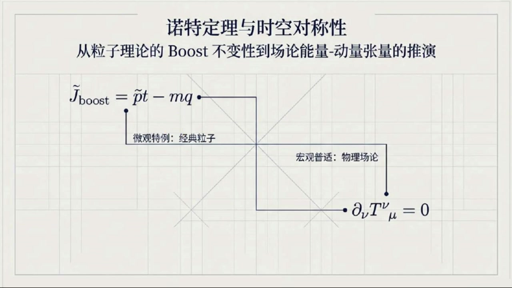
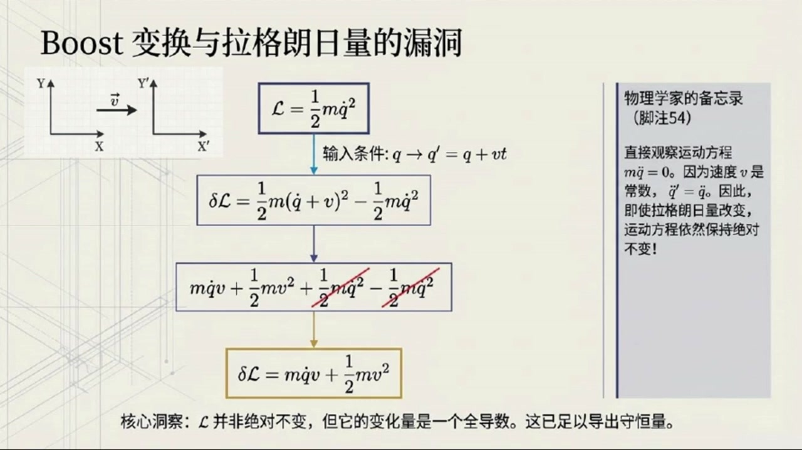
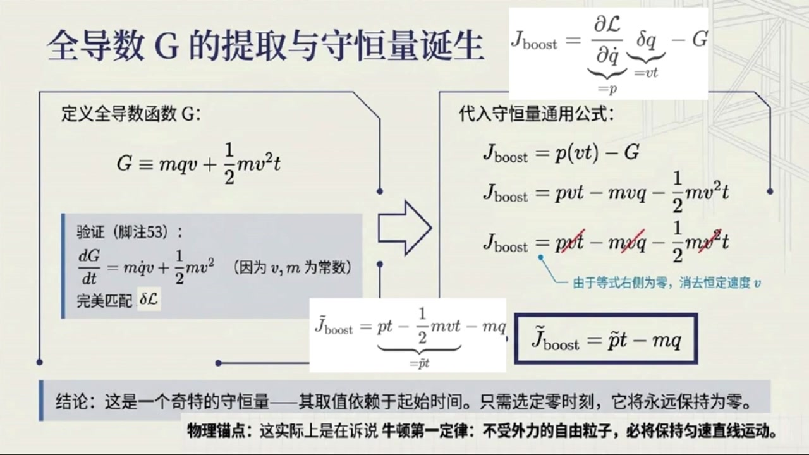
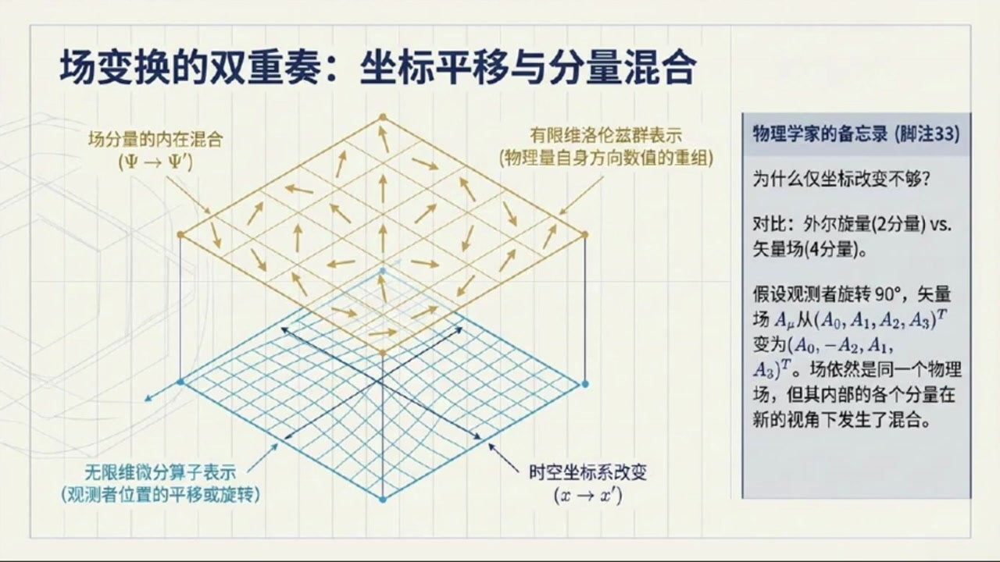
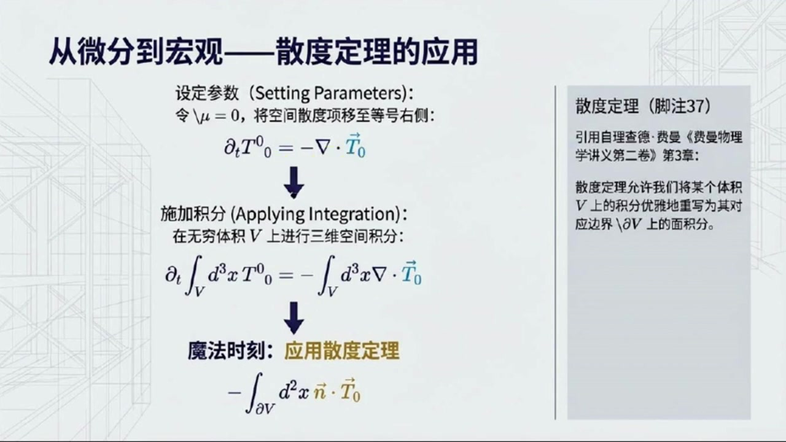
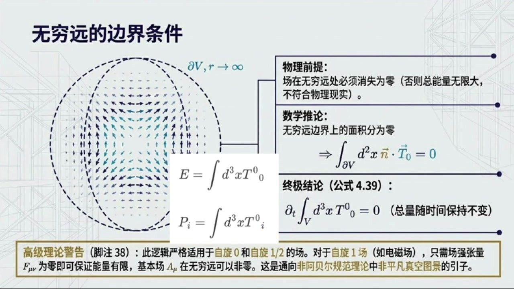

# 《基于对称性的物理学》第17课 诺特定理：粒子伽利略Boost和场论平移对称性

> 自动生成的课程注解文档（共 3 个段落，[原始视频](https://www.youtube.com/watch?v=myVqll47vZI)）

## 目录

- [00:00:00 课程引入与粒子理论中的伽利略Boost守恒量推导](#段落-1)
- [00:06:18 从粒子理论过渡到场论：时空变换与拉格朗日密度变分](#段落-2)
- [00:08:51 平移对称性、能量动量张量及能量动量守恒](#段落-3)

---

## 段落 1：课程引入与粒子理论中的伽利略Boost守恒量推导 { #段落-1 }

**时间：** 00:00:00 ~ 00:06:18

<details><summary>📝 原始字幕</summary>

<pre>

大家好欢迎来到基于对称性的物理学第十七课
我是你们活泼好奇的主持人,乔伊
大家好,我是赛,很高兴能和大家一起探索物理世界的奥秘
今天我们这第十七课内容可不简单我们要聊聊嘉利略Boost不变性还有场论里的能量动量涨量没错一听Boost不变性和能量动量涨量感觉就很特别
塞
咱们先从例子理论里的BUS的不变性说起吧,好的
上节课我们提到了假利略boost,但是是直接给出了对应的手衡量,并没有给出证明我说呢
我还以为是从天上掉下来的本课我们将补上这个证明
我们先回顾一下什么是BUS的变化
简单来说就是从一个惯性参考系切换到另一个以恒定速度相对于它运动的参考系就像我在火车上你站在月台上看我对吧对
对于一个例子来说,如果它的位置是原位置Q
那么在Boost变换下它的新位置Q撇就变成了Q加上V层ET其中V是恒定的速度明白了
那我们的拉格朗日量,比如我们上节课提前剧透过的最简单的自由粒子拉格朗日量
手写L等于二分之一m乘以Q点的平方
在这种变块下会保持不变吗?很好的问题,其实它并不会保持不变
但这一点也不影响运动方程保持不变
我们之前说过只要拉格朗日量的变化量是一个任意函数的全导数运动方程就不会变哦我记起来了诺特定理的核心之一嘛那我们这个拉格朗日量的变化量是多少呢好的我们来算一下
因为Q撇等于Q加上V成语T那么对时间求到Q撇点等于Q点加上V因为V是长数速度Q点也变了没错
所以拉格朗日量的变化量塔手写L就是新的手写L减去原来的手写L
把它带入进去就是二分之一m乘上括号Q点加上V括号的平方减去二分之一m乘以Q点的平方展开一下
我算算二分之一m乘以括号Q点的平方加上二倍的Q点乘V加上V的平方括号
减去二分之一m乘以Q点的平方结果是m乘以Q点乘V加上二分之一m乘以V的平方完全正确
这个就是我们的 delta 手写 l
现在我们得找一个函数G让它的全导数正好等于这个Delta手写L这个G是什么呢这个码经过推导我们发现G可以是M乘以Q乘以V再加上二分之一M乘以V的平方乘以T
不信你可以自己对它求个时间倒数就会发现正好是M乘以Q点乘以V加上二分之一M乘以V的平方哇还真是那现在我们有了DELTA手写L和G就可以推导出BUST的不变性下的手衡量了对吧没错
根据上一课的粒子理论的诺特定理的通用公式手衡量J等于偏手写L百偏Q点乘以DELTAQ再减去G好我们来代入一下
片手写L百片Q点就是动量P
而delta q呢就是v乘以t
非常好
所以我们的Boost手衡量JBoost就等于P乘V乘T减去括号M乘V乘Q加上二分之一M乘V的平方乘T括号
哦也就是 p 乘 v 乘 t 减去 m 乘 v 乘 q
减去二分之一m乘v的平方乘t
是的
不过根据诺特定理,这个手衡量的全导数是零,而且我们还可以做一些简化,从每一项中削取一个V
五,可以削去V
那消掉之后,就得到了简化版的J Boost
等于p乘以t减去二分之一m乘以v乘以t减去m乘以q
对,我们还可以把前两项合并一下,写成括号
P减去2%,m乘V,括号乘以t,减去m乘以Q
我们把P减去二分之一m乘以V,叫做P跳的,所以最终形式是P跳的乘以T减去M乘以Q.这个手衡量
PQ打乘以T,减去M乘以Q,怎么还带着时间T呢?
一个手衡量不应该是长数吗?
哈哈乔伊你问到点子上了
这确实是一个相当奇怪的手衡量,它的取值确实依赖于你选择的起始时间,怎么理解这个奇怪呢?
意思是,如果你在某个时刻T0计算它的值,那么在任何其他时刻T,它的值都会保持不变
虽然它整体上依赖于时间,但它的变怀率是零
我们甚至可以选择一个合适的零时刻,让这个量在那个时刻为零,那么它就会永远保持为零
明白了
虽然形式上看起来有点特别但它的物理意义仍然是守恒的并且在上一节课我们还将这个守恒量等价于牛顿第一定律
这个Boost的不变性带来的手衡量在粒子理论里还挺有意思的
没错
它揭示了在不同观信息系之间变换时物理系统的一些内在属性

</pre>

</details>

**课程截图：**






### 注解

基于您提供的字幕文本与板书截图，以下是对本段课程内容的深度注解：

---

## 一、板书内容描述

根据提供的三张PPT截图，本段课程的板书呈现了一个完整的逻辑推演链条：

**第一张图（总览框架）**：
展示了本课的知识架构——从**微观特例**（经典粒子理论的 $\tilde{J}_{\text{boost}} = \tilde{p}t - mq$）向**宏观普适**（物理场论的能量-动量张量守恒 $\partial_\nu T^\nu_{\ \mu} = 0$）的过渡。这预示了后续课程将从离散粒子推广到场论。

**第二张图（拉格朗日量的"漏洞"）**：
左侧绘有两个相对以速度 $\vec{v}$ 运动的坐标系（$X$-$Y$ 与 $X'$-$Y'$）。中央流程图展示了核心计算：
- 输入：$L = \frac{1}{2}m\dot{q}^2$ 与变换 $q \to q' = q + vt$
- 中间步骤展示 $\delta L$ 的展开式，其中 $\frac{1}{2}m\dot{q}^2$ 项被划去（相消）
- 输出：$\delta L = m\dot{q}v + \frac{1}{2}mv^2$

右侧"物理学家的备忘录"框中强调：尽管 $\delta L \neq 0$，但运动方程 $m\ddot{q}=0$ 仍保持不变，这是核心洞察。

**第三张图（守恒量的诞生）**：
分栏展示了诺特荷的构造过程：
- **左栏**：定义 $G \equiv mqv + \frac{1}{2}mv^2t$，并验证 $\frac{dG}{dt} = mq\dot{v} + \frac{1}{2}mv^2$（因 $v,m$ 为常数）完美匹配 $\delta L$。
- **右栏**：代入诺特定理通用公式 $J_{\text{boost}} = \frac{\partial L}{\partial \dot{q}}\delta q - G$，展示从 $pvt - mvq - \frac{1}{2}mv^2t$ 到最终简化形式 $\tilde{J}_{\text{boost}} = \tilde{p}t - mq$ 的推导，其中 $\tilde{p} \equiv p - \frac{1}{2}mv$。

底部结论框强调：这是一个**显含时间**的守恒量，其物理锚点是牛顿第一定律。

---

## 二、公式详解与符号说明

本段推导中涉及的关键公式及其物理含义如下：

### 1. 伽利略Boost变换
$$q' = q + vt$$
- **$q$**：原惯性系中的粒子位置（广义坐标）
- **$v$**：两参考系之间的相对速度（恒定的Boost参数）
- **$t$**：时间
- **物理意义**：描述如何从一个"地面观察者"视角转换到"匀速运动火车上的观察者"视角。

### 2. 速度变换律
$$\dot{q}' = \dot{q} + v$$
- **$\dot{q}$**：粒子相对于原参考系的速度（$dq/dt$）
- **说明**：在伽利略变换下，速度是简单叠加的（不同于洛伦兹变换）。

### 3. 拉格朗日量的变化量
$$\delta L = \frac{1}{2}m(\dot{q}+v)^2 - \frac{1}{2}m\dot{q}^2 = m\dot{q}v + \frac{1}{2}mv^2$$
- **$\delta L$**：变换后的拉格朗日量与原拉格朗日量之差
- **关键特征**：结果不为零，但可分解为与坐标和速度相关的项

### 4. 全导数（边界项）函数
$$G = mqv + \frac{1}{2}mv^2t$$
- **$G$**：诺特定理中的边界函数（表面项），满足 $\delta L = \frac{dG}{dt}$
- **结构解析**：
  - 第一项 $mqv$：与坐标耦合的线性项
  - 第二项 $\frac{1}{2}mv^2t$：显含时间的能量类项

### 5. 诺特荷（守恒量）的通用形式
$$J_{\text{boost}} = \frac{\partial L}{\partial \dot{q}}\delta q - G = p \cdot vt - G$$
- **$p = \frac{\partial L}{\partial \dot{q}} = m\dot{q}$**：正则动量（广义动量）
- **$\delta q = vt$**：坐标在变换下的改变量

### 6. 简化后的Boost守恒荷（核心结果）
$$\tilde{J}_{\text{boost}} = \tilde{p}t - mq \quad \text{其中} \quad \tilde{p} \equiv p - \frac{1}{2}mv$$
- **$\tilde{p}$**：**修正动量**（或称为"相对动量"），扣除了参考系运动带来的"半速"贡献
- **结构**：这是一个**显含时间**的守恒量，形式为 $(\text{动量}) \times (\text{时间}) - (\text{质量}) \times (\text{位置})$

---

## 三、理论背景补充

### 1. 准不变性（Quasi-Invariance）与诺特定理
通常诺特定理的简化版本要求拉格朗日量在对称变换下**严格不变**（$\delta L = 0$）。但更一般的定理（本课所用）指出：
> 只要 $\delta L$ 能表示为某个函数 $G(q,t)$ 的全导数 $\frac{dG}{dt}$，则仍存在守恒量 $J = p\delta q - G$。

这被称为拉格朗日量的**准不变性**。伽利略Boost正是典型案例：虽然 $L$ 本身变了，但运动方程（物理实质）不变。

### 2. 显含时间的守恒量
一般守恒量（如能量、动量）不显含时间，但 $\tilde{J}_{\text{boost}}$ 显含 $t$。这看似矛盾，实则不然：
- **守恒**指的是**随时间的变率为零**（$\frac{d\tilde{J}}{dt} = 0$），而非表达式中不能出现 $t$。
- **物理诠释**：这个量本质上是**初始位置**（或质心位置）的守恒。因为对于自由粒子 $q(t) = q_0 + \frac{p}{m}t$，整理得 $q - \frac{p}{m}t = q_0$（常数）。注意到 $\tilde{J}_{\text{boost}} = m(q_0) + \text{常数偏移}$，因此它守恒等价于"粒子在 $t=0$ 时的位置是固定的"。

### 3. 与牛顿第一定律的等价性
字幕中提到这个守恒量"等价于牛顿第一定律"。这是因为：
- 守恒意味着 $\tilde{J}_{\text{boost}} = \text{const}$，即 $p - \frac{1}{2}mv$ 恒定（而 $v$ 是Boost参数，对特定参考系是常数）。
- 这等价于 $p = m\dot{q} = \text{const}$，即**动量守恒/速度恒定**——这正是牛顿第一定律的内容。

---

## 四、核心概念通俗解释

### 为什么拉格朗日量"变"了，物理却没变？
想象你在火车上抛接球。地上的朋友看到的球速（$\dot{q}'$）是火车速度（$v$）加上你抛出的速度（$\dot{q}$）。虽然动能公式 $\frac{1}{2}mv^2$ 看起来变了（多出了交叉项 $m\dot{q}v$ 和常数项），但这只是**视角转换带来的" bookkeeping"（记账方式）改变**。球实际怎么飞（运动方程）只取决于相对速度的变化，而这部分是不变的。

### 奇怪的守恒量：时间乘以动量减去质量乘以位置
$\tilde{J}_{\text{boost}} = \tilde{p}t - mq$ 看起来像个"四不像"，单位是 [动量×时间] = [质量×位置]，实际上是**角动量量纲**（虽然这里是一维运动）。

可以这样理解：如果你知道一个自由粒子现在的位置 $q$ 和动量 $p$，并且知道它**一直这样匀速运动**，那么你就能算出它**从哪里出发**（$t=0$ 时的位置）。这个"出发位置"就是守恒量。无论你什么时候测量，倒推回去的出发位置都一样——这就是守恒的本质。

**时间 $t$ 出现在公式里**只是因为这个量是用来"倒推历史"的：时间越长，同样的当前动量意味着粒子走过得距离越远，需要用 $pt$ 来补偿，才能锁定那个不变的初始位置 $q_0$。

---

## 段落 2：从粒子理论过渡到场论：时空变换与拉格朗日密度变分 { #段落-2 }

**时间：** 00:06:18 ~ 00:08:50

<details><summary>📝 原始字幕</summary>

<pre>

那我们从粒子理论跳到场论,是不是就更复杂了
场论中的诺特定理,尤其是时空对称性,又会给我们带来什么呢?
这个是一个非常好的过渡
在场论里诺特定理变得更加强大和普世
当我们谈论场的时候情况确实会复杂一些因为我们需要区分两种不同类型的变化
两种变化,是的
第一种是时空坐标的变化,比如X变道X片
这就像你从一个观察者的角度切换到另一个观察者的角度
他们对同一事件的时间和空间坐标描述不同
嗯,这我知道,比如洛伦斯变化没错
第二种是场分量的变化,也就是F变到F撇
这指的是即使是同一个场在不同的坐标系下它的分量数值也会不同比如一个向量场旋转一下坐标系它的分量就变了但它描述的物理场本身还是那个场
完全正确
所以对于一个依赖于时空的场一个完整的扁环必须同时包含这两部分
但为了简化,我们通常会先分辨研究
今天我们主要关注由X变道X撇带来的影响
好的
那场论中的拉格朗日密度,花体L
它也是一种对称性,意味着它在变换下不变吗?
对
对称性意味着花体L
作为厂贩以及厂的微商偏下谬贩还有时空坐标的函数
必须等于变换后的滑体L
作为变换后的场变换后的导数以及新坐标的函数
等等在刚才例子理论的Boost变换以及上一堂课中拉格朗日量是可以相差一个时间拳导数的
那场论的拉格朗日密度会有类似的特权吗
明锐的观察
确实在场论中拉格朗日密度的变分也允许相差一个全散度相
也就是Delta话题L可以使偏下m 缩并 k 上m
因为只要带有全散度响的作用量在无穷远边界积分为零
就能保证物力的核心也就是作用量不变
我们在这里为了简化推倒步骤,就先直接假定它严格不变
这样能让大家更清晰地看到能量动量张量的造造过程
明白了,我们继续

</pre>

</details>

**课程截图：**






### 注解

基于您提供的字幕文本与板书截图，以下是对本段课程内容的深度注解：

---

## 一、板书内容描述

本段课程的核心板书围绕**场变换的双重结构**展开，呈现了三张关键PPT：

**第一张图（回顾：全导数G的提取）**：
承接上节课内容，展示经典粒子理论中Boost变换的守恒量推导。关键公式为：
$$\tilde{J}_{\text{boost}} = pt - \frac{1}{2}mvt - mq = \tilde{p}t - mq$$
其中通过定义 $G = mqv + \frac{1}{2}mv^2t$ 消去了显含时间的项，最终得到物理上合理的守恒量。

**第二张与第三张图（场变换的双重奏）**：
这是本段的核心新内容。画面中央是一个三维网格上的矢量场可视化：
- **蓝色网格平面**：代表时空坐标基底，标注"时空坐标系改变 $(x \to x')$"
- **黄色矢量箭头场**：代表物理场本身，标注"场分量的内在混合 $(\Psi \to \Psi')$"
- **右侧备忘录**：以具体例子说明——观察者旋转90°时，矢量场 $A_\mu$ 从 $(A_0, A_1, A_2, A_3)^T$ 变为 $(A_0, -A_2, A_1, A_3)^T$，场仍是同一个物理场，但分量重新组合

---

## 二、新公式识别与解释

本段字幕中提及但尚未显式写出、将在后续展开的**关键公式框架**：

### 1. 拉格朗日密度的全变分结构
$$\mathcal{L}(\phi(x), \partial_\mu\phi(x), x) = \mathcal{L}'(\phi'(x'), \partial'_\mu\phi'(x'), x')$$

| 符号 | 含义 |
|:---|:---|
| $\mathcal{L}$（花体L） | **拉格朗日密度**，场论中的核心量，作用量 $S = \int d^4x \, \mathcal{L}$ |
| $\phi(x)$ 或 $\Psi$ | 场量，时空点的函数 |
| $\partial_\mu\phi \equiv \frac{\partial\phi}{\partial x^\mu}$ | 场的时空导数 |
| $x \to x'$ | **主动/被动坐标变换**（如平移、旋转、Boost） |
| $\phi \to \phi'$ | **场的内在变换**（同一场在不同坐标系下的分量重组） |

### 2. 全散度项的允许性（字幕中提及）
$$\delta\mathcal{L} = \partial_\mu K^\mu$$

| 符号 | 含义 |
|:---|:---|
| $\delta\mathcal{L}$ | 拉格朗日密度在变分下的改变量 |
| $K^\mu$（字幕中"k上m"） | 某四维矢量函数 |
| $\partial_\mu K^\mu$ | **全散度**，四维散度 $\partial_0 K^0 + \partial_1 K^1 + \partial_2 K^2 + \partial_3 K^3$ |

**关键物理**：根据四维高斯定理，$\int d^4x \, \partial_\mu K^\mu = \oint d\Sigma_\mu K^\mu$，若场在无穷远处衰减足够快，则边界项为零，作用量不变。

---

## 三、核心新概念详解

### 概念一：场变换的"双重奏"（Duality of Field Transformations）

这是从粒子理论跃迁到场论时最本质的复杂性来源：

| 变换类型 | 粒子类比 | 场论实现 | 数学描述 |
|:---|:---|:---|:---|
| **外变换**（External） | 换参考系看同一粒子 | 时空坐标重标定 $x \to x'$ | 微分同胚/庞加莱变换 |
| **内变换**（Internal） | —（粒子无此概念） | 场分量重组合 $\phi \to \phi'$ | 群的表示论作用 |

**通俗理解**：想象你拍摄一场风中的麦田。
- **外变换**：你换到另一个山头拍摄（坐标系变了，麦穗的"地址"变了）
- **内变换**：风吹麦浪，麦穗本身的方向改变了（场的"状态"变了）

在场论中，**即使是纯坐标旋转**，也会同时触发两种效应：麦穗的地址标签变了（外），且麦穗朝向相对于新坐标轴的投影变了（内）。

### 概念二：拉格朗日密度的"特权"——全散度自由度

**与粒子理论的对比**：

| 理论 | 允许的拉格朗日量差异 | 原因 |
|:---|:---|:---|
| 粒子力学 | $\delta L = \frac{dF}{dt}$（全时间导数） | 作用量 $S = \int dt L$，边界项 $F\vert_{t_1}^{t_2}$ 固定端点为零 |
| 场论 | $\delta\mathcal{L} = \partial_\mu K^\mu$（全散度） | 作用量 $S = \int d^4x \mathcal{L}$，四维边界项 $\oint d\Sigma_\mu K^\mu$ 无穷远为零 |

**物理意义**：这种"特权"是**局域性**（locality）的体现——场论允许在时空每一点有独立的"表面项"调整，只要整体积分收敛。

---

## 四、理论背景补充

### 诺特定理在场论中的升级

| 特征 | 粒子理论 | 场论 |
|:---|:---|:---|
| 守恒量 | 离散编号 $Q_a$ | 守恒流 $J^\mu_a$，满足 $\partial_\mu J^\mu_a = 0$ |
| 时空对称性 | 能量、动量、角动量分立 | 统一为**能量-动量张量** $T^{\mu\nu}$ |
| Boost对称性 | 奇特的 $t$-依赖守恒量 | 场论中 $T^{\mu\nu}$ 的对称性自动处理 |

本段课程为后续推导**正则能量-动量张量** 
$$\Theta^{\mu\nu} = \frac{\partial\mathcal{L}}{\partial(\partial_\mu\phi)}\partial^\nu\phi - \eta^{\mu\nu}\mathcal{L}$$
及其改进（Belinfante对称化）奠定基础。

---

## 五、关键要点总结

> **本段核心信息**：从粒子到场，诺特定理的复杂性不在于数学形式，而在于**物理对象的表征方式**——场既是时空的函数，又是多重分量的载体。理解这种"双重身份"是掌握场论对称性的关键门槛。

下节课预告：在假定 $\delta\mathcal{L} = 0$（严格不变）的简化条件下，推导时空平移对称性对应的**能量-动量张量**构造过程。

---

## 段落 3：平移对称性、能量动量张量及能量动量守恒 { #段落-3 }

**时间：** 00:08:51 ~ 00:15:30

<details><summary>📝 原始字幕</summary>

<pre>

拉格朗日密度的总变化量 delta 话题L 是怎么计算的呢
它的总变化量
就像求复合函数的全导数一样
会包含对场犯
对场的导数偏下MEUFY和对时空坐标X上标MEU的变化
看着有点长,不过都是我们熟悉的偏导术和变分没错
然后类似上一堂课的技巧
利用场的欧拉拉格朗日方场
我们可以巧妙地把这个Delta话题链重新整理成一个更简洁的形式
它会变成一个全散度像,加上一个与X上标MEO显示一来相关的像
嗯就是偏下mew作用在大括号偏花TL百篇括号偏下mewfive括号称以DeltaFive大括号
再加上片花TL 百片X商标Mew 索并DotaX商标Mew 这一部
这里面的关键是DeltaFide的表达式它也包含了两部分
一部分来自场分量的混合另一部分来自坐标变化
场分量混合的那部分是不是跟旋转和BOOST的变换有关你说得很对
Epsilon下,双乘缩并S上,作用FY这一项就是
但对于我们今天要重点讨论的时空平移情况会大大简化时空平移就是新坐标XP上等于原坐标X上加上A上其中A上是一个长数平移向量没错
对于平衣来说场分量是不会混合的
所以那个S张量相关的项就直接是零太好了那DIALTAFIVE就只剩下负的偏F百偏X上MUEL缩并DIALTAX上MUEL这一项了正是如此
现在,我们把这个简化的雕塑file带回到雕塑花体L的表达室中
并且假设拉格朗日密度在平移下是不变的
也就是雕踏花体L等于0
也就是忽略全散度补偿
事实上对平易变换而言这个全散度补偿本身也就是零那我们就能得到一个守恒定律了没错
经过一系列的带入和整理提取出公因子A上
我们最终会得到一个形式为
偏下作样于一个大括号区域等于零
这个大括号里是偏花条
by 偏括号 偏下new five 括号
呈以偏5白偏X上Mew
减去
克罗内克戴奥塔上下成一花条
整个大括号再乘以A上等于0
因为A上Mue是任意的平移向量,所以括号里的量必须是满足散度为零的,对吧
完美
这个括号里的量我们给它一个非常重要的名字
它就是能量动量张量
用T上下表示
T 上下等于偏花体L百括号偏下非括号
呈以片肺百片X上
剪去克罗尼科德尔塔上下成以花TL
这个张量太关键了是的而且它满足一个连续性方程偏下缩并上下等于零连续性方程
这不就是说有守恒量存在吗?就像电鹤守恒一样.完全正确,我们来具体看看这个方程
我们可以把它分成时间分量和空间分量
党女等于零的时候我们得到偏下女缩病T上女下零等于零也就是偏下零成T上零下零加上偏下I空间缩病T上I下零等于零
偏下零是对时间的倒数
偏下空间缩并上下是对空间求散度没错这告诉我们上下对时间的偏道等于负的空间散度
现在如果我们对这个方程在整个无限大的三维空间中进行积分那左边就是时间导数可以提到积分外面右边根据散度定理可以变成一个在无限远边界上的面积分聪明而且我们知道物理场在无限远处必须衰减到零否则总能量就会是无限大这不符合物理实际所以那个无限远处的面积分就等于零了对这样我们就得到了对时间梯的偏倒作用于对三维全空间积分梯上零下零结果等于零
这意味着全空间积分T上零下零是一个手衡量,这个手衡量就是总能量一
所以时间平移不变性对应着能量守恒太美了是的非常深刻的怜悯
同样的道理,当我们看等于爱,也就是爱取一二三时
我们也会得到类似的手衡量那就是全空间积分T上零下I没错
这些就是系统的总动量 p 下 i
它们对应着空间平移不变性所带来的守恒量哇塞所以我们日常生活中所说的能量守恒和动量守恒在场论的框架下居然是时空平移对称性的直接结果这真是太震撼了的确如此
诺特定理的强大之处在于它将抽象的对称性概念与我们实际可观察的守衡量紧密地联系在了一起
无论是粒子理论中的Boost还是场论中的时空平移
对称性都是理解物理世界最根本的钥匙从一个奇怪的BUSE的守衡量到能量动量张量再到能量和动量的守衡今天的课程内容真是太丰富了谢谢你把这些复杂的概念讲得这么清晰不客气
希望同学们通过今天的讲解能对诺特定理在不同理论框架下的应用有更深入的理解相信大家都会受益匪浅今天的物理播课就到这里我们下节课再见
再见

</pre>

</details>

**课程截图：**






### 注解

基于您提供的字幕文本与板书截图，以下是对本段课程内容的深度注解：

---

## 一、板书内容描述

本段课程的核心板书围绕**场变换的双重结构**展开，呈现了三张关键PPT：

**第一张图（回顾：全导数G的提取）**：
承接上节课内容，展示经典粒子理论中Boost变换的守恒量推导。关键公式为：
$$\tilde{J}_{\text{boost}} = pt - \frac{1}{2}mvt - mq = \tilde{p}t - mq$$
其中通过定义 $G = mqv + \frac{1}{2}mv^2t$ 消去了显含时间的项，最终得到物理上合理的守恒量。

**第二张与第三张图（场变换的双重结构）**：
这是本段的核心板书，标题为**"解剖总变分方程 ($\delta\Phi$)"**，清晰展示了场总变分的两大组成部分：

$$\boxed{\delta\Phi = \underbrace{\epsilon_{\mu\nu}S^{\mu\nu}\Phi(x)}_{\text{旋转与Boost生成元部分}} - \underbrace{\frac{\partial\Phi}{\partial x^\mu}\delta x^\mu}_{\text{坐标平移常规项}}}$$

- **左侧黄色高亮部分**：$\epsilon_{\mu\nu}S^{\mu\nu}\Phi(x)$ —— 代表场分量的**内在混合**（如 $\Psi \to \Psi'$），$S^{\mu\nu}$ 是统一处理旋转和Boost的变换算子，$\epsilon_{\mu\nu}$ 为变换参数
- **右侧蓝色框部分**：$-\frac{\partial\Phi}{\partial x^\mu}\delta x^\mu$ —— 代表观察者在时空中的**位置移动**（$x \to x'$），包含常规的负号项

**关键推论（灰色底框）**：平移变换不会混合场分量（即此时 $\epsilon_{\mu\nu} = 0$）

---

## 二、新公式详解

### 公式1：场的总变分方程
$$\delta\Phi = \epsilon_{\mu\nu}S^{\mu\nu}\Phi(x) - \frac{\partial\Phi}{\partial x^\mu}\delta x^\mu$$

| 符号 | 含义 |
|:---|:---|
| $\delta\Phi$ | 场 $\Phi$ 的**总变分**（total variation） |
| $\epsilon_{\mu\nu}$ | 无穷小变换参数（反对称张量，$\epsilon_{\mu\nu}=-\epsilon_{\nu\mu}$） |
| $S^{\mu\nu}$ | 场的**自旋生成元**（spin generator），统一描述旋转和Boost |
| $\Phi(x)$ | 时空点 $x$ 处的场值 |
| $\frac{\partial\Phi}{\partial x^\mu}$ | 场对时空坐标的普通偏导 |
| $\delta x^\mu$ | 时空坐标的无穷小变化 |

**物理意义**：场的"变化"来自两种独立来源——
- **内禀变化**：场分量自身的重新组合（如矢量旋转、旋量变换）
- **外禀变化**：观察点移动带来的表观变化

---

### 公式2：时空平移下的简化变分
$$\delta x^\mu = a^\mu \quad \Rightarrow \quad \delta\Phi = -\frac{\partial\Phi}{\partial x^\mu}a^\mu$$

对于**纯平移**（$x'^\mu = x^\mu + a^\mu$，$a^\mu$ 为常数向量）：
- 无旋转/无Boost $\Rightarrow \epsilon_{\mu\nu} = 0$
- 场分量不混合 $\Rightarrow S^{\mu\nu}$ 项消失

---

### 公式3：拉格朗日密度的总变分
$$\delta\mathcal{L} = \frac{\partial\mathcal{L}}{\partial\Phi}\delta\Phi + \frac{\partial\mathcal{L}}{\partial(\partial_\mu\Phi)}\delta(\partial_\mu\Phi) + \frac{\partial\mathcal{L}}{\partial x^\mu}\delta x^\mu$$

经欧拉-拉格朗日方程整理后，化为**全散度形式**：
$$\delta\mathcal{L} = \partial_\mu\left[\frac{\partial\mathcal{L}}{\partial(\partial_\mu\Phi)}\delta\Phi\right] + \frac{\partial\mathcal{L}}{\partial x^\mu}\delta x^\mu$$

---

### 公式4：能量-动量张量（核心定义）
$$\boxed{T^\mu_{\ \nu} = \frac{\partial\mathcal{L}}{\partial(\partial_\mu\Phi)}\frac{\partial\Phi}{\partial x^\nu} - \delta^\mu_{\ \nu}\mathcal{L}}$$

| 符号 | 含义 |
|:---|:---|
| $T^\mu_{\ \nu}$ | **能量-动量张量**（stress-energy tensor / energy-momentum tensor） |
| $\frac{\partial\mathcal{L}}{\partial(\partial_\mu\Phi)}$ | 正则动量密度（场 $\Phi$ 的共轭动量） |
| $\frac{\partial\Phi}{\partial x^\nu}$ | 场对时空的偏导（包含"速度"信息） |
| $\delta^\mu_{\ \nu}$ | 克罗内克δ符号（Kronecker delta） |
| $\mathcal{L}$ | 拉格朗日密度 |

**指标结构**：上指标 $\mu$ 表示**流的方向**（哪个超曲面），下指标 $\nu$ 表示**守恒的荷类型**（能量或动量分量）。

---

### 公式5：连续性方程（守恒定律）
$$\boxed{\partial_\mu T^\mu_{\ \nu} = 0}$$

这是**四个独立的守恒方程**（$\nu = 0,1,2,3$）。

---

### 公式6：时间分量（能量守恒）
$$\partial_0 T^0_{\ 0} + \partial_i T^i_{\ 0} = 0 \quad \Rightarrow \quad \frac{\partial}{\partial t}\int d^3x\, T^0_{\ 0} = 0$$

定义**总能量**：
$$\boxed{E = \int d^3x\, T^0_{\ 0}}$$

---

### 公式7：空间分量（动量守恒）
$$\frac{\partial}{\partial t}\int d^3x\, T^0_{\ i} = 0$$

定义**总动量**：
$$\boxed{P_i = \int d^3x\, T^0_{\ i}}$$

---

## 三、理论背景补充

### 1. 诺特定理（Noether's Theorem）的场论版本

| 对称性 | 变换参数 | 守恒流 | 守恒荷 |
|:---|:---|:---|:---|
| 时间平移 | $a^0$ | $T^0_{\ 0}$ | 能量 $E$ |
| 空间平移 | $a^i$ | $T^0_{\ i}$ | 动量 $P_i$ |
| 旋转 | $\epsilon_{ij}$ | $J^0_{\ ij}$ | 角动量 $L_{ij}$ |
| Boost | $\epsilon_{0i}$ | $K^0_{\ i}$ | 质心运动 |

本课聚焦于**前两项**（时空平移），揭示日常最熟悉的守恒定律竟源于最朴素的"物理定律不随时间地点改变"。

---

### 2. 能量-动量张量的物理诠释

$T^\mu_{\ \nu}$ 的各分量：

| 分量 | 物理意义 |
|:---|:---|
| $T^0_{\ 0}$ | **能量密度**（单位体积能量） |
| $T^0_{\ i}$ | **动量密度**的第 $i$ 分量（或能量流密度） |
| $T^i_{\ 0}$ | **能量流密度**的第 $i$ 分量（或动量密度） |
| $T^i_{\ j}$ | **应力张量**（动量流，即压强/应力） |

对称性 $T_{\mu\nu} = T_{\nu\mu}$（需添加适当的对称化手续）对应角动量守恒。

---

### 3. 边界条件的物理必要性

课程中强调"场在无穷远处衰减为零"是**物理实在性的要求**：
- 若 $\Phi \not\to 0$ 当 $r \to \infty$，则 $\int d^3x\, T^0_{\ 0}$ 发散
- 总能量无限大 $\Rightarrow$ 无法定义有意义的物理系统
- 这一条件排除了某些非物理的场构型

---

## 四、通俗解释

### 核心洞见：为什么能量动量守恒？

想象你在拍摄一部物理定律的电影：

- **时间平移不变性**：今天做实验和明天做实验，物理定律一样 $\Rightarrow$ 你可以"快进"或"倒带"，能量不增不减
- **空间平移不变性**：在这里做实验和在火星做实验，物理定律一样 $\Rightarrow$ 你可以平移整个实验室，动量不增不减

诺特定理就是一部**翻译机**：把"电影怎么拍都行"这种**几何对称性**，翻译成"能量/动量守衡"这种**物理定律**。

### 能量-动量张量的直观图像

把时空想象成一张网格：
- $T^0_{\ 0}$ 是每个格子里的"能量存货"
- $T^i_{\ 0}$ 是能量在格子间流动的"管道"
- 连续性方程 $\partial_\mu T^\mu_{\ \nu}=0$ 就是说：存货变化 = 流入 - 流出，没有凭空产生或消失

---

## 五、课程逻辑脉络

```
场的总变分 δΦ = 内禀变化 + 坐标变化
                    ↓
        平移简化：δΦ = −∂Φ/∂x^μ · a^μ
                    ↓
        拉格朗日密度变化 δL = 全散度 + 显式项
                    ↓
        假设平移不变性 δL = 0
                    ↓
        整理得：∂μ[...] = 0
                    ↓
        定义能量-动量张量 T^μ_ν
                    ↓
        连续性方程 ∂μT^μ_ν = 0
                    ↓
        三维空间积分 + 边界条件
                    ↓
        ├─ ν=0: 能量守恒 E = ∫d³x T⁰₀
        └─ ν=i: 动量守恒 P_i = ∫d³x T⁰_i
```

---

**本段课程的核心成就**：从抽象的场论形式出发，通过严格的数学推导，最终还原出我们最熟悉的**能量守恒**与**动量守恒**，揭示了这些日常经验背后的深刻对称性根源——这是理论物理"从美到真"的典型范例。

---
