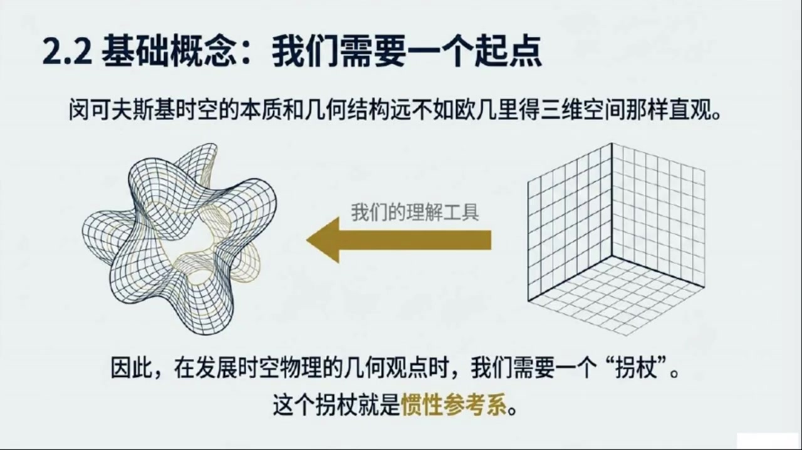
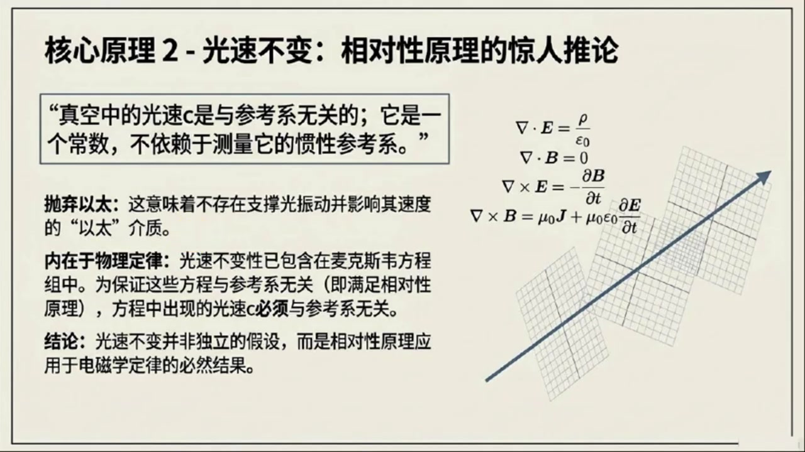
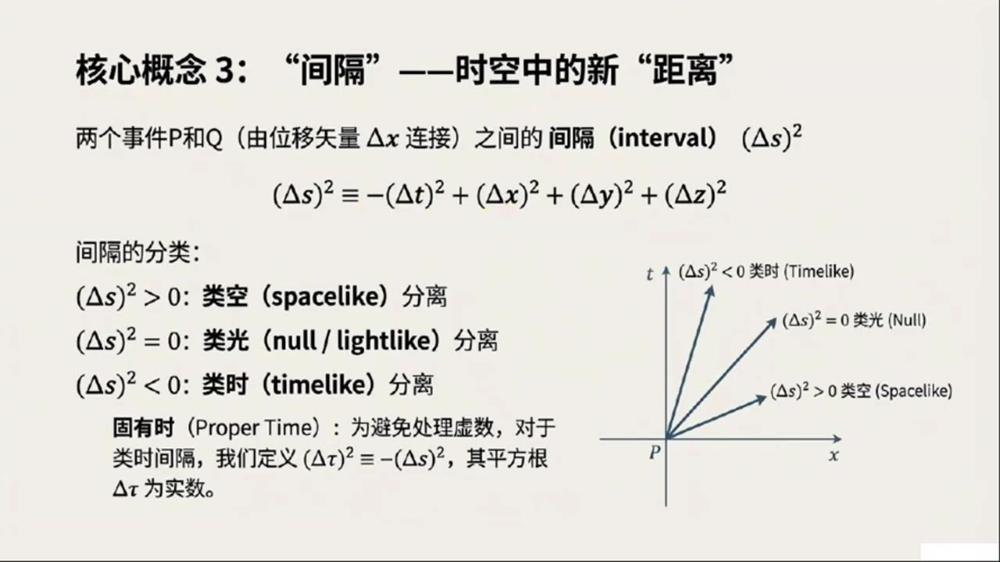
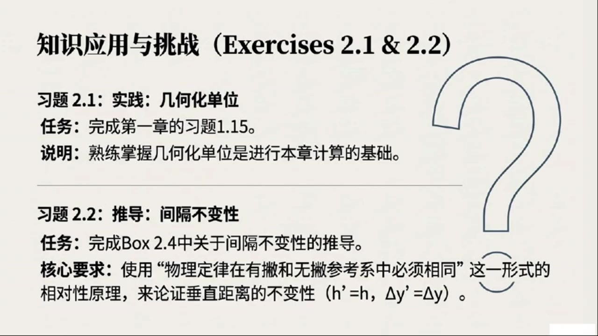

# 《现代经典物理学》第6课 狭义相对论的几何观

> 自动生成的课程注解文档（共 5 个段落，[原始视频](https://www.youtube.com/watch?v=qwCgsYJ5MRE)）

## 目录

- [00:00:02 课程导入与本章内容总览](#段落-1)
- [00:05:09 惯性参考系、事件与四矢量基础](#段落-2)
- [00:11:34 相对性原理与光速不变](#段落-3)
- [00:20:01 时空间隔的定义、分类与不变性](#段落-4)
- [00:25:36 全课总结与复习建议](#段落-5)

---

## 段落 1：课程导入与本章内容总览 { #段落-1 }

**时间：** 00:00:02 ~ 00:05:09

📝 原始字幕

<pre>

大家好,我是Jay,很高兴又和大家见面了
今天是现代经典物理学的第六讲
我们要深入探索一个非常迷人而且对我们理解宇宙至关重要的领域狭义相对论
赛,你是不是也跟我一样对这个话题充满了好奇呢?
没错Joy
狭义相对论确实是物理学皇冠上的一颗明珠
它彻底改变了我们对空间和时间的传统认知
在这一章里我们将从一个全新的几何的视角来审视它这可是跟我们之前牛顿物理学里对三维欧吉里德空间的理解大不相同哦哇听起来就很有趣几何视角
这跟我们平时学的那些方程组有什么关系呢
是不是意味着我们要用更直观的方式来理解这些抽象的概念?可以这么说
我们之前在第一章里已经用微分几何的工具来描述牛顿物理学了
现在我们要把这些工具扩展到狭义相对论的领域也就是四维的明科夫斯基时空
这个转变会让我们看到物理定律背后更深层次的结构四维时空听起来就很高大上
那我们今天主要会讲到哪些内容呢?能不能先给大家一个概览
好的,没问题
今天会从最基础的概念开始
首先我们会定义什么是惯性参考系,或者叫洛伦兹参考系
然后我们会引入一些非常核心的与参考系无关的几何概念
比如事件四十辆
以及事件之间的不变间隔事件四十辆不变间隔这些都是狭义相对论里的明星概念吧
没错
接着我们会稍微提一下张亮代数在明科夫斯基时空中的应用包括张亮杜归张亮内机和张亮机等等
虽然今天不会深入但这些工具对我们后续理解粒子运动的世界线四速度四动量等非常关键这些概念听起来就跟我们之前在牛顿力学里学的三维时量有点像但又感觉更复杂更抽象了是的但核心思想是通通的
我们还会讨论如何在惯性参考系中表示食量和张量的分量
并用指标记号来重写那些与参考系无关的方程
然后会简要提及洛伦兹变换和时空图
这些都是帮助我们直观理解长度收缩时间膨胀和同时性相对性的重要工具长度收缩时间膨胀这些都是狭义相对论里最让人感到反直觉的现象了
我记得书里还提到了一个很有趣的问题就是物理定律是否允许我们建造时间机器进行时间旅行这个听起来太科幻了好是的那是在本章的后面部分会探讨的今天我们主要聚焦在基础概念上
另外我们还会简单介绍一下方向导数梯度和列维维塔张亮在明科夫斯基时空中的应用以及它们如何帮助我们理解马克斯维方程和电磁场的几何本质内容真的非常丰富
不过在,我注意到书上有一个读者直男的方框,也就是box 2.1
这里面提到了一些关于跳过或者浏览的建议
这对于我们物理系的同学来说是不是很重要?确实很重要
BOX二十一是一个非常实用的读者指南他告诉我们这本书的第二到第六部分比如统计物理光学弹性力学等等大部分内容都是牛顿物理学
只有少数章节和习题会涉及到相对论也就是说如果有些同学暂时不想再回来补课对正是这个意思
书里把这一张标记为TRACK2就是为那些暂时不涉及相对论内容的读者准备的
但如果你是准备学习广利相对论或者对相对论性的动力学流力学相对论性积波等等感兴趣那么这一张就是TRACKONE是必不可少的前置之事明白了那对于我们这些已经对狭义相对论有一定了解的同学呢指南里有什么建议吗对于你们书里建议不要完全跳过这一张
而是可以快速浏览一下
特别是2.2到2.4节,还有2.8和2.11到2.13节
主要是为了确保你们能理解这本书独特的几何视角
并且熟悉一些可能之前没接触过的概念比如阴力能量张亮好的那我们今天就先从二点二节的基本概念开始讲起吧

</pre>

**课程截图：**

### 注解

我来对这段课程视频进行深度注解。

---

## 课程概览：第六讲 狭义相对论的几何视角

### 一、核心主题与框架

本讲标志着从**牛顿物理学**到**狭义相对论**的范式转换：

| 对比维度 | 牛顿物理学 | 狭义相对论 |
|---------|-----------|-----------|
| 时空结构 | 三维欧几里得空间 + 绝对时间 | 四维闵可夫斯基时空 |
| 数学工具 | 微分几何（黎曼几何的退化情形） | 微分几何 + 张量代数 |
| 核心不变量 | 空间距离 $\Delta s^2 = \Delta x^2 + \Delta y^2 + \Delta z^2$ | 时空间隔（见下文） |

---

### 二、板书/PPT内容解读

根据提供的截图，本章结构分为**四个节点**：

#### **节点 1 (Sec 2.2-2.3)：基本概念**
- **惯性参考系 / 洛伦兹参考系**：自由粒子在其中做匀速直线运动的参考系
- **事件 (Event)**：时空中的一个点，由 $(t, x, y, z)$ 或 $(x^0, x^1, x^2, x^3)$ 标记
- **四维矢量 (4-vector)**：在洛伦兹变换下按特定规则变换的量
- **不变间隔 (Invariant Interval)**：两个事件之间的**与参考系无关**的几何量

> **关键公式**：时空间隔的定义
> $$\Delta s^2 = -(c\Delta t)^2 + (\Delta x)^2 + (\Delta y)^2 + (\Delta z)^2$$
> 
> 或用自然单位制（$c=1$）：
> $$\Delta s^2 = -\Delta t^2 + \Delta \vec{x}^2 = \eta_{\mu\nu}\Delta x^\mu \Delta x^\nu$$
>
> | 符号 | 含义 |
> |-----|------|
> | $\Delta s^2$ | 时空间隔的平方（**洛伦兹不变量**） |
> | $\eta_{\mu\nu}$ | 闵可夫斯基度规，$\text{diag}(-1, +1, +1, +1)$ |
> | $\Delta x^\mu$ | 四矢量，$\mu = 0,1,2,3$ |

- **间隔的分类**：
  - $\Delta s^2 < 0$：类时间隔（timelike）→ 两事件可用亚光速信号联系
  - $\Delta s^2 = 0$：类光间隔（lightlike/null）→ 恰为光信号世界线
  - $\Delta s^2 > 0$：类空间隔（spacelike）→ 两事件无因果联系

#### **节点 2 (Sec 2.4-2.6)：粒子运动学**
- **世界线 (Worldline)**：粒子在时空中的轨迹
- **固有时 (Proper time)** $\tau$：粒子自身携带的时钟所测时间，满足 $d\tau^2 = -ds^2/c^2$
- **四速度 (4-velocity)**：$u^\mu = \frac{dx^\mu}{d\tau}$，满足 $u_\mu u^\mu = -c^2$（类时归一化）
- **四动量 (4-momentum)**：$p^\mu = mu^\mu = (E/c, \vec{p})$

#### **节点 3 (Sec 2.7-2.9)：时空现象**
- **洛伦兹变换**：不同惯性系之间的坐标变换
  $$x'^\mu = \Lambda^\mu_{\ \nu} x^\nu$$
  其中 $\Lambda$ 满足 $\Lambda^T \eta \Lambda = \eta$（保持度规不变）
  
- **长度收缩**、**时间膨胀**、**同时性的相对性**：这些"反直觉"现象的几何起源

- **时间机器的可能性**：探讨闭合类时曲线（CTC）与物理定律的相容性

#### **节点 4 (Sec 2.10-2.13)：几何工具与守恒定律**
- **方向导数**、**梯度**、**列维-奇维塔张量 (Levi-Civita tensor)** $\epsilon_{\mu\nu\rho\sigma}$
- **麦克斯韦方程组的几何表述**：
  $$\partial_\mu F^{\mu\nu} = \mu_0 J^\nu, \quad \partial_{[\mu}F_{\nu\rho]} = 0$$
  其中 $F_{\mu\nu}$ 为电磁场张量
  
- **应力-能量张量 (Stress-Energy Tensor)** $T^{\mu\nu}$：描述能量、动量、应力的统一分布
- **四维动量守恒**

---

### 三、关键理论背景

#### 1. 为什么需要"几何视角"？

传统狭义相对论教学往往从**洛伦兹变换的推导**出发（基于光速不变原理），这容易让人陷入代数运算而忽视深层结构。**几何视角**的核心洞见：

> **物理定律应当是"与坐标选择无关"的**——这正是广义协变性的雏形。

张量语言使得方程形式自动保证洛伦兹协变性，无需逐式验证。

#### 2. 闵可夫斯基时空 vs 欧几里得空间

| 特征 | 欧几里得空间 $\mathbb{E}^3$ | 闵可夫斯基时空 $\mathbb{M}^4$ |
|-----|---------------------------|-----------------------------|
| 度规符号 | $(+,+,+)$ | $(-,+,+,+)$ 或 $(+,-,-,-)$ |
| 内积性质 | 正定：$\vec{v}\cdot\vec{v} \geq 0$ | 不定：$v_\mu v^\mu$ 可正可负可零 |
| 几何直观 | 熟悉的三维直觉 | 需放弃"同时性的绝对性" |
| 旋转群 | $SO(3)$（紧致） | $SO(3,1)$ 或 $SL(2,\mathbb{C})$（非紧致） |

**符号约定说明**：本课程采用 **$(-,+,+,+)$** 的"mostly plus"约定，这是广义相对论中的主流选择（与MTW《引力论》一致）。

---

### 四、学习路径建议（Box 2.1 解读）

| 读者类型 | 建议策略 |
|---------|---------|
| **Track 2**（仅学习牛顿物理分支：统计、光学、弹性力学等） | 可暂时跳过本章，但需注意少数相对论交叉习题 |
| **Track 1**（准备学习广义相对论、相对论性动力学、相对论性流体等） | **必须掌握**——本章是前置知识 |
| **已有狭义相对论基础者** | 快速浏览 **Sec 2.2-2.4, 2.8, 2.11-2.13**，重点理解**几何表述**和**应力-能量张量**等新概念 |

---

### 五、本节核心要点

1. **狭义相对论 = 四维闵可夫斯基时空的几何学**
2. **不变间隔 $\Delta s^2$ 取代了三维距离**，成为基本几何量
3. **张量语言**使得物理定律自动具有参考系无关性
4. **后续关键概念链**：事件 → 世界线 → 四速度 → 四动量 → 应力-能量张量

> **预告**：下一节将从惯性参考系的精确定义出发，建立四维矢量代数的基础框架。

---

## 段落 2：惯性参考系、事件与四矢量基础 { #段落-2 }

**时间：** 00:05:09 ~ 00:11:34

📝 原始字幕

<pre>

撒姨,你刚才提到了惯性参考系,这个概念在狭义相对论里是不是特别重要,绝对是
在三维O记里的空间里我们对它的性质和几何结构有很直观的理解
但明科夫斯基时空就不那么直观了
所以惯性参考系就像是一个拐杖帮助我们建立在时空中的几何视角拐杖这个比喻很有趣
那具体来说一个惯性参考系到底是什么样的呢它有哪些特点你可以想象它是一个由测量尺和时钟组成的三维格子网络就像梳理图二角一画的那样
首先这个网络是纯概念性的,质量可以忽略不计,所以它不会产生盈利
其次它在时空中自有运动不受任何力的作用并且附有螺旋仪保证它不会旋转听起来有点像一个理想化的实验室环境没错
它的测量尺构成了一个正交的迪卡尔坐标系刻度均匀比如可以跟某种标准原子或分子发射的光波长进行比较来效转
更关键的是这个网络里密集地分布着时钟理想情况下每个隔点都有一个独立的时钟每个隔点都有一个时钟那这些时钟怎么同步呢这听起来是个大工程这就引出了爱因斯坦同步过程
简单来说如果一个时钟发出一个光脉冲光脉冲碰到另一个时钟上的镜子反射回来那么反射发生的时间也就是那个反射时钟测量到的时间是发出时钟和接收时钟测量到的发出时间和接收时间的平均值哦T等于二分之一括号T一加T二括号这个公式我记得
它确保了在同一个冠信系里所有时钟的同步性
所以冠性戏就是这样一个理想化的,充满尺子和时钟的,自由运动且不旋转的参考戏,对吧,完全正确
而且在没有盈利的情况下这样的冠信息确实存在这是一个经验事实也告诉我们时空确实是名可复习机时空了解了冠信息那接下来是不是要讲事件了这个概念听起来很日常但在物理学里它有什么特殊的定义吗当然
我们的第一个基本且与参考系无关的相对论概念就是事件
一个事件你可以理解为是空中一个精确的位置和精确的时刻
它就是思维时空中的一个点就像牛顿的出生或者爱因斯坦的出生这些都是特定的事件对吗非常好的例子
这些事件无论你在哪个参考系里,它都是那个事件本身
他们是独立于左标系的几何对象
接下来从事件引神出来的就是四十辆
一个40辆你可以想象它是一支直箭,从一个时箭P指向另一个时箭Q
那跟我们平时说的三维时量有什么区别呢为了区分我们通常用粗体罗马字体表示三维时量比如DELTAX
而用带箭头的斜体字体表示40辆,比如Delta X上箭头
一个事件P我们也可以用它与某个任意选定的原点O的四十辆分离X上尖头P来标识也就是说四十辆描述的是两个事件在时空中的距离和方向是的
一个惯性参考系会给我们提供一套时空坐标X上零X上一X上二X上三也就是TYZ
这些坐标就描述了一个事件P在这个参考系中的位置和时间哦我明白了这里的T是事件发生时所在位置的时钟测量到的时间而不是某个远方的时钟测量到的时间对吧没错拽你抓住了重点
很多狭义相对论中看似矛盾的地方就是因为忘记了这一点
一个事件的时间T总是由位于该事件处的时钟测量到的而不是由时空中其他地方的时钟测量到的这确实很重要
那时空图又是用来做什么的呢?时空图是一种非常有用的可视化工具
他通常把时间坐标T或X上零向上滑
把两个空间坐标 x 或 x 上一 和 y 或 x 上二 水平化
而第三个空间坐标C或X上三则省略掉
这样我们就能在一个二维平面上,官职的看到事件和事实
就像梳理图二点二那样,P和Q两个事件,它们与原点的四十辆以及连接它们了的四十辆都清晰可见
对这些坐标比如TPXPYPZP就是事件P在这个坐标席中的分量
而连接P和Q的死时量,DeltaX上剪头,它的分量就是它们各自坐标的差值
比如delta t等于 tq 减 tp,delta x等于 xq 减 xp等等
我们通常用小写希腊字母Alpha作为上标表示从0到3的索影
所以惯性坐标系或者罗伦兹坐标系就是指由惯性参考系提供的TYZ坐标系对吧
而观察者就是居住在罗伦兹系中用尺子和时钟进行测量的人完全正确
你看虽然我们经常用坐标来描述事件和四适量但事件和四适量这些概念本身并不依赖于任何坐标系它们是独立于参考系的集合对象这就回到了我们一开始说的集合视角了
物理定律应该用这些集合的与参考系无关的对象来表达这样才能真正反映宇宙的本质而不是某个特定观察者的视角没错乔伊你总结得很好
这正是爱因斯坦相对性原理的核心思想

</pre>

**课程截图：**

### 注解

针对这段视频内容（00:05:09 ~ 00:11:34），以下是深度注解：

---

## 一、板书/PPT 公式解析

本段出现的关键数学表达式及符号定义如下：

### 1. 爱因斯坦同步公式（Einstein Synchronization）
**公式形式：**
$$t_b = \frac{1}{2}(t_e + t_r)$$
或字幕中提到的等价形式：
$$T = \frac{1}{2}(T_1 + T_2)$$

**符号说明：**
- $t_b$（或 $T$）：**反射事件**（bounce）发生的时刻，即光信号到达镜面并反射的瞬间
- $t_e$（或 $T_1$）：光信号从**发射端**（emission）发出的时刻（由发射处时钟测量）
- $t_r$（或 $T_2$）：光信号返回**接收端**（reception）的时刻（由发射端时钟测量，即收到回波的时刻）

**物理意义：**  
该公式定义了在惯性参考系中"同时性"的操作标准。通过光信号的中点时刻来确定远端时钟的读数，确保整个参考系内所有时钟同步。这是狭义相对论中**同时性的操作定义**，也是理解"同时性的相对性"的基础。

### 2. 时空坐标指标记法
**公式形式：**
$$x^\alpha \quad (\alpha = 0, 1, 2, 3)$$

**符号说明：**
- $x^\alpha$：四维度矢量（Four-vector）的坐标表示，用上标 $\alpha$ 标记分量
- $\alpha = 0$：时间分量 $x^0 = t$（在自然单位制 $c=1$ 下；若用SI单位制，通常为 $x^0 = ct$）
- $\alpha = 1$：第一空间分量 $x^1 = x$
- $\alpha = 2$：第二空间分量 $x^2 = y$  
- $\alpha = 3$：第三空间分量 $x^3 = z$

**记法特点：**  
使用**希腊字母**（$\alpha, \beta, \mu, \nu$ 等）作为上标表示四维时空指标（0-3），这预示着张量分析的数学框架。注意区分：
- **粗体罗马字体**（$\mathbf{\Delta x}$）：表示三维空间矢量
- **带箭头的斜体**（$\vec{\Delta x}$ 或 $\Delta \vec{x}$）：表示四维矢量（四矢量）

### 3. 四维矢量分量差
**公式形式：**
$$\Delta x^\alpha = x^\alpha_Q - x^\alpha_P$$

**符号说明：**
- $\Delta x^\alpha$：连接事件 $P$ 和 $Q$ 的四维位移矢量分量
- $\Delta t = t_Q - t_P$：坐标时间差
- $\Delta x = x_Q - x_P$：空间 $x$ 方向坐标差（以此类推）

---

## 二、截图板书内容描述

### 截图 1：惯性参考系作为"拐杖"
**视觉元素：**
- **左侧**：抽象扭曲的网格曲面，标注为闵可夫斯基时空（非欧几何）
- **右侧**：规整的笛卡尔直角坐标网格，代表欧几里得三维空间
- **中间**：金色双向箭头，标注"我们的理解工具"
- **核心文字**："因此，在发展时空物理的几何观点时，我们需要一个'拐杖'。这个拐杖就是**惯性参考系**。"

**教学意图：**  
通过视觉对比强调：人类直观来自欧几里得几何，而真实的物理时空（闵可夫斯基时空）具有非欧结构（双曲

---

## 段落 3：相对性原理与光速不变 { #段落-3 }

**时间：** 00:11:34 ~ 00:20:00

📝 原始字幕

<pre>

接下来我们就来深入聊聊相对性原理和光速不变原理哦这两个原理可是狭义相对论的基石啊是的
爱因斯坦的相对性原理用现代的集合语言来说就是每一个狭义相对论性的物理定律都必须能表示为集合的与参考系无关的对象之间的一种集合的与参考系无关的关系这句话听起来有点绕口但意思是不是说物理定律不能偏爱任何一个惯性参考系完全正确
因为这些定律是几何性的
它们与任何参考系或左标系的无关
所以他们无法区分哪个惯性铲考系更特殊
这就引出了相对性原理的另一种常见表述
也是爱因斯坦自己提出的版本
所有狭义相对论性的物理定律在所有惯性参考系中都是相同的也就是我们常说的物理定律在所有惯性系中形势不变对也可以这么理解
因为不同的观性参考系之间是通过洛伦兹变化联系起来的
所以我们也可以说所有狭义相对论型的物理定律都是洛伦兹不变的明白了那有没有一种更操作性的理解方式呢比如我们怎么通过实验来验证这个原理有的
你可以想象给两个不同的观察者在两个不同的观形参考系中给出完全相同的物理实验指令
这个实验必须是自恰的
也就是说它不能涉及对外部宇宙环境的观察比如不能测量宇宙微波背景辐射的各项异性来确定自己的速度因为那是在研究宇宙环境而不是基本物理定律很好的例子
一个可接受的实验比如用观察者自己的尺子和时钟测量光速或者用实验室里的粒子测量基本粒子反应的截面
相对性原理告诉我们在这类自恰的实验中两个不同观性系中的观察者必须得到完全相同的实验结果即使他们相对于彼此在高速运动他们测得的物理定律的结果也应该是一样的
是的
既然实验结果是由物理定律决定的,这就等价于说所有物理定律在两个观星系中都是相同的这太神奇了那光速不变原理呢,它是不是相对性原理的一个推论没猜着你问到点子上了
光速不变原理是狭义相对论里最核心的定律之一真空中的光速C是与参考系无关的也就是说它是一个常数与测量它的惯性参考系无关这句话背后的历史意义可大了它彻底否定了十九世纪物理学家们普遍相信的仪态的存在对吧是的
这个事实在十九世纪末对物理学家来说是一个巨大的实验惊喜
而且光速不变性其实是内嵌在MAX维方程组里的如果MAX维方程组要满足参考系无关性那么其中出现的光速就必须是参考系无关的所以从某种意义上说光速不变性是从相对性原理推导出来的而不是一个独立的假设
真是如此
FOX二十二就很好地说明了这一点甚至教我们如何不用光来测量光速不用光测量光速
这听起来有点像魔术赛,能给我们简单讲讲这个思想实验吗?当然
这个思想实验是这样的
在一个惯性参考系中,我们用两个带电例子,一个大电和Q,和一个小测试电和Q,以及它的质量M
在第一个实验中我们把这两个粒子净直放置相距R测量Q收到的电池力加速度AE等于QQ除R平方米就是库伦定律吗对
在第二个实验中,我们把Q接地,让它通过一根长导线放电,产生电流
然后让Q以速度V平行于导线运动
这个电流会在Q的位置产生一个螺线管磁场,从而对Q施加一个磁力产生磁加速度AM
等于二VQ大Q出于C平方套二扭所以我们测到了电价速度AE和磁加速动AM然后呢两个加速度的比值AE除以AM会包含光速C
通过仔细测量距离R速度V电流Q除以和加速度我们就可以计算出C等于开根号RRV除以乘以AE除以AM所以通过电磁学实验我们真的可以不用直接测量光传播的速度就能算出光速C是的
而相对性原理要求这个实验的结果必须与它是在哪个惯性系中进行的无关
因此出现在麦克斯维方程组中的光速C就必须是与参考系无关的
这再次证明了光速不变性是从相对性原理在MAX维方程组中的应用推导出来的太巧妙了那光为什么这么特殊呢其他波的传播速度也一样吗比如声波地震波
Box 2.3里是不是讨论了这个问题?是的
box2.3就专门讨论了这个问题
电磁辐射确实不是自然界中唯一的波
我们还会遇到色散戒指,比如光纤和等廊磁体
在这些戒指中电磁信号的传播速度会比C慢
还有声波和地震波
它们的传播定律根本不涉及电子学那它们怎么和狭义相对论框架兼容呢答案很简单这些波都依赖于一个介质来传播比如空气水或地球内部
在戒指禁止的那个参考系中波的信息传播速度也就是群速度计算起来最简单
然后我们可以利用裸轮自变换的运动学规则计算出它在另一个参考系中的速度也就是说这些波的速度是相对于它们的介质而言的而不是在所有冠形系中都恒定不变的没错
但如果我们在第二个参考系中直接计算波速,使用相同的基本定律也会得到相同的结果
所以所有博都完全符合相对性原理
真空中的电磁波和光子之所以特殊是因为它们不需要任何戒指来传播所以没有戒指就没有一个特殊的参考系因此它们的速度在所有参考系中都是相同的这就是关键
书里还提到了一个有趣的问题
如果存在其他没有静止质量的粒子,比如引粒子
它们是不是也必须以光速C传播呢听起来很像光子答案是什么答案是是的
根据相对性原理它们也必须以光速C传播
你想想如果存在两种没有净值质量不需要戒指的波或粒子它们的传播速度不同一个C一个C撇小于C
如果它们的速度都被称在所有参考系中都一样那就会出现无法克服的矛盾比如说如果我们以速度吸撇朝着第二种波的传播方向运动那我们就会看到它静止不动这跟它速度在所有参考系中都横定的假设矛盾了非常好所以所有那些传播定律中没有参数比如静止质量或戒指的信号它们传播的速度必须是唯一的我们称之为C
光速C对相对论来说比光本身更基础这句话太深刻了光速C比光本身更基础

</pre>

**课程截图：**

### 注解

针对这段视频内容（00:11:34 ~ 00:20:00），以下是深度注解：

---

## 一、板书/PPT公式解析

本段核心公式出现在 **Box 2.2 思想实验** 中，展示如何仅通过静电与静磁实验测量光速 $c$。

### 1. 静电实验（库仑加速度）
**公式形式：**
$$a_e = \frac{qQ}{r^2\mu}$$

**符号说明：**
- $a_e$：测试电荷 $q$ 受到的**静电加速度**（electrostatic acceleration）
- $q$：**测试电荷**的电荷量（小电荷）
- $Q$：**源电荷**的电荷量（大电荷）
- $r$：两电荷之间的**距离**
- $\mu$：测试电荷 $q$ 的**质量**（惯性质量）

*物理意义*：根据库仑定律，静电力 $F_e = \frac{1}{4\pi\varepsilon_0}\frac{Qq}{r^2}$，此处省略了常数 $4\pi\varepsilon_0$（或将其归入单位制），加速度由 $a = F/\mu$ 得到。

### 2. 电磁实验（磁加速度）
**公式形式：**
$$a_m = \frac{q(v/c)B}{\mu} = \frac{2vqQ}{c^2\tau r\mu}$$

**符号说明：**
- $a_m$：测试电荷受到的**磁加速度**（magnetic acceleration）
- $v$：测试电荷 $q$ 平行于导线运动的**速度**
- $c$：**真空光速**（待测量）
- $B$：电流产生的**磁感应强度**
- $\tau$：源电荷 $Q$ 通过导线放电的**特征时间常数**（与电流 $I \approx Q/\tau$ 相关）
- 其他符号同前

*推导逻辑*：当 $Q$ 接地放电形成电流 $I$，根据毕奥-萨伐尔定律，导线在距离 $r$ 处产生磁场 $B \sim \frac{I}{cr}$（此处为简化形式，精确系数取决于几何构型）。运动电荷受到的洛伦兹力为 $F_m = qvB/c$（高斯单位制）或 $qvB$（SI单位制，取决于常数处理），从而产生磁加速度。

### 3. 光速的电磁学测定
**公式形式：**
$$\frac{a_e}{a_m} = \frac{c^2\tau}{2rv}$$

**求解 $c$：**
$$c = \sqrt{\frac{2rv}{\tau} \cdot \frac{a_e}{a_m}}$$

**符号说明：**
- 比值 $\frac{a_e}{a_m}$：静电加速度与磁加速度的**无量纲比值**（可通过实验精确测量）
- 该公式表明：通过纯力学测量（距离 $r$、速度 $v$、时间 $\tau$、加速度比值），无需实际观测光传播，即可算出光速 $c$。

### 4. 麦克斯韦方程组（PPT截图）
**板书内容描述：**
右侧展示了真空中麦克斯韦方程组的微分形式：
$$
\begin{aligned}
\nabla \cdot \mathbf{E} &= \frac{\rho}{\varepsilon_0} \\
\nabla \cdot \mathbf{B} &= 0 \\
\nabla \times \mathbf{E} &= -\frac{\partial \mathbf{B}}{\partial t} \\
\nabla \times \mathbf{B} &= \mu_0 \mathbf{J} + \mu_0\varepsilon_0 \frac{\partial \mathbf{E}}{\partial t}
\end{aligned}
$$

**关键洞察**：方程组中隐含常数 $c = \frac{1}{\sqrt{\mu_0\varepsilon_0}}$。若要求这些方程在所有惯性系中形式相同（满足相对性原理），则 $c$ 

---

## 段落 4：时空间隔的定义、分类与不变性 { #段落-4 }

**时间：** 00:20:01 ~ 00:25:36

📝 原始字幕

<pre>

好了,我们讲了冠信息,事件,四十量,相对性原理和光速不变原理,以及其他波的传播
接下来是不是要讲间隔了是的
接下来是一个另一个非常基础的概念间隔我们用DeltaS平方来表示
他描述的是两个事件P和Q之间的分离,他们的四十辆是DeltaX
在任意一个惯性参考系中用几何化单位DELTAS平方定义为
DeltaS平方等于负DeltaT平方加DeltaX平方加DeltaY平方加DeltaZ平方
这个公式里有个副号,副delteT平方,这跟我们平时在OG里的空间里用的勾定定力有点不一样啊
对这就是明科夫斯基时空的特点这个副号非常关键
根据雕他S平方的正负,我们可以把事件P和Q之间的分离分为三类
如果雕它S平方大于岭,我们称之为类空间分离
如果雕他S平方等于0就是零分离或泪光分离
如果雕在S平方小于零就是泪时间分离泪空间泪光泪时间这三种分离方式有什么物理意义吗当然有
泪光分离意味着两个事件之间可以被光信号连接
类时间分离意味着它们之间可以被一个以小于光速运动的粒子连接一个事件可以影响另一个事件
而类空间分离则意味着它们之间不能相互影响也不能被光信号连接我注意到对于类时间分离DELTAS平方是负的
书里用delta 平方等于负的delta s平方来表示
这样,Delta Tao就是十数了
这个DeltaTown是不是就是所谓的固有石?没错准,DeltaTown就是固有石
它代表了在两个事件之间一个与他们共同运动的时钟所测量到的时间间隔那这个间隔DELTAS平方有什么特别之处呢
他会随着参考系的变化而改变吗这就是他的神器之处了
尽管事件P和Q的坐标分离,比如DeltaX上Alpha
在不同的参考系中会不同但是相对性原理却强制要求这个间隔DELTAS平方在所有惯性参考系中都保持不变也就是说无论你在哪个惯性系里测量这个值都是一样的
太酷了,是的
雕塔S平方等于副雕塔T平方加雕塔X平方加雕塔Y平方加雕塔Z平方等于副雕塔TJ平方加雕塔XP平方加雕塔Y平方加雕塔Z平方
因为它具有参考系不变性所以DeltaS平方可以被看作是连接P和Q的40辆DeltaX的一个几何性值我们称它为DeltaX的平方长度即使这个平方长度可以是负的甚至是零对吧完全正确这个不变间隔DeltaS平方对于明科夫斯基时空来说就像OG里距离对于三维平坦空间一样基础它构成了时空的几何结构书里BOX24给出了一个证明了类时间分离的间隔不变性这个证明是不是也很有趣是的这个证明用了一个巧妙的思想实验
想象一下一个光子在事件P处发出反射后在事件Q处被特测到
在两个相对运动的参考系中计算这两个事件之间的间隔一个未加偏号的参考系
我们选择坐标系,让它们的相对运动沿着 x 和 x 偏方向
然后通过在YZ平面放置一面镜子
让光子从批店出发
反射后到达Q点
光子走过的距离等于CdeltaT等于DeltaT
这样我们就可以用勾骨定理得到
Delta T 的平方等于 Delta X 的平方加上 2H 减 Delta Y 的平方
再利用DeltaS的平方等于副DeltaT的平方加上DeltaX的平方加上DeltaY的平方没错
通过几何关系可以得到 delta x平方等于负 2H 减 delta y平方加 delta y平方
在加皮号的参考系中也会得到类似的共识
那关键在哪里呢
关键在于证明垂直于相对运动方向的距离在两个参考系中是相同的
也就是 hp 等于 h, delta Yp 等于 delta y
只要证明了这一点
那么Delta s p平方就必然等于Delta s平方
且其距离不变性,这个是相对性原理的推论吗?
是的书里让读者在练习二点二种自己去推导这个论证

</pre>

**课程截图：**

### 注解

针对这段视频内容（00:20:01 ~ 00:25:36），以下是深度注解：

---

## 一、板书/PPT公式解析

本段核心围绕**闵可夫斯基间隔（Minkowski Interval）**的定义、分类及其不变性证明。

### 1. 时空间隔的定义公式
**公式形式（几何化单位制，$c=1$）：**
$$(\Delta s)^2 \equiv -(\Delta t)^2 + (\Delta x)^2 + (\Delta y)^2 + (\Delta z)^2$$

**符号说明：**
- $(\Delta s)^2$：**时空间隔的平方**（squared spacetime interval），连接两个事件 $P$ 和 $Q$ 的"四维距离"平方
- $\Delta t$：两事件在某一惯性系中的**时间坐标差**（坐标时之差）
- $\Delta x, \Delta y, \Delta z$：两事件在该惯性系中的**空间坐标差**
- **负号关键**：闵可夫斯基时空与欧几里得空间的根本区别，体现时间维度与空间维度的符号差（signature）

> **注**：在SI单位制中，公式为 $(\Delta s)^2 = -(c\Delta t)^2 + (\Delta x)^2 + (\Delta y)^2 + (\Delta z)^2$。字幕中采用几何化单位（$c=1$），使时间维度与空间维度量纲一致。

### 2. 固有时（Proper Time）定义公式
**公式形式：**
$$(\Delta \tau)^2 \equiv -(\Delta s)^2$$

**符号说明：**
- $\Delta \tau$：**固有时**（Proper Time），即在两事件之间与它们共同运动的时钟（静止于该参考系）所测量的真实时间间隔
- 仅当 $(\Delta s)^2 < 0$（类时分离）时，$\Delta \tau$ 为实数，物理意义明确

### 3. Box 2.4 光反射实验中的几何关系
**无撇参考系（unprimed frame）中的勾股定理：**
$$(\Delta t)^2 = (\Delta x)^2 + (2h - \Delta y)^2$$

**推导出的间隔表达式：**
$$(\Delta s)^2 = -(2h - \Delta y)^2 + (\Delta y)^2$$

**有撇参考系（primed frame）中的对应式：**
$$(\Delta s')^2 = -(2h' - \Delta y')^2 + (\Delta y')^2$$

**符号说明：**
- $h$：光子在 $y$ 方向反射前/后的半程距离（镜子到光路的垂直距离）
- $\Delta y$：光子反射点在 $y$ 方向的位移分量
- 带撇号（'）的量表示在运动参考系（有撇系）中测量的对应量

---

## 二、截图板书内容描述

### 截图1：Box 2.3 宇宙速度的唯一性
- **标题**：深度探索（Box 2.3）：宇宙速度的唯一性
- **核心问题**：无静止质量、无传播介质的波（光子、引力子）是否必须以相同速度传播？
- **答案**：是，根据相对性原理，必须存在唯一的、与参考系无关的宇宙速度 $c$
- **反证法流程图**：
  1. **假设**：若存在两种速度 $c$ 和 $c' < c$
  2. **构造矛盾**：通过相对运动可使某参考系中观测到 $v = c'$
  3. **违反前提**：与"速度与参考系无关"的假设矛盾
- **核心结论**："$c$"比"光"更根本，是所有无质量信号传播的极限速度

### 截图2：核心概念3——"间隔"
- **标题**：核心概念3："间隔"——时空中的新"距离"
- **主公式**：$(\Delta s)^2 \equiv -(\Delta t)^2 + (\Delta x)^2 + (\Delta y)^2 + (\Delta z)^2$
- **间隔分类**（三种因果区域）：
  - $(\Delta s)^2 > 0$：**类空分离**（Spacelike）— 无因果关系
  - $(\Delta s)^2 = 0$：**类光/零分离**（Null/Lightlike）— 仅光信号可连接
  - $(\Delta s)^2 < 0$：**类时分离**（Timelike）— 存在因果联系，实物粒子可连接
- **闵可夫斯基光锥图**：$t$-$x$ 坐标系中，从原点 $P$ 发出的斜线（斜率±1）将时空划分为三个区域，直观展示上述三类分离
- **固有时定义**：为避免虚数，对类时间隔定义 $(\Delta \tau)^2 \equiv -(\Delta s)^2$，保证 $\Delta \tau$ 为实数

### 截图3：Box 2.4 证明的关键步骤
- **标题**：深度探索（Box 2.4）：证明的关键步骤
- **无撇系推导**：
  - 从 $(\Delta t)^2 = (\Delta x)^2 + (2h - \Delta y)^2$ 和间隔定义出发
  - 得到 $(\Delta s)^2 = -(2h - \Delta y)^2 + (\Delta y)^2$（公式1a）
- **有撇系推导**：进行完全相同的构造，得到 $(\Delta s')^2 = -(2h' - \Delta y')^2 + (\Delta y')^2$（公式1b）
- **证明核心**（蓝色框突出）：
  - 要证 $(\Delta s)^2 = (\Delta s')^2$，关键在于证明**垂直于相对运动方向的距离不变**
  - 即 $h' = h$ 且 $\Delta y' = \Delta y$
  - **依据**：相对性原理（物理定律在两参考系中必须相同）
- **示意图**：两列并排的"尺子"（代表光路），左侧标注 $h, \Delta y$，右侧标注 $h', \Delta y'$，展示横向（$y$方向）长度在不同惯性系中的不变性

---

## 三、理论背景补充

### 1. 闵可夫斯基度规（Metric）的符号差（Signature）
本段最本质的数学结构是**闵可夫斯基度规** $\eta_{\mu\nu}$，其矩阵表示为：
$$\eta_{\mu\nu} = \text{diag}(-1, +1, +1, +1)$$
（部分教材使用 $(+,-,-,-)$，物理等价）

这与欧几里得度规 $\delta_{ij} = \text{diag}(1

---

## 段落 5：全课总结与复习建议 { #段落-5 }

**时间：** 00:25:36 ~ 00:27:19

📝 原始字幕

<pre>

这是一个很好的练习可以加深对相对性原理的理解好的那我们今天的内容就差不多了我们从21节的概览开始了解了狭义相对论的几何视角和本章的主要内容然后又详细探讨了22节的基本概念包括惯性参考系事件四时量时空图相对性原理光速不变原理以及其他波的传播速度最后我们深入理解了间隔这个核心概念以及如何用思想实验来证明它
这些都是构建我们狭义相对论几何图景的基石今天的知识量真的很大但赛解释得非常清楚让我对狭义相对论有了更直观更深刻的理解
特别是那些与参考系无关的几何概念感觉打开了新世界的大门很高兴能帮到大家这些概念确实是理解后续张亮世界线路轮子变换等内容的关键
希望同学们回去之后能结合课本尤其是BOX二十一二二三和二十四再仔细回顾一下对了别忘了还有课后练习比如练习二十一关于几何化单位的应用以及练习二十二就是我们刚才提到的间隔不变性的推导
动手做一做能帮助大家更好地消化吸收没错实践处真之好了今天的现代经典物理学就到这里了感谢大家的收听感谢四爱精彩讲解我们下期再见
再见

</pre>

**课程截图：**

### 注解

针对这段视频内容（00:25:36 ~ 00:27:19），以下是深度注解：

---

## 一、板书/PPT 内容解析

根据提供的截图，画面显示的是**课后作业布置页面**，标题为"知识应用与挑战 (Exercises 2.1 & 2.2)"，包含两道关键练习：

### 练习 2.1：几何化单位（Geometrized Units）
- **任务**：完成第一章习题 1.15
- **核心要求**：熟练掌握将 $c$ 设为 1 的几何化单位制，这是后续所有时空计算的基础

### 练习 2.2：间隔不变性的推导（Derivation of Interval Invariance）
- **任务**：完成 Box 2.4 中关于间隔不变性的完整推导
- **核心要求**：使用"物理定律在有撇和无撇参考系中必须相同"这一形式的相对性原理，**论证垂直距离的不变性**（$h' = h$，即 $\Delta y' = \Delta y$）

**关键提示**：截图中特别强调，证明**垂直于相对运动方向的长度不变**是推导洛伦兹变换的关键前置步骤。

---

## 二、核心概念补充

### 1. 垂直距离不变性（Perpendicular Length Invariance）
这是本段提出的**新概念**，是连接相对性原理与洛伦兹变换的桥梁。

**物理情境**：
设参考系 $S'$ 相对于 $S$ 沿 $x$ 轴正方向以速度 $v$ 运动。在 $S$ 系中，有一根刚性杆沿 $y$ 轴（垂直于运动方向）放置，长度为 $h$。

**待证命题**：在 $S'$ 系中测量该杆的长度 $h'$ 必须满足 $h' = h$。

**证明思路（思想实验）**：
若 $h' \neq h$，假设 $h' < h$（收缩），则：
- 从 $S$ 系看：$S'$ 系的杆变短
- 从 $S'$ 系看（根据相对性原理，$S$ 相对 $S'$ 沿 $-x$ 方向运动）：$S$ 系的杆应该同样变短
- 但这就构成了**绝对差异**：可以通过比较垂直杆的长度来区分"静止"和"运动"参考系

**结论**：违反相对性原理，故必须有 $h' = h$。同理可证 $\Delta z' = \Delta z$。

---

### 2. 几何化单位（Geometrized Units）
虽然概念简单，但这是后续计算的基础：

**定义**：通过选择合适的时间单位（如光秒、光年），使得光速 $c = 1$（无量纲）。

**换算关系**：
- 时间 $\leftrightarrow$ 空间：$1\,\text{秒} \leftrightarrow 3 \times 10^8\,\text{米}$（即 1 光秒）
- 能量 $\leftrightarrow$ 质量：$E = mc^2 \Rightarrow E = m$（当 $c=1$）
- 恢复国际单位：在最终结果中，通过量纲分析补回适当的 $c$ 因子

**优势**：时空方程简化为纯粹的"几何"关系，如间隔公式 $(\Delta s)^2 = -(\Delta t)^2 + (\Delta x)^2$ 无需记忆 $c^2$ 的位置。

---

## 三、理论背景：练习 2.2 的完整推导框架

练习 2.2 要求完成的 Box 2.4 推导，是**从基本原理出发构建洛伦兹变换**的标准过程：

### 步骤 1：建立线性变换形式
基于时空均匀性（平移不变性），假设坐标变换是线性的：
$$t' = At + Bx, \quad x' = Ct + Dx, \quad y' = y, \quad z' = z$$
（最后两个等式正是练习中需要证明的垂直不变性）

### 步骤 2：应用相对性原理
- 原点 $O'$（$x'=0$）在 $S$ 系中以速度 $v$ 运动，故 $x = vt$
- 代入 $x' = Ct + Dx = 0$ 得 $C = -vD$

### 步骤 3：利用光速不变原理
考虑在 $t=0$ 时刻从原点发出的光信号，在 $S$ 系中满足 $x = ct$（几何化单位下 $x=t$）。
在 $S'$ 系中同样必须有 $x' = t'$（光速不变）。
代入线性变换求解系数间关系。

### 步骤 4：确定洛伦兹因子
结合上述条件，最终导出：
$$\gamma = \frac{1}{\sqrt{1-v^2}} \quad (\text{几何化单位})$$
或恢复 $c$ 后：
$$\gamma = \frac{1}{\sqrt{1-v^2/c^2}}$$

---

## 四、本节总结

这段字幕标志着**第 2.2 节的结束**，课程完成了以下知识构建：

1. **几何视角的确立**：将时空视为具有闵可夫斯基度规的四维流形
2. **基本原理的澄清**：
   - 相对性原理（物理定律的协变性）
   - 光速不变原理（间隔为零的集合的变换不变性）

---
