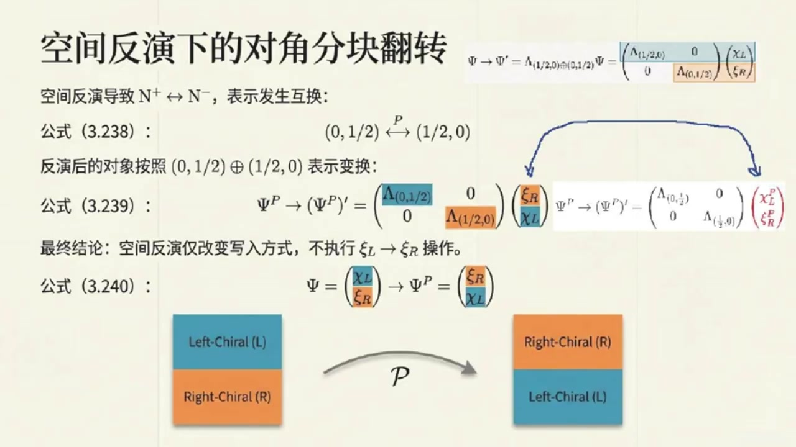
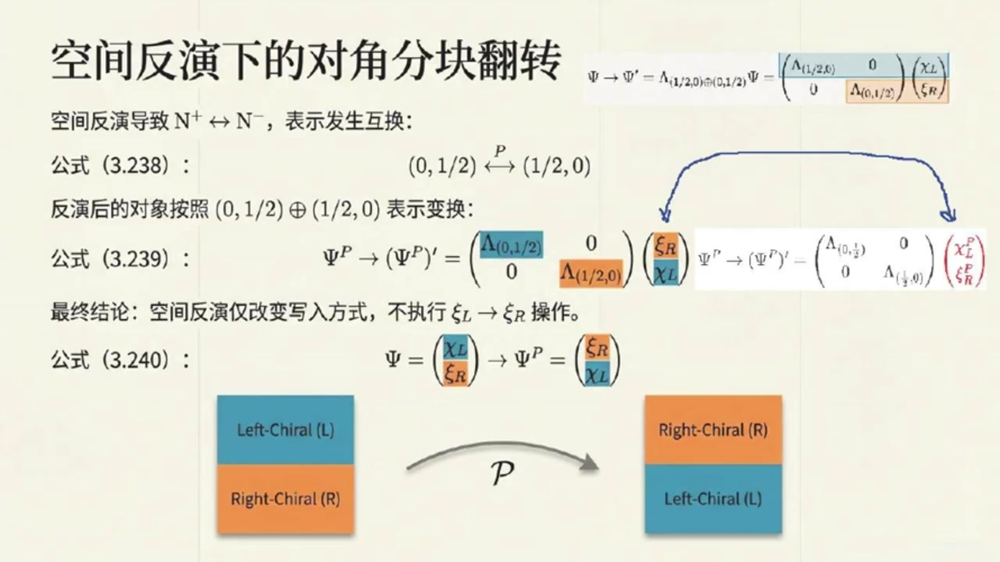
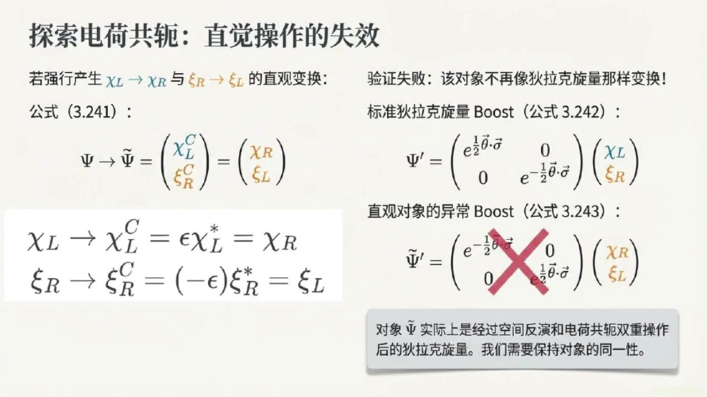
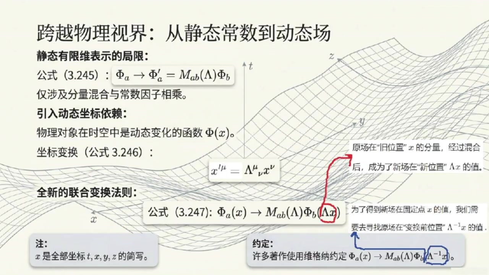
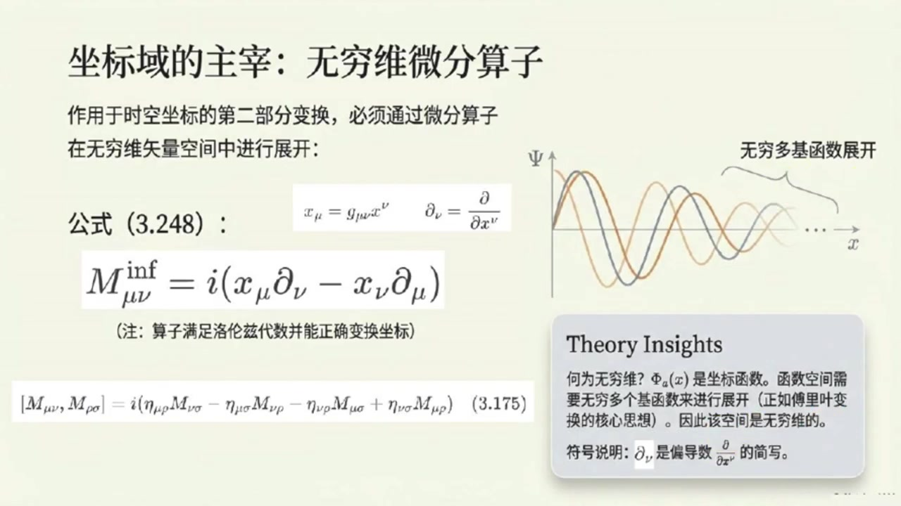
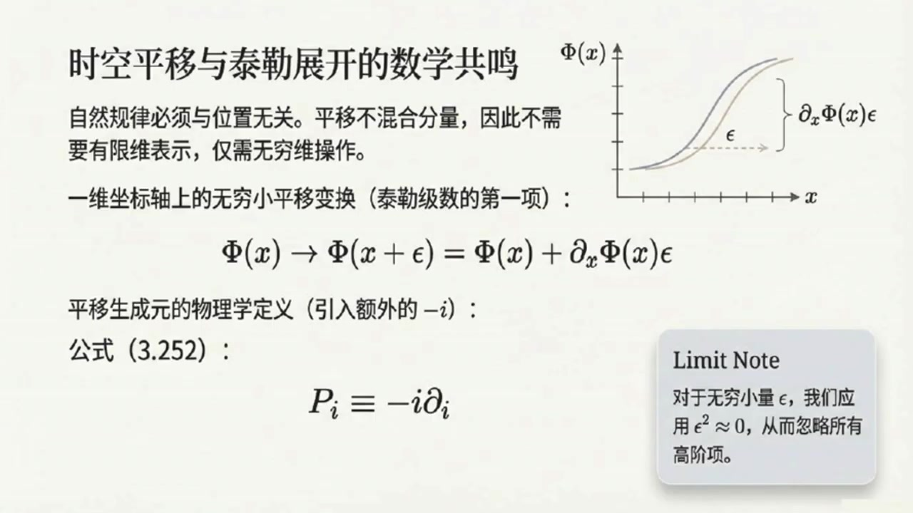

# 《基于对称性的物理学》第13课 旋量对称性与场表示：从微观粒子到时空场论

> 自动生成的课程注解文档（共 5 个段落，[原始视频](https://www.youtube.com/watch?v=r_iCQ3U8KJ4)）

## 目录

- [00:00:00 引入主题：空间反演与左右手旋量的互换](#段落-1)
- [00:04:42 狄拉克旋量、马约拉纳旋量及其宇称变换](#段落-2)
- [00:09:12 电荷共轭：手征转换与反粒子的物理意义](#段落-3)
- [00:13:36 从有限维到无穷维：场的洛伦兹表示与生成元](#段落-4)
- [00:19:43 平移生成元、庞加莱群引入与课程总结](#段落-5)

---

## 段落 1：引入主题：空间反演与左右手旋量的互换 { #段落-1 }

**时间：** 00:00:00 ~ 00:04:42

📝 原始字幕

<pre>

嘿大家好欢迎回到我们的基于对称性的物理学博客课堂我是你们活泼好奇的乔伊
大家好我是赛很高兴和大家一起继续探索物理世界中的对称之美赛今天已经是我们这门课的第十三讲了时间过得真快
我们聊到了洛伦兹群的表示那些什么左手手争右手争的悬亮听起来就特别酷是啊乔伊今天我们就要深入探讨这些悬亮在一些核心对称性电换下的行为比如空间繁衍和电核供恶
最后我们还会聊聊物理学中非常重要的无穷为表示这可是理解场论的班将哦听起来就很伤脑但也很让人期待那我们是不是就从悬亮与空间繁衍开始聊起呢上次你提到左手手和右手我一直有个疑问为什么他们会这样命名呢
没错这个问题提得非常好
其实这个命名的原因正是我们今天要讲的空间繁衍变换来揭示的
空间繁衍你是指像镜子一样把左右颠倒过来吗可以这么理解在物理学里空间繁衍又叫语秤
我们通常用大写字母P来表示
他会把一个三维空间坐标 x,y,z
变成父X父外父子
它就像你说的把一个右手戏变成了左手戏那这个变换对我们之前说的那些洛伦兹群的生成源比如J和K会有什么影响呢好的我们之前其实提到过在空间繁衍下洛伦兹群的生成源J也就是转动生成源他自己是不变的但K也就是Boost生成源会变好变成副K哦J不变K变好这是什么特别的呢当然特别了
还记得我们定义过两个组合型的生成源N正和N码
N正负就是二分之一乘括号J加减虚数单位I乘K括号我想起来了它们分别对应着二分之一零和零零二分之一这两种表示的生成源
对集了
现在你想象一下当空间反射发生时,J不变,K变成了副K
那么n正就会变成j减虚数单位i乘k
这不就是恩赋吗
哇!所以在空间反射变换下,恩正变成了恩父,反过来,恩父变成了恩政,完全正确
这意味着在空间反射变换下原本按照二分之一零表示变换的选量会变成按照零二分之一表示变换的选量反之亦然
忽然开朗原来这就是他们被称为左手手针和右手手针的原因啊就像右手坐标系在空间反射下会变成左手坐标系一样这两个悬亮表示也会相互转换
嗯,就是这个道理
虽然习惯上叫作左手和右手旋转量但要提醒大家这里的手争性和粒子物里常说的螺旋度是不同的概念虽然它们有联系手争性是洛伦兹群表示的性质而螺旋度是动量方向上的四旋分量那对于具体的波斯的变换我们怎么直观的看到这种交换呢我们可以看波斯的变换的矩阵形式对于二分之一表示它的波斯的变量矩阵是一上虚数单位I成F键到K键而对于零二分之一表示它是一上负虚数单位I成F键到K键它们之间就差一个副号所以原来是K
他们之间就差一个副号对当空间反应发生时生成元K变成了副K所以原本的意上叙数单位I成F键头DOTK键头就变成了意上副叙数单位I成F键头DOTK键头这恰好是零二分之一表示的BOST变换反之亦然这就很清晰地展示了空间反应却是把这两种手蒸旋量相互转换了明白了那如果一个物理系统在空间反应下是不变的是不是意味着它必须同时包含这两种手蒸旋量呢没错周爱你抓住了重点
如果要描述一个在空间反应下保持不变的物理系统我们就需要同时拥有左手手证和右手手证炫亮

</pre>

**课程截图：**

### 注解

这段视频深入探讨了**空间反演（Parity）对称性**对洛伦兹群旋量表示的影响，揭示了"左手"与"右手"旋量命名的数学本质。以下是针对该片段的深度注解：

---

## 1. 板书/PPT 内容描述与公式解析

### 截图 1：总览图（旋量对称性与场表示）
该图以"DNA 双螺旋"视觉化比喻展示了旋量的对称性结构：
- **左侧**：展示空间反演（$\mathbb{P}$）将左手旋量 $(1/2,0)$（蓝色左旋螺旋）与右手旋量 $(0,1/2)$（橙色右旋螺旋）互换
- **中间**：旋量类型对比表，明确外尔旋量（Weyl）、狄拉克旋量（Dirac）和马约拉纳旋量（Majorana）的洛伦兹群表示归属
- **右侧**：预告无穷维表示与庞加莱群（Poincaré group）的关系，指出场表示是有限维旋量表示与无穷维时空表示（$P_\mu = i\partial_\mu$）的结合

### 截图 2：空间反演下的生成元行为（核心公式）
**公式 (3.230) - 宇称变换下的生成元：**
$$J_i \xrightarrow{P} J_i, \quad K_i \xrightarrow{P} -K_i$$

- **$J_i$**：洛伦兹群的**转动生成元**（角动量算符），$i=1,2,3$ 对应空间三个方向。在空间反演（镜像变换）下，转动方向不变（右手定则的叉积在坐标反演下保持不变），故 $J_i$ 不变。
- **$K_i$**：洛伦兹群的**Boost生成元**（推动变换），描述参考系的速度变换。作为"速度"类矢量，在空间反演下方向反转（极矢量性质），故变为 $-K_i$。

**公式 (3.231) - 手征生成元的定义：**
$$N_i^{\pm} = \frac{1}{2}(J_i \pm iK_i)$$

- **$N_i^{+}$**：对应 $(1/2,0)$ 表示（左手旋量）的生成元
- **$N_i^{-}$**：对应 $(0,1/2)$ 表示（右手旋量）的生成元
- **$i$**：虚数单位，此处引入复组合是为了将洛伦兹代数 $\mathfrak{so}(3,1)$ 分解为两个 $\mathfrak{su}(2)$ 的直和（复化后的同构关系）

**图示逻辑**：箭头显示在空间反演 $P$ 作用下，$N^+$（蓝色）与 $N^-$（橙色）发生互换，直观展示 $(1/2,0) \leftrightarrow (0,1/2)$ 的表示转换。

### 截图 3：Boost 变换的矩阵形式与手征性
**公式 (3.232) 与 (3.233) - 有限 Boost 变换的互换：**
$$(\Lambda_K)_{(1/2,0)} = e^{\vec{\phi}\cdot\vec{K}} \xrightarrow{P} e^{-\vec{\phi}\cdot\vec{K}} = (\Lambda_K)_{(0,1/2)}$$
$$(\Lambda_K)_{(0,1/2)} = e^{-\vec{\phi}\cdot\vec{K}} \xrightarrow{P} e^{\vec{\phi}\cdot\vec{K}} = (\Lambda_K)_{(1/2,0)}$$

- **$\vec{\phi}$**：快度（rapidity）矢量，方向为 Boost 方向，大小 $\phi = \text{arctanh}(v/c)$ 与速度相关
- **$e^{\vec{\phi}\cdot\vec{K}}$**：有限 Lorentz Boost 的指数映射形式（基于生成元的李群元素）
- **关键观察**：两种表示的 Boost 矩阵仅差一个负号（指数上的 $\pm$），当 $K \to -K$ 时，左手表示的变换矩阵恰好变成右手表示的变换矩阵

**注释框 - 螺旋度 vs 手征性**：
- **手征性（Chirality）**：洛伦兹群表示的**内禀属性**，由 $(1/2,0)$ 或 $(0,1/2)$ 标记，在空间反演下互换（如左右手坐标系）
- **螺旋度（Helicity）**：粒子**运动状态**的属性，定义为 $\vec{S}\cdot\hat{p}$（自旋在动量方向的投影），是庞加莱群的卡西米尔算符，与手征性概念不同但存在关联（对无质量粒子二者等价）

---

## 2. 必要理论背景补充

### 为何 $J$ 不变而 $K$ 变号？
从群论看，Lorentz 变换可写为 $x'^\mu = \Lambda^\mu_\nu x^\nu$。空间反演 $P = \text{diag}(1, -1, -1, -1)$。
- **转动** $J_i$ 生成空间旋转，其李代数元素 $\omega_{jk} = -\omega_{kj}$（空间-空间分量）在坐标反演下：$x^j \to -x^j, x^k \to -x^k$，但微分算符 $\partial_j \to -\partial_j$，双重负号使得 $J_i \sim x^j\partial_k - x^k\partial_j$ 保持不变（轴矢量）。
- **Boost** $K_i$ 生成时空转动，$\omega_{0i}$（时间-空间分量），仅空间坐标变号，故 $K_i \sim x^0\partial_i - x^i\partial_0$ 获得一个负号（极矢量）。

### 复化洛伦兹代数与 $SL(2,\mathbb{C})$
公式 $N_i^{\pm} = \frac{1}{2}(J_i \pm iK_i)$ 实现了李代数同构：
$$\mathfrak{so}(3,1) \otimes \mathbb{C} \cong \mathfrak{su}(2) \oplus \mathfrak{su}(2)$$
这使得我们可以用两个独立的 $SU(2)$ 表示 $(j_1, j_2)$ 来标记 Lorentz 群的有限维表示。旋量对应 $(1/2,0)$ 和 $(0,1/2)$，分别是 $SL(2,\mathbb{C})$ 的左手和右手基本表示。

---

## 3. 通俗语言解释核心概念

### "左手"与"右手"的镜像隐喻
想象你面对镜子举起右手，镜中人举起的是左手。**空间反演就是物理学的"镜像"操作**：
- 左手旋量 $(1/2,0)$ 经过镜像（$P$ 变换）后，其数学描述变成了右手旋量 $(0,1/2)$ 的描述
- 就像坐标系从右手系变成左手系，旋量的"手性"也在空间反演下翻转

### 为什么宇称守恒需要"左右开弓"？
如果一个物理定律在镜子内外看起来一样（宇称守恒），那么描述它的方程不能偏袒左手或右手旋量。就像你不能只用左手坐标系来描述镜像对称的物体，你必须**同时包含左右手旋量**（组合成狄拉克旋量 $(1/2,0) \oplus (0,1/2)$），这样当 $P$ 变换交换它们时，整体方程保持不变。

### 手征性 vs 螺旋度：身份证 vs 运动状态
- **手征性**像是粒子的"身份证"：左旋中微子永远携带"左手"身份证，无论它朝哪个方向运动
- **螺旋度**像是粒子的"运动姿态"：描述自旋方向与运动方向的关系（顺时针或逆时针旋转）。对无质量粒子，身份证决定了姿态（左手身份证=左旋运动），但对有质量粒子，通过洛伦兹变换可以超过去，螺旋度会改变，但手征性不变。

---

## 4. 本段新出现的关键概念总结

| 概念 | 数学本质 | 物理意义 |
|------|---------|---------|
| **空间反演 ($P$)** | $(x,y,z) \to (-x,-y,-z)$，$J\to J$，$K\to -K$ | 镜像对称性，区分极矢量与轴矢量 |
| **手征生成元互换** | $N^+ \leftrightarrow N^-$ | $(1/2,0)$ 与 $(0,1/2)$ 表示的相互映射 |
| **Boost 矩阵符号差** | $e^{\vec{\phi}\cdot\vec{K}} \leftrightarrow e^{-\vec{\phi}\cdot\vec{K}}$ | 左右旋量在速度变换下的相反响应 |
| **宇称不变性条件** | 需同时包含左右旋量 | 狄拉克旋量的构造动机（双分量直和） |

这段内容为后续理解**狄拉克方程的宇称对称性**以及**弱相互作用中宇称不守恒**（只耦合左手旋量）奠定了数学基础。

---

## 段落 2：狄拉克旋量、马约拉纳旋量及其宇称变换 { #段落-2 }

**时间：** 00:04:42 ~ 00:09:12

📝 原始字幕

<pre>

最简单的方法就是把它们组合起来形成一个更大的对象我们称之为迪拉克选料迪拉克斯宾纳迪拉克选料听起来很耳熟它长什么样呢一个迪拉克选料我们通常用大写的C来表示它就是一个四分亮的猎象料上面是左手手针选料KL或者K下A下面是右手针选料CR或者X上A那它和我们之前说的四十辆有什么区别吗这是一个非常好的问题
迪拉克悬量不是四十辆
因为它的变换方式和四十量完全不同
四十辆是按照洛伦兹群的二分之一二分之一表示变换的
而迪拉克悬量是按照二分之一零直合也就是圈合零二分之一这个表示变换的
这其实是一个可约表示因为它就是把两种手蒸旋量变换矩阵简单地平成一个分块对角矩阵也就是上面这个左手蒸旋量按二分之一零表示变换下面这个右手蒸旋量按零二分之一这个表示变换我明白了就是说它的不同分量是独立变换的
那还有一种叫马乔拉纳玄亮的它又是什么呢马乔拉纳玄亮是迪拉克玄亮的一个特例
如果迪拉克旋律PSI中的左手手蒸旋律KL和右手手蒸旋律CR之间存在某种特定的联系比如C二就是KL的某种供鄂形式那么它就变成了马祖拉纳旋律
简单来说,马杜拉纳玄亮就是一种自身反粒子的玄亮,自身反粒子这个概念好深奥啊,我们再实现不深究,直到它是一个特例就好
回到迪拉克旋流在空间繁殖下的行为这其实很有趣我们知道空间繁殖会交换二分之一零和零二分之一表示那是不是意味着如果一个迪拉克旋流赛等于上分量凯尔下分量塞尔经过空间繁殖它的凯尔和塞尔就会互换位置完全正确
在空间繁衍后这个迪拉克悬量会变成赛P等于上分量赛尔下分量凯尔
它依然包含了相同的左手和右手旋亮只是他们的位置点倒了这告诉我们空间繁衍并没有把左手旋亮变成右手旋亮它只是把他们的位置对掉了不对呀我刚才尝试了推倒迪拉克旋亮空间繁衍所服从的变换结果和书中公式三点二三九不一样呀
就是图中红色的部分是我的理解有问题吗你的理解没有问题首先你的推到结果说明迪拉克选量在空间繁衍后不再是迪拉克选量因为赛P服从的变换和赛服从的变换关系不一样那咋办我们注意到虽然PSIP服从的整体值和变换和PSI服从的整体值和变换关系不一样但是PSIP第一个分量的变换和PSI第二个分量的变换矩阵是一样的
而PCP第二个分量的变换和PSA第一个分量的变换矩阵是一样的虽然迪拉克旋量空间繁衍不再是迪拉克旋量但是希望迪拉克旋量空间繁衍后不要丢失原来迪拉克旋量的信息对的
所以我们退而求其次,仅经要求在空间繁衍,拍二体下保持自
所有迪拉克旋律在空间繁衍变换后的表现必须和变换前的表现一样
变换后的迪拉克旋量虽然形式上不一样但必须依然是用变换前的变量组成的我明白了所以要求迪拉克旋量空间繁衍仅仅是将第一个分量和第二个分量挑换一下位置就像你说的把一个右手变成了左手但组成这个手本身还是那双手形象的比喻好的赛既然我们已经聊了空间繁衍那接下来是不是该聊聊另一种重要的变量了

</pre>

**课程截图：**

### 注解

这段视频深入探讨了**狄拉克旋量的数学构造**、**马约拉纳旋量的物理内涵**，以及**空间反演对称性在狄拉克旋量上的具体实现方式**。以下是针对该片段的深度注解：

---

## 1. 板书/PPT 内容描述

截图展示了标题为**"空间反演下的对角分块翻转"**的板书，核心内容分为三个层次：

**上层区域**：展示狄拉克旋量的分块对角变换结构。一个四分量的狄拉克旋量 $\Psi$ 被表示为列向量 $\begin{pmatrix} \chi_L \\ \xi_R \end{pmatrix}$，其洛伦兹变换由分块对角矩阵 $\Lambda_{(1/2,0)} \oplus \Lambda_{(0,1/2)}$ 作用。

**中层区域（公式 3.238 - 3.239）**：
- **公式 3.238**：$(0,1/2) \stackrel{P}{\leftrightarrow} (1/2,0)$，表明空间反演 $P$ 导致两种手性表示互换
- **公式 3.239**：展示空间反演后的变换行为。反演后的对象 $\Psi^P$ 在洛伦兹变换下服从 $\begin{pmatrix} \Lambda_{(0,1/2)} & 0 \\ 0 & \Lambda_{(1/2,0)} \end{pmatrix}$ 的变换规则，即对角块位置互换

**下层区域（公式 3.240 与图示）**：
- **公式 3.240**：$\Psi = \begin{pmatrix} \chi_L \\ \xi_R \end{pmatrix} \rightarrow \Psi^P = \begin{pmatrix} \xi_R \\ \chi_L \end{pmatrix}$
- **图示**：两个堆叠的色块（蓝色"Left-Chiral (L)"在上，橙色"Right-Chiral (R)"在下）经过标记为 $\mathcal{P}$ 的箭头后，变为橙色在上、蓝色在下，形象展示"位置对调"而非"手性转换"

---

## 2. 新公式与符号详解

### (1) 狄拉克旋量的构造与表示
**公式形式**：
$$\Psi = \begin{pmatrix} \xi_L \\ \xi_R \end{pmatrix} \quad \text{或} \quad \Psi = \begin{pmatrix} \chi_L \\ \xi_R \end{pmatrix}$$

**符号说明**：
- $\Psi$（大写Psi）：**狄拉克旋量**（Dirac spinor），四分量的列向量
- $\xi_L$（或 $\chi_L$）：**左手外尔旋量**（Left-handed Weyl spinor），两分量的复旋量，按洛伦兹群 $(1/2,0)$ 表示变换
- $\xi_R$：**右手外尔旋量**（Right-handed Weyl spinor），按 $(0,1/2)$ 表示变换
- 下标 $L/R$：手性（Chirality）标记，对应洛伦兹群的不同表示

**关键区别**：
- **四矢量**（4-vector）：按 $(1/2,1/2)$ 表示变换（不可约表示）
- **狄拉克旋量**：按 $(1/2,0) \oplus (0,1/2)$ 表示变换（**可约表示**，reducible representation）

### (2) 空间反演下的变换规则
**公式 3.239 的数学实质**：
$$\Psi^P \rightarrow (\Psi^P)' = \begin{pmatrix} \Lambda_{(0,1/2)} & 0 \\ 0 & \Lambda_{(1/2,0)} \end{pmatrix} \begin{pmatrix} \xi_R \\ \chi_L \end{pmatrix}$$

**深层含义**：
- 空间反演后，旋量 $\Psi^P = \begin{pmatrix} \xi_R \\ \chi_L \end{pmatrix}$ 的第一个分量 $\xi_R$ 现在按 $\Lambda_{(0,1/2)}$ 变换（原来是右手，现在处于"上层位置"但保持右手的变换规则）
- **矛盾点**：这与原始狄拉克旋量的变换规则 $\begin{pmatrix} \Lambda_{(1/2,0)} & 0 \\ 0 & \Lambda_{(0,1/2)} \end{pmatrix}$ 不同，因此严格来说 $\Psi^P$ 不再是"狄拉克旋量"，而是属于**不同的表示空间**

### (3) 马约拉纳旋量的条件（字幕中提及）
**物理条件**：
$$\xi_R = C (\xi_L)^c \quad \text{或} \quad \xi_R = \epsilon \xi_L^*$$

**符号说明**：
- $C$：**电荷共轭矩阵**（Charge conjugation matrix）
- $(\cdot)^c$ 或 "共轭形式"：指电荷共轭操作，通常涉及复共轭与旋量度规的缩并
- $\epsilon$：二维反对称张量（Levi-Civita符号），用于提升/降低旋量指标

---

## 3. 理论背景补充

### (1) 可约表示的数学本质
狄拉克旋量构成的 $(1/2,0) \oplus (0,1/2)$ 表示被称为**可约表示**，因为变换矩阵始终保持分块对角形式：
$$\Lambda_{Dirac} = \begin{pmatrix} \Lambda_{(1/2,0)} & 0 \\ 0 & \Lambda_{(0,1/2)} \end{pmatrix}$$

这意味着左手和右手分量**独立变换**，互不耦合。这与四矢量（$j=1$ 表示）或单个外尔旋量（不可约表示）形成对比。数学上，这对应于洛伦兹群 $SO(3,1) \cong SL(2,\mathbb{C}) \times SL(2,\mathbb{C})$ 的两个 $SU(2)$ 子群的直积表示。

### (2) 马约拉纳旋量的拓扑意义
马约拉纳旋量是狄拉克旋量的**实子流形**。在粒子物理中：
- **狄拉克旋量**：描述有区别的粒子与反粒子（如电子与正电子），有四个独立复分量（8个实自由度）
- **马约拉纳旋量**：满足 $\Psi = \Psi^c$（自身电荷共轭），描述**自身反粒子**的费米子（如假想中的马约拉纳中微子）。这约束条件将独立自由度减半（4个实自由度）

数学上，这相当于在复向量空间中选取了一个**实结构**（real structure），使得 $\xi_R$ 不是独立变量，而是 $\xi_L$ 的"镜像"。

### (3) 空间反演的表示论困境与解决
学生困惑的核心在于：**空间反演不是洛伦兹群的连续子群元素**，而是离散对称性。在洛伦兹群的表示论中：
- 连续洛伦兹变换保持 $(1/2,0)$ 和 $(0,1/2)$ 不变（各自独立变换）
- 空间反演 $P$ 将这两个表示**互换**

因此，$\Psi^P$ 严格属于 $(0,1/2) \oplus (1/2,0)$ 表示，与原始的 $(1/2,0) \oplus (0,1/2)$ 在数学上是不同的对象（尽管作为向量空间同构）。

**解决方案**（视频中提到的"退而求其次"）：
不要求 $\Psi^P$ 与 $\Psi$ 属于同一表示，而是要求**物理等价性**：$\Psi^P$ 必须能用 $\Psi$ 的原始分量（$\xi_L$ 和 $\xi_R$）重新组合表示。这导致 $\Psi^P = \begin{pmatrix} \xi_R \\ \xi_L \end{pmatrix}$，即简单的分量位置交换。

---

## 4. 通俗语言解释

### "可约表示"：独立运行的双引擎
想象狄拉克旋量是一辆**双引擎飞机**，左翼引擎是左手旋量，右翼引擎是右手旋量。这两个引擎各自独立运转（分块对角变换），互不影响。这就是"可约"的含义——它可以被"约化"为两个独立工作的部分。而四矢量就像单引擎飞机，所有部件必须协同工作（不可约）。

### 马约拉纳旋量：左右手是镜像同一人
如果说狄拉克旋量是一对**双胞胎**（左手哥哥和右手弟弟，各自独立生活），那么马约拉纳旋量就是**一个人和他的镜中倒影**。右手分量不是独立的人，而是左手分量的"镜像变换"（电荷共轭）。这个人是"自身反粒子"——就像镜子里的你不再是另一个人，而是你自己的一种特殊映射。

### 空间反演：调换抽屉，而非改变内容
空间反演对狄拉克旋量的作用，就像**把文件柜的上下抽屉对调**：
- 原来上层放左手文件 $\xi_L$，下层放右手文件 $\xi_R$
- 反演后，上层放 $\xi_R$，下层放 $\xi_L$

**关键点**：抽屉里的文件内容（旋量本身的变换性质）没有变——右手文件 $\xi_R$ 即使被移到上层，它依然是"右手型"的（按 $(0,1/2)$ 变换）。只是现在它占据了原来左手文件的位置。这就是为什么视频强调"空间反演并没有把左手旋量变成右手旋量，它只是把他们的位置对掉了"。

学生发现的"与公式 3.239 不一致"正是因为：当右手文件移到上层后，它在上层环境下表现出的"变换规则"（如何响应洛伦兹 boost）与原来左手文件的规则不同，因此严格来说，这个对调后的文件柜不再是"标准狄拉克文件柜"，而是一个"镜像版本"。但为了物理描述的连续性，我们接受这种形式上的变化，只要信息不丢失。

---

## 段落 3：电荷共轭：手征转换与反粒子的物理意义 { #段落-3 }

**时间：** 00:09:12 ~ 00:13:36

📝 原始字幕

<pre>

你刚才提到空间繁衍仅仅是将迪拉克旋亮的两个分量挑换了一下位置,并不会把其中的左手旋亮变成右手旋亮
那有没有一种变换能做到这一点呢有的乔伊我们之前在讨论指标升降的时候偶然提到过一个变换他能把左手悬亮KL变成右手悬亮KL同时把右手悬亮CL变成左手悬亮CL
这个变换是通过对悬量进行复供额然后和一个叫做EPSILEN的所谓悬量度归矩阵相成来实现的就是那个KLTOEPSILENKLSTAREQUASKR的操作
当时我以为它只是个计算机场,最初我们是把它当作数学工具来用的
但现在我们可以从一个更深刻的物理视角来理解它
我们称这个操作为电鹤供额 Charge Tangulation
通常用大写C来表示也就是KLCEQUALS EPSILENCELSTAR
电鹤共恶,听起来好像只和电鹤有关,这个名字确实有点误导性
我们先来看看它对迪拉克旋量有什么影响如果我们直观的把迪拉克旋量PSY等于上分量KL下分量C2中的每个分量都进行这种变成香粉手蒸的操作也就是PSY2的等于上分量KLC下分量C2C等于上分量KL下分量CL这样看起来他确实把左手和右手旋量原位互换了是的
但问题是这个PCE二的对象他在BOST的变换下的行为和我们原本的迪拉克选量PCE还是不一样
它按照洛伦兹群的另一种表示进行变换也就是说和迪拉克玄亮的空间反应类似它也不是一个标准的迪拉克玄亮
为了让电荷供额后的对象仍然能像迪拉克旋量一样变换我们需要稍微调整一下正确的电荷供额变换是这样定义的PSY等于上粉量 KL 下粉量 C2变换到PSY C等于上粉量 C2C 下粉量 KL C等于上粉量 CL 下粉量 K2 一这里面不仅做了手针性转换还把上下两个分量也调换了位置就像空间繁衍那样没错这样一来电荷供额后的PSYC才能保持它作为迪拉克旋量的变换性质
所以电荷供偶这个操作它不仅是把左手旋量变成右手旋量它还涉及了分量的重新排列那为什么它会被叫做电荷供额呢你刚才说名字有点误导这是一个非常关键的点虽然名字叫电荷供额但这个操作的物理意义远不止于翻转电荷它实际上会翻转所有用来描述一个基本粒子的标签所有标签比如呢比如电荷重子数青子数等等我们知道组成物质的基本粒子比如电子它有电荷有字旋有质量
电荷供额就是把这些粒子的所有这些量子数都翻转
所以电子的电荷共额就是正电子哦所以电荷共额其实是把粒子变成了它的反粒子可以这么理解
从玄亮的角度来看电鹤共鹅不仅把左手玄亮变成了右手玄亮它还通过那个EPSLON玄亮度归矩阵把自寻方向也反弹了所以记住电鹤共鹅是一个非常强大的对称性操作它翻转的是一个粒子所有的内在量子数哇这比我粗处想的要深刻多了它不仅仅是电鹤的翻转而是整个粒子性质的翻转
赛义我们聊了这么多有限微表示比如单分量双分量四分量悬量但现实世界中我们处理的往往是电磁场量子场这些在时空中变化的常对象这些场怎么用洛伦子群来表示呢它们不像是简单的固定分量的对象

</pre>

**课程截图：**

### 注解

这段视频深入探讨了**电荷共轭（Charge Conjugation, C）**这一离散对称性，揭示了它与空间反演的本质区别，以及为何简单的"手性翻转"并不足以构成物理上正确的电荷共轭操作。以下是针对该片段的深度注解：

---

## 1. 板书/PPT 内容描述

### 截图 1：探索电荷共轭——直觉操作的失效
该图展示了** naive（直观）电荷共轭操作的问题**：
- **左侧**：公式 (3.241) 展示了对狄拉克旋量 $\Psi = \begin{pmatrix} \chi_L \\ \xi_R \end{pmatrix}$ 进行"直观"电荷共轭操作 $\Psi \to \tilde{\Psi} = \begin{pmatrix} \chi_L^C \\ \xi_R^C \end{pmatrix}$，其中 $\chi_L^C = \epsilon \chi_L^*$ 被等同于 $\chi_R$，$\xi_R^C = (-\epsilon) \xi_R^*$ 被等同于 $\xi_L$。
- **右侧**：通过对比标准狄拉克旋量的 Boost 变换（公式 3.242，分块对角形式）与直观对象的 Boost 变换（公式 3.243，非对角错误形式），用红色大叉标记了这种直觉操作的失败——变换后的对象不再按狄拉克旋量的方式变换。
- **底部注释**：明确指出该操作实际上是"空间反演和电荷共轭的双重操作"，破坏了对象的同一性。

### 截图 2 & 3：确立纯粹的电荷共轭变换 ($\Psi^C$)
这两张图展示了**正确的电荷共轭定义**：
- **核心公式 (3.244)**：展示了从 $\Psi = \begin{pmatrix} \chi_L \\ \xi_R \end{pmatrix}$ 到 $\Psi^C$ 的映射。图中用红蓝箭头形象地表示：不仅上下分量内部发生了手性转换（$\chi_L \to \chi_L^C$ 变为右手，$\xi_R \to \xi_R^C$ 变为左手），**上下分量的位置也发生了交换**。
- **结果**：$\Psi^C = \begin{pmatrix} \xi_R^C \\ \chi_L^C \end{pmatrix} = \begin{pmatrix} \xi_L \\ \chi_R \end{pmatrix}$（假设 $\xi_R^C \equiv \xi_L$ 等）。
- **物理意义框**：强调电荷共轭翻转的是"所有粒子标签"（电荷、重子数、轻子数等），而不仅是电荷。
- **Advanced Tip**：解释 $\epsilon$ 矩阵实现自旋翻转（Spin Flip）——将自旋投影 $+1/2$ 翻转为 $-1/2$。

---

## 2. 公式解析（新出现的公式）

### 公式 (3.241)：直观的（错误）电荷共轭尝试
$$ \Psi \to \tilde{\Psi} = \begin{pmatrix} \chi_L^C \\ \xi_R^C \end{pmatrix} = \begin{pmatrix} \chi_R \\ \xi_L \end{pmatrix} $$

**符号说明**：
- $\chi_L$：左手外尔旋量（Left-handed Weyl spinor），属于 $(1/2, 0)$ 表示。
- $\xi_R$：右手外尔旋量（Right-handed Weyl spinor），属于 $(0, 1/2)$ 表示。
- $\chi_L^C \equiv \epsilon \chi_L^*$：左手旋量的电荷共轭操作，结果是一个右手旋量（记作 $\chi_R$）。
- $\xi_R^C \equiv (-\epsilon) \xi_R^*$：右手旋量的电荷共轭操作，结果是一个左手旋量（记作 $\xi_L$）。
- $\epsilon$：二维反对称 Levi-Civita 符号（$\epsilon_{12} = -\epsilon_{21} = 1$），在旋量空间中充当"度规"，负责在复共轭时保持洛伦兹协变性。

**问题所在**：这种操作仅对分量内部做了手性转换，但保持了 $\chi$ 在上、$\xi$ 在下的位置。这导致 $\tilde{\Psi}$ 在洛伦兹 Boost 下按照错误的表示变换（见公式 3.243）。

### 公式 (3.242)：标准狄拉克旋量的 Boost 变换
$$ \Psi' = \begin{pmatrix} e^{\frac{1}{2}\vec{\theta}\cdot\vec{\sigma}} & 0 \\ 0 & e^{-\frac{1}{2}\vec{\theta}\cdot\vec{\sigma}} \end{pmatrix} \begin{pmatrix} \chi_L \\ \xi_R \end{pmatrix} $$

**符号说明**：
- $\vec{\theta}$：Boost 参数（快度）。
- $\vec{\sigma}$：泡利矩阵。
- 矩阵的分块对角结构表明：左手分量只与左手分量混合，右手分量只与右手分量混合，这是狄拉克旋量的标准变换规则。

### 公式 (3.243)：直观对象的异常 Boost 变换
$$ \tilde{\Psi}' = \begin{pmatrix} e^{-\frac{1}{2}\vec{\theta}\cdot\vec{\sigma}} & 0 \\ 0 & e^{\frac{1}{2}\vec{\theta}\cdot\vec{\sigma}} \end{pmatrix} \begin{pmatrix} \chi_R \\ \xi_L \end{pmatrix} \quad \text{（错误）} $$

**关键问题**：该变换矩阵将原本属于右手分量的指数 $e^{-\frac{1}{2}\vec{\theta}\cdot\vec{\sigma}}$ 错误地作用在了现在的"上分量"（由 $\chi_L$ 变来的 $\chi_R$）上。这破坏了狄拉克旋量的协变性——它不再是洛伦兹群的标准表示。

### 公式 (3.244)：正确的电荷共轭变换定义
$$ \Psi = \begin{pmatrix} \chi_L \\ \xi_R \end{pmatrix} \xrightarrow{\quad C \quad} \Psi^C = \begin{pmatrix} \xi_R^C \\ \chi_L^C \end{pmatrix} = \begin{pmatrix} \xi_L \\ \chi_R \end{pmatrix} $$

**符号说明**：
- $\Psi^C$：电荷共轭后的狄拉克旋量，仍是一个标准的狄拉克旋量（四分量对象）。
- $\xi_R^C = -\epsilon \xi_R^* \equiv \xi_L$：原右手分量的电荷共轭，变为左手旋量。
- $\chi_L^C = \epsilon \chi_L^* \equiv \chi_R$：原左手分量的电荷共轭，变为右手旋量。
- **位置交换**：关键之处在于 $\xi_R^C$ 现在位于**上分量**位置，而 $\chi_L^C$ 位于**下分量**位置。

**为何正确**：这种"手性翻转 + 位置交换"的组合，使得 $\Psi^C$ 在洛伦兹变换下仍保持标准狄拉克旋量的分块对角变换规则（如公式 3.242），从而保证了对象的同一性。

---

## 3. 必要的理论背景知识

### 3.1 $\epsilon$ 矩阵与旋量复共轭的协变性
在洛伦兹群 $SL(2,\mathbb{C})$ 的旋量表示中，单纯的复共轭 $\chi_L^*$ 并不保持协变性——它会变换为某种"非标准"的表示。为了构造一个合法的旋量，需要引入 $\epsilon$ 矩阵（在数学上对应于 $SU(2)$ 的不变张量）：
$$ \chi_L^C = \epsilon \chi_L^* $$
这个操作将 $(1/2,0)$ 表示映射到 $(0,1/2)$ 表示，即左手变右手。$\epsilon$ 的存在确保了 $\chi_L^C$ 按照右手旋量的规则变换。

### 3.2 电荷共轭与反粒子
在量子场论中，电荷共轭算符 $\hat{C}$ 作用在单粒子态 $|p, s, q, \dots\rangle$ 上时，会翻转所有**内禀量子数**：
- 电荷 $q \to -q$
- 重子数 $B \to -B$
- 轻子数 $L \to -L$
- 手性（Chirality）$L \leftrightarrow R$

因此，电子（电荷 $-e$，左手或右手）的电荷共轭态是正电子（电荷 $+e$，相应手性）。字幕中强调的"翻转所有标签"正是指这一点——它不仅是电磁相互作用的对称性，而是所有基本粒子属性的"镜像"。

### 3.3 与空间反演（Parity）的对比
- **空间反演 $\mathbb{P}$**：仅交换 $\chi_L \leftrightarrow \xi_R$ 的位置（上下互换），不改变分量内部的手性标记（$\chi$ 仍是左手，$\xi$ 仍是右手，只是位置换了）。
- **电荷共轭 $C$**：不仅交换位置，还将 $\chi_L$ 变成 $\chi_R$（右手），$\xi_R$ 变成 $\xi_L$（左手）。它是"手性翻转 + 位置交换"的组合。

---

## 4. 核心概念通俗解释

### "电荷共轭"名字的误导性
虽然名为"电荷"共轭，但它远不止翻转电荷。可以将其理解为**"反粒子生成器"**：
- 想象粒子是一张身份证，上面有"电荷"、"手性"、"轻子数"等栏目。
- 空间反演（Parity）只是交换了身份证的左右手（位置），但上面的文字内容不变。
- 电荷共轭（C）则是将身份证上的**所有文字**（电荷、轻子数等）取反，同时把手性（左右

---

## 段落 4：从有限维到无穷维：场的洛伦兹表示与生成元 { #段落-4 }

**时间：** 00:13:36 ~ 00:19:43

📝 原始字幕

<pre>

朱伟你提到了一个非常核心的问题
前面我们讨论的有限微表示它们作用于像悬量这样分量式长数不随时间空间变化的物理对象但物理学中的场比如你说的电磁场它在时空中的每个点都有一个值而且这个值是变化的
所以我们需要一种新的表示方式那就是无穷为表示无穷为听起来就很大是的
我们之前处理的变换形式比如FIA变换到FIPA等于MAB of LEMDA成FIB
这里的MAB OFLAMDA是洛伦兹变换LAMDA的特定有限微表示矩阵,作用于例如像YER选量这样的双分量对象
与该矩阵相成的结过仅仅是该对象的个分量发生混合并乘以常数因子就像一个二分量悬量经过变换后它的两个分量会相互混合但它们仍然是两个分量
但现在如果我们的对象FY是时空坐标X的函数也就是FY of X
那么洛伦字变换不仅会作用于F的分量本身还会作用于它的坐标X因为X也会被罗伦字变换改变变成LAMDAX比如X上MYU等于LAMDA上MYU下MYU所以我们得到一个完整的场变换也就是FYA的变换到MAB的变换我注意到教科书中提到完整场变换的另一种所谓的VEGNA约定下的不同表示将LAMDAX改成了LAMDAX这个如何理解这两种约定的核心区别在于坐标参数随便变动的方向
在本书的约定下意思是
原厂在旧位置X的分量经过混合后成为了新厂在新位置LAMDAX的值
而在维格纳约定下意思是
为了得到新场在固定点X的值我们需要去寻找原场在变换前位置朗达尼X的值那为何本书不采用维格纳约定呢在大多数物理著作中采用维格纳约定是为了保证对称操作的复合规律与群成法一致
而我们这里选择不采用该约定是因为它更倾向于从无穷小变换生成源的角度来直接构建物理量的表示
这种方式在处理微分算子时往往更直观哦我明白了我们继续好我们继续所以一个场的变换会包含两部分
一部分是有限为表示,作用于场的内部结构或分量
另一部分是作用于时空坐标的变换
而这部分变换就需要用到吴琼伟表示了为什么作用于坐标的变换会是吴琼伟的呢因为一个函数FIX它是一个在时空上分布的对象
你可以把它想象成在一个无穷为的函数空间里
我们需要无穷多个基函数才能描述任意一个函数
所以作用于函数也就是场的变换,自然就需要无穷为的表示原来是这样
那这种无穷为表现具体是怎样的呢
罗伦字群的无穷尾表示通常是由微分算子给出的比如对于罗伦字群的生成源它的无穷尾形式是MINF下等于虚促单位I成括号X下成偏下减X下成偏下这里的偏下就是对时空坐标X上的偏长数而X下就是对X上用时空做归降指标的结果微分算子
这和量子力学里动量算子是微分算子有点像啊没错它们都是作用于函数空间上的算子通过繁琐但本质上是简单的计算你可以验证这些微分算子确实满足罗伦子倍数而且它们能按预期变换坐标就是满足以前学过的反乘张亮写法的那个罗伦子倍数吗对需要你将刚才说过的微分算子形式的罗伦子群的乌琼为表示带入这个公式验证这个需要你课后动手去验证的其实就是暴力验证好的我课后一定完成这个验证
那一个完整的场的变换是不是就是有限为和无穷为表示的结合呢?完全正确
一个场VAFX的完整变换会包含有限微表示矩阵对分量的作用以及无限微表示算子对坐标函数的作用最终我们可以把这两个部分的生成源合并起来形成一个总的生成源M下MYUNYU等于MFIN下MYUNYU加MINF下MYUNYU
所以这个M下就是常表示的生成源了没错这种罗伦兹群生成源的表示我们就称之为常表示它能够完整地描述一个场在罗伦兹变换下的行为可以解释一下这些变换中Omega上缩并M下吗还记得这个反称张亮M的具体表达是吗记得这个反称张亮M一共有六个非零的独立分量刚好防止了三个旋转上三个Boost生成源所以如果对应选择一个作为参数的反称张亮Omega
这两个反称张亮的双重缩柄恰好就是这六个生成源的先行组合可用来表示任意一个生成源进而可用其指数对应其群表示我明白了听起来很连贯

</pre>

**课程截图：**

### 注解

这段视频标志着课程从**有限维旋量表示**向**场论无穷维表示**的关键跃迁，核心在于理解"场"作为时空坐标函数的双重变换特性（内部指标混合+坐标映射）。以下是针对该片段的深度注解：

---

## 1. 板书/PPT 内容描述

### 截图 1 & 2：跨越物理视界——从静态常数到动态场
板书以三维时空网格（$x$-$y$-$t$坐标系）为背景，直观展示坐标变换的两种哲学观点：

**左侧文字区**：
- **静态有限维表示的局限**：公式 (3.245) $\Phi_a \to \Phi'_a = M_{ab}(\Lambda)\Phi_b$，强调此变换仅涉及分量混合与常数因子相乘，适用于不随时空变化的"刚性"对象（如单粒子自旋）。
- **引入动态坐标依赖**：明确物理对象在时空中是动态变化的函数 $\Phi(x)$，其中 $x$ 是 $(t,x,y,z)$ 的简写。
- **坐标变换**：公式 (3.246) $x'^\mu = \Lambda^\mu_{\ \nu} x^\nu$。

**右侧公式区**：
- **本书约定（主动变换）**：公式 (3.247) $\Phi_a(x) \to M_{ab}(\Lambda)\Phi_b(\Lambda x)$，红框标注 $\Lambda x$。旁注解释："原场在'旧位置'$x$的分量，经过混合后，成为了新场在'新位置'$\Lambda x$的值"。
- **维格纳约定（被动变换）**：蓝框标注 $\Lambda^{-1}x$，公式为 $\Phi_a(x) \to M_{ab}(\Lambda)\Phi_b(\Lambda^{-1}x)$。旁注解释："为了得到新场在固定点$x$的值，我们需要去寻找原场在'变换前位置'$\Lambda^{-1}x$的值"。

### 截图 3：坐标域的主宰——无穷维微分算子
板书阐释坐标变换在函数空间上的数学实现：

**核心公式**：
- 公式 (3.248)：$M^{\text{inf}}_{\mu\nu} = i(x_\mu \partial_\nu - x_\nu \partial_\mu)$，标注为"无穷维微分算子"。
- 公式 (3.175)：洛伦兹代数对易关系 $[M_{\mu\nu}, M_{\rho\sigma}] = i(\eta_{\nu\rho}M_{\mu\sigma} - \eta_{\mu\rho}M_{\nu\sigma} - \eta_{\nu\sigma}M_{\mu\rho} + \eta_{\mu\sigma}M_{\nu\rho})$。

**右侧图示**：
- 函数图像 $\Psi(x)$ 展示"无穷多基函数展开"概念，暗示函数空间需要无限多个基矢（如傅里叶模式）来描述。

**Theory Insights 框**：
- 解释"何为无穷维"：$\Phi_a(x)$ 是坐标函数，函数空间需要无穷多个基函数展开（如傅里叶变换），因此该空间是无穷维的。
- 符号说明：$\partial_\nu \equiv \frac{\partial}{\partial x^\nu}$。

---

## 2. 公式解析（新内容）

### 公式 (3.246)：坐标变换
$$x'^\mu = \Lambda^\mu_{\ \nu} x^\nu$$
- **$x^\mu$**：四维时空坐标 $(x^0, x^1, x^2, x^3) = (t, x, y, z)$，使用自然单位制 $c=1$。
- **$\Lambda^\mu_{\ \nu}$**：洛伦兹变换矩阵的 $(\mu,\nu)$ 分量，满足 $\Lambda^T \eta \Lambda = \eta$（$\eta$ 为闵可夫斯基度规）。
- **物理意义**：描述时空点坐标在洛伦兹 boost 或旋转下的线性齐次变换。

### 公式 (3.247)：场的主动变换（本书约定）
$$\Phi_a(x) \xrightarrow{\Lambda} M_{ab}(\Lambda)\Phi_b(\Lambda x)$$
- **$\Phi_a(x)$**：定义在时空点 $x$ 上的多分量场（如狄拉克旋量、矢量场），$a$ 为内部指标（如旋量指标 $1,2,3,4$）。
- **$M_{ab}(\Lambda)$**：洛伦兹群在有限维表示（如旋量表示、矢量表示）下的变换矩阵，仅混合内部指标。
- **$\Lambda x$**：坐标函数的复合，表示场值随坐标点一起被"推前"（push-forward）到变换后的位置。
- **变换结构**：先对旧位置 $x$ 的场值进行内部旋转（$M_{ab}$），再将结果赋给新位置 $\Lambda x$。这对应**主动变换**（Active Transformation）——物理场本身被旋转/ boost，而坐标系保持不变。

### 维格纳约定（被动变换）
$$\Phi_a(x) \xrightarrow{\Lambda} M_{ab}(\Lambda)\Phi_b(\Lambda^{-1}x)$$
- **$\Lambda^{-1}x$**：逆变换后的坐标。
- **物理意义**：**被动变换**（Passive Transformation）——观察者变换参考系（坐标系），新坐标 $x$ 对应原坐标系中的 $\Lambda^{-1}x$。场本身未动，只是描述方式改变。
- **群乘法一致性**：维格纳约定保证变换的复合顺序与群乘法严格一致（先 $\Lambda_1$ 后 $\Lambda_2$ 对应矩阵乘积 $M(\Lambda_2)M(\Lambda_1)$），适用于强调群表示数学结构的场合。

### 公式 (3.248)：无穷维生成元（微分算子形式）
$$M^{\text{inf}}_{\mu\nu} = i(x_\mu \partial_\nu - x_\nu \partial_\mu)$$
- **$M^{\text{inf}}_{\mu\nu}$**：洛伦兹群在函数空间上的无穷维表示生成元，上标 "inf" 表示 infinite-dimensional。
- **$x_\mu$**：协变坐标 $x_\mu = \eta_{\mu\nu}x^\nu$（注意指标位置）。
- **$\partial_\nu$**：偏导数算符 $\frac{\partial}{\partial x^\nu}$，作用于场函数 $\Phi(x)$。
- **$i$**：虚数单位，保证生成元为厄米算符（满足量子力学幺正性要求）。
- **反对称性**：$M^{\text{inf}}_{\mu\nu} = -M^{\text{inf}}_{\nu\mu}$，对应洛伦兹群的 6 个独立生成元（3 个旋转 $J_i = \frac{1}{2}\epsilon_{ijk}M^{\text{inf}}_{jk}$，3 个 boost $K_i = M^{\text{inf}}_{0i}$）。

### 公式 (3.175)：洛伦兹代数（Lie Algebra）
$$[M_{\mu\nu}, M_{\rho\sigma}] = i(\eta_{\nu\rho}M_{\mu\sigma} - \eta_{\mu\rho}M_{\nu\sigma} - \eta_{\nu\sigma}M_{\mu\rho} + \eta_{\mu\sigma}M_{\nu\rho})$$
- **$[\cdot, \cdot]$**：对易子 $[A,B] = AB - BA$。
- **$\eta_{\mu\nu}$**：闵可夫斯基度规 $\text{diag}(+,-,-,-)$。
- **验证任务**：将微分算子形式 (3.248) 代入此式，可验证其满足相同的李代数关系，证明该微分算子确实是洛伦兹群的合法表示。

---

## 3. 理论背景补充

### 主动变换 vs 被动变换的深层差异
这两种约定对应着对"对称性"的两种哲学理解：

| 特征 | 本书约定（主动） | 维格纳约定（被动） |
|------|------------------|-------------------|
| **变换对象** | 物理场本身 | 坐标系/观察者参考系 |
| **场值映射** | $\Phi'(x') = M\Phi(x)$，其中 $x'=\Lambda x$ | $\Phi'(x) = M\Phi(\Lambda^{-1}x)$ |
| **直观图像** | 旋转一个温度分布图，热点移动到新的空间位置 | 旋转温度计坐标轴，读数对应原图中不同位置的值 |
| **微分几何对应** | 推前（Push-forward）映射 $\phi_*$ | 拉回（Pull-back）映射 $\phi^*$ |
| **适用场景** | 场论拉格朗日量的构造、微分算子直观处理 | 群表示论的严格数学表述、态的变换 |

**课程选择主动变换的原因**：当处理微分算子（如狄拉克算子 $i\gamma^\mu \partial_\mu$）时，主动变换更直接地体现为"对场求导后再变换"与"变换后再对场求导"的对比，便于构建协变导数和相互作用项。

### 无穷维表示的

---

## 段落 5：平移生成元、庞加莱群引入与课程总结 { #段落-5 }

**时间：** 00:19:43 ~ 00:23:26

📝 原始字幕

<pre>

那除了罗伦兹变换,还有没有其他重要的时空变换呢?
比如,我们能不能把整个系统平移到另一个位置?当然有
你提到了一个非常重要的概念平移
平移就是把整个系统移动到时空中的另一个位置
平仪本身并不属于洛伦兹群因为洛伦兹群只包含转动和BOOST
但是自然规律应该是与位置无关的所以平移对称性也非常重要那平移的表示又是什么样的呢洛伦兹群加上平移就构成了更广义的庞加莱群
我们会在下一节详细讨论庞加莱群
但在这里我们可以先引入平移的无穷为表示优势无穷为表示是的因为平移也是作用在时空坐标上的
一个函数沿X轴的无穷小平椅可以用泰勒级数展台来表示
Five of X加X等于Five of X加PANX五的X乘X哦就是函数在那个方向上的变化率乘以平移的距离对
在物理学中我们通常会定义平移的生成源P下I被定义成负虚数单位I成偏下I为什么会一个负虚数单位I呢这依然是我们曾经反复提到过的一个惯例主要是为了让算子满足某些量子力学中的对异关系并且让指数形势的变换看起来更简洁
有了这个定义一个任意的有限平移就可以写成FIX加A等于意义上负叙数单位I乘A上I空间缩拼P下I乘FIX这个含指数形式的意义上负叙数单位I乘A上I空间缩拼P下I乘FIX怎么理解呢你可以把它看作是FIX加A的泰勒级数展开
当指数函数展开成极数时,你会发现它正好就是函数在X加A处的泰勒展开时
这非常巧妙的把微分散子和平移联系起来了这太酷了所以P下I描述了空间平移那有没有时间平移的生成源呢当然有
对于时间平移我们有P下令等于虚数单位I乘偏下令
这些平移生成源和罗伦兹群的生成源一起就构成了庞加莱群的全部生成源好的在今天我们从空间繁衍开始理解了左手和右手手蒸旋梁的名称由来认识了迪拉克旋梁又深入探讨了电荷共落的物理意义
最后还接触到了描述场的无穷为表示和平移生成源信息量非常大但你讲得特别清晰很高兴能帮助大家理解这些抽象但有非常基础的概念这些对称性变化和表示理论是理解粒子物理和量子场论的基石没错特别是无穷为表示和平移感觉一下子把我们带到了更广阔的物理世界
我特别期待我们下一节课关于庞加莱群的讨论了下节课我们就会把罗伦兹群和平仪结合起来正式介绍庞加莱群
那将是自然界完整的时空对称群非常精彩好的
那今天我们的基于对称性的物理学第十三课就到这里了感谢赛德精彩讲解也感谢大家的收听感谢大家
下期再见拜拜

</pre>

**课程截图：**

### 注解

这段视频完成了从**洛伦兹对称性**（转动与boost）向**完整时空对称性**的关键拓展，引入了**时空平移**这一连续对称性，并揭示了其与泰勒展开的深刻数学联系。这标志着课程正式进入**庞加莱群（Poincaré Group）**的范畴——即自然界最基础的时空对称群。

---

## 1. 板书/PPT 内容描述

截图展示了一块标题为**"时空平移与泰勒展开的数学共鸣"**的板书，内容分为理论阐述、数学公式与几何图示三个部分：

**左侧文字与公式区**：
- **核心命题**：自然规律必须与位置无关。平移操作不混合场的内禀分量（如旋量的左右手分量），因此不需要有限维矩阵表示，仅需对时空坐标进行**无穷维操作**（函数空间的变换）。
- **公式 (3.251)**：一维无穷小平移的泰勒展开
  $$\Phi(x) \to \Phi(x+\epsilon) = \Phi(x) + \partial_x \Phi(x) \cdot \epsilon$$
- **公式 (3.252)**：平移生成元的物理学定义（引入额外的 $-i$ 因子）
  $$P_i \equiv -i\partial_i$$

**右侧几何图示**：
- 绘制了函数 $\Phi(x)$ 的曲线图，展示在位置 $x$ 处函数值为 $\Phi(x)$，向右平移无穷小量 $\epsilon$ 后，函数值的变化量近似为切线斜率 $\partial_x \Phi(x)$ 乘以 $\epsilon$（图中标注为 $\partial_x \Phi(x)\epsilon$）。

**注释框（Limit Note）**：
- 强调对于无穷小量 $\epsilon$，应用 $\epsilon^2 \approx 0$ 的近似，从而忽略泰勒展开中的所有高阶项。

---

## 2. 公式识别与详解

### 公式 A：无穷小平移的泰勒展开（一维）
$$\Phi(x+\epsilon) = \Phi(x) + \partial_x \Phi(x) \cdot \epsilon \quad (\epsilon^2 \approx 0)$$

**符号说明**：
- $\Phi(x)$：定义在时空上的场（可以是标量场、旋量场分量或矢量场），是坐标 $x$ 的函数。
- $\epsilon$（epsilon）：沿 $x$ 方向的**无穷小平移参数**（无穷小量）。
- $\partial_x \Phi(x)$：场对 $x$ 的偏导数，即函数在该点的变化率（斜率）。

**物理意义**：将场在平移后的新坐标处的值，用原坐标处的值加上一阶修正来近似。这是平移变换在函数空间（无穷维空间）中的线性近似表示。

---

### 公式 B：空间平移生成元（动量算符）
$$P_i \equiv -i\partial_i \equiv -i\frac{\partial}{\partial x^i}$$

**符号说明**：
- $P_i$：第 $i$ 个空间方向（$i=1,2,3$ 对应 $x,y,z$）的**平移生成元**（Generator of Translation），在量子力学中对应**动量算符**。
- $-i$：虚数单位 $i$ 与负号。这是物理学中的标准惯例，目的是使 $P_i$ 成为**厄米算符**（Hermitian，对应可观测的物理量动量），且使得有限平移的指数表示为**幺正算符**（Unitary，保持概率守恒）。
- $\partial_i$：对空间坐标 $x^i$ 的偏微分算符。

**关键细节**：字幕中提到引入 $-i$ 是为了满足特定的**对易关系**（李代数关系）并使指数形式更简洁，这指的是量子力学中 $[x_i, P_j] = i\delta_{ij}$ 的正则对易关系。

---

### 公式 C：有限平移的指数表示（字幕中提及）
$$f(x+a) = \exp\left(-i a^i P_i\right) f(x) = \exp\left(a^i \partial_i\right) f(x)$$

**符号说明**：
- $a^i$：**有限平移**的位移矢量（宏观距离，非无穷小）。
- $\exp\left(-i a^i P_i\right)$：有限平移算符，由无穷小生成元 $P_i$ 通过指数映射（李群理论）生成。
- 当指数函数展开为幂级数 $\sum_{n=0}^{\infty} \frac{(a^i \partial_i)^n}{n!}$ 时，它正好重构了函数 $f(x+a)$ 的完整泰勒级数展开。

**数学共鸣**：这揭示了微分算子 $\partial_i$（生成元）与平移几何操作之间的深刻同构——**微分是平移的无穷小生成元，指数化微分产生有限平移**。

---

### 公式 D：时间平移生成元（字幕中提及）
$$P_0 = i\partial_t \quad (\text{或写作 } H = i\partial_t \text{，即哈密顿量})$$

**符号说明**：
- $P_0$：时间平移生成元，在量子力学中对应**能量算符/哈密顿量** $H$。
- 符号为正 $i$（与空间的 $-i$ 形成对比），这取决于度规符号约定（mostly minus 约定 $\eta_{\mu\nu} = \text{diag}(+,-,-,-)$）。在此约定下，$P_\mu = (P_0, P_i) = (i\partial_t, -i\partial_i) = i\partial_\mu$ 构成协变四矢量。

---

## 3. 理论背景补充

### 庞加莱群（Poincaré Group）的构成
洛伦兹群（Lorentz Group）仅包含保持原点不变的**转动**（Rotation）和**boost**（时空转动），而**庞加莱群**是洛伦兹群与**时空平移群**的半直积：
$$\text{Poincaré Group} = \text{Lorentz Group} \ltimes \text{Translation Group}$$

- **洛伦兹变换**：改变参考系的相对速度或方向（"怎么看"）。
- **平移变换**：改变观测的原点（"从哪看"）。
- **物理意义**：庞加莱群是**狭义相对论中孤立系统的完整对称群**，其守恒量对应于能量、动量和角动量（通过诺特定理）。

### 为什么平移是"无穷维表示"？
与洛伦兹群作用在有限维旋量空间（如4分量狄拉克旋量）不同，平移作用在**场的定义域**（时空坐标）上：
- 场 $\Phi(x)$ 属于无穷维的函数空间（希尔伯特空间）。
- 平移不改变场的内禀指标（如旋量的 $L/R$ 分量不混合），而是改变函数的宗量：$\Phi(x) \to \Phi(x+a)$。
- 因此，平移的表示是作用在函数空间上的**微分算符**（无穷维矩阵），而非有限维数值矩阵。

---

## 4. 通俗语言解释

### "平移对称性"：物理定律与位置无关
想象你在宇宙飞船里做实验。无论你在地球、火星还是银河系边缘，只要实验

---
