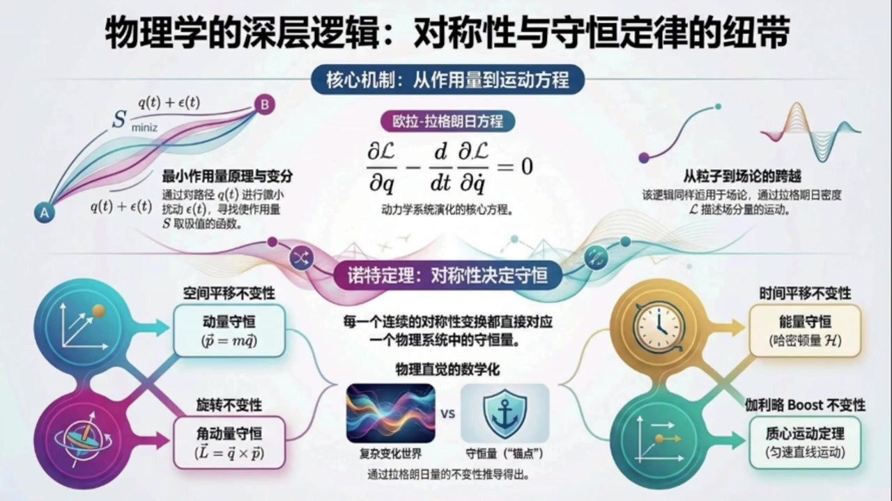
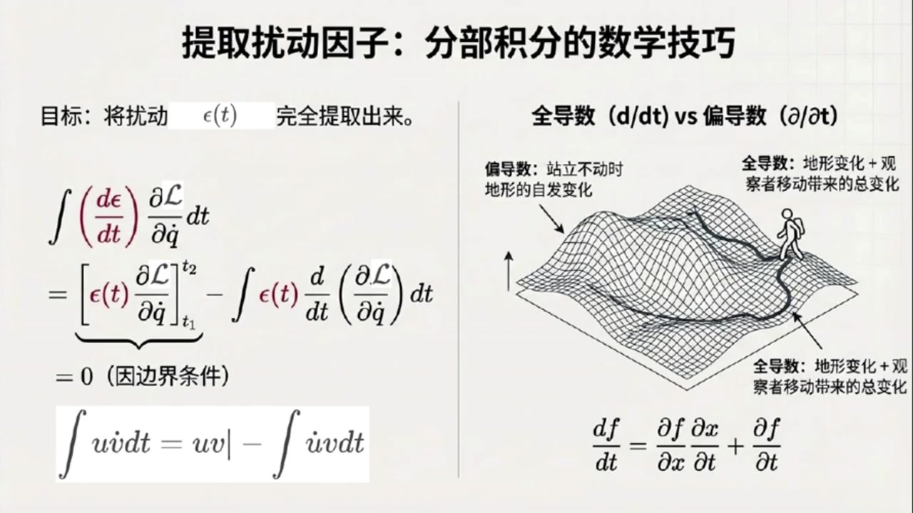
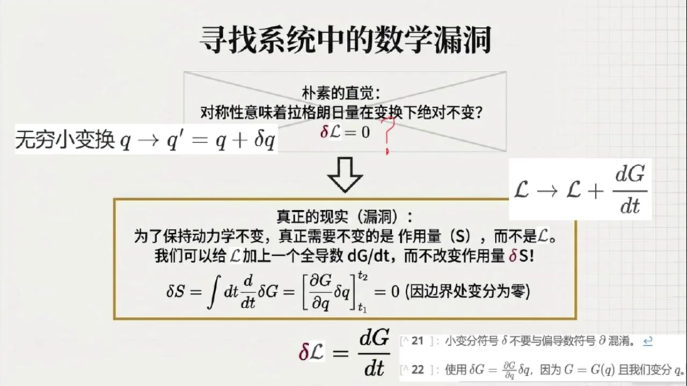
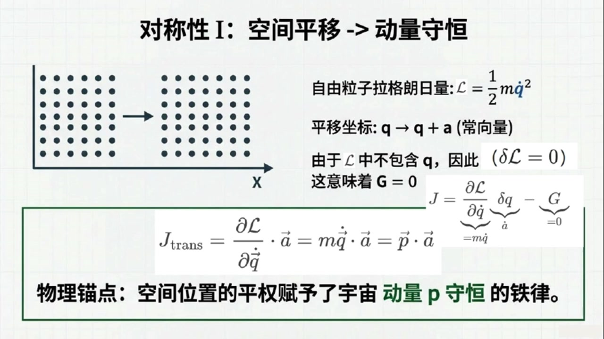
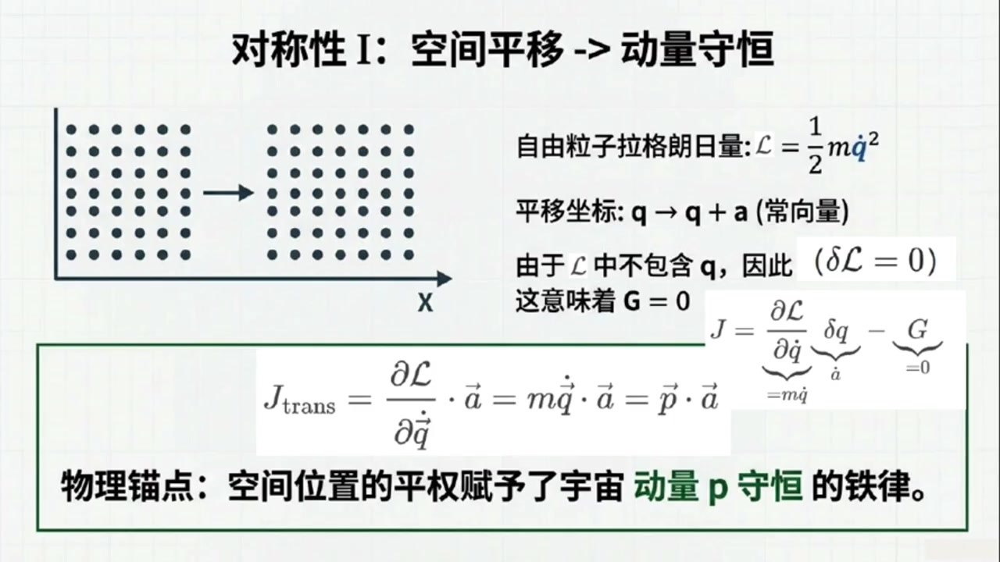
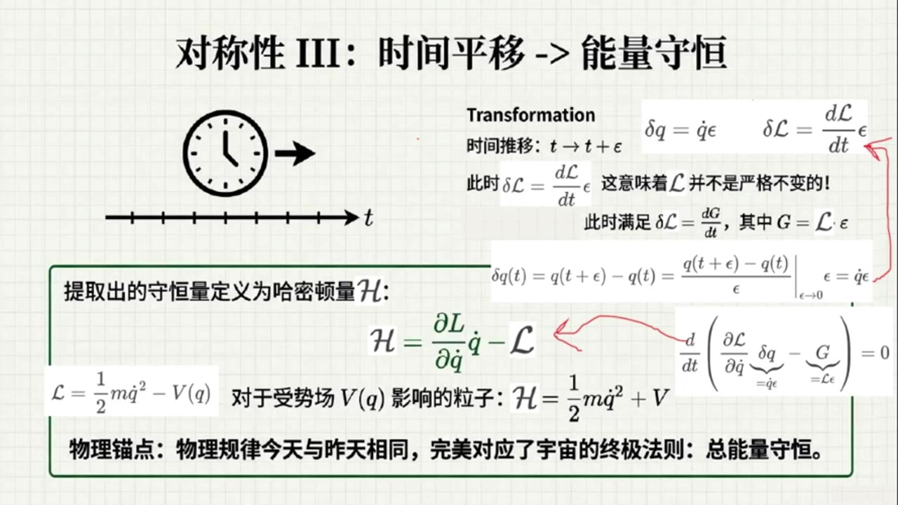
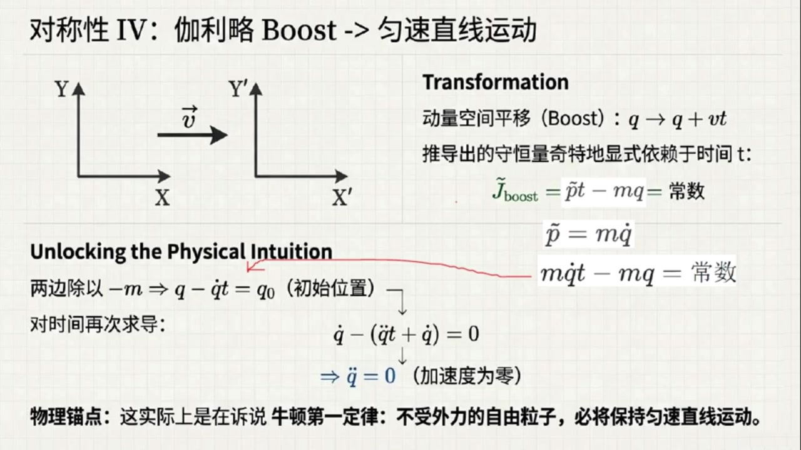
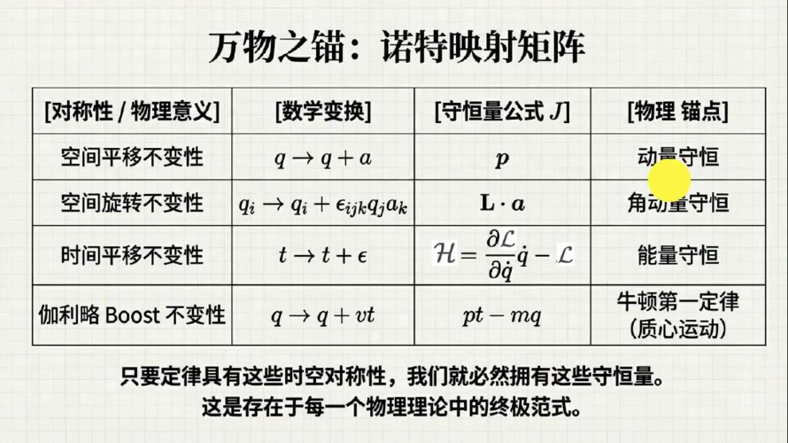

# 《基于对称性的物理学》第16课 物理学深层逻辑：对称性和守恒律的纽带

> 自动生成的课程注解文档（共 6 个段落，[原始视频](https://www.youtube.com/watch?v=se56XiBhic4)）

## 目录

- [00:00:00 课程回顾与欧拉-拉格朗日方程的目标设定](#段落-1)
- [00:03:18 从变分展开到欧拉-拉格朗日方程推导](#段落-2)
- [00:10:22 场论形式推广与诺特定理的基本思想](#段落-3)
- [00:15:43 诺特定理推导及空间平移对应动量守恒](#段落-4)
- [00:21:59 旋转、时间平移与伽利略Boost的守恒定律](#段落-5)
- [00:31:57 四大对称性总结与场论内禀对称性展望](#段落-6)

---

## 段落 1：课程回顾与欧拉-拉格朗日方程的目标设定 { #段落-1 }

**时间：** 00:00:00 ~ 00:03:18

<details><summary>📝 原始字幕</summary>

<pre>

大家好欢迎来到基于对性的物理学第十六课我是大家熟悉的主播这里今天我们继续死科物理学的终极秘密
大家好,我是赛
在上一课里我们讨论了拉格朗日形式体系的核心哲学
大自然喜欢抄进道
也就是让作用量这个范涵保持不变或者取极小值
我们还介绍了辨分法的基本思想
没错,上节课可真是悬念拉满
我们知道了自然界是在寻找一条让作用量去极值的路径
而且这比普通的球函数及指点要复杂得多
赛老师,今天我们是不是要真正开始动手,用这个辨分法去推倒物理法则了
是的
今天我們要完成兩項極其硬核,但又極其優美的任務
第一,我们要推导著名的欧拉拉格朗日方程
这个方程是拉格朗日体系的心脏
第二,我们要通过它走向这门课的高潮之一
数学界的一代宗师艾米诺特艾米诺特提出的诺特定理
哇,我听说诺特定理被誉为现代物理学的指路明灯啊,对称性和守恒定律的媒人
那我们赶紧开始吧怎么推到这个欧拉拉格朗日方程好我们先从粒子理论开始我们要研究粒子在两个给定的时间和空间点之间是如何运动的
数学上就是要找到一个路径函数QFT使得作用量S取集值也就是最大值或最小值这个作用量S我记得就是拉个两日量手写体L从时间T一到T二的定级分对吧也就是S等于积分号从T一到T二背级函数是手写体L变量是时间T而这个L里面包括着位置QFT以及速度也就是Q对时间的导数我们把它简写为Q点还有时间T
完全正确
怎么寻找极值呢和上节课讲的辨分法一样我们假设找到了那条真正使作用量取极值的物理路径即做AFT
然后我们在它上面加上一个极其微小的扰动路径叫做XLONOTT也就是说真实的路径加上了一点点便宜所以位置QOFT变成了AOFT加上XLONOTT
那对应的速度是不是也就变成了A点加上EPSON点
其中EPSLON点就是EPSLON对时间的倒数没错但这里有一个非常死板的硬形边界条件
我们是在固定的两个点之间寻找路径
所以不管中间怎么随意扰动,出发点和终点是必须所思的
我明白了,这一直在初始时间T1和结束时间T2,这微小的扰动必须为零
也就是 Epsilon of T1等于0 Epsilon of T2也等于0
这就像我们拉一根两端固定在墙上的橡皮筋,中间随便怎么弹,固定在墙上的两头是纹丝不动的
这个比喻非常精彩

</pre>

</details>

**课程截图：**




### 注解

这段字幕标志着从**原理陈述**（最小作用量原理）迈向**数学实现**（欧拉-拉格朗日方程）的关键一步。核心任务是建立"寻找极值路径"的数学框架。

---

### 一、公式识别与符号解析

当前段落涉及以下关键数学表达式：

#### 1. 作用量（Action）的定义式
$$S = \int_{t_1}^{t_2} \mathcal{L}(q(t), \dot{q}(t), t) \, dt$$

| 符号 | 名称 | 物理含义 |
|------|------|----------|
| $S$ | 作用量 | 系统随时间演化的"总代价"或"总权重"，是一个标量泛函（函数的函数） |
| $\mathcal{L}$ | 拉格朗日量 | 系统的**动能与势能之差**（$L = T - V$），描述系统在某一瞬时的状态 |
| $q(t)$ | 广义坐标 | 描述系统位形的变量（可以是位置、角度、电荷等），是时间的函数 |
| $\dot{q}(t)$ | 广义速度 | $q$ 对时间的一阶导数，$\dot{q} = \frac{dq}{dt}$ |
| $t_1, t_2$ | 边界时刻 | 运动的起始与终止时间 |
| $\int_{t_1}^{t_2} \dots dt$ | 时间积分 | 将拉格朗日量在时间轴上累加，得到总作用量 |

#### 2. 路径变分（Variation）式
$$q(t) = a(t) + \epsilon(t)$$

| 符号 | 名称 | 物理含义 |
|------|------|----------|
| $a(t)$ | 真实路径 | 使作用量 $S$ 取极值的**实际物理轨迹**（待求） |
| $\epsilon(t)$ | 扰动函数 | 一个"虚拟的"微小偏离函数，代表对真实路径的试探性修改 |
| $\dot{\epsilon}(t)$ | 扰动速度 | $\epsilon$ 对时间的导数，导致速度相应变为 $\dot{q} = \dot{a} + \dot{\epsilon}$ |

#### 3. 固定端点边界条件
$$\epsilon(t_1) = \epsilon(t_2) = 0$$

这是**变分法中的硬核约束**：无论中间如何"试探"，粒子在起点 $A(t_1)$ 和终点 $B(t_2)$ 的位置必须固定。这相当于数学上的**狄利克雷边界条件**。

---

### 二、板书/PPT截图内容描述

根据提供的三张截图，课堂板书呈现了一个完整的逻辑闭环：

**第一张/第二张图（全景逻辑图）：**
- **标题**："物理学的深层逻辑：对称性与守恒定律的纽带"
- **核心机制**：展示欧拉-拉格朗日方程 $\frac{\partial \mathcal{L}}{\partial q} - \frac{d}{dt}\frac{\partial \mathcal{L}}{\partial \dot{q}} = 0$，并标注其为"动力学系统演化的核心方程"
- **诺特定理区块**：预告对称性与守恒定律的对应关系（空间平移→动量守恒，时间平移→能量守恒等）
- **路径变分图示**：左侧展示从点 $A$ 到点 $B$ 的多条可能路径，其中真实路径 $q(t)$ 与扰动路径 $q(t)+\epsilon(t)$ 用不同颜色区分

**第三张图（推导细节图）：**
- **标题**："极值作用量原理：自然如何选择路径？"
- **坐标系**：横轴为时间 $t$，纵轴为广义坐标 $q$
- **路径绘制**：
  - **蓝色实线**：标注为"真实路径 $a(t)$"，连接固定点 $A(t_1)$ 和 $B(t_2)$
  - **红色虚线**：标注为"扰动路径 $a(t) + \epsilon(t)$"，展示中间偏离但两端固定的路径
- **公式框**：
  - 黄框：作用量定义 $S = \int_{t_1}^{t_2} \mathcal{L}(q(t), \dot{q}(t), t) dt$
  - 紫框：边界条件 $0 = \epsilon(t_1) = \epsilon(t_2)$，强调"在起点和终点，路径的扰动必须严格为零"

---

### 三、核心概念通俗解释

#### 1. 什么是"变分"（Variation）？
想象你在山谷中找最低点：
- **普通微积分**：你站在某点，看前后左右哪个方向下降最快（这是函数的导数）。
- **变分法**：你画出一条从家到学校的所有可能路线，计算每条路线的"疲劳度"（作用量）。**真实发生的那条路，是让你最不累（或最累）的那一条**。

$\epsilon(t)$ 就是你想象中的一条"备选路线"与真实路线的偏差。因为我们要求两端固定，所以不管中间怎么绕，必须从 $A$ 出发，在 $B$ 结束。

#### 2. 为什么边界条件 $\epsilon(t_1)=\epsilon(t_2)=0$ 至关重要？
这是**"对比实验"的控制变量原则**：
- 如果起点和终点也能变，那就不是"同一条物理过程的不同可能路径"，而是"完全不同的物理问题"了。
- 就像比较两条赛车路线哪条更快，必须让两辆车从同一个起点出发，在同一个终点结束，否则比较无意义。

---

### 四、理论背景补充

#### 欧拉-拉格朗日方程的地位
截图中展示的方程 $\frac{\partial \mathcal{L}}{\partial q} - \frac{d}{dt}\frac{\partial \mathcal{L}}{\partial \dot{q}} = 0$ 是**分析力学的心脏**。它的威力在于：
- **统一性**：无论是单摆、行星轨道、电磁场还是标准模型粒子，只要写出 $\mathcal{L}$，代入此方程，就自动得到运动方程。
- **坐标无关性**：不同于牛顿力学 $\vec{F}=m\vec{a}$ 依赖坐标系选择，该方程在任何广义坐标系下形式不变。

#### 诺特定理的预告
截图中提到的**艾米·诺特（Emmy Noether）**是20世纪最伟大的数学家之一。她的定理将揭示：
> **每一个连续对称性，都对应一个守恒量。**
- 时间平移对称性（今天做实验和明天做实验结果一样）$\rightarrow$ **能量守恒**
- 空间平移对称性（这里做实验和那里做实验结果一样）$\rightarrow$ **动量守恒**
- 旋转对称性 $\rightarrow$ **角动量守恒**

这正是字幕中所说的"现代物理学的指路明灯"——它告诉我们**守恒定律不是偶然的，而是时空对称性的必然结果**。

---

**总结**：这段内容为"从原理到方程"的推导搭建了数学舞台。通过引入固定端点的变分 $\epsilon(t)$，我们将"大自然抄近道"的哲学思想，转化为可计算的微分方程问题。下一步（后续课程内容）将是对作用量 $S$ 进行变分运算，令 $\delta S = 0$，从而导出欧拉-拉格朗日方程。

---

## 段落 2：从变分展开到欧拉-拉格朗日方程推导 { #段落-2 }

**时间：** 00:03:18 ~ 00:10:21

<details><summary>📝 原始字幕</summary>

<pre>

现在,我们要把变动后的路径带入作用量S里面
这会导致拉格朗日量手写体L的变量发生微小的改变
类比寻找函数最小值的例子,我们要求辨分Epsilon的线现象消失
由于我们处理的是一般的手写体L,属于多变量函数
此时我们就要挤出危机分离的大杀气了多变量的泰勒展开
泰勒展开,我来试试看
原本的手写体L变量是Q和Q点
现在变成了Q加Epsilon和Q点加Epsilon点
展开之后,应该是原本的手写体L
加上第一项的变动,Epsilon乘以手写体L对Q的偏导数
再加上第二项的变动 epsilon点
呈以手写体L对Q点的偏导数
至于EPSLON平方以上的高阶巷,因为太微小了,我们直接扔脚不管
非常熟练
值得一提的是这里因为我们有两个变化的像所以用的是课本附录里泰勒公式的推广形式
因为我们现在是要求作用量取极值所以我们要让一阶辨分为零于是所有关于EPSLON的一阶线现象放在一起他们对时间的积分必须等于零
所以我们得到了一个极其关键的方程
积分号从T1到T2,大方跨号里面是
阿布西隆阿夫蒂
呈以偏手写体高,白偏Q
加上 Epsilon of T 的时间倒数,乘以偏手写体 L 偏 Q 点
这整个包裹着的大方夸号关于时间T的积分必须等于零到这里我们在代数上遇到了一个小卡点
积分里第一项乘以了 epsilon,第二项却是一个 epsilon of t 的时间倒数
为了能得出普世的结论我们需要想办法把 Epsilon of T 作为一个整体的供应商给提出来
放到大方块好外面
这该怎么削去那个倒数呢
唉呀,第二箱里那个倒数尖在Epsilon身上
要削去积分里的导数,还得把EPSLON剥离出来
难道要用我们在高数里学过的分布积分法简直冰雪聪明
这就是分布积分法
这其实是惩罚法则的直接逆运算表现
我们对最后带有导数的这一项应用分布积分
把Epsilon身上那个对时间的导数巧妙地转移到偏手写TL摆偏Q点的身上去我在纸上划一下啊
根据分布积分公式优乘微点的积分
等于UV乘积的边界值
减去优点乘V的积分
所以这第二块就列成了两部分
第一部分是边界值计算
成语括号偏手写体L百偏Q点括号带入上下线T一和T二
第二部分是减去新的积分
积分号T1到T2
Dt乘Epsilon of T乘以D百Dt作用在括号偏手写体O百偏Q点括号上
非常扎实地推验
现在注意看那个带入上下线的固定码想起来了
课本公式4.5里缩了
Epsilon of T1和 Epsilon of T2都是强制要求等于零的呀
所以刚才算出的第一部分那个边界响直接整块阵网横等于零是的
这正是物理学推导中最喜欢的情景
边界象因为物理设定自然消失
这样一来原来那个粘着倒数的像就被成功转化为一个干净的带有EPSLON的积分
只不过前面多了一个副号并且多了一个对时间的全道数D百DT妙啊现在这两项都有干净的供应是EPSLENOFFT了我把它提出来
整的市字变成了积分号从T一到T二Epsilon of T乘以另外一个大方括号等于零这个崭新的大方括号里面是偏手写TL百偏Q减去D百DT括号偏手写TL百偏Q点括号足以此时的逻辑
因为我们对路径的微小扰动, Epsilon Ft 是完全任意的变分
它在T1和T2之间可以取任何天马行空的形状
如果在这种各种瞎折腾的情况下整个积分依然恒等于零这只能说明一件事这只能说明那个大方括号里的东西必须一丁点都不能有必须恒等于零哇
也就是说偏手写TL百偏Q减去对时间的全导数D百DT作用于括号偏手写TL百偏Q点括号最后得等于零热烈鼓掌你刚刚亲自催导出了现代物理理论中堪称万能基石的公式著名的欧拉拉格朗日方程
任何一个系统的拉格朗日量只要带入这个方程就能立刻算出描述这个系统真实运动的微分方程也就是物理发则本身这个方程长得真好看左右逢圆
一边是对位置Q的偏导,另一边是对速度Q点的偏导,然后再对时间求全导数
等等
塞老师,这里课本柱十八专门停下来,特别强调了全导数D百DT和偏导数偏百偏T的区别是吗?
观察得很仔细,它们可完全不是一个东西,在多变量分析中偏导数偏百偏T只是总变化中的一部分
它只管函数显示依赖于T的那部分变化
而全导数D百D体给出的是总变化量哦我明白了也就是说如果一个函数F依赖于位置和速度而位置和速度又依赖于时间那么求全导数D百D体的时候不仅要算F自己本来的时间变化还要加上F随着位置变化产生的影响在接驳上位置随时间的变化率以此推就像课本里提到的链式法则把所有导致变化的因素全部累加起来核心被你抓住了
理解这些细微的符号差异对阅读物理学文献至关重要

</pre>

</details>

**课程截图：**


### 注解

这段字幕完成了从**变分原理**到**欧拉-拉格朗日方程**的完整数学推导，是分析力学的核心环节。我将聚焦于推导过程中出现的新公式、数学技巧及其物理意义。

---

## 一、公式识别与符号解析

### 1. 多变量泰勒展开式（变分线性化）

$$\mathcal{L}(q+\epsilon, \dot{q}+\dot{\epsilon}, t) \approx \mathcal{L}(q, \dot{q}, t) + \epsilon\frac{\partial\mathcal{L}}{\partial q} + \dot{\epsilon}\frac{\partial\mathcal{L}}{\partial\dot{q}}$$

| 符号 | 名称 | 含义 |
|:---|:---|:---|
| $\epsilon(t)$ | 路径变分函数 | 对真实路径的微小扰动，满足 $\epsilon(t_1)=\epsilon(t_2)=0$ |
| $\dot{\epsilon} = \frac{d\epsilon}{dt}$ | 变分的时间导数 | 扰动随时间的变化率 |
| $\frac{\partial\mathcal{L}}{\partial q}$ | 对位置的偏导 | 拉格朗日量对广义坐标的敏感度 |
| $\frac{\partial\mathcal{L}}{\partial\dot{q}}$ | 对速度的偏导 | 拉格朗日量对广义速度的敏感度（即**广义动量**） |

> **关键说明**：此处是二元函数泰勒展开，保留到一阶项；高阶项 $O(\epsilon^2)$ 因"太微小"被舍弃，这是线性化分析的标准操作。

---

### 2. 一阶变分方程（极值条件）

$$\int_{t_1}^{t_2} \left[ \epsilon(t)\frac{\partial\mathcal{L}}{\partial q} + \dot{\epsilon}(t)\frac{\partial\mathcal{L}}{\partial\dot{q}} \right] dt = 0$$

这是**作用量取极值**的直接数学表达：一阶变分必须为零。

---

### 3. 分部积分公式（数学核心技巧）

$$\int_{t_1}^{t_2} \dot{\epsilon}(t) \cdot \frac{\partial\mathcal{L}}{\partial\dot{q}} \, dt = \underbrace{\left[ \epsilon(t)\frac{\partial\mathcal{L}}{\partial\dot{q}} \right]_{t_1}^{t_2}}_{\text{边界项}} - \int_{t_1}^{t_2} \epsilon(t) \cdot \frac{d}{dt}\left(\frac{\partial\mathcal{L}}{\partial\dot{q}}\right) dt$$

| 项 | 命运 | 原因 |
|:---|:---|:---|
| 边界项 | **归零** | 固定端点条件：$\epsilon(t_1)=\epsilon(t_2)=0$ |
| 积分项 | 保留 | 转化为含 $\epsilon(t)$ 的"干净"形式 |

> **物理意义**：这是推导中最精妙的"移花接木"——将 $\dot{\epsilon}$ 上的导数转移到 $\frac{\partial\mathcal{L}}{\partial\dot{q}}$ 上，从而提取公因子 $\epsilon(t)$。

---

### 4. 欧拉-拉格朗日方程（终极成果）

$$\boxed{\frac{\partial\mathcal{L}}{\partial q} - \frac{d}{dt}\left(\frac{\partial\mathcal{L}}{\partial\dot{q}}\right) = 0}$$

或写成更对称的形式：
$$\frac{\partial\mathcal{L}}{\partial q} = \frac{d}{dt}\left(\frac{\partial\mathcal{L}}{\partial\dot{q}}\right)$$

**物理诠释**：广义动量（右端）的时间变化率等于广义力（左端）——这是牛顿第二定律在广义坐标下的优雅推广。

---

### 5. 全导数 vs 偏导数（符号辨析）

$$\underbrace{\frac{df}{dt}}_{\text{全导数}} = \underbrace{\frac{\partial f}{\partial x}\frac{dx}{dt}}_{\text{隐式依赖}} + \underbrace{\frac{\partial f}{\partial t}}_{\text{显式依赖}}$$

| 符号 | 适用场景 | 计算内容 |
|:---|:---|:---|
| $\frac{\partial}{\partial t}$ | 多变量函数 | 仅显式含 $t$ 的部分变化（"站定不动看地形"）|
| $\frac{d}{dt}$ | 复合函数 | 总变化 = 显式变化 + 通过中间变量的隐式变化（"边跑边看地形"）|

> 在欧拉-拉格朗日方程中，$\frac{\partial\mathcal{L}}{\partial\dot{q}}$ 本身是 $q, \dot{q}, t$ 的函数，而 $q$ 和 $\dot{q}$ 又都依赖于 $t$，因此必须用**全导数**。

---

## 二、理论背景补充

### 变分法的核心思想
- **普通微积分**：求函数 $f(x)$ 的极值 → 令 $df/dx = 0$
- **变分法**：求泛函 $S[q(t)]$ 的极值 → 令**泛函导数** $\delta S/\delta q(t) = 0$

### 为什么边界项必须消失？
这是**本质边界条件**（essential boundary condition）的物理要求：真实路径与变分路径共享相同的起点和终点，这是"历史决定论"的数学体现——给定初末态，自然选择最优路径连接它们。

---

## 三、核心概念通俗解释

### "分部积分"的物理直觉
想象你要比较两条路径的"代价"，但一条路径的变化率是"扭曲"的。分部积分就像**换座位**：把"扭曲"从扰动身上卸下来，装到系统的响应（$\partial\mathcal{L}/\partial\dot{q}$）身上。由于两端固定，"扭曲"在边界上无处发泄，只能归零。

### 欧拉-拉格朗日方程的"万能性"
这个方程是**生成机器**：
- 输入：系统的拉格朗日量 $\mathcal{L}$（动能−势能）
- 输出：该系统的运动方程（牛顿方程、麦克斯韦方程、爱因斯坦场方程...）

从单摆到宇宙膨胀，从粒子物理到弦理论，全部统一于此。

---

## 四、板书内容描述

根据字幕推断，板书/PPT应包含：

| 板块 | 内容 |
|:---|:---|
| **标题区** | "极值作用量原理：自然如何选择路径？" |
| **核心图示** | $q$-$t$ 坐标系：真实路径（实线）与扰动路径（虚线），标注 $A(t_1)$, $B(t_2)$ |
| **公式推导流** | ① 作用量定义 → ② 引入扰动 → ③ 泰勒展开 → ④ 分部积分 → ⑤ 边界项消失 → ⑥ 欧拉-拉格朗日方程 |
| **关键标注** | "边界条件 $\epsilon(t_1)=\epsilon(t_2)=0$" 用红色或方框突出 |
| **对比说明** | 全导数 vs 偏导数：配"地形+观察者移动"示意图 |

---

## 五、推导逻辑链总结

```
最小作用量原理
      ↓
δS = 0（极值条件）
      ↓
引入任意变分 ε(t)，线性化
      ↓
泰勒展开（保留一阶）
      ↓
分部积分（提取公因子 ε(t)）
      ↓
边界项因固定端点消失
      ↓
ε(t) 任意性 ⇒ 方括号内必须恒为零
      ↓
欧拉-拉格朗日方程 ✓
```

这段推导被誉为"物理学中最优美的数学结构之一"，它将**全局优化原理**（最小作用量）转化为**局域微分方程**（欧拉-拉格朗日），实现了物理定律的"微分形式"与"积分形式"的完美统一。

---

## 段落 3：场论形式推广与诺特定理的基本思想 { #段落-3 }

**时间：** 00:10:22 ~ 00:15:43

<details><summary>📝 原始字幕</summary>

<pre>

那如果是场论呢,刚才我们讨论的是一个一个单独跑动的例子
常论礼物台那么大,要怎么做
在场论中,时间和空间是平权的
如上届课所言
此时,我们要用拉格朗日密度,用花体表示
此时场变成了时空的函数
而且关键在于
如果宇宙中有好几个场分量比如范一范二等等
这个时候我们要引入一个指标A变成了FA
而作用量S也升级了变成了对整个四维时空的大积分积分变量是D四次方X
引入了时间和空间四个维度,那就不仅要有时间T的导数,还要有对空间YZ的导数,对吧
完全正确
场论中的奥拉拉格朗日方程看起来很像例子的版本
对于每一个场分量F
它都有一一对应且形势相同的方程
花TL对场F爱的偏导数减去四维偏导数偏下MYU作用在括号花TL对偏下MYUFY爱的偏导数括号上等于零这个方程掌握着宇宙中万物的生杀大权无论是电磁场还是构成我们的物质迪拉克场所有的场都必须绝对服从它
硬核是真硬核,所有的物理现象通过辨分法最终能汇聚成这么一个极其简洁对称的方程,这种抒途同归的感觉太美妙了
那么有了欧拉拉格朗日方程作为我们的破冰船我们终于可以驶入下一片更宏伟的海域了诺特定理诺德斯理论
来吧,让暴风雨来得更猛烈些吧
这个被称为指路明灯的定理到底牛在哪里诺特定理表明拉格朗日量的每一种对称性都直接对应着一个手衡量
或者反过来说物理学家经常用来描述自然的观念诸如手衡量市值全都是对称性的直接产物
这是科学史上最深刻的洞见之一
手衡量,课本脚柱写得很有诗意,说它们就像是极度复杂,瞬息万件的世界中的坚固毛点,
当周围一切都在巨变时唯有手衡量如盘石般保持不变
原来它们的存在是大自然具有对称性的必然结果没错
咱们先具体在粒子里云的框架下看看这是怎么发生的
我们要研究连续对称性也就是说我们可以进行无穷小的变换Q变到Q片等于Q加上一个极小的变动雕他Q如果系统有某种对称性那是不是意味着拉格朗日量L在经过这个变换之后就必须保持绝对不变
也就是DELTA手写TL必须严格等于零呢这正是诺特定力精妙的第一层反转
如果你单单要求拉格朗日量保持不变,那要求就可能就过于苛刻了
为了使动力血规律保持不变
真正需要保持不变的是作用量S
如果拉格朗日量手写体L不变,那作用量S肯定不变
但是拉格朗日量本身其实可以稍微放宽一点限制
我们完全可以允许拉格朗日量加上一个函数G对时间的全导数DG百DT稍微等等步子迈得有等大
允许拉格朗日量加上个时间导数向DG百DT那作用量S不就跟着变了吗你回忆一下作用量S的定义它是对时间T的一定区间的积分
如果我们给拉格朗日量额外加上一个全岛数项 DG 100DT
这个时候积分大法的魔力就显现了啊对时间的积分碰到了一个包含对时间的微分全导数
根据牛顿莱布尼茨公式,这就相当于互相抵消了
这只会变成这个函数G在边界T1和T2的差值对吧极其敏锐的直觉
至此,我们再看根据角柱22
因为函数G是位置Q的函数所以它的变分deltaG就等于偏G百偏Q乘以deltaQ
而我们在辨分法的边界条件里已经死死规定了辨分DELTAQ在起点T一和终点T二必须消失对对对
因为边界锁死了,所以DeltaQ在两端等于零,所以函数之一的变动差值直接就是零这结论绝了
即使拉格朗质量不完美它的变分DELTA手写TL等于DG百DT这却丝毫不影响整个作用量S的机制情况只要拉格朗日量可以用这种方式变化运动方程就丝毫不受影响是的

</pre>

</details>

**课程截图：**




### 注解

这段字幕标志着从**离散粒子力学**向**经典场论**的范式跃迁，并引出了理论物理中最深刻的数学定理之一——**诺特定理（Noether's Theorem）**。核心在于理解"时空平权"的数学实现，以及对称性与守恒律之间精确的对应机制。

---

## 一、场论化的数学升级：从粒子到场

### 1. 场论欧拉-拉格朗日方程

字幕中提到的"花体"拉格朗日密度 $\mathcal{L}$ 和四维积分，对应以下关键公式：

$$
\mathcal{S} = \int_{\Omega} \mathcal{L}\left(\phi^A(x), \partial_\mu \phi^A(x), x\right) \, d^4x
$$

$$
\frac{\partial \mathcal{L}}{\partial \phi^A} - \partial_\mu \left( \frac{\partial \mathcal{L}}{\partial (\partial_\mu \phi^A)} \right) = 0
$$

| 符号 | 名称 | 物理含义 |
|------|------|----------|
| $\mathcal{L}$ | 拉格朗日密度 (Lagrangian Density) | 单位时空体积内的拉格朗日量，是场及其导数的函数。注意与粒子力学中 $L$（拉格朗日量）的区别：$L = \int \mathcal{L} \, d^3x$ |
| $d^4x$ | 四维时空体积元 | 等于 $dt \, dx \, dy \, dz$ 或 $c \, dt \, d^3x$，代表对整个时空区域的积分 |
| $\phi^A$ (或字幕中 $F^A$) | 场分量 | $A$ 为指标（index），标记不同的场（如电磁场的四个分量 $A^\mu$，或复标量场的实部与虚部）。场是时空坐标的函数 $\phi^A(x^\mu)$ |
| $\partial_\mu$ | 四维梯度算符 | $\partial_\mu = \frac{\partial}{\partial x^\mu} = \left(\frac{1}{c}\frac{\partial}{\partial t}, \frac{\partial}{\partial x}, \frac{\partial}{\partial y}, \frac{\partial}{\partial z}\right)$，体现时间与空间的"平权"处理 |
| $\partial_\mu \phi^A$ | 场的时空导数 | 包括时间变化率（动能项）和空间变化率（梯度项，对应相互作用） |

**关键差异**：与粒子力学 $\frac{d}{dt}\left(\frac{\partial L}{\partial \dot{q}}\right)$ 不同，场论中使用偏导数 $\partial_\mu$，因为场存在于全空间，其动力学由时空各点的局部相互作用决定。

---

## 二、诺特定理的核心框架

### 1. 对称性的数学定义

$$
q(t) \to q'(t) = q(t) + \epsilon \, \delta q(t)
$$

这是**连续对称性**的无穷小变换形式，其中 $\epsilon$ 是无穷小参数，$\delta q$ 是变换的"形状"（生成元）。

### 2. 诺特第一定理的精髓

**核心等式**（字幕中"手衡量"即守恒量）：

若拉格朗日量在变换下满足 $\delta \mathcal{L} = \partial_\mu \mathcal{J}^\mu$（四维散度），则存在守恒流：

$$
\partial_\mu j^\mu = 0 \quad \Rightarrow \quad \frac{dQ}{dt} = 0
$$

其中 $Q = \int j^0 \, d^3x$ 即为守恒荷（charge）。

---

## 三、深层概念解析："准对称性"的微妙之处

字幕中提到的"第一层反转"是理解诺特定理的关键——**作用量不变性比拉格朗日量不变性更根本**。

### 1. 允许的全导数项（边界项）

$$
\mathcal{L} \to \mathcal{L}' = \mathcal{L} + \frac{dG(q,t)}{dt}
$$

**为什么不影响物理？**

作用量的变分为：
$$
\delta S = \int_{t_1}^{t_2} \delta \mathcal{L} \, dt = \int_{t_1}^{t_2} \frac{dG}{dt} \, dt = G(t_2) - G(t_1)
$$

由于**固定端点边界条件**（$\delta q(t_1) = \delta q(t_2) = 0$），且 $G$ 通常是 $q$ 的函数，故 $\delta G = \frac{\partial G}{\partial q}\delta q$ 在边界处为零。因此 $\delta S = 0$ 依然成立。

**物理意义**：拉格朗日量可以"模糊"到一个全导数项，这种自由度称为**规范自由度**或**准对称性（Quasi-symmetry）**。这是现代规范场论（如电磁学、杨-米尔斯理论）的数学源头。

---

## 四、图像板书内容描述

### 图1：分部积分的数学技巧
- **左侧**：展示变分计算中的关键步骤——**分部积分**（Integration by Parts）
  $$
  \int_{t_1}^{t_2} \dot{\epsilon} \frac{\partial \mathcal{L}}{\partial \dot{q}} dt = \left[\epsilon \frac{\partial \mathcal{L}}{\partial \dot{q}}\right]_{t_1}^{t_2} - \int_{t_1}^{t_2} \epsilon \frac{d}{dt}\left(\frac{\partial \mathcal{L}}{\partial \dot{q}}\right) dt
  $$
  标注指出边界项为零（因边界条件）。
- **底部**：给出分部积分公式的一般形式 $\int u\dot{v}dt = uv| - \int \dot{u}v dt$。
- **右侧**：图解**全导数 vs 偏导数**
  - 使用地形图比喻：偏导数 $\frac{\partial}{\partial t}$ 是"站立不动时地形的自发变化"（当地变化率）
  - 全导数 $\frac{d}{dt} = \frac{\partial}{\partial t} + \dot{x}\frac{\partial}{\partial x}$ 是"地形变化 + 观察者移动带来的总变化"（随体变化率）

### 图2：诺特的深刻洞见——对称性与万物之锚
- **顶部标题**："诺特的深刻洞见：对称性与万物之锚"
- **核心陈述**（大字突出）：
  > "拉格朗日量的每一种对称性，都直接对应一个守恒量。——科学史上最深刻的洞见之一。"
- **下方阐释**：
  - 将守恒量比喻为"极度复杂、不断变化的世界中的**锚点（Anchors）**"
  - 强调"当万物皆变时，守恒量屹立不倒"
  - 结论：这些锚点并非巧合，而是自然对称性的必然产物

### 图3：寻找系统中的数学漏洞
- **顶部**："朴素的直觉：对称性意味着拉格朗日量在变换下绝对不变？$\delta \mathcal{L} = 0$？"
- **红色箭头**：指向"真正的现实（漏洞）"
- **核心结论框**（黄色背景）：
  - "为了保持动力学不变，真正需要不变的是**作用量（S）**，而不是 $\mathcal{L}$。"
  - "我们可以给 $\mathcal{L}$ 加上一个全导数 $\frac{dG}{dt}$，而不改变作用量 $\delta S$！"
  - 数学推导：$\delta S = \int dt \frac{d}{dt}\delta G = \left[\frac{\partial G}{\partial q}\delta q\right]_{t_1}^{t_2} = 0$（因边界变分为零）
- **底部注释**：
  - 脚注21：小变分符号 $\delta$ 不要与偏导数符号 $\partial$ 混淆
  - 脚注22：使用 $\delta G = \frac{\partial G}{\partial q}\delta q$，因为 $G=G(q)$ 且变分 $\delta q$ 在边界为零

---

## 五、通俗总结

1. **从粒子到场**：就像从"追踪一个舞者的轨迹"升级到"描述整个舞池中人群密度的波动"。我们不再追踪单个 $q(t)$，而是看场 $\phi(x,y,z,t)$ 在时空每一点的值。

2. **诺特定理的魔力**：想象你拍摄一部电影，如果无论你何时按下暂停键（时间平移对称），物理定律看起来都一样，那么必然存在一个"东西"不随时间改变——这就是**能量守恒**。诺特定理就是这个直觉的严格数学证明：**对称性 $\times$ 变分原理 = 守恒律**。

3. **"漏洞"的智慧**：允许拉格朗日量"不完美"地变化（差一个全导数），就像允许地图有不同的投影方式，只要地面上的真实路径（作用量极值）不变即可。这种灵活性正是现代物理学描述电磁力、强核力、弱核力的数学基础。

---

## 段落 4：诺特定理推导及空间平移对应动量守恒 { #段落-4 }

**时间：** 00:15:43 ~ 00:21:59

<details><summary>📝 原始字幕</summary>

<pre>

那接下来我们怎么在这个拓宽后的宽容设定里挖出那个传说中的手横亮呢这个套路我熟我们需要再用多变量泰勒展开把Delta手写TL表达出来由于DeltaQ是无穷小仅保留线性一节响
所以雕塔手写TL就等于偏手写TL摆偏Q成一雕塔Q加上偏手写TL摆偏Q点成一雕塔Q点也就是速度的变动这整个世子基于诺特定理宽容的要求也就等于DG摆DT很好
你现在死死盯住这个展开式
第一项是偏手写T把偏Q成一雕塔Q
一在这个柿子里关于偏手写T百篇Q的部分你难道不觉得长得特别眼熟吗让我看看
啊这不就是我们前半节课刚推出来的欧拉拉格朗日方程的左半边吗
欧拉拉格朗日方程告诉我们偏手写TL比TNQ横等于对时间求全导数D百DT作用于括号偏手写TL比PQ点
我们赶紧把它带换进去,非常果断
替换完之后方程的第一项摇生意变成了括号D百DT作用在括号偏手写TL比偏Q点括号
再乘以delta q
方程第二项是偏手写TL比偏Q点乘以DeltaQ点
其实也就是乘以Delta Q对时间的倒数
它们加起来等于地聚百地体塞老师,你看这两项拼凑出来的特征
点乘V,加上点乘V
这不就是高等数学里的惩罚求到法则吗恭喜你,漂亮的一组拼图
这两项合拼在一起正好就推化成了一个完整的量对时间的总导数D百DT作用于括号偏熟写TL比偏Q点成一DELTAQ括号
而这刚好等于等式右边的DG百DT我的天我们把右边的DG百DT移到等号左边来替一个公共的对时间求导的符号D百DT我们就得到了一个中级等式
D百DT对一个括号里面求导等于零那个括号里是偏手写TL百偏Q点乘以DotaQ再减去记
见证奇迹的时刻到了
如果一个变量系统对时间求全倒数始终等于零这意味着什么这意味着它根本不随时间发生改变呀不管岁月如何流逝它在漫长的物理演化过程中恒定如意它就是一个彻彻彻为的长数这就是我们要找的核武器手衡量没错我们通常用字母J来表示它
总结一下你的伟大发现
随时间守恒的量J等于偏手写体L百偏Q点成一便分DAOTAQ
再剪去那个有余宽容像而产生的剂
这就是诺特定理在粒子理论中最纯粹的纯数学推导
只要你找到了拉格朗日量在某种对称性下的变分特征你就能用这个公式顺藤摸瓜炸出一个固若金汤的物理守衡量哇整个脉络严丝合缝逻辑太顺畅了
有了这把钥匙,咱们赶紧来试开几把资源戒的锁吧
赛老师
究竟有哪些最基础的对称性对应着哪些著名的守恒定律
我们先从最简单的开始
不妨剧透一下后面第十章的一个结论
对于一个质量为M的长质量自有粒子
如果没有外力它的拉格朗日量可以说是非常纯粹就只是动能也就是手下体L等于二分之一m乘速度向量Q点的平方里面连位置Q的影子都找不到
现在我们对它实施一项空进平移变换
把粒子位置顺移一个长向量A也就是向量Q变成向量Q加上向量A那位置的微小变动DELTA向量Q显然就是长向量A了
因为拉格朗日量手写体L是二分之一m乘速度平方
压根没位置分量
所以不管你怎么挪动位置,手写TL的数值纹丝不动
这就意味着Delta手写体L严格等于0
这符合了最严格的情况
此时,那个允许的函数计也就乖乖取零了,调理非常清晰
那就请你把得到的这些组件带入我们刚得到的手衡量共识J吧J等于偏手写题L百篇十量Q点成语DELTA十量Q减去J
J是林直接扔掉
篇手写题L 百篇十量Q点
就是把动能二分之一m成Q点的平方这一对速度食量Q点求个偏导
结果就是m乘以十量Q点
在城上Delta食量Q,也就是我们的位移常量食量A
最后得到空间平移对应的手衡量J等于M乘以速度时量Q点
再点成长数尺量A,提示一下质量M乘以速度尺量Q点
这是你在中学课本里学的哪位老朋友动量P呀所以这个等式说明不管你是沿哪个方向的A进行平移都有对应的动量P参与守恒古变这就是物理学大名鼎鼎的基石动量守恒定律原来正是因为物理定律不在乎你到底在宇宙里的哪一个坐标做实验
即所谓的空间平移不变性才孕育出了坚不可摧的动量守恒完全正确下一个挑战

</pre>

</details>

**课程截图：**






### 注解

这段字幕完成了理论物理中最优美的数学构造之一——**诺特定理（Noether's Theorem）**的纯数学推导，并展示了如何从空间平移对称性"炸出"动量守恒定律。这是连接对称性与守恒律的桥梁。

---

## 一、板书/PPT截图内容描述

根据提供的截图，板书内容可分为三个逻辑层次：

**图1（左）：寻找系统中的数学漏洞**
- 顶部标题质疑"朴素的直觉"：对称性是否意味着 $\delta\mathcal{L}=0$（拉格朗日量绝对不变）？
- 关键修正：真正需要不变的是**作用量 $S$**，而非拉格朗日量 $\mathcal{L}$ 本身。
- 数学表达：允许 $\mathcal{L} \to \mathcal{L} + \frac{dG}{dt}$，其中 $\frac{dG}{dt}$ 是时间的全导数（边界项）。
- 验证：$\delta S = \int dt \frac{d}{dt}\delta G = [\frac{\partial G}{\partial q}\delta q]_{t_1}^{t_2} = 0$（因边界变分为零）。

**图2（中）：锻造守恒流——提取守恒量的主方程**
- 流程图展示推导链条：
  1. **泰勒展开**：$\delta\mathcal{L} = \frac{\partial\mathcal{L}}{\partial q}\delta q + \frac{\partial\mathcal{L}}{\partial \dot{q}}\delta \dot{q} = \frac{dG}{dt}$
  2. **注入欧拉-拉格朗日方程**：将 $\frac{\partial\mathcal{L}}{\partial q}$ 替换为 $\frac{d}{dt}(\frac{\partial\mathcal{L}}{\partial \dot{q}})$
  3. **乘法则合并**：识别出 $\dot{u}v + u\dot{v} = \frac{d}{dt}(uv)$ 的结构
  4. **结果**：$\frac{d}{dt}\left(\frac{\partial\mathcal{L}}{\partial \dot{q}}\delta q - G\right) = 0$
- 绿色框标注**守恒量定义**：$J = \frac{\partial\mathcal{L}}{\partial \dot{q}}\delta q - G = \text{常数}$

**图3（右）：对称性I——空间平移→动量守恒**
- 左侧图示：点阵网格整体平移（表示空间均匀性）。
- 右侧公式推导：
  - 自由粒子拉格朗日量：$\mathcal{L} = \frac{1}{2}m\dot{q}^2$
  - 平移变换：$q \to q + \mathbf{a}$（常矢量 $\mathbf{a}$）
  - 结论：由于 $\mathcal{L}$ 不含 $q$，故 $\delta\mathcal{L}=0 \Rightarrow G=0$
  - 守恒量计算：$J_{\text{trans}} = \frac{\partial\mathcal{L}}{\partial \dot{q}}\cdot \mathbf{a} = m\dot{q}\cdot\mathbf{a} = \mathbf{p}\cdot\mathbf{a}$
- 底部锚点文字：**"空间位置的平权赋予了宇宙动量 $\mathbf{p}$ 守恒的铁律。"**

---

## 二、新公式识别与符号解析

本段核心推导围绕**诺特荷（Noether Charge）**的构造，涉及以下关键表达式：

### 1. 宽容的变分条件（非严格对称）
$$\delta \mathcal{L} = \frac{dG}{dt}$$

| 符号 | 名称 | 物理/数学含义 |
|------|------|---------------|
| $\delta \mathcal{L}$ | 拉格朗日量变分 | 对称变换下拉格朗日量的改变量 |
| $G(q,t)$ | 规范函数/边界项 | 仅依赖于坐标和时间的函数，其全导数不改变作用量 |
| $\frac{dG}{dt}$ | 全导数 | 对时间的完整导数 $\frac{\partial G}{\partial t} + \dot{q}\frac{\partial G}{\partial q}$，积分后成为边界项 |

**关键点**：这是"拓宽后的宽容设定"——允许拉格朗日量改变一个全导数项，因为 $\int \frac{dG}{dt}dt = G|_{t_1}^{t_2} = 0$（边界固定）。

### 2. 诺特守恒量（Noether Current/Charge）
$$J = \frac{\partial \mathcal{L}}{\partial \dot{q}}\delta q - G = \text{常数}$$

| 符号 | 名称 | 物理含义 |
|------|------|----------|
| $J$ | 诺特荷/守恒量 | 随时间保持不变的物理量 |
| $\frac{\partial \mathcal{L}}{\partial \dot{q}}$ | 广义动量（共轭动量） | 通常记为 $p$ 或 $\pi$，是速度 $\dot{q}$ 的函数 |
| $\delta q$ | 坐标的无穷小变更 | 对称变换导致的坐标微小变动（如平移量 $\mathbf{a}$） |

**推导逻辑**：
- 将欧拉-拉格朗日方程 $\frac{\partial \mathcal{L}}{\partial q} = \frac{d}{dt}\frac{\partial \mathcal{L}}{\partial \dot{q}}$ 代入泰勒展开式
- 利用**乘积求导法则的逆运算**（逆向识别 $\frac{d}{dt}(uv) = \dot{u}v + u\dot{v}$），将两项合并为单一的全导数
- 移项后得到 $\frac{dJ}{dt} = 0$，即 $J$ 为常数

### 3. 自由粒子与动量守恒实例
$$J_{\text{trans}} = m\dot{\mathbf{q}}\cdot\mathbf{a} = \mathbf{p}\cdot\mathbf{a}$$

| 符号 | 名称 | 物理含义 |
|------|------|----------|
| $\mathbf{a}$ | 平移常矢量 | 空间平移的方向和大小，$\delta \mathbf{q} = \mathbf{a}$ |
| $\mathbf{p} = m\dot{\mathbf{q}}$ | 经典动量 | 质量乘以速度 |
| $J_{\text{trans}}$ | 平移守恒流 | 沿 $\mathbf{a}$ 方向的动量分量 |

**推论**：由于 $\mathbf{a}$ 是**任意**常矢量（可沿 $x,y,z$ 任意方向），$\mathbf{p}\cdot\mathbf{a}$ 守恒意味着 **$\mathbf{p}$ 的每个分量都守恒**。

---

## 三、理论背景与数学技巧

### 1. 乘法求导法则的"拼图游戏"
推导中最精妙的数学操作是识别出：
$$\underbrace{\frac{d}{dt}\left(\frac{\partial \mathcal{L}}{\partial \dot{q}}\right)\delta q}_{\dot{u}v} + \underbrace{\frac{\partial \mathcal{L}}{\partial \dot{q}}\frac{d}{dt}(\delta q)}_{u\dot{v}} = \frac{d}{dt}\underbrace{\left(\frac{\partial \mathcal{L}}{\partial \dot{q}}\delta q\right)}_{uv}$$

这利用了变分与时间导数的可交换性（$[\delta, \frac{d}{dt}] = 0$），将原本分散的两项拼凑成一个完整的全导数，从而与右侧的 $\frac{dG}{dt}$ 相消。

### 2. 诺特定理的深层结构
该定理揭示了**连续对称性**（由无穷小生成元 $\delta q$ 描述）与**守恒定律**的一一对应：
- **对称性生成元** $\delta q$ 决定了**守恒流**的形式
- **规范函数** $G$ 则对应对称性的"投影"（如时间平移对称性中 $G = \mathcal{L}$，对应能量守恒）

### 3. 从标量到矢量的推广
在自由粒子例子中，$q$ 推广为位置矢量 $\mathbf{q}$，偏导数变为梯度：
$$\frac{\partial \mathcal{L}}{\partial \dot{\mathbf{q}}} = \nabla_{\dot{\mathbf{q}}}\mathcal{L} = m\dot{\mathbf{q}} = \mathbf{p}$$

这展示了如何从拉格朗日量的**速度平方项**（旋转不变量）自然导出**动量矢量**的守恒。

---

## 四、通俗概念解释

**"手横亮"（守恒量）的挖掘过程**：
想象你在观察一个物理系统的"账本"（拉格朗日量）。当系统进行某种"小动作"（如整体平移）时，账本的总金额（作用量）不能变，但允许局部有进有出（加上 $\frac{dG}{dt}$）。

通过"会计恒等式"（欧拉-拉格朗日方程），我们发现账本上总会剩下一个**永不减少的余额** $J$。这个余额的构成很直观：
- **$\frac{\partial \mathcal{L}}{\partial \dot{q}}\delta q$**：动量乘以位移（类似于"影响量"）
- **$G$**：对称性带来的"找零"

对于自由粒子，空间平移就像把整个舞台平移一下——因为粒子"不知道"自己在舞台的哪个位置（拉格朗日量不含 $\mathbf{q}$），所以这种平移不会改变物理规律。由此产生的"余额"正是**动量**，意味着粒子会永远保持原有的运动状态（惯性）。

**物理锚点**：**空间平移不变性**（宇宙没有绝对坐标原点）$\Leftrightarrow$ **动量守恒**（物体不受力时保持匀速直线运动）。这是牛顿第一定律在分析力学中的深刻数学根源。

---

## 段落 5：旋转、时间平移与伽利略Boost的守恒定律 { #段落-5 }

**时间：** 00:21:59 ~ 00:31:57

<details><summary>📝 原始字幕</summary>

<pre>

在三维空间中一维旋转没有意义
如果我全方位的选择旋转一个角度呢
这里有个小窍门
为了处理多维变化导致普通向量难以表达的问题
按照课本角珠二十八的提示我们需要请出以前提到的老朋友列为奇维塔符号EPSLONIJK
无穷小的旋转变动Delta QI
写出来就是EPSLONIJK缩并QJ再缩并旋转角度轴向AK
有点复杂直觉上来看竟然平移对应直线上的动量那如果变分是旋转的话带入那个计算J的公式里最后肯定会对应我们绕圈圈的物理量是不是角动量简直直直觉满分
当自由粒子的拉格朗日量同样由于不依赖空间位置从而在空间旋转下保持不变时,基依然为零
我们把带有 EPSLON IJK 的增量带进去等于 M 乘 QI 点乘 EPSLON IJK 缩并 QJAK
其中 m 乘 QI点就是动量 pi
你会发现头三个因子的缩病其实就是动量P与位置尺量Q的差乘结果完美印证了手衡量J正是经典力学里定义的脚动量L所以为什么脚动量会守恒物理法则都一样
太爽了,如果只被公示,那是枯燥的,把自然界的底牌一张张掀开才是最帅的我们把空间平移和空间旋转都变一把
那如果不是改变空间而是时间平移已变呢这个问题直指核心这就是时间平移不变性
物理学不在乎我们是昨天,今天还是五十年后进行实验,只要初始条件相同,物理规律就必须保持不变
此时时间T变成了T加上一个非常小的X网稍等 遇到时间的话推倒变得有意丝丝狡猾了不仅手写TL本身可能有直接跟时间显示的联系甚至连处于中间环节的位置Q也会跟着时间平移而变动由速度的定义可知道位置的变化量DELTAQ就等于速度Q点乘以时间微小变分EPSILON那这时的DELTA手写TL会是什么样
也还是乖乖等于零吗这次不能简单的等于零了经过微小的时间位移根据微分法则你会发现DELTA手写TL刚好等于这条定律原本的手写TL自身对时间的全道数D手写TL百DT再成语时间变分APSO
这又是绝妙的一环D手写体L by Dt乘以Epsilon它刚好不就满足了诺特定理那个宽容的设定吗?它完美表现为某个函数的全道数于是在这个情况下,那个用来修补的函数G刚好就变成了拉格朗日量手写体L自身乘以Epsilon就是这样
现在把你搜集到的一切丢入我们那个至高无上的诺特手衡量合成公式这把
为了纯粹把所有因EPSLON带来的公音子提取出来约掉我一下J等于偏手写体L百偏Q点成语这次的变动也就是Q点在减去函数G对应的部分此时也就是减去拉格朗日量手写体L的本体所以手衡量就是这三项组中这部分的偏手写体L对Q点的偏导称以Q点在减去L本身非常好对于这个组装体它有一个极为尊贵的专属头衔它被称为哈密顿量
符号用手写体H保式代表着系统的总能量
咱们回溯刚才那个仅仅只有动能的自由粒子
如果你把它倒进哈密顿公式里散一遍前盘部分对速度偏倒出来是M乘以Q点再乘以后面的Q点就变成了M成Q点的平方再减去拉格朗日量手写体票自己也就是再减去二分之一M成Q点的平方一个减去半个最后扒开层层外衣结果竟然还是二分之一M成Q点的平方自己这就是纯动能啊如果情况复杂点我引入一个外部的市场V呢此时产增牛顿第二定律手写体L形式变成了动能减去是能你把它往里一带前面计算速度偏倒的部分是能不含速度所以直接就除局了算出来还是把动能翻了一倍
到了减去L动能减视能那一环节时由于括号前面带着减号这下视能像就直接实现了负负得正最终哈密尔顿量熟CTH呈现出来的形态就变成了动能好不保留的加上视能动能加视能这正是一个经典力学系统里完美守恒的总能量啊
真相大白了
正因为漫长的时间流逝没有侵蚀物理学的规律本身时间平移的对称性彻底引爆了自然界最深刻的铁律能量守恒感觉大自然在诺定里这儿毁成了一束光这是理性的光辉
此外我们还有一个比较奇特且非常反直觉的手衡量,我们来看看所谓的加力略Boost不变性
用大白话说就是在一个相对云速直线运动的参照系里比方高铁上做物理实验结果应当跟在地面上一样
它常常又被称为动量空间的平移这次算出来的这个手衡量非常诡异啊它写的是P2的成以T减去M成以Q这两部分放在一起整体属于一个不变的长数塞老师你看这个手衡尺子里是不是公然的显示包含着时间T啊随着秒表滴答作响量也会跟着变大呀这还叫哪门子手衡率呢你的这种直觉怀疑非常敏锐很多初学者在这儿都会被绊倒但是表黄数学不会骗人我们可以帮他做点物理直觉上的变形手术
因为它是诺特定理背书的一个守恒场数,我们把动量PQ打拨开,还原为质量M乘以速度Q点
它改写成m乘Q点乘T减去m乘Q等于某个不变的长数constant
现在,等是两边同处以负的质量,负m好的,我再算一下
同处以m的话,柿子就变成了
位置Q作为正数,减去速度Q点乘以T,等于一个新的场数
这里的Q是当前你处在的位置
由于Q点是恒定的速度
那,速度Q点乘以时间T,恰好不就是你这段时间飞驰而过的距离吗?
当前的真实坐标向后倒退刚才跑过的距离
这不就是初始位置Q0
这个长数代表着无论时间怎么走,它的起点恒定
还没完,这只是前奏
再进一步
如果我们针对这个Q减去Q点成一T,横等于长数的不变等式,两边直接对时间T求个倒数呢?
常叔因为不便,所以求道后红绫
你对等是左边逐个击破,第一项球倒会得到速度Q点
第二项根据成发球道得到负的括号里速度的导数加速度Q双电乘以T
再加上速度Q点,我拿笔削一下速度Q点,剪去括号里的速度Q点
一抵消,就只剩下了负的加速度Q双点乘以任意时间T等于零
那既然T可以取任何时刻流逝不息
所以结论只能是粒子的二阶导数Q双点及加速度必须在任何时刻都等于零
加速度恒等于零
这不就是大名鼎鼎的牛顿第一定律或者是致心运动定理吗这个初看让人摸不着头脑并且显示带有时间因子的奇特守恒定律他用最冷酷最精整的数学语言霸气地宣告了一个事实
一旦排除了外力的干扰自由运动的粒子必将被剥夺加速度只能无可奈何地保持恒定速度比直前行
也是牛顿力学的精髓我现在彻底被满脑子的公式震撼了
也就是说我们居然用辨分的手段证实了牛顿第一定律是建立在大自然对于参照系速度选择的包容性也就是假利略布斯特对称性之上的
今天简直在造物主的上帝视角见证了四大神迹
空间平移带来动量守恒时间平移带来能量守恒
空间旋转引发脚动量守恒
速度平移则孵化了牛顿第一运动定律

</pre>

</details>

**课程截图：**







### 注解

这段字幕完成了诺特定理在**三维空间旋转**、**时间平移**和**伽利略Boost**三种对称性下的完整应用，揭示了角动量守恒、能量守恒和牛顿第一定律的深层起源。这是经典力学对称性分析的巅峰。

---

## 一、板书/PPT截图内容描述

根据提供的三张截图，板书内容呈现三个递进的对称性案例：

### 图1（空间旋转 → 角动量守恒）
- **示意图**：三维空间中点的旋转变换
- **核心公式**：无穷小旋转变换 $\delta q_i = \epsilon_{ijk} q_j a_k$（其中 $a_k$ 为旋转轴单位矢量）
- **诺特流计算**：$J_{\text{rot}} = \epsilon_{ijk} p_i q_j a_k = \vec{L} \cdot \vec{a}$
- **结论**：空间各向同性 → 角动量 $\vec{L} = \vec{q} \times \vec{p}$ 守恒

### 图2（时间平移 → 能量守恒）
- **示意图**：时钟时间轴的平移
- **关键突破**：$\delta q = \dot{q}\epsilon$，且 $\delta \mathcal{L} = \frac{d\mathcal{L}}{dt}\epsilon$（拉格朗日量显含时间导数）
- **哈密顿量定义**：$\mathcal{H} = \frac{\partial \mathcal{L}}{\partial \dot{q}}\dot{q} - \mathcal{L}$
- **自由粒子验证**：$\mathcal{L} = \frac{1}{2}m\dot{q}^2 \Rightarrow \mathcal{H} = \frac{1}{2}m\dot{q}^2$
- **有势场推广**：$\mathcal{L} = \frac{1}{2}m\dot{q}^2 - V(q) \Rightarrow \mathcal{H} = \frac{1}{2}m\dot{q}^2 + V(q)$

### 图3（伽利略Boost → 牛顿第一定律）
- **示意图**：两个相对匀速运动的参考系 $(X,Y)$ 和 $(X',Y')$
- **变换规则**：$q \rightarrow q + vt$（动量空间平移）
- **诡异守恒量**：$\tilde{J}_{\text{boost}} = \vec{p}t - m\vec{q} = \text{常数}$
- **直觉解锁**：除以 $-m$ 得 $q - \dot{q}t = q_0$（初始位置）
- **二次求导**：$\ddot{q} = 0$（加速度为零）

---

## 二、新公式识别与符号解析

### 1. 三维无穷小旋转变换（Levi-Civita符号登场）

$$\delta q_i = \epsilon_{ijk} q_j a_k \cdot \delta\theta$$

| 符号 | 含义 |
|:---|:---|
| $\epsilon_{ijk}$ | **Levi-Civita符号**（完全反对称张量）：$\epsilon_{123}=1$，任意两指标交换变号，重复指标为零 |
| $q_j$ | 位置矢量的第 $j$ 分量 |
| $a_k$ | 旋转轴单位矢量的第 $k$ 分量（$|\vec{a}|=1$） |
| $\delta\theta$ | 无穷小旋转角度（字幕中的"旋转角度"） |

**物理直觉**：$\epsilon_{ijk}q_j a_k$ 正是叉乘 $(\vec{q} \times \vec{a})_i$ 的分量形式，表示位置矢量绕 $\vec{a}$ 轴旋转产生的垂直位移。

---

### 2. 角动量作为诺特流

$$\vec{J}_{\text{rot}} = \vec{q} \times \vec{p} = \vec{L}$$

**推导链条**：
$$J = \frac{\partial \mathcal{L}}{\partial \dot{q}_i} \delta q_i = p_i \cdot \epsilon_{ijk} q_j a_k = \epsilon_{ijk} p_i q_j a_k = (\vec{q} \times \vec{p}) \cdot \vec{a} = \vec{L} \cdot \vec{a}$$

由于 $\vec{a}$ 任意，故 $\vec{L}$ 本身守恒。

---

### 3. 时间平移的变分规则（关键新技巧）

$$\delta q = \dot{q}\epsilon, \quad \delta \mathcal{L} = \frac{d\mathcal{L}}{dt}\epsilon$$

**核心洞察**：时间平移不同于空间平移——位置本身因速度而"被动"变化，拉格朗日量也因显含时间而"主动"变化。

---

### 4. 哈密顿量（Legendre变换的物理实现）

$$\mathcal{H} \equiv \frac{\partial \mathcal{L}}{\partial \dot{q}}\dot{q} - \mathcal{L} = p\dot{q} - \mathcal{L}$$

| 情形 | 计算结果 | 物理意义 |
|:---|:---|:---|
| 自由粒子 $\mathcal{L}=\frac{1}{2}m\dot{q}^2$ | $\mathcal{H}=m\dot{q}^2 - \frac{1}{2}m\dot{q}^2 = \frac{1}{2}m\dot{q}^2$ | 纯动能 |
| 有势场 $\mathcal{L}=T-V$ | $\mathcal{H}=2T-(T-V)=T+V$ | 总机械能 |

**数学结构**：这是从拉格朗日描述（以 $\dot{q}$ 为独立变量）到哈密顿描述（以 $p$ 为独立变量）的**Legendre变换**。

---

### 5. 伽利略Boost守恒量（最反直觉的构造）

$$\tilde{J}_{\text{boost}} = \vec{p}t - m\vec{q} = \text{constant}$$

**变形手术**：
$$\frac{\tilde{J}_{\text{boost}}}{-m} = \vec{q} - \frac{\vec{p}}{m}t = \vec{q} - \vec{v}t = \vec{q}_0$$

| 步骤 | 数学操作 | 物理揭示 |
|:---|:---|:---|
| 第一步 | 除以 $-m$ | 无量纲化为"初始位置" |
| 第二步 | 对时间求导 | $\dot{q} - (\ddot{q}t + \dot{q}) = -\ddot{q}t = 0$ |
| 结论 | $\ddot{q}=0$ | **牛顿第一定律** |

---

## 三、理论背景补充

### 1. Levi-Civita符号的代数性质

$$\epsilon_{ijk}\epsilon_{ilm} = \delta_{jl}\delta_{km} - \delta_{jm}\delta_{kl}$$

这是处理三维旋转的"瑞士军刀"，将叉乘运算转化为张量缩并。

### 2. 为何时间平移产生 $\mathcal{H}$ 而非 $\mathcal{L}$？

诺特定理的一般形式要求 $\delta\mathcal{L} = \frac{dG}{dt}$。对于时间平移：
- 主动变化：$t \rightarrow t+\epsilon$ 导致 $\mathcal{L}$ 的显式变化
- 被动变化：$q(t) \rightarrow q(t+\epsilon) \approx q(t) + \dot{q}\epsilon$

两者叠加产生全导数 $\frac{d\mathcal{L}}{dt}\epsilon$，故 $G = \mathcal{L}\epsilon$，最终：
$$J = p\delta q - G = p\dot{q}\epsilon - \mathcal{L}\epsilon = \mathcal{H}\epsilon$$

### 3. 伽利略对称性的深层结构

| 对称性 | 生成元 | 守恒量 | 代数关系 |
|:---|:---|:---|:---|
| 空间平移 | $\hat{p}$ | 动量 $\vec{p}$ | $[p_i,p_j]=0$ |
| 时间平移 | $\hat{H}$ | 能量 $\mathcal{H}$ | — |
| 空间旋转 | $\hat{L}_i$ | 角动量 $L_i$ | $[L_i,L_j]=i\hbar\epsilon_{ijk}L_k$ |
| Galilean Boost | $\hat{K}_i = p_i t - mq_i$ | "初始位置" | 非闭合代数（需中心扩展）|

**关键事实**：Galilean群的代数需要**中心扩展**（加入质量作为中心荷）才能在量子力学中自洽实现，这解释了为何 $\tilde{J}_{\text{boost}}$ 不是"朴素"的守恒量。

---

## 四、核心概念的通俗解释

### "旋转的直觉"为何需要Levi-Civita？

想象你用右手握住旋转轴，四指弯曲方向为旋转方向，大拇指指向为轴方向——这就是 $\epsilon_{ijk}$ 的"手性"来源。它把"绕哪个轴转"和"往哪个方向动"编码成一个数学对象。

### 哈密顿量为何是 $p\dot{q}-L$？

拉格朗日量 $\mathcal{L}(q,\dot{q})$ 把速度和位置绑在一起；哈密顿量 $\mathcal{H}(q,p)$ 则"解耦"它们，用动量取代速度。这个替换的"手续费"就是 $p\dot{q}$，减去原价格 $\mathcal{L}$ 得到新价格 $\mathcal{H}$。

### 那个"含时间的守恒量"到底是什么？

$\vec{p}t - m\vec{q}$ 守恒意味着：**如果你知道现在的位置和动量，你能精确反推出粒子从哪出发**。这不是"随时间不变"，而是"与时间的函数关系被锁定"——一种**运动学约束**而非动力学守恒。

### 四大守恒律的统一图景

```
空间平移 ──→ 动量守恒    （"宇宙不在乎你在哪里"）
时间平移 ──→ 能量守恒    （"宇宙不在乎你何时开始"）
空间旋转 ──→ 角动量守恒  （"宇宙不在乎你朝哪看"）
速度平移 ──→ 匀速直线    （"宇宙不在乎你跑多快"）
```

诺特定理不是"发现"了这些守恒律，而是**证明**了它们——从对称性的假设中**必然导出**的数学结论。这是理论物理中最深刻的"因果倒置"：我们以为是实验事实的守恒律，其实是对时空结构基本假设的逻辑推论。

---

## 段落 6：四大对称性总结与场论内禀对称性展望 { #段落-6 }

**时间：** 00:31:57 ~ 00:34:15

<details><summary>📝 原始字幕</summary>

<pre>

所有的守恒与不变竟然都根植于这套朴素而无懈可击的法则之上总结非常到位
此外关于贾利略布斯的对称性,我在下一刻还会进行深入探讨
并且作为今天的拓展补充我们刚才的所有论述都停留在一个个分离的粒子表面
如果按照刚才我们常论里欧拉拉格朗日方程铺开的架势重做一遍这套推道我们还将见证更多奇观
除了在时空这个极其宏大的外部舞台上翻腾变换更有意思的是甚至还能抛开三维空间之外它在自身的内部也存在发生独立变换的不变性
我们把这叫做内柄对称性 internal symmetries
这也将在我们日后的物理修行中一步步导向诸如电鹤守恒等这般更加美妙的深层次自然秘密
诺特定力实在是太伟罢了
他不仅是一个天才的证明,他更是彻底重塑了我对整个物理学根基的认知
我们终于不用再去零星的,死记硬背的去记那些枯燥的守恒律条文
只要你能够洞察出隐藏在一个系统深处的对称性,那么这些被大自然守护的法律,注定全都浮现在你眼前
承认如此今天能够和大家一起在这场略带抽象门槛的数学推演演演中亲手提炼出宇宙的核心逻辑绝对是一次足以触及武力学最终灵魂的美妙体验
在下一节课中我们继续带着这套强大的辨分思维工具去更加深入拉格朗日形势带给我们的无尽倒葬
今天极其感谢赛老师带领我们从尼宁的维分方程里批出了一条大彻大悟的神路杜伟屏幕前热爱并沉醉于探寻宇宙结构的小伙伴强烈建议你们立刻拿出一张废纸把今天这些导数有变换跟着手算一遍它会给你带来前所未有的新流时刻好的那咱们今天充满干货的博客教学也就先到这里了我们下期再见拜拜
大家下期见,拜拜

</pre>

</details>

**课程截图：**




### 注解

这段字幕标志着本讲课程的收尾，核心任务是**展望诺特定理的深层推广**——从时空对称性迈向**内禀对称性（Internal Symmetries）**，并预告后续课程方向。

---

## 一、板书/PPT截图内容描述

根据提供的两张截图，板书内容呈现"总结-升华"的双重结构：

### 图1：《万物之锚：诺特映射矩阵》
- **表格结构**：四行四列，系统总结经典力学中的对称性-守恒律对应关系

| [对称性/物理意义] | [数学变换] | [守恒量公式 J] | [物理锚点] |
|:---|:---|:---|:---|
| 空间平移不变性 | $q \to q + a$ | $p$ | 动量守恒 |
| 空间旋转不变性 | $q_i \to q_i + \epsilon_{ijk}q_j a_k$ | $\mathbf{L} \cdot \mathbf{a}$ | 角动量守恒 |
| 时间平移不变性 | $t \to t + \epsilon$ | $\mathcal{H} = \frac{\partial\mathcal{L}}{\partial\dot{q}}\dot{q} - \mathcal{L}$ | 能量守恒 |
| 伽利略 Boost 不变性 | $q \to q + vt$ | $pt - mq$ | 牛顿第一定律（质心运动） |

- **底部金句**："只要定律具有这些时空对称性，我们就必然拥有这些守恒量。这是存在于每一个物理理论中的终极范式。"

### 图2：《尾声：超越时空的内禀之美》
- **核心宣告**：诺特定理并未停留在经典粒子的时空对称性中
- **关键新概念**：**内禀对称性（Internal Symmetries）**——场本身的变换不变性，与时空坐标无关
- **物理指向**：电荷守恒、规范场论的深层基石
- **结语**："经典力学中的锚点，亦是现代物理学大厦的基石"

---

## 二、新内容详解

### 1. 内禀对称性（Internal Symmetries）

**核心定义**：变换仅作用于场的"内部空间"（如复相位、同位旋空间、色空间等），而**不改变时空坐标** $(t, \mathbf{x})$。

| 对比维度 | 时空对称性（Spacetime） | 内禀对称性（Internal） |
|:---|:---|:---|
| 变换对象 | 坐标 $x^\mu$ | 场量 $\phi^A$ 本身 |
| 几何图像 | 外部舞台的刚体运动 | 场在抽象"内部空间"的旋转 |
| 典型例子 | 平移、旋转、Boost | 电荷相位变换、色SU(3) |
| 守恒律 | 能量、动量、角动量 | 电荷、色荷、轻子数等 |

**关键区分**：时空对称性是"我在哪里/朝向哪边"的问题；内禀对称性是"我是什么（在内部标签的意义上）"的问题。

### 2. 从粒子到场论的范式跃迁

字幕中"重做一遍这套推导"指向的核心升级：

| 离散粒子力学 | 经典场论 |
|:---|:---|
| 有限自由度 $q_i(t)$ | 无限自由度 $\phi(\mathbf{x}, t)$ |
| 拉格朗日量 $L(q, \dot{q}, t)$ | 拉格朗日**密度** $\mathcal{L}(\phi, \partial_\mu\phi, x)$ |
| 诺特荷 $Q = \sum_i p_i \delta q_i$ | 诺特**流** $j^\mu = \frac{\partial\mathcal{L}}{\partial(\partial_\mu\phi)}\delta\phi - \mathcal{J}^\mu$ |
| 守恒量（数） | 连续性方程 $\partial_\mu j^\mu = 0$（局域守恒） |

### 3. 电荷守恒的诺特起源（预告）

最简单的内禀对称性实例——**U(1)相位对称性**：

$$
\phi(x) \to e^{i\alpha}\phi(x) \approx \phi(x) + i\alpha\phi(x) \quad (\alpha \ll 1)
$$

- 变换参数 $\alpha$ 为**常数**（整体对称性）→ 守恒荷 = 总电荷
- 若推广为 $\alpha(x)$（**局域**对称性）→ 必须引入规范场 $A_\mu$ → 量子电动力学（QED）的诞生

这正是字幕所言"导向诸如电荷守恒等这般更加美妙的深层次自然秘密"的数学实质。

---

## 三、核心洞见

> **"我们终于不用再去零星的、死记硬背的去记那些枯燥的守恒律条文"**

诺特定理完成的认知革命：

| 前诺特时代 | 后诺特时代 |
|:---|:---|
| 守恒律是实验归纳的"定律" | 守恒律是**对称性的必然推论** |
| 能量守恒是"奇迹" | 时间平移对称性 $\Rightarrow$ 能量守恒 |
| 电荷守恒是"经验事实" | U(1)相位对称性 $\Rightarrow$ 电荷守恒 |
| 物理学是"发现规律" | 物理学是"识别对称性" |

这种思维工具的迁移性——从经典力学到量子场论、从引力到粒子物理——正是"触及物理学最终灵魂"的所指。

---

## 四、下节预告

- **伽利略Boost对称性**的深入探讨（质心运动定理的完整推导）
- **拉格朗日形式**的"无尽宝藏"：约束系统、规范系统、路径积分入口

---
