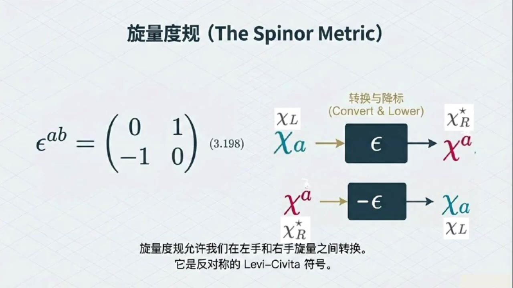
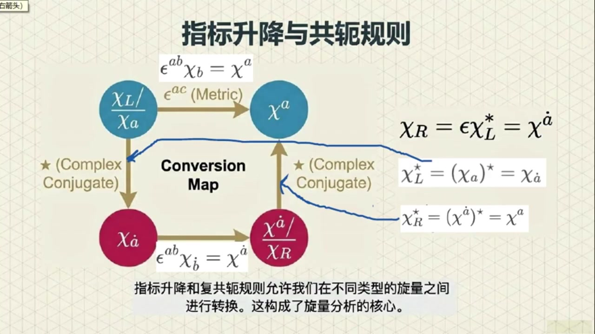
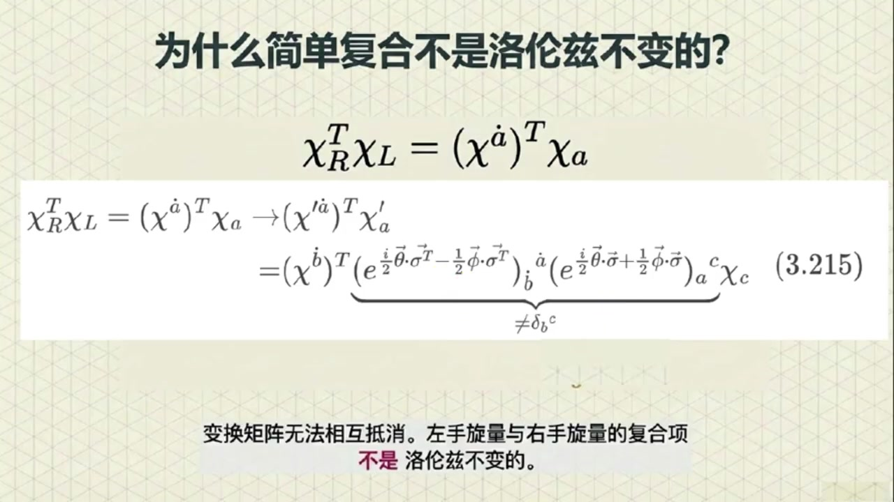
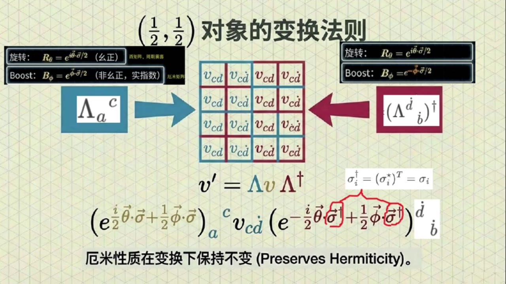
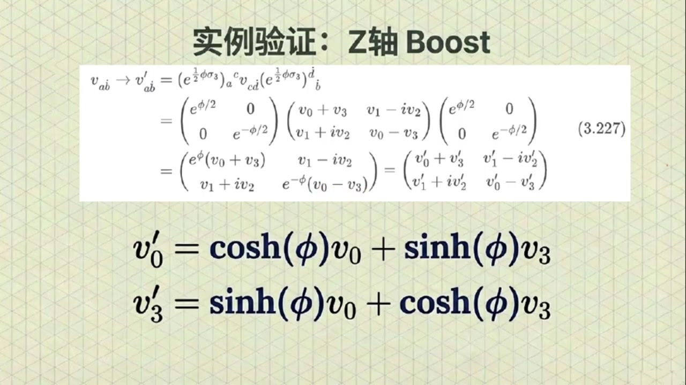

# 《基于对称性的物理学》第12课 旋量形式体系和范德瓦尔登记号

> 自动生成的课程注解文档（共 4 个段落，[原始视频](https://www.youtube.com/watch?v=tG4rh6bvmT4)）

## 目录

- [00:00:00 课程引入与范德瓦尔登记号的基本定义](#段落-1)
- [00:04:18 旋量度规Epsilon、复共轭与左右手旋量转换](#段落-2)
- [00:09:29 四类旋量变换规律与洛伦兹不变量构造](#段落-3)
- [00:16:34 （1/2,1/2）表示、向量表示及课程总结](#段落-4)

---

## 段落 1：课程引入与范德瓦尔登记号的基本定义 { #段落-1 }

**时间：** 00:00:00 ~ 00:04:18

📝 原始字幕

<pre>

大家好欢迎来到基于对称性的物理学第十二课博客我是周伟今天非常开心能和大家一起继续探索物理学中那些既抽象又迷人的概念
我身边这位永远能把复杂问题讲得深入前处的就是我们的赛老师赛老师跟同学们打招呼吧,
大家好,我是赛
很高兴能和朱爱一起继续我们对对称性与物理学世界的探索
希望今天的这节特能带给大家一些新的启发没错塞老师上节课我们聊到了洛伦兹群和手蒸悬亮感觉已经很烧脑了今天我们要讲的范德瓦尔登记号和洛伦兹群的向量表示听起来就更高级了同学们是不是要做好心理准备啊
就因为你爹把大家吓跑了
虽然名字听起来复杂,但其实这些概念是为了让我们更好地理解和处理悬量运算
就像我们学习一种新的语言掌握了语法和词汇就能更流长地表达思想了
在此之前希望同学们先自行复习一下第十一课的内容因为本科会直接利用上一课的结论就像我们学编程有了好的注释和密名规范代码就更容易维护和理解了那赛老师这个范德瓦雷登记号到底是为了解决什么问题呢
好的
我们知道物理学中有很多不同的对象在洛伦兹变换下行为方式是不同的比如我们之前讲过的左手旋转和右手旋转它们是两种变换方式的对象一个叫KL是变换作用的对象一个叫KR是变换作用的对象根据第十一课的内容我们知道它们在波斯的变换指标是相反的左手是正的右手是负的变换指标是正的变换指标是正的变换指标是正的但是我们知道它们之间是完全不相连的
所以为了用一种统一的更方便的几号来描述这些不同的对象并且能追踪每个对象是怎么变换的我们就引入了点指标和五点指标的概念
这就是所谓的范德瓦尔登记号哦原来是为了统一管理和追踪身份那具体是怎么区分的呢我们可以这样定义左手手针选量KL呢它会带一个下指的五点指标写成K下指五点A想想一下这个指标A上面没有点好的
看下至五点A是左手悬亮,那右手悬亮呢,右手手蒸悬亮太儿
会带一个上置的点制表,写成上置有点A
这个制标A上面有一个小点,而且是上指的
这个小点会有什么特别含义吗?我特别好奇能提前给点提示吗?具体含义我们会在后面探讨,我这儿也可以先给点巨头
是否有小点,可以通过复工额来切换
比如
对左手手争悬亮取复工乐就是KL复工乐等于K下至5点A,复工乐等于K下至有点A
再比如
对右手手争悬亮取复工恶就是开儿复工恶等于开上指有点A复工恶等于开上指五点A另外了下至五点是左手上至有点是右手取复工恶则进行有点五点切换
这个记号听起来挺直观的,一下子就把两种悬量区分开了
那接下来我们怎么用这个记号进行运算呢

</pre>

**课程截图：**

### 注解

这是一段关于**范德瓦尔登记号（Van der Waerden Notation）**与洛伦兹群旋量表示的理论物理课程片段。该记号是量子场论和广义相对论中处理旋量的标准数学语言，通过引入**"点指标"（dotted indices）**来区分洛伦兹群的两个不等价旋量表示。

---

## 一、板书/PPT 内容描述

### 第一张 PPT：范德瓦尔登记号的全景图
该页以信息图形式建立了旋量与时空几何的对应关系：

- **左侧（蓝色主题）**：**左手征旋量（Left-handed）**
  - 记作 $\chi_a$ 或 $\chi^a$，指标**无点**（undotted）
  - 几何图示：蓝色球体，标注"下置无点指标"
  - 变换特性：旋转 $R_\theta = e^{i\vec{\theta}\cdot\vec{\sigma}/2}$，Boost $B_\phi = e^{\vec{\phi}\cdot\vec{\sigma}/2}$（指数为正）

- **右侧（红色主题）**：**右手征旋量（Right-handed）**
  - 记作 $\chi_{\dot{a}}$ 或 $\chi^{\dot{a}}$，指标**有点**（dotted）
  - 几何图示：红色球体，标注"上置点指标"
  - 变换特性：旋转 $R_\theta = e^{-i\vec{\theta}\cdot\vec{\sigma}/2}$，Boost $B_\phi = e^{-\vec{\phi}\cdot\vec{\sigma}/2}$（指数为负）

- **中央桥梁**：**旋量度规** $\epsilon^{ab}$（或 $\epsilon_{\dot{a}\dot{b}}$）
  - 图示为交叉的"虫洞"结构，说明其作用是**升降指标**并在左右手旋量间转换
  - 类比：类似于闵氏度规 $\eta_{\mu\nu}$ 用于升降时空指标

- **底部核心结论**：**向量是二阶旋量**
  - 表示为 $(\frac{1}{2}, \frac{1}{2})$，即左手旋量与右手旋量的直积
  - 给出矩阵实现：$v_{a\dot{b}} = \begin{pmatrix} v_0+v_3 & v_1-iv_2 \\ v_1+iv_2 & v_0-v_3 \end{pmatrix}$，将四维向量映射为 $2\times 2$ 厄米矩阵

### 第二张 PPT：范德瓦尔登记号的精确定义
该页通过对比色块严格定义符号规则：

- **左栏（蓝色）**：**左手手征旋量**
  - 符号：$\chi_L = \chi_a$（下置无点指标，Lower undotted）
  - 复共轭关系：$\chi_L^* = (\chi_a)^* = \chi_{\dot{a}}$（复共轭后变为**下置点指标**）

- **右栏（红色）**：**右手手征旋量**
  - 符号：$\chi_R = \chi^{\dot{a}}$（上置点指标，Upper dotted）
  - 复共轭关系：$\chi_R^* = (\chi^{\dot{a}})^* = \chi^a$（复共轭后变为**上置无点指标**）

- **变换规则对比框**：
  - 左手：$R_\theta = e^{i\vec{\theta}\cdot\vec{\sigma}/2}$，$B_\phi = e^{\vec{\phi}\cdot\vec{\sigma}/2}$（非幺正，实指数）
  - 右手：$R_\theta = e^{-i\vec{\theta}\cdot\vec{\sigma}/2}$，$B_\phi = e^{-\vec{\phi}\cdot\vec{\sigma}/2}$

- **关键脚注**：解释了 $(\frac{1}{2}, 0)$ 表示左手变换对象，$(0, \frac{1}{2})$ 表示右手变换对象，两者通过复共轭联系。

---

## 二、公式识别与符号解释

### 1. 旋量指标符号系统
| 符号 | 名称 | 数学含义 | 物理对应 |
|------|------|----------|----------|
| $\chi_a$ 或 $\psi_\alpha$ | **下标无点** | 左手征旋量的协变分量 | 属于表示 $(\frac{1}{2}, 0)$，描述左旋费米子（如左旋中微子）|
| $\chi^a$ | **上标无点** | 左手征旋量的逆变分量 | 通过 $\epsilon^{ab}$ 与 $\chi_b$ 关联：$\chi^a = \epsilon^{ab}\chi_b$ |
| $\chi_{\dot{a}}$ 或 $\bar{\psi

---

## 段落 2：旋量度规Epsilon、复共轭与左右手旋量转换 { #段落-2 }

**时间：** 00:04:18 ~ 00:09:29

📝 原始字幕

<pre>

接下来我们要引入一个很重要的工具叫做悬亮度归通常用希腊字母EPSILON来表示
悬亮度归听起来跟我们讲明科夫斯基度归埃塔差不多有点类似但作用对象不同这个悬亮度归EPSILON呢它是一个二乘二的矩阵长这样
第一行是0第二行是0
它的主要作用就是帮助我们结合复共二操作可将右手旋量和左手旋量互相转换我们后面将会证明这一点那它可厉害了能把左手旋量转化那他们果然不是完全独立的
是的
不过我们刚才也提到过,这个转换不是他自己独立完成的,还需要结合复供额操作
我们定义一个叫做 KL 上C的东西它等于 EPSL 乘以 KL 的复共额也就是 EPSL KL 上STAR
这里的上标C呢其实代表电鹤共鹅电鹤共鹅这个概念我们后面会详细讲吗
后面会专门有一帖讲它不过在这里我们可以先把它理解成一种操作它能把左手悬亮变成右手悬亮即可哦就好像给悬亮变身一样
那么我们怎么知道KL上C真的变成了右手悬亮呢?我们可以检验一下他的变换行为
如果他在洛伦兹变换下表现得跟右手悬亮一模一样,那我们就能说他是个右手悬亮
我们先来看一个BUST变换的例子就是沿某个方向加速的变换BUST变换也就是用左手BUST表示矩阵作用在左手手针悬亮KYL
然后在这个作用的中间插入一个单位矩阵负EPSLON乘PEPSLON等于单位矩阵这个关系不难验证
然后得到用EPSILON和PPSILON两边加上这个左手Boost表示矩阵的复共乘上KL上C
书上说用 Epsilon 和 FPSilon 两边夹上左手 Boost
表示矩阵的复共恶恰好等于右手boost表示矩阵这部可以给出更细的证明吗?可以的
左手Boost表示矩阵是一个指数矩阵,可以用泰勒几数展开
根据复公额的性质可以将表示复公额的STAR移动到Sigma上键头的右上角然后在后面补上一个单位矩阵也就是复EPSLEN乘EPSLEN
然后将最外侧的两个EPSL和新添加的EPSL重新结合得到中括号EPSL成SIGMA上键头附供额成负EPSL中括号
哦我知道了中括号的部分我可以很容易验证就是等于负Sigma上键头是的所以N次密的部分
多了一个符号
最后得到的指数矩阵恰好就是右手boost表示矩阵,也就是一上负二分之一乘f上箭头点sigma上箭头
最后作用在KL上C上
这个变换形式恰好就是我们定义右手悬亮时他的右手不死变换行为
哇那这不就证明了EPSLON开L复供鄂确实是一个右手旋量吗太神奇了
没错同样的你也可以验证在旋转变换下KL上C的行为跟左右手旋量都是一样的这也很合理因为左右手旋量在旋转下的变换方式本来就相同所以这个旋量度归EPSLON加上负共就能实现左右手旋量的转换那它在指标运算上有什么作用呢它的作用就跟明科夫斯基度归A塔在四维向量中升降指标一样
我们可以用 Epsilon 来升降悬量指标
比如
EPSLON KL就能把KL的下至五点指标A变成上至五点指标K上至五点A也就是EPSLON上AB索并K下至五点B等于K上至五点A
再比如 Epsilon 上A B 缩并开下至有点B 等于开上至有点A
Epsilon只改变上下位置,不改变有点还是无点
哦它能改变指标的位置是的而复供额操作呢它会把五点指标变成点指标或者反过来
比如对KL也就是K下至五点A取复功额就得到了K下至五点A复功额等于K下至有点A
你看下至5点变成了下至4点
再比如对开二也就是开上至有点A去复供额就得到了开上至有点A复供额等于开上至五点A这样一来我们就可以通过组合这些操作得到各种带有不同点五点上至下至指标的选量了

</pre>

**课程截图：**

### 注解

这是一段关于**旋量度规（Spinor Metric）**与**电荷共轭（Charge Conjugation）**的核心内容。课程通过引入 Levi-Civita 符号 $\epsilon$ 建立了左右手旋量之间的数学桥梁，并严格证明了"左手旋量的电荷共轭等价于右手旋量"这一关键命题。

---

## 一、板书/PPT 内容描述

### 第一张 PPT：旋量度规的定义与作用
该页建立了旋量度规 $\epsilon$ 的矩阵表示及其在左右手旋量转换中的功能：

- **左侧公式**：旋量度规的矩阵形式
  $$\epsilon^{ab} = \begin{pmatrix} 0 & 1 \\ -1 & 0 \end{pmatrix}$$
  （注：字幕中"第一行是0第二行是0"应为口误，实际为反对称矩阵）

- **中央流程图**：展示 $\epsilon$ 的"转换与降标"功能
  - **上方路径**：左手旋量 $\chi_a$（记作 $\chi_L$）经过 $\epsilon$ 作用 → 转换为右手旋量的复共轭形式 $\chi_R^*$（即 $\chi^a$）
  - **下方路径**：右手旋量 $\chi^a$（记作 $\chi_R^*$）经过 $-\epsilon$ 作用 → 转换回左手旋量 $\chi_a$（即 $\chi_L$）

- **底部说明**：明确指出旋量度规就是**反对称的 Levi-Civita 符号**，其功能类似于闵可夫斯基度规 $\eta_{\mu\nu}$ 在四维向量中升降指标的作用。

### 第二张 PPT：电荷共轭的变换性质证明
该页通过严格的代数推导，证明了电荷共轭操作将左手旋量映射为右手旋量：

- **红色框定义**：电荷共轭操作
  $$\chi_L^C \equiv \epsilon \chi_L^* \quad \text{(3.199)}$$
  其中 $\chi_L^*$ 表示对旋量分量取复共轭。

- **核心推导**（左侧灰色区域）：
  验证 $\chi_L^C$ 在洛伦兹 Boost 变换下的行为：
  1. 左手旋量的 Boost：$\chi_L \to e^{\frac{1}{2}\vec{\phi}\cdot\vec{\sigma}} \chi_L$
  2. 对其取复共轭并左乘 $\epsilon$：$(\chi_L^C)' = \epsilon \left(e^{\frac{1}{2}\vec{\phi}\cdot\vec{\sigma}} \chi_L\right)^*$
  3. 插入单位矩阵技巧：利用 $\epsilon \cdot (-\epsilon) = I$ 将表达式重写
  4. 关键恒等式：利用 $\epsilon \sigma^* \epsilon = -\sigma$（泡利矩阵的复共轭性质），将指数中的 $\vec{\sigma}^*$ 转换为 $-\vec{\sigma}$
  5. 最终结果：$(\chi_L^C)' = e^{-\frac{1}{2}\vec{\phi}\cdot\vec{\sigma}} \chi_L^C$

- **右侧结论**：红色框标注"这恰好是右手旋量的变换行为"，得出结论：$\chi_L^C$ 表现为**右手旋量**。

---

## 二、公式识别与符号详解

### 1. 旋量度规（Spinor Metric）
$$\epsilon^{ab} = \begin{pmatrix} 0 & 1 \\ -1 & 0 \end{pmatrix}, \quad \epsilon_{ab} = \begin{pmatrix} 0 & 1 \\ -1 & 0 \end{pmatrix}$$

- **符号含义**：
  - $\epsilon^{ab}$（上标）：用于**降低**旋量指标（将下标变为上标）
  - $\epsilon_{ab}$（下标）：用于**提升**旋量指标（将上标变为下标）
  - 矩阵形式：二维反对称矩阵，满足 $\epsilon^{ac}\epsilon_{bc} = \delta^a_b$（单位矩阵）且 $\epsilon^{ab} = -\epsilon^{ba}$

- **指标运算规则**：
  - 升指标：$\chi^a = \epsilon^{ab}\chi_b$（左手 $\to$ 右手）
  - 降指标：$\chi_a = \epsilon_{ab}\chi^b$（右手 $\to$ 左手）
  - 注意因子：$\epsilon_{ab}\epsilon^{bc} = -\delta_a^c$，因此连续升降会产生负号

### 2. 电荷共轭（Charge Conjugation）
$$\chi_L^C \equiv \epsilon \chi_L^* \quad \text{或写成} \quad (\chi_a)^C = \epsilon_{ab} (\chi_b)^*$$

- **符号含义**：
  - $\chi_L$（或 $\chi_a$）：**左手旋量**（Left-handed spinor），对应洛伦兹群的 $(1/2, 0)$ 表示，指标为**无点指标**（undotted index）
  - $*$（或上标 $\star$）：复共轭操作（Complex Conjugation）
  - $C$：电荷共轭（Charge Conjugation），在量子场论中对应粒子 $\leftrightarrow$ 反粒子的变换
  - $\chi_L^C$：电荷共轭后的旋量，被证明是**右手旋量**（Right-handed spinor）

### 3. 洛伦兹变换的验证公式
**左手 Boost 变换**：
$$\chi_L \to \chi_L' = \exp\left(\frac{1}{2}\vec{\phi}\cdot\vec{\sigma}\right) \chi_L = e^{\frac{1}{2}\phi^i \sigma_i} \chi_L$$

**右手 Boost 变换**：
$$\chi_R \to \chi_R' = \exp\left(-\frac{1}{2}\vec{\phi}\cdot\vec{\sigma}\right) \chi_R = e^{-\frac{1}{2}\phi^i \sigma_i} \chi_R$$

**关键推导步骤**（板书第二张的核心）：
$$(\chi_L^C)' = \epsilon (\chi_L')^* = \epsilon \left(e^{\frac{1}{2}\vec{\phi}\cdot\vec{\sigma}} \chi_L\right)^* = \epsilon e^{\frac{1}{2}\vec{\phi}\cdot\vec{\sigma}^*} \chi_L^*$$

利用恒等式 $\epsilon \sigma_i^* \epsilon = -\sigma_i$（即 $\epsilon \vec{\sigma}^* \epsilon = -\vec{\sigma}$），可得：
$$\epsilon e^{\frac{1}{2}\vec{\phi}\cdot\vec{\sigma}^*} = e^{-\frac{1}{2}\vec{\phi}\cdot\vec{\sigma}} \epsilon$$

因此：
$$(\chi_L^C)' = e^{-\frac{1}{2}\vec{\phi}\cdot\vec{\sigma}} (\epsilon \chi_L^*) = e^{-\frac{1}{2}\vec{\phi}\cdot\vec{\sigma}} \chi_L^C$$

这证明了 $\chi_L^C$ 确实按照**右手旋量**的变换规律（指数上为负号）进行变换。

---

## 三、理论背景补充

### 1. 旋量表示与洛伦兹群
洛伦兹群 $SO(3,1)$ 的覆盖群是 $SL(2,\mathbb{C})$（二维复特殊线性群）。其最基本的表示有两个：
- **左手旋量** $(1/2, 0)$：用无点指标 $\chi_a$ 表示，Boost 变换生成元为 $+\frac{1}{2}\vec{\sigma}$
- **右手旋量** $(0, 1/2)$：用有点指标 $\bar{\chi}_{\dot{a}}$（或 $\chi^a$）表示，Boost 变换生成元为 $-\frac{1}{2}\vec{\sigma}$

这两个表示在数学上互为**复共轭表示**，但物理上是独立的自由度。

### 2. 旋量度规与 Levi-Civita 符号
$\epsilon$ 本质上是二维空间的 Levi-Civita 符号 $\epsilon_{ab}$（$\epsilon_{12} = 1$）。在旋量理论中，它扮演了"度规"的角色：
- **几何意义**：在二维旋量空间中，$\epsilon$ 提供了保持体积（辛结构）不变的度量
- **指标升降**：类似于广义相对论中用 $g_{\mu\nu}$ 升降时空指标，这里用 $\epsilon_{ab}$ 升降旋量指标
- **反对称性**：$\epsilon_{ab} = -\epsilon_{ba}$，这导致旋量统计满足费米-狄拉克统计（交换反对称）

### 3. 电荷共轭的物理内涵
在狄拉克方程中，电荷共轭操作 $C$ 将粒子旋量 $\psi$ 映射为反粒子旋量 $\psi^C$。对于外尔旋量（Weyl Spinor）：
- 左手粒子 $\chi_L$ 的电荷共轭 $\chi_L^C$ 是一个**右手反粒子**
- 这一操作结合了"复共轭"（改变粒子 $\leftrightarrow$ 反粒子）和 $\epsilon$ 转换（改变手征性），保持了洛伦兹协变性

---

## 四、通俗概念解释

### "旋量度规 $\epsilon$"是什么？
想象旋量空间是一个**有方向的二维平面**（类似复平面）。$\epsilon = \begin{pmatrix} 0 & 1 \\ -1 & 0 \end{pmatrix}$ 就像是一个**"旋转90度并翻转"**的操作：
- 它能把"横着"的左手旋量 $\chi_a$ 变成"竖着"的右手旋量 $\chi^a$
- 因为它反对称（$\epsilon^T = -\epsilon$），转两次会反向（$\epsilon^2 = -I$），所以转换过去再转回来会多一个负号——这正是费米子的特性！

### 为什么需要"复共轭 + $\epsilon$"才能转换左右手？
- **单独复共轭**：只是把旋量分量 $a+bi$ 变成 $a-bi$，这相当于在复平面上做"镜像翻转"，但**手征性不变**（左手变左手）
- **单独 $\epsilon$**：只是升降指标，改变数学形式但**不改变复数性质**
- **两者结合**：先取复共轭（改变表示的复结构），再用 $\epsilon$ 调整指标，这才能跨越洛伦兹群的两个不等价表示，实现左手 $\leftrightarrow$ 右手的"跨界"

### 验证变换行为的直观理解
课程中的证明本质上是在说："看，经过 $\epsilon$ 和复共轭包装后的旋量，在

---

## 段落 3：四类旋量变换规律与洛伦兹不变量构造 { #段落-3 }

**时间：** 00:09:29 ~ 00:16:34

📝 原始字幕

<pre>

一共四种组合首先是左手旋量变化也就是左手旋转表示变化和左手BUST表示变化的复合变化
也就是开撇下至五点A等于括号以上二分制虚数单位I乘C上箭头到Sigma上箭头
加二分之一范上键头到C个码上键头括号下A上B缩并看下指五点B
哦
我明白了
那么将这个下值五点的变换的两边同时求富共恶就可以得到下值有点的变换关系对吧对的正是按你这个方法可以得到下值有点的变换关系
由于复公额的关系,变换句中显示出现的叙述单位A要添加一个复号
同时泡力矩阵SIGMA右上角也要添加复功额的符号STAR此外AB这两个指标都要加点我们已经讨论了下值五点的变换和下值有点的变换
右手悬梁变换,也就是上肢有点的变换,还有上肢无点的变换,是不是也有类似的情况?是的
对右手悬梁变换或上置有点的变换而言也和前面类似只不过这次是
右手旋转表示变换和右手boost表示变换的复合变换
特别注意右手BUST表示变换的指数部分多了一个负号
瓦塞
那么对应的上至五点的变换也一定要将显示出现的虚数单位I前添加一个副号
炮力指针Sigman也要添加一个复供沃尔上STAL最后还要去除掉A和B上的点
对吧,很对,看来你已经掌握了这四种可能组合的变换
而且我们研究这些不同指标的悬量怎么变换是为了一个更重要的目的构建在洛伦兹变换下保持不变的像
卢伦兹不变想这听起来很重要因为物理定律在所有参考系中都应该是一样的完全正确
为了构建这样的不变相,我们需要找到一种方法来配对选量
回想一下两个四维向量的标量集,比如X下SY上
他就是洛伦兹不变的
这里面一个指标是下指的,另一个是上指的,而且类型相同
嗯,我们知道的四维向量的内积就是这样.对于悬量来说,也要类似的规则
我们发现如果你把一个上置误点指标的选量,比如开上置误点A
和另一个下至五点指标的悬量,比如开下至五点A
通过转制并相成
例如开上至5点A转制成开下至5点A
你会发现这个组合在洛伦兹变换下是不变的这是为什么呢我们还是做一次计算吧
这次我们的计算目标是变换后的开撇上置5.A转置成开撇下置5.A
将上置物点和下置物点的这两个变换分别带入
然后将转支操作深入到直数函数中作用到西格玛复供额上也就是复供额转制也就是额米供额也就是西格玛大格
然后,我们不难验证每个炮力矩阵的峨米共额依然是子身,也就是Sigma dagger等于Sigma
最后发现第一个矩阵指数和第二个矩阵指数的密次部分刚好相差一个副号所以他们的成绩恰好是一个单位矩阵
最后等于开上指五点B转至成开下指五点B
哦,明白了,这个证明验证了你前面说的
明白了,这个证明验证了你前面说的开上至五点A转制,乘开下至五点A是一个不变量
舅舅意味着它的值不会随着我们参考系的改变而改变,对吧
对
就是这个意思
同样的上置有点指标的宣亮和下置有点指标的宣亮组合开上置有点A转制成开下置有点A也是不变的那是不是说只要是同类型的指标一个上置一个下置组合起来就是不变的你的总结很到位同类型在这里指的是要么都是点指标要么都是五点指标
但是如果你把不同类型的指标组合起来比如一个上置点指标的悬量和另一个下置无电指标的悬量比如开二转至开L等于开上置有点A转至开下置无电A
你会发现它就不是洛伦子不变的了
因为对应的变换矩阵无法相互抵消左手旋亮和右手旋亮的复合象不是洛伦子不变的所以为了得到洛伦子不变的物理量我们必须把相同类型的上置和下置指标组合起来
这就像是悬亮世界的配对规则,你可以这样理解
或者更常见的说法是我们需要将右手悬亮的二米公鹅与左手悬亮组合或者反过来才能得到洛伦兹不变相
二米公鹅Dagger其实就是转制加副公鹅
所以开二DEGGER开O或开二DEGGER开二这种形式才是洛伦兹不变的
嗯,这个规则很关键,看来以后我们构建理论的时候要特别注意这一点了
那塞老师,这个悬亮度归EPSL还能怎么用呢?
我们之前提到开下至5点A转至开上至5点A是不变的
我们可以用悬亮度规把它写成开下至5点A转至缩并Epsilon上AB缩并开下至5点B
你看,这和明科夫斯基杜龟在四维向量内集中的作用是不是很像
确实,Epsilon就像是悬亮世界的明科夫斯基度归,它连接了不同指标的悬亮并帮助我们构建不变的量
没错
所以从某种意义上说悬亮度归的作用确实相当于四维向亮的明科夫斯基度归
好的,那关于范德瓦尔登记号,我们现在有了下至五点,上至有点的区分
有了悬亮度归来升降指标和转范悬亮类型
也知道了怎么构建洛伦兹布便想
这套记号体系确实让悬亮运算变得更清晰了是的他把左手悬亮和右手悬亮这两种看似不同的对象在形式上统一起来揭示了他们内在的联系

</pre>

**课程截图：**

### 注解

基于您提供的字幕文本与截图，这段内容聚焦于**洛伦兹群旋量表示的完整变换规则**与**不变量构建的数学机制**。以下是针对该片段的深度注解：

---

## 一、板书/PPT 内容描述

### 第一张 PPT：指标升降与共轭规则（Conversion Map）
该图以流程图形式揭示了四种旋量类型（左手/右手，上置/下置）通过**复共轭**（Complex Conjugate）与**度规升降**（Metric）相互转换的完整图谱：

- **蓝色节点（左手征）**：$\chi_L / \chi_a$（下置无点）与 $\chi^a$（上置无点）
- **红色节点（右手征）**：$\chi_{\dot{a}}$（下置有点）与 $\chi^{\dot{a}} / \chi_R$（上置有点）
- **水平箭头**：通过 $\epsilon^{ac}$ 或 $\epsilon^{ab}$ 进行指标升降
- **垂直箭头**：通过复共轭操作 $(\star)$ 实现左右手征转换，例如 $\chi_L^* = \chi_{\dot{a}}$ 且 $(\chi^{\dot{a}})^* = \chi^a$

### 第二张 PPT：构造洛伦兹不变量（Invariant Construction）
该页展示了**同类型指标配对**的数学证明：

- **顶部提示**：$x_\mu y^\mu = \mathbf{x}^T \mathbf{y} = \mathbf{x} \cdot \mathbf{y}$（类比四维矢量内积）
- **核心公式链**：
  $$(\chi^a)^T \chi_a \to (\chi'^a)^T \chi'_a = \left[\left(e^{-\frac{i}{2}\vec{\theta}\cdot\vec{\sigma} - \frac{1}{2}\vec{\phi}\cdot\vec{\sigma}}\right)^a{}_b \chi^b\right]^T \left(e^{\frac{i}{2}\vec{\theta}\cdot\vec{\sigma} + \frac{1}{2}\vec{\phi}\cdot\vec{\sigma}}\right)_a{}^c \chi_c$$
- **关键步骤**：转置操作使第一个指数矩阵取厄米共轭（ dagger ），利用 $(\sigma^i)^\dagger = \sigma^i$ 与指数函数性质，最终得到 $\delta_b{}^c$（单位矩阵），证明不变性。
- **结论栏**：明确写出 $\chi_R^\dagger \chi_L = (\chi^{\dot{a}})^T \chi_a = \text{Invariant}$ 等有效组合。

### 第三张 PPT：为什么简单复合不是洛伦兹不变的？
该页通过**反例**说明指标类型不匹配的后果：

- **问题公式**：$\chi_R^T \chi_L = (\chi^{\dot{a}})^T \chi_a$
- **变换推导**：
  $$(\chi^{\dot{b}})^T \left(e^{\frac{i}{2}\vec{\theta}\cdot\vec{\sigma}^T - \frac{1}{2}\vec{\phi}\cdot\vec{\sigma}^T}\right)_{\dot{b}}{}^{\dot{a}} \left(e^{\frac{i}{2}\vec{\theta}\cdot\vec{\sigma} + \frac{1}{2}\vec{\phi}\cdot\vec{\sigma}}\right)_a{}^c \chi_c$$
- **关键标注**：两个指数项**无法抵消**（$\neq \delta_b{}^c$），因为左手与右手旋量属于洛伦兹群的**不同表示**（$(1/2,0)$ 与 $(0,1/2)$）。

---

## 二、公式详解（当前段落新内容）

### 1. 左手旋量（下置无点）的洛伦兹变换
$$\chi'_a = \left(e^{\frac{i}{2}\vec{\theta}\cdot\vec{\sigma} + \frac{1}{2}\vec{\phi}\cdot\vec{\sigma}}\right)_a{}^b \chi_b$$

**符号说明**：
- $\vec{\theta}$：空间旋转角度（三维矢量）
- $\vec{\phi}$：Boost 快度（rapidity，三维矢量）
- $\vec{\sigma}$：Pauli 矩阵矢量 $(\sigma^1, \sigma^2, \sigma^3)$
- 指数部分：$\frac{1}{2}\vec{\theta}\cdot\vec{\sigma}$ 生成旋转，$\frac{1}{2}\vec{\phi}\cdot\vec{\sigma}$ 生成 Boost
- 下标 $a$（无点）：左手征旋量的二维指标（取值为 1,2）

### 2. 右手旋量（下置有点）的变换（复共轭导出）
通过复共轭操作，左手变换变为右手变换：
$$\chi'_{\dot{a}} = \left(e^{-\frac{i}{2}\vec{\theta}\cdot\vec{\sigma}^* - \frac{1}{2}\vec{\phi}\cdot\vec{\sigma}^*}\right)_{\dot{a}}{}^{\dot{b}} \chi_{\dot{b}}$$

**关键变化**（相对于左手）：
- $i \to -i$（复共轭）
- $\sigma \to \sigma^*$（Pauli 矩阵取复共轭，注意 $(\sigma^2)^* = -\sigma^2$）
- 指标 $a,b \to \dot{a},\dot{b}$（添加"点"标记）

### 3. 右手旋量（上置有点）的变换
$$\chi'^{\dot{a}} = \left(e^{-\frac{i}{2}\vec{\theta}\cdot\vec{\sigma} - \frac{1}{2}\vec{\phi}\cdot\vec{\sigma}}\right)^{\dot{a}}{}_{\dot{b}} \chi^{\dot{b}}$$

**注意**：与左手变换相比，指数部分整体**多了一个负号**（字幕中提到的"右手 Boost 表示变换的指数部分多了一个负号"）。这源于右手旋量属于 $(0,1/2)$ 表示，其生成元与左手 $(1/2,0)$ 表示的生成元互为复共轭负值。

### 4. 洛伦兹不变量的构建公式
$$(\chi^a)^T \chi_a \quad \text{或} \quad (\chi^{\dot{a}})^T \chi_{\dot{a}}$$

**证明细节**（字幕中描述的代数过程）：
- 变换后：$(\chi'^a)^T \chi'_a = \chi^b \left(e^{-\frac{i}{2}\vec{\theta}\cdot\vec{\sigma}^\dagger - \frac{1}{2}\vec{\phi}\cdot\vec{\sigma}^\dagger}\right)_b{}^a \left(e^{\frac{i}{2}\vec{\theta}\cdot\vec{\sigma} + \frac{1}{2}\vec{\phi}\cdot\vec{\sigma}}\right)_a{}^c \chi_c$
- 利用 $\sigma^\dagger = \sigma$（Pauli 矩阵厄米性）
- 指数相加：$-\frac{i}{2}\vec{\theta}\cdot\vec{\sigma} + \frac{i}{2}\vec{\theta}\cdot\vec{\sigma} = 0$，Boost 项同理抵消
- 结果：$\delta_b{}^c \chi^b \chi_c = (\chi^b)^T \chi_b$（不变）

### 5. 非不变量示例（混合类型）
$$(\chi^{\dot{a}})^T \chi_a$$

**失效原因**：变换矩阵分别为 $e^{-\frac{i}{2}\vec{\theta}\cdot\vec{\sigma}^T \cdots}$（左手）与 $e^{\frac{i}{2}\vec{\theta}\cdot\vec{\sigma} \cdots}$（右手），由于 $\sigma^T \neq \sigma$（实际上 $\sigma^T = \sigma^*$），无法相互抵消为单位矩阵。

---

## 三、理论背景补充

### 1. 洛伦兹群的旋量表示结构
洛伦兹群 $SO(3,1)$ 的局域同构群为 $SL(2,\mathbb{C})$，其存在两个**不等价**的基本旋量表示：
- **$(1/2, 0)$ 表示（左手）**：由 $\sigma$ 生成，对应无点指标
- **$(0, 1/2)$ 表示（右手）**：由 $-\sigma^*$ 生成，对应有点指标

这两个表示通过**复共轭**相互联系，但**不能通过实正交变换相互转换**，这正是需要引入"点指标"（dotted indices）的根本原因。

### 2. 旋量度规与闵可夫斯基度规的类比
字幕中提到 $\epsilon^{ab}$ 类似于 $\eta^{\mu\nu}$，这一对应关系可严格化为：
- **指标升降**：$\chi^a = \epsilon^{ab}\chi_b$ 类比 $x^\mu = \eta^{\mu\nu}x_\nu$
- **不变量构造**：$\epsilon^{ab}\chi_a\psi_b$ 类比 $\eta^{\mu\nu}x_\mu y_\nu$
- **几何意义**：$\epsilon$ 是二维旋量空间上的"度量"，保持 $SL(2,\mathbb{C})$ 变换下的辛结构（symplectic structure）。

---

## 四、核心概念通俗解释

### "旋量世界的配对规则"
课程中反复强调的**同类型指标配对**（上置无点配下置无点，或上置有点配下置有点）可以类比为：
- **钥匙与锁**：左手旋量（无点）和右手旋量（有点）是两种不同"齿形"的钥匙，必须同类型才能咬合（构成不变量）。如果你把右手钥匙（有点）插入左手锁孔（无点），虽然物理上都是旋量，但在洛伦兹变换下会"打滑"（变换不匹配），无法保持数值不变。

### 复共轭的"镜像"效应
- 对左手旋量取复共轭（加星号），相当于在数学上**翻转手征性**（chirality flip），从左手变为右手。这类似于镜子会左右颠倒，但这里的"左右"是物理上的手征（helicity/chirality）。
- 指数中的负号变化（$i \to -i$）对应于洛伦兹变换中旋转方向的反转：左手坐标系中的顺时针旋转，在右手坐标系中看起来是逆时针的。

### 为什么 $\chi_R^\dagger \chi_L$ 是不变的？
这是狄拉克拉格朗日量中质量项的核心结构。可以形象理解为：
- $\chi_R^\dagger$（右手旋量的厄米共轭）携带"上置无点"指标（通过度规转换后）
- $\chi_L$ 携带"下置无点"指标
- 两者结合形成"闭环"，洛伦兹变换的"扭曲"在闭环中相互抵消，留下一个纯粹的数值（质量项）。

这种**配对不变性**是构建相对论性量子场论（如狄拉克方程、魏尔方程）的数学基石，确保了物理定律在所有惯性参考系中形式相同。

---

## 段落 4：（1/2,1/2）表示、向量表示及课程总结 { #段落-4 }

**时间：** 00:16:34 ~ 00:26:51

📝 原始字幕

<pre>

接下来我们就要利用这些工具来探讨一个老熟人了,那就是洛伦兹群的二分之一,二分之一表示
二分之一二分之一表示,听起来像是把两个选量表示组合起来了
你说的没错转呀
数学上这个二分之一二分之一表示实际上就是我们前面提到的二分之一零表示和零二分之一表示的张亮机
也算是第十一课的内容延续
哦张亮基,那它会作用在什么样的对象上呢
很好
我们知道二分之一零对应的是左手悬亮,它有一个五点指标
而0:2分之一对应的是右手悬亮,它有一个点指标
所以这个组合起来的二分之一二分之一表示会作用于一个带有两个指标的对象上比如我们可以把它叫做V下指五点A上指有点B
V下至5点A上至有点B一个下至5点指标一个上至点指标这表示什么呢
首先,为了方便,我们不妨只考虑V下值五点,A下值有点B的情况
因为我们可以通过悬亮度归 Epsilon
将下值有点这个指标提升
然后这个对小V会有四个分量
因为每个指标都可以取两个值,所以是2乘2的组合
我们可以把它看作一个2乘2的矩阵
四个分量,一个二乘二之阵
听起来很有趣
我们可以更具体地看看这个二乘二矩阵
一个通用的二乘二负矩阵有八个自由参数
但我们这里只需要4个
这是因为在这个表示下只有恶迷矩阵也就是那些供额转制后不变的矩阵
它们构成了一个不变子空间
也就是一个不可言表示
恶迷举证
这个我们很熟悉了
量子力学里经常遇到
那阿米矩阵有什么特点呢
任何二乘二的恶米矩阵都可以用单位矩阵I和三个抛力矩阵SIGMA一SIGMA二SIGMA三的线性组合来表示就是A零成单位矩阵I加A一成SIGMA一加A二成SIGMA二加A三成SIGMA三这种形式对吗完全正确所以我们可以把这个V下置五点A下置有点B矩阵写成这种形式其中系数V零V一V二V三就是它的四个分量
如果我们把西格玛零定义为单位矩阵那么V下至五点A下至有点B就可以写成V新缩编西格玛女下至五点A下至有点B这样写的话它看起来就像一个四维向量V零V一V二V三和抛力矩阵的组合了对展开来看这个矩阵就是第一行是V零加V三和V一减虚数单位I成V二
第二行是V一加叙数单位I乘V二和V零减V三你看它的四个分料V零V一V二V三清晰地体现在矩阵里了这个矩阵形式很漂亮
那这个V下至五点A下至有点B在路轮子变换下是怎么变换的呢它的变换会稍微复杂一点因为涉及到两个指标的变换
用我们前面学到的变换算符,左边的5.A指标会用左手选量的变换算符
而右边的有点B指标会用右手旋量对应的变换算符
不过需要注意供鄂和转制听起来有点像三明制结构没错就是这种三明制结构
经过变换新的V撇下至五点A下至有点B会变成LambdaVLambdaDagger的形式
其中兰达是左手选量的变换矩阵而兰达达格尔是左手选量变换矩阵的厄米贡鄂
为何又成矩阵的是朗德达格尔
因为V下至5点,A下至有点B,第二个指标是带点的,对应左手悬亮的附供额
此外,这个矩阵是右成的,所以必须是转之后的
副贡鄂加转制,不正好是阿米贡鄂DEGGER吗?
哦我明白了最后的结果就是书中的公式三点二二五而且我们可以证明阿米矩阵在经过这种变换后
我明白了最后的结果就是书中的公式三点二二五而且我们可以证明阿米矩阵在经过这种变换后依然是阿米矩阵
这个证明过程其实很简单就是硬算验证
这个证明过程就是书中的公式三点二二六所以这就保证了我们选择的阿米矩阵作为不可约表示是正确的是的
为了让大家更直观地理解,我们来看一个具体的例子
沿Z轴的BUST变换沿Z轴的BUST就是FIVE上箭头中只有Z分两部为零对因为抛力矩阵SIGMA三是对角矩阵所以这个BUST变换计算起来相对简单
把V下至5点A下至5点B矩阵带入到编换公式中
经过举止成法我们会得到一个新的矩阵V撇下五点A下置有点B那新的矩阵会是什么样子呢经过计算你会发现新的矩阵的对角线元素会变成一上F乘号V零加V三宽号和一上V零加V三宽号而非对角线元素V一加减虚数单位I成V二保持不变那我们把这个新的矩阵和通用V撇下置五点A下置有点B形式对比一下就可以看出怎么变化的了没错通过比较我们发现V撇零加V三等于一上F加V零加V三宽号还有V撇零减V三等于一上V零减V三宽号
这两个柿子一加一减就能得到微撇零等于双曲鱼弦F成微零加双曲正弦F成微三和微撇三等于双曲正弦F成微零加双曲鱼弦F成微三哇这不就是我们熟悉的沿Z轴的洛伦子Boost变化公式吗微撇一和微撇二没有变也符合预期完全正确
这正是我们想要的结果
这个计算证明了洛伦兹群的二分之一二分之一表示它所作用的对象在变幻下的行为和我们熟悉的思维向量在洛伦兹变幻下的行为是完全一致的也就是说这个二分之一二分之一表示其实就是我们平时说的向量表示恭喜你周艾你抓住了重点
这就是一个非常深刻的结论
陆伦兹群的二分之一二分之一表示就是我们通常所说的向量表示也就是说我们平时用的四维向量比如能量动量四维向量其实就是一个二节选量它有两个悬量指标按照二分之一二分之一表示来变换没错
所以我们常说悬亮是向量的平方根,或者说通俗的说向量两个悬亮的复合,或者严格的说向量是二解悬亮
这意味着在洛伦自变换下最基础的不可再约的对象其实是悬亮而不是向亮这真是颠覆性的认识
我们以前觉得向量已经很基础了
但原来悬亮才是更底层的构建模块
这对于理解基本粒子有什么意义呢?意义非常重大
这意味着有些物理系统比如电子这样的废米子它们不能仅仅用向量来描述它们需要用悬量来描述因为悬量能够捕捉到它们更深层次的内在对称性比如自旋就像电子有自旋这可能就是向量无法描述的特性所以我们才需要引入悬量是的悬量提供了一个更基础更全面的框架来描述物理世界
它让我们看到了四维向量如何从更基本的悬量结构中构建出来的太棒了今天我们从范德瓦尔登机号开始学会了如何区分和操作不同类型的悬量指标也知道了如何构建罗伦兹不变的物理量
然后我们又通过二分之一二分之一表示发现了一个惊人的事实我们熟悉的四维向量本质上就是一个二阶选量总结得很到位交易
这些概念为我们理解粒子物理和量子场论中的基本粒子行为打下了监视的基础教育老师书中里还提到罗伦子群有四个连通分量涉及到空间反射和时间反射这个我们后面会讲吗是的乔伊你问得很好
罗伦斯群确实比我们目前讨论的要更丰富
它包含了通过空间繁衍也就是语秤变换
charity
和时间繁衍连接起来的四个部分
我们会在接下来的课程中专门讨论这些变幻以及它们在物理世界中的表现好的那我们下节课再继续探索这些有趣的对称性吧期待与大家下次再见
感谢SUI老师今天的精彩讲解,也感谢各位同学的收听.我是ZOE,我们下节课再见
再见

</pre>

**课程截图：**

### 注解

基于您提供的字幕文本与截图，这段内容聚焦于**洛伦兹群 $(\frac{1}{2}, \frac{1}{2})$ 表示的数学构造**及其与**四维向量表示**的等价性证明。以下是针对该片段的深度注解：

---

## 一、板书/PPT 内容描述

### 第一张 PPT：统一变换记号 $\Lambda$ 的对比
该页对比了左手征与右手征旋量在洛伦兹变换下的不同数学形式，为理解 $(\frac{1}{2}, \frac{1}{2})$ 表示的"左右混合"特性做铺垫：

- **左侧（蓝色）**：左手征旋量 $(\frac{1}{2}, 0)$ 表示
  - 旋转：$R_\theta = e^{i\vec{\theta}\cdot\vec{\sigma}/2}$（幺正）
  - Boost：$B_\phi = e^{\vec{\phi}\cdot\vec{\sigma}/2}$（非幺正，实指数）
  - 变换规则：$\chi'_L = \Lambda_a{}^b \chi_b$，其中 $\Lambda_{(\frac{1}{2},0)} = e^{\frac{i}{2}\vec{\theta}\cdot\vec{\sigma} + \frac{1}{2}\vec{\phi}\cdot\vec{\sigma}}$

- **右侧（红色）**：右手征旋量 $(0, \frac{1}{2})$ 表示
  - 旋转：$R_\theta = e^{i\vec{\theta}\cdot\vec{\sigma}/2}$（与左手相同）
  - Boost：$B_\phi = e^{-\vec{\phi}\cdot\vec{\sigma}/2}$（指数符号相反）
  - 变换规则：$\chi'_R = \Lambda^{\dot{a}}{}_{\dot{b}} \chi^{\dot{b}}$，其中 $\Lambda_{(0,\frac{1}{2})} = e^{\frac{i}{2}\vec{\theta}\cdot\vec{\sigma} - \frac{1}{2}\vec{\phi}\cdot\vec{\sigma}}$

- **底部注释**："统一记号确认了 $\chi_L$ 和 $\chi_R$ 是同一系统的互补部分"

### 第二张 PPT：$(\frac{1}{2}, \frac{1}{2})$ 对象的变换法则
该页揭示了二阶旋量（向量）的核心变换机制——"三明治"结构：

- **中央矩阵图示**：一个 $2\times 2$ 矩阵 $v_{\dot{c}d}$ 被左手变换 $\Lambda$ 左乘、右手变换 $\Lambda^\dagger$ 右乘的示意图
- **核心公式**：
  $$v' = \Lambda v \Lambda^\dagger$$
  或写为指标形式：
  $$v'_{a\dot{b}} = \Lambda_a{}^c v_{c\dot{d}} (\Lambda^\dagger)^{\dot{d}}{}_{\dot{b}}$$
- **展开式**：
  $$\left(e^{\frac{i}{2}\vec{\theta}\cdot\vec{\sigma} + \frac{1}{2}\vec{\phi}\cdot\vec{\sigma}}\right)_a{}^c v_{c\dot{d}} \left(e^{-\frac{i}{2}\vec{\theta}\cdot\vec{\sigma}^\dagger + \frac{1}{2}\vec{\phi}\cdot\vec{\sigma}^\dagger}\right)^{\dot{d}}{}_{\dot{b}}$$
- **关键性质标注**："厄米性质在变换下保持不变 (Preserves Hermicity)"

### 第三张 PPT：实例验证——Z轴 Boost
该页通过具体计算验证了上述抽象变换等价于熟悉的洛伦兹变换：

- **变换方程**：
  $$v_{a\dot{b}} \to v'_{a\dot{b}} = (e^{\frac{1}{2}\phi\sigma_3})_a{}^c v_{c\dot{d}} (e^{\frac{1}{2}\phi\sigma_3})^{\dot{d}}{}_{\dot{b}}$$
- **矩阵乘法链**：
  $$\begin{pmatrix} e^{\phi/2} & 0 \\ 0 & e^{-\phi/2} \end{pmatrix} \begin{pmatrix} v_0+v_3 & v_1-iv_2 \\ v_1+iv_2 & v_0-v_3 \end{pmatrix} \begin{pmatrix} e^{\phi/2} & 0 \\ 0 & e^{-\phi/2} \end{pmatrix} = \begin{pmatrix} e^\phi(v_0+v_3) & v_1-iv_2 \\ v_1+iv_2 & e^{-\phi}(v_0-v_3) \end{pmatrix}$$
- **结果对应**：
  $$v'_0 = \cosh(\phi)v_0 + \sinh(\phi)v_3$$
  $$v'_3 = \sinh(\phi)v_0 + \cosh(\phi)v_3$$

---

## 二、公式详解与符号说明

### 1. $(\frac{1}{2}, \frac{1}{2})$ 表示的构造
**数学定义**：
$$(\frac{1}{2}, \frac{1}{2}) = (\frac{1}{2}, 0) \otimes (0, \frac{1}{2})$$

**符号解释**：
- **张量积结构**：该表示作用于对象 $v_{a\dot{b}}$（或 $v_{\dot{a}b}$），其中：
  - $a$ 为**无点下标**（左手征，对应 $(\frac{1}{2}, 0)$ 表示）
  - $\dot{b}$ 为**有点上标**（右手征，对应 $(0, \frac{1}{2})$ 表示）
- **维度**：$2 \times 2 = 4$ 个复分量，但由于厄米性约束 $v = v^\dagger$，独立实参数为 4 个，恰好对应四维时空。

### 2. 厄米矩阵与 Pauli 基展开
**展开公式**：
$$v_{a\dot{b}} = v_\mu \sigma^\mu_{a\dot{b}} = v_0 (\sigma^0)_{a\dot{b}} + v_i (\sigma^i)_{a\dot{b}}$$

**符号说明**：
- $\sigma^0 = I$（单位矩阵），$\sigma^i$（$i=1,2,3$）为 Pauli 矩阵
- $v_\mu = (v_0, v_1, v_2, v_3)$ 为**实数**系数，构成四维向量分量
- 矩阵显式形式：
  $$v = \begin{pmatrix} v_0+v_3 & v_1-iv_2 \\ v_1+iv_2 & v_0-v_3 \end{pmatrix}$$

### 3. 三明治变换规则
**变换公式**：
$$v'_{a\dot{b}} = \Lambda_a{}^c v_{c\dot{d}} (\Lambda^\dagger)^{\dot{d}}{}_{\dot{b}}$$

**关键概念**：
- **$\Lambda$**：左手征旋量的变换矩阵，属于 $SL(2,\mathbb{C})$（行列式为 1 的复 $2\times 2$ 矩阵）
- **$\Lambda^\dagger$**：$\Lambda$ 的厄米共轭（复共轭转置），恰好是右手征旋量的变换矩阵
- **结构意义**：左指标用 $\Lambda$ 变换，右指标用 $\Lambda^\dagger$ 变换，形成"左-中-右"三明治结构，确保变换后仍保持厄米性。

### 4. Z轴 Boost 的具体验证
**参数设定**：
- 快度（rapidity）$\phi$ 沿 Z 轴，Boost 参数 $\vec{\phi} = (0,0,\phi)$
- 由于 $[\sigma_3, \sigma_3] = 0$，矩阵指数对角化：$e^{\frac{1}{2}\phi\sigma_3} = \text{diag}(e^{\phi/2}, e^{-\phi/2})$

**计算结果**：
- $v'_0 + v'_3 = e^\phi(v_0 + v_3)$
- $v'_0 - v'_3 = e^{-\phi}(v_0 - v_3)$
- $v'_1 \pm iv'_2 = v_1 \pm iv_2$（横向分量不变）

**双曲函数关系**：
利用 $e^\phi = \cosh\phi + \sinh\phi$，可导出：
$$\begin{pmatrix} v'_0 \\ v'_3 \end{pmatrix} = \begin{pmatrix} \cosh\phi & \sinh\phi \\ \sinh\phi & \cosh\phi \end{pmatrix} \begin{pmatrix} v_0 \\ v_3 \end{pmatrix}$$
这正是狭义相对论中沿 Z 轴的洛伦兹 Boost 变换公式。

---

## 三、理论背景补充

### 1. 表示论视角的等价性
洛伦兹群 $SO(3,1)$ 的**向量表示**（4维）与**旋量表示**的 $(\frac{1}{2}, \frac{1}{2})$ 表示在数学上是**同构**的。这意味着：
- 任何四维向量 $V^\mu$ 都可唯一对应一个 $2\times 2$ 厄米矩阵 $v_{a\dot{b}}$
- 洛伦兹变换在向量表示中的 $4\times 4$ 矩阵 $\Lambda^\mu{}_\nu$ 与旋量表示中的 $(\Lambda \otimes \Lambda^\dagger)$ 作用等价

### 2. 为什么必须是厄米矩阵？
旋量表示的一般对象有 4 个复分量（8 个实自由度），但物理的四维向量只有 4 个实自由度。厄米条件 $v = v^\dagger$ 恰好将自由度从 8 约束到 4，构成**不可约表示**的载体空间。

### 3. 旋量作为"向量的平方根"
这一通俗说法的数学基础：
- 向量变换：$V' = \Lambda_{\text{vec}} V$，其中 $\Lambda_{\text{vec}}$ 是 $4\times 4$ 矩阵
- 旋量变换：$\chi' = \Lambda \chi$，其中 $\Lambda$ 是 $2\times 2$ 矩阵
- 构造关系：$\Lambda_{\text{vec}} \sim \Lambda \otimes \Lambda^\dagger$
- 因此，向量表示是旋量表示的"二次型"（张量积），类似于 $(\sqrt{x})^2 = x$ 的关系。

---

## 四、通俗概念解释

### "三明治结构"的物理直觉
想象旋量变换像一扇旋转门：
- **左手旋量** ($\chi_L$) 从门的左侧进入，受 $\Lambda$ 作用
- **右手旋量** ($\chi_R$) 从门的右侧进入，受 $\Lambda^\dagger$ 作用
- **向量** ($v$) 像是左右手旋量"手牵手"的状态，必须同时被左右两个变换"夹住"（左乘 $\Lambda$、右乘 $\Lambda^\dagger$）才能保持内部结构不变

### 从矩阵到时空的映射
那个漂亮的 $2\times 2$ 矩阵：
$$\begin{pmatrix} v_0+v_3 & v_1-iv_2 \\ v_1+iv_2 & v_0-v_3 \end{pmatrix}$$
可以看作四维时空的"密码本"：
- **对角元**编码了时间分量 $v_0$ 和纵向空间分量 $v_3$（Z轴）
- **非对角元**编码了横向空间分量 $v_1, v_2$（X-Y平面），复数形式暗示了旋转自由度
- Boost 变换时，对角元被拉伸/压缩（双曲函数），非对角元保持不变，这正好对应了洛伦兹收缩只发生在运动方向（Z轴）上。

### 为什么电子需要旋量？
课程结尾提到费米子（如电子）必须用旋量描述，这是因为：
- **自旋**是内禀的量子属性，对应洛伦兹群的旋量表示（半整数自旋）
- **向量场**（如光子）对应整数自旋，无法描述自旋-1/2 粒子
- 电子的波函数在旋转 $360^\circ$ 后会变号（旋量特性），这是向量场不可能具有的行为，因此旋量是描述费米子的"最小不可约模块"。

---
