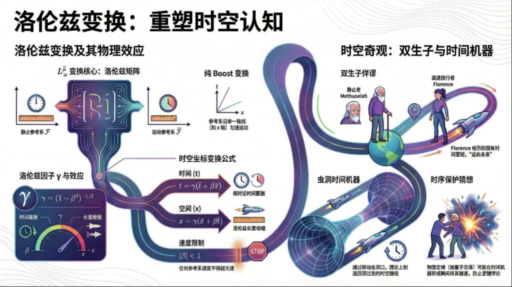
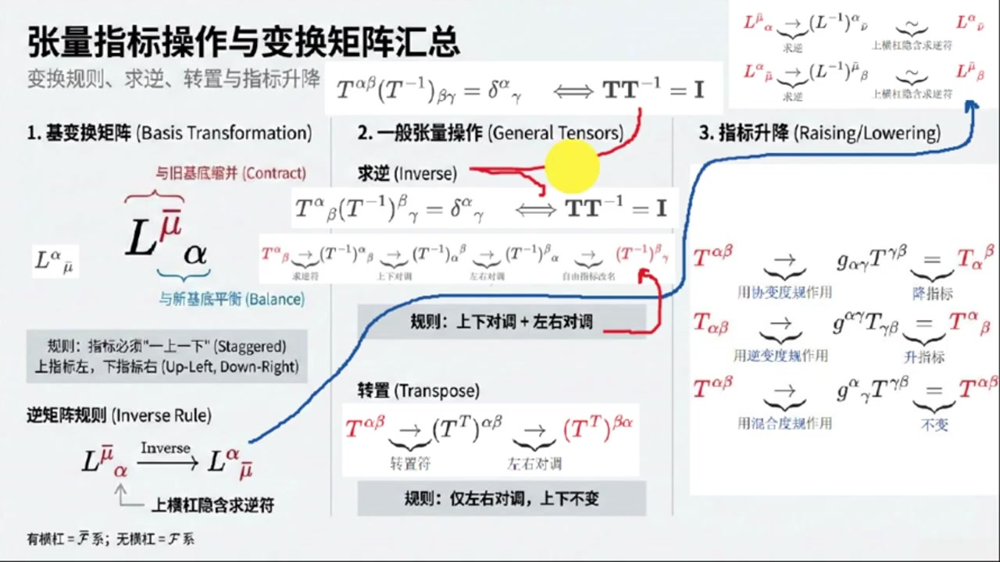
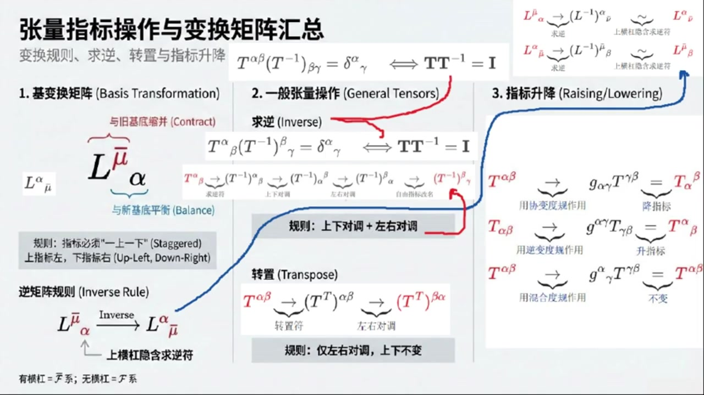
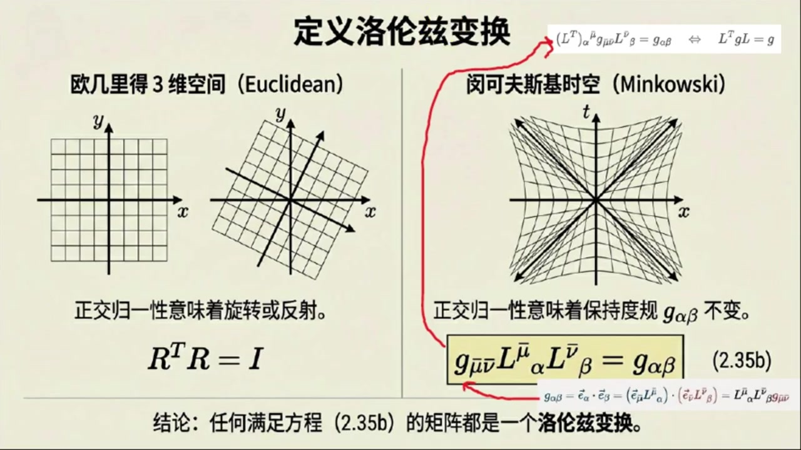
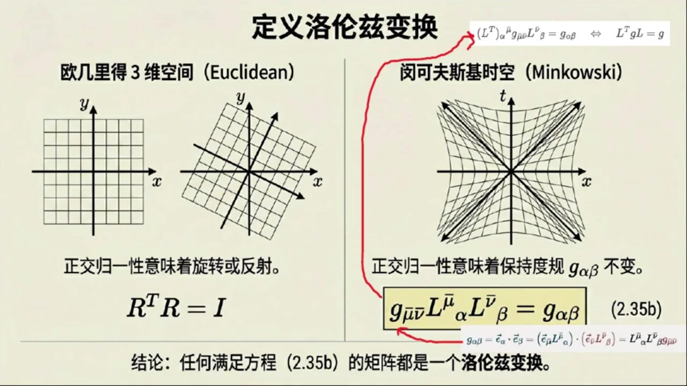
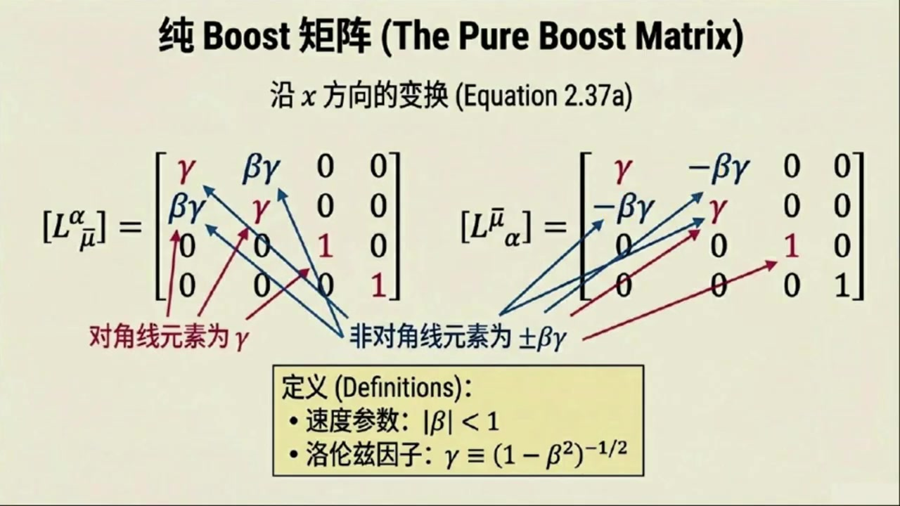
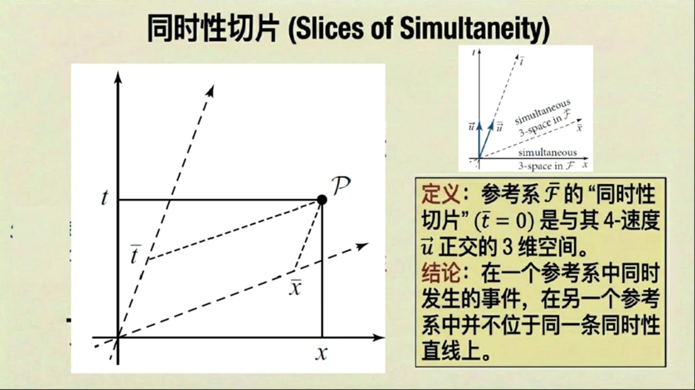
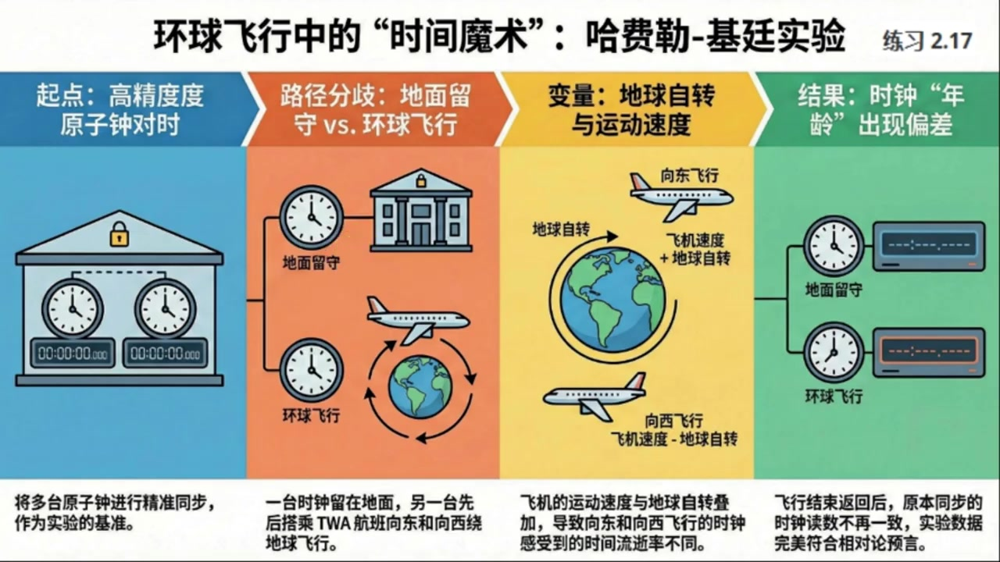

# 《现代经典物理学》第9课 洛伦兹变换：重塑时空认知

> 自动生成的课程注解文档（共 5 个段落，[原始视频](https://www.youtube.com/watch?v=vb7k2MXbLGE)）

## 目录

- [00:00:00 课程引入与洛伦兹变换的基矢、指标约定](#段落-1)
- [00:05:43 矩阵逆、转置与指标升降规则](#段落-2)
- [00:12:19 洛伦兹变换的不变性条件与纯Boost公式](#段落-3)
- [00:18:35 时空图、同时性与时间膨胀长度收缩](#段落-4)
- [00:23:59 双生子佯谬、实验验证与虫洞时间旅行](#段落-5)

---

## 段落 1：课程引入与洛伦兹变换的基矢、指标约定 { #段落-1 }

**时间：** 00:00:00 ~ 00:05:43

<details><summary>📝 原始字幕</summary>

<pre>

大家好欢迎来到现代经典物理学的第九课我是你们活泼好奇的主持人乔伊很高兴又和大家见面了大家好我是你们的知识向导赛
今天我们的话题可以说得上是物理学中最引人入胜的领域之一了没错我们今天要聊聊洛伦兹变幻时空图甚至还要大胆地触碰一下时间旅行这个科幻感十足的概念
听起来就让人心酸对吧确实如此这些内容是狭义相对论的基石也是理解广义相对论乃至现代物理学的关键
对我们物理系的学生来说这些可都是必修课啊那么我们就从最基础的洛伦兹变换开始吧
我们之前讲过明科夫斯基时控现在要怎么把两个不同的冠性参考系联系起来呢这是一个很好的问题想象一下我们有两个冠性系一个叫花体大F一个叫花体大F半他们都有自己的坐标系比如一个用TXYC来描述事件或者说X上Alpha坐标系
对应的激起量是一下法
另一个用T,X,Y,C 或者说X上MUEBALL坐标系,对应的机械量是E下MUEBALL
洛丁字变换本质上就是一套数学规则告诉我们如何在这些坐标系之间进行转换哦就像我们之前在欧吉里德空间里学过的旋转变换一样对吧
就是把一个坐标系里的点转换到另一个坐标系里去表示四路很像但路轮子变换更复杂因为它不仅仅是空间轴的旋转还涉及到时间和空间轴的混合
我们用矩阵L来表示这种变换比如L上MUEBALL下ALFA可以把花体大F2系的基石量E下MUEBALL变成花体大F系的基石量E下ALFA
再比如L上阿尔法下可以把花体大F系的基石量一下变成花体大F系的基石量一下那是不是说这个变换矩阵也有逆矩阵就像旋转矩阵那样完全正确两个方向相反的变换它们对应的矩阵当然是互逆的
这点不难证明
因为首先在花体大F八系中基石量一下可以表示成基石量一下乘戴尔塔上下
牛瓣曲和
另一方面
这同一个基石量异下还可以看成是花体大FC的基石量异下进行变换的结果
也就是基十量一下OFFER乘L上OFFER下MUBER
熬法去合
然后把基石量以下OPA进一步看成是花体大F八系的基石量以下MUBL的变换的结果
再然后得到即时量一下板乘L上板下Alpha乘L上Alpha下板
纽巴尔曲合,奥法曲合
最后首尾对比问题得正
另一对逆居症关系也不难证明了
哇
这段证明体现了指标体操的优雅
关于变换的指标,教材上给了一个规则
变幻矩阵的第一个指标总是向上第二个指标总是向下还有什么需要注意的吗这的确有些地方需要注意一下随便我还将指标操作详细总结一下
我们注意到鸡变换公式中不能改变鸡的指标的上下也就是变换鸡食量是下指标变换后依然是下指标
这是为了保持指标平衡变换矩阵L的指标就必须是一上一下因为它上面的那个指标要和变换前的基时量下指标缩并掉而它下面的指标要和变换后的基时量下指标平衡起来哇听起来像是在玩一个复杂的数字拼图游戏那这个上指标在左下指标在右也是约定俗成的吗没错这其实是一个人为的约定大家为了方便交流和统一就这么规定了
所以你会看到变换矩阵的指标形式比如像将带横杠参考系中的基石量变换到不带横杠的参考系的变换矩阵L上巴下ALFA还有将不带横杠参考系中的基石量变换到带横杠的参考系的变换矩阵L上巴下巴哦原来如此那是不是说我们不光要看指标是上还是下还要看它是左边还是右边
完全正确拽
一般而言在处理这些张量或者矩阵的指标时我们不但要区分它是上指标还是下指标还要区分它是左边的指标还是右边的指标
这么细致啊,不过这只是针对变换矩阵L吗?
这个嘛对变换矩阵L来说它的指标形式确实有左上右下的这种特殊要求但对于一般的不是变换矩阵的张亮就没有这么严格的规定了好的我感觉对这个变换矩阵指标约定清楚了

</pre>

</details>

**课程截图：**




### 注解

我来对这段关于洛伦兹变换与指标记法的课程片段进行深度注解。

---

## 一、板书/PPT 公式详解

### 1. 基矢量变换方程（板书核心）

| 公式 | 含义 |
|:---|:---|
| $\vec{e}_\alpha = \vec{e}_{\bar{\mu}} L^{\bar{\mu}}_{\ \alpha}$ | 将带横杠参考系($\bar{F}$)的基矢量变换到不带横杠参考系($F$) |
| $\vec{e}_{\bar{\mu}} = \vec{e}_\alpha L^{\alpha}_{\ \bar{\mu}}$ | 将不带横杠参考系($F$)的基矢量变换到带横杠参考系($\bar{F}$) |

**符号说明：**
- $\vec{e}_\alpha$：参考系 $F$ 中的基矢量（$\alpha = 0,1,2,3$ 对应 $t,x,y,z$）
- $\vec{e}_{\bar{\mu}}$：参考系 $\bar{F}$ 中的基矢量（带横杠表示另一惯性系）
- $L^{\bar{\mu}}_{\ \alpha}$：**洛伦兹变换矩阵**，将 $F$ 系的量变到 $\bar{F}$ 系
- $L^{\alpha}_{\ \bar{\mu}}$：**逆变换矩阵**，将 $\bar{F}$ 系的量变回 $F$ 系

> **关键观察**：指标位置遵循"**上左下右**"规则——第一个指标在上、在左；第二个指标在下、在右。

---

### 2. 逆矩阵关系（板书重点）

$$L^{\bar{\mu}}_{\ \alpha} L^{\alpha}_{\ \bar{\nu}} = \delta^{\bar{\mu}}_{\ \bar{\nu}}, \quad L^{\alpha}_{\ \bar{\mu}} L^{\bar{\mu}}_{\ \beta} = \delta^{\alpha}_{\ \beta}$$

- $\delta^{\bar{\mu}}_{\ \bar{\nu}}$ 和 $\delta^{\alpha}_{\ \beta}$：**克罗内克δ符号**（单位矩阵的指标形式）
- 第一个等式：先正变换再逆变换 = 带横杠系的恒等变换
- 第二个等式：先逆变换再正变换 = 不带横杠系的恒等变换

---

### 3. 视频中的指标证明（字幕所述）

字幕中描述的证明链条（用现代符号重写）：

$$\vec{e}_{\bar{\mu}} = \vec{e}_{\bar{\nu}} \delta^{\bar{\nu}}_{\ \bar{\mu}} \stackrel{(1)}{=} \vec{e}_\alpha L^{\alpha}_{\ \bar{\mu}} \stackrel{(2)}{=} \vec{e}_{\bar{\nu}} L^{\bar{\nu}}_{\ \alpha} L^{\alpha}_{\ \bar{\mu}}$$

**证明逻辑**：
- 步骤(1)：用逆变换矩阵将 $\vec{e}_\alpha$ 用 $\vec{e}_{\bar{\mu}}$ 表示
- 步骤(2)：再将 $\vec{e}_\alpha$ 用正变换矩阵换回 $\vec{e}_{\bar{\nu}}$
- 首尾对比：$\delta^{\bar{\nu}}_{\ \bar{\mu}} = L^{\bar{\nu}}_{\ \alpha} L^{\alpha}_{\ \bar{\mu}}$ ✓

这就是主持人所说的"**指标体操的优雅**"——通过指标的位置和缩并规则，无需显式写出矩阵元素即可完成证明。

---

## 二、理论背景补充

### 为什么需要"上下指标"？

| 类型 | 名称 | 变换规律 | 示例 |
|:---|:---|:---|:---|
| $V^\alpha$ | **逆变矢量**（上标） | 与基矢量相同的方式变换 | 坐标差 $dx^\mu$，四维动量 $p^\mu$ |
| $V_\alpha$ | **协变矢量**（下标） | 与基矢量相反的方式变换 | 梯度 $\partial_\mu \phi$ |

**核心洞见**：洛伦兹变换保持时空间隔不变，这要求时间和空间以特定方式"混合"，而指标记法正是追踪这种混合的簿记系统。

### "指标平衡"原则（爱因斯坦求和约定）

> **规则**：公式中重复的上下指标表示求和（缩并），且自由指标（不重复的）在等式两边必须位置相同。

例如：$A^{\mu}_{\ \nu} B^{\nu}_{\ \rho} = C^{\mu}_{\ \rho}$ 
- $\nu$ 是**哑指标**（求和，上下配对）
- $\mu, \rho$ 是**自由指标**（等式两边位置一致）

---

## 三、通俗解释：什么是"指标体操"？

想象你在玩一个**符号拼图游戏**：

| 游戏规则 | 类比 |
|:---|:---|
| 上指标 ↔ 下指标才能"粘合" | 就像拼图凹凸咬合 |
| 变换矩阵 $L$ 必须一上一下 | 它是"转换接头"，连接两个参考系 |
| 上左下右的位置规定 | 国际通用说明书，确保大家拼法一致 |
| 逆矩阵就是"反向接头" | $L^{\bar{\mu}}_{\ \alpha}$ 和 $L^{\alpha}_{\ \bar{\mu}}$ 互为逆操作 |

**主持人说的"心酸"其实是"心弦"**——这些规则看似繁琐，但一旦掌握，复杂的相对论计算就变成了按部就班的符号操作，无需每次都展开成4×4矩阵乘法。

---

## 四、截图板书内容描述

### 第二张PPT（"数学引擎"页）核心内容：
- **左侧**：两个惯性参考系 $\mathcal{F}$ 和 $\bar{\mathcal{F}}$ 的图示
- **中央**：基变换方程，用红色箭头标注指标流向
- **右侧**：大字号 $L^{\bar{\mu}}_{\ \alpha}$ 图示，明确标注
  - $\bar{\mu}$ = Row Index (Up) — 行指标，在上
  - $\alpha$ = Column Index (Down) — 列指标，在下
- **底部**：逆矩阵关系式，用红色弧线连接两个 $L$ 表示缩并

### 第三张PPT（"张量指标操作汇总"页）：
这张是**速查手册**，分为三栏：
1. **基变换矩阵**：强调"一上一下"的交错规则，标注"与旧基底缩并、与新基底平衡"
2. **一般张量操作**：求逆（上下对调+左右对调）、转置（仅左右对调）
3. **指标升降**：用度规 $g_{\alpha\beta}$ 或 $g^{\alpha\beta}$ 改变指标位置

> 红色横杠表示"带横杠的指标"，是区分两个参考系的视觉标记。

---

## 五、本段要点总结

| 新概念 | 一句话理解 |
|:---|:---|
| 洛伦兹变换矩阵 $L^{\bar{\mu}}_{\ \alpha}$ | 惯性系之间的"翻译词典" |
| 指标上下位置 | 区分"怎么变"（逆变）和"怎么被变"（协变） |
| 指标左右位置 | 区分"从哪来"（列/输入）和"到哪去"（行/输出） |
| 逆矩阵关系 | 正变换+逆变换 = 原地不动（恒等变换） |
| 指标体操 | 通过符号位置规则自动保证计算正确的数学魔法 |

---

**下节预告**：从基矢量的变换，自然会引出**坐标变换**和**物理量的变换规律**，最终导向洛伦兹变换的具体形式（时间膨胀、长度收缩的数学根源）。

---

## 段落 2：矩阵逆、转置与指标升降规则 { #段落-2 }

**时间：** 00:05:43 ~ 00:12:19

<details><summary>📝 原始字幕</summary>

<pre>

那接下来我们是不是要聊聊更普遍的指标操作了比如逆矩阵什么的是的我们接下来就看看在指标表示法下一个矩阵的逆是怎么体现的我们就拿一个普通的二节张量来举例吧比如提上阿尔法贝塔
这个T上Alpha Beta看起来像一个带了两个上标的矩阵对如果我们想求它的逆根据指标平衡和逆矩阵的定义我们只能写成T上Alpha Beta成T下贝塔Gamma
贝塔指标缩并等于二塔上阿尔法下伽马也就是单位矩阵在指标形式下的表示
这个公式看起来有点眼熟,和我们平时学的矩阵成法,T成T逆等于I差不多
没错,他们表达的是同一个意思
那我们再看另一个例子如果张亮是T上阿尔法下贝塔这种形式的就是一上以下的指标它的逆也同样只能写成T上阿尔法下贝塔成T逆上贝塔下伽马等于雕塔上阿尔法下伽马我注意到这里面的贝塔指标它在T是下指标在T逆是上指标然后他们就缩并了最后剩下的就是阿尔法和伽马你观察得很仔细Joy这个贝塔指标我们不妨选择它作为毛点
以这个毛点为基础我们可以总结出逆矩阵的指标操作规则那就是上下对调并且左右对调上下对调并且左右对调这个听起来像一个口诀能给我掩饰一下吗当然
比如我们有一个张亮T 上Alpha 下Beca
我们先添加球腻符号,得到T腻上Alpha下beta
然后我们按照规则先上下对调,它就变成了T,N,X,Alpha,上Beta
接着,在左右对调,它就变成了T,N,上beta,下alpha
最后我们把自由指标改个名字比如把阿尔法改成伽马就得到T逆上贝塔下伽马哇一步一步拆解开来确实清晰多了
那刚才说的那个T上Alpha Beta也可以用这个规则吗?完全可以套用
不过刚才我们说的变换矩阵L呢,它是一种特殊的张量
比如L上吧下吧或者L上吧下吧就是带横杠的哪个对
对于他们求腻按照我们前面说的那个一般规则它的逆矩阵应该是LNI上ALFA下NUEBAR或者LNI上MUEBAR下BETA这样的但这里有一个更巧妙的地方哦
还有什么玄机就是我们之前提到的那个上横杠在变换矩阵的语境下这个上横杠本身就隐含了球逆的信息所以我们就不需要显示的写出那个球逆的符号L尼了你的意思是L上巴下法的我们直接写成L上法下巴就行了那个横杠就代表了它已经逆过了正是这个意思横杠指标只要上下并且左右移动后就是原始的逆矩阵这样一来就和我们很多教材上的约定完全对应上了看起来也更间接
这种约定俗成的方式能大大简化我们的书写哇这个太省事了感觉就像一个快捷键那除了球腻还有什么常用的指标操作吗当然有我们再来看看转制操作
这个相对来说就简单多了转制就是把矩阵的行和列互换对吧
在指标表发下比如对于T上Alpha Beta来说转制就仅仅是左右对调而上下是保持不变的那就是说T上Alpha下Beta的转制就直接变成T转制的上Beta Alpha这样没错就是这么简单它的上标依然是上标下标依然是下标只是左右位置呼唤了一下这个我能理解比刚才的逆矩阵听起来轻松多了那还有什么操作呢最后一个重要的操作就是指标升降
有时候我们希望把一个下指标变成上指标,或者把一个上指标变成下指标
这个时候就需要用杜归张亮杜归张亮全面学过我们再复习一下比如我们有一个张亮梯上阿尔法贝塔如果想把它的第一个上指标阿尔法变成下指标我们就可以用一个斜变度规矩一下阿尔法伽马去作用它斜变度规矩一下阿尔法伽马它的指标都是下指标对
我们用记下阿尔法伽马成梯下伽马贝塔
注意这里伽马缩病了
结果就是踢下阿尔法上贝塔
你看,原来的上指标alpha就变成了下指标了
这就是降指标
哦,我明白了,那如果我想升指标呢
如果我们有一个梯下alpha beta
想把他的第一个下指标Alpha变成上指标
那我们就要用逆变度归记上阿尔法伽马去作用它
用上阿尔法伽马成梯下伽马贝塔
结果就是梯上阿尔法下贝塔
你看下指标alpha就变成上指标了
这就是生指标
哇,原来是这样,一个带着两个下指标的杜龟用来降指标,一个带着两个上指标的杜龟用来升指标,他们就像是指标的电梯一样
哈哈,这个比喻很棒
它们确实就像是指标的电梯
那如果用一个混合度归呢
比如机上阿尔法下伽马这样的以上以下的
嗯,以上一下,那是不是就没发升也没发降了,正是混合度轨记忆上阿法下作用在张量上
以上一下那是不是就没发生也没法降了正是混合度轨记忆上阿尔法下加马作用在张量上其实就相当于乘以一个单位聚诊所以指标是不会改变的
这些我们以前都学过,算是一次系统的复习和总结
是的我们继续

</pre>

</details>

**课程截图：**






### 注解

我来对这段关于张量指标操作（逆矩阵、转置、指标升降）的课程片段进行深度注解。

---

## 一、板书/PPT 公式详解

### 1. 一般张量的逆矩阵（Inverse of General Tensors）

| 公式 | 含义 |
|:---|:---|
| $T^{\alpha\beta}(T^{-1})_{\beta\gamma} = \delta^\alpha_{\ \gamma}$ | **(2,0)型张量的逆**：两个上标张量相乘得单位矩阵 |
| $T^\alpha_{\ \beta}(T^{-1})^\beta_{\ \gamma} = \delta^\alpha_{\ \gamma}$ | **(1,1)型张量的逆**：一上一下指标张量的逆 |

**符号说明：**
- $T^{\alpha\beta}$：二阶逆变张量（两个上标）
- $T^\alpha_{\ \beta}$：混合张量（一上一下）
- $(T^{-1})_{\beta\gamma}$：逆张量，注意指标位置
- $\delta^\alpha_{\ \gamma}$：Kronecker delta（单位矩阵的指标形式），$\alpha=\gamma$时为1，否则为0
- **缩并规则**：重复的哑指标（$\beta$）必须一上一下才能求和

---

### 2. 逆矩阵的指标操作规则（板书核心口诀）

| 步骤 | 操作 | 示例：$T^\alpha_{\ \beta} \to (T^{-1})^\beta_{\ \gamma}$ |
|:---|:---|:---|
| ① 加逆符号 | 先写出 $T^{-1}$ | $(T^{-1})^\alpha_{\ \beta}$ |
| ② **上下对调** | 上标↔下标 | $(T^{-1})_\alpha^{\ \beta}$ |
| ③ **左右对调** | 第一指标↔第二指标 | $(T^{-1})^\beta_{\ \alpha}$ |
| ④ 重命名自由指标 | $\alpha \to \gamma$（可选） | $(T^{-1})^\beta_{\ \gamma}$ |

> **板书红字强调**："规则：上下对调 + 左右对调"

---

### 3. 变换矩阵的特殊约定（Lorentz变换的"快捷键"）

| 一般规则 | 特殊约定（带横杠） |
|:---|:---|
| $(L^{-1})^{\bar{\mu}}_{\ \alpha}$ 或 $(L^{-1})^\alpha_{\ \bar{\mu}}$ | $L^\alpha_{\ \bar{\mu}}$ 或 $L^{\bar{\mu}}_{\ \alpha}$ |
| 需显式写逆符号 | **横杠本身隐含求逆** |

**关键理解**：$L^{\bar{\mu}}_{\ \alpha}$ 中的横杠指标 $\bar{\mu}$ 提示"这是逆变换"，省去写 $L^{-1}$ 的麻烦。

---

### 4. 转置操作（Transpose）

| 公式 | 含义 |
|:---|:---|
| $T^{\alpha\beta} \to (T^T)^{\beta\alpha}$ | **(2,0)型张量转置**：仅左右对调，上下不变 |
| $T^\alpha_{\ \beta} \to (T^T)_\beta^{\ \alpha}$ | **(1,1)型张量转置**：左右对调 |

> **板书灰底标注**："规则：仅左右对调，上下不变"

---

### 5. 指标升降（Raising/Lowering Indices）

| 操作 | 公式 | 度规类型 | 结果 |
|:---|:---|:---|:---|
| **降指标** | $g_{\alpha\gamma}T^{\gamma\beta} = T_\alpha^{\ \beta}$ | 协变度规 $g_{\alpha\gamma}$（下下） | 上标→下标 |
| **升指标** | $g^{\alpha\gamma}T_{\gamma\beta} = T^\alpha_{\ \beta}$ | 逆变度规 $g^{\alpha\gamma}$（上上） | 下标→上标 |
| **不变** | $g^\alpha_{\ \gamma}T^{\gamma\beta} = T^{\alpha\beta}$ | 混合度规 $g^\alpha_{\ \gamma}$（上下） | 指标不变（=单位矩阵） |

**度规的"电梯"比喻**：
- $g_{\alpha\gamma}$（下下）= 电梯**下降**
- $g^{\alpha\gamma}$（上上）= 电梯**上升**  
- $g^\alpha_{\ \gamma} = \delta^\alpha_{\ \gamma}$（上下）= **平地**，不升降

---

## 二、板书截图内容描述

**整体布局**：三栏结构，用红/蓝箭头连接逻辑

| 区域 | 内容 |
|:---|:---|
| **左侧（蓝色框）** | 基变换矩阵 $L^{\bar{\mu}}_{\ \alpha}$，标注"与旧基底缩并(Contract)"、"与新基底平衡(Balance)"，强调"上横杠隐含求逆符" |
| **中间（灰色框）** | **一般张量操作**：逆矩阵（红字口诀"上下对调+左右对调"）、转置（"仅左右对调"），用红色箭头循环展示四步变换 |
| **右侧（蓝色曲线连接）** | **指标升降**：三个箭头流程，分别展示降指标、升指标、混合度规不变的情况 |
| **顶部** | 汇总等式 $T^{\alpha\beta}(T^{-1})_{\beta\gamma} = \delta^\alpha_{\ \gamma} \Longleftrightarrow TT^{-1}=I$ |

---

## 三、核心概念通俗解释

### 🔑 "上下左右对调"口诀的数学本质

| 操作 | 矩阵语言 | 指标语言 |
|:---|:---|:---|
| 求逆 | $T \to T^{-1}$，且 $(T^{-1})_{ij} = (T_{ji})^{-1}$（对正定矩阵） | 上下对调（逆变↔协变）+ 左右对调（第一↔第二指标）|
| 转置 | $T_{ij} \to T_{ji}$ | 仅左右对调 |

**为什么逆矩阵要"上下对调"？**
- 矩阵求逆需要 $T \cdot T^{-1} = I$，即行乘列
- 指标语言中，乘法对应**缩并**（一上一下指标配对）
- 所以 $T^{\alpha\beta}$（上上）的逆必须有下标 $(T^{-1})_{\beta\gamma}$（下?）才能缩并

### 🔑 横杠指标的"快捷键"设计

这是**相对论/场论中的常见约定**：
- 正变换：$x^{\bar{\mu}} = L^{\bar{\mu}}_{\ \alpha} x^\alpha$（带横杠在上）
- 逆变换：$x^\alpha = L^\alpha_{\ \bar{\mu}} x^{\bar{\mu}}$（带横杠在下）

**记忆法**：横杠跟着"新"参考系走，位置对调即求逆。

---

## 四、与之前内容的衔接

| 之前段落 | 本段发展 |
|:---|:---|
| 基矢量变换 $\vec{e}_\alpha = \vec{e}_{\bar{\mu}} L^{\bar{\mu}}_{\ \alpha}$ | 现在讨论**张量本身**的变换规则 |
| 引入度规 $g_{\mu\nu}$ 的概念 | 现在具体演示**如何用度规升降指标** |
| 强调指标平衡原则 | 现在扩展到**逆、转置等操作的指标规则** |

本段完成了从"基矢量变换"到"张量代数操作"的完整工具链构建。

---

## 段落 3：洛伦兹变换的不变性条件与纯Boost公式 { #段落-3 }

**时间：** 00:12:19 ~ 00:18:34

<details><summary>📝 原始字幕</summary>

<pre>

洛伦子变换还必须满足一个非常重要的条件就是保持明科夫斯基杜归张亮不变明科夫斯基杜归张亮就是那个记下阿尔法贝塔吗对简单来说如果一个变换矩阵它能让这个杜归张亮在不同坐标系下保持不变也就是记下MYUBALLNEWBALL成L上MYUBALL下ALFA成LNEWBALL下BETA等于记下ALFABETA
那么恭喜你,他就是一个洛伦兹变换
这个条件非常重要它保证了时空间隔也就是我们说的不变间隔是普世的不依赖于你选择哪个管信息所以它保持了时空间隔的不变性对吧这听起来就像是欧吉里的空间里的正交变换保持了距离一样完全正确
正是这个不变性才使得狭义相对论中的物理定律在所有观信息中都行事相同
而且这种变换不仅适用于坐标,也是适用于适量和张量的分量
此外如果我们把所有相同指标进行相邻接力最后就可以改写成记正形式L转至GL等于G这个变换关系是由何推导出来的呢我们已经知道度归分量就是基石内基也就是基下阿尔法贝塔等于基石量一下阿尔法点基石量一下贝塔
然后将基石的变换关系带入这两个基石量得到一下巴尔L上巴尔下阿尔法L上巴尔下贝塔等于L上巴尔下阿尔法成L上巴尔下贝塔
机下巴巴有了这个洛伦兹变换那么就可以始量张量甚至坐标的变换对吧是的
对尺量而言有A上等于L上下阿尔法和A上阿尔法缩并
对张亮而言有,比如T上巴巴肉巴等于L上巴下Alpha,L上巴下Beta
上肉下
和T上阿尔法贝塔伽玛进行三重缩并
最后对坐标而言如果变换前后的坐标系的原点重合那么坐标可以用从原点到位置的始量表示自然就也有X上等于L上下阿尔法和X上阿尔法的缩病明白了那有没有一个具体的例子让我们能直观的感受一下落轮子变换长什么样当然有
最典型的就是我们常说的纯boost,也就是沿某个方向的云速直线运动
比如如果一个参考系话题大F半沿着X轴一速度BETA这里BETA等于V出一息是相对于光速的速度比相对于话题大F细运动
那么他们之间的裸轮子变换矩阵就有一个非常明确的形式我记得里面有一个很重要的因子叫GAMMA对吧你说的没错
这个伽玛盈子也就是罗伦子盈子,它等于括号一减贝塔平方括号的负二分之一次方
它会出现在所有涉及相对论效应的公式里
我们书上的方程2.37a就给出了沿X方向的纯BUS的矩阵
比如L上阿尔法下巴儿对应的矩阵就是Gamma Beta Gamma 0 0 换行Beta Gamma Gamma 0 0 换行0 0 1 0 换行0 0 0 1
而L上巴尔下阿尔法对应的矩阵就是左边这个矩阵的右上角的二阶矩阵的反对角元素改成负数即可
通过这个矩阵我们就能得到具体的坐标转化公式好的那我们来读一下这个公式感受一下它具体长什么样
比如T八和X八怎么用T和X来表示呢具体来说就是T八等于Gamma成括号T减BETAX括号而X八等于Gamma成括号X减BETAT括号反过来T和X也可以用T八和X八表示
你会发现时间和空间坐标不再是独立的,它们相互混合了
这些表达式说明在花体大F八看来花体大F以速度V等于负BETAEX八运动反过来在花体大F看来花体大F八以相反的速度运动
这种特殊的变换被称为沿X方向的纯Boost
并且Y和Z坐标在这种沿X方向的纯BOST下则保持不变哇这和牛顿力学力的加力略变换完全不一样了
时间和空间不再是绝地的了没错这个纯布斯特的例子非常重要它直接导出了狭义相对论的几个核心效应
练习2.12就要求我们去验证这些矩阵确实满足洛伦子变换的条件
而练习二点一三则更易进悟讨论了更一般的Boost和旋转告诉我们任何一个落轮子变化都可以分解成沿N方向速度为贝塔的纯Boost三维空间旋转还有纯繁衍的组合
听起来洛伦兹变幻就像是时空中的旋转,只不过这个旋转有点特别,对吧,你这个比喻很形象
它确实是时空中的一种旋转但因为它发生在明可夫斯基时空所以它的性质和欧吉里的空间中的旋转有所不同
这个两个练习可后一定要好好做一下好的我们理解了洛伦兹变换的数学形式但是这种变换在时空中具体长什么样呢有没有什么直观的办法来理解当然有

</pre>

</details>

**课程截图：**







### 注解

我来对这段关于洛伦兹变换定义与纯Boost的课程片段进行深度注解。

---

## 一、板书/PPT 公式详解

### 1. 洛伦兹变换的度规不变条件（核心定义）

| 公式 | 含义 |
|:---|:---|
| $g_{\bar{\mu}\bar{\nu}} L^{\bar{\mu}}_{\ \alpha} L^{\bar{\nu}}_{\ \beta} = g_{\alpha\beta}$ | **(2.35b) 洛伦兹变换的显式条件**：带横杠坐标系的度规经变换后等于原坐标系度规 |
| $(L^T)^{\alpha}_{\ \bar{\mu}} g_{\bar{\mu}\bar{\nu}} L^{\bar{\nu}}_{\ \beta} = g_{\alpha\beta}$ | 转置形式的等价写法（注意第一个 $L$ 取转置） |
| $L^T g L = g$ | **矩阵形式**：最简洁的洛伦兹条件，$L^T$ 为 $L$ 的转置 |

**符号说明**：
- $g_{\alpha\beta}$：闵可夫斯基度规（对角元为 $(-1, +1, +1, +1)$ 或 $(+1, -1, -1, -1)$，取决于号差约定）
- $L^{\bar{\mu}}_{\ \alpha}$：洛伦兹变换矩阵，将不带横杠系($F$)的坐标/分量变换到带横杠系($\bar{F}$)
- $L^{\alpha}_{\ \bar{\mu}}$：逆变换矩阵（注意上下标位置互换）
- $L^T$：矩阵转置，对应指标写法为 $(L^T)^{\alpha}_{\ \bar{\mu}} = L^{\bar{\mu}}_{\ \alpha}$

---

### 2. 纯Boost矩阵（沿x方向）

| 公式 | 含义 |
|:---|:---|
| $\gamma \equiv (1-\beta^2)^{-1/2}$ | **洛伦兹因子**：相对论效应的核心放大系数 |
| $[L^{\alpha}_{\ \bar{\mu}}] = \begin{bmatrix} \gamma & \beta\gamma & 0 & 0 \\ \beta\gamma & \gamma & 0 & 0 \\ 0 & 0 & 1 & 0 \\ 0 & 0 & 0 & 1 \end{bmatrix}$ | **(2.37a) 沿x方向纯Boost**：将 $\bar{F}$ 系的坐标变换到 $F$ 系 |
| $[L^{\bar{\mu}}_{\ \alpha}] = \begin{bmatrix} \gamma & -\beta\gamma & 0 & 0 \\ -\beta\gamma & \gamma & 0 & 0 \\ 0 & 0 & 1 & 0 \\ 0 & 0 & 0 & 1 \end{bmatrix}$ | **逆变换矩阵**：将 $F$ 系的坐标变换到 $\bar{F}$ 系 |

**符号说明**：
- $\beta \equiv v/c$：无量纲速度参数，$|\beta| < 1$（保证 $\gamma$ 为实数）
- $\gamma$：洛伦兹因子，当 $v \to c$ 时 $\gamma \to \infty$
- 矩阵行/列顺序：$(t, x, y, z)$ 或 $(x^0, x^1, x^2, x^3)$

---

### 3. 坐标变换公式（洛伦兹变换的具体形式）

| 公式 | 含义 |
|:---|:---|
| $t' = \gamma(t - \beta x)$ | 带横杠系的时间坐标（用不带横杠系表示） |
| $x' = \gamma(x - \beta t)$ | 带横杠系的空间坐标（用不带横杠系表示） |
| $y' = y,\quad z' = z$ | 垂直于运动方向的坐标不变 |

**逆变换**（将带横杠系表示为不带横杠系）：
- $t = \gamma(t' + \beta x')$
- $x = \gamma(x' + \beta t')$

---

## 二、理论背景补充

### 1. 欧几里得 vs 闵可夫斯基"正交性"的对比

| 特征 | 欧几里得3维空间 | 闵可夫斯基4维时空 |
|:---|:---|:---|
| **度规** | $\delta_{ij} = \text{diag}(1,1,1)$ | $\eta_{\mu\nu} = \text{diag}(-1,+1,+1,+1)$ |
| **正交条件** | $R^T R = I$（保持欧氏内积） | $L^T \eta L = \eta$（保持闵氏内积） |
| **几何效应** | 纯旋转：长度、角度不变 | Boost：时间膨胀、长度收缩 |
| **可视化** | 网格刚性旋转 | 双曲旋转（时空间隔为常数的双曲线） |

### 2. 为什么 $L^T g L = g$ 如此重要？

这是**伪正交群 $O(3,1)$ 的定义方程**。它保证了：
- **时空间隔不变**：$\Delta s^2 = -(\Delta t)^2 + (\Delta x)^2 + (\Delta y)^2 + (\Delta z)^2$ 在所有惯性系中相同
- **光速不变**：光子世界线满足 $\Delta s^2 = 0$，该条件在所有系中保持
- **因果结构**：类时、类光、类空分类不随参考系改变

### 3. 洛伦兹变换的完整分类（练习2.13预告）

任何洛伦兹变换可分解为：
$$\Lambda = \underbrace{\text{Boost}(\vec{n}, \beta)}_{\text{纯加速}} \times \underbrace{\text{Rotation}(\vec{\theta})}_{\text{空间旋转}} \times \underbrace{\text{Parity}}_{\text{空间反演}}$$

这类似于任何刚体运动 = 平移 + 旋转，但这里的"旋转"是在4维闵可夫斯基时空中的**双曲旋转**。

---

## 三、核心概念通俗解释

### "时空旋转"的直观理解

> **学生提问**："洛伦兹变换就像是时空中的旋转，只不过这个旋转有点特别？"

**讲师的肯定回答非常精准**。想象：

| 欧几里得旋转 | 闵可夫斯基Boost |
|:---|:---|
| 你在纸上画两个坐标轴，绕原点转一个角度 | 你在时空图中，让时间轴"倾斜"向空间轴 |
| 旋转后，$x$ 和 $y$ 互相混合：$x' = x\cos\theta + y\sin\theta$ | Boost后，$t$ 和 $x$ 互相混合：$t' = \gamma(t - \beta x)$ |
| 圆 $x^2 + y^2 = R^2$ 不变 | 双曲线 $-t^2 + x^2 = \text{常数}$ 不变 |
| 旋转角 $\theta$ 是实数，$\cos^2\theta + \sin^2\theta = 1$ | "快度" $\phi$ 满足 $\gamma = \cosh\phi$, $\gamma\beta = \sinh\phi$，且 $\cosh^2\phi - \sin^2\phi = 1$ |

**关键区别**：欧几里得旋转保持**正定的**距离 $\sqrt{x^2+y^2}$ 不变；洛伦兹Boost保持**不定的**间隔 $\sqrt{|{-t^2+x^2}|}$ 不变，这导致了时间膨胀和长度收缩——这些在欧几里得几何中完全没有对应物。

---

## 四、板书截图内容描述

### 截图1：定义洛伦兹变换（对比图）

| 左侧（欧几里得） | 右侧（闵可夫斯基） |
|:---|:---|
| 标题："欧几里得3维空间 (Euclidean)" | 标题："闵可夫斯基时空 (Minkowski)" |
| 两幅图：正交网格 → 旋转后的倾斜网格 | 一幅图：双曲网格（时空图中的双曲线族） |
| 公式：$R^T R = I$ | 公式：$g_{\bar{\mu}\bar{\nu}}L^{\bar{\mu}}_{\ \alpha}L^{\bar{\nu}}_{\ \beta} = g_{\alpha\beta}$ (2.35b) |
| 文字："正交归一性意味着旋转或反射" | 文字："正交归一性意味着保持度规 $g_{\alpha\beta}$ 不变" |
| | 底部结论："任何满足方程(2.35b)的矩阵都是一个洛伦兹变换" |

**红色箭头**：从右侧公式指向矩阵形式 $L^T g L = g$

### 截图2：纯Boost矩阵

| 内容 | 说明 |
|:---|:---|
| 标题："纯Boost矩阵 (The Pure Boost Matrix)" | |
| 副标题："沿x方向的变换 (Equation 2.37a)" | |
| 左侧矩阵 $[L^{\alpha}_{\ \bar{\mu}}]$ | 4×4矩阵，$tt$和$xx$位置为$\gamma$，$tx$和$xt$位置为$\beta\gamma$，$yy$和$zz$为1 |
| 右侧矩阵 $[L^{\bar{\mu}}_{\ \alpha}]$ | 同样结构，但非对角元变号（$-\beta\gamma$） |
| 蓝色箭头 | 标注"对角线元素为 $\gamma$" |
| 红色箭头 | 标注"非对角线元素为 $\pm\beta\gamma$" |
| 底部黄色框"定义" | 速度参数：$|\beta| < 1$；洛伦兹因子：$\gamma \equiv (1-\beta^2)^{-1/2}$ |

---

## 五、关键要点总结

1. **洛伦兹变换的数学本质**：保持闵可夫斯基度规不变的线性变换，即伪正交变换
2. **纯Boost的物理意义**：两个惯性系之间的相对匀速直线运动，是狭义相对论的核心
3. **时间-空间混合**：$t'$ 同时依赖于 $t$ 和 $x$，这是相对论与牛顿力学的根本分歧
4. **练习建议**：验证 $L^T g L = g$（练习2.12）和一般分解定理（练习2.13）是掌握本章的关键

---

## 段落 4：时空图、同时性与时间膨胀长度收缩 { #段落-4 }

**时间：** 00:18:35 ~ 00:23:59

<details><summary>📝 原始字幕</summary>

<pre>

就是我们接下来要讲的时空图
时空图是理解狭义相对论现象的强大工具尤其是在处理Boost的时候时空图我记得通常是把时间轴和空间轴画在一起的图对吧对通常我们会用一个二维图来表示比如T轴和X轴
暂时忽略Y和Z轴
二十七A就展示了一个传布斯特的失控图我干的图里T霸轴和X霸轴相对于T轴和X轴都倾斜了这个倾斜的角度有什么讲究吗倾斜角度很有讲究Boost后的T霸轴和X霸轴它们相对于原来的T轴和X轴都会倾斜一个角度这个角度的正切值就是BETA
更奇妙的是在明科夫斯基几何中即使它们看起来是倾斜的T霸轴和X霸轴彼此仍然是正交的
只不过这个正交是相对于光锥也就是X等于T这条线对称的也就是说它们与光速线甲角是相同的没错而且时空图上还会画出一些虚线的双曲线
这些双曲线代表了具有相同不变间隔的事件
比如在X八轴上事件X八等于A就位于它与双曲线X平方见T平方等于A平方的焦点这样就能更直观地看出不同参考系中坐标的测量方式了那我们怎么用时空图来推断一个事件在Boost后的坐标呢图二十七B就给出了方法
如果你有一个事件,画起大屁
想要知道它在画起大F八系列的坐标T八X八
你只需要从话题大P点分别平行于X半轴和T半轴做投影
投影到T半轴和X半轴上就能读出它的新坐标了
课本上还提及了同时性切片这又是怎么回事无论是话题大F系中禁止观察者
还是话题大F八系中的静止观察者
都有沿着各自时间轴T和T半的四速度U和U半
观察者花题大A认为同时发生的事件也就是T等于零发生的事件
都位于与四速度正交三维空间中
这就是参考系花体大F的一个同时性切片
类似花体大F八观察者也有对应的同时性切片这两个同时性切片完全不一样时空图这个方法真棒它把抽象的坐标变换变得可视化了
那这些时空图,除了用来读坐标,还能帮助我们理解哪些相对论效应呢?
哈哈!交易,你问到点子上了
这正是时空图的强大之处
练习二点一四就是一个极其重要的例子
还要求我们利用时空图来推导好几个关键的相对论现象这个练习这么重要那我们来具体说说它能推导出什么比如首先是同时性的时效
在时空图上一个参考系里的同时性切片,也就是T等于Const的线
在另一个运动的参考系里就不再是同时的了所以一个观察者觉得同时发生的两个事件另一个观察者可能会觉得他们有先后顺序这太犯直觉了完全正确
而且位置也会变
在一个戏里发生在同一点的事件在另一个戏里可能发生在不同位置那我们常说的时间膨胀和长度缩缩呢时空图也能看出来吗都能
也是练习二点一四的重点
想象一下一个在高速运动的飞船里的时钟,从我们静止的视角看,它会走得更慢,这就是时间膨胀
使空图上运动始终的视线会更斜
它在梯板轴上的刻度在梯轴上会显得更长,就像飞船里的宇航员感觉只孤去了几年,但地球上可能已经过了十几年甚至百几年没错,还有长度所缩
一个在高速运动的物体从我们静止的视角看它沿运动方向会变得更短就像被压扁了一样
时空图也能清晰地展示这些效应,就像粒子加速器里的重离子,它看起来会像个薄饼,完美比喻,这些都是时空图能直观展现的
另外练习二点一四还提到了类时间间隔和类空间间隔的事件在不同的参考系中它们如何被简化
比如类时间间隔的事件总能找到一个参考系让它们发生在同一个空间位置哇这简直是把相对论的精髓都浓缩在一张图里是的甚至连粒子物理中的一些反应比如练习二点一五利用时空图和四动量守恒我们也能分析出哪些反应是允许的哪些是静止的赛你刚刚提到了时间膨胀说运动的时钟会走得更慢

</pre>

</details>

**课程截图：**




### 注解

我来对这段关于**时空图（Spacetime Diagram）与相对论效应可视化**的课程片段进行深度注解。

---

## 一、板书/PPT 公式详解

### 1. 双曲线不变间隔方程

| 公式 | 含义 |
|:---|:---|
| $x^2 - t^2 = a^2$ | **等时空间隔双曲线**：在闵可夫斯基时空中，所有满足此方程的事件点与原点具有相同的不变间隔 $a$ |
| | • $x, t$：某参考系中的空间坐标和时间坐标（采用 $c=1$ 单位制）|
| | • $a$：常数，代表不变间隔的大小 |
| | • 此双曲线与 $\bar{x}$ 轴的交点即为 $\bar{x}=a$ 的点 |

> **关键性质**：该方程在洛伦兹变换下形式不变，即 $\bar{x}^2 - \bar{t}^2 = x^2 - t^2 = a^2$，这正是"不变间隔"的几何体现。

---

### 2. 隐含的速度参数关系

| 公式 | 含义 |
|:---|:---|
| $\tan\theta = \beta$ | **Boost角度与速度的关系** |
| | • $\theta$：新坐标轴相对于原坐标轴的倾斜角 |
| | • $\beta = v/c$：相对速度（以光速为单位）|
| | 因此 $\bar{t}$ 轴和 $\bar{x}$ 轴都倾斜 $\tan^{-1}\beta$ |

---

### 3. 时间膨胀因子（口头提及，板书图示）

| 公式 | 含义 |
|:---|:---|
| $\gamma^{-1} = \sqrt{1-\beta^2}$ | **洛伦兹因子的倒数**，描述时间膨胀和长度收缩的定量因子 |
| | • $\gamma = 1/\sqrt{1-\beta^2}$：洛伦兹因子 |
| | • 运动时钟变慢、运动尺子缩短的因子 |

---

## 二、截图板书内容描述

### 图1：时空图——几何化的Boost（图2.7(a)重构）

```
坐标系设置：
• 原参考系 F：t轴（垂直向上），x轴（水平向右）
• 新参考系 F̄：t̄轴和 x̄轴（红色，相对于光锥对称倾斜）

关键元素：
• 虚线对角线：Null Line / Light Cone（x = t），即光锥
• 角度标注：t̄轴和x̄轴各倾斜 tan⁻¹β
• 正交性说明框：t̄轴与x̄轴彼此正交，体现为相对于光锥(x=t)的对称性
```

**核心洞见**：在欧几里得几何中，正交意味着90°夹角；但在**闵可夫斯基几何**中，正交意味着关于光锥对称——两轴与光锥的夹角相等。

---

### 图2：相对论效应推导（基于练习2.14）

| 效应 | 图示 | 关键说明 |
|:---|:---|:---|
| **同时性的相对性** | 闪电击中运动列车前后两端 | 在带横杠系中同时的事件，在不带横杠系中不同时；$\bar{x}$ 较负的事件先发生 |
| **时间膨胀** | 两个时钟，一个运动 | 运动时钟变慢，因子 $\gamma^{-1}$；不稳定粒子寿命增加 |
| **洛伦兹收缩** | 两把尺子，一把运动 | 运动物体沿运动方向缩短，因子 $\gamma^{-1}$；垂直方向(y,z)长度不变 |

---

### 图3：同时性切片（Slices of Simultaneity）

```
主图：时空图上的投影几何
• 点P：某事件
• 水平线：F系的等时线（t = const，即同时性切片）
• 斜线：F̄系的等时线（t̄ = const，与t̄轴正交）

右上角小图：三维示意
• 显示两个参考系的同时性3空间（simultaneous 3-space）
• 四速度ū与同时性切片正交

定义框：
"参考系F̄的'同时性切片'(t̄=0)是与其4-速度ū正交的3维空间"
```

---

## 三、理论背景补充

### 3.1 闵可夫斯基几何 vs 欧几里得几何

| 特征 | 欧几里得几何 | 闵可夫斯基几何 |
|:---|:---|:---|
| 度规符号 | $(+,+)$ 或 $(+,+,+)$ | $(-,+,+,+)$ 或 $(+,-,-,-)$ |
| "距离"定义 | $s^2 = x^2 + y^2$ | $s^2 = -t^2 + x^2$（或 $t^2 - x^2$）|
| 正交性 | 点积为零 | 闵可夫斯基内积为零 |
| 角度视觉 | 90°看起来垂直 | "正交"轴看起来对称倾斜 |
| 不变曲线 | 圆：$x^2+y^2=a^2$ | 双曲线：$x^2-t^2=a^2$ |

### 3.2 双曲线作为"校准曲线"

在欧几里得几何中，圆保证旋转后半径不变；在闵可夫斯基几何中，**双曲线**保证Boost后不变间隔不变：

- **类时间隔**（$t^2 > x^2$）：双曲线上下两支，$t^2 - x^2 = \tau^2$（原时）
- **类空间隔**（$x^2 > t^2$）：双曲线左右两支，$x^2 - t^2 = L^2$（固有长度）
- **类光间隔**（$x^2 = t^2$）：退化为光锥（渐近线）

---

## 四、核心概念通俗解释

### 4.1 "倾斜却正交"——最反直觉的事实

> **日常直觉**：两条线要正交，必须像"十"字那样垂直。

> **相对论真相**：在时空图中，$\bar{t}$ 轴和 $\bar{x}$ 轴都向光锥方向倾斜相同角度，它们**在闵可夫斯基内积意义下正交**。

**类比**：想象在哈哈镜前，原本垂直的坐标轴被"扭曲"了，但某种数学结构保持不变。光锥就是这种"扭曲"的基准线。

### 4.2 同时性切片的物理意义

| 参考系 | 四速度方向 | 同时性切片 | 切片上的事件特征 |
|:---|:---|:---|:---|
| F（静止） | 沿t轴 | 水平面（t = const）| F系观察者认为同时发生 |
| F̄（运动） | 沿t̄轴 | 倾斜面（t̄ = const）| F̄系观察者认为同时发生 |

**关键**：两个切片相交但不重合→**同时性是相对的**。

### 4.3 时空图读坐标的几何方法

给定事件P，求其在F̄系的坐标$(\bar{t}, \bar{x})$：

1. **找 $\bar{t}$**：过P作平行于 $\bar{x}$ 轴的直线，交 $\bar{t}$ 轴于某点→读出 $\bar{t}$
2. **找 $\bar{x}$**：过P作平行于 $\bar{t}$ 轴的直线，交 $\bar{x}$ 轴于某点→读出 $\bar{x}$

> 这正是洛伦兹变换的**几何实现**，避免了代数计算。

---

## 五、练习2.14的核心地位

该练习要求用时空图推导：

| 现象 | 时空图特征 | 定量结果 |
|:---|:---|:---|
| 同时性的相对性 | $t=\text{const}$ 与 $\bar{t}=\text{const}$ 不平行 | 同时性丢失的定量关系 |
| 时间膨胀 | 运动时钟的世界线更斜，"单位原时"投影更长 | $\Delta t = \gamma \Delta \tau$ |
| 长度收缩 | 运动尺子的同时端点在世界线上位置不同 | $L = L_0/\gamma$ |
| 类时/类空间隔的参考系简化 | 总能找到轴使事件位于同一竖线/水平线上 | 固有时/固有长度的定义 |

---

## 六、总结：时空图的威力

> **"把抽象的坐标变换变得可视化"**

| 抽象代数 | 时空图几何 |
|:---|:---|
| 洛伦兹变换矩阵 | 坐标轴的倾斜 |
| 不变间隔 | 双曲线 |
| 正交条件 | 关于光锥对称 |
| 同时性 | 与四速度正交的切片 |
| 时间膨胀/长度收缩 | 投影长度的变化 |

这种几何化方法是理解狭义相对论的**最强工具**，也是通往广义相对论的必经之路。

---

## 段落 5：双生子佯谬、实验验证与虫洞时间旅行 { #段落-5 }

**时间：** 00:23:59 ~ 00:32:11

<details><summary>📝 原始字幕</summary>

<pre>

这让我想起了那个著名的双生子杨妙梅草传双生子杨妙就是时间膨胀最经典的例子之一
它很好地说明了时间这个东西对于在时空中沿着不同世界线运动的不同观察者来说是完全不一样的那么这个双生子杨具体是怎么回事呢想象一下有一对双胞胎
一个叫马图塞拉,他留在地球上,在一个灌溉系统中保持静止
另一个叫弗洛伦斯他坐着一艘高速飞船去太空旅行一圈然后又返回回到马图塞拉身边
米苏萨拉在地球上弗洛伦斯去太空旅行那他们俩谁会更老呢答案是弗洛伦斯会比米苏萨拉更年轻
米苏萨拉的始钟测量的是它所在冠信息的坐标时间T
而弗洛伦斯的始终因为他一直在高速运动甚至有加速和减速的过程他测量的是自己的固有时间套固有时间套
那是不是就是我们之前说的不变间隔的平方根?没错
根据我们书上的方程二点四零弗洛伦斯在旅程中经历的总时间T弗洛伦斯会比米苏萨拉在地球上经历的总时间T米苏萨拉短
这个公式是T Florence等于积分D套从零到T Misusara积分括号E减V平方括号开根号DT其中V是Florence的速度因为V总是小于光速所以括号E减V平方括号开根号总是小于E积分下来T Florence自然就小于T Misusara所以即使Florence只感觉自己旅行了几十年当他回到地球时Methuselah可能已经老了几百年甚至几千年完全有可能
练习二点一六就让我们计算了如果弗洛伦斯以一个地球重力加速度来加速减速他回来后问菲尔斯法会老多少
结果非常惊人
即使Florence只过了几十年,Mephistopheles可能已经过了几亿年
这听起来真的很像科幻小说
那为什么他又被称为杨妙呢
他有什么矛盾的地方吗
其实它在任何意义上都不是矛盾只是结果令人惊讶所以才被称为杨妙
它完全符合狭义相对论的预测并且已经被高能物理实验比如粒子加速器中不稳定粒子的寿命增加以及著名的海菲勒机听实验所证实海菲勒机听实验那是什么练习二百一十七就提到了这个实验
在一九七二年约瑟夫黑弗和理查德基廷真的让原子钟坐飞机环球旅行
一个向东,一个向西
然后和留在地面的原子中进行对比
结果发现这些时钟的年龄确实不同这完美的验证了时间膨胀效应太酷了所以从某种意义上说弗洛伦斯的飞船就是一台时间机器把它送到了马修斯拉的遥远未来
是的,但这是单向的时间旅行,只能前往未来
那么Joy,你觉得我们有可能回到过去吗
回到过去这听起来更像是纯粹的科幻了物理学商有可能吗这就引出了我们下一个话题虫洞
虫洞是一种假设的时空结构你可以把它想象成连接时空两个遥远区域的捷径就像一个饼一样虫洞我在科幻电影里经常听到这个词
它在物理学上真的存在吗重动的理论基础需要广义相对论和量子场论虽然理论物理学家们付出了巨大努力但目前还没有确凿的证据表明它们存在或者说即使存在我们是否有能力去构造并保持它开放让物体通过这都是未知数
不过假设它们可以存在我们就可以用狭义相对论来分析它作为时间机器的可能性好的假设虫洞存在那怎么用它来回到过去呢
关键在于虫洞有两个口
我们还是用Florence和Methuselah的故事
让马瑟萨拉带着一个虫洞口静止在地球上而弗洛伦斯带着另一个虫洞口进行高速旅行然后再返回到马瑟萨拉身边
,这不就是双生子养妙的翻版吗?
没错
正是双生子杨的时间膨胀效应让虫洞变成了时间机器
当弗洛伦斯带着他的虫洞口高速旅行并返回时由于时间膨胀他所携带的那个虫洞口相对于梅瑟斯拉静止的那个虫洞口会老化的更慢
也就是说当佛罗伦斯回到梅瑟萨拉身边时他带回来的那个虫洞口他的内部时间流逝会比梅瑟萨拉这边的虫洞口慢很多
完全正确
结果就是这两个口之间会产生一个巨大的时间差
如果你从梅瑟斯拉这边的口进去你会立即从弗洛伦斯那边也就是更年轻的那个口出来
这相当于你回到了过去
哇,这太不可思议了
那也就是说Florence可以通过这个虫洞回到他自己出发之前的过去
理论上是这样
如果沿着累时的世界线旅行他甚至可以在进入虫洞之前遇到年轻时的自己
这听起来太刺激了,但马上就有个问题,如果他遇到了年轻时的自己,然后把年轻时的自己给杀了
那他还能穿越虫洞遇到年轻时的自己吗
这不就产生矛盾了吗你说到了核心问题这就是著名的祖父悖论或者说科幻小说是杨妙
这种因果率的崩溃让大多数物理学家深感不安那物理学家们是怎么解决这个问题呢目前还没有定论
一种非常流行的假设是持续保护假设
他认为无论我们使用什么机制来尝试兼造时间机器总会有一些物理定律比如量子场的真空涨落来阻止这种向后时间旅行的发生从而保护因果率不被破坏也就是说宇宙有自己的时间警察不让我们乱来哈哈你可以这么理觉
当然也有一些研究表明情况可能不是那么悲观但归根结底在掌握量子引力定律之前我们可能无法真正知道时间旅行是否真的可行以及宇宙是否真的有时序保护这真是让人充满遐想
从鲁伦子变幻到时空图再到双生子洋和虫洞一步步地把我们带入了这么神奇的领域没错这些内容不仅挑战了我们对时间和空间的直观理解也展现了物理学在探索宇宙奥秘方面的无限可能好的今天的第九课内容非常丰富我们从鲁伦子变幻的数学基础讲起
通过时空图直观地理解了时间膨胀和长度收缩最后还探讨了双生子杨妙和虫洞这种时间机器的可能性希望同学们通过今天的讲解能够对狭义相对论有更深入的理解和更浓厚的兴趣别忘了课后的练习题非常重要一定要去尝试完成它们尤其是练习二一四和二一六它们能帮助你更好地掌握这些概念
好了感谢大家收听今天的现代经典物理学博客我们下期再见拜拜

</pre>

</details>

**课程截图：**




### 注解

我来对这段关于**双生子佯谬、时间膨胀实验验证与虫洞时间机器**的课程片段进行深度注解。

---

## 一、板书/PPT 公式详解

### 1. 双生子佯谬核心公式（Eq 2.40）

| 公式 | 含义 |
|:---|:---|
| $$T_{\text{Florence}} = \int d\tau = \int_0^{T_{\text{Methuselah}}} \sqrt{1-v^2}\, dt$$ | **固有时间积分公式**：运动观察者（Florence）经历的固有时间等于坐标时间乘以洛伦兹因子的积分 |
| | • $T_{\text{Florence}}$：Florence 经历的**固有时间**（proper time），即她随身携带的时钟读数 |
| | • $T_{\text{Methuselah}}$：Methuselah 经历的**坐标时间**（地球参考系中的时间）|
| | • $v(t)$：Florence 相对于地球的速度（以光速 $c=1$ 为单位）|
| | • $\sqrt{1-v^2} = 1/\gamma$：洛伦兹因子的倒数，始终 $\leq 1$ |

> **关键结论**：由于 $\sqrt{1-v^2} < 1$（当 $v \neq 0$），积分结果必然有 $T_{\text{Florence}} < T_{\text{Methuselah}}$，即"运动的时钟走得更慢"。

---

### 2. 匀加速往返情形的时间差公式（Eq 2.41）

| 公式 | 含义 |
|:---|:---|
| $$T_{\text{Methuselah}} = \frac{4}{g}\sinh\left(\frac{gT_{\text{Florence}}}{4}\right)$$ | **双曲正弦时间膨胀公式**：假设 Florence 以恒定固有加速度 $g$（约 $1g \approx 9.8\,\text{m/s}^2$）加速、减速、反向加速、再减速完成往返 |
| | • $g$：Florence 感受到的**固有加速度**（proper acceleration），即她座椅对她的推力产生的加速度 |
| | • $\sinh$：**双曲正弦函数**，体现相对论性加速运动的时间膨胀特性 |
| | • 系数 4：对应"加速→减速→反向加速→再减速"四个阶段，每段历时 $T_{\text{Florence}}/4$ |

> **物理意义**：当 $gT_{\text{Florence}}/4 \gg 1$ 时，$\sinh(x) \approx e^x/2$ 指数增长，导致 $T_{\text{Methuselah}}$ 可以远大于 $T_{\text{Florence}}$。例如 Florence 旅行数十年，Methuselah 可能已过数亿年。

---

## 二、理论背景补充

### 1. 双生子佯谬的"佯谬"消解

| 常见误解 | 正确理解 |
|:---|:---|
| "两个参考系相对运动，应该对称地看到对方变慢" | **不对称性关键在于加速度**：Methuselah 始终处于单一惯性系；Florence 必须经历加速/减速才能返回，打破了参考系的等价性 |
| "需要广义相对论才能解释" | **狭义相对论即可处理**：虽然涉及加速，但可通过瞬时共动惯性系（momentarily comoving inertial frame）逐段分析 |

**世界线几何解释**（见截图中的时空图）：
- 在闵可夫斯基时空中，**直线（惯性运动）是两点之间固有时间最长的路径**
- Florence 的弯曲世界线（加速-减速-返回）是"测地线偏离"，其弧长（固有时间）短于 Methuselah 的直线路径

---

### 2. 哈菲勒-基廷实验（Hafele-Keating Experiment, 1972）

**实验设计**（见第三张截图）：
| 要素 | 说明 |
|:---|:---|
| 设备 | 高精度铯原子钟（精度约 $10^{-12}$，即每天误差 $< 1\,\text{ns}$）|
| 路径 | 一架飞机向东环球飞行，一架向西环球飞行，与地面留守钟对比 |
| 双重效应 | **狭义相对论效应**（运动时钟变慢）+ **广义相对论效应**（引力势差异导致的时间膨胀）|
| 结果 | 向东飞行钟变慢（相对于地面），向西飞行钟变快（因与地球自转相抵消），与理论预测吻合 |

> 注：向东/向西结果不同是因为地面参考系本身因地球自转而具有速度，向东飞行的飞机相对于惯性系的速度更大。

---

### 3. 虫洞作为时间机器的机制

**关键物理图像**：

```
地球参考系时间 →  t=0        t=T_Methuselah
                  │              │
Methuselah的虫洞口：[A]━━━━━━━━━━[A']  (静止，老化T_Methuselah)
                  │              │
                  │    虫洞内部连接  │
                  │    (极短空间距离) │
                  │              │
Florence的虫洞口： [B]━━━━━━━━━━[B']  (高速运动后返回)
                  │              │
                  └─ 只老化了 T_Florence ─┘
```

**时间差产生机制**：
1. Florence 携带虫洞口 B 高速飞行并返回
2. 由于时间膨胀，B' 时刻的固有时间 $\tau = T_{\text{Florence}} \ll T_{\text{Methuselah}}$
3. 虫洞内部保持"同时"连接（假设为瞬时穿越）
4. 结果：从 A'（地球未来）进入虫洞 → 从 B'（Florence 的过去）出来

**数学描述**：两虫洞口的时间差
$$\Delta t = T_{\text{Methuselah}} - T_{\text{Florence}} > 0$$

若 $\Delta t > 0$，则穿越虫洞可实现向过去的"跳跃"。

---

## 三、核心概念通俗解释

### 1. "单向时间机器" vs "双向时间机器"

| 类型 | 机制 | 可实现性 |
|:---|:---|:---|
| **前往未来**（单向） | 高速运动或强引力场中的时间膨胀 | ✅ 已证实（粒子物理、GPS卫星校正）|
| **回到过去**（双向） | 虫洞、闭合类时曲线（CTC）、超光速旅行等 | ❓ 理论允许但存在重大障碍 |

### 2. 祖父悖论与时序保护

**悖论核心**：若时间旅行可能，则因果律可能被破坏（如杀死年轻时的自己）。

**物理学家的应对**：

| 方案 | 说明 |
|:---|:---|
| **时序保护猜想**（Hawking, 1992） | 量子效应（如真空极化能量发散）会在时间机器形成前摧毁它 |
| **自洽性原则**（Novikov） | 只有自洽的历史才能实现，即"你试图杀祖父但必然失败" |
| **多世界诠释** | 时间旅行导致分支到平行宇宙，不改变原历史 |

**现状**：需要量子引力理论才能最终判定。

---

## 四、截图内容描述

### 截图1：双生子佯谬核心概念
- **标题**："双生子佯谬：固有时间 vs. 坐标时间"
- **角色设定**：Methuselah（静止）、Florence（高速往返）
- **时空图**：t-x 坐标系中，Methuselah 为垂直直线，Florence 为对称的弯曲弧线（加速路径）
- **关键标注**："直线（惯性）是时空中'最'长的路径"——此处"最长"指固有时间最大
- **公式**：Eq 2.40 的积分表达式及不等式 $T_{\text{Florence}} < T_{\text{Methuselah}}$

### 截图2：佯谬消解与计算案例
- **标题**："佯谬的消解：加速度与非对称性"
- **核心论点**：Florence 经历非零固有加速度 $|a| = |d\vec{u}/d\tau| \neq 0$，打破对称性
- **时空图细节**：标注"非惯性（Turnaround Acceleration）"转折点，Florence 路径在转折处曲率变化
- **计算案例框**：Eq 2.41 的双曲正弦公式，标注"练习 2.16"

### 截图3：哈菲勒-基廷实验流程图
- **四栏布局**：起点 → 路径分歧 → 变量 → 结果
- **关键图示**：地球自转与飞机速度的矢量叠加（向东：速度相加；向西：速度相减）
- **结论**："时钟'年龄'出现偏差"，"完美符合相对论预言"
- **标注**："练习 2.17"

---

## 五、本节新出现的关键概念总结

| 概念 | 首次出现位置 | 核心要点 |
|:---|:---|:---|
| **固有加速度**（proper acceleration）| 截图2 | 物体自身感受到的加速度，与坐标加速度不同；是判断非惯性运动的绝对标准 |
| **双曲函数描述匀加速运动** | Eq 2.41 | 相对论性匀加速运动的世界线是双曲线，时间膨胀呈指数增长 |
| **虫洞时间机器机制** | 后半段讲解 | 利用双生子时间膨胀在两虫洞口制造时间差，实现闭合类时曲线 |
| **时序保护猜想** | 结尾讨论 | 物理定律可能自发阻止时间机器形成，保护因果律 |

---
