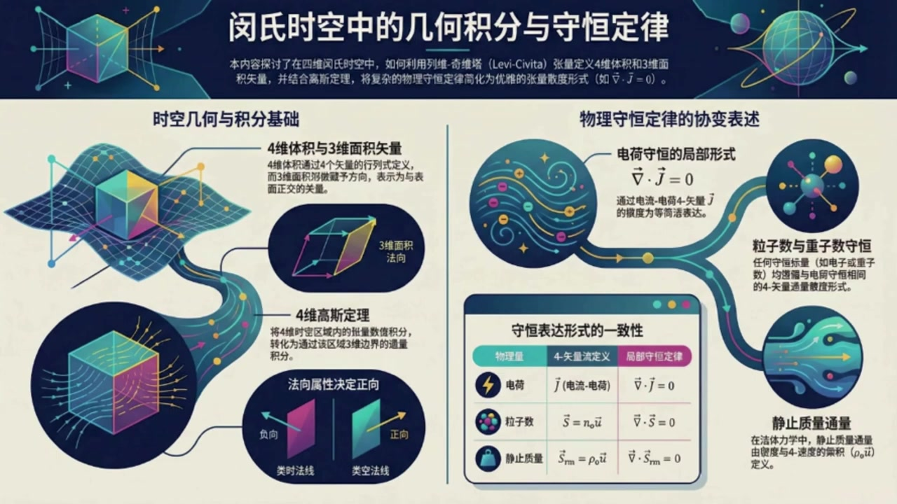
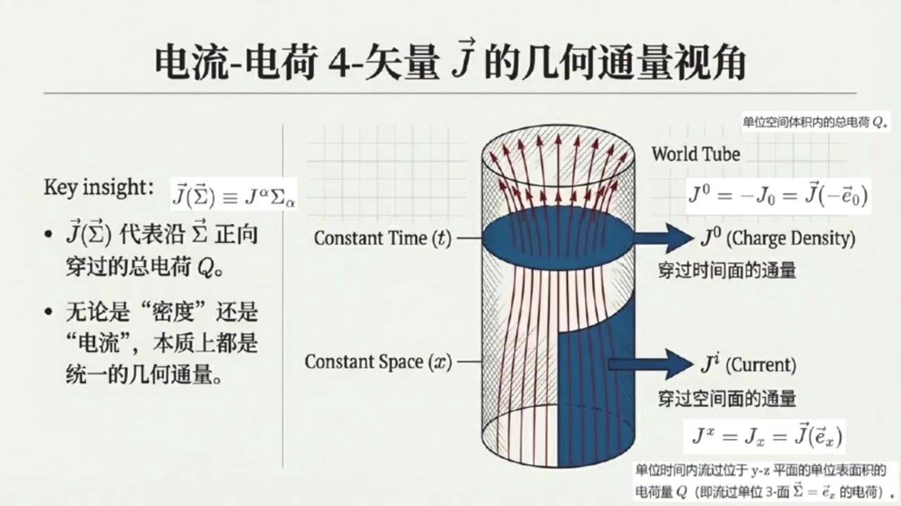

# 《现代经典物理学》第11课 闵氏时空的体积、积分与守恒律

> 自动生成的课程注解文档（共 4 个段落，[原始视频](https://www.youtube.com/watch?v=wRx8DncELqc)）

## 目录

- [00:00:00 课程引入：四维体积积分与向量三面积的定义](#段落-1)
- [00:05:06 向量三面积的几何意义、取向与积分构造](#段落-2)
- [00:11:33 四维高斯定理与电荷守恒的全局到局部表述](#段落-3)
- [00:16:37 其他守恒流、流体应用与习题总结](#段落-4)

---

## 段落 1：课程引入：四维体积积分与向量三面积的定义 { #段落-1 }

**时间：** 00:00:00 ~ 00:05:05

<details><summary>📝 原始字幕</summary>

<pre>

大家好欢迎回到现代经典物理学今天我们是第十
很高兴和大家一起继续我们的时空之旅
今天我们将深入探讨一个非常基础但有极其重要的概念
时空体积积分以及它们如何帮助我们理解守恒定律
这可是我们后续学习电动学和广义相对论的基石哦
没错,今天我们是第十一课了,要聊的这个话题听起来就有点烧脑
叫时空体积积分与守恒率赛一上来就时空体积听着就感觉脑子要打劫了我们平时做的体积都是三D的这四D的体积到底是个啥
哈哈别急再
其实你可以把它类比成我们熟悉的三维欧几里的空间
在那里,我们用列为齐维塔张亮和行列式来定义一个平行六面体的体积
嗯,就是由三个食量作为棱边,然后算他们的混合机,或者说是行列式,对吧
完全正确
在视时空里,我们只是把维度增加到了四维
所以我们现在有四个四十辆ABCD
它们作为棱边构成了一个四维的平行六面体
所以就是把三个棱边变成四个棱边然后用四维的列维其维它张量再写成一个四乘四的行列式是吧没错就是这个意思他告诉我们这个四维平行六面体的四维体积是由这些始量分量组成的行列式那这个四体级有正的吗像我们平时说的体积都是正的呀有的如果这组始量是右手系的如果是左手系的这跟我们三维空间里交换两个始量会改变差积方向是一个道理明白了那如果我们想在时空里对某个张量场做积分呢这个四体级怎么用呢我们可以把整个四维区域画大写V想象成由无数个小四维平行六面体组成在任何一个右手座标系里沿着四个正交座标轴以DXDYDZ为冷边的DXDYDC这个表达是通过将四体级
这个表达式可以通过将四十辆A等于DX乘积时量一下零四十辆B等于DY乘积时量一下一等等带入到四体级的定义室中得到哦就是时间乘以空间体积听起来还挺直观的
所以,对一个张亮场梯做积分,就是把梯乘以这个Dsigma,然后极限求和就行了,是这样吗?
对,就是这个意思
也就是积分下话题大写V
梯上阿尔法贝塔伽玛成D西格玛
等于积分下话题大写V
梯上阿尔法贝塔伽马乘DTDXDYDZ那三维体积也就是四维时空中的三面积呢
在四维时空里它又是个什么概念在四维时空里三维面积就有点像我们三维空间里的实量面积的概念
它是由三个四十辆棱边A B C构成的一个三维平行六面体
但它本身是一个40辆,我们用 sigma来表示
具体可表示成四十辆西格玛一个空槽等于列为起为塔张亮
作用在空槽四十辆A四十辆B四十辆C上我看到后面还有一等价的曹薇命名指标的表达式可以给一个简单证明或推倒吗可以的首先根据斜变分量的定义我们有C个码下等于张量C个码作用在四十辆机一下上
然后根据前面的定义将一下插入那个空槽得到张量EPSLON作用在四十辆G一下和四十辆A四十辆B四十辆C上
进而根据列为起维塔的定义可继续等于EPSILON下六Alpha Beta Gamma缩并四十两G一下六的第六个分量缩并A上Alpha 缩并B上Beta 缩并C上Gamma
其中40辆机一下六的第六个分量,实际就是Delta下六上六
最后等于Epsilon下MueAlpha Beta Gamma缩并A上Alpha缩并B上Beta缩并C上Gamma
守卫箱档,就是你要的结果哦,我明白了

</pre>

</details>

**课程截图：**




### 注解

我来对这段课程视频进行深度注解，重点关注新出现的内容。

---

## 一、核心公式识别与解释

### 1. 四维体积（4-Volume）定义

**板书公式：**
$$\text{4-volume} = \epsilon_{\alpha\beta\gamma\delta} A^\alpha B^\beta C^\gamma D^\delta = \epsilon(\vec{A}, \vec{B}, \vec{C}, \vec{D}) = \det(M)$$

| 符号 | 含义 |
|:---|:---|
| $\epsilon_{\alpha\beta\gamma\delta}$ | **列维-奇维塔张量（Levi-Civita Tensor）**，4维完全反对称张量，$\epsilon_{0123} = +1$ |
| $A^\alpha, B^\beta, C^\gamma, D^\delta$ | 构成4维平行六面体的**四个4-矢量**（棱边） |
| $\alpha,\beta,\gamma,\delta$ | 时空指标，取值为 $0,1,2,3$（0=时间，1,2,3=空间） |
| $M$ | $4\times4$ 矩阵，第1~4列分别为矢量 $\vec{A},\vec{B},\vec{C},\vec{D}$ 的分量 |
| $\det(M)$ | 矩阵行列式，给出有向4维体积 |

> **关键理解**：这与3维中 $\vec{A}\cdot(\vec{B}\times\vec{C})$（标量三重积）完全类比，只是维度升到4维。

---

### 2. 体积元微分形式

**板书公式：**
$$d\Sigma = \epsilon(dt\,\vec{e}_0, dx\,\vec{e}_1, dy\,\vec{e}_2, dz\,\vec{e}_3) = dt\,dx\,dy\,dz$$

| 符号 | 含义 |
|:---|:---|
| $d\Sigma$ | **4维体积元**（有向） |
| $\vec{e}_0, \vec{e}_1, \vec{e}_2, \vec{e}_3$ | 正交坐标基矢（$\vec{e}_0$ 类时，$\vec{e}_i$ 类空） |
| $dt,dx,dy,dz$ | 沿各坐标轴的无穷小位移 |

**积分形式：**
$$\int_V T^{\alpha\beta\gamma}\, d\Sigma = \int_V T^{\alpha\beta\gamma}\, dt\,dx\,dy\,dz$$

> 这里 $T^{\alpha\beta\gamma}$ 是任意张量场，积分将张量场在4维区域 $V$ 上"累加"。

---

### 3. 3-体积矢量 $\vec{\Sigma}$（三维超面元）⭐ **本段核心新概念**

**板书公式：**
$$\vec{\Sigma}(\_) = \epsilon(\_, \vec{A}, \vec{B}, \vec{C})$$

$$\Sigma_\mu = \epsilon_{\mu\alpha\beta\gamma} A^\alpha B^\gamma C^\gamma$$

| 符号 | 含义 |
|:---|:---|
| $\vec{\Sigma}$ | **3-体积矢量**（3-volume vector），本质是**4-矢量** |
| $\_$ | **空槽（Empty Slot）**，等待填入第4个矢量以构成标量4-体积 |
| $\mu$ | 自由指标，表明 $\Sigma_\mu$ 是4-矢量的协变分量 |
| $\vec{A},\vec{B},\vec{C}$ | 构成3维"超面"的三个4-矢量棱边 |

**关键推导步骤（字幕中详细给出）：**

$$\begin{aligned}
\Sigma_\mu &= \vec{\Sigma}(\vec{e}_\mu) && \text{（协变分量的定义）}\\
&= \epsilon(\vec{e}_\mu, \vec{A}, \vec{B}, \vec{C}) && \text{（将基矢填入空槽）}\\
&= \epsilon_{\nu\alpha\beta\gamma} (\vec{e}_\mu)^\nu A^\alpha B^\beta C^\gamma && \text{（展开为分量形式）}\\
&= \epsilon_{\mu\alpha\beta\gamma} A^\alpha B^\beta C^\gamma && \text{（因 } (\vec{e}_\mu)^\nu = \delta_\mu^\nu \text{）}
\end{aligned}$$

---

## 二、理论背景补充

### 为什么需要"3-体积矢量"而不是标量？

| 维度 | 对象 | 数学性质 | 物理意义 |
|:---|:---|:---|:---|
| 4维 | 4-体积 | **标量**（洛伦兹不变量） | 时空"块"的大小 |
| 3维 | 3-体积 | **矢量**（4-矢量） | 3维超面的"方向+大小" |

**核心洞察**：在4维时空中，一个3维超面（如"某一时刻的空间"或"某粒子的世界管截面"）需要用**法向矢量**来刻画其指向。这与3维空间中2维曲面需要法向量完全类比：

- 3维空间：面积元 $d\vec{A} = \hat{n}\,dA$（矢量，垂直于面）
- 4维时空：3-体积元 $\vec{\Sigma} = \hat{n}\,V_3$（4-矢量，垂直于3维超面）

**"类时法线" vs "类空法线"**（见板书图示）：
- **类时法线**：3维超面是"类空"的（如 $t=\text{常数}$ 的等时面）→ 描述**同时性**
- **类空法线**：3维超面是"类时"的（如某粒子的世界线 tube）→ 描述**演化**

---

## 三、通俗概念解释

### 类比理解链

```
3维欧氏空间          →          4维闵氏时空
─────────────────────────────────────────────────
平行六面体体积        →    4维平行六面体体积
V = |𝐚·(𝐛×𝐜)|        →    V₄ = |ε(A,B,C,D)|
     （标量）                  （赝标量，有手性）

面积矢量 d𝐀 = 𝐧̂ dA   →    3-体积矢量 Σ⃗ = 𝐧̂ V₃
（垂直于2维面）              （垂直于3维超面）
```

### "空槽"机制的妙处

列维-奇维塔张量 $\epsilon$ 有4个"插槽"。填入4个矢量 → 得到**标量**（4-体积）；填入3个矢量，留1个空槽 → 得到**矢量**（3-体积元）。这个空槽机制是微分几何中**霍奇对偶（Hodge Dual）**的初等体现。

---

## 四、板书截图描述

| 截图 | 核心内容 |
|:---|:---|
| **图1：课程总览** | 展示"4维体积与3维面积矢量"作为基础，通向"4维高斯定理"，最终应用于电荷守恒 $\nabla\cdot\vec{J}=0$、粒子数守恒、静止质量通量等物理守恒律 |
| **图2：4-体积定义** | 矩阵 $M$ 的可视化、右手系判定（拇指规则）、微元形式 $d\Sigma = dt\,dx\,dy\,dz$ |
| **图3：3-体积矢量** ⭐ | **最关键的一页**：展示带空槽的表达式 $\vec{\Sigma}(\_)$，详细推导 $\Sigma_\mu = \epsilon_{\mu\alpha\beta\gamma}A^\alpha B^\beta C^\gamma$，以及几何图示：三个棱边 $\vec{A},\vec{B},\vec{C}$ 张成3维体，$\vec{\Sigma}$ 垂直于此3维体 |

---

## 五、本段与后续课程的关联

| 本段建立的工具 | 后续应用 |
|:---|:---|
| 4-体积元 $d\Sigma$ | 4维张量场积分、作用量原理 |
| 3-体积矢量 $\Sigma_\mu$ | **高斯定理的4维形式**：$\int_V \partial_\mu J^\mu d\Sigma = \oint_{\partial V} J^\mu d\Sigma_\mu$ |
| 空槽机制 | 微分形式、霍奇星算子、规范场论 |

> 下节课预告：利用这些几何工具，将熟悉的 $\nabla\cdot\vec{J}=0$ 改写为**协变形式**，并导出**连续性方程的积分表述**。

---

## 段落 2：向量三面积的几何意义、取向与积分构造 { #段落-2 }

**时间：** 00:05:06 ~ 00:11:32

<details><summary>📝 原始字幕</summary>

<pre>

但这仅仅是适量三面积的定义具体应该如何理解
它指向哪里?它和我们平时说的体积有什么不一样
嗯
这个40辆Sigma有个很重要的性质,它会和这三个棱边都正交
因为如果你把40辆ABC中的任意一个插入定义的空草都等于零
也就是40辆Sigma和比如40辆A的点乘等于0也就是正交的意思
所以你可以把它想象成这个三维棉的发线方向
那么如果将其归一化的适量记作四十辆N是不是这个适量三面积Sigma就可以表示成四十辆Sigma等于V乘单位四十辆N
是的
其中V作为四十辆西格玛的磨肠就可以理解成这个四十辆三面积的标量体积此外它的方向还代表了取向也就是它有两个面正侧面还是负侧面这个正侧面还是负侧面具体是如何定义的
定义很直接
如果四十辆SIGMA点成四十辆D大于零那么称四十辆D指向四十辆SIGMA对应的向量三面积的政策
如果这个点成小于岭那么乘四十辆D指向四十辆SIGMA对应的向量三面积的副侧如果这个点成等于岭那么乘四十辆D就躺在四十辆SIGMA对应的向量三面积上还有我看了图中左边那个四十辆SIGMA图示怎么是朝向过去的呢
而他的政策为何反而指向未来这一点非常特殊也是民视时空和欧吉里的空间的一个重要区别
当这个三面积的法线是类时的时候比如你所看到的那样它代表了一个瞬时的空间平行六面体
它的体积向量Sigma会指向自身的负向也就是指向过去这有点反直觉这是为什么呢我们不妨可以做一个推导
针对向量三面积的发现是历史的情况或者再更特别一点向量三面积的发现正好和时间方向平行
那么这个向量三面体就是普通空间上的平行六面体的普通体积也就是说此时这个普通空间上的平行六面体可以用三个空间向量张成的所以我们不妨取三个四十辆
A等于Delta X乘40辆基地一下一
b等于delta y乘40辆基地1下2
C等于DeltaZ乘四十辆基地一下三带入十辆三面积的定义表达式可得SIGMA下MUE等于Y下MUE阿尔法贝塔GAMMA乘DELTAV
缩并第一个即时一的阿尔法分量,缩并第二个即时一的贝塔分量,缩并第三个即时一的伽玛分量
由于基石指在自己方向的分量为一,其他为零,所以继续等于Y下MU123乘DeltaV
此外这个和时间方向平行时量三面积仅仅在时间分量上非零那么这个非零分量对应西格玛上零等于负西格玛下零等于负Y下零一二三乘DELTAV等于负DELTAV
然后根据逆变分量的定义有四十辆Sigma等于Sigma上零乘四十辆基石一下零等于负DeltaV乘四十辆基石一下T
最后可以算出这个十辆三面积和自生的内机等于括号DELTAV括号平方乘四十辆基石一下T的模方由于时间基石的模方为负一所以最后等于负的括号DELTAV括号平方小于零我看到了所以这个四十辆SIGMA只想自身三面积的负向
根据你这个推导过程,这个反直觉的反向仅仅是因为时间积时的磨平方为负一
也就是因为明可复斯基度归对角线第一个分量G0等于负一
那什么时候指向正向呢?是的,你说得很对
此外同样道理
当尺量三面积是类空的时候
它代表了某个二维面积比如 delta a等于 delta y乘 delta z
在一段时间内扫过的三位区域
经过前面类似的推倒最后得到这个四十辆西格玛点成自身等于括号DELTAT乘DELTAA括号平方乘四十辆基地一下X的模平方
而这种空间基石的模平方是正义所以最后等于括号DELTAT乘DELTAA括号平方大于零
所以这种四十量Sigma和其政策是同方向的这个符合直觉对吧
那我们怎么用这个尺量三面具来做积分呢我们在四尺量sigma前加一个D来表示微圆三面积
对参数化曲面跨号ABC跨号而言它的分量D是等于AXX上AXX上AXBBDBDBDC其中前面缩编的正好是前面定义四题即时用到的行是吧是的它就是我们在多维分数中熟悉的进行积分参数变换时对应的体积变换银子这个有什么用这个我们可以对一个实量场40A在这个三维参数曲面上进行积分形式就是在花体大写V上积分40A等于在花体大写V上积分40A等于在花体大写A上积分A上积分DXB这就像我们平时在电磁学中计算通量

</pre>

</details>

**课程截图：**


### 注解

我来对这段课程视频进行深度注解，重点关注新出现的内容。

---

## 一、核心公式识别与解释

### 1. 向量三面积（Vector 3-Volume）的归一化表示

**新公式：**
$$\vec{\Sigma} = V \vec{n}$$

| 符号 | 含义 |
|:---|:---|
| $\vec{\Sigma}$ | 向量三面积（vector 3-volume），四维时空中的有向三维体积元 |
| $V$ | 标量体积（scalar volume），即 $\vec{\Sigma}$ 的"模长"（实际是 $\sqrt{|\vec{\Sigma}\cdot\vec{\Sigma}|}$） |
| $\vec{n}$ | 归一化的单位法向量，满足 $\vec{n}\cdot\vec{n} = \pm 1$ |

**关键说明：** 这里的"模长"需要打引号，因为闵可夫斯基时空中向量的"模"可以是负值（类时）或正值（类空），所以实际取的是 $V = \sqrt{|\vec{\Sigma}\cdot\vec{\Sigma}|}$。

---

### 2. 向量三面积正侧/负侧的判断判据

**新公式：**
$$\vec{\Sigma} \cdot \vec{D} > 0 \quad \Rightarrow \quad \vec{D} \text{ 指向正侧}$$

$$\vec{\Sigma} \cdot \vec{D} < 0 \quad \Rightarrow \quad \vec{D} \text{ 指向负侧}$$

$$\vec{\Sigma} \cdot \vec{D} = 0 \quad \Rightarrow \quad \vec{D} \text{ 躺在三面积上}$$

这是**定向（orientation）**的数学定义：通过内积的符号来判断方向关系。

---

### 3. 类时三面积的详细推导（核心新内容）

**设定：** 三个棱边为纯空间向量
$$\vec{A} = \Delta x \, \vec{e}_1, \quad \vec{B} = \Delta y \, \vec{e}_2, \quad \vec{C} = \Delta z \, \vec{e}_3$$

**步骤1：协变分量计算**
$$\Sigma_\mu = \epsilon_{\mu\alpha\beta\gamma} A^\alpha B^\beta C^\gamma = \epsilon_{\mu 123} \Delta V$$

其中 $\Delta V = \Delta x \Delta y \Delta z$ 是普通空间体积。

**步骤2：时间分量（唯一非零分量）**
$$\Sigma_0 = \epsilon_{0123} \Delta V = +\Delta V$$

（注意：$\epsilon_{0123} = +1$ 在通常约定下）

**步骤3：逆变分量（关键！）**
$$\Sigma^0 = -\Sigma_0 = -\epsilon_{0123}\Delta V = -\Delta V$$

**这里的负号来自度规升降：** $\Sigma^0 = \eta^{00}\Sigma_0 = (-1)(+\Delta V) = -\Delta V$

**步骤4：向量形式**
$$\vec{\Sigma} = \Sigma^0 \vec{e}_0 = -\Delta V \, \vec{e}_t$$

**步骤5：自内积验证**
$$\vec{\Sigma}\cdot\vec{\Sigma} = (-\Delta V)^2 \, (\vec{e}_t \cdot \vec{e}_t) = (\Delta V)^2 \times (-1) = -(\Delta V)^2 < 0$$

**结论：** $\vec{\Sigma}$ 指向**过去**（负时间方向），与法向量 $\vec{n} \propto \vec{e}_t$（指向未来）**相反**！

---

### 4. 类空三面积的对比推导

**设定：** 一个时间棱边 + 两个空间棱边
$$\{\Delta t, \Delta y, \Delta z\}$$

**结果：**
$$\Sigma_1 = \epsilon_{1023}\Delta t \Delta A = +\Delta t \Delta A \quad (\Delta A = \Delta y \Delta z)$$

$$\Sigma^1 = \Sigma_1 = +\Delta t \Delta A \quad (\eta^{11}=+1)$$

$$\vec{\Sigma} = \Delta t \Delta A \, \vec{e}_x$$

$$\vec{\Sigma}\cdot\vec{\Sigma} = (\Delta t \Delta A)^2 \times (+1) > 0$$

**结论：** $\vec{\Sigma}$ 与法向量**同向**，符合直觉。

---

### 5. 微元三面积与参数化曲面积分

**新公式：**
$$d\Sigma_\mu = \epsilon_{\mu\alpha\beta\gamma} \frac{\partial x^\alpha}{\partial a}\frac{\partial x^\beta}{\partial b}\frac{\partial x^\gamma}{\partial c} \, da\,db\,dc$$

或简写为：
$$d\vec{\Sigma} = \left(\frac{\partial\vec{x}}{\partial a}, \frac{\partial\vec{x}}{\partial b}, \frac{\partial\vec{x}}{\partial c}\right) da\,db\,dc$$

**积分形式：**
$$\int_V d^4x \, (\partial_\mu A^\mu) = \oint_{\partial V} d\Sigma_\mu \, A^\mu$$

这是**四维散度定理**（高斯定理），将体积分转化为边界上的"通量"积分。

---

## 二、理论背景补充

### 闵可夫斯基度规的符号约定

| 约定 | 形式 | 本课程使用 |
|:---|:---|:---|
|  mostly plus $(+,-,-,-)$ | $\eta_{\mu\nu} = \text{diag}(1,-1,-1,-1)$ | 否 |
| **mostly minus $(-,+,+,+)$** | $\eta_{\mu\nu} = \text{diag}(-1,1,1,1)$ | **是** |

**关键影响：** $\eta_{00} = -1$ 导致时间分量升降变号，这是"反直觉"指向的根本原因。

### 类时 vs 类空三面积的几何意义

| 类型 | 几何解释 | 物理场景 |
|:---|:---|:---|
| **类时三面积**（法向类时） | 瞬时空间体积（$t=\text{const}$的超曲面） | 某一时刻的空间区域，如 $t=0$ 时的实验室 |
| **类空三面积**（法向类空） | 时空"管道"（世界管的一段） | 某物体在 $\Delta t$ 时间内扫过的时空区域 |

---

## 三、通俗解释：为什么"过去"是正？

想象一个**拍照的瞬间**：
- 你站在 $t=0$ 时刻，相机快门按下
- 这个"瞬间"是一个三维空间切片（类时法向）
- 向量三面积 $\vec{\Sigma}$ 描述这个切片的有向体积
- 由于度规的负号，它"指向" $t<0$（过去）

**物理意义：** 这不是说体积真的"流向过去"，而是**数学上的定向约定**。当你用 $\vec{\Sigma}\cdot\vec{J}$ 计算流穿过这个面的通量时，正结果表示"从过去流向未来"——这才是物理上合理的解释。

类比：在三维空间中，曲面的法向量也有"两侧"选择。闵可夫斯基时空的特殊之处在于，**时间维度的度规负号使得"指向未来"的法向量对应"指向过去"的体积向量**。

---

## 四、板书/PPT截图描述

根据字幕推断，截图应包含：

**图1（左）：类时三面积**
- 一个立方体标注 $\Delta x, \Delta y, \Delta z$
- 蓝色箭头标"Future/Time"向上（未来）
- 红色箭头标 $\vec{\Sigma}$ 向下（过去）
- 文字说明：正侧指向未来，$\vec{\Sigma}$ 指向过去（负向）

**图2（右）：类空三面积**
- 一个"倾斜"的平行六面体，标注 $\Delta t, \Delta y, \Delta z$
- 蓝色箭头（法向）与红色箭头（$\vec{\Sigma}$）同向指向右方
- 文字说明：正侧指向空间，$\vec{\Sigma}$ 同向（正向）

**底部判据框：**
> "若 $\vec{\Sigma}\cdot\vec{D}>0$，则 $\vec{D}$ 指向正侧。类时法线导致 $\vec{\Sigma}$ 指向几何相反方向。"

---

## 五、核心要点总结

| 要点 | 内容 |
|:---|:---|
| **反直觉的根源** | $\eta_{00}=-1$ 导致时间分量升降变号 |
| **类时情况** | $\vec{\Sigma}\cdot\vec{\Sigma}<0$，$\vec{\Sigma}$ 与法向反向 |
| **类空情况** | $\vec{\Sigma}\cdot\vec{\Sigma}>0$，$\vec{\Sigma}$ 与法向同向 |
| **物理应用** | 四维高斯定理，将守恒律的体积分转化为边界通量 |
| **关键记忆** | "类时反向，类空同向"——源于空间基矢模方为+1，时间基矢模方为-1 |

---

## 段落 3：四维高斯定理与电荷守恒的全局到局部表述 { #段落-3 }

**时间：** 00:11:33 ~ 00:16:37

<details><summary>📝 原始字幕</summary>

<pre>

本质上就是通量
而且有了这些工具我们就可以把高四定理推广到四维时控了所以四维高四定理就是一个四维曲率的散度积分等于它三维边界上的通量积分
正是如此
四维高丝定律的具体形式就是在四维区域花体大V上积分括号四十辆NABLA点四十辆A括号成底SIGMA等于在偏花体大V上积分四十辆A点D四十辆SIGMA其中偏花体大飞就是四维区域花体大飞的边界三维曲面
这个定理非常强大它会使接下来我们讨论守恒定理的基石是不是还有四维的斯托克斯定理至于四维的斯托克斯定理吗因为它需要用到尾分形式我们这本书里暂时不深入讲明白了那既然提到了守恒定律我们是不是要用这些时空积分来重新审视一下电荷守恒呢没错
首先,我们得回顾一下电流电荷四十量,大写J
我们之前学过它的空间分量是电流密度时间分量是电核密度就是大J上零等于REE大J上J等于小J上J嘛对
现在
有了我们刚才说的十量三面积 sigma
我们就可以给40辆大J一个更几何的解释了
对于任何一个微小的四十量三面积 (sigma)
40辆大J作用于40辆Sigma
等于 j 上alpha 缩并 sigma 下alpha
就代表了穿过这个三面积sigma从副侧流向正侧的总电荷量Q
这是一个统一的坐标系无关的几何通量所以它可以简单理解成四维电荷通量这个定义很清晰可以这么理解有了这个我们就可以非常优雅地表述电荷守恒定律了
想象一个时空中的景致四维区域话题大写V它的边界是一个闭合的三维曲面偏话题大写V你可以把它想象成一个四维的盒子或者更简单点想象成一个圆柱盒子一个四维的圆柱盒子就好像一个世界管的一段在表述电荷守恒定律前我们先看看作为几何通量视角下的分量
比如四维电荷通量的时间分量大J上零等于负大J下零等于四十量大J作用在负的时间基石上也就是穿过时间面也就是空间三维面积的电荷通量对应空间电荷密度ROE
再比如四维电荷通量的空间分量比如大J上X等于J下X等于四十辆大J作用在空间基石一下X上
也就是穿过垂直一下X的三维面积的电荷同量
也就是单位时间流过位于YZ平面的单位表面积的电荷量也就是空间电流密度明白了现在我们可以开始讨论四维电荷守恒定律了吧可以的
电荷守恒定律告诉我们所有通过这个原柱盒子过去边界进入的电荷最终都必须通过它的未来边界离开所以所有穿过这个闭合三面积偏花体大V的电荷通量加起来总和必须是零
这叫全局守恒定律,对吧
他把我们平时说的电和守恒定律推广到了四维时空,而且是坐标系五官的,非常准确
而且利用我们刚才说过的四维高四病理我们还可以把这个全局守恒定律转换成一个更强大的局部守恒定律
哦就是四十辆Nebra.40辆大街等于零吗
正是
因为全局积分是零
而根据高斯定理这个三面积积分又等于四十辆大J的散度在偏大花体大V所围起来的四维区域大花体大V上的积分为了让这个积分对任何区域都成立被积函数必须触土为零所以我们得到了罗伦兹普变的微分形式的电荷守恒定律四十辆NEBRADOT四十辆大J等于零
这真的比我们平时在三D空间里判到的电荷守恒定律要间接和通用得多改觉一下子把电磁学和时空几何联系起来了是的这种表述方式不仅优雅而且直接体现了相对论的斜变性那除了电荷其他守恒量也能用这种方式来描述吗比如粒子数当然可以

</pre>

</details>

**课程截图：**




### 注解

我来对这段课程视频进行深度注解，重点关注新出现的内容。

---

## 一、核心公式识别与解释

### 1. 四维高斯定理（4D Gauss's Theorem）

**板书公式（第一个截图底部黑框）：**
$$\int_{V_4} (\vec{\nabla}\cdot\vec{A})\, d\Sigma = \oint_{\partial V_4} \vec{A}\cdot d\vec{\Sigma}$$

| 符号 | 含义 |
|:---|:---|
| $V_4$ | 四维时空区域（4-volume） |
| $\partial V_4$ | 四维区域 $V_4$ 的三维边界（3-boundary） |
| $\vec{\nabla}\cdot\vec{A} = \nabla_\mu A^\mu$ | 四维散度（4-divergence） |
| $d\Sigma$ | 四维标量体积元 |
| $d\vec{\Sigma}$ | 向量三面积元（有向的3-surface element） |

**等价形式（字幕中提到的指标表示）：**
$$\int_{\mathcal{V}} \nabla_\alpha A^\alpha \, d\Sigma = \oint_{\partial\mathcal{V}} A^\alpha \, d\Sigma_\alpha$$

---

### 2. 四维电流-电荷矢量与几何通量

**核心新公式（第二个截图）：**
$$\vec{J}(\vec{\Sigma}) \equiv J^\alpha \Sigma_\alpha = Q$$

| 符号 | 含义 |
|:---|:---|
| $\vec{J}$ | 四维电流-电荷矢量（4-current），$J^\alpha = (\rho, \vec{j})$ |
| $\vec{\Sigma}$ | 向量三面积（vector 3-volume） |
| $J^\alpha \Sigma_\alpha$ | 缩并（contraction），即 $J^0\Sigma_0 + J^1\Sigma_1 + J^2\Sigma_2 + J^3\Sigma_3$ |
| $Q$ | 穿过该三面积的总电荷量（从负侧流向正侧） |

---

### 3. 四维电流的分量解释

**时间分量（电荷密度）：**
$$J^0 = -J_0 = \vec{J}(-\vec{e}_0)$$

| 符号 | 含义 |
|:---|:---|
| $-\vec{e}_0$ | 负时间方向基矢（即指向过去的类时方向） |
| $\vec{J}(-\vec{e}_0)$ | 四维电流作用在"时间面"（即空间三维体积）上的通量 |
| 物理意义 | 穿过等时面的电荷量 = 空间电荷密度 $\rho$ |

**空间分量（电流密度）：**
$$J^x = J_x = \vec{J}(\vec{e}_x)$$

| 符号 | 含义 |
|:---|:---|
| $\vec{e}_x$ | $x$ 方向空间基矢 |
| $\vec{J}(\vec{e}_x)$ | 穿过垂直于 $x$ 轴的三维面积的电荷通量 |
| 物理意义 | 单位时间流过 $yz$ 平面上单位面积的电荷量 = 电流密度 $j_x$ |

---

### 4. 电荷守恒定律（全局与局部形式）

**全局守恒（积分形式）：**
$$\oint_{\partial\mathcal{V}} J^\alpha \, d\Sigma_\alpha = 0$$

**局部守恒（微分形式）：**
$$\nabla_\alpha J^\alpha = 0 \quad \text{或} \quad \vec{\nabla}\cdot\vec{J} = 0$$

这是**连续性方程**的四维协变形式，比三维形式 $\partial_t \rho + \nabla\cdot\vec{j} = 0$ 更简洁、更具普适性。

---

## 二、理论背景补充

### 1. 从三维到四维高斯定理的飞跃

| | 三维欧氏空间 | 四维闵氏时空 |
|:---|:---|:---|
| **区域** | 体积 $V$（3D） | 4-体积 $\mathcal{V}$（4D） |
| **边界** | 闭合曲面 $\partial V$（2D） | 闭合3-曲面 $\partial\mathcal{V}$（3D） |
| **通量元** | 向量面积元 $d\vec{S}$ | 向量三面积元 $d\vec{\Sigma}$ |
| **被积函数** | 矢量场 $\vec{A}$ | 4-矢量场 $\vec{A}$ |
| **散度** | $\nabla\cdot\vec{A}$ | $\nabla_\mu A^\mu$ |

关键洞察：**在相对论中，"时间"和"空间"被统一处理**，因此：
- 电荷密度 $\rho$ 不再是标量，而是4-电流的**时间分量**
- 电流密度 $\vec{j}$ 是4-电流的**空间分量**
- 两者共同构成一个**几何对象**（4-矢量）

---

### 2. "世界管"（World Tube）图像

第二个截图中的圆柱体是核心直观工具：

```
        ↑ 时间 t
        │
   ┌────┴────┐  ← 未来边界（t = t₂，电荷流出）
   │  ↗↗↗↗  │
   │ ↗    ↗ │   世界管 = 粒子在时空中扫过的4-体积
   │↗ 内部 ↗│
   │ ↗    ↗ │
   │  ↘↘↘↘  │
   └────┬────┘  ← 过去边界（t = t₁，电荷流入）
        │
        ↓
   [侧面 = 空间边界，通常设场在无穷远为零]
```

**守恒的物理图像**：进入世界管的电荷 = 离开世界管的电荷，没有"漏网之鱼"。

---

## 三、核心概念的通俗解释

### "密度"和"电流"其实是同一样东西

这是本段最深刻的观点：

| 日常语言 | 四维语言 | 统一描述 |
|:---|:---|:---|
| "某处有多少电荷" | 电荷密度 $\rho$ | 穿过**等时面**的通量 |
| "电荷在流动" | 电流密度 $\vec{j}$ | 穿过**等空间面**的通量 |

**类比**：想象一条河流
- 站在桥上垂直看水面 → 看到"水深"（类比电荷密度）
- 从侧面看水流 → 看到"流速"（类比电流密度）

在四维时空中，这两个观察角度只是**同一几何对象在不同切片上的投影**。

---

### 为什么 $\nabla_\alpha J^\alpha = 0$ 如此强大？

1. **坐标无关性**：不依赖于特定的参考系
2. **局域性**：每一点都独立满足，不只是整体守恒
3. **与对称性的联系**：通过诺特定理，这是**U(1)规范对称性**的必然结果

---

## 四、截图板书内容描述

### 截图1：3-曲面上的积分与高斯定理
- **左侧公式**：参数化曲面的体积元定义，用Levi-Civita符号 $\epsilon_{\mu\alpha\beta\gamma}$ 和雅可比行列式表示
- **右侧图示**：一个"土豆形"的3-曲面，带有向外的法向量 $d\vec{\Sigma}$，内部标注 $V_4$，边界标注 $\partial V_4$
- **关键标注**：红字指出"这恰好就是行列式，对应积分参数变换"

### 截图2/3：电流-电荷4-矢量的几何通量视角
- **核心图示**：世界管（World Tube）示意图
  - 水平蓝色圆盘：Constant Time（等时面），标注 $J^0$（Charge Density）
  - 垂直蓝色矩形：Constant Space（等空间面），标注 $J^i$（Current）
  - 红色箭头：表示4-电流的方向
- **左侧要点**：
  - Key insight: $\vec{J}(\vec{\Sigma}) \equiv J^\alpha \Sigma_\alpha$
  - $\vec{J}(\vec{\Sigma})$ 代表沿 $\vec{\Sigma}$ 正向穿过的总电荷 $Q$
  - "无论是'密度'还是'电流'，本质上都是统一的几何通量"

---

## 五、总结性要点

| 新概念 | 核心意义 |
|:---|:---|
| **4-矢量 $\vec{J}$ 作为几何通量** | 统一了电荷密度和电流密度，消除了"静态vs动态"的人为区分 |
| **全局守恒 → 局部守恒** | 通过高斯定理，积分形式的守恒转化为微分形式，后者更强 |
| **协变性** | 所有公式用指标表示，保证在任何惯性系中形式不变 |

这段内容为后续学习**电磁场的能量-动量张量**、**广义相对论中的物质守恒**奠定了基础。

---

## 段落 4：其他守恒流、流体应用与习题总结 { #段落-4 }

**时间：** 00:16:37 ~ 00:21:05

<details><summary>📝 原始字幕</summary>

<pre>

任何守恒的标量物理量比如粒子数重子数甚至我们稍后会讲的能量动量都可以用类似的形式来表述它的守恒定率所以我们也可以定义一个粒子数通量四十亮S然后它的散度也是零对其中S上零是粒子数密度S上J是粒子通量
重子数守恒也是同样的形式,只是反重子要算作负的重子数
这个在目前的实验精度下都是成立的那禁止质量守恒呢这听起来有点牛顿力学的味道但在相对论里质量不是会随着速度增加吗这个问题问得很好
这里我们说的精值质量,特指粒子的固有质量
我们可以定义一个净值质量通量40辆 SRM
它就是粒子数通量S乘以一个全球公认的平均重子净值质量M二B哦因为M二B是个常数所以它也满足一样的守恒病律
就是S R M上二法,下分号二法,自缩病等于零
是的
特别是在研究流体和固体时,我们经常会把粒子数通量S和静止质量通量S2M分解成戒指的四速度U以及在戒指静止系中测得的粒子数密度NO或静止质量密度ROO
所以就是粒子数通量S等于NO乘四速度U和静止质量通量SRM等于RO乘四速度U这个U就是流体本身的四速度而NO和ROO是在流体自己的参照细离测量密度理解得很到位
这些表达式在相对论流体动力学里非常有用可以帮助我们分析积波等等复杂的现象听了这么多感觉这些概念确实很强大那我们回头看习题它们是怎么帮助我们巩固这些知识的呢习题二点二二它让你在一个双曲面上计算三面积的积分这就像在实际问题中应用我们学到的D 下谬表达式感受一下在弯曲的时空区域上的积分计算
这就像在实际问题中应用我们学到的DSIGMA下谬表达式感受一下在弯曲的时空曲面上的积分计算听起来很有挑战性但也是动手时间的好机会习题二百二十三则更直接地通过一个具体的闭合三面例子让你证明我们刚才讲的全局电荷守恒定律其实就等价于我们熟悉的非相对论电荷守恒定律不过是积分形式的
这能帮助你把新血的概念和旧知识联系起来,建立直觉
这种从高为到低为的还原确实能加深理解最后习题二点二十四深入探讨了净值质量通量四十辆
它会让你推到静止质量通量的类似动量的表达式四十辆SR等于ROO乘四速度
还会让你用洛伦子收缩来解释密度和通量的关系
更重要的是它会让你推导出流体动力学中非常重要的方程比如禁止质量守恒定律的另一个版本DROO百D套等于FROO乘四十辆NEBRA.四速度U以及考虑一个随流体运动的微小三维体级V并证明四十辆NEBRA.四速度U等于V分之一乘DV百D套这些描述了流体固有密度的变化和膨胀率之间的关系哇这些习题听起来都是把理论应用到具体场景中的好例子让我们对这些抽象概念有更深刻的理解
看来制结课的内容虽然概念多,但环环相扣,逻辑非常清晰
正是如此
理解时空中的体积积分以及如何用它们来表述守恒定律是进入更深层次相对论物理的关键一步
它提供了一个统一且优雅的框架让我们能够用几何语言描述物理
好的,今天的现代经典物理学第十一课就到这里了
感谢撒易的精彩讲解让我对时空体积和守恒率有了全新的认识也谢谢周亦的提问希望大家有所收获大家可以尝试做一下这些戏题加深理解我们下期再见下次见

</pre>

</details>

**课程截图：**


### 注解

我来对这段课程视频进行深度注解，重点关注新出现的内容。

---

## 一、核心公式识别与解释

### 1. 静止质量通量（Rest Mass Flux）及其守恒

**板书公式（第一个截图）：**
$$\vec{S}_{\rm rm} = \bar{m}_B \vec{S}, \quad \vec{\nabla}\cdot\vec{S}_{\rm rm} = (S_{\rm rm})^\alpha{}_{;\alpha} = 0$$

| 符号 | 含义 |
|:---|:---|
| $\vec{S}_{\rm rm}$ | 静止质量通量（rest mass flux 4-vector），四维矢量 |
| $\bar{m}_B$ | 平均重子质量（mean baryon mass），以 $^{56}$Fe 为基准的全球公认常数 |
| $\vec{S}$ | 粒子数通量（number flux 4-vector） |
| ${}_{;\alpha}$ | 协变导数（covariant derivative），在平直时空中退化为普通偏导 ${}_{,\alpha}$ |

**物理意义：** 由于 $\bar{m}_B$ 是普适常数，粒子数守恒自动蕴含静止质量守恒。注意这里的"静止质量"特指**固有质量**（rest mass/proper mass），而非相对论性质量——这是现代相对论的标准表述。

---

### 2. 流体动力学分解（Fluid Decomposition）

**板书公式（第一个截图中部）：**
$$\vec{S}_{\rm rm} = \rho_0 \vec{u}, \quad \vec{S} = n_0 \vec{u}$$

| 符号 | 含义 |
|:---|:---|
| $\rho_0$ | 流体静止系质量密度（rest frame mass density），标量 |
| $n_0$ | 流体静止系粒子数密度（rest frame number density），标量 |
| $\vec{u}$ | 流体四速度（4-velocity），满足 $\vec{u}\cdot\vec{u} = -1$（度规符号 $(-,+,+,+)$） |

**关键理解：** 这是**随动描述**（comoving description）——所有物理量都在流体微元自身的静止系中测量，然后通过四速度"提升"到任意参考系。这种分解将运动学（$\vec{u}$）与内禀性质（$\rho_0, n_0$）分离，是相对论流体动力学的核心技巧。

---

### 3. 连续性方程的随动形式（习题2.24推导结果）

**字幕提及公式：**
$$\frac{d\rho_0}{d\tau} = -\rho_0 \, \nabla_\alpha u^\alpha$$

$$\nabla_\alpha u^\alpha = \frac{1}{V}\frac{dV}{d\tau}$$

| 符号 | 含义 |
|:---|:---|
| $d/d\tau$ | 沿流体世界线的固有导数（material derivative），$d/d\tau = u^\alpha \nabla_\alpha$ |
| $\nabla_\alpha u^\alpha$ | 四速度的散度，即**膨胀标量**（expansion scalar）$\theta$ |
| $V$ | 随流体运动的微小三维体积元 |

**物理意义：** 这是相对论连续性方程的**拉格朗日形式**——跟随流体微元观察其密度变化。负号表示：流体膨胀（$\theta > 0$）导致密度稀释；压缩（$\theta < 0$）导致密度增大。第二式将膨胀率与体积元的相对变化率联系起来，是几何与动力学的桥梁。

---

## 二、习题内容解析

### 习题 2.22：双曲面上的几何积分

**板书内容（第二个截图）：**

| 要素 | 内容 |
|:---|:---|
| **曲面方程** | $t^2 - r^2 = a^2$（类时间隔的双曲面，即双叶双曲面的一支） |
| **参数化** | $t = a\cosh\chi$, $r = a\sinh\chi$，配合球坐标 $(\theta, \varphi)$ |
| **任务** | 计算穿过该双曲面区域 $\mathcal{V}_3$（半径 $\chi \leq b$）的通量 |

**理论背景：** 这是**类空超曲面**（spacelike hypersurface）上的积分练习。双曲面 $t^2-r^2=a^2$ 是闵氏时空中与原点类时间隔为 $a$ 的所有事件的集合，在宇宙学中对应**均匀膨胀宇宙的同时面**（如de Sitter时空的切片）。参数化中的 $\chi$ 是**快度**（rapidity）的类比，天然适配双曲几何。

**计算要点：** 需构造曲面法向量 $\vec{n}$，计算诱导度规，最终得到 $\int \vec{J}\cdot d\vec{\Sigma}$ 的具体表达式。

---

### 习题 2.23：全局电荷守恒的还原

**核心任务：** 证明四维高斯定理形式的电荷守恒
$$Q = \int_{\Sigma} J^\alpha \, d\Sigma_\alpha = \text{const.}$$
在非相对论极限下退化为熟悉的**积分形式连续性方程**：
$$\frac{\partial}{\partial t}\int_V \rho \, d^3x + \oint_{\partial V} \vec{j}\cdot d\vec{A} = 0$$

**教学价值：** 建立高维几何表述与低维物理直觉的联系，验证形式理论的"还原能力"。

---

## 三、核心概念通俗解释

### 为什么用"静止质量"而非"相对论质量"？

现代相对论已废弃"相对论质量" $m = \gamma m_0$ 的概念，原因：
- **混淆质量与能量**：$E = \gamma m_0 c^2$ 中，$\gamma m_0$ 实为能量量纲，非质量
- **破坏协变性**：质量作为标量应洛伦兹不变，而 $\gamma m_0$ 随参考系变化
- **流体描述的需要**：$\rho_0$ 是标量场，可与四速度 $\vec{u}$ 协变组合

**静止质量通量 $\vec{S}_{\rm rm} = \rho_0 \vec{u}$ 的直观：** 想象随流体运动的"标签"，其世界线切向即 $\vec{u}$；单位固有体积内的质量 $\rho_0$ 乘以"流动速度"，得到质量流。

### 膨胀标量 $\theta = \nabla_\alpha u^\alpha$ 的几何意义

流体微元的邻居们以速度 $\vec{u}$ 运动时，它们之间的相对分离速率。类比：
- 牛顿流体：$\nabla \cdot \vec{v}$ 描述体积元的膨胀/压缩
- 相对论推广：用协变导数保证所有参考系一致，且包含引力效应（弯曲时空）

---

## 四、板书截图描述

**截图一（静止质量守恒与流体描述）：**
- 标题：静止质量守恒与流体描述
- 上部：$\vec{S}_{\rm rm} = \bar{m}_B \vec{S}$ 及其散度为零的守恒律
- 中部：两个分解公式，箭头标注"流体静止系密度"和"4-速度"
- 右侧：手绘流体微元示意图，标注 $\rho_0$，世界线用红色箭头表示

**截图二（习题2.22）：**
- 标题：案例分析 I：双曲面上的几何积分（习题 2.22）
- 左侧：方程、参数化、任务三栏清晰排列
- 右侧：$(t,r)$ 坐标图，光锥 $t=\pm r$，双曲面 $t^2-r^2=a^2$ 呈碗状，标注 $d\vec{\Sigma}$ 法向、Hyperboloid Bowl、半径参数 $\chi$

---

## 五、本节知识脉络

```
粒子数通量 $\vec{S}$（已讲）
    ↓ × 常数 $\bar{m}_B$
静止质量通量 $\vec{S}_{\rm rm}$ —— 新守恒量
    ↓ 流体分解 $\vec{S}_{\rm rm} = \rho_0 \vec{u}$
相对论流体动力学框架 —— 连接微观守恒与宏观连续介质
    ↓ 习题应用
双曲面几何积分 / 非相对论还原 / 膨胀率方程
```

这一节完成了从**抽象四维矢量**到**具体物理应用**的过渡，为后续相对论流体力学（激波、中子星、宇宙学）奠定基础。

---
