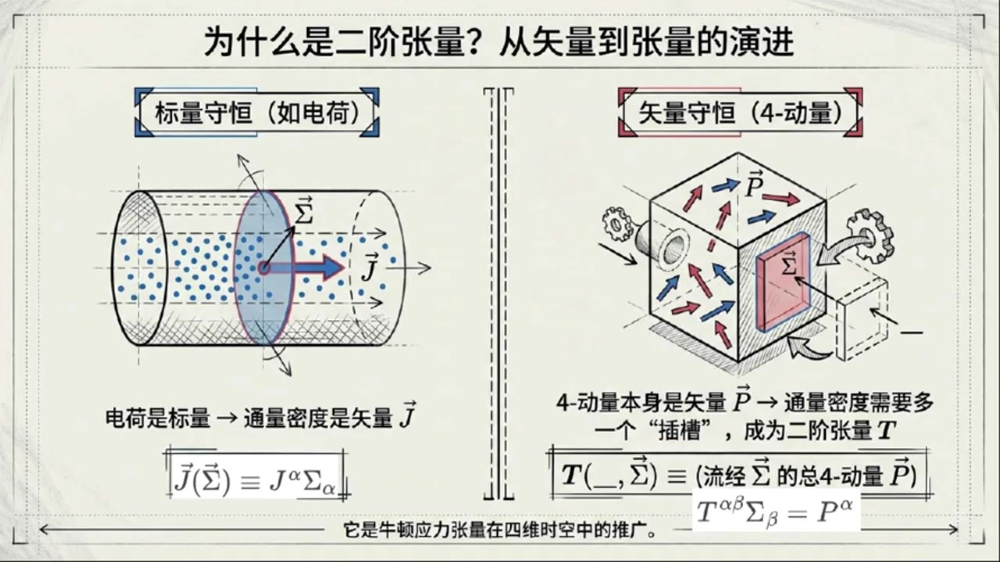
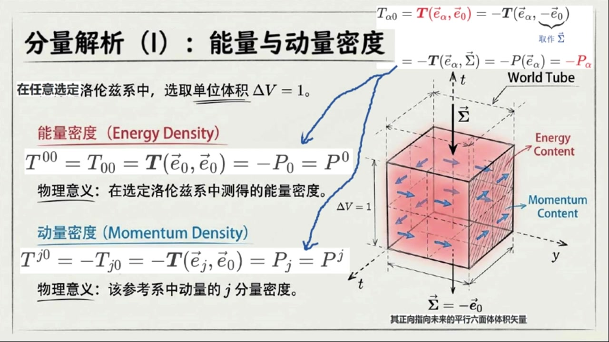
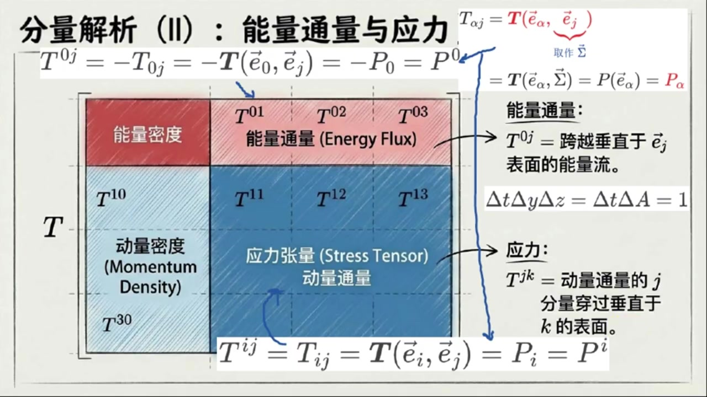
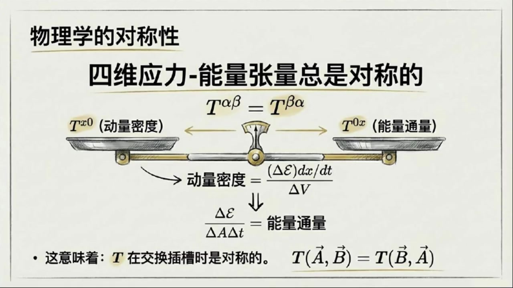
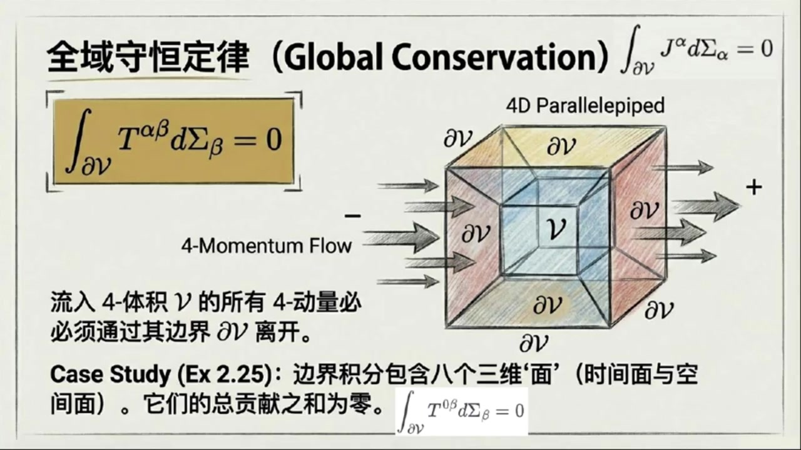
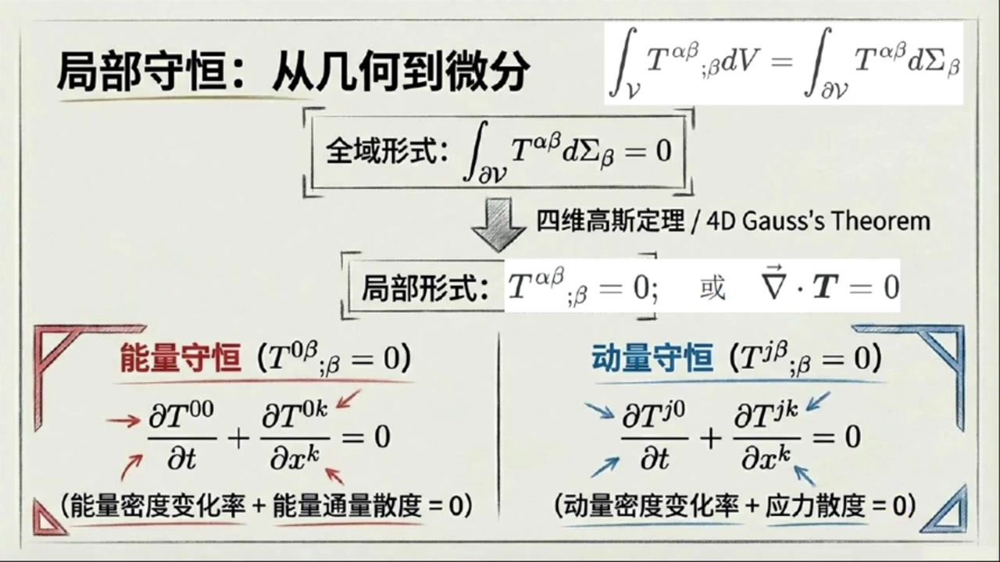
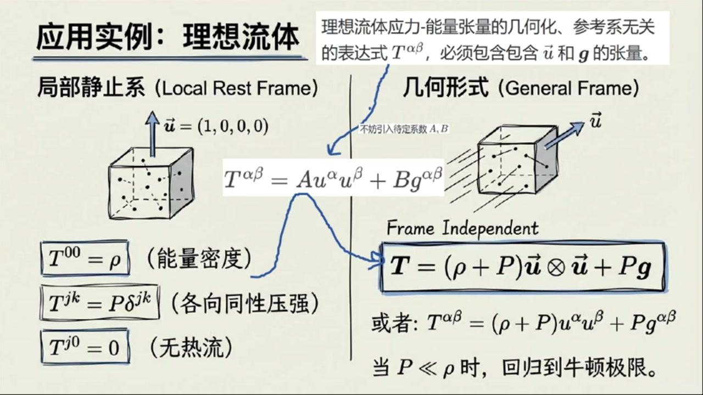
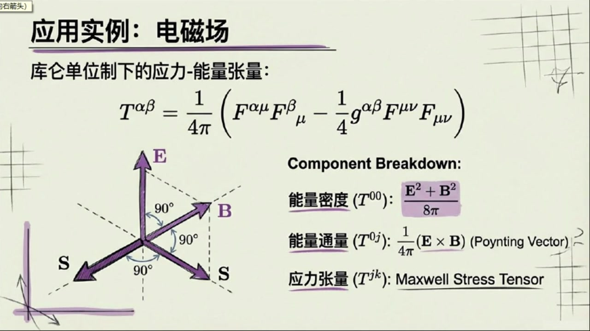

# 《现代经典物理学》第12课 应力 能量张量和4 动量守恒

> 自动生成的课程注解文档（共 5 个段落，[原始视频](https://www.youtube.com/watch?v=xh4YtPDDEK8)）

## 目录

- [00:00:00 课程引入与应力能量张量的定义](#段落-1)
- [00:05:51 应力能量张量各分量的物理意义](#段落-2)
- [00:11:30 张量对称性及动量密度与能量通量的关系](#段落-3)
- [00:16:07 四动量守恒定律与理想流体、电磁场实例](#段落-4)
- [00:23:03 课后习题讲解与全课总结](#段落-5)

---

## 段落 1：课程引入与应力能量张量的定义 { #段落-1 }

**时间：** 00:00:00 ~ 00:05:51

<details><summary>📝 原始字幕</summary>

<pre>

大家好欢迎来到现代经典物理学的第十二课我是你们的活泼主持人乔伊今天我们请到了我们知识渊博的赛老师赛老师跟同学们打个招呼吧大家好我是赛很高兴今天能和大家一起探索物理学的奥秘
今天可是第二章狭义相对论几何观点的最后一课了下课课将进入统计物理的天地三老师今天我们要讲的是应力能量张量和四动量守恒听起来就非常有意思对不对感觉是把我们之前学过的很多东西都达到升级了对周你说的没错
我们之前讲过电荷守恒,粒子书守恒,那些都是标量scaler的守恒
但四动量,它是个四维适量,它在时空中是有方向的
所以要描述它的守恒我们不能用一个简单的适量来表示它的密度和通量了就像我们之前讲电荷流可以用一个电荷电流四十量大J来表示它的密度和通量那四动量呢没错对电荷电流四十量而言四十量大J作用在四十辆大SIGMA上等于J上AFA缩并SIGMA下AFA得到一个标量值
对于四动量,我们需要一个更复杂的数学工具,一个二节张量
这个张量我们就把它叫做音力能量张量通常用大写写体字母T来表示你可以把它想象成牛顿音量张量在四维时空的一个推广所以它比我们之前遇到的那些电流密度啊粒子数密度啊要多一个茶草对吧因为四动量本身就带一个指标对非常准确它是一个二节张量有两个指标
就像书里说的当某种介质或者场流过一个微小的四十两三面积西格玛的时候它不仅仅输运电荷粒子数它还输运近的四动量那这个输运近四动量具体怎么表示呢它的数学表达就是
二阶张亮梯作用在空草和四十辆SIGMA
等于流晶SIGMA所代表的三面积的总四动量P
如果用曹魏命名指标技法
也就是T下Alpha Beta,Sobing Sigma上Beta等于P下Alpha
获其等价的指标上下调整后的技法提上阿尔法贝塔缩并西格玛下贝塔等于披上阿尔法
你可以这样理解
通过这个三面积Sigma的总四动量就是P上Alpha
这个音力能量张亮梯就是把这个免西格玛投影到流过它的四动量
哇,听起来就很有画面感
那这个张量的各个分量比如T上零零T上J零它们各自代表什么物理意义呢这应该是我们最关心的了好的我们来一步步拆解首先任意选择一个落伦子系计算一下二节T下阿尔法零这个斜便分量根据斜便分量的定义等于T作用在四十辆一下阿尔法和四十辆一下零上
根据张亮的限性性继续等于负的T作用在四十量一下alpha和负的四十量一下零上
然后第二槽位的插入副的四十辆一下零作为单位体积二塔菲等于一的在该坐标系中静止的且其政策向指向未来的平行六面体体积四十辆即作四十辆西格玛这里等一下在老师为何要这样选择四十辆西格玛能详细讲讲吗好的
因为我们这里将要讨论这个二节张量所代表的能量密度和动量密度作为一个在这个选定洛伦兹系中的静止观察者而言所谓的密度就是观察单位体积所测量到的能量或流晶这个体积的动量所以对静止观察者来说选择一个DV等于一的体积进行测量是一个很合理的做法那为什么你要选择负的四十量一下零因为测量能量密度或动量密度这个密度对应的所谓单位体积本质上普通空间上的普通体积
所以这个体积是观察者眼中时间T等于Constant长数时空间切片上的普通体积
我们选择的四十两sigma对应的普通体积的三个棱边必须都垂直于时间轴,也就是说这个四十两sigma必须平行于时间轴一下零
再结合单位体积的选择我们必须选择四十辆西格玛等于正负四十辆一下零可正负那为何你前面要去负呢你还记得我们上课讨论过的类似的四十辆三面格玛有什么反直觉特性吗我记得类似的四十辆三面格玛的法向指向过去但其政策与其相反的指向未来根据四动量三面格玛的定义要求是从负侧向指向正侧向所以针对能量密度或动量密度而言我们只能选择四十辆西格玛等于负的四十辆一下零我明白了塞七老师你继续根据这种观察者为了测量能量密度或动量密度而做的特别选择

</pre>

</details>

**课程截图：**






### 注解

我来对这段课程视频进行深度注解，重点分析新出现的公式和概念。

---

## 一、核心公式解析

### 公式1：应力-能量张量的定义式

$$T(\_, \vec{\Sigma}) \equiv \text{（流经}\vec{\Sigma}\text{的总4-动量}\vec{P}\text{）}$$

或指标形式：
$$T^{\alpha\beta}\Sigma_\beta = P^\alpha \quad \text{或} \quad T_{\alpha\beta}\Sigma^\beta = P_\alpha$$

| 符号 | 含义 |
|:---|:---|
| $T$ | **应力-能量张量**（Stress-Energy Tensor），二阶张量 |
| $\alpha, \beta$ | 时空指标，取值为 0,1,2,3（0代表时间，1,2,3代表空间） |
| $\Sigma$ | **四维有向三维体积元**（4-vector 3-volume），即时空中的"超曲面面积" |
| $P^\alpha$ | 流经该体积元的**总四维动量** |
| 下划线 `_` | 表示第一个槽位留空，等待填入另一个向量 |

> **关键理解**：与电荷流 $J^\alpha$（一阶张量/矢量）不同，四维动量本身是矢量，要描述"矢量的通量密度"，必须需要**两个指标**——一个指标描述动量本身的分量，另一个指标描述"朝哪个方向流动/穿过哪个面"。

---

### 公式2：能量密度分量 $T^{00}$

$$T^{00} = T_{00} = T(\vec{e}_0, \vec{e}_0) = -P_0 = P^0$$

**推导链条详解**：
- $T(\vec{e}_0, \vec{e}_0)$：两个槽位都填入时间基矢
- $= -T(\vec{e}_0, -\vec{e}_0)$：利用张量的线性性，提取负号
- 令 $\vec{\Sigma} = -\vec{e}_0$：选择特定的三维体积元（见下文解释）
- $= -P_0 = P^0$：利用度规符号约定（$P^0 = -P_0$ 在 $(+---)$ 或 $(-+++)$ 号差下）

| 符号 | 含义 |
|:---|:---|
| $\vec{e}_0$ | 时间方向的单位基矢（观察者的4-速度方向） |
| $\vec{\Sigma} = -\vec{e}_0$ | 单位体积的三维体积元，**法向指向过去** |
| $P^0$ | 四维动量的时间分量 = **能量**（在 $c=1$ 单位制下） |

> **为何取 $\vec{\Sigma} = -\vec{e}_0$？** 这是本段最核心的技术细节：
> - 四维3-体积元 $\vec{\Sigma}$ 的定义要求：**其正向（+侧）指向未来**
> - 但 $\vec{e}_0$ 本身指向未来
> - 因此若要让体积元"平行于时间轴"（即普通的空间体积），必须取 $\vec{\Sigma} \propto -\vec{e}_0$
> - 这样"从负侧到正侧"的方向才是指向未来的，符合定义

---

### 公式3：动量密度分量 $T^{j0}$（$j=1,2,3$）

$$T^{j0} = -T_{j0} = -T(\vec{e}_j, \vec{e}_0) = P_j = P^j$$

| 符号 | 含义 |
|:---|:---|
| $\vec{e}_j$ | 第 $j$ 个空间方向的基矢（$j=x,y,z$） |
| $P_j$ 或 $P^j$ | 三维动量的第 $j$ 分量（空间分量） |
| $T^{j0}$ | **动量密度**：单位体积内动量的第 $j$ 分量 |

> 注意：这里用到了空间分量在欧氏空间中度规近似为 $\delta_{ij}$，所以 $P_j \approx P^j$。

---

## 二、理论背景补充

### 从标量守恒到矢量守恒的"升级"

| 守恒量类型 | 例子 | 密度/通量所需数学对象 | 公式 |
|:---|:---|:---|:---|
| **标量守恒** | 电荷 $Q$、粒子数 $N$ | **4-矢量流** $J^\alpha$ | $J^\alpha \Sigma_\alpha = \text{标量}$ |
| **矢量守恒** | 4-动量 $P^\mu$ | **二阶张量** $T^{\mu\nu}$ | $T^{\mu\nu}\Sigma_\nu = \text{矢量}$ |

**直观类比**（来自板书）：
- 电荷像"无方向的雨滴" → 用一个箭头（电流）就能描述流向
- 动量像"有方向的箭矢" → 需要描述"哪种动量（能量/动量）朝哪个方向流动"

### 牛顿应力张量的推广

在牛顿力学中，应力张量 $\sigma_{ij}$ 描述的是：
- 第 $i$ 个方向的力，作用在第 $j$ 个方向的面上

应力-能量张量 $T^{\mu\nu}$ 是其相对论推广：
- $T^{00}$：能量密度（类比质量密度 $\rho$）
- $T^{0i} = T^{i0}$：能量流/动量密度（类比 $\rho v_i$）
- $T^{ij}$：应力（动量流，类比 $\sigma_{ij}$）

---

## 三、板书内容描述

### 第一张板书（概念对比图）

**左侧：标量守恒（如电荷）**
- 圆柱形容器，内部有蓝色点代表电荷
- 截面 $\vec{\Sigma}$ 上有矢量 $\vec{J}$ 穿过
- 公式：$\vec{J}(\vec{\Sigma}) \equiv J^\alpha \Sigma_\alpha$

**右侧：矢量守恒（4-动量）**
- 立方体"世界管"（World Tube），内部有红色箭头代表动量流
- 截面 $\vec{\Sigma}$ 上有更复杂的流动图案
- 公式：$T(\_,\vec{\Sigma}) \equiv$（流经 $\vec{\Sigma}$ 的总4-动量 $\vec{P}$）
- 底部：$T^{\alpha\beta}\Sigma_\beta = P^\alpha$

**核心信息**：4-动量本身是矢量 $\vec{P}$ → 通量密度需要多一个"插槽" → 成为二阶张量 $T$

---

### 第二张板书（分量解析）

**标题**：分量解析（I）：能量与动量密度

**关键设定**：在任意选定洛伦兹系中，选取单位体积 $\Delta V = 1$

**能量密度（红色标注）**：
- $T^{00} = T_{00} = T(\vec{e}_0, \vec{e}_0) = -P_0 = P^0$
- 物理意义：在选定洛伦兹系中测得的能量密度

**动量密度（蓝色标注）**：
- $T^{j0} = -T_{j0} = -T(\vec{e}_j, \vec{e}_0) = P_j = P^j$
- 物理意义：该参考系中动量的 $j$ 分量密度

**右侧示意图**：
- 三维立方体代表 $\Delta V = 1$ 的单位体积
- 标注"World Tube"（世界管）
- 标注"Energy Content"（能量内容）和"Momentum Content"（动量内容）
- 矢量 $\vec{\Sigma}$ 向下指，标注 $\vec{\Sigma} = -\vec{e}_0$
- 说明："其正向指向未来的平行六面体体积矢量"

---

## 四、通俗理解

> **一句话总结**：应力-能量张量 $T^{\mu\nu}$ 就是"**时空中的能量-动量账本**"——它记录在每一个方向上的每一个能量-动量成分有多少。

| 分量 | 通俗说法 |
|:---|:---|
| $T^{00}$ | "这里有多少能量"（能量密度） |
| $T^{0i}$ | "能量朝哪个空间方向跑"（能流密度） |
| $T^{i0}$ | "这里有多少动量"（动量密度） |
| $T^{ij}$ | "动量朝哪个方向跑，或产生什么压力"（应力/动量流） |

**为何需要两个指标？** 想象你要记录一个繁忙十字路口的车流：
- 一个指标问："什么类型的车？"（轿车、卡车、公交车...）
- 另一个指标问："朝哪个方向走？"（东、南、西、北...）

四维动量有4个分量（1个能量+3个动量），每个都可能朝4个方向流动，所以需要 $4 \times 4 = 16$ 个分量来描述，这正是二阶张量 $T^{\mu\nu}$ 的物理内涵。

---

## 段落 2：应力能量张量各分量的物理意义 { #段落-2 }

**时间：** 00:05:51 ~ 00:11:29

<details><summary>📝 原始字幕</summary>

<pre>

我们可以继续计算T下阿尔法零等于负的张量TX作用在四十辆I下阿尔法和四十辆Sigma上
等于负的穿过三维面积西格玛的动量P of四十辆一下阿尔法等于负P下阿尔法
通过这个关系,我们就可以从这个二阶章量中读出能量密度和动量密度
差不多吧
我们看梯上零零吧
由于有两个时间指标,同时降低指标不变号,所以它等于T下零零
根据前面的推倒继续等于T作用在四十辆一下零和四十辆一下零上
等于副批下令等于批上令
也就是说T上零零就是选定罗伦兹系中静止观察者在DeltaV等于一的普通体积上测量到的能量也就是能量密度
嗯这个解释非常合理那动量密度呢是T上J零由于一个空间指标一个时间指标降低指标要变好所以等于负的T下J零等于负的T作用在四十辆一下J和四十辆一下零上
等于披下J,等于披上J
也就是T上J零就是选定洛伦兹系中禁止宽潮者在雕塔V等于一的普通体积上测量到的流晶这个体积的动量也就是动量密度哦所以T上零零是能量的量T上J零是动量的量都是密度的概念完全正确
那现在我们来看带空间指标的第二个插草,比如T下AlphaX或者说T下AlphaJ
这个J再次代表空间方向
同样根据斜便分量的定义
梯下AlphaJ等于二阶张量梯,作用在四十辆I下Alpha和四十辆I下J上哈哈,下一步我会
是不是这里我们将选取四十辆I下J作为四十辆三面级Sigma对吧你说得很对
我们注意到这个四十辆三面积SIGMA是指向空间J方向的内空四十辆
比如对J等于一也就是X轴方向而言这个三面积的三个轮边有Delta T,Delta Y,Delta Z等于Delta T,Delta A等于E组成
也就是说观察者将在单位时间和垂直X轴的单位面积上测量物理量
并且三面积西格玛作为内空四十辆其法向和正侧面是同向的所以选择四十辆三面积西格玛等于四十辆一下J所以最后T下ALFAJ等于T作用在四十辆一下ALFA和四十辆SIGMA上等于PO四十辆一下ALFA等于P下ALFA对吧
非常对下面我就可以从中读取能量通量和应力
比如梯上连接等于副的梯下连接等于副的梯作用在四十辆一下零和四十辆一下J上
等于负的下零等于上零这个我就到
根据我们的前面对四十辆三面积西格玛的选择这个T上零J等于P上零的物理含义就是单位时间和垂直J轴的单位面积上测量到能量也就是垂直J轴的单位面积测量到能量流也就是能量通量密度
你说的这个物理解释非常正确此外我们继续有T上IJ等于T下IJ等于T作用在四十辆一下I和四十辆一下J上等于P下I等于P上I这个我也知道这个T上IJ等于P上I的物理含义就是单位时间和垂直J轴的单位面积上测量到动量也就是垂直J轴的单位面积测量到动量时间变化率而根据牛顿第二定律动量时间变化率就是收到的力也就是垂直J轴的单位面积收到的力也就是硬力或压强
所以T上IJ就是牛顿物理中的空间应力张亮这个物理解释也说得非常好不用我再废口舌了
我补充一点
动量时间变化率除了可以解释成力,也还可以解释成动量流
所以垂直J走的单位面积测量到的动量时间变化率还可解释成垂直J走的单位面积测量到动量流也就是动量流通量哇原来这多名词概念本质上是一回事呀没错
看来你也就搞懂了
你可以帮我做一个小结吗?好的
简单来说T上零零是能量密度,T上J零是动量密度,T上零J是能量通量又叫能量流密度,而T上JK就是应力又叫动量通量对这是一个非常精炼的总结
理解这些分量的物理意义是理解阴力能量张量的关键

</pre>

</details>

**课程截图：**




### 注解

我来对这段课程视频进行深度注解，重点分析新出现的公式和概念。

---

## 一、板书截图内容描述

### 截图1：分量解析（I）——能量与动量密度

**板书内容：**
- 标题：「分量解析（I）：能量与动量密度」
- 关键公式：
  - $T^{00} = T_{00} = T(\vec{e}_0, \vec{e}_0) = -P_0 = P^0$
  - $T^{j0} = -T_{j0} = -T(\vec{e}_j, \vec{e}_0) = P_j = P^j$
- 物理意义标注：
  - 「能量密度」：$T^{00}$ 是在选定洛伦兹系中测得的能量密度
  - 「动量密度」：$T^{j0}$ 是该参考系中动量的 $j$ 分量密度
- 示意图：世界管（World Tube）示意图，显示 $\vec{\Sigma} = -\vec{e}_0$ 的选取（指向未来的平行六面体体积矢量），标注 $\Delta V = 1$

### 截图2：分量解析（II）——能量通量与应力

**板书内容：**
- 标题：「分量解析（II）：能量通量与应力」
- 矩阵形式的应力-能量张量 $T^{\alpha\beta}$ 分块显示：
  - 左上角（红色）：$T^{00}$ = 能量密度
  - 第一行其余（红色）：$T^{01}, T^{02}, T^{03}$ = 能量通量（Energy Flux）
  - 第一列其余（蓝色）：$T^{10}, T^{20}, T^{30}$ = 动量密度（Momentum Density）
  - 右下 $3\times3$ 块（蓝色）：$T^{11}, T^{12}, T^{13}, T^{21}, \ldots$ = 应力张量（Stress Tensor）/动量通量
- 关键公式：
  - $T^{0j} = -T_{0j} = -T(\vec{e}_0, \vec{e}_j) = -P_0 = P^0$（注：板书此处有笔误，应为 $= P^j$ 相关）
  - $T^{ij} = T_{ij} = T(\vec{e}_i, \vec{e}_j) = P_i = P^i$
- 一般定义式：$T_{\alpha j} = T(\vec{e}_\alpha, \vec{e}_j)$，取作 $\vec{\Sigma}$

---

## 二、核心公式解析（本段新内容）

### 公式1：能量密度 $T^{00}$ 的完整推导

$$T^{00} = T_{00} = T(\vec{e}_0, \vec{e}_0) = -P_0 = P^0$$

| 符号 | 含义 |
|:---|:---|
| $T^{00}$ | 能量密度（上指标形式）|
| $T_{00}$ | 能量密度（下指标形式）|
| $T(\vec{e}_0, \vec{e}_0)$ | 应力-能量张量作用在两个时间基矢上 |
| $\vec{e}_0$ | 时间方向的单位基矢（观察者静止系）|
| $-P_0 = P^0$ | 4-动量的时间分量（能量），利用 $P_\alpha = \eta_{\alpha\beta}P^\beta$ 及 $\eta_{00}=-1$ |

**关键新点**：两个时间指标同时降低不变号（$\eta_{00}=-1$，但两个负号相乘得正），故 $T^{00}=T_{00}$。

---

### 公式2：动量密度 $T^{j0}$ 的完整推导

$$T^{j0} = -T_{j0} = -T(\vec{e}_j, \vec{e}_0) = P_j = P^j$$

| 符号 | 含义 |
|:---|:---|
| $T^{j0}$ | 动量密度的 $j$ 分量（上指标形式）|
| $-T_{j0}$ | 下指标形式，**注意负号来源**：一个空间指标+一个时间指标，降指标变号一次 |
| $\vec{e}_j$ | 空间方向的单位基矢（$j=1,2,3$ 对应 $x,y,z$）|
| $P_j = P^j$ | 3-动量的 $j$ 分量（空间度规 $\delta_{ij}$ 使上下指标相同）|

**关键新点**：**混合指标降指标要变号**——这是本段最核心的计算规则。由于 $\eta_{0j}=0$, $\eta_{jj}=+1$，指标升降规则为：
$$T^{j0} = \eta^{j\beta}\eta^{0\gamma}T_{\beta\gamma} = \eta^{jj}\eta^{00}T_{j0} = (+1)(-1)T_{j0} = -T_{j0}$$

---

### 公式3：一般空间分量定义（本段全新内容）

$$T_{\alpha j} = T(\vec{e}_\alpha, \vec{e}_j) \quad \text{取作} \quad \vec{\Sigma}$$

这是**本段最重要的新概念**：将第二个基矢 $\vec{e}_j$ 解释为**三维面积矢量**（3-volume vector / 3-brane）。

| 符号 | 含义 |
|:---|:---|
| $T_{\alpha j}$ | 应力-能量张量的混合分量（$\alpha=0,1,2,3$；$j=1,2,3$）|
| $\vec{e}_j$ | 被重新解释为**指向空间 $j$ 方向的三维面积矢量** $\vec{\Sigma}$ |
| 「三面积」| 三维体积元在四维时空中的表示（3-dimensional surface）|

**几何解释**：对于 $j=1$（$x$ 方向），三面积 $\vec{\Sigma}$ 的"棱边"由 $\Delta t, \Delta y, \Delta z$ 组成，即 $\Delta t \cdot \Delta A = 1$（单位时间 × 单位面积）。

---

### 公式4：能量通量 $T^{0j}$

$$T^{0j} = -T_{0j} = -T(\vec{e}_0, \vec{e}_j) = -P_0 = P^j \quad \text{（板书笔误，应为能量流相关）}$$

正确推导应为：
$$T^{0j} = -T_{0j} = -T(\vec{e}_0, \vec{e}_j) = P^0_{\text{(flux)}}$$

| 符号 | 含义 |
|:---|:---|
| $T^{0j}$ | **能量通量**（Energy Flux），即能量流密度 |
| 物理意义 | 单位时间内，垂直于 $j$ 轴的单位面积上流过的能量 |

---

### 公式5：应力/动量通量 $T^{ij}$（本段最高阶新内容）

$$T^{ij} = T_{ij} = T(\vec{e}_i, \vec{e}_j) = P_i = P^i$$

| 符号 | 含义 |
|:---|:---|
| $T^{ij}$ | **应力张量**（Stress Tensor），又称**动量通量** |
| $i,j$ | 均为空间指标（$i,j=1,2,3$）|
| 两个空间指标 | 降指标不变号（$\eta_{ii}\eta_{jj}=(+1)(+1)=+1$），故 $T^{ij}=T_{ij}$ |

**双重物理解释**（本段核心洞察）：

| 解释角度 | 物理意义 |
|:---|:---|
| **牛顿力学视角** | $T^{ij}$ = 垂直于 $j$ 轴的单位面积受到的力的 $i$ 分量 = **应力/压强** |
| **场论/流体力学视角** | $T^{ij}$ = 单位时间内，垂直于 $j$ 轴的单位面积上流过的动量的 $i$ 分量 = **动量通量** |

---

## 三、理论背景补充

### 1. 为什么 $T^{\alpha\beta}$ 是"二阶张量"？

应力-能量张量 $T$ 是 **(0,2)型张量**（或视为双线性映射），需要两个矢量输入：
- 第一个输入：确定测量什么物理量（能量？动量？）
- 第二个输入：确定穿过什么表面（时间方向=体积，空间方向=面积）

### 2. 4-动量与3-动量的关系

| 量 | 定义 | 分量 |
|:---|:---|:---|
| 4-动量 $P^\alpha$ | $(E, \vec{p})$ | $P^0=E$, $P^i=p^i$ |
| 4-动量 $P_\alpha$ | $(-E, \vec{p})$ | $P_0=-E$, $P_i=p_i$ |

### 3. 面积矢量 $\vec{\Sigma}$ 的定向

- $\vec{\Sigma} = -\vec{e}_0$：指向**过去**的三维体积（与观察者世界线同向）
- $\vec{\Sigma} = \vec{e}_j$：指向**空间 $j$ 方向**的三维面积（法向与正侧面同向）

---

## 四、通俗语言总结

### 应力-能量张量的"九宫格"（$4\times4$ 矩阵）

想象时空中的每个点都有一个"记账本"，记录各种物理量的流动：

|  | **时间方向**（看体积） | **$x$ 方向**（看 $yz$ 面） | **$y$ 方向**（看 $xz$ 面） | **$z$ 方向**（看 $xy$ 面）|
|:---|:---|:---|:---|:---|
| **能量行** | $T^{00}$：能量密度 | $T^{01}$：能量往 $x$ 流 | $T^{02}$：能量往 $y$ 流 | $T^{03}$：能量往 $z$ 流 |
| **$x$ 动量行** | $T^{10}$：$x$ 动量密度 | $T^{11}$：$x$ 动量往 $x$ 流 | $T^{12}$：$x$ 动量往 $y$ 流 | $T^{13}$：$x$ 动量往 $z$ 流 |
| **$y$ 动量行** | $T^{20}$：$y$ 动量密度 | $T^{21}$：$y$ 动量往 $x$ 流 | $T^{22}$：$y$ 动量往 $y$ 流 | $T^{23}$：$y$ 动量往 $z$ 流 |
| **$z$ 动量行** | $T^{30}$：$z$ 动量密度 | $T^{31}$：$z$ 动量往 $x$ 流 | $T^{32}$：$z$ 动量往 $y$ 流 | $T^{33}$：$z$ 动量往 $z$ 流 |

### 关键记忆口诀

> **"00能量，j0动量，0j能流，ij应力"**

| 分量 | 名字 | 记忆法 |
|:---|:---|:---|
| $T^{00}$ | 能量密度 | "零零"=能量"圆圆"满满 |
| $T^{j0}$ | 动量密度 | "j0"=动量"借零"（暂存）|
| $T^{0j}$ | 能量通量 | "0j"=能量"零界"流动 |
| $T^{ij}$ | 应力/动量通量 | "ij"=空间"爱挤"（挤压=应力）|

### 最核心的物理洞察

> **"动量的时间变化率 = 力 = 动量流"**

这三个看似不同的概念——牛顿第二定律的力、连续介质的应力、场论中的动量通量——**在相对论性场论中统一为同一个数学对象 $T^{ij}$**。

这正是爱因斯坦场论框架的优美之处：能量和动量不再是分离的概念，而是统一为4-动量；它们的密度和流也不再分离，而是统一为应力-能量张量。

---

## 段落 3：张量对称性及动量密度与能量通量的关系 { #段落-3 }

**时间：** 00:11:30 ~ 00:16:07

<details><summary>📝 原始字幕</summary>

<pre>

还有赛老师书中里还提到了这个张亮的一个重要性质
它总是对称的
提上 Alpha Beta 等于提上 Beta Alpha
这是为什么呢?这是一个非常深刻的对称性,它不仅仅是数学上的巧合,背后有很强的物理原因
我们可以从物理意义上来理解它怎么理解呢咱们先看T上X零和T上X零
T上X0是X方向的动量密度,而T上X是X方向的能量通量
一个说的是单位体积里的冻量
一个说的是单位面积,单位时间里流过的能量,它们怎么会相等呢?你可以这样想
能量是有质量的,根据E等于MC平方
当能量在一个方向流动时,它其实也携带了动量
反过来动量的流动也意味着能量的传递
哦我好像有点明白了就像书里用一个简单的启发式推导说动量密度可以写成括号Delta 体大义括号成DX BY DT除括号Delta X体外体C括号然后亮钢级别的示意性代数变换它就变成了Delta 体大义除括号Delta Y体C体T括号
这不就是能量通量吗
对非常好的理解
这个关系T上J0等于T上0J是相对论中能量和动量紧密联系的体现
至于空间空间粉量提上 JK 它们构成了应力涨量
我们知道经典的应力张量就是对称的
比如剪切应力,踢上XY和踢上YX必须响等,否则物体会发生自发旋转
这样一来,整个应力能量张量就都是对称的了
这让我想起了我们之前学的脚动量守恒,是不是也和这个对称性有关系?
你提到了一个很好的点是的应力能量张量的对称性提上阿尔法贝塔等于提上贝塔阿尔法实际上是脚动量守恒在场论中的体现
这个我们后面有机会再深入聊
好的
还有前面这个关于动量密度等于能量通量证明毕竟是适宜性,我还是有些不放心,你可以给一个严格的证明吗?
可以的
我们在前面的牛顿物理中知道空间应力张量必须是对称的那么相对论中不管做任何洛伦兹变换在变换前后应力能量张量对应的空间应力张量部分也必须是对称的也就是变换前要求T上IJ等于T上JI同时在变换后也必须要求T上I半这半等于T上这半I半下一步一定是进行洛伦兹变换了是的
首先对梯上I半这半进行洛伦兹变换得到L上I半下Alpha成L上J半下BETA缩并梯上AlphaBETA
然后对指标阿尔法贝塔进行双重一加三分解得到四项
然后对梯上J板I板也进行洛伦兹变换并且也进行双重一加三分解也得到四项现在是利用空间应力张量对称性要求的时刻吧是的
利用应力张亮变换前后的对称性并且将前面的展开时相减
中蓝色的两项明显相等红色的两项由于应力张亮的对称性也相等
所以最后零等于括号L上I半下零乘L上J八下I减L上J八下零乘L上I八下I括号
乘括号T上零减T上I括号哦,我明白了
由于我们考虑的任意选择的洛伦兹变缓所以第一个因子一般是非零的所以可以逼出T上零I等于T上I零也就是证明了动量密度等于能量同量
也就是说应力能量张量也必须是对称的
我们现在有了这个强大的应力能量张量,它代表了能量和动量的密度和通量.下一步自然就是讨论它的守恒定律了,对不对

</pre>

</details>

**课程截图：**




### 注解

我来对这段课程视频进行深度注解，重点分析新出现的公式和概念。

---

## 一、板书截图内容描述

### 截图1：物理学的对称性——四维应力-能量张量总是对称的

**板书核心内容：**
- 标题：「四维应力-能量张量总是对称的」
- 核心等式：$T^{\alpha\beta} = T^{\beta\alpha}$
- 天平图示：左侧标注「$T^{x0}$（动量密度）」，右侧标注「$T^{0x}$（能量通量）」，中间以天平平衡示意二者相等
- 启发式推导链条：
  - 动量密度 $= \dfrac{(\Delta\mathcal{E})dx/dt}{\Delta V}$
  - $\Downarrow$（代数变换）
  - $\dfrac{\Delta\mathcal{E}}{\Delta A\Delta t} = $ 能量通量
- 结论性文字：
  - 「这意味着：$T$ 在交换插槽时是对称的」
  - $T(\vec{A}, \vec{B}) = T(\vec{B}, \vec{A})$

### 截图2：洛伦兹变换严格证明

**板书核心内容：**
- 前提条件（标记为a）：$T^{ij} = T^{ji}$（牛顿力学中空间应力张量对称）
- 洛伦兹变换公式（标记为b和c）：
  - $\bar{T}^{ij} = L^i_{\ \alpha} L^j_{\ \beta} T^{\alpha\beta}$ 展开为四项
  - 双重1+3分解：含 $T^{00}$、$T^{0j}$、$T^{i0}$、$T^{ij}$ 四类项
- 关键推导步骤：
  - 利用 $\bar{T}^{ij} = \bar{T}^{ji}$，将(b)-(c)相减得零
  - 蓝色标记项：$L^i_{\ 0}L^j_{\ 0}T^{00}$ 与 $L^j_{\ 0}L^i_{\ 0}T^{00}$ 自动抵消
  - 红色标记项：$L^i_{\ k}L^j_{\ l}T^{kl}$ 与 $L^j_{\ k}L^i_{\ l}T^{kl}$ 因 $T^{kl}=T^{lk}$ 而抵消
  - 剩余：$0 = (L^i_{\ 0}L^j_{\ i} - L^j_{\ 0}L^i_{\ i})(T^{0i} - T^{i0})$
  - 因洛伦兹变换任意性，第一个因子一般非零，故逼出 $T^{0i} = T^{i0}$

---

## 二、核心公式解析

### 公式1：应力-能量张量的对称性（待证命题）

$$T^{\alpha\beta} = T^{\beta\alpha}$$

| 符号 | 含义 |
|:---|:---|
| $T^{\alpha\beta}$ | 应力-能量张量的逆变分量 |
| $\alpha, \beta$ | 时空指标，取值为 $0,1,2,3$（0代表时间，1,2,3代表空间）|
| 对称性 | 交换两个指标位置，张量值不变 |

**关键区分：**
- **$T^{0i} = T^{i0}$**（新内容）：动量密度 = 能量通量 —— 这是相对论特有的，需要严格证明
- **$T^{ij} = T^{ji}$**（已知）：空间应力张量对称 —— 这是牛顿力学已知的（角动量守恒要求）

---

### 公式2：洛伦兹变换下的张量变换规则

$$\bar{T}^{i'j'} = L^{i'}_{\ \alpha} L^{j'}_{\ \beta} T^{\alpha\beta}$$

| 符号 | 含义 |
|:---|:---|
| $\bar{T}^{i'j'}$ | 新参考系中的空间-空间分量（$i',j' = 1,2,3$）|
| $L^{i'}_{\ \alpha}$ | 洛伦兹变换矩阵，$i'$为新系空间指标，$\alpha$为旧系时空指标 |
| 爱因斯坦求和约定 | 重复的 $\alpha, \beta$ 指标表示对 $0,1,2,3$ 求和 |

**双重1+3分解：**
$$L^{i'}_{\ \alpha} L^{j'}_{\ \beta} T^{\alpha\beta} = L^{i'}_{\ 0}L^{j'}_{\ 0}T^{00} + L^{i'}_{\ 0}L^{j'}_{\ j}T^{0j} + L^{i'}_{\ i}L^{j'}_{\ 0}T^{i0} + L^{i'}_{\ i}L^{j'}_{\ j}T^{ij}$$

| 项 | 物理内容 |
|:---|:---|
| $L^{i'}_{\ 0}L^{j'}_{\ 0}T^{00}$ | 能量密度贡献 |
| $L^{i'}_{\ 0}L^{j'}_{\ j}T^{0j}$ | 动量密度/能量通量混合（含 $T^{0j}$）|
| $L^{i'}_{\ i}L^{j'}_{\ 0}T^{i0}$ | 动量密度/能量通量混合（含 $T^{i0}$）|
| $L^{i'}_{\ i}L^{j'}_{\ j}T^{ij}$ | 纯空间应力贡献 |

---

### 公式3：关键约束方程

$$0 = \left(L^{i'}_{\ 0}L^{j'}_{\ i} - L^{j'}_{\ 0}L^{i'}_{\ i}\right)\left(T^{0i} - T^{i0}\right)$$

**推导逻辑：**
- 左边：变换后的对称性要求 $\bar{T}^{i'j'} = \bar{T}^{j'i'}$
- 右边：将两个展开式相减，利用已知对称性消去同类项
- 结果：因式分解为「洛伦兹变换结构」×「待证不对称性」

**关键论证：**
> 由于洛伦兹变换是**任意**选择的（即 $L^{\mu'}_{\ \nu}$ 可在很大范围内变化），第一个括号内的因子**一般不为零**。因此，要使等式对所有洛伦兹变换成立，必须有：

$$\boxed{T^{0i} = T^{i0}}$$

---

## 三、理论背景补充

### 1. 为什么牛顿力学不能保证 $T^{0i} = T^{i0}$？

| 理论框架 | 能量与动量的关系 | $T^{0i}=T^{i0}$ 的地位 |
|:---|:---|:---|
| **牛顿力学** | 能量和动量是独立的守恒量 | 无此关系，$T^{00}$（能量密度）和 $T^{0i}$（动量密度）定义独立 |
| **狭义相对论** | $E=mc^2$ 统一质量与能量，能量本身携带惯性 | **必须**有此关系，否则与相对论原理矛盾 |

### 2. 洛伦兹变换的「任意性」为何关键？

证明中利用了：*对于任意洛伦兹变换*，对称性都必须保持。这意味着：
- 不能只找一个特殊参考系验证
- 变换矩阵元 $L^{i'}_{\ \mu}$ 满足 $L^T \eta L = \eta$，仍有6个自由参数（3个转动+3个boost）
- 「一般非零」= 存在大量变换使该因子≠0，故必须 $T^{0i}-T^{i0}=0$

### 3. 与角动量守恒的深层联系（预告）

板书提到这是「角动量守恒在场论中的体现」，其经典对应为：
- **经典力学**：应力张量不对称 → 体积元受净力矩 → 自发旋转（违反角动量守恒）
- **场论**：$T^{\alpha\beta}$ 不对称 → 无法构造守恒的角动量密度

---

## 四、核心概念通俗解释

### 「动量密度 = 能量通量」的物理图像

想象一束激光穿过空间：

| 视角 | 观察内容 | 对应张量分量 |
|:---|:---|:---|
| 站在光束旁，看单位体积 | 光携带的动量（光压效应）| $T^{x0}$ = 动量密度 |
| 站在光束路径上，看单位面积 | 单位时间流过的能量（功率密度）| $T^{0x}$ = 能量通量 |

**相对论统一：** 光既是能量也是动量，$E=pc$ 对光子严格成立。能量流动必然携带动量，动量存在必然意味着能量传输——二者是同一物理实在的不同侧面。

### 严格证明的「倒逼」逻辑

```
已知：牛顿力学中 T^{ij}=T^{ji}（空间部分对称）
     + 相对论原理（所有惯性系等价）
     
推导：
1. 假设存在某系中 T^{0i} ≠ T^{i0}
2. 做洛伦兹变换到新系
3. 新系的空间应力 T^{i'j'} 会因 T^{0i}≠T^{i0} 而出现不对称
4. 但这违反「空间应力必须对称」的物理要求
5. 矛盾！故假设错误，必有 T^{0i}=T^{i0}
```

这是一种**归谬法**（proof by contradiction），利用相对论与经典物理的衔接来约束新理论的结构。

---

## 五、本段新出现的核心概念总结

| 新概念 | 关键理解 |
|:---|:---|
| **$T^{0i}=T^{i0}$ 的物理意义** | 动量密度与能量通量的统一，相对论中能量-动量紧密联系的体现 |
| **双重1+3分解** | 将洛伦兹变换的时空指标分离为时间(0)和空间(i=1,2,3)分量，便于分析变换结构 |
| **洛伦兹变换的任意性论证** | 利用「对所有惯性系成立」这一强条件，从变换矩阵的非零性倒逼张量分量的等式 |
| **相对论与经典物理的衔接** | 经典应力张量的对称性作为边界条件，通过洛伦兹协变性推广到完整张量 |

---

## 段落 4：四动量守恒定律与理想流体、电磁场实例 { #段落-4 }

**时间：** 00:16:07 ~ 00:23:02

<details><summary>📝 原始字幕</summary>

<pre>

没错就像我们之前讲电荷守恒一样我们也可以为四动量建立一个守恒定律之前电荷守恒是积分下偏花体大V背极部分J上阿尔法缩并底西格玛下阿尔法等于零
那四动量守恒会是怎样的形式呢类似的四动量守恒的全局形式就是积分下偏花体大V被记部分T上阿尔法贝塔缩并底西格玛下贝塔等于零
这个方程的意思是在一个四维时空区域花体大V里所有流入的四动量必须通过它的边界偏花体大V流出
静的四动量进出是平衡的
哦,这很直观那它的局部形式呢?
我们知道全局守恒定律通常可以转化为局部守恒定律
对上几科我见识过了四星历
比如积分下花体大V T上阿尔法贝塔下分号贝塔自缩并成DV等于积分下偏花体大V T上阿尔法贝塔成D Sigma下贝塔
嗯,通过高丝定律,可以将面积分转换成体积分
是的
这样我们可以把全局守恒定律转化为局部形式
T上阿尔法贝塔,下分号贝塔,自缩并等于0
或者用无指标形式写就是四十辆纳布拉到的T等于零贺守恒的四十辆纳布拉到的四十辆J等于零的升级版
完全正确
这个局部守恒定律非常重要
它意味着在时空中任何一点四动量都是守恒的
而且因为应力能量张量是对称的所以对哪个插操球散度结果都是一样的那这个局部守恒定律分量形式是什么样子的
它是不是也包含了我们熟悉的能量守恒和动量守恒没错它的时间分量就是能量守恒定律偏梯上零零百偏梯加偏梯上零K百偏X上K等于零这个就是说能量密度的变化率加上能量通量的三维散度等于零
能量不会凭空产生也不会凭空消失只会从一个地方流向另一个地方对集了而它的空间分量就是动量守恒定律偏梯上J零摆偏梯加偏梯上JK摆偏X上K等于零
这个就是说动量密度的变化率加上应力也就是动量通量的三维散度等于零这不就是牛顿第二定律在连续戒指中的推广形式吗
力等于动量变化率
没错你总结得非常好
这个几何化的与参考系无关的四动量守恒定律确实将能量守恒和动量守恒作为它的特例包含在内好了我们已经把应力能量张量的定义分量含义对欠性以及它的守恒定律都讲明白了那有没有一些具体的例子让我们看看这个张量在实际物理中是怎么体现的呢
当然有
最经典的例子就是理想流体的应力能量张量
理想流体,就是那种没有粘质,没有热传导的流体嘛
对
就是我们理想化后的流体
在它的局部静止系里,也就是流体本身看来是静止的那个参考系
也就是此参考系的流体丝速度U分量是1000
它的应力能量照亮形式非常简单
梯上零零等于R
而T上JT等于P乘Delta上JK
哦这很有趣,在他自己的净值系里,能量密度就是肉,也就是总质量能量密度,然后硬力张量就只有各项同性的压强没有减切硬力,因为他是理想流体
没错
而从这个局部禁止系的形式我们就可以推导出它在任意参考系下的几何化与参考系无关的表达式
张亮梯等于括号R加P括号乘四速度U圈程四速度U加P乘时空度规章两G
这里四速度是流体的四维速度
哇,这个表达式看起来很漂亮,也很简洁
但你可以简单说说如何从局部静止系的形式推导出坐标无关的几何形式理想流体应力能量张量作为集合化的参考系无关的特性它肯定要和流体的速度有关并也要和描述空间集合的度规相关的
作为一个张亮本身描述的是一种线性关系
所以可以通过引入待定系数A和B来描述这个张量也就是梯上阿尔法贝塔
等于A乘U上阿尔法乘U上贝塔加B乘G上阿尔法贝塔对的对比的结果就是A等于R加P和B等于B我看到了也就是T上阿尔法贝塔等于括号R加P括号乘U上阿尔法乘U上贝塔加P成G上阿尔法贝塔
这就是刚才几何形式的分量形式或草位命名指标形式
他把流体的能量密度,压强和运动状态都统一起来了是的
这个理想流体的应力能量张量非常重要
我们后面在相对论流体学历会大量用到它
除了理想流体,还有别的例子吗?
另一个非常重要的例子就是电磁场的应力能量涨量
它的形式看起来更复杂一些,涉及到了电磁场张量F上Alpha Beta
具体形式是T上Alpha Beta等于四派之一乘括号F上Alpha Mue索变F上Beta下Mue减四分之一乘机上Alpha Beta乘F上MueNue双重索变F下MueNue
嗯,那个表达式确实有点吓人,但他肯定也很重要,对吧
绝对重要
它描述了电磁场携带的能量和动量
以及它们如何在时空中分布和流动
这对于理解电磁波的能量传输以及电磁场与物质的相互作用都至关重要好了赛老师我们把核心概念和例子都过了一遍

</pre>

</details>

**课程截图：**







### 注解

我来对这段课程视频进行深度注解，重点分析新出现的公式和概念。

---

## 一、板书截图内容描述

### 截图1：全域守恒定律（Global Conservation）

**板书内容：**
- 左侧金色框标注全局守恒公式：$\displaystyle\int_{\partial\mathcal{V}} T^{\alpha\beta}d\Sigma_\beta = 0$
- 右侧图示：4D平行六面体，中心区域标注$\mathcal{V}$，六个外表面标注$\partial\mathcal{V}$
- 箭头示意"4-Momentum Flow"：流入的箭头带负号，流出的箭头带正号
- 中文说明："流入4-体积$\mathcal{V}$的所有4-动量必须通过其边界$\partial\mathcal{V}$离开"
- 底部Case Study提示：边界积分包含八个三维"面"（时间面与空间面）

---

### 截图2：局部守恒——从几何到微分

**板书内容：**
- 顶部：四维高斯定理 $\displaystyle\int_{\mathcal{V}} T^{\alpha\beta}{}_{;\beta}dV = \int_{\partial\mathcal{V}} T^{\alpha\beta}d\Sigma_\beta$
- 中间流程：全域形式 $\rightarrow$ 四维高斯定理/4D Gauss's Theorem $\rightarrow$ 局部形式
- 局部形式：$T^{\alpha\beta}{}_{;\beta} = 0$；或 $\vec{\nabla}\cdot\mathbf{T} = 0$（无指标形式）
- 左右分栏：
  - **左侧（红色框）**：能量守恒 $(T^{0\beta}{}_{;\beta} = 0)$
    - 展开式：$\dfrac{\partial T^{00}}{\partial t} + \dfrac{\partial T^{0k}}{\partial x^k} = 0$
    - 注释：（能量密度变化率 + 能量通量散度 = 0）
  - **右侧（蓝色框）**：动量守恒 $(T^{j\beta}{}_{;\beta} = 0)$
    - 展开式：$\dfrac{\partial T^{j0}}{\partial t} + \dfrac{\partial T^{jk}}{\partial x^k} = 0$
    - 注释：（动量密度变化率 + 应力散度 = 0）

---

### 截图3：应用实例——理想流体

**板书内容：**
- 标题：理想流体应力-能量张量的几何化、参考系无关的表达式
- 左侧"局部静止系（Local Rest Frame）"：
  - 图示：立方体流体元，箭头标注 $\vec{u} = (1,0,0,0)$
  - 三个分量式：
    - $T^{00} = \rho$（能量密度）
    - $T^{jk} = P\delta^{jk}$（各向同性压强）
    - $T^{j0} = 0$（无热流）
- 中间推导：引入待定系数 $T^{\alpha\beta} = Au^\alpha u^\beta + Bg^{\alpha\beta}$
- 右侧"几何形式（General Frame）"：
  - **核心公式（蓝色框）**：$\mathbf{T} = (\rho+P)\vec{u}\otimes\vec{u} + P\mathbf{g}$
  - 或指标形式：$T^{\alpha\beta} = (\rho+P)u^\alpha u^\beta + Pg^{\alpha\beta}$
  - 标注"Frame Independent"
  - 底部小字：当 $P \ll \rho$ 时，回归到牛顿极限

---

## 二、核心公式解析

### 公式1：四动量守恒的全局形式

$$\int_{\partial\mathcal{V}} T^{\alpha\beta}\, d\Sigma_\beta = 0$$

| 符号 | 含义 |
|:---|:---|
| $\mathcal{V}$ | 四维时空区域（4-体积） |
| $\partial\mathcal{V}$ | 该区域的边界（三维超曲面） |
| $T^{\alpha\beta}$ | 应力-能量张量（$\alpha,\beta = 0,1,2,3$） |
| $d\Sigma_\beta$ | 边界上的有向面元（类时或类空） |

**物理意义**：类比电荷守恒 $\int_{\partial\mathcal{V}} J^\alpha d\Sigma_\alpha = 0$，将电流矢量 $J^\alpha$ 升级为张量 $T^{\alpha\beta}$，描述四动量（而非电荷）的流动守恒。

---

### 公式2：四维高斯定理（广义斯托克斯定理）

$$\int_{\mathcal{V}} T^{\alpha\beta}{}_{;\beta}\, dV = \int_{\partial\mathcal{V}} T^{\alpha\beta}\, d\Sigma_\beta$$

| 符号 | 含义 |
|:---|:---|
| ${}_{;\beta}$ | 协变导数（弯曲时空中推广偏导） |
| $dV$ | 四维体元 |
| 左边 | 散度的体积分 |
| 右边 | 张量场在边界上的通量 |

**关键作用**：将面积分转换为体积分，是推导局部守恒定律的数学桥梁。

---

### 公式3：四动量守恒的局部形式

$$T^{\alpha\beta}{}_{;\beta} = 0 \quad \text{或} \quad \vec{\nabla}\cdot\mathbf{T} = 0$$

这是**无指标形式**，其中 $\vec{\nabla}\cdot$ 表示对张量的"散度"运算（第二个指标的缩并）。

---

### 公式4：能量守恒的分量形式

$$\frac{\partial T^{00}}{\partial t} + \frac{\partial T^{0k}}{\partial x^k} = 0 \quad (k=1,2,3)$$

| 符号 | 物理意义 |
|:---|:---|
| $T^{00}$ | **能量密度** $\varepsilon$（或 $\rho$） |
| $T^{0k}$ | **能量通量**（单位时间流过单位面积的能量）|
| $\partial/\partial t$ | 时间变化率 |
| $\partial/\partial x^k$ | 三维散度 |

**物理图像**：连续性方程的标准形式——"能量密度减少 = 能量流出"。

---

### 公式5：动量守恒的分量形式

$$\frac{\partial T^{j0}}{\partial t} + \frac{\partial T^{jk}}{\partial x^k} = 0 \quad (j=1,2,3)$$

| 符号 | 物理意义 |
|:---|:---|
| $T^{j0}$ | **动量密度**（= 能量通量 $T^{0j}$，因对称性）|
| $T^{jk}$ | **应力张量**（动量通量，即单位面积上的力）|
| $\partial T^{jk}/\partial x^k$ | 应力的三维散度 = 体积力密度 |

**牛顿对应**：这正是 $\vec{f} = d\vec{p}/dt$ 在连续介质中的推广。

---

### 公式6：理想流体的应力-能量张量（局部静止系）

$$T^{00} = \rho, \quad T^{jk} = P\delta^{jk}, \quad T^{j0} = 0$$

| 符号 | 含义 |
|:---|:---|
| $\rho$ | 总质量-能量密度（含内能）|
| $P$ | 各向同性压强 |
| $\delta^{jk}$ | 三维克罗内克δ（单位张量）|
| $T^{j0}=0$ | 无热传导、无粘滞（理想流体定义）|

---

### 公式7：理想流体的几何形式（**核心公式**）

$$\boxed{T^{\alpha\beta} = (\rho + P)u^\alpha u^\beta + Pg^{\alpha\beta}}$$

或抽象形式：
$$\mathbf{T} = (\rho+P)\,\vec{u}\otimes\vec{u} + P\,\mathbf{g}$$

| 符号 | 含义 |
|:---|:---|
| $\vec{u}$ | 流体的**四速度**（归一化：$u_\alpha u^\alpha = -1$）|
| $\otimes$ | 张量积（外积）|
| $\mathbf{g}$ | 时空度规张量 |
| $(\rho+P)$ | 有效惯性质量密度（相对论热力学特征）|

**推导逻辑**：
1. 假设 $\mathbf{T}$ 由 $\vec{u}$ 和 $\mathbf{g}$ 构造（参考系无关性要求）
2. 最一般形式：$A\,u^\alpha u^\beta + B\,g^{\alpha\beta}$
3. 代入局部静止系 $u^\alpha=(1,0,0,0)$，$g^{\alpha\beta}=\text{diag}(-1,1,1,1)$
4. 对比得：$T^{00} = A(-1) + B(-1) = \rho$？需仔细处理符号约定...

*注：课程采用 $(+,-,-,-)$ 或 $(-,+,+,+)$ 度规签名，需根据上下文确定。通常 $u^0=1, u_0=-1$，故 $u^\alpha u^\beta$ 的00分量为1。*

---

### 公式8：电磁场的应力-能量张量

$$T^{\alpha\beta} = \frac{1}{4\pi}\left(F^{\alpha\mu}F^{\beta}{}_{\mu} - \frac{1}{4}g^{\alpha\beta}F_{\mu\nu}F^{\mu\nu}\right)$$

| 符号 | 含义 |
|:---|:---|
| $F^{\alpha\beta}$ | 电磁场张量（Faraday张量）|
| $F^{\alpha\mu}F^{\beta}{}_{\mu}$ | 电磁场能量的"应力"贡献 |
| $F_{\mu\nu}F^{\mu\nu} = 2(B^2-E^2)$ | 洛伦兹不变量 |
| $1/4\pi$ | 高斯单位制因子（SI制中为 $\varepsilon_0$ 相关）|

**物理内容**：
- $T^{00} = \dfrac{E^2+B^2}{8\pi}$：电磁能量密度
- $T^{0i} = \dfrac{(\vec{E}\times\vec{B})_i}{4\pi}$：坡印廷矢量（能流）
- $T^{ij}$：电磁应力（麦克斯韦应力张量）

---

## 三、理论背景补充

### 1. 为什么 $T^{\alpha\beta}$ 必须对称？

课程通过"天平"图示强调 $T^{0j} = T^{j0}$，即**能量通量 = 动量密度**。这源于：
- 角动量守恒要求（$T^{[\alpha\beta]}=0$）
- 引力理论中爱因斯坦场方程 $G^{\alpha\beta} = 8\pi T^{\alpha\beta}$ 要求 $G^{\alpha\beta}$ 对称

### 2. 理想流体公式的牛顿极限

当 $P \ll \rho$（非相对论极限）：
- 静止系：$T^{00} \approx \rho$, $T^{ij} \approx P\delta^{ij}$（退化为经典流体）
- 低速运动：$u^\alpha \approx (1, \vec{v})$，展开得经典能量-动量关系

### 3. 协变导数 vs 偏导数

在平直时空（狭义相对论）中，$T^{\alpha\beta}{}_{;\beta} = T^{\alpha\beta}{}_{,\beta}$（分号=逗号）。课程中写分号是为广义相对论做铺垫。

---

## 四、通俗概念解释

### "四动量守恒的几何化"

想象你在观察一条河流：
- **全局视角**：圈定一个水域，流入的水量 = 流出的水量（积分形式）
- **局部视角**：每个小水滴的"源"为零——水不会凭空产生（微分形式）

四动量守恒同理，只是"水流"是能量和动量在四维时空中的流动，而"河床形状"由度规 $g_{\alpha\beta}$ 描述。

### "参考系无关"是什么意思？

理想流体的 $\mathbf{T} = (\rho+P)\vec{u}\otimes\vec{u} + P\mathbf{g}$ 像是一个"机器"：
- 输入：任意观察者的四速度 $\vec{v}$
- 输出：该观察者测得的能量密度、动量密度、应力

不同观察者（不同 $\vec{v}$）会读出不同的数值，但机器本身 $\mathbf{T}$ 是同一个几何对象。

---

## 五、关键要点总结

| 概念 | 核心要点 |
|:---|:---|
| 全局守恒 | 4-体积边界的净四动量流为零 |
| 局部守恒 | $\nabla\cdot\mathbf{T}=0$，包含能量+动量守恒 |
| 理想流体 | 无粘滞、无热传导，$T^{\alpha\beta}$ 由 $(\rho, P, \vec{u})$ 完全确定 |
| 电磁场 | $T^{\alpha\beta}$ 由场强张量 $F$ 二次构造，描述场携带的能量-动量 |

这些公式是广义相对论中爱因斯坦场方程的"右手边"，也是相对论流体动力学、宇宙学的出发点。

---

## 段落 5：课后习题讲解与全课总结 { #段落-5 }

**时间：** 00:23:03 ~ 00:30:25

<details><summary>📝 原始字幕</summary>

<pre>

接下来,我们来聊聊课后的习题吧
我觉得这些习题往往能帮助我们更深入地理解这些抽象的概念好的习题部分确实能加深理解
我们简要地提一下每个细题的要点
首先是习题二点二十五它让我们在一个四维的平行六面题里解释全局能量守恒的物理意义这个习题是要你把
吉森下偏花体大V,梯上零贝塔,缩并低西格玛下贝塔等于零具体化
你要识别出这个四维立方体的八个面,然后解释每个面上的能量流出,流入,对总能量守恒的贡献
比如有两个面试时间方向的代表过去和未来的能量
另外六个面是空间方向的代表能量通过空间边界的近处明白了这就像在四维时空里的一个能量的收支平衡表
接下来是吸尺二十二六这是一个非常重要的戏题它让大家推导理想流体的应力能量张量并探索它的能量动量守恒第一小题是让我们从理想流体静止系的分量推导到参考系无关的表达式此题赛刚才已经讲解过了没错
而第二小题更有趣
他让你解释为什么四速度U.D.括号四十两NEBRA.张亮T括号等于零代表了流体自身观察到的能量守恒
这个四速度U是流体的四维速度,所以投影到流体自身的参考系
然后他还要求我们证明这个方程可以划减为D跨号R成V跨号摆地套等于复P成DV摆地套
这看起来很像热力学第一定律啊没错这正是刘启的热力学第一定律在相对论框架下的表达左边是单位体积能量的变化率右边是压强作工
他告诉我们流体单元的能量变化一部分是自身能量密度的变化另一部分是由于压强对体积作工
哇,这太酷了,把相对论和热力学联系起来了
那第三小题呢第三小题是让你解释为什么P下MULFA缩并T上ALFABETA下分号BETA等于零代表了流体观察到的力平衡定律也就是动量守恒
这里的P是一个投影丈量它把守恒率投影到垂直于流体四维速度的空间方向上所以这是流体内部的力学平衡
它会划减成括号RO加P括号成四十辆A等于负投影张量PDOUT四十辆NABRA作用在压强P上
这个方程就是牛顿f等于ma的相对论版本
左边是质量乘以加速度,右边是力的作用
也就是说这里的惯性质量不是简单的肉,而是肉加P,能量密度加上压强
没错,这就是这个习题非常关键的洞察
它说明了在相对论中压强也对物体的惯性质量有贡献
这个概念在习题二百二十七中还会进一步探讨习题二百二十七专门讲了单位提及的惯性质量ROEINERT这是一个二节涨量利用这个概念实验室测量动量密度提上J撇零撇可表示ROEINERT下JI缩并VI
第一小题让我们利用罗伦兹变换推到ROWENERD下JI等于提上零成DELTA下JI加TJI是的这要求你理解在介质静止系和实验室系之间如何进行罗伦兹变换并从中提取惯性质量密度的定义第三小题又回到了理想流体证明了它的惯性质量是各项同性的
而且就是肉加皮
这个结果在习题二点二六里也出现过对这两个习题是相互印证的
强调了在相对论里压强对惯性质量的贡献这在牛顿物理学里是不会出现的最后是习题二二八关于电磁场的音力能量张量第一小题是让你计算电磁音力能量张量在惯性系中的分量把它和我们熟悉的电场一和磁场B关联起来
你会看到能量密度动量密度或能量通量或波硬停始量和音量麦克斯韦音量张量的经典表达是哇这真是把电磁学和相对论完美结合了然后第三项题要求我们证明四适量纳布拉点张量T等于负电磁张量F作用于空草和四适量J上
也就是说交换率T上阿尔法贝塔下分号贝塔等于负F上阿尔法贝塔缩并这下贝塔这个是子非常重要
它表示电磁场的四动量守恒,但右边不是零
这意味着电磁场可以和带有电荷和电流的物质交换能量和动量哦所以右边那个F上阿尔法贝塔缩柄J下贝塔就是物质从电磁场那里获得的四动量变化率或者说电磁场给物质的力没错第四小题就让你进一步证明这个量的时间分量也就是能量变化率
等于电场十量E到电流密度十量J也就是电场对物质的欧姆加热功率密度
而空间分量也就是动量变化率
等于Roe乘电场量 E 加上电流密度量 J 插成磁场量 B
也就是作用在物质上的单位提及洛伦兹力太棒了这简直就是把电磁学里我们学过的欧姆加热和洛伦兹力都统一在了应力能量张量的四动量守恒定律里这真是太有意思了是的这些习题不仅巩固了我们对应力能量张量和四动量守恒的理解
更展现了它在不同物理领域中的强大统一能力赛老师今天这堂课信息量真的很大但是通过您的讲解我觉得这个应力能量张量不再那么抽象了它真的是连接了能量动量应力通量甚至热力学和电磁学的核心概念没错乔伊应力能量张量是相对论物理学中的一个基石尤其是在广义相对论中它是引力场的圆
所以大家一定要好好理解它好的各位同学今天的第十二课就到这里希望大家能认真消化这些内容尤其是那些习题它们是理解概念的最好途径感谢赛义老师今天的精彩讲解不客气也谢谢周艾的提问和总结那我们下节课我将进入统计物理学的天地了再见啦再见

</pre>

</details>

**课程截图：**




### 注解

我来对这段课程视频进行深度注解，重点分析新出现的公式和概念。

---

## 一、板书截图内容描述

### 截图1：应用实例——电磁场

**板书核心内容：**
- **标题**：「应用实例：电磁场」
- **核心公式**（库仑单位制下的应力-能量张量）：
$$T^{\alpha\beta} = \frac{1}{4\pi}\left(F^{\alpha\mu}F^{\beta}{}_{\mu} - \frac{1}{4}g^{\alpha\beta}F^{\mu\nu}F_{\mu\nu}\right)$$

- **分量分解（Component Breakdown）**：
  - 能量密度 $T^{00}$：$\dfrac{\mathbf{E}^2 + \mathbf{B}^2}{8\pi}$（紫色高亮）
  - 能量通量 $T^{0j}$：$\dfrac{1}{4\pi}(\mathbf{E} \times \mathbf{B})$（Poynting Vector/坡印廷矢量）
  - 应力张量 $T^{jk}$：Maxwell Stress Tensor（麦克斯韦应力张量）

- **左侧图示**：三维正交坐标系，$\mathbf{E}$、$\mathbf{B}$、$\mathbf{S}$（能流方向）两两垂直，标注90°夹角

---

### 截图2：深度解析——流体动力学方程

**板书核心内容：**
- **标题**：「深度解析：流体动力学方程」，标注「源自习题2.26」

| | 能量守恒 | 欧拉方程（动量守恒） |
|:---|:---|:---|
| **投影方式** | 沿流线投影（Project along $\vec{u}$） | 垂直投影（Project orthogonal to $\vec{u}$） |
| **核心方程** | $\vec{u} \cdot (\vec{\nabla} \cdot \mathbf{T}) = 0$ | $P_{\mu\alpha}T^{\alpha\beta}{}_{;\beta} = 0$ |
| **推导结果** | $\dfrac{d(\rho V)}{d\tau} = -P\dfrac{dV}{d\tau}$ | $(\rho + P)\vec{a} = -\mathbf{P} \cdot \vec{\nabla}P$ |
| **物理意义** | 热力学第一定律<br>（能量变化 = 压力做功） | 相对论版本 $\mathbf{F} = m\mathbf{a}$ |

- **关键洞察框（Key Insight Box）**：「注意：惯性质量项是 $(\rho + P)$，压强 $P$ 贡献了惯性。」

---

### 截图3：物质与场的相互作用

**板书核心内容：**
- **标题**：「物质与场的相互作用」，标注「源自习题2.28」

- **核心方程**：
  - 矢量形式：$\vec{\nabla} \cdot \mathbf{T} = -\mathbf{F}(\_, \vec{J})$
  - 张量形式（交换率）：$T^{\alpha\beta}{}_{;\beta} = -F^{\alpha\beta}J_\beta$

- **分量分解**：
  - **能量交换（Time Component）**：
    $$\frac{d\mathcal{E}_{\text{matter}}}{dt} = \mathbf{E} \cdot \mathbf{j}$$
    （欧姆加热 / Ohmic Heating，绿色高亮）
  
  - **动量交换（Space Component）**：
    $$\frac{d\mathbf{p}_{\text{matter}}}{dt} = \rho_e \mathbf{E} + \mathbf{j} \times \mathbf{B}$$
    （洛伦兹力密度 / Lorentz Force Density，绿色高亮）

- **右侧手绘图示**：「Field Grid」（场网格）向「Matter Particle」（物质粒子）传递能量和动量，标注 $\mathbf{J}_\beta$、Energy、Momentum 流向

---

## 二、新公式详解与符号说明

### 公式1：电磁场应力-能量张量

$$T^{\alpha\beta} = \frac{1}{4\pi}\left(F^{\alpha\mu}F^{\beta}{}_{\mu} - \frac{1}{4}g^{\alpha\beta}F^{\mu\nu}F_{\mu\nu}\right)$$

| 符号 | 含义 |
|:---|:---|
| $F^{\alpha\mu}$ | 电磁场张量（Faraday张量），统一描述电场和磁场 |
| $F^{\beta}{}_{\mu} = g_{\mu\nu}F^{\beta\nu}$ | 降指标后的电磁场张量 |
| $g^{\alpha\beta}$ | 度规张量（闵可夫斯基度规：$\text{diag}(-1, +1, +1, +1)$） |
| $F^{\mu\nu}F_{\mu\nu}$ | 电磁场不变量，等于 $2(\mathbf{B}^2 - \mathbf{E}^2)$ |
| $1/4\pi$ | 库仑单位制（高斯单位制）下的归一化因子 |

**物理意义**：这是电磁场的"能量-动量账本"，完全由电磁场张量 $F^{\alpha\beta}$ 构造，无需引入物质属性。

---

### 公式2：理想流体热力学第一定律（相对论形式）

$$\frac{d(\rho V)}{d\tau} = -P\frac{dV}{d\tau}$$

| 符号 | 含义 |
|:---|:---|
| $\rho$ | 流体静止系中的能量密度（包含静质量能量） |
| $V$ | 流体元的固有体积 |
| $\tau$ | 固有时（流体自身参考系的时间） |
| $P$ | 压强 |
| $dV/d\tau$ | 流体元体积随固有时的变化率 |

**关键理解**：左边是**单位体积能量**的变化率，右边是**压强做功**。这与经典热力学第一定律 $dU = -PdV$ 形式一致，但所有量都在相对论框架下定义。

---

### 公式3：相对论欧拉方程（牛顿第二定律的相对论推广）

$$(\rho + P)\vec{a} = -\mathbf{P} \cdot \vec{\nabla}P$$

或更准确的张量形式：
$$(\rho + P)u^\beta \nabla_\beta u^\alpha = -P^{\alpha\beta}\nabla_\beta P$$

| 符号 | 含义 |
|:---|:---|
| $\vec{a}$ 或 $u^\beta \nabla_\beta u^\alpha$ | 四维加速度（流体元的固有加速度） |
| $\mathbf{P}$ 或 $P^{\alpha\beta}$ | 投影张量：$P^{\alpha\beta} = g^{\alpha\beta} + u^\alpha u^\beta$ |
| $\vec{\nabla}P$ 或 $\nabla_\beta P$ | 压强梯度 |
| $(\rho + P)$ | **惯性质量密度**（关键新洞察！）|

**核心洞察**：在相对论中，压强不仅产生力，还贡献于**惯性质量**。这与牛顿力学截然不同——牛顿流体中惯性质量仅为质量密度 $\rho$。

---

### 公式4：电磁场-物质能量动量交换

$$T^{\alpha\beta}{}_{;\beta} = -F^{\alpha\beta}J_\beta$$

| 符号 | 含义 |
|:---|:---|
| $T^{\alpha\beta}{}_{;\beta}$ | 应力-能量张量的协变散度（四动量流的变化率）|
| $F^{\alpha\beta}$ | 电磁场张量 |
| $J_\beta$ | 四维电流密度：$J_\beta = (\rho_e, \mathbf{j})$（电荷密度、三维电流）|
| 右边整体 | 电磁场对单位体积物质施加的**四维洛伦兹力** |

**物理意义**：电磁场的四动量**不守恒**（右边≠0），因为场与带电物质持续交换能量和动量。这是**开放系统**的守恒定律。

---

### 公式5：欧姆加热功率密度

$$\frac{d\mathcal{E}_{\text{matter}}}{dt} = \mathbf{E} \cdot \mathbf{j}$$

这是公式4的**时间分量**（$\alpha = 0$）。经典电磁学中熟悉的焦耳热公式，现在从应力-能量张量守恒导出。

---

### 公式6：洛伦兹力密度

$$\frac{d\mathbf{p}_{\text{matter}}}{dt} = \rho_e \mathbf{E} + \mathbf{j} \times \mathbf{B}$$

这是公式4的**空间分量**。正是经典洛伦兹力密度：电场力（与电荷密度成正比）加磁场力（与电流有关）。

---

## 三、核心概念深度解析

### 概念1：压强贡献惯性质量——相对论的独特预言

这是本段最深刻的物理洞察。

**牛顿力学**：惯性质量 = 静质量密度 $\rho_m$

**相对论力学**：惯性质量 = 能量密度 + 压强 = $\rho + P$

（在自然单位制 $c=1$ 下；恢复 $c$ 则为 $\rho + P/c^2$）

**直观理解**：
- 压强是分子热运动的宏观表现
- 在相对论中，热运动能量也有质量（$E=mc^2$）
- 因此"热"的物体比"冷"的物体更难加速——压强"增重"了

**宇宙学意义**：这是理解宇宙早期（辐射主导时期）和暗能量性质的关键。极端相对论性流体（$P = \rho/3$，如光子气体）的有效惯性质量为 $4\rho/3$。

---

### 概念2：投影张量 $P_{\mu\alpha}$ 的物理作用

$$P_{\mu\alpha} = g_{\mu\alpha} + u_\mu u_\alpha$$

**数学性质**：
- 对称：$P_{\mu\alpha} = P_{\alpha\mu}$
- 幂等：$P_{\mu\alpha}P^{\alpha}{}_{\nu} = P_{\mu\nu}$（投影算符特征）
- 与四速度正交：$P_{\mu\alpha}u^\alpha = 0$

**物理意义**：将任意四维矢量**投影到垂直于流体四速度的三维空间**（流体静止系的空间切片）。

| 守恒类型 | 投影方向 | 结果 |
|:---|:---|:---|
| 能量守恒 | 沿 $u^\mu$（平行投影 $u_\alpha u_\beta T^{\alpha\beta}{}_{;\beta}=0$）| 热力学第一定律 |
| 动量守恒 | 垂直于 $u^\mu$（投影 $P_{\mu\alpha}T^{\alpha\beta}{}_{;\beta}=0$）| 欧拉方程 |

这是**3+1分解**（时空分离）的显式实现。

---

### 概念3：四维平行六面体与全局守恒

习题2.25要求将抽象的积分守恒具体化：

$$\int_{\partial\mathcal{V}} T^{\alpha\beta}d\Sigma_\beta = 0$$

**八个面的物理意义**：
| 面 | 方向 | 物理意义 |
|:---|:---|:---|
| 2个 | 时间方向（$t = \text{const}$）| 过去/未来的能量"快照" |
| 6个 | 空间方向（$x,y,z = \text{const}$）| 能量通过空间边界的流入/流出 |

这构成四维时空的**能量收支平衡表**：封闭超曲面 $\partial\mathcal{V}$ 上的总能量-动量流为零。

---

### 概念4：电磁场应力-能量张量的"无源性"

与物质流体不同，电磁场张量满足：
$$\nabla_\beta T^{\alpha\beta}_{\text{(em)}} = -F^{\alpha\beta}J_\beta \neq 0$$

这意味着：
- **纯电磁场**：四动量不守恒（场与源耦合）
- **场+物质总系统**：若包含物质的 $T^{\alpha\beta}_{\text{(matter)}}$，则总 $T^{\alpha\beta} = T^{\alpha\beta}_{\text{(em)}} + T^{\alpha\beta}_{\text{(matter)}}$ 守恒

这正是**相互作用系统**的守恒定律：局部可以交换，整体保持守恒。

---

## 四、知识脉络总结

```
应力-能量张量 T^αβ
    │
    ├──► 理想流体：T^αβ = (ρ+P)u^αu^β + Pg^αβ
    │       │
    │       ├── 沿u投影 → 能量守恒 → 热力学第一定律
    │       │              d(ρV)/dτ = -P dV/dτ
    │       │
    │       └── 垂直u投影 → 动量守恒 → 相对论欧拉方程
    │                      (ρ+P)a = -∇P
    │                      ↑关键：惯性质量 = ρ + P
    │
    └──► 电磁场：T^αβ = (1/4π)[F^αμF^β_μ - ¼g^αβF^μνF_μν]
            │
            ├── 分量：能量密度 (E²+B²)/8π
            │         能流密度 (E×B)/4π（坡印廷矢量）
            │         应力 = 麦克斯韦应力张量
            │
            └── 守恒：∇·T = -F·J（与物质交换能量动量）
                       │
                       ├── 时间分量：欧姆加热 E·j
                       └── 空间分量：洛伦兹力 ρ_eE + j×B
```

---

这些习题设计精妙，从**具体计算**（分量展开）到**物理洞察**（压强贡献惯性质量），再到**学科统一**（电磁学+热力学+力学融入相对论框架），层层递进，展现了理论物理的深层美感。

---
