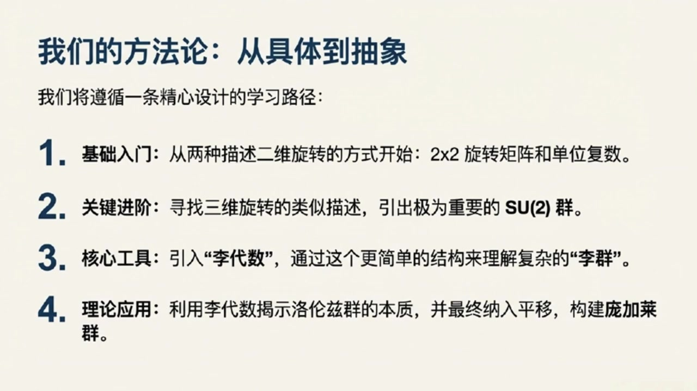
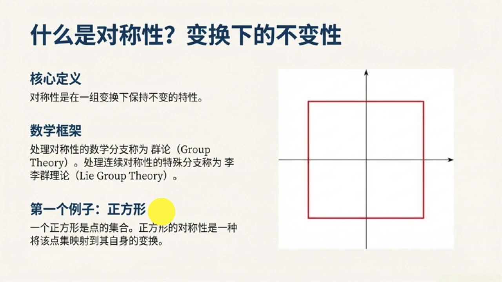
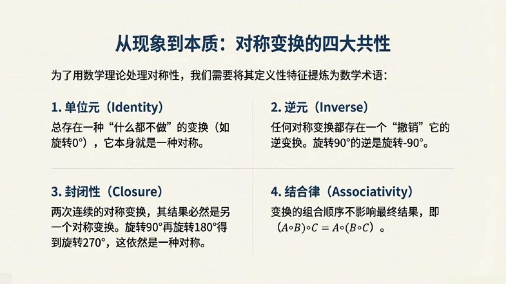

# 《基于对称性的物理学》第4课 群论：对称性的语言

> 自动生成的课程注解文档（共 3 个段落）

## 目录

- [00:00:00 课程导论：从对称性到庞加莱群目标](#段落-1)
- [00:05:00 直观例子入门：离散群、连续群与群的基本特征](#段落-2)
- [00:11:00 群的公理化定义、表示观点与课程总结展望](#段落-3)

---

## 段落 1：课程导论：从对称性到庞加莱群目标 { #段落-1 }

**时间：** 00:00:00 ~ 00:05:00

📝 原始字幕

<pre>

大家好欢迎来到基于对称性的物理学博客我是你们活泼好奇的主持人乔伊大家好我是知识渊博的赛很高兴再次和大家见面赛老师今天我们来到第四课要正式开启理群理论的大门了一听理论就感觉有点抽象物理学高年级的同学们是不是要开始头疼了我们今天从哪儿开始呢哈哈乔伊别急我们先从一句特别有意思的话开始有位数学家要马克阿姆斯特朗他说过这么一句话数字衡量大小群衡量大小群衡量对称这句话听起来就很有哲学意义所以我们今天要学的群就是用来衡量对称的工具对吗没错在物理学里对称性无处不在从基本粒子的性质
到时空的结构对称性都是理解他们的核心而群论就是我们用来精确描述和利用这些对称性的数学框架再能给我们指条明路吗我们将要讲些什么呢没问题乔伊今天这节课我们会像爬山一样先看看山顶是什么然后规划路线我们最终的目标是推导出庞加来群双覆盖的那些基本表示这可是描述所有基本粒子也就是宇宙中最小构成单元的关键工具哇听起来很酷所以我们最终要揭示基本粒子背后的秘密知道自然界到底有哪是粒子类型没错可以这么理解但我们得从最基础的开始首先我们会定义什么是群然后用两个简单的粒子来感受它比如我们先从二维旋转开始二维旋转就是我们平时转圈那种嘛
这和李群有什么关系呢可以这么理解我们会介绍两种描述二维旋转的方法一种是二乘二的旋转矩阵这两种方式虽然不同但描述的是同一件事儿它们都是群的例子明白了就像是书图同归那三位旋转呢是不是更复杂了对三位旋转会引出我们一个非常重要的群叫做SU二这里的S代表特殊就是说矩阵的行列是必须是一U代表有意思是这个矩阵是腰正的而二则说明我们用的是二乘二的矩阵来定义它原来SU二有这么多含义在里面那接下来我们要学什么李代数又是怎么回事这个是一个非常好的问题李代数就像是李群的简化版或者说线性化版本
理论上可能很复杂但通过对应的理带数我们可以用更简单更容易处理的线性代数工具去理解它所以理带数帮我们抽丝剥剪找到最核心的东西正是如此很多不同的理群可能共享同一个理带数但其中只有一个才是最根本最基础的我们通常从已知的变化出发找出他们的理带数再从理带数推导出不同的表示这能让我们看到我们最初的那个变化其实只是众多表示中的一个特例这听起来像是在寻找宇宙的通用语言那我们今天最终会触及哪些具体的物理概念呢可以这么说接下来我们会把学到的知识应用到洛伦子群上洛伦子群是庞家来群的重要组成部分它描述的是狭义相对论中的时空变化
双附开的李带数是由两个SU二李带数直接叠加而成的所以我们之前选SU二就很有用了它在这里又出现了没错非常关键最后我们再把平移变换也考虑进来这样就得到了完整的庞嘉来群庞嘉来群就是落伦子群加上平移它被我们认为是时空最基本的对称群那到了这一步我们是不是就快到山顶了离我们的最终目标很近了是的到那时我们就掌握了所有工具来对庞嘉来群双附开的基本表示进行分类这些基本表示就是我们未来章节里推到物理学基本定律的即时也是理解基本粒子性质的关键太棒了听塞这么一说感觉整个路线图清晰多了从基础的群定义到二维三维旋转再到庞嘉来群最后构建

</pre>

**课程截图：**

### 注解

这里是对本段课程内容的深度注解：

### 一、 截图板书内容描述

**截图 1：群论：对称性的语言**
*   **核心定义**：对称性 = 变换下的不变性（如果一个物体经过变换后看起来和原来一样，这个变换就是一种对称）。引用了名言：“数字衡量大小，群衡量对称性。”
*   **对称性的种类**：分为**离散对称性**（如正方形只能旋转90°、180°等特定角度）和**连续对称性**（如圆形可以绕圆心旋转任意角度）。
*   **群公理（四个数学规则）**：
    1.  **封闭性 (Closure)**：两种对称操作的组合，其结果仍是有效的对称操作。
    2.  **单位元 (Identity Element)**：存在一个“什么都不做”的操作，使物体保持原样。
    3.  **逆元 (Inverse Element)**：每种对称操作都有一个可以“撤销”它的逆操作。
    4.  **结合律 (Associativity)**：连续进行多个操作时，执行的组合顺序不影响最终结果。

**截图 2 & 3：我们的探索之旅与最终目标**
*   **探索路线图**：
    *   二维旋转：$U(1)$, $SO(2)$
    *   三维旋转：$SU(2)$, $SO(3)$
    *   洛伦兹变换（李代数）
    *   庞加莱群（洛伦兹变换 + 平移）
*   **最终目标**：推导庞加莱群双重覆盖的“基本表示”。假设这是时空的基本对称群，这些表示是描述所有基本粒子的工具，将揭示自然界中存在哪些类型的基本粒子。

---

### 二、 核心概念与符号解析

**1. 二维旋转群：$U(1)$ 与 $SO(2)$**
*   **$SO(2)$**：Special Orthogonal group in 2 dimensions（二维特殊正交群）。代表二维平面上的旋转矩阵。$S$ (Special) 意味着矩阵的行列式为 1（排除镜像翻转），$O$ (Orthogonal) 意味着矩阵是正交的（保持长度不变）。
*   **$U(1)$**：Unitary group of degree 1（一维酉群）。可以用模长为 1 的复数 $e^{i\theta}$ 表示。
*   **物理意义**：两者在数学上是同构的（描述同一件事），都用来描述二维平面上的连续旋转。

**2. 三维旋转群：$SU(2)$ 与 $SO(3)$**
*   **$SO(3)$**：三维空间中的常规旋转群。
*   **$SU(2)$**：Special Unitary group of degree 2（二维特殊酉群）。$U$ 代表酉矩阵（复数域中保持内积不变），$S$ 代表行列式为 1，$2$ 代表它是 $2 \times 2$ 的复矩阵。
*   **物理意义**：$SU(2)$ 是 $SO(3)$ 的**双重覆盖**。在量子力学中，$SU(2)$ 至关重要，它是描述自旋为 1/2 的粒子（如电子、夸克等费米子）的数学基础。

**3. 李群 (Lie Group) 与 李代数 (Lie Algebra)**
*   **李群**：既是“群”又是“光滑流形”的数学结构，用来描述**连续**的对称变换（如任意角度的旋转）。
*   **李代数**：可以理解为李群在单位元（即“什么都不做”的状态）附近的切空间。
*   **通俗解释**：李群描述的是宏观的、整体的复杂变换；而李代数描述的是微观的、无穷小的线性变换。通过研究简单的李代数（线性代数工具），我们可以推导出复杂的李群性质，这就是视频中说的“抽丝剥茧”。

**4. 洛伦兹群 (Lorentz Group) 与 庞加莱群 (Poincaré Group)**
*   **洛伦兹群**：狭义相对论中，保持时空距离（光速不变）的所有线性变换的集合，包括空间旋转和洛伦兹递升（不同速度参考系之间的转换）。
*   **庞加莱群**：**洛伦兹群 + 时空平移**。它是平直时空最完整的对称群。
*   **物理意义**：物理学家通过寻找庞加莱群的“表示”（即数学上的分类），实际上是在给宇宙中所有可能存在的基本粒子“上户口”。粒子的质量和自旋，正是由庞加莱群的对称性严格定义的。

---

## 段落 2：直观例子入门：离散群、连续群与群的基本特征 { #段落-2 }

**时间：** 00:05:00 ~ 00:11:00

📝 原始字幕

<pre>

望来大家可以理解这个概念了
它有四条边四个角都一样如果我把它旋转九十度一百八十度两百七十度或者干脆不转它看起来都还是那个正方形说得太对了想象一下你闭上眼睛有人在你面前转动一个正方形如果你睁开眼后完全看不出它被动过那这次转动就是一种对称变化哦我懂了就像您说的转九十度一百八十度或者两百七十度甚至不转也就是转零度看起来都一样没错但如果直转了五度呢那肯定看得出来它的角垫都跑偏了不再是原来那个样子了对所以只有那些特定的转动角度零度九十度一百八十度两百七十度才构成了正方形的变换集合因为这些角度是离散的不能取任意值离散群我记住了
有没有那种可以任意转的对称性呢当然有我们再来看一个例子单位圆就你觉得一个单位圆围绕它的圆形转动会有哪些对称性单位圆啊它长得那么圆不管我转多少度它看起来都还是那个单位圆转五度十度三十度三十五度都一样完全正确单位圆对于绕圆形的任意角度转动都是不变的也就是说它的变换参数旋转角度可以取任意连续的值这种群我们就称为连续群听起来连续群就更自由一些所以我们理群理论主要就是研究这种连续群吗精辟理群理论正是群论的一个分支它专门处理像单位圆这种变换参数可以连续变法的对称性这种连续的对称性在物理学中尤其重要明白了所以从正方形
数学和单位圆的例子我们看到了对近性可以是离散的也可以是连续的那我们怎么把这些直观的理解用数学语言严格的定义出来呢很好拽这正是我们接下来要做为了让群这个概念变得通用不仅仅局限里几何图形数学家们从这些对称变换中提炼出了几个最基本的共同特征只要一个集合和一种运算满足这些特征我们就可以称它为一个群听起来有点像搭积木把最核心的砖块抽出来那这些核心特征都有哪些呢我们一个一个来看第一个特征我们称之为恒等元或者单位元恒等元听起来有点像什么都没做对就是这个意思就像正方性的粒子转动零度就相当于什么都没做
在任何一个群里都必须有一个什么都不做的元素它对任何其他元素进行操作结果都保持不变明白了就像数学里的零或者一一样很基础那第二个特征呢第二个特征是逆圆既然我们能进行一个对称变换那么也必须能撤销这个变换回到初始状态哦就像我顺时转了九十度那逆是转九十度就回去了没错对于群里的每一个元素都必须存在一个逆的元素它们相互作用后结果就是我们刚刚说的恒等元也就是什么都没做听起来很合理能撤销那第三个特征是什么呢第三个叫封闭性它的意思是如果你连续进行两次群里的对称变换那么最终的结果也必然
继续是这个群里的一个对称变换这个好理解就像正方形我先转九十度再转一百八十度最后总共转了二百七十度而二百七十度也是正方形的对称变换所以它还是封闭在这个集合里完全正确无论你如何组合群里的元素结果都不会跑到群外面去那第四个特征呢第四个特征是结合率意思是如果你有三个连续的变换比如A B C那么你先组合A和B再和C组合得到的结果和你先组合B和C再和A组合得到的结果是一样的等等赛老师这个结合率听起来有点像我们数学里的成发结合率A成B成C等于A成B成C对吗对

</pre>

**课程截图：**

### 注解

这里是对本段课程内容的深度注解：

### 一、 截图板书内容描述

**截图 1：我们的方法论：从具体到抽象**
*   **内容概述**：展示了课程的学习路径，分为四个步骤：
    1.  **基础入门**：从两种描述二维旋转的方式开始：$2 \times 2$ 旋转矩阵和单位复数。
    2.  **关键进阶**：寻找三维旋转的类似描述，引出极为重要的 **SU(2) 群**。
    3.  **核心工具**：引入“**李代数**”，通过这个更简单的结构来理解复杂的“**李群**”。
    4.  **理论应用**：利用李代数揭示洛伦兹群的本质，并最终纳入平移，构建庞加莱群。

**截图 2：什么是对称性？变换下的不变性**
*   **核心定义**：对称性是在一组变换下保持不变的特性。
*   **数学框架**：处理对称性的数学分支称为**群论 (Group Theory)**。处理连续对称性的特殊分支称为**李群理论 (Lie Group Theory)**。
*   **第一个例子：正方形**：一个正方形是点的集合。正方形的对称性是一种将该点集映射到其自身的变换。右侧配有一个在直角坐标系中的正方形示意图。

**截图 3：从现象到本质：对称变换的四大共性**
*   **内容概述**：为了用数学理论处理对称性，将其定义性特征提炼为数学术语（即群的四大公理）：
    1.  **单位元 (Identity)**：总存在一种“什么都不做”的变换（如旋转0°），它本身就是一种对称。
    2.  **逆元 (Inverse)**：任何对称变换都存在一个“撤销”它的逆变换。旋转90°的逆是旋转-90°。
    3.  **封闭性 (Closure)**：两次连续的对称变换，其结果必然是另一个对称变换。旋转90°再旋转180°得到旋转270°，这依然是一种对称。
    4.  **结合律 (Associativity)**：变换的组合顺序不影响最终结果，即 $(A \circ B) \circ C = A \circ (B \circ C)$。

### 二、 核心概念与公式解析

#### 1. 离散群 (Discrete Group) 与 连续群 (Continuous Group)
*   **通俗解释**：
    *   **离散群**：就像走楼梯，只能停在特定的台阶上。例如正方形的对称旋转只能是 0°、90°、180°、270°，这些角度是断开的、不连续的。
    *   **连续群**：就像坐滑梯，可以停在任意位置。例如单位圆可以绕圆心旋转任意角度（如 5°、10.5° 等），旋转角度是一个可以连续变化的参数。
*   **理论背景**：在物理学中，晶体结构通常对应离散群（空间群），而时空对称性（如旋转、平移）和规范对称性通常对应连续群。

#### 2. 李群 (Lie Group)
*   **通俗解释**：李群就是用来专门研究“连续群”的数学工具。只要一个对称变换的参数（比如旋转的角度）可以像实数轴上的点一样平滑、连续地变化，研究这种对称性的理论就是李群理论。
*   **理论背景**：李群不仅是一个群，同时还是一个微分流形，这意味着我们可以对群里的元素进行微积分操作。这在现代物理（尤其是量子力学和粒子物理）中是描述连续对称性（如规范场论）的基石。

#### 3. 群的四大公理 (Group Axioms)
为了让“对称性”这个直观概念变成严格的数学对象，数学家抽象出了四个基本规则。一个集合加上一种运算（比如“连续做两次变换”），只要满足这四条，就叫作一个“群”。

*   **单位元 (Identity)**
    *   **通俗解释**：群里必须有一个“咸鱼”元素，它的作用就是“什么都不做”。就像加法里的 $0$（$5+0=5$），乘法里的 $1$（$5 \times 1=5$），或者旋转里的“转0度”。
*   **逆元 (Inverse)**
    *   **通俗解释**：世界上没有后悔药，但在群里有。你做的任何一个操作，都必须有一个对应的反向操作能把它抵消掉，让你回到原点。比如顺时针转90度的逆元就是逆时针转90度。
*   **封闭性 (Closure)**
    *   **通俗解释**：肥水不流外人田。你在群里随便挑两个操作，把它们连起来做，得到的新操作一定还是这个群里的成员，绝不会跑出去。比如正方形转90°再转180°等于转270°，270°依然是正方形的合法对称操作。
*   **结合律 (Associativity)**
    *   **公式**：$(A \circ B) \circ C = A \circ (B \circ C)$
    *   **符号解释**：
        *   $A, B, C$ 代表群里的三个变换操作。
        *   $\circ$ 代表操作的组合（即“先做...再做...”）。
    *   **通俗解释**：如果你要连续做三个动作 A、B、C，你可以先做完 A 和 B，把结果再和 C 组合；也可以先不管 A，先把 B 和 C 组合好，再让 A 和它们的结果组合。只要动作的**先后顺序**不乱，怎么打括号分组，最终结果都一样。这和小学学的乘法结合律 $(a \times b) \times c = a \times (b \times c)$ 是一模一样的道理。

---

## 段落 3：群的公理化定义、表示观点与课程总结展望 { #段落-3 }

**时间：** 00:11:00 ~ 00:18:01

📝 原始字幕

<pre>

这里有个小小的陷阱或者说一个重要的特点就是结合率不等于交换率这是什么意思难道变换的序序会影响结果吗没错比如在三维空间里绕不同轴的旋转通常是不可交换的你先绕X轴转再绕Z轴转和先绕Z轴转再绕X轴转结果可能完全不同但结合率依然成立就是说你组合的方式不影响最终结果只要顺序不变这个太重要了我以前总觉得结合率和交换率差不多原来这里面大有文章所以群的定义里只要求结合率不要求交换率对吗精准如果一个群还满足交换率我们就会给它一个更特殊的称呼叫阿贝尔群
它不要求交换率好的我记住了恒等圆逆圆封闭性结合率这四个就是定义一个群的核心特征吗差一点点还有一个非常基础的条件就是我们怎么把这些变换组合起来呢这需要一个明确的规则就是说我怎么把转九十度和转一百八十度变成转两百七十度的那个操作是吧对这个规则我们叫它二元运算比如对于旋转变换我们通常可以用矩阵来表示它们那么组合这些变换的规则就是矩阵成法或者对于二维旋转我们也可以用副数来表示那是规则就是副数成法原来还有不同的表示方式那群的概念就变得更抽象也更强大了正是这些
表达方式其实就是群论中一个非常重要的分支表示论的核心内容他告诉我们同一个对称变换可以用很多不同的数学对象来描述好的赛士老师现在我们把这些直观的理解用数学语言严格地定义出来吧让同学们把这些公里记下来没问题我们把一个群记作G圆圈其中G是一个元素的集合而圆圈是定义在这个集合上的二元运算它必须满足以下四个公里第一条封闭性对于集合中的任意两个元素G1和G2他们通过运算圆圈组合之后得到的结果G1和G2也必须在这个集合里面组合的结果都不会跑出去第二条恒等元在几何计中必须存在一个特殊的元素
使得对于G中的任意元素G都有G圈E等于G也等于E圈G就像什么都没做的那个变换第三条密圆对于集合G中的每一个元素G都必须存在一个逆元素G的负一次方也属于G使得G圈G的负一次方等于恒等元E也等于G的负一次方圈G每个变换都能被撤销第四条结合率对于集合G中的任意三个元素G一G二和G三他们的组合必须满足结合率也就是G一圈左括号G二圈G三右括号G一圈G二右括号G三组合的顺序不能变但分组的方式
恭喜诸位你把群的四个功利都清晰地理解了这四看似简单的功利构成了群论这座宏伟大下的基石哇听起来好厉害所以只要一个集合和一种运散满足这四个条件我们就可以说它是一个群了对而且这个定义最厉害的地方在于它完全独立于这些变换作用在什么课题上我们可以研究对称变换本身的性质而不管它是作用在正方形上还是单位圆上甚至未来会作用在时空上这就厉害了这就意味着我们可以用一套数学工具去描述所有这些不同物理系统中的对称性是吗正是如此这大大简化了我们的研究比如我们之前提到描述时空基本对称性的群叫做庞加莱群它就是保持明克福基度归不变的变换集合
就是理解庞家来群乃至整个物理时阶对称性的第一步从正方形到时空群论真的是太强大了那赛老师我们今天学习了群的公理化定义和它的动机接下来我们这门课会怎么继续呢好的乔伊今天我们只是打开了群论的大门理解了什么是群接下来我们会深入到更具体的例子中我们会先从二维旋转开始学习如何用矩阵和负数这两种不同的方式来描述它就是您刚刚提到的不同的二元运算和表示方式对吧对然后我们会尝试把这种思路扩展到三维旋转这会引出我们理群理论中一个非常重要的群叫做SUR群SUR群听起来就很高大上没错之后我们还会学习理代数它能帮助我们用更简单的方式去理解复杂的理群
最终我们的目标是推导出旁家来群的双覆盖群的基本表示因为这些表示就是描述各种基本粒子的工具从群的定义到描述基本粒子这门课的旅程真是太精彩了今天这一课让我对群有了非常直观和深入的理解非常感谢赛老师不可及拽也感谢同学们认真收听群论是理解现代物理学特别是粒子物理和宇宙学不可或缺的工具希望大家今天能有所收获是的同学们今天我们理解了群的公理化定义包括封闭性恒等元和结合率还有最重要的二元运算这些都是我们后续学习理群理论的基础下一课讲具体探讨二维旋转的两种描述方式尽情期待好的那我们今天的基于对称系的物理学播客就到这里了
我们下期再见

</pre>

**课程截图：**

### 注解

这里是对本段课程内容的深度注解：

### 一、 截图板书内容描述

**截图 1：从现象到本质：对称变换的四大共性**
*   **内容概述**：总结了将对称性提炼为数学术语的四个核心特征（即群的公理）：
    1.  **单位元 (Identity)**：存在一种“什么都不做”的变换（如旋转0°）。
    2.  **逆元 (Inverse)**：任何变换都有一个“撤销”它的逆变换（如旋转90°的逆是旋转-90°）。
    3.  **封闭性 (Closure)**：两次连续的变换结果仍是对称变换。
    4.  **结合律 (Associativity)**：变换的组合顺序不影响最终结果，即 $(A \circ B) \circ C = A \circ (B \circ C)$。

**截图 2：重要说明：结合律不等于交换律**
*   **内容概述**：强调群必须满足结合律，但不一定满足交换律。
    *   **结合律公式**：$(R(110^\circ) \circ R(40^\circ)) \circ R(90^\circ) = R(110^\circ) \circ (R(40^\circ) \circ R(90^\circ))$
    *   **非交换性示例**：不同轴上的三维旋转通常不可交换，即 $R_x(\theta) \circ R_z(\Phi) \neq R_z(\Phi) \circ R_x(\theta)$。

**截图 3：群的公理化定义**
*   **内容概述**：给出了群 $(G, \circ)$ 的严格数学定义，包含集合 $G$ 和二元运算 $\circ$，并列出了必须满足的四个公理的数学表达式：
    1.  **封闭性**：对所有 $g_1, g_2 \in G$，有 $g_1 \circ g_2 \in G$。
    2.  **单位元**：存在单位元 $e \in G$，使得对所有 $g \in G$，有 $g \circ e = g = e \circ g$。
    3.  **逆元**：对任一 $g \in G$，存在逆元 $g^{-1} \in G$，使得 $g \circ g^{-1} = e = g^{-1} \circ g$。
    4.  **结合律**：对所有 $g_1, g_2, g_3 \in G$，有 $g_1 \circ (g_2 \circ g_3) = (g_1 \circ g_2) \circ g_3$。

---

### 二、 核心概念与公式解析

#### 1. 结合律与交换律的区别
*   **结合律 (Associativity)**：指的是在进行多次运算时，**分组的方式**不影响结果。只要元素的相对前后顺序不变，先算哪相邻的两个都可以。
    *   **公式**：$g_1 \circ (g_2 \circ g_3) = (g_1 \circ g_2) \circ g_3$
*   **交换律 (Commutativity)**：指的是运算元素的**前后顺序**可以颠倒而不影响结果。
    *   **公式**：$g_1 \circ g_2 = g_2 \circ g_1$
*   **物理意义**：在三维空间中，先绕X轴旋转再绕Z轴旋转，与先绕Z轴再绕X轴，最终物体的朝向是不同的。这说明三维旋转群（SO(3)）是**非交换的（非阿贝尔群）**。

#### 2. 阿贝尔群 (Abelian Group)
*   **概念**：如果一个群除了满足群的四个基本公理外，其二元运算还满足**交换律**，那么这个群就被称为阿贝尔群（以数学家尼尔斯·阿贝尔命名）。
*   **例子**：二维平面上的旋转群（SO(2)）是阿贝尔群，因为先转30度再转60度，和先转60度再转30度结果一样。

#### 3. 二元运算 (Binary Operation)
*   **概念**：一种将集合中的两个元素结合起来生成第三个元素的规则。在群论中，通常记作 $\circ$。
*   **表示方式**：
    *   对于旋转变换，如果用**矩阵**表示，二元运算就是**矩阵乘法**。
    *   对于二维旋转，如果用**复数**表示，二元运算就是**复数乘法**。

#### 4. 表示论 (Representation Theory)
*   **概念**：群论的一个分支，研究如何将抽象的群元素表示为线性空间上的线性变换（通常是矩阵）。
*   **意义**：它允许我们用具体的数学对象（如矩阵、复数）来进行计算，从而研究抽象群的性质。同一个抽象群可以有多种不同的“表示”。

#### 5. 庞加莱群 (Poincaré Group)
*   **概念**：描述狭义相对论中时空基本对称性的群。它包含了洛伦兹变换（旋转和速度递升）以及时空的平移。
*   **物理意义**：它是保持闵可夫斯基时空度规不变的变换集合，是理解现代粒子物理学（如量子场论）的基石。

#### 6. 李群与李代数 (Lie Groups and Lie Algebras)
*   **李群**：一种具有连续性质的群（即群元素可以由连续变化的参数描述，如旋转角度）。
*   **李代数**：与李群密切相关的代数结构，通常描述李群在单位元附近的局部性质（无穷小变换）。通过研究相对简单的李代数，可以推导出复杂的李群的性质。
*   **SU(2) 群**：特殊酉群，是量子力学中描述自旋等性质的核心李群，也是三维旋转群 SO(3) 的双覆盖群。

---
