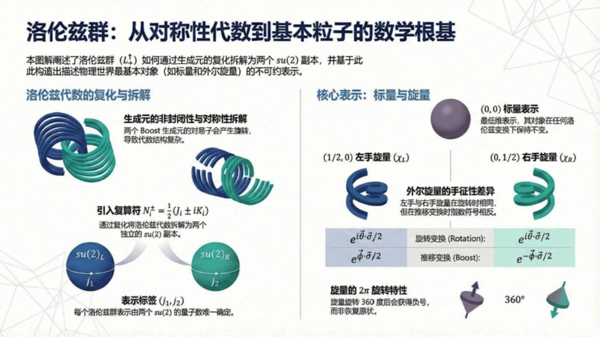
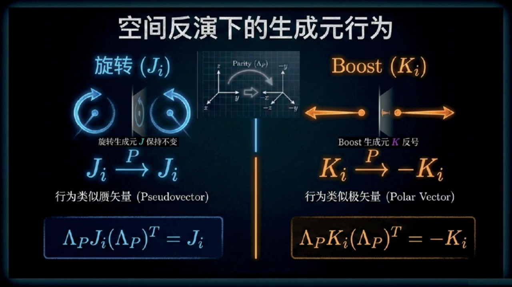
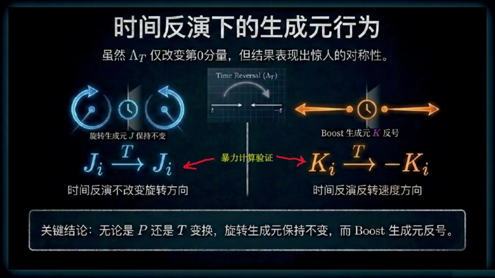
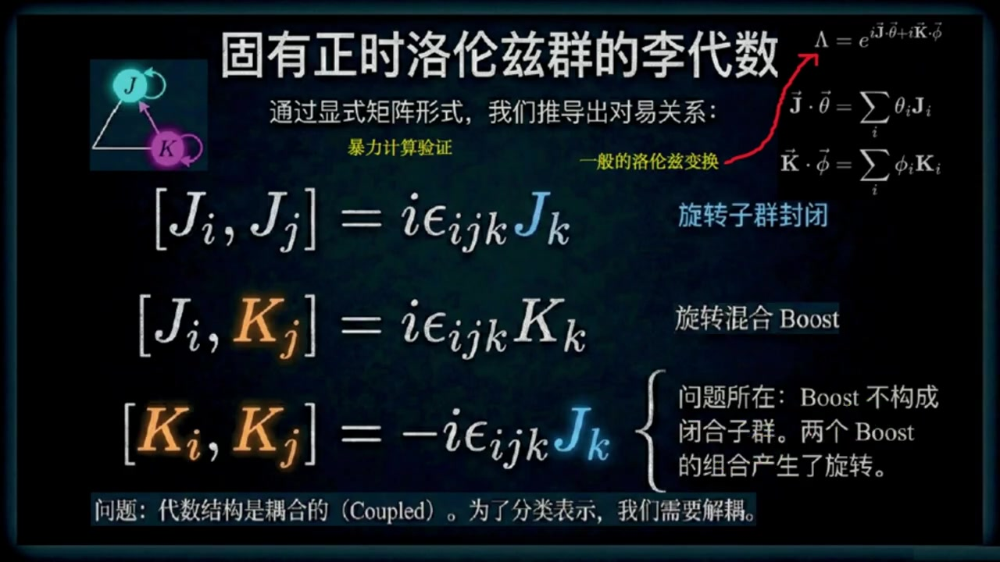
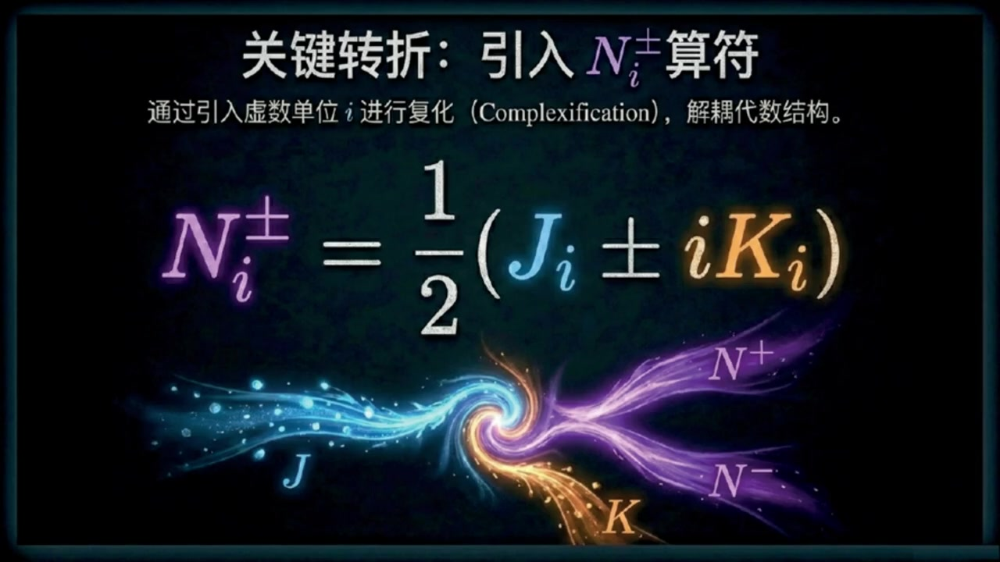
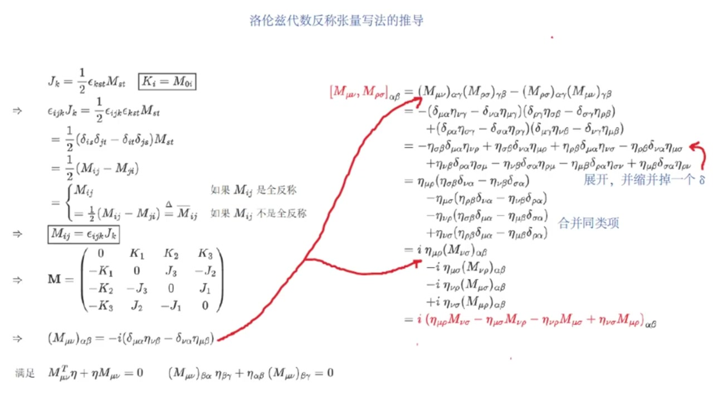
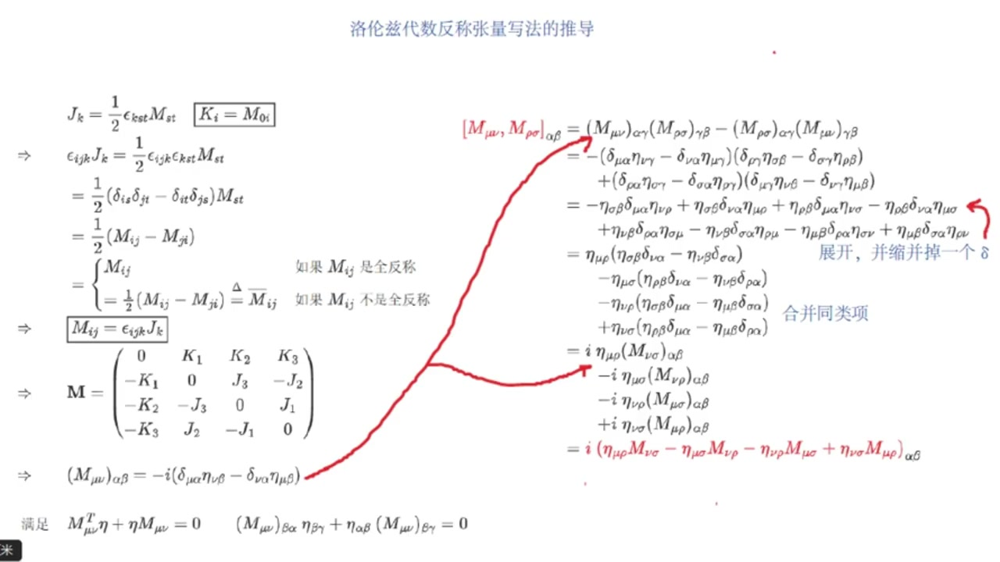
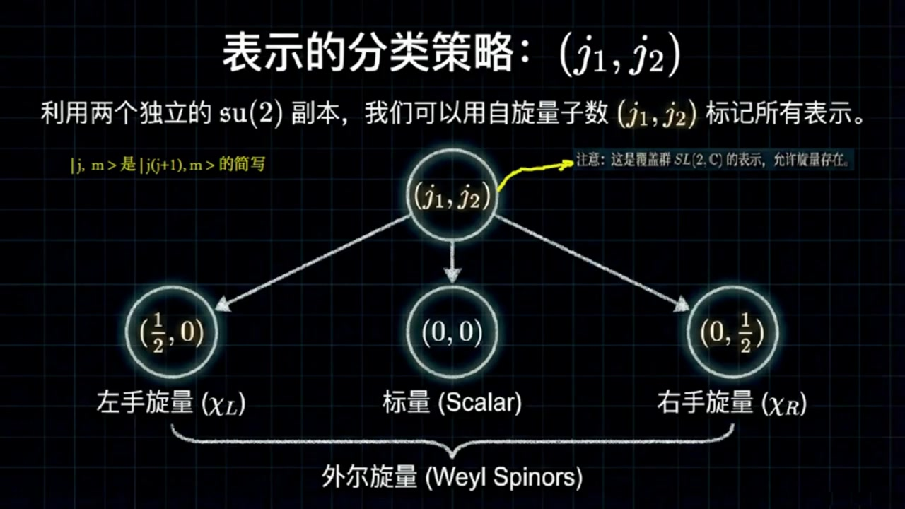
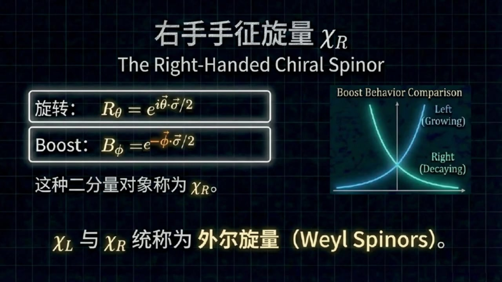

# 《基于对称性的物理学》第11课 洛伦兹群表示论：从生成元到外尔旋量

> 自动生成的课程注解文档（共 5 个段落，[原始视频](https://www.youtube.com/watch?v=yIiK6C0CqJQ)）

## 目录

- [00:00:00 课程引入与离散变换对生成元的作用](#段落-1)
- [00:04:03 洛伦兹代数的对易关系与复化分解](#段落-2)
- [00:08:32 反对称张量写法及其理括号结构](#段落-3)
- [00:13:44 覆盖群表示、标量表示与左手旋量](#段落-4)
- [00:20:02 旋量的物理性质、右手旋量与课程总结](#段落-5)

---

## 段落 1：课程引入与离散变换对生成元的作用 { #段落-1 }

**时间：** 00:00:00 ~ 00:04:02

📝 原始字幕

<pre>

大家好,欢迎来到基于对称性的物理学课程的第十一课,我是Zoe
今天非常开心能和大家一起探索洛伦兹群深奥又迷人的世界坐在我旁边的当然是我们的知识当当赛老师大家好我是赛很高兴能和佐伊一起继续我们关于对称型的旅程
今天我们会深入了解洛伦兹群的一些幕后英雄也就是它的生成员还有一些特别的表示没错塞老师我们之前已经了解了洛伦兹群的一些基本概念但今天我们好像要更进一步讨论洛伦兹群其他组成部分的生成员对吧
我们知道洛伦兹群不仅仅是那些连续的不改变时间和空间方向的变换
它还包括了空间反射P和时间反射T这些离散操作
上一节我们推倒了固有正时洛伦子群L向上箭头正的生成源也就是描述旋转的JI和描述Boost的KI就是那六个生成源
那现在我们要看这些离散操作比如空间反射会怎么影响GI和KI呢这是一个很有趣的问题
简单来说当我们对这些生成源进行空间反射操作时会发现旋转生成源JI保持不变它还是JI
也就是兰达P成JI成LAMPD转制依然等于JI哦那BUSTS生产员KI呢KI就不一样了
它会变成负的KI
也就是 ramda p 乘 ki 乘 ramda p 转制等于负的 ki
你可以想象一下,空间反射就像照镜子,旋转的方向在镜子里看起来还是一样
但是速度的方向就反过来了
所以描述速度变化的BOOST生成源会变号那么应该如何证明你上面说的这种性质呢证明其实很简单虽然有点烦琐
首先我们在上节课已经知道了故优证实洛伦子群的所有生成源包括三个旋转生成源J一J二J三
和三个BUSTS生产员
K1 K2 K3
对空间反射而言我们只需要将这六个生成元分成两组情况依次带入前面两个等式验证即可也就是暴力计算验证
你可以在课后再验证一遍哇原来是这样那时间繁衍呢是不是也类似没错通过暴力计算可以验证时间繁衍操作LANDT对JI的影响也是不变的JI依然是JI
但对KI来说同样会变成副KI这样啊听起来还挺直观的所以总结一下就是JI在空间繁衍和时间繁衍下都不变而KI都会变号
这个结论有什么用呢这个结论非常重要因为对于不同的物理表示比如我们后面要讲的悬量表示空间繁衍和时间繁衍的变换行为可能并不像在普通时量表示中那么明显提前制造生成元的行为能帮助我们理解这些更复杂的表示明白了这就像是给他们做了一个体检看看他们在这些特殊操作下有没有变脸好那我们接下来要讲固有正的洛伦子群的理代数这里是不是要用到这些JI和KI的对异关系了完全正确我们之前已经推导出了JI和KI的显示矩阵形式现在我们可以用它们来计算它们之间的对异关系也就是所谓的理代数听起来有点像数学里的惩罚表可以这么理解

</pre>

**课程截图：**

### 注解

这段视频片段深入探讨了**洛伦兹群的离散对称性**（空间反射 $P$ 和时间反射 $T$）对其生成元的作用，以及由此引出的李代数（Lie Algebra）研究。以下是针对新内容的专业注解：

---

### 一、核心公式解析

视频中出现了以下关键变换关系（以空间反射为例）：

#### 1. 空间反射下的生成元变换
$$
\Lambda_P J_i (\Lambda_P)^T = J_i \quad \text{和} \quad \Lambda_P K_i (\Lambda_P)^T = -K_i
$$

**符号说明：**
- **$\Lambda_P$**：空间反射（Parity）的 $4\times 4$ 变换矩阵。在闵可夫斯基时空中，通常取 $\Lambda_P = \text{diag}(1, -1, -1, -1)$（保持时间分量不变，空间分量取反）。
- **$J_i$**（$i=1,2,3$）：**旋转生成元**（Rotation generators），对应绕 $x,y,z$ 轴的无穷小旋转。在四维表示中通常是反对称矩阵，仅含空间-空间分量。
- **$K_i$**（$i=1,2,3$）：**Boost生成元**（Boost generators），对应沿 $x,y,z$ 方向的无穷小洛伦兹推动（速度变换）。在四维表示中对应时间-空间分量。
- **上标 $T$**：矩阵转置（Transpose）。这里的共轭变换（similarity transformation）形式反映了生成元作为二阶张量（或矩阵）在坐标变换下的规则。

**物理含义：**
- **旋转生成元 $J_i$ 不变**：旋转是**赝矢量（Pseudovector/Axial Vector）**。想象照镜子：你右手顺时针旋转，镜中人看起来也是顺时针旋转（虽然手性相反，但旋转方向不变）。
- **Boost生成元 $K_i$ 变号**：速度是**极矢量（Polar Vector/Proper Vector）**。照镜子时，向右的速度在镜中看起来是向左的，因此方向反转。

#### 2. 时间反射下的生成元变换
虽然字幕未明确写出公式，但截图和讲解表明：
$$
\Lambda_T J_i (\Lambda_T)^T = J_i \quad \text{和} \quad \Lambda_T K_i (\Lambda_T)^T = -K_i
$$
其中 $\Lambda_T = \text{diag}(-1, 1, 1, 1)$（时间分量取反，空间不变）。

**物理直觉：**
- **时间倒流**（$t \to -t$）不会改变旋转方向（你把录像倒放，逆时针旋转还是逆时针）。
- 但**速度方向会反转**（时间倒流时，向前运动的物体会看起来向后运动）。

---

### 二、板书/PPT截图内容描述

**截图1（空间反演下的生成元行为）：**
- **左侧（旋转 $J_i$）**：展示了一个旋转箭头经过镜子反射后方向不变的示意图。标注 "$J_i \xrightarrow{P} J_i$"，并归类为"行为类似赝矢量（Pseudovector）"。
- **右侧（Boost $K_i$）**：展示了一个双向箭头（代表速度/推动）经过镜子后方向反转的示意图。标注 "$K_i \xrightarrow{P} -K_i$"，并归类为"行为类似极矢量（Polar Vector）"。
- **底部公式框**：清晰展示了上述两个矩阵方程。

**截图2（时间反演下的生成元行为）：**
- **核心信息**：强调尽管 $\Lambda_T$ 仅改变第0分量（时间分量），但结果与空间反射具有"惊人的对称性"——即 $J_i$ 不变，$K_i$ 反号。
- **图示**：左侧是时钟倒转但旋转方向不变的示意图；右侧是速度方向随时间倒流而反转的示意图。
- **关键结论栏**：明确总结"无论是 $P$ 还是 $T$ 变换，旋转生成元保持不变，而 Boost 生成元反号"。

**截图3（课程总览图）：**
- 展示了洛伦兹代数复化（Complexification）的核心思想：通过引入复组合 $N_i^\pm = \frac{1}{2}(J_i \pm iK_i)$，将洛伦兹代数 $\mathfrak{so}(3,1)$ 拆解为两个独立的 $\mathfrak{su}(2)$ 副本。
- 预告了后续内容：旋量表示（Spinor Representations）$(1/2,0)$ 和 $(0,1/2)$，以及标量表示 $(0,0)$。

---

### 三、理论背景补充

#### 1. 固有正时洛伦兹群（Proper Orthochronous Lorentz Group）
字幕中提到的"固有正时洛伦兹群"（通常记为 $L_+^\uparrow$ 或 $\text{SO}^+(3,1)$）是洛伦兹群的**连通分支**（connected component），包含恒等变换，由 $J_i$ 和 $K_i$ 通过指数映射生成：
$$
\Lambda = \exp\left(i\vec{\theta}\cdot\vec{J} + i\vec{\phi}\cdot\vec{K}\right)
$$
其中 $\vec{\theta}$ 是旋转角度，$\vec{\phi}$ 是快度（rapidity）。

#### 2. 完整洛伦兹群的离散扩展
完整的洛伦兹群 $O(3,1)$ 包含四个不连通的分支，通过**空间反射** $P$（行列式 $\det\Lambda = -1$）和**时间反射** $T$（时向分量 $\Lambda^0_0 < 0$）与 $L_+^\uparrow$ 连接。理解这些离散操作对生成元的作用，是构造**旋量表示**（Spinor Representations）时定义宇称算符 $\hat{P}$ 和时间反演算符 $\hat{T}$ 的基础。

#### 3. 李代数（Lie Algebra）的引入
视频末尾提到要研究"李代数"，这是指生成元之间的**对易关系**（Commutation Relations）：
$$
[J_i, J_j] = i\epsilon_{ijk}J_k, \quad [K_i, K_j] = -i\epsilon_{ijk}J_k, \quad [J_i, K_j] = i\epsilon_{ijk}K_k
$$
这些关系完全决定了洛伦兹群的局部结构。值得注意的是，$J_i$ 和 $K_i$ 在 $P$ 和 $T$ 下的不同变换行为（$J_i$ 为偶，$K_i$ 为奇）保证了这些对易关系在离散变换下的自洽性。

---

### 四、通俗理解

可以把生成元想象成"对称性的基因"：
- **$J_i$（旋转基因）**：像**螺旋DNA**。无论你从镜子里看（$P$）还是倒放录像（$T$），双螺旋的旋转方向看起来是一样的。
- **$K_i$（Boost基因）**：像**箭头**。镜子里箭头左右颠倒，倒放时箭头方向也会反转。

这种"体检"（验证生成元在 $P,T$ 下的行为）之所以重要，是因为在**旋量表示**（如电子的自旋描述）中，粒子的行为不像普通标量或矢量那样直观。提前知道生成元的变换性质，能帮助我们正确构造在这些离散对称性下按特定方式变换的物理量（如赝标量、轴矢量等），这是理解弱相互作用中宇称不守恒等现象的数学基础。

---

## 段落 2：洛伦兹代数的对易关系与复化分解 { #段落-2 }

**时间：** 00:04:03 ~ 00:08:31

📝 原始字幕

<pre>

首先是JI和JJ的理括号,也就是两个旋转生成源之间的对异子
结果是虚数i乘eplon ijk缩并jk
这个也只能挨个暴力计算验证
这个结果表示旋转生成源在对应下是封闭的他们自己就能组成一个代数就像我们熟悉的SUV里代数一样这个我们比较熟悉那如果是一个旋转生成源和一个BOOST生成源呢
JI和KJ的括号会是什么他们的对义词是虚数I乘EPSILONIJK缩并KK
这个意义只是旋转和boost生成源之间不是互相独立的,它们会互相混合
一个旋转操作可以改变BOOST的方向有点意思那最特别的是不是两个BOOST生成元之间的对一子KI和KJ的理括号会是什么没错这正是最特别的地方
KI和KJ的离括号是负虚数I乘EpsilonIJK缩并JK
这告诉我们两个不死生成源的对异子竟然是一个旋转生成源
这意味着不死的生成源在对应下并不封闭
哇所以说如果你连续进行两次不同方向的boost效果并不只是一个简单的boost还可能包含一个旋转精辟正是这个意思
这种混合和不封闭,让整个洛伦兹袋鼠看起来有点复杂
我记得前面学过,根据利理论,可从生成源得到有限变化
那现在我们有了前面提到的这六个生成源是不是就可以生成整个固有正式的洛伦兹群是的
这个群的任意生成元也就是其对应的李代数的任意元素都可以表示成这六个生成元的线性组合
不妨选择旋转生成源JI对应的系数为CTI
Boost生成源KI对应的系数为FI
于是整个群的任意生成源都可以表示成C踏上箭头J上箭头加FY上箭头K上箭头
我明白了所以一般的洛伦子变换可表示成RAMDA等于虚数A成这个线性组合的指数是的
现在我们还是回到这个群对应的梨代数吧
刚才我们提到这个离代数BUST生成源在离括号下并不封闭并且旋转和BUST生成源之间也不是互相独立这会导致问题比较复杂
为了简化它,物理学家们引入了一种非常巧妙的方法
这个方法的目的是解决这个不封闭和不相互独立的问题哦是什么方法我们定义了两个新的算符叫做恩爱正和恩爱父
他们是JI和KI的负线性组合也就是NI正负等于二分之一成括号JI加减虚数I成KI括号
这个过程我们称之为复化复化听起来有点高深那这些新的钻符由什么神奇之初呢神奇之初就在于它们的对异关系变得非常简洁和漂亮
首先N爱症和NJ症的离括号变成了虚数爱成X浪IJK缩柄NK症这看起来很像梨代数SUR的对一关系啊完全正确
同样NI赋和NJ赋的理括号也变成了虚数I乘YJK缩并NK赋
这也是李代数SU2的对异关系
更令人兴奋的是NI证和NJ赋的李括号竟然等于零零这简直太棒了这意味着NI证和NI赋这两组算符是完全独立的彼此之间不对异没错
所以通过这种复化我们发现固有洛伦兹群的理带数可以分解成两个独立的SUR理带数复本
这就像是把一个复杂的系统拆分成了两个我们已经非常熟悉的简单系统哇这真是个大招啊那这意味着我们就可以直接利用SU二的表示理论来研究落轮子群的表示了对吗基本是这样

</pre>

**课程截图：**

### 注解

这段视频片段深入探讨了**固有正时洛伦兹群（Proper Orthochronous Lorentz Group）的李代数结构**，并引入了**复化（Complexification）**这一关键技巧来解耦代数结构。以下是针对新内容的专业注解：

---

### 一、板书/PPT 截图描述

**第一张截图（李代数对易关系）：**
板书标题为"固有正时洛伦兹群的李代数"。左侧列出了三个核心对易关系，以矩阵形式展示：
- 第一行：$[J_i, J_j] = i\epsilon_{ijk}J_k$，标注"旋转子群封闭"
- 第二行：$[J_i, K_j] = i\epsilon_{ijk}K_k$，标注"旋转混合 Boost"  
- 第三行：$[K_i, K_j] = -i\epsilon_{ijk}J_k$，右侧有文字说明"问题所在：Boost 不构成封闭子群。两个 Boost 的组合产生了旋转"

右上角给出了一般洛伦兹变换的指数映射形式：$\Lambda = e^{i\vec{J}\cdot\vec{\theta}+i\vec{K}\cdot\vec{\phi}}$，其中 $\vec{J}\cdot\vec{\theta} = \sum \theta_i J_i$，$\vec{K}\cdot\vec{\phi} = \sum \phi_i K_i$。

**第二张截图（关键转折）：**
标题为"关键转折：引入 $N_i^\pm$ 算符"。中央大字体显示复化定义：
$$N_i^\pm = \frac{1}{2}(J_i \pm iK_i)$$
上方小字说明："通过引入虚数单位 $i$ 进行复化（Complexification），解耦代数结构。"

下方有视觉化图示：左侧蓝色光流标注 $J$，右侧橙色光流标注 $K$，两者螺旋交织后分离为紫色的 $N^+$ 和 $N^-$，形象表示通过复线性组合将耦合的生成元解耦为独立的两组。

---

### 二、核心公式解析

#### 1. 洛伦兹李代数的基本对易关系

视频中推导了固有洛伦兹群李代数 $\mathfrak{so}(3,1)$ 的结构常数：

**（1）旋转生成元的封闭性：**
$$[J_i, J_j] = i\epsilon_{ijk}J_k$$

**符号说明：**
- $J_i$（$i=1,2,3$）：空间旋转生成元，对应绕 $x,y,z$ 轴的无穷小旋转。
- $\epsilon_{ijk}$：Levi-Civita 符号（完全反对称张量），当 $(i,j,k)$ 为 $(1,2,3)$ 的偶排列时为 $+1$，奇排列时为 $-1$，任意两指标相同则为 $0$。
- 物理意义：旋转生成元在自身对易子下封闭，构成 $\mathfrak{su}(2)$ 子代数（或 $\mathfrak{so}(3)$）。

**（2）旋转与 Boost 的混合：**
$$[J_i, K_j] = i\epsilon_{ijk}K_k$$

**符号说明：**
- $K_i$（$i=1,2,3$）：Boost（推促）生成元，对应沿 $x,y,z$ 方向的无穷小洛伦兹变换。
- 物理意义：这是一个**矢量变换关系**，表明 $K_j$ 在旋转下按矢量规则变换。旋转操作会改变 Boost 的方向，两者并非独立。

**（3）Boost 的非封闭性（关键特征）：**
$$[K_i, K_j] = -i\epsilon_{ijk}J_k$$

**符号说明：**
- 负号 $-$：这是洛伦兹群与欧几里得群的关键区别，源于度规符号 $(+,-,-,-)$ 或 $(-,+,+,+)$。
- 物理意义：两个不同方向的 Boost 生成元对易子**不是** Boost，而是**旋转生成元**。这被称为 **Thomas-Wigner 旋转**的代数根源。

#### 2. 复化与 $N_i^\pm$ 算符

为解决 Boost 不封闭导致的复杂性，引入复化技巧：

**复化定义：**
$$N_i^\pm = \frac{1}{2}(J_i \pm iK_i)$$

**符号说明：**
- $i$：虚数单位（$\sqrt{-1}$），这里**不是**指标。
- $N_i^+$：通常记作 $N_i$ 或 $\vec{N}$，对应"自旋"算符的一种组合。
- $N_i^-$：通常记作 $N_i^\dagger$ 或 $\vec{\tilde{N}}$，与 $N_i^+$ 互为复共轭（在适当表示下）。
- 系数 $\frac{1}{2}$：归一化因子，确保新算符满足标准 $\mathfrak{su}(2)$ 对易关系。

#### 3. 解耦后的对易关系

复化后的新算符满足：

**（1）同族封闭性：**
$$[N_i^+, N_j^+] = i\epsilon_{ijk}N_k^+$$
$$[N_i^-, N_j^-] = i\epsilon_{ijk}N_k^-$$

**（2）异族独立性：**
$$[N_i^+, N_j^-] = 0$$

**数学意义：**
这表明复化后的洛伦兹李代数 $\mathfrak{so}(3,1)\otimes \mathbb{C}$ 同构于两个独立的 $\mathfrak{su}(2)$ 李代数的直和：
$$\mathfrak{so}(3,1)\otimes \mathbb{C} \cong \mathfrak{su}(2) \oplus \mathfrak{su}(2)$$

---

### 三、理论背景补充

#### 1. Thomas-Wigner 旋转的代数根源
公式 $[K_i, K_j] = -i\epsilon_{ijk}J_k$ 揭示了狭义相对论中一个反直觉的现象：连续进行两次不同方向的 Boost（例如先沿 $x$ 轴再沿 $y$ 轴）**不等于**一个单纯的 Boost，而是等于一个 Boost 再叠加一个空间旋转。这在粒子物理和陀螺仪进动（Thomas 进动）中有重要物理效应。

#### 2. 复化（Complexification）的数学实质
- **实李代数 vs 复李代数**：原始洛伦兹代数 $\mathfrak{so}(3,1)$ 是实李代数（系数为实数），其生成元 $J_i$（厄米）和 $K_i$（反厄米）在量子力学中具有不同的厄米性。
- **复化操作**：通过允许系数为复数，并引入复线性组合 $N_i^\pm$，我们将实代数嵌入到复代数中。这类似于将实数域上的向量空间扩展到复数域。
- **同构关系**：复化后的代数与 $\mathfrak{sl}(2,\mathbb{C}) \oplus \mathfrak{sl}(2,\mathbb{C})$ 同构（作为复李代数），这是构造洛伦兹群有限维表示的理论基础。

#### 3. 表示论的推论
由于 $\mathfrak{so}(3,1)\otimes \mathbb{C} \cong \mathfrak{su}(2) \oplus \mathfrak{su}(2)$，洛伦兹群的有限维不可约表示可以用两个半整数 $(j_1, j_2)$ 来标记，其中 $j_1$ 对应 $N^+$ 的表示，$j_2$ 对应 $N^-$ 的表示。例如：
- $(0,0)$：标量表示
- $(\frac{1}{2},0)$：左手 Weyl 旋量
- $(0,\frac{1}{2})$：右手 Weyl 旋量  
- $(\frac{1}{2},\frac{1}{2})$：四维矢量表示（对应 $J_i$ 和 $K_i$ 的原始作用空间）

---

### 四、通俗语言解释

**"混合"与"不封闭"的物理图像：**

想象你有一个"旋转工具箱"（$J$）和一个"加速工具箱"（$K$）：

1. **旋转工具箱是自闭的**：只用旋转工具组合，得到的还是旋转（封闭）。
2. **旋转和加速会互相干扰**：如果你先旋转一下火箭，再点火加速，你会发现加速方向相对于新坐标系变了（混合）。
3. **连续加速的诡异效应**：最奇怪的是，如果你先沿东加速，再沿北加速，结果不仅是一个向东北的加速，还**额外附带了一个旋转**（比如让你的座椅转了个角度）。这就是 Boost 不封闭的表现——两个加速操作"生"出了一个旋转。

**复化的巧妙之处：**

物理学家面对这种纠缠不清的关系，想出了一个"分频"技巧——就像把左右声道的混合信号分离成独立的左右声道：

- 定义 $N^+ = \frac{1}{2}(J + iK)$ 和 $N^- = \frac{1}{2}(J - iK)$，相当于把 $J$ 和 $K$ 进行"相位差 90 度的叠加"。
- 神奇的是，这两组新算符**彼此完全独立**（对易子为零），而且各自都满足简单的角动量代数（$\mathfrak{su}(2)$）。
- 这就像把一个复杂的双引擎系统，拆解成了两个完全相同的单引擎系统，而我们早就对单引擎（自旋/角动量）了如指掌，因此可以大大简化洛伦兹群的表示理论分析。

---

## 段落 3：反对称张量写法及其理括号结构 { #段落-3 }

**时间：** 00:08:32 ~ 00:13:44

📝 原始字幕

<pre>

但在讨论构造SU二里代数的所有不可约表示之前我们先探讨一下洛伦子代数的一种反秤张亮写法洛伦子代数还有张亮写法我很好奇我们前面知道洛伦子代数有两种生成源三个旋转生成源三个Boost生成源
就好像三个电磁分量和三个磁场分量可构造一个反称的电磁场张量那样构造
具体而言就是对旋转生成源而言大JI可写成二分之一成EPSLONIJK缩并MJK
而对Booster生成源而言大KI等于M零I我注意到旋转生成源大JI和Booster生成源大KI都是四乘四矩阵
那么是不是意味着这个反称张量M的每个元素也都是四乘四矩阵?你的观察很仔细,是的
这个张亮M可理解成由四乘四矩阵组成反乘张亮现在我很想知道这个反乘张亮的具体表达式你可以推导出具体表达式吗可以的我们首先根据大JI和张亮M的定义关系是
两边同时缩并 Epsilon IJK
也就是IJK缩并JK等于二分之一成IJK缩并KST缩并MST我看到两个空间列为其为塔张亮的单指标缩并有一个著名的EPSLONDELTA公式对吧
对的利用这个公式可以继续等于二分之一成括号雕踏IS成雕踏JT简雕踏IT成雕踏JS括号缩并MST
继续刻等于二分之一成括号MIJ减MJI括号
我注意爆了,由于M是反秤张量,所以最后等于MIJ
你说得很对即使M不是返程张量我们算出的结果二分之一成括号MJ减MJI括号本身也是返程张量
这样我们可以将这个结果重新定义成一个新的反乘张量
茶
你现在应该可以看出这个返程张亮的具体形式吗
嗯,我注意到两个方框中的结过,和反称张亮的反称性
那么这个反乘张亮M应该可以直接写出一个矩阵形式也就是第零行是零大K一大K二大K三换行负大K一零大J三负大J二
换行:负大K二,负大J三,零,大J一
换行:负大K三,大J二,负大J一,零
对的除了这种矩阵形式我们根据旋转生成源大JI和Boost生成源大KI
还可以构造出一种紧凑的全分量表达式
全反称聚诊M的位的生成源的阿尔法贝塔分量等于负虚数I成括号DELTAMYUALFA成ATANUEBETA
减delta new alpha成ata new beta
关于这个表达式的正确性你可以针对每个位置的非零元素对应旋转生成源或BUST生成源的具体矩阵对比验证我注意到反常矩阵的每个非零分量要么是旋转生成源要么是BUST生成源
是不是同样满足洛伦兹代数的条件
是的
它们都满足M牛的转折乘洛伦兹度归A塔加A塔乘M牛等于零这个洛伦兹代数的条件我看到书中提供了一个这个反秤张量的任意一对元素的理括号的表达式看起来有些复杂并不显然你可以给出一个证明吗
可议的其实这个证明本质上就是暴力计算我们计算MNU和MROSIGMA的理括号的阿尔法贝塔分量
案例括号的定义展开等于M的阿尔法伽马缩写M的伽马贝塔
剪M肉SIGMA的阿尔法GAMMA缩饼M牛牛的GAMMABETA
然后将前面M的全分量紧凑的表达式带入再然后将这个表达式完全展开并且每项有两个德尔泰音符都可以缩并掉一个德尔泰音符
随后合并同类项
然后再将 m 的全分量紧凑的表达式回带
最后就可以得到M M U N U 和 M R S C G M A 的理括号的 alpha beta分量,最终的结果
我现在仅仅是概要描述了一下计算过程,但我希望同学们最好动手算一遍我明白了,下面我们继续吧

</pre>

**课程截图：**

### 注解

这段视频片段聚焦于**洛伦兹代数的协变（张量）表述**，将此前讨论的 $J_i$（旋转）和 $K_i$（Boost）统一纳入反称张量 $M_{\mu\nu}$ 的框架中。这是从"非协变的 $3+1$ 分解"迈向"四维协变形式"的关键一步。

---

### 一、板书/PPT 截图描述

**第二张与第三张截图（洛伦兹代数反称张量写法的推导）：**
板书以手写推导形式展示了从 $J_i, K_i$ 到 $M_{\mu\nu}$ 的完整构造过程，核心内容分为四部分：

1. **定义关系（左上）**：
   - $J_k = \frac{1}{2}\epsilon_{ijk}M_{ij}$（注：板书此处指标写法略有省略，实际为 $J_i = \frac{1}{2}\epsilon_{ijk}M_{jk}$）
   - $K_i = M_{0i}$（被方框标注）

2. **逆推导（左中）**：
   利用 Levi-Civita 符号的缩并公式 $\epsilon_{ijk}\epsilon_{jlm} = \delta_{kl}\delta_{im} - \delta_{km}\delta_{il}$，推导出：
   - $M_{ij} = \epsilon_{ijk}J_k$（空间-空间分量）
   - 强调 $M_{ij}$ 的反称性：$M_{ij} = -M_{ji}$

3. **矩阵形式（左下）**：
   展示 $M_{\mu\nu}$ 作为 $4\times 4$ 矩阵的显式结构（$\mu,\nu = 0,1,2,3$ 为行/列指标）：
   $$
   \mathbf{M} = \begin{pmatrix}
   0 & K_1 & K_2 & K_3 \\
   -K_1 & 0 & J_3 & -J_2 \\
   -K_2 & -J_3 & 0 & J_1 \\
   -K_3 & J_2 & -J_1 & 0
   \end{pmatrix}
   $$
   其中每个元素（如 $K_1, J_3$）本身又是表示生成元的 $4\times 4$ 矩阵。

4. **全分量表达式与对易关系（右侧）**：
   - 给出矩阵元的抽象定义：$(M_{\mu\nu})_{\alpha\beta} = -i(\delta_{\mu\alpha}\eta_{\nu\beta} - \delta_{\nu\alpha}\eta_{\mu\beta})$
   - 详细展开对易子 $[M_{\mu\nu}, M_{\rho\sigma}]_{\alpha\beta}$ 的"暴力计算"过程：先按定义展开为矩阵乘积之差，代入全分量表达式，利用 $\delta$ 函数缩并指标，最终合并同类项得到协变对易关系。

---

### 二、核心公式解析

#### 1. 统一生成元 $M_{\mu\nu}$ 的定义与分解
**公式：**
$$
J_i = \frac{1}{2}\epsilon_{ijk}M_{jk}, \quad K_i = M_{0i}
$$

**符号说明：**
- **$M_{\mu\nu}$**：洛伦兹代数的**反称张量生成元**（$\mu,\nu = 0,1,2,3$），共 6 个独立分量（$M_{0i}$ 和 $M_{ij}$）。
- **$\epsilon_{ijk}$**：三维 Levi-Civita 符号（全反称，$\epsilon_{123}=1$），用于从空间分量 $M_{jk}$ 中提取旋转生成元。
- **$J_i$**：第 $i$ 轴的旋转生成元（空间-空间平面转动）。
- **$K_i$**：沿第 $i$ 轴的 Boost 生成元（时间-空间平面"转动"）。

**逆关系（板书推导关键）：**
通过 $\epsilon_{ijk}$ 缩并并利用恒等式 $\epsilon_{ijk}\epsilon_{klm} = \delta_{il}\delta_{jm} - \delta_{im}\delta_{jl}$，可得：
$$
M_{ij} = \epsilon_{ijk}J_k
$$
这表明 $M_{ij}$ 与 $J_i$ 本质等价，只是用反称张量指标取代了空间矢量指标。

#### 2. 矩阵形式的直观结构
板书给出的 $4\times 4$ 矩阵 $\mathbf{M}$ 并非普通数字矩阵，而是一个**分块矩阵**，其每个"元素"（如 $K_1$）本身是一个 $4\times 4$ 矩阵（生成元的具体表示）。

- **第 0 行/列**：包含 $K_i$，对应时间-空间混合分量 $M_{0i} = -M_{i0}$。
- **空间子块（$i,j = 1,2,3$）**：包含 $J_i$，排列方式遵循 $\epsilon_{ijk}$ 的循环性质（如 $M_{12} = J_3$）。

**通俗理解**：这就像把电磁场张量 $F_{\mu\nu}$（电场 $\mathbf{E}$ 和磁场 $\mathbf{B}$ 的统一）中的 $\mathbf{E}$ 换成 $\mathbf{K}$，$\mathbf{B}$ 换成 $\mathbf{J}$。

#### 3. 全分量表达式（协变定义）
**公式：**
$$
(M_{\mu\nu})_{\alpha\beta} = -i(\delta_{\mu\alpha}\eta_{\nu\beta} - \delta_{\nu\alpha}\eta_{\mu\beta})
$$

**符号说明：**
- **$(M_{\mu\nu})_{\alpha\beta}$**：生成元 $M_{\mu\nu}$ 在 $4\times 4$ 表示中的第 $\alpha$ 行第 $\beta$ 列矩阵元。
- **$\delta_{\mu\alpha}$**：Kronecker delta（四维单位矩阵分量）。
- **$\eta_{\nu\beta}$**：闵可夫斯基度规（通常取 $\text{diag}(+,-,-,-)$ 或 $(-,+,+,+)$，此处符号约定需根据上下文确定，视频中未明确但暗示了度规的介入）。
- **$-i$**：确保生成元是厄米（或反厄米，取决于约定）的，且满足实

---

## 段落 4：覆盖群表示、标量表示与左手旋量 { #段落-4 }

**时间：** 00:13:44 ~ 00:20:01

📝 原始字幕

<pre>

好吧我们继续我们在第九课已经知道如何构造SU2理代数的所有不可约表示它们由SU2卡西米尔算法的一个标量值J来标记
当前我们当时也强调过这个J实际代表的是J乘括号J加一括号我们继续采用这个约定
这种约定下的J值只能取比如J等于021等等
所以若伦兹群覆盖群作为两个独立李袋鼠SU二复本的组合其不可约表示就可以用两个这样的值J一J二来标记覆盖群这个概念有点陌生
为什么不是直接洛伦兹群的表示呢?这个是一个很关键的点
后轮子群和SO3旋转群一样,它不是单脸铜的
这个意味着礼代数的不可约表示并不总是与群本身的表示一一对应
我们通过李代数推导出的表示实际上是对应于这个群的覆盖群的表示所以说附数玉的SL二是洛伦子群的覆盖群就像SU二是SO三的覆盖群一样对就是这个关系
复数欲的SL二是行列式为一的二乘二复数正群
这些骨盖群的表示中有一部分是我们洛伦兹群的表示
但还有一些额外的表示额外的表示这些额外的表示有什么用呢它们非常有用
因为我们发现描述某些基本粒子的物理量,比如悬量,就恰好需要这些额外的表示
所以虽然技术上我们得到的是不该群群的表示但我们通常会简称它们为洛伦咨询的表示原来如此这背后还有这么深的数学原理那我们现在有了J一J二这样的标记是不是就可以开始探索具体的表示了首先从最简单的零零表示开始没错
我们现在讨论零零表示
这个表示是最简单的
因为它对应于两个SUR副本的最低位表示也就是一维表示一维表示那生成元会是什么呢在一维空间里要满足对异关系的唯一矩阵就是数字零
所以在这种情况下恩爱症和恩爱父都等于零那如果生成源都是零是不是意味着任何洛伦子变换作用到这个对象上都不会改变它完全正确
自然常数一上INI正含一上INI负都会变成一上零等于一
所以这种表示作用的对象在洛伦子变换下是不变的
我们称这种表示为标量表示
标量表示就是我们平时说的标量比如温度质量这些它们在洛伦兹变换下数值不变这很好理解那接下来是不是要讲更有趣的比如二分之一零表示了是的我们现在来探索二分之一零表示
这个表示就非常特别了
他对NI证使用了SU2的二维表示也就是NI证等于二分之一成SIGMAI
而对NICF呢则仍然使用一为表示也就是NICF等于零所以一个活跃一个沉寂
那NIV等于零会带来什么结果呢根据NIV的定义NIV等于二分之一乘括号JI减虚数I乘KI括号等于零
这直接导出了一个非常重要的关系JI等于虚数I成KI哇旋转生成源和BOOST生成源之间竟然有了这种虚数关系那我们怎么利用这个关系来找到JI和KI的具体形式呢
我们可以把JI等于虚数I成KI带回到N一二分之一成括号JI加虚数I成KI括号这样就会得到N一二分之一成括号KI加虚数I成KI然后我们又知道N一二分之一成KI所以我们就能解除KI等于二分之一成KI
会变成E上二分之一乘C塔上箭头,DOT Sigma上箭头
而BUS的变换B5等于E上I成F上箭头DOTK上箭头
则会变成一上二分之一成F上箭头的SIGMA上箭头
嗯,这里旋转的指数有虚数I,就是所谓有矩阵,又叫优证矩阵,是周期性的
而Boost的指数上没有I了,变成十数了,是恶迷矩阵,非妖症的
这些变换看起来很有趣
那这些变换作用的对象是什么呢?它们有几个分量.这些变换是负数的二乘二矩阵
它们作用于一种特殊的二分量对象
这些对象被称为左手手蒸选量通常用KL来表示左手手蒸选量听起来很酷他们和我们平时说的四维始量有什么不同吗他们最大的不同就是只有两个分量而且他们在洛伦兹变换下的行为非常特殊

</pre>

**课程截图：**

### 注解

基于您提供的视频字幕与板书截图，这段内容深入讲解了**洛伦兹群（Lorentz Group）的表示理论**，特别是其李代数的**复化（Complexification）**技巧，以及如何通过两个独立的 $SU(2)$ 副本来分类所有有限维表示。以下是针对新出现内容的深度注解：

---

## 一、板书/PPT 截图内容描述与公式解析

### 截图 1：表示的分类策略 $(j_1, j_2)$

**视觉描述：**
- 标题为**"表示的分类策略: $(j_1, j_2)$"**
- 中央是一个树状图，根节点为 $(j_1, j_2)$，向下分出三个示例节点
- 左侧节点：$(\frac{1}{2}, 0)$，标注"左手旋量 ($\chi_L$)"
- 中央节点：$(0, 0)$，标注"标量 (Scalar)"  
- 右侧节点：$(0, \frac{1}{2})$，标注"右手旋量 ($\chi_R$)"
- 底部统一标注："外尔旋量 (Weyl Spinors)"
- 右上角黄色注释："注意：这是覆盖群 $SL(2,\mathbb{C})$ 的表示，允许旋量存在"

**核心公式与符号解释：**

| 符号 | 含义 | 物理意义 |
|------|------|----------|
| $(j_1, j_2)$ | 两个独立 $SU(2)$ 表示的标记 | 洛伦兹群（覆盖群）的不可约表示由两个"角动量量子数"标记，类比原子物理中的 $j$ |
| $j_1, j_2 \in \{0, \frac{1}{2}, 1, \frac{3}{2}, \dots\}$ | 非负半整数 | 每个数字代表一个 $SU(2)$ 代数的表示维度 $(2j+1)$ |
| $(0,0)$ | 两个 $SU(2)$ 的平凡表示（一维） | **标量表示**：洛伦兹变换下数值不变（如质量、温度） |
| $(\frac{1}{2}, 0)$ | 第一个 $SU(2)$ 取 $j=1/2$（二维），第二个取 $j=0$（一维） | **左手外尔旋量**：描述无质量左旋费米子（如中微子） |
| $(0, \frac{1}{2})$ | 第一个取 $j=0$，第二个取 $j=1/2$ | **右手外尔旋量**：描述无质量右旋费米子 |
| $SL(2,\mathbb{C})$ | 复数域上的二维特殊线性群（行列式为1的 $2\times 2$ 复矩阵） | 洛伦兹群 $SO(3,1)$ 的**通用覆盖群（Universal Cover）**，类似于 $SU(2)$ 覆盖 $SO(3)$ 的关系 |

**关键概念：**
- **覆盖群必要性**：洛伦兹群 $SO(3,1)$ 不是单连通的（存在不可收缩的环路），其双连通结构要求我们用 $SL(2,\mathbb{C})$ 来正确描述旋量（spinor）—— 旋量在 $360^\circ$ 旋转下会变号，需要 $720^\circ$ 才回到原值，这是覆盖群表示的特征。

---

### 截图 2：$(\frac{1}{2}, 0)$ 表示的推导

**视觉描述：**
- 标题为**"$(\frac{1}{2}, 0)$ 表示的推导"**，副标题"构造左手旋量"
- 左侧为三步推导流程，右侧为结果框
- 红色箭头从步骤2的 $J_i$ 指向步骤3的代入位置
- 步骤1设定 $N_i^+ = \frac{\sigma_i}{2}$, $N_i^- = 0$
- 步骤2通过 $N_i^- = 0$ 反解出 $J_i = iK_i$（红色方框标注 $J_i$）
- 步骤3代入得到 $N_i^+ = iK_i$

**核心公式与符号解释：**

**1. 复化生成元定义（板书顶部）：**
$$N_i^{\pm} = \frac{1}{2}(J_i \pm iK_i)$$

| 符号 | 数学定义 | 物理意义 |
|------|----------|----------|
| $J_i$ ($i=1,2,3$) | 空间旋转生成元（角动量） | 对应洛伦兹群的旋转子群 $SO(3)$，满足 $[J_i, J_j] = i\epsilon_{ijk}J_k$ |
| $K_i$ | 洛伦兹 Boost 生成元 | 对应不同惯性参考系间的"加速"变换，满足 $[K_i, K_j] = -i\epsilon_{ijk}J_k$ 和 $[J_i, K_j] = i\epsilon_{ijk}K_k$ |
| $N_i^+$ | $\frac{1}{2}(J_i + iK_i)$ | 第一个 $SU(2)$ 的生成元（复化后） |
| $N_i^-$ | $\frac{1}{2}(J_i - iK_i)$ | 第二个 $SU(2)$ 的生成元（复化后） |
| $\sigma_i$ | 泡利矩阵（Pauli matrices） | $SU(2)$ 在二维表示（自旋-1/2）中的具体矩阵形式 |

**2. $(\frac{1}{2}, 0)$ 表示的构造过程：**

- **设定**：对于 $(j_1, j_2) = (\frac{1}{2}, 0)$，我们令：
  $$N_i^+ = \frac{\sigma_i}{2}, \quad N_i^- = 0$$
  *解释*：这表示第一个 $SU(2)$ 取二维表示（自旋-1/2），第二个 $SU(2)$ 取一维平凡表示（所有生成元为0）。

- **反解关系**（步骤2）：
  由 $N_i^- = \frac{1}{2}(J_i - iK_i) = 0$，立即得到：
  $$J_i = iK_i$$
  *关键观察*：这意味着在该表示中，**旋转生成元与 Boost 生成元通过虚数单位 $i$ 相互锁定**。

- **代入求解**（步骤3）：
  将 $J_i = iK_i$ 代入 $N_i^+$ 的定义：
  $$N_i^+ = \frac{1}{2}(iK_i + iK_i) = iK_i = \frac{\sigma_i}{2}$$

**3. 最终结果（右侧红字）：**

| 生成元类型 | 表达式 | 解读 |
|------------|--------|------|
| **旋转生成元** | $J_i = \frac{1}{2}\sigma_i$ | 与 $SU(2)$ 的自旋-1/2表示完全相同，符合"旋量"在旋转下的行为 |
| **Boost 生成元** | $K_i = -\frac{i}{2}\sigma_i$ | 出现了关键的 **$-i$ 因子**！这使得 Boost 变换在旋量表示中是**厄米（Hermitian）的缺失** —— $K_i$ 是反厄米的（因为 $J_i$ 是厄米的，$J_i = iK_i \Rightarrow K_i = -iJ_i$） |

**物理后果：**
- 对于左手旋量 $(\frac{1}{2}, 0)$，Boost 变换的矩阵为 $\exp(-i\eta^i K_i) = \exp(-\frac{1}{2}\eta^i \sigma_i)$（其中 $\eta^i$ 为快度/rapidity），这是**非幺正（non-unitary）**的！但这没关系，因为洛伦兹群是非紧致的，其有限维表示本来就不必幺正（只有无限维的希尔伯特空间表示才需要幺正性）。

---

## 二、理论背景补充

### 1. 为什么要"复化"（Complexification）？
洛伦兹代数 $\mathfrak{so}(3,1)$ 的实形式结构复杂（旋转和 Boost 混合），但通过引入复数系数定义 $N_i^\pm$，我们发现：
$$[N_i^+, N_j^+] = i\epsilon_{ijk}N_k^+, \quad [N_i^-, N_j^-] = i\epsilon_{ijk}N_k^-, \quad [N_i^+, N_j^-] = 0$$

这实现了**代数的完全解耦**：洛伦兹代数同构于两个复 $SU(2)$ 代数的直和 $\mathfrak{su}(2)_\mathbb{C} \oplus \mathfrak{su}(2)_\mathbb{C}$。这使得我们可以直接套用 $SU(2)$ 的表示理论（已知的 $j$ 标记法）来构造洛伦兹群的所有表示。

### 2. 覆盖群 $SL(2,\mathbb{C})$ 的几何意义
- **拓扑差异**：$SO(3,1)$ 的基本群是 $\mathbb{Z}_2$（存在两类环路），而 $SL(2,\mathbb{C})$ 是单连通的。
- **旋量必要性**：在标准模型中，夸克和轻子都是旋量场。如果只使用 $SO(3,1)$ 的张量表示（如矢量、张量），无法描述这些基本粒子。覆盖群的表示允许"投影表示"（projective representations），这在物理上对应于半整数自旋。

### 3. $(j_1, j_2)$ 表示的维度
表示的维度为 $(2j_1+1)(2j_2+1)$：
- $(0,0)$: $1\times 1 = 1$（标量）
- $(\frac{1}{2}, 0)$: $2\times 1 = 2$（左手外尔旋量）
- $(0, \frac{1}{2})$: $1\times 2 = 2$（右手外尔旋量）
- $(\frac{1}{2}, \frac{1}{2})$: $2\times 2 = 4$（这正是**狄拉克旋量**或四维矢量的表示！）

---

## 三、核心概念通俗解释

### 1. "两个独立 $SU(2)$"的直觉图像
想象洛伦兹变换可以"拆解"成两种独立的"内部旋转"：
- **左手转盘**（$N^+$）：负责 $(\frac{1}{2}, 0)$ 部分的变换
- **右手转盘**（$N^-$）：负责 $(0, \frac{1}{2})$ 部分的变换

对于标量 $(0,0)$，两个转盘都不动；对于左手旋量，只有左手转盘转动，右手转盘永远静止；对于右手旋量则相反。这种"左右独立"的结构是洛伦兹群在四维时空中的特殊性质（与三维旋转群 $SO(3)$ 不同，后者只有一个 $SU(2)$）。

### 2. 为什么 $J_i = iK_i$ 如此重要？
在 $(\frac{1}{2}, 0)$ 表示中，旋转和 Boost 不再是独立的，而是通过 $i$ 绑定在一起。这类似于**虚时间**的概念 —

---

## 段落 5：旋量的物理性质、右手旋量与课程总结 { #段落-5 }

**时间：** 00:20:02 ~ 00:24:43

📝 原始字幕

<pre>

其中一个疯狂的属性是当你让一个旋量旋转二派也就是三百六十度之后它并不会回到原来的状态而是会得到一个副号
只有在旋转四排两个三百六十度之后才会复原什么旋转三百六十度还变号这简直颠覆了我们的直觉呀
这在物理上意味着什么呢?这意味着悬量不是普通的血量
它代表了一种更深层次的物理实体
很多基本粒子,比如电子,夸克,它们就是悬量
正如物理学家AMSTEEN所说
玄亮可以进行洛伦兹变换的最基本的数学对象这评价可真高
所以二分之一零表示是描述左手手正悬梁的
那接下来的零二分之一表示是不是就描述右手手争选量了没错我们现在讨论零二分之一表示
这个表示和二分之一零表示是对称的
这次我们对NI症使用一为表示也就是NI症等于零
对NI赋使用二维表示即NI赋等于二分之一乘西格玛I那么这次NI正等于零会导致什么关系呢从NI正等于二分之一乘跨号JI加虚数I乘KI跨号等于零
我们得到JI等于负虚数I成KI
注意这里多了一个副号和之前JI等于虚数I成KI不一样了这个副号很关键
那它会怎么影响JI和KI的具体形式呢同样的我们将JI等于负虚数I乘KI带入NI负等于二分之一成括号JI减虚数I成KI括号
得到N I F等于二分之一成括号,负虚数I成K I,减虚数I,K I括号等于负虚数I,K I
既然N爱富等于二分之一成SigmaI,那么F虚数爱成K爱等于二分之一成SigmaI
所以KI等于二分之I成SigmaI
再利用 j i 等于负虚数 i 乘 k i
我们得到 j i 等于二分之一乘 sigma i
等等我发现JI的形式和之前的二分之一零表示是一样的都是二分之一乘SigmaI
但KI的形式是二分之I乘SigmaI
和之前的负的二分之一成SigmaI差了一个负号
观察得很仔细正是这个副号导致了他们在BOOST变换上的差异旋转变换RC塔等于E上I成C塔上箭头到J上箭头依然是E上I成C塔上箭头到二分之一SIGMA上箭头和左手旋量一样但BOOST变换BF等于E上I成F上箭头到K上箭头呢就会变成E上副的F上箭头到二分之一SIGMA上箭头看到了吗
BOST指数上多了一个负号果然如此所以尽管它们都是二分量对象但因为BOST行为不同它们就是两种不同的物理实体了
我们把罗伦兹群的零二分之一表示所作用的对象称为右手手蒸旋亮用开二来表示那么左手手蒸旋亮开L和右手手蒸旋亮开二的总称就是Y耳旋亮对吧没错
它们是描述无质量粒子比如中微子在标准模型中的原始设定的理想工具
空间反应操作会把左手旋转变成右手旋转反之亦然也是他们名字的由来今天的内容真的非常丰富从洛伦兹群在空间时间繁殖下的行为到李代数的复化再到标量表示左手旋转和右手旋转我们对洛伦兹群的表达有了更深刻的理解是的这些概念是理解粒子物理和量子场论的对称性不可缺少的基础 洛伦兹作为最基本的变化对象在描述基本粒子方面扮演着核心角色谢谢谢老师的精彩讲解

</pre>

**课程截图：**

### 注解

基于您提供的视频字幕与板书截图，这段内容深入讲解了**旋量（Spinor）的拓扑性质**、**洛伦兹群的 $(0, \frac{1}{2})$ 表示（右手旋量）**的构造，以及**外尔旋量（Weyl Spinors）**的物理分类。以下是针对新出现内容的深度注解：

---

## 一、板书/PPT 截图描述与公式解析

### 截图 1：旋量的物理本质：$4\pi$ 旋转

**视觉描述：**
- 标题为**"旋量的物理本质：$4\pi$ 旋转"**
- 左侧展示绕 $X$ 轴旋转 $\theta$ 角的 $2\times 2$ 矩阵形式
- 中间高亮框标注当 $\theta = 2\pi$（360°）时，矩阵等于 $-1$（负单位矩阵）
- 右侧为示意图：一个圆环上的点经过 $360^\circ$ 旋转后到达 $-1$ 位置（红色），经过 $720^\circ$ 后才回到 $+1$ 位置（绿色）
- 底部引用 A.M. Steane 的评语："Spinors are the most fundamental mathematical objects that can be Lorentz transformed"

**公式详解：**

$$R_x(\theta) = \begin{pmatrix} \cos(\theta/2) & i\sin(\theta/2) \\ i\sin(\theta/2) & \cos(\theta/2) \end{pmatrix}$$

- **$R_x(\theta)$**：描述旋量在绕 $x$ 轴旋转角度 $\theta$ 时的变换矩阵（属于 $SU(2)$ 群）
- **$\theta/2$**：关键特征——旋量表示中，旋转角度以半角形式出现，这是旋量与矢量（张量）的本质区别
- **矩阵元**：由泡利矩阵 $\sigma_x$ 的指数映射生成，$R_x(\theta) = e^{i\theta\sigma_x/2}$

**关键结果：**
$$R_x(2\pi) = \begin{pmatrix} -1 & 0 \\ 0 & -1 \end{pmatrix} = -\mathbb{1}$$

- 当旋转 $360^\circ$ 时，旋量**不**回到原状态，而是获得一个负号（相位因子 $-1$）
- 只有旋转 $4\pi$（$720^\circ$）时，$R_x(4\pi) = +\mathbb{1}$，旋量才完全复原
- 这体现了旋量表示是洛伦兹群的**双值表示（double-valued representation）**

---

### 截图 2：$(0, \frac{1}{2})$ 表示的推导——构造右手旋量

**视觉描述：**
- 标题为**"$(0, \frac{1}{2})$ 表示的推导 / 构造右手旋量"**
- 分为三栏：Derivation（推导步骤）、中间箭头、Result（结果）
- 推导步骤编号 1-3，展示从 $N_i^\pm$ 定义到 $J_i, K_i$ 的具体形式
- 红色箭头标注关键步骤：由 $N_i^+ = 0$ 推出 $J_i = -iK_i$（与左手情况对比）
- 结果栏用红色标注 $K_i = \frac{i}{2}\sigma_i$ 和 $J_i = \frac{1}{2}\sigma_i$

**公式详解：**

**1. 表示设定（Representation Setup）：**
$$N_i^+ = 0, \quad N_i^- = \frac{\sigma_i}{2}$$

- **$N_i^+$**：对应 $SU(2)$ 的"正"副本生成元（复化后的洛伦兹代数 $\mathfrak{so}(3,1) \cong \mathfrak{su}(2)_+ \oplus \mathfrak{su}(2)_-$）
- **$N_i^-$**：对应 $SU(2)$ 的"负"副本生成元
- **$(0, \frac{1}{2})$**：表示 $j_+ = 0$（单态，平凡表示）和 $j_- = \frac{1}{2}$（二重态）的直积

**2. 反解关系（Inversion）：**
$$N_i^+ = \frac{1}{2}(J_i + iK_i) = 0 \implies J_i = -iK_i$$

- **$J_i$**：空间旋转生成元（角动量算符）
- **$K_i$**：洛伦兹 Boost 生成元
- **负号关键**：与 $(\frac{1}{2}, 0)$ 表示（左手旋量）中的 $J_i = +iK_i$ 相比，此处出现负号，这是左右手旋量数学本质的差异来源

**3. 代入求解：**
$$N_i^- = \frac{\sigma_i}{2} = \frac{1}{2}(-iK_i - iK_i) = -iK_i$$

**推导结果：**
- **Boost 生成元**：$K_i = \frac{i}{2}\sigma_i$（与左手情况的 $K_i = -\frac{i}{2}\sigma_i$ 差一个负号）
- **旋转生成元**：$J_i = \frac{1}{2}\sigma_i$（与左手情况相同）

---

### 截图 3：右手手征旋量 $\chi_R$

**视觉描述：**
- 标题为**"右手手征旋量 $\chi_R$ / The Right-Handed Chiral Spinor"**
- 左侧两个高亮框分别标注**旋转**和**Boost**的变换公式
- 下方文字说明："这种二分量对象称为 $\chi_R$"
- 底部标注："$\chi_L$ 与 $\chi_R$ 统称为外尔旋量（Weyl Spinors）"
- 右侧示意图：**Boost Behavior Comparison**，展示左手（Growing，增长）与右手（Decaying，衰减）在 Boost 变换下的行为差异

**公式详解：**

**旋转变换：**
$$R_{\vec{\theta}} = e^{i\vec{\theta} \cdot \vec{\sigma}/2}$$

- **$\vec{\theta}$**：旋转角度矢量（方向为转轴，大小为转角）
- **$\vec{\sigma}$**：泡利矩阵矢量 $(\sigma_x, \sigma_y, \sigma_z)$
- **形式**：与左手旋量 $\chi_L$ 的旋转变换**完全相同**（因为 $J_i$ 相同）

**Boost 变换：**
$$B_{\vec{\phi}} = e^{-\vec{\phi} \cdot \vec{\sigma}/2}$$

- **$\vec{\phi}$**：快度（rapidity）矢量，描述 Boost 的大小和方向（$\phi = \tanh^{-1}(v/c)$）
- **负号关键**：指数上为**负号**（$-\vec{\phi} \cdot \vec{\sigma}/2$），而左手旋量 $\chi_L$ 的 Boost 变换为 $e^{+\vec{\phi} \cdot \vec{\sigma}/2}$（正号）
- **物理后果**：这导致右手旋量在 Boost 下表现为"衰减"（Decaying），而左手旋量表现为"增长"（Growing）

**符号定义：**
- **$\chi_R$**（或 $\psi_R$）：右手外尔旋量（Right-handed Weyl spinor），属于 $(0, \frac{1}{2})$ 表示空间
- **$\chi_L$**（或 $\psi_L$）：左手外尔旋量（Left-handed Weyl spinor），属于 $(\frac{1}{2}, 0)$ 表示空间

---

## 二、理论背景补充

### 1. 旋量表示的拓扑起源
旋量 $360^\circ$ 变号的特性并非数学游戏，而是反映了**洛伦兹群 $SO(3,1)$ 的非单连通性**。洛伦兹群的基本群为 $\pi_1(SO(3,1)) = \mathbb{Z}_2$（二阶循环群），其**万有覆盖群（universal covering group）**是 $SL(2, \mathbb{C})$。旋量正是 $SL(2, \mathbb{C})$ 的表示对象，而矢量是 $SO(3,1)$ 的表示对象。旋量表示是**射影表示（projective representation）**或**双值表示**，在量子力学中，全局相位 $-1$ 对应相同的物理态，因此旋量是合法的量子态。

### 2. 手征性（Chirality）与螺旋度（Helicity）
- **手征性**：是洛伦兹群的**固有属性**，由 $(j_1, j_2)$ 标记决定。$\chi_L$ 和 $\chi_R$ 在洛伦兹变换下**不会相互混合**（在固有正时洛伦兹群下），是独立的表示。
- **螺旋度**：是粒子自旋在其动量方向上的投影（$h = \vec{S} \cdot \hat{p}$）。对于**无质量粒子**，手征性等于螺旋度；对于有质量粒子，二者不同，且手征性不是守恒量。

### 3. 标准模型中的外尔旋量
在标准模型中：
- **中微子**（在原始标准模型中视为无质量）仅存在左手外尔旋量 $\chi_L$，不存在右手分量
- **反中微子**仅存在右手外尔旋量 $\chi_R$
- 这种**手征不对称性**（Chiral Asymmetry）是弱相互作用宇称不守恒的数学根源

---

## 三、通俗解释

### 为什么旋转 $360^\circ$ 会变号？
想象一个被绳子系住的杯子。如果你手持绳子让杯子旋转 $360^\circ$，绳子会打结。要解开这个结，你需要再转 $360^\circ$（总共 $720^\circ$）。旋量就像这个杯子——它在"内部空间"中需要转两圈才能回到原状。这不是我们日常三维空间中的旋转，而是**内部自由度**（自旋空间）的拓扑性质。

### 左手与右手旋量的区别：增长 vs 衰减
虽然 $\chi_L$ 和 $\chi_R$ 都是二分量的复矢量，且旋转行为相同，但当你观察一个**高速运动**的粒子时（进行洛伦兹 Boost）：
- **左手旋量**（$\chi_L$）的振幅随速度增加而**指数增长**（Growing）
- **右手旋量**（$\chi_R$）的振幅随速度增加而**指数衰减**（Decaying）

这种差异意味着它们携带的"洛伦兹变换信息"相反。在粒子物理中，这对应于**弱相互作用只与左手旋量耦合**（通过 $V-A$ 流），因此右手旋量在低能下"看不见"弱力，表现为"惰性"或只参与引力与其他相互作用。

### 外尔旋量的物理意义
$\chi_L$ 和 $\chi_R$ 就像同一枚硬币的两面，但它们是**独立的物理实体**。在狄拉克理论中，一个电子由四个分量描述（狄拉克旋量），可以分解为左手和右手外尔旋量的直和：
$$\Psi_{\text{Dirac}} = \begin{pmatrix} \chi_L \\ \chi_R \end{pmatrix}$$
这种分解对于理解**手征对称性破缺**（如质量项混合左右手分量）和**中微子质量起源**（跷跷板机制）至关重要。

---
