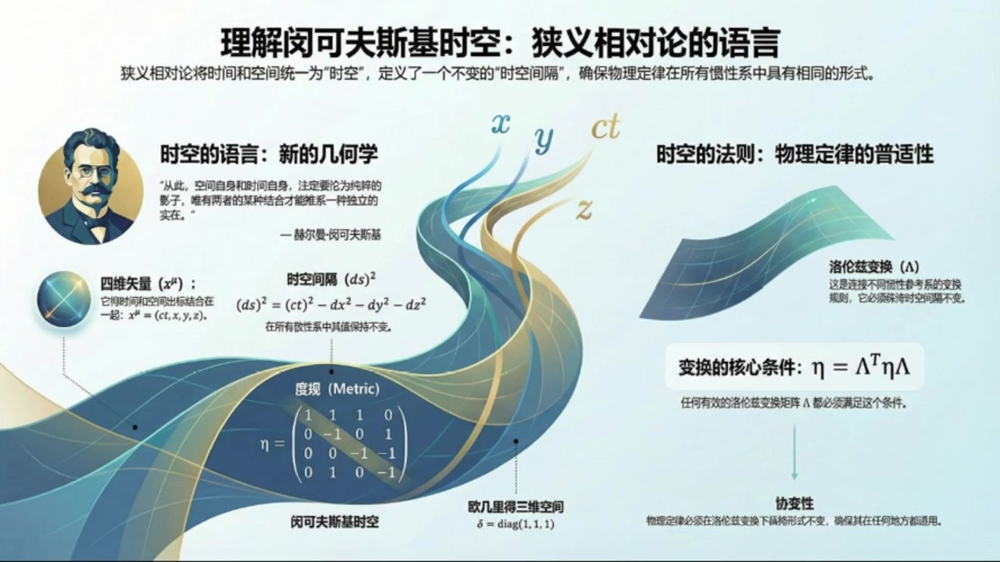
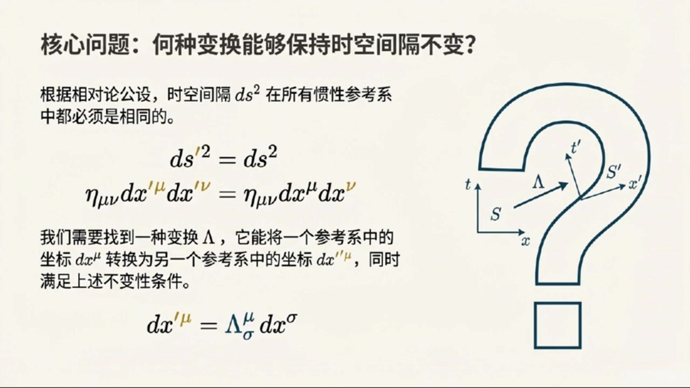
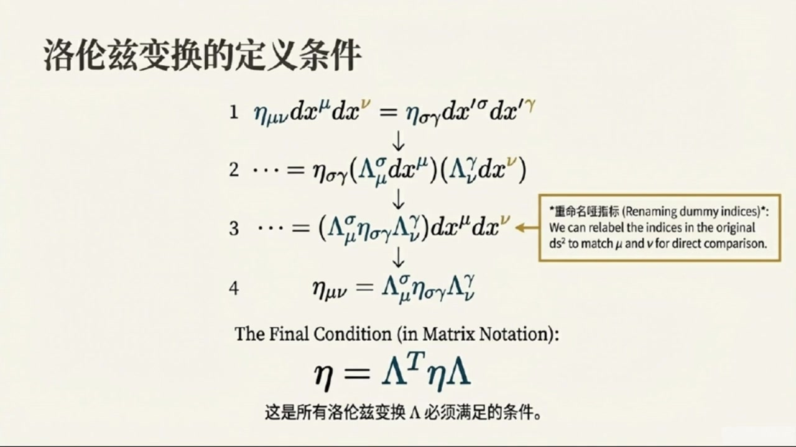
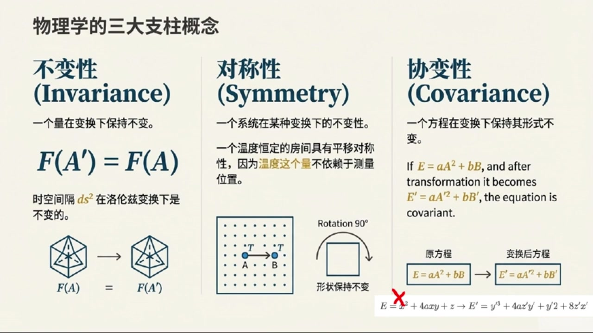

# 《基于对称性的物理学》第3课 理解闵可夫斯基时空

> 自动生成的课程注解文档（共 3 个段落，[原始视频](https://www.youtube.com/watch?v=yqzjq6goYWQ)）

## 目录

- [00:00:00 明科夫斯基时空记号与度规基础](#段落-1)
- [00:10:00 洛伦兹变换及其与欧氏旋转的类比](#段落-2)
- [00:14:00 不变性、对称性与协变性的区别](#段落-3)

---

## 段落 1：明科夫斯基时空记号与度规基础 { #段落-1 }

**时间：** 00:00:00 ~ 00:10:00

<details><summary>📝 原始字幕</summary>

<pre>

欢迎来到基于对称性的物理学博客我是你们的活泼主持人乔伊大家好我是赛很高兴在此和大家在空中相遇赛老师今天是我们这门课的第三讲了感觉每次听完您的讲解都觉得物理世界又打开了一项新的大门今天我们要聊点什么呢哈哈乔伊你这么说我很高兴今天我们可要深入一些了我们上次提到了狭义相对论里时间和空间不再是完全独立的今天我们就要来具体看看怎么把时间和空间捆在一起用一种更统一更优雅的方式来描述它们捆在一起听起来有点像科幻小说但又很物理没错这其实就是明科夫斯基读归和他相关记号的精髓明科夫斯基这位大神曾经说过一句
特别有名的话他说从今以后空间本身以及时间本身都注定要淡化成单纯的影子只有两者的某种结合才能保持独立的实在这句话听着就特别有哲理也特别有画面感所以他说的这种结合我们在物理上体现出来呢我们先从狭义相对论里那个非常重要的不变时说起你还记得我们之前说的光速不变所以不同观性系下光走过的距离和时间的关系是保持不变的对吧记得那个DS平方等于CDT平方减DX平方减DY平方减DZ平方对就是它这个DS平方它代表的是时空中两个事件之间的距离平方而且它在所有观性系下都是不变的为了让这个事子看起来更统一更方便
敏科夫斯基就引入了一套新的记号系统. 新的记号系统听起来好像要学新语言一样. 差不多是这个意思. 虽然一开始会觉得有点复杂,但用习惯了就会发现它真是太有用了. 我们先来重新定义一下坐标. 我们把时间像CT叫做X0把X叫做X1Y叫做X2Z叫做X3等等X0是时间X1X2X3是空间. 这样就把时间也当成一个坐标了没错这正是核心思想这样一来我们就把时间和空间放在了一个平等的地位上你看原来那个DS平方的字子现在就可以写成DX零的平方减去DX一的平方减去DX二的平方减去DX三的平方了.
那除了这个还有什么新的规则吗当然有而且还很关键第一个叫爱因斯坦求和约定求和约定听起来像是在偷懒你也可以这么理解它的意思是如果一个指标比如说MUE或者NEW在一个项里面出现了两次一次在上标一次在下标那我们就默认要对这个指标从0加到3哦不用写那个大大的求和符号SIGMA了直接看到重复的指标就知道要加起来对就是这样比如说AIBI我们看到I重复了就知道它其实就是A1B1加A2B2加A3B3这确实省事那指标有什么讲究吗我看资料里有希腊字母和罗马字母好问题通常呢我们用希腊字母比如MUE
时间X零在内的四个维度而罗马字母比如IJK则表示从一到三的指标也就是纯粹的空间维度这样一区分是不是就能清楚的区分是四维时空还是三维空间了完全正确这都是为了让我们的表达式更简洁更明确接下来还有一个非常非常重要的概念叫做明克福斯基度归我们通常用希腊字母I塔来表示度归这是什么意思简单来说度归就是告诉我们如何在时空中测量距离的数学工具在三维O级的空间里我们平时用的距离公式DX方方加DY方加DZ方它背后的度归其实就是一个单位矩阵也就是对角线上都是一的矩阵
一零零零零零零零零那个矩阵对就是他但是在明克夫斯基时空里情况就不一样了我们的DS方法是DX零的方法减DX一的方法减DX二的方法减DX三的方法这里面有正号有负号所以明克夫斯基度归低就长这样它的对角线元素分别是一负一负一负一其他非对角线元素都是零也就是说它是一个四乘四的矩阵只有一塔零零一等于负一一一塔二二等于负一其他都是零没错有了这个读规我们就可以把DS方程的表达式写得更紧凑更优雅了我们可以引入一个叫做
表面的40辆听起来比普通时量多了一尾就是多了一尾时间一个40辆DX缪它其实就是一个列向量包含DX0DX1DX2DX3这四个分量那么我们之前那个DS方方的柿子就可以用40辆和明克夫斯基度归的矩阵成发来表示了怎么表示呢它可以写成DS方等于DX缪ETAMYUNDXN等等这个DX缪N是什么关系还有中间的DX缪N好的我们来一步步拆解DX缪是一个列向量DX缪也是一个列向量但在这里我们其实是把DX缪看作一个航向量DX0DX1DX2DX3然后乘一
DX这个矩阵最后再成以DX新这个列向量所以是航向量成以矩阵成以列向量这种形式对通过矩阵成法你就会发现它正好等于DX的平方减去DX1的平方减去DX2的平方减去DX3的平方你看这其实就是一种非常巧妙的写哈把一大串加减号的表达式用简洁的指标和矩阵形式表达出来了这确实很厉害所以这个DS在物理上到底代表什么呢DS它代表的是时间中两个事件之间的距离助理我这里强调了是事件不是仅仅指空间上的距离它包含了时间上的间隔和空间上的距离这个距离在狭义相对论里是所有惯性观察者都认同
所以我们说它是不变的明白了它就像一个时空尺子量出来的结果大家都能达成一致可以这么理解有了度规我们就可以定义四十辆的长度了一个四十辆的长度平方就是他自己和自己做标量级也就是X平方等于X等于XMYYYY这跟我们OG里的空间里实量长度的定义差不多只不过把单位矩阵换成了明可夫斯基度规完全正确同样的任意两个X和Y的标量级我们也可以定义为XY等于XYYYYYYYYYYYYYYYYYYYYYYYYYYYYYYYYYYYYYYYYYYYYYYYYYYYYYYYYYYYYYYYYYYYYYYYYYYYYYYYYYYYYYYYYYYYYYYYYYYYYYYYYYYYYYYYYYYYYYYYYYYYYYYYYYYYYYY
是为了避免写球和符一样明白了这都是为了让表达式更简洁算起来更方便了对有了这些工具我们就可以更方便地处理时空问题了好了赛老师我们现在掌握了明科夫斯基的这套语言了那接下来我们是不是要看看在这种新的语言下各种物理量怎么变身了没错这就要引出我们今天的第二个重要概念罗伦兹变换罗伦兹变换这个名字听起来很酷选

</pre>

</details>

**课程截图：**




### 注解

我来对这段课程视频进行深度注解，重点分析新出现的公式、概念和记号系统。

---

## 一、核心公式详解

### 1. 时空间隔（不变间隔）的原始形式

$$ds^2 = c^2dt^2 - dx^2 - dy^2 - dz^2$$

| 符号 | 含义 |
|:---|:---|
| $ds^2$ | 时空间隔的平方（两个事件之间的"距离"） |
| $c$ | 光速 |
| $dt$ | 时间间隔 |
| $dx, dy, dz$ | 空间间隔的三个分量 |

**关键性质**：在所有惯性参考系中保持不变——这是狭义相对论的数学核心。

---

### 2. 闵可夫斯基坐标重定义

| 旧记号 | 新记号 | 说明 |
|:---|:---|:---|
| $ct$ | $x^0$ | 时间坐标（带**上标**0） |
| $x$ | $x^1$ | 空间第1维 |
| $y$ | $x^2$ | 空间第2维 |
| $z$ | $x^3$ | 空间第3维 |

**统一写成**：$x^\mu = (x^0, x^1, x^2, x^3)$，其中 $\mu = 0,1,2,3$

> **指标约定**：希腊字母（$\mu, \nu, \rho...$）→ 0,1,2,3（四维时空）；罗马字母（$i,j,k...$）→ 1,2,3（纯空间）

---

### 3. 时空间隔的紧凑形式

$$ds^2 = (dx^0)^2 - (dx^1)^2 - (dx^2)^2 - (dx^3)^2$$

这是将 $c^2dt^2$ 改写为 $(dx^0)^2$ 的结果。

---

### 4. 闵可夫斯基度规 $\eta_{\mu\nu}$（核心新概念）

$$\eta_{\mu\nu} = \begin{pmatrix} 1 & 0 & 0 & 0 \\ 0 & -1 & 0 & 0 \\ 0 & 0 & -1 & 0 \\ 0 & 0 & 0 & -1 \end{pmatrix}$$

| 分量 | 值 | 意义 |
|:---|:---|:---|
| $\eta_{00}$ | $+1$ | 时间分量带正号 |
| $\eta_{11}=\eta_{22}=\eta_{33}$ | $-1$ | 三个空间分量带负号 |
| 非对角元 | $0$ | 时间与空间"正交" |

**对比**：三维欧几里得空间的度规是 $\delta_{ij} = \text{diag}(1,1,1)$（全为正）

---

### 5. 最优雅的紧凑形式（爱因斯坦求和约定）

$$\boxed{ds^2 = \eta_{\mu\nu}\, dx^\mu\, dx^\nu}$$

**拆解这个公式的结构**：
- $dx^\mu$ = 列向量 $(dx^0, dx^1, dx^2, dx^3)^T$
- $\eta_{\mu\nu}$ = 4×4 矩阵
- $dx^\nu$ = 列向量（与$dx^\mu$相同，只是换了个哑指标名）

**矩阵乘法视角**：
$$ds^2 = \begin{bmatrix} dx^0 & dx^1 & dx^2 & dx^3 \end{bmatrix} \begin{bmatrix} 1 & 0 & 0 & 0 \\ 0 & -1 & 0 & 0 \\ 0 & 0 & -1 & 0 \\ 0 & 0 & 0 & -1 \end{bmatrix} \begin{bmatrix} dx^0 \\ dx^1 \\ dx^2 \\ dx^3 \end{bmatrix}$$

展开后正好得到 $(dx^0)^2 - (dx^1)^2 - (dx^2)^2 - (dx^3)^2$

---

### 6. 爱因斯坦求和约定（Einstein Summation Convention）

> **规则**：同一项中**一个上标、一个下标**的重复指标，自动表示对该指标从0到3求和。

**例子**：
- $a_\mu b^\mu \equiv \sum_{\mu=0}^{3} a_\mu b^\mu = a_0b^0 + a_1b^1 + a_2b^2 + a_3b^3$
- 不需要写 $\sum$ 符号！

**为什么区分上下标？**
- 这是为广义相对论做准备的**协变/逆变**区分
- 在狭义相对论中，$\eta_{\mu\nu}$ 的特殊形式使得 $x_\mu = \eta_{\mu\nu}x^\nu$ 有简单关系

---

### 7. 四维矢量（4-vector）的标量积

$$x^2 = x_\mu x^\mu = \eta_{\mu\nu} x^\mu x^\nu$$

两个四维矢量 $A^\mu, B^\mu$ 的标量积：
$$A \cdot B = A_\mu B^\mu = \eta_{\mu\nu} A^\mu B^\nu$$

**关键**：这个标量积在所有惯性系中数值相同（洛伦兹不变量）

---

## 二、板书/PPT截图内容描述

### 截图1：课程总览图
- **左侧**：闵可夫斯基肖像 + 名言（"空间本身和时间本身都注定要淡化成单纯的影子..."）
- **中央**：四维时空的螺旋可视化，标注 $x, y, z, ct$ 四个轴
- **公式区**：$(ds)^2 = (ct)^2 - dx^2 - dy^2 - dz^2$
- **度规对比**：闵可夫斯基 $\eta = \text{diag}(1,-1,-1,-1)$ vs 欧几里得 $\delta = \text{diag}(1,1,1)$
- **右侧**：洛伦兹变换的核心条件 $\eta = \Lambda^T \eta \Lambda$

### 截图2：坐标统一化
- 清晰展示 $ct \to x^0$, $x \to x^1$, $y \to x^2$, $z \to x^3$ 的映射
- 四维矢量 $dx^\mu$ 的列向量表示
- 展开式 $ds^2 = (dx^0)^2 - (dx^1)^2 - (dx^2)^2 - (dx^3)^2$

### 截图3：度规的矩阵乘法
- 最核心展示：行向量 × 度规矩阵 × 列向量的具体运算
- 用括号标注了每个矩阵的维度匹配
- 最终结果箭头指向展开式，直观验证等价性

---

## 三、理论背景补充

### 为什么叫"度规"（Metric）？
度规张量 $g_{\mu\nu}$（广义相对论中）或 $\eta_{\mu\nu}$（狭义相对论中）是流形上的**内积结构**：
- 告诉我们在弯曲（或平直）时空中如何测量长度和角度
- 从度规可以导出**测地线**（自由粒子的运动轨迹）
- 闵可夫斯基度规描述的是**平直的**四维时空（无引力）

### 符号的号差（Signature）
闵可夫斯基度规的 $(+,-,-,-)$ 称为**号差+2**（或洛伦兹号差）。也有文献用 $(-,+,+,+)$，物理结果相同，但需注意一致性。

### 为广义相对论埋下的伏笔
- 上标/下标的区分 → 广义协变性
- 度规作为基本变量 → 引力即几何
- 求和约定 → 张量运算的标准语言

---

## 四、通俗理解

| 概念 | 日常类比 |
|:---|:---|
| 把时间和空间"捆在一起" | 就像把"东-西"和"北-南"统一成"平面位置"，不再单独谈论 |
| 度规的±号 | 时间方向和空间方向在几何上"性质相反"——时间带正、空间带负 |
| 不变间隔 $ds^2$ | 就像两地之间的"直线距离"不随你用什么地图（参考系）而改变 |
| 爱因斯坦求和约定 | 编程里的"隐式循环"——看到重复变量就知道要遍历求和 |

**一句话总结**：闵可夫斯基用一套漂亮的数学语言，把"时间流逝+空间移动"重新包装成"在四维时空里沿某条路径移动"，而 $ds^2$ 就是所有观察者都承认的"路径长度"。

---

## 段落 2：洛伦兹变换及其与欧氏旋转的类比 { #段落-2 }

**时间：** 00:10:00 ~ 00:14:00

<details><summary>📝 原始字幕</summary>

<pre>

我们想找出一些变换这些变换能够把一个观性系下的物理描述转换到另一个观性系下同时又不违反狭义相对论的基本假设也就是要保证DS平方在不同观性系下都是不变的对吧核心就是这个DS平方不变就意味着时空中两个事件之间的距离是不变的我们用LEMDA这个希腊字母来表示这种变换如果一个坐标DXMUE经过变换变成了DXMUE那他们之间的关系就可以写成DXMUE等于LEMDAMUESIGMADXSIGMA这个LEMDAMUESIGMA是一个矩阵吗是的它就是一个四乘四的变换矩阵
带入进去经过一系列的数学推导我们最终会得到一个非常重要的条件是什么条件呢这个条件就是如果用矩阵的形式来写它就是这个字看起来有点复杂不过我好像隐约看到了点熟悉的东西没错这个条件就是洛伦兹变换必须满足的条件它告诉我们一个变换必须满足这个条件才能被称为洛伦兹变换那它跟我们平时说的旋转变换有什么关系吗关系非常大我们来对比一下在普通的欧吉里德三维空间里我们说一个变换是旋转那它必须满足什么条件呢
必须保证时量的长度不变对吧对旋转不会改变物体的长度没错在欧吉里的空间里时量的长度平方是A点A等于AIDALTAIJA这里的DELTAIJ就是单位矩阵如果一个变换O是旋转那它必须满足OTO等于E这里的E就是单位矩阵我明白了所以在欧吉里的空间里度归是单位矩阵E旋转变换满足OTEO等于E而在敏科夫斯基时空里度归是NUEL落轮子变换满足蓝大T新蓝大等于NEW他们的形式是一样的完全正确就是美妙之处敏科夫斯基度归在时空中的作用就相当于欧吉里的空间中的单位矩阵
所以洛伦兹变换就是那些保持敏科夫斯基时空标量级不变的变换听起来洛伦兹变换就是时空中的旋转和加速之类的变换了可以怎么理解它描述的是不同冠信息系之间坐标转换的方式而且这种转换是符合狭义相对论的基本原理的反过来说如果我们要构造一个在洛伦兹变换下保持不变的物理量我们就必须把一个上指标和下指标组合起来比如刚才说的XYYY这样的一个标量级它在洛伦兹变换下就是不变的没错这些不变的量对我们理解物理规律非常重要C老师今天的信息量真的很大我们学了明科夫斯基的记号不过我注意到了洛伦兹变换

</pre>

</details>

**课程截图：**






### 注解

我来对这段课程视频进行深度注解，重点分析新出现的公式、概念和数学结构。

---

## 一、核心公式详解

### 1. 洛伦兹变换的矩阵形式

$$dx'^\mu = \Lambda^\mu_{\ \sigma} dx^\sigma$$

| 符号 | 含义 |
|:---|:---|
| $dx'^\mu$ | 变换后参考系中的坐标微分（带撇表示新参考系） |
| $\Lambda^\mu_{\ \sigma}$ | **洛伦兹变换矩阵**（4×4矩阵），$\mu$为行指标，$\sigma$为列指标 |
| $dx^\sigma$ | 原参考系中的坐标微分 |
| 希腊字母指标 $\mu, \sigma$ | 取值为 0,1,2,3（0代表时间分量，1,2,3代表空间分量）|

**爱因斯坦求和约定**：重复的上下指标（这里的$\sigma$）自动求和，即 $\sum_{\sigma=0}^{3}$。

---

### 2. 洛伦兹变换的**定义条件**（核心新公式）

$$\eta = \Lambda^T \eta \Lambda$$

或写成分量形式：
$$\eta_{\mu\nu} = \Lambda^\sigma_{\ \mu} \eta_{\sigma\gamma} \Lambda^\gamma_{\ \nu}$$

| 符号 | 含义 |
|:---|:---|
| $\eta$ (或 $\eta_{\mu\nu}$) | **闵可夫斯基度规**（Minkowski metric），4×4对角矩阵 |
| $\Lambda^T$ | 矩阵$\Lambda$的转置 |
| 等式整体 | 洛伦兹变换必须满足的**正交性条件** |

**闵可夫斯基度规的具体形式**：
$$\eta_{\mu\nu} = \text{diag}(+1, -1, -1, -1) = \begin{pmatrix} 1 & 0 & 0 & 0 \\ 0 & -1 & 0 & 0 \\ 0 & 0 & -1 & 0 \\ 0 & 0 & 0 & -1 \end{pmatrix}$$

（注：有些文献使用 $\text{diag}(-1,+1,+1,+1)$ 的符号约定，两者等价）

---

### 3. 欧几里得旋转的类比公式

$$\mathbf{O}^T \mathbf{O} = \mathbf{I}$$

或写成：
$$\mathbf{O}^T \mathbf{I} \mathbf{O} = \mathbf{I}$$

| 符号 | 含义 |
|:---|:---|
| $\mathbf{O}$ | 三维欧几里得空间中的旋转矩阵（3×3正交矩阵） |
| $\mathbf{I}$ (或 $\delta_{ij}$) | 三维单位矩阵（欧几里得度规）|
| 上标 $T$ | 矩阵转置 |

---

## 二、板书/PPT截图内容描述

根据提供的三张截图，板书内容如下：

| 截图 | 核心内容 |
|:---|:---|
| **图1** | 标题"核心问题：何种变换能够保持时空间隔不变？"，展示 $ds'^2 = ds^2$ 的不变性要求，给出变换定义 $dx'^\mu = \Lambda^\mu_{\ \sigma} dx^\sigma$，右侧有参考系S和S'的示意图 |
| **图2** | 标题"洛伦兹变换的定义条件"，展示从 $\eta_{\mu\nu}dx^\mu dx^\nu = \eta_{\sigma\gamma}dx'^\sigma dx'^\gamma$ 出发的4步推导，最终得到矩阵条件 $\eta = \Lambda^T \eta \Lambda$，标注"这是所有洛伦兹变换$\Lambda$必须满足的条件" |
| **图3** | 标题"直观类比：欧几里得空间中的旋转"，左侧推导 $\mathbf{a}'\cdot\mathbf{b}' = \mathbf{a}\cdot\mathbf{b}$ 导致 $\mathbf{O}^T\mathbf{O}=\mathbf{I}$，右侧方框对比两个条件：$\mathbf{O}^T[\mathbf{I}]\mathbf{O}=\mathbf{I}$ 和 $\Lambda^T[\eta]\Lambda=\eta$，用黄色高亮显示结构相似性 |

---

## 三、关键新概念解析

### 1. **度规（Metric）—— 时空的"尺子"**

| 空间类型 | 度规 | 几何性质 |
|:---|:---|:---|
| 欧几里得空间 | $\delta_{ij}$（单位矩阵）| 正定，$ds^2 > 0$（距离总是正的）|
| 闵可夫斯基时空 | $\eta_{\mu\nu}$（符号差为+2或-2）| 不定，$ds^2$ 可正、可负、可为零 |

**度规的核心作用**：定义"长度"或"间隔"的计算方式。

- 欧几里得：$|\mathbf{a}|^2 = \delta_{ij} a^i a^j = a_x^2 + a_y^2 + a_z^2$（普通勾股定理）
- 闵可夫斯基：$ds^2 = \eta_{\mu\nu} dx^\mu dx^\nu = c^2dt^2 - dx^2 - dy^2 - dz^2$（带符号的"勾股定理"）

### 2. **洛伦兹变换的数学本质**

洛伦兹变换是**保持闵可夫斯基度规不变的线性变换**，即：
$$\Lambda^T \eta \Lambda = \eta$$

这与旋转矩阵 $\mathbf{O}^T \mathbf{I} \mathbf{O} = \mathbf{I}$ 形成**完美的数学类比**：

| 特征 | 欧几里得旋转 | 洛伦兹变换 |
|:---|:---|:---|
| 保持不变的"尺子" | 单位矩阵 $\mathbf{I}$ | 闵可夫斯基度规 $\eta$ |
| 变换矩阵的条件 | $\mathbf{O}^T \mathbf{O} = \mathbf{I}$ | $\Lambda^T \eta \Lambda = \eta$ |
| 几何解释 | 保持普通长度不变 | 保持时空间隔不变 |
| 群的名字 | 正交群 $O(3)$ | 洛伦兹群 $O(3,1)$ |

### 3. **上下指标与洛伦兹不变量**

字幕中提到："要把一个上指标和下指标组合起来"——这指的是**缩并（contraction）**操作。

- 上指标（逆变指标）：如 $dx^\mu$，在洛伦兹变换下按 $dx'^\mu = \Lambda^\mu_{\ \nu} dx^\nu$ 变换
- 下指标（协变指标）：如 $dx_\mu \equiv \eta_{\mu\nu}dx^\nu$

**洛伦兹不变量的构造**：上指标与下指标配对求和
$$x_\mu y^\mu = \eta_{\mu\nu} x^\nu y^\mu = -c^2t_xt_y + \mathbf{x}\cdot\mathbf{y}$$

这种"一上一下"的组合在变换下保持不变，类似于欧几里得空间中 $\mathbf{a}\cdot\mathbf{b} = a_i b^i$ 在旋转下不变。

---

## 四、通俗理解

> **洛伦兹变换 = 时空中的"广义旋转"**

普通旋转：你在房间里转个身，物体的空间长度不变，只是方向变了。

洛伦兹变换：你以高速运动起来，时间和空间会"混合"——你的时间变慢了（时间膨胀），你的长度缩短了（洛伦兹收缩）。但**时空间隔**这个"四维距离"对所有人都是一样的。

数学上，这种"混合"之所以可能，是因为闵可夫斯基度规 $\eta$ 有正有负（时间分量正，空间分量负），这使得 $\Lambda$ 可以包含**双曲旋转**（boost），而不仅仅是普通的三角旋转。

---

## 五、本节知识图谱

```
狭义相对论的基本假设
        ↓
时空间隔不变 ds² = ds'²
        ↓
寻找线性变换 Λ: dx' = Λ dx
        ↓
代入不变性条件 → ΛᵀηΛ = η  [洛伦兹变换的定义]
        ↓
        ├─→ 类比：旋转矩阵满足 OᵀIO = I
        │
        └─→ 应用：构造洛伦兹不变量（上下指标缩并）
```

---

## 段落 3：不变性、对称性与协变性的区别 { #段落-3 }

**时间：** 00:14:00 ~ 00:19:02

<details><summary>📝 原始字幕</summary>

<pre>

和斜变性它们听起来好像有点像但又有点不一样您能帮我们理清一下吗好的这三个概念确实容易混淆但它们在物理学中都非常重要我们一个一个来说首先是不变性Invariance这个最直接了如果一个东西在经过某个变换之后它本身没有发生任何变化那我们就说它是不变的比如一个苹果我把它从桌子左边移到右边它还是那个苹果它的质量颜色都没变那它的质量就是不变的很好的例子在比如刚才我们说的DS平方它在落伦子变换下数值是不会变的所以DS平方就是落伦子变换下的一个不变量接下来是对称性Symmetry
物理系统在经过某种变换或者一类变换之后它看起来还是一模一样或者说它的性质没有发生改变那我们就说这个系统具有这种变换下的对称性比如一个圆我把它旋转任意角度它还是那个圆所以圆具有旋转对称性对再举个物理的例子如果一个房间里的温度是均匀的到处都一样那么你在这个房间里无论从A点走到B点测到的温度都是一样的我们可以说温度这个量在平移变换下是不变的那么这个房间就具有平移对称性是对某个量来说对称性是针对整个系统或者规律来说的可以这么区分最后也是最容易和不变性混淆的
写变性写变性指的是一个物理方程在经过变换之后它的形式保持不变形式不变什么意思呢比如说我们有一个方程E等于AA方方加上BB如果EAB经过某个变换变成了E撇A撇B撇而这个方程变成了E撇等于A撇A撇你看虽然里面的变量变了但是方程的结构也就是形式没有变我们还是A乘以某个量的平方加上B乘以某个量的乘积哦就像公式的骨价没变只是里面的肉换了非常形象的比喻如果另一个方程E等于X方加上4AXY加上Z经过变换后变成了Y等于Y撇方加上4A
那这个方程就不是斜偏加上Y撇方方加上Y撇X撇那这个方程就不是斜偏的因为它完全变了样听起来斜偏性对物理定律特别重要没错这非常关键所有的物理定律都必须在洛伦子变换下具有斜偏性这是为什么呢因为如果一个物理定律在不同惯性系下形式不一样那不就意味着物理定律不是普世的了吗完全正确物理定律应该是普世的它不应该依赖于你选择哪个惯性参考系如果一个定律不写便那它就只在某个特定的参考系下成立这不符合我们对物理世界的人知你想啊如果物理定律在东京和纽约看起来不一样那物理学家们可就头疼了哈哈那确实太麻烦了所以物理学家们在写物理定律的时候都要确保他们是
对这是构建物理理论的一个基本原则我们以后会学到怎么用张亮等数学工具来确保物理定律的斜率今天一下子把好几个重要的概念都讲清楚了从明可福斯基的四维时空记号到洛伦子变换再到不变性对称性和斜率性感觉对狭义相对论的理解又剩了一层是的这些都是构建现代物理学理论的基础理解他们能帮助我们更好地把握物理世界的本质谢谢赛老师今天的精彩讲解听完这期博客对时空变换和物理定律的普世性有了更深刻的认识希望同学们也能有所收获物理学就是这样一步步深入你会发现它越来越迷人没错那我们今天的基于对称性的物理学博客就到这里了
我们下期再见

</pre>

</details>

**课程截图：**




### 注解

我来对这段课程视频进行深度注解，重点分析新出现的**不变性（Invariance）、对称性（Symmetry）、协变性（Covariance）**三大核心概念的辨析，以及板书中的关键公式。

---

## 一、板书/PPT内容描述

截图展示了一张分为三栏的对比图，标题为**"物理学的三大支柱概念"**，分别阐述：

| 栏目 | 核心内容 |
|:---|:---|
| **不变性 (Invariance)** | 公式 $F(A') = F(A)$，配以正十二面体旋转示意图 |
| **对称性 (Symmetry)** | 温度均匀房间的平移示意图 + 圆的旋转对称示意图 |
| **协变性 (Covariance)** | 两个方程对比：协变的 vs 非协变的 |

---

## 二、核心公式详解

### 公式1：不变性的数学表达

$$F(A') = F(A)$$

| 符号 | 含义 |
|:---|:---|
| $F$ | 某个物理量（函数或数值） |
| $A$ | 变换前的状态/坐标/构型 |
| $A'$ | 变换后的状态/坐标/构型 |
| 等式 | 变换前后该物理量的**数值完全相同** |

**关键理解**：这是**标量（scalar）**的性质——洛伦兹标量在变换下数值不变，如 $ds^2$、静质量 $m$、电荷 $q$ 等。

---

### 公式2：协变性的标准形式（板书右侧）

**协变方程示例：**
$$E = aA^2 + bB \quad \xrightarrow{\text{变换}} \quad E' = aA'^2 + bB'$$

| 符号 | 含义 |
|:---|:---|
| $E, A, B$ | 原参考系中的物理量 |
| $E', A', B'$ | 新参考系中的对应物理量 |
| $a, b$ | **变换系数/常数**（保持不变） |
| 方程结构 | $a \times (\text{某量})^2 + b \times (\text{某量})$ 的形式严格保持 |

**核心特征**：变量带撇，但方程的"骨架"——运算结构、系数关系、微分阶数——完全不变。

---

### 公式3：非协变方程的反例（板书底部红叉标记）

$$E = x^2 + 4axy + z \quad \xrightarrow{\text{变换}} \quad E' = y'^4 + 4ax'y' + y'^2z'^2$$

**为何破坏协变性：**
| 原方程特征 | 变换后方程 | 问题 |
|:---|:---|:---|
| $x^2$（二次） | $y'^4$（四次） | **幂次改变** |
| $4axy$（交叉项，一次×一次） | $4ax'y'$（保持） | 这一项OK |
| $z$（一次） | $y'^2z'^2$（二次×二次=四次） | **幂次与结构全变** |
| 三项结构 | 三项结构 | 但每项的数学形式完全不同 |

> 板书用**红色大叉**明确标记：这不是协变方程。

---

## 三、三大概念的深度辨析

### 概念对比表

| 概念 | 数学对象 | 变换下的表现 | 物理意义 |
|:---|:---|:---|:---|
| **不变性** | **标量**（单个数值） | $F' = F$（数值不变） | 物理量的绝对性 |
| **对称性** | **系统/拉格朗日量** | 系统性质不变 | 物理规律的根源（诺特定理） |
| **协变性** | **方程/张量关系** | 形式结构不变 | 物理定律的普适性 |

### 关键区分口诀

> **"不变"看数值，"对称"看系统，"协变"看方程**

| 例子 | 归属 | 原因 |
|:---|:---|:---|
| $ds^2$ 在洛伦兹变换下 | **不变性** | 数值不变，是洛伦兹标量 |
| 拉格朗日量 $\mathcal{L}$ 在旋转下 | **对称性** | 系统作用量不变 → 导出角动量守恒 |
| 麦克斯韦方程组在不同惯性系中 | **协变性** | 方程形式相同，都是 $\partial_\mu F^{\mu\nu} = \mu_0 J^\nu$ |

---

## 四、理论背景补充

### 为什么协变性对相对论至关重要？

**爱因斯坦相对性原理的数学表达：**

> 所有物理定律在所有惯性参考系中具有**相同的形式**。

这要求物理方程必须写成**张量方程**的形式：

$$T^{\mu\nu\cdots}_{\ \ \ \rho\sigma\cdots} = S^{\mu\nu\cdots}_{\ \ \ \rho\sigma\cdots}$$

**张量的关键性质**：变换规律统一，方程两边按相同方式变换，保证形式不变。

### 常见误区澄清

| 错误理解 | 正确理解 |
|:---|:---|
| "协变就是变量都带撇" | 协变要求**结构相同**，不是简单加撇 |
| "不变性和协变性是一回事" | 不变性是**数值**相等，协变性是**形式**相同 |
| "对称性只指几何对称" | 对称性是**广义的不变性**，包括时空对称、内部对称等 |

---

## 五、通俗类比总结

| 概念 | 生活类比 |
|:---|:---|
| **不变性** | 你的体重，在北京称是70kg，在纽约称还是70kg——**数值不变** |
| **对称性** | 圆形蛋糕，切任意角度旋转后看起来一样——**系统性质不变** |
| **协变性** | 菜谱"2个鸡蛋+1杯面粉→蛋糕"，用英制单位写"2 eggs + 1 cup flour → cake"——**配方结构不变**，只是单位（变量）换了 |

> 板书底部的"骨架vs肉"比喻非常精准：协变就是**换肉不换骨**。

---

## 六、与之前内容的衔接

本段在前述**闵可夫斯基时空**和**洛伦兹变换矩阵**基础上，进一步阐明：

- $dx'^\mu = \Lambda^\mu_{\ \sigma} dx^\sigma$ 是**协变性的数学实现**
- $ds^2 = \eta_{\mu\nu}dx^\mu dx^\nu$ 是**不变性的具体实例**
- 而**对称性**则是导出守恒律（能量、动量、角动量）的深层原理（诺特定理）

三者共同构成现代理论物理的数学-物理框架。

---
